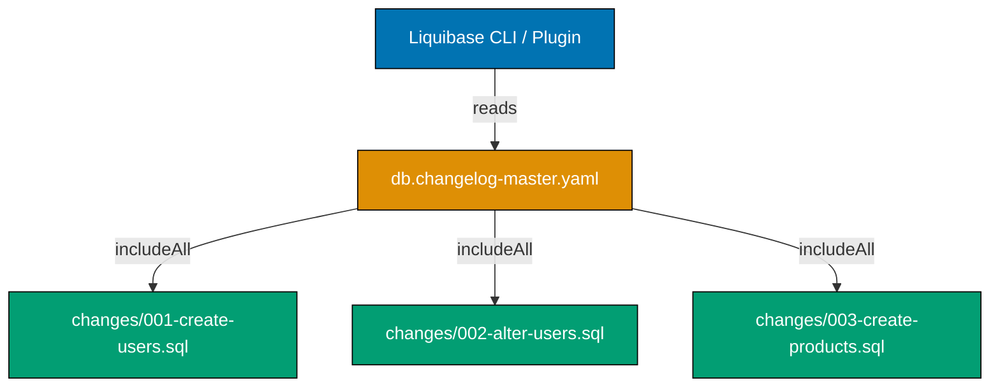
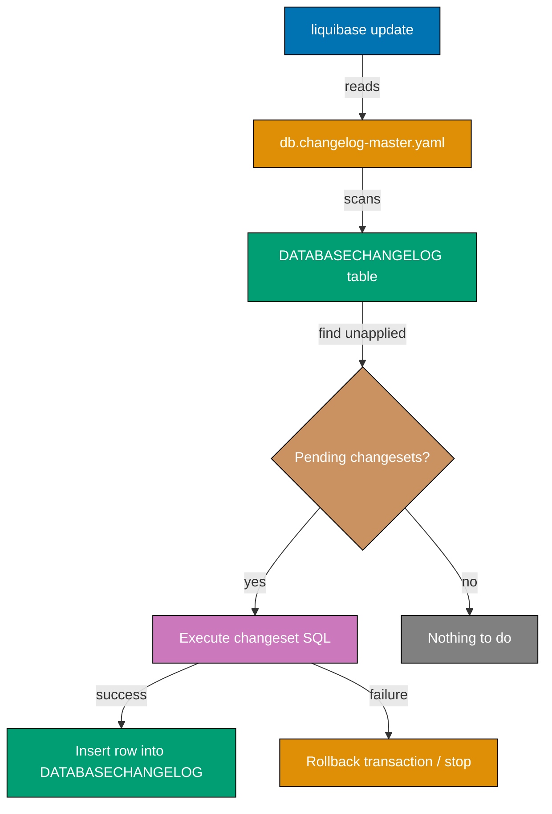

Learn Liquibase database migration fundamentals through 30 annotated code examples. Each example is self-contained, heavily commented to show execution semantics, generated SQL, rollback behavior, and tracking table updates.

## Group 1: Changelog Basics

### Example 1: Master Changelog File (YAML Format)

The master changelog is the entry point Liquibase reads first. It does not define changesets directly; instead it delegates to individual changelog files using `include` or `includeAll`. Using a master file separates discovery from definition and keeps migration history organized.



```yaml
# File: src/main/resources/db/changelog/db.changelog-master.yaml

databaseChangeLog: # => Root key required for all YAML changelogs
  - includeAll: # => Scans a directory and includes every changelog file found
      path: db/changelog/changes/
      # => path is relative to the classpath root (src/main/resources/)
      # => Liquibase sorts files alphabetically before executing
      # => Numeric prefixes (001-, 002-) guarantee deterministic execution order
      # => New files added to the directory are automatically picked up on next run
```

**Key Takeaway**: The master changelog delegates to individual files via `includeAll`; Liquibase executes them alphabetically so numeric prefixes (001-, 002-) are essential for ordering.

**Why It Matters**: Production databases accumulate dozens of migration files over months. A master changelog with `includeAll` means developers never edit the master file when adding new migrations—they simply drop a new numbered file into the `changes/` directory. This reduces merge conflicts and makes CI pipelines predictable. Without numeric prefixes, alphabetical ordering can execute `add-index.sql` before `create-table.sql`, causing hard-to-diagnose failures.

---

### Example 2: First SQL Formatted Changeset

The `-- liquibase formatted sql` header transforms a plain SQL file into a Liquibase changelog. Each changeset block runs once and is tracked by ID and author in `DATABASECHANGELOG`. This is the most common format in Java projects that already have DBAs writing SQL.

```sql
-- liquibase formatted sql
-- => REQUIRED first line: declares this file as a Liquibase-managed SQL changelog
-- => Without this line, Liquibase treats the file as raw SQL (not tracked)

-- changeset organiclever:001-create-users-table dbms:postgresql
-- => Declares a changeset with:
-- =>   author: "organiclever"
-- =>   id: "001-create-users-table"
-- =>   dbms: "postgresql" - only runs against PostgreSQL databases
-- => Liquibase identifies a changeset by (author + id + filename) tuple
-- => Running this changeset a second time is a NO-OP (already in DATABASECHANGELOG)

CREATE TABLE users (
    id            UUID         NOT NULL DEFAULT gen_random_uuid(),
    -- => gen_random_uuid() requires pgcrypto extension or PostgreSQL 13+
    username      VARCHAR(50)  NOT NULL,
    -- => VARCHAR(50) enforced at database level
    password_hash VARCHAR(255) NOT NULL,
    -- => Storing hash, not plaintext password
    created_at    TIMESTAMPTZ  NOT NULL DEFAULT NOW(),
    -- => TIMESTAMPTZ stores timezone-aware timestamps
    updated_at    TIMESTAMPTZ  NOT NULL DEFAULT NOW(),
    -- => Application must explicitly update updated_at on edits
    CONSTRAINT pk_users PRIMARY KEY (id),
    -- => Named primary key constraint for clear error messages
    CONSTRAINT uq_users_username UNIQUE (username)
    -- => Unique constraint prevents duplicate usernames
);
-- => Liquibase executes this DDL as a single transaction
-- => On success: inserts a row into DATABASECHANGELOG

-- rollback DROP TABLE users;
-- => Tells Liquibase how to undo this changeset
-- => Executed when running: liquibase rollbackCount 1
-- => DROP TABLE cascades any dependent objects in PostgreSQL (with CASCADE option)
```

**Key Takeaway**: Start every SQL changelog file with `-- liquibase formatted sql` and declare each changeset with `-- changeset author:id`; the rollback block is required for any changeset you intend to roll back.

**Why It Matters**: SQL-formatted changelogs let your existing SQL scripts become tracked migrations with zero rewriting. The author:id convention means multiple developers can add changesets to the same file without collisions. Missing the `-- liquibase formatted sql` header causes Liquibase to ignore all changeset tracking, executing the SQL untracked and breaking idempotency guarantees—a common source of "already exists" errors in CI environments.

---

### Example 3: Changeset Author and ID Convention

Changeset IDs must be unique within a file; the combination of author, ID, and filename forms the unique key Liquibase stores in `DATABASECHANGELOG`. Teams typically use a convention like `{team-prefix}:{NNN-description}` to prevent collisions when multiple developers work in parallel.

```sql
-- liquibase formatted sql

-- changeset demo-be:001-create-products dbms:postgresql
-- => author: "demo-be" (team or project identifier, not personal name)
-- => id: "001-create-products" (sequential number + short description)
-- => The DATABASECHANGELOG table stores: id, author, filename, dateexecuted, md5sum
-- => md5sum detects if a changeset was modified after execution (illegal modification)
-- => Modifying an executed changeset causes Liquibase to abort with "checksum mismatch"

CREATE TABLE products (
    id   UUID NOT NULL DEFAULT gen_random_uuid(),
    -- => UUIDs avoid integer ID collisions in distributed insert scenarios
    name VARCHAR(255) NOT NULL
    -- => Simple name column; will be extended in later changesets
);
-- => DATABASECHANGELOG row inserted after successful execution:
-- =>   ID: "001-create-products"
-- =>   AUTHOR: "demo-be"
-- =>   FILENAME: "db/changelog/changes/001-create-products.sql"
-- =>   DATEEXECUTED: <current timestamp>
-- =>   MD5SUM: <hash of changeset content>

-- rollback DROP TABLE products;
-- => Rollback is the inverse of the changeset
-- => Must be safe to run after any subsequent migration that adds columns/constraints

-- changeset demo-be:002-add-product-price dbms:postgresql
-- => Second changeset in the same file; runs after 001 in the same transaction batch
-- => ID must be unique within the file; "002-add-product-price" differs from "001-create-products"
-- => Author is consistent ("demo-be") across the file

ALTER TABLE products ADD COLUMN price DECIMAL(19,4) NOT NULL DEFAULT 0;
-- => Adds price column with a safe default (avoids NOT NULL violation on existing rows)
-- => DECIMAL(19,4): 19 total digits, 4 decimal places (suitable for currency)

-- rollback ALTER TABLE products DROP COLUMN price;
-- => Drops price column, returning products table to post-001 state
```

**Key Takeaway**: Use a consistent `team-prefix:NNN-description` convention for changeset IDs; never modify an executed changeset because Liquibase detects the MD5 checksum change and aborts.

**Why It Matters**: In large teams, changeset ID collisions are a recurring source of pipeline failures. A shared prefix (team name or project name) combined with sequential numbering prevents two developers from accidentally using the same ID. The MD5 checksum mechanism is Liquibase's corruption guard—treating executed migrations as immutable (like committed git history) is the fundamental mental model that prevents production disasters.

---

### Example 4: createTable Change Type (YAML Changelog)

The `createTable` change type declaratively creates a database table using Liquibase's cross-database DDL. This is the YAML alternative to SQL-formatted changesets—it abstracts vendor-specific SQL and can target multiple databases from a single changelog.

```yaml
# File: src/main/resources/db/changelog/changes/001-create-categories.yaml

databaseChangeLog: # => Root key for YAML changelog
  - changeSet: # => Declares a single changeset
      id: 001-create-categories
      # => Unique identifier within this file
      author: demo-be
      # => Author identifies who owns this change
      changes: # => List of change operations in this changeset
        - createTable: # => Built-in Liquibase change type (generates CREATE TABLE DDL)
            tableName: categories
            # => Table to create; Liquibase validates name does not already exist
            columns:
              - column:
                  name: id
                  # => Column name
                  type: UUID
                  # => Liquibase maps UUID to database-native type (uuid in PostgreSQL)
                  constraints:
                    primaryKey: true
                    # => Adds PRIMARY KEY constraint
                    nullable: false
                    # => Adds NOT NULL constraint
              - column:
                  name: name
                  type: VARCHAR(100)
                  # => VARCHAR with explicit length limit
                  constraints:
                    nullable: false
                    # => NOT NULL enforced at database level
              - column:
                  name: created_at
                  type: TIMESTAMPTZ
                  # => Timezone-aware timestamp; PostgreSQL-specific type
                  defaultValueComputed: NOW()
                  # => defaultValueComputed executes a database function as default
                  # => Use defaultValue for literal strings, defaultValueNumeric for numbers
                  constraints:
                    nullable: false
      rollback: # => Explicit rollback for this changeset
        - dropTable: # => Liquibase infers rollback for createTable automatically
            tableName: categories
            # => For createTable, Liquibase can auto-generate the dropTable rollback
            # => Explicit rollback shown here for educational clarity
```

**Key Takeaway**: The `createTable` change type generates portable DDL—Liquibase translates UUID and TIMESTAMPTZ to appropriate vendor SQL—making your changelog runnable against PostgreSQL, MySQL, and Oracle from the same file.

**Why It Matters**: SQL-formatted changelogs tie you to a single database vendor. YAML change types let a single changelog target PostgreSQL in production, H2 in unit tests, and MySQL in legacy environments without maintaining parallel migration files. Teams adopting microservices or multi-tenant architectures commonly use YAML changelogs precisely for this portability. The trade-off is verbosity—SQL-formatted files are more concise for complex DDL.

---

### Example 5: addColumn Change Type

The `addColumn` change type adds one or more columns to an existing table. It handles the `ALTER TABLE ... ADD COLUMN` DDL and automatically generates a rollback using `dropColumn`. This is the canonical way to extend a table's schema after the initial `createTable` changeset.

```yaml
# File: src/main/resources/db/changelog/changes/002-alter-users-add-columns.yaml

databaseChangeLog:
  - changeSet:
      id: 002-alter-users-add-columns
      author: demo-be
      changes:
        - addColumn: # => Generates ALTER TABLE ... ADD COLUMN DDL
            tableName: users # => Target table (must already exist)
            columns:
              - column:
                  name: email
                  # => New column to add
                  type: VARCHAR(255)
                  # => Optional: columns default to nullable unless constraints specified
              - column:
                  name: display_name
                  type: VARCHAR(255)
                  # => Second column added in same changeset
                  # => Both columns added in one ALTER TABLE statement where possible
              - column:
                  name: role
                  type: VARCHAR(20)
                  constraints:
                    nullable: false
                    # => NOT NULL requires a defaultValue for tables with existing rows
                  defaultValue: USER
                  # => defaultValue sets a literal default (not a function)
                  # => Existing rows get role='USER'; new rows use this default unless overridden
              - column:
                  name: failed_login_attempts
                  type: INT
                  constraints:
                    nullable: false
                  defaultValueNumeric: 0
                  # => defaultValueNumeric for integer/decimal defaults
                  # => Existing rows get failed_login_attempts=0
      # => No explicit rollback needed: Liquibase auto-generates dropColumn rollback
      # => Auto-generated rollback: ALTER TABLE users DROP COLUMN email, DROP COLUMN display_name, ...
```

**Key Takeaway**: `addColumn` auto-generates a `dropColumn` rollback; always provide a `defaultValue` when adding a `NOT NULL` column to a table that already contains rows.

**Why It Matters**: Forgetting to supply a default when adding a `NOT NULL` column to a populated table causes the migration to fail mid-deployment—a common production incident. Liquibase's YAML change types surface this requirement more explicitly than raw SQL because `constraints: nullable: false` without `defaultValue` triggers a validation warning. This saves the painful experience of discovering a constraint violation only after the migration starts running against production data.

---

## Group 2: Schema Changes and Operations

### Example 6: dropColumn Change Type

The `dropColumn` change type removes columns from an existing table. Since dropping a column is destructive and irreversible without a backup, Liquibase requires an explicit rollback block (an `addColumn` to restore the column).

```yaml
# File: src/main/resources/db/changelog/changes/003-drop-legacy-column.yaml

databaseChangeLog:
  - changeSet:
      id: 003-drop-legacy-column
      author: demo-be
      changes:
        - dropColumn: # => Generates ALTER TABLE ... DROP COLUMN DDL
            tableName: users
            columnName: password_reset_token
            # => Column to drop; must exist in the table
            # => In PostgreSQL, this is instant via system catalog update (no table rewrite)
            # => In MySQL/MariaDB, this triggers a full table copy (expensive on large tables)
      rollback: # => dropColumn has NO auto-generated rollback
        - addColumn: # => Rollback must restore the dropped column
            tableName: users
            columns:
              - column:
                  name: password_reset_token
                  type: VARCHAR(255)
                  # => Rollback re-adds column as nullable (cannot restore original data)
                  # => Data in the dropped column is permanently lost; rollback only restores schema
```

**Key Takeaway**: `dropColumn` requires an explicit rollback block because Liquibase cannot auto-infer how to restore a dropped column; the rollback restores the schema but not the data.

**Why It Matters**: Data destruction without a rollback plan is a production risk. Requiring an explicit rollback forces developers to think about what restoration means—they cannot simply add `dropColumn` without documenting the recovery path. In blue-green deployments, the old application version may still read the column you are dropping; understanding that schema changes must be backward-compatible for one release cycle is a critical database migration discipline.

---

### Example 7: createIndex Change Type

The `createIndex` change type adds a database index to improve query performance. Indexes added via Liquibase are tracked in `DATABASECHANGELOG` like any other changeset, ensuring they are applied consistently across all environments.

```yaml
# File: src/main/resources/db/changelog/changes/004-create-index-users-email.yaml

databaseChangeLog:
  - changeSet:
      id: 004-create-index-users-email
      author: demo-be
      changes:
        - createIndex: # => Generates CREATE INDEX DDL
            indexName: idx_users_email
            # => Explicit index name makes DROP INDEX rollback precise
            # => Convention: idx_{table}_{column(s)}
            tableName: users # => Table the index belongs to
            unique: true
            # => unique: true generates CREATE UNIQUE INDEX
            # => Enforces uniqueness at the database level (stronger than application-level checks)
            columns:
              - column:
                  name: email
                  # => Column(s) to index
                  # => Single-column unique index on email
      # => Auto-generated rollback: DROP INDEX idx_users_email
      # => Liquibase knows how to invert createIndex without explicit rollback

  # Separate changeset for non-unique composite index
  - changeSet:
      id: 005-create-index-expenses-user-date
      author: demo-be
      changes:
        - createIndex:
            indexName: idx_expenses_user_date
            tableName: expenses
            columns:
              - column:
                  name: user_id
                  # => First column in composite index (higher cardinality first)
              - column:
                  name: date
                  # => Second column; queries filtering by user_id AND date benefit most
            # => Composite index order matters: idx(user_id, date) speeds up
            # =>   WHERE user_id = ? AND date = ?
            # =>   WHERE user_id = ?  (uses leftmost prefix)
            # =>   but NOT WHERE date = ? alone (does not use index)
```

**Key Takeaway**: Use `indexName` explicitly so the auto-generated rollback (`DROP INDEX`) is deterministic; composite index column order should match your most common query filter patterns.

**Why It Matters**: Indexes created outside of version-controlled migrations are "ghost" indexes—they exist in production but not in developer or CI environments. Tracking indexes in Liquibase changelogs ensures every environment has identical performance characteristics. Missing indexes in lower environments hide N+1 query problems until production load exposes them, often during peak traffic.

---

### Example 8: addForeignKeyConstraint Change Type

The `addForeignKeyConstraint` change type adds a foreign key relationship between two tables. Liquibase generates the `ALTER TABLE ... ADD CONSTRAINT ... FOREIGN KEY` DDL and can auto-generate the rollback (`dropForeignKeyConstraint`).

```yaml
# File: src/main/resources/db/changelog/changes/006-add-fk-expenses-user.yaml

databaseChangeLog:
  - changeSet:
      id: 006-add-fk-expenses-user
      author: demo-be
      changes:
        - addForeignKeyConstraint:
            constraintName: fk_expenses_user
            # => Named constraint makes error messages and rollback unambiguous
            # => Convention: fk_{child_table}_{parent_table}
            baseTableName: expenses
            # => Child table (the table that holds the foreign key column)
            baseColumnNames: user_id
            # => Foreign key column in the child table
            referencedTableName: users
            # => Parent table being referenced
            referencedColumnNames: id
            # => Primary key column in the parent table
            onDelete: CASCADE
            # => CASCADE: deleting a user also deletes all their expenses
            # => Alternatives: SET NULL, RESTRICT, NO ACTION
            # => RESTRICT is the PostgreSQL default; prevents deleting parent with children
            onUpdate: NO ACTION
            # => NO ACTION: updating the referenced id does nothing (UUIDs rarely change)
      # => Auto-generated rollback: DROP CONSTRAINT fk_expenses_user
```

**Key Takeaway**: Always name foreign key constraints explicitly so rollbacks and error messages are unambiguous; choose `onDelete` behavior consciously—`CASCADE` is convenient but permanently destroys child data.

**Why It Matters**: Anonymous foreign key constraints (using database-generated names like `fk_1234abcd`) make rollback scripts fragile because the constraint name changes across database instances. Explicit naming ensures `dropForeignKeyConstraint` in your rollback works identically in every environment. Choosing between CASCADE, SET NULL, and RESTRICT is a data integrity decision that affects application behavior during user deletion—document the intent in the changeset comment.

---

### Example 9: Running Liquibase Update

The `liquibase update` command applies all pending changesets from the changelog to the target database. Liquibase compares the changelog against `DATABASECHANGELOG`, identifies unapplied changesets, and executes them in order.



```bash
# Run from project root (Maven wrapper example)
./mvnw liquibase:update \
  -Dliquibase.url=jdbc:postgresql://localhost:5432/mydb \
  # => JDBC URL of target database
  -Dliquibase.username=myuser \
  # => Database user with CREATE TABLE / ALTER TABLE privileges
  -Dliquibase.password=mypassword \
  # => Password; prefer environment variable or secrets manager in production
  -Dliquibase.changeLogFile=src/main/resources/db/changelog/db.changelog-master.yaml
  # => Path to master changelog relative to project root
```

```
# Liquibase output (annotated)
Running Changeset: db/changelog/changes/001-create-users-table.sql::001-create-users-table::organiclever
# => Changeset identifier: filename::id::author
# => This changeset was not in DATABASECHANGELOG, so it runs now

Running Changeset: db/changelog/changes/002-alter-users-add-columns.sql::002-alter-users-add-columns::demo-be
# => Second changeset executed immediately after the first

Liquibase command 'update' was executed successfully.
# => All pending changesets executed without error
# => DATABASECHANGELOG now contains one row per executed changeset
```

**Key Takeaway**: `liquibase update` is idempotent—running it multiple times only executes changesets not yet in `DATABASECHANGELOG`; already-applied changesets are skipped.

**Why It Matters**: The idempotency guarantee is what makes Liquibase safe to run on every application startup. Spring Boot's `spring.liquibase.enabled=true` runs `liquibase update` at startup; this is safe in production because already-applied changes are skipped. Teams that run migrations manually in CI and also on startup must understand that double-execution is harmless—but only if changesets have not been modified post-execution (checksum mismatch protection).

---

### Example 10: Rollback with rollbackCount

The `liquibase rollbackCount N` command undoes the last N applied changesets by executing their rollback blocks in reverse order. Each reverted changeset has its row deleted from `DATABASECHANGELOG`.

```bash
# Undo the last 1 changeset
./mvnw liquibase:rollback \
  -Dliquibase.rollbackCount=1 \
  # => Number of changesets to revert (most recent first)
  -Dliquibase.url=jdbc:postgresql://localhost:5432/mydb \
  -Dliquibase.username=myuser \
  -Dliquibase.password=mypassword \
  -Dliquibase.changeLogFile=src/main/resources/db/changelog/db.changelog-master.yaml
```

```
# Liquibase output
Rolling Back Changeset: db/changelog/changes/007-standardize-schema.sql::007-standardize-schema::demo-be
# => Executes the rollback block from changeset 007
# => The rollback SQL reverses the DDL changes

Liquibase command 'rollback' was executed successfully.
# => DATABASECHANGELOG row for changeset 007 is deleted
# => Running liquibase update again would re-apply changeset 007
```

```sql
-- Example rollback block that gets executed during rollbackCount 1
-- => The rollback block is the developer-provided reverse operation
-- => Liquibase stores rollback SQL separately from forward SQL
-- => If a changeset has no rollback block, rollbackCount fails with:
-- =>   "No rollback information available"

-- changeset demo-be:007-standardize-schema dbms:postgresql
ALTER TABLE users RENAME COLUMN created_by TO created_by_user;
-- => Forward: rename column

-- rollback ALTER TABLE users RENAME COLUMN created_by_user TO created_by;
-- => Rollback: restore original column name
-- => Note: rollback is the exact inverse, not just "undo"
```

**Key Takeaway**: `rollbackCount N` reverses the last N changesets in LIFO order; always write rollback blocks when you intend to support rollback—Liquibase cannot auto-generate rollback for custom SQL changesets.

**Why It Matters**: Without rollback blocks, `rollbackCount` fails silently or aborts, leaving your database in a partially reverted state. Teams practicing trunk-based deployment need the ability to roll back a bad migration in minutes. Writing rollback SQL alongside forward SQL (as part of the same PR) enforces discipline: if you cannot describe how to undo a change, the change may be too risky to ship without a backup strategy.

---

### Example 11: Rollback to Tag

The `liquibase rollbackToTag` command reverts all changesets applied after a named tag, inclusive. Tags act as named checkpoints in migration history and are more meaningful than counts when coordinating rollbacks across deployment stages.

```bash
# Tag the database at a known good state (run before deploying v2.0.0)
./mvnw liquibase:tag \
  -Dliquibase.tag=v1.5.0 \
  # => Creates a row in DATABASECHANGELOG with tag "v1.5.0"
  # => The tag marks the current state; no schema changes occur
  -Dliquibase.url=jdbc:postgresql://localhost:5432/mydb \
  -Dliquibase.username=myuser \
  -Dliquibase.password=mypassword \
  -Dliquibase.changeLogFile=src/main/resources/db/changelog/db.changelog-master.yaml

# Later, if v2.0.0 deployment fails, roll back to v1.5.0
./mvnw liquibase:rollback \
  -Dliquibase.rollbackTag=v1.5.0 \
  # => Reverts all changesets applied AFTER the v1.5.0 tag
  # => Stops when it reaches the tag row in DATABASECHANGELOG
  -Dliquibase.url=jdbc:postgresql://localhost:5432/mydb \
  -Dliquibase.username=myuser \
  -Dliquibase.password=mypassword \
  -Dliquibase.changeLogFile=src/main/resources/db/changelog/db.changelog-master.yaml
```

```
# Liquibase output after rollbackToTag
Rolling Back Changeset: ...::010-add-audit-columns::demo-be
Rolling Back Changeset: ...::009-create-audit-log::demo-be
Rolling Back Changeset: ...::008-add-product-index::demo-be
# => Each changeset after the v1.5.0 tag is reverted in reverse order
# => Stops when it reaches the tag row (v1.5.0 itself is NOT rolled back)

Liquibase command 'rollback' was executed successfully.
```

**Key Takeaway**: Tag the database immediately before each deployment (`v2.0.0`) so rollback targets are semantic and coordinate with release versions rather than arbitrary counts.

**Why It Matters**: Coordinating rollbacks by count (`rollbackCount 3`) requires knowing exactly how many changesets were applied in a release—error-prone under pressure during an incident. Tags align rollback targets with release versions, making the command unambiguous: "roll back to v1.5.0" is understood by every team member. Tagging before deployment is a one-command safety net that costs nothing and saves enormous diagnostic time during incidents.

---

### Example 12: Tag Command

The `liquibase tag` command inserts a specially marked row into `DATABASECHANGELOG` at the current migration state. Tags do not modify schema; they are bookmarks for rollback and status reporting.

```bash
# Tag the current state
./mvnw liquibase:tag \
  -Dliquibase.tag=release-2026-03-27 \
  # => Tag name is arbitrary; use release versions, dates, or sprint names
  # => Convention: "v{major}.{minor}.{patch}" or "release-YYYY-MM-DD"
  -Dliquibase.url=jdbc:postgresql://localhost:5432/mydb \
  -Dliquibase.username=myuser \
  -Dliquibase.password=mypassword \
  -Dliquibase.changeLogFile=src/main/resources/db/changelog/db.changelog-master.yaml
```

```sql
-- What Liquibase does internally when you run the tag command
-- Inserts a special row into DATABASECHANGELOG

-- The tag is stored in the TAG column of the most recent DATABASECHANGELOG row
-- => SELECT * FROM DATABASECHANGELOG ORDER BY DATEEXECUTED DESC LIMIT 1;
-- =>   ID: "007-standardize-schema"
-- =>   AUTHOR: "demo-be"
-- =>   FILENAME: "db/changelog/changes/007-standardize-schema.sql"
-- =>   DATEEXECUTED: 2026-03-27 ...
-- =>   TAG: "release-2026-03-27"  <-- tag column updated on the latest row
-- => TAG is stored on the last executed changeset row, not as a separate row
-- => Running liquibase tag again overwrites the TAG on the most recent row
```

**Key Takeaway**: `liquibase tag` sets the `TAG` column on the most recently executed changeset row in `DATABASECHANGELOG`; it is a marker for rollback operations, not a schema change.

**Why It Matters**: Understanding that tags modify existing `DATABASECHANGELOG` rows (rather than inserting new ones) prevents confusion when reading migration history. Teams that skip tagging before deployments lose the ability to roll back to a named state and must calculate counts manually—a time-consuming and error-prone process during a production incident. Automate tagging as part of your CI/CD pipeline immediately before executing `liquibase update`.

---

### Example 13: Liquibase Status Command

The `liquibase status` command reports which changesets are pending (not yet applied to the target database). It reads DATABASECHANGELOG and compares it with the full changelog without executing any SQL—a safe diagnostic command.

```bash
# Check pending changesets without executing them
./mvnw liquibase:status \
  -Dliquibase.url=jdbc:postgresql://localhost:5432/mydb \
  -Dliquibase.username=myuser \
  -Dliquibase.password=mypassword \
  -Dliquibase.changeLogFile=src/main/resources/db/changelog/db.changelog-master.yaml \
  --verbose
  # => --verbose shows full changeset details including file path and author
```

```
# Liquibase output
3 change sets have not been applied to myuser@jdbc:postgresql://localhost:5432/mydb
# => 3 changesets in the changelog are not in DATABASECHANGELOG

     db/changelog/changes/008-add-product-category.sql::008-add-product-category::demo-be
     # => Changeset that will run next
     db/changelog/changes/009-create-audit-log.sql::009-create-audit-log::demo-be
     db/changelog/changes/010-add-audit-columns.sql::010-add-audit-columns::demo-be
     # => These 3 changesets will execute on the next liquibase update

Liquibase command 'status' was executed successfully.
# => status is read-only: no changes made to the database
# => safe to run as a pre-deployment check in CI/CD pipelines
```

**Key Takeaway**: Run `liquibase status` before `liquibase update` in CI/CD to validate that exactly the expected changesets are pending—catching accidental changelog modifications before they hit production.

**Why It Matters**: Status acts as a dry-run safety check. Running it in a deployment gate lets you verify that the number and identity of pending changesets match what was code-reviewed. If status shows unexpected changesets (because a developer committed to the wrong branch), the pipeline fails before touching the database. Teams that skip this step discover changeset surprises only after the migration runs—at which point rollback is the only recovery option.

---

## Group 3: Changelog Formats

### Example 14: XML Changelog Format

Liquibase's XML format was the original and is still widely used in enterprise Java projects. It provides schema validation via XSD and IDE autocompletion, at the cost of verbosity compared to YAML.

```xml
<?xml version="1.0" encoding="UTF-8"?>
<databaseChangeLog
    xmlns="http://www.liquibase.org/xml/ns/dbchangelog"
    xmlns:xsi="http://www.w3.org/2001/XMLSchema-instance"
    xsi:schemaLocation="
        http://www.liquibase.org/xml/ns/dbchangelog
        http://www.liquibase.org/xml/ns/dbchangelog/dbchangelog-latest.xsd">
    <!-- Root element; xmlns and xsi:schemaLocation enable XSD validation and IDE autocomplete -->
    <!-- dbchangelog-latest.xsd always tracks the current Liquibase version -->

    <changeSet id="001-create-orders" author="demo-be" dbms="postgresql">
        <!-- id must be unique within this file; combined with author and filename for tracking -->
        <!-- dbms="postgresql" restricts this changeset to PostgreSQL databases only -->

        <createTable tableName="orders">
            <!-- createTable generates portable CREATE TABLE DDL -->

            <column name="id" type="UUID">
                <constraints primaryKey="true" nullable="false"/>
                <!-- constraints element maps to SQL constraint clauses -->
            </column>
            <column name="user_id" type="UUID">
                <constraints nullable="false"/>
                <!-- Foreign key constraint added in a separate changeset -->
                <!-- Separating FK addition avoids ordering issues when tables are created -->
            </column>
            <column name="total_amount" type="DECIMAL(19,4)">
                <constraints nullable="false"/>
            </column>
            <column name="status" type="VARCHAR(20)" defaultValue="PENDING">
                <!-- defaultValue sets a literal string default -->
                <constraints nullable="false"/>
            </column>
            <column name="created_at" type="TIMESTAMPTZ" defaultValueComputed="NOW()">
                <!-- defaultValueComputed evaluates a database expression at INSERT time -->
                <constraints nullable="false"/>
            </column>
        </createTable>
        <!-- Auto-generated rollback: <dropTable tableName="orders"/> -->
    </changeSet>

</databaseChangeLog>
```

**Key Takeaway**: XML changelogs provide IDE autocompletion and schema validation via XSD; use XML when your team values strict validation tooling, and YAML when you prefer conciseness.

**Why It Matters**: Many enterprise Java projects were established when XML was the only Liquibase format. Understanding XML changelogs is essential for maintaining legacy codebases. The XSD validation catches typos in change type names (`createtable` vs `createTable`) at parse time rather than at execution time—valuable in large organizations where changelogs are reviewed by DBAs unfamiliar with the format.

---

### Example 15: YAML Changelog Format

YAML changelogs offer the same capabilities as XML with less visual noise. YAML is the preferred format for new Java projects using Spring Boot, as it aligns with `application.yaml` configuration style and is easier to diff in code review.

```yaml
# File: src/main/resources/db/changelog/changes/002-create-order-items.yaml

databaseChangeLog:
  # => Root key; equivalent to <databaseChangeLog> in XML

  - changeSet:
      # => Equivalent to <changeSet> in XML
      id: 002-create-order-items
      author: demo-be
      dbms: postgresql
      # => dbms: restricts execution to specified database type
      # => "postgresql" matches both "postgresql" and any version-specific variants
      changes:
        - createTable:
            tableName: order_items
            # => YAML indentation defines nesting; each level is 2 spaces
            columns:
              - column:
                  name: id
                  type: UUID
                  constraints:
                    primaryKey: true
                    nullable: false
              - column:
                  name: order_id
                  type: UUID
                  constraints:
                    nullable: false
                    # => Foreign key will be added in a subsequent addForeignKeyConstraint changeset
              - column:
                  name: product_id
                  type: UUID
                  constraints:
                    nullable: false
              - column:
                  name: quantity
                  type: INT
                  constraints:
                    nullable: false
              - column:
                  name: unit_price
                  type: DECIMAL(19,4)
                  constraints:
                    nullable: false
      rollback:
        # => Explicit rollback (createTable rollback is also auto-generated by Liquibase)
        - dropTable:
            tableName: order_items
            cascadeConstraints: true
            # => cascadeConstraints: true drops foreign key constraints referencing this table
            # => Required when other tables reference order_items.id
```

**Key Takeaway**: YAML changelogs are functionally equivalent to XML but more concise; indentation is significant—a misaligned `constraints` block causes a parse error, not a Liquibase error.

**Why It Matters**: YAML's conciseness reduces cognitive load during code review of database changes. A 20-column table creation in YAML is roughly 40% shorter than the equivalent XML. The trade-off is that YAML is whitespace-sensitive—a single misindented line causes a cryptic parse error. Use a YAML linter in your CI pipeline (`yamllint`) to catch indentation errors before the migration reaches Liquibase.

---

### Example 16: SQL Changelog with `-- liquibase formatted sql`

Pure SQL changelogs are the most natural format for teams where DBAs write migrations. The `-- liquibase formatted sql` header transforms a SQL file into a tracked changelog. Multiple changesets can live in a single SQL file, separated by `-- changeset` comments.

```sql
-- liquibase formatted sql
-- => REQUIRED: First line must be exactly "-- liquibase formatted sql"
-- => Liquibase detects this header to parse the file as a changelog
-- => Files without this header are rejected with: "liquibase.exception.ChangeLogParseException"

-- changeset demo-be:003-create-refresh-tokens dbms:postgresql
-- => changeset declaration starts a new changeset block
-- => Everything between this line and the next -- changeset (or end of file) is the changeset SQL
-- => dbms:postgresql: only executes against PostgreSQL; skipped against other databases
-- => stripComments is true by default: Liquibase strips SQL comments before executing

CREATE TABLE refresh_tokens (
    id            UUID        NOT NULL DEFAULT gen_random_uuid(),
    -- => UUID primary key with database-generated value
    user_id       UUID        NOT NULL,
    -- => Foreign key to users.id (FK constraint added in separate changeset)
    token_hash    VARCHAR(255) NOT NULL,
    -- => Store hash of token, never the raw token value (security principle)
    expires_at    TIMESTAMPTZ NOT NULL,
    -- => Expiry stored in database enables server-side token invalidation
    created_at    TIMESTAMPTZ NOT NULL DEFAULT NOW(),
    CONSTRAINT pk_refresh_tokens PRIMARY KEY (id),
    CONSTRAINT uq_refresh_tokens_hash UNIQUE (token_hash)
    -- => Unique constraint enables fast token lookup by hash
);
-- => END of changeset 003-create-refresh-tokens SQL block
-- => Liquibase executes all SQL above as a single transaction

-- rollback DROP TABLE refresh_tokens;
-- => Rollback block immediately follows the forward SQL
-- => Liquibase stores rollback SQL separately from forward SQL in DATABASECHANGELOG

-- changeset demo-be:003b-add-fk-refresh-tokens-user dbms:postgresql
-- => Second changeset in the same file; separate ID (003b vs 003)
-- => Separating FK addition from table creation allows flexible ordering

ALTER TABLE refresh_tokens
    ADD CONSTRAINT fk_refresh_tokens_user
    FOREIGN KEY (user_id) REFERENCES users(id) ON DELETE CASCADE;
-- => FK added after both tables exist; avoids forward-reference issue

-- rollback ALTER TABLE refresh_tokens DROP CONSTRAINT fk_refresh_tokens_user;
```

**Key Takeaway**: Multiple changesets in a single SQL file are separated by `-- changeset` comments; each gets its own `-- rollback` block and is tracked independently in `DATABASECHANGELOG`.

**Why It Matters**: SQL-formatted changelogs with multiple changesets per file are the real-world pattern in production systems where migrations are organized by feature rather than by individual DDL statement. A single "create-auth-tables.sql" file can define three related tables and their constraints as separate changesets, keeping the logical grouping visible in the file system while maintaining fine-grained rollback granularity.

---

### Example 17: Including Changelogs (include/includeAll)

Liquibase provides two directives for composing changelogs: `include` (one specific file) and `includeAll` (all files in a directory). The master changelog uses these to build the full migration history from individual files.

```yaml
# File: src/main/resources/db/changelog/db.changelog-master.yaml

databaseChangeLog:
  # Option 1: includeAll - include every file in a directory
  - includeAll:
      path: db/changelog/changes/
      # => Scans src/main/resources/db/changelog/changes/ on the classpath
      # => Includes all .sql, .yaml, .xml, and .json files found
      # => Files execute in alphabetical order (use numeric prefixes for control)
      # => New files added to the directory are automatically included on next run
      # => No need to edit this file when adding new migrations

  # Option 2: include - include a specific file explicitly
  # (Use when you need to guarantee file order or include from a different path)
  # - include:
  #     file: db/changelog/seed/test-data.yaml
  #     # => Explicit single-file inclusion
  #     # => relativeToChangelogFile: true resolves path relative to this master file
  #     relativeToChangelogFile: true

# Advanced: includeAll with filter
# - includeAll:
#     path: db/changelog/changes/
#     filter: liquibase.changelog.filter.IncludeAllFilter
#     # => Custom filter class controls which files are included
#     # => Useful for excluding files by naming convention (e.g., exclude test data in prod)
#     endsWithFilter: .sql
#     # => Only include .sql files; skip .yaml files in the same directory
```

```yaml
# Nested master changelog pattern (for monorepo / modular schemas)

# File: src/main/resources/db/changelog/db.changelog-master.yaml
databaseChangeLog:
  - include:
      file: db/changelog/schema/db.changelog-schema.yaml
      # => Include schema (DDL) changelog first
      relativeToChangelogFile: false
      # => false = resolve relative to classpath root (src/main/resources/)
  - include:
      file: db/changelog/seed/db.changelog-seed.yaml
      # => Include seed data changelog second (after schema is ready)
      relativeToChangelogFile: false
```

**Key Takeaway**: Use `includeAll` for the standard case (drop files into a directory); use `include` for explicit ordering across conceptually separate changelog groups like schema vs seed data.

**Why It Matters**: The `includeAll` pattern scales to hundreds of migration files without ever editing the master changelog—a key benefit in fast-moving teams. The nested master pattern (include separate schema and seed changelogs) is used in projects that need to apply DDL migrations in CI but skip seed data in production, achieved by pointing Liquibase at different master files for different environments.

---

## Group 4: Constraint and Type Changes

### Example 18: addNotNullConstraint

The `addNotNullConstraint` change type adds a `NOT NULL` constraint to an existing nullable column. Because this changes all existing rows, Liquibase requires a `defaultNullValue` when the column has existing data.

```yaml
# File: src/main/resources/db/changelog/changes/008-add-not-null-constraints.yaml

databaseChangeLog:
  - changeSet:
      id: 008-add-not-null-status
      author: demo-be
      changes:
        - addNotNullConstraint:
            tableName: users
            columnName: status
            # => Column that should become NOT NULL
            columnDataType: VARCHAR(20)
            # => Required: Liquibase needs the column data type to generate correct DDL
            defaultNullValue: ACTIVE
            # => defaultNullValue: updates all NULL rows to this value BEFORE adding constraint
            # => Without this, the ALTER TABLE fails if any row has NULL in this column
            # => After the changeset runs: all NULL status values become 'ACTIVE'
            # => Subsequent inserts without status default to NULL unless a DEFAULT is also set
      rollback:
        - dropNotNullConstraint:
            # => dropNotNullConstraint reverts the column back to nullable
            tableName: users
            columnName: status
            columnDataType: VARCHAR(20)
```

```sql
-- SQL Liquibase generates for addNotNullConstraint (PostgreSQL)

-- Step 1: Update NULL values to the default
UPDATE users SET status = 'ACTIVE' WHERE status IS NULL;
-- => Runs first to prevent constraint violation

-- Step 2: Add NOT NULL constraint
ALTER TABLE users ALTER COLUMN status SET NOT NULL;
-- => Now safe because no NULL values remain
```

**Key Takeaway**: Always provide `defaultNullValue` when adding a NOT NULL constraint to a column with existing rows; without it, the migration fails on any database containing NULL values.

**Why It Matters**: Forgetting `defaultNullValue` when backfilling an empty table works fine, but the same migration fails against a production database with millions of rows. This class of migration error—safe in development, explosive in production—is why `addNotNullConstraint` requires explicit `defaultNullValue`. Reviewing this parameter in every code review saves emergency rollbacks during deployments.

---

### Example 19: addUniqueConstraint

The `addUniqueConstraint` change type adds a unique constraint to one or more columns. This enforces uniqueness at the database level, which is stronger and more reliable than application-level validation alone.

```yaml
# File: src/main/resources/db/changelog/changes/009-add-unique-constraints.yaml

databaseChangeLog:
  - changeSet:
      id: 009-add-unique-email
      author: demo-be
      changes:
        - addUniqueConstraint:
            constraintName: uq_users_email
            # => Named constraint; must be unique in the database schema
            # => Convention: uq_{table}_{column(s)}
            tableName: users
            columnNames: email
            # => Column(s) to make unique; comma-separated for composite unique constraints
            # => Example composite: columnNames: "first_name, last_name"
            deferrable: false
            # => deferrable: true means constraint is checked at transaction commit, not statement
            # => false (default) means checked immediately on INSERT/UPDATE
            initiallyDeferred: false
            # => initiallyDeferred only applies when deferrable: true
      rollback:
        - dropUniqueConstraint:
            constraintName: uq_users_email
            tableName: users
            # => Auto-generated rollback is equivalent to this explicit rollback
            # => Explicit rollback shown for educational clarity

  - changeSet:
      id: 009b-add-unique-composite
      author: demo-be
      changes:
        - addUniqueConstraint:
            constraintName: uq_order_items_order_product
            tableName: order_items
            columnNames: order_id, product_id
            # => Composite unique constraint: combination of order_id and product_id must be unique
            # => Prevents adding the same product twice to the same order
            # => Each column individually CAN repeat; only the combination must be unique
```

**Key Takeaway**: Name unique constraints explicitly with `uq_{table}_{columns}` convention; composite unique constraints use comma-separated column names in `columnNames`.

**Why It Matters**: Unnamed unique constraints receive database-generated names that differ across instances, making rollback scripts unreliable. Explicit constraint names appear in violation error messages (e.g., `duplicate key value violates unique constraint "uq_users_email"`), making debugging faster. Tracking unique constraints in Liquibase ensures they exist consistently in all environments—removing a major source of "works in dev, fails in prod" data integrity bugs.

---

### Example 20: modifyDataType

The `modifyDataType` change type changes the data type of an existing column. This generates `ALTER TABLE ... ALTER COLUMN ... TYPE` DDL and requires that the existing data is compatible with the new type.

```yaml
# File: src/main/resources/db/changelog/changes/010-modify-column-types.yaml

databaseChangeLog:
  - changeSet:
      id: 010-expand-username-length
      author: demo-be
      changes:
        - modifyDataType:
            tableName: users
            columnName: username
            # => Column whose type will change
            newDataType: VARCHAR(100)
            # => New data type; must be compatible with existing data
            # => Expanding VARCHAR(50) to VARCHAR(100) is always safe
            # => Shrinking VARCHAR(100) to VARCHAR(30) FAILS if any row has data > 30 chars
      rollback:
        - modifyDataType:
            tableName: users
            columnName: username
            newDataType: VARCHAR(50)
            # => Rollback shrinks back to original; safe only if no data > 50 chars was stored
            # => In production: verify max(length(username)) before rolling back

  - changeSet:
      id: 010b-change-amount-precision
      author: demo-be
      changes:
        - modifyDataType:
            tableName: expenses
            columnName: amount
            newDataType: DECIMAL(19,4)
            # => Change from DECIMAL(10,2) to DECIMAL(19,4)
            # => Expanding precision and scale is always safe for existing data
            # => Narrowing precision can cause data truncation errors
      rollback:
        - modifyDataType:
            tableName: expenses
            columnName: amount
            newDataType: DECIMAL(10,2)
            # => Rollback to narrower type; may lose precision for values with > 2 decimal places
```

**Key Takeaway**: Expanding types (larger VARCHAR, more precision) is always safe; shrinking types risks data truncation errors—always verify that existing data fits the new type before running in production.

**Why It Matters**: Type changes that look safe in development can fail catastrophically in production when real user data has extreme values. A `VARCHAR(50)` to `VARCHAR(30)` shrink works against test data but fails against the one username in production that is 45 characters. Running `SELECT MAX(LENGTH(column)) FROM table` before executing the migration is a mandatory pre-check for any type narrowing operation.

---

### Example 21: renameColumn

The `renameColumn` change type renames an existing column. This is a common schema normalization task when early naming choices need correction. Liquibase generates `ALTER TABLE ... RENAME COLUMN` DDL and auto-generates the inverse rollback.

```yaml
# File: src/main/resources/db/changelog/changes/011-rename-columns.yaml

databaseChangeLog:
  - changeSet:
      id: 011-rename-created-by-column
      author: demo-be
      changes:
        - renameColumn:
            tableName: users
            oldColumnName: created_by
            # => Current column name (must exist in the table)
            newColumnName: created_by_user
            # => New column name (must not already exist)
            columnDataType: VARCHAR(255)
            # => Required for some databases (H2); good practice to always include
      # => Auto-generated rollback: renameColumn with oldColumnName/newColumnName swapped
      # => Rollback: RENAME COLUMN created_by_user TO created_by

  - changeSet:
      id: 011b-rename-updated-by-column
      author: demo-be
      changes:
        - renameColumn:
            tableName: users
            oldColumnName: updated_by
            newColumnName: updated_by_user
            columnDataType: VARCHAR(255)
```

**Key Takeaway**: `renameColumn` has an auto-generated rollback; however, application code must be updated to use the new column name before or simultaneously with this migration to avoid runtime errors.

**Why It Matters**: Column renames are a two-phase operation in blue-green deployments: (1) add new column with a trigger or application layer that writes to both, (2) migrate reads to the new column, (3) drop the old column. Skipping to step 3 in one migration causes the deployed application to crash reading a non-existent column name. Teams using Liquibase must coordinate schema changes with application code deployment order—a discipline enforced by backward-compatible migration strategies.

---

### Example 22: renameTable

The `renameTable` change type renames an existing table. This affects all foreign key constraints, views, and stored procedures that reference the old table name. Liquibase generates the `ALTER TABLE ... RENAME TO` DDL and auto-generates the inverse rollback.

```yaml
# File: src/main/resources/db/changelog/changes/012-rename-tables.yaml

databaseChangeLog:
  - changeSet:
      id: 012-rename-expense-categories
      author: demo-be
      changes:
        - renameTable:
            oldTableName: expense_categories
            # => Table to rename (must exist)
            newTableName: categories
            # => New table name (must not already exist)
            schemaName: public
            # => schemaName: explicitly target PostgreSQL "public" schema
            # => Required if tables exist in non-default schemas
      # => Auto-generated rollback: renameTable with oldTableName/newTableName swapped
      # => Rollback: RENAME TABLE categories TO expense_categories
      # => WARNING: foreign key constraints using the old table name are not automatically updated
      # => Manual check: \d categories in psql to verify constraints after rename
```

**Key Takeaway**: `renameTable` auto-generates a rollback; foreign key constraints referencing the old table name must be verified—PostgreSQL updates FK references automatically, but not all databases do.

**Why It Matters**: Table renames are rare but high-impact operations. In PostgreSQL, foreign key constraints on the renamed table are automatically updated. In MySQL 5.7 and older, foreign keys referencing the old table name become invalid. Testing `renameTable` against your exact database version in a staging environment before production is mandatory. Application-level ORM mappings (JPA `@Table(name="...")`) must also be updated in the same deployment.

---

### Example 23: addDefaultValue

The `addDefaultValue` change type sets or changes the default value for an existing column. This affects new rows inserted after the migration runs; existing rows are not modified.

```yaml
# File: src/main/resources/db/changelog/changes/013-add-default-values.yaml

databaseChangeLog:
  - changeSet:
      id: 013-add-default-role
      author: demo-be
      changes:
        - addDefaultValue:
            tableName: users
            columnName: role
            # => Column to add a default value to (must already exist)
            columnDataType: VARCHAR(20)
            # => Required for some databases
            defaultValue: USER
            # => defaultValue: sets a literal string default
            # => New rows without explicit role value will use "USER"
            # => Existing rows with NULL role remain NULL (use UPDATE or addNotNullConstraint separately)
      rollback:
        - dropDefaultValue:
            tableName: users
            columnName: role
            columnDataType: VARCHAR(20)
            # => Rollback removes the default value

  - changeSet:
      id: 013b-add-default-timestamps
      author: demo-be
      changes:
        - addDefaultValue:
            tableName: categories
            columnName: created_at
            columnDataType: TIMESTAMPTZ
            defaultValueComputed: NOW()
            # => defaultValueComputed: evaluates a database function as the default
            # => NOW() inserts the current timestamp when the row is created
            # => Use defaultValueComputed for functions; defaultValue for literal strings
            # => defaultValueNumeric for numbers; defaultValueBoolean for booleans; defaultValueDate for dates
      rollback:
        - dropDefaultValue:
            tableName: categories
            columnName: created_at
            columnDataType: TIMESTAMPTZ
```

**Key Takeaway**: `addDefaultValue` only affects new rows; existing NULL values in the column remain NULL—use a separate `UPDATE` statement or `addNotNullConstraint` with `defaultNullValue` to backfill existing rows.

**Why It Matters**: Confusing "default value for new rows" with "backfilling existing rows" is one of the most common Liquibase migration mistakes. Adding a default and assuming all rows now have a value causes `NullPointerException` in application code reading existing records. The correct sequence when adding a mandatory field: (1) `addColumn` with `defaultValue`, (2) separate `UPDATE` changeset to backfill old NULLs, (3) `addNotNullConstraint`—three changesets, not one.

---

## Group 5: Build Tool Integration

### Example 24: Spring Boot Auto-Configuration

Spring Boot auto-configures Liquibase when `spring-boot-starter-data-jpa` or `liquibase-core` is on the classpath. Liquibase runs automatically on application startup, executing `liquibase update` before the application accepts requests.

```xml
<!-- pom.xml dependency -->
<dependency>
    <groupId>org.liquibase</groupId>
    <artifactId>liquibase-core</artifactId>
    <!-- => liquibase-core provides the Liquibase engine -->
    <!-- => Spring Boot manages the version via spring-boot-dependencies BOM -->
    <!-- => No <version> tag needed when using Spring Boot parent POM -->
</dependency>
```

```yaml
# File: src/main/resources/application.yaml

spring:
  datasource:
    url: jdbc:postgresql://localhost:5432/mydb
    # => Database URL used by both JPA and Liquibase
    username: myuser
    password: mypassword

  liquibase:
    # => Spring Boot's Liquibase auto-configuration properties
    enabled: true
    # => enabled: true (default) runs Liquibase on startup
    # => enabled: false disables Liquibase (useful in test profiles with H2 in-memory DB)
    change-log: classpath:/db/changelog/db.changelog-master.yaml
    # => Path to master changelog on the classpath (src/main/resources/)
    # => Default: classpath:/db/changelog/db.changelog-master.yaml (already standard)
    default-schema: public
    # => Schema where DATABASECHANGELOG and DATABASECHANGELOGLOCK tables are created
    # => Defaults to the database's default schema if not specified
    liquibase-schema: public
    # => Schema for Liquibase tracking tables; can differ from default-schema
    drop-first: false
    # => drop-first: true drops all tables and re-runs all migrations (DANGEROUS in production)
    # => Only use drop-first: true in test profiles against ephemeral databases
    test-rollback-on-update: false
    # => test-rollback-on-update: true runs migrations then rolls them back (testing only)
    # => Validates rollback blocks without applying permanent changes
```

```java
// Spring Boot auto-configuration runs Liquibase via LiquibaseAutoConfiguration
// The execution order is:
// 1. DataSource created (connection pool initialized)
// 2. Liquibase runs: update against database
//    => DATABASECHANGELOGLOCK acquired (prevents parallel migrations)
//    => Pending changesets applied in order
//    => DATABASECHANGELOGLOCK released
// 3. JPA/Hibernate EntityManagerFactory initialized (schema already up to date)
// 4. Application starts accepting requests
//
// => If Liquibase update fails: application startup fails
// => Kubernetes/Docker readiness probe stays red until schema is ready
// => This prevents traffic routing to a pod with an outdated schema
```

**Key Takeaway**: Spring Boot runs `liquibase update` before JPA initializes on startup; set `spring.jpa.hibernate.ddl-auto=validate` (not `update`) so Hibernate validates rather than modifies the schema that Liquibase manages.

**Why It Matters**: The most common Liquibase/JPA misconfiguration is running both `spring.liquibase.enabled=true` AND `spring.jpa.hibernate.ddl-auto=update`. Both tools will attempt schema management simultaneously, causing conflicts. Liquibase must own schema creation; JPA should only validate. Setting `ddl-auto=validate` is the correct production configuration when using Liquibase, and it causes application startup to fail fast if the schema does not match the JPA entity definitions—a valuable integrity check.

---

### Example 25: Liquibase Maven Plugin

The Liquibase Maven plugin runs migration commands as part of the Maven build lifecycle. This enables running migrations in CI/CD pipelines without a running Spring Boot application—essential for pre-deployment validation and database-only migration jobs.

```xml
<!-- pom.xml plugin configuration -->
<build>
    <plugins>
        <plugin>
            <groupId>org.liquibase</groupId>
            <artifactId>liquibase-maven-plugin</artifactId>
            <version>4.27.0</version>
            <!-- => Pin to a specific version for reproducible builds -->
            <!-- => Check https://mvnrepository.com/artifact/org.liquibase/liquibase-maven-plugin -->
            <configuration>
                <changeLogFile>src/main/resources/db/changelog/db.changelog-master.yaml</changeLogFile>
                <!-- => Path to master changelog relative to project root -->
                <url>${liquibase.url}</url>
                <!-- => JDBC URL from Maven property (set via -Dliquibase.url=... on command line) -->
                <!-- => Avoid hardcoding credentials in pom.xml -->
                <username>${liquibase.username}</username>
                <!-- => Maven property: -Dliquibase.username=myuser -->
                <password>${liquibase.password}</password>
                <!-- => Maven property: -Dliquibase.password=mypassword -->
                <!-- => In CI/CD: pass via environment variables or secrets manager -->
                <promptOnNonLocalDatabase>false</promptOnNonLocalDatabase>
                <!-- => false: skip interactive confirmation for non-local databases -->
                <!-- => Set to true in local development to prevent accidental production runs -->
            </configuration>
            <dependencies>
                <dependency>
                    <groupId>org.postgresql</groupId>
                    <artifactId>postgresql</artifactId>
                    <version>42.7.3</version>
                    <!-- => JDBC driver dependency required by Liquibase to connect -->
                    <!-- => Must match your target database vendor -->
                </dependency>
            </dependencies>
        </plugin>
    </plugins>
</build>
```

```bash
# Maven Liquibase plugin commands

# Apply all pending changesets
./mvnw liquibase:update
# => Equivalent to liquibase update CLI command
# => Uses configuration from pom.xml plugin section

# Check status (pending changesets)
./mvnw liquibase:status

# Tag the current state
./mvnw liquibase:tag -Dliquibase.tag=v2.0.0

# Roll back last 1 changeset
./mvnw liquibase:rollback -Dliquibase.rollbackCount=1

# Roll back to tag
./mvnw liquibase:rollback -Dliquibase.rollbackTag=v1.5.0

# Generate SQL without executing (dry run)
./mvnw liquibase:updateSQL
# => Prints SQL that would be executed without touching the database
# => Useful for DBA review before production deployment
```

**Key Takeaway**: The Maven plugin enables Liquibase commands in CI/CD pipelines via `./mvnw liquibase:update`; use `liquibase:updateSQL` for DBA review dry-runs before production deployments.

**Why It Matters**: Spring Boot auto-configuration is convenient for development but too implicit for regulated production environments. Separate Maven plugin executions give DBAs visibility into exactly what SQL will run (`liquibase:updateSQL`) before approving a deployment. In financial and healthcare systems, "show me the SQL before it runs" is a compliance requirement, not a preference—the Maven plugin's `updateSQL` goal provides this audit capability without additional tooling.

---

### Example 26: Liquibase Gradle Plugin

The Liquibase Gradle plugin provides the same functionality as the Maven plugin for Gradle-based projects. Spring Boot with Gradle is common in Kotlin and modern Java projects.

```groovy
// build.gradle

plugins {
    id 'org.liquibase.gradle' version '2.2.2'
    // => Liquibase Gradle plugin; check https://plugins.gradle.org/plugin/org.liquibase.gradle
}

// Liquibase plugin dependency (JDBC driver required at plugin classpath)
dependencies {
    liquibaseRuntime 'org.liquibase:liquibase-core:4.27.0'
    // => liquibaseRuntime configuration: dependencies only for Liquibase plugin execution
    // => Separate from 'implementation' to avoid affecting application classpath
    liquibaseRuntime 'org.postgresql:postgresql:42.7.3'
    // => PostgreSQL JDBC driver for Liquibase plugin
    liquibaseRuntime 'org.yaml:snakeyaml:2.2'
    // => YAML parser required for YAML changelog format
    // => Not needed for XML-only changelogs
}

liquibase {
    activities {
        main {
            // => "main" is the default activity name; can have multiple for different environments
            changeLogFile 'src/main/resources/db/changelog/db.changelog-master.yaml'
            // => Path to master changelog relative to project root
            url System.getenv('LIQUIBASE_URL') ?: 'jdbc:postgresql://localhost:5432/mydb'
            // => Prefer environment variable; fall back to local default
            username System.getenv('LIQUIBASE_USERNAME') ?: 'myuser'
            // => Credentials from environment variables (never hardcode passwords)
            password System.getenv('LIQUIBASE_PASSWORD') ?: 'mypassword'
        }
    }
    runList = 'main'
    // => Specifies which activity to run; comma-separated for multiple: 'main, seed'
}
```

```bash
# Gradle Liquibase plugin commands

# Apply all pending changesets
./gradlew update
# => Runs Liquibase update using the "main" activity configuration

# Check status
./gradlew status

# Tag the current state
./gradlew tag -PliquibaseCommandValue=v2.0.0

# Roll back last 1 changeset
./gradlew rollback -PliquibaseCommandValue=1

# Generate SQL dry run
./gradlew updateSQL
```

**Key Takeaway**: The Gradle plugin uses a `liquibaseRuntime` configuration for Liquibase dependencies separate from `implementation`, preventing classpath pollution; read credentials from environment variables rather than hardcoding them in `build.gradle`.

**Why It Matters**: Hardcoding database credentials in `build.gradle` is a security vulnerability that causes secrets to leak into version control and build logs. The `System.getenv()` pattern reads credentials from CI/CD secret stores (GitHub Secrets, AWS Secrets Manager, HashiCorp Vault). Using a dedicated `liquibaseRuntime` configuration prevents Liquibase's own dependencies (like SnakeYAML) from conflicting with the application's YAML parser version—a common classpath conflict that causes `ClassNotFoundException` at runtime.

---

## Group 6: Structural Patterns

### Example 27: Multiple Changesets in One File

A single SQL changelog file can contain multiple changesets, each with its own ID, author, and rollback block. This pattern groups related DDL changes (e.g., all changes for a feature) in one file while maintaining independent tracking and rollback granularity.

```sql
-- liquibase formatted sql

-- changeset demo-be:005-create-expenses dbms:postgresql
-- => First changeset: creates the expenses table
CREATE TABLE expenses (
    id          UUID           NOT NULL DEFAULT gen_random_uuid(),
    user_id     UUID           NOT NULL,
    -- => FK to users.id; defined separately in next changeset
    amount      DECIMAL(19,4)  NOT NULL,
    -- => DECIMAL(19,4): 15 integer digits + 4 decimal places
    currency    VARCHAR(3)     NOT NULL,
    -- => ISO 4217 currency code: "USD", "EUR", "IDR"
    category    VARCHAR(100)   NOT NULL,
    description VARCHAR(500)   NOT NULL,
    date        DATE           NOT NULL,
    -- => DATE stores calendar date without time (no timezone)
    type        VARCHAR(10)    NOT NULL,
    -- => "INCOME" or "EXPENSE"; consider ENUM type for stronger validation
    created_at  TIMESTAMPTZ    NOT NULL DEFAULT NOW(),
    updated_at  TIMESTAMPTZ    NOT NULL DEFAULT NOW(),
    CONSTRAINT pk_expenses PRIMARY KEY (id)
    -- => Named primary key constraint
);
-- => DATABASECHANGELOG: insert row for changeset "005-create-expenses"

-- rollback DROP TABLE expenses;
-- => Rollback drops the entire table; subsequent changesets adding FKs must also have rollbacks

-- changeset demo-be:005b-add-fk-expenses-user dbms:postgresql
-- => Second changeset: adds FK after both tables exist
ALTER TABLE expenses
    ADD CONSTRAINT fk_expenses_user
    FOREIGN KEY (user_id) REFERENCES users(id) ON DELETE CASCADE;
-- => Separate FK changeset allows rolling back only the FK without dropping the table
-- => ON DELETE CASCADE: deleting a user deletes all their expenses

-- rollback ALTER TABLE expenses DROP CONSTRAINT fk_expenses_user;
-- => Rollback removes only the FK constraint; expenses table remains

-- changeset demo-be:005c-add-fk-expenses-expense-types dbms:postgresql
-- => Third changeset: add check constraint for type column
ALTER TABLE expenses
    ADD CONSTRAINT chk_expenses_type
    CHECK (type IN ('INCOME', 'EXPENSE'));
-- => CHECK constraint enforces valid values at database level
-- => More portable than ENUM for multi-database setups

-- rollback ALTER TABLE expenses DROP CONSTRAINT chk_expenses_type;
```

**Key Takeaway**: Group related changesets in one file for logical cohesion, but give each its own ID and rollback block for independent tracking; rolling back `005b` only removes the FK, leaving the `expenses` table intact.

**Why It Matters**: One changeset per file creates too many files in large projects; one file with everything in a single changeset creates too-coarse rollback granularity. Multiple changesets per file is the pragmatic middle ground: the file system organizes by feature, while Liquibase tracks each operation independently. This means a failed FK addition does not require dropping the entire table—only the FK changeset rolls back.

---

### Example 28: Rollback SQL Block

The rollback block is the developer-provided undo operation for a changeset. For custom SQL changesets, rollback SQL must be written manually. For Liquibase built-in change types (createTable, addColumn), rollback is auto-generated.

```sql
-- liquibase formatted sql

-- changeset demo-be:007-standardize-schema dbms:postgresql
-- => Complex changeset with multiple DDL operations
-- => Each sub-operation must be reversible in the rollback block

ALTER TABLE users RENAME COLUMN created_by TO created_by_user;
-- => Rename column: requires manual rollback (auto-rollback not available for RENAME)
ALTER TABLE users RENAME COLUMN updated_by TO updated_by_user;
-- => Second rename: both must be reversed in rollback

ALTER TABLE users ADD COLUMN deleted_at TIMESTAMPTZ;
-- => Add soft-delete column (nullable: existing rows show as not deleted)
ALTER TABLE users ADD COLUMN deleted_by VARCHAR(255);
-- => Add soft-delete audit column

-- rollback ALTER TABLE users DROP COLUMN deleted_by;
-- rollback ALTER TABLE users DROP COLUMN deleted_at;
-- => Rollback reverses added columns first (reverse order of forward operations)
-- => rollback ALTER TABLE users RENAME COLUMN updated_by_user TO updated_by;
-- rollback ALTER TABLE users RENAME COLUMN updated_by_user TO updated_by;
-- rollback ALTER TABLE users RENAME COLUMN created_by_user TO created_by;
-- => Rollback reverses renames last (restoring original column names)
-- => LIFO order in rollback block matches the undo dependency chain
```

```yaml
# YAML changelog rollback block example
databaseChangeLog:
  - changeSet:
      id: 007b-add-audit-columns
      author: demo-be
      changes:
        - sql:
            sql: |
              UPDATE users
              SET created_by_user = 'system'
              WHERE created_by_user IS NULL;
            # => sql change type executes arbitrary SQL
            # => Use when no built-in change type fits the operation
      rollback:
        - sql:
            sql: |
              UPDATE users
              SET created_by_user = NULL
              WHERE created_by_user = 'system';
            # => Rollback reverts the data update
            # => Cannot perfectly undo a data backfill (values that were NULL become NULL again)
            # => This is a best-effort rollback; some data loss in edge cases is acceptable
```

**Key Takeaway**: Write rollback blocks in reverse order of forward operations; Liquibase executes the rollback block as a sequence—the last operation undone first so rollback blocks must reverse the dependency chain.

**Why It Matters**: Rollback SQL is code-reviewed alongside forward SQL, which means developers think about recovery before merging. Teams that add rollback blocks only after incidents occur discover (during an incident) that the rollback syntax is wrong—because it was never tested. Testing rollback blocks in CI using `--test-rollback-on-update=true` catches rollback errors before production, when fixing them is low-stress and reversible.

---

### Example 29: DATABASECHANGELOG Table Structure

Liquibase creates a `DATABASECHANGELOG` table in the target database to track executed changesets. Understanding its structure helps diagnose migration issues, verify execution history, and manually correct problematic states when necessary.

```sql
-- DATABASECHANGELOG table DDL (created automatically by Liquibase on first run)
-- => Liquibase creates this table if it does not exist

-- SELECT * FROM DATABASECHANGELOG ORDER BY DATEEXECUTED;
-- Example rows:

-- ID                           | AUTHOR    | FILENAME                                          | DATEEXECUTED         | ORDEREXECUTED | MD5SUM                                    | DESCRIPTION   | COMMENTS | TAG        | LIQUIBASE | CONTEXTS | LABELS | DEPLOYMENT_ID
-- 001-create-users-table       | organiclever | db/changelog/changes/001-create-users-table.sql | 2026-03-27 10:00:00 | 1             | 9:abc123...                               | sql           |          |            | 4.27.0    |          |        | 123456789
-- 002-alter-users-add-columns  | demo-be   | db/changelog/changes/002-alter-users.sql          | 2026-03-27 10:00:01 | 2             | 9:def456...                               | sql           |          |            | 4.27.0    |          |        | 123456789
-- 007-standardize-schema       | demo-be   | db/changelog/changes/007-standardize-schema.sql   | 2026-03-27 10:00:05 | 7             | 9:ghi789...                               | sql           |          | v1.0.0     | 4.27.0    |          |        | 123456789
-- => TAG column: set by "liquibase tag" command on the latest changeset row

-- Column meanings:
-- ID: changeset id (from -- changeset author:ID)
-- AUTHOR: changeset author
-- FILENAME: classpath path to the changelog file containing the changeset
-- DATEEXECUTED: when the changeset was successfully applied
-- ORDEREXECUTED: sequence number within the deployment batch
-- MD5SUM: checksum of changeset content; Liquibase detects post-execution modification
-- DESCRIPTION: change type summary (sql, createTable, addColumn, etc.)
-- TAG: set by the liquibase tag command; enables rollbackToTag
-- LIQUIBASE: Liquibase version that executed the changeset
-- DEPLOYMENT_ID: groups all changesets from a single liquibase update run
```

```sql
-- Common diagnostic queries

-- Check if a specific changeset was applied
SELECT id, author, dateexecuted, md5sum
FROM DATABASECHANGELOG
WHERE id = '005-create-expenses'
  AND author = 'demo-be';
-- => Returns one row if applied; zero rows if pending

-- List all changesets from the most recent deployment
SELECT id, author, dateexecuted, description
FROM DATABASECHANGELOG
WHERE deployment_id = (
    SELECT MAX(deployment_id) FROM DATABASECHANGELOG
)
ORDER BY orderexecuted;
-- => Shows exactly what ran in the last "liquibase update" invocation

-- Find changesets with modified checksums (indicates illegal post-execution edit)
-- => Liquibase checks MD5SUM automatically on every update run
-- => A mismatch causes: "ERROR: Validation Failed: ... was: 9:abc... now: 9:xyz..."
```

**Key Takeaway**: `DATABASECHANGELOG` is the source of truth for migration state; never manually delete rows or edit changeset files after execution—use a new changeset to correct mistakes.

**Why It Matters**: Manually deleting `DATABASECHANGELOG` rows to "re-run" a changeset is a common mistake that breaks idempotency guarantees. The correct fix for a bad changeset is: (1) write a new changeset that corrects the mistake, (2) never edit the original. Understanding `DEPLOYMENT_ID` lets you identify exactly what changed in a failed deployment and target a precise `rollbackCount` without guessing.

---

### Example 30: DATABASECHANGELOGLOCK Table

Liquibase creates a `DATABASECHANGELOGLOCK` table to prevent concurrent migrations from corrupting the database. The lock is acquired at the start of `liquibase update` and released on success or failure. Understanding this table is essential for diagnosing "locked" states after crashed processes.

```sql
-- DATABASECHANGELOGLOCK table DDL (created automatically by Liquibase on first run)

-- SELECT * FROM DATABASECHANGELOGLOCK;
-- Normal state (no active migration):
-- ID | LOCKED | LOCKGRANTED         | LOCKEDBY
-- 1  | false  | NULL                | NULL
-- => LOCKED=false: no migration in progress; next liquibase update will proceed normally

-- During active migration:
-- ID | LOCKED | LOCKGRANTED              | LOCKEDBY
-- 1  | true   | 2026-03-27 10:00:00.000  | pod-abc123 (192.168.1.5)
-- => LOCKED=true: a Liquibase process on pod-abc123 is currently running migrations
-- => LOCKEDBY: hostname and IP of the process holding the lock
-- => LOCKGRANTED: timestamp when the lock was acquired
```

```sql
-- What happens when a second Liquibase process tries to run during an active lock

-- Liquibase output:
-- "Waiting for changelog lock...."  (retries every 5 seconds by default)
-- After 5 minutes: "Could not acquire change log lock. Currently locked by pod-abc123"
-- => The second process aborts with an exception
-- => This prevents two concurrent migrations from corrupting DATABASECHANGELOG

-- Common production scenario: Kubernetes rolling deployment
-- Pod 1 (old version) starts: acquires lock, runs migrations
-- Pod 2 (new version) starts: tries to acquire lock, WAITS
-- Pod 1 finishes: releases lock
-- Pod 2 acquires lock: runs "liquibase update" (no pending changesets), releases lock
-- => Both pods are now running against the migrated schema
```

```sql
-- Stuck lock recovery (use only when the locking process has definitely crashed)

-- Step 1: Verify the locking process is no longer running
-- => Check Kubernetes pod status, process list, or container health
-- => NEVER clear the lock while a migration is actively running

-- Step 2: Manually release the stuck lock
UPDATE DATABASECHANGELOGLOCK SET LOCKED=false, LOCKGRANTED=NULL, LOCKEDBY=NULL
WHERE ID=1;
-- => Resets lock state to allow new migrations
-- => Safe only when you have confirmed no Liquibase process is actively running

-- Alternative: Liquibase releaseLocks command
./mvnw liquibase:releaseLocks
-- => Official command to release stuck locks
-- => Liquibase validates the release is safe before executing
```

**Key Takeaway**: `DATABASECHANGELOGLOCK` prevents concurrent migrations; release a stuck lock only after verifying the locking process has crashed—releasing an active lock corrupts migration state.

**Why It Matters**: A stuck `DATABASECHANGELOGLOCK` is one of the most common production emergencies for teams using Liquibase with Kubernetes. Rolling deployments can leave a lock if a pod crashes mid-migration. Knowing to check `LOCKEDBY` (which pod held the lock) before releasing prevents the catastrophic scenario of releasing an active lock and allowing two migrations to run simultaneously. The `liquibase:releaseLocks` goal is the official safe release mechanism—prefer it over raw SQL `UPDATE` statements.

---
