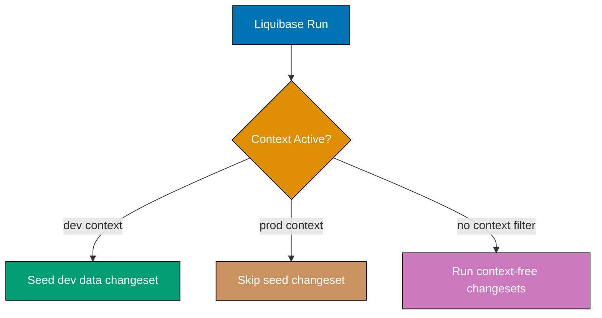
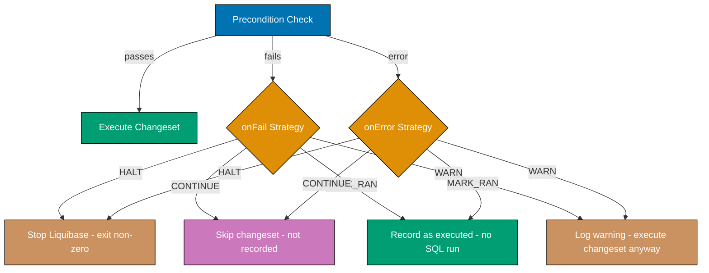
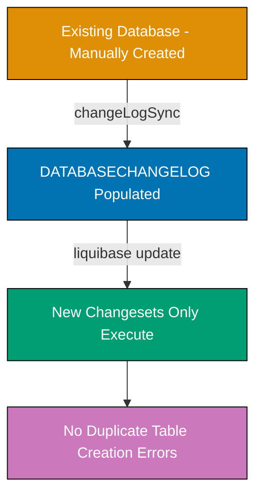
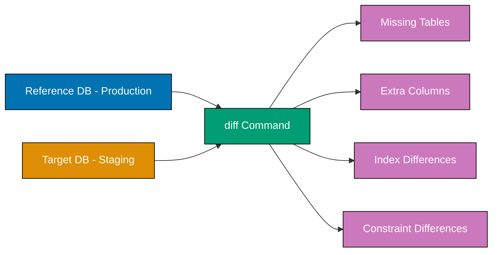
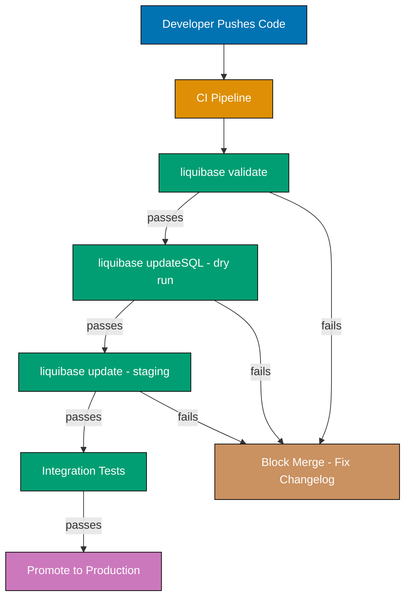

Learn intermediate Liquibase patterns through 30 annotated code examples covering contexts, preconditions, data migrations, database diff tools, and advanced schema features. Each example is self-contained, heavily commented to expose execution semantics, generated SQL, and rollback behavior.

## Group 4: Contexts and Labels

### Example 31: Contexts for Environment-Specific Changes

Contexts let you tag a changeset so it executes only when a matching context is active. The `--contexts` flag on the Liquibase CLI (or `spring.liquibase.contexts` in Spring Boot) activates one or more named contexts. Changesets without a context attribute run in every environment.



```sql
-- liquibase formatted sql
-- => File contains three changesets: one context-free, two context-specific

-- changeset demo-be:010-create-config-table dbms:postgresql
-- => No context attribute: runs in every environment unconditionally
CREATE TABLE app_config (
    key   VARCHAR(100) NOT NULL,
    -- => Configuration key, e.g. "feature.dark-mode"
    value VARCHAR(500) NOT NULL,
    -- => Configuration value stored as string; parse in application layer
    CONSTRAINT pk_app_config PRIMARY KEY (key)
    -- => key is the primary key; no surrogate id needed for lookup-by-key tables
);
-- rollback DROP TABLE app_config;

-- changeset demo-be:011-seed-dev-config dbms:postgresql context:dev
-- => context:dev means this changeset only runs when "dev" context is active
-- => Spring Boot: spring.liquibase.contexts=dev
-- => CLI: liquibase update --contexts=dev
-- => This changeset is invisible to prod runs (never enters DATABASECHANGELOG in prod)
INSERT INTO app_config (key, value) VALUES
    ('feature.dark-mode', 'true'),
    -- => Development seed: enable dark mode by default for local testing
    ('feature.rate-limit', '1000'),
    -- => High rate limit for dev to avoid friction during local development
    ('debug.verbose-sql', 'true');
    -- => Verbose SQL logging enabled only in dev environment
-- rollback DELETE FROM app_config WHERE key IN ('feature.dark-mode','feature.rate-limit','debug.verbose-sql');

-- changeset demo-be:012-seed-prod-config dbms:postgresql context:prod
-- => context:prod runs only in production; same changeset ID space as dev seed
-- => Two separate changesets cover each environment without runtime branching
INSERT INTO app_config (key, value) VALUES
    ('feature.dark-mode', 'false'),
    -- => Production default: dark mode off until user toggles
    ('feature.rate-limit', '100'),
    -- => Conservative rate limit for production traffic protection
    ('debug.verbose-sql', 'false');
    -- => No verbose SQL in production; reduces log storage costs
-- rollback DELETE FROM app_config WHERE key IN ('feature.dark-mode','feature.rate-limit','debug.verbose-sql');
```

**Key Takeaway**: Tag changesets with `context:dev` or `context:prod` to conditionally execute environment-specific SQL; context-free changesets always run regardless of which context is active.

**Why It Matters**: Without contexts, teams maintain separate changelog files per environment or rely on application-level feature flags that pollute database logic. Contexts let a single changelog repository serve all environments while keeping seed data, demo fixtures, and environment-specific configuration out of production runs. The pattern also prevents accidental production seeding when a developer runs `liquibase update` against a production database without specifying contexts—production changesets only activate when explicitly requested.

---

### Example 32: Labels for Change Categorization

Labels are similar to contexts but evaluated as boolean expressions using `AND`, `OR`, and `NOT` operators. Unlike contexts (which are simple name matches), labels let you compose complex filters. A changeset runs when the active label expression evaluates to true against the changeset's `labels` attribute.

```yaml
# File: src/main/resources/db/changelog/changes/013-label-examples.yaml

databaseChangeLog:
  - changeSet:
      id: 013-security-columns
      # => This changeset is tagged with two labels
      author: demo-be
      labels: security,compliance
      # => labels: comma-separated list of tags on this changeset
      # => Active filter "security" matches because "security" is in the label list
      # => Active filter "security AND compliance" also matches
      # => Active filter "security AND NOT compliance" does NOT match
      changes:
        - addColumn:
            tableName: users
            columns:
              - column:
                  name: last_password_change
                  type: TIMESTAMPTZ
                  # => Track when password was last updated for compliance reporting
                  constraints:
                    nullable: true
                    # => Nullable: existing users have no recorded change date
              - column:
                  name: mfa_enabled
                  type: BOOLEAN
                  # => Multi-factor authentication flag
                  constraints:
                    nullable: false
                  defaultValueBoolean: false
                  # => defaultValueBoolean for boolean columns; false = MFA optional at signup

  - changeSet:
      id: 014-performance-indexes
      author: demo-be
      labels: performance
      # => Single label; only runs when "performance" filter is active
      # => Example: liquibase update --label-filter="performance"
      # => Spring Boot: spring.liquibase.label-filter=performance
      changes:
        - createIndex:
            tableName: expenses
            indexName: idx_expenses_user_date
            # => Composite index name follows convention: idx_{table}_{columns}
            columns:
              - column:
                  name: user_id
                  # => Leading column: high-cardinality FK for equality filters
              - column:
                  name: date
                  # => Trailing column: range queries on date after user_id equality
```

**Key Takeaway**: Labels use boolean expressions (`AND`, `OR`, `NOT`) for compositional filtering unlike contexts; use `--label-filter` on the CLI or `spring.liquibase.label-filter` in Spring Boot to activate labels.

**Why It Matters**: Labels excel at release management. Tag changesets with sprint numbers (`sprint-42`), feature flags (`dark-mode-rollout`), or compliance categories (`gdpr,pci-dss`). A release manager can deploy only `sprint-42` changes to staging, then promote the same changelog to production with the same label filter—guaranteeing identical SQL executed in both environments. This is impossible with contexts alone because context evaluation is a simple string match, not a boolean expression.

---

## Group 5: Preconditions

### Example 33: Preconditions (tableExists, columnExists)

Preconditions guard a changeset—Liquibase checks the condition before executing. If the precondition fails, Liquibase applies the `onFail` strategy. The `tableExists` and `columnExists` checks are the most common guards for incremental schema evolution.

```yaml
# File: src/main/resources/db/changelog/changes/015-guarded-migration.yaml

databaseChangeLog:
  - changeSet:
      id: 015-add-email-to-users
      author: demo-be
      preConditions:
        # => Preconditions evaluated BEFORE the changeset SQL executes
        # => If the check fails, onFail controls behavior (see Example 34)
        - onFail: MARK_RAN
          # => MARK_RAN: record changeset in DATABASECHANGELOG without executing SQL
          # => Use when column may already exist (e.g., manually created in hotfix)
          onError: HALT
          # => HALT: stop Liquibase entirely on unexpected errors
        - tableExists:
            tableName: users
            # => Verify "users" table exists before attempting to add a column
            # => Fails if a previous migration was rolled back and users table was dropped
        - not:
            # => Negate a condition: the enclosed check must be FALSE to proceed
            - columnExists:
                tableName: users
                columnName: email
                # => Verify "email" column does NOT exist
                # => Guards against re-running a hotfix that already added the column
      changes:
        - addColumn:
            tableName: users
            columns:
              - column:
                  name: email
                  type: VARCHAR(255)
                  # => Email column added only when preconditions pass
                  constraints:
                    nullable: true
                    # => Nullable initially; subsequent changeset can add NOT NULL constraint
                    unique: true
                    # => Unique constraint prevents duplicate emails at DB level
```

**Key Takeaway**: Wrap `columnExists` in a `not` block to guard "add column" changesets against re-execution when a column already exists; combine with `tableExists` to verify the table itself is present.

**Why It Matters**: Preconditions are essential for migrations on databases that diverged from the tracked changelog—a common reality when hotfixes are applied manually in production. Without preconditions, a changeset that adds an already-existing column throws `column already exists` and halts the entire migration pipeline, blocking all subsequent changesets. The `MARK_RAN` strategy sidesteps this by recording the changeset as executed without running SQL, keeping the changelog history accurate.

---

### Example 34: Precondition onFail/onError Strategies

`onFail` and `onError` control what Liquibase does when a precondition check fails or throws an unexpected error. Choosing the correct strategy determines whether your pipeline halts, skips, or silently records a no-op.



```yaml
# File: src/main/resources/db/changelog/changes/016-precondition-strategies.yaml

databaseChangeLog:
  - changeSet:
      id: 016-create-audit-log
      author: demo-be
      preConditions:
        - onFail: CONTINUE
          # => CONTINUE: skip this changeset silently (not recorded in DATABASECHANGELOG)
          # => Use when the changeset is optional and absence is expected in some envs
          onError: HALT
          # => HALT on unexpected errors (e.g., database connection issues)
          # => Distinguishes "expected absence" (CONTINUE) from "unexpected problem" (HALT)
        - tableExists:
            tableName: users
            # => Only create audit_log if users table already exists
            # => In a fresh install, users may not exist yet; CONTINUE skips gracefully
      changes:
        - createTable:
            tableName: audit_log
            columns:
              - column:
                  name: id
                  type: BIGSERIAL
                  # => BIGSERIAL: auto-incrementing BIGINT; audit tables grow large
                  constraints:
                    primaryKey: true
                    nullable: false
              - column:
                  name: table_name
                  type: VARCHAR(100)
                  # => Which table was affected
                  constraints:
                    nullable: false
              - column:
                  name: operation
                  type: VARCHAR(10)
                  # => INSERT, UPDATE, DELETE
                  constraints:
                    nullable: false
              - column:
                  name: performed_at
                  type: TIMESTAMPTZ
                  defaultValueComputed: NOW()
                  constraints:
                    nullable: false

  - changeSet:
      id: 017-drop-legacy-table
      author: demo-be
      preConditions:
        - onFail: MARK_RAN
          # => MARK_RAN: record changeset even if precondition fails
          # => Safe for "drop if exists" patterns: table may already be gone
          onError: WARN
          # => WARN: log warning but continue migration pipeline
          # => Useful when "error" is non-fatal (e.g., checking a view that may not exist)
        - tableExists:
            tableName: legacy_sessions
            # => Only run DROP TABLE if legacy_sessions actually exists
      changes:
        - dropTable:
            tableName: legacy_sessions
            # => Remove legacy table after data migration to new sessions table
            cascadeConstraints: true
            # => Drop dependent foreign keys before dropping table
```

**Key Takeaway**: Use `HALT` for fatal errors, `MARK_RAN` when the change may already be applied, `CONTINUE` when the change is optional, and `WARN` when you want to log but never block the pipeline.

**Why It Matters**: Getting `onFail` wrong is a common cause of silent data corruption or blocked pipelines. `CONTINUE` is dangerous for destructive operations (you might silently skip a required `DROP TABLE`), while `HALT` is too strict for idempotent operations (one manually-applied column blocks all subsequent migrations). Production systems commonly use `MARK_RAN` for additive operations and `HALT` for destructive ones, giving safety guarantees without excessive fragility.

---

## Group 6: Data Migrations

### Example 35: Data Migration with insert Change Type

The `insert` change type adds rows to a table within a tracked changeset. This keeps data seeding inside the migration timeline, ensuring the inserted rows are rolled back when the changeset is rolled back.

```yaml
# File: src/main/resources/db/changelog/changes/018-seed-roles.yaml

databaseChangeLog:
  - changeSet:
      id: 018-seed-roles
      author: demo-be
      changes:
        - insert:
            tableName: roles
            # => Target table; must already exist (use preconditions if uncertain)
            columns:
              - column:
                  name: id
                  valueNumeric: 1
                  # => valueNumeric for integer literals
              - column:
                  name: name
                  value: ADMIN
                  # => value for string literals
              - column:
                  name: description
                  value: Full system administrator access
                  # => value accepts any string literal
        - insert:
            tableName: roles
            # => Each insert change inserts exactly one row
            # => Multiple insert changes in one changeset run in a single transaction
            columns:
              - column:
                  name: id
                  valueNumeric: 2
              - column:
                  name: name
                  value: USER
              - column:
                  name: description
                  value: Standard user access
        - insert:
            tableName: roles
            columns:
              - column:
                  name: id
                  valueNumeric: 3
              - column:
                  name: name
                  value: VIEWER
              - column:
                  name: description
                  value: Read-only access
      rollback:
        # => Explicit rollback: delete the inserted rows by known IDs
        - delete:
            tableName: roles
            where: id IN (1, 2, 3)
            # => where clause removes only the rows inserted by this changeset
            # => Avoids deleting user-added roles that may exist in the same table
```

**Key Takeaway**: Use `valueNumeric` for integers and `value` for strings in `insert` change types; always provide an explicit rollback `delete` to remove only the rows inserted by this changeset.

**Why It Matters**: Seeding reference data through Liquibase `insert` changesets guarantees that every environment (local, CI, staging, production) starts with the same foundational rows without manual SQL scripts. When rollback is triggered (e.g., hotfix reversal), Liquibase removes precisely the rows that were inserted—not all rows in the table. This is safer than raw `DELETE FROM roles` in a rollback script, which would destroy user-created roles added after the initial seed.

---

### Example 36: Data Migration with update Change Type

The `update` change type modifies existing rows. Use it to transform data in place when a schema change requires backfilling values or migrating from one column format to another.

```yaml
# File: src/main/resources/db/changelog/changes/019-backfill-user-roles.yaml

databaseChangeLog:
  - changeSet:
      id: 019-backfill-user-roles
      author: demo-be
      changes:
        - update:
            tableName: users
            # => Target table containing rows to update
            columns:
              - column:
                  name: role
                  value: USER
                  # => Set role column to literal "USER" for all matched rows
                  # => valueComputed: "UPPER(legacy_role)" evaluates a SQL expression
            where: role IS NULL
            # => where clause restricts which rows are updated
            # => Without where: all rows in the table are updated (full-table migration)
            # => Always include where to limit scope and avoid accidental mass updates
        - update:
            tableName: users
            columns:
              - column:
                  name: role
                  value: ADMIN
                  # => Promote users with admin flag to ADMIN role
            where: is_admin = true AND role = 'USER'
            # => Compound where: target only rows that need promotion
            # => Runs AFTER the first update (NULL->USER), so is_admin=true rows are now USER
      rollback:
        # => Rollback reverses the data migration; difficult to make perfectly reversible
        # => Best practice: store original values in a backup column before migrating
        - update:
            tableName: users
            columns:
              - column:
                  name: role
                  valueComputed: "NULL"
                  # => Restore NULL for the first update (backfill was from NULL)
            where: role = 'USER' AND is_admin = false
```

**Key Takeaway**: Always include a `where` clause in `update` change types; use `valueComputed` to execute SQL expressions as the new value when a literal string is insufficient.

**Why It Matters**: Data migration `update` changesets run inside the same transaction as schema changes, so a failed migration rolls back atomically. The critical risk is an overly broad `where` clause that corrupts more rows than intended—a production incident that may require restoring from backup. Scoping updates precisely (as above: first fill NULLs, then promote admins) makes each update auditable and reversible. Include the smallest possible `where` clause and verify row counts in a staging environment before production.

---

### Example 37: Data Migration with delete Change Type

The `delete` change type removes rows matching a `where` clause. Use it to clean up obsolete data, remove expired records, or purge seed data that should not exist in production.

```yaml
# File: src/main/resources/db/changelog/changes/020-purge-expired-sessions.yaml

databaseChangeLog:
  - changeSet:
      id: 020-purge-expired-sessions
      author: demo-be
      changes:
        - delete:
            tableName: refresh_tokens
            # => Target table; rows matching where are permanently removed
            where: expires_at < NOW() - INTERVAL '90 days'
            # => Delete tokens expired more than 90 days ago
            # => NOW() is evaluated at migration execution time, not changeset authoring time
            # => INTERVAL '90 days' is PostgreSQL syntax; use dbms:postgresql attribute for multi-DB changelogs
      rollback:
        # => Deleted rows cannot be restored by Liquibase
        # => If rollback is required, restore from backup or use a staging table approach
        - sql:
            sql: SELECT 'Rollback not available - restore from backup if needed'
            # => Placeholder rollback that does nothing harmful
            # => Acceptable for irreversible operations; document the limitation explicitly

  - changeSet:
      id: 021-archive-soft-deleted-users
      author: demo-be
      dbms: postgresql
      # => dbms attribute at changeset level: only executes against PostgreSQL
      changes:
        - sql:
            sql: |
              DELETE FROM users
              WHERE deleted_at IS NOT NULL
                AND deleted_at < NOW() - INTERVAL '365 days';
            splitStatements: false
            # => splitStatements:false treats the entire sql block as one statement
            # => Required when SQL contains semicolons inside strings or CTEs
```

**Key Takeaway**: The `delete` change type is irreversible—always check row counts with a `SELECT` in staging before running against production; use a SQL placeholder rollback with a clear comment when restoration from backup is the only recovery path.

**Why It Matters**: Data purge migrations are among the highest-risk operations because they cannot be undone by Liquibase rollback. Teams that skip staging verification routinely delete more rows than intended due to timezone mismatches (`NOW()` returns UTC; application code may use local time), index absence (full-table scans on expired tokens can lock large tables for minutes), or compound condition bugs. Running `EXPLAIN` on the DELETE's WHERE clause in staging before deployment is a non-negotiable safety step.

---

### Example 38: loadData from CSV

The `loadData` change type reads a CSV file and inserts rows into a table. It is the canonical way to seed large reference datasets that would be impractical to write as individual `insert` change types.

```yaml
# File: src/main/resources/db/changelog/changes/022-load-countries.yaml

databaseChangeLog:
  - changeSet:
      id: 022-load-countries
      author: demo-be
      changes:
        - loadData:
            tableName: countries
            # => Target table; must already exist
            file: db/changelog/data/countries.csv
            # => Path relative to the classpath root (src/main/resources/)
            # => The CSV file is bundled in the JAR at runtime
            separator: ","
            # => Default separator; change to ";" for European locale CSVs
            encoding: UTF-8
            # => Encoding for special characters (accents in country names)
            columns:
              - column:
                  name: iso_code
                  # => CSV column header must match exactly
                  type: STRING
                  # => Liquibase type hint: STRING maps to VARCHAR in PostgreSQL
              - column:
                  name: name
                  type: STRING
              - column:
                  name: phone_prefix
                  type: NUMERIC
                  # => NUMERIC: Liquibase parses CSV value as number before inserting
              - column:
                  name: active
                  type: BOOLEAN
                  # => BOOLEAN: Liquibase accepts "true"/"false"/"1"/"0" in CSV
      rollback:
        - delete:
            tableName: countries
            where: 1=1
            # => Delete all rows loaded by this changeset
            # => Safe when countries table is populated solely by this changeset
            # => If the table has other rows, store original IDs and delete by them
```

CSV file (`src/main/resources/db/changelog/data/countries.csv`):

```text
iso_code,name,phone_prefix,active
ID,Indonesia,62,true
US,United States,1,true
GB,United Kingdom,44,true
SG,Singapore,65,true
MY,Malaysia,60,true
```

**Key Takeaway**: Place CSV files on the classpath under `db/changelog/data/` so they are bundled in the JAR; declare `type` for each column so Liquibase converts CSV strings to the correct SQL literal.

**Why It Matters**: `loadData` scales to thousands of rows without writing thousands of `insert` change types, and the CSV file is version-controlled alongside the changelog. This lets data analysts update reference data through pull requests without touching Java or YAML. The `encoding: UTF-8` attribute is critical for datasets with non-ASCII characters (country names, currency symbols, city names)—omitting it causes silent data corruption when the JVM default encoding differs from the file encoding.

---

### Example 39: Custom SQL Change Type

The `sql` change type executes arbitrary SQL when Liquibase's built-in change types cannot express the required DDL or DML. Common uses include complex expressions, window functions, CTEs, and database-specific syntax.

```sql
-- liquibase formatted sql

-- changeset demo-be:023-migrate-amount-precision dbms:postgresql
-- => Raw SQL migration: change DECIMAL precision and backfill computed column
-- => No built-in Liquibase change type handles computed column backfills

-- Step 1: Add temporary staging column
ALTER TABLE expenses ADD COLUMN amount_v2 DOUBLE PRECISION;
-- => DOUBLE PRECISION replaces DECIMAL(19,4) to match application model (f64/double)
-- => Temporary column avoids locking: populate first, then swap with original

-- Step 2: Backfill from original column using CTE for auditability
WITH migration AS (
    SELECT id, amount::DOUBLE PRECISION AS amount_migrated
    -- => Cast DECIMAL to DOUBLE PRECISION; precision loss is acceptable for display amounts
    FROM expenses
    WHERE amount_v2 IS NULL
    -- => Only update rows not yet migrated (idempotent if migration is interrupted)
)
UPDATE expenses e
SET amount_v2 = m.amount_migrated
FROM migration m
WHERE e.id = m.id;
-- => Batch update via CTE: single statement, single lock acquisition

-- Step 3: Swap columns atomically
ALTER TABLE expenses ALTER COLUMN amount_v2 SET NOT NULL;
-- => Enforce NOT NULL after backfill (would fail if any row has NULL amount)
ALTER TABLE expenses DROP COLUMN amount;
-- => Remove original column after successful backfill
ALTER TABLE expenses RENAME COLUMN amount_v2 TO amount;
-- => Rename temp column to canonical name; application code unchanged

-- rollback ALTER TABLE expenses RENAME COLUMN amount TO amount_v2;
-- rollback ALTER TABLE expenses ADD COLUMN amount DECIMAL(19,4);
-- rollback UPDATE expenses SET amount = amount_v2::DECIMAL(19,4);
-- rollback ALTER TABLE expenses DROP COLUMN amount_v2;
```

**Key Takeaway**: Use `-- changeset` with raw SQL when Liquibase change types lack expressive power; write idempotent SQL (e.g., `WHERE amount_v2 IS NULL`) so the migration can restart safely after interruption.

**Why It Matters**: Migrations involving type changes on columns with existing data are impossible to express cleanly using Liquibase YAML change types—they require multi-step SQL orchestration. The staging column pattern (add, populate, swap) avoids long table locks on large tables and lets the migration run incrementally. The `WHERE amount_v2 IS NULL` guard makes the backfill idempotent: if the pipeline fails mid-migration and restarts, only the unprocessed rows are updated, preventing data corruption from double-conversion.

---

### Example 40: Rollback Strategies for Data Changes

Data change rollbacks require explicit strategies because Liquibase cannot automatically reverse DML operations. The rollback block must mirror the semantics of the changeset—not just the inverse SQL, but the inverse of the logical intent.

```sql
-- liquibase formatted sql

-- changeset demo-be:024-normalize-phone-numbers dbms:postgresql
-- => Data normalization: strip non-digit characters from phone_number column
-- => Cannot be auto-rolled back; explicit rollback required

-- Backup original values to a shadow column before modifying
ALTER TABLE users ADD COLUMN phone_number_original VARCHAR(50);
-- => Shadow column preserves pre-migration state for rollback
-- => Rollback restores from this column; then drops it

UPDATE users
SET
    phone_number_original = phone_number,
    -- => Capture original value before normalization
    phone_number = REGEXP_REPLACE(phone_number, '[^0-9+]', '', 'g')
    -- => Remove all non-digit, non-plus characters
    -- => 'g' flag: replace all occurrences (not just first)
    -- => Result: "+6281234567890" from "(+62) 812-3456-7890"
WHERE phone_number IS NOT NULL;
-- => Scoped to non-null rows; NULL phone_number rows are unchanged

-- rollback UPDATE users SET phone_number = phone_number_original WHERE phone_number_original IS NOT NULL;
-- rollback ALTER TABLE users DROP COLUMN phone_number_original;
-- => Rollback order: restore first, then drop shadow column
-- => Cannot drop shadow column before restoring or data is lost permanently
```

**Key Takeaway**: For irreversible data transforms, add a shadow column to capture the pre-migration state, then reference it in the rollback block; always restore data before dropping the shadow column.

**Why It Matters**: Rollback of data migrations is the hardest problem in database migration management. Unlike schema changes (which have mechanical inverses), data transformations are often lossy—you cannot reconstruct `(+62) 812-3456-7890` from `+6281234567890` without the original. The shadow column pattern provides a recovery path without needing database backups, making rollbacks testable in CI. Teams that skip shadow columns for "simple" normalizations routinely discover the transform was not as simple as expected when they need to roll back in production.

---

## Group 7: Advanced Tooling

### Example 41: Changelog Parameters and Property Substitution

Changelog parameters (property substitution) allow you to define variables in the changelog and reference them with `${paramName}`. Values are supplied via command-line, Spring Boot properties, or the changelog header.

```yaml
# File: src/main/resources/db/changelog/changes/025-parameterized-tablespace.yaml

databaseChangeLog:
  - property:
      name: defaultSchemaName
      value: public
      # => Define a property with a default value
      # => Overridden by: --changelog-parameters=defaultSchemaName=custom_schema (CLI)
      # => Or: spring.liquibase.parameters.defaultSchemaName=custom_schema (Spring Boot)
  - property:
      name: indexTablespace
      value: pg_default
      # => Default tablespace for indexes; override per environment for tablespace isolation
  - property:
      name: textSearchConfig
      value: english
      # => Full-text search configuration; override to "indonesian" for Indonesian content

  - changeSet:
      id: 025-create-search-index
      author: demo-be
      dbms: postgresql
      changes:
        - sql:
            sql: |
              CREATE INDEX idx_expenses_description_fts
              ON ${defaultSchemaName}.expenses
              USING GIN (to_tsvector('${textSearchConfig}', description))
              -- => ${defaultSchemaName} and ${textSearchConfig} are replaced at runtime
              -- => CLI override: --changelog-parameters=defaultSchemaName=analytics
              TABLESPACE ${indexTablespace};
              -- => ${indexTablespace} allows tablespace to vary per environment
            splitStatements: false
      rollback:
        - sql:
            sql: DROP INDEX IF EXISTS ${defaultSchemaName}.idx_expenses_description_fts;
            # => Rollback also uses property substitution; values must match forward migration
```

**Key Takeaway**: Define changelog properties with `- property: name: ... value: ...` and reference them as `${paramName}`; supply environment-specific values via Spring Boot's `spring.liquibase.parameters.*` or CLI `--changelog-parameters`.

**Why It Matters**: Property substitution removes hardcoded environment assumptions from changelog files. Without it, teams maintain separate changelog branches per environment (development vs staging vs production) that inevitably drift apart. With substitution, a single changelog file handles schema naming differences, tablespace assignments, and configuration flags through external injection—the same principle as environment variables in application configuration. This also enables testing exactly the production SQL in staging by injecting production parameter values.

---

### Example 42: changeLogSync Command

`changeLogSync` marks all changesets in the changelog as executed in `DATABASECHANGELOG` without running any SQL. Use it when a database already matches the desired state (e.g., manually created or restored from a backup) and you want Liquibase to begin tracking from that point.



```yaml
# File: liquibase.properties (CLI configuration file)

url: jdbc:postgresql://localhost:5432/mydb
# => JDBC connection URL; matches Spring Boot's spring.datasource.url

username: myuser
# => Database username

password: mypassword
# => Database password; prefer environment variable substitution in production
# => Use: password: ${DB_PASSWORD} and set DB_PASSWORD in shell

changeLogFile: src/main/resources/db/changelog/db.changelog-master.yaml
# => Path to master changelog; same file used by Spring Boot integration
```

```bash
# Scenario: database already exists with correct schema, but DATABASECHANGELOG is empty
# Running liquibase update would attempt to re-create all tables -> ERROR

# Step 1: Sync all changesets without executing SQL
liquibase changelogSync
# => Reads all changesets from changelog
# => Inserts a row into DATABASECHANGELOG for each changeset
# => Does NOT execute any DDL or DML
# => After sync: DATABASECHANGELOG has 25 rows (one per changeset)

# Step 2: Verify sync was correct
liquibase status
# => Reports: "All change sets have been run against the database"
# => If any changesets are "not yet run", manually apply them or sync selectively

# Step 3: Future updates work normally
liquibase update
# => Only executes changesets NOT already in DATABASECHANGELOG
# => All pre-sync changesets are skipped; only new changesets run
```

**Key Takeaway**: Run `changelogSync` to mark all existing changesets as executed when adopting Liquibase on a database that was created without it; always run `liquibase status` afterward to verify no changesets were missed.

**Why It Matters**: `changelogSync` is the adoption gateway for Liquibase in existing projects. Teams with legacy databases created by manual scripts or ORM auto-create often adopt Liquibase mid-project. Without `changelogSync`, the first `liquibase update` attempt fails with "table already exists" errors for every changeset. The sync command bridges this gap, letting teams incrementally migrate to managed migrations without a full database reconstruction. The key risk is syncing past a changeset that was NOT actually applied—future rollbacks will attempt to reverse SQL that was never executed.

---

### Example 43: diff Command

The `diff` command compares two database schemas and reports structural differences. Use it to verify that a migration was applied correctly, to audit schema drift between environments, or to identify columns added manually outside Liquibase.



```bash
# Compare staging database (target) against production (reference)
liquibase \
  --url=jdbc:postgresql://staging-db:5432/mydb \
  --username=myuser \
  --password=mypassword \
  --referenceUrl=jdbc:postgresql://prod-db:5432/mydb \
  --referenceUsername=myuser \
  --referencePassword=myprodpassword \
  diff
# => Compares staging (url) against production (referenceUrl)
# => Reports: tables in reference but not in target (missing tables)
# =>          tables in target but not in reference (extra tables)
# =>          column type mismatches between matched tables
# =>          missing or extra indexes, constraints, sequences

# Example output when staging is missing a column added by a prod hotfix:
# Missing Column(s): users.emergency_contact (VARCHAR(255))
# => Staging is behind production; apply the missing migration

# Diff between local dev and CI database to catch schema drift
liquibase \
  --url=jdbc:postgresql://localhost:5432/mydb_dev \
  --referenceUrl=jdbc:postgresql://ci-db:5432/mydb_ci \
  diff \
  --diffTypes=tables,columns,indexes
  # => --diffTypes filters which object types to compare
  # => Omit views, sequences, and procedures for a focused column-level check
```

**Key Takeaway**: Run `diff` with `--url` as the target (database to check) and `--referenceUrl` as the reference (authoritative schema); use `--diffTypes` to focus the comparison on specific object types.

**Why It Matters**: Production databases accumulate schema drift through hotfixes, DBA interventions, and incomplete rollbacks. Without periodic `diff` runs, teams discover these discrepancies only when a migration fails due to an unexpected column or missing index. Automated `diff` in CI pipelines catches drift before it reaches production: run `diff` between staging and production after every deployment, and fail the pipeline if differences exceed a threshold. This transforms schema governance from reactive (fixing drift after incidents) to proactive (preventing drift before incidents).

---

### Example 44: diffChangeLog Command

`diffChangeLog` compares two databases and generates a changelog containing the DDL required to bring the target into sync with the reference. It produces the changesets needed to close the gap detected by `diff`.

```bash
# Generate a changelog to bring staging in sync with production
liquibase \
  --url=jdbc:postgresql://staging-db:5432/mydb \
  --referenceUrl=jdbc:postgresql://prod-db:5432/mydb \
  --username=myuser \
  --password=mypassword \
  diffChangeLog \
  --changelog-file=diff-staging-to-prod.yaml
  # => Writes generated changesets to diff-staging-to-prod.yaml
  # => Each structural difference becomes a changeset in the output file

# Example of a generated changeset in diff-staging-to-prod.yaml:
# databaseChangeLog:
#   - changeSet:
#       id: 1711234567890-1       # => Auto-generated ID from timestamp
#       author: liquibase-diff   # => Author set to "liquibase-diff" for generated sets
#       changes:
#         - addColumn:
#             tableName: users
#             columns:
#               - column:
#                   name: emergency_contact
#                   type: VARCHAR(255)
#                   # => Missing column from production hotfix

# Review the generated file before applying
liquibase \
  --url=jdbc:postgresql://staging-db:5432/mydb \
  --changelog-file=diff-staging-to-prod.yaml \
  update
  # => Apply the generated changesets to bring staging in sync
  # => ALWAYS review generated changelogs; auto-generated IDs and rollbacks may be incomplete
```

**Key Takeaway**: `diffChangeLog` generates a ready-to-apply changelog for schema gaps detected by `diff`; always review generated changesets for correctness before applying, as auto-generated IDs and rollbacks are minimal.

**Why It Matters**: Manually writing migration SQL for a large schema gap (dozens of missing columns across multiple tables) is error-prone and time-consuming. `diffChangeLog` automates the first draft, reducing a multi-hour manual task to a focused review. The generated changelog is a starting point, not production-ready SQL—rollback blocks are often missing, column types may use generic rather than PostgreSQL-specific types, and column ordering may not match the production table. Treat the output as a starting point for a human-authored changeset.

---

### Example 45: generateChangeLog Command

`generateChangeLog` creates a full changelog from an existing database schema. Unlike `diffChangeLog` (which captures differences between two databases), `generateChangeLog` captures the complete current state of a single database.

```bash
# Generate a full changelog from the current database schema
liquibase \
  --url=jdbc:postgresql://localhost:5432/mydb \
  --username=myuser \
  --password=mypassword \
  generateChangeLog \
  --changelog-file=generated-schema.yaml
  # => Reads all tables, columns, indexes, constraints, sequences from the database
  # => Generates a YAML changelog that recreates the entire schema from scratch
  # => Does NOT include data (rows); only DDL structure

# Generated output structure:
# databaseChangeLog:
#   - changeSet:
#       id: 1711234567890-1
#       author: myuser (generated)
#       # => One changeset per table, index, or constraint
#       changes:
#         - createTable:
#             tableName: users
#             columns: [...]   # => All columns with types and constraints

# Include data in generated changelog (use cautiously on large tables)
liquibase \
  --url=jdbc:postgresql://localhost:5432/mydb \
  generateChangeLog \
  --changelog-file=generated-with-data.yaml \
  --dataOutputDirectory=data/
  # => Generates CSV files in data/ directory for each table's rows
  # => Adds loadData change types referencing the CSV files
  # => NOT suitable for tables with millions of rows

# Filter generated schema with common flags
liquibase \
  --url=jdbc:postgresql://localhost:5432/mydb \
  generateChangeLog \
  --changelog-file=generated-core-tables.yaml \
  --includeCatalog=false \
  --includeSchema=true \
  --includeTablespace=false
  # => --includeSchema: include schema name in DDL (useful for multi-schema databases)
  # => --includeTablespace: omit tablespace (portable across environments)
```

**Key Takeaway**: Use `generateChangeLog` as a migration bootstrapping tool when adopting Liquibase on an existing database; combine it with `changelogSync` to prevent re-execution of the generated changesets.

**Why It Matters**: `generateChangeLog` is the recommended first step when adding Liquibase to a legacy project—it captures the current schema as the baseline changeset, then all future migrations are additive. Without a baseline, teams must either manually write a full `CREATE TABLE` changelog (error-prone for complex schemas) or use `changelogSync` without a changelog (which means no DDL documentation). The generated file also serves as executable schema documentation: anyone can recreate the database by running the generated changelog, which is valuable for disaster recovery and environment bootstrapping.

---

## Group 8: Advanced Schema Patterns

### Example 46: Multiple Schema Support

Liquibase can target specific PostgreSQL schemas using the `defaultSchemaName` setting or the `schemaName` attribute on individual change types. Multi-schema setups separate concerns (public data, audit logs, analytics) within a single database.

```yaml
# File: src/main/resources/db/changelog/changes/026-multi-schema.yaml

databaseChangeLog:
  - changeSet:
      id: 026-create-audit-schema
      author: demo-be
      changes:
        - sql:
            sql: CREATE SCHEMA IF NOT EXISTS audit;
            # => Create the audit schema if it does not already exist
            # => IF NOT EXISTS: idempotent; safe to re-run without precondition guard
            # => PostgreSQL schemas are namespaces; same table name can exist in multiple schemas
      rollback:
        - sql:
            sql: DROP SCHEMA IF EXISTS audit CASCADE;
            # => CASCADE drops all tables, views, and sequences in the schema
            # => Use only when schema is owned entirely by this changelog

  - changeSet:
      id: 027-create-audit-log-table
      author: demo-be
      changes:
        - createTable:
            schemaName: audit
            # => schemaName attribute targets a specific schema
            # => Without schemaName: Liquibase uses the defaultSchemaName setting
            tableName: schema_changes
            columns:
              - column:
                  name: id
                  type: BIGSERIAL
                  constraints:
                    primaryKey: true
                    nullable: false
              - column:
                  name: schema_name
                  type: VARCHAR(100)
                  # => Which schema was changed
                  constraints:
                    nullable: false
              - column:
                  name: table_name
                  type: VARCHAR(100)
                  # => Which table within the schema was changed
                  constraints:
                    nullable: false
              - column:
                  name: change_type
                  type: VARCHAR(50)
                  # => DDL operation: CREATE, ALTER, DROP
                  constraints:
                    nullable: false
              - column:
                  name: changed_at
                  type: TIMESTAMPTZ
                  defaultValueComputed: NOW()
                  constraints:
                    nullable: false
      rollback:
        - dropTable:
            schemaName: audit
            # => schemaName must match the createTable changeset
            tableName: schema_changes
```

**Key Takeaway**: Set `schemaName` on each change type to target a specific schema; create schemas in a separate preceding changeset using raw SQL with `IF NOT EXISTS` for idempotency.

**Why It Matters**: Multi-schema databases are common in enterprise environments where data governance requires separating PII (personal schema), financial records (finance schema), and audit logs (audit schema) with distinct permission grants. Liquibase's `schemaName` attribute enables a single changelog to manage all schemas without multiple Liquibase configurations. The critical operational detail is permission management: the Liquibase database user must have `CREATE` privileges on each target schema, which often requires a DBA provisioning step separate from the changelog itself.

---

### Example 47: Creating Views

Views encapsulate complex queries and are created using the `createView` change type. Liquibase tracks view definitions in `DATABASECHANGELOG` and supports `replaceIfExists` for updating view logic without a separate `dropView` changeset.

```yaml
# File: src/main/resources/db/changelog/changes/028-create-views.yaml

databaseChangeLog:
  - changeSet:
      id: 028-create-expense-summary-view
      author: demo-be
      dbms: postgresql
      changes:
        - createView:
            viewName: expense_summary
            # => View name; must be unique within the schema
            schemaName: public
            # => Target schema; defaults to defaultSchemaName if omitted
            replaceIfExists: true
            # => replaceIfExists: true uses CREATE OR REPLACE VIEW
            # => Allows updating view definition without a prior dropView changeset
            # => Safe for iterative view development
            selectQuery: |
              SELECT
                u.id          AS user_id,
                u.username    AS username,
                COUNT(e.id)   AS total_expenses,
                -- => COUNT per user, not total rows (user_id grouped)
                SUM(e.amount) AS total_amount,
                -- => SUM respects GROUP BY; NULL amounts are excluded by SUM
                AVG(e.amount) AS avg_amount,
                -- => Average per expense entry for this user
                MIN(e.date)   AS first_expense_date,
                -- => Earliest recorded expense date
                MAX(e.date)   AS last_expense_date
                -- => Most recent recorded expense date
              FROM users u
              LEFT JOIN expenses e ON e.user_id = u.id
              -- => LEFT JOIN includes users with zero expenses (COUNT=0, SUM=NULL)
              WHERE u.deleted_at IS NULL
              -- => Exclude soft-deleted users from the summary view
              GROUP BY u.id, u.username
              -- => One row per user; GROUP BY required for aggregate functions
      rollback:
        - dropView:
            viewName: expense_summary
            schemaName: public
```

**Key Takeaway**: Use `replaceIfExists: true` to enable `CREATE OR REPLACE VIEW` semantics, allowing view logic updates without a separate drop; the rollback uses `dropView` with the matching `schemaName`.

**Why It Matters**: Views are living query definitions that evolve as business requirements change. Without `replaceIfExists: true`, updating a view requires a `dropView` changeset followed by a new `createView` changeset, doubling the changelog entries for each revision. `replaceIfExists` compresses this into a single changeset, keeping changelog history proportional to feature additions rather than view revision count. The trade-off: `CREATE OR REPLACE VIEW` cannot change column names or types—use a separate `dropView` plus `createView` when the column interface changes.

---

### Example 48: Creating Materialized Views

Materialized views store query results on disk, enabling fast reads at the cost of staleness. Unlike regular views, materialized views require explicit refresh. PostgreSQL's materialized views need a `UNIQUE INDEX` for concurrent refresh support.

```sql
-- liquibase formatted sql

-- changeset demo-be:029-create-materialized-view dbms:postgresql
-- => Materialized views store query results; Liquibase createView does not support MATERIALIZED
-- => Use raw SQL changeset for PostgreSQL-specific materialized view syntax

CREATE MATERIALIZED VIEW expense_monthly_summary AS
SELECT
    user_id,
    -- => User identifier; join to users table for display name
    DATE_TRUNC('month', date) AS month,
    -- => Truncate to month start: '2024-03-15' becomes '2024-03-01'
    -- => Enables grouping by calendar month
    category,
    -- => Expense category for category-level monthly breakdown
    COUNT(*)       AS expense_count,
    -- => Number of expenses in this category/month for this user
    SUM(amount)    AS total_amount,
    -- => Total spending in category/month/user combination
    AVG(amount)    AS avg_amount
    -- => Average expense size for detecting anomalies
FROM expenses
WHERE deleted_at IS NULL
-- => Exclude soft-deleted expenses from materialized view
GROUP BY user_id, DATE_TRUNC('month', date), category
-- => Three-level grouping: each row represents one user+month+category combination
WITH DATA;
-- => WITH DATA populates the view immediately on creation
-- => WITH NO DATA creates an empty view; use REFRESH MATERIALIZED VIEW to populate later

-- Create unique index required for CONCURRENT refresh
CREATE UNIQUE INDEX idx_expense_monthly_summary_pk
    ON expense_monthly_summary (user_id, month, category);
-- => UNIQUE INDEX enables REFRESH MATERIALIZED VIEW CONCURRENTLY
-- => CONCURRENTLY refresh does not lock reads; required for production use
-- => Without UNIQUE INDEX, CONCURRENTLY option is unavailable

-- rollback DROP MATERIALIZED VIEW IF EXISTS expense_monthly_summary;
-- => Dropping the view automatically drops its indexes
```

```java
// Application code to refresh the materialized view (Spring Boot JdbcTemplate)
@Scheduled(cron = "0 0 * * * *")
// => Run every hour; refresh frequency depends on data freshness requirements
public void refreshExpenseSummary() {
    jdbcTemplate.execute("REFRESH MATERIALIZED VIEW CONCURRENTLY expense_monthly_summary");
    // => CONCURRENTLY: allows reads during refresh (no exclusive lock)
    // => Requires the UNIQUE INDEX created in the migration
    // => Without CONCURRENTLY: exclusive lock blocks all reads during refresh
}
```

**Key Takeaway**: Materialized views require raw SQL changesets in Liquibase (no built-in change type); always create a `UNIQUE INDEX` to enable `CONCURRENTLY` refresh, which avoids read locks during refresh operations.

**Why It Matters**: Materialized views eliminate repeated aggregation queries for dashboards and reports—a monthly expense summary that requires joining users, expenses, and grouping becomes a single indexed lookup. The `CONCURRENTLY` refresh is critical for production: without it, a dashboard refresh locks the materialized view for several seconds (or minutes for large datasets), making dashboards unavailable during refresh. The unique index requirement is a non-obvious PostgreSQL constraint that causes `ERROR: cannot refresh materialized view concurrently without a unique index` at runtime if omitted during migration.

---

### Example 49: Trigger Creation

PostgreSQL triggers execute stored functions automatically on INSERT, UPDATE, or DELETE. Liquibase tracks trigger creation through raw SQL changesets. Triggers are commonly used for audit logging, `updated_at` maintenance, and data validation.

```sql
-- liquibase formatted sql

-- changeset demo-be:030-create-updated-at-trigger dbms:postgresql
-- => Trigger to automatically maintain updated_at column on every UPDATE
-- => Alternative to application-layer updated_at management

-- Step 1: Create the trigger function
CREATE OR REPLACE FUNCTION update_updated_at_column()
RETURNS TRIGGER AS $$
-- => $$ delimiter marks the function body (dollar quoting avoids nested quote escaping)
BEGIN
    NEW.updated_at = NOW();
    -- => NEW: the row being inserted/updated (vs OLD for previous values)
    -- => Directly modify NEW before the row is written to disk
    RETURN NEW;
    -- => RETURN NEW: required for BEFORE triggers to proceed with the modified row
    -- => RETURN NULL: cancels the operation (used in BEFORE triggers for validation)
END;
$$ LANGUAGE plpgsql;
-- => LANGUAGE plpgsql: PostgreSQL's procedural language; required for triggers

-- Step 2: Attach trigger to the expenses table
CREATE TRIGGER trg_expenses_updated_at
    BEFORE UPDATE ON expenses
    -- => BEFORE UPDATE: fires before the row is written
    -- => AFTER UPDATE: fires after the row is written (cannot modify row data)
    FOR EACH ROW
    -- => FOR EACH ROW: fires once per affected row (vs FOR EACH STATEMENT)
    EXECUTE FUNCTION update_updated_at_column();
    -- => Calls the function created above; NEW.updated_at is set automatically

-- Attach same trigger to users table (reuse the same function)
CREATE TRIGGER trg_users_updated_at
    BEFORE UPDATE ON users
    FOR EACH ROW
    EXECUTE FUNCTION update_updated_at_column();
    -- => One function, multiple triggers; DRY principle applied to trigger logic

-- rollback DROP TRIGGER IF EXISTS trg_users_updated_at ON users;
-- rollback DROP TRIGGER IF EXISTS trg_expenses_updated_at ON expenses;
-- rollback DROP FUNCTION IF EXISTS update_updated_at_column();
-- => Rollback order: drop triggers first, then drop the function they reference
```

**Key Takeaway**: Create trigger functions before the triggers that reference them; drop triggers before dropping their functions in the rollback block; use `OR REPLACE` on the function for idempotent re-runs.

**Why It Matters**: Application-layer `updated_at` management fails silently when records are modified through direct SQL (migrations, admin scripts, data fixes). Database triggers guarantee `updated_at` accuracy regardless of how the row is modified. The shared function pattern (`update_updated_at_column` attached to both `users` and `expenses`) reduces maintenance overhead—changing the timestamp logic requires updating one function, not one trigger per table. The rollback ordering (triggers before function) is mandatory: dropping a function while triggers still reference it causes a dependency error.

---

### Example 50: Stored Procedure Creation

Stored procedures encapsulate complex business logic in the database, executable via `CALL` statements. Unlike functions (which return values), procedures manage transactions internally and are used for multi-step operations like batch processing.

```sql
-- liquibase formatted sql

-- changeset demo-be:031-create-archive-procedure dbms:postgresql
-- => Stored procedure for archiving soft-deleted expenses older than a retention period
-- => Runs as a database procedure, callable from application code or scheduled jobs

CREATE OR REPLACE PROCEDURE archive_deleted_expenses(
    retention_days INT DEFAULT 365
    -- => Parameter with default: archive expenses deleted more than N days ago
    -- => Default 365 enables: CALL archive_deleted_expenses(); (uses 365)
    -- => Override: CALL archive_deleted_expenses(180); (uses 180)
)
LANGUAGE plpgsql AS $$
DECLARE
    archived_count INT := 0;
    -- => DECLARE block: local variables for the procedure
    -- => archived_count tracks how many rows were archived for logging
BEGIN
    INSERT INTO expenses_archive
    -- => expenses_archive must exist (created by a preceding changeset)
    SELECT *
    FROM expenses
    WHERE deleted_at IS NOT NULL
      AND deleted_at < NOW() - (retention_days || ' days')::INTERVAL
    -- => Dynamic interval: concatenate retention_days with ' days' before casting
    -- => (365 || ' days')::INTERVAL equals INTERVAL '365 days'
    ON CONFLICT (id) DO NOTHING;
    -- => ON CONFLICT: skip already-archived rows (idempotent re-runs)

    GET DIAGNOSTICS archived_count = ROW_COUNT;
    -- => GET DIAGNOSTICS: capture row count from the most recent SQL statement
    -- => archived_count holds the number of rows inserted into expenses_archive

    DELETE FROM expenses
    WHERE deleted_at IS NOT NULL
      AND deleted_at < NOW() - (retention_days || ' days')::INTERVAL;
    -- => Delete from source table only after successful archive insert
    -- => Same WHERE condition ensures consistency between INSERT and DELETE

    RAISE NOTICE 'Archived % expenses older than % days', archived_count, retention_days;
    -- => RAISE NOTICE: logs to PostgreSQL notice channel; visible in application logs
    -- => Useful for monitoring procedure execution without a separate audit table
END;
$$;

-- rollback DROP PROCEDURE IF EXISTS archive_deleted_expenses(INT);
-- => Include parameter type signature to disambiguate overloaded procedures
```

**Key Takeaway**: Stored procedures use `LANGUAGE plpgsql` and support `DECLARE` blocks for local variables; always include the parameter type signature in the rollback `DROP PROCEDURE` to handle overloaded procedure names correctly.

**Why It Matters**: Batch archive procedures solve a class of problems that application code handles poorly: moving thousands of rows atomically from one table to another while maintaining consistency under concurrent inserts. Doing this in application code requires managing chunked batches, retry logic, and transaction boundaries across multiple HTTP requests. A single `CALL archive_deleted_expenses()` executes atomically in the database engine, avoiding network round-trips between application and database for each row. The `ON CONFLICT DO NOTHING` guard makes re-runs safe—essential for scheduled jobs that may overlap.

---

## Group 9: Conditional Execution and Testing

### Example 51: Conditional Execution with dbms Attribute

The `dbms` attribute restricts changeset execution to specific database vendors. Combine it with contexts and preconditions to write changelogs that are genuinely portable across PostgreSQL, MySQL, and H2 without separate changelog files.

```yaml
# File: src/main/resources/db/changelog/changes/032-portable-changelog.yaml

databaseChangeLog:
  - changeSet:
      id: 032-create-expenses-postgresql
      author: demo-be
      dbms: postgresql
      # => Only executes against PostgreSQL databases
      # => Spring Boot test with H2: this changeset is skipped automatically
      changes:
        - sql:
            sql: |
              CREATE TABLE expenses_pg (
                id          UUID NOT NULL DEFAULT gen_random_uuid(),
                amount      NUMERIC(19,4) NOT NULL,
                created_at  TIMESTAMPTZ NOT NULL DEFAULT NOW()
              );
            -- => gen_random_uuid(): PostgreSQL 13+ built-in; requires pgcrypto on older versions
            -- => TIMESTAMPTZ: PostgreSQL-specific timezone-aware timestamp type

  - changeSet:
      id: 032-create-expenses-h2
      author: demo-be
      dbms: h2
      # => Only executes against H2 (in-memory test database)
      # => Uses H2-compatible types that differ from PostgreSQL
      changes:
        - sql:
            sql: |
              CREATE TABLE expenses_pg (
                id          UUID NOT NULL DEFAULT RANDOM_UUID(),
                amount      DECIMAL(19,4) NOT NULL,
                created_at  TIMESTAMP NOT NULL DEFAULT NOW()
              );
            -- => RANDOM_UUID(): H2 built-in; replaces PostgreSQL gen_random_uuid()
            -- => TIMESTAMP: H2 does not support TIMESTAMPTZ; uses TIMESTAMP instead

  - changeSet:
      id: 033-create-text-search-index
      author: demo-be
      dbms: postgresql
      # => GIN indexes and tsvector are PostgreSQL-specific; skip on H2/MySQL
      changes:
        - sql:
            sql: |
              CREATE INDEX idx_expenses_description_search
              ON expenses_pg
              USING GIN (to_tsvector('english', description));
            -- => GIN + tsvector: PostgreSQL full-text search index
            -- => No equivalent in H2 or MySQL; dbms:postgresql gates this safely
```

**Key Takeaway**: Use `dbms: postgresql` for PostgreSQL-specific DDL and `dbms: h2` for test-only equivalents, enabling a single changelog repository to serve both production PostgreSQL and H2-based unit tests.

**Why It Matters**: Spring Boot's in-memory H2 database is the standard choice for unit tests with Liquibase (`@SpringBootTest` with `spring.datasource.url=jdbc:h2:mem:testdb`). PostgreSQL-specific features (UUIDs, TIMESTAMPTZ, GIN indexes, JSON columns) have no direct H2 equivalents. Without `dbms` filtering, tests fail because H2 cannot parse PostgreSQL-specific SQL. The `dbms` attribute lets teams maintain one changelog that works in both environments without separate test-specific changelog files—a maintenance win that compounds as the schema grows.

---

### Example 52: Batch Data Migration Pattern

Large data migrations risk timeouts, lock contention, and memory pressure when executed as a single SQL statement. The batch pattern splits the migration into chunks, processing a fixed number of rows per iteration.

```sql
-- liquibase formatted sql

-- changeset demo-be:034-batch-migrate-currency-codes dbms:postgresql
-- => Backfill currency_code column in batches to avoid long-running transactions
-- => Processes 1000 rows per batch; safe for tables with millions of rows

DO $$
-- => DO block: anonymous PL/pgSQL block; executes immediately, not reusable
DECLARE
    batch_size  INT := 1000;
    -- => Process 1000 rows per iteration; adjust based on row size and lock tolerance
    processed   INT := 0;
    -- => Counter for total rows processed (used in RAISE NOTICE)
    batch_count INT;
    -- => Rows affected in the current batch iteration
BEGIN
    LOOP
        WITH batch AS (
            SELECT id
            FROM expenses
            WHERE currency_code IS NULL
            -- => Find rows not yet migrated; WHERE condition makes loop idempotent
            LIMIT batch_size
            -- => Process only batch_size rows per iteration
            FOR UPDATE SKIP LOCKED
            -- => FOR UPDATE: row-level lock to prevent concurrent modification
            -- => SKIP LOCKED: skip rows locked by other transactions (avoid deadlocks)
        )
        UPDATE expenses e
        SET currency_code = 'USD'
        -- => Default currency for legacy rows without a currency code
        FROM batch b
        WHERE e.id = b.id;

        GET DIAGNOSTICS batch_count = ROW_COUNT;
        -- => How many rows were updated in this batch iteration
        processed := processed + batch_count;
        -- => Accumulate total across all iterations

        EXIT WHEN batch_count = 0;
        -- => No more NULL rows: exit loop
        -- => Loop terminates naturally; no explicit counter needed

        RAISE NOTICE 'Migrated % rows (total: %)', batch_count, processed;
        -- => Progress logging; visible in PostgreSQL log and psql output
    END LOOP;
    RAISE NOTICE 'Batch migration complete. Total rows migrated: %', processed;
END;
$$;

-- rollback UPDATE expenses SET currency_code = NULL WHERE currency_code = 'USD';
-- => Rollback resets the backfilled column; safe only if 'USD' was exclusively a migration default
```

**Key Takeaway**: Use `FOR UPDATE SKIP LOCKED` in batch migrations to acquire row-level locks without deadlocking concurrent transactions; exit the loop when `ROW_COUNT` returns zero to terminate naturally without a separate count query.

**Why It Matters**: A single `UPDATE expenses SET currency_code = 'USD' WHERE currency_code IS NULL` on a table with 10 million rows holds an exclusive lock for the entire duration (potentially minutes), blocking all reads and writes. The batch pattern reduces lock hold time to milliseconds per batch—each `UPDATE` acquires and releases locks for 1000 rows, allowing concurrent transactions to proceed between batches. `SKIP LOCKED` prevents deadlocks when multiple migration workers or application servers run simultaneously. The loop's natural termination via `EXIT WHEN batch_count = 0` is simpler and more correct than tracking a cursor position.

---

### Example 53: Migration Testing with Spring Boot Test

Spring Boot's test support integrates Liquibase automatically: `@SpringBootTest` runs all pending migrations before tests execute. This example shows how to test that migrations produce the expected schema and seed data.

```java
// File: src/test/java/com/example/migration/LiquibaseMigrationTest.java

import org.junit.jupiter.api.Test;
import org.springframework.beans.factory.annotation.Autowired;
import org.springframework.boot.test.context.SpringBootTest;
import org.springframework.jdbc.core.JdbcTemplate;
import org.springframework.test.context.ActiveProfiles;
import static org.assertj.core.api.Assertions.assertThat;

@SpringBootTest
// => Loads full Spring application context; runs Liquibase migrations automatically
// => All pending changesets execute before any test method
@ActiveProfiles("test")
// => Activates "test" profile; application-test.properties uses H2 in-memory database
// => H2 is dropped and recreated for each test class (or kept between tests per config)
class LiquibaseMigrationTest {

    @Autowired
    private JdbcTemplate jdbcTemplate;
    // => JdbcTemplate for direct SQL queries against the test database
    // => Injected by Spring; uses the same DataSource Liquibase migrated

    @Test
    void usersTableExists() {
        Integer count = jdbcTemplate.queryForObject(
            "SELECT COUNT(*) FROM information_schema.tables WHERE table_name = 'users'",
            // => Query information_schema to verify table existence
            // => Works on both PostgreSQL and H2 (both support information_schema)
            Integer.class
        );
        assertThat(count).isEqualTo(1);
        // => Assertion fails if the createTable changeset did not execute
        // => Catches missing changesets, wrong dbms filters, or precondition failures
    }

    @Test
    void rolesTableSeededCorrectly() {
        Integer roleCount = jdbcTemplate.queryForObject(
            "SELECT COUNT(*) FROM roles",
            // => Verify seed data was inserted by the seed changeset
            Integer.class
        );
        assertThat(roleCount).isGreaterThanOrEqualTo(3);
        // => At least 3 roles: ADMIN, USER, VIEWER
        // => Fails if the insert changeset did not execute or was skipped by dbms filter
    }

    @Test
    void emailColumnHasUniqueConstraint() {
        jdbcTemplate.update(
            "INSERT INTO users (id, username, password_hash, email) VALUES (gen_random_uuid(), 'test1', 'hash', 'test@example.com')"
        );
        // => First insert: succeeds (email is unique at this point)
        org.junit.jupiter.api.Assertions.assertThrows(
            org.springframework.dao.DataIntegrityViolationException.class,
            () -> jdbcTemplate.update(
                "INSERT INTO users (id, username, password_hash, email) VALUES (gen_random_uuid(), 'test2', 'hash', 'test@example.com')"
                // => Second insert with same email: should throw DataIntegrityViolationException
                // => Verifies the UNIQUE constraint from the addColumn changeset is active
            )
        );
    }
}
```

**Key Takeaway**: `@SpringBootTest` with `@ActiveProfiles("test")` runs all Liquibase migrations before tests; use `JdbcTemplate` to query `information_schema` for schema assertions and test constraint violations with `assertThrows`.

**Why It Matters**: Migration tests catch a category of failures invisible to unit tests: changesets that parse correctly but produce wrong schemas (wrong column type, missing constraint, incorrect default). Running migrations against H2 in CI validates changeset syntax, ordering, and idempotency in seconds without a PostgreSQL instance. The constraint violation test (`assertThrows`) is particularly valuable—it verifies that the unique constraint exists and is enforced, which `information_schema` queries cannot confirm without database-specific queries.

---

### Example 54: Test Database Setup with Testcontainers

Testcontainers starts a real PostgreSQL container for integration tests, eliminating H2 compatibility gaps. Liquibase migrates the container database before tests run, giving tests full PostgreSQL semantics.

```java
// File: src/test/java/com/example/migration/PostgreSQLMigrationTest.java

import org.junit.jupiter.api.Test;
import org.springframework.beans.factory.annotation.Autowired;
import org.springframework.boot.test.context.SpringBootTest;
import org.springframework.boot.test.util.TestPropertyValues;
import org.springframework.context.ApplicationContextInitializer;
import org.springframework.context.ConfigurableApplicationContext;
import org.springframework.jdbc.core.JdbcTemplate;
import org.springframework.test.context.ContextConfiguration;
import org.testcontainers.containers.PostgreSQLContainer;
import org.testcontainers.junit.jupiter.Container;
import org.testcontainers.junit.jupiter.Testcontainers;
import static org.assertj.core.api.Assertions.assertThat;

@SpringBootTest
@Testcontainers
// => @Testcontainers: manages lifecycle of @Container fields
// => Starts container before first test, stops after last test in class
@ContextConfiguration(initializers = PostgreSQLMigrationTest.Initializer.class)
// => Initializer sets Spring datasource properties to point to the container
class PostgreSQLMigrationTest {

    @Container
    static PostgreSQLContainer<?> postgres = new PostgreSQLContainer<>("postgres:16-alpine")
        // => Specify exact PostgreSQL version to match production
        // => "postgres:16-alpine" is smaller than "postgres:16"; faster pull
        .withDatabaseName("testdb")
        // => Database name for the test container
        .withUsername("test")
        .withPassword("test");
        // => Test-only credentials; never use production credentials in tests

    static class Initializer implements ApplicationContextInitializer<ConfigurableApplicationContext> {
        @Override
        public void initialize(ConfigurableApplicationContext ctx) {
            TestPropertyValues.of(
                "spring.datasource.url=" + postgres.getJdbcUrl(),
                // => Override datasource URL to point to the container
                "spring.datasource.username=" + postgres.getUsername(),
                "spring.datasource.password=" + postgres.getPassword()
                // => Liquibase reads these same properties; migrates the container DB
            ).applyTo(ctx.getEnvironment());
        }
    }

    @Autowired
    private JdbcTemplate jdbcTemplate;

    @Test
    void uuidGenerationWorksWithPostgreSQL() {
        String uuid = jdbcTemplate.queryForObject(
            "SELECT gen_random_uuid()::TEXT",
            // => gen_random_uuid() is PostgreSQL-specific; fails on H2 without extension
            // => Confirms the PostgreSQL changeset (dbms:postgresql) ran successfully
            String.class
        );
        assertThat(uuid).matches("[0-9a-f]{8}-[0-9a-f]{4}-4[0-9a-f]{3}-[89ab][0-9a-f]{3}-[0-9a-f]{12}");
        // => UUID v4 pattern: "4" in version position, "8/9/a/b" in variant position
    }

    @Test
    void fullTextSearchIndexExists() {
        Integer indexCount = jdbcTemplate.queryForObject(
            "SELECT COUNT(*) FROM pg_indexes WHERE indexname = 'idx_expenses_description_search'",
            // => pg_indexes: PostgreSQL-specific system view listing all indexes
            // => Verifies the GIN index from the dbms:postgresql changeset was created
            Integer.class
        );
        assertThat(indexCount).isEqualTo(1);
        // => Fails if the PostgreSQL-specific changeset was skipped due to wrong dbms filter
    }
}
```

**Key Takeaway**: Use a `static` `PostgreSQLContainer` with `@Testcontainers` for class-scoped lifecycle; override Spring datasource properties via `ApplicationContextInitializer` so Liquibase automatically migrates the container.

**Why It Matters**: H2 compatibility gaps catch only a portion of migration issues—the rest involve PostgreSQL-specific behavior like UUID generation, TIMESTAMPTZ precision, constraint names, and index types. Testcontainers eliminates this gap by running identical PostgreSQL semantics in CI without requiring a pre-provisioned database server. The static container (class-scoped) reuses one container instance across all test methods in the class, reducing test suite startup time compared to per-method container creation. The `ApplicationContextInitializer` pattern is the idiomatic Spring Boot way to inject dynamic property values (container URL) before the application context loads.

---

## Group 10: JSON, Arrays, and Advanced Column Types

### Example 55: JSON/JSONB Columns

PostgreSQL's `JSONB` type stores JSON documents with binary indexing and operator support. Liquibase creates JSONB columns using the SQL type directly in SQL changelogs; YAML changelogs require a raw `sql` change type for JSONB-specific DDL.

```sql
-- liquibase formatted sql

-- changeset demo-be:035-add-metadata-column dbms:postgresql
-- => Add JSONB column for flexible, schema-less metadata storage
-- => JSONB (binary JSON) vs JSON: JSONB is indexed and queryable; JSON is stored as text

ALTER TABLE expenses ADD COLUMN metadata JSONB;
-- => metadata is nullable (no NOT NULL): existing rows get NULL metadata
-- => JSONB stores JSON with duplicate key removal and whitespace normalization
-- => JSON preserves exact text (including duplicates and whitespace)

-- Create a GIN index for efficient JSONB containment queries
CREATE INDEX idx_expenses_metadata ON expenses USING GIN (metadata);
-- => GIN index enables: WHERE metadata @> '{"category": "food"}'::JSONB
-- => @> is the "contains" operator: checks if left JSONB contains right JSONB
-- => Without GIN index: containment queries require sequential scan

-- rollback DROP INDEX IF EXISTS idx_expenses_metadata;
-- rollback ALTER TABLE expenses DROP COLUMN metadata;
-- => Drop index before column (explicit ordering avoids ambiguity)
```

```java
// Application code: reading and writing JSONB via Spring Boot JdbcTemplate
// File: src/main/java/com/example/repository/ExpenseRepository.java

import com.fasterxml.jackson.databind.ObjectMapper;
import org.springframework.jdbc.core.JdbcTemplate;
import org.springframework.stereotype.Repository;
import java.util.Map;

@Repository
public class ExpenseRepository {

    private final JdbcTemplate jdbc;
    private final ObjectMapper mapper;

    public ExpenseRepository(JdbcTemplate jdbc, ObjectMapper mapper) {
        this.jdbc = jdbc;
        this.mapper = mapper;
        // => Both dependencies injected by Spring; mapper serializes Map to JSON string
    }

    public void updateMetadata(String expenseId, Map<String, Object> metadata) throws Exception {
        String json = mapper.writeValueAsString(metadata);
        // => Serialize Map to JSON string: {"receipt_url": "...", "tags": ["food", "lunch"]}
        jdbc.update(
            "UPDATE expenses SET metadata = ?::JSONB WHERE id = ?::UUID",
            // => ?::JSONB: cast the string parameter to JSONB type
            // => PostgreSQL requires explicit cast; Spring JDBC passes strings by default
            json, expenseId
        );
    }

    public void findByMetadataTag(String tag) {
        jdbc.query(
            "SELECT id FROM expenses WHERE metadata @> ?::JSONB",
            // => @> operator: containment check (does metadata contain this JSON fragment?)
            // => ?::JSONB: cast parameter to JSONB for operator compatibility
            rs -> { System.out.println(rs.getString("id")); },
            "{\"tags\": [\"" + tag + "\"]}"
            // => Containment query: metadata must contain {tags: [tag]}
            // => GIN index makes this query O(log n) instead of O(n)
        );
    }
}
```

**Key Takeaway**: Use `JSONB` (not `JSON`) for queryable document storage; create a `GIN` index for `@>` containment queries; cast string parameters to `JSONB` with `?::JSONB` in JDBC queries.

**Why It Matters**: JSONB columns provide schema-less flexibility for attributes that vary per expense type (receipt metadata, invoice numbers, tax codes) without requiring schema changes for each new attribute. The GIN index is non-optional for production JSONB usage—without it, every `@>` query performs a sequential table scan, degrading to O(n) query time as expenses accumulate. The `?::JSONB` cast in JDBC is a common pitfall: Spring JDBC sends all parameters as strings, and PostgreSQL requires an explicit cast to enable JSONB operators and indexing.

---

### Example 56: Array Columns

PostgreSQL arrays store multiple values of the same type in a single column. Liquibase creates array columns using SQL syntax in raw SQL changesets (`TEXT[]`); YAML `type: TEXT[]` notation is supported in recent Liquibase versions but raw SQL is more reliable.

```sql
-- liquibase formatted sql

-- changeset demo-be:036-add-tags-array dbms:postgresql
-- => Add text array column for multi-value tags without a separate tags table
-- => Arrays are PostgreSQL-specific; dbms:postgresql gates this changeset

ALTER TABLE expenses ADD COLUMN tags TEXT[] DEFAULT '{}';
-- => TEXT[]: one-dimensional array of text values
-- => DEFAULT '{}': empty array default for new rows (not NULL)
-- => Existing rows get '{}' (empty array) retroactively

-- Create GIN index for array containment queries
CREATE INDEX idx_expenses_tags ON expenses USING GIN (tags);
-- => GIN index supports array containment: WHERE tags @> ARRAY['food']
-- => Also supports: WHERE tags && ARRAY['food', 'dining'] (array overlaps)
-- => And: WHERE 'food' = ANY(tags) (element exists in array)

-- rollback DROP INDEX IF EXISTS idx_expenses_tags;
-- rollback ALTER TABLE expenses DROP COLUMN tags;
```

```java
// Spring Boot: read and write PostgreSQL array columns via JDBC
import org.springframework.jdbc.core.JdbcTemplate;
import java.util.List;

public class ExpenseTagRepository {

    private final JdbcTemplate jdbc;

    public ExpenseTagRepository(JdbcTemplate jdbc) {
        this.jdbc = jdbc;
        // => JdbcTemplate injected; wraps JDBC operations with Spring exception translation
    }

    public void addTags(String expenseId, List<String> tags) {
        jdbc.update(
            "UPDATE expenses SET tags = tags || ?::TEXT[] WHERE id = ?::UUID",
            // => || operator: array concatenation (append tags to existing array)
            // => ?::TEXT[]: cast string parameter to PostgreSQL text array
            "{" + String.join(",", tags) + "}",
            // => PostgreSQL array literal format: {food,dining,lunch}
            // => No quotes around simple strings; quote strings containing commas or spaces
            expenseId
        );
    }

    public List<String> findExpensesWithTag(String tag) {
        return jdbc.query(
            "SELECT id::TEXT FROM expenses WHERE ?::TEXT = ANY(tags)",
            // => ANY(tags): true if the tag exists anywhere in the tags array
            // => Equivalent to WHERE tags @> ARRAY[?] but ANY is more readable for single values
            (rs, row) -> rs.getString("id"),
            tag
        );
    }
}
```

**Key Takeaway**: PostgreSQL array columns use `TEXT[]` syntax in SQL changesets; create a GIN index for `@>` and `&&` operators; pass array values as PostgreSQL literal strings (`{food,dining}`) from JDBC.

**Why It Matters**: Arrays eliminate the join cost of a many-to-many tags relationship for simple tagging use cases. Storing tags as `TEXT[]` in the same row avoids a `JOIN expenses_tags ON expenses_tags.expense_id = expenses.id` on every query, reducing query complexity for read-heavy endpoints. The GIN index makes array containment queries (`tags @> ARRAY['food']`) index-driven—critical when filtering a large dataset by tag. The PostgreSQL array literal format (`{food,dining}`) surprises JDBC developers accustomed to SQL arrays; the `?::TEXT[]` cast is required because JDBC parameters are strings by default.

---

### Example 57: Full-Text Search Indexes

PostgreSQL full-text search uses `tsvector` documents and `tsquery` queries with GIN indexes. Liquibase creates these via raw SQL changesets; application code queries them through JdbcTemplate or JPA native queries.

```sql
-- liquibase formatted sql

-- changeset demo-be:037-add-fts-column dbms:postgresql
-- => Add stored tsvector column for efficient full-text search
-- => Stored column avoids re-computing tsvector on every search query

ALTER TABLE expenses ADD COLUMN search_vector TSVECTOR;
-- => TSVECTOR: preprocessed document representation for full-text search
-- => Stores lexemes (normalized word forms) with position information
-- => 'Lunch at cafe' produces tsvector that stores 'cafe' and 'lunch'

-- Backfill the stored tsvector for existing rows
UPDATE expenses
SET search_vector = to_tsvector('english',
    COALESCE(description, '') || ' ' || COALESCE(category, '')
    -- => Concatenate description and category as the searchable text
    -- => COALESCE: handle NULL values by substituting empty string
    -- => 'english': use English stemming (lunch and lunching both match 'lunch')
);
-- => Backfill runs once; new rows require a trigger to maintain search_vector

-- Create GIN index on the stored tsvector column
CREATE INDEX idx_expenses_fts ON expenses USING GIN (search_vector);
-- => GIN index enables: WHERE search_vector @@ to_tsquery('english', 'lunch')
-- => @@ operator: full-text match (does document contain query terms?)
-- => Without GIN: full-text search requires sequential scan of all rows

-- Create trigger to maintain search_vector on INSERT and UPDATE
CREATE OR REPLACE FUNCTION update_expense_search_vector()
RETURNS TRIGGER AS $$
BEGIN
    NEW.search_vector = to_tsvector('english',
        COALESCE(NEW.description, '') || ' ' || COALESCE(NEW.category, '')
    );
    -- => Recompute tsvector whenever description or category changes
    RETURN NEW;
    -- => RETURN NEW: required for BEFORE triggers to proceed with the modified row
END;
$$ LANGUAGE plpgsql;

CREATE TRIGGER trg_expenses_fts
    BEFORE INSERT OR UPDATE ON expenses
    -- => Fires on both INSERT and UPDATE; maintains search_vector automatically
    FOR EACH ROW
    EXECUTE FUNCTION update_expense_search_vector();

-- rollback DROP TRIGGER IF EXISTS trg_expenses_fts ON expenses;
-- rollback DROP FUNCTION IF EXISTS update_expense_search_vector();
-- rollback DROP INDEX IF EXISTS idx_expenses_fts;
-- rollback ALTER TABLE expenses DROP COLUMN search_vector;
```

**Key Takeaway**: Store `TSVECTOR` as a materialized column with a `BEFORE INSERT OR UPDATE` trigger to keep full-text search current; backfill existing rows immediately after adding the column using `UPDATE`.

**Why It Matters**: LIKE-based search (`WHERE description LIKE '%lunch%'`) performs full table scans and cannot use standard B-tree indexes, making it unusable at scale. The stored `TSVECTOR` column with a GIN index brings full-text search to O(log n) query time, supporting stemming, stop word elimination, and relevance ranking through `ts_rank`. The trigger-based maintenance ensures `search_vector` stays current without application-layer coordination—any direct SQL update (migrations, admin scripts) automatically refreshes the search index. The backfill `UPDATE` is essential: without it, existing rows have `NULL` search_vector and are invisible to full-text queries immediately after migration.

---

## Group 11: Advanced Schema Design

### Example 58: Table Partitioning

PostgreSQL declarative partitioning splits a large table into smaller physical partitions based on a partition key. Liquibase manages partitioned tables through raw SQL changesets because no built-in change type exists for partitioning.

```sql
-- liquibase formatted sql

-- changeset demo-be:038-partition-expenses-by-date dbms:postgresql
-- => Range partitioning by expense date; each partition covers one year
-- => Partitioning improves query performance and enables efficient data archival

-- Create the partitioned parent table
CREATE TABLE expenses_partitioned (
    id          UUID          NOT NULL DEFAULT gen_random_uuid(),
    user_id     UUID          NOT NULL,
    amount      NUMERIC(19,4) NOT NULL,
    date        DATE          NOT NULL,
    -- => date is the partition key; must be included in PRIMARY KEY for partitioned tables
    description VARCHAR(500)  NOT NULL,
    created_at  TIMESTAMPTZ   NOT NULL DEFAULT NOW(),
    CONSTRAINT pk_expenses_partitioned PRIMARY KEY (id, date)
    -- => Composite PRIMARY KEY including partition key (date): PostgreSQL requirement
    -- => Simple PRIMARY KEY (id) is not allowed on range-partitioned tables
) PARTITION BY RANGE (date);
-- => PARTITION BY RANGE: partition based on date ranges
-- => Parent table is empty; all data lives in child partitions

-- Create year-specific partitions
CREATE TABLE expenses_2024 PARTITION OF expenses_partitioned
    FOR VALUES FROM ('2024-01-01') TO ('2025-01-01');
-- => Partition covers: 2024-01-01 <= date < 2025-01-01
-- => TO value is exclusive: '2025-01-01' belongs to the next partition

CREATE TABLE expenses_2025 PARTITION OF expenses_partitioned
    FOR VALUES FROM ('2025-01-01') TO ('2026-01-01');
-- => 2025 partition; add new year partitions via future changesets

CREATE TABLE expenses_2026 PARTITION OF expenses_partitioned
    FOR VALUES FROM ('2026-01-01') TO ('2027-01-01');
-- => 2026 partition; add before January 2026 to avoid insertion errors

-- Create a default partition for out-of-range dates
CREATE TABLE expenses_default PARTITION OF expenses_partitioned DEFAULT;
-- => DEFAULT partition catches rows that do not match any range partition
-- => Without DEFAULT: INSERT of a date outside defined ranges raises an error
-- => Monitor expenses_default size; large growth indicates missing partitions

-- rollback DROP TABLE IF EXISTS expenses_partitioned CASCADE;
-- => CASCADE drops all partitions automatically (they are children of the parent)
```

**Key Takeaway**: Include the partition key in the `PRIMARY KEY` constraint on partitioned tables; create a `DEFAULT` partition to catch out-of-range inserts; add new year partitions as a scheduled Liquibase changeset before the year begins.

**Why It Matters**: Partitioning transforms range queries (expenses for 2025) from full-table scans to single-partition scans, reducing query time proportionally to the number of partitions. Data archival becomes a `DROP TABLE expenses_2019` operation instead of a slow `DELETE ... WHERE date < '2020-01-01'` across millions of rows. The missing-partition risk is the critical operational detail: an expense dated in a future year fails with `no partition found for row` if no matching partition exists and no DEFAULT partition was created. Automated changelog generation for new partitions (creating the next year's partition each November) prevents this failure mode.

---

### Example 59: Composite Primary Keys

Composite primary keys use two or more columns together as the primary key. Common in junction tables (many-to-many relationships) and tables where the natural key spans multiple columns.

```yaml
# File: src/main/resources/db/changelog/changes/039-composite-pk.yaml

databaseChangeLog:
  - changeSet:
      id: 039-create-user-roles-junction
      author: demo-be
      changes:
        - createTable:
            tableName: user_roles
            # => Junction table for many-to-many: one user can have multiple roles
            columns:
              - column:
                  name: user_id
                  type: UUID
                  # => Foreign key referencing users.id
                  constraints:
                    nullable: false
                    primaryKey: true
                    # => Part of composite primary key
                    primaryKeyName: pk_user_roles
                    # => Named primary key constraint for clarity
              - column:
                  name: role_id
                  type: INT
                  # => Foreign key referencing roles.id
                  constraints:
                    nullable: false
                    primaryKey: true
                    # => Second part of composite primary key
                    primaryKeyName: pk_user_roles
                    # => Same primaryKeyName: Liquibase combines into one composite PK
              - column:
                  name: granted_at
                  type: TIMESTAMPTZ
                  defaultValueComputed: NOW()
                  # => When the role was assigned; part of the row but not the PK
                  constraints:
                    nullable: false
              - column:
                  name: granted_by
                  type: VARCHAR(255)
                  # => Who assigned the role; audit trail for permission changes
                  constraints:
                    nullable: false

  - changeSet:
      id: 040-add-user-roles-foreign-keys
      author: demo-be
      changes:
        - addForeignKeyConstraint:
            baseTableName: user_roles
            baseColumnNames: user_id
            # => The FK column in user_roles
            referencedTableName: users
            referencedColumnNames: id
            # => References users.id (the primary key)
            constraintName: fk_user_roles_user
            # => Named constraint for clear error messages and targeted DROP
            onDelete: CASCADE
            # => CASCADE: deleting a user deletes their role assignments
        - addForeignKeyConstraint:
            baseTableName: user_roles
            baseColumnNames: role_id
            referencedTableName: roles
            referencedColumnNames: id
            constraintName: fk_user_roles_role
            onDelete: CASCADE
            # => CASCADE: deleting a role removes all assignments to that role
```

**Key Takeaway**: Set `primaryKey: true` and the same `primaryKeyName` on both columns to create a composite primary key; add foreign key constraints in a separate changeset that runs after both referenced tables exist.

**Why It Matters**: Junction tables without a composite primary key require a surrogate `id` column (BIGSERIAL), which adds storage and maintenance overhead without semantic value—the natural key is already unique. A composite primary key on `(user_id, role_id)` enforces uniqueness at the database level, preventing duplicate role assignments without application-layer `SELECT ... WHERE EXISTS` guards. Separating the FK constraints into a subsequent changeset makes the ordering dependency explicit in the changelog: the FK changeset fails if either `users` or `roles` does not exist yet, giving a clear error message rather than a cryptic constraint violation.

---

### Example 60: Changelog Validation and Best Practices

Liquibase's `validate` command checks all changesets for syntax errors, MD5 checksum consistency, and XML schema compliance before executing any SQL. Incorporating `validate` into the CI pipeline catches configuration issues before they reach a database.



```bash
# Step 1: Validate changelog syntax and checksums (no database connection needed for syntax)
liquibase validate
# => Checks: XML/YAML syntax, required attributes, known change type names
# => Detects: modified executed changesets (checksum mismatch) if --url is provided
# => Exit code 0: changelog is valid; exit code non-zero: validation failed
# => Run in CI before any database operations to catch syntax errors early

# Step 2: Generate preview SQL without executing (dry run)
liquibase updateSQL > pending-migrations.sql
# => Generates the SQL that would be executed by liquibase update
# => Output is a complete SQL file: DDL, DML, DATABASECHANGELOG inserts
# => Review pending-migrations.sql in pull requests for peer review
# => No database changes occur; safe to run against production connection string

# Step 3: Check how many changesets are pending
liquibase status --verbose
# => Lists each changeset not yet in DATABASECHANGELOG with its SQL preview
# => --verbose: shows the SQL for each pending changeset
# => Use in deployment scripts to detect "nothing to migrate" scenarios

# Step 4: Tag the current state before a risky migration
liquibase tag pre-v2.1.0
# => Creates a tag in DATABASECHANGELOG marking the current state
# => Rollback to tag: liquibase rollback pre-v2.1.0
# => Rolls back all changesets applied AFTER the tag was created
# => Essential before multi-changeset deployments that require atomic rollback
```

```yaml
# File: src/test/resources/application-test.yaml

spring:
  datasource:
    url: jdbc:h2:mem:testdb;MODE=PostgreSQL;DB_CLOSE_DELAY=-1
    # => H2 in PostgreSQL compatibility mode: supports some PostgreSQL-specific syntax
    # => DB_CLOSE_DELAY=-1: keep database alive for the JVM lifetime
    driver-class-name: org.h2.Driver
    username: sa
    password: ""
  liquibase:
    enabled: true
    # => Run Liquibase migrations in test mode
    contexts: test
    # => Activate "test" context: runs changesets tagged context:test
    # => Suppresses context:prod changesets (seed data, prod config)
    change-log: classpath:db/changelog/db.changelog-master.yaml
    # => Same master changelog as production; dbms filters handle H2 vs PostgreSQL differences
```

**Key Takeaway**: Run `liquibase validate` then `liquibase updateSQL` in CI before `liquibase update`; use `liquibase tag` before risky multi-changeset deployments to enable `rollback` to a named point.

**Why It Matters**: The three-command CI sequence (validate then updateSQL then update) creates three failure gates that catch progressively deeper problems. `validate` catches syntax errors before touching the database. `updateSQL` catches incompatibilities between the generated SQL and the target database version (e.g., a TIMESTAMPTZ column on MySQL). `update` catches runtime failures (data constraints, permission denials). Without this sequence, syntax errors are discovered only after the migration starts executing—potentially midway through a multi-changeset deployment, leaving the database in a partially-migrated state. `liquibase tag` before deployment provides an emergency rollback target that does not require knowing the exact number of changesets to reverse.

---
