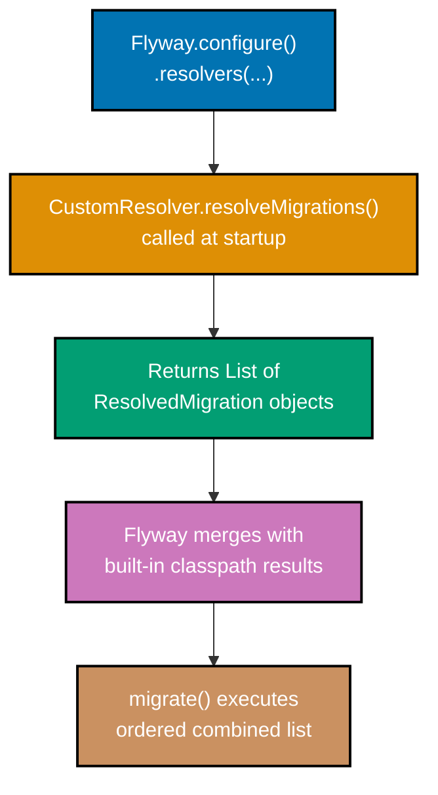
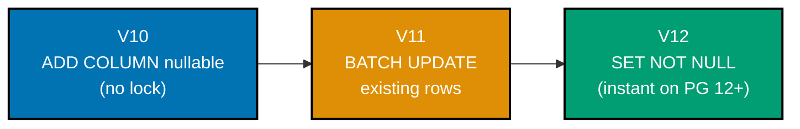
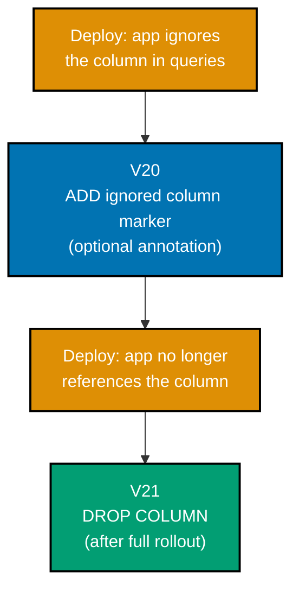
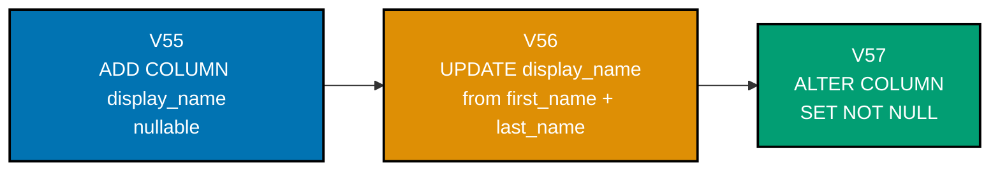
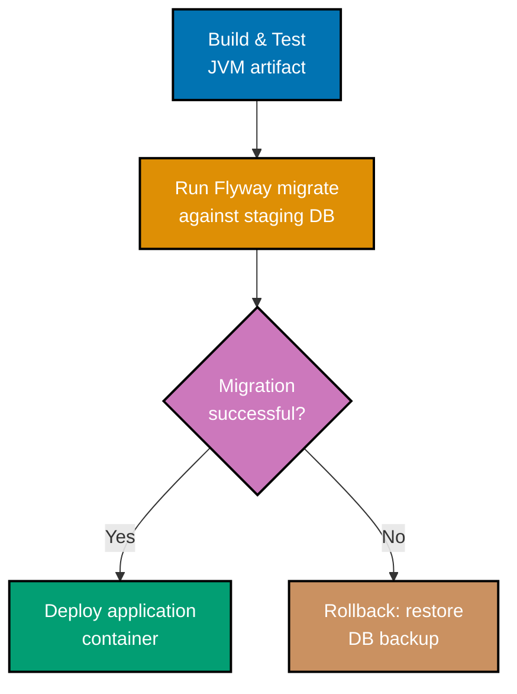
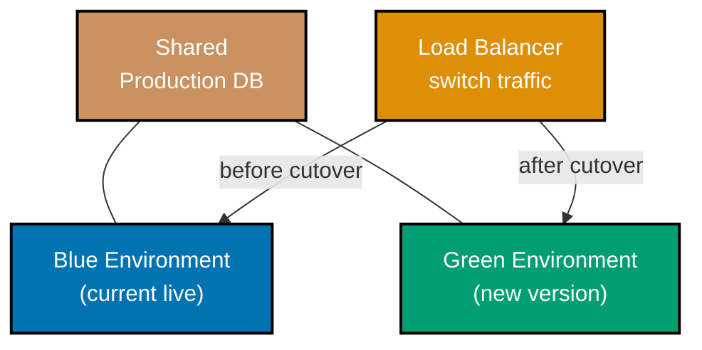
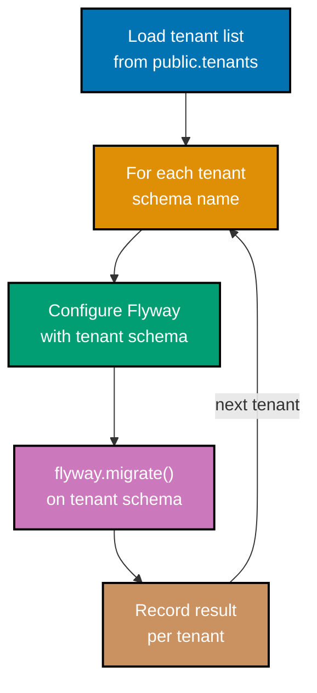
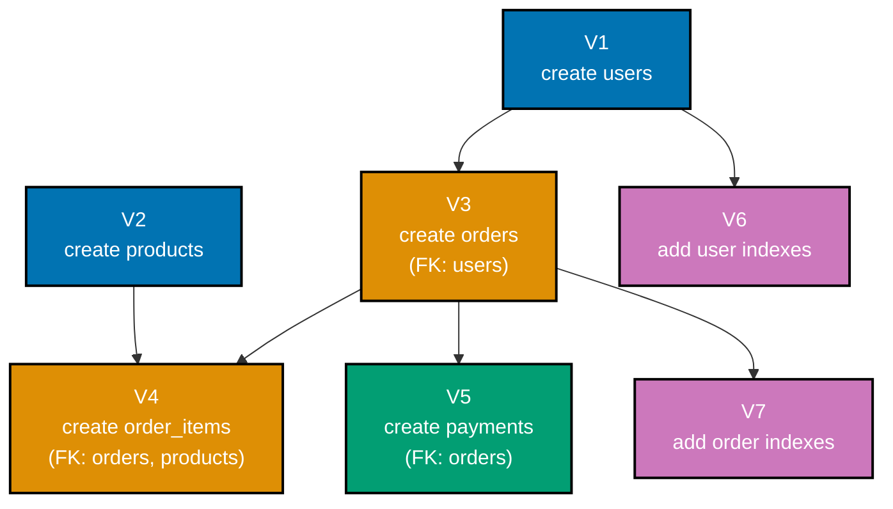
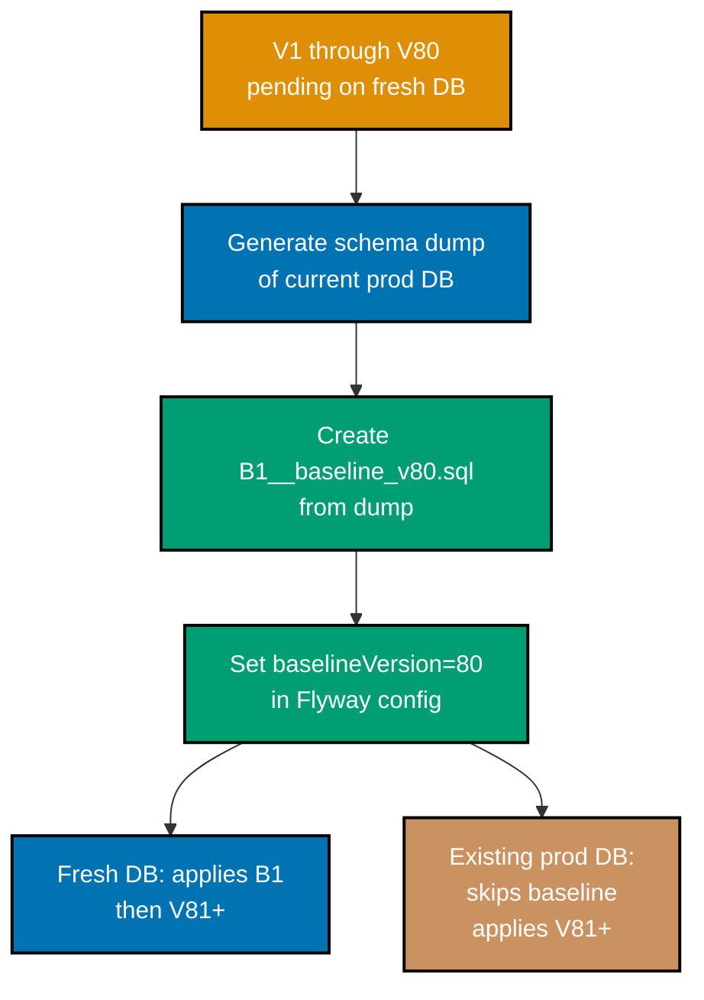

## Advanced Examples (61-85)

**Coverage**: 75-95% of Flyway functionality

**Focus**: Custom resolvers and executors, zero-downtime schema patterns, CI/CD pipeline integration, multi-tenant migrations, encryption, audit, soft delete, ORM integration, schema drift detection, performance benchmarking, dependency graphs, squashing, programmatic API control, custom extensions, production checklists, and monitoring.

These examples assume you understand beginner and intermediate concepts. All examples are self-contained and production-ready.

---

### Example 61: Custom MigrationResolver

A `MigrationResolver` lets Flyway discover migrations from non-standard sources — for example, a database table, an S3 bucket, or an in-memory list constructed at startup. Implementing the interface bypasses the classpath scanner entirely and gives full programmatic control over which migrations appear.



```kotlin
import org.flywaydb.core.Flyway
// => Main Flyway entry point used to configure and trigger migration
import org.flywaydb.core.api.MigrationVersion
// => Immutable value type representing a dotted version string (e.g. "1", "2.1")
import org.flywaydb.core.api.resolver.MigrationResolver
// => Interface: implement to teach Flyway about a non-classpath migration source
import org.flywaydb.core.api.resolver.ResolvedMigration
// => Data interface: holds version, description, checksum, type, executor
import org.flywaydb.core.api.resolver.Context
// => Provides the active FlywayConfiguration during resolver invocation

// Minimal resolved migration implementation holding SQL inline
data class InlineResolvedMigration(
    private val version: String,      // => "61" — becomes MigrationVersion("61")
    private val description: String,  // => stored in flyway_schema_history.description
    private val sql: String           // => raw SQL executed by the custom executor
) : ResolvedMigration {
    override fun getVersion() = MigrationVersion.fromVersion(version)
    // => MigrationVersion.fromVersion parses "61" into comparable version object
    override fun getDescription() = description
    // => Appears in flyway_schema_history and migrate() output
    override fun getScript() = "inline:$version"
    // => Unique script identifier; used for checksum tracking and logging
    override fun getChecksum() = sql.hashCode()
    // => Int hash; Flyway rejects out-of-order migration if checksum changes
    override fun getType() = org.flywaydb.core.api.MigrationType.JDBC
    // => Signals to Flyway that execution is JDBC-based, not file-based SQL
    override fun isUndo() = false
    // => false = forward migration; true would mark this as undo (Flyway Teams)
    override fun getPhysicalLocation() = "in-memory"
    // => Informational; shown in validate output and logs
    override fun getExecutor() = org.flywaydb.core.api.resolver.MigrationExecutor { ctx ->
        // => MigrationExecutor.execute() receives the active migration Context
        ctx.connection.prepareStatement(sql).use { it.executeUpdate() }
        // => Executes the inline SQL on the connection Flyway opened for this migration
    }
    override fun checksumMatches(checksum: Int?) = checksum == getChecksum()
    // => Flyway calls this on repeat runs to verify the script has not changed
}

// Resolver that provides one hard-coded inline migration
class InlineMigrationResolver : MigrationResolver {
    override fun resolveMigrations(context: Context): Collection<ResolvedMigration> {
        // => Called once per flyway.migrate(); return all migrations this resolver owns
        return listOf(
            InlineResolvedMigration(
                version = "61",
                description = "add_resolver_demo_table",
                sql = "CREATE TABLE IF NOT EXISTS resolver_demo (id SERIAL PRIMARY KEY, note TEXT)"
                // => SQL is embedded in code; useful for generated or dynamically computed DDL
            )
        )
        // => Flyway merges this list with classpath-discovered migrations before sorting
    }
}

// Wire resolver into Flyway — alongside the default classpath resolver
val flyway = Flyway.configure()
    .dataSource("jdbc:postgresql://localhost:5432/demo", "user", "pass")
    // => Standard JDBC URL + credentials; replace with env-var driven config in production
    .resolvers(InlineMigrationResolver())
    // => Adds InlineMigrationResolver to the resolver chain; classpath resolver still active
    .load()
// => Builds immutable Flyway instance; no DB connection opened yet

flyway.migrate()
// => Discovers migrations from ALL resolvers, sorts by version, applies pending ones
// => Output: Successfully applied 1 migration to schema "public" (execution time 00:00.041s)
```

**Key Takeaway**: Implement `MigrationResolver` to feed Flyway migrations from any source — databases, APIs, or in-memory code — while preserving the standard version ordering and checksum tracking.

**Why It Matters**: Enterprise platforms sometimes generate DDL at runtime from configuration (multi-module plugins, dynamic feature flags, or tenant-specific schema extensions). A custom resolver keeps this generated DDL under Flyway version control without writing physical SQL files to disk. SaaS products that load schema extensions from a configuration database at startup rely on this pattern to keep every tenant's schema consistent without maintaining thousands of per-tenant migration directories.

---

### Example 62: Custom MigrationExecutor

A `MigrationExecutor` controls the exact JDBC operations that apply a single migration. By default Flyway sends SQL statements through a `Statement`. Replacing the executor lets you wrap statements in custom retry logic, route to multiple connections, or apply transformations before execution.

```kotlin
import org.flywaydb.core.api.resolver.MigrationExecutor
// => Single-method interface: execute(context: Context) performs the migration
import org.flywaydb.core.api.migration.Context
// => Holds getConnection(): java.sql.Connection for the current migration transaction

// Executor that retries the statement once on deadlock (SQLState 40P01 in PostgreSQL)
class RetryOnDeadlockExecutor(private val sql: String) : MigrationExecutor {
    // => Wraps raw SQL with one retry on transient deadlock error

    override fun execute(context: Context) {
        // => Called by Flyway inside the migration transaction; must be idempotent on retry
        val conn = context.connection
        // => conn is the live JDBC Connection Flyway opened for this migration

        repeat(2) { attempt ->
            // => attempt: 0 = first try, 1 = retry after deadlock
            try {
                conn.prepareStatement(sql).use { stmt ->
                    // => .use {} closes PreparedStatement automatically (AutoCloseable)
                    stmt.executeUpdate()
                    // => Executes DDL or DML; returns row count (ignored for DDL)
                    return
                    // => return exits the lambda AND the execute() function on success
                }
            } catch (e: java.sql.SQLException) {
                // => Catch only; re-throw on second failure or non-deadlock code
                if (e.sqlState == "40P01" && attempt == 0) {
                    // => 40P01 = PostgreSQL deadlock_detected error class
                    // => Only retry once; on attempt == 1, fall through to re-throw
                    println("Deadlock on attempt $attempt; retrying migration SQL")
                    // => Log before retry so DBAs can see transient deadlock in output
                } else {
                    throw e
                    // => Re-throw on non-deadlock errors or second deadlock failure
                }
            }
        }
    }

    override fun canExecuteInTransaction() = true
    // => true = Flyway wraps execute() in a transaction; false = DDL outside transaction
    // => Set false only for statements PostgreSQL does not allow inside transactions
}

// Usage: pair with InlineResolvedMigration from Example 61
val executor = RetryOnDeadlockExecutor(
    "UPDATE large_table SET status = 'processed' WHERE status = 'pending'"
    // => Long-running UPDATE likely to conflict with concurrent writers
)
// => executor.execute(context) now retries once on PostgreSQL deadlock
```

**Key Takeaway**: Implement `MigrationExecutor` to control exactly how a migration's SQL reaches the database, enabling retry logic, multi-connection routing, or statement transformation without modifying the SQL file.

**Why It Matters**: High-traffic production systems run migrations while serving requests. Long-running UPDATE statements on busy tables frequently hit deadlocks. Rather than wrapping every migration manually, a `RetryOnDeadlockExecutor` centralizes retry policy and keeps migration SQL clean. Platforms running migrations on read replicas or sharded databases also use custom executors to fan out a single migration to multiple connections simultaneously.

---

### Example 63: Zero-Downtime Column Addition

Adding a `NOT NULL` column with a default value is the most common zero-downtime pattern. The trick is splitting the operation: first add the column as nullable, backfill existing rows, then add the constraint. This avoids a full-table rewrite that would lock the table.



**Phase 1 — Add nullable column (no table lock):**

```sql
-- File: V10__add_status_column_nullable.sql
-- => Phase 1: adding a nullable column requires only a brief ACCESS EXCLUSIVE lock
-- => On PostgreSQL 11+ with a constant DEFAULT, the lock is near-instant
-- => Application code deployed in phase 1 must treat NULL status as "pending"

ALTER TABLE orders                          -- => Orders table may be large; lock duration matters
  ADD COLUMN IF NOT EXISTS status TEXT;     -- => nullable = no DEFAULT constraint written per-row
-- => PostgreSQL adds the column to the catalog only; no row rewrite occurs
-- => IF NOT EXISTS makes this idempotent — safe to re-run on failed deployments
```

**Phase 2 — Backfill existing rows in batches:**

```sql
-- File: V11__backfill_status_column.sql
-- => Phase 2: fill NULL values before adding NOT NULL constraint
-- => Do NOT do: UPDATE orders SET status = 'pending' (locks entire table)
-- => Instead, update in batches using ctid or id range to avoid long lock hold

DO $$
DECLARE
  batch_size  INT := 5000;              -- => update 5 000 rows per iteration
  offset_val  INT := 0;                 -- => track progress across iterations
  rows_done   INT;                      -- => count returned by last UPDATE
BEGIN
  LOOP
    UPDATE orders                       -- => UPDATE acquires row-level locks, not table lock
      SET status = 'pending'
      WHERE id IN (
        SELECT id FROM orders
          WHERE status IS NULL
          ORDER BY id
          LIMIT batch_size
      );
    -- => subquery selects next batch of NULL-status rows ordered by primary key
    GET DIAGNOSTICS rows_done = ROW_COUNT;
    -- => rows_done = number of rows updated in this iteration
    EXIT WHEN rows_done = 0;            -- => no more NULL rows: backfill complete
    PERFORM pg_sleep(0.05);             -- => 50 ms pause between batches to reduce I/O pressure
  END LOOP;
END $$;
-- => Entire DO block runs in a single Flyway transaction; set flyway.mixed=true if DDL precedes
```

**Phase 3 — Add NOT NULL constraint (fast on PostgreSQL 12+):**

```sql
-- File: V12__add_status_not_null_constraint.sql
-- => Phase 3: PostgreSQL 12+ validates NOT NULL without full table scan when column has no NULLs
-- => This ALTER acquires ACCESS EXCLUSIVE lock briefly to update catalog metadata

ALTER TABLE orders
  ALTER COLUMN status SET NOT NULL;   -- => safe: all rows now have non-NULL status from V11
-- => If any NULL rows remain, this statement fails — protecting data integrity
-- => Application can now rely on status being non-null without defensive NULL checks
```

**Key Takeaway**: Split `NOT NULL` column additions across three migrations — add nullable, backfill, constrain — so no single migration holds a table lock long enough to cause downtime.

**Why It Matters**: A single `ALTER TABLE orders ADD COLUMN status TEXT NOT NULL DEFAULT 'pending'` on a table with 100 million rows rewrites every row and holds an `ACCESS EXCLUSIVE` lock for minutes. During that window, every `INSERT`, `UPDATE`, `DELETE`, and `SELECT FOR UPDATE` on the table queues behind the lock. The three-phase pattern lets the application continue serving traffic throughout the migration because only brief catalog-level locks are ever held.

---

### Example 64: Zero-Downtime Column Removal (3-Phase)

Removing a column safely requires the application to stop reading and writing that column before the DDL executes. Skipping the application-level phase causes `column does not exist` errors in running instances that still reference it.



**Phase 1 — Stop writing to the column (application change only, no migration):**

```kotlin
// Application code change: stop writing legacy_notes in INSERT/UPDATE
// => No migration needed; just stop setting the column in your data layer
// => Existing rows keep their legacy_notes value; new rows get NULL

// BEFORE (still writing):
// "INSERT INTO orders (id, amount, legacy_notes) VALUES (?, ?, ?)"

// AFTER (column ignored in writes):
// "INSERT INTO orders (id, amount) VALUES (?, ?)"
// => legacy_notes now receives NULL for new rows (column must be nullable)
```

**Phase 2 — Stop reading from the column and drop via migration:**

```sql
-- File: V21__drop_legacy_notes_column.sql
-- => Execute ONLY after the new application version is fully deployed everywhere
-- => Running this while old app instances are live causes "column does not exist" errors

ALTER TABLE orders
  DROP COLUMN IF EXISTS legacy_notes;   -- => removes column from catalog and frees storage
-- => IF EXISTS: idempotent — migration safe to re-run if it failed mid-way
-- => PostgreSQL marks the column as dropped immediately; storage reclaimed by VACUUM later
-- => All old values in legacy_notes are permanently deleted; ensure backups exist first
```

**Key Takeaway**: Remove a column in two separate deployments — first stop referencing it in application code, then drop it in a migration — so no live application instance ever queries a column that no longer exists.

**Why It Matters**: Rolling deployments and blue-green deploys mean old and new application instances run simultaneously for a window. If the column drop migration runs before all old instances are replaced, those instances crash on the next query referencing the dropped column. The two-deployment approach guarantees the column is gone only after all code that referenced it is gone, making column removal as safe as adding one.

---

### Example 65: Zero-Downtime Table Rename

PostgreSQL has no lock-free table rename. The safe pattern uses a view to bridge the old and new names, then drops the view after all application code migrates to the new table name.

```sql
-- File: V30__rename_invoices_to_billing_documents.sql
-- => Step 1: create the new table with the correct name
-- => Step 2: create a view under the old name for backward compatibility
-- => Step 3 (future migration): drop the view after code is updated

-- Step 1: create the correctly-named table with same schema
CREATE TABLE billing_documents (                -- => new canonical name for the relation
    id          SERIAL          PRIMARY KEY,    -- => preserved: same PK definition
    customer_id INT             NOT NULL,       -- => preserved: same FK reference
    amount      DECIMAL(12,2)   NOT NULL,       -- => preserved: financial precision
    issued_at   TIMESTAMPTZ     NOT NULL        -- => preserved: timezone-aware timestamp
                DEFAULT NOW()                   -- => preserved: server-side default
);
-- => billing_documents is empty; data migration in next step

-- Step 2: migrate data from old table (run once; may need batching for large tables)
INSERT INTO billing_documents
    SELECT id, customer_id, amount, issued_at
    FROM invoices;
-- => copies all rows; if invoices is huge, use batched copy pattern from Example 66

-- Step 3: create a view under the old name so old code still works
CREATE OR REPLACE VIEW invoices AS
    SELECT * FROM billing_documents;    -- => old app code querying "invoices" now hits the view
-- => view is read-write-transparent for simple SELECT/INSERT/UPDATE/DELETE if no joins

-- Step 4 (separate future migration V31): drop the old table and view
-- DROP VIEW IF EXISTS invoices;
-- DROP TABLE IF EXISTS invoices_old;
-- => Only after all application code has been updated to use billing_documents
```

**Key Takeaway**: Bridge a table rename with a view under the old name so old and new application code coexist safely during the transition window before the view is dropped.

**Why It Matters**: `ALTER TABLE invoices RENAME TO billing_documents` is instant, but it immediately breaks every running application instance that still uses the old name. The view bridge pattern gives teams the freedom to rename tables without coordinating a hard cutover. The old view is simply dropped in a subsequent migration after all code references are updated, completing the rename with zero downtime.

---

### Example 66: Large Table Migration with Batched Updates

Updating millions of rows in a single transaction holds row locks for minutes. Batched updates release locks after each batch, allowing concurrent reads and writes to proceed between iterations.

```sql
-- File: V40__backfill_region_column_batched.sql
-- => Adds a non-null region column to a large transactions table in small batches
-- => Each batch commits independently; long-running lock is avoided

-- Step 1: add the column as nullable first (Example 63 Phase 1 pattern)
ALTER TABLE transactions
  ADD COLUMN IF NOT EXISTS region TEXT;    -- => nullable: no row rewrite, near-instant lock

-- Step 2: batch UPDATE with autonomous sub-transactions via PL/pgSQL
DO $$
DECLARE
  last_id     BIGINT  := 0;       -- => cursor: track last processed primary key
  batch_size  INT     := 10000;   -- => rows per commit; tune based on table row width
  rows_done   INT;                -- => rows affected by the most recent UPDATE
BEGIN
  LOOP
    UPDATE transactions t         -- => UPDATE only rows in current batch range
      SET region = CASE
          WHEN t.country_code IN ('US','CA','MX') THEN 'AMER'
          -- => Americas: 3-character ISO country codes
          WHEN t.country_code IN ('DE','FR','GB','NL') THEN 'EMEA'
          -- => Europe/Middle East/Africa bucket
          ELSE 'APAC'             -- => default bucket for all other country codes
        END
      WHERE t.id > last_id        -- => keyset pagination: avoids slow OFFSET
        AND t.id <= last_id + batch_size
        AND t.region IS NULL;     -- => skip rows already backfilled (idempotent)
    GET DIAGNOSTICS rows_done = ROW_COUNT;
    -- => rows_done = how many rows this iteration updated
    EXIT WHEN rows_done = 0;      -- => no more NULL rows in range: advance cursor
    last_id := last_id + batch_size;
    -- => advance cursor to next batch window
    PERFORM pg_sleep(0.1);        -- => 100 ms yield: reduces I/O contention with OLTP traffic
  END LOOP;
END $$;

-- Step 3: add NOT NULL constraint after backfill (safe because all rows filled)
ALTER TABLE transactions
  ALTER COLUMN region SET NOT NULL;  -- => fast on PG 12+ when no NULLs remain
```

**Key Takeaway**: Use PL/pgSQL keyset pagination to update large tables in small, committed batches, yielding between iterations to avoid prolonged lock contention with concurrent traffic.

**Why It Matters**: A single-transaction `UPDATE transactions SET region = ...` on a 500-million-row table can run for 30+ minutes, holding row locks that block application writes. Payment platforms and e-commerce systems with large transaction histories rely on batched backfills to run migrations during peak hours without degrading API response times. The `pg_sleep` between batches is deliberately conservative — it keeps migration I/O from saturating disk throughput during business hours.

---

### Example 67: Online Index Creation (CONCURRENTLY)

`CREATE INDEX CONCURRENTLY` builds a new index without holding an `ACCESS EXCLUSIVE` lock on the table. Reads and writes continue during the build, at the cost of a longer creation time. Flyway requires a workaround because CONCURRENT DDL cannot run inside a transaction.

```sql
-- File: V50__create_index_orders_customer_id.sql
-- => CONCURRENTLY builds the index in the background while reads/writes continue
-- => REQUIRES: this migration must NOT run inside a transaction
-- => Flyway workaround: set mixed=true and use a DO block, or disable transaction

-- IMPORTANT: add to Flyway config or annotation:
-- flyway.mixed=true  (allows DDL and non-transactional statements in same migration)

CREATE INDEX CONCURRENTLY IF NOT EXISTS idx_orders_customer_id
  ON orders (customer_id);
-- => CONCURRENTLY: table remains fully readable and writable during index build
-- => IF NOT EXISTS: idempotent — safe if migration is re-run after partial failure
-- => Build takes longer than standard CREATE INDEX but causes zero query blocking
-- => Index is usable immediately after the statement completes

-- Verify index was created
SELECT indexname, indexdef
FROM pg_indexes
WHERE tablename = 'orders'
  AND indexname = 'idx_orders_customer_id';
-- => indexname: idx_orders_customer_id
-- => indexdef: CREATE INDEX idx_orders_customer_id ON public.orders USING btree (customer_id)
```

**Key Takeaway**: Use `CREATE INDEX CONCURRENTLY` with `IF NOT EXISTS` for all production index additions so queries are never blocked during index creation, and mark the migration non-transactional in Flyway's configuration.

**Why It Matters**: A standard `CREATE INDEX` on a 50-million-row table acquires `ACCESS EXCLUSIVE` lock for minutes, rejecting all concurrent reads. High-availability systems that serve continuous traffic cannot afford this window. `CONCURRENTLY` trades index-build speed for zero query blocking — the new index is usable immediately after creation while writes have continued normally throughout. The `IF NOT EXISTS` guard is essential because a failed `CONCURRENTLY` leaves an invalid index that must be dropped before re-running.

---

### Example 68: Data Backfill Pattern

A data backfill populates a new column derived from existing data. The pattern separates DDL (adding the column) from DML (filling values) into distinct migrations to enable independent rollback and avoid mixed-transaction issues.



**V55 — Add column nullable:**

```sql
-- File: V55__add_display_name_column.sql
-- => Adds display_name as nullable; new rows get NULL until app writes it
ALTER TABLE users
  ADD COLUMN IF NOT EXISTS display_name TEXT;
-- => nullable: no per-row rewrite; metadata-only change in PostgreSQL 11+
```

**V56 — Backfill from existing columns:**

```sql
-- File: V56__backfill_display_name.sql
-- => Derives display_name from existing first_name and last_name columns
-- => CONCAT_WS skips NULL parts; handles users with only one name stored

UPDATE users
  SET display_name = CONCAT_WS(' ', first_name, last_name)
  WHERE display_name IS NULL              -- => only touch rows not yet backfilled
    AND (first_name IS NOT NULL           -- => at least one name component must exist
      OR last_name IS NOT NULL);
-- => CONCAT_WS(' ', 'Alice', 'Smith')  => 'Alice Smith'
-- => CONCAT_WS(' ', NULL, 'Smith')     => 'Smith'   (NULL parts skipped)
-- => CONCAT_WS(' ', 'Alice', NULL)     => 'Alice'   (NULL parts skipped)

UPDATE users
  SET display_name = email                -- => fall back to email as display name
  WHERE display_name IS NULL
    AND email IS NOT NULL;
-- => covers users with no first_name or last_name stored
```

**V57 — Enforce NOT NULL:**

```sql
-- File: V57__display_name_not_null.sql
-- => Safe only after V56 ensures no NULL values remain
ALTER TABLE users
  ALTER COLUMN display_name SET NOT NULL;
-- => PostgreSQL 12+ validates this near-instantly when no NULL rows exist
-- => Application can now skip defensive NULL checks on display_name
```

**Key Takeaway**: Separate the DDL phase (add column), the DML phase (backfill data), and the constraint phase (set NOT NULL) into three distinct migrations so each phase is independently retryable and rollback-safe.

**Why It Matters**: Combining `ADD COLUMN` with `UPDATE` and `ALTER COLUMN SET NOT NULL` in one migration creates a long-running transaction holding locks on every table involved. Separating them means the backfill DML migration can be retried without re-running DDL, and a failed constraint migration can be diagnosed and fixed without touching already-backfilled data. Teams maintaining audit-heavy tables use this three-migration pattern for every derived column to keep the migration history auditable and reversible.

---

### Example 69: Flyway in CI/CD Pipeline

Integrating Flyway into a CI/CD pipeline ensures every deployment applies pending migrations before starting the new application version. The pattern uses Flyway's CLI or API in the deployment job, before the application container starts.



```kotlin
import org.flywaydb.core.Flyway
// => Flyway API; same library used for application startup migrations
import org.flywaydb.core.api.output.MigrateResult
// => Contains pendingCount, migrationsExecuted, warnings, and error details

// Standalone Flyway runner — invoked by the deployment pipeline before app starts
fun runMigrationsInPipeline(
    jdbcUrl: String,    // => from CI secret: jdbc:postgresql://prod-db:5432/myapp
    user: String,       // => from CI secret: migration_user (limited to DDL only)
    password: String    // => from CI secret: never hardcode
): MigrateResult {

    val flyway = Flyway.configure()
        .dataSource(jdbcUrl, user, password)
        // => migration_user needs CREATE, ALTER, DROP, INSERT privileges; not superuser
        .locations("classpath:db/migration")
        // => same migration classpath as the application; built into the JAR/shadow JAR
        .outOfOrder(false)
        // => false = reject out-of-order versions; strict ordering enforced in CI
        .validateOnMigrate(true)
        // => validates checksums before applying; catches tampered migration files
        .baselineOnMigrate(false)
        // => false = never silently baseline an existing DB; fail fast if history missing
        .connectRetries(5)
        // => retry DB connection 5 times; handles transient network blips during deployment
        .connectRetriesInterval(10)
        // => wait 10 seconds between connection retries (total: up to 50 s before failure)
        .load()

    return flyway.migrate()
    // => applies all pending migrations atomically; throws FlywayException on failure
    // => CI pipeline should fail the deployment if this throws
}

// CI script usage (e.g., in GitHub Actions entrypoint or Kotlin deployment script):
fun main() {
    val result = runMigrationsInPipeline(
        jdbcUrl  = System.getenv("DB_JDBC_URL")   ?: error("DB_JDBC_URL not set"),
        // => error() throws IllegalStateException; pipeline fails fast on missing env
        user     = System.getenv("DB_MIGRATE_USER") ?: error("DB_MIGRATE_USER not set"),
        password = System.getenv("DB_MIGRATE_PASS") ?: error("DB_MIGRATE_PASS not set")
    )

    println("Migrations applied: ${result.migrationsExecuted}")
    // => Output: "Migrations applied: 3" — or 0 if schema was already up-to-date
    println("Target version: ${result.targetSchemaVersion}")
    // => Output: "Target version: 57"

    if (result.warnings.isNotEmpty()) {
        result.warnings.forEach { println("WARN: $it") }
        // => Log warnings (e.g., future migrations detected) without failing deployment
    }
}
```

**Key Takeaway**: Run Flyway migrations as an explicit step in the deployment pipeline before starting the new application container, and fail the entire deployment if migrations fail so the database and application code never diverge.

**Why It Matters**: Application code and database schema must move together. If the application container starts before migrations complete, it will execute queries against a schema that is missing columns or tables, causing immediate runtime failures. Running Flyway in the pipeline — with `validateOnMigrate=true` and connection retries — ensures the database is schema-compatible before any traffic reaches the new application version, enabling safe zero-downtime rolling deployments.

---

### Example 70: Migration Rollback Testing

Flyway does not support automatic SQL rollback (Flyway Teams required for undo migrations). The practical approach is testing that each migration can be reversed manually, using a rollback SQL file kept alongside the forward migration for documentation and emergency use.

```kotlin
import org.flywaydb.core.Flyway
// => Used to apply and validate migrations in test scenarios
import org.junit.jupiter.api.Test
// => JUnit 5 test annotation
import org.testcontainers.containers.PostgreSQLContainer
// => Provides an ephemeral PostgreSQL instance for isolated migration tests
import java.sql.DriverManager
// => Opens JDBC connection to validate post-migration schema state

class MigrationRollbackTest {
    // => Tests that the forward migration V60 can be verified and then reversed manually

    @Test
    fun `V60 migration applies and rollback SQL reverts schema`() {
        PostgreSQLContainer("postgres:16-alpine").use { pg ->
            // => Starts a fresh PostgreSQL 16 container; .use {} stops and removes it after test
            pg.start()
            // => Container is ready when start() returns; health check waits for pg_isready

            // Apply forward migration
            val flyway = Flyway.configure()
                .dataSource(pg.jdbcUrl, pg.username, pg.password)
                // => ephemeral container credentials; unique per test run
                .locations("classpath:db/migration")
                // => loads migration files from the test classpath
                .load()

            flyway.migrate()
            // => applies all migrations up to and including V60

            // Verify the new column exists (forward migration was applied)
            DriverManager.getConnection(pg.jdbcUrl, pg.username, pg.password).use { conn ->
                // => Opens a direct JDBC connection to inspect the resulting schema
                val rs = conn.prepareStatement(
                    "SELECT column_name FROM information_schema.columns " +
                    "WHERE table_name='orders' AND column_name='region'"
                ).executeQuery()
                // => information_schema.columns reflects current schema metadata
                assert(rs.next()) { "V60 should have added the 'region' column" }
                // => assert fails the test if region column is absent
            }

            // Execute manual rollback SQL (what a DBA would run in an emergency)
            DriverManager.getConnection(pg.jdbcUrl, pg.username, pg.password).use { conn ->
                conn.prepareStatement(
                    "ALTER TABLE orders DROP COLUMN IF EXISTS region"
                    // => reverse of V60__add_region_to_orders.sql
                ).executeUpdate()
                // => rollback SQL kept in docs/migrations/rollbacks/V60_rollback.sql
            }

            // Verify column is gone after rollback
            DriverManager.getConnection(pg.jdbcUrl, pg.username, pg.password).use { conn ->
                val rs = conn.prepareStatement(
                    "SELECT column_name FROM information_schema.columns " +
                    "WHERE table_name='orders' AND column_name='region'"
                ).executeQuery()
                assert(!rs.next()) { "Rollback SQL should have removed the 'region' column" }
                // => assert fails if region column is still present after rollback
            }
        }
        // => Container stops here; all data discarded; no cleanup needed
    }
}
```

**Key Takeaway**: Write and test manual rollback SQL for every forward migration using an ephemeral Testcontainers database so DBAs have a verified emergency reversal procedure before a migration ever touches production.

**Why It Matters**: Production incidents often require reverting a recent schema change within minutes. Without pre-tested rollback SQL, DBAs write reversal scripts under pressure with no guarantee they work on the actual schema. Keeping a verified rollback SQL file alongside each migration file turns a chaotic incident into a controlled procedure: apply the rollback SQL, verify the schema, then redeploy the previous application version. Teams with compliance requirements (SOC 2, ISO 27001) must demonstrate they can revert schema changes — tested rollback scripts are the audit evidence.

---

### Example 71: Blue-Green Deployment Migrations

Blue-green deployments run two identical production environments. The green environment is the new version; blue is the current live version. Migrations must be backward-compatible with blue's application code so the switch can be reversed if problems appear.



```sql
-- File: V65__add_payment_method_column_blue_green_safe.sql
-- => Must be backward-compatible: blue app must still work AFTER this migration runs
-- => Blue app does not know about payment_method; it must not crash on its presence

-- Safe: adding a nullable column with a default
-- => Blue app ignores the new column in its SELECT/INSERT (it does not name it)
-- => Green app writes payment_method; blue app leaves it NULL
ALTER TABLE transactions
  ADD COLUMN IF NOT EXISTS payment_method TEXT DEFAULT 'CARD';
-- => DEFAULT 'CARD' is stored as column default; no row rewrite in PostgreSQL 11+
-- => Blue SELECT * queries return the new column but blue code ignores the extra field
-- => Blue INSERT queries omit payment_method; PostgreSQL fills in the DEFAULT

-- NOT safe for blue-green: dropping a column blue app still reads
-- DROP COLUMN legacy_status  -- => breaks blue app immediately; never do this during cutover window

-- NOT safe for blue-green: renaming a column blue app references
-- ALTER TABLE transactions RENAME COLUMN amount TO total_amount  -- => breaks blue app
```

**Key Takeaway**: Blue-green migrations must be additive only — new nullable columns, new tables, new indexes — never drops or renames that would break the still-running blue application during the traffic switch window.

**Why It Matters**: The entire value of blue-green deployment is the ability to route traffic back to blue if green has problems. This guarantee breaks if the migration removed or renamed something blue requires. By restricting blue-green migrations to additive changes, teams keep the rollback path open: switch the load balancer back to blue, and the database still supports it. Destructive changes (drops, renames) are deferred to a subsequent migration after blue is fully decommissioned.

---

### Example 72: Feature Flag Migration Pattern

Feature flags let you deploy database changes ahead of the feature launch. The schema is live but the feature remains hidden behind a flag until ready, decoupling database deploys from feature releases.

```sql
-- File: V70__add_subscription_tables_feature_flagged.sql
-- => Creates tables for the new subscription feature
-- => Feature is disabled by default; application reads the feature_flags table
-- => Schema exists in production before the feature is enabled; no rush migrations on launch day

-- The new feature's tables
CREATE TABLE IF NOT EXISTS subscription_plans (
    id          SERIAL          PRIMARY KEY,    -- => unique plan identifier
    plan_name   VARCHAR(100)    NOT NULL,       -- => e.g., 'BASIC', 'PRO', 'ENTERPRISE'
    price_cents INT             NOT NULL,       -- => store monetary values as integers (avoid float)
    billing_cycle VARCHAR(20)   NOT NULL        -- => 'MONTHLY' | 'ANNUAL'
                DEFAULT 'MONTHLY',
    is_active   BOOLEAN         NOT NULL DEFAULT TRUE
    -- => soft-disable plans without deleting them
);

CREATE TABLE IF NOT EXISTS user_subscriptions (
    id              SERIAL          PRIMARY KEY,
    user_id         INT             NOT NULL REFERENCES users(id) ON DELETE CASCADE,
    -- => cascade: deleting a user also deletes their subscriptions
    plan_id         INT             NOT NULL REFERENCES subscription_plans(id),
    started_at      TIMESTAMPTZ     NOT NULL DEFAULT NOW(),
    -- => TIMESTAMPTZ stores UTC; application converts to local for display
    expires_at      TIMESTAMPTZ,                -- => NULL = active; non-NULL = expiry date
    cancelled_at    TIMESTAMPTZ                 -- => NULL = not cancelled
);

-- Feature flag record controlling visibility (application reads this at startup)
INSERT INTO feature_flags (flag_name, is_enabled, description)
  VALUES ('subscription_feature', FALSE, 'Subscription plans and billing UI')
  ON CONFLICT (flag_name) DO NOTHING;
-- => ON CONFLICT DO NOTHING: idempotent — migration safe to re-run
-- => Application checks: SELECT is_enabled FROM feature_flags WHERE flag_name = 'subscription_feature'
-- => is_enabled = FALSE: application hides subscription UI; tables exist but are not used
```

**Key Takeaway**: Deploy migration schema changes ahead of feature launches with a feature flag row to decouple database deploys from product releases, avoiding rushed last-minute migrations.

**Why It Matters**: Last-minute schema changes under release pressure are a leading cause of production incidents. The feature flag pattern lets teams merge database migrations weeks before a launch, giving operations teams time to review table sizes, index strategies, and storage projections. On launch day, enabling the feature is a single flag update — not a migration run. If the launch is cancelled or delayed, the tables sit unused with no impact on the running application.

---

### Example 73: Multi-Tenant Schema Migration

Multi-tenant SaaS applications often give each tenant a separate PostgreSQL schema. Flyway supports this through programmatic API control — iterating tenant schemas and running the same migration set against each.



```kotlin
import org.flywaydb.core.Flyway
// => Flyway API instance; one per tenant schema
import javax.sql.DataSource
// => Standard JDBC DataSource; passed from application connection pool

data class TenantMigrationResult(
    val schemaName: String,         // => e.g., "tenant_acme", "tenant_globocorp"
    val migrationsApplied: Int,     // => 0 means schema was already up-to-date
    val success: Boolean,           // => false if FlywayException was thrown
    val errorMessage: String? = null // => null on success; exception message on failure
)

fun migrateAllTenants(
    dataSource: DataSource,         // => pooled connection to the shared PostgreSQL instance
    tenantSchemas: List<String>     // => e.g., ["tenant_acme", "tenant_globocorp", "tenant_test"]
): List<TenantMigrationResult> {

    return tenantSchemas.map { schema ->
        // => map transforms each schema name into a TenantMigrationResult
        try {
            val flyway = Flyway.configure()
                .dataSource(dataSource)
                // => reuse the existing connection pool; do NOT create a new pool per tenant
                .schemas(schema)
                // => sets the default schema for this Flyway instance to the tenant's schema
                // => flyway_schema_history is also created in this schema (isolated per tenant)
                .locations("classpath:db/migration/tenant")
                // => tenant-specific migrations separate from shared/public schema migrations
                .table("flyway_schema_history")
                // => each tenant schema gets its own history table; no cross-tenant contamination
                .baselineOnMigrate(false)
                // => never silently baseline; a missing history table is an error, not a new tenant
                .validateOnMigrate(true)
                // => checksum validation prevents divergence across tenant schemas
                .load()

            val result = flyway.migrate()
            // => migrates THIS tenant's schema; concurrent migration of other tenants is safe
            TenantMigrationResult(
                schemaName = schema,
                migrationsApplied = result.migrationsExecuted,
                success = true
            )
        } catch (e: Exception) {
            // => catch all; one tenant failure must not abort other tenants
            TenantMigrationResult(
                schemaName = schema,
                migrationsApplied = 0,
                success = false,
                errorMessage = e.message
                // => include the exception message so the caller can log which tenant failed
            )
        }
    }
}

// Usage in deployment pipeline:
fun main() {
    val ds = buildProductionDataSource()          // => standard HikariCP setup
    val tenants = loadTenantSchemasFromDatabase(ds)
    // => SELECT schema_name FROM public.tenants WHERE is_active = true
    val results = migrateAllTenants(ds, tenants)

    val failures = results.filter { !it.success }
    // => collect all failed tenant migrations
    if (failures.isNotEmpty()) {
        failures.forEach { println("FAILED: ${it.schemaName} — ${it.errorMessage}") }
        // => log each failed schema name and error message
        error("${failures.size} tenant migration(s) failed; aborting deployment")
        // => halt deployment: application must not start with partially migrated tenants
    }

    println("Successfully migrated ${results.size} tenant schemas")
    // => Output: "Successfully migrated 127 tenant schemas"
}
```

**Key Takeaway**: Iterate tenant schemas programmatically, creating one Flyway instance per schema with isolated `flyway_schema_history` tables, and treat any single tenant failure as a hard deployment stop.

**Why It Matters**: SaaS platforms with per-tenant schemas must guarantee schema consistency across all tenants. A migration that succeeds for 126 tenants but fails for one leaves that tenant unable to use features the other 126 already have. Failing the deployment hard on any tenant failure prompts immediate investigation before users are affected. Isolating `flyway_schema_history` per schema means each tenant's version history is independent — tenant A can be on V57 while tenant B is on V59 during a phased rollout.

---

### Example 74: Migration with pgcrypto Encryption

Encrypting sensitive columns at the database level using PostgreSQL's `pgcrypto` extension ensures data is stored encrypted even if database backups are compromised. Flyway applies the extension and schema changes together.

```sql
-- File: V75__add_pgcrypto_and_encrypt_ssn.sql
-- => Enables pgcrypto extension and adds an encrypted SSN column
-- => pgcrypto provides pgp_sym_encrypt/pgp_sym_decrypt for symmetric encryption
-- => Key management: the encryption key lives in application config, NOT in the database

-- Step 1: enable pgcrypto (requires superuser; run via migration_user with SUPERUSER or via DBA)
CREATE EXTENSION IF NOT EXISTS pgcrypto;
-- => pgcrypto provides: pgp_sym_encrypt, pgp_sym_decrypt, gen_salt, crypt, digest

-- Step 2: add encrypted column (bytea stores binary ciphertext)
ALTER TABLE customers
  ADD COLUMN IF NOT EXISTS ssn_encrypted BYTEA;
-- => BYTEA stores arbitrary binary data; pgp_sym_encrypt returns BYTEA

-- Step 3: backfill encrypted values from plaintext column (if migrating existing data)
-- WARNING: this reads the plaintext ssn column; ensure connection is TLS-only
UPDATE customers
  SET ssn_encrypted = pgp_sym_encrypt(
      ssn,                                -- => plaintext source column
      current_setting('app.encryption_key') -- => key from PostgreSQL session variable
      -- => set in connection string: options='-c app.encryption_key=your-secret-key'
  )
  WHERE ssn IS NOT NULL                   -- => only encrypt rows that have SSN data
    AND ssn_encrypted IS NULL;            -- => idempotent: skip already-encrypted rows

-- Step 4: verify encryption worked on a sample row (for migration validation)
-- SELECT pgp_sym_decrypt(ssn_encrypted, current_setting('app.encryption_key'))
--   FROM customers LIMIT 1;
-- => Output: original SSN value (proves round-trip works before dropping plaintext column)

-- Step 5: drop plaintext column after verification (separate migration V76)
-- ALTER TABLE customers DROP COLUMN IF EXISTS ssn;
-- => run in V76 after confirming ssn_encrypted backfill is complete and app reads from it
```

**Key Takeaway**: Migrate to encrypted columns by adding the ciphertext column, backfilling from plaintext using the encryption key as a PostgreSQL session variable, then dropping the plaintext column in a subsequent migration after verifying decryption.

**Why It Matters**: Regulatory requirements (HIPAA, GDPR, PCI-DSS) mandate encrypting PII at rest. Storing the encryption key outside the database — as an application config secret — means a stolen database backup contains only ciphertext. Separating the backfill migration from the plaintext column drop gives the team a window to verify decryption works correctly in staging before permanently losing the plaintext source. Teams that migrate millions of SSN rows in one step with no verification checkpoint risk losing all SSN data if the encryption key is wrong.

---

### Example 75: Audit Trail Table Migration

An audit trail records every change to a table's rows: who changed what, when, and what the old and new values were. The Flyway migration creates the audit table and installs a trigger to populate it automatically.

```sql
-- File: V80__add_audit_trail_for_accounts.sql
-- => Creates audit log table and trigger for the accounts table
-- => Trigger captures INSERT, UPDATE, DELETE operations automatically

-- Audit log table: stores one row per change event
CREATE TABLE IF NOT EXISTS account_audit_log (
    audit_id        BIGSERIAL       PRIMARY KEY,        -- => unique audit record identifier
    account_id      INT             NOT NULL,           -- => which account was changed
    operation       CHAR(1)         NOT NULL,           -- => 'I'nsert, 'U'pdate, 'D'elete
    changed_at      TIMESTAMPTZ     NOT NULL DEFAULT NOW(), -- => when the change occurred
    changed_by      TEXT            NOT NULL            -- => current_user at time of change
                    DEFAULT current_user,
    old_data        JSONB,                              -- => NULL for INSERT; previous row for UPDATE/DELETE
    new_data        JSONB                               -- => NULL for DELETE; new row for INSERT/UPDATE
);
-- => JSONB: binary JSON; supports indexing and querying specific fields
-- => old_data and new_data store entire row snapshots as JSON objects

-- Trigger function: called by PostgreSQL for each row change on accounts
CREATE OR REPLACE FUNCTION log_account_changes()
RETURNS TRIGGER
LANGUAGE plpgsql
AS $$
BEGIN
    INSERT INTO account_audit_log (account_id, operation, old_data, new_data)
    VALUES (
        COALESCE(NEW.id, OLD.id),           -- => NEW.id for INSERT/UPDATE; OLD.id for DELETE
        SUBSTR(TG_OP, 1, 1),                -- => TG_OP = 'INSERT'|'UPDATE'|'DELETE' -> first char
        CASE WHEN TG_OP = 'INSERT'
             THEN NULL
             ELSE row_to_json(OLD)::JSONB   -- => serialize old row to JSONB for UPDATE/DELETE
        END,
        CASE WHEN TG_OP = 'DELETE'
             THEN NULL
             ELSE row_to_json(NEW)::JSONB   -- => serialize new row to JSONB for INSERT/UPDATE
        END
    );
    -- => INSERT INTO runs inside the same transaction as the triggering DML
    RETURN NEW;
    -- => RETURN NEW for BEFORE triggers; required but value ignored for AFTER triggers
END;
$$;
-- => LANGUAGE plpgsql: PostgreSQL procedural language; efficient for trigger functions

-- Attach trigger to accounts table
DROP TRIGGER IF EXISTS trg_account_audit ON accounts;
-- => DROP IF EXISTS: idempotent; allows migration re-run without "trigger already exists" error
CREATE TRIGGER trg_account_audit
    AFTER INSERT OR UPDATE OR DELETE ON accounts
    -- => AFTER: runs after the DML succeeds; OLD/NEW are fully populated
    FOR EACH ROW                            -- => one trigger call per changed row
    EXECUTE FUNCTION log_account_changes();
-- => trigger is now active; all future changes to accounts are logged automatically
```

**Key Takeaway**: Create audit tables and attach trigger functions in a single Flyway migration so audit logging is atomic — either both the table and trigger exist, or neither does.

**Why It Matters**: Financial systems, healthcare platforms, and any application handling regulated data must maintain immutable change history for compliance audits. Trigger-based audit logging is transparent to application code — developers do not need to remember to call an audit function on every update path. The JSONB snapshot approach captures the full row state, not just changed fields, enabling point-in-time reconstruction of any row's history without application-level event sourcing infrastructure.

---

### Example 76: Soft Delete Schema Pattern

Soft delete preserves records by marking them deleted rather than removing them. The Flyway migration adds the required columns and a partial index to keep active-record queries fast.

```sql
-- File: V82__add_soft_delete_to_products.sql
-- => Adds deleted_at column and optimized index for soft-delete pattern
-- => Soft delete: records are never removed; queries filter WHERE deleted_at IS NULL

-- Add soft delete timestamp column
ALTER TABLE products
  ADD COLUMN IF NOT EXISTS deleted_at TIMESTAMPTZ;
-- => NULL = active record; non-NULL = deletion timestamp (soft-deleted)
-- => TIMESTAMPTZ stores UTC; application converts for display

-- Partial index on active records only (WHERE deleted_at IS NULL)
-- => This index is used by all queries that filter active products
-- => Much smaller than a full index because soft-deleted rows are excluded
CREATE INDEX CONCURRENTLY IF NOT EXISTS idx_products_active
  ON products (id)
  WHERE deleted_at IS NULL;
-- => CONCURRENTLY: no lock during index build (see Example 67)
-- => WHERE deleted_at IS NULL: partial index; only active rows are indexed
-- => Query: SELECT * FROM products WHERE id = ? AND deleted_at IS NULL
-- =>   PostgreSQL uses idx_products_active because the WHERE condition matches

-- View for backward compatibility: existing queries use products_active view
CREATE OR REPLACE VIEW products_active AS
  SELECT * FROM products
  WHERE deleted_at IS NULL;
-- => legacy application code SELECT * FROM products_active works unchanged
-- => New code queries products table directly with explicit WHERE deleted_at IS NULL

-- Soft delete stored procedure (application calls this instead of DELETE)
CREATE OR REPLACE FUNCTION soft_delete_product(p_id INT)
RETURNS VOID
LANGUAGE plpgsql
AS $$
BEGIN
  UPDATE products
    SET deleted_at = NOW()       -- => marks the record as deleted at current timestamp
    WHERE id = p_id
      AND deleted_at IS NULL;    -- => idempotent: no-op if already soft-deleted
  -- => record remains in the table; referential integrity is preserved
END;
$$;
```

**Key Takeaway**: Soft delete requires a nullable `deleted_at` column, a partial index on `deleted_at IS NULL` to keep active-record queries efficient, and a view for backward compatibility — all installed in a single migration.

**Why It Matters**: Hard deletes break referential integrity, prevent audit reconstruction, and lose data that business teams later need for analytics. Soft delete preserves the record while hiding it from normal queries. The partial index on `deleted_at IS NULL` is critical for performance — without it, every active-records query scans all rows including the growing pool of soft-deleted records. E-commerce platforms, document management systems, and HR tools use soft delete universally to support GDPR right-to-erasure workflows (the record is soft-deleted, then physically expunged after the retention period).

---

### Example 77: Flyway with Exposed ORM Advanced Patterns

Kotlin Exposed ORM and Flyway complement each other — Flyway manages schema migrations, and Exposed's DSL reflects the post-migration schema. This example shows how to keep Exposed table definitions synchronized with Flyway-managed schema changes.

```kotlin
import org.jetbrains.exposed.sql.*
// => Exposed SQL DSL: Table, Column, Database, SchemaUtils definitions
import org.jetbrains.exposed.sql.transactions.transaction
// => transaction {} block: wraps all Exposed DSL calls in a database transaction
import org.flywaydb.core.Flyway
// => Flyway API; runs before Exposed accesses the schema

// Exposed table object reflecting the schema after Flyway V82 (soft delete migration)
object Products : Table("products") {
    // => "products" must match the Flyway-managed table name exactly
    val id          = integer("id").autoIncrement()
    // => integer("id"): maps to INT column; .autoIncrement() uses SERIAL semantics
    val name        = varchar("name", 200)
    // => varchar("name", 200): maps to VARCHAR(200); must match Flyway DDL length
    val price       = decimal("price", 12, 2)
    // => decimal("price", 12, 2): maps to DECIMAL(12,2); financial precision
    val deletedAt   = datetime("deleted_at").nullable()
    // => .nullable(): maps to TIMESTAMPTZ NULL; present after V82 migration
    override val primaryKey = PrimaryKey(id)
    // => tells Exposed which column is the primary key; used in update/delete DSL
}

// Run Flyway first, then use Exposed DSL against the migrated schema
fun setupDatabaseAndQuery() {
    // Phase 1: run Flyway migrations (schema must be current before Exposed runs)
    val flyway = Flyway.configure()
        .dataSource("jdbc:postgresql://localhost:5432/demo", "user", "pass")
        // => same credentials used by the application; Flyway runs first
        .locations("classpath:db/migration")
        .load()
    flyway.migrate()
    // => ensures schema is up-to-date; Exposed DSL calls come AFTER this line

    // Phase 2: use Exposed DSL against the Flyway-managed schema
    Database.connect("jdbc:postgresql://localhost:5432/demo", user = "user", password = "pass")
    // => Exposed connects independently of Flyway; both use the same underlying DB

    // Query active products (soft delete pattern from V82)
    val activeProducts = transaction {
        // => transaction {} opens a connection and wraps all DSL calls in a transaction
        Products.select { Products.deletedAt.isNull() }
        // => DSL generates: SELECT * FROM products WHERE deleted_at IS NULL
        // => uses the partial index idx_products_active created in V82
            .map { row ->
                mapOf(
                    "id"    to row[Products.id],      // => row[column]: type-safe accessor
                    "name"  to row[Products.name],    // => returns String (not nullable)
                    "price" to row[Products.price]    // => returns BigDecimal
                )
            }
    }
    // => activeProducts: List<Map<String, Any>>

    // Soft delete via Exposed (calls soft_delete_product function from V82)
    transaction {
        exec("SELECT soft_delete_product(${activeProducts.first()["id"]})")
        // => exec() runs raw SQL; calls the PL/pgSQL function created in V82
        // => Exposed does not wrap stored procedures natively; exec() is the escape hatch
    }
    println("Active products count: ${activeProducts.size}")
    // => Output: "Active products count: 42"
}
```

**Key Takeaway**: Always run Flyway migrations before Exposed initializes so the DSL's table definitions map to the current schema, and use `exec()` for stored procedures and functions created by Flyway migrations.

**Why It Matters**: Exposed's DSL does not validate its table definitions against the live database schema at startup. If Exposed runs before Flyway, the table objects may reference columns that do not yet exist, causing cryptic `column does not exist` errors at runtime. Establishing Flyway-first as the startup contract keeps schema and ORM definitions in sync automatically. Teams using Exposed in microservices run Flyway in the application's `Application.module()` block before mounting any Ktor routes, ensuring the schema is always current before the first request arrives.

---

### Example 78: Schema Comparison/Drift Detection

Schema drift occurs when the live database schema diverges from what Flyway expects — for example, a DBA ran a manual ALTER that was never recorded as a migration. Flyway's `validate` command detects checksum mismatches and missing migrations.

```kotlin
import org.flywaydb.core.Flyway
// => Flyway API used for validate() and info() operations
import org.flywaydb.core.api.output.ValidateResult
// => Contains errorDetails and invalidMigrations for drift analysis
import org.flywaydb.core.api.output.InfoResult
// => Contains the list of all migrations and their statuses

fun detectSchemaDrift(jdbcUrl: String, user: String, password: String): Boolean {
    // => returns true if drift detected; false if schema matches migration history

    val flyway = Flyway.configure()
        .dataSource(jdbcUrl, user, password)
        .locations("classpath:db/migration")
        .validateOnMigrate(false)
        // => disable auto-validate on migrate; we call validate() explicitly here
        .ignoreMigrationPatterns("*:pending")
        // => ignore pending migrations (not yet applied); focus only on applied ones
        .load()

    // Run schema validation
    val result: ValidateResult = flyway.validateWithResult()
    // => compares checksum of each applied migration against the file on the classpath
    // => does NOT modify the database; read-only operation

    if (!result.validationSuccessful) {
        println("DRIFT DETECTED: ${result.errorDetails?.errorMessage}")
        // => errorDetails?.errorMessage: describes the first validation failure
        result.invalidMigrations.forEach { inv ->
            println("  Migration ${inv.version}: ${inv.errorDetails.errorMessage}")
            // => per-migration error: "checksum mismatch", "missing migration", etc.
        }
        return true
        // => drift detected; caller should alert and halt deployment
    }

    // Check for out-of-band schema changes using information_schema
    val conn = flyway.configuration.dataSource.connection
    // => direct JDBC connection to query information_schema
    conn.use {
        val rs = it.prepareStatement("""
            SELECT table_name
            FROM information_schema.tables
            WHERE table_schema = 'public'
              AND table_type = 'BASE TABLE'
              AND table_name NOT IN (
                  SELECT DISTINCT description
                  FROM flyway_schema_history
                  WHERE success = true
              )
              AND table_name NOT LIKE 'flyway_%'
        """.trimIndent()).executeQuery()
        // => finds tables that exist in the schema but are not referenced in migration history
        while (rs.next()) {
            println("UNTRACKED TABLE: ${rs.getString("table_name")}")
            // => tables not created by any Flyway migration — possible manual DDL
        }
    }

    println("Schema validation passed: no drift detected")
    // => Output: "Schema validation passed: no drift detected"
    return false
}
```

**Key Takeaway**: Run `flyway.validateWithResult()` in the deployment pipeline to detect checksum mismatches and missing migration entries before applying any new migrations, failing the deployment if drift is found.

**Why It Matters**: DBAs sometimes apply emergency fixes directly to production without creating migration files. Flyway's validate detects these as checksum mismatches or schema inconsistencies. Catching drift before a deployment prevents Flyway from applying a new migration on top of an unexpected schema state, which can cause silent data corruption or constraint violations. Security audits require proof that the production schema matches the migration history — automated drift detection provides this evidence continuously without manual inspection.

---

### Example 79: Migration Performance Benchmarking

Measuring how long each migration takes helps identify slow DDL before it hits production. Benchmarking in a staging environment with production-scale data exposes migrations that require table rewrites or lock contention.

```kotlin
import org.flywaydb.core.Flyway
// => Flyway API used to retrieve migration timing from MigrateResult
import org.flywaydb.core.api.output.MigrateResult
// => Contains per-migration timing in migrationsExecuted and execution time
import kotlin.time.measureTimedValue
// => Kotlin standard library: measures elapsed wall-clock time around a block

data class MigrationTiming(
    val version: String,        // => "V63", "V66", etc.
    val description: String,    // => "add_region_column", "backfill_region_batched"
    val durationMs: Long,       // => wall-clock milliseconds for this migration
    val category: String        // => "FAST" | "MEDIUM" | "SLOW" | "CRITICAL"
)

fun benchmarkMigrations(jdbcUrl: String, user: String, password: String): List<MigrationTiming> {
    val flyway = Flyway.configure()
        .dataSource(jdbcUrl, user, password)
        .locations("classpath:db/migration")
        .load()

    val (result, totalDuration) = measureTimedValue {
        flyway.migrate()
        // => measureTimedValue captures both the return value and elapsed duration
    }
    // => totalDuration: Duration object; totalDuration.inWholeMilliseconds gives Long

    println("Total migration time: ${totalDuration.inWholeMilliseconds} ms")
    // => Output: "Total migration time: 14320 ms"

    // Flyway MigrateResult contains per-migration execution metadata
    return result.migrations.map { applied ->
        val durationMs = applied.executionTime
        // => executionTime: Int milliseconds for this specific migration (Flyway-measured)
        val category = when {
            durationMs < 500   -> "FAST"      // => under 500 ms: safe for peak-hours deployment
            durationMs < 5_000 -> "MEDIUM"    // => 500 ms – 5 s: review lock type before prod
            durationMs < 30_000 -> "SLOW"     // => 5 s – 30 s: must use CONCURRENTLY or batching
            else               -> "CRITICAL"  // => over 30 s: requires zero-downtime redesign
        }

        if (category in listOf("SLOW", "CRITICAL")) {
            println("WARNING: ${applied.version} (${applied.description}) took ${durationMs} ms [$category]")
            // => alerts team to migrations that need redesign before production
        }

        MigrationTiming(
            version     = applied.version,
            description = applied.description,
            durationMs  = durationMs.toLong(),
            category    = category
        )
    }
}

// Report output format for CI pipeline
fun printBenchmarkReport(timings: List<MigrationTiming>) {
    println("\n=== Migration Performance Report ===")
    timings.sortedByDescending { it.durationMs }.forEach { t ->
        println("${t.category.padEnd(10)} ${t.version.padEnd(8)} ${t.durationMs} ms — ${t.description}")
        // => Example output:
        // => SLOW       V66      18420 ms — backfill_region_column_batched
        // => MEDIUM     V67      1230 ms  — create_index_orders_customer_id
        // => FAST       V63      45 ms    — add_status_column_nullable
    }
}
```

**Key Takeaway**: Capture per-migration execution time from `MigrateResult.migrations` and classify migrations by duration so slow DDL is identified in staging before it causes production maintenance windows.

**Why It Matters**: A migration that takes 30 seconds in development often takes 10 minutes against a 500-million-row production table. Without staging benchmarks on production-scale data, teams discover slow migrations during deployment — when the window to abort is already gone. Classifying migrations by duration in CI reports lets platform engineers proactively redesign any `SLOW` or `CRITICAL` migration (batching, CONCURRENTLY, phased approach) before it ever runs in production.

---

### Example 80: Migration Dependency Graph

Some migrations logically depend on others — for example, a foreign key migration must run after both referenced tables exist. Visualizing this dependency graph helps teams understand which migration files can be safely squashed (Example 81) and which must remain ordered.



```kotlin
// Lightweight migration dependency tracker using Kotlin data classes
data class MigrationNode(
    val version: String,            // => "V1", "V2", etc. — matches Flyway migration version
    val description: String,        // => "create_users", "create_orders_fk_users"
    val dependsOn: List<String>     // => list of version strings this migration requires first
)

// Define the dependency graph for the schema shown in the diagram
val migrationGraph = listOf(
    MigrationNode("V1", "create_users",   dependsOn = emptyList()),
    // => V1 has no dependencies; it is a root node
    MigrationNode("V2", "create_products", dependsOn = emptyList()),
    // => V2 has no dependencies; independent root node
    MigrationNode("V3", "create_orders",   dependsOn = listOf("V1")),
    // => V3 requires V1: orders.user_id FK references users.id
    MigrationNode("V4", "create_order_items", dependsOn = listOf("V3", "V2")),
    // => V4 requires V3 (orders FK) and V2 (products FK)
    MigrationNode("V5", "create_payments", dependsOn = listOf("V3")),
    // => V5 requires V3: payments.order_id FK references orders.id
    MigrationNode("V6", "add_user_indexes", dependsOn = listOf("V1")),
    // => V6 requires V1: index on users table must exist first
    MigrationNode("V7", "add_order_indexes", dependsOn = listOf("V3")),
    // => V7 requires V3: index on orders table must exist first
)

// Topological sort to find valid execution order respecting dependencies
fun topologicalSort(graph: List<MigrationNode>): List<String> {
    val resolved = mutableListOf<String>()  // => accumulates sorted versions
    val seen = mutableSetOf<String>()       // => tracks visited nodes for cycle detection

    fun visit(version: String) {
        if (version in seen) return         // => already visited; skip (DAG, not cycle)
        val node = graph.find { it.version == version }
            ?: return                       // => unknown version; skip gracefully
        node.dependsOn.forEach { visit(it) }
        // => recursively visit all dependencies before adding this node
        if (version !in resolved) resolved.add(version)
        // => add to resolved only after all dependencies are resolved
        seen.add(version)                   // => mark as visited
    }

    graph.forEach { visit(it.version) }
    // => visit every node; resolved accumulates in dependency-first order
    return resolved
    // => returned list: ["V1", "V2", "V3", "V4", "V5", "V6", "V7"] (one valid order)
}

val executionOrder = topologicalSort(migrationGraph)
println("Valid migration execution order: $executionOrder")
// => Output: "Valid migration execution order: [V1, V2, V3, V4, V5, V6, V7]"
```

**Key Takeaway**: Map migration dependencies explicitly and use topological sort to identify valid execution orders, which reveals which migrations form independent chains that can be safely squashed.

**Why It Matters**: Large schemas with 50+ migrations often have migrations that depend on each other through foreign keys, views, and indexes. Without a dependency map, squashing (combining multiple migrations into one) risks creating a single migration that references tables or columns before they exist. The topological sort identifies the strict ordering constraints, allowing teams to safely squash migrations within independent chains (V1+V6 or V2+V4) while preserving cross-chain ordering.

---

### Example 81: Migration Squashing Pattern

After accumulating many migrations on a mature codebase, squashing combines all existing migrations into a single baseline snapshot. This reduces migration history noise and speeds up fresh database provisioning for new developers and CI environments.



**Step 1 — Generate baseline SQL from current production schema:**

```bash
# Dump current schema only (no data) from production database
# => --schema-only: DDL only; no INSERT statements
# => --no-owner: omit OWNER TO clauses for portability
# => Output: B1__baseline_v80.sql — the squashed starting point
pg_dump --schema-only --no-owner \
  postgresql://prod-db:5432/myapp \
  > src/main/resources/db/migration/B1__baseline_v80.sql
```

**Step 2 — Configure Flyway to use the baseline:**

```kotlin
import org.flywaydb.core.Flyway
// => Flyway API; configured with baselineVersion and baselineOnMigrate

fun configureSquashedFlyway(jdbcUrl: String, user: String, password: String): Flyway {
    return Flyway.configure()
        .dataSource(jdbcUrl, user, password)
        .locations("classpath:db/migration")
        // => migration folder now contains: B1__baseline_v80.sql + V81 onward
        .baselineVersion("80")
        // => existing production databases: already at V80; baseline is skipped
        // => Flyway records V80 as the baseline in flyway_schema_history
        .baselineOnMigrate(true)
        // => true: if flyway_schema_history is missing, apply baseline automatically
        // => false would fail on existing DBs with no history table
        .baselineDescription("Squashed baseline at V80")
        // => description stored in flyway_schema_history for the baseline entry
        .load()
    // => returns configured Flyway; call .migrate() to apply
}

// Usage: same call for both fresh and existing databases
fun main() {
    val flyway = configureSquashedFlyway(
        jdbcUrl  = System.getenv("DB_JDBC_URL")   ?: error("missing DB_JDBC_URL"),
        user     = System.getenv("DB_USER")        ?: error("missing DB_USER"),
        password = System.getenv("DB_PASSWORD")    ?: error("missing DB_PASSWORD")
    )
    val result = flyway.migrate()
    // => Fresh DB:    applies B1__baseline_v80.sql + any V81+ migrations
    // => Existing DB: records baseline at V80; applies only V81+ migrations
    println("Applied ${result.migrationsExecuted} migration(s)")
    // => Fresh DB:  "Applied 3 migration(s)"  (baseline + 2 new migrations)
    // => Existing DB: "Applied 2 migration(s)" (only the new migrations)
}
```

**Key Takeaway**: Squash by generating a schema dump as a baseline SQL file, setting `baselineVersion` to the current highest version, and enabling `baselineOnMigrate` so both fresh and existing databases converge to the same schema through a single Flyway configuration.

**Why It Matters**: A codebase with 80+ migration files means every fresh CI database runs 80 migrations to reach the current state. On busy CI systems running 50 parallel builds, this multiplies to thousands of unnecessary migration runs per day. Squashing reduces a fresh environment setup from 80 serial migrations to one baseline SQL execution, dramatically speeding up test suite startup. The production database skips the baseline entirely and only applies new migrations from V81 onward, making the squash entirely non-destructive to existing environments.

---

### Example 82: Flyway API Programmatic Control

Flyway's Java API exposes full lifecycle control beyond `migrate()`. The `info()`, `validate()`, `repair()`, and `clean()` methods enable programmatic migration management, health checks, and automated repair workflows.

```kotlin
import org.flywaydb.core.Flyway
// => Main Flyway API; all lifecycle operations accessed via this object
import org.flywaydb.core.api.MigrationState
// => Enum: PENDING, SUCCESS, FAILED, MISSING_SUCCESS, OUT_OF_ORDER, FUTURE_SUCCESS, etc.
import org.flywaydb.core.api.output.MigrateResult
// => Return type of migrate(); contains applied count, duration, schema version

fun flywayLifecycleDemo(jdbcUrl: String, user: String, password: String) {
    val flyway = Flyway.configure()
        .dataSource(jdbcUrl, user, password)
        .locations("classpath:db/migration")
        .outOfOrder(false)       // => strict ordering; reject versions applied after a higher version
        .load()

    // --- info(): read current migration state without modifying the database ---
    val info = flyway.info()
    // => read-only; inspects flyway_schema_history and classpath to build state summary
    println("Current version: ${info.current()?.version}")
    // => Output: "Current version: 80"  (null if no migrations applied yet)
    println("Pending migrations: ${info.pending().size}")
    // => Output: "Pending migrations: 3"  (migrations on classpath not yet in history)

    info.all().forEach { migration ->
        println("  ${migration.version}: ${migration.state} — ${migration.description}")
        // => migration.state: MigrationState enum value
        // => Output example: "  V81: PENDING — add_subscription_plans"
        // => Output example: "  V80: SUCCESS — squashed_baseline"
    }

    // --- validate(): detect drift without applying anything ---
    val validation = flyway.validateWithResult()
    // => compares stored checksums against classpath files; does not modify DB
    if (!validation.validationSuccessful) {
        println("Validation failed: ${validation.errorDetails?.errorMessage}")
        // => describes which migration has a checksum mismatch or is missing
    }

    // --- repair(): fix flyway_schema_history after manual intervention ---
    // Use case: a DBA manually deleted a failed migration row; repair re-aligns history
    // flyway.repair()
    // => repair() updates checksums, removes failed migration rows, realigns applied_on
    // => Only call after investigating why history diverged; repair does not rerun migrations

    // --- migrate(): apply all pending migrations ---
    val result: MigrateResult = flyway.migrate()
    // => applies all PENDING migrations in version order
    println("Migrations applied: ${result.migrationsExecuted}")
    // => Output: "Migrations applied: 3"

    // --- clean(): drop ALL objects in the schema (NEVER in production) ---
    // flyway.clean()
    // => drops all tables, views, sequences, functions in the configured schema
    // => used ONLY in local development or ephemeral test environments
    // => protect with cleanDisabled=true in production Flyway configuration
}
```

**Key Takeaway**: Use `info()` for read-only state inspection, `validate()` for drift detection, `repair()` only after investigated divergence, and `clean()` exclusively in local or ephemeral test environments with `cleanDisabled=true` protecting production.

**Why It Matters**: Production incidents involving Flyway almost always require `info()` and `validate()` to diagnose the problem before `repair()` is even considered. Teams that reach for `repair()` first — without understanding the root cause — risk masking a schema corruption that reappears on the next deployment. The `clean()` command has destroyed production databases in teams that forgot to disable it in production configuration. Wrapping `clean()` behind an environment check or setting `cleanDisabled=true` globally is mandatory for any codebase shared between development and production environments.

---

### Example 83: Custom Flyway Extensions

Flyway's extension points — `FlywayExtension`, custom error handlers, and configuration plugins — enable organization-wide migration standards to be enforced automatically without every team remembering to configure them manually.

```kotlin
import org.flywaydb.core.Flyway
// => Flyway API; extensions hook into configure() chain
import org.flywaydb.core.api.callback.Callback
// => Callback interface: implement to run code at Flyway lifecycle events
import org.flywaydb.core.api.callback.Event
// => Enum: BEFORE_MIGRATE, AFTER_MIGRATE, BEFORE_EACH_MIGRATE, AFTER_EACH_MIGRATE, etc.
import org.flywaydb.core.api.callback.Context
// => Provides connection and configuration during callback invocation

// Custom callback that logs each migration to a monitoring table
class MigrationAuditCallback(
    private val applicationName: String  // => name of the microservice running migrations
) : Callback {
    // => Callback runs code at Flyway lifecycle events without modifying migration files

    override fun supports(event: Event, context: Context) =
        event == Event.AFTER_EACH_MIGRATE
    // => only intercept AFTER_EACH_MIGRATE; called once per successfully applied migration

    override fun handle(event: Event, context: Context) {
        // => called by Flyway after each migration completes successfully
        context.connection.prepareStatement(
            """
            INSERT INTO migration_audit_log
              (application_name, migration_version, migration_description, applied_at, applied_by)
            VALUES (?, ?, ?, NOW(), current_user)
            """.trimIndent()
        ).use { stmt ->
            stmt.setString(1, applicationName)
            // => which microservice applied this migration
            stmt.setString(2, context.migrationType?.name ?: "UNKNOWN")
            // => context.migrationType: "SQL" or "JDBC" — the migration type
            stmt.setString(3, "migration applied")
            // => static description; extend by passing MigrationInfo via custom context
            stmt.executeUpdate()
            // => inserts audit row; runs in same transaction as the migration
        }
    }

    override fun canHandleInTransaction(event: Event, context: Context) = true
    // => true: callback runs inside the migration transaction; rolled back on failure
}

// Custom migration validator: enforces naming conventions at startup
fun validateMigrationNamingConvention(jdbcUrl: String, user: String, password: String) {
    val flyway = Flyway.configure()
        .dataSource(jdbcUrl, user, password)
        .locations("classpath:db/migration")
        .callbacks(MigrationAuditCallback(applicationName = "billing-service"))
        // => registers callback; Flyway calls handle() after each successful migration
        .load()

    // Validate naming convention before running migrations
    flyway.info().all()
        .filter { it.state == MigrationState.PENDING }
        // => only check pending migrations (already-applied ones passed earlier checks)
        .forEach { migration ->
            val version = migration.version?.toString() ?: return@forEach
            require(version.matches(Regex("\\d+"))) {
                // => version must be purely numeric; rejects "V1a" or "V1.2.3.4" patterns
                "Non-numeric migration version '$version' violates naming convention"
            }
        }

    flyway.migrate()
    // => applies pending migrations; MigrationAuditCallback fires after each one
    println("Migrations complete with audit logging enabled")
    // => Output: "Migrations complete with audit logging enabled"
}
```

**Key Takeaway**: Implement `Callback` with `AFTER_EACH_MIGRATE` to instrument every migration with organization-wide cross-cutting concerns (audit logging, monitoring events, Slack notifications) without touching individual migration files.

**Why It Matters**: Enterprise engineering platforms support dozens of microservices, each running its own Flyway migrations. Requiring every team to manually add audit logging or Slack notifications to their migration pipeline is fragile — teams forget, or implement it inconsistently. Packaging organizational standards as a shared `Callback` library means every team gets audit logging by adding one `callbacks(...)` line. When the audit format changes, one library update propagates to all services, versus updating dozens of independent migration configurations.

---

### Example 84: Production Migration Checklist

A production migration checklist codifies the team's standard for safe schema changes. Running the checklist as a Kotlin function before deployment provides automated pre-flight validation with actionable failure messages.

```kotlin
import org.flywaydb.core.Flyway
// => Flyway API used for info() and validateWithResult() pre-flight checks
import javax.sql.DataSource
// => DataSource for direct JDBC queries alongside Flyway operations

data class ChecklistResult(
    val checkName: String,     // => human-readable check description
    val passed: Boolean,       // => true = check passed; false = check failed
    val message: String        // => details: what was verified, or what failed and why
)

fun runProductionMigrationChecklist(
    dataSource: DataSource,
    jdbcUrl: String,
    user: String,
    password: String
): List<ChecklistResult> {

    val results = mutableListOf<ChecklistResult>()
    // => accumulates all check results; caller decides how to handle failures

    val flyway = Flyway.configure()
        .dataSource(jdbcUrl, user, password)
        .locations("classpath:db/migration")
        .load()

    // Check 1: no failed migrations in history
    val info = flyway.info()
    val failedMigrations = info.all().filter { it.state == MigrationState.FAILED }
    results += ChecklistResult(
        checkName = "No failed migrations in history",
        passed    = failedMigrations.isEmpty(),
        message   = if (failedMigrations.isEmpty())
                        "All applied migrations completed successfully"
                    else
                        "Failed migrations: ${failedMigrations.map { it.version }}"
        // => list version numbers of failed migrations so DBAs know what to repair
    )

    // Check 2: checksum validation (no tampered migration files)
    val validation = flyway.validateWithResult()
    results += ChecklistResult(
        checkName = "Migration checksums valid",
        passed    = validation.validationSuccessful,
        message   = if (validation.validationSuccessful)
                        "All applied migration checksums match classpath files"
                    else
                        validation.errorDetails?.errorMessage ?: "Checksum validation failed"
    )

    // Check 3: pending migrations count reasonable (alert if > 5 pending at once)
    val pendingCount = info.pending().size
    results += ChecklistResult(
        checkName = "Pending migration count acceptable",
        passed    = pendingCount <= 5,
        message   = "Pending migrations: $pendingCount (threshold: 5)"
        // => > 5 pending suggests migrations were batched; review for lock risks
    )

    // Check 4: database disk space above 20% threshold
    dataSource.connection.use { conn ->
        val rs = conn.prepareStatement(
            "SELECT pg_database_size(current_database()) AS db_bytes, " +
            "       pg_tablespace_size('pg_default') AS ts_bytes"
        ).executeQuery()
        rs.next()
        val dbBytes  = rs.getLong("db_bytes")
        // => current database size in bytes
        val tsBytes  = rs.getLong("ts_bytes")
        // => tablespace total size; proxy for available disk
        val usagePct = if (tsBytes > 0) (dbBytes * 100.0 / tsBytes).toInt() else 0
        results += ChecklistResult(
            checkName = "Sufficient disk space for migration",
            passed    = usagePct < 80,
            message   = "Database uses ${usagePct}% of tablespace (threshold: 80%)"
            // => migrations that add columns or rebuild indexes need headroom
        )
    }

    // Print summary
    results.forEach { r ->
        val status = if (r.passed) "PASS" else "FAIL"
        println("[$status] ${r.checkName}: ${r.message}")
        // => Output: "[PASS] No failed migrations in history: All applied migrations completed successfully"
    }

    return results
}
```

**Key Takeaway**: Automate the pre-production migration checklist as a Kotlin function that validates failed history, checksum integrity, pending count, and disk space, returning structured results the pipeline can act on without human interpretation.

**Why It Matters**: Production incidents caused by migrations almost always have detectable preconditions — a failed migration in history that was never repaired, a checksum mismatch from a hotfixed SQL file, or insufficient disk space for a table rewrite. Manual checklists are skipped under release pressure. An automated checklist that runs in the deployment pipeline catches these conditions before the migration runs, converting potentially catastrophic failures into clear pre-flight errors with actionable messages.

---

### Example 85: Migration Monitoring and Alerting

Production migration monitoring ensures the team knows immediately when a migration fails, runs unexpectedly long, or leaves the schema in a degraded state. This example implements a monitoring wrapper that emits structured events to a logging pipeline.

```kotlin
import org.flywaydb.core.Flyway
// => Flyway API; monitoring wraps migrate() and captures outcomes
import org.flywaydb.core.api.FlywayException
// => Thrown by Flyway on migration failure; contains detailed error message
import org.flywaydb.core.api.output.MigrateResult
// => Contains migrationsExecuted, targetSchemaVersion, and per-migration timing
import kotlin.time.Duration
// => Kotlin Duration type; represents elapsed time with nanosecond precision
import kotlin.time.measureTimedValue
// => Measures elapsed time around a block; returns Pair(result, duration)

// Structured monitoring event emitted for each migration run
data class MigrationMonitoringEvent(
    val service: String,                // => microservice name, e.g. "billing-service"
    val environment: String,            // => "staging" | "production"
    val outcome: String,                // => "SUCCESS" | "FAILURE" | "NO_CHANGE"
    val migrationsApplied: Int,         // => 0 = already up-to-date; N = applied this run
    val durationMs: Long,               // => total wall-clock time for the migrate() call
    val schemaVersion: String?,         // => target version after migration; null on failure
    val errorMessage: String? = null    // => null on success; exception message on failure
)

fun monitoredMigrate(
    service: String,
    environment: String,
    jdbcUrl: String,
    user: String,
    password: String,
    slowThresholdMs: Long = 30_000L     // => alert if total migration exceeds 30 seconds
): MigrationMonitoringEvent {

    val flyway = Flyway.configure()
        .dataSource(jdbcUrl, user, password)
        .locations("classpath:db/migration")
        .validateOnMigrate(true)
        // => always validate checksums; caught failures emit FAILURE event before migration
        .load()

    val (result, duration) = try {
        measureTimedValue { flyway.migrate() }
        // => measureTimedValue captures both MigrateResult and elapsed Duration atomically
    } catch (e: FlywayException) {
        // => FlywayException: validation failure, checksum mismatch, migration SQL error
        val errorEvent = MigrationMonitoringEvent(
            service            = service,
            environment        = environment,
            outcome            = "FAILURE",
            migrationsApplied  = 0,
            durationMs         = 0L,
            schemaVersion      = null,
            errorMessage       = e.message
            // => e.message contains the Flyway-generated failure description
        )
        emitMonitoringEvent(errorEvent)
        // => send to monitoring pipeline immediately; do not wait for caller
        throw e
        // => re-throw: pipeline must halt; application must not start after failed migration
    }

    val durationMs = duration.inWholeMilliseconds
    // => convert Kotlin Duration to Long milliseconds for serialization

    if (durationMs > slowThresholdMs) {
        println("ALERT: Migration run exceeded ${slowThresholdMs}ms threshold (took ${durationMs}ms)")
        // => log to stdout; APM tools parse structured log lines; PagerDuty can trigger here
    }

    val outcome = if (result.migrationsExecuted == 0) "NO_CHANGE" else "SUCCESS"
    // => NO_CHANGE: schema was already up-to-date; no action taken

    val event = MigrationMonitoringEvent(
        service           = service,
        environment       = environment,
        outcome           = outcome,
        migrationsApplied = result.migrationsExecuted,
        durationMs        = durationMs,
        schemaVersion     = result.targetSchemaVersion
        // => targetSchemaVersion: the highest version now in flyway_schema_history
    )

    emitMonitoringEvent(event)
    // => send structured event to logging/metrics pipeline

    return event
}

fun emitMonitoringEvent(event: MigrationMonitoringEvent) {
    // => In production: send to Datadog, Grafana, CloudWatch, or Slack webhook
    // => Here: structured JSON-like log output for demonstration
    println("""
        |MIGRATION_EVENT service=${event.service} env=${event.environment}
        |  outcome=${event.outcome} applied=${event.migrationsApplied}
        |  duration_ms=${event.durationMs} version=${event.schemaVersion}
        |  error=${event.errorMessage ?: "none"}
    """.trimMargin())
    // => Output on success:
    // => MIGRATION_EVENT service=billing-service env=production
    // =>   outcome=SUCCESS applied=2 duration_ms=1420 version=83 error=none
}
```

**Key Takeaway**: Wrap `flyway.migrate()` in a monitoring function that emits structured events for success, failure, and slow runs so operations teams receive actionable alerts without manually inspecting deployment logs.

**Why It Matters**: Migration failures in production are high-severity incidents that require immediate response. Without automated alerting, the first signal is often user-reported errors minutes after deployment. Structured monitoring events — emitted to Datadog, Grafana, or Slack — give on-call engineers instant visibility into which migration failed, what the error was, and how long the migration ran. The slow-run alert catches migrations that are technically succeeding but holding locks long enough to degrade API response times, enabling proactive investigation before users notice.
