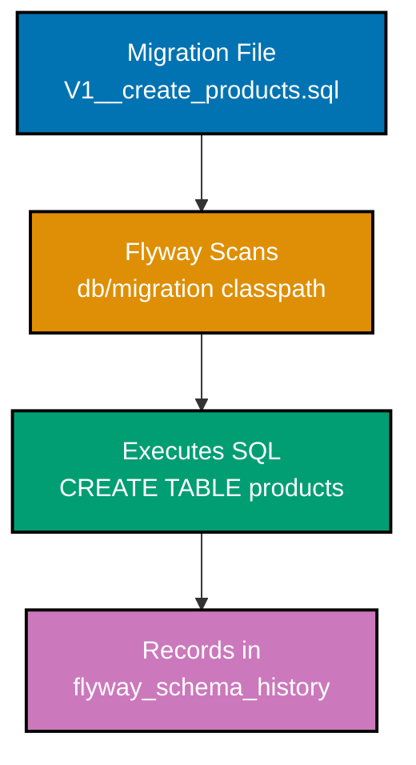
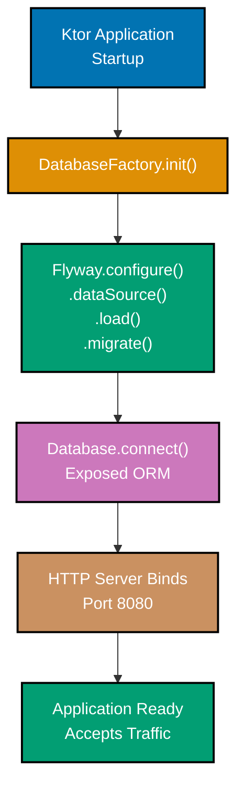

## Beginner Examples (1-30)

**Coverage**: 0-40% of Flyway functionality

**Focus**: Naming conventions, Flyway core API, basic SQL DDL patterns, schema history, common SQL constructs, and Ktor integration.

These examples cover the fundamentals needed to manage database schema migrations in production Kotlin applications. Each SQL migration is self-contained and runnable against a fresh PostgreSQL database.

---

### Example 1: First Versioned Migration (V1\_\_description.sql)

The simplest Flyway migration is a SQL file placed in `src/main/resources/db/migration/`. Flyway discovers it automatically and executes it exactly once. The `V1__` prefix tells Flyway this is version 1 of the schema history.



```sql
-- File: src/main/resources/db/migration/V1__create_products.sql
-- => Flyway reads this filename to determine: version=1, description="create products"
-- => "V" prefix = versioned migration (runs exactly once, in version order)
-- => "__" double underscore = separator between version and description

CREATE TABLE products (             -- => DDL: creates a new relation named "products"
  id   SERIAL      NOT NULL,        -- => SERIAL: auto-incrementing integer (1, 2, 3...)
  name VARCHAR(100) NOT NULL        -- => VARCHAR(100): string up to 100 characters, required
);                                  -- => Flyway records success in flyway_schema_history on completion
```

**Key Takeaway**: The `V1__create_products.sql` filename format is mandatory — version number, double underscore separator, and description tell Flyway when to run the file and what to call it in the schema history.

**Why It Matters**: Flyway's file-based approach means schema changes are version-controlled alongside application code. Every developer who clones the repository and runs Flyway gets an identical database structure. Without versioned migrations, teams rely on manual scripts, whiteboard diagrams, or tribal knowledge — all of which diverge silently across environments and cause production surprises on deployment day.

---

### Example 2: Flyway Naming Convention (V\<version\>\_\_\<description\>.sql)

Flyway enforces a strict filename pattern. Deviations result in the file being ignored silently or rejected with an error. Understanding the exact rules prevents the most common beginner mistake: misplaced underscores or incorrect version formats.

```sql
-- Valid Flyway versioned migration filenames:
-- => Pattern: V<version>__<description>.sql (case-sensitive "V", double underscore)

-- V1__create_users.sql          -- => version=1, description="create users"
-- V2__create_tokens.sql         -- => version=2, description="create tokens"
-- V2_1__add_index.sql           -- => version=2.1 (dotted versions allowed)
-- V10__drop_old_table.sql       -- => version=10 (numeric ordering, not lexicographic)
-- V100__add_audit_columns.sql   -- => version=100 (always comes after V10)

-- Invalid filenames (Flyway ignores or rejects these):
-- V1_create_users.sql           -- => WRONG: single underscore = not a Flyway migration
-- v1__create_users.sql          -- => WRONG: lowercase "v" = ignored by default
-- V01__create_users.sql         -- => WARNING: leading zeros allowed but discouraged
-- V1__create users.sql          -- => WRONG: spaces in description not recommended

-- Description rules (the part after __):
-- => Use underscores for spaces: V3__add_foreign_key.sql
-- => No special characters except underscores and hyphens
-- => Description appears in flyway_schema_history.description column

SELECT version, description, checksum, success
FROM flyway_schema_history            -- => Flyway records each migration here
ORDER BY installed_rank;              -- => installed_rank reflects actual execution order
-- => version: "1", "2", "2.1", "10" (stored as strings)
-- => description: "create users", "create tokens", "add index" (underscores -> spaces)
-- => checksum: integer hash of file contents (Flyway uses this to detect tampering)
-- => success: true = applied successfully, false = failed mid-migration
```

**Key Takeaway**: Version numbers are sorted numerically (V10 comes after V9, not after V1), descriptions use underscores as word separators, and the prefix "V" is case-sensitive — lowercase "v" files are silently ignored.

**Why It Matters**: Incorrect filenames are one of the top sources of Flyway confusion in new teams. A migration named `v2__add_column.sql` will never run — Flyway silently skips lowercase-prefixed files. A migration named `V2_add_column.sql` (single underscore) is also ignored. These silent failures mean the production database lacks columns the application code expects, causing runtime errors that are hard to diagnose without understanding Flyway naming rules.

---

### Example 3: Flyway.configure().dataSource() Setup

The Kotlin API configures Flyway programmatically. `Flyway.configure()` returns a `FlywayConfiguration` builder. You chain `dataSource()` to set JDBC connection details, then `load()` to create the final `Flyway` instance.


```kotlin
import org.flywaydb.core.Flyway   // => Import Flyway class from flyway-core dependency

// JDBC connection details
val jdbcUrl  = "jdbc:postgresql://localhost:5432/mydb"
                                  // => PostgreSQL JDBC URL: host=localhost, port=5432, db=mydb
val user     = "myuser"           // => Database username (must have CREATE TABLE privileges)
val password = "mypassword"       // => Database password (load from env in production)

// Build Flyway instance
val flyway = Flyway.configure()   // => Creates FlywayConfiguration builder (fluent API)
  .dataSource(jdbcUrl, user, password)
                                  // => Sets JDBC DataSource: Flyway creates connection pool internally
                                  // => Validates connectivity when .load() is called
  .load()                         // => Builds and validates the Flyway instance
                                  // => Throws FlywayException if connection fails
                                  // => Returns org.flywaydb.core.Flyway object

// flyway is now ready — call flyway.migrate(), flyway.info(), etc.
println(flyway.configuration.url) // => Output: jdbc:postgresql://localhost:5432/mydb
                                  // => Confirms configuration was applied
```

**Key Takeaway**: `Flyway.configure()` starts the builder, `.dataSource()` sets the JDBC URL and credentials, and `.load()` validates and finalizes the `Flyway` instance — call `.migrate()` separately to actually run migrations.

**Why It Matters**: Separating configuration from execution gives you control over when migrations run. In production Ktor applications, you configure Flyway once at startup in `DatabaseFactory.kt` and call `.migrate()` before the application accepts traffic. This prevents the application from serving requests against a stale schema, which would cause immediate runtime errors for any code path that touches new columns or tables.

---

### Example 4: flyway.migrate() Execution

`flyway.migrate()` scans the configured migration locations, identifies which migrations have not yet been applied (by comparing against `flyway_schema_history`), and executes them in version order within a transaction per migration.

```kotlin
import org.flywaydb.core.Flyway   // => Flyway core API

val flyway = Flyway.configure()   // => Builder starts
  .dataSource(                    // => Configure database connection
    "jdbc:postgresql://localhost:5432/mydb",
                                  // => JDBC URL: identifies database host, port, name
    "myuser",                     // => Database username
    "mypassword"                  // => Database password
  )
  .load()                         // => Validate config, build Flyway instance

val result = flyway.migrate()     // => Execute all pending versioned migrations
                                  // => Returns MigrateResult (not void)
                                  // => Runs V1, V2, V3... in order if all are new
                                  // => Each migration runs in its own transaction (PostgreSQL default)
                                  // => Rolls back current migration on SQL error

println(result.migrationsExecuted)
                                  // => Output: 3 (if V1, V2, V3 were pending)
                                  // => Output: 0 (if all migrations already applied)
println(result.success)           // => Output: true (all pending migrations applied cleanly)
                                  // => Output: false (at least one migration failed)
println(result.targetSchemaVersion)
                                  // => Output: "3" (highest version now in flyway_schema_history)
```

**Key Takeaway**: `flyway.migrate()` is idempotent — calling it repeatedly only runs migrations not yet recorded in `flyway_schema_history`, so it is safe to call on every application startup.

**Why It Matters**: Running `flyway.migrate()` at startup is the canonical pattern for zero-downtime deployments. The application starts, Flyway applies any new migrations, and only then does the application bind to a port and accept connections. This guarantees that no application code runs against an out-of-date schema. Teams that skip automatic migration on startup often face windows between deployment and manual migration execution where the application serves errors to real users.

---

### Example 5: Creating Tables

Versioned migrations create database tables through standard SQL DDL executed exactly once by Flyway in version order. The `CREATE TABLE` statement defines column names, types, constraints, and defaults that become permanent schema artifacts tracked in `flyway_schema_history`.

```sql
-- File: src/main/resources/db/migration/V1__create_users.sql
-- => Flyway executes this file once; records it in flyway_schema_history as version "1"

CREATE TABLE users (                      -- => DDL: creates relation "users" in current schema
  id            UUID          NOT NULL    -- => UUID primary key column; cannot be NULL
                DEFAULT gen_random_uuid(),-- => PostgreSQL: generate UUID automatically on INSERT
  username      VARCHAR(50)   NOT NULL,   -- => Unique handle; max 50 characters; required
  email         VARCHAR(255)  NOT NULL,   -- => Email address; max 255 chars (RFC 5321 limit)
  display_name  VARCHAR(100)  NOT NULL,   -- => Human-readable name; max 100 chars; required
  password_hash VARCHAR(255)  NOT NULL,   -- => bcrypt/Argon2 hash string; never store plaintext
  created_at    TIMESTAMPTZ   NOT NULL    -- => Creation timestamp with timezone
                DEFAULT NOW(),            -- => PostgreSQL: default to current time on INSERT
  updated_at    TIMESTAMPTZ   NOT NULL    -- => Last modification timestamp with timezone
                DEFAULT NOW(),            -- => PostgreSQL: default to current time on INSERT
  CONSTRAINT pk_users PRIMARY KEY (id),  -- => Named primary key constraint on id column
  CONSTRAINT uq_users_username UNIQUE (username),
                                          -- => Unique constraint: no two users share a username
  CONSTRAINT uq_users_email    UNIQUE (email)
                                          -- => Unique constraint: no two users share an email
);                                        -- => Flyway records: version=1, description="create users", success=true
```

**Key Takeaway**: Name all constraints explicitly (`pk_users`, `uq_users_username`) so you can reference them by name in later migrations when you need to drop or alter them.

**Why It Matters**: Anonymous constraints (created without naming them) get database-generated names like `users_pkey` or `users_username_key` that vary between PostgreSQL versions and environments. When a later migration needs to `ALTER TABLE users DROP CONSTRAINT users_username_key`, the constraint name may differ between development and production databases, causing the migration to fail in exactly the environment that matters most. Named constraints ensure migrations run identically everywhere.

---

### Example 6: Adding Columns

Schema evolution happens through new migration files. You never modify an already-applied migration — instead, you create a new versioned migration that alters the existing table with `ALTER TABLE ... ADD COLUMN`.

```sql
-- File: src/main/resources/db/migration/V2__add_user_status.sql
-- => New migration: adds columns to existing "users" table created in V1
-- => Flyway runs this after V1; V1 must already be in flyway_schema_history

ALTER TABLE users                         -- => Modifies the existing "users" table
  ADD COLUMN status VARCHAR(10)           -- => New column: status (short string)
              NOT NULL                    -- => Cannot be NULL; requires a default for existing rows
              DEFAULT 'ACTIVE',           -- => Existing rows get 'ACTIVE' automatically
  ADD COLUMN failed_login_count INT       -- => New column: failed login counter
              NOT NULL                    -- => Cannot be NULL; requires a default
              DEFAULT 0;                  -- => Existing rows get 0 (no failed logins yet)
                                          -- => PostgreSQL applies defaults to existing rows instantly
                                          -- => Flyway records V2 in flyway_schema_history on success

-- Verify the change:
-- SELECT column_name, data_type, column_default
-- FROM information_schema.columns
-- WHERE table_name = 'users' AND column_name IN ('status', 'failed_login_count');
-- => Returns 2 rows confirming new columns exist with their defaults
```

**Key Takeaway**: Always provide `DEFAULT` values when adding `NOT NULL` columns to tables that already contain rows — PostgreSQL requires a default to populate existing rows, and Flyway will fail the migration without one.

**Why It Matters**: Adding a `NOT NULL` column without a `DEFAULT` to a table with existing data causes an immediate `ERROR: column cannot be null` in PostgreSQL, failing the migration and leaving `flyway_schema_history` with a failed record. Every subsequent `flyway.migrate()` call will then refuse to run newer migrations until the failed one is resolved. In production, this can mean an entire deployment blocks on a schema issue that was entirely preventable with a default value.

---

### Example 7: Adding Indexes

Indexes speed up queries by allowing PostgreSQL to find rows without scanning the entire table. Flyway migrations add indexes with `CREATE INDEX`, which runs once and is tracked in schema history.

```sql
-- File: src/main/resources/db/migration/V3__add_user_indexes.sql
-- => Creates indexes to speed up common query patterns on the users table

CREATE INDEX idx_users_email              -- => Named index (use "idx_<table>_<column>" convention)
  ON users (email);                       -- => B-tree index on users.email column
                                          -- => Speeds up: WHERE email = 'alice@example.com'
                                          -- => Speeds up: JOIN ON users.email = ...
                                          -- => PostgreSQL default index type: B-tree (equality + range)

CREATE INDEX idx_users_status             -- => Named index for status column
  ON users (status);                      -- => B-tree index on users.status
                                          -- => Speeds up: WHERE status = 'ACTIVE' queries
                                          -- => Useful when filtering large tables by status

CREATE INDEX idx_users_created_at         -- => Named index for time-based queries
  ON users (created_at DESC);             -- => B-tree index, descending order
                                          -- => Speeds up: ORDER BY created_at DESC LIMIT 10
                                          -- => Most recent users returned first without full scan

-- NOTE: Indexes slow down INSERT/UPDATE/DELETE slightly (must maintain index structures)
-- => Add indexes only for columns used in WHERE, JOIN ON, or ORDER BY in hot queries
-- => Flyway records all three CREATE INDEX statements in flyway_schema_history as version "3"
```

**Key Takeaway**: Name indexes with the `idx_<table>_<column>` convention so you can drop them by name in later migrations; unnamed or poorly named indexes are difficult to manage as schemas evolve.

**Why It Matters**: Production databases without proper indexes experience query performance degradation that worsens as data grows. A table with 1,000 rows may query fine without indexes; at 10 million rows, an unindexed `WHERE email = ?` performs a sequential scan that takes seconds instead of milliseconds. Migrations are the correct place to add indexes because they version-control the index alongside the application code that depends on it, ensuring every environment has identical query performance characteristics.

---

### Example 8: Adding Foreign Keys

Foreign keys enforce referential integrity — they ensure a row in one table can only reference an existing row in another table. Flyway migrations add foreign key constraints that PostgreSQL enforces on every INSERT and UPDATE.

```sql
-- File: src/main/resources/db/migration/V4__create_orders.sql
-- => Creates orders table with foreign key reference to users table

CREATE TABLE orders (                           -- => New table: orders
  id         UUID NOT NULL                      -- => UUID primary key
               DEFAULT gen_random_uuid(),       -- => Auto-generated UUID on INSERT
  user_id    UUID NOT NULL,                     -- => Column referencing users.id (NOT NULL = required)
  total      DECIMAL(10, 2) NOT NULL,           -- => DECIMAL: 10 total digits, 2 decimal places
  created_at TIMESTAMPTZ NOT NULL               -- => Timestamp with timezone
               DEFAULT NOW(),                  -- => Defaults to current time
  CONSTRAINT pk_orders PRIMARY KEY (id),        -- => Named primary key on id
  CONSTRAINT fk_orders_user                     -- => Named foreign key constraint
    FOREIGN KEY (user_id)                       -- => orders.user_id must match...
    REFERENCES users (id)                       -- => ...an existing users.id value
    ON DELETE CASCADE                           -- => If the referenced user is deleted, delete their orders too
                                                -- => Alternative: ON DELETE SET NULL, ON DELETE RESTRICT
);                                              -- => Flyway records V4 in flyway_schema_history on success

-- Effect of ON DELETE CASCADE:
-- DELETE FROM users WHERE id = '<some-uuid>';
-- => Automatically deletes all orders WHERE user_id = '<some-uuid>'
-- => No orphaned order rows remain after user deletion
```

**Key Takeaway**: Always name foreign key constraints explicitly (`fk_orders_user`) and choose `ON DELETE` behavior intentionally — `CASCADE` propagates deletions, `RESTRICT` blocks parent deletion, and `SET NULL` nullifies the reference.

**Why It Matters**: Unnamed foreign keys receive generated names that vary between PostgreSQL installations. When you later need to drop or modify the constraint in a migration, the constraint name may differ between staging and production, causing the migration to fail. Explicit `ON DELETE` behavior prevents orphaned data: an order without a user causes application errors when code tries to load `order.user.name`, and without `CASCADE` or `RESTRICT`, deleting a user silently leaves orphaned orders that break queries expecting valid user associations.

---

### Example 9: Adding Unique Constraints

Unique constraints prevent duplicate values in a column or combination of columns. They are distinct from unique indexes — constraints express a business rule, while indexes are a performance mechanism (though PostgreSQL implements unique constraints via unique indexes internally).

```sql
-- File: src/main/resources/db/migration/V5__add_unique_constraints.sql
-- => Adds uniqueness guarantees to columns that must not contain duplicates

-- Single-column unique constraint
ALTER TABLE users
  ADD CONSTRAINT uq_users_display_name     -- => Named constraint (drop by name later if needed)
    UNIQUE (display_name);                 -- => No two users may share the same display_name
                                           -- => PostgreSQL raises: ERROR: duplicate key value violates unique constraint
                                           -- => on INSERT or UPDATE that would create a duplicate

-- Multi-column unique constraint (composite uniqueness)
CREATE TABLE user_roles (                  -- => Junction table: user-role assignments
  user_id UUID NOT NULL,                   -- => References users.id
  role    VARCHAR(50) NOT NULL,            -- => Role name (e.g., 'ADMIN', 'EDITOR')
  CONSTRAINT pk_user_roles                 -- => Named composite primary key
    PRIMARY KEY (user_id, role),           -- => Composite PK: each user-role pair is unique
  CONSTRAINT uq_user_roles_assignment      -- => Explicit named unique constraint
    UNIQUE (user_id, role)                 -- => Enforces uniqueness at the constraint level
);                                         -- => Flyway records V5 on success

-- Difference: UNIQUE vs PRIMARY KEY
-- PRIMARY KEY = UNIQUE + NOT NULL on all columns + only one per table
-- UNIQUE = allows NULL (one NULL per column by default in PostgreSQL) + multiple per table
```

**Key Takeaway**: Name unique constraints explicitly so future migrations can `DROP CONSTRAINT uq_users_display_name` by name; composite unique constraints on multiple columns prevent duplicate combinations, not just duplicate individual values.

**Why It Matters**: Database-level unique constraints are the last line of defense against duplicate data. Application-level checks (checking before inserting) are vulnerable to race conditions — two concurrent requests can both pass the check and both insert, creating duplicates. PostgreSQL's unique constraint is atomic: only one INSERT succeeds, the other gets a constraint violation error that the application can handle gracefully. Enforcing uniqueness at the database layer ensures data integrity regardless of application bugs or concurrent access patterns.

---

### Example 10: flyway_schema_history Table

Flyway creates and maintains the `flyway_schema_history` table automatically in your database. This table is the source of truth for which migrations have been applied. Understanding its columns explains how Flyway decides what to run and how it detects problems.

```sql
-- flyway_schema_history is created automatically by Flyway on first run
-- => Do NOT create, modify, or drop this table manually

-- View current migration state:
SELECT
  installed_rank,    -- => Execution order (1, 2, 3...) — reflects actual run order
  version,           -- => Migration version string: "1", "2", "2.1", null (for repeatable)
  description,       -- => Derived from filename: "create users", "add columns"
  type,              -- => "SQL" (SQL file), "BASELINE" (manual baseline entry)
  script,            -- => Full filename: "V1__create_users.sql"
  checksum,          -- => Integer hash of file contents (detects file modification)
  installed_by,      -- => Database user that ran the migration
  installed_on,      -- => Timestamp when migration was applied
  execution_time,    -- => Milliseconds the migration took to run
  success            -- => true = applied cleanly, false = failed mid-way
FROM flyway_schema_history
ORDER BY installed_rank;
-- => Example output after applying V1, V2, V3:
-- => rank=1, version="1", description="create users", success=true, checksum=1234567890
-- => rank=2, version="2", description="add columns",  success=true, checksum=-987654321
-- => rank=3, version="3", description="add indexes",  success=true, checksum=1122334455

-- CRITICAL: Flyway uses checksum to detect if an applied migration file was modified
-- => If V1__create_users.sql is edited after being applied, flyway.migrate() throws:
-- => FlywayException: Validate failed: Migration checksum mismatch for migration version 1
```

**Key Takeaway**: The `flyway_schema_history` table is Flyway's ledger — never modify it manually and never edit applied migration files, because checksum mismatches cause `flyway.validate()` and `flyway.migrate()` to refuse execution.

**Why It Matters**: The checksum mechanism is Flyway's protection against accidental schema drift. Without it, a developer could edit V2\_\_add_columns.sql after applying it (perhaps to fix a typo), and every other environment would silently run the original version while the developer's machine runs the modified version, causing subtle schema differences that manifest as mysterious application bugs weeks later. The checksum mismatch error, while sometimes annoying, prevents this class of environment divergence.

---

### Example 11: Flyway Info (Migration Status)

`flyway.info()` returns the current state of all migrations — applied, pending, and failed — without executing anything. This is the diagnostic command for understanding what Flyway knows about your migration state.

```kotlin
import org.flywaydb.core.Flyway       // => Flyway core API

val flyway = Flyway.configure()        // => Configure builder
  .dataSource(
    "jdbc:postgresql://localhost:5432/mydb",
    "myuser", "mypassword"
  )
  .load()                              // => Build Flyway instance

val info = flyway.info()               // => Returns MigrationInfoService (read-only, no side effects)
                                       // => Queries flyway_schema_history + scans migration files
                                       // => Safe to call anytime; does NOT execute migrations

val all     = info.all()               // => Array<MigrationInfo>: all known migrations (applied + pending + failed)
val current = info.current()           // => MigrationInfo? for highest applied version (null if none applied)
val pending = info.pending()           // => Array<MigrationInfo> for migrations not yet applied

println("Current version: ${current?.version}")
                                       // => Output: "Current version: 3" (if V3 is the latest applied)
println("Pending count: ${pending.size}")
                                       // => Output: "Pending count: 2" (if V4 and V5 exist but not yet run)

// Inspect each migration
all.forEach { migration ->
  println("${migration.version} - ${migration.description} - ${migration.state}")
  // => Output example:
  // => 1 - create users - SUCCESS
  // => 2 - add columns  - SUCCESS
  // => 3 - add indexes  - SUCCESS
  // => 4 - add roles    - PENDING  (file exists, not yet applied)
  // => 5 - add tokens   - PENDING  (file exists, not yet applied)
}
```

**Key Takeaway**: `flyway.info()` is read-only and safe to call anytime — use it in health checks, deployment scripts, and CI pipelines to verify migration state without risking accidental execution.

**Why It Matters**: Before deploying to production, calling `flyway.info()` to confirm pending migrations match expectations is a critical safety step. A deployment that expects to apply V5 but finds V5 already applied (because someone manually ran it) would still succeed — but finding V5 failed would immediately reveal a problem to fix before directing traffic to the new deployment. Health check endpoints often expose migration state so operators can monitor schema version alongside application version.

---

### Example 12: Flyway Validate

`flyway.validate()` checks that all applied migrations still match their files on disk (via checksum comparison). It throws `FlywayValidateException` if any mismatch is detected, but makes no changes to the database.

```kotlin
import org.flywaydb.core.Flyway           // => Flyway core API
import org.flywaydb.core.api.exception.FlywayValidateException
                                           // => Exception thrown on checksum mismatch or missing files

val flyway = Flyway.configure()            // => Configure builder
  .dataSource(
    "jdbc:postgresql://localhost:5432/mydb",
    "myuser", "mypassword"
  )
  .load()                                  // => Build Flyway instance

try {
  flyway.validate()                        // => Compares each flyway_schema_history checksum
                                           // => against the checksum of the current file on disk
                                           // => Checks all applied migrations, not just the latest
  println("Validation passed: schema history matches migration files")
                                           // => Output when all checksums match
} catch (e: FlywayValidateException) {
  // => Thrown when: file was modified after apply, file was deleted, or file was renamed
  println("Validation FAILED: ${e.message}")
  // => Example message:
  // => "Validate failed: Detected failed migration to version 2
  // =>  (Migration checksum mismatch for migration version 2
  // =>   -> Applied to database: 1234567890
  // =>   -> Resolved locally: -987654321)"
  throw e                                  // => Re-throw to prevent application startup on corrupt state
}
```

**Key Takeaway**: Call `flyway.validate()` before `flyway.migrate()` in production deployments to catch file modifications or deletions before attempting to run new migrations on a potentially inconsistent state.

**Why It Matters**: Validate catches the most dangerous Flyway misuse pattern: editing an already-applied migration file. A developer might edit V3\_\_add_indexes.sql to add a comment or fix a typo without realizing Flyway stores a checksum. The next environment to run `flyway.migrate()` sees a checksum mismatch and refuses to proceed — but without validate, this could go undetected until a critical environment is impacted. Validating in CI/CD pipelines catches these issues before production deployment.

---

### Example 13: Flyway Clean (Reset Database)

`flyway.clean()` drops all objects in the configured schema — tables, views, indexes, sequences, everything. This is a destructive operation intended only for development and testing environments.

```kotlin
import org.flywaydb.core.Flyway           // => Flyway core API

val flyway = Flyway.configure()            // => Configure builder
  .dataSource(
    "jdbc:postgresql://localhost:5432/mydb_dev",
                                           // => DEVELOPMENT database only — NEVER production
    "myuser", "mypassword"
  )
  .cleanDisabled(false)                    // => Must explicitly enable clean; defaults to true (disabled) in Flyway 9+
                                           // => Flyway 9+ disables clean by default to prevent accidental data loss
  .load()                                  // => Build Flyway instance

flyway.clean()                             // => Drops ALL objects in the schema: tables, views, sequences, etc.
                                           // => flyway_schema_history is also dropped
                                           // => Database schema is now empty
                                           // => Does NOT drop the database itself (just the contents)

flyway.migrate()                           // => Re-applies all migrations from V1 onward
                                           // => Recreates flyway_schema_history
                                           // => Results in a fresh, known-good database state
                                           // => Useful for: test setup, local development resets

// WARNING: Never call clean() against production databases
// => Production data is irreversibly deleted — no undo, no rollback
// => Protect via: cleanDisabled(true), environment checks, separate DB credentials
```

**Key Takeaway**: `flyway.clean()` is for development resets only — protect production databases by setting `cleanDisabled(true)` (the Flyway 9+ default) and never granting the application's production database user DROP privileges.

**Why It Matters**: The `clean()` command accidentally run against a production database destroys all data with no recovery path (unless a backup exists). Flyway 9 made `cleanDisabled(true)` the default specifically because of production incidents caused by `flyway.clean()` called by application code that had been carelessly copied from a test setup. Defense in depth requires: disabled clean in production config, separate production credentials without DROP grants, and infrastructure-level protections (RDS deletion protection, etc.).

---

### Example 14: Flyway Baseline

`flyway.baseline()` marks an existing database as being at a specific version without running any migrations. This is for databases that already have a schema but have never used Flyway — you baseline them to tell Flyway "everything up to version N is already applied."

```kotlin
import org.flywaydb.core.Flyway           // => Flyway core API

// Scenario: existing database with schema already in place, but no flyway_schema_history
val flyway = Flyway.configure()            // => Configure builder
  .dataSource(
    "jdbc:postgresql://localhost:5432/legacy_db",
                                           // => Existing database with tables but no Flyway history
    "myuser", "mypassword"
  )
  .baselineOnMigrate(false)               // => Do NOT auto-baseline on migrate (explicit control)
  .baselineVersion("5")                   // => Treat the existing schema as version 5
                                           // => Migrations V1-V5 will be skipped; V6+ will run
  .baselineDescription("Initial baseline before Flyway adoption")
                                           // => Human-readable description in flyway_schema_history
  .load()                                  // => Build Flyway instance

flyway.baseline()                          // => Creates flyway_schema_history table
                                           // => Inserts one row: version="5", type="BASELINE", success=true
                                           // => Flyway now knows this database is at version 5
                                           // => Next flyway.migrate() will run V6, V7, V8... only

// After baseline, info() shows:
// => 5 - Initial baseline before Flyway adoption - BASELINE (not run by Flyway)
// => 6 - Add audit columns                       - PENDING  (will run next)
```

**Key Takeaway**: Use `baseline()` exactly once when introducing Flyway to an existing database — subsequent calls on databases that already have `flyway_schema_history` fail with an error.

**Why It Matters**: Migrating an existing production system to Flyway is a common scenario, and `baseline()` is the correct tool for it. Without baselining, `flyway.migrate()` on an existing database would attempt to run V1 (create tables that already exist), fail with "table already exists" errors, and leave a failed record in `flyway_schema_history`. Baselining lets you adopt Flyway incrementally, treating all pre-existing schema as a known starting point and only managing new changes through Flyway files.

---

### Example 15: Repeatable Migrations (R\_\_description.sql)

Repeatable migrations use the `R__` prefix instead of `V<version>__`. They have no version number and run on every Flyway execution when their contents (checksum) have changed. They always run after all versioned migrations.

```sql
-- File: src/main/resources/db/migration/R__create_reporting_views.sql
-- => "R__" prefix = repeatable migration (no version number)
-- => Runs whenever the file's checksum changes (i.e., file is modified)
-- => Always runs AFTER all versioned migrations (V1, V2, V3...)

CREATE OR REPLACE VIEW active_users AS   -- => CREATE OR REPLACE: safe to run multiple times
  SELECT                                 -- => Defines which columns the view exposes
    id,                                  -- => User ID
    username,                            -- => Username
    email,                               -- => Email address
    display_name,                        -- => Display name
    created_at                           -- => Creation timestamp
  FROM users                             -- => Reads from the users table
  WHERE status = 'ACTIVE';              -- => Filters: only ACTIVE users visible through this view
                                         -- => No data is stored: view is a stored query

-- When this file is modified and flyway.migrate() is called:
-- => Flyway detects checksum change
-- => Drops and recreates the view with the new definition
-- => Records new checksum in flyway_schema_history
-- => Useful for: views, stored procedures, functions that need to stay current
```

**Key Takeaway**: Repeatable migrations use `R__` prefix, have no version, and re-run whenever the file changes — ideal for views, functions, and stored procedures that need to evolve without creating a new versioned migration for each revision.

**Why It Matters**: Without repeatable migrations, maintaining a view requires creating a new versioned migration every time the view logic changes (V10**update_reporting_view.sql, V11**fix_reporting_view.sql). This creates dozens of version entries for what is conceptually a single artifact. Repeatable migrations let you maintain the canonical definition of a view in one file, and Flyway handles re-applying it when you change it — treating the view definition as code that evolves with your codebase rather than as a one-time schema event.

---

### Example 16: Multiple Statements in One Migration

A single migration file can contain multiple SQL statements. Flyway executes them sequentially within the same transaction. If any statement fails, the entire migration is rolled back.

```sql
-- File: src/main/resources/db/migration/V6__create_categories_and_tags.sql
-- => Multiple DDL statements in one file: all execute atomically
-- => If statement 2 fails, statement 1 is rolled back (PostgreSQL DDL is transactional)

CREATE TABLE categories (                  -- => First statement: create categories table
  id   UUID         NOT NULL              -- => UUID primary key
         DEFAULT gen_random_uuid(),       -- => Auto-generated UUID
  name VARCHAR(100) NOT NULL,             -- => Category name: required, max 100 chars
  slug VARCHAR(100) NOT NULL,             -- => URL-safe version of name (e.g., "tech-news")
  CONSTRAINT pk_categories PRIMARY KEY (id),
                                           -- => Named primary key
  CONSTRAINT uq_categories_slug UNIQUE (slug)
                                           -- => Slugs must be globally unique
);                                         -- => End of first statement

CREATE TABLE tags (                        -- => Second statement: create tags table
  id   UUID        NOT NULL               -- => UUID primary key
         DEFAULT gen_random_uuid(),       -- => Auto-generated UUID
  name VARCHAR(50) NOT NULL,              -- => Tag name: required, max 50 chars
  CONSTRAINT pk_tags PRIMARY KEY (id),    -- => Named primary key
  CONSTRAINT uq_tags_name UNIQUE (name)   -- => Tag names must be globally unique
);                                         -- => End of second statement

CREATE INDEX idx_categories_slug           -- => Third statement: index for slug lookups
  ON categories (slug);                   -- => Speeds up: WHERE slug = 'tech-news'
                                           -- => All three statements are in one transaction
                                           -- => Flyway records V6 as one entry in flyway_schema_history
```

**Key Takeaway**: Group logically related DDL statements in a single migration file so they apply atomically — either all succeed or all roll back — keeping the schema in a consistent state.

**Why It Matters**: Creating a table in one migration and its index in the next introduces a window where the table exists without the index. If a deployment fails between V6 and V7, the application runs against a table missing its index, causing poor query performance. Grouping related changes in one migration file ensures atomicity: either the complete, properly-indexed table exists, or neither exists. This simplifies rollback reasoning and ensures each applied migration leaves the schema in a fully functional state.

---

### Example 17: NOT NULL Constraints with Defaults

Adding a `NOT NULL` column to an existing table requires a `DEFAULT` to populate existing rows. Without a default, PostgreSQL rejects the migration with an error. The default can be removed after the migration if values are always supplied by the application.

```sql
-- File: src/main/resources/db/migration/V7__add_not_null_columns.sql
-- => Adds NOT NULL columns to existing tables that already contain data

-- CORRECT: Add NOT NULL column WITH a DEFAULT (works for existing rows)
ALTER TABLE users
  ADD COLUMN account_type VARCHAR(20) NOT NULL DEFAULT 'STANDARD';
                                              -- => All existing rows get 'STANDARD' as account_type
                                              -- => New rows must provide account_type (or use default)
                                              -- => Migration succeeds even if users table has 1 million rows

-- CORRECT: Add NOT NULL column, then remove the default (application always provides value)
ALTER TABLE categories
  ADD COLUMN position INT NOT NULL DEFAULT 0; -- => Step 1: Add with default (existing rows get 0)
                                              -- => Step 2 (optional, in same or later migration):
ALTER TABLE categories
  ALTER COLUMN position DROP DEFAULT;         -- => Removes default; application must now provide position
                                              -- => Existing rows keep their 0 values
                                              -- => Future INSERTs without position will fail (intended)

-- WRONG (would fail if table has existing rows):
-- ALTER TABLE users ADD COLUMN account_type VARCHAR(20) NOT NULL;
-- => ERROR: column "account_type" contains null values
-- => PostgreSQL cannot set existing rows to NOT NULL with no default to fill them with
```

**Key Takeaway**: Always provide `DEFAULT` when adding `NOT NULL` columns to tables with existing rows; optionally drop the default afterward if the application guarantees to supply the value.

**Why It Matters**: The `NOT NULL without DEFAULT` error is one of the most common migration failures in production. It is invisible in development (empty tables accept the column immediately), but fails on production (tables with real data). The two-step pattern — add with default, then drop the default — is the production-safe approach: it satisfies PostgreSQL's requirement for existing rows while allowing the application to control values for all new rows, keeping the database constraint stricter over time rather than looser.

---

### Example 18: UUID Primary Keys

UUIDs as primary keys are preferred in distributed systems because they are globally unique without coordination between database nodes. PostgreSQL provides `gen_random_uuid()` (version 4 UUID) as a built-in function since PostgreSQL 13.

```sql
-- File: src/main/resources/db/migration/V8__create_orders_with_uuid.sql
-- => Demonstrates UUID primary key pattern used throughout production Ktor applications

CREATE TABLE orders (                           -- => Creates orders table
  id          UUID         NOT NULL            -- => UUID column; 128-bit identifier
                DEFAULT gen_random_uuid(),     -- => PostgreSQL 13+: generates UUIDv4 automatically
                                               -- => Example: 'a0eebc99-9c0b-4ef8-bb6d-6bb9bd380a11'
  user_id     UUID         NOT NULL,           -- => Foreign key to users.id (also UUID)
  order_total DECIMAL(10,2) NOT NULL,          -- => Monetary amount: 10 digits, 2 decimal places
  status      VARCHAR(20)  NOT NULL            -- => Order status string
                DEFAULT 'PENDING',             -- => New orders start as PENDING
  created_at  TIMESTAMPTZ  NOT NULL            -- => Creation timestamp with timezone
                DEFAULT NOW(),                 -- => Defaults to current time
  CONSTRAINT pk_orders PRIMARY KEY (id),       -- => UUID is the primary key
  CONSTRAINT fk_orders_user                   -- => Named foreign key
    FOREIGN KEY (user_id) REFERENCES users(id)
    ON DELETE CASCADE                          -- => Delete orders when user is deleted
);                                             -- => Flyway records V8 in flyway_schema_history

-- Querying by UUID requires quoting as string:
-- SELECT * FROM orders WHERE id = 'a0eebc99-9c0b-4ef8-bb6d-6bb9bd380a11';
-- => PostgreSQL casts string to UUID type automatically
-- => B-tree index on UUID PK enables efficient exact lookups
```

**Key Takeaway**: Use `UUID NOT NULL DEFAULT gen_random_uuid()` for primary keys to enable distributed ID generation, prevent enumeration attacks, and avoid conflicts when merging data from multiple database instances.

**Why It Matters**: Sequential integer primary keys (SERIAL, BIGSERIAL) expose the total record count to API consumers (the next user ID is previous + 1), enable enumeration attacks (try IDs 1, 2, 3...), and cause merge conflicts when combining databases from multiple shards or environments. UUID primary keys avoid all of these: they are globally unique without coordination, hide the internal record count, and safely merge across environments. The minor performance overhead of UUID primary key storage and indexing is almost always worth these security and operational benefits in production systems.

---

### Example 19: Timestamp Columns with Defaults

Timestamp columns with `DEFAULT NOW()` automatically record when rows are created and updated. The `TIMESTAMPTZ` type stores timestamps with timezone offset, ensuring correctness regardless of the database server's timezone setting.

```sql
-- File: src/main/resources/db/migration/V9__add_audit_timestamps.sql
-- => Adds standard audit timestamp columns to a table that was created without them

ALTER TABLE orders
  ADD COLUMN updated_at TIMESTAMPTZ NOT NULL    -- => Tracks last modification time
    DEFAULT NOW();                              -- => Existing rows get current timestamp as updated_at
                                               -- => New rows default to insert time

-- Pattern for tables created fresh: include timestamps in CREATE TABLE
CREATE TABLE invoices (                        -- => New table with timestamps from the start
  id         UUID        NOT NULL DEFAULT gen_random_uuid(),
                                               -- => UUID PK with auto-generation
  order_id   UUID        NOT NULL,             -- => FK to orders table
  amount     DECIMAL(10,2) NOT NULL,           -- => Invoice amount
  created_at TIMESTAMPTZ NOT NULL DEFAULT NOW(),
                                               -- => Automatically set on INSERT
                                               -- => Application should never set this manually
  updated_at TIMESTAMPTZ NOT NULL DEFAULT NOW(),
                                               -- => Set on INSERT; application must UPDATE this on changes
                                               -- => PostgreSQL has no auto-update trigger by default
                                               -- => Application code (Exposed ORM) or triggers handle update
  CONSTRAINT pk_invoices PRIMARY KEY (id)
);                                             -- => Flyway records V9 in flyway_schema_history

-- NOTE: updated_at does NOT auto-update on row changes in PostgreSQL
-- => Unlike MySQL's ON UPDATE CURRENT_TIMESTAMP, PostgreSQL requires explicit updates
-- => ORM frameworks (Kotlin Exposed) handle this automatically via timestamps() helper
```

**Key Takeaway**: Use `TIMESTAMPTZ` (not `TIMESTAMP`) for all datetime columns so timestamps are stored in UTC and displayed correctly regardless of application server timezone, and remember that `updated_at` requires explicit application-level updates.

**Why It Matters**: `TIMESTAMP` without timezone stores the literal clock time with no timezone context, leading to incorrect date calculations when the database server timezone differs from the application server or the user's timezone. `TIMESTAMPTZ` stores timestamps in UTC internally and converts on retrieval based on the session timezone — dates are always correct regardless of where the servers are located. This matters in global applications where database and application servers may be in different AWS regions with different timezone configurations.

---

### Example 20: Enum Types (PostgreSQL)

PostgreSQL native `ENUM` types provide stricter type safety than `VARCHAR` columns for fixed value sets. Flyway migrations create the type before tables that use it, and later migrations can add new enum values.

```sql
-- File: src/main/resources/db/migration/V10__create_status_enum.sql
-- => Creates a PostgreSQL custom ENUM type and uses it in a table

CREATE TYPE order_status AS ENUM (    -- => Creates custom PostgreSQL ENUM type
  'PENDING',                          -- => Valid values for this type (stored as strings in DB)
  'PROCESSING',                       -- => Flyway records checksum of this file
  'SHIPPED',                          -- => PostgreSQL rejects any value not in this list
  'DELIVERED',                        -- => Type is enforced at the database level
  'CANCELLED'                         -- => Changing enums later requires ALTER TYPE or migration
);                                    -- => Type is now available for column definitions

CREATE TABLE shipments (              -- => Table using the custom enum type
  id         UUID         NOT NULL DEFAULT gen_random_uuid(),
  order_id   UUID         NOT NULL,
  status     order_status NOT NULL    -- => Column type is the custom ENUM
               DEFAULT 'PENDING',    -- => New shipments start as PENDING
                                     -- => PostgreSQL rejects: INSERT ... status = 'UNKNOWN'
                                     -- => ERROR: invalid input value for enum order_status: "UNKNOWN"
  shipped_at TIMESTAMPTZ,            -- => NULL until actually shipped
  CONSTRAINT pk_shipments PRIMARY KEY (id)
);                                    -- => Flyway records V10 in flyway_schema_history

-- To add a new enum value later (separate migration):
-- ALTER TYPE order_status ADD VALUE 'RETURNED';
-- => PostgreSQL supports adding values to enums without recreating the type
-- => BUT you cannot remove values or reorder them without recreating the type
```

**Key Takeaway**: PostgreSQL `ENUM` types enforce values at the database level and are more storage-efficient than `VARCHAR`, but adding values requires a separate migration and removing values requires recreating the type — plan your enum values carefully.

**Why It Matters**: Using `VARCHAR` for status fields means invalid values like `'SHIPED'` (typo) or `'shipped'` (wrong case) silently persist in the database and cause application errors only at runtime when code tries to deserialize the value. A native `ENUM` type rejects invalid values at the database level, immediately and atomically, before the bad data enters the system. The trade-off (migration required to add values) is worth it for fields with a small, well-defined value set, while `VARCHAR` remains appropriate for user-provided text or frequently changing value sets.

---

### Example 21: CHECK Constraints

`CHECK` constraints enforce arbitrary conditions on column values. PostgreSQL evaluates the constraint on every INSERT and UPDATE, rejecting rows where the condition is false.

```sql
-- File: src/main/resources/db/migration/V11__add_check_constraints.sql
-- => Adds CHECK constraints to enforce business rules at the database level

ALTER TABLE orders
  ADD CONSTRAINT chk_orders_total_positive  -- => Named constraint (always name constraints)
    CHECK (order_total > 0);               -- => order_total must be positive (not zero, not negative)
                                            -- => PostgreSQL: INSERT with order_total = -5.00 fails
                                            -- => ERROR: new row violates check constraint "chk_orders_total_positive"

ALTER TABLE users
  ADD CONSTRAINT chk_users_email_format     -- => Named constraint for email format
    CHECK (email ~* '^[A-Za-z0-9._%+-]+@[A-Za-z0-9.-]+\.[A-Za-z]{2,}$');
                                            -- => ~* = case-insensitive regex match
                                            -- => Rejects: 'notanemail', 'missing@dot', '@nodomain.com'
                                            -- => NOTE: regex constraints catch format errors only
                                            -- => Database-level check is supplementary to app-level validation

CREATE TABLE products (                    -- => Demonstrates multiple CHECK constraints
  id    UUID          NOT NULL DEFAULT gen_random_uuid(),
  name  VARCHAR(200)  NOT NULL,
  price DECIMAL(10,2) NOT NULL,
  stock INT           NOT NULL DEFAULT 0,
  CONSTRAINT pk_products PRIMARY KEY (id),
  CONSTRAINT chk_products_price_positive  CHECK (price >= 0),
                                           -- => Price cannot be negative (zero is allowed for free products)
  CONSTRAINT chk_products_stock_non_neg   CHECK (stock >= 0)
                                           -- => Stock cannot be negative (business rule)
);                                         -- => Flyway records V11 in flyway_schema_history
```

**Key Takeaway**: Name `CHECK` constraints with the `chk_<table>_<rule>` convention so violation error messages clearly identify which business rule was broken, making debugging and user feedback significantly easier.

**Why It Matters**: Without database-level `CHECK` constraints, invalid data (negative prices, zero totals, malformed emails) enters the database whenever application-level validation has a bug, is bypassed, or is inconsistently implemented across multiple API endpoints. Once invalid data persists, fixing it requires a data migration and often involves auditing to determine how many records are affected. Check constraints prevent the problem at the source, ensuring every row in the database satisfies the business rules regardless of which application code path inserted it.

---

### Example 22: Composite Indexes

Composite indexes span multiple columns and accelerate queries that filter or sort on multiple columns together. The column order in the index definition determines which queries benefit.

```sql
-- File: src/main/resources/db/migration/V12__add_composite_indexes.sql
-- => Composite (multi-column) indexes for queries that filter on multiple columns

-- Composite index on (user_id, created_at)
-- => Accelerates: WHERE user_id = ? ORDER BY created_at DESC
-- => Accelerates: WHERE user_id = ? AND created_at > ?
-- => Does NOT help: WHERE created_at > ? (without user_id)
CREATE INDEX idx_orders_user_created
  ON orders (user_id, created_at DESC);   -- => Leftmost column first: user_id drives the lookup
                                           -- => Second column: created_at for sorting within user's orders
                                           -- => DESC: most-recent-first traversal without sort step

-- Composite index on (status, created_at)
-- => Accelerates: WHERE status = 'PENDING' ORDER BY created_at ASC
-- => Useful for: processing queues sorted by arrival time
CREATE INDEX idx_orders_status_created
  ON orders (status, created_at ASC);     -- => Filter by status, then sort by time within status
                                           -- => ASC: oldest PENDING orders first (FIFO processing)

-- Partial index (indexes only a subset of rows)
-- => Accelerates: WHERE status = 'PENDING' without full table scan
-- => Smaller index: only PENDING rows indexed (not DELIVERED, CANCELLED, etc.)
CREATE INDEX idx_orders_pending
  ON orders (created_at)                  -- => Index the timestamp column
  WHERE status = 'PENDING';              -- => Include only PENDING rows in the index
                                          -- => Flyway records V12 in flyway_schema_history
```

**Key Takeaway**: Place the most selective column (fewest matching rows) first in composite indexes; partial indexes dramatically reduce index size when queries always filter on a fixed value like `status = 'PENDING'`.

**Why It Matters**: Without composite indexes, a query like "show user 123's orders, newest first" performs a full table scan filtered by user_id and then sorts all matching rows. With a `(user_id, created_at DESC)` composite index, PostgreSQL finds user 123's orders by direct index lookup and returns them pre-sorted — no sort operation needed. At millions of orders, this difference is measured in seconds versus milliseconds per request. Migrations are the correct place to add these indexes because they ensure every environment benefits, not just the developer's local machine where data volume is small.

---

### Example 23: Junction Tables (Many-to-Many)

Many-to-many relationships (users to roles, products to categories) require a junction table with foreign keys to both sides. The junction table's primary key is typically the combination of both foreign keys.

```sql
-- File: src/main/resources/db/migration/V13__create_user_tags_junction.sql
-- => Junction table for many-to-many relationship: users <-> tags

-- Scenario: A user can have many tags; a tag can belong to many users

CREATE TABLE user_tags (                       -- => Junction table: records user-tag associations
  user_id    UUID         NOT NULL,            -- => FK to users.id (which user)
  tag_id     UUID         NOT NULL,            -- => FK to tags.id (which tag)
  assigned_at TIMESTAMPTZ NOT NULL             -- => When the tag was assigned to the user
               DEFAULT NOW(),                 -- => Defaults to current time
  assigned_by VARCHAR(255) NOT NULL            -- => Who assigned the tag (audit field)
               DEFAULT 'system',              -- => Default to 'system' for programmatic assignment
  CONSTRAINT pk_user_tags                     -- => Composite primary key
    PRIMARY KEY (user_id, tag_id),            -- => Each user-tag pair can only exist once
                                              -- => Prevents duplicate tag assignments
  CONSTRAINT fk_user_tags_user               -- => Named FK to users
    FOREIGN KEY (user_id)
    REFERENCES users(id)
    ON DELETE CASCADE,                        -- => Remove user's tags when user is deleted
  CONSTRAINT fk_user_tags_tag                -- => Named FK to tags
    FOREIGN KEY (tag_id)
    REFERENCES tags(id)
    ON DELETE CASCADE                         -- => Remove tag assignments when tag is deleted
);                                            -- => Flyway records V13 in flyway_schema_history

CREATE INDEX idx_user_tags_tag_id             -- => Index for reverse lookup: "which users have this tag?"
  ON user_tags (tag_id);                     -- => pk_user_tags already covers user_id (leftmost column)
                                              -- => This index covers tag_id-first lookups
```

**Key Takeaway**: Use composite primary keys `(user_id, tag_id)` in junction tables to enforce uniqueness at the database level, and add a reverse index on the second foreign key column for efficient queries from both directions.

**Why It Matters**: Junction tables without a composite primary key allow duplicate associations (a user tagged with 'kotlin' three times), which causes application-level errors when code iterates tags and finds unexpected duplicates. The composite PK enforces the business rule that each association is unique. The reverse index `(tag_id)` is critical for queries like "show all users who have the 'kotlin' tag" — without it, this query scans the entire junction table and worsens as the table grows. This is a common performance problem discovered only after the application scales.

---

### Example 24: Seed Data in Migrations

Migrations can include `INSERT` statements to populate reference data alongside DDL. Reference data (roles, categories, status codes) that the application depends on should be seeded in a versioned migration, not in application code.

```sql
-- File: src/main/resources/db/migration/V14__seed_reference_data.sql
-- => Inserts required reference/lookup data that the application depends on at startup

-- Seed default categories (application assumes these exist)
INSERT INTO categories (id, name, slug) VALUES
  (gen_random_uuid(), 'Technology',  'technology'),   -- => Row 1: Technology category
  (gen_random_uuid(), 'Finance',     'finance'),      -- => Row 2: Finance category
  (gen_random_uuid(), 'Health',      'health'),       -- => Row 3: Health category
  (gen_random_uuid(), 'Education',   'education'),    -- => Row 4: Education category
  (gen_random_uuid(), 'Sports',      'sports');       -- => Row 5: Sports category
                                                      -- => gen_random_uuid(): each row gets a unique UUID
                                                      -- => Flyway executes the entire INSERT as one statement

-- Seed default system roles (application uses these in authorization logic)
INSERT INTO user_roles (user_id, role)               -- => Junction table: assign roles to system user
SELECT
  u.id,                                              -- => System user's UUID
  r.role                                             -- => Each role to assign
FROM users u                                         -- => users table
CROSS JOIN (VALUES ('ADMIN'), ('EDITOR')) AS r(role) -- => Cross join: one row per role
WHERE u.username = 'system_admin';                   -- => Only seed for the system_admin user
                                                     -- => If system_admin doesn't exist, inserts 0 rows (safe)
                                                     -- => Flyway records V14 in flyway_schema_history
```

**Key Takeaway**: Seed required reference data in migrations alongside the DDL that creates the tables — this guarantees the data exists in every environment (development, staging, production) as soon as the table is created.

**Why It Matters**: Reference data managed outside migrations (in application startup code or manual SQL scripts) inevitably diverges between environments. A developer's local database might have categories seeded months ago, while a new developer's machine and the CI database have no categories, causing test failures and application errors that are baffling to diagnose. Migration-managed seed data is version-controlled, applied atomically with the schema, and identical across all environments — treating reference data as part of the schema rather than as content.

---

### Example 25: Cascade Delete Foreign Keys

`ON DELETE CASCADE` automatically deletes child rows when a parent row is deleted. This maintains referential integrity without requiring application code to manually delete children before the parent.

```sql
-- File: src/main/resources/db/migration/V15__add_cascade_constraints.sql
-- => Demonstrates ON DELETE CASCADE for maintaining referential integrity

-- Hierarchy: users -> orders -> order_items
-- Deleting a user should delete their orders; deleting an order should delete its items

CREATE TABLE order_items (                            -- => Child table of orders
  id         UUID         NOT NULL DEFAULT gen_random_uuid(),
  order_id   UUID         NOT NULL,                  -- => FK to orders.id (required)
  product_id UUID         NOT NULL,                  -- => FK to products.id (required)
  quantity   INT          NOT NULL,                  -- => Number of units ordered
  unit_price DECIMAL(10,2) NOT NULL,                 -- => Price per unit at time of order
  CONSTRAINT pk_order_items PRIMARY KEY (id),
  CONSTRAINT fk_order_items_order                   -- => Named FK to orders table
    FOREIGN KEY (order_id)
    REFERENCES orders(id)
    ON DELETE CASCADE,                               -- => Delete items when order is deleted
  CONSTRAINT fk_order_items_product                 -- => Named FK to products table
    FOREIGN KEY (product_id)
    REFERENCES products(id)
    ON DELETE RESTRICT                               -- => Prevent deleting a product with existing order items
                                                     -- => RESTRICT: raises error if deletion would orphan items
);                                                   -- => Flyway records V15 in flyway_schema_history

-- Behavior demonstration:
-- DELETE FROM orders WHERE id = '<order-uuid>';
-- => Triggers: DELETE FROM order_items WHERE order_id = '<order-uuid>' (CASCADE)
-- => orders row is deleted; order_items rows are deleted automatically
-- => products row is NOT deleted (RESTRICT on product_id ensures products are preserved)
```

**Key Takeaway**: Use `ON DELETE CASCADE` for data owned by the parent (order items are owned by their order), and `ON DELETE RESTRICT` for shared reference data (products are referenced by many orders and should not be deletable while referenced).

**Why It Matters**: Without cascade deletes, application code must delete children before parents — and missing this in any code path (background jobs, admin tools, API endpoints) leaves orphaned rows. Orphaned order items with no matching order cause query errors when application code joins orders to items expecting every item to have a parent. Database-level cascade deletes are atomic with the parent deletion and cannot be bypassed, making the database self-consistent regardless of which application code path triggers a deletion.

---

### Example 26: IF NOT EXISTS Guards

`IF NOT EXISTS` guards make migrations idempotent — they skip the operation if the object already exists instead of failing. This is useful when you cannot guarantee migrations run exactly once (e.g., during development resets without clean).

```sql
-- File: src/main/resources/db/migration/V16__guarded_operations.sql
-- => IF NOT EXISTS / IF EXISTS guards for safer migrations

-- Create table only if it doesn't already exist
CREATE TABLE IF NOT EXISTS audit_logs (          -- => CREATE TABLE IF NOT EXISTS: skip if table exists
  id         UUID        NOT NULL DEFAULT gen_random_uuid(),
  table_name VARCHAR(100) NOT NULL,             -- => Which table was changed
  record_id  UUID        NOT NULL,              -- => Which record was changed
  action     VARCHAR(10) NOT NULL,              -- => INSERT, UPDATE, DELETE
  changed_at TIMESTAMPTZ NOT NULL DEFAULT NOW(),-- => When the change occurred
  changed_by VARCHAR(255),                      -- => Who made the change (nullable: system actions)
  CONSTRAINT pk_audit_logs PRIMARY KEY (id)
);                                              -- => Safe to run multiple times; skips if exists

-- Create index only if it doesn't already exist
CREATE INDEX IF NOT EXISTS idx_audit_logs_table_record
  ON audit_logs (table_name, record_id);       -- => IF NOT EXISTS: skip if index already present
                                               -- => Idempotent: running V16 twice doesn't fail

-- Add column only if it doesn't already exist
ALTER TABLE users
  ADD COLUMN IF NOT EXISTS bio TEXT;           -- => IF NOT EXISTS: skip if column already exists
                                               -- => PostgreSQL 9.6+: supported for ADD COLUMN
                                               -- => TEXT type: unlimited length string (e.g., user biography)
                                               -- => Nullable: users don't need a bio (no NOT NULL)
                                               -- => Flyway records V16 in flyway_schema_history
```

**Key Takeaway**: Use `IF NOT EXISTS` / `IF EXISTS` guards when a migration may run in environments where the object already exists — but prefer clean, authoritative migrations without guards for new greenfield tables to keep intentions clear.

**Why It Matters**: During active development, developers often manually create tables or add columns to experiment, then discover the corresponding migration fails because the object already exists. `IF NOT EXISTS` prevents these failures but also silently hides when the object was created outside of Flyway — use guards deliberately, not as a habit. In production, the lack of guards in most migrations is intentional: if a migration fails because an object exists unexpectedly, that is a signal of schema drift that should be investigated, not silently skipped.

---

### Example 27: Dropping Tables/Columns Safely

Dropping tables and columns in migrations requires care: dependent objects (foreign keys, views, indexes) must be dropped first, and data may be lost permanently. The `IF EXISTS` guard prevents failure if the object was already dropped.

```sql
-- File: src/main/resources/db/migration/V17__drop_deprecated_columns.sql
-- => Safely removes deprecated tables and columns

-- Step 1: Drop dependent foreign key constraints before dropping the column they reference
ALTER TABLE orders
  DROP CONSTRAINT IF EXISTS fk_orders_legacy_product_id;
                                               -- => IF EXISTS: no error if constraint already removed
                                               -- => Must drop FK constraints before dropping the referenced column

-- Step 2: Drop the deprecated column
ALTER TABLE orders
  DROP COLUMN IF EXISTS legacy_product_id;    -- => IF EXISTS: no error if column was already removed
                                               -- => Data in legacy_product_id is permanently lost
                                               -- => No undo without a backup

-- Drop entire deprecated table (after removing all FKs referencing it)
DROP TABLE IF EXISTS legacy_sessions;         -- => IF EXISTS: skip if table was already dropped
                                               -- => Flyway runs this once; records in flyway_schema_history

-- CAUTION: Two-migration pattern for zero-downtime drops
-- => Migration N: Stop writing to column/table (application code change)
-- => Migration N+1 (next deploy): Drop the column/table
-- => This prevents the situation where code expects a column that was just dropped
-- => Zero-downtime deploys require: stop using before dropping (not: drop then stop using)

-- Drop with CASCADE to remove all dependent objects automatically
DROP TABLE IF EXISTS old_analytics CASCADE;   -- => CASCADE: drops all views, FKs referencing old_analytics
                                               -- => Use CASCADE carefully: silently drops dependent objects
                                               -- => List them explicitly instead when possible
```

**Key Takeaway**: Use `IF EXISTS` guards on drop operations and follow the two-migration pattern for zero-downtime deployments: first deploy stops using the column, second deploy drops it — never drop a column and update code in the same deployment.

**Why It Matters**: Dropping a column and deploying new application code simultaneously is a common source of production outages. If the deployment rolls out new code before completing Flyway migrations (possible in rolling deployments), old application instances reference the dropped column and crash. The two-migration pattern creates a safe deploy window: the column exists but is unused in one deploy, then is dropped in the next deploy when all instances run code that no longer reference it. This approach works without requiring downtime or a maintenance window.

---

### Example 28: Gradle Plugin Configuration

The Flyway Gradle plugin allows running Flyway commands (`flywayMigrate`, `flywayInfo`, `flywayClean`) from the command line during development and CI, separate from application startup.

```kotlin
// File: build.gradle.kts (in your Kotlin/Ktor project root)
// => Flyway Gradle plugin configuration for command-line migration management

plugins {
  kotlin("jvm") version "2.0.0"             // => Kotlin JVM plugin
  id("org.flywaydb.flyway") version "10.15.0"
                                             // => Flyway Gradle plugin: enables flyway* tasks
}

dependencies {
  implementation("org.flywaydb:flyway-core:10.15.0")
                                             // => Flyway runtime library (used by app at startup)
  implementation("org.flywaydb:flyway-database-postgresql:10.15.0")
                                             // => PostgreSQL-specific Flyway driver (required for PG 10.x+)
  runtimeOnly("org.postgresql:postgresql:42.7.3")
                                             // => PostgreSQL JDBC driver
}

flyway {                                     // => Flyway Gradle plugin configuration block
  url      = "jdbc:postgresql://localhost:5432/mydb_dev"
                                             // => Development database JDBC URL
                                             // => NEVER put production credentials here
  user     = System.getenv("DB_USER") ?: "dev_user"
                                             // => Read from environment variable (fallback for local dev)
  password = System.getenv("DB_PASSWORD") ?: "dev_password"
                                             // => Read from environment variable (not hardcoded)
  locations = arrayOf("classpath:db/migration")
                                             // => Where Flyway scans for migration files
  cleanDisabled = true                       // => Prevent accidental ./gradlew flywayClean in prod
}

// Available tasks after configuration:
// ./gradlew flywayMigrate  -- => Runs all pending migrations (like flyway.migrate() in code)
// ./gradlew flywayInfo     -- => Shows migration status table (like flyway.info() in code)
// ./gradlew flywayValidate -- => Checks checksums (like flyway.validate() in code)
// ./gradlew flywayClean    -- => Drops all schema objects (DISABLED here via cleanDisabled=true)
```

**Key Takeaway**: Configure the Flyway Gradle plugin with environment variables for credentials and set `cleanDisabled = true` so `./gradlew flywayClean` cannot accidentally destroy a non-development database.

**Why It Matters**: The Gradle plugin enables developers to run `./gradlew flywayInfo` to check migration status and `./gradlew flywayMigrate` to apply migrations without starting the full application. This workflow is faster in development and enables migration testing in CI pipelines before running the full application suite. Hardcoding credentials in `build.gradle.kts` is a security risk — committed credentials are visible in version history and all team members' machines, violating the principle of least privilege for database access.

---

### Example 29: Maven Plugin Configuration

Teams using Maven instead of Gradle configure Flyway through the `flyway-maven-plugin`. The plugin provides identical commands (`flyway:migrate`, `flyway:info`, `flyway:clean`) via Maven lifecycle phases.

```xml
<!-- File: pom.xml (Maven project) -->
<!-- => Flyway Maven plugin configuration for command-line migration management -->

<!-- Inside <build><plugins> section: -->
<plugin>
  <groupId>org.flywaydb</groupId>          <!-- => Flyway plugin group -->
  <artifactId>flyway-maven-plugin</artifactId>
                                           <!-- => Maven plugin artifact -->
  <version>10.15.0</version>              <!-- => Flyway version (match flyway-core version) -->
  <configuration>
    <url>jdbc:postgresql://localhost:5432/mydb_dev</url>
                                           <!-- => Development database JDBC URL -->
    <user>${env.DB_USER}</user>            <!-- => Read DB_USER environment variable -->
    <password>${env.DB_PASSWORD}</password><!-- => Read DB_PASSWORD environment variable -->
    <locations>
      <location>classpath:db/migration</location>
                                           <!-- => Scan this classpath path for SQL files -->
    </locations>
    <cleanDisabled>true</cleanDisabled>    <!-- => Prevent accidental mvn flyway:clean -->
  </configuration>
  <dependencies>
    <dependency>
      <groupId>org.postgresql</groupId>    <!-- => PostgreSQL JDBC driver for Maven plugin -->
      <artifactId>postgresql</artifactId>
      <version>42.7.3</version>
    </dependency>
                                           <!-- => Plugin classloader is isolated from project classpath -->
                                           <!-- => JDBC driver must be declared here, not only in project deps -->
  </dependencies>
</plugin>

<!-- Available Maven commands:
     mvn flyway:migrate  => Runs all pending migrations
     mvn flyway:info     => Shows migration status table
     mvn flyway:validate => Checks checksums against applied migrations
     mvn flyway:clean    => Drops all schema objects (DISABLED above)
-->
```

**Key Takeaway**: The Maven plugin requires the JDBC driver as a plugin dependency (not just a project dependency) because Maven plugins use an isolated classloader separate from the project's runtime classpath.

**Why It Matters**: The common mistake when first configuring the Flyway Maven plugin is omitting the JDBC driver as a `<dependency>` within the `<plugin>` block, causing `java.lang.ClassNotFoundException: org.postgresql.Driver` at runtime. The plugin classloader does not inherit from the project's main classpath, so drivers declared in `<dependencies>` outside the plugin block are invisible to it. This is a Maven-specific nuance that causes confusing errors when developers expect the driver to be automatically available.

---

### Example 30: Ktor Integration Pattern

Ktor applications initialize Flyway at startup in a `DatabaseFactory` object before accepting HTTP connections. This ensures migrations complete before any request handler runs, preventing requests from hitting an outdated schema.



```kotlin
// File: src/main/kotlin/com/demo/infrastructure/DatabaseFactory.kt
// => Flyway integration with Ktor: canonical pattern from demo-be-kotlin-ktor

package com.demo.infrastructure

import org.flywaydb.core.Flyway        // => Flyway core API
import org.jetbrains.exposed.sql.Database
                                        // => Kotlin Exposed ORM for query execution after migration

object DatabaseFactory {               // => Kotlin object (singleton): one DatabaseFactory per JVM
  fun init(jdbcUrl: String, user: String, password: String) {
                                        // => Called once at Ktor startup with credentials from config

    Flyway.configure()                 // => Start Flyway configuration builder
      .dataSource(jdbcUrl, user, password)
                                        // => Set JDBC connection details (URL, username, password)
      .load()                          // => Validate connection, build Flyway instance
      .migrate()                       // => Apply all pending SQL migrations in order
                                        // => Blocks until all migrations complete
                                        // => Throws FlywayException on migration failure

    Database.connect(url = jdbcUrl, user = user, password = password)
                                        // => Connect Kotlin Exposed ORM to the same database
                                        // => Exposed uses this connection for all queries/inserts
                                        // => Called AFTER migrate() so Exposed sees up-to-date schema
  }
}
```

**Ktor entry point that calls `DatabaseFactory.init()` before HTTP routes are active:**

```kotlin
// File: src/main/kotlin/com/demo/Application.kt
// => Ktor module function: database initialization before HTTP server starts

fun Application.module() {             // => Ktor module function (called by embeddedServer)
  val jdbcUrl = System.getenv("DATABASE_URL")  ?: "jdbc:postgresql://localhost:5432/demodb"
                                        // => Read from environment (production) or use local default
  val dbUser  = System.getenv("DATABASE_USER") ?: "demo"
                                        // => Credentials loaded from environment variables
  val dbPass  = System.getenv("DATABASE_PASS") ?: "demo"
                                        // => Never hardcode credentials in source code

  DatabaseFactory.init(jdbcUrl, dbUser, dbPass)
                                        // => Flyway migrates, then Exposed connects — in that order
                                        // => HTTP routes registered AFTER this call completes
                                        // => Any route handler can safely query the database immediately
}
```

**Key Takeaway**: Call `DatabaseFactory.init()` (which runs `flyway.migrate()`) before registering any Ktor routes or starting the HTTP listener — this guarantees the schema is current before any request can reach a handler that queries the database.

**Why It Matters**: The pattern of migrating before accepting traffic is the foundation of reliable Ktor deployments. Without it, a new deployment pod starts handling traffic while Flyway is still running, and requests that touch new columns or tables fail with `column does not exist` errors until migration completes — potentially affecting real users for the duration of the migration. The `object DatabaseFactory` Kotlin singleton pattern ensures `init()` runs exactly once per JVM, and calling it first in `Application.module()` enforces the correct initialization order regardless of how Ktor is configured or which features are enabled.

---
