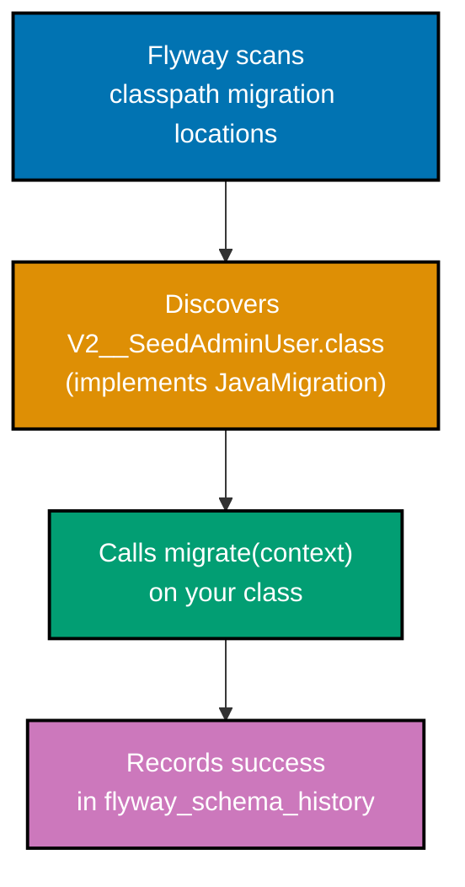
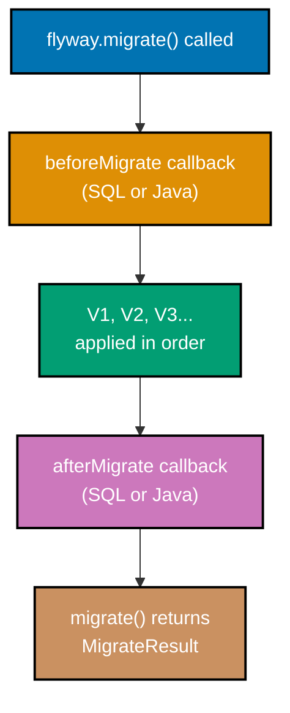
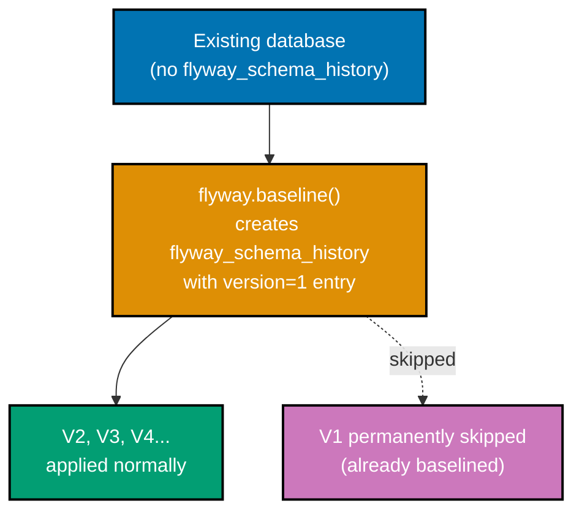
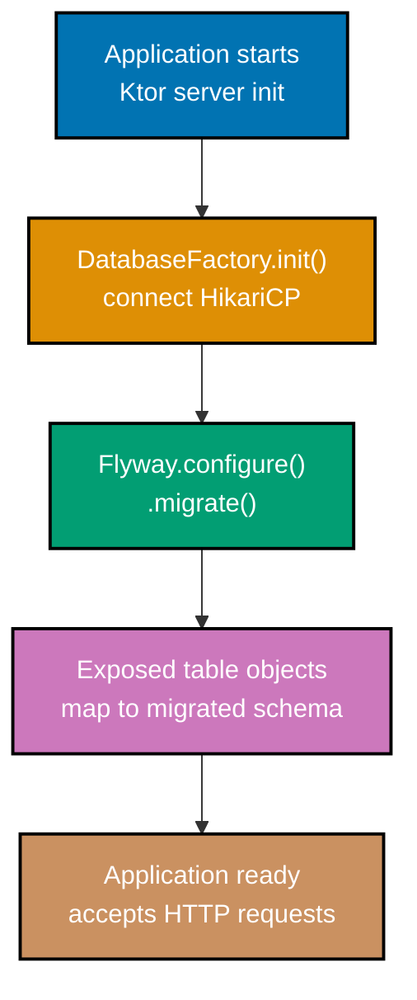

## Intermediate Examples (31-60)

**Coverage**: 40-75% of Flyway functionality

**Focus**: Java/Kotlin-based migrations, callbacks, placeholders, multiple schemas, transaction control, advanced SQL patterns, and testing with JUnit 5 and Testcontainers.

These examples assume familiarity with beginner concepts (versioned SQL migrations, Flyway API, Ktor integration). All code examples are self-contained and annotated for production use.

---

### Example 31: Java-Based Migration (extends BaseJavaMigration)

Flyway supports programmatic migrations through Java (or Kotlin) classes that extend `BaseJavaMigration`. The class name follows the same naming convention as SQL files: `V<version>__<description>`. This is useful when SQL alone cannot express complex migration logic — for example, transforming row data with application-level business rules.



```java
// File: src/main/java/db/migration/V2__SeedAdminUser.java
// => Package must be db.migration (matches Flyway default classpath scan location)
// => Class name V2__SeedAdminUser follows exact same naming rules as SQL files

import org.flywaydb.core.api.migration.BaseJavaMigration;
// => Extend BaseJavaMigration to get default checksum and versioning behavior
import org.flywaydb.core.api.migration.Context;
// => Context provides the active JDBC Connection for this migration's transaction

import java.sql.PreparedStatement;  // => Use PreparedStatement for parameterized SQL

public class V2__SeedAdminUser extends BaseJavaMigration {
    // => Class must be public for Flyway's class scanner to instantiate it
    // => BaseJavaMigration provides getVersion(), getDescription(), getChecksum()

    @Override
    public void migrate(Context context) throws Exception {
        // => Flyway calls migrate() inside the migration transaction
        // => context.getConnection() returns the active Connection for this migration

        try (PreparedStatement stmt = context.getConnection().prepareStatement(
            "INSERT INTO users (username, email, display_name, password_hash, role) " +
            "VALUES (?, ?, ?, ?, ?)"
        )) {
            // => PreparedStatement prevents SQL injection in programmatic migrations
            stmt.setString(1, "admin");              // => Position 1: username
            stmt.setString(2, "admin@example.com");  // => Position 2: email
            stmt.setString(3, "Administrator");      // => Position 3: display_name
            stmt.setString(4, "$2b$12$hashed_value");// => Position 4: bcrypt hash placeholder
            stmt.setString(5, "ADMIN");              // => Position 5: role (use enum value)
            stmt.executeUpdate();                    // => Executes INSERT; returns rows affected
            // => If executeUpdate() throws, Flyway rolls back the entire migration
        }
    }
}
```

**Key Takeaway**: Java-based migrations use the same `V<version>__<description>` naming convention as SQL files and run within the same transaction, enabling rollback on failure.

**Why It Matters**: Some migrations cannot be expressed in pure SQL: hashing passwords, calling external services during data backfill, or applying application-level validation logic to existing rows. `BaseJavaMigration` brings full JVM expressiveness to schema evolution while preserving Flyway's version ordering, checksum verification, and atomic transaction semantics. Teams building audit-heavy or compliance-driven systems routinely use Java migrations for the data transformation phase of schema changes.

---

### Example 32: Kotlin-Based Migration

Kotlin classes extend `BaseJavaMigration` the same way Java classes do. The Kotlin idiom uses `override fun migrate(context: Context)` and benefits from Kotlin's `use {}` extension on `AutoCloseable` for cleaner resource management than Java's try-with-resources.

```kotlin
// File: src/main/kotlin/db/migration/V3__SetDefaultCurrency.kt
// => Package db.migration is Flyway's default classpath scan location
// => Kotlin class V3__SetDefaultCurrency extends BaseJavaMigration

import org.flywaydb.core.api.migration.BaseJavaMigration
// => Flyway base class; provides version, description, checksum from class name
import org.flywaydb.core.api.migration.Context
// => Provides the active JDBC Connection inside the migration transaction

class V3__SetDefaultCurrency : BaseJavaMigration() {
    // => Kotlin class inherits from BaseJavaMigration()
    // => No "public" modifier needed in Kotlin; classes are public by default

    override fun migrate(context: Context) {
        // => Override migrate to supply the migration SQL
        // => Called by Flyway inside an open transaction

        context.connection.prepareStatement(
            "UPDATE expenses SET currency = 'IDR' WHERE currency IS NULL"
            // => Backfill: set a default currency on rows with NULL currency
        ).use { stmt ->
            // => Kotlin .use {} extension: calls stmt.close() automatically
            val rowsUpdated = stmt.executeUpdate()
            // => executeUpdate() returns Int (rows affected by UPDATE)
            // => rowsUpdated might be 0 if all existing rows already have currency set
            println("Updated $rowsUpdated expense rows with default currency IDR")
            // => Output: "Updated 42 expense rows with default currency IDR"
        }
        // => stmt.close() called here automatically by .use {}
    }
}
```

**Key Takeaway**: Kotlin migrations use `.use {}` on `PreparedStatement` for automatic resource cleanup, and the class name alone determines the migration version — no annotation or XML configuration required.

**Why It Matters**: Kotlin-based migrations fit naturally into Kotlin codebases and share the same dependency injection, logging, and utility libraries as the rest of the application. When a migration requires logic beyond SQL — like computing derived columns using Kotlin business rules, or calling a shared utility function — a Kotlin migration class keeps that logic in one language rather than mixing Kotlin application code with separate SQL scripts.

---

### Example 33: Callbacks (beforeMigrate, afterMigrate)

Flyway callbacks hook into lifecycle events. `beforeMigrate` runs once before any pending migrations execute; `afterMigrate` runs once after all pending migrations complete. Use them for cross-cutting concerns such as disabling triggers, logging audit events, or notifying monitoring systems.



**SQL callback file (beforeMigrate)**:

```sql
-- File: src/main/resources/db/migration/beforeMigrate.sql
-- => Flyway discovers callback SQL files by their exact name (no version prefix)
-- => beforeMigrate.sql runs once before ANY migration in this flyway.migrate() call
-- => Runs inside its own transaction (separate from each migration's transaction)

-- Log migration start to an audit table
INSERT INTO migration_log (event, occurred_at)
  VALUES ('MIGRATION_STARTED', NOW());
-- => Records timestamp when this deployment's migration batch began
-- => migration_log must already exist before this callback can insert into it
```

**Java callback class**:

```java
// File: src/main/java/db/callbacks/AfterMigrateCallback.java
// => Callback classes must implement Callback interface (not BaseJavaMigration)
// => Register with .callbacks(AfterMigrateCallback()) in FlywayConfiguration

import org.flywaydb.core.api.callback.Callback;
// => Flyway Callback interface: handle(Event, Context)
import org.flywaydb.core.api.callback.Context;
// => Context: access Event, Connection, MigrationInfo
import org.flywaydb.core.api.callback.Event;
// => Event enum: BEFORE_MIGRATE, AFTER_MIGRATE, BEFORE_EACH_MIGRATE, etc.

public class AfterMigrateCallback implements Callback {

    @Override
    public boolean supports(Event event, Context context) {
        return event == Event.AFTER_MIGRATE;
        // => Return true only for AFTER_MIGRATE: Flyway calls handle() only for supported events
    }

    @Override
    public boolean canHandleInTransaction(Event event, Context context) {
        return true;
        // => true = Flyway wraps handle() in the migration transaction
        // => false = Flyway calls handle() outside any transaction (for DDL-heavy operations)
    }

    @Override
    public void handle(Event event, Context context) {
        System.out.println("All migrations applied successfully.");
        // => Output: "All migrations applied successfully."
        // => In production: send Slack alert, increment Prometheus counter, etc.
    }

    @Override
    public String getCallbackName() {
        return "AfterMigrateCallback";
        // => Used in Flyway logs to identify this callback
    }
}
```

**Key Takeaway**: SQL callback files (`beforeMigrate.sql`) require no registration — Flyway discovers them automatically; Java callback classes must be registered explicitly via `.callbacks(myCallback)` in the fluent configuration.

**Why It Matters**: Callbacks decouple operational concerns from schema logic. Disabling row-level security before a bulk migration, re-enabling it afterward, and recording audit events are all cross-cutting tasks that do not belong in individual migration scripts. Callbacks enforce these concerns without requiring every migration author to remember to include the boilerplate.

---

### Example 34: Placeholders in SQL Migrations

Flyway placeholders replace `${placeholder}` tokens in SQL migration files at runtime. Default placeholders (`${flyway:defaultSchema}`, `${flyway:timestamp}`) are built in; custom placeholders are configured via `.placeholders()` in the Kotlin API or `flyway.placeholders.*` in `application.conf`.

```kotlin
// Flyway configuration with custom placeholders
import org.flywaydb.core.Flyway  // => Flyway core API

val flyway = Flyway.configure()  // => Start fluent builder
    .dataSource(
        "jdbc:postgresql://localhost:5432/mydb",
        // => JDBC URL for PostgreSQL
        "myuser",                 // => Database username
        "mypassword"              // => Database password
    )
    .placeholders(mapOf(
        // => Map of placeholder name -> replacement value
        "defaultRole"   to "USER",
        // => ${defaultRole} in SQL will be replaced with "USER"
        "adminEmail"    to "admin@example.com",
        // => ${adminEmail} in SQL will be replaced with "admin@example.com"
        "schemaVersion" to "2"
        // => ${schemaVersion} in SQL will be replaced with "2"
    ))
    .load()                       // => Build Flyway instance with placeholders configured

flyway.migrate()                  // => Execute migrations; all ${...} tokens replaced before SQL execution
```

**SQL migration using placeholders**:

```sql
-- File: src/main/resources/db/migration/V4__seed_roles.sql
-- => ${defaultRole} and ${adminEmail} are replaced by Flyway before execution
-- => Useful for environment-specific values (dev vs prod default data)

INSERT INTO roles (name, is_default)
  VALUES ('${defaultRole}', true);
-- => After substitution: VALUES ('USER', true)
-- => Allows the same migration file to work across environments with different defaults

INSERT INTO users (username, email, display_name, password_hash, role)
  VALUES ('admin', '${adminEmail}', 'Administrator', 'placeholder_hash', 'ADMIN');
-- => After substitution: VALUES ('admin', 'admin@example.com', ...)
-- => Different admin email per environment without separate migration files
```

**Key Takeaway**: Placeholders let a single migration file serve multiple environments by injecting environment-specific values at Flyway configuration time rather than hardcoding them in SQL.

**Why It Matters**: Hardcoding environment-specific values in migrations (dev emails, staging URLs, test passwords) leads to migration files that cannot run unmodified in production. Placeholders separate the migration logic from its runtime configuration, following the twelve-factor app principle of storing config in the environment. This means the same reviewed, tested migration script runs in all environments — only the values differ.

---

### Example 35: Multiple Schema Support

Flyway can manage migrations across multiple PostgreSQL schemas in a single database. The `.schemas()` configuration lists schemas in priority order: the first schema is the default (where `flyway_schema_history` lives), and Flyway creates any listed schemas that do not yet exist.

```kotlin
import org.flywaydb.core.Flyway  // => Flyway core API

val flyway = Flyway.configure()  // => Fluent builder
    .dataSource(
        "jdbc:postgresql://localhost:5432/mydb",
        "myuser",
        "mypassword"
    )
    .schemas("app", "audit", "reporting")
    // => schemas() sets the list of schemas Flyway manages
    // => "app" is the default schema (first listed): flyway_schema_history is created here
    // => Flyway creates "audit" and "reporting" schemas if they do not exist
    // => search_path is set to these schemas for all migrations
    .load()                       // => Build Flyway instance

flyway.migrate()                  // => Apply pending migrations in version order
// => Migrations can CREATE TABLE in any of the listed schemas
// => Example: CREATE TABLE audit.events (...) or CREATE TABLE reporting.summaries (...)
```

**SQL migration using explicit schema qualification**:

```sql
-- File: src/main/resources/db/migration/V5__create_audit_events.sql
-- => Create a table in the "audit" schema (separate from the "app" schema)
-- => Schema prefix "audit." makes the target explicit regardless of search_path

CREATE TABLE audit.events (                  -- => Table in "audit" schema
  id          UUID         NOT NULL DEFAULT gen_random_uuid(),
  -- => UUID primary key; auto-generated
  table_name  VARCHAR(100) NOT NULL,         -- => Which table was modified
  operation   VARCHAR(10)  NOT NULL,         -- => INSERT, UPDATE, or DELETE
  row_id      UUID         NOT NULL,         -- => Primary key of the affected row
  changed_at  TIMESTAMPTZ  NOT NULL DEFAULT NOW(),
  -- => Timestamp with timezone for the modification
  CONSTRAINT pk_audit_events PRIMARY KEY (id)
  -- => Named primary key for future reference
);
```

**Key Takeaway**: List schemas in `.schemas()` to have Flyway create them automatically and set `search_path` for all migrations; explicitly qualify table names with `schema.table` in SQL to avoid ambiguity.

**Why It Matters**: Multi-schema databases are standard in enterprise PostgreSQL deployments that separate OLTP data (`app` schema), audit trails (`audit` schema), and reporting aggregates (`reporting` schema) for security and organizational clarity. Flyway's schema support means one `flyway.migrate()` call manages all schemas consistently, and a single `flyway_schema_history` table tracks every migration regardless of which schema the SQL targets.

---

### Example 36: Baseline Migrations for Existing Databases

When introducing Flyway to an existing database, you cannot run `V1__initial_schema.sql` because the tables already exist. `flyway.baseline()` stamps the current database state as version `N` in `flyway_schema_history`, telling Flyway to ignore all migrations at or below `N` and start applying only migrations after `N`.



```kotlin
import org.flywaydb.core.Flyway  // => Flyway core API

val flyway = Flyway.configure()  // => Fluent builder
    .dataSource(
        "jdbc:postgresql://localhost:5432/legacy_db",
        // => Existing database with tables but no flyway_schema_history
        "myuser",
        "mypassword"
    )
    .baselineVersion("1")
    // => Set the baseline version to "1"
    // => flyway.baseline() will stamp version "1" as already applied
    .baselineDescription("Initial schema before Flyway adoption")
    // => Human-readable description stored in flyway_schema_history
    .baselineOnMigrate(true)
    // => Automatically baseline on migrate() if flyway_schema_history is missing
    // => Equivalent to calling flyway.baseline() manually before flyway.migrate()
    .load()                       // => Build Flyway instance

flyway.migrate()
// => First call: creates flyway_schema_history, inserts baseline row for version "1"
// => Then applies V2__add_audit_columns.sql, V3__create_tokens.sql, etc.
// => V1__initial_schema.sql is permanently skipped (already baselined)
```

**Key Takeaway**: `baselineOnMigrate(true)` is the safest adoption path for existing databases — it automatically creates the `flyway_schema_history` entry on the first `migrate()` call without requiring a separate manual step.

**Why It Matters**: Migrating an existing production database to Flyway management is one of the most common adoption scenarios. Without baseline, `flyway.migrate()` attempts to run `V1__initial_schema.sql` on a database that already has all those tables, causing `relation already exists` errors and a failed deployment. Baseline ensures Flyway's recorded history matches the actual database state from the first run.

---

### Example 37: Cherry-Pick Specific Migrations

The `.target()` configuration limits `flyway.migrate()` to apply only migrations up to a specified version. Combined with `flyway.info()`, cherry-picking lets you migrate to an exact version — useful for staged rollouts or debugging a specific migration.

```kotlin
import org.flywaydb.core.Flyway  // => Flyway core API

val flyway = Flyway.configure()  // => Fluent builder
    .dataSource(
        "jdbc:postgresql://localhost:5432/mydb",
        "myuser",
        "mypassword"
    )
    .target("3")
    // => Migrate only up to and including version "3"
    // => V4, V5, V6 exist but will NOT be applied in this call
    // => Useful for testing: "does the application work with only V1-V3?"
    .load()                       // => Build Flyway instance

val result = flyway.migrate()     // => Apply V1, V2, V3 only (V4+ skipped)
println(result.migrationsExecuted)
// => Output: 3 (assuming V1-V3 were all pending)

// Check what remains pending after targeted migrate
val flyway2 = Flyway.configure()  // => New builder without target restriction
    .dataSource(
        "jdbc:postgresql://localhost:5432/mydb",
        "myuser",
        "mypassword"
    )
    .load()
val info = flyway2.info()         // => Returns MigrationInfoService
info.pending().forEach { m ->
    println("Pending: ${m.version} - ${m.description}")
    // => Output: "Pending: 4 - add audit columns"
    // => Output: "Pending: 5 - standardize schema"
}
```

**Key Takeaway**: `.target("N")` makes `flyway.migrate()` stop at version `N`, leaving higher-version migrations in `pending` state for a subsequent call.

**Why It Matters**: Staged migrations reduce risk in complex deployments. If V5 modifies a large table with millions of rows, you may want to apply V1–V4 during a normal deployment window and schedule V5 as a separate maintenance operation. Cherry-picking gives you fine-grained control over when each schema change lands in production without maintaining separate migration branches.

---

### Example 38: Out-of-Order Migrations

By default, Flyway rejects migration files with versions lower than the highest already-applied version. Enabling `outOfOrder(true)` allows these "late" migrations to run, which is necessary when multiple feature branches each create migrations independently and merge in non-sequential order.

```kotlin
import org.flywaydb.core.Flyway  // => Flyway core API

// Scenario: V1, V2, V4 are already applied. Developer A created V3 on a long-running branch.
// Without outOfOrder: flyway.migrate() would FAIL with "detected resolved migration not applied to DB"
// With outOfOrder: flyway.migrate() runs V3 even though V4 is already applied

val flyway = Flyway.configure()  // => Fluent builder
    .dataSource(
        "jdbc:postgresql://localhost:5432/mydb",
        "myuser",
        "mypassword"
    )
    .outOfOrder(true)
    // => Allow migrations with lower versions than the current highest applied version
    // => V3 can run even if V4 is already in flyway_schema_history
    // => Flyway marks V3 in flyway_schema_history with out_of_order=true
    .load()                       // => Build Flyway instance

val result = flyway.migrate()     // => Applies V3 (out-of-order)
println(result.migrationsExecuted)
// => Output: 1 (V3 was the only pending migration)

val info = flyway.info()
info.applied().forEach { m ->
    println("${m.version}: outOfOrder=${m.isOutOfOrder}")
    // => "1: outOfOrder=false"
    // => "2: outOfOrder=false"
    // => "3: outOfOrder=true"   -- the late migration is flagged
    // => "4: outOfOrder=false"
}
```

**Key Takeaway**: `outOfOrder(true)` enables parallel branch development where multiple developers create migrations simultaneously; applied out-of-order migrations are flagged in `flyway_schema_history` for visibility.

**Why It Matters**: Teams using trunk-based development with short-lived feature branches frequently face out-of-order migrations when two branches each add a migration and only one merges first. Without `outOfOrder`, the second branch's migration is permanently blocked. Enabling `outOfOrder` resolves this without requiring version renumbering — a process that is error-prone and requires coordination across the team.

---

### Example 39: Migration Groups/Categories

Flyway's `group(true)` configuration runs all pending migrations in a single transaction instead of one transaction per migration. This all-or-nothing behavior is useful when a batch of interdependent migrations must all succeed or all roll back together.

```kotlin
import org.flywaydb.core.Flyway  // => Flyway core API

val flyway = Flyway.configure()  // => Fluent builder
    .dataSource(
        "jdbc:postgresql://localhost:5432/mydb",
        "myuser",
        "mypassword"
    )
    .group(true)
    // => Run all pending migrations inside a SINGLE wrapping transaction
    // => Default (false): each migration has its own transaction
    // => group(true): V2, V3, V4 all succeed or all roll back together
    // => WARNING: DDL statements (CREATE TABLE, ALTER TABLE) in PostgreSQL commit immediately
    // =>   and cannot be rolled back even inside a group transaction
    // => Safe for DML-only migration batches (INSERT, UPDATE, DELETE)
    .mixed(true)
    // => mixed(true): allow mixing DML and DDL in the same migration
    // => Required when using group(true) with SQL that contains both DDL and DML
    .load()                       // => Build Flyway instance

val result = flyway.migrate()     // => Apply all pending migrations in one transaction
println(result.success)
// => Output: true (all migrations succeeded)
// => If any single migration fails: entire group rolls back (DML only)
// => flyway_schema_history shows no new entries on rollback
```

**Key Takeaway**: `group(true)` wraps all pending migrations in one transaction for all-or-nothing semantics, but DDL statements (CREATE TABLE, ALTER TABLE) in PostgreSQL auto-commit and cannot be rolled back even inside a group transaction.

**Why It Matters**: When a release includes multiple tightly coupled migrations — create a new table, populate it from an old table, drop the old table — running them in a group ensures the database never lands in a halfway state. This matters when any one of those three migrations failing would leave the schema in an invalid state that requires manual intervention. For pure DML batches (data corrections, seed data), group transactions provide reliable rollback semantics.

---

### Example 40: Transaction Control per Migration

Flyway wraps each migration in a transaction by default. Marking a migration as non-transactional is necessary for PostgreSQL-specific DDL operations that cannot run inside a transaction, such as `CREATE INDEX CONCURRENTLY` or `VACUUM`.

```java
// File: src/main/java/db/migration/V6__AddConcurrentIndex.java
// => Implements JavaMigration directly (not BaseJavaMigration) to override canExecuteInTransaction()

import org.flywaydb.core.api.migration.BaseJavaMigration;
// => BaseJavaMigration.canExecuteInTransaction() returns true by default
import org.flywaydb.core.api.migration.Context;
// => Context: provides JDBC Connection

import java.sql.Statement;  // => Statement for non-parameterized DDL

public class V6__AddConcurrentIndex extends BaseJavaMigration {
    // => Inherits BaseJavaMigration but overrides canExecuteInTransaction

    @Override
    public boolean canExecuteInTransaction() {
        return false;
        // => Return false: Flyway does NOT wrap this migration in a transaction
        // => Required for CREATE INDEX CONCURRENTLY (PostgreSQL blocks concurrent index builds inside transactions)
        // => Required for VACUUM, CLUSTER, and some ALTER TYPE operations
        // => WARNING: no transaction = no automatic rollback on failure; migration must be idempotent
    }

    @Override
    public void migrate(Context context) throws Exception {
        try (Statement stmt = context.getConnection().createStatement()) {
            stmt.execute(
                "CREATE INDEX CONCURRENTLY IF NOT EXISTS " +
                "idx_expenses_user_id ON expenses (user_id)"
            );
            // => CREATE INDEX CONCURRENTLY builds index without locking the table for writes
            // => Takes longer than non-concurrent index builds but safe for production tables
            // => IF NOT EXISTS: idempotent — safe to rerun if migration partially executed before
        }
    }
}
```

**Key Takeaway**: Override `canExecuteInTransaction()` to return `false` for migrations containing PostgreSQL operations that cannot run inside a transaction; always make such migrations idempotent with `IF NOT EXISTS` or `IF EXISTS` guards.

**Why It Matters**: Attempting `CREATE INDEX CONCURRENTLY` inside a transaction raises `ERROR: CREATE INDEX CONCURRENTLY cannot run inside a transaction block`, immediately failing the migration. This error is surprising because normal `CREATE INDEX` works fine in transactions. Non-transactional migrations are the correct solution for large-table index creation in production without blocking writes — a critical operation for any database serving live traffic.

---

### Example 41: Error Handlers for Failed Migrations

When a migration fails mid-execution, Flyway records it as failed in `flyway_schema_history` and refuses to run further migrations until the failure is resolved. The resolution workflow is `flyway.repair()`, which removes the failed entry and allows `flyway.migrate()` to retry.

```kotlin
import org.flywaydb.core.Flyway                          // => Flyway core API
import org.flywaydb.core.api.exception.FlywayException  // => Base exception for all Flyway errors

val flyway = Flyway.configure()  // => Fluent builder
    .dataSource(
        "jdbc:postgresql://localhost:5432/mydb",
        "myuser",
        "mypassword"
    )
    .load()                       // => Build Flyway instance

fun runMigrationsWithRecovery(flyway: Flyway) {
    // => Helper function: attempts migration, repairs on failure, retries
    try {
        val result = flyway.migrate()            // => Attempt to apply pending migrations
        println("Success: ${result.migrationsExecuted} migrations applied")
        // => Output: "Success: 3 migrations applied"
    } catch (e: FlywayException) {
        // => FlywayException covers: SQL errors, checksum mismatches, out-of-order violations
        println("Migration failed: ${e.message}")
        // => Output: "Migration failed: Migration V5 failed! Changes successfully rolled back."

        // Check if the failure was recorded (non-transactional migrations leave a failed entry)
        val failedMigrations = flyway.info().failed()
        // => info().failed(): returns array of MigrationInfo with state = FAILED

        if (failedMigrations.isNotEmpty()) {
            println("Repairing flyway_schema_history...")
            flyway.repair()
            // => repair() removes failed entries from flyway_schema_history
            // => repair() also recalculates checksums for migrations whose files changed
            // => After repair(), flyway.migrate() can retry from the failed version
            println("Repair complete. Fix the migration SQL, then call migrate() again.")
        }
    }
}
```

**Key Takeaway**: `flyway.repair()` removes failed migration entries from `flyway_schema_history`, resetting Flyway to a clean state so that a corrected migration can be retried on the next `migrate()` call.

**Why It Matters**: A failed migration in `flyway_schema_history` with `success=false` blocks all subsequent migrations. Without `repair()`, the only resolution is manual deletion of the failed row from `flyway_schema_history` — a dangerous operation with no guardrails. `repair()` is the safe, auditable alternative that also handles checksum mismatches when hotfixes modify already-applied migration files in production emergencies.

---

### Example 42: Dry-Run Migrations

Flyway's dry-run feature (Teams/Enterprise edition) generates the SQL that would be executed without actually running it. The Community edition alternative is `flyway.info()` combined with reading migration files manually — or using a test database for the same effect.

```kotlin
import org.flywaydb.core.Flyway  // => Flyway core API

val flyway = Flyway.configure()  // => Fluent builder
    .dataSource(
        "jdbc:postgresql://localhost:5432/mydb",
        "myuser",
        "mypassword"
    )
    .load()                       // => Build Flyway instance

// Community edition: use info() to preview what would run without executing
fun previewPendingMigrations(flyway: Flyway) {
    val infoService = flyway.info()  // => Returns MigrationInfoService; no SQL executed
    val pending = infoService.pending()
    // => pending(): array of MigrationInfo for migrations not yet in flyway_schema_history

    println("Pending migrations preview:")
    pending.forEach { migration ->
        println("  Version: ${migration.version}")
        // => Output: "  Version: 4"
        println("  Description: ${migration.description}")
        // => Output: "  Description: add audit columns"
        println("  Script: ${migration.script}")
        // => Output: "  Script: V4__add_audit_columns.sql"
        println("  Type: ${migration.type}")
        // => Output: "  Type: SQL" or "  Type: JDBC" (for Java/Kotlin migrations)
        println("---")
    }
    println("Total pending: ${pending.size}")
    // => Output: "Total pending: 2"
}

previewPendingMigrations(flyway)
// => Shows all pending migrations without applying any
// => Use this in deployment pipelines to validate what will run before approving
```

**Key Takeaway**: `flyway.info().pending()` lists all unapplied migrations including version, description, and script name without executing any SQL — use this to preview a deployment's schema changes before approving.

**Why It Matters**: Production deployments benefit from human review of pending migrations before execution, especially for migrations touching large tables or making destructive schema changes. A dry-run preview integrated into the deployment pipeline catches mistakes (wrong version number, accidentally committed migration file) before they reach the database. Teams that skip this step often discover migration surprises at the worst moment — during the production deployment window.

---

### Example 43: Data Migration with INSERT...SELECT

Data migrations copy and transform data between tables. The `INSERT...SELECT` pattern moves rows from a source table to a target table in a single SQL statement — atomic and efficient for moderate data volumes without requiring application-level iteration.

```sql
-- File: src/main/resources/db/migration/V7__migrate_legacy_categories.sql
-- => Data migration: copy rows from old "product_categories" to new "categories" table
-- => INSERT...SELECT is atomic: either all rows migrate or none do (within the transaction)

-- Assume new "categories" table already exists (created in V6)
INSERT INTO categories (id, name, slug, created_at)
-- => Target table columns listed explicitly to avoid position-dependent errors
SELECT
    gen_random_uuid(),            -- => Generate a new UUID for each migrated row
    pc.name,                      -- => Copy name column directly
    LOWER(REPLACE(pc.name, ' ', '-')),
    -- => Derive slug from name: lowercase, spaces replaced with hyphens
    -- => Example: "Sports Equipment" -> "sports-equipment"
    pc.created_at                 -- => Preserve original creation timestamp
FROM product_categories pc        -- => Source table (legacy schema)
WHERE pc.active = true;           -- => Only migrate active categories; skip archived ones
-- => SQL: INSERT INTO categories SELECT ... FROM product_categories WHERE active = true
-- => If product_categories has 500 rows, this creates 500 rows in categories in one statement

-- Verify migration (optional, informational)
-- SELECT COUNT(*) FROM categories;
-- => Should equal the count of active rows in product_categories
```

**Key Takeaway**: `INSERT...SELECT` migrates data in a single atomic SQL statement, avoiding the N+1 inefficiency of application-level row-by-row migration loops.

**Why It Matters**: Application-layer data migrations that fetch rows in Kotlin and reinsert them one by one are slow, non-atomic, and leave the database in inconsistent intermediate states if interrupted. An `INSERT...SELECT` that migrates 100,000 rows runs in seconds, is fully transactional, and requires no application code. For millions of rows, batching with `LIMIT/OFFSET` or `WHERE id > last_processed_id` patterns extend this approach while maintaining atomicity per batch.

---

### Example 44: Seed Data Pattern

Repeatable migrations (`R__` prefix) re-run whenever their checksum changes, making them ideal for reference/seed data that must stay synchronized with the migration files. Unlike versioned migrations, repeatable migrations have no version number and always run after all versioned migrations.

```sql
-- File: src/main/resources/db/migration/R__seed_expense_categories.sql
-- => "R__" prefix = repeatable migration (no version number)
-- => Flyway recalculates checksum on every migrate() call
-- => Re-executes this file whenever its content changes
-- => Always runs AFTER all versioned (V__) migrations complete

-- Use INSERT ... ON CONFLICT (upsert) for idempotent seed data
-- => Idempotency is critical: repeatable migrations may run many times
INSERT INTO expense_categories (code, label, is_active)
VALUES
    ('FOOD',       'Food & Dining',    true),
    -- => Category code=FOOD; label visible in UI; active=true
    ('TRANSPORT',  'Transportation',   true),
    -- => Category code=TRANSPORT
    ('HEALTH',     'Healthcare',       true),
    -- => Category code=HEALTH
    ('EDUCATION',  'Education',        true),
    -- => Category code=EDUCATION
    ('UTILITIES',  'Utilities',        true),
    -- => Category code=UTILITIES
    ('OTHER',      'Other',            true)
    -- => Catch-all category for uncategorized expenses
ON CONFLICT (code)
-- => ON CONFLICT: if a row with this code already exists...
DO UPDATE SET
    label     = EXCLUDED.label,
    -- => EXCLUDED refers to the row that would have been inserted
    -- => Update label if it changed in the migration file
    is_active = EXCLUDED.is_active;
    -- => Update is_active status to match the migration file's current value
-- => Full upsert: safe to run on empty table (INSERT) or populated table (UPDATE)
```

**Key Takeaway**: Repeatable migrations with `R__` prefix and `ON CONFLICT DO UPDATE` create self-synchronizing seed data that stays current every time the migration file changes without leaving duplicate rows.

**Why It Matters**: Hardcoded reference data scattered across application code — lookup tables, default configurations, permission definitions — drifts out of sync between environments. Repeatable migrations make reference data a first-class schema artifact, version-controlled and automatically synchronized. Changing a category label in the migration file guarantees that change propagates to every environment on the next deployment, eliminating the "works on my machine" category label discrepancy.

---

### Example 45: Foreign Key with ON UPDATE CASCADE

`ON UPDATE CASCADE` automatically updates foreign key values in child tables when the referenced primary key value changes. While UUID primary keys rarely change, this pattern is essential for natural key schemas where business identifiers evolve.

```sql
-- File: src/main/resources/db/migration/V8__create_expense_attachments.sql
-- => Creates attachments table with a foreign key that cascades updates and deletes

CREATE TABLE expense_attachments (
  id          UUID          NOT NULL DEFAULT gen_random_uuid(),
  -- => UUID primary key for the attachment itself
  expense_id  UUID          NOT NULL,
  -- => Foreign key referencing the expenses table
  filename    VARCHAR(255)  NOT NULL,
  -- => Original filename as uploaded
  storage_key VARCHAR(500)  NOT NULL,
  -- => Object storage key (e.g., S3 path); longer than filename
  mime_type   VARCHAR(100)  NOT NULL,
  -- => MIME type: "image/jpeg", "application/pdf", etc.
  file_size   BIGINT        NOT NULL,
  -- => File size in bytes; BIGINT handles files up to ~9 exabytes
  created_at  TIMESTAMPTZ   NOT NULL DEFAULT NOW(),
  -- => Upload timestamp with timezone
  CONSTRAINT pk_expense_attachments
    PRIMARY KEY (id),
  -- => Named primary key on id
  CONSTRAINT fk_attachments_expense
    FOREIGN KEY (expense_id)
    REFERENCES expenses (id)
    ON DELETE CASCADE
    -- => DELETE CASCADE: deleting an expense deletes its attachments automatically
    ON UPDATE CASCADE
    -- => UPDATE CASCADE: if expenses.id changes, expense_attachments.expense_id updates automatically
    -- => Rarely triggered for UUID PKs; important for natural-key schemas
);

CREATE INDEX idx_expense_attachments_expense_id
    ON expense_attachments (expense_id);
-- => Index on foreign key column: prevents full table scan when fetching expense's attachments
-- => PostgreSQL does not automatically index foreign key columns (unlike MySQL InnoDB)
```

**Key Takeaway**: Always index foreign key columns in PostgreSQL (unlike MySQL, it does not do this automatically) and use `ON DELETE CASCADE` for child records that have no meaning without their parent.

**Why It Matters**: An unindexed foreign key column causes a full sequential scan every time you fetch a parent record's children — a query that scales linearly with table size. At 10,000 expenses with an average of 3 attachments each, every expense detail page triggers a 30,000-row scan instead of a 3-row index lookup. This difference is imperceptible in development with 100 rows and catastrophic in production with millions.

---

### Example 46: Composite Primary Keys

Some entities are uniquely identified by the combination of multiple columns rather than a single surrogate key. Composite primary keys enforce this at the database level, preventing duplicate combination entries without an application-layer uniqueness check.

```sql
-- File: src/main/resources/db/migration/V9__create_user_permissions.sql
-- => user_permissions uses a composite primary key: (user_id, permission_code)
-- => This prevents a user from being granted the same permission twice at the DB level

CREATE TABLE user_permissions (
  user_id         UUID         NOT NULL,
  -- => References users.id; part of composite PK
  permission_code VARCHAR(50)  NOT NULL,
  -- => Permission identifier: "READ_EXPENSES", "WRITE_EXPENSES", "ADMIN"
  granted_at      TIMESTAMPTZ  NOT NULL DEFAULT NOW(),
  -- => When this permission was granted
  granted_by      VARCHAR(255) NOT NULL,
  -- => Who granted the permission (username or system)
  CONSTRAINT pk_user_permissions
    PRIMARY KEY (user_id, permission_code),
    -- => Composite PK: the pair (user_id, permission_code) must be unique
    -- => Prevents: INSERT (user_id=X, 'READ_EXPENSES') twice for same user
  CONSTRAINT fk_user_permissions_user
    FOREIGN KEY (user_id)
    REFERENCES users (id)
    ON DELETE CASCADE
    -- => Deleting a user removes all their permissions automatically
);

-- Index on permission_code alone (user_id already indexed as leading PK column)
CREATE INDEX idx_user_permissions_code
    ON user_permissions (permission_code);
-- => Supports queries like "find all users with ADMIN permission"
-- => user_id is already the leading column of the composite PK index
```

**Key Takeaway**: Composite primary keys enforce multi-column uniqueness at the database level, eliminating duplicate combination entries without relying on application code or a separate unique constraint.

**Why It Matters**: A surrogate UUID primary key on `user_permissions` would allow inserting `(user_id=X, 'READ_EXPENSES')` twice — the application would need an additional unique constraint or careful INSERT logic to prevent it. The composite primary key makes the duplicate physically impossible, reduces the schema to its minimum necessary structure, and documents the natural identity of the entity directly in the table definition.

---

### Example 47: Partial Indexes

A partial index indexes only rows satisfying a `WHERE` clause. This reduces index size and write overhead when queries consistently filter on a high-selectivity condition, and it enables efficient "soft delete" patterns by indexing only active records.

```sql
-- File: src/main/resources/db/migration/V10__add_partial_indexes.sql
-- => Partial indexes: index only the rows that queries actually filter on

-- Partial index: only active (non-deleted) users
CREATE UNIQUE INDEX idx_users_email_active
    ON users (email)
    WHERE deleted_at IS NULL;
-- => Only indexes rows where deleted_at IS NULL (active users)
-- => Size: proportional to active users, not total users
-- => Enforces email uniqueness among active users only
-- => A deleted user's email can be reused by a new registration
-- => Regular UNIQUE constraint would prevent email reuse after soft-delete

-- Partial index for pending expenses (recent data, frequently queried)
CREATE INDEX idx_expenses_pending_by_user
    ON expenses (user_id, date DESC)
    WHERE date >= CURRENT_DATE - INTERVAL '90 days';
-- => Only indexes expenses from the last 90 days
-- => Supports "show recent expenses" queries with user_id filter + date ordering
-- => Old expenses are excluded: they rarely appear in active user dashboards
-- => Smaller index = faster writes and faster scans for the common case

-- Index on non-null optional column (only index rows where column has a value)
CREATE INDEX idx_attachments_storage_key
    ON expense_attachments (storage_key)
    WHERE storage_key IS NOT NULL;
-- => Only indexes rows with a storage_key value
-- => Avoids indexing NULL entries which are never searched by storage key
```

**Key Takeaway**: Partial indexes index only rows matching a `WHERE` predicate, dramatically reducing index size for queries that consistently filter on a high-selectivity condition such as `deleted_at IS NULL` or `date >= recent`.

**Why It Matters**: A full index on `email` in a soft-delete system grows unbounded as deleted accounts accumulate. After five years, 80% of indexed rows may be deleted accounts that no active query ever filters for. The partial index stays small and fast regardless of how many deleted accounts accumulate. This pattern becomes critical at scale: a table with 10 million rows where 9 million are soft-deleted benefits enormously from a 1-million-row partial index versus a 10-million-row full index.

---

### Example 48: Full-Text Search Indexes

PostgreSQL's `tsvector` type and GIN indexes enable full-text search directly in the database without an external search service. Flyway manages the index creation as a versioned migration.

```sql
-- File: src/main/resources/db/migration/V11__add_fulltext_search.sql
-- => Full-text search: tsvector computed column + GIN index
-- => Enables searches like "find all expenses mentioning 'coffee' in description"

-- Add a computed tsvector column for full-text search on expenses
ALTER TABLE expenses
    ADD COLUMN search_vector tsvector
    GENERATED ALWAYS AS (
        to_tsvector('english',
            COALESCE(description, '') || ' ' || COALESCE(category, '')
        )
    ) STORED;
-- => tsvector: PostgreSQL text search document type
-- => GENERATED ALWAYS AS ... STORED: computed column stored on disk (PostgreSQL 12+)
-- => to_tsvector('english', ...): parse text into lexemes using English dictionary
-- => Lexemes: normalized word forms ("running" -> "run", "expenses" -> "expens")
-- => COALESCE: replace NULL with empty string to avoid NULL concatenation issues
-- => Combines description + category into one searchable document

-- GIN index on the tsvector column for fast text search
CREATE INDEX idx_expenses_search_vector
    ON expenses USING GIN (search_vector);
-- => GIN (Generalized Inverted Index): optimal index type for tsvector columns
-- => Maps each lexeme to the rows containing it (inverted index)
-- => Supports @@ operator: search_vector @@ to_tsquery('english', 'coffee')
-- => Much faster than LIKE '%coffee%' which requires full table scan

-- Example query (documentation only; not executed by migration):
-- SELECT * FROM expenses WHERE search_vector @@ to_tsquery('english', 'coffee & food');
-- => Finds expenses whose description/category contains both "coffee" and "food" lexemes
```

**Key Takeaway**: A GIN index on a `tsvector` generated column enables sub-millisecond full-text search on large text columns without any external search infrastructure.

**Why It Matters**: `LIKE '%keyword%'` queries cannot use B-tree indexes and perform full table scans. At 500,000 expense rows, a LIKE search takes seconds. A GIN-indexed tsvector search takes milliseconds. For applications where users search their expense descriptions — a common expense tracker feature — this is the difference between a responsive UI and a timeout. Using Flyway to manage the search infrastructure ensures the tsvector column and GIN index are created in the correct order across all environments.

---

### Example 49: Creating Views

Database views encapsulate complex joins and aggregations behind a simple table-like interface. Flyway manages view creation as versioned migrations; when the view definition changes, a new migration version drops and recreates it.

```sql
-- File: src/main/resources/db/migration/V12__create_expense_summary_view.sql
-- => View: encapsulates a complex aggregation query behind a simple name
-- => Applications can SELECT FROM expense_summary as if it were a table

CREATE VIEW expense_summary AS
-- => CREATE VIEW: defines a named query stored in the database catalog
-- => Does NOT store data; executes the SELECT each time the view is queried
SELECT
    e.user_id,                           -- => The user who owns these expenses
    e.currency,                          -- => Currency of the expenses
    e.category,                          -- => Expense category (FOOD, TRANSPORT, etc.)
    DATE_TRUNC('month', e.date) AS month,
    -- => DATE_TRUNC('month'): truncate date to first day of its month
    -- => Example: 2026-03-15 -> 2026-03-01
    -- => Enables GROUP BY month without a separate month column
    COUNT(*)              AS total_count,
    -- => Number of expenses in this (user, currency, category, month) group
    SUM(e.amount)         AS total_amount,
    -- => Sum of all expense amounts in this group
    AVG(e.amount)         AS avg_amount,
    -- => Average expense amount in this group
    MIN(e.date)           AS earliest_date,
    -- => Earliest expense date in this period
    MAX(e.date)           AS latest_date
    -- => Most recent expense date in this period
FROM expenses e
WHERE e.deleted_at IS NULL
-- => Exclude soft-deleted expenses from the summary
GROUP BY e.user_id, e.currency, e.category, DATE_TRUNC('month', e.date);
-- => One row per (user, currency, category, month) combination
```

**Key Takeaway**: Views in Flyway versioned migrations are created once and replaced by new migration versions when the query changes; use `CREATE OR REPLACE VIEW` only if backward-compatible, otherwise drop-and-recreate in a new version.

**Why It Matters**: Without views, every application query that needs monthly expense summaries repeats the same complex aggregation SQL. When the business logic changes (add a currency filter, change the grouping period), every query must be updated. A view centralizes the logic: update one migration file, create a new version that drops and recreates the view, and all application queries immediately use the new logic after the next deployment.

---

### Example 50: Creating Materialized Views

A materialized view stores query results on disk. Unlike regular views (which execute on every query), materialized views are fast to read but require explicit refresh to pick up new data. Flyway creates them like any other DDL in a versioned migration.

```sql
-- File: src/main/resources/db/migration/V13__create_monthly_totals_materialized_view.sql
-- => Materialized view: stores aggregation results on disk for fast reads
-- => Trades fresh data for query speed; must be refreshed explicitly

CREATE MATERIALIZED VIEW monthly_expense_totals AS
-- => MATERIALIZED VIEW: stores results in a physical table-like structure
-- => Query executes once at CREATE time (and again at each REFRESH)
-- => Reads from this view are instant (no computation): SELECT * FROM monthly_expense_totals
SELECT
    user_id,                                -- => User identity
    currency,                               -- => Currency of expenses
    DATE_TRUNC('month', date) AS month,    -- => Month bucket for aggregation
    SUM(amount)  AS total_amount,           -- => Total spending this month
    COUNT(*)     AS expense_count           -- => Number of expenses this month
FROM expenses
WHERE deleted_at IS NULL                    -- => Only non-deleted expenses
GROUP BY user_id, currency, DATE_TRUNC('month', date)
WITH DATA;
-- => WITH DATA: populate the view immediately during creation
-- => Alternative: WITH NO DATA creates empty view, populate later with REFRESH

-- Index the materialized view for fast lookups by user
CREATE INDEX idx_monthly_totals_user
    ON monthly_expense_totals (user_id, month DESC);
-- => B-tree index: fast lookup for "all months for user X sorted newest first"
-- => Materialized views support indexes; regular views do not

-- Note: Refresh command (run outside migrations, e.g., nightly cron):
-- REFRESH MATERIALIZED VIEW CONCURRENTLY monthly_expense_totals;
-- => CONCURRENTLY: refresh without locking the view for reads (requires unique index)
```

**Key Takeaway**: Create the materialized view with `WITH DATA` to populate it immediately, and add a `CREATE INDEX` in the same migration so queries are fast from the first refresh onward.

**Why It Matters**: Dashboard queries that aggregate 500,000 expense rows take seconds when recomputed on every request. The same query against a refreshed materialized view with an index takes milliseconds. Materialized views are the right tool when users can tolerate slightly stale data (refreshed hourly or nightly) in exchange for instant page loads. Flyway ensures the view and its indexes are created in the correct sequence and tracked alongside the rest of the schema.

---

### Example 51: Trigger Functions

PostgreSQL trigger functions execute automatically in response to table events (INSERT, UPDATE, DELETE). Flyway creates the trigger function and the trigger itself as DDL statements in a versioned migration.

```sql
-- File: src/main/resources/db/migration/V14__create_updated_at_trigger.sql
-- => Trigger: automatically update "updated_at" timestamp on every UPDATE

-- Step 1: Create the trigger function
CREATE OR REPLACE FUNCTION set_updated_at()
-- => CREATE OR REPLACE FUNCTION: safe to rerun; replaces existing function
-- => Returns TRIGGER: special return type required for trigger functions
RETURNS TRIGGER AS $$
-- => $$ ... $$: dollar-quoting; avoids escaping single quotes inside function body
BEGIN
    NEW.updated_at = NOW();
    -- => NEW: the row being inserted or updated (available in BEFORE triggers)
    -- => Set updated_at to current timestamp on every update
    -- => NOW(): current transaction timestamp (constant within one transaction)
    RETURN NEW;
    -- => RETURN NEW: return the modified row; required for BEFORE triggers
    -- => BEFORE trigger with RETURN NULL would cancel the operation
END;
$$ LANGUAGE plpgsql;
-- => plpgsql: PostgreSQL's procedural language for trigger functions

-- Step 2: Attach the trigger to the expenses table
CREATE TRIGGER trg_expenses_updated_at
-- => Trigger name: trg_<table>_<purpose> naming convention
BEFORE UPDATE ON expenses
-- => BEFORE UPDATE: fires before the UPDATE commits, allowing us to modify NEW
FOR EACH ROW                        -- => Fires once per updated row (not once per statement)
EXECUTE FUNCTION set_updated_at();
-- => Call the trigger function defined above

-- Attach the same trigger function to users table
CREATE TRIGGER trg_users_updated_at
BEFORE UPDATE ON users
FOR EACH ROW
EXECUTE FUNCTION set_updated_at();
-- => Reuse the same function across multiple tables
```

**Key Takeaway**: Trigger functions defined with `CREATE OR REPLACE` are idempotent and reusable across multiple tables; attach them with `CREATE TRIGGER ... EXECUTE FUNCTION` on each table that needs the behavior.

**Why It Matters**: Manual `updated_at` updates in application code are unreliable — any UPDATE that forgets to set `updated_at` leaves stale timestamps silently. A database trigger enforces the invariant at the storage layer, making it impossible for `updated_at` to be wrong regardless of whether the update originates from the application, a migration, a DBA query, or a bulk data correction script.

---

### Example 52: Stored Procedures

PostgreSQL stored procedures (introduced in PostgreSQL 11) support transaction control inside the procedure body using `COMMIT` and `ROLLBACK`. Flyway creates stored procedures in versioned migrations as DDL.

```sql
-- File: src/main/resources/db/migration/V15__create_archive_expenses_procedure.sql
-- => Stored procedure: server-side logic for archiving old expenses
-- => Procedures (CREATE PROCEDURE) support COMMIT/ROLLBACK; functions do not

CREATE OR REPLACE PROCEDURE archive_old_expenses(cutoff_date DATE)
-- => CREATE PROCEDURE: server-side subroutine callable from application or SQL
-- => cutoff_date: parameter specifying which expenses to archive (older than this date)
LANGUAGE plpgsql AS $$
-- => plpgsql: PostgreSQL procedural language for control flow
DECLARE
    archived_count INTEGER := 0;  -- => Local variable to track archived rows
BEGIN
    -- Insert old expenses into archive table
    INSERT INTO expenses_archive
        SELECT * FROM expenses
        WHERE date < cutoff_date
          AND deleted_at IS NULL;
    -- => Copy qualifying rows to archive table before deleting from main table
    -- => deleted_at IS NULL: only archive non-deleted rows

    GET DIAGNOSTICS archived_count = ROW_COUNT;
    -- => ROW_COUNT: number of rows affected by the last SQL statement
    -- => Capture count for the RAISE NOTICE below

    -- Delete archived expenses from main table
    DELETE FROM expenses
    WHERE date < cutoff_date
      AND deleted_at IS NULL;
    -- => Remove the archived rows from the main expenses table

    RAISE NOTICE 'Archived % expenses older than %', archived_count, cutoff_date;
    -- => RAISE NOTICE: prints to PostgreSQL log (visible in application logs)
    -- => Output: "Archived 1523 expenses older than 2025-01-01"

    COMMIT;
    -- => COMMIT inside a procedure: commits the INSERT and DELETE together
    -- => Functions cannot COMMIT; procedures can (PostgreSQL 11+)
END;
$$;

-- Call with: CALL archive_old_expenses('2025-01-01');
```

**Key Takeaway**: `CREATE PROCEDURE` (not `CREATE FUNCTION`) enables `COMMIT`/`ROLLBACK` inside the procedure body; use stored procedures for multi-step operations that need autonomous transaction control.

**Why It Matters**: Archiving millions of rows from application code requires fetching rows over the network, making decisions in memory, and sending DELETE statements — all round-trips that are orders of magnitude slower than the equivalent server-side SQL. Stored procedures push the computation to where the data lives, reduce network traffic, and enable fine-grained transaction control for operations that process data in batches with intermediate commits.

---

### Example 53: JSON/JSONB Columns

PostgreSQL's `jsonb` type stores JSON as a parsed binary format that supports indexing and efficient operators. Flyway adds `jsonb` columns in versioned migrations like any other column type.

```sql
-- File: src/main/resources/db/migration/V16__add_metadata_columns.sql
-- => Add JSONB columns for flexible, schema-free metadata storage

ALTER TABLE expenses
    ADD COLUMN metadata JSONB DEFAULT '{}' NOT NULL;
-- => JSONB: binary-parsed JSON; supports operators (->>, @>, ?, etc.)
-- => DEFAULT '{}': empty JSON object as default (not NULL)
-- => NOT NULL: ensures metadata always has a value (empty object {} is valid)
-- => JSON vs JSONB: JSON stores original text; JSONB parses and stores binary
-- =>   JSONB: faster reads, supports indexes, normalizes key order
-- =>   JSON: faster writes, preserves original formatting and key order
-- => Production preference: JSONB for data you will query; JSON for raw storage only

ALTER TABLE users
    ADD COLUMN preferences JSONB DEFAULT '{
      "theme": "light",
      "currency": "IDR",
      "notifications": true
    }' NOT NULL;
-- => Default preferences for all existing users when this migration runs
-- => Each key-value pair in the default is a user preference
-- => New user registrations should explicitly set preferences in application code

-- Example JSONB queries (documentation, not executed by migration):
-- SELECT id, metadata->>'receipt_url' FROM expenses WHERE metadata ? 'receipt_url';
-- => ->>: extract text value for key
-- => ?: check if key exists

-- SELECT id FROM users WHERE preferences @> '{"theme": "dark"}';
-- => @>: containment operator: does preferences contain {"theme": "dark"}?
```

**Key Takeaway**: `jsonb` stores structured variable data without schema changes while supporting efficient indexing and operators; add GIN indexes (Example 55) on `jsonb` columns you query frequently.

**Why It Matters**: Expense metadata — receipt URLs, merchant names, GPS coordinates, custom tags — varies by expense type and evolves unpredictably. Adding a new column for each metadata field requires a migration per field addition. A single `jsonb` metadata column accommodates all current and future metadata without schema changes, while JSONB's binary storage and GIN indexing ensure query performance comparable to normalized columns for the most common access patterns.

---

### Example 54: Array Columns (PostgreSQL)

PostgreSQL supports native array types for columns that store multiple values of the same type. Arrays are suitable for simple, ordered lists (tags, permissions, codes) that do not require relational queries across the array elements.

```sql
-- File: src/main/resources/db/migration/V17__add_tags_to_expenses.sql
-- => Add a text array column for expense tags
-- => Arrays: store multiple values in one column without a join table

ALTER TABLE expenses
    ADD COLUMN tags TEXT[] DEFAULT '{}' NOT NULL;
-- => TEXT[]: array of text values
-- => DEFAULT '{}': empty array (not NULL) for existing rows
-- => NOT NULL: ensures tags always has a value; use empty array instead of NULL

-- Example array queries (documentation, not executed by migration):
-- INSERT INTO expenses (description, tags) VALUES ('Lunch', ARRAY['food', 'team-outing']);
-- => ARRAY['food', 'team-outing']: array literal syntax

-- SELECT * FROM expenses WHERE 'food' = ANY(tags);
-- => ANY(tags): check if 'food' appears anywhere in the tags array
-- => Equivalent to: WHERE tags @> ARRAY['food']

-- SELECT * FROM expenses WHERE tags @> ARRAY['food', 'team'];
-- => @>: containment: expenses tagged with BOTH 'food' AND 'team'

-- UPDATE expenses SET tags = tags || ARRAY['reviewed'] WHERE id = $1;
-- => ||: array concatenation operator; appends 'reviewed' to existing tags

-- GIN index for efficient array containment queries
CREATE INDEX idx_expenses_tags
    ON expenses USING GIN (tags);
-- => GIN index: supports @>, <@, &&, and = ANY() operators on arrays
-- => Without this index: 'food' = ANY(tags) requires full table scan
```

**Key Takeaway**: Use `TEXT[]` arrays with a GIN index for simple tag-like collections where you need `ANY()` and containment (`@>`) queries; use a join table when you need to query or aggregate the array elements as first-class entities.

**Why It Matters**: A join table for expense tags requires three tables, two foreign keys, and a JOIN on every expense query just to retrieve tags. A `TEXT[]` column retrieves tags as part of the expense row with zero additional joins. The tradeoff is that array elements cannot have their own columns (like a tag description) and array operations are less expressive than relational queries. For simple tagging, arrays outperform join tables in simplicity and performance.

---

### Example 55: GIN Index for JSONB

GIN (Generalized Inverted Index) indexes enable efficient operator queries on `jsonb` columns. Without a GIN index, every `@>`, `?`, or `?|` operator on a `jsonb` column requires a full table scan.

```sql
-- File: src/main/resources/db/migration/V18__add_gin_indexes.sql
-- => GIN indexes for JSONB columns: enable fast containment and key-existence queries

-- GIN index on expenses.metadata for JSONB operators
CREATE INDEX idx_expenses_metadata_gin
    ON expenses USING GIN (metadata);
-- => GIN USING GIN: required index type for JSONB operators @>, ?, ?|, ?&
-- => Supports: metadata @> '{"category": "food"}' (containment)
-- =>           metadata ? 'receipt_url' (key existence)
-- =>           metadata ?| ARRAY['receipt_url', 'merchant'] (any key exists)
-- =>           metadata ?& ARRAY['receipt_url', 'merchant'] (all keys exist)
-- => Does NOT support: metadata->>'amount' > '100' (expression, needs separate index)

-- GIN index on users.preferences for containment queries
CREATE INDEX idx_users_preferences_gin
    ON users USING GIN (preferences);
-- => Supports: preferences @> '{"theme": "dark"}' (user preference lookup)
-- => Useful for analytics: "how many users prefer dark theme?"

-- Expression index for extracting a specific JSONB key as text (for equality/range queries)
CREATE INDEX idx_expenses_metadata_receipt
    ON expenses ((metadata->>'receipt_url'))
    WHERE metadata ? 'receipt_url';
-- => Expression index: indexes the result of metadata->>'receipt_url'
-- => Partial: only indexes rows where receipt_url key exists
-- => Supports: WHERE metadata->>'receipt_url' = 'https://...' (equality)
-- => More selective than full GIN index for single-key lookups
```

**Key Takeaway**: Use a full GIN index on a `jsonb` column for flexible multi-key queries; use a partial expression index on a specific JSONB key when queries consistently filter on that single key.

**Why It Matters**: A JSONB column without a GIN index performs all operator queries as sequential scans. At 1 million expense rows, `WHERE metadata @> '{"receipt_url": "..."}` takes seconds without the index and milliseconds with it. The partial expression index on a specific key (like `receipt_url`) is even faster for single-key lookups because it is smaller than the full GIN index and can be used for range queries, which the GIN index cannot support.

---

### Example 56: Table Partitioning

PostgreSQL table partitioning splits a large table into smaller physical partitions based on a column value. Each partition is a separate table internally but appears as one logical table to queries. Flyway manages partitioned table creation in versioned migrations.

```sql
-- File: src/main/resources/db/migration/V19__create_partitioned_audit_log.sql
-- => Range-partitioned table: one partition per year for audit_log
-- => Queries filtering by year touch only one partition, not the full table

CREATE TABLE audit_log (
  id          BIGSERIAL    NOT NULL,
  -- => BIGSERIAL: auto-incrementing BIGINT; use BIGSERIAL for high-volume audit tables
  table_name  VARCHAR(100) NOT NULL,   -- => Which table was audited
  operation   VARCHAR(10)  NOT NULL,   -- => INSERT, UPDATE, DELETE
  row_id      UUID         NOT NULL,   -- => Primary key of the audited row
  changed_by  VARCHAR(255) NOT NULL,   -- => Who made the change
  changed_at  TIMESTAMPTZ  NOT NULL DEFAULT NOW(),
  -- => Timestamp: the partition key column
  old_values  JSONB,                  -- => Previous row values (NULL for INSERT)
  new_values  JSONB                   -- => New row values (NULL for DELETE)
) PARTITION BY RANGE (changed_at);
-- => PARTITION BY RANGE (changed_at): partition on the changed_at timestamp column
-- => Range partitioning: each partition covers a contiguous range of values

-- Create initial year partitions
CREATE TABLE audit_log_2025
    PARTITION OF audit_log
    FOR VALUES FROM ('2025-01-01') TO ('2026-01-01');
-- => Partition for 2025: stores rows where changed_at >= 2025-01-01 AND < 2026-01-01

CREATE TABLE audit_log_2026
    PARTITION OF audit_log
    FOR VALUES FROM ('2026-01-01') TO ('2027-01-01');
-- => Partition for 2026: new rows for 2026 go here automatically (partition pruning)

-- Index on each partition (partitioned tables do not auto-inherit parent indexes)
CREATE INDEX idx_audit_log_2025_changed_at ON audit_log_2025 (changed_at DESC);
CREATE INDEX idx_audit_log_2026_changed_at ON audit_log_2026 (changed_at DESC);
-- => Each partition needs its own index for efficient range queries within the partition
```

**Key Takeaway**: Range-partitioned tables require explicit partition creation per range and per-partition indexes; queries automatically use partition pruning to scan only the relevant partition based on the `WHERE` clause.

**Why It Matters**: An audit log accumulates rows indefinitely. Without partitioning, queries filtering by date scan the entire table (potentially billions of rows). With year-based partitioning, a query for "all changes in 2026" touches only the 2026 partition. Old partitions can be detached and archived to cold storage without deleting data. Maintenance operations like `VACUUM` and `ANALYZE` run per-partition, staying fast as the table grows.

---

### Example 57: Generated Columns

Generated columns compute their value automatically from an expression involving other columns. PostgreSQL 12 introduced `GENERATED ALWAYS AS ... STORED` for persistent computed columns. Flyway adds them in versioned migrations.

```sql
-- File: src/main/resources/db/migration/V20__add_generated_columns.sql
-- => Generated columns: automatically computed from other columns
-- => GENERATED ALWAYS AS ... STORED: value persisted on disk; updated on every row change

ALTER TABLE expenses
    ADD COLUMN amount_idr NUMERIC(20, 2)
    GENERATED ALWAYS AS (
        CASE currency
            WHEN 'IDR' THEN amount
            -- => IDR to IDR: no conversion needed; return amount as-is
            WHEN 'USD' THEN amount * 15000
            -- => USD to IDR: approximate exchange rate (use live rate in application logic)
            WHEN 'EUR' THEN amount * 16500
            -- => EUR to IDR: approximate exchange rate
            ELSE amount
            -- => Unknown currency: return amount unchanged
        END
    ) STORED;
-- => STORED: computed value persisted in the row; costs storage but reads are instant
-- => VIRTUAL (not yet supported in PostgreSQL): computed at query time, no storage cost
-- => Application cannot INSERT or UPDATE amount_idr directly; PostgreSQL rejects it
-- => Updated automatically whenever amount or currency changes

-- Generated column for full name
ALTER TABLE users
    ADD COLUMN full_name VARCHAR(355)
    GENERATED ALWAYS AS (
        display_name
        -- => For this schema: full_name is an alias for display_name
        -- => In schemas with first_name + last_name: (first_name || ' ' || last_name)
    ) STORED;
-- => Enables ORDER BY full_name, WHERE full_name ILIKE '%search%'
-- => Without generated column: every query would repeat the concatenation expression
```

**Key Takeaway**: `GENERATED ALWAYS AS (...) STORED` persists computed values on disk, making reads instant at the cost of extra storage and write overhead; PostgreSQL rejects any attempt to manually set a generated column's value.

**Why It Matters**: Without generated columns, every query that needs `amount_idr` must include the CASE expression, making the SQL verbose and the expression logic duplicated across queries, reports, and API handlers. A generated column centralizes the computation in the schema definition — the expression changes in one migration, and all queries automatically use the new formula on the next deployment.

---

### Example 58: Migration Testing with JUnit 5

Testing Flyway migrations verifies that each migration runs without errors and leaves the database in the expected state. JUnit 5 with an in-memory H2 database (or Testcontainers PostgreSQL) provides fast, repeatable migration tests.

```kotlin
// File: src/test/kotlin/db/migration/MigrationTest.kt
// => JUnit 5 test verifying Flyway migrations run successfully

import org.flywaydb.core.Flyway       // => Flyway core API
import org.junit.jupiter.api.Test     // => JUnit 5 @Test annotation
import org.junit.jupiter.api.Assertions.*
// => JUnit 5 assertion functions: assertEquals, assertTrue, etc.

import java.sql.DriverManager         // => JDBC connection management

class MigrationTest {
    // => Test class: verifies Flyway migrations apply cleanly

    @Test
    fun `all migrations apply cleanly`() {
        // => Test: run all migrations against H2 in-memory database
        // => H2 PostgreSQL mode: emulates PostgreSQL syntax for most DDL

        val flyway = Flyway.configure()   // => Fluent builder
            .dataSource(
                "jdbc:h2:mem:testdb;MODE=PostgreSQL;DB_CLOSE_DELAY=-1",
                // => H2 in-memory URL; MODE=PostgreSQL: enable PostgreSQL compatibility
                // => DB_CLOSE_DELAY=-1: keep database alive as long as JVM runs
                "sa",                     // => H2 default username
                ""                        // => H2 default password (empty)
            )
            .locations("classpath:db/migration")
            // => Scan this classpath location for migration files
            // => Same location used in production configuration
            .load()

        val result = flyway.migrate()     // => Apply all migrations
        assertTrue(result.success, "All migrations should succeed")
        // => Assertion: result.success must be true; fails test if any migration failed
        assertTrue(result.migrationsExecuted > 0,
            "At least one migration should have run")
        // => Assertion: at least one migration applied (catches empty migration directory)
    }

    @Test
    fun `schema history table is populated`() {
        val flyway = Flyway.configure()
            .dataSource(
                "jdbc:h2:mem:historydb;MODE=PostgreSQL;DB_CLOSE_DELAY=-1",
                "sa", ""
            )
            .locations("classpath:db/migration")
            .load()

        flyway.migrate()                  // => Apply all migrations

        val connection = DriverManager.getConnection(
            "jdbc:h2:mem:historydb", "sa", ""
        )
        // => Get JDBC connection to the same in-memory database
        val stmt = connection.createStatement()
        val rs = stmt.executeQuery(
            "SELECT COUNT(*) FROM flyway_schema_history WHERE success = TRUE"
        )
        // => Count successful migrations in flyway_schema_history
        rs.next()
        val successCount = rs.getInt(1)   // => Get count value
        assertTrue(successCount > 0, "Schema history should have successful entries")
        // => Assertion: at least one successful migration recorded
        connection.close()                // => Close connection when done
    }
}
```

**Key Takeaway**: Test Flyway migrations with H2 in PostgreSQL mode for fast unit-test feedback; use Testcontainers PostgreSQL (Example 59) for integration tests that verify PostgreSQL-specific syntax.

**Why It Matters**: Migration files are code that runs in production — yet most teams do not test them until deployment. A migration test run in CI catches SQL syntax errors, missing table references, and constraint violations before they reach a real database. The feedback loop is seconds with H2 in-memory compared to minutes with a real PostgreSQL instance, making it practical to run on every commit.

---

### Example 59: Test Database with Testcontainers

Testcontainers starts a real PostgreSQL Docker container during the test run, providing a production-identical environment for migration and integration tests. This catches PostgreSQL-specific issues (like `CREATE INDEX CONCURRENTLY` behavior) that H2 cannot simulate.

```kotlin
// File: src/test/kotlin/db/migration/PostgresMigrationTest.kt
// => Integration test using Testcontainers PostgreSQL for production-identical testing

import org.flywaydb.core.Flyway         // => Flyway core API
import org.junit.jupiter.api.Test       // => JUnit 5 @Test annotation
import org.junit.jupiter.api.Assertions.*
import org.testcontainers.containers.PostgreSQLContainer
// => Testcontainers PostgreSQL: starts a real PostgreSQL Docker container
import org.testcontainers.junit.jupiter.Container
// => @Container: Testcontainers JUnit 5 integration; manages container lifecycle
import org.testcontainers.junit.jupiter.Testcontainers
// => @Testcontainers: activates Testcontainers JUnit 5 extension

@Testcontainers
// => Activates Testcontainers extension: starts @Container fields before tests
class PostgresMigrationTest {

    companion object {
        @Container
        val postgres = PostgreSQLContainer("postgres:15")
            // => Start PostgreSQL 15 container; matches production PostgreSQL version
            .withDatabaseName("testdb")   // => Database name inside container
            .withUsername("testuser")     // => Container username
            .withPassword("testpass")     // => Container password
        // => Container starts once per class (companion object @Container is static)
        // => JDBC URL available via postgres.jdbcUrl after container starts
    }

    @Test
    fun `all migrations apply on real PostgreSQL`() {
        val flyway = Flyway.configure()    // => Fluent builder
            .dataSource(
                postgres.jdbcUrl,          // => Real PostgreSQL JDBC URL from container
                // => Example: jdbc:postgresql://localhost:32768/testdb
                postgres.username,         // => "testuser"
                postgres.password          // => "testpass"
            )
            .locations("classpath:db/migration")
            // => Same migration location as production
            .load()

        val result = flyway.migrate()      // => Apply all migrations to real PostgreSQL
        assertTrue(result.success, "All migrations must succeed on PostgreSQL")
        // => Validates real PostgreSQL syntax: gen_random_uuid(), tsvector, GIN indexes
        println("Applied ${result.migrationsExecuted} migrations successfully")
        // => Output: "Applied 20 migrations successfully"
    }

    @Test
    fun `expenses table has correct structure`() {
        val flyway = Flyway.configure()
            .dataSource(postgres.jdbcUrl, postgres.username, postgres.password)
            .locations("classpath:db/migration")
            .load()
        flyway.migrate()                   // => Apply all migrations first

        val conn = postgres.createConnection("")
        // => createConnection: Testcontainers helper to get a JDBC Connection
        val rs = conn.metaData.getColumns(null, null, "expenses", null)
        // => getColumns(): returns metadata for all columns in "expenses" table
        val columns = mutableSetOf<String>()
        while (rs.next()) {
            columns.add(rs.getString("COLUMN_NAME"))
            // => Collect all column names into a Set
        }
        assertTrue(columns.contains("amount_idr"),
            "expenses should have generated column amount_idr")
        // => Verifies Example 57's generated column was created
        assertTrue(columns.contains("metadata"),
            "expenses should have JSONB metadata column")
        // => Verifies Example 53's metadata column was created
        conn.close()
    }
}
```

**Key Takeaway**: Testcontainers provides a production-identical PostgreSQL environment for migration tests that catch PostgreSQL-specific issues (GIN indexes, tsvector, generated columns) invisible to H2.

**Why It Matters**: H2 PostgreSQL mode approximates PostgreSQL syntax but does not support every feature. `CREATE INDEX CONCURRENTLY`, `tsvector`, `gen_random_uuid()`, GIN indexes, and `PARTITION BY RANGE` all require a real PostgreSQL instance to test accurately. Testcontainers makes real PostgreSQL tests as easy as in-memory tests — the Docker container starts automatically, the test runs, and the container is destroyed. This eliminates the "it worked in H2 but failed in production" class of migration bugs.

---

### Example 60: Exposed ORM Integration Pattern

JetBrains Exposed is a Kotlin SQL framework commonly used with Ktor. Flyway manages schema migrations while Exposed handles query DSL and table definitions. The integration pattern: Flyway migrates first, then Exposed maps to the migrated schema.



```kotlin
// File: src/main/kotlin/com/example/database/DatabaseFactory.kt
// => DatabaseFactory: initializes HikariCP connection pool, runs Flyway, configures Exposed

import com.zaxxer.hikari.HikariConfig    // => HikariCP connection pool configuration
import com.zaxxer.hikari.HikariDataSource// => HikariCP connection pool DataSource
import org.flywaydb.core.Flyway          // => Flyway core API
import org.jetbrains.exposed.sql.Database// => Exposed: connect to JDBC DataSource
import org.jetbrains.exposed.sql.transactions.transaction
// => Exposed transaction: wraps SQL in a database transaction

object DatabaseFactory {
    // => Kotlin object: singleton; DatabaseFactory.init() called once at startup

    fun init(jdbcUrl: String, user: String, password: String) {
        // => Called from Application.kt module initialization

        // Step 1: Configure HikariCP connection pool
        val hikariConfig = HikariConfig().apply {
            this.jdbcUrl = jdbcUrl          // => JDBC URL for PostgreSQL connection
            this.username = user            // => Database username
            this.password = password        // => Database password
            maximumPoolSize = 10            // => Max concurrent connections in pool
            isAutoCommit = false            // => Exposed manages transactions manually
            transactionIsolation = "TRANSACTION_REPEATABLE_READ"
            // => Isolation level: repeatable reads prevent phantom reads in transactions
            validate()                      // => Validate HikariCP config before creating pool
        }
        val dataSource = HikariDataSource(hikariConfig)
        // => dataSource: the configured connection pool; reused for all database operations

        // Step 2: Run Flyway migrations against the same DataSource
        val flyway = Flyway.configure()    // => Flyway fluent builder
            .dataSource(dataSource)        // => Reuse HikariCP DataSource (not a separate connection)
            .locations("classpath:db/migration")
            // => Scan classpath for migration files
            .outOfOrder(false)             // => Enforce strict version ordering in production
            .validateOnMigrate(true)       // => Validate checksums before applying (detects file tampering)
            .load()

        flyway.migrate()                   // => Apply all pending migrations
        // => After migrate(): schema is in the latest state; safe for Exposed to use

        // Step 3: Connect Exposed to the same DataSource
        Database.connect(dataSource)       // => Exposed uses HikariCP connections for all queries
        // => Exposed table objects now map to the schema Flyway just created/updated
    }
}
```

**Exposed table object mapping to Flyway-migrated schema**:

```kotlin
// File: src/main/kotlin/com/example/database/tables/ExpensesTable.kt
// => Exposed table object: mirrors the Flyway-created "expenses" schema

import org.jetbrains.exposed.dao.id.UUIDTable
// => UUIDTable: Exposed DSL base for tables with UUID primary key
import org.jetbrains.exposed.sql.javatime.timestampWithTimeZone
// => timestampWithTimeZone: maps to TIMESTAMPTZ column in PostgreSQL

object ExpensesTable : UUIDTable("expenses") {
    // => UUIDTable("expenses"): maps to "expenses" table; id column is UUID PK (from Flyway V1)
    // => Column definitions must match the Flyway-migrated schema exactly

    val userId      = uuid("user_id")
    // => Maps to expenses.user_id (UUID FK to users.id from Flyway migration)
    val type        = varchar("type", 10)
    // => Maps to expenses.type VARCHAR(10); max length must match migration
    val amount      = decimal("amount", 20, 8)
    // => Maps to expenses.amount DECIMAL(20,8) from migration
    val currency    = varchar("currency", 10)
    // => Maps to expenses.currency VARCHAR(10)
    val category    = varchar("category", 100)
    // => Maps to expenses.category VARCHAR(100)
    val description = varchar("description", 500)
    // => Maps to expenses.description VARCHAR(500)
    val date        = org.jetbrains.exposed.sql.javatime.date("date")
    // => Maps to expenses.date DATE column
    val createdAt   = timestampWithTimeZone("created_at")
    // => Maps to expenses.created_at TIMESTAMPTZ; auto-set by trigger (Example 51)
    val updatedAt   = timestampWithTimeZone("updated_at")
    // => Maps to expenses.updated_at TIMESTAMPTZ; auto-updated by trigger (Example 51)
}
```

**Key Takeaway**: Always run `flyway.migrate()` before `Database.connect(dataSource)` in the application startup sequence to guarantee Exposed maps to the current schema, never a stale one.

**Why It Matters**: Exposed table objects are defined statically in Kotlin. If `Database.connect()` runs before `flyway.migrate()`, Exposed maps to whatever schema existed before the migration — columns that the new migration adds are invisible to the running application until restart. Running Flyway first at startup ensures the schema is always current before any application code references it. This single ordering rule eliminates an entire class of deployment-time column-not-found errors.

---
