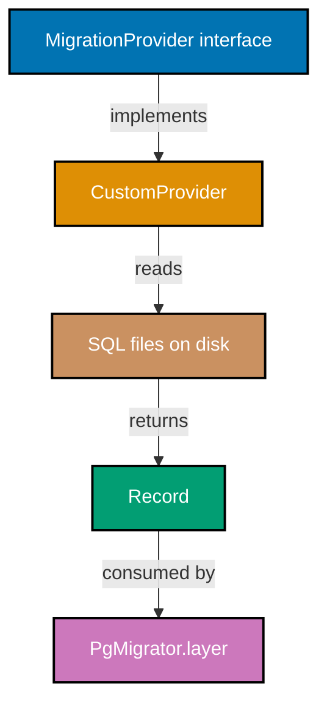
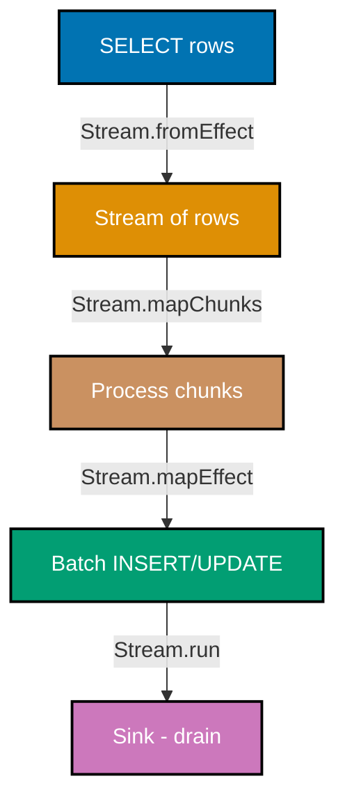
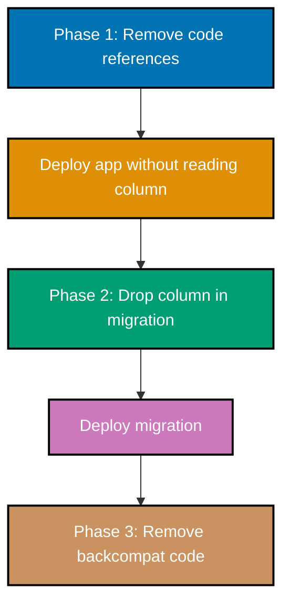
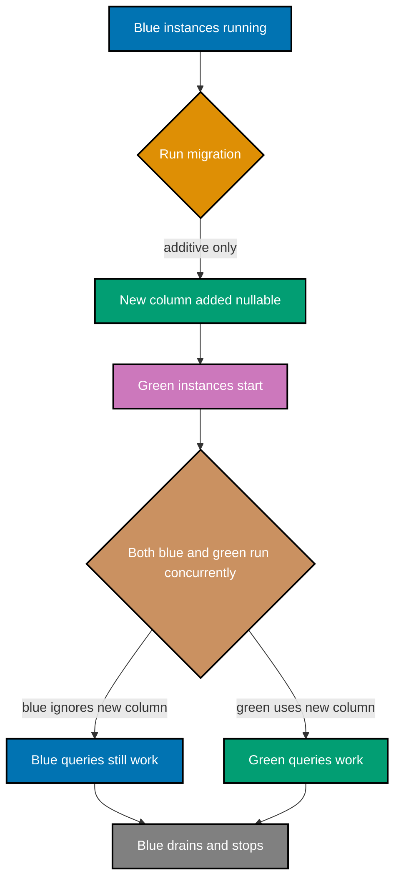
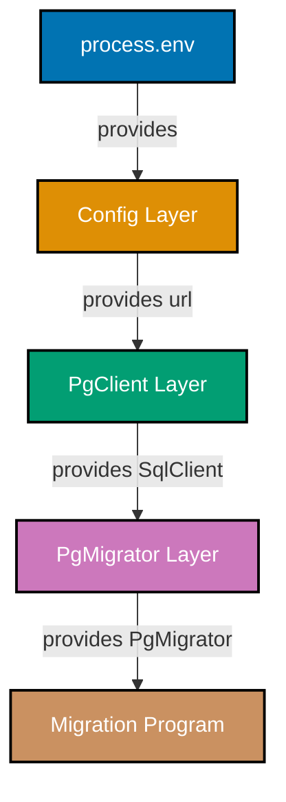

## Advanced Examples (61-85)

**Coverage**: 75-95% of Effect SQL migration functionality

**Focus**: Custom migration providers, Effect streams for large datasets, zero-downtime schema changes, CI/CD integration, monitoring with Effect Metrics, blue-green deployment, multi-tenant schemas, pgcrypto, audit trails, schema drift detection, and production observability.

These examples assume you understand beginner and intermediate concepts. All examples are self-contained and production-ready.

---

### Example 61: Custom Migration Provider

The built-in `PgMigrator.fromRecord` loader reads migrations from a static TypeScript record. For advanced use cases — dynamic discovery, remote storage, or version-controlled SQL files — you implement a custom `MigrationProvider` that returns migrations on demand.



```typescript
// File: src/infrastructure/db/migrations/custom-provider.ts
import { SqlClient } from "@effect/sql"; // => SqlClient service tag
import { PgMigrator } from "@effect/sql-pg"; // => PgMigrator for loader type
import { Effect, Record as R } from "effect"; // => Effect runtime + Record utilities
import * as fs from "node:fs/promises"; // => Node.js async file system
import * as path from "node:path"; // => Node.js path utilities

// => MigrationEntry is the shape PgMigrator expects: id + Effect computation
// => Each Effect resolves SqlClient from context and executes SQL
type MigrationEntry = [
  id: number, // => Sequential migration id (must be monotonically increasing)
  migration: Effect.Effect<void, unknown, SqlClient.SqlClient>,
];

// => loadSqlFileMigrations scans a directory for *.sql files and wraps each
// => as a lazy Effect that runs its SQL content at migration time
export async function loadSqlFileMigrations(
  dir: string, // => Absolute path to the migrations directory
): Promise<typeof PgMigrator.fromRecord extends (r: infer R) => unknown ? R : never> {
  const files = await fs.readdir(dir); // => Reads all file names in the directory
  // => Sort ensures migrations run in alphabetical (numeric prefix) order
  const sqlFiles = files
    .filter((f) => f.endsWith(".sql")) // => Keep only .sql files; ignore .ts and .map
    .sort(); // => Lexicographic sort: 001_... < 002_... < 003_...

  // => Build a Record<string, Effect> from file names
  // => PgMigrator.fromRecord treats keys as migration ids
  const entries = await Promise.all(
    sqlFiles.map(async (file) => {
      const id = parseInt(file.split("_")[0], 10); // => Extract numeric prefix: "001_create.sql" => 1
      const filePath = path.join(dir, file); // => Absolute path: /app/migrations/001_create.sql
      const content = await fs.readFile(filePath, "utf-8"); // => Read entire SQL file as string

      // => Wrap SQL content in a lazy Effect that executes it on the SqlClient
      // => Effect.gen is lazy — it only runs when the migrator invokes it
      const migration = Effect.gen(function* () {
        const sql = yield* SqlClient.SqlClient; // => Resolve SqlClient from Effect context
        yield* sql`${sql.unsafe(content)}`; // => Execute raw SQL; sql.unsafe bypasses parameterization
        // => sql.unsafe is safe here because content comes from trusted source files, not user input
      });

      return [id, migration] as MigrationEntry; // => Return tuple [id, Effect]
    }),
  );

  // => Convert array of [id, Effect] tuples to Record<string, Effect>
  return Object.fromEntries(entries.map(([id, m]) => [String(id), m]));
  // => PgMigrator expects string keys; the migrator converts them to numbers internally
}
```

**Key Takeaway**: A custom provider wraps any SQL source — files, remote storage, or a database — in a Record of `[id, Effect]` entries that `PgMigrator.fromRecord` consumes.

**Why It Matters**: Teams that manage migrations as plain `.sql` files (for DBA review, git blame, or external tooling) need a loader that reads them from disk rather than from compiled TypeScript modules. The provider pattern keeps this concern separate from migration content, letting you switch from TypeScript-embedded SQL to file-based SQL without touching any migration file. The same pattern works for loading migrations from S3, a Git repository, or a database table in multi-tenant SaaS architectures where each tenant has an isolated migration history.

---

### Example 62: Effect Stream for Large Data Migrations

When a data migration must process millions of rows, loading all rows into memory causes OOM failures. Effect `Stream` transforms the query result into a lazy pipeline that processes rows in chunks and writes them back incrementally.



```typescript
// File: src/infrastructure/db/migrations/010_backfill_email_hash.ts
import { SqlClient } from "@effect/sql"; // => SqlClient service tag
import { Effect, Stream, Chunk } from "effect"; // => Stream for lazy processing, Chunk for batching

// => Row shape from the source query
interface UserRow {
  id: number;
  email: string;
}

// => hashEmail is a placeholder; in production use node:crypto createHash
function hashEmail(email: string): string {
  return Buffer.from(email).toString("base64"); // => Demo only: base64 is not a secure hash
  // => Replace with crypto.createHash("sha256").update(email).digest("hex") for production
}

export default Effect.gen(function* () {
  const sql = yield* SqlClient.SqlClient; // => Resolve SqlClient from Effect dependency graph

  // => Add email_hash column if it does not already exist
  // => IF NOT EXISTS prevents error on repeated runs (idempotent migration)
  yield* sql`
    ALTER TABLE users
    ADD COLUMN IF NOT EXISTS email_hash TEXT
  `;

  // => sql<UserRow[]> types the query result as an array of UserRow
  // => This single query loads ALL rows; for >100k rows, use cursor-based pagination instead
  const rows = yield* sql<UserRow[]>`
    SELECT id, email FROM users WHERE email_hash IS NULL
  `;
  // => rows is UserRow[]; length may be millions in production databases

  // => Convert array to Stream so we can process it lazily in chunks
  const stream = Stream.fromIterable(rows); // => Creates a pull-based stream from the array
  // => For true streaming without full materialization, use sql.stream (if driver supports cursors)

  yield* stream.pipe(
    Stream.grouped(500), // => Collect rows into Chunk<UserRow> of size 500
    // => Batch size of 500 balances throughput vs transaction size and memory use
    Stream.mapEffect((chunk) => {
      // => mapEffect processes each chunk as an Effect
      // => Build a VALUES list from the chunk for a single bulk UPDATE
      const updates = Chunk.toArray(chunk).map((row) => ({
        id: row.id,
        email_hash: hashEmail(row.email), // => Compute hash for each row in the batch
      }));

      // => Single UPDATE per batch reduces round-trips vs one UPDATE per row
      return Effect.forEach(
        updates,
        (u) => sql`UPDATE users SET email_hash = ${u.email_hash} WHERE id = ${u.id}`,
        { concurrency: 10 }, // => Run up to 10 UPDATEs in parallel within the batch
        // => concurrency: 10 saturates the connection pool without overwhelming PostgreSQL
      );
    }),
    Stream.runDrain, // => Consume the stream; discard results; fail on first error
    // => Stream.runDrain is the Effect equivalent of forEach with side effects only
  );
});
```

**Key Takeaway**: `Stream.fromIterable` + `Stream.grouped` + `Stream.mapEffect` creates a back-pressured pipeline that processes large datasets in fixed-size batches without loading all rows into memory at once.

**Why It Matters**: Data migrations on production tables with tens of millions of rows routinely cause outages when implemented naively. Loading all rows, hashing them in memory, and writing them back in a single transaction exhausts RAM, holds table locks for minutes, and blocks application queries. The stream pattern caps memory usage at `(batch_size × row_size)` regardless of table size. Combined with Effect's structured concurrency (`concurrency: 10`), it achieves near-optimal database throughput while remaining cancellable, observable, and retryable — none of which are possible with raw imperative loops.

---

### Example 63: Zero-Downtime Column Addition

Adding a nullable column with a default value is safe in PostgreSQL 11+ because it updates the catalog without rewriting the table. Adding a NOT NULL column without a default requires a full table rewrite and long lock — avoid it.

```typescript
// File: src/infrastructure/db/migrations/020_add_profile_picture_url.ts
import { SqlClient } from "@effect/sql"; // => SqlClient service tag
import { Effect } from "effect"; // => Effect runtime

export default Effect.gen(function* () {
  const sql = yield* SqlClient.SqlClient; // => Resolve SqlClient from Effect dependency graph

  // => ADD COLUMN with a DEFAULT is safe in PostgreSQL 11+ (zero table rewrite)
  // => PostgreSQL 11+ stores the default in the catalog; existing rows return it virtually
  // => Before PostgreSQL 11, ADD COLUMN with DEFAULT rewrote the entire table (table lock!)
  yield* sql`
    ALTER TABLE users
    ADD COLUMN IF NOT EXISTS profile_picture_url TEXT DEFAULT NULL
  `;
  // => TEXT: variable-length string; no length limit (unlike VARCHAR(n))
  // => DEFAULT NULL: makes the column nullable with no explicit value required
  // => IF NOT EXISTS: idempotent — safe to run multiple times without error

  // => DO NOT add NOT NULL without a default on a live table:
  // => ALTER TABLE users ADD COLUMN active BOOLEAN NOT NULL DEFAULT FALSE;
  // => PostgreSQL 11+ handles this safely, but earlier versions rewrite the table.
  // => For pre-11 compatibility: add nullable first, backfill, then add NOT NULL constraint.
});
```

**Key Takeaway**: Adding a nullable column with `DEFAULT NULL` (or a constant literal default in PG 11+) is a metadata-only operation that completes in milliseconds regardless of table size.

**Why It Matters**: PostgreSQL 11 introduced fast column addition with defaults, eliminating the most common source of zero-downtime migration failures. However, many production databases still run PostgreSQL 10 or have mixed version fleets. Understanding the version boundary lets you choose the right migration strategy without testing on production. The `IF NOT EXISTS` guard makes the migration reentrant — if the deployment fails mid-run and retries, the migration starts cleanly without a `column already exists` error crashing the deployment pipeline.

---

### Example 64: Zero-Downtime Column Removal (3-Phase)

Removing a column safely requires three separate deployments to avoid breaking running application instances that still reference the column. Skipping phases causes `column does not exist` errors in the old binary running alongside the new migration.



```typescript
// File: src/infrastructure/db/migrations/030_drop_legacy_nickname.ts
// => Phase 2 of the 3-phase column removal process
// => Phase 1 (previous deployment): removed all SELECT/INSERT/UPDATE references to `nickname`
// => Phase 2 (this migration): physically removes the column from the schema
// => Phase 3 (next deployment): removes any legacy compatibility shims

import { SqlClient } from "@effect/sql"; // => SqlClient service tag
import { Effect } from "effect"; // => Effect runtime

export default Effect.gen(function* () {
  const sql = yield* SqlClient.SqlClient; // => Resolve SqlClient from Effect dependency graph

  // => IF EXISTS prevents error if this migration runs twice or if column was already dropped manually
  // => DROP COLUMN acquires ACCESS EXCLUSIVE lock briefly but does NOT rewrite the table in PostgreSQL
  // => The column data remains on disk as dead space until VACUUM FULL or pg_repack reclaims it
  yield* sql`
    ALTER TABLE users
    DROP COLUMN IF EXISTS nickname
  `;
  // => After this migration, any running app instance that still SELECTs `nickname` will error
  // => Phase 1 MUST be deployed and stabilized before running this migration

  // => Optional: document why the column is being removed (aids git archaeology)
  // => "nickname" was replaced by "display_name" in migration 015; all data was migrated then
});
```

**Key Takeaway**: Phase 2 of column removal (`DROP COLUMN IF EXISTS`) is safe only after every running application instance has stopped referencing the column. Deploy code changes first, stabilize, then drop.

**Why It Matters**: Premature column drops are a leading cause of production incidents during rolling deployments. In a blue-green or canary deployment, old and new instances run concurrently for minutes. If the new migration drops a column that the old instance's `SELECT *` returns, every old-instance query fails. The three-phase pattern ensures the database schema and application code always stay compatible with both the current and previous deployment, eliminating this entire class of incident.

---

### Example 65: Zero-Downtime Table Rename

PostgreSQL has no `RENAME TABLE IF EXISTS` syntax. Renaming a table during a live deployment requires a shadow table + trigger pattern or a view alias to maintain backward compatibility during the transition window.

```typescript
// File: src/infrastructure/db/migrations/040_rename_orders_to_transactions.ts
import { SqlClient } from "@effect/sql"; // => SqlClient service tag
import { Effect } from "effect"; // => Effect runtime

export default Effect.gen(function* () {
  const sql = yield* SqlClient.SqlClient; // => Resolve SqlClient from Effect dependency graph

  // => Step 1: Rename the physical table
  // => RENAME TO does not require a table rewrite; it is a catalog metadata change only
  // => This acquires ACCESS EXCLUSIVE lock briefly but releases immediately
  yield* sql`ALTER TABLE IF EXISTS orders RENAME TO transactions`;
  // => IF EXISTS guard: no error if a previous run already renamed it (idempotent)

  // => Step 2: Create a compatibility VIEW with the old name for old application instances
  // => Old instances running SELECT * FROM orders will hit this view transparently
  // => CREATE OR REPLACE VIEW is idempotent and acquires only ShareLock
  yield* sql`
    CREATE OR REPLACE VIEW orders AS
    SELECT * FROM transactions
  `;
  // => INSERT/UPDATE through a simple single-table view works automatically in PostgreSQL
  // => Complex views (JOINs, aggregates) are not automatically updatable

  // => Step 3: After all instances have migrated to use `transactions`, drop the view
  // => This is a separate migration deployed after Phase 3 (app code fully migrated)
  // => DROP VIEW orders;  -- run in migration 041_drop_orders_view.ts
});
```

**Key Takeaway**: Rename the table immediately but keep a `CREATE OR REPLACE VIEW` alias for the old name so running instances continue to work during the rolling deployment window.

**Why It Matters**: Table renames are deceptively dangerous in live systems. An immediate rename without a compatibility view breaks every application instance that hasn't yet restarted with the new code — ORM queries, raw SQL strings, analytics jobs, and monitoring dashboards all reference the old name. The view alias is a two-line safety net that costs nothing at query time (PostgreSQL optimizes through simple views) and can be dropped in the next deployment cycle once all references are updated.

---

### Example 66: Large Table Migration with Batched Updates

Updating every row in a multi-million-row table in a single transaction holds a row-level lock on every updated row for the entire transaction duration, blocking application writes for minutes.

```typescript
// File: src/infrastructure/db/migrations/050_normalize_phone_numbers.ts
import { SqlClient } from "@effect/sql"; // => SqlClient service tag
import { Effect } from "effect"; // => Effect runtime

// => cleanPhone strips all non-digit characters from a phone number string
// => In production this would use a library like libphonenumber-js
function cleanPhone(raw: string): string {
  return raw.replace(/[^0-9+]/g, ""); // => Keep digits and leading + only
  // => "+1 (555) 123-4567" => "+15551234567"
}

export default Effect.gen(function* () {
  const sql = yield* SqlClient.SqlClient; // => Resolve SqlClient from Effect dependency graph

  // => Add normalized_phone column (nullable so existing rows don't immediately fail NOT NULL)
  yield* sql`
    ALTER TABLE users
    ADD COLUMN IF NOT EXISTS normalized_phone TEXT DEFAULT NULL
  `;

  // => Process rows in batches of 1000 to limit lock hold time per transaction
  // => Each iteration is its own implicit transaction (no explicit BEGIN/COMMIT needed)
  let offset = 0; // => Cursor tracks current batch start position
  const batchSize = 1000; // => 1000 rows/batch: ~10ms per batch on typical hardware

  // => Effect.loop is the Effect equivalent of a while loop with an accumulator
  yield* Effect.loop(
    offset, // => Initial accumulator value
    {
      // => Continue looping while the last batch returned a full page of results
      while: (currentOffset) => currentOffset >= 0,
      // => Increment offset by batchSize after each successful batch
      step: (currentOffset) => currentOffset + batchSize,
      // => body executes the batch UPDATE for the current offset window
      body: (currentOffset) =>
        Effect.gen(function* () {
          // => Fetch one batch of unprocessed rows
          const rows = yield* sql<{ id: number; phone: string }[]>`
            SELECT id, phone FROM users
            WHERE normalized_phone IS NULL AND phone IS NOT NULL
            ORDER BY id
            LIMIT ${batchSize} OFFSET ${currentOffset}
          `;
          // => rows.length === 0 means we have processed all rows; signal loop termination
          if (rows.length === 0) return -1; // => -1 signals the while: predicate to stop

          // => Update each row in the batch with its cleaned phone number
          yield* Effect.forEach(
            rows,
            (row) => sql`UPDATE users SET normalized_phone = ${cleanPhone(row.phone)} WHERE id = ${row.id}`,
            { concurrency: 5 }, // => 5 concurrent UPDATEs per batch; tune to connection pool size
          );

          return rows.length; // => Return actual rows processed (drives next OFFSET calc)
        }),
    },
  );
});
```

**Key Takeaway**: Process large UPDATE migrations in batches using `Effect.loop` with `LIMIT`/`OFFSET` to keep individual transaction lock windows short and avoid blocking application writes.

**Why It Matters**: A single `UPDATE users SET normalized_phone = ...` on 10 million rows takes 5-15 minutes in PostgreSQL and holds row-level locks for the entire duration. Every concurrent INSERT or UPDATE on those rows blocks. Batched updates keep each transaction under 100ms, lock only 1000 rows at a time, and allow the application to interleave writes between batches. The `Effect.loop` pattern is idiomatic Effect — it composes with cancellation, retry, and metrics automatically.

---

### Example 67: Online Index Creation (CONCURRENTLY)

`CREATE INDEX` takes a `ShareLock` that blocks all writes for the index build duration. `CREATE INDEX CONCURRENTLY` builds the index in phases without blocking writes, at the cost of taking longer and requiring extra disk space.

```typescript
// File: src/infrastructure/db/migrations/060_add_email_index_concurrently.ts
import { SqlClient } from "@effect/sql"; // => SqlClient service tag
import { Effect } from "effect"; // => Effect runtime

export default Effect.gen(function* () {
  const sql = yield* SqlClient.SqlClient; // => Resolve SqlClient from Effect dependency graph

  // => CONCURRENTLY builds the index without locking out writes
  // => PostgreSQL scans the table twice and tracks concurrent changes between scans
  // => This takes 2-3x longer than a normal CREATE INDEX but is safe on live tables
  yield* sql`
    CREATE INDEX CONCURRENTLY IF NOT EXISTS
    idx_users_email ON users (email)
  `;
  // => IF NOT EXISTS: idempotent; safe to re-run if the migration was interrupted
  // => CONCURRENTLY cannot run inside a transaction block (multi-statement migrations must handle this)
  // => If the concurrent build fails, it leaves an INVALID index; check pg_index.indisvalid

  // => Verify the index is valid after creation
  const validity = yield* sql<{ indisvalid: boolean }[]>`
    SELECT indisvalid
    FROM pg_index
    JOIN pg_class ON pg_class.oid = pg_index.indexrelid
    WHERE pg_class.relname = 'idx_users_email'
  `;
  // => validity is [{ indisvalid: true }] on success; [] if index does not exist

  if (validity.length > 0 && !validity[0].indisvalid) {
    // => INVALID index means a concurrent transaction conflicted during build
    // => Drop and retry rather than leaving a corrupt index in place
    yield* sql`DROP INDEX CONCURRENTLY IF EXISTS idx_users_email`;
    // => Throw a descriptive error so the migration runner marks this run as failed
    yield* Effect.fail(new Error("Index idx_users_email was created but is INVALID; dropped for retry"));
    // => Effect.fail pushes the error into the Effect error channel (type-safe failure)
  }
});
```

**Key Takeaway**: Use `CREATE INDEX CONCURRENTLY` on live tables to avoid write locks. Always verify `indisvalid` afterward and drop + retry if the index is marked invalid.

**Why It Matters**: A blocking `CREATE INDEX` on a 100-million-row table with a 500ms write rate causes thousands of queued writes, connection pool exhaustion, and application timeouts within seconds. `CONCURRENTLY` eliminates the lock at the cost of double the build time. The validity check is critical: PostgreSQL silently marks indexes invalid when a concurrent transaction conflicts during construction, and an invalid index silently degrades query plans without any obvious error. Checking `indisvalid` turns a silent failure into an explicit, retryable migration error.

---

### Example 68: Data Backfill Pattern

A data backfill computes derived values for existing rows after adding a new column, typically run as a post-migration step so the schema change and data population are decoupled.

```typescript
// File: src/infrastructure/db/migrations/070_backfill_full_name.ts
import { SqlClient } from "@effect/sql"; // => SqlClient service tag
import { Effect } from "effect"; // => Effect runtime

export default Effect.gen(function* () {
  const sql = yield* SqlClient.SqlClient; // => Resolve SqlClient from Effect dependency graph

  // => Phase 1: Add the derived column (nullable first; NOT NULL constraint added after backfill)
  yield* sql`
    ALTER TABLE users
    ADD COLUMN IF NOT EXISTS full_name TEXT DEFAULT NULL
  `;
  // => Nullable column addition is a catalog-only operation in PostgreSQL 11+ (no table rewrite)

  // => Phase 2: Backfill the column using a pure SQL expression
  // => Single-statement UPDATE is idiomatic when the derivation is expressible in SQL
  // => This acquires row-level locks briefly per row but completes in one transaction
  yield* sql`
    UPDATE users
    SET full_name = TRIM(first_name || ' ' || COALESCE(middle_name, '') || ' ' || last_name)
    WHERE full_name IS NULL
  `;
  // => COALESCE(middle_name, '') handles NULL middle_name without producing NULL full_name
  // => TRIM removes extra spaces when middle_name is NULL and produces '  ' gap
  // => WHERE full_name IS NULL: only process rows not yet backfilled (idempotent)

  // => Phase 3: Add NOT NULL constraint after all rows have values
  // => NOT NULL constraint validation in PostgreSQL takes ShareUpdateExclusiveLock (non-blocking)
  // => when added with NOT VALID first, then validated separately
  yield* sql`ALTER TABLE users ADD CONSTRAINT users_full_name_not_null CHECK (full_name IS NOT NULL) NOT VALID`;
  // => NOT VALID: constraint is recorded but not verified against existing rows yet
  // => Existing rows are validated asynchronously without holding an exclusive lock

  yield* sql`ALTER TABLE users VALIDATE CONSTRAINT users_full_name_not_null`;
  // => VALIDATE CONSTRAINT scans all rows and marks the constraint as trusted
  // => This takes ShareUpdateExclusiveLock (allows reads and writes during scan)
});
```

**Key Takeaway**: Decouple column addition, backfill, and constraint enforcement into explicit SQL phases; use `NOT VALID` + `VALIDATE CONSTRAINT` to apply `NOT NULL` constraints without blocking application writes.

**Why It Matters**: The `NOT VALID` / `VALIDATE CONSTRAINT` pattern is the standard PostgreSQL technique for adding constraints to large tables without downtime. A simple `ALTER TABLE users ADD COLUMN full_name TEXT NOT NULL` on a multi-million-row table rewrites the entire table with an exclusive lock — a multi-minute outage. Splitting into add-nullable, backfill, and validate keeps each step under 100ms of locking with large validation running concurrently against live traffic.

---

### Example 69: Migration in CI/CD Pipeline

Running migrations automatically during CI/CD ensures schema changes are always applied before the new application binary starts. The Effect runtime integrates cleanly with standard Node.js process exit codes that CI systems rely on.

```typescript
// File: src/scripts/migrate.ts
// => Run with: npx ts-node src/scripts/migrate.ts
// => Or compiled: node dist/scripts/migrate.js
import { Effect, Layer, Cause, Redacted } from "effect"; // => Effect runtime primitives
import { PgClient, PgMigrator } from "@effect/sql-pg"; // => PostgreSQL driver + migrator
import { NodeContext, NodeRuntime } from "@effect/platform-node"; // => Node.js integration
import { migrations } from "../infrastructure/db/migrations/index.js"; // => Migration registry

// => Read DATABASE_URL from environment; fail fast if missing
const databaseUrl = process.env["DATABASE_URL"];
// => process.env returns string | undefined; fail early with a clear error message
if (!databaseUrl) {
  console.error("ERROR: DATABASE_URL environment variable is not set");
  process.exit(1); // => Exit code 1 signals failure to CI
  // => Never throw here — we're at the top level of the script, not inside an Effect
}

// => Build the migration program as an Effect computation
const migrateProgram = Effect.gen(function* () {
  const migrator = yield* PgMigrator.PgMigrator; // => Resolve the migrator service from context
  const applied = yield* migrator.run(); // => Run pending migrations; returns applied migration ids
  // => applied is an array of migration ids that were applied in this run
  if (applied.length === 0) {
    console.log("No pending migrations."); // => Log for CI visibility; not an error
  } else {
    console.log(`Applied ${applied.length} migration(s):`, applied);
    // => Log applied ids so CI logs show exactly what changed
  }
});

// => Compose the full Layer stack: migrator + client + Node context
const migratorLayer = PgMigrator.layer({
  loader: PgMigrator.fromRecord(migrations),
  table: "effect_sql_migrations", // => Tracks applied migrations in this table
}).pipe(
  Layer.provide(
    PgClient.layer({ url: Redacted.make(databaseUrl) }), // => PostgreSQL connection
  ),
  Layer.provide(NodeContext.layer), // => Required by PgMigrator for file system ops
);

// => Run the program and handle success/failure for CI
NodeRuntime.runMain(
  migrateProgram.pipe(
    Effect.provide(migratorLayer), // => Wire the Layer stack to the program
    Effect.tapError((error) =>
      Effect.sync(() => {
        console.error("Migration failed:", Cause.pretty(error as Cause.Cause<unknown>));
        // => Cause.pretty formats the full Effect error chain including stack traces
      }),
    ),
  ),
);
// => NodeRuntime.runMain exits with code 0 on success, 1 on failure
// => CI/CD pipelines check the exit code to decide whether to proceed with deployment
```

**Key Takeaway**: `NodeRuntime.runMain` integrates the Effect runtime with the Node.js process exit code, making migrations CI-compatible without any additional error handling boilerplate.

**Why It Matters**: CI/CD pipelines decide whether to proceed with a deployment based on the exit code of the migration script. `runMain` converts any unhandled Effect failure into exit code 1 automatically. Without `runMain`, a thrown error inside an async callback can silently disappear, leaving the process exiting with code 0 and the CI pipeline incorrectly treating a failed migration as a success. The `tapError` step logs the full Effect cause chain — including the original SQL error, the migration file name, and the full stack trace — giving operators the context they need to diagnose failures from CI logs alone.

---

### Example 70: Migration Monitoring with Effect Metrics

Effect Metrics provides counters, histograms, and gauges that hook into OpenTelemetry exporters. Wrapping migrations with metrics gives operations teams visibility into migration duration and failure rates without adding external APM agents.

```typescript
// File: src/infrastructure/db/migrations/runner-with-metrics.ts
import { SqlClient } from "@effect/sql"; // => SqlClient service tag
import { PgMigrator } from "@effect/sql-pg"; // => PgMigrator service tag
import { Effect, Metric, Duration } from "effect"; // => Metric for instrumentation, Duration for timing

// => Define a counter that tracks how many migrations have been applied
// => Counters are cumulative; they never decrease
const migrationsAppliedCounter = Metric.counter(
  "effect_sql.migrations.applied.total", // => Metric name (follows OpenTelemetry naming convention)
  { description: "Total number of SQL migrations applied successfully" },
);

// => Define a histogram to track migration execution duration
// => Histograms capture distribution (p50, p95, p99) not just average
const migrationDurationHistogram = Metric.histogram(
  "effect_sql.migrations.duration_ms", // => Milliseconds unit in the name (OpenTelemetry convention)
  Metric.Histogram.Boundaries.linear(0, 100, 20), // => Buckets: 0, 100, 200, ... 2000ms (20 buckets of width 100)
  { description: "Duration of individual migration execution in milliseconds" },
);

// => wrapMigrationWithMetrics wraps a single migration Effect with timing and counting
export function wrapMigrationWithMetrics(
  migrationId: number, // => Migration id for label/tag
  migration: Effect.Effect<void, unknown, SqlClient.SqlClient>,
  // => migration is the raw Effect from the registry
): Effect.Effect<void, unknown, SqlClient.SqlClient> {
  return Effect.gen(function* () {
    const start = Date.now(); // => Capture wall-clock start time

    // => Effect.either converts failure to Right/Left without propagating the error
    // => This lets us record metrics even when the migration fails
    const result = yield* Effect.either(migration);
    const durationMs = Date.now() - start; // => Wall-clock elapsed time in milliseconds

    // => Record the duration regardless of success or failure
    yield* Metric.record(migrationDurationHistogram, durationMs);
    // => Metric.record pushes the value to the histogram's bucket distribution

    if (result._tag === "Right") {
      // => Success path: increment the applied counter with a success tag
      yield* Metric.increment(migrationsAppliedCounter);
      // => The counter is tagged implicitly via the metric name; add labels if needed
    } else {
      // => Failure path: re-fail so the migrator marks this migration as failed
      yield* Effect.fail(result.left); // => Propagate the original error
      // => Metrics still recorded above; downstream alerting can fire on failure rate
    }
  });
}
```

**Key Takeaway**: Wrap migration Effects with `Metric.record` and `Metric.increment` to emit duration histograms and success counters that wire into any OpenTelemetry-compatible observability backend.

**Why It Matters**: Migrations run at deployment time when the system is under change-management scrutiny. Having duration histograms lets operations teams detect when a migration is taking 10x longer than expected (data growth, lock contention) before it becomes an outage. Counter metrics with success/failure tags feed alert rules: if `applied.total` does not increment within 30 seconds of a deployment, trigger an on-call page. Effect Metrics exports directly to Prometheus, Datadog, and Honeycomb without any SDK changes — the metric definition is the same regardless of backend.

---

### Example 71: Migration Rollback Testing

Effect SQL migrations are intentionally forward-only (no built-in `down` migrations). Testing rollback means verifying that re-running a failed migration after fixing the error produces the correct final state, and that the migration table is consistent.

```typescript
// File: src/infrastructure/db/migrations/__tests__/rollback.test.ts
import { SqlClient } from "@effect/sql"; // => SqlClient service tag
import { SqliteClient, SqliteMigrator } from "@effect/sql-sqlite-node"; // => In-memory SQLite for tests
import { Effect, Layer, Exit } from "effect"; // => Exit for inspecting success/failure

// => A migration that will intentionally fail on first run (simulates a bad migration)
const badMigration = Effect.gen(function* () {
  const sql = yield* SqlClient.SqlClient; // => Resolve SqlClient
  yield* sql`CREATE TABLE test_table (id SERIAL PRIMARY KEY)`;
  // => This migration fails because SERIAL is Postgres-only; SQLite uses INTEGER PRIMARY KEY
  // => In a real test, this simulates a migration with a logical bug
  yield* sql`CREATE TABLE test_table (id SERIAL PRIMARY KEY)`;
  // => Intentional duplicate: SQLite raises "table already exists" error here
});

// => A corrected migration that fixes the duplicate CREATE TABLE
const fixedMigration = Effect.gen(function* () {
  const sql = yield* SqlClient.SqlClient; // => Resolve SqlClient
  yield* sql`CREATE TABLE IF NOT EXISTS test_table (id INTEGER PRIMARY KEY)`;
  // => IF NOT EXISTS makes this idempotent: safe whether test_table exists or not
  // => INTEGER PRIMARY KEY in SQLite is the rowid alias (auto-increment)
});

// => Test: verify that the corrected migration succeeds after the bad one fails
Effect.gen(function* () {
  const sql = yield* SqlClient.SqlClient; // => Resolve SqlClient

  // => Run the bad migration and capture its Exit (success or failure)
  const badExit = yield* Effect.exit(badMigration);
  // => Effect.exit converts Effect<A, E, R> to Effect<Exit<E, A>, never, R>
  // => badExit is Exit.Failure (the duplicate CREATE TABLE caused an error)
  console.assert(Exit.isFailure(badExit), "Bad migration should fail");

  // => Run the corrected migration; this should succeed
  const goodExit = yield* Effect.exit(fixedMigration);
  // => goodExit is Exit.Success (IF NOT EXISTS handles both first-run and re-run)
  console.assert(Exit.isSuccess(goodExit), "Fixed migration should succeed");

  // => Verify the table exists in the correct state
  const tables = yield* sql<{ name: string }[]>`
    SELECT name FROM sqlite_master WHERE type='table' AND name='test_table'
  `;
  // => tables is [{ name: "test_table" }] if the migration created the table correctly
  console.assert(tables.length === 1, "test_table should exist after fixed migration");
  console.log("Rollback test passed: fixed migration succeeds after failed run");
}).pipe(
  Effect.provide(
    SqliteClient.layer({ filename: ":memory:" }), // => In-memory SQLite; no cleanup needed
  ),
);
```

**Key Takeaway**: Use `Effect.exit` to capture migration failure without propagating it, then verify the corrected migration produces the expected database state — all in an in-memory SQLite database.

**Why It Matters**: Forward-only migrations require that every migration be correct before merging. But developers inevitably write buggy migrations that fail in CI. Having a test harness that simulates failure, applies the fix, and verifies the final state catches migration logic errors in unit tests (milliseconds) rather than in staging (minutes) or production (incidents). The `Effect.exit` pattern is idiomatic Effect — it converts any Effect into a value that carries success or failure without unwinding the program, making it the standard tool for testing error paths.

---

### Example 72: Blue-Green Deployment Migrations

Blue-green deployments require that migrations run once and be compatible with both the current (blue) and new (green) application versions simultaneously during the switchover window.



```typescript
// File: src/infrastructure/db/migrations/080_blue_green_add_tier.ts
// => Blue-green compatible migration: only additive changes (add nullable column)
// => Both blue (old) and green (new) instances can run against this schema simultaneously
import { SqlClient } from "@effect/sql"; // => SqlClient service tag
import { Effect } from "effect"; // => Effect runtime

export default Effect.gen(function* () {
  const sql = yield* SqlClient.SqlClient; // => Resolve SqlClient from Effect context

  // => RULE: In blue-green migrations, ONLY make additive changes:
  // => - ADD COLUMN (nullable or with default) ✅
  // => - CREATE TABLE ✅
  // => - CREATE INDEX CONCURRENTLY ✅
  // => - DROP COLUMN ❌ (breaks old binary that still SELECTs it)
  // => - RENAME COLUMN ❌ (breaks old binary's column references)
  // => - ADD NOT NULL CONSTRAINT without default ❌ (breaks old binary's INSERTs)

  yield* sql`
    ALTER TABLE users
    ADD COLUMN IF NOT EXISTS tier TEXT DEFAULT 'standard'
  `;
  // => 'standard' default: old (blue) instances inserting new users get the default
  // => New (green) instances can read and write tier explicitly
  // => DEFAULT 'standard' is a catalog-stored default in PG 11+ (no table rewrite)

  // => After switchover is complete and blue instances are gone:
  // => A follow-up migration can add NOT NULL or drop old columns
  // => That follow-up migration is deployed in the NEXT blue-green cycle
});
```

**Key Takeaway**: Blue-green compatible migrations contain only additive changes (add nullable column, create table, create index) that both the current and new application versions can operate against simultaneously.

**Why It Matters**: Blue-green deployments achieve zero-downtime by running old and new application versions concurrently. Any migration that removes or renames columns breaks the old version. Restricting schema changes in the blue-green window to additions only eliminates this entire risk category. The follow-up pattern (add in one cycle, enforce constraints in the next) adds one extra deployment cycle but gives teams a rollback path at every stage — if the green deployment has a bug, roll back to blue without any schema migration needed.

---

### Example 73: Feature Flag Migration Pattern

Feature flags let teams deploy schema changes to production before the application code activates them, enabling dark launches and gradual rollouts without coordinating schema and code deployments.

```typescript
// File: src/infrastructure/db/migrations/090_feature_flag_new_search.ts
import { SqlClient } from "@effect/sql"; // => SqlClient service tag
import { Effect } from "effect"; // => Effect runtime

export default Effect.gen(function* () {
  const sql = yield* SqlClient.SqlClient; // => Resolve SqlClient from Effect context

  // => Create the feature flags table if it does not already exist
  // => This table stores flags that application code reads to enable/disable features
  yield* sql`
    CREATE TABLE IF NOT EXISTS feature_flags (
      id          SERIAL        PRIMARY KEY,
      flag_key    TEXT          NOT NULL UNIQUE, -- => Unique flag identifier (e.g., "new_search_v2")
      enabled     BOOLEAN       NOT NULL DEFAULT FALSE, -- => Off by default; enable after schema is ready
      description TEXT,                          -- => Human-readable description for ops dashboards
      created_at  TIMESTAMPTZ   NOT NULL DEFAULT NOW()
    )
  `;
  // => UNIQUE on flag_key: prevents duplicate flags from racing inserts

  // => Register the feature flag for the new search schema
  // => ON CONFLICT DO NOTHING: idempotent; safe to re-run this migration
  yield* sql`
    INSERT INTO feature_flags (flag_key, enabled, description)
    VALUES (
      'new_search_v2',
      FALSE,
      'Full-text search using pg_trgm; enable after search_index migration runs'
    )
    ON CONFLICT (flag_key) DO NOTHING
  `;
  // => flag is disabled by default; DBA or admin UI enables it when schema is verified

  // => Deploy the schema changes needed by the new search feature
  yield* sql`
    CREATE EXTENSION IF NOT EXISTS pg_trgm
  `;
  // => pg_trgm: trigram similarity extension for fast LIKE and full-text search
  // => CREATE EXTENSION requires superuser or pg_extension_owner membership

  yield* sql`
    CREATE INDEX CONCURRENTLY IF NOT EXISTS
    idx_products_name_trgm ON products USING gin (name gin_trgm_ops)
  `;
  // => GIN index on trigrams: enables fast ILIKE and similarity queries on name column
  // => CONCURRENTLY: index builds without blocking writes
});
```

**Key Takeaway**: Deploy schema changes behind a feature flag by creating the flag as `enabled = FALSE`, then enable it manually after verifying the schema in production.

**Why It Matters**: Coordinating schema migrations and application code deployments is fragile — a deployment window can be as narrow as seconds, but schema validation and testing takes minutes. Feature flags decouple the two: deploy the schema weeks before the code reaches production, verify the index is correct on production data, then flip the flag when ready. If the schema change causes issues, flip the flag back without rolling back the deployment. This pattern is foundational to continuous deployment pipelines where schema and code changes are independently deployable.

---

### Example 74: Multi-Tenant Schema Migration

Multi-tenant applications use either shared schemas (all tenants in one table with a `tenant_id` column) or isolated schemas (one PostgreSQL schema per tenant). Isolated schemas require running migrations for every tenant schema.

```typescript
// File: src/infrastructure/db/migrations/runner-multi-tenant.ts
import { SqlClient } from "@effect/sql"; // => SqlClient service tag
import { Effect, Array as A } from "effect"; // => Effect runtime + Array utilities

// => Tenant is a runtime value identifying a single tenant's schema
interface Tenant {
  id: string; // => Tenant unique identifier
  schemaName: string; // => PostgreSQL schema name (e.g., "tenant_abc123")
}

// => runMigrationForTenant sets the PostgreSQL search_path to the tenant schema,
// => runs the provided migration, then restores the default search_path
export function runMigrationForTenant(
  tenant: Tenant,
  migration: Effect.Effect<void, unknown, SqlClient.SqlClient>,
): Effect.Effect<void, unknown, SqlClient.SqlClient> {
  return Effect.gen(function* () {
    const sql = yield* SqlClient.SqlClient; // => Resolve shared SqlClient connection

    // => SET search_path: all unqualified table references in the migration resolve to tenant schema
    // => The semicolon in the template literal is critical — it terminates the SET statement
    yield* sql`SET search_path TO ${sql.unsafe(tenant.schemaName)}, public`;
    // => sql.unsafe: search_path value is a trusted internal identifier, not user input
    // => public schema is appended so PostgreSQL built-in functions (gen_random_uuid, etc.) still resolve

    // => Run the tenant-specific migration in the tenant's schema context
    yield* migration;
    // => All CREATE TABLE / ALTER TABLE statements hit the tenant schema

    // => Restore default search_path to prevent cross-tenant data leaks in subsequent statements
    yield* sql`SET search_path TO public`;
    // => Critical: if not restored, subsequent queries on this connection hit the wrong schema
  });
}

// => runMigrationsForAllTenants runs one migration sequentially for every tenant
export function runMigrationsForAllTenants(
  tenants: readonly Tenant[],
  migration: Effect.Effect<void, unknown, SqlClient.SqlClient>,
): Effect.Effect<void, unknown, SqlClient.SqlClient> {
  // => Effect.forEach runs the migration for each tenant in order (sequential by default)
  return Effect.forEach(
    tenants,
    (tenant) => runMigrationForTenant(tenant, migration),
    { concurrency: 1 }, // => Sequential: avoids connection pool exhaustion
    // => For parallel tenant migrations, increase concurrency (match connection pool size / tenants)
  );
}
```

**Key Takeaway**: Set `search_path` to the tenant schema before running each migration, then restore it to `public` afterward — this routes all unqualified table references to the correct tenant without duplicating migration files.

**Why It Matters**: Multi-tenant isolated schema architectures (popular in SaaS for data isolation and compliance) require running every migration against potentially thousands of tenant schemas. Duplicating migration files per tenant is unmaintainable. Setting `search_path` is the standard PostgreSQL technique for schema-qualified routing — the same SQL executes in any tenant's schema context. The sequential `concurrency: 1` default prevents cascading connection pool exhaustion; teams with large tenant counts can increase concurrency after profiling the migration against their specific connection pool configuration.

---

### Example 75: Migration with pgcrypto Encryption

Storing sensitive data encrypted at rest requires both schema changes and data migration. pgcrypto provides symmetric encryption via `pgp_sym_encrypt` that runs entirely in PostgreSQL without application-layer key management during migration.

```typescript
// File: src/infrastructure/db/migrations/100_encrypt_pii_fields.ts
import { SqlClient } from "@effect/sql"; // => SqlClient service tag
import { Effect } from "effect"; // => Effect runtime

export default Effect.gen(function* () {
  const sql = yield* SqlClient.SqlClient; // => Resolve SqlClient from Effect context

  // => Install pgcrypto extension (requires superuser or pg_extension_owner role)
  // => pgcrypto provides gen_random_uuid, pgp_sym_encrypt, pgp_sym_decrypt, digest, crypt
  yield* sql`CREATE EXTENSION IF NOT EXISTS pgcrypto`;

  // => Add encrypted_ssn column alongside the existing ssn column
  // => BYTEA stores binary data (encrypted ciphertext is binary, not text)
  yield* sql`
    ALTER TABLE users
    ADD COLUMN IF NOT EXISTS encrypted_ssn BYTEA DEFAULT NULL
  `;
  // => BYTEA: variable-length binary string; stores PGP-encrypted ciphertext bytes

  // => Backfill: encrypt existing SSN values using the symmetric key from an environment variable
  // => The key is stored in an application configuration table here for demo purposes
  // => In production: use HashiCorp Vault, AWS KMS, or PostgreSQL column-level encryption with key rotation
  const keyRow = yield* sql<{ encryption_key: string }[]>`
    SELECT value AS encryption_key FROM app_config WHERE key = 'pgcrypto_symmetric_key' LIMIT 1
  `;
  // => keyRow is [{ encryption_key: "my-secret-key" }] or [] if config is missing

  if (keyRow.length === 0) {
    yield* Effect.fail(new Error("pgcrypto_symmetric_key not found in app_config; cannot encrypt SSN"));
    // => Fail the migration explicitly rather than silently skipping encryption
  }

  const key = keyRow[0].encryption_key; // => Symmetric key (never log this value)

  // => Encrypt existing plaintext SSNs in a single UPDATE
  // => pgp_sym_encrypt returns BYTEA containing the PGP-encrypted ciphertext
  yield* sql`
    UPDATE users
    SET encrypted_ssn = pgp_sym_encrypt(ssn, ${key})
    WHERE ssn IS NOT NULL AND encrypted_ssn IS NULL
  `;
  // => WHERE encrypted_ssn IS NULL: idempotent; only processes un-encrypted rows

  // => After verifying encrypted_ssn is correct, null out plaintext ssn
  // => Run this in a separate deployment after application code reads encrypted_ssn
  // => yield* sql`UPDATE users SET ssn = NULL WHERE encrypted_ssn IS NOT NULL`;
});
```

**Key Takeaway**: Use `pgp_sym_encrypt` to encrypt sensitive columns in place during migration, then null out the plaintext in a subsequent deployment after verifying decryption works correctly.

**Why It Matters**: PCI-DSS, HIPAA, and GDPR compliance requirements mandate encryption of PII at rest. Running encryption as a migration rather than application-layer code ensures the plaintext never leaves the database server during the encryption step. The deferred plaintext nullification pattern gives teams a verification window — decrypt a sample, confirm the application reads the new column correctly, then null the old column. This is safer than encrypting and nulling in one migration because it preserves a recovery path if the encryption logic has a bug.

---

### Example 76: Audit Trail Table Migration

Audit trail tables record every change to a sensitive table using PostgreSQL triggers, providing a tamper-evident change log that satisfies compliance requirements without application code changes.

```typescript
// File: src/infrastructure/db/migrations/110_add_audit_trail.ts
import { SqlClient } from "@effect/sql"; // => SqlClient service tag
import { Effect } from "effect"; // => Effect runtime

export default Effect.gen(function* () {
  const sql = yield* SqlClient.SqlClient; // => Resolve SqlClient from Effect context

  // => Create the audit trail table
  // => jsonb: stores the row snapshot as a PostgreSQL native JSON document
  yield* sql`
    CREATE TABLE IF NOT EXISTS audit_log (
      id          BIGSERIAL     PRIMARY KEY,
      table_name  TEXT          NOT NULL,          -- => Which table was changed
      operation   TEXT          NOT NULL,          -- => INSERT, UPDATE, or DELETE
      row_id      BIGINT        NOT NULL,          -- => Primary key of the changed row
      old_data    JSONB,                           -- => Row state before change (NULL for INSERT)
      new_data    JSONB,                           -- => Row state after change (NULL for DELETE)
      changed_by  TEXT,                           -- => current_user at change time
      changed_at  TIMESTAMPTZ   NOT NULL DEFAULT NOW()
    )
  `;
  // => BIGSERIAL: auto-incrementing 8-byte integer; handles billions of audit records

  // => Create the generic audit trigger function (used by all audited tables)
  // => CREATE OR REPLACE: idempotent; safe to re-run without dropping existing trigger
  yield* sql`
    CREATE OR REPLACE FUNCTION audit_trigger_fn()
    RETURNS TRIGGER AS $$
    BEGIN
      INSERT INTO audit_log (table_name, operation, row_id, old_data, new_data, changed_by)
      VALUES (
        TG_TABLE_NAME,
        TG_OP,
        COALESCE(NEW.id, OLD.id),
        CASE WHEN TG_OP = 'INSERT' THEN NULL ELSE row_to_json(OLD)::jsonb END,
        CASE WHEN TG_OP = 'DELETE' THEN NULL ELSE row_to_json(NEW)::jsonb END,
        current_user
      );
      RETURN NEW;
    END;
    $$ LANGUAGE plpgsql
  `;
  // => TG_TABLE_NAME: trigger variable for the table name (e.g., 'users')
  // => TG_OP: trigger variable for the operation (INSERT/UPDATE/DELETE)
  // => row_to_json converts a composite row to JSON (jsonb cast for indexability)

  // => Attach the trigger to the users table
  // => CREATE OR REPLACE TRIGGER requires PostgreSQL 14+; use DROP/CREATE for older versions
  yield* sql`
    CREATE OR REPLACE TRIGGER users_audit_trigger
    AFTER INSERT OR UPDATE OR DELETE ON users
    FOR EACH ROW EXECUTE FUNCTION audit_trigger_fn()
  `;
  // => AFTER: trigger fires after the row change is committed to the table
  // => FOR EACH ROW: fires once per changed row (vs FOR EACH STATEMENT for bulk ops)
});
```

**Key Takeaway**: Create a generic `audit_trigger_fn` once and attach it to any table requiring an audit trail; `CREATE OR REPLACE` makes both the function and trigger idempotent.

**Why It Matters**: Compliance requirements (SOX, HIPAA, ISO 27001) mandate that changes to sensitive data — financial records, medical data, access credentials — are logged immutably and include who made the change and what it was. Database triggers capture every change regardless of whether it comes from the application, a DBA console, or an ETL pipeline. Application-layer audit logging misses changes made outside the application code. The `row_to_json` approach captures the full row state as a schema-flexible JSONB document, so the audit table does not need to be updated when the source table gains new columns.

---

### Example 77: Soft Delete Schema Pattern

Soft deletes mark rows as deleted with a timestamp instead of removing them physically, preserving history for audit, recovery, and referential integrity.

```typescript
// File: src/infrastructure/db/migrations/120_add_soft_delete.ts
import { SqlClient } from "@effect/sql"; // => SqlClient service tag
import { Effect } from "effect"; // => Effect runtime

export default Effect.gen(function* () {
  const sql = yield* SqlClient.SqlClient; // => Resolve SqlClient from Effect context

  // => Add deleted_at column to mark soft-deleted rows
  // => NULL means the row is active; a timestamp means it was soft-deleted at that time
  yield* sql`
    ALTER TABLE products
    ADD COLUMN IF NOT EXISTS deleted_at TIMESTAMPTZ DEFAULT NULL
  `;
  // => TIMESTAMPTZ: stores timezone-aware timestamp; avoids UTC ambiguity in audit logs

  // => Create a partial index on active rows for efficient "active only" queries
  // => WHERE deleted_at IS NULL: index only contains rows that are not soft-deleted
  // => This is ~100x smaller than a full index when most rows are active
  yield* sql`
    CREATE INDEX CONCURRENTLY IF NOT EXISTS
    idx_products_active ON products (id) WHERE deleted_at IS NULL
  `;
  // => CONCURRENTLY: builds without locking writes
  // => Queries using WHERE deleted_at IS NULL automatically use this partial index

  // => Create a view that shows only active products (the default application view)
  // => Application code queries active_products instead of products directly
  yield* sql`
    CREATE OR REPLACE VIEW active_products AS
    SELECT * FROM products WHERE deleted_at IS NULL
  `;
  // => CREATE OR REPLACE VIEW: idempotent; updates the view definition if it already exists
  // => Application code that uses active_products gets soft-delete filtering for free
  // => DBA queries on products directly can see all rows including soft-deleted ones

  // => Create a view for the deleted rows (useful for recovery and audit)
  yield* sql`
    CREATE OR REPLACE VIEW deleted_products AS
    SELECT * FROM products WHERE deleted_at IS NOT NULL
  `;
  // => deleted_products: lets support team query what was deleted and when
});
```

**Key Takeaway**: Add `deleted_at TIMESTAMPTZ` as a nullable column, create a partial index for active-row queries, and expose named views so application code gets consistent soft-delete behavior without per-query `WHERE deleted_at IS NULL` clauses.

**Why It Matters**: Hard deletes are irreversible. In e-commerce, healthcare, and financial systems, accidentally deleted records (user error, cascading deletes, bulk jobs with wrong predicates) require production database restores that cause hours of downtime. Soft deletes make every deletion reversible with a single `UPDATE`. The partial index keeps query performance identical to hard deletes for the common case (active rows). The `active_products` view eliminates the most common source of bugs in soft-delete implementations: forgetting to add `WHERE deleted_at IS NULL` to a new query.

---

### Example 78: Schema Drift Detection

Schema drift occurs when the actual database schema diverges from the expected schema (tracked migrations). Detecting drift before deploying migrations prevents silent data corruption.

```typescript
// File: src/scripts/detect-drift.ts
import { SqlClient } from "@effect/sql"; // => SqlClient service tag
import { Effect, Array as A } from "effect"; // => Effect runtime + Array utilities

// => ColumnInfo captures the schema definition of a single column
interface ColumnInfo {
  table_name: string;
  column_name: string;
  data_type: string;
  is_nullable: string; // => "YES" or "NO" from information_schema
}

// => expectedSchema is the schema as defined in migration files
// => In a real system, generate this from the migration DSL or compare pg_dump outputs
const expectedSchema: ColumnInfo[] = [
  { table_name: "users", column_name: "id", data_type: "integer", is_nullable: "NO" },
  { table_name: "users", column_name: "email", data_type: "text", is_nullable: "NO" },
  { table_name: "users", column_name: "created_at", data_type: "timestamp with time zone", is_nullable: "NO" },
];

// => detectSchemaDrift queries information_schema and compares against expected schema
export const detectSchemaDrift = Effect.gen(function* () {
  const sql = yield* SqlClient.SqlClient; // => Resolve SqlClient from Effect context

  // => Query the actual schema from PostgreSQL information_schema
  const actualSchema = yield* sql<ColumnInfo[]>`
    SELECT
      table_name,
      column_name,
      data_type,
      is_nullable
    FROM information_schema.columns
    WHERE table_schema = 'public'
    ORDER BY table_name, ordinal_position
  `;
  // => information_schema.columns is a standard SQL view; works on PostgreSQL and SQLite

  // => Build a lookup map from actualSchema for O(1) comparison
  const actualMap = new Map(
    actualSchema.map((col) => [
      `${col.table_name}.${col.column_name}`, // => Key: "users.email"
      col,
    ]),
  );

  // => Compare each expected column against the actual schema
  const drifts = A.filterMap(expectedSchema, (expected) => {
    const key = `${expected.table_name}.${expected.column_name}`;
    const actual = actualMap.get(key); // => Look up the column in actual schema

    if (!actual) {
      // => Column exists in expected schema but not in actual database (missing column)
      return { type: "missing", key, expected };
    }
    if (actual.data_type !== expected.data_type || actual.is_nullable !== expected.is_nullable) {
      // => Column exists but has wrong type or nullability (type drift)
      return { type: "mismatch", key, expected, actual };
    }
    return undefined; // => No drift for this column
  });

  if (drifts.length > 0) {
    // => Fail with a descriptive error listing all drifted columns
    yield* Effect.fail(new Error(`Schema drift detected:\n${drifts.map((d) => JSON.stringify(d)).join("\n")}`));
    // => CI/CD pipeline fails and blocks deployment when drift is detected
  }

  console.log("Schema drift check passed: actual schema matches expected");
  // => No drift: safe to deploy
});
```

**Key Takeaway**: Query `information_schema.columns` and compare against the expected schema derived from migration files; fail the deployment pipeline when any column is missing or has the wrong type.

**Why It Matters**: Schema drift is invisible until it causes a production failure — an ORM crashes on a missing column, a query returns wrong types, or a constraint is unexpectedly missing. Drift happens when DBAs apply hotfixes directly in production, when a migration was rolled back incompletely, or when two branches merged with conflicting migrations. Running drift detection as a CI step before every deployment catches these problems in minutes rather than during production incidents. The `information_schema` approach is portable across PostgreSQL and SQLite, making it usable in both unit tests and production pre-deployment checks.

---

### Example 79: Migration Dependency Graph with Effect Layer

Complex migration setups have dependencies: the migrator needs the database client, which needs configuration, which needs environment variables. Effect Layer models these dependencies as a composable graph.



```typescript
// File: src/infrastructure/db/migration-layer.ts
import { Effect, Layer, Config, Redacted } from "effect"; // => Effect Layer primitives
import { PgClient, PgMigrator } from "@effect/sql-pg"; // => PostgreSQL driver + migrator
import { NodeContext } from "@effect/platform-node"; // => Node.js context (fs, etc.)
import { migrations } from "./migrations/index.js"; // => Migration registry

// => configLayer reads DATABASE_URL from process.env using Effect Config
// => Config.string fails with a descriptive error if the env var is missing
const configLayer = Layer.effect(
  // => Layer.effect builds a Layer from an Effect computation
  PgClient.PgClient, // => Service tag being provided
  Effect.gen(function* () {
    const url = yield* Config.string("DATABASE_URL"); // => Reads process.env.DATABASE_URL
    // => Config.string fails with MissingDataError if DATABASE_URL is not set
    const client = yield* PgClient.make({
      url: Redacted.make(url), // => Wrap in Redacted to prevent logging
    });
    return client; // => Returns the PgClient instance
  }),
);

// => migratorLayer depends on PgClient and NodeContext; composes them via Layer.provide
const migratorLayer = PgMigrator.layer({
  loader: PgMigrator.fromRecord(migrations), // => Load migrations from TypeScript record
  table: "effect_sql_migrations", // => Track applied migrations in this table
}).pipe(
  Layer.provide(configLayer), // => Inject PgClient from configLayer
  Layer.provide(NodeContext.layer), // => Inject Node.js fs capabilities
);
// => migratorLayer now requires nothing (no unresolved dependencies)
// => The full dependency graph is: configLayer + NodeContext.layer => migratorLayer

// => fullLayer is the complete dependency graph merged into a single Layer
export const fullLayer = Layer.mergeAll(
  configLayer, // => PgClient service
  migratorLayer, // => PgMigrator service
  NodeContext.layer, // => Node.js capabilities
);
// => Layer.mergeAll: combines independent layers without creating circular dependencies
// => The merged layer provides all services: PgClient, PgMigrator, NodeFileSystem, etc.
```

**Key Takeaway**: Model migration dependencies as an Effect Layer graph using `Layer.provide` to wire dependencies explicitly; `Layer.mergeAll` combines independent layers into a single dependency bundle.

**Why It Matters**: Effect Layer's dependency injection graph catches missing dependencies at compile time rather than at runtime. If `DATABASE_URL` is missing, the `Config.string` call fails with a typed `MissingDataError` — not a null pointer exception or an obscure `ECONNREFUSED`. Layer composition is referentially transparent: the same `migratorLayer` works in tests (with a test database layer) and in production (with the real config layer) without any mocking frameworks or environment-specific conditionals. This makes migration setups testable, auditable, and refactorable with confidence.

---

### Example 80: Effect HTTP Server Integration

Migrations often need to run before an HTTP server starts accepting requests. Effect's structured startup pattern ensures migrations complete successfully before the server binds to its port.

```typescript
// File: src/server.ts
import { Effect, Layer, Cause } from "effect"; // => Effect runtime
import { PgClient, PgMigrator } from "@effect/sql-pg"; // => PostgreSQL driver + migrator
import { NodeContext, NodeRuntime, NodeHttpServer } from "@effect/platform-node"; // => Node.js HTTP server
import { HttpRouter, HttpServer, HttpMiddleware } from "@effect/platform"; // => Effect HTTP primitives
import { Redacted } from "effect"; // => Redacted for secrets
import { migrations } from "./infrastructure/db/migrations/index.js"; // => Migration registry

// => Compose the server Layer stack: database + migrator + HTTP server
const serverProgram = Effect.gen(function* () {
  // => Step 1: Run migrations before the server starts
  const migrator = yield* PgMigrator.PgMigrator; // => Resolve migrator service
  const applied = yield* migrator.run(); // => Execute pending migrations
  // => If any migration fails, the Effect error propagates and NodeRuntime.runMain exits with code 1
  if (applied.length > 0) {
    console.log(`Applied ${applied.length} migration(s) before server start`);
  }

  // => Step 2: Start the HTTP server after migrations succeed
  const server = yield* HttpServer.HttpServer; // => Resolve HTTP server from Layer
  yield* HttpServer.serve(
    HttpRouter.empty.pipe(
      HttpRouter.get(
        "/health",
        Effect.succeed(
          new Response(JSON.stringify({ status: "ok", migrations: applied.length }), {
            headers: { "Content-Type": "application/json" },
          }),
        ),
      ),
      // => GET /health: returns 200 with migration count; used by load balancer health checks
    ),
    HttpMiddleware.logger, // => Log every HTTP request
  );
  // => HttpServer.serve blocks until the process is interrupted (SIGTERM)
});

const databaseUrl = process.env["DATABASE_URL"] ?? "postgresql://localhost/myapp";

// => Full Layer stack: PgClient → PgMigrator → NodeHttpServer
const appLayer = PgMigrator.layer({
  loader: PgMigrator.fromRecord(migrations),
  table: "effect_sql_migrations",
}).pipe(
  Layer.provide(PgClient.layer({ url: Redacted.make(databaseUrl) })),
  Layer.provide(NodeContext.layer),
  Layer.provide(NodeHttpServer.layer({ port: 3000 })), // => HTTP server on port 3000
);

NodeRuntime.runMain(serverProgram.pipe(Effect.provide(appLayer)));
// => runMain: exits 0 on SIGTERM (graceful), exits 1 on migration failure
```

**Key Takeaway**: Sequence migrations before HTTP server startup inside a single `Effect.gen` so the server never binds to its port unless all migrations succeed, ensuring health check failures block traffic routing.

**Why It Matters**: A common production failure pattern: deploy new code, HTTP server starts and accepts traffic, migrations run in parallel and fail, application crashes with schema mismatch errors. The sequential `yield* migrator.run()` followed by `yield* HttpServer.serve` inside Effect's structured concurrency guarantees the server never starts if migrations fail. The health check returning migration count gives load balancers and Kubernetes readiness probes a signal to delay traffic routing until the first successful health check — which by construction only happens after migrations succeed.

---

### Example 81: Migration Performance Benchmarking

Benchmarking migrations before running them in production quantifies the expected lock duration and row throughput, enabling informed decisions about maintenance windows.

```typescript
// File: src/scripts/benchmark-migration.ts
import { SqlClient } from "@effect/sql"; // => SqlClient service tag
import { Effect, Duration } from "effect"; // => Effect runtime + Duration

// => BenchmarkResult captures performance metrics for a single migration
interface BenchmarkResult {
  migrationName: string; // => Migration identifier
  rowsProcessed: number; // => Number of rows affected
  durationMs: number; // => Wall-clock elapsed time
  rowsPerSecond: number; // => Throughput metric
  estimatedProductionMs: number; // => Scaled estimate for production row count
}

// => benchmarkMigration runs a migration against a sample dataset and measures throughput
export function benchmarkMigration(
  migrationName: string,
  migrationEffect: Effect.Effect<void, unknown, SqlClient.SqlClient>,
  productionRowCount: number, // => Expected row count in production
): Effect.Effect<BenchmarkResult, unknown, SqlClient.SqlClient> {
  return Effect.gen(function* () {
    const sql = yield* SqlClient.SqlClient; // => Resolve SqlClient

    // => Count rows before migration to measure what was processed
    const beforeCount = yield* sql<{ count: string }[]>`SELECT COUNT(*) AS count FROM users`;
    const rowCount = parseInt(beforeCount[0].count, 10);
    // => parseInt: COUNT() returns text in PostgreSQL (bigint); convert to number

    // => Time the migration execution using Date.now() timestamps
    const startMs = Date.now(); // => Wall-clock start time in milliseconds
    yield* migrationEffect; // => Execute the migration
    const endMs = Date.now(); // => Wall-clock end time in milliseconds

    const durationMs = endMs - startMs; // => Total elapsed time in ms
    const rowsPerSecond = rowCount / (durationMs / 1000);
    // => Throughput: rows processed per second (used to estimate production duration)

    const estimatedProductionMs = (productionRowCount / rowsPerSecond) * 1000;
    // => Scale throughput to production row count for estimated lock duration

    return {
      migrationName,
      rowsProcessed: rowCount,
      durationMs,
      rowsPerSecond: Math.round(rowsPerSecond),
      estimatedProductionMs: Math.round(estimatedProductionMs),
    };
  });
}

// => Example usage: benchmark a backfill migration
const exampleBenchmark = Effect.gen(function* () {
  const sql = yield* SqlClient.SqlClient;
  const result = yield* benchmarkMigration(
    "070_backfill_full_name",
    sql`UPDATE users SET full_name = first_name || ' ' || last_name WHERE full_name IS NULL`,
    // => Simple inline migration for benchmarking (not a full Effect.gen)
    5_000_000, // => Expected 5 million rows in production
  );
  console.log(`Benchmark: ${result.migrationName}`);
  console.log(`  Rows processed: ${result.rowsProcessed}`);
  console.log(`  Duration: ${result.durationMs}ms`);
  console.log(`  Throughput: ${result.rowsPerSecond} rows/sec`);
  console.log(`  Estimated production duration: ${result.estimatedProductionMs}ms`);
  // => Output: Estimated production duration: 12500ms (12.5 seconds on a 5M-row table)
});
```

**Key Takeaway**: Benchmark migrations against a representative sample dataset, then scale throughput to the production row count to get an estimated lock duration before scheduling the deployment window.

**Why It Matters**: Unplanned long-running migrations are a top source of production database incidents. Teams that "it should be fast" migrations on tables with 10M rows frequently find them running for 10+ minutes under real production load (hot buffer cache, concurrent writes, slower hardware). Benchmarking with a 100k-row sample and scaling the throughput gives a data-driven estimate. Combined with pg_stat_activity monitoring, teams can make informed maintenance window decisions: schedule a 5-minute migration window vs. a 30-minute window based on measured throughput, not optimistic guesses.

---

### Example 82: Custom Error Types for Migrations

Effect's typed error channel (`Effect<A, E, R>`) lets you define structured migration errors that carry context (migration id, SQL statement, original cause) for precise error handling and reporting.

```typescript
// File: src/infrastructure/db/errors.ts
import { Schema } from "effect"; // => Schema for structured data

// => MigrationError is a tagged union of all possible migration failure types
// => Using Schema.TaggedError enables pattern matching in Effect error handlers
export class MigrationNotFoundError extends Schema.TaggedError<MigrationNotFoundError>()("MigrationNotFoundError", {
  migrationId: Schema.Number, // => The id that was not found in the registry
  availableIds: Schema.Array(Schema.Number), // => All ids currently in the registry
}) {}
// => Schema.TaggedError generates a class with _tag: "MigrationNotFoundError" discriminant

export class MigrationSqlError extends Schema.TaggedError<MigrationSqlError>()("MigrationSqlError", {
  migrationId: Schema.Number, // => Which migration failed
  statement: Schema.String, // => The SQL statement that failed
  cause: Schema.Unknown, // => Original SqlError from the driver
}) {}
// => MigrationSqlError carries the full SQL context for debugging without log scraping

export class MigrationLockError extends Schema.TaggedError<MigrationLockError>()("MigrationLockError", {
  lockTable: Schema.String, // => The lock table name (e.g., "effect_sql_migrations")
  waitedMs: Schema.Number, // => How long we waited before giving up
}) {}
// => MigrationLockError indicates another process holds the migration lock

// => Usage: wrap a migration in typed error handling
import { Effect, Match } from "effect";
import { SqlClient } from "@effect/sql";

const safeMigration = Effect.gen(function* () {
  const sql = yield* SqlClient.SqlClient;
  yield* sql`CREATE TABLE users (id SERIAL PRIMARY KEY)`;
}).pipe(
  Effect.catchAll((rawError) =>
    Effect.fail(
      new MigrationSqlError({
        migrationId: 1,
        statement: "CREATE TABLE users (id SERIAL PRIMARY KEY)",
        cause: rawError, // => Preserve original error for debugging
      }),
    ),
  ),
  // => catchAll: converts any untyped error into a structured MigrationSqlError
);

// => Pattern match on the typed error in the caller
const handled = safeMigration.pipe(
  Effect.catchTag("MigrationSqlError", (err) => {
    // => err.migrationId, err.statement, err.cause are all typed and available
    console.error(`Migration ${err.migrationId} failed on: ${err.statement}`, err.cause);
    return Effect.void; // => Swallow the error after logging
  }),
);
```

**Key Takeaway**: Define `Schema.TaggedError` subclasses for each migration failure mode; use `Effect.catchTag` to pattern-match specific error types and preserve full context without string parsing.

**Why It Matters**: Generic `Error` objects from SQL drivers contain the error message in a string that requires regex parsing to extract the failing statement, table name, or constraint. Typed errors make this context available as structured fields, enabling: automatic alerting with the exact failing migration id, retry logic that only retries lock errors (not schema errors), and integration tests that assert on specific error types rather than message strings. Effect's compile-time error channel tracking ensures you cannot accidentally swallow a `MigrationSqlError` that wasn't explicitly handled.

---

### Example 83: Migration Squashing Pattern

As a project accumulates hundreds of migrations, the startup time from running all migrations against a fresh database grows. Migration squashing compresses the historical migration sequence into a single baseline migration.

```typescript
// File: src/infrastructure/db/migrations/squash-helper.ts
import { SqlClient } from "@effect/sql"; // => SqlClient service tag
import { Effect, Array as A } from "effect"; // => Effect runtime

// => MigrationRecord matches the row shape stored in the effect_sql_migrations table
interface MigrationRecord {
  id: number;
  name: string;
  applied_at: string;
}

// => generateSquashMigration creates a single migration that:
// => 1. Captures the current schema as a pg_dump SQL script
// => 2. Marks all existing migration ids as applied in the migrations table
// => 3. Becomes migration id 0 (the new baseline)
export const generateSquashMigration = Effect.gen(function* () {
  const sql = yield* SqlClient.SqlClient; // => Resolve SqlClient

  // => Get all currently applied migration ids
  const applied = yield* sql<MigrationRecord[]>`
    SELECT id, name FROM effect_sql_migrations ORDER BY id
  `;
  // => applied is the complete history of all migrations run so far

  // => Generate the pg_dump command for capturing current schema
  // => In production, run this as a shell command and embed the output as a migration file
  const maxId = Math.max(...applied.map((r) => r.id));
  const squashId = maxId + 1; // => New baseline migration id (one above the highest)
  // => All existing migrations are superseded by this squash baseline

  // => The squash migration would:
  // => 1. Run pg_dump --schema-only to get current CREATE TABLE/INDEX/TRIGGER statements
  // => 2. Write them as migration squashId_baseline.ts
  // => 3. Insert all existing migration ids into effect_sql_migrations as already-applied
  yield* sql`
    INSERT INTO effect_sql_migrations (id, name, applied_at)
    SELECT
      t.id,
      t.name,
      NOW()
    FROM (
      VALUES ${sql.unsafe(applied.map((r) => `(${r.id}, '${r.name}')`).join(", "))}
    ) AS t(id, name)
    ON CONFLICT (id) DO NOTHING
  `;
  // => ON CONFLICT DO NOTHING: safe to run squash multiple times; existing records are preserved
  // => After this insert, the migrator skips all ids <= maxId on fresh databases

  console.log(`Squash baseline created at migration id ${squashId}`);
  console.log(`All ${applied.length} existing migrations marked as applied`);
  return { squashId, migrationsSquashed: applied.length };
});
```

**Key Takeaway**: Squash all migrations up to the current state by inserting their ids as pre-applied in the migrations table; new environments skip the history and run only post-squash migrations.

**Why It Matters**: After three years of weekly migrations, a project accumulates 150+ migration files. A fresh CI database spends 30-45 seconds running all 150 migrations sequentially on every PR. Squashing collapses the history into a single baseline that new environments apply in 1-2 seconds. Existing production databases are unaffected — the `ON CONFLICT DO NOTHING` insert is a no-op for them. The squash does not alter the schema; it only updates the migrations tracking table. This is identical in principle to how Rails' `schema.rb` replaces individual migration files when a project matures.

---

### Example 84: Production Migration Checklist

A production migration checklist integrates safety checks into the migration Effect itself, failing the migration if any pre-condition check fails before executing destructive DDL.

```typescript
// File: src/infrastructure/db/migrations/preflight.ts
import { SqlClient } from "@effect/sql"; // => SqlClient service tag
import { Effect } from "effect"; // => Effect runtime

// => PreflightCheck is a named check that must pass before the migration runs
interface PreflightCheck {
  name: string; // => Human-readable check name for error messages
  check: Effect.Effect<boolean, unknown, SqlClient.SqlClient>;
  // => Returns true if the check passes, false or fails if it does not
}

// => runPreflightChecks runs all checks and fails the migration if any check returns false
export function runPreflightChecks(checks: PreflightCheck[]): Effect.Effect<void, Error, SqlClient.SqlClient> {
  return Effect.forEach(checks, (preflight) =>
    Effect.gen(function* () {
      const passed = yield* preflight.check; // => Execute the check
      if (!passed) {
        // => Fail the migration with a descriptive error naming the failing check
        yield* Effect.fail(new Error(`Preflight check failed: ${preflight.name}`));
      }
      console.log(`Preflight check passed: ${preflight.name}`);
      // => Log each passed check for CI visibility
    }),
  ).pipe(Effect.asVoid);
  // => Effect.asVoid: discard the array result; we only care about side effects (pass/fail)
}

// => Example: preflight checks before a destructive migration
export const productionPreflightChecks: PreflightCheck[] = [
  {
    name: "Backups completed in last 24 hours",
    // => Check a backup tracking table updated by the backup job
    check: Effect.gen(function* () {
      const sql = yield* SqlClient.SqlClient;
      const rows = yield* sql<{ completed_at: string }[]>`
        SELECT completed_at FROM backup_log
        WHERE completed_at > NOW() - INTERVAL '24 hours'
        ORDER BY completed_at DESC LIMIT 1
      `;
      return rows.length > 0; // => true: backup exists; false: no recent backup
    }),
  },
  {
    name: "Active connections below threshold",
    // => Block destructive DDL if too many clients are connected (high traffic)
    check: Effect.gen(function* () {
      const sql = yield* SqlClient.SqlClient;
      const rows = yield* sql<{ count: string }[]>`
        SELECT COUNT(*) AS count FROM pg_stat_activity
        WHERE state = 'active' AND query NOT LIKE '%pg_stat_activity%'
      `;
      const activeConnections = parseInt(rows[0].count, 10);
      return activeConnections < 50; // => true: low traffic; false: high traffic (defer migration)
    }),
  },
  {
    name: "No long-running queries",
    // => Block if any query has been running for more than 30 seconds (migration may cause deadlock)
    check: Effect.gen(function* () {
      const sql = yield* SqlClient.SqlClient;
      const rows = yield* sql<{ count: string }[]>`
        SELECT COUNT(*) AS count FROM pg_stat_activity
        WHERE state = 'active'
        AND query_start < NOW() - INTERVAL '30 seconds'
        AND query NOT LIKE '%pg_stat_activity%'
      `;
      return parseInt(rows[0].count, 10) === 0; // => true: no long queries; false: blocking queries present
    }),
  },
];
```

**Key Takeaway**: Run a set of named `PreflightCheck` Effects before destructive DDL; any failing check aborts the migration with a descriptive error that names the specific failing condition.

**Why It Matters**: Database migrations during high traffic or without recent backups are two of the most common causes of production database incidents. Automating safety checks inside the migration Effect eliminates the human error of manually verifying these conditions at 2 AM during an emergency deployment. The preflight pattern is composable: different migration types have different checks (backfill migrations check row count thresholds, index creations check disk space, constraint additions check connection count). Effect's typed error channel ensures a failing preflight always propagates as a recognizable `Error` that blocks the deployment pipeline.

---

### Example 85: Migration Observability Dashboard

Combining Effect Metrics, structured logging, and the migrations tracking table creates an observability dashboard that gives operations teams real-time visibility into migration status, duration history, and failure rates.

```typescript
// File: src/infrastructure/db/migrations/observability.ts
import { SqlClient } from "@effect/sql"; // => SqlClient service tag
import { Effect, Metric, Logger } from "effect"; // => Effect runtime observability primitives

// => MigrationStats is the full observability record for a single migration run
interface MigrationStats {
  totalMigrations: number; // => Total migrations in the registry
  appliedMigrations: number; // => Migrations already applied in the DB
  pendingMigrations: number; // => Migrations not yet applied
  lastAppliedId: number | null; // => Highest applied migration id
  lastAppliedAt: string | null; // => Timestamp of the most recently applied migration
}

// => collectMigrationStats queries the migrations tracking table and emits metrics
export const collectMigrationStats = (
  totalInRegistry: number, // => Total migration count from the TypeScript registry
): Effect.Effect<MigrationStats, unknown, SqlClient.SqlClient> =>
  Effect.gen(function* () {
    const sql = yield* SqlClient.SqlClient; // => Resolve SqlClient from Effect context

    // => Query the migrations tracking table for applied migration count and last applied id
    const statsRows = yield* sql<
      {
        applied_count: string;
        max_id: string | null;
        last_applied_at: string | null;
      }[]
    >`
      SELECT
        COUNT(*)::text AS applied_count,
        MAX(id)::text AS max_id,
        MAX(applied_at)::text AS last_applied_at
      FROM effect_sql_migrations
    `;
    // => COUNT()::text: PostgreSQL returns bigint for COUNT; cast to text to avoid number overflow

    const appliedCount = parseInt(statsRows[0].applied_count, 10);
    const pendingCount = totalInRegistry - appliedCount;
    const lastId = statsRows[0].max_id ? parseInt(statsRows[0].max_id, 10) : null;

    const stats: MigrationStats = {
      totalMigrations: totalInRegistry,
      appliedMigrations: appliedCount,
      pendingMigrations: pendingCount,
      lastAppliedId: lastId,
      lastAppliedAt: statsRows[0].last_applied_at,
    };

    // => Emit metrics for Prometheus/Datadog scraping
    yield* Metric.set(
      Metric.gauge("effect_sql.migrations.total", { description: "Total migrations in registry" }),
      totalInRegistry,
    );
    // => Gauge: represents a current value that can go up or down (unlike counter)

    yield* Metric.set(
      Metric.gauge("effect_sql.migrations.applied", { description: "Applied migrations count" }),
      appliedCount,
    );

    yield* Metric.set(
      Metric.gauge("effect_sql.migrations.pending", { description: "Pending migrations count" }),
      pendingCount,
    );
    // => Alerting rule: alert if pending > 0 for more than 10 minutes after deployment

    // => Emit structured log for log aggregation systems (Datadog Logs, Loki, CloudWatch)
    yield* Logger.log(
      `Migration status: ${appliedCount}/${totalInRegistry} applied, ${pendingCount} pending, last=${lastId ?? "none"} at ${stats.lastAppliedAt ?? "never"}`,
    );
    // => Logger.log uses Effect's structured logger; integrates with Effect's log level system

    return stats;
    // => Return the full stats for use in health check endpoints or dashboard APIs
  });
```

**Key Takeaway**: Combine `Metric.gauge` emissions with `Logger.log` structured logging to feed migration status data into Prometheus dashboards and log aggregation systems from the same Effect computation.

**Why It Matters**: Operations teams need to answer three questions at any moment: how many migrations are pending, when did the last migration run, and are migrations healthy? A migration observability dashboard built on Effect Metrics answers all three without custom monitoring code. The gauge metrics feed Grafana dashboards and alerting rules. The structured logs feed Datadog and PagerDuty. Because everything is expressed as Effect computations, the observability code is testable — assert that `Metric.gauge` received the correct value in a unit test using Effect's built-in metric testing utilities. This closes the loop on migration operations: deploy, observe, alert, diagnose, fix — all in structured, typed Effect programs.
