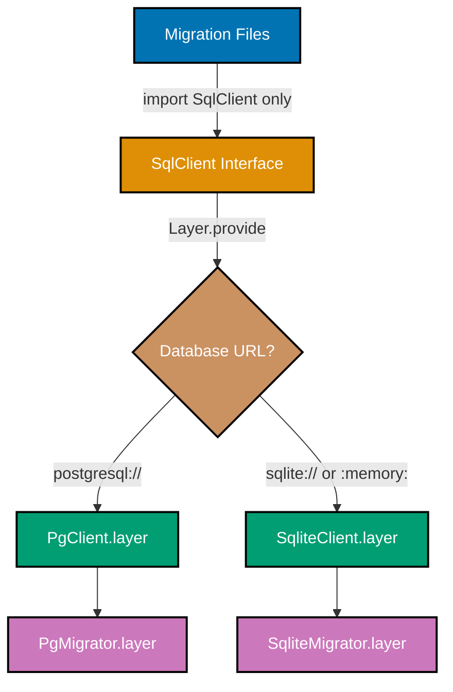
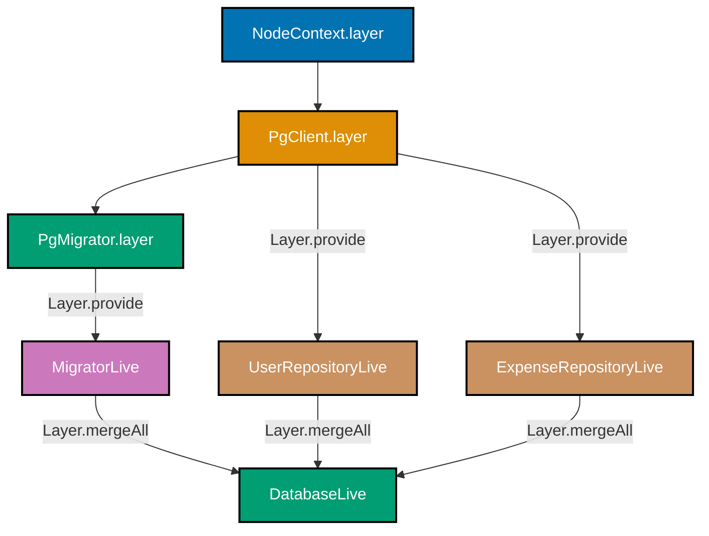

## Intermediate Examples (31-60)

**Coverage**: 40-75% of Effect SQL migration functionality

**Focus**: Multi-database support, transactions in migrations, Effect error handling, advanced SQL patterns, testing strategies, JSON/array columns, and connection configuration.

These examples assume you understand beginner concepts (migration structure, `SqlClient`, `Effect.gen`, the registry pattern). All examples are self-contained and grounded in real `@effect/sql` patterns from production codebases.

---

### Example 31: Multi-Database Support (Postgres + SQLite)

Effect SQL achieves database portability by separating the `SqlClient` interface (in `@effect/sql`) from driver implementations (`PgClient` in `@effect/sql-pg`, `SqliteClient` in `@effect/sql-sqlite-node`). The same migration files run on both databases; only the Layer wiring changes.



```typescript
// File: src/infrastructure/db/database.ts
import { Effect, Layer, Redacted } from "effect";
import { PgClient } from "@effect/sql-pg";
import { PgMigrator } from "@effect/sql-pg";
import { SqliteClient } from "@effect/sql-sqlite-node";
import { SqliteMigrator } from "@effect/sql-sqlite-node";
import { NodeContext } from "@effect/platform-node";
import type { SqlClient } from "@effect/sql";
import type { SqlError } from "@effect/sql/SqlError";
import { migrations } from "./migrations/index.js";

// => DbLayer is the abstract type both PgClient and SqliteClient satisfy
// => Layer.Layer<SqlClient.SqlClient, SqlError, never> means:
//    - provides SqlClient.SqlClient service
//    - can fail with SqlError
//    - requires no other services (never)
type DbLayer = Layer.Layer<SqlClient.SqlClient, SqlError, never>;

// => isPostgres detects driver from the connection URL prefix
// => Both "postgresql://" and "postgres://" are valid PostgreSQL URL schemes
function isPostgres(url: string): boolean {
  return url.startsWith("postgresql://") || url.startsWith("postgres://");
  // => Returns true for Postgres, false for SQLite paths or ":memory:"
}

// => makeDbLayer returns both the database client layer and the migrator layer
// => The caller builds them in order: first db, then migrator
export function makeDbLayer(databaseUrl: string): {
  dbLayer: DbLayer;
  migratorLayer: Layer.Layer<never, never, never>;
} {
  if (isPostgres(databaseUrl)) {
    // => PgClient.layer wraps the URL in Redacted to prevent accidental logging
    const dbLayer = PgClient.layer({
      url: Redacted.make(databaseUrl),
    }) as unknown as DbLayer;
    // => PgMigrator.layer reads migrations from the registry record
    // => NodeContext.layer is required by PgMigrator for file system operations
    const migratorLayer = PgMigrator.layer({
      loader: PgMigrator.fromRecord(migrations),
      table: "effect_sql_migrations",
    }).pipe(Layer.provide(dbLayer), Layer.provide(NodeContext.layer)) as unknown as Layer.Layer<never, never, never>;
    return { dbLayer, migratorLayer };
  }
  // => SQLite branch: used for tests and local development without Docker
  const dbLayer = SqliteClient.layer({
    filename: databaseUrl === "sqlite::memory:" ? ":memory:" : databaseUrl,
    // => ":memory:" creates a temporary in-process database; no disk writes
  }) as unknown as DbLayer;
  const migratorLayer = SqliteMigrator.layer({
    loader: SqliteMigrator.fromRecord(migrations),
    table: "effect_sql_migrations",
  }).pipe(Layer.provide(dbLayer)) as unknown as Layer.Layer<never, never, never>;
  // => SQLite migrator does not require NodeContext because it manages files internally
  return { dbLayer, migratorLayer };
}
```

**Key Takeaway**: Detect the database from the connection URL and return the appropriate `dbLayer`/`migratorLayer` pair; migration files themselves never change.

**Why It Matters**: The single-function database abstraction shown here is the exact pattern used in production Effect SQL codebases. Integration tests set `DATABASE_URL=sqlite::memory:` to get an isolated in-process database in milliseconds. Production sets `DATABASE_URL=postgresql://...` with no migration code changes. Other tools (Knex, TypeORM) require dialect-specific query builders for this; Effect SQL achieves portability through service abstraction alone.

---

### Example 32: Database-Specific SQL Branching

Some migrations require database-specific SQL (e.g., `gen_random_uuid()` in PostgreSQL vs `lower(hex(randomblob(16)))` in SQLite). Effect SQL provides no automatic dialect translation, so you branch manually using a helper that inspects the `SqlClient` dialect.

```typescript
// File: src/infrastructure/db/migrations/002_create_tokens.ts
import { SqlClient } from "@effect/sql";
import { Effect } from "effect";

export default Effect.gen(function* () {
  const sql = yield* SqlClient.SqlClient;

  // => sql.safe wraps a raw SQL fragment that bypasses parameterization
  // => Use it for DDL identifiers and database-specific functions
  // => WARNING: never use sql.safe with user input — no injection protection

  // => Detect PostgreSQL vs SQLite by testing for a Postgres-only function
  // => Effect SQL does not expose a dialect enum, so we probe the database
  const isPg = yield* Effect.either(
    sql`SELECT gen_random_uuid() AS id`,
    // => Effect.either converts Effect<A, E, R> to Effect<Either<E, A>, never, R>
    // => Right(rows) means the function exists (PostgreSQL)
    // => Left(error) means the function is missing (SQLite)
  );

  if (isPg._tag === "Right") {
    // => PostgreSQL branch: use native UUID generation
    yield* sql`
      CREATE TABLE IF NOT EXISTS refresh_tokens (
        id          UUID        PRIMARY KEY DEFAULT gen_random_uuid(),
        token_hash  VARCHAR(255) NOT NULL,
        expires_at  TIMESTAMPTZ NOT NULL
      )
    `;
    // => gen_random_uuid() is a PostgreSQL built-in (pgcrypto not required since PG 13)
    // => TIMESTAMPTZ stores UTC offset; avoids timezone-naive bugs
  } else {
    // => SQLite branch: UUID generated at application layer
    yield* sql`
      CREATE TABLE IF NOT EXISTS refresh_tokens (
        id          TEXT        PRIMARY KEY,
        token_hash  TEXT        NOT NULL,
        expires_at  DATETIME    NOT NULL
      )
    `;
    // => SQLite has no UUID type; TEXT stores the 36-character UUID string
    // => DATETIME in SQLite is a text affinity column; no timezone support
  }
});
```

**Key Takeaway**: Use `Effect.either` to probe a database-specific function and branch SQL DDL; this is the idiomatic way to handle dialect differences without a dialect enum.

**Why It Matters**: Dialect detection at runtime is preferable to build-time environment flags because the same compiled JavaScript bundle runs against any database. This matters when deploying migrations through CI: the same artifact targets staging (SQLite) and production (PostgreSQL) without recompilation. The `Effect.either` probe pattern is reusable and type-safe — no untyped string comparisons or environment variables.

---

### Example 33: Transactions in Migrations

The built-in migrator wraps each migration in an implicit transaction. When you need to control transaction boundaries explicitly — for example, to run DDL outside a transaction in PostgreSQL — you can manage the transaction manually using `sql.withTransaction`.

```typescript
// File: src/infrastructure/db/migrations/003_add_search_index.ts
import { SqlClient } from "@effect/sql";
import { Effect } from "effect";

export default Effect.gen(function* () {
  const sql = yield* SqlClient.SqlClient;

  // => sql.withTransaction wraps the Effect in a BEGIN/COMMIT block
  // => If any yield* inside fails, the transaction rolls back automatically
  // => This is explicit transaction control; the migrator also wraps the whole
  //    migration, so this creates a savepoint in PostgreSQL
  yield* sql.withTransaction(
    Effect.gen(function* () {
      // => Step 1: add the column inside the transaction
      yield* sql`
        ALTER TABLE users
        ADD COLUMN IF NOT EXISTS search_vector TSVECTOR
      `;
      // => TSVECTOR is a PostgreSQL full-text search data type
      // => Adding the column and updating it in one transaction ensures consistency

      // => Step 2: backfill existing rows with search vectors
      yield* sql`
        UPDATE users
        SET search_vector = to_tsvector('english', username || ' ' || email)
      `;
      // => to_tsvector converts text to a weighted lexeme list
      // => Both steps commit together; no partial state visible to readers
    }),
  );
  // => After the transaction commits, create the index outside it
  // => In PostgreSQL, CREATE INDEX CONCURRENTLY cannot run inside a transaction
  yield* sql`
    CREATE INDEX CONCURRENTLY IF NOT EXISTS idx_users_search
    ON users USING GIN(search_vector)
  `;
  // => CONCURRENTLY builds the index without locking the table
  // => Safe for production tables with active traffic
});
```

**Key Takeaway**: Use `sql.withTransaction` to group DDL and DML inside a single transaction; run `CREATE INDEX CONCURRENTLY` outside any transaction because PostgreSQL prohibits it within one.

**Why It Matters**: Distinguishing what can and cannot run inside a transaction is a common production pitfall. `CREATE INDEX CONCURRENTLY` avoids table locks but requires the statement to execute outside a transaction — a PostgreSQL-specific constraint. By splitting the migration into a transactional ALTER/UPDATE and a post-transaction index creation, you get atomic schema changes plus a non-locking index build. This pattern is used in every high-traffic PostgreSQL deployment.

---

### Example 34: Effect Error Handling in Migrations (Effect.catchAll)

Migration errors are `SqlError` values in the Effect error channel. `Effect.catchAll` intercepts them so you can log, transform, or recover. For migrations, a common pattern is to catch "already exists" errors and continue rather than abort.

```typescript
// File: src/infrastructure/db/migrations/004_idempotent_column.ts
import { SqlClient } from "@effect/sql";
import { Effect } from "effect";

export default Effect.gen(function* () {
  const sql = yield* SqlClient.SqlClient;

  // => Attempt to add a column; PostgreSQL throws if the column already exists
  // => IF NOT EXISTS is the preferred approach, but older PostgreSQL versions lack it
  const addColumn = sql`
    ALTER TABLE users ADD COLUMN legacy_id INTEGER
  `;
  // => addColumn is an Effect<void, SqlError, SqlClient>
  // => It has not executed yet — it's a description of the operation

  yield* addColumn.pipe(
    // => Effect.catchAll intercepts any error in the error channel
    // => The callback receives the SqlError and returns a new Effect
    Effect.catchAll((error) => {
      // => error.message contains the database error text
      // => PostgreSQL column-exists errors contain "already exists"
      if (error.message.includes("already exists")) {
        // => Effect.void is Effect<void, never, never> — a no-op that succeeds
        return Effect.void;
        // => Migration continues as if the ADD COLUMN succeeded
      }
      // => Re-raise unexpected errors so the migrator can roll back
      return Effect.fail(error);
      // => Effect.fail(error) puts the error back in the error channel
    }),
  );
  // => Continues here whether the column was added or already existed
});
```

**Key Takeaway**: Pipe `Effect.catchAll` after a SQL operation to selectively swallow expected errors (like duplicate column) and re-raise unexpected ones.

**Why It Matters**: Idempotent migrations are essential for CI/CD pipelines where the same migration may run multiple times due to retried deployments or partial failures. The `Effect.catchAll` pattern gives you fine-grained control: you inspect the error message and decide whether to continue or abort. Contrast with raw `try/catch` in other ORMs where all errors are caught together; Effect's typed error channel forces you to handle `SqlError` specifically, making the intent explicit in the type signature.

---

### Example 35: Conditional Migrations with Effect.if

`Effect.if` selects between two Effects based on a boolean condition. Use it in migrations to skip work that is already done — for example, inserting seed data only when a table is empty.

```typescript
// File: src/infrastructure/db/migrations/005_seed_roles.ts
import { SqlClient } from "@effect/sql";
import { Effect } from "effect";

export default Effect.gen(function* () {
  const sql = yield* SqlClient.SqlClient;

  // => Count existing role rows to decide whether to seed
  const rows = yield* sql<{ cnt: number }>`SELECT COUNT(*) AS cnt FROM roles`;
  // => rows is ReadonlyArray<{ cnt: number }>
  // => rows[0].cnt is 0 if the table is empty

  const isEmpty = (rows[0]?.cnt ?? 0) === 0;
  // => isEmpty is true only when no roles exist yet

  yield* Effect.if(isEmpty, {
    // => onTrue: runs when isEmpty is true — table is empty, safe to seed
    onTrue: () =>
      Effect.gen(function* () {
        yield* sql`
          INSERT INTO roles (name, description) VALUES
            ('ADMIN',  'Full system access'),
            ('USER',   'Standard user access'),
            ('VIEWER', 'Read-only access')
        `;
        // => Three rows inserted in a single multi-row INSERT for efficiency
      }),
    // => onFalse: runs when isEmpty is false — data already exists, skip seeding
    onFalse: () => Effect.void,
    // => Effect.void is a no-op that succeeds with undefined
  });
  // => Migration is now idempotent: safe to run multiple times
});
```

**Key Takeaway**: Use `Effect.if` with a count query to make seed migrations idempotent; `onFalse: () => Effect.void` is the canonical no-op branch.

**Why It Matters**: Seed migrations that unconditionally insert data fail on the second run with unique constraint violations. The `Effect.if` guard pattern avoids this without disabling constraints. It is also more expressive than a raw `IF NOT EXISTS` SQL trick because the condition can incorporate application-level logic (e.g., checking a feature flag or environment variable) in addition to database state.

---

### Example 36: Data Migration with INSERT...SELECT

Data migrations transform existing rows into a new structure. The `INSERT INTO ... SELECT` pattern moves data between tables in a single atomic SQL statement, avoiding cursor loops and minimizing transaction hold time.

```typescript
// File: src/infrastructure/db/migrations/006_normalize_categories.ts
import { SqlClient } from "@effect/sql";
import { Effect } from "effect";

export default Effect.gen(function* () {
  const sql = yield* SqlClient.SqlClient;

  // => Step 1: create the new normalized table
  yield* sql`
    CREATE TABLE IF NOT EXISTS categories (
      id   SERIAL       PRIMARY KEY,
      name VARCHAR(100) NOT NULL,
      CONSTRAINT uq_categories_name UNIQUE (name)
    )
  `;
  // => categories receives distinct category strings from the products table

  // => Step 2: populate categories from existing product data
  // => INSERT ... SELECT is atomic: either all rows move or none do
  yield* sql`
    INSERT INTO categories (name)
    SELECT DISTINCT category
    FROM   products
    WHERE  category IS NOT NULL
      AND  category <> ''
    ON CONFLICT (name) DO NOTHING
  `;
  // => DISTINCT deduplicates category strings before inserting
  // => ON CONFLICT (name) DO NOTHING makes the insert idempotent
  // => Rows already in categories are silently skipped

  // => Step 3: add foreign key column to products
  yield* sql`
    ALTER TABLE products
    ADD COLUMN IF NOT EXISTS category_id INTEGER REFERENCES categories(id)
  `;
  // => category_id is nullable initially; will be backfilled next

  // => Step 4: backfill category_id by joining on the string value
  yield* sql`
    UPDATE products p
    SET    category_id = c.id
    FROM   categories c
    WHERE  p.category = c.name
  `;
  // => UPDATE ... FROM is PostgreSQL syntax for a join-based update
  // => Every product row now has a typed foreign key instead of a raw string
});
```

**Key Takeaway**: Use `INSERT INTO ... SELECT DISTINCT` with `ON CONFLICT DO NOTHING` to populate a normalized table from existing data idempotently, then backfill the foreign key with `UPDATE ... FROM`.

**Why It Matters**: Normalization migrations are among the riskiest database changes because they touch every row. Running them in SQL rather than application code avoids N+1 database round-trips — a 10 million row table that would take hours with row-by-row updates completes in seconds with a single `UPDATE ... FROM`. Effect SQL keeps this critical SQL visible and version-controlled while still benefiting from the Effect runtime's error handling.

---

### Example 37: Seed Data Pattern

Seed data migrations insert required reference data (enums, configuration values, default admin users) that must exist for the application to function. The canonical pattern uses `INSERT ... ON CONFLICT DO NOTHING` to make seeds idempotent.

```typescript
// File: src/infrastructure/db/migrations/007_seed_currencies.ts
import { SqlClient } from "@effect/sql";
import { Effect } from "effect";

// => Seed data is defined as a TypeScript array for type safety and IDE support
// => The array is inlined into the SQL at migration time — not parameterized DDL
const SUPPORTED_CURRENCIES = [
  { code: "USD", name: "US Dollar", symbol: "$" },
  { code: "IDR", name: "Indonesian Rupiah", symbol: "Rp" },
  { code: "EUR", name: "Euro", symbol: "\u20AC" },
  { code: "SGD", name: "Singapore Dollar", symbol: "S$" },
] as const;
// => as const makes the array readonly and types literals exactly (e.g., "USD" not string)

export default Effect.gen(function* () {
  const sql = yield* SqlClient.SqlClient;

  // => Ensure the table exists before inserting
  yield* sql`
    CREATE TABLE IF NOT EXISTS currencies (
      code   VARCHAR(3)   PRIMARY KEY,
      name   VARCHAR(100) NOT NULL,
      symbol VARCHAR(10)  NOT NULL
    )
  `;

  // => Insert each currency using a loop of Effects
  // => Effect.forEach runs an Effect for each element sequentially
  yield* Effect.forEach(
    SUPPORTED_CURRENCIES,
    (currency) =>
      sql`
        INSERT INTO currencies (code, name, symbol)
        VALUES (${currency.code}, ${currency.name}, ${currency.symbol})
        ON CONFLICT (code) DO NOTHING
      `,
    // => { discard: true } drops each Effect's result; we only care about side effects
    { discard: true },
  );
  // => ON CONFLICT (code) DO NOTHING skips rows where the code already exists
  // => Running this migration twice inserts 0 rows on the second run — fully idempotent
});
```

**Key Takeaway**: Define seed data as a typed TypeScript array and use `Effect.forEach` with `ON CONFLICT DO NOTHING` to insert each row idempotently.

**Why It Matters**: Seed data in TypeScript arrays rather than raw SQL strings unlocks compile-time type checking. Adding a required field to the `currencies` table will cause TypeScript to flag every seed entry missing that field — before the migration ever runs. This is impossible with Flyway `.sql` files or raw SQL seed scripts where type errors are only discovered at runtime.

---

### Example 38: Foreign Key with ON UPDATE CASCADE

`ON UPDATE CASCADE` propagates primary key changes to all referencing rows automatically. It is essential when natural keys (like currency codes) can change without breaking referential integrity.

```typescript
// File: src/infrastructure/db/migrations/008_expenses_fk_cascade.ts
import { SqlClient } from "@effect/sql";
import { Effect } from "effect";

export default Effect.gen(function* () {
  const sql = yield* SqlClient.SqlClient;

  yield* sql`
    CREATE TABLE IF NOT EXISTS expenses (
      id          UUID          PRIMARY KEY DEFAULT gen_random_uuid(),
      user_id     UUID          NOT NULL,
      amount      DECIMAL(19,4) NOT NULL,
      currency    VARCHAR(3)    NOT NULL,
      description TEXT          NOT NULL DEFAULT '',
      date        DATE          NOT NULL,

      CONSTRAINT fk_expenses_currency
        FOREIGN KEY (currency) REFERENCES currencies(code)
        ON UPDATE CASCADE
        ON DELETE RESTRICT,
      -- => ON UPDATE CASCADE: if currencies.code changes from "USD" to "US_DOLLAR",
      --    all expenses rows with currency = 'USD' automatically update
      -- => ON DELETE RESTRICT: prevents deleting a currency that has expenses

      CONSTRAINT fk_expenses_user
        FOREIGN KEY (user_id) REFERENCES users(id)
        ON DELETE CASCADE
      -- => ON DELETE CASCADE: removes expenses when the user is deleted (GDPR compliance)
    )
  `;
  // => DECIMAL(19,4) stores up to 15 digits before the decimal and 4 after
  // => Avoids floating-point rounding errors for monetary values
});
```

**Key Takeaway**: Use `ON UPDATE CASCADE` for natural key foreign keys (codes, slugs) and `ON DELETE CASCADE` for child records that must not outlive their parent; use `ON DELETE RESTRICT` to protect reference data from accidental deletion.

**Why It Matters**: Choosing the right referential action is a schema design decision with irreversible consequences. `ON DELETE RESTRICT` is the safest default — it forces the application to explicitly clean up before deleting. `ON DELETE CASCADE` is appropriate for hierarchical data where children are meaningless without the parent. Getting this wrong results in orphaned rows or accidental mass deletions that are impossible to roll back after a migration completes.

---

### Example 39: Composite Primary Keys

Composite primary keys enforce uniqueness across two or more columns without a surrogate key. They are the correct choice for junction tables (many-to-many associations) and time-series records partitioned by user.

```typescript
// File: src/infrastructure/db/migrations/009_user_permissions.ts
import { SqlClient } from "@effect/sql";
import { Effect } from "effect";

export default Effect.gen(function* () {
  const sql = yield* SqlClient.SqlClient;

  yield* sql`
    CREATE TABLE IF NOT EXISTS user_permissions (
      user_id       UUID        NOT NULL,
      permission    VARCHAR(50) NOT NULL,
      granted_at    TIMESTAMPTZ NOT NULL DEFAULT NOW(),
      granted_by    UUID        NOT NULL,

      PRIMARY KEY (user_id, permission),
      -- => Composite primary key: a user can have each permission at most once
      -- => Equivalent to: UNIQUE(user_id, permission) + NOT NULL on both columns
      -- => No surrogate id column needed — the combination IS the identity

      CONSTRAINT fk_up_user
        FOREIGN KEY (user_id) REFERENCES users(id) ON DELETE CASCADE,
      -- => Deleting a user cascades to all their permissions

      CONSTRAINT fk_up_granted_by
        FOREIGN KEY (granted_by) REFERENCES users(id) ON DELETE RESTRICT
      -- => Cannot delete a user who has granted permissions to others
    )
  `;

  // => Index on permission alone enables efficient reverse lookups:
  -- "which users have the ADMIN permission?"
  yield* sql`
    CREATE INDEX IF NOT EXISTS idx_up_permission
    ON user_permissions(permission)
  `;
  // => The composite PK already indexes (user_id, permission) together
  // => This additional index covers queries filtering on permission alone
});
```

**Key Takeaway**: Use `PRIMARY KEY (col1, col2)` for junction tables to enforce uniqueness and eliminate a redundant surrogate key; add a single-column index on the secondary column for reverse lookups.

**Why It Matters**: Junction tables with surrogate `id` columns waste storage and require an additional unique constraint to prevent duplicate associations. A composite primary key is both the identity and the uniqueness constraint in one declaration. The extra index on `permission` is critical for permission-checking queries that scan by permission type — without it, those queries degrade to full table scans as the table grows.

---

### Example 40: Partial Indexes

A partial index indexes only the rows satisfying a `WHERE` predicate. For sparse boolean flags or soft-delete patterns, partial indexes are far smaller and faster than full-column indexes.

```typescript
// File: src/infrastructure/db/migrations/010_partial_indexes.ts
import { SqlClient } from "@effect/sql";
import { Effect } from "effect";

export default Effect.gen(function* () {
  const sql = yield* SqlClient.SqlClient;

  // => Scenario: most users are ACTIVE; only a small fraction are SUSPENDED or DELETED
  // => A full index on (status) would index every row, mostly ACTIVE rows
  // => A partial index on WHERE status = 'SUSPENDED' indexes only that subset

  // => Partial index for finding suspended users (rare, high-value query)
  yield* sql`
    CREATE INDEX IF NOT EXISTS idx_users_suspended
    ON users(id)
    WHERE status = 'SUSPENDED'
  `;
  // => This index contains only rows where status = 'SUSPENDED'
  // => Index size: proportional to suspended users, not total users

  // => Partial index for soft-delete pattern: index only non-deleted rows
  yield* sql`
    CREATE INDEX IF NOT EXISTS idx_expenses_active
    ON expenses(user_id, date)
    WHERE deleted_at IS NULL
  `;
  // => Most queries filter WHERE deleted_at IS NULL — this index covers that filter
  // => Deleted rows (deleted_at IS NOT NULL) are excluded from the index entirely
  // => Avoids indexing historical/deleted data that queries never retrieve

  // => Partial unique index: enforce email uniqueness only for active users
  yield* sql`
    CREATE UNIQUE INDEX IF NOT EXISTS uq_users_email_active
    ON users(email)
    WHERE deleted_at IS NULL
  `;
  // => Deleted users' emails are excluded from the uniqueness check
  // => A new user can reuse an email that belonged to a deleted account
});
```

**Key Takeaway**: Partial indexes apply a `WHERE` predicate to exclude irrelevant rows; use them for sparse flags, soft-delete patterns, and conditional uniqueness constraints.

**Why It Matters**: On a table with 10 million users where 9.9 million are ACTIVE, a full index on `status` is 100x larger than a partial index on `WHERE status = 'SUSPENDED'`. Smaller indexes fit in memory, result in faster scans, and reduce write amplification. The partial unique index pattern for soft-delete is especially powerful: it allows reusing deleted records' unique keys without data corruption.

---

### Example 41: Full-Text Search Indexes

PostgreSQL's full-text search uses `TSVECTOR` columns and `GIN` indexes. The migration pattern adds the column, populates it via a trigger, and creates the index in a single migration.

```typescript
// File: src/infrastructure/db/migrations/011_fulltext_search.ts
import { SqlClient } from "@effect/sql";
import { Effect } from "effect";

export default Effect.gen(function* () {
  const sql = yield* SqlClient.SqlClient;

  // => Step 1: add TSVECTOR column to store pre-computed lexemes
  yield* sql`
    ALTER TABLE products
    ADD COLUMN IF NOT EXISTS search_vector TSVECTOR
  `;
  // => TSVECTOR stores a parsed, stemmed representation of the text
  // => Pre-computing it avoids re-parsing on every search query

  // => Step 2: create the trigger function that maintains search_vector
  yield* sql`
    CREATE OR REPLACE FUNCTION products_search_vector_update()
    RETURNS TRIGGER AS $$
    BEGIN
      NEW.search_vector :=
        setweight(to_tsvector('english', COALESCE(NEW.name, '')),        'A') ||
        setweight(to_tsvector('english', COALESCE(NEW.description, '')), 'B');
      RETURN NEW;
    END;
    $$ LANGUAGE plpgsql
  `;
  -- => 'A' weight ranks name matches higher than 'B' weight description matches
  -- => COALESCE guards against NULL fields that would break to_tsvector
  -- => CREATE OR REPLACE makes this idempotent — safe to run multiple times

  // => Step 3: drop and recreate trigger to make the migration idempotent
  yield* sql`
    DROP TRIGGER IF EXISTS products_search_vector_trigger ON products
  `;
  // => Drop first to avoid "trigger already exists" error on re-runs
  yield* sql`
    CREATE TRIGGER products_search_vector_trigger
    BEFORE INSERT OR UPDATE ON products
    FOR EACH ROW EXECUTE FUNCTION products_search_vector_update()
  `;
  // => BEFORE trigger fires before the row is written; NEW.search_vector is set in place

  // => Step 4: backfill existing rows by triggering an in-place update
  yield* sql`
    UPDATE products SET name = name
  `;
  // => Updating name to itself fires the trigger on every existing row
  // => This populates search_vector for all pre-existing products

  // => Step 5: create GIN index for fast full-text search
  yield* sql`
    CREATE INDEX CONCURRENTLY IF NOT EXISTS idx_products_search
    ON products USING GIN(search_vector)
  `;
  // => GIN (Generalized Inverted Index) is optimal for TSVECTOR
  // => CONCURRENTLY avoids table lock on active production tables
});
```

**Key Takeaway**: Build full-text search by adding a `TSVECTOR` column, a `BEFORE` trigger to maintain it, and a `GIN` index; backfill existing rows by triggering a no-op `UPDATE`.

**Why It Matters**: Storing pre-computed `TSVECTOR` values is 10-100x faster for search queries than calling `to_tsvector()` inline in WHERE clauses. The trigger pattern ensures the vector stays current as rows change without any application-layer coordination. This approach scales to millions of rows with sub-millisecond search latency — impossible with `LIKE '%keyword%'` queries that cannot use indexes.

---

### Example 42: Creating Views

A database view is a named query stored in the database. Views simplify complex joins, enforce row-level visibility rules, and provide a stable API surface over normalized tables.

```typescript
// File: src/infrastructure/db/migrations/012_create_views.ts
import { SqlClient } from "@effect/sql";
import { Effect } from "effect";

export default Effect.gen(function* () {
  const sql = yield* SqlClient.SqlClient;

  // => CREATE OR REPLACE VIEW is idempotent: safe to run multiple times
  // => Unlike CREATE TABLE, views can be replaced in place without DROP + CREATE
  yield* sql`
    CREATE OR REPLACE VIEW active_expenses AS
    SELECT
      e.id,
      e.user_id,
      e.amount,
      e.currency,
      e.category,
      e.description,
      e.date,
      e.type,
      e.created_at,
      u.username  AS owner_username,
      u.email     AS owner_email
      -- => Denormalize user fields into the view to avoid joins in application queries
    FROM expenses e
    JOIN users u ON u.id = e.user_id
    -- => JOIN brings in user columns without requiring a second query
    WHERE e.deleted_at IS NULL
      AND u.deleted_at IS NULL
    -- => Filter out soft-deleted records at the view level
  `;
  // => Application code queries active_expenses and gets only live data
  -- SELECT * FROM active_expenses WHERE user_id = $1

  // => Separate read-only view for analytics (no user PII)
  yield* sql`
    CREATE OR REPLACE VIEW expense_summary AS
    SELECT
      currency,
      category,
      DATE_TRUNC('month', date) AS month,
      -- => DATE_TRUNC('month', date) groups by calendar month
      COUNT(*)                  AS count,
      SUM(amount)               AS total
    FROM active_expenses
    -- => Nesting views: expense_summary builds on active_expenses
    GROUP BY currency, category, DATE_TRUNC('month', date)
  `;
});
```

**Key Takeaway**: Use `CREATE OR REPLACE VIEW` for idempotent view creation; nest views on top of other views to compose query logic without duplicating filters.

**Why It Matters**: Views are the relational equivalent of named functions. Centralizing the soft-delete filter in `active_expenses` means a change to the deleted row policy requires updating one view, not every query in the codebase. The analytics view pattern (no PII, pre-aggregated) also enables granting read access to analytics tools without exposing sensitive user data.

---

### Example 43: Creating Materialized Views

A materialized view stores the query result on disk, enabling fast reads of expensive aggregations. Unlike regular views, materialized views must be refreshed when source data changes.

```typescript
// File: src/infrastructure/db/migrations/013_materialized_views.ts
import { SqlClient } from "@effect/sql";
import { Effect } from "effect";

export default Effect.gen(function* () {
  const sql = yield* SqlClient.SqlClient;

  // => Materialized views store the result set, not just the query
  // => Trade-off: stale data (until refreshed) vs. instant reads
  yield* sql`
    CREATE MATERIALIZED VIEW IF NOT EXISTS monthly_expense_totals AS
    SELECT
      user_id,
      currency,
      DATE_TRUNC('month', date)::DATE AS month,
      -- => ::DATE casts TIMESTAMPTZ to DATE for display
      SUM(amount)                     AS total_amount,
      COUNT(*)                        AS expense_count
    FROM expenses
    WHERE deleted_at IS NULL
    GROUP BY user_id, currency, DATE_TRUNC('month', date)
    -- => Aggregating over all active expenses per user per currency per month
    WITH DATA
    -- => WITH DATA populates the view immediately after creation
    -- => WITHOUT DATA creates an empty view; first REFRESH fills it
  `;
  // => After creation, the data is static until REFRESH MATERIALIZED VIEW is called

  // => Index the materialized view for fast per-user lookups
  yield* sql`
    CREATE INDEX IF NOT EXISTS idx_met_user_month
    ON monthly_expense_totals(user_id, month)
  `;
  // => Indexes on materialized views work like table indexes

  // => Unique index enables REFRESH CONCURRENTLY (non-locking refresh)
  yield* sql`
    CREATE UNIQUE INDEX IF NOT EXISTS uq_met_user_currency_month
    ON monthly_expense_totals(user_id, currency, month)
  `;
  // => REFRESH MATERIALIZED VIEW CONCURRENTLY requires at least one unique index
  // => Without it, refresh locks the view for the full refresh duration
});
```

**Key Takeaway**: Create materialized views with `WITH DATA` for immediate population and add a unique index to enable `REFRESH CONCURRENTLY` — a non-locking refresh strategy safe for production.

**Why It Matters**: Dashboard queries that aggregate millions of expense rows in real time can take seconds. A materialized view reduces that to a single index scan. `REFRESH CONCURRENTLY` means refreshes triggered by a background job do not block dashboard reads. The unique index requirement is easy to miss — without it, a concurrent refresh on a busy dashboard causes read timeouts during the refresh window.

---

### Example 44: Trigger Functions

Trigger functions execute automatically on INSERT, UPDATE, or DELETE events. Use them for audit logging, auto-updating timestamps, and maintaining derived columns.

```typescript
// File: src/infrastructure/db/migrations/014_audit_triggers.ts
import { SqlClient } from "@effect/sql";
import { Effect } from "effect";

export default Effect.gen(function* () {
  const sql = yield* SqlClient.SqlClient;

  // => Create the audit_log table that triggers will write to
  yield* sql`
    CREATE TABLE IF NOT EXISTS audit_log (
      id          BIGSERIAL   PRIMARY KEY,
      -- => BIGSERIAL auto-increments; BIGINT avoids overflow for high-volume audits
      table_name  VARCHAR(50) NOT NULL,
      operation   VARCHAR(10) NOT NULL,
      -- => operation is 'INSERT', 'UPDATE', or 'DELETE'
      row_id      TEXT        NOT NULL,
      changed_at  TIMESTAMPTZ NOT NULL DEFAULT NOW(),
      changed_by  TEXT
    )
  `;

  // => Trigger function that logs changes to any table
  // => CREATE OR REPLACE makes it idempotent
  yield* sql`
    CREATE OR REPLACE FUNCTION log_row_change()
    RETURNS TRIGGER AS $$
    BEGIN
      INSERT INTO audit_log(table_name, operation, row_id, changed_by)
      VALUES (
        TG_TABLE_NAME,
        TG_OP,
        CASE TG_OP WHEN 'DELETE' THEN OLD.id::TEXT ELSE NEW.id::TEXT END,
        current_setting('app.current_user_id', true)
      );
      RETURN NEW;
    END;
    $$ LANGUAGE plpgsql
  `;
  -- => TG_TABLE_NAME: built-in trigger variable — name of the triggering table
  -- => TG_OP: 'INSERT', 'UPDATE', or 'DELETE'
  -- => Use OLD.id for DELETE (NEW is NULL); NEW.id for INSERT/UPDATE
  -- => current_setting reads a session-level variable set by the application
  -- => true = return NULL if not set, instead of raising an error

  // => Attach trigger to the expenses table
  yield* sql`DROP TRIGGER IF EXISTS audit_expenses ON expenses`;
  yield* sql`
    CREATE TRIGGER audit_expenses
    AFTER INSERT OR UPDATE OR DELETE ON expenses
    FOR EACH ROW EXECUTE FUNCTION log_row_change()
  `;
  // => AFTER trigger fires after the row change commits
  // => BEFORE trigger could cancel the operation by returning NULL; AFTER cannot
});
```

**Key Takeaway**: Centralize audit logic in a single `RETURNS TRIGGER` function and attach it to multiple tables with `CREATE TRIGGER`; use `TG_TABLE_NAME` and `TG_OP` to make the function table-agnostic.

**Why It Matters**: Application-layer audit logging can be bypassed by direct SQL updates (backfills, hotfixes). Database triggers are mandatory — they fire regardless of what client makes the change. A single trigger function attached to all audited tables scales linearly: adding a new table to audit requires only one `CREATE TRIGGER` statement.

---

### Example 45: Stored Procedures

Stored procedures encapsulate multi-step business logic in the database, reducing round-trips and ensuring operations complete atomically. Use them for operations that must run in a single transaction regardless of client behavior.

```typescript
// File: src/infrastructure/db/migrations/015_stored_procedures.ts
import { SqlClient } from "@effect/sql";
import { Effect } from "effect";

export default Effect.gen(function* () {
  const sql = yield* SqlClient.SqlClient;

  // => CREATE OR REPLACE PROCEDURE (PostgreSQL 11+)
  // => Unlike functions, procedures support COMMIT/ROLLBACK inside their body
  // => Call with CALL, not SELECT
  yield* sql`
    CREATE OR REPLACE PROCEDURE archive_old_expenses(
      cutoff_date DATE,
      -- => cutoff_date: expenses older than this date will be archived
      batch_size  INTEGER DEFAULT 1000
      -- => batch_size: how many rows to move per iteration (avoids lock escalation)
    )
    LANGUAGE plpgsql AS $$
    DECLARE
      rows_moved INTEGER;
    BEGIN
      LOOP
        WITH moved AS (
          DELETE FROM expenses
          WHERE date < cutoff_date
            AND deleted_at IS NOT NULL
          LIMIT batch_size
          RETURNING *
        )
        -- => CTE deletes and inserts atomically in one statement
        -- => Only archive soft-deleted rows older than the cutoff
        INSERT INTO expenses_archive SELECT * FROM moved;

        GET DIAGNOSTICS rows_moved = ROW_COUNT;
        -- => ROW_COUNT: number of rows affected by the last SQL statement
        EXIT WHEN rows_moved < batch_size;
        -- => Stop when a batch returns fewer rows than requested
        COMMIT;
        -- => Commit after each batch to release locks and allow other writers
      END LOOP;
    END;
    $$
  `;
  -- => Call with: CALL archive_old_expenses('2024-01-01', 500)
});
```

**Key Takeaway**: Use stored procedures for batched multi-step operations that require intermediate `COMMIT` points; the `CTE + DELETE RETURNING + INSERT` pattern moves rows atomically in a single SQL statement.

**Why It Matters**: Archiving millions of rows in a single transaction holds row locks for minutes, blocking concurrent writes. The batch-commit pattern releases locks between iterations, allowing normal application traffic to continue. Using a `RETURNING` CTE for the delete-and-insert avoids a race condition where rows could be read by another session between the DELETE and the INSERT.

---

### Example 46: Custom Migration Runner

Sometimes the built-in migrator does not fit your deployment model — for example, when running migrations from a Lambda function with no filesystem access. A custom runner builds the migrator Layer and runs it inside an Effect program.

```typescript
// File: src/scripts/run-migrations.ts
import { Effect, Layer, Redacted } from "effect";
import { PgClient } from "@effect/sql-pg";
import { PgMigrator } from "@effect/sql-pg";
import { NodeContext } from "@effect/platform-node";
import { migrations } from "../infrastructure/db/migrations/index.js";

// => runMigrations is a standalone Effect program — not part of the web server
// => Run with: npx ts-node src/scripts/run-migrations.ts
const runMigrations = Effect.gen(function* () {
  // => Read DATABASE_URL from the environment at runtime
  const databaseUrl = process.env["DATABASE_URL"];
  // => Fail immediately with a descriptive error if the variable is missing
  if (!databaseUrl) {
    return yield* Effect.fail(new Error("DATABASE_URL is not set"));
    // => yield* Effect.fail puts the error in the Effect channel and aborts
  }

  // => Build the Postgres client layer
  const dbLayer = PgClient.layer({ url: Redacted.make(databaseUrl) });

  // => Build the migrator layer; provide db + NodeContext as dependencies
  const migratorLayer = PgMigrator.layer({
    loader: PgMigrator.fromRecord(migrations),
    table: "effect_sql_migrations",
  }).pipe(Layer.provide(dbLayer), Layer.provide(NodeContext.layer));

  // => Layer.build runs the Layer's acquire effect (runs migrations)
  // => Effect.scoped ensures the database connection closes after migrations complete
  yield* Layer.build(migratorLayer).pipe(Effect.scoped);
  // => All pending migrations have now been applied

  console.log("Migrations complete");
});

// => Effect.runPromise executes the Effect and returns a Promise
// => process.exit(1) on failure ensures the CI/CD pipeline marks the step as failed
Effect.runPromise(runMigrations).catch((error: unknown) => {
  console.error("Migration failed:", error);
  process.exit(1);
});
```

**Key Takeaway**: A custom migration runner is a standalone `Effect.gen` program that builds the migrator Layer with `Layer.build(...).pipe(Effect.scoped)` and exits after completion.

**Why It Matters**: Separating the migration runner from the application server enables independent deployment steps in CI/CD: `run-migrations` then `health-check` then `start-server`. This prevents the server from starting before the schema is ready. It also makes migration failures visible as a distinct build step rather than a startup crash, which is critical for rollback automation in Kubernetes or ECS deployments.

---

### Example 47: Layer Composition for Migrations

Effect Layers compose through `Layer.provide` and `Layer.mergeAll`. Complex applications compose a migration layer with service layers to run migrations as part of the full application startup sequence.



```typescript
// File: src/infrastructure/db/layers.ts
import { Layer, Redacted } from "effect";
import { PgClient } from "@effect/sql-pg";
import { PgMigrator } from "@effect/sql-pg";
import { NodeContext } from "@effect/platform-node";
import { migrations } from "./migrations/index.js";

// => PgClientLive is the database client layer
// => All repository layers depend on this
export const PgClientLive = PgClient.layer({
  url: Redacted.make(process.env["DATABASE_URL"] ?? ""),
  // => Redacted.make prevents the URL from appearing in Effect logs and traces
});

// => MigratorLive runs pending migrations when the layer is built
// => Layer.provide chains dependencies: migrator needs db, db needs NodeContext
export const MigratorLive = PgMigrator.layer({
  loader: PgMigrator.fromRecord(migrations),
  table: "effect_sql_migrations",
}).pipe(Layer.provide(PgClientLive), Layer.provide(NodeContext.layer));
// => MigratorLive: Layer<never, never, never>
// => Providing it satisfies its SqlClient and NodeContext requirements

// => Layer.mergeAll combines layers that provide different services
// => The result provides all services from every merged layer
export const DatabaseLive = Layer.mergeAll(
  PgClientLive,
  MigratorLive,
  // => Add more repository layers here as the application grows
  // => Layer.mergeAll(A, B, C) is shorthand for A.pipe(Layer.merge(B), Layer.merge(C))
);
// => DatabaseLive is the single entry point for all database-related layers
// => main.ts uses: appLayer.pipe(Layer.provide(DatabaseLive))
```

**Key Takeaway**: Export a `DatabaseLive` layer that merges the client layer and migrator layer; import this single layer in `main.ts` to wire database concerns with one `Layer.provide` call.

**Why It Matters**: Layer composition is Effect's dependency injection system. By composing layers in a dedicated file, `main.ts` stays clean (one `Layer.provide(DatabaseLive)`) and the database setup is independently testable — swap `DatabaseLive` with a `TestDatabaseLive` that uses SQLite. Adding a new repository to the application requires one change: add it to `Layer.mergeAll` in `layers.ts`.

---

### Example 48: Migration Testing with Effect TestContext

Effect provides in-memory SQLite via `@effect/sql-sqlite-node` to run migration tests that verify schema changes without Docker. Each test gets an isolated database with a complete schema.

```typescript
// File: src/infrastructure/db/migrations/__tests__/migration.test.ts
import { describe, it, expect } from "vitest";
import { Effect, Layer } from "effect";
import { SqliteClient } from "@effect/sql-sqlite-node";
import { SqliteMigrator } from "@effect/sql-sqlite-node";
import { SqlClient } from "@effect/sql";
import { migrations } from "../index.js";

// => Build a fresh in-memory SQLite layer for each test
// => ":memory:" creates a temporary database that vanishes when the Layer is released
function makeTestDb(): Layer.Layer<SqlClient.SqlClient, unknown, never> {
  return SqliteClient.layer({ filename: ":memory:" });
  // => Each test gets an isolated database with no shared state
}

// => makeTestMigratorLayer applies all migrations to the test database
function makeTestMigratorLayer(
  dbLayer: Layer.Layer<SqlClient.SqlClient, unknown, never>,
): Layer.Layer<never, never, never> {
  return SqliteMigrator.layer({
    loader: SqliteMigrator.fromRecord(migrations),
    table: "effect_sql_migrations",
  })
    .pipe(Layer.provide(dbLayer))
    as unknown as Layer.Layer<never, never, never>;
}

describe("migrations", () => {
  it("applies all migrations and creates the users table", async () => {
    const dbLayer = makeTestDb();
    // => dbLayer provides SqlClient.SqlClient backed by an in-memory SQLite database

    const migratorLayer = makeTestMigratorLayer(dbLayer);
    // => migratorLayer, when built, applies every migration in the registry

    // => Run migrations by building the migratorLayer
    await Effect.runPromise(
      Layer.build(migratorLayer).pipe(Effect.scoped) as unknown as Effect.Effect<void, never, never>,
    );
    // => All migrations have been applied to the in-memory database

    // => Verify the users table was created
    const result = await Effect.runPromise(
      Effect.gen(function* () {
        const sql = yield* SqlClient.SqlClient;
        // => Query sqlite_master to check for the users table
        return yield* sql<{ name: string }>`
          SELECT name FROM sqlite_master
          WHERE type = 'table' AND name = 'users'
        `;
      }).pipe(
        Layer.provide(dbLayer),
      ) as unknown as Effect.Effect<ReadonlyArray<{ name: string }>, never, never>,
    );

    expect(result).toHaveLength(1);
    // => Exactly one row returned means the users table exists
    expect(result[0]?.name).toBe("users");
    // => The migration created the table with the correct name
  });
});
```

**Key Takeaway**: Create a per-test SQLite in-memory `Layer`, apply all migrations with `SqliteMigrator`, then query `sqlite_master` to assert the expected tables exist.

**Why It Matters**: Migration tests catch schema regressions before deployment. An in-memory SQLite test runs in under 100ms — no Docker, no network, no cleanup. The pattern is idiomatic Effect: the test program is a pure `Effect.gen` computation that runs against any `SqlClient` implementation. Swapping the test `SqliteClient` layer for a `PgClient` layer runs the same test against a real PostgreSQL container in CI.

---

### Example 49: Test Database Setup Pattern

A reusable test database helper provides a fresh schema for every test suite by running all migrations against an in-memory SQLite database. This pattern eliminates test pollution between suites.

```typescript
// File: src/test-helpers/db.ts
import { Effect, Layer } from "effect";
import { SqliteClient } from "@effect/sql-sqlite-node";
import { SqliteMigrator } from "@effect/sql-sqlite-node";
import { SqlClient } from "@effect/sql";
import { migrations } from "../infrastructure/db/migrations/index.js";

// => TestDb encapsulates the database layer for use in tests
export interface TestDb {
  // => dbLayer provides SqlClient.SqlClient to test programs
  dbLayer: Layer.Layer<SqlClient.SqlClient, unknown, never>;
  // => runWithDb executes an Effect.gen program against the test database
  runWithDb: <A>(program: Effect.Effect<A, unknown, SqlClient.SqlClient>) => Promise<A>;
}

export async function makeTestDb(): Promise<TestDb> {
  // => Create an in-memory SQLite database
  const dbLayer = SqliteClient.layer({ filename: ":memory:" });
  // => Each call to makeTestDb() creates a completely isolated database

  // => Apply all migrations to the empty database
  const migratorLayer = SqliteMigrator.layer({
    loader: SqliteMigrator.fromRecord(migrations),
    table: "effect_sql_migrations",
  }).pipe(Layer.provide(dbLayer)) as unknown as Layer.Layer<never, never, never>;

  // => Run migrations once at setup time
  await Effect.runPromise(
    Layer.build(migratorLayer).pipe(Effect.scoped) as unknown as Effect.Effect<void, never, never>,
  );
  // => After this line, the in-memory database has all tables from all migrations

  // => runWithDb is a convenience wrapper that provides the db layer to any Effect
  const runWithDb = <A>(program: Effect.Effect<A, unknown, SqlClient.SqlClient>): Promise<A> =>
    Effect.runPromise(program.pipe(Layer.provide(dbLayer)) as unknown as Effect.Effect<A, never, never>);

  return { dbLayer, runWithDb };
}

// => Usage in test files:
// const db = await makeTestDb();
// const rows = await db.runWithDb(
//   Effect.gen(function* () {
//     const sql = yield* SqlClient.SqlClient;
//     return yield* sql`SELECT COUNT(*) AS cnt FROM users`;
//   })
// );
// => Each test suite gets its own in-memory database with a clean schema
```

**Key Takeaway**: Export a `makeTestDb()` helper that runs all migrations against `:memory:` and returns a `runWithDb` wrapper that wires the database layer for any Effect program.

**Why It Matters**: Without a shared test setup pattern, every test file either duplicates Layer wiring code or shares a database that accumulates state between tests. The `makeTestDb` factory gives each describe block an isolated database created in under 50ms. The `runWithDb` wrapper eliminates the repetitive `.pipe(Layer.provide(dbLayer))` in every test assertion, reducing boilerplate while keeping tests readable.

---

### Example 50: JSON/JSONB Columns

PostgreSQL `JSONB` stores JSON documents in a binary format that supports indexing and operators (`@>`, `?`, `->`). Use `JSONB` for flexible attributes, event payloads, and configuration blobs.

```typescript
// File: src/infrastructure/db/migrations/016_jsonb_columns.ts
import { SqlClient } from "@effect/sql";
import { Effect } from "effect";

export default Effect.gen(function* () {
  const sql = yield* SqlClient.SqlClient;

  // => Add a JSONB column to the expenses table for storing extra attributes
  yield* sql`
    ALTER TABLE expenses
    ADD COLUMN IF NOT EXISTS metadata JSONB
  `;
  -- => JSONB: Binary JSON storage with indexing support
  -- => JSON stores text verbatim; JSONB parses and stores binary — faster for reads

  // => Backfill metadata with an empty object for existing rows
  yield* sql`
    UPDATE expenses
    SET metadata = '{}'::JSONB
    WHERE metadata IS NULL
  `;
  -- => '{}' cast to JSONB is an empty JSON object, not NULL
  -- => Application code can safely call metadata->>'key' without NULL checks

  // => Add NOT NULL constraint now that all rows have a value
  yield* sql`
    ALTER TABLE expenses
    ALTER COLUMN metadata SET NOT NULL,
    ALTER COLUMN metadata SET DEFAULT '{}'::JSONB
  `;
  // => ALTER COLUMN modifiers can be chained in one ALTER TABLE statement
  // => DEFAULT '{}' means new rows get an empty object automatically

  // => Index a specific key inside the JSONB document
  yield* sql`
    CREATE INDEX IF NOT EXISTS idx_expenses_metadata_source
    ON expenses((metadata->>'source'))
    WHERE metadata ? 'source'
  `;
  -- => (metadata->>'source') extracts the 'source' key as text
  -- => Parentheses around the expression are required for expression indexes
  -- => ? operator: returns true if the key exists in the JSONB document
  -- => Partial index only indexes rows that have the 'source' key
});
```

**Key Takeaway**: Backfill `NULL` JSONB columns with `'{}'::JSONB` before adding a `NOT NULL` constraint; use expression indexes `(metadata->>'key')` with a partial `WHERE metadata ? 'key'` predicate for efficient queries on nested JSON fields.

**Why It Matters**: `JSONB` is the correct type for dynamic schema data — user preferences, payment gateway webhooks, analytics events. The backfill-then-constrain pattern ensures no existing row violates the constraint. Expression indexes on JSONB keys give the same query performance as a dedicated column without requiring a schema migration every time a new key is added.

---

### Example 51: Array Columns (PostgreSQL)

PostgreSQL native arrays store multiple values of the same type in a single column. They are optimal for tags, permissions lists, and category hierarchies where the number of items is small and order may matter.

```typescript
// File: src/infrastructure/db/migrations/017_array_columns.ts
import { SqlClient } from "@effect/sql";
import { Effect } from "effect";

export default Effect.gen(function* () {
  const sql = yield* SqlClient.SqlClient;

  // => Add a TEXT[] (array of text) column to products
  yield* sql`
    ALTER TABLE products
    ADD COLUMN IF NOT EXISTS tags TEXT[] NOT NULL DEFAULT '{}'
  `;
  -- => TEXT[] declares a variable-length array of text values
  -- => DEFAULT '{}' is PostgreSQL array literal syntax for an empty array
  -- => NOT NULL with DEFAULT avoids NULL vs empty-array ambiguity in application code

  // => Seed some tags on existing products
  yield* sql`
    UPDATE products
    SET tags = ARRAY['new', 'featured']
    WHERE created_at > NOW() - INTERVAL '7 days'
  `;
  // => ARRAY['new', 'featured'] is array constructor syntax
  // => Equivalent to '{new,featured}'::TEXT[]
  // => Updates only products created in the last 7 days

  // => GIN index for array containment queries
  yield* sql`
    CREATE INDEX IF NOT EXISTS idx_products_tags
    ON products USING GIN(tags)
  `;
  -- => GIN indexes support array operators:
  --    @> (contains):      WHERE tags @> ARRAY['featured']
  --    && (overlaps):      WHERE tags && ARRAY['sale', 'new']
  --    <@ (contained by):  WHERE tags <@ ARRAY['new', 'featured', 'sale']
  // => Without a GIN index, these operators perform sequential scans
});
```

**Key Takeaway**: Declare array columns with `TEXT[] NOT NULL DEFAULT '{}'` to avoid NULL ambiguity; add a `GIN` index to enable containment queries (`@>`, `&&`, `<@`) efficiently.

**Why It Matters**: Array columns eliminate junction tables for simple tag/category relationships, reducing JOIN complexity and improving write throughput. The GIN index makes containment queries — "find all products tagged 'featured'" — as fast as a B-tree index lookup. The trade-off is that arrays are not normalized: the same tag string stored in 10,000 products cannot be renamed in one UPDATE. Use arrays for display tags; use junction tables for editable taxonomy.

---

### Example 52: GIN Index for JSONB

`GIN` (Generalized Inverted Index) on a `JSONB` column enables the `@>` (contains), `?` (key exists), and `?|`/`?&` (any/all keys) operators. This is the foundation for efficient document queries.

```typescript
// File: src/infrastructure/db/migrations/018_gin_jsonb.ts
import { SqlClient } from "@effect/sql";
import { Effect } from "effect";

export default Effect.gen(function* () {
  const sql = yield* SqlClient.SqlClient;

  // => jsonb_ops GIN index: supports @>, ?, ?|, ?& operators on the whole document
  yield* sql`
    CREATE INDEX IF NOT EXISTS idx_expenses_metadata_gin
    ON expenses USING GIN(metadata)
  `;
  // => Default GIN operator class is jsonb_ops
  // => Supports: WHERE metadata @> '{"source": "mobile"}'
  // =>           WHERE metadata ? 'receipt_url'
  // =>           WHERE metadata ?| ARRAY['source', 'channel']

  // => jsonb_path_ops GIN index: smaller index, only supports @> (containment)
  // => Use when you only need containment queries and want faster writes
  yield* sql`
    CREATE INDEX IF NOT EXISTS idx_expenses_metadata_path
    ON expenses USING GIN(metadata jsonb_path_ops)
  `;
  // => jsonb_path_ops builds a smaller index by hashing JSON paths
  // => Approximately 30% smaller than jsonb_ops for the same data
  // => Does NOT support ? or ?| operators — only @>

  // => Expression index on a deeply nested JSONB path
  yield* sql`
    CREATE INDEX IF NOT EXISTS idx_expenses_payment_method
    ON expenses((metadata #>> '{payment,method}'))
    WHERE metadata #>> '{payment,method}' IS NOT NULL
  `;
  // => #>> '{payment,method}' extracts nested key as text: metadata.payment.method
  // => Partial index only covers rows with a non-NULL payment method
  // => Enables queries: WHERE metadata #>> '{payment,method}' = 'credit_card'
});
```

**Key Takeaway**: Use `GIN(col)` (jsonb_ops) for full JSONB operator support; use `GIN(col jsonb_path_ops)` for a smaller index when only `@>` is needed; use expression indexes for frequently queried nested keys.

**Why It Matters**: Without a GIN index, `WHERE metadata @> '{"source": "mobile"}'` performs a sequential scan over all rows — unacceptable at scale. The choice between `jsonb_ops` and `jsonb_path_ops` is a space/functionality trade-off that matters at millions of rows. Expression indexes on specific paths give the best selectivity when a known key is queried frequently.

---

### Example 53: Table Partitioning

Range partitioning splits a large table into smaller physical partitions based on a column value range. PostgreSQL routes queries and writes to the correct partition automatically.

```typescript
// File: src/infrastructure/db/migrations/019_partitioning.ts
import { SqlClient } from "@effect/sql";
import { Effect } from "effect";

export default Effect.gen(function* () {
  const sql = yield* SqlClient.SqlClient;

  // => Create the partitioned parent table
  // => PARTITION BY RANGE(date) declares the partition key
  yield* sql`
    CREATE TABLE IF NOT EXISTS expense_events (
      id         UUID          NOT NULL DEFAULT gen_random_uuid(),
      user_id    UUID          NOT NULL,
      amount     DECIMAL(19,4) NOT NULL,
      currency   VARCHAR(10)   NOT NULL,
      date       DATE          NOT NULL,
      -- => date is the partition key; queries filtering on date use partition pruning
      event_type VARCHAR(50)   NOT NULL,
      payload    JSONB         NOT NULL DEFAULT '{}'
    ) PARTITION BY RANGE(date)
  `;
  // => The parent table has no storage itself — data lives in partitions
  // => INSERT routes rows to the correct partition automatically

  // => Create partitions for each quarter
  yield* sql`
    CREATE TABLE IF NOT EXISTS expense_events_2025_q1
    PARTITION OF expense_events
    FOR VALUES FROM ('2025-01-01') TO ('2025-04-01')
  `;
  // => FROM is inclusive, TO is exclusive
  // => '2025-04-01' belongs to Q2, not Q1

  yield* sql`
    CREATE TABLE IF NOT EXISTS expense_events_2025_q2
    PARTITION OF expense_events
    FOR VALUES FROM ('2025-04-01') TO ('2025-07-01')
  `;
  // => Second partition covers April, May, June 2025

  // => Index on the parent table propagates to all current and future partitions
  yield* sql`
    CREATE INDEX IF NOT EXISTS idx_ee_user_date
    ON expense_events(user_id, date)
  `;
  // => PostgreSQL creates this index on each existing partition automatically
  // => New partitions inherit the index definition

  // => Default partition catches rows outside all defined ranges
  yield* sql`
    CREATE TABLE IF NOT EXISTS expense_events_default
    PARTITION OF expense_events DEFAULT
  `;
  // => Without a default partition, INSERTs outside defined ranges throw an error
});
```

**Key Takeaway**: Declare `PARTITION BY RANGE(col)` on the parent table, create quarterly child partitions with `FOR VALUES FROM ... TO ...`, and add a default partition; indexes defined on the parent propagate to all partitions.

**Why It Matters**: A single expense_events table with 5 years of data at 1 million events/day contains 1.8 billion rows. A range-partitioned table reduces any date-filtered query to scanning only the relevant quarter's partition — from billions of rows to millions. Partition pruning is automatic: PostgreSQL's query planner reads the partition metadata and skips irrelevant partitions without any application changes.

---

### Example 54: Generated Columns

A generated column derives its value from other columns using a stored expression. PostgreSQL evaluates the expression automatically on INSERT and UPDATE.

```typescript
// File: src/infrastructure/db/migrations/020_generated_columns.ts
import { SqlClient } from "@effect/sql";
import { Effect } from "effect";

export default Effect.gen(function* () {
  const sql = yield* SqlClient.SqlClient;

  // => Add a generated column that computes a display label from other columns
  yield* sql`
    ALTER TABLE expenses
    ADD COLUMN IF NOT EXISTS display_amount TEXT
      GENERATED ALWAYS AS (
        ROUND(amount, 2)::TEXT || ' ' || currency
      ) STORED
  `;
  -- => ROUND(amount, 2) rounds to 2 decimal places
  -- => ::TEXT casts DECIMAL to TEXT for concatenation
  -- => Results in strings like "1234.50 USD" or "50000.00 IDR"
  -- => STORED: the computed value is persisted on disk
  -- => display_amount is read-only — you cannot INSERT or UPDATE it directly

  // => Generated column for normalizing email to lowercase
  yield* sql`
    ALTER TABLE users
    ADD COLUMN IF NOT EXISTS email_lower TEXT
      GENERATED ALWAYS AS (LOWER(email)) STORED
  `;
  // => email_lower is always LOWER(email) regardless of how email was inserted
  // => Useful for case-insensitive uniqueness checks

  // => Unique index on the generated column enforces case-insensitive email uniqueness
  yield* sql`
    CREATE UNIQUE INDEX IF NOT EXISTS uq_users_email_lower
    ON users(email_lower)
  `;
  // => email_lower is indexed directly — no function call at query time
  // => Query: WHERE email_lower = LOWER($1) uses this index as an index scan
});
```

**Key Takeaway**: Use `GENERATED ALWAYS AS (...) STORED` for derived display values and normalized lookup columns; index generated columns directly since their values are stored on disk.

**Why It Matters**: Generated columns eliminate a class of application bugs where computed fields fall out of sync with their source columns after partial updates. The case-insensitive email pattern — `email_lower` indexed for uniqueness — is more efficient than a functional index `LOWER(email)` because it stores the lowercased value, making the `WHERE email_lower = LOWER($1)` query an index scan rather than an expression evaluation on every comparison.

---

### Example 55: Batch Data Migration with Effect.forEach

Large data migrations must process rows in batches to avoid long-running transactions that block concurrent writers. `Effect.forEach` with explicit batching applies an Effect to each batch sequentially.

```typescript
// File: src/infrastructure/db/migrations/021_batch_backfill.ts
import { SqlClient } from "@effect/sql";
import { Effect } from "effect";

export default Effect.gen(function* () {
  const sql = yield* SqlClient.SqlClient;

  // => Add the new column that needs to be backfilled
  yield* sql`
    ALTER TABLE expenses
    ADD COLUMN IF NOT EXISTS amount_usd DECIMAL(19,4)
  `;
  // => amount_usd will store the amount converted to USD at migration time
  // => Nullable initially; backfill sets the value for each existing row

  // => Fetch all expense IDs that need backfilling
  const rows = yield* sql<{ id: string; amount: number; currency: string }>`
    SELECT id, amount, currency
    FROM expenses
    WHERE amount_usd IS NULL
      AND deleted_at IS NULL
  `;
  // => rows is ReadonlyArray<{ id: string; amount: number; currency: string }>
  // => Fetching all IDs upfront is safe for millions of rows (UUIDs are 36 bytes each)

  // => Group rows into batches of 500
  const BATCH_SIZE = 500;
  const batches: Array<typeof rows> = [];
  for (let i = 0; i < rows.length; i += BATCH_SIZE) {
    batches.push(rows.slice(i, i + BATCH_SIZE));
    // => Each batch is a sub-array of at most BATCH_SIZE rows
  }
  // => batches.length === Math.ceil(rows.length / BATCH_SIZE)

  // => Process each batch sequentially with Effect.forEach
  yield* Effect.forEach(
    batches,
    (batch) =>
      Effect.gen(function* () {
        yield* Effect.forEach(
          batch,
          (row) => {
            // => Simplified: assume a fixed conversion rate for demonstration
            const amountUsd = row.currency === "USD" ? row.amount : row.amount * 0.000067;
            // => In production, call a currency conversion service here
            return sql`
              UPDATE expenses
              SET amount_usd = ${amountUsd}
              WHERE id = ${row.id}
            `;
          },
          { discard: true },
          // => discard: true drops the void result of each UPDATE
        );
        // => Each batch of 500 completes before the next batch begins
      }),
    { discard: true, concurrency: 1 },
    // => concurrency: 1 processes batches one at a time (sequential)
    // => Parallel batches would increase DB load and lock contention
  );
});
```

**Key Takeaway**: Fetch all target row IDs upfront, group into fixed-size batches, then use nested `Effect.forEach` calls to process each batch sequentially; set `concurrency: 1` to avoid overloading the database.

**Why It Matters**: A single `UPDATE expenses SET amount_usd = ...` on 10 million rows holds a lock on every updated row for the full transaction duration — seconds to minutes. Batching in groups of 500 releases locks after each batch, allowing concurrent application writes. The outer `Effect.forEach` with `concurrency: 1` prevents multiple batches from running simultaneously, which would amplify database load.

---

### Example 56: Migration Dependencies and Ordering

Migrations must run in a strict order because each migration may depend on schema objects created by previous ones. The registry's lexicographic key sort enforces this ordering.

```typescript
// File: src/infrastructure/db/migrations/index.ts

// => Import order in this file is irrelevant — the migrator sorts by key
import m001 from "./001_create_users.js";
import m002 from "./002_create_refresh_tokens.js"; // => depends on users table
import m003 from "./003_create_revoked_tokens.js"; // => depends on users table
import m004 from "./004_create_expenses.js"; // => depends on users table
import m005 from "./005_create_attachments.js"; // => depends on expenses table
import m006 from "./006_normalize_categories.js"; // => depends on products table
import m007 from "./007_seed_currencies.js"; // => standalone table
import m008 from "./008_expenses_fk_cascade.js"; // => depends on expenses + currencies

// => Migration keys determine execution order via lexicographic sort
// => "0001" < "0002" < ... < "0008" because strings sort left-to-right
// => Do NOT use "1", "2", ..., "10": "10" < "2" lexicographically
// => Use zero-padding to 4 digits minimum: "0001", "0002", ..., "0010"
export const migrations = {
  "0001_create_users": m001,
  // => m001 must run first: all other tables reference users(id)
  "0002_create_refresh_tokens": m002,
  // => m002's migration references the users table via FK — must run after "0001"
  "0003_create_revoked_tokens": m003,
  // => m003 also references users(id) — must run after "0001"
  "0004_create_expenses": m004,
  // => m004 references users(id) — must run after "0001"
  "0005_create_attachments": m005,
  // => m005 references expenses(id) — must run after "0004"
  "0006_normalize_categories": m006,
  "0007_seed_currencies": m007,
  "0008_expenses_fk_cascade": m008,
  // => Adding "0009_..." here: the migrator runs it after "0008"
  // => Already-applied migrations (tracked in effect_sql_migrations) are skipped
};
// => Never rename or delete keys from this record after deployment
// => Renaming "0001_create_users" breaks the migration tracking table for any
//    environment that has already applied that migration
```

**Key Takeaway**: Use zero-padded keys (`"0001_name"`) in the migration registry to ensure lexicographic sort order matches dependency order; never rename or delete keys after the migration has been applied in any environment.

**Why It Matters**: The zero-padding requirement catches new engineers by surprise: adding migration `"0010_..."` to a system where keys go `"001_"` through `"009_"` silently breaks ordering because `"0010"` sorts before `"001_"` lexicographically. Establishing the convention of four-digit zero-padding from migration 1 prevents this class of production incidents.

---

### Example 57: Effect Schema Integration for Validation

`@effect/schema` validates that data inserted by migrations or returned by queries matches the expected shape. Use it in seed migrations to catch type mismatches before they reach the database.

```typescript
// File: src/infrastructure/db/migrations/022_validated_seed.ts
import { SqlClient } from "@effect/sql";
import { Effect } from "effect";
import { Schema } from "@effect/schema";

// => Define the schema for a currency record
// => Schema.Struct creates a type-safe object validator
const CurrencySchema = Schema.Struct({
  code: Schema.String.pipe(Schema.minLength(3), Schema.maxLength(3)),
  // => code must be exactly 3 characters (ISO 4217 currency code)
  name: Schema.String.pipe(Schema.minLength(1), Schema.maxLength(100)),
  // => name must be between 1 and 100 characters
  symbol: Schema.String.pipe(Schema.minLength(1), Schema.maxLength(10)),
  // => symbol must be between 1 and 10 characters
});

const CurrenciesSchema = Schema.Array(CurrencySchema);
// => Schema.Array validates an array where each element must match CurrencySchema

type Currency = Schema.Schema.Type<typeof CurrencySchema>;
// => Currency is the TypeScript type inferred from CurrencySchema

const SEED_DATA: ReadonlyArray<Currency> = [
  { code: "USD", name: "US Dollar", symbol: "$" },
  { code: "IDR", name: "Indonesian Rupiah", symbol: "Rp" },
  { code: "EUR", name: "Euro", symbol: "\u20AC" },
];
// => TypeScript type-checks SEED_DATA against Currency at compile time

export default Effect.gen(function* () {
  const sql = yield* SqlClient.SqlClient;

  // => Validate SEED_DATA against the schema at runtime before inserting
  // => Schema.decodeUnknown returns an Effect that fails with ParseError if invalid
  const validated = yield* Schema.decodeUnknown(CurrenciesSchema)(SEED_DATA);
  // => validated is ReadonlyArray<Currency> — only reached if all items pass validation
  // => If any item fails (e.g., code.length !== 3), the migration aborts with a ParseError

  yield* Effect.forEach(
    validated,
    (currency) =>
      sql`
        INSERT INTO currencies (code, name, symbol)
        VALUES (${currency.code}, ${currency.name}, ${currency.symbol})
        ON CONFLICT (code) DO NOTHING
      `,
    { discard: true },
    // => discard: true drops each void result
  );
  // => Migration completes only if all items passed schema validation
});
```

**Key Takeaway**: Validate seed data with `Schema.decodeUnknown(Schema)` before inserting; if validation fails, the migration aborts before touching the database, preventing corrupt reference data.

**Why It Matters**: Seed data corruption is difficult to detect post-deployment because the migration succeeds (no SQL error) but the data is wrong (truncated symbols, missing fields). Runtime schema validation in migrations catches these issues in CI before they reach production. The `@effect/schema` pattern is composable: the same `CurrencySchema` can validate API request bodies, database query results, and migration seed data with a single definition.

---

### Example 58: Connection Pool Configuration

The `PgClient` layer accepts pool configuration options that control concurrency, timeouts, and idle connection management. These settings are critical for production stability.

```typescript
// File: src/infrastructure/db/pg-client.ts
import { Layer, Redacted } from "effect";
import { PgClient } from "@effect/sql-pg";

// => Production PgClient layer with explicit pool configuration
export const PgClientProduction = PgClient.layer({
  url: Redacted.make(process.env["DATABASE_URL"] ?? ""),
  // => Redacted.make prevents the URL (including credentials) from appearing in logs

  maxConnections: 10,
  // => maxConnections: maximum number of concurrent database connections
  // => Rule of thumb: 2-4x the number of CPU cores on the database server
  // => Higher values increase throughput but also memory and connection overhead

  minConnections: 2,
  // => minConnections: connections kept alive when idle
  // => Prevents cold-start latency on the first request after idle periods

  connectionTimeoutMillis: 5000,
  // => connectionTimeoutMillis: how long to wait for a connection from the pool
  // => If all maxConnections are in use, requests wait up to this duration
  // => After timeout: throws "connection pool exhausted" error

  idleTimeoutMillis: 30000,
  // => idleTimeoutMillis: how long an idle connection stays open before closing
  // => Balances connection reuse vs. server-side connection limits

  ssl: true,
  // => ssl: true requires SSL for the database connection
  // => Never send credentials over unencrypted connections in production
});

// => Development PgClient layer with relaxed settings for local use
export const PgClientDevelopment = PgClient.layer({
  url: Redacted.make(process.env["DATABASE_URL"] ?? "postgresql://localhost:5432/dev"),
  // => Falls back to a local Docker PostgreSQL URL if DATABASE_URL is unset
  maxConnections: 5,
  // => Lower pool size for local development: fewer resources consumed
  ssl: false,
  // => ssl: false for local development (Docker PostgreSQL without TLS)
});

// => Select layer based on NODE_ENV
export const PgClientLive = process.env["NODE_ENV"] === "production" ? PgClientProduction : PgClientDevelopment;
// => The same Layer type regardless of environment — consuming code never changes
```

**Key Takeaway**: Set `maxConnections` to 2-4x the database server's CPU cores, `minConnections` to 2 for warm pools, and `connectionTimeoutMillis` to 5 seconds; use `Redacted.make` on the connection URL to prevent credentials from appearing in logs.

**Why It Matters**: Default pool sizes are often too large (100+ connections) for most workloads, causing the database server to exhaust its `max_connections` limit under concurrent load. A properly sized pool with explicit timeouts makes pool exhaustion a recoverable condition (5-second timeout error) rather than a silent hang. `Redacted.make` is a zero-cost abstraction in the Effect runtime — it compiles away but prevents passwords from leaking into structured log outputs.

---

### Example 59: Migration Retry with Effect.retry

Transient database errors (deadlocks, connection resets) can cause migration failures during busy deployments. `Effect.retry` wraps a migration step with exponential backoff to handle transient failures.

```typescript
// File: src/infrastructure/db/migrations/023_retry_safe_index.ts
import { SqlClient } from "@effect/sql";
import { Effect, Schedule } from "effect";

export default Effect.gen(function* () {
  const sql = yield* SqlClient.SqlClient;

  // => Idempotent DDL that is safe to retry: IF NOT EXISTS prevents duplicate errors
  const createIndex = sql`
    CREATE INDEX CONCURRENTLY IF NOT EXISTS idx_expenses_date_user
    ON expenses(date, user_id)
  `;
  // => createIndex is an Effect<void, SqlError, SqlClient> — not yet executed

  // => Retry policy: exponential backoff starting at 500ms, up to 3 total attempts
  const retryPolicy = Schedule.exponential("500 millis").pipe(
    // => exponential("500 millis") starts with a 500ms delay, doubles each retry
    // => Delays: 500ms, then 1000ms
    Schedule.intersect(Schedule.recurs(2)),
    // => Schedule.recurs(2) allows at most 2 retries (3 total attempts)
    // => intersect takes the more restrictive schedule: retry up to 2 times
  );

  yield* createIndex.pipe(
    Effect.retry(retryPolicy),
    // => Effect.retry(policy) retries createIndex on any error according to policy
    // => If all retries fail, the final error propagates to the migrator
    Effect.tapError(
      (error) =>
        // => Effect.tapError runs a side effect on error without changing the error
        Effect.log(`Index creation failed after retries: ${String(error)}`),
      // => Effect.log integrates with Effect's structured logging system
    ),
  );
  // => If the index eventually creates, migration continues normally
  // => If all 3 attempts fail, the migration aborts and the migrator rolls back
});
```

**Key Takeaway**: Wrap long-running `CREATE INDEX CONCURRENTLY` statements with `Effect.retry(Schedule.exponential(...).pipe(Schedule.intersect(Schedule.recurs(N))))` to handle transient deadlocks; always use `IF NOT EXISTS` to make retried DDL idempotent.

**Why It Matters**: `CREATE INDEX CONCURRENTLY` on a heavily-written table can fail with deadlock errors when conflicting transactions are detected. Without retry logic, this requires manual re-running of the migration. With exponential backoff, transient deadlocks resolve automatically. The `IF NOT EXISTS` guard ensures that a partially-created index does not cause a duplicate object error on retry.

---

### Example 60: Migration Logging with Effect.log

Effect's structured logging system (`Effect.log`, `Effect.logInfo`, `Effect.logError`) integrates with the migration runner to provide timestamped, level-tagged messages without any logging library setup.

```typescript
// File: src/infrastructure/db/migrations/024_logged_migration.ts
import { SqlClient } from "@effect/sql";
import { Effect } from "effect";

export default Effect.gen(function* () {
  const sql = yield* SqlClient.SqlClient;

  // => Effect.logInfo emits a structured log message at INFO level
  // => The Effect runtime routes log messages to the configured logger
  // => Default logger: pretty-prints to stderr with timestamp and fiber ID
  yield* Effect.logInfo("Starting migration: add user activity table");
  // => Output format: timestamp=... level=INFO message="Starting migration: ..."

  yield* sql`
    CREATE TABLE IF NOT EXISTS user_activity (
      id          BIGSERIAL   PRIMARY KEY,
      -- => BIGSERIAL auto-increments; BIGINT avoids overflow for high-volume audits
      user_id     UUID        NOT NULL,
      action      VARCHAR(50) NOT NULL,
      -- => action examples: 'LOGIN', 'LOGOUT', 'EXPENSE_CREATED', 'EXPORT_CSV'
      resource_id UUID,
      -- => resource_id links the activity to an expense or attachment (nullable)
      ip_address  INET,
      -- => INET type stores IPv4 and IPv6 addresses with efficient network operators
      user_agent  TEXT,
      created_at  TIMESTAMPTZ NOT NULL DEFAULT NOW(),

      CONSTRAINT fk_ua_user FOREIGN KEY (user_id) REFERENCES users(id) ON DELETE CASCADE
    )
  `;
  yield* Effect.logInfo("Created user_activity table");
  // => Checkpoint log: confirms the table was created before proceeding

  yield* sql`
    CREATE INDEX IF NOT EXISTS idx_ua_user_created
    ON user_activity(user_id, created_at DESC)
  `;
  -- => DESC order on created_at: most recent activities appear first in index scans
  -- => Optimizes "get the last N activities for user X" queries
  yield* Effect.logInfo("Created index on user_activity(user_id, created_at DESC)");

  // => Count existing rows and log the result
  const existing = yield* sql<{ cnt: number }>`
    SELECT COUNT(*) AS cnt FROM user_activity
  `;
  // => existing[0].cnt is 0 for a freshly created table
  yield* Effect.logInfo(`Migration complete. Existing rows: ${existing[0]?.cnt ?? 0}`);
  // => Effect.logWarning is available for non-fatal conditions
  // => Effect.logError is available for fatal conditions before Effect.fail
});
```

**Key Takeaway**: Use `Effect.logInfo`, `Effect.logWarning`, and `Effect.logError` to emit structured log messages at each migration step; the Effect runtime routes them to the configured logger without any external logging library.

**Why It Matters**: Structured migration logs are invaluable during incident response — they pinpoint exactly which step failed and what the database state was at that point. Effect's built-in logging integrates with OpenTelemetry, Datadog, and custom log drains through the `Logger` Layer. Unlike `console.log`, `Effect.log` messages carry fiber ID, timestamp, and log level automatically, enabling correlation with application traces during the migration window.

---
