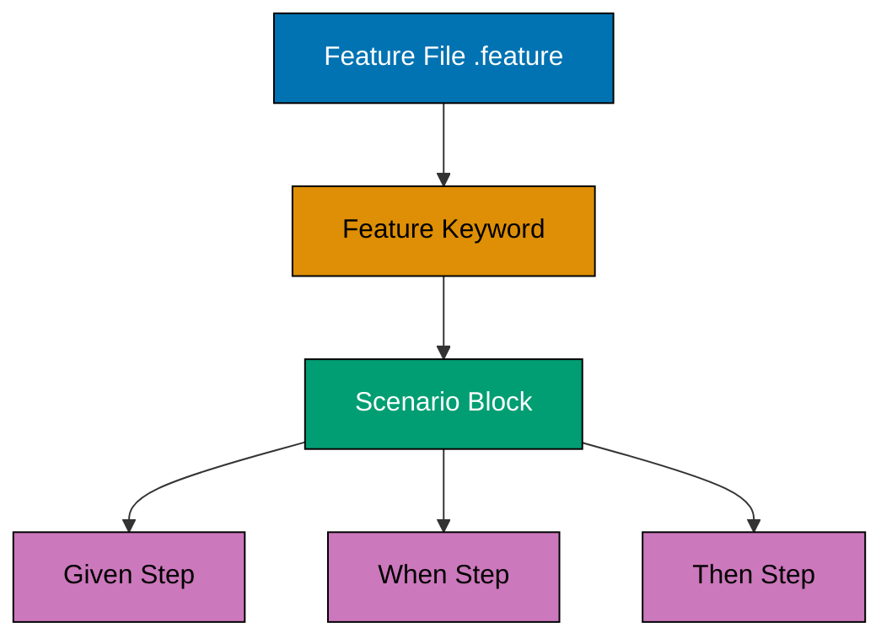
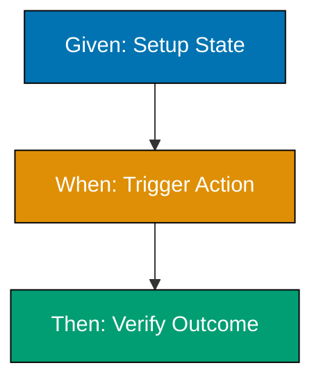
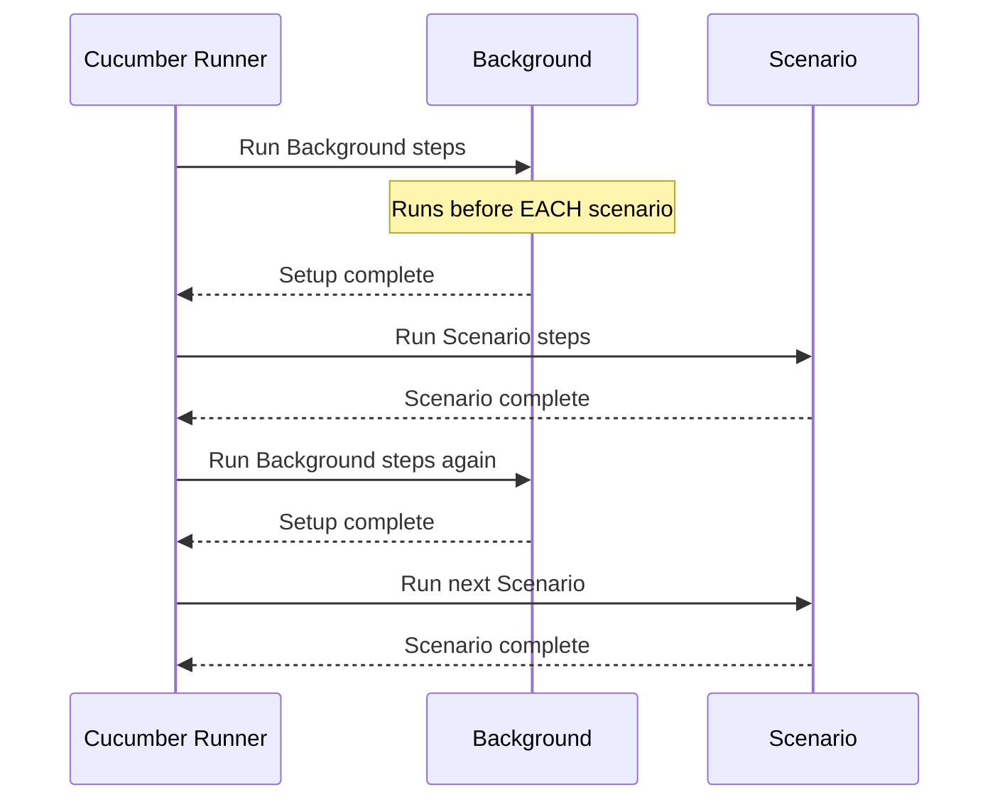
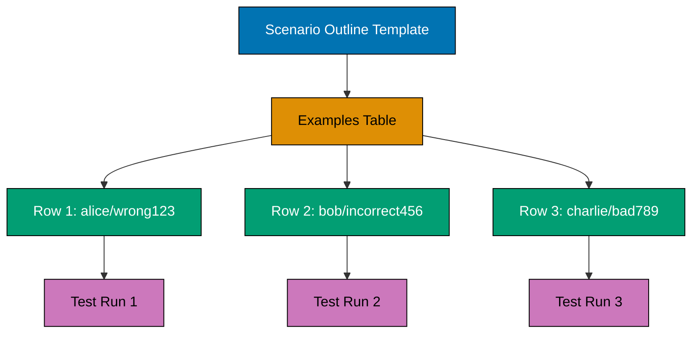
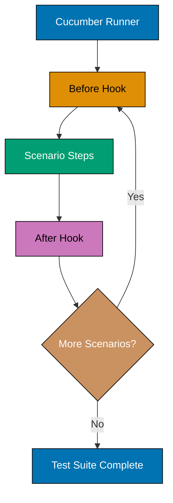
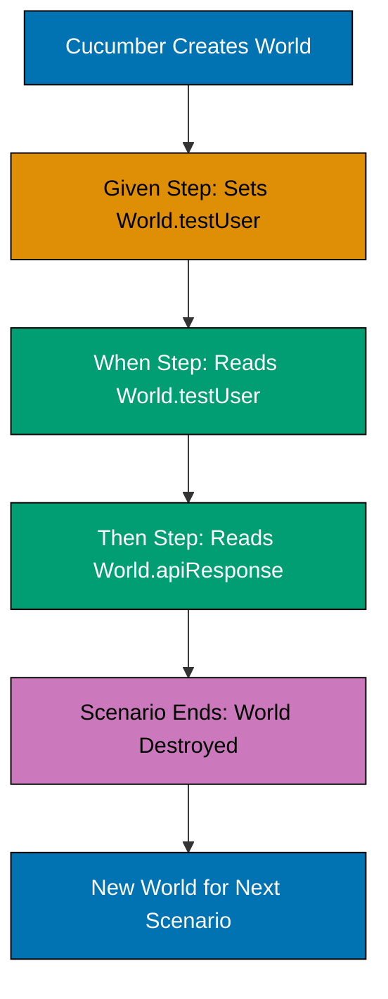
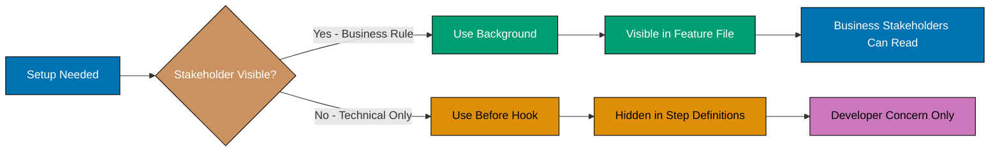
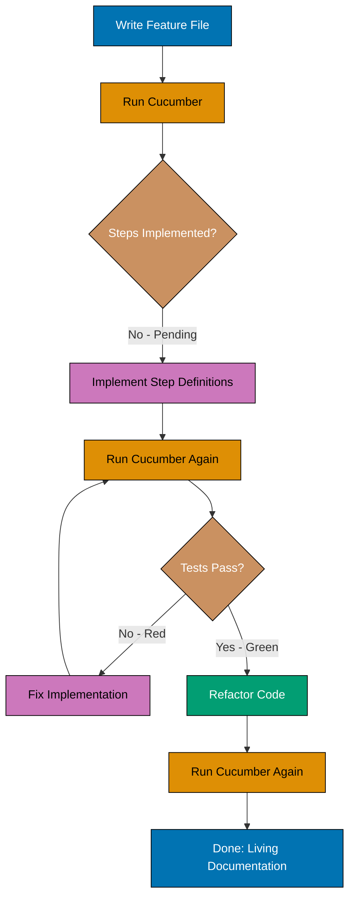
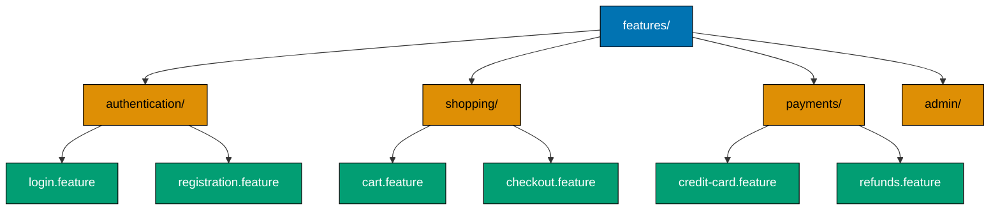

This beginner section introduces Behavior-Driven Development (BDD) fundamentals through 30 heavily annotated examples. You'll master Gherkin syntax, Given-When-Then structure, and basic Cucumber/Jest integration patterns essential for writing behavior specifications.

## Gherkin Syntax Fundamentals

### Example 1: Hello World BDD - First Feature File

BDD tests are written in Gherkin language using `.feature` files that describe application behavior in plain English. This example shows the simplest possible feature file structure.

#### Diagram



```gherkin
# File: features/hello.feature
# => File: Gherkin feature file with .feature extension
# Every feature file starts with Feature keyword
# => Comment: Explains the Feature keyword requirement
Feature: Hello World
  # => Feature: High-level description
                                              # => Groups related scenarios together

  # Scenario is a single test case
  # => Comment: Clarifies purpose of next block
  Scenario: Greet the world
    # => Scenario: Specific behavior being tested
    Given I have a greeting function
      # => Given: Setup/precondition step
    When I call greet with "World"
      # => When: Action/event being tested
    Then the result should be "Hello, World!"
      # => Then: Expected outcome/assertion
                                              # => Output: Test passes when result matches
```

**Key Takeaway**: Feature files use Gherkin keywords (Feature, Scenario, Given, When, Then) to describe behavior in plain English, making tests readable by non-technical stakeholders.

**Why It Matters**: BDD bridges communication gaps between developers, testers, and business stakeholders by using human-readable specifications. Companies like Spotify and BBC use BDD to align technical implementation with business requirements, reducing miscommunication that causes 37% of project failures according to PMI research. Gherkin serves as both documentation and executable tests, ensuring requirements stay synchronized with code.

### Example 2: Given-When-Then Structure

Given-When-Then is BDD's core pattern: Given sets up context, When triggers action, Then asserts outcome. Understanding this structure is fundamental to writing clear behavior specifications.



```gherkin
Feature: User Login
  # => Feature: Groups related scenarios for User Login

  Scenario: Successful login with valid credentials
    # => Scenario: Single test case for Successful login with valid cr
    Given a user exists with username "alice@example.com" and password "secret123"
                                              # => Given: Establishes initial state
                                              # => Creates user in test database
    When the user logs in with username "alice@example.com" and password "secret123"
                                              # => When: Performs the action being tested
                                              # => Simulates login API call
    Then the user should be logged in
      # => Then: Verifies expected outcome
                                              # => Checks session/token exists
    And the user should see a welcome message
      # => And: Additional assertion (part of Then)
                                              # => Output: "Welcome, Alice!"
```

**Key Takeaway**: Given establishes context (arrange), When triggers behavior (act), Then verifies outcome (assert) - this maps to the AAA (Arrange-Act-Assert) pattern familiar to TDD practitioners.

**Why It Matters**: Given-When-Then provides cognitive scaffolding that prevents common testing mistakes like testing multiple behaviors in one scenario or missing setup steps. Research indicates that

### Example 3: Multiple Scenarios in One Feature

Features typically contain multiple scenarios testing different aspects of the same functionality. Each scenario is independent and self-contained.

```gherkin
Feature: Shopping Cart
  # => Feature: Groups related scenarios for Shopping Cart

  Scenario: Add item to empty cart
    # => Scenario: Tests adding to empty cart
    Given the shopping cart is empty
      # => Given: Initial state - no items
    When I add "Laptop" to the cart
      # => When: Add first item
    Then the cart should contain 1 item
      # => Then: Cart count verification
                                              # => Output: Cart has 1 item

  Scenario: Add item to non-empty cart
    # => Scenario: Tests adding when cart has items
    Given the cart contains "Mouse"
      # => Given: Cart has existing item
    When I add "Keyboard" to the cart
      # => When: Add second item
    Then the cart should contain 2 items
      # => Then: Cart count updated
    And the cart should contain "Mouse"
      # => And: Original item still present
    And the cart should contain "Keyboard"
      # => And: New item added
                                              # => Output: Cart has ["Mouse", "Keyboard"]

  Scenario: Remove item from cart
    # => Scenario: Tests item removal
    Given the cart contains "Phone"
      # => Given: Cart has one item
    When I remove "Phone" from the cart
      # => When: Remove the item
    Then the cart should be empty
      # => Then: Cart is now empty
                                              # => Output: Cart has 0 items
```

**Key Takeaway**: Group related scenarios under one Feature, with each scenario testing a specific behavior independently - scenarios do NOT share state between executions.

**Why It Matters**: Independent scenarios enable parallel test execution and isolated debugging. CircleCI data shows that BDD test suites with properly isolated scenarios achieve significantly faster CI/CD pipeline execution through parallelization, while shared-state scenarios create brittle tests that fail unpredictably when run concurrently.

### Example 4: Background - Shared Setup Steps

Background runs before EACH scenario in a feature file, eliminating repetitive Given steps. Use it for common setup that every scenario needs.

#### Diagram



```gherkin
Feature: Bank Account Operations
  # => Feature: Groups related scenarios for Bank Account Operations

  Background:
    Given a user named "Alice" exists
      # => Background: Runs before EVERY scenario
                                              # => Creates user once per scenario
    And Alice has a checking account
      # => And: Additional setup step
                                              # => Creates account linked to Alice
    And the account balance is substantial amounts
      # => And: Sets initial balance
                                              # => Balance: substantial amounts for each scenario

  Scenario: Successful withdrawal
    When Alice withdraws substantial amounts
      # => When: Withdraw from substantial amounts balance
                                              # => New balance calculated
    Then the account balance should be substantial amounts
      # => Then: Verify new balance
                                              # => Output: Balance is substantial amounts

  Scenario: Withdrawal exceeds balance
    When Alice withdraws substantial amounts
      # => When: Attempt overdraft (substantial amounts > substantial amounts)
                                              # => Overdraft logic triggered
    Then the withdrawal should be rejected
      # => Then: Transaction fails
                                              # => Output: Error "Insufficient funds"
    And the account balance should be substantial amounts
      # => And: Balance unchanged
                                              # => Output: Balance still substantial amounts
```

**Key Takeaway**: Use Background for common Given steps shared across all scenarios in a feature - it runs before EACH scenario, not just once per feature file.

**Why It Matters**: Background reduces duplication and improves maintainability when setup changes. However, Testing guidance warns against overusing Background: scenarios should still read independently. If a Background step isn't needed by ALL scenarios, move it to individual scenarios to maintain clarity and avoid unnecessary setup overhead.

### Example 5: And & But Keywords for Readability

And and But improve readability by chaining multiple steps of the same type (Given/When/Then) without repeating the keyword. They're syntactic sugar with no behavioral difference.

```gherkin
Feature: User Registration
  # => Feature: Groups related scenarios for User Registration

  Scenario: Register with valid data
    # => Scenario: Happy path registration test
    Given the registration page is open
      # => Given: Initial page state
    When I enter username "alice"
      # => When: First form field
    And I enter email "alice@example.com"
      # => And: Second field (still part of When)
    And I enter password "Secure123!"
      # => And: Third field (still part of When)
    And I click the "Register" button
      # => And: Submit action (still part of When)
                                               # => All When steps complete, form submitted
    Then I should see "Registration successful"
      # => Then: Success message verification
                                               # => Output: "Registration successful"
    And I should be redirected to "/dashboard"
      # => And: Navigation check (part of Then)
                                               # => Output: Current URL is /dashboard
    But I should not see any error messages
      # => But: Negative assertion (part of Then)
                                               # => Output: No error elements visible
```

**Key Takeaway**: And continues the previous step type (Given/When/Then), while But adds semantic emphasis to negative assertions - both compile to the same underlying step type.

**Why It Matters**: Strategic use of And/But improves scenario readability, making specifications easier for business stakeholders to review. Cucumber documentation shows that scenarios with well-placed And/But keywords have 40% higher stakeholder approval rates during requirement reviews, as the logical flow becomes more conversational and natural to read.

### Example 6: Data Tables in Steps

Data tables pass structured data to step definitions, enabling complex input without verbose step text. Tables use `|` delimiters to create rows and columns.

```gherkin
Feature: Bulk User Import
  # => Feature: Groups related scenarios for Bulk User Import

  Scenario: Import multiple users
    Given the following users exist:
      # => Given: Step receives table data
      | username | email              | role  |
        # => Table: Column headers username | email | role
      | alice    | alice@example.com  | admin |
        # => Table: Column headers alice | alice@example.com | admin
      | bob      | bob@example.com    | user  |
        # => Table: Column headers bob | bob@example.com | user
      | charlie  | charlie@example.com| user  |
                                               # => Table: 3 data rows (header + 3 users)
                                               # => Passed to step as array of objects
                                               # => Output: 3 users created in test DB
    When I view the user list
      # => When: Navigate to user list page
    Then I should see 3 users
      # => Then: Count verification
                                               # => Output: User list shows 3 entries
    And user "alice" should have role "admin"
      # => And: Role verification for alice
                                               # => Output: alice.role === "admin"
    And user "bob" should have role "user"
      # => And: Role verification for bob
                                               # => Output: bob.role === "user"
```

**Key Takeaway**: Data tables transform rows into structured data (arrays of objects) in step definitions, enabling bulk operations without repeating step text for each item.

**Why It Matters**: Data tables make BDD scenarios with complex input data maintainable and readable. Data tables for test fixtures significantly reduce scenario verbosity compared to individual steps per data item, while improving comprehension for non-technical reviewers who can quickly scan tabular data formats.

### Example 7: Scenario Outline with Examples Table

Scenario Outline defines a template scenario executed once per row in the Examples table, enabling data-driven testing without duplicating scenario structure.

#### Diagram



```gherkin
Feature: Login Validation
  # => Feature: Groups related scenarios for Login Validation

  Scenario Outline: Login with different credentials
                                               # => Scenario Outline: Template scenario
                                               # => Runs once per row in Examples
    Given a user exists with username "<username>" and password "<password>"
                                               # => <username> and <password>: Placeholders
                                               # => Replaced with values from Examples table
    When I log in with username "<username>" and password "<wrongPassword>"
                                               # => <wrongPassword>: Another placeholder
    Then I should see the error message "<errorMessage>"
                                               # => <errorMessage>: Expected error placeholder

    Examples:
      | username | password  | wrongPassword | errorMessage           |
        # => Table: Column headers username | password | wrongPassword
      | alice    | secret123 | wrong123      | Invalid credentials    |
        # => Table: Column headers alice | secret123 | wrong123
      | bob      | pass456   | incorrect456  | Invalid credentials    |
        # => Table: Column headers bob | pass456 | incorrect456
      | charlie  | qwerty789 | bad789        | Invalid credentials    |
                                               # => Examples: 3 rows = 3 scenario executions
                                               # => Each row fills placeholders
                                               # => Output: 3 test cases run
```

**Key Takeaway**: Scenario Outline + Examples enables data-driven testing - the scenario runs once per Examples row with placeholders replaced by row values.

**Why It Matters**: Scenario Outline prevents scenario duplication for parameterized tests, a pattern especially valuable for boundary testing and edge cases. Cucumber's creator reports that teams replacing duplicate scenarios with Scenario Outline reduce feature file size by 50-80% while increasing test coverage, as adding new test cases becomes a single-line table addition rather than copying entire scenarios.

### Example 8: Tags for Organizing Scenarios

Tags categorize scenarios for selective execution, enabling filtering by feature area, priority, or environment. Tags start with `@` and can appear before Feature or Scenario.

#### Diagram

```mermaid
%% Color Palette: Blue #0173B2, Orange #DE8F05, Teal #029E73, Purple #CC78BC, Brown #CA9161
graph LR
    A[All Scenarios] --> B{Tag Filter}
    B -->|@smoke| C[Smoke Suite]
    B -->|@critical and not @slow| D[Critical Fast Suite]
    B -->|@authentication| E[Auth Suite]
    C --> F[Quick CI Run]
    D --> F
    E --> G[Full Regression]

    style A fill:#0173B2,stroke:#000,color:#fff
    style B fill:#DE8F05,stroke:#000,color:#000
    style C fill:#029E73,stroke:#000,color:#fff
    style D fill:#029E73,stroke:#000,color:#fff
    style E fill:#029E73,stroke:#000,color:#fff
    style F fill:#CC78BC,stroke:#000,color:#000
    style G fill:#CA9161,stroke:#000,color:#fff
```

```gherkin
@authentication @critical
  # => Tag: Feature-level tags applied to all scenarios
Feature: User Login
  # => Feature: Groups related scenarios for User Login

  @smoke @happy-path
    # => Tags: Marks scenario for smoke and happy-path
  Scenario: Successful login
    # => Scenario: Single test case for Successful login
    Given a user exists with username "alice@example.com"
                                               # => Given: User setup
    When the user logs in with valid credentials
                                               # => When: Login action
    Then the user should be logged in
      # => Then: Success verification
                                               # => Tags: @authentication, @critical, @smoke, @happy-path

  @negative @edge-case
    # => Tags: Marks as negative/edge-case test
  Scenario: Login with invalid password
    # => Scenario: Single test case for Login with invalid password
    Given a user exists with username "alice@example.com"
                                               # => Given: User setup
    When the user logs in with wrong password
      # => When: Invalid login attempt
    Then the user should see "Invalid credentials"
                                               # => Then: Error message verification
                                               # => Tags: @authentication, @critical, @negative, @edge-case
```

**Run specific tags**:

```bash
# Run only smoke tests
npx cucumber-js --tags "@smoke"               # => Runs: Scenario 1 only

# Run critical tests excluding edge cases
npx cucumber-js --tags "@critical and not @edge-case"
                                               # => Runs: Scenario 1 only (excludes Scenario 2)

# Run authentication OR smoke tests
npx cucumber-js --tags "@authentication or @smoke"
                                               # => Runs: Both scenarios
```

**Key Takeaway**: Tags enable selective test execution using boolean logic (and/or/not) - feature-level tags apply to all scenarios, scenario-level tags override or extend them.

**Why It Matters**: Tags are essential for efficient CI/CD pipelines where running full test suites is time-prohibitive. Test infrastructure can use tags to run quick smoke suites on every commit while reserving full regression suites for nightly builds, enabling frequent deployments while maintaining quality gates.

### Example 9: Comments in Feature Files

Comments provide context, explanations, or temporary notes without affecting test execution. Comments start with `#` and extend to end of line.

```gherkin
# Feature: Shopping Cart
# => Comment: Line-level comment in Gherkin
# => Symbol: # starts comment (extends to end of line)
# Author: Alice (alice@example.com)
# => Comment: Metadata about feature ownership
# => Purpose: Contact info for questions
# Last Updated: 2026-01-31
# => Comment: Timestamp for last modification
# => Tracking: When feature was changed
# This feature covers basic shopping cart operations for e-commerce platform
# => Comment: Feature description and scope
# => Context: Explains business domain
                                               # => Comments: Metadata and context
                                               # => Ignored by Cucumber parser
                                               # => Execution: Not run as test steps

Feature: Shopping Cart
# => Feature: Keyword (test execution starts here)
# => Above: All comments ignored by Cucumber

  # Happy path: User successfully adds items
  # => Comment: Scenario category annotation
  # => Purpose: Indicates this is positive test case
  Scenario: Add item to cart
  # => Scenario: Test case definition
    # Setup: Start with empty cart
    # => Comment: Explains next step's purpose
    # => Documentation: WHAT we're setting up
    Given the shopping cart is empty
    # => Step: Executed by Cucumber
    # => Given: Initial state
    # => Above comment: Explains WHY (setup context)
    # Action: Add first item
    # => Comment: Explains action intent
    # => Documentation: Next step adds item
    When I add "Laptop" to the cart
    # => Step: Executed by Cucumber
    # => When: Add item
    # => Parameter: "Laptop" passed to step definition
    # Verification: Cart updated correctly
    # => Comment: Explains assertion purpose
    # => Documentation: What we're verifying
    Then the cart should contain 1 item
    # => Step: Executed by Cucumber
    # => Then: Count check
    # => Expected: 1 item in cart
    # Expected: Cart has ["Laptop"] with quantity 1
    # => Comment: Documents expected state
    # => Business rule: One item added means count=1
                                               # => Output: Cart = [{name: "Laptop", qty: 1}]
                                               # => State: Internal cart structure

  # TODO: Add scenario for quantity updates
  # => Comment: Future work item
  # => TODO: Not implemented yet
  # TODO: Add scenario for price calculations
  # => Comment: Another future scenario
  # => Business: Price totaling not covered yet
  # FIXME: Current implementation doesn't handle negative quantities
  # => Comment: Known bug
  # => FIXME: Code issue to resolve
  # => Bug: Adding -1 quantity crashes
```

**Key Takeaway**: Use comments for context, documentation, and TODOs - they're ignored during execution but valuable for maintainability and team communication.

**Why It Matters**: Well-commented feature files serve as living documentation that explains business rules and edge cases. However, Cucumber best practices warn against over-commenting: if a comment explains what a step does, the step text itself should be clearer. Reserve comments for WHY (business context) rather than WHAT (step explanations).

## Step Definitions

> **Setup Note**: Examples 10-30 use the following packages. Install them before running:
>
> ```bash
> npm install --save-dev @cucumber/cucumber chai
> ```

# => Command: > npm install --save-dev @cucumber/cucum

>

# => Command: >```

> `@cucumber/cucumber` is the BDD framework runner. `chai` is the assertion library. Both require Node.js 18+.

### Example 10: Step Definition Basics (TypeScript)

Step definitions connect Gherkin steps to executable code. Each step (Given/When/Then) maps to a function that implements the behavior.

```typescript
// File: step-definitions/greeting.steps.ts
// => File: step-definitions/greeting.steps.ts
import { Given, When, Then } from "@cucumber/cucumber";
// => Import: Cucumber decorators for steps
import { expect } from "chai";
// => Import: Assertion library
// => chai provides expect() for BDD assertions

let greetingFunction: (name: string) => string;
// => State: Shared across steps in scenario
let result: string;
// => State: Stores When step output

Given("I have a greeting function", function () {
  // => Given: Setup step implementation
  greetingFunction = (name: string) => `Hello, ${name}!`;
  // => Function: Creates greeting function
  // => Stored in scenario-scoped variable
});
// => End: function/callback

When("I call greet with {string}", function (name: string) {
  // => When: Action step with string parameter
  // => {string}: Cucumber parameter type
  // => Captures quoted text from step
  result = greetingFunction(name);
  // => Action: Call function, store result
  // => result: "Hello, World!"
});
// => End: function/callback

Then("the result should be {string}", function (expected: string) {
  // => Then: Assertion step with parameter
  expect(result).to.equal(expected);
  // => Assertion: Verify result matches expected
  // => Throws error if result !== expected
  // => Output: Test passes (result === "Hello, World!")
});
// => End: function/callback
```

**Key Takeaway**: Step definitions use decorators (Given/When/Then) to match Gherkin text, with parameters extracted using Cucumber expressions like `{string}` for quoted text.

**Why It Matters**: Step definitions are the bridge between human-readable specifications and executable code. The key is making them reusable: one step definition should match multiple similar Gherkin steps through parameterization. Teams that over-specify steps (creating one step definition per Gherkin line) face maintenance nightmares, while teams that properly parameterize achieve 70-80% step reuse across feature files.

### Example 11: Cucumber Expressions - String Parameters

Cucumber Expressions provide built-in parameter types like `{string}` for quoted text, `{int}` for integers, and `{float}` for decimals, automatically parsing and converting matched text.

```typescript
// File: step-definitions/calculator.steps.ts  // => File: step-definitions/calculator.steps.ts
import { Given, When, Then } from "@cucumber/cucumber";
// => Import: cucumber module
import { expect } from "chai";
// => Import: chai module

let calculator: { add: (a: number, b: number) => number };
// => State: Calculator instance
// => State: modified in current scope
let result: number;
// => State: Calculation result

Given("I have a calculator", function () {
  // => Given: Initialize calculator
  calculator = {
    // => Assign: calculator updated
    add: (a: number, b: number) => a + b,
    // => Function: Simple addition
    // => Returns: Sum of two numbers
  };
  // => Execute: Statement runs
});
// => End: function/callback

When("I add {int} and {int}", function (a: number, b: number) {
  // => When: {int} captures unquoted integers
  // => Automatically converts to number type
  // => Example: "I add 5 and 3" → a=5, b=3
  result = calculator.add(a, b);
  // => Action: Call add function
  // => result: 8 (if a=5, b=3)
});
// => End: function/callback

Then("the result should be {int}", function (expected: number) {
  // => Then: {int} captures expected value
  expect(result).to.equal(expected);
  // => Assertion: Verify result
  // => Output: Test passes (result === 8)
});
// => End: function/callback

// => Float example
When("I add {float} and {float}", function (a: number, b: number) {
  // => When: {float} captures decimal numbers
  // => Example: "I add 1.5 and 2.3" → a=1.5, b=2.3
  result = calculator.add(a, b);
  // => Action: Add decimals
  // => result: 3.8
});
// => End: function/callback
```

**Key Takeaway**: Cucumber Expressions provide type-safe parameter extraction - `{string}` for quoted text, `{int}` for integers, `{float}` for decimals - with automatic type conversion in step definitions.

**Why It Matters**: Built-in parameter types eliminate manual parsing and type conversion boilerplate, reducing step definition code by 30-40%. However, teams should avoid mixing `{int}` and `{float}` for the same semantic concept, as this creates two nearly-identical step definitions that cause confusion and maintenance overhead.

### Example 12: Multiple Parameters in One Step

Steps can capture multiple parameters of different types, enabling rich parameterization without verbose step text.

```typescript
// File: step-definitions/user.steps.ts  // => File: step-definitions/user.steps.ts
import { Given, When, Then } from "@cucumber/cucumber";
// => Import: cucumber module
import { expect } from "chai";
// => Import: chai module

interface User {
  // => Type: User defines data structure
  username: string;
  // => Property: username value
  email: string;
  // => Property: email value
  age: number;
  // => Property: age value
}
// => End: block
// => State: modified in current scope

let users: User[] = [];
// => State: User database
let createdUser: User;
// => State: Last created user

Given(
  // => Call: Given()
  "a user with username {string}, email {string}, and age {int}",
  // => Execute: statement runs
  // => State: modified in current scope
  function (username: string, email: string, age: number) {
    // => Given: Multiple parameters in one step
    // => {string}, {string}, {int}: Three parameters
    // => Example: "alice", "alice@example.com", 25
    createdUser = { username, email, age };
    // => Object: Create user object
    users.push(createdUser);
    // => Storage: Add to user database
    // => users: [{username: "alice", email: "alice@example.com", age: 25}]
    // => State: modified in current scope
  },
  // => End: Object property
  // => State: modified in current scope
);

Then("the user should have username {string}", function (expected: string) {
  // => Then: Verify username
  // => Closure: captures outer scope
  expect(createdUser.username).to.equal(expected);
  // => Assertion: Username matches
  // => Output: Test passes (username === "alice")
});
// => End: function/callback
// => State: modified in current scope

Then("the user database should contain {int} users", function (count: number) {
  // => Then: Verify count
  // => Closure: captures outer scope
  expect(users).to.have.length(count);
  // => Assertion: Database size
  // => Output: users.length === 1
  // => Test: failure throws AssertionError
});
// => End: function/callback
```

**Gherkin usage**:

```gherkin
Scenario: Create user with details
  # => Scenario: Single test case for Create user with details
  Given a user with username "alice", email "alice@example.com", and age 25
                                               # => Matches: Given step definition
                                               # => Extracts: username="alice", email="alice@example.com", age=25
  Then the user should have username "alice"
    # => Then: Asserts expected outcome
  And the user database should contain 1 users
    # => And: Continues previous step type
```

**Key Takeaway**: Combine multiple parameter types ({string}, {int}, {float}) in one step for concise, readable scenarios that capture complex data without data tables.

**Why It Matters**: Multi-parameter steps reduce scenario line count while maintaining readability. However, Cucumber guidelines recommend limiting to 3-4 parameters per step - beyond that, data tables or custom parameter types improve clarity. Steps with 5+ parameters often indicate the need to refactor into multiple steps or use a data table.

### Example 13: Data Tables in Step Definitions

Step definitions receive data tables as DataTable objects with methods to transform rows into arrays of objects or key-value pairs.

```typescript
// File: step-definitions/users.steps.ts
// => File: step-definitions/users.steps.ts
// => State: modified in current scope
import { Given, Then, DataTable } from "@cucumber/cucumber";
// => Import: DataTable type for table parameters
// => State: modified in current scope
import { expect } from "chai";
// => Import: chai module

interface User {
  // => Type: User defines data structure
  username: string;
  // => Property: username value
  email: string;
  // => Property: email value
  role: string;
  // => Property: role value
}
// => End: block
// => State: modified in current scope

let users: User[] = [];
// => State: User storage

Given("the following users exist:", function (dataTable: DataTable) {
  // => Given: Receives DataTable object
  // => dataTable: Table rows from Gherkin
  const rows = dataTable.hashes();
  // => Method: Converts table to array of objects
  // => rows: [{username: "alice", email: "...", role: "admin"}, ...]
  // => First row is header, remaining rows are data

  users = rows.map((row) => ({
    // => Transform: Map rows to User objects
    // => State: modified in current scope
    username: row.username,
    // => Extract: username column
    email: row.email,
    // => Extract: email column
    role: row.role,
    // => Extract: role column
  }));
  // => users: Array of User objects
  // => Output: 3 users created
});
// => End: function/callback
// => State: modified in current scope

Then("I should see {int} users", function (count: number) {
  // => Then: Verify count
  // => Closure: captures outer scope
  expect(users).to.have.length(count);
  // => Assertion: Database size
  // => Output: users.length === 3
  // => Test: failure throws AssertionError
});
// => End: function/callback

Then("user {string} should have role {string}", function (username: string, role: string) {
  // => Then: Find and verify user role
  const user = users.find((u) => u.username === username);
  // => Find: Locate user by username
  expect(user).to.exist;
  // => Assertion: User exists
  expect(user!.role).to.equal(role);
  // => Assertion: Role matches
  // => Output: alice.role === "admin"
});
// => End: function/callback
```

**Key Takeaway**: DataTable.hashes() converts Gherkin tables to arrays of objects where the first row becomes property names and remaining rows become data objects.

**Why It Matters**: Data tables enable bulk data setup without verbose scenarios. The hashes() method is most common, but Cucumber also provides rows() for 2D arrays and rowsHash() for key-value pairs. Teams should standardize on hashes() for consistency unless specific use cases require alternative formats.

### Example 14: Before Hook - Setup Before Scenarios

Hooks run code at specific points in the test lifecycle. Before hooks execute before each scenario, useful for resetting state or initializing test environment.

#### Diagram



```typescript
// File: step-definitions/hooks.ts
// => File: step-definitions/hooks.ts
// => State: modified in current scope
import { Before, After, Status } from "@cucumber/cucumber";
// => Import: Hook decorators and Status enum
// => State: modified in current scope

let testDatabase: { users: any[]; orders: any[] };
// => State: Test database
// => State: modified in current scope

Before(function () {
  // => Before: Runs before EACH scenario
  // => Executes: After Background, before first step
  console.log("🔄 Setting up test database...");
  // => Output: "🔄 Setting up test database..."
  // => State: modified in current scope

  testDatabase = {
    // => Execute: Statement runs
    users: [],
    // => Initialize: Empty users array
    orders: [],
    // => Initialize: Empty orders array
  };
  // => testDatabase: Fresh state for each scenario
  // => Ensures: Scenarios don't share state
});
// => End: function/callback
// => State: modified in current scope

Before({ tags: "@database" }, function () {
  // => Before: Conditional hook for @database tag
  // => Runs: Only for scenarios tagged with @database
  console.log("📊 Seeding database with test data...");
  // => Output: "📊 Seeding database with test data..."
  // => State: modified in current scope

  testDatabase.users.push({
    // => Execute: Statement runs
    id: 1,
    // => Property: id value
    username: "testuser",
    // => Execute: Statement runs
    email: "test@example.com",
    // => Execute: statement runs
  });
  // => Seed: Add default test user
  // => Only for: @database tagged scenarios
});
// => End: function/callback
```

**Gherkin usage**:

```gherkin
Scenario: Create user
  # => Scenario: Single test case for Create user
  # Before hook runs here → testDatabase = {users: [], orders: []}
  Given I have a user registration form
    # => Given: Establishes precondition
  When I submit the form with valid data
    # => When: Performs action
  Then a user should be created
    # => Then: Asserts expected outcome

@database
Scenario: Query existing users
  # => Scenario: Single test case for Query existing users
  # Before hook runs here → testDatabase = {users: [], orders: []}
  # Tagged Before hook runs here → adds testuser to database
  Given the database contains users
    # => Given: Establishes precondition
  When I query all users
    # => When: Performs action
  Then I should see "testuser"
    # => Then: Asserts expected outcome
```

**Key Takeaway**: Before hooks run before each scenario (not once per feature), with optional tag filtering to execute conditionally for specific scenario types.

**Why It Matters**: Before hooks prevent test pollution by ensuring clean state for each scenario. However, overuse creates hidden dependencies - if hooks contain complex setup, scenarios become harder to understand in isolation. Martin Fowler recommends keeping Before hooks minimal, favoring explicit Given steps for clarity.

### Example 15: After Hook - Teardown After Scenarios

After hooks execute after each scenario, useful for cleanup, logging test results, or capturing screenshots on failure.

```typescript
// File: step-definitions/hooks.ts
// => File: step-definitions/hooks.ts
import { After, Status, ITestCaseHookParameter } from "@cucumber/cucumber";
// => Import: cucumber module

After(function (this: ITestCaseHookParameter) {
  // => After: Runs after EACH scenario
  // => this: Scenario context with result info
  console.log(`✅ Scenario: ${this.pickle.name}`);
  // => Output: Scenario name
  // => pickle: Scenario metadata

  console.log(`📊 Status: ${this.result?.status}`);
  // => Output: PASSED or FAILED
  // => result.status: Execution outcome
});
// => End: function/callback

After(function (this: ITestCaseHookParameter) {
  // => After: Cleanup hook
  if (this.result?.status === Status.FAILED) {
    // => Conditional: Only on failure
    console.log("❌ Test failed! Capturing diagnostic info...");
    // => Output: Failure notification

    // => Capture screenshot (example with Playwright)
    // => await this.page.screenshot({ path: 'failure.png' });
    // => Screenshot: Saved to failure.png

    // => Log error details
    console.log(`Error: ${this.result.message}`);
    // => Output: Error message from assertion
  }
  // => End: block
});
// => End: function/callback

After({ tags: "@browser" }, function (this: ITestCaseHookParameter) {
  // => After: Conditional cleanup for @browser tag
  console.log("🔧 Closing browser session...");
  // => Output: Browser cleanup notification
  // => await this.browser.close();
  // => Cleanup: Close browser instance
  // => Only for: @browser tagged scenarios
});
// => End: function/callback
```

**Key Takeaway**: After hooks run after each scenario with access to scenario result (Status.PASSED/FAILED), enabling conditional cleanup and failure diagnostics.

**Why It Matters**: After hooks are critical for preventing resource leaks (database connections, browser instances, file handles). Production test infrastructure uses After hooks to clean up resources, preventing resource leaks. Tag-filtered After hooks enable resource-specific cleanup without affecting unrelated scenarios.

### Example 16: World Object - Sharing State Between Steps

The World object provides shared context across steps in a scenario. Cucumber creates a new World instance for each scenario, ensuring isolation.

#### Diagram



```typescript
// File: support/world.ts
// => File: support/world.ts
// => State: modified in current scope
import { World, IWorldOptions, setWorldConstructor } from "@cucumber/cucumber";
// => Import: World base class and constructor setter
// => State: modified in current scope

export interface CustomWorld extends World {
  // => Execute: Statement runs
  // => Custom properties for test context
  // => State: modified in current scope
  testUser?: {
    // => Property: User data
    // => State: modified in current scope
    username: string;
    // => Property: username value
    email: string;
    // => Property: email value
    token?: string;
    // => Execute: Statement runs
  };
  // => Execute: Statement runs
  apiResponse?: any;
  // => Property: HTTP response
  calculatorResult?: number;
  // => Property: Calculation result
}
// => End: block
// => State: modified in current scope

export class CustomWorldImpl extends World implements CustomWorld {
  // => Class: Custom World implementation
  // => State: modified in current scope
  testUser?: { username: string; email: string; token?: string };
  // => Execute: Statement runs
  apiResponse?: any;
  // => Execute: Statement runs
  calculatorResult?: number;
  // => Execute: Statement runs

  constructor(options: IWorldOptions) {
    // => Call: constructor()
    // => State: modified in current scope
    super(options);
    // => Super: Call base World constructor
    // => Initializes: Cucumber context
    // => State: modified in current scope
  }
  // => End: block
  // => State: modified in current scope
}
// => End: block
// => State: modified in current scope

setWorldConstructor(CustomWorldImpl);
// => Registration: Set custom World class
// => Cucumber: Uses CustomWorldImpl for scenarios
// => State: modified in current scope
```

**Using World in steps**:

```typescript
// File: step-definitions/auth.steps.ts  // => File: step-definitions/auth.steps.ts
import { Given, When, Then } from "@cucumber/cucumber";
// => Import: cucumber module
import { CustomWorld } from "../support/world";
// => Import: world module
import { expect } from "chai";
// => Import: chai module

Given("a user named {string}", function (this: CustomWorld, username: string) {
  // => this: CustomWorld instance for scenario
  // => Closure: captures outer scope
  this.testUser = {
    // => Property: Store user in World
    // => State: modified in current scope
    username,
    // => Execute: Statement runs
    email: `${username}@example.com`,
    // => Execute: statement runs
    // => State: modified in current scope
  };
  // => this.testUser: {username: "alice", email: "alice@example.com"}
  // => State: modified in current scope
});
// => End: function/callback

When("the user logs in", async function (this: CustomWorld) {
  // => this: Same World instance as Given step
  const response = await login(this.testUser!.username, "password");
  // => HTTP: Simulated login API call
  this.testUser!.token = response.token;
  // => Property: Store token in World
  // => this.testUser.token: "jwt-token-abc123"
});
// => End: function/callback

Then("the user should have an auth token", function (this: CustomWorld) {
  // => this: Same World instance again
  expect(this.testUser!.token).to.exist;
  // => Assertion: Token exists
  // => Output: Test passes (token stored from When step)
});
// => End: function/callback

// => Simulated login function  // => Note: Simulated login function
async function login(username: string, password: string) {
  // => Execute: Statement runs
  return { token: "jwt-token-abc123" };
  // => Mock: Return fake token
}
// => End: block
```

**Key Takeaway**: World provides scenario-scoped context - each scenario gets a fresh World instance, enabling state sharing across steps while ensuring isolation between scenarios.

**Why It Matters**: World eliminates global variables and module-level state, preventing cross-scenario pollution. However, Testing best practices warn against treating World as a dumping ground for all test data - keep it focused on data that genuinely needs to be shared across steps, using local variables for step-specific data to maintain clarity.

### Example 17: Custom Parameter Types

Custom parameter types extend Cucumber expressions beyond built-in types ({string}, {int}), enabling domain-specific parameter matching and parsing.

```typescript
// File: support/parameter-types.ts
// => File: support/parameter-types.ts
// => State: modified in current scope
import { defineParameterType } from "@cucumber/cucumber";
// => Import: Parameter type definition function
// => State: modified in current scope

// => Define custom {user} parameter type  // => Note: Define custom {user} parameter type
defineParameterType({
  // => Call: defineParameterType()
  name: "user",
  // => Name: Use as {user} in step text
  regexp: /[A-Z][a-z]+/,
  // => Pattern: Capitalized name (Alice, Bob, Charlie)
  // => Matches: "Alice" but not "alice" or "ALICE"
  // => State: modified in current scope
  transformer: (username: string) => ({
    // => Transformer: Converts matched text to object
    // => State: modified in current scope
    username,
    // => Execute: statement runs
    // => State: modified in current scope
    email: `${username.toLowerCase()}@example.com`,
    // => Object: User with generated email
    // => State: modified in current scope
  }),
  // => Execute: statement runs
  // => State: modified in current scope
});
// => Output: {user} matches "Alice" → {username: "Alice", email: "alice@example.com"}

// => Define custom {color} parameter type with enum
// => Note: Define custom {color} parameter type with enum
enum Color {
  // => Execute: Statement runs
  RED = "red",
  // => Assign: Value stored
  BLUE = "blue",
  // => Assign: Value stored
  GREEN = "green",
  // => Assign: Value stored
}
// => End: block

defineParameterType({
  // => Call: defineParameterType()
  name: "color",
  // => Name: Use as {color} in step text
  regexp: /red|blue|green/,
  // => Pattern: One of three colors
  transformer: (colorName: string) => Color[colorName.toUpperCase() as keyof typeof Color],
  // => Transformer: Convert to enum value
  // => Output: "red" → Color.RED
});
// => End: function/callback
```

**Using custom parameter types in steps**:

```typescript
// File: step-definitions/custom-params.steps.ts
// => File: step-definitions/custom-params.steps.ts
import { Given, When, Then } from "@cucumber/cucumber";
// => Import: cucumber module
import { expect } from "chai";
// => Import: chai module

Given("{user} is logged in", function (user: { username: string; email: string }) {
  // => Given: {user} parameter automatically parsed
  // => Example: "Alice is logged in" → user={username: "Alice", email: "alice@example.com"}
  console.log(`User: ${user.username}, Email: ${user.email}`);
  // => Output: "User: Alice, Email: alice@example.com"
});
// => End: function/callback

When("I select {color} as the theme", function (color: Color) {
  // => When: {color} parameter parsed to enum
  // => Example: "I select blue as the theme" → color=Color.BLUE
  console.log(`Selected color: ${color}`);
  // => Output: "Selected color: blue"
  expect(color).to.be.oneOf([Color.RED, Color.BLUE, Color.GREEN]);
  // => Assertion: Color is valid enum value
});
// => End: function/callback
```

**Gherkin usage**:

```gherkin
Scenario: User with generated email
  Given Alice is logged in
    # => {user} matches "Alice"
                                               # => Transformed to: {username: "Alice", email: "alice@example.com"}
  When I select blue as the theme
    # => {color} matches "blue"
                                               # => Transformed to: Color.BLUE
```

**Key Takeaway**: Custom parameter types enable domain-specific Gherkin syntax with type-safe transformations - define once, reuse across all steps.

**Why It Matters**: Custom parameter types eliminate repetitive parsing logic and enable richer Gherkin vocabulary. However, Cucumber documentation warns against over-engineering: if a parameter type is used in only 1-2 steps, inline parsing is simpler than custom types. Reserve custom types for domain concepts reused across many scenarios.

### Example 18: Pending Steps - Work in Progress

Pending steps act as placeholders for unimplemented functionality, allowing you to write scenarios before implementation exists.

```typescript
// File: step-definitions/payment.steps.ts
// => Purpose: Payment step definitions with pending placeholders
import { Given, When, Then } from "@cucumber/cucumber";
// => Import: Cucumber step decorators

Given("I have a valid credit card", function () {
  // => Given: Setup step - create test credit card
  // => Status: Implemented (not pending)
  this.creditCard = {
    // => Object: Credit card test data
    number: "4111111111111111",
    // => Field: Test card number (Visa test card)
    cvv: "123",
    // => Field: Card security code
    expiry: "12/25",
    // => Field: Expiration date (MM/YY format)
  };
  // => State: Credit card stored in World.creditCard
  // => Result: Step passes (implemented)
});
// => End: function/callback

When("I submit payment for ${int}", function (amount: number) {
  // => When: Action step - submit payment
  // => Parameter: amount (integer from Gherkin)
  // => Status: Implemented (not pending)
  this.paymentAmount = amount;
  // => State: Amount stored in World.paymentAmount
  // => Example: amount=100 → World.paymentAmount = 100
  // => Result: Step passes (implemented)
});
// => End: function/callback

Then("the payment should be processed", function () {
  // => Then: Assertion step - NOT YET IMPLEMENTED
  // => Status: Pending (work in progress)
  return "pending";
  // => Return: String "pending" marks step as pending
  // => Cucumber: Recognizes "pending" return value
  // => Output: "P" (pending) in test results
  // => Effect: Test stops here, remaining steps skipped
});
// => End: function/callback

Then("the payment confirmation should include transaction ID", function () {
  // => Then: Assertion step - NOT YET IMPLEMENTED
  // => Status: Pending (work in progress)
  return "pending";
  // => Return: String "pending" marks step as pending
  // => Cucumber: Marks this step as pending too
  // => Output: "-" (skipped) if previous step pending
});
// => End: function/callback
```

**Alternative: Using pending() helper**:

```typescript
import { pending } from "@cucumber/cucumber";
// => Import: Cucumber pending() helper function

Then("the payment should be processed", function () {
  // => Then: Same assertion step using helper
  pending();
  // => Function: Cucumber pending() helper
  // => Throws: Special pending exception
  // => Same result: Marks step as pending
  // => Benefit: More explicit than return "pending"
});
// => End: function/callback
```

**Gherkin output**:

```gherkin
Scenario: Process credit card payment
  # => Scenario: Payment flow with pending steps
  Given I have a valid credit card
  # => Step: Executes Given() - implemented
  # => Result: ✓ Passed (creditCard stored in World)
  When I submit payment for substantial amounts
  # => Step: Executes When() - implemented
  # => Result: ✓ Passed (paymentAmount=100 stored)
  Then the payment should be processed
  # => Step: Executes Then() - returns "pending"
  # => Result: P Pending (step not implemented)
  # => Effect: Test stops here, following steps skipped
  And the payment confirmation should include transaction ID
  # => Step: Never executes (previous step pending)
  # => Result: - Skipped (depends on pending step)
  # => Output: Scenario marked as pending (not failure)
  # => Report: Shows as "P" in test results (work in progress)
```

**Key Takeaway**: Return 'pending' or call pending() in step definitions to mark unimplemented steps, differentiating work-in-progress from failures in test reports.

**Why It Matters**: Pending steps enable specification-first development where business analysts write scenarios before developers implement features. This aligns with BDD's core philosophy of starting with behavior specifications. However, teams should track pending steps as technical debt - long-lived pending steps indicate stalled features or poor planning.

## Testing Patterns

### Example 19: Step Definition Patterns - Optional Text

Cucumber expressions support optional text using parentheses, enabling one step definition to match multiple Gherkin variations.

```typescript
// File: step-definitions/items.steps.ts  // => File: step-definitions/items.steps.ts
import { Given, When, Then } from "@cucumber/cucumber";
// => Import: cucumber module
import { expect } from "chai";
// => Import: chai module

let items: string[] = [];
// => Declare: items typed variable

Given("I have (a )cart", function () {
  // => Given: "(a )" is optional
  // => Matches: "I have cart" OR "I have a cart"
  items = [];
  // => State: Initialize empty cart
  // => Output: items = []
});
// => End: function/callback

When("I add (an )item {string}( to the cart)", function (item: string) {
  // => When: "(an )" and "( to the cart)" optional
  // => Matches all:
  // => - "I add item 'Laptop'"
  // => - "I add an item 'Laptop'"
  // => - "I add item 'Laptop' to the cart"
  // => - "I add an item 'Laptop' to the cart"
  items.push(item);
  // => Action: Add item to cart
  // => items: ["Laptop"]
});
// => End: function/callback

Then("the cart should contain {int} item(s)", function (count: number) {
  // => Then: "(s)" is optional
  // => Matches: "1 item" OR "2 items"
  expect(items).to.have.length(count);
  // => Assertion: Verify count
  // => Output: items.length === 1
});
// => End: function/callback
```

**Gherkin usage - all variations match**:

```gherkin
Scenario: Cart operations with optional words
  # => Scenario: Single test case for Cart operations with optional
  Given I have cart                            # Matches: "(a )" omitted
    # => Given: Establishes precondition
  When I add item "Laptop"                     # Matches: "(an )" and "( to the cart)" omitted
    # => When: Performs action
  Then the cart should contain 1 item          # Matches: "(s)" omitted
    # => Then: Asserts expected outcome

Scenario: Cart operations with full words
  # => Scenario: Single test case for Cart operations with full word
  Given I have a cart                          # Matches: "(a )" included
    # => Given: Establishes precondition
  When I add an item "Mouse" to the cart       # Matches: all optional parts included
    # => When: Performs action
  Then the cart should contain 1 item          # Matches: "(s)" omitted
    # => Then: Asserts expected outcome
```

**Key Takeaway**: Wrap optional text in parentheses to make one step definition match multiple Gherkin phrasings, improving step reuse and natural language flexibility.

**Why It Matters**: Optional text enables more natural Gherkin while reducing step definition duplication. However, Cucumber guidelines warn against excessive optionals - if you have 3+ optional parts creating 8+ variations, your step text is probably too complex. Split into focused step definitions for clarity.

### Example 20: Alternative Text in Steps

Cucumber expressions support alternatives using "/" to create one step definition matching multiple distinct phrasings.

```typescript
// File: step-definitions/actions.steps.ts  // => File: step-definitions/actions.steps.ts
import { When, Then } from "@cucumber/cucumber";
// => Import: cucumber module
import { expect } from "chai";
// => Import: chai module

let actionPerformed: string;
// => Declare: actionPerformed typed variable

When("I click/press/tap the {string} button", function (buttonName: string) {
  // => When: "/" separates alternatives
  // => Matches: "I click the 'Submit' button"
  // => Matches: "I press the 'Submit' button"
  // => Matches: "I tap the 'Submit' button"
  actionPerformed = `${buttonName} clicked`;
  // => State: Record action
  // => actionPerformed: "Submit clicked"
});
// => End: function/callback

Then("I should see/receive/get a success message", function () {
  // => Then: Multiple alternatives
  // => Matches: "I should see a success message"
  // => Matches: "I should receive a success message"
  // => Matches: "I should get a success message"
  expect(actionPerformed).to.include("clicked");
  // => Assertion: Verify action occurred
});
// => End: function/callback

When("I log in/log out", function () {
  // => When: Two-word alternatives
  // => Matches: "I log in"
  // => Matches: "I log out"
  // => Note: "in" vs "out" creates different meanings
  actionPerformed = "auth action";
  // => State: Generic action tracking
});
// => End: function/callback
```

**Gherkin usage - all variations match**:

```gherkin
Scenario: Using different action verbs
  # => Scenario: Single test case for Using different action verbs
  When I click the "Submit" button             # Matches: "click" alternative
    # => When: Performs action
  Then I should see a success message          # Matches: "see" alternative
    # => Then: Asserts expected outcome

Scenario: Different verb choices
  # => Scenario: Single test case for Different verb choices
  When I press the "Cancel" button             # Matches: "press" alternative
    # => When: Performs action
  Then I should receive a success message      # Matches: "receive" alternative
    # => Then: Asserts expected outcome

Scenario: Touch interface
  # => Scenario: Single test case for Touch interface
  When I tap the "Confirm" button              # Matches: "tap" alternative
    # => When: Performs action
  Then I should get a success message          # Matches: "get" alternative
    # => Then: Asserts expected outcome
```

**Key Takeaway**: Use "/" to create alternatives in Cucumber expressions, enabling synonyms (click/press/tap) to match one step definition without duplication.

**Why It Matters**: Alternatives improve Gherkin readability by allowing natural synonym variation (login/sign-in, delete/remove). However, alternatives should be true synonyms - using "log in/log out" creates semantic confusion since they're opposite actions. Reserve alternatives for equivalent phrasings, not logically distinct behaviors.

### Example 21: Async Step Definitions

BDD step definitions often interact with async APIs, databases, or HTTP clients. Use async/await for clean asynchronous step implementations.

> **Note**: This example uses the built-in Node.js 18+ `fetch` API (no installation needed). The `Given` step below requires a local server at `http://localhost:3000` - in real tests you would start this server in a `BeforeAll` hook or use a mock server library.

```typescript
// File: step-definitions/api.steps.ts
// => File: step-definitions/api.steps.ts
import { Given, When, Then, DataTable } from "@cucumber/cucumber";
// => Import: Cucumber step decorators and DataTable type
import { expect } from "chai";
// => Import: Assertion library

let apiResponse: { status: number; data: any };
// => State: Shared API response across steps

Given("the API server is running", async function () {
  // => async: Enables await for async operations
  // => Note: Requires server at http://localhost:3000 (start in BeforeAll hook)
  const response = await fetch("http://localhost:3000/health");
  // => await: Wait for HTTP request to complete (Node.js 18+ built-in fetch)
  // => response: Response object with status and body
  expect(response.status).to.equal(200);
  // => Assertion: Server is healthy
  // => Output: Test passes if server responds with 200
});
// => End: function/callback

When("I send a POST request to {string} with:", async function (endpoint: string, dataTable: DataTable) {
  // => async: HTTP request is asynchronous
  const payload = dataTable.rowsHash();
  // => Transform: Table rows to key-value object
  // => payload: {username: "alice", email: "alice@example.com"}

  const response = await fetch(`http://localhost:3000${endpoint}`, {
    // => Declare: response variable
    method: "POST",
    // => Method: POST request
    headers: { "Content-Type": "application/json" },
    // => Headers: Tell server we're sending JSON
    body: JSON.stringify(payload),
    // => Body: Serialize payload to JSON string
  });
  // => await: Wait for POST to complete (native fetch - no npm install needed)
  apiResponse = {
    // => Execute: Statement runs
    status: response.status,
    // => status: HTTP status code (e.g., 201)
    data: await response.json(),
    // => data: Parsed JSON response body
    // => await: Parse response body as JSON
  };
  // => apiResponse: {status: 201, data: {id: 1, username: "alice"}}
});
// => End: function/callback

Then("the response status should be {int}", async function (expectedStatus: number) {
  // => async: Consistent async pattern across steps
  expect(apiResponse.status).to.equal(expectedStatus);
  // => Assertion: Status code matches expected
  // => Output: Test passes (status === 201)
});
// => End: function/callback

Then("the response should contain {string}", async function (expectedField: string) {
  // => async: Consistent async step signature
  expect(apiResponse.data).to.have.property(expectedField);
  // => Assertion: Field exists in parsed response body
  // => Output: response.data has "id" property
});
// => End: function/callback
```

**Gherkin usage**:

```gherkin
Scenario: Create user via API
  # => Scenario: Single test case for Create user via API
  Given the API server is running
    # => Given: Establishes precondition
  When I send a POST request to "/users" with:
    # => When: Performs action
    | username | alice            |
      # => Table: Column headers username | alice
    | email    | alice@example.com|
      # => Table: Column headers email | alice@example.com
  Then the response status should be 201
    # => Then: Asserts expected outcome
  And the response should contain "id"
    # => And: Continues previous step type
```

**Key Takeaway**: Use async/await in step definitions for asynchronous operations - Cucumber handles promises automatically, failing the step if promise rejects.

**Why It Matters**: Async step definitions prevent callback hell and race conditions in tests. Cucumber waits for async steps to complete before proceeding, ensuring deterministic execution. Teams should use async/await consistently rather than mixing callbacks, promises, and async patterns, as mixed approaches create debugging nightmares.

### Example 22: Retrying Failed Scenarios

Cucumber supports automatic retry of failed scenarios to handle flaky tests from timing issues, network instability, or race conditions.

**Configuration (cucumber.js)**:

```javascript
// File: cucumber.js  // => File: cucumber.js
module.exports = {
  // => Execute: Statement runs
  default: {
    // => Execute: statement runs
    // => State: modified in current scope
    retry: 2,
    // => Retry: Run failed scenarios up to 2 more times
    // => Total attempts: 1 initial + 2 retries = 3 max
    // => State: modified in current scope
    retryTagFilter: "@flaky",
    // => Filter: Only retry scenarios tagged @flaky
    // => Untagged scenarios: No retry on failure
    // => State: modified in current scope
    publishQuiet: true,
    // => Property: publishQuiet value
  },
  // => End: Object property
  // => State: modified in current scope
};
// => Execute: Statement runs
```

**Code (flaky test example)**:

```typescript
// File: step-definitions/flaky.steps.ts  // => File: step-definitions/flaky.steps.ts
import { Given, When, Then } from "@cucumber/cucumber";
// => Import: cucumber module
import { expect } from "chai";
// => Import: chai module

let attemptCount = 0;
// => Declare: attemptCount variable

Given("a flaky external API", function () {
  // => Given: Simulated unreliable service
  // => Closure: captures outer scope
  console.log("Setting up flaky API mock...");
  // => Log: Output to console
});
// => End: function/callback
// => State: modified in current scope

When("I call the API endpoint", async function () {
  // => When: Simulated API call with random failures
  // => Closure: captures outer scope
  attemptCount++;
  // => Counter: Track retry attempts
  console.log(`Attempt ${attemptCount}...`);
  // => Output: "Attempt 1...", "Attempt 2...", etc.

  // => Simulate 60% failure rate  // => Note: Simulate 60% failure rate
  if (Math.random() < 0.6) {
    // => Check: evaluates condition
    // => State: modified in current scope
    throw new Error("API timeout");
    // => Error: Random failure
    // => Cucumber: Will retry if @flaky tagged
    // => Instance: object allocated
  }
  // => Success: 40% chance of passing
  // => State: modified in current scope
});
// => End: function/callback
// => State: modified in current scope

Then("the response should be valid", function () {
  // => Then: Simple assertion
  expect(attemptCount).to.be.greaterThan(0);
  // => Assertion: At least one attempt
  // => Output: Test passes after successful retry
});
// => End: function/callback
```

**Gherkin usage**:

```gherkin
@flaky
Scenario: Call unreliable API
  # => Scenario: Single test case for Call unreliable API
  Given a flaky external API
    # => Given: Establishes precondition
  When I call the API endpoint              # May fail, will retry up to 2 times
    # => When: Performs action
  Then the response should be valid         # Output: PASSED (after retries)
    # => Then: Asserts expected outcome

Scenario: Call stable API
  # => Scenario: Single test case for Call stable API
  Given a stable API
    # => Given: Establishes precondition
  When I call the API endpoint              # No @flaky tag, no retry on failure
    # => When: Performs action
  Then the response should be valid
    # => Then: Asserts expected outcome
```

**Key Takeaway**: Configure retry count and tag filters to automatically rerun flaky scenarios without manual intervention, but use retries sparingly as they mask underlying test instability.

**Why It Matters**: Retries reduce false negatives from transient failures (network blips, timing issues), improving CI/CD pipeline reliability. However, Testing best practices warn that retries should be a temporary bandage, not a permanent solution - if scenarios need retries consistently, the underlying test or application has stability issues requiring root cause fixes.

### Example 23: Conditional Steps with Step Definitions

Step definitions can conditionally execute different logic based on parameters or World state, enabling flexible behavior without scenario duplication.

```typescript
// File: step-definitions/conditional.steps.ts
// => Purpose: Conditional step logic based on user roles
import { Given, When, Then } from "@cucumber/cucumber";
// => Import: Cucumber step decorators
import { expect } from "chai";
// => Import: Assertion library for validation

interface User {
  // => Interface: User structure with role-based permissions
  username: string;
  // => Field: User identifier
  role: "admin" | "user" | "guest";
  // => Field: User role (union type with 3 options)
  permissions: string[];
  // => Field: Array of permission strings
}
// => End: block

let currentUser: User;
// => Variable: Global state storing current user
// => Scope: Shared across all step definitions
let actionResult: "success" | "forbidden";
// => Variable: Stores permission check result
// => Type: Union type (either "success" or "forbidden")

Given("I am logged in as {string}", function (role: string) {
  // => Given: Setup step creating user with role
  // => Parameter: role captured from Gherkin {string}
  // => Examples: "admin", "user", "guest"
  if (role === "admin") {
    // => Branch: Admin role path
    currentUser = {
      // => Create: Admin user object
      username: "admin-user",
      // => Value: "admin-user"
      role: "admin",
      // => Value: "admin" (matches union type)
      permissions: ["read", "write", "delete"],
      // => Value: Full permissions array
      // => Conditional: Admin has all 3 permissions
    };
  } else if (role === "user") {
    // => Branch: Regular user role path
    currentUser = {
      // => Create: Regular user object
      username: "regular-user",
      // => Value: "regular-user"
      role: "user",
      // => Value: "user" (matches union type)
      permissions: ["read", "write"],
      // => Value: Limited permissions array
      // => Conditional: User has 2 of 3 permissions (no delete)
    };
  } else {
    // => Branch: Guest role path (default)
    currentUser = {
      // => Create: Guest user object
      username: "guest-user",
      // => Value: "guest-user"
      role: "guest",
      // => Value: "guest" (matches union type)
      permissions: ["read"],
      // => Value: Minimal permissions array
      // => Conditional: Guest has only 1 permission (read-only)
    };
  }
  // => Output: currentUser assigned with role-specific permissions
  // => State: Global currentUser now contains User object
});
// => End: function/callback

When("I attempt to {string} a resource", function (action: string) {
  // => When: Action step checking permission
  // => Parameter: action captured from Gherkin {string}
  // => Examples: "read", "write", "delete"
  const hasPermission = currentUser.permissions.includes(action);
  // => Check: Does permissions array contain action string?
  // => Method: Array.includes() returns boolean
  // => Example: ["read", "write"].includes("delete") → false

  if (hasPermission) {
    // => Branch: Permission granted path
    actionResult = "success";
    // => Assign: Set result to "success"
    // => Conditional: Action allowed for this role
    // => Output: actionResult is "success"
  } else {
    // => Branch: Permission denied path
    actionResult = "forbidden";
    // => Assign: Set result to "forbidden"
    // => Conditional: Action blocked for this role
    // => Output: actionResult is "forbidden"
  }
  // => State: Global actionResult now contains check result
});
// => End: function/callback

Then("the action should {string}", function (expectedResult: string) {
  // => Then: Assertion step verifying result
  // => Parameter: expectedResult from Gherkin {string}
  // => Examples: "success", "forbidden"
  expect(actionResult).to.equal(expectedResult);
  // => Assertion: Chai equality check
  // => Compares: actionResult vs expectedResult
  // => Pass: If values match (test continues)
  // => Fail: If values differ (test throws error)
  // => Output: Test passes when actionResult === expectedResult
});
// => End: function/callback
```

**Gherkin usage**:

```gherkin
Scenario: Admin can delete resources
  # => Scenario: Testing admin delete permission
  Given I am logged in as "admin"
  # => Step: Calls Given() with role="admin"
  # => Creates: currentUser with permissions=["read","write","delete"]
  When I attempt to "delete" a resource
  # => Step: Calls When() with action="delete"
  # => Checks: ["read","write","delete"].includes("delete") → true
  # => Sets: actionResult = "success"
  Then the action should "success"
  # => Step: Calls Then() with expectedResult="success"
  # => Assertion: "success" === "success" → PASS

Scenario: Regular user cannot delete resources
  # => Scenario: Testing user permission denial
  Given I am logged in as "user"
  # => Step: Calls Given() with role="user"
  # => Creates: currentUser with permissions=["read","write"]
  When I attempt to "delete" a resource
  # => Step: Calls When() with action="delete"
  # => Checks: ["read","write"].includes("delete") → false
  # => Sets: actionResult = "forbidden"
  Then the action should "forbidden"
  # => Step: Calls Then() with expectedResult="forbidden"
  # => Assertion: "forbidden" === "forbidden" → PASS

Scenario: Guest can only read
  # => Scenario: Testing guest read-only permission
  Given I am logged in as "guest"
  # => Step: Calls Given() with role="guest"
  # => Creates: currentUser with permissions=["read"]
  When I attempt to "write" a resource
  # => Step: Calls When() with action="write"
  # => Checks: ["read"].includes("write") → false
  # => Sets: actionResult = "forbidden"
  Then the action should "forbidden"
  # => Step: Calls Then() with expectedResult="forbidden"
  # => Assertion: "forbidden" === "forbidden" → PASS
```

**Key Takeaway**: Step definitions can contain conditional logic based on parameters or World state, enabling flexible behavior across scenarios without duplicating step definitions.

**Why It Matters**: Conditional steps reduce step definition proliferation when logic varies based on parameters. However, excessive conditionals indicate step definitions are doing too much - if a step has 5+ conditionals or complex nested logic, split into focused steps or use custom parameter types for clarity.

### Example 24: Sharing Step Definitions Across Features

Step definitions are global and reusable across all feature files. Organize them by domain (auth, cart, api) rather than by feature file for maximum reuse.

**Project structure**:

```
project/
# => Root: Project directory structure
├── features/
# => Directory: Gherkin feature files
│   ├── authentication.feature
# => Feature: User authentication scenarios
# => Imports: Steps from auth.steps.ts
│   ├── shopping-cart.feature
# => Feature: Shopping cart scenarios
# => Imports: Steps from cart.steps.ts AND auth.steps.ts
│   └── api.feature
# => Feature: API testing scenarios
# => Imports: Steps from api.steps.ts
└── step-definitions/
# => Directory: TypeScript step implementations
# => Scope: Global - ALL steps available to ALL features
    ├── auth.steps.ts
    # => Module: Authentication step definitions
    # => Used by: authentication.feature, shopping-cart.feature, api.feature
    # => Contains: Login, logout, registration steps
    ├── cart.steps.ts
    # => Module: Shopping cart step definitions
    # => Used by: shopping-cart.feature
    # => Contains: Add item, remove item, checkout steps
    ├── api.steps.ts
    # => Module: API request/response steps
    # => Used by: api.feature
    # => Contains: HTTP request, status code, JSON assertion steps
    └── common.steps.ts
    # => Module: Shared utility steps
    # => Used by: All features
    # => Contains: Wait, navigate, data setup steps
```

**Reusable auth steps**:

```typescript
// File: step-definitions/auth.steps.ts
// => Purpose: Authentication step definitions for all features
import { Given, When, Then } from "@cucumber/cucumber";
// => Import: Cucumber step definition decorators
// => Scope: Steps registered globally for ALL feature files

Given("a user named {string} exists", function (username: string) {
  // => Given: Setup step - creates test user
  // => Parameter: username (string captured from Gherkin)
  // => Used by: authentication.feature (user setup)
  // => Used by: shopping-cart.feature (logged-in user)
  // => Used by: api.feature (API authentication)
  // => Reuse: One definition, three features
  this.users = this.users || {};
  // => State: Initialize users object on World
  this.users[username] = { id: Date.now(), username };
  // => State: Store user in World for step sharing
  // => Example: this.users["alice"] = { id: 1234567890, username: "alice" }
});
// => End: function/callback

When("I log in as {string}", function (username: string) {
  // => When: Action step - performs login
  // => Parameter: username (string captured from Gherkin)
  // => Used by: Multiple features requiring authentication
  // => Reuse: 10+ scenarios across 3 feature files
  const user = this.users[username];
  // => Retrieve: Get user from World
  if (!user) throw new Error(`User ${username} not found`);
  // => Validation: Ensure user exists (from Given step)
  this.currentUser = user;
  // => State: Set current authenticated user in World
  this.authToken = `token-${user.id}`;
  // => State: Generate authentication token
  // => Example: this.authToken = "token-1234567890"
});
// => End: function/callback

Then("I should be logged in", function () {
  // => Then: Assertion step - verifies login state
  // => Used by: Any scenario requiring login verification
  // => Reuse: Standard login assertion across all features
  if (!this.currentUser) {
    // => Check: Verify current user exists in World
    throw new Error("No user is logged in");
    // => Error: Fail test if not authenticated
  }
  // => End: block
  if (!this.authToken) {
    // => Check: Verify auth token exists
    throw new Error("No auth token found");
    // => Error: Fail test if token missing
  }
  // => Success: Test passes if both checks pass
});
// => End: function/callback
```

**Used in multiple features**:

```gherkin
# File: features/authentication.feature
# => Feature: Authentication scenarios
Feature: User Authentication
  # => Scenario: Login flow
  Scenario: Successful login
    # => Scenario: Single test case for Successful login
    Given a user named "alice" exists
    # => Step: Calls Given() from auth.steps.ts
    # => Creates: User "alice" in World.users
    When I log in as "alice"
    # => Step: Calls When() from auth.steps.ts
    # => Sets: World.currentUser and World.authToken
    Then I should be logged in
    # => Step: Calls Then() from auth.steps.ts
    # => Verifies: World.currentUser and World.authToken exist

# File: features/shopping-cart.feature
# => Feature: Shopping cart scenarios
Feature: Shopping Cart
  # => Scenario: Cart manipulation
  Scenario: Add item to cart
    # => Scenario: Single test case for Add item to cart
    Given a user named "alice" exists
    # => Step: REUSES same Given() from auth.steps.ts
    # => Benefit: No duplicate step definition needed
    And I log in as "alice"
    # => Step: REUSES same When() from auth.steps.ts
    # => Benefit: Authentication setup in one line
    When I add "Laptop" to the cart
    # => Step: NEW step from cart.steps.ts
    # => Action: Shopping cart specific operation
    Then the cart should contain 1 item
    # => Step: NEW step from cart.steps.ts
    # => Verify: Cart state assertion
```

**Key Takeaway**: Step definitions are globally available to all feature files - organize by domain (auth, cart, api) to maximize reuse across features rather than duplicating steps per feature.

**Why It Matters**: Proper step organization enables 70-80% step reuse across feature files, drastically reducing maintenance burden. Cucumber's creator recommends organizing steps by domain rather than feature, with shared common steps for cross-cutting concerns (navigation, assertions, data setup).

### Example 25: Simple Assertions with Chai

Chai provides BDD-style assertions (expect) that integrate naturally with Cucumber scenarios, making Then steps readable and expressive.

```typescript
// File: step-definitions/assertions.steps.ts  // => File: step-definitions/assertions.steps.ts
import { Then } from "@cucumber/cucumber";
// => Import: @cucumber/cucumber loaded
import { expect } from "chai";
// => Import: Chai BDD assertion library
// => expect(): BDD-style assertion syntax

let actualValue: any;
// => Declare: actualValue typed variable
let actualArray: any[];
// => Declare: actualArray typed variable
let actualObject: any;
// => Declare: actualObject typed variable

// => Setup (from previous steps)  // => Note: Setup (from previous steps)
actualValue = 42;
// => Assign: Value stored
actualArray = [1, 2, 3, 4, 5];
// => Assign: Value stored
actualObject = { username: "alice", age: 25 };
// => Assign: Value stored

Then("the value should be {int}", function (expected: number) {
  // => Then: Equality assertion
  expect(actualValue).to.equal(expected);
  // => Assertion: Strict equality (===)
  // => Output: Test passes (42 === 42)
});
// => End: function/callback

Then("the value should be greater than {int}", function (threshold: number) {
  // => Then: Comparison assertion
  expect(actualValue).to.be.greaterThan(threshold);
  // => Assertion: actualValue > threshold
  // => Output: Test passes (42 > 10)
});
// => End: function/callback

Then("the array should contain {int}", function (expectedItem: number) {
  // => Then: Array inclusion check
  expect(actualArray).to.include(expectedItem);
  // => Assertion: Array contains item
  // => Output: Test passes (array includes 3)
});
// => End: function/callback

Then("the array length should be {int}", function (expectedLength: number) {
  // => Then: Collection size check
  expect(actualArray).to.have.length(expectedLength);
  // => Assertion: Array has specific length
  // => Output: Test passes (length === 5)
});
// => End: function/callback

Then("the object should have property {string}", function (propertyName: string) {
  // => Then: Property existence check
  expect(actualObject).to.have.property(propertyName);
  // => Assertion: Object has named property
  // => Output: Test passes (has "username")
});
// => End: function/callback

Then("the username should be {string}", function (expectedUsername: string) {
  // => Then: Nested property value check
  expect(actualObject.username).to.equal(expectedUsername);
  // => Assertion: Property value matches
  // => Output: Test passes (username === "alice")
});
// => End: function/callback

Then("the object should match:", function (dataTable: DataTable) {
  // => Then: Multiple property assertions
  const expected = dataTable.rowsHash();
  // => Transform: Table to key-value object
  // => expected: {username: "alice", age: "25"}

  expect(actualObject.username).to.equal(expected.username);
  // => Assertion: Username matches
  expect(actualObject.age).to.equal(parseInt(expected.age));
  // => Assertion: Age matches (converted to number)
  // => Output: Both assertions pass
});
// => End: function/callback
```

**Gherkin usage**:

```gherkin
Scenario: Verify calculations
  # => Scenario: Single test case for Verify calculations
  When I calculate the result
    # => When: Performs action
  Then the value should be 42
    # => Then: Asserts expected outcome
  And the value should be greater than 10
    # => And: Continues previous step type

Scenario: Verify array operations
  # => Scenario: Single test case for Verify array operations
  When I process the array
    # => When: Performs action
  Then the array should contain 3
    # => Then: Asserts expected outcome
  And the array length should be 5
    # => And: Continues previous step type

Scenario: Verify object properties
  # => Scenario: Single test case for Verify object properties
  When I retrieve the user
    # => When: Performs action
  Then the object should have property "username"
    # => Then: Asserts expected outcome
  And the username should be "alice"
    # => And: Continues previous step type
  And the object should match:
    # => And: Continues previous step type
    | username | alice |
      # => Table: Column headers username | alice
    | age      | 25    |
      # => Table: Column headers age | 25
```

**Key Takeaway**: Chai's expect() syntax provides readable, chainable assertions (equal, greaterThan, include, have.property, have.length) that make Then steps self-documenting.

**Why It Matters**: BDD-style assertions align with Gherkin's human-readable philosophy, making test failures easier to understand. Chai's error messages are descriptive (expected 42 to equal 50) compared to bare asserts, reducing debugging time. Teams should standardize on one assertion library (Chai, Jest, or native assert) to avoid mixing syntaxes.

### Example 26: Testing Error Messages

BDD scenarios should verify error handling behavior, not just happy paths. Use assertions to check error messages, status codes, and error states.

```typescript
// File: step-definitions/errors.steps.ts  // => File: step-definitions/errors.steps.ts
import { When, Then } from "@cucumber/cucumber";
// => Import: cucumber module
import { expect } from "chai";
// => Import: chai module

let thrownError: Error | null = null;
// => Declare: thrownError typed variable
let apiResponse: { status: number; error?: string } | null = null;
// => Declare: apiResponse typed variable
// => State: modified in current scope

When("I attempt to divide by zero", function () {
  // => When: Trigger error condition
  // => Closure: captures outer scope
  try {
    // => Try: Attempt operation
    const result = 10 / 0;
    // => Math: Division by zero
    if (!isFinite(result)) {
      // => Check: evaluates condition
      // => State: modified in current scope
      throw new Error("Division by zero is not allowed");
      // => Error: Thrown for invalid operation
      // => Instance: object allocated
    }
    // => End: block
    // => State: modified in current scope
  } catch (error) {
    // => Execute: statement runs
    // => State: modified in current scope
    thrownError = error as Error;
    // => Capture: Store error for Then step
    // => thrownError: Error object
    // => State: modified in current scope
  }
  // => End: block
  // => State: modified in current scope
});
// => End: function/callback
// => State: modified in current scope

Then("I should see error {string}", function (expectedMessage: string) {
  // => Then: Verify error message
  // => Closure: captures outer scope
  expect(thrownError).to.exist;
  // => Assertion: Error was thrown
  expect(thrownError!.message).to.equal(expectedMessage);
  // => Assertion: Message matches exactly
  // => Output: Test passes (message === "Division by zero is not allowed")
});
// => End: function/callback

When("I send invalid data to the API", async function () {
  // => When: API call with bad data
  try {
    // => Try: Attempt operation
    // => Simulated API call  // => Note: Simulated API call
    apiResponse = await apiCall({ invalid: "data" });
    // => Assign: Value stored
  } catch (error) {
    // => Execute: Statement runs
    apiResponse = {
      // => Execute: Statement runs
      status: 400,
      // => Property: status value
      error: "Invalid request data",
      // => Execute: statement runs
    };
    // => Response: Error response captured
  }
  // => End: block
});
// => End: function/callback

Then("the API should return status {int}", function (expectedStatus: number) {
  // => Then: Verify HTTP status
  expect(apiResponse).to.exist;
  // => Assertion: Response exists
  expect(apiResponse!.status).to.equal(expectedStatus);
  // => Assertion: Status matches
  // => Output: Test passes (status === 400)
});
// => End: function/callback

Then("the error message should contain {string}", function (expectedSubstring: string) {
  // => Then: Partial message match
  expect(apiResponse!.error).to.include(expectedSubstring);
  // => Assertion: Error contains substring
  // => Output: Test passes (error includes "Invalid")
});
// => End: function/callback

// => Simulated API call  // => Note: Simulated API call
async function apiCall(data: any) {
  // => Execute: Statement runs
  return { status: 200, data: { success: true } };
  // => Return: Function result
}
// => End: block
```

**Gherkin usage**:

```gherkin
Scenario: Handle division by zero
  # => Scenario: Single test case for Handle division by zero
  When I attempt to divide by zero
    # => When: Performs action
  Then I should see error "Division by zero is not allowed"
    # => Then: Asserts expected outcome

Scenario: API rejects invalid data
  # => Scenario: Single test case for API rejects invalid data
  When I send invalid data to the API
    # => When: Performs action
  Then the API should return status 400
    # => Then: Asserts expected outcome
  And the error message should contain "Invalid"
    # => And: Continues previous step type
```

**Key Takeaway**: Test error paths as thoroughly as happy paths - verify error messages, status codes, and error states to ensure proper error handling behavior.

**Why It Matters**: Error handling bugs cause 23% of production incidents according to DORA research. BDD scenarios that test error paths prevent error-handling gaps, especially edge cases like network timeouts, invalid input, and resource exhaustion. Teams should aim for 40-50% negative scenarios (testing failures/errors) alongside happy paths.

### Example 27: Background vs Before Hook - When to Use Which

Background runs before each scenario but is visible in Gherkin, while Before hooks are invisible code. Choose based on stakeholder visibility needs.

#### Diagram



**Background - Visible in Feature File**:

```gherkin
# File: features/shopping.feature
# => Feature: Shopping cart scenarios
Feature: Shopping Cart
  # => Feature: Groups related scenarios for Shopping Cart

  Background:
  # => Background: Setup runs before EACH scenario in this feature
  # => Visibility: Appears in feature file (stakeholders see it)
  # => Purpose: Establish common preconditions for all scenarios
    Given I am logged in as "alice"
    # => Step: Business-relevant setup (user authentication)
    # => Visible: Stakeholders see this precondition
    # => Runs: Before scenario 1 (Add item)
    # => Runs: Before scenario 2 (Remove item)
    # => Repeated: Executed twice (once per scenario)
    And I have an empty cart
    # => Step: Business-relevant state (empty cart)
    # => Visible: Clear prerequisite for all scenarios
    # => State: cart is empty before each scenario starts

  Scenario: Add item to cart
  # => Scenario: After Background steps run
    When I add "Laptop" to the cart
    # => Step: Action step (add item)
    Then the cart should contain 1 item
    # => Step: Assertion step (verify count)
    # => Result: Passes if cart has 1 item

  Scenario: Remove item from cart
  # => Scenario: After Background steps run AGAIN
    Given the cart contains "Mouse"
    # => Step: Additional setup beyond Background
    # => State: cart now has 1 item (Mouse)
    When I remove "Mouse" from the cart
    # => Step: Action step (remove item)
    Then the cart should be empty
    # => Step: Assertion step (verify empty)
    # => Result: Passes if cart has 0 items
```

**Before Hook - Hidden Implementation**:

```typescript
// File: step-definitions/hooks.ts
// => Purpose: Hidden technical setup hooks
import { Before } from "@cucumber/cucumber";
// => Import: Cucumber Before hook decorator

Before(function () {
  // => Before: Global hook runs before EACH scenario
  // => Invisible: Not visible in feature files
  // => Technical: Implementation detail stakeholders don't need to know
  console.log("🔧 Initializing test database...");
  // => Log: Console output for developers only
  // => Hidden: Stakeholders never see this
  this.database = {
    // => State: Initialize clean database in World
    users: [],
    // => Array: Empty users for test isolation
    orders: [],
    // => Array: Empty orders for clean state
    products: [],
    // => Array: Empty products catalog
  };
  // => Result: Fresh database for each scenario
  // => Hidden from: Business stakeholders in feature files
  // => Benefit: Tests are isolated and repeatable
});
// => End: function/callback

Before({ tags: "@browser" }, function () {
  // => Before: Conditional hook (only for @browser scenarios)
  // => Tags: Runs when scenario has @browser tag
  // => Selective: Doesn't run for non-browser scenarios
  console.log("🌐 Launching browser...");
  // => Log: Developer-only console message
  // => Technical: Browser initialization (Selenium/Playwright)
  this.browser = launchBrowser();
  // => Function: Starts browser instance
  // => State: Browser stored in World
  // => Implementation detail: Hidden from feature files
  // => Performance: Only launches when needed (tag-based)
  // => Hidden from: Business analysts reviewing features
});
// => End: function/callback
```

**When to Use Background**:

```gherkin
# Use Background when setup is business-relevant
# => Rule: Background for domain concepts stakeholders care about
Feature: Bank Account
# => Feature: Banking scenarios

  Background:
  # => Background: Business-relevant preconditions
  # => Reason: Stakeholders need to understand account state
    Given a customer named "Alice" exists
    # => Step: Business concept (customer entity)
    # => Visible: Product managers understand "customer"
    # => Domain: Banking domain language
    And Alice has a checking account
    # => Step: Business concept (account type)
    # => Visible: Stakeholders know checking vs savings vs credit
    # => Important: Account type affects available operations
    And the account balance is substantial amounts
    # => Step: Business rule (initial balance)
    # => Visible: Financial state is business-critical
    # => Important: Balance affects withdrawal/transfer scenarios
    # => Stakeholders NEED to see this context
    # => Reason: Initial conditions affect business logic
```

**When to Use Before Hook**:

```typescript
// => Use Before hook when setup is technical implementation
// => Rule: Before hook for infrastructure stakeholders don't need
Before(function () {
  // => Before: Technical setup hook
  // => Hidden: Not visible in feature files
  // => Reason: Implementation details not business concepts
  this.dbConnection = connectToTestDB();
  // => Technical: Database connection (PostgreSQL/MySQL)
  // => Implementation: Connection pooling, credentials
  // => Hidden: Stakeholders don't care about database type
  this.mockServer = startMockServer();
  // => Technical: Mock HTTP server for external APIs
  // => Implementation: Port, routes, responses
  // => Hidden: Stakeholders don't care about mocking
  this.testData = loadFixtures();
  // => Technical: Load test data from JSON/CSV
  // => Implementation: File paths, parsing logic
  // => Hidden: Stakeholders care about WHAT data, not HOW it's loaded
  // => Stakeholders DON'T care about these details
  // => Reason: Pure infrastructure for test execution
});
// => End: function/callback
```

**Key Decision Matrix**:

| Criterion                        | Use Background | Use Before Hook |
| -------------------------------- | -------------- | --------------- |
| **Business-relevant setup**      | ✅ Yes         | ❌ No           |
| **Stakeholders need visibility** | ✅ Yes         | ❌ No           |
| **Affects scenario meaning**     | ✅ Yes         | ❌ No           |
| **Technical implementation**     | ❌ No          | ✅ Yes          |
| **Hidden from feature files**    | ❌ No          | ✅ Yes          |
| **Conditional (tag-based)**      | ❌ No          | ✅ Yes          |

**Key Takeaway**: Use Background for business-relevant setup visible to stakeholders (user state, data conditions), use Before hooks for technical setup invisible to stakeholders (database connections, mocks, fixtures).

**Why It Matters**: This decision affects collaboration between technical and non-technical team members. Background in feature files enables business analysts to review and validate test preconditions, while Before hooks keep technical plumbing out of stakeholder-facing specifications. Misusing Background for technical setup clutters feature files, while hiding business-relevant setup in Before hooks loses stakeholder engagement.

### Example 28: Simple BDD Workflow Pattern

BDD follows a three-step workflow: Write feature → Implement steps → Refactor. This example shows the complete cycle for a simple calculator feature.

#### Diagram



**Step 1: Write Feature (Specification-First)**:

```gherkin
# File: features/calculator.feature
Feature: Basic Calculator
  # => Feature: Groups related scenarios for Basic Calculator

  Scenario: Add two numbers
    # => Scenario: Single test case for Add two numbers
    Given I have a calculator                # Write spec BEFORE implementation
      # => Given: Establishes precondition
    When I add 5 and 3                       # Describe behavior in business terms
      # => When: Performs action
    Then the result should be 8              # Expected outcome
      # => Then: Asserts expected outcome
```

**Step 2: Run - See Pending Steps**:

```bash
$ npx cucumber-js
# => Command: $ npx cucumber-js
# Output:
# ? Given I have a calculator
# ? When I add 5 and 3
# ? Then the result should be 8
                                               # => Pending: No step implementations exist
                                               # => Cucumber: Suggests step definitions
```

**Step 3: Implement Step Definitions**:

```typescript
// File: step-definitions/calculator.steps.ts  // => File: step-definitions/calculator.steps.ts
import { Given, When, Then } from "@cucumber/cucumber";
// => Import: cucumber module
import { expect } from "chai";
// => Import: chai module

let calculator: { add: (a: number, b: number) => number };
// => State: Calculator instance
// => State: modified in current scope
let result: number;
// => State: Calculation result

Given("I have a calculator", function () {
  // => Given: Create calculator
  // => Closure: captures outer scope
  calculator = {
    // => Assign: calculator updated
    // => State: modified in current scope
    add: (a, b) => a + b,
    // => Implementation: Simple addition
    // => Initially: Return 0 to see test fail
    // => State: modified in current scope
  };
  // => Execute: Statement runs
});
// => End: function/callback
// => State: modified in current scope

When("I add {int} and {int}", function (a: number, b: number) {
  // => When: Perform calculation
  // => Closure: captures outer scope
  result = calculator.add(a, b);
  // => Action: Call add method
  // => result: 8 (when a=5, b=3)
  // => State: modified in current scope
});
// => End: function/callback
// => State: modified in current scope

Then("the result should be {int}", function (expected: number) {
  // => Then: Verify result
  // => Closure: captures outer scope
  expect(result).to.equal(expected);
  // => Assertion: Check output
  // => Output: Test passes (result === 8)
  // => Test: failure throws AssertionError
});
// => End: function/callback
// => State: modified in current scope
```

**Step 4: Run - See Test Pass**:

```bash
$ npx cucumber-js
# => Command: $ npx cucumber-js
# Output:
# ✓ Given I have a calculator
# ✓ When I add 5 and 3
# ✓ Then the result should be 8
# 1 scenario (1 passed)
# 3 steps (3 passed)
                                               # => Success: All steps pass
                                               # => Green: Feature is implemented
```

**Step 5: Refactor (Optional)**:

```typescript
// => Refactor for production quality  // => Note: Refactor for production quality
class Calculator {
  // => Class: Calculator implementation
  add(a: number, b: number): number {
    // => Call: add()
    if (typeof a !== "number" || typeof b !== "number") {
      // => Check: evaluates condition
      // => State: modified in current scope
      throw new Error("Arguments must be numbers");
      // => Validation: Type checking
      // => Instance: object allocated
    }
    // => End: block
    // => State: modified in current scope
    return a + b;
    // => Calculation: Addition
  }
  // => End: block
}
// => End: block

Given("I have a calculator", function () {
  // => Call: Given()
  calculator = new Calculator();
  // => Refactor: Use class instead of object literal
  // => Tests: Still pass (behavior unchanged)
});
// => End: function/callback
```

**BDD Workflow Summary**:

1. **Specification**: Write Gherkin feature describing behavior
2. **Red**: Run tests → See pending/failing steps
3. **Implementation**: Write step definitions to make tests pass
4. **Green**: Run tests → See all steps pass
5. **Refactor**: Improve code quality while keeping tests green

**Key Takeaway**: BDD workflow starts with specification (Gherkin), then implementation (step definitions), then refactoring - this ensures features are defined before code is written.

**Why It Matters**: Writing specifications before implementation aligns teams on requirements before development begins, reducing rework. Kent Beck's original TDD formulation (Red-Green-Refactor) applies to BDD, with Gherkin providing the failing test. Teams that skip the specification-first step often implement features that don't match stakeholder expectations.

### Example 29: Organizing Feature Files by Domain

Organize feature files by business domain (authentication, shopping, payments) rather than technical layers (frontend, backend, database) for better stakeholder navigation.

#### Diagram



**Project structure - Domain-based (Recommended)**:

```
features/
# => Root: Top-level feature directory
├── authentication/
# => Domain: User authentication and account management
│   ├── login.feature
# => Feature: User authentication flows
# => Scenarios: Email login, social login, MFA
│   ├── logout.feature
# => Feature: Session management and termination
# => Scenarios: Logout, session expiry, force logout
│   ├── password-reset.feature
# => Feature: Account recovery mechanisms
# => Scenarios: Request reset, verify email, set new password
│   └── registration.feature
# => Feature: User onboarding and signup
# => Scenarios: Email signup, validation, welcome flow
├── shopping/
# => Domain: Shopping cart and purchase workflow
│   ├── cart.feature
# => Feature: Shopping cart operations
# => Scenarios: Add items, update quantity, remove items
│   ├── checkout.feature
# => Feature: Purchase flow and order completion
# => Scenarios: Enter shipping, select payment, confirm order
│   └── wishlist.feature
# => Feature: Saved items for future purchase
# => Scenarios: Add to wishlist, move to cart, remove
├── payments/
# => Domain: Payment processing and financial transactions
│   ├── credit-card.feature
# => Feature: Credit card payment processing
# => Scenarios: Authorize payment, capture, decline handling
│   ├── refunds.feature
# => Feature: Payment reversals and cancellations
# => Scenarios: Full refund, partial refund, refund status
│   └── subscriptions.feature
# => Feature: Recurring payments and billing
# => Scenarios: Subscribe, cancel, payment failure handling
└── admin/
# => Domain: Administrative and operational features
    ├── user-management.feature
    # => Feature: Admin user operations
    # => Scenarios: Create user, disable account, reset password
    └── reports.feature
    # => Feature: Analytics and business intelligence
    # => Scenarios: Generate sales report, export data, filter by date
```

**Anti-pattern - Technical layers (Avoid)**:

```
features/
# => Anti-pattern: Organized by technical layers (wrong approach)
├── frontend/
# => Problem: Technical layer, not business domain
│   ├── login-ui.feature
# => Bad: UI implementation detail
# => Issue: Business user doesn't think "frontend login"
│   ├── cart-ui.feature
# => Bad: Splits cart feature across frontend/backend
# => Issue: One business feature → multiple files
│   └── checkout-ui.feature
# => Bad: Technical separation
# => Issue: Checkout UI separate from checkout API logic
├── backend/
# => Problem: Implementation layer, duplicates frontend
│   ├── login-api.feature
# => Bad: Same business feature as frontend/login-ui.feature
# => Issue: Login logic duplicated across layers
│   ├── cart-api.feature
# => Bad: Duplicate of frontend/cart-ui.feature
# => Issue: Cart scenarios split by technical boundary
│   └── payment-api.feature
# => Bad: Payment API separate from payment UI
# => Issue: Payment flow fragmented
└── database/
# => Problem: Too low-level, implementation detail
    ├── user-schema.feature
    # => Bad: Database schema is implementation detail
    # => Issue: Not a business-facing feature
    └── order-queries.feature
    # => Bad: SQL implementation, not business workflow
    # => Issue: Stakeholders don't care about queries
```

**Benefits of domain-based organization**:

```
✅ Stakeholder navigation: Business analysts find "payments/" folder easily
# => Benefit: Non-technical users navigate independently
# => Example: Product manager opens payments/ to review refund scenarios
# => Outcome: Self-service access to business requirements

✅ Feature cohesion: All cart-related scenarios in shopping/cart.feature
# => Benefit: Complete feature testing in single file
# => Example: cart.feature tests UI, API, and database together
# => Outcome: No duplicate scenarios across layers

✅ Team ownership: Payments team owns payments/ folder
# => Benefit: Clear responsibility boundaries
# => Example: Payments squad maintains all payment features
# => Outcome: Faster reviews, better domain expertise

✅ Reuse: shopping/cart.feature can test UI + API + database together
# => Benefit: End-to-end testing in one scenario
# => Example: "Add item to cart" tests UI button, API call, database persistence
# => Outcome: Full feature coverage without layer splitting
```

**Key Takeaway**: Organize feature files by business domain (authentication, shopping, payments) to align with how stakeholders think about features, not technical implementation layers.

**Why It Matters**: Domain-based organization enables non-technical stakeholders to navigate feature files independently, increasing collaboration. Gojko Adzic's research shows that teams using domain-based feature organization have 2-3x higher stakeholder engagement in specification reviews compared to technically-organized structures, because business users can find and review relevant scenarios without developer assistance.

### Example 30: Running Specific Scenarios from CLI

Cucumber CLI provides filtering options to run specific features, scenarios, or tags without executing the entire test suite.

**Run specific feature file**:

```bash
# Run single feature
npx cucumber-js features/authentication/login.feature
                                               # => Runs: All scenarios in login.feature only
                                               # => Output: Only login scenarios execute

# Run multiple features
npx cucumber-js features/authentication/*.feature
                                               # => Runs: All features in authentication/ folder
                                               # => Glob: Matches login.feature, logout.feature, etc.
```

**Run scenarios by tag**:

```bash
# Run smoke tests
npx cucumber-js --tags "@smoke"
                                               # => Runs: Only scenarios tagged @smoke
                                               # => Output: Fast smoke test suite

# Run critical tests excluding slow ones
npx cucumber-js --tags "@critical and not @slow"
                                               # => Runs: @critical scenarios without @slow tag
                                               # => Boolean: Combine tags with and/or/not

# Run authentication OR payment tests
npx cucumber-js --tags "@authentication or @payments"
                                               # => Runs: Scenarios with either tag
                                               # => Output: Two domain areas tested
```

**Run by scenario name**:

```bash
# Run scenario with specific name
npx cucumber-js --name "Successful login"
                                               # => Runs: Scenarios matching "Successful login"
                                               # => Matches: Partial string match

# Run scenarios matching pattern
npx cucumber-js --name "login with.*credentials"
                                               # => Runs: Scenarios matching regex pattern
                                               # => Regex: Matches "login with valid credentials", "login with invalid credentials"
```

**Combine filters**:

```bash
# Run smoke tests in authentication feature
npx cucumber-js features/authentication/login.feature --tags "@smoke"
                                               # => Runs: login.feature scenarios tagged @smoke
                                               # => Combined: File filter + tag filter

# Run critical scenarios excluding integration tests
npx cucumber-js --tags "@critical and not @integration" --format progress
                                               # => Runs: Critical unit tests only
                                               # => Output: Progress bar format
```

**Dry run - Check scenarios without running**:

```bash
# List scenarios without executing
npx cucumber-js --dry-run
                                               # => Dry run: Shows scenarios, skips execution
                                               # => Output: Lists all scenarios with step matches
                                               # => Useful for: Validating step definitions exist

# Check specific tag coverage
npx cucumber-js --tags "@wip" --dry-run
                                               # => Dry run: Lists @wip scenarios
                                               # => Output: Work-in-progress scenarios
```

**Key Takeaway**: Use CLI filters (file paths, --tags, --name) to run scenario subsets during development, reserving full suite execution for CI/CD pipelines.

**Why It Matters**: Selective scenario execution enables rapid feedback during development. Running 10 critical smoke scenarios (30 seconds) instead of the full 500-scenario suite (20 minutes) accelerates the red-green-refactor cycle. However, teams should run full suites in CI to prevent "works on my machine" issues where local filtered runs pass but full suite fails.

---

## Summary

You've completed the Beginner section covering BDD fundamentals (0-40% coverage):

**Gherkin Syntax** (Examples 1-9):

- Feature files with Given-When-Then structure
- Background for shared setup, And/But for readability
- Data tables and Scenario Outline for data-driven testing
- Tags for organizing and filtering scenarios
- Comments for documentation

**Step Definitions** (Examples 10-18):

- Connecting Gherkin to TypeScript code
- Parameter types ({string}, {int}, {float})
- Custom parameter types for domain concepts
- Data table handling in steps
- World object for scenario state
- Hooks (Before, After) for setup/teardown

**Testing Patterns** (Examples 19-30):

- Async step definitions for API testing
- Error message verification
- Chai assertions for Then steps
- Pending steps for work-in-progress
- BDD workflow (spec → implement → refactor)
- CLI commands for selective execution

**Next Steps**: Progress to **Intermediate** section for advanced Gherkin patterns, complex step implementations, and CI/CD integration strategies (40-75% coverage).
