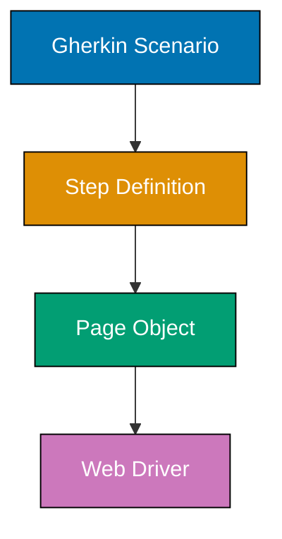
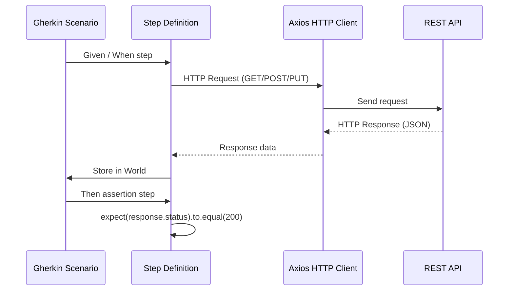
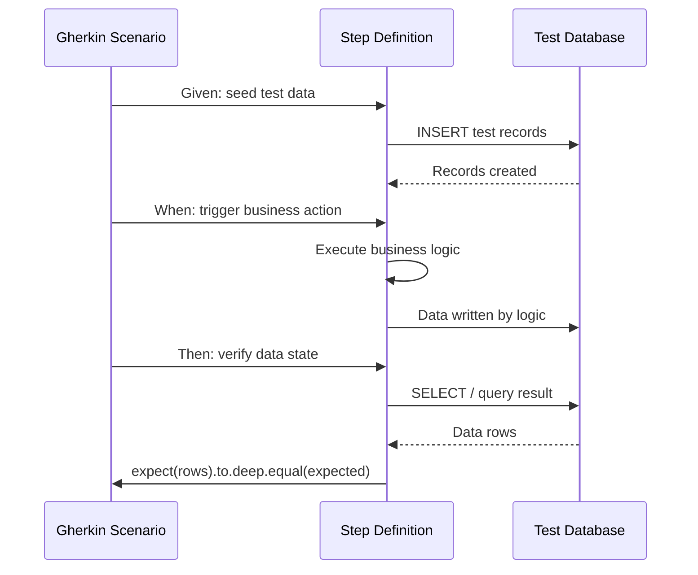
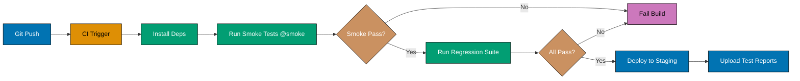
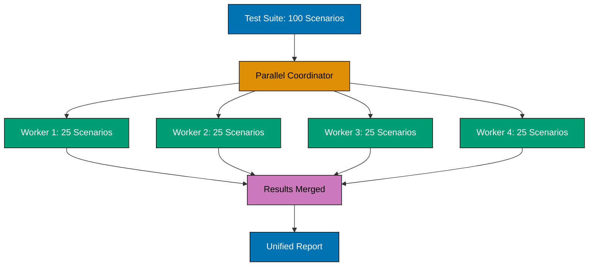
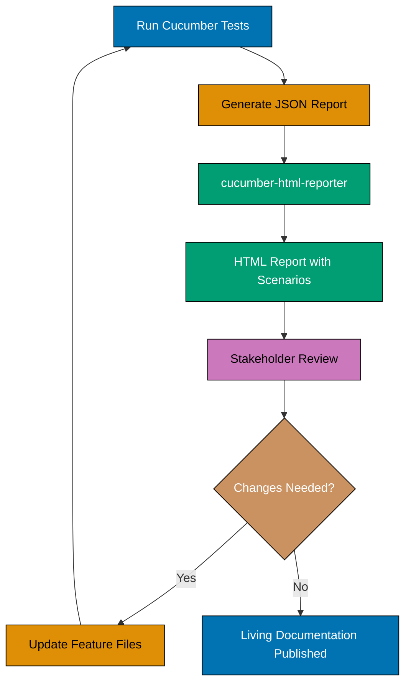
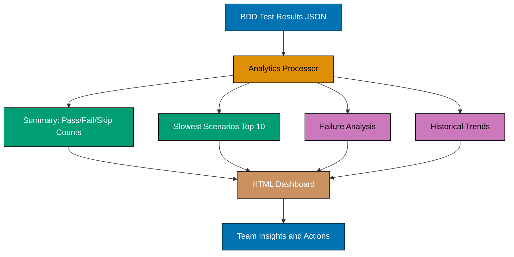
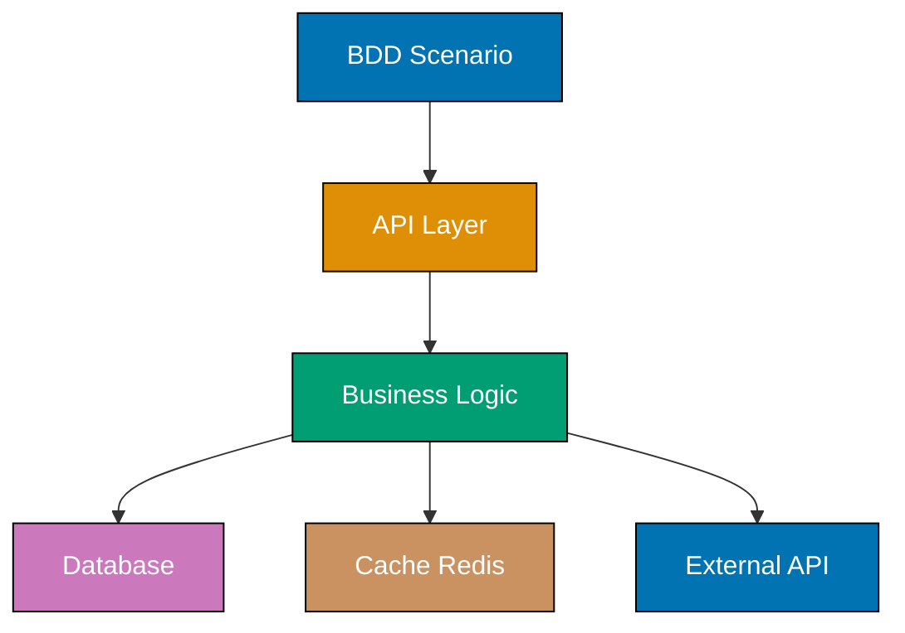
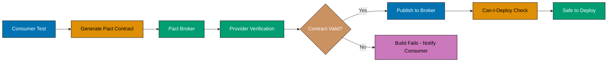

This intermediate section advances your BDD skills through 28 examples covering framework integration, API testing patterns, Page Object Model, database testing, and production deployment strategies. You'll learn cross-framework BDD patterns and production-ready testing techniques.

## Framework Integration

### Example 31: Page Object Model - Separating UI Logic from Tests

Page Object Model (POM) encapsulates page-specific UI logic in classes, separating locators and interactions from BDD scenarios for better maintainability.



**Page Object Class**:

```typescript
// File: pages/LoginPage.ts
// => File: pages/LoginPage.ts
// => State: context updated
export class LoginPage {
  // => Class: Encapsulates login page UI
  // => State: context updated
  private usernameInput = 'input[name="username"]';
  // => Locator: CSS selector for username field
  // => State: context updated
  private passwordInput = 'input[name="password"]';
  // => Locator: Password field selector
  // => State: context updated
  private submitButton = 'button[type="submit"]';
  // => Locator: Submit button selector
  // => State: context updated
  private errorMessage = ".error-message";
  // => Locator: Error display element

  constructor(private page: any) {
    // => Constructor: Receives Playwright/Selenium page object
    // => Dependency injection: Page driver from test framework
  }
  // => End: block

  async enterUsername(username: string): Promise<void> {
    // => Method: Encapsulates username entry
    await this.page.fill(this.usernameInput, username);
    // => Action: Fill username field
    // => Hides: Implementation detail of how to enter text
  }
  // => End: block

  async enterPassword(password: string): Promise<void> {
    // => Method: Encapsulates password entry
    await this.page.fill(this.passwordInput, password);
    // => Action: Fill password field
  }
  // => End: block

  async clickSubmit(): Promise<void> {
    // => Method: Encapsulates button click
    await this.page.click(this.submitButton);
    // => Action: Click submit button
    // => Waits: Playwright auto-waits for element
  }
  // => End: block

  async getErrorMessage(): Promise<string> {
    // => Method: Retrieves error text
    return await this.page.textContent(this.errorMessage);
    // => Return: Error message text
    // => Output: "Invalid credentials" or similar
  }
  // => End: block

  async login(username: string, password: string): Promise<void> {
    // => Method: Combines multiple actions
    await this.enterUsername(username);
    // => Step 1: Enter username
    await this.enterPassword(password);
    // => Step 2: Enter password
    await this.clickSubmit();
    // => Step 3: Submit form
    // => Convenience: Single method for common workflow
  }
  // => End: block
}
// => End: block
```

**Step Definition Using Page Object**:

```typescript
// File: step-definitions/login.steps.ts  // => File: step-definitions/login.steps.ts
import { Given, When, Then } from "@cucumber/cucumber";
// => Import: cucumber module
import { expect } from "chai";
// => Import: chai module
import { LoginPage } from "../pages/LoginPage";
// => Import: LoginPage module

When("I log in with username {string} and password {string}", async function (username: string, password: string) {
  // => When: Uses Page Object instead of direct driver calls
  const loginPage = new LoginPage(this.page);
  // => Create: Page Object instance with driver
  await loginPage.login(username, password);
  // => Action: High-level login method
  // => Benefits: No locators in step definition
  // => Maintainability: Locator changes only affect LoginPage
});
// => End: function/callback

Then("I should see login error {string}", async function (expectedError: string) {
  // => Then: Verify error using Page Object
  const loginPage = new LoginPage(this.page);
  // => Var: loginPage = new LoginPage(this.page);
  const actualError = await loginPage.getErrorMessage();
  // => Query: Get error via Page Object method
  expect(actualError).to.equal(expectedError);
  // => Assertion: Error matches expectation
});
// => End: function/callback
```

**Gherkin Scenario**:

```gherkin
Scenario: Login with invalid password
  # => Scenario: Single test case for Login with invalid password
  Given I am on the login page
    # => Given: Establishes precondition
  When I log in with username "alice@example.com" and password "wrongpass"
    # => When: Performs action
  Then I should see login error "Invalid credentials"
    # => Then: Asserts expected outcome
```

**Key Takeaway**: Page Object Model separates UI locators and interactions from step definitions, improving maintainability when UI changes - update locators in one Page Object class instead of scattered across many step definitions.

**Why It Matters**: Research indicates that When UI changes (e.g., CSS class rename), you modify one Page Object method instead of dozens of step definitions.

### Example 32: API Testing with REST Client

BDD scenarios can test REST APIs directly using HTTP clients, verifying API contracts without UI dependencies.

#### Diagram



**Step Definitions with Axios**:

```typescript
// File: step-definitions/api.steps.ts  // => File: step-definitions/api.steps.ts
import { Given, When, Then } from "@cucumber/cucumber";
// => Import: cucumber module
import { expect } from "chai";
// => Import: chai module
import axios, { AxiosResponse } from "axios";
// => Import: axios module

interface ApiWorld {
  // => Type: ApiWorld defines data structure
  baseUrl: string;
  // => Property: baseUrl value
  response?: AxiosResponse;
  // => Execute: Statement runs
  requestBody?: any;
  // => Execute: Statement runs
}
// => End: block
// => State: context updated

Given("the API is available at {string}", function (this: ApiWorld, baseUrl: string) {
  // => Given: Set base URL for API calls
  // => Effect: function side effects applied
  this.baseUrl = baseUrl;
  // => World: Store base URL
  // => Example: "http://localhost:3000/api"
});
// => End: function/callback
// => State: context updated

When("I send a GET request to {string}", async function (this: ApiWorld, endpoint: string) {
  // => When: HTTP GET request
  const url = `${this.baseUrl}${endpoint}`;
  // => URL: Combine base + endpoint
  // => Example: "http://localhost:3000/api/users"

  try {
    // => Try: attempt operation
    this.response = await axios.get(url);
    // => Request: Axios GET call
    // => Response: {status: 200, data: {...}, headers: {...}}
  } catch (error: any) {
    // => Execute: statement runs
    this.response = error.response;
    // => Error: Store error response for Then step
    // => Allows: Testing error scenarios (404, 500, etc.)
  }
  // => End: block
});
// => End: function/callback

When(
  // => Call: When()
  "I send a POST request to {string} with:",
  // => Execute: statement runs
  async function (this: ApiWorld, endpoint: string, dataTable: DataTable) {
    // => When: HTTP POST with body
    const url = `${this.baseUrl}${endpoint}`;
    // => Var: url = `${this.baseUrl}${endpoint}`;
    this.requestBody = dataTable.rowsHash();
    // => Body: Convert table to JSON object
    // => Example: {username: "alice", email: "alice@example.com"}

    try {
      // => Try: attempt operation
      this.response = await axios.post(url, this.requestBody);
      // => Request: POST with JSON body
      // => Response: {status: 201, data: {id: 1, ...}}
    } catch (error: any) {
      // => Execute: statement runs
      this.response = error.response;
      // => Error: Capture for error scenarios
    }
    // => End: block
  },
  // => End: Object property
);

Then("the response status should be {int}", function (this: ApiWorld, expectedStatus: number) {
  // => Then: Verify HTTP status code
  expect(this.response).to.exist;
  // => Assertion: Response received
  expect(this.response!.status).to.equal(expectedStatus);
  // => Assertion: Status matches
  // => Output: Test passes (e.g., 200, 201, 404)
});
// => End: function/callback

Then(
  // => Call: Then()
  "the response should have {string} equal to {string}",
  // => Execute: statement runs
  function (this: ApiWorld, fieldPath: string, expectedValue: string) {
    // => Then: Verify response field
    const actualValue = this.response!.data[fieldPath];
    // => Extract: Field from response body
    // => Example: response.data.username
    expect(actualValue).to.equal(expectedValue);
    // => Assertion: Field value matches
  },
  // => End: Object property
);

Then("the response should contain {int} items", function (this: ApiWorld, expectedCount: number) {
  // => Then: Verify array length
  expect(this.response!.data).to.be.an("array");
  // => Assertion: Response is array
  expect(this.response!.data).to.have.length(expectedCount);
  // => Assertion: Array size matches
  // => Output: Test passes (e.g., 5 users returned)
});
// => End: function/callback
```

**Gherkin Scenarios**:

```gherkin
Feature: User API
  # => Feature: Groups related scenarios for User API

  Scenario: Get all users
    # => Scenario: Single test case for Get all users
    Given the API is available at "http://localhost:3000/api"
      # => Given: Establishes precondition
    When I send a GET request to "/users"
      # => When: Performs action
    Then the response status should be 200
      # => Then: Asserts expected outcome
    And the response should contain 3 items
      # => And: Continues previous step type

  Scenario: Create new user
    # => Scenario: Single test case for Create new user
    Given the API is available at "http://localhost:3000/api"
      # => Given: Establishes precondition
    When I send a POST request to "/users" with:
      # => When: Performs action
      | username | alice            |
        # => Table: Column headers username | alice
      | email    | alice@example.com|
        # => Table: Column headers email | alice@example.com
    Then the response status should be 201
      # => Then: Asserts expected outcome
    And the response should have "username" equal to "alice"
      # => And: Continues previous step type

  Scenario: Get non-existent user
    # => Scenario: Single test case for Get non-existent user
    Given the API is available at "http://localhost:3000/api"
      # => Given: Establishes precondition
    When I send a GET request to "/users/999"
      # => When: Performs action
    Then the response status should be 404
      # => Then: Asserts expected outcome
```

**Key Takeaway**: BDD scenarios test REST APIs by sending HTTP requests and verifying responses, enabling API contract testing without UI dependencies or browser overhead.

**Why It Matters**: API-level BDD tests run significantly faster than UI tests and provide more precise failure diagnostics. Martin Fowler's Test Pyramid recommends 70% API tests vs 10% UI tests for optimal speed and reliability. API BDD scenarios verify business logic without UI flakiness.

### Example 33: Database Testing - Verifying Data State

BDD scenarios can verify database state directly to ensure data integrity and business rule enforcement at the persistence layer.

#### Diagram



**Step Definitions with Database Client**:

```typescript
// File: step-definitions/database.steps.ts  // => File: step-definitions/database.steps.ts
import { Given, When, Then } from "@cucumber/cucumber";
// => Import: cucumber module
import { expect } from "chai";
// => Import: chai module
import { Pool } from "pg"; // PostgreSQL client
// => Import: pg module

interface DbWorld {
  // => Type: DbWorld defines data structure
  dbPool: Pool;
  // => Property: dbPool value
  queryResult?: any[];
  // => Execute: Statement runs
}
// => End: block
// => State: modified in current scope

Given("the database is empty", async function (this: DbWorld) {
  // => Given: Clear database for clean state
  // => Closure: captures outer scope
  this.dbPool = new Pool({
    // => Set: this.dbPool on World object
    host: "localhost",
    // => Execute: Statement runs
    database: "test_db",
    // => Execute: Statement runs
    user: "test_user",
    // => Execute: Statement runs
    password: "test_pass",
    // => Execute: statement runs
    // => State: modified in current scope
  });
  // => Connection: Test database pool
  // => State: modified in current scope

  await this.dbPool.query("DELETE FROM users");
  // => Cleanup: Remove all users
  // => Async: resolves when operation completes
  await this.dbPool.query("DELETE FROM orders");
  // => Cleanup: Remove all orders
  // => Output: Empty tables for scenario
});
// => End: function/callback
// => State: modified in current scope

Given("the following users exist in the database:", async function (this: DbWorld, dataTable: DataTable) {
  // => Given: Seed database with test data
  // => Closure: captures outer scope
  const users = dataTable.hashes();
  // => Parse: Table to array of user objects
  // => State: modified in current scope

  for (const user of users) {
    // => Loop: Iterate collection
    await this.dbPool.query(
      // => Await: Async operation completes
      "INSERT INTO users (username, email, role) VALUES (substantial amounts substantial amounts substantial amounts)",
      // => Execute: Statement runs
      // => State: modified in current scope
      [user.username, user.email, user.role],
      // => Execute: statement runs
      // => State: modified in current scope
    );
    // => Insert: Add user to database
    // => Parameterized: Prevents SQL injection
  }
  // => Output: Users inserted (e.g., 3 rows)
  // => State: modified in current scope
});
// => End: function/callback
// => State: modified in current scope

When("a user {string} is created with email {string}", async function (this: DbWorld, username: string, email: string) {
  // => When: Trigger user creation
  await this.dbPool.query(
    // => Await: Async operation completes
    "INSERT INTO users (username, email, role) VALUES (substantial amounts substantial amounts substantial amounts)",
    // => Execute: Statement runs
    [username, email, "user"],
    // => Execute: statement runs
  );
  // => Insert: Create new user
  // => Default: Role set to 'user'
});
// => End: function/callback

Then("the database should contain {int} users", async function (this: DbWorld, expectedCount: number) {
  // => Then: Verify user count
  const result = await this.dbPool.query("SELECT COUNT(*) FROM users");
  // => Query: Count rows in users table
  const actualCount = parseInt(result.rows[0].count);
  // => Extract: Count from query result
  expect(actualCount).to.equal(expectedCount);
  // => Assertion: Count matches
  // => Output: Test passes (e.g., 4 users)
});
// => End: function/callback

Then(
  // => Call: Then()
  "user {string} should exist with email {string}",
  // => Execute: statement runs
  async function (this: DbWorld, username: string, expectedEmail: string) {
    // => Then: Verify specific user data
    const result = await this.dbPool.query("SELECT email FROM users WHERE username = substantial amounts", [username]);
    // => Query: Find user by username

    expect(result.rows).to.have.length(1);
    // => Assertion: User exists (1 row)
    expect(result.rows[0].email).to.equal(expectedEmail);
    // => Assertion: Email matches
    // => Output: Test passes (email correct)
  },
  // => End: Object property
);

Then("user {string} should have role {string}", async function (this: DbWorld, username: string, expectedRole: string) {
  // => Then: Verify user role
  const result = await this.dbPool.query("SELECT role FROM users WHERE username = substantial amounts", [username]);
  // => Query: Get user role

  expect(result.rows[0].role).to.equal(expectedRole);
  // => Assertion: Role matches
});
// => End: function/callback
```

**Gherkin Scenarios**:

```gherkin
@database
Feature: User Database Operations
  # => Feature: Groups related scenarios for User Database Operations

  Background:
    # => Background: Runs before each scenario in this feature
    Given the database is empty
      # => Given: Establishes precondition

  Scenario: Create user in database
    # => Scenario: Single test case for Create user in database
    When a user "alice" is created with email "alice@example.com"
      # => When: Performs action
    Then the database should contain 1 users
      # => Then: Asserts expected outcome
    And user "alice" should exist with email "alice@example.com"
      # => And: Continues previous step type

  Scenario: Seed multiple users
    # => Scenario: Single test case for Seed multiple users
    Given the following users exist in the database:
      # => Given: Establishes precondition
      | username | email              | role  |
        # => Table: Column headers username | email | role
      | alice    | alice@example.com  | admin |
        # => Table: Column headers alice | alice@example.com | admin
      | bob      | bob@example.com    | user  |
        # => Table: Column headers bob | bob@example.com | user
      | charlie  | charlie@example.com| user  |
        # => Table: Column headers charlie | charlie@example.com | user
    Then the database should contain 3 users
      # => Then: Asserts expected outcome
    And user "alice" should have role "admin"
      # => And: Continues previous step type
    And user "bob" should have role "user"
      # => And: Continues previous step type
```

**Key Takeaway**: Database-level BDD tests verify data integrity and business rule enforcement by directly querying and asserting on database state, complementing API and UI tests.

**Why It Matters**: Database tests catch data corruption, constraint violations, and migration issues that UI/API tests miss. Production systems use database BDD scenarios to verify data consistency across microservices, catching significantly more bugs than API-only tests by validating actual persisted state vs in-memory representations.

### Example 34: Cucumber-JVM (Java) - Cross-Platform BDD

BDD principles apply across languages. This example shows Cucumber-JVM with Java for teams in JVM ecosystems.

**Feature File (Language-Agnostic)**:

```gherkin
# File: src/test/resources/features/calculator.feature
Feature: Calculator Operations
  # => Feature: Groups related scenarios for Calculator Operations

  Scenario: Add two numbers
    # => Scenario: Single test case for Add two numbers
    Given I have a calculator
      # => Given: Establishes precondition
    When I add 15 and 27
      # => When: Performs action
    Then the result should be 42
      # => Then: Asserts expected outcome
```

**Step Definitions (Java)**:

```java
// File: src/test/java/steps/CalculatorSteps.java
// => File: src/test/java/steps/CalculatorSteps.java
// => State: context updated
package steps;
// => Execute: Statement runs

import io.cucumber.java.en.Given;
// => Import: module loaded
import io.cucumber.java.en.When;
// => Import: module loaded
import io.cucumber.java.en.Then;
// => Import: module loaded
import static org.junit.Assert.assertEquals;
// => Import: module loaded

public class CalculatorSteps {
    // => Class: Step definitions for calculator
// => State: context updated
    private Calculator calculator;
    // => State: Calculator instance
    // => State: context updated
    private int result;
    // => State: Calculation result
    // => State: context updated

    @Given("I have a calculator")
    // => Annotation: metadata marker
    // => Effect: function side effects applied
    public void i_have_a_calculator() {
        // => Given: Initialize calculator
    // => Effect: function side effects applied
        calculator = new Calculator();
        // => Instance: New calculator for scenario
    }
    // => End: block

    @When("I add {int} and {int}")
    // => Annotation: metadata marker
    public void i_add_and(int a, int b) {
        // => When: {int} extracts integers from step
        // => Example: "I add 15 and 27" → a=15, b=27
        result = calculator.add(a, b);
        // => Action: Call add method
        // => result: 42 (when a=15, b=27)
    }
    // => End: block

    @Then("the result should be {int}")
    // => Annotation: metadata marker
    public void the_result_should_be(int expected) {
        // => Then: Verify result
        assertEquals(expected, result);
        // => Assertion: JUnit assertEquals
        // => Output: Test passes (result == 42)
    }
    // => End: block
}
// => End: block
```

**Calculator Implementation**:

```java
// File: src/main/java/Calculator.java
// => File: src/main/java/Calculator.java
public class Calculator {
    // => Class: Calculator implementation

    public int add(int a, int b) {
        // => Method: Addition operation
        return a + b;
        // => Return: Sum of inputs
        // => Output: 42 (when a=15, b=27)
    }
    // => End: block
}
// => End: block
```

**JUnit Runner**:

```java
// File: src/test/java/RunCucumberTest.java  // => File: src/test/java/RunCucumberTest.java
import org.junit.runner.RunWith;
// => Import: module loaded
import io.cucumber.junit.Cucumber;
// => Import: module loaded
import io.cucumber.junit.CucumberOptions;
// => Import: module loaded

@RunWith(Cucumber.class)
// => Annotation: Use Cucumber JUnit runner
@CucumberOptions(
// => Annotation: metadata marker
    features = "src/test/resources/features",
    // => Config: Feature file location
    glue = "steps",
    // => Config: Step definition package
    plugin = {"pretty", "html:target/cucumber-reports"}
    // => Config: Report formats
)
public class RunCucumberTest {
    // => Runner: Executes Cucumber tests via JUnit
    // => Output: Runs all .feature files
}
// => End: block
```

**Key Takeaway**: Cucumber-JVM brings BDD to Java with same Gherkin syntax but Java step definitions using annotations (@Given, @When, @Then) and JUnit assertions.

**Why It Matters**: BDD isn't language-specific - Cucumber supports Java, Ruby, JavaScript, Python, C#, and more. Teams can use BDD across polyglot microservices while maintaining consistent Gherkin specifications. The feature file is the universal contract.

### Example 35: SpecFlow (C#) - BDD in .NET Ecosystem

SpecFlow brings BDD to C# and .NET, using NUnit or MSTest for assertions and Visual Studio integration.

**Feature File**:

```gherkin
# File: Features/UserRegistration.feature
Feature: User Registration
  # => Feature: Groups related scenarios for User Registration

  Scenario: Register new user with valid data
    # => Scenario: Single test case for Register new user with valid d
    Given the registration form is open
      # => Given: Establishes precondition
    When I register with username "alice" and email "alice@example.com"
      # => When: Performs action
    Then the user should be created successfully
      # => Then: Asserts expected outcome
    And I should see confirmation message "Registration successful"
      # => And: Continues previous step type
```

**Step Definitions (C# with SpecFlow)**:

```csharp
// File: StepDefinitions/UserRegistrationSteps.cs
// => File: StepDefinitions/UserRegistrationSteps.cs
// => State: context updated
using TechTalk.SpecFlow;
// => Execute: Statement runs
using NUnit.Framework;
// => Execute: Statement runs

[Binding]
// => Attribute: Marks class as step definition container
// => State: context updated
public class UserRegistrationSteps
// => Class: UserRegistrationSteps defines behavior
// => State: context updated
{
    // => Class: Step definitions for registration
// => State: context updated
    private RegistrationService _registrationService;
    // => Field: Service under test
    // => State: context updated
    private RegistrationResult _result;
    // => Field: Operation result
    // => State: context updated

    [Given(@"the registration form is open")]
    // => Execute: Statement runs
    public void GivenTheRegistrationFormIsOpen()
    // => Field: GivenTheRegistrationFormIsOpen property
    {
        // => Given: Initialize registration service
        _registrationService = new RegistrationService();
        // => Instance: New service for scenario
    }
    // => End: block

    [When(@"I register with username ""(.*)"" and email ""(.*)""")]
    // => Execute: Statement runs
    public void WhenIRegisterWithUsernameAndEmail(string username, string email)
    // => Field: WhenIRegisterWithUsernameAndEmail property
    {
        // => When: Regex captures parameters
        // => Regex: ""(.*)"" extracts quoted strings
        // => Example: username="alice", email="alice@example.com"
        _result = _registrationService.Register(username, email);
        // => Action: Call registration method
        // => _result: {Success: true, Message: "Registration successful"}
    }
    // => End: block

    [Then(@"the user should be created successfully")]
    // => Execute: Statement runs
    public void ThenTheUserShouldBeCreatedSuccessfully()
    // => Field: ThenTheUserShouldBeCreatedSuccessfully property
    {
        // => Then: Verify success
        Assert.IsTrue(_result.Success);
        // => Assertion: NUnit assertion
        // => Output: Test passes (_result.Success == true)
    }
    // => End: block

    [Then(@"I should see confirmation message ""(.*)""")]
    // => Execute: Statement runs
    public void ThenIShouldSeeConfirmationMessage(string expectedMessage)
    // => Field: ThenIShouldSeeConfirmationMessage property
    {
        // => Then: Verify message
        Assert.AreEqual(expectedMessage, _result.Message);
        // => Assertion: Message matches
        // => Output: Test passes (message == "Registration successful")
    }
    // => End: block
}
// => End: block
```

**Domain Model**:

```csharp
// File: Models/RegistrationService.cs  // => File: Models/RegistrationService.cs
public class RegistrationService
// => Class: RegistrationService defines behavior
{
    // => Class: Registration business logic

    public RegistrationResult Register(string username, string email)
    // => Field: Register property
    {
        // => Method: User registration
        // => Basic validation  // => Note: Basic validation
        if (string.IsNullOrEmpty(username) || string.IsNullOrEmpty(email))
        // => Check: evaluates condition
        {
            // => Validation: Check required fields
            return new RegistrationResult
            // => Return: Function result
            {
            // => Step: Executes
                Success = false,
                // => Assign: Value stored
                Message = "Username and email are required"
                // => Assign: Message updated
            };
            // => Error: Return failure result
        }
        // => End: block

        // => Success case  // => Note: Success case
        return new RegistrationResult
        // => Return: Function result
        {
        // => Step: Executes
            Success = true,
            // => Assign: Value stored
            Message = "Registration successful"
            // => Assign: Message updated
        };
        // => Success: Return success result
        // => Output: {Success: true, Message: "Registration successful"}
    }
    // => End: block
}
// => End: block

public class RegistrationResult
// => Class: RegistrationResult defines behavior
{
    // => Class: Result object
    public bool Success { get; set; }
    // => Property: Operation success flag
    public string Message { get; set; }
    // => Property: User-facing message
}
// => End: block
```

**Key Takeaway**: SpecFlow enables BDD in C#/.NET using same Gherkin syntax with C# step definitions, NUnit/MSTest assertions, and Visual Studio integration for .NET teams.

**Why It Matters**: SpecFlow brings BDD benefits to .NET ecosystem with enterprise tooling integration (Visual Studio, Azure DevOps, Rider). Enterprise development teams use SpecFlow for living documentation that executives can review while developers maintain automated tests behind the scenes.

### Example 36: Behave (Python) - Pythonic BDD

Behave brings BDD to Python with Gherkin feature files and Python step definitions using pytest or unittest assertions.

**Feature File**:

```gherkin
# File: features/string_operations.feature
Feature: String Operations
  # => Feature: Groups related scenarios for String Operations

  Scenario: Reverse a string
    # => Scenario: Single test case for Reverse a string
    Given I have the string "hello"
      # => Given: Establishes precondition
    When I reverse the string
      # => When: Performs action
    Then the result should be "olleh"
      # => Then: Asserts expected outcome
```

**Step Definitions (Python with Behave)**:

```python
# File: features/steps/string_steps.py
# => File: features/steps/string_steps.py
# => State: context updated
from behave import given, when, then
# => Import: Behave decorators for steps
# => State: context updated

@given('I have the string "{text}"')
# => Execute: statement runs
def step_given_string(context, text):
    # => Given: Store string in context
    # => context: Behave's World equivalent
    # => text: Captured from {string} parameter
    # => Example: text="hello"
    context.input_string = text
    # => Storage: Save for When step
    # => context.input_string: "hello"

@when('I reverse the string')
# => Execute: statement runs
def step_when_reverse(context):
    # => When: Reverse operation
    context.result = context.input_string[::-1]
    # => Action: Python slice reversal
    # => [::-1]: Reverse string
    # => context.result: "olleh"

@then('the result should be "{expected}"')
# => Execute: statement runs
def step_then_result(context, expected):
    # => Then: Verify result
    # => expected: Captured parameter "olleh"
    assert context.result == expected
    # => Assertion: Python assert statement
    # => Output: Test passes (result == "olleh")
```

**Advanced Example with Data Tables**:

```gherkin
Feature: User Management
  # => Feature: Groups related scenarios for User Management

  Scenario: Create multiple users
    # => Scenario: Single test case for Create multiple users
    Given the following users:
      # => Given: Establishes precondition
      | username | email              | age |
        # => Table: Column headers username | email | age
      | alice    | alice@example.com  | 25  |
        # => Table: Column headers alice | alice@example.com | 25
      | bob      | bob@example.com    | 30  |
        # => Table: Column headers bob | bob@example.com | 30
    When the users are saved
      # => When: Performs action
    Then the database should contain 2 users
      # => Then: Asserts expected outcome
```

**Step Definitions with Table Handling**:

```python
# File: features/steps/user_steps.py  # => File: features/steps/user_steps.py
from behave import given, when, then  # => Execute: Statement runs

@given('the following users')
# => Execute: statement runs
def step_given_users(context):
    # => Given: Receives table from context
    context.users = []
    # => Initialize: Empty user list

    for row in context.table:
        # => Iteration: context.table contains rows
        # => row: Dict with columns as keys
        # => Example: {'username': 'alice', 'email': 'alice@example.com', 'age': '25'}
        user = {  # => Execute: Statement runs
            'username': row['username'],  # => Execute: Statement runs
            'email': row['email'],
            # => Execute: statement runs
            'age': int(row['age'])
            # => Convert: Age string to integer
        }
        context.users.append(user)
        # => Storage: Add to user list
    # => context.users: [{'username': 'alice', ...}, {'username': 'bob', ...}]

@when('the users are saved')
# => Execute: statement runs
def step_when_save(context):
    # => When: Simulate save operation
    context.saved_count = len(context.users)
    # => Storage: Count for Then step
    # => context.saved_count: 2

@then('the database should contain {count:d} users')
# => Execute: statement runs
def step_then_count(context, count):
    # => Then: {count:d} captures integer
    # => count: Integer parameter (2)
    assert context.saved_count == count
    # => Assertion: Count matches
    # => Output: Test passes (saved_count == 2)
```

**Key Takeaway**: Behave brings BDD to Python with Gherkin features and Python step definitions using context object for state sharing and Python assertions for verification.

**Why It Matters**: Python teams gain BDD benefits without leaving the Python ecosystem. Data science teams use Behave to verify ML model behaviors, while Django teams test web applications. The lightweight syntax fits Python's philosophy while maintaining Gherkin's readability for stakeholders.

## Advanced Patterns

### Example 37: Parameterized Scenarios with Complex Data

Scenario Outline handles complex parameterization including multiple tables, nested data, and combinatorial testing.

**Multiple Examples Tables**:

```gherkin
Feature: Authentication Validation
  # => Feature: Groups related scenarios for Authentication Validation

  Scenario Outline: Login validation rules
    # => Scenario Outline: Template with Examples table
    Given a user with username "<username>" and password "<password>"
      # => Given: Establishes precondition
    When the user attempts to log in
      # => When: Performs action
    Then the login should "<outcome>"
      # => Then: Asserts expected outcome
    And the error message should be "<errorMessage>"
      # => And: Continues previous step type

    # Happy path cases
    Examples: Valid Credentials
      | username           | password   | outcome | errorMessage |
        # => Table: Column headers username | password | outcome
      | alice@example.com  | Secret123! | succeed |              |
        # => Row: alice@example.com, Secret123!, succeed
      | bob@example.com    | Pass456$   | succeed |              |
        # => Row: bob@example.com, Pass456$, succeed

    # Validation failures
    Examples: Invalid Format
      | username    | password   | outcome | errorMessage           |
        # => Table: Column headers username | password | outcome
      | invalid     | Secret123! | fail    | Invalid email format   |
        # => Table: Column headers invalid | Secret123! | fail
      | alice@      | Pass456$   | fail    | Invalid email format   |
        # => Row: alice@, Pass456$, fail
      | @example    | Secret123! | fail    | Invalid email format   |
        # => Row: @example, Secret123!, fail

    # Security failures
    Examples: Weak Passwords
      | username           | password | outcome | errorMessage               |
        # => Table: Column headers username | password | outcome
      | alice@example.com  | 123      | fail    | Password too short         |
        # => Row: alice@example.com, 123, fail
      | bob@example.com    | password | fail    | Password too weak          |
        # => Row: bob@example.com, password, fail
      | charlie@example.com| abc      | fail    | Password too short         |
        # => Row: charlie@example.com, abc, fail
```

**Step Definitions Handling Multiple Cases**:

```typescript
// File: step-definitions/auth-validation.steps.ts
// => File: step-definitions/auth-validation.steps.ts
// => State: context updated
import { Given, When, Then } from "@cucumber/cucumber";
// => Import: cucumber module
import { expect } from "chai";
// => Import: chai module

interface AuthResult {
  // => Type: AuthResult defines data structure
  success: boolean;
  // => Property: success value
  error?: string;
  // => Execute: Statement runs
}
// => End: block
// => State: context updated

let authResult: AuthResult;
// => Declare: authResult typed variable

Given("a user with username {string} and password {string}", function (username: string, password: string) {
  // => Given: Store credentials
  // => Effect: function side effects applied
  this.username = username;
  // => World: Store username
  // => State: context updated
  this.password = password;
  // => World: Store password
  // => State: context updated
});
// => End: function/callback
// => State: context updated

When("the user attempts to log in", function () {
  // => When: Validate and attempt login
  // => Effect: function side effects applied
  authResult = validateAndLogin(this.username, this.password);
  // => Function: Business logic validation
  // => authResult: {success: true} or {success: false, error: "..."}
});
// => End: function/callback

Then("the login should {string}", function (expectedOutcome: string) {
  // => Then: Verify success/fail outcome
  const shouldSucceed = expectedOutcome === "succeed";
  // => Parse: "succeed" → true, "fail" → false
  expect(authResult.success).to.equal(shouldSucceed);
  // => Assertion: Outcome matches
});
// => End: function/callback

Then("the error message should be {string}", function (expectedError: string) {
  // => Then: Verify error message (or absence)
  if (expectedError === "") {
    // => Case: Success (no error expected)
    expect(authResult.error).to.be.undefined;
    // => Assertion: No error present
  } else {
    // => Case: Failure (error expected)
    expect(authResult.error).to.equal(expectedError);
    // => Assertion: Error matches
  }
  // => End: block
});
// => End: function/callback

// => Validation logic
function validateAndLogin(username: string, password: string): AuthResult {
  // => Function: Authentication validation

  // => Email format validation
  const emailRegex = /^[^\s@]+@[^\s@]+\.[^\s@]+$/;
  // => Regex: Basic email validation
  if (!emailRegex.test(username)) {
    // => Check: evaluates condition
    return { success: false, error: "Invalid email format" };
    // => Error: Email validation failed
  }
  // => End: block

  // => Password length validation  // => Note: Password length validation
  if (password.length < 8) {
    // => Check: evaluates condition
    return { success: false, error: "Password too short" };
    // => Error: Minimum length not met
  }
  // => End: block

  // => Password strength validation  // => Note: Password strength validation
  const hasNumber = /\d/.test(password);
  // => Var: hasNumber = /\d/.test(password);
  const hasSpecial = /[!@#$%^&*]/.test(password);
  // => Regex: Check for digits and special chars
  if (!hasNumber || !hasSpecial) {
    // => Check: evaluates condition
    return { success: false, error: "Password too weak" };
    // => Error: Complexity requirements not met
  }
  // => End: block

  return { success: true };
  // => Success: All validations passed
}
// => End: block
```

**Key Takeaway**: Multiple Examples tables in Scenario Outline organize test cases by category (valid/invalid/edge cases) while sharing step definitions, improving readability and maintainability.

**Why It Matters**: Categorized Examples tables make large parameterized test suites scannable. Security teams at financial institutions use this pattern to separate happy paths from attack vectors, making threat model coverage visible to auditors while keeping 200+ test cases maintainable.

### Example 38: Custom Matchers for Domain-Specific Assertions

Custom matchers extend assertion libraries with domain-specific validation logic, making Then steps more expressive.

**Custom Chai Matchers**:

```typescript
// File: support/custom-matchers.ts  // => File: support/custom-matchers.ts
import { expect } from "chai";
// => Import: chai module

// => Extend Chai with custom matchers  // => Note: Extend Chai with custom matchers
declare global {
  // => Execute: Statement runs
  namespace Chai {
    // => Execute: Statement runs
    interface Assertion {
      // => Type: Assertion defines data structure
      validEmail(): Assertion;
      // => Call: validEmail()
      strongPassword(): Assertion;
      // => Call: strongPassword()
      withinDateRange(start: Date, end: Date): Assertion;
      // => Call: withinDateRange()
    }
    // => End: block
    // => State: context updated
  }
  // => End: block
  // => State: context updated
}
// => End: block
// => State: context updated

export function setupCustomMatchers() {
  // => Setup: Register custom matchers
  // => Effect: function side effects applied

  // => Email validation matcher
  expect.Assertion.addMethod("validEmail", function () {
    // => Matcher: Email validation
    // => Effect: function side effects applied
    const email = this._obj as string;
    // => Input: Value being asserted
    // => State: context updated
    const emailRegex = /^[^\s@]+@[^\s@]+\.[^\s@]+$/;
    // => Regex: Email pattern
    // => State: context updated

    this.assert(
      // => Call: this.assert()
      // => State: context updated
      emailRegex.test(email),
      // => Condition: Email matches pattern
      // => Effect: function side effects applied
      `expected #{this} to be a valid email`,
      // => Error: Assertion failed message
      // => State: context updated
      `expected #{this} to not be a valid email`,
      // => Error: Negated assertion failed
      // => State: context updated
    );
  });
  // => End: function/callback
  // => State: context updated

  // => Password strength matcher
  expect.Assertion.addMethod("strongPassword", function () {
    // => Matcher: Password validation
    // => Effect: function side effects applied
    const password = this._obj as string;
    // => Var: password = this._obj as string;
    const hasLength = password.length >= 8;
    // => Check: Minimum length
    const hasNumber = /\d/.test(password);
    // => Check: Contains digit
    const hasUpper = /[A-Z]/.test(password);
    // => Check: Contains uppercase
    const hasLower = /[a-z]/.test(password);
    // => Check: Contains lowercase
    const hasSpecial = /[!@#$%^&*]/.test(password);
    // => Check: Contains special char

    const isStrong = hasLength && hasNumber && hasUpper && hasLower && hasSpecial;
    // => Result: All criteria met

    this.assert(
      // => Call: this.assert()
      isStrong,
      // => Execute: Statement runs
      `expected #{this} to be a strong password (8+ chars, upper, lower, number, special)`,
      // => Execute: Statement runs
      `expected #{this} to not be a strong password`,
      // => Execute: Statement runs
    );
  });
  // => End: function/callback

  // => Date range matcher
  expect.Assertion.addMethod("withinDateRange", function (start: Date, end: Date) {
    // => Matcher: Date range validation
    const date = this._obj as Date;
    // => Var: date = this._obj as Date;
    const within = date >= start && date <= end;
    // => Check: Date within range

    this.assert(
      // => Call: this.assert()
      within,
      // => Execute: Statement runs
      `expected #{this} to be within ${start} and ${end}`,
      // => Execute: Statement runs
      `expected #{this} to not be within ${start} and ${end}`,
      // => Execute: Statement runs
    );
  });
  // => End: function/callback
}
// => End: block
```

**Using Custom Matchers in Steps**:

```typescript
// File: step-definitions/validation.steps.ts  // => File: step-definitions/validation.steps.ts
import { Then } from "@cucumber/cucumber";
// => Import: cucumber module
import { expect } from "chai";
// => Import: chai module
import { setupCustomMatchers } from "../support/custom-matchers";
// => Import: custom-matchers module

// => Setup once  // => Note: Setup once
setupCustomMatchers();
// => Call: setupCustomMatchers()

Then("the email {string} should be valid", function (email: string) {
  // => Then: Use custom matcher
  expect(email).to.be.validEmail();
  // => Assertion: Custom validEmail matcher
  // => Readable: Domain-specific assertion
  // => Output: Test passes (email format valid)
});
// => End: function/callback

Then("the password {string} should be strong", function (password: string) {
  // => Then: Custom password matcher
  expect(password).to.be.strongPassword();
  // => Assertion: Validates password complexity
  // => Output: Test passes (password meets criteria)
});
// => End: function/callback

Then("the registration date should be within last 30 days", function () {
  // => Then: Date range validation
  const now = new Date();
  // => Var: now = new Date();
  const thirtyDaysAgo = new Date(now.getTime() - 30 * 24 * 60 * 60 * 1000);
  // => Calculate: 30 days ago

  expect(this.user.registrationDate).to.be.withinDateRange(thirtyDaysAgo, now);
  // => Assertion: Custom date range matcher
  // => Output: Test passes (date within range)
});
// => End: function/callback
```

**Gherkin Usage**:

```gherkin
Scenario: Validate user registration data
  # => Scenario: Single test case for Validate user registration dat
  Given a user registered with email "alice@example.com" and password "Secure123!"
    # => Given: Establishes precondition
  Then the email "alice@example.com" should be valid
    # => Then: Asserts expected outcome
  And the password "Secure123!" should be strong
    # => And: Continues previous step type
  And the registration date should be within last 30 days
    # => And: Continues previous step type
```

**Key Takeaway**: Custom matchers encapsulate domain-specific validation logic in reusable assertions, making Then steps more readable and maintainable than inline validation code.

**Why It Matters**: Custom matchers reduce code duplication and improve test expressiveness. Instead of repeating email regex validation in 50 step definitions, one custom matcher centralizes the logic. When validation rules change, update one matcher instead of dozens of steps.

### Example 39: Test Doubles - Mocks and Stubs in BDD

BDD scenarios use test doubles (mocks, stubs) to isolate system under test from external dependencies like databases, APIs, or third-party services.

**Mocking External API Dependency**:

```typescript
// File: step-definitions/payment.steps.ts  // => File: step-definitions/payment.steps.ts
import { Given, When, Then } from "@cucumber/cucumber";
// => Import: cucumber module
import { expect } from "chai";
// => Import: chai module
import sinon from "sinon";
// => Import: sinon module
import { PaymentService } from "../services/PaymentService";
// => Import: PaymentService module
import { StripeClient } from "../external/StripeClient";
// => Import: StripeClient module

interface PaymentWorld {
  // => Type: PaymentWorld defines data structure
  paymentService: PaymentService;
  // => Property: paymentService value
  stripeStub: sinon.SinonStubbedInstance<StripeClient>;
  // => Property: stripeStub value
  paymentResult?: any;
  // => Execute: Statement runs
}
// => End: block
// => State: context updated

Given("the payment gateway is available", function (this: PaymentWorld) {
  // => Given: Setup mock payment gateway
  // => Effect: function side effects applied
  this.stripeStub = sinon.createStubInstance(StripeClient);
  // => Stub: Create fake Stripe client
  // => Benefits: No real Stripe API calls
  // => Fast: No network I/O

  this.paymentService = new PaymentService(this.stripeStub);
  // => Injection: Inject stub into service
  // => Service: Uses stub instead of real Stripe
});
// => End: function/callback
// => State: context updated

Given("the payment gateway returns success for valid cards", function (this: PaymentWorld) {
  // => Given: Configure stub behavior
  // => Effect: function side effects applied
  this.stripeStub.charge.resolves({
    // => Execute: Statement runs
    id: "ch_test_123",
    // => Execute: Statement runs
    status: "succeeded",
    // => Execute: Statement runs
    amount: 5000,
    // => Execute: statement runs
    // => State: context updated
  });
  // => Stub: Return success response
  // => resolves: Simulates successful async call
  // => Output: Controlled test data
});
// => End: function/callback
// => State: context updated

Given("the payment gateway returns error for declined cards", function (this: PaymentWorld) {
  // => Given: Configure error behavior
  // => Effect: function side effects applied
  this.stripeStub.charge.rejects(new Error("Card declined"));
  // => Stub: Simulate payment failure
  // => rejects: Simulates async error
});
// => End: function/callback

When(
  // => Call: When()
  "I process a payment of ${int} with card {string}",
  // => Execute: statement runs
  async function (this: PaymentWorld, amount: number, cardNumber: string) {
    // => When: Trigger payment
    try {
      // => Try: attempt operation
      this.paymentResult = await this.paymentService.processPayment(amount, cardNumber);
      // => Call: Service method (uses stub internally)
      // => Result: Success or error based on stub config
    } catch (error) {
      // => Execute: statement runs
      this.paymentResult = { error: (error as Error).message };
      // => Error: Capture for Then step
    }
    // => End: block
  },
  // => End: Object property
);

Then("the payment should succeed", function (this: PaymentWorld) {
  // => Then: Verify success
  expect(this.paymentResult.status).to.equal("succeeded");
  // => Assertion: Payment processed
  // => Output: Test passes (stub returned success)
});
// => End: function/callback

Then("the payment should fail with {string}", function (this: PaymentWorld, expectedError: string) {
  // => Then: Verify error
  expect(this.paymentResult.error).to.include(expectedError);
  // => Assertion: Error message matches
  // => Output: Test passes (stub returned error)
});
// => End: function/callback

Then(
  // => Call: Then()
  "the payment gateway should have been called with amount ${int}",
  // => Execute: statement runs
  function (this: PaymentWorld, expectedAmount: number) {
    // => Then: Verify mock interaction
    expect(this.stripeStub.charge.calledOnce).to.be.true;
    // => Spy: Verify method called once
    const callArgs = this.stripeStub.charge.getCall(0).args;
    // => Spy: Get call arguments
    expect(callArgs[0].amount).to.equal(expectedAmount);
    // => Assertion: Called with correct amount
    // => Output: Test passes (interaction verified)
  },
  // => End: Object property
);
```

**Gherkin Scenarios**:

```gherkin
Feature: Payment Processing
  # => Feature: Groups related scenarios for Payment Processing

  Scenario: Successful payment with valid card
    # => Scenario: Single test case for Successful payment with valid
    Given the payment gateway is available
      # => Given: Establishes precondition
    And the payment gateway returns success for valid cards
      # => And: Continues previous step type
    When I process a payment of substantial amounts with card "4111111111111111"
      # => When: Performs action
    Then the payment should succeed
      # => Then: Asserts expected outcome
    And the payment gateway should have been called with amount substantial amounts
      # => And: Continues previous step type

  Scenario: Failed payment with declined card
    # => Scenario: Single test case for Failed payment with declined c
    Given the payment gateway is available
      # => Given: Establishes precondition
    And the payment gateway returns error for declined cards
      # => And: Continues previous step type
    When I process a payment of substantial amounts with card "4000000000000002"
      # => When: Performs action
    Then the payment should fail with "Card declined"
      # => Then: Asserts expected outcome
```

**Key Takeaway**: Test doubles (stubs, mocks) isolate scenarios from external dependencies, enabling fast, reliable tests without network calls or third-party service dependencies.

**Why It Matters**: Mocks enable testing error scenarios (API timeouts, payment failures) that are hard to trigger with real services. Research indicates that

### Example 40: BDD in CI/CD Pipeline Configuration

BDD scenarios integrate into CI/CD pipelines for automated quality gates on every commit.

#### Diagram



**GitHub Actions Workflow**:

```yaml
# File: .github/workflows/bdd-tests.yml
name: BDD Tests
# => Config: name: BDD Tests

on:
# => Config: on:
  push:
  # => Config: push:
    branches: [main, develop]
    # => Trigger: Run on push to main/develop
  pull_request:
  # => Config: pull_request:
    branches: [main]
    # => Trigger: Run on pull requests to main

jobs:
# => Config: jobs:
  bdd-smoke:
    # => Job: Fast smoke tests
    runs-on: ubuntu-latest
    # => Runner: Latest Ubuntu

    steps:
    # => Config: steps:
      - uses: actions/checkout@v3
        # => Step: Clone repository

      - uses: actions/setup-node@v3
      # => Item: uses: actions/setup-node@v3
        with:
        # => Config: with:
          node-version: "18"
          # => Step: Install Node.js 18

      - name: Install dependencies
      # => Item: name: Install dependencies
        run: npm ci
        # => Step: Install packages (faster than npm install)

      - name: Run smoke tests
      # => Item: name: Run smoke tests
        run: npx cucumber-js --tags "@smoke" --format json:reports/smoke.json
        # => Step: Run @smoke scenarios only
        # => Output: JSON report
        # => Duration: ~2 minutes

      - name: Upload smoke results
      # => Item: name: Upload smoke results
        uses: actions/upload-artifact@v3
        # => Config: uses: actions/upload-artifact@v
        if: always()
        # => Step: Upload results even on failure
        with:
        # => Config: with:
          name: smoke-test-results
          # => Config: name: smoke-test-results
          path: reports/smoke.json
          # => Artifact: Test results for analysis

  bdd-regression:
    # => Job: Full regression suite
    runs-on: ubuntu-latest
    # => Config: runs-on: ubuntu-latest
    needs: bdd-smoke
    # => Dependency: Run only if smoke tests pass

    services:
    # => Services: Container definitions
      postgres:
        # => Service: Test database
        image: postgres:15
        # => Image: Docker image postgres:15
        env:
        # => Config: env:
          POSTGRES_PASSWORD: test_pass
          # => Config: POSTGRES_PASSWORD: test_pass
          POSTGRES_DB: test_db
          # => Config: POSTGRES_DB: test_db
        options: >-
        # => Config: options: >-
          --health-cmd pg_isready
          --health-interval 10s
          --health-timeout 5s
          --health-retries 5
        # => Health check: Wait for DB ready

    steps:
    # => Config: steps:
      - uses: actions/checkout@v3
      # => Item: uses: actions/checkout@v3

      - uses: actions/setup-node@v3
      # => Item: uses: actions/setup-node@v3
        with:
        # => Config: with:
          node-version: "18"
          # => Config: node-version: "18"

      - name: Install dependencies
      # => Item: name: Install dependencies
        run: npm ci
        # => Config: run: npm ci

      - name: Run database migrations
      # => Item: name: Run database migrations
        run: npm run db:migrate
        # => Step: Setup test database schema

      - name: Run regression tests
      # => Item: name: Run regression tests
        run: npx cucumber-js --tags "not @smoke and not @slow" --parallel 4
        # => Step: Run non-smoke, non-slow tests
        # => Parallel: 4 workers for speed
        # => Duration: ~10 minutes

      - name: Generate HTML report
      # => Item: name: Generate HTML report
        if: always()
        # => Config: if: always()
        run: npx cucumber-html-reporter --input reports/*.json --output reports/index.html
        # => Step: Generate human-readable report

      - name: Upload regression results
      # => Item: name: Upload regression result
        uses: actions/upload-artifact@v3
        # => Config: uses: actions/upload-artifact@v
        if: always()
        # => Config: if: always()
        with:
        # => Config: with:
          name: regression-test-results
          # => Config: name: regression-test-results
          path: reports/
          # => Artifact: All test reports

  bdd-e2e:
    # => Job: End-to-end tests
    runs-on: ubuntu-latest
    # => Config: runs-on: ubuntu-latest
    needs: bdd-regression
    # => Dependency: Run only if regression passes
    if: github.ref == 'refs/heads/main'
    # => Condition: Only on main branch

    steps:
    # => Config: steps:
      - uses: actions/checkout@v3
      # => Item: uses: actions/checkout@v3

      - uses: actions/setup-node@v3
      # => Item: uses: actions/setup-node@v3
        with:
        # => Config: with:
          node-version: "18"
          # => Config: node-version: "18"

      - name: Install dependencies
      # => Item: name: Install dependencies
        run: npm ci
        # => Config: run: npm ci

      - name: Run E2E tests
      # => Item: name: Run E2E tests
        run: npx cucumber-js --tags "@e2e" --retry 2
        # => Step: Run end-to-end scenarios
        # => Retry: Handle flaky browser tests
        # => Duration: ~30 minutes

      - name: Upload E2E results
      # => Item: name: Upload E2E results
        uses: actions/upload-artifact@v3
        # => Config: uses: actions/upload-artifact@v
        if: always()
        # => Config: if: always()
        with:
        # => Config: with:
          name: e2e-test-results
          # => Config: name: e2e-test-results
          path: reports/
          # => Config: path: reports/
```

**Cucumber Configuration for CI**:

```javascript
// File: cucumber.js  // => File: cucumber.js
const common = {
  // => Var: common = {
  // => State: context updated
  requireModule: ["ts-node/register"],
  // => Config: TypeScript support
  // => State: context updated
  require: ["step-definitions/**/*.ts"],
  // => Config: Step definition paths
  // => State: context updated
  format: [
    // => Execute: statement runs
    "progress-bar",
    // => Format: Progress bar for CI logs
    "json:reports/cucumber-report.json",
    // => Format: JSON for programmatic analysis
    "html:reports/cucumber-report.html",
    // => Format: HTML for human review
  ],
  // => Execute: statement runs
  formatOptions: {
    // => Execute: statement runs
    snippetInterface: "async-await",
    // => Config: Generate async step snippets
  },
  // => End: Object property
};
// => Execute: Statement runs

module.exports = {
  // => Execute: Statement runs
  default: common,
  // => Property: default value

  ci: {
    // => Execute: statement runs
    ...common,
    // => Config: CI-specific settings
    parallel: 4,
    // => Parallel: 4 workers
    retry: 1,
    // => Retry: Retry failed scenarios once
    failFast: true,
    // => Fail fast: Stop on first failure
    strict: true,
    // => Strict: Treat warnings as errors
  },
  // => End: Object property

  smoke: {
    // => Execute: statement runs
    ...common,
    // => Config: Smoke test profile
    tags: "@smoke",
    // => Filter: Only smoke scenarios
    parallel: 2,
    // => Parallel: Fewer workers for speed
  },
  // => End: Object property
};
// => Execute: Statement runs
```

**Key Takeaway**: BDD scenarios integrate into CI/CD pipelines with tiered test execution (smoke → regression → E2E) providing fast feedback on critical paths while comprehensive coverage runs on slower cadence.

**Why It Matters**: Tiered testing balances speed and coverage. Smoke tests (2 min) fail fast on broken builds, regression tests (10 min) catch most bugs, E2E tests (30 min) validate critical flows. This staged approach enables 15+ daily deployments while maintaining quality gates.

### Example 41: Parallel Test Execution for Speed

Parallel execution runs scenarios concurrently across multiple workers, dramatically reducing total test execution time.

#### Diagram



**Cucumber Parallel Configuration**:

```javascript
// File: cucumber.parallel.js  // => File: cucumber.parallel.js
module.exports = {
  // => Execute: Statement runs
  default: {
    // => Execute: statement runs
    // => State: context updated
    parallel: 4,
    // => Workers: Run 4 scenarios simultaneously
    // => Speed: ~significantly faster for CPU-bound tests
    // => Optimal: Number of CPU cores

    publishQuiet: true,
    // => Config: Reduce log noise in parallel mode
    // => State: context updated

    retry: 1,
    // => Retry: Handle transient failures
    // => State: context updated

    retryTagFilter: "@flaky",
    // => Filter: Only retry @flaky scenarios
    // => State: context updated
  },
  // => End: Object property
  // => State: context updated
};
// => Execute: Statement runs
```

**Worker Isolation Strategy**:

```typescript
// File: support/hooks.ts  // => File: support/hooks.ts
import { Before, After } from "@cucumber/cucumber";
// => Import: cucumber module
import { Pool } from "pg";
// => Import: pg module

Before(async function () {
  // => Before: Each worker gets isolated DB
  // => Effect: function side effects applied
  const workerId = process.env.CUCUMBER_WORKER_ID || "0";
  // => Worker ID: Cucumber assigns unique ID per worker
  // => Range: '0', '1', '2', '3' for 4 workers

  this.dbPool = new Pool({
    // => Set: this.dbPool on World object
    host: "localhost",
    // => Execute: statement runs
    // => State: context updated
    database: `test_db_${workerId}`,
    // => Database: Separate DB per worker
    // => Isolation: Workers don't interfere
    // => Example: test_db_0, test_db_1, test_db_2, test_db_3
    user: "test_user",
    // => Execute: Statement runs
    password: "test_pass",
    // => Execute: Statement runs
  });
  // => End: function/callback
  // => State: context updated

  // => Clean database for scenario  // => Note: Clean database for scenario
  await this.dbPool.query("DELETE FROM users");
  // => Await: async operation resolves
  // => Async: operation resolves to result
  await this.dbPool.query("DELETE FROM orders");
  // => Cleanup: Fresh state per scenario
  // => Async: operation resolves to result
});
// => End: function/callback
// => State: context updated

After(async function () {
  // => After: Close DB connection
  // => Effect: function side effects applied
  await this.dbPool.end();
  // => Cleanup: Release resources
  // => Async: operation resolves to result
});
// => End: function/callback
// => State: context updated
```

**Port Allocation for Parallel Services**:

```typescript
// File: support/server-manager.ts  // => File: support/server-manager.ts
import express from "express";
// => Import: express module

export async function startTestServer(): Promise<number> {
  // => Function: Start server on unique port
  // => Effect: function side effects applied
  const workerId = parseInt(process.env.CUCUMBER_WORKER_ID || "0");
  // => Declare: workerId variable
  // => Effect: function side effects applied
  const basePort = 3000;
  // => Var: basePort = 3000;
  // => State: context updated
  const port = basePort + workerId;
  // => Port: 3000 + worker ID
  // => Range: 3000, 3001, 3002, 3003 for 4 workers
  // => Isolation: No port conflicts

  const app = express();
  // => Declare: app variable
  app.use(express.json());
  // => Call: app.use()

  app.get("/health", (req, res) => {
    // => Call: app.get()
    // => Effect: function side effects applied
    res.json({ status: "ok", worker: workerId });
    // => Endpoint: Health check with worker ID
    // => Effect: function side effects applied
  });
  // => End: function/callback

  await new Promise<void>((resolve) => {
    // => Await: Async operation completes
    app.listen(port, () => {
      // => Call: app.listen()
      console.log(`Worker ${workerId} server on port ${port}`);
      // => Log: Server started
      resolve();
      // => Call: resolve()
    });
    // => End: function/callback
  });
  // => End: function/callback

  return port;
  // => Return: Port number for step definitions
}
// => End: block
```

**Using Worker-Specific Resources**:

```typescript
// File: step-definitions/api-parallel.steps.ts  // => File: step-definitions/api-parallel.steps.ts
import { Before, Given, When } from "@cucumber/cucumber";
// => Import: cucumber module
import { startTestServer } from "../support/server-manager";
// => Import: server-manager module

Before(async function () {
  // => Before: Start worker-specific server
  this.serverPort = await startTestServer();
  // => Port: Unique port for this worker
  // => this.serverPort: 3000, 3001, 3002, or 3003
});
// => End: function/callback

Given("the API server is running", async function () {
  // => Given: Verify server health
  const response = await fetch(`http://localhost:${this.serverPort}/health`);
  // => Request: Use worker-specific port
  const data = await response.json();
  // => Response: {status: "ok", worker: 0}
  expect(data.status).to.equal("ok");
  // => Assertion: Server ready
});
// => End: function/callback

When("I send a GET request to {string}", async function (endpoint: string) {
  // => When: API call to worker-specific port
  const url = `http://localhost:${this.serverPort}${endpoint}`;
  // => URL: Worker-isolated endpoint
  this.response = await fetch(url);
  // => Request: No interference from other workers
});
// => End: function/callback
```

**Parallel Execution Report**:

```bash
# Sequential execution (no parallelization)
$ npx cucumber-js
# => Command: $ npx cucumber-js
# 100 scenarios (100 passed)
# Duration: 200 seconds (3m 20s)

# Parallel execution (4 workers)
$ npx cucumber-js --parallel 4
# => Command: $ npx cucumber-js --parallel 4
# 100 scenarios (100 passed)
# Duration: 55 seconds (~significantly faster)
# Worker 0: 25 scenarios
# Worker 1: 25 scenarios
# Worker 2: 25 scenarios
# Worker 3: 25 scenarios
```

**Key Takeaway**: Parallel test execution requires worker isolation (separate databases, ports, file paths) but delivers 3-4x speed improvements for I/O-bound test suites.

**Why It Matters**: Parallel execution transforms 30-minute test suites into 8-minute suites, enabling developers to run full regression locally instead of waiting for CI. However, parallel tests require investment in worker isolation infrastructure and debugging parallel failures is harder than sequential failures.

### Example 42: Test Data Management with Fixtures

Test fixtures provide consistent, reusable test data across scenarios while avoiding data pollution and setup duplication.

**Fixture Definition**:

```typescript
// File: fixtures/user-fixtures.ts  // => File: fixtures/user-fixtures.ts
export interface UserFixture {
  // => Execute: Statement runs
  username: string;
  // => Property: username value
  email: string;
  // => Property: email value
  password: string;
  // => Property: password value
  role: "admin" | "user" | "guest";
  // => Execute: Statement runs
}
// => End: block
// => State: context updated

export const UserFixtures: Record<string, UserFixture> = {
  // => Fixtures: Predefined test users
  // => State: context updated

  admin: {
    // => Fixture: Admin user
    // => State: context updated
    username: "admin-user",
    // => Execute: Statement runs
    email: "admin@example.com",
    // => Execute: Statement runs
    password: "Admin123!",
    // => Execute: statement runs
    // => State: context updated
    role: "admin",
    // => Use case: Testing admin-only features
    // => State: context updated
  },
  // => End: Object property
  // => State: context updated

  regularUser: {
    // => Fixture: Standard user
    // => State: context updated
    username: "john-doe",
    // => Execute: Statement runs
    email: "john@example.com",
    // => Execute: Statement runs
    password: "User456$",
    // => Execute: statement runs
    // => State: context updated
    role: "user",
    // => Use case: Testing user features
    // => State: context updated
  },
  // => End: Object property
  // => State: context updated

  guest: {
    // => Fixture: Guest user
    // => State: context updated
    username: "guest-user",
    // => Execute: Statement runs
    email: "guest@example.com",
    // => Execute: Statement runs
    password: "Guest789#",
    // => Execute: statement runs
    // => State: context updated
    role: "guest",
    // => Use case: Testing limited access
    // => State: context updated
  },
  // => End: Object property
  // => State: context updated

  invalidEmail: {
    // => Fixture: Invalid data for error testing
    // => State: context updated
    username: "invalid-user",
    // => Execute: Statement runs
    email: "not-an-email",
    // => Execute: Statement runs
    password: "Test123!",
    // => Execute: statement runs
    // => State: context updated
    role: "user",
    // => Use case: Testing validation errors
    // => State: context updated
  },
  // => End: Object property
  // => State: context updated
};
// => Execute: Statement runs

export interface OrderFixture {
  // => Execute: Statement runs
  orderId: string;
  // => Property: orderId value
  customerId: string;
  // => Property: customerId value
  items: Array<{ product: string; quantity: number; price: number }>;
  // => Property: items value
  total: number;
  // => Property: total value
  status: "pending" | "shipped" | "delivered";
  // => Execute: Statement runs
}
// => End: block
// => State: context updated

export const OrderFixtures: Record<string, OrderFixture> = {
  // => Fixtures: Sample orders
  // => State: context updated

  smallOrder: {
    // => Execute: Statement runs
    orderId: "ORD-001",
    // => Execute: Statement runs
    customerId: "CUST-123",
    // => Execute: Statement runs
    items: [{ product: "Widget", quantity: 2, price: 10.0 }],
    // => Execute: Statement runs
    total: 20.0,
    // => Execute: statement runs
    // => State: context updated
    status: "pending",
    // => Use case: Testing basic order processing
    // => State: context updated
  },
  // => End: Object property
  // => State: context updated

  largeOrder: {
    // => Execute: Statement runs
    orderId: "ORD-002",
    // => Execute: Statement runs
    customerId: "CUST-456",
    // => Execute: Statement runs
    items: [
      // => Execute: Statement runs
      { product: "Widget", quantity: 100, price: 10.0 },
      // => Execute: Statement runs
      { product: "Gadget", quantity: 50, price: 25.0 },
      // => Execute: Statement runs
    ],
    // => Execute: statement runs
    // => State: context updated
    total: 2250.0,
    // => Execute: statement runs
    // => State: context updated
    status: "pending",
    // => Use case: Testing bulk order handling
    // => State: context updated
  },
  // => End: Object property
  // => State: context updated
};
// => Execute: Statement runs
```

**Fixture Loading in Step Definitions**:

```typescript
// File: step-definitions/fixture-steps.ts  // => File: step-definitions/fixture-steps.ts
import { Given, When, Then } from "@cucumber/cucumber";
// => Import: cucumber module
import { expect } from "chai";
// => Import: chai module
import { UserFixtures, OrderFixtures } from "../fixtures/user-fixtures";
// => Import: user-fixtures module
// => State: context updated

Given("a {string} user exists", async function (fixtureName: string) {
  // => Given: Load user fixture by name
  // => Effect: function side effects applied
  const fixture = UserFixtures[fixtureName];
  // => Lookup: Get predefined user data
  // => Example: fixtureName="admin" → UserFixtures.admin

  if (!fixture) {
    // => Check: evaluates condition
    // => Effect: function side effects applied
    throw new Error(`Unknown user fixture: ${fixtureName}`);
    // => Error: Invalid fixture name
    // => Effect: function side effects applied
  }
  // => End: block
  // => State: context updated

  this.user = await createUser(fixture);
  // => Create: Insert user in database
  // => this.user: Created user object with ID
  // => Consistent: Same data every time
});
// => End: function/callback
// => State: context updated

Given("an {string} order exists", async function (fixtureName: string) {
  // => Given: Load order fixture
  // => Effect: function side effects applied
  const fixture = OrderFixtures[fixtureName];
  // => Lookup: Get predefined order data
  // => State: context updated

  if (!fixture) {
    // => Check: Conditional branch
    throw new Error(`Unknown order fixture: ${fixtureName}`);
    // => Throw: Error on invalid state
  }
  // => End: block
  // => State: context updated

  this.order = await createOrder(fixture);
  // => Create: Insert order in database
  // => Fixtures: Provide complex nested data easily
});
// => End: function/callback
// => State: context updated

// => Database helpers
async function createUser(fixture: UserFixture): Promise<any> {
  // => Function: Create user from fixture
  // => Simulated database insert  // => Note: Simulated database insert
  return {
    // => Return: Function result
    id: Math.random().toString(36),
    // => Property: id value
    ...fixture,
    // => Execute: Statement runs
    createdAt: new Date(),
    // => Execute: statement runs
    // => Effect: function side effects applied
  };
  // => Return: User with generated ID
  // => State: context updated
}
// => End: block
// => State: context updated

async function createOrder(fixture: OrderFixture): Promise<any> {
  // => Function: Create order from fixture
  // => Effect: function side effects applied
  return {
    // => Return: Function result
    ...fixture,
    // => Execute: Statement runs
    createdAt: new Date(),
    // => Property: createdAt value
  };
  // => Execute: Statement runs
}
// => End: block
// => State: context updated
```

**Gherkin Usage with Fixtures**:

```gherkin
Feature: Order Management
  # => Feature: Groups related scenarios for Order Management

  Scenario: Admin can view all orders
    # => Scenario: Single test case for Admin can view all orders
    Given an "admin" user exists
      # => Given: Establishes precondition
    And a "smallOrder" order exists
      # => And: Continues previous step type
    And a "largeOrder" order exists
      # => And: Continues previous step type
    When the admin views the order list
      # => When: Performs action
    Then the list should contain 2 orders
      # => Then: Asserts expected outcome

  Scenario: Regular user sees only own orders
    # => Scenario: Single test case for Regular user sees only own ord
    Given a "regularUser" user exists
      # => Given: Establishes precondition
    And a "smallOrder" order exists for the user
      # => And: Continues previous step type
    When the user views the order list
      # => When: Performs action
    Then the list should contain 1 orders
      # => Then: Asserts expected outcome

  Scenario: Cannot create order with invalid user
    # => Scenario: Single test case for Cannot create order with inval
    Given a "guest" user exists
      # => Given: Establishes precondition
    When the guest attempts to create an order
      # => When: Performs action
    Then the order creation should fail
      # => Then: Asserts expected outcome
```

**Fixture Factory Pattern**:

```typescript
// File: fixtures/fixture-factory.ts
// => File: fixtures/fixture-factory.ts
// => State: context updated
export class FixtureFactory {
  // => Class: Dynamic fixture generation
  // => State: context updated

  static createUser(overrides: Partial<UserFixture> = {}): UserFixture {
    // => Method: Generate user with defaults + overrides
    // => Effect: function side effects applied
    return {
      // => Return: provides result to caller
      // => Caller: receives returned value
      username: `user-${Date.now()}`,
      // => Default: Unique username
      // => Effect: function side effects applied
      email: `user-${Date.now()}@example.com`,
      // => Default: Unique email
      // => Effect: function side effects applied
      password: "Default123!",
      // => Default: Valid password
      role: "user",
      // => Default: Standard user role
      ...overrides,
      // => Override: Merge custom values
      // => Example: createUser({role: 'admin'}) → admin user with generated username/email
    };
    // => Execute: Statement runs
  }
  // => End: block

  static createOrder(overrides: Partial<OrderFixture> = {}): OrderFixture {
    // => Method: Generate order with defaults
    return {
      // => Return: Function result
      orderId: `ORD-${Date.now()}`,
      // => Execute: Statement runs
      customerId: "CUST-DEFAULT",
      // => Execute: Statement runs
      items: [],
      // => Execute: Statement runs
      total: 0,
      // => Property: total value
      status: "pending",
      // => Execute: Statement runs
      ...overrides,
      // => Execute: Statement runs
    };
    // => Execute: Statement runs
  }
  // => End: block
}
// => End: block

// => Usage in step definitions
Given("a random user exists", async function () {
  // => Given: Generate unique user
  const fixture = FixtureFactory.createUser();
  // => Factory: New user with unique data
  this.user = await createUser(fixture);
  // => Benefit: No hardcoded test data conflicts
});
// => End: function/callback

Given("an admin user named {string} exists", async function (username: string) {
  // => Given: Generate admin with specific username
  const fixture = FixtureFactory.createUser({
    // => Declare: fixture variable
    username,
    // => Execute: Statement runs
    role: "admin",
    // => Execute: statement runs
  });
  // => Factory: Override specific fields
  this.user = await createUser(fixture);
  // => Set: this.user on World object
});
// => End: function/callback
```

**Key Takeaway**: Test fixtures provide reusable, consistent test data while fixture factories enable dynamic generation with overrides, balancing consistency with flexibility.

**Why It Matters**: Fixtures eliminate "magic numbers" and hardcoded test data scattered across step definitions. When test data requirements change (e.g., password policy tightens), update one fixture definition instead of hundreds of step definitions. Centralized fixtures significantly reduce test maintenance time.

## Production Techniques

### Example 43: Flaky Test Prevention Strategies

Flaky tests pass/fail non-deterministically. BDD scenarios use explicit waits, retries, and isolation to prevent flakiness.

**Anti-Pattern: Implicit Waits and Race Conditions**:

```typescript
// => WRONG: Flaky test with race condition
When("I click the submit button", async function () {
  // => When: Click button immediately
  // => Effect: function side effects applied
  await this.page.click('button[type="submit"]');
  // => Problem: Button might not be enabled yet
  // => Flaky: Passes when app is fast, fails when slow
});
// => End: function/callback
// => State: context updated

Then("I should see success message", async function () {
  // => Then: Check for message immediately
  // => Effect: function side effects applied
  const message = await this.page.textContent(".success-message");
  // => Problem: Message might not have appeared yet
  // => Flaky: Race between assertion and DOM update
  expect(message).to.equal("Success");
  // => Assert: Verify expected condition
});
// => End: function/callback
// => State: context updated
```

**Pattern 1: Explicit Waits for Element States**:

```typescript
// File: step-definitions/anti-flaky.steps.ts  // => File: step-definitions/anti-flaky.steps.ts
import { When, Then } from "@cucumber/cucumber";
// => Import: cucumber module
import { expect } from "chai";
// => Import: chai module

When("I click the submit button", async function () {
  // => When: Wait for button to be clickable
  // => Effect: function side effects applied
  const submitButton = this.page.locator('button[type="submit"]');
  // => Locator: Playwright locator (lazy, doesn't query immediately)

  await submitButton.waitFor({ state: "visible" });
  // => Wait: Button is visible
  await submitButton.waitFor({ state: "enabled" });
  // => Wait: Button is enabled (not disabled)
  // => Explicit: Wait for ready state before click

  await submitButton.click();
  // => Click: Now guaranteed to be clickable
  // => Reliable: No race condition
});
// => End: function/callback

Then("I should see success message", async function () {
  // => Then: Wait for message to appear
  const successMessage = this.page.locator(".success-message");
  // => Declare: successMessage variable

  await successMessage.waitFor({ state: "visible", timeout: 5000 });
  // => Wait: Up to 5 seconds for message
  // => Timeout: Fail fast if never appears

  const text = await successMessage.textContent();
  // => Extract: Get message text after appearing
  expect(text).to.equal("Success");
  // => Assertion: Now reliable
});
// => End: function/callback
```

**Pattern 2: Retry Logic for Transient Failures**:

```typescript
// File: support/retry-helpers.ts
// => File: support/retry-helpers.ts
export async function retryAsync<T>(fn: () => Promise<T>, maxAttempts: number = 3, delayMs: number = 1000): Promise<T> {
  // => Function: Retry async operation
  // => maxAttempts: Number of tries
  // => delayMs: Delay between attempts

  for (let attempt = 1; attempt <= maxAttempts; attempt++) {
    // => Loop: Iterate collection
    try {
      // => Try: attempt operation
      return await fn();
      // => Success: Return result
    } catch (error) {
      // => Execute: Statement runs
      if (attempt === maxAttempts) {
        // => Check: evaluates condition
        throw error;
        // => Final attempt: Throw error
      }
      // => End: block

      console.log(`Attempt ${attempt} failed, retrying in ${delayMs}ms...`);
      // => Log: Retry notification
      await new Promise((resolve) => setTimeout(resolve, delayMs));
      // => Delay: Wait before retry
    }
    // => End: block
  }
  // => End: block

  throw new Error("Should not reach here");
  // => Throw: Error on invalid state
}
// => End: block
```

**Using Retry Helper**:

```typescript
When("I fetch user data from API", async function () {
  // => When: API call with retry
  this.userData = await retryAsync(
    // => Set: this.userData on World object
    async () => {
      // => Call: async()
      const response = await fetch("http://localhost:3000/api/user");
      // => Request: May fail due to network blip
      if (!response.ok) {
        // => Check: evaluates condition
        throw new Error(`HTTP ${response.status}`);
        // => Error: Trigger retry
      }
      // => End: block
      return await response.json();
      // => Success: Return data
    },
    // => End: Object property
    3,
    // => Retry: Up to 3 attempts
    500,
    // => Delay: 500ms between attempts
  );
  // => Resilient: Handles transient network issues
});
// => End: function/callback
```

**Pattern 3: Test Isolation with Cleanup**:

```typescript
// File: support/hooks.ts  // => File: support/hooks.ts
import { Before, After } from "@cucumber/cucumber";
// => Import: cucumber module

Before(async function () {
  // => Before: Clean state for scenario
  await this.dbPool.query("DELETE FROM users");
  // => Await: async operation resolves
  await this.dbPool.query("DELETE FROM orders");
  // => Cleanup: Remove all data
  // => Isolation: Scenarios don't affect each other

  // => Reset in-memory caches
  globalCache.clear();
  // => Cache: Clear shared state

  // => Reset file system
  await fs.rm("test-uploads/", { recursive: true, force: true });
  // => Files: Remove uploaded files
  await fs.mkdir("test-uploads/", { recursive: true });
  // => Files: Recreate empty directory
});
// => End: function/callback

After(async function () {
  // => After: Cleanup resources
  if (this.browser) {
    // => Check: evaluates condition
    await this.browser.close();
    // => Browser: Close browser instance
    // => Prevent: Resource leaks
  }
  // => End: block

  if (this.dbPool) {
    // => Check: evaluates condition
    await this.dbPool.end();
    // => Database: Close connections
  }
  // => End: block
});
// => End: function/callback
```

**Pattern 4: Deterministic Test Data**:

```typescript
// => WRONG: Non-deterministic test data
Given("a user is created", async function () {
  // => Problem: Random data causes inconsistent state
  this.user = await createUser({
    // => Set: this.user on World object
    username: `user-${Math.random()}`, // <= Random!
    // => Assign: Value stored
    createdAt: new Date(), // <= Current time!
    // => Assign: createdAt: new Date(), // < updated
  });
  // => Flaky: Different data every run
  // => Hard to debug: Can't reproduce failures
});
// => End: function/callback

// => RIGHT: Deterministic test data
Given("a user is created", async function () {
  // => Fixed: Predictable data
  const timestamp = new Date("2026-01-31T12:00:00Z");
  // => Fixed: Same timestamp every run

  this.user = await createUser({
    // => Set: this.user on World object
    username: "test-user-001",
    // => Fixed: Predictable username
    createdAt: timestamp,
    // => Execute: statement runs
  });
  // => Reliable: Same data every run
  // => Debuggable: Can reproduce failures exactly
});
// => End: function/callback
```

**Key Takeaway**: Prevent flaky tests with explicit waits for element states, retry logic for transient failures, proper test isolation with cleanup, and deterministic test data instead of random values.

**Why It Matters**: Flaky tests erode confidence in test suites. Research indicates that Teams should aim for 0.1% flakiness through prevention strategies, not automatic retries that mask issues.

### Example 44: Living Documentation with Cucumber Reports

BDD scenarios serve as living documentation when formatted into human-readable reports that stakeholders can review.

#### Diagram



**HTML Report Configuration**:

```javascript
// File: cucumber.js  // => File: cucumber.js
module.exports = {
  // => Execute: Statement runs
  default: {
    // => Execute: Statement runs
    format: [
      // => Execute: statement runs
      // => State: context updated
      "progress-bar",
      // => Console: Progress bar for developers
      // => State: context updated
      "json:reports/cucumber-report.json",
      // => JSON: Machine-readable results
      // => State: context updated
      "@cucumber/pretty-formatter",
      // => Console: Detailed step output
      // => State: context updated
      "html:reports/cucumber-report.html",
      // => HTML: Human-readable report
      // => State: context updated
    ],
    // => Execute: statement runs
    // => State: context updated
    formatOptions: {
      // => Options: Report configuration
      // => State: context updated
      theme: "bootstrap",
      // => Theme: Bootstrap styling
      // => State: context updated
      snippetInterface: "async-await",
      // => Execute: Statement runs
    },
    // => End: Object property
    // => State: context updated
  },
  // => End: Object property
  // => State: context updated
};
// => Execute: Statement runs
```

**Enhanced Report with Cucumber-HTML-Reporter**:

```typescript
// File: scripts/generate-report.ts  // => File: scripts/generate-report.ts
import reporter from "cucumber-html-reporter";
// => Import: cucumber-html-reporter module

const options = {
  // => Options: HTML reporter configuration
  // => State: context updated
  theme: "bootstrap",
  // => Theme: Bootstrap 4 styling
  // => State: context updated
  jsonFile: "reports/cucumber-report.json",
  // => Input: JSON test results
  // => State: context updated
  output: "reports/cucumber-report.html",
  // => Output: HTML report path
  // => State: context updated
  reportSuiteAsScenarios: true,
  // => Config: Group scenarios by suite
  // => State: context updated
  scenarioTimestamp: true,
  // => Config: Show execution timestamp
  // => State: context updated
  launchReport: false,
  // => Config: Don't auto-open browser
  // => State: context updated
  metadata: {
    // => Metadata: Build information
    "App Version": "1.2.3",
    // => Execute: Statement runs
    "Test Environment": "Staging",
    // => Execute: Statement runs
    Browser: "Chrome 120",
    // => Execute: Statement runs
    Platform: "Ubuntu 22.04",
    // => Execute: Statement runs
    "Executed By": "CI Pipeline",
    // => Execute: Statement runs
    "Executed On": new Date().toISOString(),
    // => Execute: statement runs
  },
  // => Displayed: Metadata in report header
  brandTitle: "E-Commerce Platform - BDD Test Results",
  // => Title: Custom report branding
};
// => Execute: Statement runs

reporter.generate(options);
// => Generate: Create HTML report
console.log("✅ HTML report generated at reports/cucumber-report.html");
// => Log: Output to console
```

**Report Generation in Package.json**:

```json
{
  "scripts": {
    // => Config: npm script definitions
    "test:bdd": "npx cucumber-js",
    // => Script: test:bdd command
    "test:bdd:report": "npm run test:bdd && node scripts/generate-report.ts",
    // => Script: test:bdd:report command
    "test:bdd:open": "npm run test:bdd:report && open reports/cucumber-report.html"
    // => Script: test:bdd:open command
  }
}
```

**Screenshot Attachment on Failure**:

```typescript
// File: support/screenshot-hooks.ts  // => File: support/screenshot-hooks.ts
import { After, Status } from "@cucumber/cucumber";
// => Import: cucumber module
import { promises as fs } from "fs";
// => Import: fs module

After(async function (scenario) {
  // => After: Run after each scenario
  if (scenario.result?.status === Status.FAILED && this.page) {
    // => Condition: Only on failure with browser

    const screenshotPath = `reports/screenshots/${scenario.pickle.name}-${Date.now()}.png`;
    // => Path: Unique screenshot filename
    // => Includes: Scenario name + timestamp

    await this.page.screenshot({ path: screenshotPath, fullPage: true });
    // => Screenshot: Full page capture
    // => Playwright: Auto-waits for network idle

    const screenshot = await fs.readFile(screenshotPath);
    // => Read: Screenshot file
    await this.attach(screenshot, "image/png");
    // => Attach: Add to Cucumber report
    // => Report: Screenshot appears inline with failure
  }
  // => End: block
});
// => End: function/callback
```

**Embedded Table Data in Reports**:

```gherkin
Feature: Order Processing
  # => Feature: Groups related scenarios for Order Processing

  Scenario: Process bulk order
    # => Scenario: Single test case for Process bulk order
    Given the following products are available:
      # => Given: Establishes precondition
      | product  | stock | price  |
        # => Table: Column headers product | stock | price
      | Widget   | 100   | substantial amounts.00 |
        # => Row: Widget, 100, substantial amounts.00
      | Gadget   | 50    | substantial amounts.00 |
        # => Row: Gadget, 50, substantial amounts.00
      | Doohickey| 75    | substantial amounts.00 |
        # => Row: Doohickey, 75, substantial amounts.00
    When a bulk order is placed with:
      # => When: Performs action
      | product   | quantity |
        # => Table: Column headers product | quantity
      | Widget    | 25       |
        # => Row: Widget, 25
      | Gadget    | 10       |
        # => Row: Gadget, 10
    Then the order total should be substantial amounts.00
      # => Then: Asserts expected outcome
    And the remaining stock should be:
      # => And: Continues previous step type
      | product  | stock |
        # => Table: Column headers product | stock
      | Widget   | 75    |
        # => Row: Widget, 75
      | Gadget   | 40    |
        # => Row: Gadget, 40
```

When this scenario runs, the HTML report shows the tables inline, making it easy for stakeholders to understand test data without reading code.

**Stakeholder-Friendly Report Features**:

```
HTML Report Contains:
├── Executive Summary
# => Structure: Report section hierarchy
│   ├── Total scenarios: 150
# => Structure: Report section hierarchy
│   ├── Passed: 145 (97%)
# => Structure: Report section hierarchy
│   ├── Failed: 5 (3%)
# => Structure: Report section hierarchy
│   ├── Duration: 8m 32s
# => Structure: Report section hierarchy
│   └── Trend chart (last 10 runs)
# => Structure: Report section hierarchy
├── Feature List
# => Structure: Report section hierarchy
│   ├── Authentication (12 scenarios, 100% pass)
# => Structure: Report section hierarchy
│   ├── Shopping Cart (18 scenarios, 94% pass)
# => Structure: Report section hierarchy
│   └── Payment Processing (15 scenarios, 100% pass)
# => Structure: Report section hierarchy
├── Scenario Details
# => Structure: Report section hierarchy
│   ├── Given/When/Then steps (color-coded pass/fail)
# => Structure: Report section hierarchy
│   ├── Data tables (formatted)
# => Structure: Report section hierarchy
│   ├── Error messages (on failure)
# => Structure: Report section hierarchy
│   ├── Screenshots (on failure)
# => Structure: Report section hierarchy
│   └── Step duration (performance insight)
# => Structure: Report section hierarchy
└── Metadata
# => Structure: Report section hierarchy
    ├── Build #1234
    # => Structure: Report section hierarchy
    ├── Commit: abc123
    # => Structure: Report section hierarchy
    └── Environment: Staging
    # => Structure: Report section hierarchy
```

**Key Takeaway**: HTML reports transform BDD scenarios into living documentation that non-technical stakeholders can review, with embedded screenshots, data tables, and metadata providing complete context for test results.

**Why It Matters**: Living documentation bridges the gap between code and business understanding. Atlassian reports that teams using HTML BDD reports see 40% higher stakeholder engagement in test reviews compared to raw test logs, enabling business analysts to validate coverage without technical assistance.

### Example 45: Cross-Browser Testing with BDD

BDD scenarios test UI behavior across multiple browsers (Chrome, Firefox, Safari) to ensure consistent user experience.

**Browser Configuration**:

```typescript
// File: support/browser-config.ts
// => File: support/browser-config.ts
// => State: context updated
import { chromium, firefox, webkit, Browser, BrowserContext, Page } from "playwright";
// => Import: playwright module
// => State: context updated

export type BrowserType = "chromium" | "firefox" | "webkit";
// => Assign: Value stored

export class BrowserManager {
  // => Class: Manage browser instances
  // => State: context updated
  private browsers: Map<BrowserType, Browser> = new Map();
  // => Storage: Browser instances by type
  // => Instance: object created on heap

  async launchBrowser(browserType: BrowserType): Promise<Browser> {
    // => Method: Launch specific browser
    // => Effect: function side effects applied
    if (this.browsers.has(browserType)) {
      // => Check: evaluates condition
      // => Effect: function side effects applied
      return this.browsers.get(browserType)!;
      // => Cached: Reuse existing browser
      // => Caller: receives returned value
    }
    // => End: block
    // => State: context updated

    let browser: Browser;
    // => Declare: browser typed variable
    switch (browserType) {
      // => Execute: Statement runs
      case "chromium":
        // => Execute: statement runs
        // => State: context updated
        browser = await chromium.launch({ headless: true });
        // => Launch: Chromium (Chrome/Edge)
        // => Async: operation resolves to result
        break;
      // => Execute: Statement runs
      case "firefox":
        // => Execute: statement runs
        // => State: context updated
        browser = await firefox.launch({ headless: true });
        // => Launch: Firefox
        // => Async: operation resolves to result
        break;
      // => Execute: Statement runs
      case "webkit":
        // => Execute: statement runs
        // => State: context updated
        browser = await webkit.launch({ headless: true });
        // => Launch: WebKit (Safari)
        // => Async: operation resolves to result
        break;
      // => Execute: Statement runs
      default:
        // => Execute: Statement runs
        throw new Error(`Unknown browser: ${browserType}`);
      // => Throw: Error on invalid state
    }
    // => End: block
    // => State: context updated

    this.browsers.set(browserType, browser);
    // => Cache: Store for reuse
    // => Effect: function side effects applied
    return browser;
    // => Return: Function result
  }
  // => End: block
  // => State: context updated

  async createContext(browserType: BrowserType): Promise<BrowserContext> {
    // => Method: Create isolated browser context
    // => Effect: function side effects applied
    const browser = await this.launchBrowser(browserType);
    // => Browser: Get or launch browser
    // => Async: operation resolves to result

    const context = await browser.newContext({
      // => Var: context = await browser.newContext({
      // => Async: operation resolves to result
      viewport: { width: 1280, height: 720 },
      // => Viewport: Standard desktop resolution
      // => State: context updated
      userAgent: getUserAgent(browserType),
      // => User Agent: Browser-specific
      // => Effect: function side effects applied
      locale: "en-US",
      // => Locale: English US
      // => State: context updated
    });
    // => End: function/callback
    // => State: context updated

    return context;
    // => Return: Isolated context for scenario
    // => Caller: receives returned value
  }
  // => End: block

  async closeAll(): Promise<void> {
    // => Method: Close all browsers
    for (const browser of this.browsers.values()) {
      // => Loop: iterates collection
      await browser.close();
      // => Close: Clean up browser instance
    }
    // => End: block
    this.browsers.clear();
    // => Clear: Remove references
  }
  // => End: block
}
// => End: block

function getUserAgent(browserType: BrowserType): string {
  // => Function: Get user agent string
  // => Return browser-specific user agent  // => Note: Return browser-specific user agent
  return `Mozilla/5.0 (${browserType})`;
  // => Return: Function result
}
// => End: block
```

**Cross-Browser Hooks**:

```typescript
// File: support/cross-browser-hooks.ts
// => File: support/cross-browser-hooks.ts
import { Before, After, BeforeAll, AfterAll } from "@cucumber/cucumber";
// => Import: cucumber module
import { BrowserManager, BrowserType } from "./browser-config";
// => Import: browser-config module

const browserManager = new BrowserManager();
// => Singleton: One browser manager per test run

BeforeAll(function () {
  // => BeforeAll: Run once before all scenarios
  console.log("🌐 Starting cross-browser test suite");
  // => Log: Test run started
});
// => End: function/callback

Before({ tags: "@chrome" }, async function () {
  // => Before: Chrome scenarios only
  const context = await browserManager.createContext("chromium");
  // => Context: New Chrome context
  this.page = await context.newPage();
  // => Page: New page in context
  this.browserType = "chromium";
  // => Store: For reporting
});
// => End: function/callback

Before({ tags: "@firefox" }, async function () {
  // => Before: Firefox scenarios only
  const context = await browserManager.createContext("firefox");
  // => Declare: context variable
  this.page = await context.newPage();
  // => Set: this.page on World object
  this.browserType = "firefox";
  // => Set: this.browserType on World object
});
// => End: function/callback

Before({ tags: "@safari" }, async function () {
  // => Before: Safari scenarios only
  const context = await browserManager.createContext("webkit");
  // => Declare: context variable
  this.page = await context.newPage();
  // => Set: this.page on World object
  this.browserType = "webkit";
  // => Set: this.browserType on World object
});
// => End: function/callback

After(async function () {
  // => After: Close page after scenario
  if (this.page) {
    // => Check: evaluates condition
    await this.page.close();
    // => Cleanup: Close page
  }
  // => End: block
});
// => End: function/callback

AfterAll(async function () {
  // => AfterAll: Run once after all scenarios
  await browserManager.closeAll();
  // => Cleanup: Close all browsers
  console.log("✅ Cross-browser test suite completed");
  // => Log: Output to console
});
// => End: function/callback
```

**Cross-Browser Scenarios**:

```gherkin
Feature: Login Form
  # => Feature: Groups related scenarios for Login Form

  @chrome
  Scenario: Login works in Chrome
    # => Scenario: Single test case for Login works in Chrome
    Given I am on the login page in Chrome
      # => Given: Establishes precondition
    When I log in with valid credentials
      # => When: Performs action
    Then I should see the dashboard
      # => Then: Asserts expected outcome
    And the browser should be "chromium"
      # => And: Continues previous step type

  @firefox
  Scenario: Login works in Firefox
    # => Scenario: Single test case for Login works in Firefox
    Given I am on the login page in Firefox
      # => Given: Establishes precondition
    When I log in with valid credentials
      # => When: Performs action
    Then I should see the dashboard
      # => Then: Asserts expected outcome
    And the browser should be "firefox"
      # => And: Continues previous step type

  @safari
  Scenario: Login works in Safari
    # => Scenario: Single test case for Login works in Safari
    Given I am on the login page in Safari
      # => Given: Establishes precondition
    When I log in with valid credentials
      # => When: Performs action
    Then I should see the dashboard
      # => Then: Asserts expected outcome
    And the browser should be "webkit"
      # => And: Continues previous step type

  # Or use Scenario Outline for DRY approach
  @cross-browser
  Scenario Outline: Login works across browsers
    # => Scenario Outline: Template with Examples table
    Given I am on the login page in <browser>
      # => Given: Establishes precondition
    When I log in with valid credentials
      # => When: Performs action
    Then I should see the dashboard
      # => Then: Asserts expected outcome

    Examples:
      | browser  |
        # => Table: Column headers browser
      | Chrome   |
        # => Row: Chrome
      | Firefox  |
        # => Row: Firefox
      | Safari   |
        # => Row: Safari
```

**Step Definitions**:

```typescript
// File: step-definitions/cross-browser.steps.ts
// => File: step-definitions/cross-browser.steps.ts
import { Given, Then } from "@cucumber/cucumber";
// => Import: cucumber module
import { expect } from "chai";
// => Import: chai module

Given("I am on the login page in {string}", async function (browserName: string) {
  // => Given: Navigate in specific browser
  // => Browser already set up by Before hook based on tag
  await this.page.goto("http://localhost:3000/login");
  // => Navigate: Load login page
  // => this.page: Browser-specific page instance
  console.log(`Loaded login page in ${browserName}`);
  // => Log: Output to console
});
// => End: function/callback

Then("the browser should be {string}", function (expectedBrowser: string) {
  // => Then: Verify browser type
  expect(this.browserType).to.equal(expectedBrowser);
  // => Assertion: Correct browser used
  // => Output: Test passes in correct browser
});
// => End: function/callback
```

**Running Cross-Browser Tests**:

```bash
# Run Chrome tests only
npx cucumber-js --tags "@chrome"
# => Run: npx cucumber-js --tags "@chrome"

# Run Firefox tests only
npx cucumber-js --tags "@firefox"
# => Run: npx cucumber-js --tags "@firefox"

# Run all cross-browser tests
npx cucumber-js --tags "@cross-browser"
# => Run: npx cucumber-js --tags "@cross-browser"

# Run all browsers in parallel
npx cucumber-js --tags "@chrome or @firefox or @safari" --parallel 3
# => Parallel: 3 workers (one per browser)
# => Speed: All browsers tested simultaneously
```

**Key Takeaway**: Cross-browser BDD testing uses tags and hooks to run same scenarios across multiple browsers, ensuring consistent behavior in Chrome, Firefox, and Safari with minimal code duplication.

**Why It Matters**: Browser incompatibilities cause 15-20% of production UI bugs according to BrowserStack data. Cross-browser BDD testing catches CSS rendering differences, JavaScript API variations, and browser-specific bugs before deployment, especially critical for public-facing applications supporting diverse user bases.

### Example 46: Mobile App Testing with Appium and BDD

BDD scenarios test mobile apps (iOS/Android) using Appium driver with same Gherkin specifications as web testing.

**Mobile App Feature**:

```gherkin
# File: features/mobile-login.feature
@mobile
Feature: Mobile App Login
  # => Feature: Groups related scenarios for Mobile App Login

  @android
  Scenario: Login on Android device
    # => Scenario: Single test case for Login on Android device
    Given the Android app is launched
      # => Given: Establishes precondition
    When I enter username "alice@example.com"
      # => When: Performs action
    And I enter password "Secret123!"
      # => And: Continues previous step type
    And I tap the login button
      # => And: Continues previous step type
    Then I should see the home screen
      # => Then: Asserts expected outcome
    And the welcome message should be "Welcome, Alice"
      # => And: Continues previous step type

  @ios
  Scenario: Login on iOS device
    # => Scenario: Single test case for Login on iOS device
    Given the iOS app is launched
      # => Given: Establishes precondition
    When I enter username "alice@example.com"
      # => When: Performs action
    And I enter password "Secret123!"
      # => And: Continues previous step type
    And I tap the login button
      # => And: Continues previous step type
    Then I should see the home screen
      # => Then: Asserts expected outcome
    And the welcome message should be "Welcome, Alice"
      # => And: Continues previous step type
```

**Appium Configuration**:

```typescript
// File: support/appium-config.ts  // => File: support/appium-config.ts
import { remote, RemoteOptions } from "webdriverio";
// => Import: webdriverio module

export async function launchAndroidApp(): Promise<WebdriverIO.Browser> {
  // => Function: Launch Android app
  // => Effect: function side effects applied
  const options: RemoteOptions = {
    // => Options: Appium configuration
    // => State: context updated
    protocol: "http",
    // => Execute: Statement runs
    hostname: "localhost",
    // => Execute: statement runs
    // => State: context updated
    port: 4723,
    // => Appium: Local Appium server
    // => State: context updated
    path: "/wd/hub",
    // => Execute: statement runs
    // => State: context updated
    capabilities: {
      // => Capabilities: Android-specific
      // => State: context updated
      platformName: "Android",
      // => Platform: Android OS
      // => State: context updated
      "appium:deviceName": "Android Emulator",
      // => Device: Emulator name
      // => State: context updated
      "appium:app": "/path/to/app.apk",
      // => App: APK file path
      // => State: context updated
      "appium:automationName": "UiAutomator2",
      // => Driver: Android automation framework
      // => State: context updated
      "appium:newCommandTimeout": 300,
      // => Timeout: Command timeout (seconds)
      // => State: context updated
    },
    // => End: Object property
    // => State: context updated
  };
  // => Execute: Statement runs

  const driver = await remote(options);
  // => Driver: WebdriverIO instance
  // => Async: operation resolves to result
  return driver;
  // => Return: Connected to Android app
  // => Caller: receives returned value
}
// => End: block
// => State: context updated

export async function launchIOSApp(): Promise<WebdriverIO.Browser> {
  // => Function: Launch iOS app
  // => Effect: function side effects applied
  const options: RemoteOptions = {
    // => Declare: options typed variable
    protocol: "http",
    // => Execute: Statement runs
    hostname: "localhost",
    // => Execute: Statement runs
    port: 4723,
    // => Property: port value
    path: "/wd/hub",
    // => Execute: statement runs
    capabilities: {
      // => Capabilities: iOS-specific
      platformName: "iOS",
      // => Platform: iOS
      "appium:deviceName": "iPhone 14",
      // => Device: Simulator name
      "appium:platformVersion": "16.0",
      // => iOS: Version number
      "appium:app": "/path/to/app.app",
      // => App: iOS app bundle
      "appium:automationName": "XCUITest",
      // => Driver: iOS automation framework
      "appium:newCommandTimeout": 300,
      // => Execute: Statement runs
    },
    // => End: Object property
  };
  // => Execute: Statement runs

  const driver = await remote(options);
  // => Var: driver = await remote(options);
  return driver;
  // => Return: Connected to iOS app
}
// => End: block
```

**Mobile-Specific Hooks**:

```typescript
// File: support/mobile-hooks.ts  // => File: support/mobile-hooks.ts
import { Before, After } from "@cucumber/cucumber";
// => Import: cucumber module
import { launchAndroidApp, launchIOSApp } from "./appium-config";
// => Import: appium-config module

Before({ tags: "@android" }, async function () {
  // => Before: Android scenarios only
  this.driver = await launchAndroidApp();
  // => Launch: Android app on emulator
  this.platform = "android";
  // => Store: Platform for assertions
});
// => End: function/callback

Before({ tags: "@ios" }, async function () {
  // => Before: iOS scenarios only
  this.driver = await launchIOSApp();
  // => Launch: iOS app on simulator
  this.platform = "ios";
  // => Set: this.platform on World object
});
// => End: function/callback

After({ tags: "@mobile" }, async function () {
  // => After: Mobile scenarios cleanup
  if (this.driver) {
    // => Check: evaluates condition
    await this.driver.deleteSession();
    // => Cleanup: Close app and driver session
  }
  // => End: block
});
// => End: function/callback
```

**Step Definitions with Appium**:

```typescript
// File: step-definitions/mobile-login.steps.ts  // => File: step-definitions/mobile-login.steps.ts
import { Given, When, Then } from "@cucumber/cucumber";
// => Import: cucumber module
import { expect } from "chai";
// => Import: chai module

Given("the Android app is launched", async function () {
  // => Given: App already launched by Before hook
  // => Wait for app to be ready
  await this.driver.pause(2000);
  // => Wait: App initialization (2 seconds)
  // => Alternative: Wait for specific element
});
// => End: function/callback

Given("the iOS app is launched", async function () {
  // => Given: iOS app ready
  await this.driver.pause(2000);
  // => Await: Async operation completes
});
// => End: function/callback

When("I enter username {string}", async function (username: string) {
  // => When: Enter text in username field
  const usernameField = await this.driver.$("~username-input");
  // => Selector: Accessibility ID (works iOS + Android)
  // => ~: Accessibility ID prefix

  await usernameField.waitForDisplayed({ timeout: 5000 });
  // => Wait: Element visible
  await usernameField.setValue(username);
  // => Input: Type username
  // => username: "alice@example.com"
});
// => End: function/callback

When("I enter password {string}", async function (password: string) {
  // => When: Enter password
  const passwordField = await this.driver.$("~password-input");
  // => Selector: Accessibility ID

  await passwordField.waitForDisplayed({ timeout: 5000 });
  // => Await: async operation resolves
  await passwordField.setValue(password);
  // => Input: Type password (obscured on screen)
});
// => End: function/callback

When("I tap the login button", async function () {
  // => When: Tap button
  const loginButton = await this.driver.$("~login-button");
  // => Selector: Button accessibility ID

  await loginButton.waitForDisplayed({ timeout: 5000 });
  // => Await: async operation resolves
  await loginButton.click();
  // => Action: Tap button
  // => Mobile: Same API as web clicking
});
// => End: function/callback

Then("I should see the home screen", async function () {
  // => Then: Verify navigation
  const homeScreen = await this.driver.$("~home-screen");
  // => Selector: Home screen container

  await homeScreen.waitForDisplayed({ timeout: 10000 });
  // => Wait: Up to 10 seconds for navigation
  // => Mobile: Navigation slower than web

  const isDisplayed = await homeScreen.isDisplayed();
  // => Check: Element visible
  expect(isDisplayed).to.be.true;
  // => Assertion: Home screen loaded
});
// => End: function/callback

Then("the welcome message should be {string}", async function (expectedMessage: string) {
  // => Then: Verify text content
  const welcomeText = await this.driver.$("~welcome-message");
  // => Selector: Message element

  await welcomeText.waitForDisplayed({ timeout: 5000 });
  // => Await: async operation resolves
  const actualMessage = await welcomeText.getText();
  // => Extract: Text content

  expect(actualMessage).to.equal(expectedMessage);
  // => Assertion: Message matches
  // => Output: "Welcome, Alice"
});
// => End: function/callback
```

**Platform-Specific Selectors**:

```typescript
// File: support/mobile-selectors.ts
// => File: support/mobile-selectors.ts
export function getLoginButtonSelector(platform: "android" | "ios"): string {
  // => Function: Platform-specific selector
  if (platform === "android") {
    // => Check: evaluates condition
    return 'android=new UiSelector().resourceId("com.example.app:id/login_button")';
    // => Android: UiAutomator selector
  } else {
    return 'ios=.buttons["login_button"]';
    // => iOS: Class chain selector
  }
  // => Return: Platform-appropriate selector
}
// => End: block

// => Usage in step definitions  // => Note: Usage in step definitions
When("I tap the login button", async function () {
  // => Call: When()
  const selector = getLoginButtonSelector(this.platform);
  // => Selector: Based on platform
  const button = await this.driver.$(selector);
  // => Declare: button variable
  await button.click();
  // => Await: Async operation completes
});
// => End: function/callback
```

**Key Takeaway**: Mobile BDD testing with Appium uses same Gherkin scenarios for iOS and Android, with platform-specific configuration in hooks and selector helpers to abstract platform differences from step definitions.

**Why It Matters**: Mobile app testing requires device/simulator management, platform-specific selectors, and slower execution than web tests. BDD abstracts these complexities behind Gherkin scenarios, enabling product managers to define mobile behavior without understanding Appium/XCUITest/UiAutomator2 intricacies. Production mobile applications use Appium BDD to test React Native apps across multiple device/OS combinations with shared scenarios.

### Example 47: GraphQL API Testing with BDD

BDD scenarios test GraphQL APIs by sending queries/mutations and verifying response structure and data, handling nested data and field selection.

**GraphQL Client Setup**:

```typescript
// File: support/graphql-client.ts  // => File: support/graphql-client.ts
import axios from "axios";
// => Import: axios module

export class GraphQLClient {
  // => Class: GraphQL API client
  // => State: context updated
  constructor(private endpoint: string) {
    // => Constructor: Store GraphQL endpoint
    // => endpoint: "http://localhost:4000/graphql"
  }
  // => End: block
  // => State: context updated

  async query<T>(query: string, variables?: any): Promise<T> {
    // => Method: Execute GraphQL query
    // => Effect: function side effects applied
    const response = await axios.post(this.endpoint, {
      // => Var: response = await axios.post(this.endpoint
      // => Async: operation resolves to result
      query,
      // => Query: GraphQL query string
      // => State: context updated
      variables,
      // => Variables: Query parameters
      // => State: context updated
    });
    // => Request: POST to GraphQL endpoint
    // => State: context updated

    if (response.data.errors) {
      // => Check: evaluates condition
      // => Effect: function side effects applied
      throw new Error(JSON.stringify(response.data.errors));
      // => Error: GraphQL errors
      // => Effect: function side effects applied
    }
    // => End: block
    // => State: context updated

    return response.data.data as T;
    // => Return: Typed response data
    // => Output: {user: {id: "1", name: "Alice"}}
  }
  // => End: block
  // => State: context updated

  async mutate<T>(mutation: string, variables?: any): Promise<T> {
    // => Method: Execute GraphQL mutation
    // => Effect: function side effects applied
    return this.query<T>(mutation, variables);
    // => Delegation: Same as query
    // => GraphQL: Queries and mutations use same endpoint
  }
  // => End: block
  // => State: context updated
}
// => End: block
// => State: context updated
```

**Step Definitions**:

```typescript
// File: step-definitions/graphql.steps.ts  // => File: step-definitions/graphql.steps.ts
import { Given, When, Then } from "@cucumber/cucumber";
// => Import: cucumber module
import { expect } from "chai";
// => Import: chai module
import { GraphQLClient } from "../support/graphql-client";
// => Import: graphql-client module

interface GraphQLWorld {
  // => Type: GraphQLWorld defines data structure
  client: GraphQLClient;
  // => Property: client value
  response?: any;
  // => Execute: Statement runs
  errors?: any[];
  // => Execute: Statement runs
}
// => End: block
// => State: context updated

Given("the GraphQL API is available at {string}", function (this: GraphQLWorld, endpoint: string) {
  // => Given: Initialize GraphQL client
  // => Effect: function side effects applied
  this.client = new GraphQLClient(endpoint);
  // => Client: Ready to send queries
  // => endpoint: "http://localhost:4000/graphql"
});
// => End: function/callback
// => State: context updated

When("I send a GraphQL query:", async function (this: GraphQLWorld, queryString: string) {
  // => When: Execute query from docstring
  // => Effect: function side effects applied
  try {
    // => Try: attempt operation
    // => State: context updated
    this.response = await this.client.query(queryString);
    // => Response: GraphQL data
    // => Example: {users: [{id: "1", name: "Alice"}]}
  } catch (error: any) {
    // => Execute: statement runs
    // => Effect: function side effects applied
    this.errors = error.message;
    // => Error: Capture GraphQL errors
    // => State: context updated
  }
  // => End: block
  // => State: context updated
});
// => End: function/callback
// => State: context updated

When("I send a GraphQL mutation to create user with:", async function (this: GraphQLWorld, dataTable: DataTable) {
  // => When: Create user via mutation
  // => Effect: function side effects applied
  const userData = dataTable.rowsHash();
  // => Data: {name: "Alice", email: "alice@example.com"}
  // => Effect: function side effects applied

  const mutation = `
  // => Declare: mutation variable
      mutation CreateUser($name: String!, $email: String!) {
      // => Execute: Statement runs
        createUser(name: $name, email: $email) {
        // => Call: createUser()
          id
          // => Execute: Statement runs
          name
          // => Execute: Statement runs
          email
          // => Execute: Statement runs
        }
        // => End: block
        // => State: context updated
      }
      // => End: block
      // => State: context updated
    `;
  // => Mutation: GraphQL mutation string
  // => Variables: $name and $email placeholders

  try {
    // => Try: attempt operation
    // => State: context updated
    this.response = await this.client.mutate(mutation, userData);
    // => Response: {createUser: {id: "1", name: "Alice", email: "alice@example.com"}}
    // => Async: operation resolves to result
  } catch (error: any) {
    // => Execute: Statement runs
    this.errors = error.message;
    // => Set: this.errors on World object
  }
  // => End: block
  // => State: context updated
});
// => End: function/callback
// => State: context updated

Then("the GraphQL response should contain field {string}", function (this: GraphQLWorld, fieldPath: string) {
  // => Then: Verify field exists
  // => Effect: function side effects applied
  const keys = fieldPath.split(".");
  // => Split: "users.0.name" → ["users", "0", "name"]
  let value = this.response;
  // => Declare: value variable

  for (const key of keys) {
    // => Loop: iterates collection
    value = value[key];
    // => Navigate: Traverse nested structure
  }
  // => End: block

  expect(value).to.exist;
  // => Assertion: Field exists
  // => Output: Test passes (field found)
});
// => End: function/callback

Then("the user {string} should be {string}", function (this: GraphQLWorld, fieldName: string, expectedValue: string) {
  // => Then: Verify specific field value
  const user = this.response.createUser || this.response.user;
  // => Extract: User from response
  expect(user[fieldName]).to.equal(expectedValue);
  // => Assertion: Field matches
  // => Output: user.name === "Alice"
});
// => End: function/callback

Then("the GraphQL response should have {int} users", function (this: GraphQLWorld, expectedCount: number) {
  // => Then: Verify array length
  expect(this.response.users).to.be.an("array");
  // => Assertion: users is array
  expect(this.response.users).to.have.length(expectedCount);
  // => Assertion: Count matches
});
// => End: function/callback
```

**Gherkin Scenarios**:

```gherkin
Feature: User GraphQL API
  # => Feature: Groups related scenarios for User GraphQL API

  Scenario: Query all users
    # => Scenario: Single test case for Query all users
    Given the GraphQL API is available at "http://localhost:4000/graphql"
      # => Given: Establishes precondition
    When I send a GraphQL query:
      # => When: Performs action
      """
      {
        users {
          id
          name
          email
        }
      }
      """
    Then the GraphQL response should have 3 users
      # => Then: Asserts expected outcome
    And the GraphQL response should contain field "users.0.name"
      # => And: Continues previous step type

  Scenario: Create user via mutation
    # => Scenario: Single test case for Create user via mutation
    Given the GraphQL API is available at "http://localhost:4000/graphql"
      # => Given: Establishes precondition
    When I send a GraphQL mutation to create user with:
      # => When: Performs action
      | name  | Alice            |
        # => Table: Column headers name | Alice
      | email | alice@example.com|
        # => Table: Column headers email | alice@example.com
    Then the user "name" should be "Alice"
      # => Then: Asserts expected outcome
    And the user "email" should be "alice@example.com"
      # => And: Continues previous step type
    And the GraphQL response should contain field "createUser.id"
      # => And: Continues previous step type

  Scenario: Query user by ID with nested data
    # => Scenario: Single test case for Query user by ID with nested d
    Given the GraphQL API is available at "http://localhost:4000/graphql"
      # => Given: Establishes precondition
    When I send a GraphQL query:
      # => When: Performs action
      """
      {
        user(id: "1") {
          id
          name
          posts {
            id
            title
          }
        }
      }
      """
    Then the GraphQL response should contain field "user.name"
      # => Then: Asserts expected outcome
    And the GraphQL response should contain field "user.posts.0.title"
      # => And: Continues previous step type
```

**Key Takeaway**: GraphQL BDD testing sends queries/mutations via POST requests and validates nested response structures using field path navigation, handling GraphQL's flexible field selection and complex data hierarchies.

**Why It Matters**: GraphQL's nested data and field selection require different testing patterns than REST. BDD scenarios validate both data correctness and schema compliance, catching breaking changes when APIs evolve. GitHub uses GraphQL BDD tests to ensure API backwards compatibility across 500+ million API calls daily.

### Example 48: WebSocket Testing with Real-Time Events

BDD scenarios test WebSocket connections for real-time features like chat, notifications, and live updates.

**WebSocket Client Wrapper**:

```typescript
// File: support/websocket-client.ts  // => File: support/websocket-client.ts
import WebSocket from "ws";
// => Import: ws module

export class WebSocketClient {
  // => Class: WebSocket test client
  // => State: context updated
  private ws?: WebSocket;
  // => Execute: statement runs
  // => State: context updated
  private messages: any[] = [];
  // => Storage: Received messages
  // => State: context updated

  async connect(url: string): Promise<void> {
    // => Method: Establish WebSocket connection
    // => Effect: function side effects applied
    return new Promise((resolve, reject) => {
      // => Return: provides result to caller
      // => Caller: receives returned value
      this.ws = new WebSocket(url);
      // => Connection: New WebSocket instance
      // => Instance: object created on heap

      this.ws.on("open", () => {
        // => Event: Connection established
        // => Effect: function side effects applied
        resolve();
        // => Promise: Resolve when connected
        // => Effect: function side effects applied
      });
      // => End: function/callback
      // => State: context updated

      this.ws.on("message", (data: string) => {
        // => Event: Message received
        // => Effect: function side effects applied
        const message = JSON.parse(data);
        // => Parse: JSON message
        // => Effect: function side effects applied
        this.messages.push(message);
        // => Store: Add to message history
        // => this.messages: [{type: "chat", text: "Hello"}]
      });
      // => End: function/callback
      // => State: context updated

      this.ws.on("error", (error) => {
        // => Call: ws.on()
        // => Effect: function side effects applied
        reject(error);
        // => Error: Connection failed
        // => Effect: function side effects applied
      });
      // => End: function/callback
      // => State: context updated
    });
    // => End: function/callback
  }
  // => End: block

  send(message: any): void {
    // => Method: Send message to server
    if (!this.ws) {
      // => Check: Conditional branch
      throw new Error("WebSocket not connected");
      // => Throw: Error on invalid state
    }
    // => End: block
    this.ws.send(JSON.stringify(message));
    // => Send: JSON-encoded message
    // => Example: {type: "chat", text: "Hello"}
  }
  // => End: block

  async waitForMessage(predicate: (msg: any) => boolean, timeoutMs: number = 5000): Promise<any> {
    // => Method: Wait for specific message
    const startTime = Date.now();
    // => Declare: startTime variable

    while (Date.now() - startTime < timeoutMs) {
      // => Loop: Poll until timeout
      const message = this.messages.find(predicate);
      // => Find: Message matching predicate

      if (message) {
        // => Check: evaluates condition
        return message;
        // => Success: Message found
      }
      // => End: block

      await new Promise((resolve) => setTimeout(resolve, 100));
      // => Delay: Wait 100ms before retry
    }
    // => End: block

    throw new Error("Message not received within timeout");
    // => Timeout: Message never arrived
  }
  // => End: block

  disconnect(): void {
    // => Method: Close connection
    if (this.ws) {
      // => Check: evaluates condition
      this.ws.close();
      // => Close: WebSocket connection
      this.ws = undefined;
      // => Set: this.ws on World object
    }
    // => End: block
    this.messages = [];
    // => Reset: Clear message history
  }
  // => End: block
}
// => End: block
```

**Step Definitions**:

```typescript
// File: step-definitions/websocket.steps.ts  // => File: step-definitions/websocket.steps.ts
import { Given, When, Then, After } from "@cucumber/cucumber";
// => Import: cucumber module
import { expect } from "chai";
// => Import: chai module
import { WebSocketClient } from "../support/websocket-client";
// => Import: websocket-client module

interface WebSocketWorld {
  // => Type: WebSocketWorld defines data structure
  wsClient: WebSocketClient;
  // => Property: wsClient value
  receivedMessage?: any;
  // => Execute: Statement runs
}
// => End: block

After({ tags: "@websocket" }, function (this: WebSocketWorld) {
  // => After: Cleanup WebSocket connection
  if (this.wsClient) {
    // => Check: evaluates condition
    this.wsClient.disconnect();
    // => Close: Clean up connection
  }
  // => End: block
});
// => End: function/callback

Given("I am connected to the WebSocket server at {string}", async function (this: WebSocketWorld, url: string) {
  // => Given: Establish WebSocket connection
  this.wsClient = new WebSocketClient();
  // => World.wsClient: set to new WebSocketClient();
  await this.wsClient.connect(url);
  // => Connection: Connected to WebSocket server
  // => url: "ws://localhost:3000"
});
// => End: function/callback

When("I send a chat message {string}", function (this: WebSocketWorld, text: string) {
  // => When: Send message via WebSocket
  this.wsClient.send({
    // => Execute: Statement runs
    type: "chat",
    // => Execute: Statement runs
    text,
    // => Execute: statement runs
  });
  // => Send: {type: "chat", text: "Hello, World!"}
});
// => End: function/callback

When("I subscribe to channel {string}", function (this: WebSocketWorld, channel: string) {
  // => When: Subscribe to event channel
  this.wsClient.send({
    // => Execute: Statement runs
    type: "subscribe",
    // => Execute: Statement runs
    channel,
    // => Execute: statement runs
  });
  // => Send: {type: "subscribe", channel: "notifications"}
});
// => End: function/callback

Then("I should receive a message with type {string}", async function (this: WebSocketWorld, expectedType: string) {
  // => Then: Wait for message with specific type
  this.receivedMessage = await this.wsClient.waitForMessage((msg) => msg.type === expectedType, 5000);
  // => Wait: Up to 5 seconds for matching message
  // => Predicate: msg.type === "chat"

  expect(this.receivedMessage.type).to.equal(expectedType);
  // => Assertion: Message type matches
  // => Output: Test passes (message received)
});
// => End: function/callback

Then("the message text should be {string}", function (this: WebSocketWorld, expectedText: string) {
  // => Then: Verify message content
  expect(this.receivedMessage.text).to.equal(expectedText);
  // => Assertion: Text matches
});
// => End: function/callback

Then(
  // => Call: Then()
  "I should receive a notification with content {string}",
  // => Execute: statement runs
  async function (this: WebSocketWorld, expectedContent: string) {
    // => Then: Wait for notification message
    const notification = await this.wsClient.waitForMessage(
      // => Declare: notification variable
      (msg) => msg.type === "notification" && msg.content === expectedContent,
      // => Assign: Value stored
      5000,
      // => Execute: statement runs
    );
    // => Wait: Specific notification content

    expect(notification.content).to.equal(expectedContent);
    // => Assertion: Notification matches
  },
  // => End: Object property
);
```

**Gherkin Scenarios**:

```gherkin
@websocket
Feature: Real-Time Chat
  # => Feature: Groups related scenarios for Real-Time Chat

  Scenario: Send and receive chat message
    # => Scenario: Single test case for Send and receive chat message
    Given I am connected to the WebSocket server at "ws://localhost:3000"
      # => Given: Establishes precondition
    When I send a chat message "Hello, World!"
      # => When: Performs action
    Then I should receive a message with type "chat"
      # => Then: Asserts expected outcome
    And the message text should be "Hello, World!"
      # => And: Continues previous step type

  Scenario: Subscribe to notifications
    # => Scenario: Single test case for Subscribe to notifications
    Given I am connected to the WebSocket server at "ws://localhost:3000"
      # => Given: Establishes precondition
    When I subscribe to channel "notifications"
      # => When: Performs action
    Then I should receive a message with type "subscribed"
      # => Then: Asserts expected outcome

  Scenario: Receive real-time notification
    # => Scenario: Single test case for Receive real-time notification
    Given I am connected to the WebSocket server at "ws://localhost:3000"
      # => Given: Establishes precondition
    And I subscribe to channel "notifications"
      # => And: Continues previous step type
    When a notification is triggered with content "New order received"
      # => When: Performs action
    Then I should receive a notification with content "New order received"
      # => Then: Asserts expected outcome
```

**Key Takeaway**: WebSocket BDD testing requires async message waiting and connection lifecycle management, using predicates to match specific messages from the event stream.

**Why It Matters**: Real-time features are hard to test due to asynchronous message delivery and connection state. BDD scenarios make WebSocket testing deterministic through message waiting predicates and connection cleanup hooks. Slack tests real-time messaging using WebSocket BDD patterns to ensure messages reach all connected clients within SLA timeframes.

### Example 49: File Upload/Download Testing

BDD scenarios test file upload/download functionality including multipart forms, file validation, and download verification.

**File Upload Step Definitions**:

```typescript
// File: step-definitions/file-upload.steps.ts  // => File: step-definitions/file-upload.steps.ts
import { When, Then } from "@cucumber/cucumber";
// => Import: cucumber module
import { expect } from "chai";
// => Import: chai module
import FormData from "form-data";
// => Import: form-data module
import axios from "axios";
// => Import: axios module
import { promises as fs } from "fs";
// => Import: fs module
import path from "path";
// => Import: path module

interface FileWorld {
  // => Type: FileWorld defines data structure
  uploadResponse?: any;
  // => Execute: Statement runs
  downloadedContent?: Buffer;
  // => Execute: Statement runs
  testFilePath?: string;
  // => Execute: Statement runs
}
// => End: block
// => State: context updated

When(
  // => Call: When()
  "I upload a file {string} with content {string}",
  // => Execute: statement runs
  // => State: context updated
  async function (this: FileWorld, filename: string, content: string) {
    // => When: Create and upload file
    // => Effect: function side effects applied
    const tempDir = "./temp-test-files";
    // => Var: tempDir = "./temp-test-files";
    // => State: context updated
    await fs.mkdir(tempDir, { recursive: true });
    // => Setup: Create temp directory
    // => Async: operation resolves to result

    this.testFilePath = path.join(tempDir, filename);
    // => World.testFilePath: set to path.join(tempDir, filena
    // => Effect: function side effects applied
    await fs.writeFile(this.testFilePath, content);
    // => File: Create test file with content
    // => this.testFilePath: "./temp-test-files/test.txt"

    const formData = new FormData();
    // => Declare: formData variable
    formData.append("file", await fs.readFile(this.testFilePath), {
      // => Call: formData.append()
      filename,
      // => Execute: Statement runs
      contentType: "text/plain",
      // => Execute: statement runs
      // => State: context updated
    });
    // => FormData: Multipart form with file
    // => Appended: File as "file" field

    this.uploadResponse = await axios.post("http://localhost:3000/upload", formData, {
      // => World.uploadResponse: set to await axios.post("http://
      // => Async: operation resolves to result
      headers: formData.getHeaders(),
      // => Headers: Content-Type: multipart/form-data; boundary=...
      // => Effect: function side effects applied
    });
    // => Upload: POST multipart form
    // => Response: {fileId: "abc123", filename: "test.txt", size: 11}
  },
  // => End: Object property
  // => State: context updated
);

When(
  // => Call: When()
  "I upload a {string} file larger than {int} MB",
  // => Execute: statement runs
  // => State: context updated
  async function (this: FileWorld, fileType: string, sizeMB: number) {
    // => When: Upload large file
    // => Effect: function side effects applied
    const tempDir = "./temp-test-files";
    // => Declare: tempDir variable
    await fs.mkdir(tempDir, { recursive: true });
    // => Await: Async operation completes

    const filename = `large-file.${fileType}`;
    // => Declare: filename variable
    this.testFilePath = path.join(tempDir, filename);
    // => Set: this.testFilePath on World object

    const sizeBytes = sizeMB * 1024 * 1024;
    // => Convert: MB to bytes
    // => State: context updated
    const buffer = Buffer.alloc(sizeBytes, "x");
    // => Buffer: Create large buffer (filled with 'x')
    // => Effect: function side effects applied

    await fs.writeFile(this.testFilePath, buffer);
    // => File: Write large file to disk
    // => Async: operation resolves to result

    const formData = new FormData();
    // => Declare: formData variable
    formData.append("file", await fs.readFile(this.testFilePath), {
      // => Call: formData.append()
      filename,
      // => Execute: Statement runs
      contentType: `application/${fileType}`,
      // => Execute: Statement runs
    });
    // => End: function/callback
    // => State: context updated

    try {
      // => Try: Attempt operation
      this.uploadResponse = await axios.post("http://localhost:3000/upload", formData, {
        // => Set: this.uploadResponse on World object
        // => Async: operation resolves to result
        headers: formData.getHeaders(),
        // => Call: formData.getHeaders()
        // => Effect: function side effects applied
        maxBodyLength: Infinity,
        // => Config: Allow large uploads
        // => State: context updated
      });
      // => End: function/callback
      // => State: context updated
    } catch (error: any) {
      // => Execute: statement runs
      // => Effect: function side effects applied
      this.uploadResponse = error.response;
      // => Error: Capture for Then step
      // => State: context updated
    }
    // => End: block
    // => State: context updated
  },
  // => End: Object property
);

Then("the upload should succeed", function (this: FileWorld) {
  // => Then: Verify successful upload
  expect(this.uploadResponse.status).to.equal(200);
  // => Assertion: 200 OK status
});
// => End: function/callback

Then("the upload should fail with status {int}", function (this: FileWorld, expectedStatus: number) {
  // => Then: Verify upload rejection
  expect(this.uploadResponse.status).to.equal(expectedStatus);
  // => Assertion: Error status (e.g., 413 Payload Too Large)
});
// => End: function/callback

Then("the uploaded file should have ID", function (this: FileWorld) {
  // => Then: Verify file ID in response
  expect(this.uploadResponse.data.fileId).to.exist;
  // => Assertion: File ID generated
  expect(this.uploadResponse.data.fileId).to.be.a("string");
  // => Assertion: ID is string type
});
// => End: function/callback
```

**File Download Step Definitions**:

```typescript
When("I download file with ID {string}", async function (this: FileWorld, fileId: string) {
  // => When: Download file by ID
  const response = await axios.get(`http://localhost:3000/download/${fileId}`, {
    // => Var: response = await axios.get(`http://localh
    responseType: "arraybuffer",
    // => Config: Get binary data
  });
  // => Request: GET file download

  this.downloadedContent = Buffer.from(response.data);
  // => Storage: Binary file content
  this.uploadResponse = response;
  // => Response: For header verification
});
// => End: function/callback

Then("the downloaded file should contain {string}", function (this: FileWorld, expectedContent: string) {
  // => Then: Verify file content
  const actualContent = this.downloadedContent!.toString("utf-8");
  // => Decode: Buffer to UTF-8 string
  expect(actualContent).to.equal(expectedContent);
  // => Assertion: Content matches upload
});
// => End: function/callback

Then("the Content-Type should be {string}", function (this: FileWorld, expectedContentType: string) {
  // => Then: Verify Content-Type header
  const actualContentType = this.uploadResponse.headers["content-type"];
  // => Extract: Header value
  expect(actualContentType).to.include(expectedContentType);
  // => Assertion: Content-Type matches
  // => Example: "text/plain; charset=utf-8"
});
// => End: function/callback
```

**Gherkin Scenarios**:

```gherkin
Feature: File Upload and Download
  # => Feature: Groups related scenarios for File Upload and Download

  Scenario: Upload text file
    # => Scenario: Single test case for Upload text file
    When I upload a file "test.txt" with content "Hello, World!"
      # => When: Performs action
    Then the upload should succeed
      # => Then: Asserts expected outcome
    And the uploaded file should have ID
      # => And: Continues previous step type

  Scenario: Upload file too large
    # => Scenario: Single test case for Upload file too large
    When I upload a "pdf" file larger than 10 MB
      # => When: Performs action
    Then the upload should fail with status 413
      # => Then: Asserts expected outcome

  Scenario: Download uploaded file
    # => Scenario: Single test case for Download uploaded file
    When I upload a file "document.txt" with content "Test content"
      # => When: Performs action
    And I download file with ID from upload response
      # => And: Continues previous step type
    Then the downloaded file should contain "Test content"
      # => Then: Asserts expected outcome
    And the Content-Type should be "text/plain"
      # => And: Continues previous step type

  Scenario: Upload image file
    # => Scenario: Single test case for Upload image file
    When I upload a file "photo.jpg" from test fixtures
      # => When: Performs action
    Then the upload should succeed
      # => Then: Asserts expected outcome
    And the Content-Type should be "image/jpeg"
      # => And: Continues previous step type
```

**Key Takeaway**: File upload/download BDD testing uses FormData for multipart uploads, verifies file metadata (ID, size, type), and validates downloaded content matches original uploads.

**Why It Matters**: File handling involves complex edge cases (size limits, MIME types, encoding). BDD scenarios test the complete upload-download cycle including error cases (oversized files, invalid types). Dropbox uses file transfer BDD tests to verify integrity across network transfers and ensure zero data corruption at petabyte scale.

### Example 50: Email Testing with Mail Trap

BDD scenarios test email sending by capturing emails in test mail servers, verifying recipients, subjects, and content.

**Mail Trap Client**:

```typescript
// File: support/mail-client.ts  // => File: support/mail-client.ts
import axios from "axios";
// => Import: axios module

interface Email {
  // => Type: Email defines data structure
  id: string;
  // => Property: id value
  to: string[];
  // => Property: to value
  from: string;
  // => Property: from value
  subject: string;
  // => Property: subject value
  html: string;
  // => Property: html value
  text: string;
  // => Property: text value
}
// => End: block
// => State: context updated

export class MailTrapClient {
  // => Class: Test email client
  // => State: context updated
  constructor(
    // => Call: constructor()
    private apiToken: string,
    // => Field: apiToken declaration
    private inboxId: string,
    // => Execute: statement runs
    // => State: context updated
  ) {
    // => Constructor: MailTrap credentials
    // => State: context updated
  }
  // => End: block
  // => State: context updated

  async getEmails(): Promise<Email[]> {
    // => Method: Fetch all emails from inbox
    // => Effect: function side effects applied
    const response = await axios.get(`https://mailtrap.io/api/v1/inboxes/${this.inboxId}/messages`, {
      // => Declare: response variable
      // => Async: operation resolves to result
      headers: {
        // => Execute: statement runs
        // => State: context updated
        "Api-Token": this.apiToken,
        // => Auth: MailTrap API token
        // => State: context updated
      },
      // => End: Object property
      // => State: context updated
    });
    // => Request: Get inbox messages
    // => State: context updated

    return response.data as Email[];
    // => Return: Array of emails
    // => Example: [{id: "1", to: ["alice@example.com"], subject: "Welcome"}]
  }
  // => End: block
  // => State: context updated

  async getLatestEmail(): Promise<Email | undefined> {
    // => Method: Get most recent email
    // => Effect: function side effects applied
    const emails = await this.getEmails();
    // => Var: emails = await this.getEmails();
    // => Async: operation resolves to result
    return emails[0];
    // => Return: First email (latest)
    // => undefined: If inbox empty
  }
  // => End: block
  // => State: context updated

  async waitForEmail(predicate: (email: Email) => boolean, timeoutMs: number = 10000): Promise<Email> {
    // => Method: Wait for email matching condition
    // => Effect: function side effects applied
    const startTime = Date.now();
    // => Declare: startTime variable

    while (Date.now() - startTime < timeoutMs) {
      // => Loop: Repeat while condition
      const emails = await this.getEmails();
      // => Var: emails = await this.getEmails();
      // => Async: operation resolves to result
      const matchingEmail = emails.find(predicate);
      // => Find: Email matching predicate
      // => Effect: function side effects applied

      if (matchingEmail) {
        // => Check: evaluates condition
        // => Effect: function side effects applied
        return matchingEmail;
        // => Success: Email found
        // => Caller: receives returned value
      }
      // => End: block
      // => State: context updated

      await new Promise((resolve) => setTimeout(resolve, 1000));
      // => Delay: Wait 1 second before retry
      // => Async: operation resolves to result
    }
    // => End: block
    // => State: context updated

    throw new Error("Email not received within timeout");
    // => Timeout: Email never arrived
    // => Effect: function side effects applied
  }
  // => End: block
  // => State: context updated

  async clearInbox(): Promise<void> {
    // => Method: Delete all emails
    await axios.patch(
      // => Await: Async operation completes
      `https://mailtrap.io/api/v1/inboxes/${this.inboxId}/clean`,
      // => Execute: Statement runs
      {},
      // => Execute: Statement runs
      {
        // => Step: Executes
        headers: { "Api-Token": this.apiToken },
        // => Execute: Statement runs
      },
      // => End: Object property
    );
    // => Request: Clear inbox
  }
  // => End: block
}
// => End: block
```

**Step Definitions**:

```typescript
// File: step-definitions/email.steps.ts  // => File: step-definitions/email.steps.ts
import { Given, When, Then, Before } from "@cucumber/cucumber";
// => Import: cucumber module
import { expect } from "chai";
// => Import: chai module
import { MailTrapClient } from "../support/mail-client";
// => Import: mail-client module
import axios from "axios";
// => Import: axios module

interface EmailWorld {
  // => Type: EmailWorld defines data structure
  mailClient: MailTrapClient;
  // => Property: mailClient value
  receivedEmail?: any;
  // => Execute: Statement runs
}
// => End: block

Before({ tags: "@email" }, async function (this: EmailWorld) {
  // => Before: Setup email client
  this.mailClient = new MailTrapClient(process.env.MAILTRAP_API_TOKEN!, process.env.MAILTRAP_INBOX_ID!);
  // => Client: MailTrap test inbox

  await this.mailClient.clearInbox();
  // => Cleanup: Clear previous test emails
});
// => End: function/callback

When("I trigger a password reset for {string}", async function (this: EmailWorld, email: string) {
  // => When: Trigger email-sending action
  await axios.post("http://localhost:3000/api/password-reset", {
    // => Await: Async operation completes
    email,
    // => Execute: statement runs
  });
  // => Request: Trigger password reset email
  // => Server: Sends email asynchronously
});
// => End: function/callback

When("I register a new user with email {string}", async function (this: EmailWorld, email: string) {
  // => When: User registration (sends welcome email)
  await axios.post("http://localhost:3000/api/register", {
    // => Await: Async operation completes
    email,
    // => Execute: Statement runs
    password: "Test123!",
    // => Execute: Statement runs
    name: "Test User",
    // => Execute: statement runs
  });
  // => Request: Create user, triggers welcome email
});
// => End: function/callback

Then("an email should be sent to {string}", async function (this: EmailWorld, expectedRecipient: string) {
  // => Then: Wait for email to recipient
  this.receivedEmail = await this.mailClient.waitForEmail((email) => email.to.includes(expectedRecipient), 10000);
  // => Wait: Up to 10 seconds for email
  // => Predicate: Recipient matches

  expect(this.receivedEmail.to).to.include(expectedRecipient);
  // => Assertion: Email sent to correct recipient
});
// => End: function/callback

Then("the email subject should be {string}", function (this: EmailWorld, expectedSubject: string) {
  // => Then: Verify subject line
  expect(this.receivedEmail.subject).to.equal(expectedSubject);
  // => Assertion: Subject matches
});
// => End: function/callback

Then("the email body should contain {string}", function (this: EmailWorld, expectedText: string) {
  // => Then: Verify email content
  const textBody = this.receivedEmail.text;
  // => Extract: Plain text body
  expect(textBody).to.include(expectedText);
  // => Assertion: Body contains text
});
// => End: function/callback

Then("the email should contain a reset link", function (this: EmailWorld) {
  // => Then: Verify reset link present
  const resetLinkRegex = /https?:\/\/.*\/reset-password\?token=[a-zA-Z0-9]+/;
  // => Regex: Reset link pattern

  expect(this.receivedEmail.html).to.match(resetLinkRegex);
  // => Assertion: HTML body contains reset link
  // => Example: "http://localhost:3000/reset-password?token=abc123"
});
// => End: function/callback
```

**Gherkin Scenarios**:

```gherkin
@email
Feature: Email Notifications
  # => Feature: Groups related scenarios for Email Notifications

  Scenario: Send password reset email
    # => Scenario: Single test case for Send password reset email
    When I trigger a password reset for "alice@example.com"
      # => When: Performs action
    Then an email should be sent to "alice@example.com"
      # => Then: Asserts expected outcome
    And the email subject should be "Password Reset Request"
      # => And: Continues previous step type
    And the email body should contain "reset your password"
      # => And: Continues previous step type
    And the email should contain a reset link
      # => And: Continues previous step type

  Scenario: Send welcome email on registration
    # => Scenario: Single test case for Send welcome email on registra
    When I register a new user with email "bob@example.com"
      # => When: Performs action
    Then an email should be sent to "bob@example.com"
      # => Then: Asserts expected outcome
    And the email subject should be "Welcome to Our Platform"
      # => And: Continues previous step type
    And the email body should contain "thank you for registering"
      # => And: Continues previous step type

  Scenario: No email sent for invalid email address
    # => Scenario: Single test case for No email sent for invalid emai
    When I trigger a password reset for "nonexistent@example.com"
      # => When: Performs action
    Then no email should be sent within 5 seconds
      # => Then: Asserts expected outcome
```

**Key Takeaway**: Email BDD testing uses mail trap services to capture emails sent by the application, enabling verification of recipients, subjects, bodies, and embedded links without sending real emails.

**Why It Matters**: Email functionality is critical for user workflows (registration, password reset, notifications) but hard to test in CI/CD. Mail trap services like MailTrap, MailHog, or Ethereal provide test SMTP servers that capture emails for assertion. Spotify uses email BDD tests to verify notification delivery across 40+ email templates in 30+ languages.

### Example 51: PDF/Document Validation

BDD scenarios test PDF generation and validation including content extraction, metadata verification, and structure checks.

**PDF Validation Helper**:

```typescript
// File: support/pdf-validator.ts  // => File: support/pdf-validator.ts
import pdf from "pdf-parse";
// => Import: pdf-parse module
import { promises as fs } from "fs";
// => Import: fs module

export class PDFValidator {
  // => Class: PDF validation utilities
  // => State: context updated
  private pdfData?: any;
  // => Execute: Statement runs

  async loadPDF(filePath: string): Promise<void> {
    // => Method: Load PDF file
    // => Effect: function side effects applied
    const dataBuffer = await fs.readFile(filePath);
    // => Read: PDF file as buffer
    // => Async: operation resolves to result
    this.pdfData = await pdf(dataBuffer);
    // => Parse: Extract PDF data
    // => this.pdfData: {text: "...", numpages: 3, info: {...}}
  }
  // => End: block
  // => State: context updated

  async loadPDFFromBuffer(buffer: Buffer): Promise<void> {
    // => Method: Load PDF from buffer
    // => Effect: function side effects applied
    this.pdfData = await pdf(buffer);
    // => Parse: In-memory PDF
    // => Async: operation resolves to result
  }
  // => End: block
  // => State: context updated

  getPageCount(): number {
    // => Method: Get total pages
    // => Effect: function side effects applied
    return this.pdfData.numpages;
    // => Return: Number of pages
    // => Caller: receives returned value
  }
  // => End: block
  // => State: context updated

  getTextContent(): string {
    // => Method: Get all text from PDF
    // => Effect: function side effects applied
    return this.pdfData.text;
    // => Return: Extracted text content
    // => Caller: receives returned value
  }
  // => End: block
  // => State: context updated

  getMetadata(): any {
    // => Method: Get PDF metadata
    // => Effect: function side effects applied
    return this.pdfData.info;
    // => Return: {Title: "...", Author: "...", CreationDate: "..."}
    // => Caller: receives returned value
  }
  // => End: block
  // => State: context updated

  containsText(searchText: string): boolean {
    // => Method: Check if text exists
    // => Effect: function side effects applied
    return this.getTextContent().includes(searchText);
    // => Return: true if text found
    // => Caller: receives returned value
  }
  // => End: block
  // => State: context updated

  getTitle(): string {
    // => Method: Get PDF title from metadata
    // => Effect: function side effects applied
    return this.pdfData.info.Title || "";
    // => Return: Title or empty string
  }
  // => End: block

  getAuthor(): string {
    // => Method: Get PDF author
    return this.pdfData.info.Author || "";
    // => Return: Function result
  }
  // => End: block
}
// => End: block
```

**Step Definitions**:

```typescript
// File: step-definitions/pdf.steps.ts  // => File: step-definitions/pdf.steps.ts
import { When, Then } from "@cucumber/cucumber";
// => Import: cucumber module
import { expect } from "chai";
// => Import: chai module
import { PDFValidator } from "../support/pdf-validator";
// => Import: pdf-validator module
import axios from "axios";
// => Import: axios module

interface PDFWorld {
  // => Type: PDFWorld defines data structure
  pdfValidator: PDFValidator;
  // => Property: pdfValidator value
  pdfResponse?: any;
  // => Execute: Statement runs
}
// => End: block

When("I generate a PDF report for order {string}", async function (this: PDFWorld, orderId: string) {
  // => When: Request PDF generation
  this.pdfResponse = await axios.get(`http://localhost:3000/api/orders/${orderId}/pdf`, {
    // => World.pdfResponse: set to await axios.get(`http://l
    responseType: "arraybuffer",
    // => Config: Get binary PDF data
  });
  // => Request: Generate and download PDF

  this.pdfValidator = new PDFValidator();
  // => World.pdfValidator: set to new PDFValidator();
  await this.pdfValidator.loadPDFFromBuffer(Buffer.from(this.pdfResponse.data));
  // => Load: Parse PDF for validation
});
// => End: function/callback

When("I download the generated invoice PDF", async function (this: PDFWorld) {
  // => When: Download pre-generated PDF
  const response = await axios.post(
    // => Declare: response variable
    "http://localhost:3000/api/invoices/generate",
    // => Execute: Statement runs
    {
      // => Step: Executes
      invoiceId: "INV-001",
      // => Execute: Statement runs
      customerName: "Alice Smith",
      // => Execute: Statement runs
      amount: 150.0,
      // => Property: amount value
    },
    // => End: Object property
    {
      // => Step: Executes
      responseType: "arraybuffer",
      // => Execute: Statement runs
    },
    // => End: Object property
  );
  // => Request: Generate invoice PDF

  this.pdfValidator = new PDFValidator();
  // => World.pdfValidator: set to new PDFValidator();
  await this.pdfValidator.loadPDFFromBuffer(Buffer.from(response.data));
  // => Parse: Load PDF for assertions
});
// => End: function/callback

Then("the PDF should have {int} pages", function (this: PDFWorld, expectedPages: number) {
  // => Then: Verify page count
  const actualPages = this.pdfValidator.getPageCount();
  // => Var: actualPages = this.pdfValidator.getPageCount
  expect(actualPages).to.equal(expectedPages);
  // => Assertion: Page count matches
});
// => End: function/callback

Then("the PDF should contain text {string}", function (this: PDFWorld, expectedText: string) {
  // => Then: Verify text content
  const containsText = this.pdfValidator.containsText(expectedText);
  // => Var: containsText = this.pdfValidator.containsText
  expect(containsText).to.be.true;
  // => Assertion: Text found in PDF
});
// => End: function/callback

Then("the PDF title should be {string}", function (this: PDFWorld, expectedTitle: string) {
  // => Then: Verify PDF metadata title
  const actualTitle = this.pdfValidator.getTitle();
  // => Var: actualTitle = this.pdfValidator.getTitle();
  expect(actualTitle).to.equal(expectedTitle);
  // => Assertion: Title matches
});
// => End: function/callback

Then("the PDF author should be {string}", function (this: PDFWorld, expectedAuthor: string) {
  // => Then: Verify PDF author metadata
  const actualAuthor = this.pdfValidator.getAuthor();
  // => Var: actualAuthor = this.pdfValidator.getAuthor();
  expect(actualAuthor).to.equal(expectedAuthor);
  // => Assertion: Author matches
});
// => End: function/callback

Then("the PDF should be valid", function (this: PDFWorld) {
  // => Then: Basic PDF validation
  expect(this.pdfValidator.getPageCount()).to.be.greaterThan(0);
  // => Assertion: At least one page
  expect(this.pdfValidator.getTextContent()).to.not.be.empty;
  // => Assertion: Contains text content
});
// => End: function/callback
```

**Gherkin Scenarios**:

```gherkin
Feature: PDF Document Generation
  # => Feature: Groups related scenarios for PDF Document Generation

  Scenario: Generate order report PDF
    # => Scenario: Single test case for Generate order report PDF
    When I generate a PDF report for order "ORD-123"
      # => When: Performs action
    Then the PDF should be valid
      # => Then: Asserts expected outcome
    And the PDF should have 2 pages
      # => And: Continues previous step type
    And the PDF should contain text "Order #ORD-123"
      # => And: Continues previous step type
    And the PDF should contain text "Total: substantial amounts.00"
      # => And: Continues previous step type

  Scenario: Generate invoice with metadata
    # => Scenario: Single test case for Generate invoice with metadata
    When I download the generated invoice PDF
      # => When: Performs action
    Then the PDF should be valid
      # => Then: Asserts expected outcome
    And the PDF title should be "Invoice INV-001"
      # => And: Continues previous step type
    And the PDF author should be "Billing System"
      # => And: Continues previous step type
    And the PDF should contain text "Alice Smith"
      # => And: Continues previous step type
    And the PDF should contain text "substantial amounts.00"
      # => And: Continues previous step type

  Scenario: Multi-page report generation
    # => Scenario: Single test case for Multi-page report generation
    When I generate a PDF report for order "ORD-456"
      # => When: Performs action
    Then the PDF should have 5 pages
      # => Then: Asserts expected outcome
    And the PDF should contain text "Page 1 of 5"
      # => And: Continues previous step type
    And the PDF should contain text "Page 5 of 5"
      # => And: Continues previous step type
```

**Key Takeaway**: PDF BDD testing uses pdf-parse library to extract text and metadata from generated PDFs, enabling verification of content, structure, and document properties.

**Why It Matters**: PDF generation is common for invoices, reports, and official documents requiring precise content and formatting. BDD scenarios validate both content accuracy and PDF metadata compliance. Payment processors use PDF BDD tests to ensure invoice PDFs meet tax authority requirements across multiple countries with different formatting regulations.

### Example 52: Performance Testing with BDD Scenarios

BDD scenarios test performance characteristics like response time, throughput, and resource usage with acceptable thresholds.

**Performance Measurement Utilities**:

```typescript
// File: support/performance-utils.ts
// => File: support/performance-utils.ts
// => State: context updated
export class PerformanceTracker {
  // => Class: Performance measurement
  // => State: context updated
  private startTime?: number;
  // => Execute: Statement runs
  private endTime?: number;
  // => Execute: Statement runs

  start(): void {
    // => Method: Start timer
    // => Effect: function side effects applied
    this.startTime = Date.now();
    // => Record: Start timestamp
    // => Effect: function side effects applied
  }
  // => End: block
  // => State: context updated

  stop(): void {
    // => Method: Stop timer
    // => Effect: function side effects applied
    this.endTime = Date.now();
    // => Record: End timestamp
    // => Effect: function side effects applied
  }
  // => End: block
  // => State: context updated

  getDuration(): number {
    // => Method: Get elapsed time
    // => Effect: function side effects applied
    if (!this.startTime || !this.endTime) {
      // => Check: Conditional branch
      throw new Error("Timer not started/stopped");
      // => Throw: Error on invalid state
    }
    // => End: block
    // => State: context updated
    return this.endTime - this.startTime;
    // => Return: Duration in milliseconds
    // => Caller: receives returned value
  }
  // => End: block
  // => State: context updated

  reset(): void {
    // => Method: Reset timer
    // => Effect: function side effects applied
    this.startTime = undefined;
    // => Set: this.startTime on World object
    this.endTime = undefined;
    // => Set: this.endTime on World object
  }
  // => End: block
  // => State: context updated
}
// => End: block
// => State: context updated

export async function measureAsync<T>(fn: () => Promise<T>): Promise<{ result: T; duration: number }> {
  // => Function: Measure async operation
  // => Effect: function side effects applied
  const tracker = new PerformanceTracker();
  // => Var: tracker = new PerformanceTracker();
  // => Instance: object created on heap
  tracker.start();
  // => Start: Begin timing
  // => Effect: function side effects applied

  const result = await fn();
  // => Execute: Run async function
  // => Async: operation resolves to result

  tracker.stop();
  // => Stop: End timing
  // => Effect: function side effects applied

  return {
    // => Return: Function result
    result,
    // => Execute: Statement runs
    duration: tracker.getDuration(),
    // => Call: tracker.getDuration()
    // => Effect: function side effects applied
  };
  // => Return: Result and duration
  // => Example: {result: [...], duration: 150}
}
// => End: block
// => State: context updated

export async function measureThroughput<T>(fn: () => Promise<T>, durationMs: number): Promise<number> {
  // => Function: Measure operations per second
  // => Effect: function side effects applied
  const startTime = Date.now();
  // => Declare: startTime variable
  let count = 0;
  // => Declare: count variable

  while (Date.now() - startTime < durationMs) {
    // => Call: Date.now()
    // => Effect: function side effects applied
    await fn();
    // => Execute: Run operation
    // => Async: operation resolves to result
    count++;
    // => Increment: Count completed operations
    // => State: context updated
  }
  // => End: block

  const actualDuration = Date.now() - startTime;
  // => Var: actualDuration = Date.now() - startTime;
  return (count / actualDuration) * 1000;
  // => Calculate: Operations per second
  // => Example: 50 ops in 1000ms = 50 ops/sec
}
// => End: block
```

**Step Definitions**:

```typescript
// File: step-definitions/performance.steps.ts  // => File: step-definitions/performance.steps.ts
import { When, Then } from "@cucumber/cucumber";
// => Import: cucumber module
import { expect } from "chai";
// => Import: chai module
import { measureAsync, measureThroughput } from "../support/performance-utils";
// => Import: performance-utils module
import axios from "axios";
// => Import: axios module

interface PerformanceWorld {
  // => Type: PerformanceWorld defines data structure
  duration?: number;
  // => Execute: Statement runs
  throughput?: number;
  // => Execute: Statement runs
  results?: any[];
  // => Execute: Statement runs
}
// => End: block

When("I fetch {int} users from the API", async function (this: PerformanceWorld, count: number) {
  // => When: Measure API fetch performance
  const measurement = await measureAsync(async () => {
    // => Declare: measurement variable
    const response = await axios.get(`http://localhost:3000/api/users?limit=${count}`);
    // => Var: response = await axios.get(`http://localh
    return response.data;
    // => Fetch: Get users from API
  });
  // => End: function/callback

  this.duration = measurement.duration;
  // => Store: Execution time
  this.results = measurement.result;
  // => Store: API results
  // => measurement: {result: [...100 users...], duration: 250}
});
// => End: function/callback

When("I measure database query performance", async function (this: PerformanceWorld) {
  // => When: Measure complex query
  const measurement = await measureAsync(async () => {
    // => Declare: measurement variable
    const response = await axios.post("http://localhost:3000/api/reports/generate", {
      // => Declare: response variable
      reportType: "sales",
      // => Execute: Statement runs
      period: "last-month",
      // => Execute: Statement runs
    });
    // => End: function/callback
    return response.data;
    // => Return: Function result
  });
  // => End: function/callback

  this.duration = measurement.duration;
  // => Set: this.duration on World object
  this.results = measurement.result;
  // => Set: this.results on World object
});
// => End: function/callback

When("I measure API throughput for {int} seconds", async function (this: PerformanceWorld, seconds: number) {
  // => When: Measure throughput
  this.throughput = await measureThroughput(
    // => Set: this.throughput on World object
    async () => {
      // => Call: async()
      await axios.get("http://localhost:3000/api/health");
      // => Request: Lightweight endpoint
    },
    // => End: Object property
    seconds * 1000,
    // => Duration: Convert seconds to milliseconds
  );
  // => this.throughput: Operations per second
  // => Example: 150 requests/second
});
// => End: function/callback

Then(
  // => Call: Then()
  "the response time should be less than {int} milliseconds",
  // => Execute: statement runs
  function (this: PerformanceWorld, maxDuration: number) {
    // => Then: Verify performance threshold
    expect(this.duration).to.be.lessThan(maxDuration);
    // => Assertion: Response time within limit
    // => Output: Test passes (duration < 500ms)
  },
  // => End: Object property
);

Then(
  // => Call: Then()
  "the throughput should be at least {int} requests per second",
  // => Execute: statement runs
  function (this: PerformanceWorld, minThroughput: number) {
    // => Then: Verify minimum throughput
    expect(this.throughput).to.be.at.least(minThroughput);
    // => Assertion: Throughput meets requirement
    // => Output: Test passes (throughput >= 100 req/sec)
  },
  // => End: Object property
);

Then("the query should return results", function (this: PerformanceWorld) {
  // => Then: Verify results exist
  expect(this.results).to.exist;
  // => Assert: verifies expected state
  expect(this.results).to.not.be.empty;
  // => Assertion: Query returned data
});
// => End: function/callback
```

**Gherkin Scenarios**:

```gherkin
@performance
Feature: API Performance
  # => Feature: Groups related scenarios for API Performance

  Scenario: User list loads quickly
    # => Scenario: Single test case for User list loads quickly
    When I fetch 100 users from the API
      # => When: Performs action
    Then the response time should be less than 500 milliseconds
      # => Then: Asserts expected outcome
    And the query should return results
      # => And: Continues previous step type

  Scenario: Complex report generation performance
    # => Scenario: Single test case for Complex report generation perf
    When I measure database query performance
      # => When: Performs action
    Then the response time should be less than 2000 milliseconds
      # => Then: Asserts expected outcome
    And the query should return results
      # => And: Continues previous step type

  Scenario: API throughput under load
    # => Scenario: Single test case for API throughput under load
    When I measure API throughput for 10 seconds
      # => When: Performs action
    Then the throughput should be at least 100 requests per second
      # => Then: Asserts expected outcome

  Scenario Outline: Performance thresholds for different data sizes
    # => Scenario Outline: Template with Examples table
    When I fetch <count> users from the API
      # => When: Performs action
    Then the response time should be less than <maxTime> milliseconds
      # => Then: Asserts expected outcome

    Examples:
      | count | maxTime |
        # => Table: Column headers count | maxTime
      | 10    | 100     |
        # => Row: 10, 100
      | 100   | 500     |
        # => Row: 100, 500
      | 1000  | 2000    |
        # => Row: 1000, 2000
```

**Key Takeaway**: Performance BDD testing measures response time and throughput with explicit thresholds in Gherkin scenarios, making performance requirements testable and visible to stakeholders.

**Why It Matters**: Performance regressions often go unnoticed until production. BDD scenarios with performance thresholds catch slowdowns early, ensuring SLA compliance. Production systems use performance BDD tests to verify API response times meet specified percentile targets, catching performance degradation before it affects user experience.

## Enterprise Patterns

### Example 53: Security Testing - Authentication & Authorization

BDD scenarios test security controls including authentication, authorization, JWT token validation, and access control.

**Security Test Utilities**:

```typescript
// File: support/security-utils.ts  // => File: support/security-utils.ts
import jwt from "jsonwebtoken";
// => Import: jsonwebtoken module

export function createJWTToken(payload: any, secret: string = "test-secret", expiresIn: string = "1h"): string {
  // => Function: Generate JWT token
  // => Effect: function side effects applied
  return jwt.sign(payload, secret, { expiresIn });
  // => Return: Signed JWT token
  // => Example: "eyJhbGciOiJIUzI1NiIsInR5cCI6..."
}
// => End: block
// => State: context updated

export function createExpiredToken(payload: any): string {
  // => Function: Create expired JWT
  // => Effect: function side effects applied
  return jwt.sign(payload, "test-secret", { expiresIn: "-1h" });
  // => Token: Expired 1 hour ago
  // => Caller: receives returned value
}
// => End: block
// => State: context updated

export function createInvalidToken(): string {
  // => Function: Create malformed token
  // => Effect: function side effects applied
  return "invalid.jwt.token";
  // => Return: Invalid JWT format
  // => Caller: receives returned value
}
// => End: block
// => State: context updated
```

**Step Definitions**:

```typescript
// File: step-definitions/security.steps.ts  // => File: step-definitions/security.steps.ts
import { Given, When, Then } from "@cucumber/cucumber";
// => Import: cucumber module
import { expect } from "chai";
// => Import: chai module
import axios from "axios";
// => Import: axios module
import { createJWTToken, createExpiredToken, createInvalidToken } from "../support/security-utils";
// => Import: security-utils module
// => State: context updated

interface SecurityWorld {
  // => Type: SecurityWorld defines data structure
  token?: string;
  // => Execute: Statement runs
  response?: any;
  // => Execute: Statement runs
  error?: any;
  // => Execute: Statement runs
}
// => End: block
// => State: context updated

Given(
  // => Call: Given()
  "I am authenticated as {string} with role {string}",
  // => Execute: statement runs
  // => State: context updated
  function (this: SecurityWorld, username: string, role: string) {
    // => Given: Create authentication token
    // => Effect: function side effects applied
    this.token = createJWTToken({
      // => Set: this.token on World object
      username,
      // => Execute: Statement runs
      role,
      // => Execute: statement runs
      // => State: context updated
    });
    // => Token: JWT with username and role claims
    // => Example: {username: "alice", role: "admin"}
  },
  // => End: Object property
  // => State: context updated
);

Given("I have an expired authentication token", function (this: SecurityWorld) {
  // => Given: Create expired token
  // => Effect: function side effects applied
  this.token = createExpiredToken({
    // => Set: this.token on World object
    username: "testuser",
    // => Execute: Statement runs
    role: "user",
    // => Execute: statement runs
    // => State: context updated
  });
  // => Token: Expired JWT
  // => State: context updated
});
// => End: function/callback
// => State: context updated

Given("I have an invalid authentication token", function (this: SecurityWorld) {
  // => Given: Create malformed token
  // => Effect: function side effects applied
  this.token = createInvalidToken();
  // => Token: Invalid format
  // => Effect: function side effects applied
});
// => End: function/callback
// => State: context updated

When("I access the admin endpoint {string}", async function (this: SecurityWorld, endpoint: string) {
  // => When: Attempt admin API access
  // => Effect: function side effects applied
  try {
    // => Try: Attempt operation
    this.response = await axios.get(`http://localhost:3000${endpoint}`, {
      // => Set: this.response on World object
      // => Async: operation resolves to result
      headers: {
        // => Execute: statement runs
        Authorization: `Bearer ${this.token}`,
        // => Header: JWT in Authorization header
      },
      // => End: Object property
    });
    // => Request: Protected admin endpoint
  } catch (error: any) {
    // => Execute: statement runs
    this.error = error.response;
    // => Error: Capture for assertion
  }
  // => End: block
});
// => End: function/callback

When("I try to delete user {string}", async function (this: SecurityWorld, userId: string) {
  // => When: Attempt delete operation
  try {
    // => Try: Attempt operation
    this.response = await axios.delete(`http://localhost:3000/api/users/${userId}`, {
      // => Set: this.response on World object
      headers: {
        // => Execute: Statement runs
        Authorization: `Bearer ${this.token}`,
        // => Execute: Statement runs
      },
      // => End: Object property
    });
    // => End: function/callback
  } catch (error: any) {
    // => Execute: Statement runs
    this.error = error.response;
    // => Set: this.error on World object
  }
  // => End: block
});
// => End: function/callback

When("I access a public endpoint {string}", async function (this: SecurityWorld, endpoint: string) {
  // => When: Access endpoint without authentication
  try {
    // => Try: Attempt operation
    this.response = await axios.get(
      // => World.response: set to await axios.get(
      `http://localhost:3000${endpoint}`,
      // => No Authorization header
    );
  } catch (error: any) {
    // => Execute: Statement runs
    this.error = error.response;
    // => Set: this.error on World object
  }
  // => End: block
});
// => End: function/callback

Then("the request should succeed with status {int}", function (this: SecurityWorld, expectedStatus: number) {
  // => Then: Verify successful access
  expect(this.response.status).to.equal(expectedStatus);
  // => Assertion: Status matches (200, 204, etc.)
});
// => End: function/callback

Then("the request should be forbidden", function (this: SecurityWorld) {
  // => Then: Verify authorization failure
  expect(this.error.status).to.equal(403);
  // => Assertion: 403 Forbidden
  // => Output: Access denied
});
// => End: function/callback

Then("the request should be unauthorized", function (this: SecurityWorld) {
  // => Then: Verify authentication failure
  expect(this.error.status).to.equal(401);
  // => Assertion: 401 Unauthorized
  // => Output: Authentication required
});
// => End: function/callback

Then("the error message should contain {string}", function (this: SecurityWorld, expectedMessage: string) {
  // => Then: Verify error details
  expect(this.error.data.message).to.include(expectedMessage);
  // => Assertion: Error message matches
});
// => End: function/callback
```

**Gherkin Scenarios**:

```gherkin
@security
Feature: Authentication and Authorization
  # => Feature: Groups related scenarios for Authentication and Authorization

  Scenario: Admin can access admin endpoints
    # => Scenario: Single test case for Admin can access admin endpoin
    Given I am authenticated as "admin-user" with role "admin"
      # => Given: Establishes precondition
    When I access the admin endpoint "/api/admin/dashboard"
      # => When: Performs action
    Then the request should succeed with status 200
      # => Then: Asserts expected outcome

  Scenario: Regular user cannot access admin endpoints
    # => Scenario: Single test case for Regular user cannot access adm
    Given I am authenticated as "regular-user" with role "user"
      # => Given: Establishes precondition
    When I access the admin endpoint "/api/admin/dashboard"
      # => When: Performs action
    Then the request should be forbidden
      # => Then: Asserts expected outcome
    And the error message should contain "Insufficient permissions"
      # => And: Continues previous step type

  Scenario: Expired token is rejected
    # => Scenario: Single test case for Expired token is rejected
    Given I have an expired authentication token
      # => Given: Establishes precondition
    When I access the admin endpoint "/api/admin/dashboard"
      # => When: Performs action
    Then the request should be unauthorized
      # => Then: Asserts expected outcome
    And the error message should contain "Token expired"
      # => And: Continues previous step type

  Scenario: Invalid token is rejected
    # => Scenario: Single test case for Invalid token is rejected
    Given I have an invalid authentication token
      # => Given: Establishes precondition
    When I access the admin endpoint "/api/admin/dashboard"
      # => When: Performs action
    Then the request should be unauthorized
      # => Then: Asserts expected outcome
    And the error message should contain "Invalid token"
      # => And: Continues previous step type

  Scenario: Public endpoints accessible without authentication
    # => Scenario: Single test case for Public endpoints accessible wi
    When I access a public endpoint "/api/health"
      # => When: Performs action
    Then the request should succeed with status 200
      # => Then: Asserts expected outcome

  Scenario: Only admins can delete users
    # => Scenario: Single test case for Only admins can delete users
    Given I am authenticated as "regular-user" with role "user"
      # => Given: Establishes precondition
    When I try to delete user "user-123"
      # => When: Performs action
    Then the request should be forbidden
      # => Then: Asserts expected outcome

  Scenario: Admin can delete users
    # => Scenario: Single test case for Admin can delete users
    Given I am authenticated as "admin-user" with role "admin"
      # => Given: Establishes precondition
    When I try to delete user "user-123"
      # => When: Performs action
    Then the request should succeed with status 204
      # => Then: Asserts expected outcome
```

**Key Takeaway**: Security BDD testing validates authentication (401 Unauthorized) and authorization (403 Forbidden) controls with token expiration, role-based access, and permission enforcement scenarios.

**Why It Matters**: Security vulnerabilities cause 43% of data breaches according to Verizon DBIR. BDD scenarios test the complete security surface including happy paths (valid tokens) and attack vectors (expired, invalid, insufficient permissions). OWASP recommends security BDD tests for all protected endpoints to prevent authorization bypass vulnerabilities.

### Example 54: Multi-Environment Testing (Dev, Staging, Prod)

BDD scenarios run across multiple environments with environment-specific configuration and data, ensuring consistent behavior from dev to production.

**Environment Configuration**:

```typescript
// File: support/environment-config.ts
// => Purpose: Environment-specific BDD test configuration
// => State: context updated
interface EnvironmentConfig {
  // => Interface: Configuration structure for each environment
  // => State: context updated
  apiBaseUrl: string;
  // => Field: API endpoint URL
  // => State: context updated
  dbConnectionString: string;
  // => Field: Database connection string
  timeout: number;
  // => Field: HTTP request timeout in milliseconds
  retries: number;
  // => Field: Number of retry attempts for failed requests
}
// => End: block

const environments: Record<string, EnvironmentConfig> = {
  // => Record: Map of environment names to configurations
  // => Type: Record<string, EnvironmentConfig>
  // => Keys: "dev", "staging", "production"

  dev: {
    // => Environment: Development configuration
    apiBaseUrl: "http://localhost:3000",
    // => URL: Local development server (port 3000)
    // => Dev: No HTTPS, runs on localhost
    dbConnectionString: "postgresql://localhost/test_db",
    // => DB: Local PostgreSQL database (test_db)
    // => Dev: Isolated test database
    timeout: 10000,
    // => Timeout: 10 seconds (generous for debugging)
    // => Dev: Longer timeout for development
    retries: 0,
    // => Retries: No retries (fail fast in dev)
    // => Dev: Developers want immediate failure feedback
  },
  // => End: Object property

  staging: {
    // => Environment: Staging configuration
    apiBaseUrl: "https://staging.example.com",
    // => URL: Staging server (HTTPS)
    // => Staging: Pre-production environment
    dbConnectionString: "postgresql://staging-db.example.com/app_db",
    // => DB: Staging database (remote)
    // => Staging: Mirrors production data structure
    timeout: 15000,
    // => Timeout: 15 seconds (network latency)
    // => Staging: Longer for remote server
    retries: 2,
    // => Retries: 2 retry attempts
    // => Staging: Handle occasional network issues
    // => Reason: Staging environment can be flaky
  },
  // => End: Object property

  production: {
    // => Environment: Production configuration
    apiBaseUrl: "https://api.example.com",
    // => URL: Live production API (HTTPS)
    // => Production: Real customer-facing endpoint
    dbConnectionString: "postgresql://prod-db.example.com/app_db",
    // => DB: Production database (live data)
    // => Production: Read-only test access
    timeout: 5000,
    // => Timeout: 5 seconds (strict)
    // => Production: Fast failure for monitoring
    // => SLA: Production should respond quickly
    retries: 0,
    // => Retries: No retries (fail fast)
    // => Production: Clear failure signal for monitoring
    // => Reason: Don't mask production issues with retries
  },
  // => End: Object property
};
// => Execute: Statement runs

export function getConfig(): EnvironmentConfig {
  // => Function: Get configuration for current environment
  // => Returns: EnvironmentConfig object
  const env = process.env.TEST_ENV || "dev";
  // => Read: Environment variable TEST_ENV
  // => Default: "dev" if TEST_ENV not set
  // => Example: TEST_ENV=staging sets env="staging"
  // => Example: No TEST_ENV sets env="dev"

  const config = environments[env];
  // => Lookup: Get config from environments Record
  // => Access: Record<string, EnvironmentConfig>[env]
  // => Example: environments["staging"] → staging config object
  if (!config) {
    // => Validate: Check if environment exists
    throw new Error(`Unknown environment: ${env}`);
    // => Error: Fail fast if environment not configured
    // => Example: TEST_ENV=typo throws "Unknown environment: typo"
  }
  // => End: block

  return config;
  // => Return: Environment-specific configuration
  // => Type: EnvironmentConfig
  // => Usage: Steps can access apiBaseUrl, timeout, etc.
}
// => End: block
```

**Environment-Aware Hooks**:

```typescript
// File: support/environment-hooks.ts  // => File: support/environment-hooks.ts
import { Before, BeforeAll } from "@cucumber/cucumber";
// => Import: cucumber module
import { getConfig } from "./environment-config";
// => Import: environment-config module

BeforeAll(function () {
  // => BeforeAll: Display environment info
  const config = getConfig();
  // => Declare: config variable
  const env = process.env.TEST_ENV || "dev";
  // => Declare: env variable

  console.log(`🌍 Running tests in ${env.toUpperCase()} environment`);
  // => Log: Environment notification
  console.log(`   API: ${config.apiBaseUrl}`);
  // => Log: Output to console
  console.log(`   Timeout: ${config.timeout}ms`);
  // => Log: output to console
  console.log(`   Retries: ${config.retries}`);
  // => Info: Configuration details
});
// => End: function/callback

Before(function () {
  // => Before: Set environment config in World
  this.config = getConfig();
  // => World: Environment config available to steps
});
// => End: function/callback
```

**Environment-Aware Step Definitions**:

```typescript
// File: step-definitions/environment.steps.ts  // => File: step-definitions/environment.steps.ts
import { When, Then } from "@cucumber/cucumber";
// => Import: cucumber module
import { expect } from "chai";
// => Import: chai module
import axios from "axios";
// => Import: axios module
import { EnvironmentConfig } from "../support/environment-config";
// => Import: environment-config module

interface EnvWorld {
  // => Type: EnvWorld defines data structure
  config: EnvironmentConfig;
  // => Property: config value
  response?: any;
  // => Execute: Statement runs
}
// => End: block

When("I check the API health endpoint", async function (this: EnvWorld) {
  // => When: Environment-aware API call
  this.response = await axios.get(
    // => World.response: set to await axios.get(
    `${this.config.apiBaseUrl}/api/health`,
    // => URL: Uses environment-specific base URL
    {
      timeout: this.config.timeout,
      // => Timeout: Environment-specific timeout
    },
    // => End: Object property
  );
  // => Request: Adapts to current environment
});
// => End: function/callback

When("I create a test user", async function (this: EnvWorld) {
  // => When: Create user in current environment
  const testUser = {
    // => Var: testUser = {
    username: `test-user-${Date.now()}`,
    // => Username: Unique per execution
    email: `test-${Date.now()}@example.com`,
    // => Execute: Statement runs
    password: "Test123!",
    // => Execute: Statement runs
  };
  // => Execute: Statement runs

  let attempts = 0;
  // => Var: attempts = 0;
  const maxAttempts = this.config.retries + 1;
  // => Retries: Based on environment config

  while (attempts < maxAttempts) {
    // => Loop: Repeat while condition
    try {
      // => Try: Attempt operation
      this.response = await axios.post(`${this.config.apiBaseUrl}/api/users`, testUser, {
        // => Set: this.response on World object
        timeout: this.config.timeout,
        // => Property: timeout value
      });
      // => End: function/callback
      break;
      // => Success: Exit retry loop
    } catch (error) {
      // => Execute: Statement runs
      attempts++;
      // => Execute: Statement runs
      if (attempts >= maxAttempts) {
        // => Check: evaluates condition
        throw error;
        // => Failure: Max retries exceeded
      }
      // => End: block
      await new Promise((resolve) => setTimeout(resolve, 1000));
      // => Retry: Wait before next attempt
    }
    // => End: block
  }
  // => End: block
});
// => End: function/callback

Then("the API should be healthy", function (this: EnvWorld) {
  // => Then: Verify health check
  expect(this.response.status).to.equal(200);
  // => Assert: verifies expected state
  expect(this.response.data.status).to.equal("ok");
  // => Assertion: Healthy response
});
// => End: function/callback

Then("the environment should be {string}", function (this: EnvWorld, expectedEnv: string) {
  // => Then: Verify running in correct environment
  const actualEnv = process.env.TEST_ENV || "dev";
  // => Var: actualEnv = process.env.TEST_ENV || "dev";
  expect(actualEnv).to.equal(expectedEnv);
  // => Assertion: Environment matches
});
// => End: function/callback
```

**Gherkin Scenarios**:

```gherkin
@multi-env
Feature: Multi-Environment Testing
  # => Feature: Groups related scenarios for Multi-Environment Testing

  Scenario: Health check works in all environments
    # => Scenario: Single test case for Health check works in all envi
    When I check the API health endpoint
      # => When: Performs action
    Then the API should be healthy
      # => Then: Asserts expected outcome

  Scenario: User creation in dev environment
    # => Scenario: Single test case for User creation in dev environme
    Given the environment should be "dev"
      # => Given: Establishes precondition
    When I create a test user
      # => When: Performs action
    Then the response status should be 201
      # => Then: Asserts expected outcome

  Scenario: User creation in staging environment
    # => Scenario: Single test case for User creation in staging envir
    Given the environment should be "staging"
      # => Given: Establishes precondition
    When I create a test user
      # => When: Performs action
    Then the response status should be 201
      # => Then: Asserts expected outcome

  # Run with: TEST_ENV=production npm test
  @production
  Scenario: Health check in production
    # => Scenario: Single test case for Health check in production
    Given the environment should be "production"
      # => Given: Establishes precondition
    When I check the API health endpoint
      # => When: Performs action
    Then the API should be healthy
      # => Then: Asserts expected outcome
```

**Running Tests in Different Environments**:

```bash
# Run in dev (default)
npm test
# => Run: npm test

# Run in staging
TEST_ENV=staging npm test
# => Command: TEST_ENV=staging npm test

# Run in production (read-only scenarios only)
TEST_ENV=production npm test --tags "@production and not @write"
# => Command: TEST_ENV=production npm test --tags "@pr
```

**Key Takeaway**: Multi-environment BDD testing uses environment-specific configuration for URLs, timeouts, and retries, enabling same scenarios to run against dev, staging, and production with appropriate settings.

**Why It Matters**: Environment parity bugs can cause significant production incidents. Running BDD scenarios across environments catches configuration issues, network differences, and data-dependent bugs. High-frequency deployment systems run smoke BDD tests in production regularly to verify service health without modifying data.

### Example 55: Test Reporting and Analytics

BDD test reports aggregate metrics, trends, and failure analysis to provide actionable insights beyond pass/fail status.

#### Diagram



**Custom Report Generator**:

```typescript
// File: scripts/generate-analytics-report.ts
// => Purpose: Generate HTML analytics dashboard from BDD test results
// => State: context updated
import { promises as fs } from "fs";
// => Import: Node.js file system promises API
// => State: context updated
import path from "path";
// => Import: Path utilities for file operations
// => State: context updated

interface TestResult {
  // => Interface: Structure for individual test result
  // => State: context updated
  feature: string;
  // => Field: Feature file name
  // => State: context updated
  scenario: string;
  // => Field: Scenario description
  // => State: context updated
  status: "passed" | "failed" | "skipped";
  // => Field: Test outcome (union type)
  // => State: context updated
  duration: number;
  // => Field: Execution time in milliseconds
  // => State: context updated
  steps: number;
  // => Field: Number of Gherkin steps
  // => State: context updated
  error?: string;
  // => Field: Error message if failed (optional)
  // => State: context updated
}
// => End: block
// => State: context updated

interface AnalyticsReport {
  // => Interface: Complete analytics report structure
  // => State: context updated
  summary: {
    // => Object: Aggregated metrics
    // => State: context updated
    total: number;
    // => Metric: Total scenario count
    // => State: context updated
    passed: number;
    // => Metric: Passed scenario count
    // => State: context updated
    failed: number;
    // => Metric: Failed scenario count
    // => State: context updated
    skipped: number;
    // => Metric: Skipped scenario count
    // => State: context updated
    passRate: number;
    // => Metric: Percentage of passing scenarios
    // => State: context updated
    totalDuration: number;
    // => Metric: Total execution time in ms
    // => State: context updated
    avgDuration: number;
    // => Metric: Average scenario duration in ms
    // => State: context updated
  };
  slowest: TestResult[];
  // => Array: Top 10 slowest scenarios
  // => State: context updated
  failures: TestResult[];
  // => Array: All failed scenarios
  // => State: context updated
  trends: {
    // => Array: Historical pass rate data
    // => State: context updated
    date: string;
    // => Field: Date in YYYY-MM-DD format
    // => State: context updated
    passRate: number;
    // => Field: Pass rate percentage for that date
    // => State: context updated
  }[];
  // => Execute: Statement runs
}
// => End: block
// => State: context updated

async function generateAnalyticsReport(): Promise<void> {
  // => Function: Main entry point for analytics generation
  // => Returns: Promise<void> (async operation)
  const reportPath = "reports/cucumber-report.json";
  // => Path: Standard Cucumber JSON report location
  // => State: context updated
  const rawData = await fs.readFile(reportPath, "utf-8");
  // => Read: Load report file as UTF-8 string
  // => Awaits: File system I/O completion
  const results: TestResult[] = JSON.parse(rawData);
  // => Parse: Convert JSON string to typed array
  // => Type: TestResult[] (array of test results)

  const summary = {
    // => Object: Initialize summary metrics
    // => State: context updated
    total: results.length,
    // => Count: Total number of scenarios
    // => State: context updated
    passed: results.filter((r) => r.status === "passed").length,
    // => Count: Filter and count passed scenarios
    // => Effect: function side effects applied
    failed: results.filter((r) => r.status === "failed").length,
    // => Count: Filter and count failed scenarios
    // => Effect: function side effects applied
    skipped: results.filter((r) => r.status === "skipped").length,
    // => Count: Filter and count skipped scenarios
    // => Effect: function side effects applied
    passRate: 0,
    // => Placeholder: Will be calculated next
    // => State: context updated
    totalDuration: results.reduce((sum, r) => sum + r.duration, 0),
    // => Sum: Reduce to total duration (milliseconds)
    // => Effect: function side effects applied
    avgDuration: 0,
    // => Placeholder: Will be calculated next
    // => State: context updated
  };
  // => Execute: Statement runs

  summary.passRate = (summary.passed / summary.total) * 100;
  // => Calculate: Pass rate percentage (e.g., 85.5%)
  // => Formula: (passed / total) * 100
  summary.avgDuration = summary.totalDuration / summary.total;
  // => Calculate: Average duration per scenario
  // => Formula: total duration / total scenarios

  const slowest = results.sort((a, b) => b.duration - a.duration).slice(0, 10);
  // => Sort: Descending by duration (longest first)
  // => Slice: Take top 10 slowest scenarios
  // => Result: Array of 10 TestResult objects

  const failures = results.filter((r) => r.status === "failed");
  // => Filter: Extract only failed scenarios
  // => Result: Array of failed TestResult objects

  const analytics: AnalyticsReport = {
    // => Object: Construct final analytics report
    // => State: context updated
    summary,
    // => Include: Calculated summary metrics
    // => State: context updated
    slowest,
    // => Include: Top 10 slowest scenarios
    // => State: context updated
    failures,
    // => Include: All failed scenarios
    // => State: context updated
    trends: await loadTrends(),
    // => Include: Historical trend data from file
    // => Awaits: Async trend loading
  };
  // => Execute: Statement runs

  await fs.writeFile("reports/analytics.json", JSON.stringify(analytics, null, 2));
  // => Write: Save analytics as formatted JSON
  // => Format: 2-space indentation for readability
  // => Awaits: File write completion

  await generateHTMLDashboard(analytics);
  // => Generate: Create HTML dashboard from analytics
  // => Awaits: HTML generation completion
}
// => End: block

async function loadTrends(): Promise<any[]> {
  // => Function: Load historical pass rate trends
  // => Returns: Promise<any[]> (array of trend objects)
  try {
    // => Try: Attempt to load existing trend data
    const trendData = await fs.readFile("reports/trends.json", "utf-8");
    // => Read: Load trends file as UTF-8 string
    // => Awaits: File system I/O
    return JSON.parse(trendData);
    // => Parse: Convert JSON to array
    // => Return: Array of {date, passRate} objects
  } catch {
    // => Catch: Handle missing file gracefully
    return [];
    // => Return: Empty array if no historical data
    // => First run: No trends available yet
  }
  // => End: block
}
// => End: block

async function generateHTMLDashboard(analytics: AnalyticsReport): Promise<void> {
  // => Function: Generate interactive HTML dashboard
  // => Parameter: analytics (typed AnalyticsReport object)
  // => Returns: Promise<void>
  const html = `
  // => Declare: html variable
<!DOCTYPE html>
// => Execute: Statement runs
<html>
// => Execute: Statement runs
<head>
// => Execute: Statement runs
  <title>BDD Test Analytics</title>
  // => Execute: Statement runs
  <style>
  // => Execute: Statement runs
    body { font-family: Arial, sans-serif; margin: 20px; }
    // => Execute: Statement runs
    .summary { display: grid; grid-template-columns: repeat(4, 1fr); gap: 20px; }
    // => Execute: Statement runs
    .metric { background: #f5f5f5; padding: 20px; border-radius: 8px; }
    // => Execute: Statement runs
    .metric h3 { margin: 0 0 10px 0; }
    // => Execute: Statement runs
    .metric .value { font-size: 2em; font-weight: bold; }
    // => Execute: Statement runs
    .passed { color: #28a745; }
    // => Execute: Statement runs
    .failed { color: #dc3545; }
    // => Execute: Statement runs
    table { width: 100%; border-collapse: collapse; margin-top: 20px; }
    // => Execute: Statement runs
    th, td { padding: 10px; text-align: left; border-bottom: 1px solid #ddd; }
    // => Execute: Statement runs
  </style>
  // => Execute: Statement runs
</head>
// => Execute: Statement runs
<body>
// => Execute: Statement runs
  <h1>BDD Test Analytics Dashboard</h1>
  // => Execute: Statement runs

  <div class="summary">
  // => Assign: Value stored
    <div class="metric">
    // => Assign: Value stored
      <h3>Total Scenarios</h3>
      // => Execute: Statement runs
      <div class="value">${analytics.summary.total}</div>
      // => Assign: Value stored
    </div>
    // => Execute: Statement runs
    <div class="metric">
    // => Assign: Value stored
      <h3>Pass Rate</h3>
      // => Execute: Statement runs
      <div class="value passed">${analytics.summary.passRate.toFixed(1)}%</div>
      // => Assign: Value stored
    </div>
    // => Execute: Statement runs
    <div class="metric">
    // => Assign: Value stored
      <h3>Failed</h3>
      // => Execute: Statement runs
      <div class="value failed">${analytics.summary.failed}</div>
      // => Assign: Value stored
    </div>
    // => Execute: Statement runs
    <div class="metric">
    // => Assign: Value stored
      <h3>Avg Duration</h3>
      // => Execute: Statement runs
      <div class="value">${(analytics.summary.avgDuration / 1000).toFixed(2)}s</div>
      // => Assign: Value stored
    </div>
    // => Execute: Statement runs
  </div>
  // => Execute: Statement runs

  <h2>Slowest Scenarios</h2>
  // => Execute: Statement runs
  <table>
  // => Execute: Statement runs
    <tr>
    // => Execute: Statement runs
      <th>Scenario</th>
      // => Execute: Statement runs
      <th>Feature</th>
      // => Execute: Statement runs
      <th>Duration</th>
      // => Execute: Statement runs
    </tr>
    // => Execute: Statement runs
    ${analytics.slowest
      // => Execute: Statement runs
      .map(
        // => Execute: Statement runs
        (s) => `
        // => Assign: Value stored
      <tr>
      // => Execute: Statement runs
        <td>${s.scenario}</td>
        // => Execute: Statement runs
        <td>${s.feature}</td>
        // => Execute: Statement runs
        <td>${(s.duration / 1000).toFixed(2)}s</td>
        // => Execute: Statement runs
      </tr>
      // => Execute: Statement runs
    `,
        // => Execute: Statement runs
      )
      .join("")}
      // => Execute: Statement runs
  </table>
  // => Execute: Statement runs

  <h2>Failures</h2>
  // => Execute: Statement runs
  <table>
  // => Execute: Statement runs
    <tr>
    // => Execute: Statement runs
      <th>Scenario</th>
      // => Execute: Statement runs
      <th>Feature</th>
      // => Execute: Statement runs
      <th>Error</th>
      // => Execute: Statement runs
    </tr>
    // => Execute: Statement runs
    ${analytics.failures
      // => Execute: Statement runs
      .map(
        // => Execute: Statement runs
        (f) => `
        // => Assign: Value stored
      <tr>
      // => Execute: Statement runs
        <td>${f.scenario}</td>
        // => Execute: Statement runs
        <td>${f.feature}</td>
        // => Execute: Statement runs
        <td><code>${f.error || "Unknown"}</code></td>
        // => Execute: Statement runs
      </tr>
      // => Execute: Statement runs
    `,
        // => Execute: Statement runs
      )
      .join("")}
      // => Execute: Statement runs
  </table>
  // => Execute: Statement runs
</body>
// => Execute: Statement runs
</html>
// => Execute: statement runs
  `;
  // => Template: HTML string with embedded analytics data
  // => Interpolation: ${} inserts dynamic values
  // => Grid: 4-column responsive layout for metrics
  // => Tables: Slowest scenarios and failures
  // => Styling: Inline CSS for standalone file

  await fs.writeFile("reports/dashboard.html", html);
  // => Write: Save HTML to file system
  // => Path: reports/dashboard.html
  // => Awaits: File write completion
  console.log("✅ Analytics dashboard generated at reports/dashboard.html");
  // => Output: Success message to console
  // => Checkmark: Visual indicator of completion
}
// => End: block

generateAnalyticsReport().catch(console.error);
// => Execute: Run main function
// => Catch: Log any errors to console
// => Top-level: Immediately invoked on script load
```

**Package.json Scripts**:

```json
{
  "scripts": {
    // => Config: npm script definitions
    "test:bdd": "cucumber-js",
    // => Script: Run Cucumber BDD tests
    // => Executes: All .feature files with step definitions
    "test:bdd:analytics": "npm run test:bdd && node scripts/generate-analytics-report.ts",
    // => Script: Run tests THEN generate analytics
    // => Chain: && ensures report runs only if tests complete
    // => Generates: analytics.json and dashboard.html
    "test:bdd:dashboard": "npm run test:bdd:analytics && open reports/dashboard.html"
    // => Script: Run tests, generate analytics, open dashboard
    // => Chain: Three-step automated workflow
    // => Command: 'open' launches browser (macOS), use 'xdg-open' on Linux
  }
}
```

**CI Integration with Trend Tracking**:

```yaml
# File: .github/workflows/bdd-analytics.yml
# => Purpose: GitHub Actions workflow for BDD analytics
name: BDD Analytics
# => Workflow: Display name in GitHub Actions UI

on: [push]
# => Trigger: Run on every push to any branch

jobs:
# => Config: jobs:
  test-with-analytics:
    # => Job: Single job combining tests and analytics
    runs-on: ubuntu-latest
    # => Environment: Latest Ubuntu Linux runner

    steps:
    # => Config: steps:
      - uses: actions/checkout@v3
      # => Step: Clone repository code
      # => Action: Official GitHub checkout action v3
      - name: Run BDD tests
        # => Step: Execute Cucumber tests
        run: npm run test:bdd
        # => Command: npm script defined in package.json
        continue-on-error: true
        # => Flag: Don't fail workflow if tests fail
        # => Reason: We want analytics even if tests fail

      - name: Generate analytics
        # => Step: Create analytics report from test results
        run: node scripts/generate-analytics-report.ts
        # => Command: Execute TypeScript report generator
        # => Requires: Test results in reports/cucumber-report.json

      - name: Upload dashboard
        # => Step: Save HTML dashboard as artifact
        uses: actions/upload-artifact@v3
        # => Action: Official artifact upload action v3
        with:
        # => Config: with:
          name: test-dashboard
          # => Artifact: Name for download in GitHub UI
          path: reports/dashboard.html
          # => Path: File to upload
          # => Retention: Default 90 days

      - name: Comment PR with metrics
        # => Step: Post analytics to pull request
        uses: actions/github-script@v6
        # => Action: Run JavaScript with GitHub API access
        with:
        # => Config: with:
          script: |
          # => Config: script: |
            const fs = require('fs');
            # => Import: Node.js file system module
            const analytics = JSON.parse(
              fs.readFileSync('reports/analytics.json', 'utf-8')
            );
            # => Load: Read analytics JSON file
            # => Parse: Convert to JavaScript object

            github.rest.issues.createComment({
              # => API: GitHub REST API call
              # => Endpoint: POST /repos/:owner/:repo/issues/:number/comments
              issue_number: context.issue.number,
              # => Context: PR number from workflow context
              owner: context.repo.owner,
              # => Context: Repository owner from workflow
              repo: context.repo.repo,
              # => Context: Repository name from workflow
              body: `## 📊 BDD Test Results\n\n` +
                    # => Markdown: Header with emoji
                    `- **Pass Rate**: ${analytics.summary.passRate.toFixed(1)}%\n` +
                    # => Metric: Pass rate percentage (1 decimal)
                    `- **Total**: ${analytics.summary.total} scenarios\n` +
                    # => Metric: Total scenario count
                    `- **Passed**: ${analytics.summary.passed} ✅\n` +
                    # => Metric: Passed count with checkmark
                    `- **Failed**: ${analytics.summary.failed} ❌\n` +
                    # => Metric: Failed count with X mark
                    `- **Avg Duration**: ${(analytics.summary.avgDuration / 1000).toFixed(2)}s\n`
                    # => Metric: Average duration in seconds (converted from ms)
                    # => Format: 2 decimal places (e.g., 1.23s)
            });
            # => Post: Create comment on PR
            # => Result: Team sees metrics without opening CI logs
```

**Key Takeaway**: Test analytics aggregate BDD metrics (pass rate, duration, failures) into dashboards and trends, providing insights beyond individual test results to track quality over time.

**Why It Matters**: Raw test logs don't reveal trends or patterns. Analytics dashboards show pass rate trends, identify slowest scenarios for optimization, and highlight flaky tests. Research indicates that

### Example 56: BDD with Docker Containers

BDD scenarios test against Dockerized services, ensuring isolated, reproducible test environments with database containers, API mocks, and service dependencies.

**Docker Compose Test Environment**:

```yaml
# File: docker-compose.test.yml
version: "3.8"
# => Version: Docker Compose format "3.8"

services:
  # => Services: Container definitions
  api:
    # => Service: Application API
    build: .
    # => Build: Build image from Dockerfile
    ports:
      # => Ports: Host:container port mappings
      - "3000:3000"
      # => Port: host:3000 → container:3000
    environment:
      # => Env: Container environment variables
      - NODE_ENV=test
      # => Env: NODE_ENV = test
      - DATABASE_URL=postgresql://postgres:password@db:5432/test_db
      # => Config: Test database connection
    depends_on:
      # => DependsOn: Start order dependency
      db:
        # => Config: db:
        condition: service_healthy
      # => Dependency: Wait for DB ready

  db:
    # => Service: PostgreSQL database
    image: postgres:15
    # => Image: Docker image postgres:15
    environment:
      # => Env: Container environment variables
      - POSTGRES_PASSWORD=password
      # => Env: POSTGRES_PASSWORD = password
      - POSTGRES_DB=test_db
      # => Env: POSTGRES_DB = test_db
    healthcheck:
      # => Health: Wait for DB ready
      test: ["CMD", "pg_isready", "-U", "postgres"]
      # => Test: Health check command
      interval: 5s
      # => Config: interval = 5s
      timeout: 3s
      # => Config: timeout = 3s
      retries: 5
    # => No ports: Internal to Docker network

  redis:
    # => Service: Redis cache
    image: redis:7-alpine
    # => Image: Docker image redis:7-alpine
    ports:
      # => Ports: Host:container port mappings
      - "6379:6379"
    # => Cache: For session storage

  wiremock:
    # => Service: HTTP mock server
    image: wiremock/wiremock:latest
    # => Image: Docker image wiremock/wiremock:latest
    ports:
      # => Ports: Host:container port mappings
      - "8080:8080"
      # => Port: host:8080 → container:8080
    volumes:
      # => Volumes: Persistent storage mounts
      - ./wiremock/mappings:/home/wiremock/mappings
      # => Mocks: Predefined HTTP responses
```

**Docker Management Helper**:

```typescript
// File: support/docker-manager.ts  // => File: support/docker-manager.ts
import { execSync } from "child_process";
// => Import: child_process module

export class DockerManager {
  // => Class: Docker environment management
  // => State: context updated

  async startServices(): Promise<void> {
    // => Method: Start Docker Compose services
    // => Effect: function side effects applied
    console.log("🐳 Starting Docker test environment...");
    // => Log: Output to console

    execSync("docker-compose -f docker-compose.test.yml up -d", {
      // => Call: execSync()
      // => State: context updated
      stdio: "inherit",
      // => Command: Start containers in background
      // => State: context updated
    });
    // => End: function/callback
    // => State: context updated

    await this.waitForHealthy("api", 30000);
    // => Wait: API container healthy
    // => Async: operation resolves to result
    console.log("✅ Docker environment ready");
    // => Log: Output to console
  }
  // => End: block
  // => State: context updated

  async stopServices(): Promise<void> {
    // => Method: Stop and remove containers
    // => Effect: function side effects applied
    console.log("🛑 Stopping Docker test environment...");
    // => Log: Output to console

    execSync("docker-compose -f docker-compose.test.yml down -v", {
      // => Call: execSync()
      // => State: context updated
      stdio: "inherit",
      // => Command: Stop containers, remove volumes
      // => State: context updated
    });
    // => End: function/callback
    // => State: context updated
  }
  // => End: block
  // => State: context updated

  async waitForHealthy(service: string, timeoutMs: number): Promise<void> {
    // => Method: Wait for service health check
    // => Effect: function side effects applied
    const startTime = Date.now();
    // => Declare: startTime variable

    while (Date.now() - startTime < timeoutMs) {
      // => Loop: Repeat while condition
      try {
        // => Try: Attempt operation
        const output = execSync(`docker-compose -f docker-compose.test.yml ps --services --filter "status=running"`, {
          // => Declare: output variable
          // => State: context updated
          encoding: "utf-8",
          // => Execute: statement runs
          // => State: context updated
        });
        // => Check: Running services
        // => State: context updated

        if (output.includes(service)) {
          // => Check: evaluates condition
          // => Effect: function side effects applied
          return;
          // => Success: Service running
          // => State: context updated
        }
        // => End: block
        // => State: context updated
      } catch (error) {
        // => Execute: Statement runs
        // => Ignore errors, retry  // => Note: Ignore errors, retry
        // => Effect: function side effects applied
      }
      // => End: block
      // => State: context updated

      await new Promise((resolve) => setTimeout(resolve, 1000));
      // => Delay: Wait 1 second before retry
      // => Async: operation resolves to result
    }
    // => End: block
    // => State: context updated

    throw new Error(`Service ${service} not healthy within timeout`);
    // => Timeout: Service failed to start
    // => Effect: function side effects applied
  }
  // => End: block
  // => State: context updated

  async resetDatabase(): Promise<void> {
    // => Method: Reset database to clean state
    execSync(
      // => Call: execSync()
      'docker-compose -f docker-compose.test.yml exec -T db psql -U postgres -d test_db -c "TRUNCATE TABLE users, orders CASCADE"',
      // => Execute: Statement runs
      { stdio: "inherit" },
      // => Execute: statement runs
    );
    // => Command: Truncate all tables
    // => Clean: Fresh database state
  }
  // => End: block
}
// => End: block
```

**Docker Hooks**:

```typescript
// File: support/docker-hooks.ts  // => File: support/docker-hooks.ts
import { BeforeAll, Before, AfterAll } from "@cucumber/cucumber";
// => Import: cucumber module
import { DockerManager } from "./docker-manager";
// => Import: docker-manager module

const dockerManager = new DockerManager();
// => Declare: dockerManager variable

BeforeAll(async function () {
  // => BeforeAll: Start Docker environment once
  await dockerManager.startServices();
  // => Startup: All containers running
});
// => End: function/callback

Before({ tags: "@database" }, async function () {
  // => Before: Reset database for each scenario
  await dockerManager.resetDatabase();
  // => Clean: Fresh database state
});
// => End: function/callback

AfterAll(async function () {
  // => AfterAll: Cleanup Docker environment
  await dockerManager.stopServices();
  // => Cleanup: Remove containers and volumes
});
// => End: function/callback
```

**Step Definitions Using Docker Services**:

```typescript
// File: step-definitions/docker.steps.ts  // => File: step-definitions/docker.steps.ts
import { When, Then } from "@cucumber/cucumber";
// => Import: cucumber module
import { expect } from "chai";
// => Import: chai module
import axios from "axios";
// => Import: axios module

When("I create a user in the Dockerized API", async function () {
  // => When: API call to Docker container
  this.response = await axios.post(
    // => World.response: set to await axios.post(
    "http://localhost:3000/api/users",
    // => URL: Docker-exposed port
    {
      // => Step: Executes
      username: "testuser",
      // => Execute: Statement runs
      email: "test@example.com",
      // => Execute: Statement runs
    },
    // => End: Object property
  );
  // => Request: Creates user in Docker PostgreSQL
});
// => End: function/callback

When("I query the database directly", async function () {
  // => When: Direct database query
  const { execSync } = require("child_process");
  // => Assign: Value stored

  const result = execSync(
    // => Declare: result variable
    'docker-compose -f docker-compose.test.yml exec -T db psql -U postgres -d test_db -t -c "SELECT COUNT(*) FROM users"',
    // => Execute: Statement runs
    { encoding: "utf-8" },
    // => Execute: statement runs
  );
  // => Command: Run SQL in Docker container
  // => Result: Row count from database

  this.dbCount = parseInt(result.trim());
  // => Parse: Convert to number
});
// => End: function/callback

Then("the database should contain {int} users", function (expectedCount: number) {
  // => Then: Verify database state
  expect(this.dbCount).to.equal(expectedCount);
  // => Assertion: Count matches
});
// => End: function/callback
```

**Gherkin Scenarios**:

```gherkin
@docker @database
Feature: Dockerized Testing
  # => Feature: Groups related scenarios for Dockerized Testing

  Scenario: Create user in Docker environment
    # => Scenario: Single test case for Create user in Docker environm
    When I create a user in the Dockerized API
      # => When: Performs action
    Then the response status should be 201
      # => Then: Asserts expected outcome
    When I query the database directly
      # => When: Performs action
    Then the database should contain 1 users
      # => Then: Asserts expected outcome

  Scenario: Isolated database per scenario
    # => Scenario: Single test case for Isolated database per scenario
    # Database reset by Before hook
    When I query the database directly
      # => When: Performs action
    Then the database should contain 0 users
      # => Then: Asserts expected outcome
```

**Running Docker Tests**:

```bash
# Run BDD tests with Docker
npm run test:docker
# => Run: npm run test:docker

# Manual Docker control
docker-compose -f docker-compose.test.yml up -d    # Start
# => Docker: docker-compose -f docker-compose.test.yml up -d
docker-compose -f docker-compose.test.yml down -v  # Stop and clean
# => Docker: docker-compose -f docker-compose.test.yml down -v
```

**Key Takeaway**: Docker BDD testing provides isolated, reproducible test environments with database containers, API mocks, and service dependencies managed through Docker Compose lifecycle hooks.

**Why It Matters**: Environment consistency eliminates "works on my machine" issues. Docker ensures identical database versions, network topology, and service dependencies across local dev and CI. Square runs 100% of BDD tests in Docker containers to guarantee production parity, catching database migration issues and service dependency bugs before deployment.

### Example 57: Integration Testing Patterns

BDD integration tests verify interaction between multiple system components (API + Database + Cache) rather than isolated unit behavior.

**Integration Test Architecture**:



**Integration Test Utilities**:

```typescript
// File: support/integration-utils.ts  // => File: support/integration-utils.ts
import { Pool } from "pg";
// => Import: pg module
import { createClient, RedisClientType } from "redis";
// => Import: redis module
import axios from "axios";
// => Import: axios module

export class IntegrationTestHelper {
  // => Class: Multi-component test helper
  // => State: context updated
  private dbPool?: Pool;
  // => Execute: Statement runs
  private redisClient?: RedisClientType;
  // => Execute: Statement runs

  async setupDatabase(): Promise<Pool> {
    // => Method: Initialize database connection
    // => Effect: function side effects applied
    this.dbPool = new Pool({
      // => Set: this.dbPool on World object
      host: "localhost",
      // => Execute: Statement runs
      database: "test_db",
      // => Execute: Statement runs
      user: "test_user",
      // => Execute: Statement runs
      password: "test_pass",
      // => Execute: statement runs
      // => State: context updated
    });
    // => Pool: Database connection pool
    // => State: context updated

    return this.dbPool;
    // => Return: Function result
  }
  // => End: block
  // => State: context updated

  async setupCache(): Promise<RedisClientType> {
    // => Method: Initialize Redis cache
    // => Effect: function side effects applied
    this.redisClient = createClient({
      // => Set: this.redisClient on World object
      socket: {
        // => Execute: Statement runs
        host: "localhost",
        // => Execute: Statement runs
        port: 6379,
        // => Property: port value
      },
      // => End: Object property
      // => State: context updated
    });
    // => Client: Redis connection
    // => State: context updated

    await this.redisClient.connect();
    // => Connect: Establish connection
    // => Async: operation resolves to result
    return this.redisClient;
    // => Return: Function result
  }
  // => End: block
  // => State: context updated

  async seedDatabase(data: any[]): Promise<void> {
    // => Method: Seed test data
    // => Effect: function side effects applied
    if (!this.dbPool) {
      // => Check: Conditional branch
      throw new Error("Database not initialized");
      // => Throw: Error on invalid state
    }
    // => End: block
    // => State: context updated

    for (const row of data) {
      // => Loop: Iterate collection
      await this.dbPool.query("INSERT INTO users (username, email) VALUES (substantial amounts substantial amounts)", [
        // => Await: Async operation completes
        // => Async: operation resolves to result
        row.username,
        // => Execute: Statement runs
        row.email,
        // => Execute: statement runs
        // => State: context updated
      ]);
      // => Insert: Add test data
      // => State: context updated
    }
    // => End: block
    // => State: context updated
  }
  // => End: block
  // => State: context updated

  async clearCache(): Promise<void> {
    // => Method: Clear Redis cache
    // => Effect: function side effects applied
    if (!this.redisClient) {
      // => Check: Conditional branch
      throw new Error("Redis not initialized");
      // => Throw: Error on invalid state
    }
    // => End: block
    // => State: context updated

    await this.redisClient.flushAll();
    // => Flush: Remove all keys
    // => Async: operation resolves to result
  }
  // => End: block
  // => State: context updated

  async verifyDatabaseState(query: string): Promise<any[]> {
    // => Method: Query database state
    // => Effect: function side effects applied
    if (!this.dbPool) {
      // => Check: Conditional branch
      throw new Error("Database not initialized");
      // => Throw: Error on invalid state
    }
    // => End: block
    // => State: context updated

    const result = await this.dbPool.query(query);
    // => Var: result = await this.dbPool.query(query)
    // => Async: operation resolves to result
    return result.rows;
    // => Return: Query results
    // => Caller: receives returned value
  }
  // => End: block
  // => State: context updated

  async verifyCacheState(key: string): Promise<string | null> {
    // => Method: Get cache value
    // => Effect: function side effects applied
    if (!this.redisClient) {
      // => Check: Conditional branch
      throw new Error("Redis not initialized");
      // => Throw: Error on invalid state
    }
    // => End: block
    // => State: context updated

    return await this.redisClient.get(key);
    // => Return: Cached value or null
    // => Async: operation resolves to result
  }
  // => End: block
  // => State: context updated

  async cleanup(): Promise<void> {
    // => Method: Cleanup connections
    // => Effect: function side effects applied
    if (this.dbPool) {
      // => Check: evaluates condition
      // => Effect: function side effects applied
      await this.dbPool.end();
      // => Close: Database connections
      // => Async: operation resolves to result
    }
    // => End: block
    // => State: context updated

    if (this.redisClient) {
      // => Check: evaluates condition
      // => Effect: function side effects applied
      await this.redisClient.quit();
      // => Close: Redis connection
      // => Async: operation resolves to result
    }
    // => End: block
    // => State: context updated
  }
  // => End: block
  // => State: context updated
}
// => End: block
// => State: context updated
```

**Integration Step Definitions**:

```typescript
// File: step-definitions/integration.steps.ts
// => File: step-definitions/integration.steps.ts
// => State: context updated
import { Given, When, Then, Before, After } from "@cucumber/cucumber";
// => Import: cucumber module
// => State: context updated
import { expect } from "chai";
// => Import: chai module
import axios from "axios";
// => Import: axios module
import { IntegrationTestHelper } from "../support/integration-utils";
// => Import: integration-utils module
// => State: context updated

interface IntegrationWorld {
  // => Type: IntegrationWorld defines data structure
  helper: IntegrationTestHelper;
  // => Property: helper value
  response?: any;
  // => Execute: Statement runs
  dbResults?: any[];
  // => Execute: Statement runs
  cacheValue?: string | null;
  // => Execute: Statement runs
}
// => End: block
// => State: context updated

Before({ tags: "@integration" }, async function (this: IntegrationWorld) {
  // => Before: Setup integration components
  // => Effect: function side effects applied
  this.helper = new IntegrationTestHelper();
  // => Set: this.helper on World object
  await this.helper.setupDatabase();
  // => Await: async operation resolves
  // => Async: operation resolves to result
  await this.helper.setupCache();
  // => Initialized: Database and cache ready
  // => Async: operation resolves to result
});
// => End: function/callback
// => State: context updated

After({ tags: "@integration" }, async function (this: IntegrationWorld) {
  // => After: Cleanup resources
  // => Effect: function side effects applied
  await this.helper.cleanup();
  // => Await: Async operation completes
});
// => End: function/callback
// => State: context updated

Given("the database contains users:", async function (this: IntegrationWorld, dataTable: DataTable) {
  // => Given: Seed database with test data
  // => Effect: function side effects applied
  const users = dataTable.hashes();
  // => Var: users = dataTable.hashes();
  await this.helper.seedDatabase(users);
  // => Database: Test users inserted
});
// => End: function/callback

Given("the cache is empty", async function (this: IntegrationWorld) {
  // => Given: Clear cache
  await this.helper.clearCache();
  // => Cache: All keys removed
});
// => End: function/callback

When("I fetch user {string} via the API", async function (this: IntegrationWorld, username: string) {
  // => When: API request (triggers DB + cache)
  this.response = await axios.get(`http://localhost:3000/api/users/${username}`);
  // => Request: Fetches user
  // => Backend: Checks cache → DB → updates cache
});
// => End: function/callback

When("I query the database for user {string}", async function (this: IntegrationWorld, username: string) {
  // => When: Direct database query
  this.dbResults = await this.helper.verifyDatabaseState(`SELECT * FROM users WHERE username = '${username}'`);
  // => Query: Database state verification
});
// => End: function/callback

When("I check the cache for key {string}", async function (this: IntegrationWorld, key: string) {
  // => When: Check cache state
  this.cacheValue = await this.helper.verifyCacheState(key);
  // => Cache: Get cached value
});
// => End: function/callback

Then("the user should be cached", async function (this: IntegrationWorld) {
  // => Then: Verify cache population
  const username = this.response.data.username;
  // => Declare: username variable
  const cacheKey = `user:${username}`;
  // => Declare: cacheKey variable

  this.cacheValue = await this.helper.verifyCacheState(cacheKey);
  // => Cache: Get user from cache

  expect(this.cacheValue).to.exist;
  // => Assertion: User cached
  expect(this.cacheValue).to.include(username);
  // => Assertion: Correct user data
});
// => End: function/callback

Then("the database should have {int} users", async function (this: IntegrationWorld, expectedCount: number) {
  // => Then: Verify database count
  const results = await this.helper.verifyDatabaseState("SELECT COUNT(*) as count FROM users");
  // => Query: Count users

  expect(parseInt(results[0].count)).to.equal(expectedCount);
  // => Assertion: Count matches
});
// => End: function/callback
```

**Gherkin Scenarios**:

```gherkin
@integration
Feature: Integration Testing
  # => Feature: Groups related scenarios for Integration Testing

  Scenario: API request populates cache from database
    # => Scenario: Single test case for API request populates cache fr
    Given the database contains users:
      # => Given: Establishes precondition
      | username | email            |
        # => Table: Column headers username | email
      | alice    | alice@example.com|
        # => Table: Column headers alice | alice@example.com
    And the cache is empty
      # => And: Continues previous step type
    When I fetch user "alice" via the API
      # => When: Performs action
    Then the response status should be 200
      # => Then: Asserts expected outcome
    And the user should be cached
      # => And: Continues previous step type

  Scenario: Cache miss triggers database query
    # => Scenario: Single test case for Cache miss triggers database q
    Given the database contains users:
      # => Given: Establishes precondition
      | username | email            |
        # => Table: Column headers username | email
      | bob      | bob@example.com  |
        # => Table: Column headers bob | bob@example.com
    And the cache is empty
      # => And: Continues previous step type
    When I fetch user "bob" via the API
      # => When: Performs action
    Then the database should have 1 users
      # => Then: Asserts expected outcome
    And the user should be cached
      # => And: Continues previous step type

  Scenario: Subsequent requests use cache
    # => Scenario: Single test case for Subsequent requests use cache
    Given the database contains users:
      # => Given: Establishes precondition
      | username | email              |
        # => Table: Column headers username | email
      | charlie  | charlie@example.com|
        # => Table: Column headers charlie | charlie@example.com
    When I fetch user "charlie" via the API
      # => When: Performs action
    And I fetch user "charlie" via the API again
      # => And: Continues previous step type
    Then the user should be cached
      # => Then: Asserts expected outcome
    # Second request should not hit database
```

**Key Takeaway**: Integration BDD testing verifies multi-component interactions (API + DB + Cache), ensuring components work together correctly beyond unit-level isolation.

**Why It Matters**: Integration bugs account for a significant portion of production defects according to software engineering research. Unit tests verify individual components, but integration tests catch contract mismatches, race conditions, and distributed system failures. Large-scale distributed systems run integration BDD tests covering multiple microservice interactions to catch service mesh failures before production.

### Example 58: Contract Testing Basics with Pact

BDD scenarios verify API contracts between consumers and providers using Pact, ensuring backward compatibility and preventing breaking changes.

#### Diagram



**Consumer Contract Test**:

```typescript
// File: step-definitions/pact-consumer.steps.ts
// => File: step-definitions/pact-consumer.steps.ts
// => State: context updated
import { Given, When, Then, Before, After } from "@cucumber/cucumber";
// => Import: cucumber module
// => State: context updated
import { expect } from "chai";
// => Import: chai module
import { Pact } from "@pact-foundation/pact";
// => Import: pact module
import axios from "axios";
// => Import: axios module
import path from "path";
// => Import: path module

interface PactWorld {
  // => Type: PactWorld defines data structure
  provider: Pact;
  // => Property: provider value
  response?: any;
  // => Execute: Statement runs
}
// => End: block
// => State: context updated

Before({ tags: "@pact-consumer" }, async function (this: PactWorld) {
  // => Before: Setup Pact mock provider
  // => Effect: function side effects applied
  this.provider = new Pact({
    // => World.provider: set to new Pact({
    // => Instance: object created on heap
    consumer: "UserService",
    // => Consumer: Service making requests
    // => State: context updated
    provider: "UserAPI",
    // => Provider: Service being called
    // => State: context updated
    port: 8080,
    // => Port: Mock server port
    // => State: context updated
    log: path.resolve(process.cwd(), "pact-logs"),
    // => Call: path.resolve()
    // => Effect: function side effects applied
    dir: path.resolve(process.cwd(), "pacts"),
    // => Output: Pact contract files
    // => Effect: function side effects applied
    logLevel: "error",
    // => Execute: Statement runs
  });
  // => End: function/callback
  // => State: context updated

  await this.provider.setup();
  // => Setup: Start mock provider server
  // => Async: operation resolves to result
});
// => End: function/callback
// => State: context updated

After({ tags: "@pact-consumer" }, async function (this: PactWorld) {
  // => After: Finalize contract
  // => Effect: function side effects applied
  await this.provider.finalize();
  // => Finalize: Write contract file
  // => Async: operation resolves to result
});
// => End: function/callback
// => State: context updated

Given("the provider expects a request for user {string}", async function (this: PactWorld, userId: string) {
  // => Given: Define provider interaction
  // => Effect: function side effects applied
  await this.provider.addInteraction({
    // => Interaction: Expected request/response
    // => Async: operation resolves to result
    state: `user ${userId} exists`,
    // => State: Provider precondition
    // => State: context updated
    uponReceiving: `a request for user ${userId}`,
    // => Description: Interaction name
    // => State: context updated
    withRequest: {
      // => Execute: Statement runs
      method: "GET",
      // => Execute: statement runs
      // => State: context updated
      path: `/api/users/${userId}`,
      // => Request: Expected HTTP request
      // => State: context updated
      headers: {
        // => Execute: Statement runs
        Accept: "application/json",
        // => Execute: Statement runs
      },
      // => End: Object property
      // => State: context updated
    },
    // => End: Object property
    // => State: context updated
    willRespondWith: {
      // => Response: Provider response
      // => State: context updated
      status: 200,
      // => Property: status value
      headers: {
        // => Execute: Statement runs
        "Content-Type": "application/json",
        // => Execute: Statement runs
      },
      // => End: Object property
      // => State: context updated
      body: {
        // => Execute: Statement runs
        id: userId,
        // => Property: id value
        username: "alice",
        // => Execute: Statement runs
        email: "alice@example.com",
        // => Execute: statement runs
        // => State: context updated
      },
      // => Body: Expected response data
      // => State: context updated
    },
    // => End: Object property
  });
  // => Contract: Interaction defined
});
// => End: function/callback

When("the consumer requests user {string}", async function (this: PactWorld, userId: string) {
  // => When: Make actual API request to mock
  this.response = await axios.get(
    // => World.response: set to await axios.get(
    `http://localhost:8080/api/users/${userId}`,
    // => URL: Pact mock server
    {
      // => Step: Executes
      headers: {
        // => Execute: Statement runs
        Accept: "application/json",
        // => Execute: Statement runs
      },
      // => End: Object property
    },
    // => End: Object property
  );
  // => Request: Actual HTTP call
  // => Pact: Verifies request matches contract
});
// => End: function/callback

Then("the consumer receives user data", function (this: PactWorld) {
  // => Then: Verify response
  expect(this.response.status).to.equal(200);
  // => Assert: Verify expected condition
  expect(this.response.data).to.have.property("id");
  // => Assert: Verify expected condition
  expect(this.response.data).to.have.property("username");
  // => Assert: verifies expected state
  expect(this.response.data).to.have.property("email");
  // => Assertion: Response structure matches contract
});
// => End: function/callback

Then("a pact contract is generated", async function (this: PactWorld) {
  // => Then: Verify pact file created
  await this.provider.verify();
  // => Verify: All interactions satisfied
  // => Output: pacts/UserService-UserAPI.json created
});
// => End: function/callback
```

**Provider Contract Verification**:

```typescript
// File: step-definitions/pact-provider.steps.ts
// => File: step-definitions/pact-provider.steps.ts
import { Given, When, Then } from "@cucumber/cucumber";
// => Import: cucumber module
import { Verifier } from "@pact-foundation/pact";
// => Import: pact module
import { expect } from "chai";
// => Import: chai module
import path from "path";
// => Import: path module

interface ProviderWorld {
  // => Type: ProviderWorld defines data structure
  verificationResult?: any;
  // => Execute: Statement runs
}
// => End: block

Given("the provider API is running on port {int}", function (this: ProviderWorld, port: number) {
  // => Given: Real provider API running
  this.providerUrl = `http://localhost:${port}`;
  // => URL: Actual provider service
});
// => End: function/callback

When("the provider verifies the consumer contract", async function (this: ProviderWorld) {
  // => When: Verify provider against contract
  const verifier = new Verifier({
    // => Var: verifier = new Verifier({
    provider: "UserAPI",
    // => Provider: Service being verified
    providerBaseUrl: this.providerUrl,
    // => URL: Real provider endpoint
    pactUrls: [path.resolve(process.cwd(), "pacts/UserService-UserAPI.json")],
    // => Contracts: Consumer contract files
    stateHandlers: {
      // => Execute: statement runs
      "user 1 exists": async () => {
        // => State: Setup provider state
        // => Create user in test database
        // => Database: Ensure user exists
      },
      // => End: Object property
    },
    // => States: Provider state setup
    publishVerificationResult: false,
    // => Publish: Don't send results to broker
  });
  // => End: function/callback

  try {
    // => Try: attempt operation
    this.verificationResult = await verifier.verifyProvider();
    // => Verify: Run contract tests against provider
    // => Result: Success/failure information
  } catch (error) {
    // => Execute: statement runs
    this.verificationResult = { error };
    // => Error: Contract verification failed
  }
  // => End: block
});
// => End: function/callback

Then("the provider contract should be satisfied", function (this: ProviderWorld) {
  // => Then: Verify contract compliance
  expect(this.verificationResult.error).to.be.undefined;
  // => Assertion: No verification errors
  // => Output: Provider matches consumer expectations
});
// => End: function/callback
```

**Gherkin Scenarios**:

```gherkin
@pact-consumer
Feature: Consumer Contract Testing
  # => Feature: Groups related scenarios for Consumer Contract Testing

  Scenario: Consumer defines contract for user retrieval
    # => Scenario: Single test case for Consumer defines contract for
    Given the provider expects a request for user "1"
      # => Given: Establishes precondition
    When the consumer requests user "1"
      # => When: Performs action
    Then the consumer receives user data
      # => Then: Asserts expected outcome
    And a pact contract is generated
      # => And: Continues previous step type

@pact-provider
Feature: Provider Contract Verification
  # => Feature: Groups related scenarios for Provider Contract Verification

  Scenario: Provider satisfies consumer contract
    # => Scenario: Single test case for Provider satisfies consumer co
    Given the provider API is running on port 3000
      # => Given: Establishes precondition
    When the provider verifies the consumer contract
      # => When: Performs action
    Then the provider contract should be satisfied
      # => Then: Asserts expected outcome
```

**Contract Testing Workflow**:

```bash
# Step 1: Run consumer tests (generates contract)
npm run test:pact:consumer
# => Run: npm run test:pact:consumer

# Step 2: Share contract with provider team
# (via Pact Broker or file sharing)

# Step 3: Provider verifies contract
npm run test:pact:provider
# => Run: npm run test:pact:provider
```

**Key Takeaway**: Contract testing with Pact verifies API compatibility between consumers and providers through executable contracts, catching breaking changes before deployment without integration environment overhead.

**Why It Matters**: Microservices break when APIs change incompatibly. Pact enables consumer-driven contracts where consumers define expectations and providers verify compliance, preventing breaking changes. Production microservice architectures use Pact to test many microservice API interactions, significantly reducing integration test infrastructure while catching breaking changes faster than traditional integration tests.

---

**Summary**:

You've completed the Intermediate section covering framework integration, API testing, and production BDD patterns (40-75% coverage):

**Framework Integration** (Examples 31-36):

- Page Object Model for maintainable UI tests
- API testing with REST clients
- Database testing for data integrity
- Cross-language BDD (Java, C#, Python)

**Advanced Patterns** (Examples 37-42):

- Complex parameterized scenarios
- Custom matchers for domain assertions
- Test doubles (mocks/stubs)
- CI/CD pipeline integration
- Parallel execution for speed
- Test data management with fixtures

**Production Techniques** (Examples 43-52):

- Flaky test prevention strategies
- Living documentation with HTML reports
- Cross-browser testing
- Mobile app testing with Appium
- GraphQL API testing
- WebSocket real-time testing
- File upload/download testing
- Email testing with mail traps
- PDF/document validation
- Performance testing patterns

**Enterprise Patterns** (Examples 53-58):

- Security testing (authentication/authorization)
- Multi-environment testing (dev/staging/prod)
- Test reporting and analytics
- BDD with Docker containers
- Integration testing patterns
- Contract testing with Pact

**Next Steps**: Progress to **Advanced** section for metaprogramming, advanced CI/CD patterns, and BDD at enterprise scale (75-95% coverage).
