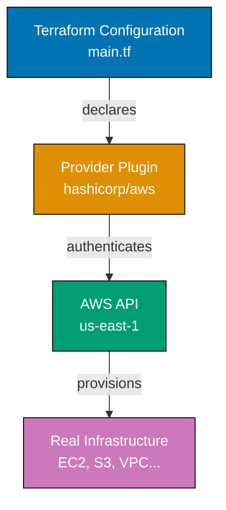
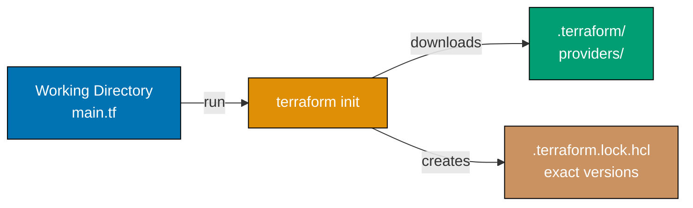
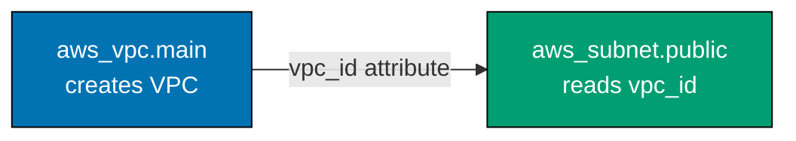
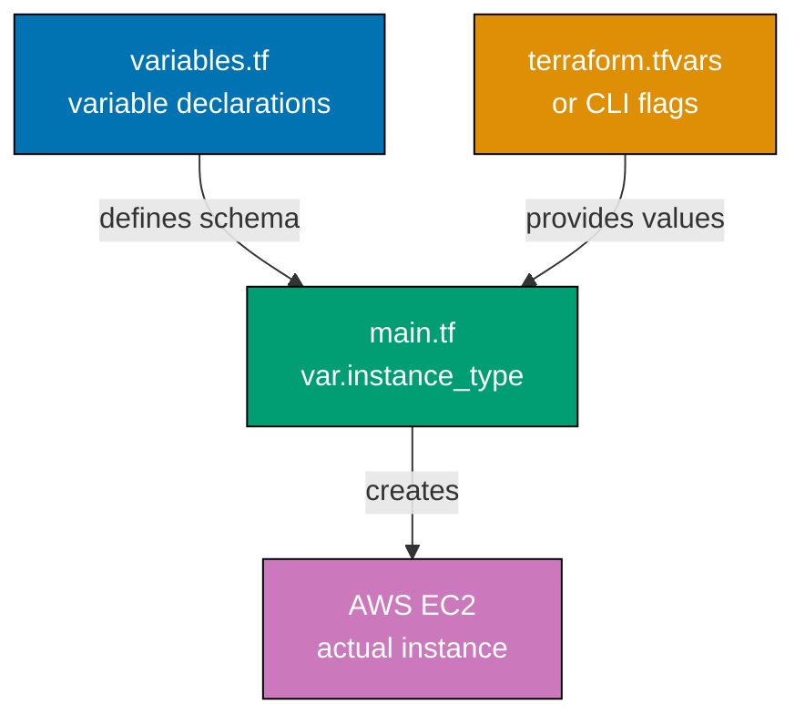
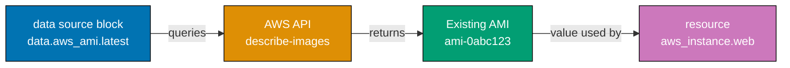
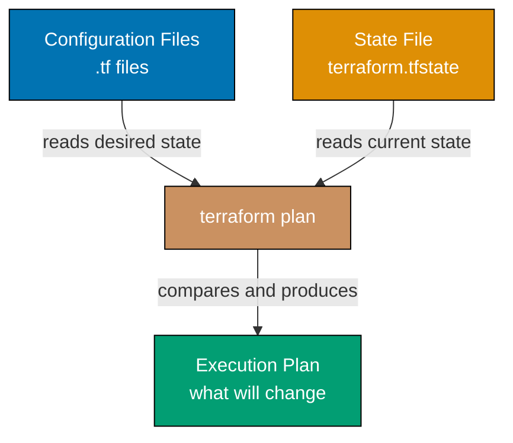
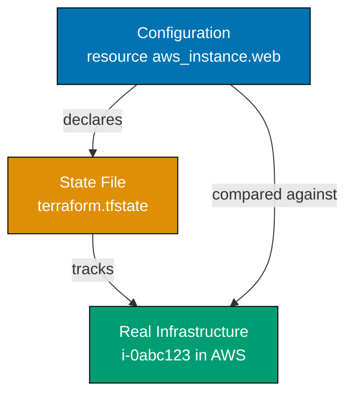
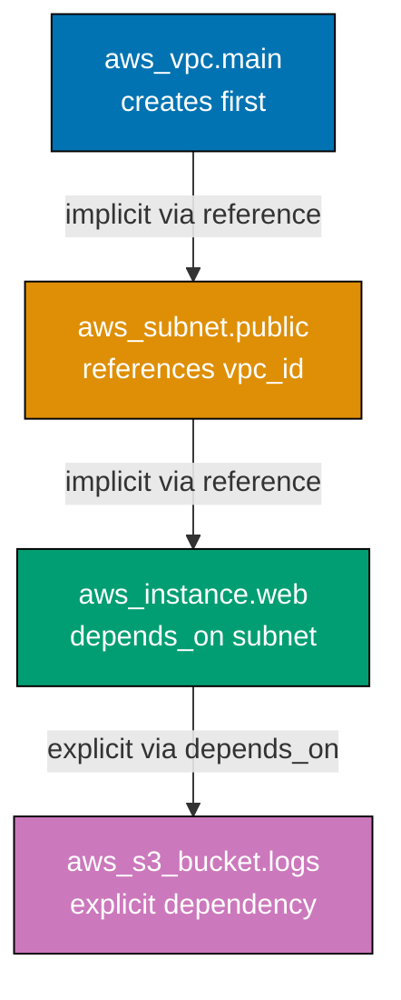
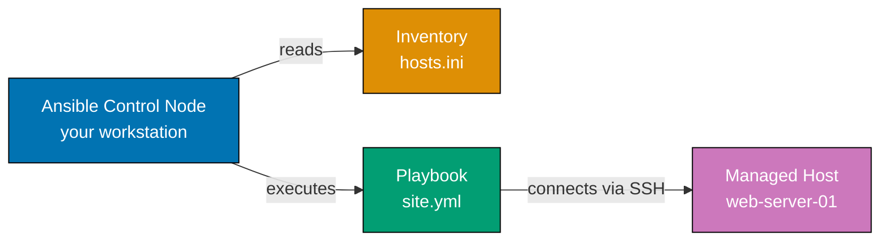

This file covers Examples 1-28, taking you from zero to functional IaC configurations. Each example is self-contained and demonstrates a distinct concept in Terraform HCL or Ansible YAML. The coverage spans 0-35% of IaC concepts: HCL syntax, providers, resources, variables, outputs, data sources, locals, the Terraform lifecycle, resource dependencies, basic provisioners, Ansible playbook structure, Ansible tasks, Ansible inventory, state basics, `.tfvars` files, variable types, and `count`/`for_each` basics.

## HCL Syntax and Terraform Fundamentals

### Example 1: HCL Block Syntax

Terraform uses HCL (HashiCorp Configuration Language), a structured configuration language that organizes infrastructure as nested blocks. Every HCL file consists of blocks, labels, and argument assignments that describe the desired state of your infrastructure.

```hcl
# => HCL blocks follow the pattern: block_type "label1" "label2" { arguments }
# => This is the most basic HCL structure you will write

terraform {
  # => The terraform block configures Terraform's own behavior
  # => It is optional but recommended for version pinning

  required_version = ">= 1.6.0"
  # => required_version enforces a minimum Terraform CLI version
  # => Prevents colleagues from running incompatible versions
  # => ">= 1.6.0" means version 1.6.0 or any newer release
}
```

**Key Takeaway**: Every Terraform configuration begins with HCL blocks. The `terraform` block is the root-level block that controls Terraform's own settings and version constraints.

**Why It Matters**: Version pinning prevents the "works on my machine" problem that plagues infrastructure teams. When you deploy to CI/CD pipelines or onboard new engineers, the `required_version` constraint ensures everyone runs the same Terraform CLI. HashiCorp regularly introduces breaking changes between minor versions, so pinning to a minimum version protects your team from unexpected behavior.

---

### Example 2: Terraform Provider Block

A provider is a plugin that Terraform uses to interact with a cloud platform, SaaS service, or API. The provider block declares which providers your configuration needs and how to authenticate with them.



```hcl
terraform {
  required_providers {
    # => required_providers lists every provider plugin this config needs
    # => Terraform downloads these from the Terraform Registry on init

    aws = {
      # => "aws" is the local name used to reference this provider
      # => You will see it as "aws_*" resource prefixes throughout the config

      source  = "hashicorp/aws"
      # => source identifies the registry path: <namespace>/<type>
      # => hashicorp/aws is the official AWS provider maintained by HashiCorp

      version = "~> 5.0"
      # => version constraint: "~> 5.0" allows 5.x but not 6.0
      # => This is a pessimistic constraint operator (allows patch and minor updates)
    }
  }
}

provider "aws" {
  # => The provider block configures the named provider
  # => This aws block configures the hashicorp/aws plugin

  region = "us-east-1"
  # => region tells the AWS provider which data center to use
  # => AWS credentials are read from environment variables or ~/.aws/credentials
}
```

**Key Takeaway**: The `required_providers` block pins the provider version, and the `provider` block configures its runtime settings. Always pin provider versions to prevent unexpected API changes from breaking your infrastructure.

**Why It Matters**: Provider version mismatches cause silent configuration drift in team environments. When Terraform downloads the latest provider without version constraints, a `4.x` to `5.x` upgrade can rename arguments, remove resources, or change defaults — breaking infrastructure that was provisioning fine yesterday. Version pinning in `required_providers` is the first defense against supply chain surprises in your infrastructure pipeline.

---

### Example 3: String, Number, and Boolean Arguments

HCL supports three primitive types for argument values: strings, numbers, and booleans. Understanding these types is foundational because every resource argument uses one of these primitives or a collection that contains them.

```hcl
resource "aws_instance" "example" {
  # => resource block: block_type "resource_type" "local_name" { }
  # => aws_instance is the resource type (EC2 virtual machine in AWS)
  # => "example" is the local name used to reference this resource in other blocks

  ami           = "ami-0c55b159cbfafe1f0"
  # => ami is a string argument (always quoted with double quotes in HCL)
  # => ami-0c55b159cbfafe1f0 is an Amazon Machine Image ID (OS template)

  instance_type = "t2.micro"
  # => instance_type is also a string argument
  # => "t2.micro" selects a 1 vCPU / 1GB RAM instance size

  monitoring = false
  # => monitoring is a boolean argument (true/false, no quotes)
  # => false disables detailed CloudWatch monitoring (saves cost)

  root_block_device {
    # => Nested blocks group related arguments under a sub-block
    # => root_block_device configures the instance's primary disk

    volume_size = 20
    # => volume_size is a number argument (no quotes, no units)
    # => 20 means 20 gigabytes of storage

    delete_on_termination = true
    # => boolean: true means the disk is deleted when the instance is terminated
    # => Prevents orphaned EBS volumes from accumulating cost
  }
}
```

**Key Takeaway**: Strings use double quotes, numbers are bare numerics, and booleans are unquoted `true` or `false`. Nested blocks group related arguments and are always enclosed in braces.

**Why It Matters**: HCL's strict type system catches configuration errors at plan time before any infrastructure changes. Passing `"20"` (string) where a number is expected causes a type error during `terraform validate`, preventing misconfigured disk sizes or instance counts from reaching production. Clear typing also makes infrastructure code self-documenting — reviewers immediately understand whether an argument is a flag, a quantity, or a name.

---

### Example 4: HCL Comments

HCL supports three comment styles. Comments are critical in infrastructure code because they explain business logic, compliance requirements, and the reasoning behind non-obvious configuration choices.

```hcl
# This is a single-line comment using the hash symbol
# => Used for inline annotations on argument lines

// This is also a single-line comment using double-slash
// => Both # and // are equivalent; # is more common in the Terraform community

/*
  This is a multi-line block comment.
  Use it to document entire resource blocks or explain
  complex configurations that span several arguments.
*/
# => Block comments are useful for temporarily disabling sections of config

resource "aws_s3_bucket" "logs" {
  bucket = "my-app-logs-2026"
  # => Bucket names must be globally unique across all AWS accounts
  # => The naming pattern "app-purpose-year" helps ensure uniqueness

  force_destroy = true
  # => WARNING: force_destroy = true allows terraform destroy to delete non-empty buckets
  # => Acceptable in development; set to false in production to prevent accidental data loss
  // => This is a compliance-critical argument - review before production deployment
}
```

**Key Takeaway**: Use `#` for single-line comments and `/* */` for multi-line blocks. Comments in Terraform should explain WHY a value was chosen, not just restate what it is.

**Why It Matters**: Infrastructure code outlives the engineers who write it. When a compliance audit asks why a bucket has `force_destroy = true`, the comment in the code provides instant context. Well-commented Terraform configurations serve as living runbooks, reducing on-call escalations and making code reviews faster for teams managing hundreds of resources across multiple environments.

---

### Example 5: Terraform Init and the Lock File

`terraform init` is the first command you run in any new Terraform workspace. It downloads provider plugins, sets up the backend, and creates a lock file that records the exact provider versions resolved.



```hcl
# .terraform.lock.hcl - AUTO-GENERATED, commit this file to version control
# => This file records the exact provider versions and checksums resolved by terraform init
# => Committing it ensures all team members and CI use identical provider binaries

provider "registry.terraform.io/hashicorp/aws" {
  # => Full registry path: registry.terraform.io/<namespace>/<type>
  # => This is the canonical identifier for the provider in the lock file

  version = "5.31.0"
  # => Exact version installed during init (not a constraint range)
  # => Terraform will refuse to use any other version until you run terraform init -upgrade

  constraints = "~> 5.0"
  # => The version constraint from your required_providers block
  # => Terraform checks that the installed version satisfies this constraint

  hashes = [
    "h1:abc123...",
    # => Cryptographic hash of the provider binary
    # => Terraform validates the download against this hash (supply chain security)
    "zh:def456...",
    # => Multiple hashes for different OS/architecture combinations
    # => Ensures the same provider works on macOS, Linux, and Windows
  ]
}
```

**Key Takeaway**: Commit `.terraform.lock.hcl` to version control. It pins exact provider versions and checksums so every team member and CI pipeline uses identical provider binaries.

**Why It Matters**: The lock file is your infrastructure supply chain security. Without it, `terraform init` on a fresh CI runner might pull a provider version with a breaking bug or a security vulnerability. Companies that have suffered infrastructure outages due to unintended provider upgrades now treat the lock file as non-negotiable. The lock file also enables reproducible deployments — a critical requirement for SOC 2 and ISO 27001 compliance audits.

---

## Resources and Resource References

### Example 6: Declaring an AWS EC2 Resource

A resource block is the fundamental building block of a Terraform configuration. It declares one infrastructure object — a server, a database, a DNS record — and describes its desired state.

```hcl
resource "aws_instance" "web_server" {
  # => resource "TYPE" "NAME" — two labels are required
  # => TYPE: aws_instance — the kind of resource (EC2 virtual machine)
  # => NAME: web_server — your local identifier for referencing this resource

  ami           = "ami-0c55b159cbfafe1f0"
  # => ami: the Amazon Machine Image (OS + software snapshot) to launch
  # => This AMI is Amazon Linux 2 in us-east-1 (AMIs are region-specific)

  instance_type = "t3.micro"
  # => instance_type: hardware profile (1 vCPU, 1GB RAM)
  # => t3.micro is free-tier eligible for 750 hours/month

  tags = {
    # => tags: a map of key-value metadata attached to the AWS resource
    # => Tags are critical for cost allocation, access control, and resource discovery

    Name        = "WebServer"
    # => Name tag appears as the instance's display name in the AWS Console

    Environment = "development"
    # => Environment tag helps filter resources by stage (dev/staging/prod)
    # => Many AWS Cost Explorer reports group by this tag
  }
}
```

**Key Takeaway**: Resources declare desired state, not imperative commands. Terraform figures out how to create, update, or delete the resource to match what you declared.

**Why It Matters**: Declarative infrastructure eliminates entire classes of bugs found in imperative shell scripts. When a script-based deployment fails halfway through, you often end up with partially-created infrastructure and no reliable way to know what succeeded. Terraform's declarative model means you can safely re-run `terraform apply` after a failure — it compares current state to desired state and only makes the minimum changes needed to reconcile them.

---

### Example 7: Resource References and Interpolation

Resource references allow one resource to read attributes from another. Terraform uses these references to automatically determine the order in which resources must be created, establishing implicit dependencies.



```hcl
resource "aws_vpc" "main" {
  # => Creates a Virtual Private Cloud (isolated network segment)

  cidr_block = "10.0.0.0/16"
  # => CIDR block: the IP address range for this VPC
  # => /16 gives 65,536 IP addresses (10.0.0.0 to 10.0.255.255)

  tags = {
    Name = "main-vpc"
  }
}

resource "aws_subnet" "public" {
  # => A subnet carves out a portion of the VPC's IP space

  vpc_id = aws_vpc.main.id
  # => Resource reference: TYPE.NAME.ATTRIBUTE
  # => aws_vpc.main.id reads the VPC ID that AWS assigns after creation
  # => Terraform sees this reference and creates aws_vpc.main BEFORE aws_subnet.public

  cidr_block = "10.0.1.0/24"
  # => /24 subnet gives 256 IP addresses (10.0.1.0 to 10.0.1.255)
  # => Must be a subset of the VPC's 10.0.0.0/16 range

  availability_zone = "us-east-1a"
  # => Subnets live in a single Availability Zone (physical data center)
}
```

**Key Takeaway**: Reference syntax is `<resource_type>.<resource_name>.<attribute>`. Terraform builds a dependency graph from these references and creates resources in the correct order automatically.

**Why It Matters**: Implicit dependency tracking eliminates a major source of human error in infrastructure automation. With shell scripts, engineers must manually order commands and handle failures when a later step references a resource that was not yet created. Terraform's reference-based dependency graph means you describe relationships, not sequences — making configurations easier to read, refactor, and parallelize during apply.

---

### Example 8: Resource with Multiple Arguments

Real-world resources require many arguments across different argument types. This example shows an AWS security group with both simple arguments and a block argument that groups related firewall rules.

```hcl
resource "aws_security_group" "web" {
  # => Security groups are stateful firewalls attached to AWS resources
  # => They define allowed inbound (ingress) and outbound (egress) traffic

  name        = "web-sg"
  # => name: human-readable label shown in the AWS Console

  description = "Security group for web servers"
  # => description: required by AWS; documents the security group's purpose

  vpc_id = aws_vpc.main.id
  # => Attaches this security group to a specific VPC
  # => Security groups are VPC-scoped, not account-wide

  ingress {
    # => ingress block: defines one inbound traffic rule
    # => Multiple ingress blocks allowed (one rule per block)

    from_port   = 80
    to_port     = 80
    # => from_port and to_port define the allowed port range (80 to 80 = only port 80)

    protocol    = "tcp"
    # => protocol: "tcp", "udp", "icmp", or "-1" (all protocols)

    cidr_blocks = ["0.0.0.0/0"]
    # => cidr_blocks: list of IP ranges allowed to connect
    # => 0.0.0.0/0 means any IP address on the internet (public HTTP access)
  }

  egress {
    # => egress block: defines one outbound traffic rule

    from_port   = 0
    to_port     = 0
    protocol    = "-1"
    # => protocol "-1" matches all protocols

    cidr_blocks = ["0.0.0.0/0"]
    # => Allow all outbound traffic — instances can reach the internet
    # => Restrict this in high-security environments
  }
}
```

**Key Takeaway**: Block arguments like `ingress` and `egress` group multiple related arguments under a named sub-block. You can repeat the same block type multiple times to add additional rules.

**Why It Matters**: Security groups are the primary network-level access control for cloud workloads. Defining them in Terraform ensures security rules are version-controlled, reviewed in pull requests, and applied consistently across environments. Ad-hoc security group changes through the AWS Console bypass code review and create undocumented security holes — a common finding in cloud security audits.

---

## Variables

### Example 9: Input Variables with Type Constraints

Input variables are the parameters of a Terraform configuration. They allow you to reuse the same configuration across environments by changing values without editing the code.



```hcl
# variables.tf

variable "instance_type" {
  # => variable block declares an input parameter by name
  # => "instance_type" is the variable name — referenced as var.instance_type

  type        = string
  # => type constraint: only string values accepted
  # => Terraform validates this at plan time, before any API calls

  description = "EC2 instance type for the web server"
  # => description documents what this variable controls
  # => Shown in terraform plan output and used by documentation generators

  default = "t3.micro"
  # => default: value used when no value is provided by the caller
  # => Variables with defaults are optional; without defaults they are required
}

variable "instance_count" {
  type    = number
  # => number type: accepts integers and floats

  default = 1
  description = "Number of EC2 instances to create"
}

variable "enable_monitoring" {
  type    = bool
  # => bool type: accepts true or false only

  default = false
  description = "Enable detailed CloudWatch monitoring"
}
```

**Key Takeaway**: Declare variables in a dedicated `variables.tf` file with `type`, `description`, and `default` arguments. Types enforce the schema; descriptions communicate intent to operators.

**Why It Matters**: Variables transform a one-off configuration into a reusable module. Teams that maintain separate Terraform files per environment (dev, staging, prod) quickly accumulate drift between environments because changes made in one file are forgotten in others. Variables with clear descriptions and type constraints enable a single configuration to serve all environments, with environment-specific values supplied through `.tfvars` files or CI/CD pipeline variables.

---

### Example 10: Referencing Variables with `var.`

Once declared, variables are accessed with the `var.` prefix anywhere an argument value is expected. This example shows how to wire variable values into resource arguments.

```hcl
# main.tf — uses variables declared in variables.tf

resource "aws_instance" "app" {
  ami           = "ami-0c55b159cbfafe1f0"
  # => ami hardcoded here; in practice this would also be a variable

  instance_type = var.instance_type
  # => var.instance_type reads the variable declared as variable "instance_type"
  # => At apply time, Terraform substitutes the actual value (e.g., "t3.micro")

  monitoring = var.enable_monitoring
  # => var.enable_monitoring is a bool variable
  # => false by default — no detailed monitoring unless explicitly enabled

  tags = {
    Name        = "app-server"
    Environment = var.environment
    # => var.environment will be provided by the caller (no default)
    # => Terraform will prompt for this value if not provided via tfvars or CLI
  }
}

variable "environment" {
  type        = string
  description = "Deployment environment (development, staging, production)"
  # => No default — caller MUST provide a value
  # => This makes the environment explicit and prevents accidental production deploys
}
```

**Key Takeaway**: Access any declared variable with `var.<variable_name>`. Variables without defaults are required — Terraform prompts the user at plan time or reads the value from a `.tfvars` file.

**Why It Matters**: Explicit environment variables eliminate one of the most dangerous classes of infrastructure mistakes: accidentally applying development changes to production. When `environment` has no default and must be supplied, operators must consciously declare which environment they are targeting. This creates a natural checkpoint that prevents the "I thought I was in dev" accidents that have caused major production outages at well-known companies.

---

### Example 11: Variable Validation Rules

Variable validation blocks add custom constraints beyond the built-in type system. They let you reject invalid values with a clear error message before Terraform contacts any cloud API.

```hcl
variable "environment" {
  type        = string
  description = "Deployment environment"

  validation {
    # => validation block: runs a custom check against the variable value
    # => Multiple validation blocks allowed per variable

    condition = contains(["development", "staging", "production"], var.environment)
    # => condition: a boolean expression that must evaluate to true
    # => contains(list, element): true if element is in list
    # => var.environment must be exactly one of the three allowed strings

    error_message = "Environment must be 'development', 'staging', or 'production'."
    # => error_message: shown to the user when condition is false
    # => Write a clear, actionable message (not just "invalid value")
  }
}

variable "instance_count" {
  type    = number
  default = 1

  validation {
    condition     = var.instance_count >= 1 && var.instance_count <= 20
    # => Ensures count is between 1 and 20 (inclusive)
    # => && is logical AND — both conditions must be true

    error_message = "Instance count must be between 1 and 20."
    # => Prevents accidentally spinning up hundreds of instances
  }
}
```

**Key Takeaway**: Add `validation` blocks to catch invalid inputs before any infrastructure changes. Write conditions as boolean expressions and error messages as actionable guidance.

**Why It Matters**: Validation blocks act as guardrails that protect against operator error. A misconfigured environment name like `"prod"` instead of `"production"` could route production workloads to the wrong monitoring dashboard, break environment-based IAM policies, or trigger incorrect cost allocation tags. Catching this at `terraform plan` time — before anything is created — costs nothing. Catching it after a production incident costs significantly more.

---

### Example 12: The `.tfvars` File

A `.tfvars` file provides variable values without modifying the configuration source code. Different environments maintain different `.tfvars` files, keeping the core configuration identical.

```hcl
# development.tfvars — variable values for the development environment
# => .tfvars files contain only variable assignments, no blocks or resource declarations
# => Apply with: terraform apply -var-file="development.tfvars"

instance_type     = "t3.micro"
# => Development uses the smallest instance to minimize cost
# => The same configuration uses "t3.large" in production.tfvars

instance_count    = 1
# => Single instance in development; production.tfvars sets this to 3+

environment       = "development"
# => Satisfies the validation rule in variables.tf

enable_monitoring = false
# => No detailed monitoring in development (saves cost)

allowed_cidrs     = ["10.0.0.0/8"]
# => Restrict access to internal network in development
# => production.tfvars might add 0.0.0.0/0 for public access
```

**Key Takeaway**: `.tfvars` files decouple environment-specific values from configuration logic. Commit environment-specific `.tfvars` files to version control (except sensitive values like passwords — use environment variables or a secrets manager for those).

**Why It Matters**: Maintaining parallel configuration files per environment creates inevitable drift. When the development configuration adds a new variable and the production file is not updated, the next production deployment prompts for an undefined value during a critical deployment window. The `.tfvars` pattern keeps the configuration code DRY while externalizing environment differences into easily-reviewable files that clearly show what differs between environments.

---

## Outputs

### Example 13: Output Values

Output values are the return values of a Terraform configuration. They expose resource attributes after apply so operators can read important values like IP addresses, DNS names, and resource IDs.

```hcl
# outputs.tf

output "instance_public_ip" {
  # => output block declares a value to surface after terraform apply
  # => "instance_public_ip" is the output name shown in the CLI

  value = aws_instance.web_server.public_ip
  # => value: the expression to evaluate and display
  # => aws_instance.web_server.public_ip reads the IP address AWS assigned

  description = "The public IP address of the web server"
  # => description: documents what this output represents
  # => Shown in terraform output --help and module documentation
}

output "instance_id" {
  value       = aws_instance.web_server.id
  # => .id is the resource's unique identifier assigned by AWS (e.g., "i-0abc123def")
  description = "The EC2 instance ID for use with AWS CLI commands"
}

output "vpc_id" {
  value       = aws_vpc.main.id
  description = "VPC ID for use in dependent Terraform configurations"

  sensitive = false
  # => sensitive = true hides the value from CLI output (for passwords, tokens)
  # => false is the default; listed here for documentation purposes
}
```

**Key Takeaway**: Declare outputs in `outputs.tf` with `value`, `description`, and optionally `sensitive`. Run `terraform output` after apply to read them without re-running the full apply.

**Why It Matters**: Outputs are the integration contract between your Terraform configuration and everything that consumes its results — deployment pipelines, monitoring systems, application configuration management, and dependent Terraform modules. Without explicit outputs, operators must navigate the AWS Console to find resource IDs, creating opportunities for human error. Outputs also enable module composition, where one module's outputs become another module's input variables.

---

### Example 14: Sensitive Outputs

Sensitive outputs prevent secret values from appearing in terminal logs, CI/CD pipeline output, and state file diffs. Terraform masks them with `(sensitive value)` in output displays.

```hcl
resource "aws_db_instance" "main" {
  # => Simulated RDS database instance (simplified for illustration)

  identifier     = "app-db"
  engine         = "postgres"
  instance_class = "db.t3.micro"
  username       = var.db_username
  # => Reads username from a variable (not hardcoded)
  password       = var.db_password
  # => Reads password from a sensitive variable
}

variable "db_password" {
  type        = string
  description = "RDS master password"
  sensitive   = true
  # => sensitive = true: Terraform redacts this variable's value in all output
  # => The value is still stored in state; this only affects display
}

output "db_endpoint" {
  value       = aws_db_instance.main.endpoint
  # => endpoint is the hostname:port string (e.g., "app-db.xyz.us-east-1.rds.amazonaws.com:5432")
  description = "Database connection endpoint"
}

output "db_password_reminder" {
  value     = aws_db_instance.main.password
  # => Exposes the password as an output (needed by application configs)

  sensitive = true
  # => sensitive = true hides the value in terraform output and plan diffs
  # => Prints "(sensitive value)" in the terminal instead of the actual password
  # => The value is still accessible via: terraform output -raw db_password_reminder
}
```

**Key Takeaway**: Mark outputs containing credentials, tokens, or private keys with `sensitive = true`. This prevents accidental exposure in CI/CD logs while keeping the value available through explicit access.

**Why It Matters**: Infrastructure automation pipelines frequently output logs to centralized logging systems accessible to many people. A database password appearing in plain text in a GitHub Actions log is a critical security incident. Sensitive output marking is a lightweight defense-in-depth measure that prevents accidental credential exposure in logs — a finding that appears on virtually every cloud security assessment when teams first adopt Infrastructure as Code.

---

## Data Sources

### Example 15: Data Sources

Data sources allow Terraform to read information from existing infrastructure or external sources without managing that infrastructure. They fetch read-only data to use in your configuration.



```hcl
data "aws_ami" "amazon_linux" {
  # => data block: data "TYPE" "NAME" { filter arguments }
  # => Reads existing AWS infrastructure without managing it
  # => "amazon_linux" is your local name for referencing this data source

  most_recent = true
  # => most_recent: when multiple AMIs match the filters, return the newest
  # => Essential for always using the latest patched OS image

  owners = ["amazon"]
  # => owners: filter AMIs to those published by the official "amazon" account
  # => Prevents using unofficial or potentially malicious images

  filter {
    # => filter blocks narrow down which AMI is returned
    name   = "name"
    values = ["amzn2-ami-hvm-*-x86_64-gp2"]
    # => name filter: AMI names matching this glob pattern
    # => * matches any version string, returning the latest Amazon Linux 2 AMI
  }
}

resource "aws_instance" "web" {
  ami           = data.aws_ami.amazon_linux.id
  # => data reference: data.TYPE.NAME.ATTRIBUTE
  # => Reads the AMI ID that the data source fetched
  # => Always uses the latest Amazon Linux 2 AMI, no hardcoded IDs needed

  instance_type = "t3.micro"
}
```

**Key Takeaway**: Data source reference syntax is `data.<type>.<name>.<attribute>`. Data sources query read-only information from providers and are evaluated during `terraform plan` before any changes are applied.

**Why It Matters**: Hardcoded AMI IDs become stale within months and create security debt. Amazon releases patched AMIs as new CVEs are discovered, but configurations with hardcoded IDs keep launching instances with outdated OS images. Data sources enable "always-fresh" configurations — every deployment automatically picks the latest patched AMI, satisfying security patching SLAs without manual configuration file updates.

---

### Example 16: Multiple Data Source Filters

Data sources support multiple `filter` blocks to narrow results precisely. This example queries an existing VPC and subnet that were not created by this Terraform configuration.

```hcl
data "aws_vpc" "existing" {
  # => Looks up an existing VPC by its tags
  # => Useful when your Terraform config deploys INTO a VPC managed elsewhere

  tags = {
    Name        = "production-vpc"
    Environment = "production"
    # => Both tags must match — acts as AND filter
    # => The VPC must have BOTH the Name and Environment tags set to these values
  }
}

data "aws_subnet" "app_tier" {
  vpc_id = data.aws_vpc.existing.id
  # => Reads the VPC ID from the data source above
  # => Creates a dependency: aws_vpc data source is read before aws_subnet

  filter {
    name   = "tag:Tier"
    values = ["application"]
    # => Filter by a specific tag (tag:KEY format)
    # => Finds the subnet tagged with Tier = "application"
  }

  filter {
    name   = "availabilityZone"
    values = ["us-east-1a"]
    # => Second filter: narrows to a specific availability zone
    # => Both filters must match (AND logic)
  }
}

resource "aws_instance" "app" {
  subnet_id = data.aws_subnet.app_tier.id
  # => Deploys the instance into the subnet discovered by the data source
  # => The actual subnet ID is resolved at plan time from existing AWS resources

  ami           = "ami-0c55b159cbfafe1f0"
  instance_type = "t3.micro"
}
```

**Key Takeaway**: Use data sources to integrate your Terraform configuration with infrastructure managed by other teams or other configurations. Multiple `filter` blocks combine with AND logic to identify precise resources.

**Why It Matters**: Large organizations rarely manage all infrastructure in a single Terraform state. Networking teams manage VPCs and subnets; platform teams manage DNS zones; security teams manage IAM roles. Data sources are the glue that lets application-level Terraform configurations deploy into infrastructure managed by other teams without creating ownership conflicts or tight coupling between configurations.

---

## Locals

### Example 17: Local Values

Local values (locals) are named expressions within a configuration. They reduce repetition by computing a value once and reusing it across multiple resources, similar to variables in a programming language.

```hcl
locals {
  # => locals block: one or more key = expression assignments
  # => Values are computed once and referenced as local.NAME throughout the config

  project     = "myapp"
  environment = var.environment
  # => Captures the variable into a local for shorter references

  common_tags = {
    # => A map computed from other locals and variables
    # => Apply these tags to every resource for consistent cost allocation

    Project     = local.project
    Environment = local.environment
    # => Referencing other locals: local.NAME
    ManagedBy   = "terraform"
    # => Hard-coded tag that marks all resources as Terraform-managed
  }

  name_prefix = "${local.project}-${local.environment}"
  # => String interpolation: ${expression} embeds expressions in strings
  # => "${local.project}-${local.environment}" with project="myapp" and environment="dev"
  # => => name_prefix is "myapp-dev"
}

resource "aws_instance" "web" {
  ami           = "ami-0c55b159cbfafe1f0"
  instance_type = "t3.micro"

  tags = merge(local.common_tags, {
    Name = "${local.name_prefix}-web"
    # => "${local.name_prefix}-web" => "myapp-dev-web"
  })
  # => merge(map1, map2): combines two maps, second map's keys override first map's
  # => Applies common_tags plus a resource-specific Name tag
}
```

**Key Takeaway**: Declare reusable expressions in a `locals` block and reference them with `local.<name>`. Locals are evaluated at plan time and cannot change between runs based on external input (unlike variables).

**Why It Matters**: Consistency in naming and tagging is one of the hardest operational challenges in cloud environments. When every resource uses `local.name_prefix` for naming and `local.common_tags` for tagging, a single change to the locals block propagates consistently across all resources. Without locals, teams copy-paste tag blocks and naming patterns, creating drift that corrupts cost reports, breaks monitoring dashboards, and makes incident response slower.

---

### Example 18: String Interpolation

HCL string interpolation embeds expressions directly inside string literals using `${}` syntax. This is essential for constructing resource names, ARNs, and configuration values dynamically.

```hcl
variable "project_name" {
  type    = string
  default = "webapp"
}

variable "region" {
  type    = string
  default = "us-east-1"
}

locals {
  # => String interpolation examples

  bucket_name = "${var.project_name}-${var.region}-artifacts"
  # => interpolates two variables into a string
  # => with defaults: bucket_name = "webapp-us-east-1-artifacts"

  log_prefix = "${var.project_name}/logs/"
  # => Mixed literal and variable: var.project_name = "webapp"
  # => => log_prefix = "webapp/logs/"

  resource_arn = "arn:aws:s3:::${local.bucket_name}"
  # => Constructs an AWS ARN (Amazon Resource Name) using the local value
  # => => resource_arn = "arn:aws:s3:::webapp-us-east-1-artifacts"
}

resource "aws_s3_bucket" "artifacts" {
  bucket = local.bucket_name
  # => Uses the interpolated local value as the bucket name
  # => Result: "webapp-us-east-1-artifacts"

  tags = {
    Name   = local.bucket_name
    Region = var.region
  }
}
```

**Key Takeaway**: Use `"${expression}"` to embed any HCL expression inside a string. Interpolation works with variables (`var.`), locals (`local.`), and resource references (`resource.name.attribute`).

**Why It Matters**: Dynamic name construction through interpolation prevents hardcoded resource names from colliding across accounts and regions. S3 bucket names are globally unique — two deployments of the same configuration in different regions or accounts must produce different bucket names. Interpolating region and project into bucket names at deployment time eliminates the naming collision problem that breaks CI/CD pipelines and creates confusing error messages.

---

## Terraform Lifecycle Commands

### Example 19: `terraform plan` — The Dry-Run

`terraform plan` reads your configuration and the current state, then produces an execution plan showing exactly which resources will be created, changed, or destroyed. It makes zero changes to actual infrastructure.



```hcl
# This configuration produces different plan output depending on current state

resource "aws_s3_bucket" "data" {
  bucket = "my-app-data-2026"
  # => If bucket does not exist: plan shows "+ aws_s3_bucket.data will be created"
  # => If bucket already exists with same config: plan shows "No changes"
  # => If bucket exists but config differs: plan shows "~ aws_s3_bucket.data will be updated"

  tags = {
    Environment = "production"
    # => Changing a tag value produces: ~ tags.Environment: "development" -> "production"
    # => This is an in-place update — no resource recreation needed
  }
}

# Plan output symbols:
# + resource will be created   (green plus sign)
# - resource will be destroyed  (red minus sign)
# ~ resource will be updated    (yellow tilde)
# -/+ resource must be replaced (destroy then recreate)
# => Understanding these symbols is essential before running terraform apply
```

**Key Takeaway**: Always run `terraform plan` before `terraform apply`. The plan output shows exactly what Terraform will do — look for unexpected `-/+` (destroy/recreate) symbols that indicate potentially destructive changes.

**Why It Matters**: The plan review is the most important safety checkpoint in any Terraform workflow. Teams that skip plan review and run `terraform apply` directly have caused production outages by inadvertently triggering resource replacements — deleting and recreating databases, certificates, or load balancers that required hours of downstream reconfiguration. Many organizations enforce plan reviews through pull request automation, requiring an approved plan before apply is permitted in production.

---

### Example 20: `terraform apply` — Applying Changes

`terraform apply` executes the plan and makes the declared infrastructure changes. Without `-auto-approve`, it displays the plan and asks for explicit confirmation before proceeding.

```hcl
# main.tf — configuration to apply

resource "aws_instance" "demo" {
  ami           = "ami-0c55b159cbfafe1f0"
  instance_type = "t3.micro"

  tags = {
    Name = "demo-instance"
  }
}

output "instance_id" {
  value = aws_instance.demo.id
  # => After apply, the instance ID is written to state and displayed here
  # => Example: instance_id = "i-0a1b2c3d4e5f6a7b8"
}

# Typical apply workflow:
# 1. terraform init      # => Downloads providers, creates .terraform/ directory
# 2. terraform plan      # => Shows what will be created (+ aws_instance.demo)
# 3. terraform apply     # => Prompts "Do you want to perform these actions?"
#                        # => Type "yes" and press Enter to proceed
#                        # => Terraform calls AWS APIs to create the instance
# 4. terraform output    # => Shows output values (instance_id = "i-...")

# For CI/CD pipelines (non-interactive environments):
# terraform apply -auto-approve
# => Skips the confirmation prompt
# => ONLY safe in automated pipelines with proper plan review gates
```

**Key Takeaway**: `terraform apply` applies the changes shown in the plan. The confirmation prompt is a safety gate — never use `-auto-approve` in production without a mandatory plan review step upstream.

**Why It Matters**: The confirmation prompt in `terraform apply` has prevented countless production incidents. When a refactoring accidentally flags a resource for replacement, the plan review prompt gives the operator one last chance to abort before destruction begins. Production pipelines typically separate plan and apply into distinct pipeline steps, with the plan step creating a saved plan file and the apply step requiring manual approval after plan review — a pattern mandated by SOC 2 change management controls.

---

### Example 21: `terraform destroy` — Tearing Down Resources

`terraform destroy` removes all resources managed by the current configuration. It is the inverse of `terraform apply` and requires explicit confirmation before proceeding.

```hcl
# There is no special configuration for destroy — it reads existing resources from state
# The configuration below would be destroyed when terraform destroy is run

resource "aws_instance" "temp" {
  ami           = "ami-0c55b159cbfafe1f0"
  instance_type = "t3.micro"
  tags = {
    Name        = "temporary-test"
    AutoDestroy = "true"
    # => Tag to identify ephemeral resources created for testing
    # => Some teams use Lambda functions to auto-destroy tagged resources nightly
  }
}

resource "aws_s3_bucket" "temp_storage" {
  bucket        = "temp-test-storage-2026"
  force_destroy = true
  # => force_destroy = true: allows destroy even if bucket contains objects
  # => REQUIRED for terraform destroy to work on non-empty buckets
  # => NEVER set this on production buckets containing important data
}

# terraform destroy output:
# Terraform will perform the following actions:
#
#   - aws_instance.temp will be destroyed
#   - aws_s3_bucket.temp_storage will be destroyed
#
# Plan: 0 to add, 0 to change, 2 to destroy.
#
# Do you really want to destroy all resources?
# => Type "yes" to confirm (same confirmation gate as apply)
```

**Key Takeaway**: Use `force_destroy = true` on test buckets to enable clean teardown. Never set it on production buckets. Run `terraform destroy` carefully — it destroys all resources in the current workspace.

**Why It Matters**: Proper teardown discipline is critical for cost management in cloud environments. Development and test environments that are never destroyed accumulate idle resources that generate continuous billing. Teams using Infrastructure as Code can build ephemeral environment workflows — spin up an environment for a pull request review, run tests, then `terraform destroy` when the review is complete. This capability alone can reduce cloud costs by 40-60% for development workloads.

---

## Terraform State

### Example 22: Understanding Terraform State

Terraform state is a JSON file that records the mapping between your configuration resources and the real-world infrastructure objects they represent. Terraform uses state to determine what changes to make during plan and apply.



```hcl
# The state file (terraform.tfstate) is JSON — a simplified excerpt:
#
# {
#   "version": 4,
#   "resources": [
#     {
#       "type": "aws_instance",
#       "name": "web",
#       "instances": [
#         {
#           "attributes": {
#             "id": "i-0abc123def456",
#             "instance_type": "t3.micro",
#             "public_ip": "54.123.45.67"
#           }
#         }
#       ]
#     }
#   ]
# }

# Rules for working with state:

# Rule 1: NEVER edit terraform.tfstate manually
# => Corrupted state causes Terraform to lose track of real infrastructure
# => Use terraform state commands for any state manipulation

# Rule 2: NEVER commit terraform.tfstate to version control
# => State contains sensitive values (passwords, private keys) in plain text
# => Use remote backends (S3, Terraform Cloud) for shared state

# Rule 3: Use remote backends for team environments
# => Local state cannot be shared across team members or CI/CD pipelines
# => Remote backends provide locking to prevent concurrent apply conflicts

resource "aws_instance" "web" {
  ami           = "ami-0c55b159cbfafe1f0"
  # => After apply, state records the resolved ami ID and all computed attributes
  # => terraform state show aws_instance.web displays the full state record
  instance_type = "t3.micro"
}
```

**Key Takeaway**: State is Terraform's source of truth about existing infrastructure. Never edit it manually, never commit it to version control, and always use a remote backend for team environments.

**Why It Matters**: State file mismanagement is the root cause of most severe Terraform incidents. When two engineers run `terraform apply` simultaneously against the same local state file, both reads show the same pre-apply state and both writes succeed — resulting in duplicate or conflicting resources. Remote backends with state locking prevent this race condition. The `.gitignore` rule for `terraform.tfstate` prevents credentials in state from being committed to public repositories — a security incident that has affected dozens of well-known companies.

---

### Example 23: Remote State Backend

A remote backend stores the state file outside the local filesystem — in an S3 bucket, Terraform Cloud, or another remote storage system. Remote backends enable team collaboration and provide state locking.

```hcl
terraform {
  backend "s3" {
    # => backend block configures where Terraform stores state
    # => "s3" uses an S3 bucket as the remote state store

    bucket = "my-terraform-state-2026"
    # => S3 bucket name (must already exist before running terraform init)
    # => The bucket itself is NOT managed by this configuration (chicken-and-egg)

    key    = "environments/production/terraform.tfstate"
    # => Object key (path) within the bucket for this state file
    # => Use a consistent naming convention: environments/ENV/COMPONENT/terraform.tfstate

    region = "us-east-1"
    # => AWS region where the S3 bucket lives

    encrypt = true
    # => encrypt = true: S3 server-side encryption for the state file at rest
    # => Protects secrets stored in state from unauthorized bucket access

    dynamodb_table = "terraform-state-locks"
    # => DynamoDB table for state locking (prevents concurrent applies)
    # => Table must have a primary key named "LockID" (string type)
    # => Without locking, two concurrent applies can corrupt state
  }
}
```

**Key Takeaway**: Configure a remote backend using `terraform { backend "s3" { ... } }` before starting any team project. Enable encryption and DynamoDB locking from day one — retrofitting these later requires migrating state.

**Why It Matters**: Local state is fine for solo experimentation but immediately becomes a bottleneck in team environments. When the infrastructure engineer who owns the local state file takes vacation, the team cannot deploy. When the CI/CD pipeline runs on ephemeral agents, local state is lost between runs. Remote backends with locking are the non-negotiable foundation of production-grade Terraform — every team will eventually move to them, and starting with them saves the painful migration later.

---

## Resource Dependencies

### Example 24: Implicit vs Explicit Dependencies

Terraform supports two kinds of resource dependencies: implicit (inferred from resource references) and explicit (declared with `depends_on`). Understanding both is essential for correct resource ordering.



```hcl
resource "aws_vpc" "main" {
  cidr_block = "10.0.0.0/16"
  # => Created first because aws_subnet.public references it
}

resource "aws_subnet" "public" {
  vpc_id     = aws_vpc.main.id
  # => IMPLICIT dependency: this reference tells Terraform to create aws_vpc.main first
  # => Terraform builds a dependency graph and determines creation order automatically

  cidr_block = "10.0.1.0/24"
}

resource "aws_s3_bucket" "logs" {
  bucket = "app-access-logs-2026"
  # => No reference to aws_instance.web — no implicit dependency
}

resource "aws_instance" "web" {
  ami           = "ami-0c55b159cbfafe1f0"
  instance_type = "t3.micro"
  subnet_id     = aws_subnet.public.id
  # => Implicit dependency on aws_subnet.public (and transitively on aws_vpc.main)

  depends_on = [aws_s3_bucket.logs]
  # => EXPLICIT dependency: ensures aws_s3_bucket.logs is created before aws_instance.web
  # => Use depends_on when a dependency exists that Terraform cannot infer from references
  # => Example: the instance writes logs to S3, but the bucket ARN is not referenced in code
}
```

**Key Takeaway**: Prefer implicit dependencies through resource references. Use `depends_on` only when a real dependency exists that is not captured by any resource reference — for example, when the dependency is on a side effect rather than an attribute value.

**Why It Matters**: Incorrect dependency ordering causes intermittent apply failures where resources are created before their dependencies exist. Explicit `depends_on` declarations document hidden dependencies that would otherwise require reading the application code to understand. However, overusing `depends_on` forces sequential execution and slows applies — Terraform can parallelize resource creation for independent resources, and unnecessary `depends_on` eliminates that parallelism.

---

## The `count` Meta-Argument

### Example 25: Creating Multiple Resources with `count`

The `count` meta-argument creates multiple instances of a resource from a single block. Use `count.index` to give each instance a unique name or configuration.

```hcl
variable "instance_count" {
  type    = number
  default = 3
}

resource "aws_instance" "web" {
  count = var.instance_count
  # => count: creates var.instance_count identical instances
  # => count = 3 => creates aws_instance.web[0], aws_instance.web[1], aws_instance.web[2]

  ami           = "ami-0c55b159cbfafe1f0"
  instance_type = "t3.micro"

  tags = {
    Name = "web-server-${count.index}"
    # => count.index: zero-based index of the current instance (0, 1, 2, ...)
    # => "web-server-${count.index}" => "web-server-0", "web-server-1", "web-server-2"

    Index = count.index
    # => count.index is a number — usable directly as a tag value
  }
}

output "instance_ids" {
  value = aws_instance.web[*].id
  # => [*] splat expression: collects the .id attribute from all count instances
  # => => ["i-0abc", "i-0def", "i-0ghi"] (one ID per instance)

  description = "IDs of all web server instances"
}
```

**Key Takeaway**: `count` creates N instances addressable as `resource.name[index]`. Use `count.index` for unique names. The splat expression `[*]` collects an attribute from all instances into a list.

**Why It Matters**: Before `count`, scaling infrastructure meant duplicating resource blocks — a maintenance nightmare that caused configuration drift between instances. `count` enables scaling from 1 to 100 instances with a single variable change and ensures all instances are truly identical. However, `count` has a significant limitation: when you remove an element from the middle of a list, Terraform renumbers the remaining instances, which triggers replacements for all subsequent instances. For named resources, `for_each` (Example 26) is often a better choice.

---

### Example 26: `for_each` with a Map

`for_each` is the preferred alternative to `count` when resources have distinct identities. It creates one resource instance per entry in a map or set, addressing each by key rather than by index.

```hcl
variable "environments" {
  type = map(string)
  # => map(string): a map where all values are strings
  # => The key is the environment name; the value is the instance type

  default = {
    development = "t3.micro"
    staging     = "t3.small"
    production  = "t3.large"
    # => Three environments, three instance types
    # => for_each will create one EC2 instance per entry
  }
}

resource "aws_instance" "env" {
  for_each = var.environments
  # => for_each: creates one instance per map entry
  # => Creates: aws_instance.env["development"], aws_instance.env["staging"], aws_instance.env["production"]

  ami           = "ami-0c55b159cbfafe1f0"
  instance_type = each.value
  # => each.value: the map value for the current entry (e.g., "t3.micro" for development)

  tags = {
    Name        = "server-${each.key}"
    # => each.key: the map key for the current entry (e.g., "development")
    # => "server-${each.key}" => "server-development", "server-staging", "server-production"

    Environment = each.key
    # => Tags the instance with its environment name
  }
}
```

**Key Takeaway**: Use `for_each` with a map when resources have stable, meaningful identities. `each.key` is the map key and `each.value` is the map value. Removing an entry from the map destroys only that one resource, not all subsequent ones.

**Why It Matters**: The `count` vs `for_each` choice has real operational consequences. A team using `count` to manage three database instances with a list `["db-a", "db-b", "db-c"]` that removes `"db-b"` will find that Terraform plans to destroy `db-b` AND replace `db-c` (renumbering `[2]` to `[1]`). With `for_each`, removing `"db-b"` from the map destroys only `db-b`. For production databases, an unintended recreation is a multi-hour outage event.

---

## Ansible Fundamentals

### Example 27: Ansible Playbook Structure

Ansible is an agentless configuration management tool that uses YAML playbooks to describe automation tasks. Where Terraform provisions infrastructure, Ansible configures the software and settings on that infrastructure.



```yaml
# site.yml — a minimal Ansible playbook
---
# => --- marks the start of a YAML document (optional but conventional)

- name: Configure web servers
  # => - (dash) begins a play — a playbook can contain multiple plays
  # => name: human-readable description shown in ansible-playbook output

  hosts: web
  # => hosts: which hosts or groups from inventory this play targets
  # => "web" matches the [web] group in the inventory file

  become: true
  # => become: true enables privilege escalation (sudo)
  # => Required for tasks that install packages or modify system files

  vars:
    app_port: 8080
    # => vars: play-level variables available to all tasks in this play
    # => Equivalent to Terraform variables but scoped to a single play

  tasks:
    # => tasks: the ordered list of actions Ansible executes on each host

    - name: Install nginx
      # => Each task has a name (shown in output) and one module call

      ansible.builtin.package:
        # => ansible.builtin.package: the module that manages OS packages
        # => ansible.builtin is the fully-qualified collection namespace

        name: nginx
        # => name: the package to manage

        state: present
        # => state: present = install if not already installed
        # => Ansible is idempotent: running this twice does NOT reinstall nginx
```

**Key Takeaway**: An Ansible playbook is a YAML list of plays. Each play targets hosts and contains an ordered list of tasks. Tasks are idempotent — running the same playbook multiple times produces the same end state.

**Why It Matters**: Ansible's agentless architecture means you do not need to pre-install a client on managed servers. It connects via SSH using your existing credentials. This makes Ansible the go-to choice for configuration management in environments where installing agents is impractical — newly provisioned cloud instances, network devices, and legacy servers. The idempotency property is critical for reliability: failed playbook runs can be safely retried without manual cleanup.

---

### Example 28: Ansible Inventory File

An Ansible inventory defines the hosts and groups that playbooks target. It can be a static INI file, a YAML file, or a dynamic inventory script that queries a cloud API.

```ini
# hosts.ini — static inventory in INI format
# => INI format: [group_name] followed by host entries

[web]
# => [web] defines a group named "web"
# => Hosts in this group are targeted when plays specify hosts: web

web-server-01 ansible_host=10.0.1.10
# => web-server-01: the inventory hostname (your alias for this host)
# => ansible_host=10.0.1.10: the actual IP or DNS name Ansible connects to

web-server-02 ansible_host=10.0.1.11
# => Second host in the [web] group

[db]
# => [db] group for database servers

db-primary ansible_host=10.0.2.10 ansible_user=ec2-user
# => ansible_user: the SSH username (overrides default for this host)
# => ec2-user is the default user for Amazon Linux AMIs

[web:vars]
# => [group:vars] sets variables for all hosts in a group
# => These override inventory defaults for the [web] group

ansible_user=ubuntu
# => All web servers connect as the "ubuntu" user
# => Ubuntu AMIs use "ubuntu" as the default SSH user

ansible_ssh_private_key_file=~/.ssh/webserver_key.pem
# => Path to the SSH private key for this group
# => The matching public key must be in ~/.ssh/authorized_keys on the servers

[all:vars]
# => [all:vars]: variables applied to every host in the inventory

ansible_python_interpreter=/usr/bin/python3
# => Specifies which Python interpreter Ansible uses on managed hosts
# => Required when the system has both python2 and python3 installed
```

**Key Takeaway**: The inventory INI file organizes hosts into named groups and sets connection variables per host or group. Use `[group:vars]` blocks to share common SSH settings across all hosts in a group.

**Why It Matters**: Inventory management is the operational core of Ansible. Well-organized inventories with logical groups enable targeted playbook runs — `ansible-playbook site.yml --limit web` applies configuration only to web servers, not databases. Dynamic inventories that query the AWS API automatically discover newly provisioned Terraform infrastructure, creating a seamless handoff between Terraform (provision) and Ansible (configure) — the foundational pattern for immutable infrastructure workflows.

---
