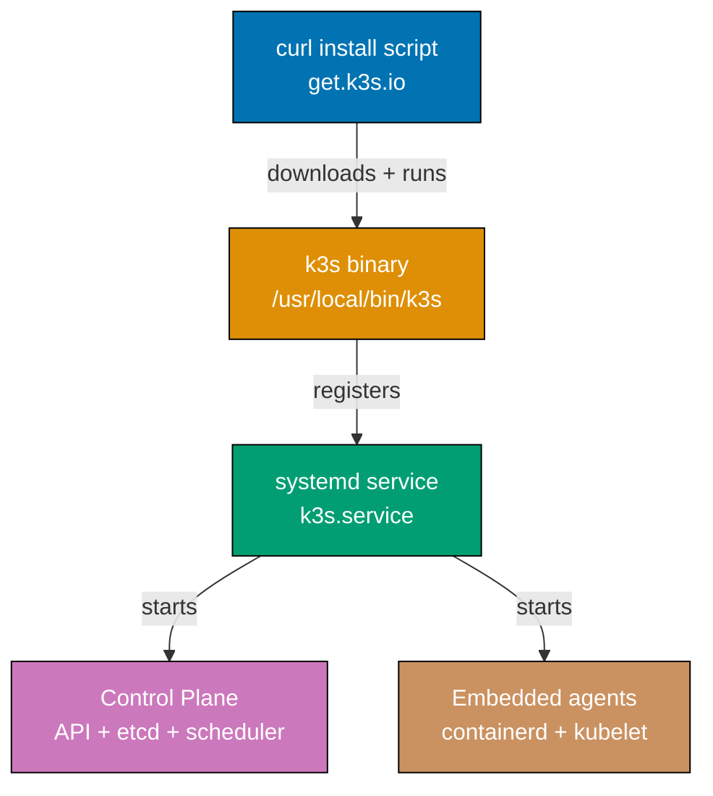

This file covers Examples 1-28, taking you from a bare Linux host to a functional K3s cluster running stateful workloads, Ingress, persistent storage, health checks, and rolling updates. The coverage spans 0-35% of K3s concepts: installation, kubeconfig, node verification, Pods, Deployments, Services, logs, exec, Namespaces, ConfigMaps, Secrets, YAML manifests, node joining, port-forward, resource limits, Ingress, IngressRoute CRD, Traefik dashboard, PersistentVolumeClaims, StatefulSets, probes, rollouts, DaemonSets, CronJobs, auto-manifest deployment, config file, and uninstall.

## Installation and Cluster Setup

### Example 1: Install K3s Single-Node Server

K3s ships as a self-contained binary with an install script that configures systemd, writes kubeconfig, and starts the server in one command. The entire control plane — API server, scheduler, controller-manager, etcd substitute, and embedded agents — runs as a single `k3s server` process.



**Code**:

```bash
# Install K3s using the official install script
# The script downloads the k3s binary, writes systemd unit, and starts the service
curl -sfL https://get.k3s.io | sh -
# => Downloads, installs k3s binary to /usr/local/bin/k3s, creates and starts k3s.service
# => Script detects architecture (amd64/arm64) and applies appropriate defaults
# => Default datastore: SQLite (single-node); embedded etcd for HA clusters

# Verify the systemd service is running
sudo systemctl status k3s

# Check that the k3s process is listening on expected ports
sudo ss -tlnp | grep k3s
# => Also: 10250 kubelet metrics, 10248 kubelet healthz

# View the initial node join token (needed for worker nodes)
sudo cat /var/lib/rancher/k3s/server/node-token
```

**Key Takeaway**: A single `curl | sh` command installs the full K3s control plane as a systemd service. No separate etcd, no container runtime to configure — everything runs inside the `k3s` binary.

**Why It Matters**: Traditional Kubernetes installation with kubeadm requires separately installing a container runtime, configuring networking plugins, bootstrapping etcd, and running multi-step initialization commands. K3s reduces this to a single script invocation, making it practical to spin up clusters in CI pipelines, on edge devices, or during disaster recovery where speed and simplicity are paramount.

---

### Example 2: Configure KUBECONFIG for Local kubectl Access

K3s writes its kubeconfig to `/etc/rancher/k3s/k3s.yaml` with root ownership. Accessing it with `kubectl` requires either copying it to your user's `~/.kube/config` or setting the `KUBECONFIG` environment variable.

**Code**:

```bash
# Option A: Use the KUBECONFIG environment variable (no file copy needed)
export KUBECONFIG=/etc/rancher/k3s/k3s.yaml
# => Sets the kubeconfig path for the current shell session
# => The file is owned by root; run subsequent kubectl as root or with sudo

# Option B: Copy kubeconfig to user home (recommended for non-root users)
mkdir -p ~/.kube
# => Creates the .kube directory if it does not exist
# => Standard location for user-level kubeconfig files

sudo cp /etc/rancher/k3s/k3s.yaml ~/.kube/config
# => Copies the cluster-admin kubeconfig to user's config location
# => Source: /etc/rancher/k3s/k3s.yaml (root-owned, mode 600)
# => Destination: ~/.kube/config (will be read by kubectl automatically)

sudo chown $(id -u):$(id -g) ~/.kube/config
# => Changes ownership from root to current user
# => $(id -u) expands to numeric UID, $(id -g) to numeric GID
# => Required because kubectl refuses to read world-readable kubeconfigs

chmod 600 ~/.kube/config

# Verify kubectl can now reach the cluster API
kubectl cluster-info
```

**Key Takeaway**: K3s stores kubeconfig at `/etc/rancher/k3s/k3s.yaml`. Copy it to `~/.kube/config` with correct ownership to use standard `kubectl` commands without `sudo`.

**Why It Matters**: Hardcoding `sudo` for every kubectl invocation is error-prone and prevents scripts from running as non-root service accounts. Copying the kubeconfig once and setting correct permissions lets your normal user, CI runners, and automation scripts all use `kubectl` transparently, matching the workflow expected by most Kubernetes tooling.

---

### Example 3: Verify Installation — Nodes and Component Health

After installation, verify that the node reports `Ready` status and that the built-in components (CoreDNS, Traefik, local-path-provisioner) are running in the `kube-system` namespace.

**Code**:

```bash
# Check node status — should show Ready within 30-60 seconds of install
kubectl get nodes
# => my-host    Ready    control-plane,master   2m    v1.35.4+k3s1

# Get detailed node information including resource capacity
kubectl get nodes -o wide
# => Adds INTERNAL-IP, OS-IMAGE, KERNEL-VERSION; CONTAINER-RUNTIME=containerd (not Docker)

# Verify all system pods are Running or Completed
kubectl get pods -n kube-system
# => All K3s system pods Running: coredns, local-path-provisioner, metrics-server, traefik, svclb-traefik
# => If any pod shows CrashLoopBackOff, use kubectl logs -n kube-system <pod> to diagnose

# Check that core APIs are accessible and healthy
kubectl get --raw /healthz
# => ok — HTTP 200 confirms the API server is healthy

# View the current cluster version info
kubectl version --short 2>/dev/null || kubectl version
# => Server Version: v1.35.4+k3s1 — the +k3s1 suffix identifies the K3s build
```

**Key Takeaway**: After K3s installation, `kubectl get nodes` should show `Ready` and `kubectl get pods -n kube-system` should show all system components running. The `+k3s1` server version suffix identifies the K3s build.

**Why It Matters**: Verifying installation before deploying workloads catches networking misconfiguration, resource exhaustion, or failed downloads early. A node stuck in `NotReady` usually indicates a CNI issue or insufficient disk space. Checking system pods confirms that the ingress controller (Traefik), DNS (CoreDNS), and storage provisioner are available before your first workload deploys.

---

### Example 4: Deploy a First Pod

A Pod is the smallest deployable unit in Kubernetes — one or more containers sharing network and storage. Running a pod imperatively with `kubectl run` is the fastest way to verify that the container runtime and image pull work correctly.

**Code**:

```bash
# Run a single pod imperatively using the nginx image
kubectl run nginx-test --image=nginx:1.27-alpine
# => Image is cached by containerd; subsequent pulls of same image are instant

# Watch pod status until it transitions to Running
kubectl get pods --watch
# => nginx-test   0/1   ContainerCreating → 1/1   Running (after ~12s)
# => ContainerCreating: containerd pulling image; Running: container healthy

# Describe the pod to see scheduling, image pull, and startup events
kubectl describe pod nginx-test
# => Events show: Scheduled → Pulling → Pulled → Created → Started lifecycle

# Clean up the test pod
kubectl delete pod nginx-test
# => pod deleted — K3s sends SIGTERM then SIGKILL after gracePeriodSeconds (30s default)
```

**Key Takeaway**: `kubectl run <name> --image=<image>` creates a single pod. Use `kubectl describe pod` to see scheduling decisions, image pull events, and startup errors.

**Why It Matters**: Running a bare pod before deploying Deployments confirms that containerd can reach your image registry, that the node has sufficient resources to schedule the pod, and that the cluster network assigns a pod IP. This one command validates the entire container runtime and network stack, making it the fastest diagnostic tool when a cluster is freshly provisioned.

---

### Example 5: Create a Deployment with Replicas

A Deployment manages a ReplicaSet that maintains a desired number of identical pod replicas. It handles pod scheduling, restarts on failure, and rolling updates. Deployments are the standard way to run stateless applications.

**Code**:

```bash
# Create a Deployment with 3 replicas of nginx
kubectl create deployment web --image=nginx:1.27-alpine --replicas=3
# => Creates a ReplicaSet managing 3 pods with label app=web

# Verify all 3 replicas reach Running state
kubectl get deployment web
# => web    3/3     3            3    — READY 3/3: all replicas running and passing readiness
# => UP-TO-DATE: matches current template; AVAILABLE: passing readiness checks

# List individual pods created by the Deployment
kubectl get pods -l app=web
# => 3 Running pods named <deployment>-<rs-hash>-<random>; -l app=web filters by label

# Scale the Deployment up to 5 replicas
kubectl scale deployment web --replicas=5
# => deployment.apps/web scaled — ReplicaSet immediately creates 2 additional pods

# Scale back down to 2 replicas
kubectl scale deployment web --replicas=2
# => deployment.apps/web scaled — controller terminates 3 excess pods via SIGTERM
```

**Key Takeaway**: `kubectl create deployment` creates a self-healing group of pods. The Deployment controller continuously reconciles actual pod count to the desired `--replicas` count, restarting crashed pods and respecting scale changes.

**Why It Matters**: Running bare pods in production means a crashed container is gone forever. Deployments add automatic restart, scheduling distribution, and declarative scaling. The controller loop runs inside the K3s server process itself, continuously comparing desired state (replicas=3) with actual state (running pods) and taking corrective action — this is the fundamental self-healing pattern that makes Kubernetes resilient.

---

### Example 6: Expose a Deployment with a Service

A Service provides a stable network identity (IP + DNS name) for a set of pods. Pods are ephemeral and their IPs change on restart; Services give consumers a fixed endpoint. K3s bundles Klipper for NodePort/LoadBalancer services on bare metal.

**Code**:

```bash
# Expose the web Deployment as a ClusterIP Service on port 80
kubectl expose deployment web --port=80 --target-port=80
# => service/web created (ClusterIP) — stable virtual IP from service CIDR (10.43.0.0/16)
# => --port: Service port; --target-port: container port traffic forwards to

# Inspect the created Service
kubectl get service web
# => web    ClusterIP   10.43.45.123   <none>   80/TCP — cluster-internal only

# Create a NodePort Service that exposes the Deployment externally
kubectl expose deployment web --name=web-np --port=80 --type=NodePort
# => service/web-np created — allocates a random port (30000-32767) on every node

# Get the assigned NodePort
kubectl get service web-np
# => web-np   NodePort   10.43.198.77   <none>   80:31234/TCP — node port 31234

# Test connectivity through the NodePort
curl http://$(hostname -I | awk '{print $1}'):31234
# => Returns nginx welcome page; traffic: node:31234 → iptables → pod:80
```

**Key Takeaway**: Services decouple consumers from pod lifecycle. ClusterIP exposes pods inside the cluster; NodePort exposes them on every node's IP at a high port. Both use label selectors to find target pods dynamically.

**Why It Matters**: Pod IPs change every time a pod restarts or reschedules. Without a Service, every client would need to discover the new pod IP after each restart. Services maintain a stable virtual IP backed by iptables or ipvs rules that automatically update when pods come and go. This decoupling is what makes rolling updates transparent to downstream services.

---

### Example 7: View Pod Logs

Container stdout and stderr are captured by containerd and accessible via `kubectl logs`. Logs are the first diagnostic tool when a pod is crashing or behaving unexpectedly.

**Code**:

```bash
# Tail the last 20 lines of logs from a specific pod
kubectl logs web-7d6b8f9b4-4xk2p --tail=20
# => Last 20 lines of nginx access logs from container stdout
# => containerd captures stdout/stderr and kubelet exposes via API

# Follow (stream) logs in real time — Ctrl+C to stop
kubectl logs web-7d6b8f9b4-4xk2p --follow

# View logs from all pods in a Deployment using a label selector
kubectl logs -l app=web --tail=5
# => Aggregates last 5 lines from all matching pods without knowing individual names

# Fetch logs from a previously terminated (crashed) container
kubectl logs web-7d6b8f9b4-4xk2p --previous
# => Returns logs from the crashed previous container; essential for OOMKilled diagnosis

# Combine options: tail 50 lines with timestamps
kubectl logs web-7d6b8f9b4-4xk2p --tail=50 --timestamps
# => Prefixes each line with RFC3339 timestamp from containerd log metadata
# => 2026-04-29T08:05:32Z 192.168.1.5 - - "GET / HTTP/1.1" 200 615
```

**Key Takeaway**: `kubectl logs` retrieves container stdout/stderr. Use `--follow` for streaming, `--previous` for crash diagnostics, and `-l <selector>` to aggregate across multiple pods.

**Why It Matters**: Container logs are the primary observability mechanism in Kubernetes. Unlike traditional VMs where logs go to files, containers write to stdout/stderr and rely on the runtime to capture and forward them. Understanding how to filter logs with `--tail`, stream with `--follow`, and retrieve previous container logs with `--previous` is the first step toward diagnosing any production incident.

---

### Example 8: Execute into a Running Pod

`kubectl exec` opens an interactive shell or runs a one-off command inside a running container. This is the Kubernetes equivalent of `docker exec` and is the primary way to inspect a container's filesystem, network stack, and running processes.

**Code**:

```bash
# Open an interactive shell in the first nginx pod
kubectl exec -it web-7d6b8f9b4-4xk2p -- /bin/sh
# => -i keeps stdin open, -t allocates a TTY; -- separates kubectl flags from container command
# => /bin/sh: available in alpine-based images (bash not installed)

# Inside the container: inspect the nginx configuration
cat /etc/nginx/nginx.conf
# => Container's isolated filesystem view — not the host's nginx config

# Inside the container: test DNS resolution of the web Service
nslookup web.default.svc.cluster.local
# => CoreDNS (10.43.0.10) resolves to the Service ClusterIP (10.43.45.123)
# => Format: <service>.<namespace>.svc.cluster.local

# Exit the container shell
exit

# Run a one-off command without an interactive shell
kubectl exec web-7d6b8f9b4-4xk2p -- env
# => HOSTNAME is the pod name; PATH and other standard vars come from the image
```

**Key Takeaway**: `kubectl exec -it <pod> -- <shell>` opens an interactive session inside a running container. The `-i` and `-t` flags together enable proper interactive terminal behavior.

**Why It Matters**: When a pod is running but serving incorrect responses, exec gives you a real-time view of its configuration files, environment variables, and network connectivity. You can verify that a ConfigMap was mounted correctly, test whether a downstream service is reachable via DNS, or check file permissions — all without modifying the running pod or redeploying it. This is indispensable for production debugging.

---

### Example 9: Create and Use a Namespace

Namespaces partition cluster resources into isolated groups. Every K3s cluster starts with `default`, `kube-system`, `kube-public`, and `kube-node-lease` namespaces. Namespaces are the primary unit of multi-team resource isolation.

**Code**:

```bash
# Create a new namespace for a staging environment
kubectl create namespace staging
# => Namespaces are cluster-scoped resources (not namespaced themselves)
# => The name must be a valid DNS label (lowercase, alphanumeric, hyphens)

# List all namespaces in the cluster
kubectl get namespaces
# => default           Active   2h
# => kube-node-lease   Active   2h
# => kube-public       Active   2h
# => kube-system       Active   2h
# => staging           Active   5s

# Deploy an nginx pod directly into the staging namespace
kubectl run staging-web --image=nginx:1.27-alpine --namespace=staging
# => Without --namespace, resources go to the current context's default namespace

# List pods — without namespace flag, only shows the default namespace
kubectl get pods
# => No resources found in default namespace.  (staging-web is in staging, not here)

# List pods in the staging namespace
kubectl get pods --namespace=staging
# => staging-web   1/1     Running   0          30s

# Set the staging namespace as the default for the current context
kubectl config set-context --current --namespace=staging

# Confirm the context namespace changed
kubectl config view --minify | grep namespace

# Switch back to default namespace
kubectl config set-context --current --namespace=default
```

**Key Takeaway**: Namespaces partition cluster resources. Use `--namespace=<ns>` on every command or set the context default namespace with `kubectl config set-context --current --namespace=<ns>`.

**Why It Matters**: In production K3s clusters hosting multiple teams or environments, namespaces prevent resource naming collisions and form the boundary for RBAC policies and NetworkPolicies. A staging deployment named `web` in the `staging` namespace does not conflict with a production `web` Deployment in the `production` namespace. RBAC can then grant a developer access to all resources in `staging` without touching `production`.

---

### Example 10: ConfigMaps — Create from Literal and from File

ConfigMaps store non-sensitive key-value configuration data that pods consume as environment variables or volume mounts. They decouple configuration from the container image, letting you change config without rebuilding the image.

**Code**:

```bash
# Create a ConfigMap from literal key-value pairs
kubectl create configmap app-config \
  --from-literal=APP_ENV=production \
  --from-literal=LOG_LEVEL=info \
  --from-literal=MAX_CONNECTIONS=100
# => configmap/app-config created
# => --from-literal=KEY=VALUE: inlines values directly into the ConfigMap
# => Each key becomes a data entry in the ConfigMap

# Create a config file to load into a ConfigMap
cat > /tmp/nginx.conf << 'EOF'
server {
    listen 8080;
    server_name _;
    location / {
        return 200 'hello from configmap\n';
    }
}
EOF
# => Creates /tmp/nginx.conf with a simple nginx server block

# Create a ConfigMap from a file — key is the filename, value is file content
kubectl create configmap nginx-config --from-file=/tmp/nginx.conf
# => configmap/nginx-config created
# => Key: nginx.conf  (the filename, without the path)
# => Value: contents of /tmp/nginx.conf

# Inspect the ConfigMap's stored data
kubectl describe configmap app-config
# => Name:         app-config
# => Data
# => ====
# => APP_ENV:           production
# => LOG_LEVEL:         info
# => MAX_CONNECTIONS:   100

# Use the ConfigMap in a pod as environment variables
kubectl apply -f - << 'EOF'
apiVersion: v1
# => apiVersion: v1 — the API group and version for this resource
kind: Pod
# => kind Pod: Kubernetes resource type being created or updated
metadata:
# => metadata: resource name, namespace, and labels
  name: config-test
  # => name: unique identifier for this resource within its namespace
spec:
# => spec: declares the desired state of the resource
  containers:
  # => containers: list of containers to run in each pod
  - name: app
    image: busybox:1.37
    # => image: container image busybox:1.37 pulled by containerd
    command: ["sh", "-c", "echo APP_ENV=$APP_ENV LOG_LEVEL=$LOG_LEVEL && sleep 3600"]
    # => command: command and arguments to run in the container
    envFrom:
    # => envFrom: loads all ConfigMap or Secret keys as environment variables
    - configMapRef:
        name: app-config
        # => envFrom.configMapRef: inject all ConfigMap keys as env vars
        # => APP_ENV, LOG_LEVEL, MAX_CONNECTIONS all become env vars in the container
  restartPolicy: Never
  # => restartPolicy Never: controls pod restart behavior after container exits
EOF
# => pod/config-test created

# Verify env vars from ConfigMap are present in the pod
kubectl logs config-test
# => APP_ENV=production LOG_LEVEL=info
```

**Key Takeaway**: ConfigMaps decouple config from images. `--from-literal` inlines values; `--from-file` loads file content. Pods consume ConfigMaps via `envFrom` (all keys as env vars) or volume mounts (keys as files).

**Why It Matters**: Hard-coding configuration inside container images means rebuilding and redeploying on every config change. ConfigMaps let you modify `LOG_LEVEL`, database URLs, or feature flags by updating the ConfigMap and restarting pods — often without a new image build. In K3s clusters where image builds are infrequent (edge deployments), this is especially important for day-two operations.

---

### Example 11: Secrets — Create and Use in Pods

Secrets store sensitive data (passwords, tokens, TLS certificates) separately from ConfigMaps. K3s stores Secrets as base64-encoded values in etcd by default. Use `--secrets-encryption` for encryption at rest (covered in intermediate examples).

**Code**:

```bash
# Create an Opaque Secret from literal values
kubectl create secret generic db-credentials \
  --from-literal=username=dbadmin \
  --from-literal=password='S3cur3P@ssw0rd!'
# => secret/db-credentials created
# => Values are base64-encoded at rest (not encrypted unless --secrets-encryption is set)
# => Opaque is the default Secret type for arbitrary key-value data

# Inspect the Secret — values appear base64-encoded
kubectl get secret db-credentials -o yaml
# => apiVersion: v1
# => kind: Secret
# => data:
# =>   username: ZGJhZG1pbg==    (base64 of "dbadmin")
# =>   password: UzNjdXIzUEBzc3cwcmQh  (base64 of "S3cur3P@ssw0rd!")
# => type: Opaque

# Decode a Secret value manually
kubectl get secret db-credentials -o jsonpath='{.data.username}' | base64 -d
# => dbadmin
# => jsonpath extracts the base64 value; base64 -d decodes it

# Use the Secret as environment variables in a pod
kubectl apply -f - << 'EOF'
apiVersion: v1
# => apiVersion: v1 — the API group and version for this resource
kind: Pod
# => kind Pod: Kubernetes resource type being created or updated
metadata:
# => metadata: resource name, namespace, and labels
  name: secret-test
  # => name: unique identifier for this resource within its namespace
spec:
# => spec: declares the desired state of the resource
  containers:
  # => containers: list of containers to run in each pod
  - name: app
    image: busybox:1.37
    # => image: container image busybox:1.37 pulled by containerd
    command: ["sh", "-c", "echo user=$DB_USER && sleep 3600"]
    # => command: command and arguments to run in the container
    env:
    # => env: list of environment variables injected into the container
    - name: DB_USER
      valueFrom:
        secretKeyRef:
          name: db-credentials
          # => name: unique identifier for this resource within its namespace
          key: username
          # => secretKeyRef: references a specific key from the named Secret
          # => The value is decoded from base64 before injection into the container
    - name: DB_PASS
      valueFrom:
        secretKeyRef:
          name: db-credentials
          # => name: unique identifier for this resource within its namespace
          key: password
  restartPolicy: Never
  # => restartPolicy Never: controls pod restart behavior after container exits
EOF
# => pod/secret-test created

kubectl logs secret-test
# => user=dbadmin
# => Secret value injected as plain text environment variable inside container
```

**Key Takeaway**: Create Secrets with `kubectl create secret generic`. Reference individual keys in pods via `secretKeyRef`. The container receives the decoded value as a plain-text environment variable.

**Why It Matters**: Storing passwords in ConfigMaps or container images risks exposure through log aggregation, image scanning, or accidental git commits. Secrets provide a dedicated API object with distinct RBAC controls — you can grant a pod's ServiceAccount access to one specific Secret without granting it ConfigMap access. Kubernetes audit logs also track Secret reads separately, making compliance reporting easier.

---

### Example 12: Apply a YAML Manifest

`kubectl apply -f` is the declarative way to create or update any Kubernetes resource. It compares the desired state in the YAML against the current cluster state and makes the minimum changes necessary to reconcile them.

**Code**:

```bash
# Write a complete Deployment manifest to a file
cat > /tmp/deployment.yaml << 'EOF'
apiVersion: apps/v1
# => apiVersion: the Kubernetes API group and version for this resource type
# => apps/v1 is the stable version for Deployment, StatefulSet, DaemonSet

kind: Deployment
# => kind: the resource type to create
# => Kubernetes validates the spec against the Deployment schema

metadata:
# => metadata: resource name, namespace, and labels
  name: hello-app
  # => name: unique identifier for this resource within its namespace
  namespace: default
  # => namespace: scopes this resource to the default namespace
  labels:
  # => labels: key-value metadata for selection and organization
    app: hello-app
    # => Labels are key-value pairs used for selection and organization
    # => app=hello-app lets Services and other selectors find these pods

spec:
# => spec: declares the desired state of the resource
  replicas: 2
  # => replicas: desired number of pod instances to maintain
  selector:
  # => selector: determines which pods this resource manages
    matchLabels:
    # => matchLabels: exact label key-value pairs that selected resources must have
      app: hello-app
      # => selector.matchLabels: which pods this Deployment manages
      # => Must match the template's labels exactly

  template:
  # => template: pod blueprint applied to each managed replica
    metadata:
      labels:
      # => labels: key-value metadata for selection and organization
        app: hello-app
        # => Template labels are stamped onto every created pod
    spec:
    # => spec: desired state specification for this resource
      containers:
      # => containers: list of containers to run in each pod
      - name: hello
        image: hashicorp/http-echo:latest
        # => image: container image hashicorp/http-echo:latest pulled by containerd
        args: ["-text=Hello from K3s"]
        # => args: passed to the container entrypoint
        # => http-echo serves the text argument on port 5678
        ports:
        # => ports: list of ports to expose (informational)
        - containerPort: 5678
          # => containerPort: informational only; doesn't open firewall rules
          # => Services control actual traffic routing
EOF

# Apply the manifest — creates if absent, updates if present
kubectl apply -f /tmp/deployment.yaml
# => deployment.apps/hello-app created   (on first apply)
# => deployment.apps/hello-app unchanged  (on re-apply with no changes)
# => deployment.apps/hello-app configured (on re-apply with changes)

# Verify the deployment rolled out
kubectl rollout status deployment/hello-app
# => Waiting for deployment "hello-app" rollout to finish: 0 of 2 updated replicas are available...
# => deployment "hello-app" successfully rolled out

# Delete resources defined in the manifest
kubectl delete -f /tmp/deployment.yaml
# => deployment.apps/hello-app deleted
# => Deletes all resources that the manifest file declares
```

**Key Takeaway**: `kubectl apply -f <file>` creates or updates resources declaratively. Re-applying the same manifest is idempotent — if nothing changed, nothing is modified. Use `kubectl delete -f <file>` to remove resources defined in the same file.

**Why It Matters**: Imperative commands like `kubectl create` fail if the resource already exists. Declarative `kubectl apply` is idempotent — the same manifest can be applied by CI/CD on every commit without error. This enables GitOps patterns where your Git repository is the source of truth and any push triggers `kubectl apply` to reconcile cluster state to the declared state.

---

### Example 13: K3s Node Token — Find and Use It

The node token authenticates worker nodes joining the cluster. K3s generates it during server initialization and stores it at `/var/lib/rancher/k3s/server/node-token`. Every agent node presents this token to prove it belongs to the cluster.

**Code**:

```bash
# Read the server's node token
sudo cat /var/lib/rancher/k3s/server/node-token
# => Format: K<version><random>::server:<shared-secret>
# => The token is stored at /var/lib/rancher/k3s/server/node-token
# => File is owned by root:root with mode 600 (only root can read)

# Store the token in a variable for use in join commands
NODE_TOKEN=$(sudo cat /var/lib/rancher/k3s/server/node-token)
# => Reads token into a shell variable
# => Use this variable in agent join scripts

# Get the server's IP address for the K3S_URL
SERVER_IP=$(hostname -I | awk '{print $1}')
# => Gets the first IP address of the server
# => Use this in K3S_URL on worker nodes
echo "K3S_URL=https://${SERVER_IP}:6443"
# => K3S_URL=https://192.168.1.10:6443
# => Port 6443 is the Kubernetes API server port

# Display join instructions for a new worker node
echo "Run this on the worker node:"
echo "  K3S_URL=https://${SERVER_IP}:6443 K3S_TOKEN=${NODE_TOKEN} curl -sfL https://get.k3s.io | sh -"
# => Prints the complete command needed to join a worker

# Check the token file permissions
sudo stat /var/lib/rancher/k3s/server/node-token
```

**Key Takeaway**: The node token lives at `/var/lib/rancher/k3s/server/node-token`. Provide it via the `K3S_TOKEN` environment variable when running the install script on worker nodes, along with `K3S_URL` pointing to the server's API port.

**Why It Matters**: The node token is a shared secret that prevents unauthorized nodes from joining your cluster. Anyone with this token can add nodes that then receive full cluster network access. Treat it like a root password: rotate it after suspected exposure, use Vault or similar secrets managers in production, and audit who has access to the server filesystem where it's stored.

---

### Example 14: Add and Verify a Worker Node Join

Joining a worker node to an existing K3s cluster requires the server's URL and node token. The install script detects these environment variables and starts `k3s agent` instead of `k3s server`.

**Code**:

```bash
# === Run on the SERVER to get join information ===
SERVER_IP="192.168.1.10"  # => Replace with your server's actual IP
NODE_TOKEN=$(sudo cat /var/lib/rancher/k3s/server/node-token)
# => Reads the token from the server node
# => This must be run on the server, then the values passed to the worker

# === Run on the WORKER NODE ===
# Set environment variables and run the install script in agent mode
K3S_URL="https://192.168.1.10:6443" \
K3S_TOKEN="K1078a1234567890abcdef::server:abcdef1234" \
  curl -sfL https://get.k3s.io | sh -
# => K3S_URL: tells the install script this node is a worker (agent mode)
# => K3S_TOKEN: authenticates the agent with the server
# => Install script starts k3s-agent.service instead of k3s.service
# => The agent connects to the API server, registers as a node

# === Run on the SERVER to verify the worker joined ===
kubectl get nodes
# => server-1    Ready    control-plane,master   2h     v1.35.4+k3s1
# => worker-1    Ready    <none>                 45s    (ROLES: <none> — workers have no control-plane role)

# Verify the worker node details
kubectl describe node worker-1
# => Addresses:

# Verify the agent systemd service on the worker
# (Run this on the worker node)
sudo systemctl status k3s-agent
```

**Key Takeaway**: Set `K3S_URL` and `K3S_TOKEN` environment variables before running the install script on a worker node. The script automatically starts `k3s-agent` instead of `k3s server`. Verify with `kubectl get nodes` on the server.

**Why It Matters**: Horizontal scaling in K3s is as simple as running the install script on additional Linux hosts with two environment variables. This simplicity enables infrastructure-as-code workflows where Terraform or Ansible provisions VMs and immediately joins them to the cluster — without manual kubeadm join commands, certificate distribution, or control plane bootstrapping steps.

---

### Example 15: Port-Forward to a Pod or Service

`kubectl port-forward` creates a tunnel from localhost to a pod or service port. It is the simplest way to access a workload without exposing it externally, bypassing the need for Ingress or NodePort during development.

**Code**:

```bash
# Forward localhost:8080 to port 80 on a specific pod
kubectl port-forward pod/web-7d6b8f9b4-4xk2p 8080:80
# => Forwarding from 127.0.0.1:8080 -> 80
# => Forwarding from [::1]:8080 -> 80
# => 8080: local port to listen on
# => 80: container port to forward to
# => Connection persists until Ctrl+C

# In another terminal: test the forwarded connection
curl http://localhost:8080
# => Traffic flows: curl → kubectl tunnel → API server → kubelet → pod:80

# Forward to a Service instead of a specific pod
kubectl port-forward service/web 9090:80
# => Forwarding from 127.0.0.1:9090 -> 80
# => Service port-forward goes to any pod matching the Service selector
# => More stable than pod-forward (survives pod restarts if another pod exists)

# Forward the Traefik dashboard (port 9000 on the traefik pod)
kubectl port-forward -n kube-system deployment/traefik 9000:9000
# => Forwarding from 127.0.0.1:9000 -> 9000
# => -n kube-system: target a pod in a different namespace
# => Open http://localhost:9000/dashboard/ in a browser

# Run port-forward in the background
kubectl port-forward service/web 8080:80 &
PORT_FORWARD_PID=$!
# => Stores the PID of the background kubectl process

curl http://localhost:8080
kill $PORT_FORWARD_PID
```

**Key Takeaway**: `kubectl port-forward` creates a secure tunnel from localhost to any pod or service without modifying cluster networking. It routes traffic through the API server, so no direct node access is required.

**Why It Matters**: During development, exposing every service externally creates unnecessary attack surface and requires DNS configuration. Port-forward gives you direct access to any pod or service using only your kubeconfig credentials — the same credentials you already have. This makes it indispensable for accessing admin dashboards, debugging sidecars, and testing services before wiring up Ingress.

---

## Resource Management and Workload Configuration

### Example 16: Resource Limits — CPU and Memory

Resource requests and limits tell the Kubernetes scheduler how much CPU and memory a container needs (requests) and the maximum it is allowed to consume (limits). Requests affect scheduling; limits enforce runtime caps via cgroups.

**Code**:

```bash
# Apply a Deployment with resource requests and limits
kubectl apply -f - << 'EOF'
# => kubectl apply: deploys the DaemonSet — one pod per eligible node
apiVersion: apps/v1
# => apiVersion: apps/v1 — the API group and version for this resource
kind: Deployment
# => kind Deployment: Kubernetes resource type being created or updated
metadata:
# => metadata: resource name, namespace, and labels
  name: limited-app
  # => name: unique identifier for this resource within its namespace
spec:
# => spec: declares the desired state of the resource
  replicas: 1
  # => replicas: run 1 identical pods for this workload
  selector:
  # => selector: determines which pods this resource manages
    matchLabels:
    # => matchLabels: exact label key-value pairs that selected resources must have
      app: limited-app
  template:
  # => template: pod blueprint applied to each managed replica
    metadata:
      labels:
      # => labels: key-value metadata for selection and organization
        app: limited-app
    spec:
    # => spec: desired state specification for this resource
      containers:
      # => containers: list of containers to run in each pod
      - name: app
        image: nginx:1.27-alpine
        # => image: container image nginx:1.27-alpine pulled by containerd
        resources:
        # => resources: CPU and memory requests/limits
          requests:
          # => requests: minimum resources guaranteed by the scheduler
            cpu: "100m"
            # => 100m = 100 millicores = 0.1 CPU core
            # => requests.cpu: minimum CPU the scheduler guarantees on the node
            # => Node must have 100m free CPU to schedule this pod
            memory: "128Mi"
            # => 128Mi = 128 mebibytes of RAM
            # => requests.memory: minimum memory guaranteed on the node
          limits:
          # => limits: maximum resources enforced by the kernel (cgroups)
            cpu: "500m"
            # => 500m = 0.5 CPU core — hard upper bound enforced by kernel CFS
            # => Container is CPU-throttled if it exceeds this (not killed)
            memory: "256Mi"
            # => 256Mi RAM hard limit — container is OOMKilled if exceeded
            # => OOMKilled appears as reason in kubectl describe pod
EOF
# => deployment.apps/limited-app created

# Verify pod scheduled and running
kubectl get pod -l app=limited-app
# => NAME                          READY   STATUS    RESTARTS   AGE
# => limited-app-6d8f7b-xxxxx      1/1     Running   0          20s

# Inspect resource allocation on the node
kubectl describe node $(kubectl get nodes -o name | head -1)
# => Allocated resources:
# =>   Resource    Requests   Limits
# =>   cpu         300m (7%)  800m (20%)
# =>   memory      512Mi (6%) 768Mi (9%)
# => Shows how much of the node's capacity is committed to scheduled pods
```

**Key Takeaway**: Set `resources.requests` to the minimum the container needs (for scheduling) and `resources.limits` to the maximum it is allowed (for enforcement). Exceeding memory limits causes OOMKill; exceeding CPU limits causes throttling.

**Why It Matters**: Without resource limits, a single misbehaving pod can consume all node CPU or memory, starving other pods including system components like CoreDNS. On K3s edge nodes with limited hardware, proper resource limits are critical for cluster stability. The scheduler also cannot bin-pack pods efficiently without requests — it might refuse to schedule pods claiming "Insufficient cpu" even when the node appears idle.

---

### Example 17: Basic Ingress with Traefik

K3s ships Traefik as the default ingress controller. A standard Kubernetes `Ingress` resource (API version `networking.k8s.io/v1`) routes HTTP/HTTPS traffic from Traefik to backend Services based on hostname or path rules.

**Code**:

```bash
# First create a Service for Traefik to route to
kubectl apply -f - << 'EOF'
# => kubectl apply: submits this manifest to the Kubernetes API server
apiVersion: v1
# => apiVersion: v1 — the API group and version for this resource
kind: Service
# => kind Service: Kubernetes resource type being created or updated
metadata:
# => metadata: resource name, namespace, and labels
  name: hello-svc
  # => name: unique identifier for this resource within its namespace
spec:
# => spec: declares the desired state of the resource
  selector:
  # => selector: determines which pods this resource manages
    app: hello-app
    # => hello-app: selector key matching pods created by the hello-app Deployment
  ports:
  # => ports: list of ports to expose (informational)
  - port: 80
    # => port 80: Service listens on HTTP port 80 (standard web traffic)
    targetPort: 5678
    # => Traefik's IngressController will forward to this Service on port 80
    # => The Service then routes to pods on targetPort 5678
EOF
# => service/hello-svc created — ClusterIP assigned, ready to receive traffic

# Create an Ingress resource using the Traefik ingressClassName
kubectl apply -f - << 'EOF'
# => kubectl apply: registers Ingress rules with the cluster API
apiVersion: networking.k8s.io/v1
# => networking.k8s.io/v1 is the stable Ingress API version (since Kubernetes 1.19)
kind: Ingress
# => kind Ingress: Kubernetes resource type being created or updated
metadata:
# => metadata: resource name, namespace, and labels
  name: hello-ingress
  # => name: unique identifier for this resource within its namespace
  annotations:
  # => annotations: non-identifying metadata for tooling
    traefik.ingress.kubernetes.io/router.entrypoints: web
    # => Annotation tells Traefik to use the 'web' entrypoint (port 80)
spec:
# => spec: declares the desired state of the resource
  ingressClassName: traefik
  # => ingressClassName: selects Traefik as the ingress controller
  # => K3s pre-installs Traefik with class name "traefik"
  rules:
  # => rules: list of RBAC permission rules
  - host: hello.example.com
    # => Traefik matches incoming requests with Host: hello.example.com
    http:
    # => http: HTTP routing rules applied to requests matching the host above
      paths:
      # => paths: list of URL path rules that map to backend Services
      - path: /
        pathType: Prefix
        # => Prefix: matches / and any path starting with /
        backend:
        # => backend: the upstream Service receiving matched traffic
          service:
          # => service: Kubernetes Service name and port for this backend
            name: hello-svc
            # => name: unique identifier for this resource within its namespace
            port:
            # => port: port number on the backend Service to forward traffic to
              number: 80
              # => Traffic matching this rule forwards to hello-svc:80
EOF
# => ingress.networking.k8s.io/hello-ingress created

# Test the Ingress by sending a request with the correct Host header
curl -H "Host: hello.example.com" http://$(hostname -I | awk '{print $1}')
# => Hello from K3s
# => Traefik matched the Host header, routed to hello-svc, which forwarded to the pod
```

**Key Takeaway**: K3s includes Traefik. Use `apiVersion: networking.k8s.io/v1` Ingress with `ingressClassName: traefik` for standard HTTP routing. Traefik's service runs on the host's port 80/443.

**Why It Matters**: Without Ingress, every service needs its own NodePort on a non-standard port. Traefik consolidates all HTTP/HTTPS traffic through ports 80/443, routing to backends based on hostname and path rules. This is how production K3s clusters serve multiple applications on a single IP — each app gets its own hostname, and Traefik handles the virtual hosting.

---

### Example 18: Traefik IngressRoute CRD

K3s v1.32+ ships Traefik v3 which uses the `traefik.io/v1alpha1` API group for its custom `IngressRoute` CRD. IngressRoute is more expressive than standard Ingress — it supports TCP/UDP routing, middleware chains, and priority-based rules.

**Code**:

```bash
# Create a Traefik IngressRoute using the correct API version for K3s 1.32+
kubectl apply -f - << 'EOF'
apiVersion: traefik.io/v1alpha1
# => CRITICAL: Use traefik.io/v1alpha1 for K3s v1.32+ (Traefik v3)
# => The OLD API traefik.containo.us/v1alpha1 no longer works in Traefik v3
# => Using the old API group will result in "no matches for kind IngressRoute" error

kind: IngressRoute
# => kind IngressRoute: Kubernetes resource type being created or updated
metadata:
  name: hello-ingressroute
  # => name: unique identifier for this resource within its namespace
  namespace: default
  # => namespace: scopes this resource to the default namespace
spec:
  entryPoints:
  # => entryPoints: Traefik listeners this route applies to
  - web
  # => entryPoints: which Traefik entrypoints this route applies to
  # => 'web' is HTTP port 80; 'websecure' is HTTPS port 443
  routes:
  # => routes: list of routing rules for this IngressRoute
  - match: Host(`hello.example.com`)
    # => match: Traefik routing rule using Go template syntax
    # => Host(`...`): matches the HTTP Host header
    # => Other matchers: Path(`/api`), PathPrefix(`/v2`), Method(`GET`)
    kind: Rule
    # => kind Rule: Kubernetes resource type being created or updated
    services:
    - name: hello-svc
      port: 80
      # => Traffic matching this rule forwards to hello-svc Service on port 80
      # => Traefik performs load balancing across pods behind the Service
EOF
# => ingressroute.traefik.io/hello-ingressroute created

# Verify the IngressRoute was accepted
kubectl get ingressroute
# => NAME                  AGE
# => hello-ingressroute    10s

# Test routing through the IngressRoute
curl -H "Host: hello.example.com" http://$(hostname -I | awk '{print $1}')
# => Hello from K3s
# => Traefik matched the IngressRoute rule and forwarded to the backend Service

# Verify the CRD is installed in the cluster
kubectl get crd | grep traefik
# => ingressroutes.traefik.io               2026-04-29T...
# => middlewares.traefik.io                 2026-04-29T...
# => traefikservices.traefik.io             2026-04-29T...
# => All Traefik CRDs use the traefik.io group in K3s 1.32+
```

**Key Takeaway**: For K3s v1.32+ (Traefik v3), IngressRoute CRDs use `apiVersion: traefik.io/v1alpha1`. The old `traefik.containo.us/v1alpha1` group was removed. IngressRoute provides richer routing rules than standard Ingress.

**Why It Matters**: Many tutorials and Stack Overflow answers still use `traefik.containo.us/v1alpha1` which silently fails in K3s 1.32+. IngressRoute's Go template syntax supports complex routing logic — combining hostname, path, header, and method matchers in a single rule — that standard Ingress cannot express. For production K3s setups with diverse routing requirements, IngressRoute is the native and most capable routing primitive.

---

### Example 19: View the Traefik Dashboard

Traefik ships with a web dashboard that shows all configured routers, services, and middlewares in real time. In K3s, it is disabled externally by default — access it via port-forward or by creating an IngressRoute.

**Code**:

```bash
# Port-forward Traefik's API port to access the dashboard locally
kubectl port-forward -n kube-system deployment/traefik 9000:9000
# => Forwarding from 127.0.0.1:9000 -> 9000
# => Traefik's dashboard and API run on port 9000 inside the pod
# => Open http://localhost:9000/dashboard/ in your browser
# => (Note the trailing slash — without it, you get a redirect)

# Alternatively, expose the dashboard via an IngressRoute (for remote access)
kubectl apply -f - << 'EOF'
apiVersion: traefik.io/v1alpha1
# => apiVersion: traefik.io/v1alpha1 — the API group and version for this resource
kind: IngressRoute
# => kind IngressRoute: Kubernetes resource type being created or updated
metadata:
# => metadata: resource name, namespace, and labels
  name: traefik-dashboard
  # => name: unique identifier for this resource within its namespace
  namespace: kube-system
  # => namespace: scopes this resource to the kube-system namespace
spec:
# => spec: declares the desired state of the resource
  entryPoints:
  # => entryPoints: Traefik listening ports (web=80, websecure=443)
  - web
  routes:
  # => routes: list of Traefik routing rules with match criteria
  - match: Host(`traefik.internal.example.com`) && (PathPrefix(`/dashboard`) || PathPrefix(`/api`))
    # => Match both /dashboard and /api paths — Traefik API powers the dashboard UI
    # => Restrict to an internal hostname to avoid exposing to the public internet
    kind: Rule
    # => kind Rule: Kubernetes resource type being created or updated
    services:
    # => services: backend Kubernetes Services receiving matched traffic
    - name: api@internal
      kind: TraefikService
      # => api@internal is a built-in Traefik service for the dashboard API
      # => kind: TraefikService references a Traefik-native service (not a K8s Service)
EOF
# => ingressroute.traefik.io/traefik-dashboard created

# Verify the IngressRoute is created
kubectl get ingressroute -n kube-system
# => NAME                 AGE
# => traefik-dashboard    15s

# Test dashboard access with Host header
curl -H "Host: traefik.internal.example.com" \
  http://$(hostname -I | awk '{print $1}')/dashboard/
# => Returns Traefik dashboard HTML — confirms routing works
```

**Key Takeaway**: Access the Traefik dashboard via `kubectl port-forward` on port 9000 for local inspection, or via an IngressRoute pointing to the `api@internal` TraefikService for team-wide access. Always restrict dashboard access by hostname.

**Why It Matters**: The Traefik dashboard shows every active router, service, and middleware rule in real time. When routing is misconfigured and requests return 404 or 502, the dashboard is the first place to look — it shows whether the rule was parsed correctly, which backend service it maps to, and whether that service has healthy endpoints. This visual debugging capability cuts incident resolution time dramatically compared to parsing raw logs.

---

### Example 20: local-path-provisioner — PVC and Pod Volume

K3s bundles `local-path-provisioner` which dynamically provisions `hostPath`-backed PersistentVolumes. It is the default StorageClass and enables stateful workloads without external storage systems on single-node or development clusters.

**Code**:

```bash
# Verify the default StorageClass installed by K3s
kubectl get storageclass
# => NAME                   PROVISIONER             RECLAIMPOLICY   VOLUMEBINDINGMODE      AGE
# => local-path (default)   rancher.io/local-path   Delete          WaitForFirstConsumer   2h
# => local-path is the default (marked with (default))
# => WaitForFirstConsumer: PV is not provisioned until a pod claims the PVC
# => RECLAIMPOLICY Delete: PV and its data are deleted when the PVC is deleted

# Create a PersistentVolumeClaim requesting 1Gi of local-path storage
kubectl apply -f - << 'EOF'
apiVersion: v1
# => apiVersion: v1 — the API group and version for this resource
kind: PersistentVolumeClaim
# => kind PersistentVolumeClaim: Kubernetes resource type being created or updated
metadata:
# => metadata: resource name, namespace, and labels
  name: data-pvc
  # => name: unique identifier for this resource within its namespace
spec:
# => spec: declares the desired state of the resource
  accessModes:
  - ReadWriteOnce
  # => ReadWriteOnce: the volume can be mounted read-write by one node at a time
  # => local-path only supports ReadWriteOnce (hostPath limitation)
  storageClassName: local-path
  # => storageClassName: requests this specific StorageClass
  # => If omitted, the default StorageClass (local-path) is used
  resources:
  # => resources: CPU and memory requests/limits
    requests:
    # => requests: minimum resources guaranteed by the scheduler
      storage: 1Gi
      # => 1Gi: requests 1 gibibyte of storage
      # => local-path-provisioner creates a directory on the host node
EOF
# => persistentvolumeclaim/data-pvc created

# The PVC stays Pending until a pod uses it (WaitForFirstConsumer)
kubectl get pvc data-pvc
# => NAME       STATUS    VOLUME   CAPACITY   ACCESS MODES   STORAGECLASS   AGE
# => data-pvc   Pending                                      local-path     5s

# Mount the PVC in a pod to trigger provisioning
kubectl apply -f - << 'EOF'
apiVersion: v1
# => apiVersion: v1 — the API group and version for this resource
kind: Pod
# => kind Pod: Kubernetes resource type being created or updated
metadata:
# => metadata: resource name, namespace, and labels
  name: storage-test
  # => name: unique identifier for this resource within its namespace
spec:
# => spec: declares the desired state of the resource
  containers:
  # => containers: list of containers to run in each pod
  - name: app
    image: busybox:1.37
    # => image: container image busybox:1.37 pulled by containerd
    command: ["sh", "-c", "echo 'K3s data' > /data/test.txt && cat /data/test.txt && sleep 3600"]
    # => command: command and arguments to run in the container
    volumeMounts:
    # => volumeMounts: maps named volumes into the container filesystem
    - name: storage
      mountPath: /data
      # => mountPath: directory inside the container where the volume appears
  volumes:
  # => volumes: storage volumes made available to containers
  - name: storage
    persistentVolumeClaim:
    # => persistentVolumeClaim: references a PVC as a volume source
      claimName: data-pvc
      # => References the PVC by name; Kubernetes binds the PVC to a PV
EOF
# => pod/storage-test created

kubectl get pvc data-pvc
# => NAME       STATUS   VOLUME                                     CAPACITY   ACCESS MODES
# => data-pvc   Bound    pvc-abc123-...                             1Gi        RWO
# => STATUS Bound: local-path-provisioner created a hostPath PV and bound it

kubectl logs storage-test
# => K3s data
# => File was written to /data inside container, persisted to host via hostPath
```

**Key Takeaway**: K3s's `local-path` StorageClass dynamically provisions hostPath volumes. Create a PVC and mount it in a pod — the provisioner creates the backing directory on the node automatically when the pod is scheduled.

**Why It Matters**: For single-node K3s deployments (Raspberry Pi clusters, edge devices, dev environments), local-path provides persistent storage without cloud block storage or network filesystems. Data survives pod restarts because it is stored on the node's disk. The tradeoff is that data is tied to a specific node — if that node fails, the data is lost unless you implement backup strategies (see Longhorn examples in the intermediate section).

---

### Example 21: StatefulSet with PVC Template

StatefulSets provide ordered pod creation, stable network identities (pod-0, pod-1), and per-pod PVC templates. They are the correct resource for databases, message queues, and any workload requiring persistent per-pod identity.

**Code**:

```bash
kubectl apply -f - << 'EOF'
apiVersion: apps/v1
# => apiVersion apps/v1: stable API group for workload resources
kind: StatefulSet
# => kind StatefulSet: ordered pod management with stable network identity and storage
metadata:
# => metadata: resource name, namespace, and labels
  name: postgres
  # => name: pods are named postgres-0, postgres-1, etc. (not random hashes)
spec:
# => spec: declares the desired state of the resource
  serviceName: postgres
  # => serviceName: name of the headless Service governing this StatefulSet
  # => Creates DNS entries: postgres-0.postgres.default.svc.cluster.local
  replicas: 1
  # => replicas: number of pods; StatefulSet creates them in order (0, then 1, then 2)
  selector:
  # => selector: determines which pods this resource manages
    matchLabels:
    # => matchLabels: exact label key-value pairs that selected resources must have
      app: postgres
      # => selector.matchLabels: which pods this StatefulSet owns and manages
  template:
  # => template: pod blueprint applied to each managed replica
    metadata:
      labels:
      # => labels: key-value metadata for selection and organization
        app: postgres
        # => template.labels: stamped onto each pod; must match selector.matchLabels
    spec:
    # => spec: desired state specification for this resource
      containers:
      # => containers: list of containers to run in each pod
      - name: postgres
        # => container name: used for kubectl logs and kubectl exec targeting
        image: postgres:17-alpine
        # => image: PostgreSQL 17 on Alpine Linux (small, production-grade image)
        env:
        # => env: list of environment variables injected into the container
        - name: POSTGRES_PASSWORD
          value: "example"
          # => POSTGRES_PASSWORD: required env var; postgres refuses to start without it
          # => In production use a Secret reference here, not a plain value
        ports:
        # => ports: list of ports to expose (informational)
        - containerPort: 5432
          # => containerPort 5432: standard PostgreSQL port; informational only
        volumeMounts:
        # => volumeMounts: maps named volumes into the container filesystem
        - name: pgdata
          mountPath: /var/lib/postgresql/data
          # => mountPath: PostgreSQL data directory inside the container
          # => This directory maps to the PVC claimed by this pod
  volumeClaimTemplates:
  # => volumeClaimTemplates: PVC template auto-created for each StatefulSet replica
  - metadata:
      name: pgdata
      # => VolumeClaimTemplate name becomes part of the PVC name: pgdata-postgres-0
    spec:
    # => spec: desired state specification for this resource
      accessModes: ["ReadWriteOnce"]
      # => ReadWriteOnce: volume can be mounted read-write by one node at a time
      storageClassName: local-path
      # => storageClassName: use K3s built-in local-path provisioner
      # => Each pod gets its own PVC from this template
      # => postgres-0 gets PVC pgdata-postgres-0
      # => postgres-1 would get PVC pgdata-postgres-1
      resources:
      # => resources: CPU and memory requests/limits
        requests:
        # => requests: minimum resources guaranteed by the scheduler
          storage: 5Gi
          # => storage 5Gi: each pod's data volume is provisioned at 5 gibibytes
---
apiVersion: v1
# => apiVersion v1: core API group for Service resource
kind: Service
# => kind Service: network endpoint for the StatefulSet pods
metadata:
# => metadata: resource name, namespace, and labels
  name: postgres
  # => name: matches StatefulSet's serviceName field — required for DNS records
spec:
# => spec: declares the desired state of the resource
  clusterIP: None
  # => clusterIP None: creates a headless Service (no virtual IP)
  # => Headless Services enable DNS-based pod discovery for StatefulSets
  # => DNS: postgres-0.postgres.default.svc.cluster.local resolves to pod IP
  selector:
  # => selector: determines which pods this resource manages
    app: postgres
    # => selector: links Service to pods with label app=postgres
  ports:
  # => ports: list of ports to expose (informational)
  - port: 5432
    # => port 5432: clients connect on this port to reach PostgreSQL
EOF
# => statefulset.apps/postgres created
# => service/postgres created

kubectl get statefulset postgres
# => NAME       READY   AGE
# => postgres   1/1     45s

kubectl get pvc
# => NAME              STATUS   VOLUME                CAPACITY   STORAGECLASS
# => pgdata-postgres-0 Bound    pvc-def456-...        5Gi        local-path
# => PVC name = <template-name>-<statefulset-name>-<ordinal>
```

**Key Takeaway**: StatefulSets provide stable pod names and per-pod PVCs via `volumeClaimTemplates`. Each replica gets its own persistent storage that survives pod restarts and is not shared with other replicas.

**Why It Matters**: Databases require stable identity (pod-0 is always the primary) and isolated storage (each node gets its own data directory). StatefulSets guarantee ordered startup (pod-0 before pod-1), stable DNS names for peer discovery, and per-pod PVCs that survive pod deletion. Running PostgreSQL, Redis Cluster, or Kafka on K3s without StatefulSets results in data corruption when pods restart on different nodes or in different orders.

---

### Example 22: Health Checks — Liveness, Readiness, and Startup Probes

Kubernetes health probes control pod lifecycle. Liveness probes restart containers that are stuck. Readiness probes remove pods from Service load balancing when they are not ready. Startup probes give slow-starting containers extra time before other probes run.

**Code**:

```bash
kubectl apply -f - << 'EOF'
apiVersion: apps/v1
# => apiVersion: apps/v1 — the API group and version for this resource
kind: Deployment
# => kind Deployment: Kubernetes resource type being created or updated
metadata:
# => metadata: resource name, namespace, and labels
  name: probed-app
  # => name: unique identifier for this resource within its namespace
spec:
# => spec: declares the desired state of the resource
  replicas: 2
  # => replicas: run 2 identical pods for this workload
  selector:
  # => selector: determines which pods this resource manages
    matchLabels:
    # => matchLabels: exact key-value pairs that selected resources must have
      app: probed-app
  template:
  # => template: pod blueprint applied to each managed replica
    metadata:
    # => metadata: identifies the resource — name, namespace, labels, annotations
      labels:
      # => labels: key-value metadata for selection and organization
        app: probed-app
    spec:
    # => spec: desired state specification for this resource
      containers:
      # => containers: list of containers to run in each pod
      - name: app
        image: nginx:1.27-alpine
        # => image: container image nginx:1.27-alpine pulled by containerd
        ports:
        # => ports: list of ports to expose (informational)
        - containerPort: 80
        startupProbe:
        # => startupProbe: delays liveness/readiness checks until app has started
          httpGet:
          # => httpGet: probe by sending an HTTP GET request
            path: /
            # => path: URL path prefix matched by this rule
            port: 80
            # => port: the port this service exposes
          failureThreshold: 30
          # => failureThreshold: declare failure after 30 consecutive misses
          periodSeconds: 10
          # => startupProbe: gives the container up to 30*10=300 seconds to start
          # => Only runs until it succeeds once, then liveness/readiness take over
          # => Prevents liveness probe from killing a slow-starting container
        livenessProbe:
        # => livenessProbe: restarts container when check fails
          httpGet:
          # => httpGet: probe by sending an HTTP GET request
            path: /
            # => path: URL path prefix matched by this rule
            port: 80
            # => httpGet: K3s kubelet makes an HTTP GET to this path and port
            # => 200-399 response = healthy; other = failure
          initialDelaySeconds: 5
          # => Wait 5 seconds after container start before first check
          periodSeconds: 15
          # => Check every 15 seconds
          failureThreshold: 3
          # => Kill and restart container after 3 consecutive failures
          # => Addresses containers that hang or deadlock after startup
        readinessProbe:
        # => readinessProbe: removes pod from Service endpoints when check fails
          httpGet:
          # => httpGet: probe by sending an HTTP GET request
            path: /
            # => path: URL path prefix matched by this rule
            port: 80
            # => port: the port this service exposes
          initialDelaySeconds: 3
          # => initialDelaySeconds: wait 3s before starting probe checks
          periodSeconds: 10
          # => periodSeconds: run probe every 10 seconds
          failureThreshold: 2
          # => Remove pod from Service endpoints after 2 consecutive failures
          # => Pod stays running but receives no new traffic until probe passes again
          # => Prevents routing traffic to pods that are not yet ready
EOF
# => deployment.apps/probed-app created

# Check that both replicas are Running and Ready
kubectl get pods -l app=probed-app
# => NAME                           READY   STATUS    RESTARTS   AGE
# => probed-app-7f8d9-xxxxx         1/1     Running   0          45s
# => probed-app-7f8d9-yyyyy         1/1     Running   0          45s
# => READY 1/1: liveness and readiness probes both passing
```

**Key Takeaway**: Use `startupProbe` for slow-starting containers, `livenessProbe` to restart stuck containers, and `readinessProbe` to stop traffic to pods that are temporarily unavailable. All three are independent and serve different purposes.

**Why It Matters**: Without probes, Kubernetes sends traffic to pods the moment the container process starts — before your application has loaded its configuration, warmed its cache, or connected to its database. Readiness probes eliminate premature traffic routing. Liveness probes replace the need for custom watchdog processes to restart hung containers. Together they make applications self-healing without manual operator intervention.

---

### Example 23: Rolling Update and Rollback

Deployments support rolling updates that replace pods gradually to maintain availability. If a new version causes failures, `kubectl rollout undo` instantly reverts to the previous ReplicaSet.

**Code**:

```bash
# Update the image of an existing Deployment — triggers a rolling update
kubectl set image deployment/web nginx=nginx:1.27-alpine
# => K3s creates a new ReplicaSet with the new image
# => Old pods are terminated as new pods become ready

# Watch the rollout progress
kubectl rollout status deployment/web
# => Waiting for deployment "web" rollout to finish: 1 out of 3 new replicas have been updated...
# => Waiting for deployment "web" rollout to finish: 2 out of 3 new replicas have been updated...

# View rollout history — lists recent ReplicaSets and their change-cause
kubectl rollout history deployment/web
# => REVISION  CHANGE-CAUSE
# => 1         <none>
# => 2         <none>
# => Each revision corresponds to a unique ReplicaSet
# => Add --record (deprecated) or annotate with kubernetes.io/change-cause for labels

# Inspect details of revision 2
kubectl rollout history deployment/web --revision=2
# =>   Containers:
# =>    nginx: Image: nginx:1.27-alpine

# Simulate a bad update with a nonexistent image
kubectl set image deployment/web nginx=nginx:DOESNOTEXIST

kubectl rollout status deployment/web
# => Waiting for deployment "web" rollout to finish: 1 out of 3 new replicas have been updated...

# Roll back to the previous revision immediately
kubectl rollout undo deployment/web

kubectl rollout status deployment/web
```

**Key Takeaway**: `kubectl set image` triggers a rolling update. `kubectl rollout status` monitors progress. `kubectl rollout undo` instantly reverts to the previous ReplicaSet if the update fails.

**Why It Matters**: Zero-downtime deployments require that at least some pods keep serving traffic during the update. Kubernetes' rolling update strategy ensures that old pods are only removed as new ones become ready (pass readiness probes). When a new image fails to start, `kubectl rollout undo` is faster than any alternative — it simply scales the previous ReplicaSet back up rather than pulling and starting the old image again.

---

### Example 24: DaemonSet for Per-Node Agents

A DaemonSet runs exactly one pod on every node (or every node matching a selector). It is the correct resource for log collectors, monitoring agents, network plugins, and any per-node system service.

**Code**:

```bash
kubectl apply -f - << 'EOF'
apiVersion: apps/v1
# => apiVersion: apps/v1 — the API group and version for this resource
kind: DaemonSet
# => kind DaemonSet: Kubernetes resource type being created or updated
metadata:
# => metadata: resource name, namespace, and labels
  name: log-collector
  # => name: unique identifier for this resource within its namespace
  namespace: kube-system
  # => kube-system namespace for system-level DaemonSets
spec:
# => spec: declares the desired state of the resource
  selector:
  # => selector: determines which pods this resource manages
    matchLabels:
    # => matchLabels: exact key-value pairs that selected resources must have
      app: log-collector
      # => log-collector: label key matching pods this DaemonSet owns
  template:
  # => template: pod blueprint applied to each managed replica
    metadata:
    # => metadata: identifies the resource — name, namespace, labels, annotations
      labels:
      # => labels: key-value metadata for selection and organization
        app: log-collector
        # => pod template labels must match the DaemonSet's selector
    spec:
    # => spec: desired state specification for this resource
      tolerations:
      # => tolerations: allow scheduling on tainted nodes
      - key: node-role.kubernetes.io/control-plane
        # => key: the taint key this toleration matches
        effect: NoSchedule
        # => Tolerations allow pods to run on tainted nodes
        # => K3s control-plane nodes have a NoSchedule taint by default
        # => Without this toleration, DaemonSet pods skip control-plane nodes
      containers:
      # => containers: list of containers to run in each pod
      - name: log-agent
        # => name log-agent: first container in this DaemonSet pod
        image: busybox:1.37
        # => image: container image busybox:1.37 pulled by containerd
        command: ["sh", "-c", "while true; do echo $(date) node=$(NODE_NAME) >> /var/log/agent.log; sleep 10; done"]
        # => command: command and arguments to run in the container
        env:
        # => env: list of environment variables injected into the container
        - name: NODE_NAME
          # => NODE_NAME: inject the pod's node name for log tagging
          valueFrom:
          # => valueFrom: get value from the Kubernetes object's own fields
            fieldRef:
            # => fieldRef: reads a field from the pod's own spec or status
              fieldPath: spec.nodeName
              # => fieldRef: injects pod metadata as an environment variable
              # => spec.nodeName: the name of the node this pod is running on
        volumeMounts:
        # => volumeMounts: maps named volumes into the container filesystem
        - name: varlog
          # => varlog: volume mount providing access to host node logs
          mountPath: /var/log
          # => Mounts the node's /var/log into the container
      volumes:
      # => volumes: storage volumes made available to containers
      - name: varlog
        # => varlog volume: maps to host node's /var/log directory
        hostPath:
        # => hostPath: mounts a directory from the node filesystem into the container
          path: /var/log
          # => hostPath: mounts a directory from the host node filesystem
          # => DaemonSets commonly use hostPath to access node-level files
EOF
# => daemonset.apps/log-collector created

# Verify one pod per node
kubectl get pods -n kube-system -l app=log-collector -o wide
# => NAME                READY   STATUS    RESTARTS   NODE
# => log-collector-abc   1/1     Running   0          server-1
# => log-collector-xyz   1/1     Running   0          worker-1
# => Exactly one pod appears for each node in the cluster
```

**Key Takeaway**: DaemonSets guarantee one pod per eligible node. Use `tolerations` to allow pods on tainted control-plane nodes. Use `fieldRef: spec.nodeName` to inject the node name as an environment variable for per-node identification in logs.

**Why It Matters**: Monitoring agents like Prometheus node-exporter, log shippers like Fluentbit or Promtail, and network plugins like Cilium all need to run on every node to collect local metrics or manage local networking. DaemonSets automate pod placement — when a new node joins the cluster, the DaemonSet controller immediately schedules the agent pod on it without any manual action.

---

### Example 25: CronJob for Scheduled Tasks

CronJobs create Jobs on a schedule using standard cron syntax. They are the Kubernetes equivalent of system cron for one-off or periodic batch tasks like backups, report generation, or cache warming.

**Code**:

```bash
kubectl apply -f - << 'EOF'
apiVersion: batch/v1
# => apiVersion: batch/v1 — the API group and version for this resource
kind: CronJob
# => kind CronJob: Kubernetes resource type being created or updated
metadata:
# => metadata: resource name, namespace, and labels
  name: db-backup
  # => name: unique identifier for this resource within its namespace
spec:
# => spec: declares the desired state of the resource
  schedule: "0 2 * * *"
  # => schedule: standard cron format "minute hour day month weekday"
  # => "0 2 * * *" = every day at 2:00 AM UTC
  # => Use https://crontab.guru to verify schedule expressions
  concurrencyPolicy: Forbid
  # => Forbid: skip new run if previous is still running
  # => Allow (default): allows concurrent runs
  # => Replace: cancel previous, start new
  successfulJobsHistoryLimit: 3
  # => Keep last 3 successful Job records (and their pods) for log inspection
  failedJobsHistoryLimit: 1
  # => Keep only last 1 failed Job record
  jobTemplate:
  # => jobTemplate: pod template for the CronJob's periodic Jobs
    spec:
    # => spec: desired state specification for this resource
      template:
      # => template: pod blueprint applied to each managed replica
        spec:
        # => spec: desired state specification for this resource
          containers:
          # => containers: list of containers to run in each pod
          - name: backup
            image: busybox:1.37
            # => image: container image busybox:1.37 pulled by containerd
            command:
            # => command: command and arguments to run in the container
            - sh
            - -c
            - |
              echo "Starting backup at $(date)"
              # => Simulate a backup operation; replace with real backup command
              echo "Backup completed successfully"
          restartPolicy: OnFailure
          # => OnFailure: restart the container if it exits non-zero
          # => Jobs use OnFailure or Never (never use Always in Jobs)
EOF
# => cronjob.batch/db-backup created

# Manually trigger the CronJob immediately for testing
kubectl create job db-backup-test --from=cronjob/db-backup
# => job.batch/db-backup-test created
# => Creates a one-off Job from the CronJob template without waiting for schedule

# Watch the triggered Job's pod run to completion
kubectl get jobs
# => NAME              COMPLETIONS   DURATION   AGE
# => db-backup-test    1/1           8s         20s

kubectl logs -l job-name=db-backup-test
# => Starting backup at Wed Apr 29 02:00:01 UTC 2026
# => Backup completed successfully
```

**Key Takeaway**: CronJobs use standard cron syntax to schedule Jobs. Use `concurrencyPolicy: Forbid` for safety, and test with `kubectl create job --from=cronjob/<name>` without waiting for the schedule.

**Why It Matters**: Kubernetes CronJobs eliminate the need for cron daemons running on individual VMs. The CronJob controller handles scheduling, retry logic, and history retention. When combined with persistent volumes or S3-compatible storage, CronJobs implement backup-as-code — the backup schedule is declared in Git alongside the application it protects, making it auditable, versionable, and reproducible.

---

## K3s-Specific Features

### Example 26: K3s Auto-Manifest Deployment

K3s watches `/var/lib/rancher/k3s/server/manifests/` and automatically applies any YAML or JSON files placed there. This directory is the K3s-native GitOps mechanism — drop a manifest and it is deployed immediately.

**Code**:

```bash
# Inspect what K3s pre-installs in the auto-manifest directory
ls -la /var/lib/rancher/k3s/server/manifests/
# => total 72
# => -rw------- 1 root root  1234 Apr 29 08:00 ccm.yaml
# => -rw------- 1 root root  5678 Apr 29 08:00 coredns.yaml
# => -rw------- 1 root root  9012 Apr 29 08:00 local-storage.yaml
# => -rw------- 1 root root 34567 Apr 29 08:00 traefik.yaml
# => These are the K3s built-in components; K3s manages them via this directory

# Create a custom manifest in the auto-deploy directory
sudo tee /var/lib/rancher/k3s/server/manifests/my-app.yaml > /dev/null << 'EOF'
apiVersion: v1
# => apiVersion: v1 — the API group and version for this resource
kind: ConfigMap
# => kind ConfigMap: Kubernetes resource type being created or updated
metadata:
  name: auto-deployed-config
  # => name: unique identifier for this resource within its namespace
  namespace: default
  # => namespace: scopes this resource to the default namespace
data:
# => data: key-value pairs stored in this ConfigMap or Secret
  message: "Deployed via K3s auto-manifest"
  # => K3s watches this directory and applies changes automatically
  # => No kubectl apply needed — just write the file
EOF
# => /var/lib/rancher/k3s/server/manifests/my-app.yaml written

# Wait a few seconds then verify K3s auto-applied the manifest
kubectl get configmap auto-deployed-config
# => NAME                    DATA   AGE
# => auto-deployed-config    2      5s
# => K3s detected the new file and applied it without explicit kubectl command

# Update the manifest to trigger an automatic update
sudo sed -i 's/Deployed via K3s auto-manifest/Updated automatically/' \
  /var/lib/rancher/k3s/server/manifests/my-app.yaml
# => K3s detects the file change and applies the updated manifest
# => Similar to kubectl apply -f but triggered by filesystem change

# K3s deletes resources when you delete the manifest file
sudo rm /var/lib/rancher/k3s/server/manifests/my-app.yaml
# => K3s detects file deletion and deletes the ConfigMap
# => Cleanup is automatic — no kubectl delete needed
```

**Key Takeaway**: Files placed in `/var/lib/rancher/k3s/server/manifests/` are automatically applied by K3s on startup and whenever they change. This is how K3s manages its own components (Traefik, CoreDNS, local-path-provisioner).

**Why It Matters**: The auto-manifest directory makes K3s self-configuring. Ansible, Terraform, or simple shell scripts can drop manifests into this directory during node provisioning, and K3s handles the rest. For air-gapped environments or edge deployments where kubectl access is restricted, writing manifests to this directory over SSH is a reliable deployment mechanism that survives process restarts and node reboots.

---

### Example 27: K3s Config File

K3s accepts all server options via a YAML config file at `/etc/rancher/k3s/config.yaml`. This is cleaner than long environment variable lists or systemd drop-ins, and it works for both server and agent modes.

**Code**:

```bash
# View the default K3s config file location
ls -la /etc/rancher/k3s/
# => total 24
# => -rw------- 1 root root 3456 Apr 29 08:00 k3s.yaml       (kubeconfig)
# => drwxr-xr-x 2 root root 4096 Apr 29 08:00 registries.yaml (optional, if configured)
# => config.yaml may not exist initially; K3s uses defaults without it

# Create a K3s server config file with common options
sudo tee /etc/rancher/k3s/config.yaml > /dev/null << 'EOF'
# K3s server configuration file
# All options correspond to k3s server CLI flags without the leading --

write-kubeconfig-mode: "0644"
# => write-kubeconfig-mode: permissions for /etc/rancher/k3s/k3s.yaml
# => "0644" makes kubeconfig readable by all users (useful on dev machines)
# => Default is 0600 (root-only)

tls-san:
  - "my-k3s-server.example.com"
  - "192.168.1.10"
  # => tls-san: additional Subject Alternative Names in the API server TLS cert
  # => Required when accessing the API from a different IP or hostname
  # => Without this, kubectl returns x509 certificate errors from remote hosts

disable:
  - traefik
  # => disable: list of K3s built-in components to skip installing
  # => "traefik": do not install Traefik (use when replacing with Nginx/Istio)
  # => "servicelb": do not install Klipper LoadBalancer (use with MetalLB)
  # => "local-storage": do not install local-path-provisioner (use with Longhorn)

node-label:
  - "environment=production"
  - "region=us-west"
  # => node-label: labels to apply to this node at startup
  # => Equivalent to: kubectl label node <name> environment=production

cluster-cidr: "10.42.0.0/16"
# => cluster-cidr: pod network CIDR (default: 10.42.0.0/16)
# => Must not overlap with node or service CIDRs

service-cidr: "10.43.0.0/16"
# => service-cidr: virtual IP range for Services (default: 10.43.0.0/16)
EOF

# Restart K3s to apply config file changes
sudo systemctl restart k3s
# => K3s reads /etc/rancher/k3s/config.yaml on startup
# => All options in the file override defaults

# Verify K3s started with the new config
sudo journalctl -u k3s --since "1 minute ago" | grep -E "disable|tls-san|cidr"
# => Shows K3s log lines confirming the config options were applied
```

**Key Takeaway**: `/etc/rancher/k3s/config.yaml` is the declarative way to configure K3s server options. YAML keys map directly to CLI flags without the `--` prefix. The file is read at startup.

**Why It Matters**: Using the config file instead of environment variables or systemd drop-in files makes K3s configuration auditable in Git. Infrastructure-as-code tools (Ansible, Terraform) can template this file before starting K3s, ensuring every server node starts with the same configuration. Changes require a K3s restart, so place the config before first startup whenever possible.

---

### Example 28: Uninstall K3s Cleanly

K3s ships uninstall scripts that remove the binary, systemd service, data directory, and network configuration. Use the correct script for server versus agent nodes.

**Code**:

```bash
# === Uninstall K3s SERVER node ===
# The uninstall script is placed by the install script
ls -la /usr/local/bin/k3s-uninstall.sh
# => -rwxr-xr-x 1 root root 4096 Apr 29 08:00 /usr/local/bin/k3s-uninstall.sh
# => Server uninstall script created during installation

# Run the server uninstall script
sudo /usr/local/bin/k3s-uninstall.sh
# => [INFO]  Skipping /usr/local/bin/k3s because it does not exist
# => Stops and disables k3s.service
# => Removes /usr/local/bin/k3s, kubectl, crictl, ctr symlinks
# => Removes /etc/rancher/k3s/ (config and kubeconfig)
# => Removes /var/lib/rancher/k3s/ (data directory including etcd, manifests)

# === Uninstall K3s AGENT node ===
# The agent uninstall script has a different name
ls -la /usr/local/bin/k3s-agent-uninstall.sh

sudo /usr/local/bin/k3s-agent-uninstall.sh

# Verify cleanup — no k3s processes should remain
ps aux | grep k3s | grep -v grep

# Verify K3s data directory was removed
ls /var/lib/rancher/k3s/ 2>&1

# Verify network interfaces were cleaned up
ip link show | grep -E "flannel|cni"
```

**Key Takeaway**: Run `/usr/local/bin/k3s-uninstall.sh` on server nodes and `/usr/local/bin/k3s-agent-uninstall.sh` on agent nodes. Both scripts remove all K3s components, data, network config, and iptables rules.

**Why It Matters**: A partial K3s uninstall leaves iptables rules, CNI network interfaces, and data directories that conflict with subsequent reinstalls or other network software. The provided uninstall scripts handle cleanup comprehensively. Running them before re-provisioning a node or switching to a different Kubernetes distribution ensures a clean slate — preventing mysterious networking issues caused by stale iptables chains or leftover CNI bridge interfaces.
