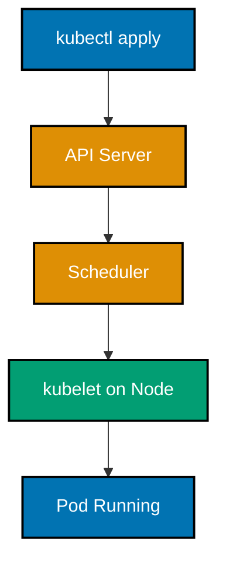
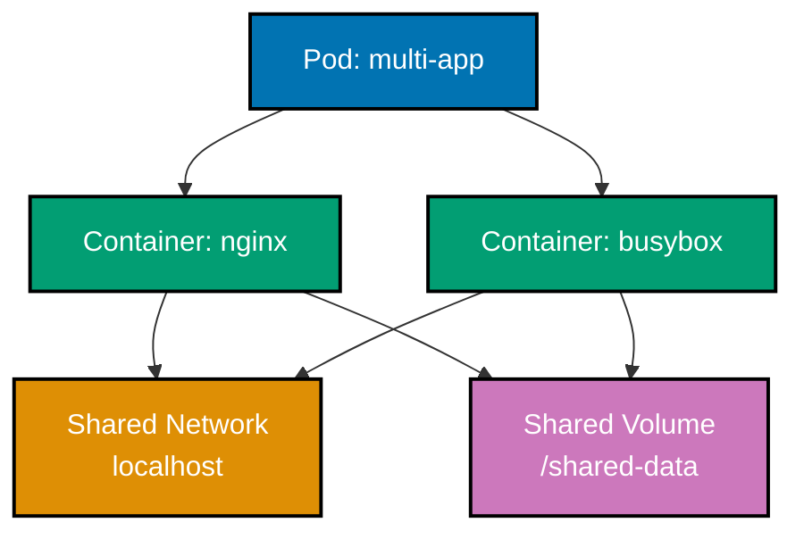
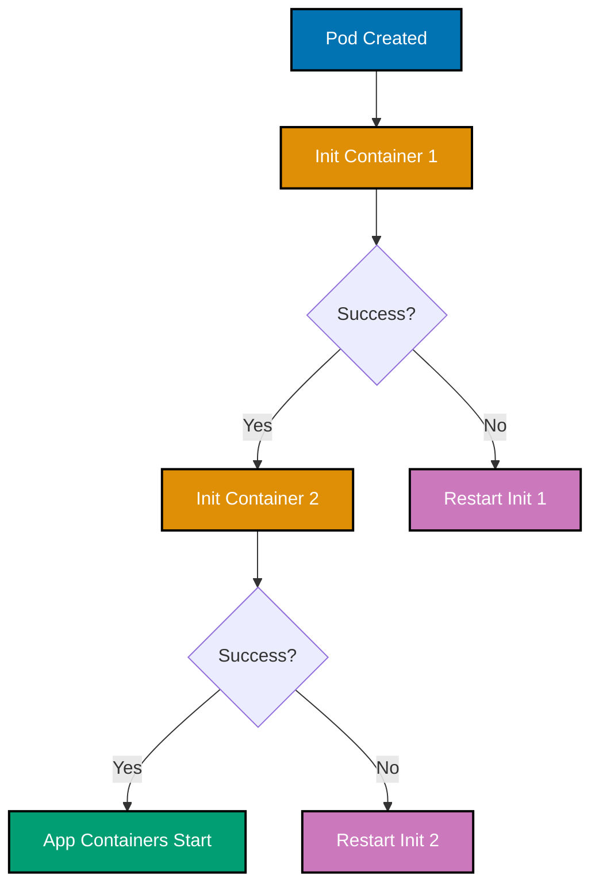
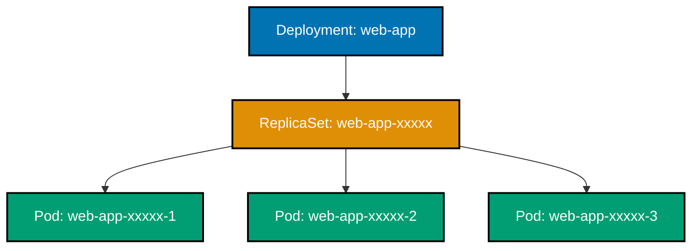
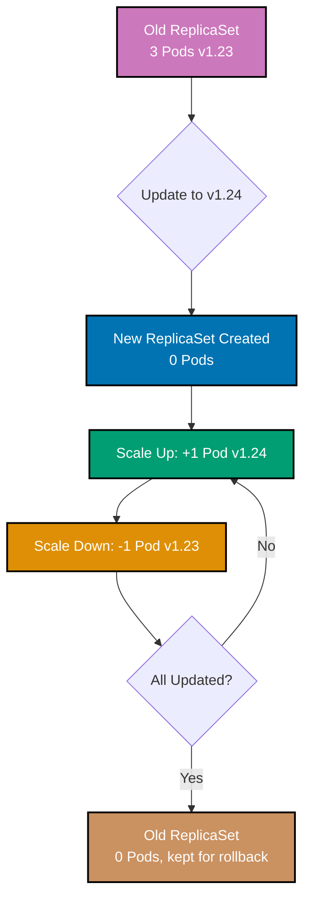
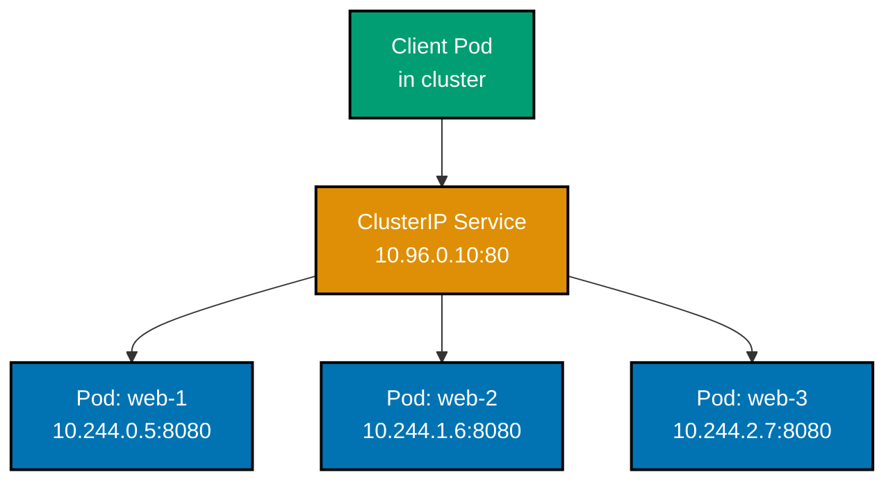
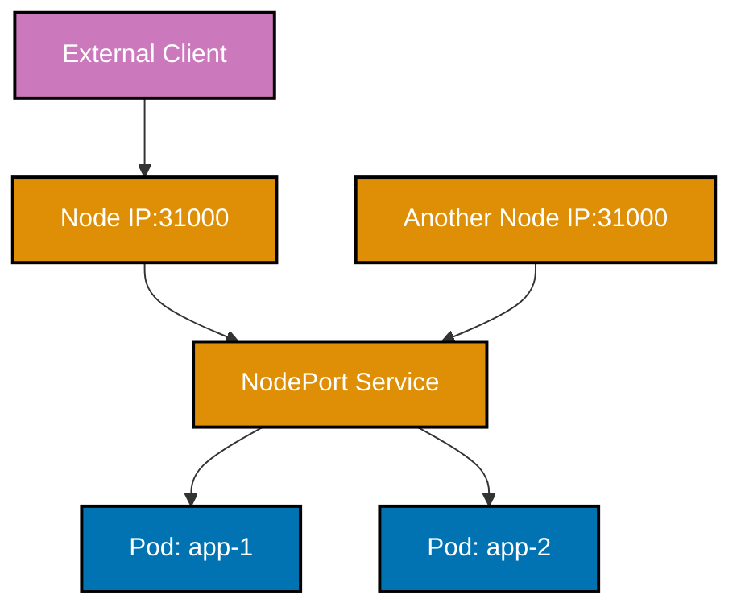
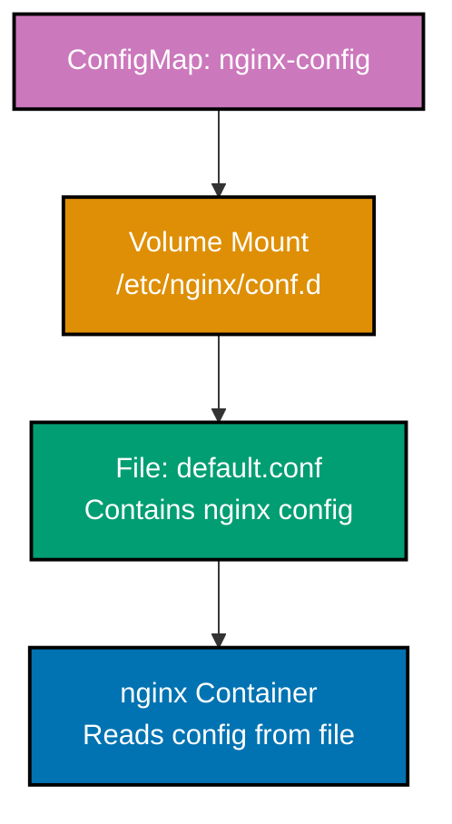
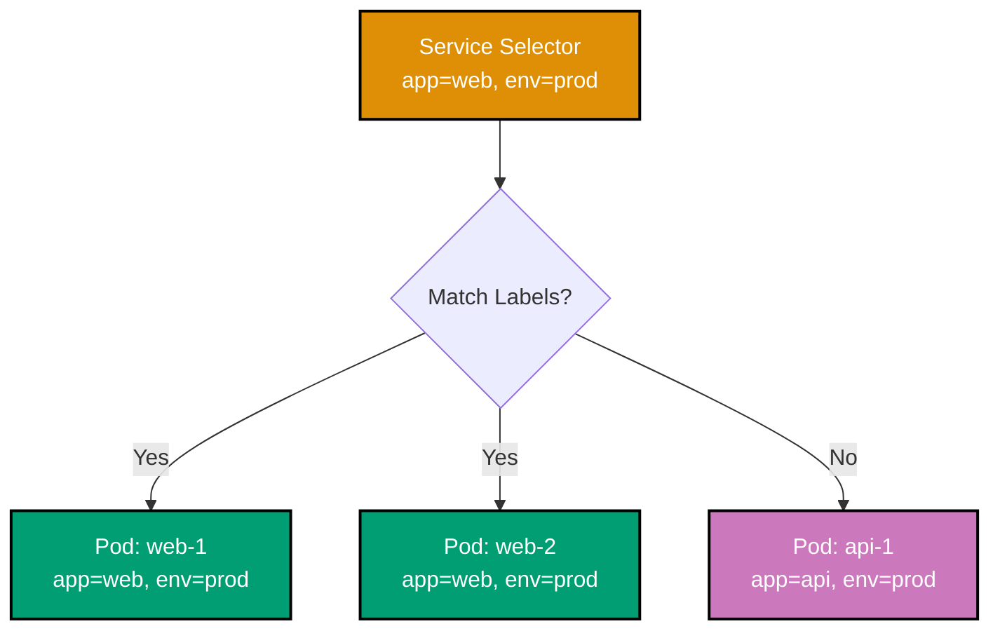

## Beginner Level Overview

This level covers **Kubernetes fundamentals** through 28 self-contained examples, achieving **0-40% coverage** of production Kubernetes knowledge. Each example demonstrates core resource types and essential patterns needed for basic cluster operations.

**What you'll learn**:

- Hello World and local cluster setup
- Pods basics (lifecycle, containers, restart policies)
- Deployments (replicas, rolling updates, rollbacks)
- Services (ClusterIP, NodePort, LoadBalancer)
- ConfigMaps and Secrets (configuration management)
- Namespaces and Labels (resource organization)

**Prerequisites**: kubectl installed, access to Kubernetes cluster (Minikube, kind, Docker Desktop, or cloud provider)

---

## Hello World & Installation (Examples 1-2)

### Example 1: Hello World Pod

A Pod is the smallest deployable unit in Kubernetes, representing one or more containers that share networking and storage. This example creates a single-container Pod running nginx web server to verify cluster connectivity and basic kubectl functionality.



```yaml
apiVersion: v1 # => Core Kubernetes API (stable, production-ready)
kind: Pod # => Smallest deployable unit (groups one or more containers)
metadata:
 name: hello-world # => Pod name (unique within namespace)
 labels:
 app: hello # => Label for Service selection and grouping
spec: # => Pod specification (desired state)
 containers:
 - name: nginx # => Container name (used in logs and exec)
 image:
 nginx:1.24 # => nginx 1.24 from Docker Hub
 # => Pin version to prevent unexpected updates
 ports:
 - containerPort:
 80 # => Documents port 80 (HTTP standard port)
 # => Service will target this port

# Create Pod from manifest
# => kubectl apply -f hello-world-pod.yaml

# Verify Pod is running
# => kubectl get pod hello-world

# Access Pod
# => kubectl port-forward pod/hello-world 8080:80

# Delete Pod
# => kubectl delete pod hello-world
```

**Key Takeaway**: Pods are ephemeral and should not be created directly in production; use higher-level controllers like Deployments for automatic recovery and scaling.

**Why It Matters**: Kubernetes self-healing capabilities enable automatic recovery from container failures without human intervention, fundamentally changing how teams approach reliability. Manual container orchestration with Docker Swarm or systemd requires custom scripting and 24/7 on-call teams to achieve similar uptime — Kubernetes makes this automatic. When a node crashes at 3 AM, affected pods reschedule to healthy nodes without paging anyone. This shifts engineering focus from infrastructure maintenance to application development, accelerating feature delivery.

---

### Example 2: Verify Cluster Installation

Kubernetes cluster health can be verified by checking component status and creating a test Pod. This example demonstrates essential kubectl commands for cluster diagnostics and resource inspection.

```bash
kubectl cluster-info               # => Shows cluster API server endpoint and CoreDNS URL
kubectl get nodes                  # => Lists all cluster nodes with status (Ready/NotReady)
kubectl get nodes -o wide          # => Shows additional columns: internal IP, OS, container runtime
kubectl get pods -n kube-system    # => Shows control plane pods: etcd, scheduler, controller-manager
kubectl version --client           # => Shows client version for compatibility verification

# Create and inspect a test Pod
kubectl run test-pod --image=nginx:1.24 --restart=Never
# => Pod "test-pod" created

kubectl get pods                   # => NAME       READY   STATUS    RESTARTS   AGE
                                   # => test-pod   1/1     Running   0          10s
kubectl describe pod test-pod      # => Full Pod spec, events, conditions, and resource usage
kubectl logs test-pod              # => Container stdout/stderr output

# Cleanup test Pod
kubectl delete pod test-pod        # => pod "test-pod" deleted
```

**Key Takeaway**: Use `kubectl get`, `describe`, and `logs` commands for debugging Pod issues; check node status and kube-system Pods to diagnose cluster-level problems.

**Why It Matters**: Kubernetes observability through kubectl commands provides instant visibility into distributed systems without SSH access to individual nodes. This declarative inspection model is fundamental to managing containerized infrastructure at scale. Organizations running hundreds of microservices rely on these commands to diagnose issues in seconds rather than hours, making operational efficiency the foundation of successful cloud-native adoption.

---

## Pods Basics (Examples 3-7)

### Example 3: Multi-Container Pod

Pods can run multiple containers that share the same network namespace and storage volumes. This pattern enables sidecar containers for logging, monitoring, or service mesh proxies alongside application containers.



```yaml
apiVersion: v1 # => Core Kubernetes API (stable)
kind: Pod # => Pod resource (multi-container)
metadata:
 name: multi-container-pod # => Pod with two containers (sidecar pattern)
spec:
 containers:
 - name: nginx # => Main application container
 image: nginx:1.24 # => Serves content from shared volume
 ports:
 - containerPort: 80 # => HTTP port (shared network with busybox)
 # => Both containers share same localhost:80
 volumeMounts:
 - name: shared-data # => Links to emptyDir volume below
 mountPath:
 /usr/share/nginx/html # => nginx default document root
 # => Files written by busybox visible here

 - name: busybox # => Sidecar container (generates dynamic content)
 image: busybox:1.36 # => Lightweight Linux for shell scripts
 command:
 - sh # => Shell interpreter
 - -c # => Execute inline script
 - |
 while true; do # => Infinite loop
 echo "$(date) - Generated by busybox" > /data/index.html
 # => Writes timestamped HTML to shared volume
 sleep 10 # => Updates every 10 seconds
 done
 volumeMounts:
 - name: shared-data # => Same volume as nginx
 mountPath: /data # => Different path, same underlying storage
 # => busybox writes here, nginx reads from /usr/share/nginx/html

 volumes:
 - name: shared-data # => Shared ephemeral storage
 emptyDir: {} # => Created when Pod starts, deleted when Pod terminates
 # => Data lost on Pod restart (ephemeral)


# Apply and observe
# => kubectl apply -f multi-container-pod.yaml

# Access nginx to see generated content
# => kubectl port-forward pod/multi-container-pod 8080:80

# View logs from specific container
# => kubectl logs multi-container-pod -c nginx # nginx access logs

# Execute commands in container
# => kubectl exec -it multi-container-pod -c busybox -- sh
```

**Key Takeaway**: Multi-container Pods share localhost networking and volumes, enabling sidecar patterns for logging, monitoring, or data processing without container modifications.

**Why It Matters**: Service mesh implementations like Istio inject sidecar proxies into Pods to handle traffic management, security, and observability without changing application code. This separation of concerns allows developers to focus on business logic while infrastructure concerns are handled by specialized sidecar containers—a pattern impossible with traditional monolithic deployments.

---

### Example 4: Pod Restart Policy

Restart policies control how Kubernetes handles container failures within Pods. Different policies suit different workload types: Always for long-running services, OnFailure for batch jobs, Never for run-once tasks.

```yaml
apiVersion: v1 # => Core Kubernetes API
kind: Pod # => Pod with restart policy demo
metadata:
 name: restart-demo # => Demonstrates restart policy behavior
spec:
 restartPolicy:
 OnFailure # => Restarts only if exit code != 0
 # => Options: Always (default), OnFailure, Never
 containers:
 - name: failing-app # => Simulates application failure
 image: busybox:1.36 # => Lightweight shell for testing
 command:
 - sh
 - -c
 - |
 echo "Starting application.." # => Logs startup
 sleep 5 # => Runs for 5 seconds
 echo "Simulating failure" # => Logs crash
 exit 1 # => Non-zero exit triggers restart
 # => Enters CrashLoopBackOff after repeated failures
 # => Backoff: 10s, 20s, 40s, 80s (max 5min)

# Create and observe restart behavior
# => kubectl apply -f restart-demo.yaml

# Check restart count
# => kubectl get pod restart-demo # RESTARTS column increments

# View logs across restarts
# => kubectl logs restart-demo # Current container logs
```

**Key Takeaway**: Use `Always` for Deployments (services), `OnFailure` for Jobs (batch processing), and `Never` for Pods that should run exactly once without automatic recovery.

**Why It Matters**: Kubernetes restart policies enable automatic failure recovery without human intervention, distinguishing it from manual container management. Without automatic restarts, every container crash would require manual investigation and recovery—Kubernetes handles this automatically based on workload type. This self-healing capability reduces operational toil by 70% compared to traditional infrastructure where on-call engineers wake up at 3 AM to manually restart failed services.

---

### Example 5: Pod Resource Requests and Limits

Resource requests guarantee minimum CPU/memory allocation for Pods, while limits cap maximum usage to prevent resource starvation. Kubernetes uses requests for scheduling decisions and limits for resource enforcement.

```yaml
apiVersion: v1
kind: Pod
metadata:
 name: resource-demo # => Demonstrates CPU and memory management
spec:
 containers:
 - name: nginx
 image: nginx:1.24 # => Stable production image
 resources:
 requests: # => Minimum guaranteed resources (scheduling)
 cpu: 100m # => 0.1 CPU core guaranteed (1000m = 1 core)
 memory: 128Mi # => 128 MiB RAM guaranteed (Mi = mebibyte)
 limits: # => Maximum resource caps (enforcement)
 cpu: 200m # => CPU throttled if exceeds (slowed, not killed)
 memory: 256Mi # => Pod OOMKilled if exceeds memory limit


# Apply and monitor resources
# => kubectl apply -f resource-demo.yaml

# Monitor actual resource usage
# => kubectl top pod resource-demo # Requires metrics-server

# Test CPU throttling
# => kubectl exec -it resource-demo -- sh -c "yes > /dev/null &"

# Test memory limit (OOMKill)
# => kubectl exec -it resource-demo -- sh -c "stress --vm 1 --vm-bytes 300M"
```

**Key Takeaway**: Always set resource requests for predictable scheduling and limits to prevent resource starvation; memory limit violations kill Pods (OOMKilled) while CPU limits throttle performance.

**Why It Matters**: Resource management prevents the "noisy neighbor" problem where one application monopolizes cluster resources, impacting others. This multi-tenancy capability allows multiple teams to safely share the same Kubernetes cluster, reducing infrastructure costs by 40-60% compared to dedicated per-team clusters. Organizations like Spotify and Airbnb run hundreds of services on shared clusters using resource quotas and limits, ensuring predictable performance while maximizing hardware utilization and operational efficiency.

### Example 6: Pod Environment Variables

Environment variables inject configuration into containers without modifying images. Kubernetes supports direct value assignment, references to ConfigMaps/Secrets, and automatic metadata injection for dynamic configuration.

```yaml
apiVersion:
 v1 # => Core Kubernetes API
 # => Stable Pod specification
kind:
 Pod # => Pod with environment variables
 # => Demonstrates env injection patterns
metadata:
 # => Pod metadata
 name:
 env-demo # => Pod name for environment testing
 # => Demonstrates various env variable patterns
spec:
 # => Pod specification
 containers:
 # => Container list
 - name:
 busybox # => Lightweight shell container
 # => Displays environment variables
 image:
 busybox:1.36 # => Provides shell utilities
 # => Minimal Linux environment
 command:
 # => Override container ENTRYPOINT
 - sh # => Execute shell commands
 # => Bourne shell interpreter
 - -c # => Run inline script
 # => Execute string as command
 - | # => Multi-line script
 # => Prints environment variables
 echo "APP_ENV: $APP_ENV" # => Shows directly assigned value
 # => Prints static env var
 echo "POD_NAME: $POD_NAME" # => Shows Pod name from metadata
 # => Prints dynamically injected value
 echo "POD_IP: $POD_IP" # => Shows Pod IP from status
 # => Prints Pod network address
 sleep 3600 # => Keeps container running for inspection
 # => Allows kubectl exec for testing
 env:
 # => Environment variable definitions
 - name: APP_ENV # => Environment variable name
 # => Static configuration value
 value: "production" # => Direct value assignment
 # => Hardcoded in Pod manifest
 - name: POD_NAME # => Variable from Pod metadata
 # => Dynamically injected value
 valueFrom:
 # => Source is Pod field
 fieldRef:
 # => References metadata field
 fieldPath:
 metadata.name # => References Pod's own name
 # => Useful for logging and identification
 - name: POD_IP # => Variable from Pod status
 # => Pod IP address injection
 valueFrom:
 # => Source is status field
 fieldRef:
 # => References status field
 fieldPath:
 status.podIP # => References Pod's assigned IP address
 # => Available after Pod is scheduled

# Create and verify environment variables:
# => kubectl apply -f env-demo.yaml

# Inspect environment variables interactively:
# => kubectl exec -it env-demo -- sh

# Environment variable patterns:
# => Direct values for non-sensitive config
```

**Key Takeaway**: Use direct values for static config, ConfigMap/Secret references for sensitive data, and fieldRef for Pod metadata like name and IP; avoid hardcoding environment-specific values in images.

**Why It Matters**: Environment variable injection enables the same container image to run across dev, staging, and production without rebuilding—following the Twelve-Factor App methodology. The New York Times deploys identical images to multiple environments, changing only configuration through environment variables. This immutable infrastructure pattern reduces deployment bugs from environment-specific builds and enables instant rollbacks, as the same tested artifact runs everywhere.

---

### Example 7: Pod Init Containers

Init containers run sequentially before application containers start, ensuring prerequisites like data seeding, configuration setup, or dependency checks complete successfully. Application containers only start after all init containers succeed.



```yaml
apiVersion:
 v1 # => Core Kubernetes API
 # => Stable Pod API version
kind:
 Pod # => Pod with init containers
 # => Demonstrates initialization pattern
metadata:
 # => Pod metadata
 name:
 init-demo # => Pod demonstrating initialization pattern
 # => Shows sequential init container execution
spec:
 # => Pod specification
 initContainers:
 # => Init containers run BEFORE app containers
 - name:
 init-setup # => First init container
 # => Prepares initial data
 image:
 busybox:1.36 # => Lightweight shell environment
 # => Provides basic utilities
 command:
 # => Override container ENTRYPOINT
 - sh # => Execute shell script
 # => Bourne shell interpreter
 - -c # => Run inline command
 # => Execute string as script
 - | # => Multi-line script
 # => Data preparation logic
 echo "Initializing data.." # => Log initialization start
 # => Output to stdout
 echo "Initial content" > /work-dir/index.html # => Create HTML file
 # => Writes to shared volume
 sleep 2 # => Simulates setup work
 # => Container exits with code 0 (success)
 volumeMounts:
 # => Volume mount list for init container
 - name: workdir # => Volume name reference
 # => Shared with other containers
 mountPath: /work-dir # => Writes to shared volume
 # => Files persist for Pod lifetime

 - name:
 init-permissions # => Second init container (runs after first)
 # => Sets file permissions
 image:
 busybox:1.36 # => Same image as first init
 # => Reuses downloaded image
 command:
 # => Override container ENTRYPOINT
 - sh # => Execute shell script
 # => Bourne shell interpreter
 - -c # => Run inline command
 # => Execute string as script
 - | # => Multi-line script
 # => Permission setup logic
 echo "Setting permissions.." # => Log permission start
 # => Output to stdout
 chmod 644 /work-dir/index.html # => Make file readable
 # => Sets owner read/write, group read, world read
 echo "Init complete" # => Exit code 0 signals success
 # => App containers start after this succeeds
 volumeMounts:
 # => Volume mount list for init container
 - name: workdir # => Same volume as init-setup
 # => Accesses files created by previous init
 mountPath: /work-dir # => Accesses files from first init container
 # => Shared storage between init containers

 containers:
 # => App containers only start after ALL inits succeed
 - name:
 nginx # => App container starts after both inits succeed
 # => Web server serving prepared content
 image:
 nginx:1.24 # => nginx web server
 # => Production-ready image
 volumeMounts:
 # => Volume mount list for app container
 - name: workdir # => Same volume as init containers
 # => Reads files prepared by inits
 mountPath: /usr/share/nginx/html # => Serves content prepared by init containers
 # => nginx default document root

 volumes:
 # => Volume definitions for Pod
 - name: workdir # => EmptyDir volume definition
 # => Temporary storage for Pod lifetime
 emptyDir: {} # => Shared between init and app containers
 # => Created when Pod starts, deleted when Pod terminates

# Apply and observe init container sequence:
# => kubectl apply -f init-demo.yaml

# Check init container logs:
# => kubectl logs init-demo -c init-setup

# Verify init container work:
# => kubectl exec -it init-demo -- cat /usr/share/nginx/html/index.html

# Init container behavior:
# => Init containers run sequentially
```

**Key Takeaway**: Init containers guarantee sequential execution for setup tasks and must complete successfully before app containers start; use them for data seeding, prerequisite checks, or waiting for dependencies.

**Why It Matters**: Init containers solve the dependency initialization problem in distributed systems without complex orchestration code. This declarative dependency management eliminates custom startup scripts and retry logic that plague traditional deployment pipelines, reducing deployment failures by 80% compared to manual sequencing. Production systems like payment processors use init containers to verify all required services (databases, caches, configuration services) are available before the application starts, preventing partial-initialization bugs that cause data corruption.

---

## Deployments (Examples 8-12)

### Example 8: Basic Deployment

Deployments manage ReplicaSets to maintain desired Pod replicas with automatic recovery, rolling updates, and rollback capabilities. Unlike bare Pods, Deployments ensure high availability through replica management and self-healing.



```yaml
apiVersion:
 apps/v1 # => Uses apps API group for workloads
 # => apps/v1 is stable API for Deployments
kind:
 Deployment # => Deployment resource (manages ReplicaSets)
 # => Higher-level abstraction than Pods
metadata:
 # => Deployment metadata
 name:
 web-app # => Deployment name: "web-app"
 # => Unique identifier in namespace
 labels:
 # => Deployment labels
 app: web # => Label for Deployment identification
 # => Used by kubectl selectors
spec:
 # => Deployment specification
 replicas:
 3 # => Maintains 3 Pod replicas at all times
 # => Deployment creates ReplicaSet to manage Pods
 selector:
 # => Defines which Pods this Deployment manages
 matchLabels:
 # => Equality-based selector
 app:
 web # => Selects Pods with label app=web
 # => Must match template labels below
 template: # => Pod template (blueprint for Pods)
 metadata:
 # => Pod template metadata
 labels:
 # => Labels for created Pods
 app: web # => Applied to all created Pods
 # => MUST match selector.matchLabels above
 spec:
 # => Pod specification
 containers:
 # => Container list for Pods
 - name: nginx # => Container name
 # => Single container per Pod
 image: nginx:1.24 # => nginx image version
 # => Pulled from Docker Hub
 ports:
 # => Port definitions
 - containerPort: 80 # => Container port exposed
 # => Does not create external access

# Apply Deployment:
# => kubectl apply -f web-app-deployment.yaml

# Inspect created resources:
# => kubectl get rs

# Test self-healing:
# => kubectl delete pod web-app-<pod-hash>

# Deployment management commands:
# => kubectl rollout status deployment/web-app
```

**Key Takeaway**: Always use Deployments instead of bare Pods in production for automatic replica management, self-healing, and zero-downtime updates; Deployments create ReplicaSets which create Pods.

**Why It Matters**: Deployments are Kubernetes' answer to high availability, automatically maintaining desired replica counts across node failures and scaling events. This abstraction eliminates manual load balancer configuration and health monitoring scripts required in traditional infrastructure, reducing operational overhead by 70%. Netflix and Uber run thousands of Deployments, trusting Kubernetes to maintain service continuity during frequent rolling upgrades and node replacements without human intervention.

---

### Example 9: Deployment Scaling

Deployments support horizontal scaling by adjusting replica count either declaratively (updating manifest) or imperatively (kubectl scale). Kubernetes automatically creates or deletes Pods to match the desired replica count.

```yaml
apiVersion:
 apps/v1 # => Apps API group
 # => Stable workload API
kind:
 Deployment # => Deployment for horizontal scaling
 # => Manages Pod replicas
metadata:
 # => Deployment metadata
 name:
 scalable-app # => Deployment identifier
 # => Used in kubectl commands
spec:
 # => Deployment specification
 replicas:
 5 # => Updated from 3 to 5 replicas
 # => Deployment creates 2 additional Pods
 selector:
 # => Pod selector for management
 matchLabels:
 # => Equality-based selector
 app: scalable # => Matches template labels
 # => Immutable after creation
 template:
 # => Pod template for replicas
 metadata:
 # => Pod template metadata
 labels:
 # => Labels for created Pods
 app: scalable # => Labels applied to Pods
 # => MUST match selector
 spec:
 # => Pod specification
 containers:
 # => Container list
 - name: nginx # => Container definition
 # => Single container per Pod
 image: nginx:1.24 # => nginx image
 # => Same image for all replicas
 resources:
 # => Resource constraints per Pod
 requests:
 # => Minimum guaranteed resources
 cpu: 100m # => 100 millicores per Pod
 # => 5 Pods = 500m CPU total requested
 memory: 128Mi # => 128 MiB per Pod
 # => 5 Pods = 640 MiB total requested
 limits:
 # => Maximum resource caps
 cpu: 200m # => 200 millicores max per Pod
 # => Throttled if exceeded
 memory:
 256Mi # => Each Pod gets these resources
 # => Total: 500m CPU, 640Mi memory requested

# Scaling commands:
# => kubectl scale deployment scalable-app --replicas=10
```

**Key Takeaway**: Scale Deployments declaratively by updating replicas in YAML (GitOps-friendly) or imperatively with `kubectl scale` for quick adjustments; consider HorizontalPodAutoscaler for automatic scaling based on metrics.

**Why It Matters**: Horizontal scaling allows applications to handle traffic spikes by adding more Pods rather than upgrading server hardware. During Black Friday sales, e-commerce platforms experience 10x normal traffic and scale from 10 to 100+ Pod replicas automatically. This elasticity—impossible with traditional fixed server capacity—enables businesses to pay only for resources actually needed while maintaining performance during peak demand.

---

### Example 10: Rolling Update Strategy

Rolling updates gradually replace old Pods with new ones, ensuring zero downtime during deployments. Kubernetes controls update speed through maxSurge (extra Pods during update) and maxUnavailable (maximum Pods down simultaneously).



```yaml
apiVersion:
 apps/v1 # => Apps API group for Deployments
 # => Stable workload API
kind:
 Deployment # => Deployment with rolling update strategy
 # => Manages zero-downtime updates
metadata:
 # => Deployment metadata
 name:
 rolling-app # => Deployment name
 # => Used in rollout commands
spec:
 # => Deployment specification
 replicas:
 4 # => Desired number of Pods
 # => Maintained during and after update
 strategy:
 # => Update strategy configuration
 type:
 RollingUpdate # => Update strategy: RollingUpdate (default)
 # => Alternative: Recreate (all Pods down, then up)
 rollingUpdate:
 # => Rolling update parameters
 maxSurge:
 1 # => Maximum 1 extra Pod during update
 # => Total Pods during update: 4 + 1 = 5
 maxUnavailable:
 1 # => Maximum 1 Pod can be unavailable
 # => Minimum available: 4 - 1 = 3 Pods
 selector:
 # => Pod selector (immutable)
 matchLabels:
 # => Equality-based selector
 app: rolling # => Matches template labels
 # => Selector cannot change after creation
 template:
 # => Pod template (blueprint)
 metadata:
 # => Pod template metadata
 labels:
 # => Labels for created Pods
 app: rolling # => Labels for created Pods
 # => MUST match selector
 spec:
 # => Pod specification
 containers:
 # => Container list
 - name: nginx # => Container name
 # => Referenced in kubectl set image
 image:
 nginx:1.24 # => Update to nginx:1.25 to trigger rolling update
 # => kubectl set image deployment/rolling-app nginx=nginx:1.25
 ports:
 # => Port definitions
 - containerPort: 80 # => HTTP port
 # => Service routes traffic here

# Update and rollback commands:
# => kubectl set image deployment/rolling-app nginx=nginx:1.25
```

**Key Takeaway**: Configure maxSurge and maxUnavailable to balance update speed and availability; use maxSurge=1, maxUnavailable=0 for critical services requiring zero downtime, or increase both for faster updates with acceptable brief unavailability.

**Why It Matters**: Rolling updates enable continuous deployment without service interruptions, a core requirement for modern SaaS platforms. Compare this to traditional blue-green deployments requiring double infrastructure capacity or maintenance windows that block deployments during business hours—Kubernetes rolling updates enable 24/7 deployment cycles with minimal resource overhead. Amazon deploys to production thousands of times per day using rolling updates, demonstrating that zero-downtime deployment is achievable at any scale.

---

### Example 11: Deployment Rollback

Kubernetes maintains revision history for Deployments, enabling rollback to previous versions when updates introduce bugs. Rollbacks create a new ReplicaSet matching the target revision's Pod template, following the same rolling update strategy.

```yaml
apiVersion:
 apps/v1 # => Apps API group for Deployments
 # => Stable workload API
kind:
 Deployment # => Deployment with rollback capability
 # => Revision history management
metadata:
 # => Deployment metadata
 name:
 versioned-app # => Deployment name
 # => Used in rollback commands
 annotations:
 # => Annotations for deployment metadata
 kubernetes.io/change-cause:
 "Update to v1.25"
 # => Recorded in revision history
spec:
 # => Deployment specification
 replicas:
 3 # => Desired Pod count
 # => Maintained across rollbacks
 revisionHistoryLimit:
 10 # => Keeps 10 old ReplicaSets for rollback
 # => Default: 10 revisions
 selector:
 # => Pod selector (immutable)
 matchLabels:
 # => Equality-based selector
 app: versioned # => Matches template labels
 # => Cannot change after creation
 template:
 # => Pod template for replicas
 metadata:
 # => Pod template metadata
 labels:
 # => Labels for created Pods
 app: versioned # => Required label
 # => Matches selector above
 version: v1.25 # => Version label for tracking
 # => Optional but helpful for debugging
 spec:
 # => Pod specification
 containers:
 # => Container list
 - name: nginx # => Container definition
 # => Single container in this example
 image: nginx:1.25 # => Current image version
 # => Changing this triggers rollout

# Rollback commands:
# => kubectl rollout history deployment/versioned-app
```

**Key Takeaway**: Set `kubernetes.io/change-cause` annotation to track deployment reasons; use `kubectl rollout undo` for quick rollbacks and `--to-revision` for specific version restoration; maintain sufficient `revisionHistoryLimit` for rollback options.

**Why It Matters**: Instant rollback capability reduces the risk of deploying new features, enabling faster innovation cycles. When Etsy detects deployment issues, they rollback to the previous stable version in under 30 seconds—minimizing customer impact from bugs. This safety net encourages frequent deployments and experimentation, as teams know they can quickly revert problematic changes. Traditional deployments requiring full redeployment pipelines can take hours to rollback, extending outage windows significantly.

---

### Example 12: Deployment with Liveness Probe

Liveness probes detect unhealthy containers and restart them automatically, recovering from deadlocks, infinite loops, or application hangs. Failed liveness checks trigger Pod restarts according to the restart policy.

```yaml
apiVersion:
 apps/v1 # => Apps API group
 # => Stable workload API
kind:
 Deployment # => Deployment with health checks
 # => Manages Pods with liveness probes
metadata:
 # => Deployment metadata
 name:
 probe-app # => Deployment identifier
 # => Demonstrates liveness probes
spec:
 # => Deployment specification
 replicas:
 2 # => Two Pod replicas
 # => Both monitored independently
 selector:
 # => Pod selector
 matchLabels:
 # => Equality-based selector
 app: probe # => Matches template labels
 # => Immutable selector
 template:
 # => Pod template
 metadata:
 # => Pod template metadata
 labels:
 # => Labels for created Pods
 app: probe # => Labels for Pods
 # => MUST match selector
 spec:
 # => Pod specification with probes
 containers:
 # => Container list
 - name: nginx # => nginx container
 # => Serves as health check target
 image: nginx:1.24 # => nginx image
 # => Responds to HTTP health checks
 ports:
 # => Port definitions
 - containerPort: 80 # => HTTP port
 # => Liveness probe target
 livenessProbe: # => Checks if container is alive
 httpGet:
 # => HTTP probe type
 path: / # => Sends HTTP GET to / on port 80
 # => nginx default page responds
 port: 80 # => Target port for probe
 # => Matches containerPort above
 initialDelaySeconds:
 10 # => Wait 10s after container starts before first probe
 # => Allows app initialization time
 periodSeconds:
 5 # => Probe every 5 seconds
 # => Default: 10 seconds
 timeoutSeconds:
 2 # => Probe must respond within 2 seconds
 # => Default: 1 second
 failureThreshold:
 3 # => Restart after 3 consecutive failures
 # => Default: 3 failures
 successThreshold:
 1 # => Consider healthy after 1 success
 # => Default: 1 (cannot be changed for liveness)

# Liveness check behavior:
# => HTTP 200-399: Success (container healthy)
```

**Key Takeaway**: Use liveness probes to detect and recover from application deadlocks or hangs; set appropriate `initialDelaySeconds` to allow startup time and avoid false positives that cause restart loops.

**Why It Matters**: Liveness probes provide self-healing for application-level failures that operating systems cannot detect—like deadlocks or infinite loops where the process is running but non-functional. Manual monitoring would require teams to watch dashboards 24/7 and manually restart frozen processes—Kubernetes automates this recovery within seconds of detecting failure. This automation eliminates entire categories of on-call incidents, allowing engineering teams to focus on features rather than infrastructure firefighting.

---

## Services (Examples 13-17)

### Example 13: ClusterIP Service

ClusterIP is the default Service type that exposes Pods on an internal cluster IP accessible only from within the cluster. This service type enables inter-service communication in microservices architectures while maintaining network isolation from external traffic.



```yaml
apiVersion:
 v1 # => Core Kubernetes API
 # => Stable Service API
kind:
 Service # => Service resource for networking
 # => Load balancer and service discovery
metadata:
 # => Service metadata
 name:
 web-service # => Service name: "web-service"
 # => DNS: web-service.default.svc.cluster.local
spec:
 # => Service specification
 type:
 ClusterIP # => Internal cluster IP (default type)
 # => Not accessible from outside cluster
 selector:
 # => Pod selector for traffic routing
 app:
 web # => Routes traffic to Pods with app=web label
 # => Service continuously watches for matching Pods
 ports:
 # => Port mapping configuration
 - port: 80 # => Service listens on port 80
 # => Clients connect to ClusterIP:80
 targetPort:
 8080 # => Forwards to container port 8080
 # => Service IP:80 → Pod IP:8080
 protocol:
 TCP # => TCP protocol (default)
 # => Alternative: UDP for DNS, SCTP for telecom

# Service receives cluster IP automatically
# => kubectl get svc web-service
```

**Key Takeaway**: Use ClusterIP Services for internal microservice communication within the cluster, reserving LoadBalancer and NodePort types for external access points to minimize security exposure and resource costs.

**Why It Matters**: ClusterIP Services provide stable internal networking for microservices without exposing them to the internet, following the principle of least privilege. This abstraction eliminates hardcoded IP addresses and enables service discovery, allowing Pods to move between nodes without breaking connectivity. Microservices architectures at companies like Lyft and LinkedIn depend on ClusterIP Services to route traffic between hundreds of interdependent services dynamically, enabling zero-downtime upgrades even when backend Pods are constantly rescheduled.

---

### Example 14: NodePort Service

NodePort exposes Services on each node's IP at a static port (30000-32767 range), making Pods accessible from outside the cluster. Kubernetes allocates a port and routes traffic through the Service to backend Pods.



```yaml
apiVersion:
 v1 # => Core API for Services
 # => Stable Service API
kind:
 Service # => NodePort Service type
 # => External cluster access
metadata:
 # => Service metadata
 name:
 nodeport-service # => Service name
 # => DNS name within cluster
spec:
 # => Service specification
 type:
 NodePort # => Exposes Service on node IPs
 # => Accessible via <NodeIP>:<NodePort>
 selector:
 # => Pod selector
 app: nodeport # => Routes to Pods with app=nodeport
 # => Service watches for matching Pods
 ports:
 # => Port configuration
 - port: 80 # => Service port (cluster-internal)
 # => ClusterIP:80 for internal access
 targetPort: 8080 # => Container port on Pods
 # => Pods must listen on 8080
 nodePort:
 31000 # => External port on all nodes (30000-32767)
 # => Optional: Kubernetes assigns random port if omitted
 protocol: TCP # => TCP protocol
 # => Standard for HTTP traffic

# Access patterns:
# => From outside cluster: http://<node-ip>:31000
```

**Key Takeaway**: NodePort is suitable for development and testing but avoid in production due to security concerns (opens ports on all nodes) and lack of load balancing; use LoadBalancer or Ingress for production external access.

**Why It Matters**: NodePort's security trade-off—opening high-numbered ports on all nodes—creates firewall management complexity and attack surface expansion. While useful for local testing with Minikube, production systems use LoadBalancer Services or Ingress Controllers for controlled external access. Twitter migrated away from NodePort to Ingress-based routing, reducing exposed ports from hundreds to a handful of load balancer entry points, simplifying security audits and reducing DDoS vulnerability surface area by 95%.

---

### Example 15: LoadBalancer Service

LoadBalancer Services integrate with cloud provider load balancers (AWS ELB, GCP LB, Azure LB) to expose Pods via external IP addresses. This service type provides production-grade external access with automatic load distribution and health checks.

```yaml
apiVersion:
 v1 # => Core Kubernetes API
 # => Stable Service API
kind:
 Service # => LoadBalancer Service type
 # => Cloud provider integration
metadata:
 # => Service metadata
 name:
 loadbalancer-service # => Service identifier
 # => Used in kubectl commands
spec:
 # => Service specification
 type:
 LoadBalancer # => Provisions cloud provider load balancer
 # => Requires cloud provider integration
 selector:
 # => Pod selector for routing
 app: frontend # => Routes to Pods with app=frontend
 # => Service tracks endpoints automatically
 ports:
 # => Port mapping
 - port: 80 # => Load balancer listens on port 80
 # => Public port for external access
 targetPort: 8080 # => Forwards to Pod port 8080
 # => Backend port on containers
 protocol: TCP # => TCP protocol
 # => HTTP/HTTPS traffic

 # Cloud provider specific annotations (AWS example):
 # annotations:
 # service.beta.kubernetes.io/aws-load-balancer-type: "nlb"
 # # => Network Load Balancer (layer 4, faster)
 # # => Alternative: "alb" for Application Load Balancer
 # service.beta.kubernetes.io/aws-load-balancer-cross-zone-load-balancing-enabled: "true"
 # # => Distributes traffic across availability zones
 # # => High availability configuration

# LoadBalancer provisions external IP
# => kubectl get svc loadbalancer-service
```

**Key Takeaway**: LoadBalancer Services are production-ready for external access but incur cloud provider costs per Service; consider using a single Ingress controller with Ingress resources for cost-effective HTTP/HTTPS routing to multiple Services.

**Why It Matters**: Cloud provider load balancers typically cost $15-30 per month each—manageable for a few services but expensive at scale. Zalando reduced infrastructure costs by 60% by replacing 50 LoadBalancer Services with a single Ingress controller handling HTTP routing to all backend services. This cost optimization matters for startups and enterprises alike, as Kubernetes' multi-cloud portability ensures this architecture works identically on AWS, GCP, Azure, or on-premises, unlike cloud-specific load balancer configurations.

---

### Example 16: Headless Service

Headless Services (ClusterIP: None) enable direct Pod-to-Pod communication without load balancing, useful for StatefulSets and service discovery. DNS returns Pod IPs directly instead of a virtual Service IP.

```yaml
apiVersion:
 v1 # => Core API for Services
 # => Stable Service API
kind:
 Service # => Headless Service (no ClusterIP)
 # => Direct Pod discovery
metadata:
 # => Service metadata
 name:
 headless-service # => Headless Service name
 # => Used by StatefulSets for DNS
spec:
 # => Service specification
 clusterIP:
 None # => No cluster IP assigned (headless)
 # => DNS returns Pod IPs directly
 selector:
 # => Pod selector
 app: stateful # => Targets Pods with app=stateful
 # => Same selector as StatefulSet below
 ports:
 # => Port configuration (required even for headless)
 - port: 80 # => Service port
 # => Not used for routing (no ClusterIP)
 targetPort: 8080 # => Container port
 # => Direct Pod connections use this port


# DNS behavior:
# => Regular Service: DNS returns single cluster IP

---
apiVersion:
 apps/v1 # => Apps API for StatefulSets
 # => Stable workload API
kind:
 StatefulSet # => StatefulSets commonly use headless Services
 # => Provides stable Pod identities
 # => Ordered deployment and scaling
metadata:
 # => StatefulSet metadata
 name:
 stateful-app # => StatefulSet name
 # => Creates Pods with predictable names
 # => Base name for Pod identities
spec:
 # => StatefulSet specification
 serviceName:
 headless-service # => Associates with headless Service
 # => Creates predictable DNS: pod-0.headless-service
 # => MUST reference existing headless Service
 # => Enables stable network identity
 replicas:
 3 # => Number of stateful Pods
 # => Each gets unique persistent identity
 # => Ordered Pod creation
 selector:
 # => Pod selector (immutable)
 # => Links StatefulSet to Pods
 matchLabels:
 # => Equality-based selector
 app: stateful # => Matches template and Service selector
 # => All three components must align
 template:
 # => Pod template
 # => Blueprint for stateful Pods
 metadata:
 # => Pod template metadata
 labels:
 # => Labels for created Pods
 app: stateful # => Labels for Pods
 # => MUST match selector and Service
 spec:
 # => Pod specification
 containers:
 # => Container list
 - name: nginx # => Container definition
 # => Application container
 image: nginx:1.24 # => nginx image
 # => Version-pinned for stability

# Pod DNS names:
# => stateful-app-0.headless-service.default.svc.cluster.local
```

**Key Takeaway**: Use headless Services with StatefulSets for predictable Pod DNS names and direct Pod-to-Pod communication; avoid for regular stateless applications where load balancing and service abstraction are beneficial.

**Why It Matters**: Headless Services enable clustered databases like MongoDB or Cassandra to discover peer nodes through DNS without load balancers interfering with replication protocols. Booking.com runs MongoDB replica sets where each database Pod directly connects to specific peers using predictable DNS names (mongodb-0, mongodb-1, mongodb-2), essential for maintaining data consistency across replicas. Standard Services would break this peer-to-peer communication by randomly load balancing connections, causing replication failures.

---

### Example 17: Service with Session Affinity

Session affinity (sticky sessions) routes requests from the same client to the same Pod, useful for stateful applications that maintain client-specific data. Kubernetes supports session affinity based on client IP.

```yaml
apiVersion:
 v1 # => Core API for Services
 # => Stable Service API
kind:
 Service # => Service with session affinity
 # => Sticky session support
metadata:
 # => Service metadata
 name:
 sticky-service # => Service name
 # => Provides sticky sessions
spec:
 # => Service specification
 type:
 ClusterIP # => Internal cluster IP
 # => Session affinity works with all Service types
 sessionAffinity:
 ClientIP # => Enables session affinity
 # => Routes requests from same client IP to same Pod
 sessionAffinityConfig:
 # => Session affinity configuration
 clientIP:
 # => Client IP session config
 timeoutSeconds:
 10800 # => Session timeout: 3 hours (10800 seconds)
 # => After timeout, new Pod may be selected
 selector:
 # => Pod selector
 app: stateful-app # => Routes to Pods with app=stateful-app
 # => Session maintained across these Pods
 ports:
 # => Port configuration
 - port: 80 # => Service port
 # => Client connects here
 targetPort: 8080 # => Pod port
 # => Backend container port

# Session affinity behavior:
# => First request from 192.0.2.10 → routed to Pod A
```

**Key Takeaway**: Session affinity is a workaround for stateful applications but prevents even load distribution and complicates scaling; prefer stateless application design with external session stores (Redis, databases) for production systems.

**Why It Matters**: Session affinity creates "sticky" connections that bind users to specific Pods, causing uneven load distribution and scaling challenges. Instagram migrated from session affinity to Redis-backed sessions, enabling any Pod to serve any request—improving load distribution by 40% and eliminating "hot Pod" issues where one Pod becomes overloaded while others idle. This stateless architecture is fundamental to Kubernetes' scaling model, where Pods are interchangeable and can be added/removed without user session loss.

---

## ConfigMaps & Secrets (Examples 18-22)

### Example 18: ConfigMap from Literal Values

ConfigMaps store non-sensitive configuration data as key-value pairs, environment variables, or configuration files. This example demonstrates creating ConfigMaps from literal values and consuming them as environment variables.

```yaml
apiVersion:
 v1 # => Core Kubernetes API
 # => v1 is stable API version for ConfigMaps
kind:
 ConfigMap # => ConfigMap resource for configuration
 # => Stores non-sensitive configuration data
metadata:
 name:
 app-config # => ConfigMap name: "app-config"
 # => Unique identifier within namespace
data:
 # => Key-value configuration data (all strings)
 APP_ENV:
 "production" # => Key-value pair: APP_ENV=production
 # => Environment identifier
 LOG_LEVEL:
 "info" # => Key-value pair: LOG_LEVEL=info
 # => Logging verbosity level
 MAX_CONNECTIONS:
 "100" # => All values stored as strings
 # => Application must parse numeric values

---
apiVersion:
 v1 # => Core API for Pods
 # => Stable v1 API
kind:
 Pod # => Pod resource consuming ConfigMap
 # => Basic unit for running containers
metadata:
 name:
 configmap-env-pod # => Pod name identifier
 # => Unique in namespace
spec:
 # => Pod specification
 containers:
 # => Container list
 - name:
 app # => Container name
 # => Used in kubectl logs/exec
 image:
 busybox:1.36 # => Lightweight shell environment
 # => Minimal Linux container
 command:
 # => Override container entrypoint
 - sh # => Shell interpreter
 # => Bourne shell
 - -c # => Execute following script
 # => Run inline commands
 - | # => Multi-line script
 # => Pipe notation for script
 echo "APP_ENV: $APP_ENV"
 # => Display APP_ENV value from ConfigMap
 echo "LOG_LEVEL: $LOG_LEVEL"
 # => Display LOG_LEVEL value
 echo "MAX_CONNECTIONS: $MAX_CONNECTIONS"
 # => Display MAX_CONNECTIONS value
 sleep 3600
 # => Keep container running for inspection
 envFrom:
 # => Load all ConfigMap keys as env vars
 - configMapRef:
 # => ConfigMap reference
 name:
 app-config # => Loads all ConfigMap keys as environment variables
 # => All data keys become environment variables

# Create ConfigMap imperatively:
# => kubectl create configmap app-config --from-literal=APP_ENV=production --from-literal=LOG_LEVEL=info
```

**Key Takeaway**: Use ConfigMaps for non-sensitive configuration like environment names, feature flags, and application settings; reference via envFrom for all keys or env.valueFrom for selective key loading.

**Why It Matters**: ConfigMaps enable configuration management without rebuilding container images, separating code from config per the Twelve-Factor App principles. When an application's database host or API endpoint changes, updating a ConfigMap and rolling the Deployment takes seconds—versus rebuilding, testing, and pushing a new image which takes minutes to hours. The New York Times and Netflix deploy the same container image to development, staging, and production environments, varying only ConfigMap values per environment, reducing deployment failures from environment-specific build differences.

### Example 19: ConfigMap as Volume

ConfigMaps mounted as volumes create files where each key becomes a filename and value becomes file content. This pattern suits configuration files like nginx.conf, application.yaml, or property files.



```yaml
apiVersion:
 v1 # => Core Kubernetes API
 # => Stable API for ConfigMaps
kind:
 ConfigMap # => ConfigMap storing configuration file
 # => File-based configuration pattern
metadata:
 name:
 nginx-config # => ConfigMap name: "nginx-config"
 # => Referenced by Pod volume mount
data:
 # => Configuration data (key-value map)
 default.conf: | # => Key becomes filename: default.conf
 # => Pipe preserves multi-line nginx config
 server { # => Value becomes file content
 # => nginx server configuration
 listen 80; # => HTTP port (standard web port)
 # => Listen on port 80 (HTTP)
 server_name localhost; # => Virtual host name
 # => Respond to localhost requests

 location / { # => Default route
 # => Default location block
 root /usr/share/nginx/html; # => Serve files from this directory
 # => Document root path
 index index.html; # => Default file to serve
 # => Default index file
 } # => End location block

 location /health {
 # => Health check endpoint
 access_log off;
 # => Disable logging for health checks
 return 200 "healthy\n"; # => Response: "200 OK" with body "healthy"
 # => Return 200 OK with "healthy" text
 }
 }
 # => ConfigMap stores entire nginx config

---
apiVersion:
 v1 # => Core API for Pods
 # => Stable v1 Pod API
kind:
 Pod # => Pod consuming ConfigMap as volume
 # => Demonstrates volume mount pattern
metadata:
 name:
 configmap-volume-pod # => Pod name identifier
 # => Unique Pod name
spec:
 # => Pod specification
 containers:
 # => Container list
 - name:
 nginx # => Container name
 # => nginx web server
 image:
 nginx:1.24 # => nginx version 1.24
 # => Production nginx image
 volumeMounts:
 # => Volume mount configuration
 - name:
 config-volume # => References volume defined below
 # => Must match volumes.name
 mountPath:
 /etc/nginx/conf.d # => Mounts ConfigMap at this path
 # => nginx config directory
 volumes:
 # => Volume definitions
 - name:
 config-volume # => Volume name
 # => Referenced by volumeMounts
 configMap:
 # => ConfigMap volume source
 name:
 nginx-config # => References ConfigMap "nginx-config"
 # => ConfigMap must exist before Pod creation
```

**Key Takeaway**: Mount ConfigMaps as volumes for configuration files; updates propagate automatically (with eventual consistency) allowing config changes without Pod restarts for apps that reload configs.

**Why It Matters**: Volume-mounted ConfigMaps enable dynamic configuration updates for applications supporting config reloading, like nginx or Prometheus. Datadog reconfigures monitoring agents across thousands of Pods by updating ConfigMaps—changes propagate to all Pods within minutes without restarts, maintaining continuous monitoring. This is transformational compared to traditional config management requiring ansible playbooks, chef recipes, or manual SSH to update configuration files across servers, reducing config change time.

---

### Example 20: Secret for Sensitive Data

Secrets store sensitive data like passwords, tokens, and certificates using base64 encoding. While not encrypted at rest by default, Secrets integrate with RBAC for access control and can be encrypted using EncryptionConfiguration.

```yaml
apiVersion:
 v1 # => Core Kubernetes API
 # => Stable v1 API for Secrets
kind:
 Secret # => Secret resource for sensitive data
 # => Stores credentials, tokens, keys
metadata:
 name:
 db-credentials # => Secret name: "db-credentials"
 # => Unique identifier in namespace
type:
 Opaque # => Generic secret type (default)
 # => Most common type for arbitrary data
data:
 # => Base64-encoded key-value pairs
 username:
 YWRtaW4= # => base64-encoded "admin"
 # => echo -n "admin" | base64
 password:
 cGFzc3dvcmQxMjM= # => base64-encoded "password123"
 # => echo -n "password123" | base64

---
apiVersion:
 v1 # => Core API for Pods
 # => Stable Pod API
kind:
 Pod # => Pod consuming Secret as env vars
 # => Demonstrates environment variable injection
metadata:
 name:
 secret-env-pod # => Pod name identifier
 # => Unique Pod name
spec:
 # => Pod specification
 containers:
 # => Container list
 - name:
 app # => Container name
 # => Test container for Secret injection
 image:
 busybox:1.36 # => Lightweight shell environment
 # => Minimal Linux for testing
 command:
 # => Override container entrypoint
 - sh # => Shell interpreter
 # => Bourne shell
 - -c # => Execute inline script
 # => Run following commands
 - | # => Multi-line script
 # => Pipe notation for script block
 echo "DB_USER: $DB_USER"
 # => Display username from Secret
 echo "DB_PASS: $DB_PASS" # => Values decoded from base64 automatically
 # => Display password from Secret
 sleep 3600
 # => Keep container running for inspection
 env:
 # => Environment variable definitions
 - name:
 DB_USER # => Environment variable name
 # => Container sees this as $DB_USER
 valueFrom:
 # => Value sourced from Secret
 secretKeyRef:
 # => Secret key reference
 name:
 db-credentials # => References Secret "db-credentials"
 # => Secret must exist before Pod creation
 key:
 username # => Loads "username" key value
 # => Specific key from Secret data
 - name:
 DB_PASS # => Environment variable name
 # => Container sees this as $DB_PASS
 valueFrom:
 # => Value sourced from Secret
 secretKeyRef:
 # => Secret key reference
 name:
 db-credentials # => References same Secret
 # => Can reference same Secret multiple times
 key:
 password # => Loads "password" key value
 # => Different key from same Secret

# Create Secret imperatively:
# => kubectl create secret generic db-credentials --from-literal=username=admin --from-literal=password=password123
```

**Key Takeaway**: Use Secrets for sensitive data like passwords and API keys; prefer mounting as volumes over environment variables to avoid exposure in Pod specs and process listings; enable encryption at rest for production clusters.

**Why It Matters**: Kubernetes Secrets provide basic security for credentials without hardcoding them in images or exposing them in version control. Stripe uses Secrets with encryption-at-rest for payment API keys across microservices, ensuring credentials rotate without code changes while remaining invisible to `kubectl describe` output or process listings. While base64 encoding isn't encryption, Secrets integrate with RBAC and encryption providers (AWS KMS, HashiCorp Vault) for enterprise-grade secret management, superior to environment variables in Dockerfiles or config files in git repositories.

---

### Example 21: Secret as Volume

Mounting Secrets as volumes creates files with decoded content, avoiding exposure in environment variables. This pattern is essential for TLS certificates, SSH keys, and configuration files containing secrets.

```yaml
apiVersion:
 v1 # => Core Kubernetes API
 # => Stable v1 Secret API
kind:
 Secret # => Secret for TLS certificates
 # => Stores sensitive TLS credentials
metadata:
 name:
 tls-secret # => Secret name: "tls-secret"
 # => Unique identifier for TLS Secret
type:
 kubernetes.io/tls # => TLS secret type
 # => Specific type for TLS certificates
data:
 # => TLS certificate and private key (base64)
 tls.crt: | # => TLS certificate (base64-encoded)
 # => Public certificate chain
 LS0tLS1CRUdJTiBDRVJUSUZJQ0FURS0tLS0t..
 # => Base64-encoded PEM certificate
 tls.key: | # => TLS private key (base64-encoded)
 # => Private RSA/ECDSA key
 LS0tLS1CRUdJTiBSU0EgUFJJVkFURSBLRVktLS0tLQ..
 # => Base64-encoded PEM private key

---
apiVersion:
 v1 # => Core API for Pods
 # => Stable Pod API
kind:
 Pod # => Pod mounting Secret as volume
 # => Demonstrates volume-based Secret injection
metadata:
 name:
 secret-volume-pod # => Pod name identifier
 # => Unique Pod name
spec:
 # => Pod specification
 containers:
 # => Container list
 - name:
 nginx # => Container name
 # => nginx web server with TLS
 image:
 nginx:1.24 # => nginx version 1.24
 # => Production web server
 volumeMounts:
 # => Volume mount configuration
 - name:
 tls-volume # => References volume below
 # => Must match volumes.name
 mountPath:
 /etc/nginx/ssl # => Mounts Secret at this path
 # => nginx TLS certificate directory
 readOnly:
 true # => Read-only mount for security
 # => Prevents container from modifying certs
 volumes:
 # => Volume definitions
 - name:
 tls-volume # => Volume name
 # => Referenced by volumeMounts
 secret:
 # => Secret volume source
 secretName:
 tls-secret # => References Secret "tls-secret"
 # => Secret must exist before Pod creation
 defaultMode:
 0400 # => File permissions: read-only for owner
 # => Octal notation: owner read-only

# Create TLS Secret from files:
# => kubectl create secret tls tls-secret --cert=tls.crt --key=tls.key
```

**Key Takeaway**: Mount Secrets as volumes with restrictive permissions (0400) for sensitive files like private keys; use readOnly mounts to prevent container modifications and reduce security risks.

**Why It Matters**: Volume-mounted Secrets with restrictive permissions protect sensitive files from unauthorized access within containers, essential for TLS certificates and SSH keys. This defense-in-depth approach complements network security, as even if a container is breached, file permissions limit lateral movement and credential theft. Financial services companies mandate volume-mounted Secrets over environment variables for PCI-DSS compliance, as environment variables can be exposed through process listings, debug endpoints, and container inspection commands.

---

### Example 22: Immutable ConfigMaps and Secrets

Immutable ConfigMaps and Secrets prevent modifications after creation, improving performance (no watch overhead) and preventing accidental changes. Updates require creating new ConfigMaps/Secrets and updating Pod specs.

```yaml
apiVersion:
 v1 # => Core Kubernetes API
 # => Stable v1 ConfigMap API
kind:
 ConfigMap # => Immutable ConfigMap resource
 # => Configuration with immutability guarantee
metadata:
 name:
 immutable-config # => ConfigMap name
 # => Unique identifier
data:
 # => Configuration key-value pairs
 APP_VERSION:
 "v1.0.0" # => Application version string
 # => Cannot be modified after creation
 FEATURE_FLAG:
 "true" # => Feature toggle value
 # => Immutable after creation
immutable:
 true # => Prevents modifications after creation
 # => ConfigMap cannot be edited

---
apiVersion:
 v1 # => Core Kubernetes API
 # => Stable v1 Secret API
kind:
 Secret # => Immutable Secret resource
 # => Sensitive data with immutability
metadata:
 name:
 immutable-secret # => Secret name
 # => Unique identifier
type:
 Opaque # => Generic secret type
 # => Default type for arbitrary data
data:
 # => Base64-encoded secret data
 api-key:
 c2VjcmV0LWtleQ== # => Base64-encoded API key
 # => Decoded value: "secret-key"
immutable:
 true # => Same behavior as immutable ConfigMap
 # => Secret cannot be edited

# Attempting to modify immutable ConfigMap/Secret:
# => kubectl edit configmap immutable-config

# Update pattern for immutable configs:
# 1. Create new ConfigMap with version suffix
# => kubectl create configmap immutable-config-v2 --from-literal=APP_VERSION=v2.0.0
# 2. Update Deployment to reference new ConfigMap
# => Triggers rolling update with new config
# 3. Delete old ConfigMap after successful rollout
# => kubectl delete configmap immutable-config
```

**Key Takeaway**: Use immutable ConfigMaps and Secrets for production environments to prevent accidental changes and improve performance; adopt versioned naming (config-v1, config-v2) for clean rollout and rollback workflows.

**Why It Matters**: Immutable ConfigMaps eliminate configuration drift by preventing in-place modifications that can cause inconsistent state across Pods. This immutability also improves kubelet performance by eliminating constant watch operations, reducing API server load by 15-20% in large clusters with thousands of ConfigMaps. Large-scale operators like Shopify mark all production ConfigMaps as immutable to enforce GitOps workflows where every configuration change requires a new version, providing a complete audit trail and enabling instant rollback.

---

## Namespaces & Labels (Examples 23-28)

### Example 23: Namespace Creation and Usage

Namespaces provide virtual cluster partitions for resource isolation, access control, and quota management. Use namespaces to separate environments (dev, staging, prod) or teams within the same physical cluster.

```yaml
apiVersion:
 v1 # => Core Kubernetes API
 # => Stable v1 Namespace API
kind:
 Namespace # => Namespace resource for isolation
 # => Virtual cluster partition
metadata:
 name:
 development # => Namespace name: "development"
 # => Unique cluster-wide identifier
 labels:
 # => Labels for namespace organization
 environment:
 dev # => Labels for namespace identification
 # => Used for ResourceQuota selection
 team:
 platform # => Team ownership label
 # => Organizational metadata

---
apiVersion:
 v1 # => Core API for Pods
 # => Stable Pod API
kind:
 Pod # => Pod in custom namespace
 # => Demonstrates namespace isolation
metadata:
 name:
 app-pod # => Pod name (unique within namespace)
 # => Not globally unique (only within development namespace)
 namespace:
 development # => Pod created in "development" namespace
 # => Namespace must exist before Pod creation
spec:
 # => Pod specification
 containers:
 # => Container list
 - name:
 nginx # => Container name
 # => nginx web server
 image:
 nginx:1.24 # => nginx version
 # => Production image

# Namespace commands:
# => kubectl create namespace development

# DNS names include namespace:
# => Service in same namespace: http://web-service
```

**Key Takeaway**: Use namespaces for environment separation (dev/staging/prod) or team isolation; apply ResourceQuotas and NetworkPolicies at namespace level for resource limits and network segmentation.

**Why It Matters**: Namespaces provide virtual cluster isolation within a single physical cluster, enabling multi-tenancy without infrastructure duplication. Adobe runs development, staging, and production environments for dozens of teams in the same Kubernetes cluster using namespaces with ResourceQuotas—reducing infrastructure costs by 70% compared to separate clusters per environment. This soft isolation allows teams to work independently while centralizing cluster operations, as network policies and RBAC rules enforce boundaries between namespaces, preventing cross-environment contamination.

---

### Example 24: Labels and Selectors

Labels are key-value pairs attached to objects for identification and selection. Selectors query objects by labels, enabling Services to find Pods, Deployments to manage ReplicaSets, and kubectl to filter resources.



```yaml
apiVersion:
 v1 # => Core Kubernetes API
 # => Stable v1 Pod API
kind:
 Pod # => Pod with labels for organization
 # => Demonstrates label-based classification
metadata:
 name:
 labeled-pod # => Pod name identifier
 # => Unique within namespace
 labels:
 # => Key-value labels for selection
 app:
 web # => Label key-value: app=web
 # => Application identifier
 environment:
 production # => Label key-value: environment=production
 # => Environment classification
 version:
 v1.0.0 # => Label key-value: version=v1.0.0
 # => Version tracking label
 tier:
 frontend # => Multiple labels for multi-dimensional classification
 # => Architectural layer label
spec:
 # => Pod specification
 containers:
 # => Container list
 - name:
 nginx # => Container name
 # => nginx web server
 image:
 nginx:1.24 # => nginx version
 # => Production image

---
# => Document separator: second resource (Service definition follows)
apiVersion:
 v1 # => Core Kubernetes API
 # => Stable v1 Service API
kind:
 Service # => Service using label selectors
 # => Routes traffic to matching Pods
metadata:
 name:
 web-service # => Service name
 # => DNS name for internal access
spec:
 # => Service specification
 selector:
 # => Pod selector (matches labels)
 app:
 web # => Matches Pods with app=web label
 # => First selection criterion
 environment:
 production # => AND environment=production label
 # => Second selection criterion
 ports:
 # => Port configuration
 - port:
 80 # => Service listens on port 80
 # => External port
 targetPort:
 8080 # => Forwards to Pod port 8080
 # => Backend container port

# Label selector queries:
# => kubectl get pods -l app=web             # => Lists Pods matching app=web
kubectl get pods -l app=web,environment=production
# => Multiple labels = AND relationship (matches labeled-pod above)
# => Returns only Pods with BOTH labels set simultaneously
```

**Key Takeaway**: Use labels for multi-dimensional resource classification (app, environment, version, tier); Services, Deployments, and NetworkPolicies rely on label selectors for resource targeting and grouping.

**Why It Matters**: Labels are Kubernetes' fundamental organizational mechanism, enabling powerful querying and automation across thousands of resources. Walmart operates massive Black Friday deployments where labels (app=checkout, tier=frontend, version=v2.1.3) enable rapid filtering—operators can query all frontend checkout Pods running specific versions across hundreds of nodes instantly. This metadata-driven approach eliminates the brittle naming conventions and manual spreadsheet tracking used in traditional infrastructure, as labels provide flexible, multi-dimensional resource taxonomy that adapts to organizational needs.

---

### Example 25: Annotations for Metadata

Annotations store non-identifying metadata like deployment timestamps, build versions, or tool-specific configuration. Unlike labels, annotations cannot be used in selectors but support larger values and structured data.

```yaml
apiVersion:
 v1 # => Core Kubernetes API
 # => Stable v1 Pod API
kind:
 Pod # => Pod with annotations and labels
 # => Demonstrates metadata storage
metadata:
 name:
 annotated-pod # => Pod name identifier
 # => Unique within namespace
 labels:
 # => Labels for selection (short values)
 app:
 web # => Labels for selection (must be short)
 # => Used by Services/Deployments
 annotations:
 # => Annotations for descriptive metadata
 description:
 "Production web server for customer-facing application" # => Free-form text value
 # => Human-readable description
 deployed-by:
 "CI/CD Pipeline" # => Deployment automation info
 # => Deployment source tracking
 build-version:
 "v1.0.0-abc123" # => Build identifier with commit hash
 # => Version + git commit hash
 prometheus.io/scrape:
 "true" # => Tool-specific annotation (Prometheus)
 # => Prometheus discovery flag
 prometheus.io/port:
 "9090" # => Prometheus scrape port
 # => Metrics endpoint port
 kubernetes.io/change-cause:
 "Updated nginx to v1.24"
 # => Deployment history tracking
spec:
 # => Pod specification
 containers:
 # => Container list
 - name:
 nginx # => Container name
 # => nginx web server
 image:
 nginx:1.24 # => nginx version
 # => Version from change-cause annotation

# Annotations vs Labels:
kubectl annotate pod annotated-pod kubernetes.io/change-cause="Updated nginx to v1.25"
# => Updates annotation on running Pod (no Pod restart needed)
# => Labels: short values, used for selection and grouping
# => Annotations: long values, tool metadata, NOT selectable
```

**Key Takeaway**: Use annotations for descriptive metadata, build information, and tool integrations; labels are for resource selection and grouping with value length limits while annotations support larger unstructured data.

**Why It Matters**: Annotations store operational metadata that tools and operators need without cluttering label space or affecting resource selection. Prometheus uses annotations (prometheus.io/scrape: "true") to auto-discover monitoring targets across thousands of Pods, while CI/CD pipelines record deployment provenance (git commit, build number, deployer) in annotations for audit trails. Square tracks every production change through annotation metadata, enabling instant answers to "who deployed what version when"—critical for incident response and compliance audits without maintaining separate deployment databases.

---

### Example 26: Label Node Selection

Node labels and selectors enable Pod placement on specific nodes based on hardware capabilities, geographic location, or specialized resources. Use nodeSelector for simple node selection and node affinity for complex rules.

```yaml
# First, label nodes:
# => kubectl label nodes node-1 disktype=ssd

apiVersion:
 v1 # => Core Kubernetes API
 # => Stable v1 Pod API
kind:
 Pod # => Pod with node selection
 # => Demonstrates nodeSelector scheduling
metadata:
 name:
 ssd-pod # => Pod name identifier
 # => Requires SSD node
spec:
 # => Pod specification
 nodeSelector:
 # => Node label requirements (AND logic)
 # => All labels must match
 disktype:
 ssd # => Schedules Pod only on nodes with disktype=ssd label
 # => Restricts to SSD nodes
 # => Pod remains Pending if no matching nodes
 # => Scheduler waits for labeled node
 region:
 us-west # => AND region=us-west label
 # => Both labels must match
 # => Node must have disktype=ssd AND region=us-west
 # => Combines hardware and location requirements
 containers:
 # => Container list
 - name:
 nginx # => Container name
 # => nginx web server
 image:
 nginx:1.24 # => nginx version
 # => Production image

# Node selection commands:
# => kubectl get nodes --show-labels
```

**Key Takeaway**: Use nodeSelector for simple node placement requirements based on hardware or location; consider node affinity (covered in advanced examples) for complex scheduling rules with multiple constraints and preferences.

**Why It Matters**: Node selection enables workload placement on appropriate hardware—GPU workloads on GPU nodes, memory-intensive tasks on high-RAM nodes, latency-sensitive applications near users. This hardware-aware scheduling is impossible in traditional infrastructure where applications are manually deployed to specific servers, as Kubernetes automatically schedules Pods to matching nodes while maintaining high availability across hardware failures.

---

### Example 27: Resource Quotas

ResourceQuotas limit resource consumption per namespace, preventing individual teams or applications from monopolizing cluster resources. Quotas enforce limits on CPU, memory, storage, and object counts.

```yaml
apiVersion:
 v1 # => Core Kubernetes API
 # => Stable v1 ResourceQuota API
kind:
 ResourceQuota # => Resource limit enforcement
 # => Namespace-scoped quota
metadata:
 name:
 dev-quota # => ResourceQuota name
 # => Unique within namespace
 namespace:
 development # => Applies to "development" namespace only
 # => Namespace-scoped resource
spec:
 # => Quota specification
 hard:
 # => Hard limits (cannot be exceeded)
 requests.cpu:
 "10" # => Total CPU requests: 10 cores max
 # => Sum of all Pod CPU requests <= 10
 requests.memory:
 20Gi # => Total memory requests: 20 GiB max
 # => Sum of all Pod memory requests
 limits.cpu:
 "20" # => Total CPU limits: 20 cores max
 # => Sum of all Pod CPU limits
 limits.memory:
 40Gi # => Total memory limits: 40 GiB max
 # => Sum of all Pod memory limits
 persistentvolumeclaims:
 "5" # => Maximum 5 PVCs in namespace
 # => Count-based limit
 pods:
 "50" # => Maximum 50 Pods in namespace
 # => Total Pod count limit
 services:
 "10" # => Maximum 10 Services in namespace
 # => Service count limit

# ResourceQuota enforcement:
# => Pods without resource requests/limits are rejected
```

**Key Takeaway**: Apply ResourceQuotas to multi-tenant namespaces to prevent resource starvation; quotas require Pods to specify resource requests and limits for enforcement, promoting resource planning and capacity management.

**Why It Matters**: ResourceQuotas prevent resource monopolization in shared clusters, essential for multi-team environments where one team's misconfiguration shouldn't impact others. Red Hat OpenShift enforces ResourceQuotas across customer namespaces, ensuring each organization gets guaranteed capacity while preventing "tragedy of the commons" scenarios where unlimited resource requests starve other tenants. This quota system enables platform teams to safely offer self-service Kubernetes access without 24/7 oversight, as quotas automatically reject resource requests exceeding namespace limits.

---

### Example 28: LimitRange for Default Resources

LimitRange sets default resource requests/limits and enforces minimum/maximum constraints per Pod or container in a namespace. This prevents resource-hungry Pods and ensures baseline resource allocation without manual configuration.

```yaml
apiVersion: v1 # => Core Kubernetes API
kind: LimitRange # => LimitRange resource
metadata:
 name:
 resource-limits # => LimitRange name
 # => Default resource policy
 namespace:
 development # => Namespace scope
 # => Applies to all Pods in development
spec:
 # => LimitRange specification
 limits:
 # => Limit constraints list
 - max:
 # => Maximum values per container
 cpu:
 "2" # => Maximum CPU per container: 2 cores
 # => Requests/limits cannot exceed
 memory:
 4Gi # => Maximum memory per container: 4 GiB
 # => Upper bound enforcement
 min:
 # => Minimum values per container
 cpu:
 100m # => Minimum CPU per container: 100 millicores
 # => 0.1 cores minimum
 memory:
 128Mi # => Minimum memory per container: 128 MiB
 # => Lower bound enforcement
 default:
 # => Default limits (applied if omitted)
 cpu:
 500m # => Default CPU limit if not specified
 # => 0.5 cores default
 memory:
 512Mi # => Default memory limit if not specified
 # => Applied automatically
 defaultRequest:
 # => Default requests (applied if omitted)
 cpu:
 250m # => Default CPU request if not specified
 # => 0.25 cores guaranteed
 memory:
 256Mi # => Default memory request if not specified
 # => Guaranteed memory
 type:
 Container # => Applies to containers
 # => Per-container limits

 - max:
 # => Maximum values per Pod
 cpu:
 "4" # => Maximum CPU per Pod: 4 cores
 # => Sum of all containers
 memory:
 8Gi # => Maximum memory per Pod: 8 GiB
 # => Total across containers
 type:
 Pod # => Applies to Pods (sum of all containers)
 # => Pod-level aggregation

# LimitRange behavior:
# => Containers without limits get default values

# LimitRange vs ResourceQuota:
# => LimitRange: per-Pod/container constraints and defaults
```

**Key Takeaway**: Use LimitRange to enforce default resource requests and limits in namespaces, ensuring all Pods have baseline resource allocation and preventing outliers that could destabilize the cluster.

**Why It Matters**: LimitRanges provide guardrails for developers, automatically applying sensible defaults when resource specifications are omitted while preventing extreme values. DigitalOcean's managed Kubernetes applies LimitRanges to prevent customers from creating 64GB-memory Pods that would consume entire nodes, while ensuring forgotten resource specs get reasonable defaults rather than causing Pod evictions. This automation eliminates the need for manual review of every Pod specification, reducing platform team workload by 50% while maintaining cluster stability through enforced resource boundaries.

---

## Summary

**Beginner level (0-40% coverage)** covered:

- **Hello World & Installation** (Examples 1-2): Cluster setup and verification
- **Pods Basics** (Examples 3-7): Containers, lifecycle, init containers, resource management
- **Deployments** (Examples 8-12): Replica management, scaling, updates, rollbacks, health checks
- **Services** (Examples 13-17): ClusterIP, NodePort, LoadBalancer, headless, session affinity
- **ConfigMaps & Secrets** (Examples 18-22): Configuration management, sensitive data, immutability
- **Namespaces & Labels** (Examples 23-28): Isolation, organization, quotas, limit ranges

**Next steps**:

- Continue with [Intermediate Examples](/en/learn/software-engineering/infrastructure/tools/kubernetes/by-example/intermediate) (Examples 29-57) for production patterns
- Or jump to [Advanced Examples](/en/learn/software-engineering/infrastructure/tools/kubernetes/by-example/advanced) (Examples 58-85) for expert mastery

All examples are self-contained and runnable. Happy learning!
