## Intermediate Level Overview

This level covers **production patterns and advanced resource types** through 29 examples, achieving **40-75% coverage** of production Kubernetes knowledge. Each example demonstrates real-world patterns needed for running stateful workloads, managing storage, and implementing production-grade reliability.

**What you'll learn**:

- StatefulSets for stateful workloads with persistent storage
- DaemonSets and Jobs for background tasks and batch processing
- Ingress Controllers for HTTP routing and TLS termination
- Persistent Volumes for storage orchestration
- Resource management with requests, limits, and quotas
- Health checks with liveness, readiness, and startup probes

**Prerequisites**: Completion of Beginner examples (1-28) or equivalent Kubernetes fundamentals knowledge

---

## StatefulSets (Examples 29-33)

### Example 29: Basic StatefulSet

StatefulSets manage stateful applications requiring stable network identities, persistent storage, and ordered deployment/scaling. Unlike Deployments, StatefulSets provide predictable Pod names and persistent storage across restarts.

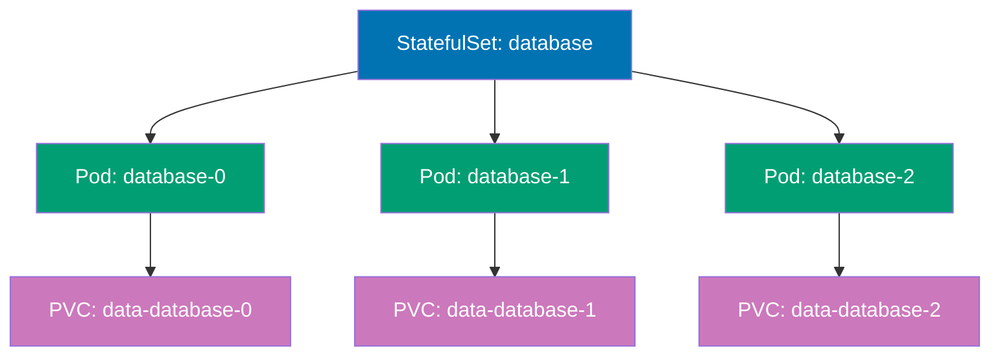

```yaml
apiVersion: v1 # => Core Kubernetes API
kind: Service # => Headless Service for StatefulSet
metadata:
 name:
 database # => Headless Service name
 # => Required for StatefulSet DNS
spec:
 # => Service specification
 clusterIP:
 None # => Headless (no cluster IP allocated)
 # => DNS returns Pod IPs directly
 # => Enables individual Pod addressing
 # => "None" is special value (not null)
 selector:
 # => Pod selector
 app:
 database # => Matches StatefulSet Pods
 # => Routes to StatefulSet Pods
 ports:
 # => Port configuration
 - port:
 5432 # => PostgreSQL port
 # => Standard PostgreSQL port
 name:
 postgres # => Named port for clarity
 # => Referenced by StatefulSet

---
apiVersion: apps/v1 # => Apps API for StatefulSets
kind: StatefulSet # => StatefulSet resource
metadata:
 name:
 database # => StatefulSet name
 # => Creates Pods with stable identities
spec:
 # => StatefulSet specification
 serviceName:
 database # => Associates with headless Service above
 # => Enables predictable DNS names
 # => Required field for StatefulSet
 # => Links to Service for DNS
 replicas:
 3 # => Creates 3 Pods: database-0, database-1, database-2
 # => Each Pod gets unique ordinal suffix
 # => Ordered creation and deletion
 selector:
 # => Pod selector (immutable)
 matchLabels:
 app:
 database # => Must match template labels
 # => Links StatefulSet to Pods
 template:
 # => Pod template
 metadata:
 labels:
 # => Pod labels
 app:
 database # => Labels for Service selector and Pod identity
 # => Must match selector
 spec:
 # => Pod specification
 containers:
 # => Container list
 - name:
 postgres # => Container name
 # => PostgreSQL database
 image:
 postgres:15 # => PostgreSQL 15 image
 # => Version-pinned
 ports:
 # => Container ports
 - containerPort:
 5432 # => PostgreSQL listening port
 # => Backend port
 name:
 postgres # => Named port matches Service
 # => Port name reference
 volumeMounts:
 # => Volume mount configuration
 - name:
 data # => References volumeClaimTemplate below
 # => Links to PVC template
 mountPath:
 /var/lib/postgresql/data # => PostgreSQL data directory
 # => Data persists across restarts
 # => Mount point for persistent storage
 env:
 # => Environment variables
 - name: POSTGRES_PASSWORD
 # => Postgres password env var
 value:
 "example" # => Database password
 # => Use Secret in production for security
 # => Hardcoded for demo only
 volumeClaimTemplates: # => Creates PVC per Pod automatically
 # => PVC template (one per Pod)
 - metadata:
 name:
 data # => PVC name pattern: data-database-0, data-database-1, data-database-2
 # => Unique PVC per Pod instance
 # => Persistent across Pod restarts
 spec:
 # => PVC specification
 accessModes:
 ["ReadWriteOnce"] # => Single node read-write access
 # => Most common for databases
 # => RWO: one node mounts read-write
 resources:
 # => Storage resource request
 requests:
 storage:
 10Gi # => Each Pod gets dedicated 10 GiB volume
 # => Independent storage per database instance
 # => Provisioned from StorageClass

# StatefulSet guarantees:
# => Pods created in order: database-0, then database-1, then database-2

# Scaling behavior:
# => Scale up: kubectl scale statefulset database --replicas=5
```

**Key Takeaway**: Use StatefulSets for databases, message queues, and applications requiring stable network identities and persistent storage; StatefulSets guarantee ordered deployment/scaling and maintain PVC associations across Pod restarts.

**Why It Matters**: StatefulSets solve the stateful workload problem in Kubernetes, enabling databases and clustered applications to run reliably with persistent identity. Without StatefulSets, operators would manually manage database node identities and storage mappings, the kind of operational burden that made running stateful workloads in containers impractical before Kubernetes 1.9.

---

### Example 30: StatefulSet Update Strategy

StatefulSets support RollingUpdate (default) and OnDelete update strategies. RollingUpdate updates Pods in reverse ordinal order (highest to lowest), while OnDelete requires manual Pod deletion for updates.

```yaml
apiVersion: apps/v1 # => Apps API for StatefulSets
kind: StatefulSet # => StatefulSet resource
metadata:
 name:
 web-stateful # => StatefulSet name
 # => Manages web application Pods
spec:
 # => StatefulSet specification
 serviceName:
 web # => Headless Service name
 # => Required for DNS
 replicas:
 4 # => Total Pods: web-stateful-0, 1, 2, 3
 # => Four stateful instances
 updateStrategy:
 # => Update strategy configuration
 type:
 RollingUpdate # => Rolling update strategy (default)
 # => Updates Pods in reverse order: 3→2→1→0
 # => Alternative: OnDelete (manual Pod deletion)
 # => RollingUpdate is automatic and gradual
 rollingUpdate:
 # => Rolling update parameters
 partition:
 2 # => Only update Pods with ordinal >= partition
 # => Pods 2 and 3 get new version
 # => Pods 0 and 1 stay old version
 # => Useful for canary testing
 # => Default: 0 (all Pods updated)
 selector:
 # => Pod selector (immutable)
 matchLabels:
 app:
 web-stateful # => Must match template labels
 # => Links StatefulSet to Pods
 template:
 # => Pod template
 metadata:
 labels:
 # => Pod labels
 app:
 web-stateful # => Pod labels
 # => Must match selector
 spec:
 # => Pod specification
 containers:
 # => Container list
 - name:
 nginx # => Container name
 # => nginx web server
 image:
 nginx:1.24 # => Current version
 # => Update to nginx:1.25 to trigger rolling update
 # => Pod 3 updates first, then Pod 2
 # => Controlled by partition value
 ports:
 # => Container ports
 - containerPort:
 80 # => HTTP port
 # => Standard HTTP port

# Update behavior with partition=2:
# => kubectl set image statefulset/web-stateful nginx=nginx:1.25

# Partition use cases:
# => Canary deployments: test new version on subset
```

**Key Takeaway**: Use partition in RollingUpdate strategy for canary deployments on StatefulSets; update high-ordinal Pods first while keeping low-ordinal Pods on stable version for gradual rollout validation.

**Why It Matters**: Partition-based canary deployments reduce risk when updating stateful applications like databases or Kafka clusters. LinkedIn tests Kafka broker updates on high-ordinal instances (kafka-5, kafka-6) serving production traffic while keeping primary replicas (kafka-0, kafka-1) on stable versions—if issues arise, they rollback the canary instances without impacting primary data nodes. This surgical update capability is critical for stateful workloads where full-cluster updates risk data corruption or service outages, providing safety nets that traditional database upgrade procedures lack.

---

### Example 31: StatefulSet with Init Containers

Init containers in StatefulSets can prepare persistent volumes, wait for dependencies, or perform one-time setup before the main application starts. This pattern ensures data initialization completes before database or cache services become ready.

```yaml
apiVersion: apps/v1 # => Apps API for StatefulSets
kind: StatefulSet # => StatefulSet resource
metadata:
 name:
 redis-cluster # => StatefulSet name
 # => Redis cluster management
spec:
 # => StatefulSet specification
 serviceName:
 redis # => Headless Service for cluster
 # => Required for DNS
 replicas:
 3 # => Three Redis instances: redis-cluster-0, 1, 2
 # => Clustered Redis deployment
 selector:
 # => Pod selector (immutable)
 matchLabels:
 app:
 redis # => Must match template labels
 # => Links StatefulSet to Pods
 template:
 # => Pod template
 metadata:
 labels:
 # => Pod labels
 app:
 redis # => Pod labels
 # => Must match selector
 spec:
 # => Pod specification
 initContainers:
 # => Init containers (run before main containers)
 - name:
 init-redis # => Init container name
 # => Prepares Redis configuration before main container
 image:
 redis:7 # => Same image as main container
 # => Ensures tooling compatibility
 command:
 # => Init container command
 - sh # => Shell interpreter
 - -c # => Execute following script
 - | # => Multi-line script
 # => Pipe preserves newlines
 echo "Initializing Redis config for Pod $POD_NAME"
 # => Log initialization
 cp /config/redis.conf /data/redis.conf
 # => Copy template to writable volume
 sed -i "s/POD_NAME/${POD_NAME}/g" /data/redis.conf
 # => Copies template config to data volume
 # => Replaces POD_NAME placeholder with actual Pod name
 # => Customizes config per Pod
 env:
 # => Environment variables
 - name: POD_NAME
 # => Pod name variable
 valueFrom:
 # => Value from Downward API
 fieldRef:
 # => Field reference
 fieldPath:
 metadata.name # => Gets Pod name: redis-cluster-0
 # => Uses Downward API
 # => Unique per Pod
 volumeMounts:
 # => Volume mounts for init container
 - name:
 config # => Reads from ConfigMap
 # => Template source
 mountPath:
 /config # => Mount point for config template
 # => Read-only ConfigMap
 - name:
 data # => Writes to PVC
 # => Persistent storage
 mountPath:
 /data # => Shared with main container
 # => Writable volume

 containers:
 # => Main containers
 - name:
 redis # => Main Redis container
 # => Redis server
 image:
 redis:7 # => Redis 7 image
 # => Version-pinned
 command:
 # => Container startup command
 ["redis-server", "/data/redis.conf"] # => Starts with custom config
 # => Config prepared by init container
 # => Uses customized configuration
 ports:
 # => Container ports
 - containerPort:
 6379 # => Redis port
 # => Standard Redis port
 volumeMounts:
 # => Volume mounts
 - name:
 data # => Same volume as init container
 # => Shared PVC
 mountPath:
 /data # => Reads config prepared by init
 # => Stores Redis data
 # => Persistent across restarts

 volumes:
 # => Volume definitions
 - name:
 config # => ConfigMap volume
 # => Template volume
 configMap:
 # => ConfigMap volume source
 name:
 redis-config # => References ConfigMap with template
 # => Contains redis.conf template
 # => Must exist before Pod creation

 volumeClaimTemplates:
 # => PVC template (one per Pod)
 - metadata:
 name:
 data # => PVC name pattern: data-redis-cluster-0, 1, 2
 # => Unique PVC per Pod
 spec:
 # => PVC specification
 accessModes:
 ["ReadWriteOnce"] # => Single node access
 # => Standard for StatefulSets
 resources:
 # => Storage resource request
 requests:
 storage:
 5Gi # => Each Redis instance gets 5 GiB
 # => Per-Pod storage allocation

# Init container execution:
# => Init containers run before main containers
```

**Key Takeaway**: Use init containers in StatefulSets for data initialization, configuration templating, or dependency waiting; init containers have access to volumeClaimTemplates volumes and Pod metadata for per-instance customization.

**Why It Matters**: Init containers in StatefulSets enable per-instance configuration for distributed systems requiring unique node IDs or customized settings. Elasticsearch uses this pattern to configure node IDs and cluster discovery settings based on Pod ordinal—elasticsearch-0 knows it's master-eligible while elasticsearch-3 is data-only. This automation eliminates manual configuration steps required in traditional clustered database deployments, reducing setup time from hours (manual configuration per node) to minutes (automated per-Pod initialization).

---

### Example 32: StatefulSet Pod Management Policy

Pod Management Policy controls whether StatefulSet creates/deletes Pods sequentially (OrderedReady, default) or in parallel (Parallel). Parallel policy speeds up scaling but loses ordering guarantees.

```yaml
apiVersion: apps/v1 # => Apps API for StatefulSets
kind: StatefulSet # => StatefulSet resource
metadata:
 name:
 parallel-stateful # => StatefulSet name
 # => Uses parallel Pod management
spec:
 # => StatefulSet specification
 serviceName:
 parallel # => Headless Service name
 # => Required for DNS
 replicas:
 10 # => Pods: parallel-stateful-0 through parallel-stateful-9
 # => Ten parallel instances
 podManagementPolicy:
 Parallel # => Parallel Pod creation/deletion
 # => Default: OrderedReady (sequential)
 # => Parallel: all Pods created simultaneously
 # => Faster scaling but no ordering guarantee
 # => Use for independent workloads
 # => No sequential dependency
 selector:
 # => Pod selector (immutable)
 matchLabels:
 app:
 parallel # => Must match template labels
 # => Links StatefulSet to Pods
 template:
 # => Pod template
 metadata:
 labels:
 # => Pod labels
 app:
 parallel # => Pod labels
 # => Must match selector
 spec:
 # => Pod specification
 containers:
 # => Container list
 - name:
 nginx # => Container name
 # => nginx web server
 image:
 nginx:1.24 # => Nginx web server
 # => Version-pinned

# OrderedReady (default):
# => Scale 0→10: creates Pods 0,1,2,3,4,5,6,7,8,9 sequentially

# Parallel:
# => Scale 0→10: creates all 10 Pods simultaneously

# Performance comparison:
# => OrderedReady scaling 0→10: ~10-20 minutes (sequential)
```

**Key Takeaway**: Use Parallel podManagementPolicy for faster scaling when Pod ordering is not critical; keep OrderedReady (default) for databases and applications requiring sequential initialization.

**Why It Matters**: Parallel Pod management dramatically reduces StatefulSet scaling time for applications without initialization dependencies. This 95% time reduction (from 40+ minutes with OrderedReady) enables rapid response to traffic spikes. However, databases requiring leader election or sequential cluster bootstrap must use OrderedReady to prevent split-brain scenarios or data corruption during initialization.

---

### Example 33: StatefulSet with Persistent Volume Retention

PersistentVolumeClaim retention policy controls whether PVCs are deleted when StatefulSet scales down or is deleted. WhenDeleted retains PVCs on scale-down but deletes on StatefulSet deletion, while Retain preserves PVCs in all cases.

```yaml
apiVersion: apps/v1 # => Apps API for StatefulSets
kind: StatefulSet # => StatefulSet resource
metadata:
 name:
 retained-stateful # => StatefulSet name
 # => PVC retention configuration
spec:
 # => StatefulSet specification
 serviceName:
 retained # => Headless Service name
 # => Required for DNS
 replicas:
 3 # => Three Pods with persistent storage
 # => Each with dedicated PVC
 persistentVolumeClaimRetentionPolicy:
 # => PVC retention policy (Kubernetes 1.23+)
 whenDeleted:
 Retain # => Retain PVCs when StatefulSet deleted
 # => Prevents accidental data loss
 # => Alternative: Delete (removes PVCs automatically)
 # => Production safety mechanism
 whenScaled:
 Retain # => Retain PVCs when scaling down
 # => PVCs persist for scale-up reattachment
 # => Alternative: Delete (removes PVCs of deleted Pods)
 # => Enables data recovery on scale-up
 selector:
 # => Pod selector (immutable)
 matchLabels:
 app:
 retained # => Must match template labels
 # => Links StatefulSet to Pods
 template:
 # => Pod template
 metadata:
 labels:
 # => Pod labels
 app:
 retained # => Pod labels
 # => Must match selector
 spec:
 # => Pod specification
 containers:
 # => Container list
 - name:
 nginx # => Container name
 # => nginx web server
 image:
 nginx:1.24 # => Nginx web server
 # => Version-pinned
 volumeMounts:
 # => Volume mounts
 - name:
 data # => References volumeClaimTemplate
 # => Links to PVC template
 mountPath:
 /usr/share/nginx/html # => Web root directory
 # => Data persists across restarts
 # => Nginx serves content from here

 volumeClaimTemplates:
 # => PVC template (one per Pod)
 - metadata:
 name:
 data # => PVC name pattern: data-retained-stateful-0, 1, 2
 # => Unique PVC per Pod
 spec:
 # => PVC specification
 accessModes:
 ["ReadWriteOnce"] # => Single node access
 # => Standard for StatefulSets
 resources:
 # => Storage resource request
 requests:
 storage:
 5Gi # => Each Pod gets 5 GiB persistent storage
 # => Per-Pod allocation

# Retention behavior:
# => Scale 3→1: Pods 2 and 1 deleted, but PVCs data-retained-stateful-2 and data-retained-stateful-1 retained

# Policy combinations:
# => whenDeleted=Retain, whenScaled=Retain: Maximum safety (production default)
```

**Key Takeaway**: Use Retain policy for production databases to prevent accidental data loss during scaling or deletion; remember to manually clean up PVCs when no longer needed to avoid storage costs.

**Why It Matters**: PVC retention policies prevent catastrophic data loss from accidental StatefulSet deletion or scale-down operations. Etsy's Retain policy saved their PostgreSQL cluster when a misconfigured automation script deleted a StatefulSet—all data remained intact in orphaned PVCs, enabling full recovery by recreating the StatefulSet and reattaching volumes. Without Retain, the Delete policy would have immediately destroyed months of production data. This safety mechanism provides insurance against human error, though it requires disciplined PVC lifecycle management to avoid accumulating abandoned volumes costing thousands monthly in cloud storage.

---

## DaemonSets & Jobs (Examples 34-38)

### Example 34: Basic DaemonSet

DaemonSets ensure a Pod runs on every node (or a subset of nodes), suitable for node-level services like log collectors, monitoring agents, or network plugins. Kubernetes automatically schedules DaemonSet Pods on new nodes.

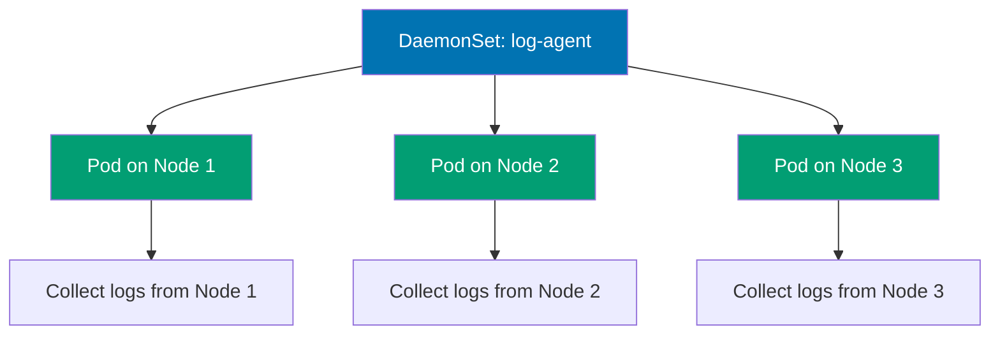

```yaml
apiVersion: apps/v1 # => Apps API for DaemonSets
kind: DaemonSet # => DaemonSet resource
metadata:
 name:
 log-collector # => DaemonSet name
 # => Log collection agent
 labels:
 # => DaemonSet labels
 app:
 log-collector # => DaemonSet labels
 # => Organizational metadata
spec:
 # => DaemonSet specification
 selector:
 # => Pod selector
 matchLabels:
 app:
 log-collector # => Must match template labels
 # => Links DaemonSet to Pods
 template:
 # => Pod template (one per node)
 metadata:
 labels:
 # => Pod labels
 app:
 log-collector # => Pod labels
 # => Must match selector
 spec:
 # => Pod specification
 containers:
 # => Container list
 - name:
 fluentd # => Container name
 # => Fluentd log aggregator
 image:
 fluent/fluentd:v1.16 # => Log forwarding agent
 # => Fluentd version 1.16
 # => Lightweight log shipper
 volumeMounts:
 # => Volume mount configuration
 - name:
 varlog # => Mounts node's /var/log
 # => System logs volume
 mountPath:
 /var/log # => Container path
 # => Reads node's /var/log directory
 readOnly:
 true # => Read-only access for safety
 # => Prevents accidental log modification
 # => Security best practice
 - name:
 varlibdockercontainers # => Mounts Docker container logs
 # => Container logs volume
 mountPath:
 /var/lib/docker/containers # => Docker log directory
 # => Container stdout/stderr logs
 readOnly:
 true # => Read-only access
 # => No write permissions needed
 resources:
 # => Resource constraints
 limits:
 # => Maximum resource usage
 memory:
 200Mi # => Maximum memory usage
 # => OOM kill if exceeded
 # => Prevents node resource exhaustion
 requests:
 # => Guaranteed resource allocation
 cpu:
 100m # => Minimum CPU allocation
 # => 0.1 CPU cores guaranteed
 # => Scheduler guarantee
 memory:
 200Mi # => Minimum memory allocation
 # => Scheduling guarantee
 # => Reserved on node

 volumes:
 # => Volume definitions (hostPath for node access)
 - name:
 varlog # => Volume name
 # => System logs volume
 hostPath:
 # => Host filesystem mount
 path:
 /var/log # => Node's /var/log directory
 # => Accesses node filesystem
 # => Direct node access
 - name:
 varlibdockercontainers # => Volume name
 # => Container logs volume
 hostPath:
 # => Host filesystem mount
 path:
 /var/lib/docker/containers # => Node's container logs
 # => Docker/containerd logs
 # => Runtime-specific path

# DaemonSet behavior:
# => Creates 1 Pod per node automatically

# DaemonSet use cases:
# => Log collectors (Fluentd, Filebeat)
```

**Key Takeaway**: Use DaemonSets for node-level services requiring presence on every node; DaemonSets automatically handle node additions/removals and support node selectors for subset deployment.

**Why It Matters**: DaemonSets ensure critical infrastructure services run on every node without manual deployment, essential for cluster-wide monitoring, logging, and networking. Datadog monitors thousands of Kubernetes nodes using DaemonSets to deploy its agent automatically to every node. This automation eliminates the systemd unit files and chef recipes required in traditional infrastructure where adding a new server meant manually installing monitoring agents, logging forwarders, and network plugins—Kubernetes handles this automatically through DaemonSets.

---

### Example 35: DaemonSet with Node Selector

DaemonSets can target specific nodes using nodeSelector or node affinity, enabling specialized Pods on GPU nodes, SSD-equipped nodes, or region-specific nodes.

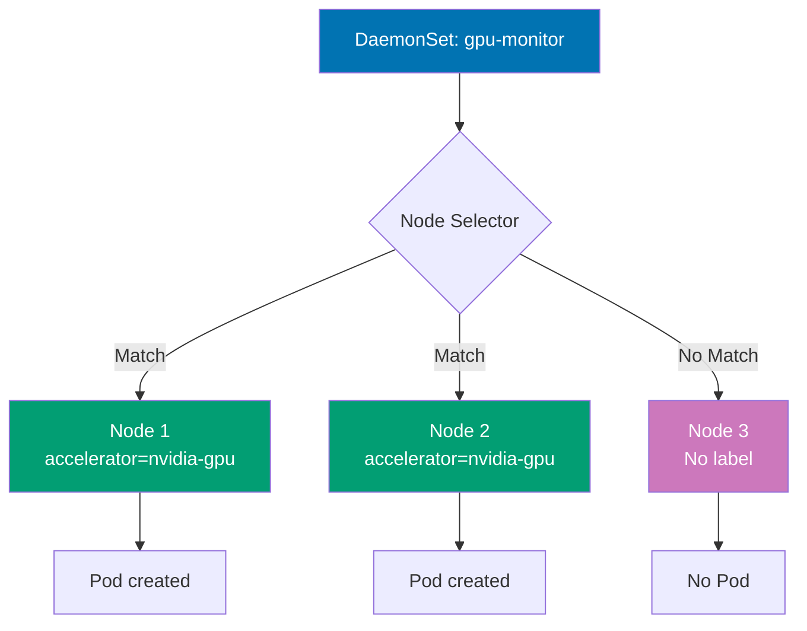

```yaml
apiVersion:
 apps/v1 # => Apps API for DaemonSets
 # => Stable workload API
kind:
 DaemonSet # => DaemonSet resource
 # => Node-level Pod deployment
metadata:
 # => DaemonSet metadata
 name:
 gpu-monitor # => DaemonSet name
 # => Unique cluster identifier
spec:
 # => DaemonSet specification
 selector:
 # => Pod selector
 # => Links DaemonSet to Pods
 matchLabels:
 # => Equality-based selector
 app:
 gpu-monitor # => Must match template labels
 # => Pod ownership identification
 template:
 # => Pod template (one per matching node)
 metadata:
 # => Pod template metadata
 labels:
 # => Labels for created Pods
 app:
 gpu-monitor # => Pod labels
 # => Must match selector
 spec:
 # => Pod specification
 nodeSelector:
 # => Node label selector
 # => Restricts Pod placement
 accelerator:
 nvidia-gpu # => Only runs on nodes with this label
 # => kubectl label nodes node-1 accelerator=nvidia-gpu
 # => Filters nodes for GPU-equipped hosts
 # => Node targeting mechanism
 containers:
 # => Container list
 - name:
 dcgm-exporter # => NVIDIA GPU monitoring
 # => Data Center GPU Manager exporter
 # => Container identifier
 image:
 nvidia/dcgm-exporter:3.1.3 # => NVIDIA official image
 # => Version 3.1.3
 # => GPU metrics collection
 ports:
 # => Port definitions
 - containerPort:
 9400 # => Prometheus metrics port
 # => Exposes GPU metrics
 # => Scrape endpoint for monitoring
 securityContext:
 # => Container security settings
 privileged:
 true # => Required for GPU access
 # => Allows device access
 # => Security trade-off for hardware monitoring
 # => Full host access granted

# DaemonSet with node selector:
# => Only creates Pods on nodes matching nodeSelector
```

**Key Takeaway**: Use nodeSelector or node affinity in DaemonSets to run specialized workloads only on appropriate nodes; label nodes based on hardware capabilities, regions, or roles for targeted DaemonSet deployment.

**Why It Matters**: Node-selective DaemonSets enable hardware-specific infrastructure services without cluttering nodes lacking required resources. This selective deployment reduces monitoring overhead by 80% compared to running GPU collectors cluster-wide and enables heterogeneous cluster management where different node types run different infrastructure services based on hardware capabilities. Machine learning platforms at companies like NVIDIA deploy GPU-specific DaemonSets only on GPU-equipped nodes, ensuring specialized monitoring agents run where they provide value without wasting resources on CPU-only nodes.

---

### Example 36: Kubernetes Job

Jobs run Pods to completion, suitable for batch processing, data migration, or one-time tasks. Unlike Deployments, Jobs terminate when tasks complete successfully and track completion status.

```yaml
apiVersion:
 batch/v1 # => Batch API for Jobs
 # => Stable Job API
kind:
 Job # => Job resource
 # => One-time task execution
metadata:
 # => Job metadata
 name:
 data-migration # => Job name
 # => Unique identifier for batch task
 # => Job completion tracking name
spec:
 # => Job specification
 completions:
 1 # => Number of successful completions required
 # => Job completes after 1 successful Pod
 # => completions=5 requires 5 successful Pods
 # => Total work items to process
 # => Desired completion count
 parallelism:
 1 # => Number of Pods running in parallel
 # => parallelism=3 runs 3 Pods simultaneously
 # => parallelism ≤ completions
 # => Controls concurrency
 # => Concurrent Pod execution limit
 backoffLimit:
 3 # => Maximum retries before marking Job failed
 # => Retries with exponential backoff
 # => Default: 6 retries
 # => Prevents infinite retry loops
 # => Failure tolerance threshold
 template:
 # => Pod template for Job
 # => Blueprint for Job Pods
 metadata:
 # => Pod template metadata
 labels:
 # => Pod labels
 app:
 migration # => Pod labels for tracking
 # => Used for monitoring and querying
 # => Job Pod identification
 spec:
 # => Pod specification
 restartPolicy:
 Never # => Never or OnFailure (not Always)
 # => Always invalid for Jobs
 # => Never creates new Pod on failure
 # => OnFailure restarts container in same Pod
 # => Required field for Jobs
 # => Failure handling strategy
 containers:
 # => Container list
 - name:
 migrator # => Container name
 # => Migration task executor
 # => Container identifier
 image:
 busybox:1.36 # => Lightweight Linux utilities
 # => Minimal image for shell scripts
 # => Version 1.36 pinned
 command:
 # => Container command
 # => Override entrypoint
 - sh # => Shell interpreter
 # => Bourne shell
 - -c # => Execute following script
 # => Interpret as shell script
 - | # => Multi-line script
 # => Pipe preserves newlines
 # => YAML literal block scalar
 echo "Starting data migration.."
 # => Log start
 # => Stdout logging
 sleep 10
 # => Simulate migration work
 # => 10 second task duration
 echo "Migration completed successfully"
 # => Log completion
 # => Success message
 exit 0 # => Exit 0 signals success
 # => Exit 1+ triggers retry (up to backoffLimit)
 # => Job controller creates new Pod on failure
 # => Exit code determines success/failure
 # => Zero exit = Job completion

# Job lifecycle:
# => Pod created and runs to completion

# Completion calculation:
# => completions=5, parallelism=2
```

**Key Takeaway**: Use Jobs for one-time or periodic batch tasks; set appropriate completions, parallelism, and backoffLimit based on workload requirements; Jobs do not support restartPolicy: Always.

**Why It Matters**: Kubernetes Jobs provide guaranteed execution for batch processing with automatic retry logic, eliminating custom failure handling code. Stripe processes nightly financial reconciliation using Jobs—if network issues cause failures, Jobs automatically retry up to backoffLimit, ensuring reports complete reliably. This declarative batch processing replaces brittle cron scripts that fail silently or require complex error handling, as Kubernetes tracks completion status and provides audit trails through Job history, critical for compliance in financial systems.

---

### Example 37: Parallel Jobs

Parallel Jobs run multiple Pods simultaneously to process distributed workloads like batch rendering, data processing, or parallel computations. Configure completions and parallelism to control total work items and concurrency.

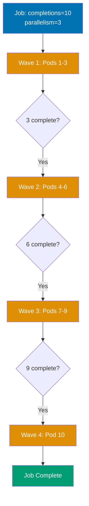

```yaml
apiVersion: batch/v1 # => Batch API for Jobs
kind: Job # => Job resource
metadata:
 name:
 parallel-processing # => Job name
 # => Parallel batch task
spec:
 # => Job specification
 completions:
 10 # => Total successful Pods required: 10
 # => Job completes after 10 Pods succeed
 # => Work items to process
 parallelism:
 3 # => Run 3 Pods in parallel
 # => Creates Pods in batches: 3, then 3, then 3, then 1
 # => Maintains max 3 Pods running simultaneously
 # => Controls concurrency
 template:
 # => Pod template
 spec:
 # => Pod specification
 restartPolicy:
 OnFailure # => Retry failed Pods within same Pod object
 # => Never creates new Pod for each retry
 # => Container restarts in same Pod
 # => Reduces Pod churn
 containers:
 # => Container list
 - name:
 worker # => Container name
 # => Task worker
 image:
 busybox:1.36 # => Lightweight Linux utilities
 # => Minimal shell environment
 command:
 # => Container command
 - sh # => Shell interpreter
 - -c # => Execute following script
 - | # => Multi-line script
 # => Pipe preserves newlines
 TASK_ID=$((RANDOM % 1000))
 # => Generate unique task ID
 echo "Processing task $TASK_ID"
 # => Log start
 sleep $((5 + RANDOM % 10))
 # => Simulate work (5-15 seconds)
 echo "Task $TASK_ID completed"
 # => Log completion
 # => Simulates variable-duration work
 # => Each Pod processes independent task
 # => Exit 0 implicit (success)

# Parallel execution:
# => Pods 1,2,3 start immediately (parallelism=3)

# Scaling parallelism:
# => kubectl patch job parallel-processing -p '{"spec":{"parallelism":5}}'
```

**Key Takeaway**: Use parallel Jobs for distributed batch processing; adjust parallelism based on cluster capacity and completions based on total work items; consider work queue pattern for dynamic task distribution.

**Why It Matters**: Parallel Jobs enable massive-scale batch processing by distributing work across multiple Pods simultaneously. This horizontal parallelism is transformational for data pipelines and ML training workloads, as Kubernetes automatically schedules work across available nodes and handles failures, eliminating the custom job schedulers and worker pool management required in traditional batch processing systems.

---

### Example 38: CronJob for Scheduled Tasks

CronJobs create Jobs on a schedule using cron syntax, suitable for periodic backups, reports, or cleanup tasks. CronJobs maintain job history and support concurrency policies for overlapping executions.

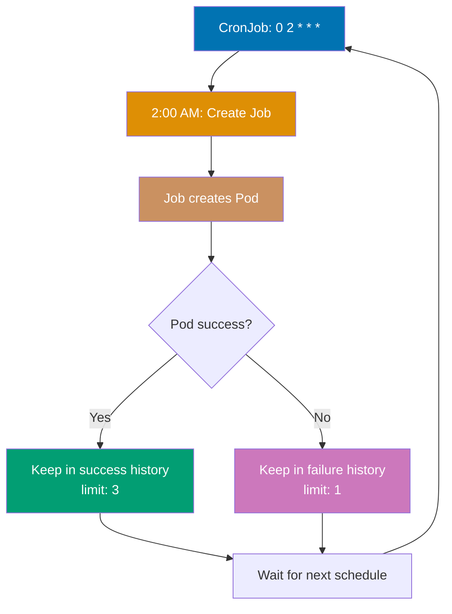

```yaml
apiVersion: batch/v1 # => Batch API for CronJobs
kind: CronJob # => CronJob resource
metadata:
 name:
 backup-job # => CronJob name
 # => Scheduled backup task
spec:
 # => CronJob specification
 schedule:
 "0 2 * * *" # => Cron syntax: minute hour day month weekday
 # => "0 2 * * *" = 2:00 AM daily
 # => "*/5 * * * *" = every 5 minutes
 # => "0 */2 * * *" = every 2 hours
 # => Standard Unix cron format
 concurrencyPolicy:
 Forbid # => Prevents concurrent Job runs
 # => Allow: permits concurrent executions
 # => Replace: cancels current and starts new
 # => Use Forbid for backups to prevent conflicts
 # => Ensures single execution at a time
 successfulJobsHistoryLimit:
 3 # => Keeps 3 successful Jobs
 # => Older successful Jobs auto-deleted
 # => Limits resource consumption
 # => Audit trail for recent runs
 failedJobsHistoryLimit:
 1 # => Keeps 1 failed Job
 # => Enables debugging recent failures
 # => Only most recent failure kept
 jobTemplate:
 # => Job template (nested Job spec)
 spec:
 # => Job specification
 template:
 # => Pod template (nested Pod spec)
 spec:
 # => Pod specification
 restartPolicy:
 OnFailure # => Retry on container failure
 # => Container restarts in same Pod
 containers:
 # => Container list
 - name:
 backup # => Container name
 # => Backup executor
 image:
 busybox:1.36 # => Lightweight Linux utilities
 # => Minimal shell environment
 command:
 # => Container command
 - sh # => Shell interpreter
 - -c # => Execute following script
 - | # => Multi-line script
 # => Pipe preserves newlines
 echo "Starting backup at $(date)"
 # => Log start time
 # Backup logic here
 # => Replace with actual backup commands
 sleep 30
 # => Simulate backup duration
 echo "Backup completed at $(date)"
 # => Log completion time
 # => Simulates backup operation
 # => Exit 0 implicit (success)

# CronJob behavior:
# => Creates Job at scheduled time (2:00 AM daily)

# Timezone handling:
# => Default: Controller manager timezone (usually UTC)
```

**Key Takeaway**: Use CronJobs for scheduled recurring tasks with appropriate concurrencyPolicy to handle overlapping executions; set history limits to prevent accumulation of completed Jobs.

**Why It Matters**: CronJobs replace unreliable server-based cron with cloud-native scheduled task execution that survives node failures. This reliability is impossible with traditional cron where losing the cron server means losing all scheduled tasks until manual recovery. CronJobs also provide execution history and failure tracking through kubectl, eliminating the log-scraping required to debug failed cron scripts on servers.

---

## Ingress Controllers (Examples 39-43)

### Example 39: Basic Ingress

Ingress manages external HTTP/HTTPS access to Services, providing host-based and path-based routing. Ingress requires an Ingress Controller (nginx, Traefik, HAProxy) to function.

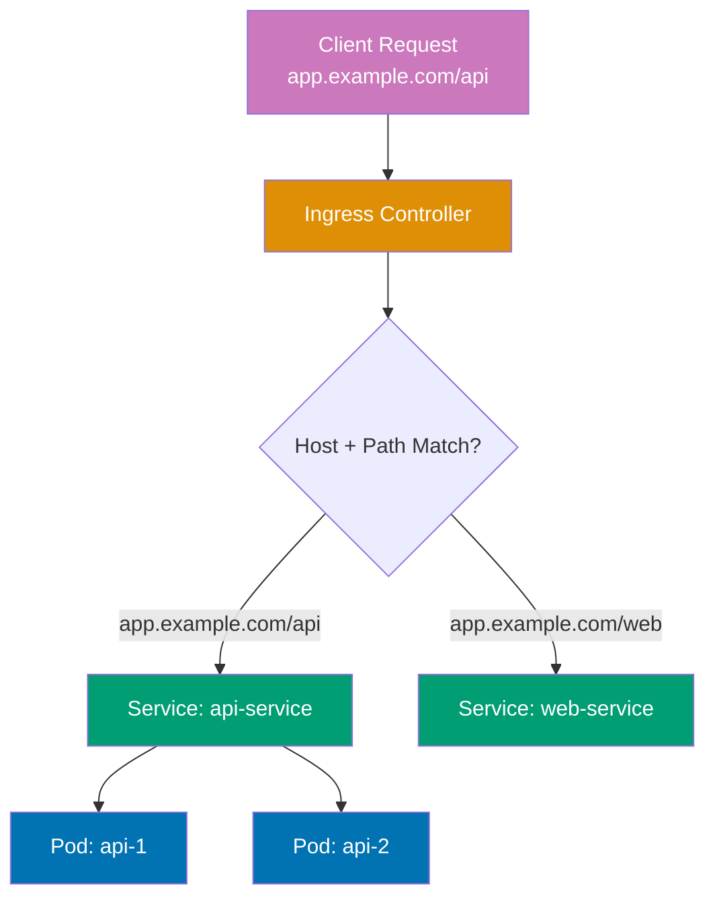

```yaml
# First, install Ingress Controller (nginx example):
# => kubectl apply -f https://raw.githubusercontent.com/kubernetes/ingress-nginx/controller-v1.8.1/deploy/static/provider/cloud/deploy.yaml

apiVersion: networking.k8s.io/v1 # => Networking API for Ingress
kind: Ingress # => Ingress resource
metadata:
 name:
 app-ingress # => Ingress name
 # => Routing rules identifier
 annotations:
 # => Ingress Controller-specific annotations
 nginx.ingress.kubernetes.io/rewrite-target:
 / # => Rewrites /api/users → /users before forwarding
 # => Strips path prefix
 # => Backend receives /users
 # => nginx-specific annotation
spec:
 # => Ingress specification
 ingressClassName:
 nginx # => Uses nginx Ingress Controller
 # => Required in Kubernetes 1.18+
 # => Multiple controllers can coexist
 # => Selects which controller processes this Ingress
 rules:
 # => Routing rules
 - host:
 app.example.com # => Host-based routing
 # => Matches Host header in requests
 # => DNS must point to Ingress Controller IP
 # => Virtual hosting
 http:
 # => HTTP routing rules
 paths:
 # => Path-based routing
 - path:
 /api # => Path-based routing
 # => Matches requests starting with /api
 pathType:
 Prefix # => Matches /api, /api/, /api/users
 # => Exact: exact match only
 # => ImplementationSpecific: controller-dependent
 # => Prefix is most common
 backend:
 # => Backend service routing
 service:
 name:
 api-service # => Routes to api-service
 # => Service name in same namespace
 port:
 number:
 80 # => Service port (not targetPort)
 # => Ingress routes to Service port
 - path:
 /web # => Different path
 # => Separate routing rule
 pathType:
 Prefix # => Matches /web, /web/, /web/home
 # => Prefix match type
 backend:
 # => Backend service routing
 service:
 name:
 web-service # => Routes to web-service
 # => Different backend service
 port:
 number:
 80 # => Service port
 # => Standard HTTP port

# Access patterns:
# => http://app.example.com/api/users → api-service (path rewritten to /users)

# Ingress Controller behavior:
# => LoadBalancer Service receives external traffic
```

**Key Takeaway**: Ingress provides cost-effective HTTP/HTTPS routing compared to multiple LoadBalancer Services; install an Ingress Controller first, then create Ingress resources for routing rules.

**Why It Matters**: Ingress Controllers consolidate HTTP/HTTPS traffic through a single load balancer entry point, dramatically reducing cloud infrastructure costs. Zalando reduced monthly AWS costs by $18,000 by replacing 50 LoadBalancer Services ($360 each) with one Ingress Controller managing path-based routing to all backend services. This consolidation also simplifies DNS management (one wildcard DNS entry vs. 50 separate records), TLS certificate management (one cert for \*.example.com vs. 50 individual certs), and firewall rules, making Ingress the de facto standard for exposing HTTP services in production Kubernetes clusters.

---

### Example 40: Ingress with TLS

Ingress supports TLS termination using Secrets containing certificates and private keys. The Ingress Controller handles HTTPS decryption and forwards unencrypted traffic to backend Services.

```yaml
# Create TLS Secret:
# => kubectl create secret tls tls-secret --cert=tls.crt --key=tls.key

apiVersion: networking.k8s.io/v1 # => Networking API for Ingress
kind: Ingress # => Ingress resource
metadata:
 name:
 tls-ingress # => Ingress name
 # => TLS-enabled routing
spec:
 # => Ingress specification
 ingressClassName:
 nginx # => Ingress Controller to use
 # => nginx Ingress Controller
 tls:
 # => TLS configuration
 - hosts:
 # => Hosts for TLS
 - secure.example.com # => TLS applies to this host
 # => Certificate must match this domain
 # => SAN (Subject Alternative Name) or CN (Common Name)
 secretName:
 tls-secret # => References TLS Secret
 # => Secret must exist in same namespace
 # => Contains tls.crt and tls.key
 # => Ingress Controller reads certificate from Secret
 # => Auto-reloads on Secret update
 rules:
 # => Routing rules
 - host:
 secure.example.com # => Must match TLS hosts
 # => Host consistency required
 http:
 # => HTTP routing
 paths:
 # => Path rules
 - path:
 / # => Root path
 # => Catch-all route
 pathType:
 Prefix # => Matches all paths
 # => Root prefix matches everything
 backend:
 # => Backend service
 service:
 name:
 web-service # => Backend service
 # => Service in same namespace
 port:
 number:
 80 # => HTTP port (TLS already terminated)
 # => Plain HTTP to backend

# TLS behavior:
# => https://secure.example.com → TLS termination at Ingress Controller

# cert-manager integration (automated certificates):
# => Install cert-manager: kubectl apply -f https://github.com/cert-manager/cert-manager/releases/download/v1.13.0/cert-manager.yaml
```

**Key Takeaway**: Use TLS Ingress for production HTTPS; obtain certificates from Let's Encrypt via cert-manager for automated certificate management and renewal; TLS terminates at Ingress Controller, not backend Services.

**Why It Matters**: TLS termination at Ingress Controllers centralizes HTTPS certificate management, eliminating the need to configure SSL in every backend service. Medium handles HTTPS for hundreds of microservices through Ingress TLS—one cert-manager installation automatically provisions and renews Let's Encrypt certificates for all domains, while backend services run plain HTTP. This architecture reduces operational complexity by 90% compared to managing certificates individually per service, prevents certificate expiration incidents through automated renewal, and enables easy TLS policy updates (minimum TLS version, cipher suites) cluster-wide without touching application code.

---

### Example 41: Ingress with Multiple Hosts

Ingress supports multiple hosts in a single resource, enabling consolidated routing configuration. Each host can have independent path-based routing rules.

```yaml
apiVersion:
 networking.k8s.io/v1 # => Networking API group
 # => Stable v1 Ingress API
kind:
 Ingress # => Ingress resource for routing
 # => HTTP/HTTPS routing rules
metadata:
 name:
 multi-host-ingress # => Ingress name
 # => Unique identifier
spec:
 # => Ingress specification
 ingressClassName:
 nginx # => Ingress Controller type
 # => Uses nginx Ingress Controller
 # => Alternative: traefik, haproxy, aws-alb
 rules:
 # => Routing rules (multiple hosts)
 - host:
 api.example.com # => First host
 # => API subdomain
 # => Virtual host routing
 http:
 # => HTTP routing configuration
 paths:
 # => Path-based routes
 - path:
 / # => Root path matcher
 # => Matches all requests
 pathType:
 Prefix # => Prefix matching type
 # => /anything matches
 # => Alternative: Exact, ImplementationSpecific
 backend:
 # => Backend Service configuration
 service:
 # => Service-based backend
 name:
 api-service # => API Service name
 # => Routes to api-service
 port:
 # => Target port
 number:
 80 # => Service port 80
 # => HTTP port

 - host:
 admin.example.com # => Second host
 # => Admin subdomain
 # => Separate virtual host
 http:
 # => HTTP configuration
 paths:
 # => Path routes
 - path:
 / # => Root path
 # => All admin requests
 pathType:
 Prefix # => Prefix matching
 # => Matches /*, /dashboard, etc.
 backend:
 # => Admin backend
 service:
 # => Admin Service
 name:
 admin-service # => Admin Service name
 # => Different Service than API
 port:
 # => Port configuration
 number:
 80 # => HTTP port
 # => Standard HTTP

 - host:
 static.example.com # => Third host
 # => Static content subdomain
 # => CDN-like routing
 http:
 # => HTTP configuration
 paths:
 # => Path routing
 - path:
 / # => Root path
 # => All static assets
 pathType:
 Prefix # => Prefix match
 # => /images, /js, /css all match
 backend:
 # => Static backend
 service:
 # => Static asset Service
 name:
 static-service # => Static Service name
 # => Serves static files
 port:
 # => Port number
 number:
 80 # => HTTP port
 # => nginx serving static

# Multi-host routing:
# => http://api.example.com → api-service
```

**Key Takeaway**: Consolidate multiple host-based routes in a single Ingress resource for easier management; each host can have independent backend Services and path rules.

**Why It Matters**: Multi-host Ingress resources simplify routing configuration for organizations running multiple domains on Kubernetes. Atlassian manages api.atlassian.com, admin.atlassian.com, and cdn.atlassian.com through consolidated Ingress resources—reducing configuration from hundreds of separate Ingress objects to dozens of grouped resources. This consolidation improves maintainability through logical grouping (all payment-related domains in one Ingress), reduces Ingress Controller resource consumption (fewer watch operations), and makes routing changes auditable as a single git commit modifies all related routes instead of scattered updates across multiple files.

---

### Example 42: Ingress with Custom Annotations

Ingress Controllers support custom annotations for advanced features like rate limiting, authentication, CORS, and custom headers. Annotations are controller-specific (nginx, Traefik, etc.).

```yaml
apiVersion:
 networking.k8s.io/v1 # => Networking API group
 # => Stable Ingress API
kind:
 Ingress # => Ingress resource with annotations
 # => Advanced feature configuration
metadata:
 name:
 annotated-ingress # => Ingress name
 # => Unique identifier
 annotations:
 # => Controller-specific annotations
 # => nginx Ingress Controller specific
 nginx.ingress.kubernetes.io/rewrite-target:
 /$2 # => URL rewriting with capture groups
 # => Rewrites /api/users to /users
 # => $2 references second capture group in path
 # => Removes /api prefix before backend
 nginx.ingress.kubernetes.io/ssl-redirect:
 "true" # => Force HTTPS redirect
 # => HTTP requests → 308 redirect to HTTPS
 # => Enforces encrypted traffic
 # => String value required
 nginx.ingress.kubernetes.io/rate-limit:
 "100" # => 100 requests per second per IP
 # => Rate limiting per client IP
 # => Exceeding limit returns 503
 # => DDoS protection
 nginx.ingress.kubernetes.io/enable-cors:
 "true" # => Enable CORS headers
 # => Adds Access-Control-Allow-Origin header
 # => Required for cross-origin requests
 # => Browser CORS policy compliance
 nginx.ingress.kubernetes.io/cors-allow-origin:
 "https://example.com" # => Allowed CORS origin
 # => Only this origin permitted
 # => Restricts cross-origin access
 # => Security control
 nginx.ingress.kubernetes.io/auth-type:
 basic # => Basic authentication
 # => HTTP Basic Auth
 # => Username/password authentication
 # => Not recommended for production (use OAuth)
 nginx.ingress.kubernetes.io/auth-secret:
 basic-auth # => References Secret with credentials
 # => Secret contains htpasswd data
 # => Must exist in same namespace
 # => Credentials for Basic Auth
spec:
 # => Ingress specification
 ingressClassName:
 nginx # => nginx Ingress Controller
 # => Controller processes this Ingress
 # => Annotations are nginx-specific
 rules:
 # => Routing rules
 - host:
 protected.example.com # => Host for this rule
 # => Virtual host routing
 http:
 # => HTTP configuration
 paths:
 # => Path routing
 - path:
 /api(/|$)(.*) # => Capture group for rewrite
 # => Regex captures everything after /api
 # => $2 in rewrite-target uses second group
 pathType:
 ImplementationSpecific # => Controller-specific matching
 # => nginx interprets as regex
 backend:
 # => Backend Service
 service:
 # => Service target
 name:
 api-service # => Backend Service name
 # => Routes to api-service
 port:
 # => Service port
 number:
 80 # => HTTP port
 # => Standard HTTP

# Annotation effects:
# => Request: /api/users → rewritten to /users
```

**Key Takeaway**: Leverage Ingress Controller annotations for advanced HTTP features; consult controller documentation for available annotations as they vary between nginx, Traefik, and other controllers.

**Why It Matters**: Ingress annotations enable sophisticated traffic management without deploying dedicated API gateway infrastructure. Cloudflare uses nginx Ingress annotations for rate limiting, request transformation, and authentication—features that would otherwise require additional proxy layers (dedicated reverse proxies or API gateways). This consolidation reduces median request latency by 15-20ms (one fewer proxy hop) while providing enterprise features like A/B testing headers, geographic routing, and DDoS protection declaratively through annotations, making Ingress Controllers powerful enough to replace separate API gateway products.

---

### Example 43: Ingress with Default Backend

Default backend serves requests that don't match any Ingress rules, useful for custom 404 pages or catch-all routing. Configure default backend at Ingress Controller or per-Ingress resource level.

```yaml
apiVersion:
 networking.k8s.io/v1 # => Networking API group
 # => Stable Ingress API
kind:
 Ingress # => Ingress with default backend
 # => Catch-all routing pattern
metadata:
 name:
 default-backend-ingress # => Ingress name
 # => Unique identifier
spec:
 # => Ingress specification
 ingressClassName:
 nginx # => nginx Ingress Controller
 # => Controller type
 defaultBackend:
 # => Default backend for unmatched requests
 # => Fallback Service
 service:
 # => Service configuration
 name:
 default-service # => Serves unmatched requests
 # => Custom 404 Service
 # => Handles all non-matching traffic
 port:
 # => Service port
 number:
 80 # => HTTP port
 # => Default backend port
 rules:
 # => Routing rules (specific routes)
 - host:
 app.example.com # => Host for specific routing
 # => Virtual host
 http:
 # => HTTP routing
 paths:
 # => Path-based routes
 - path:
 /api # => API path prefix
 # => Matches /api/*
 pathType:
 Prefix # => Prefix matching
 # => /api, /api/users, etc.
 backend:
 # => API backend
 service:
 # => API Service
 name:
 api-service # => API Service name
 # => Primary application backend
 port:
 # => Service port
 number:
 80 # => HTTP port
 # => API Service port

# Default backend routing:
# => http://app.example.com/api → api-service (matches rule)
```

**Key Takeaway**: Configure default backend for better user experience on unmatched requests; implement custom 404 pages or redirects instead of generic Ingress Controller errors.

**Why It Matters**: Default backends provide graceful handling for misconfigured DNS, typo'd URLs, or removed services, maintaining professional user experience. This small configuration detail significantly impacts brand perception, as generic HTTP 404 errors signal technical incompetence while custom error pages demonstrate attention to user experience and reliability. E-commerce platforms report that custom error pages with search functionality and navigation links retain 25% more users compared to blank 404 pages, directly impacting revenue recovery from navigation errors.

---

## Persistent Volumes (Examples 44-48)

### Example 44: PersistentVolume and PersistentVolumeClaim

PersistentVolumes (PV) represent cluster storage resources while PersistentVolumeClaims (PVC) are storage requests by users. PVCs bind to PVs matching capacity and access mode requirements.

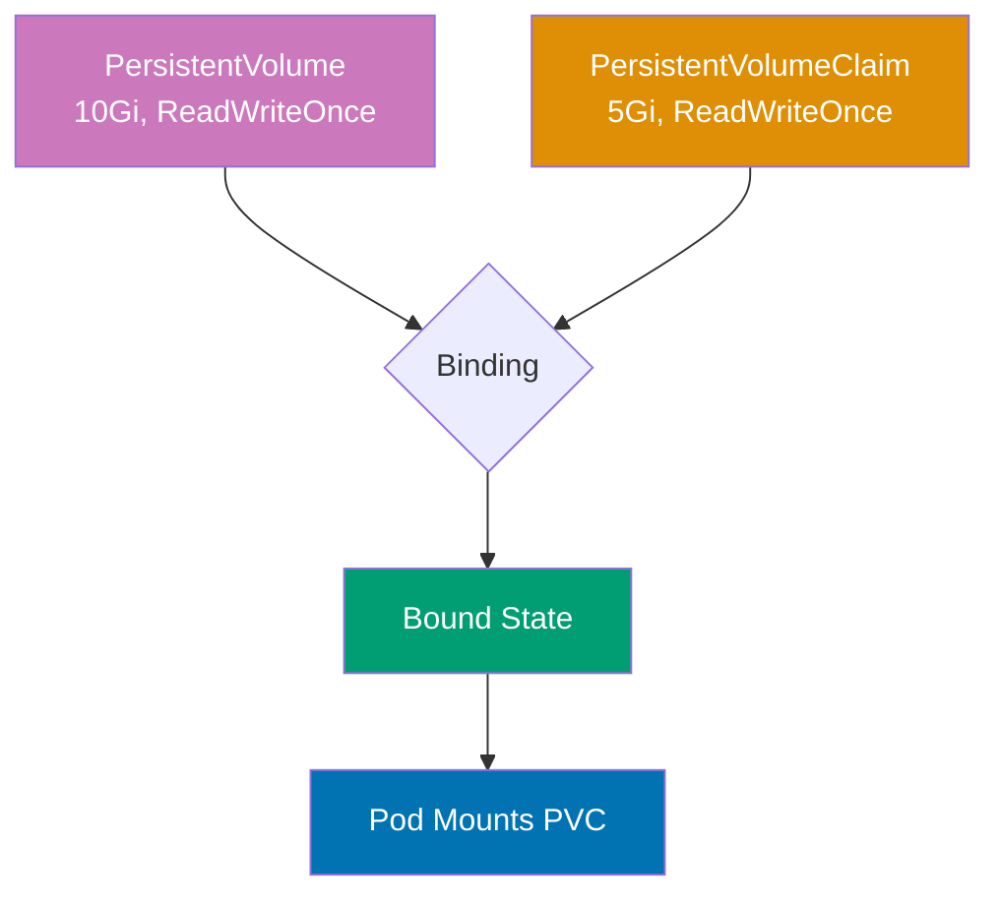

```yaml
apiVersion: v1 # => Core Kubernetes API
kind: PersistentVolume # => Cluster-wide storage resource (admin creates)
metadata:
 name: pv-example # => PV name (cluster-wide resource, not namespaced)
spec:
 capacity:
 storage:
 10Gi # => Total storage capacity available
 # => PVC can request up to this size
 accessModes:
 - ReadWriteOnce # => Single node read-write
 # => ReadOnlyMany: multiple nodes read-only
 # => ReadWriteMany: multiple nodes read-write
 # => Most common: ReadWriteOnce
 persistentVolumeReclaimPolicy:
 Retain # => Manual reclamation after PVC deletion
 # => PV not auto-deleted when PVC released
 # => Delete: auto-delete storage (cloud volumes)
 # => Recycle: deprecated (use Delete)
 storageClassName:
 manual # => Storage class name for binding
 # => PVC must match this class name
 # => "manual" = no automatic provisioning
 hostPath: # => Host path volume (testing only)
 path: /mnt/data # => Directory on host node filesystem
 # => Warning: node-specific, not portable
 type:
 DirectoryOrCreate # => Create directory if not exists
 # => Not for production (node-specific)
 # => Use cloud volumes in production

---
# => Document separator: second resource (PersistentVolumeClaim follows)
apiVersion: v1 # => Core Kubernetes API
kind: PersistentVolumeClaim # => Namespace-scoped storage request (user creates)
metadata:
 name: pvc-example # => PVC name (namespace resource)
spec:
 accessModes:
 - ReadWriteOnce # => Must match PV access mode
 # => Binds to PV with compatible mode
 resources:
 requests:
 storage:
 5Gi # => Requests 5 GiB (PV has 10 GiB)
 # => PVC gets full 10 GiB (PV indivisible)
 # => Cannot request partial PV capacity
 storageClassName:
 manual # => Binds to PV with same storage class
 # => Empty string binds to no-class PVs

---
# => Document separator: third resource (Pod consuming the PVC follows)
apiVersion: v1 # => Core Kubernetes API
kind: Pod # => Pod consuming the PersistentVolumeClaim
metadata:
 name: pv-pod # => Pod name
spec:
 containers:
 - name: app # => Container name
 image: nginx:1.24 # => Nginx web server
 volumeMounts:
 - name: storage # => References volume defined below
 # => Volume name must match volumes[].name
 mountPath:
 /usr/share/nginx/html # => Mount point in container
 # => Nginx serves files from this directory
 # => Data persists across Pod restarts
 volumes:
 - name: storage # => Volume name (referenced by volumeMounts)
 persistentVolumeClaim:
 claimName:
 pvc-example # => References PVC above
 # => Kubernetes binds PVC to matching PV
 # => Pod scheduled on node where PV is accessible

# PV/PVC lifecycle:
# => kubectl get pv → shows PV status (Available → Bound → Released)
# => kubectl get pvc → shows claim status (Pending → Bound)
```

**Key Takeaway**: Use PV/PVC for persistent storage across Pod restarts; cloud providers offer dynamic provisioning via StorageClasses, eliminating manual PV creation for production use.

**Why It Matters**: Persistent Volumes decouple storage from Pod lifecycle, enabling stateful applications to survive Pod restarts and rescheduling across nodes. Without PVs, container storage is ephemeral (lost on restart), forcing databases to run on dedicated servers outside Kubernetes. Dynamic provisioning through cloud provider integrations (AWS EBS, GCP PD) automates storage allocation, reducing storage setup from manual ticket-driven processes taking days to automatic provisioning in seconds.

---

### Example 45: StorageClass and Dynamic Provisioning

StorageClasses enable dynamic PersistentVolume provisioning, automatically creating storage when PVCs are created. Cloud providers offer default StorageClasses for seamless dynamic provisioning.

```yaml
apiVersion: storage.k8s.io/v1 # => Storage API version
kind: StorageClass # => StorageClass resource for dynamic provisioning
metadata:
 name: fast-storage # => StorageClass name
provisioner:
 kubernetes.io/aws-ebs # => Cloud provider provisioner
 # => kubernetes.io/gce-pd (GCP)
 # => kubernetes.io/azure-disk (Azure)
 # => Talks to cloud API to create volumes
parameters:
 type:
 gp3 # => AWS EBS type: gp3 (SSD)
 # => gp2, io1, io2, sc1, st1
 # => gp3: latest generation SSD
 iops:
 "3000" # => Provisioned IOPS (input/output per second)
 # => gp3 default: 3000, max: 16000
 throughput:
 "125" # => Throughput in MiB/s
 # => gp3 default: 125, max: 1000
 encrypted:
 "true" # => Encrypt volume at rest
 # => AWS KMS encryption
reclaimPolicy:
 Delete # => Delete PV when PVC deleted
 # => Prevents orphaned volumes
 # => Retain: keep PV after PVC deletion
volumeBindingMode:
 WaitForFirstConsumer # => Delay PV binding until Pod scheduled
 # => Ensures PV created in same zone as Pod
 # => Prevents cross-zone attach failures
 # => Immediate: bind PV immediately
allowVolumeExpansion:
 true # => Allow PVC size increase
 # => Resize PVC without recreating
 # => Requires CSI driver support

---
# => Document separator: second resource (PVC triggering dynamic provisioning)
apiVersion: v1 # => Core Kubernetes API
kind: PersistentVolumeClaim # => Storage request triggering dynamic provisioning
metadata:
 name: dynamic-pvc # => PVC name
spec:
 accessModes:
 - ReadWriteOnce # => Single node access
 storageClassName:
 fast-storage # => References StorageClass above
 # => Triggers dynamic provisioning
 # => No manual PV creation
 resources:
 requests:
 storage:
 20Gi # => Requests 20 GiB
 # => StorageClass creates PV with this size

# Dynamic provisioning:
# => PVC created → StorageClass calls cloud API → new PV created in seconds
kubectl get pvc dynamic-pvc           # => STATUS: Bound (after Pod created with WaitForFirstConsumer)
kubectl get pv                        # => Shows automatically provisioned PV with matching spec
```

**Key Takeaway**: Use StorageClasses for production storage with dynamic provisioning; configure WaitForFirstConsumer for multi-zone clusters to ensure PV and Pod are in the same availability zone.

**Why It Matters**: Dynamic provisioning through StorageClasses eliminates storage operations bottlenecks by allowing developers to request storage declaratively. WaitForFirstConsumer prevents cross-zone attachment failures (AWS EBS volumes can't attach to nodes in different zones), a gotcha that plagued early Kubernetes adopters with mysterious "volume attachment timeout" errors costing hours of debugging.

---

### Example 46: Volume Expansion

PersistentVolumeClaims support volume expansion when StorageClass allows it. Expand PVCs by updating the storage size; filesystem resize may require Pod restart depending on volume type.

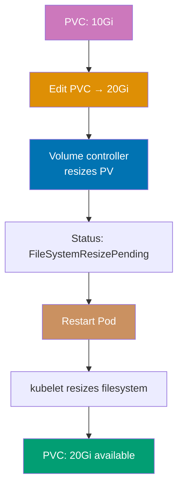

```yaml
apiVersion: v1
kind: PersistentVolumeClaim
metadata:
  name: expandable-pvc
spec:
  accessModes:
    - ReadWriteOnce
  storageClassName: fast-storage # => StorageClass must have allowVolumeExpansion: true
  resources:
  requests:
  storage: 10Gi # => Initial size: 10 GiB


# Expansion process:
# 1. Edit PVC to increase size
# => kubectl edit pvc expandable-pvc

# 2. Check expansion status
# => kubectl get pvc expandable-pvc

# 3. Restart Pod to complete expansion
# => kubectl delete pod <pod-using-pvc>

# 4. Verify new size
# => kubectl exec <pod> -- df -h /mount/path

# Expansion behavior:
# => Volume controller resizes PV
```

**Key Takeaway**: Volume expansion requires StorageClass with allowVolumeExpansion enabled; most volume types require Pod restart to complete filesystem resize; plan initial PVC sizes carefully as shrinking is not supported.

**Why It Matters**: Online volume expansion eliminates database downtime for storage increases, a critical operational capability. This operational flexibility is transformational for growing databases, as storage exhaustion is a critical incident requiring immediate remediation, and traditional expansion through migration carries significant risk of data loss or extended outages. Cloud-native databases at growth-stage startups can double storage capacity in under five minutes without user-visible impact, compared to multi-hour maintenance windows required by traditional block storage expansion procedures.

---

### Example 47: Volume Snapshots

VolumeSnapshots create point-in-time copies of PersistentVolumes for backup, clone, or restore operations. Requires CSI (Container Storage Interface) driver support from storage provider.

```yaml
apiVersion: snapshot.storage.k8s.io/v1 # => Snapshot API (CRD-based, requires CSI driver)
kind: VolumeSnapshotClass # => Defines snapshot class parameters (like StorageClass for PVs)
metadata:
 name: csi-snapshot-class # => SnapshotClass name, referenced by VolumeSnapshot
driver:
 ebs.csi.aws.com # => CSI driver that handles snapshots (AWS EBS)
 # => pd.csi.storage.gke.io (GCP Persistent Disk)
 # => disk.csi.azure.com (Azure Disk)
 # => Driver must implement snapshot interface
deletionPolicy:
 Delete # => Delete underlying snapshot when VolumeSnapshot object deleted
 # => Retain: keep snapshot in cloud storage after object deleted

---
apiVersion: snapshot.storage.k8s.io/v1 # => Snapshot API version
kind: VolumeSnapshot # => Represents a point-in-time copy of a PVC
metadata:
 name: pvc-snapshot # => Snapshot name (referenced by restore PVC)
spec:
 volumeSnapshotClassName: csi-snapshot-class # => Uses SnapshotClass above
 # => Determines CSI driver and deletion policy
 source:
 persistentVolumeClaimName:
 data-pvc # => Source PVC to snapshot (must be bound)
 # => Creates snapshot of current PVC state
 # => Application-consistent if app paused first

# Snapshot lifecycle:
# => kubectl get volumesnapshot                  # STATUS: ReadyToUse: true
# => kubectl describe volumesnapshot pvc-snapshot # Shows snapshot size and creation time

---
apiVersion: v1 # => Core Kubernetes API
kind: PersistentVolumeClaim # => New PVC restored from snapshot
metadata:
 name: restored-pvc # => New PVC name (separate from original)
spec:
 accessModes:
 - ReadWriteOnce # => Access mode (should match source PVC)
 storageClassName: fast-storage # => StorageClass for provisioning restored volume
 # => Must support snapshot restore operation
 resources:
 requests:
 storage: 10Gi # => Size must be >= snapshot source size
 # => Cannot restore to smaller volume
 dataSource:
 kind: VolumeSnapshot # => Restore data source type
 name: pvc-snapshot # => References snapshot created above
 apiGroup: snapshot.storage.k8s.io # => API group for VolumeSnapshot resource

# Restore process:
# => kubectl apply -f restored-pvc.yaml         # Creates PVC from snapshot
# => kubectl get pvc restored-pvc               # STATUS: Bound (after provisioning)
# => Mount restored-pvc in Pod to access data   # Data identical to snapshot point-in-time
```

**Key Takeaway**: Use VolumeSnapshots for backup and disaster recovery; requires CSI driver support; create snapshots before major changes for easy rollback; consider snapshot costs and retention policies.

**Why It Matters**: VolumeSnapshots provide crash-consistent backups for stateful workloads without application-level backup tooling. Robinhood snapshots production databases before schema migrations—if migrations fail or cause performance issues, they restore from snapshots in minutes rather than hours required for dump/restore. This rapid recovery capability encourages more frequent deployments and reduces migration risk, as teams know they can instantly rollback data-layer changes. CSI snapshot integration also enables cross-cluster disaster recovery by restoring snapshots to standby clusters in different regions.

---

### Example 48: Local Persistent Volumes

Local PersistentVolumes use node-local storage (SSDs, NVMe) for high-performance workloads requiring low latency. Pods using local volumes are bound to specific nodes.

```yaml
apiVersion:
 storage.k8s.io/v1 # => Storage API version
 # => Stable storage API
kind:
 StorageClass # => StorageClass for local volumes
 # => Defines storage provisioning policy
metadata:
 # => StorageClass metadata
 name:
 local-storage # => StorageClass name
 # => Referenced by PV and PVC
provisioner:
 # => Provisioner configuration
 kubernetes.io/no-provisioner # => No dynamic provisioning
 # => PVs must be created manually
 # => Static provisioning only
volumeBindingMode:
 # => Volume binding behavior
 WaitForFirstConsumer # => Essential for local volumes
 # => Ensures Pod scheduled on node with PV
 # => Delays PVC binding until Pod creation
 # => Prevents scheduling conflicts

---
apiVersion:
 v1 # => Core Kubernetes API
 # => Stable PV API
kind:
 PersistentVolume # => PersistentVolume resource
 # => Represents node-local storage
metadata:
 # => PV metadata
 name:
 local-pv # => PV identifier
 # => Unique cluster-wide name
spec:
 # => PV specification
 capacity:
 # => Storage capacity
 storage:
 100Gi # => 100 GiB capacity
 # => Size of local disk
 accessModes:
 # => Access mode restrictions
 - ReadWriteOnce # => Local volumes always ReadWriteOnce
 # => Single node mount only
 # => Cannot be shared across nodes
 persistentVolumeReclaimPolicy:
 Retain # => Reclaim policy
 # => PV retained after PVC deletion
 # => Manual cleanup required
 storageClassName:
 local-storage # => StorageClass reference
 # => Links to StorageClass above
 local:
 # => Local volume configuration
 path:
 /mnt/disks/ssd1 # => Path on node
 # => Node filesystem mount point
 # => Must exist before PV creation
 nodeAffinity: # => Required for local volumes
 # => Node affinity rules
 required:
 # => Required node selector
 nodeSelectorTerms:
 # => Node selector terms
 - matchExpressions:
 # => Match expression list
 - key:
 kubernetes.io/hostname # => Node hostname label
 # => Standard Kubernetes label
 operator:
 In # => Operator type
 # => Must match one of values
 values:
 # => Allowed node names
 - node-1 # => PV available only on node-1
 # => Restricts to single node
 # => Pod must schedule here

---
apiVersion:
 v1 # => Core Kubernetes API
 # => Stable PVC API
kind:
 PersistentVolumeClaim # => PVC resource
 # => Claims the local PV
metadata:
 # => PVC metadata
 name:
 local-pvc # => PVC identifier
 # => Referenced by Pod volumes
spec:
 # => PVC specification
 accessModes:
 # => Requested access modes
 - ReadWriteOnce # => Single node access
 # => Must match PV access mode
 storageClassName:
 local-storage # => StorageClass reference
 # => Links to StorageClass
 # => Filters matching PVs
 resources:
 # => Storage resource request
 requests:
 # => Minimum capacity request
 storage:
 100Gi # => Request 100 GiB
 # => Must match PV capacity

# Local PV behavior:
# => Pod using local-pvc scheduled on node-1 (PV location)
```

**Key Takeaway**: Use local PersistentVolumes for latency-sensitive workloads like databases; understand trade-off between performance and availability; implement application-level replication for fault tolerance.

**Why It Matters**: Local PVs deliver NVMe SSD performance (sub-millisecond latency, 100K+ IOPS) impossible with network-attached storage, critical for database and cache workloads. The difference between local NVMe (0.1ms) and network-attached storage (3ms) may seem small but represents a 30x latency reduction compared to network EBS volumes—this performance difference makes the user experience gap between instant page loads and noticeable lag. The trade-off is node affinity (Pods cannot migrate between nodes), requiring application-level replication (Cassandra, MongoDB replica sets) for high availability, but this is acceptable for databases already designed for distributed operation.

---

## Resource Limits (Examples 49-53)

### Example 49: QoS Classes

Kubernetes assigns Quality of Service (QoS) classes based on resource requests and limits, affecting eviction priority during resource pressure. Guaranteed (highest priority), Burstable (medium), BestEffort (lowest).

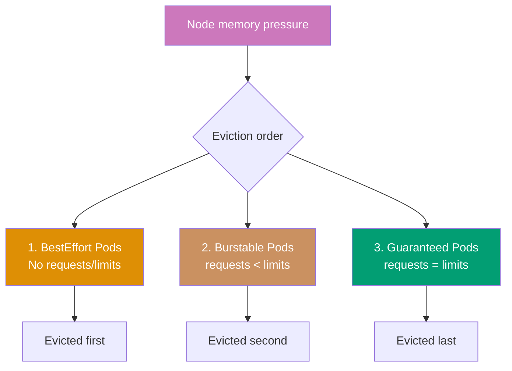

```yaml
# Guaranteed QoS (highest priority, last to be evicted)
apiVersion: v1 # => Core Kubernetes API
kind: Pod # => Pod with Guaranteed QoS class
metadata:
 name: guaranteed-pod # => Pod name
spec:
 containers:
 - name: app # => Container name
 image: nginx:1.24 # => Nginx web server
 resources:
 requests:
 cpu: 500m # => requests.cpu = limits.cpu (Guaranteed requirement)
 memory: 512Mi # => requests.memory = limits.memory (Guaranteed requirement)
 limits:
 cpu: 500m # => Must equal requests.cpu for Guaranteed QoS
 # => If ANY container has requests != limits → Burstable
 memory: 512Mi # => Must equal requests.memory for Guaranteed QoS
 # => All containers must have equal requests/limits

---
# Burstable QoS (medium priority)
apiVersion: v1 # => Core Kubernetes API
kind: Pod # => Pod with Burstable QoS class
metadata:
 name: burstable-pod # => Pod name
spec:
 containers:
 - name: app # => Container name
 image: nginx:1.24 # => Nginx web server
 resources:
 requests:
 cpu: 250m # => Requests less than limits → Burstable QoS
 # => Guaranteed minimum allocation
 memory: 256Mi # => Minimum memory guaranteed
 limits:
 cpu: 500m # => Can burst above requests up to limits
 # => CPU throttled if sustained above request
 memory: 512Mi # => Evicted before Guaranteed, after BestEffort
 # => OOMKilled if memory exceeds limit

---
# BestEffort QoS (lowest priority, first to be evicted)
apiVersion: v1 # => Core Kubernetes API
kind: Pod # => Pod with BestEffort QoS class (no resources defined)
metadata:
 name: besteffort-pod # => Pod name
spec:
 containers:
 - name: app # => Container name
 image:
 nginx:1.24 # => No requests or limits → BestEffort QoS
 # => Gets no resource guarantees
 # => Uses whatever CPU/memory is available
 # => First evicted during resource pressure
 # => Suitable only for fault-tolerant batch work

# QoS behavior during resource pressure:
# => kubectl get pod guaranteed-pod -o jsonpath='{.status.qosClass}'
# => Output: Guaranteed
# => kubectl get pod burstable-pod -o jsonpath='{.status.qosClass}'
# => Output: Burstable
# => kubectl get pod besteffort-pod -o jsonpath='{.status.qosClass}'
# => Output: BestEffort
```

**Key Takeaway**: Set requests equal to limits for Guaranteed QoS on critical workloads; use Burstable for applications with variable load; avoid BestEffort in production except for truly optional workloads.

**Why It Matters**: QoS classes determine eviction order during resource pressure, critical for maintaining service reliability. When a node runs out of memory, Kubernetes evicts BestEffort Pods first (batch jobs), then Burstable Pods (background services), preserving Guaranteed Pods (user-facing APIs). This prioritization prevents the "everything fails together" scenario common in traditional infrastructure where resource exhaustion crashes all services indiscriminately. Strategic QoS classification enables graceful degradation under load, preserving critical user-facing services while sacrificing less important workloads.

---

### Example 50: Pod Priority and Preemption

PriorityClasses assign priority values to Pods, enabling preemption where higher-priority Pods can evict lower-priority Pods when cluster resources are scarce.

```yaml
apiVersion: scheduling.k8s.io/v1 # => Scheduling API group
kind: PriorityClass # => Cluster-wide priority definition
metadata:
  name: high-priority # => PriorityClass name (referenced by Pod)
value:
  1000000 # => Priority value (higher = more important, scheduled first)
  # => Positive 32-bit integer (max: 1,000,000,000)
  # => System priorities: 2000000000+ (reserved for system Pods)
  # => Critical system Pods: 2000001000 (cluster-critical)
globalDefault:
  false # => Not the default priority class for new Pods
  # => Set true for one PriorityClass to be default
  # => Only one PriorityClass can be globalDefault: true
description: "High priority for critical services" # => Human-readable description

---
apiVersion: scheduling.k8s.io/v1 # => Scheduling API group
kind: PriorityClass # => Lower priority for batch/non-critical work
metadata:
  name: low-priority # => PriorityClass name for batch jobs
value: 100 # => Low priority value (yields to high-priority=1000000)
globalDefault: false # => Not default
description: "Low priority for batch jobs" # => Used for scheduled/deferrable work

---
apiVersion: v1 # => Core Kubernetes API
kind: Pod # => High priority Pod (preempts lower-priority Pods if needed)
metadata:
  name: critical-pod # => Pod name
spec:
  priorityClassName: high-priority # => References PriorityClass above
  # => Scheduler uses value=1000000 for ordering
  # => Will preempt low-priority Pods if needed
  containers:
    - name: nginx # => Container name
  image: nginx:1.24 # => Nginx web server


# Preemption behavior:
# => Cluster has no capacity for critical-pod
# => Scheduler finds low-priority Pods to evict
# => kubectl get events | grep Preempted
# => Output: critical-pod preempted batch-job-xyz
# => kubectl get pod critical-pod    # => STATUS: Running (after preemption)
```

**Key Takeaway**: Use PriorityClasses to ensure critical workloads schedule before less important ones; preemption allows cluster to prioritize essential services during resource contention; avoid too many priority levels for simplicity.

**Why It Matters**: Pod preemption enables oversubscription strategies where clusters run at 80-90% utilization by scheduling low-priority batch work that yields to critical services. This capacity optimization reduces infrastructure costs by 40% compared to maintaining headroom for peak traffic, as low-priority workloads utilize otherwise idle resources while automatically yielding when needed.

---

### Example 51: Horizontal Pod Autoscaler

HorizontalPodAutoscaler (HPA) automatically scales Deployment/ReplicaSet replicas based on CPU utilization or custom metrics. Requires metrics-server for CPU/memory metrics.

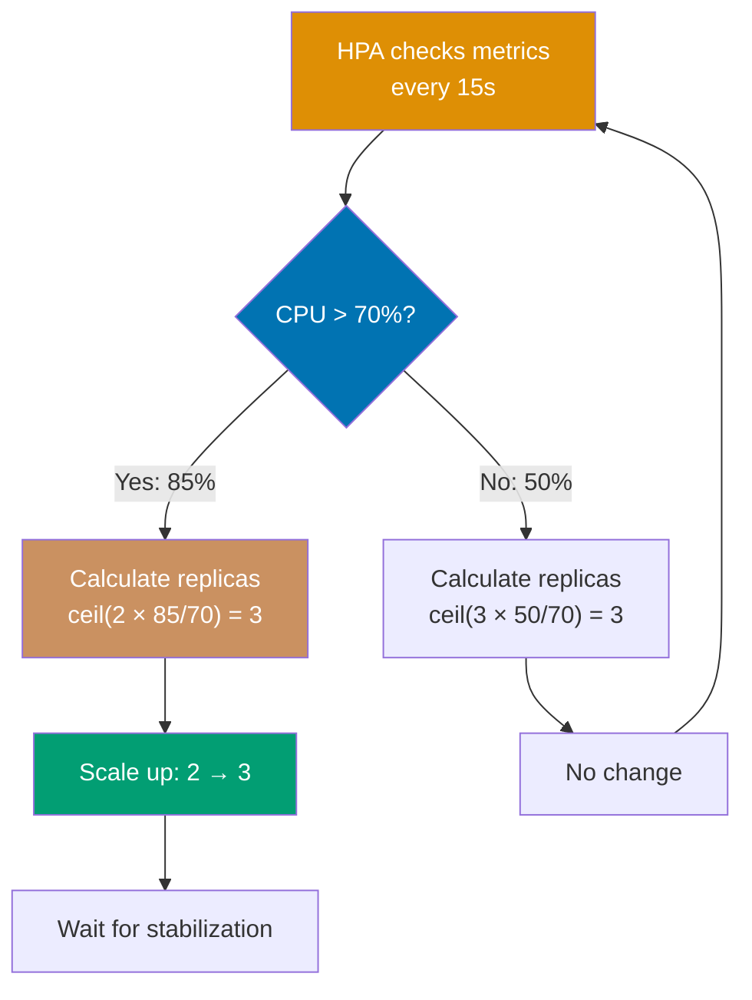

```yaml
# Install metrics-server first (required for CPU/memory metrics):
# => kubectl apply -f https://github.com/kubernetes-sigs/metrics-server/releases/latest/download/components.yaml
# => kubectl get deployment metrics-server -n kube-system  # => Verify metrics-server running

apiVersion: autoscaling/v2 # => Autoscaling API v2 (supports multiple metrics)
kind: HorizontalPodAutoscaler # => HPA resource (automatically adjusts replicas)
metadata:
 name: web-hpa # => HPA name (typically matches target Deployment)
spec:
 scaleTargetRef:
 apiVersion: apps/v1 # => API version of target
 kind: Deployment # => Resource kind (Deployment, ReplicaSet, StatefulSet)
 name:
 web-app # => Target Deployment to scale
 # => HPA modifies this Deployment's replicas
 minReplicas:
 2 # => Minimum replicas (never scale below 2)
 # => Ensures minimum availability even at low load
 # => Set to match HA requirements (zone distribution)
 maxReplicas:
 10 # => Maximum replicas (never scale above 10)
 # => Prevents runaway scaling and cost surprises
 metrics:
 - type: Resource # => Resource metric type (CPU, memory)
 resource:
 name: cpu # => CPU utilization metric
 # => Requires resource.requests.cpu set on Pod
 target:
 type: Utilization # => Percentage of requested CPU
 # => Formula: desired_replicas = ceil(current_replicas × current_cpu / target_cpu)
 averageUtilization:
 70 # => Target 70% average CPU across all Pods
 # => At 85% CPU: scale up (ceil(2 × 85/70) = 3)
 # => At 40% CPU: scale down (ceil(3 × 40/70) = 2)

# HPA behavior:
# => Checks metrics every 15 seconds (default)
# => kubectl get hpa web-hpa        # => Shows current/desired replicas and CPU%
# => kubectl describe hpa web-hpa   # => Shows scaling events and conditions
```

**Key Takeaway**: Use HPA for automatic scaling based on demand; set appropriate min/max replicas to prevent over-scaling costs or under-scaling unavailability; requires resource requests for CPU metrics.

**Why It Matters**: HorizontalPodAutoscaler provides automated elasticity, scaling applications in response to load without human intervention. Discord handles traffic spikes during major gaming events through HPA—when concurrent users jump from 50K to 500K, HPA scales chat services from 10 to 100 Pods within minutes, maintaining sub-second message latency. After the event, HPA scales down automatically, reducing costs. This automation replaces on-call engineers manually scaling services during traffic surges, eliminating human reaction latency (minutes to hours) with automated response (seconds to minutes).

---

### Example 52: Vertical Pod Autoscaler

VerticalPodAutoscaler (VPA) automatically adjusts Pod resource requests and limits based on actual usage, optimizing resource allocation. VPA can operate in recommendation-only or auto-update mode.

```yaml
# Install VPA (requires additional components from kubernetes/autoscaler repo):
# => git clone https://github.com/kubernetes/autoscaler.git
# => cd autoscaler/vertical-pod-autoscaler && ./hack/vpa-install.sh
# => kubectl get pods -n kube-system | grep vpa  # => vpa-admission-controller, vpa-recommender, vpa-updater

apiVersion: autoscaling.k8s.io/v1 # => VPA API (CRD installed by VPA operator)
kind: VerticalPodAutoscaler # => VPA resource for automatic resource right-sizing
metadata:
 name: web-vpa # => VPA name (typically matches target Deployment)
spec:
 targetRef:
 apiVersion: apps/v1 # => API version of target resource
 kind: Deployment # => Target resource type
 name: web-app # => Target Deployment to manage resources for
 updatePolicy:
 updateMode:
 Auto # => Auto: apply recommendations (evicts/restarts Pods to resize)
 # => Recreate: same as Auto (legacy name)
 # => Initial: apply recommendations only at Pod creation
 # => Off: calculate recommendations, make available, do NOT apply
 resourcePolicy:
 containerPolicies:
 - containerName: "*" # => Applies policy to ALL containers in Pod
 # => Use specific container name to target individual containers
 minAllowed:
 cpu: 100m # => Minimum CPU request VPA will set (floor)
 memory: 128Mi # => Minimum memory request VPA will set
 maxAllowed:
 cpu: 2000m # => Maximum CPU request VPA will set (ceiling)
 # => Prevents VPA from over-provisioning
 memory: 2Gi # => Maximum memory request VPA will set
 controlledResources:
 - cpu # => VPA manages CPU requests/limits
 - memory # => VPA manages memory requests/limits

# VPA behavior:
# => Monitors actual resource usage over time (days to weeks for accuracy)
# => kubectl get vpa web-vpa -o json | jq '.status.recommendation'
# => Output: {containerRecommendations: [{target: {cpu: 350m, memory: 380Mi}}]}
```

**Key Takeaway**: Use VPA to right-size resource requests automatically; prefer HPA for horizontal scaling, VPA for vertical sizing; avoid using HPA and VPA on CPU/memory simultaneously to prevent conflicts.

**Why It Matters**: VerticalPodAutoscaler eliminates resource request guesswork by analyzing actual usage and recommending optimal values. VPA identified these inefficiencies and automatically right-sized requests, packing more Pods per node. This continuous optimization handles workload changes over time (memory usage creeping up post-feature launches), maintaining efficiency without manual capacity planning that becomes outdated within weeks.

---

### Example 53: Pod Disruption Budget

PodDisruptionBudgets (PDB) limit voluntary disruptions (node drains, upgrades) to ensure minimum availability during maintenance. PDBs prevent kubectl drain from evicting too many Pods simultaneously.

```yaml
apiVersion: policy/v1 # => Policy API v1 (stable since Kubernetes 1.21)
kind: PodDisruptionBudget # => Budget for voluntary disruptions (drains, upgrades)
metadata:
 name: web-pdb # => PDB name (typically named after target workload)
spec:
 minAvailable:
 2 # => At least 2 Pods must be available during disruption
 # => If Deployment has 4 replicas: max 2 can be evicted at once
 # => kubectl drain blocks if eviction would violate this
 # => Alternative: maxUnavailable: 1 (relative approach)
 # => Can also use percentage: "50%"
 selector:
 matchLabels:
 app: web # => Applies to Pods with app=web label
 # => Must match Pod labels (not Deployment selector)
 # => PDB evaluates current live Pods

# PDB behavior:
# => Deployment has 4 replicas, PDB minAvailable: 2
# => kubectl drain node-1             # => Attempts to evict web Pods
# => If evicting would leave < 2 Pods: drain blocked
# => kubectl get pdb web-pdb          # => Shows ALLOWED-DISRUPTIONS column (= 4 - 2 = 2)

---
# Alternative: maxUnavailable
apiVersion: policy/v1 # => Policy API v1
kind: PodDisruptionBudget # => PDB using maxUnavailable (relative to current replicas)
metadata:
 name: api-pdb # => PDB name for API service
spec:
 maxUnavailable:
 1 # => Maximum 1 Pod can be unavailable at a time
 # => More flexible than minAvailable (adapts to scaling)
 # => With 10 replicas: 9 must be available
 # => With 3 replicas: 2 must be available
 selector:
 matchLabels:
 app: api # => Applies to Pods with app=api label

# maxUnavailable vs minAvailable:
# => maxUnavailable: "at most N Pods down" (scales with replicas)
# => minAvailable: "at least N Pods up" (fixed number, safer for small counts)
# => kubectl get pdb                   # => Lists all PDBs with ALLOWED-DISRUPTIONS
```

**Key Takeaway**: Use PodDisruptionBudgets to maintain availability during voluntary disruptions like node maintenance; set minAvailable or maxUnavailable based on application requirements; PDBs do not prevent involuntary disruptions like node failures.

**Why It Matters**: PodDisruptionBudgets enable zero-downtime cluster maintenance by preventing kubectl drain from evicting too many Pods simultaneously. LinkedIn performs rolling node upgrades across 10,000+ nodes monthly using PDBs—ensuring at least 80% of each service remains available during node rotations. Without PDBs, draining nodes could evict entire services causing outages. This controlled disruption enables continuous cluster upgrades (security patches, Kubernetes version updates) without service interruptions, transforming maintenance from scheduled downtime windows to continuous operations.

---

## Health Checks (Examples 54-57)

### Example 54: Readiness Probe

Readiness probes determine when Pods are ready to receive traffic. Failed readiness checks remove Pods from Service endpoints without restarting them, useful during startup or temporary unavailability.

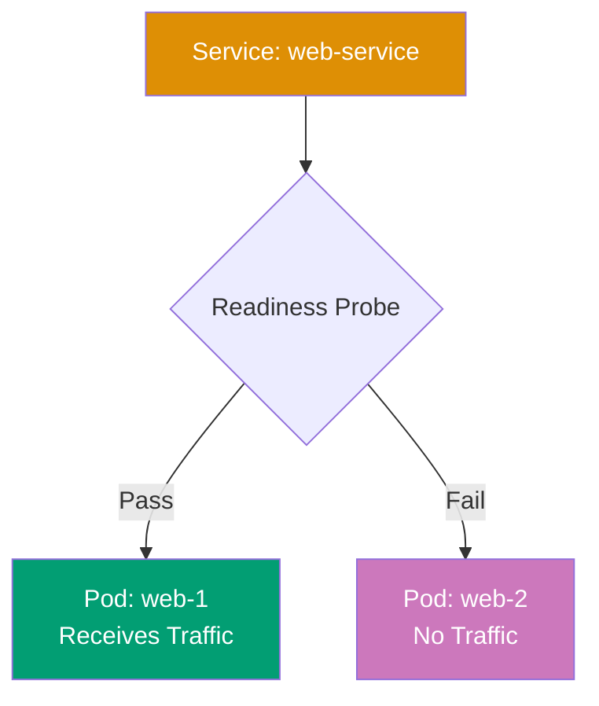

```yaml
apiVersion: v1 # => Core Kubernetes API
kind: Pod # => Pod with readiness probe configuration
metadata:
 name: readiness-pod # => Pod name
 labels:
 app: web # => Labels for Service selector (Service routes to Ready Pods only)
spec:
 containers:
 - name: nginx # => Container name
 image: nginx:1.24 # => Nginx web server
 ports:
 - containerPort: 80 # => HTTP port
 readinessProbe: # => Checks if Pod ready to receive traffic
 # => Failed probe: Pod removed from Service endpoints (no restart)
 httpGet:
 path:
 /ready # => Endpoint returning 2xx when ready to serve
 # => Application defines readiness logic (DB connected, cache warm)
 port: 80 # => Port to probe (must match containerPort)
 initialDelaySeconds:
 5 # => Wait 5s after container start before first probe
 # => Prevents probing during initial startup
 periodSeconds:
 5 # => Probe every 5 seconds (frequent for fast detection)
 # => More frequent than liveness (traffic impact is immediate)
 successThreshold:
 1 # => 1 consecutive success → mark Ready, add to Service
 # => Higher values require sustained health
 failureThreshold:
 3 # => 3 consecutive failures → mark NotReady
 # => 3 × 5s = 15s before Pod removed from Service
 # => No container restart (unlike liveness probe)

# Readiness vs Liveness:
# => Readiness failure → removes from Service endpoints, no restart
# => kubectl get endpoints web-service  # => Shows only Ready Pod IPs
# => kubectl describe pod readiness-pod  # => Shows "Readiness: True/False" status
```

**Key Takeaway**: Use readiness probes to prevent traffic to Pods that are starting up or temporarily unavailable; failed readiness checks remove Pods from load balancing without restarting them.

**Why It Matters**: Readiness probes prevent traffic routing to Pods not yet ready to serve requests, eliminating the "502 Bad Gateway" errors during deployments. This graceful traffic transition maintains quality of service during rolling updates, as users never encounter half-initialized Pods, unlike traditional load balancers that route traffic immediately after container startup, causing request failures during warm-up periods.

---

### Example 55: Startup Probe

Startup probes give slow-starting containers extra time to initialize before liveness probes begin. This prevents premature restart of applications with long initialization (legacy apps, large datasets).

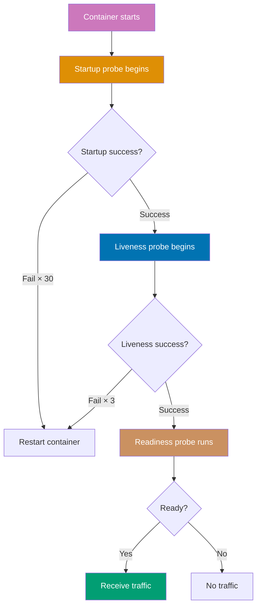

```yaml
apiVersion: v1
kind: Pod
metadata:
 name: startup-pod # => Pod name
spec:
 containers:
 - name: slow-app # => Container name
 image: slow-starting-app:1.0 # => Application with long initialization
 ports:
 - containerPort: 8080 # => Application port
 startupProbe: # => Checks if application started
 httpGet:
 path: /startup # => Startup health endpoint
 port: 8080
 initialDelaySeconds: 10 # => Wait 10s before first probe
 periodSeconds: 10 # => Check every 10 seconds
 failureThreshold:
 30 # => Allow 30 failures = 300 seconds (5 min)
 # => After 5 min → kubelet restarts container
 # => Gives app time to initialize

 livenessProbe: # => Begins after startup probe succeeds
 httpGet:
 path: /healthz # => Liveness health endpoint
 port: 8080
 periodSeconds: 5 # => Frequent checks after startup
 failureThreshold:
 3 # => Restart after 15 seconds of failure
 # => Faster recovery post-startup

# Probe sequence:
# 1. Container starts
# 2. Startup probe checks every 10s (up to 5 min)
# 3. First startup probe success → startup complete
# 4. Liveness probe begins checking every 5s
# 5. Readiness probe (if configured) controls traffic

# Without startup probe:
# => Slow app takes 3 min to start
# => Liveness probe (failureThreshold:3 × periodSeconds:5 = 15s) kills Pod prematurely
# => kubectl get pod startup-pod    # => Pod cycling in CrashLoopBackOff without startup probe
```

**Key Takeaway**: Use startup probes for slow-starting applications to prevent premature liveness probe failures; configure longer failureThreshold \* periodSeconds than application startup time; liveness probes begin only after startup success.

**Why It Matters**: Startup probes solve the "slow starter" problem for legacy applications or those loading large datasets on initialization. Adobe runs Java applications taking 3-5 minutes to start (class loading, dependency initialization)—without startup probes, liveness probes with 30-second timeouts would restart Pods repeatedly, creating CrashLoopBackOff cycles. Startup probes give adequate initialization time while still enabling fast liveness detection post-startup, allowing migration of legacy applications to Kubernetes without code modifications to speed up startup, unblocking containerization of monolithic systems.

---

### Example 56: Combined Health Checks

Production Pods should use all three probes: startup for initialization, liveness for deadlock recovery, and readiness for traffic control. This combination ensures robust health monitoring.

```yaml
apiVersion: apps/v1 # => Apps API for Deployments
kind: Deployment # => Deployment with all three probe types
metadata: # => Deployment metadata
 name: production-app # => Deployment name
spec: # => Deployment specification
 replicas: 3 # => Three Pods for high availability
 selector: # => Pod selector (links Deployment to Pods)
 matchLabels: # => Equality-based label selector
 app: production # => Must match template labels
 template: # => Pod template definition
 metadata: # => Pod template metadata
 labels: # => Pod labels
 app: production # => Pod labels (must match selector)
 spec: # => Pod specification
 containers: # => Container list
 - name: app # => Container name
 image: production-app:1.0 # => Production application image
 ports: # => Exposed container ports
 - containerPort: 8080 # => Application port

 startupProbe: # => Phase 1: Initialization (0-2 min, blocks liveness/readiness)
 # => Liveness and readiness probes INACTIVE while startup probe running
 httpGet: # => HTTP GET probe handler
 path: /startup # => Returns 200 when DB connected, migrations done
 port: 8080 # => Application port
 initialDelaySeconds: 10 # => Wait 10s after container start (minimal warm-up)
 periodSeconds: 10 # => Check every 10s during initialization
 failureThreshold: # => Max consecutive failures before restart
 12 # => Allow 12 failures = 120s max startup window
 # => After 120s: kubelet restarts container
 # => Set higher for slow-starting apps (Java, large datasets)

 livenessProbe: # => Phase 2: Ongoing deadlock/crash detection (active after startup)
 httpGet: # => HTTP GET probe handler
 path: /healthz # => Returns 200 if app responsive (not deadlocked)
 port: 8080 # => Same application port
 initialDelaySeconds: 0 # => Starts immediately after startup probe succeeds
 periodSeconds: 10 # => Check every 10s (less frequent than readiness)
 timeoutSeconds: 5 # => Probe fails if app doesn't respond in 5s
 failureThreshold: # => Max consecutive failures before restart
 3 # => Restart after 3 consecutive failures
 # => 3 failures × 10s = 30s before restart
 # => Restart resolves deadlocks, memory leaks, crashed goroutines

 readinessProbe: # => Phase 3: Traffic control (runs continuously, parallel to liveness)
 httpGet: # => HTTP GET probe handler
 path: /ready # => Returns 200 when ready (dependencies healthy)
 port: 8080 # => Application port
 initialDelaySeconds: 0 # => Starts immediately (Pod not in Service until first success)
 periodSeconds: 5 # => More frequent than liveness (faster traffic removal)
 timeoutSeconds: 3 # => Shorter timeout (faster failure detection)
 successThreshold: 1 # => Add to Service after 1 success
 failureThreshold: # => Max consecutive failures before removing from Service
 2 # => Remove from Service after 2 consecutive failures
 # => 2 failures × 5s = 10s before traffic removed
 # => Handles database connection pool exhaustion gracefully

 resources: # => CPU and memory allocation
 requests: # => Minimum guaranteed resources
 cpu: 250m # => Guaranteed CPU (Burstable QoS class)
 memory: 256Mi # => Guaranteed memory (baseline allocation)
 limits: # => Maximum resource caps
 cpu: 500m # => Maximum CPU (throttled above this)
 memory: 512Mi # => Maximum memory (OOM killed if exceeded)


# Health check endpoints should return:
# => /startup: 200 when initialization complete (DB connected, cache loaded, migrations done)
# => /healthz: 200 when app responsive (no deadlock, no crash)
# => /ready: 200 when ready to handle requests (dependencies available)
```

**Key Takeaway**: Implement all three probe types for production workloads; startup for slow initialization, liveness for crash recovery, readiness for traffic control; design separate health check endpoints with appropriate logic for each probe type.

**Why It Matters**: Combined health checks provide comprehensive reliability through layered health monitoring addressing different failure scenarios. Square's payment services use all three probes—startup ensures initialization completes before traffic (preventing incomplete transactions), liveness detects deadlocks (restarting frozen processes), readiness handles dependency outages (removing Pods from load balancing when databases are unavailable). This defense-in-depth approach achieves 99.99% availability by handling initialization failures, application bugs, and transient dependency issues through automated recovery, eliminating most manual intervention scenarios that plagued pre-Kubernetes deployments.

---

### Example 57: Probe Handlers

Kubernetes supports three probe handlers: HTTP GET, TCP socket, and exec command. Choose appropriate handler based on application capabilities and health check requirements.

```yaml
apiVersion: v1
kind: Pod
metadata:
 name: probe-handlers # => Pod name
spec:
 containers:
 # HTTP GET probe (most common)
 - name: web-app # => Container name
 image: nginx:1.24 # => Nginx web server
 livenessProbe:
 httpGet:
 path:
 /healthz # => Sends HTTP GET request to this path
 # => Returns 200-399 = success, others = failure
 port: 80 # => Port to connect
 httpHeaders:
 - name: Custom-Header
 value:
 HealthCheck # => Optional custom headers
 # => Useful for auth or routing
 scheme:
 HTTP # => HTTP or HTTPS
 # => HTTPS validates certificates
 periodSeconds: 10 # => Check every 10s

 # TCP socket probe (for non-HTTP services)
 - name: database # => Container name
 image: postgres:15 # => PostgreSQL database
 livenessProbe:
 tcpSocket:
 port:
 5432 # => Attempts TCP connection
 # => Success if port open and accepts connection
 # => No data exchanged
 periodSeconds: 10 # => Check every 10s

 # Exec probe (command-based)
 - name: cache # => Container name
 image: redis:7 # => Redis cache
 livenessProbe:
 exec:
 command: # => Runs command inside container
 - redis-cli # => Redis CLI tool
 - ping # => Returns PONG if healthy
 # => Exit 0 = success, non-zero = failure
 periodSeconds: 10 # => Check every 10s


# Probe handler selection:
# => HTTP: applications with HTTP endpoints (web apps, APIs)
# => TCP: non-HTTP services where port availability = health (databases, message queues)
# => Exec: last resort for services without HTTP/TCP health checks (legacy apps)

# Performance considerations:
# => HTTP: moderate overhead (HTTP processing, parsing) - best for APIs
# => TCP: minimal overhead (just connection attempt) - best for databases
# => Exec: high overhead (process fork per probe) - avoid at large scale
kubectl get pods -o wide | grep probe-handlers  # => View all probe-handler Pod statuses
```

**Key Takeaway**: Use HTTP probes for web applications with health endpoints, TCP probes for non-HTTP network services, and exec probes only when necessary due to execution overhead; prefer HTTP/TCP for performance.

**Why It Matters**: Probe handler selection impacts cluster overhead and reliability at scale. Kubernetes clusters with 10,000 Pods running exec probes every 10 seconds execute 1,000 commands per second, consuming significant CPU and creating fork pressure. Twitter migrated from exec-based Redis probes (redis-cli ping) to TCP probes (port 6379), reducing kubelet CPU usage by 40% and eliminating occasional probe timeouts from fork latency. HTTP probes provide rich health checks (dependency status, circuit breaker state) with minimal overhead, making them ideal for microservices, while TCP probes suit databases and message queues where port availability signals health adequately.

---

## Summary

**Intermediate level (40-75% coverage)** covered:

- **StatefulSets** (Examples 29-33): Stateful workloads, persistent storage, ordered deployment, update strategies
- **DaemonSets & Jobs** (Examples 34-38): Node-level services, batch processing, parallel jobs, scheduled tasks
- **Ingress Controllers** (Examples 39-43): HTTP routing, TLS termination, multi-host, annotations, default backend
- **Persistent Volumes** (Examples 44-48): Storage orchestration, dynamic provisioning, expansion, snapshots, local storage
- **Resource Limits** (Examples 49-53): QoS classes, priority, HPA, VPA, disruption budgets
- **Health Checks** (Examples 54-57): Readiness, startup, liveness probes, probe handlers

**Next steps**:

- Continue with [Advanced Examples](/en/learn/software-engineering/infrastructure/tools/kubernetes/by-example/advanced) (Examples 58-85) for expert mastery
- Or review [Beginner Examples](/en/learn/software-engineering/infrastructure/tools/kubernetes/by-example/beginner) (Examples 1-28) for fundamentals

All examples are self-contained and production-ready. Happy learning!
