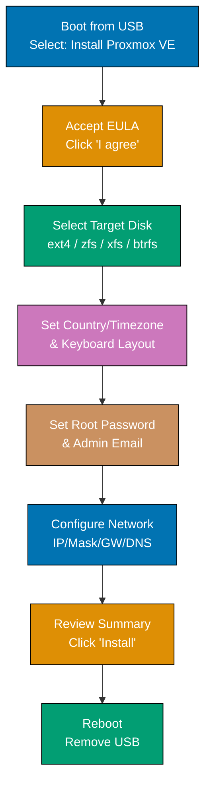

Learn Proxmox VE fundamentals through 28 annotated examples. Each example is self-contained, runnable, and heavily commented to show what each command does, expected outputs, and key takeaways.

## Group 1: Installation

### Example 1: Download and Verify the Proxmox VE 9.1 ISO

Before installing Proxmox VE, download the official ISO and verify its integrity with SHA256. Verification prevents installing corrupted or tampered images—a critical security step for hypervisor infrastructure.

**Code**:

```bash
# Download the Proxmox VE 9.1 ISO from the official CDN
# => File size: ~1.2 GB; uses standard HTTPS transfer
wget https://enterprise.proxmox.com/iso/proxmox-ve_9.1-1.iso
# => Saving to: proxmox-ve_9.1-1.iso
# => Connecting to enterprise.proxmox.com...
# => HTTP request sent, awaiting response... 200 OK
# => 2026-04-29 07:00:00 (8.50 MB/s) - 'proxmox-ve_9.1-1.iso' saved

# Download the SHA256 checksum file published alongside the ISO
wget https://enterprise.proxmox.com/iso/proxmox-ve_9.1-1.iso.sha256sum
# => Saving to: proxmox-ve_9.1-1.iso.sha256sum

# Verify integrity: sha256sum computes hash, grep confirms it matches
sha256sum --check proxmox-ve_9.1-1.iso.sha256sum
# => proxmox-ve_9.1-1.iso: OK
# => If output shows "FAILED", the file is corrupt; delete and re-download

# Alternatively, compute hash manually and compare visually
sha256sum proxmox-ve_9.1-1.iso
# => a3f7b2c1... proxmox-ve_9.1-1.iso  (64 hex chars matching the .sha256sum file)
```

**Key Takeaway**: Always verify ISO checksums before writing to physical media—a corrupted installer can cause silent data loss or failed installations that appear to succeed.

**Why It Matters**: Hypervisor installations are critical infrastructure operations—a corrupted ISO can produce a system that appears functional but has subtle failures that surface weeks later under load. In production environments, ISO verification is part of the change management checklist. Automating this check in a bootstrap script ensures every team member follows the same secure installation baseline, reducing the risk of a "works on my machine" installation discrepancy.

---

### Example 2: Create a Bootable USB Drive

Proxmox VE ISO uses a hybrid format that boots from both CD/DVD and USB. The `dd` command writes the ISO byte-for-byte to the USB device, creating an installable drive compatible with UEFI and legacy BIOS.

**Code**:

```bash
# Identify the USB device before writing (critical: wrong device = data loss)
lsblk
# => NAME   MAJ:MIN RM   SIZE RO TYPE MOUNTPOINTS
# => sda      8:0    0   500G  0 disk /
# => sdb      8:16   1    16G  0 disk        <- USB drive (16G, removable)

# Unmount any auto-mounted partitions on the USB device
umount /dev/sdb1 2>/dev/null || true
# => umount: /dev/sdb1: not mounted  (safe to continue even if not mounted)

# Write the ISO to the USB device using dd (Disk Duplicator)
# bs=1M: block size 1 megabyte for fast sequential writes
# status=progress: show real-time write progress
# conv=fsync: flush buffers to physical disk before returning
sudo dd if=proxmox-ve_9.1-1.iso of=/dev/sdb bs=1M status=progress conv=fsync
# => 1048576000 bytes (1.0 GB, 1000 MiB) copied, 120 s, 8.7 MB/s
# => 1024+0 records in
# => 1024+0 records out
# => 1048576000 bytes (1.0 GB, 1000 MiB) copied, 120.002 s, 8.7 MB/s

# Verify the write completed successfully by checking the exit code
echo $?
# => 0  (zero means success; non-zero means write error)

# On macOS, use diskutil to find the device and dd with rdisk for raw access
# diskutil list                        # => Find disk identifier (e.g., disk2)
# diskutil unmountDisk /dev/disk2      # => Unmount before writing
# sudo dd if=proxmox-ve_9.1-1.iso of=/dev/rdisk2 bs=1m status=progress
# => /dev/rdisk2 bypasses buffer cache for faster writes on macOS
```

**Key Takeaway**: Use `lsblk` to identify the USB device before running `dd`—writing to the wrong device destroys data on that disk with no undo.

**Why It Matters**: USB creation is the first physical step in datacenter provisioning. Teams managing dozens of bare-metal servers use automated USB creation scripts integrated into their build pipelines—Ventoy (multi-ISO boot tool) and PXE netboot are popular alternatives that eliminate per-installation USB writes entirely. For large deployments, Proxmox's `proxmox-auto-install-assistant` combined with PXE enables zero-touch provisioning without physical USB drives.

---

### Example 3: Run the Graphical PVE Installer

The Proxmox VE graphical installer presents a step-by-step wizard. This example documents each screen's key decisions for reproducible installations.



**Code**:

```bash
# After installer completes and system reboots, verify installation from console:

# Check PVE version (confirms successful installation)
pveversion
# => pve-manager/9.1-1/... (running kernel: 6.17.2-1-pve)

# Verify web UI is listening on port 8006 (HTTPS)
ss -tlnp | grep 8006
# => LISTEN 0 128 0.0.0.0:8006 0.0.0.0:* users:(("pveproxy",pid=1234,fd=5))
# => pveproxy is the Proxmox web proxy process

# Check Proxmox storage configuration written by installer
cat /etc/pve/storage.cfg
# => dir: local
# =>     path /var/lib/vz
# =>     content iso,vztmpl,backup
# => lvmthin: local-lvm
# =>     thinpool data
# =>     vgname pve
# =>     content rootdir,images

# Verify network configuration applied by installer
cat /etc/network/interfaces
# => auto lo
# => iface lo inet loopback
# => auto eno1
# => iface eno1 inet manual
# => auto vmbr0
# => iface vmbr0 inet static
# =>     address 192.168.1.100/24   (IP set during installer)
# =>     gateway 192.168.1.1
# =>     bridge-ports eno1
# =>     bridge-stp off
# =>     bridge-fd 0
```

**Key Takeaway**: The graphical installer configures ZFS/LVM partitioning, network bridges, and the Corosync cluster framework in one pass—document your choices because the configuration files drive all subsequent operations.

**Why It Matters**: Consistent installer choices across cluster nodes prevent post-installation configuration drift. Teams standardize on filesystem (ext4 for simplicity, ZFS for enterprise features like snapshots and replication), partition layout, and network bridge naming. Documenting these decisions in a runbook ensures replacement nodes are configured identically—essential when replacing failed hardware at 3 AM.

---

### Example 4: Run the Text-Based TUI Installer

For headless servers without video output, Proxmox provides a terminal-based installer accessible via serial console. The `proxmox-auto-install-assistant` tool also generates unattended answer files for zero-touch deployments.

**Code**:

```bash
# For headless installation via serial console (e.g., IPMI/iDRAC/iLO):
# Boot the ISO with serial console redirect — add to GRUB kernel line:
# console=ttyS0,115200n8 console=tty0
# => Both serial and VGA output simultaneously

# Create an unattended answer file using proxmox-auto-install-assistant:
# Install the tool on a separate Linux machine
apt install proxmox-auto-install-assistant
# => Reading package lists... Done
# => Setting up proxmox-auto-install-assistant...

# Generate a template answer file
proxmox-auto-install-assistant prepare-answer --url https://192.168.1.50/answer.toml
# => Generated answer.toml template at current directory

# Minimal answer.toml for automated installation
cat > answer.toml << 'EOF'
[global]
keyboard = "en-us"
country = "us"
fqdn = "pve01.lab.internal"
mailto = "admin@lab.internal"
timezone = "UTC"
root_password = "SecurePass123!"

[disk-setup]
filesystem = "ext4"
disk_list = ["sda"]

[network]
source = "from-dhcp"
EOF
# => answer.toml written; each field corresponds to an installer screen

# Inject answer file into ISO for zero-touch deployment
proxmox-auto-install-assistant prepare-iso proxmox-ve_9.1-1.iso \
  --fetch-from iso \
  --answer-file answer.toml \
  --output proxmox-ve_9.1-1-auto.iso
# => Created proxmox-ve_9.1-1-auto.iso with embedded answer file
# => Boot from this ISO; installer reads answer.toml and proceeds without prompts
```

**Key Takeaway**: The `proxmox-auto-install-assistant` converts the interactive installer into a zero-touch deployment tool—critical for provisioning dozens of identical cluster nodes.

**Why It Matters**: Manual interactive installations at scale are the primary source of configuration inconsistency in hypervisor deployments. A single typo in a subnet mask during manual installation can go unnoticed for months until failover routing breaks. Unattended installation via answer files—combined with post-install Ansible playbooks—creates a fully reproducible, auditable server provisioning pipeline that new team members can understand, review, and modify safely.

---

### Example 5: Log In to the Web UI and Navigate the Dashboard

The Proxmox web UI at `https://<host>:8006` provides full cluster management through ExtJS. The dashboard displays node health, VM/container summaries, and task history.

**Code**:

```bash
# Access the web UI from a browser on the same network:
# URL: https://192.168.1.100:8006
# => Accept self-signed TLS certificate (replace with real cert later)
# => Username: root
# => Realm: PAM (Linux PAM authentication against /etc/passwd)
# => Password: <set during installation>

# Equivalent API call to verify authentication works from CLI:
# Get a ticket (session token) using curl
curl -s -k -X POST https://192.168.1.100:8006/api2/json/access/ticket \
  -d 'username=root@pam&password=SecurePass123!' | python3 -m json.tool
# => {
# =>   "data": {
# =>     "ticket": "PVE:root@pam:...",      (session ticket for Cookie header)
# =>     "CSRFPreventionToken": "...",       (required for write operations)
# =>     "username": "root@pam"
# =>   }
# => }

# Query node summary (same data shown in web UI Summary tab)
# Store ticket in variable for reuse
TICKET=$(curl -s -k -X POST https://192.168.1.100:8006/api2/json/access/ticket \
  -d 'username=root@pam&password=SecurePass123!' | python3 -c "import sys,json; print(json.load(sys.stdin)['data']['ticket'])")

curl -s -k -H "Cookie: PVEAuthCookie=$TICKET" \
  https://192.168.1.100:8006/api2/json/nodes/pve01/status | python3 -m json.tool
# => {
# =>   "data": {
# =>     "cpuinfo": { "cores": 8, "sockets": 1, "model": "Intel Core i9-..." },
# =>     "memory": { "total": 34359738368, "used": 2147483648, "free": 32212254720 },
# =>     "uptime": 3600,
# =>     "kversion": "Linux 6.17.2-1-pve"
# =>   }
# => }
```

**Key Takeaway**: Every action in the Proxmox web UI calls the REST API—learning the API alongside the UI enables automation and troubleshooting when the UI is unavailable.

**Why It Matters**: Operators who understand only the GUI are helpless during web proxy failures. The Proxmox REST API is complete and documented (visit `https://<host>:8006/api2/` for the interactive schema explorer). Teams that build monitoring and alerting directly against the API—rather than scraping web UI pages—have reliable, version-stable integrations that survive PVE upgrades without breaking.

---

### Example 6: Configure the No-Subscription Repository

Fresh PVE installations point to the enterprise repository requiring a paid subscription. For home labs and development, switch to the no-subscription repository (same packages, no SLA).

**Code**:

```bash
# View current apt sources configured by installer
cat /etc/apt/sources.list.d/pve-enterprise.list
# => deb https://enterprise.proxmox.com/debian/pve trixie pve-enterprise
# => This requires a valid subscription key; apt update fails without it

# Disable the enterprise repository
sed -i 's/^deb/# deb/' /etc/apt/sources.list.d/pve-enterprise.list
# => Line now reads: # deb https://enterprise.proxmox.com/debian/pve trixie pve-enterprise
# => Commented out; apt ignores commented lines

# Add the no-subscription community repository
echo "deb http://download.proxmox.com/debian/pve trixie pve-no-subscription" \
  > /etc/apt/sources.list.d/pve-no-subscription.list
# => Creates new file with community repository URL
# => trixie = Debian 13 codename (PVE 9.x base)

# Also disable the Ceph enterprise repository if present
if [ -f /etc/apt/sources.list.d/ceph.list ]; then
  sed -i 's/^deb/# deb/' /etc/apt/sources.list.d/ceph.list
  echo "deb http://download.proxmox.com/debian/ceph-squid trixie no-subscription" \
    >> /etc/apt/sources.list.d/ceph.list
fi
# => Ceph Squid (19.2.x) from community repo enabled

# Update package lists and apply security updates
apt update && apt dist-upgrade -y
# => Hit:1 http://download.proxmox.com/debian/pve trixie InRelease
# => Get:2 http://security.debian.org/debian-security trixie-security InRelease
# => Reading package lists... Done
# => Building dependency tree... Done
# => 0 upgraded, 0 newly installed, 0 to remove and 0 not upgraded  (or upgrades listed)
```

**Key Takeaway**: The no-subscription repository is functionally identical to the enterprise repository—same packages, same versions—but lacks SLA guarantees and paid support access.

**Why It Matters**: Running enterprise repository without a subscription causes `apt update` to fail with a 401 Unauthorized error, blocking all security updates and PVE upgrades. Fixing this on day one ensures your lab stays updated. Production deployments with business requirements should purchase a subscription—Proxmox subscription revenue funds continued open-source development, and the enterprise repository provides tested, delayed package releases with a more conservative update cadence appropriate for production infrastructure.

---

### Example 7: Upload an ISO Image to Local Storage via Web UI

VMs boot from ISO images stored on Proxmox local storage. The web UI provides a file upload interface; the CLI uses `wget` directly on the node.

**Code**:

```bash
# From the PVE node command line, download an ISO directly to local storage
# ISO storage path: /var/lib/vz/template/iso/ (for 'local' storage)
wget -P /var/lib/vz/template/iso/ \
  https://releases.ubuntu.com/24.04/ubuntu-24.04.2-live-server-amd64.iso
# => Saving to: /var/lib/vz/template/iso/ubuntu-24.04.2-live-server-amd64.iso
# => 2024-04-01 12:00:00 (15.0 MB/s) - saved

# Alternatively, use pvesh to trigger download via API (shows in web UI task log)
pvesh create /nodes/pve01/storage/local/download-url \
  --url https://releases.ubuntu.com/24.04/ubuntu-24.04.2-live-server-amd64.iso \
  --filename ubuntu-24.04.2-live-server-amd64.iso \
  --content iso
# => UPID:pve01:000012AB:00ABCDEF:...:download:local:  (task ID to track progress)

# List available ISOs in local storage
pvesh get /nodes/pve01/storage/local/content --content iso
# => [
# =>   {
# =>     "volid": "local:iso/ubuntu-24.04.2-live-server-amd64.iso",
# =>     "content": "iso",
# =>     "size": 2130706432,
# =>     "format": "iso"
# =>   }
# => ]

# Verify file exists on disk
ls -lh /var/lib/vz/template/iso/
# => total 2.0G
# => -rw-r--r-- 1 root root 2.0G Apr 29 12:00 ubuntu-24.04.2-live-server-amd64.iso
```

**Key Takeaway**: ISOs stored in `local:iso/` are immediately available to all VMs on the node; NFS/Ceph storage makes ISOs available cluster-wide.

**Why It Matters**: Centralized ISO storage prevents the common failure mode where one node has the installation media and another does not—causing VM creation to fail when the target node changes during load balancing. In multi-node clusters, store ISOs on shared storage (NFS, Ceph, or PBS) so any node can install any VM without manual file copying. Automating ISO downloads via the API integrates into provisioning pipelines that create and configure VMs without human intervention.

---

## Group 2: Virtual Machine Management

### Example 8: Create a Basic KVM VM from ISO

The `qm create` command creates a VM with specified hardware configuration. This example creates a minimal Ubuntu VM using CLI; the web UI wizard generates equivalent `qm` calls internally.

**Code**:

```bash
# Create VM with VMID 100 (IDs 100-999 for VMs, recommended range)
qm create 100 \
  --name ubuntu-24-server \
  --memory 2048 \
  --cores 2 \
  --net0 virtio,bridge=vmbr0 \
  --scsihw virtio-scsi-pci \
  --scsi0 local-lvm:32 \
  --ide2 local:iso/ubuntu-24.04.2-live-server-amd64.iso,media=cdrom \
  --boot order=ide2 \
  --ostype l26
# => Creating new VM 100 'ubuntu-24-server'
# => --memory 2048: 2 GB RAM allocated (balloon driver adjusts dynamically)
# => --cores 2: 2 vCPUs; --sockets defaults to 1
# => --net0 virtio: VirtIO NIC (paravirtualized, best performance) on bridge vmbr0
# => --scsihw virtio-scsi-pci: VirtIO SCSI controller (paravirtualized)
# => --scsi0 local-lvm:32: 32 GB disk on local-lvm thin pool
# => --ide2: CD-ROM drive with Ubuntu ISO attached
# => --boot order=ide2: boot from CD-ROM first
# => --ostype l26: Linux 2.6+/5.x/6.x kernel type (enables guest optimizations)

# Verify VM configuration was written to cluster filesystem
cat /etc/pve/qemu-server/100.conf
# => boot: order=ide2
# => cores: 2
# => ide2: local:iso/ubuntu-24.04.2-live-server-amd64.iso,media=cdrom
# => memory: 2048
# => name: ubuntu-24-server
# => net0: virtio=AA:BB:CC:DD:EE:FF,bridge=vmbr0
# => ostype: l26
# => scsi0: local-lvm:vm-100-disk-0,size=32G
# => scsihw: virtio-scsi-pci

# List all VMs on this node
qm list
# => VMID  NAME              STATUS     MEM(MB)    BOOTDISK(GB)  PID
# => 100   ubuntu-24-server  stopped    2048/2048  32.00         0
```

**Key Takeaway**: `qm create` parameters map directly to VM hardware configuration stored in `/etc/pve/qemu-server/<vmid>.conf`—every setting is human-readable and version-controllable.

**Why It Matters**: Understanding the underlying configuration file format enables direct editing for bulk changes, backup/restore of VM configurations separate from disk images, and automation via Ansible or scripts. Web UI wizards are great for one-off VM creation but cannot scale to creating 50 identical application server VMs—the CLI and API are the only practical tools at scale.

---

### Example 9: Start, Stop, and Force-Kill a VM

VM lifecycle management uses `qm start`, `qm stop`, and `qm reset`. Each has different behavior regarding guest OS shutdown signals.

**Code**:

```bash
# Start VM 100 (powers on the virtual machine)
qm start 100
# => Starting VM 100...
# => QEMU process starts; VM boots from configured boot device
# => VM status transitions: stopped -> running

# Check VM status
qm status 100
# => status: running
# => pid: 2345  (QEMU process ID on the host)

# Graceful shutdown (sends ACPI power-off signal to guest OS)
# Guest OS runs shutdown hooks, syncs filesystems, then powers off
qm shutdown 100
# => Sending ACPI shutdown signal to VM 100...
# => VM gracefully powers off (may take 30-60 seconds for guest shutdown)
# => status: stopped  (once complete)

# Start VM again for next examples
qm start 100
# => status: running

# Stop VM immediately (equivalent to pulling the power cable)
# Use only when guest is unresponsive; risks filesystem corruption
qm stop 100
# => Stopping VM 100 immediately (no ACPI signal)
# => QEMU process terminated
# => status: stopped

# Reset VM (hard reset, like pressing reset button)
qm reset 100
# => Sending reset signal to VM 100
# => VM reboots without clean shutdown

# Suspend VM to RAM (saves CPU state, keeps RAM allocated)
qm suspend 100
# => VM 100 suspended to RAM
# => status: suspended  (RAM still consumed, CPU released)

# Resume suspended VM
qm resume 100
# => VM 100 resumed from suspended state
# => status: running
```

**Key Takeaway**: Always prefer `qm shutdown` for graceful guest OS shutdown; use `qm stop` only for unresponsive VMs to avoid filesystem corruption.

**Why It Matters**: The distinction between graceful shutdown and force-stop is critical for database VMs. PostgreSQL, MySQL, and MongoDB write WAL/journal entries during shutdown to ensure data consistency—force-stopping these VMs bypasses this process and can corrupt database files, requiring time-consuming recovery procedures. Monitoring systems that automatically restart unresponsive VMs should implement a timeout between `qm shutdown` attempt and `qm stop` fallback to give the guest OS time to complete its shutdown sequence.

---

### Example 10: Open VM Console via Web UI

Proxmox provides three console protocols: noVNC (browser WebSocket), SPICE (native client with USB/audio), and xterm.js (serial console for text-mode VMs).

**Code**:

```bash
# From CLI, get a VNC ticket for console access (web UI does this automatically)
pvesh create /nodes/pve01/qemu/100/vncproxy \
  --websocket 1 \
  --generate-password 1
# => {
# =>   "data": {
# =>     "ticket": "PVEVNC:...",
# =>     "port": 5900,
# =>     "cert": "...",
# =>     "upid": "..."
# =>   }
# => }
# => noVNC proxy connects to this port on the Proxmox node

# Open a terminal directly in the VM via the QEMU guest agent (requires agent installed)
# First, verify guest agent is running inside the VM
qm agent 100 ping
# => {"ping":"pong"}  (guest agent responding)

# Execute command inside VM via guest agent (no SSH needed)
qm agent 100 exec -- bash -c "hostname && uptime"
# => {
# =>   "out-data": "ubuntu-24-server\n 12:00:00 up 1:30,  1 user,  load average: 0.10, 0.05, 0.01\n",
# =>   "exitcode": 0
# => }

# Send CTRL+ALT+DEL key sequence to VM console (useful for Windows login screen)
qm sendkey 100 ctrl-alt-delete
# => Sent ctrl-alt-delete key sequence to VM 100

# For xterm.js serial console, VM needs serial port configured:
qm set 100 --serial0 socket --vga serial0
# => Adding serial port 0 (socket mode) as primary VGA output
# => Guest kernel needs: console=ttyS0,115200n8 in GRUB_CMDLINE_LINUX
```

**Key Takeaway**: The QEMU guest agent enables out-of-band VM management without SSH—execute commands, retrieve file contents, and manage the VM even when networking is broken.

**Why It Matters**: Console access is the troubleshooting fallback when SSH fails. Operations teams responding to "server unreachable" incidents need console access to diagnose whether the issue is a crashed application, a full disk preventing login, a misconfigured network interface, or a kernel panic. The noVNC browser console works through Proxmox's web proxy without requiring direct VNC port access—making it VPN-friendly and firewall-compatible.

---

### Example 11: Install Guest OS Using VirtIO Drivers

VirtIO is the paravirtualized I/O framework that gives VMs near-native disk and network performance. Windows requires explicit VirtIO driver installation; Linux includes VirtIO drivers in the kernel.

**Code**:

```bash
# For Linux VMs: VirtIO drivers are built into the kernel (no extra steps)
# Verify VirtIO disk driver loaded in running Linux guest:
qm agent 100 exec -- bash -c "lsmod | grep virtio"
# => virtio_scsi            24576  4           (SCSI driver for paravirtualized disks)
# => virtio_net             57344  0           (network driver)
# => virtio_blk             20480  0           (block device driver)
# => virtio_pci             32768  0           (PCI bus driver)

# For Windows VMs: Download VirtIO ISO and attach as second CD-ROM
# Download Windows VirtIO driver ISO to local storage
wget -P /var/lib/vz/template/iso/ \
  https://fedorapeople.org/groups/virt/virtio-win/direct-downloads/stable-virtio/virtio-win.iso
# => Saved: /var/lib/vz/template/iso/virtio-win.iso

# Attach VirtIO ISO as second CD-ROM to Windows VM (VMID 200)
qm set 200 --ide3 local:iso/virtio-win.iso,media=cdrom
# => Updated VM 200 configuration: ide3 added with VirtIO ISO

# Inside Windows guest during installation:
# => When "Where do you want to install Windows?" screen appears,
# => Click "Load driver" -> Browse to D:\vioscsi\w11\amd64\ (for Windows 11)
# => Install VirtIO SCSI driver -> disk becomes visible
# => After installation, run virtio-win-guest-tools.exe from D:\ for all drivers

# Enable QEMU Guest Agent in VM config (requires agent installed in guest)
qm set 100 --agent enabled=1,fstrim_cloned_disks=1
# => enabled=1: enables guest agent communication channel
# => fstrim_cloned_disks=1: runs fstrim on clone to reclaim thin-provisioned space
```

**Key Takeaway**: VirtIO drivers are mandatory for production VMs—without them, Windows VMs use emulated IDE/E1000 which is 3-5x slower and consumes significantly more host CPU.

**Why It Matters**: A Windows VM running on emulated IDE instead of VirtIO SCSI can saturate a host CPU at 30% disk IOPS that a VirtIO VM handles at 5% CPU. This performance cliff causes intermittent slowness that is notoriously difficult to diagnose—the symptoms look like an application bug rather than a driver issue. Standardizing on VirtIO for all VMs during provisioning, rather than retrofitting drivers after performance complaints, is fundamental to consistent hypervisor performance.

---

### Example 12: Resize a VM Disk

VM disks can grow but cannot shrink without risk. `qm disk resize` extends the block device; in-guest tools then extend the partition and filesystem.

**Code**:

```bash
# Check current disk size
qm config 100 | grep scsi0
# => scsi0: local-lvm:vm-100-disk-0,size=32G

# Extend the VM disk by 20 GB (new size: 52 GB)
qm disk resize 100 scsi0 +20G
# => Resizing disk scsi0 of VM 100 by 20G (old: 32G, new: 52G)
# => LVM thin extent size extended on local-lvm

# Verify new disk size in VM config
qm config 100 | grep scsi0
# => scsi0: local-lvm:vm-100-disk-0,size=52G

# Inside the running Linux guest, extend the partition and filesystem:
# (Connect via SSH or guest agent exec)
qm agent 100 exec -- bash -c "
  # Show current partition layout
  lsblk /dev/sda
  # => NAME   MAJ:MIN RM  SIZE RO TYPE MOUNTPOINTS
  # => sda      8:0    0   52G  0 disk
  # => |-sda1   8:1    0    1M  0 part          (BIOS boot partition)
  # => |-sda2   8:2    0    2G  0 part /boot
  # => |-sda3   8:3    0   30G  0 part           (extended from 32G minus boot)

  # Extend partition 3 to fill available space using growpart
  growpart /dev/sda 3
  # => CHANGED: partition=3 start=4395008 old: size=62912512,end=67307520 new: size=104852447,end=...

  # Resize the physical volume (for LVM-based systems)
  pvresize /dev/sda3
  # => Physical volume '/dev/sda3' changed  (new size: 50.00 GiB)

  # Extend logical volume to use all available space
  lvextend -l +100%FREE /dev/ubuntu-vg/ubuntu-lv
  # => Size of logical volume ubuntu-vg/ubuntu-lv changed from 30.00 GiB to 50.00 GiB

  # Resize the filesystem online (no unmount required for ext4)
  resize2fs /dev/ubuntu-vg/ubuntu-lv
  # => Filesystem at /dev/ubuntu-vg/ubuntu-lv is now 13107200 (4k) blocks long.

  df -h /
  # => Filesystem            Size  Used Avail Use% Mounted on
  # => /dev/mapper/ubuntu--vg-ubuntu--lv   49G  5.0G   43G  11% /
"
```

**Key Takeaway**: Disk resize requires two steps: extending the block device on the hypervisor with `qm disk resize`, then extending the partition/filesystem inside the guest with `growpart` and `resize2fs`.

**Why It Matters**: Running out of disk space is a top cause of application downtime. Being able to resize VM disks online—without VM shutdown—means operators can respond to "disk 95% full" alerts without scheduling maintenance windows. The two-step resize process (hypervisor + guest) is frequently misunderstood; operators who only run `qm disk resize` are surprised when `df -h` inside the guest still shows the original size.

---

### Example 13: Take and Restore a VM Snapshot

Snapshots capture VM state (disk + RAM + CPU registers) at a point in time. They require qcow2 disk format or ZFS storage; LVM thin pools support disk-only snapshots.

**Code**:

```bash
# Take a snapshot with RAM state (saves running memory contents)
# Requires VM to be running; adds 20-60 seconds pause for RAM save
qm snapshot 100 pre-upgrade \
  --description "Before Ubuntu 24.04 -> 24.10 upgrade" \
  --vmstate 1
# => Creating snapshot 'pre-upgrade' on VM 100
# => Saving VM RAM state (2048 MB)...
# => Snapshot created successfully
# => --vmstate 1: includes running RAM in snapshot (enables full state restore)

# List all snapshots for VM 100
qm listsnapshot 100
# => Name              VMState  Running  Description
# => NOW                                 You are here
# => pre-upgrade        yes      no       Before Ubuntu 24.04 -> 24.10 upgrade

# After a failed upgrade, rollback to the pre-upgrade snapshot
qm rollback 100 pre-upgrade
# => Rolling back VM 100 to snapshot 'pre-upgrade'...
# => Restoring disk state...
# => Restoring RAM state (vmstate)...
# => VM rolled back and started in pre-upgrade state
# => VM 100 is now running as it was when snapshot was taken

# Delete a snapshot when no longer needed (frees space)
qm delsnapshot 100 pre-upgrade
# => Deleting snapshot 'pre-upgrade' from VM 100...
# => Freed 2.3 GB (disk delta + RAM state)

# Check disk format (snapshots require qcow2 or ZFS, not raw)
qm config 100 | grep scsi0
# => scsi0: local-lvm:vm-100-disk-0,size=52G
# => Note: local-lvm uses raw format; snapshot disk deltas use COW within LVM thin pool
# => For qcow2 format: use 'local' directory storage, not 'local-lvm'
```

**Key Takeaway**: Always take a snapshot before major changes (OS upgrades, application deployments)—rollback takes seconds and eliminates the need for complex application-level rollback procedures.

**Why It Matters**: VM snapshots are the hypervisor-level safety net that makes infrastructure changes low-risk. A developer upgrading a Python runtime from 3.11 to 3.12 can snapshot the VM, run the upgrade, test for 30 minutes, and roll back in 10 seconds if compatibility issues appear—versus spending hours debugging or restoring from backup. The critical caveat: snapshots are not backups. They live on the same storage as the VM; disk failure destroys both the VM and its snapshots simultaneously.

---

## Group 3: LXC Container Management

### Example 14: Create an LXC Container from a Downloaded Template

LXC containers share the host kernel and start in seconds. Proxmox provides pre-built templates for common Linux distributions via `pveam`.

**Code**:

```bash
# Update the template list from Proxmox CDN
pveam update
# => Downloading template list from 'https://download.proxmox.com/images/system/'...
# => 47 templates available

# List available Ubuntu templates
pveam available | grep ubuntu
# => system  ubuntu-24.04-standard_24.04-2_amd64.tar.zst
# => system  ubuntu-22.04-standard_22.04-1_amd64.tar.zst
# => system  ubuntu-20.04-standard_20.04-1_amd64.tar.zst

# Download the Ubuntu 24.04 template to local storage
pveam download local ubuntu-24.04-standard_24.04-2_amd64.tar.zst
# => Downloading 'ubuntu-24.04-standard_24.04-2_amd64.tar.zst' to local storage...
# => Saved: /var/lib/vz/template/cache/ubuntu-24.04-standard_24.04-2_amd64.tar.zst

# Create LXC container (CTID 200) from the downloaded template
pct create 200 local:vztmpl/ubuntu-24.04-standard_24.04-2_amd64.tar.zst \
  --hostname web-server-01 \
  --memory 512 \
  --swap 512 \
  --cores 1 \
  --net0 name=eth0,bridge=vmbr0,ip=dhcp \
  --rootfs local-lvm:8 \
  --password SecureContainerPass! \
  --unprivileged 1
# => Creating CT 200...
# => --hostname: container hostname visible inside and in PVE UI
# => --memory 512: 512 MB RAM hard limit (cgroup v2 enforced)
# => --unprivileged 1: uid/gid mapping; container root cannot escape to host root
# => --rootfs local-lvm:8: 8 GB root filesystem on thin-provisioned LVM

# Verify container configuration
pct config 200
# => arch: amd64
# => cores: 1
# => hostname: web-server-01
# => memory: 512
# => net0: name=eth0,bridge=vmbr0,ip=dhcp
# => ostype: ubuntu
# => rootfs: local-lvm:vm-200-disk-0,size=8G
# => swap: 512
# => unprivileged: 1
```

**Key Takeaway**: LXC containers start in 1-3 seconds (vs 30-60 seconds for VMs) and use 90% less memory overhead—ideal for microservices, web apps, and development environments that don't require a full kernel.

**Why It Matters**: A single Proxmox node with 64 GB RAM can run 5-10 memory-hungry VMs or 50-100 lightweight LXC containers. Teams running dozens of small services (monitoring agents, log shippers, API gateways) use LXC containers to maximize hardware utilization without the overhead of full VMs. The unprivileged container flag is mandatory for production—it prevents a container escape vulnerability from giving attackers host root access.

---

### Example 15: Start, Stop, and Enter an LXC Container Shell

LXC containers have their own lifecycle commands (`pct`) parallel to VM commands (`qm`). Entering a container shell provides direct access without SSH.

**Code**:

```bash
# Start the container
pct start 200
# => Starting CT 200...
# => Container starts in ~1-3 seconds (kernel already running on host)

# Check container status
pct status 200
# => status: running

# Enter the container shell directly (no SSH required)
pct enter 200
# => root@web-server-01:/# (now inside container)
# => Container has isolated filesystem, network, and process namespace
# => Host processes are NOT visible; container processes ARE visible to host

# Exit the container shell
exit
# => Back to Proxmox host shell

# Execute a command inside the container without entering interactive shell
pct exec 200 -- bash -c "apt update && apt install -y nginx"
# => Get:1 http://archive.ubuntu.com/ubuntu noble InRelease
# => Processing triggers for nginx...
# => nginx installed inside CT 200

# Verify nginx is running inside the container
pct exec 200 -- systemctl status nginx
# => ● nginx.service - A high performance web server
# =>      Active: active (running) since...

# Stop the container gracefully
pct shutdown 200
# => Sending shutdown signal to CT 200...
# => Container stopped

# Force-stop unresponsive container (equivalent to qm stop)
pct stop 200
# => Stopping CT 200 immediately
# => status: stopped
```

**Key Takeaway**: `pct enter` provides instant shell access to containers without requiring SSH—invaluable for debugging network issues that break connectivity.

**Why It Matters**: Container-based workloads that run without SSH daemons (Alpine-based, minimal images) require out-of-band console access for debugging. Unlike Docker where `docker exec` requires the Docker daemon, Proxmox's `pct enter` works at the kernel namespace level—it remains functional even when container processes are crashed or hung. This makes LXC containers more operationally observable than Docker containers in bare-metal environments.

---

### Example 16: Create an LXC Container from an OCI Registry Image

New in Proxmox VE 9.1: LXC containers can be created directly from OCI (Docker/container) registry images, enabling use of Docker Hub, GitHub Container Registry, and private registries without converting images.

**Code**:

```bash
# Create LXC container from Docker Hub OCI image (new in PVE 9.1)
# OCI image format: docker://registry/image:tag
pct create 201 \
  'docker://docker.io/library/ubuntu:24.04' \
  --arch amd64 \
  --hostname oci-ubuntu \
  --memory 512 \
  --rootfs local-lvm:8 \
  --net0 name=eth0,bridge=vmbr0,ip=dhcp \
  --unprivileged 1
# => Pulling OCI image: docker.io/library/ubuntu:24.04
# => Fetching manifest from registry.hub.docker.com...
# => Downloading layer sha256:abc123... (29.5 MB)
# => Converting OCI layers to LXC rootfs...
# => CT 201 created from OCI image ubuntu:24.04

# Create container from GitHub Container Registry (private image with auth)
pct create 202 \
  'docker://ghcr.io/myorg/myapp:v2.1.0' \
  --rootfs local-lvm:10 \
  --memory 1024 \
  --net0 name=eth0,bridge=vmbr0,ip=dhcp \
  --unprivileged 1 \
  --features keyctl=1,nesting=1
# => --features keyctl=1: enables keyctl syscall (needed for some apps)
# => --features nesting=1: enables nested LXC (for Docker-in-LXC use cases)

# List downloaded OCI image templates
pveam list local | grep docker
# => local:vztmpl/ubuntu-24.04-oci.tar.zst   docker.io/library/ubuntu:24.04

# Start and verify the OCI-based container
pct start 201
pct exec 201 -- cat /etc/os-release
# => NAME="Ubuntu"
# => VERSION="24.04.2 LTS (Noble Numbat)"
# => ID=ubuntu
```

**Key Takeaway**: OCI image support in PVE 9.1 bridges the gap between Docker workflows and LXC containers—teams can use standard container registries and Docker build pipelines to produce images that run as privileged-free LXC containers.

**Why It Matters**: Organizations with existing Docker container build pipelines can now run those containers as LXC on Proxmox without maintaining a separate Kubernetes cluster or Docker Swarm. The LXC runtime provides better kernel-level isolation guarantees than rootless Docker, while the OCI import path preserves the familiar image-based workflow. This is particularly valuable for teams migrating from Docker-on-VM to native hypervisor workloads.

---

## Group 4: Users and Authentication

### Example 17: Manage Users, Roles, and Permissions

Proxmox uses a role-based access control (RBAC) system. Roles are collections of privileges; users are assigned roles at specific paths (datacenter, node, VM, storage).

**Code**:

```bash
# List all users in the Proxmox user database
pvesh get /access/users
# => [
# =>   { "userid": "root@pam", "enable": 1, "expire": 0 },
# =>   { "userid": "admin@pve", "enable": 1, "expire": 0 }
# => ]

# Create a new PVE realm user (stored in Proxmox database, not Linux PAM)
pvesh create /access/users \
  --userid devops@pve \
  --password 'DevOpsPass123!' \
  --firstname "DevOps" \
  --lastname "Engineer" \
  --email "devops@company.com"
# => User devops@pve created in Proxmox user database
# => @pve realm: Proxmox-only account (no Linux system account)
# => @pam realm: maps to Linux PAM (uses /etc/passwd + /etc/shadow)

# List available roles and their privileges
pvesh get /access/roles
# => Administrator: all privileges
# => PVEVMAdmin: VM create, delete, migrate, configure
# => PVEVMUser: VM console, start, stop (no config changes)
# => PVEDatastoreAdmin: storage management
# => PVEDatastoreUser: storage read access (allocate VM disks)
# => PVEAuditor: read-only access to everything

# Grant devops@pve PVEVMAdmin role at datacenter level (all nodes and VMs)
pvesh create /access/acl \
  --path / \
  --users devops@pve \
  --roles PVEVMAdmin \
  --propagate 1
# => ACL added: devops@pve has PVEVMAdmin at / (datacenter root)
# => --propagate 1: permission inherits to all child paths (nodes, VMs, storage)

# Grant devops@pve access to specific VM only (path /vms/100)
pvesh create /access/acl \
  --path /vms/100 \
  --users devops@pve \
  --roles PVEVMUser
# => devops@pve can now console/start/stop VM 100 only

# Verify ACL assignments
pvesh get /access/acl
# => [ { "path": "/", "ugid": "devops@pve", "roleid": "PVEVMAdmin", "propagate": 1 }, ... ]
```

**Key Takeaway**: Proxmox RBAC path-based permissions enable least-privilege access: developers get VM console access, operations get VM management, and only admins get cluster configuration rights.

**Why It Matters**: Shared root access to the Proxmox host is a security anti-pattern that prevents auditability and creates accountability gaps. RBAC allows developers to restart their own VMs without SSH access to the host, operations engineers to manage infrastructure without cluster configuration rights, and automated tools to use minimal-privilege API tokens. This separation enables regulatory compliance (SOC 2, ISO 27001) by creating auditable access trails for every infrastructure operation.

---

### Example 18: Create an API Token for Automation

API tokens provide credential separation for automation tools. Unlike user passwords, tokens can be scoped to specific privileges, set to expire, and revoked without affecting user accounts.

**Code**:

```bash
# Create an API token for the devops@pve user
# Token format after creation: devops@pve!terraform=<UUID>
pvesh create /access/users/devops@pve/token/terraform \
  --privsep 1 \
  --expire 0 \
  --comment "Terraform automation token"
# => {
# =>   "info": {
# =>     "privsep": 1,            (token has separate, potentially reduced privileges)
# =>     "comment": "Terraform automation token",
# =>     "tokenid": "terraform",
# =>     "expire": 0             (0 = never expires)
# =>   },
# =>   "value": "xxxxxxxx-xxxx-xxxx-xxxx-xxxxxxxxxxxx"  (UUID — save this now; shown once)
# => }
# => CRITICAL: Copy the token value immediately; Proxmox does not store it in plaintext

# The full token string used in API calls:
# Authorization header: PVEAPIToken=devops@pve!terraform=<UUID>

# Grant the token specific privileges (--privsep 1 means token can have subset of user perms)
pvesh create /access/acl \
  --path / \
  --tokens 'devops@pve!terraform' \
  --roles PVEVMAdmin \
  --propagate 1
# => Token 'devops@pve!terraform' granted PVEVMAdmin at datacenter root

# Test the token with an API call
TOKEN_ID="devops@pve!terraform"
TOKEN_SECRET="xxxxxxxx-xxxx-xxxx-xxxx-xxxxxxxxxxxx"

curl -s -k \
  -H "Authorization: PVEAPIToken=${TOKEN_ID}=${TOKEN_SECRET}" \
  https://192.168.1.100:8006/api2/json/nodes | python3 -m json.tool
# => { "data": [ { "node": "pve01", "status": "online", ... } ] }

# Revoke a token when no longer needed
pvesh delete /access/users/devops@pve/token/terraform
# => Token 'devops@pve!terraform' deleted
# => Existing API clients using this token receive 401 Unauthorized immediately
```

**Key Takeaway**: API tokens with `--privsep 1` decouple automation tool credentials from human user accounts—revoking a compromised token does not affect the user's own access.

**Why It Matters**: Sharing root credentials between humans and automation tools is a critical security failure. API tokens enable the principle of credential separation: Terraform uses one token with VM-creation privileges, monitoring uses another with read-only access, and backup scripts use a third with storage access. When a CI/CD pipeline is compromised and its credentials must be rotated, a scoped API token can be revoked in seconds without resetting root passwords or disrupting other automation.

---

### Example 19: Configure PAM, LDAP, and OpenID Connect Authentication

Proxmox supports multiple authentication realms simultaneously. Enterprise deployments use LDAP/Active Directory for centralized user management or OpenID Connect for SSO.

**Code**:

```bash
# List configured authentication realms
pvesh get /access/domains
# => [
# =>   { "realm": "pam", "type": "pam", "comment": "Linux PAM standard authentication" },
# =>   { "realm": "pve", "type": "pve", "comment": "Proxmox VE authentication server" }
# => ]

# Add LDAP realm for Active Directory authentication
pvesh create /access/domains \
  --realm corp \
  --type ldap \
  --server1 dc01.corp.example.com \
  --port 389 \
  --base_dn "dc=corp,dc=example,dc=com" \
  --user_attr sAMAccountName \
  --bind_dn "cn=proxmox-bind,ou=service-accounts,dc=corp,dc=example,dc=com" \
  --bind_password 'BindPassword123!' \
  --comment "Corporate Active Directory"
# => LDAP realm 'corp' created
# => Users can now log in as: jdoe@corp (maps to sAMAccountName=jdoe in AD)

# Add OpenID Connect realm for SSO (e.g., Keycloak, Okta, Google)
pvesh create /access/domains \
  --realm sso \
  --type openid \
  --issuer-url "https://keycloak.corp.example.com/realms/proxmox" \
  --client-id "proxmox-pve" \
  --client-key "oidc-client-secret-here" \
  --username-claim "preferred_username" \
  --autocreate 1 \
  --comment "Keycloak SSO"
# => OpenID realm 'sso' created
# => --autocreate 1: auto-creates Proxmox user on first OIDC login
# => Users log in via Keycloak redirect; Proxmox receives JWT token

# Test LDAP authentication for a specific user
pvesh create /access/domains/corp/sync \
  --scope users \
  --remove-vanished none
# => Syncing users from LDAP realm 'corp'...
# => Added: 45 users synchronized from Active Directory
```

**Key Takeaway**: OpenID Connect with `--autocreate 1` enables zero-provisioning SSO—users authenticate via your existing identity provider and Proxmox accounts are created automatically on first login.

**Why It Matters**: Manual user management in Proxmox breaks down at 10+ operators. LDAP sync ensures that when an employee leaves and their AD account is disabled, their Proxmox access is automatically revoked—without requiring a separate ticket to a Proxmox administrator. OIDC SSO eliminates password fatigue and enables MFA enforcement through the identity provider, satisfying security audit requirements without managing separate credentials for each infrastructure tool.

---

## Group 5: Storage Configuration

### Example 20: Set Up Local Storage: Directory, LVM, ZFS Pool

Proxmox supports multiple storage backends simultaneously. This example configures the three most common local storage types.

**Code**:

```bash
# View current storage configuration
pvesh get /storage
# => [
# =>   { "storage": "local", "type": "dir", "path": "/var/lib/vz", "content": "iso,vztmpl,backup" },
# =>   { "storage": "local-lvm", "type": "lvmthin", "vgname": "pve", "thinpool": "data" }
# => ]

# Add a directory-type storage (useful for NFS mounts, external disks)
pvesh create /storage \
  --storage extra-disk \
  --type dir \
  --path /mnt/extra \
  --content images,backup \
  --maxfiles 3
# => Storage 'extra-disk' added: directory at /mnt/extra
# => content=images: stores VM disk images (qcow2, raw)
# => content=backup: stores vzdump backup archives
# => maxfiles=3: keep 3 backup files per VM

# Create a ZFS pool from an additional disk (e.g., /dev/sdb)
# CAUTION: this destroys all data on /dev/sdb
zpool create -f tank /dev/sdb
# => Creating ZFS pool 'tank' as single disk (no redundancy)
# => For production: use mirror or raidz

# Add the ZFS pool to Proxmox storage configuration
pvesh create /storage \
  --storage tank-zfs \
  --type zfspool \
  --pool tank \
  --content images,rootdir \
  --sparse 1
# => ZFS pool 'tank' registered as storage 'tank-zfs'
# => content=rootdir: enables LXC container rootfs storage
# => sparse=1: enables thin provisioning (ZFS native)

# Verify all storage backends
pvesh get /nodes/pve01/storage --enabled 1
# => local: dir, /var/lib/vz (iso, templates, backups)
# => local-lvm: lvmthin, pve/data (VM images, container rootfs)
# => extra-disk: dir, /mnt/extra (images, backups)
# => tank-zfs: zfspool, tank (images, container rootfs)
```

**Key Takeaway**: Different storage backends serve different purposes—directory for ISO/backup files, LVM thin for VM disks with fast snapshots, ZFS for enterprise features like compression, deduplication, and replication.

**Why It Matters**: Storage architecture decisions at Proxmox setup time are expensive to change later. LVM thin is faster for random I/O (better for databases); ZFS provides data integrity checksumming and native compression that can reduce storage costs by 30-50% for compressible workloads like log storage. Teams that choose storage thoughtfully at provisioning time avoid emergency disk migrations under production load months later.

---

## Group 6: Networking

### Example 21: Configure Network Bridges

Proxmox uses Linux bridges to connect VMs and containers to physical networks. The bridge `vmbr0` is created by the installer; additional bridges enable network segmentation.

**Code**:

```bash
# View current network configuration
cat /etc/network/interfaces
# => auto lo
# => iface lo inet loopback
# => auto eno1
# => iface eno1 inet manual     (physical NIC, no IP — attached to bridge)
# => auto vmbr0
# => iface vmbr0 inet static
# =>     address 192.168.1.100/24
# =>     gateway 192.168.1.1
# =>     bridge-ports eno1      (physical port attached to bridge)
# =>     bridge-stp off         (STP disabled; use only in networks without loops)
# =>     bridge-fd 0            (forwarding delay 0 for immediate forwarding)

# Add a second bridge for a private VM network (no physical port = isolated)
cat >> /etc/network/interfaces << 'EOF'

auto vmbr1
iface vmbr1 inet static
    address 10.0.1.1/24
    bridge-ports none
    bridge-stp off
    bridge-fd 0
    post-up echo 1 > /proc/sys/net/ipv4/ip_forward
    post-up iptables -t nat -A POSTROUTING -s 10.0.1.0/24 -o vmbr0 -j MASQUERADE
    post-down iptables -t nat -D POSTROUTING -s 10.0.1.0/24 -o vmbr0 -j MASQUERADE
EOF
# => vmbr1: isolated bridge with NAT masquerade for outbound internet access
# => bridge-ports none: no physical port; VMs on this bridge are isolated from physical network
# => post-up: iptables NAT rules applied when bridge comes up

# Apply new network configuration (temporarily, for testing)
ifreload -a
# => Reloading network configuration...
# => vmbr1 created and configured

# Verify both bridges are active
ip link show type bridge
# => vmbr0: <BROADCAST,MULTICAST,UP,LOWER_UP> mtu 1500 ...
# => vmbr1: <BROADCAST,MULTICAST,UP,LOWER_UP> mtu 1500 ...

# Attach a VM to the private bridge vmbr1
qm set 100 --net1 virtio,bridge=vmbr1
# => VM 100 now has second NIC on private isolated network vmbr1
```

**Key Takeaway**: Linux bridges without physical ports create isolated private networks for VMs that need inter-VM communication but no direct physical network access—ideal for database and backend VMs.

**Why It Matters**: Network segmentation is a fundamental security control. VMs running databases should not have direct access to the physical network—only the application tier VM should bridge database traffic. Proxmox bridges enable this three-tier architecture (frontend → application → database) on a single physical host without VLAN switches, making it practical for lab environments and small deployments while mirroring production network security designs.

---

## Group 7: Monitoring and Backup

### Example 22: View Cluster and Node Resource Usage

Proxmox exposes real-time resource metrics through the web UI and REST API. This example queries node status, per-VM metrics, and storage utilization.

**Code**:

```bash
# Get node resource summary (CPU, RAM, storage, network)
pvesh get /nodes/pve01/status
# => {
# =>   "cpuinfo": { "cores": 8, "sockets": 1, "mhz": "3600.000", "model": "Intel Core i9-..." },
# =>   "memory": { "total": 34359738368, "used": 8589934592, "free": 25769803776 },
# =>   "swap": { "total": 4294967296, "used": 0, "free": 4294967296 },
# =>   "rootfs": { "total": 107374182400, "used": 5368709120, "avail": 101100, "avail_str": "94.0 GiB" },
# =>   "uptime": 86400,
# =>   "loadavg": ["0.25", "0.18", "0.15"],
# =>   "kversion": "Linux 6.17.2-1-pve"
# => }

# Get real-time CPU and memory usage per VM
pvesh get /nodes/pve01/qemu --full 1 | python3 -c "
import sys, json
vms = json.load(sys.stdin)['data']
for vm in sorted(vms, key=lambda x: x.get('cpu', 0), reverse=True):
    print(f\"VM {vm['vmid']}: {vm['name']:<20} CPU={vm.get('cpu', 0):.2%} MEM={vm.get('mem', 0)//1024//1024}MB status={vm['status']}\")
"
# => VM 100: ubuntu-24-server     CPU=2.34% MEM=1024MB status=running
# => VM 105: db-postgres           CPU=15.20% MEM=4096MB status=running

# Get storage usage across all nodes
pvesh get /cluster/resources --type storage
# => [
# =>   { "storage": "local-lvm", "node": "pve01", "used": 53687091200, "maxdisk": 107374182400, "disk": 53687091200 },
# =>   { "storage": "ceph-pool", "node": "pve01", "used": 161061273600, "maxdisk": 536870912000 }
# => ]

# Monitor task progress (long-running operations like migrations, backups)
pvesh get /nodes/pve01/tasks --limit 10
# => Lists last 10 tasks: starttime, endtime, type, status (OK/ERROR/running), upid
```

**Key Takeaway**: `pvesh get /cluster/resources` returns unified cluster-wide resource consumption—nodes, VMs, containers, and storage—in a single API call, making it the foundation for monitoring integrations.

**Why It Matters**: Proactive resource monitoring prevents capacity emergencies. Teams integrate Proxmox's REST API with Prometheus (via proxmox-pve-exporter), Grafana dashboards, and alerting on thresholds: CPU sustained >80% for 5 minutes, memory >90%, storage >85% used. This visibility allows capacity planning conversations ("we need another node in 3 months") rather than emergency expansions during production incidents.

---

### Example 23: Enable and Configure the Proxmox Firewall

Proxmox provides a zone-based iptables firewall with rules at datacenter, host, and VM/container levels. Rules are managed through the web UI and stored in the cluster filesystem.

**Code**:

```bash
# Enable firewall at datacenter level (applies to all nodes)
pvesh set /cluster/firewall/options \
  --enable 1 \
  --ebtables 1 \
  --log_ratelimit "1/second:15"
# => Datacenter firewall enabled
# => ebtables: Ethernet bridge-level filtering for VM traffic
# => log_ratelimit: limit firewall log entries to prevent disk fill

# Create an IP Set for trusted management networks
pvesh create /cluster/firewall/ipset \
  --name management-nets \
  --comment "Trusted management subnets"
# => IP set 'management-nets' created

pvesh create /cluster/firewall/ipset/management-nets \
  --cidr 192.168.1.0/24
# => 192.168.1.0/24 added to management-nets

pvesh create /cluster/firewall/ipset/management-nets \
  --cidr 10.0.0.0/8
# => 10.0.0.0/8 added to management-nets

# Add datacenter-level rules (apply to all nodes and VMs)
pvesh create /cluster/firewall/rules \
  --type in \
  --action ACCEPT \
  --source '+management-nets' \
  --dest 0.0.0.0/0 \
  --dport 8006 \
  --proto tcp \
  --comment "Allow web UI from management nets"
# => Rule added: allow TCP 8006 from management-nets

# Enable firewall on a specific VM and add VM-level rules
pvesh set /nodes/pve01/qemu/100/firewall/options \
  --enable 1 \
  --dhcp 1 \
  --ipfilter 1
# => VM 100 firewall enabled
# => dhcp=1: allow DHCP traffic through firewall
# => ipfilter=1: prevent IP spoofing (drop traffic from VMs using wrong source IP)

pvesh create /nodes/pve01/qemu/100/firewall/rules \
  --type in \
  --action ACCEPT \
  --proto tcp \
  --dport 80,443 \
  --comment "Allow HTTP/HTTPS to VM 100"
# => VM 100: accept TCP ports 80,443 inbound

# View effective firewall rules
pvesh get /nodes/pve01/firewall/rules
# => Lists all active firewall rules in order with action, direction, source, dest, port
```

**Key Takeaway**: Proxmox's zone-based firewall provides defense-in-depth: datacenter rules protect all nodes, host rules protect the hypervisor, and VM rules protect individual workloads—all managed from a single control plane.

**Why It Matters**: Hypervisors are high-value attack targets—compromising the host gives access to all VMs. The Proxmox firewall's ipfilter feature prevents VM-to-VM ARP spoofing and IP spoofing attacks within the cluster, which are common vectors in multi-tenant environments. Teams running customer workloads on shared infrastructure must enable ipfilter to prevent one tenant's compromised VM from intercepting another tenant's traffic.

---

### Example 24: Schedule Automated Backups

Proxmox backup uses `vzdump` internally to create consistent backups of VMs and containers. Scheduled jobs run on the Cron system; backup modes balance consistency vs downtime.

**Code**:

```bash
# View current backup jobs
pvesh get /cluster/backup
# => [] (no scheduled jobs configured yet)

# Create a daily backup job for all VMs/containers
pvesh create /cluster/backup \
  --storage local \
  --schedule "0 2 * * *" \
  --mode snapshot \
  --compress zstd \
  --mailnotification failure \
  --mailto admin@company.com \
  --maxfiles 7 \
  --prune-backups 'keep-daily=7,keep-weekly=4,keep-monthly=3' \
  --vmid all
# => Backup job created with ID: backup-1234abcd
# => --schedule "0 2 * * *": daily at 02:00 (cron format)
# => --mode snapshot: uses VM snapshot for zero-downtime backup (requires qcow2 or ZFS)
# =>   alternatives: 'stop' (safest, shuts down VM), 'suspend' (pauses VM)
# => --compress zstd: fast compression with good ratio (~40-60% size reduction)
# => --prune-backups: retention policy (7 daily, 4 weekly, 3 monthly)
# => --vmid all: backs up all VMs and containers on all nodes

# Run a manual backup immediately for VM 100
vzdump 100 \
  --storage local \
  --mode snapshot \
  --compress zstd \
  --notes-template "Manual backup before upgrade on {{guestname}}"
# => INFO: starting new backup job: vzdump 100
# => INFO: VM Name: ubuntu-24-server
# => INFO: creating snapshot for consistent backup...
# => INFO: backup archive: /var/lib/vz/dump/vzdump-qemu-100-2026_04_29-02_00_00.vma.zst
# => INFO: archive file size: 3.2G
# => INFO: Finished Backup of VM 100 (00:02:15)

# List backup files for VM 100
pvesh get /nodes/pve01/storage/local/content --vmid 100 --content backup
# => Returns list of backup archives with timestamps, sizes, and volume IDs
```

**Key Takeaway**: The `snapshot` backup mode creates consistent backups without VM downtime by using disk snapshots—prefer it over `stop` mode for production VMs where availability matters.

**Why It Matters**: Unscheduled backups are not backups—they are wishful thinking. The retention policy (`--prune-backups`) prevents backup storage from filling up while maintaining the 3-2-1 principle (3 copies, 2 media, 1 offsite). Teams that set up backup jobs on day one of Proxmox deployment and test restores monthly avoid the panicked discovery during an incident that their "backups" are months old or corrupted. PBS (Proxmox Backup Server) provides superior incremental backups and is covered in intermediate examples.

---

### Example 25: Restore a VM from Backup

Backup files are only useful if restores work. This example demonstrates restoring a VM from a vzdump archive, both overwriting existing VM and creating a new VM.

**Code**:

```bash
# List available backups for VM 100
ls -lh /var/lib/vz/dump/ | grep "qemu-100"
# => -rw-r--r-- 1 root root 3.2G Apr 29 02:00 vzdump-qemu-100-2026_04_29-02_00_00.vma.zst
# => -rw-r--r-- 1 root root 3.1G Apr 28 02:00 vzdump-qemu-100-2026_04_28-02_00_00.vma.zst

# Restore backup to a new VM with different VMID (non-destructive)
qmrestore /var/lib/vz/dump/vzdump-qemu-100-2026_04_29-02_00_00.vma.zst 101 \
  --storage local-lvm \
  --unique 1
# => Restoring QEMU VM 100 from backup to VMID 101...
# => --storage local-lvm: restore disk to local-lvm storage
# => --unique 1: generate new MAC addresses (avoids MAC conflict with original VM)
# => Extracting VM metadata...
# => Restoring disk: scsi0 -> local-lvm:vm-101-disk-0 (32 GB)
# => Finished restoring QEMU VM 101

# Start the restored VM and verify it works before removing original
qm start 101
qm status 101
# => status: running

# Restore, overwriting an existing VM (destructive — VM 100 is replaced)
# First stop the existing VM
qm stop 100
# => VM 100 stopped

qmrestore /var/lib/vz/dump/vzdump-qemu-100-2026_04_28-02_00_00.vma.zst 100 \
  --storage local-lvm \
  --force 1
# => --force 1: overwrite existing VMID 100 (deletes current VM 100 config and disks)
# => Restoring VM 100 from yesterday's backup...
# => VM 100 restored to April 28 state

# For LXC containers, use pct restore
pct restore 200 /var/lib/vz/dump/vzdump-lxc-200-2026_04_29-02_00_00.tar.zst \
  --storage local-lvm \
  --unprivileged 1
# => Restoring LXC container 200 from backup...
# => Finished restoring CT 200
```

**Key Takeaway**: Always restore to a new VMID first (`--unique 1`) to verify backup integrity before overwriting the production VM—`--force 1` is irreversible.

**Why It Matters**: Backup testing is the most skipped step in infrastructure management. Restoring to a new VMID, booting the restored VM, and running application health checks takes 5-10 minutes and verifies that the backup chain is intact. Teams that test restores monthly discover corruption issues (failed snapshots silently producing incomplete archives) before they matter—not during an incident when a failed restore extends downtime from hours to days.

---

### Example 26: Clone a VM — Full Clone vs Linked Clone

VM cloning creates new VMs from existing templates or running VMs. Full clones are independent; linked clones share the base disk and use copy-on-write for modified blocks.

**Code**:

```bash
# Full clone: creates completely independent copy of VM 100
# All disk data copied; clone works even if original is deleted
qm clone 100 110 \
  --name ubuntu-dev-01 \
  --full 1 \
  --storage local-lvm \
  --description "Full clone of ubuntu-24-server for development"
# => Cloning VM 100 to VM 110 (full clone)...
# => Copying disk scsi0 (32 GB)... (time: 2-5 minutes for full copy)
# => VM 110 created: fully independent copy
# => --full 1: mandatory on directory storage; optional on ZFS/LVM-thin

# Linked clone: shares base disk with parent (saves space, faster creation)
# Requires template VM (see Example 27) or qcow2/ZFS storage
# First convert VM 100 to template (one-way operation)
qm template 100
# => VM 100 converted to template (read-only)

# Create linked clone from template (fast: only metadata copied initially)
qm clone 100 111 \
  --name ubuntu-app-01 \
  --storage local-lvm
# => Creating linked clone of template 100 to VM 111...
# => Created in ~5 seconds (only metadata; disk is shared COW reference)
# => Disk writes go to a per-VM delta layer on local-lvm thin pool

# Verify linked clone disk size (shows only delta, not full disk)
pvesh get /nodes/pve01/storage/local-lvm/content | grep vm-111
# => vm-111-disk-0: 0 GB used (no writes yet; using parent template disk)

# Set unique MAC address for cloned VM (prevents network conflicts)
qm set 111 --net0 virtio,bridge=vmbr0
# => New random MAC auto-assigned during clone; this resets if needed
```

**Key Takeaway**: Linked clones from templates reduce provisioning time from minutes to seconds and reduce storage consumption by 70-90% for identical base OS deployments.

**Why It Matters**: Full clones are appropriate for long-lived VMs that need independence; linked clones are ideal for ephemeral environments (dev/test, CI/CD runners) that are frequently created and destroyed. A CI pipeline that spins up 20 test VMs using linked clones uses 80% less storage than full clones, enabling higher-frequency test runs on the same hardware. The tradeoff: linked clones add a small I/O overhead for COW operations—acceptable for dev/test, potentially problematic for high-IOPS production database workloads.

---

### Example 27: Convert a VM to a Template

Templates are read-only base images that cannot be started—only cloned. Converting a VM to a template is irreversible via CLI (can be undone by manual config edit).

**Code**:

```bash
# Prepare a golden image VM before converting to template
# Best practices before converting:

# 1. Update OS and packages
qm agent 100 exec -- bash -c "apt update && apt upgrade -y && apt autoremove -y"
# => Packages updated to latest versions

# 2. Clear machine-specific identifiers
qm agent 100 exec -- bash -c "
  # Remove SSH host keys (regenerated on first boot of clone)
  rm -f /etc/ssh/ssh_host_*
  # Clear bash history
  history -c && > /root/.bash_history
  # Remove cloud-init instance data (so clone gets fresh cloud-init run)
  rm -rf /var/lib/cloud/instances/
  # Truncate machine-id (systemd regenerates on boot)
  truncate -s 0 /etc/machine-id
"
# => Machine-specific data cleared; clone will generate fresh identifiers

# 3. Stop the VM before converting to template
qm shutdown 100
# => VM 100 stopped

# 4. Convert VM to template (one-way operation in normal workflow)
qm template 100
# => VM 100 converted to template
# => Status changes to: template (shown in qm list as 'template')
# => Template cannot be started; only cloned

# Verify template status
qm list
# => VMID  NAME              STATUS    MEM(MB)   BOOTDISK(GB)  PID
# => 100   ubuntu-24-server  template  2048/2048  32.00         0

# Clone the template to create a new VM
qm clone 100 120 --name production-web-01 --full 1 --storage local-lvm
# => VM 120 created from template 100

# Revert template to VM (emergency manual edit — not recommended)
# sed -i 's/^template://' /etc/pve/qemu-server/100.conf
# => Removes 'template:' line; VM becomes manageable again
```

**Key Takeaway**: Templates enforce immutable base images—no accidental modifications to the golden image, and clones always start from an identical, known-good state.

**Why It Matters**: Template-based VM provisioning is the foundation of consistent infrastructure. Without templates, each VM is slightly different due to manual installation variations, different update states, and configuration drift. Templates combined with cloud-init (Example 53) create a zero-touch provisioning pipeline: Packer builds and validates the golden image, Proxmox converts it to a template, and Terraform clones it with per-VM customization via cloud-init. This GitOps-friendly workflow means VM configuration is code, not state.

---

### Example 28: Monitor Logs and Tasks in the Web UI

Proxmox maintains comprehensive task history, cluster logs, and system journals. Effective log monitoring is essential for debugging failed operations and auditing infrastructure changes.

**Code**:

```bash
# View recent task history (last 50 tasks across all nodes)
pvesh get /cluster/tasks --limit 50
# => Returns array of tasks with: upid, node, type, status, starttime, endtime
# => upid format: UPID:pve01:000012AB:000ABCDE:<timestamp>:<tasktype>:<vmid>:root@pam:
# => status: OK, ERROR, running, or stopping

# Get details of a specific task by UPID
UPID="UPID:pve01:000012AB:000ABCDE:67F12345:qmstart:100:root@pam:"
pvesh get /nodes/pve01/tasks/$UPID/log
# => [
# =>   { "n": 1, "t": "starting kvm: -id 100 -name ubuntu-24-server ..." },
# =>   { "n": 2, "t": "kvm started ok" }
# => ]

# View Proxmox-specific system journal (recent operations)
journalctl -u pveproxy --since "1 hour ago" --no-pager
# => Apr 29 12:00:01 pve01 pveproxy[1234]: worker 5678 started
# => Apr 29 12:00:15 pve01 pveproxy[1234]: 192.168.1.50 - root@pam [29/Apr/2026:...] "GET /api2/json/nodes HTTP/1.1" 200 ...

# View cluster-wide logs including all nodes (Corosync/quorum events)
pvesh get /cluster/log --max 100
# => Returns cluster events: node joins/leaves, quorum changes, VM migrations, HA events

# View vzdump backup logs for a specific backup run
cat /var/log/vzdump/vzdump-qemu-100-*.log | tail -20
# => INFO: backup archive: .../vzdump-qemu-100-2026_04_29-02_00_00.vma.zst
# => INFO: archive file size: 3.20 GB
# => INFO: Finished Backup of VM 100 (00:02:15)
# => INFO: Backup job finished successfully

# Monitor system resources in real-time (helpful during heavy migration/backup)
watch -n 2 'pvesh get /nodes/pve01/status | python3 -c "
import sys, json
d = json.load(sys.stdin)[\"data\"]
mem = d[\"memory\"]
print(f\"CPU: {d.get(\"cpu\", 0):.1%}  RAM: {mem[\"used\"]//1024//1024}MB/{mem[\"total\"]//1024//1024}MB  Load: {d[\"loadavg\"][0]}\")
"'
# => CPU: 15.3%  RAM: 8192MB/32768MB  Load: 0.45
# => (updates every 2 seconds)
```

**Key Takeaway**: Proxmox task UPIDs (Unique Process IDs) provide a complete audit trail of every infrastructure operation—who did what, when, on which node, and whether it succeeded.

**Why It Matters**: Infrastructure audit trails are required by security frameworks (SOC 2, PCI-DSS, ISO 27001) and essential for post-incident analysis. When a VM unexpectedly rebooted at 3 AM, the task log shows whether it was an HA failover, a scheduled backup side effect, a human error, or a software bug. Teams that integrate Proxmox logs with centralized SIEM systems (Elasticsearch, Splunk, Loki) gain cross-system correlation—correlating a Proxmox VM migration with application error spikes and network topology changes to identify root cause faster.
