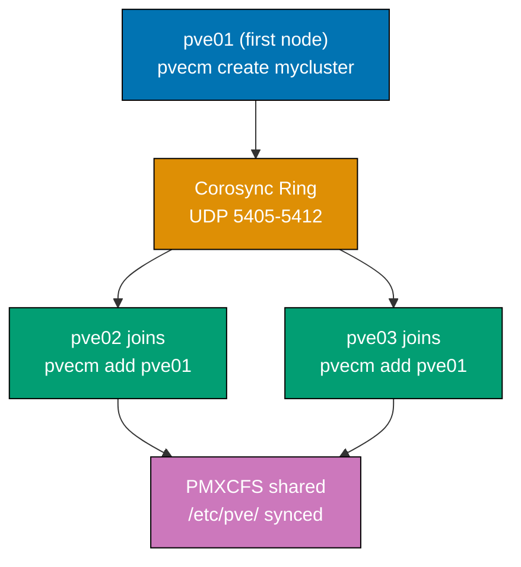
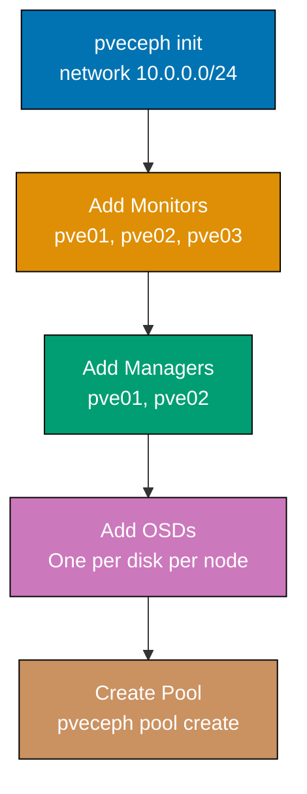

Build on Proxmox fundamentals through 29 annotated examples covering multi-node clustering, distributed Ceph storage, software-defined networking, Proxmox Backup Server integration, and automation workflows.

## Group 8: Clustering

### Example 29: Create and Join a Multi-Node Cluster

Proxmox clustering uses Corosync for distributed state and quorum. All cluster nodes share the same `/etc/pve/` configuration filesystem via PMXCFS (Proxmox Cluster File System).



**Code**:

```bash
# === ON pve01 (first node): Create the cluster ===

# Create a new cluster named 'mycluster'
pvecm create mycluster
# => Generating cluster configuration...
# => Starting Corosync...
# => mycluster cluster created with pve01 as first member
# => Corosync listens on UDP ports 5405-5412 (open in firewall between nodes)

# Verify cluster is running on pve01
pvecm status
# => Cluster information
# => ------------------
# => Name:         mycluster
# => Version:      2
# => Transport:    knet
# => Secure auth:  on
# => Quorum information
# => ------------------
# => Quorate:      Yes     (cluster can make decisions; has majority of votes)
# => Votequorum:   1
# => Total votes:  1

# === ON pve02 (second node): Join the cluster ===
# Prerequisites: pve02 must have no existing VMs; joining wipes local cluster state

# Join using pve01's IP address
pvecm add 192.168.1.100
# => Enter the root password of node 'pve01':  [enter pve01 root password]
# => Establishing secure connection to pve01...
# => Copying /etc/corosync/corosync.conf from pve01...
# => Restarting Corosync...
# => Node pve02 successfully joined cluster 'mycluster'
# => /etc/pve/ content synchronized from pve01

# === ON pve03 (third node): Join the cluster ===
pvecm add 192.168.1.100
# => Node pve03 successfully joined cluster 'mycluster'

# Verify cluster membership from any node
pvecm nodes
# => Membership information
# => ----------------------
# => Nodeid  Votes Name
# =>      1      1 pve01 (local)
# =>      2      1 pve02
# =>      3      1 pve03
```

**Key Takeaway**: Cluster creation must happen before any VMs are created on member nodes—joining a node with existing VMs requires migrating them away first or accepting configuration conflicts.

**Why It Matters**: A three-node cluster is the minimum for production HA—it provides a quorum majority (2 of 3 nodes) that allows the cluster to remain functional when one node fails. Two-node clusters require a QDevice (Example 31) to avoid split-brain. The PMXCFS shared configuration filesystem means VM configurations are visible on all nodes instantly—a VM config created on pve01 is immediately visible on pve02 without replication delay.

---

### Example 30: Inspect Cluster Membership and Quorum Status

Quorum determines whether a cluster partition can make decisions. Understanding quorum prevents accidental cluster split-brain during network partitions.

**Code**:

```bash
# Check complete cluster status including quorum
pvecm status
# => Cluster information
# => ------------------
# => Name:         mycluster
# => Version:      4
# => Transport:    knet
# => Secure auth:  on
# => Quorum information
# => ------------------
# => Date:          Wed Apr 29 07:00:00 2026
# => Quorum provider: corosync_votequorum
# => Nodes:         3
# => Node ID:       1
# => Ring ID:       1/4
# => Quorate:       Yes    (3 votes present; majority of 3 = 2; quorate)
# => Votequorum information
# => -----------------------
# => Expected votes:   3
# => Highest expected: 3
# => Total votes:      3
# => Quorum:           2     (need 2+ to be quorate)
# => Flags:            Quorate

# Check Corosync ring status (network connectivity between nodes)
corosync-quorumtool -s
# => Quorum information
# => ------------------
# => Date:          Wed Apr 29 07:00:00 2026
# => Quorum provider: corosync_votequorum
# => Nodes:         3
# => Quorate:       Yes
# => Ring ID:       1/4
# => Node information
# => ----------------
# => Node ID  Votes  Name
# =>      1      1   pve01
# =>      2      1   pve02
# =>      3      1   pve03

# Simulate node failure: check if cluster remains quorate
# (Run from pve01; disconnect pve03 and observe)
pvecm status | grep Quorate
# => Quorate: Yes   (2 of 3 nodes still present; majority maintained)

# View cluster node health in JSON (useful for monitoring scripts)
pvesh get /cluster/status
# => [
# =>   { "type": "cluster", "name": "mycluster", "quorate": 1, "nodes": 3, "version": 4 },
# =>   { "type": "node", "name": "pve01", "local": 1, "online": 1, "level": "" },
# =>   { "type": "node", "name": "pve02", "local": 0, "online": 1, "level": "" },
# =>   { "type": "node", "name": "pve03", "local": 0, "online": 1, "level": "" }
# => ]
```

**Key Takeaway**: A cluster is quorate when it has more than half its total votes—losing quorum causes all write operations to halt, preventing split-brain data corruption.

**Why It Matters**: Understanding quorum is essential for planning maintenance windows. Taking a node offline in a three-node cluster is safe (2 of 3 votes remain). Taking two nodes offline simultaneously loses quorum and freezes all VM operations across the cluster. Operations teams that misunderstand quorum have caused cascading failures by taking nodes down in the wrong order, locking themselves out of the cluster configuration interface during critical incidents.

---

### Example 31: Configure a Corosync QDevice for 2-Node Clusters

A QDevice is an external tie-breaker that gives 2-node clusters a third vote, preventing split-brain without requiring a third full Proxmox node.

**Code**:

```bash
# === ON a separate Linux machine (not a PVE node): Set up QDevice server ===
# This machine provides the tie-breaking vote for 2-node clusters
# Requirements: Debian/Ubuntu Linux with corosync-qnetd package

apt install corosync-qnetd
# => Installing corosync-qnetd (QNet daemon)...

# Start and enable the QNet daemon
systemctl enable --now corosync-qnetd
# => corosync-qnetd.service enabled and started
# => Listening for QDevice connections on port 5403

# === ON pve01 (one of the two cluster nodes): Configure QDevice ===

# Install the qdevice client package
apt install corosync-qdevice
# => corosync-qdevice installed

# Add QDevice to the cluster configuration
# pvecm qdevice setup <qdevice-server-ip>
pvecm qdevice setup 192.168.1.200
# => Enter root password for qdevice server 192.168.1.200:
# => Copying SSH keys to qdevice server...
# => Configuring Corosync with QDevice at 192.168.1.200...
# => Restarting Corosync on all cluster nodes...
# => QDevice configured successfully

# Verify QDevice is active and providing votes
pvecm status | grep -A5 "Quorum information"
# => Quorum information
# => ------------------
# => Nodes:         2
# => Quorate:       Yes
# => Flags:         Quorate Qdevice
# => Expected votes: 3     (2 nodes + 1 qdevice = 3 total votes)
# => Total votes:   3
# => Quorum:        2

# Check QDevice connection status
corosync-quorumtool -s | grep -i qdevice
# => Qdevice information
# => --------------------
# => State:       connected   (qdevice server is reachable and voting)
# => Votes:       1
# => Algo:        ffsplit      (first-four-split: votes for the partition with more nodes)
```

**Key Takeaway**: A QDevice allows a 2-node cluster to survive one node failure without split-brain—the surviving node plus the QDevice's vote equals quorum.

**Why It Matters**: Two-node clusters without QDevice are operationally dangerous—if a node fails or reboots for updates, the remaining node loses quorum and halts all VM operations, even though it is perfectly functional. The QDevice can run on minimal hardware (Raspberry Pi, cloud VM) and provides production-grade quorum at very low cost. Many small deployments use a QDevice instead of a third Proxmox node to reduce hardware costs while maintaining HA capabilities.

---

### Example 32: Perform Live Online VM Migration Between Nodes

Online migration moves a running VM between cluster nodes without downtime. It requires shared storage visible to both nodes (NFS, Ceph, iSCSI) or uses local storage with a live copy.

**Code**:

```bash
# Check where VM 100 is currently running
pvesh get /cluster/resources --type vm | python3 -c "
import sys, json
vms = json.load(sys.stdin)['data']
for vm in vms:
    if vm.get('vmid') == 100:
        print(f\"VM 100 is on node: {vm['node']}, status: {vm['status']}\")
"
# => VM 100 is on node: pve01, status: running

# Live migrate VM 100 from pve01 to pve02 (zero downtime)
qm migrate 100 pve02 --online 1
# => Migrating VM 100 from pve01 to pve02 (live/online)
# => Precondition check: shared storage accessible from pve02? Yes (local-lvm: no; ceph: yes)
# => Setting up migration tunnel on pve02...
# => Copying dirty memory pages (iterative pre-copy)...
# => Suspending VM for final page synchronization (<100ms downtime for memory-intensive VMs)
# => Resuming on pve02...
# => Migration complete: VM 100 now running on pve02
# => --online 1: live migration (VM stays running during transfer)
# => Without --online: VM is stopped, disk copied, VM started on target (planned downtime)

# Verify VM is now on pve02
pvesh get /cluster/resources --type vm | python3 -c "
import sys, json
vms = json.load(sys.stdin)['data']
for vm in vms:
    if vm.get('vmid') == 100:
        print(f\"VM 100 is now on node: {vm['node']}\")
"
# => VM 100 is now on node: pve02

# Migrate all VMs off pve01 before maintenance (drain node)
for vmid in $(pvesh get /nodes/pve01/qemu --output-format json | python3 -c "
import sys, json
vms = json.load(sys.stdin)['data']
for vm in vms:
    if vm['status'] == 'running':
        print(vm['vmid'])
"); do
  qm migrate $vmid pve02 --online 1
  echo "Migrated VM $vmid to pve02"
done
# => Migrated VM 100 to pve02
# => Migrated VM 105 to pve02
# => (pve01 now empty, safe for maintenance)
```

**Key Takeaway**: Online migration requires shared storage between nodes (Ceph, NFS, iSCSI) or triggers a storage migration that copies disk data—the latter takes minutes proportional to disk size.

**Why It Matters**: Live migration is the fundamental operation enabling zero-downtime infrastructure maintenance. Kernel security patches, hardware replacement, and Proxmox upgrades all require rebooting the hypervisor—live migration drains workloads off the node before the reboot, then redistributes them after. Teams that master migration workflows perform maintenance during business hours instead of late-night maintenance windows, reducing operator fatigue and the error rate that comes with exhausted administrators.

---

### Example 33: Migrate an LXC Container Between Nodes

Container migration uses `pct migrate` and is faster than VM migration because containers share the kernel—only the container filesystem and configuration transfer.

**Code**:

```bash
# Check container location
pvesh get /cluster/resources --type lxc | python3 -c "
import sys, json
cts = json.load(sys.stdin)['data']
for ct in cts:
    if ct.get('vmid') == 200:
        print(f\"CT 200 ({ct['name']}) is on node: {ct['node']}, status: {ct['status']}\")
"
# => CT 200 (web-server-01) is on node: pve01, status: running

# Migrate running container (online migration, container stays up)
pct migrate 200 pve02 \
  --target-storage local-lvm \
  --online 1
# => Migrating LXC container 200 from pve01 to pve02
# => --target-storage local-lvm: destination storage for rootfs
# => --online 1: container continues serving requests during migration
# => Syncing container filesystem (rsync initial pass)...
# => Pausing container for final sync (<1 second for most workloads)...
# => Resuming container on pve02...
# => CT 200 migration complete

# For offline migration (container stopped during transfer)
pct shutdown 200
# => CT 200 stopped

pct migrate 200 pve03 --target-storage local-lvm
# => Migrating stopped CT 200 from pve01 to pve03...
# => Copying rootfs (8 GB)... (takes seconds-to-minutes depending on size)
# => Container config updated: pve03 now manages CT 200
# => Starting CT 200 on pve03...
pct start 200
# => CT 200 running on pve03

# Verify container is healthy after migration
pct exec 200 -- systemctl status nginx
# => ● nginx.service - A high performance web server
# =>      Active: active (running) ...
```

**Key Takeaway**: Container online migration causes <1 second interruption vs VM migration's <100ms—both are imperceptible to end users, but containers migrate faster because there is no RAM state to transfer.

**Why It Matters**: Container migration enables flexible workload distribution across cluster nodes. A node that is trending toward CPU saturation can shed containers to underutilized nodes in seconds. Automated load balancing scripts that monitor `pvesh get /cluster/resources` and trigger `pct migrate` when CPU imbalance exceeds a threshold create self-balancing infrastructure—reducing manual intervention and preventing performance degradation before it impacts end users.

---

### Example 34: Configure VLAN-Aware Networking on a Bridge

VLAN-aware bridges allow multiple VLANs to be tagged through a single bridge, with per-VM VLAN assignment—eliminating the need for separate bridge interfaces per VLAN.

**Code**:

```bash
# Enable VLAN awareness on the main bridge vmbr0
# Edit /etc/network/interfaces (or use web UI: Network -> vmbr0 -> Edit -> check VLAN aware)
sed -i '/^auto vmbr0/,/^auto/ { /bridge-stp/a\    bridge-vlan-aware yes\n    bridge-vids 2-4094 }' \
  /etc/network/interfaces
# => bridge-vlan-aware yes: enables 802.1Q VLAN tagging on the bridge
# => bridge-vids 2-4094: allowed VLAN IDs (2-4094 for maximum flexibility)

ifreload -a
# => vmbr0 reconfigured with VLAN awareness enabled

# Assign VM to VLAN 100 (web tier)
qm set 100 --net0 virtio,bridge=vmbr0,tag=100
# => VM 100 NIC 0 now tags traffic with VLAN ID 100
# => switch port connected to the Proxmox NIC must be configured as trunk port
# => guest sees untagged traffic; Proxmox adds/removes VLAN tag transparently

# Assign VM to VLAN 200 (database tier)
qm set 105 --net0 virtio,bridge=vmbr0,tag=200
# => VM 105 NIC on VLAN 200 (isolated from VLAN 100 traffic)

# Trunk port configuration (VM receives tagged traffic, for virtual routers)
qm set 150 --net0 virtio,bridge=vmbr0,trunks=100;200;300
# => VM 150 receives packets tagged for VLANs 100, 200, and 300
# => Use for VyOS/OPNsense VMs acting as inter-VLAN routers

# Verify VLAN configuration on bridge
bridge vlan show dev vmbr0
# => port        vlan ids
# => vmbr0      1 PVID Egress Untagged
# =>             2-4094
# => tap100i0   100 PVID Egress Untagged    (VM 100's tap interface, VLAN 100)
# => tap105i0   200 PVID Egress Untagged    (VM 105's tap interface, VLAN 200)
```

**Key Takeaway**: VLAN-aware bridges enable network segmentation with a single physical NIC and bridge—VMs on different VLANs cannot communicate directly without a router, providing L2 isolation.

**Why It Matters**: Network micro-segmentation is a zero-trust security principle that limits blast radius when a VM is compromised. A web VM on VLAN 100 breached by an attacker cannot directly reach the database VM on VLAN 200—traffic must traverse a firewall/router (physical or virtual) where security rules apply. VLAN segmentation on Proxmox costs nothing beyond a VLAN-aware switch and is the most impactful single security configuration for multi-VM environments.

---

### Example 35: Set Up Linux Bonding for Network Redundancy

Linux bonding aggregates multiple NICs into a logical interface, providing redundancy (active-backup) or increased throughput (balance-slb, LACP).

**Code**:

```bash
# Configure active-backup bonding (failover: one NIC active, second standby)
cat >> /etc/network/interfaces << 'EOF'

auto bond0
iface bond0 inet manual
    bond-slaves eno1 eno2     # Two physical NICs forming the bond
    bond-mode active-backup   # Only one NIC active at a time; failover on link failure
    bond-miimon 100           # Check link status every 100ms
    bond-primary eno1         # Prefer eno1 as active NIC when both are up

auto vmbr0
iface vmbr0 inet static
    address 192.168.1.100/24
    gateway 192.168.1.1
    bridge-ports bond0        # Bridge uses bonded interface instead of single NIC
    bridge-stp off
    bridge-fd 0
EOF
# => bond0 provides redundancy: if eno1 fails, eno2 becomes active in <200ms

ifreload -a
# => Network interfaces reloaded with bonding configuration

# Verify bonding status
cat /proc/net/bonding/bond0
# => Bonding Mode: fault-tolerance (active-backup)
# => Primary Slave: eno1 (primary_reselect failure)
# => Currently Active Slave: eno1
# => MII Status: up
# => MII Polling Interval (ms): 100
# => Slave Interface: eno1
# =>   MII Status: up
# =>   Speed: 10000 Mbps    (10 GbE NIC)
# =>   Duplex: full
# => Slave Interface: eno2
# =>   MII Status: up
# =>   Speed: 10000 Mbps

# Test failover by disabling the active NIC
ip link set eno1 down
# => bond0 detects eno1 link failure within 100ms
# => eno2 becomes active slave automatically
cat /proc/net/bonding/bond0 | grep "Active Slave"
# => Currently Active Slave: eno2   (failover successful)

ip link set eno1 up
# => eno1 returns; remains standby since eno2 is now active
```

**Key Takeaway**: Active-backup bonding provides transparent NIC failover without requiring switch configuration—unlike LACP (802.3ad), which needs switch-side port-channel configuration.

**Why It Matters**: Network hardware failure is one of the most common causes of unexpected downtime in small-to-medium Proxmox deployments. Bonding adds resilience with equipment already in the server—a second NIC costs $20-50 and eliminates NIC failure as a downtime cause. Teams managing business-critical workloads should consider bonding mandatory; even lab environments benefit from understanding bonding concepts before being surprised by a NIC failure during a production incident.

---

## Group 9: Advanced Storage

### Example 36: Configure NFS Storage Backend

NFS provides shared storage accessible from all cluster nodes—essential for online VM migration and cluster-wide ISO/backup repositories.

**Code**:

```bash
# Add NFS storage to Proxmox (NFS server already configured separately)
pvesh create /storage \
  --storage nfs-share \
  --type nfs \
  --server 192.168.1.50 \
  --export /mnt/proxmox-storage \
  --content images,iso,backup \
  --options vers=4.2,hard,timeo=600 \
  --maxfiles 10
# => NFS storage 'nfs-share' added
# => server: NFS server IP or hostname
# => export: NFS export path on the server
# => content=images: VM disk images stored here (enables shared storage for live migration)
# => content=iso: ISOs available cluster-wide
# => options vers=4.2: NFSv4.2 for best performance (pNFS, sparse file support)
# => options hard: retries I/O indefinitely on timeout (vs soft which returns errors)

# Verify NFS is mounted and accessible
pvesh get /nodes/pve01/storage/nfs-share/status
# => {
# =>   "total": 1099511627776,   (1 TB NFS share)
# =>   "used": 214748364800,     (200 GB used)
# =>   "avail": 884763262976,    (823 GB available)
# =>   "active": 1               (storage is accessible)
# => }

# Test that NFS storage appears on all cluster nodes
for node in pve01 pve02 pve03; do
  echo -n "$node: "
  pvesh get /nodes/$node/storage/nfs-share/status | python3 -c "
import sys, json
d = json.load(sys.stdin)['data']
print(f\"active={'yes' if d.get('active') else 'no'}, avail={d.get('avail', 0)//1024//1024//1024}GB\")
  "
done
# => pve01: active=yes, avail=823GB
# => pve02: active=yes, avail=823GB
# => pve03: active=yes, avail=823GB
# => All nodes can access NFS; live VM migration is now possible

# List VM disk images on NFS storage
pvesh get /nodes/pve01/storage/nfs-share/content --content images
# => Returns list of .qcow2/.raw VM disk images stored on the NFS share
```

**Key Takeaway**: NFS storage shared across all cluster nodes is the minimum requirement for online VM migration—VMs on node-local storage can only be cold-migrated (offline).

**Why It Matters**: NFS is the simplest path to shared storage for small clusters. The tradeoff versus Ceph is complexity: NFS is a single point of failure (the NFS server itself), while Ceph is distributed across multiple OSDs with no single point of failure. Many teams start with NFS and migrate to Ceph as their cluster grows and availability requirements increase. For dev/test environments, NFS is often the right choice; for production HA, Ceph or iSCSI with multipath provides better resilience.

---

### Example 37: Configure iSCSI Storage with LVM

iSCSI provides block storage over TCP/IP—more performant than NFS for VM disks and supports LVM thin pools for space efficiency.

**Code**:

```bash
# Add iSCSI initiator (client) configuration on each Proxmox node
# First, get the iSCSI initiator IQN (unique ID for this node)
cat /etc/iscsi/initiatorname.iscsi
# => InitiatorName=iqn.1993-08.org.debian:01:pve01-iscsi-initiator

# Add iSCSI storage (points to iSCSI target on SAN/NAS)
pvesh create /storage \
  --storage iscsi-san \
  --type iscsi \
  --portal 192.168.1.60 \
  --target iqn.2025-01.com.company:storage-target-01 \
  --content none
# => iSCSI storage 'iscsi-san' added
# => portal: iSCSI target portal IP (SAN controller)
# => target: iSCSI Qualified Name of the target
# => content=none: iSCSI LUNs are raw block devices; use LVM on top

# Scan for available LUNs on the iSCSI target
pvesh get /nodes/pve01/storage/iscsi-san/content
# => [
# =>   { "volid": "iscsi-san:0.0.0.0.0.0.0.0", "size": 1099511627776, "content": "images" }
# => ]
# => Shows LUN 0 (1 TB block device) available

# Add LVM thin pool on top of the iSCSI LUN for VM storage
pvesh create /storage \
  --storage iscsi-lvm \
  --type lvmthin \
  --vgname iscsi-vg \
  --thinpool data \
  --content images,rootdir \
  --nodes pve01,pve02,pve03
# => LVM thin pool on iSCSI registered as storage 'iscsi-lvm'
# => All three nodes can use this storage for VM disks
# => --nodes: restrict storage to specific cluster nodes (omit for all nodes)

# Verify iSCSI connection and LVM
iscsiadm -m session
# => tcp: [1] 192.168.1.60:3260,1 iqn.2025-01.com.company:storage-target-01 (non-flash)

pvs
# => PV           VG       Fmt  Attr PSize    PFree
# => /dev/sdb     iscsi-vg lvm2 a--  1024.00g 500.00g   (iSCSI LUN as PV)
# => /dev/sda3    pve      lvm2 a--  xxx.00g  xxx.00g   (local PVE storage)
```

**Key Takeaway**: iSCSI with LVM thin pools provides shared block storage with thin provisioning—better random I/O performance than NFS for database VM workloads.

**Why It Matters**: Storage performance directly impacts VM density and application response times. iSCSI block storage eliminates the NFSv4 protocol overhead for metadata-heavy workloads and provides consistent sub-millisecond latency for random reads—critical for OLTP databases running in VMs. Teams choosing between NFS and iSCSI should benchmark their specific workloads; for sequential workloads (video streaming, log storage), NFS often performs comparably, while database-heavy environments benefit significantly from iSCSI block storage.

---

### Example 38: Create a ZFS Pool via CLI

ZFS provides enterprise storage features (checksumming, compression, deduplication, snapshots, replication) as a kernel module integrated into Proxmox VE.

**Code**:

```bash
# List available disks for ZFS pool creation
lsblk -d -o NAME,SIZE,MODEL | grep -v "loop\|sr"
# => sda   500G   Samsung SSD 870
# => sdb   500G   WD Red Plus
# => sdc   500G   WD Red Plus
# => sdd   500G   WD Red Plus

# Create ZFS mirror pool (RAID-1: 2 drives, 1 drive can fail)
zpool create -f \
  -o ashift=12 \
  -O compression=lz4 \
  -O atime=off \
  -O recordsize=64K \
  tank mirror /dev/sdb /dev/sdc
# => ZFS pool 'tank' created (mirror: RAID-1 equivalent)
# => ashift=12: 4K sector alignment (required for modern SSDs and HDDs)
# => compression=lz4: fast transparent compression (30-50% space savings typical)
# => atime=off: disable access time updates (significant I/O reduction)
# => recordsize=64K: optimal for mixed workloads (databases may prefer 8K)

# Create RAIDZ pool (RAID-5 equivalent: 3 drives, 1 drive can fail)
zpool create -f \
  -o ashift=12 \
  -O compression=lz4 \
  -O atime=off \
  tank-raidz raidz /dev/sdb /dev/sdc /dev/sdd
# => ZFS RAIDZ pool 'tank-raidz' created
# => 3 drives, 1 parity: 66% usable capacity (vs mirror's 50%)
# => RAIDZ2 uses -o raidz2 for 2-parity (survives 2 simultaneous drive failures)

# Check pool health and statistics
zpool status tank
# => pool: tank
# =>  state: ONLINE
# => config:
# =>         NAME        STATE     READ WRITE CKSUM
# =>         tank        ONLINE       0     0     0
# =>           mirror-0  ONLINE       0     0     0
# =>             sdb     ONLINE       0     0     0
# =>             sdc     ONLINE       0     0     0
# => errors: No known data errors

# Register ZFS pool in Proxmox storage
pvesh create /storage \
  --storage tank \
  --type zfspool \
  --pool tank \
  --content images,rootdir \
  --sparse 1
# => ZFS pool 'tank' registered as Proxmox storage
```

**Key Takeaway**: ZFS checksumming detects and (with redundancy) auto-corrects silent data corruption—a critical feature for long-running VM disk images that accumulate bit rot over years of operation.

**Why It Matters**: Silent data corruption ("bit rot") affects spinning hard drives at a measurable rate over years. Without ZFS checksumming, a VM disk can accumulate corrupted sectors that cause intermittent application crashes months after the physical error occurs—making the root cause nearly impossible to diagnose. ZFS scrubs (regular data integrity checks) and self-healing with mirrored or parity pools mean corrupted data is detected and repaired automatically before applications are affected. This is why storage-sensitive deployments (databases, media archives) choose ZFS over ext4/LVM.

---

## Group 10: Ceph Distributed Storage

### Example 39: Initialise and Deploy a Ceph Cluster

Ceph is a distributed, self-healing storage system integrated directly into Proxmox VE. It eliminates the single-point-of-failure of NFS while providing higher performance and automatic data replication.



**Code**:

```bash
# Initialize Ceph on the cluster (run on pve01)
pveceph init \
  --network 10.0.0.0/24 \
  --cluster-network 10.0.1.0/24
# => Initializing Ceph cluster...
# => --network: Ceph public network (client-to-OSD traffic)
# => --cluster-network: Ceph cluster network (OSD replication traffic, separate NIC recommended)
# => Ceph Squid (19.2.3) installed on all nodes

# Add Ceph monitors (MONs) — need 3+ for quorum
pveceph mon create --node pve01
# => Created Ceph MON on pve01

pveceph mon create --node pve02
# => Created Ceph MON on pve02

pveceph mon create --node pve03
# => Created Ceph MON on pve03

# Add Ceph managers (MGRs) — provide dashboards and metrics
pveceph mgr create --node pve01
# => Created Ceph MGR on pve01

pveceph mgr create --node pve02
# => Created Ceph MGR on pve02 (standby)

# Add OSDs (Object Storage Daemons) — one per disk per node
# Each OSD serves one physical disk; OSD manages data distribution
pveceph osd create /dev/sdb --node pve01
# => Created OSD on /dev/sdb (pve01): OSD ID 0

pveceph osd create /dev/sdb --node pve02
# => Created OSD on /dev/sdb (pve02): OSD ID 1

pveceph osd create /dev/sdb --node pve03
# => Created OSD on /dev/sdb (pve03): OSD ID 2

# Check Ceph cluster health
ceph status
# => cluster:
# =>   id:     xxxxxxxx-xxxx-xxxx-xxxx-xxxxxxxxxxxx
# =>   health: HEALTH_OK
# => services:
# =>   mon: 3 daemons, quorum pve01,pve02,pve03 (age 5m)
# =>   mgr: pve01(active, since 4m), standbys: pve02
# =>   osd: 3 osds: 3 up (since 3m), 3 in
# => data:
# =>   pools: 0 pools, 0 pgs
# =>   objects: 0 objects, 0 B
# =>   usage: 1.5 GiB used, 1.5 TiB / 1.5 TiB avail
```

**Key Takeaway**: Ceph requires a minimum of 3 MON daemons and 3 OSDs across 3 nodes for fault tolerance—a single node failure leaves 2 MONs and the cluster remains fully operational.

**Why It Matters**: Ceph fundamentally changes the storage resilience model. With NFS, a single NAS failure brings down all VMs on shared storage simultaneously. With Ceph across 3 nodes, an entire node failure causes no data loss or VM downtime—data is replicated across remaining nodes and Ceph automatically re-replicates to restore the configured replication factor. The operational cost is higher complexity; the reward is production-grade storage resilience without expensive enterprise SAN hardware.

---

### Example 40: Create and Configure Ceph Storage Pools

Ceph pools are named storage containers with configurable replication, placement groups, and CRUSH rules. Proxmox uses RBD (RADOS Block Device) pools for VM disk storage.

**Code**:

```bash
# Create a Ceph pool for VM images with 3x replication
pveceph pool create vm-images \
  --size 3 \
  --min_size 2 \
  --pg_autoscale_mode on \
  --application rbd
# => Pool 'vm-images' created
# => --size 3: keep 3 copies of each data chunk across 3 different OSDs
# => --min_size 2: allow writes with minimum 2 copies (prevents data loss if 1 OSD fails)
# => --pg_autoscale_mode on: Ceph automatically manages placement group count
# => --application rbd: mark pool for RADOS Block Device use (VM disks)

# Register the Ceph pool as Proxmox storage
pvesh create /storage \
  --storage ceph-vm \
  --type rbd \
  --pool vm-images \
  --monhost "pve01,pve02,pve03" \
  --content images,rootdir \
  --krbd 0
# => Ceph RBD storage 'ceph-vm' registered
# => --krbd 0: use QEMU's librbd (in-process, better performance)
# =>   krbd=1: use kernel RBD module (required for LXC containers on Ceph)

# Verify pool health and replication
ceph osd pool ls detail | grep vm-images
# => pool 1 'vm-images' replicated size 3 min_size 2 crush_rule 0 object_hash rjenkins pg_num 32 ...

# Check pool usage
ceph df | grep vm-images
# => POOL          STORED  OBJECTS  USED    %USED  MAX AVAIL
# => vm-images     256M    64       768M    0.05   1.5TiB

# List available storage including new Ceph pool
pvesh get /nodes/pve01/storage/ceph-vm/status
# => { "total": 1649267441664, "used": 805306368, "avail": 1648462135296, "active": 1 }
```

**Key Takeaway**: Ceph pools with `size=3` and `min_size=2` ensure VM data survives one OSD/node failure while the cluster continues accepting writes—the foundation of production storage resilience.

**Why It Matters**: Pool configuration directly impacts the durability-performance-cost balance. `size=2` halves storage consumption but offers no fault tolerance for simultaneous OSD failures; `size=3` is the production standard. The `pg_autoscale_mode=on` feature (introduced in Ceph Nautilus) eliminates the historically complex placement group calculation—operators no longer need to manually tune PG counts based on OSD count and pool usage.

---

### Example 41: Create a Ceph Erasure-Coded Pool

Erasure coding provides higher storage efficiency than replication (e.g., k=2, m=1 uses only 1.5x storage instead of 3x) at the cost of higher computational overhead.

**Code**:

```bash
# Create an erasure coding profile (k=2 data chunks, m=1 parity chunk)
ceph osd erasure-code-profile set ec-2-1 \
  k=2 \
  m=1 \
  plugin=jerasure \
  technique=reed_sol_van
# => Erasure code profile 'ec-2-1' created
# => k=2: data is split into 2 chunks; 2 OSDs store data
# => m=1: 1 parity chunk stored on a third OSD
# => Total OSDs needed: k+m = 3 (minimum)
# => Usable capacity: k/(k+m) = 2/3 = 66.7% (vs 33.3% with 3x replication)
# => Survives: up to m=1 OSD failure simultaneously

# Create an erasure-coded pool using the profile
pveceph pool create ec-backup \
  --erasure-coding k=2,m=1 \
  --add-storages 1
# => Pool 'ec-backup' created with erasure coding k=2, m=1
# => --add-storages 1: automatically register as Proxmox storage
# => Note: EC pools require a companion replicated pool for metadata (auto-created)

# Alternatively, create EC pool directly with ceph commands
ceph osd pool create ec-pool-2-1 erasure ec-2-1
# => pool 'ec-pool-2-1' created

# Enable RBD on the EC pool
ceph osd pool application enable ec-pool-2-1 rbd
# => enabled application 'rbd' on pool 'ec-pool-2-1'

# Check pool info to verify EC configuration
ceph osd pool get ec-backup erasure_code_profile
# => erasure_code_profile: ec-2-1    (profile applied to pool)

ceph df | grep ec-backup
# => POOL       STORED  OBJECTS  USED    %USED  MAX AVAIL
# => ec-backup  0 B     0        0 B     0      987 GiB   (66% of 1.5TiB raw)
```

**Key Takeaway**: Erasure coding with k=2,m=1 provides single-OSD fault tolerance at 1.5x storage overhead instead of 3x replication—ideal for backup and archive pools where the cost savings justify the CPU overhead.

**Why It Matters**: A 3-node Ceph cluster with 1 TB raw per node provides only 1 TB usable with 3x replication. The same cluster provides 2 TB usable with k=2,m=1 erasure coding—doubling effective capacity without additional hardware. For backup workloads with sequential access patterns (not random IOPS), the computational overhead of erasure coding is negligible. Teams running large media archives or log retention on Ceph EC pools can double their storage efficiency, directly reducing hardware procurement costs.

---

### Example 42: Monitor Ceph Cluster Health and OSD Status

Proactive Ceph monitoring prevents storage failures from becoming data loss. The `ceph` CLI provides detailed cluster health information.

**Code**:

```bash
# Overall cluster health summary
ceph health detail
# => HEALTH_WARN 1 osds down; Degraded data: 256 objects (12.3 MiB), 5.0 degraded
# => [WRN] OSD_DOWN: 1 osds down
# =>     osd.2 (root=default,host=pve03) is down
# => [WRN] PG_DEGRADED: Degraded data: 256 objects (12.3 MiB), 5.0% degraded
# => Note: cluster writes continue (min_size=2 met with 2 remaining OSDs)

# Detailed OSD status and placement
ceph osd tree
# => ID  CLASS  WEIGHT   TYPE NAME        STATUS  REWEIGHT  PRI-AFF
# => -1         4.37500  root default
# => -3         1.45800      host pve01
# =>  0    hdd  1.45800          osd.0    up      1.00000   1.00000
# => -5         1.45800      host pve02
# =>  1    hdd  1.45800          osd.1    up      1.00000   1.00000
# => -7         1.45800      host pve03
# =>  2    hdd  1.45800          osd.2    down    1.00000   1.00000   <- failed OSD

# Monitor OSD I/O performance
ceph osd perf
# => osd  commit_latency(ms)  apply_latency(ms)
# =>   0                  2                 2
# =>   1                  3                 3
# =>   2                  -                 -   (OSD 2 is down)

# Watch cluster recovery progress in real-time
watch -n 5 'ceph status'
# => health: HEALTH_WARN
# => recovery:   51200 kB/s, 25 objects/s  (re-replicating degraded objects)
# => pgs:       156 active+clean, 20 active+recovering
# => (updates every 5 seconds until recovery completes)

# Check disk usage per OSD
ceph osd df tree
# => Shows per-OSD disk usage, PG count, and REWEIGHT factor for each OSD
# => Use to identify overloaded OSDs (high WEIGHT relative to disk size)

# Set OSD back in service after replacement
ceph osd in osd.2
# => marked osd.2 in
# => Cluster begins rebalancing: distributing data to newly available OSD
```

**Key Takeaway**: Ceph transitions through `HEALTH_WARN` states during OSD failures but continues serving I/O—monitoring the `recovery` rate and PG status shows when data is fully restored.

**Why It Matters**: Ceph health monitoring is not optional—a `HEALTH_WARN` that goes unaddressed becomes `HEALTH_ERR` when a second OSD fails, potentially causing data loss. Teams integrate `ceph health json` output with Prometheus (via ceph-mgr's built-in Prometheus plugin) and alert on `HEALTH_WARN` states. Automated runbooks that page on-call when a single OSD fails—before it becomes a double failure—are the operational difference between "we replaced a failed disk at 9 AM" and "we spent 48 hours recovering data at 3 AM."

---

## Group 11: Software-Defined Networking

### Example 43: Configure SDN: Zone, VNet, and Subnet

Proxmox SDN (Software-Defined Networking) provides declarative L2/L3 overlay network management integrated into the Proxmox cluster. Zones define the transport type; VNets define the virtual networks; Subnets define IP ranges.

**Code**:

```bash
# Create a Simple zone (VLAN-based SDN zone using existing bridges)
pvesh create /cluster/sdn/zones \
  --zone simple-zone \
  --type simple \
  --bridge vmbr0 \
  --mtu 1500
# => SDN zone 'simple-zone' created (VLAN-based; uses existing bridge)

# Create a VNet (virtual network) in the zone
pvesh create /cluster/sdn/vnets \
  --vnet web-vnet \
  --zone simple-zone \
  --tag 100 \
  --comment "Web application network (VLAN 100)"
# => VNet 'web-vnet' created in zone 'simple-zone' with VLAN tag 100

# Create a subnet for IP management within the VNet
pvesh create /cluster/sdn/vnets/web-vnet/subnets \
  --subnet 10.100.0.0/24 \
  --type subnet \
  --gateway 10.100.0.1 \
  --dnszoneprefix web \
  --snat 1
# => Subnet 10.100.0.0/24 created in VNet 'web-vnet'
# => gateway: default gateway for VMs on this subnet
# => snat=1: enables source NAT for outbound internet access
# => dnszoneprefix: DNS zone prefix for automatic hostname registration

# Apply SDN configuration (propagates to all cluster nodes)
pvesh set /cluster/sdn
# => SDN configuration applied to all nodes
# => Linux interfaces created on all nodes matching SDN definition

# Verify SDN configuration
pvesh get /cluster/sdn/vnets
# => [
# =>   {
# =>     "vnet": "web-vnet",
# =>     "zone": "simple-zone",
# =>     "tag": 100,
# =>     "comment": "Web application network (VLAN 100)"
# =>   }
# => ]

# Assign a VM NIC to the SDN VNet (instead of bridge+VLAN tag)
qm set 100 --net0 virtio,bridge=web-vnet
# => VM 100 connected to SDN VNet 'web-vnet'
# => SDN handles VLAN tagging automatically based on VNet definition
```

**Key Takeaway**: SDN VNets provide a declarative abstraction over VLAN-tagged bridges—network topology is defined once in the cluster, applied consistently to all nodes, and VMs connect by VNet name rather than bridge+tag combinations.

**Why It Matters**: Manual VLAN bridge configuration is error-prone and inconsistent across nodes—one node might have `bridge-vids 100` configured while another does not, causing VM migration to fail silently. SDN centralizes network definitions so that adding a new VLAN requires one API call, not editing `/etc/network/interfaces` on every node. For teams managing networks programmatically (Terraform, Ansible), the SDN API is the authoritative interface that eliminates node-specific configuration drift.

---

### Example 44: Set Up a VXLAN Zone for Multi-Node L2 Overlay

VXLAN encapsulates L2 Ethernet frames in UDP packets, creating L2 domains that span multiple nodes without VLAN switch configuration. MTU adjustment is critical to prevent fragmentation.

**Code**:

```bash
# Create a VXLAN SDN zone
pvesh create /cluster/sdn/zones \
  --zone vxlan-overlay \
  --type vxlan \
  --peers 192.168.1.100,192.168.1.101,192.168.1.102 \
  --mtu 1450
# => VXLAN zone 'vxlan-overlay' created
# => peers: Proxmox node IPs for VXLAN tunnel endpoints (must include all nodes)
# => mtu=1450: VXLAN adds 50 bytes encapsulation overhead
# =>   Physical MTU 1500 - VXLAN header 50 = 1450 bytes effective MTU
# =>   CRITICAL: must set this correctly or large packets fragment/drop silently

# Create VNet in the VXLAN zone
pvesh create /cluster/sdn/vnets \
  --vnet vxlan-app-net \
  --zone vxlan-overlay \
  --tag 1001 \
  --comment "Application network via VXLAN (VNI 1001)"
# => VNet with VXLAN Network Identifier (VNI) 1001 created
# => VNI is the VXLAN equivalent of VLAN ID (24-bit, supports 16M networks)

pvesh create /cluster/sdn/vnets/vxlan-app-net/subnets \
  --subnet 172.16.0.0/24 \
  --gateway 172.16.0.1
# => Subnet 172.16.0.0/24 added to VXLAN VNet

pvesh set /cluster/sdn
# => VXLAN SDN applied to all cluster nodes

# Verify VXLAN interfaces created on nodes
ip link show type vxlan
# => vxlan1001: <BROADCAST,MULTICAST,UP,LOWER_UP> mtu 1450 ...
# =>     link/ether ... promiscuity 0 minmtu 68 maxmtu 65535
# =>     vxlan id 1001 local 192.168.1.100 dev eno1 port 4789...

# Test L2 connectivity across nodes: VM on pve01 should ping VM on pve02
qm agent 100 exec -- bash -c "ping -c3 172.16.0.20"
# => PING 172.16.0.20: 64 bytes from 172.16.0.20: icmp_seq=1 ttl=64 time=0.8 ms
# => Traffic traverses VXLAN tunnel: pve01 -(UDP/4789)-> pve02 -> VM 120 on pve02
```

**Key Takeaway**: VXLAN MTU must be set to physical MTU minus 50 bytes—failure to do so causes silently dropped large packets that manifest as intermittent TCP connection failures and degraded application performance.

**Why It Matters**: VXLAN enables multi-node L2 domains without VLAN switch provisioning—critical for environments where the network team cannot configure trunk ports on demand. Container-native environments (Kubernetes on Proxmox, for example) depend on overlay networks like VXLAN to implement pod networking across nodes. The MTU configuration is the most common operational mistake: applications work fine for small payloads but fail mysteriously for large HTTP responses or file transfers because jumbo frames fragment at the VXLAN boundary.

---

### Example 45: Configure BGP-EVPN Zone for Routed L3 SDN

BGP-EVPN (Border Gateway Protocol with Ethernet VPN) provides L3 routing between VNets using FRRouting, enabling inter-VXLAN routing without centralized gateway bottlenecks.

**Code**:

```bash
# BGP-EVPN requires FRRouting installed on all cluster nodes
apt install frr frr-pythontools
# => FRRouting installed (FRR provides BGP, OSPF, VXLAN/EVPN control plane)
systemctl enable frr
# => FRR service enabled

# Create BGP-EVPN SDN zone
pvesh create /cluster/sdn/zones \
  --zone evpn-fabric \
  --type evpn \
  --controller evpn-controller \
  --vrf-vxlan 4000 \
  --mac-prefix "42:00:00:" \
  --exitnodes "pve01,pve02" \
  --peers 192.168.1.100,192.168.1.101,192.168.1.102
# => EVPN zone 'evpn-fabric' created
# => controller: BGP route reflector configuration
# => vrf-vxlan: VXLAN ID for L3 VRF (Virtual Routing and Forwarding)
# => exitnodes: pve01 and pve02 are BGP exit/border nodes for external routing
# => mac-prefix: locally-administered MAC prefix for anycast GW

# Create SDN controller (BGP configuration)
pvesh create /cluster/sdn/controllers \
  --controller evpn-controller \
  --type evpn \
  --asn 65000 \
  --peers 192.168.1.100,192.168.1.101,192.168.1.102
# => BGP ASN 65000 configured; nodes act as route reflectors to each other
# => Peers: all PVE nodes participate in BGP IBGP session

# Create VNet in EVPN zone (automatically routable between VNets)
pvesh create /cluster/sdn/vnets \
  --vnet evpn-app \
  --zone evpn-fabric \
  --tag 2001

pvesh create /cluster/sdn/vnets/evpn-app/subnets \
  --subnet 10.200.0.0/24 \
  --gateway 10.200.0.1 \
  --dhcp-range start-address=10.200.0.100,end-address=10.200.0.200

pvesh set /cluster/sdn
# => EVPN SDN configuration applied; FRR BGP sessions establishing

# Verify BGP sessions between nodes
vtysh -c "show bgp summary"
# => BGP router identifier 192.168.1.100, local AS number 65000 vrf-id 0
# => Neighbor        V    AS MsgRcvd MsgSent   TblVer  InQ OutQ  Up/Down  State
# => 192.168.1.101   4 65000      15      18        0    0    0 00:02:30 Established
# => 192.168.1.102   4 65000      14      18        0    0    0 00:02:28 Established
```

**Key Takeaway**: BGP-EVPN distributes routing information between VXLAN segments, enabling VMs on different VNets to communicate through distributed routing without a centralized gateway bottleneck.

**Why It Matters**: Centralized gateways (a single VM or appliance routing between VNets) create performance bottlenecks and single points of failure. BGP-EVPN's anycast gateway model places a copy of the default gateway MAC/IP on every hypervisor node—VMs route locally without tromboning traffic through a central device. This architecture scales linearly with node count and eliminates inter-VNET routing as a bottleneck, critical for east-west traffic-heavy microservices architectures.

---

### Example 46: Configure a Fabric for SDN (New in PVE 9.0)

SDN Fabrics define the physical underlay network topology (spine-leaf) using OpenFabric or OSPF. Fabrics automate BGP-EVPN peering configuration based on physical topology.

**Code**:

```bash
# Create an OpenFabric underlay fabric (spine-leaf topology)
pvesh create /cluster/sdn/controllers \
  --controller fabric-01 \
  --type openfabric \
  --fabric-id 1 \
  --loopback 10.255.0.0/24
# => OpenFabric controller 'fabric-01' created
# => fabric-id: identifies this fabric (1-65535)
# => loopback: IP range for fabric loopback addresses (one per node)

# Add nodes to the fabric with their roles
pvesh create /cluster/sdn/controllers/fabric-01/nodes \
  --node pve01 \
  --role spine \
  --loopback 10.255.0.1
# => pve01 configured as spine node with loopback 10.255.0.1

pvesh create /cluster/sdn/controllers/fabric-01/nodes \
  --node pve02 \
  --role leaf \
  --loopback 10.255.0.2 \
  --uplink-interface eno2
# => pve02 configured as leaf node; uplink to spine via eno2

pvesh create /cluster/sdn/controllers/fabric-01/nodes \
  --node pve03 \
  --role leaf \
  --loopback 10.255.0.3 \
  --uplink-interface eno2
# => pve03 configured as leaf node; uplink to spine via eno2

pvesh set /cluster/sdn
# => Fabric configuration applied; OpenFabric routing sessions initializing

# Verify fabric routing sessions
vtysh -c "show openfabric summary"
# => OpenFabric Routing Process summary
# =>   Area: backbone
# =>   Node-Type: L1L2
# =>   Neighbors (ipv4): pve02, pve03  (spine sees both leaf nodes)
```

**Key Takeaway**: SDN Fabrics (new in PVE 9.0) automate underlay network configuration for spine-leaf topologies, replacing manual FRRouting configuration files with declarative SDN API calls.

**Why It Matters**: Spine-leaf is the modern data center network architecture used by hyperscalers (Google, Amazon, Facebook) for consistent, scalable L3 connectivity. Proxmox SDN Fabrics bring this architecture within reach of smaller deployments by automating the FRRouting configuration that previously required dedicated network engineering expertise. Teams building dedicated Proxmox clusters for private cloud workloads use Fabric SDN to match the network architecture of the public clouds they are replacing, enabling consistent operational runbooks across hybrid environments.

---

### Example 47: Configure Distributed Firewall with Security Groups

SDN-integrated firewall security groups apply consistent rules across VMs on the same VNet, with IP sets providing reusable host group definitions.

**Code**:

```bash
# Create an IP set for application servers
pvesh create /cluster/firewall/ipset \
  --name app-servers \
  --comment "Application server IP addresses"

pvesh create /cluster/firewall/ipset/app-servers --cidr 10.100.0.10
pvesh create /cluster/firewall/ipset/app-servers --cidr 10.100.0.11
pvesh create /cluster/firewall/ipset/app-servers --cidr 10.100.0.12
# => Three app server IPs added to set 'app-servers'

# Create a security group (reusable rule set)
pvesh create /cluster/firewall/groups \
  --group web-tier \
  --comment "Rules for public web tier VMs"
# => Security group 'web-tier' created

pvesh create /cluster/firewall/groups/web-tier \
  --type in --action ACCEPT --proto tcp --dport 80 --comment "Allow HTTP"
pvesh create /cluster/firewall/groups/web-tier \
  --type in --action ACCEPT --proto tcp --dport 443 --comment "Allow HTTPS"
pvesh create /cluster/firewall/groups/web-tier \
  --type in --action ACCEPT --proto tcp --dport 22 \
  --source '+management-nets' --comment "SSH from management only"
pvesh create /cluster/firewall/groups/web-tier \
  --type in --action DROP --comment "Default deny all other inbound"
# => Four rules added to security group 'web-tier'

# Apply security group to a VM (replaces per-VM rule management)
pvesh create /nodes/pve01/qemu/100/firewall/rules \
  --type group \
  --action web-tier \
  --comment "Apply web-tier security group"
# => VM 100 now uses all rules from 'web-tier' security group
# => Updating 'web-tier' rules automatically applies to all VMs using the group

# Create alias for cleaner rule definitions
pvesh create /cluster/firewall/aliases \
  --name db-cluster \
  --cidr 10.200.0.0/24 \
  --comment "Database cluster subnet"
# => Alias 'db-cluster' created; use in rules as source/dest
```

**Key Takeaway**: Security groups apply consistent firewall rules across multiple VMs—updating one security group propagates changes to all VMs using it immediately, eliminating per-VM rule management.

**Why It Matters**: Per-VM firewall rule management does not scale. A fleet of 50 web servers each with individually managed firewall rules is a configuration management nightmare—rules diverge over time, exceptions accumulate, and audit reviews become multi-day exercises. Security groups enforce uniform policy: all web tier VMs have identical inbound rules by definition. When a new port must be opened (or closed), one security group update applies to all 50 VMs simultaneously, making security changes fast and auditable.

---

## Group 12: Backup and PBS Integration

### Example 48: Integrate Proxmox Backup Server (PBS 4.0)

Proxmox Backup Server provides incremental, deduplicated backups with significantly smaller backup sizes and faster completion than vzdump-to-directory.

**Code**:

```bash
# On the PBS server (separate machine), view server information
# PBS 4.0 is required for PVE 9 compatibility
# Access PBS web UI at: https://<pbs-server>:8007

# On Proxmox VE nodes: add PBS as a storage backend
pvesh create /storage \
  --storage pbs-main \
  --type pbs \
  --server 192.168.1.80 \
  --datastore main \
  --username backup@pbs \
  --password 'PBSBackupPassword!' \
  --fingerprint "XX:XX:XX:XX:..." \
  --content backup
# => PBS storage 'pbs-main' added
# => server: PBS server IP/hostname
# => datastore: PBS datastore name (configured in PBS)
# => username: PBS user with write access to the datastore
# => fingerprint: PBS TLS certificate fingerprint (from PBS dashboard)
# => content=backup: only used for backup storage (not VM disk images)

# Verify PBS connection and available space
pvesh get /nodes/pve01/storage/pbs-main/status
# => {
# =>   "total": 10995116277760,    (10 TB PBS datastore)
# =>   "used": 549755813888,       (512 GB used)
# =>   "avail": 10445360463872,    (9.5 TB available)
# =>   "active": 1
# => }

# Create a backup job using PBS (incremental backups)
pvesh create /cluster/backup \
  --storage pbs-main \
  --schedule "0 1 * * *" \
  --mode snapshot \
  --prune-backups 'keep-daily=14,keep-weekly=8,keep-monthly=6' \
  --vmid all
# => Daily PBS backup job created at 01:00
# => PBS stores only changed blocks (incremental); first backup is full
# => Subsequent backups typically 5-20% of VM size (only changed data)
# => --prune-backups: 14 daily, 8 weekly, 6 monthly backups retained
```

**Key Takeaway**: PBS incremental backups with deduplication reduce backup storage consumption by 60-90% compared to vzdump full backups, while enabling faster backup windows.

**Why It Matters**: A 100 GB VM backed up daily with vzdump full backup consumes 700 GB per week. The same VM backed up with PBS incremental deduplication consumes 100-150 GB per week for typical database workloads—a 5-7x storage efficiency improvement. This means the same backup storage hardware retains more history, enabling longer retention windows without additional cost. Teams with large VM fleets often find that migrating to PBS is the single highest-ROI storage optimization available.

---

### Example 49: Use vzdump for Manual Backup and Schedule Backup Jobs

vzdump remains the underlying backup tool for local backups and offline archives. Understanding its operation mode options enables appropriate backup strategy selection.

**Code**:

```bash
# Manual backup with all VMs and containers on this node
vzdump --all \
  --storage local \
  --mode snapshot \
  --compress zstd \
  --notes-template "Weekly backup - {{guestname}} - {{node}}"
# => Starting backup job for all guests...
# => Backing up VM 100 (ubuntu-24-server)...
# =>   snapshot mode: create disk snapshot, backup while VM running
# =>   Saving guest state... done
# =>   Creating backup archive: vzdump-qemu-100-2026_04_29-02_00_00.vma.zst
# =>   Archive size: 5.2 GB (3.1 GB compressed with zstd)
# => Backing up CT 200 (web-server-01)...
# => All backups completed

# Backup modes comparison:
# snapshot (default): VM runs during backup; uses disk snapshot; best for production
#   => requires qcow2 or ZFS; not available for raw disks without thin-pool
# suspend: VM suspended during backup (brief pause of 1-30 seconds)
#   => works with any disk format; brief downtime
# stop: VM stopped during backup; restarted after
#   => slowest; maximum consistency; use for critical databases without internal backup

# Backup a specific VM with retention
vzdump 100 \
  --storage pbs-main \
  --mode snapshot \
  --compress zstd \
  --remove 0
# => --remove 0: do not prune old backups after this job (use separate prune policy)

# View backup job status and history
pvesh get /cluster/backup --output-format json | python3 -c "
import sys, json
jobs = json.load(sys.stdin)['data']
for job in jobs:
    print(f\"Job {job['id']}: storage={job['storage']}, schedule={job.get('schedule','manual')}, mode={job['mode']}\")
"
# => Job backup-abc123: storage=pbs-main, schedule=0 1 * * *, mode=snapshot
```

**Key Takeaway**: Snapshot mode backups allow VMs to remain online during backup; stop mode provides maximum consistency for databases that require filesystem quiescence but causes VM downtime.

**Why It Matters**: Backup mode selection is a tradeoff between availability and consistency. PostgreSQL with WAL archiving enabled is crash-consistent in snapshot mode—the database applies WAL on restore. MySQL without binary logging enabled may have transactions in an inconsistent state in snapshot mode. Understanding which VMs require application-consistent backups (using guest agent hooks that run `fsfreeze`/`fsthaw`) prevents silent data inconsistency that only surfaces during actual disaster recovery.

---

### Example 50: Restore a VM Backup with Live-Restore from PBS

PBS's live-restore feature starts VMs immediately during restore, making restore time independent of VM disk size—the VM boots while remaining disk data transfers in the background.

**Code**:

```bash
# List backups available in PBS for VM 100
pvesh get /nodes/pve01/storage/pbs-main/content --vmid 100
# => [
# =>   {
# =>     "volid": "pbs-main:backup/vm/100/2026-04-29T01:00:00Z",
# =>     "ctime": 1745888400,
# =>     "format": "pbs-vm",
# =>     "size": 5497558138880
# =>   },
# =>   {
# =>     "volid": "pbs-main:backup/vm/100/2026-04-28T01:00:00Z",
# =>     ...
# =>   }
# => ]

# Restore VM with live-restore (VM starts immediately, disk transfers in background)
qmrestore pbs-main:backup/vm/100/2026-04-29T01:00:00Z 100 \
  --storage local-lvm \
  --live-restore 1 \
  --force 1
# => Starting live restore of VM 100 from PBS backup...
# => Initializing thin-provisioned disk on local-lvm...
# => Starting VM 100 with background disk restore...
# => VM 100 is now RUNNING (disk restore: 0% -> 100% in background)
# => --live-restore 1: VM starts immediately; data loaded on-demand from PBS
# => VM serves requests normally while restore completes in background
# => Total restore time until full data locally present: ~20 minutes for 100 GB VM
# => vs traditional restore: VM unavailable for 20 minutes

# Monitor live restore progress
pvesh get /nodes/pve01/tasks --limit 5 | python3 -c "
import sys, json
tasks = json.load(sys.stdin)['data']
for t in tasks:
    if 'restore' in t.get('type', ''):
        print(f\"Restore task: {t['status']} progress: {t.get('upid', '')}\")
"
# => Restore task: running progress: UPID:pve01:...

# Verify VM is running during restore
qm status 100
# => status: running   (VM is serving requests while restore completes in background)
```

**Key Takeaway**: PBS live-restore reduces effective RTO (Recovery Time Objective) to seconds for VMs regardless of disk size—the VM accepts traffic while remaining data pages load on-demand.

**Why It Matters**: Traditional backup restore is a two-phase operation: wait for all data to copy, then start the VM. For a 1 TB VM, this means 30-60 minutes of unavailability during restoration. PBS live-restore inverts this: the VM starts in seconds and accesses remaining data from PBS on-demand as pages are requested. For RTO-sensitive applications (customer-facing APIs, payment processing), live-restore is transformative—the difference between "30-minute outage" and "30-second outage followed by gradual performance normalization."

---

### Example 51: Configure Backup Encryption and Pruning in PBS

PBS supports AES-256-CBC encryption for backups, ensuring that data on the backup server is unreadable without the encryption key.

**Code**:

```bash
# === ON PBS Server: Enable encryption for a datastore ===
# In PBS web UI: Datastore -> main -> Edit -> Encryption: Enabled
# Or via PBS API:

# Generate an encryption key for backup encryption
proxmox-backup-client key create \
  --master-pubkey /etc/proxmox-backup/master.pem
# => Generating new encryption key...
# => Key fingerprint: XX:XX:XX:XX:XX:XX:XX:XX:XX:XX:XX:XX:XX:XX:XX:XX
# => Encrypted key saved to: /etc/proxmox-backup/encryption-key.pem
# => CRITICAL: Back up this encryption key; data is PERMANENTLY INACCESSIBLE without it

# Configure PVE node to use encryption key for PBS backups
pvesh set /storage/pbs-main \
  --encryption-key /etc/proxmox-backup/encryption-key.pem
# => PBS storage configured with encryption key
# => All new backups to pbs-main will be AES-256 encrypted

# === Configure pruning policy for automatic backup retention management ===

# Prune backups for VM 100 according to retention policy
proxmox-backup-client prune \
  --repository backup@pbs@192.168.1.80:main \
  --ns vm/100 \
  --keep-last 3 \
  --keep-daily 14 \
  --keep-weekly 8 \
  --keep-monthly 6 \
  --keep-yearly 2 \
  --dry-run
# => Dry run - would remove:
# =>   vm/100/2026-03-15T01:00:00Z  (kept by weekly)
# =>   vm/100/2026-03-08T01:00:00Z  (would be pruned: outside retention window)
# => Backups that would be kept: 33 snapshots

# Apply pruning (remove --dry-run flag)
proxmox-backup-client prune \
  --repository backup@pbs@192.168.1.80:main \
  --ns vm/100 \
  --keep-last 3 \
  --keep-daily 14 \
  --keep-weekly 8 \
  --keep-monthly 6
# => Pruned 12 expired backup snapshots
# => Freed: 45.2 GB (deduplicated; actual storage reclaimed after garbage collection)

# Run garbage collection to reclaim pruned space
proxmox-backup-client garbage-collect \
  --repository backup@pbs@192.168.1.80:main
# => Running garbage collection on datastore 'main'...
# => Removed 23,456 orphaned chunks
# => Freed: 38.7 GB of storage
```

**Key Takeaway**: Backup encryption keys must be stored separately from the backups themselves—if the Proxmox node is destroyed in a disaster, the encryption key stored only on that node makes backups permanently inaccessible.

**Why It Matters**: Unencrypted backups on a PBS server represent a significant data breach risk—an attacker who gains access to the backup server has access to all VM disk images in plaintext. Encryption-at-rest on PBS ensures backup media is useless without the key. The key management discipline (separate secure storage, documented recovery procedure, tested key recovery) is as important as the encryption itself. Teams that encrypt backups but store the key in the same system as the backups have negated the security benefit.

---

## Group 13: Containers and Cloud-Init

### Example 52: Manage LXC Container Resource Limits

LXC containers use Linux cgroup v2 for resource enforcement. CPU and memory limits prevent noisy-neighbor problems in multi-tenant environments.

**Code**:

```bash
# View current resource limits for container 200
pct config 200
# => cores: 1
# => cpulimit: 0    (0 = unlimited; container can use all available CPU time)
# => memory: 512
# => swap: 512
# => rootfs: local-lvm:vm-200-disk-0,size=8G

# Set CPU limit (1.0 = 100% of one core; 2.5 = 250% = 2.5 cores worth)
pct set 200 --cpulimit 0.5
# => Container 200 CPU limited to 50% of one core
# => Implemented via cgroup v2 cpu.max: 50000/100000 (50ms/100ms period)

# Set CPU units (relative weight for CPU scheduling; default 1024)
pct set 200 --cpuunits 512
# => Lower value = lower CPU priority when host is saturated
# => A container with 2048 gets 4x CPU time vs container with 512 during contention

# Set memory limit (hard limit; container OOM-killed if exceeded)
pct set 200 --memory 1024 --swap 256
# => memory=1024: 1 GB RAM hard limit
# => swap=256: 256 MB swap limit (additional virtual memory)
# => Total addressable: 1280 MB before OOM killer fires

# Enable memory ballooning for dynamic allocation
pct set 200 --memory 2048
# => Memory balloon: container gets up to 2 GB but gives back unused pages
# => Host can reclaim memory from idle containers

# Set disk I/O limits
pct set 200 --mp0 /var/data,disk=/dev/vg/data,quota=1,size=20G
# => Additional mount point with 20 GB size limit

# View effective cgroup limits inside the container
pct exec 200 -- cat /sys/fs/cgroup/cpu.max
# => 50000 100000    (50ms CPU time per 100ms period = 50% of one core)

pct exec 200 -- cat /sys/fs/cgroup/memory.max
# => 1073741824      (1073741824 bytes = 1 GB RAM limit)

# Monitor container resource usage in real-time
pct monitor 200
# => proxmox container monitor: CT 200
# => CPU: 12.3%  MEM: 456/1024 MB  NET in: 1.2 MB/s  out: 0.3 MB/s
```

**Key Takeaway**: cgroup v2 enforces container resource limits strictly—a container exceeding its memory limit is OOM-killed rather than consuming host memory and degrading other containers.

**Why It Matters**: Resource limits are the operational foundation of multi-tenant container hosting. Without CPU limits, a container running a CPU-intensive task (build server, log processing) can starve other containers on the same node. Without memory limits, a memory leak in one container can cause the host to swap or OOM-kill the kernel itself. Setting limits is not optional in production multi-tenant environments—it converts noisy-neighbor resource contention from a random performance issue into a predictable, container-scoped event.

---

### Example 53: Configure Cloud-Init for Automated VM Provisioning

Cloud-init automates VM first-boot configuration: setting hostname, SSH keys, network, and running arbitrary scripts. Combined with templates, it creates a zero-touch VM provisioning pipeline.

**Code**:

```bash
# Attach cloud-init drive to a VM (stores cloud-init configuration as a small ISO)
qm set 100 \
  --ide2 local-lvm:cloudinit \
  --boot order=scsi0 \
  --serial0 socket \
  --vga serial0 \
  --ipconfig0 ip=dhcp \
  --nameserver 8.8.8.8 \
  --searchdomain lab.internal \
  --ciuser ubuntu \
  --cipassword 'CloudInitPass123!' \
  --sshkeys ~/.ssh/id_ed25519.pub
# => Cloud-init drive created at local-lvm:vm-100-cloudinit
# => On first boot: VM reads cloud-init config, sets root password and SSH key
# => --ipconfig0 ip=dhcp: configure first NIC via DHCP
# => --ciuser: default user account created in guest
# => --sshkeys: public key authorized for SSH login (no password needed)

# For static IP configuration:
qm set 100 \
  --ipconfig0 ip=192.168.1.150/24,gw=192.168.1.1
# => Static IP 192.168.1.150 configured via cloud-init

# Custom cloud-init configuration (advanced: override with cicustom)
# Create custom user-data file
cat > /var/lib/vz/snippets/user-data-webserver.yml << 'EOF'
#cloud-config
packages:
  - nginx
  - fail2ban
  - unattended-upgrades
runcmd:
  - systemctl enable nginx
  - systemctl start nginx
  - echo "Server configured by cloud-init" > /var/www/html/index.html
users:
  - name: devops
    groups: sudo
    sudo: ALL=(ALL) NOPASSWD:ALL
    ssh_authorized_keys:
      - ssh-ed25519 AAAA... devops@company.com
EOF
# => Custom user-data YAML saved to /var/lib/vz/snippets/

# Apply custom cloud-init to VM (overrides web UI cloud-init settings)
qm set 100 --cicustom "user=local:snippets/user-data-webserver.yml"
# => VM 100 will execute custom cloud-init on next boot

# Regenerate cloud-init ISO after changes
qm cloudinit update 100
# => Cloud-init ISO regenerated with current configuration

# Clone template and set unique cloud-init config per VM
qm clone 100 200 --name production-web-02 --full 1 --storage local-lvm
qm set 200 \
  --ipconfig0 ip=192.168.1.151/24,gw=192.168.1.1 \
  --ciuser ubuntu \
  --sshkeys ~/.ssh/id_ed25519.pub
# => VM 200 ready with unique IP; starts configured on first boot
```

**Key Takeaway**: Cloud-init enables VM templates to produce individually configured instances without manual post-boot intervention—each cloned VM gets its own IP, hostname, and SSH key automatically.

**Why It Matters**: Cloud-init bridges the gap between static VM templates and dynamic provisioning. Without cloud-init, cloning a template creates VMs with identical SSH host keys (security vulnerability) and identical IP configurations (network conflict). With cloud-init, the same template can produce 100 unique, correctly configured VMs in minutes—the same workflow used by AWS EC2, GCP Compute Engine, and Azure VM—making Proxmox private cloud provisioning operationally equivalent to public cloud.

---

## Group 14: CLI Automation

### Example 54: Use pvesh to Query and Modify Cluster Resources

`pvesh` is the official CLI wrapper for the Proxmox REST API, enabling scripted cluster management without curl or JSON parsing.

**Code**:

```bash
# Get comprehensive cluster resource inventory
pvesh get /cluster/resources --type vm --output-format json | python3 -c "
import sys, json
data = json.load(sys.stdin)['data']
for vm in data:
    cpu_pct = vm.get('cpu', 0) * 100
    mem_mb = vm.get('mem', 0) // 1024 // 1024
    max_mem_mb = vm.get('maxmem', 0) // 1024 // 1024
    print(f\"{vm['node']}/{vm['vmid']:5d} {vm['name']:<25} {vm['status']:<10} CPU:{cpu_pct:5.1f}% MEM:{mem_mb:5d}/{max_mem_mb:5d}MB\")
"
# => pve01/100   ubuntu-24-server          running    CPU:  2.3% MEM: 1024/ 2048MB
# => pve02/105   db-postgres               running    CPU: 15.2% MEM: 4096/ 8192MB
# => pve03/200   web-server-01             running    CPU:  0.5% MEM:  256/  512MB

# Modify a VM configuration using pvesh
pvesh set /nodes/pve01/qemu/100/config \
  --memory 4096 \
  --cores 4 \
  --description "Upgraded: 4 vCPU, 4GB RAM for increased web traffic"
# => VM 100 configuration updated (takes effect on next reboot for memory; CPU immediate)

# Trigger a specific action via pvesh (start, stop, migrate)
pvesh create /nodes/pve01/qemu/100/status/start
# => {"data": "UPID:pve01:000A1234:00B12345:67890ABC:qmstart:100:root@pam:"}
# => Returns UPID (Unique Process ID) to track task progress

# Query storage usage across all nodes
pvesh get /cluster/resources --type storage --output-format json | python3 -c "
import sys, json
stores = json.load(sys.stdin)['data']
for s in stores:
    if s.get('maxdisk'):
        used_pct = s.get('disk', 0) * 100 // s['maxdisk']
        print(f\"{s['node']}/{s['storage']:<15} {used_pct:3d}% used ({s.get('disk',0)//1024**3}GB/{s['maxdisk']//1024**3}GB)\")
"
# => pve01/local          12% used (12GB/100GB)
# => pve01/local-lvm      53% used (267GB/500GB)
# => pve02/ceph-vm        31% used (310GB/1000GB)

# List all cluster tasks with status (useful for CI/CD pipeline integration)
pvesh get /cluster/tasks --limit 20 --output-format json | python3 -c "
import sys, json, datetime
tasks = json.load(sys.stdin)['data']
for t in tasks:
    st = datetime.datetime.fromtimestamp(t['starttime']).strftime('%H:%M:%S')
    print(f\"[{st}] {t['node']}/{t['type']:<15} {t.get('id',''):<5} {t['status']}\")
"
# => [02:00:01] pve01/vzdump         100   OK
# => [01:59:58] pve02/vzdump         200   OK
```

**Key Takeaway**: `pvesh` outputs valid JSON that can be piped into `python3`, `jq`, or shell variables—enabling fully automated cluster management scripts without screen-scraping the web UI.

**Why It Matters**: The Proxmox REST API is the control plane for all automation. Teams that build cluster management scripts with `pvesh` instead of web UI point-and-click create reproducible operational procedures that run identically in CI/CD pipelines, cron jobs, and on-call runbooks. The API's stability across PVE versions (documented breaking changes only at major versions) means automation scripts written for PVE 8 work on PVE 9 with minor updates.

---

### Example 55: Configure RBAC with Pools

Pools group VMs and containers for access control. A developer team gets access to their pool without seeing other teams' infrastructure.

**Code**:

```bash
# Create a pool for the frontend team's VMs
pvesh create /pools \
  --poolid frontend-team \
  --comment "Frontend development team VM pool"
# => Pool 'frontend-team' created

# Add VMs to the pool
pvesh set /pools/frontend-team --vms 100,101,102
# => VMs 100, 101, 102 added to pool 'frontend-team'

# Add storage to the pool (restricts team to their storage quota)
pvesh set /pools/frontend-team --storage local-lvm
# => local-lvm storage added to pool (team can create VMs using this storage)

# Grant a user access to the pool only (not the entire cluster)
pvesh create /access/acl \
  --path /pool/frontend-team \
  --users frontend-dev@pve \
  --roles PVEVMUser \
  --propagate 1
# => frontend-dev@pve has PVEVMUser rights on all VMs in frontend-team pool
# => Users can: console, start, stop, reboot VMs in their pool
# => Users cannot: access other pools, create VMs, modify config, delete VMs

# Grant pool admin access to a team lead (can configure VMs in pool)
pvesh create /access/acl \
  --path /pool/frontend-team \
  --users frontend-lead@pve \
  --roles PVEVMAdmin
# => frontend-lead@pve has PVEVMAdmin rights on frontend-team pool
# => Team lead can: create, modify, delete, migrate VMs within the pool

# Verify pool ACL configuration
pvesh get /access/acl | python3 -c "
import sys, json
acls = json.load(sys.stdin)['data']
for acl in acls:
    if 'frontend' in acl.get('path', ''):
        print(f\"{acl['path']}: {acl['ugid']} -> {acl['roleid']}\")
"
# => /pool/frontend-team: frontend-dev@pve -> PVEVMUser
# => /pool/frontend-team: frontend-lead@pve -> PVEVMAdmin
```

**Key Takeaway**: Pools with RBAC provide multi-tenancy on shared Proxmox infrastructure—teams see and manage only their VMs, without visibility into or accidental interference with other teams' workloads.

**Why It Matters**: Shared hypervisor infrastructure without access control is a daily operational hazard—developers accidentally stopping the wrong VM, operations engineers modifying configurations they didn't intend to change. Pool-based RBAC implements the organizational boundary in the infrastructure layer, matching the org chart to the access control model. As teams scale (5 developers -> 50 developers), RBAC pools prevent the "everyone is root" anti-pattern that grows naturally in small teams and becomes a security and operational crisis as the organization grows.

---

### Example 56: Configure Unattended Installation Using Answer File

The `proxmox-auto-install-assistant` enables fully automated PVE node provisioning—critical for deploying multiple cluster nodes with identical configuration.

**Code**:

```bash
# Install the assistant tool (run on a workstation, not on PVE)
apt install proxmox-auto-install-assistant
# => proxmox-auto-install-assistant installed (Debian/Ubuntu-based tools machine)

# Create a comprehensive answer.toml for a production node
cat > node-pve01-answer.toml << 'EOF'
[global]
keyboard = "en-us"
country = "us"
fqdn = "pve01.prod.company.com"
mailto = "infra-alerts@company.com"
timezone = "UTC"
root_password = "ProductionRootP@ss!"

[disk-setup]
filesystem = "zfs"
disk_list = ["sda", "sdb"]
zfs.raid = "mirror"
zfs.ashift = 12
zfs.compress = "lz4"
zfs.checksum = "sha256"
zfs.copies = 2

[network]
source = "from-answer"
filter.ID_NET_NAME = "eno1"

[network.network-settings]
cidr = "192.168.1.100/24"
gateway = "192.168.1.1"
dns = "192.168.1.1"
EOF
# => Complete answer file: ZFS mirror on sda+sdb, static IP, hostname configured

# Validate the answer file before embedding in ISO
proxmox-auto-install-assistant validate-answer node-pve01-answer.toml
# => Validating answer file...
# => Answer file is valid!

# Embed answer file into PVE ISO for zero-touch installation
proxmox-auto-install-assistant prepare-iso proxmox-ve_9.1-1.iso \
  --fetch-from iso \
  --answer-file node-pve01-answer.toml \
  --output proxmox-pve01-auto.iso
# => Creating customized ISO with embedded answer file...
# => Output: proxmox-pve01-auto.iso (1.2 GB)
# => Boot this ISO; PVE installs automatically without keyboard/mouse interaction

# For PXE-based deployment (fetch answer file from HTTP server):
proxmox-auto-install-assistant prepare-iso proxmox-ve_9.1-1.iso \
  --fetch-from http \
  --url http://192.168.1.50/pxe/answers/pve01-answer.toml \
  --output proxmox-pve01-pxe.iso
# => ISO configured to fetch answer file from HTTP server during boot
# => Each node can have a unique answer file served based on MAC address
```

**Key Takeaway**: Answer files make PVE installation reproducible and documentable—the install configuration is version-controlled TOML, not a sequence of interactive wizard clicks.

**Why It Matters**: Hardware replacement and cluster expansion events require installing PVE on new nodes under time pressure. An operator who must install PVE interactively under pressure will make mistakes—wrong disk selected, wrong subnet mask, hostname typo. Answer files eliminate human error from the installation phase and make the installation itself part of the infrastructure-as-code repository. Combined with post-install Ansible playbooks (Example 65), teams achieve fully automated server provisioning from bare metal to cluster member.

---

### Example 57: Set Up Notification Endpoints

Proxmox VE 8.1+ supports multiple notification targets beyond email: Gotify (push notifications), Webhooks (PagerDuty, Slack, OpsGenie), and SMTP.

**Code**:

```bash
# Configure SMTP email notifications
pvesh create /cluster/notifications/endpoints/sendmail \
  --name smtp-alerts \
  --type sendmail \
  --mailto admin@company.com \
  --author "Proxmox Cluster" \
  --comment "Primary alert email endpoint"
# => SMTP notification endpoint 'smtp-alerts' created
# => Uses system sendmail (configure postfix separately for external SMTP relay)

# Configure Gotify push notification endpoint
pvesh create /cluster/notifications/endpoints/gotify \
  --name gotify-push \
  --url https://gotify.company.com \
  --token "AbCdEfGhIjKlMnOp" \
  --comment "Gotify push notification server"
# => Gotify endpoint created; sends push notifications to mobile app

# Configure Webhook endpoint (Slack, PagerDuty, custom HTTP)
pvesh create /cluster/notifications/endpoints/webhook \
  --name slack-infra \
  --url "https://hooks.slack.com/services/T.../B.../..." \
  --method POST \
  --header '{"Content-Type": "application/json"}' \
  --body '{"text": "Proxmox Alert: {{title}}\n{{message}}"}' \
  --comment "Slack #infra-alerts channel webhook"
# => Webhook endpoint created for Slack integration

# Create a notification filter (send only CRITICAL backup failures to PagerDuty)
pvesh create /cluster/notifications/matchers \
  --name critical-matcher \
  --match-field "severity:critical" \
  --target slack-infra,gotify-push \
  --comment "Route critical alerts to Slack and Gotify"
# => Notification matcher created

# Test a notification endpoint
pvesh create /cluster/notifications/endpoints/gotify/test \
  --target gotify-push
# => Test notification sent to Gotify endpoint
# => Check Gotify app for: "Proxmox notification test"

# Associate notifications with backup jobs
pvesh set /cluster/backup/backup-1234abcd \
  --notification-mode notification-system \
  --notification-target smtp-alerts
# => Backup job will send notifications via smtp-alerts on completion and failure
```

**Key Takeaway**: Webhook notifications to Slack or PagerDuty provide faster alert response than email—operations teams see backup failures and hardware events in real-time without checking email.

**Why It Matters**: Alert fatigue from email notifications is a well-documented phenomenon—operators stop reading infrastructure emails when the signal-to-noise ratio drops below a useful threshold. Routing critical alerts (OSD failures, backup failures, HA events) to Slack/PagerDuty and non-critical alerts (successful backup completions) to email creates a tiered alerting strategy. When a Ceph OSD fails at 3 AM, a PagerDuty notification wakes the on-call engineer; successful nightly backups are silently logged for morning review.
