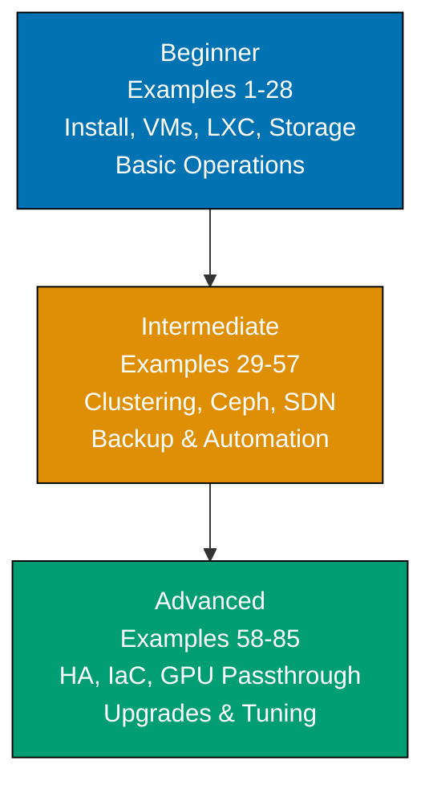

**Want to master Proxmox VE through working examples?** This by-example guide teaches Proxmox Virtual Environment fundamentals through 85 annotated, copy-paste-ready examples organized by complexity level—covering installation through full IaC automation pipelines.

## What Is By-Example Learning?

By-example learning is an **example-first approach** where you learn through annotated, runnable code rather than narrative explanations. Each example is self-contained, immediately executable, and heavily commented to show:

- **What each command does** — Inline comments explain CLI flags, API paths, and Proxmox behavior
- **Expected outputs** — Using `# =>` notation for command results, status outputs, and state changes
- **Proxmox mechanics** — How VMs, containers, clusters, storage, and the REST API work together
- **Key takeaways** — 1-2 sentence summaries of patterns and operational best practices

This approach is **ideal for experienced infrastructure engineers** who already understand Linux, networking, and virtualization concepts, and want to quickly master Proxmox VE's tooling, CLI commands, and automation patterns through working examples.

Unlike narrative tutorials that build understanding through explanation and storytelling, by-example learning lets you **see the command first, run it second, and understand it through direct interaction**.

## What Is Proxmox VE?

**Proxmox Virtual Environment (PVE)** is an open-source Type-1 hypervisor platform for running KVM virtual machines and LXC system containers. Unlike Type-2 hypervisors (VMware Workstation, VirtualBox) that run on top of an OS, Proxmox runs directly on bare metal. PVE provides:

- **KVM virtualization** — Full hardware virtualization for any OS (Windows, Linux, BSD)
- **LXC containers** — Lightweight OS-level virtualization sharing the host kernel
- **Web UI** — Browser-based management at `https://<host>:8006` (ExtJS)
- **REST API** — Full programmatic access; every UI action calls the API
- **Clustering** — Multi-node Corosync-based cluster with shared storage
- **High Availability** — Automatic VM/container failover across cluster nodes
- **Software-Defined Networking** — VXLAN, BGP-EVPN, VLAN-aware bridges
- **Ceph integration** — Built-in distributed storage using Ceph Squid 19.2.3

**Proxmox VE 9.1** (November 2025) is based on Debian 13.2 "Trixie", kernel 6.17.2, QEMU 10.1.2, and LXC 6.0.5. New in 9.1: OCI image support for LXC containers, vTPM in qcow2 enabling snapshots with Windows Secure Boot/BitLocker, per-vCPU nested virtualization control.

## Learning Path



Progress from Proxmox fundamentals (installation, basic VM/container management, local storage) through production cluster operations (Ceph, SDN, backup to PBS) to advanced infrastructure automation (Terraform, Ansible, Packer, HA, GPU passthrough, PVE 8→9 upgrades).

## Coverage Philosophy

This by-example guide provides **comprehensive coverage of Proxmox VE operations** through practical, annotated examples. Coverage represents depth and breadth of concepts—focus is on **outcomes and understanding**, not time.

### What's Covered

- **Installation** — ISO download/verification, graphical/TUI installer, unattended install
- **Web UI navigation** — Dashboard, nodes, storage, datacenter views
- **VM management** — Create, configure, start/stop/migrate, clone, template, cloud-init
- **LXC containers** — Create from templates and OCI images, resource limits, migration
- **Storage backends** — Directory, LVM, ZFS, NFS, iSCSI, Ceph RBD, PBS
- **Networking** — Linux bridges, VLANs, bonding, SDN zones/VNets, VXLAN, BGP-EVPN
- **Clustering** — Multi-node setup, Corosync, QDevice for 2-node quorum
- **Ceph** — Full cluster init, OSD management, pools, erasure coding, health monitoring
- **High Availability** — HA Manager, fencing, failover testing, affinity rules
- **Backup & restore** — vzdump, PBS integration, live-restore, pruning policies
- **Automation** — Terraform (bpg/proxmox), Ansible (community.proxmox), Packer, REST API
- **Advanced features** — PCIe/GPU passthrough, vTPM, nested virtualization, SDN DHCP
- **Upgrades** — PVE 8→9 migration path, Ceph Quincy/Reef→Squid prerequisite

### What's NOT Covered

- **Proxmox Backup Server deep-dive** — PBS 4.0 is covered as a PVE storage target; standalone PBS administration is a separate topic
- **Proxmox Mail Gateway** — Separate product
- **Windows guest optimization** — VirtIO driver installation covered briefly; deep Windows tuning out of scope
- **All Terraform/Ansible modules** — Focus on most common patterns; provider documentation covers edge cases

## Prerequisites

Before starting this tutorial, you should be comfortable with:

- **Linux fundamentals** — Command line, file system, package management (apt), systemd
- **Networking basics** — IP addressing, VLANs, bridges, routing, DNS
- **Virtualization concepts** — Hypervisors, VMs vs containers, storage types
- **Git basics** — For IaC automation examples (Terraform, Ansible)

No prior Proxmox experience required—this guide starts from first principles (ISO download) and builds to production HA clusters with full IaC automation.

## Example Structure

Each example follows a five-part format:

1. **Explanation** (2-3 sentences) — What the example demonstrates and why it matters
2. **Diagram** (when helpful) — Mermaid diagram visualizing architecture or execution flow
3. **Annotated code** — Commands with inline `# =>` comments showing outputs and state
4. **Key takeaway** — 1-2 sentence summary of the pattern learned
5. **Why It Matters** — 50-100 words connecting to real production usage

This format emphasizes **code first, explanation second**—you see working commands before diving into conceptual details.

## Getting Started

Install requirements and verify access before starting examples:

```bash
# Proxmox VE server requirements (bare metal or nested virt):
# - 64-bit CPU with hardware virtualization (Intel VT-x / AMD-V)
# - Minimum 2 GB RAM (8+ GB recommended for multiple VMs)
# - 32 GB storage (local disk or SAN LUN)
# - Network interface for management

# After installation, access the web UI from another machine:
# => Open browser: https://<proxmox-ip>:8006
# => Accept self-signed certificate warning
# => Log in: username=root, realm=PAM, password=<set during install>

# Verify PVE version from command line:
pveversion
# => pve-manager/9.1/... (running kernel: 6.17.2-1-pve)

# Check node status:
pvesh get /nodes/$(hostname)/status --output-format json | python3 -m json.tool
# => Returns node CPU, memory, uptime, and kernel information
```

Set up your bare-metal or nested-virtualization test environment, then proceed to [Beginner](/en/learn/software-engineering/infrastructure/tools/proxmox/by-example/beginner) examples.
