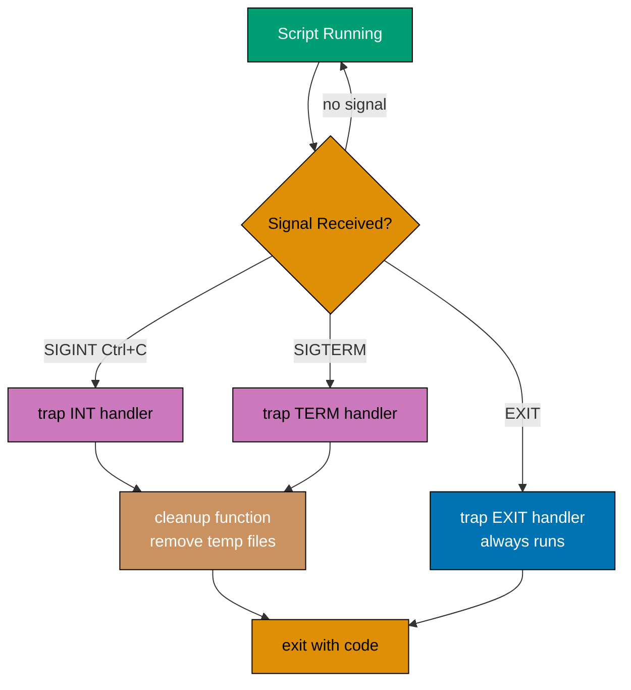
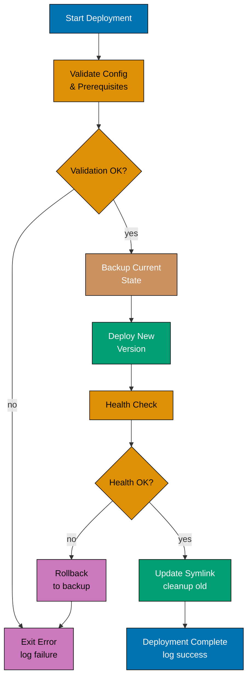
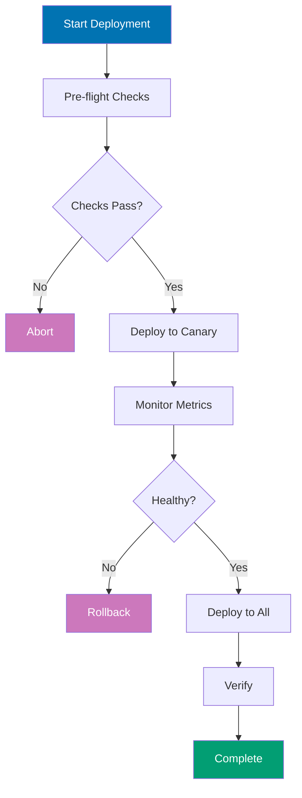

## Advanced Level (75-95% Coverage)

This level covers advanced shell concepts through 25 self-contained examples. Each example demonstrates production-grade patterns used in system administration, DevOps automation, and enterprise scripting.

---

### Example 56: Process Management and Job Control

Shell job control manages background processes, foreground/background switching, and process monitoring using built-in shell features.

```bash
# Run command in background
sleep 60 &                      # => & detaches to background
                                # => Output: [1] 12345 (job number + PID)

# List background jobs
jobs                            # => Shows background jobs
                                # => Output: [1]+ Running  sleep 60 &

# Bring job to foreground
fg %1                           # => Brings job 1 to foreground
                                # => %1 is job specifier (not PID)

# Send foreground job to background
sleep 120                       # => Start in foreground
                                # Press Ctrl+Z to suspend
bg %1                           # => Resume job 1 in background

# Kill background job
kill %1                         # => Send SIGTERM to job 1
                                # => Use kill -9 %1 for force kill

# Wait for background jobs
command1 &                      # => Start first background job
command2 &                      # => Start second background job
wait                            # => Wait for ALL background jobs
                                # => Synchronization point

# Wait for specific job
command &                       # => Start background job
wait %1                         # => Wait only for job 1

# Disown job (continue after shell exit)
sleep 600 &                     # => Start background job
disown %1                       # => Remove from job table
                                # => Survives shell exit

# Run command immune to hangup (SIGHUP)
nohup ./long-running-script.sh &
                                # => nohup ignores SIGHUP signal
                                # => Redirects stdout to nohup.out
                                # => Redirects stderr to nohup.out (or stdout)
                                # => Process continues after terminal closes
                                # => & runs in background
                                # => Combined: logout-immune background execution
```

**Key Takeaway**: Use `&` for background execution, `jobs` to list, `fg/bg` to control, `wait` to synchronize, and `nohup` for logout-immune processes. Job control is essential for parallel processing and long-running tasks.

**Why It Matters**: Job control enables parallel execution strategies essential for production efficiency. Deployment scripts launch health checks, log tailing, and monitoring concurrently rather than sequentially. The wait command provides synchronization points where all parallel operations must complete before proceeding. nohup and disown enable launching long-running processes that outlive the calling script, essential for background services and maintenance tasks initiated via SSH.

---

### Example 57: Signal Handling and Traps

Trap handlers execute code when signals are received, enabling cleanup on exit, interrupt handling, and graceful shutdown.

#### Diagram



```bash
#!/bin/bash
# Script with signal handling

# Define cleanup function
cleanup() {
    echo "Cleaning up..."         # => Print cleanup message
    rm -f /tmp/script.$$.*        # => $$ expands to current PID
    echo "Done."
}

# Register trap for EXIT signal
trap cleanup EXIT               # => Cleanup runs on any exit
                                # => Does NOT fire on kill -9

# Trap interrupt (Ctrl+C)
trap 'echo "Interrupted!"; exit 130' INT
                                # => INT is SIGINT (Ctrl+C)
                                # => Exit code 130 = 128 + 2

# Trap termination
trap 'echo "Terminated!"; cleanup; exit 143' TERM
                                # => TERM is SIGTERM (kill command)

# Ignore signal
trap '' HUP                     # => Empty string ignores signal

# Reset trap to default
trap - INT                      # => - resets to default behavior

# Multiple signals in one trap
trap cleanup EXIT INT TERM      # => Same handler for 3 signals

# Temporary file with automatic cleanup
temp_file=$(mktemp)             # => Create secure temp file
trap "rm -f $temp_file" EXIT    # => Auto-delete on exit

# Use temp file
echo "data" > "$temp_file"
# ... process data ...
                                # => temp_file deleted on exit

# Prevent Ctrl+C during critical section
trap '' INT                     # => Ignore Ctrl+C
# ... critical code ...
trap - INT                      # => Restore Ctrl+C

# Debugging trap (execute before each command)
trap 'echo "Executing: $BASH_COMMAND"' DEBUG
                                # => Fires before EVERY command

# Return trap (execute when function returns)
function_with_trap() {
    trap 'echo "Function exiting"' RETURN
                                # => Fires when function returns
    # ... function code ...
}
                                # => "Function exiting" printed
```

**Key Takeaway**: Traps ensure cleanup code runs on exit, interrupt, or termination. Use `trap 'code' SIGNAL` to register handlers, `trap '' SIGNAL` to ignore signals, and `trap - SIGNAL` to reset. Essential for production scripts that manage resources.

**Why It Matters**: Signal traps are what separate production scripts from fragile prototypes. Without signal handling, scripts leave temporary files, hold database connections open, and leave systems in inconsistent states when interrupted. The EXIT trap is the most critical - it runs regardless of how the script exits. Scripts managing infrastructure resources must implement proper cleanup to prevent resource leaks that accumulate over many deployments.

---

### Example 58: Advanced Parameter Expansion

Bash parameter expansion provides powerful string manipulation, default values, substring extraction, and pattern matching without external commands.

#### Diagram

```mermaid
%% Color Palette: Blue #0173B2, Orange #DE8F05, Teal #029E73, Purple #CC78BC, Brown #CA9161
graph TD
    A[\${var...}] --> B{Expansion Type}
    B -->|:-default| C[Use default<br/>if unset or empty]
    B -->|:=default| D[Assign default<br/>if unset or empty]
    B -->|:offset:len| E[Substring<br/>extraction]
    B -->|#pattern| F[Strip prefix<br/>shortest match]
    B -->|##pattern| G[Strip prefix<br/>longest match]
    B -->|%pattern| H[Strip suffix<br/>shortest match]
    B -->|/old/new| I[Replace<br/>first match]

    style A fill:#0173B2,stroke:#000,color:#fff
    style B fill:#DE8F05,stroke:#000,color:#000
    style C fill:#029E73,stroke:#000,color:#fff
    style D fill:#029E73,stroke:#000,color:#fff
    style E fill:#CC78BC,stroke:#000,color:#000
    style F fill:#CA9161,stroke:#000,color:#fff
    style G fill:#CA9161,stroke:#000,color:#fff
    style H fill:#CC78BC,stroke:#000,color:#000
    style I fill:#0173B2,stroke:#000,color:#fff
```

```bash
# Default values
name=${USER:-"guest"}           # => Use $USER if set, else "guest"
                                # => :- tests for unset OR empty

name=${USER-"guest"}            # => Use $USER if set (even empty), else "guest"
                                # => - tests only for unset

# Assign default if unset
name=${USER:="defaultuser"}     # => Set both $name and $USER if unset
                                # => := assigns to original variable

# Error if unset
name=${USER:?"USER not set"}    # => Exit with error if unset
                                # => :? enforces required variables

# Use alternative value
name=${USER:+"logged in"}       # => If $USER set, use "logged in", else ""
                                # => :+ is opposite of :-

# String length
file="document.txt"
length=${#file}                 # => length=12 (character count)

# Substring extraction
path="/home/user/documents/file.txt"
${path:0:5}                     # => Result: "/home" (offset 0, length 5)
${path:6:4}                     # => Result: "user" (offset 6, length 4)
${path:11}                      # => Result: "documents/file.txt" (to end)
${path: -8}                     # => Result: "file.txt" (last 8 chars)
                                # => SPACE before - required

# Remove prefix pattern (shortest match)
${path#*/}                      # => Remove shortest "*/" from start
                                # => Result: "home/user/documents/file.txt"

# Remove prefix pattern (longest match)
${path##*/}                     # => Remove longest "*/" from start
                                # => Result: "file.txt" (like basename)

# Remove suffix pattern (shortest match)
${path%/*}                      # => Remove shortest "/*" from end
                                # => Result: "/home/user/documents" (like dirname)

# Remove suffix pattern (longest match)
${path%%/*}                     # => Remove longest "/*" from end
                                # => Result: "" (everything removed)

# Pattern replacement (first match)
file="test.txt.backup"          # => file contains "test.txt.backup"
${file/.txt/.md}                # => Replace first occurrence of ".txt"
                                # => Pattern ".txt" matches first instance
                                # => Replace with ".md"
                                # => Result: "test.md.backup"
                                # => Single / replaces first match only

# Pattern replacement (all matches)
${file//.txt/.md}               # => Replace all occurrences of ".txt"
                                # => Double // means global replacement
                                # => Result: "test.md.backup"
                                # => In this case, only one .txt exists
                                # => Would replace multiple if present

# Pattern replacement at start
${file/#test/demo}              # => Replace "test" only at start
                                # => /# anchors pattern to beginning
                                # => Result: "demo.txt.backup"
                                # => If "test" not at start, no replacement

# Pattern replacement at end
${file/%backup/copy}            # => Replace "backup" only at end
                                # => /% anchors pattern to end of string
                                # => Result: "test.txt.copy"
                                # => If "backup" not at end, no replacement

# Case conversion (Bash 4+)
name="Alice"                    # => name contains "Alice"
${name,,}                       # => Convert all characters to lowercase
                                # => Result: "alice"
                                # => Double ,, means all characters
${name^^}                       # => Convert all characters to uppercase
                                # => Result: "ALICE"
                                # => Double ^^ means all characters
${name,}                        # => Convert first character to lowercase
                                # => Result: "alice"
                                # => Single , means first character only
${name^}                        # => Convert first character to uppercase
                                # => Result: "Alice"
                                # => Single ^ means first character only

# Array expansion
files=(a.txt b.txt c.txt)       # => Create array with 3 elements
                                # => files[0]="a.txt", files[1]="b.txt", files[2]="c.txt"
${files[@]}                     # => Expand all elements as separate words
                                # => Result: "a.txt" "b.txt" "c.txt"
                                # => @ preserves word boundaries
                                # => Use in quotes: "${files[@]}"
${files[*]}                     # => Expand all elements as single word
                                # => Result: "a.txt b.txt c.txt"
                                # => * joins with IFS (space by default)
${files[0]}                     # => Access first element (index 0)
                                # => Result: "a.txt"
${#files[@]}                    # => Get array length (number of elements)
                                # => Result: 3
                                # => # prefix means length

# Indirect expansion
var="USER"                      # => var contains string "USER"
echo ${!var}                    # => Indirect variable reference
                                # => ! dereferences the variable name
                                # => First expands $var to "USER"
                                # => Then expands $USER to its value
                                # => Example: if USER="alice", output is "alice"
```

**Key Takeaway**: Parameter expansion eliminates external commands like `sed`, `cut`, `basename`, `dirname` for string operations. Use `${var:-default}` for defaults, `${var#pattern}` for prefix removal, `${var%pattern}` for suffix removal, and `${var//pattern/replacement}` for substitution. Faster and more portable than external tools.

**Why It Matters**: Parameter expansion enables sophisticated string manipulation without external tools. Production scripts use expansion for parsing paths, extracting components, and providing defaults. The ${var##\*/} pattern extracts filenames from paths without spawning basename. The ${var:?message} pattern enforces required variables with meaningful error messages. String case conversion ${var^^} and ${var,,} enables normalization without tr or awk. Mastering parameter expansion makes scripts faster and more portable.

---

### Example 59: Process Substitution and Named Pipes

Process substitution creates temporary named pipes to use command output as file arguments, enabling advanced piping patterns.

```bash
# Compare output of two commands
diff <(ls dir1) <(ls dir2)      # => <() creates temp file descriptors
                                # => No manual temp file creation needed

# Process substitution as input
while read line; do
    echo "Line: $line"
done < <(find . -name "*.txt")  # => First < redirects input
                                # => Second <() creates file descriptor

# Multiple input sources
paste <(seq 1 5) <(seq 10 14)   # => Joins outputs side-by-side with tabs

# Output redirection with process substitution
echo "data" > >(tee file1.txt file2.txt)
                                # => >() creates output descriptor
                                # => Writes to both files simultaneously

# Join two sorted outputs
join <(sort file1) <(sort file2)
                                # => No intermediate temp files

# Named pipes (FIFO)
mkfifo /tmp/mypipe              # => Create FIFO special file
                                # => Acts as communication channel

# Write to named pipe (background)
cat file.txt > /tmp/mypipe &    # => Opens pipe for writing
                                # => Blocks until reader connects

# Read from named pipe
cat < /tmp/mypipe               # => Connects to waiting writer
                                # => Data flows from writer to reader

# Named pipe for inter-process communication
mkfifo /tmp/logpipe
tail -f /tmp/logpipe &          # => Start reader in background
echo "Log message" > /tmp/logpipe
                                # => IPC without network sockets

# Cleanup named pipe
rm /tmp/mypipe                  # => Remove FIFO from filesystem

# Process substitution with tee (log and process)
command | tee >(grep ERROR > errors.log) >(grep WARN > warnings.log)
                                # => Splits output to multiple destinations
                                # => grep WARN filters and writes warnings.log
                                # => Three destinations from single output
                                # => Parallel filtering to multiple files
```

**Key Takeaway**: Process substitution `<(command)` and `>(command)` treat command output/input as files. Named pipes (FIFOs) enable inter-process communication. Both eliminate temporary file creation and simplify complex pipelines.

**Why It Matters**: Process substitution enables comparing command outputs and feeding to commands expecting files. Scripts use this for diffing configurations and processing multiple data streams. The diff <(ssh server1 cat /etc/config) <(ssh server2 cat /etc/config) pattern compares remote files without downloading them. The while read < <(command) pattern solves the subshell scope problem in piped while loops. Named pipes via mkfifo enable bidirectional communication between co-processes for complex IPC patterns.

---

### Example 60: Advanced Looping and Iteration

Bash provides multiple looping constructs beyond basic `for` and `while`, including C-style loops, field iteration, and parallel processing.

```bash
# C-style for loop
for ((i=0; i<10; i++)); do      # => i=0: Initialize counter to 0
                                # => i<10: Continue while i less than 10
                                # => i++: Increment i after each iteration
    echo "Iteration $i"         # => Prints: "Iteration 0", "Iteration 1", ..., "Iteration 9"
done                            # => Executes 10 times (0 through 9)
                                # => C-style: for ((init; condition; increment))

# Loop with step
for ((i=0; i<=100; i+=10)); do  # => i=0: Start at 0
                                # => i<=100: Continue while i <= 100
                                # => i+=10: Increment by 10 each iteration
    echo $i                     # => Output: 0, 10, 20, 30, ..., 100
done                            # => Executes 11 times (0, 10, 20...100)
                                # => Useful for progress indicators

# Loop over array indices
arr=(a b c d)                   # => Create array: arr[0]=a, arr[1]=b, arr[2]=c, arr[3]=d
for i in "${!arr[@]}"; do       # => ${!arr[@]} expands to indices: 0 1 2 3
                                # => Quotes prevent word splitting
    echo "Index $i: ${arr[$i]}" # => Output: "Index 0: a", "Index 1: b", etc.
done                            # => Iterates over 0, 1, 2, 3
                                # => Access both index and value

# Loop until condition
count=0                         # => Initialize counter to 0
until [ $count -ge 5 ]; do      # => Condition: $count >= 5
                                # => Loops while condition is FALSE
                                # => Opposite of while (executes until true)
    echo "Count: $count"        # => Output: "Count: 0", "Count: 1", ..., "Count: 4"
    ((count++))                 # => Increment count: 0→1, 1→2, 2→3, 3→4, 4→5
done                            # => Stops when count=5 (condition becomes true)

# Loop over command output (word splitting)
for word in $(cat file.txt); do # => $(cat file.txt) expands to file contents
                                # => Shell splits on IFS (whitespace: space, tab, newline)
    echo "Word: $word"          # => Each word becomes separate iteration
done                            # => WARNING: "hello world" becomes two iterations
                                # => Breaks on filenames with spaces

# Loop over lines (safe, preserves spaces)
while IFS= read -r line; do     # => IFS= prevents leading/trailing whitespace trim
                                # => -r prevents backslash interpretation
                                # => read reads one line into $line
    echo "Line: $line"          # => Preserves exact line content
done < file.txt                 # => Redirect file to stdin
                                # => Reads line by line until EOF
                                # => SAFE for lines with spaces

# Loop with custom field separator
while IFS=: read -r user pass uid gid rest; do
                                # => IFS=: sets field separator to colon
                                # => Reads line and splits on :
                                # => Assigns to variables: user, pass, uid, gid, rest
    echo "User: $user, UID: $uid"
                                # => user="root", uid="0" (for first line of /etc/passwd)
done < /etc/passwd              # => Parse colon-delimited file
                                # => rest captures remaining fields

# Infinite loop with break
while true; do                  # => true always returns 0 (success)
                                # => Infinite loop (no exit condition)
    read -p "Enter command (q to quit): " cmd
                                # => -p displays prompt
                                # => Waits for user input
    [ "$cmd" = "q" ] && break   # => If input is "q", exit loop
                                # => && chains: if test succeeds, run break
    echo "You entered: $cmd"    # => Echo input back to user
done                            # => Loop continues until 'q' entered

# Continue to next iteration
for i in {1..10}; do            # => Brace expansion: 1 2 3 4 5 6 7 8 9 10
    [ $((i % 2)) -eq 0 ] && continue
                                # => $((i % 2)): modulo operation (remainder)
                                # => Even numbers: remainder is 0
                                # => continue skips to next iteration
    echo $i                     # => Only executes for odd numbers
done                            # => Output: 1 3 5 7 9

# Nested loops with labels (Bash 4+)
outer=0                         # => Initialize outer counter
while [ $outer -lt 3 ]; do      # => Outer loop: 0, 1, 2
    inner=0                     # => Initialize inner counter
    while [ $inner -lt 3 ]; do  # => Inner loop: 0, 1, 2
        if [ $inner -eq 1 ]; then
                                # => When inner reaches 1
            break 2             # => Break out of 2 loops (inner and outer)
                                # => Default break is 1 (current loop only)
        fi
        echo "$outer,$inner"    # => Output: "0,0" then breaks
        ((inner++))             # => Never reaches this (breaks before increment)
    done
    ((outer++))                 # => Never reaches this (breaks from outer too)
done

# Parallel processing with background jobs
for file in *.txt; do           # => Glob expands to all .txt files
    process_file "$file" &      # => & runs process_file in background
                                # => Each iteration starts immediately
                                # => All files processed in parallel
done
wait                            # => Wait for ALL background jobs to complete
                                # => Blocks until all process_file instances finish

# Limit parallel jobs
max_jobs=4                      # => Maximum concurrent jobs
for file in *.txt; do           # => Loop over all .txt files
    while [ $(jobs -r | wc -l) -ge $max_jobs ]; do
                                # => jobs -r lists running jobs
                                # => wc -l counts lines (number of jobs)
                                # => If count >= 4, wait
        sleep 0.1               # => Wait 100ms before checking again
    done                        # => Busy-wait until slot available
    process_file "$file" &      # => Start next job in background
done                            # => Maintains max 4 concurrent jobs
wait                            # => Wait for final batch to complete
```

**Key Takeaway**: Use C-style `for ((i=0; i<n; i++))` for numeric iteration, `while IFS= read -r` for line-by-line processing, `until` for loops that run while condition is false, and background jobs with `wait` for parallel processing. Always use `-r` with `read` to preserve backslashes.

**Why It Matters**: Advanced iteration patterns enable sophisticated data processing directly in bash. The C-style for loop enables index-based access for parallel array operations. The while read -r line pattern is the correct way to process file lines with special characters. mapfile loads entire file content into arrays for random access. These patterns replace inefficient loops that spawn external processes for each iteration, improving performance significantly.

---

### Example 61: Debugging and Error Handling

Production scripts require robust error handling, debugging capabilities, and fail-fast behavior to prevent silent failures.

```bash
#!/bin/bash
# Production script template with error handling

# Exit on error
set -e                          # => Exit immediately if any command returns non-zero
                                # => set -e makes shell fail-fast
                                # => Prevents cascading failures in pipelines
                                # => Does NOT catch errors in: functions, subshells, conditionals
                                # => Use with caution: can hide errors in complex scripts

# Exit on undefined variable
set -u                          # => Treat unset variables as error
                                # => Accessing $UNDEFINED_VAR exits script
                                # => Catches typos: $USRE instead of $USER
                                # => Prevents bugs from missing environment vars
                                # => Use ${VAR:-default} for optional variables

# Fail on pipe errors
set -o pipefail                 # => Pipeline exit code = last failing command
                                # => Without: "false | true" returns 0 (true's exit code)
                                # => With: "false | true" returns 1 (false's exit code)
                                # => Critical for: command | tee log.txt
                                # => Detects failures in middle of pipeline

# Combined (common production pattern)
set -euo pipefail               # => Enable all three safety checks
                                # => -e: exit on error
                                # => -u: exit on undefined variable
                                # => -o pipefail: catch pipeline failures
                                # => Production scripts should start with this

# Debug mode (print each command before execution)
set -x                          # => Enable xtrace (also called debug mode)
                                # => Prints each command to stderr before execution
                                # => Shows variable expansion: echo $HOME → echo /home/user
                                # => Prefixes lines with +
                                # => Critical for debugging complex scripts

# Conditional debug
[ "${DEBUG:-}" = "1" ] && set -x
                                # => ${DEBUG:-} returns $DEBUG or "" if unset
                                # => Avoids error from set -u
                                # => If DEBUG=1, enable xtrace
                                # => Usage: DEBUG=1 ./script.sh
                                # => Otherwise, run normally without xtrace

# Disable debug for section
{ set +x; } 2>/dev/null         # => set +x disables xtrace
                                # => { } groups command
                                # => 2>/dev/null suppresses xtrace of "set +x" itself
                                # => Prevents: "+ set +x" appearing in output
# ... code without debug ...    # => Commands here don't print debug output
                                # => Useful for sections with sensitive data
set -x                          # => Re-enable xtrace
                                # => Debug resumes after sensitive section

# Error line number
trap 'echo "Error on line $LINENO"' ERR
                                # => ERR trap fires when command fails (if set -e active)
                                # => $LINENO expands to line number of error
                                # => Output: "Error on line 42"
                                # => Helps locate failure in long scripts

# Full error context
trap 'echo "Error: Command \"$BASH_COMMAND\" failed with exit code $? on line $LINENO"' ERR
                                # => $BASH_COMMAND contains the failing command text
                                # => $? contains exit code of failed command
                                # => $LINENO contains line number
                                # => Output: "Error: Command \"curl http://...\" failed with exit code 7 on line 42"
                                # => Comprehensive error diagnostics

# Validate required commands exist
require_command() {
    command -v "$1" >/dev/null 2>&1 || {
                                # => command -v checks if command exists
                                # => $1 is command name to check
                                # => >/dev/null 2>&1 suppresses all output
                                # => || executes if command not found
        echo "Error: Required command '$1' not found" >&2
                                # => Print error to stderr
                                # => >&2 redirects stdout to stderr
        exit 1                  # => Exit script with failure code
    }
}

require_command jq              # => Ensure jq (JSON processor) is installed
                                # => Exits script if not found
require_command curl            # => Check for curl (HTTP client)
                                # => Validation before script logic runs

# Validate required variables
: "${API_KEY:?Error: API_KEY not set}"
                                # => : is null command (does nothing)
                                # => Only evaluates parameter expansion
                                # => ${API_KEY:?msg} exits if API_KEY unset
                                # => Error message printed to stderr
                                # => Script exits with code 1

# Function with error handling
safe_operation() {
    local file=$1               # => $1 is first argument (filename)
                                # => local makes variable function-scoped

    # Check preconditions
    [ -f "$file" ] || {         # => -f tests if file exists and is regular file
                                # => || executes if test fails
        echo "Error: File $file not found" >&2
                                # => Print error to stderr
        return 1                # => Return exit code 1 (failure)
                                # => Different from exit (doesn't terminate script)
    }

    # Perform operation with error checking
    if ! grep "pattern" "$file" > /dev/null; then
                                # => ! negates exit code of grep
                                # => grep exits 0 if found, 1 if not found
                                # => > /dev/null suppresses grep output
        echo "Warning: Pattern not found in $file" >&2
                                # => Non-fatal warning to stderr
        return 2                # => Return code 2 (different from failure)
                                # => Caller can distinguish failure types
    fi

    return 0                    # => Explicit success exit code
                                # => Best practice: always return from functions
}

# Call with error handling
if ! safe_operation "data.txt"; then
                                # => ! negates exit code
                                # => if executes block when function fails
                                # => Catches both return 1 and return 2
    echo "Operation failed"     # => Handle error
    exit 1                      # => Exit script with failure
fi                              # => Continue only if safe_operation succeeded

# Dry-run mode
DRY_RUN=${DRY_RUN:-0}           # => ${DRY_RUN:-0} defaults to 0 if unset
                                # => DRY_RUN=1 ./script.sh enables dry-run
                                # => Shows commands without executing

run_cmd() {
    if [ "$DRY_RUN" = "1" ]; then
                                # => Check if dry-run mode enabled
        echo "DRY-RUN: $*"      # => $* expands all arguments as single string
                                # => Print command that WOULD execute
    else                        # => Normal execution mode
        "$@"                    # => $@ expands arguments as separate words
                                # => Preserves quoting and special characters
                                # => Actually executes the command
    fi
}

run_cmd rm important-file.txt   # => If DRY_RUN=1: prints "DRY-RUN: rm important-file.txt"
                                # => If DRY_RUN=0: actually deletes file
                                # => Safe testing of destructive operations

# Verbose mode
VERBOSE=${VERBOSE:-0}           # => ${VERBOSE:-0} defaults to 0 if unset
                                # => VERBOSE=1 ./script.sh enables logging

log() {
    [ "$VERBOSE" = "1" ] && echo "[$(date +'%Y-%m-%d %H:%M:%S')] $*" >&2
                                # => Test if VERBOSE is 1
                                # => && executes echo only if test succeeds
                                # => $(date ...) expands to timestamp
                                # => $* is message to log
                                # => >&2 sends log to stderr (not stdout)
}

log "Starting process"          # => If VERBOSE=1: "[2025-01-31 10:30:45] Starting process"
                                # => If VERBOSE=0: no output
                                # => Conditional logging without if statements

# Assert function
assert() {
    if ! "$@"; then             # => Execute command passed as arguments
                                # => ! negates exit code
                                # => If command fails, enter block
        echo "Assertion failed: $*" >&2
                                # => Print failed assertion to stderr
                                # => $* shows the command that failed
        exit 1                  # => Exit script immediately
                                # => Assertions are hard requirements
    fi
}

assert [ -d "/expected/directory" ]
                                # => Runs: [ -d "/expected/directory" ]
                                # => If directory doesn't exist, exits script
                                # => Output: "Assertion failed: [ -d /expected/directory ]"

# Retry logic
retry() {
    local max_attempts=$1       # => First argument is retry count
                                # => local makes variable function-scoped
    shift                       # => Remove first argument
                                # => $@ now contains command to retry
    local attempt=1             # => Initialize attempt counter

    while [ $attempt -le $max_attempts ]; do
                                # => Loop while attempt <= max_attempts
                                # => -le is "less than or equal"
        if "$@"; then           # => Execute command ($@)
                                # => If succeeds (exit code 0), enter block
            return 0            # => Success on any attempt
                                # => Exit function immediately
        fi
        echo "Attempt $attempt failed, retrying..." >&2
                                # => Log failure to stderr
        ((attempt++))           # => Increment attempt: 1→2, 2→3, 3→4
        sleep $((attempt * 2))  # => Exponential backoff
                                # => Attempt 1: sleep 2s
                                # => Attempt 2: sleep 4s
                                # => Attempt 3: sleep 6s
    done                        # => Try again

    return 1                    # => All attempts exhausted
                                # => Return failure code
}

retry 3 curl -f https://api.example.com/health
                                # => Retry curl up to 3 times
                                # => -f makes curl fail on HTTP errors
                                # => Waits 2s, 4s, 6s between attempts
                                # => Returns 0 on any success, 1 if all fail
```

**Key Takeaway**: Use `set -euo pipefail` for fail-fast behavior, trap ERR to log failures, validate preconditions with `command -v` and parameter expansion, implement retry logic for network operations, and use `DRY_RUN` for safe testing. Production scripts must fail loudly, never silently.

**Why It Matters**: Error handling sophistication directly correlates with system reliability. The set -euo pipefail combination catches three distinct failure modes: command errors (-e), undefined variables (-u), and pipeline failures (-o pipefail). Without all three, scripts silently swallow errors and proceed with corrupted state. Production incidents often trace back to scripts missing one of these flags. Comprehensive error logging with LINENO and BASH_SOURCE enables rapid diagnosis.

---

### Example 62: Performance Optimization and Benchmarking

Shell script performance matters for large-scale automation. Avoid external commands in loops, use built-in features, and benchmark critical sections.

```bash
# Benchmark time measurement
time_cmd() {
    local start=$(date +%s%N)   # => Nanosecond timestamp (%s%N = sec + nanosec)
                                 # => start is something like 1735567200123456789
    "$@"                        # => Execute command passed as arguments
                                 # => $@: all arguments expanded as separate words
    local end=$(date +%s%N)     # => End timestamp after command completes
    local duration=$(( (end - start) / 1000000 ))  # => Convert ns to ms (/ 1,000,000)
    echo "Duration: ${duration}ms" >&2  # => Output to stderr
                                 # => >&2: keeps stdout clean for piped consumers
}

time_cmd grep pattern large-file.txt
                                # => Benchmark grep execution time
                                # => Output: Duration: 45ms (sent to stderr)

# BAD: External command in loop (SLOW)
count=0                          # => Initialize counter to 0
for i in {1..1000}; do           # => Loop 1000 times
    count=$(expr $count + 1)    # => Spawns expr process 1000 times!
                                 # => Each $(expr ...) forks a new process
done                            # => ~5 seconds total execution time

# GOOD: Arithmetic expansion (FAST)
count=0                          # => Initialize counter to 0
for i in {1..1000}; do           # => Same loop, 1000 iterations
    ((count++))                 # => Built-in arithmetic, no fork
                                 # => Equivalent to: count=$((count+1))
done                            # => ~0.01 seconds (500x faster!)

# BAD: Subshell for string manipulation (SLOW)
for file in *.txt; do            # => Iterate over all .txt files
    basename=$(basename "$file" .txt)  # => Fork basename command
                                # => External process per iteration
                                # => 1000 files = 1000 process forks
done

# GOOD: Parameter expansion (FAST)
for file in *.txt; do            # => Same iteration
    basename=${file%.txt}       # => Built-in parameter expansion
                                 # => ${var%pattern}: remove suffix match
    basename=${basename##*/}    # => Remove path component (longest match)
                                # => No external commands - pure shell
done

# BAD: Reading file line-by-line with cat (SLOW)
cat file.txt | while read line; do  # => Pipe creates cat + subshell processes
    echo "$line"                # => Useless use of cat (UUOC)
                                 # => Also: loop body in subshell (variables lost)
done                            # => Creates unnecessary pipeline

# GOOD: Direct redirection (FAST)
while read line; do              # => No external command needed
    echo "$line"                 # => Loop body in main shell (variables persist)
done < file.txt                 # => < redirects file as stdin directly to while
                                 # => Avoids subshell and extra process

# BAD: Multiple greps in sequence (SLOW)
cat file.txt | grep foo | grep bar | grep baz
                                # => 4 processes in pipeline

# GOOD: Single grep with regex (FAST)
grep 'foo.*bar.*baz' file.txt   # => Single process
                                # => Or use awk for complex logic

# Parallel processing for CPU-bound tasks
process_file() {
    # ... expensive operation ...
    sleep 1                     # => Simulate work (1 second per file)
}                                # => Function defined for examples below

# Serial (SLOW for many files)
for file in *.txt; do            # => Process each file sequentially
    process_file "$file"        # => One at a time: must finish before next starts
done                            # => 100 files = 100 seconds minimum

# Parallel with GNU parallel (FAST)
parallel process_file ::: *.txt # => All cores utilized
                                # => 100 files = ~10 seconds (10 cores)

# Parallel with xargs (portable)
printf '%s\n' *.txt | xargs -P 8 -I {} sh -c 'process_file "{}"'
                                # => -P 8: 8 parallel processes
                                # => More portable than GNU parallel

# Manual parallel with background jobs
max_jobs=8                       # => Maximum concurrent background processes
for file in *.txt; do            # => Process each file
    while [ $(jobs -r | wc -l) -ge $max_jobs ]; do
                                 # => jobs -r: list running background jobs
                                 # => wc -l: count running jobs
        sleep 0.1               # => Wait briefly for a job slot to open
    done
    process_file "$file" &      # => Launch as background job (& = detach)
done
wait                            # => Wait for all background jobs to complete

# Avoid unnecessary forks
# BAD
result=$(echo $var)             # => Unnecessary fork

# GOOD
result=$var                     # => Direct assignment

# Cache repeated command output
# BAD
for i in {1..100}; do            # => Loop 100 times
    if [ "$(whoami)" = "root" ]; then  # => Forks whoami 100 times!
                                 # => Each iteration spawns a new process
        echo "Running as root"   # => Message printed if root
    fi
done

# GOOD
current_user=$(whoami)          # => Cache result: run whoami ONCE
for i in {1..100}; do            # => Same loop, 100 iterations
    if [ "$current_user" = "root" ]; then  # => Variable comparison, no fork
        echo "Running as root"   # => Same output, no subprocess overhead
    fi
done

# Use read -a for splitting (no awk/cut)
IFS=: read -ra fields <<< "a:b:c"  # => IFS=: set field separator to colon
                                    # => read -ra: read into array (-a)
                                    # => <<< here string feeds "a:b:c" to read
echo "${fields[1]}"             # => b (fields[0]="a", fields[1]="b", fields[2]="c")
                                # => No external command needed - pure bash

# Bulk operations instead of loops
# BAD
for file in *.txt; do            # => Loop over each file separately
    dos2unix "$file"            # => One process per file (inefficient)
done

# GOOD
dos2unix *.txt                  # => Glob expands to all .txt files as args
                                # => Single process handles all files
                                # => Many commands accept multiple files natively
```

**Key Takeaway**: Avoid external commands in loops, use built-in arithmetic `(())`, parameter expansion `${}`, and `read` for string operations. Parallelize CPU-bound tasks with `xargs -P`, `GNU parallel`, or background jobs. Cache repeated command output. Prefer bulk operations over loops. Profile with `time` to find bottlenecks.

**Why It Matters**: Performance optimization in shell scripts becomes critical when processing large datasets or running scripts frequently. Profiling reveals the actual bottleneck rather than guessing - often it is external process spawning, not logic. Replacing cat file | grep pattern with grep pattern file eliminates one subshell per invocation. Scripts running hourly that process gigabytes of logs can have their runtime reduced from minutes to seconds with targeted optimization.

---

### Example 63: Secure Scripting Practices

Production scripts must sanitize inputs, avoid injection vulnerabilities, protect secrets, and follow least-privilege principles.

```bash
#!/bin/bash
# Secure script template

# Explicit PATH to prevent $PATH poisoning
export PATH=/usr/local/bin:/usr/bin:/bin  # => Hardcoded PATH prevents malicious commands
                                 # => Attacker cannot inject ~/bin/ls to hijack commands

# Secure temp directory
TMPDIR=$(mktemp -d)             # => Create secure temp directory
trap "rm -rf $TMPDIR" EXIT      # => Auto-cleanup on exit
chmod 700 "$TMPDIR"             # => Owner-only permissions

# Validate input (prevent injection)
validate_filename() {
    local filename=$1            # => First argument: filename to validate

    # Check for path traversal
    if [[ "$filename" =~ \.\. ]]; then
        echo "Error: Path traversal detected" >&2
        return 1                # => Reject path traversal attempts
    fi

    # Check for shell metacharacters
    if [[ "$filename" =~ [';|&$`<>(){}'] ]]; then
        echo "Error: Invalid characters in filename" >&2
        return 1                # => Reject shell injection attempts
    fi

    # Whitelist approach (safest)
    if [[ ! "$filename" =~ ^[a-zA-Z0-9._-]+$ ]]; then
        echo "Error: Filename contains invalid characters" >&2
        return 1                # => Only allow safe characters
    fi

    return 0                    # => Validation passed
}

# BAD: Command injection vulnerability
user_input="file.txt; rm -rf /"
cat $user_input                 # => DANGEROUS: Executes "rm -rf /"!
                                # => Unquoted variable splits on semicolon

# GOOD: Quote variables
cat "$user_input"               # => Safe: treats as literal filename
                                # => No command injection possible

# BAD: eval with user input (NEVER DO THIS)
user_cmd="ls"               # => Seemingly safe value - but never trust external input
eval $user_cmd                  # => eval executes $user_cmd as code
                                 # => If user_cmd="rm -rf /", catastrophic damage

# GOOD: Use arrays for commands
commands=("ls" "-la" "/home")   # => Array stores command and args separately
"${commands[@]}"                # => Execute: each array element as separate word
                                 # => No word splitting or shell injection possible

# Protect secrets (don't hardcode)
# BAD
API_KEY="secret123"             # => Visible in ps, process list, logs

# GOOD: Read from file with restricted permissions
[ -f ~/.secrets/api_key ] || {  # => Test if API key file exists
    echo "Error: API key file not found" >&2  # => Error to stderr
    exit 1                       # => Cannot proceed without credentials
}
API_KEY=$(cat ~/.secrets/api_key)  # => Read secret from restricted file
                                # => File should be chmod 600 (owner read only)

# BETTER: Use environment variables
: "${API_KEY:?Error: API_KEY environment variable not set}"
                                # => Set outside script, not in source

# Secure file creation (prevent race conditions)
# BAD: Check-then-create (TOCTOU vulnerability)
if [ ! -f /tmp/myfile ]; then  # => Time-of-check: test file does not exist
    echo "data" > /tmp/myfile   # => Time-of-use: attacker can create symlink between
                                 # => these two operations (TOCTOU race condition)
fi

# GOOD: Atomic create with exclusive open
{                                # => Subshell group: set -C affects only this block
    set -C                      # => noclobber: fails if file already exists
                                 # => Atomic create: combines check and creation
    echo "data" > /tmp/myfile   # => Fails with error if /tmp/myfile already exists
} 2>/dev/null                    # => Suppress the "file exists" error message

# BETTER: Use mktemp
temp_file=$(mktemp)             # => Creates unique file atomically

# Sanitize before logging
sanitize_log() {
    local message=$1
    # Remove potential secrets (credit cards, SSN, API keys)
    message=${message//[0-9]\{4\}-[0-9]\{4\}-[0-9]\{4\}-[0-9]\{4\}/****-****-****-****}
    echo "$message"
}

log_message "User input: $user_input"  # => BAD: May leak secrets
log_message "$(sanitize_log "$user_input")"  # => GOOD: Sanitized

# File operations with safe permissions
# Create file with restricted permissions
(umask 077 && touch secret.txt) # => Creates with 600 permissions
                                # => Subshell prevents umask from affecting rest of script

# Check for world-readable files
if [ $(($(stat -c '%a' file.txt) & 004)) -ne 0 ]; then
                                 # => stat -c '%a': octal permissions (e.g., 644)
                                 # => 004: world-read bit in octal
                                 # => & 004: bitwise AND tests if world-read is set
    echo "Warning: File is world-readable" >&2  # => Alert: other users can read file
fi

# Validate checksums before execution
expected_hash="abc123..."    # => Known-good hash from trusted distribution source
actual_hash=$(sha256sum script.sh | cut -d' ' -f1)  # => Compute actual hash
                                 # => sha256sum outputs: HASH  FILENAME
                                 # => cut -d' ' -f1: extract just the hash
if [ "$expected_hash" != "$actual_hash" ]; then  # => Compare known-good vs computed
    echo "Error: Checksum mismatch" >&2  # => Script tampered or corrupted
    exit 1                       # => Refuse to execute potentially modified script
fi

# Drop privileges if running as root
if [ "$(id -u)" = "0" ]; then  # => id -u: returns 0 for root
    # Drop to specific user
    exec su -c "$0 $*" - nobody  # => Re-execute script as 'nobody' user
                                 # => exec: replace process (no return to root)
                                 # => $0 $*: pass script path and all arguments
fi

# Audit logging
log_audit() {
    echo "$(date +'%Y-%m-%d %H:%M:%S') [$(whoami)] $*" >> /var/log/secure-script.log
                                 # => Timestamp + username + message appended to log
                                 # => >> append mode: preserves audit history
}                                # => Creates tamper-evident audit trail

log_audit "Script started with args: $*"  # => Log invocation for audit trail
                                 # => $*: all script arguments logged for accountability
```

**Key Takeaway**: Always quote variables, validate inputs with whitelists, never use `eval` with user input, read secrets from files with restricted permissions, use `mktemp` for temp files, set secure umask, avoid TOCTOU vulnerabilities, and sanitize logs. Security requires defense in depth.

**Why It Matters**: Secure scripting practices prevent a category of vulnerabilities that have compromised production systems. The set -euo pipefail pattern prevents partial execution. Validating inputs prevents injection attacks in scripts that construct commands from external data. Running scripts with minimal permissions (not as root) limits blast radius. The readonly keyword prevents accidental variable modification. Production scripts touching sensitive resources must treat security as a first-class requirement.

---

### Example 64: Advanced Text Processing (awk)

AWK is a powerful text processing language built into most Unix systems, ideal for column-based data, reports, and complex transformations.

```bash
# Basic awk structure
awk 'pattern { action }' file.txt
                                # => For each line matching pattern, execute action

# Print specific columns
awk '{print $1, $3}' file.txt   # => Print columns 1 and 3
                                # => $1, $2, $3 are fields (default separator: whitespace)
                                # => $0 is entire line

# Custom field separator
awk -F: '{print $1, $7}' /etc/passwd
                                # => -F: sets field separator to colon
                                # => Prints username and shell

# Multiple patterns and actions
awk '/error/ {print "ERROR:", $0} /warning/ {print "WARN:", $0}' log.txt
                                # => Print errors and warnings with labels

# BEGIN and END blocks
awk 'BEGIN {print "Report"} {sum += $1} END {print "Total:", sum}' numbers.txt
                                # => BEGIN: before processing
                                # => END: after all lines
                                # => Useful for headers, footers, totals

# Built-in variables
awk '{print NR, NF, $0}' file.txt
                                # => NR: line number (record number)
                                # => NF: number of fields in current line
                                # => $NF: last field

# Conditionals
awk '$3 > 100 {print $1, $3}' data.txt
                                # => Print name and value if value > 100

awk '{if ($1 == "ERROR") print $0; else print "OK"}' log.txt
                                # => If-else logic

# Multiple conditions
awk '$1 > 10 && $2 < 50 {print $0}' data.txt
                                # => AND condition
awk '$1 == "foo" || $2 == "bar" {print $0}' data.txt
                                # => OR condition

# Calculations
awk '{sum += $2; count++} END {print sum/count}' numbers.txt
                                # => Calculate average of column 2

# String functions
awk '{print toupper($1)}' file.txt
                                # => Convert column 1 to uppercase

awk '{print substr($1, 1, 3)}' file.txt
                                # => Extract first 3 characters

awk '{print length($0)}' file.txt
                                # => Print line length

# Pattern matching
awk '/^[0-9]/ {print $0}' file.txt
                                # => Lines starting with digit

awk '$1 ~ /^test/ {print $0}' file.txt
                                # => Column 1 matches regex ^test

awk '$1 !~ /debug/ {print $0}' file.txt
                                # => Column 1 does NOT match "debug"

# Arrays and counting
awk '{count[$1]++} END {for (word in count) print word, count[word]}' file.txt
                                # => Count occurrences of each word in column 1
                                # => Associative arrays (hash maps)

# Multi-line processing
awk 'NR % 2 == 0 {print prev, $0} {prev = $0}' file.txt
                                # => Print pairs of lines
                                # => prev stores previous line

# Range patterns
awk '/START/,/END/ {print $0}' file.txt
                                # => Print lines between START and END (inclusive)

# Formatted output
awk '{printf "%-10s %5d\n", $1, $2}' file.txt
                                # => printf for formatted output
                                # => %-10s: left-aligned string, width 10
                                # => %5d: right-aligned integer, width 5

# Practical examples

# Log analysis: count HTTP status codes
awk '{status[$9]++} END {for (code in status) print code, status[code]}' access.log
                                # => Assumes status code in field 9

# CSV parsing
awk -F, '{gsub(/"/, "", $2); print $1, $2}' data.csv
                                # => -F, for comma separator
                                # => gsub removes quotes from field 2

# Generate report
awk 'BEGIN {print "User Report"; print "============"}
     {total += $3; print $1, $2, $3}
     END {print "------------"; print "Total:", total}' data.txt
                                # => Multi-line awk script

# Pivot data
awk '{a[$1] += $2} END {for (i in a) print i, a[i]}' transactions.txt
                                # => Sum column 2, grouped by column 1

# Join files (like SQL join)
awk 'NR==FNR {a[$1]=$2; next} $1 in a {print $0, a[$1]}' file1.txt file2.txt
                                # => NR==FNR: first file
                                # => Store key-value pairs from file1
                                # => Lookup and append from file2
```

**Key Takeaway**: AWK excels at column-based processing with built-in variables (NR, NF, $1-$n), supports conditionals and arrays, and provides string functions. Use for log analysis, CSV processing, reporting, and data aggregation. More powerful than `cut`, `grep`, `sed` for structured data. Multi-line awk scripts can replace complex pipelines.

**Why It Matters**: awk's full programming model handles data transformations that require state, calculations, and multiple passes. Production scripts use awk to generate reports with totals from log files, convert between data formats, and perform statistical analysis on metrics. The BEGIN/END blocks enable initialization and finalization without external tools. awk's built-in numeric conversion enables calculations that would require bc or python in other contexts.

---

### Example 65: Production Deployment Script Pattern

Real-world deployment scripts combine all advanced techniques: error handling, logging, validation, rollback, and idempotency.

#### Diagram



```bash
#!/bin/bash
# Production deployment script template
# Deploys application with validation, rollback, and audit logging

# ====================
# Configuration
# ====================
set -euo pipefail               # => Strict error handling
                                # => -e: exit on error, -u: exit on undefined vars
                                # => -o pipefail: exit on pipe failures
IFS=$'\n\t'                     # => Field separator: newline/tab only
                                # => Safer than default (space/tab/newline)

APP_NAME="myapp"                # => Application identifier
VERSION="${1:-}"                # => Version from CLI arg (required later)
DEPLOY_DIR="/opt/${APP_NAME}"   # => Installation target
BACKUP_DIR="/var/backups/${APP_NAME}"  # => Backup storage location
LOG_FILE="/var/log/${APP_NAME}-deploy.log"  # => Audit trail
MAX_BACKUPS=5                   # => Retention policy

# ====================
# Color output
# ====================
RED='\033[0;31m'                # => ANSI escape codes
GREEN='\033[0;32m'              # => Terminal color control
YELLOW='\033[1;33m'             # => Visual distinction by severity
NC='\033[0m'                    # => Reset to default

# ====================
# Logging functions
# ====================
log() {
    local level=$1              # => Severity level (INFO, WARN, ERROR, SUCCESS)
    shift                       # => Remove first arg (level) from $@
    local message="$*"          # => Concatenate remaining args as message
    local timestamp=$(date +'%Y-%m-%d %H:%M:%S')
                                # => ISO-style timestamp: 2025-12-30 14:30:22

    echo -e "${timestamp} [${level}] ${message}" | tee -a "$LOG_FILE"
                                # => tee: output to both stdout and file
                                # => -a: append mode (preserve history)
                                # => -e: enable escape sequence interpretation
}

log_info() { log "INFO" "$@"; }   # => Wrapper for INFO level messages
log_warn() { echo -e "${YELLOW}$(log "WARN" "$@")${NC}"; }
                                # => Colored warnings (yellow via ANSI codes)
log_error() { echo -e "${RED}$(log "ERROR" "$@")${NC}" >&2; }
                                # => Errors to stderr (red colored)
log_success() { echo -e "${GREEN}$(log "SUCCESS" "$@")${NC}"; }
                                # => Success messages in green

# ====================
# Error handling
# ====================
cleanup() {
    local exit_code=$?          # => Capture script exit code
                                # => $? must be first command in function

    if [ $exit_code -ne 0 ]; then  # => If script exited with error
        log_error "Deployment failed with exit code $exit_code"  # => Log failure
        log_warn "Run '$0 rollback' to restore previous version"
                                # => User guidance for recovery
    fi

    [ -d "${TMPDIR:-}" ] && rm -rf "${TMPDIR:-}"
                                # => Conditional: only rm if TMPDIR is set and is a dir
                                # => ${TMPDIR:-}: safe expansion (empty if unset)
                                # => Removes temporary download directory
}

trap cleanup EXIT               # => Guaranteed cleanup
                                # => Fires on normal exit, errors, signals
trap 'log_error "Interrupted"; exit 130' INT TERM
                                # => Graceful interrupt handling (Ctrl+C or kill)
                                # => Exit 130 = 128 + SIGINT(2) (standard convention)
                                # => Logs interrupt before exiting

# ====================
# Validation functions
# ====================
require_root() {
    if [ "$(id -u)" -ne 0 ]; then  # => id -u: returns numeric user ID
                                # => 0 = root, non-zero = regular user
        log_error "This script must be run as root"  # => Log permission error
        exit 1                   # => Exit with failure
    fi
}                                # => Function returns only if running as root

validate_version() {
    local version=$1             # => Version argument to validate

    if [ -z "$version" ]; then   # => -z: test if string is empty
        log_error "Version not specified"  # => Missing required argument
        echo "Usage: $0 <version>" >&2  # => Usage hint to stderr
        exit 1                   # => Exit with error
    fi

    if [[ ! "$version" =~ ^[0-9]+\.[0-9]+\.[0-9]+$ ]]; then
                                # => Regex: ^[0-9]+\.[0-9]+\.[0-9]+$ = semantic versioning
                                # => Must match x.y.z pattern (e.g., 1.2.3)
        log_error "Invalid version format: $version (expected: x.y.z)"
        exit 1                   # => Reject non-semver versions
    fi
}                                # => Returns only if version is valid semver

check_dependencies() {
    local deps=(curl tar systemctl)  # => Array of required external commands
                                # => Each must be on PATH for deployment to work

    for cmd in "${deps[@]}"; do  # => Iterate over each required command
        if ! command -v "$cmd" >/dev/null 2>&1; then
                                # => command -v: portable command existence check
                                # => >/dev/null 2>&1: suppress path output and errors
            log_error "Required command not found: $cmd"  # => Log missing dependency
            exit 1               # => Fail early rather than fail mid-deployment
        fi
    done

    log_info "All dependencies satisfied"  # => All required commands found
}

# ====================
# Backup functions
# ====================
create_backup() {
    local backup_file="${BACKUP_DIR}/${APP_NAME}-$(date +%Y%m%d-%H%M%S).tar.gz"
                                # => Timestamped filename prevents overwrites
                                # => Example: myapp-20250201-143025.tar.gz

    log_info "Creating backup: $backup_file"  # => Log backup path before starting

    mkdir -p "$BACKUP_DIR"      # => Create backup directory if it does not exist
                                # => -p: no error if already exists (idempotent)

    if [ -d "$DEPLOY_DIR" ]; then  # => Only backup if deployment directory exists
        tar -czf "$backup_file" -C "$(dirname "$DEPLOY_DIR")" "$(basename "$DEPLOY_DIR")" 2>/dev/null || {
                                # => -c: create archive, -z: gzip compress, -f: output file
                                # => -C: change to parent directory before archiving
                                # => Preserves relative paths in archive
            log_error "Backup failed"   # => Log archive creation failure
            return 1             # => Abort deployment: cannot proceed without backup
        }

        log_success "Backup created: $backup_file"  # => Backup confirmed created
    else
        log_warn "No existing installation to backup"  # => First-time deployment
                                # => Fresh installation: no existing data to backup
    fi

    cleanup_old_backups         # => Enforce retention policy after new backup
}

cleanup_old_backups() {
    local backup_count=$(find "$BACKUP_DIR" -name "${APP_NAME}-*.tar.gz" | wc -l)
                                # => Count matching backups

    if [ "$backup_count" -gt "$MAX_BACKUPS" ]; then
        log_info "Cleaning up old backups (keeping last $MAX_BACKUPS)"

        find "$BACKUP_DIR" -name "${APP_NAME}-*.tar.gz" -type f -printf '%T@ %p\n' | \
                                # => %T@: modification time (Unix epoch)
                                # => Output: timestamp path
            sort -rn | \
                                # => -r: reverse, -n: numeric
                                # => Newest first
            tail -n +$((MAX_BACKUPS + 1)) | \
                                # => Skip first MAX_BACKUPS lines
                                # => Keeps newest, drops oldest
            cut -d' ' -f2 | \
                                # => Extract path column
            xargs rm -f
                                # => Delete old backups

        log_info "Old backups cleaned"
    fi
}

# ====================
# Deployment functions
# ====================
download_release() {
    local version=$1             # => Version string to download (e.g., 1.2.3)
    local download_url="https://releases.example.com/${APP_NAME}/${version}/${APP_NAME}-${version}.tar.gz"
                                # => URL constructed from app name and version
    local checksum_url="${download_url}.sha256"
                                # => Matching checksum file for integrity verification

    TMPDIR=$(mktemp -d)         # => Create secure temp directory
                                # => Returns path like /tmp/tmp.XXXXXX
    local archive="${TMPDIR}/${APP_NAME}.tar.gz"   # => Local path for downloaded archive
    local checksum_file="${TMPDIR}/checksum.sha256"  # => Local path for checksum file

    log_info "Downloading $APP_NAME version $version"  # => Log download start

    # Download with retry
    local max_attempts=3        # => Network reliability tolerance: 3 tries
    local attempt=1              # => Current attempt counter

    while [ $attempt -le $max_attempts ]; do  # => Loop until success or max attempts
        if curl -fsSL -o "$archive" "$download_url"; then
                                # => -f: fail on HTTP error status codes
                                # => -s: silent mode, -S: show errors despite -s
                                # => -L: follow redirects, -o: write to file
            break               # => Download successful: exit retry loop
        fi

        log_warn "Download attempt $attempt failed, retrying..."  # => Log retry
        ((attempt++))            # => Increment attempt counter
        sleep 2                 # => Wait 2 seconds before retry
    done

    if [ $attempt -gt $max_attempts ]; then  # => All retry attempts exhausted
        log_error "Download failed after $max_attempts attempts"  # => Log failure
        return 1                # => Abort deployment: cannot install without artifact
    fi

    # Verify checksum
    log_info "Verifying checksum"  # => Log integrity check start
    curl -fsSL -o "$checksum_file" "$checksum_url"  # => Download expected hash file

    cd "$TMPDIR"                # => Change to temp dir (sha256sum uses relative paths)
    if ! sha256sum -c "$checksum_file"; then  # => Verify archive matches expected hash
        log_error "Checksum verification failed"  # => Archive corrupt or tampered
        return 1                # => Refuse to deploy unverified artifact
    fi

    log_success "Download and verification complete"  # => Artifact ready for deployment
}

deploy_application() {
    log_info "Deploying application"  # => Log deployment start

    # Stop service
    log_info "Stopping $APP_NAME service"  # => Log service stop
    systemctl stop "${APP_NAME}.service" 2>/dev/null || true
                                 # => Stop gracefully (SIGTERM then SIGKILL)
                                 # => 2>/dev/null || true: ignore if service not running

    # Extract to deploy directory
    mkdir -p "$DEPLOY_DIR"      # => Create deployment directory if needed (-p: no error)
    tar -xzf "${TMPDIR}/${APP_NAME}.tar.gz" -C "$DEPLOY_DIR" --strip-components=1
                                 # => Extract archive to deploy dir
                                 # => --strip-components=1: remove top-level archive dir

    # Set permissions
    chown -R appuser:appgroup "$DEPLOY_DIR"  # => Set ownership to application user
                                 # => -R: recursive (all files and directories)
    chmod 755 "$DEPLOY_DIR"      # => rwxr-xr-x: owner rwx, group rx, others rx

    # Run database migrations
    if [ -x "${DEPLOY_DIR}/migrate.sh" ]; then  # => -x: check file is executable
        log_info "Running database migrations"  # => Log migration start
        su -c "${DEPLOY_DIR}/migrate.sh" - appuser || {
                                 # => su: switch to appuser before running migrations
                                 # => - : clean environment (like fresh login)
            log_error "Migration failed"   # => Log migration failure
            return 1            # => Fail deployment: cannot run with failed migrations
        }
    fi

    # Start service
    log_info "Starting $APP_NAME service"  # => Log service start
    systemctl start "${APP_NAME}.service"  # => Start systemd service
                                 # => systemd manages process lifecycle

    # Wait for service to be healthy
    wait_for_healthy            # => Block until health check passes
}

wait_for_healthy() {
    local max_wait=60           # => Wait up to 60 seconds
    local elapsed=0

    log_info "Waiting for application to become healthy"

    while [ $elapsed -lt $max_wait ]; do
        if curl -fs http://localhost:8080/health >/dev/null 2>&1; then
            # => Check health endpoint
            log_success "Application is healthy"
            return 0            # => Service healthy
        fi

        sleep 2                 # => Wait 2 seconds
        ((elapsed += 2))        # => Update elapsed time
    done

    log_error "Application did not become healthy within ${max_wait}s"
    return 1                    # => Health check timeout
}

smoke_test() {
    log_info "Running smoke tests"

    # Test 1: HTTP endpoint
    if ! curl -fs http://localhost:8080/ >/dev/null; then
        # => Test main endpoint accessible
        log_error "Smoke test failed: HTTP endpoint unreachable"
        return 1
    fi

    # Test 2: Database connection
    if ! su -c "${DEPLOY_DIR}/check-db.sh" - appuser; then
        # => Verify database connectivity
        log_error "Smoke test failed: Database connection"
        return 1
    fi

    log_success "Smoke tests passed"
}

# ====================
# Rollback function
# ====================
rollback() {
    log_warn "Performing rollback"

    local latest_backup=$(find "$BACKUP_DIR" -name "${APP_NAME}-*.tar.gz" -type f -printf '%T@ %p\n' | \
        sort -rn | head -n1 | cut -d' ' -f2)
    # => Find most recent backup

    if [ -z "$latest_backup" ]; then  # => If no backup exists
        log_error "No backup found for rollback"
        exit 1
    fi

    log_info "Restoring from backup: $latest_backup"

    systemctl stop "${APP_NAME}.service" 2>/dev/null || true
    # => Stop current service
    rm -rf "$DEPLOY_DIR"        # => Remove failed deployment
    mkdir -p "$DEPLOY_DIR"      # => Recreate deploy directory
    tar -xzf "$latest_backup" -C "$(dirname "$DEPLOY_DIR")"
    # => Restore from backup

    systemctl start "${APP_NAME}.service"
    # => Start service with previous version

    log_success "Rollback complete"
}

# ====================
# Main execution
# ====================
main() {
    local action="${1:-deploy}"  # => Action: deploy or rollback (default: deploy)

    case "$action" in
        deploy)
            shift               # => Remove action arg from $@ (leaves version)
            VERSION="${1:-}"    # => Get version arg (may be empty, validated below)

            require_root        # => Verify running as root (deployment needs it)
            validate_version "$VERSION"  # => Verify version format (semver x.y.z)
            check_dependencies  # => Check required commands are installed

            log_info "Starting deployment of $APP_NAME version $VERSION"  # => Log start

            create_backup || exit 1  # => Backup current version (fail fast if backup fails)
            download_release "$VERSION" || exit 1  # => Download and verify artifact
            deploy_application || {  # => Deploy new version
                log_error "Deployment failed, initiating rollback"  # => Log failure
                rollback        # => Automatically restore previous version
                exit 1          # => Exit with failure after rollback
            }
            smoke_test || {     # => Run smoke tests against deployed application
                log_error "Smoke tests failed, initiating rollback"  # => Log test failure
                rollback        # => Auto-rollback: tests confirm deployment is broken
                exit 1          # => Exit with failure after rollback
            }

            log_success "Deployment of $APP_NAME $VERSION complete"  # => Log success
            ;;

        rollback)
            require_root        # => Rollback also requires root privileges
            rollback            # => Execute manual rollback procedure
            ;;

        *)
            echo "Usage: $0 {deploy <version>|rollback}" >&2  # => Usage to stderr
            exit 1              # => Invalid action: non-zero exit
            ;;
    esac
}

main "$@"                       # => Pass all script args to main
```

**Key Takeaway**: Production scripts require comprehensive error handling (`set -euo pipefail`, traps), validation (dependencies, version format, checksums), logging (timestamped, colored), backup/rollback capability, health checks, and idempotency. This template provides a foundation for reliable automated deployments. Always test in staging before production.

**Why It Matters**: Production deployment patterns encode hard-won operational experience. The set -euo pipefail header, input validation, dry-run mode, and rollback capability distinguish production scripts from development hacks. Deployment scripts without proper error handling have caused major outages when partial failures left systems in inconsistent states. The patterns in this example represent the minimum viable production deployment script structure.

---

## Summary

These 10 advanced examples cover:

1. **Process Management** - Background jobs, signals, job control
2. **Signal Handling** - Traps for cleanup and graceful shutdown
3. **Parameter Expansion** - Advanced string manipulation without external commands
4. **Process Substitution** - Named pipes and advanced piping
5. **Advanced Looping** - C-style loops, parallel processing, iteration patterns
6. **Debugging** - Error handling, logging, fail-fast behavior
7. **Performance** - Optimization techniques, benchmarking, parallelization
8. **Security** - Input validation, secret management, secure patterns
9. **AWK** - Advanced text processing and data transformation
10. **Deployment** - Production-ready deployment script with rollback

Master these patterns to write production-grade shell scripts that are **reliable**, **performant**, **secure**, and **maintainable**.

### Example 66: Docker Integration

Docker commands in shell scripts enable container management, image building, and orchestration automation for CI/CD pipelines.

```bash
# Check if Docker is running
if ! docker info &>/dev/null; then  # => docker info: queries Docker daemon status
                                    # => &>/dev/null: suppress all output
                                    # => Exits 1 if daemon not running
    echo "Docker is not running"    # => User-friendly error message
    exit 1                          # => Exit code 1 = failure
fi

# Build image with tag
docker build -t myapp:latest .   # => Build from Dockerfile in current dir
                                 # => -t: tag name

docker build -t myapp:v1.0 -f Dockerfile.prod .
                                 # => -f: specify Dockerfile

# Run container
docker run -d --name myapp \
    -p 8080:80 \
    -v /data:/app/data \
    -e DATABASE_URL="$DB_URL" \
    myapp:latest
                                 # => -d: detached
                                 # => -p: port mapping
                                 # => -v: volume mount
                                 # => -e: environment variable

# Wait for container to be healthy
wait_for_container() {
    local container="$1"
    local max_attempts=30

    for ((i=1; i<=max_attempts; i++)); do
        status=$(docker inspect -f '{{.State.Health.Status}}' "$container" 2>/dev/null)
                                # => Get health status from container
        if [ "$status" = "healthy" ]; then
            echo "Container is healthy"
            return 0            # => Success exit
        fi
        echo "Waiting for container... ($i/$max_attempts)"
        sleep 2                 # => Wait before retry
    done
    echo "Container failed to become healthy"
    return 1                    # => Failure exit
}

# Execute command in running container
docker exec -it myapp /bin/sh    # => Interactive shell
                                 # => -it: interactive terminal
docker exec myapp ls /app        # => Run command non-interactively

# Copy files to/from container
docker cp config.json myapp:/app/config.json
                                # => Copy local file to container
docker cp myapp:/app/logs ./logs
                                # => Copy container files to local

# Container logs
docker logs myapp                # => All logs
docker logs -f myapp             # => Follow logs (tail -f style)
docker logs --tail 100 myapp     # => Last 100 lines

# Cleanup
docker stop myapp                # => Stop running container
docker rm myapp                  # => Remove container
docker rmi myapp:latest          # => Remove image

# Practical: deployment script
#!/bin/bash
set -euo pipefail                # => Strict error handling for deployment safety

IMAGE="registry.example.com/myapp"  # => Registry URL and image name
TAG="${1:-latest}"               # => Version tag from CLI arg, default "latest"

echo "Pulling image..."
docker pull "$IMAGE:$TAG"        # => Pull image from registry before stopping old
                                 # => Ensures image is available before service interruption

echo "Stopping old container..."
docker stop myapp 2>/dev/null || true  # => Graceful stop (SIGTERM then SIGKILL)
                                       # => || true: continue even if not running
docker rm myapp 2>/dev/null || true    # => Remove stopped container
                                       # => Frees container name for new instance

echo "Starting new container..."
docker run -d --name myapp \
    --restart unless-stopped \  # => Auto-restart on crash or reboot
    -p 8080:80 \                # => Map host port 8080 to container port 80
    "$IMAGE:$TAG"                # => Use pulled image with specified tag
                                 # => -d: detached (background execution)

echo "Waiting for health check..."
wait_for_container myapp         # => Block until container reports healthy
                                 # => Validates new deployment before signaling success

echo "Deployment complete"       # => Only reached after health check passes
```

**Key Takeaway**: Use `docker run -d` for background containers, `docker exec` for running commands inside, and always implement health checks before considering deployment complete.

**Why It Matters**: Docker integration enables consistent deployments, isolated testing environments, and container orchestration automation that are standard in modern DevOps workflows.

---

### Example 67: Kubernetes CLI Integration

The `kubectl` command manages Kubernetes clusters from shell scripts, enabling deployment automation, scaling, and monitoring.

```bash
# Check cluster access
kubectl cluster-info             # => Verify connectivity

# Get resources
kubectl get pods                 # => List pods in default namespace
kubectl get pods -o wide         # => With more details (node, IP)
kubectl get pods -n production   # => Specific namespace
                                 # => -n: namespace flag
kubectl get all                  # => All resource types

# Describe resource
kubectl describe pod myapp-xxx   # => Detailed info (events, status)

# Apply configuration
kubectl apply -f deployment.yaml # => Apply manifest file
                                 # => Creates or updates resources
kubectl apply -f k8s/            # => Apply all files in directory

# Delete resources
kubectl delete -f deployment.yaml
                                 # => Delete resources from manifest
kubectl delete pod myapp-xxx     # => Delete specific pod

# Rollout management
kubectl rollout status deployment/myapp  # => Wait for rollout to complete
                                         # => Exits 0 when all pods updated
kubectl rollout history deployment/myapp # => Show revision history
kubectl rollout undo deployment/myapp    # => Rollback to previous version
                                         # => Or: --to-revision=N for specific revision

# Scaling
kubectl scale deployment myapp --replicas=3  # => Scale to 3 pod replicas
                                              # => Kubernetes distributes across nodes

# Logs
kubectl logs myapp-xxx           # => Pod logs
kubectl logs -f myapp-xxx        # => Follow logs (stream in real time)
kubectl logs -l app=myapp        # => By label selector (all matching pods)

# Execute in pod
kubectl exec -it myapp-xxx -- /bin/sh  # => Interactive shell in container
                                        # => -- separates kubectl args from command

# Port forwarding
kubectl port-forward svc/myapp 8080:80 &  # => Forward host:8080 to service:80
                                           # => & runs in background

# Practical: wait for deployment
wait_for_deployment() {
    local deployment="$1"        # => Deployment name argument
    local namespace="${2:-default}"  # => Namespace, default "default"
    local timeout="${3:-300}"    # => Timeout seconds, default 300

    echo "Waiting for deployment $deployment..."
    kubectl rollout status deployment/"$deployment" \
        -n "$namespace" \
        --timeout="${timeout}s"  # => Wait up to timeout for rollout to complete
                                 # => Exit 0 if successful, 1 if timeout/failure
}

# Practical: deploy with verification
#!/bin/bash
set -euo pipefail                # => Strict error handling for deployment safety

NAMESPACE="production"           # => Target Kubernetes namespace
DEPLOYMENT="myapp"               # => Deployment resource name
IMAGE="registry.example.com/myapp:$1"  # => Full image reference with version tag

# Update image
kubectl set image deployment/"$DEPLOYMENT" \
    myapp="$IMAGE" \            # => container_name=image:tag
    -n "$NAMESPACE"              # => Triggers rolling update of the deployment

# Wait for rollout
if ! wait_for_deployment "$DEPLOYMENT" "$NAMESPACE"; then
    echo "Rollout failed, rolling back..."
    kubectl rollout undo deployment/"$DEPLOYMENT" -n "$NAMESPACE"
                                 # => Revert to previous revision on failure
    exit 1                       # => Exit with error after rollback
fi

# Verify pods are running
kubectl get pods -n "$NAMESPACE" -l app="$DEPLOYMENT"
                                 # => Show updated pod status
                                 # => Confirm expected replica count running

echo "Deployment successful"     # => Only reached if rollout and verification passed
```

**Key Takeaway**: Use `kubectl apply -f` for declarative deployments, `kubectl rollout status` to wait for completion, and always implement rollback logic for failed deployments.

**Why It Matters**: Kubernetes automation enables reliable, repeatable deployments with automatic rollback, essential for production CI/CD pipelines managing containerized applications.

---

### Example 68: AWS CLI Automation

The AWS CLI enables cloud resource management from scripts, supporting EC2, S3, Lambda, and all AWS services for infrastructure automation.

```bash
# Configure credentials (interactive)
aws configure                    # => Set access key, secret, region

# Verify identity
aws sts get-caller-identity      # => Shows account and user

# S3 operations
aws s3 ls                        # => List all S3 buckets in account
aws s3 ls s3://bucket/prefix/    # => List objects with prefix filter
                                 # => Output: SIZE DATE NAME for each object

aws s3 cp file.txt s3://bucket/  # => Upload local file to S3 bucket
aws s3 cp s3://bucket/file.txt . # => Download S3 object to current directory

aws s3 sync ./dist s3://bucket/  # => Upload directory, delete removed files
                                 # => --delete flag removes objects not in source
aws s3 sync s3://bucket/ ./data  # => Download bucket contents to local directory

# EC2 operations
aws ec2 describe-instances       # => List all EC2 instances with full details
                                 # => Output: JSON by default, use --output table

# Start/stop instances
aws ec2 start-instances --instance-ids i-xxx  # => Start stopped instance
                                               # => Takes 30-60 seconds to be running
aws ec2 stop-instances --instance-ids i-xxx   # => Stop running instance
                                               # => Data on instance store is lost

# Get instance IPs
aws ec2 describe-instances \
    --query 'Reservations[*].Instances[*].[InstanceId,PublicIpAddress]' \
                                 # => JMESPath query extracts only ID and IP
    --output table               # => Tabular format for readability

# Lambda
aws lambda invoke --function-name myFunc output.json
                                 # => Invoke function synchronously
                                 # => Response body written to output.json

# Secrets Manager
aws secretsmanager get-secret-value \
    --secret-id myapp/prod \    # => Secret name or ARN
    --query SecretString --output text | jq .  # => Extract and parse JSON secret

# Practical: deploy to S3 with CloudFront invalidation
#!/bin/bash
set -euo pipefail                # => Strict error handling for deployment safety

BUCKET="my-website-bucket"       # => S3 bucket name for static site
DISTRIBUTION_ID="EXXXXX"         # => CloudFront distribution ID

echo "Building..."
./build.sh                       # => Run build script to generate static files
                                 # => (npm run build or equivalent for your project)

echo "Uploading to S3..."
aws s3 sync ./dist s3://"$BUCKET" --delete
                                 # => Sync built files to S3, remove deleted files
                                 # => --delete: removes objects absent from source

echo "Invalidating CloudFront cache..."
aws cloudfront create-invalidation \
    --distribution-id "$DISTRIBUTION_ID" \
    --paths "/*"                 # => Invalidate entire distribution cache
                                 # => Forces CDN to fetch fresh content from S3

echo "Deployment complete"       # => Only reached if all steps succeeded

# Practical: EC2 instance management
#!/bin/bash
ACTION="${1:-status}"            # => Action from CLI: start, stop, or status (default)
TAG_NAME="Environment"           # => Tag key to filter instances by
TAG_VALUE="development"          # => Tag value to match (e.g., dev environment instances)

# Get instance IDs by tag
get_instances() {
    aws ec2 describe-instances \
        --filters "Name=tag:$TAG_NAME,Values=$TAG_VALUE" \
                                 # => Filter instances by tag key=value
        --query 'Reservations[*].Instances[*].InstanceId' \
                                 # => JMESPath: extract only instance IDs
        --output text            # => Space-separated plain text (for use in other commands)
}

case "$ACTION" in
    start)
        instances=$(get_instances)   # => Capture space-separated instance IDs
        aws ec2 start-instances --instance-ids $instances
                                     # => Start all matched instances (unquoted: word splitting expected)
        echo "Starting: $instances"  # => Log which instances are being started
        ;;
    stop)
        instances=$(get_instances)   # => Capture instance IDs to stop
        aws ec2 stop-instances --instance-ids $instances
                                     # => Stop all matched instances gracefully
        echo "Stopping: $instances"  # => Log which instances are being stopped
        ;;
    status)
        aws ec2 describe-instances \
            --filters "Name=tag:$TAG_NAME,Values=$TAG_VALUE" \
            --query 'Reservations[*].Instances[*].[InstanceId,State.Name]' \
                                 # => Extract instance ID and state for each instance
            --output table       # => Display as aligned table: ID | state
        ;;
esac                             # => Invalid action falls through silently (add * case for robustness)
```

**Key Takeaway**: Use `--query` with JMESPath for filtering output, `--output table/json/text` for format, and always validate credentials with `sts get-caller-identity` before operations.

**Why It Matters**: AWS CLI automation enables infrastructure as code, scheduled cost optimization (start/stop instances), automated deployments, and consistent cloud resource management.

---

### Example 69: Git Automation

Git commands in scripts automate branching, merging, releases, and CI/CD workflows with proper error handling and state validation.

```bash
# Check if in git repository
if ! git rev-parse --git-dir > /dev/null 2>&1; then
    # => git rev-parse --git-dir: returns .git directory path if in repo
    # => > /dev/null 2>&1: suppress all output
    echo "Not a git repository"
                                # => Error message to stderr
    exit 1                      # => Exit if not in git repo
                                # => Prevents git commands from failing
fi

# Check for uncommitted changes
if ! git diff-index --quiet HEAD --; then
    # => diff-index --quiet: exits 0 if no changes, 1 if changes exist
    # => HEAD: compare against current commit
    echo "Uncommitted changes exist"
                                # => Warn about dirty state
    exit 1                      # => Prevent operation on dirty working tree
                                # => Ensures clean state
fi

# Get current branch
current_branch=$(git branch --show-current)
# => Returns current branch name (e.g., "main", "feature/new")
                                # => Captures branch name in variable
echo "Current branch: $current_branch"
# => Output: Current branch: main

# Get latest tag
latest_tag=$(git describe --tags --abbrev=0 2>/dev/null || echo "v0.0.0")
# => --abbrev=0: show exact tag without commit info
# => || echo "v0.0.0": default if no tags exist

# Fetch and check for updates
git fetch origin                # => Fetch remote refs without merging
LOCAL=$(git rev-parse HEAD)     # => Get local commit hash
REMOTE=$(git rev-parse origin/"$current_branch")
# => Get remote commit hash for current branch
if [ "$LOCAL" != "$REMOTE" ]; then
    echo "Branch is behind remote"
    # => Local and remote diverged
fi

# Practical: release script
#!/bin/bash
set -euo pipefail               # => Fail fast on errors

# Validate we're on main
if [ "$(git branch --show-current)" != "main" ]; then
    echo "Must be on main branch"
    exit 1                      # => Only release from main
fi

# Check for clean working directory
if ! git diff-index --quiet HEAD --; then
    # => Verify no uncommitted changes
    echo "Working directory is not clean"
    exit 1                      # => Prevent releasing dirty state
fi

# Get next version
current_version=$(git describe --tags --abbrev=0 2>/dev/null | sed 's/^v//' || echo "0.0.0")
# => Get latest tag, strip leading 'v', default to 0.0.0
echo "Current version: $current_version"
# => Output: Current version: 1.2.3

# Bump patch version
IFS='.' read -r major minor patch <<< "$current_version"
# => Split version into components: 1.2.3 → major=1, minor=2, patch=3
new_version="$major.$minor.$((patch + 1))"
# => Increment patch: 1.2.3 → 1.2.4
echo "New version: $new_version"
# => Output: New version: 1.2.4

# Create tag
git tag -a "v$new_version" -m "Release v$new_version"
# => Create annotated tag: v1.2.4
git push origin "v$new_version"
# => Push tag to remote

echo "Released v$new_version"
# => Output: Released v1.2.4

# Practical: feature branch cleanup
#!/bin/bash
# Delete merged branches

git fetch --prune               # => Remove stale remote refs
# => --prune: delete refs to deleted remote branches

for branch in $(git branch --merged main | grep -v 'main\|master\|develop'); do
    # => List branches merged into main, exclude protected branches
    branch=$(echo "$branch" | tr -d ' ')
    # => Remove leading/trailing whitespace
    [ -n "$branch" ] && git branch -d "$branch"
    # => Delete branch if name not empty (-d: safe delete, fails if unmerged)
done

echo "Merged branches cleaned up"
# => Output: Merged branches cleaned up

# Practical: pre-commit checks
#!/bin/bash
# .git/hooks/pre-commit

# Run linter
if ! npm run lint; then         # => Execute linter
    echo "Lint failed"
    exit 1                      # => Prevent commit if linting fails
fi

# Run tests
if ! npm test; then             # => Execute test suite
    echo "Tests failed"
    exit 1                      # => Prevent commit if tests fail
fi

# Check for debug statements
if git diff --cached | grep -E 'console.log|debugger|binding.pry'; then
    # => Search staged changes for debug code
    # => -E: extended regex, checks for common debug patterns
    echo "Debug statements detected"
    exit 1                      # => Prevent commit with debug code
fi

echo "Pre-commit checks passed"
# => Output: Pre-commit checks passed
```

**Key Takeaway**: Always validate git state before operations, use `git diff-index --quiet HEAD` to check for changes, and `git branch --show-current` for the current branch - script defensive checks prevent operations on wrong state.

**Why It Matters**: Git automation enables consistent release processes, branch management, and CI/CD integration that reduce human error and enforce team workflows. Release scripts that create tags, generate changelogs, and push to remote eliminate the inconsistencies of manual releases. Pre-commit and pre-push hook scripts enforce code quality before changes reach the repository. Branch management scripts that create feature branches with consistent naming conventions enforce team standards without requiring manual discipline.

---

### Example 70: Database Operations

Database CLI tools enable backups, migrations, health checks, and data operations from shell scripts for production database management.

```bash
# MySQL operations
mysql -h localhost -u root -p"$MYSQL_PASSWORD" -e "SHOW DATABASES"
                                 # => -h: host, -u: user, -p: password (no space)
                                 # => -e: execute SQL command non-interactively
                                 # => Output: list of all databases

# Query to variable
result=$(mysql -N -s -u root -p"$MYSQL_PASSWORD" \
    -e "SELECT COUNT(*) FROM users" mydb)
                                 # => -N: skip column headers in output
echo "User count: $result"       # => -s: silent mode (suppress extra output)
                                 # => result contains just the count number

# Execute SQL file
mysql -u root -p"$MYSQL_PASSWORD" mydb < schema.sql
                                 # => < redirects file content as SQL commands
                                 # => Runs all statements in schema.sql against mydb

# Backup MySQL
mysqldump -u root -p"$MYSQL_PASSWORD" \
    --single-transaction \      # => Consistent snapshot without locking tables
    --quick \                   # => Fetch rows one at a time (less memory)
    mydb > backup.sql            # => Redirect SQL dump to file

# PostgreSQL operations
psql -h localhost -U postgres -d mydb -c "SELECT version()"
                                 # => -U: username, -d: database, -c: command
                                 # => Output: PostgreSQL version string

# Query to variable
result=$(psql -U postgres -d mydb -t -c "SELECT COUNT(*) FROM users")
                                 # => -t: tuples only (no headers, no footers)
echo "User count: $result"       # => result contains just the count number

# Execute SQL file
psql -U postgres -d mydb -f schema.sql
                                 # => -f: execute commands from file
                                 # => Runs all SQL statements in schema.sql

# Backup PostgreSQL
pg_dump -U postgres mydb > backup.sql
                                 # => Plain SQL format (human-readable)
                                 # => Portable across PostgreSQL versions
pg_dump -Fc -U postgres mydb > backup.dump
                                 # => -Fc: custom format (compressed binary)
                                 # => Faster restore with pg_restore -j (parallel)

# Practical: database health check
#!/bin/bash
set -euo pipefail                # => Strict error handling

DB_HOST="${DB_HOST:-localhost}"  # => Host from env, default localhost
DB_USER="${DB_USER:-postgres}"   # => User from env, default postgres
DB_NAME="${DB_NAME:-mydb}"       # => Database from env, default mydb

check_connection() {
    if psql -h "$DB_HOST" -U "$DB_USER" -d "$DB_NAME" -c "SELECT 1" > /dev/null 2>&1; then
                                 # => SELECT 1: minimal query to verify connectivity
                                 # => > /dev/null 2>&1: suppress all output
        echo "Database connection: OK"
        return 0                 # => Success exit code
    else
        echo "Database connection: FAILED"
        return 1                 # => Failure exit code
    fi
}

check_table_counts() {
    echo "Table row counts:"
    psql -h "$DB_HOST" -U "$DB_USER" -d "$DB_NAME" -t -c "
        SELECT schemaname || '.' || tablename AS table_name,
               n_live_tup AS row_count      -- pg_stat_user_tables: live row estimates
        FROM pg_stat_user_tables
        ORDER BY n_live_tup DESC            -- Largest tables first
        LIMIT 10;                           -- Top 10 tables only
    "                            # => Output: table_name | row_count for each table
}

check_connection                 # => Test connectivity first
check_table_counts               # => Then inspect data distribution

# Practical: automated backup with rotation
#!/bin/bash
set -euo pipefail                # => Strict error handling for backup safety

BACKUP_DIR="/backup/mysql"       # => Backup storage directory
RETENTION_DAYS=7                 # => Keep backups for 7 days
DB_NAME="production"             # => Target database name
TIMESTAMP=$(date +%Y%m%d_%H%M%S)  # => Format: 20251230_143022 (sortable)
BACKUP_FILE="$BACKUP_DIR/${DB_NAME}_$TIMESTAMP.sql.gz"
                                 # => Full path: /backup/mysql/production_20251230_143022.sql.gz

# Create backup
echo "Creating backup..."
mysqldump --single-transaction --quick "$DB_NAME" | gzip > "$BACKUP_FILE"
                                 # => Pipe dump through gzip for compression
                                 # => Typical compression: 80-90% size reduction

# Verify backup
if [ -s "$BACKUP_FILE" ] && gzip -t "$BACKUP_FILE"; then
                                 # => -s: test file is non-empty
                                 # => gzip -t: test compressed file integrity
    echo "Backup created: $BACKUP_FILE"
    echo "Size: $(du -h "$BACKUP_FILE" | cut -f1)"  # => Human-readable file size
else
    echo "Backup verification failed"  # => Empty or corrupt backup
    rm -f "$BACKUP_FILE"         # => Remove invalid backup file
    exit 1                       # => Signal failure to caller
fi

# Cleanup old backups
find "$BACKUP_DIR" -name "*.sql.gz" -mtime +$RETENTION_DAYS -delete
                                 # => -mtime +7: files older than 7 days
                                 # => -delete: remove matched files
echo "Old backups cleaned up"    # => Retention policy enforced
```

**Key Takeaway**: Use `--single-transaction` for consistent MySQL backups, `-t` for PostgreSQL tuples-only output, and always verify backup integrity before considering the backup successful.

**Why It Matters**: Database automation enables reliable backups, health monitoring, and data operations that are critical for production system reliability and disaster recovery.

---

### Example 71: Log Analysis and Monitoring

Log analysis scripts extract insights, detect anomalies, and generate reports from application and system logs for operational visibility.

```bash
# Basic log analysis
grep "ERROR" /var/log/app.log | tail -20
                                 # => grep: extract lines containing "ERROR"
                                 # => tail -20: show last 20 matches
                                 # => Last 20 errors (most recent issues)

# Count errors by type
grep "ERROR" app.log | awk '{print $5}' | sort | uniq -c | sort -rn
                                 # => awk '{print $5}': extract error type (field 5)
                                 # => sort: group identical error types
                                 # => uniq -c: count occurrences
                                 # => sort -rn: numeric descending order
                                 # => Error frequency (e.g., "45 NullPointerException")

# Time-based filtering
grep "$(date +%Y-%m-%d)" app.log # => Today's logs
                                 # => date +%Y-%m-%d: current date (2025-12-30)
                                 # => grep filters log lines with today's date

# Between timestamps
awk '/2025-12-30 10:00/,/2025-12-30 11:00/' app.log
                                 # => Range pattern: /start/,/end/
                                 # => Prints all lines between timestamps
                                 # => Logs between times (10:00-11:00)

# Response time analysis
grep "response_time" access.log | \
                                 # => Extract lines with response time data
    awk '{print $NF}' | \        # => $NF: last field (response time value)
    sort -n | \                  # => -n: numeric sort (ascending order)
    awk '{ sum += $1; a[NR] = $1 }
                                # => sum: accumulate total
                                # => a[NR]: store in array for percentiles
         END { print "Avg:", sum/NR, "ms";
                                # => Average: total/count
               print "P50:", a[int(NR*0.5)], "ms";
                                # => Median: 50th percentile
               print "P95:", a[int(NR*0.95)], "ms";
                                # => 95th percentile (95% faster)
               print "P99:", a[int(NR*0.99)], "ms" }'
                                # => 99th percentile (slowest 1%)

# Practical: error monitoring script
#!/bin/bash
set -euo pipefail               # => Fail-fast for monitoring reliability

LOGFILE="/var/log/app.log"      # => Application log path
ALERT_THRESHOLD=10              # => Alert if > 10 errors in window
CHECK_MINUTES=5                 # => Look back 5 minutes

# Count recent errors
error_count=$(awk -v since="$(date -d "-$CHECK_MINUTES minutes" '+%Y-%m-%d %H:%M')" \
                                # => -v since: awk variable with timestamp
                                # => date -d "-5 minutes": 5 minutes ago
                                # => Format: 2025-12-30 14:25
    '$0 ~ since { found=1 } found && /ERROR/' "$LOGFILE" | wc -l)
                                # => $0 ~ since: match timestamp line
                                # => found=1: flag to start counting
                                # => found && /ERROR/: count errors after timestamp
                                # => wc -l: count lines (error count)

echo "Errors in last $CHECK_MINUTES minutes: $error_count"

if [ "$error_count" -gt "$ALERT_THRESHOLD" ]; then
                                # => If error count exceeds threshold (> 10)
    echo "ALERT: Error threshold exceeded!"
                                # => Alert message

    # Get unique errors
    grep "ERROR" "$LOGFILE" | tail -100 | \
                                # => Last 100 error lines
        awk '{$1=$2=""; print}' | \
                                # => Remove timestamp fields ($1, $2)
                                # => Leaves error message only
        sort | uniq -c | sort -rn | head -5
                                # => Count unique messages
                                # => Sort by frequency
                                # => Top 5 error types

    # Send alert (example)
    # curl -X POST -d "message=High error rate: $error_count" https://alerts.example.com
                                # => Commented webhook alert (enable for production)
fi

# Practical: access log summary
#!/bin/bash
LOGFILE="${1:-/var/log/nginx/access.log}"
                                # => ${1:-default}: first arg or default path
                                # => Allows custom log file path

echo "=== Access Log Summary ==="
echo ""                         # => Blank line for readability

echo "Top 10 IPs:"
awk '{print $1}' "$LOGFILE" | sort | uniq -c | sort -rn | head -10
                                # => $1: IP address field (first column)
                                # => Count requests per IP
                                # => Top 10 by frequency

echo ""
echo "Top 10 URLs:"
awk '{print $7}' "$LOGFILE" | sort | uniq -c | sort -rn | head -10
                                # => $7: request URI field
                                # => Most requested endpoints

echo ""
echo "Response codes:"
awk '{print $9}' "$LOGFILE" | sort | uniq -c | sort -rn
                                # => $9: HTTP status code (200, 404, 500)
                                # => Status code distribution

echo ""
echo "Requests per hour:"
awk -F'[/:]' '{print $4":"$5}' "$LOGFILE" | sort | uniq -c
                                # => -F'[/:]': field separator: / or :
                                # => $4:$5: hour:minute from timestamp
                                # => Traffic pattern by hour

# Practical: real-time monitoring
#!/bin/bash
LOGFILE="/var/log/app.log"      # => Log file to monitor

tail -f "$LOGFILE" | while read -r line; do
                                # => tail -f: follow file (continuous)
                                # => while read -r: process each new line
    if echo "$line" | grep -q "ERROR"; then
                                # => grep -q: quiet mode (exit code only)
                                # => Check if line contains "ERROR"
        echo "[$(date)] ERROR detected: $line"
                                # => Timestamp + full error line
        # Trigger alert         # => Placeholder for alerting logic
    fi

    if echo "$line" | grep -q "CRITICAL"; then
                                # => Check for critical severity
        echo "[$(date)] CRITICAL: $line"
                                # => Urgent alert message
        # Page on-call          # => Placeholder for paging logic
    fi
done                            # => Loop continues until killed (Ctrl+C)
```

**Key Takeaway**: Use `awk` for field extraction, `sort | uniq -c` for frequency counts, and `tail -f` with pattern matching for real-time monitoring - combine with alerts for automated incident response.

**Why It Matters**: Log analysis scripts provide operational visibility, enable proactive issue detection, and support incident investigation without depending on expensive log management platforms.

---

### Example 72: Performance Monitoring

Performance monitoring scripts collect system metrics, detect resource issues, and generate reports for capacity planning and troubleshooting.

```bash
# CPU usage
top -bn1 | grep "Cpu(s)" | awk '{print $2}' | cut -d'%' -f1
                                 # => top -bn1: batch mode, 1 iteration
                                 # => grep "Cpu(s)": extract CPU line
                                 # => awk '{print $2}': second field (user %)
                                 # => cut -d'%' -f1: remove % symbol
                                 # => CPU user percentage (e.g., "15.3")

# Memory usage
free -m | awk 'NR==2 {printf "%.1f%%", $3/$2*100}'
                                 # => free -m: memory in megabytes
                                 # => NR==2: second line (Mem: row)
                                 # => $3/$2*100: used/total * 100
                                 # => printf "%.1f%%": format as percentage
                                 # => Memory percentage (e.g., "67.8%")

# Disk usage
df -h / | awk 'NR==2 {print $5}'
                                 # => df -h: disk free, human-readable
                                 # => /: root filesystem
                                 # => NR==2: data line (skip header)
                                 # => $5: use% column
                                 # => Root disk percentage (e.g., "45%")

# Load average
cat /proc/loadavg | awk '{print $1, $2, $3}'
                                 # => /proc/loadavg: kernel load statistics
                                 # => $1, $2, $3: 1-min, 5-min, 15-min averages
                                 # => Shows process queue depth
                                 # => Compare to CPU core count
                                 # => 1, 5, 15 minute averages (e.g., "1.23 0.98 0.87")

# Network connections
ss -s | grep "TCP:" | awk '{print $2}'
                                 # => ss -s: socket statistics summary
                                 # => grep "TCP:": TCP connection line
                                 # => awk '{print $2}': connection count
                                 # => TCP connection count (e.g., "245")

# Practical: system health check
#!/bin/bash
set -euo pipefail               # => Fail-fast for monitoring script safety

WARN_CPU=80                     # => CPU warning threshold: 80%
WARN_MEM=85                     # => Memory warning threshold: 85%
WARN_DISK=90                    # => Disk warning threshold: 90%

echo "=== System Health Check ==="
echo "Time: $(date)"            # => Timestamp for report
echo ""

# CPU check
cpu_usage=$(top -bn1 | grep "Cpu(s)" | awk '{print $2}' | cut -d'.' -f1)
                                # => Extract CPU percentage (integer)
                                # => cut -d'.' -f1: remove decimal (80.5 → 80)
if [ "$cpu_usage" -gt "$WARN_CPU" ]; then
                                # => -gt: numeric greater-than comparison
                                # => If CPU above 80%
    echo "CPU: ${cpu_usage}% [WARNING]"
                                # => Alert: high CPU usage
else                            # => CPU within normal range
    echo "CPU: ${cpu_usage}% [OK]"
                                # => Status: CPU healthy
fi

# Memory check
mem_usage=$(free | awk 'NR==2 {printf "%.0f", $3/$2*100}')
                                # => Calculate memory percentage (no decimals)
                                # => %.0f: round to integer
if [ "$mem_usage" -gt "$WARN_MEM" ]; then
                                # => If memory above 85%
    echo "Memory: ${mem_usage}% [WARNING]"
                                # => Alert: high memory usage
else                            # => Memory within normal range
    echo "Memory: ${mem_usage}% [OK]"
                                # => Status: memory healthy
fi

# Disk check
disk_usage=$(df / | awk 'NR==2 {print $5}' | tr -d '%')
                                # => Extract disk percentage
                                # => tr -d '%': remove % symbol (45% → 45)
if [ "$disk_usage" -gt "$WARN_DISK" ]; then
                                # => If disk above 90%
    echo "Disk: ${disk_usage}% [WARNING]"
                                # => Alert: disk space critical
else                            # => Disk space acceptable
    echo "Disk: ${disk_usage}% [OK]"
                                # => Status: disk healthy
fi

# Load average
load=$(cat /proc/loadavg | awk '{print $1}')
                                # => 1-minute load average
cores=$(nproc)                  # => Number of CPU cores
                                # => nproc: processor count
if (( $(echo "$load > $cores" | bc -l) )); then
                                # => bc -l: calculator with floats
                                # => (( )): arithmetic context
                                # => If load exceeds core count (overloaded)
    echo "Load: $load (cores: $cores) [WARNING]"
                                # => Alert: system overloaded
else                            # => Load within capacity
    echo "Load: $load (cores: $cores) [OK]"
                                # => Status: load healthy
fi

# Practical: continuous monitoring
#!/bin/bash
INTERVAL=60                     # => Collect metrics every 60 seconds
LOGFILE="/var/log/metrics.log" # => Log file for time-series data

while true; do                  # => Infinite monitoring loop
    timestamp=$(date +%Y-%m-%dT%H:%M:%S)
                                # => ISO 8601 timestamp: 2025-12-30T14:30:00
    cpu=$(top -bn1 | grep "Cpu(s)" | awk '{print $2}' | cut -d'.' -f1)
                                # => Current CPU usage (integer)
    mem=$(free | awk 'NR==2 {printf "%.0f", $3/$2*100}')
                                # => Current memory usage (integer)
    disk=$(df / | awk 'NR==2 {print $5}' | tr -d '%')
                                # => Current disk usage (integer)
    load=$(cat /proc/loadavg | awk '{print $1}')
                                # => Current 1-minute load

    echo "$timestamp cpu=$cpu mem=$mem disk=$disk load=$load" >> "$LOGFILE"
                                # => Append metrics to log file
                                # => Format: timestamp key=value pairs
                                # => Parseable for graphing/alerting

    sleep "$INTERVAL"           # => Wait 60 seconds before next collection
                                # => Controls sampling frequency
done                            # => Loop continues until killed

# Practical: top processes
#!/bin/bash
echo "Top 5 CPU consumers:"    # => Report header
ps aux --sort=-%cpu | head -6   # => ps aux: all processes with details
                                # => --sort=-%cpu: descending CPU order
                                # => head -6: header + top 5 processes

echo ""                         # => Blank line separator
echo "Top 5 Memory consumers:"  # => Second report section
ps aux --sort=-%mem | head -6   # => --sort=-%mem: descending memory order
                                # => Shows which processes using most RAM
```

**Key Takeaway**: Use `top -bn1` for non-interactive CPU data, `free` for memory, `df` for disk, and `/proc/loadavg` for system load - combine metrics for comprehensive health checks.

**Why It Matters**: Performance monitoring scripts enable proactive issue detection, capacity planning, and automated alerting that prevent outages and support system reliability.

---

### Example 73: API Integration Patterns

HTTP API integration enables scripts to interact with external services, webhooks, and microservices using proper authentication, error handling, and retry logic.

```bash
# Basic API call
response=$(curl -s https://api.example.com/data)
                                # => curl: command-line HTTP client
                                # => -s: silent mode (no progress bar)
                                # => $(): command substitution, captures output
                                # => response contains JSON: {"data": [...]}
echo "$response"                # => Output: JSON response to stdout
                                # => Displays raw API response

# With authentication
curl -s -H "Authorization: Bearer $API_TOKEN" \
                                # => -H: add custom HTTP header
                                # => Authorization: standard auth header name
                                # => Bearer $API_TOKEN: JWT or OAuth token pattern
    https://api.example.com/protected
                                # => Protected endpoint requiring authentication
                                # => Returns 401 without valid token
                                # => Returns protected resource with valid token

# POST with JSON
curl -s -X POST \               # => -X POST: specify HTTP method (default: GET)
                                # => POST: create or submit data
    # => -X POST: use POST method
    -H "Content-Type: application/json" \
                                # => Declare payload format as JSON
                                # => Server expects JSON in request body
    # => Set content type header
    -d '{"name": "test", "value": 123}' \
                                # => -d: data to send in request body
                                # => Single quotes prevent shell expansion
                                # => JSON must be properly quoted
    # => -d: request body (JSON payload)
    https://api.example.com/items
                                # => POST endpoint for creating items
                                # => Typically returns 201 Created with new resource
# => Creates new item, returns created resource

# Check HTTP status
status_code=$(curl -s -o /dev/null -w "%{http_code}" https://api.example.com)
                                # => -o /dev/null: discard response body (don't display)
                                # => -w "%{http_code}": write-out format string
                                # => %{http_code}: curl variable for HTTP status
# => -o /dev/null: discard response body
# => -w "%{http_code}": output only HTTP status code
# => status_code is "200", "404", "500", etc.
if [ "$status_code" != "200" ]; then
                                # => Check if response is not 200 OK
                                # => != : string inequality test
    echo "API returned: $status_code"
                                # => Report non-success status code
    exit 1                      # => Fail if not 200 OK
                                # => Exit code 1 indicates error
fi                              # => Continue only if API returned 200

# Parse JSON response (with jq)
name=$(echo "$response" | jq -r '.name')
                                # => echo pipes JSON to jq for parsing
                                # => jq: JSON query processor
                                # => -r: raw output (remove JSON quotes)
                                # => .name: access name field in JSON object
# => jq -r: extract .name field as raw string (no quotes)
count=$(echo "$response" | jq -r '.items | length')
                                # => .items: access items array
                                # => | length: pipe to length function
                                # => Returns number of elements in array
# => Count items in array: .items | length

# Practical: API with retry
api_call() {                    # => Function with exponential backoff pattern
    local url="$1"              # => URL to call (function parameter)
                                # => local: function-scoped variable
    local max_retries=3         # => Retry up to 3 times total
                                # => Prevents infinite retry loops
    local retry_delay=5         # => Wait 5 seconds between retries
                                # => Fixed delay (could be exponential)

    for ((i=1; i<=max_retries; i++)); do
                                # => C-style for loop: 1, 2, 3
                                # => i tracks current attempt number
        response=$(curl -s -w "\n%{http_code}" "$url")
                                # => -w "\n%{http_code}": append newline + status
                                # => Response body followed by HTTP code on last line
        # => -w "\n%{http_code}": append status on new line
        http_code=$(echo "$response" | tail -n1)
                                # => tail -n1: get last line only
                                # => Extracts HTTP status code
        # => Extract HTTP code from last line
        body=$(echo "$response" | sed '$d')
                                # => sed '$d': delete ($) last line (d)
                                # => Removes HTTP code, leaves body
        # => sed '$d': delete last line (remove status code)

        if [ "$http_code" = "200" ]; then
                                # => Success condition check
            echo "$body"        # => Return response body to caller
                                # => Output goes to stdout
            return 0            # => Success exit code
                                # => Exits function immediately
        fi                      # => If not 200, continue to retry

        echo "Attempt $i failed (HTTP $http_code), retrying..." >&2
                                # => >&2: redirect to stderr (not stdout)
                                # => Logs retry attempts for monitoring
        # => Log to stderr
        sleep "$retry_delay"    # => Wait before retry (rate limiting)
                                # => Gives server time to recover
    done                        # => Try next attempt

    echo "All retries failed" >&2
                                # => Error message after exhausting retries
    return 1                    # => All attempts exhausted
                                # => Failure exit code
}                               # => Caller can check $? for success/failure

# Practical: Slack notification
send_slack() {                  # => Function to send Slack webhook notifications
    local message="$1"          # => Message to send (function parameter)
                                # => Supports plain text or markdown
    local webhook_url="$SLACK_WEBHOOK_URL"
                                # => Read from environment variable
                                # => Format: https://hooks.slack.com/services/...
    # => Webhook URL from environment

    curl -s -X POST \           # => POST request to Slack webhook
                                # => -s: silent (no progress output)
        -H "Content-Type: application/json" \
                                # => Slack expects JSON payload
        -d "{\"text\": \"$message\"}" \
                                # => JSON with text field
                                # => Escaped quotes for valid JSON
        "$webhook_url"          # => Slack incoming webhook URL
                                # => Returns: ok or error message
    # => POST JSON payload to Slack webhook
}                               # => Function sends notification and returns

send_slack "Deployment completed successfully!"
                                # => Call function with message
                                # => Appears in configured Slack channel
# => Sends notification to Slack channel

# Practical: GitHub API
#!/bin/bash
GITHUB_TOKEN="${GITHUB_TOKEN:-}"  # => GitHub token from env
                                # => Required for API authentication
                                # => Create at: github.com/settings/tokens
REPO="owner/repo"               # => Repository in owner/repo format
                                # => Example: "microsoft/vscode"

# Create issue
create_issue() {                # => Function to create GitHub issue
    local title="$1"            # => Issue title (first parameter)
                                # => Will appear as issue heading
    local body="$2"             # => Issue description (second parameter)
                                # => Supports markdown formatting

    curl -s -X POST \           # => POST to create new issue
        -H "Authorization: token $GITHUB_TOKEN" \
                                # => GitHub requires auth for issue creation
                                # => token: GitHub's auth method
        # => Authenticate with GitHub token
        -H "Accept: application/vnd.github.v3+json" \
                                # => Specify GitHub API version
                                # => v3: current stable API version
        # => Use GitHub API v3
        -d "{\"title\": \"$title\", \"body\": \"$body\"}" \
                                # => JSON payload with issue data
                                # => Both fields are strings (escaped quotes)
        # => JSON payload with title and body
        "https://api.github.com/repos/$REPO/issues"
                                # => Issues endpoint for repository
                                # => Returns 201 Created on success
    # => Returns created issue JSON
}                               # => Response includes issue number, URL, etc.

# Get latest release
latest=$(curl -s \              # => Fetch latest release information
    -H "Authorization: token $GITHUB_TOKEN" \
                                # => Auth required for private repos
                                # => Public repos work without token
    "https://api.github.com/repos/$REPO/releases/latest" | \
                                # => GitHub releases endpoint
                                # => Returns most recent non-draft release
    # => GET latest release endpoint
    jq -r '.tag_name')          # => Extract tag name from JSON response
                                # => .tag_name: semantic version tag
                                # => -r: raw output (no JSON quotes)
    # => Extract tag_name field (e.g., "v1.2.3")

echo "Latest release: $latest"  # => Display version to user
                                # => Example output: Latest release: v1.2.3
# => Output: Latest release: v1.2.3

# Practical: health check endpoint
#!/bin/bash
ENDPOINTS=(                     # => Bash array of health check URLs
    "https://api.example.com/health"
                                # => API service health endpoint
    "https://web.example.com/health"
                                # => Web service health endpoint
    "https://db.example.com/health"
                                # => Database health endpoint
)                               # => Array of health endpoints
                                # => Each service exposes /health endpoint

for endpoint in "${ENDPOINTS[@]}"; do
                                # => Iterate through each endpoint URL
                                # => "${ENDPOINTS[@]}": proper array expansion
    # => Loop through each endpoint
    status=$(curl -s -o /dev/null -w "%{http_code}" --max-time 5 "$endpoint")
                                # => -o /dev/null: discard response body
                                # => --max-time 5: timeout after 5 seconds
                                # => Prevents hanging on unavailable services
    # => --max-time 5: timeout after 5 seconds
    # => status is HTTP code: "200", "500", "000" (timeout)
    if [ "$status" = "200" ]; then
                                # => 200 OK: service is healthy
        echo "$endpoint: OK"    # => Service healthy
                                # => Green light for monitoring
    else                        # => Non-200 or timeout
        echo "$endpoint: FAILED ($status)"
                                # => Report failure with status code
                                # => 000: connection timeout or network error
        # => Service unhealthy or unreachable
    fi                          # => Check next endpoint
done                            # => Complete health check for all services
```

**Key Takeaway**: Use `-w "%{http_code}"` to capture HTTP status, implement retry logic for resilience, and always set timeouts with `--max-time` to prevent hanging scripts.

**Why It Matters**: API integration enables scripts to interact with cloud services, notification systems, and microservices, forming the backbone of modern DevOps automation.

---

### Example 74: Security Automation

Security scripts audit configurations, scan for vulnerabilities, enforce policies, and automate compliance checks in production environments.

```bash
# Find world-writable files
find / -type f -perm -0002 -ls 2>/dev/null
# => -perm -0002: files writable by others (security risk)
# => Lists files anyone can modify

# Find SUID binaries
find / -type f -perm -4000 -ls 2>/dev/null
# => -perm -4000: SUID bit set (runs with owner privileges)
# => Potential privilege escalation vectors

# Check for empty passwords
awk -F: '($2 == "") {print $1}' /etc/shadow
# => -F:: field separator is colon
# => $2 == "": password field empty
# => Prints users with no password (critical security issue)

# Find recently modified files
find /etc -type f -mtime -1 -ls
# => -mtime -1: modified within last 24 hours
# => Detect unexpected config changes

# Check open ports
ss -tlnp | grep LISTEN
# => -t: TCP, -l: listening, -n: numeric, -p: process
# => Shows services accepting network connections

# Practical: security audit script
#!/bin/bash
set -euo pipefail               # => Fail fast on errors

REPORT="/tmp/security_audit_$(date +%Y%m%d).txt"
# => Report filename with date: security_audit_20250201.txt

echo "Security Audit Report - $(date)" > "$REPORT"
# => Create report file with header
echo "================================" >> "$REPORT"

# Check SSH configuration
echo "" >> "$REPORT"
echo "SSH Configuration:" >> "$REPORT"
grep -E "^(PermitRootLogin|PasswordAuthentication|PubkeyAuthentication)" /etc/ssh/sshd_config >> "$REPORT"
# => Extract critical SSH settings
# => PermitRootLogin should be "no"
# => PasswordAuthentication should be "no" (key-based auth)

# Check firewall status
echo "" >> "$REPORT"
echo "Firewall Status:" >> "$REPORT"
if command -v ufw &>/dev/null; then
    # => Ubuntu/Debian firewall
    ufw status >> "$REPORT"     # => Active/inactive status
elif command -v firewall-cmd &>/dev/null; then
    # => RHEL/CentOS firewall
    firewall-cmd --state >> "$REPORT"
fi

# List users with sudo access
echo "" >> "$REPORT"
echo "Sudo Users:" >> "$REPORT"
grep -E '^[^#].*ALL=' /etc/sudoers /etc/sudoers.d/* 2>/dev/null >> "$REPORT" || true
# => ^[^#]: non-comment lines
# => ALL=: lines granting sudo privileges
# => Lists who can execute commands as root

# Check for failed login attempts
echo "" >> "$REPORT"
echo "Failed Login Attempts (last 24h):" >> "$REPORT"
grep "Failed password" /var/log/auth.log 2>/dev/null | \
    # => Find failed login attempts
    awk '{print $(NF-3)}' | sort | uniq -c | sort -rn | head -10 >> "$REPORT" || true
    # => Extract IP addresses, count occurrences, show top 10
    # => Detects brute force attempts

# Check SSL certificate expiry
echo "" >> "$REPORT"
echo "SSL Certificate Status:" >> "$REPORT"
for domain in example.com api.example.com; do
    expiry=$(echo | openssl s_client -servername "$domain" -connect "$domain:443" 2>/dev/null | \
        # => Connect to HTTPS server
        openssl x509 -noout -dates | grep notAfter | cut -d= -f2)
        # => Extract certificate expiry date
    echo "$domain: $expiry" >> "$REPORT"
    # => Warns of expiring certificates
done

echo "Report saved to: $REPORT"
# => Output: Report saved to: /tmp/security_audit_20250201.txt

# Practical: password policy check
#!/bin/bash
# Check password aging
echo "Password Aging Policy:"
grep -E "^PASS_" /etc/login.defs
# => PASS_MAX_DAYS: maximum password age
# => PASS_MIN_DAYS: minimum days between password changes
# => PASS_WARN_AGE: days of warning before password expires

echo ""
echo "Users with password expiry:"
for user in $(cat /etc/passwd | cut -d: -f1); do
    # => Loop through all users
    chage -l "$user" 2>/dev/null | grep "Password expires" || true
    # => chage -l: display password aging info
    # => Shows when each user's password expires
done

# Practical: file integrity check
#!/bin/bash
BASELINE="/var/lib/integrity/baseline.md5"
# => Baseline checksums (original state)
CURRENT="/tmp/current.md5"
# => Current checksums

# Generate current checksums
find /etc -type f -exec md5sum {} \; 2>/dev/null | sort > "$CURRENT"
# => Calculate MD5 hash for all files in /etc
# => Sorted for consistent comparison

if [ -f "$BASELINE" ]; then     # => If baseline exists
    diff "$BASELINE" "$CURRENT" && echo "No changes detected" || echo "Files modified!"
    # => Compare baseline vs current
    # => Detects unauthorized config changes
else
    echo "Creating baseline..."
    cp "$CURRENT" "$BASELINE"   # => First run: create baseline
fi
```

**Key Takeaway**: Use `find` with permission flags for security scanning, check configuration files for misconfigurations, and implement baseline comparisons for detecting unauthorized changes.

**Why It Matters**: Security automation enables continuous compliance monitoring, reduces manual audit effort, and catches configuration drift that could lead to vulnerabilities.

---

### Example 75: CI/CD Pipeline Scripts

CI/CD scripts automate build, test, and deployment stages with proper artifact handling, environment management, and rollback capabilities.

```bash
# Build stage
#!/bin/bash
set -euo pipefail               # => Fail-fast: errors, undefined vars, pipe failures
                                # => Critical for CI/CD reliability

echo "=== Build Stage ==="      # => Pipeline stage indicator

# Clean previous builds
rm -rf dist/                    # => Remove distribution directory recursively
                                # => Ensures clean build (no stale artifacts)

# Install dependencies
npm ci                          # => Clean install from lock file
                                # => ci: faster than install, uses package-lock.json
                                # => Fails if lock file out of sync (strict)
                                # => Reproducible builds guaranteed

# Run linter
npm run lint                    # => Execute lint script from package.json
                                # => Code style and quality checks
                                # => Fails build if linting errors found

# Run tests
npm test                        # => Run test suite
                                # => Exits 1 if any tests fail (set -e catches this)
                                # => Gates build on test success

# Build application
npm run build                   # => Compile/bundle application
                                # => Creates production artifacts in dist/
                                # => Only runs if all previous steps pass

# Generate build info
cat > dist/build-info.json << EOF
                                # => Create build metadata file
                                # => Here-document: multi-line JSON
{
    "version": "$(git describe --tags --always)",
                                # => Git version: tag or commit hash
                                # => --tags: use annotated tags
                                # => --always: fallback to commit if no tags
    "commit": "$(git rev-parse HEAD)",
                                # => Full commit SHA (40 characters)
                                # => HEAD: current commit
    "branch": "$(git branch --show-current)",
                                # => Current branch name (e.g., main)
    "timestamp": "$(date -Iseconds)",
                                # => ISO 8601 timestamp: 2025-12-30T14:30:00+07:00
    "builder": "$USER"          # => User who triggered build
                                # => Audit trail for deployments
}
EOF                             # => Command substitution: $() expands inside JSON

echo "Build completed successfully"
                                # => Success message for pipeline logs

# Test stage
#!/bin/bash
set -euo pipefail               # => Strict error handling for test stage

echo "=== Test Stage ==="      # => Stage marker in logs

# Unit tests
npm run test:unit               # => Execute unit test suite
                                # => Fast tests, no external dependencies

# Integration tests
npm run test:integration        # => Execute integration tests
                                # => Tests with database, APIs, etc.

# Code coverage
npm run test:coverage           # => Generate coverage report
                                # => Creates coverage/coverage-summary.json

# Check coverage threshold
coverage=$(cat coverage/coverage-summary.json | jq '.total.lines.pct')
                                # => Extract line coverage percentage
                                # => jq: JSON query for .total.lines.pct field
if (( $(echo "$coverage < 80" | bc -l) )); then
                                # => (( )) arithmetic context
                                # => bc -l: calculator for floating point
                                # => Checks if coverage below 80%
    echo "Coverage below threshold: $coverage%"
                                # => Report coverage failure
    exit 1                      # => Fail build (quality gate)
fi                              # => Continue only if >= 80% coverage

echo "All tests passed"         # => Success message

# Deploy stage
#!/bin/bash
set -euo pipefail               # => Fail-fast for deployment safety

ENVIRONMENT="${1:-staging}"     # => First arg or default to "staging"
                                # => Production deployments must be explicit
VERSION="${2:-latest}"          # => Second arg or default to "latest"

echo "=== Deploy Stage ==="    # => Stage indicator
echo "Environment: $ENVIRONMENT"
echo "Version: $VERSION"        # => Log deployment parameters

# Load environment config
source "config/$ENVIRONMENT.env"
                                # => Load environment variables
                                # => Sets API keys, database URLs, etc.

# Pre-deployment checks
./scripts/pre-deploy-check.sh   # => Validate prerequisites
                                # => Checks: cluster connectivity, permissions, etc.

# Create deployment record
deployment_id=$(uuidgen)        # => Generate unique deployment ID
                                # => UUID for tracking and audit trail
echo "Deployment ID: $deployment_id"

# Deploy application
case "$ENVIRONMENT" in          # => Environment-specific deployment logic
    staging)                    # => Staging environment
        kubectl apply -f k8s/staging/
                                # => Apply Kubernetes manifests
                                # => k8s/staging/: staging-specific configs
        ;;                      # => Simple deployment (no traffic switch)
    production)                 # => Production environment
        # Blue-green deployment
        kubectl apply -f k8s/production/
                                # => Deploy new version (green)
        ./scripts/wait-for-healthy.sh
                                # => Wait for health checks to pass
                                # => Pods must be ready before traffic switch
        ./scripts/switch-traffic.sh
                                # => Route traffic to new version
                                # => Switches from blue to green
        ;;                      # => Zero-downtime deployment
esac                            # => Environment-specific logic complete

# Verify deployment
./scripts/smoke-tests.sh "$ENVIRONMENT"
                                # => Run smoke tests against deployed app
                                # => Validates: endpoints, critical paths

# Record success
echo "Deployment $deployment_id completed at $(date)"
                                # => Audit log: deployment ID + timestamp

# Practical: rollback script
#!/bin/bash
set -euo pipefail               # => Fail-fast for rollback safety

ENVIRONMENT="${1:-staging}"     # => Target environment
PREVIOUS_VERSION="${2:-}"       # => Optional: specific version to roll back to

if [ -z "$PREVIOUS_VERSION" ]; then
                                # => If version not specified
    # Get previous deployment
    PREVIOUS_VERSION=$(kubectl rollout history deployment/myapp -o jsonpath='{.metadata.annotations.kubernetes\.io/change-cause}' | tail -2 | head -1)
                                # => rollout history: list deployment revisions
                                # => -o jsonpath: extract annotation
                                # => tail -2 | head -1: get second-to-last revision
fi                              # => Auto-detect previous version

echo "Rolling back to: $PREVIOUS_VERSION"
                                # => Log rollback target

# Perform rollback
kubectl rollout undo deployment/myapp
                                # => Revert to previous revision
                                # => Kubernetes handles rollback automatically

# Wait for rollback
kubectl rollout status deployment/myapp --timeout=300s
                                # => Wait for rollback to complete
                                # => --timeout=300s: 5 minute maximum
                                # => Exits 1 if timeout or failure

# Verify
./scripts/smoke-tests.sh "$ENVIRONMENT"
                                # => Verify rolled-back version works
                                # => Same tests as deployment

echo "Rollback completed"       # => Success message
```

**Key Takeaway**: Use `set -euo pipefail` for strict error handling, implement health checks before switching traffic, and always maintain rollback capability for failed deployments.

**Why It Matters**: CI/CD automation enables consistent, repeatable deployments, faster release cycles, and reduced human error that are essential for modern software delivery.

---

### Example 76: Configuration Management

Configuration management scripts handle templates, environment variables, and secrets for consistent application configuration across environments.

```bash
# Template substitution
envsubst < config.template > config.json
                                 # => envsubst: substitute environment variables
                                 # => Reads template, replaces $VAR with values
                                 # => <: input from config.template
                                 # => >: write to config.json
                                 # => Replaces ALL environment variables

# With specific variables only
envsubst '$DATABASE_URL $API_KEY' < template > config
                                 # => '$DATABASE_URL $API_KEY': whitelist specific vars
                                 # => Only these two variables substituted
                                 # => Other $VARS remain literal (not expanded)
                                 # => Safer than expanding all environment vars

# Generate from template
#!/bin/bash
export DATABASE_URL="postgres://localhost/mydb"
                                 # => Export makes variable available to subprocesses
                                 # => envsubst runs in subshell, needs exported vars
export API_KEY="secret123"      # => API key for external service
export ENVIRONMENT="production" # => Deployment environment identifier

cat << 'EOF' | envsubst         # => Here-document with single quotes
                                # => Single quotes prevent immediate expansion
                                # => Content passed literally to envsubst
{
    "database": "$DATABASE_URL",
                                # => $DATABASE_URL will be replaced by envsubst
                                # => Becomes: "postgres://localhost/mydb"
    "api_key": "$API_KEY",      # => Replaced with: "secret123"
    "environment": "$ENVIRONMENT",
                                # => Replaced with: "production"
    "debug": false              # => Literal value (not a variable)
}
EOF                             # => envsubst performs substitution on entire JSON

# Merge configuration files
#!/bin/bash
# Merge base + environment-specific config
jq -s '.[0] * .[1]' base.json production.json > merged.json
                                 # => -s: slurp mode (read both files into array)
                                 # => .[0]: base.json (first file)
                                 # => *: merge operator (deep merge)
                                 # => .[1]: production.json (second file)
                                 # => Deep merge: production values override base
                                 # => Result written to merged.json

# Environment-specific configuration
#!/bin/bash
ENVIRONMENT="${ENVIRONMENT:-development}"
                                 # => Default to "development" if not set
                                 # => ${VAR:-default}: expansion with default value
CONFIG_DIR="./config"           # => Configuration directory path

# Load base config
source "$CONFIG_DIR/base.env"   # => source: execute base.env in current shell
                                # => Sets variables from base configuration
                                # => Variables available in current shell

# Override with environment-specific
if [ -f "$CONFIG_DIR/$ENVIRONMENT.env" ]; then
                                # => -f: check if environment file exists
                                # => Example: ./config/production.env
    source "$CONFIG_DIR/$ENVIRONMENT.env"
                                # => Load environment-specific overrides
                                # => Variables override base.env values
fi                              # => Skip if environment file missing

echo "Database: $DATABASE_HOST" # => Display loaded configuration
echo "Debug: $DEBUG_MODE"       # => Shows effective values after override

# Practical: secrets management
#!/bin/bash
set -euo pipefail               # => Fail-fast for security-sensitive code

# Load secrets from vault
load_secrets() {                # => Function to fetch secrets from Vault
    local path="$1"             # => Vault path parameter (e.g., "app/prod")

    # Example: HashiCorp Vault
    vault kv get -format=json "secret/$path" | \
                                # => vault: HashiCorp Vault CLI
                                # => kv get: read key-value secret
                                # => -format=json: output as JSON
                                # => secret/$path: full path (e.g., secret/app/prod)
        jq -r '.data.data | to_entries | .[] | "export \(.key)=\(.value)"' | \
                                # => .data.data: extract secrets (Vault v2 structure)
                                # => to_entries: convert {k:v} to [{key:k,value:v}]
                                # => "export \(.key)=\(.value)": format as shell exports
                                # => -r: raw output (no JSON quotes)
        source /dev/stdin       # => Execute export commands in current shell
                                # => /dev/stdin: read from pipe
                                # => Sets variables in current environment
}

# Or from AWS Secrets Manager
load_aws_secrets() {            # => Function for AWS Secrets Manager
    local secret_name="$1"      # => Secret identifier in AWS

    aws secretsmanager get-secret-value \
                                # => AWS CLI: retrieve secret
        --secret-id "$secret_name" \
                                # => Identify which secret to fetch
        --query SecretString \  # => Extract SecretString field only
        --output text | \       # => Text output (no JSON wrapper)
        jq -r 'to_entries | .[] | "export \(.key)=\(.value)"' | \
                                # => Parse JSON, format as export statements
                                # => Same transformation as Vault example
        source /dev/stdin       # => Execute in current shell
                                # => Loads secrets as environment variables
}

# Practical: configuration validation
#!/bin/bash
set -euo pipefail               # => Strict error handling

validate_config() {             # => Function to validate config file
    local config_file="$1"      # => JSON config file path
    local errors=0              # => Error counter

    # Check required fields
    for field in database_url api_key environment; do
                                # => Iterate required field names
        if ! jq -e ".$field" "$config_file" > /dev/null 2>&1; then
                                # => jq -e: check if field exists (exit 0 if true)
                                # => .$field: access field by name
                                # => ! negates: true if field missing
                                # => >/dev/null 2>&1: suppress output
            echo "Missing required field: $field"
                                # => Report missing field
            ((errors++))        # => Increment error count
        fi
    done                        # => Check all required fields

    # Validate values
    env=$(jq -r '.environment' "$config_file")
                                # => Extract environment value
                                # => -r: raw string (no quotes)
    if [[ ! "$env" =~ ^(development|staging|production)$ ]]; then
                                # => Regex: match valid environment names only
                                # => ^...$: exact match (full string)
                                # => |: OR operator (any of three values)
        echo "Invalid environment: $env"
                                # => Report invalid value
        ((errors++))            # => Increment error count
    fi                          # => Validation complete

    return $errors              # => Return error count (0 = success)
}                               # => Non-zero return indicates failures

if validate_config config.json; then
                                # => Call validation function
                                # => if: executes when return code is 0 (no errors)
    echo "Configuration valid"  # => All checks passed
else                            # => Validation failed (errors > 0)
    echo "Configuration invalid"
    exit 1                      # => Exit with error code
fi                              # => Prevents using invalid configuration

# Practical: dynamic nginx config
#!/bin/bash
cat > /etc/nginx/conf.d/app.conf << EOF
                                # => Write nginx config to file
                                # => >: overwrite existing file
                                # => Here-document without quotes: variables expand
upstream backend {              # => Define backend server pool
    $(for server in $BACKEND_SERVERS; do
                                # => $BACKEND_SERVERS: space-separated list
                                # => Loop generates server directives
        echo "    server $server;"
                                # => Output: "    server host:port;"
    done)                       # => Command substitution: $() executes loop
}                               # => All servers added to upstream block

server {                        # => nginx server block
    listen 80;                  # => Listen on port 80 (HTTP)
    server_name $DOMAIN;        # => $DOMAIN expands (e.g., example.com)

    location / {                # => Match all requests
        proxy_pass http://backend;
                                # => Forward to upstream backend pool
    }
}
EOF                             # => End of generated config

nginx -t && nginx -s reload     # => nginx -t: test configuration syntax
                                # => &&: only reload if test passes
                                # => nginx -s reload: graceful reload
```

**Key Takeaway**: Use `envsubst` for variable substitution, `jq` for JSON manipulation, and separate base/environment configs - always validate configuration before applying changes.

**Why It Matters**: Configuration management enables environment-specific settings without code changes, secrets separation from code, and consistent configuration across deployment stages.

---

### Example 77: Parallel Processing

Parallel processing maximizes throughput for batch operations, using background jobs, `xargs`, and `parallel` for concurrent execution.

```bash
# Background jobs
for file in *.txt; do           # => Iterate over all .txt files
                                # => Glob expansion: *.txt matches all text files
    process_file "$file" &      # => & runs process_file in background
                                # => Each file processed concurrently
                                # => No limit on concurrent jobs (can overwhelm system)
done                            # => Loop continues immediately (no waiting)
wait                            # => Wait for all background jobs to complete
                                # => Blocks until all & processes finish
                                # => Ensures all processing done before continuing

# Limit concurrent jobs
max_jobs=4                      # => Limit to 4 concurrent processes
                                # => Prevents system overload
for file in *.txt; do           # => Process each file
    ((++count % max_jobs == 0)) && wait
                                # => ++count: increment counter first
                                # => % max_jobs: modulo operation (remainder)
                                # => == 0: true every 4th iteration
                                # => && wait: if true, wait for current batch
                                # => Creates batches of 4 concurrent jobs
    process_file "$file" &      # => Start next job in background
done                            # => Continue until all files queued
wait                            # => Wait for final batch to complete

# Using xargs for parallel
find . -name "*.jpg" | xargs -P 4 -I {} convert {} -resize 50% resized/{}
                                 # => find: locate all .jpg files recursively
                                 # => | xargs: build convert commands from input
                                 # => -P 4: run 4 parallel processes maximum
                                 # => -I {}: {} placeholder for each input line
                                 # => convert: ImageMagick resize command
                                 # => -resize 50%: scale image to half size
                                 # => resized/{}: output to resized/ directory

# Using GNU parallel
parallel -j 4 convert {} -resize 50% resized/{} ::: *.jpg
                                 # => -j 4: 4 concurrent jobs (equivalent to xargs -P)
                                 # => {}: argument placeholder
                                 # => ::: separates command from arguments
                                 # => *.jpg expanded to file list
                                 # => More features than xargs (retries, logging, etc.)

# Parallel with progress
parallel --bar -j 8 process_file {} ::: *.dat
                                # => --bar: display progress bar
                                # => -j 8: 8 concurrent jobs
                                # => *.dat: process all .dat files

# Practical: parallel downloads
#!/bin/bash
URLS_FILE="urls.txt"            # => File containing URLs (one per line)
MAX_PARALLEL=5                  # => Download 5 URLs concurrently

cat "$URLS_FILE" | xargs -P "$MAX_PARALLEL" -I {} wget -q {}
                                # => cat: read URLs from file
                                # => xargs builds wget commands
                                # => -P 5: 5 parallel downloads
                                # => wget -q: quiet mode (no output)
                                # => Downloads 5 URLs at a time

# Or with curl
cat "$URLS_FILE" | parallel -j "$MAX_PARALLEL" curl -sO {}
                                # => parallel: GNU parallel (better than xargs)
                                # => curl -sO: silent, save with original filename
                                # => More robust error handling than xargs

# Practical: parallel server operations
#!/bin/bash
SERVERS=(server1 server2 server3 server4)
                                # => Array of server hostnames
COMMAND="uptime"                # => Command to run on each server

for server in "${SERVERS[@]}"; do
                                # => Loop through server array
    ssh "$server" "$COMMAND" &  # => SSH in background (non-blocking)
                                # => All SSH connections start immediately
                                # => Runs on all 4 servers concurrently
done                            # => Loop finishes without waiting
wait                            # => Wait for all SSH commands to complete
                                # => Synchronization point

# With output collection
#!/bin/bash
declare -A results              # => Associative array for results
                                # => Not used in this pattern (output goes to stdout)

parallel_exec() {               # => Function to execute on each server
    local server="$1"           # => Server hostname parameter
    local output                # => Variable to store command output
    output=$(ssh "$server" uptime 2>&1)
                                # => Execute uptime via SSH
                                # => 2>&1: capture both stdout and stderr
                                # => Command substitution stores result
    echo "$server: $output"     # => Print server name and output
                                # => Format: server1: ... 1 user ...
}
export -f parallel_exec         # => Export function for use in parallel
                                # => Subshells need access to function

printf '%s\n' "${SERVERS[@]}" | parallel -j 4 parallel_exec {}
                                # => printf: print each server on new line
                                # => parallel: run parallel_exec for each server
                                # => -j 4: 4 concurrent SSH connections
                                # => Output collected and displayed in order

# Practical: batch processing with rate limiting
#!/bin/bash
set -euo pipefail               # => Fail-fast: errors, undefined vars, pipes

BATCH_SIZE=10                   # => Process 10 items per batch
DELAY=1                         # => 1 second delay between batches
                                # => Rate limiting to avoid overwhelming target

process_batch() {               # => Function to process one batch
    local items=("$@")          # => Convert arguments to local array
                                # => items contains batch of filenames

    for item in "${items[@]}"; do
                                # => Process each item in batch
        process_item "$item" &  # => Background processing (parallel within batch)
    done                        # => All batch items start immediately
    wait                        # => Wait for batch to complete
                                # => Ensures batch finished before delay

    sleep "$DELAY"              # => Rate limit between batches
                                # => 1 second pause before next batch
}

# Read items into array
mapfile -t items < items.txt    # => Read file into array (one line per element)
                                # => -t: trim trailing newlines
                                # => items array contains all filenames

# Process in batches
for ((i=0; i<${#items[@]}; i+=BATCH_SIZE)); do
                                # => C-style loop: start at 0, increment by 10
                                # => ${#items[@]}: array length
                                # => i+=BATCH_SIZE: move to next batch
    batch=("${items[@]:i:BATCH_SIZE}")
                                # => Array slice: start at i, length BATCH_SIZE
                                # => batch contains next 10 items (or fewer for last batch)
    echo "Processing batch starting at $i..."
                                # => Progress indicator
    process_batch "${batch[@]}" # => Process this batch (10 items in parallel)
                                # => Waits for batch + 1 second delay
done                            # => Continue until all items processed

# Practical: parallel with job control
#!/bin/bash
MAX_JOBS=4                      # => Maximum concurrent jobs
job_count=0                     # => Track active jobs

for item in "${items[@]}"; do   # => Process each item
    process_item "$item" &      # => Start job in background
    ((++job_count))             # => Increment active job counter

    if ((job_count >= MAX_JOBS)); then
                                # => If at maximum concurrent jobs
        wait -n                 # => Wait for any one job to finish
                                # => -n: returns when first job completes
                                # => More efficient than waiting for all
        ((--job_count))         # => Decrement counter (one job finished)
    fi                          # => Now have slot for next job
done                            # => Queue all items
wait                            # => Wait for remaining jobs to finish
```

**Key Takeaway**: Use `xargs -P` or GNU `parallel` for parallel execution, `wait` to synchronize background jobs, and implement rate limiting to avoid overwhelming target systems.

**Why It Matters**: Parallel processing dramatically reduces execution time for batch operations, enabling faster deployments, bulk data processing, and efficient resource utilization.

---

### Example 78: Data Transformation

Data transformation scripts convert between formats, clean data, and prepare datasets for processing using standard Unix tools.

```bash
# CSV to JSON
#!/bin/bash
# Input: name,age,city
# Output: [{"name":"...","age":...,"city":"..."},...]

awk -F',' 'NR==1 {for(i=1;i<=NF;i++) header[i]=$i; next}
                                # => NR==1: process header row only
                                # => for loop: store each column name in header array
                                # => next: skip to next line (don't process header as data)
    {printf "%s{", (NR>2?",":"[");
                                # => NR>2: if not first data row, print comma
                                # => NR==2: first data row, print opening bracket [
     for(i=1;i<=NF;i++) printf "\"%s\":\"%s\"%s", header[i], $i, (i<NF?",":"");
                                # => Loop through fields: "header":"value"
                                # => Add comma between fields except after last
     printf "}"}
                                # => Close JSON object after all fields
    END {print "]"}' data.csv   # => END: print closing bracket after all rows

# JSON to CSV
jq -r '(.[0] | keys_unsorted) as $keys | $keys, (.[] | [.[$keys[]]]) | @csv' data.json
                                # => keys_unsorted: get JSON keys from first object
                                # => $keys: save keys to variable
                                # => Print keys as CSV header row
                                # => .[] iterates each object
                                # => [.[$keys[]]]: extract values in key order
                                # => @csv: format as CSV (quotes, escapes)

# XML to JSON (with xmllint and jq)
xmllint --xpath "//item" data.xml | # Extract items
                                # => --xpath: XPath query selector
                                # => //item: select all <item> elements
    # Convert to JSON with custom script
                                # => Requires additional processing (not shown)

# Clean data
# Remove leading/trailing whitespace
sed 's/^[[:space:]]*//;s/[[:space:]]*$//' data.txt
                                # => ^[[:space:]]*: leading whitespace
                                # => [[:space:]]*$: trailing whitespace
                                # => Two substitutions chained with semicolon

# Remove blank lines
sed '/^$/d' data.txt            # => /^$/: pattern matches empty lines
                                # => d: delete command removes matching lines

# Normalize line endings
sed 's/\r$//' data.txt          # => CRLF to LF
                                # => \r$: carriage return at end of line (Windows)
                                # => Replace with nothing (Unix line endings)

# Practical: log to JSON
#!/bin/bash
# Convert Apache log to JSON
awk '{
    gsub(/"/, "\\\"", $0);      # => Escape double quotes in entire line
                                # => gsub: global substitution
                                # => Prevents breaking JSON string values
    printf "{\"ip\":\"%s\",\"date\":\"%s %s\",\"request\":\"%s\",\"status\":%s,\"size\":%s}\n",
           $1, $4, $5, $6" "$7" "$8, $9, ($10=="\"-\""?0:$10)
                                # => $1: IP address field
                                # => $4 $5: date and time fields
                                # => $6 $7 $8: request method, path, protocol
                                # => $9: HTTP status code (number, no quotes)
                                # => $10: response size (0 if "-")
}' access.log | jq -s '.'       # => jq -s: slurp all lines into array
                                # => . : output entire array as JSON

# Practical: CSV processing
#!/bin/bash
INPUT="data.csv"                # => Source CSV file
OUTPUT="processed.csv"          # => Destination file

# Add header if missing
if ! head -1 "$INPUT" | grep -q "^id,"; then
                                # => head -1: read first line only
                                # => grep -q: quiet mode (no output, just exit code)
                                # => ^id,: check if line starts with "id,"
    echo "id,name,value" > "$OUTPUT"
                                # => Add header row if missing
fi                              # => Continue with existing header if present

# Process and clean
tail -n +2 "$INPUT" | \         # => tail -n +2: skip first line (header)
                                # => Start from line 2 onwards
    awk -F',' '{
        # Trim whitespace
        gsub(/^[ \t]+|[ \t]+$/, "", $2);
                                # => Remove leading/trailing spaces from field 2
                                # => ^[ \t]+: leading spaces/tabs
                                # => [ \t]+$: trailing spaces/tabs
        # Validate and output
        if ($1 ~ /^[0-9]+$/ && length($2) > 0) {
                                # => $1 must be numeric (id validation)
                                # => $2 must not be empty (name validation)
            print $1","$2","$3  # => Output valid rows only
                                # => Manually format CSV (avoids quoting)
        }
    }' >> "$OUTPUT"             # => Append cleaned data to output file

echo "Processed $(wc -l < "$OUTPUT") records"
                                # => wc -l: count lines in output
                                # => <: input redirection avoids printing filename

# Practical: JSON transformation
#!/bin/bash
# Transform JSON structure
jq '[.items[] | {               # => .items[]: iterate items array
                                # => {}: create new object for each item
    id: .id,                    # => Copy id field unchanged
    fullName: "\(.firstName) \(.lastName)",
                                # => Combine firstName and lastName with space
                                # => \(): string interpolation in jq
    email: .contacts.email,     # => Navigate nested structure: contacts.email
    active: (.status == "active")
                                # => Boolean: true if status is "active"
}]' input.json > output.json    # => []: wrap results in array
                                # => > : write to output.json

# Practical: data aggregation
#!/bin/bash
# Sum values by category
awk -F',' 'NR>1 {               # => NR>1: skip header row
                                # => -F',': comma-separated fields
    sum[$1] += $2;              # => sum is associative array (hash map)
                                # => $1: category (key)
                                # => $2: value to add
                                # => Accumulates total for each category
    count[$1]++                 # => Increment count for category
                                # => Tracks number of records per category
}                               # => Process each data row
END {                           # => After all rows processed
    for (cat in sum) {          # => Iterate through each category
                                # => cat: category name (loop variable)
        printf "%s,%d,%.2f\n", cat, sum[cat], sum[cat]/count[cat]
                                # => cat: category name
                                # => sum[cat]: total sum for category
                                # => sum[cat]/count[cat]: average value
                                # => %.2f: format as decimal with 2 places
    }                           # => Print summary for each category
}' data.csv | sort              # => sort: alphabetize by category name
```

**Key Takeaway**: Use `awk` for CSV processing, `jq` for JSON transformation, and `sed` for text cleaning - combine tools in pipelines for complex transformations.

**Why It Matters**: Data transformation enables format conversion, data cleaning, and preparation for analysis or import, essential skills for ETL pipelines and data processing automation.

---

### Example 79: Disaster Recovery Scripts

Disaster recovery scripts automate backup verification, restore procedures, and failover operations for business continuity.

```bash
# Backup verification
#!/bin/bash
set -euo pipefail               # => Fail fast on errors

BACKUP_FILE="$1"                # => Backup file to verify
TEST_DIR=$(mktemp -d)           # => Create temp directory for testing
# => mktemp -d: creates unique temp directory

trap 'rm -rf "$TEST_DIR"' EXIT  # => Clean up temp dir on exit

echo "Verifying backup: $BACKUP_FILE"  # => Log which backup file is being verified

# Check file integrity
if ! gzip -t "$BACKUP_FILE" 2>/dev/null; then
                                 # => gzip -t: test compressed file integrity
                                 # => 2>/dev/null: suppress error messages
    echo "ERROR: Backup file is corrupted"  # => User-friendly error message
    exit 1                       # => Exit with failure: corrupted backup unusable
fi

# Test extraction
echo "Testing extraction..."    # => Log extraction test start
if tar -xzf "$BACKUP_FILE" -C "$TEST_DIR"; then
                                 # => -x: extract, -z: gunzip, -f: file
                                 # => -C: change to TEST_DIR before extracting
    echo "Extraction successful" # => Archive is readable and valid
    ls -la "$TEST_DIR"           # => Show extracted contents for verification
else
    echo "ERROR: Extraction failed"  # => Archive cannot be decompressed
    exit 1                       # => Cannot restore from unextractable archive
fi

# Verify contents
if [ -f "$TEST_DIR/data/critical.db" ]; then
                                 # => -f: check file exists and is regular file
    echo "Critical data file present"  # => Key data file confirmed in backup
else
    echo "WARNING: Critical data file missing"  # => Backup may be incomplete
fi                               # => Warning only: might be expected for fresh installs

echo "Backup verification complete"  # => All verification checks passed
                                 # => Backup is valid and usable for restore

# Database restore
#!/bin/bash
set -euo pipefail               # => Fail fast on errors

BACKUP_FILE="$1"                # => Database backup file
DATABASE="${2:-production}"     # => Target database (default: production)

echo "Restoring $DATABASE from $BACKUP_FILE"  # => Log restore target and source

# Confirm restore
read -p "This will overwrite $DATABASE. Continue? (yes/no) " confirm
                                 # => -p: display prompt before reading input
                                 # => Requires explicit "yes" to prevent accidental restore
if [ "$confirm" != "yes" ]; then  # => Strict match: anything except "yes" aborts
    echo "Aborted"               # => User chose not to proceed
    exit 1                       # => Exit with failure (did not restore)
fi

# Stop application
echo "Stopping application..."  # => Log service stop
systemctl stop myapp             # => Prevent app from accessing DB during restore
                                 # => Avoids data corruption from concurrent writes

# Restore database
echo "Restoring database..."    # => Log restore start
gunzip -c "$BACKUP_FILE" | mysql "$DATABASE"
                                 # => gunzip -c: decompress to stdout (keep file)
                                 # => Pipe SQL commands directly to mysql for restoration

# Verify restoration
echo "Verifying restoration..."  # => Log verification start
count=$(mysql -N -e "SELECT COUNT(*) FROM users" "$DATABASE")
                                 # => -N: no table headers in output
                                 # => -e: execute SQL non-interactively
                                 # => Sanity check: count records to verify data
echo "User count: $count"        # => Output: User count: 12345

# Restart application
echo "Starting application..."   # => Log service start
systemctl start myapp            # => Bring app back online after restore
                                 # => App now uses restored database

echo "Restore complete"          # => All steps completed successfully

# Practical: failover script
#!/bin/bash
set -euo pipefail               # => Fail fast on errors

PRIMARY="db-primary.example.com"  # => Primary database hostname
SECONDARY="db-secondary.example.com"  # => Failover database hostname
APP_CONFIG="/etc/myapp/database.conf"  # => Application config file with DB connection

check_health() {
    local host="$1"              # => Database host argument
    mysqladmin -h "$host" ping 2>/dev/null  # => mysqladmin ping: returns 0 if DB accessible
                                 # => 2>/dev/null: suppress connection error output
}                                # => Returns 0 (success) if DB responds

failover_to_secondary() {
    echo "Initiating failover to secondary..."  # => Log failover start

    # Update application config
    sed -i "s/host=.*/host=$SECONDARY/" "$APP_CONFIG"
                                 # => s/pattern/replacement/: substitute regex
                                 # => host=.*: matches current host line (any value)
                                 # => Replaces with secondary host address

    # Reload application
    systemctl reload myapp       # => Reload config without restarting
                                 # => Minimizes downtime during failover

    # Notify team
    send_alert "Database failover completed to $SECONDARY"
                                 # => Alert team about failover event
                                 # => Enables manual investigation of primary failure

    echo "Failover complete"     # => Failover procedure finished
}

# Monitor primary
if ! check_health "$PRIMARY"; then  # => If primary database unreachable
                                 # => ! inverts exit code: true when ping fails
    echo "Primary database unhealthy"  # => Log primary failure detection

    if check_health "$SECONDARY"; then  # => Check if secondary available
        failover_to_secondary    # => Secondary healthy: switch traffic to it
    else
        echo "CRITICAL: Both databases unhealthy!"  # => Total failure scenario
        send_alert "CRITICAL: All databases down"   # => Urgent alert to on-call
        exit 1                   # => Exit failure: no database available
    fi
fi

# Practical: full system restore
#!/bin/bash
set -euo pipefail               # => Fail fast on errors

BACKUP_DATE="${1:-$(date +%Y%m%d)}"   # => Date from arg, default today (YYYYMMDD)
                                 # => date +%Y%m%d: format 20251230
BACKUP_DIR="/backup/$BACKUP_DATE"  # => Backup directory for specific date
                                 # => Path example: /backup/20251230

echo "=== Full System Restore ==="  # => Visual separator in output
echo "Backup date: $BACKUP_DATE"   # => Log which backup date is being restored

# Verify backup exists
if [ ! -d "$BACKUP_DIR" ]; then  # => -d: test path exists and is directory
    echo "ERROR: Backup not found: $BACKUP_DIR"  # => User-friendly error
    exit 1                       # => Cannot proceed without backup directory
fi

# Stop services
echo "Stopping services..."      # => Log service shutdown
systemctl stop nginx myapp       # => Stop all services before restore
                                 # => Prevents data corruption during file restoration

# Restore database
echo "Restoring database..."     # => Log database restore
gunzip -c "$BACKUP_DIR/database.sql.gz" | mysql production
                                 # => gunzip -c: decompress to stdout (keep file)
                                 # => Pipe SQL to mysql for restoration

# Restore files
echo "Restoring files..."        # => Log file restore
tar -xzf "$BACKUP_DIR/files.tar.gz" -C /
                                 # => -C /: extract relative to filesystem root
                                 # => Restores application files to original paths

# Restore configuration
echo "Restoring configuration..."  # => Log config restore
tar -xzf "$BACKUP_DIR/config.tar.gz" -C /etc
                                 # => Restore /etc configuration files
                                 # => Overwrites current config with backup version

# Start services
echo "Starting services..."      # => Log service startup
systemctl start myapp nginx      # => Bring services back online
                                 # => Order matters: start app before proxy

# Verify
echo "Running health checks..."  # => Log verification start
./scripts/health-check.sh        # => Execute health checks against restored system
                                 # => Should exit 0 if all services healthy

echo "Restore complete"          # => Full system restored from backup
```

**Key Takeaway**: Always verify backup integrity before relying on it, implement automated failover with health checks, and test restore procedures regularly - untested backups are not backups.

**Why It Matters**: Disaster recovery automation reduces downtime during incidents, enables confident backup procedures, and ensures business continuity when systems fail.

---

### Example 80: Production Deployment Patterns

Production deployment patterns combine all techniques for reliable, zero-downtime deployments with proper validation, rollback, and observability.



```bash
#!/bin/bash
#
# Production Deployment Script
# Implements blue-green deployment with canary testing
#
set -euo pipefail               # => Fail fast on errors

# Configuration
VERSION="${1:?Usage: $0 <version>}"   # => ${1:?message}: require first arg or exit with error
                                       # => Version format example: 1.2.3
ENVIRONMENT="production"        # => Target environment (for logging and smoke tests)
CANARY_PERCENT=10               # => Deploy to 10% of traffic first
CANARY_DURATION=300             # => Monitor canary for 5 minutes (300 seconds)
ROLLBACK_ON_ERROR=true          # => Auto-rollback on failure flag

# Logging
log() { echo "[$(date '+%Y-%m-%d %H:%M:%S')] $*"; }
                                 # => Timestamp format: 2025-12-30 14:30:22
                                 # => $*: all arguments concatenated
error() { log "ERROR: $*" >&2; }  # => Errors to stderr (separate from stdout)
                                   # => Enables log piping without mixing errors

# Cleanup and rollback
cleanup() {
    local exit_code=$?           # => Capture exit status (must be first command)
    if [ $exit_code -ne 0 ] && [ "$ROLLBACK_ON_ERROR" = true ]; then
                                 # => Triggers on any non-zero exit AND rollback enabled
        log "Deployment failed, initiating rollback..."
        rollback                 # => Call rollback function to restore previous version
    fi
}                                # => Cleanup function registered as EXIT trap below
trap cleanup EXIT                # => Run cleanup on script exit (success or failure)
                                 # => Ensures rollback runs even on unexpected exits

# Pre-flight checks
preflight_checks() {
    log "Running pre-flight checks..."  # => Log check start

    # Check cluster access
    kubectl cluster-info > /dev/null || { error "Cannot access cluster"; return 1; }
                                 # => Verify kubectl can communicate with Kubernetes cluster
                                 # => > /dev/null: suppress output, check exit code only
                                 # => || { ... }: run on failure (short-circuit on error)

    # Check image exists
    docker manifest inspect "registry.example.com/myapp:$VERSION" > /dev/null || \
        { error "Image not found"; return 1; }
                                 # => Verify Docker image exists in registry before deploying
                                 # => Prevents deployment failure after service already stopped

    # Check current deployment health
    kubectl rollout status deployment/myapp --timeout=30s || \
        { error "Current deployment unhealthy"; return 1; }
                                 # => Ensure current deployment stable before updating
                                 # => Prevents deploying on top of already-broken state

    log "Pre-flight checks passed"  # => All prerequisites verified
}

# Deploy canary
deploy_canary() {
    log "Deploying canary ($CANARY_PERCENT%)..."  # => Log canary deployment start

    # Create canary deployment
    kubectl set image deployment/myapp-canary myapp="registry.example.com/myapp:$VERSION"
                                 # => Update canary deployment image to new version
                                 # => myapp-canary: separate deployment for canary traffic
    kubectl scale deployment/myapp-canary --replicas=1
                                 # => Start 1 canary pod (10% of traffic via load balancer)
                                 # => 1 canary + 9 main = 10% canary traffic ratio

    # Wait for canary to be ready
    kubectl rollout status deployment/myapp-canary --timeout=120s
                                 # => Block until canary pod reports ready
                                 # => Timeout 120s: fail fast if pod won't start

    log "Canary deployed"        # => Log successful canary deployment
}

# Monitor canary
monitor_canary() {
    log "Monitoring canary for ${CANARY_DURATION}s..."  # => Log monitoring start with duration

    local end_time=$(($(date +%s) + CANARY_DURATION))
                                 # => date +%s: current Unix timestamp (seconds)
                                 # => end_time: timestamp when monitoring period expires

    while [ $(date +%s) -lt $end_time ]; do  # => Loop until monitoring period ends
                                 # => date +%s re-evaluated each iteration

        # Check error rate
        error_rate=$(curl -s "http://metrics.example.com/api/v1/query?query=error_rate{version=\"$VERSION\"}" | \
            jq -r '.data.result[0].value[1] // 0')
                                 # => Query Prometheus for canary error rate
                                 # => jq // 0: default to 0 if metric not found yet

        if (( $(echo "$error_rate > 0.01" | bc -l) )); then
                                 # => bc -l: floating-point comparison (bash $(()) is integer only)
                                 # => 0.01 = 1% error rate threshold
            error "Canary error rate too high: $error_rate"  # => Log threshold violation
            return 1             # => Trigger auto-rollback via cleanup trap
        fi

        # Check latency
        latency=$(curl -s "http://metrics.example.com/api/v1/query?query=p99_latency{version=\"$VERSION\"}" | \
            jq -r '.data.result[0].value[1] // 0')
                                 # => Query Prometheus for 99th percentile latency (milliseconds)

        if (( $(echo "$latency > 500" | bc -l) )); then
                                 # => 500ms p99 latency SLO threshold
            error "Canary latency too high: ${latency}ms"  # => Log SLO violation
            return 1             # => Trigger auto-rollback via cleanup trap
        fi

        log "Canary healthy (error_rate=$error_rate, latency=${latency}ms)"  # => Log metrics
        sleep 30                 # => Check metrics every 30 seconds
    done                         # => Continue loop until monitoring period expires

    log "Canary monitoring passed"  # => Canary stable for full monitoring duration
                                 # => Safe to proceed with full rollout
}

# Full rollout
full_rollout() {
    log "Starting full rollout..."  # => Log full rollout start

    # Update main deployment
    kubectl set image deployment/myapp myapp="registry.example.com/myapp:$VERSION"
                                 # => Update main deployment (all pods) to new version
                                 # => Triggers rolling update: pods replaced gradually

    # Wait for rollout
    kubectl rollout status deployment/myapp --timeout=600s
                                 # => Wait up to 10 minutes for all pods to be updated
                                 # => Exits 0 when all pods running new version

    # Scale down canary
    kubectl scale deployment/myapp-canary --replicas=0
                                 # => Remove canary deployment (100% traffic to main)
                                 # => Canary purpose served: validated new version

    log "Full rollout complete"  # => All pods running new version
}

# Rollback
rollback() {
    log "Rolling back..."        # => Log rollback initiation

    kubectl rollout undo deployment/myapp
                                 # => Revert to previous deployment revision
                                 # => Kubernetes maintains revision history for undo
    kubectl scale deployment/myapp-canary --replicas=0
                                 # => Remove canary deployment during rollback
    kubectl rollout status deployment/myapp --timeout=120s
                                 # => Wait for rollback to complete (2 minute timeout)

    log "Rollback complete"      # => Previous version restored and running
}

# Post-deployment verification
verify_deployment() {
    log "Verifying deployment..."  # => Log verification start

    # Run smoke tests
    ./scripts/smoke-tests.sh "$ENVIRONMENT"
                                 # => Execute automated smoke tests against production
                                 # => Script exits non-zero if any test fails

    # Check all pods running
    ready=$(kubectl get deployment myapp -o jsonpath='{.status.readyReplicas}')
                                 # => jsonpath: extract readyReplicas field from JSON
    desired=$(kubectl get deployment myapp -o jsonpath='{.spec.replicas}')
                                 # => spec.replicas: configured desired replica count

    if [ "$ready" != "$desired" ]; then  # => Compare ready vs desired pod count
        error "Not all pods ready: $ready/$desired"  # => Log discrepancy
        return 1                 # => Deployment incomplete, trigger rollback
    fi

    log "Verification passed"    # => All pods healthy and smoke tests passed
}

# Main deployment flow
main() {
    log "=== Starting deployment of version $VERSION ==="  # => Log deployment start

    preflight_checks             # => Check prerequisites (cluster, image, health)
    deploy_canary                # => Deploy to 10% traffic
    monitor_canary               # => Watch metrics for 5 minutes
    full_rollout                 # => Deploy to 100% traffic
    verify_deployment            # => Run final verification

    log "=== Deployment of $VERSION completed successfully ==="  # => Log success

    # Notify team
    curl -X POST -d "{\"text\": \"Deployed $VERSION to $ENVIRONMENT\"}" \
        "$SLACK_WEBHOOK_URL"     # => POST to Slack webhook with deployment message
                                 # => Notifies on-call team of successful deployment
}

main                             # => Execute deployment (pass all args to main)
```

**Key Takeaway**: Combine pre-flight checks, canary deployments, metrics monitoring, automated rollback, and post-deployment verification for reliable production deployments that minimize risk.

**Why It Matters**: Production deployment patterns reduce deployment risk, enable faster release cycles, and provide confidence that changes won't cause outages - essential for continuous delivery.

---
