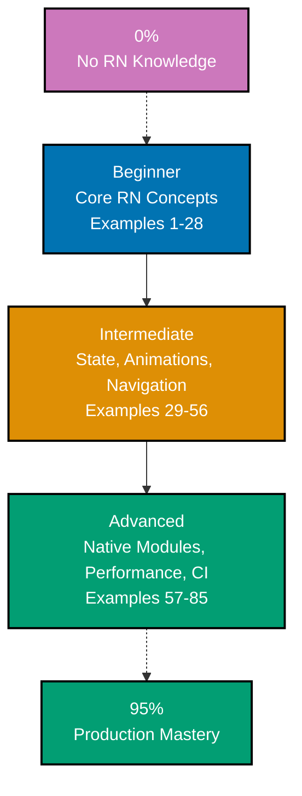
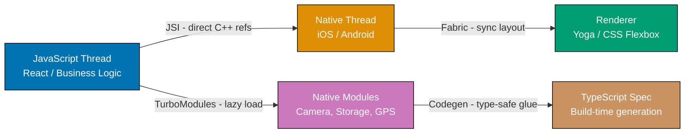

**Want to learn React Native through code?** This by-example tutorial provides 85 heavily annotated examples covering 95% of React Native + Expo. Master mobile development idioms, New Architecture patterns, and production deployment through working code rather than lengthy explanations.

## What Is By-Example Learning?

By-example learning is a **code-first approach** where you learn concepts through annotated, working examples rather than narrative explanations. Each example shows:

1. **What the code does** - Brief explanation of the React Native concept
2. **How it works** - A focused, heavily commented code example
3. **Key Takeaway** - A pattern summary highlighting the key takeaway
4. **Why It Matters** - Production context, when to use, deeper significance

This approach works best when you already understand programming fundamentals and have some JavaScript or TypeScript experience. You learn React Native's component model, New Architecture, Expo Router, and native module system by studying real code rather than theoretical descriptions.

## What Is React Native?

React Native is a **framework for building native mobile applications** using React and TypeScript. Unlike web-targeted React, React Native compiles to native UI components on iOS and Android. Key distinctions:

- **Truly native**: UI components map to platform-native controls (UIView on iOS, View on Android), not web views
- **New Architecture (mandatory since 0.82)**: Fabric renderer, JSI, TurboModules, and Codegen provide high-performance native interop without the legacy bridge
- **Expo SDK**: Managed workflow providing pre-built native modules, EAS Build/Update/Submit, and a curated SDK for common device APIs
- **Cross-platform**: One TypeScript codebase targeting iOS, Android, and web (via Expo)
- **Flexbox by default**: Layout uses CSS Flexbox but with `flexDirection: 'column'` as default (opposite of web's `'row'`)

## Version Baseline

This tutorial targets:

- **React Native 0.85.x** (stable, April 2026) — New Architecture mandatory, legacy bridge permanently removed
- **Expo SDK 55** (February 2026) — New Architecture mandatory, React 19.2, Expo Router 55
- **React Navigation 7.2.2** — Static API, Screen Preloading
- **TypeScript 5.x** — strict mode throughout
- **Node.js 20.19.4+ / 22 / 24+**

## Learning Path



## Coverage Philosophy: 95% Through 85 Examples

The **95% coverage** means you understand React Native deeply enough to build and ship production applications. The 85 examples are organized progressively:

- **Beginner (Examples 1-28)**: Foundation — project setup, core components, layout, navigation basics, local persistence
- **Intermediate (Examples 29-56)**: Production patterns — animations, gestures, state management, camera, sensors, forms
- **Advanced (Examples 57-85)**: Mastery — native modules, performance profiling, testing, EAS, CI/CD, production checklist

Together, these examples cover **95% of what you will use** in production React Native applications.

## Annotation Density: 1-2.25 Comments Per Code Line

All examples maintain **1-2.25 comment lines per code line PER EXAMPLE** to ensure deep understanding.

**What this means**:

- Simple lines get 1 annotation explaining purpose or result
- Complex lines get 2+ annotations explaining behavior, state changes, and side effects
- Use `// =>` notation to show expected values, outputs, or state changes

**Example**:

```typescript
import { View, Text, StyleSheet } from "react-native"; // => core RN components
// => no DOM, maps to native widgets

const styles = StyleSheet.create({
  // => creates optimized StyleSheet
  container: {
    // => named style object
    flex: 1, // => fills all available space
    flexDirection: "column", // => COLUMN is the RN default (NOT 'row')
    justifyContent: "center", // => centers children vertically
    alignItems: "center", // => centers children horizontally
  },
});
```

This density ensures each example is self-contained and fully comprehensible without external documentation.

## New Architecture: Why It Matters

Since React Native 0.82, the **legacy bridge is permanently removed**. Every example in this tutorial assumes the New Architecture:



- **JSI (JavaScript Interface)**: Direct C++ references from JS — no JSON serialization, sub-millisecond interop
- **Fabric**: C++ shared rendering core enabling synchronous layout and React 18 concurrent features
- **TurboModules**: Lazy-loading native modules (load only when first accessed)
- **Codegen**: Build-time TypeScript spec → type-safe native glue, caught at compile time not runtime

## What Is Covered

### Foundation (Beginner)

- **Project setup**: Expo CLI, project structure, TypeScript config, path aliases
- **Core components**: View, Text, Image, TextInput, ScrollView, FlatList, SectionList
- **Layout**: Flexbox (column-default), gap/rowGap/columnGap, StyleSheet.create()
- **Navigation**: Expo Router file-based routing, Stack, Tabs, dynamic routes
- **Local data**: AsyncStorage, expo-font, expo-image, push notification setup

### Production Patterns (Intermediate)

- **Animations**: useAnimatedValue (RN 0.85), Reanimated 4, layout prop animation
- **Gestures**: react-native-gesture-handler 2.31.1, Pan, Tap, combined gestures
- **State management**: TanStack Query 5, Zustand 5, MMKV 4 synchronous storage
- **Device APIs**: Camera, location, sensors, haptics, image picker
- **Forms and navigation**: react-hook-form + zod, Drawer, auth guard, i18n

### Mastery (Advanced)

- **Native modules**: Nitro Modules, TurboModules + Codegen, Fabric custom views
- **VisionCamera V5**: Constraints API, frame processors (V5 breaks V4 Formats API)
- **Graphics**: React Native Skia, Reanimated shared element transitions
- **Performance**: Hermes profiler, Metro tree shaking, FlatList/FlashList tuning
- **Testing**: @react-native/jest-preset (extracted in RN 0.85), Detox E2E
- **Deployment**: EAS Build/Update/Submit, Fastlane, GitHub Actions CI, production checklist

## What Is NOT Covered

- **Advanced TypeScript internals**: Deep type system unrelated to React Native
- **Web-specific React**: DOM patterns, browser APIs, CSS-in-JS for web
- **Game development**: Unity, Unreal, game loop patterns
- **Machine learning inference**: On-device ML (separate tutorial)
- **Platform-specific Swift/Kotlin in depth**: Covered only as context for native module examples

For these topics, see dedicated tutorials and platform documentation.

## Prerequisites

### Required

- **JavaScript ES6+**: Arrow functions, destructuring, spread/rest, async/await
- **TypeScript basics**: Types, interfaces, generics, type inference
- **React fundamentals**: Components, props, state, hooks (useState, useEffect)
- **Programming experience**: You have built applications before

### Recommended

- **npm/npx basics**: Package installation, running scripts
- **Terminal familiarity**: Navigation, running commands
- **Mobile concepts**: iOS/Android development model awareness (helpful but not required)

### Not Required

- **React Native experience**: This guide assumes you are new to RN
- **Native development (Swift/Kotlin)**: Not needed for Expo managed workflow
- **Xcode/Android Studio**: Not required for Expo Go development

## Key Differences from Web React

Understanding these differences prevents the most common mistakes:

| Concept               | Web React          | React Native                                                         |
| --------------------- | ------------------ | -------------------------------------------------------------------- |
| Default flexDirection | `'row'`            | `'column'`                                                           |
| Base layout container | `<div>`            | `<View>`                                                             |
| Text rendering        | Any HTML element   | Must use `<Text>`                                                    |
| Styling               | CSS files / inline | `StyleSheet.create()` only                                           |
| Navigation            | React Router / URL | Expo Router / React Navigation                                       |
| Storage               | localStorage       | AsyncStorage / MMKV                                                  |
| Absolute fill         | N/A                | `StyleSheet.absoluteFill` (NOT absoluteFillObject — removed in 0.85) |

## How to Use This Guide

### 1. Choose Your Starting Point

- **New to React Native?** Start with Beginner (Example 1)
- **React/web developer?** Skim Beginner, start Intermediate (Example 29)
- **Building a specific feature?** Jump to the relevant example group

### 2. Read the Example

Each example has five parts:

- **Explanation** (1-3 sentences): What React Native concept, why it exists, when to use it
- **Code** (heavily commented): Working TypeScript code showing the pattern
- **Key Takeaway** (1-2 sentences): Distilled essence of the pattern
- **Why It Matters** (50-100 words): Production context and deeper significance

### 3. Run the Code

Create a test Expo project and run each example:

```bash
npx create-expo-app MyApp --template blank-typescript  # => creates managed Expo project
cd MyApp                                                # => enter project directory
npx expo start                                          # => start Metro bundler
# Scan QR code with Expo Go app on your phone
# Or press 'i' for iOS Simulator / 'a' for Android Emulator
```

### 4. Modify and Experiment

Change props, break animations, swap gesture handlers. Experimentation builds intuition faster than reading.

## Ready to Start?

Choose your learning path:

- **Beginner** - Start here if new to React Native. Build foundation understanding through 28 core examples covering project setup through push notifications.
- **Intermediate** - Jump here if you know RN basics. Master production patterns through 28 examples covering animations, state management, and device APIs.
- **Advanced** - Expert mastery through 29 examples covering native modules, VisionCamera, performance profiling, testing, and production deployment.
