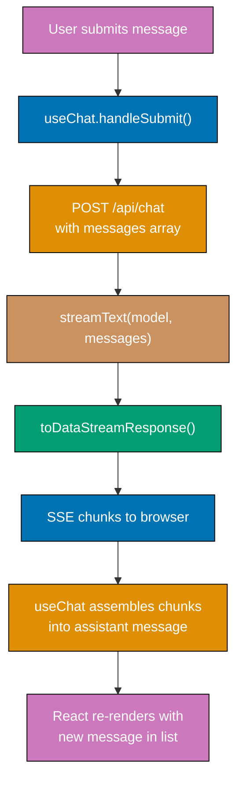

This beginner section covers the essential building blocks of AI application development through 28 heavily annotated examples. Each example maintains 1–2.25 comment lines per code line using `// =>` notation to show values, states, and effects.

## Prerequisites

Before starting, ensure you understand:

- TypeScript fundamentals (types, interfaces, async/await, generics)
- Next.js App Router basics (route handlers, Server/Client Components)
- npm package management and `.env.local` files

## Group 1: Text Generation Fundamentals

### Example 1: First API Call with generateText

`generateText` is the simplest entry point into the Vercel AI SDK. It sends a prompt to a model and waits for the complete response before returning — no streaming, no tools, just text.

```typescript
// lib/ai/first-call.ts
import { generateText } from "ai"; // => imports core generation function from ai@6.0.168
import { openai } from "@ai-sdk/openai"; // => imports OpenAI provider adapter

export async function askAI(question: string): Promise<string> {
  // => async function: returns a Promise that resolves to the LLM's answer

  const result = await generateText({
    // => blocks until full response arrives
    model: openai("gpt-4o"), // => selects GPT-4o as the language model
    prompt: question, // => the user's question string
    maxTokens: 512, // => caps response at 512 tokens (~380 words)
  });
  // => result shape: { text, usage, finishReason, warnings }

  return result.text;
  // => result.text is the model's raw string response
  // => e.g. "The capital of France is Paris."
}

// Usage:
// const answer = await askAI('What is the capital of France?');
// => answer is "The capital of France is Paris."
```

**Key Takeaway**: `generateText` is the synchronous-style AI call — it waits for the complete response and returns a typed result object with `.text`, `.usage`, and `.finishReason`.

**Why It Matters**: Most AI features start here. Understanding `generateText` gives you the foundation for everything else in the SDK. The provider-adapter pattern (`openai('gpt-4o')`) means you can swap providers by changing a single import — the rest of your code stays identical. Production apps use `generateText` for classification, summarization, and any task where you need the full answer before proceeding.

---

### Example 2: Streaming Text with streamText and for-await

`streamText` returns chunks of the response as they are generated, enabling real-time output. Server-side streaming with `for await` is useful for CLI tools, background jobs, and logging.

```typescript
// lib/ai/stream-text.ts
import { streamText } from "ai"; // => imports streaming generation function
import { openai } from "@ai-sdk/openai"; // => OpenAI provider adapter

export async function streamToConsole(prompt: string): Promise<void> {
  const result = await streamText({
    // => begins streaming immediately
    model: openai("gpt-4o"), // => GPT-4o produces output token-by-token
    prompt, // => shorthand: prompt: prompt
    maxTokens: 1024, // => max 1024 tokens in response
  });
  // => result.textStream is an AsyncIterable<string>
  // => each iteration yields the next text chunk (1–5 tokens typically)

  for await (const chunk of result.textStream) {
    // => loop runs once per streamed chunk from the model
    process.stdout.write(chunk);
    // => writes chunk without newline: "The", " capital", " of", " France", " is", " Paris"
  }
  // => after loop: full text has been written to stdout

  console.log("\n--- Stream complete ---");
  // => signals end of stream to the user

  const usage = await result.usage;
  // => usage resolves after stream ends: { promptTokens, completionTokens, totalTokens }
  console.log("Tokens used:", usage.totalTokens);
  // => e.g. "Tokens used: 87"
}
```

**Key Takeaway**: `streamText` returns an `AsyncIterable` you consume with `for await`, enabling you to process each text chunk as it arrives rather than waiting for the complete response.

**Why It Matters**: Streaming cuts perceived latency from seconds to milliseconds. Users see the first word almost instantly rather than staring at a blank screen for 3–5 seconds. Server-side `for await` streaming is ideal for log pipelines, CLI tools, and background summarization jobs where you need to process output progressively without a browser in the loop.

---

### Example 3: Streaming to HTTP Response with toDataStreamResponse

The canonical Next.js route handler pattern for AI streaming. `toDataStreamResponse()` produces a `Response` object that the Vercel AI SDK's React hooks (`useChat`, `useCompletion`) can consume automatically.

```typescript
// app/api/chat/route.ts
import { streamText } from "ai"; // => streaming generation function
import { openai } from "@ai-sdk/openai"; // => OpenAI provider adapter
import { NextRequest } from "next/server"; // => typed Next.js request

export const runtime = "edge"; // => optional: runs on Vercel Edge Network

export async function POST(req: NextRequest) {
  // => POST handler: called when browser sends chat message

  const { messages } = await req.json();
  // => messages: [{ role: 'user', content: 'Hello!' }]
  // => array of prior conversation turns

  const result = await streamText({
    // => NEVER use StreamingTextResponse — removed in ai@6
    model: openai("gpt-4o"), // => model selection
    messages, // => full conversation history
    maxTokens: 2048, // => safety cap on response length
  });
  // => result holds the stream, not yet consumed

  return result.toDataStreamResponse();
  // => converts stream to HTTP Response with correct Content-Type
  // => Content-Type: text/event-stream (Server-Sent Events)
  // => the useChat hook reads this format automatically
  // => CRITICAL: toDataStreamResponse() replaces deprecated StreamingTextResponse
}
```

**Key Takeaway**: Route handlers return `result.toDataStreamResponse()` — never the removed `StreamingTextResponse`. This produces an SSE response that Vercel AI SDK hooks parse automatically.

**Why It Matters**: This three-line pattern (`streamText` → `toDataStreamResponse` → `return`) is the backbone of every streaming chat endpoint in the ecosystem. Getting it right means all the React hooks work out of the box. The `StreamingTextResponse` removal in v6 is the most common migration breaking point — bookmark this pattern.

---

### Example 4: Direct OpenAI SDK — Basic Chat Completion

The OpenAI SDK (`openai@6.34.0`) gives direct access to OpenAI APIs without the Vercel AI SDK abstraction. Useful when you need OpenAI-specific features like Assistants, fine-tuned models, or precise token accounting.

```typescript
// lib/ai/openai-direct.ts
import OpenAI from "openai"; // => default export is the OpenAI client class

const client = new OpenAI({
  apiKey: process.env.OPENAI_API_KEY, // => reads from environment variable
  // => NEVER hardcode API keys: security risk and key rotation nightmare
});
// => client is a configured OpenAI API client

export async function chatCompletion(userMessage: string): Promise<string> {
  const completion = await client.chat.completions.create({
    // => creates a chat completion request (OpenAI's primary API endpoint)

    model: "gpt-4o", // => model identifier string (OpenAI naming)
    messages: [
      { role: "system", content: "You are a helpful assistant." },
      // => system message sets assistant behavior and persona

      { role: "user", content: userMessage },
      // => user message is the prompt to respond to
    ],
    max_tokens: 512, // => OpenAI SDK uses snake_case (not camelCase)
  });
  // => completion shape: { id, choices, usage, model, created }

  const text = completion.choices[0].message.content ?? "";
  // => choices[0] is the first (and usually only) completion
  // => message.content is the assistant's reply string
  // => ?? '' handles the null case (content can be null for tool calls)

  return text;
  // => e.g. "Hello! How can I assist you today?"
}
```

**Key Takeaway**: The OpenAI SDK uses `client.chat.completions.create()` with snake_case parameters. The response is in `completion.choices[0].message.content`.

**Why It Matters**: Sometimes you need the OpenAI SDK directly — for Assistants API, batch API, fine-tuned models, or OpenAI-specific parameters not exposed through the Vercel AI SDK abstraction. Knowing both APIs lets you choose the right tool for each job. The OpenAI SDK has 8.8M weekly downloads and is the most deployed AI client in production.

---

### Example 5: Direct OpenAI SDK — Streaming with for-await on SSE

The OpenAI SDK's streaming returns an async iterable of event objects. Each event contains a delta (the incremental text chunk), not the full response.

```typescript
// lib/ai/openai-stream.ts
import OpenAI from "openai"; // => OpenAI client

const client = new OpenAI({ apiKey: process.env.OPENAI_API_KEY });
// => client configured from environment

export async function streamOpenAI(prompt: string): Promise<void> {
  const stream = await client.chat.completions.create({
    model: "gpt-4o", // => model selection
    messages: [{ role: "user", content: prompt }],
    // => single-turn conversation

    stream: true, // => enables SSE streaming mode
    // => without stream: true, create() returns the full completion
  });
  // => stream is an AsyncIterable of ChatCompletionChunk events

  for await (const event of stream) {
    // => iterates over each SSE event as it arrives

    const delta = event.choices[0]?.delta?.content;
    // => delta is the incremental text chunk for this event
    // => e.g. "Hello", " there", "!", undefined (for final empty chunk)
    // => optional chaining (?.) guards against missing fields

    if (delta) {
      process.stdout.write(delta); // => writes chunk without newline
      // => outputs: "Hello there!" character by character
    }
  }
  // => loop ends when OpenAI sends the [DONE] SSE event

  console.log("\nStream finished.");
  // => signals completion to the user
}
```

**Key Takeaway**: OpenAI SDK streaming uses `stream: true` and returns an `AsyncIterable<ChatCompletionChunk>`. Each chunk has `choices[0].delta.content` as the incremental text.

**Why It Matters**: The OpenAI SDK's streaming model is subtly different from the Vercel AI SDK's — you get raw SSE events rather than a pre-parsed text stream. Understanding this difference prevents confusion when reading OpenAI SDK examples and helps you debug streaming issues in production when raw event logs show the actual SSE protocol.

---

## Group 2: Chat UI Patterns

### Example 6: Chat UI with useChat Hook in Next.js App Router

`useChat` is the primary React hook for building chat interfaces. It manages message state, calls your route handler, and handles streaming automatically.


```typescript
// app/chat/page.tsx
'use client';                            // => Client Component: uses browser hooks
import { useChat } from 'ai/react';     // => import from ai/react subpath

export default function ChatPage() {
  const {
    messages,                            // => Message[]: full conversation history
    input,                               // => string: current text-input field value
    handleInputChange,                   // => (e) => void: syncs input state to field
    handleSubmit,                        // => (e) => void: sends message to /api/chat
    isLoading,                           // => boolean: true while waiting for response
    error,                               // => Error | undefined: last request error
  } = useChat({
    api: '/api/chat',                    // => POST endpoint (defaults to /api/chat)
  });
  // => useChat manages all message state and fetch lifecycle

  return (
    <div className="flex flex-col h-screen p-4">
      <div className="flex-1 overflow-y-auto space-y-2">
        {messages.map((msg) => (          // => renders each message in conversation
          <div
            key={msg.id}                  // => msg.id is unique UUID from SDK
            className={msg.role === 'user' ? 'text-right' : 'text-left'}
            // => right-align user messages, left-align assistant
          >
            <span className="font-bold capitalize">{msg.role}:</span>
            {/* => displays "user:" or "assistant:" label */}
            <span className="ml-2">{msg.content}</span>
            {/* => msg.content is the text of this message */}
          </div>
        ))}
        {isLoading && <div className="text-gray-400">Thinking...</div>}
        {/* => shows loading indicator while model generates */}
      </div>

      <form onSubmit={handleSubmit} className="flex gap-2 mt-4">
        {/* => handleSubmit intercepts form submit, calls /api/chat */}
        <input
          value={input}                   // => controlled input bound to useChat state
          onChange={handleInputChange}    // => updates input state on each keystroke
          placeholder="Ask anything..."
          className="flex-1 border rounded px-3 py-2"
          disabled={isLoading}            // => prevents sending while model responds
        />
        <button type="submit" disabled={isLoading}>
          Send
        </button>
      </form>

      {error && (
        <p className="text-red-600 mt-2">Error: {error.message}</p>
        // => displays error message if request fails
      )}
    </div>
  );
}
```

**Key Takeaway**: `useChat` from `ai/react` handles the full chat lifecycle — message state, HTTP streaming, and error handling — with a simple hook API. Pair it with the route handler from Example 3.

**Why It Matters**: Building streaming chat from scratch requires SSE parsing, state management, concurrent update handling, and error recovery. `useChat` eliminates all of that in a single hook. Production chat UIs at scale use exactly this pattern — the hook's optimistic updates and streaming message assembly are production-hardened across thousands of deployments.

---

### Example 7: System Prompts and Message Roles

The three message roles — `system`, `user`, `assistant` — give you full control over model behavior. System prompts shape persona, constraints, and output format.

```typescript
// lib/ai/system-prompts.ts
import { generateText } from "ai";
import { openai } from "@ai-sdk/openai";

export async function classifyWithSystem(text: string): Promise<string> {
  const result = await generateText({
    model: openai("gpt-4o"),

    system: `You are a precise text classifier.
Respond ONLY with one of these labels: POSITIVE, NEGATIVE, NEUTRAL.
Do not include any explanation or punctuation.`,
    // => system message sets strict output format
    // => model follows these instructions for the entire conversation
    // => system content is not shown to users in chat UIs

    prompt: text,
    // => user content: the text to classify
    // => short-form: equivalent to messages: [{ role: 'user', content: text }]

    maxTokens: 10,
    // => 10 tokens is enough for a single-word label
    // => low maxTokens prevents unexpected long responses
  });
  // => result.text is one of "POSITIVE", "NEGATIVE", "NEUTRAL"

  return result.text.trim();
  // => .trim() removes any trailing whitespace or newlines
  // => e.g. "POSITIVE" for "I love this product!"
}

// Example with explicit messages array (equivalent form):
export async function chatWithHistory(userQuestion: string): Promise<string> {
  const result = await generateText({
    model: openai("gpt-4o"),
    messages: [
      {
        role: "system", // => 'system' sets overall behavior
        content: "You are a Sharia finance expert. Answer concisely.",
      },
      {
        role: "user", // => 'user' is the human turn
        content: userQuestion, // => the question to answer
      },
    ],
    // => messages array gives full control over conversation structure
  });

  return result.text;
  // => the assistant's answer to userQuestion
}
```

**Key Takeaway**: Use `system` to set persistent behavior rules, `user` for human input, and `assistant` for prior model turns. The `system` role is the primary lever for controlling output format and model persona.

**Why It Matters**: System prompts are the most powerful customization tool available without fine-tuning. A well-crafted system prompt can enforce output format, prevent off-topic responses, set tone, and dramatically improve consistency. Production apps invest significant engineering effort in system prompt design and versioning — treating them as first-class application code, not an afterthought.

---

### Example 8: Multi-Turn Conversation — Managing Messages Array

Multi-turn chat requires accumulating the full conversation history and sending it with each request. LLMs are stateless — they only know what you send them.

```typescript
// lib/ai/multi-turn.ts
import { generateText } from "ai";
import { openai } from "@ai-sdk/openai";
import type { CoreMessage } from "ai"; // => CoreMessage: { role, content } union type

// In-memory conversation store (use database in production)
const conversations = new Map<string, CoreMessage[]>();
// => Map<sessionId, messages[]> stores conversation per user session

export async function chat(sessionId: string, userInput: string): Promise<string> {
  // => sessionId: unique string identifying this user's conversation

  const history = conversations.get(sessionId) ?? [];
  // => retrieves existing history, or starts fresh with empty array
  // => e.g. history: [{ role: 'user', content: 'Hello' }, { role: 'assistant', content: 'Hi!' }]

  const messages: CoreMessage[] = [
    ...history, // => spread all prior turns
    { role: "user", content: userInput }, // => append the new user message
  ];
  // => messages now contains the FULL conversation history including new input

  const result = await generateText({
    model: openai("gpt-4o"),
    messages, // => send entire history to model
    // => model "remembers" conversation by reading all prior messages
  });
  // => result.text is the model's response to the full conversation context

  const updatedHistory: CoreMessage[] = [
    ...messages, // => include all previous messages
    { role: "assistant", content: result.text }, // => append model's response
  ];
  // => updatedHistory: full conversation including new assistant reply

  conversations.set(sessionId, updatedHistory);
  // => persist updated history for next turn

  return result.text;
  // => return just the new response to the caller
}
```

**Key Takeaway**: LLMs are stateless — you must send the complete conversation history with every request. Accumulate `CoreMessage[]` and spread it into each `generateText` call.

**Why It Matters**: Every chatbot, assistant, and agent built on LLMs implements this pattern. Understanding that the model has no memory and you must manage state yourself is the single most important mental model shift in AI application development. In production, conversation history lives in a database (Redis, PostgreSQL) keyed by session ID, with token budget management to prune old messages when approaching context limits.

---

### Example 9: Switching Models — Provider Swap Pattern

The Vercel AI SDK's provider abstraction means switching from OpenAI to Anthropic requires changing one line. All other code stays identical.

```typescript
// lib/ai/provider-swap.ts
import { generateText } from "ai";
import { openai } from "@ai-sdk/openai"; // => OpenAI provider
import { anthropic } from "@ai-sdk/anthropic"; // => Anthropic provider

const PROMPT = "Explain Zakat calculation in one sentence.";
// => same prompt used for both providers

export async function withOpenAI(): Promise<string> {
  const result = await generateText({
    model: openai("gpt-4o"), // => OpenAI GPT-4o
    prompt: PROMPT,
  });
  return result.text;
  // => "Zakat is 2.5% of savings held for one lunar year above the nisab threshold."
}

export async function withAnthropic(): Promise<string> {
  const result = await generateText({
    model: anthropic("claude-sonnet-4-5"), // => Anthropic Claude — ONLY this line changed
    prompt: PROMPT,
    // => identical prompt, identical result shape
  });
  return result.text;
  // => "Zakat requires paying 2.5% of qualifying wealth held above nisab for a full lunar year."
}

// Runtime provider selection based on environment:
export async function withEnvProvider(): Promise<string> {
  const provider = process.env.AI_PROVIDER ?? "openai";
  // => reads provider from env variable, defaults to 'openai'

  const model =
    provider === "anthropic"
      ? anthropic("claude-sonnet-4-5") // => Anthropic model
      : openai("gpt-4o"); // => OpenAI model (default)
  // => model variable holds whichever provider was selected

  const result = await generateText({ model, prompt: PROMPT });
  // => identical call regardless of provider
  return result.text;
}
```

**Key Takeaway**: The Vercel AI SDK's provider model (`openai(...)`, `anthropic(...)`) abstracts away vendor differences. Swap providers by changing the model argument — nothing else changes.

**Why It Matters**: Provider lock-in is a real risk in AI applications. OpenAI prices change, models deprecate, and outages happen. The provider-swap pattern lets you hedge by making switching a one-line change rather than a rewrite. Teams use this for A/B testing models, fallback strategies (see Example 56), and cost optimization — routing cheaper models to simple tasks and expensive models to complex ones.

---

### Example 10: Temperature, maxTokens, and Model Settings

Model parameters control response randomness, length, and behavior. Understanding these levers lets you tune output quality for your specific use case.

```typescript
// lib/ai/model-settings.ts
import { generateText } from "ai";
import { openai } from "@ai-sdk/openai";

export async function deterministicSummary(text: string): Promise<string> {
  const result = await generateText({
    model: openai("gpt-4o"),
    prompt: `Summarize this in exactly 2 sentences: ${text}`,

    temperature: 0,
    // => 0 = fully deterministic: same input → same output every time
    // => 1.0 = default: moderate creativity
    // => 2.0 = maximum randomness (rarely useful)

    maxTokens: 150,
    // => hard cap: response truncates at 150 tokens
    // => 1 token ≈ 0.75 words in English
    // => 150 tokens ≈ 112 words (enough for 2 sentences)

    topP: 1,
    // => nucleus sampling: consider tokens in top 100% probability mass
    // => lower values (e.g. 0.9) restrict vocabulary to most likely tokens

    frequencyPenalty: 0.3,
    // => penalizes repeated tokens: 0 = no penalty, 2 = maximum penalty
    // => 0.3: gently discourages word repetition in summaries

    presencePenalty: 0,
    // => penalizes any token that appeared before: 0 = disabled
    // => higher values encourage new topics (useful for creative tasks)
  });
  // => result.finishReason: 'stop' (natural end) or 'length' (hit maxTokens)

  if (result.finishReason === "length") {
    console.warn("Response truncated — increase maxTokens");
    // => warns developer if the summary was cut off
  }

  return result.text;
  // => deterministic 2-sentence summary
}
```

**Key Takeaway**: `temperature: 0` gives deterministic output ideal for classification and structured tasks. `maxTokens` prevents runaway costs. `frequencyPenalty` reduces repetition in long outputs.

**Why It Matters**: Default parameters produce acceptable output for demos but not production. Summarization needs `temperature: 0` for consistency. Creative writing needs `temperature: 0.8+`. Structured output needs `temperature: 0` with explicit format instructions. Controlling `maxTokens` is also a cost-control mechanism — an uncapped generation can produce 4096 tokens when you only needed 50, multiplying per-request costs by 80x.

---

### Example 11: Text Completion with useCompletion Hook

`useCompletion` is for non-chat completion UIs — single-prompt, single-response. It is simpler than `useChat` and suited for autocomplete, text expansion, and generation widgets.

```typescript
// app/complete/page.tsx
'use client';
import { useCompletion } from 'ai/react'; // => imports completion hook

export default function CompletionPage() {
  const {
    completion,                           // => string: the streamed completion text so far
    input,                                // => string: current input field value
    handleInputChange,                    // => syncs input to state
    handleSubmit,                         // => submits to /api/completion
    isLoading,                            // => true while generating
    error,                                // => Error | undefined
  } = useCompletion({
    api: '/api/completion',              // => GET/POST endpoint for completion
    // => unlike useChat, manages a single prompt → completion cycle
  });
  // => useCompletion: no message history, just prompt → streamed text

  return (
    <div className="p-6 max-w-2xl mx-auto">
      <form onSubmit={handleSubmit} className="space-y-4">
        <textarea
          value={input}
          onChange={handleInputChange}    // => updates input on keystroke
          placeholder="Start a sentence and let AI complete it..."
          rows={3}
          className="w-full border rounded p-3"
        />
        <button
          type="submit"
          disabled={isLoading}
          className="px-4 py-2 bg-blue-600 text-white rounded"
        >
          {isLoading ? 'Generating...' : 'Complete'}
          {/* => button label changes based on loading state */}
        </button>
      </form>

      {completion && (
        <div className="mt-6 p-4 bg-gray-50 rounded">
          <h2 className="font-semibold mb-2">Completion:</h2>
          <p className="whitespace-pre-wrap">{completion}</p>
          {/* => completion streams in character by character */}
          {/* => whitespace-pre-wrap preserves line breaks */}
        </div>
      )}

      {error && (
        <p className="mt-4 text-red-600">Error: {error.message}</p>
        // => displays error if API call fails
      )}
    </div>
  );
}
```

**Key Takeaway**: `useCompletion` is the single-prompt hook — no conversation history. It's simpler than `useChat` and streams the completion directly into the `completion` string.

**Why It Matters**: Not every AI feature is a chat. Blog post drafters, code completers, email subject-line generators, and SEO description writers are all single-prompt completion UIs. Using `useCompletion` instead of `useChat` for these keeps your code simpler and avoids unnecessary conversation history management overhead.

---

### Example 12: Environment Variable and API Key Management

Proper API key management is a security requirement, not a best practice. Keys must never appear in source code, client bundles, or version control.

```typescript
// lib/ai/env-config.ts
// This file shows the CORRECT pattern for environment variable management.
// Never import this file in client components — it accesses server-only secrets.

function getOpenAIKey(): string {
  const key = process.env.OPENAI_API_KEY;
  // => process.env is only available server-side (Node.js / Edge runtime)
  // => OPENAI_API_KEY is read from .env.local on localhost
  // => On Vercel: set in Project → Settings → Environment Variables

  if (!key) {
    throw new Error("OPENAI_API_KEY is not set. Add it to .env.local or Vercel env vars.");
    // => fail fast: crash at startup rather than at request time
    // => makes misconfiguration immediately obvious
  }

  return key;
  // => returns the validated key string
}

// .env.local (NEVER commit this file):
// OPENAI_API_KEY=sk-proj-...
// ANTHROPIC_API_KEY=sk-ant-api03-...
// => .env.local is gitignored by default in Next.js

// .env.example (SAFE to commit — shows structure without values):
// OPENAI_API_KEY=your-openai-key-here
// ANTHROPIC_API_KEY=your-anthropic-key-here

export function createOpenAIConfig() {
  return {
    apiKey: getOpenAIKey(), // => validates key exists before use
  };
  // => return value used to initialize SDK clients
}

// WRONG — never do this:
// const client = new OpenAI({ apiKey: 'sk-proj-actual-key-here' });
// => hardcoded key: will be exposed in git history forever, even after deletion
```

**Key Takeaway**: API keys go in `.env.local` (never committed), validated at startup with a clear error message. Client-side code must never access `process.env` secrets.

**Why It Matters**: Exposed API keys are immediately scraped by bots that monitor public GitHub commits. A leaked OpenAI key can accumulate thousands of dollars in charges within hours. Next.js's `NEXT_PUBLIC_` prefix convention makes client vs server environment variables explicit — any variable without that prefix is server-only. Add `.env.local` to `.gitignore` (already there by default) and add `.env.example` with placeholder values for onboarding new developers.

---

### Example 13: Building a Simple Q&A Endpoint

A minimal Next.js route handler that accepts a question, calls the AI, and returns the answer as JSON. The simplest useful AI API pattern.

```typescript
// app/api/qa/route.ts
import { generateText } from "ai";
import { openai } from "@ai-sdk/openai";
import { NextRequest, NextResponse } from "next/server";

export async function POST(req: NextRequest) {
  // => handles POST /api/qa

  const body = await req.json();
  // => parses JSON request body: { question: string }

  const { question } = body as { question: string };
  // => extracts question from body
  // => in production: validate with Zod (see Example 24)

  if (!question || typeof question !== "string") {
    return NextResponse.json(
      { error: "question is required and must be a string" },
      { status: 400 },
      // => 400 Bad Request: client sent invalid data
    );
  }
  // => input validation before calling AI (saves tokens on bad requests)

  const result = await generateText({
    model: openai("gpt-4o"),
    system: "Answer concisely in 1-3 sentences. Be factual.",
    // => system prompt constrains response length and style

    prompt: question,
    maxTokens: 256, // => 256 tokens ≈ 192 words (sufficient for 3 sentences)
  });
  // => result.text is the model's answer

  return NextResponse.json({
    answer: result.text, // => the AI's response
    usage: {
      promptTokens: result.usage.promptTokens,
      // => tokens used for the input (question + system prompt)
      completionTokens: result.usage.completionTokens,
      // => tokens used for the output (the answer)
      totalTokens: result.usage.totalTokens,
      // => sum: used for cost tracking
    },
  });
  // => response: { answer: string, usage: { ... } }
}
```

**Key Takeaway**: A Q&A endpoint needs input validation, a system prompt for consistency, `maxTokens` for cost control, and usage data in the response for monitoring.

**Why It Matters**: This pattern is the building block for AI-powered search, FAQ bots, and customer support tools. Returning usage data in every response enables accurate cost attribution — essential for multi-tenant SaaS apps where you need to track AI costs per user or organization. The pattern also establishes the habit of input validation before AI calls, preventing wasted tokens on malformed requests.

---

### Example 14: Error Handling and Rate Limits with try/catch

AI API calls fail in predictable ways: rate limits, invalid API keys, model unavailability, and context length exceeded. Proper error handling makes apps resilient.

```typescript
// lib/ai/error-handling.ts
import { generateText } from "ai";
import { openai } from "@ai-sdk/openai";

export async function generateWithRetry(prompt: string, maxRetries = 3): Promise<string> {
  let lastError: Error | null = null;
  // => tracks the last error for final throw if all retries fail

  for (let attempt = 1; attempt <= maxRetries; attempt++) {
    // => attempt 1, 2, 3: try up to maxRetries times

    try {
      const result = await generateText({
        model: openai("gpt-4o"),
        prompt,
        maxTokens: 512,
      });
      // => if successful, returns immediately without retrying
      return result.text;
      // => e.g. "Your answer here..."
    } catch (error) {
      lastError = error as Error;
      // => captures the error for inspection

      const isRateLimit = lastError.message.includes("429") || lastError.message.includes("rate limit");
      // => 429 Too Many Requests: OpenAI rate limit exceeded

      const isServerError = lastError.message.includes("500") || lastError.message.includes("503");
      // => 5xx: transient server errors worth retrying

      if (!isRateLimit && !isServerError) {
        throw lastError;
        // => auth errors (401), invalid model (404): don't retry, fail fast
      }

      const delay = Math.min(1000 * Math.pow(2, attempt - 1), 8000);
      // => exponential backoff: 1s, 2s, 4s (capped at 8s)
      // => prevents hammering the API during an outage

      console.warn(`Attempt ${attempt} failed, retrying in ${delay}ms...`);
      await new Promise((resolve) => setTimeout(resolve, delay));
      // => waits before retrying
    }
  }

  throw new Error(`All ${maxRetries} attempts failed: ${lastError?.message}`);
  // => all retries exhausted: propagate error to caller
}
```

**Key Takeaway**: Retry rate limits and server errors with exponential backoff. Fail fast on auth errors and invalid requests. Cap retries at 3 with increasing delays.

**Why It Matters**: Production AI apps hit rate limits under normal load — especially OpenAI's tier-based limits for new accounts. Without retry logic, a brief rate limit period causes cascading failures. Exponential backoff is the industry-standard mitigation. The key insight is knowing which errors to retry (429, 503) versus which indicate bugs to fix immediately (401, 400).

---

### Example 15: Counting Tokens and Tracking Usage

Token usage drives AI costs. `generateText` returns exact usage counts after each call — use them for cost tracking, analytics, and budget enforcement.

```typescript
// lib/ai/token-tracking.ts
import { generateText } from "ai";
import { openai } from "@ai-sdk/openai";

interface UsageRecord {
  promptTokens: number;
  completionTokens: number;
  totalTokens: number;
  estimatedCostUSD: number;
}

// GPT-4o pricing as of 2026 (check OpenAI pricing page for current rates)
const GPT4O_COST_PER_1K_INPUT = 0.0025; // => $0.0025 per 1K input tokens
const GPT4O_COST_PER_1K_OUTPUT = 0.01; // => $0.010 per 1K output tokens

export async function generateWithCostTracking(
  prompt: string,
  systemPrompt?: string,
): Promise<{ text: string; usage: UsageRecord }> {
  const result = await generateText({
    model: openai("gpt-4o"),
    system: systemPrompt,
    prompt,
    maxTokens: 512,
  });
  // => result.usage: { promptTokens, completionTokens, totalTokens }

  const { promptTokens, completionTokens, totalTokens } = result.usage;
  // => promptTokens: tokens in the input (system + prompt)
  // => completionTokens: tokens in the output (model's response)
  // => totalTokens: promptTokens + completionTokens

  const estimatedCostUSD =
    (promptTokens / 1000) * GPT4O_COST_PER_1K_INPUT + (completionTokens / 1000) * GPT4O_COST_PER_1K_OUTPUT;
  // => cost formula: (inputTokens/1000 * inputRate) + (outputTokens/1000 * outputRate)
  // => e.g. 500 prompt + 200 completion = $0.00325

  const usage: UsageRecord = {
    promptTokens,
    completionTokens,
    totalTokens,
    estimatedCostUSD: Math.round(estimatedCostUSD * 1_000_000) / 1_000_000,
    // => round to 6 decimal places: $0.003250
  };

  console.log(`Usage: ${totalTokens} tokens | Cost: $${usage.estimatedCostUSD}`);
  // => e.g. "Usage: 700 tokens | Cost: $0.003250"

  return { text: result.text, usage };
  // => returns both the response text and the usage record
}
```

**Key Takeaway**: `result.usage` provides exact token counts after every `generateText` call. Use these to calculate costs, enforce per-user budgets, and identify expensive prompts.

**Why It Matters**: Token costs accumulate fast in production. A system prompt that is 500 tokens long, called 10,000 times per day, costs $12.50/day in input tokens alone — $4,500/year just for the system prompt. Tracking usage per feature, per user, and per model lets you identify cost hotspots and optimize aggressively. This data belongs in your analytics pipeline from day one, not as an afterthought.

---

## Group 3: Prompt Engineering Patterns

### Example 16: Prompt Templates with TypeScript Template Literals

Parameterized prompts make AI behavior reusable and testable. TypeScript template literals provide type-safe prompt construction.

```typescript
// lib/ai/prompt-templates.ts
import { generateText } from "ai";
import { openai } from "@ai-sdk/openai";

interface SummaryOptions {
  text: string; // => content to summarize
  maxWords: number; // => target word count
  style: "bullet" | "paragraph" | "executive"; // => output format
  audience: string; // => target reader description
}

function buildSummaryPrompt(opts: SummaryOptions): string {
  // => builds a parameterized prompt string
  return `
Summarize the following text for ${opts.audience}.

Format: ${
    opts.style === "bullet"
      ? "Use bullet points (- item)"
      : opts.style === "executive"
        ? "Executive summary paragraph, formal tone"
        : "One continuous paragraph"
  }
Target length: approximately ${opts.maxWords} words.

Text to summarize:
${opts.text}
`.trim();
  // => .trim() removes leading/trailing whitespace from template literal
  // => produces a clean, formatted prompt string
}
// => e.g. for audience='developers', style='bullet', maxWords=50:
// => "Summarize the following text for developers.\n\nFormat: Use bullet points..."

export async function summarize(opts: SummaryOptions): Promise<string> {
  const prompt = buildSummaryPrompt(opts);
  // => prompt is the assembled string

  const result = await generateText({
    model: openai("gpt-4o"),
    prompt,
    temperature: 0, // => deterministic output for consistent summaries
    maxTokens: opts.maxWords * 2,
    // => generous token budget: maxWords * 2 handles token-to-word ratio variation
  });

  return result.text;
  // => the formatted summary matching the requested style and audience
}
```

**Key Takeaway**: Extract prompt construction into typed functions that take structured options. This makes prompts testable, reusable, and safe from injection via template literal boundaries.

**Why It Matters**: Inline prompt strings scattered through business logic become unmaintainable quickly. Centralizing prompts as typed functions enables prompt versioning, A/B testing, and automated testing of prompt variations. The TypeScript type system catches invalid option combinations at compile time, preventing runtime prompt construction bugs that are hard to debug in production.

---

### Example 17: Streaming to the Browser via Route Handler SSE

This shows the complete server-to-browser streaming flow: the route handler streams SSE, and the client receives incremental text via the native `EventSource` API (without React hooks).

```typescript
// app/api/stream/route.ts — Server side
import { streamText } from "ai";
import { openai } from "@ai-sdk/openai";
import { NextRequest } from "next/server";

export async function POST(req: NextRequest) {
  const { prompt } = await req.json();
  // => extracts prompt from request body

  const result = await streamText({
    model: openai("gpt-4o"),
    prompt,
    maxTokens: 1024,
  });
  // => result holds the pending stream

  return result.toDataStreamResponse({
    headers: {
      "Cache-Control": "no-cache", // => prevent caching of streaming response
      Connection: "keep-alive", // => maintain persistent HTTP connection
    },
  });
  // => returns SSE Response — browser receives text/event-stream
  // => each chunk: "data: {text chunk}\n\n"
}
```

**Client-side consuming the SSE without React (vanilla JS)**:

```typescript
// lib/client/stream-reader.ts — runs in browser
export async function streamFromAPI(prompt: string): Promise<void> {
  const response = await fetch("/api/stream", {
    method: "POST",
    headers: { "Content-Type": "application/json" },
    body: JSON.stringify({ prompt }),
    // => sends POST with prompt in body
  });
  // => response is a ReadableStream (streaming HTTP response)

  const reader = response.body!.getReader();
  // => creates a ReadableStreamDefaultReader
  const decoder = new TextDecoder();
  // => decodes Uint8Array chunks to strings

  while (true) {
    const { done, value } = await reader.read();
    // => reads next chunk: { done: boolean, value: Uint8Array | undefined }

    if (done) break;
    // => stream ended: exit loop

    const text = decoder.decode(value, { stream: true });
    // => decodes bytes to string, stream: true handles multi-byte chars
    console.log("Chunk:", text);
    // => e.g. "Chunk: data: Hello\n\n"
  }
}
```

**Key Takeaway**: `toDataStreamResponse()` on the server + `fetch` + `ReadableStream` on the client is the low-level streaming pipeline. React hooks (`useChat`) wrap exactly this pattern.

**Why It Matters**: Understanding the underlying SSE protocol and ReadableStream API demystifies how `useChat` works and enables you to build non-React streaming UIs (Vue, Svelte, vanilla JS). It also helps debug streaming issues — when the hook behaves unexpectedly, you can drop down to raw `fetch` to isolate whether the problem is server-side or client-side.

---

### Example 18: Streaming with ReadableStream in Node.js

For non-Next.js backends (Express, Fastify, bare Node.js), `toReadableStream()` converts the Vercel AI SDK stream into a standard Node.js `ReadableStream`.

```typescript
// server/express-stream.ts — Express.js example
import express from "express";
import { streamText } from "ai";
import { openai } from "@ai-sdk/openai";

const app = express();
app.use(express.json());

app.post("/stream", async (req, res) => {
  // => POST /stream: accepts { prompt } and streams response

  const { prompt } = req.body;
  // => extracts prompt from Express request body

  const result = await streamText({
    model: openai("gpt-4o"),
    prompt,
    maxTokens: 1024,
  });
  // => result.toReadableStream() converts AI stream to Node.js ReadableStream

  res.setHeader("Content-Type", "text/event-stream");
  // => tells client this is an SSE response

  res.setHeader("Cache-Control", "no-cache");
  // => prevents proxy caching of streaming response

  res.setHeader("Connection", "keep-alive");
  // => keeps TCP connection open for streaming

  const readable = result.toReadableStream();
  // => Node.js ReadableStream: compatible with res.pipe()
  // => toReadableStream() is for non-Next.js environments
  // => In Next.js: use toDataStreamResponse() instead

  for await (const chunk of readable) {
    // => iterates Node.js ReadableStream chunks
    res.write(chunk); // => writes each chunk to Express response
  }

  res.end();
  // => signals end of streaming response to client
});

app.listen(3000);
// => Express server listens on port 3000
```

**Key Takeaway**: Use `toReadableStream()` for non-Next.js servers (Express, Fastify). Use `toDataStreamResponse()` for Next.js route handlers.

**Why It Matters**: The Vercel AI SDK is not Next.js-specific. Many teams run Express or Fastify backends with separate React frontends, or use the SDK in CLI tools and background workers. `toReadableStream()` bridges the gap between the AI SDK's streaming model and Node.js's native stream API, enabling streaming in any Node.js server without framework-specific wrappers.

---

### Example 19: Abort Signal and Request Cancellation

Long AI generations can be cancelled by the user or timed out server-side using `AbortController`. This prevents wasted tokens and hanging requests.

```typescript
// lib/ai/cancellation.ts
import { streamText } from "ai";
import { openai } from "@ai-sdk/openai";

export async function streamWithTimeout(
  prompt: string,
  timeoutMs = 15000, // => default 15 second timeout
): Promise<string> {
  const controller = new AbortController();
  // => AbortController provides a signal that can cancel async operations

  const timeoutId = setTimeout(() => {
    controller.abort(new Error(`Generation timed out after ${timeoutMs}ms`));
    // => calls abort() after timeout: cancels the AI request
    // => passes an Error as the abort reason
  }, timeoutMs);
  // => setTimeout schedules the abort after timeoutMs milliseconds

  try {
    const result = await streamText({
      model: openai("gpt-4o"),
      prompt,
      maxTokens: 2048,
      abortSignal: controller.signal, // => passes signal to AI SDK
      // => SDK monitors signal.aborted: cancels HTTP request if true
    });
    // => result is the stream, tied to controller.signal

    let text = "";
    for await (const chunk of result.textStream) {
      text += chunk; // => accumulates streamed chunks
    }
    // => loop ends naturally if model finishes before timeout

    clearTimeout(timeoutId);
    // => cancel the timeout timer since generation succeeded

    return text;
    // => returns complete generated text
  } catch (error) {
    if ((error as Error).name === "AbortError") {
      throw new Error("Generation cancelled: timeout exceeded");
      // => converts AbortError to user-friendly message
    }
    throw error;
    // => re-throw other errors (network failures, API errors)
  }
}

// Client-side cancel on user action:
export function createCancellableGeneration() {
  const controller = new AbortController();
  // => controller for user-initiated cancellation

  const cancel = () => controller.abort();
  // => call cancel() to stop generation immediately

  return { controller, cancel };
  // => return both: pass controller.signal to SDK, expose cancel to UI
}
```

**Key Takeaway**: Pass `AbortController.signal` to `abortSignal` to cancel AI requests on timeout or user action. Clean up the timer with `clearTimeout` on success.

**Why It Matters**: Without cancellation, a user who navigates away from a page leaves an active AI generation running, burning tokens and holding server resources. In production, implement both client-side cancellation (user clicks "Stop") and server-side timeouts (prevent runaway generations). The `AbortController` pattern is universal — it works with `fetch`, AI SDK, and any async operation that accepts an `AbortSignal`.

---

### Example 20: Image Input to a Vision Model

Vision models (GPT-4o, Claude) accept images alongside text. This enables document analysis, screenshot understanding, and multimodal search.

```typescript
// lib/ai/vision.ts
import { generateText } from "ai";
import { openai } from "@ai-sdk/openai";

export async function analyzeImageFromURL(imageUrl: string): Promise<string> {
  const result = await generateText({
    model: openai("gpt-4o"), // => gpt-4o supports vision
    messages: [
      {
        role: "user",
        content: [
          {
            type: "image", // => image content part
            image: new URL(imageUrl), // => URL to the image
            // => AI SDK handles image URL fetching
          },
          {
            type: "text", // => text content part (in same message)
            text: "Describe what you see in this image in detail.",
            // => the question/instruction for the model
          },
        ],
        // => content array enables multimodal messages
        // => text + image in one user turn
      },
    ],
    maxTokens: 512,
  });
  // => result.text is the model's description of the image

  return result.text;
  // => e.g. "The image shows a bar chart with monthly revenue data..."
}

export async function analyzeImageFromBase64(
  base64Data: string,
  mimeType: "image/jpeg" | "image/png" | "image/webp" = "image/jpeg",
): Promise<string> {
  const result = await generateText({
    model: openai("gpt-4o"),
    messages: [
      {
        role: "user",
        content: [
          {
            type: "image",
            image: base64Data, // => base64 string (without data: prefix)
            mimeType, // => MIME type required for base64 images
            // => supports jpeg, png, webp, gif
          },
          {
            type: "text",
            text: "Extract all text visible in this image.",
            // => OCR-style instruction
          },
        ],
      },
    ],
    maxTokens: 1024,
  });

  return result.text;
  // => extracted text from the image
}
```

**Key Takeaway**: Vision models accept `content` arrays with `{ type: 'image', image: URL | base64 }` alongside `{ type: 'text', text: '...' }` in the same message. Both URL and base64 inputs are supported.

**Why It Matters**: Vision models unlock a new category of AI applications: invoice processing, medical image analysis, UI screenshot feedback, accessibility auditing, and e-commerce product understanding. GPT-4o processes images at 85 tokens (low detail) or up to 1,100 tokens (high detail) per image — crucial for cost estimation in high-volume document processing pipelines.

---

## Group 4: Embeddings and Semantic Search

### Example 21: Generating a Single Embedding Vector with embed()

Embeddings convert text into vectors — arrays of numbers that capture semantic meaning. Semantically similar texts produce similar vectors.

```typescript
// lib/ai/embeddings.ts
import { embed } from "ai"; // => embedding generation function
import { openai } from "@ai-sdk/openai"; // => OpenAI embedding models

export async function getEmbedding(text: string): Promise<number[]> {
  const { embedding, usage } = await embed({
    model: openai.embedding("text-embedding-3-small"),
    // => text-embedding-3-small: 1536 dimensions, fast and cheap
    // => text-embedding-3-large: 3072 dimensions, higher accuracy

    value: text,
    // => the text to embed: single string

    maxRetries: 3,
    // => retry on transient failures (rate limits, network errors)
  });
  // => embedding: number[] with 1536 values (for text-embedding-3-small)
  // => each value is between -1 and 1
  // => embedding.length === 1536

  console.log(`Embedding dimensions: ${embedding.length}`);
  // => "Embedding dimensions: 1536"

  console.log(`Tokens used: ${usage.tokens}`);
  // => e.g. "Tokens used: 7" (for short text)

  return embedding;
  // => e.g. [-0.023, 0.145, 0.002, ..., -0.067] (1536 values)
}

// Example:
// const v = await getEmbedding('Zakat is 2.5% of savings');
// => v: [-0.023, 0.145, ...] (1536 floats representing the text's meaning)
```

**Key Takeaway**: `embed()` from `ai` with `openai.embedding('text-embedding-3-small')` returns a 1536-dimension vector. The vector numerically encodes the semantic content of the text.

**Why It Matters**: Embeddings are the foundation of semantic search, RAG, recommendation engines, and duplicate detection. Unlike keyword search which matches exact words, embedding-based search finds conceptually similar content even when the wording differs. A query for "Islamic finance obligations" will surface documents about "Zakat requirements" because their vectors are close in the embedding space.

---

### Example 22: Cosine Similarity with cosineSimilarity()

The built-in `cosineSimilarity()` utility measures how similar two embedding vectors are. A score of 1.0 means identical meaning; 0.0 means unrelated.

```typescript
// lib/ai/similarity.ts
import { embed, cosineSimilarity } from "ai"; // => cosineSimilarity built into ai@6
import { openai } from "@ai-sdk/openai";

export async function measureSimilarity(text1: string, text2: string): Promise<number> {
  // Embed both texts in parallel for efficiency:
  const [result1, result2] = await Promise.all([
    embed({ model: openai.embedding("text-embedding-3-small"), value: text1 }),
    embed({ model: openai.embedding("text-embedding-3-small"), value: text2 }),
    // => Promise.all: runs both embedding calls simultaneously
    // => saves ~300ms compared to sequential calls
  ]);
  // => result1.embedding: number[] for text1
  // => result2.embedding: number[] for text2

  const similarity = cosineSimilarity(result1.embedding, result2.embedding);
  // => cosineSimilarity(vectorA, vectorB): number between -1 and 1
  // => 1.0: identical direction (same meaning)
  // => 0.0: orthogonal (unrelated)
  // => -1.0: opposite direction (very rare in practice)
  // => RAG relevance threshold: typically 0.5 or higher

  return similarity;
  // => e.g. cosineSimilarity("cat", "dog") ≈ 0.82 (related animals)
  // => e.g. cosineSimilarity("cat", "quantum physics") ≈ 0.15 (unrelated)
}

// Demo:
// await measureSimilarity("Zakat calculation", "2.5% of nisab")  => ~0.78
// await measureSimilarity("Zakat calculation", "pizza recipe")   => ~0.12
```

**Key Takeaway**: `cosineSimilarity(vectorA, vectorB)` returns a score between -1 and 1. Use a threshold of 0.5 for RAG relevance filtering — discard results below this score as likely irrelevant.

**Why It Matters**: Cosine similarity is the standard distance metric for embedding spaces because it is invariant to vector magnitude — it measures the angle between vectors, not their length. This means two documents that are semantically identical but different lengths produce the same similarity score. The `cosineSimilarity` function being built into `ai@6` eliminates a common source of bugs where developers implement the formula incorrectly.

---

### Example 23: Simple Semantic Search — Embed and Sort by Similarity

In-memory semantic search: embed the query and all documents, then sort by cosine similarity. No database required for small datasets.

```typescript
// lib/ai/semantic-search.ts
import { embed, cosineSimilarity } from "ai";
import { openai } from "@ai-sdk/openai";

interface Document {
  id: string;
  content: string;
  embedding?: number[]; // => optional: populated after indexing
}

// Pre-index documents (run once at startup):
export async function indexDocuments(documents: Document[]): Promise<Document[]> {
  const indexed = await Promise.all(
    documents.map(async (doc) => {
      const { embedding } = await embed({
        model: openai.embedding("text-embedding-3-small"),
        value: doc.content, // => embed each document's content
      });
      return { ...doc, embedding }; // => attach embedding to document
    }),
  );
  // => indexed: Document[] where each has embedding: number[]
  return indexed;
}

// Search indexed documents:
export function semanticSearch(
  query: number[], // => query embedding vector
  documents: Document[], // => pre-indexed documents
  topK = 3, // => return top 3 results
  minSimilarity = 0.5, // => discard results below 0.5
): Array<{ document: Document; score: number }> {
  const scored = documents
    .filter((doc) => doc.embedding != null)
    // => skip documents that were not indexed yet

    .map((doc) => ({
      document: doc,
      score: cosineSimilarity(query, doc.embedding!),
      // => compute similarity between query and each document
    }))
    // => scored: [{ document, score: 0.82 }, { document, score: 0.45 }, ...]

    .filter(({ score }) => score >= minSimilarity)
    // => discard documents below relevance threshold (default: 0.5)

    .sort((a, b) => b.score - a.score)
    // => sort descending: most similar documents first

    .slice(0, topK);
  // => take only top K results

  return scored;
  // => e.g. [{ document: { id: '1', content: 'Zakat...' }, score: 0.82 }, ...]
}
```

**Key Takeaway**: Index documents once by embedding their content, then search by embedding the query and sorting by `cosineSimilarity`. Filter with `minSimilarity >= 0.5` to remove irrelevant results.

**Why It Matters**: In-memory semantic search works up to roughly 10,000 documents before latency or memory becomes problematic. For production RAG systems with millions of documents, you need a vector database (see Examples 30–33). But understanding the in-memory version first gives you the conceptual foundation for all vector database operations — they implement the same embed → index → cosine-search pipeline, just at scale with HNSW indexing.

---

## Group 5: Structured Output

### Example 24: Structured Output with generateObject and Zod

`generateObject` constrains the model to return JSON matching a Zod schema. The result is fully type-safe — no manual JSON parsing required.

```typescript
// lib/ai/structured-output.ts
import { generateObject } from "ai";
import { openai } from "@ai-sdk/openai";
import { z } from "zod"; // => Zod schema library for type-safe validation

const ProductSchema = z.object({
  name: z.string().describe("Product name"),
  // => describe() provides hints to the model about expected content

  price: z.number().min(0).describe("Price in USD"),
  // => z.number().min(0): validates non-negative price

  category: z.enum(["electronics", "clothing", "food", "other"]).describe("Product category"),
  // => z.enum: restricts to specific values

  inStock: z.boolean().describe("Whether the product is currently available"),
  features: z.array(z.string()).describe("List of key product features"),
  // => z.array(z.string()): typed array of strings
});
// => ProductSchema: Zod schema defining the expected output shape
// => TypeScript type: z.infer<typeof ProductSchema>

type Product = z.infer<typeof ProductSchema>;
// => Product: { name: string; price: number; category: ...; inStock: boolean; features: string[] }

export async function extractProduct(description: string): Promise<Product> {
  const { object } = await generateObject({
    model: openai("gpt-4o"),
    schema: ProductSchema, // => Zod schema constrains output
    prompt: `Extract product information from this description: ${description}`,
    temperature: 0, // => deterministic for consistent extraction
  });
  // => object: Product (fully typed, validated against ProductSchema)
  // => no JSON.parse() needed — SDK handles parsing and validation

  return object;
  // => e.g. { name: "Wireless Headphones", price: 99.99, category: "electronics",
  //           inStock: true, features: ["30h battery", "ANC", "Bluetooth 5.0"] }
}
```

**Key Takeaway**: `generateObject` with a Zod schema guarantees type-safe, validated output. The model is constrained to produce JSON matching your schema — no manual parsing or validation needed.

**Why It Matters**: Unstructured LLM output is the #1 source of bugs in AI applications. Models sometimes add explanatory text, change field names, or produce invalid JSON. `generateObject` eliminates all of these failure modes by constraining the model with a schema and validating the response. The TypeScript types flow through automatically — your IDE gives you autocomplete on the result object.

---

### Example 25: Simple Classification with z.enum

Classification is the most common structured output task. Using `z.enum` forces the model to choose from exactly your valid labels — no hallucinated categories.

```typescript
// lib/ai/classification.ts
import { generateObject } from "ai";
import { openai } from "@ai-sdk/openai";
import { z } from "zod";

const SentimentSchema = z.object({
  sentiment: z.enum(["POSITIVE", "NEGATIVE", "NEUTRAL"]).describe("The overall sentiment of the text"),
  confidence: z.number().min(0).max(1).describe("Confidence score from 0 to 1"),
  reasoning: z.string().describe("Brief explanation of the sentiment classification"),
});
// => SentimentSchema constrains output to exactly three labels
// => plus a confidence score and brief reasoning

export async function analyzeSentiment(text: string) {
  const { object } = await generateObject({
    model: openai("gpt-4o"),
    schema: SentimentSchema,
    system: "You are a precise sentiment classifier. Be objective and consistent.",
    prompt: `Classify the sentiment of: "${text}"`,
    temperature: 0, // => zero temperature: maximally consistent classification
  });
  // => object: { sentiment: 'POSITIVE'|'NEGATIVE'|'NEUTRAL', confidence: 0-1, reasoning: string }

  return object;
  // => e.g. { sentiment: 'POSITIVE', confidence: 0.95,
  //           reasoning: 'Enthusiastic language and positive outcome described' }
}

// Multi-label classification example:
const CategorySchema = z.object({
  primaryCategory: z.enum(["finance", "tech", "health", "sports", "other"]),
  // => single primary category

  tags: z.array(z.enum(["breaking", "opinion", "analysis", "interview"])).describe("Applicable content tags (0 to 4)"),
  // => multiple tags from a fixed set

  isSpam: z.boolean().describe("True if this appears to be spam or low quality"),
});
// => CategorySchema: multi-field classification schema
```

**Key Takeaway**: `z.enum(['A', 'B', 'C'])` with `temperature: 0` produces maximally consistent classification. The model cannot hallucinate categories outside your enum.

**Why It Matters**: Content moderation, ticket routing, sentiment analysis, and document categorization all require consistent classification. Without `z.enum`, models sometimes add qualifiers ("slightly POSITIVE", "VERY_NEGATIVE"), invent new categories, or return varying capitalization — all of which break downstream logic. The enum constraint and zero temperature together produce deterministic, parseable output that integrates cleanly with business logic.

---

### Example 26: Streaming Structured Output with streamObject

`streamObject` streams the JSON object as it is constructed, enabling real-time UI updates for complex object generation. Combine with `useObject` hook on the client.

```typescript
// app/api/generate-report/route.ts
import { streamObject } from "ai";
import { openai } from "@ai-sdk/openai";
import { NextRequest } from "next/server";
import { z } from "zod";

const ReportSchema = z.object({
  title: z.string(),
  summary: z.string().describe("2-3 sentence executive summary"),
  keyFindings: z.array(z.string()).describe("Top 5 findings"),
  recommendations: z
    .array(
      z.object({
        action: z.string(),
        priority: z.enum(["high", "medium", "low"]),
        impact: z.string(),
      }),
    )
    .describe("Actionable recommendations"),
  riskLevel: z.enum(["low", "medium", "high", "critical"]),
});
// => ReportSchema: complex nested object schema

export async function POST(req: NextRequest) {
  const { topic } = await req.json();
  // => topic: string — the subject of the report

  const result = await streamObject({
    model: openai("gpt-4o"),
    schema: ReportSchema, // => constrains output to ReportSchema shape
    prompt: `Generate a comprehensive analysis report on: ${topic}`,
    maxTokens: 2048,
  });
  // => result streams partial objects as the model generates them

  return result.toTextStreamResponse();
  // => streams partial JSON to the client
  // => client receives incremental object as it's built
  // => use result.toTextStreamResponse() for streamObject (not toDataStreamResponse)
}
```

**Key Takeaway**: `streamObject` streams a partial JSON object as it is generated. Use `toTextStreamResponse()` in the route handler and pair with `useObject` on the client.

**Why It Matters**: Users perceive complex report generation as slow if they wait for the complete object. Streaming the object lets the UI display the title and summary immediately while recommendations are still being generated. This pattern transforms a 5-second blank wait into a 200ms title appearance followed by progressive content population — dramatically improving perceived performance for complex generation tasks.

---

### Example 27: Reading Streaming Partial Objects with useObject

`useObject` is the React hook for consuming `streamObject` responses. It provides a typed partial object that updates in real time as the model generates each field.

```typescript
// app/report/page.tsx
'use client';
import { useObject } from 'ai/react';   // => streaming object hook
import { z } from 'zod';

const ReportSchema = z.object({
  title: z.string(),
  summary: z.string(),
  keyFindings: z.array(z.string()),
  recommendations: z.array(
    z.object({ action: z.string(), priority: z.enum(['high', 'medium', 'low']), impact: z.string() })
  ),
  riskLevel: z.enum(['low', 'medium', 'high', 'critical']),
});
// => same schema as the server (share via a shared types file in production)

type Report = z.infer<typeof ReportSchema>;

export default function ReportPage() {
  const { object, submit, isLoading, error } = useObject<Report>({
    api: '/api/generate-report',        // => POST endpoint using streamObject
    schema: ReportSchema,               // => validates incoming partial object
  });
  // => object: DeepPartial<Report> — fields appear as the model generates them
  // => object.title: string | undefined (undefined until model writes it)
  // => object.keyFindings: string[] | undefined

  return (
    <div className="max-w-3xl mx-auto p-6 space-y-6">
      <button
        onClick={() => submit({ topic: 'AI regulation in financial services' })}
        // => submit() triggers POST with body { topic: '...' }
        disabled={isLoading}
        className="px-4 py-2 bg-blue-600 text-white rounded"
      >
        {isLoading ? 'Generating Report...' : 'Generate Report'}
      </button>

      {object?.title && (
        <h1 className="text-2xl font-bold">{object.title}</h1>
        // => title appears first, while other fields still generating
      )}

      {object?.summary && (
        <p className="text-gray-700">{object.summary}</p>
        // => summary appears once model generates it
      )}

      {object?.keyFindings && object.keyFindings.length > 0 && (
        <ul className="list-disc list-inside space-y-1">
          {object.keyFindings.map((finding, i) => (
            <li key={i}>{finding}</li>
            // => each finding appears as the model generates it
            // => list grows in real-time
          ))}
        </ul>
      )}

      {error && <p className="text-red-600">Error: {error.message}</p>}
    </div>
  );
}
```

**Key Takeaway**: `useObject` provides a `DeepPartial<Schema>` that populates in real time. Guard each field with `object?.fieldName &&` before rendering — fields are `undefined` until the model generates them.

**Why It Matters**: The combination of `streamObject` + `useObject` eliminates loading skeletons for complex AI-generated content. Instead of showing a spinner for 5 seconds, you show a growing report that feels responsive and alive. This pattern is particularly effective for dashboards, analysis reports, and any AI output with multiple distinct sections that users want to start reading before generation completes.

---

## Group 6: End-to-End Chatbot

### Example 28: Building a Minimal Chatbot — End-to-End

A complete minimal chatbot combining the route handler (Example 3) and chat UI (Example 6) with proper error handling and loading states. This is the complete, production-ready minimum.



**Route handler** (`app/api/chat/route.ts`):

```typescript
// app/api/chat/route.ts — the server half of the chatbot
import { streamText } from "ai";
import { openai } from "@ai-sdk/openai";
import { NextRequest } from "next/server";

export const runtime = "edge"; // => run on Vercel Edge for lowest latency

export async function POST(req: NextRequest) {
  const { messages } = await req.json();
  // => messages: CoreMessage[] — full conversation history from useChat

  const result = await streamText({
    model: openai("gpt-4o"),
    system: `You are a helpful assistant specializing in productivity and learning.
Be concise, friendly, and practical.`,
    // => system prompt defines the assistant's persona

    messages, // => full history enables multi-turn conversation
    maxTokens: 1024, // => reasonable cap for conversational responses
    temperature: 0.7, // => slight creativity for natural conversation
  });

  return result.toDataStreamResponse();
  // => CRITICAL: toDataStreamResponse() not StreamingTextResponse (removed in v6)
}
```

**Chat UI** (`app/chatbot/page.tsx`):

```typescript
// app/chatbot/page.tsx — the client half of the chatbot
'use client';
import { useChat } from 'ai/react';
import { useRef, useEffect } from 'react';

export default function ChatbotPage() {
  const { messages, input, handleInputChange, handleSubmit, isLoading, error } =
    useChat({ api: '/api/chat' });
  // => complete chat state managed by useChat hook

  const bottomRef = useRef<HTMLDivElement>(null);
  // => ref for auto-scrolling to bottom of message list

  useEffect(() => {
    bottomRef.current?.scrollIntoView({ behavior: 'smooth' });
    // => scrolls to newest message after each update
  }, [messages]);
  // => dependency: re-run effect whenever messages change

  return (
    <div className="flex flex-col h-screen max-w-2xl mx-auto">
      <header className="p-4 border-b font-bold text-lg">
        AI Assistant
        {/* => page title */}
      </header>

      <div className="flex-1 overflow-y-auto p-4 space-y-4">
        {messages.length === 0 && (
          <p className="text-gray-400 text-center mt-8">
            Start a conversation above.
          </p>
          // => empty state: shown before first message
        )}

        {messages.map((msg) => (
          <div
            key={msg.id}
            className={`flex ${msg.role === 'user' ? 'justify-end' : 'justify-start'}`}
            // => user messages right, assistant messages left
          >
            <div
              className={`max-w-xs lg:max-w-md px-4 py-2 rounded-lg ${
                msg.role === 'user'
                  ? 'bg-blue-600 text-white'        // => blue bubble for user
                  : 'bg-gray-100 text-gray-900'     // => gray bubble for assistant
              }`}
            >
              {msg.content}
              {/* => message text content */}
            </div>
          </div>
        ))}

        {isLoading && (
          <div className="flex justify-start">
            <div className="bg-gray-100 px-4 py-2 rounded-lg text-gray-500">
              Thinking...
              {/* => shown while model generates response */}
            </div>
          </div>
        )}

        <div ref={bottomRef} />
        {/* => invisible div at bottom — scrolled to on new messages */}
      </div>

      {error && (
        <p className="px-4 py-2 text-red-600 text-sm border-t">
          Error: {error.message}
        </p>
        // => error banner below messages
      )}

      <form
        onSubmit={handleSubmit}
        className="p-4 border-t flex gap-2"
      >
        <input
          value={input}
          onChange={handleInputChange}
          placeholder="Type a message..."
          disabled={isLoading}           // => disable during generation
          className="flex-1 border rounded-lg px-3 py-2 focus:outline-none focus:ring-2"
          autoFocus
        />
        <button
          type="submit"
          disabled={isLoading || !input.trim()}
          // => disable if loading OR input is empty/whitespace
          className="px-4 py-2 bg-blue-600 text-white rounded-lg disabled:opacity-50"
        >
          Send
        </button>
      </form>
    </div>
  );
}
```

**Key Takeaway**: A production-ready minimal chatbot needs: a route handler with `streamText` + `toDataStreamResponse`, a client component with `useChat`, `isLoading` states, auto-scroll, and error display. These two files are the complete foundation.

**Why It Matters**: This end-to-end pattern is deployed in thousands of production applications. Every complexity from subsequent examples builds on exactly this foundation — tools, RAG, agents, and multi-model routing all plug into this same route handler + `useChat` structure. Master this before moving to intermediate topics.
