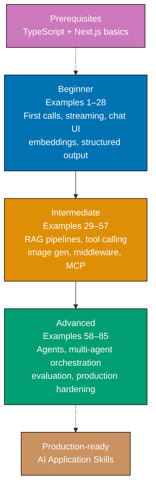

**Want to build AI-powered apps through code?** This by-example tutorial provides 85 heavily annotated examples covering the full spectrum of modern AI application development—from your first API call to production-ready multi-agent systems, RAG pipelines, and observability.

**Primary library**: Vercel AI SDK `ai@6.0.168` with supplementary coverage of OpenAI SDK `openai@6.34.0`, LangChain.js `langchain@1.3.3`, LlamaIndex.TS `llamaindex@0.12.1`, Mastra `mastra@1.x`, and the Model Context Protocol.

## What Is By-Example Learning?

By-example learning is a **code-first approach** where you learn concepts through annotated, working examples rather than narrative explanations. Each example shows:

1. **Brief explanation** — What the concept is and when to use it
2. **Mermaid diagram** (when appropriate) — Visual representation of complex flows
3. **Heavily annotated code** — Working TypeScript code with 1–2.25 comment lines per code line
4. **Key Takeaway** — 1–2 sentence distillation of the pattern
5. **Why It Matters** — 50–100 words connecting the pattern to production relevance

This approach works best when you already understand TypeScript and basic web development. You learn AI SDK patterns by studying real code rather than theoretical descriptions.

## What Is the Vercel AI SDK?

The Vercel AI SDK (`ai@6.0.168`) is a **TypeScript-first framework** for integrating large language models into web applications. Key characteristics:

- **Provider-agnostic**: Swap between OpenAI, Anthropic, Google, and others by changing one line
- **Streaming-first**: All generation functions support streaming out of the box
- **React hooks**: `useChat`, `useCompletion`, `useObject` for zero-boilerplate UI
- **Structured output**: Type-safe LLM responses via Zod schemas with `generateObject`
- **Tool calling**: First-class tool definitions with `tool()`, multi-step loops, human approval gates
- **Agent primitives**: `ToolLoopAgent`, `prepareStep`, `stopWhen` for production-grade agents
- **RAG utilities**: `embed()`, `embedMany()`, `cosineSimilarity()`, `rerank()` built in
- **Middleware**: `wrapLanguageModel()` for logging, caching, and tracing

**Critical v6 breaking change**: `StreamingTextResponse` was removed. Use `result.toDataStreamResponse()` in all route handlers.

## Learning Path



## Coverage by Difficulty

- **Beginner (Examples 1–28)**: First API calls, streaming, chat UI, multi-turn conversations, provider swapping, error handling, embeddings, cosine similarity, semantic search, structured output, and a complete end-to-end minimal chatbot
- **Intermediate (Examples 29–57)**: Batch embeddings, pgvector/Pinecone/Qdrant/Weaviate storage, full RAG pipelines, document chunking, PDF ingestion, hybrid search, reranking, tool definitions, multi-step tool use, human-in-the-loop gates, LangChain LCEL, image generation, audio, middleware, MCP integration
- **Advanced (Examples 58–85)**: ToolLoopAgent, prepareStep for dynamic routing and context management, OpenAI Agents SDK, Mastra agents and workflows, LangGraph, multi-agent orchestration (planner/worker, fan-out/fan-in, competitive evaluation), MCP servers, production RAG, caching, RSC streaming, edge deployment, rate limiting, DevTools, LangSmith, Braintrust, LLM-as-judge, RAGAS evaluation, and a full-stack deployment checklist

## Annotation Density: 1–2.25 Comments Per Code Line

All examples maintain **1–2.25 comment lines per code line** using `// =>` notation to show values, states, and effects:

```typescript
const result = await generateText({
  // => initiates AI generation call
  model: openai("gpt-4o"), // => selects GPT-4o as the LLM
  prompt: "What is 2 + 2?", // => user message string
}); // => result contains text, usage, finishReason
console.log(result.text); // => "2 + 2 equals 4."
console.log(result.usage.totalTokens); // => e.g. 42 (prompt + completion tokens)
```

## Prerequisites

Before starting, ensure you understand:

- TypeScript fundamentals (types, interfaces, async/await, generics)
- Next.js App Router basics (route handlers, Server Components, Client Components)
- npm package management
- Basic HTTP concepts (requests, responses, streaming)

No prior AI development experience required. The examples build from first principles.

## Installation Reference

```bash
# Vercel AI SDK with provider adapters (primary library)
npm install ai @ai-sdk/openai @ai-sdk/anthropic

# Direct OpenAI SDK (covered in examples 4-5, 46-47)
npm install openai

# OpenAI Agents SDK (examples 63-65)
npm install @openai/agents

# LangChain.js (examples 48-49, 68, 80)
npm install langchain @langchain/core @langchain/community @langchain/openai

# LlamaIndex.TS (example 37)
npm install llamaindex

# Mastra (examples 66-67)
npm install mastra

# MCP SDK (examples 72-73)
npm install @modelcontextprotocol/sdk

# Vector database clients (examples 31-33)
npm install @pinecone-database/pinecone
npm install @qdrant/js-client-rest
npm install weaviate-client
```
