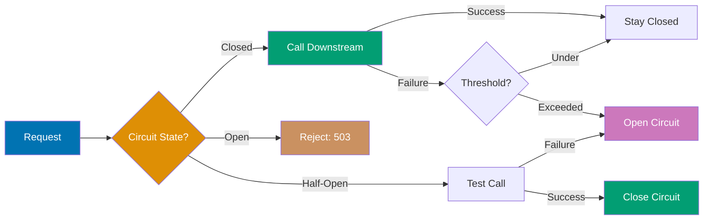

## Group 24: Interceptor Composition Patterns

### Example 56: Interceptor Composition with `definterceptorfn`

Complex applications need interceptors that themselves contain sub-interceptors. Composing interceptors as higher-order functions lets you build a library of composable concerns: authentication, rate limiting, validation, and logging can be composed into custom "profiles" per endpoint group.

```clojure
(ns my-app.composition
  (:require [io.pedestal.interceptor :as interceptor]
            [io.pedestal.http.route :as route]))

;; Building blocks - each interceptor handles one concern
(defn auth-interceptor [required-role]
  {:name  ::auth
   :enter (fn [ctx]
            (let [user  (:current-user ctx)
                  roles (get user :roles #{})]
              (if (contains? roles required-role)
                ctx
                (assoc ctx :response {:status 403 :body {:error "Forbidden"}}))))})

(defn rate-limit-interceptor [limit]
  {:name  ::rate-limit
   :enter (fn [ctx]
            ;; Rate limiting logic (simplified)
            ctx)})

(defn validate-interceptor [spec]
  {:name  ::validate
   :enter (fn [ctx]
            ;; Body validation logic
            ctx)})

;; Composition function: build an interceptor chain profile
(defn api-profile
  "Build a standard API interceptor chain with auth, rate limiting, and validation"
  [{:keys [role limit body-spec]}]
  (cond-> []
    role       (conj (auth-interceptor role))      ;; => Add auth if role specified
    limit      (conj (rate-limit-interceptor limit));; => Add rate limit if specified
    body-spec  (conj (validate-interceptor body-spec)))) ;; => Add validation if spec given

;; Usage: compose different profiles per route group
(def admin-profile   (api-profile {:role :admin  :limit 1000}))
(def public-profile  (api-profile {:limit 100}))   ;; => No auth required
(def write-profile   (api-profile {:role :user   :limit 500 :body-spec ::create-request}))

(def routes
  (route/expand-routes
    #{["/admin/stats"  :get  (into admin-profile  [admin-stats-handler])    :route-name :admin-stats]
      ["/public/data"  :get  (into public-profile [public-data-handler])    :route-name :public-data]
      ["/api/resource" :post (into write-profile  [create-resource-handler]) :route-name :create-resource]}))
      ;; => into appends the handler to the profile interceptor list
      ;; => Each route gets exactly the right combination of interceptors
```

**Key Takeaway**: Build interceptor profiles as functions that return lists using `cond->` - combine with `into` to append handlers, creating clean per-route customization without repetition.

**Why It Matters**: As APIs grow to 50+ routes, manually specifying the same 4-5 interceptors per route becomes error-prone and hard to audit. Interceptor profiles encode your security and operational requirements in named, composable units. Adding a new requirement (e.g., distributed tracing for all admin endpoints) means updating one profile function, not 20 route definitions. This also makes security audits tractable: a reviewer checks `admin-profile`, `public-profile`, and `write-profile` to understand the security posture of the entire API - not every individual route definition.

---

### Example 57: Middleware Protocol Pattern

For very complex middleware stacks, define a protocol that interceptors implement. Protocol-based interceptors provide compile-time verification that all required stages are implemented and enable polymorphic dispatch based on context features.

```clojure
(ns my-app.protocol-interceptors
  (:require [io.pedestal.interceptor :as interceptor]))

;; Protocol defining the interceptor contract:
(defprotocol Interceptable
  (as-interceptor [this]
    "Convert this value to a Pedestal interceptor map"))

;; Implement for keyword (look up in registry):
(extend-type clojure.lang.Keyword
  Interceptable
  (as-interceptor [kw]
    (get @interceptor-registry kw
         (throw (ex-info "Unknown interceptor" {:key kw})))))

;; Implement for function (wrap as enter-only):
(extend-type clojure.lang.IFn
  Interceptable
  (as-interceptor [f]
    {:name  ::fn-interceptor
     :enter (fn [ctx] (assoc ctx :response (f (:request ctx))))}))
     ;; => Wrap a plain function: (fn [req] {:status 200 :body "ok"})
     ;; => as an enter interceptor that attaches the response

;; Global interceptor registry:
(defonce interceptor-registry
  (atom {:logging logging-interceptor
         :auth    jwt-auth-interceptor
         :cors    cors-interceptor}))

;; Route builder that accepts protocol implementors:
(defn route [path verb interceptables]
  [path verb
   (mapv as-interceptor interceptables)])  ;; => Convert each to interceptor map

;; Usage: mix keywords (registry lookup), functions, and maps
(def routes
  (route/expand-routes
    #{(route "/api/users" :get [:logging :auth #(do {:status 200 :body "users"})])
      ;; => :logging => registry lookup
      ;; => :auth    => registry lookup
      ;; => fn      => wrapped as enter interceptor
    }))
```

**Key Takeaway**: Extend Clojure protocols to keywords and functions to create flexible route DSLs where interceptors can be expressed as registry keywords, functions, or full maps.

**Why It Matters**: Protocol-based composition enables domain-specific languages for route definition that match your team's mental model. Large teams often prefer `[:auth :rate-limit :validate handler]` shorthand over full interceptor map vectors. The registry pattern centralizes interceptor instances (a single `cors-interceptor` shared across all routes rather than recreated per route) which matters for interceptors with stateful components like connection pools or rate limit counters. Protocol dispatch also enables mocking at the protocol level in tests - swap the registry entries for test doubles.

---

## Group 25: Observability

### Example 58: Metrics with Micrometer

Production services need metrics for SLOs (Service Level Objectives) and capacity planning. Pedestal integrates with Micrometer (the JVM metrics facade used by Spring Boot, Quarkus, and others) via the `io.pedestal.metrics` namespace.

```clojure
(ns my-app.metrics
  (:require [io.pedestal.http.route :as route]
            [io.pedestal.log :as log])
  (:import [io.micrometer.core.instrument MeterRegistry Counter Timer Metrics]
           [io.micrometer.prometheus PrometheusMeterRegistry PrometheusConfig]))
           ;; => Add io.micrometer/micrometer-registry-prometheus {:mvn/version "1.12.0"}

;; Create Prometheus registry:
(defonce prometheus-registry
  (PrometheusMeterRegistry. PrometheusConfig/DEFAULT))

;; Expose the global registry:
(Metrics/addRegistry prometheus-registry)  ;; => Register globally for auto-instrumentation

;; Manual metric instruments:
(def request-counter
  (-> (Counter/builder "http.requests.total")
      (.description "Total HTTP requests")
      (.tag "service" "myapp")
      (.register prometheus-registry)))    ;; => Counter: monotonically increasing

(defn request-timer [route-name]
  (-> (Timer/builder "http.request.duration")
      (.description "HTTP request duration")
      (.tag "route" (name route-name))
      (.publishPercentiles (double-array [0.5 0.95 0.99]))  ;; => p50, p95, p99
      (.register prometheus-registry)))

(def metrics-interceptor
  {:name  ::metrics
   :enter (fn [ctx]
            (assoc ctx :request-start (System/nanoTime)))  ;; => Record start time
   :leave (fn [ctx]
            (let [elapsed-ns (- (System/nanoTime) (:request-start ctx))
                  route-name (get-in ctx [:route :route-name] :unknown)
                  status     (get-in ctx [:response :status] 0)
                  timer      (request-timer route-name)]
              (.increment request-counter)           ;; => Count every request
              (.record timer elapsed-ns java.util.concurrent.TimeUnit/NANOSECONDS)
                                                     ;; => Record duration
              (log/debug :msg "Request timed" :route route-name :ns elapsed-ns))
            ctx)})

;; Expose /metrics for Prometheus scraping:
(def metrics-handler
  {:name  ::prometheus-metrics
   :enter (fn [ctx]
            (assoc ctx :response
              {:status  200
               :headers {"Content-Type" (PrometheusMeterRegistry/contentType)}
               :body    (.scrape prometheus-registry)}))})
               ;; => Returns Prometheus text format: counter names, values, histograms
```

**Key Takeaway**: Use Micrometer's `Counter` and `Timer` instruments in a service-level interceptor to track request counts and duration by route - expose `/metrics` for Prometheus scraping.

**Why It Matters**: Metrics are the foundation of SRE practice. Without `http.request.duration` histograms you can't define or measure SLOs ("99% of requests complete in under 200ms"). Without request counters you can't calculate error rates or traffic anomalies. Micrometer's facade means the same metric code works with Prometheus, Datadog, CloudWatch, or any other backend - changing the registry type requires one dependency swap. Recording p50/p95/p99 percentiles per route lets you identify slow endpoints precisely. Teams that instrument from day one have the data to debug production incidents; teams that add instrumentation after incidents lose the historical baseline for comparison.

---

### Example 59: Distributed Tracing with OpenTelemetry

Distributed tracing tracks a request across multiple services. OpenTelemetry provides a vendor-neutral API for creating trace spans. Pedestal integrates via an interceptor that creates spans for each request and propagates trace context via HTTP headers.

```clojure
(ns my-app.tracing
  (:require [io.pedestal.http.route :as route])
  (:import [io.opentelemetry.api GlobalOpenTelemetry]
           [io.opentelemetry.api.trace SpanKind StatusCode]
           [io.opentelemetry.context Context]
           [io.opentelemetry.propagator.b3 B3Propagator]
           [io.opentelemetry.context.propagation TextMapGetter]))
           ;; => Add io.opentelemetry/opentelemetry-api {:mvn/version "1.36.0"}
           ;; => Add io.opentelemetry/opentelemetry-sdk {:mvn/version "1.36.0"}

(def tracer
  (.getTracer (GlobalOpenTelemetry/get) "my-app" "1.0.0"))

;; Extract trace context from incoming headers (for microservices):
(def header-getter
  (reify TextMapGetter
    (keys [_ carrier] (keys carrier))
    (get [_ carrier key] (get carrier key))))

(def tracing-interceptor
  {:name  ::tracing
   :enter (fn [ctx]
            (let [headers       (get-in ctx [:request :headers])
                  parent-context (-> (GlobalOpenTelemetry/getPropagators)
                                     (.getTextMapPropagator)
                                     (.extract (Context/current) headers header-getter))
                                     ;; => Extract trace context from upstream service
                  span           (-> tracer
                                     (.spanBuilder (str (name (get-in ctx [:route :route-name]
                                                               :unknown))))
                                     (.setSpanKind SpanKind/SERVER)
                                     (.setParent parent-context)
                                     (.startSpan))]
                                     ;; => Create child span linked to upstream trace
              (-> ctx
                  (assoc :trace-span span)                ;; => Store span for :leave/:error
                  (assoc-in [:request :trace-context]
                    (.makeCurrent (.storeInContext span (Context/current)))))))
   :leave (fn [ctx]
            (when-let [span (:trace-span ctx)]
              (.setStatus span StatusCode/OK)
              (.end span))               ;; => End span on successful response
            ctx)
   :error (fn [ctx ex]
            (when-let [span (:trace-span ctx)]
              (.setStatus span StatusCode/ERROR)
              (.recordException span ex)  ;; => Record exception details in span
              (.end span))
            (assoc ctx :response {:status 500 :body {:error "internal-error"}}))})
```

**Key Takeaway**: Create OpenTelemetry spans in `:enter` and end them in `:leave`/`:error` - extract parent context from incoming headers to link child spans to upstream traces.

**Why It Matters**: Distributed tracing makes complex microservice architectures debuggable. When a user reports slow response time, traces show exactly which downstream service added latency. A 500ms response might decompose as: 5ms routing + 50ms auth + 400ms database + 45ms serialization. Without tracing, finding the bottleneck requires correlating logs across services with timestamps - a process taking hours. With tracing, the Jaeger or Zipkin UI shows the waterfall in seconds. OpenTelemetry's vendor-neutral API means you can switch from Jaeger to Honeycomb or Datadog tracing by changing the exporter configuration, not the instrumentation code.

---

## Group 26: Resilience Patterns

### Example 60: Circuit Breaker Pattern

A circuit breaker prevents cascading failures when a downstream service is unavailable. When failures exceed a threshold, the circuit "opens" and immediately rejects requests for a cooling-off period rather than waiting for timeouts.



```clojure
(ns my-app.circuit-breaker
  (:require [io.pedestal.http.route :as route]))

(defn circuit-breaker [service-name {:keys [failure-threshold
                                             timeout-ms
                                             half-open-attempts]}]
  ;; => failure-threshold: number of failures before opening
  ;; => timeout-ms: how long to wait before trying half-open
  ;; => half-open-attempts: successful calls needed to close
  (let [state      (atom :closed)          ;; => :closed :open :half-open
        failures   (atom 0)
        last-open  (atom nil)
        successes  (atom 0)]
    {:name  (keyword (str "circuit-breaker-" service-name))
     :enter (fn [ctx]
              (let [current-state @state
                    now           (System/currentTimeMillis)]
                (case current-state
                  :open
                  (if (> now (+ @last-open timeout-ms))
                    (do (reset! state :half-open)  ;; => Try again after timeout
                        (reset! successes 0)
                        ctx)                        ;; => Allow test request through
                    (assoc ctx :response            ;; => Still open: reject immediately
                      {:status  503
                       :headers {"Retry-After" (str (int (/ (- (+ @last-open timeout-ms) now) 1000)))}
                       :body    {:error   "circuit-open"
                                 :service service-name}}))
                  ;; :closed or :half-open: allow through
                  ctx)))
     :leave (fn [ctx]
              (let [status (get-in ctx [:response :status])]
                (if (>= status 500)
                  ;; Failure: increment counter
                  (let [new-failures (swap! failures inc)]
                    (when (>= new-failures failure-threshold)
                      (reset! state :open)
                      (reset! last-open (System/currentTimeMillis))
                      (println "Circuit opened for" service-name)))
                  ;; Success: reset failures or close half-open
                  (when (= :half-open @state)
                    (let [new-successes (swap! successes inc)]
                      (when (>= new-successes half-open-attempts)
                        (reset! state :closed)
                        (reset! failures 0)
                        (println "Circuit closed for" service-name)))))
                ctx))}))

;; Usage:
(def payment-circuit
  (circuit-breaker "payment-service"
    {:failure-threshold  5     ;; => Open after 5 consecutive failures
     :timeout-ms         30000 ;; => Try again after 30 seconds
     :half-open-attempts 2}))  ;; => 2 successes needed to close

(def routes
  (route/expand-routes
    #{["/api/payments" :post
       [payment-circuit payment-handler]
       :route-name :payments]}))
```

**Key Takeaway**: Implement circuit breakers as stateful interceptors using atoms for state (`closed`/`open`/`half-open`) - the `:leave` stage tracks failure rates and the `:enter` stage rejects requests when the circuit is open.

**Why It Matters**: Cascading failures are the primary cause of major production outages. When a payment service is slow (timing out after 30 seconds), requests pile up waiting for timeouts, exhausting thread pools and taking down services that would otherwise be healthy. Circuit breakers limit the blast radius: once the payment service fails 5 times, subsequent requests immediately get 503 and threads are freed for other requests. Users get a fast error instead of a 30-second hang. The half-open state prevents hammering a recovering service. Teams report that circuit breakers reduce "one service failure takes everything down" incidents to isolated degradations.

---

### Example 61: Retry with Exponential Backoff

Transient failures (network blips, momentary database overload) often resolve on retry. An exponential backoff interceptor retries failed requests with increasing delays, preventing retry storms that overwhelm recovering services.

```clojure
(ns my-app.retry
  (:require [io.pedestal.http.route :as route]
            [clojure.core.async :as async :refer [go <! timeout chan >!]]))

(defn with-retry [max-retries base-delay-ms]
  {:name  ::retry
   :enter (fn [ctx]
            (let [result-chan (chan)]
              (go
                (loop [attempt 0]
                  (let [ctx-with-attempt (assoc ctx :retry-attempt attempt)
                        ;; Run the next interceptor in chain:
                        response (try
                                   ;; Simulate calling downstream:
                                   (call-downstream ctx-with-attempt)
                                   (catch Exception e {:error e}))]
                    (cond
                      ;; Success: deliver result
                      (not (:error response))
                      (>! result-chan (assoc ctx :response response))

                      ;; Too many retries: fail
                      (>= attempt max-retries)
                      (>! result-chan (assoc ctx :response
                                       {:status 503 :body {:error "max-retries-exceeded"}}))

                      ;; Retry with exponential backoff:
                      :else
                      (let [delay (* base-delay-ms (long (Math/pow 2 attempt)))]
                        ;; => attempt=0: 100ms, attempt=1: 200ms, attempt=2: 400ms, etc.
                        (<! (timeout delay))    ;; => Wait before retry (non-blocking)
                        (recur (inc attempt)))))))
              result-chan))})

(def routes
  (route/expand-routes
    #{["/api/downstream" :get
       [(with-retry 3 100) downstream-handler]  ;; => 3 retries, 100ms base delay
       :route-name :downstream]}))
       ;; => Retry delays: 100ms, 200ms, 400ms (total budget: up to 700ms + response times)
```

**Key Takeaway**: Implement retry with exponential backoff in an async interceptor using `go`/`loop`/`recur` - double the delay each attempt to avoid retry storms.

**Why It Matters**: Naive retries (immediate, unlimited) amplify failures. When 1000 clients simultaneously retry a failed request, the spike can prevent recovery of the very service they're retrying. Exponential backoff reduces retry load geometrically over time, giving the service room to recover. Adding jitter (`+ (* base-delay-ms (rand))`) randomizes delays across clients, further spreading the load. Retry logic belongs in infrastructure interceptors, not business code - handlers should assume their dependencies are available. This separation means adding retry to a new endpoint requires adding one interceptor, not modifying the handler.

---

## Group 27: Caching Patterns

### Example 62: Application-Level Caching with Caffeine

Cache database query results in-memory to reduce database load for frequently read, slowly changing data. Caffeine is a high-performance JVM cache with eviction policies and optional expiry.

```clojure
(ns my-app.caffeine-cache
  (:require [io.pedestal.http.route :as route]
            [next.jdbc :as jdbc])
  (:import [com.github.benmanes.caffeine.cache Caffeine LoadingCache]
           [java.util.concurrent TimeUnit]))
           ;; => Add com.github.ben-manes.caffeine/caffeine {:mvn/version "3.1.8"}

(defonce product-cache
  (-> (Caffeine/newBuilder)
      (.maximumSize 10000)                 ;; => Maximum 10,000 entries
      (.expireAfterWrite 5 TimeUnit/MINUTES) ;; => Expire 5 minutes after last write
      (.expireAfterAccess 2 TimeUnit/MINUTES) ;; => Also expire if not accessed for 2 min
      (.build)))                            ;; => Build cache (not LoadingCache, manual get/put)

(defn get-product [ds product-id]
  (or (.getIfPresent product-cache (str product-id))  ;; => Check cache first
      (let [product (jdbc/execute-one! ds
                      ["SELECT id, name, price, stock FROM products WHERE id = ?" product-id])]
        (when product
          (.put product-cache (str product-id) product)  ;; => Cache the result
          product))))
          ;; => Cache miss: query DB then cache; next request uses cache

(defn invalidate-product [product-id]
  (.invalidate product-cache (str product-id)))  ;; => Remove from cache (after update)

(def get-product-handler
  {:name  ::get-product
   :enter (fn [ctx]
            (let [id      (get-in ctx [:request :path-params :id])
                  product (get-product (:db ctx) (parse-long id))]
              (if product
                (assoc ctx :response {:status 200 :body product})
                (assoc ctx :response {:status 404 :body {:error "not-found"}}))))})

(def update-product-handler
  {:name  ::update-product
   :enter (fn [ctx]
            (let [id   (get-in ctx [:request :path-params :id])
                  body (get-in ctx [:request :json-params])]
              ;; Update DB then invalidate cache:
              (update-product-in-db (:db ctx) (parse-long id) body)
              (invalidate-product id)         ;; => Cache invalidation after write
              (assoc ctx :response {:status 200 :body {:updated true}})))})
```

**Key Takeaway**: Use Caffeine's `getIfPresent`/`put`/`invalidate` for explicit cache management - invalidate entries immediately after writes to maintain consistency.

**Why It Matters**: In-memory caching can reduce database load by orders of magnitude for read-heavy endpoints. A product catalog endpoint called 1000 times per second with a 5-minute cache TTL needs only 1 database query per 5 minutes per product instead of 1000 per second. This translates to 99.9% database query reduction for cache hits. The explicit invalidation pattern ensures cached data doesn't serve stale prices or inventory counts after updates. Caffeine's time-based expiry provides a fallback for updates that happen outside your application (direct database changes, batch jobs). Configure maximum size to prevent cache-induced heap pressure.

---

### Example 63: Distributed Caching with Redis

Application-level caching doesn't survive restarts or work across multiple instances. Redis provides a distributed cache shared by all service instances, enabling cache hits regardless of which instance handles the request.

```clojure
(ns my-app.redis-cache
  (:require [io.pedestal.http.route :as route]
            [cheshire.core :as json]
            [taoensso.carmine :as redis])  ;; => Add com.taoensso/carmine {:mvn/version "3.3.2"}
  (:import [redis.clients.jedis JedisPool JedisPoolConfig]))

(def redis-pool
  (JedisPool.
    (doto (JedisPoolConfig.)
      (.setMaxTotal 20))                   ;; => Max 20 concurrent Redis connections
    (or (System/getenv "REDIS_HOST") "localhost")
    (Integer/parseInt (or (System/getenv "REDIS_PORT") "6379"))))

(defmacro with-redis [& body]
  `(redis/wcar {:pool redis-pool :spec {:host (System/getenv "REDIS_HOST")}} ~@body))

(defn cache-get [key]
  (some-> (with-redis (redis/get key))
          (json/parse-string true)))        ;; => Deserialize JSON string to Clojure map

(defn cache-set [key value ttl-seconds]
  (with-redis
    (redis/set key (json/generate-string value))   ;; => Serialize to JSON string
    (redis/expire key ttl-seconds)))               ;; => Set TTL separately

(def cached-users-handler
  {:name  ::cached-users
   :enter (fn [ctx]
            (let [cache-key "users:list:v1"
                  cached    (cache-get cache-key)]
              (if cached
                (assoc ctx :response {:status 200 :body cached
                                      :headers {"X-Cache" "HIT"}}) ;; => Cache hit
                (let [users (fetch-users-from-db (:db ctx))]
                  (cache-set cache-key users 300)   ;; => Cache for 5 minutes
                  (assoc ctx :response {:status 200 :body users
                                        :headers {"X-Cache" "MISS"}})))))}) ;; => Cache miss
```

**Key Takeaway**: Use Redis for distributed caching with JSON serialization - `X-Cache: HIT/MISS` headers help identify cache behavior in production monitoring.

**Why It Matters**: Distributed caching solves the "thundering herd" problem at scale. When 10 instances start simultaneously after a deploy, each starts cold with empty local caches. Every request misses cache and hits the database until the caches warm up. With Redis, one instance warms the cache and all others benefit immediately. `X-Cache` headers let your CDN dashboards and monitoring tools show cache hit rates - a hit rate below 80% suggests the TTL is too short or cache keys are too specific. Redis also survives rolling deploys: cache entries persist across instance restarts, unlike process-local Caffeine caches.

---

## Group 28: API Versioning

### Example 64: URL-Based API Versioning

API versioning allows evolving your API without breaking existing clients. URL versioning (`/v1/`, `/v2/`) is explicit and easily visible in logs and browser network tabs. Pedestal implements this through route prefixes with version-specific handler sets.

```clojure
(ns my-app.versioning
  (:require [io.pedestal.http.route :as route]))

;; V1 handlers (original contract):
(def v1-users-handler
  {:name  :v1-users
   :enter (fn [ctx]
            (assoc ctx :response
              {:status 200
               :body   {:users [{:id 1 :name "Alice"}]
                        :version "v1"}}))})   ;; => V1 response shape

;; V2 handlers (updated contract with pagination):
(def v2-users-handler
  {:name  :v2-users
   :enter (fn [ctx]
            (let [{:keys [page size]} (:pagination ctx)]
              (assoc ctx :response
                {:status 200
                 :body   {:data       [{:id 1 :full_name "Alice Smith"}]
                          ;; => V2 uses :full_name instead of :name
                          :meta       {:page page :size size :total 1}
                          :version    "v2"}})))}) ;; => V2 adds pagination meta

(def routes
  (route/expand-routes
    #{;; V1 routes - maintain backward compatibility
      ["/v1/users"     :get [v1-users-handler]            :route-name :v1-users-list]
      ["/v1/users/:id" :get [v1-get-user-handler]         :route-name :v1-user-get]
      ;; V2 routes - new features, different response shape
      ["/v2/users"     :get [pagination-interceptor v2-users-handler] :route-name :v2-users-list]
      ["/v2/users/:id" :get [v2-get-user-handler]         :route-name :v2-user-get]

      ;; Redirect /api/users to latest stable version:
      ["/api/users"    :get [(fn [_] {:status 308 :headers {"Location" "/v2/users"}})]
       :route-name :api-users-redirect]}))
       ;; => 308 Permanent Redirect: maintains HTTP method (unlike 301 which becomes GET)
```

**Key Takeaway**: Prefix versioned route groups with `/v1/`, `/v2/` - maintain backward-compatible v1 routes while adding new features to v2; redirect `/api/` to the current stable version.

**Why It Matters**: Breaking API changes without versioning force all clients to upgrade simultaneously - impossible with third-party integrations. URL versioning makes the version explicit in access logs, making it easy to see which clients use which version. Monitoring `v1` traffic lets you identify clients that haven't upgraded before deprecating the old version. The 308 redirect at `/api/` ensures internal clients that hardcode `/api/` get the latest version, while external clients can pin to `/v1/` for stability. Target sunset dates (6-12 months) for deprecated versions give client teams realistic migration windows.

---

### Example 65: Header-Based API Versioning

Header-based versioning uses `Accept: application/vnd.myapi.v2+json` or a custom `API-Version: 2` header instead of URL prefixes. This keeps URLs clean but requires all clients to set headers explicitly.

```clojure
(ns my-app.header-versioning
  (:require [io.pedestal.http.route :as route]))

(defn parse-accept-version [accept-header]
  ;; => Parse "application/vnd.myapi.v2+json" => "v2"
  (when accept-header
    (second (re-find #"vnd\.myapi\.(v\d+)\+" accept-header))))

(def version-dispatch-interceptor
  {:name  ::version-dispatch
   :enter (fn [ctx]
            (let [accept-header (get-in ctx [:request :headers "accept"])
                  api-version   (get-in ctx [:request :headers "api-version"])
                  version       (or (parse-accept-version accept-header)
                                    api-version
                                    "v1")]  ;; => Default to v1 if no version specified
              (assoc ctx :api-version version)))})  ;; => Store version for handlers

(def users-handler
  {:name  ::users-version-aware
   :enter (fn [ctx]
            (let [version (:api-version ctx)]
              (case version
                "v1" (assoc ctx :response {:status 200 :body {:users [] :version "v1"}})
                "v2" (assoc ctx :response {:status 200 :body {:data  [] :version "v2"}})
                (assoc ctx :response {:status 400 :body {:error "unknown-api-version"
                                                          :version version
                                                          :supported ["v1" "v2"]}}))))})

(def routes
  (route/expand-routes
    #{["/users" :get
       [version-dispatch-interceptor users-handler]
       :route-name :users-versioned]}))
       ;; => Single URL; version determined by headers
```

**Key Takeaway**: Extract version from `Accept` media type or a custom `API-Version` header in an interceptor; default to the oldest stable version for clients that don't specify.

**Why It Matters**: Header versioning is preferred by REST purists because a resource's URL should not change across versions - `/users` always means "users", regardless of the response shape. The `Accept` header is the HTTP mechanism for specifying desired representation. In practice, URL versioning wins for pragmatic reasons: it's visible in browser DevTools, works with simple curl commands without flags, appears in server access logs by default, and can be tested in a browser. Choose based on your client types: SDKs and programmatic clients handle headers well; browser-based testing benefits from URL versioning.

---

## Group 29: Component and Integrant Integration

### Example 66: Pedestal with Stuart Sierra's Component

Component is a Clojure library for managing stateful system components (database connections, HTTP servers, caches) with explicit dependency graphs and lifecycle management. Wrapping Pedestal in a Component ensures correct startup/shutdown order.

```clojure
(ns my-app.component-server
  (:require [com.stuartsierra.component :as component]
            [io.pedestal.http :as http]
            [io.pedestal.http.route :as route]))
            ;; => Add com.stuartsierra/component {:mvn/version "1.1.0"}

;; Pedestal HTTP server as a Component:
(defrecord HTTPServer [service-map server]
  component/Lifecycle

  (start [this]
    (if server
      this                                 ;; => Already started: idempotent
      (let [server (-> service-map
                       http/create-server
                       http/start)]
        (println "HTTP server started")
        (assoc this :server server))))     ;; => Store server handle in component

  (stop [this]
    (when server
      (http/stop server)                   ;; => Graceful shutdown
      (println "HTTP server stopped"))
    (assoc this :server nil)))             ;; => Clear server handle

(defn new-http-server [service-map]
  (map->HTTPServer {:service-map service-map :server nil}))

;; Database component:
(defrecord Database [db-spec datasource]
  component/Lifecycle

  (start [this]
    (let [ds (create-hikari-pool db-spec)] ;; => Start connection pool
      (assoc this :datasource ds)))

  (stop [this]
    (when datasource (.close datasource))  ;; => Close connection pool
    (assoc this :datasource nil)))

;; System composition - dependencies explicit:
(defn build-system [config]
  (component/system-map
    :database   (map->Database {:db-spec (:db config)})
    :http-server (component/using
                   (new-http-server (build-service-map config))
                   [:database])))          ;; => HTTP server depends on database
                   ;; => Component starts database FIRST, then passes it to http-server
                   ;; => Stops http-server FIRST, then database (reverse order)

(defn -main [& _]
  (let [system (-> (build-system (read-config))
                   component/start)]       ;; => Starts all components in dependency order
    (.addShutdownHook (Runtime/getRuntime)
      (Thread. #(component/stop system)))  ;; => Register JVM shutdown hook
    @(promise)))                           ;; => Block forever (server runs in background)
```

**Key Takeaway**: Wrap Pedestal in a `component/Lifecycle` record - declare dependencies with `component/using` so Component starts database before the HTTP server and stops them in reverse.

**Why It Matters**: Component makes dependency ordering explicit and prevents a common class of startup bugs where the HTTP server starts before the database pool is ready, causing the first requests to fail. The dependency graph documents architecture: developers can see at a glance that the HTTP server needs the database. Component also enables REPL-driven development at the system level: `(alter-var-root #'system component/stop)` then `(alter-var-root #'system component/start)` restarts the entire system in seconds. Many Clojure production teams use Component as the backbone of their system architecture for its simplicity and composability.

---

### Example 67: Pedestal with Integrant

Integrant takes a data-driven approach to system component management using an EDN configuration map. Unlike Component's record-based approach, Integrant describes components as configuration data with multi-method implementations.

```clojure
(ns my-app.integrant-server
  (:require [integrant.core :as ig]
            [io.pedestal.http :as http]
            [io.pedestal.http.route :as route]))
            ;; => Add integrant/integrant {:mvn/version "0.8.1"}

;; System configuration as data (can be in resources/config.edn):
(def system-config
  {:my-app/database  {:url      (System/getenv "DATABASE_URL")
                       :max-pool 10}
   :my-app/routes    {:db (ig/ref :my-app/database)}  ;; => Reference to database
   :my-app/server    {:routes (ig/ref :my-app/routes)  ;; => Reference to routes
                      :port   8080}})

;; Implement init-key for each component type:
(defmethod ig/init-key :my-app/database [_ {:keys [url max-pool]}]
  (create-hikari-pool url max-pool))       ;; => Returns datasource

(defmethod ig/init-key :my-app/routes [_ {:keys [db]}]
  ;; => db is the datasource from :my-app/database (resolved by Integrant)
  (route/expand-routes
    #{["/users" :get
       [{:name ::list-users
         :enter (fn [ctx] (assoc ctx :response {:status 200 :body (get-users db)}))}]
       :route-name :users-list]}))

(defmethod ig/init-key :my-app/server [_ {:keys [routes port]}]
  (-> {::http/routes routes
       ::http/type   :jetty
       ::http/port   port
       ::http/join?  false}
      http/create-server
      http/start))

;; Implement halt-key! for cleanup:
(defmethod ig/halt-key! :my-app/server [_ server]
  (http/stop server))

(defmethod ig/halt-key! :my-app/database [_ ds]
  (.close ds))

;; Start/stop the system:
(defonce system (atom nil))

(defn start! []
  (reset! system (ig/init system-config)))  ;; => Starts all components in dependency order

(defn stop! []
  (when @system
    (ig/halt! @system)                       ;; => Stops all components in reverse order
    (reset! system nil)))
```

**Key Takeaway**: Define Integrant components with `ig/init-key`/`ig/halt-key!` multi-methods - Integrant resolves `ig/ref` dependencies and starts components in the correct order.

**Why It Matters**: Integrant's data-driven approach enables runtime configuration changes without recompiling. The system config map can be read from EDN files, environment variables, or a configuration service - the system restarts with the new config. This is powerful for feature flags and staged rollouts. Integrant's simpler multi-method protocol (compared to Component's records) reduces boilerplate. Many Pedestal production systems use Integrant for its explicitness: the config map in `resources/config.edn` documents the entire system architecture in one data structure that operators can read and understand.

---

## Group 30: Docker and Deployment

### Example 68: Uberjar Packaging

A Pedestal application deploys as a self-contained uberjar - a JAR file containing your code plus all dependencies. The uberjar runs with `java -jar app.jar` without any installation required beyond the JVM.

```clojure
;; project.clj (Leiningen)
(defproject my-app "0.1.0"
  :dependencies [[org.clojure/clojure "1.12.0"]
                 [io.pedestal/pedestal.service "0.7.0"]
                 [io.pedestal/pedestal.jetty   "0.7.0"]
                 [org.slf4j/slf4j-simple       "2.0.9"]]

  ;; Main entry point:
  :main my-app.server                      ;; => Class with -main method
  :aot  [my-app.server]                    ;; => Ahead-of-time compile the main namespace
                                            ;; => AOT generates .class files for faster startup

  ;; Uberjar configuration:
  :profiles {:uberjar {:aot :all           ;; => AOT compile all namespaces
                        :uberjar-name "my-app.jar"  ;; => Output jar name
                        :jvm-opts ["-Dclojure.compiler.direct-linking=true"]
                        ;; => Direct linking: inline function calls, faster execution
                        }})

;; deps.edn alternative (tools.deps):
;; Add to deps.edn aliases:
;; {:aliases
;;  {:uberjar
;;   {:replace-deps {com.github.seancorfield/depstar {:mvn/version "2.1.303"}}
;;    :exec-fn hf.depstar/uberjar
;;    :exec-args {:jar "target/my-app.jar" :aot true}}}}
;;
;; Run: clj -T:uberjar

;; Build the uberjar:
;; lein uberjar
;; => target/my-app.jar (includes all dependencies)

;; Run in production:
;; java -jar target/my-app.jar
;; => Starts Jetty on port 8080 (or $PORT)
```

**Key Takeaway**: Use Leiningen's `uberjar` profile with `:aot :all` and `:main` to produce a self-contained JAR - enable direct linking for faster function dispatch.

**Why It Matters**: Uberjar deployment is operationally simple: one file, one command. No dependency resolution at startup, no classpath management, no Leiningen required on the production server. The uberjar approach is reproducible: the same JAR deployed to staging and production runs identical code. AOT compilation and direct linking reduce cold startup time from 5-10 seconds to 2-4 seconds, important for Kubernetes pods that must become ready quickly. Keep the JAR small by excluding dev-only dependencies from the uberjar profile and using `ProGuard` or `GraalVM native-image` for further size reduction.

---

### Example 69: Docker Multi-Stage Build

Docker multi-stage builds use a build container with full JDK and build tools, then copy only the compiled artifact into a minimal runtime container. This produces small, secure images without development tools.

```dockerfile
# Dockerfile for Pedestal application

# Stage 1: Build stage
FROM clojure:temurin-21-lein AS builder
# => Use full JDK + Leiningen for building
# => temurin-21: Eclipse Temurin JDK 21 (LTS)

WORKDIR /app

# Cache dependencies first (rarely changed):
COPY project.clj .
RUN lein deps
# => Download deps before copying source
# => Docker layer caching skips this if project.clj unchanged

# Copy and compile source:
COPY src/ src/
COPY resources/ resources/
RUN lein uberjar
# => Produces target/my-app.jar

# Stage 2: Runtime stage
FROM eclipse-temurin:21-jre-alpine
# => Minimal JRE (no JDK/compiler tools) = smaller image
# => Alpine Linux = ~50MB base vs ~200MB Ubuntu

RUN addgroup -S app && adduser -S app -G app
# => Create non-root user for security (never run as root)

WORKDIR /app

# Copy only the artifact from build stage:
COPY --from=builder /app/target/my-app.jar ./app.jar
# => Only the JAR is copied, not build tools or source

USER app
# => Switch to non-root user before running

EXPOSE 8080

# Container-aware JVM flags:
ENTRYPOINT ["java",
            "-XX:+UseContainerSupport",
            # => Respect container CPU/memory limits (not host totals)
            "-XX:MaxRAMPercentage=75.0",
            # => Use 75% of container memory for heap
            "-XX:+UseG1GC",
            # => G1GC: good balance of throughput and latency for web services
            "-jar", "/app/app.jar"]
```

**Key Takeaway**: Use multi-stage Docker builds to separate the build environment (full JDK + Leiningen) from the runtime image (JRE only) - add `XX:+UseContainerSupport` for correct memory sizing.

**Why It Matters**: Multi-stage builds produce images 3-4x smaller than single-stage builds, reducing attack surface, pull times, and storage costs. Without `XX:+UseContainerSupport` (JDK 11+), the JVM reads host machine memory and CPU counts rather than container limits, causing the heap to be sized for a 64GB machine when the container only has 512MB - causing OOM kills. `MaxRAMPercentage=75.0` reserves 25% for non-heap memory (JVM overhead, native buffers, thread stacks). Running as a non-root user follows the principle of least privilege - even if the application is compromised, the attacker doesn't have root access to the container filesystem.

---

## Group 31: Production JVM Tuning

### Example 70: JVM Options for Production

Selecting correct JVM options improves throughput, latency, and operational stability. The wrong GC algorithm or heap size causes stop-the-world pauses or OOM errors. This example documents production-validated JVM options for Pedestal services.

```bash
#!/bin/bash
# start.sh - Production JVM configuration for Pedestal on JDK 21

java \
  # === Container Awareness ===
  -XX:+UseContainerSupport \
  # => Read CPU/memory limits from cgroup (Docker/Kubernetes)
  # => Without this, JVM uses host machine resources as limits
  -XX:MaxRAMPercentage=75.0 \
  # => Use 75% of container RAM for heap
  # => 25% reserved for: JVM overhead, native buffers, Metaspace, thread stacks
  
  # === Garbage Collector ===
  -XX:+UseG1GC \
  # => G1GC: default for JDK 14+ but explicit is better
  # => Good for heaps 4GB-64GB; concurrent marking prevents long pauses
  -XX:MaxGCPauseMillis=100 \
  # => Target max GC pause of 100ms (G1 tries to meet this)
  # => Lower = more frequent GCs; 100ms is reasonable for web APIs
  -XX:G1HeapRegionSize=16m \
  # => Region size for G1; 16MB good for typical web service heap (1-8GB)
  
  # === Startup and Compilation ===
  -server \
  # => Enable server JIT optimizations (default on 64-bit JVMs, explicit is clear)
  -XX:+OptimizeStringConcat \
  # => Optimize string concatenation operations
  -Dclojure.compiler.direct-linking=true \
  # => Clojure direct linking: inline function calls for speed
  
  # === Observability ===
  -Xlog:gc*:file=/var/log/app/gc.log:time,uptime,level,tags:filecount=10,filesize=20m \
  # => Log GC events to rolling files for performance analysis
  -XX:+HeapDumpOnOutOfMemoryError \
  # => Write heap dump on OOM for post-mortem analysis
  -XX:HeapDumpPath=/var/log/app/heap-dump.hprof \
  # => Heap dump location
  
  # === Shutdown ===
  -Xss512k \
  # => Stack size per thread: 512KB (reduce from default 1MB for many-thread services)
  # => Allows more threads before running out of memory
  
  -jar /app/app.jar
```

**Key Takeaway**: Use `UseContainerSupport` + `MaxRAMPercentage=75.0` for container-aware sizing, G1GC with `MaxGCPauseMillis=100` for latency, and enable GC logging and heap dumps for production observability.

**Why It Matters**: Default JVM options are designed for desktop applications, not containerized microservices. Without `UseContainerSupport`, the JVM treats the 32GB host machine as its memory limit even when running in a 512MB container - sizing the heap to 24GB, which immediately causes OOM kills. Without GC logging, diagnosing "the service becomes slow every 30 minutes" is nearly impossible. GC logs reveal whether stop-the-world pauses are causing latency spikes. Heap dumps on OOM provide the data needed to diagnose memory leaks - without them, you're left guessing. These options are standard practice at any company running JVM services in production.

---

### Example 71: Graceful Shutdown

Production services must handle `SIGTERM` (Kubernetes pod termination) gracefully: stop accepting new requests, drain in-flight requests, close database connections, and exit cleanly. Abrupt shutdown causes in-flight request failures and leaves database connections open.

```clojure
(ns my-app.shutdown
  (:require [io.pedestal.http :as http]
            [io.pedestal.log :as log]))

(def shutdown-timeout-ms 30000)            ;; => 30 second drain window

(defonce running? (atom true))             ;; => Flag to reject new requests during drain

(def drain-interceptor
  {:name  ::drain-check
   :enter (fn [ctx]
            (if @running?
              ctx                          ;; => Accepting requests: continue normally
              (assoc ctx :response         ;; => Draining: reject with 503
                {:status  503
                 :headers {"Connection"   "close"   ;; => Tell client to close connection
                           "Retry-After"  "10"}
                 :body    {:error "service-shutting-down"}})))})

(defn register-shutdown-hook [server]
  (.addShutdownHook
    (Runtime/getRuntime)
    (Thread.
      (fn []
        (log/info :msg "Received shutdown signal, starting graceful shutdown")
        ;; Step 1: Stop accepting new requests
        (reset! running? false)
        (log/info :msg "Stopped accepting new requests")

        ;; Step 2: Wait for in-flight requests to complete
        (Thread/sleep 5000)                ;; => Wait 5s for in-flight requests
        (log/info :msg "In-flight requests drained (5s)")

        ;; Step 3: Stop the HTTP server (closes listening socket)
        (http/stop server)
        (log/info :msg "HTTP server stopped")

        ;; Step 4: Close database connections
        (when @my-app.db/datasource
          (.close @my-app.db/datasource)
          (log/info :msg "Database pool closed"))

        (log/info :msg "Graceful shutdown complete")))))
```

**Key Takeaway**: Register a JVM shutdown hook that (1) stops accepting new requests via the drain interceptor, (2) waits for in-flight requests to complete, (3) stops the server, and (4) closes all resources.

**Why It Matters**: Kubernetes sends `SIGTERM` to a pod, waits `terminationGracePeriodSeconds` (default 30s), then force-kills with `SIGKILL`. Without graceful shutdown, requests in-flight when `SIGTERM` arrives are abruptly cut with a connection reset error on the client. This causes 5xx errors during every rolling deploy - unacceptable for SLOs. The drain interceptor stops routing new requests immediately while in-flight ones complete. The 30-second window matches Kubernetes's default termination period. Teams that implement graceful shutdown report zero failed requests during rolling deployments, compared to 0.5-2% failure rates with abrupt shutdown.

---

## Group 32: Advanced Testing

### Example 72: Property-Based Testing of Interceptors

Property-based testing generates hundreds of random inputs to find edge cases that hand-written tests miss. `clojure.test.check` and `spec` generators create random request contexts to validate interceptor behavior.

```clojure
(ns my-app.property-test
  (:require [clojure.test :refer [deftest is]]
            [clojure.test.check :as tc]
            [clojure.test.check.generators :as gen]
            [clojure.test.check.properties :as prop]
            [clojure.spec.alpha :as s]
            [clojure.spec.gen.alpha :as sgen]))
            ;; => Add org.clojure/test.check {:mvn/version "1.1.1"}

;; Generate random pagination context maps:
(def pagination-ctx-gen
  (gen/fmap
    (fn [[page size]]
      {:request {:query-params {:page (str page) :size (str size)}}})
    (gen/tuple (gen/choose -100 1000)      ;; => Random page: -100 to 1000
               (gen/choose -10 500))))     ;; => Random size: -10 to 500

;; Property: pagination interceptor always produces valid page/size:
(def pagination-property
  (prop/for-all
    [ctx pagination-ctx-gen]
    (let [result ((:enter pagination-interceptor) ctx)
          {:keys [page size]} (:pagination result)]
      (and (>= page 1)                     ;; => Page always >= 1
           (>= size 1)                     ;; => Size always >= 1
           (<= size 100)))))               ;; => Size always <= 100

(deftest pagination-interceptor-property-test
  (let [result (tc/quick-check 500 pagination-property)]  ;; => 500 random tests
    (is (:pass? result)
        (str "Pagination failed with: " (:fail result)))))
        ;; => tc/quick-check reports the failing input when it finds a bug

;; Shrinking: test.check automatically shrinks failing inputs to the minimal example
;; If page=-100 fails, test.check finds the smallest failing input (e.g., page=-1)
```

**Key Takeaway**: Use `test.check` generators to create random request contexts and verify interceptor invariants hold for all inputs - `quick-check` runs hundreds of tests and shrinks failing cases to minimal examples.

**Why It Matters**: Property-based testing finds bugs at the boundaries that hand-written tests systematically miss. The pagination example: what happens when `page=0`? `page=-1`? `size=0`? `size=101`? Writing explicit tests for each of these 4 cases is tedious and still misses `size=2147483647` (Integer.MAX_VALUE, which overflows when multiplied by page). `quick-check` with 500 iterations probabilistically finds all of these bugs. The shrinking feature reduces a failing input like `{:page -99 :size 498}` to the minimal failing case `{:page -1 :size 0}`, making the bug immediately obvious. Teams that add property tests to boundary-handling interceptors catch security vulnerabilities (like negative offsets) before they reach production.

---

### Example 73: Load Testing with Gatling

Load testing verifies that your Pedestal service meets throughput and latency requirements. Gatling provides a Scala-based DSL for simulating concurrent users and generates detailed reports.

```clojure
;; gatling-simulation.scala (Gatling test, run separately)
;; Add to test infrastructure, not main codebase

// Gatling simulation for Pedestal service:
// class PedestalSimulation extends Simulation {
//
//   val httpProtocol = http
//     .baseUrl("http://localhost:8080")
//     .acceptHeader("application/json")
//     .contentTypeHeader("application/json")
//
//   val createUserScenario = scenario("Create User")
//     .exec(
//       http("POST /api/users")
//         .post("/api/users")
//         .body(StringBody("""{"name": "Alice", "email": "alice@example.com"}"""))
//         .check(status.is(201))
//     )
//
//   setUp(
//     createUserScenario.inject(
//       atOnceUsers(100),           // 100 concurrent users at once
//       rampUsers(500).during(60)   // Ramp to 500 users over 60 seconds
//     )
//   ).assertions(
//     global.responseTime.percentile(95).lt(200),  // p95 < 200ms
//     global.successfulRequests.percent.gt(99)     // 99%+ success rate
//   )
// }

;; Run Gatling:
;; gradle gatlingRun  (or mvn gatling:test)

;; Pedestal-side: add timing interceptor to measure actual server latency:
(ns my-app.load-test-helpers
  (:require [io.pedestal.log :as log]))

(def latency-histogram (atom {}))          ;; => Map of route => [latencies]

(def latency-recorder
  {:name  ::latency-recorder
   :enter (fn [ctx]
            (assoc ctx :start-ns (System/nanoTime)))
   :leave (fn [ctx]
            (let [elapsed-ms (/ (- (System/nanoTime) (:start-ns ctx)) 1000000.0)
                  route-name (get-in ctx [:route :route-name] :unknown)]
              (swap! latency-histogram update route-name
                     (fnil conj []) elapsed-ms)
              (log/debug :msg "Request completed"
                         :route route-name
                         :ms elapsed-ms))
            ctx)})

(defn percentile [sorted-values p]
  (nth sorted-values (int (* (/ p 100.0) (count sorted-values))) (last sorted-values)))

(defn print-latency-report []
  (doseq [[route latencies] @latency-histogram]
    (let [sorted (sort latencies)]
      (println route
               "p50:" (percentile sorted 50) "ms"
               "p95:" (percentile sorted 95) "ms"
               "p99:" (percentile sorted 99) "ms"))))
```

**Key Takeaway**: Use Gatling for external load testing and a server-side latency interceptor with histogram tracking to measure p50/p95/p99 latencies - validate that SLOs hold under production-like load.

**Why It Matters**: Testing with 1 request proves correctness; load testing proves performance under concurrency. A Pedestal route that responds in 5ms under 1 concurrent request may respond in 500ms under 500 concurrent requests due to database connection pool exhaustion, lock contention, or GC pressure. Running Gatling simulations before launch reveals capacity limits: if the service meets SLOs up to 300 requests per second but fails beyond that, you know your scaling trigger point. Server-side percentile tracking supplements external load test metrics by showing where time is spent (in Pedestal vs in the database vs in serialization).

---

## Group 33: Security Hardening

### Example 74: Security Headers Interceptor

Modern web APIs need security headers to defend against common attacks. A dedicated security headers interceptor adds all required headers to every response.

```clojure
(ns my-app.security-headers
  (:require [io.pedestal.http :as http]
            [io.pedestal.http.route :as route]))

(def security-headers-interceptor
  {:name  ::security-headers
   :leave (fn [ctx]
            (update-in ctx [:response :headers] merge
              {;; Prevent MIME sniffing (serve audio as application/json, etc.):
               "X-Content-Type-Options"    "nosniff"
               ;; Prevent clickjacking (embedding in <iframe>):
               "X-Frame-Options"           "DENY"
               ;; Reflect XSS filter (legacy, Chrome removed it):
               "X-XSS-Protection"          "0"
               ;; Force HTTPS for 1 year, include subdomains:
               "Strict-Transport-Security" "max-age=31536000; includeSubDomains; preload"
               ;; => preload: browser will request this site always via HTTPS even on first visit
               ;; Control what information is sent in Referer header:
               "Referrer-Policy"           "strict-origin-when-cross-origin"
               ;; Restrict what features this page can use:
               "Permissions-Policy"        "geolocation=(), microphone=(), camera=()"
               ;; => Empty ()  = deny entirely; () = default deny
               ;; Content-Security-Policy for HTML responses (APIs usually omit this):
               ;; "Content-Security-Policy" "default-src 'self'"
               }))})

(def service-map
  {::http/routes       (route/expand-routes #{})
   ::http/type         :jetty
   ::http/port         8080
   ::http/interceptors [security-headers-interceptor]})
   ;; => Service-level: applies to ALL responses
```

**Key Takeaway**: Add security headers as a `:leave` interceptor at the service level - this ensures they appear on every response including error responses and 404s.

**Why It Matters**: Security headers are the defense-in-depth layer that protects against attacks that bypass your application logic. `X-Content-Type-Options: nosniff` prevents browsers from executing scripts uploaded as images. `X-Frame-Options: DENY` prevents clickjacking where attackers embed your UI in a transparent iframe. `Strict-Transport-Security` prevents SSL stripping attacks. These headers cost nothing to add and protect against well-documented attack classes listed in OWASP's Top 10. Mozilla Observatory and security.headers.io give APIs a letter grade - missing these headers results in F grades that appear in security audits. Adding them at the service level ensures they're never forgotten on individual endpoints.

---

### Example 75: SQL Injection Prevention

SQL injection attacks occur when user input is concatenated into SQL strings. next.jdbc's parameterized queries prevent injection by separating SQL structure from data values.

```clojure
(ns my-app.sql-safety
  (:require [next.jdbc :as jdbc]
            [next.jdbc.sql :as sql]))

;; DANGEROUS: Never do this - SQL injection vulnerability
(defn unsafe-query [ds username]
  (jdbc/execute! ds
    [(str "SELECT * FROM users WHERE username = '" username "'")]))
    ;; => username = "'; DROP TABLE users; --"
    ;; => Produces: SELECT * FROM users WHERE username = ''; DROP TABLE users; --'
    ;; => The DROP TABLE executes, destroying data

;; SAFE: Parameterized query prevents injection
(defn safe-query [ds username]
  (jdbc/execute! ds
    ["SELECT id, name, email FROM users WHERE username = ?" username]))
    ;; => "?" is a parameter placeholder, not string concatenation
    ;; => username value is passed separately to the JDBC driver
    ;; => Driver encodes it as a SQL literal, not executable SQL
    ;; => Even "'; DROP TABLE users; --" is treated as a literal string

;; SAFE: sql/find-by-keys builds parameterized queries:
(defn find-user [ds criteria]
  (sql/find-by-keys ds :users criteria))
  ;; => criteria = {:username "alice" :active true}
  ;; => Generates: SELECT * FROM users WHERE username = ? AND active = ?
  ;; => Values passed as parameters: ["alice" true]
  ;; => sql/find-by-keys ONLY allows equality comparisons (no OR, no LIKE)
  ;; => For complex queries, always use parameterized ["SQL" param1 param2] form

;; SAFE: Dynamic column selection (allow-listing):
(def allowed-sort-columns
  #{"name" "email" "created_at"})          ;; => Exhaustive list of safe columns

(defn safe-sort-query [ds sort-column]
  (if (contains? allowed-sort-columns sort-column)
    (jdbc/execute! ds
      [(str "SELECT id, name FROM users ORDER BY " sort-column)])
      ;; => Column names CANNOT be parameterized (they're identifiers, not values)
      ;; => Must use allow-listing to prevent injection via column names
    (throw (ex-info "Invalid sort column" {:column sort-column}))))
```

**Key Takeaway**: Always use parameterized SQL queries with `?` placeholders for values - for column names and table names (which can't be parameterized), use explicit allow-lists.

**Why It Matters**: SQL injection is consistently ranked #1 or #2 in OWASP's Top 10 vulnerabilities and has caused major data breaches at large companies. next.jdbc's parameterized queries make the safe path the obvious path - the vector syntax `["SELECT ... WHERE id = ?" id]` naturally separates structure from values. The subtle vulnerability is ORDER BY and table names, which can't use `?` placeholders - many developers don't realize this and build SQL strings from user input for sorting/filtering. The allow-list pattern (`#{"name" "email" "created_at"}`) closes this gap. Include allow-list validation in code review checklists.

---

## Group 34: Advanced Routing

### Example 76: Route Groups with Versioned Namespaces

Large APIs benefit from organizing routes by namespace version. Each API version lives in its own namespace with its own handler set, enabling independent evolution of v1 and v2 without coupling.

```clojure
(ns my-app.router
  (:require [io.pedestal.http.route :as route]
            [my-app.v1.users :as v1-users]
            [my-app.v2.users :as v2-users]
            [my-app.v1.products :as v1-products]
            [my-app.v2.products :as v2-products]))

;; Each version namespace exports its routes as a set:
;; my-app.v1.users/routes => #{["/v1/users" :get [...] :route-name :v1-users-list] ...}
;; my-app.v2.users/routes => #{["/v2/users" :get [...] :route-name :v2-users-list] ...}

(defn combine-route-sets [& route-sets]
  ;; => Merge multiple route sets, detecting name conflicts
  (let [all-routes (apply clojure.set/union route-sets)
        names      (map :route-name all-routes)
        duplicates (filter #(> (count (filter #{%} names)) 1) (set names))]
    (when (seq duplicates)
      (throw (ex-info "Duplicate route names" {:duplicates duplicates})))
    all-routes))

(def all-routes
  (route/expand-routes
    (combine-route-sets
      v1-users/routes
      v1-products/routes
      v2-users/routes
      v2-products/routes
      ;; Public routes (no version prefix):
      #{["/health" :get [health-handler] :route-name :health]
        ["/metrics" :get [metrics-handler] :route-name :metrics]})))

;; Route name convention prevents conflicts:
;; v1: :v1-users-list, :v1-user-get, :v1-user-create
;; v2: :v2-users-list, :v2-user-get, :v2-user-create
```

**Key Takeaway**: Organize versioned routes in separate namespaces and combine them with `clojure.set/union` - use a conflict detector function to catch duplicate route names at application startup.

**Why It Matters**: As APIs grow across versions, route management becomes a significant maintenance burden. Namespace-per-version organizes code by stability contract: v1 is frozen (only security fixes), v2 is actively developed. Developers working on v2 features never accidentally modify v1 behavior. The conflict detector at startup catches the common mistake of copy-pasting a route without updating the `:route-name` - a bug that causes silent routing failures where one route shadows another. Detecting this at startup (not at runtime when the route is accessed) ensures it's caught in CI.

---

### Example 77: Websocket Rooms and Broadcasting

Scale WebSocket communication by implementing "rooms" - named groups of connections that receive the same broadcasts. This enables chat rooms, collaborative document sessions, or live dashboard streams.

```clojure
(ns my-app.ws-rooms
  (:require [io.pedestal.websocket :as ws]
            [io.pedestal.http.route :as route]
            [cheshire.core :as json]))

(defonce rooms (atom {}))
;; => {:room-name #{session1 session2 ...}, :other-room #{session3}}

(defn join-room [room-name session]
  (swap! rooms update room-name (fnil conj #{}) session))
  ;; => fnil: use #{} as default if room doesn't exist yet

(defn leave-room [room-name session]
  (swap! rooms update room-name disj session))
  ;; => disj removes session from the set

(defn broadcast-to-room [room-name message]
  (doseq [session (get @rooms room-name #{})]
    (try
      (ws/send! session message)           ;; => Send to each client in room
      (catch Exception e
        (leave-room room-name session)     ;; => Remove disconnected clients
        (println "Removed dead session from room" room-name)))))

(def room-ws-handler
  {:on-open
   (fn [session]
     ;; Client sends first message to specify room: {"action": "join", "room": "general"}
     (ws/send! session (json/generate-string {:type "connected"})))

   :on-message
   (fn [session msg]
     (let [{:strs [action room text]} (json/parse-string msg)]
       (case action
         "join"
         (do (join-room room session)
             (broadcast-to-room room (json/generate-string {:type "joined" :room room})))

         "message"
         (broadcast-to-room room (json/generate-string {:type "message" :text text}))

         "leave"
         (do (leave-room room session)
             (ws/send! session (json/generate-string {:type "left" :room room}))))))

   :on-close
   (fn [session _]
     ;; Remove from all rooms on disconnect:
     (doseq [[room-name _] @rooms]
       (leave-room room-name session)))})

(def routes
  (route/expand-routes
    #{["/ws/rooms" :get [(ws/interceptor room-ws-handler)] :route-name :ws-rooms]}))
```

**Key Takeaway**: Use nested atoms `{room-name => #{sessions}}` to manage WebSocket rooms - broadcast with `doseq` over the session set and remove dead sessions when `send!` throws.

**Why It Matters**: WebSocket rooms enable efficient multicast communication: one message broadcast to 1000 clients in a room with one `doseq` call. Without rooms, implementing chat requires storing every client globally and filtering per-message. The dead session cleanup in `broadcast-to-room` is critical - dead sessions accumulate silently and eventually cause memory leaks or slow broadcasts. For production multi-instance deployments, replace the `rooms` atom with Redis Pub/Sub: instances subscribe to room channels and forward messages to their locally connected clients.

---

## Group 35: ClojureScript Integration

### Example 78: REST API for ClojureScript Frontend

A Pedestal backend serving a ClojureScript frontend needs well-structured API responses, consistent error formats, and Transit support for efficient data transfer. This example shows the API patterns that enable smooth Clojure-to-ClojureScript communication.

```clojure
(ns my-app.cljs-api
  (:require [io.pedestal.http.route :as route]
            [io.pedestal.http.content-negotiation :as conneg]
            [cognitect.transit :as transit]
            [cheshire.core :as json])
  (:import [java.io ByteArrayOutputStream]))

;; Transit for ClojureScript clients: preserves keywords, UUIDs, dates
(defn transit-encode [data]
  (let [out (ByteArrayOutputStream.)
        w   (transit/writer out :json     ;; => Transit-JSON format
              {:handlers {java.time.Instant  ;; => Custom handler for Instant
                          (transit/write-handler
                            (constantly "inst")
                            str)}})]        ;; => Serializes as ISO-8601 string
    (transit/write w data)
    (.toString out "UTF-8")))

;; Response helpers for ClojureScript API:
(defn transit-ok [data]
  {:status  200
   :headers {"Content-Type" "application/transit+json;charset=UTF-8"}
   :body    (transit-encode data)})        ;; => :keywords preserved (not "keywords")

(defn json-ok [data]
  {:status  200
   :headers {"Content-Type" "application/json;charset=UTF-8"}
   :body    (json/generate-string data {:key-fn name})})
                                           ;; => :keywords => "strings" for JSON

(def content-neg
  (conneg/negotiate-content ["application/transit+json" "application/json"]))

(def users-handler
  {:name  ::users
   :enter (fn [ctx]
            (let [users [{:id (java.util.UUID/randomUUID)  ;; => UUID preserved in Transit
                          :name "Alice"
                          :status :active                  ;; => keyword preserved in Transit
                          :joined-at (java.time.Instant/now)}]]
              (assoc ctx :response
                (if (= "application/transit+json"
                       (get-in ctx [:request :accept :field]))
                  (transit-ok users)       ;; => ClojureScript client: preserve types
                  (json-ok users)))))})    ;; => Other clients: JSON with string conversion

(def routes
  (route/expand-routes
    #{["/api/users" :get [content-neg users-handler] :route-name :api-users]}))
```

**Key Takeaway**: Use Transit for ClojureScript-to-Clojure APIs to preserve keywords, UUIDs, and dates without loss of type information - detect the client's preference with content negotiation.

**Why It Matters**: JSON's type system is impoverished compared to Clojure's. Keywords become strings, UUIDs become strings, dates become strings. ClojureScript clients using JSON must convert every key from string to keyword and every UUID/date string to its native type. With Transit, `{:id #uuid "..." :status :active}` round-trips perfectly. The ClojureScript `cljs-ajax` or `re-frame-http-fx` libraries support Transit natively. The bandwidth savings are also significant: Transit's encoded form is typically 10-30% smaller than equivalent JSON due to structural sharing. Teams building full-stack Clojure/ClojureScript applications consistently prefer Transit for internal API communication.

---

### Example 79: API Response Envelope for Frontend SDKs

Consistent API response envelopes make frontend SDK development easier. Every response - success, error, or paginated - follows the same structure, enabling generic error handling and pagination in the frontend.

```clojure
(ns my-app.envelope
  (:require [io.pedestal.http.route :as route]
            [cheshire.core :as json]))

;; Response envelope structure:
;; Success: {:success true :data {...} :meta {...}}
;; Error:   {:success false :error {:code "..." :message "..."}}
;; Paginated: {:success true :data [...] :meta {:page 1 :total 100 :has-next true}}

(def envelope-interceptor
  {:name  ::envelope
   :leave (fn [ctx]
            (let [response (:response ctx)
                  body     (:body response)
                  status   (:status response)]
              (if (and (map? body) (:_raw body))
                ;; => :_raw flag: skip envelope (for SSE, file downloads, etc.)
                (update ctx :response #(update % :body :_raw-value))
                (let [wrapped
                      (if (>= status 400)
                        ;; Error: extract error details from body
                        {:success false
                         :error   {:code    (or (:error body) "error")
                                   :message (or (:message body) "An error occurred")}}
                        ;; Success: wrap data
                        {:success true
                         :data    (if (:data body) (:data body) body)
                         :meta    (:meta body)})]  ;; => Pagination meta if present
                  (assoc ctx :response
                    (assoc response
                      :body    (json/generate-string wrapped)
                      :headers (merge (:headers response)
                                 {"Content-Type" "application/json;charset=UTF-8"})))))))})

;; Handler returning structured data for envelope:
(def list-posts-handler
  {:name  ::list-posts
   :enter (fn [ctx]
            (let [{:keys [page size]} (:pagination ctx)
                  posts (fetch-posts (:db ctx) page size)
                  total (count-posts (:db ctx))]
              (assoc ctx :response
                {:status 200
                 :body   {:data posts
                          :meta {:page     page
                                 :size     size
                                 :total    total
                                 :has-next (< (* page size) total)}}})))})
```

**Key Takeaway**: Use a `:leave` envelope interceptor to wrap all responses in a consistent `{:success bool :data ... :meta ...}` structure - this creates a predictable contract for frontend SDK developers.

**Why It Matters**: Consistent response envelopes dramatically simplify frontend error handling. Without a standard format, frontend code needs special-case handling for each endpoint's error format. With the envelope, one generic error handler covers the entire API: `(when-not (:success response) (show-error (:error response)))`. Pagination metadata in a standard `:meta` key enables a generic pagination component that works with any endpoint. Frontend SDKs built around a consistent envelope are smaller, more testable, and easier to maintain. The `_raw` escape hatch handles endpoints that legitimately need custom responses (binary downloads, streaming) without breaking the pattern.

---

### Example 80: Production Deployment Checklist Pattern

The final example consolidates production readiness into a startup validation function that checks for required configuration, verifies dependencies, and refuses to start if critical checks fail.

```clojure
(ns my-app.production-checks
  (:require [io.pedestal.log :as log]
            [next.jdbc :as jdbc]))

(def required-env-vars
  ["DATABASE_URL"    ;; => PostgreSQL connection string
   "JWT_SECRET"      ;; => Minimum 32 characters for HMAC-256
   "PORT"            ;; => HTTP port to bind
   "REDIS_URL"])     ;; => Redis connection for session/cache

(defn check-env-vars []
  (let [missing (filter #(nil? (System/getenv %)) required-env-vars)]
    (when (seq missing)
      (throw (ex-info "Missing required environment variables"
               {:missing missing})))
    (log/info :msg "Environment variables validated" :vars required-env-vars)))

(defn check-jwt-secret []
  (let [secret (System/getenv "JWT_SECRET")]
    (when (< (count secret) 32)
      (throw (ex-info "JWT_SECRET too short (minimum 32 characters)"
               {:length (count secret) :required 32})))
    (log/info :msg "JWT secret length validated")))

(defn check-database-connectivity [db-spec]
  (try
    (jdbc/execute-one! (jdbc/get-datasource db-spec) ["SELECT 1"])
    (log/info :msg "Database connectivity verified")
    (catch Exception e
      (throw (ex-info "Database connectivity check failed"
               {:error (.getMessage e) :db-spec (dissoc db-spec :password)})))))

(defn run-production-checks [config]
  (log/info :msg "Running production readiness checks...")
  (check-env-vars)                         ;; => Fail if any required env var missing
  (check-jwt-secret)                       ;; => Fail if JWT secret too short
  (check-database-connectivity config)     ;; => Fail if DB unreachable
  ;; Add more checks: Redis connectivity, external API health, disk space, etc.
  (log/info :msg "All production checks passed - starting service"))

(defn -main [& _]
  (let [config (read-config)]
    (run-production-checks config)         ;; => Fail fast if not production-ready
    (-> (build-service-map config)
        http/create-server
        http/start)))
```

**Key Takeaway**: Run explicit production readiness checks at startup before accepting traffic - validate required environment variables, secret lengths, and dependency connectivity, throwing clearly on failure.

**Why It Matters**: Production startup validation prevents the worst class of deployment failures: services that start, appear healthy, but malfunction on the first real request. A service with a missing `JWT_SECRET` will start successfully but reject every authenticated request. A service with a wrong `DATABASE_URL` will start successfully but fail every database operation. By checking these conditions explicitly before the HTTP server starts, the deployment pipeline sees a crashed pod with a clear error message (not a mysterious 500 rate spike 30 seconds later). Kubernetes marks the pod `Error: CrashLoopBackOff` and never routes traffic to it - exactly the right behavior. Fast fail at startup is always preferable to silent misconfiguration in production.
