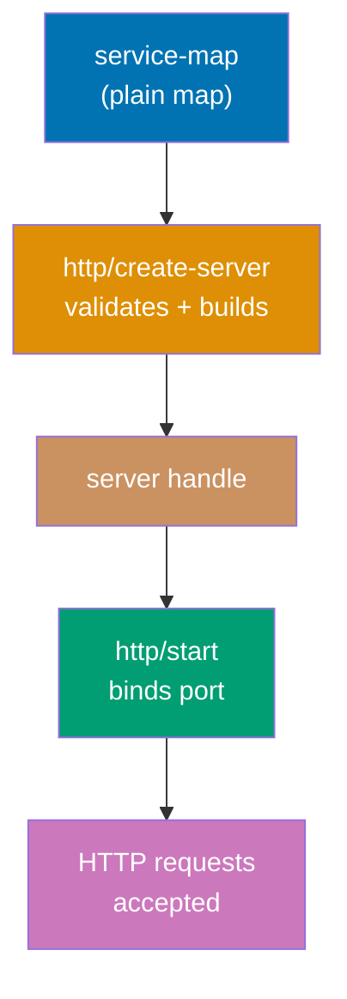
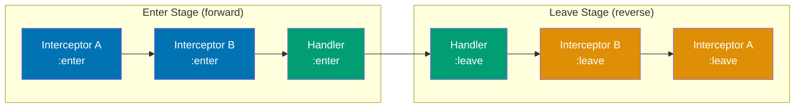

## Group 1: Service Map and Server Lifecycle

### Example 1: Minimal Pedestal Service

A Pedestal service starts with a plain Clojure map called the **service map**. This map tells Pedestal everything about your server: which port to listen on, what routes to serve, and which interceptors to apply globally. Running `http/create-server` validates and returns a server handle, and `http/start` starts the underlying Jetty (or Tomcat) server.



```clojure
;; deps.edn or project.clj dependency:
;; io.pedestal/pedestal.service {:mvn/version "0.7.0"}
;; io.pedestal/pedestal.jetty   {:mvn/version "0.7.0"}
;; org.slf4j/slf4j-simple       {:mvn/version "2.0.9"}

(ns my-app.server
  (:require [io.pedestal.http :as http]))  ;; => Load Pedestal's HTTP namespace

(def routes                                ;; => Define routes as a set of route vectors
  #{["/hello" :get                         ;; => GET /hello
     (fn [request]                         ;; => Inline handler (also an interceptor)
       {:status 200                        ;; => HTTP 200 OK
        :body   "Hello, Pedestal!"})       ;; => Response body string
     :route-name :hello]})                 ;; => Named route for URL generation

(def service-map                           ;; => Central configuration map
  {::http/routes  routes                   ;; => Your route set
   ::http/type    :jetty                   ;; => Server type: :jetty or :tomcat
   ::http/port    8080})                   ;; => TCP port to bind

(defn -main [& _args]
  (-> service-map                          ;; => Start with the service map
      http/create-server                   ;; => Validate config, create server handle
                                           ;; => Returns a map with :io.pedestal.http/server key
      http/start))                         ;; => Start the Jetty server, blocks until stopped
                                           ;; => Listens on http://localhost:8080
```

**Key Takeaway**: A Pedestal service is a plain Clojure map - no magic, no annotations, just data that describes your HTTP service.

**Why It Matters**: Because the service map is pure data, you can build, test, and manipulate your service configuration without ever starting a real server. This makes integration testing trivial - `response-for` runs requests against the service map directly. Teams report 10x faster test suites compared to starting/stopping real servers per test. Data-driven configuration also means you can compose service maps from multiple sources (config files, environment variables, feature flags) using standard `merge`.

---

### Example 2: Service Lifecycle with Start and Stop

In production you need clean startup and shutdown. Pedestal returns a server handle from `http/start`, and you call `http/stop` on that handle to gracefully drain connections. Storing the server in an atom enables REPL-driven development where you can stop, reconfigure, and restart without restarting the JVM.

```clojure
(ns my-app.server
  (:require [io.pedestal.http :as http]))

(defonce server (atom nil))               ;; => Atom holds the running server handle
                                           ;; => defonce prevents re-def on namespace reload

(def routes
  #{["/ping" :get
     (fn [_req]
       {:status 200 :body "pong"})
     :route-name :ping]})

(def base-service-map
  {::http/routes routes
   ::http/type   :jetty
   ::http/port   8080
   ::http/join?  false})                  ;; => false = non-blocking start (returns immediately)
                                           ;; => true (default) = blocks calling thread

(defn start! []
  (reset! server                          ;; => Store handle in atom
    (-> base-service-map
        http/create-server
        http/start))                      ;; => Returns running server map
  (println "Server started on port 8080"))

(defn stop! []
  (when @server                           ;; => Only stop if server is running
    (http/stop @server)                   ;; => Graceful shutdown, drains connections
    (reset! server nil)                   ;; => Clear the atom
    (println "Server stopped")))

(defn restart! []
  (stop!)                                 ;; => Stop if running
  (start!))                               ;; => Start fresh with current config
```

**Key Takeaway**: Store the server handle in an atom and use `::http/join? false` during development for REPL-friendly start/stop cycles.

**Why It Matters**: REPL-driven development is the Clojure superpower. When you can restart the server in milliseconds without losing your REPL state, you iterate faster and debug interactively. The `defonce` atom pattern ensures hot reloads (e.g., via `clj-reload` or Figwheel) don't create duplicate servers. Production deployments benefit from the same pattern: wrap start/stop in a `(-main)` that blocks with `(.join (:server @server))` until the JVM receives a termination signal.

---

### Example 3: Development vs Production Service Maps

Pedestal encourages composing the service map from a base config plus environment-specific overrides. Development adds verbose logging and disables connection draining. Production adds SSL, connection limits, and secure defaults. Merging plain maps is idiomatic Clojure - no XML, no YAML, no annotations.

```clojure
(ns my-app.config
  (:require [io.pedestal.http :as http]
            [io.pedestal.http.route :as route]))

(def base-service
  {::http/routes  (route/expand-routes #{}) ;; => Placeholder; routes added per env
   ::http/type    :jetty
   ::http/port    (Integer/parseInt          ;; => Read port from env, default 8080
                    (or (System/getenv "PORT") "8080"))})

(def dev-service
  (merge base-service                        ;; => Start with base config
    {::http/join?              false         ;; => Non-blocking for REPL
     ::http/allowed-origins    {:creds true  ;; => CORS - allow all in dev
                                :allowed-origins ["http://localhost:3000"]}
     ::http/secure-headers     nil}))        ;; => Disable strict headers in dev
                                              ;; => e.g. no X-Frame-Options restriction

(def prod-service
  (merge base-service
    {::http/join?          true              ;; => Block main thread in production
     ::http/host           "0.0.0.0"         ;; => Bind all interfaces (not just loopback)
     ::http/container-options               ;; => Jetty-specific tuning
       {:max-threads  50                     ;; => Thread pool upper bound
        :min-threads  8                      ;; => Thread pool lower bound
        :idle-timeout 30000}}))              ;; => Close idle connections after 30s
```

**Key Takeaway**: Compose service maps with `merge` - base config plus environment-specific overrides keeps configuration DRY and auditable.

**Why It Matters**: Configuration as data means you can inspect, test, and diff your production config in the REPL without ever deploying. Unlike framework annotations or XML files, you can write `(= prod-service expected-config)` in a unit test. Operators can audit the exact service map that was passed to `http/create-server` by logging it on startup - a practice that eliminates entire classes of "works in dev, broken in prod" bugs caused by invisible configuration differences.

---

## Group 2: Routing

### Example 4: Table Routes

Table routes are Pedestal's primary routing syntax. Each route is a vector of `[path verb interceptors :route-name name]`. You collect routes in a set and pass it to `route/expand-routes`. Table routes support path parameters, query constraints, and nested routes while remaining plain data you can manipulate programmatically.

```clojure
(ns my-app.routes
  (:require [io.pedestal.http.route :as route]))

(def user-handler                          ;; => Handler function (interceptor enter stage)
  {:name  :get-user                        ;; => Optional name for debugging
   :enter (fn [ctx]                        ;; => ctx is the interceptor context map
            (let [id (get-in ctx [:request :path-params :id])]
              ;; => :path-params populated by router from URL pattern
              ;; => e.g. GET /users/42 => {:id "42"}
              (assoc ctx :response         ;; => assoc :response onto context to send it
                {:status 200
                 :body   {:user-id id}})))})

(def routes
  (route/expand-routes                     ;; => Validates routes, builds router data
    #{["/users"     :get  [user-list-handler]  :route-name :users-list]
      ;; => GET /users => user-list-handler interceptor
      ["/users/:id" :get  [user-handler]       :route-name :user-get]
      ;; => GET /users/42 => user-handler, :path-params {:id "42"}
      ["/users/:id" :put  [user-update-handler]:route-name :user-put]
      ;; => PUT /users/42 => different handler, same URL pattern
      ["/users/:id" :delete [user-delete-handler] :route-name :user-delete]
      ;; => DELETE /users/42
      ["/health"    :get  [(fn [_] {:status 200 :body "ok"})] :route-name :health]}))
      ;; => Inline lambda handler for simple endpoints
```

**Key Takeaway**: Table routes are vectors in a set - each row fully describes one HTTP endpoint with path, verb, interceptor sequence, and a unique name.

**Why It Matters**: Named routes are the foundation of URL generation. Anywhere in your code you can call `(route/url-for :user-get :path-params {:id 42})` to produce `/users/42` without hardcoding strings. When you rename a route or restructure your URL hierarchy, the compiler flags every call site. This eliminates the "broken link" class of bugs that plague large applications built with string-based routing. Named routes also appear in request logs, making traffic analysis immediately readable.

---

### Example 5: Terse Routes

Terse routes provide a more compact syntax where the route table is a nested map keyed by path and then by verb. While table routes are preferred for clarity, terse routes reduce boilerplate when defining many routes under a shared path prefix.

```clojure
(ns my-app.routes-terse
  (:require [io.pedestal.http.route :as route]))

(def terse-routes
  (route/expand-routes
    {"/users"
     {:get  {:handler user-list-handler    ;; => Map with :handler key
             :route-name :users-list}
      :post {:handler user-create-handler
             :route-name :users-create}}

     "/users/:id"
     {:get    {:handler user-get-handler
               :route-name :user-get}
      :put    {:handler user-update-handler
               :route-name :user-update}
      :delete {:handler user-delete-handler
               :route-name :user-delete}}

     "/health"
     {:get (fn [_] {:status 200 :body "ok"})}}))
     ;; => Plain function works too - Pedestal wraps it in an interceptor
```

**Comparison with table routes**:

```clojure
;; Table route (preferred for explicit, searchable code):
["/users/:id" :get [user-get-handler] :route-name :user-get]
;; => One line per route, easy to grep and read

;; Terse route (useful when grouping under a shared prefix):
{"/users/:id" {:get {:handler user-get-handler :route-name :user-get}}}
;; => Nested, saves repetition of the path string
```

**Key Takeaway**: Use table routes for most projects; use terse routes when many routes share a prefix and nesting improves readability.

**Why It Matters**: Both syntaxes produce identical router data structures after `expand-routes`. Choosing between them is a style decision, not a performance one. Projects with 5-10 routes often prefer terse syntax. Projects with 50+ routes usually adopt table routes because each route appears on its own line, making grep/search and code review straightforward. Many teams adopt table routes as the standard to eliminate debate.

---

### Example 6: Query Parameters and Path Parameters

Pedestal automatically parses path parameters from URL patterns (`:id` in `/users/:id`) and populates `:path-params` in the request map. Query string parameters (`?page=2&size=20`) land in `:query-params`. Both are available as keyword maps inside the request context.

```clojure
(ns my-app.params
  (:require [io.pedestal.http.route :as route]))

(def list-users-handler
  {:name  :list-users
   :enter (fn [ctx]
            (let [req         (:request ctx)
                  ;; => Full Ring-compatible request map
                  query-params (:query-params req)
                  ;; => {:page "2" :size "20"} (all values are strings)
                  page        (Integer/parseInt (get query-params :page "1"))
                  ;; => Parse to int with default "1"
                  ;; => get with default handles missing ?page param
                  size        (Integer/parseInt (get query-params :size "20"))
                  ;; => Default page size 20
                  offset      (* (dec page) size)]
                  ;; => offset = (page-1) * size for SQL OFFSET clause
              (assoc ctx :response
                {:status 200
                 :body   {:page   page
                          :size   size
                          :offset offset}})))})

(def get-user-handler
  {:name  :get-user
   :enter (fn [ctx]
            (let [id (get-in ctx [:request :path-params :id])]
              ;; => :path-params always present, value is string
              ;; => :id came from "/users/:id" URL pattern
              (if (re-matches #"\d+" id)   ;; => Validate it's a number
                (assoc ctx :response {:status 200 :body {:id (Long/parseLong id)}})
                (assoc ctx :response {:status 400 :body {:error "id must be numeric"}}))))})

(def routes
  (route/expand-routes
    #{["/users"     :get [list-users-handler] :route-name :users-list]
      ["/users/:id" :get [get-user-handler]   :route-name :user-get]}))
```

**Key Takeaway**: Path params arrive as `:path-params` keywords, query params as `:query-params` - both are string-valued maps requiring explicit coercion.

**Why It Matters**: Always coerce and validate path/query params at the boundary. Trusting that `:id` is numeric because it came from a URL invites SQL injection and crashes. Pedestal's design makes this validation explicit - there's no implicit type coercion, which surfaces the validation need during code review. Use `spec` or `malli` for complex param shapes. The explicit string-only nature also means your handler is easy to unit test: just pass `{:path-params {:id "42"}}` without any routing infrastructure.

---

### Example 7: HTTP Verbs and RESTful Resources

Pedestal supports all standard HTTP verbs: GET, POST, PUT, PATCH, DELETE, HEAD, OPTIONS. For RESTful resources you define one route per verb/path combination. Each handler returns a response map with `:status` and optionally `:body` and `:headers`. Pedestal does not impose any MVC pattern - routes are just data pointing to interceptors.

```clojure
(ns my-app.rest
  (:require [io.pedestal.http.route :as route]))

(def create-user-handler
  {:name  :create-user
   :enter (fn [ctx]
            (let [body (:json-params (:request ctx))]
              ;; => :json-params populated by body-params interceptor (see Example 12)
              ;; => e.g. {"name" "Alice" "email" "alice@example.com"}
              (assoc ctx :response
                {:status  201                     ;; => 201 Created (not 200)
                 :headers {"Location" (str "/users/" 99)} ;; => Location of created resource
                 :body    {:id 99 :name (:name body)}})))})

(def update-user-handler
  {:name  :update-user
   :enter (fn [ctx]
            (let [id   (get-in ctx [:request :path-params :id])
                  body (:json-params (:request ctx))]
              ;; => PUT replaces the whole resource
              (assoc ctx :response
                {:status 200
                 :body   {:id id :updated true :data body}})))})

(def patch-user-handler
  {:name  :patch-user
   :enter (fn [ctx]
            (let [id   (get-in ctx [:request :path-params :id])
                  body (:json-params (:request ctx))]
              ;; => PATCH applies partial updates (only provided fields)
              (assoc ctx :response
                {:status 200
                 :body   {:id id :patched true :changes body}})))})

(def routes
  (route/expand-routes
    #{["/users"     :post   [create-user-handler]  :route-name :users-create]
      ["/users/:id" :put    [update-user-handler]  :route-name :user-update]
      ["/users/:id" :patch  [patch-user-handler]   :route-name :user-patch]
      ["/users/:id" :delete [(fn [_] {:status 204 :body ""})] :route-name :user-delete]
      ;; => 204 No Content for successful delete - no body
      ["/users/:id" :head   [(fn [_] {:status 200})] :route-name :user-head]}))
      ;; => HEAD same as GET but no body - used for existence checks
```

**Key Takeaway**: Map each HTTP verb to a separate route - Pedestal dispatches by verb and path, so PUT and PATCH on the same URL go to different handlers.

**Why It Matters**: Proper HTTP verb semantics matter for caching, idempotency, and API contract clarity. GET must be safe (no side effects) and idempotent. PUT must be idempotent (calling twice produces same result). POST is neither. PATCH should apply minimal changes. Clients (browsers, CDNs, API gateways) rely on these semantics for correct caching, retry policies, and preflight checks. Pedestal exposes all verbs without ceremony, letting you build standards-compliant APIs that integrate with the full HTTP ecosystem.

---

## Group 3: Interceptors Basics

### Example 8: Interceptor Anatomy

An interceptor is a map with up to three keys: `:enter`, `:leave`, and `:error`. Each value is a function that takes the context map and returns a (possibly modified) context map. Pedestal chains interceptors: it runs all `:enter` functions in forward order, then all `:leave` functions in reverse order (like a stack). The `:error` stage only runs when a previous stage threw an exception.



```clojure
(ns my-app.interceptors
  (:require [io.pedestal.interceptor :as interceptor]))

(def logging-interceptor
  {:name  ::logging                        ;; => Keyword name for debugging/tracing
   :enter (fn [ctx]
            (println "Request:"            ;; => Runs BEFORE handler
              (get-in ctx [:request :uri]) ;; => Log the requested URI
              (get-in ctx [:request :request-method])) ;; => Log HTTP verb
            ctx)                           ;; => MUST return ctx (possibly modified)
                                           ;; => Returning nil would abort the chain
   :leave (fn [ctx]
            (println "Response:"           ;; => Runs AFTER handler (in reverse order)
              (get-in ctx [:response :status])) ;; => Log response status
            ctx)                           ;; => Return ctx unchanged
   :error (fn [ctx ex]                     ;; => Runs if any interceptor in chain throws
            (println "Error:" (.getMessage ex))
            (assoc ctx :response           ;; => Provide fallback response
              {:status 500
               :body   "Internal Server Error"}))})

(def hello-handler
  {:name  ::hello-handler
   :enter (fn [ctx]
            (assoc ctx :response           ;; => Attach response to context map
              {:status 200
               :body   "Hello!"}))})
   ;; => No :leave needed - handler only needs :enter for simple cases
   ;; => :leave would run AFTER the response is set, before it's sent

;; Interceptor chain for a route: [logging-interceptor hello-handler]
;; Enter order: logging-interceptor => hello-handler (sets response)
;; Leave order: hello-handler (no :leave) => logging-interceptor (logs status)
```

**Key Takeaway**: Interceptors are maps with `:enter`/`:leave`/`:error` - enter runs forward, leave runs in reverse, forming a bidirectional pipeline around your handler.

**Why It Matters**: The bidirectional interceptor model solves cross-cutting concerns elegantly. Authentication, logging, metrics, and transaction management all need "before" and "after" behavior. Ring middleware achieves this with nested closures, which are hard to compose, test, or reorder. Pedestal interceptors are plain maps - you can inspect them, test each stage independently, reorder them at runtime, and even skip specific leave stages. Teams migrating from Ring report that interceptors make middleware logic significantly easier to reason about and debug.

---

### Example 9: The Context Map

The context map is the single value that flows through every interceptor. It contains `:request` (the incoming Ring request), `:response` (set by your handler), and Pedestal's own bookkeeping keys. Understanding the context map structure lets you write precise interceptors that access exactly what they need and add exactly what downstream interceptors expect.

```clojure
(ns my-app.context
  (:require [io.pedestal.interceptor :as interceptor]))

(def inspect-context
  {:name  ::inspect-context
   :enter (fn [ctx]
            ;; The context map contains:
            (let [request (:request ctx)]  ;; => Ring-compatible request map
              (println
                "method:" (:request-method request)  ;; => :get :post :put etc.
                "uri:"    (:uri request)              ;; => "/users/42"
                "headers:" (:headers request)         ;; => {"content-type" "application/json"}
                "body:"   (:body request)))            ;; => InputStream (not yet parsed)
            ;; Pedestal's internal context keys:
            ;; :io.pedestal.interceptor.chain/stack   - remaining interceptors to run
            ;; :io.pedestal.interceptor.chain/queue   - interceptors queued (for async)
            ;; :io.pedestal.interceptor.chain/terminators - functions that halt the chain
            ctx)})

(def enrich-context
  {:name  ::enrich-context
   :enter (fn [ctx]
            (let [user-id (get-in ctx [:request :path-params :id])]
              (assoc ctx                   ;; => Add custom keys to context
                :current-user-id user-id  ;; => Available to all downstream interceptors
                :request-start (System/currentTimeMillis))))}) ;; => For timing
                ;; => Custom keys use unqualified or namespaced keywords
                ;; => Convention: use namespaced keywords to avoid collisions

(def use-enriched-data
  {:name  ::use-enriched-data
   :enter (fn [ctx]
            (let [user-id (:current-user-id ctx)] ;; => Read key set by enrich-context
              (assoc ctx :response {:status 200 :body {:fetching user-id}})))
   :leave (fn [ctx]
            (let [elapsed (- (System/currentTimeMillis)
                             (:request-start ctx))] ;; => Compute elapsed time
              (println "Request took" elapsed "ms")
              ctx))})
```

**Key Takeaway**: The context map is your communication channel - interceptors add keys to `ctx` that downstream interceptors read; use namespaced keywords to avoid collisions.

**Why It Matters**: Passing data through the context map (rather than dynamic vars or thread-local state) makes the data flow explicit and testable. You can write a test that sets `{:current-user-id "123"}` in the context and verify your handler uses it correctly - no mocking required. This eliminates an entire category of integration bugs where "request-scoped" data leaks between requests when using thread locals. The context map is also inspectable in production via Pedestal's built-in trace support.

---

### Example 10: Short-Circuiting the Interceptor Chain

Pedestal's chain can be terminated early by assigning `:response` to the context before the chain completes. This is how authentication interceptors reject requests - they assoc a 401 response and the chain terminates; subsequent interceptors (including your handler) never execute. No exceptions needed.

```clojure
(ns my-app.short-circuit
  (:require [io.pedestal.http.route :as route]))

(def require-api-key
  {:name  ::require-api-key
   :enter (fn [ctx]
            (let [api-key (get-in ctx [:request :headers "x-api-key"])]
              ;; => Headers are lowercase strings in Ring
              (if (= api-key "secret-key-123")     ;; => Check the key
                ctx                                 ;; => Valid: pass ctx through unchanged
                (assoc ctx :response                ;; => Invalid: short-circuit with 401
                  {:status 401
                   :headers {"WWW-Authenticate" "APIKey"}
                   :body    {:error "Invalid or missing API key"}}))))})
                   ;; => By setting :response here, Pedestal skips remaining :enter stages
                   ;; => The :leave stages of already-entered interceptors still run
                   ;; => This preserves logging, timing, and cleanup behavior

(def protected-handler
  {:name  ::protected-handler
   :enter (fn [ctx]
            ;; => This only runs if require-api-key passed ctx through
            (assoc ctx :response {:status 200 :body {:secret "data"}}))})

(def routes
  (route/expand-routes
    #{["/protected" :get [require-api-key protected-handler] :route-name :protected]}))
    ;; => Interceptors are ordered left-to-right in the vector
    ;; => require-api-key runs first; if it short-circuits, protected-handler never runs
```

**Key Takeaway**: Assigning `:response` in an `:enter` stage short-circuits the remaining interceptor chain - downstream interceptors never run, but already-entered interceptors still run their `:leave` stages.

**Why It Matters**: Short-circuiting via response assignment is safer than throwing exceptions for expected conditions like auth failures. Exceptions are for unexpected errors; 401/403/404 are expected business outcomes. The interceptor model ensures cleanup (logging, connection release, span finishing) happens even when you short-circuit. This prevents resource leaks common in frameworks where early returns skip finally blocks. Teams using Pedestal report cleaner auth code compared to filter chains in frameworks like Spring, where ordering and exception propagation often cause subtle bugs.

---

### Example 11: Built-in Interceptors

Pedestal ships with several built-in interceptors in `io.pedestal.http`. The most important is `body-params`, which parses JSON, Transit, and form-encoded request bodies and places the result in `:json-params`, `:transit-params`, or `:form-params` respectively. `io.pedestal.http.ring-middlewares` wraps Ring middleware as interceptors.

```clojure
(ns my-app.builtin
  (:require [io.pedestal.http :as http]
            [io.pedestal.http.body-params :as body-params]
            [io.pedestal.http.route :as route]))

;; body-params is the most commonly needed built-in interceptor
;; It must appear BEFORE your handler in the interceptor vector

(def create-user-handler
  {:name  ::create-user
   :enter (fn [ctx]
            (let [body (:json-params (:request ctx))]
              ;; => After body-params runs, :json-params contains parsed JSON
              ;; => e.g. {"name" "Alice"} (string keys, as per JSON spec)
              ;; => Pedestal does NOT keywordize JSON keys by default
              (println "Creating user:" body)
              (assoc ctx :response
                {:status 201
                 :body   {:created true
                          :name    (get body "name")}})))}) ;; => String key access

(def routes
  (route/expand-routes
    #{["/users" :post
       [(body-params/body-params)          ;; => Call body-params as a function - returns interceptor
        create-user-handler]               ;; => Handler runs after body-params
       :route-name :users-create]}))

;; body-params interceptor handles these Content-Types:
;; application/json           => :json-params (string keys)
;; application/transit+json   => :transit-params
;; application/transit+msgpack => :transit-params
;; application/x-www-form-urlencoded => :form-params
;; multipart/form-data        => :multipart-params (file uploads)
```

**Key Takeaway**: `(body-params/body-params)` creates an interceptor that parses request bodies - place it before your handler in the interceptor chain, and read the result from `:json-params`.

**Why It Matters**: Without body-params, your handler receives a raw `InputStream` as `:body`. You'd need to read, decode, and parse it manually in every handler - and handle errors for malformed JSON every time. body-params centralizes this concern, applies correct charset detection, handles Content-Type negotiation, and catches parse errors before your handler runs. It also supports Transit, which Clojure-to-Clojure services use for efficient serialization of rich data types (keywords, sets, dates) that don't map cleanly to JSON.

---

## Group 4: Request and Response

### Example 12: Response Maps

A handler's job is to produce a response map and attach it to the context via `(assoc ctx :response ...)`. The response map follows the Ring spec: `:status` (integer), `:headers` (string-keyed map), and `:body` (string, InputStream, File, or channel). Pedestal's JSON encoder (`io.pedestal.http/json-response`) automatically serializes Clojure maps/vectors to JSON.

```clojure
(ns my-app.responses
  (:require [io.pedestal.http.route :as route]))

;; Minimal response - status only
(def no-content-handler
  {:name  ::no-content
   :enter (fn [ctx]
            (assoc ctx :response {:status 204}))}) ;; => 204 No Content, no body

;; JSON response - Pedestal serializes Clojure data to JSON automatically
(def json-handler
  {:name  ::json-response
   :enter (fn [ctx]
            (assoc ctx :response
              {:status  200
               :headers {"Content-Type" "application/json;charset=UTF-8"}
               ;; => Must set Content-Type for JSON (Pedestal doesn't auto-set it
               ;;    unless you use the coerce-response interceptor)
               :body    {:users [{:id 1 :name "Alice"}   ;; => Clojure map => JSON object
                                 {:id 2 :name "Bob"}]}}))})

;; Redirect response
(def redirect-handler
  {:name  ::redirect
   :enter (fn [ctx]
            (assoc ctx :response
              {:status  302               ;; => 302 Found (temporary redirect)
               :headers {"Location" "https://example.com/new-url"}
               :body    ""}))})           ;; => Empty body for redirects

;; Error response with structured body
(def not-found-handler
  {:name  ::not-found
   :enter (fn [ctx]
            (assoc ctx :response
              {:status  404
               :headers {"Content-Type" "application/json;charset=UTF-8"}
               :body    {:error   "not-found"
                         :message "The requested resource does not exist"
                         :path    (get-in ctx [:request :uri])}}))}) ;; => Echo the URI
```

**Key Takeaway**: Response maps follow the Ring spec - `:status`, `:headers`, and `:body`; attach the map to the context with `(assoc ctx :response ...)`.

**Why It Matters**: The response map being plain data means you can test responses with `=` equality checks - no mocking HTTP client libraries. `(= (:response ctx) {:status 200 :body {:id 1}})` is a complete assertion. This simple property dramatically reduces test setup complexity. Teams migrating from annotation-based frameworks (Spring, JAX-RS) report that being able to write `(is (= 200 (get-in result [:response :status])))` instead of MockMvcResultMatchers chains makes tests dramatically more readable and maintainable.

---

### Example 13: Reading Request Headers

Request headers arrive as a string-keyed map in `(:headers request)`. HTTP headers are case-insensitive by spec, and Pedestal normalizes all header names to lowercase. Accessing `"content-type"` and `"Content-Type"` both work because Ring normalizes to lowercase.

```clojure
(ns my-app.headers
  (:require [io.pedestal.http.route :as route]))

(def header-inspector
  {:name  ::header-inspector
   :enter (fn [ctx]
            (let [headers (get-in ctx [:request :headers])]
              ;; => headers is a string-keyed map: {"content-type" "application/json"}
              ;; => All keys are lowercase (Ring normalization)
              (let [content-type (get headers "content-type")
                    ;; => e.g. "application/json; charset=utf-8"
                    accept       (get headers "accept")
                    ;; => e.g. "application/json, text/html;q=0.9"
                    auth-header  (get headers "authorization")
                    ;; => e.g. "Bearer eyJhbGciOiJIUzI1NiJ9..."
                    user-agent   (get headers "user-agent")]
                    ;; => e.g. "Mozilla/5.0 ..."
                (assoc ctx :response
                  {:status 200
                   :body   {:content-type content-type
                            :accept       accept
                            :has-auth?    (some? auth-header) ;; => Boolean, don't echo auth
                            :user-agent   user-agent}}))))})

(def response-headers-handler
  {:name  ::set-response-headers
   :enter (fn [ctx]
            (assoc ctx :response
              {:status  200
               :headers {"Content-Type"              "application/json;charset=UTF-8"
                         "X-Request-Id"              (str (random-uuid))
                         ;; => Add trace ID for distributed tracing
                         "Cache-Control"             "no-store"
                         ;; => Prevent caching of dynamic responses
                         "X-Content-Type-Options"    "nosniff"
                         ;; => Prevent MIME sniffing attacks
                         "X-Frame-Options"           "DENY"}
                         ;; => Prevent clickjacking
               :body    {:success true}}))})
```

**Key Takeaway**: Request headers are lowercase string keys; response headers are any-case strings (by convention Title-Case) - access them with `(get headers "content-type")`.

**Why It Matters**: Secure API development requires setting response headers that modern browsers and API gateways expect. Missing `X-Content-Type-Options` allows MIME sniffing attacks. Missing `Cache-Control` on sensitive endpoints means proxies may cache user data. Pedestal gives you direct access to the headers map so you can set security headers precisely where needed - either in individual handlers or in a global headers interceptor that runs for every route. Understanding header normalization also prevents the common bug of checking `"Content-Type"` (capital T) and finding it missing because the actual key is `"content-type"`.

---

## Group 5: JSON and Content Negotiation

### Example 14: Serving JSON Responses

Pedestal provides `io.pedestal.http/json-response` and the `coerce-response` interceptor to automatically serialize Clojure data to JSON. Without these, you must manually serialize to a string and set the Content-Type header. With them, you return plain Clojure data from your handler and Pedestal handles serialization.

```clojure
(ns my-app.json
  (:require [io.pedestal.http :as http]
            [io.pedestal.http.body-params :as body-params]
            [io.pedestal.http.route :as route]
            [cheshire.core :as json]))     ;; => cheshire is Pedestal's JSON library

;; Approach 1: Manual JSON serialization (explicit, no magic)
(def manual-json-handler
  {:name  ::manual-json
   :enter (fn [ctx]
            (assoc ctx :response
              {:status  200
               :headers {"Content-Type" "application/json;charset=UTF-8"}
               :body    (json/generate-string  ;; => Serialize to JSON string
                          {:users [{:id 1 :name "Alice"}]}
                          {:pretty true})}))}) ;; => Pretty-print (dev only)

;; Approach 2: Return Clojure data, let interceptor handle serialization
(def auto-json-handler
  {:name  ::auto-json
   :enter (fn [ctx]
            (assoc ctx :response
              {:status 200
               :body   {:users [{:id 1 :name "Alice"}]}}))})
               ;; => Pedestal's coerce-response interceptor serializes this to JSON
               ;; => when Accept: application/json is present

;; Service map enabling automatic JSON coercion:
(def service-map
  {::http/routes (route/expand-routes
                   #{["/api/users" :get [(body-params/body-params)
                                         auto-json-handler]
                      :route-name :api-users]})
   ::http/type   :jetty
   ::http/port   8080})
   ;; => io.pedestal.http/create-server adds default interceptors including
   ;; => coerce-body (serializes :body based on Accept) and
   ;; => content-neg-intc (negotiates Accept/Content-Type)
```

**Key Takeaway**: Return Clojure maps/vectors as `:body` - Pedestal's default interceptors serialize them to JSON when the client sends `Accept: application/json`.

**Why It Matters**: Automatic content negotiation prevents common bugs where JSON endpoints accidentally return Clojure pr-str output when Content-Type is missing. By standardizing on `coerce-body`, your handlers return pure data and the serialization concern is centralized. This also enables future protocol support - adding Transit support means updating one interceptor, not every handler. Teams building internal Clojure-to-Clojure services often configure Transit as the default for rich data type support, falling back to JSON for external consumers.

---

### Example 15: Content Negotiation

Pedestal's `io.pedestal.http.content-negotiation` namespace provides the `negotiate-content` interceptor factory. It reads the client's `Accept` header and selects the best matching response format. If no acceptable format is found, it returns 406 Not Acceptable before your handler runs.

```clojure
(ns my-app.content-neg
  (:require [io.pedestal.http.content-negotiation :as conneg]
            [io.pedestal.http.route :as route]))

;; Create a content negotiation interceptor for specific mime types
(def content-neg-intc
  (conneg/negotiate-content                ;; => Returns an interceptor
    ["application/json"                    ;; => Supported response types
     "application/transit+json"            ;; => Transit (Clojure-friendly)
     "text/plain"]))                        ;; => Fallback plain text

(def multi-format-handler
  {:name  ::multi-format
   :enter (fn [ctx]
            (let [accepted (get-in ctx [:request :accept :field])]
              ;; => :accept populated by negotiate-content interceptor
              ;; => {:field "application/json" ...}
              (assoc ctx :response
                (condp = accepted
                  "application/json"
                  {:status 200
                   :headers {"Content-Type" "application/json;charset=UTF-8"}
                   :body   "{\"message\": \"JSON response\"}"}

                  "application/transit+json"
                  {:status 200
                   :headers {"Content-Type" "application/transit+json"}
                   :body   "[\"^ \",\"~:message\",\"Transit response\"]"}

                  ;; Default: plain text
                  {:status 200
                   :headers {"Content-Type" "text/plain;charset=UTF-8"}
                   :body   "Plain text response"}))))})

(def routes
  (route/expand-routes
    #{["/api/data" :get
       [content-neg-intc multi-format-handler]
       :route-name :api-data]}))
```

**Key Takeaway**: Use `(conneg/negotiate-content ["application/json" ...])` to add content negotiation - it 406s unknown Accept types before your handler and sets `:accept` in the request for your handler to dispatch on.

**Why It Matters**: Content negotiation is the HTTP mechanism that lets one endpoint serve JSON to REST clients and Transit to Clojure clients without URL hacks like `/api/users.json`. Clients that receive a 406 can adjust their Accept header and retry - a much cleaner failure mode than receiving HTML when they expected JSON. Properly implemented content negotiation also enables seamless API evolution: you can add `application/vnd.myapi.v2+json` as a new supported type without breaking existing clients.

---

## Group 6: Static Resources and Error Handling

### Example 16: Serving Static Files

Pedestal can serve static files from the classpath or filesystem using the `resource` and `file-info` interceptors from `io.pedestal.http.ring-middlewares`. These wrap Ring's `wrap-resource` and `wrap-file-info` as Pedestal interceptors, serving files with correct Content-Type and caching headers.

```clojure
(ns my-app.static
  (:require [io.pedestal.http :as http]
            [io.pedestal.http.ring-middlewares :as middlewares]
            [io.pedestal.http.route :as route]))

(def serve-static
  (middlewares/resource "public"))         ;; => Serve files from resources/public/ on classpath
                                            ;; => E.g. resources/public/index.html => GET /index.html

(def file-info
  (middlewares/file-info))                  ;; => Adds Content-Type, Last-Modified, ETag headers
                                            ;; => Enables conditional GET (304 Not Modified)

;; Routes that serve static files alongside API routes:
(def routes
  (route/expand-routes
    #{["/api/health" :get
       [(fn [_] {:status 200 :body "ok"})]
       :route-name :health]
      ["/files/*path" :get              ;; => Wildcard path captures remainder
       [serve-static file-info]         ;; => file-info runs after serve-static
       :route-name :static-files]}))

;; For a Single Page App, serve index.html for all unmatched routes:
(def spa-fallback
  {:name  ::spa-fallback
   :enter (fn [ctx]
            ;; => If no route matched, serve the SPA's index.html
            (let [uri (get-in ctx [:request :uri])]
              (if (str/starts-with? uri "/api")
                ;; => API routes that 404 should stay 404
                (assoc ctx :response {:status 404 :body "API route not found"})
                ;; => All other 404s get the SPA shell
                (assoc ctx :response
                  {:status  200
                   :headers {"Content-Type" "text/html;charset=UTF-8"}
                   :body    (slurp (clojure.java.io/resource "public/index.html"))}))))})
```

**Key Takeaway**: Use `(middlewares/resource "public")` to serve static files from the classpath - combine with `(middlewares/file-info)` for proper caching headers.

**Why It Matters**: Serving static files through the same Pedestal process eliminates a common architectural complexity in development - needing a separate static file server or webpack dev server on a different port. For production, teams often move static assets to a CDN (S3 + CloudFront) and remove the static file interceptors, improving performance without changing application code. The interceptor model makes this switch transparent: remove two interceptors from the service map and re-deploy.

---

### Example 17: Basic Error Handling

Pedestal's interceptor `:error` stage catches exceptions thrown by any interceptor in the chain. The error handler receives the context and the exception. You can inspect the exception type and return appropriate HTTP responses. If an error interceptor doesn't handle the error (doesn't assoc `:response`), the error propagates to the next error handler up the chain.

```clojure
(ns my-app.errors
  (:require [io.pedestal.interceptor.error :as error-int]
            [io.pedestal.http.route :as route]))

;; Use error-int/error-dispatch for pattern-matching on exception types
(def service-error-handler
  (error-int/error-dispatch
    [ctx ex]

    ;; Pattern: dispatch on exception type
    [{:exception-type :clojure.lang.ExceptionInfo}]
    (let [data (ex-data ex)]              ;; => ex-data extracts the map from ExceptionInfo
      (assoc ctx :response
        {:status  (get data :status 400)  ;; => Use :status from ex-data, default 400
         :headers {"Content-Type" "application/json;charset=UTF-8"}
         :body    {:error   (get data :error "bad-request")
                   :message (ex-message ex)}}))
                   ;; => ex-message extracts the message string

    ;; Fallback: catch all other exceptions
    :else
    (do
      (println "Unhandled error:" ex)     ;; => Log to console (use real logger in prod)
      (assoc ctx :response
        {:status  500
         :headers {"Content-Type" "application/json;charset=UTF-8"}
         :body    {:error "internal-server-error"}}))))

;; Handler that throws a domain exception:
(def risky-handler
  {:name  ::risky
   :enter (fn [ctx]
            (let [id (get-in ctx [:request :path-params :id])]
              (when (= id "0")
                (throw (ex-info "User not found"  ;; => ExceptionInfo with data map
                         {:status 404
                          :error  "not-found"
                          :id     id})))
              (assoc ctx :response {:status 200 :body {:id id}})))})

(def routes
  (route/expand-routes
    #{["/users/:id" :get
       [service-error-handler risky-handler]  ;; => Error handler before risky handler
       :route-name :user-get]}))
```

**Key Takeaway**: Use `error-int/error-dispatch` to pattern-match exception types and return appropriate HTTP responses - place the error interceptor before your handler so it can catch exceptions thrown by the handler.

**Why It Matters**: Centralized error handling with pattern dispatch on exception types creates a clean separation between "what went wrong" (domain exceptions with structured data) and "how to respond" (HTTP status codes and JSON bodies). Using `ex-info` with a `:status` key in the data map lets you throw domain-appropriate exceptions from deep in service functions without coupling your business logic to HTTP. The error interceptor translates domain exceptions into HTTP responses at the boundary, keeping your domain layer pure.

---

### Example 18: Default 404 and Method Not Allowed

Pedestal returns a 404 when no route matches and 405 when the path matches but the HTTP verb doesn't. You can customize these responses by adding a global not-found interceptor to the service map's `::http/not-found-interceptor` key.

```clojure
(ns my-app.not-found
  (:require [io.pedestal.http :as http]
            [io.pedestal.http.route :as route]))

(def custom-not-found
  {:name  ::custom-not-found
   :enter (fn [ctx]
            (assoc ctx :response
              {:status  404
               :headers {"Content-Type" "application/json;charset=UTF-8"}
               :body    {:error   "not-found"
                         :message "The requested endpoint does not exist"
                         :path    (get-in ctx [:request :uri])
                         :method  (name (get-in ctx [:request :request-method]))}}))})
                         ;; => name converts :get keyword to "get" string

(def service-map
  {::http/routes            (route/expand-routes #{})
   ::http/type              :jetty
   ::http/port              8080
   ::http/not-found-interceptor custom-not-found
   ;; => Replaces Pedestal's default 404 handler
   ;; => Runs when no route matches the path+verb
   ::http/method-not-allowed-interceptor
   {:name  ::method-not-allowed
    :enter (fn [ctx]
             (assoc ctx :response
               {:status  405
                :headers {"Allow"        "GET, POST, PUT, DELETE"
                          "Content-Type" "application/json;charset=UTF-8"}
                :body    {:error  "method-not-allowed"
                          :method (name (get-in ctx [:request :request-method]))}}))}})
```

**Key Takeaway**: Override `::http/not-found-interceptor` in the service map for custom 404 responses - Pedestal calls it whenever no route matches.

**Why It Matters**: The default Pedestal 404 response is a plain HTML page - acceptable for browsers but wrong for API clients expecting JSON. API clients that receive HTML instead of JSON often crash with cryptic "unexpected token" parse errors rather than displaying a meaningful error. Standardizing on JSON 404/405 responses is part of the API contract and should be enforced at the framework level, not duplicated in every route. Custom 404 handlers also let you log unmatched routes for security monitoring - repeated probes of `/wp-admin` or `/.env` are worth tracking.

---

## Group 7: Logging and Configuration

### Example 19: Structured Logging with SLF4J

Pedestal uses SLF4J for logging. Add `org.slf4j/slf4j-simple` or `ch.qos.logback/logback-classic` to your dependencies and use `io.pedestal.log` for structured log output. The Pedestal log namespace wraps SLF4J with Clojure idioms.

```clojure
(ns my-app.logging
  (:require [io.pedestal.log :as log]
            [io.pedestal.http.route :as route]))

;; io.pedestal.log provides: log/info, log/warn, log/error, log/debug
;; All accept key-value pairs for structured logging

(def logging-interceptor
  {:name  ::logging
   :enter (fn [ctx]
            (let [req (:request ctx)]
              (log/info :msg "Request received"           ;; => Structured: key-value pairs
                        :method  (name (:request-method req))
                        :uri     (:uri req)
                        :ip      (:remote-addr req)))     ;; => Client IP
            ctx)
   :leave (fn [ctx]
            (let [status (get-in ctx [:response :status])]
              (log/info :msg    "Request completed"
                        :status status))
            ctx)
   :error (fn [ctx ex]
            (log/error :msg       "Request failed"
                       :error     (.getMessage ex)        ;; => Exception message
                       :exception ex)                     ;; => Full exception for stack trace
            (assoc ctx :response {:status 500 :body "error"}))})

;; Add logback.xml or simplelogger.properties to resources/ for log configuration
;; Example simplelogger.properties (org.slf4j/slf4j-simple):
;;   org.slf4j.simpleLogger.defaultLogLevel=info
;;   org.slf4j.simpleLogger.log.io.pedestal=warn  ;; => Reduce Pedestal framework noise
;;   org.slf4j.simpleLogger.showDateTime=true
;;   org.slf4j.simpleLogger.dateTimeFormat=yyyy-MM-dd HH:mm:ss

(def routes
  (route/expand-routes
    #{["/api/test" :get
       [logging-interceptor
        (fn [_] {:status 200 :body "logged"})]
       :route-name :test]}))
```

**Key Takeaway**: Use `io.pedestal.log` with key-value pairs for structured logging - structured logs are machine-readable and work with log aggregation platforms like Datadog, Splunk, and ELK.

**Why It Matters**: Structured logging transforms log analysis from grep-and-pray into SQL-like queries. When every log line has `:uri`, `:method`, `:status`, and `:duration` as queryable fields, you can answer "what is the p99 latency for POST /api/users in the last hour?" in seconds using Datadog or Kibana. Unstructured logs require expensive regex parsing to extract the same data. Adopting structured logging from day one, before production traffic arrives, means your observability platform is ready when you need it. The key-value format also integrates with distributed tracing systems that correlate log lines with trace spans.

---

### Example 20: Environment-Based Configuration

Production applications need different configuration for different environments. Pedestal reads configuration from the service map which you can build dynamically from environment variables. The `aero` library provides a clean EDN-based configuration file that can reference environment variables.

```clojure
(ns my-app.config
  (:require [io.pedestal.http :as http]
            [io.pedestal.http.route :as route]))

;; Reading configuration from environment variables
(defn read-config []
  {:port    (Integer/parseInt (or (System/getenv "PORT") "8080"))
   ;; => Default 8080 if PORT not set
   :host    (or (System/getenv "HOST") "0.0.0.0")
   ;; => Bind all interfaces by default
   :db-url  (or (System/getenv "DATABASE_URL")
                "jdbc:postgresql://localhost:5432/myapp")
   ;; => Fail loudly if not set in production
   :jwt-secret (or (System/getenv "JWT_SECRET")
                   (throw (ex-info "JWT_SECRET not set" {})))})
                   ;; => Throw at startup if required config missing
                   ;; => Fail fast beats silent wrong behavior

(defn build-service [config]
  {::http/routes (route/expand-routes #{})
   ::http/type   :jetty
   ::http/port   (:port config)           ;; => Dynamic port from config
   ::http/host   (:host config)})

(defn -main [& _]
  (let [config  (read-config)             ;; => Read env vars at startup
        service (build-service config)]   ;; => Build service map from config
    (println "Starting server on port" (:port config))
    (-> service
        http/create-server
        http/start)))
```

**Key Takeaway**: Build the service map from environment variables at startup - fail immediately with a clear error if required configuration is missing.

**Why It Matters**: The "fail fast" pattern for missing configuration prevents the worst kind of production incident: a server that starts successfully but behaves incorrectly because it silently used a default value for a required setting. Throwing at startup means your container orchestrator (Kubernetes, ECS) sees the crash, marks the pod unhealthy, and never routes traffic to it - operators get an immediate alert rather than discovering missing config through user complaints. Environment-variable configuration also follows the 12-factor app methodology, enabling the same Docker image to serve development, staging, and production environments.

---

### Example 21: Custom Interceptors with `interceptor/interceptor`

The `io.pedestal.interceptor/interceptor` function converts a plain map into a validated Pedestal interceptor record. This is useful when you need to construct interceptors dynamically (e.g., with closures capturing configuration) or when you want to ensure the interceptor map is valid at definition time.

```clojure
(ns my-app.custom-interceptors
  (:require [io.pedestal.interceptor :as interceptor]
            [io.pedestal.http.route :as route]))

;; Dynamic interceptor factory - captures config in closure
(defn rate-limiter [max-requests-per-minute]
  ;; => max-requests-per-minute is captured by the closure
  (let [request-counts (atom {})]         ;; => Map of IP -> [timestamps...]
    (interceptor/interceptor             ;; => Validate and wrap as interceptor record
      {:name  ::rate-limiter
       :enter (fn [ctx]
                (let [ip    (get-in ctx [:request :remote-addr])
                      now   (System/currentTimeMillis)
                      cutoff (- now 60000)  ;; => 1 minute ago
                      timestamps (get @request-counts ip [])
                      recent (filter #(> % cutoff) timestamps)]
                      ;; => Keep only timestamps within the last minute
                  (if (>= (count recent) max-requests-per-minute)
                    ;; => Over limit: short-circuit with 429
                    (assoc ctx :response
                      {:status  429
                       :headers {"Retry-After"  "60"
                                 "Content-Type" "application/json;charset=UTF-8"}
                       :body    {:error "rate-limit-exceeded"
                                 :limit max-requests-per-minute}})
                    ;; => Under limit: update count and continue
                    (do
                      (swap! request-counts assoc ip (conj recent now))
                      ctx))))})))

;; Usage: create interceptor with specific limit
(def api-rate-limiter (rate-limiter 100))  ;; => 100 requests/min limit

(def routes
  (route/expand-routes
    #{["/api/search" :get
       [api-rate-limiter search-handler]  ;; => Rate limit applied to this route
       :route-name :search]}))
```

**Key Takeaway**: Use `interceptor/interceptor` to create validated interceptor records from maps, especially when building interceptor factories that capture configuration via closures.

**Why It Matters**: Interceptor factories are a powerful pattern for building configurable middleware. Instead of a global rate limiter with one limit for all routes, you create per-route or per-tier limits: public endpoints get 10/min, authenticated endpoints get 1000/min, internal health checks are unlimited. The closure captures the configuration at creation time, the atom manages state across requests, and the interceptor stays functional. Production deployments often combine this with Redis for distributed rate limiting across multiple instances, replacing the `atom` with Redis INCR operations.

---

## Group 8: Routing Advanced Basics

### Example 22: Hierarchical Routes with Common Interceptors

Pedestal routes can share interceptors. In table routes, you specify interceptors inline per route. For sharing interceptors across a group of routes, you either add them to each route's vector or use a common interceptor list in the service map (`::http/interceptors`).

```clojure
(ns my-app.grouped-routes
  (:require [io.pedestal.http.route :as route]
            [io.pedestal.http.body-params :as body-params]))

;; Shared interceptors for all API routes
(def api-interceptors
  [(body-params/body-params)              ;; => Parse JSON/Transit bodies
   require-auth-interceptor               ;; => Verify JWT token (defined elsewhere)
   logging-interceptor])                  ;; => Log all API requests

;; Build route vector with shared interceptors prepended
(defn api-route [path verb handler route-name]
  [path verb                              ;; => Path and verb
   (into api-interceptors [handler])      ;; => Prepend shared interceptors
   :route-name route-name])               ;; => Route name

(def routes
  (route/expand-routes
    #{(api-route "/api/users"     :get    list-users-handler    :api-users-list)
      ;; => Expands to: ["/api/users" :get [body-params auth logging list-users] :route-name ...]
      (api-route "/api/users"     :post   create-user-handler   :api-users-create)
      (api-route "/api/users/:id" :get    get-user-handler      :api-user-get)
      (api-route "/api/users/:id" :put    update-user-handler   :api-user-update)
      (api-route "/api/users/:id" :delete delete-user-handler   :api-user-delete)

      ;; Public routes without auth:
      ["/health"  :get [(fn [_] {:status 200 :body "ok"})] :route-name :health]
      ["/metrics" :get [metrics-handler]                    :route-name :metrics]}))
```

**Key Takeaway**: Build helper functions like `api-route` that prepend shared interceptors to route vectors - this keeps DRY without losing per-route control.

**Why It Matters**: Grouping interceptors by route category (public, authenticated, admin) makes security audits straightforward. A reviewer can scan the route table and immediately see which endpoints have auth interceptors. Contrast this with annotation-based frameworks where `@PreAuthorize` annotations are scattered across controller methods and easy to miss. The `into` pattern also lets you inject additional per-route interceptors - an admin route might use `(into api-interceptors [require-admin-role handler])` for additional role checking.

---

### Example 23: URL Generation with `route/url-for`

Pedestal's named routes enable URL generation anywhere in your application. `route/url-for` produces the URL string for a named route with any path parameters filled in. This eliminates hardcoded URL strings and ensures that renaming or restructuring routes doesn't break URL generation.

```clojure
(ns my-app.url-gen
  (:require [io.pedestal.http.route :as route]
            [io.pedestal.http.route :refer [url-for]]))

;; url-for must be called within an active routing context
;; (during request handling), or bound via route/with-routes

(def user-created-handler
  {:name  ::user-created
   :enter (fn [ctx]
            (let [new-user-id 42]          ;; => Simulated newly created user ID
              (assoc ctx :response
                {:status  201
                 :headers {"Location" (url-for :user-get  ;; => Named route :user-get
                                         :path-params {:id new-user-id})}
                                         ;; => => "/users/42"
                 :body    {:id      new-user-id
                           :profile (url-for :user-get
                                      :path-params {:id new-user-id})
                                      ;; => Embed the URL in the response body
                           :links   {:self    (url-for :user-get :path-params {:id new-user-id})
                                     :friends (url-for :user-friends
                                                :path-params {:id new-user-id}
                                                :query-params {:page 1})}}}))))})
                                                ;; => url-for handles query strings too

;; url-for options:
;;   :path-params   - Map of path parameter values {:id 42}
;;   :query-params  - Map of query parameters {:page 1 :size 20}
;;   :absolute?     - true to include scheme://host
;;   :app-name      - For multiple apps in one service
```

**Key Takeaway**: Use `route/url-for :route-name` with `:path-params` to generate URLs from route names - this keeps URLs DRY and refactoring-safe.

**Why It Matters**: Hardcoded URL strings are the primary cause of broken links after refactoring. When you have 50 routes and rename `/api/v1/users` to `/api/v2/users`, string-based URLs require a global search-and-replace that inevitably misses some occurrences. Named route generation means the compiler flags every use site. It also enables HATEOAS (Hypermedia as the Engine of Application State) REST APIs where response bodies include links to related resources - a pattern that makes APIs self-documenting and reduces client-side URL construction logic.

---

### Example 24: Route Constraints

Pedestal supports adding `:constraints` to routes to restrict which path parameter values match. Constraints are regex patterns that must match for the route to be selected. This allows more specific routes to take priority over generic ones.

```clojure
(ns my-app.constraints
  (:require [io.pedestal.http.route :as route]))

(def routes
  (route/expand-routes
    #{;; Route with numeric-only constraint on :id
      ["/users/:id" :get [get-user-handler] :route-name :user-get
       :constraints {:id #"[0-9]+"}]
       ;; => Only matches if :id is all digits: /users/42 matches, /users/alice does not

      ;; Route with UUID constraint
      ["/items/:uuid" :get [get-item-handler] :route-name :item-get
       :constraints {:uuid #"[0-9a-f]{8}-[0-9a-f]{4}-[0-9a-f]{4}-[0-9a-f]{4}-[0-9a-f]{12}"}]
       ;; => Only matches valid UUID format

      ;; Wildcard route for everything else (no constraint = matches anything)
      ["/users/:name" :get [get-user-by-name-handler] :route-name :user-by-name]}))
      ;; => /users/alice matches this route
      ;; => /users/42 matches :user-get first (more specific constraint wins)

;; Constraint check order: constrained routes checked before unconstrained
;; If /users/42 is requested:
;;   1. Try :user-get constraint {:id #"[0-9]+"} => "42" matches => use this route
;;   2. :user-by-name would also match but :user-get wins (more specific)
```

**Key Takeaway**: Add `:constraints` to route vectors with regex patterns to restrict path parameter matching - more specific constraints take priority over unconstrained routes.

**Why It Matters**: Route constraints eliminate the need for parameter type validation at the handler level for simple cases. If `/users/:id` requires a numeric ID, a constraint that rejects non-numeric values returns 404 (route not found) instead of a 400 from your handler. This separation is cleaner architecturally: routing concerns belong in the router, not in handler logic. Constraints also document intent - a developer reading the route table immediately understands what values are valid for each parameter without reading handler code.

---

### Example 25: Router Inspection and Debugging

Pedestal's routing table is plain data. You can inspect, print, and query the expanded routes table to understand what routes are registered and verify routing behavior. `route/print-routes` prints a formatted table of all routes.

```clojure
(ns my-app.debug-routes
  (:require [io.pedestal.http.route :as route]))

(def my-routes
  (route/expand-routes
    #{["/users"     :get    [list-handler]   :route-name :users-list]
      ["/users"     :post   [create-handler] :route-name :users-create]
      ["/users/:id" :get    [get-handler]    :route-name :user-get]
      ["/users/:id" :delete [del-handler]    :route-name :user-delete]}))

;; Print routes to console for debugging:
(route/print-routes my-routes)
;; => Prints formatted table:
;; Path          Verb    Name
;; /users        :get    :users-list
;; /users        :post   :users-create
;; /users/:id    :get    :user-get
;; /users/:id    :delete :user-delete

;; Inspect routes programmatically:
(count my-routes)                          ;; => 4 (number of routes)

;; Find route by name:
(filter #(= :user-get (:route-name %)) my-routes)
;; => Returns the route map for :user-get

;; Verify a specific route exists:
(some #(and (= "/users/:id" (:path %))
            (= :get (:method %)))
      my-routes)
;; => Returns the route map if found, nil if not
```

**Key Takeaway**: Use `route/print-routes` during development and write tests that query the route data structure to verify routing configuration.

**Why It Matters**: Routing misconfiguration is one of the most common causes of 404 errors in production. Writing a test that asserts `(some #(= :user-get (:route-name %)) routes)` catches misspelled route names before deployment. Teams building large APIs with 50+ routes benefit enormously from having routes as queryable data: you can generate API documentation, validate that all CRUD operations are present for each resource, or check that all routes have authentication interceptors. Pedestal's data-driven routing makes these meta-level checks trivial.

---

## Group 9: Response Writing Patterns

### Example 26: Helper Functions for Common Responses

As your application grows, you'll repeatedly write `{:status 200 :headers {"Content-Type" "..."} :body ...}`. Extract these into helpers to DRY up handler code. A small `response.clj` namespace of helpers makes handlers more readable.

```clojure
(ns my-app.response
  (:require [cheshire.core :as json]))

(defn ok
  "200 OK with JSON body"
  [body]
  {:status  200
   :headers {"Content-Type" "application/json;charset=UTF-8"}
   :body    (json/generate-string body)}) ;; => Serialize to JSON string

(defn created
  "201 Created with Location header and JSON body"
  [location body]
  {:status  201
   :headers {"Content-Type" "application/json;charset=UTF-8"
             "Location"     location}
   :body    (json/generate-string body)})

(defn no-content
  "204 No Content"
  []
  {:status 204 :body ""})

(defn bad-request
  "400 Bad Request with error message"
  [message]
  {:status  400
   :headers {"Content-Type" "application/json;charset=UTF-8"}
   :body    (json/generate-string {:error "bad-request" :message message})})

(defn not-found
  "404 Not Found"
  [resource-type id]
  {:status  404
   :headers {"Content-Type" "application/json;charset=UTF-8"}
   :body    (json/generate-string {:error "not-found"
                                   :type  resource-type
                                   :id    id})})

;; Usage in handlers:
(def my-handler
  {:name  ::my-handler
   :enter (fn [ctx]
            (let [id (get-in ctx [:request :path-params :id])]
              (if-let [user (lookup-user id)]    ;; => Hypothetical DB lookup
                (assoc ctx :response (ok user))  ;; => Clean one-liner
                (assoc ctx :response (not-found "user" id)))))}) ;; => Clear intent
```

**Key Takeaway**: Extract response helpers into a `response.clj` namespace - `(assoc ctx :response (ok data))` is more readable than inline status/header maps in every handler.

**Why It Matters**: Response helpers enforce consistency across your API. Every `not-found` response has the same JSON structure, every `ok` response has the same Content-Type. When a security review requires adding `X-Content-Type-Options: nosniff` to all responses, you update one function instead of 50 handlers. This is the "parse, don't validate" principle applied to responses: construct valid responses using typed helpers rather than building raw maps and hoping you didn't forget a field. Well-named helpers also serve as documentation - `(ok data)` communicates intent at a glance.

---

### Example 27: Request Validation with clojure.spec

Before processing a request body, validate it against a spec. This catches missing fields, wrong types, and invalid values at the boundary. Returning structured validation errors helps API clients understand exactly what they did wrong.

```clojure
(ns my-app.validation
  (:require [clojure.spec.alpha :as s]
            [io.pedestal.http.route :as route]))

;; Define specs for request body validation
(s/def ::name      (s/and string? #(pos? (count %))))  ;; => Non-empty string
(s/def ::email     (s/and string? #(re-matches #".+@.+\..+" %)))  ;; => Basic email regex
(s/def ::age       (s/and int? #(>= % 0) #(<= % 150))) ;; => Reasonable age range
(s/def ::create-user-request (s/keys :req-un [::name ::email]  ;; => name+email required
                                     :opt-un [::age]))          ;; => age optional

(defn validate-body [spec body]
  (if (s/valid? spec body)                ;; => Returns true if body conforms
    {:valid? true :data body}
    {:valid? false
     :errors (s/explain-data spec body)})) ;; => Returns map of failures

(def create-user-handler
  {:name  ::create-user
   :enter (fn [ctx]
            (let [raw-body   (get-in ctx [:request :json-params])
                  ;; => body-params interceptor must run first
                  body       (clojure.walk/keywordize-keys raw-body)
                  ;; => JSON uses string keys; keywordize for spec validation
                  validation (validate-body ::create-user-request body)]
              (if (:valid? validation)
                (assoc ctx :response
                  {:status 201 :body {:created true :user body}})
                (assoc ctx :response
                  {:status  400
                   :headers {"Content-Type" "application/json;charset=UTF-8"}
                   :body    {:error   "validation-failed"
                             :details (str (:errors validation))}}))))})
                             ;; => str of explain-data is verbose; use expound lib for nicer output
```

**Key Takeaway**: Validate request bodies with `s/valid?` and return structured 400 errors with `s/explain-data` - catch invalid input at the boundary before it reaches business logic.

**Why It Matters**: Boundary validation with spec catches entire classes of bugs: nil pointer exceptions from missing required fields, type errors from string IDs passed to numeric operations, and business rule violations from out-of-range values. Without validation, invalid requests propagate deep into service functions where failures produce cryptic error messages. Structured validation errors that list exactly which fields failed and why dramatically reduce debugging time for API consumers. Teams that add validation to all write endpoints report significantly fewer "why is my POST failing?" support tickets.
