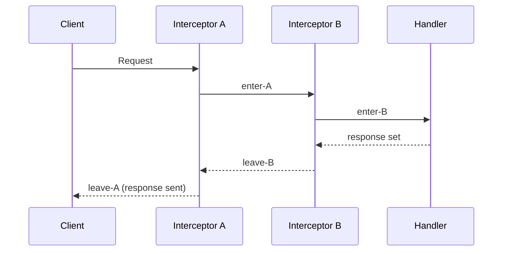

## Group 10: Interceptor Chains Deep Dive

### Example 28: Interceptor Execution Order

Understanding the precise order interceptors run in is critical for writing correct chains. Pedestal processes the interceptor queue left-to-right for `:enter` and right-to-left for `:leave`. This example traces execution order step by step.



```clojure
(ns my-app.exec-order
  (:require [io.pedestal.http :as http]
            [io.pedestal.http.route :as route]))

(defn trace-interceptor [name]
  {:name  (keyword name)
   :enter (fn [ctx]
            (println (str name " ENTER"))   ;; => Runs during forward pass
            (update ctx :trace conj (str name ":enter")))
            ;; => Accumulate trace in :trace vector on context
   :leave (fn [ctx]
            (println (str name " LEAVE"))   ;; => Runs during reverse pass
            (update ctx :trace conj (str name ":leave")))})

;; Chain: [A B C handler]
;; Enter order: A-enter => B-enter => C-enter => handler-enter
;; Leave order: handler-leave => C-leave => B-leave => A-leave
;; (handler has no :leave in this example)

(def chain-demo
  (route/expand-routes
    #{["/trace" :get
       [(trace-interceptor "A")
        (trace-interceptor "B")
        (trace-interceptor "C")
        {:name  ::handler
         :enter (fn [ctx]
                  (println "HANDLER runs")
                  (assoc ctx :response {:status 200
                                        :body   {:trace (:trace ctx)}}))}
                  ;; => trace will be ["A:enter" "B:enter" "C:enter"]
                  ;; => After leave: ["A:enter" "B:enter" "C:enter" "C:leave" "B:leave" "A:leave"]
       ]
       :route-name :trace]}))
```

**Key Takeaway**: Enter stages run left-to-right; leave stages run right-to-left - think of interceptors as a stack where the outermost interceptor's leave stage is the last to run before response delivery.

**Why It Matters**: Execution order determines which interceptors can use data set by earlier ones. Authentication must run before authorization. Body parsing must run before validation. Logging must run last in leave (to capture the final response status). Drawing a simple sequence diagram of your interceptor chain before writing code prevents subtle ordering bugs. Teams that document their interceptor order in comments next to route definitions report fewer incidents from interceptor misordering, a subtle class of bug that's hard to detect in code review.

---

### Example 29: Manipulating the Interceptor Queue

Pedestal's `io.pedestal.interceptor.chain` namespace lets you dynamically add or remove interceptors from the execution queue. This enables conditional interceptor dispatch - add a caching interceptor only when the `Cache-Control` header permits it.

```clojure
(ns my-app.dynamic-chain
  (:require [io.pedestal.interceptor.chain :as chain]
            [io.pedestal.http.route :as route]))

(def cache-interceptor
  {:name  ::cache
   :enter (fn [ctx]
            (println "Checking cache...")
            ctx)
   :leave (fn [ctx]
            (println "Writing to cache...")
            ctx)})

(def conditional-cache
  {:name  ::conditional-cache
   :enter (fn [ctx]
            (let [cache-control (get-in ctx [:request :headers "cache-control"])]
              (if (= cache-control "no-cache")
                ctx                          ;; => Skip cache: return ctx unchanged
                ;; => Dynamically inject cache-interceptor before the next interceptor
                (chain/enqueue ctx [cache-interceptor]))))})
                ;; => chain/enqueue adds interceptors to the FRONT of the remaining queue
                ;; => They run NEXT, before whatever was already queued

(def terminate-early-interceptor
  {:name  ::terminate-early
   :enter (fn [ctx]
            (let [dry-run? (= "true" (get-in ctx [:request :query-params :dry-run]))]
              (if dry-run?
                (-> ctx
                    (assoc :response {:status 200 :body {:dry-run true}})
                    (chain/terminate))    ;; => Stop processing: skip ALL remaining interceptors
                ctx)))})                  ;; => chain/terminate clears the queue immediately
```

**Key Takeaway**: Use `chain/enqueue` to inject interceptors dynamically at runtime, and `chain/terminate` to stop the chain immediately (even skip `:leave` stages) - both operate on the context's interceptor queue.

**Why It Matters**: Dynamic interceptor injection enables sophisticated request routing patterns that static route tables can't express. Feature flags that add instrumentation interceptors for 5% of requests, A/B testing interceptors that split traffic based on user cohorts, and circuit breakers that inject fallback interceptors when downstream services are slow - all of these require runtime chain modification. Pedestal's first-class support for queue manipulation makes these patterns straightforward to implement and, crucially, easy to test by inspecting the queue state in the context.

---

### Example 30: Error Propagation Through the Chain

When an interceptor throws an exception, Pedestal walks backward up the chain looking for an interceptor with an `:error` stage. The first one it finds handles the error. If no error handler is found, Pedestal returns a default 500 response. Multiple error handlers at different levels enable layered error recovery.

```clojure
(ns my-app.error-propagation
  (:require [io.pedestal.interceptor.error :as error-int]
            [io.pedestal.http.route :as route]))

;; Outer error handler: catches unrecovered errors
(def outer-error-handler
  (error-int/error-dispatch
    [ctx ex]
    [{:exception-type :clojure.lang.ExceptionInfo}]
    (let [data (ex-data ex)]
      (println "Outer handler caught ExceptionInfo:" (ex-message ex))
      (assoc ctx :response
        {:status (get data :status 500)
         :body   {:error (get data :type "internal-error")
                  :msg   (ex-message ex)}}))
    :else
    (do (println "Outer handler caught unknown:" (class ex))
        (assoc ctx :response {:status 500 :body {:error "unexpected"}}))))

;; Inner interceptor that only handles specific errors
(def inner-db-error-handler
  (error-int/error-dispatch
    [ctx ex]
    [{:exception-type :java.sql.SQLException}]
    (do (println "DB error handled in inner handler")
        (assoc ctx :response {:status 503 :body {:error "database-unavailable"}}))
    ;; => Re-throw for other exception types:
    :else
    (assoc ctx :io.pedestal.interceptor.chain/error ex)))
    ;; => Placing ex back on the chain re-throws it for the next error handler
    ;; => Without this, other exception types would be silently swallowed

(def routes
  (route/expand-routes
    #{["/api/users" :get
       [outer-error-handler           ;; => Catches everything inner doesn't handle
        inner-db-error-handler        ;; => Handles DB errors specifically
        db-query-handler]             ;; => Might throw SQLException or ExceptionInfo
       :route-name :api-users]}))
```

**Key Takeaway**: Re-throw unhandled exceptions from `:error` handlers by assigning `::chain/error` back onto the context - this allows errors to propagate to outer handlers for layered recovery.

**Why It Matters**: Layered error handling mirrors real-world exception handling needs. A database timeout should return 503 Service Unavailable (handled by the DB error handler), while a validation failure should return 400 Bad Request (handled by a validation error handler), while unexpected NullPointerExceptions should return 500 (handled by the outermost catch-all). Collapsing all errors into one handler loses the semantic distinctions. The re-throw pattern ensures outer handlers always get a chance to handle errors that inner handlers don't recognize - preventing silent error swallowing, which is one of the hardest production bugs to diagnose.

---

## Group 11: Authentication and Authorization

### Example 31: Session-Based Authentication

Session-based authentication stores user state server-side. Pedestal uses Ring's session middleware wrapped as an interceptor. The session data is stored in-memory (or in Redis for production) and identified by a session cookie.

```clojure
(ns my-app.session-auth
  (:require [io.pedestal.http.ring-middlewares :as middlewares]
            [io.pedestal.http.route :as route]
            [crypto.password.bcrypt :as bcrypt]))
            ;; => Add io.github.knopki/crypto-password {:mvn/version "0.5.0"}

;; Session store interceptor (in-memory for dev; use Redis for prod)
(def session-store
  (middlewares/session
    {:store (ring.middleware.session.memory/memory-store)}))
    ;; => Cookie named "ring-session" by default

(def login-handler
  {:name  ::login
   :enter (fn [ctx]
            (let [body     (get-in ctx [:request :json-params])
                  username (get body "username")
                  password (get body "password")
                  user     (find-user-by-username username)]  ;; => DB lookup
              (if (and user (bcrypt/check password (:password-hash user)))
                ;; => bcrypt/check: constant-time comparison (prevents timing attacks)
                (assoc ctx :response
                  {:status  200
                   :session {:user-id   (:id user)       ;; => Store in session
                             :username  (:username user)
                             :roles     (:roles user)}   ;; => e.g. #{:admin :user}
                   :body    {:message "Logged in"}})
                (assoc ctx :response
                  {:status 401
                   :body   {:error "Invalid credentials"}}))))})

(def require-session
  {:name  ::require-session
   :enter (fn [ctx]
            (let [session (get-in ctx [:request :session])]
              (if (:user-id session)
                ;; => Attach user info to context for downstream interceptors
                (assoc ctx :current-user session)
                (assoc ctx :response {:status 401 :body {:error "Not authenticated"}}))))})

(def logout-handler
  {:name  ::logout
   :enter (fn [ctx]
            (assoc ctx :response
              {:status  200
               :session {}                ;; => Clear session by setting empty map
               :body    {:message "Logged out"}}))})
```

**Key Takeaway**: Use `(middlewares/session ...)` for session management - set `:session` in the response map to update the session, and set it to `{}` to clear (logout).

**Why It Matters**: Session-based auth is still the right choice for server-rendered applications and APIs where clients are browsers with cookie support. The server-side session store gives you immediate revocation - logout is instant because you clear the server-side state. JWT tokens are valid until expiry even after logout, requiring a token blacklist to match session revocation capabilities. Production deployments should use Redis or a database as the session store rather than in-memory to survive service restarts and support horizontal scaling across multiple instances.

---

### Example 32: JWT Token Authentication

JWT (JSON Web Token) authentication is stateless - the server verifies token signatures without a session store. This makes it suitable for APIs consumed by mobile clients or third-party services. The auth interceptor validates the `Authorization: Bearer <token>` header on every request.

```clojure
(ns my-app.jwt-auth
  (:require [io.pedestal.http.route :as route])
  (:import [com.auth0.jwt JWT]
           [com.auth0.jwt.algorithms Algorithm]))
           ;; => Add com.auth0/java-jwt {:mvn/version "4.4.0"}

(def jwt-secret (System/getenv "JWT_SECRET"))
(def algorithm (Algorithm/HMAC256 jwt-secret)) ;; => HMAC-SHA256 signing

(defn create-token [user-id roles]
  (-> (JWT/create)                           ;; => Build JWT
      (.withClaim "user-id" (str user-id))   ;; => Add claims
      (.withClaim "roles" (into-array String (map name roles)))
      (.withExpiresAt (java.util.Date. (+ (System/currentTimeMillis) (* 3600 1000))))
      ;; => Expires in 1 hour
      (.sign algorithm)))                    ;; => Sign with secret => returns token string

(defn verify-token [token]
  (try
    (let [verifier (-> (JWT/require algorithm) ;; => Build verifier
                       (.build))
          decoded  (.verify verifier token)]   ;; => Throws if invalid/expired
      {:valid?  true
       :user-id (.asString (.getClaim decoded "user-id"))
       :roles   (set (map keyword (.asList (.getClaim decoded "roles") String)))})
    (catch Exception _                        ;; => Invalid signature, expired, etc.
      {:valid? false})))

(def jwt-auth-interceptor
  {:name  ::jwt-auth
   :enter (fn [ctx]
            (let [auth-header (get-in ctx [:request :headers "authorization"])
                  token       (when auth-header
                                (second (re-find #"^Bearer (.+)$" auth-header)))
                  ;; => Extract token from "Bearer <token>" format
                  result      (when token (verify-token token))]
              (if (:valid? result)
                (assoc ctx :current-user result)  ;; => Attach verified claims to context
                (assoc ctx :response
                  {:status 401
                   :body   {:error "Invalid or missing token"}}))))})
```

**Key Takeaway**: Verify JWTs by parsing the `Authorization: Bearer` header and validating the signature - attach claims to `:current-user` in context on success, short-circuit with 401 on failure.

**Why It Matters**: JWT authentication enables horizontal scaling without shared session state. Any server instance can verify a token using only the shared secret, making JWT ideal for microservices and load-balanced deployments. The tradeoff is revocation: unlike sessions, a JWT is valid until expiry. Production systems mitigate this with short expiry times (15-60 minutes) plus refresh tokens, or a token blacklist for critical revocations. The interceptor pattern means token verification happens exactly once per request in a well-defined location - there's no risk of a handler forgetting to check auth.

---

### Example 33: Role-Based Authorization

After authentication establishes identity, authorization checks permissions. The authorization interceptor reads the current user's roles from context (set by the auth interceptor) and permits or denies access. Role-checking interceptors compose cleanly with authentication interceptors.

```clojure
(ns my-app.authorization
  (:require [io.pedestal.http.route :as route]))

(defn require-role [role]
  ;; => Factory function: creates an interceptor for a specific role
  {:name  (keyword (str "require-" (name role)))
   :enter (fn [ctx]
            (let [user  (:current-user ctx)      ;; => Set by auth interceptor
                  roles (:roles user #{})]        ;; => Default empty set if missing
              (cond
                (nil? user)
                (assoc ctx :response {:status 401 :body {:error "Not authenticated"}})
                ;; => No current-user means auth interceptor didn't run
                (contains? roles role)
                ctx                              ;; => Has required role: continue
                :else
                (assoc ctx :response             ;; => Missing role: 403 Forbidden
                  {:status 403
                   :body   {:error   "Forbidden"
                            :required-role (name role)
                            :user-roles    (map name roles)}}))))})

(def require-admin  (require-role :admin))       ;; => Admin-only interceptor
(def require-editor (require-role :editor))      ;; => Editor-only interceptor

;; Require any one of multiple roles:
(defn require-any-role [& roles]
  {:name  ::require-any-role
   :enter (fn [ctx]
            (let [user-roles (:roles (:current-user ctx) #{})]
              (if (some #(contains? user-roles %) roles)
                ctx
                (assoc ctx :response {:status 403 :body {:error "Insufficient permissions"}}))))})

(def routes
  (route/expand-routes
    #{["/admin/users"  :get  [jwt-auth-interceptor require-admin admin-handler]
       :route-name :admin-users]
       ;; => jwt-auth sets :current-user, require-admin checks :admin role
      ["/posts"        :post [jwt-auth-interceptor
                              (require-any-role :editor :admin)
                              create-post-handler]
       :route-name :posts-create]}))
```

**Key Takeaway**: Build role-checking interceptors as factory functions like `(require-role :admin)` - compose them after authentication interceptors in each route's chain.

**Why It Matters**: Role-based authorization at the interceptor level enforces access control at the request boundary, before any business logic runs. Forgetting to add auth checks in handler code is a common vulnerability; enforcing it in the interceptor chain makes the policy visible in the route table. Code reviewers can audit security by scanning route definitions. When authorization requirements change (e.g., editors can now delete posts), you update the route interceptor vector, not the handler - keeping business logic separate from access control. This separation also enables testing handlers in isolation without simulating authentication.

---

## Group 12: Database Integration

### Example 34: next.jdbc Connection Pool

Pedestal's lifecycle is managed through the service map's `::http/start-fn` and `::http/stop-fn` hooks. Use these to start and stop a database connection pool (HikariCP via next.jdbc) alongside the HTTP server.

```clojure
(ns my-app.db
  (:require [io.pedestal.http :as http]
            [next.jdbc :as jdbc]
            [next.jdbc.connection :as connection])
  (:import [com.zaxxer.hikari HikariDataSource]))
  ;; => Add com.github.seancorfield/next.jdbc {:mvn/version "1.3.909"}
  ;; => Add com.zaxxer/HikariCP {:mvn/version "5.1.0"}

(def db-spec
  {:dbtype   "postgresql"                  ;; => Database type
   :dbname   (or (System/getenv "DB_NAME") "myapp")
   :host     (or (System/getenv "DB_HOST") "localhost")
   :port     (Integer/parseInt (or (System/getenv "DB_PORT") "5432"))
   :user     (or (System/getenv "DB_USER") "myapp")
   :password (or (System/getenv "DB_PASS") "secret")})

(defonce datasource (atom nil))            ;; => HikariDataSource held here

(def service-map
  {::http/type    :jetty
   ::http/port    8080
   ::http/start-fn
   (fn [service]                           ;; => Called by http/start after server starts
     (reset! datasource
       (connection/->pool HikariDataSource ;; => Create HikariCP pool
         (assoc db-spec
           :maximumPoolSize  10             ;; => Max connections in pool
           :minimumIdle      2              ;; => Min idle connections
           :connectionTimeout 30000)))      ;; => Timeout waiting for connection (ms)
     (println "DB pool started")
     service)                              ;; => Must return service map
   ::http/stop-fn
   (fn [service]                           ;; => Called by http/stop before server stops
     (when @datasource
       (.close @datasource)                ;; => Close all pool connections gracefully
       (reset! datasource nil)
       (println "DB pool stopped"))
     service)})

(defn query-users [ds]
  (jdbc/execute! ds ["SELECT id, name, email FROM users ORDER BY id"]))
  ;; => Returns vector of maps: [{:users/id 1 :users/name "Alice" ...}]
  ;; => Keys are namespace-qualified by table name (next.jdbc convention)
```

**Key Takeaway**: Use `::http/start-fn` and `::http/stop-fn` in the service map to manage the database connection pool lifecycle alongside the HTTP server.

**Why It Matters**: Connection pooling is mandatory for production APIs. Without a pool, each request opens and closes a database connection, adding 5-50ms of TLS handshake and authentication overhead per request. With HikariCP, connections are reused, reducing database round-trip time to under 1ms. HikariCP is consistently the fastest and most reliable JDBC connection pool - benchmarks show it 2-3x faster than c3p0 and DBCP. The `::http/start-fn` pattern ensures the pool is ready before the first request and cleanly closed when the server shuts down, preventing connection leaks during rolling deploys.

---

### Example 35: Basic CRUD with next.jdbc

With a datasource available, write handlers that execute SQL queries using next.jdbc's `execute!` and `execute-one!` helpers. Inject the datasource through the interceptor context rather than using a global var to keep handlers testable.

```clojure
(ns my-app.user-handlers
  (:require [next.jdbc :as jdbc]
            [next.jdbc.sql :as sql]
            [io.pedestal.http.route :as route]))

;; Interceptor that injects the datasource into context
(def db-interceptor
  {:name  ::inject-db
   :enter (fn [ctx]
            (assoc ctx :db @my-app.db/datasource))}) ;; => Inject global datasource
            ;; => Alternatively: pass ds as a closure parameter to the factory function

(defn list-users [ds]
  (jdbc/execute! ds
    ["SELECT id, name, email FROM users WHERE active = true ORDER BY name"]
    {:return-keys false}))                 ;; => Don't return generated keys for SELECT

(defn get-user [ds id]
  (jdbc/execute-one! ds
    ["SELECT id, name, email FROM users WHERE id = ?" id]
    {:return-keys false}))                 ;; => execute-one! returns single row or nil

(defn create-user [ds name email]
  (sql/insert! ds :users                   ;; => sql/insert! builds INSERT statement
    {:name name :email email}              ;; => Column-value map (unqualified keys)
    {:return-keys ["id"]}))                ;; => Return generated id

(def list-users-handler
  {:name  ::list-users
   :enter (fn [ctx]
            (let [users (list-users (:db ctx))]  ;; => Read datasource from context
              (assoc ctx :response
                {:status 200
                 :body   (mapv #(select-keys % [:users/id :users/name :users/email])
                               users)})))})       ;; => Select only safe fields

(def create-user-handler
  {:name  ::create-user
   :enter (fn [ctx]
            (let [{:strs [name email]} (get-in ctx [:request :json-params])
                  result (create-user (:db ctx) name email)]
              (assoc ctx :response
                {:status 201
                 :body   {:id (:users/id result)}})))})
```

**Key Takeaway**: Inject the datasource through context using an interceptor rather than accessing a global var directly in handlers - this makes handlers independently testable with a mock datasource.

**Why It Matters**: Handler testability drives architecture quality. When handlers receive the datasource via context injection, you can test them by passing `{:db mock-datasource}` in context without a real database connection. Mock datasources return predetermined data, making tests deterministic, fast, and parallelizable. The `db-interceptor` pattern also enables per-request datasource selection (e.g., read replicas for GET requests, primary for writes) by building the datasource selection into the injector. Teams that adopt context injection consistently report higher test coverage because there's no infrastructure overhead to writing handler tests.

---

### Example 36: Database Transactions

Multi-step database operations that must succeed or fail together require transactions. next.jdbc provides `with-transaction` which wraps operations in a JDBC transaction and automatically rolls back on exception.

```clojure
(ns my-app.transactions
  (:require [next.jdbc :as jdbc]
            [next.jdbc.sql :as sql]))

(defn transfer-funds [ds from-account-id to-account-id amount]
  ;; => Both debit and credit must succeed, or neither should
  (jdbc/with-transaction [tx ds]           ;; => tx is a transactional connection
    ;; => All queries using tx share the same transaction
    (let [from-balance (-> (jdbc/execute-one! tx
                             ["SELECT balance FROM accounts WHERE id = ? FOR UPDATE"
                              from-account-id])
                           ;; => FOR UPDATE locks the row for the duration of the tx
                           :accounts/balance)]
      (when (< from-balance amount)
        (throw (ex-info "Insufficient funds"
                 {:status 400 :error "insufficient-funds"
                  :available from-balance :requested amount})))
                  ;; => Throw inside with-transaction triggers automatic rollback
      (sql/update! tx :accounts
        {:balance (- from-balance amount)}
        {:id from-account-id})             ;; => Debit source account
      (let [to-balance (-> (jdbc/execute-one! tx
                             ["SELECT balance FROM accounts WHERE id = ?" to-account-id])
                           :accounts/balance)]
        (sql/update! tx :accounts
          {:balance (+ to-balance amount)}
          {:id to-account-id}))            ;; => Credit destination account
      {:transferred amount})))             ;; => with-transaction returns this value on success
      ;; => On success: both updates committed atomically
      ;; => On exception: both updates rolled back automatically

(def transfer-handler
  {:name  ::transfer
   :enter (fn [ctx]
            (let [{:strs [from to amount]} (get-in ctx [:request :json-params])
                  result (transfer-funds (:db ctx) (parse-long from) (parse-long to) (bigdec amount))]
              (assoc ctx :response {:status 200 :body result})))})
```

**Key Takeaway**: Use `jdbc/with-transaction` for multi-step operations that must be atomic - exceptions inside the transaction body trigger automatic rollback.

**Why It Matters**: Database consistency is non-negotiable for financial, inventory, or any state-transfer operations. Separate UPDATE statements outside a transaction create race conditions where partial updates are visible to other readers between operations. The "lost update" and "phantom read" anomalies that arise from non-transactional operations are notoriously hard to reproduce in testing and catastrophic in production. `with-transaction` is the simplest correct solution - it maps cleanly to SQL transactions and integrates with Java's exception handling to guarantee rollback even when code throws unexpectedly.

---

## Group 13: Server-Sent Events

### Example 37: Basic Server-Sent Events

Server-Sent Events (SSE) enable servers to push real-time updates to clients over a persistent HTTP connection. Pedestal supports SSE via `io.pedestal.http.sse` with the `start-event-stream` function that returns a channel-based event stream.

```clojure
(ns my-app.sse
  (:require [io.pedestal.http.sse :as sse]
            [io.pedestal.http.route :as route]
            [clojure.core.async :as async :refer [go <! timeout chan close!]]))
            ;; => Add org.clojure/core.async {:mvn/version "1.6.673"}

(defn stream-updates [event-chan context]
  ;; => event-chan: channel where we send events
  ;; => context: the SSE context (not the interceptor context)
  (go
    ;; Send 10 updates, one per second, then close
    (dotimes [i 10]
      (<! (timeout 1000))                    ;; => Wait 1 second
      (async/put! event-chan                  ;; => Send an event
        {:name "update"                       ;; => SSE event name (optional)
         :data (str "{\"count\": " i "}")})   ;; => SSE data field (must be string)
    (close! event-chan)))                     ;; => Close channel to end the stream
    ;; => Closing the channel signals SSE to send a final flush and close connection

(def sse-handler
  (sse/start-event-stream stream-updates))   ;; => Returns an interceptor

;; SSE wire format (what the browser receives):
;; Content-Type: text/event-stream
;; Cache-Control: no-cache
;;
;; event: update
;; data: {"count": 0}
;;
;; event: update
;; data: {"count": 1}
;;
;; [connection closed when channel closes]

(def routes
  (route/expand-routes
    #{["/events/updates" :get [sse-handler] :route-name :sse-updates]}))
```

**Key Takeaway**: Use `sse/start-event-stream` with a function that writes to the provided channel - put event maps with `:name` and `:data`, then close the channel to end the stream.

**Why It Matters**: SSE is the right tool for unidirectional server-to-client real-time updates: live dashboards, notification feeds, progress bars for long-running operations, and live log streaming. SSE uses plain HTTP (no protocol upgrade like WebSocket) and automatically reconnects on connection loss. Browsers implement EventSource natively, requiring no JavaScript library. Unlike WebSocket, SSE passes through HTTP proxies and CDNs without special configuration. For unidirectional data flows (server pushes, client only reads), SSE is simpler and more reliable than WebSocket.

---

### Example 38: SSE with Database Polling

A common SSE pattern polls a database for changes and streams them to connected clients. This example shows how to combine the event channel with a periodic database query.

```clojure
(ns my-app.sse-db
  (:require [io.pedestal.http.sse :as sse]
            [io.pedestal.http.route :as route]
            [next.jdbc :as jdbc]
            [clojure.core.async :as async :refer [go-loop <! timeout close!]]
            [cheshire.core :as json]))

(defn stream-order-updates [event-chan context]
  ;; => Stream new orders every 5 seconds
  (let [ds    @my-app.db/datasource         ;; => Get datasource
        seen  (atom #{})]                    ;; => Track already-sent order IDs
    (go-loop []
      (<! (timeout 5000))                    ;; => Poll every 5 seconds
      (let [orders (jdbc/execute! ds
                     ["SELECT id, status, total FROM orders
                       WHERE created_at > NOW() - INTERVAL '1 minute'
                       ORDER BY created_at DESC LIMIT 20"])
            new-orders (remove #(contains? @seen (:orders/id %)) orders)]
            ;; => Filter out orders already sent to this client
        (doseq [order new-orders]
          (swap! seen conj (:orders/id order))  ;; => Track this order as sent
          (async/put! event-chan
            {:name "order"
             :data (json/generate-string       ;; => Serialize to JSON string
                     {:id     (:orders/id order)
                      :status (:orders/status order)
                      :total  (:orders/total order)})}))
        (if (async/closed? event-chan)
          nil                                  ;; => Client disconnected: stop loop
          (recur))))))                          ;; => Continue polling

(def routes
  (route/expand-routes
    #{["/events/orders" :get
       [jwt-auth-interceptor (sse/start-event-stream stream-order-updates)]
       :route-name :sse-orders]}))
       ;; => Auth interceptor before SSE - ensures only authenticated clients connect
```

**Key Takeaway**: Combine SSE with database polling by tracking sent IDs in an atom and only sending new records - check `closed?` on the channel each iteration to stop when the client disconnects.

**Why It Matters**: Database polling is the simplest SSE backend: no message broker required, works with any SQL database, and produces immediately consistent results. For low-update-frequency streams (order notifications every few seconds), polling is appropriate and operationally simpler than event-driven approaches. The `seen` atom prevents duplicate delivery to the same client. For high-frequency updates or many simultaneous SSE connections, move to a publish-subscribe model with PostgreSQL LISTEN/NOTIFY or a message broker to avoid polling load on the database.

---

## Group 14: WebSocket Support

### Example 39: Basic WebSocket Handler

Pedestal supports WebSocket via `io.pedestal.websocket`. A WebSocket handler upgrades an HTTP connection to a WebSocket and provides callbacks for connection open, message receive, and connection close events.

```clojure
(ns my-app.websocket
  (:require [io.pedestal.websocket :as ws]
            [io.pedestal.http :as http]
            [io.pedestal.http.route :as route]
            [cheshire.core :as json]))

(defonce connected-clients (atom #{}))     ;; => Set of active WebSocket sessions

(def ws-handler
  {:on-open
   (fn [session]                           ;; => Called when client connects
     (swap! connected-clients conj session)
     (println "Client connected, total:" (count @connected-clients))
     (ws/send! session                     ;; => Send message to this client
       (json/generate-string {:type "welcome" :message "Connected to chat"})))

   :on-message
   (fn [session msg]                       ;; => Called when client sends a message
     (let [data (json/parse-string msg true)]  ;; => Parse JSON, keywordize keys
       (println "Received:" data)
       ;; Broadcast to all connected clients:
       (doseq [client @connected-clients]
         (when (not= client session)       ;; => Don't echo back to sender
           (ws/send! client
             (json/generate-string {:type "message"
                                    :from "user"
                                    :text (:text data)}))))))

   :on-close
   (fn [session status]                    ;; => Called when client disconnects
     (swap! connected-clients disj session)
     (println "Client disconnected, status:" status
              "remaining:" (count @connected-clients)))

   :on-error
   (fn [session error]                     ;; => Called on WebSocket error
     (println "WebSocket error:" (.getMessage error))
     (swap! connected-clients disj session))})

(def routes
  (route/expand-routes
    #{["/ws/chat" :get
       [(ws/interceptor ws-handler)]        ;; => ws/interceptor wraps callbacks as interceptor
       :route-name :ws-chat]}))
```

**Key Takeaway**: Define WebSocket behavior via `:on-open`, `:on-message`, `:on-close`, `:on-error` callbacks and wrap them with `ws/interceptor` - use an atom to track connected sessions for broadcasting.

**Why It Matters**: WebSocket enables full-duplex, low-latency communication for collaborative features: real-time chat, multiplayer games, collaborative editing, and live code execution. Unlike polling or SSE, clients can send messages to the server. The atom holding connected sessions is simple and correct for a single-server deployment. In production with horizontal scaling, replace the atom with a PubSub system (Redis Pub/Sub, or Pedestal's own `io.pedestal.channel`) so messages sent to one server instance reach clients connected to other instances.

---

## Group 15: Testing

### Example 40: Testing with `io.pedestal.test`

`io.pedestal.test/response-for` tests Pedestal services without starting a real HTTP server. It simulates a full request/response cycle through all interceptors. This makes tests fast, deterministic, and runnable without network infrastructure.

```clojure
(ns my-app.service-test
  (:require [clojure.test :refer [deftest is testing]]
            [io.pedestal.test :as pt]
            [io.pedestal.http :as http]
            [my-app.service :as service]))   ;; => Your service namespace

;; Build the test service once, not per test
(def test-service
  (-> service/service-map                    ;; => Your service map
      (assoc ::http/type :jetty)             ;; => Ensure type is set
      http/create-server))                   ;; => Create (but don't start) server

(deftest test-health-endpoint
  (testing "GET /health returns 200"
    (let [response (pt/response-for test-service :get "/health")]
      ;; => response-for simulates the full interceptor chain
      ;; => Returns Ring response map: {:status :headers :body}
      (is (= 200 (:status response)))
      (is (= "ok" (:body response))))))

(deftest test-json-endpoint
  (testing "POST /api/users creates a user"
    (let [body     "{\"name\": \"Alice\", \"email\": \"alice@example.com\"}"
          response (pt/response-for test-service
                     :post "/api/users"
                     :headers {"Content-Type" "application/json"
                               "Accept"       "application/json"}
                     :body body)]
      (is (= 201 (:status response)))
      (is (= "application/json" (get-in response [:headers "Content-Type"])))
      (is (str/includes? (:body response) "Alice")))))

(deftest test-auth-required
  (testing "Protected endpoint returns 401 without auth"
    (let [response (pt/response-for test-service :get "/api/protected")]
      (is (= 401 (:status response)))))
  (testing "Protected endpoint works with valid token"
    (let [token    (create-test-token {:user-id 1 :roles #{:user}})
          response (pt/response-for test-service :get "/api/protected"
                     :headers {"Authorization" (str "Bearer " token)})]
      (is (= 200 (:status response))))))
```

**Key Takeaway**: Use `(pt/response-for test-service :get "/path")` to test the full interceptor chain without starting a real server - pass `:headers` and `:body` for POST/PUT requests.

**Why It Matters**: Testing via `response-for` means your test suite runs in milliseconds, not seconds. A test suite that requires starting a real HTTP server on a port typically takes 5-10 seconds to initialize before the first test runs, plus port conflicts in CI environments. `response-for` runs the entire interceptor chain synchronously in the test thread. The result is a test suite that can cover hundreds of endpoints with sub-second total runtime. Fast test suites get run more often - teams with sub-10-second test suites run tests on every save, catching regressions immediately.

---

### Example 41: Testing Interceptors in Isolation

Beyond integration tests via `response-for`, you can test individual interceptors by calling their `:enter`/`:leave`/`:error` functions directly with a minimal context map. This allows unit testing interceptor logic without the full service setup.

```clojure
(ns my-app.interceptor-test
  (:require [clojure.test :refer [deftest is testing]]
            [my-app.interceptors :as interceptors]))

(deftest test-require-api-key-interceptor
  (let [interceptor my-app.interceptors/require-api-key]
    (testing "Valid API key passes through"
      (let [ctx    {:request {:headers {"x-api-key" "secret-key-123"}}}
            result ((:enter interceptor) ctx)]  ;; => Call :enter directly
        (is (nil? (:response result)))           ;; => No response = chain continues
        (is (= ctx result))))                    ;; => ctx unchanged (passthrough)

    (testing "Missing API key returns 401"
      (let [ctx    {:request {:headers {}}}
            result ((:enter interceptor) ctx)]
        (is (= 401 (get-in result [:response :status])))
        (is (str/includes? (str (get-in result [:response :body])) "Invalid"))))

    (testing "Wrong API key returns 401"
      (let [ctx    {:request {:headers {"x-api-key" "wrong-key"}}}
            result ((:enter interceptor) ctx)]
        (is (= 401 (get-in result [:response :status])))))))

(deftest test-rate-limiter-interceptor
  (let [interceptor (my-app.interceptors/rate-limiter 2)] ;; => 2 requests/min limit
    (testing "First two requests pass"
      (let [ctx {:request {:remote-addr "127.0.0.1"}}]
        (is (nil? (:response ((:enter interceptor) ctx))))  ;; => Request 1: pass
        (is (nil? (:response ((:enter interceptor) ctx))))))  ;; => Request 2: pass

    (testing "Third request is rate limited"
      (let [ctx    {:request {:remote-addr "127.0.0.1"}}
            result ((:enter interceptor) ctx)]              ;; => Request 3: limit
        (is (= 429 (get-in result [:response :status])))))))
```

**Key Takeaway**: Test interceptors by calling `(:enter interceptor)` or `(:leave interceptor)` directly with a minimal context map - nil `:response` means the interceptor passed through; set `:response` means it short-circuited.

**Why It Matters**: Unit testing interceptors in isolation enables high coverage of edge cases that are difficult to trigger through full HTTP requests. You can test the exact context map structure, verify the interceptor doesn't modify unrelated context keys, and check error handling for malformed inputs. Isolated tests also run significantly faster than `response-for` tests and allow testing interceptors before routing is configured. Teams with well-tested interceptors catch auth bypass vulnerabilities, rate limiting failures, and logging gaps before code review rather than in production incidents.

---

### Example 42: Testing with Mock Dependencies

Replace real services (database, external APIs) with mocks in tests. Since interceptors inject dependencies via context, you can override the injected value in tests without changing application code.

```clojure
(ns my-app.handler-test
  (:require [clojure.test :refer [deftest is testing]]
            [io.pedestal.test :as pt]
            [io.pedestal.http :as http]
            [my-app.service :as service]))

;; Test-specific interceptor that injects a mock datasource
(def mock-db-interceptor
  {:name  ::mock-db
   :enter (fn [ctx]
            (assoc ctx :db mock-datasource))}) ;; => Override the real datasource

;; Mock datasource that returns predetermined data:
(defrecord MockDatasource [queries])

(defn mock-execute! [ds sql-params]
  ;; => Look up the expected result for this SQL
  (get (:queries ds) (first sql-params) []))

;; Build a test service with mocked dependencies:
(defn build-test-service [routes]
  (-> {::http/routes (route/expand-routes routes)
       ::http/type   :jetty}
      http/create-server))

(deftest test-list-users-with-mock-db
  (let [mock-data  [{:users/id 1 :users/name "Alice" :users/email "alice@example.com"}]
        test-routes #{["/users" :get [mock-db-interceptor list-users-handler] :route-name :users]}
        test-svc   (build-test-service test-routes)
        response   (pt/response-for test-svc :get "/users"
                     :headers {"Accept" "application/json"})]
    (is (= 200 (:status response)))
    (is (str/includes? (:body response) "Alice"))))
```

**Key Takeaway**: Replace real dependencies with mocks by swapping the injector interceptor in test routes - context injection makes this seamless without changing handler code.

**Why It Matters**: Mock-based testing gives you control over every dependency's behavior. You can simulate a database returning an empty result set to test your handler's "no results" branch, a database throwing an exception to test error handling, and a database returning exactly the data needed to test your serialization logic. Tests that control all inputs are deterministic across environments - no flaky tests from database state. Mock testing also enables testing features before the real dependency is built, letting multiple developers work in parallel on different parts of the system.

---

## Group 16: CORS Support

### Example 43: CORS Configuration

Cross-Origin Resource Sharing (CORS) is required for browser-based frontends on a different domain to call your API. Pedestal provides built-in CORS support via `::http/allowed-origins` in the service map.

```clojure
(ns my-app.cors
  (:require [io.pedestal.http :as http]
            [io.pedestal.http.route :as route]
            [io.pedestal.http.cors :as cors]))

;; Simple CORS configuration in service map:
(def service-map-simple-cors
  {::http/routes          (route/expand-routes #{})
   ::http/type            :jetty
   ::http/port            8080
   ::http/allowed-origins {:creds           true    ;; => Allow cookies/auth headers
                           :allowed-origins ["https://myapp.com"
                                             "https://staging.myapp.com"]}})
                           ;; => Only these origins allowed to make cross-origin requests

;; Advanced CORS with the cors interceptor directly:
(def cors-interceptor
  (cors/allow-origin
    {:allowed-origins #{"https://myapp.com"
                        "http://localhost:3000"}    ;; => Include localhost for dev
     :creds           true                          ;; => Allow credentials (cookies)
     :methods         #{"GET" "POST" "PUT" "DELETE" "OPTIONS" "PATCH"}
     :allowed-headers #{"Content-Type"
                        "Authorization"
                        "X-Requested-With"
                        "Accept"}
     :max-age         3600}))                       ;; => Cache preflight for 1 hour

;; CORS interceptor must be in the default interceptors list:
(def service-map-advanced-cors
  {::http/routes               (route/expand-routes #{})
   ::http/type                 :jetty
   ::http/port                 8080
   ::http/interceptors         [cors-interceptor]}) ;; => Runs before route dispatch
   ;; => All routes inherit CORS headers automatically
```

**Key Takeaway**: Configure CORS via `::http/allowed-origins` in the service map for simple cases, or use `cors/allow-origin` interceptor directly for fine-grained control over methods, headers, and credential handling.

**Why It Matters**: CORS misconfiguration is one of the most common security vulnerabilities in APIs. Using wildcard `*` origins with credentials enabled creates security holes allowing malicious sites to make authenticated requests on behalf of users. Restricting to known origins and listing only required headers follows the principle of least privilege. The CORS interceptor handles OPTIONS preflight requests automatically, so you don't need separate `OPTIONS` routes. Incorrect CORS configuration also causes confusing browser errors that look like network failures - having it properly configured from day one prevents hours of debugging cross-origin issues.

---

## Group 17: Async Interceptors

### Example 44: Async Interceptors with core.async

Pedestal supports async interceptors that return a `core.async` channel instead of a context map. This allows interceptors to perform non-blocking I/O (HTTP calls, database queries) without blocking the request-handling thread.

```clojure
(ns my-app.async
  (:require [io.pedestal.http.route :as route]
            [clojure.core.async :as async :refer [go chan >! <! timeout]]
            [org.httpkit.client :as http-client]))
            ;; => Add http-kit {:mvn/version "2.8.0"} for async HTTP

(def async-weather-handler
  {:name  ::async-weather
   :enter (fn [ctx]
            (let [result-chan (chan)]          ;; => Create a channel to hold the result
              ;; Start async operation - doesn't block calling thread:
              (go
                (let [city     (get-in ctx [:request :query-params :city] "London")
                      ;; Make async HTTP call to weather API:
                      response (<! (http-client/get
                                     (str "https://api.weather.com/current?city=" city)
                                     {:as :json}))
                      ;; => <! parks this goroutine until response arrives
                      ;; => Calling thread is free to handle other requests
                      weather  (:body response)]
                  (>! result-chan             ;; => Send completed context to channel
                    (assoc ctx :response
                      {:status 200
                       :body   {:city city
                                :temp (:temperature weather)}}))))
              result-chan))})                 ;; => Return the channel (not the ctx)
              ;; => Pedestal detects a channel return value and waits for it
              ;; => The context arrives on the channel when the async op completes

;; Async interceptor with timeout:
(def async-with-timeout
  {:name  ::async-timeout
   :enter (fn [ctx]
            (let [result-chan (chan)
                  timeout-chan (timeout 5000)]  ;; => 5 second timeout
              (go
                (let [[val port] (async/alts! [external-call-chan timeout-chan])]
                  ;; => alts! waits for whichever channel delivers first
                  (>! result-chan
                    (if (= port timeout-chan)
                      (assoc ctx :response {:status 504 :body {:error "timeout"}})
                      (assoc ctx :response {:status 200 :body val})))))
              result-chan))})
```

**Key Takeaway**: Return a `core.async` channel from an interceptor's `:enter`/`:leave` function - put the completed context onto the channel when async work finishes; Pedestal resumes the chain automatically.

**Why It Matters**: Async interceptors prevent thread starvation when your handlers call slow downstream services. Jetty's default thread pool has ~50 threads. With synchronous blocking calls to external services averaging 200ms, your server can handle at most 250 requests per second (50 threads / 0.2 seconds). Async interceptors park the goroutine during I/O, freeing the thread to handle other requests. With async I/O and core.async, the same 50-thread pool can handle thousands of concurrent requests awaiting slow external services. This is critical for API gateway and backend-for-frontend patterns where most handler time is spent waiting for upstream services.

---

## Group 18: Streaming Responses

### Example 45: Streaming Large Responses

For large datasets, streaming responses reduces memory usage by writing data incrementally rather than buffering the entire response. Pedestal supports streaming through async channels and Java OutputStream access.

```clojure
(ns my-app.streaming
  (:require [io.pedestal.http.route :as route]
            [cheshire.core :as json]
            [next.jdbc :as jdbc])
  (:import [java.io PrintWriter]))

;; Stream a large JSON array without loading all rows into memory
(def stream-large-dataset
  {:name  ::stream-dataset
   :enter (fn [ctx]
            (let [ds        (:db ctx)
                  ;; Return a lazy sequence from the database:
                  row-seq   (jdbc/plan ds ["SELECT id, name, data FROM large_table"])
                  ;; => jdbc/plan returns a reducible (lazy-style) sequence
                  ;; => Rows are NOT loaded all at once

                  ;; Create a piped stream for chunked output:
                  [in out]  (let [pos (java.io.PipedOutputStream.)
                                  pis (java.io.PipedInputStream. pos)]
                              [pis pos])
                  writer    (PrintWriter. out)]
              ;; Write JSON array in a background thread:
              (future
                (.print writer "[")           ;; => Start JSON array
                (doseq [[i row] (map-indexed vector row-seq)]
                  (when (> i 0) (.print writer ","))  ;; => Comma between elements
                  (.print writer (json/generate-string row)))
                (.print writer "]")           ;; => End JSON array
                (.flush writer)
                (.close out))                 ;; => Signal end of stream

              (assoc ctx :response
                {:status  200
                 :headers {"Content-Type"    "application/json;charset=UTF-8"
                           "Transfer-Encoding" "chunked"}  ;; => HTTP chunked transfer
                 :body    in})))})            ;; => InputStream as body - streamed to client
```

**Key Takeaway**: Use `jdbc/plan` for lazy database reads and a `PipedOutputStream`/`PipedInputStream` pair for streaming large responses - this keeps memory usage constant regardless of result set size.

**Why It Matters**: Returning 100,000 database rows as a buffered list requires gigabytes of heap memory (100K rows * average row size) and risks OutOfMemoryError. Streaming with constant memory means your JVM can handle arbitrarily large exports with a fixed heap. The `Transfer-Encoding: chunked` header lets HTTP proxies and clients handle incomplete responses correctly. Production APIs with data export endpoints regularly encounter this pattern. Teams that implement streaming for their export endpoints report heap usage dropping from gigabytes to megabytes for large exports.

---

### Example 46: Multipart File Upload Handling

Pedestal handles file uploads through the `body-params` interceptor with multipart form support. Uploaded files are temporarily stored in a `java.io.File` and accessible via `:multipart-params` in the request.

```clojure
(ns my-app.upload
  (:require [io.pedestal.http.body-params :as body-params]
            [io.pedestal.http.route :as route]
            [io.pedestal.http.ring-middlewares :as middlewares]
            [clojure.java.io :as io]))

(def upload-dir "/tmp/uploads")            ;; => Temporary upload directory

;; multipart parsing requires the multipart-params middleware:
(def multipart-interceptor
  (middlewares/multipart-params
    {:store (ring.middleware.multipart-params.temp-file/temp-file-store
              {:expires-in 600})}))         ;; => Files expire after 10 minutes

(def file-upload-handler
  {:name  ::file-upload
   :enter (fn [ctx]
            (let [params     (get-in ctx [:request :multipart-params])
                  ;; => {:file {:filename "photo.jpg"
                  ;;             :content-type "image/jpeg"
                  ;;             :size 12345
                  ;;             :tempfile #<File /tmp/...>}}
                  file-param (get params "file")
                  filename   (:filename file-param)
                  tempfile   (:tempfile file-param)
                  size       (:size file-param)]
              (if (> size (* 5 1024 1024))  ;; => Reject files over 5MB
                (assoc ctx :response
                  {:status 413 :body {:error "File too large" :max-size "5MB"}})
                (let [dest-path (str upload-dir "/" filename)]
                  (io/copy tempfile (io/file dest-path)) ;; => Move to permanent location
                  (.delete tempfile)          ;; => Remove temp file
                  (assoc ctx :response
                    {:status 201
                     :body   {:filename filename
                              :size     size
                              :path     dest-path}}))))})

(def routes
  (route/expand-routes
    #{["/upload" :post [multipart-interceptor file-upload-handler] :route-name :upload]}))
```

**Key Takeaway**: Use `(middlewares/multipart-params ...)` to parse file uploads - the `:multipart-params` map provides `:filename`, `:content-type`, `:size`, and `:tempfile` for each uploaded file.

**Why It Matters**: File uploads require careful validation to prevent security vulnerabilities. Validate file size before copying to prevent disk exhaustion attacks. Check content-type (but don't trust it alone - verify magic bytes for sensitive operations). Use an unpredictable storage path (UUID-based) to prevent path traversal and name collision. In production, move files to object storage (S3, GCS) immediately to avoid stateful local filesystems that break horizontal scaling. The tempfile approach ensures files don't accumulate even if the handler fails midway.

---

## Group 19: Connection Pooling Patterns

### Example 47: Database Health Check Interceptor

A health check endpoint that verifies database connectivity is essential for Kubernetes liveness probes and load balancer health checks. This interceptor tests the database connection before returning 200.

```clojure
(ns my-app.health
  (:require [io.pedestal.http.route :as route]
            [next.jdbc :as jdbc]))

(def health-check-handler
  {:name  ::health-check
   :enter (fn [ctx]
            (let [ds (:db ctx)]
              (try
                ;; Execute a cheap health check query:
                (jdbc/execute-one! ds ["SELECT 1"])
                ;; => Returns {:column_1 1} on success
                ;; => Throws on connection failure
                (assoc ctx :response
                  {:status 200
                   :body   {:status    "healthy"
                            :db        "connected"
                            :timestamp (str (java.time.Instant/now))}})
                (catch Exception e
                  (assoc ctx :response
                    {:status  503                ;; => 503 Service Unavailable
                     :body    {:status  "unhealthy"
                               :db      "disconnected"
                               :error   (.getMessage e)
                               :timestamp (str (java.time.Instant/now))}})))))})

;; Separate liveness (is the process alive?) and readiness (can it serve traffic?):
(def liveness-handler
  {:name  ::liveness
   :enter (fn [ctx]
            (assoc ctx :response {:status 200 :body {:status "alive"}}))})
            ;; => Liveness just checks the process is running
            ;; => Never checks DB (DB failures don't mean the process should restart)

(def routes
  (route/expand-routes
    #{["/health/live"  :get [liveness-handler]    :route-name :health-live]
      ;; => Kubernetes livenessProbe: restarts pod if this fails
      ["/health/ready" :get [db-interceptor health-check-handler] :route-name :health-ready]}))
      ;; => Kubernetes readinessProbe: removes from load balancer if DB unreachable
```

**Key Takeaway**: Implement separate `/health/live` (process alive) and `/health/ready` (dependencies healthy) endpoints - Kubernetes uses liveness for pod restart decisions and readiness for traffic routing.

**Why It Matters**: Conflating liveness and readiness causes cascading failures. If your liveness probe checks the database and the database is slow, Kubernetes restarts your pod - while the pod was still healthy and could have recovered without restarting. This creates a restart loop that takes down your service entirely. Liveness should only check if the process is deadlocked or stuck. Readiness checks external dependencies and determines if the pod should receive traffic. Most production incidents involving Kubernetes "thrashing" trace back to overly broad liveness probes that check external services.

---

## Group 20: Advanced Content Negotiation

### Example 48: Custom Content Type Handling

Beyond JSON and Transit, APIs sometimes need to support custom content types (vendor-specific media types, binary formats, or custom serialization). This example shows how to write a custom content negotiation and coercion pipeline.

```clojure
(ns my-app.custom-content
  (:require [io.pedestal.http.content-negotiation :as conneg]
            [io.pedestal.http.route :as route]
            [cheshire.core :as json]
            [cognitect.transit :as transit])
  (:import [java.io ByteArrayOutputStream]))

(defn transit-write [data]
  (let [out (ByteArrayOutputStream.)
        w   (transit/writer out :json)]  ;; => Transit-JSON format
    (transit/write w data)
    (.toString out)))

(def coerce-body-interceptor
  {:name  ::coerce-body
   :leave (fn [ctx]
            (let [accepted  (get-in ctx [:request :accept :field] "application/json")
                  body      (get-in ctx [:response :body])]
              (if (map? body)             ;; => Only serialize map/vector bodies
                (condp = accepted
                  "application/transit+json"
                  (update ctx :response merge
                    {:headers {"Content-Type" "application/transit+json"}
                     :body    (transit-write body)})
                  ;; Default: JSON
                  (update ctx :response merge
                    {:headers {"Content-Type" "application/json;charset=UTF-8"}
                     :body    (json/generate-string body)}))
                ctx)))})                  ;; => Non-map body: pass through unchanged

;; Accept-aware routing: same endpoint, different representations
(def content-neg-intc
  (conneg/negotiate-content
    ["application/json" "application/transit+json"]))

(def routes
  (route/expand-routes
    #{["/api/data" :get
       [content-neg-intc coerce-body-interceptor data-handler]
       :route-name :api-data]}))
       ;; => content-neg validates Accept, coerce-body serializes in :leave
```

**Key Takeaway**: Build custom coerce-body interceptors in `:leave` that serialize based on the negotiated `Accept` type - keep handlers returning plain Clojure data.

**Why It Matters**: Supporting Transit alongside JSON enables Clojure-to-Clojure services to exchange rich data types (keywords, sets, dates, UUIDs) without the lossy JSON round-trip. A Clojure client sending `Accept: application/transit+json` receives keywords as keywords, not strings; dates as `java.time.Instant`, not ISO strings. This matters for microservices architectures where Clojure services talk to each other. External clients (JavaScript, Python) continue to use JSON. The coerce-body interceptor pattern means handlers never know which format they're serving - pure separation of concerns.

---

### Example 49: Response Caching Interceptor

An HTTP caching interceptor adds `Cache-Control`, `ETag`, and `Last-Modified` headers to enable client-side and CDN caching. The ETag enables conditional GET requests where clients send `If-None-Match` and receive 304 Not Modified when content hasn't changed.

```clojure
(ns my-app.caching
  (:require [io.pedestal.http.route :as route]
            [clojure.string :as str]))

(defn compute-etag [body]
  ;; => Simple ETag: hash of response body string
  (str (hash (str body))))               ;; => Not crypto-strong, but sufficient for ETag

(def cache-interceptor
  {:name  ::cache-headers
   :leave (fn [ctx]
            (let [response (:response ctx)
                  body     (:body response)
                  etag     (compute-etag body)
                  if-none-match (get-in ctx [:request :headers "if-none-match"])]
              (if (= if-none-match (str "\"" etag "\""))
                ;; => Client has current version: 304 Not Modified
                (assoc ctx :response
                  {:status  304
                   :headers {"ETag" (str "\"" etag "\"")}
                   :body    ""})
                ;; => New content: send with cache headers
                (update ctx :response
                  #(update % :headers merge
                     {"ETag"          (str "\"" etag "\"")
                      "Cache-Control" "public, max-age=300"
                                      ;; => Cache for 5 minutes
                      "Vary"          "Accept"}))))})
                                        ;; => Vary: Accept tells caches to store separate
                                        ;; => copies for different Accept headers

(def routes
  (route/expand-routes
    #{["/api/products" :get
       [cache-interceptor products-handler]
       :route-name :products]}))
```

**Key Takeaway**: Add ETag-based caching in a `:leave` interceptor - compute the ETag from the response body and return 304 when the client's `If-None-Match` matches.

**Why It Matters**: HTTP caching dramatically reduces server load for read-heavy APIs. A product catalog endpoint with 5-minute `max-age` reduces database queries by 80-90% for repeat visitors. ETags provide fine-grained freshness: when the product list changes, the ETag changes, and the next request gets the updated data. `Vary: Accept` prevents caches from serving JSON to a client that requested Transit. Teams that add caching interceptors to read endpoints report significant infrastructure cost savings and response time improvements without adding caching infrastructure (Redis, Memcached).

---

## Group 21: Connection Interceptors

### Example 50: Request ID and Correlation

Distributed systems need a way to correlate log lines across services for a single user request. A request ID interceptor generates or propagates a unique ID per request, adds it to logs, and returns it in the response for client-side debugging.

```clojure
(ns my-app.request-id
  (:require [io.pedestal.log :as log]
            [io.pedestal.http.route :as route]))

(def request-id-interceptor
  {:name  ::request-id
   :enter (fn [ctx]
            (let [existing-id (get-in ctx [:request :headers "x-request-id"])
                  request-id  (or existing-id (str (random-uuid)))]
                  ;; => Propagate upstream ID if present (microservices), generate if not
                  ;; => This enables end-to-end tracing across service boundaries
              (-> ctx
                  (assoc :request-id request-id)  ;; => Store for use by other interceptors
                  (assoc-in [:request :headers "x-request-id"] request-id))))
                  ;; => Add to request headers so downstream services receive it

   :leave (fn [ctx]
            (let [request-id (:request-id ctx)]
              (log/info :msg        "Request completed"
                        :request-id request-id
                        :status     (get-in ctx [:response :status]))
              (update-in ctx [:response :headers]
                assoc "X-Request-Id" request-id)))})
                ;; => Add request ID to every response header
                ;; => Clients include this ID in bug reports for easy log lookup

(def routes
  (route/expand-routes
    #{["/api/users" :get
       [request-id-interceptor list-users-handler]
       :route-name :api-users]}))
```

**Key Takeaway**: Generate or propagate `X-Request-Id` headers in a `:enter`/`:leave` interceptor pair - store the ID in context, add it to logs, and return it in the response.

**Why It Matters**: Request IDs transform debugging from "find the needle in a haystack" to "search by ID". When a user reports a bug with their `X-Request-Id`, you run one log query to find every log line for that request across all services. Without request IDs, correlating a single user's request through 5 microservices requires time-based filtering and manual inference. This reduces mean time to resolution for production incidents from hours to minutes. The propagation pattern (reuse upstream ID) enables end-to-end tracing across the entire call chain, not just within one service.

---

### Example 51: Request Timeout Interceptor

Long-running requests tie up server threads and degrade performance for all users. A timeout interceptor races the normal interceptor chain against a timer, returning 503 if the request doesn't complete within the budget.

```clojure
(ns my-app.timeout
  (:require [io.pedestal.http.route :as route]
            [clojure.core.async :as async :refer [chan go timeout alts!]]))

(defn with-timeout [timeout-ms]
  {:name  ::request-timeout
   :enter (fn [ctx]
            (let [result-chan  (chan)
                  timeout-chan (timeout timeout-ms)]  ;; => Timeout channel
              (go
                ;; Race: deliver context vs timeout
                (let [[val _] (alts! [result-chan timeout-chan])]
                  (if val
                    val                      ;; => Normal completion
                    (assoc ctx :response     ;; => Timeout: 503
                      {:status  503
                       :headers {"Retry-After" "30"
                                 "Content-Type" "application/json;charset=UTF-8"}
                       :body    {:error   "request-timeout"
                                 :timeout timeout-ms}}))))
              ;; Signal normal completion via context manipulation:
              (assoc ctx :io.pedestal.interceptor.chain/terminators
                [(fn [ctx']
                   (when (chan? result-chan)
                     (async/put! result-chan ctx'))
                   true)])))})
              ;; => This is an advanced pattern; see Pedestal docs for
              ;; => the correct async timeout implementation for your version

(def routes
  (route/expand-routes
    #{["/api/slow" :get
       [(with-timeout 5000) slow-handler]   ;; => 5 second timeout
       :route-name :api-slow]}))
```

**Key Takeaway**: Use async channels and `alts!` to race the normal response against a timeout, returning 503 when the timeout wins.

**Why It Matters**: Without request timeouts, one slow database query or stuck external API call consumes a thread indefinitely. With 50 threads in the Jetty pool, 50 stuck requests exhausts the pool and every subsequent request queues or fails. The timeout interceptor reclaims the thread and gives the client a `503 + Retry-After` response instead of a connection timeout. Setting appropriate timeouts requires understanding your SLAs: if p99 database queries take 200ms, a 2-second timeout protects against outliers without cutting off legitimate slow queries. Clients can retry on 503, but a connection timeout (no response) often isn't retried automatically.

---

## Group 22: Middleware Integration

### Example 52: Wrapping Ring Middleware as Interceptors

Pedestal provides `io.pedestal.http.ring-middlewares` to wrap standard Ring middleware as Pedestal interceptors. This enables reuse of the large Ring middleware ecosystem (compression, SSL redirect, cookie handling) without rewriting them.

```clojure
(ns my-app.ring-compat
  (:require [io.pedestal.http :as http]
            [io.pedestal.http.ring-middlewares :as middlewares]
            [io.pedestal.http.route :as route]
            [ring.middleware.gzip]))          ;; => ring/ring-codec {:mvn/version "1.2.0"}

;; Convert Ring middleware to Pedestal interceptor
(def gzip-interceptor
  (middlewares/using ring.middleware.gzip/wrap-gzip))
  ;; => Ring middleware function => Pedestal interceptor
  ;; => middlewares/using wraps synchronous Ring middleware

;; Content-Security-Policy headers interceptor using ring-defaults:
(def security-headers-interceptor
  {:name  ::security-headers
   :leave (fn [ctx]
            (update-in ctx [:response :headers] merge
              {"Strict-Transport-Security" "max-age=31536000; includeSubDomains"
               ;; => HSTS: tell browsers to always use HTTPS for 1 year
               "Content-Security-Policy"   "default-src 'self'"
               ;; => Only load resources from same origin
               "X-Frame-Options"           "SAMEORIGIN"
               ;; => Allow framing from same origin (for embedded views)
               "Referrer-Policy"           "strict-origin-when-cross-origin"}))})

(def service-map
  {::http/routes          (route/expand-routes #{})
   ::http/type            :jetty
   ::http/port            8080
   ::http/interceptors    [gzip-interceptor
                           security-headers-interceptor]})
   ;; => Service-level interceptors run for EVERY request
   ;; => Order matters: gzip runs before security headers in :enter
   ;; => But in :leave (reverse): security headers added first, then gzip compresses
```

**Key Takeaway**: Use `(middlewares/using ring-mw-fn)` to wrap Ring middleware as Pedestal interceptors - add service-level interceptors to `::http/interceptors` for universal application.

**Why It Matters**: The Ring ecosystem has years of battle-tested middleware for compression, CSRF protection, session management, SSL redirect, and security headers. Rather than rewriting these for Pedestal, `ring-middlewares/using` bridges the two ecosystems. Production security headers (HSTS, CSP, X-Frame-Options) should be added as service-level interceptors so they apply to every response without risk of omission. A single missed security header on one endpoint can create a vulnerability. Service-level interceptors enforce consistent security posture across the entire API.

---

### Example 53: Form POST Handling

HTML forms submit data as `application/x-www-form-urlencoded`. The `body-params` interceptor parses form data into `:form-params` in the request map. CSRF protection requires a token in the form that matches the session.

```clojure
(ns my-app.forms
  (:require [io.pedestal.http.body-params :as body-params]
            [io.pedestal.http.route :as route]))

(def handle-login-form
  {:name  ::login-form
   :enter (fn [ctx]
            (let [form-params (get-in ctx [:request :form-params])
                  ;; => body-params parses form data: {:username "alice" :password "secret"}
                  ;; => Keys are keyword-ized from form field names
                  username   (:username form-params)
                  password   (:password form-params)
                  csrf-token (:csrf-token form-params)]
                  ;; => Always validate CSRF token for state-changing form submissions
              (cond
                (not= csrf-token (get-in ctx [:request :session :csrf-token]))
                (assoc ctx :response {:status 403 :body "CSRF validation failed"})

                (authenticate username password)
                (assoc ctx :response
                  {:status  302
                   :headers {"Location" "/dashboard"}
                   :session {:user username :csrf-token (str (random-uuid))}})
                   ;; => Rotate CSRF token after successful login (session fixation prevention)

                :else
                (assoc ctx :response
                  {:status  302
                   :headers {"Location" "/login?error=invalid-credentials"}
                   :body    ""}))))})

(def routes
  (route/expand-routes
    #{["/login" :post
       [(body-params/body-params) session-interceptor handle-login-form]
       :route-name :login-post]}))
```

**Key Takeaway**: Parse form data with `(body-params/body-params)` - form fields land in `:form-params` as keywords; always validate CSRF tokens before processing state-changing form submissions.

**Why It Matters**: CSRF attacks trick authenticated users into submitting forms on malicious sites. Without CSRF protection, a malicious page can cause a logged-in user to change their password, transfer funds, or delete their account with a simple HTML form. The synchronizer token pattern (embedding a session-tied token in every form) prevents this by ensuring form submissions can only come from your own pages. CSRF protection must be applied consistently to all state-changing POST/PUT/DELETE form endpoints. Server-side rendering frameworks (as opposed to SPA+API) are particularly vulnerable because session cookies are sent automatically by browsers.

---

## Group 23: Practical Patterns

### Example 54: Pagination Pattern

Pagination is a universal API pattern. Implement consistent cursor-based or offset-based pagination as a reusable interceptor that validates and normalizes pagination parameters before your handler reads them.

```clojure
(ns my-app.pagination
  (:require [io.pedestal.http.route :as route]
            [next.jdbc :as jdbc]))

(def pagination-interceptor
  {:name  ::pagination
   :enter (fn [ctx]
            (let [query-params (get-in ctx [:request :query-params])
                  page  (max 1 (Integer/parseInt (get query-params :page "1")))
                  ;; => Page must be >= 1, default 1
                  size  (min 100 (max 1 (Integer/parseInt (get query-params :size "20"))))
                  ;; => Size between 1 and 100, default 20
                  ;; => max prevents negative sizes, min prevents size > 100
                  offset (* (dec page) size)]
                  ;; => SQL OFFSET = (page-1) * pageSize
              (assoc ctx :pagination {:page page :size size :offset offset})))})

(def list-users-handler
  {:name  ::list-users-paginated
   :enter (fn [ctx]
            (let [{:keys [page size offset]} (:pagination ctx)
                  ;; => Read pagination from context (set by interceptor)
                  ds    (:db ctx)
                  total (-> (jdbc/execute-one! ds ["SELECT COUNT(*) AS cnt FROM users"])
                            :cnt)
                  users (jdbc/execute! ds
                          ["SELECT id, name, email FROM users ORDER BY id LIMIT ? OFFSET ?"
                           size offset])]
              (assoc ctx :response
                {:status 200
                 :body   {:data       (mapv #(select-keys % [:users/id :users/name]) users)
                          :pagination {:page       page
                                       :size       size
                                       :total      total
                                       :total-pages (int (Math/ceil (/ total size)))
                                       :has-next    (< (* page size) total)
                                       :has-prev    (> page 1)}}})))})

(def routes
  (route/expand-routes
    #{["/api/users" :get
       [pagination-interceptor db-interceptor list-users-handler]
       :route-name :users-list]}))
```

**Key Takeaway**: Extract pagination parameter parsing into an interceptor - handlers read `:pagination` from context with pre-validated, clamped page/size values.

**Why It Matters**: Consistent pagination prevents two classes of security vulnerabilities. Without a maximum size limit, clients can request `?size=1000000` and trigger massive database queries. Without a minimum page validation, `?page=-1` produces negative SQL offsets that crash PostgreSQL. The pagination interceptor enforces these constraints once, across all paginated endpoints. The response envelope with total count and boolean flags (`has-next`, `has-prev`) is the client-friendly format that avoids the "do I have more pages?" question - clients can render pagination controls without extra requests.

---

### Example 55: Input Sanitization Interceptor

Sanitize user input before it reaches handlers to prevent XSS attacks in stored data and ensure consistent string formatting. A sanitization interceptor strips dangerous HTML, trims whitespace, and normalizes values.

```clojure
(ns my-app.sanitize
  (:require [io.pedestal.http.route :as route]
            [clojure.string :as str]
            [clojure.walk :as walk]))

(defn sanitize-string [s]
  (when (string? s)
    (-> s
        str/trim                           ;; => Remove leading/trailing whitespace
        (str/replace #"<[^>]+>" "")        ;; => Strip HTML tags (basic XSS prevention)
        ;; => Note: use a real HTML sanitizer library for complex input
        ;; => e.g., Jsoup.clean(input, Whitelist.none())
        (str/replace #"[\x00-\x1f]" "")))) ;; => Remove control characters

(defn sanitize-map [m]
  (walk/postwalk                           ;; => Recursively walk the data structure
    (fn [v]
      (if (string? v)
        (sanitize-string v)               ;; => Sanitize every string value
        v))                                ;; => Pass through non-strings unchanged
    m))

(def sanitize-interceptor
  {:name  ::sanitize-input
   :enter (fn [ctx]
            (let [json-params (get-in ctx [:request :json-params])]
              (if json-params
                (assoc-in ctx [:request :json-params]
                  (sanitize-map json-params))  ;; => Replace with sanitized version
                ctx)))})                        ;; => No JSON body: pass through

(def routes
  (route/expand-routes
    #{["/api/comments" :post
       [(body-params/body-params) sanitize-interceptor create-comment-handler]
       :route-name :comments-create]}))
       ;; => Sanitization runs after body parsing, before handler
       ;; => Handler receives clean input regardless of what client sent
```

**Key Takeaway**: Sanitize all user string input in an interceptor after body parsing - strip HTML tags and control characters before the data reaches your handler or database.

**Why It Matters**: Stored XSS attacks occur when malicious HTML/JavaScript is saved to the database and later rendered in a browser. A single unsanitized text field that allows `<script>alert('xss')</script>` can compromise every user who views the content. Sanitizing at the API boundary in an interceptor ensures that no handler can accidentally store unsanitized input. Use a mature HTML sanitizer library (Jsoup in Java/Clojure) for rich text fields that legitimately need some HTML (e.g., formatted comments). The interceptor approach applies sanitization consistently across all write endpoints without relying on developers to remember it.
