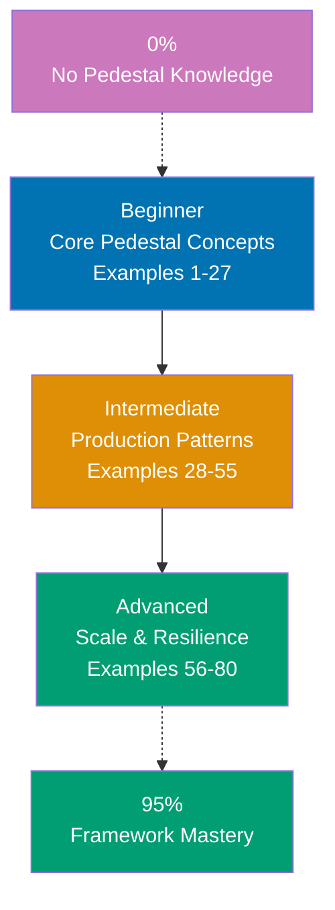

## Want to Master Pedestal Through Working Code?

This guide teaches you Clojure Pedestal through **80 production-ready code examples** rather than lengthy explanations. If you're an experienced developer switching to Pedestal, or want to deepen your framework mastery, you'll build intuition through actual working patterns.

## What Is By-Example Learning?

By-example learning is a **code-first approach** where you learn concepts through annotated, working examples rather than narrative explanations. Each example shows:

1. **What the code does** - Brief explanation of the Pedestal concept
2. **How it works** - A focused, heavily commented code example
3. **Why it matters** - A pattern summary highlighting the key takeaway

This approach works best when you already understand programming fundamentals. You learn Pedestal's idioms, patterns, and best practices by studying real code rather than theoretical descriptions.

## What Is Clojure Pedestal?

Pedestal is a **web framework for Clojure** that centers everything on a single powerful abstraction: the **interceptor**. Key distinctions:

- **Not Ring/Compojure**: Pedestal goes beyond Ring middleware stacks with bidirectional interceptor chains that allow error handling in context
- **Data-driven**: Service configuration is a plain Clojure map, making services composable and testable without starting a real server
- **Interceptor-first**: Every concern (auth, logging, parsing, routing) becomes an interceptor with enter/leave/error stages
- **Immutable context**: The request context map flows through the chain, never mutated in place - pure Clojure philosophy
- **Multiple transports**: HTTP/1.1, HTTP/2, WebSocket, and Server-Sent Events with the same interceptor model

## Learning Path



## Coverage Philosophy: 95% Through 80 Examples

The **95% coverage** means you'll understand Pedestal deeply enough to build production systems with confidence. It doesn't mean you'll know every edge case or advanced feature - those come with experience.

The 80 examples are organized progressively:

- **Beginner (Examples 1-27)**: Foundation concepts (service map, routing, interceptors, request/response, params, JSON, error handling, logging, configuration)
- **Intermediate (Examples 28-55)**: Production patterns (interceptor chains, custom interceptors, auth, database, SSE, WebSocket, testing, CORS, async, streaming)
- **Advanced (Examples 56-80)**: Scale and resilience (interceptor composition, metrics, tracing, circuit breaker, caching, API versioning, Component/Integrant, Docker, production JVM tuning)

Together, these examples cover **95% of what you'll use** in production Pedestal applications.

## What's Covered

### Core Web Framework Concepts

- **Service Map**: The central data structure configuring routes, interceptors, host, port, and server type
- **Routing**: Table routes (explicit, named), terse routes (shorthand), hierarchical routing, HTTP verb dispatch
- **Request/Response**: The context map (`request`, `response`), params, headers, body coercion
- **Content Negotiation**: Built-in `io.pedestal.http.content-negotiation` interceptor, Accept header handling

### Interceptors

- **Interceptor Anatomy**: `:enter`, `:leave`, `:error` keys, the context map contract
- **Built-in Interceptors**: `io.pedestal.http.body-params`, `io.pedestal.http.ring-middlewares`, CORS
- **Custom Interceptors**: Writing pure interceptor maps with `interceptor/interceptor`
- **Interceptor Chains**: How Pedestal builds, executes, and short-circuits chains
- **Async Interceptors**: Returning `core.async` channels from enter/leave

### Data & Persistence

- **next.jdbc Integration**: Connection pools with HikariCP, query helpers, transaction management
- **Connection Pooling**: `next.jdbc.connection/pool` with Pedestal lifecycle
- **Migrations**: Migratus or Flyway integration patterns
- **Query Patterns**: `jdbc/execute!`, `jdbc/execute-one!`, `jdbc/with-transaction`

### Security & Authentication

- **Session-Based Auth**: Cookie sessions, login/logout interceptors
- **Token Auth**: JWT verification interceptor, `Authorization` header parsing
- **Authorization**: Role-based interceptors, short-circuit with `assoc :response`
- **CORS**: `io.pedestal.http.cors` built-in support

### Testing & Quality

- **`io.pedestal.test`**: `response-for` test helper, testing without a live server
- **Unit Testing Interceptors**: Testing enter/leave functions in isolation
- **Integration Testing**: Starting/stopping service in tests with `with-server`

### Production & Operations

- **Deployment**: Uberjar with `lein-uberjar`, Docker multi-stage builds
- **Configuration**: Environment-based config with `aero` or `cprop`
- **Observability**: Metrics with `iambrol/pedestal-metrics`, structured logging
- **JVM Tuning**: G1GC flags, heap sizing, container-aware JVM options

## What's NOT Covered

We exclude topics that belong in specialized tutorials:

- **Detailed Clojure syntax**: Master Clojure first through language tutorials
- **Advanced DevOps**: Kubernetes, service mesh, complex deployment pipelines
- **Database internals**: Deep PostgreSQL query planning, advanced SQL optimization
- **ClojureScript/frontend**: Reagent, re-frame, shadow-cljs (frontend-specific tutorials)
- **Pedestal internals**: How the servlet container integration works at the byte level

For these topics, see dedicated tutorials and framework documentation.

## How to Use This Guide

### 1. Choose Your Starting Point

- **New to Pedestal?** Start with Beginner (Example 1)
- **Framework experience** (Ring/Compojure, Spring, Django)? Start with Intermediate (Example 21)
- **Building a specific feature?** Search for relevant example topic

### 2. Read the Example

Each example has five parts:

- **Explanation** (2-3 sentences): What Pedestal concept, why it exists, when to use it
- **Diagram** (optional): Mermaid diagram for complex flows or data structures
- **Code** (with heavy comments): Working Clojure code showing the pattern
- **Key Takeaway** (1-2 sentences): Distilled essence of the pattern
- **Why It Matters** (50-100 words): Production relevance and real-world impact

### 3. Run the Code

Create a test project and run each example:

```bash
lein new pedestal-service my-app
cd my-app
# Paste example code into src/my_app/service.clj
lein run
```

### 4. Modify and Experiment

Change variable names, add interceptors, break things on purpose. Experiment builds intuition faster than reading.

### 5. Reference as Needed

Use this guide as a reference when building features. Search for relevant examples and adapt patterns to your code.

## Relationship to Other Tutorial Types

| Tutorial Type               | Approach                    | Coverage              | Best For                      |
| --------------------------- | --------------------------- | --------------------- | ----------------------------- |
| **By Example** (this guide) | Code-first, 80 examples     | 95% breadth           | Learning framework idioms     |
| **Quick Start**             | Project-based, hands-on     | 5-30% touchpoints     | Getting something working     |
| **By Concept**              | Narrative, explanation-first| 0-95% comprehensive   | Understanding concepts deeply |
| **Cookbook**                | Recipe-based                | Problem-specific      | Solving specific problems     |

## Prerequisites

### Required

- **Clojure fundamentals**: Basic syntax, sequences, maps, functions, namespaces
- **Web development**: HTTP basics, REST concepts, JSON
- **Programming experience**: You've built applications before in another language

### Recommended

- **Ring knowledge**: Understanding Ring's request/response maps helps map concepts
- **Leiningen or deps.edn**: Build tool familiarity for project management
- **Relational databases**: SQL basics, schema design for database examples

### Not Required

- **Pedestal experience**: This guide assumes you're new to the framework
- **Clojure expertise**: Intermediate Clojure knowledge is sufficient
- **Erlang/OTP**: Pedestal runs on standard JVM, not BEAM

## Code Annotation Convention

All code examples use `;; =>` notation:

```clojure
(def x 10)               ;; => x is 10 (Long)
(str "hello " "world")   ;; => Returns "hello world" (String)
                          ;; => str concatenates all args as strings
(println x)              ;; => Output: 10
```

**Mermaid diagrams** appear when visualizing flow or architecture improves understanding. We use a color-blind friendly palette:

- Blue #0173B2 - Primary
- Orange #DE8F05 - Secondary
- Teal #029E73 - Accent
- Purple #CC78BC - Alternative
- Brown #CA9161 - Neutral

## Ready to Start?

Choose your learning path:

- **[Beginner](/en/learn/software-engineering/platform-web/tools/clojure-pedestal/by-example/beginner)** - Start here if new to Pedestal. Build foundation understanding through 27 core examples.
- **[Intermediate](/en/learn/software-engineering/platform-web/tools/clojure-pedestal/by-example/intermediate)** - Jump here if you know Pedestal basics. Master production patterns through 28 examples.
- **[Advanced](/en/learn/software-engineering/platform-web/tools/clojure-pedestal/by-example/advanced)** - Expert mastery through 25 advanced examples covering scale, performance, and resilience.

Or jump to specific topics by searching for relevant example keywords (routing, interceptors, authentication, testing, deployment, etc.).
