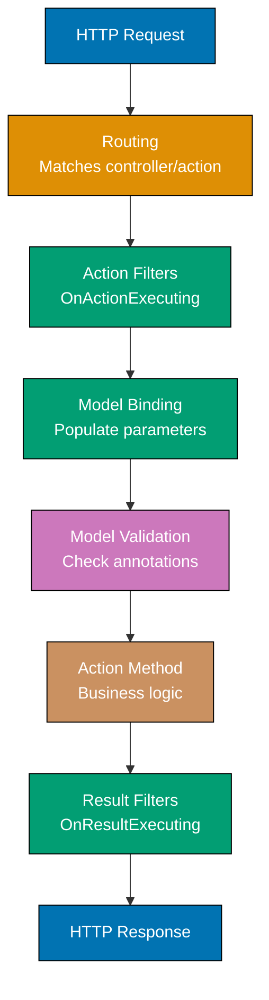
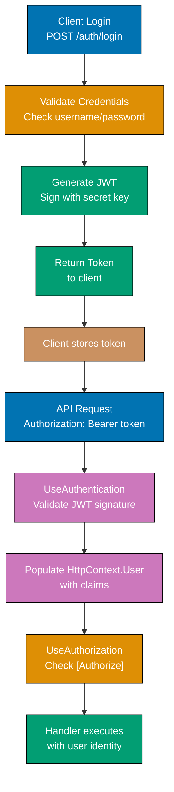
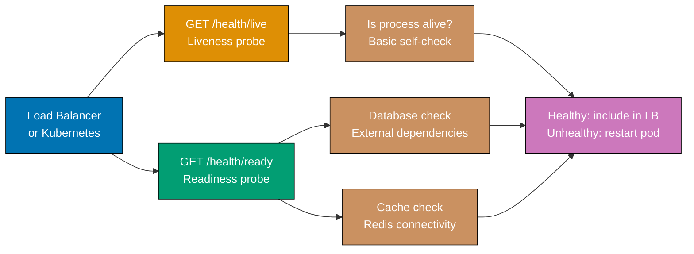

## Group 9: Controllers and Filters

### Example 28: API Controller Basics

`[ApiController]` brings MVC-style controllers with automatic model validation, binding source inference, and standardized error responses. Use controllers for complex APIs with shared filters and action results.



```csharp
using Microsoft.AspNetCore.Mvc;

var builder = WebApplication.CreateBuilder(args);
builder.Services.AddControllers();
// => Registers controller infrastructure: routing, binding, validation, formatters
var app = builder.Build();
app.MapControllers();
app.Run();

// Controller class in separate file
[ApiController]
// => [ApiController] enables:
// => - Automatic 400 for validation failures (no ModelState.IsValid check needed)
// => - Binding source inference ([FromBody] inferred for complex types)
// => - Problem details for 400/404 responses
[Route("api/[controller]")]
// => [controller] token replaced with class name minus "Controller" suffix
// => => Route is "api/products"
public class ProductsController : ControllerBase
{
    // ControllerBase - base class without view support (API-only)
    // Controller - base class with view support (not needed for JSON APIs)

    private readonly ILogger<ProductsController> _logger;

    public ProductsController(ILogger<ProductsController> logger)
    {
        _logger = logger;
        // => Constructor injection - DI resolves ILogger automatically
    }

    [HttpGet]
    // => Maps GET api/products
    public IActionResult GetAll()
    {
        var products = new[] { new { Id = 1, Name = "Widget" } };
        return Ok(products);
        // => Ok() returns 200 with JSON body (inherited from ControllerBase)
    }

    [HttpGet("{id:int}")]
    // => Maps GET api/products/42
    [ProducesResponseType<Product>(StatusCodes.Status200OK)]
    [ProducesResponseType(StatusCodes.Status404NotFound)]
    // => [ProducesResponseType] documents possible response types for OpenAPI
    public ActionResult<Product> GetById(int id)
    {
        // => ActionResult<T> allows returning T directly or an ActionResult
        if (id > 1000) return NotFound();
        // => NotFound() returns 404 Not Found
        return new Product { Id = id, Name = $"Product {id}" };
        // => Returning T directly wraps in 200 OK ActionResult
    }

    [HttpPost]
    public ActionResult<Product> Create([FromBody] Product product)
    {
        // => [FromBody] explicit but inferred by [ApiController] for complex types
        product = product with { Id = 42 };
        // => with expression: copy record with Id changed to 42
        return CreatedAtAction(nameof(GetById), new { id = product.Id }, product);
        // => CreatedAtAction: 201 Created + Location: /api/products/42
    }
}

public record Product
{
    public int Id { get; init; }
    public string Name { get; init; } = "";
}
```

**Key Takeaway**: `[ApiController]` with `ControllerBase` is the conventional approach for larger APIs. Use `ActionResult<T>` return types to allow both direct value returns and status code responses while preserving OpenAPI type metadata.

**Why It Matters**: Controllers excel in large APIs where many actions share common logic through filters, and where the route organization benefits from grouping by resource type. The `[ProducesResponseType]` attributes are not just documentation - they drive OpenAPI schema generation that creates accurate client SDKs. When you add a new possible response type (like a 409 Conflict), updating the attribute immediately propagates to generated clients, keeping the contract current without manual documentation updates.

---

### Example 29: Action Filters

Action filters run before and after action methods, enabling cross-cutting concerns like logging, validation, and response transformation without modifying action code.

```csharp
using Microsoft.AspNetCore.Mvc;
using Microsoft.AspNetCore.Mvc.Filters;

// Custom action filter as an attribute
public class RequestLoggingFilterAttribute : ActionFilterAttribute
{
    // ActionFilterAttribute implements IActionFilter (sync) and IAsyncActionFilter (async)

    public override void OnActionExecuting(ActionExecutingContext context)
    {
        // => Called BEFORE the action method runs
        // => context.ActionArguments contains bound parameters
        // => context.HttpContext has the full request
        var method = context.HttpContext.Request.Method;
        var path = context.HttpContext.Request.Path;
        Console.WriteLine($"[BEFORE] {method} {path}");
        // => Output: [BEFORE] GET /api/products/42

        // Short-circuit: set Result to skip action execution
        // context.Result = new BadRequestResult();
        // => If set here, action method never runs
    }

    public override void OnActionExecuted(ActionExecutedContext context)
    {
        // => Called AFTER the action method runs
        // => context.Result contains the action's return value
        // => context.Exception has exception if action threw
        var statusCode = (context.Result as ObjectResult)?.StatusCode;
        Console.WriteLine($"[AFTER] Status: {statusCode}");
        // => Output: [AFTER] Status: 200
    }
}

// Endpoint filter for minimal APIs (similar to action filter)
var builder = WebApplication.CreateBuilder(args);
builder.Services.AddControllers();
var app = builder.Build();

// Endpoint filter on a single route
app.MapGet("/api/data", () => Results.Ok("data"))
    .AddEndpointFilter(async (context, next) =>
    {
        // => Endpoint filter wraps minimal API handlers
        Console.WriteLine("Before handler");
        // => Runs before the route handler
        var result = await next(context);
        // => Calls the actual route handler
        Console.WriteLine("After handler");
        // => Runs after the handler returns
        return result;
    });

app.MapControllers();
app.Run();

// Apply filter to controller or action
[ApiController]
[Route("api/[controller]")]
[RequestLoggingFilter] // => Applies to all actions in this controller
public class OrdersController : ControllerBase
{
    [HttpGet("{id:int}")]
    [RequestLoggingFilter] // => Can also apply to specific action
    public IActionResult GetOrder(int id) => Ok(new { Id = id });
}
```

**Key Takeaway**: `ActionFilterAttribute` provides `OnActionExecuting` (before) and `OnActionExecuted` (after) hooks. Use endpoint filters for minimal APIs and action filters for controllers.

**Why It Matters**: Action filters are the cleanest way to implement cross-cutting concerns in controller-based APIs. Replacing 50 controller methods that all start with `LogRequest()` and end with `LogResponse()` with a single `[RequestLogging]` attribute reduces boilerplate by 100 lines per controller, ensures consistency (no developer forgets to add the logging call), and centralizes the logic where it can be tested and updated once. Production systems use filters heavily for authentication checks, audit logging, and response transformation.

---

### Example 30: Result Filters and Exception Filters

Result filters transform responses before they are serialized. Exception filters catch unhandled exceptions within the controller action scope, enabling controller-scoped error handling.

```csharp
using Microsoft.AspNetCore.Mvc;
using Microsoft.AspNetCore.Mvc.Filters;

// Result filter - transforms response before serialization
public class ApiResponseWrapperFilter : IResultFilter
{
    public void OnResultExecuting(ResultExecutingContext context)
    {
        // => Called BEFORE result is serialized and written to response
        if (context.Result is ObjectResult objectResult)
        {
            // => Wrap successful responses in a standard envelope
            objectResult.Value = new
            {
                Success = true,
                Data = objectResult.Value,
                Timestamp = DateTime.UtcNow
            };
            // => Transform: {"id":1} => {"success":true,"data":{"id":1},"timestamp":"..."}
        }
    }

    public void OnResultExecuted(ResultExecutedContext context)
    {
        // => Called AFTER result is written to response
        // => Response has been sent; cannot modify it here
    }
}

// Exception filter - catches exceptions from controller scope
public class ValidationExceptionFilterAttribute : ExceptionFilterAttribute
{
    public override void OnException(ExceptionContext context)
    {
        if (context.Exception is ArgumentException argEx)
        {
            // => Catch ArgumentException and return 400
            context.Result = new BadRequestObjectResult(new
            {
                Error = argEx.Message
                // => argEx.Message is the exception message string
            });
            context.ExceptionHandled = true;
            // => ExceptionHandled = true prevents further exception propagation
            // => Without this, exception bubbles up to global handler
        }
        // => Unhandled exception types bubble to UseExceptionHandler
    }
}

var builder = WebApplication.CreateBuilder(args);
builder.Services.AddControllers(options =>
{
    options.Filters.Add<ApiResponseWrapperFilter>();
    // => Global filter applies to ALL controller actions
    // => Registered by type - DI resolves dependencies
});
var app = builder.Build();
app.MapControllers();
app.Run();

[ApiController]
[Route("api/[controller]")]
[ValidationExceptionFilter] // => Exception filter scoped to this controller
public class DataController : ControllerBase
{
    [HttpGet("{id}")]
    public IActionResult Get(string id)
    {
        if (id == "invalid")
            throw new ArgumentException("ID cannot be 'invalid'");
        // => ValidationExceptionFilter catches this => 400 Bad Request
        return Ok(new { Id = id });
        // => ApiResponseWrapperFilter wraps this => {"success":true,"data":{"id":"..."}}
    }
}
```

**Key Takeaway**: Register global filters via `options.Filters.Add<T>()` for app-wide concerns. Scope exception filters to specific controllers or actions with attributes to handle domain-specific exceptions close to where they originate.

**Why It Matters**: Response envelope wrapping through a global filter is a pattern used by many enterprise APIs to provide consistent metadata (timestamp, request ID, pagination links) without touching individual action methods. When a new field is needed in every response (like an API version field added for monitoring), you add it in one filter rather than modifying every action. This decoupling is especially valuable in teams where multiple developers own different controllers - they get the standardized response format automatically without coordination.

---

## Group 10: Authentication

### Example 31: JWT Bearer Authentication

JSON Web Tokens (JWTs) are the standard authentication mechanism for REST APIs. ASP.NET Core validates tokens, populates `HttpContext.User`, and enforces authorization via attributes.



```csharp
// Install: dotnet add package Microsoft.AspNetCore.Authentication.JwtBearer
using Microsoft.AspNetCore.Authentication.JwtBearer;
using Microsoft.IdentityModel.Tokens;
using System.IdentityModel.Tokens.Jwt;
using System.Security.Claims;
using System.Text;

var builder = WebApplication.CreateBuilder(args);

// JWT configuration from appsettings.json
var jwtKey = builder.Configuration["Jwt:Key"] ?? "dev-key-minimum-32-chars-long!!";
// => Use a strong secret key (256+ bits) in production
// => Never hardcode in source; use secrets management

builder.Services
    .AddAuthentication(JwtBearerDefaults.AuthenticationScheme)
    // => Sets JWT Bearer as the default authentication scheme
    .AddJwtBearer(options =>
    {
        options.TokenValidationParameters = new TokenValidationParameters
        {
            ValidateIssuerSigningKey = true,
            // => Verify token was signed with our secret key
            IssuerSigningKey = new SymmetricSecurityKey(Encoding.UTF8.GetBytes(jwtKey)),
            // => Secret key for HMAC-SHA256 signing
            ValidateIssuer = true,
            ValidIssuer = "https://api.myapp.com",
            // => Token must have matching iss claim
            ValidateAudience = true,
            ValidAudience = "myapp-clients",
            // => Token must have matching aud claim
            ValidateLifetime = true,
            // => Reject expired tokens (checks exp claim)
            ClockSkew = TimeSpan.FromMinutes(1)
            // => Allow 1-minute clock difference between servers
        };
    });

builder.Services.AddAuthorization();

var app = builder.Build();
app.UseAuthentication(); // => Must be before UseAuthorization
app.UseAuthorization();

// Login endpoint - generates JWT
app.MapPost("/auth/login", (LoginRequest request) =>
{
    // => In production: verify password hash against database
    if (request.Username != "alice" || request.Password != "secret")
        return Results.Unauthorized();
    // => Returns 401 if credentials invalid

    var claims = new[]
    {
        new Claim(ClaimTypes.NameIdentifier, "user-123"),
        // => Subject claim - user's unique identifier
        new Claim(ClaimTypes.Name, request.Username),
        // => Name claim - display name
        new Claim(ClaimTypes.Role, "user"),
        // => Role claim - used by [Authorize(Roles = "admin")]
    };

    var key = new SymmetricSecurityKey(Encoding.UTF8.GetBytes(jwtKey));
    var creds = new SigningCredentials(key, SecurityAlgorithms.HmacSha256);
    // => HMAC-SHA256 signing algorithm

    var token = new JwtSecurityToken(
        issuer: "https://api.myapp.com",
        audience: "myapp-clients",
        claims: claims,
        expires: DateTime.UtcNow.AddHours(1),
        // => Token valid for 1 hour
        signingCredentials: creds
    );

    var tokenString = new JwtSecurityTokenHandler().WriteToken(token);
    // => tokenString = "eyJhbGciOiJIUzI1NiIsInR5cCI6IkpXVCJ9..."
    return Results.Ok(new { Token = tokenString });
});

// Protected endpoint requiring authentication
app.MapGet("/profile", (ClaimsPrincipal user) =>
{
    // => ClaimsPrincipal injected when UseAuthentication is configured
    // => Contains claims from validated JWT
    var userId = user.FindFirst(ClaimTypes.NameIdentifier)?.Value;
    // => userId = "user-123" from JWT claim
    var username = user.FindFirst(ClaimTypes.Name)?.Value;
    // => username = "alice"
    return Results.Ok(new { UserId = userId, Username = username });
})
.RequireAuthorization();
// => .RequireAuthorization() applies [Authorize] equivalent to minimal API route
// => Returns 401 if no valid JWT provided

record LoginRequest(string Username, string Password);

app.Run();
```

**Key Takeaway**: Configure JWT validation with `AddAuthentication().AddJwtBearer()`, always call `UseAuthentication()` before `UseAuthorization()`, and use `.RequireAuthorization()` on minimal API routes to protect them.

**Why It Matters**: JWT authentication is stateless by design - the server does not store session data. This enables horizontal scaling without sticky sessions or shared session storage. When a new server instance starts, it can validate any JWT token using the shared secret key without consulting a central store. This architectural property is what makes JWT the standard for microservices and APIs that need to scale to multiple instances, and why tokens must be short-lived with proper expiration to limit the damage if one is compromised.

---

### Example 32: Cookie Authentication

Cookie authentication is the standard approach for browser-based applications. ASP.NET Core manages encrypted cookie creation, renewal, and validation transparently.

```csharp
using Microsoft.AspNetCore.Authentication.Cookies;
using System.Security.Claims;

var builder = WebApplication.CreateBuilder(args);

builder.Services
    .AddAuthentication(CookieAuthenticationDefaults.AuthenticationScheme)
    .AddCookie(options =>
    {
        options.Cookie.Name = ".AppAuth";
        // => Cookie name visible in browser dev tools
        options.Cookie.HttpOnly = true;
        // => HttpOnly prevents JavaScript from reading the cookie
        // => Critical security setting - prevents XSS token theft
        options.Cookie.SecurePolicy = CookieSecurePolicy.Always;
        // => Secure flag - cookie only sent over HTTPS
        // => Use CookieSecurePolicy.SameAsRequest in development
        options.Cookie.SameSite = SameSiteMode.Lax;
        // => Lax: sent on same-site requests and top-level navigations
        // => Strict: only same-site requests (breaks OAuth redirects)
        options.SlidingExpiration = true;
        // => Reset expiration on each authenticated request
        // => Keeps active users logged in
        options.ExpireTimeSpan = TimeSpan.FromHours(8);
        // => Cookie expires after 8 hours of inactivity (with sliding)
        options.LoginPath = "/login";
        // => Redirect unauthenticated requests to /login
        options.AccessDeniedPath = "/access-denied";
        // => Redirect authorized-but-forbidden requests here
    });

builder.Services.AddAuthorization();

var app = builder.Build();
app.UseAuthentication();
app.UseAuthorization();

app.MapPost("/login", async (LoginRequest request, HttpContext context) =>
{
    // => In production: validate against database
    if (request.Username != "alice" || request.Password != "secret")
        return Results.Redirect("/login?error=1");

    var claims = new List<Claim>
    {
        new(ClaimTypes.NameIdentifier, "user-123"),
        new(ClaimTypes.Name, request.Username),
        new(ClaimTypes.Role, "user")
    };

    var identity = new ClaimsIdentity(claims, CookieAuthenticationDefaults.AuthenticationScheme);
    // => ClaimsIdentity creates an identity for the given scheme
    var principal = new ClaimsPrincipal(identity);
    // => ClaimsPrincipal wraps one or more identities

    await context.SignInAsync(CookieAuthenticationDefaults.AuthenticationScheme, principal);
    // => SignInAsync creates the encrypted auth cookie and sets it in response
    // => Cookie: .AppAuth=CfDJ8... (encrypted, tamper-proof)

    return Results.Redirect("/dashboard");
});

app.MapPost("/logout", async (HttpContext context) =>
{
    await context.SignOutAsync(CookieAuthenticationDefaults.AuthenticationScheme);
    // => SignOutAsync clears the auth cookie from response
    return Results.Redirect("/login");
});

app.MapGet("/dashboard", (ClaimsPrincipal user) =>
    Results.Ok(new { Message = $"Welcome, {user.Identity?.Name}" }))
    .RequireAuthorization();
// => Returns 401/redirect to /login if not authenticated

record LoginRequest(string Username, string Password);
app.Run();
```

**Key Takeaway**: Cookie authentication uses encrypted, HTTP-only cookies managed by the framework. Use `SignInAsync()` to issue cookies and `SignOutAsync()` to revoke them. Set `HttpOnly = true` and `SecurePolicy = Always` for production security.

**Why It Matters**: Cookie authentication with proper `HttpOnly`, `Secure`, and `SameSite` flags is the most secure authentication mechanism for browser-based applications. `HttpOnly` prevents XSS attacks from stealing tokens since JavaScript cannot read the cookie. `SameSite=Lax` provides CSRF protection without requiring explicit CSRF tokens for most scenarios. These defaults are not always obvious to developers new to web security, and the ASP.NET Core cookie options directly encode these security best practices as configurable settings rather than leaving them as tribal knowledge.

---

## Group 11: Authorization

### Example 33: Policy-Based Authorization

Authorization policies define complex access rules beyond simple role checks. Policies can combine multiple requirements including roles, claims, custom logic, and resource attributes.

```csharp
using Microsoft.AspNetCore.Authorization;

// Custom authorization requirement
public class MinimumAgeRequirement : IAuthorizationRequirement
{
    public int MinimumAge { get; }
    public MinimumAgeRequirement(int minimumAge) => MinimumAge = minimumAge;
    // => MinimumAge stored as requirement parameter
}

// Handler that evaluates the requirement against the user
public class MinimumAgeHandler : AuthorizationHandler<MinimumAgeRequirement>
{
    protected override Task HandleRequirementAsync(
        AuthorizationHandlerContext context,
        MinimumAgeRequirement requirement)
    {
        var ageClaim = context.User.FindFirst("age");
        // => Look for "age" claim in user's JWT or cookie identity
        if (ageClaim is not null && int.TryParse(ageClaim.Value, out int age))
        {
            if (age >= requirement.MinimumAge)
            {
                context.Succeed(requirement);
                // => Succeed marks this requirement as met
                // => All requirements must succeed for policy to pass
            }
        }
        // => If Succeed not called, requirement is not met
        return Task.CompletedTask;
    }
}

var builder = WebApplication.CreateBuilder(args);

builder.Services.AddAuthorizationBuilder()
    // AddAuthorizationBuilder: fluent API for policy registration

    .AddPolicy("AdminOnly", policy =>
        policy.RequireRole("admin"))
    // => RequireRole checks ClaimTypes.Role claim

    .AddPolicy("ActiveUser", policy =>
        policy.RequireClaim("status", "active"))
    // => RequireClaim checks for specific claim with specific value

    .AddPolicy("AdultContent", policy =>
        policy.Requirements.Add(new MinimumAgeRequirement(18)))
    // => Custom requirement evaluated by MinimumAgeHandler

    .AddPolicy("PremiumApi", policy =>
        policy.RequireAuthenticatedUser()
              .RequireRole("premium", "enterprise")
              .RequireClaim("subscription", "active"));
    // => Chain multiple requirements - all must pass

builder.Services.AddScoped<IAuthorizationHandler, MinimumAgeHandler>();
// => Register handler - DI resolves it when policy is evaluated
builder.Services.AddAuthentication().AddJwtBearer(/* options */);

var app = builder.Build();
app.UseAuthentication();
app.UseAuthorization();

app.MapGet("/admin", () => "Admin area")
    .RequireAuthorization("AdminOnly");
// => Only users with role "admin" can access

app.MapGet("/adult-content", () => "Adult content")
    .RequireAuthorization("AdultContent");
// => Only users with age claim >= 18 can access

app.MapGet("/premium-api", () => "Premium API response")
    .RequireAuthorization("PremiumApi");
// => Must be authenticated + premium/enterprise role + active subscription

app.Run();
```

**Key Takeaway**: Define named policies in `AddAuthorizationBuilder()` and apply them with `.RequireAuthorization("PolicyName")`. Implement `AuthorizationHandler<T>` for custom requirements that check user claims or external data.

**Why It Matters**: Policy-based authorization decouples business rules about access from the endpoints that enforce them. When a compliance requirement changes (age verification must now check an external database), you update the `MinimumAgeHandler` in one place rather than modifying every endpoint that references age. This is critical in regulated industries where authorization logic changes frequently due to compliance requirements, and where auditors need to review access controls as a cohesive unit rather than finding them scattered across hundreds of endpoints.

---

## Group 12: Entity Framework Core

### Example 34: EF Core DbContext Setup

`DbContext` is EF Core's unit-of-work and identity map. It tracks entity changes and translates LINQ queries to SQL. Configure it in `Program.cs` and inject it via DI.

```csharp
// Install: dotnet add package Microsoft.EntityFrameworkCore.SqlServer
// Or: dotnet add package Npgsql.EntityFrameworkCore.PostgreSQL
using Microsoft.EntityFrameworkCore;

// Entity class - maps to a database table
public class Product
{
    public int Id { get; set; }
    // => By convention, Id is the primary key (EF Core convention)
    public string Name { get; set; } = "";
    // => Required: non-nullable string maps to NOT NULL column
    public decimal Price { get; set; }
    // => decimal maps to SQL decimal(18,2) by default
    public bool IsActive { get; set; } = true;
    // => Default value set in entity; also set in migration
    public DateTime CreatedAt { get; set; }
    // => DateTime maps to datetime2 (SQL Server) or timestamp (PostgreSQL)
}

// DbContext - unit of work for EF Core
public class AppDbContext : DbContext
{
    public AppDbContext(DbContextOptions<AppDbContext> options) : base(options)
    {
        // => Pass options from DI to base DbContext
        // => options contains connection string and provider configuration
    }

    public DbSet<Product> Products { get; set; }
    // => DbSet<T> represents the Products table
    // => Provides LINQ query, Add, Update, Remove operations

    protected override void OnModelCreating(ModelBuilder modelBuilder)
    {
        // => Fluent API configuration - runs once when model is built
        modelBuilder.Entity<Product>(entity =>
        {
            entity.Property(p => p.Name)
                .HasMaxLength(200)
                // => Maps to NVARCHAR(200) / VARCHAR(200)
                .IsRequired();
                // => NOT NULL constraint

            entity.Property(p => p.Price)
                .HasColumnType("decimal(10,2)");
                // => Explicit decimal precision: 10 digits, 2 after point

            entity.HasIndex(p => p.Name)
                .IsUnique();
            // => Unique index on Name column
        });
    }
}

var builder = WebApplication.CreateBuilder(args);

// Register DbContext with PostgreSQL
builder.Services.AddDbContext<AppDbContext>(options =>
    options.UseNpgsql(builder.Configuration.GetConnectionString("DefaultConnection")));
// => AddDbContext registers AppDbContext as Scoped by default
// => Scoped: one DbContext instance per HTTP request (prevents threading issues)
// => Connection string from appsettings.json: "ConnectionStrings": {"DefaultConnection": "..."}

var app = builder.Build();

// Apply migrations on startup (development helper - use CI/CD in production)
using (var scope = app.Services.CreateScope())
{
    var db = scope.ServiceProvider.GetRequiredService<AppDbContext>();
    await db.Database.MigrateAsync();
    // => Applies pending migrations to the database
    // => Creates database if it does not exist
}

app.Run();
```

**Key Takeaway**: Register `DbContext` as Scoped to get one instance per request. Use the fluent API in `OnModelCreating` for column constraints, indexes, and relationships that override conventions.

**Why It Matters**: Proper DbContext configuration prevents the most common EF Core bugs. Scoped lifetime ensures that all database operations within one HTTP request share the same transaction context, which is essential for consistency. Singleton DbContext causes threading exceptions because EF Core contexts are not thread-safe. The fluent API for constraints (MaxLength, IsUnique) is more reliable than data annotations because it survives model changes without requiring the developer to remember all annotation implications for every database provider.

---

### Example 35: EF Core CRUD Operations

EF Core's `DbSet<T>` provides async methods for standard CRUD operations. Use `async/await` throughout to avoid blocking threads while waiting for database responses.

```csharp
using Microsoft.EntityFrameworkCore;

var builder = WebApplication.CreateBuilder(args);
builder.Services.AddDbContext<AppDbContext>(opt =>
    opt.UseInMemoryDatabase("TestDb")); // In-memory for demo; use real DB in production
var app = builder.Build();

// CREATE - add a new entity
app.MapPost("/products", async (Product product, AppDbContext db) =>
{
    product.CreatedAt = DateTime.UtcNow;
    // => Set server-side timestamp before saving
    db.Products.Add(product);
    // => Marks entity as Added in change tracker
    // => No SQL executed yet
    await db.SaveChangesAsync();
    // => Executes INSERT INTO Products ... SQL
    // => product.Id is populated by database after insert
    return Results.Created($"/products/{product.Id}", product);
    // => product.Id = database-assigned identity value (e.g., 1)
});

// READ ALL - return all records
app.MapGet("/products", async (AppDbContext db) =>
{
    var products = await db.Products
        .Where(p => p.IsActive)
        // => Adds WHERE IsActive = true to SQL
        .OrderBy(p => p.Name)
        // => Adds ORDER BY Name to SQL
        .ToListAsync();
        // => Executes SQL and materializes result into List<Product>
    return Results.Ok(products);
});

// READ ONE - find by primary key
app.MapGet("/products/{id:int}", async (int id, AppDbContext db) =>
{
    var product = await db.Products.FindAsync(id);
    // => FindAsync checks identity map first (no SQL if already tracked)
    // => If not tracked: SELECT ... WHERE Id = @id
    return product is null ? Results.NotFound() : Results.Ok(product);
    // => Results.NotFound() returns 404, Results.Ok(product) returns 200
});

// UPDATE - modify existing entity
app.MapPut("/products/{id:int}", async (int id, Product updated, AppDbContext db) =>
{
    var product = await db.Products.FindAsync(id);
    if (product is null) return Results.NotFound();

    product.Name = updated.Name;
    product.Price = updated.Price;
    // => Modifying tracked entity properties marks them as Modified
    // => Change tracker records only changed properties

    await db.SaveChangesAsync();
    // => Executes UPDATE Products SET Name=@name, Price=@price WHERE Id=@id
    return Results.Ok(product);
});

// DELETE - remove entity
app.MapDelete("/products/{id:int}", async (int id, AppDbContext db) =>
{
    var product = await db.Products.FindAsync(id);
    if (product is null) return Results.NotFound();

    db.Products.Remove(product);
    // => Marks entity as Deleted in change tracker
    await db.SaveChangesAsync();
    // => Executes DELETE FROM Products WHERE Id=@id
    return Results.NoContent();
});

app.Run();
```

**Key Takeaway**: Use `FindAsync` for primary key lookups (uses identity map cache), `ToListAsync()` for queries, and always `await SaveChangesAsync()` after modifications. Avoid synchronous EF Core methods to prevent thread pool starvation.

**Why It Matters**: Async EF Core operations are essential for web application performance. Synchronous database calls block a thread for the entire duration of the database round trip (often 1-50ms), preventing that thread from handling other requests. With async operations, the thread returns to the pool while waiting for the database, allowing it to serve other requests. Under load, this difference between synchronous and async database code can mean the difference between a server handling 1,000 concurrent requests versus running out of threads at 50.

---

### Example 36: EF Core Queries and Relationships

EF Core translates LINQ to SQL, enabling complex queries with joins, grouping, and aggregation without writing SQL manually. Configure relationships in `OnModelCreating` for proper foreign key behavior.

```csharp
using Microsoft.EntityFrameworkCore;

// Entities with a one-to-many relationship
public class Category
{
    public int Id { get; set; }
    public string Name { get; set; } = "";
    public List<Product> Products { get; set; } = new();
    // => Navigation property - EF Core loads related products
}

public class Product
{
    public int Id { get; set; }
    public string Name { get; set; } = "";
    public decimal Price { get; set; }
    public int CategoryId { get; set; }
    // => Foreign key - convention: navigation property name + "Id"
    public Category? Category { get; set; }
    // => Navigation property for the parent category
}

public class ShopDbContext : DbContext
{
    public ShopDbContext(DbContextOptions<ShopDbContext> opt) : base(opt) {}
    public DbSet<Product> Products => Set<Product>();
    public DbSet<Category> Categories => Set<Category>();
}

var builder = WebApplication.CreateBuilder(args);
builder.Services.AddDbContext<ShopDbContext>(opt => opt.UseInMemoryDatabase("Shop"));
var app = builder.Build();

// Include - eager load related entities
app.MapGet("/categories/{id:int}/products", async (int id, ShopDbContext db) =>
{
    var category = await db.Categories
        .Include(c => c.Products)
        // => Include generates JOIN to load Products with Category
        // => Without Include: c.Products would be null (lazy loading off by default)
        .FirstOrDefaultAsync(c => c.Id == id);
        // => FirstOrDefaultAsync executes SQL and returns null if not found
    return category is null ? Results.NotFound() : Results.Ok(category);
});

// Projection - select specific fields to avoid over-fetching
app.MapGet("/products/summary", async (ShopDbContext db) =>
{
    var summaries = await db.Products
        .Select(p => new
        {
            p.Id,
            p.Name,
            CategoryName = p.Category!.Name
            // => Navigates to related Category in projection
            // => EF Core generates JOIN automatically for this projection
        })
        .ToListAsync();
    // => SQL: SELECT p.Id, p.Name, c.Name FROM Products p JOIN Categories c ON p.CategoryId = c.Id
    return Results.Ok(summaries);
});

// Filtering, ordering, pagination
app.MapGet("/products", async (
    string? search,
    decimal? minPrice,
    int page = 1,
    int pageSize = 20,
    ShopDbContext db) =>
{
    var query = db.Products.AsQueryable();
    // => AsQueryable() allows conditional query building

    if (search is not null)
        query = query.Where(p => EF.Functions.Like(p.Name, $"%{search}%"));
    // => EF.Functions.Like generates SQL LIKE operator
    // => Translates to: WHERE Name LIKE '%widget%'

    if (minPrice.HasValue)
        query = query.Where(p => p.Price >= minPrice.Value);
    // => Conditions are chained - all applied in one SQL query

    var total = await query.CountAsync();
    // => COUNT(*) query before pagination for total count
    var items = await query
        .Skip((page - 1) * pageSize)
        .Take(pageSize)
        .ToListAsync();
    // => OFFSET/FETCH NEXT for pagination
    // => (page=2, pageSize=20) => OFFSET 20 ROWS FETCH NEXT 20 ROWS ONLY

    return Results.Ok(new { Total = total, Items = items, Page = page });
});

app.Run();
```

**Key Takeaway**: Use `Include()` for eager loading related entities and `Select()` for projections to avoid loading unnecessary data. Build queries with `AsQueryable()` and conditional `Where()` calls for dynamic filtering without multiple code paths.

**Why It Matters**: The N+1 query problem - where fetching a list of items and their related data generates one SQL query per item instead of one join - is one of the most common performance issues in applications using ORMs. Understanding when to use `Include()` vs `Select()` vs separate queries prevents this. `Select()` projections are particularly valuable because they transfer only the fields the client needs, reducing both database load and network bandwidth, which compounds significantly at scale when querying millions of rows.

---

## Group 13: File Upload and Download

### Example 37: File Upload Handling

ASP.NET Core supports multipart file uploads through `IFormFile`. Validate file types, sizes, and names before saving to prevent security vulnerabilities.

```csharp
using Microsoft.AspNetCore.Http.Features;

var builder = WebApplication.CreateBuilder(args);

// Configure upload limits
builder.Services.Configure<FormOptions>(options =>
{
    options.MultipartBodyLengthLimit = 50 * 1024 * 1024; // 50MB
    // => Maximum allowed total multipart body size
    // => Default is 128MB; reduce for tighter control
});

var app = builder.Build();

// Single file upload
app.MapPost("/upload", async (IFormFile file) =>
{
    // => IFormFile represents an uploaded file in a multipart request
    // => Content-Type: multipart/form-data; boundary=...

    if (file.Length == 0)
        return Results.BadRequest("Empty file");

    if (file.Length > 10 * 1024 * 1024) // 10MB
        return Results.BadRequest("File exceeds 10MB limit");

    var allowedTypes = new[] { "image/jpeg", "image/png", "application/pdf" };
    if (!allowedTypes.Contains(file.ContentType))
        return Results.BadRequest($"File type {file.ContentType} not allowed");
    // => Validate Content-Type header (client-provided, can be spoofed)
    // => Also validate file magic bytes in production

    // Generate safe filename - never use client-provided filename directly
    var extension = Path.GetExtension(file.FileName).ToLowerInvariant();
    // => extension = ".jpg" (from FileName like "photo.jpg")
    var safeFilename = $"{Guid.NewGuid()}{extension}";
    // => safeFilename = "3fa85f64-5717-4562-b3fc-2c963f66afa6.jpg"
    // => GUID prevents path traversal and collision attacks

    var uploadsPath = Path.Combine("uploads", safeFilename);
    Directory.CreateDirectory("uploads"); // Ensure directory exists

    using var stream = File.Create(uploadsPath);
    await file.CopyToAsync(stream);
    // => CopyToAsync writes file content to disk asynchronously
    // => using ensures stream is disposed (file handle released)

    return Results.Ok(new
    {
        FileName = safeFilename,
        OriginalName = file.FileName,
        // => file.FileName is the client-provided name (for display only)
        ContentType = file.ContentType,
        Size = file.Length
    });
    // => Response: {"fileName":"3fa8....jpg","originalName":"photo.jpg","size":45678}
});

// Multiple file upload
app.MapPost("/upload/multiple", async (IFormFileCollection files) =>
{
    // => IFormFileCollection binds all files from multipart form
    var results = new List<object>();

    foreach (var file in files)
    {
        if (file.Length > 0)
        {
            var filename = $"{Guid.NewGuid()}{Path.GetExtension(file.FileName)}";
            using var stream = File.Create(Path.Combine("uploads", filename));
            await file.CopyToAsync(stream);
            results.Add(new { filename, file.ContentType, file.Length });
        }
    }

    return Results.Ok(results);
});

app.Run();
```

**Key Takeaway**: Always generate server-side filenames using GUIDs rather than client-provided names to prevent path traversal attacks. Validate both content type and file size before processing uploads.

**Why It Matters**: File upload vulnerabilities are among the most severe web security issues. Trusting client-provided filenames enables path traversal attacks (`../../etc/passwd`) that can overwrite system files. Accepting any content type enables uploading executable scripts disguised as images. Validating only the MIME type header is insufficient since it is client-controlled; production systems also check file magic bytes (the binary signature at the start of the file). These defenses prevent file upload attacks that can lead to remote code execution or data disclosure.

---

## Group 14: CORS and WebSockets

### Example 38: CORS Configuration

Cross-Origin Resource Sharing (CORS) controls which origins can call your API from browsers. Misconfigured CORS is a frequent security vulnerability.

```csharp
var builder = WebApplication.CreateBuilder(args);

builder.Services.AddCors(options =>
{
    // Named policy for development - permissive
    options.AddPolicy("DevelopmentPolicy", policy =>
        policy.WithOrigins("http://localhost:3000", "http://localhost:4200")
        // => WithOrigins explicitly allows listed origins
        // => Avoids AllowAnyOrigin which can expose APIs to malicious sites
              .AllowAnyMethod()
        // => Allows GET, POST, PUT, DELETE, PATCH, OPTIONS
              .AllowAnyHeader()
        // => Allows all request headers including custom ones
              .AllowCredentials());
    // => AllowCredentials allows cookies and auth headers
    // => CANNOT combine with AllowAnyOrigin - security restriction

    // Named policy for production - restrictive
    options.AddPolicy("ProductionPolicy", policy =>
        policy.WithOrigins("https://app.mycompany.com", "https://admin.mycompany.com")
        // => Explicitly enumerate production origins
              .WithMethods("GET", "POST", "PUT", "DELETE")
        // => Enumerate allowed verbs
              .WithHeaders("Content-Type", "Authorization", "X-Request-Id")
        // => Enumerate allowed headers
              .SetPreflightMaxAge(TimeSpan.FromHours(1)));
    // => Cache preflight OPTIONS response for 1 hour
    // => Reduces preflight requests for complex CORS scenarios
});

var app = builder.Build();

// Apply CORS policy based on environment
if (app.Environment.IsDevelopment())
    app.UseCors("DevelopmentPolicy");
else
    app.UseCors("ProductionPolicy");

// Per-endpoint CORS override
app.MapGet("/public-data", () => "Public data accessible to any origin")
    .RequireCors(policy => policy.AllowAnyOrigin().AllowAnyMethod());
// => Override global policy for specific public endpoints

app.MapGet("/private-data", () => "Private data - restricted to configured origins")
    .RequireAuthorization();
// => Global CORS policy applies here

app.Run();
```

**Key Takeaway**: Define named CORS policies with explicit origins, methods, and headers. Never use `AllowAnyOrigin` with `AllowCredentials`. Apply environment-appropriate policies rather than one permissive global policy.

**Why It Matters**: CORS is the browser's mechanism for protecting users from malicious sites making API calls on their behalf. A misconfigured `AllowAnyOrigin` with `AllowCredentials` allows any website a user visits to make authenticated requests to your API using the user's cookies. This enables cross-site request forgery attacks at scale. The defense - explicit origin allowlisting - is simple to configure correctly but frequently misconfigured under deadline pressure, making it a common finding in security audits of production APIs.

---

### Example 39: WebSocket Handling

WebSockets provide full-duplex communication channels over a single TCP connection. Use them for real-time applications where you need bidirectional messaging without the overhead of SignalR.

```csharp
using System.Net.WebSockets;
using System.Text;

var builder = WebApplication.CreateBuilder(args);
var app = builder.Build();

// Enable WebSocket support
app.UseWebSockets(new WebSocketOptions
{
    KeepAliveInterval = TimeSpan.FromSeconds(30)
    // => Send ping frames every 30 seconds to detect dead connections
    // => Prevents silent connection drops from firewalls and load balancers
});

// Simple echo WebSocket server
app.MapGet("/ws", async (HttpContext context) =>
{
    if (!context.WebSockets.IsWebSocketRequest)
    {
        context.Response.StatusCode = 400;
        // => Reject non-WebSocket requests on this endpoint
        return;
    }

    using var ws = await context.WebSockets.AcceptWebSocketAsync();
    // => AcceptWebSocketAsync upgrades HTTP to WebSocket connection
    // => Returns WebSocket object for send/receive operations

    Console.WriteLine("WebSocket connected");
    // => A new WebSocket connection is established

    var buffer = new byte[1024 * 4]; // 4KB receive buffer

    while (ws.State == WebSocketState.Open)
    {
        var result = await ws.ReceiveAsync(new ArraySegment<byte>(buffer), CancellationToken.None);
        // => ReceiveAsync waits for next message from client
        // => result.MessageType: Text, Binary, or Close

        if (result.MessageType == WebSocketMessageType.Close)
        {
            await ws.CloseAsync(WebSocketCloseStatus.NormalClosure, "Closing", CancellationToken.None);
            // => CloseAsync sends close frame and waits for acknowledgment
            Console.WriteLine("WebSocket closed cleanly");
        }
        else if (result.MessageType == WebSocketMessageType.Text)
        {
            var message = Encoding.UTF8.GetString(buffer, 0, result.Count);
            // => Decode received bytes to string
            // => message = "Hello from client"
            Console.WriteLine($"Received: {message}");

            var echo = $"Echo: {message}";
            var echoBytes = Encoding.UTF8.GetBytes(echo);
            await ws.SendAsync(
                new ArraySegment<byte>(echoBytes),
                WebSocketMessageType.Text,
                endOfMessage: true,
                CancellationToken.None);
            // => SendAsync sends text frame back to client
            // => endOfMessage: true - this is the complete message (not fragmented)
        }
    }
    // => Loop exits when connection closes or errors
});

app.Run();
```

**Key Takeaway**: Use `app.UseWebSockets()` to enable WebSocket support, then check `context.WebSockets.IsWebSocketRequest` before accepting. Handle the receive loop while `ws.State == WebSocketState.Open` and always handle `MessageType.Close` gracefully.

**Why It Matters**: Raw WebSockets give you maximum control over the communication protocol with minimal overhead, making them suitable for high-frequency message scenarios like live trading feeds, collaborative editing, or multiplayer games where even SignalR's minimal abstraction adds too much latency. Understanding the manual receive loop and close handshake is also essential for diagnosing issues in higher-level frameworks like SignalR, which uses WebSockets underneath and exhibits the same connection lifecycle behavior.

---

### Example 40: SignalR Hubs

SignalR is ASP.NET Core's real-time communication library that abstracts WebSockets (with SSE and long-polling fallbacks). Hubs are the primary abstraction for group communication.

```csharp
using Microsoft.AspNetCore.SignalR;

// Hub class - defines server-side methods clients can call,
// and client-side methods the server can invoke
public class ChatHub : Hub
{
    // Server-side method - clients call this via hub proxy
    public async Task SendMessage(string user, string message)
    {
        // => Clients.All broadcasts to every connected client
        await Clients.All.SendAsync("ReceiveMessage", user, message);
        // => "ReceiveMessage" matches method name in client JS code
        // => All connected clients receive this message
        // => JavaScript: connection.on("ReceiveMessage", (user, msg) => ...)
    }

    // Join a group - useful for chat rooms, game rooms
    public async Task JoinGroup(string groupName)
    {
        await Groups.AddToGroupAsync(Context.ConnectionId, groupName);
        // => Context.ConnectionId is the unique identifier for this connection
        // => AddToGroupAsync adds connection to named group
        await Clients.Group(groupName).SendAsync("UserJoined", Context.ConnectionId);
        // => Clients.Group(name) sends only to connections in that group
    }

    // Leave a group
    public async Task LeaveGroup(string groupName)
    {
        await Groups.RemoveFromGroupAsync(Context.ConnectionId, groupName);
        await Clients.Group(groupName).SendAsync("UserLeft", Context.ConnectionId);
    }

    // Send to a specific connection
    public async Task SendPrivate(string connectionId, string message)
    {
        await Clients.Client(connectionId).SendAsync("PrivateMessage", message);
        // => Clients.Client(id) targets a single connection
        // => Use for direct messages or targeted notifications
    }

    // Override connection lifecycle events
    public override async Task OnConnectedAsync()
    {
        await Clients.Others.SendAsync("UserConnected", Context.ConnectionId);
        // => Clients.Others = all connections except the current one
        await base.OnConnectedAsync();
        // => Must call base to complete connection setup
    }

    public override async Task OnDisconnectedAsync(Exception? exception)
    {
        await Clients.Others.SendAsync("UserDisconnected", Context.ConnectionId);
        await base.OnDisconnectedAsync(exception);
        // => exception is null for clean disconnects, error for drops
    }
}

var builder = WebApplication.CreateBuilder(args);
builder.Services.AddSignalR();
// => AddSignalR registers hub infrastructure, WebSocket handler, and backplane

var app = builder.Build();
app.MapHub<ChatHub>("/chat");
// => WebSocket endpoint at /chat
// => Client connects with: new signalR.HubConnectionBuilder().withUrl("/chat").build()

app.Run();
```

**Key Takeaway**: SignalR hubs expose server methods clients can invoke, and use `Clients.All`, `Clients.Group()`, and `Clients.Client()` to target message recipients. Override `OnConnectedAsync` and `OnDisconnectedAsync` for connection lifecycle management.

**Why It Matters**: SignalR's group abstraction dramatically simplifies the most common real-time communication pattern: broadcasting to a subset of connected users. Without groups, you would need to manually track which connection belongs to which room and iterate over them for every broadcast. SignalR also handles the connection lifecycle complexity (reconnection, transport negotiation, backpressure) that raw WebSocket code requires you to implement yourself. In production chat, notification, and collaboration systems, this reduces thousands of lines of infrastructure code to a few method calls.

---

## Group 15: Testing

### Example 41: Integration Testing with WebApplicationFactory

`WebApplicationFactory<T>` creates an in-process test server, allowing you to make real HTTP requests against your application without network overhead or test setup complexity.

```csharp
// Install: dotnet add package Microsoft.AspNetCore.Mvc.Testing
using Microsoft.AspNetCore.Mvc.Testing;
using System.Net.Http.Json;
using Xunit;

// Application startup class (or use Program with partial class trick)
// In modern .NET: add "var app = ..." before app.Run() and expose as partial

// Test class using WebApplicationFactory
public class ProductsApiTests : IClassFixture<WebApplicationFactory<Program>>
{
    // IClassFixture<T>: creates one factory instance per test class
    private readonly WebApplicationFactory<Program> _factory;
    private readonly HttpClient _client;

    public ProductsApiTests(WebApplicationFactory<Program> factory)
    {
        _factory = factory;
        _client = factory.CreateClient();
        // => CreateClient() creates HttpClient pointing at in-process test server
        // => No real network, no port binding needed
    }

    [Fact]
    public async Task GetProducts_ReturnsOkWithProducts()
    {
        // Arrange - nothing needed; client is ready

        // Act - make HTTP request to test server
        var response = await _client.GetAsync("/products");
        // => Sends GET /products to in-process ASP.NET Core server

        // Assert
        response.EnsureSuccessStatusCode();
        // => Throws if status code is not 2xx
        Assert.Equal(System.Net.HttpStatusCode.OK, response.StatusCode);
        // => Verify specific 200 status code

        var products = await response.Content.ReadFromJsonAsync<List<ProductDto>>();
        // => Deserialize JSON response body
        Assert.NotNull(products);
        Assert.True(products.Count > 0);
        // => Verify at least one product returned
    }

    [Fact]
    public async Task CreateProduct_WithValidData_ReturnsCreated()
    {
        // Arrange
        var newProduct = new { Name = "Test Widget", Price = 9.99, Stock = 50 };

        // Act
        var response = await _client.PostAsJsonAsync("/products", newProduct);
        // => PostAsJsonAsync serializes object to JSON and sends POST

        // Assert
        Assert.Equal(System.Net.HttpStatusCode.Created, response.StatusCode);
        // => 201 Created expected
        Assert.NotNull(response.Headers.Location);
        // => Location header should be present on Created responses
    }
}

// Override services for testing (inject test doubles)
public class ProductsApiWithMockTests : IClassFixture<WebApplicationFactory<Program>>
{
    private readonly HttpClient _client;

    public ProductsApiWithMockTests(WebApplicationFactory<Program> factory)
    {
        _client = factory.WithWebHostBuilder(builder =>
        {
            builder.ConfigureServices(services =>
            {
                // Replace real service with test double
                services.AddScoped<IProductRepository, FakeProductRepository>();
                // => FakeProductRepository returns predictable test data
                // => Real DbContext is not used in these tests
            });
        }).CreateClient();
    }
}

record ProductDto(int Id, string Name, decimal Price);
```

**Key Takeaway**: `WebApplicationFactory<Program>` creates an in-process test server. Use `WithWebHostBuilder` to override services with test doubles. This approach tests the full HTTP pipeline including middleware, routing, and serialization.

**Why It Matters**: Integration tests using `WebApplicationFactory` provide the highest-fidelity tests without requiring a running server or external database. They catch routing bugs, middleware ordering issues, serialization problems, and authentication failures that unit tests of individual handlers miss entirely. The in-process approach means these tests run in milliseconds, not seconds, making them practical to include in every build. Teams that use this pattern find and fix integration bugs before code review rather than in staging, where they are expensive to diagnose.

---

### Example 42: Testing Authentication in Integration Tests

Protected endpoints require authentication tokens in tests. `WebApplicationFactory` allows disabling authentication or injecting test users.

```csharp
using Microsoft.AspNetCore.Authentication;
using Microsoft.AspNetCore.Mvc.Testing;
using Microsoft.AspNetCore.TestHost;
using System.Security.Claims;
using Xunit;

// Test authentication handler that auto-authenticates requests
public class TestAuthHandler : AuthenticationHandler<AuthenticationSchemeOptions>
{
    public TestAuthHandler(
        IOptionsMonitor<AuthenticationSchemeOptions> options,
        ILoggerFactory logger,
        UrlEncoder encoder)
        : base(options, logger, encoder) {}

    protected override Task<AuthenticateResult> HandleAuthenticateAsync()
    {
        // => Called for every request - returns success with test user
        var claims = new[]
        {
            new Claim(ClaimTypes.NameIdentifier, "test-user-123"),
            new Claim(ClaimTypes.Name, "Test User"),
            new Claim(ClaimTypes.Role, "admin"),
            // => Add any claims needed for the endpoints being tested
        };
        var identity = new ClaimsIdentity(claims, "Test");
        var principal = new ClaimsPrincipal(identity);
        var ticket = new AuthenticationTicket(principal, "Test");
        return Task.FromResult(AuthenticateResult.Success(ticket));
        // => AuthenticateResult.Success with test ticket bypasses real auth
    }
}

public class AuthenticatedApiTests : IClassFixture<WebApplicationFactory<Program>>
{
    private readonly WebApplicationFactory<Program> _factory;

    public AuthenticatedApiTests(WebApplicationFactory<Program> factory)
    {
        _factory = factory;
    }

    private HttpClient CreateAuthenticatedClient()
    {
        return _factory.WithWebHostBuilder(builder =>
        {
            builder.ConfigureTestServices(services =>
            {
                // Replace real authentication with test handler
                services.AddAuthentication("Test")
                    .AddScheme<AuthenticationSchemeOptions, TestAuthHandler>("Test", _ => {});
                // => "Test" scheme auto-authenticates all requests
            });
        }).CreateClient();
    }

    [Fact]
    public async Task GetProfile_WithAuthenticatedUser_ReturnsUserInfo()
    {
        var client = CreateAuthenticatedClient();

        var response = await client.GetAsync("/profile");
        // => TestAuthHandler sets user claims; /profile is accessible

        response.EnsureSuccessStatusCode();
        // => Should return 200 with test user info
    }

    [Fact]
    public async Task AdminEndpoint_WithAdminRole_ReturnsOk()
    {
        var client = CreateAuthenticatedClient();
        // => Test user has "admin" role from TestAuthHandler

        var response = await client.GetAsync("/admin");
        response.EnsureSuccessStatusCode();
        // => Admin endpoint accessible because test user has admin role
    }
}
```

**Key Takeaway**: Create a `TestAuthHandler` that implements `AuthenticationHandler<T>` to auto-authenticate test requests with predefined claims. Register it via `ConfigureTestServices` to replace production authentication without changing application code.

**Why It Matters**: Testing authenticated endpoints without a working authentication infrastructure is a common challenge that blocks API testing. The `TestAuthHandler` pattern solves this cleanly by injecting a known user identity into test requests without needing real JWTs or cookie sessions. This enables testing authorization logic (does the admin endpoint correctly reject non-admin roles?) in isolation from authentication infrastructure, and makes tests deterministic since the test user identity is fully controlled rather than depending on external token issuers.

---

## Group 16: Health Checks and Background Services

### Example 43: Health Check Endpoints

Health checks expose readiness and liveness endpoints that orchestrators (Kubernetes, load balancers) use to determine if an instance should receive traffic.



```csharp
// Install: dotnet add package AspNetCore.HealthChecks.NpgSql (for PostgreSQL)
using Microsoft.Extensions.Diagnostics.HealthChecks;

// Custom health check implementation
public class DiskSpaceHealthCheck : IHealthCheck
{
    private readonly long _minimumFreeSpaceBytes;

    public DiskSpaceHealthCheck(long minimumFreeSpaceBytes = 500 * 1024 * 1024) // 500MB
    {
        _minimumFreeSpaceBytes = minimumFreeSpaceBytes;
    }

    public Task<HealthCheckResult> CheckHealthAsync(
        HealthCheckContext context,
        CancellationToken cancellationToken = default)
    {
        var drive = new DriveInfo("/");
        // => Check root drive free space
        var freeSpace = drive.AvailableFreeSpace;
        // => freeSpace = available bytes on root filesystem

        if (freeSpace >= _minimumFreeSpaceBytes)
            return Task.FromResult(HealthCheckResult.Healthy(
                $"Disk space OK: {freeSpace / 1024 / 1024}MB free"));
        // => HealthCheckResult.Healthy = everything is fine
        // => Description provides context for monitoring tools

        return Task.FromResult(HealthCheckResult.Degraded(
            $"Low disk space: {freeSpace / 1024 / 1024}MB free (minimum: {_minimumFreeSpaceBytes / 1024 / 1024}MB)"));
        // => HealthCheckResult.Degraded = working but degraded
        // => Between Healthy and Unhealthy - may indicate approaching failure
    }
}

var builder = WebApplication.CreateBuilder(args);

builder.Services.AddHealthChecks()
    .AddCheck("self", () => HealthCheckResult.Healthy())
    // => Trivial liveness check - if this runs, process is alive
    .AddNpgSql(
        connectionString: builder.Configuration.GetConnectionString("DefaultConnection")!,
        name: "database",
        tags: new[] { "db", "ready" })
    // => PostgreSQL connectivity check - requires real database
    // => Tags used to filter checks for different probes
    .AddCheck<DiskSpaceHealthCheck>("disk-space", tags: new[] { "ready" });
    // => Register custom health check with DI

var app = builder.Build();

// Liveness probe - just checks the process is running
app.MapHealthChecks("/health/live", new Microsoft.AspNetCore.Diagnostics.HealthChecks.HealthCheckOptions
{
    Predicate = _ => false
    // => Predicate false: no checks run, always returns Healthy
    // => Purpose: confirm the process is alive and accepting connections
});

// Readiness probe - checks all "ready"-tagged dependencies
app.MapHealthChecks("/health/ready", new Microsoft.AspNetCore.Diagnostics.HealthChecks.HealthCheckOptions
{
    Predicate = check => check.Tags.Contains("ready")
    // => Only runs checks tagged "ready" (database, cache, disk)
    // => Returns Unhealthy if any dependency is unavailable
});

// Full health report for monitoring dashboards
app.MapHealthChecks("/health", new Microsoft.AspNetCore.Diagnostics.HealthChecks.HealthCheckOptions
{
    ResponseWriter = async (context, report) =>
    {
        context.Response.ContentType = "application/json";
        var result = System.Text.Json.JsonSerializer.Serialize(new
        {
            Status = report.Status.ToString(),
            Checks = report.Entries.Select(e => new
            {
                Name = e.Key,
                Status = e.Value.Status.ToString(),
                Description = e.Value.Description
            })
        });
        await context.Response.WriteAsync(result);
    }
});

app.Run();
```

**Key Takeaway**: Separate liveness (is the process alive?) from readiness (can it handle traffic?). Tag health checks to filter which checks run for each probe endpoint.

**Why It Matters**: The distinction between liveness and readiness probes is critical for Kubernetes deployments. A liveness failure triggers pod restart; a readiness failure removes the pod from the load balancer without restarting it. If you use the same endpoint for both and your database goes down, Kubernetes will endlessly restart your pods rather than simply stopping traffic to them. This pattern prevents cascading failures during dependency outages and enables zero-downtime deployments where pods become ready only after warming up caches and verifying connections.

---

### Example 44: Background Services with IHostedService

Background services run alongside the web server in the same process. Use them for scheduled tasks, queue consumers, and maintenance jobs that do not serve HTTP requests.

```csharp
using Microsoft.Extensions.Hosting;

// Background service using BackgroundService base class
public class OrderProcessingService : BackgroundService
{
    private readonly ILogger<OrderProcessingService> _logger;
    private readonly IServiceProvider _serviceProvider;
    // => IServiceProvider used to create scoped services inside singleton

    public OrderProcessingService(
        ILogger<OrderProcessingService> logger,
        IServiceProvider serviceProvider)
    {
        _logger = logger;
        _serviceProvider = serviceProvider;
        // => Background services are Singleton lifetime
        // => Cannot inject Scoped services directly (captive dependency bug)
    }

    protected override async Task ExecuteAsync(CancellationToken stoppingToken)
    {
        // => ExecuteAsync runs when host starts and stops when host stops
        // => stoppingToken is cancelled when application is shutting down
        _logger.LogInformation("Order processing service starting");

        while (!stoppingToken.IsCancellationRequested)
        {
            try
            {
                await ProcessPendingOrdersAsync(stoppingToken);
                // => Do work in each iteration
            }
            catch (OperationCanceledException) when (stoppingToken.IsCancellationRequested)
            {
                // => Expected: application is shutting down
                break;
            }
            catch (Exception ex)
            {
                _logger.LogError(ex, "Error processing orders");
                // => Log but don't crash the service; retry next interval
            }

            await Task.Delay(TimeSpan.FromSeconds(30), stoppingToken);
            // => Wait 30 seconds between processing batches
            // => stoppingToken cancellation exits this delay immediately
        }

        _logger.LogInformation("Order processing service stopped");
    }

    private async Task ProcessPendingOrdersAsync(CancellationToken ct)
    {
        // Create a scope to resolve Scoped services
        using var scope = _serviceProvider.CreateScope();
        // => CreateScope creates a new DI scope for this operation
        var db = scope.ServiceProvider.GetRequiredService<AppDbContext>();
        // => Get Scoped DbContext from the scope
        // => This is the correct way to use Scoped services from Singleton

        // Process orders using the scoped DbContext
        _logger.LogDebug("Processing pending orders...");
        await Task.Delay(100, ct); // Simulates DB work
        // => In production: query pending orders, process, save changes
    }
}

var builder = WebApplication.CreateBuilder(args);
builder.Services.AddDbContext<AppDbContext>(opt => opt.UseInMemoryDatabase("bg"));

// Register the background service
builder.Services.AddHostedService<OrderProcessingService>();
// => AddHostedService registers the service and starts it with the host
// => Service runs until IHostApplicationLifetime.ApplicationStopped

var app = builder.Build();
app.MapGet("/", () => "Web server running alongside background service");
app.Run();
```

**Key Takeaway**: Extend `BackgroundService` and implement `ExecuteAsync`. Use `IServiceProvider.CreateScope()` to resolve Scoped services (like DbContext) from within the Singleton-lifetime background service.

**Why It Matters**: Background services enable critical background work (order processing, email sending, cache warming, queue consumption) to run in the same process as the web server without requiring a separate worker process or external scheduler. The `IServiceProvider.CreateScope()` pattern is essential - injecting Scoped services directly into the Singleton background service causes the "captive dependency" bug where a single database context is reused across all iterations, leading to stale data and concurrency exceptions that are extremely difficult to diagnose under load.

---

## Group 17: Caching

### Example 45: In-Memory Caching

In-memory caching stores frequently accessed data in process memory to avoid redundant database queries or expensive computations. Use `IMemoryCache` for single-instance applications.

```csharp
using Microsoft.Extensions.Caching.Memory;

var builder = WebApplication.CreateBuilder(args);
builder.Services.AddMemoryCache();
// => Registers IMemoryCache singleton in DI container
// => In-process cache; not shared between server instances

var app = builder.Build();

app.MapGet("/products/{id:int}", async (int id, IMemoryCache cache) =>
{
    var cacheKey = $"product:{id}";
    // => Consistent key naming prevents collision with other cached items

    if (cache.TryGetValue(cacheKey, out ProductDto? product))
    {
        // => TryGetValue returns true if key exists and not expired
        // => product is populated with cached value
        Console.WriteLine($"Cache HIT for product {id}");
        return Results.Ok(product);
    }
    // => Cache MISS: fetch from database

    Console.WriteLine($"Cache MISS for product {id}, fetching from DB");
    // Simulate database fetch
    product = new ProductDto(id, $"Product {id}", id * 9.99m);
    // => In production: await db.Products.FindAsync(id)

    var cacheOptions = new MemoryCacheEntryOptions
    {
        AbsoluteExpirationRelativeToNow = TimeSpan.FromMinutes(5),
        // => Cache expires 5 minutes after being added (regardless of access)
        SlidingExpiration = TimeSpan.FromMinutes(2),
        // => Reset expiration on each access within absolute window
        // => Absolute expiration wins: entry expires at min(absolute, last-access + sliding)
        Priority = CacheItemPriority.Normal,
        // => Priority controls which items are evicted under memory pressure
        // => Low, Normal, High, NeverRemove
        Size = 1
        // => Relative size for cache size limits; requires setting cache size limit
    };

    cache.Set(cacheKey, product, cacheOptions);
    // => Store in cache with configured expiration and priority

    return Results.Ok(product);
});

// Cache invalidation
app.MapDelete("/products/{id:int}/cache", (int id, IMemoryCache cache) =>
{
    cache.Remove($"product:{id}");
    // => Remove immediately evicts the entry
    // => Call after product update to prevent stale cache
    return Results.NoContent();
});

// GetOrCreate - atomic get-or-create pattern
app.MapGet("/categories", async (IMemoryCache cache) =>
{
    var categories = await cache.GetOrCreateAsync("all-categories", async entry =>
    {
        entry.AbsoluteExpirationRelativeToNow = TimeSpan.FromMinutes(30);
        // => Set expiration inside factory
        // Simulate DB fetch
        return new[] { "Electronics", "Clothing", "Books" };
    });
    // => GetOrCreateAsync: if key exists, return cached value
    // => If missing: execute factory, cache result, return it
    // => Thread-safe: factory runs once even under concurrent cache misses
    return Results.Ok(categories);
});

record ProductDto(int Id, string Name, decimal Price);
app.Run();
```

**Key Takeaway**: Use `GetOrCreateAsync` for the atomic get-or-create pattern that prevents thundering herd problems under concurrent cache misses. Set both absolute and sliding expiration for active-user scenarios.

**Why It Matters**: Database query caching is one of the highest-ROI performance optimizations in web applications. A product details page that fetches from the database on every request at 1,000 requests per second executes 1,000 SQL queries per second. With a 5-minute cache hit rate of 95%, that drops to 50 queries per second - a 20x reduction in database load. The `GetOrCreateAsync` pattern's thread-safety prevents the "thundering herd" scenario where a cache expiration under high load triggers hundreds of simultaneous database queries before the cache is repopulated.

---

### Example 46: Distributed Cache with Redis

Distributed caching with Redis shares cache state across multiple server instances. Essential for horizontally scaled deployments where in-memory caches would be inconsistent.

```csharp
// Install: dotnet add package Microsoft.Extensions.Caching.StackExchangeRedis
using Microsoft.Extensions.Caching.Distributed;
using System.Text.Json;

var builder = WebApplication.CreateBuilder(args);

// Register Redis as the distributed cache
builder.Services.AddStackExchangeRedisCache(options =>
{
    options.Configuration = builder.Configuration.GetConnectionString("Redis");
    // => Connection string: "localhost:6379" or "redis.myapp.com:6379,password=secret"
    options.InstanceName = "myapp:";
    // => InstanceName prefixes all keys: "myapp:product:42"
    // => Prevents key collision when multiple apps share Redis
});

var app = builder.Build();

app.MapGet("/products/{id:int}", async (int id, IDistributedCache cache) =>
{
    var cacheKey = $"product:{id}";

    var cachedValue = await cache.GetStringAsync(cacheKey);
    // => GetStringAsync reads string from Redis
    // => Returns null if key does not exist or has expired

    if (cachedValue is not null)
    {
        var product = JsonSerializer.Deserialize<ProductDto>(cachedValue);
        // => Deserialize from JSON string stored in Redis
        return Results.Ok(product);
    }

    // Cache miss: fetch and cache
    var fetched = new ProductDto(id, $"Product {id}", id * 9.99m);
    // => In production: await db.Products.FindAsync(id)

    var options = new DistributedCacheEntryOptions
    {
        AbsoluteExpirationRelativeToNow = TimeSpan.FromMinutes(10),
        // => Entry expires 10 minutes after being set in Redis
        SlidingExpiration = TimeSpan.FromMinutes(3)
        // => Reset expiration when accessed within window
    };

    var serialized = JsonSerializer.Serialize(fetched);
    await cache.SetStringAsync(cacheKey, serialized, options);
    // => SetStringAsync stores JSON string in Redis with expiration

    return Results.Ok(fetched);
});

// Invalidate across all instances
app.MapDelete("/products/{id:int}/cache", async (int id, IDistributedCache cache) =>
{
    await cache.RemoveAsync($"product:{id}");
    // => RemoveAsync deletes key from Redis
    // => All server instances see this invalidation immediately
    return Results.NoContent();
});

record ProductDto(int Id, string Name, decimal Price);
app.Run();
```

**Key Takeaway**: `IDistributedCache` provides the same interface as `IMemoryCache` but stores data in Redis (or SQL Server). Register with `AddStackExchangeRedisCache` and serialize complex objects to JSON before storing.

**Why It Matters**: When you deploy two or more instances of your application (for high availability or load distribution), in-memory caches become siloed per instance. A cache write on instance A is invisible to instance B. This causes inconsistencies where different users see different data depending on which server handled their request. Redis distributed caching provides a single shared cache that all instances read from and write to, ensuring consistency while maintaining the performance benefits of caching. This is the mandatory architecture for any horizontally scaled API.

---

## Group 18: Rate Limiting

### Example 47: Built-in Rate Limiting

ASP.NET Core 7+ includes built-in rate limiting middleware. Configure token bucket, fixed window, sliding window, or concurrency limiters to protect APIs from abuse and overload.

```csharp
using Microsoft.AspNetCore.RateLimiting;
using System.Threading.RateLimiting;

var builder = WebApplication.CreateBuilder(args);

builder.Services.AddRateLimiter(options =>
{
    options.RejectionStatusCode = 429;
    // => HTTP 429 Too Many Requests (standard rate limit response)

    // Fixed window: N requests per time window
    options.AddFixedWindowLimiter("fixed", config =>
    {
        config.Window = TimeSpan.FromMinutes(1);
        // => Window duration: reset count every 1 minute
        config.PermitLimit = 60;
        // => Maximum 60 requests per 1-minute window
        config.QueueProcessingOrder = QueueProcessingOrder.OldestFirst;
        config.QueueLimit = 10;
        // => Queue up to 10 requests when limit is reached
        // => Queued requests wait until window resets
    });

    // Sliding window: smoother than fixed window
    options.AddSlidingWindowLimiter("sliding", config =>
    {
        config.Window = TimeSpan.FromMinutes(1);
        config.PermitLimit = 60;
        config.SegmentsPerWindow = 6;
        // => 6 segments = 10-second sub-windows
        // => Smoother traffic distribution than fixed window
    });

    // Token bucket: allows bursting up to bucket capacity
    options.AddTokenBucketLimiter("tokenBucket", config =>
    {
        config.TokenLimit = 100;
        // => Maximum burst capacity (bucket size)
        config.ReplenishmentPeriod = TimeSpan.FromSeconds(1);
        // => Replenish tokens every second
        config.TokensPerPeriod = 10;
        // => Add 10 tokens per second (steady-state: 10 req/s)
        // => Allows bursts up to 100 before hitting rate limit
        config.AutoReplenishment = true;
        // => Automatically replenish tokens on schedule
    });

    // Concurrency limiter: max simultaneous requests
    options.AddConcurrencyLimiter("concurrency", config =>
    {
        config.PermitLimit = 5;
        // => Maximum 5 simultaneous in-flight requests
        config.QueueLimit = 10;
        // => Queue up to 10 additional requests
    });
});

var app = builder.Build();

// Enable rate limiting middleware
app.UseRateLimiter();
// => Must be placed after UseRouting and before endpoints

// Apply per-endpoint rate limit
app.MapGet("/api/data", () => Results.Ok("data"))
    .RequireRateLimiting("fixed");
// => This endpoint uses the "fixed" window limiter

app.MapPost("/api/upload", () => Results.Ok("uploaded"))
    .RequireRateLimiting("concurrency");
// => Upload endpoint limited to 5 concurrent requests

// Disable rate limiting for health checks
app.MapGet("/health", () => Results.Ok())
    .DisableRateLimiting();
// => Health check endpoints should never be rate limited
// => Kubernetes probes must always reach health endpoints

app.Run();
```

**Key Takeaway**: Use fixed window limiting for simple rate limiting, token bucket for burst-tolerant APIs, and concurrency limiting for resource-constrained operations. Always disable rate limiting on health check endpoints.

**Why It Matters**: Rate limiting protects your API from accidental client bugs that loop requests, deliberate denial-of-service attacks, and resource exhaustion from expensive operations. Without rate limiting, a single misbehaving client can monopolize server resources and degrade service for all users. Token bucket limiting is the most user-friendly algorithm for legitimate API consumers because it allows reasonable bursts while preventing sustained overload. The built-in rate limiter's queue support gracefully handles traffic spikes without immediately returning 429 errors.

---

### Example 48: Per-Client Rate Limiting

Rate limiting by IP address or user ID prevents individual clients from monopolizing API quota while allowing legitimate bulk users to have higher limits.

```csharp
using Microsoft.AspNetCore.RateLimiting;
using System.Security.Claims;
using System.Threading.RateLimiting;

var builder = WebApplication.CreateBuilder(args);
builder.Services.AddAuthentication().AddJwtBearer(_ => { });

builder.Services.AddRateLimiter(options =>
{
    options.RejectionStatusCode = 429;

    // Partition by user ID (authenticated) or IP (anonymous)
    options.AddPolicy("perUser", context =>
    {
        // Try to get authenticated user ID
        var userId = context.User.FindFirst(ClaimTypes.NameIdentifier)?.Value;
        // => userId = "user-123" for authenticated users
        // => userId = null for anonymous requests

        if (userId is not null)
        {
            // Authenticated users get higher limits
            return RateLimitPartition.GetTokenBucketLimiter(
                partitionKey: $"user:{userId}",
                // => Separate bucket per user ID
                factory: _ => new TokenBucketRateLimiterOptions
                {
                    TokenLimit = 500,       // => 500 token burst capacity
                    TokensPerPeriod = 100,  // => 100 requests/second steady rate
                    ReplenishmentPeriod = TimeSpan.FromSeconds(1),
                    AutoReplenishment = true
                });
        }

        // Anonymous requests limited by IP
        var ip = context.Connection.RemoteIpAddress?.ToString() ?? "unknown";
        // => ip = "192.168.1.1" for direct connections
        // => Use X-Forwarded-For header if behind proxy

        return RateLimitPartition.GetFixedWindowLimiter(
            partitionKey: $"ip:{ip}",
            // => Separate fixed window per IP address
            factory: _ => new FixedWindowRateLimiterOptions
            {
                Window = TimeSpan.FromMinutes(1),
                PermitLimit = 20,
                // => Anonymous: 20 requests per minute (more restrictive)
                QueueLimit = 0
                // => No queueing for anonymous; reject immediately
            });
    });
});

var app = builder.Build();
app.UseAuthentication();
app.UseRateLimiter();

app.MapGet("/api/search", () => Results.Ok("search results"))
    .RequireRateLimiting("perUser");
// => Authenticated users: 100 req/s sustained, 500 burst
// => Anonymous users: 20 req/min, no burst

app.Run();
```

**Key Takeaway**: Use `AddPolicy` with partition functions to create separate rate limit buckets per user or IP. Give authenticated users higher limits to reward registration and prevent anonymous abuse.

**Why It Matters**: Global rate limiting treats all clients equally, which is often the wrong business decision. Authenticated premium users should not be throttled by anonymous users hammering your API. Per-user partitioning enforces fair use among clients while providing a natural incentive for authentication. The partition key approach also enables use cases like "enterprise accounts get 10x the limit" by checking subscription tier claims in the partition factory, without requiring a separate API endpoint or complex middleware.

---

## Group 19: Advanced Controller Features

### Example 49: Model Binders and Value Providers

Custom model binders control how request data is converted to method parameters, enabling complex binding scenarios not supported by the default framework binders.

```csharp
using Microsoft.AspNetCore.Mvc.ModelBinding;

// Custom model binder for comma-separated integers
public class CommaSeparatedIntsBinder : IModelBinder
{
    public Task BindModelAsync(ModelBindingContext bindingContext)
    {
        var modelName = bindingContext.ModelName;
        // => modelName is the parameter name (e.g., "ids")

        var valueProviderResult = bindingContext.ValueProvider.GetValue(modelName);
        // => ValueProvider reads from query string, form, route

        if (valueProviderResult == ValueProviderResult.None)
        {
            bindingContext.Result = ModelBindingResult.Success(Array.Empty<int>());
            // => No value provided; return empty array (not null)
            return Task.CompletedTask;
        }

        var value = valueProviderResult.FirstValue;
        // => value = "1,2,3,4,5" (raw string from query)

        if (string.IsNullOrEmpty(value))
        {
            bindingContext.Result = ModelBindingResult.Success(Array.Empty<int>());
            return Task.CompletedTask;
        }

        var parts = value.Split(',');
        var ids = new List<int>();

        foreach (var part in parts)
        {
            if (int.TryParse(part.Trim(), out int id))
                ids.Add(id);
            else
            {
                // Add model error for invalid values
                bindingContext.ModelState.AddModelError(modelName, $"'{part}' is not a valid integer");
                bindingContext.Result = ModelBindingResult.Failed();
                return Task.CompletedTask;
            }
        }

        bindingContext.Result = ModelBindingResult.Success(ids.ToArray());
        // => Successfully bound: ids = [1, 2, 3, 4, 5]
        return Task.CompletedTask;
    }
}

// Attribute to apply the custom binder
public class CommaSeparatedIntsAttribute : ModelBinderAttribute
{
    public CommaSeparatedIntsAttribute() : base(typeof(CommaSeparatedIntsBinder)) {}
    // => ModelBinderAttribute connects parameter to binder type
}

// Usage in controller
// [HttpGet("batch")]
// public IActionResult GetBatch([CommaSeparatedInts] int[] ids)
// {
//     // GET /products/batch?ids=1,2,3,4 => ids = [1, 2, 3, 4]
//     return Ok(ids);
// }

var builder = WebApplication.CreateBuilder(args);
builder.Services.AddControllers();
var app = builder.Build();
app.MapControllers();
app.Run();
```

**Key Takeaway**: Implement `IModelBinder` to control exactly how request values are parsed into parameters. Use `ModelBinderAttribute` to apply custom binders declaratively to action parameters.

**Why It Matters**: Custom model binders enable clean API designs that accept domain-specific parameter formats without requiring clients to send data in the framework's default format. The comma-separated IDs pattern (`?ids=1,2,3`) is more readable than repeated parameters (`?ids=1&ids=2&ids=3`) and more efficient to generate in client code. Custom binders keep this parsing logic centralized and testable rather than duplicated in every action that accepts lists, and they interact correctly with model state so validation errors surface through the standard mechanism.

---

### Example 50: Output Formatters

Output formatters control how response objects are serialized. Implement a custom formatter to support non-standard formats like CSV or MessagePack.

```csharp
using Microsoft.AspNetCore.Mvc.Formatters;
using System.Text;

// Custom CSV output formatter
public class CsvOutputFormatter : TextOutputFormatter
{
    public CsvOutputFormatter()
    {
        SupportedMediaTypes.Add("text/csv");
        // => Register text/csv as a supported media type
        // => Client sends Accept: text/csv to request CSV output
        SupportedEncodings.Add(Encoding.UTF8);
        SupportedEncodings.Add(Encoding.Unicode);
        // => Support UTF-8 and UTF-16 encodings
    }

    protected override bool CanWriteType(Type? type)
    {
        // => Return true if this formatter handles the given type
        return type != null && typeof(System.Collections.IEnumerable).IsAssignableFrom(type);
        // => Only handle collection types (lists, arrays)
    }

    public override async Task WriteResponseBodyAsync(OutputFormatterWriteContext context, Encoding selectedEncoding)
    {
        var response = context.HttpContext.Response;
        var sb = new StringBuilder();

        if (context.Object is IEnumerable<object> items)
        {
            var enumerator = items.GetEnumerator();
            bool hasHeader = false;

            while (enumerator.MoveNext())
            {
                var item = enumerator.Current;
                if (!hasHeader)
                {
                    // Write CSV header from property names
                    var props = item.GetType().GetProperties();
                    sb.AppendLine(string.Join(",", props.Select(p => p.Name)));
                    // => Header row: "Id,Name,Price"
                    hasHeader = true;
                }

                var props2 = item.GetType().GetProperties();
                var values = props2.Select(p => $"\"{p.GetValue(item)?.ToString()?.Replace("\"", "\"\"")}\"");
                // => Escape quotes by doubling them (CSV convention)
                sb.AppendLine(string.Join(",", values));
                // => Data row: "1","Widget","9.99"
            }
        }

        await response.WriteAsync(sb.ToString(), selectedEncoding);
        // => Write entire CSV string to response
    }
}

var builder = WebApplication.CreateBuilder(args);
builder.Services.AddControllers(options =>
{
    options.OutputFormatters.Add(new CsvOutputFormatter());
    // => Register CSV formatter alongside default JSON formatter
});
var app = builder.Build();
app.MapControllers();
app.Run();

// Controller usage:
// [HttpGet("export")]
// public IActionResult Export()
// {
//     var products = new[] { new { Id = 1, Name = "Widget", Price = 9.99 } };
//     // Client sends Accept: text/csv => CsvOutputFormatter handles it
//     return Ok(products);
// }
```

**Key Takeaway**: Implement `TextOutputFormatter` to add custom response formats. Register it via `options.OutputFormatters.Add()`. The formatter is chosen based on the client's `Accept` header.

**Why It Matters**: Many enterprise systems consume APIs via data exports to CSV or Excel for reporting workflows. Adding CSV support through a formatter means a single endpoint serves both JSON API consumers and CSV data exports using standard HTTP content negotiation rather than separate `?format=csv` query parameters. This keeps the API surface clean and respects HTTP standards. The formatter pattern also enables adding MessagePack or protobuf support for high-performance clients without changing any action code.

---

## Group 20: Advanced Authentication Patterns

### Example 51: Refresh Token Pattern

JWT refresh tokens extend session duration without requiring reauthentication. Short-lived access tokens combined with longer-lived refresh tokens balance security and user experience.

```csharp
using Microsoft.IdentityModel.Tokens;
using System.IdentityModel.Tokens.Jwt;
using System.Security.Claims;
using System.Text;

// In production: store refresh tokens in database with userId, created, expires, revoked columns
// This example uses in-memory dictionary for illustration
var refreshTokenStore = new Dictionary<string, (string UserId, DateTime Expires)>();

var builder = WebApplication.CreateBuilder(args);
builder.Services.AddAuthentication().AddJwtBearer(_ => { });
var app = builder.Build();
app.UseAuthentication();
app.UseAuthorization();

var jwtKey = "your-256-bit-secret-key-goes-here-minimum-32-chars";

app.MapPost("/auth/login", (LoginRequest req) =>
{
    if (req.Username != "alice") return Results.Unauthorized();

    var accessToken = GenerateAccessToken(req.Username);
    // => Short-lived: 15 minutes
    var refreshToken = Guid.NewGuid().ToString("N");
    // => refreshToken = "3fa85f645717..." (random 32-char hex string)

    refreshTokenStore[refreshToken] = (req.Username, DateTime.UtcNow.AddDays(7));
    // => Store refresh token with 7-day expiry
    // => In production: INSERT into refresh_tokens table

    return Results.Ok(new { AccessToken = accessToken, RefreshToken = refreshToken });
    // => Client stores both tokens; uses AccessToken for API calls
    // => Uses RefreshToken only when AccessToken expires
});

app.MapPost("/auth/refresh", (RefreshRequest req) =>
{
    if (!refreshTokenStore.TryGetValue(req.RefreshToken, out var tokenData))
        return Results.Unauthorized();
    // => Refresh token not found: invalid or already revoked

    if (tokenData.Expires < DateTime.UtcNow)
    {
        refreshTokenStore.Remove(req.RefreshToken);
        return Results.Unauthorized();
        // => Expired refresh token: client must re-login
    }

    // Rotate: invalidate old refresh token, issue new one
    refreshTokenStore.Remove(req.RefreshToken);
    // => Refresh token rotation prevents replay attacks
    // => If attacker steals old token, it is already invalid

    var newRefreshToken = Guid.NewGuid().ToString("N");
    refreshTokenStore[newRefreshToken] = (tokenData.UserId, DateTime.UtcNow.AddDays(7));
    // => New refresh token replaces old one

    var newAccessToken = GenerateAccessToken(tokenData.UserId);
    // => New short-lived access token

    return Results.Ok(new { AccessToken = newAccessToken, RefreshToken = newRefreshToken });
    // => Client updates stored tokens with new values
});

string GenerateAccessToken(string username)
{
    var claims = new[] { new Claim(ClaimTypes.Name, username) };
    var key = new SymmetricSecurityKey(Encoding.UTF8.GetBytes(jwtKey));
    var token = new JwtSecurityToken(
        claims: claims,
        expires: DateTime.UtcNow.AddMinutes(15),
        // => 15-minute access token - short window limits damage if stolen
        signingCredentials: new SigningCredentials(key, SecurityAlgorithms.HmacSha256));
    return new JwtSecurityTokenHandler().WriteToken(token);
}

record LoginRequest(string Username, string Password);
record RefreshRequest(string RefreshToken);
app.Run();
```

**Key Takeaway**: Short-lived access tokens (15 minutes) paired with longer-lived refresh tokens (7 days) limit the exposure window for stolen tokens. Always rotate refresh tokens (issue new, invalidate old) on each use to detect theft.

**Why It Matters**: The access/refresh token pair is the production-grade JWT pattern for user-facing applications. A 24-hour access token expiry means a stolen token is valid for an entire day; a 15-minute expiry limits the damage to a quarter hour. Refresh token rotation with invalidation on reuse means that if an attacker uses a stolen refresh token, the legitimate user's next refresh attempt will fail (the rotated token is gone), alerting the system to a possible breach. This detection mechanism is absent in non-rotating refresh token implementations.

---

### Example 52: API Key Authentication

API keys are a simple authentication mechanism for machine-to-machine APIs where JWT overhead is unnecessary. Implement them as a custom authentication scheme.

```csharp
using Microsoft.AspNetCore.Authentication;
using System.Security.Claims;
using System.Text.Encodings.Web;

public class ApiKeyAuthHandler : AuthenticationHandler<AuthenticationSchemeOptions>
{
    private const string ApiKeyHeaderName = "X-API-Key";
    // => Standard header name for API keys

    // In production: store API keys in database with associated permissions
    private static readonly Dictionary<string, string> ValidApiKeys = new()
    {
        { "key-abc-123", "service-a" },
        { "key-xyz-789", "service-b" }
    };

    public ApiKeyAuthHandler(
        IOptionsMonitor<AuthenticationSchemeOptions> options,
        ILoggerFactory logger,
        UrlEncoder encoder) : base(options, logger, encoder) {}

    protected override Task<AuthenticateResult> HandleAuthenticateAsync()
    {
        if (!Request.Headers.TryGetValue(ApiKeyHeaderName, out var apiKeyHeader))
        {
            return Task.FromResult(AuthenticateResult.NoResult());
            // => NoResult: this scheme does not apply (no API key header present)
            // => Framework tries other authentication schemes if configured
        }

        var apiKey = apiKeyHeader.FirstOrDefault();
        // => apiKey = "key-abc-123" from header value

        if (apiKey is null || !ValidApiKeys.TryGetValue(apiKey, out var clientName))
        {
            return Task.FromResult(AuthenticateResult.Fail("Invalid API key"));
            // => Fail: authentication attempted but failed
            // => Returns 401 Unauthorized
        }

        var claims = new[]
        {
            new Claim(ClaimTypes.Name, clientName),
            // => clientName = "service-a" for key "key-abc-123"
            new Claim("client_type", "service"),
            // => Custom claim to distinguish service-to-service auth
        };

        var identity = new ClaimsIdentity(claims, Scheme.Name);
        var principal = new ClaimsPrincipal(identity);
        var ticket = new AuthenticationTicket(principal, Scheme.Name);

        return Task.FromResult(AuthenticateResult.Success(ticket));
        // => Success: request authenticated as the service client
    }
}

var builder = WebApplication.CreateBuilder(args);
builder.Services
    .AddAuthentication("ApiKey")
    .AddScheme<AuthenticationSchemeOptions, ApiKeyAuthHandler>("ApiKey", _ => {});
// => Register custom authentication scheme named "ApiKey"
builder.Services.AddAuthorization();

var app = builder.Build();
app.UseAuthentication();
app.UseAuthorization();

app.MapGet("/api/data", (ClaimsPrincipal user) =>
    Results.Ok(new { Client = user.Identity?.Name }))
    .RequireAuthorization();
// => Requires X-API-Key header with valid key
// => Response: {"client":"service-a"}

app.Run();
```

**Key Takeaway**: Implement `AuthenticationHandler<T>` for custom authentication schemes. Return `AuthenticateResult.NoResult()` when the scheme does not apply, `Fail()` for invalid credentials, and `Success()` for valid ones.

**Why It Matters**: API key authentication is the most common authentication pattern for server-to-server integration. Microservices calling each other, CI/CD systems invoking deployment APIs, and third-party integrations all typically use API keys. Implementing this as a proper authentication scheme (rather than manual header checks in each handler) ensures it integrates with ASP.NET Core's authorization system, appears in OpenAPI documentation, and benefits from the same claims-based access control that JWT authentication provides - enabling unified authorization policies that work with any authentication method.

---

## Group 21: Advanced Testing Patterns

### Example 53: Testing with Test Containers

TestContainers spins up real Docker containers for integration tests, enabling tests against real databases without mocking EF Core.

```csharp
// Install: dotnet add package Testcontainers.PostgreSql
// Install: dotnet add package Microsoft.AspNetCore.Mvc.Testing

using Testcontainers.PostgreSql;
using Microsoft.AspNetCore.Mvc.Testing;
using Microsoft.EntityFrameworkCore;
using Xunit;

// Fixture that starts PostgreSQL container once for the test collection
public class PostgresContainerFixture : IAsyncLifetime
{
    private readonly PostgreSqlContainer _container;

    public PostgresContainerFixture()
    {
        _container = new PostgreSqlBuilder()
            .WithDatabase("testdb")
            .WithUsername("testuser")
            .WithPassword("testpass")
            // => Configures PostgreSQL container settings
            .Build();
        // => Container built but not started yet
    }

    public string ConnectionString => _container.GetConnectionString();
    // => Returns "Host=localhost;Port=XXXXX;Database=testdb;Username=testuser;Password=testpass"
    // => Port is dynamically assigned to avoid conflicts

    public async Task InitializeAsync()
    {
        await _container.StartAsync();
        // => Pulls PostgreSQL Docker image (first run: slow; subsequent: fast)
        // => Starts container and waits until PostgreSQL accepts connections
    }

    public async Task DisposeAsync()
    {
        await _container.DisposeAsync();
        // => Stops and removes the container after tests complete
    }
}

// Test class using the PostgreSQL container
public class ProductsIntegrationTests : IClassFixture<PostgresContainerFixture>
{
    private readonly HttpClient _client;

    public ProductsIntegrationTests(PostgresContainerFixture postgres)
    {
        var factory = new WebApplicationFactory<Program>()
            .WithWebHostBuilder(builder =>
            {
                builder.ConfigureServices(services =>
                {
                    // Replace production DbContext with container database
                    services.AddDbContext<AppDbContext>(opt =>
                        opt.UseNpgsql(postgres.ConnectionString));
                    // => Real PostgreSQL in container, not in-memory database
                    // => Tests catch SQL-specific behavior like constraints
                });
            });

        _client = factory.CreateClient();

        // Apply migrations to container database
        using var scope = factory.Services.CreateScope();
        var db = scope.ServiceProvider.GetRequiredService<AppDbContext>();
        db.Database.Migrate();
        // => Run all migrations against container PostgreSQL
    }

    [Fact]
    public async Task CreateProduct_PersistsToRealDatabase()
    {
        var product = new { Name = "Real DB Widget", Price = 29.99, Stock = 10 };

        var response = await _client.PostAsJsonAsync("/products", product);
        // => Sends POST to API backed by real PostgreSQL container

        Assert.Equal(System.Net.HttpStatusCode.Created, response.StatusCode);
        // => Verify 201 Created

        // Fetch back from real database to verify persistence
        var created = await response.Content.ReadFromJsonAsync<ProductDto>();
        Assert.NotNull(created);
        Assert.Equal("Real DB Widget", created.Name);
        // => Verifies data actually persisted to PostgreSQL
    }
}

record ProductDto(int Id, string Name, decimal Price, int Stock);
```

**Key Takeaway**: Use `Testcontainers.PostgreSql` to spin up a real PostgreSQL instance per test run. Combine with `WebApplicationFactory` to test the full HTTP + database stack against a real database engine.

**Why It Matters**: In-memory databases differ from real PostgreSQL in critical ways: foreign key constraint enforcement, transaction isolation levels, JSON column behavior, and SQL function availability. Tests that pass against an in-memory database can fail in production due to these differences. TestContainers bridges this gap by providing a real PostgreSQL instance in a Docker container that starts and stops automatically, giving you production-equivalent test fidelity without managing a shared test database that causes inter-test dependencies and CI environment setup complexity.

---

### Example 54: Minimal API Groups for Organization

Route groups organize related endpoints, sharing prefix, metadata, and filters without repeating them on each route. Essential for large APIs with many endpoints per resource.

```csharp
var builder = WebApplication.CreateBuilder(args);
builder.Services.AddAuthentication().AddJwtBearer(_ => { });
builder.Services.AddAuthorization();
var app = builder.Build();
app.UseAuthentication();
app.UseAuthorization();

// Create a route group with shared prefix and metadata
var productsGroup = app.MapGroup("/api/products")
    .WithTags("Products")
    // => WithTags groups endpoints in Swagger UI
    .WithOpenApi()
    // => Include OpenAPI metadata for all endpoints in group
    .RequireAuthorization();
    // => All endpoints in this group require authentication

// Define endpoints relative to group prefix
productsGroup.MapGet("/", () =>
{
    // => Route: GET /api/products/
    return Results.Ok(new[] { new { Id = 1, Name = "Widget" } });
    // => Returns product list
});

productsGroup.MapGet("/{id:int}", (int id) =>
{
    // => Route: GET /api/products/{id}
    return Results.Ok(new { Id = id, Name = $"Product {id}" });
});

productsGroup.MapPost("/", () =>
{
    // => Route: POST /api/products/
    return Results.Created("/api/products/1", new { Id = 1 });
});

// Nested groups for sub-resources
var reviewsGroup = productsGroup.MapGroup("/{productId:int}/reviews")
    .WithTags("ProductReviews");
// => All routes in reviewsGroup prefixed with /api/products/{productId}/reviews

reviewsGroup.MapGet("/", (int productId) =>
{
    // => Route: GET /api/products/42/reviews
    // => productId from outer group route segment
    return Results.Ok(new[] { new { ProductId = productId, Rating = 5 } });
});

reviewsGroup.MapPost("/", (int productId) =>
{
    // => Route: POST /api/products/42/reviews
    return Results.Created($"/api/products/{productId}/reviews/1", new { Id = 1 });
});

// Public group - no authorization
var publicGroup = app.MapGroup("/api/public")
    .WithTags("Public")
    .AllowAnonymous();
// => AllowAnonymous overrides parent RequireAuthorization

publicGroup.MapGet("/catalog", () => Results.Ok("Public catalog"));
// => Route: GET /api/public/catalog - accessible without auth

app.Run();
```

**Key Takeaway**: Use `MapGroup()` to share route prefix, authorization requirements, tags, and filters across related endpoints. Nest groups for hierarchical resources like `/products/{id}/reviews`.

**Why It Matters**: Route groups eliminate the repetition that makes large minimal API files unmaintainable. Without groups, every one of 20 product endpoints repeats the same `.RequireAuthorization()`, `.WithTags("Products")`, and route prefix. When the authorization policy changes, you update one line on the group instead of 20 lines on individual endpoints. Groups also enable logical organization of endpoints that mirrors your domain model's resource hierarchy, making the API surface easier to navigate and reason about as it grows.

---

### Example 55: OpenAPI Documentation with Swagger

ASP.NET Core 8 includes first-party OpenAPI support via `Microsoft.AspNetCore.OpenApi`. Annotate endpoints with metadata for auto-generated interactive API documentation.

```csharp
// Install: dotnet add package Microsoft.AspNetCore.OpenApi
// Install: dotnet add package Swashbuckle.AspNetCore (for Swagger UI)

var builder = WebApplication.CreateBuilder(args);

// Register OpenAPI services
builder.Services.AddOpenApi(options =>
{
    options.AddDocumentTransformer((document, context, ct) =>
    {
        // => DocumentTransformer modifies the generated OpenAPI document
        document.Info.Title = "Products API";
        document.Info.Version = "v1";
        document.Info.Description = "Manage product catalog";
        document.Info.Contact = new()
        {
            Name = "API Support",
            Email = "api@example.com"
        };
        return Task.CompletedTask;
    });
});

var app = builder.Build();

// Expose OpenAPI document at /openapi/v1.json
if (app.Environment.IsDevelopment())
{
    app.MapOpenApi();
    // => Serves OpenAPI JSON at /openapi/v1.json
    // => Use Swagger UI or Redoc to visualize

    app.UseSwaggerUI(options =>
    {
        options.SwaggerEndpoint("/openapi/v1.json", "Products API v1");
        // => Serve Swagger UI at /swagger
    });
}

// Annotate endpoints with OpenAPI metadata
app.MapGet("/products/{id:int}", (int id) =>
    TypedResults.Ok(new ProductDto(id, $"Product {id}", 9.99m)))
    .WithName("GetProductById")
    // => WithName: operationId in OpenAPI (used by client generators)
    .WithSummary("Get a product by ID")
    // => Short summary shown in Swagger UI endpoint list
    .WithDescription("Returns a single product by its unique integer identifier. Returns 404 if the product does not exist.")
    // => Longer description shown when endpoint is expanded
    .Produces<ProductDto>(200)
    // => Documents 200 response with ProductDto schema
    .Produces(404)
    // => Documents possible 404 response
    .WithTags("Products");
    // => Groups endpoint under "Products" tag in Swagger UI

app.MapPost("/products", (CreateProductDto request) =>
    TypedResults.Created("/products/1", new ProductDto(1, request.Name, request.Price)))
    .WithName("CreateProduct")
    .WithSummary("Create a new product")
    .Accepts<CreateProductDto>("application/json")
    // => Documents expected request body type and content type
    .Produces<ProductDto>(201)
    .Produces<HttpValidationProblemDetails>(400)
    // => Documents validation error response shape
    .WithTags("Products");

record ProductDto(int Id, string Name, decimal Price);
record CreateProductDto(string Name, decimal Price);
app.Run();
```

**Key Takeaway**: Use `.WithName()`, `.WithSummary()`, `.WithDescription()`, `.Produces<T>()`, and `.WithTags()` to enrich OpenAPI metadata. This metadata drives Swagger UI and client SDK generation.

**Why It Matters**: OpenAPI documentation is not just developer convenience - it is the contract between your API and its consumers. Accurate `Produces<T>()` annotations enable tools like NSwag and AutoRest to generate strongly-typed client SDKs in C#, TypeScript, Python, and other languages. When your API returns a 409 Conflict response that is not documented, client SDKs treat it as an unexpected error. Comprehensive OpenAPI metadata reduces integration work for consuming teams, improves API discoverability in API gateways, and serves as living documentation that always reflects the actual implementation.

---
