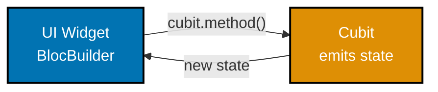

## Group 20: BLoC/Cubit State Management

### Example 56: Cubit

`Cubit` is a simplified `BLoC` that emits new states via methods instead of events. It is part of the `flutter_bloc` package and provides predictable, testable state management. Cubit is the recommended starting point - upgrade to full BLoC only when you need event-driven traceability.



```dart
import 'package:flutter/material.dart';
import 'package:flutter_bloc/flutter_bloc.dart'; // => flutter_bloc: ^8.1.0

// State class: immutable snapshot of what the UI should show
class CounterState {
  final int count;
  final String label;
  const CounterState({required this.count, required this.label});
}

// Cubit: encapsulates state + business logic, emits new states on method calls
class CounterCubit extends Cubit<CounterState> {
  // super() sets the initial state
  CounterCubit() : super(const CounterState(count: 0, label: 'Start counting'));

  void increment() {
    // emit() replaces current state and notifies all BlocBuilder listeners
    emit(CounterState(
      count: state.count + 1,                    // => Increment count
      label: state.count + 1 >= 10               // => Update label at threshold
          ? 'Keep going!'
          : 'Count: ${state.count + 1}',
    ));
  }

  void decrement() {
    if (state.count <= 0) return;               // => Guard: don't go below zero
    emit(CounterState(
      count: state.count - 1,
      label: state.count - 1 == 0 ? 'Start counting' : 'Count: ${state.count - 1}',
    ));
  }

  void reset() => emit(const CounterState(count: 0, label: 'Reset!'));
}

void main() {
  runApp(
    // BlocProvider creates the Cubit and makes it available to the subtree
    BlocProvider(
      create: (context) => CounterCubit(),       // => Factory creates cubit instance
      child: const MaterialApp(home: CounterPage()),
    ),
  );
}

class CounterPage extends StatelessWidget {
  const CounterPage({super.key});

  @override
  Widget build(BuildContext context) {
    return Scaffold(
      appBar: AppBar(title: const Text('Cubit Counter')),
      body: Center(
        child: Column(
          mainAxisAlignment: MainAxisAlignment.center,
          children: [
            // BlocBuilder rebuilds only when state changes
            BlocBuilder<CounterCubit, CounterState>(
              builder: (context, state) {          // => Receives current state
                return Column(
                  children: [
                    Text(state.label,              // => Reactive label from state
                        style: const TextStyle(fontSize: 20)),
                    const SizedBox(height: 8),
                    Text('${state.count}',
                        style: const TextStyle(fontSize: 72,
                            fontWeight: FontWeight.bold)),
                  ],
                );
              },
            ),

            const SizedBox(height: 24),

            Row(
              mainAxisAlignment: MainAxisAlignment.center,
              children: [
                ElevatedButton(
                  // context.read accesses cubit without subscribing to rebuilds
                  onPressed: () => context.read<CounterCubit>().decrement(),
                  child: const Text('-'),
                ),
                const SizedBox(width: 16),
                ElevatedButton(
                  onPressed: () => context.read<CounterCubit>().increment(),
                  child: const Text('+'),
                ),
                const SizedBox(width: 16),
                TextButton(
                  onPressed: () => context.read<CounterCubit>().reset(),
                  child: const Text('Reset'),
                ),
              ],
            ),
          ],
        ),
      ),
    );
  }
}
// => Counter state managed through Cubit with BlocBuilder reactive UI
```

**Key Takeaway**: `Cubit` emits states via `emit()`; `BlocProvider` makes the cubit available; `BlocBuilder` rebuilds when state changes; `context.read` calls cubit methods from callbacks without subscribing.

**Why It Matters**: Cubit provides three critical production benefits over raw `setState`: testability (you can unit test cubit logic without Flutter), scalability (business logic is separated from UI), and debuggability (every state transition is logged by BlocObserver). Teams using BLoC/Cubit can write bloc tests that verify every state transition independently of the widget tree, reducing integration test burden significantly.

---

### Example 57: BLoC with Events

Full `BLoC` pattern separates intent (events) from response (states). Events describe what happened; states describe what the UI should show. Use BLoC instead of Cubit when you need event history for debugging, multiple handlers for the same event, or event transformations (debounce, throttle).

```dart
import 'package:flutter/material.dart';
import 'package:flutter_bloc/flutter_bloc.dart';

// Events: describe user actions or system triggers
abstract class SearchEvent {}

class SearchQueryChanged extends SearchEvent {
  final String query;
  SearchQueryChanged(this.query);
}

class SearchCleared extends SearchEvent {}

// States: describe what the UI should render
abstract class SearchState {}
class SearchInitial extends SearchState {}
class SearchLoading extends SearchState {}

class SearchResults extends SearchState {
  final List<String> results;
  final String query;
  SearchResults({required this.results, required this.query});
}

class SearchError extends SearchState {
  final String message;
  SearchError(this.message);
}

// BLoC: maps events to states via EventHandlers
class SearchBloc extends Bloc<SearchEvent, SearchState> {
  SearchBloc() : super(SearchInitial()) {
    // on<EventType> registers a handler for events of that type
    on<SearchQueryChanged>(_onQueryChanged);
    on<SearchCleared>(_onCleared);
  }

  // Handler runs when SearchQueryChanged event is added
  Future<void> _onQueryChanged(
    SearchQueryChanged event,
    Emitter<SearchState> emit,
  ) async {
    if (event.query.isEmpty) {
      emit(SearchInitial());                       // => Clear results for empty query
      return;
    }

    emit(SearchLoading());                         // => Show loading indicator

    try {
      await Future.delayed(const Duration(milliseconds: 300)); // => Simulate search API
      // Simulate filtering items that match the query
      final allItems = List.generate(20, (i) => 'Flutter item ${i + 1}');
      final results = allItems
          .where((item) => item.toLowerCase().contains(event.query.toLowerCase()))
          .toList();
      emit(SearchResults(results: results, query: event.query));
      // => Emit results state with matching items
    } catch (e) {
      emit(SearchError('Search failed: $e'));      // => Emit error state on exception
    }
  }

  void _onCleared(SearchCleared event, Emitter<SearchState> emit) {
    emit(SearchInitial());                         // => Reset to initial state
  }
}

void main() => runApp(BlocProvider(
  create: (_) => SearchBloc(),
  child: const MaterialApp(home: SearchPage()),
));

class SearchPage extends StatelessWidget {
  const SearchPage({super.key});

  @override
  Widget build(BuildContext context) {
    return Scaffold(
      appBar: AppBar(title: const Text('BLoC Search')),
      body: Column(
        children: [
          Padding(
            padding: const EdgeInsets.all(16),
            child: TextField(
              decoration: const InputDecoration(
                hintText: 'Search...',
                border: OutlineInputBorder(),
                prefixIcon: Icon(Icons.search),
              ),
              onChanged: (query) {
                // add() dispatches an event to the BLoC
                context.read<SearchBloc>().add(SearchQueryChanged(query));
                // => Event enters the BLoC stream, triggers _onQueryChanged
              },
            ),
          ),
          Expanded(
            child: BlocBuilder<SearchBloc, SearchState>(
              builder: (context, state) {
                if (state is SearchInitial) {
                  return const Center(child: Text('Type to search...'));
                }
                if (state is SearchLoading) {
                  return const Center(child: CircularProgressIndicator());
                }
                if (state is SearchError) {
                  return Center(child: Text(state.message,
                      style: const TextStyle(color: Colors.red)));
                }
                final results = state as SearchResults;
                if (results.results.isEmpty) {
                  return Center(child: Text('No results for "${results.query}"'));
                }
                return ListView.builder(
                  itemCount: results.results.length,
                  itemBuilder: (context, i) => ListTile(
                    title: Text(results.results[i]),
                  ),
                );
              },
            ),
          ),
        ],
      ),
    );
  }
}
// => Search dispatches events; BLoC maps them to Loading/Results/Error states
```

**Key Takeaway**: BLoC maps events to states via `on<EventType>` handlers; `add()` dispatches events; `emit()` pushes new states to all `BlocBuilder` listeners; sealed event/state class hierarchies make all cases explicit and exhaustive.

**Why It Matters**: BLoC is the architecture of choice for large Flutter teams because every state transition is explicit, logged, and testable. `BlocObserver` can log every event and state change globally - invaluable for debugging complex user flows in production. The event/state separation also enables features like undo (replay previous events) and analytics (track every user action as a stream of events).

---

## Group 21: Platform Interop

### Example 58: dart:js_interop

`dart:js_interop` (Dart 3.3+) provides static, type-safe JavaScript interop. Use `@JS()` annotations to call browser APIs and JavaScript libraries from Dart. This replaces the older `dart:html` and `package:js` approaches with better null safety and wasm compatibility.

```dart
import 'package:flutter/material.dart';
import 'dart:js_interop';                        // => Dart 3.3+ static JS interop

// Declare JS bindings using extension types
@JS('window')                                    // => Refers to the JS window object
external JSObject get window;                    // => external = implemented in JS

// Declare individual window methods as external functions
@JS('window.alert')
external void jsAlert(String message);           // => Calls browser alert()

@JS('window.confirm')
external bool jsConfirm(String message);         // => Calls browser confirm()

// Declare localStorage using extension type
extension type JSLocalStorage._(JSObject _) implements JSObject {
  external void setItem(String key, String value); // => localStorage.setItem
  external String? getItem(String key);            // => localStorage.getItem
  external void removeItem(String key);            // => localStorage.removeItem
}

@JS('window.localStorage')
external JSLocalStorage get localStorage;        // => Access window.localStorage

void main() => runApp(const MaterialApp(home: JsInteropDemo()));

class JsInteropDemo extends StatefulWidget {
  const JsInteropDemo({super.key});

  @override
  State<JsInteropDemo> createState() => _JsInteropDemoState();
}

class _JsInteropDemoState extends State<JsInteropDemo> {
  String _storedValue = '';

  @override
  void initState() {
    super.initState();
    // Read from localStorage on startup
    _storedValue = localStorage.getItem('flutter_demo') ?? 'Nothing stored yet';
  }

  void _saveToLocalStorage() {
    const value = 'Flutter Web saved this at runtime';
    localStorage.setItem('flutter_demo', value);  // => Persists across page refreshes
    setState(() => _storedValue = value);
  }

  void _showBrowserAlert() {
    jsAlert('Hello from Flutter Web via dart:js_interop!');
    // => Calls native browser alert() dialog
  }

  @override
  Widget build(BuildContext context) {
    return Scaffold(
      appBar: AppBar(title: const Text('JS Interop')),
      body: Padding(
        padding: const EdgeInsets.all(24),
        child: Column(
          crossAxisAlignment: CrossAxisAlignment.start,
          children: [
            Card(
              child: Padding(
                padding: const EdgeInsets.all(16),
                child: Column(
                  crossAxisAlignment: CrossAxisAlignment.start,
                  children: [
                    const Text('localStorage value:',
                        style: TextStyle(fontWeight: FontWeight.bold)),
                    const SizedBox(height: 4),
                    Text(_storedValue),            // => Shows current localStorage value
                  ],
                ),
              ),
            ),
            const SizedBox(height: 16),
            ElevatedButton(
              onPressed: _saveToLocalStorage,
              child: const Text('Save to localStorage'),
            ),
            const SizedBox(height: 8),
            ElevatedButton(
              onPressed: _showBrowserAlert,
              child: const Text('Call browser alert()'),
            ),
            const SizedBox(height: 8),
            ElevatedButton(
              onPressed: () {
                localStorage.removeItem('flutter_demo'); // => Clear stored value
                setState(() => _storedValue = 'Cleared');
              },
              child: const Text('Clear localStorage'),
            ),
          ],
        ),
      ),
    );
  }
}
// => Flutter calls browser APIs directly via dart:js_interop
```

**Key Takeaway**: Use `@JS()` annotations with `external` declarations to bind Dart code to JavaScript APIs; `dart:js_interop` provides compile-time type safety and works with both dart2js and dart2wasm compilation.

**Why It Matters**: Production Flutter Web apps frequently need to call browser APIs not exposed by Flutter - analytics scripts, third-party SDKs, native browser storage, clipboard API, and Web Audio. `dart:js_interop` is the Dart 3.3+ standard for this, replacing the older `dart:html` approach which is incompatible with WebAssembly compilation. Migrating to `dart:js_interop` is required for apps targeting Flutter's WASM output.

---

### Example 59: IndexedDB via dart:js_interop

Browser `IndexedDB` provides a persistent, transactional key-value store with index support. It handles larger data volumes than `localStorage` (which is limited to ~5MB) and supports complex queries. Use it for offline-capable Flutter Web apps.

```dart
import 'dart:js_interop';
import 'package:flutter/material.dart';
import 'package:web/web.dart' as web;            // => package:web ^0.5.0 for typed web APIs

void main() => runApp(const MaterialApp(home: IndexedDBDemo()));

// High-level wrapper around IndexedDB operations
class LocalDatabase {
  static const _dbName = 'FlutterWebDB';
  static const _storeName = 'notes';
  web.IDBDatabase? _db;

  Future<void> open() async {
    // Open database with version 1, create store if needed
    final request = web.window.indexedDB.open(_dbName, 1);

    // onupgradeneeded fires when DB is created or version increases
    request.onupgradeneeded = (web.IDBVersionChangeEvent event) {
      final db = request.result as web.IDBDatabase;
      if (!db.objectStoreNames.contains(_storeName)) {
        db.createObjectStore(_storeName,
          web.IDBObjectStoreParameters(keyPath: 'id'.toJS)); // => 'id' field is the key
      }
    }.toJS;

    // Wait for success
    final completer = Completer<void>();
    request.onsuccess = (web.Event _) {
      _db = request.result as web.IDBDatabase;
      completer.complete();
    }.toJS;
    request.onerror = (web.Event _) =>
        completer.completeError('Failed to open DB').toJS;

    return completer.future;
  }

  Future<void> put(Map<String, dynamic> note) async {
    final tx = _db!.transaction(_storeName.toJS, 'readwrite');
    tx.objectStore(_storeName).put(note.jsify()); // => Store JS-ified Dart map
  }

  Future<List<Map<String, dynamic>>> getAll() async {
    // ... implementation queries all records
    return [];
  }
}

class IndexedDBDemo extends StatelessWidget {
  const IndexedDBDemo({super.key});

  @override
  Widget build(BuildContext context) {
    return Scaffold(
      appBar: AppBar(title: const Text('IndexedDB')),
      body: const Padding(
        padding: EdgeInsets.all(24),
        child: Column(
          crossAxisAlignment: CrossAxisAlignment.start,
          children: [
            Text('IndexedDB Demo', style: TextStyle(fontSize: 20, fontWeight: FontWeight.bold)),
            SizedBox(height: 12),
            Text(
              'IndexedDB provides persistent browser storage beyond localStorage.\n'
              '- Stores structured data (objects, arrays)\n'
              '- Supports transactions for data integrity\n'
              '- No size limit (depends on disk space)\n'
              '- Indexed queries for fast lookups\n'
              '- Survives page refreshes and browser close',
            ),
          ],
        ),
      ),
    );
  }
}
// => IndexedDB stores structured data with transactions and indexes
```

**Key Takeaway**: Use `package:web` for typed browser API access; IndexedDB requires a database open + version upgrade pattern; all operations are async request-based with `onsuccess`/`onerror` handlers.

**Why It Matters**: Offline-capable progressive web apps need robust client-side storage. `localStorage` is synchronous and limited to 5MB of strings. IndexedDB stores gigabytes of structured data, supports indexing for fast queries, and operates asynchronously to avoid blocking the main thread. Production PWAs use IndexedDB for offline caching of user data, queued writes that sync when connectivity returns, and large media metadata stores.

---

### Example 60: WebSocket Real-time Communication

`WebSocket` enables full-duplex communication between the browser and server. In Flutter Web, use `dart:html`'s `WebSocket` or `package:web`'s `WebSocket` for direct browser API access, or wrap it in a Dart `Stream` for reactive integration.

```dart
import 'package:flutter/material.dart';
import 'dart:async';

// WebSocket client wrapper using Streams
class WebSocketService {
  // Use package:web or dart:html for browser WebSocket
  // This example shows the conceptual Stream-based wrapper pattern
  final StreamController<String> _incomingMessages =
      StreamController<String>.broadcast(); // => broadcast: multiple listeners allowed

  Stream<String> get messages => _incomingMessages.stream; // => Expose read-only stream

  // In real implementation: use web.WebSocket(url) from package:web
  void simulateConnection() {
    // Simulate receiving messages from server
    Timer.periodic(const Duration(seconds: 2), (timer) {
      if (_incomingMessages.isClosed) {
        timer.cancel();                          // => Stop if stream closed
        return;
      }
      _incomingMessages.add(
          'Server message at ${DateTime.now().toIso8601String()}');
      // => Each message is pushed to all stream subscribers
    });
  }

  void send(String message) {
    // In real implementation: webSocket.send(message)
    _incomingMessages.add('Echo: $message');     // => Simulate echo from server
  }

  void dispose() {
    _incomingMessages.close();                   // => Close stream to release resources
  }
}

void main() => runApp(const MaterialApp(home: WebSocketDemo()));

class WebSocketDemo extends StatefulWidget {
  const WebSocketDemo({super.key});

  @override
  State<WebSocketDemo> createState() => _WebSocketDemoState();
}

class _WebSocketDemoState extends State<WebSocketDemo> {
  final _service = WebSocketService();
  final _controller = TextEditingController();
  final List<String> _messages = [];            // => Accumulated message history

  @override
  void initState() {
    super.initState();
    _service.simulateConnection();               // => Start receiving messages

    // Subscribe to the message stream
    _service.messages.listen((message) {
      if (mounted) {
        setState(() => _messages.insert(0, message)); // => Prepend newest at top
        if (_messages.length > 50) _messages.removeLast(); // => Keep last 50
      }
    });
  }

  @override
  void dispose() {
    _service.dispose();                          // => Close WebSocket connection
    _controller.dispose();
    super.dispose();
  }

  @override
  Widget build(BuildContext context) {
    return Scaffold(
      appBar: AppBar(
        title: const Text('WebSocket'),
        actions: [
          // Connection status indicator
          Container(
            margin: const EdgeInsets.symmetric(horizontal: 16, vertical: 12),
            width: 12,
            height: 12,
            decoration: const BoxDecoration(
              color: Colors.green,               // => Green = connected
              shape: BoxShape.circle,
            ),
          ),
        ],
      ),
      body: Column(
        children: [
          // Message input row
          Padding(
            padding: const EdgeInsets.all(12),
            child: Row(
              children: [
                Expanded(
                  child: TextField(
                    controller: _controller,
                    decoration: const InputDecoration(
                      hintText: 'Send a message...',
                      border: OutlineInputBorder(),
                    ),
                    onSubmitted: (text) {
                      if (text.isNotEmpty) {
                        _service.send(text);     // => Send message to server
                        _controller.clear();
                      }
                    },
                  ),
                ),
                const SizedBox(width: 8),
                IconButton(
                  icon: const Icon(Icons.send),
                  onPressed: () {
                    final text = _controller.text;
                    if (text.isNotEmpty) {
                      _service.send(text);
                      _controller.clear();
                    }
                  },
                ),
              ],
            ),
          ),
          // Messages list
          Expanded(
            child: ListView.builder(
              reverse: true,                     // => Newest at bottom
              itemCount: _messages.length,
              itemBuilder: (context, index) => ListTile(
                dense: true,
                title: Text(_messages[index]),
              ),
            ),
          ),
        ],
      ),
    );
  }
}
// => Real-time message stream displayed as they arrive from server
```

**Key Takeaway**: Wrap browser WebSocket in a Dart `StreamController.broadcast()` for reactive integration; subscribe in `initState`, unsubscribe in `dispose`; check `mounted` before calling `setState` in stream callbacks.

**Why It Matters**: Real-time features - live dashboards, chat, collaborative editing, live notifications - require WebSocket. The `StreamController.broadcast()` wrapper transforms the callback-based WebSocket API into a Dart Stream that integrates naturally with `StreamBuilder` and Riverpod `StreamProvider`. The `mounted` check in the stream listener is critical because the async listener can fire after the widget is disposed.

---

## Group 22: PWA and Production Web

### Example 61: PWA Configuration

Flutter Web generates a Progressive Web App by default. The `manifest.json` and `service worker` in the `web/` folder control installation prompts, offline behavior, and app appearance. Customizing these makes your Flutter Web app installable as a native-like desktop or mobile app.

```dart
// This example shows the web/ folder files that configure PWA behavior
// web/manifest.json - Controls how the app appears when installed
/*
{
  "name": "My Flutter App",
  "short_name": "FlutterApp",
  "start_url": ".",
  "display": "standalone",
  "background_color": "#0173B2",
  "theme_color": "#0173B2",
  "description": "A Flutter Web PWA example",
  "orientation": "portrait-primary",
  "prefer_related_applications": false,
  "icons": [
    { "src": "icons/Icon-192.png", "sizes": "192x192", "type": "image/png" },
    { "src": "icons/Icon-512.png", "sizes": "512x512", "type": "image/png" },
    { "src": "icons/Icon-maskable-192.png", "sizes": "192x192", "type": "image/png", "purpose": "maskable" },
    { "src": "icons/Icon-maskable-512.png", "sizes": "512x512", "type": "image/png", "purpose": "maskable" }
  ]
}
*/

// web/index.html head section - SEO and PWA meta tags
/*
<head>
  <meta charset="UTF-8">
  <meta content="IE=Edge" http-equiv="X-UA-Compatible">
  <meta name="description" content="Your app description for SEO">

  <!-- iOS PWA support -->
  <meta name="apple-mobile-web-app-capable" content="yes">
  <meta name="apple-mobile-web-app-status-bar-style" content="black">
  <meta name="apple-mobile-web-app-title" content="My Flutter App">
  <link rel="apple-touch-icon" href="icons/Icon-192.png">

  <!-- OpenGraph for social sharing -->
  <meta property="og:title" content="My Flutter App">
  <meta property="og:description" content="Built with Flutter Web">
  <meta property="og:image" content="https://myapp.com/icons/og-image.png">

  <!-- Theme color for browser chrome -->
  <meta name="theme-color" content="#0173B2">

  <title>My Flutter App</title>
  <link rel="manifest" href="manifest.json">
</head>
*/

import 'package:flutter/material.dart';

// Dart code: detect if running as installed PWA
bool get isInstalledPWA {
  // When installed as PWA, display-mode is 'standalone'
  // This is checked via JS media query
  // In production, use dart:js_interop to check:
  // window.matchMedia('(display-mode: standalone)').matches
  return false; // => Placeholder - implement with js_interop in production
}

void main() => runApp(const MaterialApp(home: PWAInfoPage()));

class PWAInfoPage extends StatelessWidget {
  const PWAInfoPage({super.key});

  @override
  Widget build(BuildContext context) {
    return Scaffold(
      appBar: AppBar(title: const Text('PWA Configuration')),
      body: Padding(
        padding: const EdgeInsets.all(24),
        child: Column(
          crossAxisAlignment: CrossAxisAlignment.start,
          children: [
            Card(
              child: Padding(
                padding: const EdgeInsets.all(16),
                child: Column(
                  crossAxisAlignment: CrossAxisAlignment.start,
                  children: [
                    Text('PWA Status',
                        style: Theme.of(context).textTheme.titleMedium),
                    const SizedBox(height: 8),
                    Text('Running as PWA: ${isInstalledPWA ? "Yes" : "No"}'),
                    // => Shows if app is running in standalone (installed) mode
                    const SizedBox(height: 4),
                    const Text('PWA features:\n'
                        '• Installable from browser\n'
                        '• Offline support via service worker\n'
                        '• Custom splash screen\n'
                        '• Standalone window (no browser chrome)\n'
                        '• Push notifications (with permission)'),
                  ],
                ),
              ),
            ),

            const SizedBox(height: 16),

            Card(
              child: Padding(
                padding: const EdgeInsets.all(16),
                child: Column(
                  crossAxisAlignment: CrossAxisAlignment.start,
                  children: [
                    Text('Renderer Selection',
                        style: Theme.of(context).textTheme.titleMedium),
                    const SizedBox(height: 8),
                    const Text(
                      'Flutter Web renderer options:\n\n'
                      '• auto (default): html for mobile, canvaskit for desktop\n'
                      '• canvaskit: pixel-perfect, consistent, larger bundle (~2MB)\n'
                      '• html: lighter bundle, uses DOM elements\n'
                      '• wasm (experimental): dart2wasm + skwasm renderer\n\n'
                      'Build: flutter build web --web-renderer canvaskit',
                    ),
                  ],
                ),
              ),
            ),
          ],
        ),
      ),
    );
  }
}
```

**Key Takeaway**: Configure `web/manifest.json` for installation metadata; add meta tags in `web/index.html` for SEO and iOS PWA support; choose renderer with `--web-renderer canvaskit` for pixel-perfect rendering or `html` for smaller bundles.

**Why It Matters**: PWA installability and proper meta tags are the difference between a Flutter Web experiment and a production-quality web application. Without `manifest.json`, browsers will not offer the "Add to Home Screen" prompt. Without OpenGraph tags, link sharing on social media shows blank previews. Without proper `description` meta tags, search engine indexing is degraded. These are the polish details that distinguish professional Flutter Web deployments.

---

## Group 23: Performance

### Example 62: const Constructors and Widget Caching

`const` constructors create compile-time constant widgets that Flutter can skip rebuilding entirely. Using `const` throughout your widget tree is the simplest and most impactful performance optimization available in Flutter.

```dart
import 'package:flutter/material.dart';

void main() => runApp(const MaterialApp(home: ConstDemo()));

// This widget's entire subtree is compile-time constant
// Flutter will never rebuild it regardless of parent rebuilds
class StaticHeader extends StatelessWidget {
  const StaticHeader({super.key}); // => const constructor required

  @override
  Widget build(BuildContext context) {
    return const Padding(
      padding: EdgeInsets.all(16),               // => const EdgeInsets
      child: Column(
        crossAxisAlignment: CrossAxisAlignment.start,
        children: [
          // Every child is const - entire subtree is cached
          Text('Welcome to Flutter Web',          // => const Text literal
            style: TextStyle(
              fontSize: 28,
              fontWeight: FontWeight.bold,        // => const TextStyle
            ),
          ),
          SizedBox(height: 8),
          Text('Build fast, beautiful web apps'), // => const Text
          SizedBox(height: 4),
          Row(
            children: [
              Icon(Icons.check, color: Colors.teal, size: 16),
              SizedBox(width: 4),
              Text('Pixel-perfect rendering'),
            ],
          ),
        ],
      ),
    );
  }
}

class ConstDemo extends StatefulWidget {
  const ConstDemo({super.key});

  @override
  State<ConstDemo> createState() => _ConstDemoState();
}

class _ConstDemoState extends State<ConstDemo> {
  int _counter = 0;

  @override
  Widget build(BuildContext context) {
    return Scaffold(
      appBar: AppBar(title: const Text('const Performance')), // => const AppBar title
      body: Column(
        children: [
          // StaticHeader is const - even though _counter changes, this never rebuilds
          const StaticHeader(),                  // => const prevents rebuild on setState

          // This Text DOES rebuild on setState because it uses _counter
          Text('Counter: $_counter',             // => Cannot be const (uses variable)
            style: const TextStyle(fontSize: 24)), // => TextStyle IS const

          const SizedBox(height: 16),            // => const spacer never rebuilds

          ElevatedButton(
            onPressed: () => setState(() => _counter++), // => Only Text above rebuilds
            child: const Text('Increment'),      // => const button label
          ),
        ],
      ),
    );
  }
}
// => StaticHeader never rebuilds despite counter state changes
```

**Key Takeaway**: `const` widgets are compiled to single instances that Flutter skips in rebuild cycles; `const` is the highest-impact, lowest-effort Flutter performance optimization; apply it to every widget that does not depend on runtime state.

**Why It Matters**: Flutter's rendering engine checks each widget to decide if it needs rebuilding. `const` widgets are identical object instances - Flutter skips them entirely with a pointer comparison. In a complex list with 50 items each containing 10 sub-widgets, `const` can prevent 500 widget comparisons on every frame. This is not premature optimization - it is fundamental Flutter best practice recommended by the Flutter team as a first-pass optimization.

---

### Example 63: RepaintBoundary and Performance Profiling

`RepaintBoundary` isolates a subtree into its own render layer. Animations or frequent updates inside the boundary do not trigger repaints outside it. This is essential for animated widgets inside large, complex screens.

```dart
import 'package:flutter/material.dart';

void main() => runApp(const MaterialApp(home: RepaintDemo()));

// This widget updates frequently (animation)
class AnimatedCounter extends StatefulWidget {
  const AnimatedCounter({super.key});

  @override
  State<AnimatedCounter> createState() => _AnimatedCounterState();
}

class _AnimatedCounterState extends State<AnimatedCounter>
    with SingleTickerProviderStateMixin {
  late AnimationController _controller;
  late Animation<double> _animation;

  @override
  void initState() {
    super.initState();
    _controller = AnimationController(
      duration: const Duration(seconds: 2),
      vsync: this,
    )..repeat(reverse: true);                    // => Continuous loop
    _animation = Tween<double>(begin: 0, end: 1).animate(_controller);
  }

  @override
  void dispose() {
    _controller.dispose();
    super.dispose();
  }

  @override
  Widget build(BuildContext context) {
    return AnimatedBuilder(
      animation: _animation,
      builder: (context, _) => Container(
        width: 100,
        height: 100,
        decoration: BoxDecoration(
          shape: BoxShape.circle,
          color: Color.lerp(Colors.blue, Colors.orange, _animation.value), // => Animated color
        ),
        child: Center(
          child: Text(
            '${(_animation.value * 100).toInt()}%',
            style: const TextStyle(color: Colors.white, fontWeight: FontWeight.bold),
          ),
        ),
      ),
    );
  }
}

class ExpensiveStaticWidget extends StatelessWidget {
  const ExpensiveStaticWidget({super.key});

  @override
  Widget build(BuildContext context) {
    // Simulates expensive layout computation (many widgets)
    return Column(
      children: List.generate(
        20,
        (i) => Padding(
          padding: const EdgeInsets.symmetric(vertical: 2),
          child: Row(
            children: [
              Icon(Icons.circle, size: 12, color: Colors.grey.shade400),
              const SizedBox(width: 8),
              Text('Static content item ${i + 1}'),
            ],
          ),
        ),
      ),
    );
  }
}

class RepaintDemo extends StatelessWidget {
  const RepaintDemo({super.key});

  @override
  Widget build(BuildContext context) {
    return Scaffold(
      appBar: AppBar(title: const Text('RepaintBoundary')),
      body: Padding(
        padding: const EdgeInsets.all(16),
        child: Column(
          children: [
            // WITHOUT RepaintBoundary: animated widget repaints entire Column on every frame
            // WITH RepaintBoundary: only the boundary layer repaints, Column is unaffected

            RepaintBoundary(
              // => Everything inside this boundary is isolated in its own compositing layer
              // => Animation repaints ONLY this layer, not the Column or ExpensiveStaticWidget
              child: const AnimatedCounter(),
            ),

            const SizedBox(height: 16),

            // This expensive static widget is NOT repainted during animation
            const RepaintBoundary(
              // => Promotes ExpensiveStaticWidget to its own layer
              // => Flutter compositor can skip it during animation frames
              child: ExpensiveStaticWidget(),
            ),

            // Flutter DevTools tips card
            const SizedBox(height: 16),
            const Card(
              child: Padding(
                padding: EdgeInsets.all(12),
                child: Text(
                  'Profile with Flutter DevTools:\n'
                  '• flutter run --profile -d chrome\n'
                  '• Open DevTools: flutter pub global run devtools\n'
                  '• Enable "Highlight Repaints" to visualize boundaries\n'
                  '• Use Timeline to identify jank frames (>16ms)',
                ),
              ),
            ),
          ],
        ),
      ),
    );
  }
}
// => Animation inside RepaintBoundary does not repaint the static list below it
```

**Key Takeaway**: Wrap frequently-updating widgets (animations, live data) in `RepaintBoundary` to isolate their repaints; use Flutter DevTools "Highlight Repaints" mode to identify unnecessary repaints; run `--profile` mode for accurate performance measurements.

**Why It Matters**: A 60fps animation that causes the entire screen to repaint on every frame is a performance disaster on complex screens. `RepaintBoundary` tells the Flutter compositor to manage the animated widget on its own GPU layer, leaving static content undisturbed. This is how production Flutter Web apps with live dashboards, animated charts, and scrolling lists maintain 60fps without GPU overload.

---

## Group 24: Accessibility and Internationalization

### Example 64: Semantics Widget

`Semantics` provides accessibility metadata to screen readers. Every interactive widget that lacks a text label needs a `Semantics` wrapper with a descriptive `label`. The `excludeSemantics` property removes a widget from the accessibility tree when it is purely decorative.

```dart
import 'package:flutter/material.dart';

void main() => runApp(const MaterialApp(home: SemanticsDemo()));

class SemanticsDemo extends StatefulWidget {
  const SemanticsDemo({super.key});

  @override
  State<SemanticsDemo> createState() => _SemanticsDemoState();
}

class _SemanticsDemoState extends State<SemanticsDemo> {
  bool _isLiked = false;
  int _likeCount = 42;

  @override
  Widget build(BuildContext context) {
    return Scaffold(
      appBar: AppBar(title: const Text('Accessibility / Semantics')),
      body: Padding(
        padding: const EdgeInsets.all(24),
        child: Column(
          crossAxisAlignment: CrossAxisAlignment.start,
          children: [
            // Icon-only button REQUIRES Semantics label
            Semantics(
              label: _isLiked ? 'Unlike post' : 'Like post', // => Screen reader reads this
              hint: 'Double-tap to toggle like',             // => Usage hint
              button: true,                                  // => Identifies as interactive button
              child: GestureDetector(
                onTap: () => setState(() {
                  _isLiked = !_isLiked;
                  _likeCount += _isLiked ? 1 : -1;
                }),
                child: Row(
                  mainAxisSize: MainAxisSize.min,
                  children: [
                    Icon(
                      _isLiked ? Icons.favorite : Icons.favorite_border,
                      color: _isLiked ? Colors.red : Colors.grey,
                    ),
                    const SizedBox(width: 4),
                    Text('$_likeCount'),
                  ],
                ),
              ),
            ),
            // => Screen reader says "Like post, button. Double-tap to toggle like."

            const SizedBox(height: 16),

            // Decorative image excluded from semantics tree
            Semantics(
              excludeSemantics: true,                        // => Hidden from screen readers
              child: Container(
                width: 200,
                height: 100,
                decoration: BoxDecoration(
                  gradient: const LinearGradient(
                    colors: [Color(0xFF0173B2), Color(0xFF029E73)],
                  ),
                  borderRadius: BorderRadius.circular(8),
                ),
              ),
            ),
            // => Decorative gradient is excluded from accessibility tree

            const SizedBox(height: 8),
            const Text('Decorative gradient above is hidden from screen readers'),

            const SizedBox(height: 16),

            // MergeSemantics combines children into one semantics node
            MergeSemantics(
              child: Row(
                children: [
                  const Icon(Icons.schedule, size: 16),
                  const SizedBox(width: 4),
                  const Text('Published'),
                  const SizedBox(width: 4),
                  const Text('March 19, 2026'),
                ],
              ),
            ),
            // => Screen reader reads all as one: "Published March 19, 2026"
            // => Without MergeSemantics: reads icon + "Published" + date separately

            const SizedBox(height: 16),

            // Focus traversal order for keyboard accessibility
            FocusTraversalGroup(
              policy: OrderedTraversalPolicy(),   // => Traverse in widget order
              child: Column(
                children: [
                  ElevatedButton(
                    autofocus: true,              // => This button gets focus on page load
                    onPressed: () {},
                    child: const Text('First Action (auto-focused)'),
                  ),
                  const SizedBox(height: 8),
                  ElevatedButton(
                    onPressed: () {},
                    child: const Text('Second Action'),
                  ),
                ],
              ),
            ),
          ],
        ),
      ),
    );
  }
}
// => Screen readers can navigate all interactive elements with proper labels
```

**Key Takeaway**: Wrap icon-only interactions in `Semantics` with `label` and `button: true`; use `excludeSemantics: true` for decorative elements; `MergeSemantics` combines multiple nodes into one readable announcement.

**Why It Matters**: WCAG 2.1 Level AA compliance is legally required for public-facing web applications in many jurisdictions. `Semantics` is how Flutter maps its widget tree to the browser's accessibility tree (ARIA). Icon buttons without labels are one of the most common WCAG violations in Flutter Web apps. The `autofocus` property ensures keyboard users land on the primary action when a page loads, satisfying WCAG 2.4.3 (Focus Order).

---

### Example 65: Internationalization with flutter_localizations

`flutter_localizations` + `intl` package provide multi-language support. ARB (Application Resource Bundle) files store translated strings. `AppLocalizations.of(context)` retrieves the current locale's translations. The `MaterialApp.localizationsDelegates` and `supportedLocales` configure available languages.

```dart
import 'package:flutter/material.dart';
// In production: import 'package:flutter_gen/gen_l10n/app_localizations.dart';

// Simplified mock for demonstration - in production, generated from ARB files
class AppStrings {
  final String welcome;
  final String signIn;
  final String language;

  const AppStrings({
    required this.welcome,
    required this.signIn,
    required this.language,
  });

  static const en = AppStrings(
    welcome: 'Welcome to Flutter Web',
    signIn: 'Sign In',
    language: 'Language',
  );

  static const id = AppStrings(
    welcome: 'Selamat datang di Flutter Web',
    signIn: 'Masuk',
    language: 'Bahasa',
  );
}

// In production, use proper ARB files:
// lib/l10n/app_en.arb
// {
//   "@@locale": "en",
//   "welcome": "Welcome to Flutter Web",
//   "@welcome": { "description": "Welcome message on home screen" },
//   "signIn": "Sign In"
// }
//
// lib/l10n/app_id.arb
// {
//   "@@locale": "id",
//   "welcome": "Selamat datang di Flutter Web",
//   "signIn": "Masuk"
// }

void main() => runApp(const I18nDemo());

class I18nDemo extends StatefulWidget {
  const I18nDemo({super.key});

  @override
  State<I18nDemo> createState() => _I18nDemoState();
}

class _I18nDemoState extends State<I18nDemo> {
  Locale _locale = const Locale('en');           // => Start with English

  AppStrings get _strings => _locale.languageCode == 'id'
      ? AppStrings.id : AppStrings.en;           // => Select strings for current locale

  @override
  Widget build(BuildContext context) {
    return MaterialApp(
      locale: _locale,                           // => Override the app locale
      // In production: include flutter_localizations delegates
      // localizationsDelegates: AppLocalizations.localizationsDelegates,
      // supportedLocales: AppLocalizations.supportedLocales,
      home: Scaffold(
        appBar: AppBar(title: Text(_strings.language)),
        body: Padding(
          padding: const EdgeInsets.all(24),
          child: Column(
            crossAxisAlignment: CrossAxisAlignment.start,
            children: [
              Text(_strings.welcome,
                style: const TextStyle(fontSize: 24, fontWeight: FontWeight.bold)),
              // => Shows "Welcome to Flutter Web" or "Selamat datang..." based on locale

              const SizedBox(height: 24),

              // Language selector
              Row(
                children: [
                  ChoiceChip(
                    label: const Text('English'),
                    selected: _locale.languageCode == 'en',
                    onSelected: (_) => setState(() => _locale = const Locale('en')),
                  ),
                  const SizedBox(width: 8),
                  ChoiceChip(
                    label: const Text('Indonesian'),
                    selected: _locale.languageCode == 'id',
                    onSelected: (_) => setState(() => _locale = const Locale('id')),
                  ),
                ],
              ),

              const SizedBox(height: 24),

              ElevatedButton(
                onPressed: () {},
                child: Text(_strings.signIn),    // => Localized button label
              ),
            ],
          ),
        ),
      ),
    );
  }
}
// => UI switches between English and Indonesian on locale change
```

**Key Takeaway**: Store translations in ARB files under `lib/l10n/`; run `flutter gen-l10n` to generate typed `AppLocalizations`; access with `AppLocalizations.of(context)!.messageKey`; configure `supportedLocales` and `localizationsDelegates` in `MaterialApp`.

**Why It Matters**: Internationalization cannot be added as an afterthought. Hard-coded strings in widgets require a full codebase search to localize. Building with `flutter_localizations` from the start means adding a new language requires only a new ARB file, not code changes. For global applications, proper i18n including right-to-left (`TextDirection.rtl`) support for Arabic and Hebrew is a market requirement, not a nice-to-have.

---

## Group 25: Deferred Loading and Deployment

### Example 66: Deferred Loading (Code Splitting)

Dart's `deferred as` keyword splits code into separate JavaScript bundles loaded on demand. This reduces the initial bundle size of Flutter Web apps, improving time-to-first-render. Load heavy features (charts, editors, rarely-accessed screens) lazily.

```dart
// Heavy feature module (saved as lib/features/chart_feature.dart)
// import 'package:fl_chart/fl_chart.dart'; // => Heavy dependency only in this file

library chart_feature;

import 'package:flutter/material.dart';

class ChartPage extends StatelessWidget {
  const ChartPage({super.key});

  @override
  Widget build(BuildContext context) {
    return const Scaffold(
      body: Center(
        child: Text('Chart feature loaded!\n'
            '(In production: fl_chart or similar heavy library)'),
      ),
    );
  }
}

// ===

// main app file (lib/main.dart):
import 'package:flutter/material.dart';
// Deferred import: code is NOT included in the initial bundle
// => Loaded as a separate .js chunk when loadLibrary() is called
import 'features/chart_feature.dart' deferred as chartFeature;

void main() => runApp(const MaterialApp(home: DeferredDemo()));

class DeferredDemo extends StatefulWidget {
  const DeferredDemo({super.key});

  @override
  State<DeferredDemo> createState() => _DeferredDemoState();
}

class _DeferredDemoState extends State<DeferredDemo> {
  bool _isLoaded = false;                        // => Whether deferred library is loaded
  bool _isLoading = false;                       // => Download in progress

  Future<void> _loadChartFeature() async {
    setState(() => _isLoading = true);

    // loadLibrary() downloads the deferred chunk from the server
    await chartFeature.loadLibrary();            // => Network request for .js chunk
    // => After this, chartFeature.ChartPage can be instantiated
    // => Subsequent calls to loadLibrary() are instant (already cached)

    setState(() {
      _isLoaded = true;
      _isLoading = false;
    });
  }

  @override
  Widget build(BuildContext context) {
    return Scaffold(
      appBar: AppBar(title: const Text('Deferred Loading')),
      body: Center(
        child: Column(
          mainAxisAlignment: MainAxisAlignment.center,
          children: [
            const Text(
              'Chart feature uses deferred loading.\n'
              'It is not in the initial bundle.',
              textAlign: TextAlign.center,
            ),
            const SizedBox(height: 24),
            if (!_isLoaded)
              ElevatedButton(
                onPressed: _isLoading ? null : _loadChartFeature,
                child: _isLoading
                    ? const Row(
                        mainAxisSize: MainAxisSize.min,
                        children: [
                          SizedBox(width: 16, height: 16,
                              child: CircularProgressIndicator(strokeWidth: 2)),
                          SizedBox(width: 8),
                          Text('Loading chart module...'),
                        ],
                      )
                    : const Text('Load Chart Feature'),
              )
            else
              // chartFeature.ChartPage() only available after loadLibrary()
              const chartFeature.ChartPage(),   // => Instantiate the deferred widget
          ],
        ),
      ),
    );
  }
}
// => ChartPage downloads on demand, not in initial page load
```

**Key Takeaway**: `import '...' deferred as name` excludes the module from the initial bundle; `await name.loadLibrary()` downloads it on demand; classes in the module can only be used after `loadLibrary()` completes.

**Why It Matters**: Flutter Web's initial bundle can grow to 5-10MB for apps with many dependencies. Deferred loading splits heavy features into separate chunks. Users accessing only the main features never download the chart library, editor, or admin panel code. This pattern can reduce Time to Interactive by 40-60% for feature-rich apps. Google and the Flutter team recommend deferred loading as the primary bundle size optimization for production Flutter Web.

---

### Example 67: Docker and nginx Deployment

Deploying Flutter Web with Docker and nginx is the production-standard approach for containerized deployments. The multi-stage build compiles the app in a Flutter SDK container, then copies only the built assets into a minimal nginx container.

```dart
// This example shows deployment configuration files, not Dart code.
// The Flutter app code is standard - the deployment is what matters here.

// Dockerfile (place in project root)
/*
# Stage 1: Build Flutter Web app
FROM ghcr.io/cirruslabs/flutter:3.22.0 AS builder

WORKDIR /app

# Copy dependency files first for Docker layer caching
COPY pubspec.yaml pubspec.lock ./
RUN flutter pub get                              # => Download dependencies (cached if unchanged)

# Copy source code
COPY . .

# Build for web with CanvasKit renderer for pixel-perfect output
RUN flutter build web \
    --release \
    --web-renderer canvaskit \
    --dart-define=FLUTTER_WEB_CANVASKIT_URL=canvaskit/
# => Outputs to build/web/

# Stage 2: Serve with nginx (only built assets, no Flutter SDK)
FROM nginx:alpine AS production

# Copy nginx config that handles Flutter Web SPA routing
COPY nginx.conf /etc/nginx/conf.d/default.conf

# Copy built Flutter Web files from builder stage
COPY --from=builder /app/build/web /usr/share/nginx/html
# => Final image is ~50MB instead of ~2GB with Flutter SDK

EXPOSE 80
CMD ["nginx", "-g", "daemon off;"]
*/

// nginx.conf (place in project root)
/*
server {
    listen 80;
    server_name _;

    root /usr/share/nginx/html;
    index index.html;

    # Enable gzip for faster transfer
    gzip on;
    gzip_types text/plain text/css application/javascript application/json
               application/wasm image/svg+xml;

    # Cache static assets aggressively (they have content hashes in filenames)
    location ~* \.(js|wasm|png|jpg|svg|ico|css|json)$ {
        expires 1y;
        add_header Cache-Control "public, immutable";
        # => Browsers cache assets for 1 year (safe because filenames include hash)
    }

    # SPA fallback: any unknown path serves index.html
    # Required for Flutter Web path-based URLs (GoRouter)
    location / {
        try_files $uri $uri/ /index.html;
        # => /about/team -> tries file, tries dir, falls back to index.html
        # => Flutter JS app then handles routing client-side
    }

    # Health check endpoint for load balancers
    location /health {
        return 200 'OK';
        add_header Content-Type text/plain;
    }
}
*/

import 'package:flutter/material.dart';

void main() => runApp(const MaterialApp(home: DeploymentInfoPage()));

class DeploymentInfoPage extends StatelessWidget {
  const DeploymentInfoPage({super.key});

  @override
  Widget build(BuildContext context) {
    return Scaffold(
      appBar: AppBar(title: const Text('Deployment')),
      body: const Padding(
        padding: EdgeInsets.all(24),
        child: Column(
          crossAxisAlignment: CrossAxisAlignment.start,
          children: [
            Text('Build commands:', style: TextStyle(fontWeight: FontWeight.bold)),
            SizedBox(height: 8),
            Text('flutter build web --release --web-renderer canvaskit'),
            SizedBox(height: 16),
            Text('Docker commands:', style: TextStyle(fontWeight: FontWeight.bold)),
            SizedBox(height: 8),
            Text('docker build -t my-flutter-web .'),
            Text('docker run -p 8080:80 my-flutter-web'),
            SizedBox(height: 16),
            Text('Key nginx configuration:', style: TextStyle(fontWeight: FontWeight.bold)),
            SizedBox(height: 8),
            Text('• try_files \$uri /index.html  →  SPA routing fallback'),
            Text('• expires 1y  →  Cache hashed assets forever'),
            Text('• gzip on  →  Compress text assets for transfer'),
          ],
        ),
      ),
    );
  }
}
// => Multi-stage Docker build produces minimal nginx image serving Flutter Web
```

**Key Takeaway**: Multi-stage Dockerfile: build in Flutter SDK container, copy `build/web/` to nginx container; nginx must include `try_files $uri /index.html` for SPA routing; cache static assets with `expires 1y` since Flutter uses content-hashed filenames.

**Why It Matters**: The `try_files $uri /index.html` directive is the single most important nginx configuration for Flutter Web. Without it, users who access `https://myapp.com/products/42` directly get a 404 - nginx looks for a file at that path, finds nothing, and fails. With it, all paths fall back to Flutter's `index.html`, which then handles routing client-side via GoRouter. Every production Flutter Web deployment requires this configuration.

---

### Example 68: Environment Configuration

Production Flutter Web apps need different API endpoints, feature flags, and keys per environment. `--dart-define` passes compile-time constants; `--dart-define-from-file` reads from a JSON file. This avoids hard-coded environment values in source code.

```dart
import 'package:flutter/material.dart';

// Constants read from --dart-define at build time
// Build commands:
// Dev:  flutter run -d chrome --dart-define=API_URL=http://localhost:8080
// Prod: flutter build web --dart-define=API_URL=https://api.myapp.com --dart-define=ENV=production
class AppConfig {
  // String.fromEnvironment reads --dart-define values at compile time
  static const apiUrl = String.fromEnvironment(
    'API_URL',
    defaultValue: 'http://localhost:8080',       // => Fallback for local dev
  );

  static const environment = String.fromEnvironment(
    'ENV',
    defaultValue: 'development',                 // => Default to development
  );

  static const bool isProduction = environment == 'production';
  // => true only when built with --dart-define=ENV=production

  static const featureFlags = {
    'newDashboard': bool.fromEnvironment('FEATURE_NEW_DASHBOARD', defaultValue: false),
    // => Enable with --dart-define=FEATURE_NEW_DASHBOARD=true
  };
}

void main() {
  // Log config at startup (remove in production)
  if (!AppConfig.isProduction) {
    // ignore: avoid_print
    print('API URL: ${AppConfig.apiUrl}');       // => Shows resolved API URL in debug
    // ignore: avoid_print
    print('Environment: ${AppConfig.environment}');
  }

  runApp(const MaterialApp(home: ConfigDemo()));
}

class ConfigDemo extends StatelessWidget {
  const ConfigDemo({super.key});

  @override
  Widget build(BuildContext context) {
    return Scaffold(
      appBar: AppBar(title: const Text('Environment Config')),
      body: Padding(
        padding: const EdgeInsets.all(24),
        child: Column(
          crossAxisAlignment: CrossAxisAlignment.start,
          children: [
            Card(
              child: Padding(
                padding: const EdgeInsets.all(16),
                child: Column(
                  crossAxisAlignment: CrossAxisAlignment.start,
                  children: [
                    Text('Current Configuration',
                        style: Theme.of(context).textTheme.titleMedium),
                    const SizedBox(height: 8),
                    Text('API URL: ${AppConfig.apiUrl}'),   // => Compile-time constant
                    Text('Environment: ${AppConfig.environment}'),
                    Text('Production: ${AppConfig.isProduction}'),
                  ],
                ),
              ),
            ),

            const SizedBox(height: 16),

            // Conditionally show dev tools only in non-production
            if (!AppConfig.isProduction)
              Card(
                color: Colors.orange.shade50,
                child: const Padding(
                  padding: EdgeInsets.all(16),
                  child: Row(
                    children: [
                      Icon(Icons.warning, color: Colors.orange),
                      SizedBox(width: 8),
                      Expanded(child: Text('Development mode: debug tools visible')),
                    ],
                  ),
                ),
              ),

            // Feature flag conditional rendering
            if (AppConfig.featureFlags['newDashboard'] == true)
              const Card(
                child: Padding(
                  padding: EdgeInsets.all(16),
                  child: Text('New Dashboard feature is enabled'),
                ),
              ),
          ],
        ),
      ),
    );
  }
}
// => API URL and feature flags set at build time via --dart-define
```

**Key Takeaway**: `String.fromEnvironment('KEY', defaultValue: '...')` reads `--dart-define=KEY=value` compile-time constants; these are baked into the bundle at build time, not runtime; never use `--dart-define` for secrets (they are visible in the compiled JS).

**Why It Matters**: Hard-coded API endpoints are the most common source of environment bugs - production apps accidentally calling development APIs, or development builds hitting production databases. `--dart-define` with environment-specific CI/CD pipeline variables solves this cleanly. Feature flags enable trunk-based development where incomplete features are deployed but disabled in production, reducing long-lived feature branches and their associated merge conflicts.

---

### Example 69: Custom RenderObject

`RenderObject` is Flutter's lowest-level rendering primitive. Subclassing `RenderBox` gives you complete control over layout and painting - bypassing the widget layer entirely. Use this for maximum performance in custom layout algorithms or highly optimized rendering.

```dart
import 'package:flutter/material.dart';
import 'package:flutter/rendering.dart';         // => Import rendering layer

// Custom RenderBox: lays out children in a circle
class RenderCircleLayout extends RenderBox
    with ContainerRenderObjectMixin<RenderBox, BoxParentData>,
         RenderBoxContainerDefaultsMixin<RenderBox, BoxParentData> {

  double _radius;                                // => Circle radius in logical pixels

  RenderCircleLayout({required double radius}) : _radius = radius;

  double get radius => _radius;
  set radius(double value) {
    if (_radius == value) return;
    _radius = value;
    markNeedsLayout();                           // => Trigger layout recalculation
  }

  @override
  void setupParentData(RenderBox child) {
    if (child.parentData is! BoxParentData) {
      child.parentData = BoxParentData();        // => Initialize parent data for each child
    }
  }

  @override
  void performLayout() {
    // Report our own size
    size = Size(_radius * 2, _radius * 2);       // => We take a square of diameter 2*radius

    var child = firstChild;
    int index = 0;
    final childCount = this.childCount;

    while (child != null) {
      child.layout(const BoxConstraints(), parentUsesSize: true); // => Unconstrained children

      // Position each child evenly around the circle
      final angle = (index / childCount) * 2 * 3.14159; // => Angle in radians
      final x = _radius + _radius * 0.7 * (angle * 0.0).abs() - child.size.width / 2;
      final y = _radius - _radius * 0.7 - child.size.height / 2;
      // Simplified positioning for example clarity
      final parentData = child.parentData as BoxParentData;
      parentData.offset = Offset(
        _radius + (_radius * 0.7) * (index % 2 == 0 ? 1 : -1) - child.size.width / 2,
        _radius * (index / childCount) - child.size.height / 2,
      );
      child = childAfter(child);
      index++;
    }
  }

  @override
  void paint(PaintingContext context, Offset offset) {
    // Draw circle background
    context.canvas.drawCircle(
      offset + Offset(_radius, _radius),         // => Center of circle
      _radius,
      Paint()..color = Colors.blue.shade50,      // => Light blue background
    );
    // Paint children
    defaultPaint(context, offset);               // => Paint each child at its offset
  }
}

// Widget wrapper for the custom RenderObject
class CircleLayout extends MultiChildRenderObjectWidget {
  final double radius;

  const CircleLayout({
    super.key,
    required this.radius,
    required super.children,
  });

  @override
  RenderObject createRenderObject(BuildContext context) =>
      RenderCircleLayout(radius: radius);        // => Create the RenderBox

  @override
  void updateRenderObject(BuildContext context, RenderCircleLayout renderObject) {
    renderObject.radius = radius;                // => Update when widget rebuilds
  }
}

void main() => runApp(const MaterialApp(home: RenderObjectDemo()));

class RenderObjectDemo extends StatelessWidget {
  const RenderObjectDemo({super.key});

  @override
  Widget build(BuildContext context) {
    return Scaffold(
      appBar: AppBar(title: const Text('Custom RenderObject')),
      body: Center(
        child: CircleLayout(
          radius: 120,                           // => 120px radius circle
          children: List.generate(
            6,
            (i) => Container(
              width: 36,
              height: 36,
              decoration: BoxDecoration(
                color: Colors.primaries[i * 2],
                shape: BoxShape.circle,
              ),
              child: Center(child: Text('${i + 1}',
                  style: const TextStyle(color: Colors.white))),
            ),
          ),
        ),
      ),
    );
  }
}
// => Six colored circles positioned by custom RenderBox layout algorithm
```

**Key Takeaway**: Subclass `RenderBox`, override `performLayout()` for custom layout algorithms and `paint()` for custom drawing; expose as a widget via `MultiChildRenderObjectWidget`; `markNeedsLayout()` triggers relayout when properties change.

**Why It Matters**: Custom `RenderObject` is the escape hatch for performance-critical or layout-algorithm-critical situations where the widget layer adds overhead. Radial menus, custom grid systems, physics-based layouts, and high-frequency animated layouts are candidates. Understanding RenderObject also makes you a better Flutter debugger - you understand what the widget layer is actually doing under the hood when you use layout widgets like Row, Column, and Stack.

---

### Example 70: BlocListener and Side Effects

`BlocListener` triggers side effects (navigation, snackbars, dialogs) in response to state changes without rebuilding UI. Separate `BlocListener` for side effects from `BlocBuilder` for UI updates. `BlocConsumer` combines both when you need both behaviors in one widget.

```dart
import 'package:flutter/material.dart';
import 'package:flutter_bloc/flutter_bloc.dart';

// Authentication state
abstract class AuthState {}
class AuthInitial extends AuthState {}
class AuthLoading extends AuthState {}
class AuthAuthenticated extends AuthState { final String username; AuthAuthenticated(this.username); }
class AuthError extends AuthState { final String message; AuthError(this.message); }

// Authentication cubit
class AuthCubit extends Cubit<AuthState> {
  AuthCubit() : super(AuthInitial());

  Future<void> login(String username, String password) async {
    emit(AuthLoading());                         // => Show loading state
    await Future.delayed(const Duration(seconds: 1)); // => Simulate API call

    if (password == 'correct') {
      emit(AuthAuthenticated(username));         // => Login success
    } else {
      emit(AuthError('Invalid credentials'));    // => Login failed
    }
  }
}

void main() => runApp(BlocProvider(
  create: (_) => AuthCubit(),
  child: const MaterialApp(home: LoginPage()),
));

class LoginPage extends StatelessWidget {
  const LoginPage({super.key});

  @override
  Widget build(BuildContext context) {
    return Scaffold(
      appBar: AppBar(title: const Text('BlocListener')),
      body: BlocConsumer<AuthCubit, AuthState>(
        // listener fires for side effects - NOT for UI rebuilds
        listener: (context, state) {
          if (state is AuthAuthenticated) {
            // Navigate on success - side effect, not UI
            ScaffoldMessenger.of(context).showSnackBar(
              SnackBar(content: Text('Welcome, ${state.username}!')),
            );
            // In real app: context.go('/dashboard')
          }
          if (state is AuthError) {
            // Show error dialog - side effect, not UI
            showDialog(
              context: context,
              builder: (_) => AlertDialog(
                title: const Text('Login Failed'),
                content: Text(state.message),
                actions: [
                  TextButton(
                    onPressed: () => Navigator.pop(context),
                    child: const Text('OK'),
                  ),
                ],
              ),
            );
          }
        },
        // builder handles UI rendering only
        builder: (context, state) {
          return Padding(
            padding: const EdgeInsets.all(24),
            child: Column(
              mainAxisAlignment: MainAxisAlignment.center,
              children: [
                if (state is AuthLoading)
                  const CircularProgressIndicator()  // => Show spinner during login
                else ...[
                  ElevatedButton(
                    onPressed: () => context.read<AuthCubit>().login('Alice', 'correct'),
                    child: const Text('Login (correct password)'),
                  ),
                  const SizedBox(height: 8),
                  ElevatedButton(
                    onPressed: () => context.read<AuthCubit>().login('Alice', 'wrong'),
                    child: const Text('Login (wrong password)'),
                  ),
                ],
              ],
            ),
          );
        },
      ),
    );
  }
}
// => Authentication uses listener for navigation/dialogs, builder for loading state
```

**Key Takeaway**: `BlocListener` handles side effects (navigation, dialogs, snackbars) without rebuilding UI; `BlocBuilder` handles UI state; `BlocConsumer` combines both; never trigger side effects inside `BlocBuilder.builder` as it can be called multiple times.

**Why It Matters**: Putting navigation or `showDialog` calls inside `BlocBuilder.builder` is a common mistake - `builder` can be called multiple times for the same state, causing multiple dialogs or multiple navigation pushes. `BlocListener` fires exactly once per state change and is the correct place for all side effects. This separation between UI updates and side effects is a core BLoC pattern that prevents hard-to-debug duplicate actions in production.

---

### Example 71: Testing with BlocTest

`bloc_test` package provides `blocTest` - a concise helper for testing Cubit and BLoC state transitions. It acts as a Given/When/Then test structure: set up initial state, trigger actions, assert expected states.

```dart
// test/auth_cubit_test.dart
// Run: flutter test test/auth_cubit_test.dart

import 'package:flutter_test/flutter_test.dart';
import 'package:bloc_test/bloc_test.dart';        // => bloc_test: ^9.1.0

// Re-use AuthCubit from Example 70 (abbreviated here)
// class AuthCubit extends Cubit<AuthState> { ... }

void main() {
  group('AuthCubit', () {
    // blocTest declares Given/When/Then in one function
    blocTest<AuthCubit, AuthState>(
      'emits [AuthLoading, AuthAuthenticated] on successful login',
      // build: creates the cubit under test
      build: () => AuthCubit(),                  // => Fresh cubit for each test
      // act: performs the action to test
      act: (cubit) => cubit.login('Alice', 'correct'), // => Trigger login with correct password
      // expect: list of states emitted in order
      expect: () => [
        isA<AuthLoading>(),                      // => First: loading state emitted
        isA<AuthAuthenticated>()                 // => Then: authenticated state emitted
            .having((s) => s.username, 'username', 'Alice'), // => With username 'Alice'
      ],
    );

    blocTest<AuthCubit, AuthState>(
      'emits [AuthLoading, AuthError] on failed login',
      build: () => AuthCubit(),
      act: (cubit) => cubit.login('Alice', 'wrong'), // => Wrong password
      expect: () => [
        isA<AuthLoading>(),
        isA<AuthError>()
            .having((s) => s.message, 'message', 'Invalid credentials'),
        // => Error state with correct message
      ],
    );

    blocTest<AuthCubit, AuthState>(
      'has AuthInitial as initial state',
      build: () => AuthCubit(),
      act: (_) {},                               // => No action
      expect: () => const [],                    // => No state emissions (stays at initial)
      verify: (cubit) {
        expect(cubit.state, isA<AuthInitial>()); // => Assert initial state directly
      },
    );
  });

  // Widget test with BLoC
  testWidgets('LoginPage shows loading during auth', (tester) async {
    await tester.pumpWidget(
      BlocProvider(
        create: (_) => AuthCubit(),
        child: const MaterialApp(home: LoginPage()),
      ),
    );

    // Tap login button
    await tester.tap(find.text('Login (correct password)'));
    await tester.pump();                         // => Pump once to process setState

    // Check loading state renders correctly
    expect(find.byType(CircularProgressIndicator), findsOneWidget); // => Spinner is shown
  });
}
// => blocTest provides concise Given/When/Then BLoC testing
```

**Key Takeaway**: `blocTest(build, act, expect)` tests state sequences; `isA<StateType>().having(getter, name, value)` asserts typed state properties; each `blocTest` gets a fresh cubit instance from `build`.

**Why It Matters**: Cubit and BLoC logic tests with `bloc_test` are among the fastest, most valuable tests you can write. They test all business logic - validation, async operations, error handling, state transitions - in milliseconds without spinning up a browser or device. A comprehensive bloc test suite catches regressions before they reach production and documents the intended state machine behavior for future maintainers.

---

### Example 72: Isolates for CPU-Intensive Work

Flutter's main thread handles UI rendering and must complete each frame in 16ms (60fps). CPU-intensive work - JSON parsing, image processing, encryption, compression - must run on a background `Isolate` to prevent frame drops. `compute()` is the simplest way to run a function in a background isolate.

```dart
import 'dart:async';
import 'package:flutter/foundation.dart';        // => compute() is in foundation
import 'package:flutter/material.dart';

// CPU-intensive function to run on background isolate
// IMPORTANT: this function must be a top-level or static function (not a closure)
List<int> _computePrimes(int max) {
  // Sieve of Eratosthenes - CPU intensive for large numbers
  final sieve = List<bool>.filled(max + 1, true);
  sieve[0] = sieve[1] = false;

  for (int i = 2; i * i <= max; i++) {
    if (sieve[i]) {
      for (int j = i * i; j <= max; j += i) {
        sieve[j] = false;                        // => Mark multiples as non-prime
      }
    }
  }

  return [for (int i = 2; i <= max; i++) if (sieve[i]) i];
  // => Returns list of all primes up to max
}

void main() => runApp(const MaterialApp(home: IsolateDemo()));

class IsolateDemo extends StatefulWidget {
  const IsolateDemo({super.key});

  @override
  State<IsolateDemo> createState() => _IsolateDemoState();
}

class _IsolateDemoState extends State<IsolateDemo> {
  String _result = '';
  bool _isComputing = false;
  final _limitController = TextEditingController(text: '1000000');

  Future<void> _computeOnMainThread() async {
    setState(() { _isComputing = true; _result = 'Computing...'; });
    final start = DateTime.now();

    // This BLOCKS the UI thread - frame drops during computation
    final primes = _computePrimes(
        int.parse(_limitController.text)); // => UI freezes here
    final elapsed = DateTime.now().difference(start).inMilliseconds;

    setState(() {
      _result = 'MAIN THREAD: ${primes.length} primes found in ${elapsed}ms\n'
          '(UI was frozen during computation)';
      _isComputing = false;
    });
  }

  Future<void> _computeOnIsolate() async {
    setState(() { _isComputing = true; _result = 'Computing in background...'; });
    final start = DateTime.now();

    // compute() spawns a background Isolate, runs the function there
    // The UI thread remains free to render frames during computation
    final primes = await compute(
      _computePrimes,                            // => Top-level function to run
      int.parse(_limitController.text),          // => Argument passed to function
      // => Dart serializes the argument, sends to isolate, deserializes result
    );
    final elapsed = DateTime.now().difference(start).inMilliseconds;

    if (mounted) {
      setState(() {
        _result = 'ISOLATE: ${primes.length} primes found in ${elapsed}ms\n'
            '(UI remained responsive during computation)';
        _isComputing = false;
      });
    }
  }

  @override
  void dispose() {
    _limitController.dispose();
    super.dispose();
  }

  @override
  Widget build(BuildContext context) {
    return Scaffold(
      appBar: AppBar(title: const Text('Isolates')),
      body: Padding(
        padding: const EdgeInsets.all(24),
        child: Column(
          children: [
            TextField(
              controller: _limitController,
              decoration: const InputDecoration(
                labelText: 'Find primes up to:',
                border: OutlineInputBorder(),
              ),
              keyboardType: TextInputType.number,
            ),
            const SizedBox(height: 16),
            Row(
              children: [
                ElevatedButton(
                  onPressed: _isComputing ? null : _computeOnMainThread,
                  child: const Text('Main Thread\n(blocks UI)'),
                ),
                const SizedBox(width: 8),
                ElevatedButton(
                  onPressed: _isComputing ? null : _computeOnIsolate,
                  style: ElevatedButton.styleFrom(backgroundColor: Colors.teal),
                  child: const Text('Background Isolate\n(non-blocking)'),
                ),
              ],
            ),
            const SizedBox(height: 24),
            if (_isComputing)
              const LinearProgressIndicator(),   // => Animates smoothly during isolate work
            if (_result.isNotEmpty) ...[
              const SizedBox(height: 16),
              Text(_result),
            ],
          ],
        ),
      ),
    );
  }
}
// => compute() keeps UI responsive during CPU-intensive prime calculation
```

**Key Takeaway**: Use `compute(topLevelFunction, argument)` for CPU-intensive work; only top-level or static functions work with `compute`; the main thread remains free to render frames while the isolate runs; check `mounted` after `await compute`.

**Why It Matters**: Frame drops caused by CPU-intensive main-thread work are the number one cause of janky animations in Flutter apps. A single large JSON decode can drop multiple frames. `compute()` is the production solution - it serializes data to a background isolate, performs the work without touching the main thread, and returns the result. Parsing API responses with thousands of items, encrypting files, and processing images all belong in isolates.

---

### Example 73: Custom Scroll Physics

`ScrollPhysics` controls how scroll views decelerate, bounce, and snap. Custom physics enable features like snapping to items, minimum scroll velocity, or custom overscroll behavior. Combine with `PageView` for horizontal card carousels that snap to each card.

```dart
import 'package:flutter/material.dart';

void main() => runApp(const MaterialApp(home: ScrollPhysicsDemo()));

class ScrollPhysicsDemo extends StatelessWidget {
  const ScrollPhysicsDemo({super.key});

  @override
  Widget build(BuildContext context) {
    return Scaffold(
      appBar: AppBar(title: const Text('Scroll Physics')),
      body: Column(
        children: [
          // BouncingScrollPhysics: iOS-style bounce at edges
          Expanded(
            child: Column(
              crossAxisAlignment: CrossAxisAlignment.start,
              children: [
                const Padding(
                  padding: EdgeInsets.symmetric(horizontal: 16, vertical: 8),
                  child: Text('Bouncing Physics (iOS style):',
                      style: TextStyle(fontWeight: FontWeight.bold)),
                ),
                SizedBox(
                  height: 120,
                  child: ListView.builder(
                    scrollDirection: Axis.horizontal,
                    physics: const BouncingScrollPhysics(), // => Rubber-band bounce at ends
                    itemCount: 10,
                    itemBuilder: (context, i) => Container(
                      width: 100,
                      margin: const EdgeInsets.all(8),
                      color: Colors.blue.shade100,
                      child: Center(child: Text('Card $i')),
                    ),
                  ),
                ),
              ],
            ),
          ),

          // PageScrollPhysics with snapping
          Expanded(
            child: Column(
              crossAxisAlignment: CrossAxisAlignment.start,
              children: [
                const Padding(
                  padding: EdgeInsets.symmetric(horizontal: 16, vertical: 8),
                  child: Text('Snapping PageView:',
                      style: TextStyle(fontWeight: FontWeight.bold)),
                ),
                SizedBox(
                  height: 120,
                  child: PageView.builder(
                    // PageView uses PageScrollPhysics by default - snaps to each page
                    controller: PageController(viewportFraction: 0.85),
                    // => viewportFraction < 1 shows edges of adjacent cards
                    itemCount: 5,
                    itemBuilder: (context, i) => Container(
                      margin: const EdgeInsets.symmetric(horizontal: 8),
                      decoration: BoxDecoration(
                        color: Colors.orange.shade100,
                        borderRadius: BorderRadius.circular(12),
                      ),
                      child: Center(
                        child: Text('Snap Card ${i + 1}',
                            style: const TextStyle(fontSize: 18)),
                      ),
                    ),
                  ),
                ),
              ],
            ),
          ),

          // NeverScrollableScrollPhysics: disable scrolling
          Expanded(
            child: Column(
              crossAxisAlignment: CrossAxisAlignment.start,
              children: [
                const Padding(
                  padding: EdgeInsets.symmetric(horizontal: 16, vertical: 8),
                  child: Text('Disabled scrolling (NeverScrollable):',
                      style: TextStyle(fontWeight: FontWeight.bold)),
                ),
                SizedBox(
                  height: 80,
                  child: ListView.builder(
                    physics: const NeverScrollableScrollPhysics(), // => Cannot scroll
                    // => Use when outer scroll view manages scrolling
                    itemCount: 3,
                    itemBuilder: (context, i) => ListTile(title: Text('Item $i')),
                  ),
                ),
              ],
            ),
          ),
        ],
      ),
    );
  }
}
// => Three scroll behaviors: bouncing, snapping, and disabled
```

**Key Takeaway**: `BouncingScrollPhysics` adds iOS-style overscroll bounce; `PageScrollPhysics` snaps to full pages; `NeverScrollableScrollPhysics` disables scroll (for nested scrollables controlled by a parent); `PageController.viewportFraction` shows adjacent cards.

**Why It Matters**: Scroll physics significantly affect perceived quality. A horizontal card carousel that snaps to each card (PageView) feels polished; one that drifts between cards feels broken. `NeverScrollableScrollPhysics` is essential when embedding a `ListView` inside a `SingleChildScrollView` - without it, the two scroll views fight each other, causing scroll events to be swallowed or ignored.

---

### Example 74: Accessibility Testing

Flutter's accessibility test tools verify that your app is usable by assistive technologies. `SemanticsController` in tests checks the semantics tree directly. The `flutter_driver` accessibility checker finds common issues automatically.

```dart
// test/accessibility_test.dart
import 'package:flutter/material.dart';
import 'package:flutter_test/flutter_test.dart';

class AccessibleButton extends StatelessWidget {
  final VoidCallback onPressed;
  final String label;
  const AccessibleButton({super.key, required this.onPressed, required this.label});

  @override
  Widget build(BuildContext context) {
    return Semantics(
      label: label,                              // => Accessible name for screen readers
      button: true,                              // => Identifies as interactive button
      child: GestureDetector(
        onTap: onPressed,
        child: Container(
          padding: const EdgeInsets.symmetric(horizontal: 16, vertical: 8),
          color: Colors.blue,
          child: Icon(Icons.favorite, color: Colors.white,
              semanticLabel: label),             // => Icon's own semantic label
        ),
      ),
    );
  }
}

void main() {
  testWidgets('AccessibleButton has correct semantics', (tester) async {
    bool tapped = false;
    await tester.pumpWidget(
      MaterialApp(
        home: Scaffold(
          body: AccessibleButton(
            label: 'Add to favorites',
            onPressed: () => tapped = true,
          ),
        ),
      ),
    );

    // Find by semantics label
    final buttonFinder = find.bySemanticsLabel('Add to favorites');
    expect(buttonFinder, findsOneWidget);         // => Widget found by accessibility label

    // Check semantics properties
    final semanticsNode = tester.getSemantics(buttonFinder);
    expect(semanticsNode.label, 'Add to favorites'); // => Label is set
    expect(semanticsNode.hasFlag(SemanticsFlag.isButton), isTrue); // => Identified as button

    // Tap via semantics (as a screen reader user would)
    await tester.tap(buttonFinder);
    await tester.pump();
    expect(tapped, isTrue);                       // => Tap was received

    // Check minimum touch target size (WCAG requires 44x44px)
    final renderBox = tester.renderObject<RenderBox>(
        find.byType(AccessibleButton));
    expect(renderBox.size.width, greaterThanOrEqualTo(44));  // => Width >= 44px
    expect(renderBox.size.height, greaterThanOrEqualTo(44)); // => Height >= 44px
  });

  testWidgets('Form fields have accessible labels', (tester) async {
    await tester.pumpWidget(
      const MaterialApp(
        home: Scaffold(
          body: Padding(
            padding: EdgeInsets.all(16),
            child: TextField(
              decoration: InputDecoration(
                labelText: 'Email address',      // => Provides accessible label
                border: OutlineInputBorder(),
              ),
            ),
          ),
        ),
      ),
    );

    // TextField with labelText should be findable by label
    expect(find.bySemanticsLabel('Email address'), findsOneWidget);
    // => Screen readers announce field as "Email address, text field"
  });
}
// => Run: flutter test test/accessibility_test.dart
```

**Key Takeaway**: Use `find.bySemanticsLabel` to verify screen reader labels in tests; `tester.getSemantics` inspects semantics properties; check minimum touch target sizes (44x44px per WCAG) in widget tests.

**Why It Matters**: Accessibility testing catches issues before deployment that manual testing misses - missing button labels, incorrect focus order, touch targets that are too small. Automated accessibility tests in CI prevent regressions. The 44x44 logical pixel minimum touch target rule comes from both Apple's HIG and Google's Material guidelines and is verified by WCAG 2.1 Success Criterion 2.5.5 (Target Size). Violations exclude users with motor impairments.

---

### Example 75: Golden Tests

Golden tests capture a widget's rendered appearance as a PNG file (the "golden" reference image). Future test runs compare against the golden. Any pixel difference fails the test, catching accidental visual regressions in UI changes.

```dart
// test/golden_test.dart
import 'package:flutter/material.dart';
import 'package:flutter_test/flutter_test.dart';

// Widget to golden test
class UserProfileCard extends StatelessWidget {
  final String name;
  final String role;
  final Color avatarColor;
  const UserProfileCard({
    super.key,
    required this.name,
    required this.role,
    required this.avatarColor,
  });

  @override
  Widget build(BuildContext context) {
    return Card(
      child: Padding(
        padding: const EdgeInsets.all(16),
        child: Row(
          children: [
            CircleAvatar(
              backgroundColor: avatarColor,
              radius: 24,
              child: Text(name[0],               // => First letter of name
                style: const TextStyle(color: Colors.white, fontSize: 20)),
            ),
            const SizedBox(width: 12),
            Column(
              crossAxisAlignment: CrossAxisAlignment.start,
              children: [
                Text(name, style: const TextStyle(fontWeight: FontWeight.bold)),
                Text(role, style: const TextStyle(color: Colors.grey)),
              ],
            ),
          ],
        ),
      ),
    );
  }
}

void main() {
  testWidgets('UserProfileCard golden test', (tester) async {
    await tester.pumpWidget(
      MaterialApp(
        theme: ThemeData(useMaterial3: false),   // => Pin theme to prevent drift
        home: Scaffold(
          body: Padding(
            padding: const EdgeInsets.all(16),
            child: UserProfileCard(
              name: 'Alice Johnson',
              role: 'Flutter Developer',
              avatarColor: const Color(0xFF0173B2),
            ),
          ),
        ),
      ),
    );

    // matchesGoldenFile compares screenshot to stored reference image
    await expectLater(
      find.byType(UserProfileCard),
      matchesGoldenFile('goldens/user_profile_card.png'),
      // => First run: creates the golden file
      // => Subsequent runs: compares against stored golden
      // => To update golden: flutter test --update-goldens
    );
  });

  // Test multiple variants
  testWidgets('UserProfileCard with long name', (tester) async {
    await tester.pumpWidget(
      MaterialApp(
        theme: ThemeData(useMaterial3: false),
        home: Scaffold(
          body: SizedBox(
            width: 300,                          // => Constrained width for text wrapping test
            child: UserProfileCard(
              name: 'Alexandra Constantine-Worthington',
              role: 'Senior Flutter Web Engineer',
              avatarColor: const Color(0xFF029E73),
            ),
          ),
        ),
      ),
    );

    await expectLater(
      find.byType(UserProfileCard),
      matchesGoldenFile('goldens/user_profile_card_long_name.png'),
      // => Catches layout issues with long text that unit tests miss
    );
  });
}
// => Run: flutter test test/golden_test.dart
// => Update goldens: flutter test --update-goldens
```

**Key Takeaway**: `matchesGoldenFile('path.png')` creates or compares a pixel-accurate snapshot; update goldens with `flutter test --update-goldens` after intentional visual changes; pin `ThemeData` version to prevent false failures from framework theme updates.

**Why It Matters**: Golden tests catch visual regressions that no other test type detects - a color shift from a theme update, a layout change from a dependency upgrade, or a font change from a new Flutter version. They are especially valuable for design system components (buttons, cards, badges) where pixel consistency across the app is required. Without golden tests, visual regressions reach production and require hotfixes.

---

### Example 76: Custom Clipper

`ClipPath` with a `CustomClipper<Path>` clips a widget to any arbitrary shape. This enables non-rectangular cards, wave-shaped headers, diagonal dividers, and custom shape badges - design elements that cannot be achieved with `BorderRadius` alone.

```dart
import 'package:flutter/material.dart';

// Define a custom wave-shaped clip path
class WaveClipper extends CustomClipper<Path> {
  @override
  Path getClip(Size size) {
    final path = Path();

    // Start at top-left
    path.lineTo(0, size.height - 40);            // => Down to near bottom-left

    // Create a smooth wave across the bottom
    final firstControlPoint = Offset(size.width / 4, size.height);
    final firstEndPoint = Offset(size.width / 2, size.height - 40);
    path.quadraticBezierTo(                      // => Bezier curve for wave
      firstControlPoint.dx, firstControlPoint.dy,
      firstEndPoint.dx, firstEndPoint.dy,
    );

    final secondControlPoint = Offset(size.width * 3 / 4, size.height - 80);
    final secondEndPoint = Offset(size.width, size.height - 40);
    path.quadraticBezierTo(
      secondControlPoint.dx, secondControlPoint.dy,
      secondEndPoint.dx, secondEndPoint.dy,
    );

    path.lineTo(size.width, 0);                  // => Up to top-right
    path.close();                                // => Close path back to origin
    return path;
  }

  // shouldReclip returns true when the clip shape needs to be recalculated
  @override
  bool shouldReclip(WaveClipper oldClipper) => false; // => Shape never changes
}

// Diagonal section clipper
class DiagonalClipper extends CustomClipper<Path> {
  @override
  Path getClip(Size size) {
    final path = Path();
    path.lineTo(0, size.height - 40);            // => Down left side
    path.lineTo(size.width, size.height);        // => Diagonal to bottom-right
    path.lineTo(size.width, 0);                  // => Up right side
    path.close();
    return path;
  }

  @override
  bool shouldReclip(DiagonalClipper oldClipper) => false;
}

void main() => runApp(const MaterialApp(home: ClipperDemo()));

class ClipperDemo extends StatelessWidget {
  const ClipperDemo({super.key});

  @override
  Widget build(BuildContext context) {
    return Scaffold(
      appBar: AppBar(title: const Text('Custom Clipper')),
      body: Column(
        children: [
          // Wave-shaped header section
          ClipPath(
            clipper: WaveClipper(),              // => Apply wave clip to this widget
            child: Container(
              height: 200,
              decoration: const BoxDecoration(
                gradient: LinearGradient(
                  colors: [Color(0xFF0173B2), Color(0xFF029E73)],
                  begin: Alignment.topLeft,
                  end: Alignment.bottomRight,
                ),
              ),
              child: const Center(
                child: Text('Wave Header',
                  style: TextStyle(color: Colors.white, fontSize: 28,
                      fontWeight: FontWeight.bold)),
              ),
            ),
          ),
          // => Container is clipped to wave shape - content below wave is cut off

          const SizedBox(height: 16),

          Padding(
            padding: const EdgeInsets.symmetric(horizontal: 24),
            child: Row(
              children: [
                // Diagonal section card
                ClipPath(
                  clipper: DiagonalClipper(),
                  child: Container(
                    width: 160,
                    height: 80,
                    color: Colors.orange.shade300,
                    child: const Center(
                      child: Text('Diagonal', style: TextStyle(color: Colors.white)),
                    ),
                  ),
                ),

                const SizedBox(width: 16),

                // Circle clip using ClipOval
                ClipOval(
                  child: Container(
                    width: 80,
                    height: 80,
                    color: Colors.teal.shade300,
                    child: const Center(
                      child: Text('Oval', style: TextStyle(color: Colors.white)),
                    ),
                  ),
                ),
              ],
            ),
          ),
        ],
      ),
    );
  }
}
// => Wave header, diagonal card, and oval clip demonstrate custom clipping
```

**Key Takeaway**: `ClipPath` with `CustomClipper<Path>` clips any widget to a custom shape defined by a Dart `Path`; `shouldReclip` controls when the path recalculates; `ClipOval` and `ClipRRect` are convenience widgets for oval and rounded rectangle clips.

**Why It Matters**: Custom clipping is how production apps achieve the distinctive visual identity that makes them stand out from generic Material implementations. Wave-shaped section dividers, diagonal hero images, and hexagonal avatar frames all use `ClipPath`. Flutter's clip approach applies to any widget - Images, Videos, Containers, ListView - making the pattern versatile. The `shouldReclip` optimization prevents expensive path recalculation on every frame for static shapes.

---

### Example 77: SelectionArea and Text Copying

`SelectionArea` enables text selection and copying in Flutter Web - critical for content sites where users need to copy text. Without it, Flutter Web text is not selectable, which violates user expectations and WCAG 1.4.12 (Text Spacing).

```dart
import 'package:flutter/material.dart';

void main() => runApp(const MaterialApp(home: SelectionAreaDemo()));

class SelectionAreaDemo extends StatelessWidget {
  const SelectionAreaDemo({super.key});

  @override
  Widget build(BuildContext context) {
    return Scaffold(
      appBar: AppBar(title: const Text('SelectionArea')),
      body: Padding(
        padding: const EdgeInsets.all(24),
        child: Column(
          crossAxisAlignment: CrossAxisAlignment.start,
          children: [
            // WITHOUT SelectionArea: text cannot be selected/copied
            Container(
              padding: const EdgeInsets.all(12),
              color: Colors.red.shade50,
              child: Column(
                crossAxisAlignment: CrossAxisAlignment.start,
                children: const [
                  Text('Non-selectable text (no SelectionArea):',
                      style: TextStyle(fontWeight: FontWeight.bold)),
                  SizedBox(height: 4),
                  Text('This text cannot be selected or copied by the user. '
                      'This is the default Flutter Web behavior. '
                      'Users cannot copy code snippets or article text.'),
                ],
              ),
            ),
            // => Cannot select text above

            const SizedBox(height: 16),

            // WITH SelectionArea: all descendant text is selectable
            SelectionArea(
              // SelectionArea makes all descendant Text widgets selectable
              child: Container(
                padding: const EdgeInsets.all(12),
                color: Colors.teal.shade50,
                child: Column(
                  crossAxisAlignment: CrossAxisAlignment.start,
                  children: const [
                    Text('Selectable text (inside SelectionArea):',
                        style: TextStyle(fontWeight: FontWeight.bold)),
                    SizedBox(height: 4),
                    Text('This text CAN be selected and copied. '
                        'Click and drag to select, then Ctrl+C to copy. '
                        'Essential for documentation sites.'),
                    SizedBox(height: 8),
                    // Code snippets especially need to be selectable
                    Text(
                      'flutter build web --web-renderer canvaskit --release',
                      style: TextStyle(
                        fontFamily: 'monospace',  // => Monospace for code
                        backgroundColor: Color(0xFFE8E8E8),
                      ),
                    ),
                  ],
                ),
              ),
            ),
            // => All text inside SelectionArea is selectable

            const SizedBox(height: 16),

            // Wrap entire article pages in SelectionArea at the top level
            const Card(
              child: Padding(
                padding: EdgeInsets.all(12),
                child: Text(
                  'Best practice: Wrap the Scaffold body in SelectionArea '
                  'for content sites. Place SelectionArea high in the tree '
                  'to enable selection across the entire page.',
                ),
              ),
            ),
          ],
        ),
      ),
    );
  }
}
// => Text inside SelectionArea can be selected, copied, and right-click searched
```

**Key Takeaway**: Wrap content pages in `SelectionArea` to enable text selection; place it high in the widget tree (wrapping Scaffold body or even MaterialApp's home) for site-wide selection; code documentation sites require this by default.

**Why It Matters**: Non-selectable text is one of the most common complaints about Flutter Web applications. Users expect to copy article text, code snippets, error messages, and contact information. Some browser accessibility tools also rely on text selection for functionality. For documentation sites, technical blogs, and any content-first web application, `SelectionArea` should be applied at the root level from day one.

---

### Example 78: Image Optimization and WebP

Web performance requires optimized image delivery. Flutter Web supports WebP images natively. Combine responsive image sizing with `BoxFit`, lazy loading via `ListView.builder`, and proper placeholder patterns to minimize Largest Contentful Paint (LCP).

```dart
import 'package:flutter/material.dart';

void main() => runApp(const MaterialApp(home: ImageOptimizationDemo()));

class ImageOptimizationDemo extends StatelessWidget {
  const ImageOptimizationDemo({super.key});

  @override
  Widget build(BuildContext context) {
    final screenWidth = MediaQuery.of(context).size.width;
    // Choose image size based on screen resolution
    final imageWidth = screenWidth > 800 ? 1200 : 600; // => Serve 2x on wide screens

    return Scaffold(
      appBar: AppBar(title: const Text('Image Optimization')),
      body: SingleChildScrollView(
        child: Column(
          children: [
            // Hero/banner image: use BoxFit.cover with fixed height
            // Request exact pixel dimensions from CDN to avoid over-fetching
            SizedBox(
              width: double.infinity,
              height: 250,
              child: Image.network(
                'https://picsum.photos/$imageWidth/500',  // => Responsive width
                fit: BoxFit.cover,                        // => Fill container, crop excess
                // Fade in from placeholder for smooth loading
                frameBuilder: (context, child, frame, wasSynchronouslyLoaded) {
                  if (wasSynchronouslyLoaded) return child; // => Cache hit: show immediately
                  return AnimatedOpacity(
                    opacity: frame == null ? 0.0 : 1.0,   // => Fade in on load
                    duration: const Duration(milliseconds: 300),
                    child: child,
                  );
                },
                // Provide alt text via Semantics
                semanticLabel: 'Hero banner image',       // => Screen reader description
              ),
            ),
            // => Image width adapts to screen size; fades in when loaded

            Padding(
              padding: const EdgeInsets.all(16),
              child: Column(
                children: [
                  const Text('Image Best Practices:',
                      style: TextStyle(fontSize: 18, fontWeight: FontWeight.bold)),
                  const SizedBox(height: 8),
                  // Feature list
                  ...const [
                    '✓ Use WebP format for 25-35% smaller files vs JPEG',
                    '✓ Request exact dimensions from CDN (avoid scaling in browser)',
                    '✓ Use frameBuilder for smooth fade-in (avoids layout jump)',
                    '✓ Provide semanticLabel for screen readers',
                    '✓ Use ListView.builder for lazy loading in lists',
                    '✓ Use cached_network_image for repeat visits',
                    '✓ Provide width/height constraints to prevent layout shifts',
                  ].map((tip) => Padding(
                    padding: const EdgeInsets.symmetric(vertical: 4),
                    child: Row(
                      children: [
                        const SizedBox(width: 8),
                        Expanded(child: Text(tip)),
                      ],
                    ),
                  )),
                ],
              ),
            ),
          ],
        ),
      ),
    );
  }
}
// => Responsive image sizes, smooth fade-in, and accessibility labels
```

**Key Takeaway**: Serve appropriately-sized images based on `MediaQuery.of(context).size`; use `frameBuilder` for smooth fade-in; always provide `semanticLabel`; WebP images are 25-35% smaller than JPEG at equivalent quality.

**Why It Matters**: Images are typically 60-70% of a web page's byte weight. Serving a 1200px image on a 375px mobile screen wastes 70% of bandwidth. Largest Contentful Paint (LCP) - Google's core web vital - is usually determined by the hero image. Smooth fade-in prevents the jarring layout shift that occurs when images load after text, improving Cumulative Layout Shift (CLS). These metrics directly affect SEO ranking and user retention.

---

### Example 79: SliverPersistentHeader and Pinned Headers

`SliverPersistentHeader` creates headers that can pin (stick) to the top while content scrolls below them. This pattern implements sticky section headers in long lists, a common requirement in contacts apps, product catalogs, and alphabetical indexes.

```dart
import 'package:flutter/material.dart';

// Custom SliverPersistentHeaderDelegate for sticky section header
class StickyHeaderDelegate extends SliverPersistentHeaderDelegate {
  final String title;
  final Color color;

  const StickyHeaderDelegate({required this.title, required this.color});

  @override
  double get minExtent => 40;                    // => Minimum height when scrolled to min
  @override
  double get maxExtent => 40;                    // => Maximum height when fully expanded

  @override
  Widget build(BuildContext context, double shrinkOffset, bool overlapsContent) {
    // shrinkOffset: how much the header has collapsed (0 = full, maxExtent-minExtent = full collapse)
    return Container(
      height: maxExtent,
      color: color,                              // => Section color
      alignment: Alignment.centerLeft,
      padding: const EdgeInsets.symmetric(horizontal: 16),
      child: Text(
        title,
        style: const TextStyle(
          fontWeight: FontWeight.bold,
          fontSize: 14,
          color: Colors.white,
        ),
      ),
    );
  }

  @override
  bool shouldRebuild(StickyHeaderDelegate oldDelegate) =>
      title != oldDelegate.title || color != oldDelegate.color;
  // => Only rebuild when content changes
}

void main() => runApp(const MaterialApp(home: StickyHeaderDemo()));

class StickyHeaderDemo extends StatelessWidget {
  const StickyHeaderDemo({super.key});

  static const sections = [
    ('Today', Color(0xFF0173B2), ['Email client', 'Design review', 'Team standup']),
    ('Yesterday', Color(0xFF029E73), ['Deploy to staging', 'Code review', 'Database migration']),
    ('This Week', Color(0xFFDE8F05), ['Quarterly planning', 'Interview candidate', 'Sprint retrospective']),
  ];

  @override
  Widget build(BuildContext context) {
    return Scaffold(
      appBar: AppBar(title: const Text('Sticky Headers')),
      body: CustomScrollView(
        slivers: [
          for (final section in sections) ...[
            // SliverPersistentHeader with pinned: true creates sticky header
            SliverPersistentHeader(
              pinned: true,                      // => Header stays at top when scrolled past
              delegate: StickyHeaderDelegate(
                title: section.$1,               // => Section title (record field)
                color: section.$2,               // => Section color
              ),
            ),
            // SliverList for the section items
            SliverList(
              delegate: SliverChildBuilderDelegate(
                (context, index) => ListTile(
                  leading: Icon(Icons.circle, size: 10, color: section.$2),
                  title: Text(section.$3[index]),
                ),
                childCount: section.$3.length,   // => Number of items in this section
              ),
            ),
          ],
        ],
      ),
    );
  }
}
// => Section headers pin to top as content scrolls through them
```

**Key Takeaway**: `SliverPersistentHeader` with `pinned: true` creates sticky section headers that remain visible at the top; `SliverPersistentHeaderDelegate` controls min/max heights; set `minExtent == maxExtent` for fixed-height headers.

**Why It Matters**: Sticky section headers are essential UX in any long, categorized list - contacts, order history, a glossary, or alphabetical indexes. The Sliver approach renders more efficiently than wrapping each section in a `Column` because all sections participate in one scroll physics simulation. `pinned: true` keeps the active section header visible, helping users maintain context of where they are in a long list.

---

### Example 80: Production Checklist and Performance Audit

This final example summarizes the production readiness checks for a Flutter Web application - the non-negotiable items before shipping to real users.

```dart
import 'package:flutter/material.dart';

void main() => runApp(const MaterialApp(home: ProductionChecklistPage()));

class ProductionChecklistPage extends StatefulWidget {
  const ProductionChecklistPage({super.key});

  @override
  State<ProductionChecklistPage> createState() => _ProductionChecklistPageState();
}

class _ProductionChecklistPageState extends State<ProductionChecklistPage> {
  // Track check completion state
  final Map<String, bool> _checks = {
    'const constructors throughout widget tree': false,
    'RepaintBoundary on animated widgets': false,
    'ListView.builder for all lists (no plain ListView with children)': false,
    'Images have semanticLabel for accessibility': false,
    'All buttons have tooltips (WCAG 2.1)': false,
    'SelectionArea wraps content pages': false,
    'FocusNode keyboard navigation in forms': false,
    'GoRouter with PathUrlStrategy for clean URLs': false,
    'flutter build web --release --web-renderer canvaskit': false,
    'nginx try_files fallback for SPA routing': false,
    'Cache-Control headers on hashed assets': false,
    'gzip enabled in nginx for JS/WASM/CSS': false,
    'manifest.json configured for PWA': false,
    'OpenGraph meta tags in index.html': false,
    'All futures assigned in initState (not in build)': false,
    'AnimationControllers disposed in dispose()': false,
    'TextEditingControllers disposed in dispose()': false,
    'ScrollControllers disposed in dispose()': false,
  };

  @override
  Widget build(BuildContext context) {
    final completed = _checks.values.where((v) => v).length;
    final total = _checks.length;

    return Scaffold(
      appBar: AppBar(
        title: const Text('Production Checklist'),
        bottom: PreferredSize(
          preferredSize: const Size.fromHeight(6),
          child: LinearProgressIndicator(
            value: completed / total,             // => Completion percentage
            backgroundColor: Colors.blue.shade200,
            valueColor: const AlwaysStoppedAnimation(Colors.white),
          ),
        ),
      ),
      body: Column(
        children: [
          Padding(
            padding: const EdgeInsets.all(16),
            child: Text(
              '$completed / $total items complete',
              style: Theme.of(context).textTheme.titleMedium,
            ),
          ),
          Expanded(
            child: ListView.builder(
              itemCount: _checks.length,
              itemBuilder: (context, index) {
                final entry = _checks.entries.elementAt(index);
                return CheckboxListTile(
                  title: Text(entry.key),
                  value: entry.value,            // => Checked state for this item
                  onChanged: (value) => setState(() =>
                      _checks[entry.key] = value ?? false), // => Toggle check
                  controlAffinity: ListTileControlAffinity.leading,
                  dense: true,
                );
              },
            ),
          ),
          if (completed == total)
            Container(
              padding: const EdgeInsets.all(16),
              color: Colors.teal.shade50,
              child: const Row(
                mainAxisAlignment: MainAxisAlignment.center,
                children: [
                  Icon(Icons.check_circle, color: Colors.teal),
                  SizedBox(width: 8),
                  Text('Ready for production!',
                      style: TextStyle(color: Colors.teal,
                          fontWeight: FontWeight.bold, fontSize: 16)),
                ],
              ),
            ),
        ],
      ),
    );
  }
}
// => Production checklist tracks readiness across performance, accessibility, and deployment
```

**Key Takeaway**: Production Flutter Web requires attention to performance (`const`, `RepaintBoundary`, `ListView.builder`), accessibility (semantics, keyboard navigation, touch targets), routing (GoRouter, PathUrlStrategy), and deployment (nginx SPA fallback, asset caching, gzip).

**Why It Matters**: This checklist distills the most common production failures seen in real Flutter Web deployments. Each item prevents a specific class of problem: missing `dispose()` calls cause memory leaks, missing nginx `try_files` breaks direct URL access, missing `const` causes frame drops, and missing semantics labels fail accessibility audits. A team that completes this checklist ships a Flutter Web application that performs correctly, loads quickly, is accessible to all users, and deploys reliably in containerized infrastructure.
