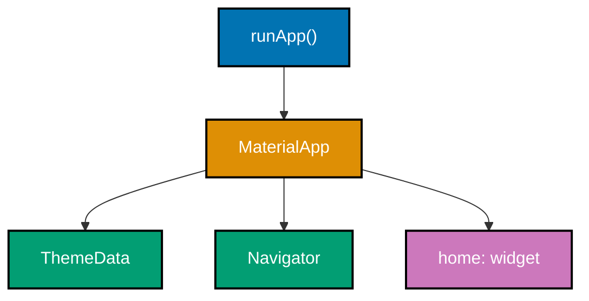
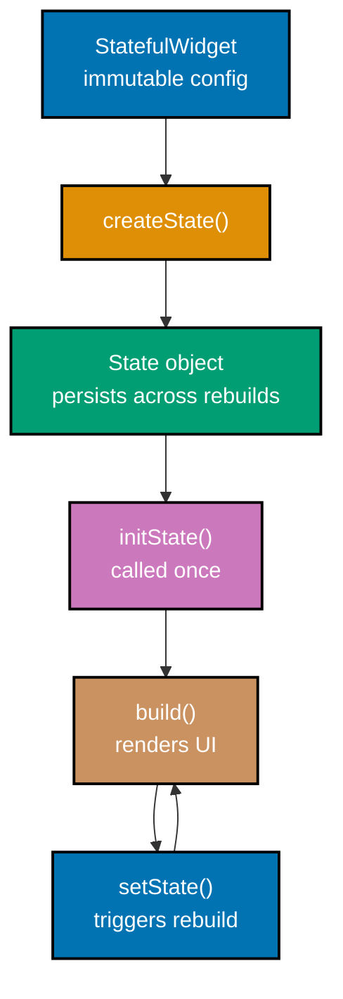
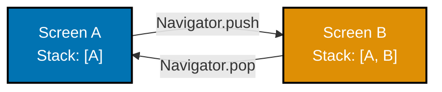

## Group 1: Application Shell

### Example 1: MaterialApp and runApp

Every Flutter application starts with `runApp`, which inflates the root widget and attaches it to the screen. `MaterialApp` provides Material Design scaffolding including theme, navigation, and localization support for the entire application.



```dart
// lib/main.dart - Entry point for every Flutter application
import 'package:flutter/material.dart'; // => Imports Material Design widgets

void main() {
  // runApp takes any Widget and makes it the root of the widget tree
  // Flutter calls this once when the app launches
  runApp(const MyApp()); // => Starts the Flutter engine and widget tree
                          // => const means the widget is compile-time constant
}

// MyApp is a StatelessWidget - no mutable state needed at the root level
class MyApp extends StatelessWidget {
  const MyApp({super.key}); // => super.key passes key to parent class
                              // => Keys help Flutter identify widgets in the tree

  @override
  Widget build(BuildContext context) { // => context locates this widget in the tree
    return MaterialApp(               // => Provides Material Design wrapping
      title: 'Flutter Web Demo',      // => Title shown in browser tab / OS task switcher
      debugShowCheckedModeBanner: false, // => Removes the red DEBUG banner
      theme: ThemeData(
        colorScheme: ColorScheme.fromSeed( // => Generates a full color scheme from one seed
          seedColor: Colors.blue,          // => Blue generates complementary palette
        ),
        useMaterial3: true,                // => Use Material 3 design system (default in Flutter 3.16+)
      ),
      home: const MyHomePage(),            // => The first screen shown when app starts
    );
  }
}

class MyHomePage extends StatelessWidget {
  const MyHomePage({super.key});

  @override
  Widget build(BuildContext context) {
    return const Scaffold(              // => Scaffold provides page-level structure
      body: Center(
        child: Text('Hello, Flutter Web!'), // => Rendered text widget
      ),
    );
  }
}
// => Output: Browser shows "Hello, Flutter Web!" centered on screen
```

**Key Takeaway**: `runApp` boots Flutter with a root widget; `MaterialApp` wraps your app with Material Design infrastructure including theming, navigation, and localization.

**Why It Matters**: Every Flutter Web project starts with this pattern. Understanding `MaterialApp` configuration - especially `theme`, `debugShowCheckedModeBanner`, and `home` - lets you control the global appearance and behavior of your application. In production, you will set `debugShowCheckedModeBanner: false` and configure a proper `ThemeData` with brand colors. Getting this foundation right prevents refactoring later.

---

### Example 2: Scaffold and AppBar

`Scaffold` implements the basic Material Design visual layout structure - a page with optional top bar, floating button, bottom bar, side drawer, and body content. It handles safe area insets, floating action button positioning, and snackbar overlays automatically.

```dart
// lib/main.dart
import 'package:flutter/material.dart';

void main() => runApp(const MyApp()); // => Single-expression main with =>

class MyApp extends StatelessWidget {
  const MyApp({super.key});

  @override
  Widget build(BuildContext context) {
    return const MaterialApp(
      home: PageWithScaffold(), // => Navigate directly to Scaffold demo
    );
  }
}

class PageWithScaffold extends StatelessWidget {
  const PageWithScaffold({super.key});

  @override
  Widget build(BuildContext context) {
    return Scaffold(
      // AppBar renders the top navigation bar with title and actions
      appBar: AppBar(
        title: const Text('My Page'),            // => Text shown in the center/left
        backgroundColor: Colors.blue,            // => Override bar background color
        foregroundColor: Colors.white,           // => Color for title and icon buttons
        elevation: 2,                            // => Shadow depth (0 = flat, Material 3 default)
        actions: [                               // => Widget list placed at right of AppBar
          IconButton(
            icon: const Icon(Icons.search),      // => Material icon widget
            onPressed: () {},                    // => Called when icon is tapped
                                                 // => Empty callback means no action yet
            tooltip: 'Search',                  // => Accessibility tooltip on long press
          ),
        ],
      ),
      // body is the main content area below the AppBar
      body: const Center(
        child: Text('Page content here'),        // => Text centered in available space
      ),
      // floatingActionButton hovers above the body in the bottom-right
      floatingActionButton: FloatingActionButton(
        onPressed: () {},                        // => Tap callback
        child: const Icon(Icons.add),            // => Plus icon in the button
      ),
    );
  }
}
// => Output: Blue AppBar with title "My Page", search icon, body text, FAB in corner
```

**Key Takeaway**: `Scaffold` provides the complete Material page skeleton; use `appBar`, `body`, `floatingActionButton`, `drawer`, and `bottomNavigationBar` slots to compose full page layouts.

**Why It Matters**: Scaffold is the standard container for every screen in a production Flutter app. It handles platform edge cases like notch insets, keyboard overlap, and snackbar positioning automatically. Using Scaffold correctly means you never manually calculate safe area padding or worry about overlapping widgets - the framework handles it for you.

---

### Example 3: Text Widget and Typography

`Text` renders a string with configurable style. `TextStyle` controls font size, weight, color, decoration, letter spacing, and more. Flutter's `Theme` provides `TextTheme` with pre-defined styles that scale with accessibility settings.

```dart
import 'package:flutter/material.dart';

void main() => runApp(const MaterialApp(home: TextDemo()));

class TextDemo extends StatelessWidget {
  const TextDemo({super.key});

  @override
  Widget build(BuildContext context) {
    // Theme.of(context) accesses the nearest MaterialApp theme
    final textTheme = Theme.of(context).textTheme; // => Retrieves theme's text styles

    return Scaffold(
      appBar: AppBar(title: const Text('Text Examples')),
      body: Padding(
        padding: const EdgeInsets.all(16),          // => 16 logical pixels on all sides
        child: Column(
          crossAxisAlignment: CrossAxisAlignment.start, // => Left-align children
          children: [
            // displayLarge is the biggest Material 3 text role (~57sp)
            Text('Display Large', style: textTheme.displayLarge), // => Huge headline text

            // headlineMedium is for section headings (~28sp)
            Text('Headline Medium', style: textTheme.headlineMedium), // => Section heading

            // bodyLarge is for readable body content (~16sp)
            Text('Body Large', style: textTheme.bodyLarge), // => Standard body text

            const SizedBox(height: 16),             // => Vertical spacer

            // Custom TextStyle overrides individual properties
            const Text(
              'Custom Bold Red Text',
              style: TextStyle(
                fontSize: 24,                        // => Font size in logical pixels
                fontWeight: FontWeight.bold,         // => Bold weight (700)
                color: Colors.red,                   // => Text color (avoid in production - use theme)
                letterSpacing: 1.5,                  // => Spacing between characters
                decoration: TextDecoration.underline,// => Underline decoration
              ),
            ),

            const SizedBox(height: 8),

            // Text.rich allows mixed styles in one text widget
            const Text.rich(
              TextSpan(
                text: 'Normal ',                     // => First span: regular weight
                children: [
                  TextSpan(
                    text: 'Bold',                    // => Second span: bold
                    style: TextStyle(fontWeight: FontWeight.bold),
                  ),
                  TextSpan(text: ' and italic',      // => Third span
                    style: TextStyle(fontStyle: FontStyle.italic),
                  ),
                ],
              ),
            ),
            // => Output: "Normal Bold and italic" with mixed styles in one line
          ],
        ),
      ),
    );
  }
}
```

**Key Takeaway**: Use `textTheme` from `Theme.of(context)` for consistent typography that respects accessibility font scaling; use custom `TextStyle` only for unique one-off cases.

**Why It Matters**: Consistent typography is critical in production apps. Hard-coding font sizes ignores user accessibility preferences for larger text. Using `textTheme` roles ensures your app scales correctly when users set larger fonts in browser or OS accessibility settings, meeting WCAG 1.4.4 (Resize Text) requirements automatically.

---

## Group 2: Layout Widgets

### Example 4: Container Widget

`Container` is Flutter's most versatile single-child layout widget. It combines sizing, padding, margin, decoration, alignment, and transformation into one widget. When you need to apply multiple visual properties to a child, `Container` is usually the right tool.

```dart
import 'package:flutter/material.dart';

void main() => runApp(const MaterialApp(home: ContainerDemo()));

class ContainerDemo extends StatelessWidget {
  const ContainerDemo({super.key});

  @override
  Widget build(BuildContext context) {
    return Scaffold(
      appBar: AppBar(title: const Text('Container')),
      body: Center(
        child: Column(
          mainAxisAlignment: MainAxisAlignment.center, // => Center children vertically
          children: [
            // Basic Container with fixed size and color
            Container(
              width: 100,                            // => 100 logical pixels wide
              height: 100,                           // => 100 logical pixels tall
              color: Colors.blue,                    // => Solid blue background
              // Note: cannot use both color and decoration simultaneously
            ),

            const SizedBox(height: 16),

            // Container with decoration (border, borderRadius, gradient)
            Container(
              width: 200,
              height: 80,
              decoration: BoxDecoration(
                color: Colors.orange,                // => Background color via decoration
                borderRadius: BorderRadius.circular(12), // => Rounded corners (12px radius)
                boxShadow: [
                  BoxShadow(
                    color: Colors.black.withOpacity(0.2), // => Semi-transparent shadow
                    blurRadius: 8,                   // => Shadow spread
                    offset: const Offset(0, 4),      // => Shift shadow down by 4px
                  ),
                ],
              ),
              alignment: Alignment.center,           // => Center the child within Container
              child: const Text(
                'Styled Box',
                style: TextStyle(color: Colors.white), // => White text on orange
              ),
            ),

            const SizedBox(height: 16),

            // Container with margin and padding
            Container(
              margin: const EdgeInsets.symmetric(horizontal: 24), // => 24px left/right margin
              padding: const EdgeInsets.all(16),                  // => 16px inner padding
              color: Colors.teal.shade100,                        // => Light teal background
              child: const Text('Margin and padding demo'),       // => Text inside padding
            ),
            // => Outer margin pushes away from edges, inner padding pushes text inward
          ],
        ),
      ),
    );
  }
}
```

**Key Takeaway**: `Container` wraps a child with sizing, decoration, alignment, padding, and margin - use it as a versatile box model element; avoid nesting multiple Containers when one suffices.

**Why It Matters**: Container is one of the most-used widgets in production Flutter. Knowing when to use `color` vs `decoration` (they are mutually exclusive), and understanding the difference between `margin` (outer space) and `padding` (inner space), prevents layout bugs. Efficient use of Container also keeps your widget tree shallow, which improves rendering performance.

---

### Example 5: Column and Row

`Column` arranges children vertically; `Row` arranges them horizontally. Both share the same axis alignment properties: `mainAxisAlignment` controls spacing along the layout axis, and `crossAxisAlignment` controls alignment on the perpendicular axis.

```dart
import 'package:flutter/material.dart';

void main() => runApp(const MaterialApp(home: ColumnRowDemo()));

class ColumnRowDemo extends StatelessWidget {
  const ColumnRowDemo({super.key});

  @override
  Widget build(BuildContext context) {
    return Scaffold(
      appBar: AppBar(title: const Text('Column and Row')),
      body: Padding(
        padding: const EdgeInsets.all(16),
        child: Column(
          // mainAxisAlignment controls vertical spacing for Column
          mainAxisAlignment: MainAxisAlignment.start, // => Pack children to the top
          // crossAxisAlignment controls horizontal alignment for Column
          crossAxisAlignment: CrossAxisAlignment.stretch, // => Stretch children to full width
          children: [
            // Header Row using Row widget
            Row(
              mainAxisAlignment: MainAxisAlignment.spaceBetween, // => Space between children
              children: [
                const Text('Left Item'),             // => Pushed to left
                const Text('Center Item'),           // => Centered in space between
                ElevatedButton(
                  onPressed: () {},
                  child: const Text('Right Button'), // => Pushed to right
                ),
              ],
            ),
            // => Row children laid out horizontally with equal space between them

            const SizedBox(height: 16),

            // Nested Column showing vertical card layout
            Container(
              padding: const EdgeInsets.all(12),
              color: Colors.blue.shade50,
              child: Column(
                crossAxisAlignment: CrossAxisAlignment.start, // => Left-align children
                children: const [
                  Text('Card Title',
                    style: TextStyle(fontWeight: FontWeight.bold, fontSize: 18)),
                  SizedBox(height: 4),               // => Small vertical gap
                  Text('Card subtitle text here'),   // => Secondary text below title
                  SizedBox(height: 8),
                  Text('Card body content goes here and wraps automatically '
                       'when it reaches the column width.'), // => Multi-line body
                ],
              ),
            ),
            // => Column arranges title, subtitle, body in vertical stack

            const SizedBox(height: 16),

            // Row with evenly spaced icon+label pairs
            Row(
              mainAxisAlignment: MainAxisAlignment.spaceEvenly, // => Equal space around children
              children: const [
                Column(children: [Icon(Icons.home), Text('Home')]),
                Column(children: [Icon(Icons.search), Text('Search')]),
                Column(children: [Icon(Icons.person), Text('Profile')]),
              ],
            ),
            // => Three equally spaced icon+label columns within a Row
          ],
        ),
      ),
    );
  }
}
```

**Key Takeaway**: `Column` stacks vertically, `Row` stacks horizontally; use `mainAxisAlignment` to control spacing along the axis and `crossAxisAlignment` to control perpendicular alignment.

**Why It Matters**: Column and Row are the fundamental layout primitives in Flutter. Every production screen uses them. Misunderstanding `mainAxisAlignment` vs `crossAxisAlignment` causes the most common Flutter layout bugs. Practice these properties until they are second nature - correct usage prevents overflow errors and unexpected alignment issues in responsive web layouts.

---

### Example 6: Stack and Positioned

`Stack` overlays children on top of each other, with later children drawn on top. `Positioned` inside a Stack anchors a child to specific edges. This combination enables floating labels, badges, overlay patterns, and complex UI compositions.

```dart
import 'package:flutter/material.dart';

void main() => runApp(const MaterialApp(home: StackDemo()));

class StackDemo extends StatelessWidget {
  const StackDemo({super.key});

  @override
  Widget build(BuildContext context) {
    return Scaffold(
      appBar: AppBar(title: const Text('Stack and Positioned')),
      body: Center(
        child: Column(
          mainAxisAlignment: MainAxisAlignment.center,
          children: [
            // Stack with an image-like background and overlaid text
            SizedBox(
              width: 300,
              height: 200,
              child: Stack(
                // fit: expand makes non-positioned children fill the Stack
                fit: StackFit.expand,               // => Non-positioned children stretch to fill
                children: [
                  // First child (bottom): background
                  Container(
                    color: Colors.blue.shade200,     // => Background layer
                  ),
                  // Second child: center icon
                  const Center(
                    child: Icon(Icons.image, size: 80, color: Colors.white), // => Centered icon
                  ),
                  // Positioned children anchor to Stack edges
                  Positioned(
                    top: 8,                          // => 8px from top of Stack
                    right: 8,                        // => 8px from right of Stack
                    child: Container(
                      padding: const EdgeInsets.symmetric(horizontal: 8, vertical: 4),
                      color: Colors.red,             // => Red badge background
                      child: const Text(
                        'NEW',
                        style: TextStyle(color: Colors.white, fontSize: 12),
                      ),
                    ),
                  ),
                  // => "NEW" badge positioned at top-right corner

                  Positioned(
                    bottom: 0,                       // => Flush with bottom edge
                    left: 0,                         // => Flush with left edge
                    right: 0,                        // => Stretch full width
                    child: Container(
                      color: Colors.black54,         // => Semi-transparent black overlay
                      padding: const EdgeInsets.all(8),
                      child: const Text(
                        'Image Caption',
                        style: TextStyle(color: Colors.white),
                      ),
                    ),
                  ),
                  // => Caption bar at bottom of Stack
                ],
              ),
            ),
          ],
        ),
      ),
    );
  }
}
```

**Key Takeaway**: `Stack` overlays widgets in Z-order; `Positioned` anchors children to specific Stack edges; use `StackFit.expand` to make the Stack fill its parent.

**Why It Matters**: Stack is essential for any UI requiring layers - hero images with captions, notification badges, floating tooltips, and video player controls all use Stack. Understanding `StackFit` prevents unexpected sizing bugs where the Stack collapses to zero size. In web applications, overlaid elements are common in cards, modals, and media components.

---

### Example 7: Expanded and Flexible

`Expanded` and `Flexible` control how children in a `Column` or `Row` share available space. `Expanded` forces a child to fill all remaining space; `Flexible` allows a child to use up to its available share but can be smaller if content is smaller.

```dart
import 'package:flutter/material.dart';

void main() => runApp(const MaterialApp(home: ExpandedDemo()));

class ExpandedDemo extends StatelessWidget {
  const ExpandedDemo({super.key});

  @override
  Widget build(BuildContext context) {
    return Scaffold(
      appBar: AppBar(title: const Text('Expanded and Flexible')),
      body: Padding(
        padding: const EdgeInsets.all(16),
        child: Column(
          children: [
            // Row with Expanded children dividing space by flex factor
            SizedBox(
              height: 60,
              child: Row(
                children: [
                  Expanded(
                    flex: 2,                           // => Takes 2 parts of available space
                    child: Container(
                      color: Colors.blue,
                      alignment: Alignment.center,
                      child: const Text('flex: 2', style: TextStyle(color: Colors.white)),
                    ),
                  ),
                  Expanded(
                    flex: 1,                           // => Takes 1 part of available space
                    child: Container(
                      color: Colors.orange,
                      alignment: Alignment.center,
                      child: const Text('flex: 1', style: TextStyle(color: Colors.white)),
                    ),
                  ),
                ],
              ),
            ),
            // => Blue takes 2/3 of width, orange takes 1/3

            const SizedBox(height: 16),

            // Flexible vs Expanded: Flexible shrinks to content
            SizedBox(
              height: 60,
              child: Row(
                children: [
                  Flexible(
                    child: Container(
                      color: Colors.teal,
                      padding: const EdgeInsets.all(8),
                      child: const Text('Flexible - wraps content'),
                      // => Flexible shrinks to fit its content (unlike Expanded)
                    ),
                  ),
                  const SizedBox(width: 8),
                  Expanded(
                    child: Container(
                      color: Colors.purple,
                      alignment: Alignment.center,
                      child: const Text(
                        'Expanded fills rest',
                        style: TextStyle(color: Colors.white),
                      ),
                      // => Expanded takes all remaining space after Flexible
                    ),
                  ),
                ],
              ),
            ),
            // => Teal is content-sized, purple fills the rest

            const SizedBox(height: 16),

            // Full-height Expanded Column child
            Expanded(
              child: Container(
                color: Colors.grey.shade200,
                alignment: Alignment.center,
                child: const Text('This Expanded fills all remaining height'),
                // => This Container fills all vertical space not used by siblings above
              ),
            ),
          ],
        ),
      ),
    );
  }
}
```

**Key Takeaway**: `Expanded` forces a child to fill all remaining space (overrides content size); `Flexible` allows a child to use up to its share but respects smaller content sizes.

**Why It Matters**: Expanded is how you build fluid layouts that adapt to screen size in Flutter Web. Without Expanded, Column and Row children only take their intrinsic content size, leaving empty space or causing overflow. Understanding `flex` ratios lets you create proportional layouts that work across different browser window sizes without hardcoding pixel values.

---

### Example 8: Padding and SizedBox

`Padding` adds space inside a parent around its child. `SizedBox` creates a fixed-size invisible box - useful for spacing between widgets or constraining a child's dimensions. Both are simpler and more semantic than using `Container` for pure spacing.

```dart
import 'package:flutter/material.dart';

void main() => runApp(const MaterialApp(home: PaddingSizedBoxDemo()));

class PaddingSizedBoxDemo extends StatelessWidget {
  const PaddingSizedBoxDemo({super.key});

  @override
  Widget build(BuildContext context) {
    return Scaffold(
      appBar: AppBar(title: const Text('Padding and SizedBox')),
      body: Column(
        crossAxisAlignment: CrossAxisAlignment.start,
        children: [
          // Padding with symmetric insets
          Padding(
            padding: const EdgeInsets.symmetric(
              horizontal: 24,                        // => 24px left and right
              vertical: 12,                          // => 12px top and bottom
            ),
            child: Container(
              color: Colors.blue.shade100,
              child: const Text('Symmetric padding: 24h / 12v'),
            ),
          ),

          // EdgeInsets.only for specific sides
          Padding(
            padding: const EdgeInsets.only(left: 48, top: 8), // => Left indent + top gap
            child: const Text('Left indent 48, top 8'),
          ),

          // EdgeInsets.fromLTRB for all four sides individually
          Padding(
            padding: const EdgeInsets.fromLTRB(16, 8, 32, 4), // => left, top, right, bottom
            child: Container(color: Colors.orange.shade100, child: const Text('LTRB padding')),
          ),

          // SizedBox as a gap between widgets (most common use)
          const SizedBox(height: 24),               // => 24px vertical gap
          const Text('After 24px gap'),

          const SizedBox(height: 8),

          // SizedBox to constrain child to specific dimensions
          SizedBox(
            width: 150,                             // => Constrains width to exactly 150px
            height: 50,                             // => Constrains height to exactly 50px
            child: ElevatedButton(
              onPressed: () {},
              child: const Text('Fixed Size'),      // => Button fills the SizedBox constraint
            ),
          ),
          // => Button is exactly 150x50 regardless of content

          // SizedBox.expand fills available space
          const SizedBox(height: 16),
          const SizedBox(
            width: double.infinity,                 // => Fill all available width
            child: Text('Full width text container'),
          ),
        ],
      ),
    );
  }
}
```

**Key Takeaway**: Use `Padding` to add space around a child; use `SizedBox` for fixed gaps between siblings or to constrain child dimensions; both are more semantic than `Container` for spacing-only purposes.

**Why It Matters**: Consistent spacing is essential for professional UI. Using `SizedBox` instead of `Container` for gaps communicates intent clearly to other developers and tools like the Flutter inspector. Using `EdgeInsets.symmetric` with a design system's spacing tokens (8, 16, 24, 32...) produces visually consistent layouts across the entire application.

---

## Group 3: StatelessWidget and StatefulWidget

### Example 9: StatelessWidget Composition

`StatelessWidget` is immutable - it rebuilds from scratch every time its parent rebuilds. Extract UI into custom `StatelessWidget` classes to make code readable, reusable, and testable. Flutter encourages deep widget trees over large `build` methods.

```dart
import 'package:flutter/material.dart';

void main() => runApp(const MaterialApp(home: StatelessDemo()));

// Custom StatelessWidget: a reusable product card
class ProductCard extends StatelessWidget {
  // All fields are final - StatelessWidget is immutable
  final String name;                               // => Product name to display
  final double price;                              // => Price in currency units
  final String imageUrl;                           // => URL for product image
  final VoidCallback onTap;                        // => VoidCallback = void Function()

  const ProductCard({
    super.key,
    required this.name,                            // => required = must be provided by caller
    required this.price,
    required this.imageUrl,
    required this.onTap,
  });

  @override
  Widget build(BuildContext context) {
    return GestureDetector(
      onTap: onTap,                                // => Calls parent-provided callback on tap
      child: Card(
        child: Padding(
          padding: const EdgeInsets.all(12),
          child: Row(
            children: [
              // Placeholder for image
              Container(
                width: 60,
                height: 60,
                color: Colors.grey.shade200,
                child: const Icon(Icons.image),    // => Image placeholder icon
              ),
              const SizedBox(width: 12),
              // Text content in a Column
              Expanded(
                child: Column(
                  crossAxisAlignment: CrossAxisAlignment.start,
                  children: [
                    Text(name,                     // => Uses the immutable name field
                      style: const TextStyle(fontWeight: FontWeight.bold)),
                    Text('\$${price.toStringAsFixed(2)}', // => Formats price as "$10.00"
                      style: const TextStyle(color: Colors.green)),
                  ],
                ),
              ),
              const Icon(Icons.chevron_right),     // => Right arrow indicating tappable
            ],
          ),
        ),
      ),
    );
  }
}

class StatelessDemo extends StatelessWidget {
  const StatelessDemo({super.key});

  @override
  Widget build(BuildContext context) {
    return Scaffold(
      appBar: AppBar(title: const Text('StatelessWidget')),
      body: ListView(
        padding: const EdgeInsets.all(16),
        children: [
          // Reuse ProductCard with different data - composition in action
          ProductCard(
            name: 'Laptop',
            price: 999.99,
            imageUrl: 'https://example.com/laptop.jpg',
            onTap: () => ScaffoldMessenger.of(context) // => Shows snackbar
                .showSnackBar(const SnackBar(content: Text('Laptop tapped'))),
          ),
          ProductCard(
            name: 'Mouse',
            price: 29.95,
            imageUrl: 'https://example.com/mouse.jpg',
            onTap: () {},
          ),
        ],
      ),
    );
  }
}
// => Renders two identical-structure cards with different data
```

**Key Takeaway**: Extract reusable UI into `StatelessWidget` subclasses with `required` constructor parameters; immutability guarantees that the widget always renders the same output for the same inputs.

**Why It Matters**: Composing small StatelessWidgets is the Flutter way to achieve reusable, testable UI. Each component can be widget-tested in isolation. The `required` keyword on constructor parameters catches missing data at compile time rather than runtime. This pattern scales to large production codebases where dozens of developers build independent UI components.

---

### Example 10: StatefulWidget and setState

`StatefulWidget` splits into two classes: the immutable `StatefulWidget` configuration and the mutable `State` object that persists across rebuilds. `setState` triggers a rebuild of the `State` subtree with new values.



```dart
import 'package:flutter/material.dart';

void main() => runApp(const MaterialApp(home: CounterPage()));

// StatefulWidget is the immutable configuration part
class CounterPage extends StatefulWidget {
  const CounterPage({super.key});

  // createState creates the mutable State object
  @override
  State<CounterPage> createState() => _CounterPageState();
  // => _CounterPageState is created once and persists as long as CounterPage is in the tree
}

// The State class holds mutable data and renders UI
class _CounterPageState extends State<CounterPage> {
  int _count = 0;                // => Mutable state variable (starts at 0)
  String _message = 'Tap + to start'; // => Mutable text state

  // initState is called once after the State is inserted into the tree
  @override
  void initState() {
    super.initState();           // => Must call super first
    // Initialization logic here - e.g. start timers, subscribe to streams
  }

  // dispose is called when the State is permanently removed from the tree
  @override
  void dispose() {
    // Release resources here - e.g. cancel timers, close controllers
    super.dispose();             // => Must call super last
  }

  void _increment() {
    // setState schedules a rebuild by calling the callback synchronously
    // then marking the widget as needing rebuild
    setState(() {
      _count++;                  // => Mutate state inside setState callback
      _message = 'Count is $_count'; // => Update message with new count
                                 // => String interpolation: $variable inserts value
    });
    // => After setState, build() is called again with updated _count and _message
  }

  void _decrement() {
    setState(() {
      if (_count > 0) _count--; // => Only decrement if above zero
      _message = _count == 0 ? 'Tap + to start' : 'Count is $_count';
      // => Ternary: condition ? valueIfTrue : valueIfFalse
    });
  }

  @override
  Widget build(BuildContext context) {
    return Scaffold(
      appBar: AppBar(title: const Text('StatefulWidget Counter')),
      body: Center(
        child: Column(
          mainAxisAlignment: MainAxisAlignment.center,
          children: [
            Text(_message, style: const TextStyle(fontSize: 20)), // => Uses current _message
            const SizedBox(height: 16),
            Text(
              '$_count',         // => Displays current _count value
              style: const TextStyle(fontSize: 72, fontWeight: FontWeight.bold),
            ),
            const SizedBox(height: 24),
            Row(
              mainAxisAlignment: MainAxisAlignment.center,
              children: [
                IconButton(
                  icon: const Icon(Icons.remove, size: 32),
                  onPressed: _decrement,  // => Reference to method (no parentheses)
                ),
                const SizedBox(width: 32),
                IconButton(
                  icon: const Icon(Icons.add, size: 32),
                  onPressed: _increment, // => Reference to _increment method
                ),
              ],
            ),
          ],
        ),
      ),
    );
  }
}
// => Renders counter that increments/decrements on button tap
```

**Key Takeaway**: `StatefulWidget` + `State` separates immutable configuration from mutable state; always mutate state inside `setState(() { ... })` to trigger rebuilds.

**Why It Matters**: Understanding the StatefulWidget lifecycle - `initState`, `build`, `setState`, `dispose` - is fundamental to all Flutter development. Every animation, form, list with scroll position, and tab selection uses this pattern. Failing to call `super.dispose()` or mutating state outside `setState` are the two most common bugs beginners encounter in production code.

---

## Group 4: Buttons and User Input

### Example 11: Button Variants

Flutter Material 3 provides four button styles with distinct visual hierarchy: `ElevatedButton` (primary filled), `FilledButton` (primary filled alternative), `OutlinedButton` (secondary), and `TextButton` (tertiary/low emphasis). Each maps to a specific use case in Material Design.

```dart
import 'package:flutter/material.dart';

void main() => runApp(const MaterialApp(home: ButtonDemo()));

class ButtonDemo extends StatelessWidget {
  const ButtonDemo({super.key});

  void _showMessage(BuildContext context, String label) {
    ScaffoldMessenger.of(context).showSnackBar(
      SnackBar(content: Text('$label tapped')), // => Shows brief message at bottom
    );
  }

  @override
  Widget build(BuildContext context) {
    return Scaffold(
      appBar: AppBar(title: const Text('Button Types')),
      body: Center(
        child: Column(
          mainAxisAlignment: MainAxisAlignment.center,
          children: [
            // ElevatedButton - high emphasis, primary action
            ElevatedButton(
              onPressed: () => _showMessage(context, 'Elevated'),
              // onPressed: null disables the button (shows disabled style)
              child: const Text('Elevated Button'),
            ),
            // => Filled/raised appearance, use for primary call-to-action

            const SizedBox(height: 12),

            // FilledButton - high emphasis alternative (Material 3)
            FilledButton(
              onPressed: () => _showMessage(context, 'Filled'),
              child: const Text('Filled Button'),
            ),
            // => Solid fill, slightly different from ElevatedButton

            const SizedBox(height: 12),

            // OutlinedButton - medium emphasis, secondary action
            OutlinedButton(
              onPressed: () => _showMessage(context, 'Outlined'),
              child: const Text('Outlined Button'),
            ),
            // => Border only, use for secondary options alongside primary

            const SizedBox(height: 12),

            // TextButton - low emphasis, tertiary action
            TextButton(
              onPressed: () => _showMessage(context, 'Text'),
              child: const Text('Text Button'),
            ),
            // => No border or fill, use for inline actions or dialogs

            const SizedBox(height: 12),

            // ElevatedButton.icon adds leading icon
            ElevatedButton.icon(
              onPressed: () => _showMessage(context, 'Icon'),
              icon: const Icon(Icons.download),    // => Icon placed before label
              label: const Text('Download'),       // => Button label text
            ),
            // => Icon button pattern for action verbs

            const SizedBox(height: 12),

            // Disabled state: onPressed: null
            const ElevatedButton(
              onPressed: null,                     // => null disables the button
              child: Text('Disabled'),             // => Shows greyed-out style
            ),
          ],
        ),
      ),
    );
  }
}
```

**Key Takeaway**: Choose button type by emphasis level - `ElevatedButton`/`FilledButton` for primary actions, `OutlinedButton` for secondary, `TextButton` for tertiary; set `onPressed: null` to disable.

**Why It Matters**: Correct button hierarchy communicates visual priority to users. Production apps use ElevatedButton or FilledButton for primary actions (Save, Submit, Purchase), OutlinedButton for secondary options (Cancel, Learn More), and TextButton for low-priority actions inside dialogs or lists. Using the wrong button type confuses users about which action is primary.

---

### Example 12: TextField and TextEditingController

`TextField` is the basic text input widget. `TextEditingController` provides programmatic access to the field's content - reading the value, setting it programmatically, and listening for changes. Always dispose controllers to prevent memory leaks.

```dart
import 'package:flutter/material.dart';

void main() => runApp(const MaterialApp(home: TextFieldDemo()));

class TextFieldDemo extends StatefulWidget {
  const TextFieldDemo({super.key});

  @override
  State<TextFieldDemo> createState() => _TextFieldDemoState();
}

class _TextFieldDemoState extends State<TextFieldDemo> {
  // TextEditingController manages the text field's state
  final _nameController = TextEditingController(); // => Controls name input field
  final _emailController = TextEditingController(); // => Controls email input field
  String _submittedName = '';                       // => Stores submitted name

  @override
  void dispose() {
    // Always dispose controllers to release resources
    _nameController.dispose();  // => Frees memory and removes listeners
    _emailController.dispose(); // => Must dispose every controller created
    super.dispose();
  }

  @override
  Widget build(BuildContext context) {
    return Scaffold(
      appBar: AppBar(title: const Text('TextField')),
      body: Padding(
        padding: const EdgeInsets.all(24),
        child: Column(
          crossAxisAlignment: CrossAxisAlignment.start,
          children: [
            // Basic TextField with label and hint
            TextField(
              controller: _nameController,           // => Links controller to field
              decoration: const InputDecoration(
                labelText: 'Full Name',              // => Floating label above field
                hintText: 'Enter your full name',   // => Placeholder when empty
                border: OutlineInputBorder(),        // => Outlined border style
                prefixIcon: Icon(Icons.person),      // => Icon inside left of field
              ),
              textCapitalization: TextCapitalization.words, // => Auto-capitalize words
            ),

            const SizedBox(height: 16),

            // TextField with specific keyboard type and obscured input
            TextField(
              controller: _emailController,
              decoration: const InputDecoration(
                labelText: 'Email',
                hintText: 'you@example.com',
                border: OutlineInputBorder(),
                prefixIcon: Icon(Icons.email),
              ),
              keyboardType: TextInputType.emailAddress, // => Shows email keyboard on mobile
              autocorrect: false,                     // => Disable autocorrect for email
            ),

            const SizedBox(height: 24),

            // Read controller value on button press
            ElevatedButton(
              onPressed: () {
                setState(() {
                  _submittedName = _nameController.text; // => .text reads current value
                });
                // Programmatically clear a field
                _emailController.clear();              // => Sets field text to empty string
              },
              child: const Text('Submit'),
            ),

            if (_submittedName.isNotEmpty)             // => Conditionally show result
              Padding(
                padding: const EdgeInsets.only(top: 16),
                child: Text('Hello, $_submittedName!',
                  style: const TextStyle(fontSize: 18)),
              ),
          ],
        ),
      ),
    );
  }
}
```

**Key Takeaway**: Create one `TextEditingController` per `TextField`; always dispose controllers in `dispose()`; read the value via `.text`, clear via `.clear()`, and set programmatically via `.text = 'value'`.

**Why It Matters**: Memory leaks from undisposed `TextEditingController` instances are a common production bug. Each controller allocates a `ChangeNotifier` with listeners - forgetting `dispose()` creates growing memory usage. The `dispose()` pattern applies to any Flutter object with a `dispose()` method: controllers, animation controllers, scroll controllers, and focus nodes.

---

### Example 13: Form Validation

`Form` wraps `TextFormField` widgets and provides global validation via `GlobalKey<FormState>`. Calling `_formKey.currentState!.validate()` triggers all field validators simultaneously and returns `true` only if all pass. This is the standard Flutter pattern for input validation.

```dart
import 'package:flutter/material.dart';

void main() => runApp(const MaterialApp(home: FormDemo()));

class FormDemo extends StatefulWidget {
  const FormDemo({super.key});

  @override
  State<FormDemo> createState() => _FormDemoState();
}

class _FormDemoState extends State<FormDemo> {
  // GlobalKey identifies this Form and provides access to FormState
  final _formKey = GlobalKey<FormState>(); // => Unique key for this Form instance
  final _emailController = TextEditingController();
  final _passwordController = TextEditingController();
  bool _isPasswordVisible = false;         // => Tracks password visibility toggle
  bool _isSubmitting = false;              // => Tracks async submission state

  @override
  void dispose() {
    _emailController.dispose();
    _passwordController.dispose();
    super.dispose();
  }

  Future<void> _submit() async {
    // validate() calls every TextFormField's validator
    // Returns true only if ALL validators return null (no error)
    if (!_formKey.currentState!.validate()) return; // => Stop if any field invalid

    setState(() => _isSubmitting = true);            // => Show loading state

    // Simulate network request
    await Future.delayed(const Duration(seconds: 1)); // => Simulated async work

    setState(() => _isSubmitting = false);           // => Hide loading state

    if (mounted) {                                   // => Check widget still in tree
      ScaffoldMessenger.of(context).showSnackBar(
        const SnackBar(content: Text('Login successful!')),
      );
    }
  }

  @override
  Widget build(BuildContext context) {
    return Scaffold(
      appBar: AppBar(title: const Text('Form Validation')),
      body: Padding(
        padding: const EdgeInsets.all(24),
        child: Form(
          key: _formKey,                             // => Links Form to GlobalKey
          child: Column(
            children: [
              TextFormField(
                controller: _emailController,
                decoration: const InputDecoration(
                  labelText: 'Email',
                  border: OutlineInputBorder(),
                  prefixIcon: Icon(Icons.email),
                ),
                keyboardType: TextInputType.emailAddress,
                // validator returns null if valid, error string if invalid
                validator: (value) {
                  if (value == null || value.isEmpty) {
                    return 'Email is required';      // => Shows this text as error
                  }
                  if (!value.contains('@')) {
                    return 'Enter a valid email';    // => Simple email check
                  }
                  return null;                       // => null means field is valid
                },
              ),

              const SizedBox(height: 16),

              TextFormField(
                controller: _passwordController,
                obscureText: !_isPasswordVisible,    // => Hides/shows password characters
                decoration: InputDecoration(
                  labelText: 'Password',
                  border: const OutlineInputBorder(),
                  prefixIcon: const Icon(Icons.lock),
                  suffixIcon: IconButton(
                    icon: Icon(_isPasswordVisible
                        ? Icons.visibility_off
                        : Icons.visibility),         // => Toggle icon based on state
                    onPressed: () => setState(
                        () => _isPasswordVisible = !_isPasswordVisible), // => Toggle visibility
                  ),
                ),
                validator: (value) {
                  if (value == null || value.length < 8) {
                    return 'Password must be at least 8 characters'; // => Length validation
                  }
                  return null;
                },
              ),

              const SizedBox(height: 24),

              SizedBox(
                width: double.infinity,
                child: ElevatedButton(
                  onPressed: _isSubmitting ? null : _submit, // => Disable during submission
                  child: _isSubmitting
                      ? const SizedBox(
                          height: 20,
                          width: 20,
                          child: CircularProgressIndicator(strokeWidth: 2),
                        )
                      : const Text('Login'),               // => Show spinner or text
                ),
              ),
            ],
          ),
        ),
      ),
    );
  }
}
// => Form validates email format and password length before submitting
```

**Key Takeaway**: `GlobalKey<FormState>` connects `Form` and `FormState`; `validate()` triggers all `TextFormField` validators simultaneously; validators return `null` for valid input or an error string for invalid input.

**Why It Matters**: Form validation prevents invalid data from reaching your API. The `mounted` check before using `context` after an `await` prevents a common Flutter bug where a widget is disposed during async operations. In production login and registration screens, this exact pattern - validate, disable button during submit, check mounted after async - is the correct and safe approach.

---

## Group 5: Images and Media

### Example 14: Image Widget

Flutter provides `Image.network` for URLs, `Image.asset` for bundled files, and `Image.memory` for byte arrays. The `fit` property controls how the image scales within its bounds. Always provide error handling and loading placeholders for network images.

```dart
import 'package:flutter/material.dart';

void main() => runApp(const MaterialApp(home: ImageDemo()));

class ImageDemo extends StatelessWidget {
  const ImageDemo({super.key});

  @override
  Widget build(BuildContext context) {
    return Scaffold(
      appBar: AppBar(title: const Text('Image Widget')),
      body: Padding(
        padding: const EdgeInsets.all(16),
        child: Column(
          children: [
            // Network image with loading and error handling
            Image.network(
              'https://picsum.photos/200/150',       // => Random placeholder image
              width: 200,
              height: 150,
              fit: BoxFit.cover,                     // => Scale to fill bounds, crop excess
              // loadingBuilder shows during download
              loadingBuilder: (context, child, loadingProgress) {
                if (loadingProgress == null) return child; // => Done loading, show image
                return Container(
                  width: 200,
                  height: 150,
                  color: Colors.grey.shade200,
                  child: Center(
                    child: CircularProgressIndicator(
                      // Show download percentage if available
                      value: loadingProgress.expectedTotalBytes != null
                          ? loadingProgress.cumulativeBytesLoaded /
                              loadingProgress.expectedTotalBytes!
                          : null,                   // => null = indeterminate spinner
                    ),
                  ),
                );
              },
              // errorBuilder shows when image fails to load
              errorBuilder: (context, error, stackTrace) {
                return Container(
                  width: 200,
                  height: 150,
                  color: Colors.red.shade50,
                  child: const Column(
                    mainAxisAlignment: MainAxisAlignment.center,
                    children: [
                      Icon(Icons.broken_image, color: Colors.red), // => Error icon
                      Text('Failed to load image'),
                    ],
                  ),
                );
              },
            ),
            // => Shows spinner while loading, image when done, error widget if fails

            const SizedBox(height: 16),

            // BoxFit options comparison row
            Row(
              mainAxisAlignment: MainAxisAlignment.spaceEvenly,
              children: [
                // BoxFit.contain: scale to fit entirely within bounds
                _FitDemo(label: 'contain', fit: BoxFit.contain),
                // BoxFit.cover: scale to fill bounds, crops excess
                _FitDemo(label: 'cover', fit: BoxFit.cover),
                // BoxFit.fill: stretch to fill exactly (distorts)
                _FitDemo(label: 'fill', fit: BoxFit.fill),
              ],
            ),
          ],
        ),
      ),
    );
  }
}

class _FitDemo extends StatelessWidget {
  final String label;
  final BoxFit fit;
  const _FitDemo({required this.label, required this.fit});

  @override
  Widget build(BuildContext context) {
    return Column(
      children: [
        Container(
          width: 80,
          height: 80,
          color: Colors.grey.shade100,
          child: Image.network('https://picsum.photos/120/60', fit: fit),
          // => Each instance shows different BoxFit behavior
        ),
        Text(label, style: const TextStyle(fontSize: 12)),
      ],
    );
  }
}
```

**Key Takeaway**: Always provide `loadingBuilder` and `errorBuilder` for `Image.network`; use `BoxFit.cover` for hero images and `BoxFit.contain` for logos and icons.

**Why It Matters**: Production apps always need graceful image loading and error states. Users on slow connections see the loading state; users with broken CDN links see the error fallback. Missing error handling causes blank spaces or uncaught exceptions. `BoxFit.cover` is the standard choice for full-width banner images in web apps because it fills the space without distortion.

---

## Group 6: Lists and Grids

### Example 15: ListView and ListView.builder

`ListView` renders a scrollable list of children. For large or dynamic lists, `ListView.builder` lazily constructs only the visible items, which is critical for performance. Never use a plain `ListView` with hundreds of children - it builds all of them even if off-screen.

```dart
import 'package:flutter/material.dart';

void main() => runApp(const MaterialApp(home: ListViewDemo()));

// Simple data model
class Task {
  final int id;
  final String title;
  final bool isDone;
  const Task(this.id, this.title, this.isDone);
}

class ListViewDemo extends StatelessWidget {
  // Generate a list of 50 tasks for demonstration
  static final tasks = List.generate(
    50,
    (i) => Task(i, 'Task number ${i + 1}', i % 3 == 0), // => Every 3rd task is done
  );

  const ListViewDemo({super.key});

  @override
  Widget build(BuildContext context) {
    return Scaffold(
      appBar: AppBar(title: Text('ListView (${tasks.length} items)')),
      body: ListView.builder(
        // itemCount tells ListView how many items exist
        itemCount: tasks.length,              // => 50 items total
        // itemBuilder builds each item on demand as it scrolls into view
        // Only visible items are built - efficient for large lists
        itemBuilder: (context, index) {
          final task = tasks[index];          // => Current task for this row
          return ListTile(
            // leading widget appears at left of tile
            leading: CircleAvatar(
              backgroundColor: task.isDone
                  ? Colors.teal                // => Green for completed tasks
                  : Colors.grey.shade300,      // => Grey for pending tasks
              child: Text('${task.id}',
                style: const TextStyle(fontSize: 12)),
            ),
            title: Text(task.title),          // => Main text of the tile
            subtitle: Text(task.isDone ? 'Completed' : 'Pending'), // => Secondary text
            trailing: Icon(                   // => trailing widget appears at right
              task.isDone ? Icons.check_circle : Icons.radio_button_unchecked,
              color: task.isDone ? Colors.teal : Colors.grey,
            ),
            // => Each row shows task id, name, status, and icon
          );
        },
        // Add padding around the list content
        padding: const EdgeInsets.symmetric(vertical: 8), // => 8px top/bottom padding
      ),
    );
  }
}
// => Scrollable list of 50 tasks, builds only visible items for performance
```

**Key Takeaway**: Use `ListView.builder` for all lists with more than a handful of items; `itemBuilder` is called lazily only for visible items, making it efficient even for thousands of rows.

**Why It Matters**: Using `ListView` with all children pre-built is a performance anti-pattern that causes jank and excessive memory use in production. `ListView.builder` is the production-safe pattern - it renders only what is visible, typically keeping 10-15 items in memory regardless of list size. In web apps with data tables or infinite scroll feeds, this pattern is non-negotiable.

---

### Example 16: GridView

`GridView.builder` creates a scrollable 2D grid of items. `SliverGridDelegateWithFixedCrossAxisCount` specifies the number of columns, aspect ratio, and spacing. For responsive grids that adapt to browser width, `SliverGridDelegateWithMaxCrossAxisExtent` sets a maximum item width instead of a fixed count.

```dart
import 'package:flutter/material.dart';

void main() => runApp(const MaterialApp(home: GridViewDemo()));

class GridViewDemo extends StatelessWidget {
  static final items = List.generate(
    24,
    (i) => {'id': i, 'color': Colors.primaries[i % Colors.primaries.length]},
  );

  const GridViewDemo({super.key});

  @override
  Widget build(BuildContext context) {
    return Scaffold(
      appBar: AppBar(title: const Text('GridView')),
      body: GridView.builder(
        gridDelegate: const SliverGridDelegateWithFixedCrossAxisCount(
          crossAxisCount: 3,               // => 3 columns in the grid
          crossAxisSpacing: 8,             // => Horizontal gap between items
          mainAxisSpacing: 8,              // => Vertical gap between rows
          childAspectRatio: 1.0,           // => Width:height ratio (1.0 = square items)
        ),
        itemCount: items.length,           // => 24 total items
        padding: const EdgeInsets.all(12),
        itemBuilder: (context, index) {
          final item = items[index];
          final color = item['color'] as Color; // => Color for this card
          return Container(
            decoration: BoxDecoration(
              color: color,
              borderRadius: BorderRadius.circular(8), // => Rounded corners
            ),
            child: Column(
              mainAxisAlignment: MainAxisAlignment.center,
              children: [
                Icon(Icons.star, color: Colors.white, size: 32), // => Star icon
                const SizedBox(height: 4),
                Text(
                  'Item ${(item['id'] as int) + 1}', // => Item label
                  style: const TextStyle(color: Colors.white),
                ),
              ],
            ),
            // => Each cell is a colored rounded square with label
          );
        },
      ),
    );
  }
}
// => 3-column scrollable grid of 24 colored items
```

**Key Takeaway**: `GridView.builder` with `SliverGridDelegateWithFixedCrossAxisCount` creates fixed-column grids; use `SliverGridDelegateWithMaxCrossAxisExtent` for responsive grids that adapt to available width.

**Why It Matters**: Product galleries, image grids, and card layouts are universal in web applications. `GridView.builder` provides the same lazy rendering benefits as `ListView.builder` - only visible cells are built. Choosing `MaxCrossAxisExtent` over `FixedCrossAxisCount` for product grids automatically adjusts columns from 2 on mobile to 4+ on wide desktop browsers without any breakpoint logic.

---

## Group 7: Navigation

### Example 17: Navigator Push and Pop

Flutter's Navigator maintains a stack of routes. `Navigator.push` adds a route to the stack (navigates forward); `Navigator.pop` removes the current route (navigates back). `MaterialPageRoute` provides a platform-appropriate transition animation.



```dart
import 'package:flutter/material.dart';

void main() => runApp(const MaterialApp(home: HomeScreen()));

class HomeScreen extends StatelessWidget {
  const HomeScreen({super.key});

  @override
  Widget build(BuildContext context) {
    return Scaffold(
      appBar: AppBar(title: const Text('Home Screen')),
      body: Center(
        child: Column(
          mainAxisAlignment: MainAxisAlignment.center,
          children: [
            // Navigate to DetailScreen, passing a product name
            ElevatedButton(
              onPressed: () {
                // Navigator.push adds a route to the navigation stack
                Navigator.push(
                  context,
                  MaterialPageRoute(
                    // builder receives the new context for the pushed route
                    builder: (context) => const DetailScreen(productName: 'Flutter Widget'),
                    // => Creates DetailScreen and adds it to the stack
                  ),
                );
              },
              child: const Text('View Product Detail'),
            ),

            const SizedBox(height: 16),

            // Navigate and wait for result
            ElevatedButton(
              onPressed: () async {
                // push returns a Future that completes when the route is popped
                final result = await Navigator.push<String>(
                  context,
                  MaterialPageRoute(
                    builder: (context) => const ResultScreen(),
                  ),
                );
                // => result is whatever DetailScreen passed to Navigator.pop(context, value)

                if (result != null && context.mounted) {
                  ScaffoldMessenger.of(context).showSnackBar(
                    SnackBar(content: Text('Returned: $result')),
                  );
                }
              },
              child: const Text('Get Result from Screen'),
            ),
          ],
        ),
      ),
    );
  }
}

class DetailScreen extends StatelessWidget {
  final String productName;
  const DetailScreen({super.key, required this.productName});

  @override
  Widget build(BuildContext context) {
    return Scaffold(
      appBar: AppBar(title: Text(productName)),
      // => AppBar shows back button automatically when there is a previous route
      body: Center(
        child: Column(
          mainAxisAlignment: MainAxisAlignment.center,
          children: [
            Text('Viewing: $productName'),
            const SizedBox(height: 16),
            ElevatedButton(
              // Navigator.pop removes the current route from the stack
              onPressed: () => Navigator.pop(context), // => Returns to HomeScreen
              child: const Text('Go Back'),
            ),
          ],
        ),
      ),
    );
  }
}

class ResultScreen extends StatelessWidget {
  const ResultScreen({super.key});

  @override
  Widget build(BuildContext context) {
    return Scaffold(
      appBar: AppBar(title: const Text('Result Screen')),
      body: Center(
        child: ElevatedButton(
          // Pop with a return value
          onPressed: () => Navigator.pop(context, 'User approved!'), // => Returns value to caller
          child: const Text('Approve and Return'),
        ),
      ),
    );
  }
}
```

**Key Takeaway**: `Navigator.push` adds a route to the stack; `Navigator.pop(context, [result])` removes it and optionally returns a value; always check `context.mounted` after `await push`.

**Why It Matters**: Navigator 1.0 is the foundation of all Flutter navigation. Even when using GoRouter in production, understanding push/pop is essential for modal dialogs, bottom sheets, and AlertDialogs which all use the Navigator stack internally. The `context.mounted` check prevents the "setState called after dispose" exception that crashes production apps after async navigation.

---

### Example 18: AppBar with Navigation

`AppBar` adapts automatically to the navigation stack. When there is a previous route, it shows a back button automatically. You can customize leading, title, and actions to build complex navigation bars for web applications.

```dart
import 'package:flutter/material.dart';

void main() => runApp(const MaterialApp(home: AppBarDemo()));

class AppBarDemo extends StatelessWidget {
  const AppBarDemo({super.key});

  @override
  Widget build(BuildContext context) {
    return Scaffold(
      appBar: AppBar(
        // leading is the leftmost widget (usually back button or menu icon)
        leading: IconButton(
          icon: const Icon(Icons.menu),              // => Hamburger menu icon
          onPressed: () {},                          // => Open drawer or side menu
          tooltip: 'Open Navigation Menu',           // => Screen reader label
        ),
        title: const Text('My App'),
        centerTitle: false,                          // => Left-aligned title (web convention)
        // actions are icon buttons on the right side of AppBar
        actions: [
          IconButton(
            icon: const Icon(Icons.notifications),
            onPressed: () {},
            badge: const Badge(label: Text('3')),    // => Notification count badge
            tooltip: 'Notifications',
          ),
          IconButton(
            icon: const Icon(Icons.search),
            onPressed: () {},
            tooltip: 'Search',
          ),
          // PopupMenuButton for overflow actions
          PopupMenuButton<String>(
            onSelected: (value) {},                  // => Called with selected menu item value
            itemBuilder: (context) => [
              const PopupMenuItem(value: 'settings', child: Text('Settings')),
              const PopupMenuItem(value: 'help', child: Text('Help')),
              const PopupMenuItem(value: 'logout', child: Text('Log Out')),
            ],
            // => Three-dot menu expands with settings, help, logout options
          ),
        ],
        // bottom adds a TabBar or other widget below the AppBar title
        bottom: const PreferredSize(
          preferredSize: Size.fromHeight(48),        // => Height of the bottom area
          child: Padding(
            padding: EdgeInsets.symmetric(horizontal: 16, vertical: 8),
            child: Align(
              alignment: Alignment.centerLeft,
              child: Text('Subtitle or breadcrumb here',
                style: TextStyle(color: Colors.white70)),
            ),
          ),
        ),
      ),
      body: const Center(child: Text('Page content')),
    );
  }
}
```

**Key Takeaway**: `AppBar` `actions` holds right-side icon buttons; `leading` overrides the auto-back-button; `bottom` adds a secondary row (TabBar, breadcrumbs); use `PopupMenuButton` for overflow menu items.

**Why It Matters**: The AppBar is the primary navigation chrome in most Flutter Web applications. Getting actions, tooltips, and the overflow menu right ensures accessibility compliance and intuitive UX. `tooltip` on every `IconButton` is required for screen reader support - WCAG 2.1 Success Criterion 4.1.2 requires all interactive controls to have accessible names.

---

### Example 19: Drawer Navigation

`Drawer` is a side panel that slides in from the left edge. It is ideal for secondary navigation in web applications where you want persistent navigation links without using a tab bar. `DrawerHeader` provides the standard header area with user info.

```dart
import 'package:flutter/material.dart';

void main() => runApp(const MaterialApp(home: DrawerDemo()));

class DrawerDemo extends StatefulWidget {
  const DrawerDemo({super.key});

  @override
  State<DrawerDemo> createState() => _DrawerDemoState();
}

class _DrawerDemoState extends State<DrawerDemo> {
  int _selectedIndex = 0;                          // => Tracks active navigation item

  final _pages = const ['Dashboard', 'Reports', 'Settings', 'Help'];

  @override
  Widget build(BuildContext context) {
    return Scaffold(
      appBar: AppBar(
        title: Text(_pages[_selectedIndex]),       // => Title shows current page name
        // When a Drawer is present, AppBar auto-inserts a hamburger icon
      ),
      // Attach drawer to Scaffold
      drawer: Drawer(
        child: ListView(
          padding: EdgeInsets.zero,                // => Remove default ListView padding
          children: [
            // DrawerHeader provides standard Material header with user info
            DrawerHeader(
              decoration: const BoxDecoration(color: Colors.blue), // => Blue header
              child: Column(
                crossAxisAlignment: CrossAxisAlignment.start,
                mainAxisAlignment: MainAxisAlignment.end,
                children: const [
                  CircleAvatar(radius: 28, child: Icon(Icons.person, size: 28)),
                  SizedBox(height: 8),
                  Text('John Doe',
                    style: TextStyle(color: Colors.white, fontSize: 16,
                      fontWeight: FontWeight.bold)),
                  Text('john@example.com',
                    style: TextStyle(color: Colors.white70, fontSize: 13)),
                ],
              ),
            ),
            // Navigation items with selected state highlighting
            ..._pages.asMap().entries.map((entry) {
              final index = entry.key;             // => Item index
              final label = entry.value;           // => Item label
              return ListTile(
                selected: index == _selectedIndex, // => Highlight active item
                selectedTileColor: Colors.blue.shade50, // => Selected background
                leading: Icon([Icons.dashboard, Icons.bar_chart,
                    Icons.settings, Icons.help][index]), // => Icon for each item
                title: Text(label),
                onTap: () {
                  setState(() => _selectedIndex = index); // => Update selected item
                  Navigator.pop(context);          // => Close the drawer
                },
              );
            }),
            const Divider(),
            ListTile(
              leading: const Icon(Icons.logout),
              title: const Text('Log Out'),
              onTap: () {},
            ),
          ],
        ),
      ),
      body: Center(
        child: Text('${_pages[_selectedIndex]} content',
          style: const TextStyle(fontSize: 24)),
      ),
    );
  }
}
// => Drawer slides in showing navigation items; tapping closes drawer and updates content
```

**Key Takeaway**: `Scaffold` with a `drawer` property automatically adds a hamburger button to the AppBar; close the drawer with `Navigator.pop(context)` after selecting a destination.

**Why It Matters**: Drawer navigation is common in Flutter Web admin dashboards and documentation sites. The key production pattern is calling `Navigator.pop` to close the drawer after selection - forgetting this leaves the drawer open on top of the new content. Tracking `_selectedIndex` and using `ListTile.selected` provides visual feedback about the current location.

---

### Example 20: BottomNavigationBar

`BottomNavigationBar` provides persistent navigation across top-level sections of an application. In Flutter Web, this pattern is common in mobile-first web apps. `IndexedStack` keeps all page states alive while switching between tabs.

```dart
import 'package:flutter/material.dart';

void main() => runApp(const MaterialApp(home: BottomNavDemo()));

class BottomNavDemo extends StatefulWidget {
  const BottomNavDemo({super.key});

  @override
  State<BottomNavDemo> createState() => _BottomNavDemoState();
}

class _BottomNavDemoState extends State<BottomNavDemo> {
  int _currentIndex = 0;                           // => Active tab index

  // Pages are created once and kept alive by IndexedStack
  static const _pages = [
    _HomePage(),
    _SearchPage(),
    _ProfilePage(),
  ];

  @override
  Widget build(BuildContext context) {
    return Scaffold(
      // IndexedStack shows one child at a time but keeps others in memory
      // This preserves scroll position, form state, etc. when switching tabs
      body: IndexedStack(
        index: _currentIndex,                      // => Which child is currently visible
        children: _pages,                          // => All pages (only one is shown)
        // => Unlike PageView, IndexedStack builds all children immediately
        // => but only shows the one at index; the others remain alive in the tree
      ),
      bottomNavigationBar: BottomNavigationBar(
        currentIndex: _currentIndex,               // => Highlights active tab
        onTap: (index) => setState(() => _currentIndex = index), // => Update active tab
        // selectedItemColor: Color for active tab icon and label
        selectedItemColor: Colors.blue,            // => Active tab color
        // unselectedItemColor: Color for inactive tabs
        unselectedItemColor: Colors.grey,          // => Inactive tab color
        items: const [
          BottomNavigationBarItem(
            icon: Icon(Icons.home),                // => Icon for inactive state
            activeIcon: Icon(Icons.home_filled),   // => Icon for active state
            label: 'Home',                         // => Text label below icon
          ),
          BottomNavigationBarItem(
            icon: Icon(Icons.search),
            label: 'Search',
          ),
          BottomNavigationBarItem(
            icon: Icon(Icons.person_outline),
            activeIcon: Icon(Icons.person),
            label: 'Profile',
          ),
        ],
      ),
    );
  }
}

class _HomePage extends StatelessWidget {
  const _HomePage();
  @override
  Widget build(BuildContext context) =>
      const Scaffold(appBar: AppBar(title: Text('Home')),
          body: Center(child: Text('Home Screen')));
}

class _SearchPage extends StatelessWidget {
  const _SearchPage();
  @override
  Widget build(BuildContext context) =>
      const Scaffold(appBar: AppBar(title: Text('Search')),
          body: Center(child: Text('Search Screen')));
}

class _ProfilePage extends StatelessWidget {
  const _ProfilePage();
  @override
  Widget build(BuildContext context) =>
      const Scaffold(appBar: AppBar(title: Text('Profile')),
          body: Center(child: Text('Profile Screen')));
}
// => Three-tab app with persistent tab state via IndexedStack
```

**Key Takeaway**: `BottomNavigationBar` provides tab navigation; use `IndexedStack` instead of rebuilding pages to preserve scroll positions and widget state across tab switches.

**Why It Matters**: Using `IndexedStack` vs recreating pages on tab switch is a critical production decision. Recreating pages loses scroll position, partially filled forms, and loaded data - users find this frustrating. `IndexedStack` preserves all widget state at the cost of memory. For most production apps, this trade-off is correct. For memory-constrained scenarios, consider `PageStorageBucket` with lazy rebuilding.

---

## Group 8: Progress Indicators and Icons

### Example 21: Progress Indicators

Flutter provides `CircularProgressIndicator` and `LinearProgressIndicator` for loading states. Both support determinate (known progress, 0.0-1.0) and indeterminate (unknown progress, spinning/animating) modes.

```dart
import 'package:flutter/material.dart';

void main() => runApp(const MaterialApp(home: ProgressDemo()));

class ProgressDemo extends StatefulWidget {
  const ProgressDemo({super.key});

  @override
  State<ProgressDemo> createState() => _ProgressDemoState();
}

class _ProgressDemoState extends State<ProgressDemo> {
  double _progress = 0.0;          // => Download progress 0.0 to 1.0
  bool _isLoading = false;         // => Whether indeterminate loader is showing

  Future<void> _simulateDownload() async {
    setState(() => _isLoading = true); // => Show indeterminate loader first
    await Future.delayed(const Duration(milliseconds: 500));
    setState(() { _isLoading = false; _progress = 0.0; });

    // Simulate incremental progress
    for (int i = 1; i <= 10; i++) {
      await Future.delayed(const Duration(milliseconds: 200));
      setState(() => _progress = i / 10); // => Increment from 0.1 to 1.0
    }
  }

  @override
  Widget build(BuildContext context) {
    return Scaffold(
      appBar: AppBar(title: const Text('Progress Indicators')),
      body: Padding(
        padding: const EdgeInsets.all(24),
        child: Column(
          crossAxisAlignment: CrossAxisAlignment.start,
          children: [
            // Indeterminate circular spinner
            const Center(child: CircularProgressIndicator()), // => Spinning indefinitely

            const SizedBox(height: 24),

            // Determinate circular (shows percentage)
            Center(
              child: CircularProgressIndicator(
                value: _progress,                    // => 0.0 to 1.0 (determinate)
                backgroundColor: Colors.grey.shade200, // => Track color
                color: Colors.blue,                  // => Progress arc color
                strokeWidth: 8,                      // => Arc thickness
              ),
            ),
            const SizedBox(height: 8),
            Center(child: Text('${(_progress * 100).toInt()}%')), // => Percentage label

            const SizedBox(height: 24),

            // Indeterminate linear progress
            const LinearProgressIndicator(),         // => Animated bar scanning left-right

            const SizedBox(height: 16),

            // Determinate linear progress
            LinearProgressIndicator(
              value: _progress,                      // => Fill 0% to 100%
              backgroundColor: Colors.grey.shade200,
              valueColor: const AlwaysStoppedAnimation(Colors.teal), // => Fill color
              minHeight: 8,                          // => Taller bar (default is ~4px)
            ),

            const SizedBox(height: 24),

            ElevatedButton(
              onPressed: _simulateDownload,
              child: const Text('Simulate Download'),
            ),

            // Conditional loading overlay pattern
            if (_isLoading)
              Container(
                color: Colors.black38,               // => Semi-transparent overlay
                child: const Center(child: CircularProgressIndicator()),
              ),
          ],
        ),
      ),
    );
  }
}
```

**Key Takeaway**: Pass `value: null` (or omit) for indeterminate spinners; pass `value: 0.0-1.0` for determinate progress bars; use `AlwaysStoppedAnimation` to set a custom color without an `AnimationController`.

**Why It Matters**: Progress indicators are essential for UX during any async operation - API calls, file uploads, page loads. Users need visual feedback that the app is working. Missing loading states are a top usability complaint in web apps. Using determinate progress for known operations (file uploads with progress callbacks) and indeterminate for unknown ones (API calls) sets correct user expectations.

---

### Example 22: Icons

Flutter includes Material Symbols (via `Icons` class), Cupertino icons, and supports custom icon fonts. Icons scale with `size` and can be colored and shadowed. The `Semantics` widget wraps icons to provide screen reader labels.

```dart
import 'package:flutter/material.dart';

void main() => runApp(const MaterialApp(home: IconDemo()));

class IconDemo extends StatelessWidget {
  const IconDemo({super.key});

  @override
  Widget build(BuildContext context) {
    return Scaffold(
      appBar: AppBar(title: const Text('Icons')),
      body: Padding(
        padding: const EdgeInsets.all(16),
        child: Column(
          crossAxisAlignment: CrossAxisAlignment.start,
          children: [
            // Basic icon usage
            const Icon(Icons.star, size: 32, color: Colors.amber), // => Gold star 32px
            const SizedBox(height: 8),

            // Row of themed icons
            Row(
              children: [
                Icon(Icons.favorite, color: Theme.of(context).colorScheme.error), // => Theme error color
                const SizedBox(width: 8),
                Icon(Icons.check_circle, color: Theme.of(context).colorScheme.primary), // => Theme primary
                const SizedBox(width: 8),
                const Icon(Icons.warning, color: Colors.orange),
                const SizedBox(width: 8),
                const Icon(Icons.info, color: Colors.blue),
              ],
            ),

            const SizedBox(height: 16),

            // Icon with Semantics for accessibility
            Semantics(
              label: 'Verified user',              // => Screen reader announces this
              child: const Icon(Icons.verified_user, size: 24, color: Colors.teal),
              // => Without Semantics, screen readers may say "icon" with no context
            ),

            const SizedBox(height: 16),

            // Icon inside common containers
            Container(
              padding: const EdgeInsets.all(12),
              decoration: BoxDecoration(
                color: Colors.blue.shade50,
                borderRadius: BorderRadius.circular(8),
              ),
              child: Row(
                mainAxisSize: MainAxisSize.min,    // => Shrink to content width
                children: const [
                  Icon(Icons.info_outline, color: Colors.blue),
                  SizedBox(width: 8),
                  Text('Info message here'),
                ],
              ),
            ),
            // => Blue info banner with icon + text

            const SizedBox(height: 16),

            // Size variations
            Row(
              mainAxisAlignment: MainAxisAlignment.spaceEvenly,
              children: const [
                Icon(Icons.star, size: 16),        // => Small icon (16px)
                Icon(Icons.star, size: 24),        // => Default size (24px)
                Icon(Icons.star, size: 36),        // => Large icon (36px)
                Icon(Icons.star, size: 48),        // => Extra large (48px)
              ],
            ),
          ],
        ),
      ),
    );
  }
}
```

**Key Takeaway**: Use `Icons.*` for Material icons; wrap icons without descriptive labels in `Semantics` with a `label` for accessibility; use `Theme.of(context).colorScheme` colors for semantically correct icon coloring.

**Why It Matters**: Icon accessibility is frequently overlooked. Screen readers announce icon widgets as "icon" unless wrapped with `Semantics`. WCAG 2.1 requires all non-decorative images and icons to have text alternatives. Using `Theme.of(context).colorScheme.error` for error icons ensures they adapt automatically when the app switches between light and dark themes.

---

## Group 9: Cards, Dialogs, and Snackbars

### Example 23: Card Widget

`Card` provides a Material Design elevated surface with rounded corners and shadow. It is the standard container for content items - profile cards, product tiles, dashboard metrics. Use `Card` with `InkWell` to add tap ripple effects.

```dart
import 'package:flutter/material.dart';

void main() => runApp(const MaterialApp(home: CardDemo()));

class CardDemo extends StatelessWidget {
  const CardDemo({super.key});

  @override
  Widget build(BuildContext context) {
    return Scaffold(
      appBar: AppBar(title: const Text('Card Widget')),
      body: Padding(
        padding: const EdgeInsets.all(16),
        child: Column(
          children: [
            // Basic Card with content
            Card(
              elevation: 2,                          // => Shadow depth (Material 3 default is 1)
              child: Padding(
                padding: const EdgeInsets.all(16),
                child: Row(
                  children: [
                    const CircleAvatar(
                      child: Icon(Icons.person),     // => Person icon in avatar circle
                    ),
                    const SizedBox(width: 12),
                    Expanded(
                      child: Column(
                        crossAxisAlignment: CrossAxisAlignment.start,
                        children: const [
                          Text('Alice Johnson',
                            style: TextStyle(fontWeight: FontWeight.bold)),
                          Text('Product Manager',
                            style: TextStyle(color: Colors.grey)),
                        ],
                      ),
                    ),
                    IconButton(icon: const Icon(Icons.more_vert), onPressed: () {}),
                  ],
                ),
              ),
            ),
            // => Card with avatar, name, role, and actions menu

            const SizedBox(height: 12),

            // Card with InkWell for tap ripple
            Card(
              child: InkWell(
                // InkWell must be inside Card for ripple to be clipped by card shape
                onTap: () {},                        // => Shows ink ripple on tap
                borderRadius: BorderRadius.circular(12), // => Match Card's corner radius
                child: const Padding(
                  padding: EdgeInsets.all(16),
                  child: Row(
                    children: [
                      Icon(Icons.article, size: 40, color: Colors.blue),
                      SizedBox(width: 12),
                      Expanded(
                        child: Column(
                          crossAxisAlignment: CrossAxisAlignment.start,
                          children: [
                            Text('Article Title',
                              style: TextStyle(fontSize: 16, fontWeight: FontWeight.w600)),
                            Text('Tap to read more...', style: TextStyle(color: Colors.grey)),
                          ],
                        ),
                      ),
                      Icon(Icons.arrow_forward_ios, size: 16),
                    ],
                  ),
                ),
              ),
            ),
            // => Tappable card with ripple effect

            const SizedBox(height: 12),

            // Outlined card (no shadow, has border)
            Card.outlined(
              child: Padding(
                padding: const EdgeInsets.all(16),
                child: Column(
                  children: [
                    const Icon(Icons.bar_chart, size: 48, color: Colors.teal),
                    const SizedBox(height: 8),
                    const Text('42%', style: TextStyle(fontSize: 32, fontWeight: FontWeight.bold)),
                    Text('Completion Rate', style: Theme.of(context).textTheme.bodyMedium),
                  ],
                ),
              ),
            ),
            // => Outlined metric card without shadow
          ],
        ),
      ),
    );
  }
}
```

**Key Takeaway**: `Card` provides elevated surface; wrap content with `InkWell` inside `Card` for tap ripple effects; use `Card.outlined()` for flat bordered surfaces without elevation.

**Why It Matters**: Card is the most common content container in Material Design web apps - dashboards, lists, grids all use it. Placing `InkWell` inside `Card` (not outside) ensures the ripple effect is clipped to the card's rounded corners. This is a common mistake that makes ripples bleed outside card boundaries, creating visually jarring interactions.

---

### Example 24: AlertDialog and showDialog

`showDialog` displays a modal overlay that pauses user interaction with the rest of the screen. `AlertDialog` is the standard Material dialog with title, content, and action buttons. It is the correct pattern for confirmations, simple prompts, and error messages.

```dart
import 'package:flutter/material.dart';

void main() => runApp(const MaterialApp(home: DialogDemo()));

class DialogDemo extends StatelessWidget {
  const DialogDemo({super.key});

  // Show a confirmation dialog and return user choice
  Future<bool> _showConfirmDialog(BuildContext context) async {
    // showDialog returns the value passed to Navigator.pop inside the dialog
    final result = await showDialog<bool>(
      context: context,
      // barrierDismissible: false prevents closing by tapping outside
      barrierDismissible: false,                   // => User must tap a button to dismiss
      builder: (context) => AlertDialog(
        title: const Text('Delete Item?'),         // => Dialog title
        content: const Text(                        // => Dialog body content
            'This action cannot be undone. The item will be permanently deleted.'),
        actions: [
          TextButton(
            // Pop with false = user cancelled
            onPressed: () => Navigator.pop(context, false), // => Return false to caller
            child: const Text('Cancel'),
          ),
          ElevatedButton(
            style: ElevatedButton.styleFrom(
              backgroundColor: Colors.red,         // => Red confirm button
              foregroundColor: Colors.white,
            ),
            // Pop with true = user confirmed
            onPressed: () => Navigator.pop(context, true),  // => Return true to caller
            child: const Text('Delete'),
          ),
        ],
      ),
    );
    return result ?? false;                        // => null (dismissed) treated as false
  }

  @override
  Widget build(BuildContext context) {
    return Scaffold(
      appBar: AppBar(title: const Text('Dialogs')),
      body: Center(
        child: Column(
          mainAxisAlignment: MainAxisAlignment.center,
          children: [
            ElevatedButton(
              onPressed: () async {
                final confirmed = await _showConfirmDialog(context);
                if (confirmed && context.mounted) {
                  ScaffoldMessenger.of(context).showSnackBar(
                    const SnackBar(content: Text('Item deleted')),
                  );
                }
              },
              child: const Text('Delete Item'),
            ),

            const SizedBox(height: 16),

            // Simple info dialog
            ElevatedButton(
              onPressed: () => showDialog(
                context: context,
                builder: (context) => AlertDialog(
                  title: const Text('About'),
                  content: const Text('Flutter Web Demo v1.0.0'),
                  actions: [
                    TextButton(
                      onPressed: () => Navigator.pop(context), // => Close dialog
                      child: const Text('OK'),
                    ),
                  ],
                ),
              ),
              child: const Text('Show Info Dialog'),
            ),
          ],
        ),
      ),
    );
  }
}
// => Confirmation dialog returns bool; caller handles the response
```

**Key Takeaway**: `showDialog` returns a `Future<T?>` that resolves to the value passed to `Navigator.pop` inside the dialog; always handle the `null` case (user dismissed without selection).

**Why It Matters**: Confirmation dialogs are required before destructive actions like deletion or logout. The `barrierDismissible: false` option forces explicit user choice for critical operations. Returning values from dialogs rather than using global state keeps the dialog logic self-contained and testable. Always handle the `null` case - a tapped-outside dismiss should be treated as cancellation.

---

### Example 25: SnackBar and ScaffoldMessenger

`SnackBar` displays brief messages at the bottom of the screen. `ScaffoldMessenger` is the correct way to show snackbars in Flutter 2.0+ - it handles cases where the `Scaffold` is not directly in the widget tree. Always use `ScaffoldMessenger.of(context)` rather than `Scaffold.of(context)`.

```dart
import 'package:flutter/material.dart';

void main() => runApp(const MaterialApp(home: SnackBarDemo()));

class SnackBarDemo extends StatelessWidget {
  const SnackBarDemo({super.key});

  @override
  Widget build(BuildContext context) {
    return Scaffold(
      appBar: AppBar(title: const Text('SnackBars')),
      body: Center(
        child: Column(
          mainAxisAlignment: MainAxisAlignment.center,
          children: [
            // Basic informational snackbar
            ElevatedButton(
              onPressed: () {
                ScaffoldMessenger.of(context).showSnackBar(
                  const SnackBar(
                    content: Text('File saved successfully'),
                    duration: Duration(seconds: 2),   // => Auto-dismiss after 2 seconds
                  ),
                );
              },
              child: const Text('Save (basic)'),
            ),

            const SizedBox(height: 12),

            // Snackbar with action button (undo pattern)
            ElevatedButton(
              onPressed: () {
                ScaffoldMessenger.of(context)
                  ..hideCurrentSnackBar()             // => Dismiss any existing snackbar first
                  ..showSnackBar(
                    SnackBar(
                      content: const Text('Item deleted'),
                      action: SnackBarAction(
                        label: 'UNDO',               // => Action button label
                        onPressed: () {},            // => Called when UNDO is tapped
                        // => UNDO action restores the deleted item
                      ),
                      duration: const Duration(seconds: 4), // => More time for undo action
                      behavior: SnackBarBehavior.floating,  // => Float above bottom nav
                    ),
                  );
              },
              child: const Text('Delete with Undo'),
            ),

            const SizedBox(height: 12),

            // Snackbar for errors (red background)
            ElevatedButton(
              onPressed: () {
                ScaffoldMessenger.of(context).showSnackBar(
                  SnackBar(
                    content: const Text('Network error. Please try again.'),
                    backgroundColor: Colors.red.shade700, // => Error red background
                    action: SnackBarAction(
                      label: 'RETRY',
                      textColor: Colors.white,            // => White button on red
                      onPressed: () {},
                    ),
                  ),
                );
              },
              child: const Text('Show Error'),
            ),
          ],
        ),
      ),
    );
  }
}
```

**Key Takeaway**: Always use `ScaffoldMessenger.of(context)` for snackbars; use `hideCurrentSnackBar()` before `showSnackBar()` when rapid successive messages could stack; use `SnackBarAction` for reversible operations.

**Why It Matters**: The SnackBar with Undo action is a UX best practice for reversible operations - Google's Material Design guidelines recommend it for deletes and archives. Using `SnackBarBehavior.floating` prevents snackbars from obscuring the BottomNavigationBar. In production apps, dismissing the previous snackbar before showing a new one prevents a queue of messages that confuses users.

---

## Group 10: Chips and Selection Widgets

### Example 26: Chip Variants

Flutter provides several chip types for different purposes: `Chip` (display only), `FilterChip` (toggleable selection), `ChoiceChip` (single-select), and `ActionChip` (tappable action). Chips are ideal for tags, filters, and category selection in web UIs.

```dart
import 'package:flutter/material.dart';

void main() => runApp(const MaterialApp(home: ChipDemo()));

class ChipDemo extends StatefulWidget {
  const ChipDemo({super.key});

  @override
  State<ChipDemo> createState() => _ChipDemoState();
}

class _ChipDemoState extends State<ChipDemo> {
  // FilterChip multi-selection state
  final Set<String> _selectedFilters = {};  // => Set of selected filter strings

  // ChoiceChip single-selection state
  int _selectedChoice = 0;                  // => Index of selected choice

  final _filters = ['Flutter', 'Dart', 'Web', 'Mobile', 'Desktop'];
  final _choices = ['Small', 'Medium', 'Large'];

  @override
  Widget build(BuildContext context) {
    return Scaffold(
      appBar: AppBar(title: const Text('Chips')),
      body: Padding(
        padding: const EdgeInsets.all(16),
        child: Column(
          crossAxisAlignment: CrossAxisAlignment.start,
          children: [
            // Display Chip with delete button (e.g. search tags)
            Text('Tags:', style: Theme.of(context).textTheme.titleMedium),
            const SizedBox(height: 8),
            Wrap(
              spacing: 8,                            // => Horizontal gap between chips
              children: const [
                Chip(label: Text('flutter')),        // => Basic display chip
                Chip(
                  label: Text('dart'),
                  avatar: Icon(Icons.code, size: 18), // => Leading icon in chip
                ),
                Chip(
                  label: Text('web'),
                  deleteIcon: Icon(Icons.close, size: 18), // => Right-side delete icon
                  onDeleted: null,                   // => onDeleted: callback removes chip (null = shown but not functional)
                ),
              ],
            ),

            const SizedBox(height: 16),

            // FilterChip - multi-select toggle
            Text('Filter by:', style: Theme.of(context).textTheme.titleMedium),
            const SizedBox(height: 8),
            Wrap(
              spacing: 8,
              children: _filters.map((filter) => FilterChip(
                label: Text(filter),
                selected: _selectedFilters.contains(filter), // => Is this filter active?
                onSelected: (selected) {
                  setState(() {
                    if (selected) {
                      _selectedFilters.add(filter);  // => Add to selection set
                    } else {
                      _selectedFilters.remove(filter); // => Remove from selection set
                    }
                  });
                },
              )).toList(),
            ),
            if (_selectedFilters.isNotEmpty)
              Text('Selected: ${_selectedFilters.join(', ')}'), // => Show selection

            const SizedBox(height: 16),

            // ChoiceChip - single select (radio-like)
            Text('Size:', style: Theme.of(context).textTheme.titleMedium),
            const SizedBox(height: 8),
            Wrap(
              spacing: 8,
              children: _choices.asMap().entries.map((entry) => ChoiceChip(
                label: Text(entry.value),
                selected: _selectedChoice == entry.key, // => Is this the active choice?
                onSelected: (_) => setState(() => _selectedChoice = entry.key),
                // => Only one ChoiceChip can be selected at a time
              )).toList(),
            ),
          ],
        ),
      ),
    );
  }
}
```

**Key Takeaway**: Use `FilterChip` for multi-select filters, `ChoiceChip` for single-select options, and `Chip` with `onDeleted` for removable tags; `Wrap` is the ideal parent for chip groups that need to flow across lines.

**Why It Matters**: Chips are a space-efficient way to present multiple selection options in web UIs - search filters, category tags, size selectors. Using `Wrap` as the parent allows chips to reflow across multiple lines on narrow screens without overflow errors. This combination - `Wrap` + `FilterChip`/`ChoiceChip` - appears in nearly every production e-commerce and content-filtering interface built with Flutter Web.

---

### Example 27: Switch, Checkbox, and Radio

`Switch` toggles a boolean setting. `Checkbox` also represents a boolean but provides a different visual pattern appropriate for forms and lists. `Radio` groups provide mutually exclusive selection among options. All three use `onChanged` callbacks that receive the new value.

```dart
import 'package:flutter/material.dart';

void main() => runApp(const MaterialApp(home: SelectionDemo()));

class SelectionDemo extends StatefulWidget {
  const SelectionDemo({super.key});

  @override
  State<SelectionDemo> createState() => _SelectionDemoState();
}

class _SelectionDemoState extends State<SelectionDemo> {
  bool _notificationsEnabled = true;    // => Switch state
  bool _termsAccepted = false;          // => Checkbox state
  String _selectedPlan = 'monthly';    // => Radio group selection

  @override
  Widget build(BuildContext context) {
    return Scaffold(
      appBar: AppBar(title: const Text('Switch, Checkbox, Radio')),
      body: Padding(
        padding: const EdgeInsets.all(16),
        child: Column(
          children: [
            // Switch: inline boolean toggle
            SwitchListTile(
              title: const Text('Push Notifications'),   // => Setting name
              subtitle: Text(_notificationsEnabled        // => Dynamic subtitle
                  ? 'You will receive push alerts'
                  : 'Notifications are disabled'),
              value: _notificationsEnabled,              // => Current switch state
              onChanged: (value) =>                      // => Called with new bool value
                  setState(() => _notificationsEnabled = value),
              secondary: const Icon(Icons.notifications), // => Leading icon
            ),
            // => Switch with label that reflects current state

            const Divider(),

            // Checkbox: in form contexts
            CheckboxListTile(
              title: const Text('I agree to the Terms of Service'),
              value: _termsAccepted,                     // => Current checkbox state
              onChanged: (value) =>
                  setState(() => _termsAccepted = value ?? false),
              // => value is nullable because tristate is possible
              controlAffinity: ListTileControlAffinity.leading, // => Checkbox on left
            ),
            // => Checkbox with label for form agreement

            const Divider(),

            // Radio buttons: mutually exclusive selection
            Text('Billing Plan:', style: Theme.of(context).textTheme.titleMedium),
            RadioListTile<String>(
              title: const Text('Monthly'),
              subtitle: const Text('\$9.99/month'),
              value: 'monthly',                          // => This radio's value
              groupValue: _selectedPlan,                 // => Currently selected value
              onChanged: (value) =>                      // => Called when this is selected
                  setState(() => _selectedPlan = value ?? _selectedPlan),
            ),
            RadioListTile<String>(
              title: const Text('Annual'),
              subtitle: const Text('\$7.99/month (20% off)'),
              value: 'annual',
              groupValue: _selectedPlan,                 // => Same groupValue links radios
              onChanged: (value) =>
                  setState(() => _selectedPlan = value ?? _selectedPlan),
            ),
            // => Only one Radio in the group can have groupValue == value

            const Divider(),
            Padding(
              padding: const EdgeInsets.all(8),
              child: Text(
                'Plan: $_selectedPlan | Terms: $_termsAccepted',
                style: const TextStyle(fontWeight: FontWeight.w500),
              ),
            ),
          ],
        ),
      ),
    );
  }
}
// => Switch, Checkbox, and Radio show different boolean/selection patterns
```

**Key Takeaway**: `Switch` suits inline boolean settings; `Checkbox` suits form agreements and multi-select lists; `Radio` groups enforce single selection through a shared `groupValue`; all use `onChanged` callbacks with the new value.

**Why It Matters**: These three selection widgets cover the majority of user preference and form input scenarios. `SwitchListTile`, `CheckboxListTile`, and `RadioListTile` are convenience widgets that compose the selection control with label and subtitle in a standard `ListTile` layout, saving significant boilerplate in settings and preference screens - which every production app has.
