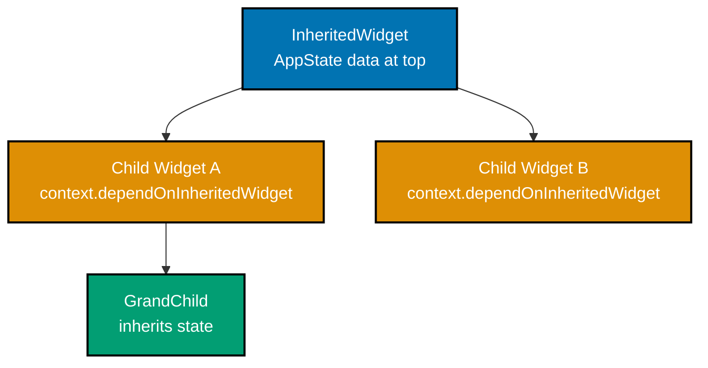
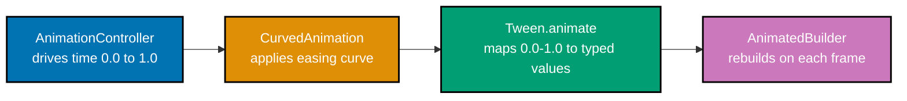

## Group 11: Inherited State

### Example 28: InheritedWidget

`InheritedWidget` is Flutter's built-in mechanism for propagating data down the widget tree without explicit parameter passing. It is the foundation on which `Provider`, `Theme`, and `MediaQuery` are all built. Understanding InheritedWidget demystifies how these higher-level solutions work.



```dart
import 'package:flutter/material.dart';

// Define the InheritedWidget that holds shared state
class AppThemeData extends InheritedWidget {
  final bool isDarkMode;                           // => The data to share down the tree
  final VoidCallback toggleTheme;                  // => Callback to mutate shared state

  const AppThemeData({
    super.key,
    required this.isDarkMode,                      // => Required data field
    required this.toggleTheme,
    required super.child,                          // => The subtree this widget wraps
  });

  // Static of() method is the conventional access pattern
  // dependOnInheritedWidgetOfExactType registers the caller for rebuilds
  static AppThemeData of(BuildContext context) {
    return context.dependOnInheritedWidgetOfExactType<AppThemeData>()!;
    // => Registers this context to rebuild when AppThemeData.updateShouldNotify returns true
  }

  // updateShouldNotify tells Flutter whether dependents should rebuild
  @override
  bool updateShouldNotify(AppThemeData oldWidget) {
    return isDarkMode != oldWidget.isDarkMode;     // => Only rebuild if isDarkMode changed
    // => If false, dependents do NOT rebuild even though the widget was rebuilt
  }
}

class InheritedWidgetDemo extends StatefulWidget {
  const InheritedWidgetDemo({super.key});

  @override
  State<InheritedWidgetDemo> createState() => _InheritedWidgetDemoState();
}

class _InheritedWidgetDemoState extends State<InheritedWidgetDemo> {
  bool _isDarkMode = false;                        // => State lives in the ancestor

  @override
  Widget build(BuildContext context) {
    return AppThemeData(
      isDarkMode: _isDarkMode,                     // => Pass current state into tree
      toggleTheme: () => setState(() => _isDarkMode = !_isDarkMode),
      // => Wrap entire subtree so any descendant can access AppThemeData
      child: MaterialApp(
        theme: _isDarkMode ? ThemeData.dark() : ThemeData.light(),
        home: const ThemeConsumerPage(),
      ),
    );
  }
}

class ThemeConsumerPage extends StatelessWidget {
  const ThemeConsumerPage({super.key});

  @override
  Widget build(BuildContext context) {
    // Access shared state via the static of() method - no prop drilling
    final themeData = AppThemeData.of(context);   // => Reads from InheritedWidget
                                                   // => Registers this widget for rebuilds

    return Scaffold(
      appBar: AppBar(title: const Text('InheritedWidget')),
      body: Center(
        child: Column(
          mainAxisAlignment: MainAxisAlignment.center,
          children: [
            Text('Dark mode: ${themeData.isDarkMode}'),
            const SizedBox(height: 16),
            ElevatedButton(
              onPressed: themeData.toggleTheme,    // => Calls ancestor's setState
              child: const Text('Toggle Theme'),
            ),
          ],
        ),
      ),
    );
  }
}

void main() => runApp(const InheritedWidgetDemo());
// => Theme toggle updates all consumers without prop drilling
```

**Key Takeaway**: `InheritedWidget` propagates data down the tree; `dependOnInheritedWidgetOfExactType` in `of()` registers the consumer for rebuilds when `updateShouldNotify` returns `true`.

**Why It Matters**: Every Flutter developer should understand InheritedWidget because it is the engine behind `Theme.of(context)`, `MediaQuery.of(context)`, and all state management libraries. When Provider rebuilds only affected widgets, it uses `updateShouldNotify` under the hood. Understanding this mechanism helps debug unexpected rebuilds and performance issues in production applications.

---

### Example 29: Provider Package

`Provider` is the community-recommended wrapper around `InheritedWidget` that eliminates boilerplate. `ChangeNotifier` + `ChangeNotifierProvider` is the most common pattern: the model holds state and calls `notifyListeners()` to trigger rebuilds in `Consumer` or `context.watch` callers.

```dart
import 'package:flutter/material.dart';
import 'package:provider/provider.dart'; // => Add provider: ^6.1.0 to pubspec.yaml

// Model extends ChangeNotifier to provide reactive state
class CartModel extends ChangeNotifier {
  final List<String> _items = [];              // => Private mutable items list

  List<String> get items => List.unmodifiable(_items); // => Expose immutable view
  int get count => _items.length;               // => Computed property

  void addItem(String item) {
    _items.add(item);                          // => Mutate private state
    notifyListeners();                         // => Trigger rebuilds in all consumers
  }

  void removeItem(String item) {
    _items.remove(item);
    notifyListeners();                         // => Notify after every mutation
  }

  void clear() {
    _items.clear();
    notifyListeners();
  }
}

void main() {
  runApp(
    // ChangeNotifierProvider creates and disposes the model automatically
    ChangeNotifierProvider(
      create: (context) => CartModel(),        // => Factory creates the model instance
      child: const MaterialApp(home: ShopPage()),
    ),
  );
}

class ShopPage extends StatelessWidget {
  const ShopPage({super.key});

  static const _products = ['Apple', 'Banana', 'Cherry', 'Dragonfruit'];

  @override
  Widget build(BuildContext context) {
    return Scaffold(
      appBar: AppBar(
        title: const Text('Shop'),
        actions: [
          // context.watch<T>() - rebuilds this widget when CartModel notifies
          Consumer<CartModel>(
            builder: (context, cart, _) => Badge.count(
              count: cart.count,               // => Cart item count in badge
              child: const Icon(Icons.shopping_cart),
            ),
          ),
        ],
      ),
      body: ListView.builder(
        itemCount: _products.length,
        itemBuilder: (context, index) {
          final product = _products[index];
          return ListTile(
            title: Text(product),
            trailing: IconButton(
              icon: const Icon(Icons.add_shopping_cart),
              onPressed: () {
                // context.read<T>() - access model without registering for rebuilds
                context.read<CartModel>().addItem(product);
                // => context.read used in callbacks (no rebuild needed from here)
              },
            ),
          );
        },
      ),
      floatingActionButton: Consumer<CartModel>(
        builder: (context, cart, _) => FloatingActionButton.extended(
          onPressed: cart.count > 0 ? cart.clear : null, // => Disable if empty
          label: Text('Clear Cart (${cart.count})'),
          icon: const Icon(Icons.delete),
        ),
      ),
    );
  }
}
// => Cart count updates everywhere when items are added or removed
```

**Key Takeaway**: Extend `ChangeNotifier` and call `notifyListeners()` after mutations; use `context.watch<T>()` in `build` methods to rebuild on changes; use `context.read<T>()` in callbacks where you only need to call methods.

**Why It Matters**: Provider is the most widely used Flutter state management library and is recommended by the Flutter team for most use cases. The `context.read` vs `context.watch` distinction is critical - calling `context.watch` in a button callback causes unnecessary rebuilds, while calling `context.read` in a `build` method means changes never trigger a rebuild. This distinction prevents both bugs and performance issues in production apps.

---

### Example 30: Riverpod

Riverpod improves on Provider with compile-time safety, no `BuildContext` requirement for reads, and better separation of concerns. `StateNotifierProvider` is the Riverpod equivalent of Provider's `ChangeNotifierProvider`. Providers are declared globally as `final` variables.

```dart
import 'package:flutter/material.dart';
import 'package:flutter_riverpod/flutter_riverpod.dart'; // => flutter_riverpod: ^2.5.0

// Define a state class (immutable data)
class TodoState {
  final List<String> todos;
  final bool isLoading;
  const TodoState({required this.todos, this.isLoading = false});

  // copyWith creates new instance with updated fields (immutable update pattern)
  TodoState copyWith({List<String>? todos, bool? isLoading}) => TodoState(
    todos: todos ?? this.todos,     // => Use provided value or keep existing
    isLoading: isLoading ?? this.isLoading,
  );
}

// StateNotifier holds state and exposes mutation methods
class TodoNotifier extends StateNotifier<TodoState> {
  TodoNotifier() : super(const TodoState(todos: [])); // => Initial state via super()

  void add(String todo) {
    state = state.copyWith(todos: [...state.todos, todo]); // => Immutable update
    // => Assigning to state triggers all provider listeners to rebuild
  }

  void remove(String todo) {
    state = state.copyWith(
      todos: state.todos.where((t) => t != todo).toList(),
    );
  }

  Future<void> loadFromServer() async {
    state = state.copyWith(isLoading: true);          // => Show loading indicator
    await Future.delayed(const Duration(seconds: 1)); // => Simulate network call
    state = state.copyWith(
      todos: ['Buy groceries', 'Write Flutter code', 'Exercise'],
      isLoading: false,                               // => Hide loading indicator
    );
  }
}

// Global provider declaration - accessible anywhere without context
final todoProvider = StateNotifierProvider<TodoNotifier, TodoState>(
  (ref) => TodoNotifier(),                           // => Factory creates the notifier
);

void main() {
  runApp(
    const ProviderScope(                             // => ProviderScope is required at app root
      child: MaterialApp(home: TodoPage()),
    ),
  );
}

// ConsumerWidget is Riverpod's equivalent of StatelessWidget + Consumer
class TodoPage extends ConsumerWidget {
  const TodoPage({super.key});

  @override
  Widget build(BuildContext context, WidgetRef ref) {
    // ref.watch rebuilds this widget when todoProvider state changes
    final state = ref.watch(todoProvider);           // => Subscribes to state changes

    return Scaffold(
      appBar: AppBar(title: const Text('Riverpod Todos')),
      body: state.isLoading
          ? const Center(child: CircularProgressIndicator())
          : ListView.builder(
              itemCount: state.todos.length,
              itemBuilder: (context, index) {
                final todo = state.todos[index];
                return ListTile(
                  title: Text(todo),
                  trailing: IconButton(
                    icon: const Icon(Icons.delete),
                    // ref.read in callbacks - no rebuild subscription needed
                    onPressed: () => ref.read(todoProvider.notifier).remove(todo),
                    // => .notifier gives access to TodoNotifier methods
                  ),
                );
              },
            ),
      floatingActionButton: FloatingActionButton(
        onPressed: () => ref.read(todoProvider.notifier).loadFromServer(),
        child: const Icon(Icons.download),
      ),
    );
  }
}
// => Riverpod provider manages async loading and todo list state globally
```

**Key Takeaway**: Declare Riverpod providers as global `final` variables; use `ref.watch` in `build` to subscribe to changes; use `ref.read` in callbacks; `StateNotifier` holds immutable state updated via `state = state.copyWith(...)`.

**Why It Matters**: Riverpod solves the key weaknesses of Provider - no more `ProviderNotFoundException` at runtime, providers can depend on each other without nesting, and testing requires no `BuildContext` manipulation. Many production teams prefer Riverpod for its compile-time safety and testability. The immutable state pattern with `copyWith` also makes state transitions explicit and debuggable.

---

## Group 12: Networking

### Example 31: HTTP GET Request

The `http` package provides straightforward HTTP operations. Always handle loading, success, and error states explicitly. Parse JSON with `json.decode` from `dart:convert`. Use typed model classes instead of raw `Map<String, dynamic>` for maintainability.

```dart
import 'dart:convert';                             // => dart:convert for json.decode
import 'package:flutter/material.dart';
import 'package:http/http.dart' as http;           // => http: ^1.2.0 in pubspec.yaml

// Typed model class for API response
class Post {
  final int id;
  final String title;
  final String body;

  const Post({required this.id, required this.title, required this.body});

  // Factory constructor parses JSON map into typed object
  factory Post.fromJson(Map<String, dynamic> json) {
    return Post(
      id: json['id'] as int,                       // => Cast to expected type
      title: json['title'] as String,              // => Throws if wrong type
      body: json['body'] as String,
    );
  }
}

// Service function that performs the HTTP request
Future<List<Post>> fetchPosts() async {
  final url = Uri.parse('https://jsonplaceholder.typicode.com/posts'); // => Parse URL string
  final response = await http.get(url);            // => Perform GET request
  // => response.statusCode is the HTTP status (200, 404, 500, etc.)
  // => response.body is the response body as a String

  if (response.statusCode != 200) {
    throw Exception('Failed to load posts: ${response.statusCode}');
    // => Throw exception for non-200 responses so callers can handle errors
  }

  final List<dynamic> data = json.decode(response.body); // => Parse JSON string to List
  return data.map((json) => Post.fromJson(json as Map<String, dynamic>)).toList();
  // => Transform each JSON map into a typed Post object
}

void main() => runApp(const MaterialApp(home: PostsPage()));

class PostsPage extends StatefulWidget {
  const PostsPage({super.key});

  @override
  State<PostsPage> createState() => _PostsPageState();
}

class _PostsPageState extends State<PostsPage> {
  late Future<List<Post>> _postsFuture;            // => late = initialized before first use

  @override
  void initState() {
    super.initState();
    _postsFuture = fetchPosts();                   // => Start fetching in initState
    // => Assigned once; FutureBuilder won't re-fetch on rebuild
  }

  @override
  Widget build(BuildContext context) {
    return Scaffold(
      appBar: AppBar(title: const Text('HTTP GET')),
      body: FutureBuilder<List<Post>>(
        future: _postsFuture,                      // => The Future to observe
        builder: (context, snapshot) {
          // snapshot.connectionState tracks the Future lifecycle
          if (snapshot.connectionState == ConnectionState.waiting) {
            return const Center(child: CircularProgressIndicator()); // => Loading
          }
          if (snapshot.hasError) {
            return Center(child: Text('Error: ${snapshot.error}')); // => Error
          }
          // snapshot.data is non-null when connectionState is done and no error
          final posts = snapshot.data!;            // => ! asserts non-null
          return ListView.builder(
            itemCount: posts.length,
            itemBuilder: (context, index) => ListTile(
              leading: CircleAvatar(child: Text('${posts[index].id}')),
              title: Text(posts[index].title),
              subtitle: Text(posts[index].body,
                maxLines: 1, overflow: TextOverflow.ellipsis),
            ),
          );
        },
      ),
    );
  }
}
// => Fetches 100 posts from JSONPlaceholder, shows loading/error/data states
```

**Key Takeaway**: Perform HTTP requests with `http.get(Uri.parse(url))`; always check `response.statusCode`; use typed model classes with `fromJson` factories; assign the `Future` in `initState` to prevent re-fetching on rebuilds.

**Why It Matters**: Assigning the Future in `initState` rather than directly in `build` is a critical performance pattern. If the Future is created in `build`, every parent rebuild creates a new Future and re-fetches data - causing infinite loading loops or redundant network calls. This mistake appears frequently in tutorials that skip `initState`, leading to production apps with excessive API calls.

---

### Example 32: HTTP POST with JSON Body

`http.post` sends data to an API. Always set the `Content-Type: application/json` header when sending JSON. Use `json.encode` to serialize Dart objects, and handle both success and error responses with appropriate UI feedback.

```dart
import 'dart:convert';
import 'package:flutter/material.dart';
import 'package:http/http.dart' as http;

void main() => runApp(const MaterialApp(home: CreatePostPage()));

class CreatePostPage extends StatefulWidget {
  const CreatePostPage({super.key});

  @override
  State<CreatePostPage> createState() => _CreatePostPageState();
}

class _CreatePostPageState extends State<CreatePostPage> {
  final _formKey = GlobalKey<FormState>();
  final _titleController = TextEditingController();
  final _bodyController = TextEditingController();
  bool _isLoading = false;
  String? _responseMessage;                        // => null until request completes

  @override
  void dispose() {
    _titleController.dispose();
    _bodyController.dispose();
    super.dispose();
  }

  Future<void> _submitPost() async {
    if (!_formKey.currentState!.validate()) return;

    setState(() { _isLoading = true; _responseMessage = null; });

    try {
      final response = await http.post(
        Uri.parse('https://jsonplaceholder.typicode.com/posts'),
        // Content-Type header tells server the body is JSON
        headers: {'Content-Type': 'application/json; charset=UTF-8'},
        // json.encode converts Dart Map to JSON string
        body: json.encode({
          'title': _titleController.text,          // => POST body field: title
          'body': _bodyController.text,            // => POST body field: body
          'userId': 1,                             // => POST body field: userId
        }),
      );
      // => response.statusCode for creation is typically 201 Created

      if (response.statusCode == 201) {
        final data = json.decode(response.body) as Map<String, dynamic>;
        setState(() {
          _responseMessage = 'Created post with ID: ${data['id']}'; // => Server-assigned ID
        });
      } else {
        setState(() {
          _responseMessage = 'Error ${response.statusCode}: ${response.body}';
        });
      }
    } catch (e) {
      // Catch network errors (no connection, timeout, DNS failure)
      setState(() => _responseMessage = 'Network error: $e');
    } finally {
      // finally always runs, whether try succeeded or catch ran
      setState(() => _isLoading = false);          // => Always hide loading
    }
  }

  @override
  Widget build(BuildContext context) {
    return Scaffold(
      appBar: AppBar(title: const Text('HTTP POST')),
      body: Padding(
        padding: const EdgeInsets.all(24),
        child: Form(
          key: _formKey,
          child: Column(
            children: [
              TextFormField(
                controller: _titleController,
                decoration: const InputDecoration(labelText: 'Title',
                    border: OutlineInputBorder()),
                validator: (v) => v!.isEmpty ? 'Title required' : null,
              ),
              const SizedBox(height: 12),
              TextFormField(
                controller: _bodyController,
                decoration: const InputDecoration(labelText: 'Body',
                    border: OutlineInputBorder()),
                maxLines: 3,                       // => Multi-line text field
                validator: (v) => v!.isEmpty ? 'Body required' : null,
              ),
              const SizedBox(height: 16),
              SizedBox(
                width: double.infinity,
                child: ElevatedButton(
                  onPressed: _isLoading ? null : _submitPost,
                  child: _isLoading
                      ? const CircularProgressIndicator()
                      : const Text('Create Post'),
                ),
              ),
              if (_responseMessage != null) ...[
                const SizedBox(height: 16),
                Text(_responseMessage!,            // => Show server response
                  style: TextStyle(
                    color: _responseMessage!.startsWith('Created')
                        ? Colors.green : Colors.red, // => Green success, red error
                  )),
              ],
            ],
          ),
        ),
      ),
    );
  }
}
```

**Key Takeaway**: Set `Content-Type: application/json` header for POST requests; use `json.encode` for the body; wrap the `await` in `try/catch/finally` to handle both API errors (non-201) and network failures (exceptions).

**Why It Matters**: The `try/catch/finally` pattern is essential for production HTTP code. `catch` handles network-level failures (no internet, DNS failure, timeout) that don't produce HTTP responses. `finally` ensures loading state is always reset even if an exception propagates - preventing permanently spinning buttons. Missing either makes your UI unusable when network conditions degrade.

---

### Example 33: FutureBuilder

`FutureBuilder` rebuilds its subtree reactively as a `Future` progresses through its states: waiting, done (with data), and done (with error). It eliminates the boilerplate of manually managing loading/error/data state variables in a `StatefulWidget`.

```dart
import 'dart:convert';
import 'package:flutter/material.dart';
import 'package:http/http.dart' as http;

// Simulates fetching a user profile
Future<Map<String, dynamic>> fetchUser(int id) async {
  await Future.delayed(const Duration(milliseconds: 800)); // => Simulate latency
  final response = await http.get(
    Uri.parse('https://jsonplaceholder.typicode.com/users/$id'),
  );
  if (response.statusCode != 200) throw Exception('User not found');
  return json.decode(response.body) as Map<String, dynamic>;
}

void main() => runApp(const MaterialApp(home: UserProfilePage()));

class UserProfilePage extends StatefulWidget {
  const UserProfilePage({super.key});

  @override
  State<UserProfilePage> createState() => _UserProfilePageState();
}

class _UserProfilePageState extends State<UserProfilePage> {
  int _userId = 1;                               // => Currently viewed user ID
  late Future<Map<String, dynamic>> _userFuture;

  @override
  void initState() {
    super.initState();
    _userFuture = fetchUser(_userId);            // => Kick off initial fetch
  }

  void _loadUser(int id) {
    setState(() {
      _userId = id;
      _userFuture = fetchUser(id);               // => Reassign Future to trigger new build
    });
  }

  @override
  Widget build(BuildContext context) {
    return Scaffold(
      appBar: AppBar(title: Text('User #$_userId Profile')),
      body: Column(
        children: [
          // User selector row
          Padding(
            padding: const EdgeInsets.all(8),
            child: Row(
              mainAxisAlignment: MainAxisAlignment.center,
              children: [1, 2, 3].map((id) => Padding(
                padding: const EdgeInsets.symmetric(horizontal: 4),
                child: ElevatedButton(
                  onPressed: () => _loadUser(id),  // => Load different user
                  child: Text('User $id'),
                ),
              )).toList(),
            ),
          ),

          // FutureBuilder reacts to _userFuture changes
          Expanded(
            child: FutureBuilder<Map<String, dynamic>>(
              future: _userFuture,               // => Future to observe
              builder: (context, snapshot) {
                // ConnectionState.waiting: Future is still running
                if (snapshot.connectionState == ConnectionState.waiting) {
                  return const Center(child: CircularProgressIndicator());
                }

                // snapshot.hasError: Future completed with an exception
                if (snapshot.hasError) {
                  return Center(
                    child: Column(
                      mainAxisAlignment: MainAxisAlignment.center,
                      children: [
                        const Icon(Icons.error, color: Colors.red, size: 48),
                        const SizedBox(height: 8),
                        Text('${snapshot.error}'),  // => Display the error message
                        const SizedBox(height: 16),
                        ElevatedButton(
                          onPressed: () => _loadUser(_userId), // => Retry button
                          child: const Text('Retry'),
                        ),
                      ],
                    ),
                  );
                }

                // snapshot.data is available: Future completed successfully
                final user = snapshot.data!;       // => The resolved value
                return Padding(
                  padding: const EdgeInsets.all(24),
                  child: Column(
                    crossAxisAlignment: CrossAxisAlignment.start,
                    children: [
                      Text(user['name'] as String,
                        style: const TextStyle(fontSize: 24, fontWeight: FontWeight.bold)),
                      Text(user['email'] as String,
                        style: const TextStyle(color: Colors.grey)),
                      const SizedBox(height: 8),
                      Text('Phone: ${user['phone']}'),
                      Text('Website: ${user['website']}'),
                      Text('Company: ${(user['company'] as Map)['name']}'),
                    ],
                  ),
                );
              },
            ),
          ),
        ],
      ),
    );
  }
}
// => FutureBuilder shows loading, error with retry, and user data reactively
```

**Key Takeaway**: `FutureBuilder` handles all three Future states (waiting, error, data) declaratively in one widget; always provide a retry mechanism in the error branch; reassigning the `Future` in `setState` triggers a fresh `FutureBuilder` observation.

**Why It Matters**: `FutureBuilder` is the idiomatic Flutter pattern for async UI - it eliminates five or more boolean state variables (`isLoading`, `hasError`, `errorMessage`, `data`, `hasLoaded`) and their corresponding `setState` calls. Production apps should always include a retry button in the error state; users on unreliable connections will encounter loading failures and need a way to recover without restarting the app.

---

### Example 34: StreamBuilder

`StreamBuilder` rebuilds its subtree as new events arrive from a `Stream`. It is ideal for real-time data like WebSocket messages, database change feeds, or periodic polling. Unlike `FutureBuilder`, it remains active and continues updating as long as the stream emits events.

```dart
import 'package:flutter/material.dart';

// Simulate a real-time temperature sensor stream
Stream<double> temperatureStream() async* {
  // async* creates a generator function that yields values asynchronously
  double temp = 22.0;                            // => Starting temperature in Celsius
  while (true) {
    await Future.delayed(const Duration(seconds: 1)); // => Emit every second
    // Simulate small temperature fluctuation
    temp += (DateTime.now().millisecond % 10 - 5) * 0.1; // => Random ±0.5°C change
    yield temp;                                  // => yield emits value to stream
    // => StreamBuilder receives each yielded value as a new event
  }
}

void main() => runApp(const MaterialApp(home: TempMonitorPage()));

class TempMonitorPage extends StatefulWidget {
  const TempMonitorPage({super.key});

  @override
  State<TempMonitorPage> createState() => _TempMonitorPageState();
}

class _TempMonitorPageState extends State<TempMonitorPage> {
  // Keep the stream reference stable - creating it in build would restart it on every rebuild
  final Stream<double> _tempStream = temperatureStream();
  final List<double> _history = [];              // => Store last readings for chart

  @override
  Widget build(BuildContext context) {
    return Scaffold(
      appBar: AppBar(title: const Text('Real-time Temperature')),
      body: StreamBuilder<double>(
        stream: _tempStream,                     // => Stream to observe
        builder: (context, snapshot) {
          // Store new data in history
          if (snapshot.hasData) {
            _history.add(snapshot.data!);        // => Append new reading to history
            if (_history.length > 10) _history.removeAt(0); // => Keep last 10 readings
          }

          // ConnectionState.waiting: no events received yet
          // ConnectionState.active: stream is running, events may have arrived
          // ConnectionState.done: stream has closed (no more events)
          final state = snapshot.connectionState;

          return Padding(
            padding: const EdgeInsets.all(24),
            child: Column(
              mainAxisAlignment: MainAxisAlignment.center,
              children: [
                if (state == ConnectionState.waiting)
                  const CircularProgressIndicator()   // => Waiting for first event
                else if (snapshot.hasError)
                  Text('Error: ${snapshot.error}')    // => Stream emitted an error
                else ...[
                  // Current temperature display
                  Text(
                    '${snapshot.data!.toStringAsFixed(1)}°C',
                    style: const TextStyle(fontSize: 64, fontWeight: FontWeight.bold),
                  ),
                  const SizedBox(height: 8),
                  Text(
                    snapshot.data! > 25 ? 'WARM' : snapshot.data! < 18 ? 'COOL' : 'NORMAL',
                    style: TextStyle(
                      fontSize: 18,
                      color: snapshot.data! > 25 ? Colors.orange
                          : snapshot.data! < 18 ? Colors.blue : Colors.teal,
                    ),
                  ),
                  // History list
                  const SizedBox(height: 24),
                  Text('Last ${_history.length} readings:'),
                  Wrap(
                    spacing: 8,
                    children: _history.map((t) =>
                      Chip(label: Text('${t.toStringAsFixed(1)}°'))).toList(),
                  ),
                ],
              ],
            ),
          );
        },
      ),
    );
  }
}
// => Live temperature updates every second via Stream
```

**Key Takeaway**: `StreamBuilder` stays active for the lifetime of its stream, rebuilding on every event; store the stream in a field (not in `build`) to prevent restarting it on parent rebuilds.

**Why It Matters**: StreamBuilder is the standard Flutter pattern for all real-time data - chat messages, stock tickers, IoT sensor readings, and live notifications. In web applications specifically, WebSocket connections and Server-Sent Events are naturally represented as streams. Creating the stream in `build` restarts it on every parent rebuild, potentially causing duplicate WebSocket connections and lost messages.

---

## Group 13: Animations

### Example 35: Implicit Animations

Implicit animations in Flutter automatically animate between old and new property values when you call `setState`. `AnimatedContainer`, `AnimatedOpacity`, `AnimatedSwitcher`, and `AnimatedDefaultTextStyle` are the most common implicit animation widgets - they require only a `duration` and handle all tweening internally.

```dart
import 'package:flutter/material.dart';

void main() => runApp(const MaterialApp(home: ImplicitAnimationDemo()));

class ImplicitAnimationDemo extends StatefulWidget {
  const ImplicitAnimationDemo({super.key});

  @override
  State<ImplicitAnimationDemo> createState() => _ImplicitAnimationDemoState();
}

class _ImplicitAnimationDemoState extends State<ImplicitAnimationDemo> {
  bool _expanded = false;              // => Toggle between two visual states
  bool _visible = true;               // => Controls opacity animation

  @override
  Widget build(BuildContext context) {
    return Scaffold(
      appBar: AppBar(title: const Text('Implicit Animations')),
      body: Padding(
        padding: const EdgeInsets.all(24),
        child: Column(
          children: [
            // AnimatedContainer smoothly transitions all changed properties
            AnimatedContainer(
              duration: const Duration(milliseconds: 400), // => Animation takes 400ms
              curve: Curves.easeInOut,               // => Non-linear easing curve
              width: _expanded ? 300 : 100,          // => Animate width on state change
              height: _expanded ? 200 : 100,         // => Animate height on state change
              decoration: BoxDecoration(
                color: _expanded ? Colors.teal : Colors.blue, // => Animate color too
                borderRadius: BorderRadius.circular(_expanded ? 24 : 8), // => Animate radius
              ),
              alignment: Alignment.center,
              child: Text(
                _expanded ? 'Expanded' : 'Compact',
                style: const TextStyle(color: Colors.white, fontWeight: FontWeight.bold),
              ),
            ),
            // => Width, height, color, and border radius all animate simultaneously

            const SizedBox(height: 16),
            ElevatedButton(
              onPressed: () => setState(() => _expanded = !_expanded), // => Toggle state
              child: Text(_expanded ? 'Collapse' : 'Expand'),
            ),

            const SizedBox(height: 24),

            // AnimatedOpacity fades in/out without layout changes
            AnimatedOpacity(
              duration: const Duration(milliseconds: 300),
              opacity: _visible ? 1.0 : 0.0,         // => 1.0 = fully visible, 0.0 = invisible
              child: const Text('I fade in and out!',
                  style: TextStyle(fontSize: 20)),
            ),
            // => Widget stays in layout even when opacity is 0 (unlike Visibility)

            const SizedBox(height: 8),
            ElevatedButton(
              onPressed: () => setState(() => _visible = !_visible),
              child: Text(_visible ? 'Hide' : 'Show'),
            ),

            const SizedBox(height: 24),

            // AnimatedSwitcher animates between different child widgets
            AnimatedSwitcher(
              duration: const Duration(milliseconds: 300),
              child: _expanded                       // => Key required for different widgets
                  ? const Icon(Icons.expand_less, key: ValueKey('less'), size: 48)
                  : const Icon(Icons.expand_more, key: ValueKey('more'), size: 48),
              // => Transitions between two different icons with a fade animation
              // => key: ValueKey is required so Flutter knows these are different widgets
            ),
          ],
        ),
      ),
    );
  }
}
```

**Key Takeaway**: Implicit animation widgets automatically tween between old and new property values when `setState` changes them; always provide `duration` and optionally `curve`; `AnimatedSwitcher` requires unique `Key` values on the children to detect which widget changed.

**Why It Matters**: Implicit animations add perceived quality to production apps with minimal code. A login button that smoothly expands when tapped, a card that gently fades in, an icon that transitions on state change - all of these can be implemented with AnimatedContainer or AnimatedSwitcher in a few lines. The `Key` requirement for AnimatedSwitcher is a common gotcha - without different keys, Flutter thinks the same widget changed its type and the animation does not play.

---

### Example 36: Explicit Animations

Explicit animations use `AnimationController` for full control over playback: start, stop, reverse, repeat, and seek. They are essential for looping animations, sequenced animations, and animations triggered by user gestures. `Tween` defines value range; `CurvedAnimation` applies easing.



```dart
import 'package:flutter/material.dart';

void main() => runApp(const MaterialApp(home: ExplicitAnimationDemo()));

class ExplicitAnimationDemo extends StatefulWidget {
  const ExplicitAnimationDemo({super.key});

  @override
  State<ExplicitAnimationDemo> createState() => _ExplicitAnimationDemoState();
}

// SingleTickerProviderStateMixin provides the vsync for AnimationController
class _ExplicitAnimationDemoState extends State<ExplicitAnimationDemo>
    with SingleTickerProviderStateMixin {

  late AnimationController _controller;            // => Drives the animation 0.0 → 1.0
  late Animation<double> _scaleAnimation;          // => Typed animation for scale
  late Animation<double> _rotateAnimation;         // => Typed animation for rotation
  late Animation<Color?> _colorAnimation;          // => Typed animation for color

  @override
  void initState() {
    super.initState();
    // AnimationController requires vsync to sync with display refresh
    _controller = AnimationController(
      duration: const Duration(seconds: 1),        // => One cycle takes 1 second
      vsync: this,                                 // => this is the TickerProvider
    );

    // CurvedAnimation applies non-linear easing to the controller's linear 0-1 progress
    final curved = CurvedAnimation(
      parent: _controller,
      curve: Curves.elasticOut,                    // => Bouncy elastic effect at end
    );

    // Tween.animate maps 0.0-1.0 to the Tween range and returns an Animation<T>
    _scaleAnimation = Tween<double>(begin: 0.5, end: 1.5).animate(curved);
    // => When controller is 0.0, scale is 0.5; when 1.0, scale is 1.5

    _rotateAnimation = Tween<double>(begin: 0, end: 2 * 3.14159).animate(_controller);
    // => Rotates full circle (0 to 2π radians) linearly (no curve)

    _colorAnimation = ColorTween(begin: Colors.blue, end: Colors.orange).animate(_controller);
    // => Transitions from blue to orange as animation progresses
  }

  @override
  void dispose() {
    _controller.dispose();                         // => Must dispose AnimationController
    super.dispose();                               // => Prevents memory leak from ticker
  }

  @override
  Widget build(BuildContext context) {
    return Scaffold(
      appBar: AppBar(title: const Text('Explicit Animation')),
      body: Center(
        child: Column(
          mainAxisAlignment: MainAxisAlignment.center,
          children: [
            // AnimatedBuilder rebuilds whenever _controller ticks
            AnimatedBuilder(
              animation: _controller,              // => Listen to controller ticks
              builder: (context, child) {
                return Transform.scale(
                  scale: _scaleAnimation.value,    // => Current scale value (0.5-1.5)
                  child: Transform.rotate(
                    angle: _rotateAnimation.value, // => Current rotation in radians
                    child: Container(
                      width: 80,
                      height: 80,
                      color: _colorAnimation.value, // => Current interpolated color
                      child: child,                 // => child is built once, not on each tick
                    ),
                  ),
                );
              },
              child: const Icon(Icons.star, color: Colors.white, size: 48),
              // => child is passed to builder for optimization - it doesn't rebuild each frame
            ),

            const SizedBox(height: 32),

            Row(
              mainAxisAlignment: MainAxisAlignment.center,
              children: [
                ElevatedButton(
                  onPressed: () => _controller.forward(), // => Play forward to end
                  child: const Text('Play'),
                ),
                const SizedBox(width: 8),
                ElevatedButton(
                  onPressed: () => _controller.reverse(), // => Play backward to start
                  child: const Text('Reverse'),
                ),
                const SizedBox(width: 8),
                ElevatedButton(
                  onPressed: () => _controller.repeat(), // => Loop continuously
                  child: const Text('Loop'),
                ),
              ],
            ),
          ],
        ),
      ),
    );
  }
}
// => Icon scales, rotates, and changes color with elastic easing
```

**Key Takeaway**: `AnimationController` drives time; `Tween.animate` maps 0-1 to typed values; `AnimatedBuilder` rebuilds on each tick; always dispose the `AnimationController` in `dispose()`.

**Why It Matters**: Explicit animations are required for any animation that loops, reverses on command, or needs programmatic control. Loading spinners, progress indicators, pulse effects on notifications, and gesture-driven animations all require `AnimationController`. Forgetting to dispose the controller is the most common animation-related memory leak in Flutter - the ticker continues running even after the widget is removed from the tree.

---

## Group 14: Theming and Responsive Layout

### Example 37: ThemeData and Custom Themes

`ThemeData` configures the visual properties of an entire application. Material 3 uses `ColorScheme.fromSeed` to generate a harmonious palette from a single brand color. Custom themes ensure consistent colors, typography, and component styling across the entire app.

```dart
import 'package:flutter/material.dart';

// Define a branded theme using Material 3 ColorScheme
ThemeData buildBrandTheme({required bool isDark}) {
  final colorScheme = ColorScheme.fromSeed(
    seedColor: const Color(0xFF1565C0),            // => Brand blue as seed
    brightness: isDark ? Brightness.dark : Brightness.light,
    // => Flutter generates a complete 30-color scheme from one seed
  );

  return ThemeData(
    useMaterial3: true,
    colorScheme: colorScheme,
    // Typography customization
    textTheme: TextTheme(
      headlineLarge: TextStyle(
        fontSize: 32,
        fontWeight: FontWeight.bold,
        color: colorScheme.onSurface,              // => Semantic color from scheme
      ),
      bodyMedium: TextStyle(
        fontSize: 14,
        color: colorScheme.onSurface,
      ),
    ),
    // Component-level theme overrides
    elevatedButtonTheme: ElevatedButtonThemeData(
      style: ElevatedButton.styleFrom(
        minimumSize: const Size(120, 48),          // => Minimum touch target size
        shape: RoundedRectangleBorder(
          borderRadius: BorderRadius.circular(8),  // => Less rounded than Material 3 default
        ),
      ),
    ),
    cardTheme: const CardThemeData(
      elevation: 1,                               // => Subtle shadow on all cards
      margin: EdgeInsets.symmetric(vertical: 4),  // => Consistent card spacing
    ),
  );
}

void main() {
  runApp(const ThemeDemo());
}

class ThemeDemo extends StatefulWidget {
  const ThemeDemo({super.key});

  @override
  State<ThemeDemo> createState() => _ThemeDemoState();
}

class _ThemeDemoState extends State<ThemeDemo> {
  bool _isDark = false;                            // => Theme mode toggle

  @override
  Widget build(BuildContext context) {
    return MaterialApp(
      theme: buildBrandTheme(isDark: false),       // => Light theme
      darkTheme: buildBrandTheme(isDark: true),    // => Dark theme
      themeMode: _isDark ? ThemeMode.dark : ThemeMode.light, // => Which to use
      home: Scaffold(
        appBar: AppBar(
          title: const Text('Custom Theme'),
          actions: [
            IconButton(
              icon: Icon(_isDark ? Icons.light_mode : Icons.dark_mode),
              onPressed: () => setState(() => _isDark = !_isDark),
              tooltip: 'Toggle theme',
            ),
          ],
        ),
        body: Padding(
          padding: const EdgeInsets.all(16),
          child: Column(
            children: [
              Card(child: Padding(                // => Uses cardTheme defaults
                padding: const EdgeInsets.all(16),
                child: Column(
                  crossAxisAlignment: CrossAxisAlignment.start,
                  children: [
                    Text('Headline', style: Theme.of(context).textTheme.headlineLarge),
                    // => Uses custom headlineLarge with scheme-aware color
                    const SizedBox(height: 8),
                    Text('Body text with theme typography.',
                      style: Theme.of(context).textTheme.bodyMedium),
                  ],
                ),
              )),
              const SizedBox(height: 16),
              ElevatedButton(                     // => Uses elevatedButtonTheme defaults
                onPressed: () {},
                child: const Text('Brand Button'),
              ),
            ],
          ),
        ),
      ),
    );
  }
}
// => App switches between branded light and dark themes
```

**Key Takeaway**: Define `theme` and `darkTheme` in `MaterialApp` using `ColorScheme.fromSeed`; use `Theme.of(context).colorScheme` and `textTheme` in widgets to automatically adapt to the current theme.

**Why It Matters**: A well-defined `ThemeData` eliminates hard-coded colors and font sizes throughout the codebase. When stakeholders request a brand color change, you update one `seedColor` and the entire app adjusts. Supporting dark mode via `darkTheme` is increasingly expected by users and required by major platform guidelines. Building theme support from the start is far cheaper than retrofitting it later.

---

### Example 38: Responsive Layout with LayoutBuilder and MediaQuery

Flutter Web must adapt to screen sizes ranging from mobile phones to ultra-wide monitors. `LayoutBuilder` provides the parent's constraints; `MediaQuery.of(context).size` provides the screen dimensions. Combine them with conditional widget rendering or `GridView` column counts.

```dart
import 'package:flutter/material.dart';

void main() => runApp(const MaterialApp(home: ResponsiveDemo()));

class ResponsiveDemo extends StatelessWidget {
  const ResponsiveDemo({super.key});

  @override
  Widget build(BuildContext context) {
    return Scaffold(
      appBar: AppBar(title: const Text('Responsive Layout')),
      body: LayoutBuilder(
        // builder receives BoxConstraints with maxWidth and maxHeight
        builder: (context, constraints) {
          final width = constraints.maxWidth;     // => Available width in logical pixels
          // Define breakpoints as constants
          const mobileBreak = 600.0;              // => < 600: mobile
          const tabletBreak = 900.0;              // => 600-900: tablet
                                                  // => > 900: desktop

          if (width < mobileBreak) {
            return _MobileLayout(width: width);   // => Single column layout
          } else if (width < tabletBreak) {
            return _TabletLayout(width: width);   // => Two column layout
          } else {
            return _DesktopLayout(width: width);  // => Three column layout
          }
        },
      ),
    );
  }
}

class _MobileLayout extends StatelessWidget {
  final double width;
  const _MobileLayout({required this.width});

  @override
  Widget build(BuildContext context) {
    return ListView(
      padding: const EdgeInsets.all(16),
      children: [
        Text('Mobile (${width.toInt()}px)', style: const TextStyle(fontWeight: FontWeight.bold)),
        const SizedBox(height: 8),
        // Single column: stack cards vertically
        for (var i = 1; i <= 6; i++)
          Card(child: ListTile(
            leading: CircleAvatar(child: Text('$i')),
            title: Text('Item $i'),
            subtitle: const Text('Single column layout'),
          )),
      ],
    );
  }
}

class _TabletLayout extends StatelessWidget {
  final double width;
  const _TabletLayout({required this.width});

  @override
  Widget build(BuildContext context) {
    return GridView.builder(
      padding: const EdgeInsets.all(16),
      gridDelegate: const SliverGridDelegateWithFixedCrossAxisCount(
        crossAxisCount: 2,                         // => Two columns for tablet
        crossAxisSpacing: 16,
        mainAxisSpacing: 16,
        childAspectRatio: 2.5,
      ),
      itemCount: 6,
      itemBuilder: (context, index) => Card(
        child: Center(child: Text('Tablet Item ${index + 1}')),
      ),
    );
  }
}

class _DesktopLayout extends StatelessWidget {
  final double width;
  const _DesktopLayout({required this.width});

  @override
  Widget build(BuildContext context) {
    return GridView.builder(
      padding: const EdgeInsets.all(24),
      gridDelegate: const SliverGridDelegateWithFixedCrossAxisCount(
        crossAxisCount: 3,                         // => Three columns for desktop
        crossAxisSpacing: 24,
        mainAxisSpacing: 24,
        childAspectRatio: 1.8,
      ),
      itemCount: 6,
      itemBuilder: (context, index) => Card(
        child: Center(child: Text('Desktop Item ${index + 1}',
          style: const TextStyle(fontSize: 16))),
      ),
    );
  }
}
// => Layout switches between 1, 2, and 3 columns based on available width
```

**Key Takeaway**: Use `LayoutBuilder` to get parent constraints for conditional layout; define breakpoints as constants (600/900 is a common Flutter convention); extract layout variants into separate widget classes for clarity.

**Why It Matters**: Flutter Web must handle everything from 375px mobile to 2560px ultrawide. Hard-coding a single layout causes overflow on narrow screens and awkward empty space on wide ones. `LayoutBuilder` is preferred over `MediaQuery.of(context).size` for layout decisions because it responds to the available space (which can be less than screen size in split-view or scrollable containers), making layouts more composable and correct.

---

## Group 15: Routing

### Example 39: GoRouter Configuration

`GoRouter` is the recommended Flutter router for web applications. It supports deep linking, URL-based navigation, path parameters, query parameters, and nested routes. Unlike Navigator 1.0, GoRouter properly synchronizes the browser URL bar with the current page.

```dart
import 'package:flutter/material.dart';
import 'package:go_router/go_router.dart'; // => go_router: ^14.0.0 in pubspec.yaml

// Define the router configuration once at the top level
final router = GoRouter(
  // initialLocation is the route shown when app first opens
  initialLocation: '/',                          // => Start at home route

  // routes is the list of top-level route configurations
  routes: [
    GoRoute(
      path: '/',                                 // => URL path to match
      builder: (context, state) => const HomePage(), // => Widget to render
    ),
    GoRoute(
      path: '/products',
      builder: (context, state) => const ProductListPage(),
    ),
    GoRoute(
      // :id is a path parameter - matches any value and captures it as 'id'
      path: '/products/:id',                     // => e.g. /products/42
      builder: (context, state) {
        // state.pathParameters contains captured path segments
        final id = state.pathParameters['id']!;  // => '42' for /products/42
        return ProductDetailPage(productId: id);
      },
    ),
    GoRoute(
      path: '/search',
      builder: (context, state) {
        // state.uri.queryParameters reads query string values
        final query = state.uri.queryParameters['q'] ?? ''; // => ?q=flutter
        return SearchPage(query: query);
      },
    ),
  ],

  // errorBuilder renders when no route matches
  errorBuilder: (context, state) => Scaffold(
    appBar: AppBar(title: const Text('404')),
    body: Center(child: Text('Page not found: ${state.uri}')),
  ),
);

void main() {
  runApp(MaterialApp.router(
    routerConfig: router,                         // => Use GoRouter instead of Navigator
  ));
}

class HomePage extends StatelessWidget {
  const HomePage({super.key});

  @override
  Widget build(BuildContext context) {
    return Scaffold(
      appBar: AppBar(title: const Text('Home')),
      body: Center(
        child: Column(
          mainAxisAlignment: MainAxisAlignment.center,
          children: [
            ElevatedButton(
              // context.go replaces the current route (no back button)
              onPressed: () => context.go('/products'),    // => Navigate to /products
              child: const Text('View Products'),
            ),
            const SizedBox(height: 8),
            ElevatedButton(
              // context.push adds to history (back button available)
              onPressed: () => context.push('/products/42'), // => Navigate to /products/42
              child: const Text('Product Detail (Push)'),
            ),
            const SizedBox(height: 8),
            ElevatedButton(
              onPressed: () => context.go('/search?q=flutter'), // => Query parameter
              child: const Text('Search Flutter'),
            ),
          ],
        ),
      ),
    );
  }
}

class ProductListPage extends StatelessWidget {
  const ProductListPage({super.key});

  @override
  Widget build(BuildContext context) {
    return Scaffold(
      appBar: AppBar(title: const Text('Products')),
      body: ListView.builder(
        itemCount: 5,
        itemBuilder: (context, i) => ListTile(
          title: Text('Product ${i + 1}'),
          onTap: () => context.go('/products/${i + 1}'), // => Navigate with path param
        ),
      ),
    );
  }
}

class ProductDetailPage extends StatelessWidget {
  final String productId;
  const ProductDetailPage({super.key, required this.productId});

  @override
  Widget build(BuildContext context) {
    return Scaffold(
      appBar: AppBar(title: Text('Product $productId')),
      body: Center(child: Text('Viewing product: $productId')),
    );
  }
}

class SearchPage extends StatelessWidget {
  final String query;
  const SearchPage({super.key, required this.query});

  @override
  Widget build(BuildContext context) {
    return Scaffold(
      appBar: AppBar(title: Text('Search: "$query"')),
      body: Center(child: Text('Results for "$query"')),
    );
  }
}
// => URL bar updates correctly for each navigation action
```

**Key Takeaway**: Configure `GoRouter` with `GoRoute` entries; use `context.go` for replacement navigation and `context.push` for stack navigation; path parameters use `:paramName` syntax; query parameters are read from `state.uri.queryParameters`.

**Why It Matters**: GoRouter is essential for production Flutter Web apps because it correctly handles browser history, back/forward buttons, and deep linking - things Navigator 1.0 cannot do on the web. Without a proper web-aware router, bookmarked URLs show blank pages, the browser back button breaks, and sharing links does not work. These are fundamental web application expectations that GoRouter satisfies.

---

### Example 40: GoRouter with Shell Routes and Navigation Rail

`ShellRoute` wraps multiple child routes with persistent shell widgets like navigation rails or side menus. This pattern enables a consistent navigation chrome across all pages without re-rendering it on each navigation.

```dart
import 'package:flutter/material.dart';
import 'package:go_router/go_router.dart';

// NavigationRail: vertical navigation for tablet/desktop web
class ShellScaffold extends StatelessWidget {
  final Widget child;                            // => Current route's page widget
  const ShellScaffold({super.key, required this.child});

  @override
  Widget build(BuildContext context) {
    // Determine which destination is currently active from the URL
    final location = GoRouterState.of(context).uri.toString(); // => Current URL path
    final selectedIndex = location.startsWith('/reports') ? 1
        : location.startsWith('/settings') ? 2 : 0;  // => Map URL to index

    return Scaffold(
      body: Row(
        children: [
          // NavigationRail: vertical tab bar for larger screens
          NavigationRail(
            selectedIndex: selectedIndex,          // => Highlight current destination
            onDestinationSelected: (index) {
              // Navigate to the route corresponding to the selected index
              switch (index) {
                case 0: context.go('/dashboard'); break; // => Dashboard
                case 1: context.go('/reports'); break;   // => Reports
                case 2: context.go('/settings'); break;  // => Settings
              }
            },
            labelType: NavigationRailLabelType.all,  // => Show labels below icons
            destinations: const [
              NavigationRailDestination(
                icon: Icon(Icons.dashboard_outlined),
                selectedIcon: Icon(Icons.dashboard),   // => Filled when selected
                label: Text('Dashboard'),
              ),
              NavigationRailDestination(
                icon: Icon(Icons.bar_chart_outlined),
                selectedIcon: Icon(Icons.bar_chart),
                label: Text('Reports'),
              ),
              NavigationRailDestination(
                icon: Icon(Icons.settings_outlined),
                selectedIcon: Icon(Icons.settings),
                label: Text('Settings'),
              ),
            ],
          ),
          const VerticalDivider(width: 1),        // => Visual separator between rail and content
          // child is the current route's page (fills remaining space)
          Expanded(child: child),                  // => Page content fills rest of row
        ],
      ),
    );
  }
}

final shellRouter = GoRouter(
  initialLocation: '/dashboard',
  routes: [
    // ShellRoute wraps child routes with the ShellScaffold
    ShellRoute(
      builder: (context, state, child) => ShellScaffold(child: child),
      // => child is the currently matched inner route
      routes: [
        GoRoute(path: '/dashboard',
            builder: (_, __) => const Center(child: Text('Dashboard Page'))),
        GoRoute(path: '/reports',
            builder: (_, __) => const Center(child: Text('Reports Page'))),
        GoRoute(path: '/settings',
            builder: (_, __) => const Center(child: Text('Settings Page'))),
      ],
    ),
  ],
);

void main() => runApp(MaterialApp.router(routerConfig: shellRouter));
// => NavigationRail persists across page changes, only content area updates
```

**Key Takeaway**: `ShellRoute` wraps child routes with a persistent UI shell; `NavigationRail` provides vertical navigation appropriate for web and tablet layouts; `GoRouterState.of(context).uri` determines the active route for selection highlighting.

**Why It Matters**: `ShellRoute` prevents the navigation chrome (sidebar, header) from rebuilding on every page navigation - only the content area changes. This matches how web applications work with a persistent sidebar. `NavigationRail` is the correct Material 3 widget for vertical navigation in web apps, replacing `BottomNavigationBar` (which belongs on mobile) for desktop-width screens.

---

## Group 16: Web-Specific Features

### Example 41: Platform Detection

`kIsWeb` from `package:flutter/foundation.dart` is `true` when running in a browser. `defaultTargetPlatform` identifies the operating system (Android, iOS, Windows, Linux, macOS). Use these to provide platform-appropriate behavior and UI.

```dart
import 'package:flutter/foundation.dart' show kIsWeb, defaultTargetPlatform, TargetPlatform;
import 'package:flutter/material.dart';

void main() => runApp(const MaterialApp(home: PlatformDetectionDemo()));

class PlatformDetectionDemo extends StatelessWidget {
  const PlatformDetectionDemo({super.key});

  // Returns a human-readable description of the current platform
  String get _platformDescription {
    if (kIsWeb) {                                  // => true when running in browser
      // On web, defaultTargetPlatform tells us the OS the browser is running on
      return 'Web browser on ${defaultTargetPlatform.name}';
    }
    return switch (defaultTargetPlatform) {
      TargetPlatform.android => 'Android native app',
      TargetPlatform.iOS     => 'iOS native app',
      TargetPlatform.macOS   => 'macOS desktop app',
      TargetPlatform.windows => 'Windows desktop app',
      TargetPlatform.linux   => 'Linux desktop app',
      _                      => 'Unknown platform',
    };
  }

  // Platform-specific behavior example
  Widget _buildContextMenu(BuildContext context) {
    if (kIsWeb) {
      // Web: right-click context menu is handled by the browser
      // Provide keyboard shortcut hints instead
      return const Card(
        child: Padding(
          padding: EdgeInsets.all(12),
          child: Text('Web: Right-click triggers browser context menu.\n'
              'Use Ctrl+C to copy, Ctrl+V to paste.'),
        ),
      );
    }
    // Mobile: long press for context menu
    return GestureDetector(
      onLongPress: () {
        ScaffoldMessenger.of(context).showSnackBar(
          const SnackBar(content: Text('Context menu opened')),
        );
      },
      child: const Card(
        child: Padding(
          padding: EdgeInsets.all(12),
          child: Text('Mobile: Long press for context menu'),
        ),
      ),
    );
  }

  @override
  Widget build(BuildContext context) {
    return Scaffold(
      appBar: AppBar(title: const Text('Platform Detection')),
      body: Padding(
        padding: const EdgeInsets.all(24),
        child: Column(
          crossAxisAlignment: CrossAxisAlignment.start,
          children: [
            // Platform info card
            Card(
              child: Padding(
                padding: const EdgeInsets.all(16),
                child: Column(
                  crossAxisAlignment: CrossAxisAlignment.start,
                  children: [
                    const Text('Current Platform:',
                        style: TextStyle(fontWeight: FontWeight.bold)),
                    const SizedBox(height: 4),
                    Text(_platformDescription),    // => Shows platform description
                    const SizedBox(height: 8),
                    Text('kIsWeb: $kIsWeb'),        // => true on web, false on native
                    Text('Platform: ${defaultTargetPlatform.name}'), // => OS name
                  ],
                ),
              ),
            ),
            const SizedBox(height: 16),
            _buildContextMenu(context),            // => Different UI per platform
            const SizedBox(height: 16),
            // Conditional feature availability
            if (kIsWeb)
              const Card(
                child: ListTile(
                  leading: Icon(Icons.web),
                  title: Text('Web-only features available'),
                  subtitle: Text('URL manipulation, JS interop, LocalStorage'),
                ),
              ),
          ],
        ),
      ),
    );
  }
}
// => Shows platform-specific description and conditionally renders web-only UI
```

**Key Takeaway**: `kIsWeb` is `true` in browsers; `defaultTargetPlatform` identifies the OS; use these to conditionally render platform-appropriate UI and enable/disable platform-specific features.

**Why It Matters**: Production Flutter apps targeting multiple platforms need conditional behavior for platform-specific capabilities. File picker implementations differ between web (HTML file input) and mobile (platform channels). Copy/paste, keyboard shortcuts, and hover states all need web-specific handling. Using `kIsWeb` at the right granularity keeps your codebase clean while correctly handling platform differences.

---

### Example 42: URL Strategy for Clean URLs

By default, Flutter Web uses hash-based URLs (`/#/path`). For production web apps, you should use path-based URLs (`/path`) via `usePathUrlStrategy()`. This is required for SEO, link sharing, and integration with server-side routing.

```dart
import 'package:flutter/material.dart';
import 'package:go_router/go_router.dart';
import 'package:url_launcher/url_launcher.dart'; // => url_launcher: ^6.3.0

// Call usePathUrlStrategy BEFORE runApp to configure clean URLs
// This function is from go_router and wraps flutter_web_plugins' setUrlStrategy
void main() {
  // Note: usePathUrlStrategy() is called implicitly by GoRouter on web
  // For explicit control, you can configure via GoRouter.optionURLReflectsImperativeAPIs
  runApp(MaterialApp.router(
    routerConfig: GoRouter(
      routes: [
        GoRoute(path: '/', builder: (_, __) => const UrlDemo()),
        GoRoute(path: '/about', builder: (_, __) =>
            const Scaffold(body: Center(child: Text('About Page')))),
      ],
    ),
  ));
}

class UrlDemo extends StatelessWidget {
  const UrlDemo({super.key});

  Future<void> _openExternal(String url) async {
    // url_launcher opens URLs in new tab or external browser
    final uri = Uri.parse(url);
    if (await canLaunchUrl(uri)) {
      await launchUrl(uri,
        webOnlyWindowName: '_blank',               // => Open in new browser tab
      );
    }
  }

  @override
  Widget build(BuildContext context) {
    return Scaffold(
      appBar: AppBar(title: const Text('URL Features')),
      body: Padding(
        padding: const EdgeInsets.all(24),
        child: Column(
          crossAxisAlignment: CrossAxisAlignment.start,
          children: [
            // Display current URL
            Text('Current location: ${GoRouterState.of(context).uri}'),
            // => Shows the current URL path (e.g., "/" or "/about")

            const SizedBox(height: 16),

            // Navigate and update URL bar
            ElevatedButton(
              onPressed: () => context.go('/about'), // => URL bar updates to /about
              child: const Text('Go to /about'),
            ),

            const SizedBox(height: 16),

            // Open external URL in new tab
            ElevatedButton.icon(
              onPressed: () => _openExternal('https://flutter.dev'),
              icon: const Icon(Icons.open_in_new),
              label: const Text('Open Flutter.dev'),
            ),
            // => Opens in new browser tab

            const SizedBox(height: 16),

            // Programmatic URL push (adds to history)
            ElevatedButton(
              onPressed: () => context.push('/about'), // => Adds /about to browser history
              child: const Text('Push /about (with back button)'),
            ),
          ],
        ),
      ),
    );
  }
}
// => GoRouter keeps browser URL bar synchronized with app navigation
```

**Key Takeaway**: GoRouter automatically manages URL synchronization; use `context.go` for replacement navigation (no back button) and `context.push` for stack navigation (adds to browser history); path-based URLs require server-side routing configuration for direct access.

**Why It Matters**: Hash URLs (`/#/about`) are invisible to search engine crawlers and look unprofessional in links. Path-based URLs require server configuration to redirect all routes to `index.html` (the SPA fallback), but are essential for production apps. Any nginx or CDN configuration serving Flutter Web must include `try_files $uri /index.html` to support direct URL access and browser refresh.

---

### Example 43: Widget Tests

Flutter widget testing uses `WidgetTester` to pump widgets into a virtual screen, interact with them, and assert on the resulting widget tree. Widget tests run without a browser, making them fast and reliable in CI environments.

```dart
// test/widget_test.dart
import 'package:flutter/material.dart';
import 'package:flutter_test/flutter_test.dart';

// The widget to test
class CounterWidget extends StatefulWidget {
  const CounterWidget({super.key});

  @override
  State<CounterWidget> createState() => _CounterWidgetState();
}

class _CounterWidgetState extends State<CounterWidget> {
  int _count = 0;

  @override
  Widget build(BuildContext context) {
    return Column(
      children: [
        Text('Count: $_count', key: const Key('counter_text')), // => Key for finding in tests
        ElevatedButton(
          onPressed: () => setState(() => _count++),
          child: const Text('Increment'),
        ),
      ],
    );
  }
}

void main() {
  // testWidgets wraps each test with a WidgetTester
  testWidgets('CounterWidget increments on button tap', (tester) async {
    // pump inflates the widget into the virtual screen
    await tester.pumpWidget(
      const MaterialApp(
        home: Scaffold(body: CounterWidget()),     // => Wrap in MaterialApp for theme/media
      ),
    );
    // => Widget tree is built and rendered

    // Verify initial state
    expect(find.text('Count: 0'), findsOneWidget);  // => Text shows 0 initially
    expect(find.text('Count: 1'), findsNothing);    // => No widget shows 1 yet

    // Interact: tap the Increment button
    await tester.tap(find.text('Increment'));        // => Simulate a tap gesture
    await tester.pump();                            // => Trigger a rebuild after setState

    // Verify updated state
    expect(find.text('Count: 1'), findsOneWidget);  // => Text now shows 1
    expect(find.text('Count: 0'), findsNothing);    // => Old text is gone

    // Tap again
    await tester.tap(find.text('Increment'));
    await tester.pump();

    expect(find.text('Count: 2'), findsOneWidget);  // => Count incremented to 2

    // Finding by Key
    final counterText = find.byKey(const Key('counter_text'));
    expect(counterText, findsOneWidget);             // => Widget with key exists
    expect(tester.widget<Text>(counterText).data, 'Count: 2'); // => Verify text content
  });

  testWidgets('CounterWidget initial count is zero', (tester) async {
    await tester.pumpWidget(
      const MaterialApp(home: Scaffold(body: CounterWidget())),
    );
    expect(find.text('Count: 0'), findsOneWidget);   // => Only one count: 0 widget
  });
}
// => Run: flutter test test/widget_test.dart
```

**Key Takeaway**: `tester.pumpWidget` inflates the widget; `tester.tap` simulates gestures; `tester.pump` triggers rebuilds; use `find.text`, `find.byKey`, and `find.byType` to locate widgets; `expect` asserts on finders.

**Why It Matters**: Widget tests are the backbone of Flutter quality assurance - they run in milliseconds, require no device or browser, and catch regressions before deployment. Adding `Key` values to important UI elements makes tests more stable and readable than searching by text which changes frequently. Teams that invest in widget test coverage maintain production apps with confidence across refactors.

---

## Group 17: Custom Painting and Rendering

### Example 44: CustomPainter

`CustomPainter` gives you direct access to the canvas for drawing primitives: lines, circles, rectangles, paths, and text. Use it when built-in widgets cannot achieve the required visual output - charts, custom shapes, artistic UI elements.

```dart
import 'dart:math' as math;
import 'package:flutter/material.dart';

void main() => runApp(const MaterialApp(home: CustomPainterDemo()));

// CustomPainter subclass: implement paint() and shouldRepaint()
class ChartPainter extends CustomPainter {
  final List<double> data;                       // => Data values to chart (0.0-1.0)
  final Color barColor;
  final Color labelColor;

  const ChartPainter({
    required this.data,
    required this.barColor,
    required this.labelColor,
  });

  @override
  void paint(Canvas canvas, Size size) {
    // Canvas provides low-level drawing operations
    // size is the available space for this painter
    final paint = Paint()
      ..color = barColor                         // => Set fill/stroke color
      ..style = PaintingStyle.fill;              // => Fill shapes (vs stroke outline)

    final barWidth = size.width / data.length - 8; // => Width of each bar with gap

    for (int i = 0; i < data.length; i++) {
      final x = i * (barWidth + 8) + 4;         // => X position with spacing
      final barHeight = data[i] * size.height * 0.8; // => Scale to 80% of canvas height
      final y = size.height - barHeight;         // => Y starts from bottom (canvas is top-down)

      // drawRect draws a filled or stroked rectangle
      canvas.drawRect(
        Rect.fromLTWH(x, y, barWidth, barHeight), // => Left, Top, Width, Height
        paint,                                   // => Apply paint style
      );

      // Draw value label above each bar
      final textPainter = TextPainter(
        text: TextSpan(
          text: '${(data[i] * 100).toInt()}%',   // => Percentage label
          style: TextStyle(color: labelColor, fontSize: 10),
        ),
        textDirection: TextDirection.ltr,
      )..layout();                               // => Calculate text size
      textPainter.paint(
        canvas,
        Offset(x + barWidth / 2 - textPainter.width / 2, y - 14), // => Center above bar
      );
    }

    // Draw baseline
    final baselinePaint = Paint()
      ..color = Colors.grey.shade400
      ..strokeWidth = 1;
    canvas.drawLine(
      Offset(0, size.height),                   // => Start of baseline (left)
      Offset(size.width, size.height),          // => End of baseline (right)
      baselinePaint,
    );
  }

  // shouldRepaint returns true when the painter should redraw
  @override
  bool shouldRepaint(ChartPainter oldDelegate) {
    return data != oldDelegate.data || barColor != oldDelegate.barColor;
    // => Only repaint when data or color changes - avoid unnecessary repaints
  }
}

class CustomPainterDemo extends StatelessWidget {
  const CustomPainterDemo({super.key});

  static const _data = [0.7, 0.4, 0.9, 0.5, 0.8, 0.3, 0.6];

  @override
  Widget build(BuildContext context) {
    return Scaffold(
      appBar: AppBar(title: const Text('CustomPainter')),
      body: Center(
        child: Padding(
          padding: const EdgeInsets.all(24),
          child: CustomPaint(
            // CustomPaint hosts the CustomPainter and provides canvas
            painter: ChartPainter(
              data: _data,
              barColor: Colors.blue.shade400,
              labelColor: Colors.black87,
            ),
            // size of the CustomPaint widget
            size: const Size(300, 200),          // => Canvas is 300x200 logical pixels
          ),
        ),
      ),
    );
  }
}
// => Bar chart rendered directly on Canvas
```

**Key Takeaway**: Implement `paint(Canvas, Size)` to draw; implement `shouldRepaint` to control when repaints occur; use `Canvas` methods (`drawRect`, `drawCircle`, `drawLine`, `drawPath`) for all drawing; `TextPainter` renders text on the canvas.

**Why It Matters**: CustomPainter is how you build charts, gauges, waveforms, custom progress indicators, and any UI element that cannot be expressed as widget composition. Performance is critical - `shouldRepaint` returning `false` when data has not changed prevents redundant canvas redraws on every parent build, which would cause jank in data-heavy dashboards with frequent state updates.

---

### Example 45: Hero Animations

`Hero` implements the shared element transition - a widget smoothly flies between two screens during navigation. Wrap matching elements in both source and destination screens with `Hero` using identical `tag` values. Flutter automatically animates the size and position.

```dart
import 'package:flutter/material.dart';

void main() => runApp(const MaterialApp(home: HeroListPage()));

// Products list with Hero source widgets
class HeroListPage extends StatelessWidget {
  const HeroListPage({super.key});

  static const products = [
    {'id': 1, 'name': 'Blue Widget', 'color': Colors.blue},
    {'id': 2, 'name': 'Orange Widget', 'color': Colors.orange},
    {'id': 3, 'name': 'Teal Widget', 'color': Colors.teal},
  ];

  @override
  Widget build(BuildContext context) {
    return Scaffold(
      appBar: AppBar(title: const Text('Products (Hero Source)')),
      body: ListView.builder(
        itemCount: products.length,
        padding: const EdgeInsets.all(16),
        itemBuilder: (context, index) {
          final product = products[index];
          return Card(
            child: ListTile(
              leading: Hero(
                // tag must uniquely identify this element and match the destination
                tag: 'product-${product['id']}',  // => Hero tag: "product-1", "product-2", etc.
                child: Container(
                  width: 48,
                  height: 48,
                  decoration: BoxDecoration(
                    color: product['color'] as Color,
                    borderRadius: BorderRadius.circular(8),
                  ),
                ),
                // => This 48x48 colored box will fly to the destination Hero
              ),
              title: Text(product['name'] as String),
              onTap: () => Navigator.push(
                context,
                MaterialPageRoute(
                  builder: (_) => HeroDetailPage(
                    id: product['id'] as int,
                    name: product['name'] as String,
                    color: product['color'] as Color,
                  ),
                ),
              ),
            ),
          );
        },
      ),
    );
  }
}

// Product detail page with Hero destination widget
class HeroDetailPage extends StatelessWidget {
  final int id;
  final String name;
  final Color color;

  const HeroDetailPage({super.key, required this.id, required this.name, required this.color});

  @override
  Widget build(BuildContext context) {
    return Scaffold(
      appBar: AppBar(title: Text(name)),
      body: Column(
        children: [
          // Hero destination: same tag, different size - Flutter animates between them
          Hero(
            tag: 'product-$id',                  // => Same tag as source Hero
            child: Container(
              width: double.infinity,
              height: 200,                       // => Larger size on detail page
              color: color,                       // => Same color matches source
            ),
            // => Flutter animates from 48x48 list item to 200px tall detail header
          ),
          Padding(
            padding: const EdgeInsets.all(24),
            child: Text(name,
              style: const TextStyle(fontSize: 28, fontWeight: FontWeight.bold)),
          ),
          Padding(
            padding: const EdgeInsets.symmetric(horizontal: 24),
            child: const Text('This hero widget flew from the list into this detail view. '
                'The animation creates a sense of continuity between screens.'),
          ),
        ],
      ),
    );
  }
}
// => Colored box animates from list thumbnail size to full-width header on tap
```

**Key Takeaway**: Wrap source and destination widgets with `Hero` using identical `tag` values; Flutter automatically animates size and position during navigation; tags must be unique across all currently visible Heroes.

**Why It Matters**: Hero animations create visual continuity between screens - users understand that the detail page shows the same item they tapped in the list. This reduces cognitive load and makes navigation feel fluid rather than jarring. The implementation requires zero animation code - just two `Hero` widgets with matching tags. This is Flutter's most powerful developer experience win for navigation UX with minimal effort.

---

## Group 18: Advanced State Patterns

### Example 46: ValueNotifier and ValueListenableBuilder

`ValueNotifier<T>` is a lightweight `ChangeNotifier` specialized for a single value. `ValueListenableBuilder` rebuilds only when the `ValueNotifier` value changes. This pattern is ideal for fine-grained rebuilds without Provider or Riverpod.

```dart
import 'package:flutter/material.dart';

void main() => runApp(const MaterialApp(home: ValueNotifierDemo()));

class ValueNotifierDemo extends StatefulWidget {
  const ValueNotifierDemo({super.key});

  @override
  State<ValueNotifierDemo> createState() => _ValueNotifierDemoState();
}

class _ValueNotifierDemoState extends State<ValueNotifierDemo> {
  // ValueNotifier holds a single typed value and notifies on change
  final _counter = ValueNotifier<int>(0);        // => Initial value: 0
  final _message = ValueNotifier<String>('Hello'); // => Initial message

  @override
  void dispose() {
    _counter.dispose();                          // => Dispose like any ChangeNotifier
    _message.dispose();
    super.dispose();
  }

  @override
  Widget build(BuildContext context) {
    return Scaffold(
      appBar: AppBar(title: const Text('ValueNotifier')),
      body: Center(
        child: Column(
          mainAxisAlignment: MainAxisAlignment.center,
          children: [
            // ValueListenableBuilder rebuilds ONLY when _counter.value changes
            ValueListenableBuilder<int>(
              valueListenable: _counter,          // => Listen to this ValueNotifier
              builder: (context, count, child) {
                // builder receives the current value directly
                return Text('Count: $count',     // => Rebuilt only when count changes
                  style: const TextStyle(fontSize: 48));
              },
            ),
            // => Only this Text rebuilds when counter changes
            // => The rest of the widget tree (AppBar, Column, etc.) does NOT rebuild

            const SizedBox(height: 24),

            Row(
              mainAxisAlignment: MainAxisAlignment.center,
              children: [
                ElevatedButton(
                  onPressed: () {
                    _counter.value--;             // => .value assignment triggers rebuild
                    // => No setState required - ValueNotifier handles notification
                  },
                  child: const Text('-'),
                ),
                const SizedBox(width: 16),
                ElevatedButton(
                  onPressed: () => _counter.value++, // => Increment current value
                  child: const Text('+'),
                ),
              ],
            ),

            const SizedBox(height: 24),

            // Two independent ValueNotifiers rebuild independently
            ValueListenableBuilder<String>(
              valueListenable: _message,
              builder: (context, msg, _) => Text(msg,
                style: const TextStyle(fontSize: 24)),
            ),

            const SizedBox(height: 8),
            ElevatedButton(
              onPressed: () => _message.value =
                  _message.value == 'Hello' ? 'World' : 'Hello', // => Toggle message
              child: const Text('Toggle Message'),
            ),
          ],
        ),
      ),
    );
  }
}
// => Counter and message rebuild independently without rebuilding each other
```

**Key Takeaway**: `ValueNotifier<T>.value = newValue` triggers rebuilds in `ValueListenableBuilder` widgets; no `setState` is needed; each `ValueListenableBuilder` rebuilds independently when its notifier changes.

**Why It Matters**: `ValueNotifier` with `ValueListenableBuilder` is the most efficient Flutter state solution for isolated values - it rebuilds precisely the widgets that need updating without any framework overhead. This is ideal for animation counters, toggle states, and simple reactive values where full Provider/Riverpod setup is overkill. Production code that minimizes widget tree rebuilds delivers better frame rates on complex screens.

---

### Example 47: PageView and TabBar

`PageView` provides swipeable pages commonly used for onboarding flows, image carousels, and tabbed content. `TabController` synchronizes a `TabBar` with a `TabBarView` (or `PageView`) for swipe-and-tap navigation.

```dart
import 'package:flutter/material.dart';

void main() => runApp(const MaterialApp(home: TabsDemo()));

class TabsDemo extends StatefulWidget {
  const TabsDemo({super.key});

  @override
  State<TabsDemo> createState() => _TabsDemoState();
}

// SingleTickerProviderStateMixin provides the vsync for TabController
class _TabsDemoState extends State<TabsDemo> with SingleTickerProviderStateMixin {
  late TabController _tabController;             // => Manages tab selection

  @override
  void initState() {
    super.initState();
    _tabController = TabController(
      length: 3,                                 // => Number of tabs
      vsync: this,                               // => Sync with display refresh
    );
  }

  @override
  void dispose() {
    _tabController.dispose();                    // => Must dispose TabController
    super.dispose();
  }

  @override
  Widget build(BuildContext context) {
    return Scaffold(
      appBar: AppBar(
        title: const Text('TabBar Example'),
        // TabBar in AppBar.bottom makes classic Material tab layout
        bottom: TabBar(
          controller: _tabController,            // => Link to TabController
          tabs: const [
            Tab(icon: Icon(Icons.home), text: 'Home'),
            Tab(icon: Icon(Icons.star), text: 'Featured'),
            Tab(icon: Icon(Icons.person), text: 'Profile'),
          ],
          // indicatorColor: Color of the underline indicator
          indicatorColor: Colors.white,          // => White indicator on colored AppBar
          labelColor: Colors.white,              // => Selected tab text color
          unselectedLabelColor: Colors.white60,  // => Unselected tab text color
        ),
      ),
      body: TabBarView(
        controller: _tabController,              // => Same controller syncs with TabBar
        children: [
          // Tab content pages - swipe between them
          _TabContent(
            title: 'Home Tab',
            color: Colors.blue.shade50,
            icon: Icons.home,
          ),
          _TabContent(
            title: 'Featured Tab',
            color: Colors.orange.shade50,
            icon: Icons.star,
          ),
          _TabContent(
            title: 'Profile Tab',
            color: Colors.teal.shade50,
            icon: Icons.person,
          ),
        ],
      ),
    );
  }
}

class _TabContent extends StatelessWidget {
  final String title;
  final Color color;
  final IconData icon;
  const _TabContent({required this.title, required this.color, required this.icon});

  @override
  Widget build(BuildContext context) {
    return Container(
      color: color,
      child: Center(
        child: Column(
          mainAxisAlignment: MainAxisAlignment.center,
          children: [
            Icon(icon, size: 64, color: Colors.grey.shade600),
            const SizedBox(height: 16),
            Text(title, style: const TextStyle(fontSize: 24)),
          ],
        ),
      ),
    );
  }
}
// => Swipe or tap tabs to switch between three content pages
```

**Key Takeaway**: `TabController` synchronizes `TabBar` and `TabBarView`; both require the same `controller` instance; dispose `TabController` in `dispose()`; swiping `TabBarView` automatically updates `TabBar` selection.

**Why It Matters**: Tabbed navigation is fundamental in web and mobile applications - settings panels, analytics dashboards, and product pages all use tabs. The `TabController` pattern ensures the indicator and swipe stay synchronized without manual state management. Unlike `BottomNavigationBar` with `IndexedStack`, `TabBarView` lazily builds tab content on first visit rather than building all tabs upfront.

---

## Group 19: Advanced Widgets

### Example 48: InkWell, GestureDetector, and MouseRegion

`InkWell` provides Material tap ripple; `GestureDetector` handles any gesture without visual feedback; `MouseRegion` responds to hover on desktop and web. Understanding when to use each is important for cross-platform Flutter Web UX.

```dart
import 'package:flutter/material.dart';

void main() => runApp(const MaterialApp(home: GestureDemo()));

class GestureDemo extends StatefulWidget {
  const GestureDemo({super.key});

  @override
  State<GestureDemo> createState() => _GestureDemoState();
}

class _GestureDemoState extends State<GestureDemo> {
  String _gestureLog = 'No gesture';             // => Last detected gesture
  bool _isHovered = false;                       // => Mouse hover state

  @override
  Widget build(BuildContext context) {
    return Scaffold(
      appBar: AppBar(title: const Text('Gestures and Mouse')),
      body: Padding(
        padding: const EdgeInsets.all(24),
        child: Column(
          children: [
            // InkWell: Material tap with ripple effect
            Card(
              child: InkWell(
                onTap: () => setState(() => _gestureLog = 'InkWell tapped'),
                onLongPress: () => setState(() => _gestureLog = 'InkWell long pressed'),
                borderRadius: BorderRadius.circular(12), // => Clip ripple to card shape
                child: const Padding(
                  padding: EdgeInsets.all(16),
                  child: Text('Tap me (InkWell with ripple)'),
                ),
              ),
            ),

            const SizedBox(height: 12),

            // GestureDetector: raw gesture without ink effect
            GestureDetector(
              onTap: () => setState(() => _gestureLog = 'GestureDetector tap'),
              onDoubleTap: () => setState(() => _gestureLog = 'Double tap!'),
              onHorizontalDragEnd: (details) => setState(() =>
                  _gestureLog = 'Swipe: velocity ${details.primaryVelocity?.toInt()}'),
              child: Container(
                padding: const EdgeInsets.all(16),
                color: Colors.blue.shade100,
                child: const Text('Tap, Double-tap, or Swipe (GestureDetector)'),
              ),
            ),

            const SizedBox(height: 12),

            // MouseRegion: hover effects for desktop/web
            MouseRegion(
              onEnter: (_) => setState(() => _isHovered = true),  // => Mouse entered
              onExit: (_) => setState(() => _isHovered = false),   // => Mouse left
              cursor: SystemMouseCursors.click,                    // => Hand cursor on hover
              child: AnimatedContainer(
                duration: const Duration(milliseconds: 150),
                padding: const EdgeInsets.all(16),
                decoration: BoxDecoration(
                  color: _isHovered
                      ? Colors.teal.shade200                       // => Hover color
                      : Colors.teal.shade50,                       // => Normal color
                  borderRadius: BorderRadius.circular(8),
                  boxShadow: _isHovered
                      ? [BoxShadow(color: Colors.teal.withOpacity(0.3),
                          blurRadius: 8, offset: const Offset(0, 2))] // => Hover shadow
                      : [],
                ),
                child: const Text('Hover over me (MouseRegion)'),
              ),
            ),

            const SizedBox(height: 24),
            Text('Last gesture: $_gestureLog',    // => Shows last detected gesture
              style: const TextStyle(fontSize: 18, fontWeight: FontWeight.w600)),
          ],
        ),
      ),
    );
  }
}
// => Different gesture detectors with visual feedback
```

**Key Takeaway**: Use `InkWell` for Material tappable widgets with ripple; use `GestureDetector` for raw gesture detection; use `MouseRegion` for hover effects in Flutter Web - crucial for desktop-like UX.

**Why It Matters**: Flutter Web runs on desktop browsers where hover is a first-class interaction. Buttons and links should change cursor to pointer, cards should lift on hover, and navigation items should highlight on hover. `MouseRegion` with `SystemMouseCursors.click` and `AnimatedContainer` for hover effects reproduces the native web hover behavior that users expect. Missing hover feedback makes Flutter Web apps feel unpolished compared to traditional web applications.

---

### Example 49: Dismissible and Reorderable Lists

`Dismissible` adds swipe-to-dismiss on list items, a common mobile and web interaction pattern. `ReorderableListView` allows drag-and-drop reordering. Both provide gesture-driven list interactions with appropriate animations.

```dart
import 'package:flutter/material.dart';

void main() => runApp(const MaterialApp(home: DismissibleDemo()));

class DismissibleDemo extends StatefulWidget {
  const DismissibleDemo({super.key});

  @override
  State<DismissibleDemo> createState() => _DismissibleDemoState();
}

class _DismissibleDemoState extends State<DismissibleDemo> {
  List<String> _items = List.generate(8, (i) => 'Item ${i + 1}'); // => 8 items

  @override
  Widget build(BuildContext context) {
    return Scaffold(
      appBar: AppBar(title: const Text('Swipe to Dismiss')),
      body: ReorderableListView.builder(
        itemCount: _items.length,
        // onReorder is called when user completes a drag
        onReorder: (oldIndex, newIndex) {
          setState(() {
            if (newIndex > oldIndex) newIndex--;  // => Adjust for removal
            final item = _items.removeAt(oldIndex); // => Remove from old position
            _items.insert(newIndex, item);          // => Insert at new position
          });
        },
        itemBuilder: (context, index) {
          final item = _items[index];
          return Dismissible(
            // key must uniquely identify each item for animation tracking
            key: ValueKey(item),                  // => ValueKey uses item string for uniqueness
            // direction: which direction to swipe for dismissal
            direction: DismissDirection.endToStart, // => Swipe right-to-left only
            // background shows behind the item during swipe
            background: Container(
              alignment: Alignment.centerRight,
              padding: const EdgeInsets.only(right: 20),
              color: Colors.red.shade400,         // => Red background on swipe
              child: const Icon(Icons.delete, color: Colors.white),
            ),
            // onDismissed removes the item from the list
            onDismissed: (direction) {
              setState(() => _items.removeAt(index)); // => Remove dismissed item
              ScaffoldMessenger.of(context).showSnackBar(
                SnackBar(
                  content: Text('$item deleted'),
                  action: SnackBarAction(label: 'UNDO', onPressed: () {
                    setState(() => _items.insert(index, item)); // => Restore on undo
                  }),
                ),
              );
            },
            child: ListTile(
              key: ValueKey(item),                // => ReorderableListView also needs keys
              leading: const Icon(Icons.drag_handle), // => Visual hint for drag
              title: Text(item),
              trailing: const Icon(Icons.chevron_right),
            ),
          );
        },
      ),
    );
  }
}
// => List items can be swiped to delete or dragged to reorder
```

**Key Takeaway**: `Dismissible` requires a unique `Key`; `background` shows during the swipe gesture; `onDismissed` fires after the animation completes - remove the item from the list here; `ReorderableListView` requires `key` on every item and handles all drag logic.

**Why It Matters**: Swipe-to-dismiss and drag-to-reorder are table stakes for any to-do list, inbox, or ordered content management feature. `Dismissible` handles all animation, gesture recognition, and accessibility out of the box. The Undo snackbar pattern (always provided for destructive swipe actions) prevents user frustration from accidental dismissals and follows Material Design guidelines for destructive actions.

---

### Example 50: FocusNode and Keyboard Handling

`FocusNode` programmatically controls which text field has keyboard focus. In web applications, keyboard navigation is critical for accessibility. `FocusScope.of(context).nextFocus()` moves focus through a form when users press Tab.

```dart
import 'package:flutter/material.dart';
import 'package:flutter/services.dart';

void main() => runApp(const MaterialApp(home: FocusDemo()));

class FocusDemo extends StatefulWidget {
  const FocusDemo({super.key});

  @override
  State<FocusDemo> createState() => _FocusDemoState();
}

class _FocusDemoState extends State<FocusDemo> {
  final _firstNameFocus = FocusNode();           // => Focus for first name field
  final _lastNameFocus = FocusNode();            // => Focus for last name field
  final _emailFocus = FocusNode();               // => Focus for email field

  final _firstNameCtrl = TextEditingController();
  final _lastNameCtrl = TextEditingController();
  final _emailCtrl = TextEditingController();

  @override
  void dispose() {
    // Dispose all FocusNodes
    _firstNameFocus.dispose();
    _lastNameFocus.dispose();
    _emailFocus.dispose();
    _firstNameCtrl.dispose();
    _lastNameCtrl.dispose();
    _emailCtrl.dispose();
    super.dispose();
  }

  @override
  Widget build(BuildContext context) {
    return Scaffold(
      appBar: AppBar(title: const Text('Focus and Keyboard')),
      body: Padding(
        padding: const EdgeInsets.all(24),
        child: Column(
          children: [
            TextField(
              controller: _firstNameCtrl,
              focusNode: _firstNameFocus,          // => Assign focus node to this field
              decoration: const InputDecoration(
                labelText: 'First Name',
                border: OutlineInputBorder(),
              ),
              // textInputAction controls the keyboard action button
              textInputAction: TextInputAction.next, // => Shows "Next" key on mobile
              onSubmitted: (_) {
                // Move focus to next field when Enter/Next is pressed
                FocusScope.of(context).requestFocus(_lastNameFocus);
                // => requestFocus transfers keyboard focus to the specified node
              },
            ),

            const SizedBox(height: 12),

            TextField(
              controller: _lastNameCtrl,
              focusNode: _lastNameFocus,
              decoration: const InputDecoration(
                labelText: 'Last Name',
                border: OutlineInputBorder(),
              ),
              textInputAction: TextInputAction.next,
              onSubmitted: (_) => FocusScope.of(context).requestFocus(_emailFocus),
            ),

            const SizedBox(height: 12),

            TextField(
              controller: _emailCtrl,
              focusNode: _emailFocus,
              decoration: const InputDecoration(
                labelText: 'Email',
                border: OutlineInputBorder(),
              ),
              textInputAction: TextInputAction.done, // => Shows "Done" key on last field
              onSubmitted: (_) {
                // Unfocus (close keyboard) on last field's submit
                FocusScope.of(context).unfocus();    // => Dismiss keyboard
              },
            ),

            const SizedBox(height: 24),

            ElevatedButton(
              onPressed: () {
                // Programmatically focus the first field
                FocusScope.of(context).requestFocus(_firstNameFocus);
                // => Focuses first name field programmatically (e.g., on validation failure)
              },
              child: const Text('Focus First Field'),
            ),

            const SizedBox(height: 8),

            // KeyboardListener intercepts keyboard events
            KeyboardListener(
              focusNode: FocusNode(),
              onKeyEvent: (event) {
                if (event is KeyDownEvent &&
                    event.logicalKey == LogicalKeyboardKey.escape) {
                  FocusScope.of(context).unfocus(); // => Dismiss on Escape key
                }
              },
              child: const SizedBox.shrink(),       // => Invisible listener widget
            ),
          ],
        ),
      ),
    );
  }
}
// => Tab key and Next/Done actions move focus through the form fields
```

**Key Takeaway**: Assign `FocusNode` instances to text fields; use `FocusScope.of(context).requestFocus(node)` to move focus programmatically; `textInputAction.next` with `onSubmitted` creates Tab-key-like navigation between fields.

**Why It Matters**: Keyboard navigation is a WCAG 2.1 Level AA requirement - users who cannot use a mouse must navigate entirely via keyboard. Forms without proper focus management force keyboard users to manually click each field. Tab-order through form fields, Enter to submit, and Escape to cancel are standard web conventions that `FocusNode` lets you implement correctly. This is non-negotiable for production web applications serving users with motor disabilities.

---

### Example 51: Sliver Widgets and CustomScrollView

`CustomScrollView` composes multiple scroll effects using `Sliver` widgets. `SliverAppBar` creates collapsible headers; `SliverList` and `SliverGrid` are the Sliver equivalents of `ListView` and `GridView`. This enables advanced scroll effects found in news feeds and product pages.

```dart
import 'package:flutter/material.dart';

void main() => runApp(const MaterialApp(home: SliverDemo()));

class SliverDemo extends StatelessWidget {
  const SliverDemo({super.key});

  @override
  Widget build(BuildContext context) {
    return Scaffold(
      // CustomScrollView replaces the standard Scaffold body scroll
      body: CustomScrollView(
        slivers: [
          // SliverAppBar: collapsible app bar that scrolls with content
          SliverAppBar(
            expandedHeight: 200,                 // => Height when fully expanded
            pinned: true,                        // => AppBar stays visible (pinned) when collapsed
            floating: false,                     // => Does not re-appear until scroll to top
            flexibleSpace: FlexibleSpaceBar(
              title: const Text('Sliver Demo'),  // => Title shown in both states
              background: Container(
                decoration: const BoxDecoration(
                  gradient: LinearGradient(
                    colors: [Color(0xFF0173B2), Color(0xFF029E73)],
                    begin: Alignment.topLeft,
                    end: Alignment.bottomRight,
                  ),
                ),
                child: const Center(
                  child: Icon(Icons.view_stream, size: 64, color: Colors.white),
                ),
              ),
            ),
          ),
          // SliverToBoxAdapter: wraps a regular widget as a Sliver
          SliverToBoxAdapter(
            child: Padding(
              padding: const EdgeInsets.all(16),
              child: Text('Featured Items',
                style: Theme.of(context).textTheme.titleLarge),
            ),
          ),
          // SliverGrid: grid of items in the scroll view
          SliverGrid(
            delegate: SliverChildBuilderDelegate(
              (context, index) => Card(
                child: Center(child: Text('Grid ${index + 1}')),
              ),
              childCount: 6,                     // => 6 grid items
            ),
            gridDelegate: const SliverGridDelegateWithFixedCrossAxisCount(
              crossAxisCount: 2,
              childAspectRatio: 2.5,
              crossAxisSpacing: 8,
              mainAxisSpacing: 8,
            ),
          ),
          const SliverToBoxAdapter(
            child: Padding(
              padding: EdgeInsets.all(16),
              child: Text('All Items', style: TextStyle(fontSize: 18, fontWeight: FontWeight.bold)),
            ),
          ),
          // SliverList: vertically scrolling list in the scroll view
          SliverList(
            delegate: SliverChildBuilderDelegate(
              (context, index) => ListTile(
                title: Text('List Item ${index + 1}'),
                subtitle: const Text('Sliver list item'),
              ),
              childCount: 20,                    // => 20 list items
            ),
          ),
        ],
      ),
    );
  }
}
// => Collapsible header with mixed grid and list content in one scroll view
```

**Key Takeaway**: `CustomScrollView` composes multiple Sliver widgets in one scroll container; `SliverAppBar` with `expandedHeight` and `pinned: true` creates a collapsible header; `SliverToBoxAdapter` wraps normal widgets as Slivers.

**Why It Matters**: `CustomScrollView` with Slivers enables the collapsible AppBar + mixed grid/list patterns seen in e-commerce apps, news feeds, and content platforms. Without Slivers, achieving a collapsible header with different section layouts requires complex nested scroll views that fight each other. Slivers compose cleanly because they all participate in the same scroll physics. This is the architecture behind every modern product listing page.

---

### Example 52: Overlay and OverlayEntry

`Overlay` is a `Stack` that stays above all other content. `OverlayEntry` inserts widgets into it. This is how Flutter implements tooltips, dropdowns, and autocomplete suggestions that must appear above all other content including scrollable lists.

```dart
import 'package:flutter/material.dart';

void main() => runApp(const MaterialApp(home: OverlayDemo()));

class OverlayDemo extends StatefulWidget {
  const OverlayDemo({super.key});

  @override
  State<OverlayDemo> createState() => _OverlayDemoState();
}

class _OverlayDemoState extends State<OverlayDemo> {
  OverlayEntry? _overlayEntry;           // => Reference to dismiss later

  void _showOverlay(BuildContext context) {
    // Find the Overlay in the widget tree (provided by Navigator/MaterialApp)
    final overlay = Overlay.of(context);

    // Create an OverlayEntry with a builder
    _overlayEntry = OverlayEntry(
      builder: (context) => Positioned(
        top: 100,                        // => Position from top of screen
        left: 50,
        right: 50,
        child: Material(                 // => Material provides ink splash and theming
          elevation: 8,                 // => Shadow depth
          borderRadius: BorderRadius.circular(8),
          child: Container(
            padding: const EdgeInsets.all(16),
            decoration: BoxDecoration(
              color: Colors.white,
              borderRadius: BorderRadius.circular(8),
            ),
            child: Column(
              mainAxisSize: MainAxisSize.min,
              children: [
                const Text('Custom Overlay',
                  style: TextStyle(fontSize: 18, fontWeight: FontWeight.bold)),
                const SizedBox(height: 8),
                const Text('This overlay floats above all other content'),
                const SizedBox(height: 12),
                ElevatedButton(
                  onPressed: _dismissOverlay,    // => Remove overlay on button tap
                  child: const Text('Close'),
                ),
              ],
            ),
          ),
        ),
      ),
    );

    // Insert the OverlayEntry into the Overlay
    overlay.insert(_overlayEntry!);              // => Overlay entry appears above all content
  }

  void _dismissOverlay() {
    _overlayEntry?.remove();                     // => Remove from Overlay
    _overlayEntry = null;                        // => Clear the reference
  }

  @override
  void dispose() {
    _dismissOverlay();                           // => Clean up overlay if widget disposes
    super.dispose();
  }

  @override
  Widget build(BuildContext context) {
    return Scaffold(
      appBar: AppBar(title: const Text('Overlay')),
      body: Center(
        child: ElevatedButton(
          onPressed: () => _showOverlay(context),
          child: const Text('Show Overlay'),
        ),
      ),
    );
  }
}
// => Custom overlay widget appears above all screen content
```

**Key Takeaway**: `Overlay.of(context).insert(entry)` adds widgets above all content; always store the `OverlayEntry` reference to call `remove()` later; clean up in `dispose()` to prevent orphaned overlays.

**Why It Matters**: Custom autocomplete dropdowns, custom tooltips, context menus, and in-app notification banners all require Overlay. These elements must appear above all scrollable content and other UI layers - only Overlay guarantees this. The critical production requirement is always removing the entry when the widget that created it is disposed, preventing zombie overlays that persist after navigation.

---

### Example 53: Async Initialization with FutureBuilder in initState

Many production screens need async data before they can render. The pattern of assigning a `Future` to a field in `initState` and using `FutureBuilder` in `build` is the standard Flutter approach to async screen initialization without race conditions.

```dart
import 'package:flutter/material.dart';

// Simulated repository layer
class UserRepository {
  Future<Map<String, String>> loadUserPreferences() async {
    await Future.delayed(const Duration(milliseconds: 600)); // => Simulate DB read
    return {
      'theme': 'dark',
      'language': 'en',
      'fontSize': 'large',
    };
  }

  Future<List<String>> loadRecentItems() async {
    await Future.delayed(const Duration(milliseconds: 400)); // => Simulate network call
    return ['Document A', 'Project B', 'Meeting C'];
  }
}

// Aggregate multiple futures into one combined result
class ScreenData {
  final Map<String, String> preferences;
  final List<String> recentItems;
  const ScreenData({required this.preferences, required this.recentItems});
}

Future<ScreenData> loadScreenData() async {
  final repo = UserRepository();
  // Future.wait runs multiple futures in parallel
  final results = await Future.wait([
    repo.loadUserPreferences(),                  // => Both run simultaneously
    repo.loadRecentItems(),
  ]);
  // => Future.wait returns a List with results in the same order as input
  return ScreenData(
    preferences: results[0] as Map<String, String>,
    recentItems: results[1] as List<String>,
  );
}

void main() => runApp(const MaterialApp(home: AsyncInitPage()));

class AsyncInitPage extends StatefulWidget {
  const AsyncInitPage({super.key});

  @override
  State<AsyncInitPage> createState() => _AsyncInitPageState();
}

class _AsyncInitPageState extends State<AsyncInitPage> {
  late Future<ScreenData> _dataFuture;           // => Assigned once in initState

  @override
  void initState() {
    super.initState();
    _dataFuture = loadScreenData();              // => Start loading, no await needed here
    // => initState cannot be async; assign the Future, don't await it
  }

  @override
  Widget build(BuildContext context) {
    return Scaffold(
      appBar: AppBar(title: const Text('Async Initialization')),
      body: FutureBuilder<ScreenData>(
        future: _dataFuture,                     // => Observes the pre-assigned Future
        builder: (context, snapshot) {
          if (snapshot.connectionState != ConnectionState.done) {
            return const Center(
              child: Column(
                mainAxisAlignment: MainAxisAlignment.center,
                children: [
                  CircularProgressIndicator(),
                  SizedBox(height: 16),
                  Text('Loading your data...'),
                ],
              ),
            );
          }
          if (snapshot.hasError) {
            return Center(child: Text('Error: ${snapshot.error}'));
          }
          final data = snapshot.data!;           // => Both futures completed successfully

          return Padding(
            padding: const EdgeInsets.all(24),
            child: Column(
              crossAxisAlignment: CrossAxisAlignment.start,
              children: [
                Text('Preferences:', style: Theme.of(context).textTheme.titleMedium),
                ...data.preferences.entries.map((e) =>
                    Text('  ${e.key}: ${e.value}')), // => Display each preference
                const SizedBox(height: 16),
                Text('Recent Items:', style: Theme.of(context).textTheme.titleMedium),
                ...data.recentItems.map((item) =>
                    ListTile(leading: const Icon(Icons.history), title: Text(item))),
              ],
            ),
          );
        },
      ),
    );
  }
}
// => Page loads two data sources in parallel, shows loading until both complete
```

**Key Takeaway**: `initState` cannot be `async` - assign the `Future` synchronously; use `Future.wait` to parallelize multiple async operations; `FutureBuilder` observes the pre-assigned `Future` and handles all connection states.

**Why It Matters**: Running screen initialization futures in sequence doubles load time unnecessarily. `Future.wait` runs multiple async operations in parallel, cutting load time to the duration of the slowest operation. This pattern - parallel futures + FutureBuilder - is the production standard for screens that need multiple data sources before rendering. Every extra second of loading increases bounce rate on web applications.

---

### Example 54: Scrolling Controllers and Scroll Physics

`ScrollController` provides programmatic control over scroll position - jump to top, animate to position, detect scroll events. Custom `ScrollPhysics` adjusts the feel of scrolling. These tools are necessary for infinite scroll, parallax effects, and scroll-aware UI.

```dart
import 'package:flutter/material.dart';

void main() => runApp(const MaterialApp(home: ScrollControllerDemo()));

class ScrollControllerDemo extends StatefulWidget {
  const ScrollControllerDemo({super.key});

  @override
  State<ScrollControllerDemo> createState() => _ScrollControllerDemoState();
}

class _ScrollControllerDemoState extends State<ScrollControllerDemo> {
  late ScrollController _scrollController;
  bool _showScrollToTop = false;                 // => Show FAB when scrolled down
  double _currentOffset = 0;                    // => Current scroll position in pixels

  @override
  void initState() {
    super.initState();
    _scrollController = ScrollController();      // => Create controller

    // Add listener to react to scroll position changes
    _scrollController.addListener(() {
      final offset = _scrollController.offset;  // => Current scroll offset in pixels
      setState(() {
        _currentOffset = offset;
        // Show scroll-to-top button when scrolled down 200px
        _showScrollToTop = offset > 200;         // => Threshold for showing FAB
      });
    });
  }

  @override
  void dispose() {
    _scrollController.dispose();                 // => Must dispose to remove listeners
    super.dispose();
  }

  void _scrollToTop() {
    // animateTo smoothly scrolls to a position with duration and curve
    _scrollController.animateTo(
      0,                                         // => Scroll to offset 0 (top)
      duration: const Duration(milliseconds: 400),
      curve: Curves.easeInOut,                   // => Smooth deceleration
    );
  }

  @override
  Widget build(BuildContext context) {
    return Scaffold(
      appBar: AppBar(
        title: const Text('Scroll Controller'),
        // Show current scroll position in subtitle
        bottom: PreferredSize(
          preferredSize: const Size.fromHeight(24),
          child: Text('Scroll offset: ${_currentOffset.toInt()}px',
            style: const TextStyle(color: Colors.white70, fontSize: 12)),
        ),
      ),
      body: ListView.builder(
        controller: _scrollController,           // => Attach controller to ListView
        itemCount: 50,
        itemBuilder: (context, index) => ListTile(
          title: Text('Item ${index + 1}'),
          subtitle: Text('Scroll to see offset change'),
        ),
      ),
      // Conditionally show scroll-to-top FAB
      floatingActionButton: _showScrollToTop
          ? FloatingActionButton.small(
              onPressed: _scrollToTop,           // => Animate back to top
              tooltip: 'Scroll to top',
              child: const Icon(Icons.keyboard_arrow_up),
            )
          : null,                               // => null hides the FAB
    );
  }
}
// => Scroll offset tracked in real time; FAB appears after 200px, animates back to top
```

**Key Takeaway**: `ScrollController.addListener` fires on every scroll frame; `animateTo(0, duration, curve)` smoothly scrolls to position; always dispose the controller to remove listeners; conditionally show scroll-to-top UI based on offset threshold.

**Why It Matters**: Scroll-to-top buttons are required UX for long content pages in web applications - WCAG 2.1 Success Criterion 2.4.1 (Bypass Blocks) benefits from this pattern. Tracking scroll offset also enables parallax effects, sticky headers via `SliverPersistentHeader`, and lazy-loading pagination (load more items when offset approaches `maxScrollExtent`). Infinite scroll is built on exactly this `ScrollController.addListener` pattern.

---

### Example 55: Cached Network Images and Performance

Repeated network image loading degrades performance and wastes bandwidth. `cached_network_image` package provides disk and memory caching. Combined with `RepaintBoundary`, this pattern optimizes image-heavy Flutter Web screens like photo galleries and product catalogs.

```dart
import 'package:flutter/material.dart';
import 'package:cached_network_image/cached_network_image.dart'; // => cached_network_image: ^3.3.0

void main() => runApp(const MaterialApp(home: CachedImageDemo()));

class CachedImageDemo extends StatelessWidget {
  const CachedImageDemo({super.key});

  static const _urls = [
    'https://picsum.photos/seed/a/300/200',
    'https://picsum.photos/seed/b/300/200',
    'https://picsum.photos/seed/c/300/200',
    'https://picsum.photos/seed/d/300/200',
    'https://picsum.photos/seed/e/300/200',
    'https://picsum.photos/seed/f/300/200',
  ];

  @override
  Widget build(BuildContext context) {
    return Scaffold(
      appBar: AppBar(title: const Text('Cached Images')),
      body: GridView.builder(
        padding: const EdgeInsets.all(8),
        gridDelegate: const SliverGridDelegateWithFixedCrossAxisCount(
          crossAxisCount: 2,
          crossAxisSpacing: 8,
          mainAxisSpacing: 8,
          childAspectRatio: 1.5,
        ),
        itemCount: _urls.length,
        itemBuilder: (context, index) {
          return RepaintBoundary(
            // RepaintBoundary isolates this widget's repaints from its siblings
            // Without it, any animation or state change in ANY grid item repaints ALL items
            child: ClipRRect(
              borderRadius: BorderRadius.circular(8),
              child: CachedNetworkImage(
                imageUrl: _urls[index],          // => URL to fetch and cache
                // placeholder shown while image loads from network
                placeholder: (context, url) => Container(
                  color: Colors.grey.shade200,
                  child: const Center(child: CircularProgressIndicator()),
                ),
                // errorWidget shown if image fails to load
                errorWidget: (context, url, error) => Container(
                  color: Colors.red.shade50,
                  child: const Icon(Icons.broken_image, color: Colors.red),
                ),
                fit: BoxFit.cover,               // => Scale to fill grid cell
                // fadeInDuration: animate from placeholder to image
                fadeInDuration: const Duration(milliseconds: 300), // => Smooth fade-in
                // => Second time this URL is loaded, it reads from disk cache instantly
              ),
            ),
          );
        },
      ),
    );
  }
}
// => Images load once and are served from cache on subsequent visits
```

**Key Takeaway**: `CachedNetworkImage` caches images in disk and memory, preventing redundant network requests; `RepaintBoundary` isolates repaints to prevent full-grid redraws when one cell updates.

**Why It Matters**: A 6-cell image grid without caching performs 6 network requests on every visit. With `CachedNetworkImage`, subsequent loads are instantaneous disk reads. `RepaintBoundary` prevents the entire grid from repainting when one image loads - critical in grids where images load at different times. Together these optimizations reduce bandwidth by 80%+ and eliminate jank on image-heavy pages.
