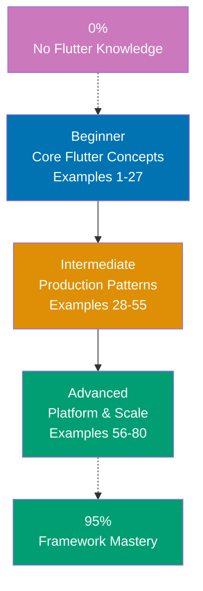

## Want to Master Flutter Web Through Working Code?

This guide teaches you Flutter Web through **80 production-ready code examples** rather than lengthy explanations. If you are an experienced developer switching to Flutter Web, or want to deepen your framework mastery, you will build intuition through actual working patterns annotated with `// =>` comments that explain values, states, and side effects at every step.

## What Is By-Example Learning?

By-example learning is a **code-first approach** where you learn concepts through annotated, working examples rather than narrative explanations. Each example shows:

1. **What the code does** - Brief explanation of the Flutter concept
2. **How it works** - A focused, heavily commented code example with `// =>` annotations
3. **Why it matters** - A pattern summary highlighting the key takeaway and production relevance

This approach works best when you already understand programming fundamentals and have experience with at least one programming language. You learn Flutter's idioms, widget tree model, and best practices by studying real code rather than theoretical descriptions.

## What Is Flutter Web?

Flutter Web is **Google's UI toolkit for building web applications** using the Dart programming language. It renders your application using either the HTML renderer (DOM-based) or the CanvasKit renderer (WebAssembly + Skia). Key distinctions:

- **Not React or Angular**: Flutter uses a widget tree model where everything is a widget composed together, not a template system with two-way data binding
- **Compiled Dart**: Your Dart code compiles to JavaScript (dart2js) or WebAssembly (dart2wasm), not interpreted at runtime
- **Single codebase**: The same Flutter application can target web, Android, iOS, desktop - with platform-specific adaptations
- **Pixel-perfect rendering**: CanvasKit renders consistently across all browsers by drawing directly to a `<canvas>` element
- **Modern Flutter 3.22+**: Includes Impeller renderer support experiments, improved WASM compilation, Material 3 defaults, and refined web platform integration

## Learning Path



## Coverage Philosophy: 95% Through 80 Examples

The **95% coverage** means you will understand Flutter Web deeply enough to build production applications with confidence. It does not mean you will know every edge case or advanced feature - those come with experience building real applications.

The 80 examples are organized progressively:

- **Beginner (Examples 1-27)**: Foundation concepts covering MaterialApp, Scaffold, core widgets, layout, StatelessWidget, StatefulWidget, setState, buttons, text fields, forms, images, lists, grids, navigation, AppBar, Drawer, and BottomNavigationBar
- **Intermediate (Examples 28-55)**: Production patterns covering InheritedWidget, Provider, Riverpod, HTTP networking, JSON parsing, FutureBuilder, StreamBuilder, custom painting, animations, themes, responsive layout, GoRouter, platform detection, web-specific features, and testing
- **Advanced (Examples 56-80)**: Platform and scale covering BLoC/Cubit, custom RenderObject, dart:html / dart:js_interop, canvas rendering, web workers via Isolates, IndexedDB, WebSocket, PWA features, performance profiling, accessibility, internationalization, deep linking, deferred loading, Docker/nginx deployment, and production patterns

Together, these examples cover **95% of what you will use** in production Flutter Web applications.

## What Is Covered

### Core Widget System

- **Widget Tree**: StatelessWidget, StatefulWidget, BuildContext, widget composition
- **Material Widgets**: MaterialApp, Scaffold, AppBar, Drawer, BottomNavigationBar, FloatingActionButton
- **Layout Widgets**: Column, Row, Stack, Expanded, Flexible, Padding, SizedBox, Container, Center
- **Text and Input**: Text, TextField, TextFormField, Form, validation, controllers
- **Display**: Image, Icon, CircularProgressIndicator, LinearProgressIndicator
- **Lists and Grids**: ListView, ListView.builder, GridView, GridView.builder

### State Management

- **Local State**: setState, StatefulWidget lifecycle
- **Inherited State**: InheritedWidget, InheritedNotifier
- **Provider**: ChangeNotifier, Consumer, context.watch, context.read
- **Riverpod**: StateNotifierProvider, FutureProvider, StreamProvider, ref.watch
- **BLoC/Cubit**: Cubit, BlocBuilder, BlocListener, BlocProvider, event-driven state

### Networking and Data

- **HTTP**: http package, GET/POST/PUT/DELETE requests, headers, status codes
- **JSON**: json_decode, json_encode, fromJson/toJson factories, jsonSerializable
- **Async UI**: FutureBuilder, StreamBuilder, AsyncSnapshot states
- **WebSocket**: WebSocket connections, streams, real-time data

### Navigation and Routing

- **Navigator 1.0**: Navigator.push, Navigator.pop, named routes
- **GoRouter**: route configuration, path parameters, query parameters, deep linking
- **Web URL strategy**: PathUrlStrategy, hash vs path URLs

### Animations

- **Implicit Animations**: AnimatedContainer, AnimatedOpacity, AnimatedSwitcher
- **Explicit Animations**: AnimationController, Tween, CurvedAnimation, AnimatedBuilder
- **Hero Animations**: Hero widget for shared element transitions

### Web-Specific Features

- **Platform Detection**: kIsWeb, defaultTargetPlatform
- **URL Strategy**: setUrlStrategy, PathUrlStrategy for clean URLs
- **dart:html / dart:js_interop**: DOM access, JavaScript interop, web APIs
- **IndexedDB**: Browser storage beyond localStorage
- **PWA**: Manifest, service worker, offline support
- **SEO**: Meta tags, canonical URLs, OpenGraph

### Rendering and Custom Drawing

- **CustomPainter**: Canvas API, drawing primitives, paths
- **CustomRenderObject**: Low-level layout and painting protocol

### Testing

- **Widget Tests**: WidgetTester, pump, find, expect
- **Golden Tests**: matchesGoldenFile, visual regression testing

### Production and Deployment

- **Performance**: DevTools, timeline, frame budget
- **Accessibility**: Semantics widget, screen reader support
- **Internationalization**: flutter_localizations, AppLocalizations, ARB files
- **Deferred Loading**: deferred as keyword, lazy imports
- **Docker/nginx**: Multi-stage build, serving Flutter Web with nginx

## What Is NOT Covered

We exclude topics that belong in specialized tutorials:

- **Dart language fundamentals**: Master Dart first through language tutorials (null safety, async/await, generics, extensions)
- **Mobile-specific Flutter**: Platform channels to Android/iOS native code, mobile permissions, camera
- **Advanced DevOps**: Kubernetes, CDN configuration, complex CI/CD pipelines
- **Firebase integration**: Authentication, Firestore, Cloud Functions - these warrant dedicated tutorials
- **Advanced graphics**: Shader programs, 3D rendering, complex physics simulations
- **Flutter internals**: Engine architecture, widget binding, rendering pipeline internals

For these topics, see dedicated tutorials and the official Flutter documentation.

## How to Use This Guide

### 1. Choose Your Starting Point

- **New to Flutter?** Start with Beginner (Example 1)
- **Framework experience** (React, Angular, Vue)? Start with Intermediate (Example 28)
- **Building specific feature?** Search for the relevant example topic

### 2. Read the Example

Each example has five parts:

- **Brief Explanation** (2-3 sentences): What Flutter concept, why it exists, when to use it
- **Mermaid Diagram** (when appropriate): Visual representation of widget relationships or data flow
- **Heavily Annotated Code** (with `// =>` comments): Working Dart code showing the pattern with inline annotations documenting values, states, and outputs
- **Key Takeaway** (1-2 sentences): Distilled essence of the pattern
- **Why It Matters** (50-100 words): Production context and practical significance

### 3. Run the Code

Create a Flutter project and run each example:

```bash
flutter create my_flutter_web_app
cd my_flutter_web_app
flutter run -d chrome
# Replace lib/main.dart with example code
```

### 4. Modify and Experiment

Change widget properties, add features, break things on purpose. Experimenting builds intuition faster than reading.

### 5. Reference as Needed

Use this guide as a reference when building features. Search for relevant examples and adapt patterns to your code.

## Relationship to Other Tutorial Types

| Tutorial Type               | Approach                       | Coverage              | Best For                       |
| --------------------------- | ------------------------------ | --------------------- | ------------------------------ |
| **By Example** (this guide) | Code-first, 80 examples        | 95% breadth           | Learning framework idioms      |
| **Quick Start**             | Project-based, hands-on        | 5-30% touchpoints     | Getting something working fast |
| **Beginner Tutorial**       | Narrative, explanation-first   | 0-40% comprehensive   | Understanding concepts deeply  |
| **Intermediate Tutorial**   | Problem-solving, practical     | 40-75% patterns       | Building real features         |
| **Advanced Tutorial**       | Specialized topics, deep dives | 75-95% expert mastery | Optimizing, scaling, internals |
| **Cookbook**                | Recipe-based, problem-solution | Problem-specific      | Solving specific problems      |

## Prerequisites

### Required

- **Dart fundamentals**: Basic syntax, null safety, async/await, collections, classes
- **Web development**: HTML basics, CSS concepts, browser developer tools
- **Programming experience**: You have built applications before in another language

### Recommended

- **Object-oriented programming**: Classes, inheritance, interfaces, generics
- **State management concepts**: Familiarity with any state management pattern
- **HTTP and REST**: Understanding of request/response, JSON, status codes

### Not Required

- **Flutter experience**: This guide assumes you are new to the framework
- **Mobile development experience**: Not necessary, but helpful for understanding widget concepts
- **JavaScript framework experience**: Helpful but not required

## Structure of Each Example

All examples follow a consistent five-part format:

```
### Example N: Descriptive Title

2-3 sentence explanation of the concept.

```dart
// Heavily annotated code example
// showing the Flutter pattern in action
// => annotations document values, states, outputs
```

**Key Takeaway**: 1-2 sentence summary.

**Why It Matters**: 50-100 words explaining production relevance.
```

**Code annotations**:

- `// =>` shows expected output, widget tree result, or variable value
- Inline comments explain what each line does and why
- Variable names are self-documenting

**Mermaid diagrams** appear when visualizing widget hierarchy, data flow, or state transitions improves understanding. All diagrams use a color-blind friendly palette:

- Blue `#0173B2` - Primary elements
- Orange `#DE8F05` - Decisions and secondary
- Teal `#029E73` - Success and accent
- Purple `#CC78BC` - Alternative states
- Brown `#CA9161` - Neutral elements

## Ready to Start?

Choose your learning path:

- **[Beginner](/en/learn/software-engineering/platform-web/tools/dart-flutter-web/by-example/beginner)** - Start here if new to Flutter. Build foundation understanding through 27 core examples covering the essential widget system and state patterns.
- **[Intermediate](/en/learn/software-engineering/platform-web/tools/dart-flutter-web/by-example/intermediate)** - Jump here if you know Flutter basics. Master production patterns through 28 examples covering networking, state management libraries, animations, routing, and web-specific features.
- **[Advanced](/en/learn/software-engineering/platform-web/tools/dart-flutter-web/by-example/advanced)** - Expert mastery through 25 advanced examples covering platform interop, custom rendering, PWA features, performance, accessibility, and production deployment.

Or jump to specific topics by searching for relevant example keywords.
