These 25 advanced examples cover LiveComponent architecture, JavaScript interoperability, comprehensive testing strategies, and production-grade patterns. Prerequisites: completion of beginner and intermediate examples, familiarity with GenServer, and basic understanding of Phoenix.PubSub and Ecto.

## LiveComponents Advanced (Examples 61-70)

### Example 61: Stateful LiveComponent with Own State

LiveComponents can maintain their own state independent of parent LiveView, enabling reusable interactive widgets.

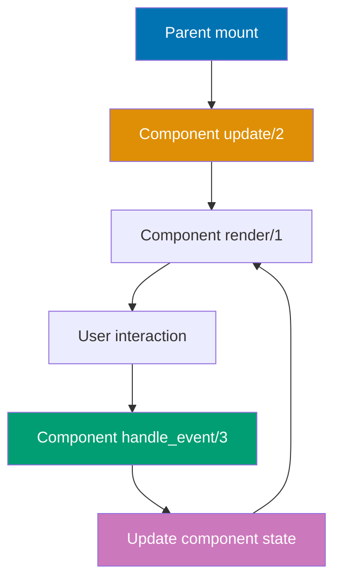

**Component module**:

```elixir
defmodule MyAppWeb.CounterComponent do
# => Defines stateful LiveComponent
                                                      # => Maintains own counter state
  use MyAppWeb, :live_component
  # => Imports LiveComponent behavior
                                                      # => Adds component lifecycle callbacks

  # Update callback - initializes component state
  def update(assigns, socket) do
  # => Called on first render and parent updates
                                                      # => assigns: %{id: "counter-1", label: "Clicks"}
    socket = socket
    # => Start with current socket
             |> assign(assigns)
             # => Merge parent assigns into component
                                                      # => socket.assigns.id = "counter-1"
                                                      # => socket.assigns.label = "Clicks"
             |> assign_new(:count, fn -> 0 end)
             # => Initialize count to 0 if not set
                                                      # => assign_new only sets if key missing
                                                      # => socket.assigns.count = 0

    {:ok, socket}
    # => Component ready to render
                                                      # => State is %{id: ..., label: ..., count: 0}
  end
  # => Closes enclosing function/module/block definition

  # Component event handler - updates component state only
  def handle_event("increment", _params, socket) do
  # => Handles phx-click="increment" within component
                                                      # => Event scoped to this component instance
    socket = update(socket, :count, &(&1 + 1))
    # => Increments count assign
                                                      # => E.g., count: 0 -> 1
    {:noreply, socket}
    # => Re-renders component only
                                                      # => Parent LiveView NOT re-rendered
  end
  # => Closes enclosing function/module/block definition

  # Component template
  def render(assigns) do
  # => Renders component UI
    ~H"""
    <!-- => Opens HEEx template — HTML+Elixir embedded template language -->
    <div class="counter">
    <!-- => Div container with class="counter" -->
      <p><%= @label %>: <%= @count %></p>
      <!-- => Paragraph element displaying dynamic content -->
      <button phx-click="increment" phx-target={@myself}>
      <!-- => Button triggers handle_event("increment", ...) on click -->
        <%!-- phx-target={@myself} scopes event to this component --%>
        <%!-- Without @myself, event goes to parent LiveView --%>
        Increment
      </button>
      <!-- => Closes button element -->
    </div>
    <!-- => Closes outer div container -->
    """
    # => Renders button with component-scoped event
    # => @myself is component reference for event targeting
  end
  # => Closes enclosing function/module/block definition
end
# => Closes enclosing function/module/block definition
```

**Parent LiveView usage**:

```elixir
defmodule MyAppWeb.DashboardLive do
# => Parent LiveView
  use MyAppWeb, :live_view
  # => Imports LiveView macros and callbacks


  def render(assigns) do
  # => Generates LiveView HTML template

    ~H"""
    <!-- => Opens HEEx template — HTML+Elixir embedded template language -->
    <div>
    <!-- => Div container wrapping component content -->
      <h2>Multiple Independent Counters</h2>
      <!-- => H2 heading element -->
      <.live_component module={MyAppWeb.CounterComponent} id="counter-1" label="Counter A" />
      <!-- => Mounts LiveComponent with id="counter-1" — stateful, isolated state -->
      <%!-- Renders first component instance --%>
      <%!-- id="counter-1" required for stateful components --%>
      <%!-- Component maintains own count state --%>

      <.live_component module={MyAppWeb.CounterComponent} id="counter-2" label="Counter B" />
      <!-- => Mounts LiveComponent with id="counter-2" — stateful, isolated state -->
      <%!-- Second independent instance --%>
      <%!-- Separate state from counter-1 --%>
      <%!-- Each component has own count value --%>
    </div>
    <!-- => Closes outer div container -->
    """
    # => Renders two counters with independent states
    # => Incrementing Counter A doesn't affect Counter B
  end
  # => Closes enclosing function/module/block definition
end
# => Closes enclosing function/module/block definition
```

**Key Takeaway**: Stateful LiveComponents maintain independent state using update/2 and handle_event/3. Use `phx-target={@myself}` to scope events to component. Multiple instances have separate state.

**Why It Matters**: Stateful LiveComponents are the foundation of reusable interactive widgets in Phoenix applications. Without component-level state, each button, counter, or toggle requires managing state in the parent LiveView, which becomes unwieldy as applications grow. By encapsulating state within components, you create building blocks that can be dropped into any parent without cluttering parent state. In production applications - admin dashboards, data entry interfaces, interactive reports - stateful components enable a component library approach where each widget manages its own concerns independently.

### Example 62: LiveComponent Lifecycle - update/2 Flow

Understanding update/2 lifecycle prevents bugs when parent assigns change.

```elixir
defmodule MyAppWeb.UserCardComponent do
# => Component displaying user info
  use MyAppWeb, :live_component
  # => Imports LiveComponent behavior


  # Update called EVERY time parent re-renders
  def update(assigns, socket) do
  # => Called on mount AND parent updates
                                                      # => Must handle both scenarios
    # Scenario 1: First mount - assigns has %{id, user_id}
    # Scenario 2: Parent update - assigns has changed values

    socket = socket
    # => Start with current socket
             |> assign(assigns)
             # => Merge new assigns from parent
                                                      # => Overwrites existing values

    socket = maybe_load_user(socket)
    # => Conditionally load user data
                                                      # => Only fetch if user_id changed

    {:ok, socket}
    # => Component updated
  end
  # => Closes enclosing function/module/block definition

  defp maybe_load_user(socket) do
  # => Private function: load user if needed
    user_id = socket.assigns.user_id
    # => Get user_id from assigns
    current_user = Map.get(socket.assigns, :user)
    # => Get current user (may be nil)

    # Check if user already loaded for this user_id
    if current_user && current_user.id == user_id do
    # => User already loaded and matches
      socket
      # => No reload needed
                                                      # => Prevents redundant database queries
    else
    # => User not loaded or user_id changed
      user = Accounts.get_user!(user_id)
      # => Fetch user from database
                                                      # => E.g., %User{id: 123, name: "Alice"}
      assign(socket, :user, user)
      # => Store user in component state
                                                      # => socket.assigns.user = %User{...}
    end
    # => Closes enclosing function/module/block definition
  end
  # => Closes enclosing function/module/block definition

  def render(assigns) do
  # => Generates LiveView HTML template

    ~H"""
    <!-- => Opens HEEx template — HTML+Elixir embedded template language -->
    <div class="user-card">
    <!-- => Div container with class="user-card" -->
      <h3><%= @user.name %></h3>
      <!-- => H3 heading element -->
      <p><%= @user.email %></p>
      <!-- => Paragraph element displaying dynamic content -->
    </div>
    <!-- => Closes outer div container -->
    """
    # => Renders user info from component state
  end
  # => Closes enclosing function/module/block definition
end
# => Closes enclosing function/module/block definition
```

**Key Takeaway**: update/2 runs on mount AND parent updates. Avoid redundant work by checking if assigns actually changed. Use pattern matching or conditionals to handle different scenarios.

**Why It Matters**: The update/2 lifecycle detail matters in production when parent LiveViews update frequently - every parent assign change triggers update/2 on all child components. Performing expensive operations (database queries, complex computations) unconditionally in update/2 causes performance degradation under load. The pattern of checking for actual changes before doing work is called idempotent update handling and is essential for components in high-frequency update scenarios. Production components with external API calls or complex transformations should always guard against redundant work in update/2.

### Example 63: Component-to-Component Communication via Parent

Components communicate by sending messages to parent LiveView, which updates child assigns.

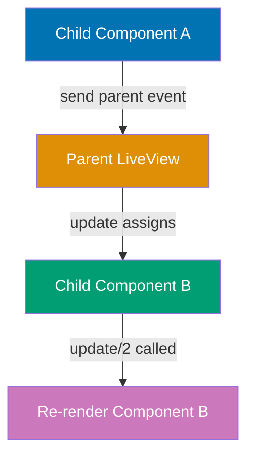

**Selector component**:

```elixir
defmodule MyAppWeb.ColorSelectorComponent do
# => Component for color selection
  use MyAppWeb, :live_component
  # => Imports LiveComponent behavior


  def handle_event("select_color", %{"color" => color}, socket) do
  # => Handles "select_color" event from client

                                                      # => User clicks color button
                                                      # => color: "red"
    send(self(), {:color_selected, color})
    # => Sends message to parent LiveView
                                                      # => self() is parent process PID
                                                      # => Parent receives {:color_selected, "red"}
    {:noreply, socket}
    # => Component event handled
  end
  # => Closes enclosing function/module/block definition

  def render(assigns) do
  # => Generates LiveView HTML template

    ~H"""
    <!-- => Opens HEEx template — HTML+Elixir embedded template language -->
    <div class="color-selector">
    <!-- => Div container with class="color-selector" -->
      <button phx-click="select_color" phx-value-color="red" phx-target={@myself}>Red</button>
      <!-- => Button triggers handle_event("select_color", ...) on click -->
      <button phx-click="select_color" phx-value-color="blue" phx-target={@myself}>Blue</button>
      <!-- => Button triggers handle_event("select_color", ...) on click -->
      <%!-- phx-value-color passes parameter to event handler --%>
      <%!-- phx-target={@myself} routes event to component --%>
    </div>
    <!-- => Closes outer div container -->
    """
    # => Closes HEEx template string
  end
  # => Closes enclosing function/module/block definition
end
# => Closes enclosing function/module/block definition
```

**Display component**:

```elixir
defmodule MyAppWeb.ColorDisplayComponent do
# => Component displaying selected color
  use MyAppWeb, :live_component
  # => Imports LiveComponent behavior


  def update(assigns, socket) do
  # => Receives color from parent
    socket = assign(socket, assigns)
    # => Merge parent assigns
                                                      # => socket.assigns.color = "red"
    {:ok, socket}
    # => Returns success tuple to LiveView runtime

  end
  # => Closes enclosing function/module/block definition

  def render(assigns) do
  # => Generates LiveView HTML template

    ~H"""
    <!-- => Opens HEEx template — HTML+Elixir embedded template language -->
    <div class="color-display" style={"background-color: #{@color};"}>
    <!-- => Div container with class="color-display" -->
      <p>Selected: <%= @color %></p>
      <!-- => Paragraph element displaying dynamic content -->
    </div>
    <!-- => Closes outer div container -->
    """
    # => Renders with background color from parent assign
  end
  # => Closes enclosing function/module/block definition
end
# => Closes enclosing function/module/block definition
```

**Parent LiveView**:

```elixir
defmodule MyAppWeb.ColorPickerLive do
# => Parent coordinating components
  use MyAppWeb, :live_view
  # => Imports LiveView macros and callbacks


  def mount(_params, _session, socket) do
  # => Called on LiveView initialization

    socket = assign(socket, :selected_color, "gray")
    # => Initial color state
    {:ok, socket}
    # => Returns success tuple to LiveView runtime

  end
  # => Closes enclosing function/module/block definition

  # Handle message from ColorSelectorComponent
  def handle_info({:color_selected, color}, socket) do
  # => Receives component message
                                                        # => color: "red"
    socket = assign(socket, :selected_color, color)
    # => Updates parent state
                                                      # => socket.assigns.selected_color = "red"
    {:noreply, socket}
    # => Re-renders parent and children
                                                      # => ColorDisplayComponent.update/2 called with new color
  end
  # => Closes enclosing function/module/block definition

  def render(assigns) do
  # => Generates LiveView HTML template

    ~H"""
    <!-- => Opens HEEx template — HTML+Elixir embedded template language -->
    <div>
    <!-- => Div container wrapping component content -->
      <.live_component module={MyAppWeb.ColorSelectorComponent} id="selector" />
      <!-- => Mounts LiveComponent with id="selector" — stateful, isolated state -->
      <.live_component module={MyAppWeb.ColorDisplayComponent} id="display" color={@selected_color} />
      <!-- => Mounts LiveComponent with id="display" — stateful, isolated state -->
      <%!-- Pass selected_color to display component --%>
      <%!-- When parent re-renders, display gets new color --%>
    </div>
    <!-- => Closes outer div container -->
    """
    # => Closes HEEx template string
  end
  # => Closes enclosing function/module/block definition
end
# => Closes enclosing function/module/block definition
```

**Key Takeaway**: Components communicate via parent using `send(self(), message)`. Parent handles message with handle_info/2, updates state, and passes new assigns to other components. Parent orchestrates component interactions.

**Why It Matters**: Component isolation breaks down when components need to coordinate. The message-passing pattern - component sends to parent, parent updates, parent passes new assigns to siblings - maintains clean boundaries while enabling coordination. This mirrors the Actor model that underlies Elixir/OTP: processes communicate via messages rather than shared state. In production applications, this pattern keeps component logic isolated and testable while enabling complex multi-component workflows. It also makes data flow explicit and traceable, which simplifies debugging when components aren't updating as expected.

### Example 64: send_update for External Component Updates

Update component state from parent or other processes without parent re-render using send_update/3.

**send_update flow**:

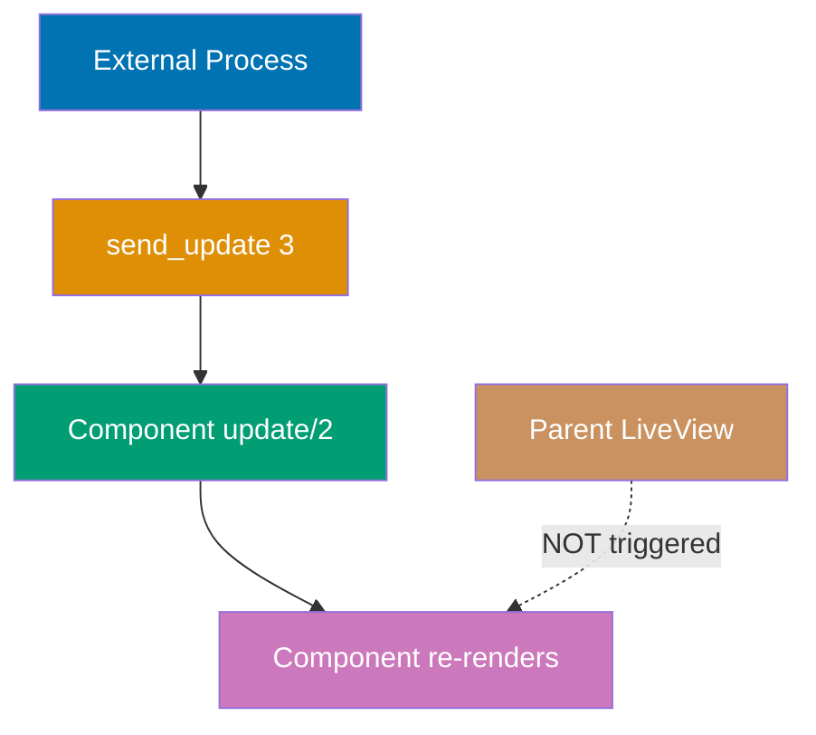

```elixir
defmodule MyAppWeb.NotificationComponent do
# => Component displaying notifications
  use MyAppWeb, :live_component
  # => Imports LiveComponent behavior


  def update(assigns, socket) do
  # => Called on component mount and parent updates

    socket = socket
    # => socket variable updated with new state
             |> assign(assigns)
             # => Assigns value to socket

             |> assign_new(:message, fn -> nil end)
             # => Initialize message to nil if missing
    {:ok, socket}
    # => Returns success tuple to LiveView runtime

  end
  # => Closes enclosing function/module/block definition

  def render(assigns) do
  # => Generates LiveView HTML template

    ~H"""
    <!-- => Opens HEEx template — HTML+Elixir embedded template language -->
    <div :if={@message} class="notification">
    <!-- => Div container with class="notification" -->
      <%= @message %>
      <!-- => Outputs assigns.message value as HTML -->
    </div>
    <!-- => Closes outer div container -->
    """
    # => Shows notification if message present
    # => :if={@message} conditionally renders div
  end
  # => Closes enclosing function/module/block definition
end
# => Closes enclosing function/module/block definition
```

**Parent LiveView**:

```elixir
defmodule MyAppWeb.DashboardLive do
# => Parent with notification component
  use MyAppWeb, :live_view
  # => Imports LiveView macros and callbacks


  def mount(_params, _session, socket) do
  # => Called on LiveView initialization

    {:ok, socket}
    # => No notification state in parent
                                                      # => Component manages own message
  end
  # => Closes enclosing function/module/block definition

  # Event triggers notification update
  def handle_event("save", _params, socket) do
  # => User clicks save button
    # Perform save operation
    Accounts.save_user_settings()
    # => Save to database

    # Update component directly without re-rendering parent
    send_update(MyAppWeb.NotificationComponent,
    # => Sends update to component
      id: "notification",
      # => Target component by ID
      message: "Settings saved successfully!"
      # => New message assign
    )
    # => Component.update/2 called with new message
    # => Only component re-renders, parent unchanged

    {:noreply, socket}
    # => Parent state unchanged
                                                      # => No parent re-render
  end
  # => Closes enclosing function/module/block definition

  def render(assigns) do
  # => Generates LiveView HTML template

    ~H"""
    <!-- => Opens HEEx template — HTML+Elixir embedded template language -->
    <div>
    <!-- => Div container wrapping component content -->
      <.live_component module={MyAppWeb.NotificationComponent} id="notification" />
      <!-- => Mounts LiveComponent with id="notification" — stateful, isolated state -->
      <button phx-click="save">Save Settings</button>
      <!-- => Button triggers handle_event("save", ...) on click -->
    </div>
    <!-- => Closes outer div container -->
    """
    # => Closes HEEx template string
  end
  # => Closes enclosing function/module/block definition
end
# => Closes enclosing function/module/block definition
```

**External process update**:

```elixir
# From background job or GenServer
def notify_user(live_view_pid, message) do
# => External process notifying user
                                                      # => live_view_pid: PID of parent LiveView
  send_update(live_view_pid, MyAppWeb.NotificationComponent,
  # => Updates target component's assigns directly

                                                      # => Send update to component in specific LiveView
    id: "notification",
    # => Component ID
    message: message
    # => Notification message
  )
  # => Component updates even from external process
  # => No parent involvement required
end
# => Closes enclosing function/module/block definition
```

**Key Takeaway**: send_update/3 updates component state directly without parent re-render. Useful for notifications, progress indicators, or external process updates. Component must have stable ID.

**Why It Matters**: send_update enables asynchronous component updates that don't require parent re-renders. When an external process (Task, GenServer, PubSub subscriber) needs to update a specific component instance, send_update delivers the update directly without involving the parent. In production applications with async workflows - progress indicators for background jobs, notification badges updated by PubSub messages, real-time status indicators - send_update provides surgical updates that minimize re-rendering overhead. The pattern is essential for high-frequency update scenarios where only specific component instances need updating.

### Example 65: LiveComponent Events with Payload

Pass data to component events using phx-value-\* attributes for dynamic interactions.

```elixir
defmodule MyAppWeb.TodoItemComponent do
# => Component for single todo item
  use MyAppWeb, :live_component
  # => Imports LiveComponent behavior


  def update(assigns, socket) do
  # => Called on component mount and parent updates

    socket = assign(socket, assigns)
    # => assigns: %{id, todo: %Todo{}}
    # => Merges parent assigns into component socket
    {:ok, socket}
    # => Returns success tuple to LiveView runtime

  end
  # => Closes enclosing function/module/block definition

  def handle_event("toggle", _params, socket) do
  # => Toggle todo completion
    todo = socket.assigns.todo
    # => Get todo from component state
    # => todo: %Todo{id: 1, title: "Task", completed: false}
    updated_todo = Todos.toggle(todo)
    # => Toggle completed field
                                                      # => E.g., completed: false -> true

    send(self(), {:todo_updated, updated_todo})
    # => Notify parent of change
                                                      # => Parent refreshes todo list
    {:noreply, socket}
    # => Returns updated socket, triggers re-render

  end
  # => Closes enclosing function/module/block definition

  def handle_event("delete", _params, socket) do
  # => Delete todo item
    todo = socket.assigns.todo
    # => todo: the Todo struct to delete
    # => todo bound to result of socket.assigns.todo

    send(self(), {:todo_deleted, todo.id})
    # => Notify parent to remove todo
                                                      # => Parent filters list
    {:noreply, socket}
    # => Returns updated socket, triggers re-render

  end
  # => Closes enclosing function/module/block definition

  def render(assigns) do
  # => Generates LiveView HTML template

    ~H"""
    <!-- => Opens HEEx template — HTML+Elixir embedded template language -->
    <div class="todo-item">
    <!-- => Div container with class="todo-item" -->
      <input
      <!-- => text input field -->
        type="checkbox"
        # => type bound to result of "checkbox"

        checked={@todo.completed}
        # => checked bound to result of {@todo.completed}

        phx-click="toggle"
        phx-target={@myself}
        <!-- => Routes event to specific component (not parent LiveView) -->
      />
      <!-- => Self-closing tag — no inner content -->
      <%!-- Checkbox triggers component toggle event --%>
      <%!-- No phx-value-* needed, todo in component state --%>

      <span class={if @todo.completed, do: "completed"}>
      <!-- => span HTML element -->
        <%= @todo.title %>
        <!-- => Outputs assigns.todo value as HTML -->
      </span>

      <button phx-click="delete" phx-target={@myself}>Delete</button>
      <!-- => Button triggers handle_event("delete", ...) on click -->
      <%!-- Delete button uses component state --%>
    </div>
    <!-- => Closes outer div container -->
    """
    # => Closes HEEx template string
  end
  # => Closes enclosing function/module/block definition
end
# => Closes enclosing function/module/block definition
```

**Component with external data**:

```elixir
defmodule MyAppWeb.ProductCardComponent do
# => Component with phx-value examples
  use MyAppWeb, :live_component
  # => Imports LiveComponent behavior


  def handle_event("add_to_cart", %{"product-id" => product_id, "quantity" => qty}, socket) do
  # => Handles "add_to_cart" event from client

                                                      # => Event params from phx-value-* attributes
                                                      # => product_id: "123" (string from HTML)
                                                      # => qty: "2" (string)
    product_id = String.to_integer(product_id)
    # => Convert to integer
                                                      # => product_id = 123
    quantity = String.to_integer(qty)
    # => quantity = 2

    send(self(), {:add_to_cart, product_id, quantity})
    # => Notify parent
    {:noreply, socket}
    # => Returns updated socket, triggers re-render

  end
  # => Closes enclosing function/module/block definition

  def render(assigns) do
  # => Generates LiveView HTML template

    ~H"""
    <!-- => Opens HEEx template — HTML+Elixir embedded template language -->
    <div class="product-card">
    <!-- => Div container with class="product-card" -->
      <h3><%= @product.name %></h3>
      <!-- => H3 heading element -->
      <p>$<%= @product.price %></p>
      <!-- => Paragraph element displaying dynamic content -->

      <button
      <!-- => Button element -->
        phx-click="add_to_cart"
        phx-value-product-id={@product.id}
        phx-value-quantity="1"
        <!-- => Sends quantity as event parameter value -->
        phx-target={@myself}
        <!-- => Routes event to specific component (not parent LiveView) -->
      >
        <%!-- phx-value-* passes data to event handler --%>
        <%!-- attribute names converted to snake_case in params --%>
        <%!-- phx-value-product-id becomes "product-id" key --%>
        Add to Cart
      </button>
      <!-- => Closes button element -->
    </div>
    <!-- => Closes outer div container -->
    """
    # => Closes HEEx template string
  end
  # => Closes enclosing function/module/block definition
end
# => Closes enclosing function/module/block definition
```

**Key Takeaway**: Use phx-value-\* to pass data to component events. Attributes become params map keys (kebab-case). Values are strings, convert as needed. Enables dynamic event handling.

**Why It Matters**: Passing data through events rather than relying solely on assigns enables components to handle diverse interactions with minimal coupling. The phx-value-\* pattern encodes event context in HTML attributes, making the event self-describing. In production component libraries, this enables reusable components like data tables, tag selectors, and item lists where each row or item carries its identifier through click events. This eliminates the need for complex closure patterns and keeps templates declarative. The string conversion reminder is practical - all phx-value attributes arrive as strings regardless of original type.

### Example 66: Slots and Named Slots

Slots enable flexible component composition by passing content from parent into component template.

**Slot composition pattern**:

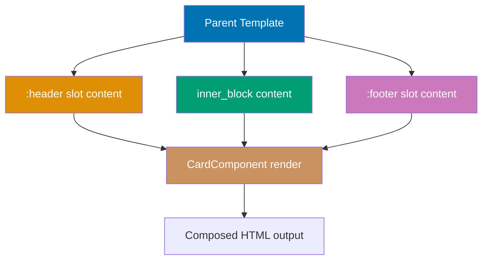

```elixir
defmodule MyAppWeb.CardComponent do
# => Reusable card component with slots
  use MyAppWeb, :live_component
  # => Imports LiveComponent behavior


  def render(assigns) do
  # => Generates LiveView HTML template

    ~H"""
    <!-- => Opens HEEx template — HTML+Elixir embedded template language -->
    <div class="card">
    <!-- => Div container with class="card" -->
      <div class="card-header">
      <!-- => Div container with class="card-header" -->
        <%= render_slot(@header) %>
        # => Renders header slot content from caller
        # => render_slot/1 invokes header slot function with assigns
        <%!-- Renders content passed to header slot --%>
        <%!-- Parent provides header content --%>
      </div>
      <!-- => Closes outer div container -->

      <div class="card-body">
      <!-- => Div container with class="card-body" -->
        <%= render_slot(@inner_block) %>
        # => Renders inner_block slot content from caller
        # => @inner_block contains all content between component tags
        <%!-- @inner_block is default slot for content between tags --%>
        <%!-- E.g., content between <.live_component>...</.live_component> --%>
      </div>
      <!-- => Closes outer div container -->

      <div :if={@footer != []} class="card-footer">
      <!-- => Div container with class="card-footer" -->
        <%!-- Conditionally render footer if slot provided --%>
        <%!-- @footer is list of slot entries, [] if not used --%>
        <%= render_slot(@footer) %>
        # => Renders footer slot content from caller
        # => Only rendered when footer slot is provided by parent
      </div>
      <!-- => Closes outer div container -->
    </div>
    <!-- => Closes outer div container -->
    """
    # => Closes HEEx template string
  end
  # => Closes enclosing function/module/block definition
end
# => Closes enclosing function/module/block definition
```

**Parent usage**:

```elixir
defmodule MyAppWeb.ProfileLive do
# => Defines module MyAppWeb.ProfileLive

  use MyAppWeb, :live_view
  # => Imports LiveView macros and callbacks


  def render(assigns) do
  # => Generates LiveView HTML template

    ~H"""
    <!-- => Opens HEEx template — HTML+Elixir embedded template language -->
    <.live_component module={MyAppWeb.CardComponent} id="user-card">
    <!-- => Mounts LiveComponent with id="user-card" — stateful, isolated state -->
      <:header>
      <!-- => Named slot declaration — content goes into card-header div -->
        <%!-- Named slot :header --%>
        <%!-- Content rendered in card-header div --%>
        <h2>User Profile</h2>
        <!-- => H2 heading element -->
        <button>Edit</button>
        <!-- => Button element -->
      </:header>
      <!-- => Closes :header slot declaration -->

      <%!-- Default slot content (inner_block) --%>
      <p>Name: <%= @user.name %></p>
      <!-- => Paragraph element displaying dynamic content -->
      <p>Email: <%= @user.email %></p>
      <!-- => Paragraph element displaying dynamic content -->

      <:footer>
      <!-- => Named slot declaration — content goes into card-footer div -->
        <%!-- Named slot :footer --%>
        <%!-- Content rendered in card-footer div --%>
        <small>Last updated: <%= @user.updated_at %></small>
        <!-- => small HTML element -->
      </:footer>
      <!-- => Closes :footer slot — conditionally rendered by component -->
    </.live_component>
    <!-- => Closes .live_component element -->
    """
    # => Closes HEEx template string
  end
  # => Closes enclosing function/module/block definition
end
# => Closes enclosing function/module/block definition
```

**Key Takeaway**: Named slots (`:header`, `:footer`) provide injection points for parent content. `@inner_block` is default slot. Check slot presence with `@slot_name != []`. Enables flexible component composition.

**Why It Matters**: Named slots transform components from opaque black boxes into flexible composition surfaces. When components expose slot injection points, parent contexts can customize rendering without forking the component. In production component libraries, slots enable a single Card component to serve as a product card, notification card, or summary card by injecting different header and content. This reduces the number of specialized components needed and keeps visual consistency through shared structure. The presence check pattern ('@slot_name != []') enables graceful degradation when optional slots are not provided.

### Example 67: Render Slots with Slot Attributes

Slots can receive attributes from component for data-driven rendering.

```elixir
defmodule MyAppWeb.TableComponent do
# => Generic table component
  use MyAppWeb, :live_component
  # => Imports LiveComponent behavior


  def update(assigns, socket) do
  # => Called on component mount and parent updates

    socket = assign(socket, assigns)
    # => assigns: %{id, rows: [%{id, ...}]}
    {:ok, socket}
    # => Returns success tuple to LiveView runtime

  end
  # => Closes enclosing function/module/block definition

  def render(assigns) do
  # => Generates LiveView HTML template

    ~H"""
    <!-- => Opens HEEx template — HTML+Elixir embedded template language -->
    <table>
    <!-- => table element — rows defined by parent via slots -->
      <thead>
      <!-- => thead HTML element -->
        <tr>
        <!-- => Header row — columns provided by parent :header slot -->
          <%= render_slot(@header) %>
          # => Renders header slot content from caller
          # => Parent provides <th> elements via :header slot

          <%!-- Parent provides header columns --%>
        </tr>
        <!-- => Closes table row element -->
      </thead>
      <!-- => Closes table header section -->
      <tbody>
      <!-- => tbody HTML element -->
        <%= for row <- @rows do %>
        <!-- => Iterates each row in @rows list -->
          <tr>
          <!-- => Data row — cells provided by :col slot with row data -->
            <%= render_slot(@col, row) %>
            # => Renders col slot with row as argument
            # => :let={user} in parent receives this row value

            <%!-- Render :col slot for each row --%>
            <%!-- Pass row data as slot argument --%>
            <%!-- Parent receives row and renders cells --%>
          </tr>
          <!-- => Closes table row element -->
        <% end %>
        <!-- => End of conditional/loop block -->
      </tbody>
      <!-- => Closes table body section -->
    </table>
    <!-- => Closes table element -->
    """
    # => Closes HEEx template string
  end
  # => Closes enclosing function/module/block definition
end
# => Closes enclosing function/module/block definition
```

**Parent usage with slot arguments**:

```elixir
defmodule MyAppWeb.UsersLive do
# => Defines module MyAppWeb.UsersLive

  use MyAppWeb, :live_view
  # => Imports LiveView macros and callbacks


  def mount(_params, _session, socket) do
  # => Called on LiveView initialization

    users = [
    # => users bound to result of [

      %{id: 1, name: "Alice", email: "alice@example.com"},
      # => Map with id: 1 — hardcoded sample data for demonstration
      %{id: 2, name: "Bob", email: "bob@example.com"}
      # => Map with id: 2 — hardcoded sample data for demonstration
    ]
    # => Closes list literal
    socket = assign(socket, :users, users)
    # => socket.assigns.users = users

    {:ok, socket}
    # => Returns success tuple to LiveView runtime

  end
  # => Closes enclosing function/module/block definition

  def render(assigns) do
  # => Generates LiveView HTML template

    ~H"""
    <!-- => Opens HEEx template — HTML+Elixir embedded template language -->
    <.live_component module={MyAppWeb.TableComponent} id="users-table" rows={@users}>
    <!-- => Mounts LiveComponent with id="users-table" — stateful, isolated state -->
      <:header>
      <!-- => element HTML element -->
        <%!-- Static header slot --%>
        <th>ID</th>
        <!-- => th HTML element -->
        <th>Name</th>
        <!-- => th HTML element -->
        <th>Email</th>
        <!-- => th HTML element -->
      </:header>

      <:col :let={user}>
      <!-- => :col slot with :let binding — user receives each row -->
        <%!-- :let={user} receives row argument from render_slot(@col, row) --%>
        <%!-- user is the row data passed from component --%>
        <td><%= user.id %></td>
        <!-- => td HTML element -->
        <td><%= user.name %></td>
        <!-- => td HTML element -->
        <td><%= user.email %></td>
        <!-- => td HTML element -->
        <%!-- Parent controls cell rendering using row data --%>
      </:col>
    </.live_component>
    <!-- => Closes .live_component element -->
    """
    # => Closes HEEx template string
  end
  # => Closes enclosing function/module/block definition
end
# => Closes enclosing function/module/block definition
```

**Key Takeaway**: Slots can receive arguments using `render_slot(@slot_name, argument)`. Parent accesses argument with `:let={variable}`. Enables data-driven content rendering from component state.

**Why It Matters**: Slot arguments enable components to expose their internal data for use in parent-provided content. This is necessary when the component has data (computed values, internal state) that the parent wants to display but shouldn't need to replicate in its own state. In production, this pattern appears in components like virtualized lists (component knows which items are visible and passes them to slot), data grids (component knows sort state and exposes it to column header slots), and paginated displays (component knows current page and passes context to slot). It prevents tight coupling while enabling rich composition.

### Example 68: Dynamic Components

Render different component modules dynamically based on runtime data.

```elixir
defmodule MyAppWeb.TextWidgetComponent do
# => Text display widget — renders @content in paragraph
  use MyAppWeb, :live_component
  # => Imports LiveComponent behavior


  def render(assigns) do
  # => Generates LiveView HTML template

    ~H"""
    <!-- => Opens HEEx template — HTML+Elixir embedded template language -->
    <div class="text-widget">
    <!-- => Div container with class="text-widget" -->
      <p><%= @content %></p>
      <!-- => Renders @content assign as paragraph text -->
      <%!-- @content passed via {Map.drop(widget, [:id, :type])} spread --%>
    </div>
    <!-- => Closes outer div container -->
    """
    # => Closes HEEx template string
  end
  # => Closes enclosing function/module/block definition
end
# => Closes enclosing function/module/block definition

defmodule MyAppWeb.ImageWidgetComponent do
# => Image display widget — renders @url as img element
  use MyAppWeb, :live_component
  # => Imports LiveComponent behavior


  def render(assigns) do
  # => Generates LiveView HTML template

    ~H"""
    <!-- => Opens HEEx template — HTML+Elixir embedded template language -->
    <div class="image-widget">
    <!-- => Div container with class="image-widget" -->
      
      <!-- => img element — @url and @alt from spread assigns -->
      <%!-- @url = "/logo.png", @alt = "Logo" for widget-2 --%>
    </div>
    <!-- => Closes outer div container -->
    """
    # => Closes HEEx template string
  end
  # => Closes enclosing function/module/block definition
end
# => Closes enclosing function/module/block definition

defmodule MyAppWeb.DashboardLive do
# => Dashboard with dynamic widgets
  use MyAppWeb, :live_view
  # => Imports LiveView macros and callbacks


  def mount(_params, _session, socket) do
  # => Called on LiveView initialization

    widgets = [
    # => widgets bound to result of [

      %{id: "widget-1", type: :text, content: "Welcome!"},
      # => type: :text => TextWidgetComponent, content becomes @content
      %{id: "widget-2", type: :image, url: "/logo.png", alt: "Logo"},
      # => type: :image => ImageWidgetComponent, url/alt spread as assigns
      %{id: "widget-3", type: :text, content: "Latest updates"}
      # => Third text widget with different content
    ]
    # => Closes list literal
    socket = assign(socket, :widgets, widgets)
    # => List of widget configs
    {:ok, socket}
    # => Returns success tuple to LiveView runtime

  end
  # => Closes enclosing function/module/block definition

  defp widget_component(:text), do: MyAppWeb.TextWidgetComponent
  # => Defines widget_component function

                                                      # => Maps :text to TextWidgetComponent
  defp widget_component(:image), do: MyAppWeb.ImageWidgetComponent
  # => Defines widget_component function

                                                      # => Maps :image to ImageWidgetComponent

  def render(assigns) do
  # => Generates LiveView HTML template

    ~H"""
    <!-- => Opens HEEx template — HTML+Elixir embedded template language -->
    <div class="dashboard">
    <!-- => Div container with class="dashboard" -->
      <%= for widget <- @widgets do %>
      <!-- => Loops over @widgets, binding each element to widget -->
        <.live_component
        <!-- => Mounts LiveComponent with id="component" — stateful, isolated state -->
          module={widget_component(widget.type)}
          # => module bound to result of {widget_component(widget.type)}

          <%!-- Dynamically determine component module --%>
          <%!-- widget.type = :text -> TextWidgetComponent --%>
          <%!-- widget.type = :image -> ImageWidgetComponent --%>
          id={widget.id}
          # => id bound to result of {widget.id}

          {Map.drop(widget, [:id, :type])}
          # => Spread: %{content: "Welcome!"} becomes @content assign
          <%!-- Spread remaining widget attributes as assigns --%>
          <%!-- E.g., %{content: "Welcome!"} for text widget --%>
        />
        <!-- => Self-closing tag — no inner content -->
      <% end %>
      <!-- => End of conditional/loop block -->
    </div>
    <!-- => Closes outer div container -->
    """
    # => Closes HEEx template string
  end
  # => Closes enclosing function/module/block definition
end
# => Closes enclosing function/module/block definition
```

**Key Takeaway**: Use variables or functions returning component modules for dynamic rendering. Spread operator `{map}` passes map keys as assigns. Enables plugin-style architectures.

**Why It Matters**: Dynamic component rendering enables plugin architectures, feature flags, and configurable UIs without hard-coded component selection logic. When the component to render is determined at runtime based on data, user preferences, or configuration, dynamic rendering replaces repetitive case statements with data-driven composition. In production applications with customizable dashboards, permission-based widget systems, or multi-tenant feature sets, dynamic components let configuration data drive the UI rather than embedding all possibilities in templates. The spread operator simplifies passing maps of options as component assigns.

### Example 69: Component Composition Patterns

Compose complex UIs by nesting components and coordinating state.

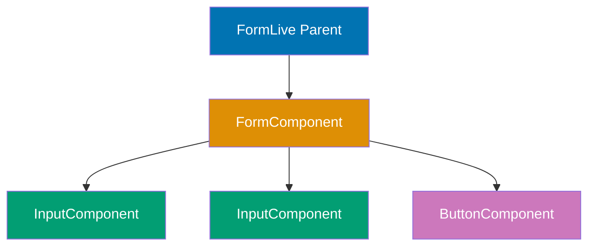

**Input component** (presentational):

```elixir
defmodule MyAppWeb.InputComponent do
# => Reusable form input
  use MyAppWeb, :live_component
  # => Imports LiveComponent behavior


  def render(assigns) do
  # => Generates LiveView HTML template

    ~H"""
    <!-- => Opens HEEx template — HTML+Elixir embedded template language -->
    <div class="form-field">
    <!-- => Div container with class="form-field" -->
      <label for={@id}><%= @label %></label>
      <!-- => label HTML element -->
      <input
      <!-- => text input field -->
        type={@type}
        # => type bound to result of {@type}

        id={@id}
        # => id bound to result of {@id}

        name={@name}
        # => name bound to result of {@name}

        value={@value}
        # => value bound to result of {@value}

        phx-blur="validate_field"
        <!-- => Triggers "validate_field" event when element loses focus -->
        phx-value-field={@name}
        <!-- => Sends field as event parameter value -->
        phx-target={@target}
        <!-- => Routes event to specific component (not parent LiveView) -->
        <%!-- @target points to parent form component --%>
      />
      <!-- => Self-closing tag — no inner content -->
      <span :if={@error} class="error"><%= @error %></span>
      <!-- => span HTML element -->
    </div>
    <!-- => Closes outer div container -->
    """
    # => Closes HEEx template string
  end
  # => Closes enclosing function/module/block definition
end
# => Closes enclosing function/module/block definition
```

**Form component** (stateful container):

```elixir
defmodule MyAppWeb.UserFormComponent do
# => Manages form state and validation
  use MyAppWeb, :live_component
  # => Imports LiveComponent behavior


  def update(assigns, socket) do
  # => Called on component mount and parent updates

    changeset = Accounts.change_user(assigns.user)
    # => Initialize changeset
    socket = socket
    # => socket variable updated with new state
             |> assign(assigns)
             # => Assigns value to socket

             |> assign(:changeset, changeset)
             # => Sets assigns.changeset

    {:ok, socket}
    # => Returns success tuple to LiveView runtime

  end
  # => Closes enclosing function/module/block definition

  def handle_event("validate_field", %{"field" => field}, socket) do
  # => Handles "validate_field" event from client

                                                      # => Field blur validation
    # Re-validate changeset
    changeset = Accounts.change_user(socket.assigns.user)
    # => Calls Accounts.change_user context function

    socket = assign(socket, :changeset, changeset)
    # => socket.assigns.changeset = changeset

    {:noreply, socket}
    # => Returns updated socket, triggers re-render

  end
  # => Closes enclosing function/module/block definition

  def handle_event("save", %{"user" => user_params}, socket) do
  # => Handles "save" event from client

    case Accounts.create_user(user_params) do
    # => Calls Accounts.create_user context function

      {:ok, user} ->
      # => Matches this pattern — executes right-hand side
        send(self(), {:user_created, user})
        # => Notify parent on success
        {:noreply, socket}
        # => Returns updated socket, triggers re-render


      {:error, changeset} ->
      # => Pattern: error result — changeset bound to error reason
        {:noreply, assign(socket, :changeset, changeset)}
        # => Updates socket assigns

    end
    # => Closes enclosing function/module/block definition
  end
  # => Closes enclosing function/module/block definition

  def render(assigns) do
  # => Generates LiveView HTML template

    ~H"""
    <!-- => Opens HEEx template — HTML+Elixir embedded template language -->
    <form phx-submit="save" phx-target={@myself}>
    <!-- => form HTML element -->
      <.live_component
      <!-- => Mounts LiveComponent with id="component" — stateful, isolated state -->
        module={MyAppWeb.InputComponent}
        # => module bound to result of {MyAppWeb.InputComponent}

        id="name-input"
        # => id bound to result of "name-input"

        label="Name"
        # => label bound to result of "Name"

        type="text"
        # => type bound to result of "text"

        name="user[name]"
        # => name bound to result of "user[name]"

        value={input_value(@changeset, :name)}
        # => value bound to result of {input_value(@changeset, :name)}

        error={error_message(@changeset, :name)}
        # => error bound to result of {error_message(@changeset, :name)}

        target={@myself}
        # => target bound to result of {@myself}

        <%!-- Pass @myself so input events come to form component --%>
      />
      <!-- => Self-closing tag — no inner content -->

      <.live_component
      <!-- => Mounts LiveComponent with id="component" — stateful, isolated state -->
        module={MyAppWeb.InputComponent}
        # => module bound to result of {MyAppWeb.InputComponent}

        id="email-input"
        # => id bound to result of "email-input"

        label="Email"
        # => label bound to result of "Email"

        type="email"
        # => type bound to result of "email"

        name="user[email]"
        # => name bound to result of "user[email]"

        value={input_value(@changeset, :email)}
        # => value bound to result of {input_value(@changeset, :email)}

        error={error_message(@changeset, :email)}
        # => error bound to result of {error_message(@changeset, :email)}

        target={@myself}
        # => target bound to result of {@myself}

      />
      <!-- => Self-closing tag — no inner content -->

      <button type="submit">Create User</button>
      <!-- => Submit button — triggers phx-submit form event -->
    </form>
    <!-- => Closes form element — phx-submit/phx-change handlers deactivated -->
    """
    # => Closes HEEx template string
  end
  # => Closes enclosing function/module/block definition

  defp input_value(changeset, field), do: Ecto.Changeset.get_field(changeset, field)
  # => Defines input_value function

  defp error_message(changeset, field) do
  # => Defines error_message function

    case Keyword.get(changeset.errors, field) do
    # => Pattern matches on result value

      {msg, _opts} -> msg
      # => Extracts error message from {message, opts} tuple
      nil -> nil
      # => Returns nil when no error message present
    end
    # => Closes enclosing function/module/block definition
  end
  # => Closes enclosing function/module/block definition
end
# => Closes enclosing function/module/block definition
```

**Key Takeaway**: Compose components by nesting. Stateful components manage state and coordinate children. Presentational components receive data via assigns. Use `phx-target={@myself}` to route events to container.

**Why It Matters**: Component composition - the practice of building complex UIs from simple, focused components - is the defining architectural pattern for maintainable LiveView applications. Distinguishing stateful (container) components from presentational components prevents the anti-pattern of every component becoming an independently stateful island. In production applications with complex UIs, this hierarchy makes state flow predictable and debuggable. Presentational components are trivially testable because they're pure functions of assigns. Container components have clear boundaries for where coordination logic belongs, preventing state management logic from spreading across templates.

### Example 70: Component Testing

Test LiveComponents in isolation or within parent LiveView context.

```elixir
defmodule MyAppWeb.CounterComponentTest do
# => Component test module
  use MyAppWeb.ConnCase, async: true
  # => Use ConnCase for LiveView testing
  import Phoenix.LiveViewTest
  # => Import test helpers

  # Test component in isolation
  test "increments counter on button click", %{conn: conn} do
    {:ok, view, _html} = live_isolated(conn, MyAppWeb.CounterComponent,
                                                      # => Renders component without parent
      session: %{"id" => "counter-test", "label" => "Test Counter"}
                                                      # => Provides required assigns via session
    )
    # => Closes multi-line function call

    # Initial render
    assert render(view) =~ "Test Counter: 0"
    # => Checks initial count display
                                                      # => HTML contains "Test Counter: 0"

    # Click increment button
    view
    # => LiveView test process
    |> element("button", "Increment")
    # => Finds button with text "Increment"
    |> render_click()
    # => Simulates click event
                                                      # => Triggers handle_event("increment", ...)

    # Verify updated state
    assert render(view) =~ "Test Counter: 1"
    # => Count incremented
                                                      # => Component re-rendered with new state
  end
  # => Closes enclosing function/module/block definition

  # Test component within parent LiveView
  test "components maintain independent state", %{conn: conn} do
    {:ok, view, _html} = live(conn, "/dashboard")
    # => Renders parent LiveView
                                                      # => Parent contains multiple CounterComponents

    # Find specific component
    counter1 = view
    # => LiveView test process
               |> element("#counter-1 button", "Increment")
               # => Pipes result into element("#counter-1 button", "Increment"

                                                      # => Finds button in counter-1 component
    counter2 = view
    # => counter2 bound to result of view

               |> element("#counter-2 button", "Increment")
               # => Pipes result into element("#counter-2 button", "Increment"

                                                      # => Finds button in counter-2 component

    # Increment counter-1 twice
    render_click(counter1)
    # => Click counter-1
    render_click(counter1)
    # => Click again

    # Increment counter-2 once
    render_click(counter2)
    # => Click counter-2

    # Verify independent states
    html = render(view)
    # => Get current HTML
    assert html =~ "Counter A: 2"
    # => counter-1 has count 2
    assert html =~ "Counter B: 1"
    # => counter-2 has count 1
                                                      # => Components maintained separate state
  end
  # => Closes enclosing function/module/block definition
end
# => Closes enclosing function/module/block definition
```

**Key Takeaway**: Use `live_isolated/3` to test components without parent. Use `live/2` to test components in parent context. Use `element/3` with CSS selectors to target specific components.

**Why It Matters**: Component testability is a key advantage of the LiveComponent architecture. Testing components in isolation - without requiring their parent context - enables unit tests that run fast and focus on component-specific behavior. In production codebases with many components, isolation testing catches component regressions before they affect parent LiveViews. The live_isolated helper removes the need for complex test setup for standalone components. Testing both isolated and in-parent-context scenarios ensures components behave correctly in both their typical use and edge cases.

## JavaScript Interop (Examples 71-75)

### Example 71: JS Commands - push and navigate

Execute client-side navigation and server pushes using Phoenix.LiveView.JS.

```elixir
defmodule MyAppWeb.NavLive do
# => LiveView with JS commands
  use MyAppWeb, :live_view
  # => Imports LiveView macros and callbacks

  alias Phoenix.LiveView.JS
  # => Import JS module
  # => JS provides client-side commands without custom JavaScript

  def render(assigns) do
  # => Generates LiveView HTML template

    ~H"""
    <!-- => Opens HEEx template — HTML+Elixir embedded template language -->
    <div>
    <!-- => Div container wrapping component content -->
      <button phx-click={JS.navigate("/users")}>
      <!-- => JS.navigate("/users") navigates to /users route -->
      <!-- => Terminates current LiveView, mounts new one -->
        <%!-- JS.navigate performs client-side navigation --%>
        <%!-- Changes URL without full page reload --%>
        <%!-- LiveView handles route transition --%>
        Go to Users
      </button>
      <!-- => Closes button element -->

      <button phx-click={JS.patch("/users?filter=active")}>
      <!-- => JS.patch updates URL without re-mounting LiveView -->
      <!-- => Calls handle_params/3 with new query params -->
        <%!-- JS.patch updates URL params without re-mounting --%>
        <%!-- Triggers handle_params/3 in current LiveView --%>
        <%!-- No full LiveView re-mount --%>
        Show Active Users
      </button>
      <!-- => Closes button element -->

      <button
      <!-- => Button element -->
        phx-click={
          JS.push("delete_user")
          # => Pushes "delete_user" event to server
          # => Server event name
          |> JS.hide(to: "#user-#{@user.id}")
          # => Hide element immediately (optimistic update)
          # => CSS selector targets the specific user row
          <%!-- to: CSS selector for target element --%>
          <%!-- Optimistic UI update before server response --%>
        }
      >
        <%!-- Chained JS commands execute in order --%>
        <%!-- push triggers server event --%>
        <%!-- hide provides immediate feedback --%>
        Delete User
      </button>
      <!-- => Closes button element -->

      <button
      <!-- => Button element -->
        phx-click={
          JS.toggle(to: "#details")
          # => Toggles #details element between visible and hidden
          # => Toggles element visibility
          <%!-- No server round-trip --%>
          <%!-- Pure client-side interaction --%>
        }
      >
        Toggle Details
      </button>
      <!-- => Closes button element -->
    </div>
    <!-- => Closes outer div container -->

    <div id="details" style="display: none;">
    <!-- => Initially hidden div — JS.toggle shows/hides this -->
    <!-- => id="details" is the CSS selector target -->
      <p>User details here...</p>
      <!-- => Paragraph element displaying dynamic content -->
    </div>
    <!-- => Closes outer div container -->
    """
    # => Closes HEEx template string
  end
  # => Closes enclosing function/module/block definition

  def handle_event("delete_user", _params, socket) do # => Server handles deletion
  # => Event handler for "delete_user" — triggered by phx-click/phx-submit/phx-change
    # Delete user logic
    # => Perform deletion: MyApp.delete_user(socket.assigns.user_id)
    # => Client already hid element via JS.hide (optimistic update)
    {:noreply, socket}
    # => Returns updated socket — re-render confirms server state
    # => Returns updated socket, triggers re-render

  end
  # => Closes enclosing function/module/block definition
end
# => Closes enclosing function/module/block definition
```

**Available JS commands**:

```elixir
JS.navigate("/path")
# => Full LiveView navigation — terminates current LiveView process
JS.patch("/path")
# => Update URL params, call handle_params/3
# => Keeps current LiveView mounted, updates params
JS.push("event_name")
# => Trigger server event
# => Sends event to handle_event/3 on server
JS.hide(to: "#selector")
# => Hide elements — adds display:none immediately
JS.show(to: "#selector")
# => Show elements — removes display:none
JS.toggle(to: "#selector")
# => Toggle visibility — alternates show/hide
JS.add_class("active", to: "#el") # => Add CSS class
# => Adds class to element without server round-trip
JS.remove_class("active")
# => Remove CSS class — immediate DOM update
JS.dispatch("click", to: "#btn")
# => Dispatch DOM event — triggers native browser event
# => Useful for third-party JavaScript integrations
```

**Key Takeaway**: JS commands enable client-side interactions without custom JavaScript. Chain commands with pipe operator for complex behaviors. Use for navigation, DOM manipulation, optimistic updates.

**Why It Matters**: JS commands provide client-side interactivity with server-defined behavior, eliminating the need for custom JavaScript for common patterns. Client-side navigation (push), element visibility (toggle, add_class, remove_class), and focus management all run without a server round-trip, making interactions feel instantaneous. In production applications where users interact with modals, tooltips, accordions, and navigation elements, JS commands reduce perceived latency and improve UX. Chaining commands with pipe enables complex multi-step interactions like showing a loading indicator while navigating. This is the first tool to reach for before writing custom JavaScript.

### Example 72: Client Hooks Basics

Hooks integrate custom JavaScript with LiveView lifecycle for client-side enhancements.

**JavaScript hook definition**:

**Hook lifecycle**:

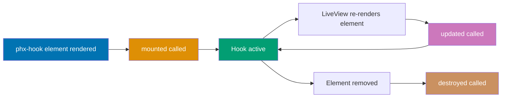

```javascript
// app.js
let Hooks = {};

Hooks.LocalTime = {
  // => Hook name: LocalTime
  mounted() {
    // => Called when element added to DOM
    this.el; // => this.el is the DOM element
    this.handleEvent("update-time", ({ timestamp }) => {
      // => Server-triggered event
      const date = new Date(timestamp); // => Parse timestamp
      this.el.textContent = date.toLocaleString(); // => Update element content
    }); // => Register event handler

    setInterval(() => {
      // => Update every second
      this.pushEvent("get-current-time", {}); // => Request time from server
    }, 1000);
  },

  destroyed() {
    // => Called when element removed
    clearInterval(this.interval); // => Cleanup interval
  },
};

let liveSocket = new LiveSocket("/live", Socket, {
  params: { _csrf_token: csrfToken },
  hooks: Hooks, // => Register hooks
});
```

**LiveView with hook**:

```elixir
defmodule MyAppWeb.ClockLive do
# => LiveView using hook
  use MyAppWeb, :live_view
  # => Imports LiveView macros and callbacks


  def mount(_params, _session, socket) do
  # => Called on LiveView initialization

    {:ok, socket}
    # => Returns success tuple to LiveView runtime

  end
  # => Closes enclosing function/module/block definition

  def handle_event("get-current-time", _params, socket) do
  # => Handles "get-current-time" event from client

                                                      # => Client requested current time
    {:reply, %{timestamp: DateTime.utc_now()}, socket}
    # => Returns reply to caller with updated socket

                                                      # => Reply with current timestamp
                                                      # => Client handleEvent receives data
  end
  # => Closes enclosing function/module/block definition

  def render(assigns) do
  # => Generates LiveView HTML template

    ~H"""
    <!-- => Opens HEEx template — HTML+Elixir embedded template language -->
    <div>
    <!-- => Div container wrapping component content -->
      <p id="local-time" phx-hook="LocalTime">
      <!-- => Paragraph element displaying dynamic content -->
        <%!-- phx-hook="LocalTime" attaches JavaScript hook --%>
        <%!-- Hook's mounted() called when rendered --%>
        Loading time...
      </p>
      <!-- => Closes paragraph element -->
    </div>
    <!-- => Closes outer div container -->
    """
    # => Closes HEEx template string
  end
  # => Closes enclosing function/module/block definition
end
# => Closes enclosing function/module/block definition
```

**Key Takeaway**: Hooks bridge LiveView and client JavaScript. Use `phx-hook` attribute to attach hooks. Hooks have lifecycle callbacks: `mounted`, `updated`, `destroyed`. Use for client-side libraries, animations, local storage.

**Why It Matters**: Client hooks extend LiveView with JavaScript for capabilities the server cannot provide - accessing browser APIs, integrating third-party JavaScript libraries, measuring DOM metrics. The hook's lifecycle connects Elixir and JavaScript without tight coupling: the Elixir side declares data via assigns, the JavaScript side reads it from dataset and pushes events back. In production applications, hooks power rich text editors, chart libraries, map integrations, and custom input widgets. Understanding the hook pattern is prerequisite for any LiveView application needing JavaScript functionality beyond what JS commands provide.

### Example 73: Hook Lifecycle - mounted, updated, destroyed

Understand hook lifecycle to manage client-side state and cleanup resources.

```javascript
// app.js
Hooks.Chart = {
  chart: null, // => Store chart instance

  mounted() {
    // => Element first rendered
    this.chart = initializeChart(this.el, this.el.dataset);
    // => Create chart with data attributes
    // => this.el.dataset contains phx-value-* data
    console.log("Chart mounted"); // => Log lifecycle event
  },

  updated() {
    // => Element re-rendered by server
    const newData = JSON.parse(this.el.dataset.data); // => Get updated data
    this.chart.updateData(newData); // => Update chart without re-creating
    console.log("Chart updated with new data"); // => Log update confirmation for debugging
  },

  destroyed() {
    // => Element removed from DOM
    if (this.chart) {
      this.chart.destroy(); // => Cleanup chart resources
      this.chart = null;
    }
    console.log("Chart destroyed");
  },
};
```

**LiveView usage**:

```elixir
defmodule MyAppWeb.AnalyticsLive do
# => LiveView with chart
  use MyAppWeb, :live_view
  # => Imports LiveView macros and callbacks


  def mount(_params, _session, socket) do
  # => Called on LiveView initialization

    socket = assign(socket, :chart_data, initial_data())
    # => socket.assigns.chart_data = initial_data(

    {:ok, socket}
    # => Returns success tuple to LiveView runtime

  end
  # => Closes enclosing function/module/block definition

  def handle_event("refresh", _params, socket) do
  # => Refresh chart data
    socket = assign(socket, :chart_data, fetch_data())
    # => socket.assigns.chart_data = fetch_data(

                                                      # => New data assigned
                                                      # => Triggers re-render
                                                      # => Hook.updated() called
    {:noreply, socket}
    # => Returns updated socket, triggers re-render

  end
  # => Closes enclosing function/module/block definition

  def render(assigns) do
  # => Generates LiveView HTML template

    ~H"""
    <!-- => Opens HEEx template — HTML+Elixir embedded template language -->
    <div>
    <!-- => Div container wrapping component content -->
      <div
      <!-- => Div container wrapping component content -->
        id="sales-chart"
        # => id bound to result of "sales-chart"

        phx-hook="Chart"
        phx-value-data={Jason.encode!(@chart_data)}
        <!-- => Sends data as event parameter value -->
        <%!-- phx-value-data becomes data-data HTML attribute --%>
        <%!-- Hook accesses via this.el.dataset.data --%>
      >
      </div>
      <!-- => Closes outer div container -->
      <button phx-click="refresh">Refresh Data</button>
      <!-- => Button triggers handle_event("refresh", ...) on click -->
    </div>
    <!-- => Closes outer div container -->
    """
    # => Closes HEEx template string
  end
  # => Closes enclosing function/module/block definition

  defp initial_data, do: %{labels: ["Jan", "Feb"], values: [100, 150]}
  # => Defines initial_data function

  defp fetch_data, do: %{labels: ["Jan", "Feb", "Mar"], values: [100, 150, 200]}
  # => Defines fetch_data function

end
# => Closes enclosing function/module/block definition
```

**Key Takeaway**: Hook lifecycle mirrors element lifecycle. `mounted`: initialize. `updated`: refresh with new data. `destroyed`: cleanup. Access assigns via `this.el.dataset` from phx-value-\* attributes.

**Why It Matters**: Hook lifecycle management prevents the memory leaks and stale state bugs that plague JavaScript-heavy applications. Proper cleanup in destroyed prevents event listeners and timers from accumulating across LiveView navigations. The updated callback enables hooks to efficiently refresh only what changed rather than reinitializing completely. In production applications with multiple hooks per page, improper lifecycle management causes subtle bugs - charts that grow slower over time, event handlers that fire multiple times, animations that conflict. Treating hooks like React components with explicit cleanup is the discipline that keeps JavaScript integration maintainable.

### Example 74: pushEvent from Client

Send events from client JavaScript to server LiveView using pushEvent.

**pushEvent client-to-server flow**:

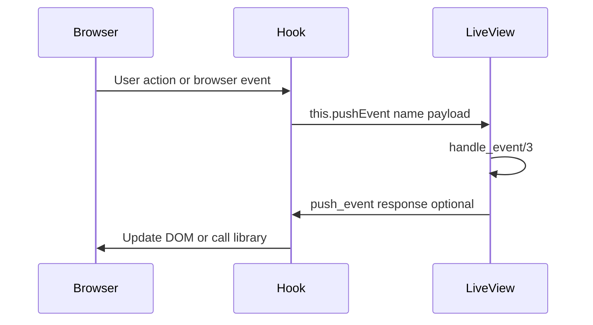

```javascript
// app.js
Hooks.GeolocationTracker = {
  mounted() {
    // Get user's location
    navigator.geolocation.getCurrentPosition(
      (position) => {
        // => Success callback
        this.pushEvent("location-updated", {
          // => Send to server
          lat: position.coords.latitude, // => Latitude
          lng: position.coords.longitude, // => Longitude
        }); // => Server receives as params map
      },
      (error) => {
        // => Error callback
        this.pushEvent("location-error", {
          // => Send error to server
          message: error.message,
        });
      },
    );
  },
};
```

**LiveView handling client events**:

```elixir
defmodule MyAppWeb.MapLive do
# => LiveView receiving client events
  use MyAppWeb, :live_view
  # => Imports LiveView macros and callbacks


  def mount(_params, _session, socket) do
  # => Called on LiveView initialization

    socket = assign(socket, :location, nil)
    # => socket.assigns.location = nil

    {:ok, socket}
    # => Returns success tuple to LiveView runtime

  end
  # => Closes enclosing function/module/block definition

  def handle_event("location-updated", %{"lat" => lat, "lng" => lng}, socket) do
  # => Handles "location-updated" event from client

                                                      # => Receives location from client
                                                      # => lat, lng are floats
    socket = assign(socket, :location, %{lat: lat, lng: lng})
    # => socket.assigns.location = %{lat: lat, lng: lng}

                                                      # => Store location in state
    {:noreply, socket}
    # => Re-render with location
  end
  # => Closes enclosing function/module/block definition

  def handle_event("location-error", %{"message" => msg}, socket) do
  # => Handles "location-error" event from client

                                                      # => Receives error from client
    socket = put_flash(socket, :error, "Location error: #{msg}")
                                                      # => Show error to user
    {:noreply, socket}
    # => Returns updated socket, triggers re-render

  end
  # => Closes enclosing function/module/block definition

  def render(assigns) do
  # => Generates LiveView HTML template

    ~H"""
    <!-- => Opens HEEx template — HTML+Elixir embedded template language -->
    <div>
    <!-- => Div container wrapping component content -->
      <div id="geo-tracker" phx-hook="GeolocationTracker"></div>
      <!-- => Div container wrapping component content -->
      <div :if={@location}>
      <!-- => Div container wrapping component content -->
        <p>Latitude: <%= @location.lat %></p>
        <!-- => Paragraph element displaying dynamic content -->
        <p>Longitude: <%= @location.lng %></p>
        <!-- => Paragraph element displaying dynamic content -->
      </div>
      <!-- => Closes outer div container -->
    </div>
    <!-- => Closes outer div container -->
    """
    # => Closes HEEx template string
  end
  # => Closes enclosing function/module/block definition
end
# => Closes enclosing function/module/block definition
```

**Key Takeaway**: Use `this.pushEvent(event_name, payload)` to send client data to server. Server handles with `handle_event/3`. Useful for browser APIs, third-party library events, client-side measurements.

**Why It Matters**: pushEvent bridges the gap between browser capabilities and server logic. Browser APIs - geolocation, clipboard, battery status, screen dimensions - are accessible only from JavaScript but need server processing. The pushEvent pattern captures this data and sends it to handle_event on the server, enabling server-side decisions based on client state. In production applications, pushEvent is used for scroll position tracking, focus management, canvas drawing coordinates, file drag-and-drop coordinates, and any interaction where browser state needs to influence server-side logic. This is how LiveView applications access the full power of the browser without abandoning server-side control.

### Example 75: handleEvent on Client

Server pushes events to client using `push_event/3` and hook's `handleEvent`.

**LiveView pushing events to client**:

```elixir
defmodule MyAppWeb.NotificationLive do
# => LiveView pushing to client
  use MyAppWeb, :live_view
  # => Imports LiveView macros and callbacks


  def mount(_params, _session, socket) do
  # => Called on LiveView initialization

    if connected?(socket) do
    # => Returns true when WebSocket established

      Phoenix.PubSub.subscribe(MyApp.PubSub, "notifications")
      # => Subscribes to real-time broadcast topic

                                                      # => Subscribe to notifications
    end
    # => Closes enclosing function/module/block definition
    {:ok, socket}
    # => Returns success tuple to LiveView runtime

  end
  # => Closes enclosing function/module/block definition

  def handle_info({:new_notification, notification}, socket) do
  # => Handles internal Elixir messages

                                                      # => Received notification from PubSub
    socket = push_event(socket, "show-toast", %{
    # => Push to client hook
      title: notification.title,
      # => Notification title
      message: notification.message,
      # => Message text
      type: notification.type
      # => Type: "info", "success", "error"
    })
    {:noreply, socket}
    # => Event pushed to client
                                                      # => Hook's handleEvent receives data
  end
  # => Closes enclosing function/module/block definition

  def render(assigns) do
  # => Generates LiveView HTML template

    ~H"""
    <!-- => Opens HEEx template — HTML+Elixir embedded template language -->
    <div id="notification-container" phx-hook="ToastNotifier">
    <!-- => Div container wrapping component content -->
      <%!-- Hook will display toasts via handleEvent --%>
    </div>
    <!-- => Closes outer div container -->
    """
    # => Closes HEEx template string
  end
  # => Closes enclosing function/module/block definition
end
# => Closes enclosing function/module/block definition
```

**Client hook handling server events**:

```javascript
// app.js
Hooks.ToastNotifier = {
  mounted() {
    this.toastContainer = this.el; // => Store container element

    this.handleEvent("show-toast", ({ title, message, type }) => {
      // => Server pushed event
      // => Destructure payload
      const toast = document.createElement("div"); // => Create toast element
      toast.className = `toast toast-${type}`; // => Apply type-specific class
      toast.innerHTML = `
        <h4>${title}</h4>
        <p>${message}</p>
      `;

      this.toastContainer.appendChild(toast); // => Add to DOM

      setTimeout(() => {
        // => Auto-remove after 5s
        toast.remove();
      }, 5000);
    });
  },
};
```

**Key Takeaway**: Use `push_event(socket, event_name, payload)` to send events to client. Hook's `handleEvent` receives events. Useful for animations, third-party integrations, client-side notifications.

**Why It Matters**: handleEvent on the client is the counterpart to pushEvent - it enables server-driven client-side actions beyond what push_event's one-to-many broadcast provides. When the server needs to trigger specific JavaScript behavior in response to events - scrolling to an element, triggering animations on specific items, interacting with third-party library APIs - handleEvent provides the communication channel. In production applications with rich JavaScript integration, handleEvent drives visualization updates (updating charts when data changes), animation sequences (fade transitions on stream updates), and external library commands (map panning, video seek). Server intelligence drives client presentation.

## Testing (Examples 76-80)

### Example 76: LiveView Testing Basics - render and render_click

Test LiveView interactions using Phoenix.LiveViewTest helpers.

**LiveView test flow**:

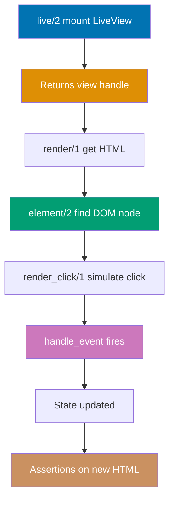

```elixir
defmodule MyAppWeb.CounterLiveTest do
# => Test module for CounterLive
  use MyAppWeb.ConnCase, async: true
  # => Use ConnCase for LiveView tests
  import Phoenix.LiveViewTest
  # => Import test helpers

  test "displays initial counter value", %{conn: conn} do
    {:ok, view, html} = live(conn, "/counter")
    # => Renders LiveView at route
                                                      # => view: LiveView test process
                                                      # => html: initial rendered HTML

    assert html =~ "Count: 0"
    # => Checks initial render
                                                      # => HTML contains "Count: 0"
  end
  # => Closes enclosing function/module/block definition

  test "increments counter on button click", %{conn: conn} do
    {:ok, view, _html} = live(conn, "/counter")
    # => Pattern: successful result — result bound to returned value

    # Click increment button
    html = view
    # => LiveView test process
           |> element("button", "Increment")
           # => Finds button with text
           |> render_click()
           # => Simulates click event
                                                      # => Returns updated HTML

    assert html =~ "Count: 1"
    # => Counter incremented
                                                      # => handle_event executed
                                                      # => LiveView re-rendered
  end
  # => Closes enclosing function/module/block definition

  test "multiple clicks increment correctly", %{conn: conn} do
    {:ok, view, _html} = live(conn, "/counter")
    # => Pattern: successful result — result bound to returned value

    view
    # => view piped into following operations
    |> element("button", "Increment")
    # => Pipes result into element("button", "Increment")

    |> render_click()
    # => First click, count: 1

    view
    # => view piped into following operations
    |> element("button", "Increment")
    # => Pipes result into element("button", "Increment")

    |> render_click()
    # => Second click, count: 2

    html = render(view)
    # => Get final HTML
    assert html =~ "Count: 2"
    # => Both clicks registered
  end
  # => Closes enclosing function/module/block definition

  test "decrement button decreases counter", %{conn: conn} do
    {:ok, view, _html} = live(conn, "/counter")
    # => Pattern: successful result — result bound to returned value

    # Set counter to 5 first
    Enum.each(1..5, fn _ ->
    # => Matches this pattern — executes right-hand side
      view |> element("button", "Increment") |> render_click()
    end)
    # => Closes anonymous function; returns result to calling function

    # Click decrement
    html = view
    # => html bound to result of view

           |> element("button", "Decrement")
           # => Pipes result into element("button", "Decrement")

           |> render_click()
           # => Pipes result into render_click()


    assert html =~ "Count: 4"
    # => Decremented from 5 to 4
  end
  # => Closes enclosing function/module/block definition
end
# => Closes enclosing function/module/block definition
```

**Key Takeaway**: Use `live/2` to mount LiveView in tests. `element/2` finds DOM elements. `render_click/1` simulates click events. `render/1` gets current HTML. Test user interactions like real browser.

**Why It Matters**: LiveView testing with ExUnit provides fast, reliable tests that verify real user interactions without browser overhead. LiveViewTest simulates the full WebSocket lifecycle - mount, events, navigation - giving high confidence without the brittleness of E2E tests. In production codebases, LiveView unit tests run in seconds and catch regressions in event handling, state transitions, and rendered output. The render_click pattern mirrors real user behavior, testing the complete event → state → template cycle. Testing LiveViews thoroughly at this level reduces the need for slow, expensive browser-based tests.

### Example 77: Testing Forms with render_submit

Test form submissions and validation in LiveView forms.

```elixir
defmodule MyAppWeb.UserFormLiveTest do
# => Test form interactions
  use MyAppWeb.ConnCase, async: true
  # => Imports MyAppWeb.ConnCase, async: true behavior

  import Phoenix.LiveViewTest
  # => Imports functions from Phoenix.LiveViewTest


  test "displays form with empty fields", %{conn: conn} do
    {:ok, _view, html} = live(conn, "/users/new")
    # => Pattern: successful result — result bound to returned value

    assert html =~ "New User"
    # => Page title
    assert html =~ "name=\"user[name]\""
    # => Name input present
    assert html =~ "name=\"user[email]\""
    # => Email input present
  end
  # => Closes enclosing function/module/block definition

  test "validates form on blur", %{conn: conn} do
    {:ok, view, _html} = live(conn, "/users/new")
    # => Pattern: successful result — result bound to returned value

    # Blur email field with invalid value
    html = view
    # => html bound to result of view

           |> form("#user-form", user: %{email: "invalid"})
           # => Pipes result into form("#user-form", user: %{email: "inval

                                                      # => Finds form by selector
                                                      # => Sets form params
           |> render_change()
           # => Simulates blur/change event
                                                      # => Triggers phx-change validation

    assert html =~ "must have the @ sign"
    # => Validation error displayed
                                                      # => Changeset errors rendered
  end
  # => Closes enclosing function/module/block definition

  test "submits valid form successfully", %{conn: conn} do
    {:ok, view, _html} = live(conn, "/users/new")
    # => Pattern: successful result — result bound to returned value

    # Submit form with valid data
    view
    # => view piped into following operations
    |> form("#user-form", user: %{name: "Alice", email: "alice@example.com"})
    # => Pipes result into form("#user-form", user: %{name: "Alice"

    |> render_submit()
    # => Simulates form submission
                                                      # => Triggers phx-submit event

    assert_redirect(view, "/users")
    # => Redirected on success
                                                      # => User created successfully
  end
  # => Closes enclosing function/module/block definition

  test "displays errors on invalid submission", %{conn: conn} do
    {:ok, view, _html} = live(conn, "/users/new")
    # => Pattern: successful result — result bound to returned value

    html = view
    # => html bound to result of view

           |> form("#user-form", user: %{name: "", email: ""})
           # => Pipes result into form("#user-form", user: %{name: "", ema

           |> render_submit()
           # => Submit with empty fields

    assert html =~ "can&#39;t be blank"
    # => Error message present
                                                      # => HTML-escaped apostrophe
    refute_redirected(view)
    # => Still on form page
                                                      # => No redirect on error
  end
  # => Closes enclosing function/module/block definition
end
# => Closes enclosing function/module/block definition
```

**Key Takeaway**: Use `form/2` to find forms, `render_change/1` for validation, `render_submit/1` for submission. Use `assert_redirect/2` to verify redirects. Test both success and error paths.

**Why It Matters**: Form testing with LiveViewTest verifies the complete form interaction cycle - validation on change, error display, and submission processing - without browser interaction. Testing both the happy path and validation error paths prevents regressions in form behavior when changesets or event handlers change. In production applications where forms drive critical user workflows (registration, purchase, configuration), thorough form testing is non-negotiable. The assert_redirect assertion verifies that successful submission navigates correctly, and checking error messages in the response ensures validation feedback reaches users correctly.

### Example 78: Testing File Uploads

Test LiveView file upload functionality using test helpers.

```elixir
defmodule MyAppWeb.UploadLiveTest do
# => Test file uploads
  use MyAppWeb.ConnCase, async: true
  # => Imports MyAppWeb.ConnCase, async: true behavior

  import Phoenix.LiveViewTest
  # => Imports functions from Phoenix.LiveViewTest


  test "displays upload form", %{conn: conn} do
    {:ok, _view, html} = live(conn, "/upload")
    # => Pattern: successful result — result bound to returned value

    assert html =~ "Upload File"
    # => Upload section present
    assert html =~ "phx-drop-target"
    # => Drop zone configured
  end
  # => Closes enclosing function/module/block definition

  test "validates file type", %{conn: conn} do
    {:ok, view, _html} = live(conn, "/upload")
    # => Pattern: successful result — result bound to returned value

    # Create invalid file upload
    invalid_file = %{
    # => invalid_file bound to result of %{

      last_modified: 1_594_171_879_000,
      name: "document.pdf",
      # => PDF not allowed
      content: File.read!("test/fixtures/document.pdf"),
      # => Sets content: field to File.read!("test/fixtures/document.pdf")
      type: "application/pdf"
    }

    html = file_input(view, "#upload-form", :avatar, [invalid_file])
    # => html bound to result of file_input(view, "#upload-form", :avatar, [invalid

                                                      # => Simulate file selection
                                                      # => :avatar is upload name
                                                      # => Returns HTML after validation

    assert html =~ "Invalid file type"
    # => Validation error shown
                                                      # => Only images allowed
  end
  # => Closes enclosing function/module/block definition

  test "uploads valid image file", %{conn: conn} do
    {:ok, view, _html} = live(conn, "/upload")
    # => Pattern: successful result — result bound to returned value

    # Create valid image upload
    image = %{
    # => image bound to result of %{

      last_modified: 1_594_171_879_000,
      name: "avatar.png",
      # => Sets name: field to "avatar.png"
      content: File.read!("test/fixtures/avatar.png"),
      # => Sets content: field to File.read!("test/fixtures/avatar.png")
      type: "image/png"
      # => Valid image type
    }

    # Select file
    view
    # => view piped into following operations
    |> file_input("#upload-form", :avatar, [image])
    # => Add file to upload
    |> render_upload(image, 100)
    # => Simulate upload completion
                                                      # => 100% progress
                                                      # => Triggers handle_progress

    html = render(view)
    # => html bound to result of render(view)

    assert html =~ "avatar.png"
    # => File uploaded
                                                      # => Displayed in preview
  end
  # => Closes enclosing function/module/block definition

  test "handles upload errors", %{conn: conn} do
    {:ok, view, _html} = live(conn, "/upload")
    # => Pattern: successful result — result bound to returned value

    # Create file exceeding size limit
    large_file = %{
    # => large_file bound to result of %{

      last_modified: 1_594_171_879_000,
      name: "large.png",
      # => Sets name: field to "large.png"
      content: :crypto.strong_rand_bytes(6_000_000),
      # => 6MB file
      type: "image/png"
    }

    html = file_input(view, "#upload-form", :avatar, [large_file])
    # => html bound to result of file_input(view, "#upload-form", :avatar, [large_f


    assert html =~ "too large"
    # => Size error displayed
                                                      # => Upload rejected
  end
  # => Closes enclosing function/module/block definition
end
# => Closes enclosing function/module/block definition
```

**Key Takeaway**: Use `file_input/4` to simulate file selection, `render_upload/3` for upload progress. Test validation (type, size) and success paths. Mock files with content from fixtures.

**Why It Matters**: File upload testing verifies one of LiveView's most complex features end-to-end without requiring actual file system operations. The file_input/render_upload pattern simulates the browser's multi-part upload process, allowing tests to verify validation rules, progress tracking, and consume logic in automated tests. In production applications with file upload features, broken upload validation or consume logic can cause data corruption or security vulnerabilities. Testing uploads as part of the CI pipeline catches breaking changes early. Mock fixtures keep tests fast and deterministic without depending on specific file system state.

### Example 79: Testing LiveComponents

Test components in isolation or within parent LiveView.

```elixir
defmodule MyAppWeb.TodoItemComponentTest do
# => Test TodoItemComponent
  use MyAppWeb.ConnCase, async: true
  # => Imports MyAppWeb.ConnCase, async: true behavior

  import Phoenix.LiveViewTest
  # => Imports functions from Phoenix.LiveViewTest


  # Test component in parent context
  test "toggles todo completion", %{conn: conn} do
    todo = insert_todo(%{title: "Buy milk", completed: false})
    # => todo bound to result of insert_todo(%{title: "Buy milk", completed: false}

                                                      # => Create test todo
    {:ok, view, _html} = live(conn, "/todos")
    # => Mount parent LiveView

    # Find component and toggle
    view
    # => view piped into following operations
    |> element("#todo-#{todo.id} input[type='checkbox']")
    # => Pipes result into element("#todo-#{todo.id} input[type='ch

                                                      # => Find checkbox in component
    |> render_click()
    # => Click checkbox
                                                      # => Component handle_event("toggle")

    # Verify updated state
    assert view
           |> element("#todo-#{todo.id}")
           # => Pipes result into element("#todo-#{todo.id}")

           |> render() =~ "completed"
           # => Component shows completed class
  end
  # => Closes enclosing function/module/block definition

  # Test component event handling
  test "deletes todo on button click", %{conn: conn} do
    todo = insert_todo(%{title: "Task", completed: false})
    # => todo bound to result of insert_todo(%{title: "Task", completed: false})

    {:ok, view, _html} = live(conn, "/todos")
    # => Pattern: successful result — result bound to returned value

    # Click delete button
    view
    # => view piped into following operations
    |> element("#todo-#{todo.id} button", "Delete")
    # => Pipes result into element("#todo-#{todo.id} button", "Dele

    |> render_click()
    # => Component sends :todo_deleted to parent

    # Verify todo removed from list
    refute view
           |> render() =~ "Task"
           # => Todo no longer in HTML
  end
  # => Closes enclosing function/module/block definition

  # Test component updates from parent
  test "updates when parent assigns change", %{conn: conn} do
    {:ok, view, _html} = live(conn, "/todos")
    # => Pattern: successful result — result bound to returned value

    # Trigger parent event that updates todo
    view
    # => view piped into following operations
    |> element("button", "Mark All Complete")
    # => Pipes result into element("button", "Mark All Complete")

    |> render_click()
    # => Parent updates all todos

    # Verify all components updated
    html = render(view)
    # => html bound to result of render(view)

    assert html =~ "completed"
    # => All components show completed
                                                      # => Component.update/2 called for each
  end
  # => Closes enclosing function/module/block definition

  defp insert_todo(attrs) do
  # => Defines insert_todo function

    %Todo{}
    # => Creates empty Todo struct as base for changeset
    |> Todo.changeset(attrs)
    # => Creates changeset for validation

    |> Repo.insert!()
    # => Database operation: Repo.insert

  end
  # => Closes enclosing function/module/block definition
end
# => Closes enclosing function/module/block definition
```

**Key Takeaway**: Test components via parent LiveView using element selectors. Verify component events trigger parent state changes. Test component updates when parent assigns change.

**Why It Matters**: Testing LiveComponents via parent context verifies that component events correctly update parent state, which is the primary failure mode for component-to-parent communication. A component might handle events correctly in isolation but fail to notify the parent properly. The element selector approach in tests mirrors how users interact with specific component instances on a page with multiple components. In production codebases with a library of components, this testing strategy ensures inter-component communication contracts are maintained as both components and parents evolve independently.

### Example 80: Testing with Async/Await Patterns

Test asynchronous LiveView operations like PubSub and background processes.

**Async test timing**:

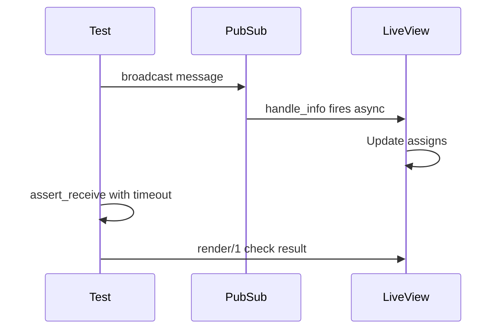

```elixir
defmodule MyAppWeb.ChatLiveTest do
# => Test real-time chat
  use MyAppWeb.ConnCase, async: true
  # => Imports MyAppWeb.ConnCase, async: true behavior

  import Phoenix.LiveViewTest
  # => Imports functions from Phoenix.LiveViewTest


  test "receives messages from other users", %{conn: conn} do
    {:ok, view, _html} = live(conn, "/chat/room-1")
    # => Mount chat LiveView
                                                      # => Subscribes to room-1 PubSub

    # Simulate message from another user
    Phoenix.PubSub.broadcast(
    # => Broadcasts message to all subscribers

      MyApp.PubSub,
      # => PubSub module for message routing
      "chat:room-1",
      # => Topic string for PubSub subscription/broadcast
      {:new_message, %{user: "Bob", text: "Hello!"}}
    )
    # => Broadcasts message to topic
    # => LiveView's handle_info receives message

    # Wait for LiveView to process message
    html = render(view)
    # => Get updated HTML
                                                      # => Message rendered in view

    assert html =~ "Bob"
    # => User name displayed
    assert html =~ "Hello!"
    # => Message text shown
  end
  # => Closes enclosing function/module/block definition

  test "sends messages to room", %{conn: conn} do
    {:ok, view, _html} = live(conn, "/chat/room-1")
    # => Pattern: successful result — result bound to returned value

    # Submit message form
    view
    # => view piped into following operations
    |> form("#message-form", message: %{text: "Test message"})
    # => Pipes result into form("#message-form", message: %{text: "

    |> render_submit()
    # => Sends message
                                                      # => LiveView broadcasts to PubSub

    # Verify message appears in view
    html = render(view)
    # => html bound to result of render(view)

    assert html =~ "Test message"
    # => Own message displayed
  end
  # => Closes enclosing function/module/block definition

  test "handles background process updates", %{conn: conn} do
    {:ok, view, _html} = live(conn, "/status")
    # => LiveView monitoring process

    # Simulate process sending update
    send(view.pid, {:status_update, "Processing..."})
                                                      # => Send message to LiveView process
                                                      # => handle_info receives message

    # Verify status updated
    assert render(view) =~ "Processing..."
    # => Status displayed

    # Simulate completion
    send(view.pid, {:status_update, "Complete"})

    assert render(view) =~ "Complete"
    # => Final status shown
  end
  # => Closes enclosing function/module/block definition

  test "async operation completes before redirect", %{conn: conn} do
    {:ok, view, _html} = live(conn, "/async-task")
    # => Pattern: successful result — result bound to returned value

    # Start async task
    view
    # => view piped into following operations
    |> element("button", "Start Task")
    # => Pipes result into element("button", "Start Task")

    |> render_click()
    # => Triggers async operation

    # Wait for completion message
    assert_receive {:task_complete, result}, 5000
    # => Wait up to 5s for message
                                                      # => Test process receives message

    # Verify LiveView shows result
    html = render(view)
    # => html bound to result of render(view)

    assert html =~ result
    # => Result displayed
  end
  # => Closes enclosing function/module/block definition
end
# => Closes enclosing function/module/block definition
```

**Key Takeaway**: Use `Phoenix.PubSub.broadcast` to simulate real-time messages. Use `send/2` to send messages to LiveView process. Use `assert_receive/2` to wait for async operations. Test real-time features like regular interactions.

**Why It Matters**: Async testing patterns are essential for LiveViews with PubSub, background tasks, or timer-based updates. Real-time features that depend on external messages cannot be tested with synchronous assertions alone - the message arrives after the assertion would have already failed. assert_receive with timeout gives the application time to process async events before asserting. In production LiveViews with real-time collaboration features, async testing ensures that PubSub messages arrive, processes them correctly, and updates the UI as expected. Without these patterns, real-time features have gaps in test coverage that only manifest in production.

## Production Patterns (Examples 81-85)

### Example 81: handle_params for URL Changes

Use handle_params/3 to respond to URL parameter changes without full re-mount.

**handle_params URL lifecycle**:

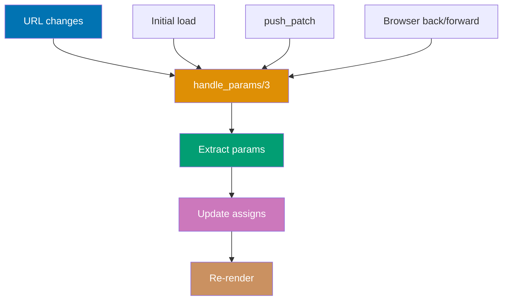

```elixir
defmodule MyAppWeb.ProductsLive do
# => LiveView handling URL params
  use MyAppWeb, :live_view
  # => Imports LiveView macros and callbacks


  # Initial mount - called once per connection
  def mount(_params, _session, socket) do
  # => Runs on first load
    {:ok, socket}
    # => Minimal initialization
                                                      # => handle_params runs immediately after
  end
  # => Closes enclosing function/module/block definition

  # Handles URL params on mount and URL changes
  def handle_params(params, _uri, socket) do
  # => Called after mount AND on URL changes
                                                      # => params: %{"category" => "electronics", "sort" => "price"}
    socket = socket
    # => socket variable updated with new state
             |> assign(:category, params["category"] || "all")
             # => Sets assigns.category

                                                      # => Extract category from URL
                                                      # => Default to "all"
             |> assign(:sort, params["sort"] || "name")
             # => Sets assigns.sort

                                                      # => Extract sort from URL
                                                      # => Default to "name"
             |> load_products()
             # => Fetch products with filters

    {:noreply, socket}
    # => Re-render with new data
                                                      # => No re-mount, preserves socket state
  end
  # => Closes enclosing function/module/block definition

  defp load_products(socket) do
  # => Fetches filtered products
    category = socket.assigns.category
    # => category bound to result of socket.assigns.category

    sort = socket.assigns.sort
    # => sort bound to result of socket.assigns.sort


    products = Products.list_products(
    # => Query with filters
      category: category,
      sort_by: sort
    )
    # => E.g., [%Product{name: "Laptop", ...}, ...]

    assign(socket, :products, products)
    # => Store in socket
  end
  # => Closes enclosing function/module/block definition

  def handle_event("filter", %{"category" => category}, socket) do
  # => Handles "filter" event from client

                                                      # => User selects category filter
    socket = push_patch(socket, to: "/products?category=#{category}&sort=#{socket.assigns.sort}")
    # => Patches URL without full LiveView remount

                                                      # => Updates URL with new params
                                                      # => Triggers handle_params/3
                                                      # => No page reload
    {:noreply, socket}
    # => Returns updated socket, triggers re-render

  end
  # => Closes enclosing function/module/block definition

  def render(assigns) do
  # => Generates LiveView HTML template

    ~H"""
    <!-- => Opens HEEx template — HTML+Elixir embedded template language -->
    <div>
    <!-- => Div container wrapping component content -->
      <nav>
      <!-- => nav HTML element -->
        <button phx-click="filter" phx-value-category="electronics">Electronics</button>
        <!-- => Button triggers handle_event("filter", ...) on click -->
        <button phx-click="filter" phx-value-category="books">Books</button>
        <!-- => Button triggers handle_event("filter", ...) on click -->
        <%!-- Clicking updates URL via push_patch --%>
      </nav>

      <div class="products">
      <!-- => Div container with class="products" -->
        <%= for product <- @products do %>
        <!-- => Loops over @products, binding each element to product -->
          <div><%= product.name %></div>
          <!-- => Div container wrapping component content -->
        <% end %>
        <!-- => End of conditional/loop block -->
      </div>
      <!-- => Closes outer div container -->
    </div>
    <!-- => Closes outer div container -->
    """
    # => Closes HEEx template string
  end
  # => Closes enclosing function/module/block definition
end
# => Closes enclosing function/module/block definition
```

**Key Takeaway**: handle_params/3 runs after mount and on URL changes (push_patch, browser back/forward). Use for filters, pagination, search queries. Keeps LiveView mounted while updating data based on URL.

**Why It Matters**: handle_params is the mechanism that makes LiveViews URL-driven. Every time the URL changes - initial load, push_patch, push_navigate, browser back/forward - handle_params synchronizes LiveView state with URL parameters. In production applications, this enables bookmarkable state, shareable links, and browser history integration. User filters a product list, copies the URL, and sends it to a colleague - handle_params reconstructs the exact filtered view. This pattern is essential for SEO-sensitive pages where crawlers expect URLs to correspond to specific content states, and for analytics where distinct URL patterns represent distinct user intents.

### Example 82: LiveView Telemetry for Monitoring

Integrate telemetry events for monitoring LiveView performance and errors.

```elixir
defmodule MyApp.Telemetry do
# => Telemetry setup module
  use Supervisor
  # => Imports Supervisor behavior

  import Telemetry.Metrics
  # => Imports functions from Telemetry.Metrics


  def start_link(arg) do
  # => Defines start_link function

    Supervisor.start_link(__MODULE__, arg, name: __MODULE__)
    # => Starts supervisor process linking children — exits parent if supervisor fails
  end
  # => Closes enclosing function/module/block definition

  def init(_arg) do
  # => Defines init function

    children = [
    # => children bound to result of [

      {:telemetry_poller, measurements: periodic_measurements(), period: 10_000}
      # => Periodic telemetry measurements — runs every period ms
    ]
    # => Closes list literal

    Supervisor.init(children, strategy: :one_for_one)
    # => Initializes supervisor with children list and restart strategy
  end
  # => Closes enclosing function/module/block definition

  # Attach telemetry handlers
  def attach_handlers do
  # => Called in application.ex
    :telemetry.attach_many(
    # => Attaches handler to multiple telemetry events for monitoring
      "liveview-telemetry",
      # => Handler identifier string for telemetry attachment
      [
      # => Opens list of metric definitions
        [:phoenix, :live_view, :mount, :start],
        # => LiveView mount start
        [:phoenix, :live_view, :mount, :stop],
        # => LiveView mount complete
        [:phoenix, :live_view, :handle_event, :start],# => Event handling start
        [:phoenix, :live_view, :handle_event, :stop], # => Event handling complete
        [:phoenix, :live_view, :handle_params, :start]# => Params handling
      ],
      &handle_event/4,
      # => Handler function
      nil
      # => No handler callback — telemetry events forwarded without filtering
    )
    # => Closes multi-line function call
  end
  # => Closes enclosing function/module/block definition

  defp handle_event([:phoenix, :live_view, :mount, :stop], measurements, metadata, _config) do
  # => Defines handle_event function

                                                      # => Mount completed
                                                      # => measurements: %{duration: 1500000} (nanoseconds)
                                                      # => metadata: %{socket: socket, params: params}
    Logger.info("LiveView mounted",
    # => Logs: LiveView mounted

      view: metadata.socket.view,
      # => Which LiveView
      duration_ms: measurements.duration / 1_000_000
      # => Convert ns to ms
    )
    # => Log mount performance
  end
  # => Closes enclosing function/module/block definition

  defp handle_event([:phoenix, :live_view, :handle_event, :stop], measurements, metadata, _config) do
  # => Defines handle_event function

                                                      # => Event handled
    Logger.info("LiveView event handled",
    # => Logs: LiveView event handled

      view: metadata.socket.view,
      # => Sets view: field to metadata.socket.view
      event: metadata.event,
      # => Event name
      duration_ms: measurements.duration / 1_000_000
      # => Sets duration_ms: field to measurements.duration / 1_000_000
    )
    # => Closes multi-line function call

    # Send to metrics system
    if measurements.duration > 500_000_000 do
    # => Slow event (>500ms)
      Logger.warn("Slow LiveView event",
      # => Logs: Slow LiveView event

        view: metadata.socket.view,
        # => Sets view: field to metadata.socket.view
        event: metadata.event,
        # => Sets event: field to metadata.event
        duration_ms: measurements.duration / 1_000_000
        # => Sets duration_ms: field to measurements.duration / 1_000_000
      )
      # => Closes multi-line function call
    end
    # => Closes enclosing function/module/block definition
  end
  # => Closes enclosing function/module/block definition

  defp handle_event(_event, _measurements, _metadata, _config), do: :ok
  # => Defines handle_event function


  defp periodic_measurements do
  # => Defines periodic_measurements function

    []
    # => Returns empty list — no periodic measurements configured
  end
  # => Closes enclosing function/module/block definition

  def metrics do
  # => Defines metrics function

    [
    # => Opens list of metric definitions
      # LiveView metrics
      summary("phoenix.live_view.mount.stop.duration",
      # => Defines summary metric for phoenix.live_view.mount.stop.duration (min/max/avg/percentiles)
        unit: {:native, :millisecond},
        # => Converts measurement from :native to :millisecond for reporting
        tags: [:view]
        # => Groups metrics by :view for filtering and aggregation
      ),
      summary("phoenix.live_view.handle_event.stop.duration",
      # => Defines summary metric for phoenix.live_view.handle_event.stop.duration (min/max/avg/percentiles)
        unit: {:native, :millisecond},
        # => Converts measurement from :native to :millisecond for reporting
        tags: [:view, :event]
        # => Groups metrics by :view, :event for filtering and aggregation
      ),
      counter("phoenix.live_view.mount.stop.count",
      # => Defines counter metric for phoenix.live_view.mount.stop.count (incrementing count)
        tags: [:view]
        # => Groups metrics by :view for filtering and aggregation
      )
      # => Closes multi-line function call
    ]
    # => Closes list literal
  end
  # => Closes enclosing function/module/block definition
end
# => Closes enclosing function/module/block definition
```

**Application setup**:

```elixir
defmodule MyApp.Application do
# => Defines module MyApp.Application

  use Application
  # => Imports Application behavior


  def start(_type, _args) do
  # => Defines start function

    MyApp.Telemetry.attach_handlers()
    # => Attach telemetry handlers

    children = [
    # => children bound to result of [

      MyApp.Repo,
      # => Includes Repo as supervised child process
      MyAppWeb.Endpoint,
      # => Includes Endpoint as supervised child process
      MyApp.Telemetry
      # => Start telemetry supervisor
    ]
    # => Closes list literal

    Supervisor.start_link(children, strategy: :one_for_one)
    # => Starts supervisor process linking children — exits parent if supervisor fails
  end
  # => Closes enclosing function/module/block definition
end
# => Closes enclosing function/module/block definition
```

**Key Takeaway**: Telemetry provides insights into LiveView performance. Attach handlers for mount, event, params handling. Monitor slow operations, track usage patterns. Integrate with metrics dashboards.

**Why It Matters**: Telemetry transforms LiveView from a black box into an observable system. Without metrics, production performance problems - slow mounts, expensive event handlers, memory-intensive renders - are invisible until they cause user-facing failures. LiveView emits telemetry events for every lifecycle callback, enabling you to identify which LiveViews are slow and what operations take the most time. In production systems with many LiveView pages, telemetry data guides optimization priorities. Integrating with metrics dashboards (StatsD, Prometheus, Datadog) enables alerting on SLA violations before users report problems.

### Example 83: Rate Limiting and Security

Protect LiveView endpoints from abuse using rate limiting and security best practices.

**Rate limiting defense layers**:

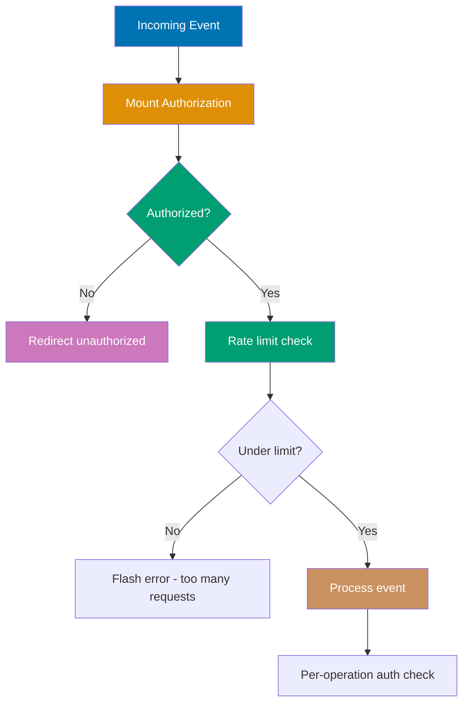

```elixir
defmodule MyAppWeb.RateLimiter do
# => Rate limiting with Hammer
  use Hammer.Plug, [
  # => Imports Hammer.Plug, [ behavior

    rate_limit: {"live_view_events", 60_000, 100}
    # => 100 events per 60s per user
  ]
  # => Closes list literal

  def call(conn, opts) do
  # => Defines call function

    # Extract user identifier
    user_id = get_user_id(conn)
    # => From session or token
    bucket_key = "live_view:#{user_id}"
    # => Unique key per user

    case Hammer.check_rate(bucket_key, 60_000, 100) do
    # => Pattern matches on result value

                                                      # => Check if under limit
                                                      # => 100 actions per 60 seconds
      {:allow, _count} ->
      # => Under limit, allow request
        conn
        # => Continue processing

      {:deny, _limit} ->
      # => Over limit, deny request
        conn
        # => conn piped into following operations
        |> put_status(:too_many_requests)
        # => Pipes result into put_status(:too_many_requests)

        |> Phoenix.Controller.json(%{error: "Rate limit exceeded"})
        # => Pipes result into Phoenix.Controller.json(%{error: "Rate l

        |> halt()
        # => Stop request processing
    end
    # => Closes enclosing function/module/block definition
  end
  # => Closes enclosing function/module/block definition

  defp get_user_id(conn) do
  # => Defines get_user_id function

    case conn.assigns[:current_user] do
    # => Pattern matches on result value

      %{id: id} -> id
      nil -> Phoenix.Controller.get_connect_info(conn, :peer_data).address
                                                      # => Fallback to IP address
    end
    # => Closes enclosing function/module/block definition
  end
  # => Closes enclosing function/module/block definition
end
# => Closes enclosing function/module/block definition
```

**LiveView security pattern**:

```elixir
defmodule MyAppWeb.SecureLive do
# => Secure LiveView implementation
  use MyAppWeb, :live_view
  # => Imports LiveView macros and callbacks


  # Authorization on mount
  def mount(_params, session, socket) do
  # => Check authorization
    socket = assign_current_user(socket, session)
    # => Load user from session

    if authorized?(socket) do
    # => Check permissions
      {:ok, socket}
      # => Returns success tuple to LiveView runtime

    else
    # => Else branch executes when condition was false
      {:ok, redirect(socket, to: "/unauthorized")}
      # => Redirect unauthorized users
    end
    # => Closes enclosing function/module/block definition
  end
  # => Closes enclosing function/module/block definition

  # Rate limit expensive events
  def handle_event("expensive_operation", params, socket) do
  # => Handles "expensive_operation" event from client

    user_id = socket.assigns.current_user.id
    # => user_id bound to result of socket.assigns.current_user.id

    bucket = "expensive_op:#{user_id}"
    # => bucket bound to result of "expensive_op:#{user_id}"


    case Hammer.check_rate(bucket, 60_000, 5) do
    # => 5 operations per minute
      {:allow, _} ->
      # => Matches this pattern — executes right-hand side
        perform_operation(params)
        # => Execute operation
        {:noreply, socket}
        # => Returns updated socket, triggers re-render


      {:deny, _} ->
      # => Matches this pattern — executes right-hand side
        socket = put_flash(socket, :error, "Too many requests. Please wait.")
        # => socket variable updated with new state
        {:noreply, socket}
        # => Returns updated socket, triggers re-render

    end
    # => Closes enclosing function/module/block definition
  end
  # => Closes enclosing function/module/block definition

  # CSRF protection for state-changing events
  def handle_event("delete_item", %{"id" => id}, socket) do
  # => Handles "delete_item" event from client

    if socket.assigns.current_user do
    # => Verify authenticated user
      MyApp.Items.delete(id, socket.assigns.current_user)
      {:noreply, socket}
      # => Returns updated socket, triggers re-render

    else
    # => Else branch executes when condition was false
      {:noreply, put_flash(socket, :error, "Unauthorized")}
    end
    # => Closes enclosing function/module/block definition
  end
  # => Closes enclosing function/module/block definition

  defp assign_current_user(socket, session) do
  # => Defines assign_current_user function

    case session["user_token"] do
    # => Pattern matches on result value

      nil -> assign(socket, :current_user, nil)
      # => Updates socket assigns

      token ->
      # => Matches this pattern — executes right-hand side
        user = Accounts.get_user_by_session_token(token)
        # => Calls Accounts.get_user_by_session_token context function

        assign(socket, :current_user, user)
        # => Updates socket assigns

    end
    # => Closes enclosing function/module/block definition
  end
  # => Closes enclosing function/module/block definition

  defp authorized?(socket) do
  # => Defines authorized function

    socket.assigns.current_user != nil
    # => Reads socket.assigns.current_user value
  end
  # => Closes enclosing function/module/block definition

  defp perform_operation(_params), do: :ok
  # => Defines perform_operation function

end
# => Closes enclosing function/module/block definition
```

**Why Hammer vs Core Features**: A pure GenServer+ETS rate limiter works for single-node deployments, but breaks when your application scales to multiple nodes since each node maintains its own ETS table. Hammer provides pluggable backends (ETS for single-node, Redis or Mnesia for distributed), meaning you start with the simple ETS backend and swap to a distributed backend without changing application code. For production Phoenix applications running on multiple nodes behind a load balancer, Hammer's distributed rate limiting is essential. Single-node applications can use a custom GenServer, but Hammer provides the same API regardless of deployment topology.

**Key Takeaway**: Use rate limiting (Hammer) to prevent abuse. Authorize users in mount/3. Validate permissions for state-changing events. Rate limit expensive operations separately. Use session tokens for authentication.

**Why It Matters**: Rate limiting and authorization are production security requirements for any LiveView with state-changing operations. LiveView's WebSocket nature means events bypass traditional HTTP middleware like Plug pipelines, making application-level rate limiting essential. A user could spam events directly through the WebSocket without rate limiting, causing database load, triggering emails, or consuming API quotas. Authorizing in mount prevents unauthorized users from even receiving the LiveView. Per-operation authorization in handle_event prevents privilege escalation when users modify protected resources. These patterns compose into a defense-in-depth security posture.

### Example 84: Optimizing Rendering with Temporary Assigns

Reduce memory usage for large datasets using temporary assigns that are cleared after rendering.

**Memory optimization strategy**:

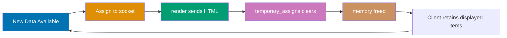

```elixir
defmodule MyAppWeb.LogsLive do
# => LiveView displaying large logs
  use MyAppWeb, :live_view
  # => Imports LiveView macros and callbacks


  def mount(_params, _session, socket) do
  # => Called on LiveView initialization

    socket = socket
    # => socket variable updated with new state
             |> assign(:page, 1)
             # => Sets assigns.page

             |> assign(:logs, [])
             # => Sets assigns.logs

             |> load_logs()
             # => Pipes result into load_logs()


    # Mark :logs as temporary
    socket = assign(socket, :logs, socket.assigns.logs)
    # => socket.assigns.logs = socket.assigns.logs

             |> assign(:logs_loaded, true)
             # => Sets assigns.logs_loaded


    {:ok, socket, temporary_assigns: [logs: []]}
    # => Clear :logs after each render
                                                      # => Reduces memory for large lists
                                                      # => :logs reset to [] after render
  end
  # => Closes enclosing function/module/block definition

  def handle_event("load_more", _params, socket) do
  # => Load next page
    socket = socket
    # => socket variable updated with new state
             |> update(:page, &(&1 + 1))
             # => Increment page
             |> load_logs()
             # => Fetch next page of logs

    {:noreply, socket}
    # => Re-render with new logs
                                                      # => Previous logs cleared from memory
  end
  # => Closes enclosing function/module/block definition

  defp load_logs(socket) do
  # => Fetches logs for current page
    page = socket.assigns.page
    # => page bound to result of socket.assigns.page

    logs = Logs.list_logs(page: page, per_page: 50)
    # => Get 50 logs
                                                      # => E.g., [%Log{message: "..."}, ...]

    assign(socket, :logs, logs)
    # => Assign new logs
                                                      # => Old logs already cleared
  end
  # => Closes enclosing function/module/block definition

  def render(assigns) do
  # => Generates LiveView HTML template

    ~H"""
    <!-- => Opens HEEx template — HTML+Elixir embedded template language -->
    <div id="logs-container" phx-update="append">
    <!-- => Div container wrapping component content -->
      <%!-- phx-update="append" adds new items without replacing existing DOM --%>
      <%!-- Preserves scroll position --%>

      <%= for log <- @logs do %>
      <!-- => Loops over @logs, binding each element to log -->
        <div id={"log-#{log.id}"} class="log-entry">
        <!-- => Div container with class="log-entry" -->
          <%!-- Each log needs unique id for append update --%>
          <span class="timestamp"><%= log.timestamp %></span>
          <!-- => span HTML element -->
          <span class="message"><%= log.message %></span>
          <!-- => span HTML element -->
        </div>
        <!-- => Closes outer div container -->
      <% end %>
      <!-- => End of conditional/loop block -->
    </div>
    <!-- => Closes outer div container -->

    <button phx-click="load_more">Load More</button>
    <!-- => Button triggers handle_event("load_more", ...) on click -->
    """
    # => First render: shows logs 1-50
    # => Click "Load More": appends logs 51-100
    # => Old logs persist in DOM, cleared from memory
  end
  # => Closes enclosing function/module/block definition
end
# => Closes enclosing function/module/block definition
```

**Streams for even better performance**:

```elixir
defmodule MyAppWeb.OptimizedLogsLive do
# => Using streams for large lists
  use MyAppWeb, :live_view
  # => Imports LiveView macros and callbacks


  def mount(_params, _session, socket) do
  # => Called on LiveView initialization

    socket = stream(socket, :logs, Logs.list_logs(page: 1, per_page: 50))
    # => Initializes efficient stream for large collections

                                                      # => Initialize stream
                                                      # => Stores logs in ETS table
                                                      # => Minimal memory in socket
    {:ok, socket}
    # => Returns success tuple to LiveView runtime

  end
  # => Closes enclosing function/module/block definition

  def handle_event("load_more", _params, socket) do
  # => Handles "load_more" event from client

    new_logs = Logs.list_logs(page: 2, per_page: 50)
    # => new_logs bound to result of Logs.list_logs(page: 2, per_page: 50)

    socket = stream_insert(socket, :logs, new_logs)
    # => Append to stream
                                                      # => Memory efficient
    {:noreply, socket}
    # => Returns updated socket, triggers re-render

  end
  # => Closes enclosing function/module/block definition

  def render(assigns) do
  # => Generates LiveView HTML template

    ~H"""
    <!-- => Opens HEEx template — HTML+Elixir embedded template language -->
    <div id="logs" phx-update="stream">
    <!-- => Div container wrapping component content -->
      <%!-- phx-update="stream" for stream rendering --%>

      <div :for={log <- @streams.logs} id={log.dom_id}>
      <!-- => Div container wrapping component content -->
        <%!-- @streams.logs iterates stream --%>
        <%!-- log.dom_id automatically generated --%>
        <%= log.message %>
        <!-- => Evaluates Elixir expression and outputs result as HTML -->
      </div>
      <!-- => Closes outer div container -->
    </div>
    <!-- => Closes outer div container -->
    """
    # => Closes HEEx template string
  end
  # => Closes enclosing function/module/block definition
end
# => Closes enclosing function/module/block definition
```

**Key Takeaway**: Use `temporary_assigns` to clear large data after rendering. Use `phx-update="append"` to preserve DOM while clearing memory. Use `stream/3` for best performance with large lists. Reduces LiveView process memory.

**Why It Matters**: Memory management is a production concern for LiveViews with high-frequency updates or large datasets. Each socket assign persists in the LiveView process's heap, so long-lived processes accumulating large data structures exhaust memory over hours or days. Temporary assigns solve this for rendering - data is cleared after the first render when it's no longer needed for comparisons. The phx-update='append' strategy maintains client-side list state while keeping server memory bounded. In production systems with always-on LiveViews like dashboards and monitoring tools, these patterns are the difference between stable and crashing processes.

### Example 85: Session and Token Management

Manage user sessions securely in LiveView applications.

**Session token lifecycle**:

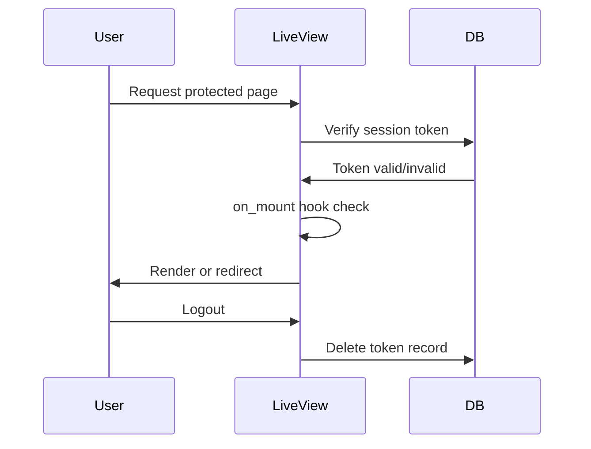

```elixir
defmodule MyAppWeb.UserSessionController do
# => Handles login/logout
  use MyAppWeb, :controller
  # => Imports MyAppWeb, :controller behavior


  def create(conn, %{"user" => %{"email" => email, "password" => password}}) do
  # => Defines create function

                                                      # => User login attempt
    case Accounts.authenticate_user(email, password) do
    # => Calls Accounts.authenticate_user context function

      {:ok, user} ->
      # => Matches this pattern — executes right-hand side
        token = Accounts.generate_session_token(user) # => Create session token
                                                      # => Cryptographically signed
        conn
        # => conn piped into following operations
        |> put_session(:user_token, token)
        # => Store in session
        |> put_flash(:info, "Logged in successfully")
        # => Pipes result into put_flash(:info, "Logged in successfully

        |> redirect(to: "/dashboard")
        # => Pipes result into redirect(to: "/dashboard")


      {:error, :invalid_credentials} ->
      # => Pattern: error result — reason bound to error reason
        conn
        # => conn piped into following operations
        |> put_flash(:error, "Invalid email or password")
        # => Pipes result into put_flash(:error, "Invalid email or pass

        |> redirect(to: "/login")
        # => Pipes result into redirect(to: "/login")

    end
    # => Closes enclosing function/module/block definition
  end
  # => Closes enclosing function/module/block definition

  def delete(conn, _params) do
  # => Logout
    token = get_session(conn, :user_token)
    # => token bound to result of get_session(conn, :user_token)

    Accounts.delete_session_token(token)
    # => Invalidate token in database

    conn
    # => conn piped into following operations
    |> clear_session()
    # => Clear session cookie
    |> put_flash(:info, "Logged out successfully")
    # => Pipes result into put_flash(:info, "Logged out successfull

    |> redirect(to: "/")
    # => Pipes result into redirect(to: "/")

  end
  # => Closes enclosing function/module/block definition
end
# => Closes enclosing function/module/block definition
```

**LiveView authentication**:

```elixir
defmodule MyAppWeb.DashboardLive do
# => Protected LiveView
  use MyAppWeb, :live_view
  # => Imports LiveView macros and callbacks


  # Fetch current user on mount
  on_mount {MyAppWeb.UserAuth, :ensure_authenticated} # => Hook verifies authentication
                                                      # => Runs before mount/3
                                                      # => Redirects if not authenticated

  def mount(_params, session, socket) do
  # => Called on LiveView initialization

    # User already assigned by on_mount hook
    user = socket.assigns.current_user
    # => Loaded from session token

    socket = assign(socket, :user_data, load_user_data(user))
    # => socket.assigns.user_data = load_user_data(user

    {:ok, socket}
    # => Returns success tuple to LiveView runtime

  end
  # => Closes enclosing function/module/block definition

  defp load_user_data(user), do: Accounts.get_user_dashboard_data(user)
  # => Defines load_user_data function

end
# => Closes enclosing function/module/block definition
```

**Authentication hook**:

```elixir
defmodule MyAppWeb.UserAuth do
# => LiveView authentication hook
  import Phoenix.LiveView
  # => Imports functions from Phoenix.LiveView


  def on_mount(:ensure_authenticated, _params, session, socket) do
  # => Defines on_mount function

                                                      # => Hook runs before mount
    case session["user_token"] do
    # => Pattern matches on result value

      nil ->
      # => No token, not logged in
        socket = socket
        # => socket variable updated with new state
                 |> put_flash(:error, "You must log in")
                 # => Pipes result into put_flash(:error, "You must log in")

                 |> redirect(to: "/login")
                 # => Pipes result into redirect(to: "/login")

        {:halt, socket}
        # => Stop mount, redirect

      token ->
      # => Matches this pattern — executes right-hand side
        user = Accounts.get_user_by_session_token(token)
        # => Calls Accounts.get_user_by_session_token context function

                                                      # => Load user from token
        if user do
        # => Branches on condition: executes inner block when user is truthy
          socket = assign(socket, :current_user, user)
          # => socket.assigns.current_user = user

          {:cont, socket}
          # => Continue to mount/3
        else
        # => Else branch executes when condition was false
          socket = socket
          # => socket variable updated with new state
                   |> put_flash(:error, "Invalid session")
                   # => Pipes result into put_flash(:error, "Invalid session")

                   |> redirect(to: "/login")
                   # => Pipes result into redirect(to: "/login")

          {:halt, socket}
          # => Message tuple: {halt, socket} matches in handle_info
        end
        # => Closes enclosing function/module/block definition
    end
    # => Closes enclosing function/module/block definition
  end
  # => Closes enclosing function/module/block definition
end
# => Closes enclosing function/module/block definition
```

**Token schema and functions**:

```elixir
defmodule MyApp.Accounts.UserToken do
# => Token schema
  use Ecto.Schema
  # => Imports Ecto.Schema behavior

  import Ecto.Query
  # => Imports functions from Ecto.Query


  schema "users_tokens" do
  # => Maps this schema to "users_tokens" database table
    field :token, :binary
    # => Cryptographic token
    field :context, :string
    # => "session", "reset_password"
    belongs_to :user, MyApp.Accounts.User
    # => Calls Accounts.User context function


    timestamps(updated_at: false)
    # => Adds inserted_at/updated_at fields with automatic management
  end
  # => Closes enclosing function/module/block definition

  def build_session_token(user) do
  # => Defines build_session_token function

    token = :crypto.strong_rand_bytes(32)
    # => Generate random token
    {token, %UserToken{
    # => Constructs return tuple: {token_string, token_struct}
      token: token,
      # => Sets token: field to token
      context: "session",
      # => Sets context: field to "session"
      user_id: user.id
      # => Sets user_id: field to user.id
    }}
    # => Closes nested struct/map construction
  end
  # => Closes enclosing function/module/block definition

  def verify_session_token_query(token) do
  # => Defines verify_session_token_query function

    query = from t in UserToken,
    # => query bound to result of from t in UserToken,

      where: t.token == ^token and t.context == "session",
      # => SQL WHERE: filters results matching condition
      join: u in assoc(t, :user),
      # => SQL JOIN: associates related table in query
      select: u
      # => SQL SELECT: specifies which fields/structs to return
    query
    # => Returns query to fetch user
  end
  # => Closes enclosing function/module/block definition
end
# => Closes enclosing function/module/block definition
```

**Key Takeaway**: Store session tokens in database for revocation. Use on_mount hooks for LiveView authentication. Generate cryptographic tokens with `:crypto.strong_rand_bytes`. Clear tokens on logout. Verify tokens before accessing protected LiveViews.

**Why It Matters**: Session and token management is the security foundation of authenticated LiveViews. Unlike HTTP requests where cookies provide automatic authentication, WebSocket connections require explicit token verification in mount. Database-backed tokens enable logout-from-all-devices, token revocation when security events are detected, and audit logging of active sessions. The on_mount hook pattern centralizes authentication logic so it applies consistently to all protected LiveViews without repetition. In production applications with security requirements - financial services, healthcare, enterprise tools - proper session management is a compliance requirement as much as a security practice.
