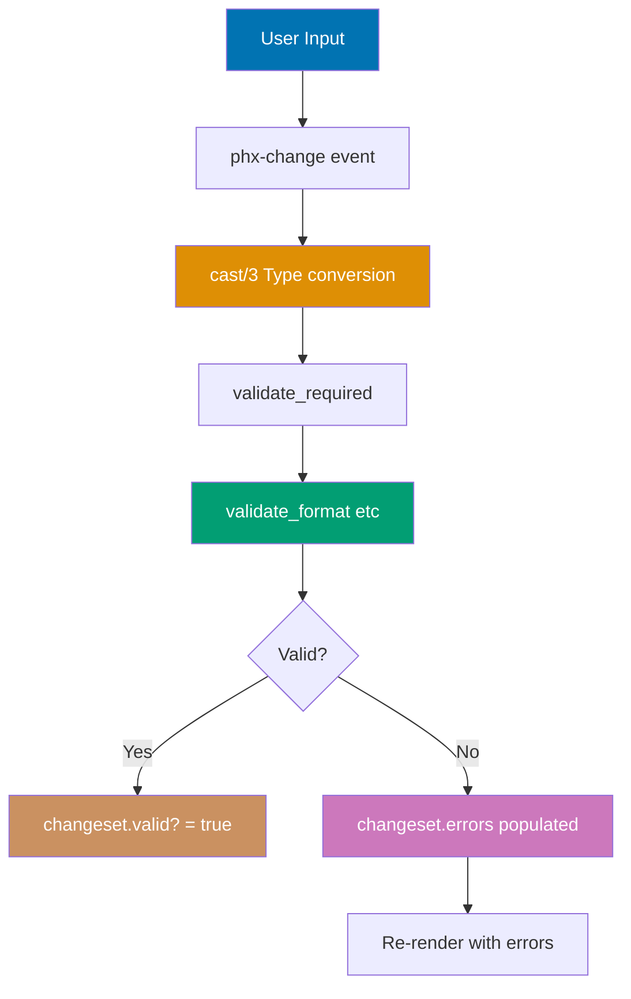
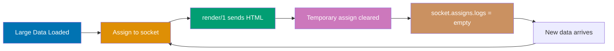
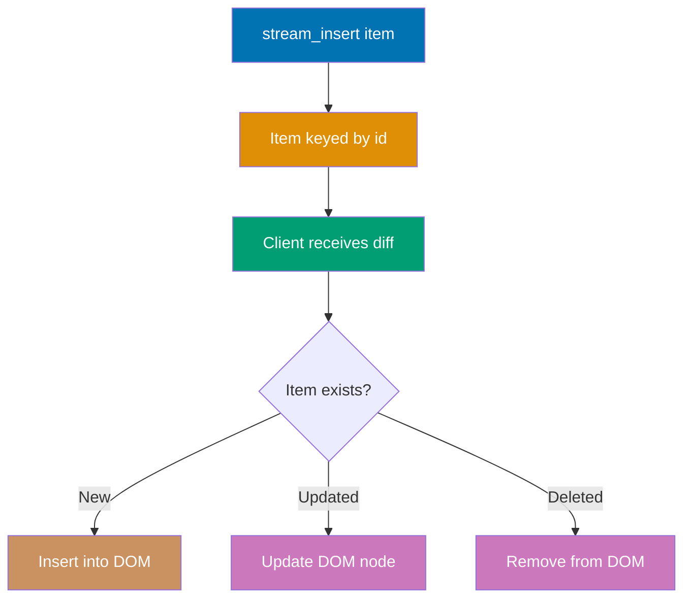
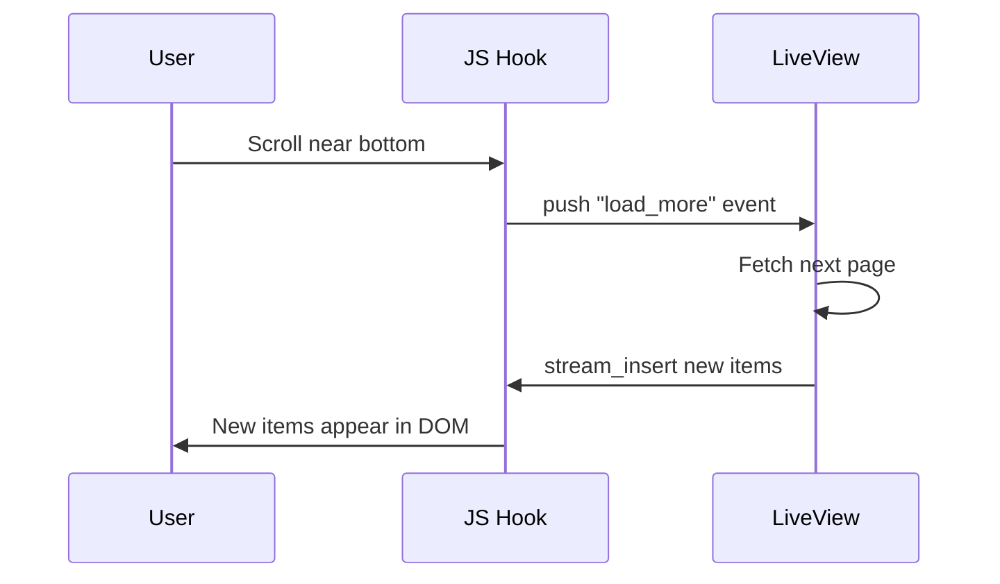
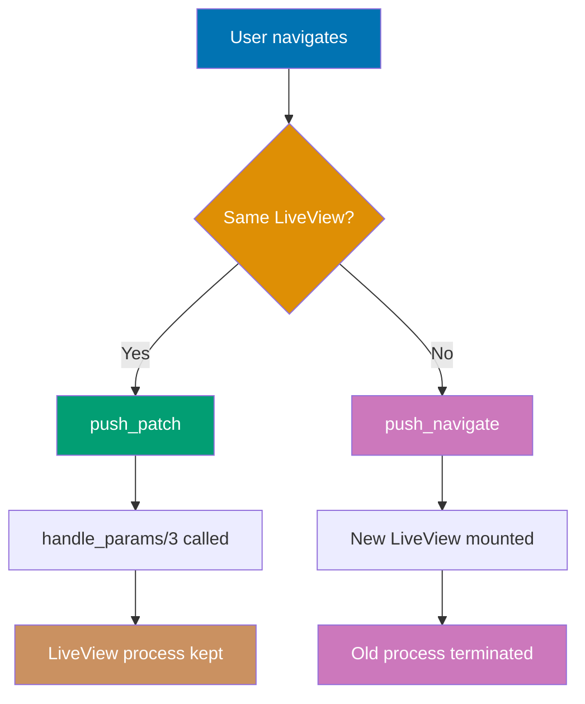
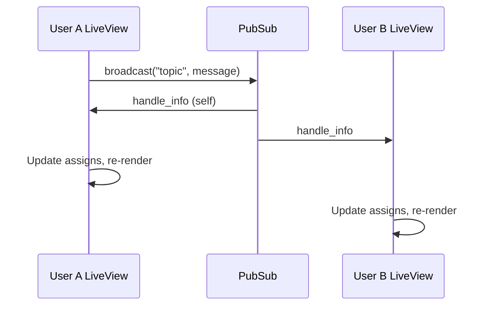
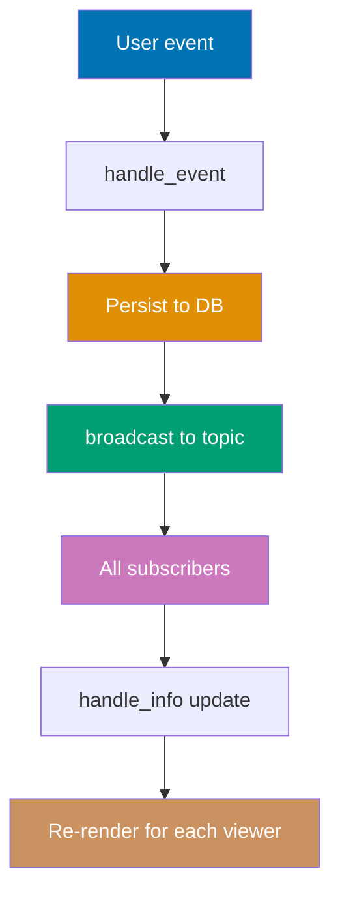
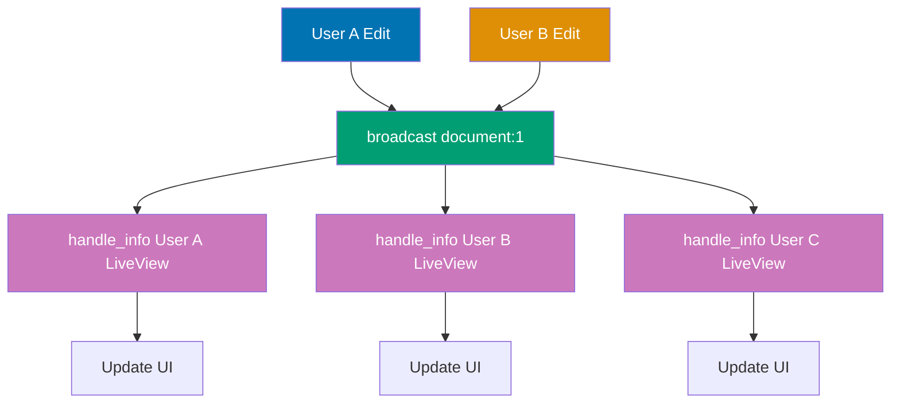
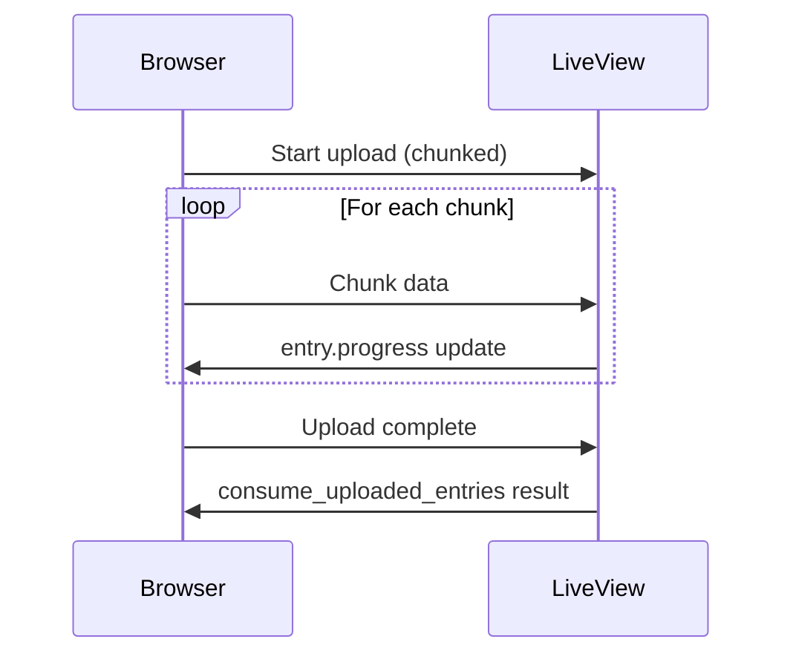
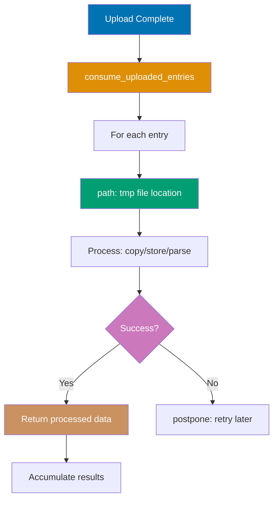

**Intermediate examples** cover forms and validation, state management patterns, real-time communication with PubSub, and file upload handling. These examples assume understanding of LiveView basics (mount, assigns, events, templates) and demonstrate practical patterns for production applications.

## Forms and Validation (Examples 31-40)

Forms in LiveView combine Ecto changesets with real-time validation, providing immediate feedback without page reloads.

### Example 31: Form Basics with Changesets

Forms in LiveView use Ecto changesets for validation and transformation. The changeset tracks form state and validation errors in real-time.

**Form validation architecture**:



**Code**:

```elixir
defmodule MyAppWeb.UserFormLive do
# => Defines module MyAppWeb.UserFormLive

  use MyAppWeb, :live_view
  # => Imports LiveView macros and callbacks

  alias MyApp.Accounts.User
  # => Aliases MyApp.Accounts.User for shorter references

  import Ecto.Changeset
  # => Imports functions from Ecto.Changeset


  # Initialize form with empty changeset
  def mount(_params, _session, socket) do
  # => Called on LiveView initialization

    changeset = change_user(%User{}) # => Empty changeset for User struct
    # => changeset.valid? is true (no validations run yet)
    socket = assign(socket, :form, to_form(changeset)) # => Convert changeset to form struct
    # => form ready for rendering with .to_form/1
    {:ok, socket} # => Socket ready with form assign
    # => Pattern: successful result — socket bound to returned value
  end
  # => Closes enclosing function/module/block definition

  # Handle form validation on input changes
  def handle_event("validate", %{"user" => user_params}, socket) do
  # => Handles "validate" event from client

    # Run validations without persisting
    changeset =
    # => Binds result to variable

      %User{}
      # => Creates empty User struct as base for changeset
      |> change_user(user_params) # => Applies user_params to empty User
      # => Pipes result into: change_user(user_params) # => Applies user_pa
      |> Map.put(:action, :validate) # => Marks changeset as validation (shows errors)
    # => changeset may have errors if validation fails

    socket = assign(socket, :form, to_form(changeset)) # => Update form with validation results
    # => socket.assigns.form = to_form(changeset)
    {:noreply, socket} # => Re-render with error messages
  end
  # => Closes enclosing function/module/block definition

  def render(assigns) do
  # => Generates LiveView HTML template

    ~H"""
    <!-- => Opens HEEx template — HTML+Elixir embedded template language -->
    <.form for={@form} phx-change="validate" phx-submit="save">
    <!-- => Form with live validation (phx-change) and submission (phx-submit) -->
      <.input field={@form[:name]} label="Name" />
      <!-- => Renders 'Name' text input with error display -->
      <.input field={@form[:email]} label="Email" type="email" />
      <!-- => Renders 'Email' email input with error display -->
      <.button>Save</.button>
      <!-- => Renders styled submit button -->
    </.form>
    <!-- => Closes .form element -->
    """
    # => Closes HEEx template string
  end
  # => Closes enclosing function/module/block definition

  defp change_user(user, attrs \\ %{}) do
  # => Defines change_user function

    # Define validation rules
    user
    # => user piped into following operations
    |> cast(attrs, [:name, :email]) # => Allow name and email fields
    # => Casts :name, :email from params — converts strings to typed values
    |> validate_required([:name, :email]) # => Both fields required
    # => Validates :name, :email are present — adds error if blank
    |> validate_format(:email, ~r/@/) # => Email must contain @
    # => Validates email matches regex pattern — error if no match
  end
  # => Closes enclosing function/module/block definition
end
# => Closes enclosing function/module/block definition
```

**Key Takeaway**: Use `phx-change="validate"` to trigger validation on every input change, providing real-time feedback with Ecto changesets.

**Why It Matters**: Real-time form validation is a core user experience feature in production applications. Using Ecto changesets for validation logic means your server and LiveView share the same validation rules, eliminating duplication and inconsistencies. Production applications - registration forms, checkout flows, complex admin interfaces - all benefit from immediate feedback. Users stay engaged when they see errors as they type rather than after submission. This pattern also prevents invalid data from reaching your database, centralizing validation at the Elixir layer.

### Example 32: Form Validation - Live Error Display

LiveView automatically displays validation errors as users type, using the changeset's error tracking.

**Code**:

```elixir
defmodule MyAppWeb.ProductFormLive do
# => Defines module MyAppWeb.ProductFormLive

  use MyAppWeb, :live_view
  # => Imports LiveView macros and callbacks

  import Ecto.Changeset
  # => Imports functions from Ecto.Changeset


  def mount(_params, _session, socket) do
  # => Called on LiveView initialization

    changeset = product_changeset(%{}) # => Empty changeset
    # => changeset contains validation state and any errors
    {:ok, assign(socket, form: to_form(changeset))} # => Form ready
    # => Converts changeset to Phoenix.HTML.Form struct for rendering
  end
  # => Closes enclosing function/module/block definition

  def handle_event("validate", %{"product" => params}, socket) do
  # => Handles "validate" event from client

    changeset =
    # => Binds result to variable

      params
      # => params piped into following operations
      |> product_changeset()
      # => Creates changeset for validation

      |> Map.put(:action, :validate) # => Show errors immediately
    # => If price < 0, changeset.errors includes {:price, {"must be greater than 0", []}}

    {:noreply, assign(socket, form: to_form(changeset))} # => Errors displayed in form
    # => Converts changeset to Phoenix.HTML.Form struct for rendering
    # => Re-render updates error display without page reload
  end
  # => Closes enclosing function/module/block definition

  def render(assigns) do
  # => Generates LiveView HTML template

    ~H"""
    <!-- => Opens HEEx template — HTML+Elixir embedded template language -->
    <.form for={@form} phx-change="validate">
    <!-- => Form with live validation — phx-change fires on every input change -->
      <.input field={@form[:name]} label="Product Name" />
      <!-- => Renders 'Product Name' text input with error display -->
      <%!-- Errors shown below input automatically --%>

      <.input field={@form[:price]} label="Price" type="number" step="0.01" />
      <!-- => Renders 'Price' number input with error display -->
      <%!-- If price < 0, error "must be greater than 0" appears --%>

      <.input field={@form[:quantity]} label="Quantity" type="number" />
      <!-- => Renders 'Quantity' number input with error display -->
      <%!-- If quantity not integer, error "must be an integer" appears --%>
    </.form>
    <!-- => Closes .form element -->
    """
    # => Closes HEEx template string
  end
  # => Closes enclosing function/module/block definition

  defp product_changeset(attrs) do
  # => Defines product_changeset function

    data = %{name: nil, price: nil, quantity: nil} # => Empty data
    # => data = %{name: nil, price: nil, quantity: nil}
    types = %{name: :string, price: :decimal, quantity: :integer} # => Field types
    # => types = %{name: :string, price: :decimal, quanti

    {data, types}
    # => Creates schemaless changeset: {data, types} tuple for Ecto validation
    |> cast(attrs, [:name, :price, :quantity]) # => Cast with type validation
    # => Casts :name, :price, :quantity from params — converts strings to typed values
    |> validate_required([:name, :price, :quantity]) # => All required
    # => Validates :name, :price, :quantity are present — adds error if blank
    |> validate_number(:price, greater_than: 0) # => Price must be positive
    # => Validates price numeric value meets conditions
    |> validate_number(:quantity, greater_than_or_equal_to: 0) # => Quantity >= 0
    # => Validates quantity numeric value meets conditions
  end
  # => Closes enclosing function/module/block definition
end
# => Closes enclosing function/module/block definition
```

**Key Takeaway**: Phoenix form components automatically display validation errors from the changeset when `:action` is set to `:validate`.

**Why It Matters**: Displaying validation errors as users type dramatically reduces form abandonment. In production applications, this pattern removes the frustration of submitting a form and receiving a list of errors - users know immediately when a field is invalid. The approach is efficient: only changed fields trigger re-validation, and LiveView sends only the error diff to the client. For complex multi-field forms in business applications, real-time error display is the difference between a professional product and a frustrating one.

### Example 33: Multi-field Forms

Handle complex forms with multiple related fields and cross-field validation.

**Code**:

```elixir
defmodule MyAppWeb.AddressFormLive do
# => Defines module MyAppWeb.AddressFormLive

  use MyAppWeb, :live_view
  # => Imports LiveView macros and callbacks

  import Ecto.Changeset
  # => Imports functions from Ecto.Changeset


  def mount(_params, _session, socket) do
  # => Called on LiveView initialization

    changeset = address_changeset(%{}) # => Empty address
    # => changeset contains validation state and any errors
    {:ok, assign(socket, form: to_form(changeset))} # => Ready to render
    # => Converts changeset to Phoenix.HTML.Form struct for rendering
  end
  # => Closes enclosing function/module/block definition

  def handle_event("validate", %{"address" => params}, socket) do
  # => Handles "validate" event from client

    changeset =
    # => Binds result to variable

      params
      # => params piped into following operations
      |> address_changeset()
      # => Creates changeset for validation

      |> Map.put(:action, :validate) # => Validate immediately
      # => action: :validate enables error display in form components

    {:noreply, assign(socket, form: to_form(changeset))} # => Display errors
    # => Converts changeset to Phoenix.HTML.Form struct for rendering
  end
  # => Closes enclosing function/module/block definition

  def handle_event("save", %{"address" => params}, socket) do
  # => Handles "save" event from client

    case address_changeset(params) do
    # => Creates changeset for validation

      %{valid?: true} = changeset ->
      # => Pattern: changeset is valid — proceed with success path
        # Apply changeset to get validated data
        address = apply_changes(changeset) # => Extract validated address map
        # => address: %{street: "...", city: "...", postal_code: "..."}
        IO.inspect(address, label: "Saved Address") # => Output: Saved Address: %{...}
        # => Output: Saved Address: <inspected value printed to console>
        {:noreply, socket} # => Success

      %{valid?: false} = changeset ->
      # => Pattern: changeset invalid — show validation errors
        # Invalid data, show errors
        {:noreply, assign(socket, form: to_form(changeset))} # => Display validation errors
        # => Converts changeset to Phoenix.HTML.Form struct for rendering
    end
    # => Closes enclosing function/module/block definition
  end
  # => Closes enclosing function/module/block definition

  def render(assigns) do
  # => Generates LiveView HTML template

    ~H"""
    <!-- => Opens HEEx template — HTML+Elixir embedded template language -->
    <.form for={@form} phx-change="validate" phx-submit="save">
    <!-- => Form with live validation (phx-change) and submission (phx-submit) -->
      <.input field={@form[:street]} label="Street Address" />
      <!-- => Renders 'Street Address' text input with error display -->
      <.input field={@form[:city]} label="City" />
      <!-- => Renders 'City' text input with error display -->
      <.input field={@form[:state]} label="State" />
      <!-- => Renders 'State' text input with error display -->
      <.input field={@form[:postal_code]} label="Postal Code" />
      <!-- => Renders 'Postal Code' text input with error display -->
      <.input field={@form[:country]} label="Country" />
      <!-- => Renders 'Country' text input with error display -->
      <.button>Save Address</.button>
      <!-- => Renders styled submit button -->
    </.form>
    <!-- => Closes .form element -->
    """
    # => Closes HEEx template string
  end
  # => Closes enclosing function/module/block definition

  defp address_changeset(attrs) do
  # => Defines address_changeset function

    data = %{street: nil, city: nil, state: nil, postal_code: nil, country: nil}
    # => data bound to result of %{street: nil, city: nil, state: nil, postal_code:

    types = %{street: :string, city: :string, state: :string, postal_code: :string, country: :string}
    # => types bound to result of %{street: :string, city: :string, state: :string,


    {data, types}
    # => Creates schemaless changeset: {data, types} tuple for Ecto validation
    |> cast(attrs, [:street, :city, :state, :postal_code, :country])
    # => Casts :street, :city, :state, :postal_code, :country from params to changeset

    |> validate_required([:street, :city, :postal_code, :country]) # => State optional
    # => Validates :street, :city, :postal_code, :country are present — adds error if blank
    |> validate_length(:postal_code, min: 5, max: 10) # => Postal code length
    # => Validates postal_code string length is within constraints
    |> validate_format(:postal_code, ~r/^[0-9A-Z\s-]+$/i) # => Alphanumeric + space/dash
    # => Validates postal_code matches regex pattern — error if no match
  end
  # => Closes enclosing function/module/block definition
end
# => Closes enclosing function/module/block definition
```

**Key Takeaway**: Use `apply_changes/1` to extract validated data from valid changesets for processing or persistence.

**Why It Matters**: Multi-field forms appear in virtually every production application - user registration, product creation, customer profiles. LiveView's approach using Ecto changesets provides consistent validation across all fields simultaneously. The changeset tracks which fields changed, allowing targeted error display without re-validating everything on each keystroke. This pattern scales to forms with dozens of fields while maintaining performance. Combining multiple validates\_\* functions on a single changeset keeps all validation logic co-located and testable independently from the UI.

### Example 34: Nested Forms - Embedded Schemas

Handle nested data structures like addresses embedded in user forms using `inputs_for`.

**Code**:

```elixir
defmodule MyAppWeb.UserWithAddressLive do
# => Defines module MyAppWeb.UserWithAddressLive

  use MyAppWeb, :live_view
  # => Imports LiveView macros and callbacks

  import Ecto.Changeset
  # => Imports functions from Ecto.Changeset


  def mount(_params, _session, socket) do
  # => Called on LiveView initialization

    changeset = user_changeset(%{}) # => User with empty address
    # => changeset contains validation state and any errors
    {:ok, assign(socket, form: to_form(changeset))} # => Ready
    # => Converts changeset to Phoenix.HTML.Form struct for rendering
  end
  # => Closes enclosing function/module/block definition

  def handle_event("validate", %{"user" => params}, socket) do
  # => Handles "validate" event from client

    changeset =
    # => Binds result to variable

      params
      # => params piped into following operations
      |> user_changeset()
      # => Creates changeset for validation

      |> Map.put(:action, :validate)
      # => Marks changeset action, enables error display


    {:noreply, assign(socket, form: to_form(changeset))}
    # => Updates socket assigns

  end
  # => Closes enclosing function/module/block definition

  def render(assigns) do
  # => Generates LiveView HTML template

    ~H"""
    <!-- => Opens HEEx template — HTML+Elixir embedded template language -->
    <.form for={@form} phx-change="validate">
    <!-- => Form with live validation — phx-change fires on every input change -->
      <.input field={@form[:name]} label="Name" />
      <!-- => Renders 'Name' text input with error display -->
      <.input field={@form[:email]} label="Email" type="email" />
      <!-- => Renders 'Email' email input with error display -->

      <%!-- Nested address fields using inputs_for --%>
      <.inputs_for :let={address_form} field={@form[:address]}>
      <!-- => Renders 'field' text input with error display -->
        <h3>Address</h3>
        <!-- => H3 heading element -->
        <.input field={address_form[:street]} label="Street" />
        <!-- => Renders 'Street' text input with error display -->
        <.input field={address_form[:city]} label="City" />
        <!-- => Renders 'City' text input with error display -->
        <.input field={address_form[:postal_code]} label="Postal Code" />
        <!-- => Renders 'Postal Code' text input with error display -->
      </.inputs_for>
      <!-- => Closes .inputs_for element -->
    </.form>
    <!-- => Closes .form element -->
    """
    # => Closes HEEx template string
  end
  # => Closes enclosing function/module/block definition

  defp user_changeset(attrs) do
  # => Defines user_changeset function

    data = %{name: nil, email: nil, address: %{street: nil, city: nil, postal_code: nil}}
    # => data bound to result of %{name: nil, email: nil, address: %{street: nil, c

    types = %{name: :string, email: :string, address: :map}
    # => types bound to result of %{name: :string, email: :string, address: :map}


    {data, types}
    # => Creates schemaless changeset: {data, types} tuple for Ecto validation
    |> cast(attrs, [:name, :email])
    # => Casts :name, :email from params to changeset

    |> validate_required([:name, :email])
    # => Validates listed fields are present

    # => Recursively validates embedded address schema
    |> cast_embed(:address, with: &address_changeset/2) # => Validate nested address
    # => address validation errors appear under address fields
  end
  # => Closes enclosing function/module/block definition

  defp address_changeset(address, attrs) do
  # => Defines address_changeset function

    types = %{street: :string, city: :string, postal_code: :string}
    # => types bound to result of %{street: :string, city: :string, postal_code: :st


    {address, types}
    # => Creates schemaless changeset: {address, types} tuple for Ecto validation
    |> cast(attrs, [:street, :city, :postal_code])
    # => Casts :street, :city, :postal_code from params to changeset

    |> validate_required([:street, :city, :postal_code]) # => All address fields required
    # => Validates :street, :city, :postal_code are present — adds error if blank
  end
  # => Closes enclosing function/module/block definition
end
# => Closes enclosing function/module/block definition
```

**Key Takeaway**: Use `cast_embed/3` for nested data and `inputs_for` in templates to render nested form fields with automatic validation.

**Why It Matters**: Nested forms with embedded schemas represent complex domain models - a product with variants, an order with line items, a user with multiple addresses. In production applications, this pattern eliminates the need for multiple forms and page transitions. Ecto's cast_embed/3 handles the relationship, and inputs_for generates properly named form fields that group nested data correctly. The changeset validation applies recursively, catching errors in both parent and nested records. This is essential for data-intensive business applications where entities have complex hierarchies.

### Example 35: Form Recovery - phx-auto-recover

Preserve form state during LiveView reconnections using `phx-auto-recover`.

**Code**:

```elixir
defmodule MyAppWeb.LongFormLive do
# => Defines module MyAppWeb.LongFormLive

  use MyAppWeb, :live_view
  # => Imports LiveView macros and callbacks


  def mount(_params, _session, socket) do
  # => Called on LiveView initialization

    changeset = article_changeset(%{}) # => Empty article
    # => changeset contains validation state and any errors
    {:ok, assign(socket, form: to_form(changeset))} # => Ready
    # => Converts changeset to Phoenix.HTML.Form struct for rendering
  end
  # => Closes enclosing function/module/block definition

  def handle_event("validate", %{"article" => params}, socket) do
  # => Handles "validate" event from client

    changeset =
    # => Binds result to variable

      params
      # => params piped into following operations
      |> article_changeset()
      # => Creates changeset for validation

      |> Map.put(:action, :validate)
      # => Marks changeset action, enables error display


    {:noreply, assign(socket, form: to_form(changeset))} # => Update form
    # => Converts changeset to Phoenix.HTML.Form struct for rendering
  end
  # => Closes enclosing function/module/block definition

  def render(assigns) do
  # => Generates LiveView HTML template

    ~H"""
    <!-- => Opens HEEx template — HTML+Elixir embedded template language -->
    <%!-- phx-auto-recover="ignore" preserves form inputs during reconnection --%>
    <.form for={@form} phx-change="validate" phx-auto-recover="ignore">
    <!-- => Form with live validation — phx-change fires on every input change -->
      <.input field={@form[:title]} label="Article Title" />
      <!-- => Renders 'Article Title' text input with error display -->

      <%!-- Long textarea benefits most from auto-recovery --%>
      <.input field={@form[:content]} label="Content" type="textarea" rows="20" />
      <!-- => Renders 'Content' textarea input with error display -->
      <%!-- If LiveView disconnects/reconnects, content preserved in browser --%>

      <.input field={@form[:tags]} label="Tags (comma-separated)" />
      <!-- => Renders 'Tags (comma-separated)' text input with error display -->
      <.button>Save Draft</.button>
      <!-- => Renders styled submit button -->
    </.form>
    <!-- => Closes .form element -->
    """
    # => Closes HEEx template string
  end
  # => Closes enclosing function/module/block definition

  defp article_changeset(attrs) do
  # => Defines article_changeset function

    data = %{title: nil, content: nil, tags: nil}
    # => data bound to result of %{title: nil, content: nil, tags: nil}

    types = %{title: :string, content: :string, tags: :string}
    # => types bound to result of %{title: :string, content: :string, tags: :string}


    {data, types}
    # => Creates schemaless changeset: {data, types} tuple for Ecto validation
    |> cast(attrs, [:title, :content, :tags])
    # => Casts :title, :content, :tags from params to changeset

    |> validate_required([:title, :content])
    # => Validates listed fields are present

    |> validate_length(:title, min: 5, max: 200)
    # => Validates field string length constraints

    |> validate_length(:content, min: 50)
    # => Validates field string length constraints

  end
  # => Closes enclosing function/module/block definition
end
# => Closes enclosing function/module/block definition
```

**Key Takeaway**: Add `phx-auto-recover="ignore"` to forms to preserve user input during LiveView disconnections, critical for long-form content.

**Why It Matters**: LiveView connections are WebSocket-based and can drop momentarily on mobile networks or sleep/wake cycles. Without auto-recovery, users lose form data they spent time entering - a major source of user frustration and support tickets in production. The phx-auto-recover attribute preserves form state during reconnection, transparently restoring user work. For long-form content like article drafts, configuration wizards, or multi-step forms, this protection is essential. Production applications with high mobile usage should always implement auto-recovery on forms with significant user input.

### Example 36: Submit Without Page Reload

Handle form submission with server-side processing and client-side feedback without full page reloads.

**Code**:

```elixir
defmodule MyAppWeb.ContactFormLive do
# => Defines module MyAppWeb.ContactFormLive

  use MyAppWeb, :live_view
  # => Imports LiveView macros and callbacks

  import Ecto.Changeset
  # => Imports functions from Ecto.Changeset


  def mount(_params, _session, socket) do
  # => Called on LiveView initialization

    changeset = contact_changeset(%{}) # => Empty contact form
    # => changeset contains validation state and any errors
    socket =
    # => socket updated via pipeline below
      socket
      # => Starting socket as base for pipeline operations
      |> assign(:form, to_form(changeset))
      # => Sets assigns.form

      |> assign(:submitted, false) # => Track submission state
      # => socket.assigns.submitted = false) # => Track submission state

    {:ok, socket} # => Ready
    # => Pattern: successful result — socket bound to returned value
  end
  # => Closes enclosing function/module/block definition

  def handle_event("validate", %{"contact" => params}, socket) do
  # => Handles "validate" event from client

    changeset =
    # => Binds result to variable

      params
      # => params piped into following operations
      |> contact_changeset()
      # => Creates changeset for validation

      |> Map.put(:action, :validate)
      # => Marks changeset action, enables error display


    {:noreply, assign(socket, form: to_form(changeset))} # => Live validation
    # => Converts changeset to Phoenix.HTML.Form struct for rendering
  end
  # => Closes enclosing function/module/block definition

  def handle_event("submit", %{"contact" => params}, socket) do
  # => Handles "submit" event from client

    changeset = contact_changeset(params) # => Final validation
    # => changeset contains validation state and any errors

    case changeset do
    # => Pattern matches on result value

      %{valid?: true} ->
      # => Pattern: changeset is valid — proceed with success path
        # Extract and process data
        contact = apply_changes(changeset) # => %{name: "...", email: "...", message: "..."}
        # => Extracts validated data struct from valid changeset
        IO.inspect(contact, label: "Contact Submission") # => Log submission
        # => Output: Contact Submission: <inspected value printed to console>

        # Simulate sending email
        Process.sleep(500) # => Simulate network delay
        # => Pauses execution for given milliseconds (for simulation)

        socket =
        # => socket updated via pipeline below
          socket
          # => Starting socket as base for pipeline operations
          |> assign(:submitted, true) # => Mark as submitted
          # => socket.assigns.submitted = true) # => Mark as submitted
          |> assign(:form, to_form(contact_changeset(%{}))) # => Reset form
        # => Form cleared, submitted flag true

        {:noreply, socket} # => Re-render with success message

      %{valid?: false} ->
      # => Pattern: changeset invalid — show validation errors
        # Show validation errors
        changeset = Map.put(changeset, :action, :validate)
        # => Returns new map with key updated

        {:noreply, assign(socket, form: to_form(changeset))} # => Display errors
        # => Converts changeset to Phoenix.HTML.Form struct for rendering
    end
    # => Closes enclosing function/module/block definition
  end
  # => Closes enclosing function/module/block definition

  def render(assigns) do
  # => Generates LiveView HTML template

    ~H"""
    <!-- => Opens HEEx template — HTML+Elixir embedded template language -->
    <div>
    <!-- => Div container wrapping component content -->
      <%= if @submitted do %>
      <!-- => Renders inner content only when @submitted is truthy -->
        <div class="alert alert-success">
        <!-- => Div container with class="alert alert-success" -->
          Thank you! Your message has been sent.
        </div>
        <!-- => Closes outer div container -->
      <% end %>
      <!-- => End of conditional/loop block -->

      <.form for={@form} phx-change="validate" phx-submit="submit">
      <!-- => Form with live validation (phx-change) and submission (phx-submit) -->
        <.input field={@form[:name]} label="Name" />
        <!-- => Renders 'Name' text input with error display -->
        <.input field={@form[:email]} label="Email" type="email" />
        <!-- => Renders 'Email' email input with error display -->
        <.input field={@form[:message]} label="Message" type="textarea" rows="5" />
        <!-- => Renders 'Message' textarea input with error display -->
        <.button>Send Message</.button>
        <!-- => Renders styled submit button -->
      </.form>
      <!-- => Closes .form element -->
    </div>
    <!-- => Closes outer div container -->
    """
    # => Closes HEEx template string
  end
  # => Closes enclosing function/module/block definition

  defp contact_changeset(attrs) do
  # => Defines contact_changeset function

    data = %{name: nil, email: nil, message: nil}
    # => data bound to result of %{name: nil, email: nil, message: nil}

    types = %{name: :string, email: :string, message: :string}
    # => types bound to result of %{name: :string, email: :string, message: :string}


    {data, types}
    # => Creates schemaless changeset: {data, types} tuple for Ecto validation
    |> cast(attrs, [:name, :email, :message])
    # => Casts :name, :email, :message from params to changeset

    |> validate_required([:name, :email, :message])
    # => Validates listed fields are present

    |> validate_format(:email, ~r/@/)
    # => Validates field matches regex pattern

    |> validate_length(:message, min: 10)
    # => Validates field string length constraints

  end
  # => Closes enclosing function/module/block definition
end
# => Closes enclosing function/module/block definition
```

**Key Takeaway**: Handle `phx-submit` events to process forms server-side without page reloads, showing success messages by updating assigns.

**Why It Matters**: Traditional form submission causes full page reloads, breaking user flow and requiring server-side session management for error states. LiveView forms submit over WebSocket, maintaining application state throughout the interaction. In production, this means users can submit forms without losing scroll position, notifications, or modal states. The server processes the submission, updates assigns, and re-renders only the changed parts. This approach also enables progressive success states - showing partial results while processing continues in the background using async operations.

### Example 37: Form Input Types - Text, Checkbox, Select

LiveView supports all standard HTML5 input types with automatic value binding.

**Code**:

```elixir
defmodule MyAppWeb.PreferencesFormLive do
# => Defines module MyAppWeb.PreferencesFormLive

  use MyAppWeb, :live_view
  # => Imports LiveView macros and callbacks

  import Ecto.Changeset
  # => Imports functions from Ecto.Changeset


  def mount(_params, _session, socket) do
  # => Called on LiveView initialization

    changeset = preferences_changeset(%{}) # => Empty preferences
    # => changeset contains validation state and any errors
    {:ok, assign(socket, form: to_form(changeset))} # => Ready
    # => Converts changeset to Phoenix.HTML.Form struct for rendering
  end
  # => Closes enclosing function/module/block definition

  def handle_event("validate", %{"preferences" => params}, socket) do
  # => Handles "validate" event from client

    changeset =
    # => Binds result to variable

      params
      # => params piped into following operations
      |> preferences_changeset()
      # => Creates changeset for validation

      |> Map.put(:action, :validate)
      # => Marks changeset action, enables error display


    {:noreply, assign(socket, form: to_form(changeset))}
    # => Updates socket with validated changeset
    # => Re-render shows errors for invalid fields

  end
  # => Closes enclosing function/module/block definition

  def render(assigns) do
  # => Generates LiveView HTML template

    ~H"""
    <!-- => Opens HEEx template — HTML+Elixir embedded template language -->
    <.form for={@form} phx-change="validate">
    <!-- => Form with live validation — phx-change fires on every input change -->
      <%!-- Text input — casts to :string --%>
      <.input field={@form[:username]} label="Username" />
      <!-- => Renders 'Username' text input with error display -->

      <%!-- Checkbox input - boolean value --%>
      <.input field={@form[:newsletter]} label="Subscribe to newsletter" type="checkbox" />
      <!-- => Renders 'Subscribe to newsletter' checkbox input with error display -->
      <%!-- Checked = true, unchecked = false --%>

      <%!-- Select input - dropdown --%>
      <.input
      <!-- => Renders 'field' text input with error display -->
        field={@form[:theme]}
        # => field bound to result of {@form[:theme]}

        label="Theme"
        # => label bound to result of "Theme"

        type="select"
        # => type bound to result of "select"

        options={[{"Light", "light"}, {"Dark", "dark"}, {"Auto", "auto"}]}
        # => options bound to result of {[{"Light", "light"}, {"Dark", "dark"}, {"Auto", "

      />
      <!-- => Self-closing tag — no inner content -->
      <%!-- Options: [{"Display", "value"}, ...] --%>

      <%!-- Number input --%>
      <.input field={@form[:items_per_page]} label="Items per page" type="number" />
      <!-- => Renders 'Items per page' number input with error display -->

      <%!-- Email input with HTML5 validation --%>
      <.input field={@form[:email]} label="Email" type="email" />
      <!-- => Renders 'Email' email input with error display -->
    </.form>
    <!-- => Closes .form element -->
    """
    # => Closes HEEx template string
  end
  # => Closes enclosing function/module/block definition

  defp preferences_changeset(attrs) do
  # => Defines preferences_changeset function

    data = %{username: nil, newsletter: false, theme: "auto", items_per_page: 10, email: nil}
    # => data bound to result of %{username: nil, newsletter: false, theme: "auto",

    types = %{username: :string, newsletter: :boolean, theme: :string, items_per_page: :integer, email: :string}
    # => types bound to result of %{username: :string, newsletter: :boolean, theme:


    {data, types}
    # => Creates schemaless changeset: {data, types} tuple for Ecto validation
    |> cast(attrs, [:username, :newsletter, :theme, :items_per_page, :email])
    # => Casts :username, :newsletter, :theme, :items_per_page, :email from params to changeset

    |> validate_required([:username, :email])
    # => Validates listed fields are present

    |> validate_inclusion(:theme, ["light", "dark", "auto"]) # => Theme must be valid
    # => Validates theme is one of the allowed values
    |> validate_number(:items_per_page, greater_than: 0, less_than_or_equal_to: 100)
    # => Validates field numeric constraints

  end
  # => Closes enclosing function/module/block definition
end
# => Closes enclosing function/module/block definition
```

**Key Takeaway**: Phoenix form components handle all HTML5 input types automatically, casting values to appropriate Elixir types via changesets.

**Why It Matters**: HTML5 input types provide semantic validation, keyboard optimization on mobile, and native UI widgets. LiveView's Phoenix.HTML.Form components handle the type conversion automatically - date inputs become Date structs, number inputs become integers, checkboxes become booleans. In production forms, using semantic input types improves accessibility (screen readers understand input purpose), reduces JavaScript (browser handles type validation), and improves mobile UX (correct keyboard appears). Using these types through changesets ensures consistent server-side casting regardless of how browsers format values.

### Example 38: Custom Form Components

Create reusable form components for complex input patterns.

**Code**:

```elixir
defmodule MyAppWeb.CustomFormLive do
# => Defines module MyAppWeb.CustomFormLive

  use MyAppWeb, :live_view
  # => Imports LiveView macros and callbacks


  def mount(_params, _session, socket) do
  # => Called on LiveView initialization

    changeset = event_changeset(%{}) # => Empty event
    # => changeset contains validation state and any errors
    {:ok, assign(socket, form: to_form(changeset))} # => Ready
    # => Converts changeset to Phoenix.HTML.Form struct for rendering
  end
  # => Closes enclosing function/module/block definition

  def handle_event("validate", %{"event" => params}, socket) do
  # => Handles "validate" event from client

    changeset =
    # => Binds result to variable

      params
      # => params piped into following operations
      |> event_changeset()
      # => Creates changeset for validation

      |> Map.put(:action, :validate)
      # => Marks changeset action, enables error display


    {:noreply, assign(socket, form: to_form(changeset))}
    # => Updates socket assigns

  end
  # => Closes enclosing function/module/block definition

  def render(assigns) do
  # => Generates LiveView HTML template

    ~H"""
    <!-- => Opens HEEx template — HTML+Elixir embedded template language -->
    <.form for={@form} phx-change="validate">
    <!-- => Form with live validation — phx-change fires on every input change -->
      <.input field={@form[:title]} label="Event Title" />
      <!-- => Renders 'Event Title' text input with error display -->

      <%!-- Custom date-time picker component --%>
      <.date_time_input field={@form[:starts_at]} label="Start Date & Time" />
      <!-- => element HTML element -->

      <%!-- Custom duration selector --%>
      <.duration_input field={@form[:duration_minutes]} label="Duration" />
      <!-- => element HTML element -->
    </.form>
    <!-- => Closes .form element -->
    """
    # => Closes HEEx template string
  end
  # => Closes enclosing function/module/block definition

  # Custom date-time input component
  def date_time_input(assigns) do
  # => Defines date_time_input function

    ~H"""
    <!-- => Opens HEEx template — HTML+Elixir embedded template language -->
    <div class="form-group">
    <!-- => Div container with class="form-group" -->
      <label><%= @label %></label>
      <!-- => label HTML element -->
      <input
      <!-- => text input field -->
        type="datetime-local"
        # => type bound to result of "datetime-local"

        id={@field.id}
        # => id bound to result of {@field.id}

        name={@field.name}
        # => name bound to result of {@field.name}

        value={@field.value}
        # => value bound to result of {@field.value}

        class="form-control"
        # => class bound to result of "form-control"

      />
      <!-- => Self-closing tag — no inner content -->
      <%!-- Display errors if present --%>
      <.error :for={msg <- @field.errors}><%= msg %></.error>
      <!-- => element HTML element -->
    </div>
    <!-- => Closes outer div container -->
    """
    # => Closes HEEx template string
  end
  # => Closes enclosing function/module/block definition

  # Custom duration selector (hours + minutes)
  def duration_input(assigns) do
  # => Defines duration_input function

    ~H"""
    <!-- => Opens HEEx template — HTML+Elixir embedded template language -->
    <div class="form-group">
    <!-- => Div container with class="form-group" -->
      <label><%= @label %></label>
      <!-- => label HTML element -->
      <select name={@field.name} id={@field.id} class="form-control">
      <!-- => select HTML element -->
        <option value="30">30 minutes</option>
        <!-- => option HTML element -->
        <option value="60" selected={@field.value == "60"}>1 hour</option>
        <!-- => option HTML element -->
        <option value="90">1.5 hours</option>
        <!-- => option HTML element -->
        <option value="120">2 hours</option>
        <!-- => option HTML element -->
      </select>
      <.error :for={msg <- @field.errors}><%= msg %></.error>
      <!-- => element HTML element -->
    </div>
    <!-- => Closes outer div container -->
    """
    # => Closes HEEx template string
  end
  # => Closes enclosing function/module/block definition

  defp event_changeset(attrs) do
  # => Defines event_changeset function

    data = %{title: nil, starts_at: nil, duration_minutes: 60}
    # => data bound to result of %{title: nil, starts_at: nil, duration_minutes: 60

    types = %{title: :string, starts_at: :naive_datetime, duration_minutes: :integer}
    # => types bound to result of %{title: :string, starts_at: :naive_datetime, dura


    {data, types}
    # => Creates schemaless changeset: {data, types} tuple for Ecto validation
    |> cast(attrs, [:title, :starts_at, :duration_minutes])
    # => Casts :title, :starts_at, :duration_minutes from params to changeset

    |> validate_required([:title, :starts_at])
    # => Validates listed fields are present

    |> validate_number(:duration_minutes, greater_than: 0)
    # => Validates field numeric constraints

  end
  # => Closes enclosing function/module/block definition
end
# => Closes enclosing function/module/block definition
```

**Key Takeaway**: Create custom function components for complex inputs by accessing `@field.id`, `@field.name`, `@field.value`, and `@field.errors`.

**Why It Matters**: Custom form components emerge naturally as applications grow - you find yourself repeating the same input structure (label, input, error message) across dozens of forms. Extracting this into a function component eliminates duplication and ensures consistent styling and behavior. In production applications, custom components also centralize accessibility features (proper label association, ARIA attributes) so they appear consistently. When design changes are needed - updating error styling, adding required field indicators - you change one component rather than dozens of template locations.

### Example 39: File Upload Basics

Enable file uploads with `allow_upload` configuration and upload validation.

**Code**:

```elixir
defmodule MyAppWeb.AvatarUploadLive do
# => Defines module MyAppWeb.AvatarUploadLive

  use MyAppWeb, :live_view
  # => Imports LiveView macros and callbacks


  def mount(_params, _session, socket) do
  # => Called on LiveView initialization

    socket =
    # => socket updated via pipeline below
      socket
      # => Starting socket as base for pipeline operations
      |> assign(:uploaded_files, []) # => Track uploaded files
      # => socket.assigns.uploaded_files = []) # => Track uploaded files
      |> allow_upload(:avatar, # => Configure avatar upload
      # => Configures avatar upload: sets file type, size, count limits
        accept: ~w(.jpg .jpeg .png), # => Allowed extensions
        max_entries: 1, # => Single file only
        max_file_size: 5_000_000 # => 5MB limit (bytes)
      )
    # => Upload configuration stored in socket

    {:ok, socket} # => Ready for uploads
    # => Pattern: successful result — socket bound to returned value
  end
  # => Closes enclosing function/module/block definition

  def handle_event("validate", _params, socket) do
  # => Handles "validate" event from client

    # Validation happens automatically based on allow_upload config
    # => LiveView checks file type and size constraints from allow_upload
    {:noreply, socket} # => Errors shown if file invalid
  end
  # => Closes enclosing function/module/block definition

  def handle_event("save", _params, socket) do
  # => Handles "save" event from client

    # Consume uploaded files
    uploaded_files =
    # => Binds result to variable

      consume_uploaded_entries(socket, :avatar, fn %{path: path}, entry ->
      # => Processes uploaded files, returns results list

        # path: temporary file path on server
        # entry: upload metadata (client_name, content_type, etc.)
        dest = Path.join("priv/static/uploads", entry.client_name) # => Destination path
        # => dest bound to result of Path.join(...)
        File.cp!(path, dest) # => Copy to permanent location
        {:ok, "/uploads/#{entry.client_name}"} # => Return public URL
        # => Pattern: successful result — result bound to returned value
      end)
    # => uploaded_files: ["/uploads/avatar.jpg"] or []

    socket = assign(socket, :uploaded_files, uploaded_files) # => Store uploaded paths
    # => socket.assigns.uploaded_files = uploaded_files
    {:noreply, socket} # => Display uploaded files
  end
  # => Closes enclosing function/module/block definition

  def render(assigns) do
  # => Generates LiveView HTML template

    ~H"""
    <!-- => Opens HEEx template — HTML+Elixir embedded template language -->
    <div>
    <!-- => Div container wrapping component content -->
      <form phx-change="validate" phx-submit="save">
      <!-- => form HTML element -->
        <%!-- File input with upload configuration --%>
        <.live_file_input upload={@uploads.avatar} />
        <!-- => element HTML element -->
        <%!-- Automatically validates against allow_upload rules --%>

        <%!-- Show validation errors --%>
        <%= for entry <- @uploads.avatar.entries do %>
        <!-- => Loops over @uploads.avatar.entries, binding each element to entry -->
          <div>
          <!-- => Div container wrapping component content -->
            <%= entry.client_name %> - <%= entry.progress %>%
            <!-- => Evaluates Elixir expression and outputs result as HTML -->
            <%!-- Display upload errors --%>
            <%= for err <- upload_errors(@uploads.avatar, entry) do %>
            <!-- => Loops over upload_errors(@uploads.avatar,, binding each element to err -->
              <p class="error"><%= error_to_string(err) %></p>
              <!-- => Paragraph element displaying dynamic content -->
            <% end %>
            <!-- => End of conditional/loop block -->
          </div>
          <!-- => Closes outer div container -->
        <% end %>
        <!-- => End of conditional/loop block -->

        <button type="submit">Upload</button>
        <!-- => Submit button — triggers phx-submit form event -->
      </form>
      <!-- => Closes form element — phx-submit/phx-change handlers deactivated -->

      <%!-- Display uploaded files --%>
      <%= for file <- @uploaded_files do %>
      <!-- => Loops over @uploaded_files, binding each element to file -->
        
        <!-- => img HTML element -->
      <% end %>
      <!-- => End of conditional/loop block -->
    </div>
    <!-- => Closes outer div container -->
    """
    # => Closes HEEx template string
  end
  # => Closes enclosing function/module/block definition

  defp error_to_string(:too_large), do: "File too large (max 5MB)"
  # => Defines error_to_string function

  defp error_to_string(:not_accepted), do: "Invalid file type (jpg, jpeg, png only)"
  # => Defines error_to_string function

end
# => Closes enclosing function/module/block definition
```

**Key Takeaway**: Use `allow_upload/3` to configure uploads with validation rules, then `consume_uploaded_entries/3` to process uploaded files.

**Why It Matters**: File upload is a common requirement in production applications: user avatars, document attachments, image galleries. LiveView's built-in file upload handles the complexity of multi-part form encoding, chunked uploading, progress tracking, and client-side validation without requiring custom JavaScript or third-party libraries. The allow_upload configuration declares constraints declaratively, and LiveView enforces them before processing begins. This prevents invalid files from consuming server resources or reaching storage services. Understanding this foundation is required before adding features like image previews, drag-and-drop, or cloud storage integration.

### Example 40: Form Progress Tracking

Track multi-step form progress with client-side state and server validation.

**Code**:

```elixir
defmodule MyAppWeb.WizardFormLive do
# => Defines module MyAppWeb.WizardFormLive

  use MyAppWeb, :live_view
  # => Imports LiveView macros and callbacks


  def mount(_params, _session, socket) do
  # => Called on LiveView initialization

    changeset = registration_changeset(%{}) # => Empty registration
    # => changeset contains validation state and any errors

    socket =
    # => socket updated via pipeline below
      socket
      # => Starting socket as base for pipeline operations
      |> assign(:form, to_form(changeset))
      # => Sets assigns.form

      |> assign(:current_step, 1) # => Start at step 1
      # => socket.assigns.current_step = 1) # => Start at step 1
      |> assign(:max_step, 3) # => 3 steps total
      # => socket.assigns.max_step = 3) # => 3 steps total

    {:ok, socket} # => Ready
    # => Pattern: successful result — socket bound to returned value
  end
  # => Closes enclosing function/module/block definition

  def handle_event("validate", %{"registration" => params}, socket) do
  # => Handles "validate" event from client

    changeset =
    # => Binds result to variable

      params
      # => params piped into following operations
      |> registration_changeset()
      # => Creates changeset for validation

      |> Map.put(:action, :validate)
      # => Marks changeset action, enables error display


    {:noreply, assign(socket, form: to_form(changeset))}
    # => Updates socket assigns

  end
  # => Closes enclosing function/module/block definition

  def handle_event("next_step", _params, socket) do
  # => Handles "next_step" event from client

    # Move to next step if not at max
    new_step = min(socket.assigns.current_step + 1, socket.assigns.max_step)
    # => new_step bound to result of min(socket.assigns.current_step + 1, socket.assign

    {:noreply, assign(socket, :current_step, new_step)} # => Increment step
  end
  # => Closes enclosing function/module/block definition

  def handle_event("prev_step", _params, socket) do
  # => Handles "prev_step" event from client

    # Move to previous step if not at first
    new_step = max(socket.assigns.current_step - 1, 1)
    # => new_step bound to result of max(socket.assigns.current_step - 1, 1)

    {:noreply, assign(socket, :current_step, new_step)} # => Decrement step
  end
  # => Closes enclosing function/module/block definition

  def render(assigns) do
  # => Generates LiveView HTML template

    ~H"""
    <!-- => Opens HEEx template — HTML+Elixir embedded template language -->
    <div>
    <!-- => Div container wrapping component content -->
      <%!-- Progress indicator --%>
      <div class="progress-bar">
      <!-- => Div container with class="progress-bar" -->
        Step <%= @current_step %> of <%= @max_step %>
        <!-- => Static text with interpolated Elixir expression -->
        <%= trunc((@current_step / @max_step) * 100) %>% complete
        <!-- => Evaluates Elixir expression and outputs result as HTML -->
      </div>
      <!-- => Closes outer div container -->

      <.form for={@form} phx-change="validate">
      <!-- => Form with live validation — phx-change fires on every input change -->
        <%!-- Step 1: Personal Info --%>
        <%= if @current_step == 1 do %>
        <!-- => Renders inner content only when @current_step == 1 is truthy -->
          <.input field={@form[:name]} label="Full Name" />
          <!-- => Renders 'Full Name' text input with error display -->
          <.input field={@form[:email]} label="Email" type="email" />
          <!-- => Renders 'Email' email input with error display -->
        <% end %>
        <!-- => End of conditional/loop block -->

        <%!-- Step 2: Address --%>
        <%= if @current_step == 2 do %>
        <!-- => Renders inner content only when @current_step == 2 is truthy -->
          <.input field={@form[:street]} label="Street Address" />
          <!-- => Renders 'Street Address' text input with error display -->
          <.input field={@form[:city]} label="City" />
          <!-- => Renders 'City' text input with error display -->
        <% end %>
        <!-- => End of conditional/loop block -->

        <%!-- Step 3: Confirmation --%>
        <%= if @current_step == 3 do %>
        <!-- => Renders inner content only when @current_step == 3 is truthy -->
          <p>Review your information:</p>
          <!-- => Paragraph element displaying dynamic content -->
          <p>Name: <%= @form[:name].value %></p>
          <!-- => Paragraph element displaying dynamic content -->
          <p>Email: <%= @form[:email].value %></p>
          <!-- => Paragraph element displaying dynamic content -->
          <p>Address: <%= @form[:street].value %>, <%= @form[:city].value %></p>
          <!-- => Paragraph element displaying dynamic content -->
        <% end %>
        <!-- => End of conditional/loop block -->

        <%!-- Navigation buttons --%>
        <button type="button" phx-click="prev_step" disabled={@current_step == 1}>
        <!-- => Button triggers handle_event("prev_step", ...) on click -->
          Previous
        </button>
        <!-- => Closes button element -->
        <button type="button" phx-click="next_step" disabled={@current_step == @max_step}>
        <!-- => Button triggers handle_event("next_step", ...) on click -->
          Next
        </button>
        <!-- => Closes button element -->
        <%= if @current_step == @max_step do %>
        <!-- => Renders inner content only when @current_step == @max_step is truthy -->
          <button type="submit">Submit</button>
          <!-- => Submit button — triggers phx-submit form event -->
        <% end %>
        <!-- => End of conditional/loop block -->
      </.form>
      <!-- => Closes .form element -->
    </div>
    <!-- => Closes outer div container -->
    """
    # => Closes HEEx template string
  end
  # => Closes enclosing function/module/block definition

  defp registration_changeset(attrs) do
  # => Defines registration_changeset function

    data = %{name: nil, email: nil, street: nil, city: nil}
    # => data bound to result of %{name: nil, email: nil, street: nil, city: nil}

    types = %{name: :string, email: :string, street: :string, city: :string}
    # => types bound to result of %{name: :string, email: :string, street: :string,


    {data, types}
    # => Creates schemaless changeset: {data, types} tuple for Ecto validation
    |> cast(attrs, [:name, :email, :street, :city])
    # => Casts :name, :email, :street, :city from params to changeset

    |> validate_required([:name, :email])
    # => Validates listed fields are present

  end
  # => Closes enclosing function/module/block definition
end
# => Closes enclosing function/module/block definition
```

**Key Takeaway**: Track multi-step form progress with a step counter assign, conditionally rendering form sections based on current step.

**Why It Matters**: Multi-step forms represent complex workflows in production applications: checkout funnels, onboarding sequences, configuration wizards. Tracking progress server-side with socket assigns means the user's state is preserved if they navigate away and return (assuming session persistence). The step counter approach also enables validation at each step before allowing progression, preventing users from reaching later steps with invalid earlier data. In production, this pattern also enables analytics - you can track where users abandon multi-step flows and optimize accordingly.

## State Management (Examples 41-50)

State management patterns optimize LiveView performance and handle complex data flows.

### Example 41: Temporary Assigns

Use temporary assigns for large lists that don't need to persist in memory between updates.

**Memory management with temporary assigns**:



**Code**:

```elixir
defmodule MyAppWeb.LogViewerLive do
# => Defines module MyAppWeb.LogViewerLive

  use MyAppWeb, :live_view
  # => Imports LiveView macros and callbacks


  def mount(_params, _session, socket) do
  # => Called on LiveView initialization

    socket =
    # => socket updated via pipeline below
      socket
      # => Starting socket as base for pipeline operations
      |> assign(:logs, fetch_logs()) # => Load initial logs
      # => socket.assigns.logs = fetch_logs()) # => Load initial logs
      |> assign(:page, 1) # => Current page number
      # => socket.assigns.page = 1) # => Current page number

    {:ok, socket, temporary_assigns: [logs: []]} # => logs cleared after render
    # => After render, socket.assigns.logs becomes []
    # => Reduces memory for large log lists
  end
  # => Closes enclosing function/module/block definition

  def handle_event("load_more", _params, socket) do
  # => Handles "load_more" event from client

    page = socket.assigns.page + 1 # => Increment page
    # => page = socket.assigns.page + 1 # => Increment p
    new_logs = fetch_logs(page) # => Fetch next page
    # => new_logs = fetch_logs(page) # => Fetch next page

    socket =
    # => socket updated via pipeline below
      socket
      # => Starting socket as base for pipeline operations
      |> assign(:logs, new_logs) # => Assign new logs (old logs already cleared)
      # => socket.assigns.logs = new_logs) # => Assign new logs (old logs
      |> assign(:page, page) # => Update page number
      # => socket.assigns.page = page) # => Update page number

    {:noreply, socket} # => Render new logs, then clear from memory
  end
  # => Closes enclosing function/module/block definition

  def render(assigns) do
  # => Generates LiveView HTML template

    ~H"""
    <!-- => Opens HEEx template — HTML+Elixir embedded template language -->
    <div>
    <!-- => Div container wrapping component content -->
      <h2>Application Logs</h2>
      <!-- => H2 heading element -->
      <ul>
      <!-- => List container for rendered items -->
        <%= for log <- @logs do %>
        <!-- => Loops over @logs, binding each element to log -->
          <li><%= log.timestamp %> - <%= log.message %></li>
          <!-- => List item rendered for each element -->
        <% end %>
        <!-- => End of conditional/loop block -->
      </ul>
      <!-- => Closes unordered list container -->
      <button phx-click="load_more">Load More</button>
      <!-- => Button triggers handle_event("load_more", ...) on click -->
    </div>
    <!-- => Closes outer div container -->
    """
    # => Closes HEEx template string
  end
  # => Closes enclosing function/module/block definition

  defp fetch_logs(page \\ 1) do
  # => Defines fetch_logs function

    # Simulate fetching logs from database
    Enum.map(1..50, fn i ->
    # => Transforms each element in list

      %{timestamp: DateTime.utc_now(), message: "Log entry #{(page - 1) * 50 + i}"}
    end)
    # => Closes anonymous function; returns result to calling function
  end
  # => Closes enclosing function/module/block definition
end
# => Closes enclosing function/module/block definition
```

**Key Takeaway**: Use `temporary_assigns` in mount's return tuple to automatically clear large data after rendering, reducing LiveView process memory.

**Why It Matters**: Large LiveView processes accumulate memory as lists grow - a live log viewer, activity feed, or search results page can exhaust memory if every item persists in socket assigns. Temporary assigns solve this by clearing large data structures after each render, keeping only what's needed for the next update. In production applications processing high-frequency data streams or displaying historical records, temporary assigns prevent out-of-memory crashes. This pattern is the foundation for streaming large datasets, as the client holds displayed data while the server holds only what's new.

### Example 42: assign_new for Lazy Evaluation

Use `assign_new/3` to lazily compute expensive assigns only when they don't exist.

**Code**:

```elixir
defmodule MyAppWeb.DashboardLive do
# => Defines module MyAppWeb.DashboardLive

  use MyAppWeb, :live_view
  # => Imports LiveView macros and callbacks


  def mount(_params, _session, socket) do
  # => Called on LiveView initialization

    socket =
    # => socket updated via pipeline below
      socket
      # => Starting socket as base for pipeline operations
      |> assign(:user_id, 123) # => Set user_id
      # => socket.assigns.user_id = 123) # => Set user_id
      |> assign_new(:stats, fn -> compute_expensive_stats(123) end) # => Lazy load stats
    # => compute_expensive_stats only runs if :stats not already assigned

    {:ok, socket} # => Ready
    # => Pattern: successful result — socket bound to returned value
  end
  # => Closes enclosing function/module/block definition

  def handle_event("refresh_stats", _params, socket) do
  # => Handles "refresh_stats" event from client

    # Force recalculation by removing and re-adding
    stats = compute_expensive_stats(socket.assigns.user_id) # => Recompute
    # => stats = compute_expensive_stats(socket.assigns.u
    {:noreply, assign(socket, :stats, stats)} # => Update stats
  end
  # => Closes enclosing function/module/block definition

  def handle_params(_params, _uri, socket) do
  # => Defines handle_params function

    # assign_new won't recompute stats on navigation
    socket = assign_new(socket, :stats, fn -> compute_expensive_stats(socket.assigns.user_id) end)
    # => Sets assign only if key missing

    # => stats remain from previous load
    {:noreply, socket} # => Keep existing stats
  end
  # => Closes enclosing function/module/block definition

  def render(assigns) do
  # => Generates LiveView HTML template

    ~H"""
    <!-- => Opens HEEx template — HTML+Elixir embedded template language -->
    <div>
    <!-- => Div container wrapping component content -->
      <h2>Dashboard</h2>
      <!-- => H2 heading element -->
      <p>Total Sales: <%= @stats.total_sales %></p>
      <!-- => Paragraph element displaying dynamic content -->
      <p>Active Users: <%= @stats.active_users %></p>
      <!-- => Paragraph element displaying dynamic content -->
      <button phx-click="refresh_stats">Refresh</button>
      <!-- => Button triggers handle_event("refresh_stats", ...) on click -->
    </div>
    <!-- => Closes outer div container -->
    """
    # => Closes HEEx template string
  end
  # => Closes enclosing function/module/block definition

  defp compute_expensive_stats(user_id) do
  # => Defines compute_expensive_stats function

    IO.puts("Computing expensive stats for user #{user_id}...")
    # => Output: prints string to console

    Process.sleep(1000) # => Simulate expensive computation
    # => Pauses execution for given milliseconds (for simulation)
    %{total_sales: 10_000, active_users: 250} # => Stats data
  end
  # => Closes enclosing function/module/block definition
end
# => Closes enclosing function/module/block definition
```

**Key Takeaway**: Use `assign_new/3` to lazily compute expensive assigns only when missing, preventing redundant calculations on navigation.

**Why It Matters**: Computing expensive data on every page navigation wastes resources when users navigate back to pages they've already loaded. assign_new checks if an assign already exists before executing the computation, making it ideal for data loaded from database queries or external APIs. In production LiveViews with navigation between multiple states, assign_new prevents redundant database queries on back navigation. The lazy initialization pattern also applies to expensive transformations - sorting, filtering, grouping - that should only run once when the underlying data hasn't changed.

### Example 43: Update Patterns - update/3

Use `update/3` to modify existing assigns based on their current value.

**Code**:

```elixir
defmodule MyAppWeb.CounterListLive do
# => Defines module MyAppWeb.CounterListLive

  use MyAppWeb, :live_view
  # => Imports LiveView macros and callbacks


  def mount(_params, _session, socket) do
  # => Called on LiveView initialization

    socket =
    # => socket updated via pipeline below
      socket
      # => Starting socket as base for pipeline operations
      |> assign(:counters, %{a: 0, b: 0, c: 0}) # => Three independent counters
      # => socket.assigns.counters = %{a: 0, b: 0, c: 0}) # => Three independ
      |> assign(:total_clicks, 0) # => Global click counter
      # => socket.assigns.total_clicks = 0) # => Global click counter

    {:ok, socket} # => Ready
    # => Pattern: successful result — socket bound to returned value
  end
  # => Closes enclosing function/module/block definition

  def handle_event("increment", %{"counter" => key}, socket) do
  # => Handles "increment" event from client

    counter_key = String.to_atom(key) # => Convert "a" to :a
    # => Converts string to atom — use carefully, atoms not GC'd

    socket =
    # => socket updated via pipeline below
      socket
      # => Starting socket as base for pipeline operations
      |> update(:counters, fn counters ->
      # => Updates assign using current value

        # Update nested map value
        Map.update!(counters, counter_key, &(&1 + 1)) # => Increment specific counter
        # => If counter_key is :a, counters becomes %{a: 1, b: 0, c: 0}
      end)
      # => Closes anonymous function; returns result to calling function
      |> update(:total_clicks, &(&1 + 1)) # => Increment total
      # => total_clicks goes from 0 to 1

    {:noreply, socket} # => Re-render with updated counters
  end
  # => Closes enclosing function/module/block definition

  def render(assigns) do
  # => Generates LiveView HTML template

    ~H"""
    <!-- => Opens HEEx template — HTML+Elixir embedded template language -->
    <div>
    <!-- => Div container wrapping component content -->
      <h2>Counters</h2>
      <!-- => H2 heading element -->
      <%= for {key, value} <- @counters do %>
      <!-- => Loops over @counters, binding each element to {key, value} -->
        <div>
        <!-- => Div container wrapping component content -->
          Counter <%= key %>: <%= value %>
          <!-- => Static text with interpolated Elixir expression -->
          <button phx-click="increment" phx-value-counter={key}>+</button>
          <!-- => Button triggers handle_event("increment", ...) on click -->
        </div>
        <!-- => Closes outer div container -->
      <% end %>
      <!-- => End of conditional/loop block -->
      <p>Total Clicks: <%= @total_clicks %></p>
      <!-- => Paragraph element displaying dynamic content -->
    </div>
    <!-- => Closes outer div container -->
    """
    # => Closes HEEx template string
  end
  # => Closes enclosing function/module/block definition
end
# => Closes enclosing function/module/block definition
```

**Key Takeaway**: Use `update/3` to modify assigns based on their current value, ideal for counters, toggles, and nested data updates.

**Why It Matters**: The update/3 pattern is fundamental to correct concurrent state management. Reading and writing assigns separately creates a time-of-check-to-time-of-use race condition when multiple events fire rapidly. The update function receives the guaranteed current value and returns the new value atomically, eliminating this race. In production applications with high event frequency - real-time dashboards, games, collaborative editors - atomic state updates prevent subtle bugs that only appear under load. This functional transformation approach also makes state changes testable in isolation.

### Example 44: Stream Collections

Use streams for efficiently rendering and updating large lists with automatic DOM diffing.

**Stream update mechanism**:



**Code**:

```elixir
defmodule MyAppWeb.TaskListLive do
# => Defines module MyAppWeb.TaskListLive

  use MyAppWeb, :live_view
  # => Imports LiveView macros and callbacks


  def mount(_params, _session, socket) do
  # => Called on LiveView initialization

    tasks = [
    # => tasks bound to result of [

      %{id: 1, title: "Task 1", completed: false},
      # => Map with id: 1 — hardcoded sample data for demonstration
      %{id: 2, title: "Task 2", completed: false}
      # => Map with id: 2 — hardcoded sample data for demonstration
    ]
    # => Closes list literal

    socket =
    # => socket updated via pipeline below
      socket
      # => Starting socket as base for pipeline operations
      |> stream(:tasks, tasks) # => Initialize stream with tasks
      # => Stream tracks items by :id field
      # => Client renders list keyed by item :id

    {:ok, socket} # => Ready
    # => Pattern: successful result — socket bound to returned value
  end
  # => Closes enclosing function/module/block definition

  def handle_event("add_task", %{"title" => title}, socket) do
  # => Handles "add_task" event from client

    new_task = %{id: System.unique_integer([:positive]), title: title, completed: false}
    # => new_task bound to result of %{id: System.unique_integer([:positive]), title: t

    # => Create new task with unique ID

    socket = stream_insert(socket, :tasks, new_task, at: 0) # => Prepend to stream
    # => Only new task sent to client, existing tasks unchanged
    {:noreply, socket} # => Efficient update
  end
  # => Closes enclosing function/module/block definition

  def handle_event("delete_task", %{"id" => id_str}, socket) do
  # => Handles "delete_task" event from client

    id = String.to_integer(id_str) # => Convert to integer
    # => Converts "123" to integer 123 — raises if not valid integer
    socket = stream_delete_by_dom_id(socket, :tasks, "tasks-#{id}") # => Remove from stream
    # => Only deletion sent to client
    {:noreply, socket} # => Task removed from DOM
  end
  # => Closes enclosing function/module/block definition

  def render(assigns) do
  # => Generates LiveView HTML template

    ~H"""
    <!-- => Opens HEEx template — HTML+Elixir embedded template language -->
    <div>
    <!-- => Div container wrapping component content -->
      <h2>Task List</h2>
      <!-- => H2 heading element -->
      <form phx-submit="add_task">
      <!-- => form HTML element -->
        <input type="text" name="title" placeholder="New task" />
        <!-- => text input field -->
        <button>Add</button>
        <!-- => Button element -->
      </form>
      <!-- => Closes form element — phx-submit/phx-change handlers deactivated -->

      <%!-- Stream rendering with phx-update="stream" --%>
      <ul id="tasks" phx-update="stream">
      <!-- => List container for rendered items -->
        <%= for {dom_id, task} <- @streams.tasks do %>
        <!-- => Loops over @streams.tasks, binding each element to {dom_id, task} -->
          <li id={dom_id}>
          <!-- => List item rendered for each element -->
            <%= task.title %>
            <!-- => Evaluates Elixir expression and outputs result as HTML -->
            <button phx-click="delete_task" phx-value-id={task.id}>Delete</button>
            <!-- => Button triggers handle_event("delete_task", ...) on click -->
          </li>
          <!-- => Closes list item element -->
        <% end %>
        <!-- => End of conditional/loop block -->
      </ul>
      <!-- => Closes unordered list container -->
    </div>
    <!-- => Closes outer div container -->
    """
    # => Closes HEEx template string
  end
  # => Closes enclosing function/module/block definition
end
# => Closes enclosing function/module/block definition
```

**Key Takeaway**: Use `stream/3` for large lists to enable efficient DOM updates - only changed items are sent to client, not entire list.

**Why It Matters**: Lists in LiveView are a performance challenge at scale. Sending full list HTML on every change becomes impractical when lists have thousands of items or update frequently. Streams solve this by maintaining a virtual list on the client and sending only diffs - new items, updated items, deleted items. In production applications like admin dashboards, activity feeds, or data grids, streams enable smooth real-time updates without the memory and bandwidth cost of full list re-rendering. The stream API also integrates with pagination and infinite scroll for complete list management.

### Example 45: Reset Stream on Disconnect

Prevent stream memory leaks by resetting streams when clients disconnect.

**Code**:

```elixir
defmodule MyAppWeb.ActivityFeedLive do
# => Defines module MyAppWeb.ActivityFeedLive

  use MyAppWeb, :live_view
  # => Imports LiveView macros and callbacks


  def mount(_params, _session, socket) do
  # => Called on LiveView initialization

    if connected?(socket) do
    # => Returns true when WebSocket established

      # Connected over WebSocket
      Phoenix.PubSub.subscribe(MyApp.PubSub, "activities") # => Subscribe to updates
      # => Subscribes process to broadcast topic — receives future broadcasts
      activities = load_recent_activities() # => Load from database
      # => activities = load_recent_activities() # => Load from

      socket =
      # => socket updated via pipeline below
        socket
        # => Starting socket as base for pipeline operations
        |> stream(:activities, activities, reset: true) # => Reset on reconnect
        # => Clears any stale stream data from disconnection

      {:ok, socket}
      # => Returns success tuple to LiveView runtime

    else
    # => Else branch executes when condition was false
      # Initial HTTP render (not connected yet)
      {:ok, assign(socket, :activities_loaded, false)} # => Defer loading
      # => Pattern: successful result — result bound to returned value
    end
    # => Closes enclosing function/module/block definition
  end
  # => Closes enclosing function/module/block definition

  def handle_info({:new_activity, activity}, socket) do
  # => Handles internal Elixir messages

    # Received from PubSub
    socket = stream_insert(socket, :activities, activity, at: 0) # => Prepend new activity
    # => Inserts/updates item in stream — patches only changed DOM node
    {:noreply, socket} # => Update feed
  end
  # => Closes enclosing function/module/block definition

  def render(assigns) do
  # => Generates LiveView HTML template

    ~H"""
    <!-- => Opens HEEx template — HTML+Elixir embedded template language -->
    <div>
    <!-- => Div container wrapping component content -->
      <h2>Activity Feed</h2>
      <!-- => H2 heading element -->
      <ul id="activities" phx-update="stream">
      <!-- => List container for rendered items -->
        <%= for {dom_id, activity} <- @streams.activities do %>
        <!-- => Loops over @streams.activities, binding each element to {dom_id, activity} -->
          <li id={dom_id}><%= activity.description %></li>
          <!-- => List item rendered for each element -->
        <% end %>
        <!-- => End of conditional/loop block -->
      </ul>
      <!-- => Closes unordered list container -->
    </div>
    <!-- => Closes outer div container -->
    """
    # => Closes HEEx template string
  end
  # => Closes enclosing function/module/block definition

  defp load_recent_activities do
  # => Defines load_recent_activities function

    # Simulate database query
    [
    # => Opens list of metric definitions
      %{id: 1, description: "User logged in"},
      # => Map with id: 1 — hardcoded sample data for demonstration
      %{id: 2, description: "New comment posted"}
      # => Map with id: 2 — hardcoded sample data for demonstration
    ]
    # => Closes list literal
  end
  # => Closes enclosing function/module/block definition
end
# => Closes enclosing function/module/block definition
```

**Key Takeaway**: Use `reset: true` with streams in mount when `connected?/1` to prevent memory leaks from accumulated stream data during disconnections.

**Why It Matters**: WebSocket connections disconnect on mobile network changes, page hibernation, or server deployments. When a LiveView reconnects, its mount function runs again, creating fresh state. Without stream reset handling, reconnections can cause duplicate items because the client still has items from before disconnection while the server re-sends them. In production applications with streams, resetting on connected? ensures the client and server state are synchronized after reconnection. This prevents the confusing user experience of seeing duplicate entries or out-of-order items after network interruptions.

### Example 46: Pagination with Streams

Implement efficient pagination using streams for large datasets.

**Code**:

```elixir
defmodule MyAppWeb.ProductListLive do
# => Defines module MyAppWeb.ProductListLive

  use MyAppWeb, :live_view
  # => Imports LiveView macros and callbacks


  @page_size 20
  # => Module-level constant @page_size = 20

  def mount(_params, _session, socket) do
  # => Called on LiveView initialization

    socket =
    # => socket updated via pipeline below
      socket
      # => Starting socket as base for pipeline operations
      |> assign(:page, 1) # => Current page (increments on scroll trigger)
      # => socket.assigns.page = 1) # => Current page
      |> load_products() # => Load first page
      # => Pipes result into: load_products() # => Load first page

    {:ok, socket} # => Ready
    # => Pattern: successful result — socket bound to returned value
  end
  # => Closes enclosing function/module/block definition

  def handle_event("load_next_page", _params, socket) do
  # => Handles "load_next_page" event from client

    socket =
    # => socket updated via pipeline below
      socket
      # => Starting socket as base for pipeline operations
      |> update(:page, &(&1 + 1)) # => Increment page
      # => Transforms assigns.page using current value via function
      |> load_products() # => Load next page
      # => Pipes result into: load_products() # => Load next page

    {:noreply, socket} # => Append products to stream
  end
  # => Closes enclosing function/module/block definition

  defp load_products(socket) do
  # => Defines load_products function

    page = socket.assigns.page
    # => page bound to result of socket.assigns.page

    offset = (page - 1) * @page_size # => Calculate offset
    # => offset = (page - 1) * @page_size # => Calculate o
    products = fetch_products(offset, @page_size) # => Query database
    # => products: [%{id: 1, name: "Product 1"}, ...]

    if page == 1 do
    # => Branches on condition: executes inner block when page == 1 is truthy
      # First page: initialize stream
      stream(socket, :products, products) # => Create new stream
    else
    # => Else branch executes when condition was false
      # Subsequent pages: append to stream
      Enum.reduce(products, socket, fn product, acc ->
      # => Accumulates result by applying function to each element
        stream_insert(acc, :products, product, at: -1) # => Append to end
        # => Inserts/updates item in stream — patches only changed DOM node
      end)
      # => Closes anonymous function; returns result to calling function
    end
    # => Closes enclosing function/module/block definition
  end
  # => Closes enclosing function/module/block definition

  def render(assigns) do
  # => Generates LiveView HTML template

    ~H"""
    <!-- => Opens HEEx template — HTML+Elixir embedded template language -->
    <div>
    <!-- => Div container wrapping component content -->
      <h2>Products</h2>
      <!-- => H2 heading element -->
      <ul id="products" phx-update="stream">
      <!-- => List container for rendered items -->
        <%= for {dom_id, product} <- @streams.products do %>
        <!-- => Loops over @streams.products, binding each element to {dom_id, product} -->
          <li id={dom_id}><%= product.name %></li>
          <!-- => List item rendered for each element -->
        <% end %>
        <!-- => End of conditional/loop block -->
      </ul>
      <!-- => Closes unordered list container -->
      <button phx-click="load_next_page">Load More</button>
      <!-- => Button triggers handle_event("load_next_page", ...) on click -->
    </div>
    <!-- => Closes outer div container -->
    """
    # => Closes HEEx template string
  end
  # => Closes enclosing function/module/block definition

  defp fetch_products(offset, limit) do
  # => Defines fetch_products function

    # Simulate database query
    Enum.map((offset + 1)..(offset + limit), fn i ->
    # => Transforms each element in list

      %{id: i, name: "Product #{i}"}
      # => Creates map with id: i — dynamically generated sample data
    end)
    # => Closes anonymous function; returns result to calling function
  end
  # => Closes enclosing function/module/block definition
end
# => Closes enclosing function/module/block definition
```

**Key Takeaway**: Combine streams with pagination to efficiently load and render large datasets, appending new pages without re-sending existing items.

**Why It Matters**: Loading all data up front is impractical for large datasets - a table with 10,000 rows should load the first 50 and let users page through. Combining streams with pagination loads initial data then appends subsequent pages as single stream batches. The client maintains its place in the data while the server fetches the next page on demand. In production applications, this pattern enables browsing large datasets without memory pressure on either client or server. It also integrates naturally with database query optimization - each page maps to a database LIMIT/OFFSET or cursor-based query.

### Example 47: Infinite Scroll

Implement infinite scroll by detecting when user scrolls near bottom and loading more content.

**Infinite scroll mechanism**:



**Code**:

```elixir
defmodule MyAppWeb.InfiniteScrollLive do
# => Defines module MyAppWeb.InfiniteScrollLive

  use MyAppWeb, :live_view
  # => Imports LiveView macros and callbacks


  @page_size 20
  # => Module-level constant @page_size = 20

  def mount(_params, _session, socket) do
  # => Called on LiveView initialization

    socket =
    # => socket updated via pipeline below
      socket
      # => Starting socket as base for pipeline operations
      |> assign(:page, 1)
      # => Sets assigns.page

      |> assign(:has_more, true) # => Track if more items available
      # => socket.assigns.has_more = true) # => Track if more items available
      |> load_page()
      # => Pipes result into load_page()


    {:ok, socket}
    # => Returns success tuple to LiveView runtime

  end
  # => Closes enclosing function/module/block definition

  def handle_event("load-more", _params, socket) do
  # => Handles "load-more" event from client

    if socket.assigns.has_more do
    # => Branches on condition: executes inner block when socket.assigns.has_more is truthy
      socket =
      # => socket updated via pipeline below
        socket
        # => Starting socket as base for pipeline operations
        |> update(:page, &(&1 + 1))
        # => Updates assign using current value

        |> load_page()
        # => Pipes result into load_page()


      {:noreply, socket}
      # => Returns updated socket, triggers re-render

    else
    # => Else branch executes when condition was false
      {:noreply, socket} # => No more items
    end
    # => Closes enclosing function/module/block definition
  end
  # => Closes enclosing function/module/block definition

  defp load_page(socket) do
  # => Defines load_page function

    page = socket.assigns.page
    # => page bound to result of socket.assigns.page

    items = fetch_items(page, @page_size)
    # => items bound to result of fetch_items(page, @page_size)

    has_more = length(items) == @page_size # => Check if more available
    # => has_more = length(items) == @page_size # => Check i

    socket =
    # => socket updated via pipeline below
      socket
      # => Starting socket as base for pipeline operations
      |> assign(:has_more, has_more)
      # => Sets assigns.has_more

      |> then(fn socket ->
      # => Pipes result into then(fn socket ->

        if page == 1 do
        # => Branches on condition: executes inner block when page == 1 is truthy
          stream(socket, :items, items)
          # => Initializes efficient stream for large collections

        else
        # => Else branch executes when condition was false
          Enum.reduce(items, socket, fn item, acc ->
          # => Accumulates result by applying function to each element
            stream_insert(acc, :items, item, at: -1)
            # => Inserts item into stream, triggers DOM patch

          end)
          # => Closes anonymous function; returns result to calling function
        end
        # => Closes enclosing function/module/block definition
      end)
      # => Closes anonymous function; returns result to calling function

    socket
    # => Starting socket as base for pipeline operations
  end
  # => Closes enclosing function/module/block definition

  def render(assigns) do
  # => Generates LiveView HTML template

    ~H"""
    <!-- => Opens HEEx template — HTML+Elixir embedded template language -->
    <div id="infinite-scroll-container" phx-hook="InfiniteScroll">
    <!-- => Div container wrapping component content -->
      <ul id="items" phx-update="stream">
      <!-- => List container for rendered items -->
        <%= for {dom_id, item} <- @streams.items do %>
        <!-- => Loops over @streams.items, binding each element to {dom_id, item} -->
          <li id={dom_id}><%= item.content %></li>
          <!-- => List item rendered for each element -->
        <% end %>
        <!-- => End of conditional/loop block -->
      </ul>
      <!-- => Closes unordered list container -->

      <%= if @has_more do %>
      <!-- => Renders inner content only when @has_more is truthy -->
        <div id="loading-trigger">Loading...</div>
        <!-- => Div container wrapping component content -->
      <% else %>
      <!-- => Else branch — renders when condition is false -->
        <div>No more items</div>
        <!-- => Div container wrapping component content -->
      <% end %>
      <!-- => End of conditional/loop block -->
    </div>
    <!-- => Closes outer div container -->
    """
    # => Closes HEEx template string
  end
  # => Closes enclosing function/module/block definition

  defp fetch_items(page, limit) do
  # => Defines fetch_items function

    offset = (page - 1) * limit
    # => offset bound to result of (page - 1) * limit

    # Simulate limited dataset
    if offset < 100 do
    # => Branches on condition: executes inner block when offset < 100 is truthy
      Enum.map((offset + 1)..min(offset + limit, 100), fn i ->
      # => Transforms each element in list

        %{id: i, content: "Item #{i}"}
        # => Creates map with id: i — dynamically generated sample data
      end)
      # => Closes anonymous function; returns result to calling function
    else
    # => Else branch executes when condition was false
      [] # => No more items
    end
    # => Closes enclosing function/module/block definition
  end
  # => Closes enclosing function/module/block definition
end
# => Closes enclosing function/module/block definition
```

**Client Hook** (assets/js/app.js):

```javascript
// InfiniteScroll hook detects when user scrolls near bottom
let Hooks = {};
Hooks.InfiniteScroll = {
  mounted() {
    this.observer = new IntersectionObserver(
      (entries) => {
        // => Triggered when loading-trigger becomes visible
        if (entries[0].isIntersecting) {
          this.pushEvent("load-more", {}); // => Request more items from server
        }
      },
      { threshold: 1.0 },
    );

    const trigger = document.getElementById("loading-trigger");
    if (trigger) {
      this.observer.observe(trigger); // => Watch loading-trigger element
    }
  },
  destroyed() {
    if (this.observer) {
      this.observer.disconnect(); // => Cleanup
    }
  },
};
```

**Key Takeaway**: Combine streams with IntersectionObserver client hook to automatically load more content when user scrolls near bottom.

**Why It Matters**: Infinite scroll provides a seamless browsing experience for content feeds, search results, and activity streams. Traditional pagination requires clicking buttons and waiting for new pages, breaking reading flow. The IntersectionObserver hook detects when the user scrolls near the bottom and triggers the next page load, appearing seamless to users. In production applications like social feeds, product listings, or analytics dashboards, infinite scroll with streams provides a smooth experience at scale. The hook cleanly separates client-side scroll detection from server-side data loading.

### Example 48: Live Navigation - patch vs navigate

Understand the difference between `patch` (same LiveView) and `navigate` (different LiveView).

**patch vs navigate decision**:



**Code**:

```elixir
defmodule MyAppWeb.BlogLive do
# => Defines module MyAppWeb.BlogLive

  use MyAppWeb, :live_view
  # => Imports LiveView macros and callbacks


  def mount(_params, _session, socket) do
  # => Called on LiveView initialization

    {:ok, assign(socket, :posts, load_posts())} # => Load all posts
    # => Pattern: successful result — result bound to returned value
  end
  # => Closes enclosing function/module/block definition

  def handle_params(params, _uri, socket) do
  # => Defines handle_params function

    # Called on navigation and initial load
    post_id = params["id"] # => Extract post ID from URL
    # => post_id = params["id"] # => Extract post ID from U
    selected_post = find_post(socket.assigns.posts, post_id) # => Find post by ID
    # => selected_post = find_post(socket.assigns.posts, post_id)

    socket = assign(socket, :selected_post, selected_post) # => Set selected post
    # => socket.assigns.selected_post = selected_post
    {:noreply, socket} # => Update view
  end
  # => Closes enclosing function/module/block definition

  def handle_event("select_post", %{"id" => id}, socket) do
  # => Handles "select_post" event from client

    # patch keeps LiveView process alive, just updates params
    {:noreply, push_patch(socket, to: "/blog?id=#{id}")} # => Update URL, call handle_params
    # => Same LiveView process, no remount
  end
  # => Closes enclosing function/module/block definition

  def handle_event("go_to_settings", _params, socket) do
  # => Handles "go_to_settings" event from client

    # navigate terminates current LiveView, starts new one
    {:noreply, push_navigate(socket, to: "/settings")} # => Different LiveView
    # => Current process terminates, new LiveView mounts
  end
  # => Closes enclosing function/module/block definition

  def render(assigns) do
  # => Generates LiveView HTML template

    ~H"""
    <!-- => Opens HEEx template — HTML+Elixir embedded template language -->
    <div>
    <!-- => Div container wrapping component content -->
      <h2>Blog Posts</h2>
      <!-- => H2 heading element -->
      <ul>
      <!-- => List container for rendered items -->
        <%= for post <- @posts do %>
        <!-- => Loops over @posts, binding each element to post -->
          <li>
          <!-- => List item rendered for each element -->
            <button phx-click="select_post" phx-value-id={post.id}>
            <!-- => Button triggers handle_event("select_post", ...) on click -->
              <%= post.title %>
              <!-- => Evaluates Elixir expression and outputs result as HTML -->
            </button>
            <!-- => Closes button element -->
          </li>
          <!-- => Closes list item element -->
        <% end %>
        <!-- => End of conditional/loop block -->
      </ul>
      <!-- => Closes unordered list container -->

      <%= if @selected_post do %>
      <!-- => Renders inner content only when @selected_post is truthy -->
        <div>
        <!-- => Div container wrapping component content -->
          <h3><%= @selected_post.title %></h3>
          <!-- => H3 heading element -->
          <p><%= @selected_post.content %></p>
          <!-- => Paragraph element displaying dynamic content -->
        </div>
        <!-- => Closes outer div container -->
      <% end %>
      <!-- => End of conditional/loop block -->

      <button phx-click="go_to_settings">Settings</button>
      <!-- => Button triggers handle_event("go_to_settings", ...) on click -->
    </div>
    <!-- => Closes outer div container -->
    """
    # => Closes HEEx template string
  end
  # => Closes enclosing function/module/block definition

  defp load_posts do
  # => Defines load_posts function

    [
    # => Opens list of metric definitions
      %{id: 1, title: "Post 1", content: "Content 1"},
      # => Map with id: 1 — hardcoded sample data for demonstration
      %{id: 2, title: "Post 2", content: "Content 2"}
      # => Map with id: 2 — hardcoded sample data for demonstration
    ]
    # => Closes list literal
  end
  # => Closes enclosing function/module/block definition

  defp find_post(posts, nil), do: nil
  # => Defines find_post function

  defp find_post(posts, id_str) do
  # => Defines find_post function

    id = String.to_integer(id_str)
    # => Converts string to integer

    Enum.find(posts, &(&1.id == id))
    # => Finds first element matching predicate

  end
  # => Closes enclosing function/module/block definition
end
# => Closes enclosing function/module/block definition
```

**Key Takeaway**: Use `push_patch/2` for navigation within same LiveView (keeps process alive), `push_navigate/2` for different LiveViews (terminates current).

**Why It Matters**: Understanding patch vs navigate is critical for application architecture decisions. Push_patch keeps the LiveView process alive and calls handle_params, enabling fast in-place updates for filters, tabs, and pagination. Push_navigate terminates the current LiveView and mounts a new one, appropriate for moving between distinct features. Making the wrong choice can cause UX issues - patch for major feature changes means stale state persists, navigate for simple filters causes unnecessary process churn. In production applications, mapping user flows to the correct navigation type improves performance and maintains clean separation of concerns.

### Example 49: Query Parameters

Handle URL query parameters for bookmarkable state and sharing.

**Code**:

```elixir
defmodule MyAppWeb.SearchLive do
# => Defines module MyAppWeb.SearchLive

  use MyAppWeb, :live_view
  # => Imports LiveView macros and callbacks


  def mount(_params, _session, socket) do
  # => Called on LiveView initialization

    {:ok, assign(socket, :results, [])} # => Empty results initially
    # => Pattern: successful result — result bound to returned value
  end
  # => Closes enclosing function/module/block definition

  def handle_params(params, _uri, socket) do
  # => Defines handle_params function

    # Extract query parameters from URL
    query = params["q"] || "" # => Search query
    # => query = params["q"] || "" # => Search query
    category = params["category"] || "all" # => Filter category
    # => category = params["category"] || "all" # => Filter
    page = params["page"] || "1" # => Pagination
    # => page = params["page"] || "1" # => Pagination

    results = perform_search(query, category, page) # => Search with params
    # => results = perform_search(query, category, page) #

    socket =
    # => socket updated via pipeline below
      socket
      # => Starting socket as base for pipeline operations
      |> assign(:query, query)
      # => Sets assigns.query

      |> assign(:category, category)
      # => Sets assigns.category

      |> assign(:page, String.to_integer(page))
      # => Sets assigns.page

      |> assign(:results, results)
      # => Sets assigns.results


    {:noreply, socket} # => Render with query state
  end
  # => Closes enclosing function/module/block definition

  def handle_event("search", %{"q" => query, "category" => category}, socket) do
  # => Handles "search" event from client

    # Update URL with new query parameters
    {:noreply, push_patch(socket, to: "/search?q=#{query}&category=#{category}&page=1")}
    # => Patches URL without full LiveView remount

    # => URL updated, handle_params called with new params
  end
  # => Closes enclosing function/module/block definition

  def handle_event("next_page", _params, socket) do
  # => Handles "next_page" event from client

    next_page = socket.assigns.page + 1
    # => next_page bound to result of socket.assigns.page + 1

    query = socket.assigns.query
    # => query bound to result of socket.assigns.query

    category = socket.assigns.category
    # => category bound to result of socket.assigns.category


    {:noreply, push_patch(socket, to: "/search?q=#{query}&category=#{category}&page=#{next_page}")}
    # => Patches URL without full LiveView remount

  end
  # => Closes enclosing function/module/block definition

  def render(assigns) do
  # => Generates LiveView HTML template

    ~H"""
    <!-- => Opens HEEx template — HTML+Elixir embedded template language -->
    <div>
    <!-- => Div container wrapping component content -->
      <form phx-submit="search">
      <!-- => form HTML element -->
        <input type="text" name="q" value={@query} placeholder="Search..." />
        <!-- => text input field -->
        <select name="category">
        <!-- => select HTML element -->
          <option value="all" selected={@category == "all"}>All</option>
          <!-- => option HTML element -->
          <option value="products" selected={@category == "products"}>Products</option>
          <!-- => option HTML element -->
          <option value="articles" selected={@category == "articles"}>Articles</option>
          <!-- => option HTML element -->
        </select>
        <button>Search</button>
        <!-- => Button element -->
      </form>
      <!-- => Closes form element — phx-submit/phx-change handlers deactivated -->

      <div>
      <!-- => Div container wrapping component content -->
        <h3>Results (Page <%= @page %>)</h3>
        <!-- => H3 heading element -->
        <ul>
        <!-- => List container for rendered items -->
          <%= for result <- @results do %>
          <!-- => Loops over @results, binding each element to result -->
            <li><%= result %></li>
            <!-- => List item rendered for each element -->
          <% end %>
          <!-- => End of conditional/loop block -->
        </ul>
        <!-- => Closes unordered list container -->
        <button phx-click="next_page">Next Page</button>
        <!-- => Button triggers handle_event("next_page", ...) on click -->
      </div>
      <!-- => Closes outer div container -->
    </div>
    <!-- => Closes outer div container -->
    """
    # => Closes HEEx template string
  end
  # => Closes enclosing function/module/block definition

  defp perform_search(query, category, page) do
  # => Defines perform_search function

    # Simulate search
    ["Result for #{query} in #{category} (page #{page})"]
    # => Returns simulated search results list
  end
  # => Closes enclosing function/module/block definition
end
# => Closes enclosing function/module/block definition
```

**Key Takeaway**: Use `handle_params/3` to extract URL query parameters and `push_patch/2` to update them, enabling bookmarkable and shareable state.

**Why It Matters**: URL query parameters enable bookmarkable, shareable application state. Users expect to copy a filtered view URL and have it reproduce the same results. LiveView's handle_params receives query parameters on every navigation and when the URL changes from push_patch. In production applications - product catalogs with filters, search results pages, analytics dashboards with date ranges - encoding state in URL parameters provides deep linking and browser history integration. This also enables server-side rendering of filtered views for SEO-sensitive pages.

### Example 50: Flash Messages

Display temporary success/error messages using flash assigns.

**Code**:

```elixir
defmodule MyAppWeb.TaskFormLive do
# => Defines module MyAppWeb.TaskFormLive

  use MyAppWeb, :live_view
  # => Imports LiveView macros and callbacks


  def mount(_params, _session, socket) do
  # => Called on LiveView initialization

    {:ok, assign(socket, :task_title, "")} # => Empty form
    # => Pattern: successful result — result bound to returned value
  end
  # => Closes enclosing function/module/block definition

  def handle_event("save_task", %{"title" => title}, socket) do
  # => Handles "save_task" event from client

    case save_task(title) do
    # => Pattern matches on result value

      {:ok, _task} ->
      # => Matches this pattern — executes right-hand side
        socket =
        # => socket updated via pipeline below
          socket
          # => Starting socket as base for pipeline operations
          |> put_flash(:info, "Task created successfully!") # => Sets @flash[:info] in socket
          # => Pipes result into: put_flash(:info, "Task created successfully!"
          |> assign(:task_title, "") # => Clear form
          # => socket.assigns.task_title = "") # => Clear form

        {:noreply, socket} # => Flash shown at top

      {:error, reason} ->
      # => Pattern: error result — reason bound to error reason
        socket = put_flash(socket, :error, "Failed to create task: #{reason}") # => Error flash
        # => socket variable updated with new state
        {:noreply, socket} # => Error shown at top
    end
    # => Closes enclosing function/module/block definition
  end
  # => Closes enclosing function/module/block definition

  def handle_event("clear_flash", _params, socket) do
  # => Handles "clear_flash" event from client

    socket = clear_flash(socket) # => Remove all flash messages
    # => socket variable updated with new state
    {:noreply, socket} # => Flash cleared
  end
  # => Closes enclosing function/module/block definition

  def render(assigns) do
  # => Generates LiveView HTML template

    ~H"""
    <!-- => Opens HEEx template — HTML+Elixir embedded template language -->
    <div>
    <!-- => Div container wrapping component content -->
      <%!-- Flash messages displayed at top --%>
      <div :if={@flash["info"]} class="alert alert-info">
      <!-- => Div container with class="alert alert-info" -->
        <%= @flash["info"] %>
        <!-- => Outputs assigns.flash value as HTML -->
        <button phx-click="clear_flash">×</button>
        <!-- => Button triggers handle_event("clear_flash", ...) on click -->
      </div>
      <!-- => Closes outer div container -->

      <div :if={@flash["error"]} class="alert alert-error">
      <!-- => Div container with class="alert alert-error" -->
        <%= @flash["error"] %>
        <!-- => Outputs assigns.flash value as HTML -->
        <button phx-click="clear_flash">×</button>
        <!-- => Button triggers handle_event("clear_flash", ...) on click -->
      </div>
      <!-- => Closes outer div container -->

      <form phx-submit="save_task">
      <!-- => form HTML element -->
        <input type="text" name="title" value={@task_title} placeholder="Task title" />
        <!-- => text input field -->
        <button>Save</button>
        <!-- => Button element -->
      </form>
      <!-- => Closes form element — phx-submit/phx-change handlers deactivated -->
    </div>
    <!-- => Closes outer div container -->
    """
    # => Closes HEEx template string
  end
  # => Closes enclosing function/module/block definition

  defp save_task(""), do: {:error, "Title cannot be empty"}
  # => Defines save_task function

  defp save_task(title) do
  # => Defines save_task function

    # Simulate save
    {:ok, %{id: 1, title: title}}
    # => Pattern: successful result — result bound to returned value
  end
  # => Closes enclosing function/module/block definition
end
# => Closes enclosing function/module/block definition
```

**Key Takeaway**: Use `put_flash/3` to set temporary messages and access via `@flash` in templates for user feedback without persistent state.

**Why It Matters**: Flash messages provide ephemeral feedback for operations that complete outside the user's immediate view - form submissions, background jobs, redirects. LiveView's put_flash integrates with the Phoenix session flash system, so messages persist across redirects and LiveView mounts. In production applications, flash messages communicate success (payment processed), warnings (quota nearly exceeded), and errors (upload failed) without permanent state changes. The @flash assign is automatically cleared after display, preventing stale messages from persisting across unrelated user actions.

## PubSub and Real-time (Examples 51-55)

Phoenix.PubSub enables real-time multi-user synchronization through publish/subscribe messaging.

### Example 51: Phoenix.PubSub Basics

Use Phoenix.PubSub to broadcast messages between LiveView processes.

**PubSub broadcast flow**:



**Code**:

```elixir
defmodule MyAppWeb.ChatRoomLive do
# => Defines module MyAppWeb.ChatRoomLive

  use MyAppWeb, :live_view
  # => Imports LiveView macros and callbacks


  @topic "chat:lobby"
  # => Module-level constant @topic = "chat:lobby"

  def mount(_params, _session, socket) do
  # => Called on LiveView initialization

    if connected?(socket) do
    # => Returns true when WebSocket established

      # Subscribe to chat topic when connected via WebSocket
      Phoenix.PubSub.subscribe(MyApp.PubSub, @topic) # => Listen for broadcasts
      # => Any broadcast to "chat:lobby" received in handle_info
    end
    # => Closes enclosing function/module/block definition

    socket =
    # => socket updated via pipeline below
      socket
      # => Starting socket as base for pipeline operations
      |> assign(:messages, []) # => Empty message list
      # => socket.assigns.messages = []) # => Empty message list
      |> assign(:username, "User#{:rand.uniform(1000)}") # => Random username
      # => socket.assigns.username = "User#{:rand.uniform(1000)}") # => Rando

    {:ok, socket} # => Ready
    # => Pattern: successful result — socket bound to returned value
  end
  # => Closes enclosing function/module/block definition

  def handle_event("send_message", %{"text" => text}, socket) do
  # => Handles "send_message" event from client

    message = %{
    # => message bound to result of %{

      username: socket.assigns.username,
      # => Sets username: field to socket.assigns.username
      text: text,
      # => Sets text: field to text
      timestamp: DateTime.utc_now()
      # => Sets timestamp: field to DateTime.utc_now()
    }

    # Broadcast to all subscribers
    Phoenix.PubSub.broadcast(MyApp.PubSub, @topic, {:new_message, message})
    # => Broadcasts message to all subscribers

    # => Sent to all LiveView processes subscribed to "chat:lobby"
    # => Including this process (will receive in handle_info)

    {:noreply, socket} # => Don't update yet (wait for broadcast)
  end
  # => Closes enclosing function/module/block definition

  def handle_info({:new_message, message}, socket) do
  # => Handles internal Elixir messages

    # Received broadcast from any process (including self)
    socket = update(socket, :messages, fn messages ->
    # => Updates assigns.messages using current value

      [message | messages] # => Prepend new message
    end)
    # => Closes anonymous function; returns result to calling function

    {:noreply, socket} # => Re-render with new message
  end
  # => Closes enclosing function/module/block definition

  def render(assigns) do
  # => Generates LiveView HTML template

    ~H"""
    <!-- => Opens HEEx template — HTML+Elixir embedded template language -->
    <div>
    <!-- => Div container wrapping component content -->
      <h2>Chat Room</h2>
      <!-- => H2 heading element -->
      <div id="messages">
      <!-- => Div container wrapping component content -->
        <%= for msg <- Enum.reverse(@messages) do %>
        <!-- => Loops over Enum.reverse(@messages), binding each element to msg -->
          <p><strong><%= msg.username %>:</strong> <%= msg.text %></p>
          <!-- => Paragraph element displaying dynamic content -->
        <% end %>
        <!-- => End of conditional/loop block -->
      </div>
      <!-- => Closes outer div container -->

      <form phx-submit="send_message">
      <!-- => form HTML element -->
        <input type="text" name="text" placeholder="Type a message..." />
        <!-- => text input field -->
        <button>Send</button>
        <!-- => Button element -->
      </form>
      <!-- => Closes form element — phx-submit/phx-change handlers deactivated -->
    </div>
    <!-- => Closes outer div container -->
    """
    # => Closes HEEx template string
  end
  # => Closes enclosing function/module/block definition
end
# => Closes enclosing function/module/block definition
```

**Key Takeaway**: Use `Phoenix.PubSub.subscribe/2` to listen and `broadcast/3` to publish messages, enabling real-time multi-user features.

**Why It Matters**: Real-time updates are a key value proposition of Phoenix LiveView. PubSub enables any LiveView to receive updates when data changes anywhere in the system - another user's action, a background job completion, an external webhook. Without PubSub, LiveViews are isolated islands that only update on direct user interaction. In production applications - live dashboards, collaborative tools, notification systems - PubSub transforms LiveView from a real-time UI into a genuinely reactive application that reflects current system state to all connected users simultaneously.

### Example 52: Subscribe to Multiple Topics

Subscribe to multiple PubSub topics to receive updates from different sources.

**Code**:

```elixir
defmodule MyAppWeb.DashboardLive do
# => Defines module MyAppWeb.DashboardLive

  use MyAppWeb, :live_view
  # => Imports LiveView macros and callbacks


  def mount(_params, _session, socket) do
  # => Called on LiveView initialization

    if connected?(socket) do
    # => Returns true when WebSocket established

      # Subscribe to multiple topics
      Phoenix.PubSub.subscribe(MyApp.PubSub, "users:activity") # => User events
      # => Subscribes process to broadcast topic — receives future broadcasts
      Phoenix.PubSub.subscribe(MyApp.PubSub, "orders:new") # => New orders
      # => Subscribes process to broadcast topic — receives future broadcasts
      Phoenix.PubSub.subscribe(MyApp.PubSub, "system:alerts") # => System alerts
      # => All three topics will send messages to this process
    end
    # => Closes enclosing function/module/block definition

    socket =
    # => socket updated via pipeline below
      socket
      # => Starting socket as base for pipeline operations
      |> assign(:recent_activities, [])
      # => Sets assigns.recent_activities

      |> assign(:new_orders_count, 0)
      # => Sets assigns.new_orders_count

      |> assign(:alerts, [])
      # => Sets assigns.alerts


    {:ok, socket} # => Ready
    # => Pattern: successful result — socket bound to returned value
  end
  # => Closes enclosing function/module/block definition

  def handle_info({:user_activity, activity}, socket) do
  # => Handles internal Elixir messages

    # From "users:activity" topic
    socket = update(socket, :recent_activities, fn activities ->
    # => Updates assigns.recent_activities using current value

      [activity | Enum.take(activities, 9)] # => Keep last 10 activities
    end)
    # => Closes anonymous function; returns result to calling function
    {:noreply, socket}
    # => Returns updated socket, triggers re-render

  end
  # => Closes enclosing function/module/block definition

  def handle_info({:new_order, _order}, socket) do
  # => Handles internal Elixir messages

    # From "orders:new" topic
    socket = update(socket, :new_orders_count, &(&1 + 1)) # => Increment counter
    # => Updates assigns.new_orders_count: passes current value to function
    {:noreply, socket}
    # => Returns updated socket, triggers re-render

  end
  # => Closes enclosing function/module/block definition

  def handle_info({:system_alert, alert}, socket) do
  # => Handles internal Elixir messages

    # From "system:alerts" topic
    socket = update(socket, :alerts, fn alerts ->
    # => Updates assigns.alerts using current value

      [alert | alerts] # => Add alert to list
    end)
    # => Closes anonymous function; returns result to calling function
    {:noreply, socket}
    # => Returns updated socket, triggers re-render

  end
  # => Closes enclosing function/module/block definition

  def render(assigns) do
  # => Generates LiveView HTML template

    ~H"""
    <!-- => Opens HEEx template — HTML+Elixir embedded template language -->
    <div>
    <!-- => Div container wrapping component content -->
      <h2>Dashboard</h2>
      <!-- => H2 heading element -->

      <div class="panel">
      <!-- => Div container with class="panel" -->
        <h3>Recent Activity</h3>
        <!-- => H3 heading element -->
        <ul>
        <!-- => List container for rendered items -->
          <%= for activity <- @recent_activities do %>
          <!-- => Loops over @recent_activities, binding each element to activity -->
            <li><%= activity %></li>
            <!-- => List item rendered for each element -->
          <% end %>
          <!-- => End of conditional/loop block -->
        </ul>
        <!-- => Closes unordered list container -->
      </div>
      <!-- => Closes outer div container -->

      <div class="panel">
      <!-- => Div container with class="panel" -->
        <h3>New Orders</h3>
        <!-- => H3 heading element -->
        <p><%= @new_orders_count %> new orders</p>
        <!-- => Paragraph element displaying dynamic content -->
      </div>
      <!-- => Closes outer div container -->

      <div class="panel">
      <!-- => Div container with class="panel" -->
        <h3>System Alerts</h3>
        <!-- => H3 heading element -->
        <%= for alert <- @alerts do %>
        <!-- => Loops over @alerts, binding each element to alert -->
          <div class="alert"><%= alert %></div>
          <!-- => Div container with class="alert" -->
        <% end %>
        <!-- => End of conditional/loop block -->
      </div>
      <!-- => Closes outer div container -->
    </div>
    <!-- => Closes outer div container -->
    """
    # => Closes HEEx template string
  end
  # => Closes enclosing function/module/block definition
end
# => Closes enclosing function/module/block definition
```

**Key Takeaway**: Pattern match on different message types in `handle_info/2` to handle updates from multiple PubSub topics in a single LiveView.

**Why It Matters**: Production applications involve multiple overlapping concerns - a user might need notifications about their messages, their project's status updates, and system announcements simultaneously. Subscribing to multiple PubSub topics allows a single LiveView to aggregate these streams without coupling the broadcaster to the subscriber. In production notification systems, this enables fine-grained subscriptions where users see only relevant updates, and decouples the broadcast logic from display logic. Pattern matching on the message source in handle_info allows different handling for different topic types.

### Example 53: Broadcast Updates

Broadcast state changes to all connected users for real-time synchronization.

**Write-then-broadcast pattern**:



**Code**:

```elixir
defmodule MyAppWeb.DocumentEditorLive do
# => Defines module MyAppWeb.DocumentEditorLive

  use MyAppWeb, :live_view
  # => Imports LiveView macros and callbacks


  def mount(%{"doc_id" => doc_id}, _session, socket) do
  # => Defines mount function

    topic = "document:#{doc_id}" # => Topic per document
    # => topic = "document:#{doc_id}" # => Topic per docu

    if connected?(socket) do
    # => Returns true when WebSocket established

      Phoenix.PubSub.subscribe(MyApp.PubSub, topic) # => Subscribe to this document
      # => Receives broadcasts from any user editing this document
      # => Subscribes process to broadcast topic — receives future broadcasts
    end
    # => Closes enclosing function/module/block definition

    document = load_document(doc_id) # => Load from database
    # => document = load_document(doc_id) # => Load from dat

    socket =
    # => socket updated via pipeline below
      socket
      # => Starting socket as base for pipeline operations
      |> assign(:doc_id, doc_id)
      # => Sets assigns.doc_id

      |> assign(:topic, topic)
      # => Sets assigns.topic

      |> assign(:content, document.content)
      # => Sets assigns.content

      |> assign(:active_users, 1) # => This user
      # => socket.assigns.active_users = 1) # => This user

    {:ok, socket}
    # => Returns success tuple to LiveView runtime

  end
  # => Closes enclosing function/module/block definition

  def handle_event("update_content", %{"content" => new_content}, socket) do
  # => Handles "update_content" event from client

    # User edited content
    doc_id = socket.assigns.doc_id
    # => doc_id bound to result of socket.assigns.doc_id

    save_document(doc_id, new_content) # => Persist to database

    # Broadcast to all other users editing this document
    Phoenix.PubSub.broadcast(
    # => Broadcasts message to all subscribers

      MyApp.PubSub,
      # => PubSub module for message routing
      socket.assigns.topic,
      # => Reads socket.assigns.topic value
      {:content_updated, new_content}
      # => Message tuple: {content_updated, new_content} matches in handle_info
    )
    # => All subscribers (except self if using broadcast_from) receive update

    socket = assign(socket, :content, new_content) # => Update local state
    # => socket.assigns.content = new_content
    {:noreply, socket}
    # => Returns updated socket, triggers re-render

  end
  # => Closes enclosing function/module/block definition

  def handle_info({:content_updated, new_content}, socket) do
  # => Handles internal Elixir messages

    # Another user updated content
    socket = assign(socket, :content, new_content) # => Sync content
    # => socket.assigns.content = new_content
    {:noreply, socket} # => Display updated content
  end
  # => Closes enclosing function/module/block definition

  def render(assigns) do
  # => Generates LiveView HTML template

    ~H"""
    <!-- => Opens HEEx template — HTML+Elixir embedded template language -->
    <div>
    <!-- => Div container wrapping component content -->
      <h2>Document Editor (Doc <%= @doc_id %>)</h2>
      <!-- => H2 heading element -->
      <p><%= @active_users %> active users</p>
      <!-- => Paragraph element displaying dynamic content -->

      <form phx-change="update_content">
      <!-- => form HTML element -->
        <textarea name="content" rows="20" cols="80"><%= @content %></textarea>
        <!-- => textarea HTML element -->
      </form>
      <!-- => Closes form element — phx-submit/phx-change handlers deactivated -->

      <p class="hint">Changes sync in real-time to all users</p>
      <!-- => Paragraph element displaying dynamic content -->
    </div>
    <!-- => Closes outer div container -->
    """
    # => Closes HEEx template string
  end
  # => Closes enclosing function/module/block definition

  defp load_document(_id), do: %{content: "Initial content"}
  # => Defines load_document function

  defp save_document(_id, content), do: IO.puts("Saved: #{content}")
  # => Defines save_document function

end
# => Closes enclosing function/module/block definition
```

**Key Takeaway**: Broadcast updates to document-specific topics to synchronize state across all users viewing the same resource in real-time.

**Why It Matters**: Broadcast on write is the pattern that makes multi-user applications feel real-time. When one user makes a change, every other user viewing the same data receives an update immediately without polling. In production applications - live documents, shared dashboards, project management tools - broadcasting after mutations ensures all clients stay synchronized. The pattern also applies to non-user events: background jobs can broadcast completion, IoT sensors can broadcast readings, webhooks can broadcast received data. PubSub becomes the nervous system of the application.

### Example 54: handle_info for PubSub Messages

Use `handle_info/2` to receive and process PubSub messages in LiveView.

**Code**:

```elixir
defmodule MyAppWeb.NotificationLive do
# => Defines module MyAppWeb.NotificationLive

  use MyAppWeb, :live_view
  # => Imports LiveView macros and callbacks


  def mount(%{"user_id" => user_id}, _session, socket) do
  # => Defines mount function

    if connected?(socket) do
    # => Returns true when WebSocket established

      # Subscribe to user-specific notifications
      Phoenix.PubSub.subscribe(MyApp.PubSub, "notifications:#{user_id}")
      # => Subscribes to real-time broadcast topic

    end
    # => Closes enclosing function/module/block definition

    socket =
    # => socket updated via pipeline below
      socket
      # => Starting socket as base for pipeline operations
      |> assign(:notifications, [])
      # => Sets assigns.notifications

      |> assign(:unread_count, 0)
      # => Sets assigns.unread_count


    {:ok, socket}
    # => Returns success tuple to LiveView runtime

  end
  # => Closes enclosing function/module/block definition

  def handle_info({:notification, notification}, socket) do
  # => Handles internal Elixir messages

    # Received notification from PubSub
    # notification: %{id: 1, title: "...", body: "...", read: false}

    socket =
    # => socket updated via pipeline below
      socket
      # => Starting socket as base for pipeline operations
      |> update(:notifications, fn notifications ->
      # => Updates assign using current value

        [notification | notifications] # => Prepend notification
      end)
      # => Closes anonymous function; returns result to calling function
      |> update(:unread_count, &(&1 + 1)) # => Increment unread
      # => Transforms assigns.unread_count using current value via function

    {:noreply, socket} # => Display notification
  end
  # => Closes enclosing function/module/block definition

  def handle_info({:notification_read, notification_id}, socket) do
  # => Handles internal Elixir messages

    # Another client marked notification as read
    socket =
    # => socket updated via pipeline below
      socket
      # => Starting socket as base for pipeline operations
      |> update(:notifications, fn notifications ->
      # => Updates assign using current value

        Enum.map(notifications, fn notif ->
        # => Transforms each element in list

          if notif.id == notification_id do
          # => Branches on condition: executes inner block when notif.id == notification_id is truthy
            %{notif | read: true} # => Mark as read
          else
          # => Else branch executes when condition was false
            notif
            # => notif piped into following operations
          end
          # => Closes enclosing function/module/block definition
        end)
        # => Closes anonymous function; returns result to calling function
      end)
      # => Closes anonymous function; returns result to calling function
      |> update(:unread_count, &max(&1 - 1, 0)) # => Decrement unread
      # => Transforms assigns.unread_count using current value via function

    {:noreply, socket} # => Update UI
  end
  # => Closes enclosing function/module/block definition

  def handle_event("mark_read", %{"id" => id_str}, socket) do
  # => Handles "mark_read" event from client

    notification_id = String.to_integer(id_str)
    # => Converts string to integer


    # Broadcast to sync across user's devices
    Phoenix.PubSub.broadcast(
    # => Broadcasts message to all subscribers

      MyApp.PubSub,
      # => PubSub module for message routing
      "notifications:#{socket.assigns.user_id}",
      # => Topic string for PubSub subscription/broadcast
      {:notification_read, notification_id}
      # => Message tuple: {notification_read, notification_id} matches in handle_info
    )
    # => Closes multi-line function call

    {:noreply, socket} # => Will receive broadcast in handle_info
  end
  # => Closes enclosing function/module/block definition

  def render(assigns) do
  # => Generates LiveView HTML template

    ~H"""
    <!-- => Opens HEEx template — HTML+Elixir embedded template language -->
    <div>
    <!-- => Div container wrapping component content -->
      <h2>Notifications (<%= @unread_count %> unread)</h2>
      <!-- => H2 heading element -->
      <ul>
      <!-- => List container for rendered items -->
        <%= for notif <- @notifications do %>
        <!-- => Loops over @notifications, binding each element to notif -->
          <li class={if notif.read, do: "read", else: "unread"}>
          <!-- => List item rendered for each element -->
            <strong><%= notif.title %></strong>: <%= notif.body %>
            <!-- => strong HTML element -->
            <%= unless notif.read do %>
            <!-- => Renders inner content only when notif.read is falsy -->
              <button phx-click="mark_read" phx-value-id={notif.id}>Mark Read</button>
              <!-- => Button triggers handle_event("mark_read", ...) on click -->
            <% end %>
            <!-- => End of conditional/loop block -->
          </li>
          <!-- => Closes list item element -->
        <% end %>
        <!-- => End of conditional/loop block -->
      </ul>
      <!-- => Closes unordered list container -->
    </div>
    <!-- => Closes outer div container -->
    """
    # => Closes HEEx template string
  end
  # => Closes enclosing function/module/block definition
end
# => Closes enclosing function/module/block definition
```

**Key Takeaway**: Pattern match on message tuples in `handle_info/2` to handle different PubSub message types with distinct processing logic.

**Why It Matters**: handle_info is the generic message receiver that makes LiveView processes first-class Erlang/OTP processes. PubSub, Process.send_after for timers, Task completions, GenServer messages - all arrive as messages handled by handle_info. In production LiveViews with complex async behavior, pattern matching on message tuples in handle_info becomes the coordination layer between background work and UI updates. Understanding this callback is essential for building LiveViews that respond to system events beyond user interactions.

### Example 55: Multi-user Synchronization

Synchronize state across multiple users in real-time using presence tracking and broadcasts.

**Multi-user synchronization architecture**:



**Code**:

```elixir
defmodule MyAppWeb.WhiteboardLive do
# => Defines module MyAppWeb.WhiteboardLive

  use MyAppWeb, :live_view
  # => Imports LiveView macros and callbacks

  alias Phoenix.PubSub
  # => Aliases Phoenix.PubSub for shorter references


  @topic "whiteboard:shared"
  # => Module-level constant @topic = "whiteboard:shared"

  def mount(_params, _session, socket) do
  # => Called on LiveView initialization

    if connected?(socket) do
    # => Returns true when WebSocket established

      PubSub.subscribe(MyApp.PubSub, @topic) # => Subscribe to whiteboard updates
      # => Subscribes process to broadcast topic — receives future broadcasts

      # Announce presence
      user_id = "user_#{:rand.uniform(1000)}"
      # => user_id bound to result of "user_#{:rand.uniform(1000)}"

      PubSub.broadcast(MyApp.PubSub, @topic, {:user_joined, user_id})
      # => Broadcasts message to all subscribers

    end
    # => Closes enclosing function/module/block definition

    socket =
    # => socket updated via pipeline below
      socket
      # => Starting socket as base for pipeline operations
      |> assign(:shapes, []) # => Drawn shapes
      # => socket.assigns.shapes = []) # => Drawn shapes
      |> assign(:active_users, []) # => List of active users
      # => socket.assigns.active_users = []) # => List of active users

    {:ok, socket}
    # => Returns success tuple to LiveView runtime

  end
  # => Closes enclosing function/module/block definition

  def handle_event("draw_shape", %{"x" => x, "y" => y, "type" => type}, socket) do
  # => Handles "draw_shape" event from client

    shape = %{id: System.unique_integer([:positive]), x: x, y: y, type: type}
    # => shape bound to result of %{id: System.unique_integer([:positive]), x: x, y:


    # Broadcast to all users
    PubSub.broadcast(MyApp.PubSub, @topic, {:shape_drawn, shape})
    # => Broadcasts message to all subscribers


    {:noreply, socket} # => Will receive broadcast
  end
  # => Closes enclosing function/module/block definition

  def handle_info({:shape_drawn, shape}, socket) do
  # => Handles internal Elixir messages

    # Another user drew a shape
    socket = update(socket, :shapes, fn shapes ->
    # => Updates assigns.shapes using current value

      [shape | shapes] # => Add to whiteboard
    end)
    # => Closes anonymous function; returns result to calling function
    {:noreply, socket} # => Render shape
  end
  # => Closes enclosing function/module/block definition

  def handle_info({:user_joined, user_id}, socket) do
  # => Handles internal Elixir messages

    socket = update(socket, :active_users, fn users ->
    # => Updates assigns.active_users using current value

      [user_id | users] # => Add user
    end)
    # => Closes anonymous function; returns result to calling function
    {:noreply, socket} # => Update user count
  end
  # => Closes enclosing function/module/block definition

  def handle_info({:user_left, user_id}, socket) do
  # => Handles internal Elixir messages

    socket = update(socket, :active_users, fn users ->
    # => Updates assigns.active_users using current value

      List.delete(users, user_id) # => Remove user
    end)
    # => Closes anonymous function; returns result to calling function
    {:noreply, socket} # => Update user count
  end
  # => Closes enclosing function/module/block definition

  def terminate(_reason, socket) do
  # => Called before LiveView process exits

    # User disconnected
    user_id = socket.assigns[:user_id]
    # => user_id bound to result of socket.assigns[:user_id]

    if user_id do
    # => Branches on condition: executes inner block when user_id is truthy
      PubSub.broadcast(MyApp.PubSub, @topic, {:user_left, user_id})
      # => Broadcasts message to all subscribers

    end
    # => Closes enclosing function/module/block definition
    :ok
    # => Returns :ok atom — signals successful completion
  end
  # => Closes enclosing function/module/block definition

  def render(assigns) do
  # => Generates LiveView HTML template

    ~H"""
    <!-- => Opens HEEx template — HTML+Elixir embedded template language -->
    <div>
    <!-- => Div container wrapping component content -->
      <h2>Collaborative Whiteboard</h2>
      <!-- => H2 heading element -->
      <p><%= length(@active_users) %> active users</p>
      <!-- => Paragraph element displaying dynamic content -->

      <div id="canvas" phx-click="draw_shape" phx-value-type="circle" style="border: 1px solid black; width: 600px; height: 400px; position: relative;">
      <!-- => Div container with phx-click='draw_shape' -->
        <%= for shape <- @shapes do %>
        <!-- => Loops over @shapes, binding each element to shape -->
          <div style={"position: absolute; left: #{shape.x}px; top: #{shape.y}px; width: 20px; height: 20px; border-radius: 50%; background: blue;"}></div>
          <!-- => Div container wrapping component content -->
        <% end %>
        <!-- => End of conditional/loop block -->
      </div>
      <!-- => Closes outer div container -->
    </div>
    <!-- => Closes outer div container -->
    """
    # => Closes HEEx template string
  end
  # => Closes enclosing function/module/block definition
end
# => Closes enclosing function/module/block definition
```

**Key Takeaway**: Combine PubSub broadcasts with presence tracking (`user_joined`, `user_left`) to build real-time collaborative applications with multi-user synchronization.

**Why It Matters**: Multi-user real-time collaboration requires more than just broadcasting - it requires awareness of who else is present and handling concurrent edits gracefully. Phoenix Presence tracks connected users and provides join/leave notifications, while PubSub handles data synchronization. In production collaborative applications - shared documents, multi-player features, live customer support - presence awareness creates social context that makes collaboration feel natural. Users see who is online, who is typing, and who just made a change, creating the sense of shared space that defines collaborative applications.

## File Uploads (Examples 56-60)

File uploads in LiveView provide progress tracking, validation, and efficient handling of uploaded content.

### Example 56: Upload Configuration

Configure uploads with validation rules using `allow_upload/3`.

**Code**:

```elixir
defmodule MyAppWeb.FileUploadLive do
# => Defines module MyAppWeb.FileUploadLive

  use MyAppWeb, :live_view
  # => Imports LiveView macros and callbacks


  def mount(_params, _session, socket) do
  # => Called on LiveView initialization

    socket =
    # => socket updated via pipeline below
      socket
      # => Starting socket as base for pipeline operations
      |> assign(:uploaded_files, []) # => Track uploads
      # => socket.assigns.uploaded_files = []) # => Track uploads
      |> allow_upload(:documents, # => Named upload — :documents
      # => Configures documents upload: sets file type, size, count limits
        accept: ~w(.pdf .doc .docx), # => Allowed file types
        max_entries: 5, # => Maximum 5 files at once
        max_file_size: 10_000_000, # => 10MB per file
        auto_upload: false # => Manual upload control
      )
    # => Upload config stored in socket.assigns.uploads.documents

    {:ok, socket}
    # => Returns success tuple to LiveView runtime

  end
  # => Closes enclosing function/module/block definition

  def handle_event("validate", _params, socket) do
  # => Handles "validate" event from client

    # Automatic validation based on allow_upload configuration
    # Errors appear in @uploads.documents.errors
    {:noreply, socket} # => Display validation errors
  end
  # => Closes enclosing function/module/block definition

  def handle_event("upload", _params, socket) do
  # => Handles "upload" event from client

    # Process validated uploads
    uploaded_files =
    # => Binds result to variable

      consume_uploaded_entries(socket, :documents, fn %{path: path}, entry ->
      # => Process each completed upload from :documents input
      # => Processes uploaded files, returns results list

        # path: temporary server path
        # entry: %{client_name: "file.pdf", content_type: "application/pdf"}

        dest = Path.join("priv/static/uploads", entry.client_name)
        # => dest bound to result of Path.join("priv/static/uploads", entry.client_name

        File.cp!(path, dest) # => Copy to permanent location
        {:ok, "/uploads/#{entry.client_name}"} # => Return public URL
        # => Pattern: successful result — result bound to returned value
      end)
      # => Closes anonymous function; returns result to calling function

    socket = assign(socket, :uploaded_files, uploaded_files) # => Store URLs
    # => socket.assigns.uploaded_files = uploaded_files
    {:noreply, socket} # => Display uploaded files
  end
  # => Closes enclosing function/module/block definition

  def render(assigns) do
  # => Generates LiveView HTML template

    ~H"""
    <!-- => Opens HEEx template — HTML+Elixir embedded template language -->
    <div>
    <!-- => Div container wrapping component content -->
      <h2>File Upload</h2>
      <!-- => H2 heading element -->

      <form phx-change="validate" phx-submit="upload">
      <!-- => form HTML element -->
        <.live_file_input upload={@uploads.documents} />
        <!-- => element HTML element -->

        <%!-- Show global upload errors --%>
        <%= for err <- @uploads.documents.errors do %>
        <!-- => Loops over @uploads.documents.errors, binding each element to err -->
          <p class="error"><%= error_to_string(err) %></p>
          <!-- => Paragraph element displaying dynamic content -->
        <% end %>
        <!-- => End of conditional/loop block -->

        <%!-- Show per-entry progress and errors --%>
        <%= for entry <- @uploads.documents.entries do %>
        <!-- => Loops over @uploads.documents.entries, binding each element to entry -->
          <div>
          <!-- => Div container wrapping component content -->
            <p><%= entry.client_name %> (<%= entry.progress %>%)</p>
            <!-- => Paragraph element displaying dynamic content -->
            <%= for err <- upload_errors(@uploads.documents, entry) do %>
            <!-- => Loops over upload_errors(@uploads.documen, binding each element to err -->
              <p class="error"><%= error_to_string(err) %></p>
              <!-- => Paragraph element displaying dynamic content -->
            <% end %>
            <!-- => End of conditional/loop block -->
          </div>
          <!-- => Closes outer div container -->
        <% end %>
        <!-- => End of conditional/loop block -->

        <button type="submit">Upload</button>
        <!-- => Submit button — triggers phx-submit form event -->
      </form>
      <!-- => Closes form element — phx-submit/phx-change handlers deactivated -->

      <h3>Uploaded Files</h3>
      <!-- => H3 heading element -->
      <ul>
      <!-- => List container for rendered items -->
        <%= for file <- @uploaded_files do %>
        <!-- => Loops over @uploaded_files, binding each element to file -->
          <li><a href={file}><%= file %></a></li>
          <!-- => List item rendered for each element -->
        <% end %>
        <!-- => End of conditional/loop block -->
      </ul>
      <!-- => Closes unordered list container -->
    </div>
    <!-- => Closes outer div container -->
    """
    # => Closes HEEx template string
  end
  # => Closes enclosing function/module/block definition

  defp error_to_string(:too_large), do: "File too large (max 10MB)"
  # => Defines error_to_string function

  defp error_to_string(:too_many_files), do: "Too many files (max 5)"
  # => Defines error_to_string function

  defp error_to_string(:not_accepted), do: "Invalid file type (pdf, doc, docx only)"
  # => Defines error_to_string function

end
# => Closes enclosing function/module/block definition
```

**Key Takeaway**: Configure uploads with `allow_upload/3` specifying accepted types, size limits, and max entries for automatic validation.

**Why It Matters**: Upload configuration is a security boundary. Without explicit accept types, any file can be uploaded. Without size limits, large files can exhaust disk and memory. Without max_entries limits, users can attach hundreds of files at once. LiveView's allow_upload makes these constraints declarative and enforces them before the upload begins, providing client-side feedback immediately. In production file upload features - document management, media libraries, email attachments - proper configuration prevents storage abuse, reduces attack surface, and creates predictable resource usage that won't surprise you at scale.

### Example 57: Progress Tracking

Track upload progress in real-time and display to users.

**Upload progress flow**:



**Code**:

```elixir
defmodule MyAppWeb.ProgressUploadLive do
# => Defines module MyAppWeb.ProgressUploadLive

  use MyAppWeb, :live_view
  # => Imports LiveView macros and callbacks


  def mount(_params, _session, socket) do
  # => Called on LiveView initialization

    socket =
    # => socket updated via pipeline below
      socket
      # => Starting socket as base for pipeline operations
      |> assign(:uploaded_files, [])
      # => Sets assigns.uploaded_files

      |> allow_upload(:photos, # => Configure :photos upload independently
      # => Configures file upload parameters

        accept: ~w(.jpg .jpeg .png .gif),
        # => Allowed file extensions: .jpg .jpeg .png .gif
        max_entries: 10,
        # => Maximum 10 file(s) allowed per upload
        max_file_size: 5_000_000,
        # => Maximum file size: 0MB (5 bytes)
        chunk_size: 64_000 # => Upload in 64KB chunks for progress tracking
      )
      # => Closes multi-line function call

    {:ok, socket}
    # => Returns success tuple to LiveView runtime

  end
  # => Closes enclosing function/module/block definition

  def handle_event("validate", _params, socket) do
  # => Handles "validate" event from client

    {:noreply, socket} # => Validation automatic
  end
  # => Closes enclosing function/module/block definition

  def handle_event("upload", _params, socket) do
  # => Handles "upload" event from client

    uploaded_files =
    # => Binds result to variable

      consume_uploaded_entries(socket, :photos, fn %{path: path}, entry ->
      # => Processes uploaded files, returns results list

        dest = Path.join("priv/static/uploads/photos", entry.client_name)
        # => dest bound to result of Path.join("priv/static/uploads/photos", entry.clie

        File.cp!(path, dest)
        # => Copies uploaded temp file to permanent destination path
        {:ok, %{url: "/uploads/photos/#{entry.client_name}", name: entry.client_name}}
        # => Pattern: successful result — result bound to returned value
      end)
      # => Closes anonymous function; returns result to calling function

    socket = update(socket, :uploaded_files, fn files -> files ++ uploaded_files end)
    # => Updates assigns.uploaded_files using current value

    {:noreply, socket}
    # => Returns updated socket, triggers re-render

  end
  # => Closes enclosing function/module/block definition

  def render(assigns) do
  # => Generates LiveView HTML template

    ~H"""
    <!-- => Opens HEEx template — HTML+Elixir embedded template language -->
    <div>
    <!-- => Div container wrapping component content -->
      <h2>Photo Upload with Progress</h2>
      <!-- => H2 heading element -->

      <form phx-change="validate" phx-submit="upload">
      <!-- => form HTML element -->
        <.live_file_input upload={@uploads.photos} />
        <!-- => element HTML element -->

        <%!-- Progress bars for each file --%>
        <%= for entry <- @uploads.photos.entries do %>
        <!-- => Loops over @uploads.photos.entries, binding each element to entry -->
          <div class="upload-entry">
          <!-- => Div container with class="upload-entry" -->
            <p><%= entry.client_name %></p>
            <!-- => Paragraph element displaying dynamic content -->
            <div class="progress-bar">
            <!-- => Div container with class="progress-bar" -->
              <div class="progress-fill" style={"width: #{entry.progress}%"}>
              <!-- => Div container with class="progress-fill" -->
                <%= entry.progress %>%
                <!-- => Evaluates Elixir expression and outputs result as HTML -->
              </div>
              <!-- => Closes outer div container -->
            </div>
            <!-- => Closes outer div container -->

            <%!-- Show file metadata --%>
            <p class="meta">
            <!-- => Paragraph element displaying dynamic content -->
              Size: <%= format_bytes(entry.client_size) %> |
              <!-- => Static text with interpolated Elixir expression -->
              Type: <%= entry.client_type %>
              <!-- => Static text with interpolated Elixir expression -->
            </p>
            <!-- => Closes paragraph element -->

            <%!-- Entry-specific errors --%>
            <%= for err <- upload_errors(@uploads.photos, entry) do %>
            <!-- => Loops over upload_errors(@uploads.photos,, binding each element to err -->
              <p class="error"><%= error_to_string(err) %></p>
              <!-- => Paragraph element displaying dynamic content -->
            <% end %>
            <!-- => End of conditional/loop block -->
          </div>
          <!-- => Closes outer div container -->
        <% end %>
        <!-- => End of conditional/loop block -->

        <button type="submit" disabled={length(@uploads.photos.entries) == 0}>
        <!-- => Submit button — triggers phx-submit form event -->
          Upload <%= length(@uploads.photos.entries) %> Photos
          <!-- => Static text with interpolated Elixir expression -->
        </button>
        <!-- => Closes button element -->
      </form>
      <!-- => Closes form element — phx-submit/phx-change handlers deactivated -->

      <h3>Uploaded Photos</h3>
      <!-- => H3 heading element -->
      <div class="photo-grid">
      <!-- => Div container with class="photo-grid" -->
        <%= for photo <- @uploaded_files do %>
        <!-- => Loops over @uploaded_files, binding each element to photo -->
          <div>
          <!-- => Div container wrapping component content -->
            
            <!-- => img HTML element -->
            <p><%= photo.name %></p>
            <!-- => Paragraph element displaying dynamic content -->
          </div>
          <!-- => Closes outer div container -->
        <% end %>
        <!-- => End of conditional/loop block -->
      </div>
      <!-- => Closes outer div container -->
    </div>
    <!-- => Closes outer div container -->
    """
    # => Closes HEEx template string
  end
  # => Closes enclosing function/module/block definition

  defp format_bytes(bytes) when bytes < 1024, do: "#{bytes} B"
  # => Defines format_bytes function

  defp format_bytes(bytes) when bytes < 1_048_576, do: "#{div(bytes, 1024)} KB"
  # => Defines format_bytes function

  defp format_bytes(bytes), do: "#{div(bytes, 1_048_576)} MB"
  # => Defines format_bytes function


  defp error_to_string(:too_large), do: "File too large (max 5MB)"
  # => Defines error_to_string function

  defp error_to_string(:not_accepted), do: "Invalid file type"
  # => Defines error_to_string function

end
# => Closes enclosing function/module/block definition
```

**Key Takeaway**: Access `entry.progress`, `entry.client_size`, and `entry.client_type` to display real-time upload progress and metadata.

**Why It Matters**: Upload progress tracking is a UX requirement for any file over a few kilobytes - without it, users don't know if the upload is working or stalled. LiveView's built-in entry.progress provides real-time percentage updates through the WebSocket connection without requiring polling or callbacks. In production applications handling large file uploads - video processing, bulk document imports, large data exports - progress indicators prevent users from canceling uploads prematurely or re-submitting thinking the first attempt failed. Progress tracking also enables throttling decisions and timeout handling.

### Example 58: File Validation

Implement custom file validation beyond built-in rules.

**Code**:

```elixir
defmodule MyAppWeb.ValidatedUploadLive do
# => Defines module MyAppWeb.ValidatedUploadLive

  use MyAppWeb, :live_view
  # => Imports LiveView macros and callbacks


  def mount(_params, _session, socket) do
  # => Called on LiveView initialization

    socket =
    # => socket updated via pipeline below
      socket
      # => Starting socket as base for pipeline operations
      |> assign(:uploaded_files, [])
      # => Sets assigns.uploaded_files

      |> allow_upload(:images,
      # => Configures file upload parameters

        accept: ~w(.jpg .jpeg .png),
        # => Allowed file extensions: .jpg .jpeg .png
        max_entries: 3,
        # => Maximum 3 file(s) allowed per upload
        max_file_size: 2_000_000
        # => Maximum file size: 0MB (2 bytes)
      )
      # => Closes multi-line function call

    {:ok, socket}
    # => Returns success tuple to LiveView runtime

  end
  # => Closes enclosing function/module/block definition

  def handle_event("validate", _params, socket) do
  # => Handles "validate" event from client

    # Additional custom validation beyond allow_upload config
    socket =
    # => socket updated via pipeline below
      Enum.reduce(socket.assigns.uploads.images.entries, socket, fn entry, acc_socket ->
      # => Accumulates result by applying function to each element
        # Check image dimensions (requires reading file)
        with {:ok, dimensions} <- get_image_dimensions(entry) do
        # => Chains operations, stops on first mismatch

          if dimensions.width > 4000 or dimensions.height > 4000 do
          # => Branches on condition: executes inner block when dimensions.width > 4000 or dimensions.he is truthy
            # Cancel upload with custom error
            cancel_upload(acc_socket, :images, entry.ref)
            # => Cancels upload entry, removes from queue
          else
          # => Else branch executes when condition was false
            acc_socket
            # => acc_socket piped into following operations
          end
          # => Closes enclosing function/module/block definition
        else
        # => Else branch executes when condition was false
          _ -> acc_socket
          # => Catch-all pattern: matches any value not handled above
        end
        # => Closes enclosing function/module/block definition
      end)
      # => Closes anonymous function; returns result to calling function

    {:noreply, socket}
    # => Returns updated socket, triggers re-render

  end
  # => Closes enclosing function/module/block definition

  def handle_event("upload", _params, socket) do
  # => Handles "upload" event from client

    uploaded_files =
    # => Binds result to variable

      consume_uploaded_entries(socket, :images, fn %{path: path}, entry ->
      # => Processes uploaded files, returns results list

        # Validate one more time before saving
        case validate_image_content(path) do
        # => Pattern matches on result value

          :ok ->
          # => Matches this pattern — executes right-hand side
            dest = Path.join("priv/static/uploads/images", entry.client_name)
            # => dest bound to result of Path.join("priv/static/uploads/images", entry.clie

            File.cp!(path, dest)
            # => Copies uploaded temp file to permanent destination path
            {:ok, "/uploads/images/#{entry.client_name}"}
            # => Pattern: successful result — result bound to returned value

          {:error, reason} ->
          # => Pattern: error result — reason bound to error reason
            {:postpone, reason} # => Postpone this entry, keep others
        end
        # => Closes enclosing function/module/block definition
      end)
      # => Closes anonymous function; returns result to calling function

    socket = assign(socket, :uploaded_files, uploaded_files)
    # => socket.assigns.uploaded_files = uploaded_files

    {:noreply, socket}
    # => Returns updated socket, triggers re-render

  end
  # => Closes enclosing function/module/block definition

  def render(assigns) do
  # => Generates LiveView HTML template

    ~H"""
    <!-- => Opens HEEx template — HTML+Elixir embedded template language -->
    <div>
    <!-- => Div container wrapping component content -->
      <h2>Image Upload with Validation</h2>
      <!-- => H2 heading element -->

      <form phx-change="validate" phx-submit="upload">
      <!-- => form HTML element -->
        <.live_file_input upload={@uploads.images} />
        <!-- => element HTML element -->

        <ul class="requirements">
        <!-- => List container for rendered items -->
          <li>JPG or PNG format</li>
          <!-- => List item rendered for each element -->
          <li>Maximum 2MB per file</li>
          <!-- => List item rendered for each element -->
          <li>Maximum 3 files</li>
          <!-- => List item rendered for each element -->
          <li>Maximum 4000x4000 pixels</li>
          <!-- => List item rendered for each element -->
        </ul>
        <!-- => Closes unordered list container -->

        <%= for entry <- @uploads.images.entries do %>
        <!-- => Loops over @uploads.images.entries, binding each element to entry -->
          <div>
          <!-- => Div container wrapping component content -->
            <%= entry.client_name %>
            <!-- => Evaluates Elixir expression and outputs result as HTML -->
            <%= for err <- upload_errors(@uploads.images, entry) do %>
            <!-- => Loops over upload_errors(@uploads.images,, binding each element to err -->
              <p class="error"><%= error_to_string(err) %></p>
              <!-- => Paragraph element displaying dynamic content -->
            <% end %>
            <!-- => End of conditional/loop block -->
          </div>
          <!-- => Closes outer div container -->
        <% end %>
        <!-- => End of conditional/loop block -->

        <button type="submit">Upload Images</button>
        <!-- => Submit button — triggers phx-submit form event -->
      </form>
      <!-- => Closes form element — phx-submit/phx-change handlers deactivated -->

      <h3>Uploaded Images</h3>
      <!-- => H3 heading element -->
      <%= for image <- @uploaded_files do %>
      <!-- => Loops over @uploaded_files, binding each element to image -->
        
        <!-- => img HTML element -->
      <% end %>
      <!-- => End of conditional/loop block -->
    </div>
    <!-- => Closes outer div container -->
    """
    # => Closes HEEx template string
  end
  # => Closes enclosing function/module/block definition

  defp get_image_dimensions(_entry) do
  # => Defines get_image_dimensions function

    # Simulate dimension check (would use actual image library)
    {:ok, %{width: 2000, height: 1500}}
    # => Pattern: successful result — result bound to returned value
  end
  # => Closes enclosing function/module/block definition

  defp validate_image_content(_path) do
  # => Defines validate_image_content function

    # Validate file content (check magic bytes, scan for malicious content)
    :ok
    # => Returns :ok atom — signals successful completion
  end
  # => Closes enclosing function/module/block definition

  defp error_to_string(:too_large), do: "File too large"
  # => Defines error_to_string function

  defp error_to_string(:not_accepted), do: "Invalid file type"
  # => Defines error_to_string function

  defp error_to_string(:external_client_failure), do: "Upload failed"
  # => Defines error_to_string function

end
# => Closes enclosing function/module/block definition
```

**Key Takeaway**: Use `cancel_upload/3` to reject uploads with custom validation errors, and `{:postpone, reason}` in consume to skip problematic files.

**Why It Matters**: Client-side upload validation prevents invalid files from consuming server bandwidth and storage. Checking file type and size before upload begins reduces server load and provides faster user feedback. The consume_uploaded_entries pattern also enables server-side validation that runs only after successful upload, for checks that require reading file content (virus scanning, image dimension validation, document parsing). In production applications, combining client-side and server-side validation creates defense in depth - client validation for UX, server validation for security. Never rely solely on client validation for security-sensitive checks.

### Example 59: Consume Uploaded Entries

Process uploaded files with `consume_uploaded_entries/3` callback.

**File consumption pipeline**:



**Code**:

```elixir
defmodule MyAppWeb.BatchUploadLive do
# => Defines module MyAppWeb.BatchUploadLive

  use MyAppWeb, :live_view
  # => Imports LiveView macros and callbacks


  def mount(_params, _session, socket) do
  # => Called on LiveView initialization

    socket =
    # => socket updated via pipeline below
      socket
      # => Starting socket as base for pipeline operations
      |> assign(:results, [])
      # => Sets assigns.results

      |> allow_upload(:csv_files,
      # => Configures file upload parameters

        accept: ~w(.csv),
        # => Allowed file extensions: .csv
        max_entries: 10,
        # => Maximum 10 file(s) allowed per upload
        max_file_size: 50_000_000
        # => Maximum file size: 0MB (50 bytes)
      )
      # => Closes multi-line function call

    {:ok, socket}
    # => Returns success tuple to LiveView runtime

  end
  # => Closes enclosing function/module/block definition

  def handle_event("validate", _params, socket) do
  # => Handles "validate" event from client

    {:noreply, socket}
    # => Returns updated socket, triggers re-render

  end
  # => Closes enclosing function/module/block definition

  def handle_event("upload", _params, socket) do
  # => Handles "upload" event from client

    # Process each uploaded file
    results =
    # => Binds result to variable

      consume_uploaded_entries(socket, :csv_files, fn %{path: path}, entry ->
      # => Processes uploaded files, returns results list

        # path: temporary file path (deleted after consume completes)
        # entry: metadata (client_name, content_type, client_size, etc.)

        case process_csv(path, entry.client_name) do
        # => Pattern matches on result value

          {:ok, row_count} ->
          # => Matches this pattern — executes right-hand side
            # Success: return processed data
            {:ok, %{
            # => Pattern: successful result — result bound to returned value
              name: entry.client_name,
              # => Sets name: field to entry.client_name
              status: :success,
              # => Sets status: field to :success
              rows: row_count,
              # => Sets rows: field to row_count
              size: entry.client_size
              # => Sets size: field to entry.client_size
            }}
            # => Closes nested struct/map construction

          {:error, reason} ->
          # => Pattern: error result — reason bound to error reason
            # Error: return error info
            {:ok, %{
            # => Pattern: successful result — result bound to returned value
              name: entry.client_name,
              # => Sets name: field to entry.client_name
              status: :error,
              # => Sets status: field to :error
              error: reason
              # => Sets error field to reason in result map
            }}
            # => Closes nested struct/map construction
        end
        # => Closes enclosing function/module/block definition
      end)
    # => results: list of return values from callback

    socket = assign(socket, :results, results) # => Display results
    # => socket.assigns.results = results
    {:noreply, socket}
    # => Returns updated socket, triggers re-render

  end
  # => Closes enclosing function/module/block definition

  def render(assigns) do
  # => Generates LiveView HTML template

    ~H"""
    <!-- => Opens HEEx template — HTML+Elixir embedded template language -->
    <div>
    <!-- => Div container wrapping component content -->
      <h2>CSV Batch Upload</h2>
      <!-- => H2 heading element -->

      <form phx-change="validate" phx-submit="upload">
      <!-- => form HTML element -->
        <.live_file_input upload={@uploads.csv_files} />
        <!-- => element HTML element -->

        <%= for entry <- @uploads.csv_files.entries do %>
        <!-- => Loops over @uploads.csv_files.entries, binding each element to entry -->
          <div>
          <!-- => Div container wrapping component content -->
            <%= entry.client_name %> - <%= format_bytes(entry.client_size) %>
            <!-- => Evaluates Elixir expression and outputs result as HTML -->
          </div>
          <!-- => Closes outer div container -->
        <% end %>
        <!-- => End of conditional/loop block -->

        <button type="submit">Process CSV Files</button>
        <!-- => Submit button — triggers phx-submit form event -->
      </form>
      <!-- => Closes form element — phx-submit/phx-change handlers deactivated -->

      <h3>Processing Results</h3>
      <!-- => H3 heading element -->
      <table>
      <!-- => table HTML element -->
        <thead>
        <!-- => thead HTML element -->
          <tr>
          <!-- => tr HTML element -->
            <th>File</th>
            <!-- => th HTML element -->
            <th>Status</th>
            <!-- => th HTML element -->
            <th>Rows</th>
            <!-- => th HTML element -->
            <th>Size</th>
            <!-- => th HTML element -->
          </tr>
          <!-- => Closes table row element -->
        </thead>
        <!-- => Closes table header section -->
        <tbody>
        <!-- => tbody HTML element -->
          <%= for result <- @results do %>
          <!-- => Loops over @results, binding each element to result -->
            <tr>
            <!-- => tr HTML element -->
              <td><%= result.name %></td>
              <!-- => td HTML element -->
              <td class={result.status}><%= result.status %></td>
              <!-- => td HTML element -->
              <td><%= result[:rows] || "-" %></td>
              <!-- => td HTML element -->
              <td><%= format_bytes(result[:size] || 0) %></td>
              <!-- => td HTML element -->
            </tr>
            <!-- => Closes table row element -->
          <% end %>
          <!-- => End of conditional/loop block -->
        </tbody>
        <!-- => Closes table body section -->
      </table>
      <!-- => Closes table element -->
    </div>
    <!-- => Closes outer div container -->
    """
    # => Closes HEEx template string
  end
  # => Closes enclosing function/module/block definition

  defp process_csv(path, name) do
  # => Defines process_csv function

    # Simulate CSV processing
    IO.puts("Processing #{name}...")
    # => Output: prints string to console

    row_count = :rand.uniform(1000)
    # => row_count bound to result of :rand.uniform(1000)

    {:ok, row_count}
    # => Pattern: successful result — row_count bound to returned value
  end
  # => Closes enclosing function/module/block definition

  defp format_bytes(bytes) when bytes < 1024, do: "#{bytes} B"
  # => Defines format_bytes function

  defp format_bytes(bytes) when bytes < 1_048_576, do: "#{div(bytes, 1024)} KB"
  # => Defines format_bytes function

  defp format_bytes(bytes), do: "#{div(bytes, 1_048_576)} MB"
  # => Defines format_bytes function

end
# => Closes enclosing function/module/block definition
```

**Key Takeaway**: `consume_uploaded_entries/3` receives temporary file path and entry metadata, returning your processed data which accumulates in a list.

**Why It Matters**: The consume_uploaded_entries pattern is where uploaded files become application data. This is where you call external services (cloud storage APIs, image processors, document parsers), create database records, and handle errors. The two-phase approach - upload to temp storage, then consume - enables atomic processing: if your storage API call fails, the temp file is retained for retry. In production applications, this is where you integrate with S3, process images, extract metadata, and link files to database records. Understanding consume is essential for any file upload feature beyond basic file saving.

### Example 60: Multiple Upload Configurations

Configure multiple independent upload inputs in a single LiveView.

**Code**:

```elixir
defmodule MyAppWeb.ProfileUploadLive do
# => Defines module MyAppWeb.ProfileUploadLive

  use MyAppWeb, :live_view
  # => Imports LiveView macros and callbacks


  def mount(_params, _session, socket) do
  # => Called on LiveView initialization

    socket =
    # => socket updated via pipeline below
      socket
      # => Starting socket as base for pipeline operations
      |> assign(:avatar_url, nil)
      # => Sets assigns.avatar_url

      |> assign(:document_urls, [])
      # => Sets assigns.document_urls

      |> allow_upload(:avatar, # => First upload config
      # => Configures avatar upload: sets file type, size, count limits
        accept: ~w(.jpg .jpeg .png),
        # => Allowed file extensions: .jpg .jpeg .png
        max_entries: 1,
        # => Maximum 1 file(s) allowed per upload
        max_file_size: 1_000_000 # => 1MB for avatar
      )
      # => Closes multi-line function call
      |> allow_upload(:documents, # => Separate :documents config from :avatar
      # => Configures documents upload: sets file type, size, count limits
        accept: ~w(.pdf .doc .docx),
        # => Allowed file extensions: .pdf .doc .docx
        max_entries: 5,
        # => Maximum 5 file(s) allowed per upload
        max_file_size: 10_000_000 # => 10MB for documents
      )
    # => Two independent upload configurations

    {:ok, socket}
    # => Returns success tuple to LiveView runtime

  end
  # => Closes enclosing function/module/block definition

  def handle_event("validate", _params, socket) do
  # => Handles "validate" event from client

    {:noreply, socket} # => Both uploads validated independently
  end
  # => Closes enclosing function/module/block definition

  def handle_event("save_avatar", _params, socket) do
  # => Handles "save_avatar" event from client

    # Process only avatar upload
    [avatar_url] =
    # => Destructures list: binds first element to avatar_url
      consume_uploaded_entries(socket, :avatar, fn %{path: path}, entry ->
      # => Processes uploaded files, returns results list

        dest = Path.join("priv/static/uploads/avatars", entry.client_name)
        # => dest bound to result of Path.join("priv/static/uploads/avatars", entry.cli

        File.cp!(path, dest)
        # => Copies uploaded temp file to permanent destination path
        {:ok, "/uploads/avatars/#{entry.client_name}"}
        # => Pattern: successful result — result bound to returned value
      end)
      # => Closes anonymous function; returns result to calling function

    socket = assign(socket, :avatar_url, avatar_url) # => Update avatar
    # => socket.assigns.avatar_url = avatar_url
    {:noreply, socket}
    # => Returns updated socket, triggers re-render

  end
  # => Closes enclosing function/module/block definition

  def handle_event("save_documents", _params, socket) do
  # => Handles "save_documents" event from client

    # Process only documents upload
    document_urls =
    # => Binds result to variable

      consume_uploaded_entries(socket, :documents, fn %{path: path}, entry ->
      # => Processes uploaded files, returns results list

        dest = Path.join("priv/static/uploads/documents", entry.client_name)
        # => dest bound to result of Path.join("priv/static/uploads/documents", entry.c

        File.cp!(path, dest)
        # => Copies uploaded temp file to permanent destination path
        {:ok, "/uploads/documents/#{entry.client_name}"}
        # => Pattern: successful result — result bound to returned value
      end)
      # => Closes anonymous function; returns result to calling function

    socket = update(socket, :document_urls, fn urls -> urls ++ document_urls end)
    # => Updates assigns.document_urls using current value

    {:noreply, socket}
    # => Returns updated socket, triggers re-render

  end
  # => Closes enclosing function/module/block definition

  def render(assigns) do
  # => Generates LiveView HTML template

    ~H"""
    <!-- => Opens HEEx template — HTML+Elixir embedded template language -->
    <div>
    <!-- => Div container wrapping component content -->
      <h2>Profile Setup</h2>
      <!-- => H2 heading element -->

      <%!-- Avatar upload section --%>
      <div class="section">
      <!-- => Div container with class="section" -->
        <h3>Profile Avatar</h3>
        <!-- => H3 heading element -->
        <form phx-change="validate" phx-submit="save_avatar">
        <!-- => form HTML element -->
          <.live_file_input upload={@uploads.avatar} />
          <!-- => element HTML element -->
          <%= for entry <- @uploads.avatar.entries do %>
          <!-- => Loops over @uploads.avatar.entries, binding each element to entry -->
            <div><%= entry.client_name %> - <%= entry.progress %>%</div>
            <!-- => Div container wrapping component content -->
          <% end %>
          <!-- => End of conditional/loop block -->
          <button type="submit">Upload Avatar</button>
          <!-- => Submit button — triggers phx-submit form event -->
        </form>
        <!-- => Closes form element — phx-submit/phx-change handlers deactivated -->

        <%= if @avatar_url do %>
        <!-- => Renders inner content only when @avatar_url is truthy -->
          
          <!-- => img HTML element -->
        <% end %>
        <!-- => End of conditional/loop block -->
      </div>
      <!-- => Closes outer div container -->

      <%!-- Documents upload section --%>
      <div class="section">
      <!-- => Div container with class="section" -->
        <h3>Supporting Documents</h3>
        <!-- => H3 heading element -->
        <form phx-change="validate" phx-submit="save_documents">
        <!-- => form HTML element -->
          <.live_file_input upload={@uploads.documents} />
          <!-- => element HTML element -->
          <%= for entry <- @uploads.documents.entries do %>
          <!-- => Loops over @uploads.documents.entries, binding each element to entry -->
            <div><%= entry.client_name %> - <%= entry.progress %>%</div>
            <!-- => Div container wrapping component content -->
          <% end %>
          <!-- => End of conditional/loop block -->
          <button type="submit">Upload Documents</button>
          <!-- => Submit button — triggers phx-submit form event -->
        </form>
        <!-- => Closes form element — phx-submit/phx-change handlers deactivated -->

        <h4>Uploaded Documents</h4>
        <!-- => H4 heading element -->
        <ul>
        <!-- => List container for rendered items -->
          <%= for doc <- @document_urls do %>
          <!-- => Loops over @document_urls, binding each element to doc -->
            <li><a href={doc}><%= Path.basename(doc) %></a></li>
            <!-- => List item rendered for each element -->
          <% end %>
          <!-- => End of conditional/loop block -->
        </ul>
        <!-- => Closes unordered list container -->
      </div>
      <!-- => Closes outer div container -->
    </div>
    <!-- => Closes outer div container -->
    """
    # => Closes HEEx template string
  end
  # => Closes enclosing function/module/block definition
end
# => Closes enclosing function/module/block definition
```

**Key Takeaway**: Call `allow_upload/3` multiple times with different names to configure independent upload inputs with separate validation rules and processing.

**Why It Matters**: Different upload contexts have different requirements - a profile picture has different constraints than a document attachment or a bulk data import. Configuring multiple independent upload inputs with allow_upload allows a single LiveView to handle these distinct upload flows with appropriate validation for each. In production forms with multiple file attachment types - reports with an attached document and a cover image, for example - independent upload configurations provide clean separation with targeted error messages per upload type. Each upload input can have different accept types, size limits, and processing logic.

## Next Steps

Continue to advanced examples covering LiveComponents, JavaScript interop, testing, and production patterns:

- [Advanced Examples (61-85)](/en/learn/software-engineering/platform-web/elixir-phoenix-liveview/by-example/advanced)

Or review fundamentals:

- [Beginner Examples (1-30)](/en/learn/software-engineering/platform-web/elixir-phoenix-liveview/by-example/beginner)
