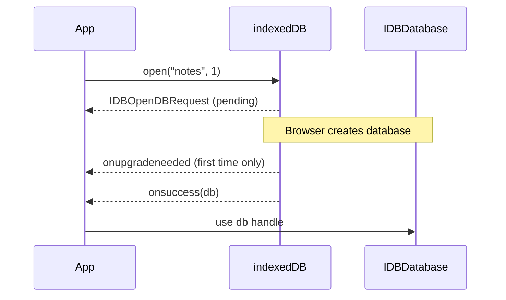
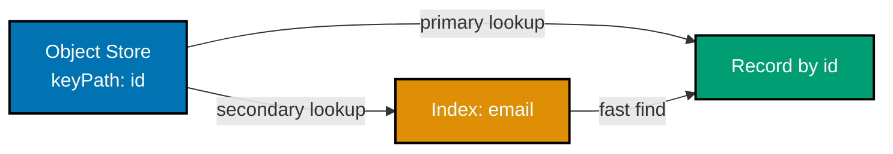
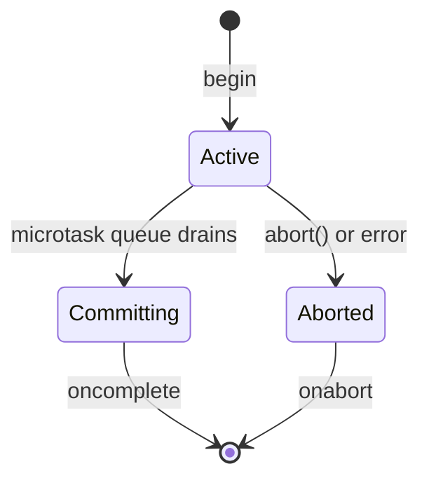
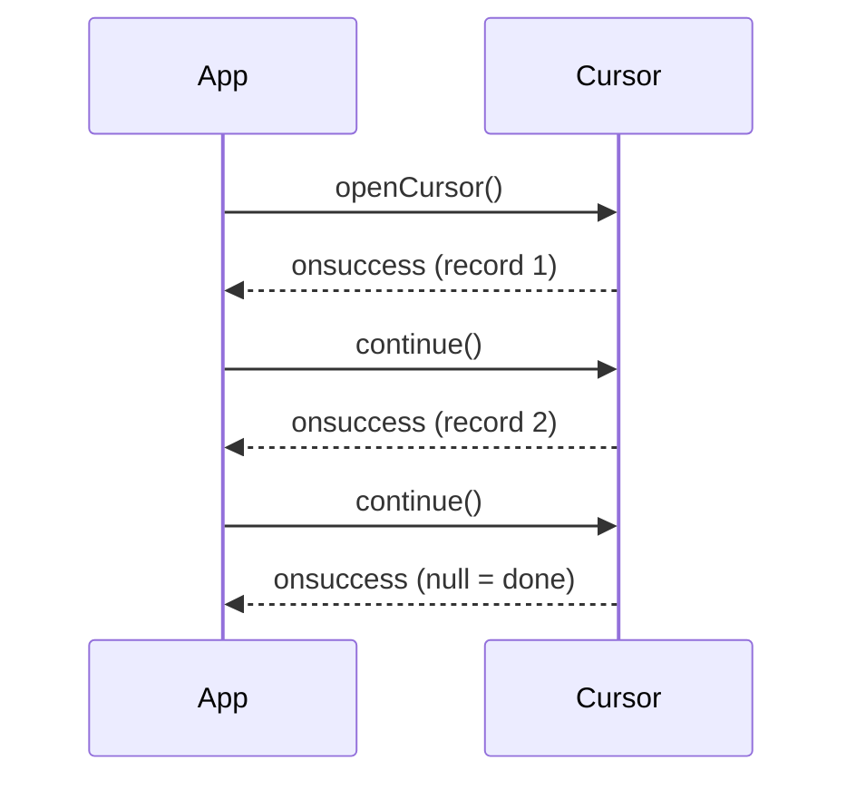

This beginner tutorial covers IndexedDB fundamentals through 28 heavily annotated examples. Every example uses **only the raw browser API** (`indexedDB.open`, `IDBDatabase`, `IDBTransaction`, `IDBObjectStore`, `IDBCursor`) with **zero wrapper libraries**. Each example maintains 1-2.25 comment lines per code line to ensure deep understanding of the event-driven, transactional model.

## Prerequisites

Before starting, ensure you understand:

- JavaScript fundamentals (objects, arrays, JSON, closures)
- Asynchronous programming (`Promise`, `async`/`await`, events)
- Browser basics (DevTools console, `window` global, origin model)
- `addEventListener`, event objects, callback functions

## Group 1: Opening and Creating Databases

### Example 1: Opening Your First Database

`indexedDB.open(name, version)` returns a request object immediately; the database itself arrives asynchronously via events. Every interaction with IndexedDB follows this request-then-event pattern.



```javascript
// => Ask the browser to open (or create) database "notes" at version 1
const request = indexedDB.open("notes", 1);
// => request is IDBOpenDBRequest — async, settled via events

// => onupgradeneeded fires when DB doesn't exist or version is higher than stored
request.onupgradeneeded = (event) => {
  // => event.target is the request; event.target.result is the IDBDatabase
  const db = event.target.result;
  // => First run: use this handler to define initial schema (object stores)
  db.createObjectStore("notes", { keyPath: "id" });
  // => Creates object store "notes" with "id" property as primary key
};

// => onsuccess fires after onupgradeneeded (if any) completes
request.onsuccess = (event) => {
  const db = event.target.result;
  // => db is IDBDatabase — use it to start transactions
  console.log("Opened:", db.name, "v" + db.version);
  // => Output: Opened: notes v1
  db.close();
  // => Close when done; browser also closes when tab navigates away
};

// => onerror fires if opening fails (private mode, corrupted DB, etc.)
request.onerror = (event) => {
  console.error("Open failed:", event.target.error);
  // => event.target.error is a DOMException
};
```

**Key Takeaway**: Every IndexedDB operation is a request; results arrive asynchronously via `onsuccess`, `onerror`, and `onupgradeneeded` events.

**Why It Matters**: The event-driven model surprises developers used to synchronous APIs like LocalStorage. Because IndexedDB runs off the main thread, it never blocks rendering even with large datasets. Mastering the request-event pattern in this first example makes every later API trivial to learn. In production, forgetting to attach `onerror` is the most common source of silent data loss — always handle both success and error paths.

---

### Example 2: Database Versioning and Upgrades

The version number controls when `onupgradeneeded` fires. Incrementing it is the only way to trigger schema changes; calling `open` with a lower version throws `VersionError`.

```javascript
// => First run creates DB at version 1
const v1 = indexedDB.open("library", 1);
// => v1 is IDBOpenDBRequest — settles via events

v1.onupgradeneeded = (event) => {
  // => Only fires on first open (DB didn't exist before)
  // => event.target is the open request
  const db = event.target.result;
  // => db is the brand-new IDBDatabase at version 1
  db.createObjectStore("books", { keyPath: "isbn" });
  // => Creates store "books" with ISBN as the primary key
  // => Schema declarations happen ONLY inside onupgradeneeded
};

v1.onsuccess = (event) => {
  // => Fires after onupgradeneeded finishes committing
  event.target.result.close();
  // => Close v1 handle so we can re-open at a higher version
  // => Browser cannot upgrade a DB with open connections elsewhere

  // => Later: reopen at version 2 to extend the schema
  const v2 = indexedDB.open("library", 2);
  // => Same DB name, higher version — triggers another upgrade

  v2.onupgradeneeded = (event) => {
    // => Fires because stored version (1) < requested version (2)
    // => event.oldVersion is 1; event.newVersion is 2
    const db = event.target.result;
    // => db is the existing IDBDatabase — prior stores/indexes preserved
    // => Do NOT recreate "books" — it carries data from v1
    db.createObjectStore("authors", { keyPath: "id" });
    // => Add new store "authors" alongside the existing "books"
    // => v1 schema + this addition = v2 schema
    // => "books" store and its data survive untouched
  };

  v2.onsuccess = (event) => {
    // => Fires after the v2 upgrade transaction commits
    const db = event.target.result;
    // => db now has both object stores
    console.log("Stores:", [...db.objectStoreNames]);
    // => Output: Stores: [ 'authors', 'books' ]
    // => objectStoreNames is a DOMStringList — spread to array
    db.close();
    // => Always close when done to release resources
  };
};
```

**Key Takeaway**: Increase the version number to trigger `onupgradeneeded`; the browser diffs current vs requested version and runs your upgrade logic once.

**Why It Matters**: Schema evolution is the hardest part of any long-lived database. IndexedDB's version system lets you ship incremental migrations that run exactly once per user, regardless of how many times they visited before. In production apps, each release that changes schema bumps the version by one and adds a `case` branch to the upgrade handler — a predictable pattern that avoids the "migration already ran" bugs common in other storage systems.

---

### Example 3: Promise-Wrapping `indexedDB.open`

Wrapping the event-based API in a `Promise` makes the rest of your code read top-to-bottom. This pattern is foundational for every subsequent example.

```javascript
// => Helper converts request-with-events into awaitable promise
function openDB(name, version, upgrade) {
  // => name is DB name, version is target version, upgrade is schema callback
  // => Return a Promise that resolves with IDBDatabase
  return new Promise((resolve, reject) => {
    const request = indexedDB.open(name, version);
    // => request is IDBOpenDBRequest — events deliver the result
    // => Wire onupgradeneeded to user-supplied callback
    request.onupgradeneeded = (event) => upgrade(event.target.result, event);
    // => upgrade receives (db, event) — define schema here
    // => Resolve with the opened IDBDatabase
    request.onsuccess = () => resolve(request.result);
    // => request.result is IDBDatabase after onsuccess fires
    // => Reject with DOMException on failure
    request.onerror = () => reject(request.error);
    // => request.error is the DOMException that caused failure
    // => onblocked fires if other tabs hold older versions open
    request.onblocked = () => reject(new Error("blocked"));
    // => Reject with an explicit "blocked" error for callers to handle
  });
}

// => Usage: awaitable open
(async () => {
  const db = await openDB("notes", 1, (db) => {
    // => Runs only when DB is created or version increases
    db.createObjectStore("entries", { keyPath: "id" });
    // => Schema declared inside the upgrade callback
  });
  console.log("Ready:", db.name);
  // => Output: Ready: notes
  db.close();
  // => Release the connection when done
})();
```

**Key Takeaway**: Promise-wrapping `indexedDB.open` turns the event-driven API into linear `async`/`await` code without changing its semantics.

**Why It Matters**: Production codebases cannot afford deeply nested event handlers for every database operation. Promise wrappers like this one (or the `idb` library covered later) become the foundation upon which all application logic sits. Once you have `openDB`, `get`, `put`, and `cursor` helpers returning promises, database code reads like any other modern JavaScript and integrates naturally with `async`/`await`, `Promise.all`, and error boundaries.

---

### Example 4: Deleting a Database

`indexedDB.deleteDatabase` removes an entire database including all object stores, indexes, and data. The operation is asynchronous and can be blocked by open connections.

```javascript
// => Request to delete "notes" database
const req = indexedDB.deleteDatabase("notes");
// => req is IDBOpenDBRequest (same type as open)

req.onsuccess = () => {
  // => Fires when database is fully removed
  console.log("Database deleted");
  // => Output: Database deleted
};

req.onerror = (event) => {
  // => Fires if deletion fails (e.g., security error)
  console.error("Delete failed:", event.target.error);
  // => event.target.error is a DOMException with error details
};

req.onblocked = (event) => {
  // => Fires if other tabs/windows still hold open connections
  console.warn("Close other tabs to delete this DB");
  // => Browser waits for blockers to close before completing
  // => event.oldVersion is the version held by the blocking connection
};
```

**Key Takeaway**: `indexedDB.deleteDatabase` removes an entire database; close all open connections first to avoid `onblocked`.

**Why It Matters**: Database deletion is essential for "reset account," "log out and clear data," and GDPR "forget me" flows. The `onblocked` event is particularly important: if the user has your app open in multiple tabs, the delete cannot proceed until those tabs release their database handles. Always listen for `onblocked` and prompt the user to close other tabs, or broadcast a message via `BroadcastChannel` telling tabs to close themselves.

---

## Group 2: Object Stores and Keys

### Example 5: In-Line Keys with `keyPath`

An in-line key is extracted from a property on the stored object. The object store owns the extraction rule; you only pass the value to `add` or `put`.

```javascript
// => Open DB at version 1, creating store with in-line key
const req = indexedDB.open("shop", 1);
// => req is IDBOpenDBRequest — settles asynchronously via events

req.onupgradeneeded = (e) => {
  // => Fires on first open (or version bump) to define schema
  const db = e.target.result;
  // => db is IDBDatabase inside the versionchange transaction
  // => keyPath "sku" means object's .sku property is the primary key
  const store = db.createObjectStore("products", { keyPath: "sku" });
  // => Every stored object MUST have an "sku" property
  // => store is IDBObjectStore — use only inside onupgradeneeded
};

req.onsuccess = (e) => {
  // => Fires after any upgrade completes; DB is ready for use
  const db = e.target.result;
  // => db is IDBDatabase — use it to open transactions
  // => Start readwrite transaction to add data
  const tx = db.transaction("products", "readwrite");
  // => tx is IDBTransaction scoped to "products" store
  // => Grab object store reference
  const store = tx.objectStore("products");
  // => store is the IDBObjectStore within this transaction

  // => add() uses the object's .sku property as key automatically
  store.add({ sku: "P-001", name: "Book", price: 15 });
  // => No explicit key argument — keyPath extracts it
  // => Returns IDBRequest; onsuccess fires when committed

  tx.oncomplete = () => {
    // => Fires after all requests in the transaction have committed
    console.log("Saved with key P-001");
    // => Output: Saved with key P-001
    db.close();
    // => Release the DB handle when done
  };
};
```

**Key Takeaway**: `keyPath` tells the object store to auto-extract the primary key from a property of each record, so you never pass the key separately.

**Why It Matters**: In-line keys model real-world records (products with SKUs, users with IDs, posts with slugs) where the key is already part of the data. This eliminates a whole class of bugs where the explicit key argument disagrees with the object's own identifier. Most production schemas use in-line keys; reserve out-of-line keys for cases where you truly do not want the key inside the record.

---

### Example 6: Out-of-Line Keys

Out-of-line keys are supplied explicitly to `add` or `put` and are not part of the stored value. Useful when you want to store primitive values or keep keys separate from data.

```javascript
// => Open (or create) database named "cache" at version 1
const req = indexedDB.open("cache", 1);
// => req is IDBOpenDBRequest; schema setup fires onupgradeneeded

req.onupgradeneeded = (e) => {
  // => Runs on first open to declare object stores
  const db = e.target.result;
  // => db is IDBDatabase inside the versionchange transaction
  // => No keyPath option — store has out-of-line keys
  db.createObjectStore("responses");
  // => Keys are supplied explicitly at add/put time
  // => Value can be any structured-clone-able type
};

req.onsuccess = (e) => {
  // => DB is open and schema is ready
  const db = e.target.result;
  // => db is IDBDatabase — all operations go through transactions
  const tx = db.transaction("responses", "readwrite");
  // => Readwrite mode required to call put()
  const store = tx.objectStore("responses");
  // => store is IDBObjectStore reference for this transaction

  // => Second argument is the explicit key (URL here)
  store.put("<html>...</html>", "https://example.com/page");
  // => Value can be a primitive (string) since key is external
  // => Key stored separately from value — no keyPath needed in value

  // => Another entry — value is an object but key is still separate
  store.put({ status: 200, body: "{}" }, "https://api.example.com/users");
  // => Object value with URL as its out-of-line key

  tx.oncomplete = () => {
    // => All puts committed; both entries durable
    console.log("Cached 2 responses");
    // => Output: Cached 2 responses
    db.close();
    // => Close handle to release DB resources
  };
};
```

**Key Takeaway**: Omit `keyPath` when creating the store to use out-of-line keys, then pass the key as the second argument to `add` or `put`.

**Why It Matters**: Out-of-line keys fit cases where the value itself is primitive (HTML string, Blob, ArrayBuffer) or where a natural key does not exist inside the record. HTTP response caches, BLOB storage keyed by URL, and binary asset tables are classic use cases. Mixing in-line and out-of-line keys across stores is fine — the choice is per-store and purely schema-level.

---

### Example 7: Auto-Incrementing Keys

`autoIncrement: true` generates unique integer keys for you. Combine with or without `keyPath` to control how the generated key reaches your object.

```javascript
// => Open database "log" at version 1
const req = indexedDB.open("log", 1);
// => Fires onupgradeneeded before onsuccess on first open

req.onupgradeneeded = (e) => {
  // => Schema setup: create store with auto-increment primary key
  const db = e.target.result;
  // => db is IDBDatabase inside versionchange transaction
  // => autoIncrement generates keys 1, 2, 3, ...
  // => keyPath "id" means generated key is WRITTEN into the object
  const store = db.createObjectStore("events", {
    keyPath: "id",
    autoIncrement: true,
  });
  // => After add(), the object gains an id property automatically
  // => store reference only valid inside onupgradeneeded
};

req.onsuccess = (e) => {
  // => DB is ready; start a readwrite transaction
  const db = e.target.result;
  // => db is IDBDatabase with the "events" store
  const tx = db.transaction("events", "readwrite");
  // => Readwrite mode allows add() and put()
  const store = tx.objectStore("events");
  // => store is IDBObjectStore for "events" in this tx

  // => Add without specifying id — store generates it
  const r1 = store.add({ message: "login", at: Date.now() });
  // => r1 is IDBRequest; r1.onsuccess gives the generated key

  r1.onsuccess = () => {
    // => Fires after the first record is written
    console.log("Generated key:", r1.result);
    // => Output: Generated key: 1
    // => r1.result is the auto-generated primary key value
  };

  // => Second add gets key 2 (monotonically increasing)
  store.add({ message: "view", at: Date.now() });
  // => Key counter never resets, even after deletions

  tx.oncomplete = () => {
    // => Both records committed durably
    console.log("Done");
    // => Output: Done
    db.close();
    // => Close connection when done to avoid blocking upgrades
  };
};
```

**Key Takeaway**: `autoIncrement: true` assigns monotonically increasing integer keys; combine with `keyPath` to write the key back into the stored object.

**Why It Matters**: Auto-increment keys are ideal for append-only logs, event streams, and insertion-ordered records where you do not need a stable, application-meaningful identifier. The generated number persists across sessions — even after deletion, the counter only moves forward, guaranteeing uniqueness. Avoid auto-increment when you need sync across devices (use UUIDs instead) since two devices cannot coordinate on the next number.

---

### Example 8: Compound Keys via `keyPath` Arrays

A compound key uses an array of property names as the `keyPath`. Records are uniquely identified by the tuple of values.

```javascript
// => Open (or create) database "multi-tenant" at version 1
const req = indexedDB.open("multi-tenant", 1);
// => Fires onupgradeneeded to define compound key store

req.onupgradeneeded = (e) => {
  // => Schema setup: create store keyed by two properties
  const db = e.target.result;
  // => db is IDBDatabase inside versionchange transaction
  // => keyPath array — key is [orgId, userId] tuple
  db.createObjectStore("memberships", {
    keyPath: ["orgId", "userId"],
  });
  // => Uniqueness enforced across the PAIR of values
  // => Both orgId AND userId must be present on every record
};

req.onsuccess = (e) => {
  // => DB ready; open readwrite transaction to insert records
  const db = e.target.result;
  // => db is IDBDatabase with "memberships" store
  const tx = db.transaction("memberships", "readwrite");
  // => Readwrite mode allows put()
  const store = tx.objectStore("memberships");
  // => store is IDBObjectStore; extracts compound key from objects

  // => Two records: same orgId but different userId — both allowed
  store.put({ orgId: 1, userId: 100, role: "admin" });
  // => Key: [1, 100]
  store.put({ orgId: 1, userId: 200, role: "member" });
  // => Key: [1, 200] — different tuple; coexists with first record

  // => Reading requires passing the compound key as an array
  const get = store.get([1, 100]);
  // => Array argument matches the [orgId, userId] keyPath order
  get.onsuccess = () => {
    // => Fires with the matching record
    console.log(get.result);
    // => Output: { orgId: 1, userId: 100, role: 'admin' }
  };

  tx.oncomplete = () => db.close();
  // => All puts committed; close the connection
};
```

**Key Takeaway**: Compound keys let you model many-to-many joins natively — pass arrays for `keyPath`, and look up with array arguments.

**Why It Matters**: Compound keys are how IndexedDB models join tables without a separate `id` column. Memberships between users and organizations, relationships between posts and tags, and multi-tenant scoping are all natural fits. The downside: you cannot query on the suffix of a compound key (no "all memberships for userId=100" without an index). Advanced examples cover compound indexes to lift this limitation.

---

## Group 3: Indexes

### Example 9: Creating a Simple Index

An index provides fast lookup by a non-key property. Create indexes during `onupgradeneeded` only; they cannot be added inside a regular `readwrite` transaction.



```javascript
// => Open (or create) "users" database at version 1
const req = indexedDB.open("users", 1);
// => Fires onupgradeneeded first to set up the schema

req.onupgradeneeded = (e) => {
  // => Schema setup: create store and index together
  const db = e.target.result;
  // => db is IDBDatabase inside versionchange transaction
  // => Create store with id as primary key
  const store = db.createObjectStore("users", { keyPath: "id" });
  // => store is IDBObjectStore — indexes must be created here
  // => Create index on email property
  store.createIndex("by_email", "email");
  // => Name "by_email" is how you reference it later
  // => "email" is the property to index (the indexed keyPath)
  // => Index is automatically maintained on every put/add/delete
};

req.onsuccess = (e) => {
  // => DB is ready with "users" store and "by_email" index
  const db = e.target.result;
  // => db is IDBDatabase — open transactions for all operations
  const tx = db.transaction("users", "readwrite");
  // => Readwrite mode needed to insert records
  const store = tx.objectStore("users");
  // => store is IDBObjectStore for "users" in this transaction

  store.put({ id: 1, email: "a@x.com", name: "Aisha" });
  // => Record 1 inserted and indexed under "a@x.com"
  store.put({ id: 2, email: "b@x.com", name: "Budi" });
  // => Both records automatically appear in the email index

  // => Lookup by email using the index
  const idx = store.index("by_email");
  // => idx is IDBIndex — provides fast lookups by "email"
  const req = idx.get("b@x.com");
  // => Returns IDBRequest; result is the matching record
  req.onsuccess = () => {
    // => Fires with the record whose email matches
    console.log(req.result);
    // => Output: { id: 2, email: 'b@x.com', name: 'Budi' }
  };

  tx.oncomplete = () => db.close();
  // => All operations committed; close the connection
};
```

**Key Takeaway**: Indexes are created in `onupgradeneeded` and accessed via `store.index(name).get(value)` for fast lookups on non-key properties.

**Why It Matters**: Without indexes, finding a record by anything other than its primary key requires scanning every object in the store — `O(n)` and unusable at scale. A simple index turns that lookup into `O(log n)`. The cost is storage overhead and slightly slower writes (each `put` updates all indexes). For frequently-queried properties like email, username, or status, the trade-off is always worthwhile.

---

### Example 10: Unique Indexes

A unique index enforces that indexed values are distinct across all records. Violating uniqueness aborts the transaction with `ConstraintError`.

```javascript
// => Open (or create) "accounts" database at version 1
const req = indexedDB.open("accounts", 1);
// => Fires onupgradeneeded on first open to define schema

req.onupgradeneeded = (e) => {
  // => Schema setup: create store and unique index
  const db = e.target.result;
  // => db is IDBDatabase inside versionchange transaction
  const store = db.createObjectStore("accounts", { keyPath: "id" });
  // => store has "id" as primary key; email uniqueness enforced by index
  // => { unique: true } enforces distinct email values
  store.createIndex("by_email", "email", { unique: true });
  // => Two records with same email will cause ConstraintError
  // => Index also makes email lookups O(log n)
};

req.onsuccess = (e) => {
  // => DB ready; open readwrite transaction to insert records
  const db = e.target.result;
  // => db is IDBDatabase with "accounts" store
  const tx = db.transaction("accounts", "readwrite");
  // => Readwrite mode required for put()
  const store = tx.objectStore("accounts");
  // => store is IDBObjectStore for "accounts" in this transaction

  store.put({ id: 1, email: "a@x.com" });
  // => First put succeeds — unique index is satisfied
  const dup = store.put({ id: 2, email: "a@x.com" });
  // => Second put with same email violates unique constraint
  // => Returns IDBRequest — error handled on the request, not the tx

  dup.onerror = (event) => {
    // => request-level error: name is "ConstraintError"
    console.log("Rejected:", event.target.error.name);
    // => Output: Rejected: ConstraintError
    event.preventDefault();
    // => preventDefault stops the error from aborting the entire transaction
    // => Without this, the whole tx rolls back including the first put
  };

  tx.oncomplete = () => {
    // => Fires because ConstraintError was caught and prevented
    console.log("Tx committed (1 record saved)");
    // => Output: Tx committed (1 record saved)
    db.close();
    // => Only record id=1 persisted; id=2 was rejected
  };
};
```

**Key Takeaway**: Unique indexes enforce schema-level distinctness; on violation, call `event.preventDefault()` at the request level to keep the transaction alive.

**Why It Matters**: Unique indexes model domain invariants (one email per account, one slug per post) at the storage layer — invariants cannot be violated even by buggy application code. The `event.preventDefault()` trick is essential: without it, a single constraint error aborts the whole transaction, potentially rolling back unrelated writes. This pattern lets you attempt an insert, detect the conflict, and fall back to an update without losing other work in the same transaction.

---

### Example 11: Multi-Entry Indexes

A multi-entry index (`multiEntry: true`) indexes each element of an array separately, letting you look up records by any tag or keyword.

```javascript
// => Open (or create) "blog" database at version 1
const req = indexedDB.open("blog", 1);
// => Fires onupgradeneeded to set up multi-entry index

req.onupgradeneeded = (e) => {
  // => Schema setup: multi-entry index for tag array lookups
  const db = e.target.result;
  // => db is IDBDatabase inside versionchange transaction
  const store = db.createObjectStore("posts", { keyPath: "id" });
  // => store uses "id" as primary key; records have a "tags" array
  // => multiEntry: true indexes EACH element of the tags array
  store.createIndex("by_tag", "tags", { multiEntry: true });
  // => Without multiEntry, the whole array would be a single key
  // => With multiEntry, ["intro", "blog"] creates two separate index entries
};

req.onsuccess = (e) => {
  // => DB ready; insert posts with tag arrays
  const db = e.target.result;
  // => db is IDBDatabase with "posts" store
  const tx = db.transaction("posts", "readwrite");
  // => Readwrite mode required for put()
  const store = tx.objectStore("posts");
  // => store is IDBObjectStore for "posts" in this transaction

  store.put({ id: 1, title: "Hello", tags: ["intro", "blog"] });
  // => Indexed under "intro" AND "blog"
  store.put({ id: 2, title: "Tips", tags: ["blog", "tips"] });
  // => Indexed under "blog" AND "tips"
  // => Both posts share the "blog" index entry

  // => Find all posts tagged "blog" via the index
  const idx = store.index("by_tag");
  // => idx is IDBIndex — multi-entry enabled; getAll returns all matching posts
  const all = idx.getAll("blog");
  // => Queries the index for the key "blog"
  all.onsuccess = () => {
    // => all.result is an array of matching post records
    console.log("Tagged blog:", all.result.length);
    // => Output: Tagged blog: 2
    db.close();
    // => Close connection after reading results
  };

  tx.oncomplete = () => db.close();
  // => Fallback close if getAll fires after tx.oncomplete
};
```

**Key Takeaway**: `multiEntry: true` indexes each array element as its own key, enabling efficient tag-style lookups across overlapping sets.

**Why It Matters**: Many real data models have array-valued properties: a post has tags, a user has roles, a product has categories. Multi-entry indexes turn "find all items matching tag X" into a direct index lookup instead of a full-store scan. This single feature replaces a join table that relational databases would require — a huge simplification for small-to-medium browser databases.

---

### Example 12: Compound Indexes

A compound index uses a `keyPath` array to index on multiple properties simultaneously. Crucial for multi-column queries and ordered pagination.

```javascript
// => Open (or create) "orders" database at version 1
const req = indexedDB.open("orders", 1);
// => Fires onupgradeneeded to declare compound index

req.onupgradeneeded = (e) => {
  // => Schema setup: compound index for customer+date queries
  const db = e.target.result;
  // => db is IDBDatabase inside versionchange transaction
  const store = db.createObjectStore("orders", { keyPath: "id" });
  // => store uses "id" as primary key
  // => keyPath array: index on (customerId, createdAt) tuple
  store.createIndex("by_customer_date", ["customerId", "createdAt"]);
  // => Lookups can filter on customerId AND order by createdAt efficiently
  // => Stored sorted by [customerId, createdAt] — enables range queries
};

req.onsuccess = (e) => {
  // => DB ready; insert orders and query via compound index
  const db = e.target.result;
  // => db is IDBDatabase with "orders" store
  const tx = db.transaction("orders", "readwrite");
  // => Readwrite needed to insert records
  const store = tx.objectStore("orders");
  // => store is IDBObjectStore for "orders" in this transaction

  store.put({ id: 1, customerId: 100, createdAt: 1000, total: 20 });
  // => Customer 100's earliest order
  store.put({ id: 2, customerId: 100, createdAt: 2000, total: 30 });
  // => Customer 100's second order
  store.put({ id: 3, customerId: 200, createdAt: 1500, total: 10 });
  // => Different customer — will not appear in customer 100 query

  // => Find all orders for customer 100 across time range
  const idx = store.index("by_customer_date");
  // => idx is IDBIndex keyed on [customerId, createdAt] tuple
  // => IDBKeyRange.bound takes array boundaries for compound keys
  const range = IDBKeyRange.bound([100, 0], [100, Number.MAX_SAFE_INTEGER]);
  // => Lower: [100, 0], Upper: [100, max] — all records for customer 100
  // => Slices the B-tree to only customer 100's rows, sorted by createdAt
  const results = idx.getAll(range);
  // => Returns IDBRequest; result array arrives via onsuccess

  results.onsuccess = () => {
    // => results.result is array of matching orders
    console.log("Customer 100 orders:", results.result.length);
    // => Output: Customer 100 orders: 2
    db.close();
    // => Close the connection after reading
  };

  tx.oncomplete = () => db.close();
  // => Fallback close if oncomplete fires before results.onsuccess
};
```

**Key Takeaway**: Compound indexes with key ranges enable efficient filtered, ordered queries — the IndexedDB equivalent of a multi-column SQL index.

**Why It Matters**: Compound indexes are how you implement "show customer X's orders newest-first" or "show user Y's posts in the last month" at scale. Without them, you would fetch all orders and filter/sort in memory — untenable for thousands of records. The index stores data pre-sorted by the compound key, so a ranged lookup returns results in the correct order with no post-processing.

---

## Group 4: Transactions

### Example 13: Readonly vs Readwrite Transactions

Transactions have a mode (`readonly` or `readwrite`) and a scope (list of object stores). The mode determines which operations are allowed; the scope limits which stores can be touched.



```javascript
// => Open (or create) "app" database at version 1
const req = indexedDB.open("app", 1);
// => Fires onupgradeneeded before onsuccess on first open
req.onupgradeneeded = (e) => {
  // => Schema setup: single "items" store
  e.target.result.createObjectStore("items", { keyPath: "id" });
  // => Minimal schema — just one store with inline "id" key
};

req.onsuccess = (e) => {
  // => DB is ready; demonstrate readonly vs readwrite modes
  const db = e.target.result;
  // => db is IDBDatabase — transactions control what operations are allowed

  // => readonly transaction — only get/getAll/count allowed
  const roTx = db.transaction("items", "readonly");
  // => Multiple readonly transactions can run in parallel
  // => Requesting readwrite here would serialize with other writers
  const roStore = roTx.objectStore("items");
  // => roStore only allows read operations
  roStore.count().onsuccess = (ev) => {
    // => count() returns IDBRequest; result is the record count
    console.log("Count:", ev.target.result);
    // => Output: Count: 0 (empty on first run)
  };
  // => Attempting store.put here would throw InvalidStateError

  // => readwrite transaction — get/put/add/delete/clear allowed
  const rwTx = db.transaction("items", "readwrite");
  // => Only one readwrite tx can hold a lock per store at a time
  // => Opens after roTx finishes; they don't run concurrently
  const rwStore = rwTx.objectStore("items");
  // => rwStore allows both read and write operations
  rwStore.put({ id: 1, name: "Apple" });
  // => Writes permitted in readwrite mode
  // => Returns IDBRequest; write is durable after tx.oncomplete

  rwTx.oncomplete = () => {
    // => Fires after ALL requests in the transaction complete
    console.log("Write committed");
    // => Output: Write committed
    db.close();
    // => Close the DB connection when done
  };
};
```

**Key Takeaway**: `readonly` transactions can run in parallel; `readwrite` transactions serialize per object store scope — always pick the narrowest mode and scope you need.

**Why It Matters**: Transaction mode choice is a performance-critical decision. Using `readwrite` when you only need reads forces serialization and blocks other writers. In production code, 80%+ of transactions should be `readonly` — reserve `readwrite` for actual mutations. Similarly, keep scope tight: `db.transaction(["orders"])` is faster than `db.transaction(["orders", "users"])` because less locking is involved.

---

### Example 14: Transaction Scope — Multiple Stores

When a write must touch multiple object stores atomically, list all of them in the transaction scope. The transaction commits or aborts as a unit.

```javascript
// => Open (or create) "bank" database at version 1
const req = indexedDB.open("bank", 1);
// => Fires onupgradeneeded to declare multi-store schema

req.onupgradeneeded = (e) => {
  // => Schema setup: two stores for accounts and transfer log
  const db = e.target.result;
  // => db is IDBDatabase inside versionchange transaction
  db.createObjectStore("accounts", { keyPath: "id" });
  // => "accounts" keyed by account id string
  db.createObjectStore("transfers", { keyPath: "id", autoIncrement: true });
  // => "transfers" gets auto-generated integer keys
};

req.onsuccess = (e) => {
  // => DB ready; seed balances then perform a transfer
  const db = e.target.result;
  // => db is IDBDatabase with both stores
  // => Seed initial balances
  const seed = db.transaction("accounts", "readwrite");
  // => Single-store tx is sufficient for seeding
  seed.objectStore("accounts").put({ id: "A", balance: 100 });
  // => Account A starts with 100
  seed.objectStore("accounts").put({ id: "B", balance: 100 });
  // => Account B starts with 100

  seed.oncomplete = () => {
    // => Seed committed; now perform the atomic transfer
    // => Transfer with multi-store scope — accounts + transfers
    const tx = db.transaction(["accounts", "transfers"], "readwrite");
    // => Both stores must be in scope for atomic multi-store writes
    // => Missing a store from scope would cause InvalidAccessError on use
    const accounts = tx.objectStore("accounts");
    // => accounts is IDBObjectStore for "accounts" in this tx
    const transfers = tx.objectStore("transfers");
    // => transfers is IDBObjectStore for "transfers" in this tx
    // => Both store handles share the same underlying transaction

    // => Step 1: read A's balance
    const getA = accounts.get("A");
    // => Returns IDBRequest; result arrives in onsuccess
    getA.onsuccess = () => {
      const a = getA.result;
      // => a is { id: 'A', balance: 100 }
      a.balance -= 10;
      // => Step 2: write A's new balance
      accounts.put(a);
      // => a.balance is now 90; written back with same key
    };
    // => Step 3: log the transfer event
    transfers.add({ from: "A", to: "B", amount: 10 });
    // => Appended to transfers log with auto-generated id
    // => Runs concurrently with getA.onsuccess — both in same tx
    // => Step 4: read B and update B
    accounts.get("B").onsuccess = (ev) => {
      const b = ev.target.result;
      // => b is { id: 'B', balance: 100 }
      b.balance += 10;
      // => b.balance is now 110
      accounts.put(b);
      // => Written back to "accounts" store
    };

    tx.oncomplete = () => {
      // => All four operations committed atomically
      console.log("Transfer committed atomically");
      // => Output: Transfer committed atomically
      db.close();
      // => A now 90, B now 110, transfer record appended
    };
    tx.onerror = () => console.error("Rolled back");
    // => If ANY request errors, entire transaction aborts — both stores
  };
};
```

**Key Takeaway**: Declare all object stores a transaction needs upfront; either every operation commits or none do, giving you free atomicity across stores.

**Why It Matters**: Multi-store atomicity is what separates IndexedDB from simpler key-value stores. Bank transfers, inventory adjustments, and "apply discount to cart + coupon table" operations all require that multiple stores update together or not at all. Because IndexedDB transactions are ACID within their scope, you can model real domain operations without manual rollback code — the browser guarantees consistency on error, crash, or tab close.

---

### Example 15: Transaction Auto-Commit

IndexedDB transactions auto-commit when the microtask queue drains with no pending requests. You do not call `commit()` — you stop issuing requests and the transaction ends itself.

```javascript
// => Open (or create) "demo" database at version 1
const req = indexedDB.open("demo", 1);
// => Fires onupgradeneeded on first open
req.onupgradeneeded = (e) => {
  // => Schema: out-of-line key store (no keyPath)
  e.target.result.createObjectStore("kv");
  // => Keys supplied explicitly at put/add time
};

req.onsuccess = (e) => {
  // => DB ready; demonstrate auto-commit lifecycle
  const db = e.target.result;
  // => db is IDBDatabase
  const tx = db.transaction("kv", "readwrite");
  // => Transaction is Active — requests may be issued
  const store = tx.objectStore("kv");
  // => store is IDBObjectStore for "kv" in this transaction

  // => Issue synchronous write requests
  store.put("value1", "key1");
  // => key1 → "value1" queued
  store.put("value2", "key2");
  // => key2 → "value2" queued
  // => Both requests are pending when this function returns
  // => Transaction remains Active until microtask queue drains

  // => Transaction stays alive as long as requests are in flight
  tx.oncomplete = () => {
    // => Fires once all pending requests complete and microtasks drain
    console.log("Auto-committed after all requests finished");
    // => Output: Auto-committed after all requests finished
    // => After this point tx.readyState is "done" — no more requests
  };

  // => DANGER: a setTimeout or async gap can kill the transaction
  // => setTimeout yields to event loop — tx auto-commits while waiting
  setTimeout(() => {
    // => 100 ms later — tx has already committed
    try {
      store.put("late", "key3");
      // => Throws TransactionInactiveError — tx already committed
    } catch (err) {
      // => err.name is "TransactionInactiveError"
      console.log("Too late:", err.name);
      // => Output: Too late: TransactionInactiveError
      db.close();
      // => Close the DB connection now that we're done
    }
  }, 100);
};
```

**Key Takeaway**: Transactions auto-commit at the next microtask boundary without pending requests; never `setTimeout`, `await` non-IDB work, or `fetch` inside a transaction or it dies.

**Why It Matters**: The auto-commit rule is the single largest footgun in IndexedDB. Developers accustomed to explicit `BEGIN`/`COMMIT` SQL transactions naturally want to do network work in the middle of a transaction — and the browser kills the transaction mid-work. Rule: do all I/O (fetches, user prompts, other storage calls) **outside** the transaction, then open a fresh one to write results. This keeps transactions short and avoids mysterious `TransactionInactiveError` bugs.

---

### Example 16: Manual Transaction Abort

`tx.abort()` rolls back every write in the transaction, even those already completed. Use it when validation fails mid-transaction.

```javascript
// => Open (or create) "cart" database at version 1
const req = indexedDB.open("cart", 1);
// => Fires onupgradeneeded before onsuccess on first open
req.onupgradeneeded = (e) => {
  // => Schema: "items" store with inline "id" key
  e.target.result.createObjectStore("items", { keyPath: "id" });
  // => Primary key extracted from each object's "id" property
};

req.onsuccess = (e) => {
  // => DB ready; demonstrate manual abort on validation failure
  const db = e.target.result;
  // => db is IDBDatabase
  const tx = db.transaction("items", "readwrite");
  // => Readwrite allows both reads and writes in this example
  const store = tx.objectStore("items");
  // => store is IDBObjectStore for "items" in this transaction

  store.put({ id: 1, name: "Book", qty: 1 });
  // => First write queued — valid item, qty positive

  store.put({ id: 2, name: "Pen", qty: -5 });
  // => Second write queued — will be caught by validation
  // => Business rule check — negative qty invalid
  const check = store.get(2);
  // => Read back the newly-written record to validate it
  check.onsuccess = () => {
    // => check.result is the record just written for id=2
    if (check.result.qty < 0) {
      // => Validation failed — negative quantity is illegal
      console.log("Invalid qty, aborting");
      // => Output: Invalid qty, aborting
      tx.abort();
      // => Rolls back BOTH puts — even item 1 disappears
      // => abort() is synchronous; tx.onabort fires asynchronously
    }
  };

  tx.onabort = () => {
    // => Fires after tx.abort() or on error
    console.log("Transaction rolled back");
    // => Output: Transaction rolled back
    // => No records were persisted — neither id=1 nor id=2
    db.close();
    // => Close the DB connection
  };
};
```

**Key Takeaway**: `tx.abort()` rolls back every write in the transaction atomically; listen for `onabort` to know the rollback finished.

**Why It Matters**: Application-level validation often needs data already written in the same transaction. The abort mechanism lets you optimistically apply changes, check invariants, and roll back on violation — without tracking a "to-undo" list manually. This gives you true transactional semantics for multi-step business operations, like "apply promo code only if cart total stays positive after discount."

---

## Group 5: CRUD Operations

### Example 17: `add` vs `put` Semantics

`add` fails on duplicate key; `put` overwrites. Picking the right one prevents silent data loss and aids idempotency.

```javascript
// => Open (or create) "users" database at version 1
const req = indexedDB.open("users", 1);
// => Fires onupgradeneeded to declare "profiles" store
req.onupgradeneeded = (e) => {
  // => Schema: "profiles" store with inline "id" key
  e.target.result.createObjectStore("profiles", { keyPath: "id" });
  // => Primary key is the "id" property on each object
};

req.onsuccess = (e) => {
  // => DB ready; demonstrate add vs put semantics
  const db = e.target.result;
  // => db is IDBDatabase
  const tx = db.transaction("profiles", "readwrite");
  // => Readwrite mode required for add() and put()
  const store = tx.objectStore("profiles");
  // => store is IDBObjectStore for "profiles" in this transaction

  // => add: fails on duplicate key (ConstraintError)
  store.add({ id: 1, name: "Aisha" });
  // => First add succeeds — key 1 is new

  const dup = store.add({ id: 1, name: "Different Aisha" });
  // => Second add fails because key 1 already exists
  // => Returns IDBRequest so onerror can be handled
  dup.onerror = (ev) => {
    // => ev.target.error is a DOMException
    console.log("add rejected:", ev.target.error.name);
    // => Output: add rejected: ConstraintError
    ev.preventDefault();
    // => preventDefault so transaction continues
    // => Without this, the error propagates and aborts the tx
  };

  // => put: upsert — overwrites if key exists, inserts if new
  store.put({ id: 1, name: "Updated Aisha" });
  // => Silently overwrites existing record — no error on duplicate

  tx.oncomplete = () => {
    // => All committed; verify the final stored value
    const readTx = db.transaction("profiles", "readonly");
    // => Separate readonly transaction to read back the result
    readTx.objectStore("profiles").get(1).onsuccess = (ev) => {
      // => ev.target.result is the current record for id=1
      console.log(ev.target.result.name);
      // => Output: Updated Aisha
      // => "Updated Aisha" overwrote "Aisha" via put()
      db.close();
      // => Close the DB connection when done
    };
  };
};
```

**Key Takeaway**: Use `add` when duplicates indicate a bug (insert-only APIs); use `put` for idempotent upserts (cache refreshes, sync).

**Why It Matters**: The `add` vs `put` choice encodes your intent into the storage layer. If you are writing the first version of a record and a duplicate means something is wrong, `add` surfaces the bug loudly. If you are refreshing a cache where every key is expected to already exist sometimes, `put` gives you idempotency for free — a core property of any re-runnable sync routine.

---

### Example 18: Reading with `get`, `getAll`, and `getAllKeys`

`get` returns one value by key; `getAll` returns many; `getAllKeys` returns just the keys. Pick the lightest option for your use case.

```javascript
// => Open (or create) "books" database at version 1
const req = indexedDB.open("books", 1);
// => Fires onupgradeneeded on first open
req.onupgradeneeded = (e) => {
  // => Schema: "books" store with "isbn" as primary key
  e.target.result.createObjectStore("books", { keyPath: "isbn" });
  // => ISBN is a natural unique identifier for books
};

req.onsuccess = (e) => {
  // => DB ready; seed records then demonstrate read methods
  const db = e.target.result;
  // => db is IDBDatabase
  const seed = db.transaction("books", "readwrite");
  // => Readwrite tx to insert seed records
  const s = seed.objectStore("books");
  // => s is IDBObjectStore for "books" in the seed transaction
  s.put({ isbn: "111", title: "A" });
  // => Record 1: key "111"
  s.put({ isbn: "222", title: "B" });
  // => Record 2: key "222"
  s.put({ isbn: "333", title: "C" });
  // => Record 3: key "333" — three records seeded

  seed.oncomplete = () => {
    // => Seed committed; three books are durable in the "books" store
    // => Now demonstrate three different read methods
    const tx = db.transaction("books", "readonly");
    // => Readonly tx: reads can run concurrently
    const store = tx.objectStore("books");
    // => store is IDBObjectStore for reading

    // => get: single record by key
    const one = store.get("222");
    // => Returns IDBRequest; result is the record or undefined
    one.onsuccess = () => console.log("One:", one.result.title);
    // => Output: One: B

    // => getAll: all records (or up to count)
    const all = store.getAll();
    // => Returns IDBRequest; result is an array of all records
    all.onsuccess = () => console.log("All:", all.result.length);
    // => Output: All: 3

    // => getAllKeys: only the primary keys (no values loaded)
    const keys = store.getAllKeys();
    // => Returns IDBRequest; result is array of keys only — no value deserialization
    keys.onsuccess = () => console.log("Keys:", keys.result);
    // => Output: Keys: [ '111', '222', '333' ]

    tx.oncomplete = () => db.close();
    // => All three requests completed; close the connection
  };
};
```

**Key Takeaway**: Use `get` for one record, `getAll` for many, and `getAllKeys` when only primary keys are needed — each reduces I/O to the minimum required.

**Why It Matters**: Reading a whole store with `getAll` is fine for small sets but loads every value into memory — a cursor (covered next) is better for large stores. `getAllKeys` is an underused optimization: when you need existence checks or key enumeration for UI (showing loaded IDs, implementing pagination boundaries), avoiding value deserialization can cut memory use by orders of magnitude.

---

### Example 19: Deleting Records and Clearing Stores

`delete(key)` removes one record; `clear()` removes everything in the store. Both are instant from the developer perspective but still wrapped in a transaction.

```javascript
// => Open (or create) "session" database at version 1
const req = indexedDB.open("session", 1);
// => Fires onupgradeneeded before onsuccess on first open
req.onupgradeneeded = (e) => {
  // => Schema: "keys" store with inline "id" key
  e.target.result.createObjectStore("keys", { keyPath: "id" });
  // => String-keyed store for session key-value pairs
};

req.onsuccess = (e) => {
  // => DB ready; seed records then demonstrate delete and clear
  const db = e.target.result;
  // => db is IDBDatabase
  const seed = db.transaction("keys", "readwrite");
  // => Readwrite tx to insert seed records
  const s = seed.objectStore("keys");
  // => s is IDBObjectStore for "keys" in the seed transaction
  s.put({ id: "a", value: 1 });
  // => Record "a" inserted
  s.put({ id: "b", value: 2 });
  // => Record "b" inserted
  s.put({ id: "c", value: 3 });
  // => Record "c" inserted — three records total

  seed.oncomplete = () => {
    // => Seed committed; now delete and clear
    const tx = db.transaction("keys", "readwrite");
    // => Readwrite mode required for delete() and clear()
    const store = tx.objectStore("keys");
    // => store is IDBObjectStore for "keys" in this transaction

    // => Delete single record by key
    store.delete("b");
    // => Record "b" gone
    // => Returns IDBRequest; deletion is queued immediately

    // => Count after delete to confirm
    const count = store.count();
    // => count() counts all remaining records
    count.onsuccess = () => console.log("After delete:", count.result);
    // => Output: After delete: 2

    // => clear() removes ALL records in the store
    store.clear();
    // => Use with caution — no undo
    // => All records removed; store is now empty
    store.count().onsuccess = (ev) => console.log("After clear:", ev.target.result);
    // => Output: After clear: 0

    tx.oncomplete = () => db.close();
    // => All operations committed; close the connection
  };
};
```

**Key Takeaway**: `delete(key)` removes one record; `clear()` empties the entire store — both require a `readwrite` transaction.

**Why It Matters**: `clear()` is tempting for "reset this feature" flows but is destructive — a single line removes every record with no undo. In production, prefer deleting by key range or cursor so you keep more control. Reserve `clear()` for test setup/teardown, explicit user "delete all data" actions, or post-migration cleanup where you genuinely want the whole store gone.

---

### Example 20: Counting Records with Ranges

`store.count(query)` returns the number of records matching an optional key or key range, without loading their values.

```javascript
// => Open (or create) "stats" database at version 1
const req = indexedDB.open("stats", 1);
// => Fires onupgradeneeded on first open
req.onupgradeneeded = (e) => {
  // => Schema: "events" store with integer "id" key
  e.target.result.createObjectStore("events", { keyPath: "id" });
  // => Integer keys enable natural range queries for counting
};

req.onsuccess = (e) => {
  // => DB ready; seed 5 records then count subsets
  const db = e.target.result;
  // => db is IDBDatabase
  const seed = db.transaction("events", "readwrite");
  // => Readwrite tx to insert seed records
  const s = seed.objectStore("events");
  // => s is IDBObjectStore for "events" in the seed transaction
  // => Seed 5 events with ascending id
  for (let i = 1; i <= 5; i++) s.put({ id: i, type: "click" });
  // => Loop inserts records with id 1, 2, 3, 4, 5 synchronously

  seed.oncomplete = () => {
    // => Seed committed; now count records
    const tx = db.transaction("events", "readonly");
    // => Readonly tx: count() only needs read access
    const store = tx.objectStore("events");
    // => store is IDBObjectStore for "events" in this transaction

    // => Count all records
    store.count().onsuccess = (ev) => console.log("Total:", ev.target.result);
    // => Output: Total: 5
    // => count() with no argument counts every record

    // => Count within a key range (id 2..4)
    const mid = IDBKeyRange.bound(2, 4);
    // => Inclusive range: 2 <= id <= 4
    store.count(mid).onsuccess = (ev) => console.log("Mid range:", ev.target.result);
    // => Output: Mid range: 3
    // => Only keys 2, 3, 4 fall within the range

    tx.oncomplete = () => db.close();
    // => Both count() requests completed; close the connection
  };
};
```

**Key Takeaway**: `count(range)` returns cardinality quickly without loading records — ideal for pagination footers, existence checks, and dashboard metrics.

**Why It Matters**: "How many unread messages?" and "Does any item match this filter?" are answerable with `count()` at a tiny fraction of the cost of `getAll().length`. In a store with 100,000 records, `count()` returns instantly while `getAll()` would deserialize every object. Always reach for `count()` first when you only need a number.

---

## Group 6: Cursors

### Example 21: Iterating with `openCursor`

Cursors stream records one at a time so you can process arbitrary amounts of data without loading everything into memory. Call `cursor.continue()` to advance.



```javascript
// => Open DB named "list" at version 1
const req = indexedDB.open("list", 1);
// => req is IDBOpenDBRequest; events deliver the DB handle

req.onupgradeneeded = (e) => {
  // => Runs once on first open to declare schema
  e.target.result.createObjectStore("items", { keyPath: "id" });
  // => Object store "items" with in-line "id" primary key
};

req.onsuccess = (e) => {
  // => DB is open and ready for transactions
  const db = e.target.result;
  // => db is IDBDatabase
  const seed = db.transaction("items", "readwrite");
  // => Seed transaction — readwrite to allow put()
  const s = seed.objectStore("items");
  // => Get the object store handle from the transaction
  for (let i = 1; i <= 3; i++) s.put({ id: i, name: "Item " + i });
  // => Insert 3 records synchronously; all share one transaction

  seed.oncomplete = () => {
    // => Seed data is durable; now iterate with a cursor
    const tx = db.transaction("items", "readonly");
    // => Read-only transaction — cursor won't modify records
    const store = tx.objectStore("items");
    // => Object store handle for this new transaction

    // => Open cursor to iterate over all records
    const cursorReq = store.openCursor();
    // => cursorReq is IDBRequest; onsuccess fires per record

    cursorReq.onsuccess = (event) => {
      // => event.target.result is the cursor at current position
      const cursor = event.target.result;
      // => cursor is IDBCursorWithValue or null when iteration ends
      if (cursor) {
        // => cursor.key is the primary key; cursor.value is the record
        console.log(cursor.key, cursor.value.name);
        // => Output: 1 Item 1, then 2 Item 2, then 3 Item 3
        cursor.continue();
        // => Advance to next record — onsuccess fires again
        // => Not calling continue() ends iteration early
      } else {
        // => Null cursor — iteration complete
        console.log("Done iterating");
        // => Output: Done iterating
      }
    };

    tx.oncomplete = () => db.close();
    // => Transaction commits after cursor walks all records
  };
};
```

**Key Takeaway**: Cursors stream records one at a time; the same `onsuccess` handler fires for each, and a null `cursor` signals end-of-iteration.

**Why It Matters**: Cursors are the scalability escape hatch. For any store beyond a few thousand records, `getAll()` is risky because it deserializes everything up front. Cursors let you process a million records with constant memory — each record is released after you call `continue()`. They also enable short-circuiting: return without calling `continue()` to stop early, saving the rest of the scan.

---

### Example 22: Cursor Direction — `next` vs `prev`

Cursor direction controls iteration order. `next` is ascending; `prev` is descending. Combine with `nextunique`/`prevunique` when using indexes with duplicate values.

```javascript
// => Open (or create) "scores" database at version 1
const req = indexedDB.open("scores", 1);
// => Fires onupgradeneeded on first open
req.onupgradeneeded = (e) => {
  // => Schema: "rounds" store with integer "round" key
  e.target.result.createObjectStore("rounds", { keyPath: "round" });
  // => round number is primary key; enables ascending/descending traversal
};

req.onsuccess = (e) => {
  // => DB ready; seed rounds then demonstrate descending iteration
  const db = e.target.result;
  // => db is IDBDatabase
  const seed = db.transaction("rounds", "readwrite");
  // => Readwrite tx to insert seed records
  const s = seed.objectStore("rounds");
  // => s is IDBObjectStore for "rounds" in the seed transaction
  for (let i = 1; i <= 3; i++) s.put({ round: i, score: i * 10 });
  // => Inserts rounds 1, 2, 3 with scores 10, 20, 30

  seed.oncomplete = () => {
    // => Seed committed; now iterate in descending order
    const tx = db.transaction("rounds", "readonly");
    // => Readonly tx sufficient for cursor iteration
    const store = tx.objectStore("rounds");
    // => store is IDBObjectStore for "rounds" in this transaction

    // => prev direction iterates descending (3, 2, 1)
    const cursorReq = store.openCursor(null, "prev");
    // => First arg (null) means "all keys"; second is direction
    // => "prev" = descending; "next" (default) = ascending

    const order = [];
    // => Accumulate keys to verify the iteration order
    cursorReq.onsuccess = (event) => {
      // => Fires once per record and once more with null at end
      const cursor = event.target.result;
      // => cursor is IDBCursorWithValue or null when done
      if (cursor) {
        order.push(cursor.key);
        // => Pushes 3, then 2, then 1
        cursor.continue();
        // => Advance to next record in prev (descending) order
      } else {
        // => Null cursor means iteration is complete
        console.log("Descending:", order);
        // => Output: Descending: [ 3, 2, 1 ]
      }
    };

    tx.oncomplete = () => db.close();
    // => Transaction committed after cursor exhaustion
  };
};
```

**Key Takeaway**: Pass `"prev"` as the second argument to `openCursor` for descending iteration; use `"nextunique"`/`"prevunique"` with indexes to skip duplicates.

**Why It Matters**: "Newest first" timelines, leaderboards sorted by highest score, and reverse-chronological feeds are natural fits for `prev`. Instead of loading everything and reversing in JavaScript, the cursor reads records in the correct order directly from the on-disk B-tree — just as fast as `next` with no memory overhead. Knowing directions exist is essential to writing idiomatic IndexedDB code.

---

### Example 23: Bounded Cursors with Key Ranges

Pass an `IDBKeyRange` to `openCursor` to iterate only records within the range. Combines with direction to slice and sort arbitrarily.

```javascript
// => Open (or create) "logs" database at version 1
const req = indexedDB.open("logs", 1);
// => Fires onupgradeneeded on first open
req.onupgradeneeded = (e) => {
  // => Schema: "entries" store with integer "id" key
  e.target.result.createObjectStore("entries", { keyPath: "id" });
  // => Integer keys allow efficient B-tree range scans
};

req.onsuccess = (e) => {
  // => DB ready; seed 10 records then iterate a bounded range
  const db = e.target.result;
  // => db is IDBDatabase
  const seed = db.transaction("entries", "readwrite");
  // => Readwrite tx to insert seed records
  const s = seed.objectStore("entries");
  // => s is IDBObjectStore for "entries" in the seed transaction
  for (let i = 1; i <= 10; i++) s.put({ id: i, msg: "log " + i });
  // => Inserts records with id 1 through 10 synchronously

  seed.oncomplete = () => {
    // => Seed committed; now iterate only ids 4–7
    const tx = db.transaction("entries", "readonly");
    // => Readonly tx for cursor iteration
    const store = tx.objectStore("entries");
    // => store is IDBObjectStore for "entries" in this transaction

    // => IDBKeyRange.bound(lower, upper) — both inclusive by default
    const range = IDBKeyRange.bound(4, 7);
    // => Range covers keys 4, 5, 6, 7
    // => Third and fourth args (default false) keep both bounds inclusive

    const cursorReq = store.openCursor(range);
    // => Cursor starts at key 4 and stops after key 7
    const keys = [];
    // => Accumulate keys to verify the range
    cursorReq.onsuccess = (event) => {
      // => Fires once per record in range, then once with null
      const cursor = event.target.result;
      // => cursor is IDBCursorWithValue or null when range exhausted
      if (cursor) {
        keys.push(cursor.key);
        // => Collects 4, 5, 6, 7 in order
        cursor.continue();
        // => Advance to next key within the range
      } else {
        // => Null cursor — range iteration complete
        console.log("Range keys:", keys);
        // => Output: Range keys: [ 4, 5, 6, 7 ]
      }
    };

    tx.oncomplete = () => db.close();
    // => Transaction finishes after cursor exhaustion
  };
};
```

**Key Takeaway**: Pass an `IDBKeyRange` to restrict cursor iteration to records within a range; combine with direction for sorted slices.

**Why It Matters**: Ranged cursors are the workhorse of pagination, date-window queries, and prefix searches on string keys. Instead of iterating every record and filtering in JavaScript, the browser seeks directly to the range's lower bound and stops at the upper bound — `O(log n + k)` where `k` is the result count. This is essentially a B-tree range scan; understanding it is fundamental to building responsive UIs over large datasets.

---

### Example 24: Key Range Types

`IDBKeyRange` has four factory methods: `bound`, `lowerBound`, `upperBound`, `only`. Each composes with cursors and `get`/`getAll` calls.

```javascript
// => Closed range: 5 <= key <= 10 (both inclusive)
const closed = IDBKeyRange.bound(5, 10);
// => IDBKeyRange object — use with openCursor, getAll, count, etc.

// => Open range: 5 < key < 10 (both exclusive)
const open = IDBKeyRange.bound(5, 10, true, true);
// => Third and fourth args make lower/upper exclusive
// => true = exclusive; false (default) = inclusive for each bound

// => Half-open: 5 <= key (no upper bound)
const lower = IDBKeyRange.lowerBound(5);
// => Every key >= 5 matches
// => Optional second arg (default false) would make it exclusive

// => Half-open: key < 10 (no lower bound, exclusive upper)
const upper = IDBKeyRange.upperBound(10, true);
// => Every key < 10 matches
// => The "true" here makes the upper bound exclusive (< not <=)

// => Exact match: key === 7
const exact = IDBKeyRange.only(7);
// => Single-value range; equivalent to passing the key directly
// => Use when you need a range object but mean just one key

// => Check membership without opening a cursor
console.log(closed.includes(7));
// => Output: true
// => 5 <= 7 <= 10 — within range
console.log(open.includes(5));
// => Output: false (lower bound is exclusive)
// => 5 is not strictly greater than 5 — fails exclusive lower bound
console.log(exact.includes(7));
// => Output: true
// => Range covers only key 7; 7 === 7 matches
```

**Key Takeaway**: `IDBKeyRange` factories (`bound`, `lowerBound`, `upperBound`, `only`) compose all common query shapes; the third/fourth boolean args toggle exclusivity.

**Why It Matters**: Remembering that the third argument to `bound` makes the **lower** bound exclusive (not upper) is the single most common source of off-by-one bugs in IndexedDB code. Writing `IDBKeyRange.bound(start, end)` for an inclusive range and `IDBKeyRange.bound(start, end, true, true)` for exclusive covers most cases. Memorize these four factories — they are the vocabulary of every range query you will ever write.

---

### Example 25: Updating Records Through a Cursor

Cursors can mutate the current record with `cursor.update(newValue)`. Useful for bulk in-place transformations like adding a new field to every record.

```javascript
// => Open (or create) "migrate" database at version 1
const req = indexedDB.open("migrate", 1);
// => Fires onupgradeneeded on first open
req.onupgradeneeded = (e) => {
  // => Schema: "users" store with inline "id" key
  e.target.result.createObjectStore("users", { keyPath: "id" });
  // => Primary key is "id" property on each user record
};

req.onsuccess = (e) => {
  // => DB ready; seed users then add a field to every record
  const db = e.target.result;
  // => db is IDBDatabase
  const seed = db.transaction("users", "readwrite");
  // => Readwrite tx to insert seed records
  const s = seed.objectStore("users");
  // => s is IDBObjectStore for "users" in the seed transaction
  s.put({ id: 1, name: "Aisha" });
  // => User 1: no "migrated" field yet
  s.put({ id: 2, name: "Budi" });
  // => User 2: no "migrated" field yet

  seed.oncomplete = () => {
    // => Seed committed; both users are now durable in storage
    // => Now walk and update every record with cursor
    const tx = db.transaction("users", "readwrite");
    // => Readwrite required for cursor.update()
    const store = tx.objectStore("users");
    // => store is IDBObjectStore for "users" in this transaction

    // => Walk all records, add a "migrated" flag to each
    const cursorReq = store.openCursor();
    // => openCursor with no args iterates all records in key order
    cursorReq.onsuccess = (event) => {
      // => Fires once per record, then once with null
      const cursor = event.target.result;
      // => cursor is IDBCursorWithValue or null when done
      if (cursor) {
        const value = cursor.value;
        // => value is the full record object — mutate then write back
        // => Modify the value object
        value.migrated = true;
        // => Added "migrated: true" to this record's value
        // => cursor.update writes back with same key
        cursor.update(value);
        // => Must be readwrite tx; update() on readonly throws
        // => Returns IDBRequest; update committed when tx commits
        cursor.continue();
        // => Advance to next record — onsuccess fires again
      }
      // => Null cursor means all records have been processed
    };

    tx.oncomplete = () => {
      // => All records updated; verify the result
      const check = db.transaction("users", "readonly");
      // => Readonly tx to verify the migration succeeded
      check.objectStore("users").get(1).onsuccess = (ev) => {
        // => ev.target.result is the updated record for id=1
        console.log(ev.target.result.migrated);
        // => Output: true
        // => migrated field was successfully added by cursor.update
        db.close();
        // => Close the DB connection when done
      };
    };
  };
};
```

**Key Takeaway**: `cursor.update(value)` rewrites the current record with the same key — ideal for bulk schema evolution without rebuilding the store.

**Why It Matters**: Data migrations inside `onupgradeneeded` often need to reshape every existing record — add a default value, normalize a field, split a column into two. Cursor-based migrations walk every record once, transforming in place without duplicating storage. This is the canonical pattern for evolving production data across schema versions without downtime.

---

### Example 26: Deleting Through a Cursor

`cursor.delete()` removes the current record and advances. Combine with filtering logic in the cursor callback to selectively prune records.

```javascript
// => Open (or create) "cleanup" database at version 1
const req = indexedDB.open("cleanup", 1);
// => Fires onupgradeneeded on first open
req.onupgradeneeded = (e) => {
  // => Schema: "tasks" store with inline "id" key
  e.target.result.createObjectStore("tasks", { keyPath: "id" });
  // => Each task has a "done" boolean for filtering
};

req.onsuccess = (e) => {
  // => DB ready; seed tasks then delete completed ones
  const db = e.target.result;
  // => db is IDBDatabase
  const seed = db.transaction("tasks", "readwrite");
  // => Readwrite tx to insert seed records
  const s = seed.objectStore("tasks");
  // => s is IDBObjectStore for "tasks" in the seed transaction
  s.put({ id: 1, done: true });
  // => Task 1: done — will be deleted
  s.put({ id: 2, done: false });
  // => Task 2: not done — will be kept
  s.put({ id: 3, done: true });
  // => Task 3: done — will be deleted
  s.put({ id: 4, done: false });
  // => Task 4: not done — will be kept

  seed.oncomplete = () => {
    // => Seed committed; four records are now durable
    // => Walk and delete all completed tasks
    const tx = db.transaction("tasks", "readwrite");
    // => Readwrite mode required for cursor.delete()
    const store = tx.objectStore("tasks");
    // => store is IDBObjectStore for "tasks" in this transaction

    // => Delete every completed task
    const cursorReq = store.openCursor();
    // => Iterates all records; filter in callback
    cursorReq.onsuccess = (event) => {
      // => Fires once per record, then once with null
      const cursor = event.target.result;
      // => cursor is IDBCursorWithValue or null
      if (cursor) {
        if (cursor.value.done) {
          // => Current record matches criterion — delete it
          cursor.delete();
          // => Does NOT break iteration; advance normally
          // => Deletion is queued; record removed when tx commits
        }
        cursor.continue();
        // => Always advance regardless of deletion
      } else {
        // => Null cursor — iteration complete; verify remaining count
        store.count().onsuccess = (ev) => {
          // => ev.target.result is the count of remaining records
          console.log("Remaining:", ev.target.result);
          // => Output: Remaining: 2
          // => Tasks 1 and 3 (done) were deleted; 2 and 4 remain
          db.close();
          // => Close the DB connection
        };
      }
    };
  };
};
```

**Key Takeaway**: `cursor.delete()` removes the current record; iteration continues normally, making filtered bulk deletion a one-pass operation.

**Why It Matters**: "Delete everything older than X days" and "remove items marked complete" are ubiquitous cleanup tasks. Cursor-based deletion is the most efficient pattern: one pass, constant memory, fully transactional. Compared to `getAll`-then-`delete`, cursor deletion avoids loading the entire store and halves the number of round-trips — a measurable win on large datasets.

---

## Group 7: Structured Clone and Error Handling

### Example 27: What IndexedDB Can Store

IndexedDB uses the structured clone algorithm — far richer than JSON. It stores nested objects, arrays, `Date`, `Blob`, `File`, `ArrayBuffer`, `Map`, `Set`, and typed arrays natively.

```javascript
// => Open (or create) "clone" database at version 1
const req = indexedDB.open("clone", 1);
// => Fires onupgradeneeded on first open
req.onupgradeneeded = (e) => {
  // => Schema: out-of-line key store to hold rich value types
  e.target.result.createObjectStore("items");
  // => No keyPath — keys supplied explicitly at put time
};

req.onsuccess = (e) => {
  // => DB ready; store an object with mixed structured-clone types
  const db = e.target.result;
  // => db is IDBDatabase
  const tx = db.transaction("items", "readwrite");
  // => Readwrite mode required for put()
  const store = tx.objectStore("items");
  // => store is IDBObjectStore for "items" in this transaction

  // => Nested object with mixed types
  store.put(
    {
      name: "Demo",
      // => String — plain structured clone
      created: new Date(),
      // => Date is preserved as a Date object (not ISO string like JSON)
      tags: new Set(["a", "b"]),
      // => Set is preserved; JSON would lose this as {}
      blob: new Blob(["hello"], { type: "text/plain" }),
      // => Blob (binary data) stored natively — crucial for file storage
      numbers: new Uint8Array([1, 2, 3]),
      // => Typed array preserves byte layout
      // => All of these survive structured-clone faithfully
    },
    "demo",
    // => Out-of-line key "demo" — stored separately from the value
  );

  tx.oncomplete = () => {
    // => Write committed; read back and verify types survive round-trip
    const r = db.transaction("items", "readonly").objectStore("items");
    // => New readonly transaction to verify the stored data
    r.get("demo").onsuccess = (ev) => {
      // => ev.target.result is the reconstructed value object
      const v = ev.target.result;
      // => v is the full object retrieved from structured clone
      console.log(v.created instanceof Date);
      // => Output: true
      // => Date survived as a real Date, not a string
      console.log(v.tags instanceof Set);
      // => Output: true
      // => Set survived — JSON would serialize this as {}
      console.log(v.blob instanceof Blob);
      // => Output: true
      // => Blob survived as binary data, not base64 string
      db.close();
      // => Close the DB connection when done
    };
  };
};
```

**Key Takeaway**: IndexedDB preserves structured-clone types — `Date`, `Blob`, `Set`, `Map`, typed arrays — through write and read, unlike JSON which flattens everything to plain objects.

**Why It Matters**: Structured clone is why IndexedDB works for real applications. You can store a user's profile photo as a `Blob` directly, cache a `Date` without serialization ceremony, and keep `Map`/`Set` data structures intact across sessions. This richness eliminates the serialize/deserialize boilerplate that accompanies LocalStorage and many server-side stores. Just remember: functions, DOM nodes, and class instances with methods cannot be cloned — store data, not behavior.

---

### Example 28: Handling Common Errors

The most common errors are `ConstraintError` (uniqueness violation), `VersionError` (downgrade attempt), `TransactionInactiveError` (used after commit), and `QuotaExceededError` (storage full).

```javascript
// => Attempt to open at lower version than already exists
const req = indexedDB.open("errors", 99);
// => First open: create the DB at version 99
req.onupgradeneeded = (e) => e.target.result.createObjectStore("s", { keyPath: "id" });
// => Schema setup: minimal "s" store with "id" key

req.onsuccess = (e) => {
  // => DB opened at version 99; now demonstrate version error
  const db = e.target.result;
  // => db is IDBDatabase at version 99
  db.close();
  // => Must close before attempting a lower-version open

  // => Try to reopen at version 1 — lower than stored 99
  const bad = indexedDB.open("errors", 1);
  // => Cannot open a DB at a version lower than stored
  bad.onerror = (ev) => {
    // => Fires because version 1 < stored version 99
    console.log("Open failed:", ev.target.error.name);
    // => Output: Open failed: VersionError

    // => Demonstrate ConstraintError with unique index
    const ok = indexedDB.open("errors", 99);
    // => Reopen at the correct version
    ok.onsuccess = (e2) => {
      // => DB open at version 99 again
      const db2 = e2.target.result;
      // => db2 is IDBDatabase
      const tx = db2.transaction("s", "readwrite");
      // => Readwrite transaction to demonstrate ConstraintError
      const store = tx.objectStore("s");
      // => store is IDBObjectStore for "s" in this transaction
      store.add({ id: 1 });
      // => First add succeeds
      const d = store.add({ id: 1 });
      // => Duplicate key — ConstraintError
      // => Returns IDBRequest so onerror can be handled
      d.onerror = (ev) => {
        // => ev.target.error.name is "ConstraintError"
        console.log("Dup:", ev.target.error.name);
        // => Output: Dup: ConstraintError
        ev.preventDefault();
        // => Keep tx alive so oncomplete can still fire
      };

      tx.oncomplete = () => {
        // => Transaction committed; now demonstrate TransactionInactiveError
        try {
          store.add({ id: 99 });
          // => Throws because tx already committed
          // => Once oncomplete fires, the transaction is done
        } catch (err) {
          // => err.name is "TransactionInactiveError"
          console.log("Late:", err.name);
          // => Output: Late: TransactionInactiveError
        }
        db2.close();
        // => Close the DB connection when done with all demos
      };
    };
  };
};
```

**Key Takeaway**: The four errors to always handle are `ConstraintError`, `VersionError`, `TransactionInactiveError`, and `QuotaExceededError` — each has a specific recovery strategy, not a generic retry.

**Why It Matters**: Error handling is what separates toy IndexedDB code from production code. `QuotaExceededError` requires prompting the user to free space or requesting persistent storage. `VersionError` indicates a conflicting tab holding an older version. `TransactionInactiveError` signals a code bug (you did async work inside a transaction). `ConstraintError` usually means retry with `put` instead of `add`. Treating them distinctly turns cryptic browser errors into actionable user experience.

---

## Summary

You have learned the raw IndexedDB API foundations:

- **Opening databases** with `indexedDB.open`, version upgrades, deletion
- **Object stores** with in-line keys (`keyPath`), out-of-line keys, auto-increment, and compound keys
- **Indexes** including unique, multi-entry, and compound variants
- **Transactions** with mode, scope, auto-commit, and manual abort
- **CRUD operations** using `add`, `put`, `get`, `getAll`, `delete`, and `clear`
- **Cursors** for streaming, direction, ranges, and in-place mutation
- **Key ranges** (`bound`, `lowerBound`, `upperBound`, `only`)
- **Structured clone** storage for rich JavaScript types
- **Error handling** for `ConstraintError`, `VersionError`, `TransactionInactiveError`

**Every example above uses only the browser's built-in API** — no wrapper libraries. Next, the Intermediate tutorial introduces the `idb` library by Jake Archibald to wrap these raw events as promises, alongside production patterns for migrations, Blob storage, service workers, and pagination.
