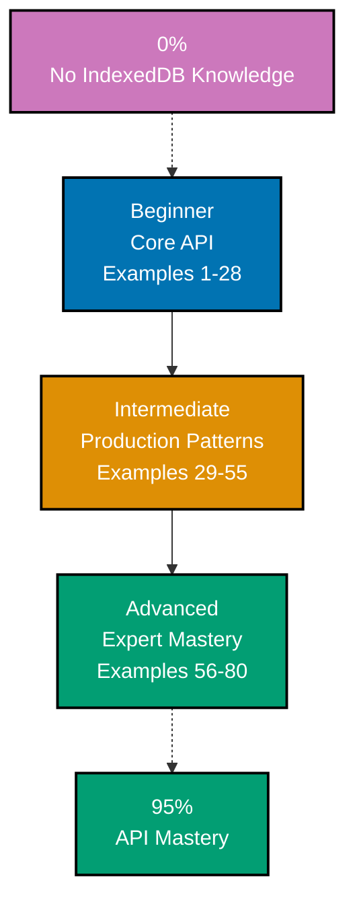

**Want to learn IndexedDB through code?** This by-example tutorial provides 80 heavily annotated examples covering 95% of the IndexedDB API. Master browser-native storage for structured data, offline-first applications, and large dataset handling through working JavaScript rather than lengthy explanations.

## What Is By-Example Learning?

By-example learning is a **code-first approach** where you learn concepts through annotated, working examples rather than narrative explanations. Each example shows:

1. **What the code does** - Brief explanation of the IndexedDB concept
2. **How it works** - A focused, heavily commented code example
3. **Key Takeaway** - A pattern summary highlighting the critical lesson
4. **Why It Matters** - Production context, when to use, deeper significance

This approach works best when you already understand JavaScript and asynchronous programming. You learn IndexedDB's database model, transaction semantics, and cursor patterns by studying real code rather than theoretical descriptions.

## What Is IndexedDB?

IndexedDB is a **low-level, transactional, indexed, asynchronous database API** built into every modern browser. It stores structured JavaScript values (objects, arrays, Blobs, Files, Dates) in origin-private databases and supports indexing for fast lookups. Key distinctions:

- **Not LocalStorage**: LocalStorage stores only strings (~5MB cap, synchronous); IndexedDB stores structured values with much larger quotas
- **Transactional**: Reads and writes happen inside transactions that auto-commit or abort atomically
- **Asynchronous**: All operations are event-driven (`onsuccess`, `onerror`) — promise wrapping is a common pattern
- **Schema-versioned**: Databases declare a version; upgrading triggers `onupgradeneeded` to migrate schema
- **Same-origin**: Each origin (protocol + host + port) has its own isolated database namespace
- **Structured clone storage**: Stores anything the HTML structured clone algorithm handles (objects, `Blob`, `File`, `ArrayBuffer`, `Date`, `Map`, `Set`, typed arrays)

## Learning Path



## Coverage Philosophy: 95% Through 80 Examples

The **95% coverage** means you will understand IndexedDB deeply enough to build production offline-first applications with confidence. It does not mean you will know every browser-specific edge case or obscure error scenario — those come with experience.

The 80 examples are organized progressively:

- **Beginner (Examples 1-28)**: Foundation API with zero wrapper libraries (`indexedDB.open`, `onupgradeneeded`, object stores, indexes, transactions, CRUD, cursors, key ranges, basic error handling, structured clone storage)
- **Intermediate (Examples 29-55)**: Production patterns (promise wrapping, the `idb` library, migrations, concurrent writes, service workers, Blob/File storage, pagination, backup/restore, quotas, persistence)
- **Advanced (Examples 56-80)**: Expert mastery (Dexie.js, live queries, sync and conflict resolution, testing with `fake-indexeddb`, performance optimization, comparison with Cache API/OPFS, DevTools debugging)

Together, these examples cover **95% of what you will use** in production IndexedDB applications.

## Annotation Density: 1-2.25 Comments Per Code Line

**CRITICAL**: All examples maintain **1-2.25 comment lines per code line PER EXAMPLE** to ensure deep understanding.

**What this means**:

- Simple lines get 1 annotation explaining what the API call does
- Complex lines get 2+ annotations explaining the async flow, transaction state, and design intent
- Use `// =>` notation in JavaScript to show what values, states, or events are produced

**Example**:

```javascript
// => Request to open (or create) a database named "todos"
const request = indexedDB.open("todos", 1);
// => Returns IDBOpenDBRequest — async, results delivered via events

request.onupgradeneeded = (event) => {
  // => Fires when version changes (including initial creation)
  const db = event.target.result;
  // => db is IDBDatabase — use it to declare schema

  db.createObjectStore("tasks", { keyPath: "id" });
  // => Creates object store with "id" property as primary key
};
```

This density ensures each example is self-contained and fully comprehensible without external documentation.

## Structure of Each Example

All examples follow a consistent five-part format:

````text
### Example N: Descriptive Title

2-3 sentence explanation of the concept.

```javascript
// Heavily annotated JavaScript example
// showing the IndexedDB pattern in action
```

**Key Takeaway**: 1-2 sentence summary.

**Why It Matters**: 50-100 words explaining significance in production applications.
````

**Code annotations**:

- `// =>` shows what each line produces (value, type, event, state)
- Inline comments explain transaction lifecycle and async timing
- Variable names are self-documenting (`request`, `db`, `tx`, `store`)
- Event handlers are commented with their firing conditions

## What's Covered

### Core Database API

- **Opening databases**: `indexedDB.open(name, version)`, `onsuccess`, `onerror`, `onblocked`
- **Schema versioning**: `onupgradeneeded` handler, version migration
- **Closing databases**: `db.close()`, `onversionchange`, `onclose`
- **Deleting databases**: `indexedDB.deleteDatabase`, cleanup patterns

### Object Stores

- **Creation**: `createObjectStore(name, options)`, keyPath vs out-of-line keys
- **Auto-increment**: `autoIncrement: true` generated primary keys
- **Key paths**: Simple path, nested path, compound path arrays
- **Deletion**: `deleteObjectStore(name)` during upgrade

### Indexes

- **Simple indexes**: `store.createIndex(name, keyPath)` for fast lookups
- **Unique indexes**: `{ unique: true }` enforcing distinct values
- **Multi-entry indexes**: `{ multiEntry: true }` indexing array values
- **Compound indexes**: Key path arrays for multi-column queries
- **Index deletion**: `store.deleteIndex(name)`

### Transactions

- **Modes**: `readonly`, `readwrite`, `versionchange`
- **Scope**: Object store list, scope intersection rules
- **Lifecycle**: `oncomplete`, `onerror`, `onabort`, `abort()`
- **Auto-commit**: Transactions auto-commit when microtask queue drains
- **Parallel vs serial**: Multiple `readonly` run in parallel; `readwrite` queues

### CRUD Operations

- **Create**: `store.add(value, key)` for new records (fails on duplicate key)
- **Update**: `store.put(value, key)` for insert-or-replace semantics
- **Read**: `store.get(key)`, `store.getAll()`, `store.getAllKeys()`
- **Delete**: `store.delete(key)`, `store.clear()`
- **Count**: `store.count(query)` for cardinality checks

### Cursors

- **Record cursor**: `store.openCursor(range, direction)`
- **Key cursor**: `store.openKeyCursor(range, direction)` (keys only, faster)
- **Direction**: `next`, `prev`, `nextunique`, `prevunique`
- **Navigation**: `cursor.continue()`, `cursor.advance(n)`
- **Mutation on cursor**: `cursor.update(value)`, `cursor.delete()`

### Key Ranges

- **Bounded**: `IDBKeyRange.bound(lower, upper, lowerExclusive, upperExclusive)`
- **Open-ended**: `lowerBound(x)`, `upperBound(x)`
- **Exact match**: `IDBKeyRange.only(value)`

### Production Patterns

- **Promise wrapping**: `requestToPromise` helper, async/await over raw events
- **The `idb` library**: Thin promise wrapper by Jake Archibald
- **Dexie.js**: Higher-level ORM with chainable queries and live observables
- **Schema migrations**: Multi-version upgrades with additive strategies
- **Concurrent writes**: Serialized write queue, optimistic concurrency
- **Service Workers**: IndexedDB inside fetch handlers, background sync
- **Blob and File storage**: Persisting large binary data
- **Pagination**: Cursor-based pagination over large datasets
- **Backup and restore**: Export to JSON, import with migration

### Error Handling

- **`QuotaExceededError`**: Storage budget exhausted
- **`ConstraintError`**: Unique index violation, duplicate key on `add`
- **`VersionError`**: Opening with lower version than current
- **`TransactionInactiveError`**: Using transaction after it committed
- **`NotFoundError`**: Accessing non-existent store or index
- **Recovery strategies**: Retry, fallback, user notification

### Storage and Quotas

- **Estimation**: `navigator.storage.estimate()` returning `{ usage, quota }`
- **Persistent storage**: `navigator.storage.persist()` opting out of eviction
- **Eviction policy**: Best-effort vs persistent storage semantics
- **DevTools inspection**: Application tab, storage clearing

### Testing and Tooling

- **`fake-indexeddb`**: In-memory implementation for Jest/Vitest tests
- **DevTools debugging**: Application tab navigation, transaction inspection
- **Chrome/Firefox/Safari differences**: Quirks across browser engines

### Comparisons

- **LocalStorage/SessionStorage**: When each is appropriate
- **Cache API**: Request/response caching vs structured data
- **OPFS (Origin Private File System)**: File-oriented alternative
- **IndexedDB vs server-side databases**: Role in offline-first architecture

## What's NOT Covered

We exclude topics that belong in specialized tutorials:

- **Deep service worker tutorials**: Full PWA architecture (brief integration only)
- **React/Vue state bindings**: Framework-specific state-to-IndexedDB bridges
- **End-to-end encryption schemes**: Cryptographic patterns on stored data
- **CRDT implementations**: Detailed conflict-free replicated data type design
- **WebSQL (deprecated)**: No longer part of the web platform

For these topics, see dedicated tutorials.

## Prerequisites

### Required

- **JavaScript fundamentals**: Objects, arrays, JSON, closures
- **Asynchronous programming**: Promises, `async`/`await`, event-driven programming
- **Browser basics**: DevTools, console, `window` global, origin model
- **Event handling**: `addEventListener`, event objects, `this` binding

### Recommended

- **TypeScript basics**: Type annotations (examples mostly use plain JS)
- **Web Workers/Service Workers**: Conceptual understanding helps advanced examples
- **Database concepts**: Primary keys, indexes, transactions (general RDBMS familiarity)

### Not Required

- **Prior IndexedDB exposure**: This tutorial starts from zero
- **Wrapper library experience**: Raw API is taught first, wrappers introduced later
- **Backend database experience**: IndexedDB concepts stand on their own

## Getting Started

You only need a modern browser (Chrome, Firefox, Safari, Edge). No installation required for beginner examples.

```html
<!doctype html>
<html>
  <head>
    <meta charset="utf-8" />
    <title>IndexedDB playground</title>
  </head>
  <body>
    <script>
      // Paste examples here and open the DevTools console
    </script>
  </body>
</html>
```

Open the file in your browser, then use the DevTools **Application** tab (Chrome/Edge) or **Storage** tab (Firefox) to inspect your databases while running examples.

## How to Use This Guide

### 1. Choose Your Starting Point

- **New to IndexedDB?** Start with Beginner (Example 1)
- **Know the raw API?** Jump to Intermediate (Example 29) for promise wrapping and `idb`
- **Comfortable with promise wrappers?** Jump to Advanced (Example 56) for Dexie and production topics

### 2. Read the Example

Each example has five parts:

- **Explanation** (2-3 sentences): What the concept is, why it exists, when to use it
- **Diagram** (when concept has relationships): Accessible Mermaid diagram showing flow or state
- **Code** (heavily commented): Working JavaScript with line-by-line annotations
- **Key Takeaway** (1-2 sentences): Distilled essence of the pattern
- **Why It Matters** (50-100 words): Production context and deeper significance

### 3. Run the Code

Paste each example into a small HTML file or directly into the DevTools console on `about:blank`. Watch the database appear under the Application tab.

### 4. Modify and Experiment

Change object store schemas, swap key ranges, try different cursor directions. Experimentation builds intuition faster than reading.

### 5. Reference as Needed

Use this guide as a reference when building offline-first apps. Search for relevant examples and adapt patterns to your code.

## Ready to Start?

Choose your learning path:

- **Beginner** - Start here if new to IndexedDB. Build foundation understanding through 28 raw-API examples.
- **Intermediate** - Jump here if comfortable with raw events. Master production patterns through 27 examples.
- **Advanced** - Expert mastery through 25 advanced examples covering Dexie, sync, testing, and performance.

Or jump to specific topics by searching for relevant keywords (transaction, cursor, index, migration, quota, Dexie, idb, fake-indexeddb).
