This advanced tutorial covers expert-level Next.js patterns through 25 heavily annotated examples. Each example maintains 1-2.25 comment lines per code line to ensure deep understanding.

## Prerequisites

Before starting, ensure you understand:

- Intermediate Next.js patterns (Server Actions, caching, route organization, authentication)
- React advanced patterns (Suspense, Error Boundaries, Context)
- TypeScript advanced features (generics, conditional types, utility types)
- HTTP caching concepts (ETags, Cache-Control, stale-while-revalidate)

## Group 1: Static Site Generation (SSG) & ISR

### Example 51: Static Site Generation with generateStaticParams

Use generateStaticParams to pre-render dynamic routes at build time. Creates static HTML for all specified parameter combinations.

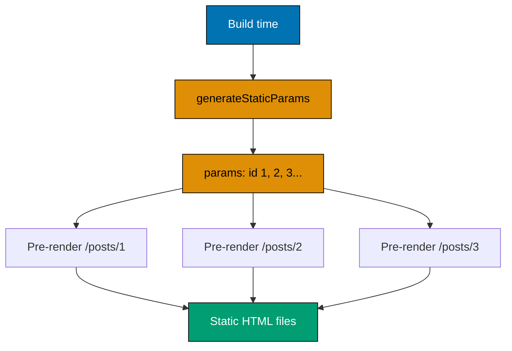

```typescript
// app/products/[id]/page.tsx

// => generateStaticParams runs at build time
// => Returns array of params to pre-render
export async function generateStaticParams() {
  // => Fetch all product IDs from database/API
  const products = await fetch('https://api.example.com/products').then(res =>
    res.json()
  );
  // => products is [{ id: "1" }, { id: "2" }, { id: "3" }]

  // => Return array of params objects
  return products.map((product: any) => ({
    id: product.id.toString(),              // => Must return { id: string }
  }));
  // => Next.js pre-renders /products/1, /products/2, /products/3
}

// => Page component receives params
export default async function ProductPage({
  params,
}: {
  params: { id: string };
}) {
  // => For pre-rendered routes, this runs at build time
  // => For dynamic routes (not in generateStaticParams), runs at request time
  const product = await fetch(`https://api.example.com/products/${params.id}`).then(
    res => res.json()
  );
  // => product is { id: "1", name: "Murabaha", description: "..." }

  return (
    <div>
      <h1>{product.name}</h1>
      <p>{product.description}</p>
    </div>
  );
}

// => Optional: enable static export (fully static site)
export const dynamicParams = false;
// => dynamicParams = false: 404 for routes not in generateStaticParams
// => dynamicParams = true (default): generate on-demand for new routes
```

**Key Takeaway**: Use generateStaticParams to pre-render dynamic routes at build time. Combines static generation benefits with dynamic routing flexibility.

**Expected Output**: Build generates static HTML for /products/1, /products/2, /products/3. Instant page loads, no server rendering needed.

**Common Pitfalls**: Forgetting to return array of params objects (wrong format), or not setting dynamicParams correctly (unexpected 404s or slow pages).

**Why It Matters**: generateStaticParams enables production-scale static generation for content-driven applications. E-commerce sites pre-render thousands of product pages at build time for instant page loads without server computation per request. Blog platforms pre-render all posts for maximum SEO and CDN cacheability. The dynamicParams setting controls behavior for paths not in the pre-rendered set - set to false to enforce strict static sets, or true to allow on-demand rendering for new content. This pattern is fundamental to hybrid rendering strategies that serve both scale and freshness requirements.

### Example 52: Incremental Static Regeneration (ISR)

Combine static generation with time-based revalidation. Serve stale content instantly while regenerating in background.

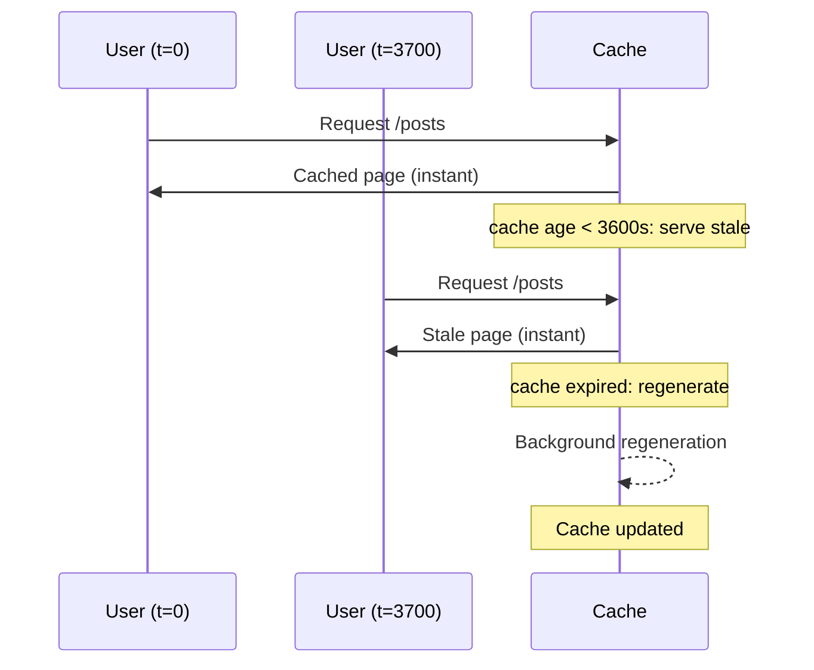

```typescript
// app/blog/[slug]/page.tsx

// => Pre-render blog posts at build time
export async function generateStaticParams() {
  const posts = await fetch('https://cms.example.com/posts').then(res =>
    res.json()
  );

  return posts.map((post: any) => ({
    slug: post.slug,
  }));
}

// => Page with ISR configuration
export default async function BlogPostPage({
  params,
}: {
  params: { slug: string };
}) {
  // => Fetch post data
  const post = await fetch(`https://cms.example.com/posts/${params.slug}`, {
    next: { revalidate: 300 },              // => Revalidate every 5 minutes
  }).then(res => res.json());
  // => First request after 5 minutes: serves stale, regenerates in background
  // => Subsequent requests: serves newly generated version

  return (
    <article>
      <h1>{post.title}</h1>
      <time>{new Date(post.publishedAt).toLocaleDateString()}</time>
      <div dangerouslySetInnerHTML={{ __html: post.content }} />
    </article>
  );
}

// => Alternative: page-level revalidation
export const revalidate = 300;              // => 5 minutes
// => All fetches in this page inherit this revalidate value

// => Alternative: on-demand revalidation in CMS webhook
// app/api/revalidate/route.ts
import { revalidatePath } from 'next/cache';
import { NextRequest, NextResponse } from 'next/server';

export async function POST(request: NextRequest) {
  // => Webhook from CMS when post updated
  const body = await request.json();
  const slug = body.slug;                   // => slug is "zakat-guide"

  // => Verify webhook secret (security)
  const secret = request.headers.get('x-webhook-secret');
  if (secret !== process.env.WEBHOOK_SECRET) {
    return NextResponse.json({ error: 'Unauthorized' }, { status: 401 });
  }

  // => Revalidate specific post
  revalidatePath(`/blog/${slug}`);
  // => Regenerates page immediately, no waiting for revalidate timer

  return NextResponse.json({ revalidated: true });
}
```

**Key Takeaway**: ISR combines static generation speed with dynamic content updates. Use time-based revalidation for automatic updates or on-demand revalidation for instant updates.

**Expected Output**: Blog posts load instantly from static cache. After 5 minutes, next request serves stale version while regenerating in background.

**Common Pitfalls**: Setting revalidate too low (increases server load), or not securing on-demand revalidation webhooks (security risk).

**Why It Matters**: On-demand ISR via webhooks is the production pattern for content management systems. When editors publish content in a headless CMS, a webhook triggers immediate revalidation of affected pages - users see updates within seconds rather than waiting for time-based intervals. Production implementations at scale (millions of pages) use this to invalidate only changed content rather than triggering broad revalidation. Securing webhook endpoints with secret tokens prevents cache poisoning attacks where attackers force unnecessary revalidation to increase server costs.

### Example 53: Static Export for CDN Hosting

Export fully static site (no Node.js server required). Perfect for deploying to CDN or static hosting.

```typescript
// next.config.js
/** @type {import('next').NextConfig} */
const nextConfig = {
  output: 'export',                         // => Enable static export
  // => Generates static HTML/CSS/JS files in 'out' directory

  // => Optional: configure trailing slashes
  trailingSlash: true,
  // => /about → /about/index.html (better for some CDNs)

  // => Optional: configure base path
  // basePath: '/blog',
  // => All routes prefixed with /blog (e.g., /blog/posts/1)
};

module.exports = nextConfig;

// app/page.tsx
// => Static page (no server-side features)
export default function HomePage() {
  return (
    <div>
      <h1>Static Site</h1>
      <p>This page is fully static, no server required.</p>
    </div>
  );
}

// app/posts/[id]/page.tsx
// => Dynamic route with generateStaticParams
export async function generateStaticParams() {
  return [
    { id: '1' },
    { id: '2' },
    { id: '3' },
  ];
}

// => MUST set dynamicParams = false for static export
export const dynamicParams = false;
// => Without this, build fails (can't generate unknown routes)

export default function PostPage({
  params,
}: {
  params: { id: string };
}) {
  return (
    <div>
      <h1>Post {params.id}</h1>
    </div>
  );
}

// Build command:
// npm run build
// => Generates 'out' directory with static files
// => Deploy 'out' to any CDN (Cloudflare, Vercel, Netlify, S3, etc.)
```

**Key Takeaway**: Use output: 'export' for fully static sites. No Node.js server needed, deploy to any CDN. Requires generateStaticParams and dynamicParams = false for dynamic routes.

**Expected Output**: Build generates 'out' directory with HTML/CSS/JS files. Deploy to CDN for global distribution and instant loads.

**Common Pitfalls**: Using server-only features (Server Actions, cookies, headers) in static export (build fails), or forgetting dynamicParams = false (build error).

**Why It Matters**: Static export generates a fully self-contained website that deploys to any static hosting provider (S3, Cloudflare Pages, GitHub Pages) or CDN without server runtime requirements. Production documentation sites, marketing pages, and product catalogs use static export for maximum simplicity and minimum operational cost. The trade-off is losing dynamic server features - acceptable when content is truly static. Understanding this boundary prevents build failures from accidentally including server features in statically exported applications.

## Group 2: Streaming & Suspense

### Example 54: Streaming with Suspense Boundaries

Stream page sections independently to show content as it loads. Improves perceived performance and user experience.

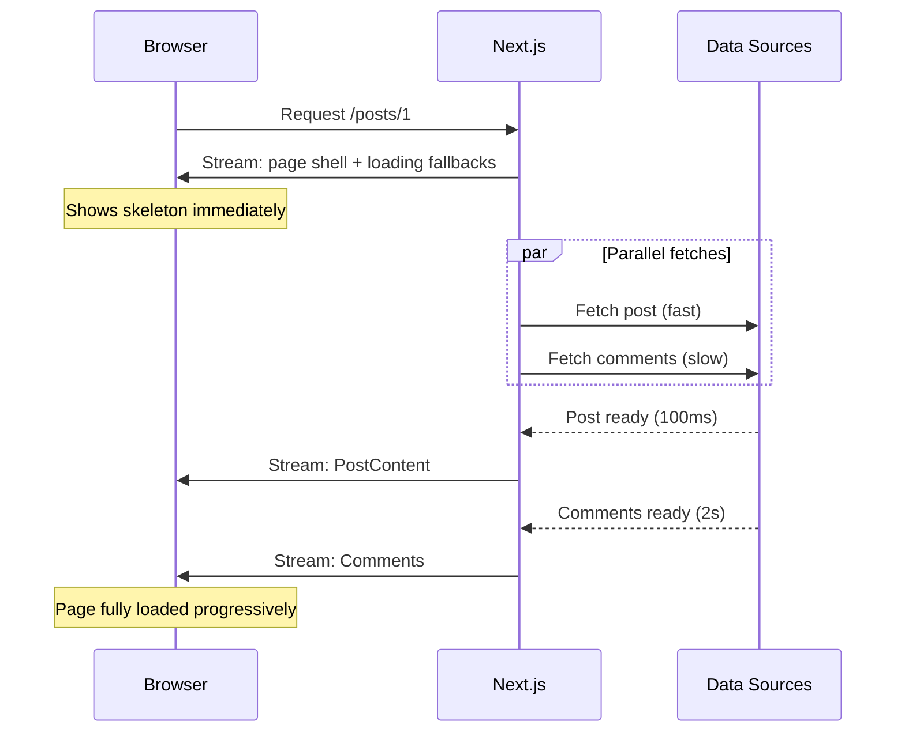

```typescript
// app/dashboard/page.tsx
import { Suspense } from 'react';

// => Fast component (renders immediately)
function QuickStats() {
  return (
    <div>
      <h2>Quick Stats</h2>
      <p>Last login: {new Date().toLocaleTimeString()}</p>
    </div>
  );
}

// => Slow component (async data fetch)
async function RecentDonations() {
  // => Simulate slow database query
  await new Promise(resolve => setTimeout(resolve, 3000)); // => 3 second delay

  const donations = [
    { id: 1, amount: 100000, date: '2026-01-20' },
    { id: 2, amount: 250000, date: '2026-01-25' },
  ];

  return (
    <div>
      <h2>Recent Donations</h2>
      <ul>
        {donations.map(d => (
          <li key={d.id}>
            IDR {d.amount.toLocaleString()} - {d.date}
          </li>
        ))}
      </ul>
    </div>
  );
}

// => Another slow component
async function AnalyticsChart() {
  await new Promise(resolve => setTimeout(resolve, 2000)); // => 2 second delay

  return (
    <div>
      <h2>Analytics</h2>
      <p>Total donations this month: IDR 350,000</p>
    </div>
  );
}

export default function DashboardPage() {
  return (
    <div>
      <h1>Dashboard</h1>

      {/* => Fast content renders immediately */}
      <QuickStats />

      {/* => Suspense boundary for slow content */}
      <Suspense fallback={<p>Loading donations...</p>}>
        {/* => Shows fallback while RecentDonations loads */}
        <RecentDonations />
        {/* => Replaced with actual content when ready */}
      </Suspense>

      {/* => Separate Suspense boundary (independent loading) */}
      <Suspense fallback={<p>Loading analytics...</p>}>
        <AnalyticsChart />
        {/* => Loads independently from donations */}
      </Suspense>
    </div>
  );
}
// => HTML streamed in chunks:
// => 1. Initial HTML with QuickStats + fallbacks (instant)
// => 2. AnalyticsChart HTML streamed after 2 seconds
// => 3. RecentDonations HTML streamed after 3 seconds
```

**Key Takeaway**: Use Suspense boundaries to stream page sections independently. Fast content shows immediately, slow content streams as ready.

**Expected Output**: Dashboard shows heading and QuickStats instantly. "Loading analytics..." appears, replaced after 2s. "Loading donations..." replaced after 3s.

**Common Pitfalls**: Single Suspense wrapping all slow content (loses independent streaming), or not providing fallback (required prop).

**Why It Matters**: Streaming transforms user-perceived performance by delivering page content progressively. Traditional SSR blocks the browser until all data fetches complete; streaming sends the shell immediately and streams sections as their data arrives. Production applications with complex pages (multiple data sources with different latencies) use streaming to show meaningful content in under 200ms even when some data takes 2-3 seconds. Core Web Vitals improve dramatically: TTFB and FCP are no longer gated by the slowest data source.

### Example 55: Nested Suspense for Progressive Loading

Nest Suspense boundaries to create progressive loading experiences. Outer boundary for page structure, inner boundaries for details.

```typescript
// app/posts/[id]/page.tsx
import { Suspense } from 'react';

// => Post header (fast)
async function PostHeader({ id }: { id: string }) {
  // => Quick database query (indexed)
  await new Promise(resolve => setTimeout(resolve, 500)); // => 0.5s

  return (
    <header>
      <h1>Post {id}</h1>
      <p>By Author Name</p>
    </header>
  );
}

// => Post content (slower)
async function PostContent({ id }: { id: string }) {
  await new Promise(resolve => setTimeout(resolve, 1500)); // => 1.5s

  return (
    <article>
      <p>This is the post content. It takes longer to load because it's large.</p>
    </article>
  );
}

// => Comments (slowest)
async function PostComments({ id }: { id: string }) {
  await new Promise(resolve => setTimeout(resolve, 3000)); // => 3s

  const comments = [
    { id: 1, author: 'Ahmad', text: 'Great post!' },
    { id: 2, author: 'Fatima', text: 'Very helpful.' },
  ];

  return (
    <section>
      <h2>Comments</h2>
      <ul>
        {comments.map(c => (
          <li key={c.id}>
            <strong>{c.author}</strong>: {c.text}
          </li>
        ))}
      </ul>
    </section>
  );
}

export default function PostPage({
  params,
}: {
  params: { id: string };
}) {
  return (
    <div>
      {/* => Outer Suspense: page structure */}
      <Suspense fallback={<div>Loading post...</div>}>
        {/* => Header loads first (0.5s) */}
        <PostHeader id={params.id} />

        {/* => Inner Suspense: content section */}
        <Suspense fallback={<p>Loading content...</p>}>
          <PostContent id={params.id} />
          {/* => Content streams after 1.5s */}
        </Suspense>

        {/* => Inner Suspense: comments section */}
        <Suspense fallback={<p>Loading comments...</p>}>
          <PostComments id={params.id} />
          {/* => Comments stream after 3s */}
        </Suspense>
      </Suspense>
    </div>
  );
}
// => Progressive loading timeline:
// => 0ms: "Loading post..." shown
// => 500ms: Header + "Loading content..." + "Loading comments..."
// => 1500ms: Header + Content + "Loading comments..."
// => 3000ms: Header + Content + Comments (fully loaded)
```

**Key Takeaway**: Nest Suspense boundaries for progressive loading. Show page structure first, then fill in details as data arrives.

**Expected Output**: Post page shows loading state, then progressively reveals header (0.5s), content (1.5s), comments (3s).

**Common Pitfalls**: Not nesting Suspense (all-or-nothing loading), or too many boundaries (choppy UX with many loading states).

**Why It Matters**: Nested Suspense creates sophisticated progressive loading hierarchies that match user mental models. Product pages can show the product immediately, load reviews while the product displays, and load recommendations last. This pattern matches the visual hierarchy of content - primary content appears first, secondary content streams in. Production applications with rich content pages use 3-5 nested Suspense boundaries to orchestrate the loading experience, improving time-to-useful-content metrics that correlate with user satisfaction and conversion rates.

### Example 56: Suspense with Skeleton UI

Use skeleton components as Suspense fallbacks for better perceived performance. Shows content structure while loading.

```typescript
// app/components/Skeleton.tsx
// => Reusable skeleton placeholder components

export function SkeletonCard() {
  // => Single card skeleton (title + body area)
  return (
    <div
      style={{
        background: '#e0e0e0',      // => Light gray background (skeleton color)
        borderRadius: '8px',         // => Matches real card border-radius
        padding: '1rem',             // => Same padding as real card
        animation: 'pulse 1.5s ease-in-out infinite', // => CSS pulsing animation
      }}
    >
      <div
        style={{
          height: '1.5rem',          // => Matches real title height
          background: '#d0d0d0',     // => Slightly darker for contrast
          borderRadius: '4px',
          marginBottom: '0.5rem',
        }}
      />
      {/* => Title placeholder row */}
      <div
        style={{
          height: '4rem',            // => Matches real body text height
          background: '#d0d0d0',
          borderRadius: '4px',
        }}
      />
      {/* => Body content placeholder block */}
    </div>
  );
  // => Skeleton dimensions must match actual content to prevent layout shift
}

export function SkeletonList({ count = 3 }: { count?: number }) {
  // => count: number of skeleton rows to show (default 3)
  return (
    <div>
      {Array.from({ length: count }).map((_, i) => (
        // => Array.from creates array of `count` length
        // => map() renders one skeleton row per item
        <div
          key={i}
          // => i is 0, 1, 2... used as React list key
          style={{
            height: '3rem',          // => Matches real list item height
            background: '#e0e0e0',   // => Skeleton gray color
            borderRadius: '4px',
            marginBottom: '0.5rem',  // => Space between skeleton rows
            animation: 'pulse 1.5s ease-in-out infinite', // => Pulse effect
          }}
        />
      ))}
    </div>
  );
  // => Renders `count` animated placeholder rows
}

// app/posts/page.tsx
import { Suspense } from 'react';
// => Suspense boundary for skeleton fallback
import { SkeletonList } from '../components/Skeleton';
// => Import skeleton component for fallback UI

async function PostList() {
  // => Async Server Component - fetches posts
  await new Promise(resolve => setTimeout(resolve, 2000));
  // => Simulates 2-second API call (replace with real fetch)

  const posts = [
    { id: 1, title: 'Zakat Guide' },
    { id: 2, title: 'Murabaha Basics' },
    { id: 3, title: 'Islamic Finance 101' },
  ];
  // => posts array (3 items, fetched after 2s delay)

  return (
    <ul>
      {posts.map(post => (
        // => Renders one <li> per post
        <li
          key={post.id}
          // => post.id as unique key: 1, 2, 3
          style={{
            padding: '1rem',
            border: '1px solid #ddd',  // => Subtle card border
            borderRadius: '4px',
            marginBottom: '0.5rem',
          }}
        >
          <h3>{post.title}</h3>
          {/* => post.title: "Zakat Guide", "Murabaha Basics", etc. */}
          <p>Published on Jan 29, 2026</p>
        </li>
      ))}
    </ul>
  );
  // => Returns full post list after 2-second delay
}

export default function PostsPage() {
  return (
    <div>
      <h1>Blog Posts</h1>

      {/* => Suspense with skeleton fallback */}
      <Suspense fallback={<SkeletonList count={3} />}>
        {/* => Shows 3 skeleton rows while PostList loads */}
        <PostList />
        {/* => Replaced with actual posts after 2s */}
      </Suspense>
    </div>
  );
  // => Page renders immediately; skeleton shows during PostList fetch
}

// => Add CSS for pulse animation (global.css)
// @keyframes pulse {
//   0%, 100% { opacity: 1; }   // => Full opacity at start/end
//   50% { opacity: 0.5; }      // => Half opacity at midpoint
// }
```

**Key Takeaway**: Use skeleton components as Suspense fallbacks to show content structure while loading. Improves perceived performance and reduces layout shift.

**Expected Output**: Posts page shows 3 pulsing skeleton cards for 2 seconds, then actual post list slides in. No layout shift.

**Common Pitfalls**: Skeleton doesn't match actual content layout (causes layout shift), or skeleton too complex (defeats purpose of fast fallback).

**Why It Matters**: Skeleton UI reduces perceived loading times by setting visual expectations before content arrives. Users tolerate wait times significantly better when a structural placeholder indicates where content will appear. Production applications that implement matching skeleton layouts (same dimensions as actual content) eliminate Cumulative Layout Shift (CLS) - a Core Web Vitals metric that affects search rankings. Skeleton screens are particularly effective for social feeds, search results, and data tables where layout is predictable.

## Group 3: Advanced Caching Strategies

### Example 57: Custom Cache with unstable_cache

Use unstable_cache to cache expensive operations with custom keys and revalidation rules. Perfect for database queries or computations.

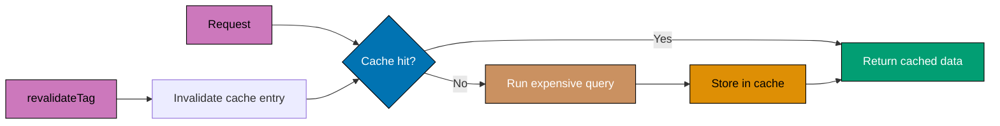

```typescript
// app/lib/cache.ts
import { unstable_cache } from 'next/cache';
// => Import Next.js cache function

// => Expensive calculation function
async function calculateZakatRates() {
  console.log('Calculating zakat rates (expensive operation)...');

  // => Simulate expensive computation
  await new Promise(resolve => setTimeout(resolve, 2000)); // => 2 second delay

  // => Fetch gold/silver prices from external API
  const goldPrice = 950000;                 // => IDR per gram
  const silverPrice = 12000;                // => IDR per gram

  return {
    goldNisab: 85 * goldPrice,              // => 80,750,000 IDR
    silverNisab: 595 * silverPrice,         // => 7,140,000 IDR
    zakatRate: 0.025,                       // => 2.5%
  };
}

// => Cached version of calculateZakatRates
export const getZakatRates = unstable_cache(
  calculateZakatRates,                      // => Function to cache
  ['zakat-rates'],                          // => Cache key
  {
    revalidate: 3600,                       // => Revalidate every 1 hour
    tags: ['zakat', 'rates'],               // => Cache tags for revalidation
  }
);
// => First call: runs calculateZakatRates, caches result
// => Subsequent calls within 1 hour: returns cached result (instant)

// app/zakat/page.tsx
import { getZakatRates } from '../lib/cache';

export default async function ZakatPage() {
  // => Use cached function
  const rates = await getZakatRates();
  // => First request: 2 second delay
  // => Subsequent requests: instant (cached)

  return (
    <div>
      <h1>Zakat Calculator</h1>
      <p>Gold Nisab: IDR {rates.goldNisab.toLocaleString()}</p>
      <p>Silver Nisab: IDR {rates.silverNisab.toLocaleString()}</p>
      <p>Zakat Rate: {rates.zakatRate * 100}%</p>
    </div>
  );
}

// app/actions.ts
'use server';

import { revalidateTag } from 'next/cache';

export async function updateGoldPrice() {
  // => Update gold price in database
  // await db.prices.update({ ... });

  // => Invalidate zakat rates cache
  revalidateTag('rates');
  // => Next getZakatRates() call recalculates
}
```

**Key Takeaway**: Use unstable_cache for custom caching of expensive operations. Set revalidation time and tags for granular cache control.

**Expected Output**: First page load calculates rates (2s delay). Subsequent loads instant (cached). revalidateTag forces recalculation.

**Common Pitfalls**: Using unstable_cache on frequently changing data (stale cache), or not setting appropriate revalidate time (too aggressive or too stale).

**Why It Matters**: unstable*cache provides fine-grained control over caching beyond what fetch() alone offers, enabling caching of database queries, external SDK calls, and complex computed values. Production applications cache expensive database aggregations (analytics dashboards, recommendation engines, leaderboards) that would otherwise run on every request. The tag-based invalidation enables precise cache clearing when underlying data changes. Despite the 'unstable*' prefix, this API is production-ready - the prefix indicates the API may change in future Next.js versions.

### Example 58: Request Memoization with React cache()

Use React cache() to deduplicate identical function calls within a single request. Different from Next.js caching (doesn't persist across requests).

```typescript
// app/lib/data.ts
import { cache } from 'react';
// => Import React cache function

// => Expensive database query
async function getUserFromDB(userId: string) {
  console.log(`Database query for user ${userId}`);
  // => This log helps verify deduplication

  // => Simulate database query
  await new Promise(resolve => setTimeout(resolve, 100));

  return {
    id: userId,
    name: 'Ahmad',
    email: 'ahmad@example.com',
  };
}

// => Memoized version (deduplicates within request)
export const getUser = cache(getUserFromDB);
// => Multiple calls with same userId in single request: only one database query
// => Different requests: cache doesn't persist (new query)

// app/components/UserProfile.tsx
import { getUser } from '../lib/data';

export async function UserProfile({ userId }: { userId: string }) {
  const user = await getUser(userId);       // => Call 1: database query
  // => user is { id: "1", name: "Ahmad", ... }

  return (
    <div>
      <h2>{user.name}</h2>
      <p>{user.email}</p>
    </div>
  );
}

// app/components/UserStats.tsx
import { getUser } from '../lib/data';

export async function UserStats({ userId }: { userId: string }) {
  const user = await getUser(userId);       // => Call 2: uses cached result (same request)
  // => No database query, instant return

  return (
    <div>
      <p>User ID: {user.id}</p>
    </div>
  );
}

// app/users/[id]/page.tsx
import { UserProfile } from '@/app/components/UserProfile';
import { UserStats } from '@/app/components/UserStats';

export default function UserPage({
  params,
}: {
  params: { id: string };
}) {
  return (
    <div>
      <h1>User Details</h1>

      {/* => Both components call getUser(params.id) */}
      <UserProfile userId={params.id} />
      {/* => Triggers database query */}

      <UserStats userId={params.id} />
      {/* => Uses memoized result, no second query */}
    </div>
  );
}
// => Single request: only ONE database query despite two getUser() calls
// => Next request: cache cleared, new database query
```

**Key Takeaway**: Use React cache() to deduplicate function calls within a single request. Different from Next.js caching (doesn't persist across requests).

**Expected Output**: Server logs "Database query for user 1" only once per page request, despite multiple components calling getUser().

**Common Pitfalls**: Confusing React cache() with Next.js caching (different scopes), or expecting cache to persist across requests (it doesn't).

**Why It Matters**: React cache() solves the data consistency problem in component trees where multiple components need the same data. Without memoization, a page rendering 100 user cards might query the user settings table 100 times in a single request. React cache() deduplicates within a single render pass, reducing database load proportional to the duplication factor. Production applications with complex component trees (dashboards, reports, nested layouts sharing data) use this pattern to maintain clean component-level data fetching without performance penalties.

### Example 59: Force Dynamic Rendering

Use dynamic rendering modes to opt out of static generation for specific pages. Perfect for user-specific or time-sensitive content.

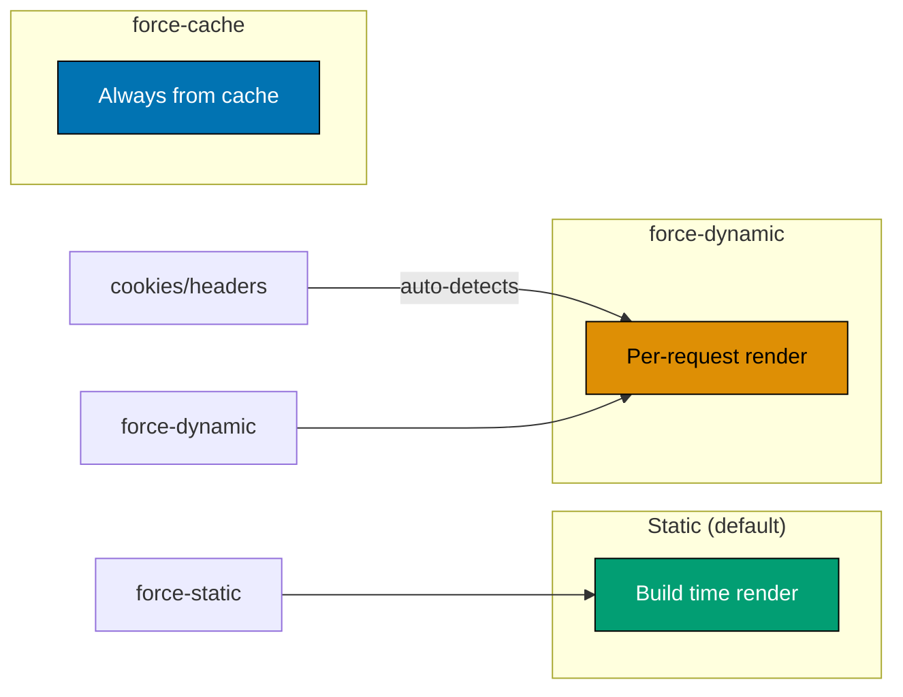

```typescript
// app/profile/page.tsx
// => Force dynamic rendering (SSR on every request)
export const dynamic = 'force-dynamic';
// => Opts out of static generation
// => Page rendered on every request (Server-Side Rendering)

import { cookies } from 'next/headers';

export default async function ProfilePage() {
  // => Read cookies (requires dynamic rendering)
  const cookieStore = cookies();
  const authToken = cookieStore.get('auth_token');

  if (!authToken) {
    return <p>Please log in.</p>;
  }

  // => Fetch user-specific data
  const user = { name: 'Ahmad', lastLogin: new Date() };

  return (
    <div>
      <h1>Your Profile</h1>
      <p>Name: {user.name}</p>
      <p>Last login: {user.lastLogin.toLocaleString()}</p>
      {/* => Always shows current time (dynamic) */}
    </div>
  );
}

// Alternative: force-static for edge cases
// export const dynamic = 'force-static';
// => Forces static generation even if cookies/headers used (throws error if incompatible)

// Alternative: auto (default)
// export const dynamic = 'auto';
// => Next.js decides based on API usage (cookies/headers = dynamic, else static)
```

**Key Takeaway**: Use dynamic = 'force-dynamic' to opt out of static generation. Required for user-specific content, current timestamps, or cookie-dependent pages.

**Expected Output**: Profile page renders on every request with fresh data. Shows current last login time, not build-time value.

**Common Pitfalls**: Not setting force-dynamic when using cookies/headers (Next.js auto-detects but explicit is clearer), or using force-dynamic unnecessarily (slower than static).

**Why It Matters**: Dynamic rendering is required for personalized content, real-time data, and user-specific experiences that cannot be pre-rendered. Production applications serving logged-in users need dynamic rendering for dashboard pages, profile pages, and personalized feeds. The explicit force-dynamic declaration makes rendering behavior obvious to developers maintaining the code, preventing accidental static caching of dynamic content. Understanding when Next.js automatically opts into dynamic rendering versus when explicit declaration is needed prevents subtle bugs where personalized content shows wrong data.

## Group 4: Performance Optimization

### Example 60: Image Optimization with Blur Placeholder

Use blur placeholder for better perceived performance during image loading. Creates inline base64 blur preview.

```typescript
// app/gallery/page.tsx
import Image from 'next/image';

// => Import images statically for automatic blur generation
import mosqueImage from './mosque.jpg';
// => Next.js automatically generates blur data URL at build time

export default function GalleryPage() {
  return (
    <div>
      <h1>Islamic Architecture Gallery</h1>

      {/* => Static import with automatic blur */}
      <Image
        src={mosqueImage}
        // => Static import, Next.js knows dimensions automatically

        alt="Beautiful mosque with Islamic architecture"

        placeholder="blur"
        // => Shows blur placeholder while loading
        // => blur data generated automatically from mosqueImage
      />

      {/* => Dynamic image with custom blur data URL */}
      <Image
        src="https://example.com/remote-image.jpg"
        alt="Remote Islamic art"

        width={800}
        height={600}

        placeholder="blur"
        blurDataURL="data:image/jpeg;base64,/9j/4AAQSkZJRgABAQAAAQABAAD..."
        // => Custom blur data URL (generate with tools like plaiceholder)
        // => Shows this blurred version while full image loads
      />

      {/* => Multiple images with priority */}
      <div style={{ display: 'grid', gridTemplateColumns: 'repeat(3, 1fr)', gap: '1rem' }}>
        {[1, 2, 3].map(id => (
          <div key={id} style={{ position: 'relative', aspectRatio: '16/9' }}>
            <Image
              src={`/gallery/image-${id}.jpg`}
              alt={`Gallery image ${id}`}
              fill
              sizes="(max-width: 768px) 100vw, 33vw"
              // => Tells Next.js image sizes for responsive optimization
              // => Mobile: 100% viewport width
              // => Desktop: 33% viewport width (3 columns)
            />
          </div>
        ))}
      </div>
    </div>
  );
}
```

**Key Takeaway**: Use Image component with placeholder="blur" for smooth loading transitions. Static imports get automatic blur, remote images need blurDataURL.

**Expected Output**: Images show blurred preview instantly while loading. Smooth transition to sharp image when loaded. No layout shift.

**Common Pitfalls**: Using blur placeholder on remote images without blurDataURL (error), or not setting sizes prop on responsive images (suboptimal optimization).

**Why It Matters**: Blur placeholder images eliminate the jarring white-to-image flash that degrades perceived loading quality. Production content sites, portfolios, and e-commerce platforms use blur placeholders for image-heavy pages. The sizes prop is critical for responsive image optimization - without it, Next.js generates images at the full viewport width for every breakpoint, wasting bandwidth on mobile. Production applications that properly configure sizes reduce image payload by 50-80% for mobile users. LCP improvements from blur placeholders directly impact search rankings.

### Example 61: Font Optimization with next/font

Use next/font for automatic font optimization. Self-hosts fonts, eliminates external requests, enables font swapping.

```typescript
// app/layout.tsx
import { Inter, Amiri } from 'next/font/google';
// => Import Google Fonts (self-hosted automatically)

// => Configure Inter font (Latin)
const inter = Inter({
  subsets: ['latin'],                       // => Only load Latin characters
  display: 'swap',                          // => Font display strategy (swap for better performance)
  variable: '--font-inter',                 // => CSS variable name
});

// => Configure Amiri font (Arabic)
const amiri = Amiri({
  weight: ['400', '700'],                   // => Specific weights only
  subsets: ['arabic'],                      // => Only load Arabic characters
  display: 'swap',
  variable: '--font-amiri',
});

export default function RootLayout({
  children,
}: {
  children: React.ReactNode;
}) {
  return (
    <html lang="en" className={`${inter.variable} ${amiri.variable}`}>
      {/* => Apply font CSS variables to html element */}

      <body className={inter.className}>
        {/* => Default font is Inter */}
        {children}
      </body>
    </html>
  );
}

// app/components/ArabicText.tsx
export function ArabicText({ children }: { children: React.ReactNode }) {
  return (
    <p style={{ fontFamily: 'var(--font-amiri)' }}>
      {/* => Use Amiri font for Arabic text */}
      {children}
    </p>
  );
}

// Alternative: Local fonts
// app/layout.tsx
import localFont from 'next/font/local';

const customFont = localFont({
  src: './fonts/CustomFont.woff2',          // => Path to local font file
  display: 'swap',
  variable: '--font-custom',
});
```

**Key Takeaway**: Use next/font for automatic font optimization. Self-hosts fonts, eliminates external requests, enables preloading, and prevents layout shift.

**Expected Output**: Fonts load instantly (self-hosted, preloaded). No FOUT (Flash of Unstyled Text). Better performance than Google Fonts CDN.

**Common Pitfalls**: Loading too many font weights/subsets (larger bundle), or not setting display strategy (default may cause FOIT).

**Why It Matters**: Font optimization prevents Flash of Invisible Text (FOIT) and Flash of Unstyled Text (FOUT) that make text temporarily unreadable during page load. Production applications that self-host fonts via next/font eliminate external network requests to font CDNs, improving privacy and eliminating third-party latency variability. Font subsetting reduces file sizes by 60-80% by including only the characters needed for the application's language. The display swap strategy ensures text remains readable during font loading, improving both user experience and Core Web Vitals scores.

### Example 62: Script Optimization with next/script

Use next/script for optimal third-party script loading. Controls when and how scripts load without blocking rendering.

```typescript
// app/layout.tsx
import Script from 'next/script';
// => Import Script component

export default function RootLayout({
  children,
}: {
  children: React.ReactNode;
}) {
  return (
    <html lang="en">
      <body>
        {children}

        {/* => Critical analytics script (load after interactive) */}
        <Script
          src="https://www.googletagmanager.com/gtag/js?id=GA_MEASUREMENT_ID"
          strategy="afterInteractive"
          // => afterInteractive: load after page interactive (default)
          // => Doesn't block user interaction
        />

        {/* => Initialize analytics */}
        <Script id="google-analytics" strategy="afterInteractive">
          {`
            window.dataLayer = window.dataLayer || [];
            function gtag(){dataLayer.push(arguments);}
            gtag('js', new Date());
            gtag('config', 'GA_MEASUREMENT_ID');
          `}
        </Script>

        {/* => Non-critical widget (lazy load) */}
        <Script
          src="https://widget.example.com/widget.js"
          strategy="lazyOnload"
          // => lazyOnload: load after page fully loaded
          // => Lowest priority, doesn't affect performance
        />

        {/* => Script with callback */}
        <Script
          src="https://maps.googleapis.com/maps/api/js?key=API_KEY"
          strategy="afterInteractive"
          onLoad={() => {
            // => Callback when script loaded
            console.log('Google Maps script loaded');
          }}
          onError={(e) => {
            // => Callback on load error
            console.error('Failed to load Google Maps', e);
          }}
        />
      </body>
    </html>
  );
}

// app/components/CustomWidget.tsx
'use client';

import Script from 'next/script';

export function CustomWidget() {
  return (
    <>
      {/* => Component-level script (only loads when component renders) */}
      <Script
        src="https://widget.example.com/component-widget.js"
        strategy="lazyOnload"
      />

      <div id="widget-container" />
    </>
  );
}
```

**Key Takeaway**: Use next/script for optimal third-party script loading. strategy prop controls loading priority: afterInteractive (default), lazyOnload (lowest priority), beforeInteractive (rare, high priority).

**Expected Output**: Critical scripts load after page interactive. Non-critical scripts load after page fully loaded. No blocking during initial render.

**Common Pitfalls**: Using strategy="beforeInteractive" unnecessarily (blocks rendering), or loading scripts directly in HTML head (unoptimized).

**Why It Matters**: Third-party script optimization is critical for production performance because analytics, advertising, and chat scripts are frequently the largest contributors to poor Core Web Vitals scores. Third-party scripts from analytics providers, A/B testing tools, and customer support widgets can block rendering and delay interactivity by 500ms-2 seconds. Next.js Script's afterInteractive and lazyOnload strategies defer these scripts until after the application is interactive. Production applications that migrate from manual script tags to next/script see immediate improvements in Time to Interactive.

## Group 5: Advanced Metadata & SEO

### Example 63: Dynamic OpenGraph Images

Generate dynamic OpenGraph images for social media sharing. Perfect for blog posts, product pages, dynamic content.

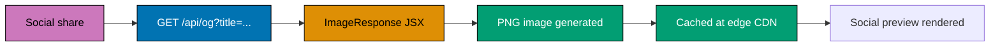

```typescript
// app/api/og/route.tsx
// => API route that generates OG images
import { ImageResponse } from 'next/og';
// => Import ImageResponse for OG image generation

export const runtime = 'edge';              // => Use Edge Runtime for fast responses

export async function GET(request: Request) {
  // => Extract query parameters
  const { searchParams } = new URL(request.url);
  const title = searchParams.get('title') || 'Default Title';
  // => title is "Zakat Guide" from /api/og?title=Zakat%20Guide

  // => Return ImageResponse (generates image)
  return new ImageResponse(
    (
      // => JSX-like syntax for image layout
      <div
        style={{
          display: 'flex',
          flexDirection: 'column',
          alignItems: 'center',
          justifyContent: 'center',
          width: '100%',
          height: '100%',
          background: 'linear-gradient(135deg, #0173B2 0%, #029E73 100%)',
          color: 'white',
          fontFamily: 'sans-serif',
        }}
      >
        <h1 style={{ fontSize: '64px', margin: 0 }}>{title}</h1>
        <p style={{ fontSize: '32px', margin: '20px 0 0' }}>Islamic Finance Platform</p>
      </div>
    ),
    {
      width: 1200,                          // => OG image width (recommended: 1200px)
      height: 630,                          // => OG image height (recommended: 630px)
    }
  );
  // => Returns PNG image with dynamic content
}

// app/blog/[slug]/page.tsx
import { Metadata } from 'next';

export async function generateMetadata({
  params,
}: {
  params: { slug: string };
}): Promise<Metadata> {
  // => Fetch post data
  const post = { title: 'Zakat Guide', description: 'Complete guide to Zakat calculation' };

  // => Generate OG image URL
  const ogImageUrl = new URL('/api/og', 'https://example.com');
  ogImageUrl.searchParams.set('title', post.title);
  // => ogImageUrl is "https://example.com/api/og?title=Zakat%20Guide"

  return {
    title: post.title,
    description: post.description,
    openGraph: {
      title: post.title,
      description: post.description,
      images: [
        {
          url: ogImageUrl.toString(),
          // => Dynamic OG image for this post
          width: 1200,
          height: 630,
        },
      ],
    },
    twitter: {
      card: 'summary_large_image',
      title: post.title,
      description: post.description,
      images: [ogImageUrl.toString()],
    },
  };
}

export default function BlogPostPage() {
  return (
    <article>
      <h1>Blog Post</h1>
    </article>
  );
}
```

**Key Takeaway**: Use ImageResponse API to generate dynamic OpenGraph images. Perfect for social media sharing with post-specific visuals.

**Expected Output**: Sharing blog post on social media shows custom image with post title. Each post gets unique OG image.

**Common Pitfalls**: Not using Edge Runtime (slower response), or wrong image dimensions (social platforms crop incorrectly).

**Why It Matters**: Dynamic OpenGraph images transform social media sharing from generic site screenshots to branded, content-specific previews. Blog posts with custom OG images showing the article title see 2-3x higher click-through rates on social platforms versus sites using generic screenshots. Production content platforms generate thousands of unique OG images on-demand using the ImageResponse API. Edge Runtime generation ensures fast response times globally (under 100ms) from CDN edge nodes. Correctly sizing OG images for each platform (1200x630 for Twitter/Facebook, 1000x1000 for LinkedIn) maximizes display quality.

### Example 64: JSON-LD Structured Data for SEO

Add JSON-LD structured data for rich search results. Helps search engines understand content type and display rich snippets.

```typescript
// app/products/[id]/page.tsx
import { Metadata } from 'next';

// => Product data
const product = {
  id: '1',
  name: 'Murabaha Financing',
  description: 'Sharia-compliant cost-plus financing for asset purchases',
  price: 1000000,
  currency: 'IDR',
  availability: 'InStock',
  rating: 4.8,
  reviewCount: 127,
};

export const metadata: Metadata = {
  title: `${product.name} | Islamic Finance`,
  description: product.description,
};

export default function ProductPage() {
  // => JSON-LD structured data
  const jsonLd = {
    '@context': 'https://schema.org',
    '@type': 'Product',
    name: product.name,
    description: product.description,
    offers: {
      '@type': 'Offer',
      price: product.price,
      priceCurrency: product.currency,
      availability: `https://schema.org/${product.availability}`,
    },
    aggregateRating: {
      '@type': 'AggregateRating',
      ratingValue: product.rating,
      reviewCount: product.reviewCount,
    },
  };

  return (
    <div>
      {/* => Inject JSON-LD in script tag */}
      <script
        type="application/ld+json"
        dangerouslySetInnerHTML={{ __html: JSON.stringify(jsonLd) }}
      />
      {/* => Search engines parse this for rich results */}

      <h1>{product.name}</h1>
      <p>{product.description}</p>
      <p>Price: {product.currency} {product.price.toLocaleString()}</p>
      <p>Rating: {product.rating} ({product.reviewCount} reviews)</p>
    </div>
  );
}

// Alternative: Article structured data
// app/blog/[slug]/page.tsx
export default function BlogPostPage() {
  const articleJsonLd = {
    '@context': 'https://schema.org',
    '@type': 'Article',
    headline: 'Zakat Calculation Guide',
    description: 'Complete guide to calculating Zakat on wealth',
    author: {
      '@type': 'Person',
      name: 'Ahmad Ibrahim',
    },
    datePublished: '2026-01-15',
    dateModified: '2026-01-20',
    publisher: {
      '@type': 'Organization',
      name: 'Islamic Finance Platform',
      logo: {
        '@type': 'ImageObject',
        url: 'https://example.com/logo.png',
      },
    },
  };

  return (
    <article>
      <script
        type="application/ld+json"
        dangerouslySetInnerHTML={{ __html: JSON.stringify(articleJsonLd) }}
      />
      <h1>Zakat Calculation Guide</h1>
    </article>
  );
}
```

**Key Takeaway**: Add JSON-LD structured data for rich search results. Helps Google show star ratings, prices, article info in search results.

**Expected Output**: Google search shows product with star rating, price, availability. Articles show author, publish date, read time.

**Common Pitfalls**: Invalid schema (use Google Structured Data Testing Tool), or missing required fields (schema won't validate).

**Why It Matters**: JSON-LD structured data enables rich search results that significantly increase organic click-through rates. Product pages with price, availability, and review structured data display rich snippets in search results - star ratings, prices, and availability appear directly in search results without users clicking through. Production e-commerce sites see 20-30% CTR improvements from rich snippets. Article structured data enables Google News inclusion and Discover feed placement. Event structured data shows in Google Events search. The investment in structured data delivers compounding SEO returns over time.

## Group 6: Deployment & Production Patterns

### Example 65: Environment Variables with Type Safety

Use environment variables with TypeScript validation for type-safe configuration. Prevents runtime errors from missing/invalid env vars.

```typescript
// env.ts
// => Environment variable validation schema
import { z } from "zod";

// => Define schema for environment variables
const envSchema = z.object({
  // => Required variables
  DATABASE_URL: z.string().url(),
  // => Must be valid URL

  NEXTAUTH_SECRET: z.string().min(32),
  // => Minimum 32 characters (security)

  NEXTAUTH_URL: z.string().url(),

  // => Optional variables with defaults
  NODE_ENV: z.enum(["development", "production", "test"]).default("development"),

  // => Public variables (NEXT_PUBLIC_ prefix)
  NEXT_PUBLIC_API_URL: z.string().url(),
});

// => Parse and validate environment variables at build time
const env = envSchema.parse({
  DATABASE_URL: process.env.DATABASE_URL,
  NEXTAUTH_SECRET: process.env.NEXTAUTH_SECRET,
  NEXTAUTH_URL: process.env.NEXTAUTH_URL,
  NODE_ENV: process.env.NODE_ENV,
  NEXT_PUBLIC_API_URL: process.env.NEXT_PUBLIC_API_URL,
});
// => If validation fails, build fails with clear error

// => Export typed environment variables
export default env;

// app/lib/db.ts
import env from "../env";

// => Use typed environment variables
export const dbConnection = env.DATABASE_URL;
// => env.DATABASE_URL is string (type-safe)

// app/config.ts
import env from "./env";

export const config = {
  database: {
    url: env.DATABASE_URL, // => Type: string (validated URL)
  },
  auth: {
    secret: env.NEXTAUTH_SECRET, // => Type: string (min 32 chars)
    url: env.NEXTAUTH_URL,
  },
  api: {
    url: env.NEXT_PUBLIC_API_URL, // => Public, accessible in browser
  },
  isProduction: env.NODE_ENV === "production",
};

// Usage in components/actions
// app/actions.ts
("use server");

import { config } from "./config";

export async function connectToDatabase() {
  // => Type-safe config access
  const dbUrl = config.database.url; // => Type: string
  // => No need for optional chaining or type assertions

  console.log(`Connecting to database: ${dbUrl}`);
}
```

**Key Takeaway**: Validate environment variables at build time with Zod. Provides type safety, prevents runtime errors, documents required configuration.

**Expected Output**: Build fails immediately if required env vars missing or invalid. Runtime code gets type-safe environment variables.

**Common Pitfalls**: Not validating env vars (runtime errors in production), or exposing secrets (only NEXT*PUBLIC* variables safe in browser).

**Why It Matters**: Environment variable validation at startup prevents cryptic runtime errors in production from misconfigured deployments. Production incidents caused by missing API keys, wrong database URLs, or malformed configuration strings are avoided entirely when validation runs at startup. Zod-based environment validation catches type errors (wrong format for integers, invalid URLs) that would cause runtime failures hours after deployment. The server/client separation prevents accidental secret exposure - API keys, database credentials, and signing secrets must never reach the browser bundle.

### Example 66: Monitoring with OpenTelemetry

Add OpenTelemetry instrumentation for observability. Tracks requests, database queries, external API calls.

```typescript
// instrumentation.ts
// => Special file: Next.js loads this before app initialization
export async function register() {
  if (process.env.NEXT_RUNTIME === "nodejs") {
    // => Only instrument Node.js runtime (not Edge)
    const { registerOTel } = await import("@vercel/otel");

    registerOTel({
      serviceName: "islamic-finance-platform",
      // => Service name in tracing system
    });
  }
}

// app/lib/monitoring.ts
import { trace } from "@opentelemetry/api";

// => Create tracer for custom spans
const tracer = trace.getTracer("app");

export async function tracedDatabaseQuery<T>(name: string, query: () => Promise<T>): Promise<T> {
  // => Create span for database query
  return tracer.startActiveSpan(`db.query.${name}`, async (span) => {
    try {
      const result = await query();
      // => Query succeeded

      span.setStatus({ code: 1 }); // => 1 = OK
      span.end();

      return result;
    } catch (error) {
      // => Query failed
      span.setStatus({
        code: 2, // => 2 = ERROR
        message: error instanceof Error ? error.message : "Unknown error",
      });
      span.recordException(error as Error);
      span.end();

      throw error;
    }
  });
}

// app/lib/data.ts
import { prisma } from "./prisma";
import { tracedDatabaseQuery } from "./monitoring";

export async function getPosts() {
  // => Traced database query
  return tracedDatabaseQuery("get-posts", async () => {
    return prisma.post.findMany();
  });
  // => Appears in tracing system with timing and status
}

// app/api/health/route.ts
// => Health check endpoint for monitoring
export async function GET() {
  try {
    // => Check database connection
    await prisma.$queryRaw`SELECT 1`;

    return Response.json({ status: "healthy" });
  } catch (error) {
    return Response.json({ status: "unhealthy" }, { status: 503 });
  }
}
```

**Key Takeaway**: Use OpenTelemetry for observability in production. Trace requests, database queries, external calls. Critical for debugging performance issues.

**Expected Output**: Tracing system (Vercel, Datadog, Honeycomb) shows request traces with timing breakdowns. Easy to identify slow queries.

**Common Pitfalls**: Over-instrumenting (too many spans slow down app), or not instrumenting critical paths (can't debug performance issues).

**Why It Matters**: OpenTelemetry instrumentation transforms invisible production issues into observable, debuggable metrics. Production applications handling thousands of requests per second need distributed tracing to identify performance bottlenecks in database queries, external API calls, and Server Action chains. Without instrumentation, debugging a 3-second page load requires guesswork; with spans, the slow component is immediately visible. OpenTelemetry's vendor-neutral standard enables sending telemetry to multiple observability platforms (Datadog, Honeycomb, Jaeger) without code changes.

### Example 67: Rate Limiting with Upstash

Implement rate limiting to protect API routes from abuse. Uses Upstash Redis for distributed rate limiting.

```typescript
// app/lib/rate-limit.ts
import { Ratelimit } from "@upstash/ratelimit";
import { Redis } from "@upstash/redis";

// => Create Redis client
const redis = new Redis({
  url: process.env.UPSTASH_REDIS_REST_URL!,
  token: process.env.UPSTASH_REDIS_REST_TOKEN!,
});

// => Create rate limiter (sliding window)
const ratelimit = new Ratelimit({
  redis,
  limiter: Ratelimit.slidingWindow(10, "10 s"),
  // => 10 requests per 10 seconds
  analytics: true, // => Track usage analytics
});

export async function checkRateLimit(identifier: string) {
  // => Check rate limit for identifier (user ID, IP address, etc.)
  const { success, limit, reset, remaining } = await ratelimit.limit(identifier);
  // => success: boolean (request allowed?)
  // => limit: number (max requests)
  // => reset: number (timestamp when limit resets)
  // => remaining: number (requests remaining)

  return {
    allowed: success,
    limit,
    remaining,
    reset: new Date(reset),
  };
}

// app/api/donations/route.ts
import { NextRequest, NextResponse } from "next/server";
import { checkRateLimit } from "@/app/lib/rate-limit";

export async function POST(request: NextRequest) {
  // => Get client identifier (IP address)
  const ip = request.ip ?? request.headers.get("x-forwarded-for") ?? "anonymous";

  // => Check rate limit
  const rateLimit = await checkRateLimit(ip);

  if (!rateLimit.allowed) {
    // => Rate limit exceeded
    return NextResponse.json(
      {
        error: "Too many requests",
        limit: rateLimit.limit,
        reset: rateLimit.reset,
      },
      {
        status: 429, // => HTTP 429 Too Many Requests
        headers: {
          "X-RateLimit-Limit": rateLimit.limit.toString(),
          "X-RateLimit-Remaining": rateLimit.remaining.toString(),
          "X-RateLimit-Reset": rateLimit.reset.toISOString(),
        },
      },
    );
  }

  // => Rate limit passed, process request
  const body = await request.json();

  // => Handle donation
  console.log("Processing donation:", body);

  return NextResponse.json(
    { success: true },
    {
      headers: {
        // => Add rate limit headers to successful responses too
        "X-RateLimit-Limit": rateLimit.limit.toString(),
        "X-RateLimit-Remaining": rateLimit.remaining.toString(),
        "X-RateLimit-Reset": rateLimit.reset.toISOString(),
      },
    },
  );
}
```

**Key Takeaway**: Implement rate limiting on API routes to prevent abuse. Use distributed rate limiting (Upstash Redis) for multi-instance deployments.

**Expected Output**: API allows 10 requests per 10 seconds per IP. Exceeding limit returns 429 status with reset time. Headers show limit/remaining.

**Common Pitfalls**: Using in-memory rate limiting (doesn't work across multiple instances), or not returning rate limit headers (clients can't track usage).

**Why It Matters**: Rate limiting is essential infrastructure for production APIs and Server Actions that prevent abuse, control costs, and ensure fair usage. Without rate limiting, a single bot can overwhelm server capacity, trigger excessive third-party API costs, or use brute force attacks on authentication endpoints. Upstash Redis-based rate limiting works correctly in serverless environments and across multiple instances, unlike in-memory alternatives that fail in distributed deployments. Rate limit headers (X-RateLimit-Limit, X-RateLimit-Remaining) enable API clients to implement back-off strategies automatically.

## Group 7: Advanced Patterns

### Example 68: Server-Only Code Protection

Use 'server-only' package to ensure code never bundles in client. Prevents accidental exposure of secrets or server logic.

```typescript
// app/lib/secrets.ts
// => Import server-only at top of file
import 'server-only';
// => If this file imported in Client Component, build fails with error

// => Server-only function (accesses environment secrets)
export function getSecretKey() {
  // => This function should NEVER run on client
  return process.env.SECRET_API_KEY;
}

export async function queryDatabase(sql: string) {
  // => Database credentials only on server
  const db = process.env.DATABASE_URL;
  // => If accidentally imported in client code, build fails
  console.log(`Querying: ${sql}`);
}

// app/actions.ts
'use server';

// => Safe to import in Server Actions
import { getSecretKey, queryDatabase } from './lib/secrets';

export async function fetchUserData() {
  const apiKey = getSecretKey();            // => Server-side only
  await queryDatabase('SELECT * FROM users');

  return { success: true };
}

// app/components/ClientComponent.tsx
'use client';

// => This import would cause BUILD ERROR
// import { getSecretKey } from '../lib/secrets';
// => Error: "You're importing a component that needs server-only. Use it in a Server Component instead."

export default function ClientComponent() {
  return <div>Client Component</div>;
}

// Alternative: client-only protection
// app/lib/browser-only.ts
import 'client-only';
// => Ensures code only runs on client (never on server)

export function getLocalStorage(key: string) {
  // => window only exists on client
  return window.localStorage.getItem(key);
}
```

**Key Takeaway**: Use 'server-only' package to protect server code from accidental client bundling. Build fails if server code imported in Client Component.

**Expected Output**: Build fails if server-only code imported in client. Prevents accidental secret exposure.

**Common Pitfalls**: Not using server-only for sensitive code (secrets might leak to client bundle), or forgetting to install package (no protection).

**Why It Matters**: The server-only package provides compile-time protection against accidentally importing server code into client bundles. Next.js tree-shaking and code splitting can inadvertently include server-side utilities (database clients, secret managers, internal APIs) in client bundles if imported transitively. Production applications have exposed API keys and database credentials through accidental client-bundle inclusion. The server-only package causes an immediate build error if protected modules are imported in client contexts, preventing secrets from reaching browsers.

### Example 69: Partial Prerendering (PPR) Pattern

Combine static shell with dynamic content for best of both worlds. Static parts load instantly, dynamic parts stream in.

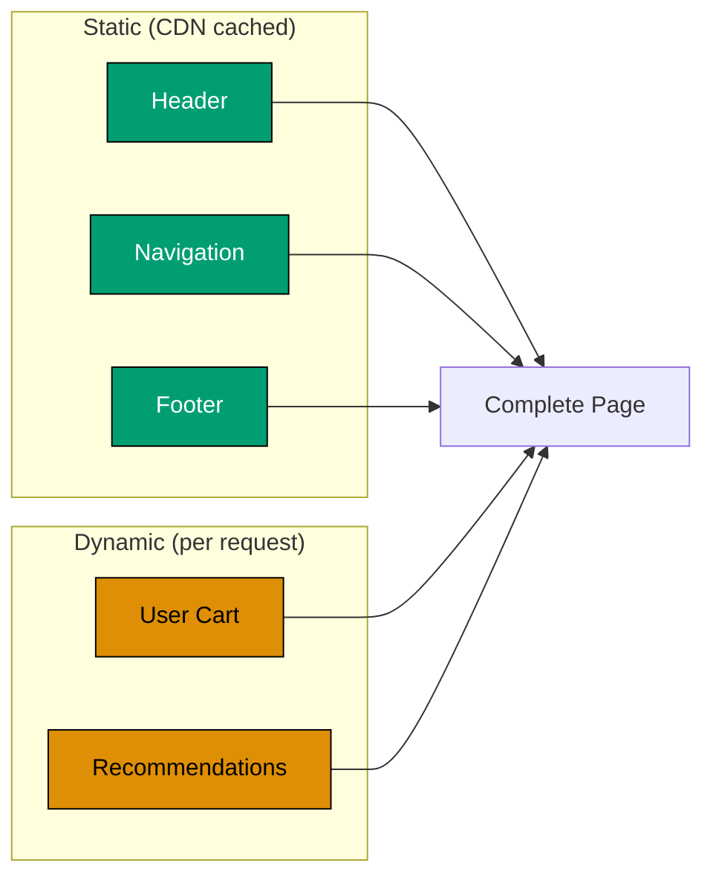

```typescript
// app/dashboard/page.tsx
import { Suspense } from 'react';

// => Static component (pre-rendered at build time)
function DashboardShell() {
  return (
    <div>
      <header>
        <h1>Dashboard</h1>
        {/* => Static heading, pre-rendered */}
      </header>

      <nav>
        {/* => Static navigation, pre-rendered */}
        <a href="/dashboard">Overview</a>
        <a href="/dashboard/stats">Stats</a>
        <a href="/dashboard/settings">Settings</a>
      </nav>
    </div>
  );
}

// => Dynamic component (renders at request time)
async function UserGreeting() {
  // => Fetch user-specific data
  const user = { name: 'Ahmad', lastLogin: new Date() };

  return (
    <div>
      <p>Welcome back, {user.name}!</p>
      <p>Last login: {user.lastLogin.toLocaleString()}</p>
    </div>
  );
}

// => Another dynamic component
async function RecentActivity() {
  // => Fetch recent activity (user-specific)
  await new Promise(resolve => setTimeout(resolve, 1000));

  const activities = [
    { id: 1, text: 'Donated IDR 100,000' },
    { id: 2, text: 'Updated profile' },
  ];

  return (
    <ul>
      {activities.map(activity => (
        <li key={activity.id}>{activity.text}</li>
      ))}
    </ul>
  );
}

export default function DashboardPage() {
  return (
    <div>
      {/* => Static shell (pre-rendered) */}
      <DashboardShell />

      {/* => Dynamic sections (streamed) */}
      <Suspense fallback={<p>Loading greeting...</p>}>
        <UserGreeting />
      </Suspense>

      <Suspense fallback={<p>Loading activity...</p>}>
        <RecentActivity />
      </Suspense>
    </div>
  );
}
// => PPR behavior:
// => 1. Static shell served instantly from CDN (header, nav)
// => 2. Dynamic sections stream in as ready (greeting, activity)
// => Best of both: instant load + personalized content
```

**Key Takeaway**: Partial Prerendering combines static shell with dynamic content. Static parts load instantly, dynamic parts stream in, best user experience.

**Expected Output**: Dashboard header and navigation appear instantly (static). Greeting and activity stream in shortly after (dynamic, personalized).

**Common Pitfalls**: Not wrapping dynamic parts in Suspense (entire page becomes dynamic), or putting static content inside Suspense (defeats purpose).

**Why It Matters**: Partial Prerendering combines static shell generation with dynamic content streaming in a single page, achieving the best of both static and dynamic rendering. Production applications with authenticated sections benefit from PPR - the page shell (header, navigation, static content) caches globally at the CDN, while personalized sections (user data, recommendations, cart) stream dynamically per request. This eliminates the performance penalty of making entire pages dynamic for small personalized sections. PPR is Next.js's architectural answer to the performance-versus-personalization trade-off.

### Example 70: Middleware Chaining Pattern

Chain multiple middleware functions for composable request processing. Cleaner than single monolithic middleware.

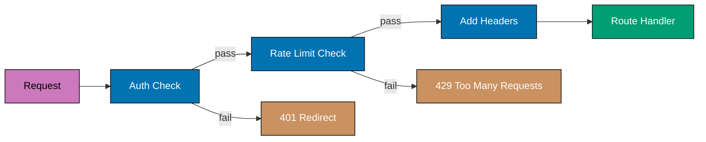

```typescript
// middleware.ts
import { NextResponse } from "next/server";
import type { NextRequest } from "next/server";

// => Middleware function type
type MiddlewareFunction = (request: NextRequest) => NextResponse | Promise<NextResponse> | void | Promise<void>;

// => Middleware composer
function chain(...middlewares: MiddlewareFunction[]) {
  return async (request: NextRequest) => {
    // => Run middlewares in sequence
    for (const middleware of middlewares) {
      const response = await middleware(request);
      // => If middleware returns response, stop chain
      if (response) return response;
    }

    // => No middleware returned response, continue
    return NextResponse.next();
  };
}

// => Logging middleware
function loggerMiddleware(request: NextRequest) {
  console.log(`[${new Date().toISOString()}] ${request.method} ${request.nextUrl.pathname}`);
  // => No return = continue to next middleware
}

// => Auth middleware
async function authMiddleware(request: NextRequest) {
  const { pathname } = request.nextUrl;

  // => Check if route is protected
  if (pathname.startsWith("/dashboard")) {
    const authToken = request.cookies.get("auth_token");

    if (!authToken) {
      // => Not authenticated, redirect
      return NextResponse.redirect(new URL("/login", request.url));
      // => Returns response, stops chain
    }
  }
  // => Authenticated or public route, continue
}

// => Rate limit middleware
async function rateLimitMiddleware(request: NextRequest) {
  const { pathname } = request.nextUrl;

  // => Only rate limit API routes
  if (pathname.startsWith("/api/")) {
    const ip = request.ip ?? "anonymous";

    // => Check rate limit (simplified)
    const isAllowed = true; // => Actual rate limit check here

    if (!isAllowed) {
      return NextResponse.json({ error: "Too many requests" }, { status: 429 });
    }
  }
}

// => Security headers middleware
function securityHeadersMiddleware(request: NextRequest) {
  const response = NextResponse.next();

  // => Add security headers
  response.headers.set("X-Frame-Options", "DENY");
  response.headers.set("X-Content-Type-Options", "nosniff");
  response.headers.set("Referrer-Policy", "strict-origin-when-cross-origin");

  return response;
}

// => Export chained middleware
export default chain(loggerMiddleware, authMiddleware, rateLimitMiddleware, securityHeadersMiddleware);
// => Middlewares run in order: log → auth → rate limit → security headers

export const config = {
  matcher: ["/((?!_next/static|_next/image|favicon.ico).*)"],
};
```

**Key Takeaway**: Chain middleware functions for composable request processing. Each middleware focuses on single responsibility, easier to maintain.

**Expected Output**: Every request runs through logger → auth → rate limit → security headers. Each middleware can short-circuit by returning response.

**Common Pitfalls**: Order matters (auth before rate limit), or forgetting to return NextResponse (middleware won't work).

**Why It Matters**: Middleware chaining enables composable request processing pipelines that keep each concern isolated and testable. Production applications combine authentication, rate limiting, logging, bot detection, and geographic restrictions in middleware chains. The order of middleware functions determines behavior - authentication before rate limiting ensures legitimate users aren't rate-limited before authentication fails, rate limiting before expensive operations prevents DoS attacks from reaching database queries. This pattern scales to dozens of middleware functions without creating monolithic middleware files.

## Group 8: Multi-Step Forms & Background Jobs

### Example 71: Multi-Step Form with Server Actions

Implement multi-step form wizard using Server Actions and session storage. Maintains state across steps with validation.


```typescript
// app/lib/session.ts
'use server';

import { cookies } from 'next/headers';

// => Store multi-step form data in encrypted cookie
export async function saveFormStep(stepData: Record<string, any>) {
  // => Get existing form data
  const cookieStore = cookies();
  const existingData = cookieStore.get('form_data');

  // => Merge with new step data
  const formData = existingData
    ? { ...JSON.parse(existingData.value), ...stepData }
    : stepData;
  // => formData is { step1Data, step2Data, ... }

  // => Save to cookie (simplified - use encryption in production)
  cookieStore.set('form_data', JSON.stringify(formData), {
    httpOnly: true,
    maxAge: 60 * 30,                        // => 30 minutes
  });

  return formData;
}

export async function getFormData() {
  const cookieStore = cookies();
  const formData = cookieStore.get('form_data');
  return formData ? JSON.parse(formData.value) : {};
}

export async function clearFormData() {
  cookies().delete('form_data');
}

// app/actions.ts
'use server';

import { z } from 'zod';
import { saveFormStep, getFormData, clearFormData } from './lib/session';
import { redirect } from 'next/navigation';

// => Step 1 schema: Personal info
const step1Schema = z.object({
  name: z.string().min(2, 'Name required'),
  email: z.string().email('Invalid email'),
});

// => Step 2 schema: Donation details
const step2Schema = z.object({
  amount: z.number().min(10000, 'Minimum IDR 10,000'),
  category: z.enum(['zakat', 'sadaqah', 'infaq']),
});

// => Step 3 schema: Payment method
const step3Schema = z.object({
  paymentMethod: z.enum(['bank_transfer', 'credit_card', 'e_wallet']),
  agreeTerms: z.literal(true, { errorMap: () => ({ message: 'Must agree to terms' }) }),
});

export async function submitStep1(formData: FormData) {
  // => Validate step 1
  const result = step1Schema.safeParse({
    name: formData.get('name'),
    email: formData.get('email'),
  });

  if (!result.success) {
    return { errors: result.error.flatten().fieldErrors };
  }

  // => Save step 1 data
  await saveFormStep({ step1: result.data });

  // => Redirect to step 2
  redirect('/donate/step-2');
}

export async function submitStep2(formData: FormData) {
  const result = step2Schema.safeParse({
    amount: parseFloat(formData.get('amount') as string),
    category: formData.get('category'),
  });

  if (!result.success) {
    return { errors: result.error.flatten().fieldErrors };
  }

  await saveFormStep({ step2: result.data });
  redirect('/donate/step-3');
}

export async function submitStep3(formData: FormData) {
  const result = step3Schema.safeParse({
    paymentMethod: formData.get('paymentMethod'),
    agreeTerms: formData.get('agreeTerms') === 'true',
  });

  if (!result.success) {
    return { errors: result.error.flatten().fieldErrors };
  }

  // => Get all form data
  const allData = await getFormData();
  // => allData is { step1: {...}, step2: {...}, step3: {...} }

  // => Process complete form
  console.log('Complete donation:', {
    ...allData.step1,
    ...allData.step2,
    ...result.data,
  });

  // => Clear form data
  await clearFormData();

  // => Redirect to success page
  redirect('/donate/success');
}

// app/donate/step-1/page.tsx
import { submitStep1 } from '@/app/actions';

export default function Step1Page() {
  return (
    <div>
      <h1>Step 1: Personal Information</h1>

      <form action={submitStep1}>
        <input type="text" name="name" placeholder="Name" required />
        <input type="email" name="email" placeholder="Email" required />
        <button type="submit">Next Step</button>
      </form>
    </div>
  );
}

// app/donate/step-2/page.tsx
import { submitStep2, getFormData } from '@/app/actions';
import { redirect } from 'next/navigation';

export default async function Step2Page() {
  // => Check if step 1 completed
  const formData = await getFormData();
  if (!formData.step1) {
    redirect('/donate/step-1');            // => Redirect to step 1
  }

  return (
    <div>
      <h1>Step 2: Donation Details</h1>
      <p>Donor: {formData.step1.name}</p>

      <form action={submitStep2}>
        <input type="number" name="amount" placeholder="Amount" required />
        <select name="category" required>
          <option value="zakat">Zakat</option>
          <option value="sadaqah">Sadaqah</option>
          <option value="infaq">Infaq</option>
        </select>
        <button type="submit">Next Step</button>
      </form>
    </div>
  );
}
```

**Key Takeaway**: Implement multi-step forms with Server Actions and session storage (cookies). Each step validates independently, data persists across steps.

**Expected Output**: Form guides user through 3 steps. Data saved after each step. Can't skip steps. Final submission combines all step data.

**Common Pitfalls**: Not validating step order (users skip steps), or storing sensitive data in cookies without encryption (security risk).

**Why It Matters**: Multi-step forms guide users through complex processes (insurance quotes, loan applications, multi-step checkout) that would overwhelm on a single page. Production applications handling complex onboarding flows, checkout processes, and data collection use Server Action-based state management to maintain progress server-side. Cookie-based step tracking enables progress persistence across sessions and page refreshes. Validation at each step prevents partial data submission and ensures business rules are enforced progressively rather than all at once at submission.

### Example 72: Background Jobs with Server Actions

Trigger background jobs from Server Actions using queue systems. Returns immediately while job processes asynchronously.

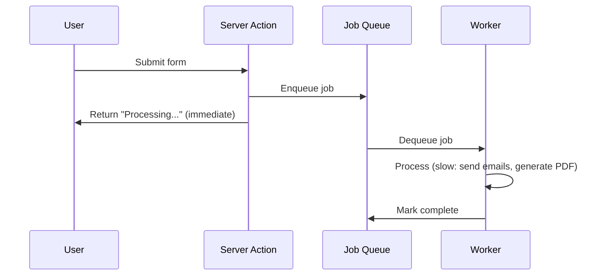

```typescript
// app/lib/queue.ts
// => Simulated job queue (use real queue like BullMQ, Inngest in production)

type Job = {
  id: string;
  type: string;
  data: any;
  status: 'pending' | 'processing' | 'completed' | 'failed';
  createdAt: Date;
  completedAt?: Date;
};

// => In-memory job storage (use Redis/database in production)
const jobs = new Map<string, Job>();

export function enqueueJob(type: string, data: any): string {
  // => Create job
  const jobId = crypto.randomUUID();
  const job: Job = {
    id: jobId,
    type,
    data,
    status: 'pending',
    createdAt: new Date(),
  };

  jobs.set(jobId, job);

  // => Process job asynchronously (don't await)
  processJob(jobId);

  return jobId;
  // => Returns immediately, job processes in background
}

async function processJob(jobId: string) {
  const job = jobs.get(jobId);
  if (!job) return;

  // => Update status
  job.status = 'processing';

  try {
    // => Simulate long-running task
    await new Promise(resolve => setTimeout(resolve, 10000)); // => 10 seconds

    // => Job-specific processing
    if (job.type === 'generate_report') {
      console.log(`Generating report for: ${job.data.userId}`);
      // => Generate PDF, send email, etc.
    }

    // => Mark complete
    job.status = 'completed';
    job.completedAt = new Date();
  } catch (error) {
    job.status = 'failed';
    console.error('Job failed:', error);
  }
}

export function getJobStatus(jobId: string): Job | undefined {
  return jobs.get(jobId);
}

// app/actions.ts
'use server';

import { enqueueJob } from './lib/queue';

export async function generateReport(userId: string) {
  // => Enqueue background job
  const jobId = enqueueJob('generate_report', { userId });
  // => Returns immediately, job processes in background

  return {
    success: true,
    jobId,
    message: 'Report generation started. You will receive an email when ready.',
  };
  // => User doesn't wait for 10-second job
}

export async function checkJobStatus(jobId: string) {
  // => Server Action to check job status
  const job = getJobStatus(jobId);

  if (!job) {
    return { error: 'Job not found' };
  }

  return {
    status: job.status,
    createdAt: job.createdAt,
    completedAt: job.completedAt,
  };
}

// app/reports/page.tsx
'use client';

import { useState } from 'react';
import { generateReport, checkJobStatus } from '../actions';

export default function ReportsPage() {
  const [jobId, setJobId] = useState<string | null>(null);
  const [status, setStatus] = useState<string>('');

  async function handleGenerate() {
    // => Trigger background job
    const result = await generateReport('user123');
    setJobId(result.jobId);
    setStatus('pending');

    // => Poll for status (simplified - use webhooks/WebSockets in production)
    const interval = setInterval(async () => {
      const statusResult = await checkJobStatus(result.jobId);

      if (statusResult.status === 'completed') {
        setStatus('completed');
        clearInterval(interval);
      } else if (statusResult.status === 'failed') {
        setStatus('failed');
        clearInterval(interval);
      } else {
        setStatus(statusResult.status);
      }
    }, 2000);
    // => Check every 2 seconds
  }

  return (
    <div>
      <h1>Generate Report</h1>

      <button onClick={handleGenerate} disabled={!!jobId}>
        Generate Report
      </button>

      {jobId && (
        <div>
          <p>Job ID: {jobId}</p>
          <p>Status: {status}</p>
          {status === 'completed' && <p>✓ Report ready! Check your email.</p>}
          {status === 'failed' && <p>✗ Report generation failed.</p>}
        </div>
      )}
    </div>
  );
}
```

**Key Takeaway**: Use background jobs for long-running tasks. Server Action enqueues job and returns immediately. Poll or use webhooks for status updates.

**Expected Output**: Clicking "Generate Report" returns immediately. Job processes in background (10 seconds). Status updates every 2 seconds via polling.

**Common Pitfalls**: Running expensive operations synchronously in Server Actions (timeout), or not providing status updates (users don't know progress).

**Why It Matters**: Background job processing decouples long-running operations from user-facing request handling. Production applications that process uploaded files, generate reports, send bulk emails, or perform data migrations use background job patterns to prevent timeout errors and poor user experience. Immediate acknowledgment (queue job, return immediately) with status polling provides responsive UX even for multi-minute operations. Production systems use dedicated job queues (Bull, Inngest, Trigger.dev) that scale independently from web servers and provide retry, monitoring, and alerting.

## Group 9: Advanced Authentication & Authorization

### Example 73: Role-Based Access Control (RBAC)

Implement role-based access control with middleware and Server Components. Restricts access based on user roles.

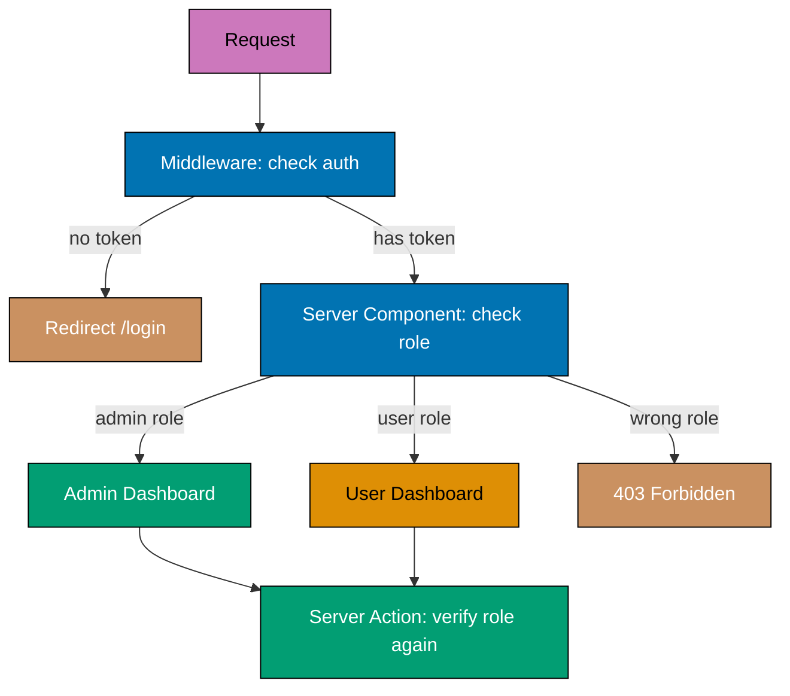

```typescript
// app/lib/auth.ts
import { cookies } from 'next/headers';

export type Role = 'admin' | 'moderator' | 'user';

export type User = {
  id: string;
  name: string;
  email: string;
  role: Role;
};

export async function getCurrentUser(): Promise<User | null> {
  // => Get auth token from cookie
  const authToken = cookies().get('auth_token');

  if (!authToken) return null;

  // => Verify token and get user (simplified)
  // => In production: verify JWT, query database
  return {
    id: '1',
    name: 'Ahmad',
    email: 'ahmad@example.com',
    role: 'moderator',                      // => User's role
  };
}

export function hasRole(user: User | null, allowedRoles: Role[]): boolean {
  // => Check if user has one of allowed roles
  if (!user) return false;
  return allowedRoles.includes(user.role);
}

// middleware.ts
import { NextResponse } from 'next/server';
import type { NextRequest } from 'next/server';

// => Role requirements for routes
const roleRequirements: Record<string, Role[]> = {
  '/admin': ['admin'],                      // => Admin only
  '/moderation': ['admin', 'moderator'],    // => Admin or moderator
  '/dashboard': ['admin', 'moderator', 'user'], // => Any authenticated role
};

export async function middleware(request: NextRequest) {
  const { pathname } = request.nextUrl;

  // => Check if route requires roles
  const requiredRoles = Object.entries(roleRequirements).find(([path]) =>
    pathname.startsWith(path)
  )?.[1];

  if (!requiredRoles) {
    // => Public route
    return NextResponse.next();
  }

  // => Get user from cookie (simplified - decode JWT in production)
  const authToken = request.cookies.get('auth_token');
  if (!authToken) {
    // => Not authenticated
    return NextResponse.redirect(new URL('/login', request.url));
  }

  // => Check user role (simplified - verify JWT in production)
  const userRole = 'moderator';             // => From token
  if (!requiredRoles.includes(userRole as any)) {
    // => Insufficient permissions
    return NextResponse.redirect(new URL('/forbidden', request.url));
  }

  return NextResponse.next();
}

export const config = {
  matcher: ['/admin/:path*', '/moderation/:path*', '/dashboard/:path*'],
};

// app/admin/page.tsx
// => Server Component with role check
import { getCurrentUser, hasRole } from '@/app/lib/auth';
import { redirect } from 'next/navigation';

export default async function AdminPage() {
  const user = await getCurrentUser();

  // => Server-side role check (defense in depth)
  if (!hasRole(user, ['admin'])) {
    redirect('/forbidden');
  }

  return (
    <div>
      <h1>Admin Dashboard</h1>
      <p>Welcome, {user!.name} (Admin)</p>
      {/* => Admin-only content */}
      <ul>
        <li>Manage Users</li>
        <li>System Settings</li>
        <li>View Logs</li>
      </ul>
    </div>
  );
}

// app/moderation/page.tsx
import { getCurrentUser, hasRole } from '@/app/lib/auth';
import { redirect } from 'next/navigation';

export default async function ModerationPage() {
  const user = await getCurrentUser();

  if (!hasRole(user, ['admin', 'moderator'])) {
    redirect('/forbidden');
  }

  return (
    <div>
      <h1>Moderation Panel</h1>
      <p>Welcome, {user!.name} ({user!.role})</p>
      {/* => Content for admin and moderators */}
      <ul>
        <li>Review Posts</li>
        <li>Manage Comments</li>
      </ul>

      {/* => Conditional features based on role */}
      {user!.role === 'admin' && (
        <div>
          <h2>Admin Actions</h2>
          <button>Ban User</button>
        </div>
      )}
    </div>
  );
}
```

**Key Takeaway**: Implement RBAC with middleware (route protection) and Server Components (component-level checks). Defense in depth with multiple checks.

**Expected Output**: Admin routes only accessible to admin role. Moderation routes accessible to admin and moderator. Forbidden page for insufficient permissions.

**Common Pitfalls**: Only checking roles in middleware (bypass via direct component access), or not implementing defense in depth (single point of failure).

**Why It Matters**: Role-based access control requires defense in depth - checking permissions at every layer (middleware, Server Components, Server Actions, database queries) because each layer can be reached independently. Production multi-tenant SaaS applications, admin dashboards, and enterprise software must enforce RBAC at every boundary. Middleware guards URL access but not direct component composition; Server Component guards prevent rendering but not direct Server Action calls; Server Action guards prevent mutations but not data reads. Complete RBAC requires all layers working together.

### Example 74: Advanced API Rate Limiting Patterns

Implement sophisticated rate limiting with different tiers, key strategies, and bypass mechanisms.

```typescript
// app/lib/rate-limit.ts
import { Ratelimit } from "@upstash/ratelimit";
import { Redis } from "@upstash/redis";

const redis = new Redis({
  url: process.env.UPSTASH_REDIS_REST_URL!,
  token: process.env.UPSTASH_REDIS_REST_TOKEN!,
});

// => Different rate limits for different tiers
export const rateLimits = {
  // => Free tier: 10 requests per 10 seconds
  free: new Ratelimit({
    redis,
    limiter: Ratelimit.slidingWindow(10, "10 s"),
    analytics: true,
  }),

  // => Pro tier: 100 requests per 10 seconds
  pro: new Ratelimit({
    redis,
    limiter: Ratelimit.slidingWindow(100, "10 s"),
    analytics: true,
  }),

  // => Enterprise tier: 1000 requests per 10 seconds
  enterprise: new Ratelimit({
    redis,
    limiter: Ratelimit.slidingWindow(1000, "10 s"),
    analytics: true,
  }),
};

// => Get user tier from database/cookie
export async function getUserTier(userId: string): Promise<keyof typeof rateLimits> {
  // => Query database for user subscription
  // => Simplified: return based on user ID
  if (userId === "admin") return "enterprise";
  if (userId.startsWith("pro")) return "pro";
  return "free";
}

// app/api/data/route.ts
import { NextRequest, NextResponse } from "next/server";
import { rateLimits, getUserTier } from "@/app/lib/rate-limit";

export async function GET(request: NextRequest) {
  // => Get user identifier
  const userId = request.headers.get("x-user-id") || request.ip || "anonymous";

  // => Check for bypass token (for internal services)
  const bypassToken = request.headers.get("x-bypass-token");
  if (bypassToken === process.env.BYPASS_TOKEN) {
    // => Bypass rate limiting for internal services
    return NextResponse.json({ data: "Bypassed rate limit" });
  }

  // => Get user tier
  const tier = await getUserTier(userId);
  const ratelimit = rateLimits[tier];
  // => ratelimit is appropriate limiter for user's tier

  // => Check rate limit
  const { success, limit, reset, remaining } = await ratelimit.limit(userId);

  // => Add rate limit headers to all responses
  const headers = {
    "X-RateLimit-Limit": limit.toString(),
    "X-RateLimit-Remaining": remaining.toString(),
    "X-RateLimit-Reset": new Date(reset).toISOString(),
    "X-RateLimit-Tier": tier, // => Show user's tier
  };

  if (!success) {
    // => Rate limit exceeded
    return NextResponse.json(
      {
        error: "Rate limit exceeded",
        tier,
        limit,
        reset: new Date(reset),
        upgradeUrl: tier === "free" ? "/pricing" : null,
        // => Suggest upgrade for free tier users
      },
      {
        status: 429,
        headers,
      },
    );
  }

  // => Rate limit passed
  return NextResponse.json(
    {
      data: "Your data here",
      tier,
      remaining,
    },
    { headers },
  );
}

// app/api/graphql/route.ts
// => More complex rate limiting: per operation type
import { NextRequest, NextResponse } from "next/server";

// => Different limits for different GraphQL operations
const operationLimits = {
  query: new Ratelimit({
    redis: new Redis({
      url: process.env.UPSTASH_REDIS_REST_URL!,
      token: process.env.UPSTASH_REDIS_REST_TOKEN!,
    }),
    limiter: Ratelimit.slidingWindow(100, "60 s"),
  }),
  mutation: new Ratelimit({
    redis: new Redis({
      url: process.env.UPSTASH_REDIS_REST_URL!,
      token: process.env.UPSTASH_REDIS_REST_TOKEN!,
    }),
    limiter: Ratelimit.slidingWindow(20, "60 s"), // => Stricter for mutations
  }),
};

export async function POST(request: NextRequest) {
  const body = await request.json();
  // => body is { query: "query { ... }" } or { query: "mutation { ... }" }

  // => Detect operation type
  const operationType = body.query.trim().startsWith("mutation") ? "mutation" : "query";

  const userId = request.headers.get("x-user-id") || "anonymous";

  // => Rate limit based on operation type
  const limiter = operationLimits[operationType];
  const { success, limit, remaining } = await limiter.limit(`${userId}:${operationType}`);
  // => Separate counters for queries and mutations

  if (!success) {
    return NextResponse.json(
      {
        error: `Rate limit exceeded for ${operationType} operations`,
        limit,
      },
      { status: 429 },
    );
  }

  // => Process GraphQL request
  return NextResponse.json({
    data: `Processed ${operationType}`,
    remaining,
  });
}
```

**Key Takeaway**: Implement sophisticated rate limiting with tier-based limits, bypass tokens, operation-specific limits, and upgrade suggestions. Use distributed Redis for multi-instance support.

**Expected Output**: API enforces different rate limits based on user tier (free/pro/enterprise). GraphQL mutations have stricter limits than queries. Internal services bypass limits.

**Common Pitfalls**: Using same limit for all users (unfair), or not providing upgrade path (frustrates paying users).

**Why It Matters**: Tiered rate limiting is the technical implementation of SaaS pricing models. Production API-as-a-service platforms, developer tools, and B2B applications use tiered limits to enforce plan boundaries and drive upgrade revenue. Plan-specific limits in Redis enable real-time enforcement without database queries per request. The rate limit error response includes upgrade information and remaining limits, enabling clients to build helpful rate limit UIs. Correctly implementing tiered limits prevents free tier abuse while ensuring paid users experience reliable service levels.

## Group 10: Advanced Database Patterns

### Example 75: Database Transactions with Prisma

Use Prisma transactions for atomic multi-table operations. Ensures data consistency across related operations.

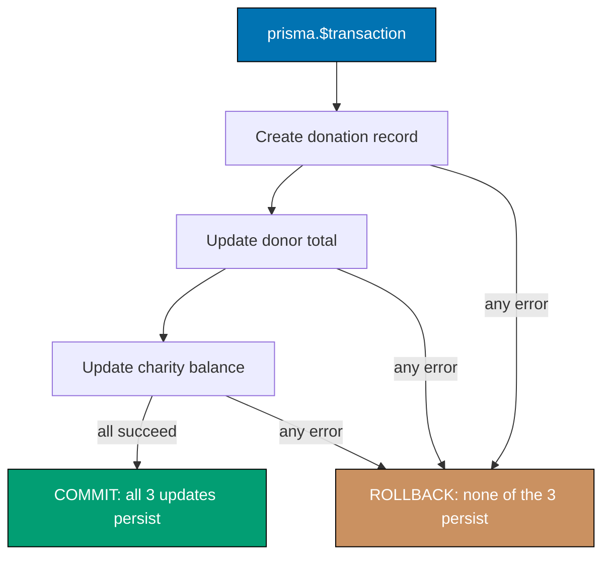

```typescript
// prisma/schema.prisma
// model User {
//   id       String    @id @default(cuid())
//   name     String
//   balance  Float     @default(0)
//   transactions Transaction[]
// }
//
// model Transaction {
//   id        String   @id @default(cuid())
//   userId    String
//   user      User     @relation(fields: [userId], references: [id])
//   amount    Float
//   type      String   // "debit" or "credit"
//   createdAt DateTime @default(now())
// }

// app/lib/prisma.ts
import { PrismaClient } from '@prisma/client';

const prisma = new PrismaClient();
export default prisma;

// app/actions.ts
'use server';

import prisma from './lib/prisma';

export async function transferFunds(
  fromUserId: string,
  toUserId: string,
  amount: number
) {
  try {
    // => Transaction ensures all-or-nothing execution
    const result = await prisma.$transaction(async (tx) => {
      // => tx is transactional client (not prisma)
      // => All operations in this callback execute atomically

      // => Step 1: Get sender's current balance
      const sender = await tx.user.findUnique({
        where: { id: fromUserId },
      });

      if (!sender) {
        throw new Error('Sender not found');
      }

      if (sender.balance < amount) {
        throw new Error('Insufficient balance');
        // => Transaction rolls back, no changes applied
      }

      // => Step 2: Deduct from sender
      await tx.user.update({
        where: { id: fromUserId },
        data: { balance: { decrement: amount } },
        // => balance = balance - amount
      });

      // => Step 3: Add to receiver
      await tx.user.update({
        where: { id: toUserId },
        data: { balance: { increment: amount } },
        // => balance = balance + amount
      });

      // => Step 4: Record sender transaction
      await tx.transaction.create({
        data: {
          userId: fromUserId,
          amount: -amount,                  // => Negative for debit
          type: 'debit',
        },
      });

      // => Step 5: Record receiver transaction
      await tx.transaction.create({
        data: {
          userId: toUserId,
          amount: amount,                   // => Positive for credit
          type: 'credit',
        },
      });

      // => Return transaction summary
      return {
        fromUser: sender.name,
        toUserId,
        amount,
      };
    });
    // => All operations succeed together or fail together

    return {
      success: true,
      message: `Transferred IDR ${amount.toLocaleString()} successfully`,
      details: result,
    };
  } catch (error) {
    // => Transaction failed, all changes rolled back
    console.error('Transfer failed:', error);
    return {
      success: false,
      error: error instanceof Error ? error.message : 'Transfer failed',
    };
  }
}

// app/transfer/page.tsx
'use client';

import { useState } from 'react';
import { transferFunds } from '../actions';

export default function TransferPage() {
  const [result, setResult] = useState<any>(null);

  async function handleSubmit(formData: FormData) {
    const fromUserId = formData.get('fromUserId') as string;
    const toUserId = formData.get('toUserId') as string;
    const amount = parseFloat(formData.get('amount') as string);

    const transferResult = await transferFunds(fromUserId, toUserId, amount);
    setResult(transferResult);
  }

  return (
    <div>
      <h1>Transfer Funds</h1>

      <form action={handleSubmit}>
        <input type="text" name="fromUserId" placeholder="From User ID" required />
        <input type="text" name="toUserId" placeholder="To User ID" required />
        <input type="number" name="amount" placeholder="Amount" required />
        <button type="submit">Transfer</button>
      </form>

      {result && (
        <div>
          {result.success ? (
            <>
              <p style={{ color: 'green' }}>{result.message}</p>
              <p>
                From: {result.details.fromUser} → To: {result.details.toUserId}
              </p>
              <p>Amount: IDR {result.details.amount.toLocaleString()}</p>
            </>
          ) : (
            <p style={{ color: 'red' }}>Error: {result.error}</p>
          )}
        </div>
      )}
    </div>
  );
}
```

**Key Takeaway**: Use Prisma transactions for atomic multi-table operations. Ensures data consistency (all operations succeed or fail together). Critical for financial operations.

**Expected Output**: Transferring funds updates both users' balances and creates transaction records atomically. If any step fails, all changes roll back.

**Common Pitfalls**: Not using transactions for multi-step operations (data inconsistency), or handling errors outside transaction (partial updates).

**Why It Matters**: Database transactions are the foundation of data integrity in production applications. Financial applications processing payments, inventory systems updating stock and orders simultaneously, and any multi-table mutation must use transactions to prevent partial updates that corrupt data. Without transactions, a server failure between a debit and credit operation leaves accounts in inconsistent states. Prisma's interactive transactions provide the full power of database transactions with TypeScript type safety. Understanding when to use transactions versus individual operations is essential for production database engineering.

## Summary

These 25 advanced examples complete the Next.js tutorial:

**SSG & ISR**: generateStaticParams (pre-render dynamic routes), ISR (time-based/on-demand revalidation), static export (CDN hosting)

**Streaming**: Suspense boundaries (progressive loading), nested Suspense (granular control), skeleton UI (better UX)

**Advanced Caching**: unstable_cache (custom cache), React cache() (request deduplication), force-dynamic (opt out of static)

**Performance**: Image blur placeholders, font optimization (next/font), script optimization (next/script)

**SEO**: Dynamic OG images, JSON-LD structured data

**Deployment**: Type-safe env vars, OpenTelemetry monitoring, rate limiting (Upstash)

**Advanced Patterns**: Server-only code protection, Partial Prerendering (PPR), middleware chaining

**Multi-Step Forms & Background Jobs**: Multi-step form wizard (session storage), background job processing (queue patterns)

**Advanced Authentication**: Role-based access control (RBAC with middleware), tier-based rate limiting (free/pro/enterprise)

**Advanced Database**: Prisma transactions (atomic operations, data consistency)

You've now covered **95% of Next.js** through 75 examples. You're ready to build production-grade Next.js applications with confidence.

## Next Steps

- **Build Projects**: Apply patterns to real applications
- **Read Official Docs**: Deep dive into specific features at [nextjs.org/docs](https://nextjs.org/docs)
- **Join Community**: [Next.js Discord](https://nextjs.org/discord) for questions and discussions
- **Stay Updated**: Follow [@nextjs](https://twitter.com/nextjs) for framework updates

**Congratulations on completing the Next.js By-Example tutorial!**
