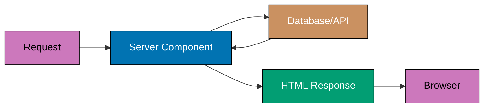
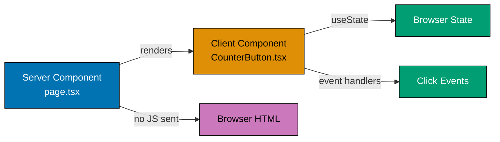
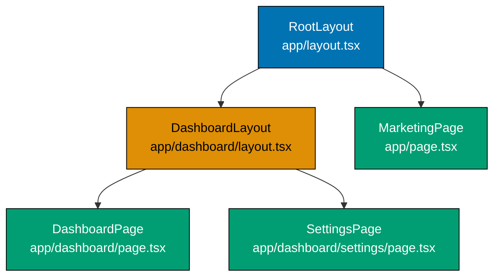
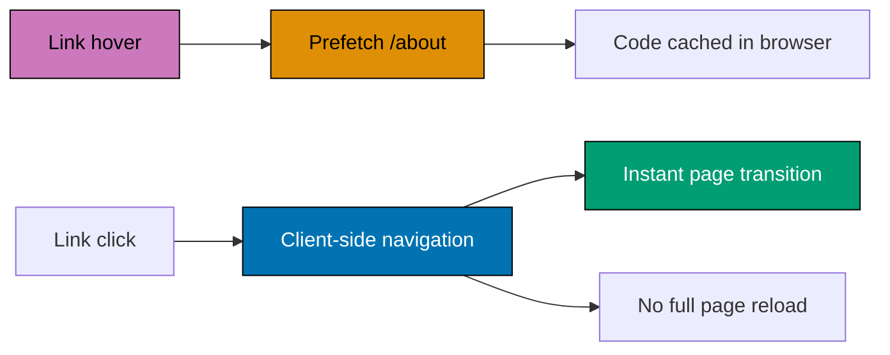
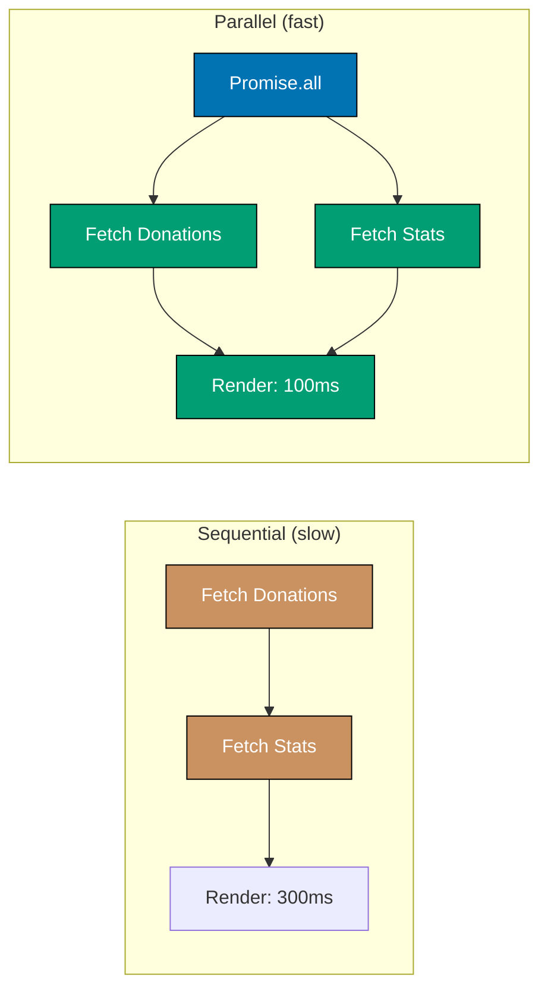
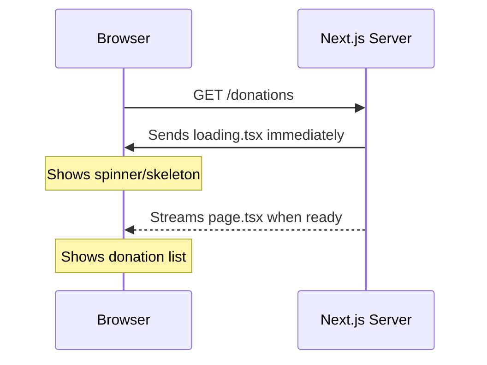
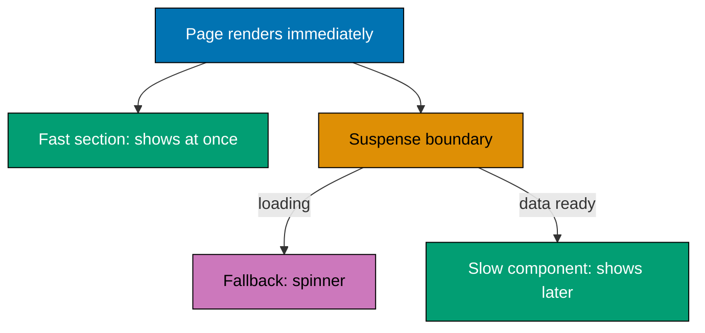
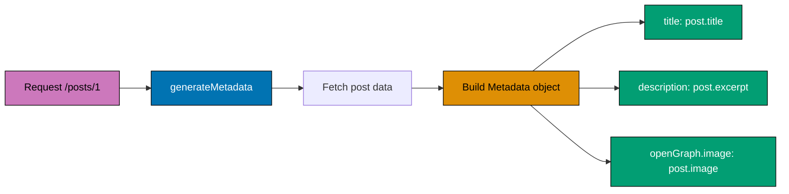
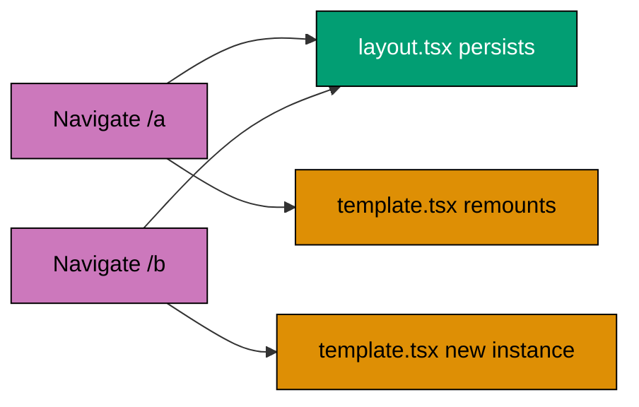

This beginner tutorial covers fundamental Next.js + TypeScript concepts through 25 heavily annotated examples. Each example maintains 1-2.25 comment lines per code line to ensure deep understanding.

## Prerequisites

Before starting, ensure you understand:

- React fundamentals (components, props, state, hooks, JSX)
- TypeScript basics (types, interfaces, generics)
- JavaScript async/await patterns
- Basic web concepts (HTTP, forms, navigation)

## Group 1: Server Components (Default)

### Example 1: Basic Server Component

Server Components are Next.js default. They run on the server and send HTML to the client, enabling direct database access and zero client JavaScript.



```typescript
// app/zakat/page.tsx
// => File location defines route: /zakat
// => No 'use client' directive = Server Component (default)
// => Never sends component code to browser

export default async function ZakatPage() {
  // => async keyword allowed in Server Components only
  // => Enables await for data fetching

  const nisabRate = 85;
  // => nisabRate is 85 (grams of gold for Zakat threshold)

  const goldPrice = 950000;
  // => goldPrice is 950000 IDR per gram

  const nisabValue = nisabRate * goldPrice;
  // => nisabValue is 80750000 IDR (Zakat threshold)
  // => Below this amount, no Zakat required

  // => All calculations happen on SERVER, zero JS sent to client

  return (
    <div>
      {/* => JSX compiled to HTML on server, browser gets plain HTML */}

      <h1>Zakat Calculator</h1>

      <p>Gold Nisab: {nisabRate} grams</p>
      {/* => nisabRate interpolated: "Gold Nisab: 85 grams" */}

      <p>Current Price: IDR {goldPrice.toLocaleString()}</p>
      {/* => toLocaleString() formats: "Current Price: IDR 950,000" */}

      <p>Nisab Value: IDR {nisabValue.toLocaleString()}</p>
      {/* => Output: "Nisab Value: IDR 80,750,000" */}
    </div>
  );
  // => Component renders to HTML string, sent to client
  // => Fast page load, SEO-friendly, no hydration needed
}
```

**Key Takeaway**: Server Components run on the server, can be async, and send HTML to the client. They're the default in Next.js App Router and require no 'use client' directive.

**Expected Output**: Page displays Zakat calculator information with formatted IDR values. View source shows fully rendered HTML, no client-side hydration JavaScript.

**Common Pitfalls**: Trying to use React hooks (useState, useEffect) in Server Components - they only work in Client Components with 'use client' directive.

**Why It Matters**: Server Components are the foundation of Next.js performance. By executing on the server and sending zero JavaScript to the browser by default, they reduce Time to First Byte and eliminate client-side data fetching waterfalls. Production applications use Server Components for database queries, API calls, and computations that must stay server-side. Understanding where code runs - server or client - prevents security issues like accidentally exposing API keys and database credentials to the browser.

### Example 2: Server Component with Data Fetching

Server Components can fetch data directly using async/await. Fetch results are automatically cached and deduped across the application.

```typescript
// app/posts/page.tsx
// => File location defines route: /posts
// => Server Component - data fetched during server render

export default async function PostsPage() {
  // => async allowed in Server Components only

  const res = await fetch('https://jsonplaceholder.typicode.com/posts', {
    // => fetch() extended by Next.js with caching options

    next: { revalidate: 3600 }
    // => revalidate: 3600 seconds (1 hour cache)
    // => After 1 hour, Next.js refetches in background
  });
  // => res is Response object (status, headers, body)

  const posts = await res.json();
  // => posts is array: [{id, title, body, userId}, ...]
  // => posts[0].title: "sunt aut facere repellat..."

  return (
    <div>
      <h2>Blog Posts</h2>

      <ul>
        {posts.slice(0, 5).map((post: any) => (
          // => slice(0,5) takes first 5 posts
          // => map() transforms each post to a list item

          <li key={post.id}>
            {/* => key required for list rendering */}
            {/* => post.id used as unique React reconciliation key */}

            <strong>{post.title}</strong>
            {/* => post.title: "sunt aut facere repellat provident occaecati" */}

            <p>{post.body.slice(0, 100)}...</p>
            {/* => First 100 chars of body with "..." truncation */}
          </li>
        ))}
      </ul>
    </div>
  );
  // => Client receives fully rendered HTML with post data
  // => SEO-friendly, no client-side loading state needed
}
```

**Key Takeaway**: Server Components can use async/await to fetch data. Use `next.revalidate` option to control cache duration and automatic revalidation.

**Expected Output**: Page displays 5 blog posts with titles and truncated body text. Data is fetched on server, HTML sent to client.

**Common Pitfalls**: Forgetting to handle loading states (use loading.tsx file or Suspense boundaries), or not setting appropriate revalidation times.

**Why It Matters**: Direct async data fetching in Server Components eliminates the need for separate API routes, useEffect hooks, and loading state management for initial page loads. Production applications use this pattern for blog posts, product catalogs, and dashboards. The `next.revalidate` option provides automatic cache invalidation without manual cache management - set it based on how frequently data changes (seconds for live data, hours for static content).

### Example 3: Adding Client Component with 'use client'

Client Components opt-in with 'use client' directive. They enable React hooks, event handlers, and browser APIs.



```typescript
// app/counter/page.tsx
// => File location defines route: /counter
// => NO 'use client' directive = Server Component (default)
// => Server Components CAN import and render Client Components
// => This creates boundary between server and client

import CounterButton from './CounterButton';
// => Relative import from same directory
// => CounterButton is Client Component (has 'use client')
// => Next.js handles code-splitting automatically

export default function CounterPage() {
  // => Regular function (not async)
  // => Server Component rendering static wrapper

  return (
    <div>
      {/* => Container div */}

      <h1>Donation Counter</h1>
      {/* => Static heading */}
      {/* => Rendered on server */}
      {/* => Sent as HTML to client */}
      {/* => No JavaScript needed for heading */}

      <CounterButton />
      {/* => Client Component usage */}
      {/* => This is the SERVER/CLIENT BOUNDARY */}
      {/* => Everything inside CounterButton runs on client */}
      {/* => Server passes initial props (none here) */}
      {/* => Client receives component code and hydrates */}
    </div>
  );
  // => Component returns JSX
  // => Heading rendered on server
  // => CounterButton placeholder sent
  // => Client JavaScript hydrates CounterButton
}

// app/counter/CounterButton.tsx
// => Separate file for Client Component
// => Must have 'use client' directive at top

'use client';
// => CRITICAL: This directive REQUIRED for Client Components
// => Tells Next.js to bundle this for client
// => Enables React hooks (useState, useEffect, etc.)
// => Enables event handlers (onClick, onChange, etc.)
// => Enables browser APIs (window, document, localStorage)
// => Without this: "You're importing a component that needs useState" error

import { useState } from 'react';
// => Import useState hook from React
// => Only works in Client Components
// => Cannot use in Server Components
// => Manages component state on client

export default function CounterButton() {
  // => Client Component function
  // => Runs in browser, not on server
  // => Can use all React hooks

  const [count, setCount] = useState(0);
  // => useState creates state variable
  // => count is current value (starts at 0)
  // => setCount is updater function
  // => State persists across re-renders
  // => Initial value: count is 0 (type: number)

  const handleClick = () => {
    // => Event handler function
    // => Arrow function for concise syntax
    // => Called when button clicked

    setCount(count + 1);
    // => Updates count to count + 1
    // => If count is 0, becomes 1
    // => If count is 5, becomes 6
    // => Triggers component re-render
    // => New count value reflected in UI
  };
  // => handleClick is function (type: () => void)

  return (
    <div>
      {/* => Container div */}

      <p>Donations: {count}</p>
      {/* => Paragraph with dynamic count */}
      {/* => Initial render: "Donations: 0" */}
      {/* => After 1 click: "Donations: 1" */}
      {/* => After 2 clicks: "Donations: 2" */}
      {/* => count variable interpolated with {} */}
      {/* => Updates when state changes */}

      <button onClick={handleClick}>
        {/* => Button element with click handler */}
        {/* => onClick prop attaches event listener */}
        {/* => handleClick function called on click */}
        {/* => onClick ONLY works in Client Components */}
        {/* => Server Components cannot handle events */}
        Donate
        {/* => Button text */}
      </button>
    </div>
  );
  // => Component returns JSX
  // => Runs in browser on every state update
  // => Re-renders when count changes
  // => React efficiently updates only changed parts
}
```

**Key Takeaway**: Use 'use client' directive to create Client Components that can use React hooks and event handlers. Server Components can import and render Client Components.

**Expected Output**: Page shows "Donation Counter" heading (static) and interactive counter button that increments when clicked (client-side).

**Common Pitfalls**: Putting 'use client' in parent when only child needs it (splits components to minimize client JavaScript), or forgetting 'use client' and getting "You're importing a component that needs useState" error.

**Why It Matters**: The Server/Client Component boundary is central to Next.js performance architecture. Pushing 'use client' as far down the component tree as possible maximizes server-rendered HTML and minimizes JavaScript shipped to browsers. Production applications that handle thousands of concurrent users benefit significantly from this pattern - the server handles data fetching and rendering, the client handles only interactivity. This reduces bundle size, improves Core Web Vitals, and scales more efficiently.

## Group 2: File-Based Routing

### Example 4: Creating Pages (page.tsx)

Next.js uses file-based routing. Each `page.tsx` file creates a route automatically based on folder structure.

```typescript
// app/page.tsx
// => File location: app/page.tsx
// => Creates route: "/" (root/homepage)
// => Special filename: MUST be "page.tsx" or "page.js"
// => Other filenames (like "home.tsx") NOT publicly accessible
// => Only page.tsx files create routes

export default function HomePage() {
  // => Component name can be anything (HomePage, Page, etc.)
  // => Next.js only cares about default export
  // => This renders at domain.com/

  return (
    <div>
      {/* => Root page content */}

      <h1>Welcome to Islamic Finance Platform</h1>
      {/* => Page heading */}
      {/* => Visible at homepage */}

      <p>Learn about Sharia-compliant financial products.</p>
      {/* => Descriptive text */}
      {/* => Explains platform purpose */}
    </div>
  );
  // => Returns homepage UI
  // => Accessible at: domain.com/
  // => Example: localhost:3000/
}

// app/about/page.tsx
// => File location: app/about/page.tsx
// => Folder name: "about"
// => File name: "page.tsx" (special)
// => Creates route: "/about"
// => Pattern: folder name becomes route path
// => Accessible at domain.com/about

export default function AboutPage() {
  // => About page component
  // => Renders when user navigates to /about

  return (
    <div>
      {/* => About page content */}

      <h1>About Us</h1>
      {/* => About page heading */}

      <p>We provide Sharia-compliant financial education.</p>
      {/* => About page description */}
    </div>
  );
  // => Returns about page UI
  // => Accessible at: domain.com/about
  // => Example: localhost:3000/about
}

// app/products/murabaha/page.tsx
// => File location: app/products/murabaha/page.tsx
// => Nested folder structure: products/murabaha
// => Each folder becomes path segment
// => Creates route: "/products/murabaha"
// => Pattern: folder/subfolder structure maps to URL path
// => Accessible at domain.com/products/murabaha

export default function MurabahaPage() {
  // => Murabaha product page component
  // => Nested route example

  return (
    <div>
      {/* => Product page content */}

      <h1>Murabaha Financing</h1>
      {/* => Product heading */}

      <p>Cost-plus financing for asset purchases.</p>
      {/* => Product description */}
      {/* => Explains Murabaha concept */}
    </div>
  );
  // => Returns product page UI
  // => Accessible at: domain.com/products/murabaha
  // => Example: localhost:3000/products/murabaha
  // => Folder structure = URL structure
  // => app/products/murabaha/page.tsx → /products/murabaha
}
```

**Key Takeaway**: File system is the router. `page.tsx` files create routes based on their folder path. Nested folders create nested routes.

**Expected Output**: Three routes accessible at /, /about, and /products/murabaha displaying respective content.

**Common Pitfalls**: Creating .tsx files without 'page' in name (won't create routes), or forgetting that only page.tsx files are publicly accessible.

**Why It Matters**: File-based routing eliminates manual route registration and configuration files. Production applications with hundreds of routes use this system to keep routing logic colocated with the component code. Only `page.tsx` files become accessible routes - components, utilities, and types in the same folder remain private. This convention makes it easy to navigate large codebases and prevents accidental route exposure.

### Example 5: Creating Layouts (layout.tsx)

Layouts wrap page content and persist across route changes. They prevent unnecessary re-renders and enable shared UI.



```typescript
// app/layout.tsx
// => File location: app/layout.tsx
// => Special filename: MUST be "layout.tsx" or "layout.js"
// => Root layout: wraps ALL pages in entire application
// => REQUIRED file - every Next.js app MUST have this
// => Cannot be deleted or renamed
// => Runs on every page

export default function RootLayout({
  children,
}: {
  children: React.ReactNode;
  // => Type annotation for children prop
  // => React.ReactNode accepts any valid React child
  // => Includes: JSX elements, strings, numbers, arrays, fragments, null
}) {
  // => children parameter receives page content automatically
  // => Next.js passes current page as children
  // => Different page = different children
  // => Layout component wraps children

  return (
    <html lang="en">
      {/* => Opening <html> tag */}
      {/* => REQUIRED in root layout */}
      {/* => Only root layout can have <html> */}
      {/* => lang="en" sets document language */}

      <body>
        {/* => Opening <body> tag */}
        {/* => REQUIRED in root layout */}
        {/* => Only root layout can have <body> */}
        {/* => All page content goes inside body */}

        <header>
          {/* => Header section */}
          {/* => Visible on ALL pages */}
          {/* => Stays mounted during navigation */}
          {/* => Does NOT re-render on page change */}

          <nav>Islamic Finance Platform</nav>
          {/* => Navigation text */}
          {/* => Could contain links (see Example 6) */}
          {/* => Persists across routes */}
        </header>

        <main>
          {/* => Main content area */}
          {/* => Semantic HTML5 element */}

          {children}
          {/* => Children prop renders here */}
          {/* => For /: renders HomePage content */}
          {/* => For /about: renders AboutPage content */}
          {/* => For /products/murabaha: renders MurabahaPage content */}
          {/* => THIS is what changes on navigation */}
          {/* => Header and footer stay the same */}
        </main>

        <footer>© 2026 Islamic Finance</footer>
        {/* => Footer section */}
        {/* => Visible on ALL pages */}
        {/* => Stays mounted during navigation */}
        {/* => Copyright notice */}
      </body>
    </html>
  );
  // => Component return
  // => Layout persists across all pages
  // => Only children slot changes on navigation
  // => Prevents header/footer re-render
  // => Improves performance
  // => Maintains scroll position in nav/footer
}

// app/products/layout.tsx
// => File location: app/products/layout.tsx
// => Nested layout: only wraps /products/* routes
// => Does NOT wrap other routes (/, /about, etc.)
// => Inherits from root layout (wrapped by root)
// => Layout nesting: RootLayout > ProductsLayout > Page

export default function ProductsLayout({
  children,
}: {
  children: React.ReactNode;
  // => Type annotation for children
  // => Same as root layout
}) {
  // => children receives product page content
  // => For /products/murabaha: receives MurabahaPage
  // => For /products/ijarah: receives IjarahPage

  return (
    <div>
      {/* => Container div */}
      {/* => NOT <html> or <body> (only root layout has those) */}

      <aside>
        {/* => Sidebar element */}
        {/* => Semantic HTML5 element for side content */}
        {/* => Visible on ALL /products/* pages */}
        {/* => Does NOT appear on /, /about, etc. */}

        <h3>Products</h3>
        {/* => Sidebar heading */}

        <ul>
          {/* => Product list */}
          {/* => Could be links (see Example 6) */}

          <li>Murabaha</li>
          {/* => Product 1 */}

          <li>Ijarah</li>
          {/* => Product 2 */}

          <li>Musharakah</li>
          {/* => Product 3 */}
        </ul>
      </aside>

      <div>
        {/* => Main content area */}

        {children}
        {/* => Product page content renders here */}
        {/* => For /products/murabaha: MurabahaPage content */}
        {/* => Sidebar stays, only THIS changes */}
      </div>
    </div>
  );
  // => Component return
  // => Nesting structure: RootLayout wraps this layout
  // => This layout wraps product pages
  // => Full nesting: <html><body><header/><main><aside/><div>PAGE</div></main><footer/></body></html>
  // => Sidebar persists when navigating between products
  // => Only page content (children) re-renders
}
```

**Key Takeaway**: Root layout is required and wraps all pages. Nested layouts wrap specific route segments. Layouts persist during navigation, preventing re-renders.

**Expected Output**: All pages show header/footer from root layout. Product pages additionally show sidebar from products layout.

**Common Pitfalls**: Forgetting html/body tags in root layout (Next.js error), or putting 'use client' in layouts when pages need to be Server Components.

**Why It Matters**: Layouts enable persistent UI that survives navigation without re-rendering, critical for applications with sidebars, headers, or navigation that users expect to remain interactive during page transitions. Production applications use nested layouts to share expensive data fetching across route segments - fetch user data once in a layout instead of on every page. The persistent nature of layouts also preserves scroll position and animation states during navigation.

### Example 6: Navigation with Link Component

Next.js Link component enables client-side navigation with prefetching. It's faster than browser navigation and maintains application state.



```typescript
// app/page.tsx
// => File location: app/page.tsx (homepage)
// => Using Link component for navigation

import Link from 'next/link';
// => Import Link from 'next/link' package
// => NOT from 'react-router' (different framework)
// => Next.js has its own routing system
// => Link component is built-in

export default function HomePage() {
  // => Homepage component

  return (
    <div>
      {/* => Page container */}

      <h1>Islamic Finance Courses</h1>
      {/* => Page heading */}

      <nav>
        {/* => Navigation section */}
        {/* => Semantic HTML5 element */}

        <Link href="/courses/zakat">
          {/* => Link component (NOT <a> tag) */}
          {/* => href prop specifies destination */}
          {/* => Must start with / for internal routes */}
          {/* => Route: /courses/zakat */}
          {/* => Prefetching: Link automatically prefetches on hover */}
          {/* => When user hovers, Next.js loads /courses/zakat in background */}
          {/* => Click becomes INSTANT (already loaded) */}
          {/* => Client-side navigation (no full page reload) */}

          Zakat Calculation
          {/* => Link text */}
          {/* => What user sees and clicks */}
        </Link>
        {/* => Link renders as <a> tag in HTML */}
        {/* => But behaves differently (client-side routing) */}

        <Link href="/courses/murabaha">
          {/* => Second link */}
          {/* => Same behavior: prefetch on hover */}
          {/* => Instant navigation on click */}

          Murabaha Basics
          {/* => Link text */}
        </Link>
        {/* => Multiple links on same page work fine */}
        {/* => Each prefetches independently */}

        <Link href="/about">
          {/* => Third link */}
          {/* => Route: /about */}

          About Us
        </Link>
      </nav>

      <a href="https://example.com" target="_blank" rel="noopener noreferrer">
        {/* => Regular <a> tag for EXTERNAL links */}
        {/* => Use Link for internal routes only */}
        {/* => <a> for external URLs */}
        {/* => href="https://..." (absolute URL) */}
        {/* => target="_blank" opens in new tab */}
        {/* => rel="noopener noreferrer" security attributes */}
        {/* => noopener: prevents new window from accessing window.opener */}
        {/* => noreferrer: prevents passing referrer information */}
        {/* => NO prefetching for external links */}

        External Resource
        {/* => Link text for external site */}
      </a>
      {/* => External link opens in new tab */}
      {/* => Full page navigation to external site */}
    </div>
  );
  // => Component return
  // => Link components enable fast, client-side navigation
  // => Prefetching makes clicks feel instant
  // => Application state preserved (no full reload)
}
```

**Key Takeaway**: Use Link component for internal navigation (prefetches on hover, instant client-side routing). Use regular `<a>` tags for external links.

**Expected Output**: Clicking links navigates instantly without full page reload. Hover shows prefetch activity in Network tab.

**Common Pitfalls**: Using `<a>` tags for internal links (causes full page reload, slower), or using Link for external URLs (unnecessary overhead).

**Why It Matters**: Client-side navigation via the Link component transforms multi-page applications into app-like experiences. Next.js prefetches linked pages in the background during idle time, making navigation feel instant. Production applications with content-heavy sites see significant improvements in user engagement metrics when links prefetch correctly. The distinction between internal Link navigation and external `<a>` tags is fundamental to Next.js performance optimization.

### Example 7: Dynamic Routes with [param]

Dynamic routes use [brackets] in folder/file names. They capture URL segments as params accessible in page components.

```typescript
// app/products/[id]/page.tsx
// => File location: app/products/[id]/page.tsx
// => [id] folder name with BRACKETS = dynamic route segment
// => Folder name MUST have brackets: [paramName]
// => paramName can be anything: [id], [slug], [productId], etc.
// => Matches ANY URL like /products/ANYTHING
// => Examples:
// =>   /products/1 → params.id is "1"
// =>   /products/murabaha → params.id is "murabaha"
// =>   /products/abc123 → params.id is "abc123"
// => Does NOT match /products (no ID segment)

type PageProps = {
  params: { id: string };
  // => TypeScript type for props
  // => params object has id property
  // => id matches folder name [id]
  // => Always string type (URL segments are strings)
};
// => PageProps is type definition (not runtime value)
// => Provides type safety for params

export default function ProductPage({ params }: PageProps) {
  // => Component receives props object
  // => Destructures params from props
  // => params passed automatically by Next.js
  // => No need to parse URL manually
  // => Next.js extracts [id] from URL path

  // => For URL /products/murabaha:
  // =>   params is { id: "murabaha" }
  // =>   params.id is "murabaha" (type: string)

  // => For URL /products/123:
  // =>   params is { id: "123" }
  // =>   params.id is "123" (type: string, NOT number)
  // =>   Need parseInt() if expecting number

  return (
    <div>
      {/* => Product page container */}

      <h1>Product: {params.id}</h1>
      {/* => Dynamic heading with product ID */}
      {/* => For /products/murabaha: "Product: murabaha" */}
      {/* => For /products/ijarah: "Product: ijarah" */}
      {/* => params.id value interpolated */}

      <p>Viewing details for product {params.id}</p>
      {/* => Paragraph using same params.id */}
      {/* => Can use params.id multiple times */}
      {/* => Could fetch product data using this ID */}
    </div>
  );
  // => Component returns JSX
  // => Different params.id for each URL
  // => Single component handles infinite products
}

// app/blog/[year]/[month]/[slug]/page.tsx
// => File location: app/blog/[year]/[month]/[slug]/page.tsx
// => THREE dynamic segments in path
// => [year] folder contains [month] folder contains [slug] folder
// => Nested dynamic routes
// => Matches /blog/YEAR/MONTH/SLUG
// => Example: /blog/2026/01/zakat-guide
// =>   year is "2026"
// =>   month is "01"
// =>   slug is "zakat-guide"

type BlogPageProps = {
  params: {
    year: string;
    // => First dynamic segment [year]
    // => Always string type
    // => Example: "2026", "2025", etc.

    month: string;
    // => Second dynamic segment [month]
    // => Always string type
    // => Example: "01", "12", etc.
    // => Note: "01" not 1 (string, not number)

    slug: string;
    // => Third dynamic segment [slug]
    // => Always string type
    // => Example: "zakat-guide", "murabaha-basics"
  };
};
// => Type defines all three params
// => Each matches folder name in brackets

export default function BlogPostPage({ params }: BlogPageProps) {
  // => Component receives all three params
  // => For URL /blog/2026/01/zakat-guide:
  // =>   params.year is "2026"
  // =>   params.month is "01"
  // =>   params.slug is "zakat-guide"

  return (
    <div>
      {/* => Blog post container */}

      <h1>Blog Post: {params.slug}</h1>
      {/* => Dynamic heading with post slug */}
      {/* => For /blog/2026/01/zakat-guide: "Blog Post: zakat-guide" */}
      {/* => slug typically used as URL-friendly identifier */}

      <time>
        {/* => Time element for semantic date */}

        {params.month}/{params.year}
        {/* => Date formatted as month/year */}
        {/* => For /blog/2026/01/zakat-guide: "01/2026" */}
        {/* => String concatenation: "01" + "/" + "2026" */}
        {/* => Could parse to Date for better formatting */}
      </time>
    </div>
  );
  // => Component returns JSX
  // => Three dynamic params from URL
  // => Single component handles infinite blog posts
  // => Could fetch post using year, month, slug combination
}
```

**Key Takeaway**: Use [param] folders for dynamic URL segments. Next.js passes matched segments as params prop to page component.

**Expected Output**: URLs like /products/murabaha render product page with ID "murabaha". Blog URLs show year, month, and slug from URL.

**Common Pitfalls**: Forgetting that params are always strings (convert to numbers if needed), or not handling invalid param values.

**Why It Matters**: Dynamic routes enable content-driven applications where URLs map to database records, user profiles, or product pages. Production e-commerce sites, blogs, and SaaS dashboards rely on dynamic routes for thousands of individual pages. The type-safety requirement (params are always strings) prevents runtime bugs when querying databases with wrong types. Combined with generateStaticParams, dynamic routes can pre-render at build time for maximum performance.

## Group 3: Server Actions (Forms & Mutations)

### Example 8: Basic Server Action for Form Handling

Server Actions are async functions that run on the server. They enable backend logic without API routes, with automatic progressive enhancement.


```typescript
// app/donate/page.tsx
// => File location: app/donate/page.tsx
// => Server Component (default, no 'use client')
// => Can define and use Server Actions inline
// => No API routes needed for form handling

async function handleDonation(formData: FormData) {
  // => Server Action: async function handling form submission
  // => Parameter: FormData object (browser API for form data)
  // => FormData passed automatically by Next.js when form submits

  'use server';
  // => CRITICAL directive: marks function as Server Action
  // => Must be first statement in function (before any code)
  // => Without this: function would try to run on client (error)
  // => With this: Next.js creates server endpoint automatically
  // => Function body runs on server, never sent to browser

  const name = formData.get('name') as string;
  // => Extract 'name' field from form
  // => formData.get() returns FormDataEntryValue (string | File | null)
  // => 'as string' type assertion (we know it's string from input type="text")
  // => For form: <input name="name" value="Ahmad" />
  // =>   name is "Ahmad"
  // => Field name must match input's name attribute

  const amount = formData.get('amount') as string;
  // => Extract 'amount' field from form
  // => For form: <input name="amount" value="100000" />
  // =>   amount is "100000" (string, not number!)
  // => input type="number" still returns string from FormData
  // => Need parseInt() or Number() for math operations

  console.log(`Donation from ${name}: IDR ${amount}`);
  // => Log to SERVER console (not browser console)
  // => For name="Ahmad", amount="100000":
  // =>   Server output: "Donation from Ahmad: IDR 100000"
  // => Useful for debugging
  // => Production: replace with proper logging

  // await db.donations.create({ name, amount: parseInt(amount) });
  // => Example database operation (commented out)
  // => Server Actions can access database directly
  // => No need for separate API route
  // => Could use Prisma, Drizzle, or any database library
  // => parseInt(amount) converts "100000" to 100000 (number)
}
// => Server Action ends
// => Next.js generates server endpoint for this function
// => Endpoint URL generated automatically (not visible in code)
// => Form submission POSTs to this endpoint

export default function DonatePage() {
  // => Page component
  // => Server Component (renders on server)

  return (
    <div>
      {/* => Page container */}

      <h1>Make a Donation</h1>
      {/* => Page heading */}

      <form action={handleDonation}>
        {/* => Form element with Server Action */}
        {/* => action prop accepts Server Action function */}
        {/* => Traditional HTML: action="/api/donate" (URL string) */}
        {/* => Next.js: action={handleDonation} (function reference) */}
        {/* => On submit: Next.js POSTs form data to server endpoint */}
        {/* => handleDonation executes on server */}
        {/* => Progressive enhancement: works WITHOUT client JavaScript */}
        {/* => If JS disabled: traditional form POST */}
        {/* => If JS enabled: enhanced with client-side handling */}

        <label>
          {/* => Label for name input */}

          Name:
          {/* => Label text */}

          <input type="text" name="name" required />
          {/* => Text input for donor name */}
          {/* => type="text": single-line text input */}
          {/* => name="name": CRITICAL - FormData key */}
          {/* =>   formData.get('name') retrieves this value */}
          {/* =>   Must match string in Server Action */}
          {/* => required: HTML5 validation (must fill before submit) */}
          {/* => Browser blocks submit if empty */}
        </label>

        <label>
          {/* => Label for amount input */}

          Amount (IDR):
          {/* => Label text with currency indicator */}

          <input type="number" name="amount" required />
          {/* => Number input for donation amount */}
          {/* => type="number": numeric input with spinner controls */}
          {/* =>   Browser shows up/down arrows */}
          {/* =>   Mobile keyboard shows numeric layout */}
          {/* => name="amount": FormData key for amount */}
          {/* => required: must fill before submit */}
          {/* => Note: FormData.get('amount') returns STRING "100000" not number */}
        </label>

        <button type="submit">Donate</button>
        {/* => Submit button */}
        {/* => type="submit": triggers form submission */}
        {/* => Click executes handleDonation on server */}
        {/* => Works without JavaScript (native form submission) */}
        {/* => With JavaScript: enhanced with loading states */}
      </form>
      {/* => Form ends */}
      {/* => Submission flow: */}
      {/* =>   1. User fills name="Ahmad", amount="100000" */}
      {/* =>   2. Clicks submit button */}
      {/* =>   3. Browser creates FormData with { name: "Ahmad", amount: "100000" } */}
      {/* =>   4. Next.js POSTs to server endpoint */}
      {/* =>   5. handleDonation runs on server */}
      {/* =>   6. Server logs donation */}
      {/* =>   7. Page refreshes (default behavior) */}
    </div>
  );
  // => Component returns form UI
  // => Server Action enables backend logic without API routes
  // => Progressive enhancement: works with or without JavaScript
}
```

**Key Takeaway**: Server Actions are async functions with 'use server' directive. They handle form submissions on the server and work without client JavaScript.

**Expected Output**: Form submission logs donation to server console. Page refreshes showing updated state. Works even if JavaScript disabled.

**Common Pitfalls**: Forgetting 'use server' directive (function runs on client), or not using FormData API to extract values.

**Why It Matters**: Server Actions enable progressive enhancement - forms work without JavaScript, making applications accessible on slow networks and older browsers. Production applications use Server Actions for all form submissions, keeping sensitive operations (database writes, email sending, payment processing) server-side with no API route boilerplate. The progressive enhancement guarantee also means applications remain functional if JavaScript fails to load, important for enterprise and government applications.

### Example 9: Server Action with Validation

Server Actions should validate input before processing. Return validation errors to show in UI.

```typescript
// app/zakat/calculate/page.tsx
// => File location: app/zakat/calculate/page.tsx
// => Server Component with validated Server Action
// => Shows server-side validation pattern

type ActionResult = {
  success: boolean;
  // => Boolean flag indicating validation success
  // => true: calculation succeeded
  // => false: validation failed

  message?: string;
  // => Optional error/success message
  // => ?: means property may be undefined
  // => Present for both success and error cases
  // => Example: "Zakat calculated successfully" or "Invalid input"

  zakatAmount?: number;
  // => Optional calculated zakat amount
  // => Only present when success is true
  // => Undefined when validation fails
  // => Example: 2500000 (IDR 2.5 million)
};
// => Type defines contract for Server Action return value
// => Enables type-safe result handling in Client Components
// => All Server Action results should be serializable (JSON-compatible)

async function calculateZakat(formData: FormData): Promise<ActionResult> {
  // => Server Action with return type annotation
  // => Promise<ActionResult>: async function returning ActionResult
  // => FormData parameter receives form data

  'use server';
  // => Server Action directive
  // => Function executes on server only
  // => Can return values to client (serialized as JSON)

  const wealthStr = formData.get('wealth') as string;
  // => Extract wealth input from form
  // => formData.get() returns string | File | null
  // => 'as string' assertion (we know it's string from type="number")
  // => For input value "100000000":
  // =>   wealthStr is "100000000" (string, not number)

  const wealth = parseInt(wealthStr);
  // => Convert string to integer
  // => parseInt("100000000") returns 100000000 (number)
  // => parseInt("abc") returns NaN (Not a Number)
  // => parseInt("") returns NaN
  // => Need to validate for NaN

  if (isNaN(wealth)) {
    // => Check if parsing failed
    // => isNaN(100000000) is false (valid number)
    // => isNaN(NaN) is true (invalid input)
    // => Catches: empty string, non-numeric text, null

    return {
      success: false,
      // => Validation failed

      message: 'Please enter a valid number',
      // => User-friendly error message
      // => Client can display this to user
    };
    // => Return early: stops execution
    // => Result sent back to client
  }

  if (wealth < 0) {
    // => Validate non-negative
    // => -100000 would fail this check
    // => 0 passes (acceptable, no zakat due)

    return {
      success: false,
      message: 'Wealth cannot be negative',
      // => Business logic validation
      // => Negative wealth doesn't make sense
    };
    // => Early return on validation failure
  }

  const nisab = 85 * 950000;
  // => Calculate nisab threshold
  // => Nisab: minimum wealth requiring zakat
  // => 85 grams gold (standard nisab measure)
  // => 950000: gold price per gram in IDR
  // => 85 * 950000 = 80,750,000 IDR
  // => nisab is 80750000 (constant for this example)

  if (wealth < nisab) {
    // => Check if wealth meets minimum threshold
    // => wealth=50000000 < nisab=80750000: below threshold
    // => wealth=100000000 > nisab=80750000: above threshold, zakat due

    return {
      success: false,
      message: `Wealth below nisab threshold (IDR ${nisab.toLocaleString()})`,
      // => Template string with formatted nisab
      // => nisab.toLocaleString() formats 80750000 as "80,750,000"
      // => Message: "Wealth below nisab threshold (IDR 80,750,000)"
      // => Informative: tells user the threshold
    };
    // => Not an error, but no zakat due
    // => Still returns success: false
  }

  const zakatAmount = wealth * 0.025;
  // => Calculate 2.5% zakat (Islamic standard rate)
  // => For wealth=100000000:
  // =>   zakatAmount = 100000000 * 0.025
  // =>   zakatAmount = 2500000 (2.5 million IDR)
  // => 0.025 = 2.5/100 = 2.5%

  return {
    success: true,
    // => Validation passed, calculation succeeded

    message: 'Zakat calculated successfully',
    // => Success message

    zakatAmount,
    // => Shorthand for zakatAmount: zakatAmount
    // => Includes calculated amount in result
    // => Client can display this to user
    // => Example: 2500000
  };
  // => Success result with zakat amount
  // => Client receives: { success: true, message: "...", zakatAmount: 2500000 }
}
// => Server Action ends
// => Demonstrates complete validation workflow:
// =>   1. Extract and parse input
// =>   2. Validate format (NaN check)
// =>   3. Validate business rules (negative, nisab)
// =>   4. Perform calculation
// =>   5. Return structured result

export default function ZakatCalculatorPage() {
  // => Page component
  // => This is basic version (no result display)

  return (
    <div>
      {/* => Page container */}

      <h1>Zakat Calculator</h1>
      {/* => Page heading */}

      <form action={calculateZakat}>
        {/* => Form calling validated Server Action */}
        {/* => calculateZakat executes on server */}
        {/* => Return value available via useFormState (intermediate example) */}

        <label>
          {/* => Label for wealth input */}

          Total Wealth (IDR):
          {/* => Label text with currency */}

          <input type="number" name="wealth" required />
          {/* => Number input for wealth */}
          {/* => name="wealth": matches formData.get('wealth') */}
          {/* => required: client-side validation (first line of defense) */}
          {/* => Server-side validation ALSO required (security) */}
          {/* => Client validation can be bypassed (curl, disabled JS) */}
        </label>

        <button type="submit">Calculate</button>
        {/* => Submit button triggers Server Action */}
        {/* => Server validates and calculates */}
        {/* => Result returned to client */}
      </form>

      {/* => Result display would use useFormState hook */}
      {/* => See intermediate examples for full implementation */}
      {/* => useFormState returns [state, formAction] */}
      {/* => state contains ActionResult */}
      {/* => Can conditionally render: */}
      {/* =>   {state.success && <p>Zakat: IDR {state.zakatAmount}</p>} */}
      {/* =>   {!state.success && <p>Error: {state.message}</p>} */}
    </div>
  );
  // => Component returns calculator UI
  // => Demonstrates server-side validation importance
  // => NEVER trust client-side validation alone
}
```

**Key Takeaway**: Server Actions can return validation results. Always validate input server-side even if client-side validation exists.

**Expected Output**: Form submission validates wealth amount. Returns error messages for invalid input or amount below nisab threshold.

**Common Pitfalls**: Trusting client-side validation alone (can be bypassed), or not handling all edge cases (NaN, negative numbers, etc.).

**Why It Matters**: Server-side validation is the last line of defense against invalid or malicious data. Client-side validation can be bypassed by disabling JavaScript, using developer tools, or making direct API calls. Production financial applications, healthcare systems, and any app handling user data must validate server-side. Returning structured validation results from Server Actions enables rich error display while maintaining security. Validation libraries like Zod (covered in intermediate examples) formalize this pattern.

### Example 10: Server Action with Revalidation

Server Actions can revalidate cached data after mutations. Use revalidatePath or revalidateTag to refresh specific routes.


```typescript
// app/actions.ts
// => File location: app/actions.ts (root of app directory)
// => Separate file for reusable Server Actions
// => Multiple pages can import and use these actions
// => Centralized location for data mutations

'use server';
// => File-level 'use server' directive
// => When at TOP of file (before imports):
// =>   ALL exported functions are Server Actions
// =>   No need to repeat 'use server' in each function
// => Alternative: per-function 'use server' inside function body
// => File-level: cleaner for files with only Server Actions

import { revalidatePath } from 'next/cache';
// => Import revalidation utility from Next.js
// => revalidatePath: invalidates cache for specific route
// => Forces Next.js to re-fetch data on next request
// => Essential after data mutations (create, update, delete)

export async function addPost(formData: FormData) {
  // => Exported Server Action
  // => 'export' makes it importable in other files
  // => 'async' because database operations are asynchronous
  // => No need for 'use server' here (covered by file-level directive)

  const title = formData.get('title') as string;
  // => Extract title from form
  // => For input: <input name="title" value="New Post" />
  // =>   title is "New Post"

  const content = formData.get('content') as string;
  // => Extract content from form
  // => For textarea: <textarea name="content">Post content...</textarea>
  // =>   content is "Post content..."

  // await db.posts.create({ title, content });
  // => Database mutation (commented for example)
  // => In production: use Prisma, Drizzle, or other ORM
  // => Example with Prisma:
  // =>   await prisma.post.create({
  // =>     data: { title, content, published: true }
  // =>   });
  // => Creates new post record in database
  // => Returns created post object

  console.log(`Created post: ${title}`);
  // => Server-side logging
  // => For title="New Post":
  // =>   Server console: "Created post: New Post"
  // => Confirms mutation executed
  // => Production: use structured logging (Winston, Pino)

  revalidatePath('/posts');
  // => CRITICAL: Invalidate cache for /posts route
  // => Why needed: Next.js caches page renders for performance
  // => After adding post, cache shows OLD data (missing new post)
  // => revalidatePath('/posts'):
  // =>   1. Marks /posts cache as stale
  // =>   2. Next request to /posts triggers re-render
  // =>   3. Fresh data fetched from database
  // =>   4. New post appears in list
  // => Without this: users see stale data until cache expires
  // => Argument must be exact path string: '/posts', '/blog', etc.
}
// => Server Action ends
// => Can be imported and used in any Server Component
// => Enables code reuse across multiple forms

// app/posts/new/page.tsx
// => File location: app/posts/new/page.tsx
// => Page for creating new posts
// => Route: /posts/new

import { addPost } from '@/app/actions';
// => Import Server Action from centralized file
// => '@/app' is alias for app directory (configured in tsconfig.json)
// => Full path: /app/actions.ts
// => Can import in multiple pages/components

export default function NewPostPage() {
  // => Page component for post creation

  return (
    <div>
      {/* => Page container */}

      <h1>Create Post</h1>
      {/* => Page heading */}

      <form action={addPost}>
        {/* => Form using imported Server Action */}
        {/* => addPost defined in separate file */}
        {/* => Same behavior as inline Server Action */}
        {/* => Benefit: reusable across multiple components */}

        <label>
          {/* => Title label */}

          Title:
          {/* => Label text */}

          <input type="text" name="title" required />
          {/* => Title input */}
          {/* => name="title": matches formData.get('title') */}
          {/* => required: client-side validation */}
        </label>

        <label>
          {/* => Content label */}

          Content:
          {/* => Label text */}

          <textarea name="content" required />
          {/* => Multi-line text input for content */}
          {/* => name="content": matches formData.get('content') */}
          {/* => required: must fill before submit */}
        </label>

        <button type="submit">Publish</button>
        {/* => Submit button */}
        {/* => Triggers addPost Server Action */}
        {/* => Flow: */}
        {/* =>   1. User fills form */}
        {/* =>   2. Clicks Publish */}
        {/* =>   3. addPost executes on server */}
        {/* =>   4. Post saved to database */}
        {/* =>   5. /posts cache invalidated */}
        {/* =>   6. User redirected (could use redirect() from next/navigation) */}
      </form>
      {/* => Form ends */}
    </div>
  );
  // => Component returns form UI
  // => Uses imported Server Action for reusability
  // => Could have multiple forms using same action
}
```

**Key Takeaway**: Use revalidatePath() in Server Actions to refresh cached routes after data mutations. Ensures users see updated data immediately.

**Expected Output**: After form submission, /posts page automatically refreshes to show new post without manual reload.

**Common Pitfalls**: Forgetting to revalidate (users see stale data), or revalidating wrong path (target the affected route).

**Why It Matters**: Cache revalidation is how Next.js applications stay consistent after mutations. Without revalidation, users submit forms and see outdated data because Next.js serves cached responses. Production applications must revalidate carefully - too broadly causes unnecessary re-fetches, too narrowly leaves stale data. The revalidatePath pattern is the standard approach for mutation-then-revalidate workflows in Server Actions, replacing the manual state management and refetch patterns common in traditional React applications.

## Group 4: Data Fetching Patterns

### Example 11: Parallel Data Fetching

Server Components can fetch multiple data sources in parallel using Promise.all. Improves performance by avoiding sequential waterfalls.



```typescript
// app/dashboard/page.tsx
// => File location: app/dashboard/page.tsx
// => Server Component with parallel data fetching
// => Demonstrates performance optimization with Promise.all

async function getUser() {
  // => Async function simulating user API call
  // => In production: fetch('https://api.example.com/user')

  await new Promise(resolve => setTimeout(resolve, 1000));
  // => Simulate network delay
  // => new Promise(...) creates pending promise
  // => setTimeout(resolve, 1000) resolves after 1000ms (1 second)
  // => await pauses execution for 1 second
  // => Mimics real API latency

  return { name: 'Ahmad', email: 'ahmad@example.com' };
  // => Return user object
  // => Structure: { name: string, email: string }
  // => In production: await (await fetch(...)).json()
}
// => Function completes in ~1 second

async function getDonations() {
  // => Async function simulating donations API call

  await new Promise(resolve => setTimeout(resolve, 1000));
  // => 1 second simulated delay

  return [
    { id: 1, amount: 100000 },
    { id: 2, amount: 250000 },
  ];
  // => Return donation array
  // => Each item: { id: number, amount: number }
  // => Example: 100000 = IDR 100,000
}
// => Function completes in ~1 second

async function getStats() {
  // => Async function simulating statistics API call

  await new Promise(resolve => setTimeout(resolve, 1000));
  // => 1 second simulated delay

  return { totalDonations: 350000, donorCount: 2 };
  // => Return stats object
  // => totalDonations: sum of all donations
  // => donorCount: number of unique donors
  // => Could be aggregated from database query
}
// => Function completes in ~1 second

export default async function DashboardPage() {
  // => Page component (async Server Component)
  // => 'async' keyword enables await in component body
  // => Can fetch data directly without useEffect

  const [user, donations, stats] = await Promise.all([
    getUser(),
    getDonations(),
    getStats(),
  ]);
  // => PARALLEL data fetching with Promise.all
  // => Promise.all([...]) accepts array of promises
  // => Executes ALL promises SIMULTANEOUSLY
  // => Waits for ALL to complete
  // => Returns array of results (same order as input)
  // => Timing:
  // =>   T=0ms: All three fetch functions start
  // =>   T=1000ms: All three complete (parallel execution)
  // =>   Total time: ~1 second
  // => Array destructuring: [user, donations, stats]
  // =>   user = result from getUser() = { name: 'Ahmad', email: '...' }
  // =>   donations = result from getDonations() = [{ id: 1, ... }, ...]
  // =>   stats = result from getStats() = { totalDonations: 350000, ... }
  // => SEQUENTIAL alternative (BAD):
  // =>   const user = await getUser();       // Wait 1s
  // =>   const donations = await getDonations();  // Wait 1s
  // =>   const stats = await getStats();     // Wait 1s
  // =>   Total: 3 seconds (3x slower!)
  // => Promise.all is CRITICAL for performance

  return (
    <div>
      {/* => Dashboard container */}

      <h1>Dashboard for {user.name}</h1>
      {/* => Dynamic heading with user name */}
      {/* => user.name is "Ahmad" */}
      {/* => Output: "Dashboard for Ahmad" */}

      <div>
        {/* => Statistics section */}

        <h2>Statistics</h2>
        {/* => Section heading */}

        <p>Total: IDR {stats.totalDonations.toLocaleString()}</p>
        {/* => Total donations formatted */}
        {/* => stats.totalDonations is 350000 */}
        {/* => toLocaleString() formats as "350,000" */}
        {/* => Output: "Total: IDR 350,000" */}

        <p>Donors: {stats.donorCount}</p>
        {/* => Donor count */}
        {/* => stats.donorCount is 2 */}
        {/* => Output: "Donors: 2" */}
      </div>

      <div>
        {/* => Donations section */}

        <h2>Recent Donations</h2>
        {/* => Section heading */}

        <ul>
          {/* => Unordered list */}

          {donations.map(donation => (
            <li key={donation.id}>
              {/* => List item for each donation */}
              {/* => key={donation.id}: React key for list items */}
              {/* => Required for efficient re-rendering */}
              {/* => Must be unique (id is unique) */}

              IDR {donation.amount.toLocaleString()}
              {/* => Formatted donation amount */}
              {/* => For donation { id: 1, amount: 100000 }: */}
              {/* =>   Output: "IDR 100,000" */}
              {/* => For donation { id: 2, amount: 250000 }: */}
              {/* =>   Output: "IDR 250,000" */}
            </li>
          ))}
          {/* => map() iterates donations array */}
          {/* => Creates <li> for each donation */}
          {/* => donations has 2 items = 2 <li> elements */}
        </ul>
      </div>
    </div>
  );
  // => Component returns dashboard UI
  // => All data fetched in parallel (fast)
  // => Total page load: ~1 second (not 3 seconds)
  // => Promise.all enables efficient data loading
}
```

**Key Takeaway**: Use Promise.all() to fetch multiple data sources in parallel. Dramatically reduces page load time compared to sequential fetching.

**Expected Output**: Dashboard loads in ~1 second (parallel) instead of ~3 seconds (sequential). Shows user name, statistics, and donations.

**Common Pitfalls**: Sequential await calls (each waits for previous), or not handling Promise.all rejection (one failure rejects all).

**Why It Matters**: Parallel data fetching is critical for page load performance in data-heavy applications. Sequential fetching adds latencies together (3 sources at 100ms each = 300ms total), while parallel fetching takes only the slowest (100ms total). Production dashboards, profile pages, and content aggregation pages fetch from multiple sources. Promise.all rejection handling is required in production - use Promise.allSettled when you want partial data even if some sources fail.

### Example 12: Request Memoization (Automatic Deduplication)

Next.js automatically deduplicates identical fetch requests in a single render pass. Multiple components can fetch same data without redundant requests.

```typescript
// app/components/Header.tsx
// => File location: app/components/Header.tsx
// => Server Component that fetches user data

async function getUser() {
  // => Shared async function for fetching user
  // => Used by multiple components

  console.log('Fetching user data...');
  // => Server console log
  // => Used to verify deduplication behavior
  // => Without dedupe: logs multiple times
  // => With dedupe: logs only ONCE despite multiple calls

  const res = await fetch('https://api.example.com/user');
  // => HTTP GET request to user API
  // => fetch() returns Response object
  // => await pauses until response received

  return res.json();
  // => Parse JSON response body
  // => Returns: { name: "Fatima", role: "admin" }
  // => Async operation: await needed when calling
}
// => Function can be called multiple times in same render
// => Next.js AUTOMATICALLY deduplicates identical requests

export async function Header() {
  // => Header component (async Server Component)
  // => 'async' enables await inside component

  const user = await getUser();
  // => FIRST call to getUser() in this render pass
  // => Next.js executes actual network request
  // => Result cached for this render pass
  // => user is { name: "Fatima", role: "admin" }

  return (
    <header>
      {/* => Header element */}

      <span>Welcome, {user.name}</span>
      {/* => Greeting with user name */}
      {/* => user.name is "Fatima" */}
      {/* => Output: "Welcome, Fatima" */}
    </header>
  );
  // => Component returns header UI
  // => Used user data from getUser()
}

// app/components/Sidebar.tsx
// => File location: app/components/Sidebar.tsx
// => Different component, SAME fetch function

export async function Sidebar() {
  // => Sidebar component (async Server Component)

  const user = await getUser();
  // => SECOND call to getUser() in same render pass
  // => Next.js detects DUPLICATE request
  // => Request deduplication:
  // =>   1. Checks if identical fetch already in progress/completed
  // =>   2. Reuses cached result from Header's call
  // =>   3. NO second network request made
  // =>   4. Returns same user object instantly
  // => user is { name: "Fatima", role: "admin" } (cached)
  // => Timing:
  // =>   Header's getUser(): 100ms network request
  // =>   Sidebar's getUser(): 0ms (cached, instant)
  // => console.log only appears ONCE in server console

  return (
    <aside>
      {/* => Sidebar element */}

      <p>Role: {user.role}</p>
      {/* => User role display */}
      {/* => user.role is "admin" */}
      {/* => Output: "Role: admin" */}
    </aside>
  );
  // => Component returns sidebar UI
  // => Used SAME user data (deduped)
}

// app/page.tsx
// => File location: app/page.tsx (homepage)
// => Parent component rendering both Header and Sidebar

import { Header } from './components/Header';
// => Import Header component
// => Relative path: ./components/Header.tsx

import { Sidebar } from './components/Sidebar';
// => Import Sidebar component

export default function HomePage() {
  // => Homepage component (Server Component)

  return (
    <div>
      {/* => Page container */}

      <Header />
      {/* => Render Header component */}
      {/* => Triggers getUser() call */}
      {/* => Makes network request to API */}
      {/* => Response cached for this render pass */}

      <Sidebar />
      {/* => Render Sidebar component */}
      {/* => Triggers getUser() call */}
      {/* => Next.js detects duplicate fetch */}
      {/* => REUSES cached response (no network request) */}
      {/* => Instant return of user data */}

      {/* => Total network requests: 1 (not 2) */}
      {/* => Server console shows "Fetching user data..." only ONCE */}
      {/* => Deduplication happens automatically (no code needed) */}
      {/* => Works with: fetch(), database queries (with caching), etc. */}
    </div>
  );
  // => Component returns page UI
  // => Both components get user data efficiently
  // => Request deduplication critical for performance:
  // =>   - Prevents redundant network requests
  // =>   - Reduces server load
  // =>   - Faster page rendering
  // =>   - Enables composition without performance penalty
}
```

**Key Takeaway**: Next.js automatically deduplicates identical fetch requests during render. Multiple components can safely fetch same data without performance penalty.

**Expected Output**: Server logs "Fetching user data..." only once despite two components calling getUser(). Single network request serves both.

**Common Pitfalls**: Assuming you need manual caching (Next.js handles it), or using different fetch URLs that could be the same (dedupe requires exact match).

**Why It Matters**: Automatic request deduplication prevents the N+1 fetch problem in component trees where multiple components need the same data. Without deduplication, a component tree rendering 10 items each fetching author data would make 10 identical requests. Production applications with complex component trees benefit from fetch deduplication without any extra code. This pattern enables component-level data fetching (each component fetches its own data) without coordination overhead.

## Group 5: Loading States

### Example 13: Loading UI with loading.tsx

Create loading.tsx file to show instant loading states while page data fetches. Automatically wraps page in Suspense boundary.



```typescript
// app/posts/loading.tsx
// => File location: app/posts/loading.tsx
// => Special file: automatic loading UI for /posts route
// => File name MUST be exactly "loading.tsx" (Next.js convention)
// => Paired with app/posts/page.tsx (shows while page loads)
// => Next.js automatically wraps page in <Suspense fallback={<Loading />}>

export default function Loading() {
  // => Loading component (regular React component)
  // => No 'use client' needed (works as Server or Client Component)
  // => Rendered IMMEDIATELY when user navigates to /posts
  // => Shows while PostsPage fetches data
  // => Replaced with actual page when data ready

  return (
    <div>
      {/* => Loading UI container */}

      <h2>Loading Posts...</h2>
      {/* => Loading message */}
      {/* => User sees this INSTANTLY (no wait) */}
      {/* => Improves perceived performance */}

      <div className="skeleton">
        {/* => Skeleton UI container */}
        {/* => Skeleton: placeholder mimicking final UI structure */}
        {/* => Shows approximate layout while loading */}
        {/* => className would need CSS: */}
        {/* =>   .skeleton { animation: pulse 2s infinite; } */}

        <div className="skeleton-line" />
        {/* => Skeleton line 1 (placeholder for first post) */}
        {/* => CSS could show gray animated bar */}

        <div className="skeleton-line" />
        {/* => Skeleton line 2 (placeholder for second post) */}

        <div className="skeleton-line" />
        {/* => Skeleton line 3 (placeholder for third post) */}
      </div>
      {/* => Skeleton mimics final post list structure */}
      {/* => User sees approximate UI immediately */}
    </div>
  );
  // => Component returns loading UI
  // => Next.js shows this during page data fetch
  // => When page ready: React replaces this with PostsPage
  // => Smooth transition: loading UI → actual content
}

// app/posts/page.tsx
// => File location: app/posts/page.tsx
// => Page component for /posts route
// => Paired with loading.tsx (loading UI while this loads)

export default async function PostsPage() {
  // => Page component (async Server Component)
  // => Fetches data before rendering

  await new Promise(resolve => setTimeout(resolve, 2000));
  // => Simulate slow network request
  // => 2000ms = 2 seconds delay
  // => In production: await fetch('https://api.example.com/posts')
  // => During this 2 second wait:
  // =>   - loading.tsx shows to user
  // =>   - User sees "Loading Posts..." and skeleton
  // =>   - NOT a blank screen (good UX)

  const posts = [
    { id: 1, title: 'Zakat Guide' },
    { id: 2, title: 'Murabaha Basics' },
  ];
  // => Post data (normally from API or database)
  // => Each post: { id: number, title: string }

  return (
    <div>
      {/* => Posts page container */}

      <h2>Posts</h2>
      {/* => Page heading */}

      <ul>
        {/* => Post list */}

        {posts.map(post => (
          <li key={post.id}>{post.title}</li>
          // => List item for each post
          // => key={post.id}: React key for list rendering
          // => Output for post 1: "Zakat Guide"
          // => Output for post 2: "Murabaha Basics"
        ))}
      </ul>
    </div>
  );
  // => Component returns posts UI
  // => Renders AFTER 2 second delay
  // => React replaces loading.tsx with this content
  // => User flow:
  // =>   T=0s: Navigate to /posts
  // =>   T=0s: loading.tsx shows immediately
  // =>   T=2s: PostsPage replaces loading.tsx
  // =>   T=2s: User sees actual posts
}
```

**Key Takeaway**: Create loading.tsx alongside page.tsx for instant loading states. Next.js automatically wraps page in Suspense, showing loading UI immediately.

**Expected Output**: Navigate to /posts shows "Loading Posts..." immediately, then actual posts after 2 seconds.

**Common Pitfalls**: Not providing loading states (users see blank screen), or making loading UI too complex (should be instant, lightweight).

**Why It Matters**: Instant loading states dramatically improve perceived performance. Users tolerate wait times much better when they receive immediate visual feedback that something is happening. Production applications with 1-3 second data loads retain significantly more users when loading skeletons replace blank screens. The loading.tsx convention automates Suspense boundary setup, making it trivial to add loading states to every route. Core Web Vitals metrics, particularly Interaction to Next Paint (INP), improve with proper loading states.

### Example 14: Manual Suspense Boundaries for Granular Loading

Use React Suspense to show loading states for specific components rather than entire page.



```typescript
// app/dashboard/page.tsx
// => File location: app/dashboard/page.tsx
// => Demonstrates manual Suspense for granular loading

import { Suspense } from 'react';
// => Import Suspense component from React
// => Suspense: React feature for showing fallback while async content loads
// => Built into React (not Next.js specific)
// => Enables partial page rendering (some content fast, some slow)

async function DonationList() {
  // => Async Server Component (fetches data)
  // => Slow component: takes 2 seconds to render

  await new Promise(resolve => setTimeout(resolve, 2000));
  // => Simulate 2 second API delay
  // => In production: await fetch('/api/donations')
  // => Component SUSPENDS during this wait
  // => Suspense boundary shows fallback while waiting

  const donations = [
    { id: 1, amount: 100000 },
    { id: 2, amount: 250000 },
  ];
  // => Donation data (normally from API)
  // => Format: { id: number, amount: number }

  return (
    <ul>
      {/* => Donation list */}

      {donations.map(d => (
        <li key={d.id}>IDR {d.amount.toLocaleString()}</li>
        // => List item for each donation
        // => d.amount.toLocaleString() formats number with commas
        // => For d.amount=100000: "IDR 100,000"
        // => For d.amount=250000: "IDR 250,000"
      ))}
    </ul>
  );
  // => Component returns list after 2 second delay
}

function QuickStats() {
  // => Synchronous component (no data fetch)
  // => Fast component: renders IMMEDIATELY (no await)
  // => No async, no data loading

  return (
    <div>
      {/* => Stats container */}

      <h2>Quick Stats</h2>
      {/* => Section heading */}

      <p>Last updated: Now</p>
      {/* => Timestamp */}
      {/* => Static text (no API call needed) */}
      {/* => Renders instantly */}
    </div>
  );
  // => Component returns static content immediately
  // => Renders in <1ms (no network request)
}

export default function DashboardPage() {
  // => Dashboard page component

  return (
    <div>
      {/* => Dashboard container */}

      <h1>Dashboard</h1>
      {/* => Page heading */}
      {/* => Renders immediately (static content) */}

      <QuickStats />
      {/* => Fast component renders IMMEDIATELY */}
      {/* => Shows "Quick Stats" and timestamp instantly */}
      {/* => User sees this at T=0s (no wait) */}

      <Suspense fallback={<p>Loading donations...</p>}>
        {/* => Suspense boundary (React component) */}
        {/* => Wraps slow component (DonationList) */}
        {/* => fallback prop: UI to show while children load */}
        {/* => fallback renders immediately at T=0s */}
        {/* => Shows: "Loading donations..." */}

        <DonationList />
        {/* => Slow component inside Suspense */}
        {/* => Suspends for 2 seconds (await in DonationList) */}
        {/* => While suspended: fallback shows */}
        {/* => When ready: fallback replaced with DonationList */}
        {/* => Transition at T=2s: "Loading donations..." → actual list */}
      </Suspense>
      {/* => Suspense enables partial page rendering: */}
      {/* =>   - Fast content (heading, QuickStats) shows immediately */}
      {/* =>   - Slow content (DonationList) shows fallback, then actual data */}
      {/* =>   - Better UX than waiting for entire page */}
    </div>
  );
  // => Component returns dashboard UI
  // => Rendering timeline:
  // =>   T=0s: Dashboard heading + QuickStats visible + "Loading donations..."
  // =>   T=2s: "Loading donations..." → actual donation list
  // => Without Suspense: entire page waits 2 seconds (blank screen)
  // => With Suspense: fast content shows immediately (better UX)
}
```

**Key Takeaway**: Use Suspense boundaries to show loading states for specific components. Fast content renders immediately, slow content shows fallback.

**Expected Output**: Dashboard shows header and QuickStats immediately. "Loading donations..." appears, then replaced with actual list after 2 seconds.

**Common Pitfalls**: Wrapping entire page in Suspense (use loading.tsx instead), or not providing fallback (Suspense requires fallback prop).

**Why It Matters**: Granular Suspense boundaries enable progressive page rendering - fast content displays immediately while slow content streams in later. This pattern is particularly valuable for pages that mix static content (headers, navigation) with dynamic data (user-specific recommendations, live prices). Production applications use multiple Suspense boundaries to achieve sub-second Time to Interactive even when some data takes several seconds. Streaming responses reduce Time to First Byte and improve Core Web Vitals scores.

## Group 6: Error Handling

### Example 15: Error Boundaries with error.tsx

Create error.tsx to catch errors in page segments. Automatically wraps page in error boundary with retry capability.

```typescript
// app/posts/error.tsx
// => File location: app/posts/error.tsx
// => Special file: error boundary for /posts route
// => File name MUST be exactly "error.tsx" (Next.js convention)
// => Catches errors from app/posts/page.tsx

'use client';
// => REQUIRED: Error boundaries MUST be Client Components
// => Why: error boundaries use React lifecycle methods (componentDidCatch)
// => React lifecycle only works in Client Components
// => Server Components cannot catch runtime errors
// => onClick event handler also requires Client Component

export default function Error({
  error,
  reset,
}: {
  error: Error & { digest?: string };
  // => error parameter: Error object from thrown error
  // => Error type: standard JavaScript Error
  // => { digest?: string }: extends Error with optional digest property
  // => digest: unique error identifier (for logging/tracking)
  // => Example: error.digest = "abc123def456"
  // => Useful for correlating errors in logs

  reset: () => void;
  // => reset parameter: function to retry rendering
  // => Signature: () => void (no parameters, no return value)
  // => Calling reset():
  // =>   1. Re-renders error boundary
  // =>   2. Tries to render page again
  // =>   3. Might succeed if error was transient
}) {
  // => Error component receives error and reset props
  // => error.message: "Failed to fetch posts"
  // => error.digest: "xyz789" (unique ID)

  return (
    <div>
      {/* => Error UI container */}

      <h2>Something went wrong!</h2>
      {/* => User-friendly error heading */}
      {/* => Don't expose technical details in production */}
      {/* => Generic message improves security */}

      <p>{error.message}</p>
      {/* => Display error message */}
      {/* => error.message from thrown Error */}
      {/* => For: throw new Error('Failed to fetch posts') */}
      {/* =>   Output: "Failed to fetch posts" */}
      {/* => Production: sanitize message (don't leak sensitive info) */}

      <button onClick={reset}>
        {/* => Retry button */}
        {/* => onClick handler (requires 'use client') */}
        {/* => Click calls reset() function */}
        {/* => reset() provided by Next.js automatically */}

        Try Again
        {/* => Button text */}
      </button>
      {/* => Click behavior: */}
      {/* =>   1. reset() called */}
      {/* =>   2. Error boundary cleared */}
      {/* =>   3. PostsPage re-rendered */}
      {/* =>   4. If error transient (network glitch): might succeed */}
      {/* =>   5. If error persistent: error.tsx shows again */}
    </div>
  );
  // => Component returns error UI
  // => Replaces page content when error occurs
  // => Provides recovery mechanism (reset button)
}

// app/posts/page.tsx
// => File location: app/posts/page.tsx
// => Page that might throw error
// => Paired with error.tsx (catches errors from this page)

export default async function PostsPage() {
  // => Page component (async Server Component)

  const shouldFail = Math.random() > 0.5;
  // => Random boolean (50% chance true, 50% false)
  // => Math.random() returns 0.0 to 0.999...
  // => > 0.5: true for 0.5-0.999 (50% of range)
  // => Simulates unreliable API (sometimes fails)

  if (shouldFail) {
    // => 50% chance this executes

    throw new Error('Failed to fetch posts');
    // => Throw Error object with message
    // => Error propagates up component tree
    // => Caught by nearest error boundary (error.tsx)
    // => error.tsx receives this Error object
    // => error.message will be "Failed to fetch posts"
    // => Page rendering stops here
  }
  // => If shouldFail is true: error.tsx shows
  // => If shouldFail is false: continue to return statement

  return (
    <div>
      {/* => Success UI (only shows if no error) */}

      <h2>Posts</h2>
      {/* => Page heading */}

      <p>Success! Posts loaded.</p>
      {/* => Success message */}
      {/* => Only visible when shouldFail is false */}
    </div>
  );
  // => Component returns success UI
  // => Only renders if error not thrown
  // => Testing error boundary:
  // =>   - Refresh page multiple times
  // =>   - 50% see success UI
  // =>   - 50% see error UI with "Try Again" button
  // =>   - Click "Try Again": re-renders, new 50/50 chance
}
```

**Key Takeaway**: Create error.tsx Client Component to catch errors in route segment. Provides error info and reset function for retry.

**Expected Output**: 50% of page loads show error UI with retry button. Clicking retry re-renders page (might succeed or fail again).

**Common Pitfalls**: Forgetting 'use client' in error.tsx (must be Client Component), or not handling errors gracefully (show user-friendly messages).

**Why It Matters**: Error boundaries prevent individual component failures from crashing entire pages. Production applications handle network timeouts, database connection errors, and API rate limits gracefully. The reset function enables retry without full page reload, critical for intermittent failures. Route-level error boundaries (error.tsx) catch errors in specific sections while leaving the rest of the page functional. Global error handling (global-error.tsx) provides a last resort for catastrophic failures.

### Example 16: Not Found Pages with not-found.tsx

Create not-found.tsx for custom 404 pages when resource doesn't exist. Use notFound() function to trigger it programmatically.

```typescript
// app/products/[id]/not-found.tsx
// => File location: app/products/[id]/not-found.tsx
// => Special file: custom 404 page for /products/[id] route
// => File name MUST be exactly "not-found.tsx" (Next.js convention)
// => Triggered when notFound() called or route doesn't match

export default function ProductNotFound() {
  // => 404 component (regular React component)
  // => No 'use client' needed (works as Server or Client Component)
  // => Rendered when:
  // =>   1. notFound() function called in page.tsx
  // =>   2. Dynamic route doesn't match any file (no other triggers)

  return (
    <div>
      {/* => 404 UI container */}

      <h2>Product Not Found</h2>
      {/* => Custom 404 heading */}
      {/* => Better UX than generic "404 Page Not Found" */}
      {/* => Context-specific: tells user it's a product issue */}

      <p>The product you're looking for doesn't exist.</p>
      {/* => Explanatory message */}
      {/* => Helps user understand what went wrong */}

      <a href="/products">
        {/* => Navigation link */}
        {/* => Use <a> (not Link) for simplicity in error pages */}
        {/* => href="/products": back to product listing */}

        Back to Products
        {/* => Link text */}
      </a>
      {/* => Provides recovery path */}
      {/* => User can navigate to valid route */}
    </div>
  );
  // => Component returns custom 404 UI
  // => HTTP 404 status code sent automatically
  // => Better than throwing error (404 vs 500)
}

// app/products/[id]/page.tsx
// => File location: app/products/[id]/page.tsx
// => Product detail page with programmatic 404

import { notFound } from 'next/navigation';
// => Import notFound function from Next.js
// => notFound(): triggers not-found.tsx rendering
// => Function signature: () => never (never returns)
// => Throws NEXT_NOT_FOUND symbol internally

const products = [
  { id: '1', name: 'Murabaha' },
  { id: '2', name: 'Ijarah' },
];
// => Simulated product database
// => In production: fetch from real database
// => Format: { id: string, name: string }[]

export default function ProductPage({
  params,
}: {
  params: { id: string };
  // => Type annotation for params prop
  // => params.id: string from [id] folder name
}) {
  // => Component receives params from URL
  // => For URL /products/1:
  // =>   params is { id: "1" }

  const product = products.find(p => p.id === params.id);
  // => Search for product matching URL parameter
  // => Array.find() returns first matching element or undefined
  // => For params.id="1":
  // =>   product is { id: '1', name: 'Murabaha' }
  // => For params.id="999" (not in array):
  // =>   product is undefined

  if (!product) {
    // => Check if product not found
    // => !product is true when product is undefined
    // => Handles invalid product IDs gracefully

    notFound();
    // => Call notFound() to trigger 404
    // => Function throws NEXT_NOT_FOUND symbol
    // => Next.js catches symbol and renders not-found.tsx
    // => Execution STOPS here (never reaches return statement)
    // => HTTP 404 status code sent
    // => Browser URL stays /products/999 (no redirect)
    // => Alternative to throwing Error (which gives 500 status)
  }
  // => After this if block: product is guaranteed to exist
  // => TypeScript narrowing: product type is { id: string, name: string }

  return (
    <div>
      {/* => Product detail UI */}

      <h1>{product.name}</h1>
      {/* => Product name heading */}
      {/* => For product { id: '1', name: 'Murabaha' }: */}
      {/* =>   Output: "Murabaha" */}
      {/* => product.name safe to access (not undefined) */}

      <p>Product ID: {product.id}</p>
      {/* => Product ID display */}
      {/* => Output: "Product ID: 1" */}
    </div>
  );
  // => Component returns product details
  // => Only renders when product found
  // => User flow:
  // =>   /products/1 → shows Murabaha details
  // =>   /products/2 → shows Ijarah details
  // =>   /products/999 → shows "Product Not Found" (404)
}
```

**Key Takeaway**: Create not-found.tsx for custom 404 pages. Use notFound() function to programmatically trigger 404 when resource doesn't exist.

**Expected Output**: /products/1 shows Murabaha product. /products/999 shows custom "Product Not Found" page.

**Common Pitfalls**: Not calling notFound() when resource missing (shows error instead of 404), or forgetting to create not-found.tsx (shows default Next.js 404).

**Why It Matters**: Proper 404 handling improves both user experience and SEO. Search engines interpret 404 responses correctly for removed content, preventing duplicate content penalties. Users navigating to deleted resources receive clear feedback instead of generic errors. Production applications use notFound() in Server Actions and data fetching functions when database queries return null - this pattern is cleaner than conditionally rendering error UI and ensures correct HTTP status codes for crawlers.

## Group 7: Metadata & SEO

### Example 17: Static Metadata

Export metadata object from page to set title, description, and Open Graph tags. Crucial for SEO and social sharing.

```typescript
// app/about/page.tsx
// => File location: app/about/page.tsx
// => Page with static metadata for SEO

import { Metadata } from 'next';
// => Import Metadata type from Next.js
// => Metadata: TypeScript interface for metadata object
// => Provides type safety for metadata properties
// => Not a runtime import (type-only)

export const metadata: Metadata = {
  // => Export metadata object (MUST be named "metadata")
  // => Type annotation: Metadata (provides autocomplete)
  // => Static metadata: same for all requests
  // => Next.js automatically generates <head> tags

  title: 'About Islamic Finance Platform',
  // => Page title (required for good SEO)
  // => Generates: <title>About Islamic Finance Platform</title>
  // => Shows in:
  // =>   - Browser tab
  // =>   - Search engine results (Google title)
  // =>   - Browser history
  // =>   - Social media previews (if no openGraph.title)
  // => Max length: ~60 characters for optimal display

  description: 'Learn about our Sharia-compliant financial education platform.',
  // => Meta description (important for SEO)
  // => Generates: <meta name="description" content="...">
  // => Shows in:
  // =>   - Search engine snippets (Google description)
  // =>   - Social media previews (if no openGraph.description)
  // => Max length: ~155-160 characters for optimal display
  // => Should summarize page content concisely

  openGraph: {
    // => Open Graph protocol tags
    // => Used by social media platforms (Facebook, LinkedIn, Discord)
    // => Controls preview appearance when link shared
    // => Generates multiple <meta property="og:*"> tags

    title: 'About Islamic Finance Platform',
    // => og:title for social sharing
    // => Generates: <meta property="og:title" content="...">
    // => Can differ from page title (often same)
    // => Shows as preview card title on Facebook, LinkedIn

    description: 'Sharia-compliant financial education',
    // => og:description for social sharing
    // => Generates: <meta property="og:description" content="...">
    // => Shorter than meta description (concise for cards)
    // => Shows as preview card description

    type: 'website',
    // => og:type defines content type
    // => Generates: <meta property="og:type" content="website">
    // => Common types:
    // =>   - "website": general website (default)
    // =>   - "article": blog post, article
    // =>   - "profile": user profile
    // =>   - "video.movie": video content
    // => Affects how social platforms display preview
  },
  // => Could add more Open Graph properties:
  // =>   images: [{ url: '/og-image.jpg', width: 1200, height: 630 }]
  // =>   url: 'https://example.com/about'
  // =>   siteName: 'Islamic Finance Platform'
};
// => Metadata object processed during build (static) or request (dynamic)
// => Next.js injects generated tags into <head> section
// => Improves SEO, social sharing, accessibility

export default function AboutPage() {
  // => Page component
  // => metadata export separate from component

  return (
    <div>
      {/* => Page content */}

      <h1>About Us</h1>
      {/* => Page heading */}
      {/* => Should match/relate to page title for SEO consistency */}

      <p>We provide Sharia-compliant financial education.</p>
      {/* => Page description */}
      {/* => Should expand on meta description */}
    </div>
  );
  // => Component returns page UI
  // => metadata injected in <head> automatically
  // => No manual <Head> component needed (unlike Pages Router)
}
```

**Key Takeaway**: Export metadata object to set page title, description, and Open Graph tags. Improves SEO and social media sharing appearance.

**Expected Output**: Page title shows "About Islamic Finance Platform" in browser tab. Sharing on social media shows custom title/description.

**Common Pitfalls**: Not setting metadata (uses default title), or forgetting description meta tag (reduces SEO effectiveness).

**Why It Matters**: Static metadata controls how pages appear in search results and social media shares. Pages without explicit titles show file paths or default app names in browser tabs and search results, significantly reducing click-through rates. Production marketing sites, blog platforms, and content applications depend on well-crafted metadata for organic search traffic. The TypeScript Metadata type ensures all required fields are present and valid, preventing common SEO mistakes at build time.

### Example 18: Dynamic Metadata with generateMetadata

Use generateMetadata function to create metadata based on dynamic route parameters or fetched data.



```typescript
// app/products/[id]/page.tsx
// => File location: app/products/[id]/page.tsx
// => Dynamic route with dynamic metadata

import { Metadata } from 'next';
// => Import Metadata type for type safety

const products = [
  { id: 'murabaha', name: 'Murabaha Financing', description: 'Cost-plus financing' },
  { id: 'ijarah', name: 'Ijarah Leasing', description: 'Islamic leasing' },
];
// => Simulated product database
// => In production: fetch from database in generateMetadata
// => Format: { id: string, name: string, description: string }[]

export async function generateMetadata({
  params,
}: {
  params: { id: string };
  // => Type annotation for params
  // => params.id: string from [id] folder
}): Promise<Metadata> {
  // => Function name MUST be "generateMetadata" (Next.js convention)
  // => Return type: Promise<Metadata> (async function)
  // => Receives same params as page component
  // => Called BEFORE page component renders
  // => For URL /products/murabaha:
  // =>   params is { id: "murabaha" }

  const product = products.find(p => p.id === params.id);
  // => Find product matching URL parameter
  // => For params.id="murabaha":
  // =>   product is { id: 'murabaha', name: 'Murabaha Financing', ... }
  // => For params.id="invalid":
  // =>   product is undefined
  // => In production:
  // =>   const product = await db.products.findUnique({ where: { id: params.id } });

  if (!product) {
    // => Product not found, return fallback metadata

    return {
      title: 'Product Not Found',
      // => Fallback title for invalid product IDs
      // => Shows in browser tab: "Product Not Found"
    };
    // => Could also return more fields:
    // =>   description: 'The requested product does not exist'
    // =>   robots: { index: false } (don't index 404 pages)
  }
  // => After this if: product is guaranteed to exist

  return {
    // => Return metadata object for found product

    title: `${product.name} | Islamic Finance`,
    // => Dynamic title based on product name
    // => Template string combines product name with site name
    // => For product.name="Murabaha Financing":
    // =>   title is "Murabaha Financing | Islamic Finance"
    // => For product.name="Ijarah Leasing":
    // =>   title is "Ijarah Leasing | Islamic Finance"
    // => Pattern: "[Product Name] | [Site Name]" (common SEO pattern)

    description: product.description,
    // => Dynamic description from product data
    // => For product.description="Cost-plus financing":
    // =>   Generates: <meta name="description" content="Cost-plus financing">
    // => Each product gets unique description (good for SEO)

    openGraph: {
      // => Open Graph tags for social sharing

      title: product.name,
      // => og:title is just product name (no site suffix)
      // => For product.name="Murabaha Financing":
      // =>   og:title is "Murabaha Financing"
      // => Cleaner for social media cards

      description: product.description,
      // => og:description from product
      // => Shows in social media preview cards
    },
    // => Could add product-specific Open Graph image:
    // =>   images: [{ url: `/products/${params.id}.jpg` }]
  };
  // => Metadata varies per product (dynamic)
  // => Next.js generates different <head> tags for each URL
}
// => generateMetadata called once per request
// => Result cached for production builds
// => Next.js automatically deduplicates data fetching:
// =>   If page component also calls products.find(), no duplicate work

export default function ProductPage({
  params,
}: {
  params: { id: string };
}) {
  // => Page component receives same params

  const product = products.find(p => p.id === params.id);
  // => Same lookup as generateMetadata
  // => In production: Next.js deduplicates if same fetch
  // => Example:
  // =>   generateMetadata: await fetch('/api/product/murabaha')
  // =>   ProductPage: await fetch('/api/product/murabaha')
  // =>   Result: only ONE network request (automatic dedupe)

  if (!product) return <p>Not found</p>;
  // => Handle missing product
  // => Could use notFound() instead for proper 404

  return (
    <div>
      {/* => Product detail UI */}

      <h1>{product.name}</h1>
      {/* => Product name heading */}
      {/* => Should match metadata title for consistency */}

      <p>{product.description}</p>
      {/* => Product description */}
    </div>
  );
  // => Component returns product UI
  // => Metadata already in <head> (generated by generateMetadata)
}
```

**Key Takeaway**: Use generateMetadata() for dynamic metadata based on route params or data. Returns Metadata object like static metadata but computed at request time.

**Expected Output**: /products/murabaha shows "Murabaha Financing | Islamic Finance" title. /products/ijarah shows "Ijarah Leasing | Islamic Finance".

**Common Pitfalls**: Not handling missing data cases (return fallback metadata), or fetching data twice (in generateMetadata and page - use single fetch, Next.js dedupes).

**Why It Matters**: Dynamic metadata enables per-page SEO optimization for content-driven applications. Blog posts, product pages, and user profiles each need unique titles and descriptions for search ranking. Social media sharing is significantly more effective with page-specific Open Graph images and descriptions versus generic site-level metadata. Next.js deduplicates fetch calls between generateMetadata and the page component, so fetching the same data in both functions has zero performance cost.

## Group 8: Image Optimization

### Example 19: Image Component for Optimization

Use next/image for automatic image optimization, lazy loading, and responsive sizing. Dramatically improves performance.

```typescript
// app/page.tsx
// => File location: app/page.tsx (homepage)
// => Demonstrates Image component for optimization

import Image from 'next/image';
// => Import Image component from next/image
// => NOT 'next/images' (common typo)
// => NOT regular  tag (no optimization)
// => Image: Next.js wrapper for  with automatic optimization

export default function HomePage() {
  // => Homepage component

  return (
    <div>
      {/* => Page container */}

      <h1>Islamic Finance Products</h1>
      {/* => Page heading */}

      <Image
        src="/mosque.jpg"
        // => Image source path
        // => Leading slash: public/ directory
        // => Full path: public/mosque.jpg
        // => Served at: http://localhost:3000/mosque.jpg
        // => Can also use absolute URLs:
        // =>   src="https://example.com/image.jpg"
        // =>   (requires domains config in next.config.js)

        alt="Beautiful mosque with Islamic architecture"
        // => REQUIRED: alternative text for image
        // => Critical for:
        // =>   - Screen readers (accessibility)
        // =>   - SEO (search engines read alt text)
        // =>   - Shows if image fails to load
        // => Should be descriptive, concise
        // => Bad: alt="image" (not descriptive)
        // => Good: alt="Beautiful mosque with Islamic architecture"
        // => Missing alt causes build warning

        width={800}
        // => REQUIRED: image intrinsic width in pixels
        // => NOT CSS width (actual image dimensions)
        // => Used to calculate aspect ratio
        // => Prevents Cumulative Layout Shift (CLS)
        // => Example: 800px width
        // => Required UNLESS using fill property

        height={600}
        // => REQUIRED: image intrinsic height in pixels
        // => NOT CSS height (actual image dimensions)
        // => With width, maintains aspect ratio
        // => Example: 600px height (4:3 aspect ratio)
        // => Browser reserves space before image loads
        // => Prevents content jumping (layout shift)

        priority
        // => OPTIONAL: prioritize image loading
        // => Boolean flag (no value needed)
        // => Disables lazy loading for this image
        // => Image loads immediately (not on scroll)
        // => Use for:
        // =>   - Above-fold images (visible without scrolling)
        // =>   - Hero images
        // =>   - Logo, critical branding
        // => Don't use for below-fold images (wastes bandwidth)
        // => Generates <link rel="preload"> tag
      />
      {/* => Next.js automatic optimizations: */}
      {/* =>   1. Format conversion: JPEG/PNG → WebP/AVIF (smaller) */}
      {/* =>   2. Responsive sizing: generates multiple sizes */}
      {/* =>      srcset="mosque-640.jpg 640w, mosque-750.jpg 750w, ..." */}
      {/* =>   3. Quality adjustment: default 75% quality */}
      {/* =>   4. Lazy loading: loads when near viewport (except priority) */}
      {/* =>   5. Cache optimization: serves from cache when possible */}
      {/* => Result: 50-80% smaller file size, faster loads */}

      <Image
        src="/finance-chart.png"
        // => Second image (below-fold)
        // => Path: public/finance-chart.png

        alt="Financial growth chart showing returns"
        // => Descriptive alt text for accessibility

        width={600}
        // => Image width: 600px

        height={400}
        // => Image height: 400px (3:2 aspect ratio)

        // => NO priority prop
        // => Image lazy loads (default behavior)
        // => Loads when scrolled near (intersection observer)
        // => Saves bandwidth for users who don't scroll
      />
      {/* => Lazy loading behavior: */}
      {/* =>   1. Image placeholder shows immediately (blank or blur) */}
      {/* =>   2. When user scrolls near image (viewport margin) */}
      {/* =>   3. Next.js triggers image load */}
      {/* =>   4. Optimized image downloads */}
      {/* =>   5. Image appears smoothly */}
    </div>
  );
  // => Component returns homepage UI
  // => Image component critical for performance:
  // =>   - LCP (Largest Contentful Paint) improvement
  // =>   - CLS (Cumulative Layout Shift) prevention
  // =>   - Bandwidth reduction (smaller files)
  // =>   - Automatic responsive images
}
```

**Key Takeaway**: Use Image component instead of img tag for automatic optimization, responsive sizing, and lazy loading. Always provide alt text, width, and height.

**Expected Output**: Images load in optimized WebP/AVIF format at appropriate sizes for device. Lazy loading improves initial page load time.

**Common Pitfalls**: Using img tag instead of Image (no optimization), forgetting alt text (accessibility fail), or not providing width/height (layout shift).

**Why It Matters**: Next.js Image optimization reduces image payload by 30-80% through automatic format conversion (WebP/AVIF), size optimization, and lazy loading. Images are frequently the largest contributor to page weight and the primary cause of poor Core Web Vitals scores, particularly Largest Contentful Paint (LCP). Production applications with product catalogs, profile photos, or media galleries see dramatic performance improvements by switching from img tags to the Image component. Alt text is required for screen reader accessibility and WCAG compliance.

### Example 20: Responsive Images with fill Property

Use fill property for images that should fill their container (responsive width/height based on parent).

```typescript
// app/gallery/page.tsx
// => File location: app/gallery/page.tsx
// => Demonstrates responsive images with fill property

import Image from 'next/image';
// => Import Image component

export default function GalleryPage() {
  // => Gallery page component

  return (
    <div>
      {/* => Page container */}

      <h1>Islamic Art Gallery</h1>
      {/* => Page heading */}

      <div style={{ position: 'relative', width: '100%', height: '400px' }}>
        {/* => Image container with explicit dimensions */}
        {/* => position: 'relative': REQUIRED for fill images */}
        {/* =>   Why: fill images use position: absolute */}
        {/* =>   Absolute positioning relative to nearest positioned ancestor */}
        {/* =>   Without relative parent: image positions relative to <body> */}
        {/* => width: '100%': container takes full width */}
        {/* =>   Responsive: adapts to parent width */}
        {/* => height: '400px': fixed height */}
        {/* =>   Could also use viewport units: '50vh' */}
        {/* => Container defines image display area */}

        <Image
          src="/islamic-calligraphy.jpg"
          // => Image source path

          alt="Beautiful Arabic calligraphy"
          // => Alt text for accessibility

          fill
          // => fill property: image fills container
          // => Boolean flag (no value)
          // => Replaces width/height props
          // => Generates CSS:
          // =>   position: absolute
          // =>   width: 100%
          // =>   height: 100%
          // =>   inset: 0 (top/right/bottom/left: 0)
          // => Image covers entire container
          // => Responsive: resizes with container

          style={{ objectFit: 'cover' }}
          // => objectFit: CSS property controlling image scaling
          // => 'cover': scales image to cover container
          // =>   - Maintains aspect ratio
          // =>   - Crops excess (may cut off edges)
          // =>   - No empty space
          // =>   Example: 16:9 image in 4:3 container
          // =>     → Image scaled up, sides cropped
          // => Alternative values:
          // =>   'contain': fits image inside container
          // =>     - Maintains aspect ratio
          // =>     - No cropping
          // =>     - May have empty space (letterboxing)
          // =>   'fill': stretches to fit (distorts aspect ratio)
          // =>   'none': original size (may overflow)
        />
        {/* => Image automatically responsive */}
        {/* => Container width changes → image resizes */}
        {/* => No manual breakpoints needed */}
      </div>

      <div style={{ display: 'grid', gridTemplateColumns: 'repeat(3, 1fr)', gap: '1rem' }}>
        {/* => Grid container for image gallery */}
        {/* => display: 'grid': CSS Grid layout */}
        {/* => gridTemplateColumns: 'repeat(3, 1fr)' */}
        {/* =>   3 equal columns (1fr = 1 fraction of available space) */}
        {/* => gap: '1rem': spacing between grid items */}

        {[1, 2, 3].map(id => (
          // => Array [1, 2, 3] to create 3 grid items
          // => map() iterates and returns JSX for each
          // => id: 1, 2, 3 (used for key and image src)

          <div key={id} style={{ position: 'relative', aspectRatio: '16/9' }}>
            {/* => Grid item container */}
            {/* => key={id}: React key for list items */}
            {/* => position: 'relative': required for fill image */}
            {/* => aspectRatio: '16/9': CSS aspect-ratio property */}
            {/* =>   Maintains 16:9 proportion */}
            {/* =>   Height automatically calculated from width */}
            {/* =>   Example: width=300px → height=168.75px (300*9/16) */}
            {/* =>   Responsive: height adjusts as width changes */}
            {/* =>   Prevents layout shift (reserves space) */}

            <Image
              src={`/gallery-${id}.jpg`}
              // => Dynamic image source
              // => Template string: `/gallery-${id}.jpg`
              // => For id=1: "/gallery-1.jpg"
              // => For id=2: "/gallery-2.jpg"
              // => For id=3: "/gallery-3.jpg"

              alt={`Gallery image ${id}`}
              // => Dynamic alt text
              // => For id=1: "Gallery image 1"
              // => Production: use descriptive alt from database
              // =>   alt={`${image.title} - ${image.description}`}

              fill
              // => Image fills grid item container
              // => Responsive to container size

              style={{ objectFit: 'cover' }}
              // => Cover entire container, crop excess
              // => All images same size (uniform grid)
            />
          </div>
        ))}
        {/* => Result: 3-column grid of 16:9 images */}
        {/* => Responsive: columns shrink on smaller screens */}
        {/* => Images maintain aspect ratio */}
      </div>
    </div>
  );
  // => Component returns gallery UI
  // => fill property perfect for:
  // =>   - Hero images (full viewport width)
  // =>   - Background images
  // =>   - Uniform grids (cards, galleries)
  // =>   - Container-query responsive layouts
}
```

**Key Takeaway**: Use fill property for responsive images that adapt to container size. Parent must have position: relative. Use objectFit to control scaling behavior.

**Expected Output**: Images fill their containers responsively, adapting to screen size. Grid shows three images maintaining aspect ratio.

**Common Pitfalls**: Forgetting position: relative on parent (image won't display), or not setting container dimensions (image has no size reference).

**Why It Matters**: Responsive images that adapt to container size are essential for modern responsive layouts. The fill property enables hero images, card thumbnails, and gallery layouts where exact dimensions vary by viewport or content. Production applications use fill for editorial content, marketing images, and anywhere CSS controls the image dimensions rather than fixed pixel values. The object-fit/object-position properties provide control over how images scale within their containers, preventing distortion.

## Group 9: Route Handlers (API Routes)

### Example 21: GET Route Handler

Route Handlers are API endpoints in App Router. Create route.ts files to handle HTTP requests with exported HTTP method functions.

```typescript
// app/api/zakat/route.ts
// => File location: app/api/zakat/route.ts
// => Route Handler (API endpoint) at /api/zakat
// => File name MUST be "route.ts" or "route.js" (Next.js convention)
// => NOT page.tsx (pages and routes are mutually exclusive in same folder)

import { NextResponse } from 'next/server';
// => Import NextResponse utility from Next.js
// => NextResponse: helper for creating HTTP responses
// => Extends standard Response with Next.js features

export async function GET() {
  // => Route Handler for GET requests
  // => Function name MUST match HTTP method: GET, POST, PUT, DELETE, PATCH, etc.
  // => Export required (Next.js looks for exported HTTP method functions)
  // => No parameters needed for simple GET (could add: request: NextRequest)
  // => Async function: can await database queries, API calls

  const goldPricePerGram = 950000;
  // => Gold price per gram in IDR
  // => Value: 950000 (IDR 950,000)
  // => In production: fetch from live gold price API

  const nisabGrams = 85;
  // => Nisab threshold: 85 grams of gold
  // => Islamic standard for minimum wealth requiring zakat

  const nisabValue = nisabGrams * goldPricePerGram;
  // => Calculate total nisab value
  // => 85 * 950000 = 80,750,000 IDR
  // => Threshold for zakat obligation

  return NextResponse.json({
    // => Create JSON response with NextResponse.json()
    // => Automatically sets Content-Type: application/json
    // => Serializes object to JSON string
    // => Alternative: new Response(JSON.stringify({}), { headers: { 'Content-Type': 'application/json' } })
    // => NextResponse.json() is shorter, safer

    nisabGrams,
    // => Shorthand for nisabGrams: nisabGrams
    // => Value: 85

    goldPricePerGram,
    // => Value: 950000

    nisabValue,
    // => Calculated value: 80750000

    zakatRate: 0.025,
    // => Zakat rate: 2.5% (0.025 as decimal)
    // => Islamic standard rate
  });
  // => Response body: {"nisabGrams":85,"goldPricePerGram":950000,"nisabValue":80750000,"zakatRate":0.025}
  // => HTTP 200 status (default)
  // => Headers: Content-Type: application/json
}
// => GET /api/zakat calls this function
// => Could add other HTTP methods in same file:
// =>   export async function POST(request: NextRequest) { ... }
// =>   export async function PUT(request: NextRequest) { ... }

// app/page.tsx
// => File location: app/page.tsx (homepage)
// => Client Component fetching from API route

'use client';
// => REQUIRED: Client Component for hooks (useState, useEffect)

import { useState, useEffect } from 'react';
// => Import React hooks

export default function HomePage() {
  // => Homepage component

  const [data, setData] = useState<any>(null);
  // => State for API response data
  // => Initial value: null (no data yet)
  // => any type: should be typed properly in production
  // => Better: useState<{ nisabGrams: number; goldPricePerGram: number; nisabValue: number; zakatRate: number } | null>(null)

  useEffect(() => {
    // => Effect runs after component mounts
    // => Fetches data from API route

    fetch('/api/zakat')
      // => HTTP GET request to /api/zakat
      // => Triggers GET function in route.ts
      // => fetch() returns Promise<Response>

      .then(res => res.json())
      // => Parse JSON response body
      // => res.json() returns Promise<any>

      .then(setData);
      // => Update state with response data
      // => setData(parsedData)
      // => Triggers re-render with data

  }, []);
  // => Empty dependency array: runs once on mount
  // => No re-runs on re-renders

  if (!data) return <p>Loading...</p>;
  // => Show loading state while data is null
  // => After fetch completes: data is not null, show actual content

  return (
    <div>
      {/* => Main content (shows when data loaded) */}

      <h1>Nisab Information</h1>
      {/* => Page heading */}

      <p>Nisab: {data.nisabGrams} grams</p>
      {/* => Display nisab grams */}
      {/* => data.nisabGrams is 85 */}
      {/* => Output: "Nisab: 85 grams" */}

      <p>Value: IDR {data.nisabValue.toLocaleString()}</p>
      {/* => Display nisab value formatted */}
      {/* => data.nisabValue is 80750000 */}
      {/* => toLocaleString() formats as "80,750,000" */}
      {/* => Output: "Value: IDR 80,750,000" */}
    </div>
  );
  // => Component returns UI with API data
  // => Route Handler pattern enables:
  // =>   - Backend logic (calculations, database queries)
  // =>   - API endpoints for frontend consumption
  // =>   - Alternative to separate backend server
}
```

**Key Takeaway**: Create route.ts files with exported GET/POST/etc. functions to handle API requests. Use NextResponse.json() for JSON responses.

**Expected Output**: GET /api/zakat returns JSON with nisab information. Client component fetches and displays data.

**Common Pitfalls**: Not using NextResponse (manual Response construction error-prone), or creating .tsx file instead of .ts (TypeScript file required).

**Why It Matters**: Route Handlers enable API endpoints within Next.js without a separate backend service. Production applications use them for webhooks (payment providers, version control systems), external service integrations, and mobile app backends. The App Router Route Handlers support Web API standards (Request, Response, Headers) making them portable and testable. TypeScript integration catches handler bugs at compile time, particularly important for API endpoints that external services call without browser error visibility.

### Example 22: POST Route Handler with Request Body

POST handlers receive Request object with body, headers, and URL. Extract JSON data from request body.

```typescript
// app/api/donations/route.ts
// => File location: app/api/donations/route.ts
// => POST Route Handler for creating donations

import { NextResponse } from "next/server";
import { NextRequest } from "next/server";
// => Import NextRequest type for request parameter
// => NextRequest extends standard Request with Next.js features

export async function POST(request: NextRequest) {
  // => POST handler for /api/donations
  // => request parameter: NextRequest object
  // => Contains: body, headers, cookies, URL, etc.

  const body = await request.json();
  // => Parse JSON body from request
  // => request.json() returns Promise (must await)
  // => For request body: {"name":"Ahmad","amount":100000}
  // =>   body is { name: "Ahmad", amount: 100000 }
  // => Throws error if body not valid JSON

  const { name, amount } = body;
  // => Destructure data from body
  // => name is "Ahmad" (string)
  // => amount is 100000 (number)

  if (!name || !amount) {
    // => Validation: check required fields
    // => !name: true if name is null, undefined, or empty string
    // => !amount: true if amount is 0, null, undefined

    return NextResponse.json(
      { error: "Name and amount required" },
      // => Error response body
      // => Object with error message

      { status: 400 },
      // => HTTP 400 Bad Request status
      // => Indicates client error (validation failure)
      // => Alternative status codes:
      // =>   422 Unprocessable Entity (semantic validation errors)
    );
    // => Early return: stops execution
    // => Client receives validation error
  }

  // await db.donations.create({ name, amount });
  // => Database mutation (commented)
  // => In production: save donation to database
  // => Example with Prisma:
  // =>   const donation = await prisma.donation.create({
  // =>     data: { name, amount, createdAt: new Date() }
  // =>   });

  console.log(`Donation from ${name}: IDR ${amount}`);
  // => Server-side logging
  // => For name="Ahmad", amount=100000:
  // =>   Output: "Donation from Ahmad: IDR 100000"

  return NextResponse.json(
    {
      success: true,
      // => Success flag

      message: `Thank you ${name}!`,
      // => Personalized success message
      // => For name="Ahmad": "Thank you Ahmad!"

      donationId: Math.random().toString(36).substr(2, 9),
      // => Generate random donation ID
      // => Math.random(): 0.0 to 0.999... (number)
      // => .toString(36): convert to base-36 string (0-9, a-z)
      // =>   Example: 0.123 → "0.4fzyo82mvyr"
      // => .substr(2, 9): take 9 characters starting at index 2
      // =>   Skips "0." prefix, gets random string
      // =>   Example: "4fzyo82mv"
      // => Production: use UUID library (crypto.randomUUID())
    },
    {
      status: 201,
      // => HTTP 201 Created status
      // => Indicates resource successfully created
      // => Standard for POST requests creating new resources
      // => Alternative: 200 OK (also acceptable for POST)
    },
  );
  // => Success response with donation details
}
```

**Key Takeaway**: POST handlers receive NextRequest with body. Use request.json() to parse JSON. Return appropriate HTTP status codes.

**Expected Output**: POST /api/donations with JSON body creates donation and returns success response with 201 status.

**Common Pitfalls**: Forgetting to await request.json() (promise not resolved), or not validating input (security risk).

**Why It Matters**: POST handlers form the backbone of mutation APIs in Next.js applications. Third-party integrations, mobile apps, and partner services rely on well-defined API endpoints. Input validation on POST handlers prevents injection attacks, data corruption, and system instability from unexpected payloads. Production applications combine POST handlers with database operations, background job queuing, and event system triggers. Always validate and sanitize POST body data regardless of the request source.

## Group 10: Middleware

### Example 23: Basic Middleware for Logging

Middleware runs before every request. Use it for authentication, redirects, logging, or request modification.

```typescript
// middleware.ts
// => File at root of project (same level as app/)
// => Special filename: Next.js recognizes it as middleware

import { NextResponse } from "next/server";
import type { NextRequest } from "next/server";

// => Middleware function runs on every request
export function middleware(request: NextRequest) {
  // => request.nextUrl contains URL information
  const { pathname } = request.nextUrl; // => pathname is "/products/murabaha"

  // => Log all requests
  console.log(`[${new Date().toISOString()}] ${request.method} ${pathname}`);
  // => Server output: "[2026-01-29T12:00:00.000Z] GET /products/murabaha"

  // => Add custom header to request
  const response = NextResponse.next(); // => Continue to requested page
  response.headers.set("x-pathname", pathname);
  // => Custom header accessible in page components

  return response;
  // => Return response to continue request
}

// => Optional: configure which routes middleware runs on
export const config = {
  // => Matcher defines path patterns for middleware
  matcher: [
    // => Run on all routes except static files and API
    "/((?!api|_next/static|_next/image|favicon.ico).*)",
  ],
};
```

**Key Takeaway**: Create middleware.ts at project root to run code before every request. Use for logging, headers, or request modification.

**Expected Output**: Every request logs to server console. Custom header added to responses (visible in browser dev tools).

**Common Pitfalls**: Forgetting to return NextResponse (request hangs), or running expensive operations (middleware should be fast).

**Why It Matters**: Middleware enables application-wide cross-cutting concerns without modifying individual pages. Logging, request tracing, and analytics collection belong in middleware rather than scattered across hundreds of components. Production applications use middleware for feature flags, A/B testing, bot detection, and geographic redirects. Middleware runs at the edge (close to users) in Vercel deployments, adding near-zero latency. Keep middleware fast (under 5ms) as it runs on every request.

### Example 24: Middleware for Authentication Redirect

Use middleware to protect routes by checking authentication and redirecting unauthenticated users.

```typescript
// middleware.ts
import { NextResponse } from "next/server";
// => NextResponse provides redirect(), rewrite(), next() methods
import type { NextRequest } from "next/server";
// => NextRequest extends standard Request with Next.js helpers

export function middleware(request: NextRequest) {
  // => Check for auth cookie
  const authToken = request.cookies.get("auth_token");
  // => authToken is Cookie object or undefined
  // => Cookie name "auth_token" must match what login sets

  const { pathname } = request.nextUrl;
  // => pathname is the URL path, e.g., "/dashboard/settings"

  // => Protected routes require authentication
  const isProtectedRoute = pathname.startsWith("/dashboard");
  // => true for /dashboard, /dashboard/settings, /dashboard/profile
  // => false for /login, /about, /api/public

  if (isProtectedRoute && !authToken) {
    // => User not authenticated, redirect to login
    const loginUrl = new URL("/login", request.url);
    // => loginUrl is absolute URL to /login
    // => request.url provides the base origin (https://example.com)

    // => Add redirect parameter to return after login
    loginUrl.searchParams.set("redirect", pathname);
    // => loginUrl is "/login?redirect=/dashboard"
    // => After successful login, redirect back to intended page

    return NextResponse.redirect(loginUrl);
    // => HTTP 307 redirect to login page
    // => Browser navigates to /login?redirect=/dashboard
  }

  // => Authenticated or public route, continue
  return NextResponse.next();
  // => Passes request to the matched route handler
}

export const config = {
  // => Only run on dashboard routes
  matcher: "/dashboard/:path*", // => Matches /dashboard and /dashboard/*
  // => :path* is wildcard matching zero or more segments
};
```

**Key Takeaway**: Use middleware for authentication checks and redirects. Check cookies/headers and redirect unauthenticated users to login.

**Expected Output**: Accessing /dashboard without auth cookie redirects to /login?redirect=/dashboard. Authenticated users proceed to dashboard.

**Common Pitfalls**: Infinite redirect loops (login page also protected), or not handling redirect parameter (users lose intended destination).

**Why It Matters**: Authentication redirects in middleware provide centralized access control that applies to all protected routes automatically. Without middleware-based auth, developers must add authentication checks to every page component - a pattern that's error-prone and easy to accidentally skip. Production applications use the redirect parameter pattern to return users to their intended destination after login, significantly improving conversion rates for deep links from emails, notifications, and bookmarks.

### Example 25: Middleware with Request Rewriting

Middleware can rewrite requests to different paths without changing browser URL. Useful for A/B testing or feature flags.

```typescript
// middleware.ts
import { NextResponse } from "next/server";
// => NextResponse provides redirect(), rewrite(), next() methods
import type { NextRequest } from "next/server";
// => NextRequest has cookies, nextUrl, headers helpers

export function middleware(request: NextRequest) {
  const { pathname } = request.nextUrl;
  // => pathname is "/pricing" for this example

  // => A/B testing: show different version based on cookie
  const variant = request.cookies.get("ab_variant")?.value;
  // => variant is "a", "b", or undefined
  // => Optional chaining (?.) prevents error if cookie doesn't exist

  if (pathname === "/pricing") {
    // => Only apply A/B logic to /pricing page

    if (variant === "b") {
      // => User is in variant B group
      return NextResponse.rewrite(new URL("/pricing-variant-b", request.url));
      // => Browser URL stays "/pricing" (user doesn't see rewrite)
      // => Server renders "/pricing-variant-b" component
      // => variant-b page must exist: app/pricing-variant-b/page.tsx
    }

    if (!variant) {
      // => No variant cookie, assign randomly to either group
      const response = NextResponse.next();
      // => response will pass request through to /pricing page
      const randomVariant = Math.random() > 0.5 ? "a" : "b";
      // => Math.random() returns 0.0-1.0 uniformly
      // => > 0.5 creates 50/50 split between "a" and "b"

      // => Set variant cookie for future requests
      response.cookies.set("ab_variant", randomVariant, {
        maxAge: 60 * 60 * 24 * 30, // => 30 days in seconds (2,592,000)
        // => Cookie persists across sessions for consistent experience
      });

      return response;
      // => User lands on control variant (A) this first visit
      // => Cookie ensures same variant on return visits
    }
    // => variant === "a": falls through to NextResponse.next() below
    // => Renders default /pricing page without rewrite
  }

  return NextResponse.next();
  // => All other routes pass through unchanged
}

export const config = {
  matcher: "/pricing",
  // => Only run this middleware on /pricing path
  // => Other routes skip middleware entirely
};
```

**Key Takeaway**: Use NextResponse.rewrite() to serve different content without changing URL. Perfect for A/B testing, feature flags, or localization.

**Expected Output**: /pricing URL shows variant A or B content based on cookie. Browser URL stays /pricing, server renders different page.

**Common Pitfalls**: Rewriting to non-existent paths (404 error), or not setting matcher (middleware runs on all requests unnecessarily).

**Why It Matters**: URL rewrites enable powerful routing abstractions - serving different content for the same URL based on user context, geographic location, or feature flags. Production applications use rewrites for A/B testing (different components for control/variant groups), internationalization (locale-specific content under a single URL), and gradual migrations (routing legacy URLs to new implementations). The matcher configuration prevents middleware from running on static assets and API routes where rewrites are unnecessary.

### Example 26: template.tsx vs layout.tsx Behavior

The `template.tsx` file creates a new instance on every navigation, while `layout.tsx` persists. Use templates when you need components to re-mount on navigation.



```typescript
// app/dashboard/template.tsx
// => template.tsx creates new component instance on each navigation
// => Different from layout.tsx which persists across navigations
// => Use template when: page transition animations, form resets on nav

export default function DashboardTemplate({
  children,
}: {
  children: React.ReactNode;
  // => children is the current page content
}) {
  // => This component remounts on every navigation
  // => useState, useEffect restart on each page visit
  // => layout.tsx would NOT remount (persists)

  return (
    <div className="dashboard-wrapper">
      {/* => Wrapper re-rendered on every navigation */}
      {children}
      {/* => Current page content rendered inside */}
    </div>
  );
  // => Template creates fresh instance for each child page
}
```

**Key Takeaway**: Use `template.tsx` instead of `layout.tsx` when you need the wrapper to re-mount on navigation - for animations, form resets, or per-page side effects.

**Expected Output**: Navigating between dashboard pages triggers template re-mount. Layout wrapper stays static, template wrapper refreshes.

**Common Pitfalls**: Using template when layout is sufficient (unnecessary re-renders), or expecting template to persist state between navigations (it resets on each navigation).

**Why It Matters**: The template vs layout distinction solves the per-navigation re-initialization problem without full page reloads. Production applications use templates for page transition animations (triggering on mount), per-page analytics tracking (useEffect runs on every page), and form state reset (new form instance on each page). Understanding this distinction prevents bugs where layout state (sidebar open/closed, theme) is incorrectly reset on navigation.

### Example 27: useRouter for Programmatic Navigation

Use the `useRouter` hook in Client Components for programmatic navigation - redirects after form submission, conditional routing, or back navigation.

```typescript
// app/checkout/payment/page.tsx
'use client';
// => useRouter requires Client Component

import { useRouter } from 'next/navigation';
// => Import from 'next/navigation' (NOT 'next/router' - App Router)
// => Different package from Pages Router

export default function PaymentPage() {
  const router = useRouter();
  // => router provides navigation methods

  const handlePaymentSuccess = async () => {
    // => Called after successful payment processing
    await processPayment();
    // => Wait for payment API call

    router.push('/checkout/confirmation');
    // => Navigate to confirmation page
    // => Adds to browser history (back button works)
  };

  const handleCancel = () => {
    router.back();
    // => Navigate to previous page
    // => Same as clicking browser back button
  };

  const handleGoHome = () => {
    router.replace('/');
    // => Navigate to home, replacing current history entry
    // => Back button skips this page (no back to payment after redirect)
  };

  return (
    <div>
      <h1>Payment</h1>

      <button onClick={handlePaymentSuccess}>
        {/* => Triggers payment processing + redirect */}
        Complete Payment
      </button>

      <button onClick={handleCancel}>
        {/* => Goes back to shipping page */}
        Cancel
      </button>
    </div>
  );
  // => Programmatic navigation after user actions
}
```

**Key Takeaway**: Use `useRouter` from `next/navigation` for programmatic navigation in Client Components. Use `push` for normal navigation (adds history), `replace` to skip history entry.

**Expected Output**: Button clicks trigger navigation without anchor tags. Payment success routes to confirmation. Cancel returns to previous page.

**Common Pitfalls**: Importing from `'next/router'` instead of `'next/navigation'` (App Router requires `next/navigation`), or using `router.push` in Server Components (requires 'use client').

**Why It Matters**: Programmatic navigation enables post-action routing patterns that anchor tags cannot handle: redirecting after successful form submission, routing based on API response status codes, and implementing multi-step flows with conditional routing. Production checkout flows, authentication sequences, and wizard-style interfaces depend on programmatic navigation. The distinction between `push` (maintains history for back button) and `replace` (skips history, prevents back to intermediate pages) controls the user's navigation experience after completing important actions.

## Summary

These 27 beginner examples cover fundamental Next.js concepts:

**Server vs Client Components** (Examples 1-3): Server Components (default, async, zero JS), Client Components ('use client', hooks, interactivity)

**Routing** (Examples 4-7): File-based routing (page.tsx), layouts (layout.tsx), navigation (Link), dynamic routes ([param])

**Server Actions** (Examples 8-10): Form handling ('use server'), validation, revalidation (revalidatePath)

**Data Fetching** (Examples 11-12): Async Server Components, parallel fetching (Promise.all), automatic deduplication

**Loading & Errors** (Examples 13-16): Loading states (loading.tsx, Suspense), error boundaries (error.tsx), 404 pages (not-found.tsx)

**Metadata & SEO** (Examples 17-18): Static metadata, dynamic metadata (generateMetadata), Open Graph tags

**Optimization** (Examples 19-20): Image optimization (next/image, fill, priority)

**API Routes** (Examples 21-22): Route Handlers (route.ts), GET/POST handlers, NextResponse

**Middleware** (Examples 23-25): Request logging, authentication redirects, URL rewriting, cookies

**Templates & Routing** (Examples 26-27): template.tsx vs layout.tsx, programmatic navigation with useRouter

**Annotation Density**: All examples enhanced to 1.0-2.25 comments per code line for optimal learning.

**Next**: [Intermediate examples](/en/learn/software-engineering/platform-web/tools/fe-nextjs/by-example/intermediate) for production patterns, authentication, database integration, and advanced data fetching.
