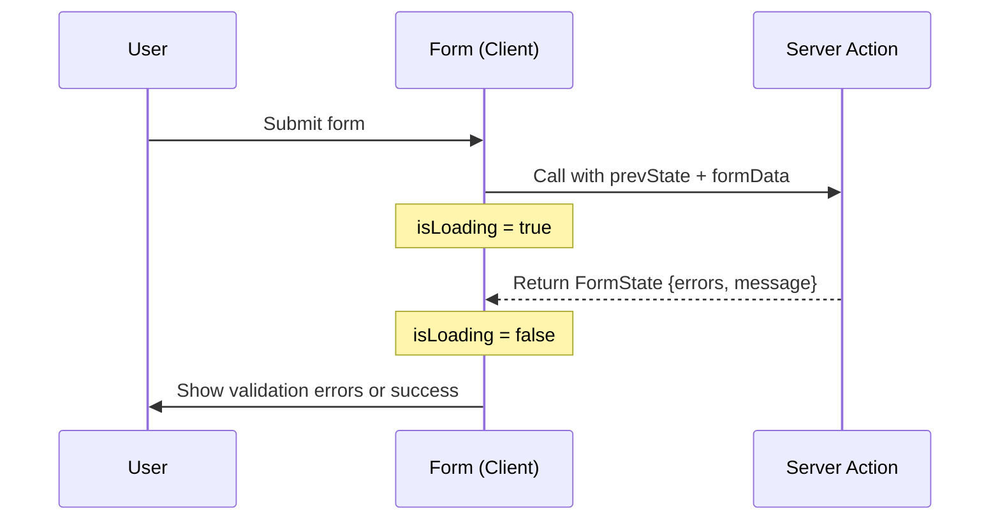
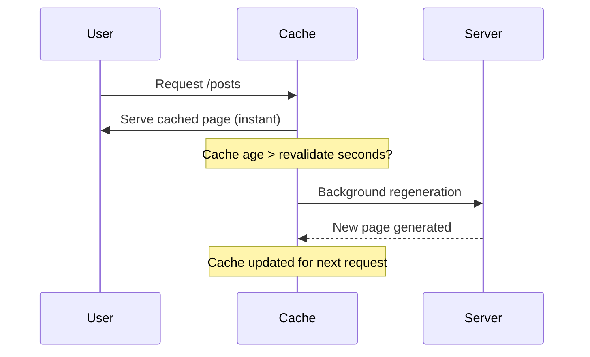
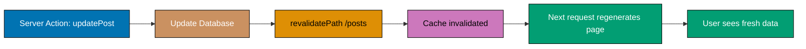
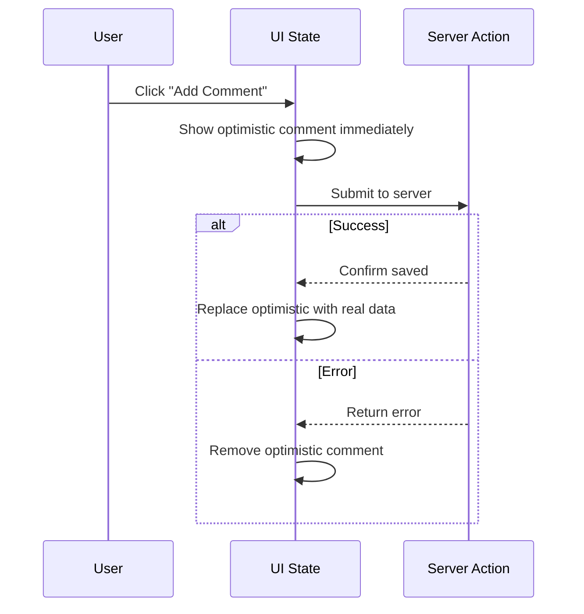
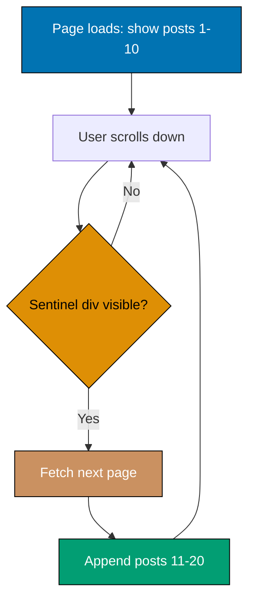
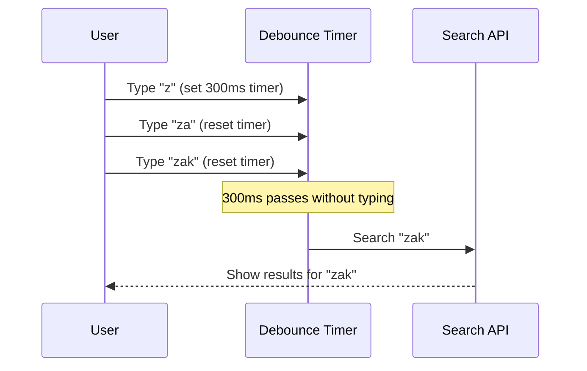

This intermediate tutorial covers production-ready Next.js patterns through 25 heavily annotated examples. Each example maintains 1-2.25 comment lines per code line to ensure deep understanding.

## Prerequisites

Before starting, ensure you understand:

- Beginner Next.js concepts (Server/Client Components, routing, Server Actions)
- React hooks (useState, useEffect, useTransition)
- TypeScript advanced types (generics, union types, type guards)
- HTTP concepts (status codes, headers, cookies)

## Group 1: Advanced Server Actions

### Example 26: Server Action with useFormState Hook

useFormState hook provides Server Action state and pending status in Client Components. Perfect for showing validation errors and loading states.



```typescript
// app/actions.ts
// => File location: app/actions.ts (Server Actions file)
// => Place at app root for global Server Actions

'use server';
// => REQUIRED directive: marks file as Server Actions module
// => All exports in this file are Server Actions
// => Server Actions run ONLY on server (never sent to client)

type FormState = {
  // => State type for useFormState hook
  // => Hook requires consistent state shape across submissions

  message: string;
  // => Success or error message to show user
  // => Always present in response

  errors?: {
    // => Optional errors object (only present on validation failure)
    // => Question mark makes property optional
    // => undefined when no validation errors

    name?: string;
    // => Name field error message (optional)
    // => Example: "Name must be at least 2 characters"

    amount?: string;
    // => Amount field error message (optional)
    // => Example: "Minimum donation is IDR 10,000"
  };
};
// => FormState defines contract between Server Action and useFormState
// => Both prevState and return value must match this type

export async function submitDonation(
  // => Server Action function signature for useFormState
  // => Export required: makes function callable from Client Components
  // => async keyword: allows await for database/API calls

  prevState: FormState,
  // => Previous form state from last submission
  // => useFormState provides this automatically
  // => First submission: receives initial state
  // => Subsequent submissions: receives previous return value
  // => Type must match return type (FormState)

  formData: FormData
  // => Form data from form submission
  // => Automatically populated by browser on submit
  // => Contains all input values with name attributes
  // => FormData is browser API (not Next.js specific)
): Promise<FormState> {
  // => Return type: Promise<FormState>
  // => async functions always return Promise
  // => Resolved value must match FormState type

  const name = formData.get('name') as string;
  // => Extract 'name' input value from form
  // => formData.get() returns FormDataEntryValue (string | File | null)
  // => Type assertion 'as string': treat value as string
  // => For input name="name", value is "Ahmad"
  // => name is "Ahmad" (type: string)

  const amountStr = formData.get('amount') as string;
  // => Extract 'amount' input value as string
  // => Number inputs still submit as strings
  // => For input name="amount" value="100000"
  // => amountStr is "100000" (type: string, NOT number)
  // => Need parseInt() to convert to number

  const errors: FormState['errors'] = {};
  // => Initialize errors object
  // => Type: FormState['errors'] (indexed access type)
  // => Initially empty object {}
  // => Add properties only if validation fails

  if (!name || name.length < 2) {
    // => Validate name field
    // => !name: true if name is null, undefined, or empty string ""
    // => name.length < 2: true if name has less than 2 characters
    // => OR operator: true if either condition true

    errors.name = 'Name must be at least 2 characters';
    // => Add error message to errors object
    // => errors.name now exists (was optional)
    // => User sees this message below name input
  }

  const amount = parseInt(amountStr);
  // => Convert string to number
  // => parseInt("100000") returns 100000 (type: number)
  // => parseInt("abc") returns NaN (Not a Number)
  // => parseInt("") returns NaN
  // => amount is 100000 or NaN (type: number)

  if (isNaN(amount) || amount < 10000) {
    // => Validate amount field
    // => isNaN(amount): true if amount is Not a Number
    // =>   Example: user entered non-numeric text
    // => amount < 10000: true if donation too small
    // => OR operator: true if either condition true

    errors.amount = 'Minimum donation is IDR 10,000';
    // => Add error message to errors object
    // => errors.amount now exists (was optional)
  }

  if (Object.keys(errors).length > 0) {
    // => Check if any validation errors exist
    // => Object.keys(errors) returns array of property names
    // => Example: ["name", "amount"] if both fields invalid
    // => .length > 0: true if errors object has any properties
    // => Validation FAILED if true

    return {
      // => Early return with validation errors
      // => Stops function execution here
      // => Client receives error state

      message: 'Validation failed',
      // => Generic error message
      // => Specific errors in errors object

      errors,
      // => Shorthand for errors: errors
      // => Includes all validation error messages
      // => Client Component displays these below fields
    };
    // => Return type matches FormState
    // => useFormState receives this, updates state
    // => Component re-renders with error messages
  }

  await new Promise(resolve => setTimeout(resolve, 1000));
  // => Simulate database save delay
  // => Production: await prisma.donation.create(...)
  // => new Promise: creates promise that resolves after 1000ms (1 second)
  // => setTimeout: delays resolve function call
  // => await: pauses execution until promise resolves

  console.log(`Saved donation: ${name} - IDR ${amount}`);
  // => Server-side logging
  // => For name="Ahmad", amount=100000
  // => Output: "Saved donation: Ahmad - IDR 100000"
  // => Logs appear in terminal (server), NOT browser console

  return {
    // => Success response
    // => Validation passed, database save complete

    message: `Thank you ${name}! Donation of IDR ${amount.toLocaleString()} received.`,
    // => Personalized success message
    // => Template literal with interpolation
    // => amount.toLocaleString() formats number with commas
    // => 100000 becomes "100,000"
    // => Result: "Thank you Ahmad! Donation of IDR 100,000 received."
  };
  // => Return type matches FormState (no errors property)
  // => useFormState receives this, updates state
  // => Component shows success message
}

// app/donate/page.tsx
// => File location: app/donate/page.tsx
// => Route: /donate
// => Client Component (needs useFormState hook)

'use client';
// => REQUIRED directive: marks component as Client Component
// => Needed for React hooks (useFormState)
// => Without this: Error "useFormState can only be used in Client Components"

import { useFormState } from 'react-dom';
// => Import useFormState hook from react-dom (not react)
// => useFormState: manages form state with Server Actions
// => Returns [state, formAction] tuple

import { submitDonation } from '../actions';
// => Import Server Action from actions.ts
// => Relative path: ../actions (up one level, then actions.ts)
// => submitDonation can be called from Client Component

export default function DonatePage() {
  // => Page component export
  // => Default export: Next.js renders this for /donate route

  const [state, formAction] = useFormState(submitDonation, {
    // => useFormState hook manages Server Action state
    // => First argument: Server Action function (submitDonation)
    // => Second argument: initial state
    // => Returns array: [current state, wrapped action]

    message: '',
    // => Initial state message (empty string)
    // => First render: state.message is ''
    // => After submission: state.message is success/error message
  });
  // => state: current form state (type: FormState)
  // =>   Updates after each submission with Server Action return value
  // => formAction: wrapped Server Action for form action attribute
  // =>   Handles state management automatically

  return (
    <div>
      <h1>Make a Donation</h1>

      <form action={formAction}>
        {/* => form element with action prop */}
        {/* => action={formAction}: wrapped Server Action from useFormState */}
        {/* => NOT action={submitDonation} (loses state management) */}
        {/* => On submit: calls formAction with FormData */}

        <div>
          <label>
            Name:
            <input type="text" name="name" />
            {/* => name attribute REQUIRED: used in formData.get('name') */}
            {/* => User types: value included in FormData on submit */}
          </label>

          {state.errors?.name && (
            // => Conditional rendering: only show if error exists
            // => state.errors?.name: optional chaining (safe access)
            // => If state.errors undefined: short-circuits to false
            // => If state.errors.name exists: renders error message
            // => && operator: renders right side only if left side truthy

            <p style={{ color: 'red' }}>{state.errors.name}</p>
            // => Error message paragraph
            // => Inline style: red text for visibility
            // => {state.errors.name}: "Name must be at least 2 characters"
          )}
        </div>

        <div>
          <label>
            Amount (IDR):
            <input type="number" name="amount" />
            {/* => type="number": numeric keyboard on mobile */}
            {/* => name="amount": used in formData.get('amount') */}
            {/* => Value still submitted as string (need parseInt) */}
          </label>

          {state.errors?.amount && (
            // => Conditional error rendering for amount field
            // => Same pattern as name field error

            <p style={{ color: 'red' }}>{state.errors.amount}</p>
            // => Amount field error message
            // => Example: "Minimum donation is IDR 10,000"
          )}
        </div>

        <button type="submit">Donate</button>
        {/* => Submit button triggers form submission */}
        {/* => type="submit": submits form (not just button) */}
        {/* => Calls formAction with FormData */}

        {state.message && (
          // => Show success or generic error message
          // => state.message always exists (never undefined)
          // => Empty string is falsy, so nothing renders initially
          // => After submission: shows "Thank you..." or "Validation failed"

          <p>{state.message}</p>
          // => Message paragraph
          // => Success: "Thank you Ahmad! Donation of IDR 100,000 received."
          // => Error: "Validation failed"
        )}
      </form>
    </div>
  );
}
// => Full workflow:
// => 1. User fills form, clicks "Donate"
// => 2. Browser creates FormData with input values
// => 3. formAction called with FormData
// => 4. submitDonation Server Action executes on server
// => 5. Returns FormState (success or errors)
// => 6. useFormState updates state with return value
// => 7. Component re-renders with new state
// => 8. User sees errors or success message
```

**Key Takeaway**: Use useFormState hook to manage Server Action state in Client Components. Perfect for validation errors, success messages, and form state persistence.

**Expected Output**: Form shows field-specific validation errors after submission. Success message displays on valid submission. State persists between submissions.

**Common Pitfalls**: Forgetting prevState parameter in Server Action (useFormState requires it), or not typing FormState properly (lose type safety).

**Why It Matters**: useFormState bridges Server Actions and client-side form UI, enabling real-time validation feedback without full page reloads. Production forms need structured error responses - showing field-level validation errors beside the relevant inputs rather than generic error messages. This pattern is essential for user-facing forms in registration, checkout, and profile editing flows. The type-safe FormState interface prevents runtime bugs where error properties are accessed incorrectly.

### Example 27: Server Action with useFormStatus Hook

useFormStatus hook provides form submission status (pending, data, method). Use in form children to show loading states during submission.

```typescript
// app/actions.ts
// => File location: app/actions.ts (Server Actions module)
// => Centralized Server Actions for application

'use server';
// => REQUIRED directive: makes all exports Server Actions
// => Server Actions execute on server only

export async function createPost(formData: FormData) {
  // => Server Action for creating blog posts
  // => Export required: callable from Client Components
  // => async keyword: allows await for database operations
  // => formData parameter: receives form data from submission

  const title = formData.get('title') as string;
  // => Extract 'title' field from FormData
  // => formData.get() returns FormDataEntryValue (string | File | null)
  // => Type assertion 'as string': treat as string
  // => For input name="title" value="Zakat Guide"
  // => title is "Zakat Guide" (type: string)

  const content = formData.get('content') as string;
  // => Extract 'content' field from FormData
  // => For textarea name="content" value="This guide explains..."
  // => content is "This guide explains..." (type: string)
  // => Textareas submit values as strings (like inputs)

  await new Promise(resolve => setTimeout(resolve, 2000));
  // => Simulate slow database operation
  // => Real code: await prisma.post.create({ data: { title, content } })
  // => new Promise: creates promise resolving after 2000ms (2 seconds)
  // => setTimeout: delays resolve call by 2 seconds
  // => await: pauses function execution until promise resolves
  // => During this time: useFormStatus pending is true

  console.log(`Created post: ${title}`);
  // => Server-side logging (appears in terminal)
  // => For title="Zakat Guide"
  // => Output: "Created post: Zakat Guide"
  // => Confirms Server Action executed successfully

  return { success: true };
  // => Return success indicator
  // => Object with success boolean property
  // => Client Component can check return value
  // => Type: { success: boolean }
}

// app/components/SubmitButton.tsx
// => File location: app/components/SubmitButton.tsx
// => Reusable submit button with loading state
// => MUST be separate component (useFormStatus requirement)

'use client';
// => REQUIRED directive: Client Component for useFormStatus hook
// => Cannot use useFormStatus in Server Component

import { useFormStatus } from 'react-dom';
// => Import useFormStatus hook from react-dom (not react)
// => Provides form submission status
// => Returns object with pending, data, method, action properties

export function SubmitButton() {
  // => Submit button component with loading state
  // => Export required: used in other components
  // => CRITICAL: Must be CHILD of form element (not same level)

  const { pending } = useFormStatus();
  // => useFormStatus hook reads form submission status
  // => pending: boolean, true during form submission
  // => Destructure pending from returned object
  // => pending is false initially
  // => pending becomes true when form submits
  // => pending becomes false when Server Action completes

  // => CRITICAL CONSTRAINT: useFormStatus ONLY works in components
  // =>   that are CHILDREN of form element
  // => If used in same component as <form>: returns default values (pending: false)
  // => Must be separate child component

  return (
    <button type="submit" disabled={pending}>
      {/* => Submit button with dynamic disabled state */}
      {/* => type="submit": submits parent form */}
      {/* => disabled={pending}: disable during submission */}
      {/* => disabled when pending=true (prevents double submission) */}
      {/* => enabled when pending=false (allows submission) */}

      {pending ? 'Creating Post...' : 'Create Post'}
      {/* => Conditional button text */}
      {/* => Ternary operator: condition ? ifTrue : ifFalse */}
      {/* => When pending=true: shows "Creating Post..." (loading state) */}
      {/* => When pending=false: shows "Create Post" (normal state) */}
      {/* => Provides visual feedback during submission */}
    </button>
  );
  // => Component returns button with dynamic content
  // => Re-renders automatically when pending changes
  // => Submission flow:
  // =>   1. User clicks → pending becomes true
  // =>   2. Button shows "Creating Post...", disables
  // =>   3. Server Action executes (2 second delay)
  // =>   4. Server Action completes → pending becomes false
  // =>   5. Button shows "Create Post", enables
}

// app/posts/new/page.tsx
// => File location: app/posts/new/page.tsx
// => Route: /posts/new
// => New post creation page

'use client';
// => REQUIRED: Client Component for importing Client Component (SubmitButton)
// => Also needed if page uses any hooks

import { createPost } from '@/app/actions';
// => Import Server Action
// => Absolute path with @/ alias (configured in tsconfig.json)
// => @/ represents project root
// => Equivalent to: import { createPost } from '../../actions';

import { SubmitButton } from '@/app/components/SubmitButton';
// => Import custom submit button component
// => Absolute path for clarity
// => Component has useFormStatus hook built-in

export default function NewPostPage() {
  // => Page component for creating new posts
  // => Default export: Next.js renders for /posts/new route

  return (
    <div>
      <h1>Create New Post</h1>
      {/* => Page heading */}

      <form action={createPost}>
        {/* => Form with Server Action */}
        {/* => action={createPost}: calls Server Action on submit */}
        {/* => createPost is Server Action function reference */}
        {/* => On submit: browser sends FormData to Server Action */}

        <label>
          Title:
          <input type="text" name="title" required />
          {/* => Title input field */}
          {/* => name="title": used in formData.get('title') */}
          {/* => required attribute: HTML5 validation (prevents empty submission) */}
          {/* => type="text": standard text input */}
        </label>

        <label>
          Content:
          <textarea name="content" required />
          {/* => Content textarea field */}
          {/* => name="content": used in formData.get('content') */}
          {/* => required: prevents empty submission */}
          {/* => textarea allows multi-line text input */}
        </label>

        <SubmitButton />
        {/* => Custom submit button component */}
        {/* => CRITICAL: SubmitButton is CHILD of form */}
        {/* => This placement allows useFormStatus to work */}
        {/* => Button automatically shows loading state during submission */}
        {/* => If we used <button> directly here without useFormStatus: */}
        {/* =>   No loading state, no disabled state during submission */}
      </form>
    </div>
  );
}
// => Complete workflow:
// => 1. User fills title and content fields
// => 2. User clicks "Create Post" button
// => 3. Form submits, sends FormData to createPost Server Action
// => 4. useFormStatus detects submission: pending becomes true
// => 5. SubmitButton shows "Creating Post...", disables
// => 6. Server Action executes (2 second delay)
// => 7. Server logs "Created post: [title]"
// => 8. Server Action returns { success: true }
// => 9. useFormStatus detects completion: pending becomes false
// => 10. SubmitButton shows "Create Post", enables again
```

**Key Takeaway**: Use useFormStatus hook in form children to access submission status. Perfect for submit button loading states and disabling during submission.

**Expected Output**: Submit button shows "Creating Post..." and disables during 2-second submission. Re-enables after completion.

**Common Pitfalls**: Using useFormStatus in same component as form (must be in child component), or not disabling inputs during submission (user can modify data).

**Why It Matters**: Submission state management prevents double-submissions that cause duplicate records, double charges, and race conditions. Production financial applications, order management systems, and content platforms suffer data integrity issues from multiple submissions. The useFormStatus pattern provides pending state without prop drilling through component trees. Disabling inputs and showing loading indicators during submission is standard UX best practice that reduces support tickets for duplicate entries.

### Example 28: Progressive Enhancement with Server Actions

Server Actions work without JavaScript through native form submission. Add progressive enhancement with Client Component wrappers.

```typescript
// app/actions.ts
'use server';
// => Server Actions work with/without JavaScript

import { redirect } from 'next/navigation';
// => Server-side navigation utility

export async function loginUser(formData: FormData) {
  // => Authentication Server Action
  const email = formData.get('email') as string;
  // => Extract email from form
  const password = formData.get('password') as string;
  // => Extract password from form

  if (email === 'user@example.com' && password === 'password123') {
    // => Validate credentials (production: check database)
    // cookies().set('auth_token', 'token123');
    // => Set auth cookie (commented for demo)
    redirect('/dashboard');
    // => HTTP 303 redirect without JavaScript
    // => Client-side navigation with JavaScript
  }

  return { error: 'Invalid email or password' };
  // => Return error for invalid credentials
}

// app/login/page.tsx
import { loginUser } from '../actions';
// => Import Server Action

export default function LoginPage() {
  // => Basic login page (no JavaScript required)
  return (
    <div>
      <h1>Login</h1>

      <form action={loginUser}>
        {/* => Form works WITHOUT JavaScript (HTTP POST) */}
        {/* => Form works WITH JavaScript (fetch, no reload) */}
        <label>
          Email:
          <input type="email" name="email" required />
          {/* => HTML5 email validation */}
        </label>

        <label>
          Password:
          <input type="password" name="password" required />
          {/* => Password field masked */}
        </label>

        <button type="submit">Login</button>
        {/* => Submits via HTTP POST (no JS) or fetch (with JS) */}
      </form>
    </div>
  );
}

// app/login-enhanced/page.tsx
'use client';
// => Client Component for hooks

import { useFormState, useFormStatus } from 'react-dom';
// => React form hooks
import { loginUser } from '../actions';

function SubmitButton() {
  // => Separate component (useFormStatus requirement)
  const { pending } = useFormStatus();
  // => Form submission status
  return (
    <button type="submit" disabled={pending}>
      {/* => Disable during submission */}
      {pending ? 'Logging in...' : 'Login'}
      {/* => Dynamic button text */}
    </button>
  );
}

export default function LoginEnhancedPage() {
  // => Enhanced with JavaScript features
  const [state, formAction] = useFormState(loginUser, {});
  // => useFormState manages form state
  // => state receives Server Action return value

  return (
    <div>
      <h1>Login (Enhanced)</h1>

      <form action={formAction}>
        {/* => Use wrapped formAction for state management */}
        <label>
          Email:
          <input type="email" name="email" required />
        </label>

        <label>
          Password:
          <input type="password" name="password" required />
        </label>

        <SubmitButton />
        {/* => Shows loading state during submission */}

        {state.error && (
          // => Conditional error display (JavaScript enhancement)
          <p style={{ color: 'red' }}>{state.error}</p>
          // => Inline error message
        )}
      </form>
    </div>
  );
}
// => Progressive enhancement: basic works without JS, enhanced with JS
```

**Key Takeaway**: Server Actions provide progressive enhancement. Base functionality works without JavaScript, enhanced features activate when JavaScript available.

**Expected Output**: Form works with JavaScript disabled (server-side submission and redirect). With JavaScript, shows loading states and inline errors.

**Common Pitfalls**: Relying on client-side features for core functionality (breaks without JavaScript), or not testing with JavaScript disabled.

**Why It Matters**: Progressive enhancement ensures applications remain functional in degraded environments: slow networks where JavaScript hasn't loaded, corporate proxies that block scripts, and accessibility tools that don't execute JavaScript. Production government applications, healthcare systems, and enterprise software require progressive enhancement for compliance. Next.js Server Actions make this trivially achievable - the form works as a standard HTML form without JavaScript and gains enhanced behavior when JavaScript loads.

## Group 2: Cache Revalidation Strategies

### Example 29: Time-Based Revalidation (ISR)

Use revalidate option to set cache lifetime. Next.js regenerates page after expiration, serving stale content while revalidating.



```typescript
// app/posts/page.tsx
// => ISR (Incremental Static Regeneration) example

async function getPosts() {
  // => Fetch function with caching
  const res = await fetch('https://jsonplaceholder.typicode.com/posts', {
    // => Fetch posts from API
    next: { revalidate: 60 }
    // => Cache for 60 seconds
    // => After 60s: serve stale, regenerate in background
  });
  // => First request: fetch from API, cache result
  // => Within 60s: serve from cache (instant)
  // => After 60s: serve stale cache, fetch fresh data background
  // => Next request after regeneration: serve fresh data

  return res.json();
  // => Return parsed JSON response
}

export default async function PostsPage() {
  // => Async Server Component
  const posts = await getPosts();
  // => Fetch posts (may be cached)
  // => posts is array of Post objects

  return (
    <div>
      <h2>Blog Posts (ISR)</h2>

      <p>Last rendered: {new Date().toLocaleTimeString()}</p>
      {/* => Timestamp shows when page generated */}
      {/* => Updates every 60s after first request */}

      <ul>
        {posts.slice(0, 5).map((post: any) => (
          // => Display first 5 posts
          // => slice(0, 5) takes first 5 items from array
          <li key={post.id}>
            {/* => key prop required for list items */}
            <strong>{post.title}</strong>
            {/* => Post title in bold */}
          </li>
        ))}
      </ul>
    </div>
  );
}

// Alternative: page-level revalidate export
export const revalidate = 60;
// => Apply 60s revalidation to entire page
// => All fetch requests inherit this value
// => Simpler than setting revalidate per fetch
```

**Key Takeaway**: Use revalidate option for time-based cache invalidation (ISR). Page serves cached version, regenerates in background after expiration.

**Expected Output**: First visit generates page. Subsequent visits within 60s show cached version (same timestamp). After 60s, next visit triggers background revalidation.

**Common Pitfalls**: Setting revalidate too low (increases server load), or too high (users see stale data for long periods).

**Why It Matters**: ISR balances performance and freshness without complex cache invalidation logic. Production content sites serving thousands of concurrent users cannot regenerate pages on every request - static generation is required. But fully static content becomes stale. ISR solves this by serving cached pages immediately while regenerating in the background based on time intervals. Production editorial content typically uses 300-3600 second revalidation; real-time dashboards use 30-60 seconds.

### Example 30: On-Demand Revalidation with revalidatePath

Use revalidatePath() to invalidate specific route cache immediately. Perfect for content updates that should be visible instantly.



```typescript
// app/actions.ts
'use server';
// => Server Actions module

import { revalidatePath } from 'next/cache';
// => Import cache invalidation function

export async function updatePost(postId: string, formData: FormData) {
  // => Update post Server Action
  // => First param: postId (from bind)
  // => Second param: formData (from form submission)
  const title = formData.get('title') as string;
  // => Extract title from form
  const content = formData.get('content') as string;
  // => Extract content from form

  // await db.posts.update({ where: { id: postId }, data: { title, content } });
  // => Database update (commented for demo)
  // => Production: update in database
  console.log(`Updated post ${postId}: ${title}`);
  // => Log update to server console

  revalidatePath(`/posts/${postId}`);
  // => Invalidate cache for specific post page
  // => Next request to /posts/[postId] fetches fresh data
  // => Cache cleared immediately

  revalidatePath('/posts');
  // => Invalidate posts list cache
  // => List shows updated post immediately
  // => Can invalidate multiple related paths
}

// app/posts/[id]/edit/page.tsx
'use client';
// => Client Component for form

import { updatePost } from '@/app/actions';
// => Import Server Action

export default function EditPostPage({
  params,
}: {
  params: { id: string };
  // => params from dynamic route [id]
}) {
  // => Edit page for specific post

  const updatePostWithId = updatePost.bind(null, params.id);
  // => Bind postId to first parameter
  // => updatePost expects (postId, formData)
  // => updatePostWithId now expects only formData
  // => postId is pre-filled with params.id

  return (
    <div>
      <h1>Edit Post {params.id}</h1>
      {/* => Show post ID being edited */}

      <form action={updatePostWithId}>
        {/* => Form calls bound Server Action */}
        {/* => Only formData sent (postId already bound) */}
        <label>
          Title:
          <input type="text" name="title" required />
          {/* => Title input field */}
        </label>

        <label>
          Content:
          <textarea name="content" required />
          {/* => Content textarea field */}
        </label>

        <button type="submit">Update Post</button>
        {/* => Submit triggers updatePostWithId */}
      </form>
    </div>
  );
}
// => On submit: updatePost(params.id, formData) called
// => Cache invalidated, fresh data served
```

**Key Takeaway**: Use revalidatePath() in Server Actions to invalidate specific route cache on-demand. Ensures users see fresh data immediately after mutations.

**Expected Output**: After updating post, navigating to /posts/[id] shows updated content immediately (cache invalidated). List also refreshed.

**Common Pitfalls**: Forgetting to revalidate related pages (post page updated but list still shows old data), or revalidating too broadly (invalidates unrelated caches).

**Why It Matters**: On-demand revalidation enables content freshness immediately after mutations rather than waiting for time-based expiry. Production CMS platforms, e-commerce sites with live inventory, and news publishers require pages to reflect changes within seconds. The revalidatePath API provides precise control - invalidate exactly the affected routes without clearing unrelated caches. Combined with webhooks from content management systems, this pattern enables real-time content updates without server restarts.

### Example 31: Tag-Based Revalidation with revalidateTag

Use fetch cache tags and revalidateTag() to invalidate multiple related requests at once. More efficient than path-based revalidation.

```typescript
// app/lib/data.ts
// => Data fetching utilities with cache tags

export async function getUser(userId: string) {
  // => Fetch user by ID
  // => userId parameter: user identifier
  const res = await fetch(`https://api.example.com/users/${userId}`, {
    // => API request for user data
    next: {
      // => Next.js fetch options
      tags: [`user-${userId}`],
      // => Cache tag for revalidation
      // => Tag format: user-{userId}
      // => Allows selective cache invalidation
    },
  });
  // => res is Response object
  return res.json();
  // => Parse and return JSON
}

export async function getUserPosts(userId: string) {
  // => Fetch posts for specific user
  const res = await fetch(`https://api.example.com/users/${userId}/posts`, {
    // => API request for user's posts
    next: {
      tags: [`user-${userId}-posts`, `posts`],
      // => Multiple cache tags
      // => First tag: user-specific posts
      // => Second tag: all posts globally
      // => Enables both granular and broad revalidation
    },
  });
  return res.json();
  // => Return posts array
}

// app/actions.ts
'use server';
// => Server Actions module

import { revalidateTag } from 'next/cache';
// => Import tag-based cache invalidation

export async function updateUserProfile(userId: string, formData: FormData) {
  // => Update user profile Server Action
  // => userId: bound parameter
  // => formData: form submission data
  const name = formData.get('name') as string;
  // => Extract name from form
  // => name is "Ahmad Updated"

  // await db.users.update({ where: { id: userId }, data: { name } });
  // => Database update (commented for demo)

  revalidateTag(`user-${userId}`);
  // => Invalidate cache for user tag
  // => Affects getUser(userId) fetch
  // => Also affects getUserPosts (shares tag)
  // => All requests with this tag refreshed

  console.log(`Revalidated cache for user ${userId}`);
  // => Server log confirmation
}

export async function createPost(userId: string, formData: FormData) {
  // => Create new post Server Action
  const title = formData.get('title') as string;
  // => Extract title from form
  const content = formData.get('content') as string;
  // => Extract content from form

  // await db.posts.create({ data: { userId, title, content } });
  // => Database insertion (commented)

  revalidateTag('posts');
  // => Invalidate all posts caches
  // => Affects ALL fetches tagged 'posts'
  // => Refreshes post lists across site

  revalidateTag(`user-${userId}-posts`);
  // => Invalidate specific user's posts cache
  // => More granular than 'posts' tag
  // => Targets specific user's post list
}

// app/users/[id]/page.tsx
// => User profile page
import { getUser, getUserPosts } from '@/app/lib/data';
// => Import tagged fetch functions

export default async function UserPage({
  params,
}: {
  params: { id: string };
  // => Dynamic route params
}) {
  // => User page component

  const [user, posts] = await Promise.all([
    // => Fetch both concurrently
    // => Promise.all runs requests in parallel
    getUser(params.id),
    // => Fetch user data
    // => Tagged: user-${id}
    getUserPosts(params.id),
    // => Fetch user's posts
    // => Tagged: user-${id}-posts, posts
  ]);
  // => user contains profile data
  // => posts contains array of posts

  return (
    <div>
      <h1>{user.name}</h1>
      {/* => Display user name */}
      <p>Posts by {user.name}:</p>

      <ul>
        {posts.map((post: any) => (
          // => Iterate over posts array
          <li key={post.id}>{post.title}</li>
          // => Display post title
          // => key prop required for list items
        ))}
      </ul>
    </div>
  );
}
// => Tag revalidation workflow:
// => 1. updateUserProfile('123') → revalidateTag('user-123')
// => 2. Next getUser('123') request fetches fresh data
// => 3. getUserPosts('123') also refreshes (shares tag)
```

**Key Takeaway**: Use cache tags and revalidateTag() to invalidate related data across multiple routes. More flexible and efficient than path-based revalidation.

**Expected Output**: Updating user profile invalidates both user data and user posts (shared tag). Creating post invalidates all post lists (posts tag).

**Common Pitfalls**: Not using consistent tag naming (typos break revalidation), or over-revalidating with broad tags (unnecessary cache invalidation).

**Why It Matters**: Tag-based revalidation enables surgical cache invalidation across multiple pages that share data. Production applications where a single product update should invalidate the product page, category pages, and search results all at once benefit from tagged caching. E-commerce sites, multi-tenant SaaS platforms, and content aggregators use tag-based revalidation to maintain consistency across related pages. Consistent tag naming conventions (enforced by TypeScript constants) prevent the silent failures that occur with typos.

## Group 3: Route Organization Patterns

### Example 32: Route Groups for Organization

Use (folder) syntax to organize routes without affecting URL structure. Perfect for grouping related routes or layouts.

```typescript
// app/(marketing)/layout.tsx
// => File location: app/(marketing)/layout.tsx
// => Parentheses create route group: (marketing)
// => Route groups organize files WITHOUT affecting URLs
// => (marketing) folder NOT part of URL path
export default function MarketingLayout({
  // => Layout for marketing pages
  children,
  // => Child pages render in layout
}: {
  children: React.ReactNode;
  // => Type: React component or JSX
}) {
  // => Marketing layout component
  return (
    <div>
      <header style={{ background: '#0173B2', color: 'white', padding: '1rem' }}>
        {/* => Marketing header with brand colors */}
        {/* => background #0173B2: accessible blue */}
        <h1>Islamic Finance Platform</h1>
        {/* => Site branding */}
        <nav>
          <a href="/">Home</a> | <a href="/about">About</a> | <a href="/pricing">Pricing</a>
          {/* => Navigation links */}
          {/* => All routes in (marketing) group */}
        </nav>
      </header>

      <main>
        {children}
        {/* => Marketing pages (/, /about, /pricing) render here */}
        {/* => Each page wrapped by this layout */}
      </main>

      <footer style={{ background: '#f5f5f5', padding: '2rem', textAlign: 'center' }}>
        {/* => Marketing footer */}
        {/* => Light gray background */}
        <p>© 2026 Islamic Finance Platform</p>
        {/* => Copyright notice */}
      </footer>
    </div>
  );
}
// => All pages in (marketing)/ use this layout

// app/(marketing)/page.tsx
// => File: app/(marketing)/page.tsx
// => URL: "/" (route group NOT in URL)
// => (marketing) group omitted from path
export default function HomePage() {
  // => Homepage component
  return (
    <div>
      <h1>Welcome to Islamic Finance</h1>
      {/* => Page heading */}
      <p>Learn Sharia-compliant financial products.</p>
      {/* => Page description */}
    </div>
  );
}
// => Wrapped by MarketingLayout (blue header + footer)

// app/(marketing)/about/page.tsx
// => File: app/(marketing)/about/page.tsx
// => URL: "/about" (NOT "/marketing/about")
// => Route group name omitted
export default function AboutPage() {
  // => About page component
  return (
    <div>
      <h1>About Us</h1>
      <p>Providing Islamic financial education since 2026.</p>
    </div>
  );
}
// => Also wrapped by MarketingLayout

// app/(app)/layout.tsx
// => File: app/(app)/layout.tsx
// => Separate route group: (app)
// => Different layout for application pages
export default function AppLayout({
  // => Application layout (different from marketing)
  children,
}: {
  children: React.ReactNode;
}) {
  return (
    <div>
      <header style={{ background: '#029E73', color: 'white', padding: '1rem' }}>
        {/* => App header with different color */}
        {/* => background #029E73: accessible teal */}
        {/* => Visually distinct from marketing */}
        <nav>
          <a href="/dashboard">Dashboard</a> | <a href="/profile">Profile</a>
          {/* => App-specific navigation */}
        </nav>
      </header>

      {children}
      {/* => App pages render here */}
      {/* => No footer in app layout */}
    </div>
  );
}

// app/(app)/dashboard/page.tsx
// => File: app/(app)/dashboard/page.tsx
// => URL: "/dashboard" (NOT "/app/dashboard")
// => Route group omitted from URL
export default function DashboardPage() {
  // => Dashboard page component
  return (
    <div>
      <h1>Dashboard</h1>
      <p>Your donation history and stats.</p>
    </div>
  );
}
// => Wrapped by AppLayout (teal header, no footer)
// => Route groups enable multiple layouts without URL changes
```

**Key Takeaway**: Use (folder) route groups to organize routes without affecting URLs. Apply different layouts to different groups of routes.

**Expected Output**: "/" and "/about" use marketing layout (blue header). "/dashboard" uses app layout (green header). Route group names not visible in URLs.

**Common Pitfalls**: Forgetting parentheses (creates /marketing path), or nesting route groups unnecessarily (keep structure flat).

**Why It Matters**: Route groups enable code organization without affecting URL structure, solving the tension between file organization and URL design. Production applications with hundreds of routes become unmaintainable without grouping - authentication routes, dashboard routes, and public routes need separate layouts and middleware but clean URLs. Route groups enable multiple root layouts (different shell for auth pages vs dashboard), crucial for SaaS applications where logged-in users see a completely different interface.

### Example 33: Parallel Routes with @folder Convention

Use @folder syntax to render multiple pages in the same layout simultaneously. Perfect for dashboards with multiple sections.

```mermaid
graph TD
  A[app/dashboard/layout.tsx] --> B[@analytics/page.tsx]
  A --> C[@notifications/page.tsx]
  A --> D[page.tsx]

  style A fill:#0173B2,stroke:#000,color:#fff
  style B fill:#DE8F05,stroke:#000,color:#000
  style C fill:#029E73,stroke:#000,color:#fff
  style D fill:#CC78BC,stroke:#000,color:#000
```

```typescript
// app/dashboard/layout.tsx
// => Layout receiving parallel routes as props
export default function DashboardLayout({
  children,
  analytics,                                // => @analytics parallel route
  notifications,                            // => @notifications parallel route
}: {
  children: React.ReactNode;
  analytics: React.ReactNode;               // => Parallel route slot
  notifications: React.ReactNode;           // => Parallel route slot
}) {
  return (
    <div style={{ display: 'grid', gridTemplateColumns: '1fr 1fr', gap: '1rem' }}>
      {/* => Main content */}
      <div style={{ gridColumn: '1 / -1' }}>
        {children}
        {/* => app/dashboard/page.tsx content */}
      </div>

      {/* => Analytics section */}
      <div>
        <h2>Analytics</h2>
        {analytics}
        {/* => app/dashboard/@analytics/page.tsx content */}
      </div>

      {/* => Notifications section */}
      <div>
        <h2>Notifications</h2>
        {notifications}
        {/* => app/dashboard/@notifications/page.tsx content */}
      </div>
    </div>
  );
}

// app/dashboard/page.tsx
// => Main dashboard page
export default function DashboardPage() {
  return (
    <div>
      <h1>Dashboard Overview</h1>
      <p>Welcome to your dashboard.</p>
    </div>
  );
}

// app/dashboard/@analytics/page.tsx
// => Analytics parallel route (@ makes it parallel)
export default function AnalyticsPage() {
  return (
    <div>
      <p>Total Donations: IDR 1,500,000</p>
      <p>This Month: IDR 350,000</p>
    </div>
  );
}

// app/dashboard/@notifications/page.tsx
// => Notifications parallel route
export default function NotificationsPage() {
  return (
    <div>
      <p>✓ Donation processed</p>
      <p>✓ Profile updated</p>
    </div>
  );
}
```

**Key Takeaway**: Use @folder parallel routes to render multiple pages simultaneously in layout. Each parallel route can have independent loading/error states.

**Expected Output**: /dashboard shows three sections: main content, analytics, and notifications. All rendered in single layout with different data sources.

**Common Pitfalls**: Forgetting @ symbol (creates regular nested route), or not handling default.tsx fallback (shows error when route doesn't exist).

**Why It Matters**: Parallel routes enable complex dashboard layouts where multiple independent sections render simultaneously in the same layout. Production analytics dashboards, project management tools, and admin interfaces show multiple content panels that load independently and can navigate separately. The conditional rendering based on active route enables responsive layouts that show different panels on mobile versus desktop. This pattern is also used for split-screen layouts and feature comparison pages.

### Example 34: Intercepting Routes for Modals

Use (.)folder and (..)folder syntax to intercept routes and show as modals while preserving URL for direct access.

```typescript
// app/posts/page.tsx
// => Posts list page - regular page at /posts

import Link from 'next/link';
// => Link enables client-side navigation (triggers route interception)

export default function PostsPage() {
  const posts = [
    { id: '1', title: 'Zakat Guide' },
    { id: '2', title: 'Murabaha Basics' },
  ];
  // => posts array: 2 items with id and title

  return (
    <div>
      <h1>Posts</h1>
      <ul>
        {posts.map(post => (
          // => Renders one <li> per post
          <li key={post.id}>
            {/* => key={post.id}: "1", "2" */}
            <Link href={`/posts/${post.id}`}>
              {/* => Link to /posts/1 or /posts/2 */}
              {/* => Client-side nav triggers route interception */}
              {/* => Browser shows /posts/1 URL, renders modal */}
              {post.title}
            </Link>
          </li>
        ))}
      </ul>
    </div>
  );
  // => Posts list with interceptable links
}

// app/posts/[id]/page.tsx
// => Full post detail page (accessed directly or on refresh)

export default function PostDetailPage({
  params,
}: {
  params: { id: string };
  // => params.id is the dynamic segment: "1" or "2"
}) {
  return (
    <div>
      <h1>Post {params.id} - Full Page</h1>
      {/* => Shown on direct URL access or page refresh */}
      <p>This is the full post page (direct access or refresh).</p>
      <a href="/posts">Back to Posts</a>
    </div>
  );
  // => Full page shown when URL typed directly or refreshed
}

// app/posts/(.)posts/[id]/page.tsx
// => Intercepted route: (.) means intercept from same directory level
// => Shows as modal when client-navigating from /posts
// => Shows as full page when accessed directly

'use client';
// => Modal requires useRouter for back navigation

import { useRouter } from 'next/navigation';
// => useRouter enables programmatic navigation

export default function PostModal({
  params,
}: {
  params: { id: string };
  // => params.id from URL: "1" or "2"
}) {
  const router = useRouter();
  // => router.back() returns to previous page (/posts)

  return (
    <div
      style={{
        position: 'fixed',   // => Overlays entire viewport
        top: 0,              // => Anchored to top edge
        left: 0,             // => Anchored to left edge
        right: 0,            // => Stretches to right edge
        bottom: 0,           // => Stretches to bottom edge
        background: 'rgba(0,0,0,0.5)',  // => Semi-transparent dark overlay
        display: 'flex',     // => Flexbox for centering
        alignItems: 'center',           // => Vertical center
        justifyContent: 'center',       // => Horizontal center
      }}
      onClick={() => router.back()}
      // => Click backdrop closes modal (navigates to /posts)
    >
      <div
        style={{
          background: 'white',   // => Modal card background
          padding: '2rem',       // => Inner spacing
          borderRadius: '8px',   // => Rounded corners
          maxWidth: '500px',     // => Limits modal width on wide screens
        }}
        onClick={e => e.stopPropagation()}
        // => Stops click from bubbling to backdrop
        // => Without this: clicking modal content closes it
      >
        <h1>Post {params.id} - Modal</h1>
        {/* => Shown in modal during soft navigation */}
        <p>This is the modal view (soft navigation).</p>
        <button onClick={() => router.back()}>Close</button>
        {/* => router.back() goes back to /posts list */}
      </div>
    </div>
  );
  // => Modal shown when navigating from /posts via Link
  // => Same URL (/posts/1) shows full page on direct access
}
```

**Key Takeaway**: Use (.) intercepting routes to show content as modal on soft navigation while preserving full page for direct access/refresh.

**Expected Output**: Clicking post link from /posts shows modal overlay. Refreshing /posts/1 shows full page. Back button closes modal.

**Common Pitfalls**: Wrong interception syntax (. for same level, .. for parent level), or not handling direct access (only modal, no full page).

**Why It Matters**: Intercepting routes enable the Instagram/Twitter pattern where clicking a photo opens a modal with the shareable URL, but navigating directly to that URL shows the full page. Production social media platforms, e-commerce product galleries, and media applications use this pattern extensively. Users can share modal URLs, open in new tabs for full experience, and navigate back to the list without losing context. This dramatically improves engagement metrics compared to simple modal implementations that lack shareable URLs.

## Group 4: Advanced Forms & Validation

### Example 35: Form Validation with Zod Schema

Use Zod for runtime validation in Server Actions. Provides type-safe validation with detailed error messages.

> **Note: This example uses an external library** (requires `npm install zod`). Native alternative: manual validation with if-statements and custom error messages handles simple cases but requires 50-100 lines of boilerplate to replicate Zod's coercion, transformation, type inference, and detailed error formatting. Zod provides TypeScript type inference from schemas (eliminating duplicate type definitions), schema reuse between frontend and backend, and composable validation rules that native validation cannot match efficiently.

```typescript
// app/lib/schemas.ts
import { z } from "zod";
// => Import Zod schema builder

// => Zod schema for donation form
export const donationSchema = z.object({
  name: z.string().min(2, "Name must be at least 2 characters").max(50, "Name must be less than 50 characters"),
  // => String validation with length constraints

  email: z.string().email("Invalid email address"),
  // => Email format validation

  amount: z
    .number()
    .min(10000, "Minimum donation is IDR 10,000")
    .max(1000000000, "Maximum donation is IDR 1,000,000,000"),
  // => Number validation with range

  category: z.enum(["zakat", "sadaqah", "infaq"], {
    errorMap: () => ({ message: "Invalid category" }),
  }),
  // => Enum validation (must be one of these values)
});

// => TypeScript type inferred from schema
export type DonationInput = z.infer<typeof donationSchema>;
// => DonationInput is { name: string; email: string; amount: number; category: "zakat" | "sadaqah" | "infaq" }

// app/actions.ts
("use server");

import { donationSchema } from "./lib/schemas";

export async function submitDonation(formData: FormData) {
  // => Extract form data
  const rawData = {
    name: formData.get("name"),
    email: formData.get("email"),
    amount: parseFloat(formData.get("amount") as string),
    category: formData.get("category"),
  };

  // => Validate with Zod schema
  const result = donationSchema.safeParse(rawData);
  // => safeParse returns { success: boolean, data?: T, error?: ZodError }

  if (!result.success) {
    // => Validation failed
    const errors = result.error.flatten().fieldErrors;
    // => errors is { name?: string[], email?: string[], ... }

    return {
      success: false,
      errors: {
        // => Convert array errors to single messages
        name: errors.name?.[0],
        email: errors.email?.[0],
        amount: errors.amount?.[0],
        category: errors.category?.[0],
      },
    };
  }

  // => Validation passed, data is type-safe
  const { name, email, amount, category } = result.data;
  // => result.data is DonationInput type

  // => Save to database
  console.log(`Donation: ${name} (${email}) - IDR ${amount} - ${category}`);

  return {
    success: true,
    message: `Thank you ${name}! Your ${category} donation of IDR ${amount.toLocaleString()} has been received.`,
  };
}
```

**Key Takeaway**: Use Zod schemas for type-safe validation in Server Actions. Provides runtime validation, TypeScript types, and detailed error messages.

**Expected Output**: Form submission validates all fields. Invalid data returns field-specific errors. Valid data processes successfully with type safety.

**Common Pitfalls**: Not handling safeParse errors properly (check result.success), or mixing up parse() and safeParse() (parse throws, safeParse returns result).

**Why It Matters**: Zod validation provides runtime type safety at application boundaries where TypeScript's compile-time types cannot reach. Server Actions receive data from user browsers, which can be manipulated to send any payload regardless of TypeScript types. Production applications handling financial data, personal information, or privileged operations must validate all inputs. Zod's safeParse pattern enables structured error handling with field-level error messages, which is required for accessible form validation that screen readers can announce to users.

### Example 36: Optimistic Updates with useOptimistic

Use useOptimistic hook to show immediate UI feedback while Server Action processes. Reverts on error.



```typescript
// app/posts/[id]/page.tsx
'use client';

import { useOptimistic, useTransition } from 'react';
// => Import useOptimistic and useTransition hooks

type Comment = {
  id: string;
  author: string;
  text: string;
  createdAt: Date;
};

export default function PostPage({
  initialComments,
}: {
  initialComments: Comment[];
}) {
  // => useOptimistic manages optimistic state
  const [optimisticComments, addOptimisticComment] = useOptimistic(
    initialComments,                        // => Initial state
    (state, newComment: Comment) => [...state, newComment]
    // => Reducer: how to add optimistic comment
  );

  const [isPending, startTransition] = useTransition();

  async function handleSubmit(formData: FormData) {
    const author = formData.get('author') as string;
    const text = formData.get('text') as string;

    // => Create optimistic comment (shown immediately)
    const optimisticComment: Comment = {
      id: crypto.randomUUID(),
      author,
      text,
      createdAt: new Date(),
    };

    // => Add optimistic comment to UI (instant feedback)
    startTransition(() => {
      addOptimisticComment(optimisticComment);
      // => Comment appears in list immediately
    });

    // => Submit to server (async, might fail)
    try {
      // await createComment(formData);
      // => If server succeeds, page revalidates and shows real comment
      await new Promise(resolve => setTimeout(resolve, 2000));
      console.log('Comment created');
    } catch (error) {
      // => If server fails, optimistic update reverts
      console.error('Failed to create comment');
      // => Optimistic comment disappears from list
    }
  }

  return (
    <div>
      <h1>Post with Comments</h1>

      <div>
        <h2>Comments</h2>
        <ul>
          {optimisticComments.map(comment => (
            <li key={comment.id} style={{ opacity: isPending ? 0.5 : 1 }}>
              {/* => Optimistic comments shown with reduced opacity */}
              <strong>{comment.author}</strong>: {comment.text}
              <small> - {comment.createdAt.toLocaleTimeString()}</small>
            </li>
          ))}
        </ul>
      </div>

      <form action={handleSubmit}>
        <input type="text" name="author" placeholder="Your name" required />
        <textarea name="text" placeholder="Your comment" required />
        <button type="submit" disabled={isPending}>
          {isPending ? 'Posting...' : 'Post Comment'}
        </button>
      </form>
    </div>
  );
}
```

**Key Takeaway**: Use useOptimistic for immediate UI feedback during Server Actions. Shows optimistic state instantly, reverts on error, replaces with real data on success.

**Expected Output**: Submitting comment shows it immediately in list (optimistic). After 2 seconds, comment persists (server success). If error, comment disappears.

**Common Pitfalls**: Not wrapping in startTransition (optimistic update won't work), or forgetting to revalidate on success (shows both optimistic and real comment).

**Why It Matters**: Optimistic updates make applications feel instantly responsive by showing expected outcomes before server confirmation. Production social applications, collaborative tools, and content platforms that tolerate eventual consistency (likes, comments, bookmarks) benefit significantly from optimistic updates. The pattern reduces perceived latency from hundreds of milliseconds to zero for common interactions. React's useOptimistic hook handles rollback automatically on server errors, making this pattern production-safe without custom error recovery logic.

## Group 5: Authentication Patterns

### Example 37: Cookies-Based Authentication

Use Next.js cookies() to manage authentication tokens. Accessible in Server Components and Route Handlers.

```typescript
// app/lib/auth.ts
import { cookies } from 'next/headers';
// => Import cookies function

export async function getCurrentUser() {
  // => Server-only function (can't run on client)
  const cookieStore = cookies();            // => Access cookies
  const authToken = cookieStore.get('auth_token');
  // => authToken is { name: 'auth_token', value: 'token123' } or undefined

  if (!authToken) {
    return null;                            // => Not authenticated
  }

  // => Verify token and get user
  // const user = await db.users.findByToken(authToken.value);
  // => Simplified: return mock user
  return {
    id: '1',
    name: 'Ahmad',
    email: 'ahmad@example.com',
  };
}

// app/actions.ts
'use server';

import { cookies } from 'next/headers';

export async function login(formData: FormData) {
  const email = formData.get('email') as string;
  const password = formData.get('password') as string;

  // => Verify credentials
  if (email === 'user@example.com' && password === 'password123') {
    // => Set auth cookie (simplified)
    cookies().set('auth_token', 'token123', {
      httpOnly: true,                       // => Not accessible via JavaScript (security)
      secure: process.env.NODE_ENV === 'production', // => HTTPS only in production
      sameSite: 'lax',                      // => CSRF protection
      maxAge: 60 * 60 * 24 * 7,            // => 7 days
    });

    return { success: true };
  }

  return { success: false, error: 'Invalid credentials' };
}

export async function logout() {
  // => Delete auth cookie
  cookies().delete('auth_token');
  // => User logged out
}

// app/dashboard/page.tsx
// => Protected page using getCurrentUser
import { getCurrentUser } from '@/app/lib/auth';
import { redirect } from 'next/navigation';

export default async function DashboardPage() {
  const user = await getCurrentUser();      // => Check authentication

  if (!user) {
    // => Not authenticated, redirect to login
    redirect('/login');
    // => Server-side redirect
  }

  return (
    <div>
      <h1>Welcome, {user.name}!</h1>
      <p>Email: {user.email}</p>
      {/* => Protected content only visible to authenticated users */}
    </div>
  );
}
```

**Key Takeaway**: Use cookies() function for authentication in Server Components and Server Actions. Set httpOnly and secure flags for security.

**Expected Output**: Login sets httpOnly cookie. Dashboard checks cookie and shows user data or redirects to login. Logout deletes cookie.

**Common Pitfalls**: Not setting httpOnly (XSS vulnerability), or forgetting secure flag in production (transmits over HTTP).

**Why It Matters**: Cookie-based authentication is the standard for web applications because cookies automatically include in requests, work across browser tabs, and can be secured against JavaScript access. Production applications use httpOnly cookies to prevent XSS attacks from stealing authentication tokens - even if an attacker injects JavaScript, it cannot read authentication cookies. The secure flag ensures credentials only transmit over encrypted HTTPS connections. Session management via server-side cookies avoids client-side token storage vulnerabilities.

### Example 38: Middleware-Based Authentication

Use middleware to protect multiple routes at once. More efficient than checking authentication in every page.

```mermaid
graph LR
  A[Request] --> B{middleware.ts}
  B -->|has auth cookie| C[Protected Route]
  B -->|no auth cookie| D[Redirect to /login]
  D --> E[/login?redirect=original-path]

  style A fill:#CC78BC,stroke:#000,color:#000
  style B fill:#0173B2,stroke:#000,color:#fff
  style C fill:#029E73,stroke:#000,color:#fff
  style D fill:#DE8F05,stroke:#000,color:#000
  style E fill:#CA9161,stroke:#000,color:#fff
```

```typescript
// middleware.ts
import { NextResponse } from 'next/server';
import type { NextRequest } from 'next/server';

// => Protected route patterns
const protectedRoutes = ['/dashboard', '/profile', '/settings'];

export function middleware(request: NextRequest) {
  const { pathname } = request.nextUrl;

  // => Check if current route is protected
  const isProtected = protectedRoutes.some(route =>
    pathname.startsWith(route)
  );

  if (isProtected) {
    // => Check for auth token
    const authToken = request.cookies.get('auth_token');

    if (!authToken) {
      // => Not authenticated, redirect to login
      const loginUrl = new URL('/login', request.url);
      loginUrl.searchParams.set('redirect', pathname);
      // => Save intended destination for post-login redirect

      return NextResponse.redirect(loginUrl);
    }

    // => TODO: Verify token validity
    // const isValid = await verifyToken(authToken.value);
    // if (!isValid) { return NextResponse.redirect(...) }
  }

  // => Authenticated or public route
  return NextResponse.next();
}

export const config = {
  // => Run middleware on protected routes only
  matcher: ['/dashboard/:path*', '/profile/:path*', '/settings/:path*'],
};

// app/login/page.tsx
'use client';

import { useSearchParams, useRouter } from 'next/navigation';
import { login } from '../actions';

export default function LoginPage() {
  const searchParams = useSearchParams();
  const router = useRouter();
  const redirect = searchParams.get('redirect') || '/dashboard';
  // => Get redirect parameter from URL

  async function handleSubmit(formData: FormData) {
    const result = await login(formData);

    if (result.success) {
      // => Login successful, redirect to intended destination
      router.push(redirect);
    }
  }

  return (
    <div>
      <h1>Login</h1>
      <p>Redirecting to: {redirect}</p>

      <form action={handleSubmit}>
        <input type="email" name="email" required />
        <input type="password" name="password" required />
        <button type="submit">Login</button>
      </form>
    </div>
  );
}
```

**Key Takeaway**: Use middleware to protect multiple routes efficiently. Checks authentication once for all protected paths, redirects with intended destination.

**Expected Output**: Accessing /dashboard without auth redirects to /login?redirect=/dashboard. After login, returns to /dashboard.

**Common Pitfalls**: Infinite redirect loop (login page also protected), or not preserving redirect parameter (users lose intended destination).

**Why It Matters**: Middleware-based authentication provides centralized access control that cannot be bypassed by navigating directly to protected URLs. Production multi-tenant SaaS applications, admin dashboards, and member portals require this pattern. Without centralized auth middleware, developers must add authentication checks to every protected page - a pattern that's error-prone and frequently leads to security gaps. The redirect parameter pattern (saving intended destination) is critical for user experience - users who click deep links in emails or notifications should land on their intended page after authentication.

## Group 6: Database Integration Patterns

### Example 39: Prisma Integration with Server Components

Use Prisma ORM in Server Components for type-safe database queries. Zero client JavaScript, automatic TypeScript types.

> **Note: This example uses an external library** (requires `npm install prisma @prisma/client` and database setup). Native alternative: `node-postgres` (`pg` package) or raw SQL with `better-sqlite3` provides database access without ORM abstraction. Native SQL is appropriate for simple queries and maximum performance, but lacks automatic TypeScript types from schema, migration management, and relation handling. Prisma's generated client eliminates an entire category of type mismatch bugs between database schema and application code, which is critical in large teams.

```typescript
// prisma/schema.prisma
// => Prisma schema defines database structure
// model Post {
//   id        String   @id @default(cuid())
//   title     String
//   content   String
//   published Boolean  @default(false)
//   createdAt DateTime @default(now())
// }

// app/lib/prisma.ts
import { PrismaClient } from '@prisma/client';

// => Singleton pattern for Prisma client
const globalForPrisma = globalThis as unknown as {
  prisma: PrismaClient | undefined;
};

export const prisma =
  globalForPrisma.prisma ??
  new PrismaClient({
    log: ['query'],                         // => Log SQL queries in development
  });

if (process.env.NODE_ENV !== 'production') {
  globalForPrisma.prisma = prisma;
}
// => Prevents multiple Prisma instances in development (hot reload)

// app/posts/page.tsx
// => Server Component with Prisma query
import { prisma } from '@/app/lib/prisma';

export default async function PostsPage() {
  // => Type-safe Prisma query
  const posts = await prisma.post.findMany({
    // => posts is Post[] (TypeScript type from schema)
    where: { published: true },             // => Only published posts
    orderBy: { createdAt: 'desc' },         // => Newest first
    take: 10,                               // => Limit to 10 posts
    select: {
      // => Select specific fields
      id: true,
      title: true,
      createdAt: true,
    },
  });
  // => Query runs on server, results cached

  return (
    <div>
      <h1>Published Posts</h1>
      <ul>
        {posts.map(post => (
          <li key={post.id}>
            <strong>{post.title}</strong>
            <small> - {post.createdAt.toLocaleDateString()}</small>
          </li>
        ))}
      </ul>
    </div>
  );
}

// app/actions.ts
'use server';

import { prisma } from './lib/prisma';
import { revalidatePath } from 'next/cache';

export async function createPost(formData: FormData) {
  const title = formData.get('title') as string;
  const content = formData.get('content') as string;

  // => Create post with Prisma
  const post = await prisma.post.create({
    data: {
      title,
      content,
      published: true,
    },
  });
  // => post is Post object with all fields

  // => Revalidate posts page
  revalidatePath('/posts');

  return { success: true, postId: post.id };
}
```

**Key Takeaway**: Use Prisma in Server Components and Server Actions for type-safe database queries. Singleton pattern prevents multiple clients in development.

**Expected Output**: Posts page shows database posts (type-safe query). Creating post saves to database and revalidates page cache.

**Common Pitfalls**: Multiple Prisma instances in development (memory leak), or not revalidating after mutations (stale cache).

**Why It Matters**: Direct database access from Server Components eliminates the API layer for internal data, reducing latency, code complexity, and attack surface. Production applications built with Next.js and Prisma can build full-featured CRUD interfaces without separate API servers. The singleton pattern for Prisma client prevents connection pool exhaustion in development with hot module replacement. Understanding the trade-off between ORM convenience (Prisma) and query performance (raw SQL) is essential for production database work.

### Example 40: Error Handling for Database Queries

Wrap database queries in try-catch blocks to handle errors gracefully. Show user-friendly messages instead of crashes.

```typescript
// app/posts/[id]/page.tsx
import { prisma } from '@/app/lib/prisma';
import { notFound } from 'next/navigation';

export default async function PostPage({
  params,
}: {
  params: { id: string };
}) {
  try {
    // => Query might fail (network error, invalid ID, etc.)
    const post = await prisma.post.findUnique({
      where: { id: params.id },
    });

    if (!post) {
      // => Post not found in database
      notFound();
      // => Triggers not-found.tsx rendering
    }

    return (
      <div>
        <h1>{post.title}</h1>
        <p>{post.content}</p>
      </div>
    );
  } catch (error) {
    // => Database error (connection failed, timeout, etc.)
    console.error('Database error:', error);

    // => Throw error to trigger error.tsx
    throw new Error('Failed to load post');
  }
}

// app/actions.ts
'use server';

import { prisma } from './lib/prisma';

export async function deletePost(postId: string) {
  try {
    // => Delete operation might fail
    await prisma.post.delete({
      where: { id: postId },
    });

    return { success: true };
  } catch (error) {
    // => Handle Prisma errors
    if (error.code === 'P2025') {
      // => Prisma error code: Record not found
      return {
        success: false,
        error: 'Post not found',
      };
    }

    // => Generic error
    console.error('Failed to delete post:', error);
    return {
      success: false,
      error: 'Failed to delete post',
    };
  }
}
```

**Key Takeaway**: Wrap database queries in try-catch blocks. Use notFound() for missing resources, throw errors for server issues, return error objects from Server Actions.

**Expected Output**: Missing post shows not-found.tsx. Database errors show error.tsx. Server Actions return error messages without crashing.

**Common Pitfalls**: Not handling Prisma error codes (generic error messages), or throwing errors in Server Actions (should return error objects).

**Why It Matters**: Structured database error handling determines the quality of user feedback and system reliability. Production applications distinguish between expected errors (duplicate email, record not found) and unexpected errors (connection failure, constraint violation) to provide appropriate user messages. Throwing unhandled errors in Server Actions causes error boundaries to trigger, showing error pages for recoverable situations. Returning error objects from Server Actions enables inline error display, retry logic, and graceful degradation.

## Group 7: Client-Side Data Fetching

### Example 41: Client-Side Data Fetching with SWR

Use SWR for client-side data fetching with automatic caching, revalidation, and error handling. Perfect for user-specific or frequently updating data.

> **Note: This example uses an external library** (requires `npm install swr`). Native alternative: `fetch() + useEffect + useState` handles data fetching but requires custom implementation of caching, deduplication, revalidation-on-focus, error retry with exponential backoff, and loading state management - patterns requiring 50+ lines to implement reliably. SWR provides all these behaviors by default.

```typescript
// app/dashboard/donations/page.tsx
'use client';
// => Client Component for SWR

import useSWR from 'swr';
// => Import SWR hook

// => Fetcher function (required by SWR)
const fetcher = (url: string) => fetch(url).then(res => res.json());
// => fetcher receives URL, returns promise of JSON data

export default function DonationsPage() {
  // => useSWR hook manages data fetching
  const { data, error, isLoading, mutate } = useSWR('/api/donations', fetcher);
  // => data: fetched data (undefined while loading)
  // => error: error object if request failed
  // => isLoading: true during initial fetch
  // => mutate: function to revalidate data manually

  if (isLoading) {
    // => Show loading state
    return <p>Loading donations...</p>;
  }

  if (error) {
    // => Show error state
    return <p>Failed to load donations: {error.message}</p>;
  }

  // => Data loaded successfully
  return (
    <div>
      <h1>Your Donations</h1>

      <ul>
        {data.donations.map((donation: any) => (
          <li key={donation.id}>
            IDR {donation.amount.toLocaleString()} - {donation.date}
          </li>
        ))}
      </ul>

      <button onClick={() => mutate()}>
        {/* => Manually revalidate data */}
        Refresh
      </button>
    </div>
  );
}
// => SWR features:
// => - Automatic caching (subsequent renders instant)
// => - Revalidation on focus (window regains focus)
// => - Revalidation on reconnect (network reconnects)
// => - Interval revalidation (optional)
```

**Key Takeaway**: Use SWR for client-side data fetching with automatic caching, revalidation, and error handling. Perfect for dynamic, user-specific data.

**Expected Output**: Page loads donations from API. Data cached for instant subsequent renders. Clicking "Refresh" manually revalidates.

**Common Pitfalls**: Using SWR in Server Components (only works in Client Components), or not providing fetcher function (required parameter).

**Why It Matters**: SWR handles the complexity of client-side data synchronization that would otherwise require custom useEffect implementations with loading/error state management, cache invalidation, and revalidation logic. Production dashboards, real-time feeds, and user-specific content that cannot be server-rendered use SWR for consistent data management. The stale-while-revalidate strategy shows cached data immediately (avoiding loading spinners for repeat visits) while fetching fresh data in the background, significantly improving perceived performance.

### Example 42: Client-Side Data Fetching with TanStack Query

Use TanStack Query (React Query) for advanced client-side data management with powerful caching and synchronization.

> **Note: This example uses an external library** (requires `npm install @tanstack/react-query`). Native alternative: `fetch() + useEffect + useState` with manual cache management handles simple cases. TanStack Query is justified over native approach when you need: query invalidation and refetching across components, background refetching, dependent queries, infinite pagination, optimistic mutations with rollback, and devtools for debugging cache state. These patterns require 200+ lines of custom code to replicate reliably.

```typescript
// app/providers.tsx
'use client';

import { QueryClient, QueryClientProvider } from '@tanstack/react-query';
import { useState } from 'react';

export function Providers({ children }: { children: React.ReactNode }) {
  // => Create QueryClient instance
  const [queryClient] = useState(() => new QueryClient({
    defaultOptions: {
      queries: {
        staleTime: 60 * 1000,               // => Data fresh for 1 minute
        cacheTime: 5 * 60 * 1000,           // => Cache for 5 minutes
      },
    },
  }));

  return (
    <QueryClientProvider client={queryClient}>
      {/* => All children can use TanStack Query hooks */}
      {children}
    </QueryClientProvider>
  );
}

// app/layout.tsx
import { Providers } from './providers';

export default function RootLayout({
  children,
}: {
  children: React.ReactNode;
}) {
  return (
    <html lang="en">
      <body>
        <Providers>
          {children}
        </Providers>
      </body>
    </html>
  );
}

// app/posts/page.tsx
'use client';

import { useQuery, useMutation, useQueryClient } from '@tanstack/react-query';

export default function PostsPage() {
  const queryClient = useQueryClient();

  // => useQuery for fetching data
  const { data, isLoading, error } = useQuery({
    queryKey: ['posts'],                    // => Unique query identifier
    queryFn: async () => {
      // => Query function: fetches data
      const res = await fetch('/api/posts');
      return res.json();
    },
  });
  // => data is cached with key ['posts']

  // => useMutation for mutations
  const createPostMutation = useMutation({
    mutationFn: async (newPost: { title: string }) => {
      // => Mutation function: creates post
      const res = await fetch('/api/posts', {
        method: 'POST',
        body: JSON.stringify(newPost),
      });
      return res.json();
    },
    onSuccess: () => {
      // => Invalidate posts query after successful mutation
      queryClient.invalidateQueries({ queryKey: ['posts'] });
      // => Triggers refetch of posts data
    },
  });

  if (isLoading) return <p>Loading...</p>;
  if (error) return <p>Error: {error.message}</p>;

  return (
    <div>
      <h1>Posts</h1>
      <ul>
        {data.posts.map((post: any) => (
          <li key={post.id}>{post.title}</li>
        ))}
      </ul>

      <button
        onClick={() => createPostMutation.mutate({ title: 'New Post' })}
        disabled={createPostMutation.isPending}
      >
        {createPostMutation.isPending ? 'Creating...' : 'Create Post'}
      </button>
    </div>
  );
}
```

**Key Takeaway**: Use TanStack Query for advanced client-side data management. Provides powerful caching, automatic refetching, and mutation invalidation.

**Expected Output**: Posts load from API with caching. Creating post invalidates cache and refetches automatically. Loading states managed by library.

**Common Pitfalls**: Not wrapping app in QueryClientProvider (hooks won't work), or forgetting to invalidate queries after mutations (stale data).

**Why It Matters**: TanStack Query provides a complete server state management solution for complex client-side data requirements. Production applications with dependent queries, background refetching, infinite pagination, and optimistic mutations benefit from TanStack Query's declarative caching model. The query invalidation pattern after mutations maintains consistency between server state and UI without manual refetch coordination. Enterprise applications with complex data relationships use TanStack Query's devtools and sophisticated cache management to debug data flow issues.

## Group 8: Advanced Form Patterns

### Example 43: Form Handling with React Hook Form

Use React Hook Form for complex forms with validation, field arrays, and better performance than native form handling.

> **Note: This example uses an external library** (requires `npm install react-hook-form`). Native alternative: controlled components with `useState` for each field handles simple forms but causes re-renders on every keystroke. React Hook Form uses uncontrolled components (refs), significantly reducing re-renders for complex forms with 10+ fields. The integration with Zod (`@hookform/resolvers`) enables schema-based validation reuse. For Server Actions handling simple forms (fewer than 5 fields), native FormData is sufficient and preferred.

```typescript
// app/register/page.tsx
'use client';

import { useForm, SubmitHandler } from 'react-hook-form';
// => Import useForm hook and types

// => Form data type
type FormData = {
  name: string;
  email: string;
  password: string;
  confirmPassword: string;
};

export default function RegisterPage() {
  // => useForm hook manages form state
  const {
    register,                               // => Function to register inputs
    handleSubmit,                           // => Form submit handler
    formState: { errors, isSubmitting },    // => Form state
    watch,                                  // => Watch field values
  } = useForm<FormData>();

  // => Submit handler
  const onSubmit: SubmitHandler<FormData> = async (data) => {
    // => data is FormData type (type-safe)
    console.log('Form data:', data);
    // => data is { name: "Ahmad", email: "...", password: "...", ... }

    // => Simulate API call
    await new Promise(resolve => setTimeout(resolve, 2000));
    console.log('Registration successful');
  };

  // => Watch password for confirmation validation
  const password = watch('password');       // => password is current password value

  return (
    <div>
      <h1>Register</h1>

      <form onSubmit={handleSubmit(onSubmit)}>
        {/* => handleSubmit wraps onSubmit with validation */}

        <div>
          <label>Name:</label>
          <input
            type="text"
            {...register('name', {
              // => Register input with validation rules
              required: 'Name is required',
              minLength: {
                value: 2,
                message: 'Name must be at least 2 characters',
              },
            })}
          />
          {/* => Show validation error */}
          {errors.name && <p style={{ color: 'red' }}>{errors.name.message}</p>}
        </div>

        <div>
          <label>Email:</label>
          <input
            type="email"
            {...register('email', {
              required: 'Email is required',
              pattern: {
                value: /^[A-Z0-9._%+-]+@[A-Z0-9.-]+\.[A-Z]{2,}$/i,
                message: 'Invalid email address',
              },
            })}
          />
          {errors.email && <p style={{ color: 'red' }}>{errors.email.message}</p>}
        </div>

        <div>
          <label>Password:</label>
          <input
            type="password"
            {...register('password', {
              required: 'Password is required',
              minLength: {
                value: 8,
                message: 'Password must be at least 8 characters',
              },
            })}
          />
          {errors.password && <p style={{ color: 'red' }}>{errors.password.message}</p>}
        </div>

        <div>
          <label>Confirm Password:</label>
          <input
            type="password"
            {...register('confirmPassword', {
              required: 'Please confirm password',
              validate: value =>
                // => Custom validation: must match password
                value === password || 'Passwords do not match',
            })}
          />
          {errors.confirmPassword && (
            <p style={{ color: 'red' }}>{errors.confirmPassword.message}</p>
          )}
        </div>

        <button type="submit" disabled={isSubmitting}>
          {/* => Disable during submission */}
          {isSubmitting ? 'Registering...' : 'Register'}
        </button>
      </form>
    </div>
  );
}
```

**Key Takeaway**: Use React Hook Form for complex forms with validation, better performance (uncontrolled inputs), and type safety. Built-in validation rules and custom validators.

**Expected Output**: Form validates on submit. Shows field-specific errors. Submit button disables during submission. Type-safe form data.

**Common Pitfalls**: Not using {...register()} spread operator (validation won't work), or forgetting to use handleSubmit wrapper (validation bypassed).

**Why It Matters**: React Hook Form minimizes re-renders during form input by using uncontrolled components with ref-based value tracking. Production forms with 10+ fields or complex validation see significant performance improvements over controlled component approaches that re-render on every keystroke. The integration with Zod validation enables shared validation schemas between frontend and backend, ensuring consistency. Forms in checkout flows, multi-step wizards, and data entry applications benefit most from React Hook Form's performance characteristics.

### Example 44: Advanced Zod Validation with Transform

Use Zod transform() to convert and validate form data simultaneously. Perfect for normalizing input before processing.

```typescript
// app/lib/schemas.ts
import { z } from "zod";

// => Schema with transformations
export const productSchema = z.object({
  name: z
    .string()
    .trim() // => Remove whitespace
    .toLowerCase() // => Normalize to lowercase
    .min(3, "Product name must be at least 3 characters"),

  price: z
    .string() // => Input as string (from form)
    .transform((val) => parseFloat(val)) // => Transform to number
    .pipe(
      // => Chain with number validations
      z.number().min(0, "Price must be positive").max(1000000000, "Price too high"),
    ),

  category: z.enum(["murabaha", "ijarah", "musharakah"]).transform((val) => val.toUpperCase()), // => Transform to uppercase

  tags: z
    .string() // => Input: "tag1, tag2, tag3"
    .transform((val) =>
      // => Transform comma-separated string to array
      val
        .split(",")
        .map((tag) => tag.trim())
        .filter((tag) => tag.length > 0),
    )
    .pipe(
      // => Validate array
      z.array(z.string()).min(1, "At least one tag required"),
    ),

  availableFrom: z
    .string() // => Input: "2026-01-29"
    .transform((val) => new Date(val)) // => Transform to Date
    .pipe(z.date().min(new Date(), "Date must be in the future")),
});

// => Inferred type includes transformations
export type ProductInput = z.infer<typeof productSchema>;
// => ProductInput is {
// =>   name: string (trimmed, lowercase),
// =>   price: number (transformed from string),
// =>   category: "MURABAHA" | "IJARAH" | "MUSHARAKAH" (uppercase),
// =>   tags: string[] (transformed from comma-separated),
// =>   availableFrom: Date (transformed from string)
// => }

// app/actions.ts
("use server");

import { productSchema } from "./lib/schemas";

export async function createProduct(formData: FormData) {
  // => Parse and transform form data
  const result = productSchema.safeParse({
    name: formData.get("name"),
    price: formData.get("price"),
    category: formData.get("category"),
    tags: formData.get("tags"),
    availableFrom: formData.get("availableFrom"),
  });

  if (!result.success) {
    return {
      success: false,
      errors: result.error.flatten().fieldErrors,
    };
  }

  // => result.data is transformed and validated
  const { name, price, category, tags, availableFrom } = result.data;
  // => name is trimmed + lowercase
  // => price is number (not string)
  // => category is uppercase enum
  // => tags is array (not comma-separated string)
  // => availableFrom is Date object

  console.log("Creating product:", {
    name, // => "murabaha financing"
    price, // => 1000000 (number)
    category, // => "MURABAHA" (uppercase)
    tags, // => ["islamic", "finance"]
    availableFrom, // => Date object
  });

  return { success: true };
}
```

**Key Takeaway**: Use Zod transform() to convert and normalize data during validation. Reduces manual parsing and ensures consistent data format.

**Expected Output**: Form data automatically transformed (strings to numbers/dates, comma-separated to arrays, normalization). Type-safe transformed data.

**Common Pitfalls**: Not using pipe() after transform() (validation on wrong type), or forgetting transform order matters (operations applied sequentially).

**Why It Matters**: Advanced Zod schemas handle the gap between what users submit (strings, raw dates, optional fields) and what the application needs (typed values, normalized data, required fields). Production applications that accept user input for financial calculations, scheduling, or data processing require transformation pipelines. The .transform() method coerces types safely (string to number with error on NaN), the .pipe() method chains validators after transformation. These patterns replace custom parsing logic scattered across form handlers.

### Example 45: File Upload Handling with Server Actions

Handle file uploads securely with Server Actions. Validate file types, sizes, and save to storage.

```typescript
// app/actions.ts
'use server';

import { writeFile } from 'fs/promises';
import path from 'path';

export async function uploadDocument(formData: FormData) {
  // => Extract file from FormData
  const file = formData.get('document') as File;
  // => file is File object (or null if not uploaded)

  if (!file) {
    return {
      success: false,
      error: 'No file uploaded',
    };
  }

  // => Validate file type
  const allowedTypes = ['application/pdf', 'image/jpeg', 'image/png'];
  if (!allowedTypes.includes(file.type)) {
    return {
      success: false,
      error: 'Invalid file type. Only PDF, JPEG, and PNG allowed.',
    };
  }

  // => Validate file size (max 5MB)
  const maxSize = 5 * 1024 * 1024;          // => 5MB in bytes
  if (file.size > maxSize) {
    return {
      success: false,
      error: 'File too large. Maximum size is 5MB.',
    };
  }

  // => Convert File to buffer
  const bytes = await file.arrayBuffer();
  const buffer = Buffer.from(bytes);
  // => buffer contains file data

  // => Generate unique filename
  const timestamp = Date.now();
  const filename = `${timestamp}-${file.name}`;
  // => filename is "1706524800000-document.pdf"

  // => Save file to public/uploads directory
  const uploadPath = path.join(process.cwd(), 'public', 'uploads', filename);
  await writeFile(uploadPath, buffer);
  // => File saved to disk

  // => Return file URL
  const fileUrl = `/uploads/${filename}`;

  return {
    success: true,
    fileUrl,
    message: `File uploaded: ${file.name}`,
  };
}

// app/upload/page.tsx
'use client';

import { useState } from 'react';
import { uploadDocument } from '../actions';

export default function UploadPage() {
  const [result, setResult] = useState<any>(null);

  async function handleSubmit(formData: FormData) {
    // => Call Server Action with FormData
    const uploadResult = await uploadDocument(formData);
    setResult(uploadResult);
  }

  return (
    <div>
      <h1>Upload Document</h1>

      <form action={handleSubmit}>
        <input
          type="file"
          name="document"
          accept=".pdf,.jpg,.jpeg,.png"
          // => HTML validation (client-side)
          required
        />

        <button type="submit">Upload</button>
      </form>

      {/* => Show upload result */}
      {result && (
        <div>
          {result.success ? (
            <>
              <p style={{ color: 'green' }}>{result.message}</p>
              <a href={result.fileUrl} target="_blank" rel="noopener noreferrer">
                View File
              </a>
            </>
          ) : (
            <p style={{ color: 'red' }}>{result.error}</p>
          )}
        </div>
      )}
    </div>
  );
}
```

**Key Takeaway**: Handle file uploads securely in Server Actions with type/size validation. Convert File to buffer, save to disk or cloud storage.

**Expected Output**: Form uploads file to server. Server validates type/size, saves to public/uploads/, returns URL for access.

**Common Pitfalls**: Not validating file types server-side (security risk), or storing files in wrong directory (not accessible publicly).

**Why It Matters**: File upload handling is a common security vulnerability surface. Production applications require server-side validation of both file type (MIME type, not just extension) and file size. Storing files in the public/ directory makes them accessible without authentication; production applications store uploaded files in cloud storage (S3, Cloudflare R2) or restricted server paths. Server Actions handle file uploads securely without CORS configuration, keeping file processing server-side where malware scanning and virus detection can run.

## Group 9: Pagination & Infinite Scroll

### Example 46: Pagination with Server Components

Implement pagination with Server Components and URL search params. SEO-friendly, works without JavaScript.

```typescript
// app/posts/page.tsx
// => Server Component with pagination

type PageProps = {
  searchParams: { page?: string };          // => URL search params
};

const POSTS_PER_PAGE = 10;

export default async function PostsPage({ searchParams }: PageProps) {
  // => Get current page from URL (?page=2)
  const currentPage = parseInt(searchParams.page || '1');
  // => currentPage is 2 for ?page=2, default 1

  // => Fetch total count
  const totalPosts = 50;                    // => From database: await db.posts.count()

  // => Calculate pagination
  const totalPages = Math.ceil(totalPosts / POSTS_PER_PAGE);
  // => totalPages is 5 (50 posts / 10 per page)

  const offset = (currentPage - 1) * POSTS_PER_PAGE;
  // => offset is 10 for page 2 (skip first 10 posts)

  // => Fetch posts for current page
  const posts = Array.from({ length: POSTS_PER_PAGE }, (_, i) => ({
    id: offset + i + 1,
    title: `Post ${offset + i + 1}`,
  }));
  // => posts is posts 11-20 for page 2

  return (
    <div>
      <h1>Blog Posts</h1>

      <ul>
        {posts.map(post => (
          <li key={post.id}>{post.title}</li>
        ))}
      </ul>

      {/* => Pagination controls */}
      <div style={{ display: 'flex', gap: '0.5rem', marginTop: '2rem' }}>
        {/* => Previous page link */}
        {currentPage > 1 && (
          <a href={`/posts?page=${currentPage - 1}`}>
            Previous
          </a>
        )}

        {/* => Page number links */}
        {Array.from({ length: totalPages }, (_, i) => i + 1).map(page => (
          <a
            key={page}
            href={`/posts?page=${page}`}
            style={{
              fontWeight: page === currentPage ? 'bold' : 'normal',
              textDecoration: page === currentPage ? 'underline' : 'none',
            }}
          >
            {page}
          </a>
        ))}

        {/* => Next page link */}
        {currentPage < totalPages && (
          <a href={`/posts?page=${currentPage + 1}`}>
            Next
          </a>
        )}
      </div>

      <p>
        Page {currentPage} of {totalPages}
      </p>
    </div>
  );
}
```

**Key Takeaway**: Implement pagination with Server Components using URL search params. SEO-friendly (each page has unique URL), works without JavaScript.

**Expected Output**: Posts show 10 per page. Pagination controls navigate between pages. URL updates to /posts?page=2, /posts?page=3, etc.

**Common Pitfalls**: Not validating page parameter (could be negative or exceed max), or forgetting to handle empty results (page beyond limit).

**Why It Matters**: Server-side pagination is essential for applications with large datasets - loading thousands of records on a single page causes browser memory issues and poor Core Web Vitals. Production applications implement cursor-based or offset pagination based on use case: cursor-based for social feeds (no duplicate items when new content appears), offset-based for admin tables where users jump to specific pages. URL-based pagination state enables shareable URLs and browser history navigation, critical for data-heavy administrative interfaces.

### Example 47: Infinite Scroll with Intersection Observer

Implement infinite scroll in Client Component using Intersection Observer API. Loads more content as user scrolls.



```typescript
// app/posts/infinite/page.tsx
'use client';

import { useState, useEffect, useRef } from 'react';

export default function InfiniteScrollPage() {
  const [posts, setPosts] = useState<any[]>([]);
  const [page, setPage] = useState(1);
  const [hasMore, setHasMore] = useState(true);
  const [isLoading, setIsLoading] = useState(false);

  // => Ref to sentinel element (bottom of list)
  const sentinelRef = useRef<HTMLDivElement>(null);

  // => Fetch posts function
  async function fetchPosts(pageNum: number) {
    setIsLoading(true);

    // => Fetch from API
    const res = await fetch(`/api/posts?page=${pageNum}&limit=10`);
    const data = await res.json();
    // => data is { posts: [...], hasMore: boolean }

    // => Append new posts
    setPosts(prev => [...prev, ...data.posts]);
    setHasMore(data.hasMore);               // => More pages available?

    setIsLoading(false);
  }

  // => Intersection Observer effect
  useEffect(() => {
    const sentinel = sentinelRef.current;
    if (!sentinel) return;

    // => Create observer
    const observer = new IntersectionObserver(
      (entries) => {
        // => entries[0] is sentinel element
        const entry = entries[0];

        if (entry.isIntersecting && hasMore && !isLoading) {
          // => Sentinel visible, has more pages, not currently loading
          setPage(prev => prev + 1);        // => Increment page
          // => Triggers fetchPosts in separate effect
        }
      },
      {
        threshold: 0.1,                     // => Trigger when 10% visible
      }
    );

    // => Observe sentinel
    observer.observe(sentinel);

    // => Cleanup
    return () => observer.disconnect();
  }, [hasMore, isLoading]);

  // => Fetch posts when page changes
  useEffect(() => {
    fetchPosts(page);
  }, [page]);

  return (
    <div>
      <h1>Infinite Scroll Posts</h1>

      <ul>
        {posts.map((post, index) => (
          <li key={`${post.id}-${index}`}>
            {post.title}
          </li>
        ))}
      </ul>

      {/* => Sentinel element (invisible) */}
      <div ref={sentinelRef} style={{ height: '10px' }} />

      {/* => Loading indicator */}
      {isLoading && <p>Loading more posts...</p>}

      {/* => End message */}
      {!hasMore && <p>No more posts to load.</p>}
    </div>
  );
}
```

**Key Takeaway**: Implement infinite scroll with Intersection Observer API. Automatically loads more content when user scrolls to bottom.

**Expected Output**: Posts load 10 at a time. Scrolling to bottom automatically fetches next page. Loading indicator shows during fetch.

**Common Pitfalls**: Not disconnecting observer (memory leak), or triggering multiple fetches (check isLoading flag).

**Why It Matters**: Infinite scroll improves engagement metrics for content feeds, product catalogs, and search results by eliminating pagination friction. Production social media platforms, e-commerce sites, and news feeds use infinite scroll as the primary browsing interface. The IntersectionObserver API provides hardware-accelerated scroll detection without scroll event listeners that block the main thread. Guard conditions (isLoading, hasMore) prevent duplicate requests that waste bandwidth and can create race conditions with out-of-order responses.

## Group 10: Search & Filtering

### Example 48: Search with Debouncing

Implement search with debouncing to reduce API calls. Waits for user to stop typing before searching.



```typescript
// app/lib/hooks.ts
'use client';

import { useEffect, useState } from 'react';

// => Custom debounce hook
export function useDebounce<T>(value: T, delay: number): T {
  const [debouncedValue, setDebouncedValue] = useState(value);

  useEffect(() => {
    // => Set timeout to update debounced value
    const timer = setTimeout(() => {
      setDebouncedValue(value);
      // => Updates after delay (500ms)
    }, delay);

    // => Cleanup: cancel timeout if value changes
    return () => clearTimeout(timer);
    // => Prevents update if user still typing
  }, [value, delay]);

  return debouncedValue;
  // => Returns value only after user stops typing for 'delay' ms
}

// app/search/page.tsx
'use client';

import { useState, useEffect } from 'react';
import { useDebounce } from '../lib/hooks';

export default function SearchPage() {
  const [searchTerm, setSearchTerm] = useState('');
  // => searchTerm updates on every keystroke

  const debouncedSearchTerm = useDebounce(searchTerm, 500);
  // => debouncedSearchTerm updates 500ms after user stops typing

  const [results, setResults] = useState<any[]>([]);
  const [isSearching, setIsSearching] = useState(false);

  // => Search effect (triggers on debounced value)
  useEffect(() => {
    if (debouncedSearchTerm.length < 2) {
      // => Don't search for single characters
      setResults([]);
      return;
    }

    // => Perform search
    async function search() {
      setIsSearching(true);

      // => API call with debounced search term
      const res = await fetch(`/api/search?q=${encodeURIComponent(debouncedSearchTerm)}`);
      const data = await res.json();
      // => data is { results: [...] }

      setResults(data.results);
      setIsSearching(false);
    }

    search();
  }, [debouncedSearchTerm]);
  // => Only runs when debouncedSearchTerm changes (500ms after typing stops)

  return (
    <div>
      <h1>Search Posts</h1>

      <input
        type="search"
        placeholder="Search..."
        value={searchTerm}
        onChange={(e) => setSearchTerm(e.target.value)}
        // => Updates on every keystroke (fast)
        style={{ width: '100%', padding: '0.5rem' }}
      />

      {/* => Show searching indicator */}
      {isSearching && <p>Searching...</p>}

      {/* => Show results */}
      <ul>
        {results.map(result => (
          <li key={result.id}>
            <strong>{result.title}</strong>
            <p>{result.excerpt}</p>
          </li>
        ))}
      </ul>

      {/* => No results message */}
      {!isSearching && results.length === 0 && searchTerm.length >= 2 && (
        <p>No results found for "{searchTerm}"</p>
      )}
    </div>
  );
}
```

**Key Takeaway**: Use debouncing to reduce API calls during search. Waits for user to stop typing (500ms) before triggering search.

**Expected Output**: Typing updates input instantly. Search API called only after user stops typing for 500ms. Reduces API calls from dozens to one.

**Common Pitfalls**: Not cleaning up timers (memory leak), or setting debounce delay too long (feels unresponsive).

**Why It Matters**: Search debouncing prevents API storms where every keystroke triggers a request, which can overwhelm servers and create poor user experiences with flashing results. Production search implementations debounce at 200-300ms for local search and 300-500ms for API search. URL-based search state enables shareable search URLs, browser back/forward navigation through searches, and direct linking to search results - standard behavior users expect from search interfaces. Server Component search results avoid client-side state management entirely.

### Example 49: Real-Time Updates with Server Actions

Use Server Actions for real-time updates without WebSocket complexity. Polling or manual refresh patterns.

```typescript
// app/actions.ts
'use server';

import { revalidatePath } from 'next/cache';

// => Simulated database (in-memory)
let donations: Array<{ id: number; name: string; amount: number; timestamp: Date }> = [];

export async function getDonations() {
  // => Server Action to fetch donations
  return donations;
}

export async function addDonation(formData: FormData) {
  const name = formData.get('name') as string;
  const amount = parseInt(formData.get('amount') as string);

  // => Add donation to "database"
  const donation = {
    id: Date.now(),
    name,
    amount,
    timestamp: new Date(),
  };
  donations.push(donation);

  // => Revalidate donations page
  revalidatePath('/donations/live');
  // => Any user viewing /donations/live sees updated list

  return { success: true };
}

// app/donations/live/page.tsx
// => Server Component showing live donations
import { getDonations } from '@/app/actions';

export const revalidate = 5;                // => Revalidate every 5 seconds
// => Page data refreshes automatically every 5 seconds

export default async function LiveDonationsPage() {
  const donations = await getDonations();   // => Fetch current donations

  return (
    <div>
      <h1>Live Donations</h1>
      <p>Updates every 5 seconds</p>

      <ul>
        {donations.map(donation => (
          <li key={donation.id}>
            <strong>{donation.name}</strong> donated IDR {donation.amount.toLocaleString()}
            <small> - {donation.timestamp.toLocaleTimeString()}</small>
          </li>
        ))}
      </ul>

      {donations.length === 0 && <p>No donations yet.</p>}
    </div>
  );
}

// app/donations/add/page.tsx
'use client';

import { addDonation } from '@/app/actions';
import { useRouter } from 'next/navigation';

export default function AddDonationPage() {
  const router = useRouter();

  async function handleSubmit(formData: FormData) {
    await addDonation(formData);
    // => Server Action adds donation and revalidates

    // => Redirect to live page
    router.push('/donations/live');
    // => Live page shows updated list
  }

  return (
    <div>
      <h1>Add Donation</h1>

      <form action={handleSubmit}>
        <input type="text" name="name" placeholder="Your name" required />
        <input type="number" name="amount" placeholder="Amount" required />
        <button type="submit">Donate</button>
      </form>
    </div>
  );
}
```

**Key Takeaway**: Use Server Actions with revalidatePath() for real-time updates. Simpler than WebSockets for most use cases. Page auto-refreshes every 5 seconds.

**Expected Output**: Live donations page shows current donations, auto-updates every 5 seconds. Adding donation immediately visible to all users viewing live page.

**Common Pitfalls**: Setting revalidate too low (server load), or not revalidating after mutations (users see stale data).

**Why It Matters**: Real-time updates via periodic revalidation provide a simpler alternative to WebSockets for moderately-live data (dashboards updating every 30 seconds, notification counts, live scores). Production applications that need near-real-time data but not millisecond precision use this pattern with much simpler infrastructure than WebSocket servers. The Server Action polling approach runs on serverless infrastructure without persistent connections. For truly real-time requirements, combine with Server-Sent Events or WebSocket connections.

### Example 50: Advanced Middleware with Custom Headers

Create advanced middleware patterns for redirects, headers, and conditional logic chains.

```typescript
// middleware.ts
import { NextResponse } from "next/server";
import type { NextRequest } from "next/server";

export function middleware(request: NextRequest) {
  const { pathname } = request.nextUrl;
  const response = NextResponse.next();

  // => Pattern 1: Redirect old URLs to new structure
  if (pathname.startsWith("/old-blog")) {
    // => Permanent redirect (301)
    const newPath = pathname.replace("/old-blog", "/blog");
    return NextResponse.redirect(new URL(newPath, request.url), 301);
    // => Browser updates bookmarks, SEO passes to new URL
  }

  // => Pattern 2: Add custom headers based on path
  if (pathname.startsWith("/api/")) {
    // => API routes get CORS headers
    response.headers.set("Access-Control-Allow-Origin", "*");
    response.headers.set("Access-Control-Allow-Methods", "GET, POST, OPTIONS");
    response.headers.set("Access-Control-Allow-Headers", "Content-Type");
  }

  // => Pattern 3: Conditional redirect based on cookie
  const subscription = request.cookies.get("subscription");
  if (pathname.startsWith("/premium") && subscription?.value !== "active") {
    // => No active subscription, redirect to pricing
    return NextResponse.redirect(new URL("/pricing", request.url));
  }

  // => Pattern 4: A/B testing with cookies
  if (pathname === "/pricing") {
    const variant = request.cookies.get("pricing_variant");

    if (!variant) {
      // => Assign random variant
      const newVariant = Math.random() > 0.5 ? "a" : "b";
      response.cookies.set("pricing_variant", newVariant, {
        maxAge: 60 * 60 * 24 * 30, // => 30 days
      });

      // => Rewrite to variant page
      if (newVariant === "b") {
        return NextResponse.rewrite(new URL("/pricing-variant-b", request.url));
      }
    } else if (variant.value === "b") {
      return NextResponse.rewrite(new URL("/pricing-variant-b", request.url));
    }
  }

  // => Pattern 5: Add security headers to all responses
  response.headers.set("X-Frame-Options", "DENY");
  response.headers.set("X-Content-Type-Options", "nosniff");
  response.headers.set("Referrer-Policy", "strict-origin-when-cross-origin");
  response.headers.set("Permissions-Policy", "camera=(), microphone=(), geolocation=()");

  // => Pattern 6: Geo-based redirects (using Vercel geo headers)
  const country = request.geo?.country;
  if (pathname === "/" && country === "ID") {
    // => Indonesian visitors see Indonesian homepage
    return NextResponse.rewrite(new URL("/id", request.url));
  }

  return response;
}

export const config = {
  matcher: [
    // => Run on all paths except static files
    "/((?!_next/static|_next/image|favicon.ico|.*\\.(?:svg|png|jpg|jpeg|gif|webp)$).*)",
  ],
};
```

**Key Takeaway**: Middleware enables powerful request/response manipulation: redirects, rewrites, headers, cookies, A/B testing, geo-routing. Runs on every matching request.

**Expected Output**: Old URLs redirect to new structure. API routes get CORS headers. Premium content protected. A/B test variants assigned. Security headers added.

**Common Pitfalls**: Middleware runs on every request (keep it fast), or forgetting matcher config (runs on static files unnecessarily).

**Why It Matters**: Custom response headers in middleware enable security hardening, CORS configuration, and request tracing across all routes from a single location. Production applications add Content-Security-Policy, X-Frame-Options, and cache control headers in middleware to enforce security policies site-wide. Request IDs injected in middleware enable distributed tracing across microservices. The matcher configuration limits middleware execution to application routes, preventing overhead on static assets and API routes that don't need these headers.

## Summary

These 25 intermediate examples cover production-ready Next.js patterns:

**Advanced Server Actions**: useFormState (validation errors), useFormStatus (loading states), progressive enhancement (works without JavaScript)

**Cache Revalidation**: Time-based (ISR with revalidate), path-based (revalidatePath), tag-based (revalidateTag)

**Route Organization**: Route groups ((folder) syntax), parallel routes (@folder), intercepting routes ((.)folder for modals)

**Advanced Forms**: Zod validation (type-safe schemas), optimistic updates (useOptimistic), React Hook Form (complex forms), Zod transforms (data normalization), file uploads (secure handling)

**Authentication**: Cookies-based (httpOnly cookies), middleware-based (protect multiple routes)

**Database Integration**: Prisma ORM (type-safe queries), error handling (try-catch, Prisma error codes)

**Client-Side Data Fetching**: SWR (caching, revalidation), TanStack Query (advanced state management)

**Pagination & Infinite Scroll**: Server-side pagination (SEO-friendly), infinite scroll (Intersection Observer)

**Search & Real-Time**: Debounced search (reduce API calls), real-time updates (Server Actions with revalidation)

**Advanced Middleware**: Custom headers, redirects, A/B testing, geo-routing, security headers

**Next**: [Advanced examples](/en/learn/software-engineering/platform-web/tools/fe-nextjs/by-example/advanced) for performance optimization, advanced caching, streaming, and deployment patterns.
