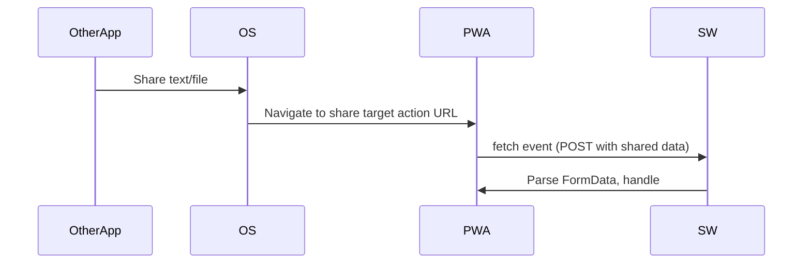
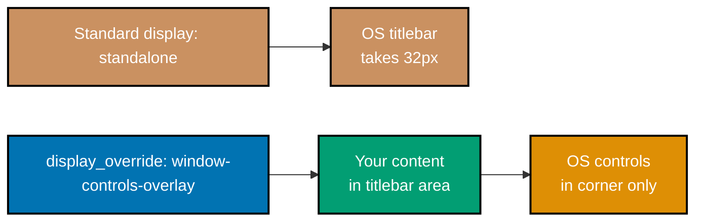
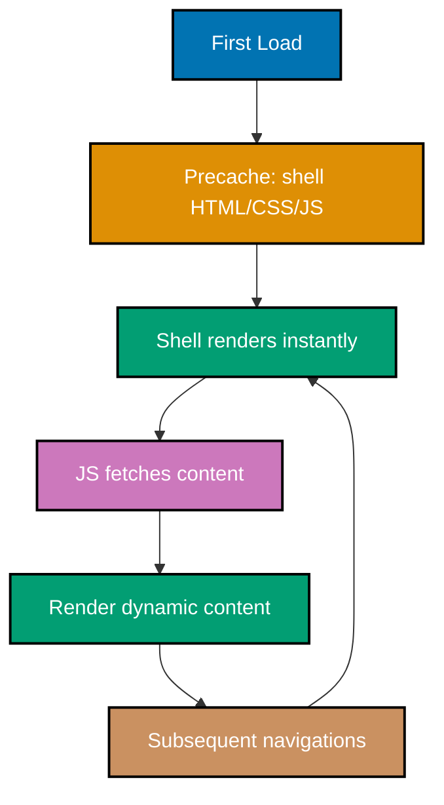

This advanced tutorial covers expert-level Progressive Web App mastery through 25 heavily annotated examples. By now you have shipped PWAs with service workers, caching strategies, and push notifications. This level covers the modern capabilities that make PWAs genuinely competitive with native apps: Share Target, File Handling, Badging, Protocol Handlers, Window Controls Overlay, and the web push protocol internals. It also goes deep on Workbox plugins, performance budgets, and migration patterns.

## Prerequisites

Before starting, ensure you completed the Intermediate level and understand:

- Advanced caching strategies (SWR, route-based dispatch, expiration)
- Service worker update flows and messaging
- Background Sync and Periodic Background Sync
- Push subscription flow and VAPID keys
- Workbox strategies and precaching

## Group 1: Share Target and File Handling

### Example 56: Share Target API - Receiving Shared Content

Declaring `share_target` in your manifest lets your PWA appear in the OS share sheet. When a user shares from another app, your PWA receives the content via a URL or form POST.



```json
// manifest.webmanifest: register as a share target
{
  // => name: required manifest field; shown in share picker list
  "name": "Notes",
  // => start_url: where the app opens after share redirect lands
  "start_url": "/",
  // => display: standalone removes browser chrome; required for installability
  "display": "standalone",
  "icons": [
    { "src": "/icons/icon-192.png", "sizes": "192x192", "type": "image/png" }
    // => 192x192 icon shows in the OS share sheet entry for this app
  ],
  "share_target": {
    // => action: URL in scope to receive the share POST
    // => Must be within manifest scope; relative or absolute
    "action": "/share",
    // => method: POST for files/binary; GET for title+text+url
    // => GET is simpler but cannot send files (no body)
    "method": "POST",
    // => enctype required for POST with files
    // => Must be multipart/form-data when sharing files; application/x-www-form-urlencoded for text only
    "enctype": "multipart/form-data",
    // => params: maps share kinds to form field names
    // => Each key maps to the form field the OS will populate
    "params": {
      "title": "title",
      // => title field: the shared item's title (if available)
      "text": "text",
      // => text field: the shared text or description
      "url": "url",
      // => url field: the shared URL (if a link was shared)
      // => files: accept specific MIME types
      "files": [
        {
          // => name: form field name used in FormData.getAll()
          "name": "shared-files",
          // => accept: MIME type patterns the OS filters on
          "accept": ["image/*", "application/pdf"]
          // => image/*: accept any image type; narrow as needed
        }
      ]
    }
  }
}
```

```javascript
// sw.js: intercept the share POST to parse and route
self.addEventListener("fetch", (event) => {
  const url = new URL(event.request.url);
  // => Only handle the share action endpoint
  // => All other requests pass through to normal routing
  if (url.pathname !== "/share" || event.request.method !== "POST") return;
  // => Both conditions must match: right path AND POST method

  event.respondWith(handleShare(event.request));
  // => respondWith takes over the response; returns redirect to share UI
});

async function handleShare(request) {
  // => formData parses multipart body with fields and files
  // => await required: body parsing is async
  const formData = await request.formData();
  // => FormData API: works both in SW and main thread context

  // => Extract text fields by name matching manifest params
  // => .get() returns null if field missing; || '' makes it safe string
  const title = formData.get("title") || "";
  const text = formData.get("text") || "";
  const sharedUrl = formData.get("url") || "";
  // => getAll for repeated file fields
  // => Returns an empty array if no files; safe to iterate
  const files = formData.getAll("shared-files");
  // => files is File[] in browsers supporting File Handling

  // => Store for the page to pick up (IndexedDB in real apps)
  // => Cache API cannot store File objects reliably; use IndexedDB
  await stashShareInCache({ title, text, sharedUrl, files });

  // => Redirect to the app's share-intent UI
  // => 303 See Other: correct status for POST -> GET redirect
  return Response.redirect("/?intent=share", 303);
  // => Browser follows the redirect and opens your share UI page
}

async function stashShareInCache(data) {
  // => Simplified: production uses IndexedDB for binary data
  // => IndexedDB can store Blob/File; Cache API is for Request/Response only
}
```

**Key Takeaway**: Declare `share_target` with `method: POST` and `enctype: multipart/form-data` to accept files, intercept the POST in the SW, parse FormData, stash the payload, and redirect to your share UI.

**Why It Matters**: Share Target makes your PWA feel like a native citizen of the OS, "send this photo to Notes" just works. The SW interception pattern is essential because Share Target POSTs do not play well with SPA routing; handling them in the SW lets you stash the payload and redirect to a clean URL. Accepting files requires the multipart encoding; getting this wrong silently breaks file shares. Test on Android Chrome, which is the primary platform for Share Target delivery.

### Example 57: File Handling API - Opening Files from the OS

`file_handlers` in the manifest registers your PWA as a handler for specific file types. When the user opens a `.md` file, the OS can launch your PWA with the file in `launchQueue`.

```json
// manifest.webmanifest: register file handlers
{
  // => name: shown in OS "Open With" dialog alongside the icon
  "name": "Markdown Editor",
  // => start_url: where the app opens if no launch params are set
  "start_url": "/",
  // => display: standalone removes browser chrome; required for installability
  "display": "standalone",
  "icons": [
    { "src": "/icons/icon-192.png", "sizes": "192x192", "type": "image/png" }
    // => 192x192: standard app icon; shown in OS Open With list
  ],
  "file_handlers": [
    {
      // => action: URL within scope to open files
      // => Must be within manifest scope; receives files via launchQueue
      "action": "/open",
      // => accept: MIME type => extension list
      // => Map of MIME types to accepted extensions
      "accept": {
        "text/markdown": [".md", ".markdown"],
        // => Both .md and .markdown are common markdown extensions
        "text/plain": [".txt"]
        // => text/plain: also handle plain text files
      },
      // => icons: shown in OS Open With dialog
      // => Should be distinct from your app icon to indicate file association
      "icons": [
        {
          // => 256x256 shows clearly in desktop file explorer context menus
          "src": "/icons/file-handler.png",
          "sizes": "256x256",
          "type": "image/png"
        }
      ]
    }
  ]
}
```

```javascript
// app.js: consume files from the launchQueue
// => launchQueue is a consumer: setConsumer runs for each launch intent
// => setConsumer replaces any previously set consumer; call once
if ("launchQueue" in window) {
  // => Feature-detect: launchQueue only in Chromium with File Handling enabled
  window.launchQueue.setConsumer(async (launchParams) => {
    // => launchParams.files is an array of FileSystemFileHandle
    // => Empty when launched without files (normal app launch)
    if (!launchParams.files || launchParams.files.length === 0) return;
    // => Guard prevents running file-open code on normal launches

    for (const fileHandle of launchParams.files) {
      // => Get a File object (read-only by default)
      // => fileHandle is a FileSystemFileHandle; getFile() resolves to File
      const file = await fileHandle.getFile();
      // => file.name, file.size, file.lastModified are available properties

      // => Read content; text() for text, arrayBuffer() for binary
      // => file.text() decodes UTF-8 by default
      const content = await file.text();
      console.log("Opened:", file.name, content.length, "chars");
      // => Output: Opened: readme.md 1024 chars

      // => Render in your editor
      openDocument(file.name, content);
      // => Store fileHandle if you need to write back later

      // => To write back, request permission and use createWritable
      // => permission.state === 'granted' required for writes
      // => requestPermission shows a browser prompt if not yet granted
      const permission = await fileHandle.requestPermission({
        mode: "readwrite",
        // => readwrite: allows both reading and writing the file
      });
      if (permission === "granted") {
        // => writable stream lets you save updates to the same file
        const writable = await fileHandle.createWritable();
        // => writer.write(newContent) / writer.close() flushes to disk
        // => Always call writable.close() to commit changes
      }
    }
  });
}

function openDocument(name, content) {
  // => Your app-specific document open logic
  // => Typically populates a code editor or text area with the content
}
```

**Key Takeaway**: Declare `file_handlers` in the manifest and consume `launchQueue` to receive `FileSystemFileHandle`s; use `getFile()` to read and `createWritable()` after permission for in-place edits.

**Why It Matters**: File Handling closes one of the last real gaps between PWAs and native apps: being the default for a file type. A PWA that opens `.md` files directly from the OS file explorer feels first-class in a way browser-only apps never can. Production implementations need careful permission handling; users expect "open" to work silently but "save" to prompt once. Chromium-only for now, but growing platform support makes this worth shipping behind feature detection.

### Example 58: Badging API - Unread Counts

The Badging API displays a number or dot on your app icon in the taskbar/home screen. Use it for unread counts without showing a notification every time.

```javascript
// app.js: set and clear the app badge
// => navigator.setAppBadge: integer count or omit for a dot
// => Calling with 0 is equivalent to clearAppBadge; omit for just a dot
async function setUnreadCount(n) {
  if (!("setAppBadge" in navigator)) return;
  // => Feature-detect: not supported in Firefox or Safari < 17
  try {
    // => 0 clears the badge; positive number displays it
    await navigator.setAppBadge(n);
    // => Promise resolves when badge is updated; OS renders it
    console.log("Badge set to:", n);
  } catch (error) {
    // => Some platforms throw if unsupported (Firefox)
    // => Wrap in try/catch: badge failure should never break core flow
    console.warn("Badging unavailable:", error);
  }
}

async function clearBadge() {
  if ("clearAppBadge" in navigator) {
    // => clearAppBadge removes the badge dot/number entirely
    await navigator.clearAppBadge();
    // => Use when inbox is empty or user has reviewed all items
  }
}

// => Typical flow: update badge when unread count changes
async function onNewMessage() {
  const unread = await getUnreadCount();
  // => Pass the running total; browser renders it
  await setUnreadCount(unread);
  // => Always update with total, not delta; avoids race conditions
}

async function onMessageRead() {
  const unread = await getUnreadCount();
  if (unread === 0) await clearBadge();
  // => Zero unread: clear badge completely (not show "0")
  else await setUnreadCount(unread);
  // => Non-zero: show updated count
}

async function getUnreadCount() {
  // => Read from your data layer (IndexedDB, API, etc.)
  // => Derive from actual data, not a separate counter; avoids drift
  return 3; // => Example value
}
```

```javascript
// sw.js: set badge from a push handler for backgrounded apps
self.addEventListener("push", (event) => {
  // => waitUntil extends SW lifetime until badge + notification complete
  event.waitUntil(
    (async () => {
      // => Update badge even if no tab is open
      // => SW can call self.navigator.setAppBadge when activated by push
      if ("setAppBadge" in self.navigator) {
        // => Read stored unread count; +1 for this new message
        // => Store in IndexedDB to persist across SW restarts
        const current = await readStoredUnread();
        await self.navigator.setAppBadge(current + 1);
        // => Badge updates immediately; OS refreshes icon in task bar
        await writeStoredUnread(current + 1);
        // => Write before returning so count survives SW termination
      }
      // => Still show the notification too
      // => Badge alone is silent; notification is the user-visible alert
      const data = event.data ? event.data.json() : {};
      // => event.data?.json() parses the push payload if present
      await self.registration.showNotification(data.title, { body: data.body });
      // => showNotification requires a string title as first arg
    })(),
  );
});

async function readStoredUnread() {
  return 0;
}
// => Reads from IndexedDB in production; returns 0 as safe default
async function writeStoredUnread(n) {}
// => Writes to IndexedDB so badge survives SW lifecycle restarts
```

**Key Takeaway**: Call `navigator.setAppBadge(n)` on unread count changes and `navigator.clearAppBadge()` when zeroed; the SW can update badges from push handlers too.

**Why It Matters**: Badges are the highest-leverage attention surface a PWA can claim. A number on the icon drives return visits without burning notification permission. Pairing badge updates with push events lets you maintain accurate counts even while the user has the app closed. The key discipline is keeping the number honest, a badge stuck at "47 unread" when the inbox is empty undermines trust faster than almost any other PWA bug.

### Example 59: Protocol Handlers (Custom URL Schemes)

`protocol_handlers` lets your PWA register for custom URI schemes like `mailto:`, `web+myapp:`, or `bitcoin:`. The OS routes matching links to your app.

```json
// manifest.webmanifest: register protocol handlers
{
  // => name: shown in OS "Open with" chooser for the scheme
  "name": "My Mail",
  "start_url": "/",
  "display": "standalone",
  "icons": [{ "src": "/icons/icon-192.png", "sizes": "192x192", "type": "image/png" }],
  "protocol_handlers": [
    {
      // => protocol: either a standard scheme (mailto, tel) or web+ prefix
      // => Standard schemes: mailto, tel, sms, calendar (safelisted)
      // => Non-safelisted bare schemes (like bitcoin) are blocked by browsers
      "protocol": "mailto",
      // => url: template with %s substituted for the protocol URL
      // => %s is replaced by the full URI including the scheme
      "url": "/compose?to=%s"
      // => Example: mailto:alice@example.com -> /compose?to=mailto:alice@example.com
      // => Your /compose route must parse the ?to= parameter
    },
    {
      // => Custom schemes must start with web+
      // => web+ prefix prevents hijacking well-known protocols
      // => web+mynotes: your app's private deep-link scheme
      "protocol": "web+mynotes",
      // => %s substitution works the same for custom schemes
      "url": "/notes?id=%s"
      // => Example: web+mynotes:12345 -> /notes?id=web+mynotes:12345
      // => Strip the scheme prefix in your route handler to get the raw id
    }
  ]
}
```

```javascript
// app.js: parse the URL to extract the handled protocol input
// => Route: /compose?to=mailto:alice@example.com
// => URLSearchParams parses the query string from the action URL
const params = new URLSearchParams(window.location.search);
const handled = params.get("to");
// => handled is the %s-substituted value; null if not present

if (handled?.startsWith("mailto:")) {
  // => optional chain: guard if handled is null
  // => Strip scheme to get the raw value
  // => regex replaces 'mailto:' prefix to extract just the email address
  const email = handled.replace(/^mailto:/, "");
  // => Prefill your compose form
  document.querySelector("#to-field").value = email;
  // => Setting .value updates the input; triggers no events
}

// => Verify browser support for registering handlers
// => Uses registerProtocolHandler, independent of manifest-based registration
// => Manifest registration and programmatic registration are independent
if ("registerProtocolHandler" in navigator) {
  // => Feature detect: not available in all browsers
  try {
    // => Programmatic registration (page-triggered, requires user gesture)
    // => Must use web+ prefix unless using safelisted protocols
    // => registerProtocolHandler('web+mynotes', template, title)
    navigator.registerProtocolHandler(
      "web+mynotes",
      "/notes?id=%s",
      // => third arg (title) is deprecated but harmless to omit
    );
  } catch (error) {
    // => SecurityError if called without user gesture or wrong prefix
    console.warn("Protocol registration failed:", error);
  }
}
```

**Key Takeaway**: Declare `protocol_handlers` in the manifest with `%s` as the URL placeholder; your PWA becomes the OS handler for those schemes.

**Why It Matters**: Protocol handlers let your PWA deep-link from anywhere on the OS: clicking a `mailto:` link in a native app can launch your PWA composer. For niche protocols (trading platforms, game launchers), this is a killer feature that used to require native apps. The `web+` prefix enforcement prevents hijacking, only safelisted protocols can be bare. Test thoroughly on each OS because handler priority and permission flows vary significantly.

## Group 2: Modern Display Modes

### Example 60: Window Controls Overlay

`window-controls-overlay` is a display mode that hides the standard titlebar and lets your PWA draw into the space, while keeping the OS window controls (minimize, maximize, close) in the corner.



```json
// manifest.webmanifest: opt in with fallback
{
  // => name: shown in window title bar when WCO is active
  "name": "IDE",
  // => display: fallback when none of display_override modes are supported
  "display": "standalone",
  // => display_override: ordered preference list; browser picks first supported
  // => window-controls-overlay: Chromium desktop only; enables custom titlebar
  // => standalone: universal fallback; always supported
  "display_override": ["window-controls-overlay", "standalone"],
  "icons": [
    { "src": "/icons/icon-192.png", "sizes": "192x192", "type": "image/png" }
    // => 192x192 icon used in task bar and OS chrome
  ]
}
```

```javascript
// app.js: read the overlay geometry and adapt layout
// => navigator.windowControlsOverlay exposes visibility + bounds
// => Only meaningful in Chromium-based desktop browsers with WCO enabled
if ("windowControlsOverlay" in navigator) {
  // => Feature-detect: undefined in Firefox, Safari, and mobile browsers
  const wco = navigator.windowControlsOverlay;
  // => wco is a WindowControlsOverlay object with visible and rect methods

  // => visible: true when WCO is active (fullscreen often disables it)
  // => false when app is not installed or display mode is not WCO
  console.log("WCO visible:", wco.visible);
  // => Output: WCO visible: true (when running in WCO display mode)

  // => getTitlebarAreaRect: DOMRect of the drawable titlebar area
  // => Excludes the OS control buttons
  const rect = wco.getTitlebarAreaRect();
  // => DOMRect properties: x, y, width, height in CSS pixels
  console.log("Titlebar area:", rect.width, "x", rect.height);
  // => Output: Titlebar area: 1024 x 32

  // => Listen for geometry changes (resize, zoom, maximize)
  // => fires whenever the drawable titlebar area dimensions change
  wco.addEventListener("geometrychange", (event) => {
    const newRect = event.titlebarAreaRect;
    // => event.titlebarAreaRect mirrors wco.getTitlebarAreaRect() at event time
    document.documentElement.style.setProperty(
      "--titlebar-width",
      `${newRect.width}px`,
      // => CSS custom property propagates to all elements using it
    );
  });
}
```

```css
/* styles.css: env() variables for safe-area inset */
/* => env() inset-top values expose the WCO titlebar area */
/* => Fallback values (32px, 0, 100%) apply in non-WCO display modes */
:root {
  --titlebar-h: env(titlebar-area-height, 32px);
  /* => titlebar-area-height: vertical size of drawable area */
  --titlebar-inset-x: env(titlebar-area-x, 0);
  /* => titlebar-area-x: horizontal offset (non-zero on macOS with traffic lights) */
  --titlebar-inset-width: env(titlebar-area-width, 100%);
  /* => titlebar-area-width: drawable width (excludes window control buttons) */
}

.app-titlebar {
  /* => Draw in the space WCO exposes */
  position: fixed;
  /* => Fixed positioning anchors titlebar relative to viewport, not document */
  top: 0;
  left: var(--titlebar-inset-x);
  /* => inset-x avoids overlapping the OS window controls on the left (macOS) */
  width: var(--titlebar-inset-width);
  height: var(--titlebar-h);
  /* => Content must remain draggable for window moves */
  /* => -webkit-app-region: drag is the prefixed form for Chromium */
  app-region: drag;
}

.app-titlebar button {
  /* => Opt out of drag region for interactive controls */
  /* => Without no-drag, clicks on buttons move the window instead */
  app-region: no-drag;
}
```

**Key Takeaway**: Add `window-controls-overlay` to `display_override`, read geometry from `navigator.windowControlsOverlay` or CSS `env()` variables, and use `app-region: drag/no-drag` to control draggable regions.

**Why It Matters**: WCO turns your PWA into a first-class desktop app, custom titlebars with branding, tabs, or toolbars replace the browser-looking chrome. Productivity apps (IDEs, mail clients, chat) benefit enormously because every pixel of vertical space matters. The `geometrychange` event is critical for responsive titlebars; window resizing and OS theme changes can shift the drawable area. Always provide `standalone` as a fallback in `display_override` for browsers that do not support WCO.

### Example 61: Launch Handler (Navigate vs Focus Existing)

`launch_handler` controls what happens when a user launches the PWA again: open a new window, focus the existing one, or navigate-existing.

```json
// manifest.webmanifest: launch handling preference
{
  // => name: identifies the app in OS task switcher
  "name": "Focus App",
  // => start_url: where launchQueue.targetURL falls back to if none specified
  "start_url": "/",
  "display": "standalone",
  "icons": [
    { "src": "/icons/icon-192.png", "sizes": "192x192", "type": "image/png" }
    // => 192x192 minimum for Android installability; WCO also uses it
  ],
  "launch_handler": {
    // => client_mode: what to do on subsequent launches
    // => Array: browser picks first supported mode; falls back through list
    // => "navigate-existing": focus the open tab AND navigate it to start_url
    // => "focus-existing": focus without navigating
    // => "navigate-new": always open a new window
    // => "auto": browser decides (often focus-existing if possible)
    "client_mode": ["navigate-existing", "auto"]
    // => ["navigate-existing", "auto"]: best for single-window apps (mail, notes)
    // => For multi-window apps (like editors): use ["navigate-new"]
  }
}
```

```javascript
// app.js: handle launch events on the focused client
// => window.launchQueue receives launches (same API as File Handler)
// => Consumer fires once per launch intent on the focused existing client
if ("launchQueue" in window) {
  // => Feature-detect: same as File Handler; requires Chromium with Launch Handler
  window.launchQueue.setConsumer((launchParams) => {
    // => targetURL is the URL the launch wanted to visit
    // => Use it to navigate your SPA's router without reload
    // => launchParams.targetURL: string URL or null for non-URL launches
    if (launchParams.targetURL) {
      const url = new URL(launchParams.targetURL);
      // => url.pathname + url.search: path and query without hash or origin
      // => SPA routing: pushState to the target path
      // => pushState updates the URL bar without a page reload
      history.pushState({}, "", url.pathname + url.search);
      // => Trigger your router's re-evaluation
      // => popstate normally fires only on back/forward; dispatch manually
      window.dispatchEvent(new PopStateEvent("popstate"));
      // => Your router listens to popstate and re-renders for the new path
    }
  });
}
```

**Key Takeaway**: Use `launch_handler.client_mode` to control focus vs new-window behavior and consume `launchQueue` with `targetURL` to navigate the focused tab in an SPA.

**Why It Matters**: Default browser behavior opens a new tab on every launch, so users end up with six copies of your PWA. `navigate-existing` collapses this into a single window that jumps to the target URL, matching how native apps behave. The `launchQueue` integration is non-obvious, without it, `navigate-existing` focuses the old state rather than the intended URL. Getting this right is one of the clearest signals of a polished, native-feeling PWA.

## Group 3: Web Push Protocol Depth

### Example 62: Generating VAPID Keys

VAPID (Voluntary Application Server Identification) keys are a required pair of public/private keys for push. The public key goes in the browser (Example 37); the private key stays on the server and signs outgoing pushes.

```bash
# => web-push CLI generates both keys in one shot
# => npm install -g: installs globally so web-push is in PATH
npm install -g web-push

# => Generate a fresh pair
# => Run this ONCE; store keys securely (env vars, secrets manager)
web-push generate-vapid-keys
# => Output:
# => =======================================
# => Public Key:
# => BEl62iUYgUivxIkv69yViEuiBIa-Ib9-SkvMeAtA3LFgDzkrxZJjSgSnfckjBJuBkr3qBUYIHBQFLXYp5Nksh8U
# => Private Key:
# => UUxI4O8-FbRouAevSmBQ6o18hgE4nSG3qwvJTfKc-ls
# => =======================================
# => Public key: safe to expose to clients; clients subscribe with it
# => Private key: MUST stay server-side; never commit or log this value
```

```javascript
// server.js: Node.js + web-push library example
// => web-push handles VAPID signing, encryption, and HTTP delivery
import webpush from "web-push";

// => Store these securely; private key must never reach the client
// => Public key is the one you paste into app.js (Example 37)
// => Read from environment variables; never hardcode in source
const VAPID_PUBLIC = process.env.VAPID_PUBLIC_KEY;
const VAPID_PRIVATE = process.env.VAPID_PRIVATE_KEY;
// => Both are required; webpush throws if either is missing

// => setVapidDetails: contact is a mailto: or https: URL for push providers
// => Push services email the contact if they detect abuse from your keys
// => Call once at startup before any sendNotification calls
webpush.setVapidDetails(
  "mailto:ops@example.com",
  // => contact URL: identifies your server to the push service
  VAPID_PUBLIC,
  VAPID_PRIVATE,
);

// => Send a push to a stored subscription
// => subscription is the PushSubscription JSON from the browser
async function sendPush(subscription, payload) {
  try {
    // => sendNotification signs the request with your private key
    // => Push service forwards the payload to the browser
    // => subscription.endpoint is the push service URL (Google, Mozilla, etc.)
    const result = await webpush.sendNotification(
      subscription,
      JSON.stringify(payload),
      // => payload is JSON-stringified; max ~3KB depending on provider
    );
    // => result.statusCode 201: push accepted by the push service
    console.log("Pushed:", result.statusCode);
  } catch (error) {
    // => 410 Gone: subscription expired, delete it
    // => 404 Not Found: same meaning; some push services use 404
    if (error.statusCode === 410) {
      await deleteSubscription(subscription.endpoint);
      // => Remove from your DB; sending again wastes bandwidth
    }
  }
}

async function deleteSubscription(endpoint) {}
// => Remove subscription from your database by endpoint string
```

**Key Takeaway**: Generate a VAPID key pair once, keep the private key server-side, distribute the public key to clients, and use a library like `web-push` on the server to sign push requests.

**Why It Matters**: Push protocol details are complex (encryption, JWT signing, TTL, Urgency headers), and web-push handles them correctly. The 410 Gone case is critical, subscriptions expire when users uninstall, change devices, or clear browser data. Not cleaning up expired subscriptions causes your push send rate to slowly degrade and accumulates dead data. Rotating VAPID keys is disruptive (all existing subscriptions become invalid), so pick once and protect the private key like any other production secret.

### Example 63: Push Payload Encryption Constraints

Push payloads are end-to-end encrypted per subscription using the keys you received at subscribe time. Payloads are size-limited (typically 3-4KB) and must be minimal.

```javascript
// server.js: craft a minimal, structured payload
// => Push payloads are encrypted with per-subscription keys
// => Size limit: ~3-4KB depending on push provider
function buildPushPayload(notification) {
  // => Keep payload < 3KB to stay safely within provider limits
  // => Excess bytes risk silent rejection; measure with JSON.stringify().length
  return {
    // => Just the info needed to render the notification
    // => title: truncated to avoid padding waste
    title: truncate(notification.title, 80),
    // => 80 chars: fits in most notification UIs without truncation
    body: truncate(notification.body, 200),
    // => body: 200 chars gives context; SW can fetch full body on click
    // => URL/id for the click handler to load full content
    // => SW uses this URL to fetch and display on notificationclick
    url: notification.url,
    // => tag for dedup
    // => matching tag replaces existing notification (prevents spam)
    tag: notification.tag,
    // => Avoid sending sensitive data; SW fetches details on demand
    // => Data in push payload is encrypted but avoid PII defensively
  };
}

function truncate(str, max) {
  // => Return string as-is if short enough
  if (!str || str.length <= max) return str;
  // => Slice at max-1 to leave room for ellipsis character
  return str.slice(0, max - 1) + "…";
  // => '…' is a single Unicode char; takes less space than '...'
}

// => Common anti-pattern: sending the entire article body
// => Fails silently or drops the push if > 4KB
// => Better: send { title, url } and let SW fetch details
// => This also means the notification shows fresh data, not cached snapshot
```

```javascript
// sw.js: fetch full content after push wakes the worker
self.addEventListener("push", (event) => {
  // => waitUntil extends SW lifetime until notification is shown
  event.waitUntil(
    (async () => {
      // => event.data?.json() parses the minimal payload; null-safe
      const minimal = event.data.json();
      // => minimal has: title, body, url, tag (from buildPushPayload)

      // => Fetch detailed data from your API using the ID/URL
      // => Auth cookie travels with the fetch because same-origin
      let details = {};
      try {
        // => Same-origin fetch from SW; cookies automatically sent
        const resp = await fetch(`/api/notifications/${minimal.id}`);
        // => resp.ok: true for 2xx; check before reading body
        if (resp.ok) details = await resp.json();
        // => details may include richer body, image, action labels
      } catch {
        // => Offline or API down: fall back to minimal payload
        // => Empty details: || fallback handles it below
      }

      // => Show the notification with best available content
      await self.registration.showNotification(
        details.title || minimal.title,
        // => details.title preferred; minimal.title as fallback
        {
          body: details.body || minimal.body,
          // => details.body: may be full article intro; minimal.body is truncated
          icon: details.icon || "/icons/icon-192.png",
          // => details.icon: may be article thumbnail; fallback to app icon
          data: { url: minimal.url },
          // => data.url: persists to notificationclick handler for navigation
        },
      );
    })(),
  );
});
```

**Key Takeaway**: Keep push payloads minimal (title, body, URL, tag) and fetch detailed content from your API inside the SW's `push` handler; payloads must be under ~3KB to reliably deliver.

**Why It Matters**: Push providers silently drop or reject oversized payloads, you have no error visibility when this happens. Minimal payloads also reduce the cost of a subscription compromise: an attacker with stolen push keys can spam notifications but not exfiltrate sensitive content you never included. The fetch-on-push pattern is more resilient: even if the initial push is delayed, the SW fetches current data at notification render time, so users see fresh content rather than stale snapshots.

### Example 64: Notification Actions and Inline Reply

Notifications support action buttons (Android, desktop) and can capture user input inline via `placeholder` on an action.

```javascript
// sw.js: notification with actions
self.addEventListener("push", (event) => {
  // => event.waitUntil: extends SW lifetime until notification is shown
  event.waitUntil(
    self.registration.showNotification("New message from Alice", {
      // => body: secondary text below title; keep concise
      body: "Hi, are you free for lunch?",
      icon: "/icons/alice.png",
      // => tag: deduplicates; same-tag notification replaces previous
      tag: "message-alice",
      // => actions: max 2-3 typically displayed; platform-dependent
      // => iOS Safari (web push) does not render actions at all
      actions: [
        {
          // => action: identifier matched in notificationclick
          // => Must be unique within the actions array
          action: "reply",
          title: "Reply",
          icon: "/icons/reply-24.png",
          // => placeholder: shown in inline input (Android only)
          // => type: 'text' for inline input; omit for plain button
          type: "text",
          placeholder: "Type a reply...",
          // => Android renders text input inline; other platforms show plain button
        },
        { action: "mark-read", title: "Mark as read", icon: "/icons/check-24.png" },
        // => mark-read: fire-and-forget API call; no window opens
        { action: "dismiss", title: "Dismiss" },
        // => dismiss: explicit user action; close handled in notificationclick
      ],
      // => data: arbitrary JSON passed to notificationclick handler
      data: { conversationId: 123 },
      // => data survives the SW restart; serialized and restored
    }),
  );
});

self.addEventListener("notificationclick", (event) => {
  // => Always close first to dismiss the notification UI
  event.notification.close();
  const convId = event.notification.data.conversationId;
  // => convId came from push payload data; safe to use in API calls

  event.waitUntil(
    (async () => {
      if (event.action === "reply") {
        // => event.reply contains the inline input text (Android)
        // => Empty string when action button pressed without inline type
        const replyText = event.reply || "";
        // => Send via your API without opening the app
        // => Content-Type: application/json required for JSON body parsing
        await fetch(`/api/conversations/${convId}/messages`, {
          method: "POST",
          body: JSON.stringify({ text: replyText }),
          headers: { "Content-Type": "application/json" },
        });
        // => No window focus after reply; user stays in current context
      } else if (event.action === "mark-read") {
        // => mark-read: background API call; no UI interaction needed
        await fetch(`/api/conversations/${convId}/read`, { method: "POST" });
      } else {
        // => Default click (or no-action tap): focus the app
        // => matchAll with type: 'window' lists all open windows/tabs
        const wins = await self.clients.matchAll({ type: "window" });
        const target = `/conversations/${convId}`;
        // => Check if target URL is already open in any window
        const existing = wins.find((w) => w.url.endsWith(target));
        // => focus() brings the existing window to front; no reload needed
        if (existing) return existing.focus();
        // => openWindow opens a new tab if no existing window found
        return self.clients.openWindow(target);
      }
    })(),
  );
});
```

**Key Takeaway**: Declare `actions` in `showNotification` options; the SW's `notificationclick` handler receives `event.action` and `event.reply` (Android inline input) to handle each button without requiring the app to be open.

**Why It Matters**: Inline actions reduce friction dramatically, a user can reply "Yes" to a lunch invite without ever opening the app. This matches the most valuable native interaction: fast, contextual responses. Each action's success or failure is invisible to the user unless you render a follow-up notification on failure, so add robust error handling in the action paths. Platform variance is high: iOS does not support actions at all on safari web push; design to degrade gracefully.

## Group 4: IndexedDB in Service Worker Context

### Example 65: IndexedDB for Offline Queue (SW-Side)

IndexedDB is the durable store service workers use to persist structured data across sessions. Full IndexedDB coverage is in the dedicated IndexedDB tutorial, here is the essential SW integration pattern.

**Reference**: For deep IndexedDB coverage (transactions, indexes, cursors), see the [IndexedDB by-example tutorial](/en/learn/software-engineering/platform-web/tools/idb/by-example).

```javascript
// sw.js: minimal IndexedDB wrapper for a queue
// => Use idb library in production; this shows the raw API
// => idb (npmjs.com/package/idb): 3KB promise wrapper around IDB
// => Raw IndexedDB shown here so you understand what idb abstracts
function openDB() {
  // => Returns a Promise<IDBDatabase>
  // => Call once and reuse the IDBDatabase instance; opening is expensive
  return new Promise((resolve, reject) => {
    // => open(name, version); version bumps trigger upgrade event
    // => version=1: first creation; bump to 2+ for schema changes
    const req = indexedDB.open("app-queue", 1);
    // => onupgradeneeded: schema changes happen here
    // => Fires on first open AND on version upgrade
    req.onupgradeneeded = () => {
      const db = req.result;
      // => Create an object store keyed by auto-increment id
      // => objectStoreNames.contains: idempotent check; safe to call multiple times
      if (!db.objectStoreNames.contains("outbox")) {
        db.createObjectStore("outbox", { keyPath: "id", autoIncrement: true });
        // => autoIncrement: IDB assigns incrementing integer keys automatically
      }
    };
    req.onsuccess = () => resolve(req.result);
    // => req.result is the IDBDatabase instance; use for transactions
    req.onerror = () => reject(req.error);
    // => req.error is a DOMException with name and message
  });
}

async function enqueue(item) {
  const db = await openDB();
  // => Transaction must specify scope + mode
  // => 'readwrite': required for add/put/delete; 'readonly' for reads
  // => Specify the store(s) in scope: [storeName] or storeName string
  const tx = db.transaction("outbox", "readwrite");
  // => objectStore: get a reference to the named store within this tx
  tx.objectStore("outbox").add({ item, ts: Date.now() });
  // => ts: timestamp for age-based expiry; Date.now() in ms
  // => add(): throws if a record with same key exists; use put() for upsert
  // => Transaction complete: oncomplete fires
  // => Wait for transaction to commit before returning
  return new Promise((resolve) => (tx.oncomplete = resolve));
  // => oncomplete: guaranteed durability; data survives crash after this point
}

async function dequeueAll() {
  const db = await openDB();
  // => 'readonly' mode: multiple concurrent reads are safe
  const tx = db.transaction("outbox", "readonly");
  // => getAll returns every row as an array
  // => Returns all stored items; no limit applied
  // => For large queues, use openCursor() to process in batches
  const request = tx.objectStore("outbox").getAll();
  return new Promise((resolve) => (request.onsuccess = () => resolve(request.result)));
  // => request.result is the array of all stored records
  // => Each record has: { id: number, item: any, ts: number }
}

// => Use in a Background Sync handler
// => SW wakes here when browser has connectivity (even if tab is closed)
self.addEventListener("sync", (event) => {
  // => event.tag matches the tag registered with reg.sync.register()
  // => Other sync tags are silently skipped
  if (event.tag !== "flush-outbox") return;
  event.waitUntil(
    (async () => {
      const items = await dequeueAll();
      // => items: all queued records; drain and send each one
      // => Sequential send: safer than parallel; avoids server rate-limit
      for (const row of items) {
        await fetch("/api/submit", { method: "POST", body: JSON.stringify(row.item) });
        // => If fetch throws (still offline), event.waitUntil rejects
        // => Background Sync retries: SW is re-awoken when connectivity returns
        // => Remove successfully-sent item from the queue
        // => Delete AFTER successful send; prevents data loss on failure
        await deleteById(row.id);
      }
    })(),
  );
});

async function deleteById(id) {
  const db = await openDB();
  const tx = db.transaction("outbox", "readwrite");
  // => delete(id): removes the record with this key from the store
  tx.objectStore("outbox").delete(id);
  return new Promise((resolve) => (tx.oncomplete = resolve));
  // => Wait for commit before returning; ensures durability
}
```

**Key Takeaway**: Use IndexedDB (not localStorage) for durable SW state because it is async, transactional, and accessible from both the page and the worker.

**Why It Matters**: localStorage is synchronous and blocked in service workers; IndexedDB is the only built-in durable store available. The callback-based API is cumbersome, so production code almost always uses the `idb` library (3KB, promise-based). The pattern here, enqueue in IndexedDB, drain from a Background Sync handler, is the backbone of every offline-capable PWA. Failing to clear successfully-sent items causes the queue to grow forever until the user notices weird double-submissions.

## Group 5: Workbox Plugins and Extensions

### Example 66: Workbox Expiration Plugin

`ExpirationPlugin` evicts cache entries by max age or max entries, automatically enforcing your cache budget without manual trimming.

```javascript
// sw.js: expiration by age AND size
// => workbox-routing: registerRoute links URL patterns to strategies
// => All imports are from modular Workbox packages; tree-shakeable
// => Bundle size: ~5KB total for routing + strategy + expiration plugin
import { registerRoute } from "workbox-routing";
// => workbox-strategies: built-in caching strategies
// => CacheFirst: serve from cache; network only on miss
// => Alternative strategies: NetworkFirst, StaleWhileRevalidate, NetworkOnly
import { CacheFirst } from "workbox-strategies";
// => workbox-expiration: ExpirationPlugin adds LRU and TTL eviction
// => Pair with CacheFirst to prevent unbounded cache growth
// => Without expiration, users accumulate unlimited cached images
import { ExpirationPlugin } from "workbox-expiration";

registerRoute(
  // => Route matcher: function receives { request, url, event }
  // => Returns true to apply this strategy; false to skip
  // => url.pathname.startsWith('/images/'): match all image requests
  ({ url }) => url.pathname.startsWith("/images/"),
  // => CacheFirst: serve from cache if available, network on miss
  // => Optimal for images: load once, serve fast forever
  new CacheFirst({
    // => cacheName: creates/uses a named cache; visible in DevTools
    // => Use descriptive names: 'images', 'api', 'fonts', 'shell'
    cacheName: "images",
    plugins: [
      new ExpirationPlugin({
        // => maxEntries: evict LRU entries beyond this count
        // => LRU: least-recently-used entries removed first
        // => 60 images: adjust based on your typical page's image count
        maxEntries: 60,
        // => maxAgeSeconds: evict entries older than this age
        // => 30 days in seconds: 30 * 24 * 60 * 60
        maxAgeSeconds: 30 * 24 * 60 * 60, // 30 days
        // => purgeOnQuotaError: delete aggressively when quota hit
        // => Without this, quota errors cause cache writes to fail silently
        // => Always set to true in production; graceful degradation
        purgeOnQuotaError: true,
      }),
    ],
  }),
);
```

```javascript
// sw.js: manually trigger purge (e.g., on logout)
// => Useful for clearing user-specific caches on sign-out
import { ExpirationPlugin } from "workbox-expiration";

// => You can instantiate the plugin and call its CacheExpiration manager
async function purgeExpired(cacheName) {
  // => Use internal CacheExpiration helper via the plugin
  // => ExpirationPlugin has methods for manual cache management
  const plugin = new ExpirationPlugin({ maxEntries: 60 });
  // => Trigger eviction of stale entries only
  // => deleteCacheAndMetadata: removes the cache AND expiration metadata
  await plugin.deleteCacheAndMetadata();
  // => Alternative: plugin.expireEntries() keeps metadata, evicts stale
  // => expireEntries is more surgical: only removes expired items
}
```

**Key Takeaway**: Attach an `ExpirationPlugin` to any Workbox strategy to enforce a cache budget by entry count and age; set `purgeOnQuotaError: true` for automatic recovery from quota pressure.

**Why It Matters**: Without expiration, caches grow unbounded and eventually consume user disk space until eviction. The browser's quota eviction is unpredictable; an explicit `maxAgeSeconds` and `maxEntries` gives you deterministic behavior. `purgeOnQuotaError` is a production-grade safeguard: when the page hits quota error on a put, Workbox automatically clears and retries, preventing cache-related app breakage. Worth enabling on every Workbox cache by default.

### Example 67: Workbox BroadcastUpdate Plugin

`BroadcastUpdatePlugin` posts a message to all open clients when a cached response changes, letting pages show "new content available" toasts.

```javascript
// sw.js: broadcast updates to pages
// => workbox-routing, workbox-strategies, workbox-broadcast-update
// => All three packages installed via: npm install workbox-routing workbox-strategies workbox-broadcast-update
import { registerRoute } from "workbox-routing";
import { StaleWhileRevalidate } from "workbox-strategies";
// => BroadcastUpdatePlugin: posts to BroadcastChannel when cache changes
// => Pair with SWR: serves stale fast, notifies page when fresh arrives
import { BroadcastUpdatePlugin } from "workbox-broadcast-update";

registerRoute(
  // => Route matcher: apply BroadcastUpdate to all API paths
  // => Returns true for /api/* URLs; Workbox applies this strategy
  ({ url }) => url.pathname.startsWith("/api/"),
  // => StaleWhileRevalidate: serve stale, update in background
  // => Ideal for data where slightly stale is acceptable but fresh is preferred
  new StaleWhileRevalidate({
    cacheName: "api",
    // => cacheName: should match what the page listener expects
    // => Unique cache per strategy prevents cross-contamination
    plugins: [
      new BroadcastUpdatePlugin({
        // => channelName: the BroadcastChannel used to post updates
        // => Defaults to 'workbox'
        // => Must match the channel name in the page's BroadcastChannel constructor
        channelName: "api-updates",
        // => headersToCheck: compare these to decide "did it change?"
        // => Defaults to ['content-length', 'etag', 'last-modified']
        // => 'etag': most reliable; use when your server provides it
        headersToCheck: ["etag"],
        // => Header comparison: if any checked header differs, broadcast update
        // => If your server doesn't set etag, fall back to ['content-length']
      }),
    ],
  }),
);
```

```javascript
// app.js: listen for updates on the same channel
import { Workbox } from "workbox-window";
// => Or use BroadcastChannel directly
// => BroadcastChannel: native browser API; no workbox-window import needed
const channel = new BroadcastChannel("api-updates");
// => Must use same name as channelName in BroadcastUpdatePlugin
channel.addEventListener("message", (event) => {
  // => event.data.type === 'CACHE_UPDATED'
  // => event.data is { type: 'CACHE_UPDATED', payload: { cacheName, updatedURL } }
  if (event.data.type === "CACHE_UPDATED") {
    const { cacheName, updatedURL } = event.data.payload;
    // => cacheName: which Workbox cache was updated (e.g., 'api')
    // => updatedURL: the specific URL that changed (e.g., '/api/feed')
    console.log("Fresh data in cache:", cacheName, updatedURL);
    // => Show a toast letting user refresh the view
    // => Toast pattern: non-blocking, dismissible, actionable
    showToast(`Updated content available`);
  }
});

function showToast(msg) {}
// => Implement: show a snackbar/banner with msg; provide "Refresh" button
```

**Key Takeaway**: Add `BroadcastUpdatePlugin` to SWR strategies to notify the page when a background refresh produces different content; the page can then prompt for a soft reload.

**Why It Matters**: SWR delivers stale content instantly but leaves users unaware that fresher data just arrived. Without notification, they keep looking at yesterday's inbox until a navigation triggers a fresh render. Broadcasting the cache update lets you offer a subtle "New messages, click to refresh" banner, the killer UX of modern PWAs. Choosing which headers to diff matters: `etag` is definitive when your server provides it; `content-length` creates false positives on identical-text responses.

### Example 68: Workbox Background Sync Plugin

`BackgroundSyncPlugin` automatically queues failed POSTs and retries them when connectivity returns, wrapping the Background Sync API in a one-liner.

```javascript
// sw.js: queue failed POSTs with automatic retry
// => workbox-background-sync wraps Background Sync API
// => Requires service worker to intercept failed requests
import { registerRoute } from "workbox-routing";
import { NetworkOnly } from "workbox-strategies";
// => BackgroundSyncPlugin: hooks into NetworkOnly; queues on failure
import { BackgroundSyncPlugin } from "workbox-background-sync";

// => Create a named queue with retention policy
// => 'api-queue': name visible in DevTools > Application > Background Sync
// => One queue can serve multiple routes; name it after the resource type
const bgSyncPlugin = new BackgroundSyncPlugin("api-queue", {
  // => maxRetentionTime: minutes to keep queued requests
  // => Older queued requests are dropped (stale data risk)
  // => 24 * 60 = 1440 minutes = 24 hours
  maxRetentionTime: 24 * 60, // 24 hours
  // => Set aggressively short for commands with time-sensitive validity
  // => Example: payment confirmations should expire in 30 min, not 24h
});

// => Register POST route that queues on failure
// => Route matcher: function AND HTTP method must both match
// => Only queue POST requests to /api/*; GET requests bypass this route
registerRoute(
  ({ url, request }) => url.pathname.startsWith("/api/") && request.method === "POST",
  // => url.pathname.startsWith('/api/'): limit to your API routes only
  // => NetworkOnly strategy with the plugin retries on failure
  // => NetworkOnly: never serves from cache; perfect for mutations
  // => plugins array: BackgroundSyncPlugin intercepts failures
  new NetworkOnly({ plugins: [bgSyncPlugin] }),
  // => Third arg is HTTP method filter
  // => Without 'POST', route matches GET too (Workbox default is GET)
  // => 'POST': tells Workbox to only apply this route to POST requests
  "POST",
);
```

**Key Takeaway**: Wrap `NetworkOnly` strategies with `BackgroundSyncPlugin` to automatically queue failed POSTs and replay them via Background Sync without writing the queue logic yourself.

**Why It Matters**: This plugin turns offline-resilient POSTs into a one-liner, replacing dozens of lines of IndexedDB queue code from Example 65. The `maxRetentionTime` matters because replay of stale commands (e.g., "buy stock at yesterday's price") can cause real harm; drop requests aggressively where appropriate. The plugin integrates with the SW's Background Sync handler transparently, you never write a `sync` listener yourself, but you lose that explicit visibility, so log replays if you need to debug.

### Example 69: Custom Workbox Strategy

For bespoke logic, extend Workbox's `Strategy` class. This pattern is rare but powerful when built-in strategies do not fit.

```javascript
// sw.js: custom strategy with conditional cache-or-network
// => Extend Strategy for bespoke logic not covered by built-in strategies
import { Strategy } from "workbox-strategies";
import { registerRoute } from "workbox-routing";

class ConditionalCache extends Strategy {
  // => _handle is the required override; called for each matching request
  // => request: the Request object; handler: Workbox helper object
  // => Must return a Response (or Promise<Response>)
  async _handle(request, handler) {
    // => handler gives helpers: fetch, cachePut, cacheMatch
    // => handler.cacheMatch: checks your strategy's named cache
    // => Read a header to decide strategy at request time
    // => This is the key extensibility point: make decisions per-request
    const cached = await handler.cacheMatch(request);
    // => cached: Response if found in cache; null/undefined on miss

    // => Check Cache-Control: no-cache in request to force fresh fetch
    // => Custom header: page sets x-force-fresh: 1 when user triggers refresh
    const forceFresh = request.headers.get("x-force-fresh") === "1";
    // => false by default; only true when explicitly requested

    if (cached && !forceFresh) {
      // => Return cached synchronously; update in background
      // => handler.runCallbacks: optional; invokes lifecycle plugins
      handler.runCallbacks("cacheWillUpdate", { request }); // optional
      return cached;
      // => Serve from cache; no network call needed
    }

    // => Fetch fresh; cachePut stores for next time
    // => handler.fetch: goes through Workbox plugin chain
    const fresh = await handler.fetch(request);
    // => Only cache 200-ok responses
    // => Do not cache error responses (4xx/5xx)
    if (fresh.ok) {
      // => handler.cachePut handles plugin chain (expiration, broadcast)
      // => Plugins like ExpirationPlugin run through this; use over raw cache.put
      await handler.cachePut(request, fresh.clone());
      // => Clone before cachePut: body is stream; both caller and cache need copy
    }
    return fresh;
    // => Return original response (non-cloned) to the page
  }
}

registerRoute(
  // => Route matcher: apply ConditionalCache to /smart/* paths
  ({ url }) => url.pathname.startsWith("/smart/"),
  // => Pass cacheName option; Strategy base uses it for cache operations
  // => Other Strategy options: fetchOptions, matchOptions, plugins
  new ConditionalCache({ cacheName: "smart" }),
  // => Default method: GET; no third arg needed for GET-only routes
);
```

**Key Takeaway**: Extend `Strategy` and override `_handle(request, handler)` for custom cache logic; use `handler.fetch`, `handler.cacheMatch`, and `handler.cachePut` to participate in Workbox's plugin chain.

**Why It Matters**: Custom strategies unlock patterns the built-ins do not cover: A/B testing, per-user caching, or feature-flag-gated network calls. Going through `handler` methods instead of raw `fetch`/`caches` keeps plugins (expiration, broadcast, background sync) active. Resist writing custom strategies until you have exhausted the built-ins, the cost of maintaining custom SW logic is high, and 95% of real-world needs are covered by `CacheFirst` / `NetworkFirst` / `StaleWhileRevalidate` with appropriate plugins.

## Group 6: Architecture Patterns

### Example 70: App Shell + Dynamic Content Split

The app shell architecture serves the layout chrome (header, nav) from precache while dynamic content comes from the network. Pair it with client-side rendering for fast, app-like navigations.



```javascript
// sw.js: serve shell HTML for every navigation
// => workbox-precaching: precacheAndRoute + createHandlerBoundToURL
import { precacheAndRoute } from "workbox-precaching";
import { registerRoute, NavigationRoute } from "workbox-routing";
// => createHandlerBoundToURL: creates a handler that returns a specific cached URL
import { createHandlerBoundToURL } from "workbox-precaching";

// => Precache shell assets (generated at build)
// => self.__WB_MANIFEST: injected by workbox-webpack-plugin/vite-plugin at build time
// => Falls back to empty array if build step hasn't run
precacheAndRoute(self.__WB_MANIFEST || []);
// => precacheAndRoute: caches each entry and serves cache-busted URLs at runtime

// => NavigationRoute: every navigation returns /shell.html
// => Client-side router renders content after JS loads
// => /shell.html must be in __WB_MANIFEST to be available offline
const shellHandler = createHandlerBoundToURL("/shell.html");
// => createHandlerBoundToURL: returns a handler that serves /shell.html from precache
// => denylist: paths that should NOT serve the shell
// => Without denylist, API routes and .well-known would return shell HTML
const denylist = [/^\/api\//, /\/\.well-known\//];
registerRoute(
  // => NavigationRoute: matches only navigate mode requests (not subresources)
  new NavigationRoute(shellHandler, { denylist }),
  // => denylist: array of RegExp; matching URLs bypass the NavigationRoute
);
```

```html
<!-- shell.html: precached template; content region is empty -->
<!-- => This HTML is served for ALL navigations; content is empty initially -->
<!DOCTYPE html>
<html>
  <head>
    <!-- => manifest link: required for PWA installability -->
    <link rel="manifest" href="/manifest.webmanifest" />
    <!-- => shell.css: must also be in __WB_MANIFEST to load offline -->
    <link rel="stylesheet" href="/shell.css" />
    <title>App</title>
  </head>
  <body>
    <!-- => Shell chrome: header, nav always visible -->
    <!-- => These sections are static HTML; rendered instantly from cache -->
    <header id="app-header">...</header>
    <nav id="app-nav">...</nav>
    <!-- => Mount point for router-rendered content -->
    <!-- => app-content: empty initially; JS router fills this on load -->
    <main id="app-content">Loading...</main>
    <!-- => Loading... fallback; replaced quickly when app.js runs -->
    <!-- => app.js: must also be in __WB_MANIFEST for offline support -->
    <script src="/app.js" type="module"></script>
    <!-- => type="module": enables ES module syntax and deferred loading -->
  </body>
</html>
```

**Key Takeaway**: Serve a precached `shell.html` for every navigation (via Workbox `NavigationRoute`) and let the client-side router render dynamic content into a mount point.

**Why It Matters**: The app shell pattern hits a local maximum of perceived performance: navigations feel instant because the shell is always cached and the router swaps content without a full page reload. The `denylist` is critical, forgetting to exclude `/api/` from navigation routing causes API calls to return your shell HTML instead of JSON, a silent bug that confuses everyone. This architecture is the foundation of every SPA-style PWA, from Twitter to Figma.

### Example 71: Precaching Per-Route Bundles

Modern bundlers produce per-route JS chunks; precaching all of them bloats the initial install. Precache the critical chunks and lazy-cache others on first use.

```javascript
// workbox-config.js: split precache vs runtime
// => workbox-cli config; also valid for workbox-webpack-plugin/vite-plugin
module.exports = {
  // => globDirectory: where to find assets to precache
  globDirectory: "dist/",
  // => Precache only critical paths: shell, home route, vendor
  // => Glob pattern: matches filenames relative to globDirectory
  globPatterns: [
    "*.{html,css,js,woff2}",
    // => Top-level html/css/js/fonts: shell and entry point
    "routes/home*.js",
    // => Home route: precache because it's the most likely first page
    "vendor/*.js",
    // => Vendor chunk: large but rarely changes; worth precaching
  ],
  // => swDest: output path for the generated service worker
  swDest: "dist/sw.js",
  runtimeCaching: [
    {
      // => Other route bundles: cache-first on demand
      // => Not precached: they'd bloat the install
      urlPattern: /\/routes\/.*\.js$/,
      // => Regex matches any route chunk URL; Workbox intercepts it
      handler: "CacheFirst",
      // => CacheFirst: once a route chunk is loaded, serve from cache forever
      options: {
        cacheName: "route-chunks",
        // => Expiration: clean up unused route chunks after 30 days
        expiration: { maxEntries: 20, maxAgeSeconds: 30 * 24 * 60 * 60 },
        // => maxEntries: limits total cached chunks to prevent bloat
      },
    },
  ],
};
```

```javascript
// app.js: dynamic import prefetches a route chunk
// => Browser fetches and caches via CacheFirst runtime route
// => Called on hover to warm the cache before the user clicks
function prefetchRoute(name) {
  // => Simple prefetch: import() resolves when chunk loaded
  // => Workbox CacheFirst runtime route intercepts and caches the fetch
  import(/* webpackChunkName: "routes/[request]" */ `./routes/${name}.js`);
  // => Magic comment: webpack names the chunk routes/[request]
  // => Matches /\/routes\/.*\.js$/ pattern in workbox-config.js above
}

// => Prefetch on hover for user-next-likely destinations
// => mouseenter: fires when cursor enters element; good proxy for intent
document.querySelectorAll("[data-prefetch]").forEach((el) => {
  el.addEventListener(
    "mouseenter",
    () => prefetchRoute(el.dataset.prefetch),
    // => Once: prefetch fires at most once per element per page load
    { once: true },
    // => { once: true }: removes listener after first call; avoids duplicate prefetches
  );
});
```

**Key Takeaway**: Precache the critical path (shell + entry route + vendor) and declare runtime caching for secondary route chunks so install stays fast but subsequent navigations land in cache.

**Why It Matters**: Precaching everything means a 10MB install tax on every deploy, hostile on mobile plans. Critical-path precaching + on-demand cache strikes the right balance: fast first visit, cached for next visit, respects user bandwidth. Prefetching on hover (or `requestIdleCallback`) warms the cache for likely-next routes without burning bandwidth for users who never visit them. Measure with Web Vitals to confirm the split is paying off.

## Group 7: Testing and Reliability

### Example 72: Unit Testing Service Worker Logic

Pure SW logic (cache strategies, route matching) can be extracted into modules and tested with Jest/Vitest by mocking the `caches` and `fetch` globals.

```javascript
// sw-logic.js: extract pure logic from event handlers
// => Pure function: takes request and cacheName, returns Response
// => No dependency on SW globals; testable in any JS environment
// => Unit test this with mocked caches and fetch; see test file below
export async function cacheFirstStrategy(request, cacheName) {
  // => caches.open: creates cache if missing, opens if exists
  // => cacheName uniquely identifies which cache to use for this strategy
  const cache = await caches.open(cacheName);
  // => cache.match: returns Response or undefined; never rejects
  // => undefined = cache miss; null is not returned by Cache API
  const cached = await cache.match(request);
  // => Cache hit: return immediately; no network round trip
  // => Response served from disk or memory cache in < 1ms
  if (cached) return cached;
  // => Cache miss: fetch from network
  // => fetch(request): makes a real HTTP request; may take 100-500ms
  const response = await fetch(request);
  // => Only cache successful responses; avoid caching errors
  // => response.ok: true for 200-299; false for 4xx/5xx
  if (response.ok) cache.put(request, response.clone());
  // => clone(): body is stream; page and cache each need their own
  // => cache.put is non-awaited: runs in background; does not delay response
  return response;
  // => Return original (non-cloned) response to caller
}
```

```javascript
// sw-logic.test.js: test with mocked globals (Vitest)
// => Vitest: fast Vite-native test framework; compatible API with Jest
import { describe, it, expect, vi, beforeEach } from "vitest";
import { cacheFirstStrategy } from "./sw-logic.js";

describe("cacheFirstStrategy", () => {
  // => Mock cache API
  // => vi.fn(): creates a spy function; records calls and return values
  const mockCache = {
    match: vi.fn(),
    put: vi.fn(),
  };
  // => Mock caches global
  // => globalThis.caches: overrides the browser Cache API in test environment
  globalThis.caches = {
    open: vi.fn().mockResolvedValue(mockCache),
    // => mockResolvedValue: makes the mock return a resolved Promise
  };

  beforeEach(() => {
    // => Reset mocks between tests
    // => beforeEach: runs before every it() in this describe block
    // => mockReset: clears call history and return values
    mockCache.match.mockReset();
    // => match reset: removes the mockResolvedValue set in each test
    mockCache.put.mockReset();
    // => put reset: clears call count so not.toHaveBeenCalled works correctly
    // => Always reset between tests; stale mock state causes flaky tests
  });

  it("returns cached response on hit", async () => {
    // => Arrange: cached response available
    const cached = new Response("cached body");
    // => mockResolvedValue: match returns cached on next call
    // => Response constructor: first arg is body; status defaults to 200
    mockCache.match.mockResolvedValue(cached);

    // => Act
    const result = await cacheFirstStrategy(new Request("/test"), "v1");
    // => Await the async function under test; result should be the cached response

    // => Assert: cached returned; no fetch called
    // => toBe: identity check (same object reference, not deep equal)
    expect(result).toBe(cached);
    // => Same reference ensures we returned the cache hit, not a clone
    expect(mockCache.put).not.toHaveBeenCalled();
    // => On cache hit, put should NOT be called (no re-caching needed)
    // => not.toHaveBeenCalled: verifies zero invocations of the mock
  });

  it("fetches on miss and caches result", async () => {
    // => Arrange: cache miss
    // => undefined simulates a cache miss (match returns undefined)
    mockCache.match.mockResolvedValue(undefined);
    // => Mock fetch globally
    const fresh = new Response("fresh body");
    // => vi.fn() replaces the global fetch for this test
    // => mockResolvedValue: fresh resolves immediately; no network call
    globalThis.fetch = vi.fn().mockResolvedValue(fresh);

    // => Act
    const result = await cacheFirstStrategy(new Request("/test"), "v1");
    // => result should be the fresh Response (original, not clone)

    // => Assert: fetched response returned, cache populated
    // => toHaveBeenCalled: verifies the mock was called at least once
    expect(globalThis.fetch).toHaveBeenCalled();
    // => fetch was called because cache returned undefined (miss)
    expect(mockCache.put).toHaveBeenCalled();
    // => put called: strategy stored the fetched response in cache
    // => Also verify result is the fresh response (not undefined)
    expect(result).toBe(fresh);
  });
});
```

**Key Takeaway**: Extract SW strategy logic into importable modules, mock `caches` and `fetch` in Vitest/Jest, and unit-test the hit and miss paths deterministically.

**Why It Matters**: SW bugs are hard to catch in E2E because they depend on timing, quota, and network conditions. Unit tests give you fast, deterministic coverage of the core logic. The pattern of extracting strategies into testable functions also makes your SW file cleaner, the event handlers become thin wrappers that call well-tested helpers. Aim for 80%+ unit coverage of strategy code because that is where subtle bugs (forgotten clones, missing `response.ok` checks) live.

### Example 73: Integration Testing with Miniflare or msw

For testing the full fetch -> SW -> response chain, tools like `msw` (Mock Service Worker) intercept network calls without a real server. For SW behavior specifically, Puppeteer or Playwright in headless mode runs the actual browser SW.

```javascript
// tests/integration/sw-offline.spec.js: Playwright integration test
// => Playwright runs actual browser; SW lifecycle is real, not mocked
import { test, expect } from "@playwright/test";

test.describe("service worker", () => {
  test("caches shell on install", async ({ page, context }) => {
    // => Navigate; SW registers and install runs
    // => page.goto waits for domcontentloaded by default
    await page.goto("/");

    // => Wait for SW active state
    // => waitForFunction polls until predicate returns truthy
    await page.waitForFunction(
      // => controller !== null: SW is active and controlling this page
      () => navigator.serviceWorker.controller !== null,
      { timeout: 5000 },
      // => 5000ms timeout; slow CI may need higher value
    );

    // => Inspect cache contents from the page context
    // => page.evaluate: run code in the browser tab's context
    const cacheKeys = await page.evaluate(async () => {
      // => caches.keys() returns names of all caches for this origin
      const caches = await globalThis.caches.keys();
      const results = {};
      for (const name of caches) {
        const cache = await globalThis.caches.open(name);
        const keys = await cache.keys();
        // => map .url: extract URL string from Request object
        results[name] = keys.map((r) => r.url);
      }
      return results;
      // => Serializable return value: plain object with arrays of strings
    });

    // => Assert shell files are in the expected cache
    // => toHaveProperty: checks that the key exists in the object
    expect(cacheKeys).toHaveProperty("shell-v4");
    expect(cacheKeys["shell-v4"]).toContain("http://localhost:3000/");
    // => Full URL including origin; matches how browser stores Request.url
  });

  test("shell loads offline after first visit", async ({ page, context }) => {
    // => Populate cache
    await page.goto("/");
    // => Wait until SW takes control of the page
    // => serviceWorker.controller: non-null once SW claims the page
    await page.waitForFunction(() => navigator.serviceWorker.controller);
    // => Timeout default is 5000ms; increase in slow CI environments

    // => Block network via Playwright
    // => context.setOffline(true): DevTools protocol; blocks all network
    await context.setOffline(true);
    // => All subsequent requests will fail unless served from SW cache
    // => Simulates airplane mode; fetch() in SW will throw if no cache hit

    // => Reload; verify shell loads from cache
    // => page.reload: triggers a navigation; SW should intercept
    await page.reload();
    // => reload() with offline: only succeeds if SW returns shell from cache
    // => toBeVisible: element is in DOM and has non-zero bounding box
    await expect(page.locator("header#app-header")).toBeVisible();
    // => Visible header = shell rendered from cache; offline worked
    // => If this fails: shell.html was not precached or NavigationRoute missing
  });
});
```

**Key Takeaway**: Use Playwright's `context.setOffline(true)` and page-context evaluation to inspect cache contents and assert offline behavior end to end.

**Why It Matters**: Integration tests catch whole classes of bugs unit tests miss: "the manifest parses but install fails" or "the SW activates but never controls the page". Running them headlessly in CI on every PR keeps your PWA installability-green over time. The `page.evaluate` escape hatch is powerful but overused, prefer asserting visible behavior (page renders offline) over internal state (cache has the right URLs) unless the internal state is the feature under test.

## Group 8: Migration and Compatibility

### Example 74: Feature Detection Matrix for PWA APIs

Different browsers support different PWA features. Feature-detect rather than UA-sniff, and plan fallbacks for missing capabilities.

```javascript
// app.js: centralized capability detection
// => Gather a static snapshot at startup
// => Static snapshot: read once on load; capabilities don't change per session
const PWA_CAPABILITIES = {
  // => Each property: feature name -> boolean; detected by duck typing
  // => Core platform
  // => serviceWorker: false in IE11, old WebViews, and non-secure contexts
  serviceWorker: "serviceWorker" in navigator,
  // => cacheAPI: available in SW and main thread; same check works in both
  cacheAPI: "caches" in self,
  indexedDB: "indexedDB" in self,
  // => indexedDB: available everywhere serviceWorker is; rarely the limiting factor

  // => Install
  // => beforeInstallPrompt: Chromium only; not in Firefox/Safari
  beforeInstallPrompt: "onbeforeinstallprompt" in window,
  installedStandalone:
    window.matchMedia("(display-mode: standalone)").matches ||
    // => matchMedia: detects standalone on Chrome/Firefox/Edge
    window.navigator.standalone === true,
  // => navigator.standalone: iOS Safari only; both needed for cross-platform

  // => Sync and push
  // => Both require serviceWorker; check SW first for safety
  backgroundSync: "serviceWorker" in navigator && "SyncManager" in self,
  periodicSync: "serviceWorker" in navigator && "PeriodicSyncManager" in self,
  // => periodicSync: Chromium only; requires permission grant
  pushAPI: "PushManager" in self,
  // => PushManager in self: available in SW context and main thread
  notifications: "Notification" in self,

  // => Modern APIs
  shareTarget: false, // detect via manifest only; no runtime check
  // => shareTarget: no JS API to test; check via service worker manifest parsing
  fileHandlers: "launchQueue" in self,
  // => launchQueue: File Handling API entry point; Chromium desktop/Android only
  protocolHandlers: "registerProtocolHandler" in navigator,
  badging: "setAppBadge" in navigator,
  windowControlsOverlay: "windowControlsOverlay" in navigator,
  // => WCO: only on Chromium desktop; false on all mobile browsers
  webShare: "share" in navigator,
  // => webShare: broad support including Safari mobile; great to feature-detect

  // => Network
  connectionInfo: "connection" in navigator,
  // => connectionInfo: Chromium only; not in Firefox or Safari
  online: "onLine" in navigator,
  // => onLine: universally supported; safe baseline check
};

// => Log capabilities for observability
// => console.table: renders as formatted table in DevTools Console
console.table(PWA_CAPABILITIES);

// => Export for feature-gated code paths
// => Import in other modules: import caps from './pwa-capabilities.js'
export default PWA_CAPABILITIES;
```

```javascript
// Example usage: feature-gate optional enhancements
// => caps: the centralized capability map from above
import caps from "./pwa-capabilities.js";

if (caps.badging) {
  // => Only call setAppBadge when supported; no error handling needed
  await navigator.setAppBadge(unreadCount);
  // => unreadCount: number from your data layer
}

if (caps.periodicSync) {
  // => Chromium path: register a periodic sync for background refresh
  await registerPeriodicSync();
} else {
  // => Fall back to foreground refresh-on-visible
  // => visibilitychange: fires when user returns to tab; best cross-browser hook
  document.addEventListener("visibilitychange", refreshIfStale);
  // => refreshIfStale: check timestamp, fetch if stale; see Example 22
}
```

**Key Takeaway**: Detect capabilities by checking for property existence on `navigator`, `self`, or `window`; log the result to observe real-world variance and gate optional features behind the detected flags.

**Why It Matters**: UA sniffing is brittle and breaks on every browser update; feature detection is future-proof. A centralized capability table also gives you analytics leverage, sending the table with your beacons reveals which features your real users have, informing feature investment. The fallback patterns (refresh-on-visible when periodic sync is unavailable) are what make PWAs truly progressive: the experience adapts to what each browser supports without blocking the basics.

### Example 75: Graceful Degradation on Safari

Safari lacks Background Sync, Periodic Sync, and several newer APIs. Design your PWA so the core experience works without them and advanced features are additive.

```javascript
// app.js: Safari-aware sync strategy
// => caps: imported from centralized capability detection (Example 74)
import caps from "./pwa-capabilities.js";

async function submitForm(payload) {
  // => Try immediate network first
  // => Optimistic path: most users are online; succeed immediately
  try {
    await fetch("/api/submit", {
      method: "POST",
      body: JSON.stringify(payload),
      // => Content-Type not set explicitly; add if your server requires it
    });
    return { status: "sent" };
    // => Happy path: form submitted; no queuing needed
  } catch {
    // => Network failed; queue locally
    // => Store in IndexedDB: survives page reload, tab close
    await stashInIndexedDB("outbox", payload);

    if (caps.backgroundSync) {
      // => Chromium/Firefox path: Background Sync replays automatically
      // => navigator.serviceWorker.ready: resolves when SW is active
      const reg = await navigator.serviceWorker.ready;
      // => sync.register: schedules replay when connectivity returns
      await reg.sync.register("flush-outbox");
      return { status: "queued-bg-sync" };
      // => User can close the tab; SW will send when online
    } else {
      // => Safari path: retry on next visibility/online event
      // => { once: true }: avoid duplicate retries from multiple calls
      document.addEventListener("visibilitychange", tryFlush, { once: true });
      // => visibilitychange: fires when user returns to tab after reconnecting
      window.addEventListener("online", tryFlush, { once: true });
      // => online: fires when browser regains network connectivity
      return { status: "queued-manual" };
      // => Queued but requires user to return to tab for replay
    }
  }
}

async function tryFlush() {
  // => Guard: don't attempt if still offline
  // => navigator.onLine: true if browser believes it has network
  if (!navigator.onLine) return;
  // => May still fail even when onLine=true (captive portal, DNS issue)
  const pending = await readIndexedDB("outbox");
  // => pending: array of queued items from IndexedDB
  // => Each item has { id, payload, ts }; ts useful for age-based expiry
  for (const item of pending) {
    try {
      await fetch("/api/submit", {
        method: "POST",
        body: JSON.stringify(item.payload),
        headers: { "Content-Type": "application/json" },
        // => Replay the original payload; same structure as submitForm
      });
      // => Delete AFTER successful send to prevent data loss
      await deleteFromIndexedDB("outbox", item.id);
      // => Sequential delete: safe; each item independently deleted
    } catch {
      // => Still offline or server down; leave queued
      // => Will retry on next visibilitychange or online event
      // => Break on first failure; avoids hammering server with failing requests
      break;
    }
  }
}

async function stashInIndexedDB(store, payload) {}
// => Writes to IndexedDB store with auto-increment id and timestamp
// => Production: open('app-db', 1), transaction(store, 'readwrite'), add({payload, ts})
async function readIndexedDB(store) {
  return [];
}
// => Returns all records from the store as array
// => Production: transaction(store, 'readonly'), objectStore.getAll()
async function deleteFromIndexedDB(store, id) {}
// => Removes record by id after successful send
// => Production: transaction(store, 'readwrite'), objectStore.delete(id)
```

**Key Takeaway**: Gate Background Sync usage behind feature detection and fall back to manual retry on visibility/online events for Safari; the core feature (queuing) works everywhere, the advanced behavior (replay without tab open) only works where supported.

**Why It Matters**: Safari still represents a major share of mobile and desktop traffic, ignoring its limitations writes off a significant audience. The manual-retry fallback is not as reliable as true Background Sync (the user must open the app for replay), but it is dramatically better than "the form broke on airplane mode". The same principle applies to every missing API: design the core path to work without it and layer Chromium-only enhancements on top.

## Group 9: Observability and Ops

### Example 76: Structured Logging and Version Tagging

Every SW log should include the deployed version string so you can correlate errors to specific deploys. Centralize the version constant and stamp it into every beacon.

```javascript
// sw.js: structured, version-tagged logging
// => Injected at build time (webpack DefinePlugin, vite define, etc.)
// => process.env.BUILD_SHA: set by CI as the current git SHA
// => Example webpack config: new DefinePlugin({ 'process.env.BUILD_SHA': JSON.stringify(process.env.GIT_SHA) })
const SW_VERSION = process.env.BUILD_SHA || "dev";
// => 'dev': fallback for local development without a build step

function log(level, event, details = {}) {
  // => Structured payload: every log has version, timestamp, scope
  // => Consistent schema: all fields present on every log entry
  const payload = {
    level,
    // => level: 'info', 'warn', 'error'; controls console method and alerting
    event,
    // => event: named action ('install', 'activate', 'fetch-failed')
    version: SW_VERSION,
    // => version: correlate this log to a specific deploy
    ts: Date.now(),
    // => ts: epoch ms; use ISO string (new Date().toISOString()) if you prefer
    scope: self.registration?.scope,
    // => scope: URL prefix this SW controls; helps multi-origin debugging
    ...details,
    // => spread: merge any extra fields (url, msg, etc.) into payload
  };
  // => Pretty-print for DevTools; JSON for log scraping
  // => console[level]: dynamic method call ('info', 'warn', 'error')
  console[level](JSON.stringify(payload));
  // => JSON.stringify: flat structure; easy to grep, forward to aggregators

  // => Also forward to server for error-tracker correlation
  // => Only forward errors; info/warn would create too much traffic
  if (level === "error") {
    fetch("/api/sw-log", {
      method: "POST",
      body: JSON.stringify(payload),
      // => keepalive: true ensures request completes even if SW terminates
      keepalive: true,
    }).catch(() => {}); // swallow logging errors
    // => Empty .catch(): prevent unhandled rejection; logging must not break fetch
  }
}

// => Lifecycle events: one-time signals for deploy tracking
self.addEventListener("install", () => log("info", "install"));
self.addEventListener("activate", () => log("info", "activate"));

self.addEventListener("fetch", (event) => {
  // => Too chatty for every fetch; log only errors
  // => Logging every fetch floods DevTools and burns network on error endpoints
  event.respondWith(
    fetch(event.request).catch((err) => {
      // => Network failure: log structured error with URL and message
      log("error", "fetch-failed", {
        url: event.request.url,
        // => url: identifies which resource triggered the failure
        msg: err.message,
        // => msg: typically 'Failed to fetch' (offline or CORS issue)
      });
      // => Return cached fallback or opaque error response
      return caches.match(event.request) || Response.error();
      // => Response.error(): opaque error; page gets a network error signal
    }),
  );
});
```

**Key Takeaway**: Inject a build version string into the SW at build time and tag every log and error beacon with it so ops can correlate incidents to specific deploys.

**Why It Matters**: When a user reports "the app broke yesterday", the version tag tells you whether the issue is a new regression or a long-standing bug. Without it, you are guessing. Including `scope` in every log helps multi-PWA origins (staging, preview) distinguish events. Avoid logging every fetch, it floods console and network; log only errors and meaningful lifecycle events. Structured JSON logs make log aggregation (Datadog, ELK) trivial to query by version and event type.

### Example 77: Push Send-Rate Observability

Your server should log push send results (201, 410, 429) and surface the distribution. Silent push failures are invisible without instrumentation.

```javascript
// server.js: instrumented push sender
// => Track send outcomes to detect subscription health and rate-limiting
// => Every outgoing push should update exactly one stat bucket
import webpush from "web-push";

// => In-memory counters: emit to metrics system periodically
// => Reset on server restart; use Prometheus gauges for persistent tracking
// => These counters give you the push funnel: sent -> delivered -> seen
const stats = {
  sent: 0,
  // => sent: pushes accepted by push service (201 Created)
  gone: 0,
  // => gone: expired subscriptions (410/404); remove from DB
  rateLimited: 0,
  // => rateLimited: push service throttling (429); back off and retry
  otherError: 0,
  // => otherError: unexpected failures; log and alert
};

async function sendPush(subscription, payload) {
  try {
    const result = await webpush.sendNotification(
      subscription,
      // => JSON.stringify: web-push expects a string payload
      // => Payload object must be serializable; no circular refs
      JSON.stringify(payload),
    );
    // => 201 Created = accepted for delivery
    // => Note: accepted ≠ delivered; push service may queue or drop
    stats.sent++;
    // => Increment after confirmed 201; not on every call
    return { ok: true, statusCode: result.statusCode };
  } catch (error) {
    const code = error.statusCode;
    // => code: HTTP status from push service; drives error categorization
    // => undefined if error is a network failure (connection refused, DNS)
    if (code === 410 || code === 404) {
      // => Subscription expired; remove from DB
      stats.gone++;
      // => Delete BEFORE returning: subsequent sends would also 410
      await deleteSubscription(subscription.endpoint);
      // => deleteSubscription is async; await to avoid race conditions
      return { ok: false, reason: "gone" };
    } else if (code === 429) {
      // => Rate limited; retry with exponential backoff later
      // => 429 Too Many Requests: push service is throttling your server
      stats.rateLimited++;
      return { ok: false, reason: "rate-limited" };
      // => Caller should schedule retry with backoff (e.g., 1s, 2s, 4s, 8s)
    } else {
      // => Unknown error; escalate
      // => 5xx: push service error; temporary, retry later
      stats.otherError++;
      console.error("Push failed", code, error.body);
      // => error.body: push service error message; useful for debugging
      return { ok: false, reason: "error", code };
      // => Return structured result; caller decides whether to retry
    }
  }
}

// => Periodically emit stats to monitoring
// => 60_000ms = 1 minute: reasonable reporting interval
setInterval(() => {
  console.log("Push stats:", stats);
  // => console.log: replace with structured emit (Prometheus gauge, StatsD increment)
  // => Send to metrics system (Prometheus, StatsD, etc.)
  // => Alert when gone rate exceeds 5% or rateLimited > 0
  // => Reset counters after emit so they measure the last interval, not cumulative
  stats.sent = 0;
  // => sent reset: fresh count for next 60s window
  stats.gone = 0;
  // => gone reset: track new expirations per interval
  stats.rateLimited = 0;
  // => rateLimited reset: detect recurring throttle episodes
  stats.otherError = 0;
  // => otherError reset: measure new unknowns per interval
  // => Reset all four; ensures per-interval rate calculation is accurate
}, 60_000);

async function deleteSubscription(endpoint) {}
// => Remove subscription from your DB by endpoint URL string
// => Look up by endpoint field; index on endpoint for fast lookup
```

**Key Takeaway**: Categorize push send results (201 sent, 410 gone, 429 rate-limited, other error) and emit counters so you can alert on spikes and track subscription health.

**Why It Matters**: Push is fire-and-forget from the app's perspective, you never know if a notification actually rendered. Server-side stats are your only visibility. A rising 410 rate signals a deployment that invalidated subscriptions (VAPID key rotation, manifest change). Rate-limiting alerts reveal abusive send patterns before the push provider throttles you entirely. Production push infrastructure without these metrics is flying blind, the first symptom of failure is user complaints.

## Group 10: Organizational Practices

### Example 78: PWA Quality Gates in CI

Combine Lighthouse CI, Playwright offline tests, and manifest validation into a single "PWA quality" gate that blocks merges on any regression.

```yaml
# .github/workflows/pwa-quality.yml
# => GitHub Actions workflow: runs on every pull request
name: PWA Quality
on: [pull_request]
# => pull_request trigger: every PR must pass before merge

jobs:
  build:
    runs-on: ubuntu-latest
    steps:
      - uses: actions/checkout@v4
      # => checkout: required first step to access repo files
      - uses: actions/setup-node@v4
        with: { node-version: 20 }
        # => node-version: must match your .nvmrc or Volta pin
      - run: npm ci
        # => npm ci: clean install; faster and reproducible vs npm install
      - run: npm run build
        # => build: produces dist/ for Lighthouse and Playwright
      # => Upload build artifact for downstream jobs
      # => Artifact sharing: avoids rebuilding in each parallel job
      - uses: actions/upload-artifact@v4
        with: { name: dist, path: dist/ }

  manifest-validate:
    needs: build
    # => needs: runs after build completes; downloads the artifact
    # => Parallel with lighthouse and e2e-offline: all three run simultaneously
    runs-on: ubuntu-latest
    steps:
      - uses: actions/download-artifact@v4
        with: { name: dist }
        # => download-artifact: retrieves the dist/ folder uploaded by the build job
      # => pwa-asset-generator or custom script validates manifest shape
      # => web-app-manifest-validator: checks required fields, icon sizes, etc.
      - run: npx web-app-manifest-validator ./manifest.webmanifest
        # => Fails on missing name, icons, display, start_url — all installability required

  lighthouse:
    needs: build
    runs-on: ubuntu-latest
    steps:
      - uses: actions/download-artifact@v4
        with: { name: dist }
        # => Same artifact as manifest-validate; built once, verified three ways
      # => Serve dist/ and run Lighthouse CI against it
      # => & runs http-server in background; Lighthouse connects to port 3000
      - run: npx http-server ./ -p 3000 &
        # => Background process; subsequent steps run while server stays alive
      - run: npx @lhci/cli autorun
        # => lighthouserc.json enforces PWA score threshold
        # => autorun: collect, assert, upload in one command
        # => lighthouserc.json example: { "assert": { "preset": "lighthouse:recommended", "assertions": { "categories:pwa": ["error", { "minScore": 0.9 }] } } }

  e2e-offline:
    needs: build
    runs-on: ubuntu-latest
    steps:
      - uses: actions/download-artifact@v4
        with: { name: dist }
        # => Third job consuming same build artifact; avoids redundant rebuild
      - run: npx http-server ./ -p 3000 &
        # => http-server in background; Playwright navigates to http://localhost:3000
      # => Playwright tests that verify offline shell loads
      # => tests/pwa/: directory containing offline and manifest tests
      - run: npx playwright test tests/pwa/
        # => Runs sw-offline.spec.js and no-js.spec.js from Example 73 and 79
      # => Playwright installs Chromium automatically via @playwright/test
```

**Key Takeaway**: Compose a quality gate from manifest validation, Lighthouse CI, and Playwright offline tests; make all three required checks on PR merges so PWA regressions cannot ship.

**Why It Matters**: A PWA is a standards compliance artifact (manifest shape, installability criteria, offline contract), and compliance erodes silently without enforcement. Wiring all three checks into PR gates catches 90% of regressions before review. The `needs: build` dependency graph lets checks run in parallel against a single build artifact, keeping CI fast. The cost of this setup is a weekend; the cost of skipping it is months of untracked degradation.

### Example 79: Progressive Enhancement Budget

Document your PWA's progressive-enhancement promise: core features work without SW/JS, enhanced features require SW, premium features require modern APIs. Enforce with automated tests.

```markdown
<!-- docs/pwa-enhancement-budget.md -->
<!-- => Document your PWA's progressive-enhancement tiers -->
<!-- => Share this with the team to align on degradation expectations -->

# PWA Enhancement Budget

## Tier 1: Core (zero-JS baseline)

<!-- => Tier 1: tested with JS disabled in Playwright (javaScriptEnabled: false) -->

- Static HTML + CSS must render fully
- Server-rendered content visible on first byte
<!-- => Server rendering: Next.js SSR, Remix, SvelteKit, etc. needed for Tier 1 -->
- All navigation works without JS (server-side routing)

## Tier 2: Progressive (JS available)

<!-- => Tier 2: tested with SW unregistered (clear storage between tests) -->

- Client-side routing with shell
- Forms enhanced with optimistic UI
- Basic offline via service worker cache

## Tier 3: Premium (modern PWA APIs)

<!-- => Tier 3: feature-detected at runtime; never blocks Tier 1/2 -->

- Background Sync for queued POSTs (Chromium/Firefox)
- Push notifications (Chromium/Firefox)
<!-- => Push: not available in Safari on macOS < 13 or iOS < 16.4 -->
- File Handlers, Share Target (Chromium desktop/Android)
- Window Controls Overlay (Chromium desktop)

## Enforcement

<!-- => Automated tests ensure each tier passes independently -->

- CI runs Playwright tests with JS disabled; Tier 1 must pass
- CI runs with SW disabled; Tier 2 must pass
- Feature detection gates Tier 3; no Tier 3 feature blocks Tier 1/2
<!-- => Review tier budget before each feature release -->
```

```javascript
// tests/pwa/no-js.spec.js: Tier 1 enforcement
// => Runs in CI on every PR; JS-disabled tests verify server rendering
import { test, expect } from "@playwright/test";

test.describe("no-js baseline", () => {
  // => Disable JS for this test group
  // => javaScriptEnabled: false disables all JS execution in this context
  test.use({ javaScriptEnabled: false });
  // => All tests in this describe block run with JS disabled
  // => Service worker cannot register without JS; tests Tier 1 only

  test("home page renders without JS", async ({ page }) => {
    await page.goto("/");
    // => goto: navigates; server must return rendered HTML for this URL
    // => No JS = no React hydration; HTML must be complete from server
    // => Header and main content visible from server HTML
    // => toBeVisible: element in DOM and has non-zero bounding box
    await expect(page.locator("h1")).toBeVisible();
    // => h1 visible without JS = server-side rendered content
    // => Fails if page title relies on document.title set by JS
    await expect(page.locator("nav a")).toHaveCount(5);
    // => 5 nav links: static count; update if nav changes
    // => Verifies server renders full nav; not injected by router
  });

  test("product page renders without JS", async ({ page }) => {
    await page.goto("/products/widget");
    // => Tests a content page with dynamic data (slug: widget)
    // => Content in the HTML, not rendered by client JS
    // => product-name: must be in server HTML, not injected by React/Vue
    await expect(page.locator(".product-name")).toBeVisible();
    // => Fails if product page requires JS to fetch and render data
    // => Fix: use SSR (getServerSideProps, loader, or SSG) to pre-render content
  });
});
```

**Key Takeaway**: Document and test your enhancement tiers so the "works offline" promise does not cost you the "works without JS" baseline; run tier-1 Playwright tests with JS disabled on every PR.

**Why It Matters**: PWAs often regress into JS-only apps because SW integration makes the SPA path seem like the only path. Testing the no-JS baseline catches this drift. Progressive enhancement is not a nostalgia exercise, it is what keeps your PWA accessible to users on low-end devices, corporate browsers with JS disabled, and search engine crawlers that render imperfectly. Writing the budget down makes trade-offs explicit when shipping new features.

### Example 80: Deprecating a PWA Capability Safely

When you remove a PWA feature (e.g., killing push notifications), you must actively unsubscribe existing users, not just stop sending pushes. Leaving orphan subscriptions costs money and creates security exposure.

```javascript
// app.js: deprecation campaign, run during the removal release
// => Call on app startup for all users in the release that removes push
// => Run this in your app's initialization code; not in a button handler
async function deprecatePushNotifications() {
  // => Get existing subscription, if any
  // => getRegistration(): returns ServiceWorkerRegistration or undefined
  // => undefined if no SW registered for this origin
  const reg = await navigator.serviceWorker.getRegistration();
  if (!reg) return;
  // => No SW registered: nothing to unsubscribe
  // => Early return keeps remaining code simple; no nesting needed

  // => getSubscription(): returns existing PushSubscription or null
  // => Returns null if user never subscribed or already unsubscribed
  const sub = await reg.pushManager.getSubscription();
  if (!sub) return; // => No subscription; nothing to clean
  // => null means user never subscribed or already unsubscribed
  // => Both early-returns are required: missing either causes a TypeError

  // => Notify user that push is going away (optional but courteous)
  // => Banner: "We are removing push notifications in this version"
  showDeprecationBanner();
  // => Call before unsubscribe so UI shows while async ops run

  // => Unsubscribe on the client
  // => sub.unsubscribe(): returns true if successfully unsubscribed
  const unsubscribed = await sub.unsubscribe();
  console.log("Unsubscribed locally:", unsubscribed);
  // => Output: Unsubscribed locally: true
  // => false means already unsubscribed (race or stale state); safe to continue

  // => Tell server to delete its stored record
  // => Critical: without this, server still holds subscription
  // => Server will keep attempting pushes (costs money) until it gets 410
  await fetch("/api/push/unsubscribe", {
    method: "POST",
    body: JSON.stringify({ endpoint: sub.endpoint }),
    // => endpoint: the push service URL; unique per subscription
    headers: { "Content-Type": "application/json" },
    // => keepalive not needed here: user is interacting with the page
  });
  // => Server handler should delete the subscription row from DB
}

function showDeprecationBanner() {
  // => Transparency: explain what's changing
  // => Example: show a one-time banner with a dismiss button
  // => Don't use a notification for this; use an in-app UI element
}
```

```javascript
// sw.js: one-shot deprecation on activate
// => activate fires on SW version update; clean up push-related state here
// => Every user who updates to this SW version runs this cleanup automatically
// => No separate migration script needed: activate IS the migration hook
self.addEventListener("activate", (event) => {
  // => waitUntil: extends SW lifetime until cleanup completes
  // => Without waitUntil, SW may terminate before cleanup finishes
  event.waitUntil(
    (async () => {
      // => Unregister the push handler by removing the listener
      // => Easier: just don't add the push handler in new SW
      // => When the new SW has no 'push' listener, push events are silently dropped
      // => This is the recommended approach: omit the listener rather than unregister
      // => No addEventListener('push',...) in new sw.js = effectively unregistered

      // => Delete the push-related caches
      // => Both caches removed; no longer need push-related data
      // => Clean up any other push-related IndexedDB stores too
      const namesToDelete = ["push-payloads", "push-meta"];
      // => Hard-coded list: safer than dynamic discovery; explicit is auditable
      await Promise.all(namesToDelete.map((n) => caches.delete(n)));
      // => caches.delete: returns true if cache existed, false if not
      // => Promise.all: delete both caches in parallel; faster than sequential
      // => After this, the activate lifecycle continues to claim clients
      // => clients.claim() not shown here; add if you want immediate control
    })(),
  );
});
```

**Key Takeaway**: Deprecate PWA features by unsubscribing users client-side, deleting server records, and cleaning up related caches; a quiet "stop sending" is not enough.

**Why It Matters**: Orphan subscriptions cost real money (push providers charge per send attempt) and remain a security liability (stolen VAPID keys can spam former users). A proper deprecation release explicitly unsubscribes everyone who reaches the update, shrinking the exposure surface. The user-facing banner is optional but builds trust, users appreciate knowing a feature is changing rather than silently disappearing. Apply this same pattern to removing manifest fields (shortcuts, file handlers): unregister, don't abandon.
