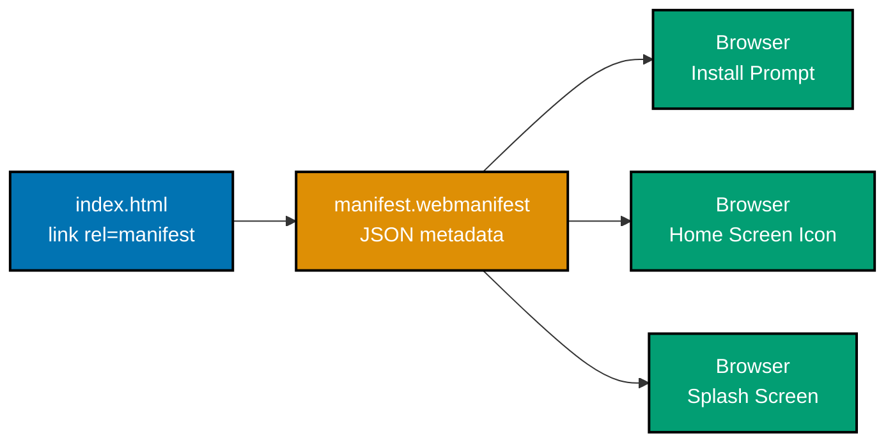
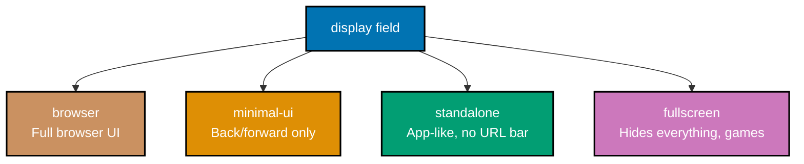
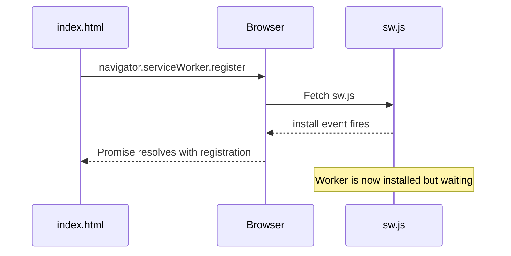
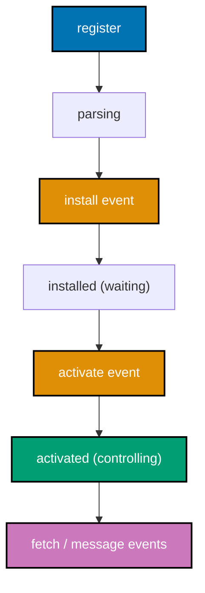
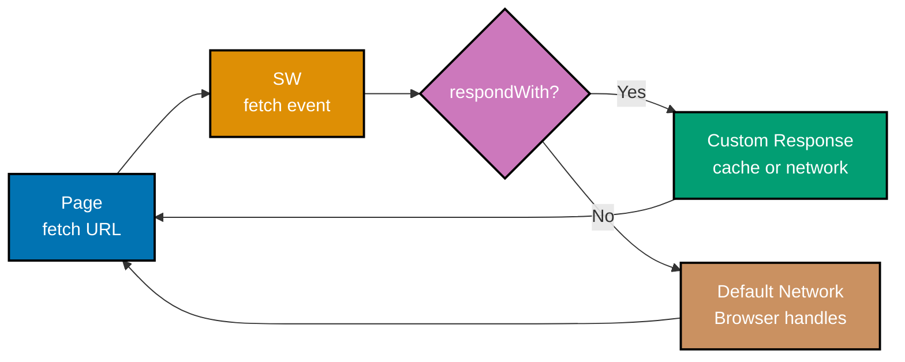
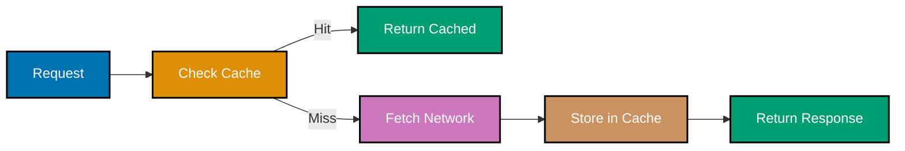
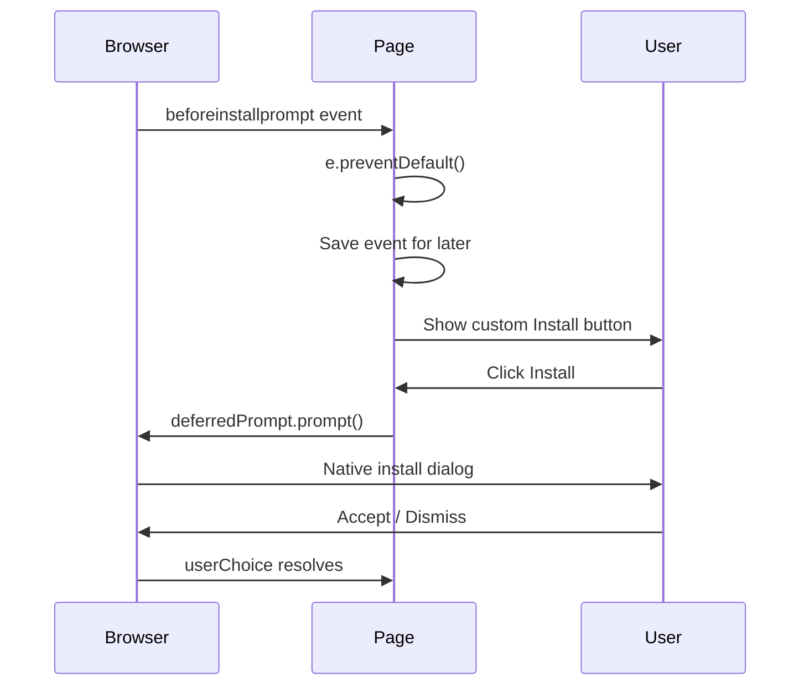
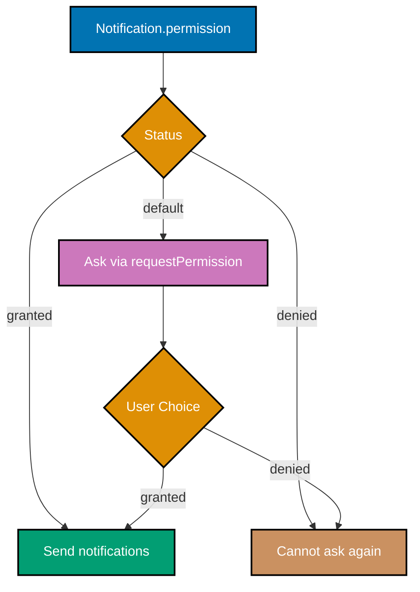
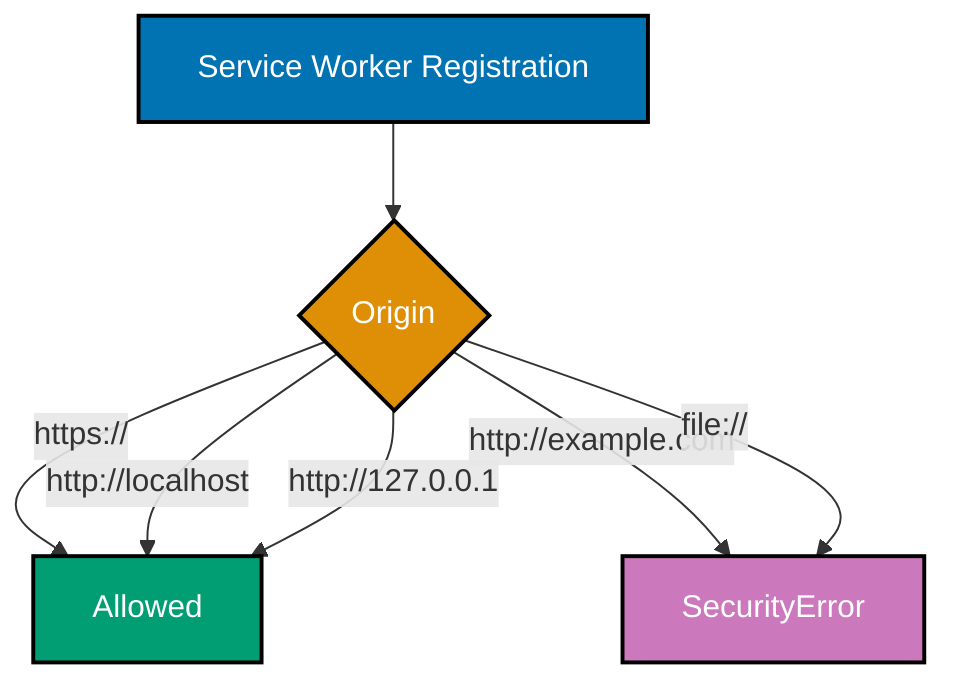
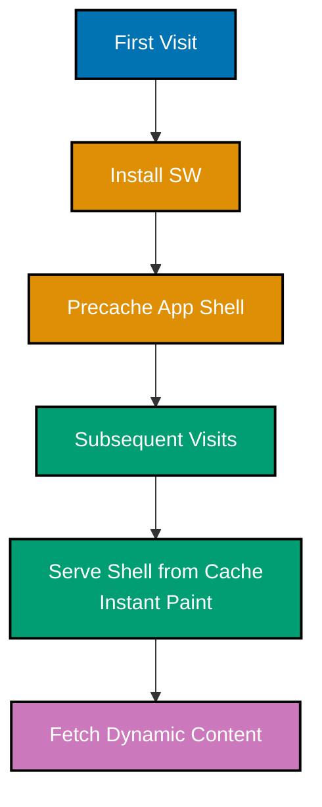

This beginner tutorial covers fundamental Progressive Web App concepts through 28 heavily annotated examples. Each example uses **only core browser APIs**, no third-party libraries, so you understand exactly how the PWA platform works under the hood. Each example maintains 1-2.25 comment lines per code line to ensure deep understanding.

## Prerequisites

Before starting, ensure you understand:

- HTML structure and `<link>` / `<script>` elements
- JavaScript Promises and `async`/`await`
- HTTP requests, responses, and basic caching headers
- The browser console and DevTools

## Group 1: Web App Manifest Foundations

### Example 1: Minimal Web App Manifest

The Web App Manifest is a JSON file that tells the browser how to present your site as an installable app. The browser uses it for the install prompt, the home screen icon, splash screen, and display mode.



```html
<!-- index.html: link the manifest from the document head -->
<!DOCTYPE html>
<html lang="en">
  <head>
    <meta charset="UTF-8" />
    <!-- => UTF-8 charset must come before any user-visible content in head -->
    <!-- => meta viewport: required for installable PWAs on mobile -->
    <meta name="viewport" content="width=device-width, initial-scale=1" />
    <!-- => Without viewport meta, mobile browsers zoom out; looks broken -->
    <title>My PWA</title>
    <!-- => link rel=manifest: tells browser where to fetch the manifest -->
    <!-- => href can be absolute or relative; .webmanifest is the conventional extension -->
    <link rel="manifest" href="/manifest.webmanifest" />
    <!-- => Manifest must be same-origin or include proper CORS headers -->
  </head>
  <body>
    <h1>Hello, PWA</h1>
  </body>
</html>
```

```json
// manifest.webmanifest: minimal viable manifest
{
  // => name: full app name shown on install prompt and splash screen
  "name": "My PWA",
  // => Keep under 45 chars; some OS truncate longer names
  // => short_name: 12 chars or fewer, used under the home screen icon
  "short_name": "PWA",
  // => short_name: used when space is limited (home screen label)
  // => start_url: URL launched when user taps the home screen icon
  // => Use "/" or a query param to track install-launches separately
  "start_url": "/",
  // => Must be same-origin and within scope
  // => display: standalone hides the browser chrome (URL bar, tabs)
  // => Other values: fullscreen, minimal-ui, browser
  "display": "standalone",
  // => standalone = app-like; no URL bar, no back/forward buttons
  // => background_color: shown during splash screen before page paints
  "background_color": "#ffffff",
  // => theme_color: colors the OS title bar / status bar
  "theme_color": "#0173B2"
  // => theme_color matches brand primary for cohesive look
}
```

**Key Takeaway**: The Web App Manifest is the single source of truth for how your site presents itself as an installable app, linked from the HTML via `<link rel="manifest">`.

**Why It Matters**: Without a valid manifest, browsers will not show the install prompt and the operating system has no metadata to render the home screen icon, splash screen, or task switcher entry. Production PWAs treat the manifest as a deployment artifact: it must be served with the correct MIME type (`application/manifest+json`) and cached carefully so updates roll out predictably. Getting the minimal manifest right unlocks installability across every modern browser.

### Example 2: Required Manifest Fields for Installability

Browsers will not show the install prompt unless the manifest contains a specific minimum set of fields. Chromium-based browsers and Edge enforce the strictest set, so target their requirements.

```json
// manifest.webmanifest: installability-ready manifest
{
  // => name: required, shown in install dialog
  "name": "Example Productivity App",
  // => name should match your app's brand; up to 45 chars
  // => short_name: required by some browsers, recommended for all
  "short_name": "Example",
  // => short_name: max 12 chars for home screen label on Android
  // => start_url: required, must be same-origin or within scope
  "start_url": "/?source=pwa",
  // => ?source=pwa: analytics parameter to track home-screen launches
  // => display: must be standalone, fullscreen, or minimal-ui to install
  "display": "standalone",
  // => 'browser' display mode disqualifies the site from installation
  // => icons: must include at least one 192x192 and one 512x512 PNG
  "icons": [
    {
      // => src: URL relative to manifest location
      "src": "/icons/icon-192.png",
      // => sizes: WxH in CSS pixels, used for icon selection
      "sizes": "192x192",
      // => 192x192: minimum for Android; used in app drawer and install dialog
      // => type: MIME type, helps browser select correct format
      "type": "image/png"
    },
    {
      // => 512x512 is required for splash screens on Android
      "src": "/icons/icon-512.png",
      "sizes": "512x512",
      // => 512x512: shown on splash screen before app renders
      "type": "image/png"
    },
    {
      // => purpose: maskable lets Android crop into adaptive icons
      "src": "/icons/icon-maskable-512.png",
      "sizes": "512x512",
      "type": "image/png",
      "purpose": "maskable"
      // => maskable: required for adaptive icon shapes (circle, squircle, etc.)
      // => Design icon with 40% safe zone to avoid clipping on all shapes
    }
  ]
}
```

**Key Takeaway**: An installable manifest needs `name`, `short_name`, `start_url`, `display`, and at least one 192x192 and one 512x512 icon, all served over HTTPS.

**Why It Matters**: Browsers treat installability as a binary gate, missing any required field silently disqualifies your site. Production teams audit installability in CI by parsing the manifest and asserting the field set, because a missing `512x512` icon ships fine functionally but breaks the install prompt for every Android user. Maskable icons additionally prevent your branding from being clipped on devices that use adaptive icon shapes.

### Example 3: Manifest Scope and start_url

The `scope` field defines which URLs are considered part of the app. When users navigate outside the scope, the browser treats it as leaving the PWA and may show browser chrome.

```json
// manifest.webmanifest: scope and start_url interaction
{
  "name": "Docs Site",
  "short_name": "Docs",
  // => start_url: the URL launched on tap; must be within scope
  "start_url": "/docs/",
  // => start_url must have /docs/ prefix to be within scope
  // => scope: defines the navigation boundary of the PWA
  // => All URLs starting with /docs/ are inside the app
  // => Visiting /blog/ leaves the PWA scope and may open in browser
  "scope": "/docs/",
  // => scope and start_url should match; start_url must be within scope
  "display": "standalone",
  "icons": [
    { "src": "/icons/icon-192.png", "sizes": "192x192", "type": "image/png" },
    // => 192x192: minimum for Android installability
    { "src": "/icons/icon-512.png", "sizes": "512x512", "type": "image/png" }
    // => 512x512: splash screen and high-DPI icon
  ]
}
```

```javascript
// Demonstrating scope behavior at runtime
// => navigator.serviceWorker can only control pages within manifest scope
navigator.serviceWorker.getRegistration().then((reg) => {
  // => getRegistration returns null if no SW registered for this URL
  // => reg.scope is the URL prefix the SW controls
  // => Defaults to the SW script location but is bounded by manifest scope
  console.log("SW scope:", reg?.scope);
  // => reg?.scope: optional chain; null-safe in case no SW is registered
  // => Output (example): SW scope: https://example.com/docs/
});
```

**Key Takeaway**: `scope` defines the PWA's navigation boundary; `start_url` is the entry point. Set them to match the section of your site you want to ship as an app.

**Why It Matters**: A misconfigured scope causes silent UX bugs, users tap your home screen icon, navigate to a public URL, and suddenly the browser chrome reappears as if the app crashed. Production teams ship marketing pages and the app on different scopes (e.g., `/` for marketing, `/app/` for the PWA) precisely so the manifest can scope to the application surface only. This separation keeps the install experience clean.

### Example 4: Display Modes (standalone vs minimal-ui vs fullscreen)

The `display` field controls how much browser chrome shows when the user launches the PWA. Each mode has different UX implications and platform support.



```json
// manifest.webmanifest: display_override for graceful fallback
{
  "name": "Tabbed App",
  "short_name": "Tabs",
  "start_url": "/",
  // => display: fallback if no display_override entries are supported
  "display": "standalone",
  // => Always include display as the universal fallback
  // => display_override: ordered list of preferred modes
  // => Browser picks first one it supports, falls back to display
  // => window-controls-overlay enables custom titlebar (desktop)
  // => tabbed lets PWAs have multiple tabs (Chromium experimental)
  "display_override": ["window-controls-overlay", "tabbed", "standalone"],
  // => ['wco', 'tabbed', 'standalone']: most specific to least specific
  "icons": [
    { "src": "/icons/icon-192.png", "sizes": "192x192", "type": "image/png" },
    { "src": "/icons/icon-512.png", "sizes": "512x512", "type": "image/png" }
  ]
}
```

```javascript
// Detect the active display mode at runtime
// => matchMedia('(display-mode: standalone)') matches when launched as PWA
// => Lets you adapt UI: hide install button if already installed
const isStandalone = window.matchMedia("(display-mode: standalone)").matches;
// => .matches returns true synchronously at the current state
// => isStandalone is true when launched from home screen
console.log("Running as installed PWA:", isStandalone);
// => On iOS Safari use navigator.standalone for the same check (legacy)
const isIOSStandalone = window.navigator.standalone === true;
// => navigator.standalone is boolean | undefined on iOS; === true is safe
// => Output (when installed): Running as installed PWA: true
```

**Key Takeaway**: Use `display: standalone` for most apps and `display_override` to opt into newer modes like `window-controls-overlay` while keeping a safe fallback.

**Why It Matters**: The display mode is the single biggest visual signal that your site is an app. `standalone` is the production default because it works everywhere, while `display_override` lets you progressively enhance the chrome on browsers that support newer modes. Detecting the active mode at runtime is essential, you do not want to render the install button to a user who already installed the app.

### Example 5: Theme Color and Background Color

`theme_color` controls the OS-level chrome color (status bar on Android, title bar on desktop). `background_color` paints the splash screen on launch before your app renders.

```html
<!-- index.html: theme_color override per page via meta tag -->
<head>
  <!-- => meta theme-color: overrides manifest theme_color for this page -->
  <!-- => Useful for dark/light mode pages that need different status bars -->
  <meta name="theme-color" content="#0173B2" />
  <!-- => Without media attribute, applies to all color schemes -->
  <!-- => media attribute: scope theme color to color scheme -->
  <meta name="theme-color" content="#0173B2" media="(prefers-color-scheme: light)" />
  <!-- => Light theme: use your brand's primary color -->
  <meta name="theme-color" content="#1a1a1a" media="(prefers-color-scheme: dark)" />
  <!-- => Dark theme: near-black matches dark page backgrounds -->
  <link rel="manifest" href="/manifest.webmanifest" />
  <!-- => manifest link must stay in head alongside theme-color tags -->
</head>
```

```json
// manifest.webmanifest: theme + background colors
{
  "name": "Themed App",
  "short_name": "Themed",
  "start_url": "/",
  "display": "standalone",
  // => background_color: painted before page CSS loads
  // => Match your app's main background to avoid flash
  "background_color": "#ffffff",
  // => Use exact same hex as your CSS body background
  // => theme_color: status bar / title bar color
  // => Match brand color for cohesive look
  "theme_color": "#0173B2",
  // => theme_color applies to OS chrome; visible in app switcher, status bar
  "icons": [
    { "src": "/icons/icon-192.png", "sizes": "192x192", "type": "image/png" },
    { "src": "/icons/icon-512.png", "sizes": "512x512", "type": "image/png" }
  ]
}
```

**Key Takeaway**: `background_color` is shown during launch (avoid white-flash on dark themes) and `theme_color` colors the OS chrome; override per-page via `<meta name="theme-color">` for dark-mode pages.

**Why It Matters**: The splash screen flash is one of the most jarring PWA bugs, users tap a dark-themed app icon and see a blinding white screen for half a second before the app paints. Setting `background_color` to your actual page background fixes it. Theme color matters more than developers realize because the OS chrome color is the first thing users notice, mismatched colors signal "unfinished" instantly.

## Group 2: Service Worker Registration & Lifecycle

### Example 6: Registering a Service Worker

A service worker is a JavaScript file that runs in the background, separate from your page, and acts as a programmable network proxy. Register it as early as possible after page load.



```html
<!-- index.html: register the service worker after page load -->
<script>
  // => Always feature-detect: older browsers and HTTP origins lack SW
  if ("serviceWorker" in navigator) {
    // => 'serviceWorker' in navigator: false in IE11 and non-secure contexts
    // => Wait for load to avoid competing with critical page resources
    window.addEventListener("load", () => {
      // => 'load' fires after all page resources are fetched
      // => Registering before load may delay FCP on slow connections
      // => register returns a Promise<ServiceWorkerRegistration>
      navigator.serviceWorker
        .register("/sw.js", {
          // => scope: limits which URLs the SW can control
          // => Default scope is the SW's directory; explicit is clearer
          scope: "/",
          // => scope: '/' means SW can intercept all requests on this origin
        })
        .then((registration) => {
          // => registration.installing | waiting | active are SW states
          // => registration.scope shows which URLs this SW controls
          console.log("SW registered, scope:", registration.scope);
          // => Output: SW registered, scope: https://localhost/
          // => If scope is narrower than expected, check sw.js location
        })
        .catch((error) => {
          // => Common errors: not HTTPS, sw.js not found, parse error
          // => error.message: 'An SSL certificate error occurred' = HTTPS issue
          console.error("SW registration failed:", error);
          // => Log to error tracker in production; registration failures are silent otherwise
        });
    });
  }
</script>
```

```javascript
// sw.js: minimal service worker that does nothing yet
// => Top-level code runs once when the worker is parsed
// => No window, no document; self = ServiceWorkerGlobalScope
console.log("SW script evaluated");
// => Output (in DevTools > Application > Service Workers): SW script evaluated
// => Without event handlers, this SW does nothing; pages still work normally
```

**Key Takeaway**: Feature-detect `'serviceWorker' in navigator`, register on `load`, and always handle the `.catch()` to surface registration failures during development.

**Why It Matters**: Registration silently fails in production for many reasons: missing HTTPS, wrong MIME type, scope outside the script's directory, or a syntax error in the worker. Without a `.catch()` handler, you ship a "PWA" that never installs offline support and never alerts you. Production teams log registration failures to their error tracker so a broken deploy is visible within minutes instead of going unnoticed for weeks.

### Example 7: Service Worker Lifecycle Events

A service worker progresses through `install`, `activate`, and serving states. Each event is your chance to set up caches, clean up old versions, or claim clients.



```javascript
// sw.js: handle install and activate events
// => install: fires once per SW version, ideal for precaching
self.addEventListener("install", (event) => {
  // => self refers to the ServiceWorkerGlobalScope (no window/document)
  // => self has no DOM, window, or document; use caches, fetch, clients
  console.log("SW: install event fired");
  // => Output visible in DevTools > Application > Service Workers > Logs
  // => event.waitUntil extends the install lifetime until the promise settles
  // => If the promise rejects, the SW fails to install
  event.waitUntil(
    // => Open or create a named cache (Cache API)
    caches.open("app-shell-v1").then((cache) => {
      // => addAll fetches each URL and stores the response
      // => All-or-nothing: if any fetch fails, install fails
      return cache.addAll(["/", "/index.html", "/styles.css"]);
      // => URLs are relative to the SW script origin
    }),
  );
});

// => activate: fires when a previously-installed SW becomes active
self.addEventListener("activate", (event) => {
  // => activate fires after all open tabs under old SW are closed (or skipWaiting called)
  // => activate is the deploy hook: safe to delete old caches here
  console.log("SW: activate event fired");
  // => Use activate to clean up caches from older SW versions
  event.waitUntil(
    // => caches.keys returns all cache names for this origin
    caches.keys().then((cacheNames) => {
      // => cacheNames: all caches, including ones from previous SW versions
      // => Delete every cache except the current version
      return Promise.all(
        cacheNames
          .filter((name) => name !== "app-shell-v1")
          // => filter returns names that are NOT the current cache
          // => All old 'app-shell-v0', 'app-shell-v2' etc. will be deleted
          .map((stale) => caches.delete(stale)),
        // => caches.delete returns Promise<boolean>; map wraps all in array
      );
    }),
  );
});
```

**Key Takeaway**: Use `install` to precache critical assets and `activate` to clean up old caches; wrap async work in `event.waitUntil()` so the browser knows when each phase completes.

**Why It Matters**: Forgetting `event.waitUntil()` is the single most common SW bug, the browser thinks install/activate finished before your async work did, leading to half-populated caches and stale data shipping to users. The activate phase is also when you delete obsolete caches; without cleanup, browser quota fills up and your SW eventually fails to install at all. Treat these events as your deploy hooks for cached assets.

### Example 8: The fetch Event - Intercepting Network Requests

The `fetch` event lets the SW intercept every network request from pages within its scope. You decide whether to serve from cache, hit the network, or synthesize a response.



```javascript
// sw.js: simplest fetch handler (passthrough)
self.addEventListener("fetch", (event) => {
  // => event.request is a Request object: URL, method, headers, body
  // => request.url is the full URL including protocol, host, path, query
  console.log("SW intercepted:", event.request.url);
  // => Log is visible in DevTools > Application > Service Workers > Console
  // => respondWith tells the browser: "I'm handling this, here's my response"
  // => Must be called synchronously in the event handler
  // => If you do nothing, the browser handles the request normally
  event.respondWith(
    // => fetch() inside SW makes a real network request
    // => This handler is a passthrough: SW does not modify behavior yet
    fetch(event.request),
    // => event.request is a Request; fetch() accepts it directly
  );
});
```

```javascript
// Same but with a try/catch for offline fallback
self.addEventListener("fetch", (event) => {
  // => event.respondWith must be called synchronously
  event.respondWith(
    // => Wrap async logic in an IIFE to use try/catch with await
    (async () => {
      try {
        // => Attempt the network first
        const networkResponse = await fetch(event.request);
        // => Return a successful response
        return networkResponse;
        // => networkResponse has the body and headers from the server
      } catch (error) {
        // => Network failed: return a synthesized offline message
        // => new Response can wrap any text/JSON/HTML body
        return new Response("You are offline", {
          status: 503,
          // => 503 = Service Unavailable; appropriate for offline
          headers: { "Content-Type": "text/plain" },
          // => Content-Type: text/plain so browser renders the text directly
        });
      }
    })(),
  );
});
```

**Key Takeaway**: The `fetch` event handler must call `event.respondWith(Response | Promise<Response>)` synchronously to take control; otherwise the browser does its default network fetch.

**Why It Matters**: The fetch event is the heart of every offline strategy. Mishandling it has severe production consequences: forgetting `respondWith` means your SW does nothing, but calling it with a rejected promise means every request to your site fails. Production SWs always have a fallback path so a broken cache lookup never strands the user. The pattern of "try network, fall back to cache, fall back to a synthesized response" recurs through every PWA you will ship.

### Example 9: Cache API Basics - Open, Put, Match

The Cache API is a key/value store of `Request` -> `Response` pairs, scoped per origin and persisted across sessions. It is the storage layer that makes service workers useful.

```javascript
// sw.js: Cache API CRUD operations
async function cacheBasics() {
  // => caches.open creates the cache if missing, returns a Cache object
  const cache = await caches.open("demo-cache-v1");
  // => 'demo-cache-v1' is the cache name; scoped to this origin

  // => put stores a Request -> Response pair
  // => Both args can be URL strings or Request/Response objects
  await cache.put("/data.json", new Response('{"hello":"world"}'));
  // => Response body is a string; in real code use fetch(url) for real bodies

  // => match looks up by Request (URL + method)
  // => Returns the cached Response or undefined if missing
  const cached = await cache.match("/data.json");
  // => cached is a Response object; .text() reads the body
  // => cached is undefined (not null) on miss; always check before using
  console.log("Cached body:", await cached.text());
  // => Output: Cached body: {"hello":"world"}

  // => keys returns all cached Request objects in this cache
  const requests = await cache.keys();
  // => Useful for inspecting what's cached during debugging
  // => requests is Request[]; map to .url for readable output
  console.log(
    "Cached URLs:",
    requests.map((r) => r.url),
  );
  // => Output: Cached URLs: ["https://example.com/data.json"]

  // => delete removes a single entry, returns true if it existed
  const deleted = await cache.delete("/data.json");
  // => Returns false if the entry wasn't in the cache
  console.log("Deleted:", deleted);
  // => Output: Deleted: true
}

// => Run during install or as a one-off
cacheBasics();
// => In production, call cache operations from event handlers, not top-level
```

**Key Takeaway**: `caches.open(name)`, `cache.put(request, response)`, `cache.match(request)`, `cache.keys()`, and `cache.delete(request)` are the five operations you need to manage cached responses.

**Why It Matters**: The Cache API is durable: entries survive browser restarts and persist until quota pressure or explicit deletion. That makes it perfect for your app shell but dangerous for sensitive data, anything you put in the cache is readable by other tabs of the same origin. Production code wraps cache operations in helper functions so versioning and namespacing are consistent, because once you ship a cache name, it lives in users' browsers forever.

### Example 10: Cache-First Strategy for Static Assets

Cache-first checks the cache before hitting the network. Use it for assets that rarely change (CSS, images, fonts) where speed matters more than freshness.



```javascript
// sw.js: cache-first strategy
self.addEventListener("fetch", (event) => {
  // => Limit strategy to GET requests; POST/PUT bypass cache
  if (event.request.method !== "GET") return;
  // => Only GET responses are safe to cache and replay

  event.respondWith(
    (async () => {
      // => Step 1: try the cache
      // => caches.match searches all caches at once
      const cached = await caches.match(event.request);
      // => caches.match(request): searches every open cache for this URL
      if (cached) {
        // => Cache hit: return immediately, no network call
        return cached;
        // => Response time ≈ 0ms; from disk or memory cache
      }

      // => Step 2: cache miss, fetch from network
      const response = await fetch(event.request);
      // => Network request; response arrives after real round-trip

      // => Step 3: clone response before caching
      // => Response bodies are streams and can be read only once
      // => Caller and cache both need their own copy
      const cache = await caches.open("static-v1");
      cache.put(event.request, response.clone());
      // => Non-awaited put: cache update runs in background, does not block

      // => Step 4: return the original response to the page
      return response;
      // => Original response body goes to the page; clone body to cache
    })(),
  );
});
```

**Key Takeaway**: Cache-first returns cached responses instantly when present and falls back to the network on miss; always clone the response before caching because bodies are single-use streams.

**Why It Matters**: Cache-first is the fastest possible response, often under a millisecond, because no network or DNS happens. It is the right default for hashed assets (`/static/app.abc123.css`) where the URL changes when content changes, so stale entries never matter. Forgetting `response.clone()` is the most common cache bug, the page never gets the body because the cache consumed it. This pattern alone makes most PWAs feel native.

### Example 11: Network-First Strategy for Dynamic Content

Network-first prefers fresh data and falls back to cache only if the network fails. Use it for HTML pages and API responses where stale content is worse than slow content.

```javascript
// sw.js: network-first strategy
self.addEventListener("fetch", (event) => {
  // => Intercepts all fetch requests from controlled pages
  if (event.request.method !== "GET") return;
  // => Skip non-GET; network-first doesn't apply to mutations

  event.respondWith(
    (async () => {
      try {
        // => Attempt the network first
        // => Use a timeout pattern in production to avoid long waits
        const networkResponse = await fetch(event.request);
        // => fetch() rejects only on network failure (DNS fail, timeout)
        // => HTTP errors (4xx, 5xx) still resolve; check response.ok for them

        // => Update the cache with the fresh response
        // => Clone before caching (bodies are streams)
        const cache = await caches.open("dynamic-v1");
        cache.put(event.request, networkResponse.clone());
        // => Non-awaited put runs in background; does not delay the response

        // => Return the fresh network response
        return networkResponse;
      } catch (error) {
        // => Network failed: fall back to cache
        // => error is typically a TypeError: 'Failed to fetch'
        // => Returns undefined if not cached, browser will show its error
        const cached = await caches.match(event.request);
        if (cached) {
          // => Return last-known good response
          return cached;
          // => Cached response may be stale; acceptable for offline fallback
        }

        // => Nothing cached: return a clear offline error
        return new Response("Offline and no cached copy available", {
          status: 503,
          statusText: "Service Unavailable",
          // => 503 signals temporary unavailability; client may retry
        });
      }
    })(),
  );
});
```

**Key Takeaway**: Network-first returns fresh data when online and serves the cached copy as a fallback when offline; pair with a synthesized response so users never see a blank screen.

**Why It Matters**: Network-first is the right strategy for content where freshness matters: news feeds, dashboards, comment threads. Without a cache fallback, every offline user sees a browser error page. With it, they see the last data they loaded plus an offline indicator. The combination of "always try network" and "always have a fallback" is what makes a PWA feel reliable even on subway commutes and elevator rides.

### Example 12: Offline Fallback Page

Even with caching, some requests will miss both network and cache. Reserve a single offline.html page in the cache as the universal fallback for navigation requests.

```javascript
// sw.js: precache an offline fallback during install
self.addEventListener("install", (event) => {
  // => install runs before any pages are served; ideal for precaching
  event.waitUntil(
    caches.open("offline-v1").then((cache) => {
      // => Precache only the offline page during install
      // => Must succeed for the SW to install
      return cache.add("/offline.html");
      // => cache.add is shorthand for fetch + put; single file version of addAll
    }),
  );
});

// => Handle navigation requests with an offline fallback
self.addEventListener("fetch", (event) => {
  // => mode === 'navigate' filters to top-level navigations only
  // => Static assets (CSS/JS/images) are not navigation requests
  if (event.request.mode !== "navigate") return;
  // => Returning without respondWith passes control to the browser

  event.respondWith(
    // => Try the network for the actual page
    fetch(event.request).catch(async () => {
      // => .catch fires when network fails (offline, DNS error, etc.)
      // => Network failed: serve the precached offline page
      const cache = await caches.open("offline-v1");
      // => match returns the cached Response for /offline.html
      return cache.match("/offline.html");
      // => Returns undefined if /offline.html was never cached; always precache it
    }),
  );
});
```

```html
<!-- offline.html: minimal, self-contained, no network deps -->
<!-- => This page must not require any external resources -->
<!DOCTYPE html>
<html lang="en">
  <head>
    <meta charset="UTF-8" />
    <!-- => charset must be first meta; avoids character encoding issues -->
    <title>Offline</title>
    <!-- => Inline styles only: no external requests when offline -->
    <style>
      body {
        font-family: system-ui;
        padding: 2rem;
        text-align: center;
      }
      /* => system-ui: platform-native font; no font file fetch needed */
      h1 {
        color: #de8f05;
      }
      /* => Use accessible contrast ratio; #DE8F05 on white is WCAG AA */
    </style>
  </head>
  <body>
    <h1>You are offline</h1>
    <!-- => Clear, user-friendly message; avoid technical jargon -->
    <p>Check your connection and try again.</p>
    <!-- => Give user an actionable next step -->
  </body>
</html>
```

**Key Takeaway**: Filter the `fetch` event with `request.mode === 'navigate'` to apply the offline fallback only to top-level page loads, not to every CSS/JS/image request.

**Why It Matters**: A great offline fallback is the single biggest UX win of shipping a PWA. Without it, users on bad networks see a "DINOSAUR" page or an opaque browser error. With it, they see your branded offline screen with retry guidance, signaling that the app is functioning as designed. The offline page must be entirely self-contained (no external CSS/fonts/images) because, by definition, the network is down when it renders.

### Example 13: Manually Updating a Service Worker

Browsers check for new SW versions on navigation, but you often want to trigger updates explicitly, after a deploy, on focus, or via a button.

```javascript
// app.js: register and check for updates
// => Top-level await works in ES modules; wrap in async function for script tags
const registration = await navigator.serviceWorker.register("/sw.js");
// => registration is a ServiceWorkerRegistration object
// => registration.scope tells you which URLs the SW controls

// => update() checks for a new sw.js from the server
// => If the bytes differ, the new SW enters the install -> waiting state
async function checkForUpdates() {
  // => Returns a Promise that resolves when the check completes
  await registration.update();
  // => update() triggers a one-byte-difference check; even a comment change triggers update
  // => update() is a network request; rate-limited by browser to ~24h minimum
  // => Compare versions via registration.waiting after this call
  if (registration.waiting) {
    // => waiting is non-null when a newer SW installed but not yet active
    console.log("Update available, waiting to activate");
    // => Show a UI prompt to the user at this point
  }
}

// => Check for updates on tab focus (common UX pattern)
// => Catches users who left a tab open across deploys
window.addEventListener("focus", checkForUpdates);
// => focus fires when user returns to this tab from another app/tab

// => Listen for new workers entering the lifecycle
registration.addEventListener("updatefound", () => {
  // => updatefound fires when a new SW starts installing
  const newWorker = registration.installing;
  // => Watch state changes to know when it's ready
  newWorker.addEventListener("statechange", () => {
    // => state values: installing, installed, activating, activated, redundant
    if (newWorker.state === "installed" && navigator.serviceWorker.controller) {
      // => Old SW still controls the page; new SW is waiting
      // => controller non-null means this is an update, not first install
      // => Show a "Refresh to update" toast to the user
      console.log("New version ready, refresh to use");
      // => Inform user so they can choose when to reload
    }
  });
});
```

**Key Takeaway**: Call `registration.update()` to check for new SW versions and listen to `updatefound` + `statechange` to detect when an update is ready to take over.

**Why It Matters**: Service worker updates are user-visible only when you make them so. Without an update check on focus or interval, a user can run a stale SW for weeks because they never close the tab. Production PWAs surface updates as a toast notification ("New version ready, click to refresh") because forcing a reload mid-task destroys user state. Designing the update UX is a core PWA responsibility, not a nice-to-have.

### Example 14: skipWaiting and clients.claim

By default, a new SW waits for all controlled tabs to close before activating. `skipWaiting` and `clients.claim` let you take control immediately, useful for fast updates but dangerous mid-session.

```javascript
// sw.js: take control immediately on install/activate
self.addEventListener("install", (event) => {
  // => skipWaiting tells the browser: don't wait, activate me now
  // => Skips the "waiting" state, jumps straight to activate
  // => Promise version available; sync version works in install handler
  self.skipWaiting();
  // => Combine with event.waitUntil for precaching as normal
  // => skipWaiting is safe to call even if you also call event.waitUntil
  // => Without skipWaiting, wait for all open tabs to close before activation
});

self.addEventListener("activate", (event) => {
  // => activate fires right after install when skipWaiting was called
  event.waitUntil(
    // => clients.claim makes this SW control existing tabs
    // => Without claim, only NEW tabs get the new SW
    self.clients.claim(),
    // => claim() + skipWaiting = new SW controls all tabs immediately
  );
});
```

```javascript
// app.js: alternative pattern, let user opt-in to immediate activation
// => Listen for the controllerchange event on the global SW object
navigator.serviceWorker.addEventListener("controllerchange", () => {
  // => Fires when a new SW takes control of this page
  // => Reload to ensure all assets come from the new SW
  console.log("New SW took control, reloading");
  // => Add a guard boolean to prevent infinite reload if controllerchange fires twice
  window.location.reload();
});

// => Trigger skipWaiting from page when user clicks "Update"
async function activateWaitingSW() {
  const registration = await navigator.serviceWorker.getRegistration();
  // => getRegistration returns null if no SW registered; optional chain handles it
  if (registration?.waiting) {
    // => postMessage to the waiting SW to call skipWaiting
    // => Cleanest pattern: SW listens for SKIP_WAITING message
    registration.waiting.postMessage({ type: "SKIP_WAITING" });
    // => Waiting SW receives this and calls self.skipWaiting() internally
  }
}
```

**Key Takeaway**: `skipWaiting()` activates a new SW immediately, `clients.claim()` makes it control existing tabs; combine with a user-triggered reload to avoid breaking in-flight requests.

**Why It Matters**: Eager activation has hidden costs: assets fetched from cache by the old SW may not match assets requested by the new one, leading to mixed-version JavaScript that throws runtime errors. The safest production pattern is "wait for the user to opt in", show an update toast, postMessage `SKIP_WAITING` on click, and reload after `controllerchange`. This pattern keeps deploys fast for engaged users without breaking anyone mid-task.

## Group 3: Install Prompt & App Promotion

### Example 15: Capturing the beforeinstallprompt Event

Browsers fire `beforeinstallprompt` when they decide your site is installable. Capture the event so you can show your own install button instead of relying on the browser's native UI.



```javascript
// app.js: capture and use the install prompt
// => Module-level variable holds the deferred event
let deferredPrompt = null;
// => Null until beforeinstallprompt fires; re-nulled after use

// => Browser fires this when site meets installability criteria
window.addEventListener("beforeinstallprompt", (event) => {
  // => preventDefault stops the browser's automatic mini-infobar
  // => Required if you want to control when to show the prompt
  event.preventDefault();
  // => Without preventDefault, browser may show the infobar immediately
  // => Save the event so we can call .prompt() later
  deferredPrompt = event;
  // => The event stays valid until .prompt() is called once

  // => Reveal your custom install button now that we know it works
  document.querySelector("#install-btn").hidden = false;
  // => Button was hidden until we confirmed installability
});

// => Wire up your custom install button
document.querySelector("#install-btn").addEventListener("click", async () => {
  if (!deferredPrompt) return;
  // => Guard against button click before event was captured (e.g., race condition)

  // => prompt() shows the native browser install dialog
  // => Returns a Promise that resolves immediately with the choice
  deferredPrompt.prompt();
  // => prompt() can only be called once per event; this fires the browser dialog

  // => userChoice resolves with { outcome: 'accepted' | 'dismissed' }
  const { outcome } = await deferredPrompt.userChoice;
  console.log("Install prompt outcome:", outcome);
  // => Output: Install prompt outcome: accepted
  // => Track this in analytics to measure install funnel conversion

  // => deferredPrompt can only be used once; clear it
  deferredPrompt = null;
  // => Prevent accidental re-prompt if button is clicked again
  document.querySelector("#install-btn").hidden = true;
  // => Hide button; user already made their choice
});
```

**Key Takeaway**: Capture `beforeinstallprompt`, call `event.preventDefault()` to suppress the default UI, save the event, and trigger `event.prompt()` from your own button.

**Why It Matters**: Browsers throttle the install prompt aggressively, you typically get one shot per user. A custom install button shown at the right moment (after a positive interaction, not on page load) converts dramatically better than the browser's default mini-infobar. Capturing the event also lets you log install funnel metrics, a piece of telemetry that tells you whether your installable PWA is actually getting installed.

### Example 16: Detecting When the App Was Installed

The `appinstalled` event fires after a successful install. Use it to update your UI, log analytics, and stop showing install prompts.

```javascript
// app.js: track install success
// => Module-level flag tracks installed state across this session
window.addEventListener("appinstalled", (event) => {
  // => appinstalled fires after user accepts install dialog
  // => event has no useful properties; the firing itself is the signal
  // => Only fires once per install; not fired on subsequent launches
  console.log("PWA was installed");
  // => Output: PWA was installed
  // => This is the one-time confirmation; subsequent loads use display-mode check

  // => Hide the install button permanently for this user
  document.querySelector("#install-btn").hidden = true;
  // => Also set a localStorage flag to persist across sessions if needed

  // => Log to analytics (production: send to your tracker)
  // => Install conversion is a top-level PWA metric
  // => fetch sends a beacon; use sendBeacon for reliability on unload
  navigator.sendBeacon(
    "/api/analytics",
    JSON.stringify({ event: "pwa_installed" }),
    // => sendBeacon: fire-and-forget; survives page unload
  );
});

// => Detect already-installed state on load (for return visits)
// => matchMedia '(display-mode: standalone)' = launched as PWA
const isInstalled = window.matchMedia("(display-mode: standalone)").matches;
// => .matches is true when launched from home screen in standalone mode
if (isInstalled) {
  // => Already running as installed app; never show install button
  document.querySelector("#install-btn").hidden = true;
  // => User is in the app; showing "Install app" would be confusing
}
```

**Key Takeaway**: Listen for `appinstalled` to mark the user as installed and use `matchMedia('(display-mode: standalone)')` on subsequent loads to detect the installed state.

**Why It Matters**: Showing an install button to an already-installed user is the most embarrassing PWA bug, it tells them you do not actually understand your own install state. The combination of `appinstalled` (one-time signal) and `display-mode: standalone` (persistent signal) covers both fresh installs and returning users. Sending the install event to analytics lets product teams measure conversion through the install funnel, the most important PWA metric.

### Example 17: iOS Safari Install (Add to Home Screen)

iOS Safari does not fire `beforeinstallprompt` and does not show an install banner. You must instruct users to use the Share menu's "Add to Home Screen" option.

```javascript
// app.js: detect iOS and show platform-specific instructions
// => User-Agent sniffing is unreliable but iOS Safari has no better signal
function isIOS() {
  // => Test for iPad, iPhone, iPod in UA string
  // => navigator.platform is deprecated but still works on iOS
  return /iPhone|iPad|iPod/.test(navigator.userAgent) && !window.MSStream;
  // => !window.MSStream: IE11 sets both iPhone UA and MSStream; exclude IE
}

// => Detect Safari specifically (Chrome on iOS uses WebKit but isn't Safari)
function isInStandaloneMode() {
  // => navigator.standalone is iOS-specific (legacy property)
  // => True when launched from home screen on iOS
  return "standalone" in window.navigator && window.navigator.standalone;
  // => 'standalone' in navigator: feature detect before reading
}

// => Show iOS install instructions if applicable
if (isIOS() && !isInStandaloneMode()) {
  // => isIOS() = true means user is on iPhone/iPad
  // => !isInStandaloneMode() = not already installed; show instructions
  // => Show a custom UI explaining the Share -> Add to Home Screen flow
  const banner = document.querySelector("#ios-install-banner");
  banner.hidden = false;
  // => Make the banner visible; content should explain the Share button flow
  // => Banner content example:
  // => "Tap the Share icon, then 'Add to Home Screen' to install"
  // => Include a screenshot or arrow pointing to the Share button for clarity
}
```

```html
<!-- index.html: iOS-specific meta tags for better install UX -->
<head>
  <!-- => apple-mobile-web-app-capable: launches in standalone mode on iOS -->
  <!-- => Equivalent to display: standalone for iOS Safari -->
  <meta name="apple-mobile-web-app-capable" content="yes" />
  <!-- => Without this, installed app shows Safari nav bar — broken-feeling UX -->
  <!-- => apple-mobile-web-app-status-bar-style: status bar appearance -->
  <!-- => Values: default, black, black-translucent -->
  <meta name="apple-mobile-web-app-status-bar-style" content="black-translucent" />
  <!-- => black-translucent: content extends behind translucent status bar -->
  <!-- => apple-mobile-web-app-title: home screen icon label -->
  <meta name="apple-mobile-web-app-title" content="MyApp" />
  <!-- => Keep under 12 chars; overrides manifest short_name on iOS -->
  <!-- => apple-touch-icon: home screen icon (180x180 PNG recommended) -->
  <link rel="apple-touch-icon" href="/icons/apple-touch-icon-180.png" />
  <!-- => 180x180 displays correctly on all current iPhone/iPad models -->
</head>
```

**Key Takeaway**: iOS Safari requires manual install via Share -> Add to Home Screen and uses legacy `apple-*` meta tags instead of the standard manifest fields for some behaviors.

**Why It Matters**: iOS represents roughly half of mobile web traffic in many markets, and ignoring its install limitations means abandoning that audience. Showing a tasteful in-app banner with platform-specific instructions converts iOS users at meaningfully higher rates than relying on them to discover the Share menu. Setting `apple-mobile-web-app-capable` is essential, without it, even users who do install will see Safari's address bar inside the "installed" app, which feels broken.

## Group 4: Notifications & User Engagement

### Example 18: Requesting Notification Permission

Notifications require explicit user permission, granted per origin. Always ask in response to a user gesture, never on page load.



```javascript
// app.js: request permission in response to a user click
// => Notification.permission is a string: 'default', 'granted', 'denied'
console.log("Current permission:", Notification.permission);
// => Output: Current permission: default
// => Check this before showing any "enable notifications" UI

document.querySelector("#enable-notifs").addEventListener("click", async () => {
  // => Click handler = user gesture; required for requestPermission in modern browsers
  // => requestPermission returns a Promise resolving to the new state
  // => Browsers ignore the call if not triggered by a user gesture
  const permission = await Notification.requestPermission();
  // => Shows the browser's permission dialog; user accepts or denies

  if (permission === "granted") {
    // => Permission granted: safe to call new Notification(...)
    console.log("Notifications enabled");
    // => Show a success state in the UI; e.g., button becomes "enabled"
  } else if (permission === "denied") {
    // => User denied: cannot ask again from JS
    // => Direct them to browser settings to re-enable
    console.log("Notifications blocked, user must change in settings");
    // => Show a help message explaining how to change in browser settings
  }
  // => 'default' means user dismissed without choosing; you can ask again later
  // => Track each outcome in analytics to improve your prompt timing
});
```

**Key Takeaway**: Check `Notification.permission` before asking, request only on user gesture, and respect a denial by never asking again from the same surface.

**Why It Matters**: Notification permission is irreversible from the user's perspective once denied, the browser hides any "ask again" option until they manually visit settings. Asking on page load is the fastest way to turn users into permanent denials. The right pattern is "explain the value, then ask after a meaningful action": "Subscribe to comment replies?" with a button is far more effective than "MyApp wants to send notifications" on first load.

### Example 19: Showing a Local Notification

After permission is granted, you can show notifications directly from the page or, more powerfully, from the service worker so they appear even when no tab is open.

```javascript
// app.js: show a notification from the page
function showLocalNotification() {
  if (Notification.permission !== "granted") return;
  // => Guard prevents silently failing; always check before constructing

  // => Notification constructor: title is required, options are optional
  const notification = new Notification("Order shipped", {
    // => body: secondary text below the title
    body: "Your package is on the way",
    // => body is the most prominent text below the title in Android
    // => icon: 192x192 PNG recommended (path or data URL)
    icon: "/icons/icon-192.png",
    // => icon appears in the notification card; use app's primary icon
    // => badge: 96x96 monochrome icon for status bar (Android)
    badge: "/icons/badge-96.png",
    // => badge: small icon shown in status bar before user expands notification
    // => tag: notifications with same tag replace each other
    // => Avoids spam when multiple updates arrive
    tag: "order-status",
    // => Repeated calls with 'order-status' tag replace the previous notification
    // => requireInteraction: stays visible until user dismisses
    // => Use sparingly; respect attention budget
    requireInteraction: false,
    // => false = auto-dismiss after timeout; true = stays until user acts
    // => data: any JSON-serializable payload, available in click handler
    data: { orderId: 12345, url: "/orders/12345" },
    // => data persists to onclick; pass context so handler can navigate correctly
  });

  // => onclick: handle user clicking the notification
  notification.onclick = (event) => {
    // => focus the page and navigate
    event.preventDefault();
    // => preventDefault stops default tab-opening behavior in some browsers
    window.focus();
    // => Bring the browser window to the front
    window.location.href = event.target.data.url;
    // => Navigate to the order detail page from the stored URL
  };
}
```

```javascript
// sw.js: show a notification from the service worker
// => SW can show notifications even when no tab is open
async function showSWNotification(title, options) {
  // => self.registration.showNotification is the SW-side API
  // => Returns a Promise<void>
  await self.registration.showNotification(title, {
    // => title: required string, first line of notification
    body: options.body,
    // => body: descriptive text below title; keep under ~100 chars
    icon: "/icons/icon-192.png",
    // => Same icon as the app icon for brand recognition
    // => actions: buttons inside the notification (Android, desktop)
    actions: [
      { action: "view", title: "View" },
      // => action: string id used in notificationclick event.action
      { action: "dismiss", title: "Dismiss" },
      // => Max 2 actions on most platforms
    ],
    data: options.data,
    // => data is serializable payload passed to notificationclick handler
  });
}

// => notificationclick fires when user taps the notification
self.addEventListener("notificationclick", (event) => {
  // => event.notification has the original options
  // => event.action is the action.id if a button was tapped, else ''
  event.notification.close();
  // => Always close first to dismiss the notification UI
  if (event.action === "view") {
    // => Open or focus a window with the relevant URL
    event.waitUntil(self.clients.openWindow(event.notification.data.url));
    // => openWindow requires a user gesture; notificationclick provides it
  }
  // => If event.action === 'dismiss' or '', no navigation needed
});
```

**Key Takeaway**: Use `self.registration.showNotification(title, options)` in the SW for notifications that work without an open tab, and handle clicks via the `notificationclick` event.

**Why It Matters**: Notifications shown by the page only fire while the page is open, defeating the point. SW-shown notifications survive tab closure, so a backend can push an alert hours later and the user sees it. Using `tag` to deduplicate, `actions` for inline responses, and `data` for context is the difference between a notification users tap and one they immediately dismiss as spam.

## Group 5: Network Detection & Online/Offline UX

### Example 20: Detecting Online/Offline Status

The `navigator.onLine` boolean and `online`/`offline` events let you adapt UI to network availability. Treat them as hints, not guarantees.

```javascript
// app.js: react to network status changes
// => navigator.onLine is synchronously readable at any time
// => Initial state from navigator.onLine
// => true means browser thinks it has any network connection
// => false is a strong signal of no connection
function updateOnlineStatus() {
  const status = navigator.onLine ? "online" : "offline";
  // => Ternary reads the boolean and maps to a user-facing string
  // => Update a status indicator in the UI
  document.querySelector("#status").textContent = status;
  // => Output (initially): online
  // => This updates synchronously; no async needed for UI state
  // => Return value can be used by callers needing the current status string
}

// => online: fires when browser regains network
window.addEventListener("online", () => {
  // => 'online' is a reliable signal that connectivity returned
  console.log("Network restored");
  // => Log for debugging; remove or gate behind dev mode in production
  updateOnlineStatus();
  // => Update indicator immediately
  // => Trigger any pending sync logic
  syncPendingChanges();
  // => Good time to replay queued actions (see Background Sync Example 35)
});

// => offline: fires when browser loses network
window.addEventListener("offline", () => {
  // => 'offline' fires as soon as all network interfaces lose connection
  console.log("Network lost");
  updateOnlineStatus();
  // => Optionally show a banner so users know operations may queue
  document.querySelector("#offline-banner").hidden = false;
  // => Removing 'hidden' attribute makes the banner visible
});

// => Initial check on load
updateOnlineStatus();
// => Call once on load to set initial state before any events fire

function syncPendingChanges() {
  // => Replay queued POSTs, refresh stale data, etc.
  // => Use Background Sync API for true reliability (Example 35)
  // => Stub: implement with your app's pending-action queue
}
```

**Key Takeaway**: `navigator.onLine` and the `online`/`offline` events provide quick hints about network status; verify with an actual fetch before reporting "definitely offline" to the user.

**Why It Matters**: The browser's online status is a reliable false-negative indicator (when offline, you really are offline) but a weak positive (online can mean "connected to a captive portal that blocks your API"). Production code uses these events to trigger optimistic sync but always verifies with a HEAD request before marking operations as successful. Showing an offline banner immediately when offline-equals-true is a great UX, hiding it the instant online flips back is the matching pattern.

### Example 21: Connection Information API

The Network Information API exposes connection type, effective bandwidth, and data-saver mode, letting you adapt content for slow networks.

```javascript
// app.js: adapt to connection quality
// => navigator.connection is a NetworkInformation object
// => Available in Chromium-based browsers; not in Firefox/Safari yet
const conn = navigator.connection || navigator.mozConnection || navigator.webkitConnection;
// => Prefixed versions for older Chrome/Android; standard is navigator.connection

if (conn) {
  // => Feature detect; conn is undefined in Firefox/Safari
  // => effectiveType: estimated quality bucket
  // => Values: 'slow-2g', '2g', '3g', '4g'
  console.log("Effective type:", conn.effectiveType);
  // => Output (example): Effective type: 4g
  // => 'slow-2g' = < 50kbps; '4g' = > 10Mbps (estimates, not actuals)

  // => downlink: estimated bandwidth in megabits per second
  console.log("Downlink Mbps:", conn.downlink);
  // => Output (example): Downlink Mbps: 10
  // => 0.5 = 500kbps; useful for dynamic image quality selection

  // => rtt: estimated round-trip time in milliseconds
  console.log("RTT ms:", conn.rtt);
  // => Output (example): RTT ms: 50
  // => High RTT (>500ms) on '4g' = satellite or VPN; adapt accordingly

  // => saveData: true if user enabled data-saver mode
  console.log("Save data mode:", conn.saveData);
  // => Output (example): Save data mode: false
  // => saveData is explicit user intent; honor it above effectiveType

  // => Adapt strategy: skip images on slow connections
  if (conn.effectiveType === "slow-2g" || conn.saveData) {
    // => Use lower-quality images or skip media autoplay
    // => Checking saveData first respects explicit user intent over heuristics
    document.body.classList.add("low-data-mode");
    // => CSS class controls image quality, disables autoplay, lazy-loads more aggressively
    // => Add CSS rules like: .low-data-mode img { content-visibility: auto }
  }

  // => change event: fires when network conditions change
  conn.addEventListener("change", () => {
    // => Re-evaluate media quality and prefetch strategy on change
    console.log("Connection changed:", conn.effectiveType);
    // => Update UI to reflect new network condition
    // => Consider removing low-data-mode class when effectiveType returns to '4g'
  });
}
```

**Key Takeaway**: `navigator.connection.effectiveType` and `saveData` let you serve lighter content on slow networks; always feature-detect because the API is not universally supported.

**Why It Matters**: Networks vary wildly across the world, the same app feels instant in San Francisco and unusable in Lagos. Adapting image quality, autoplay behavior, and prefetching to `effectiveType` improves perceived performance dramatically. Respecting `saveData` is also a strong signal: users who turned it on are explicitly asking apps to use less bandwidth, often because they pay per megabyte. Honoring this preference is a meaningful trust-building gesture.

## Group 6: Browser Visibility & App-Like Behavior

### Example 22: Page Visibility API

The Page Visibility API tells you when the user switches tabs or minimizes the window. Use it to pause work, refresh stale data, or update the UI.

```javascript
// app.js: react to visibility changes
// => document.visibilityState: 'visible', 'hidden', or 'prerender'
console.log("Initial state:", document.visibilityState);
// => Output: Initial state: visible
// => 'prerender': page is loading in background tab (rare)

// => visibilitychange: fires when state changes
document.addEventListener("visibilitychange", () => {
  // => No event data needed; read document.visibilityState directly
  if (document.visibilityState === "hidden") {
    // => Pause expensive operations: animations, polling, video
    console.log("Tab hidden, pausing work");
    // => 'hidden' fires when tab is backgrounded, minimized, or screen locked
    pauseAnimations();
    // => Stop rAF loops to save CPU and battery
    stopPolling();
    // => Clear intervals; they waste battery in background tabs
  } else if (document.visibilityState === "visible") {
    // => Resume work; refresh data that may have gone stale
    console.log("Tab visible, resuming");
    resumeAnimations();
    refreshStaleData();
    // => Refresh because data loaded while hidden may be hours old
  }
});

// => document.hidden is a convenience boolean (older API)
// => true when state === 'hidden'
function isPageHidden() {
  // => document.hidden is a shorthand for the full visibilityState check
  return document.hidden;
  // => Equivalent to document.visibilityState === 'hidden'
  // => Returns boolean; convenient when you only need the hidden/visible binary
}

function pauseAnimations() {
  // => Stop requestAnimationFrame loops, video playback, etc.
  // => Cancel rAF with cancelAnimationFrame(animFrameId)
  // => Pausing rAF loops reduces CPU usage to near zero while hidden
}
function stopPolling() {
  // => Clear any setInterval/setTimeout doing periodic work
  // => clearInterval(pollIntervalId); clearTimeout(retryTimeoutId)
  // => Background polling wastes battery; always stop on hidden
}
function resumeAnimations() {
  // => Restart loops as needed
  // => Re-request animation frame to restart the loop
  // => RAF will not run anyway while hidden; calling here is safe
}
function refreshStaleData() {
  // => Fetch fresh data; stale data while hidden is common cause of bugs
  // => Call your data-fetching function here; check timestamp first
  // => Compare Date.now() to lastFetched before refetching to avoid over-fetching
}
```

**Key Takeaway**: Listen to `visibilitychange` and check `document.visibilityState` to pause work when hidden and refresh stale data when the user returns.

**Why It Matters**: Battery and bandwidth are precious on mobile, and a tab that runs animation loops or polls APIs while in the background is the fastest way to drain both. The Page Visibility API is your pause button. Equally important is the resume case, users hate seeing day-old data after switching back. Pairing pause-on-hide with refresh-on-show is the foundation of a respectful, app-like web experience.

### Example 23: IntersectionObserver for Lazy Loading

`IntersectionObserver` notifies you when an element enters or leaves the viewport, enabling efficient lazy loading without scroll listeners.

```javascript
// app.js: lazy-load images as they enter viewport
// => Create an observer with a callback that runs when elements intersect
const observer = new IntersectionObserver(
  // => entries is an array of IntersectionObserverEntry objects
  // => Multiple elements can enter/leave at once; callback receives batch
  (entries) => {
    entries.forEach((entry) => {
      // => isIntersecting: true when element overlaps the root (viewport)
      if (entry.isIntersecting) {
        // => element entered the viewport (within rootMargin)
        const img = entry.target;
        // => entry.target is the observed element (the )
        // => Swap data-src into src to trigger load
        img.src = img.dataset.src;
        // => Setting src kicks off the browser's image loading pipeline
        // => Stop observing once loaded; saves work
        observer.unobserve(img);
        // => Unobserve after loading; img is handled, no need to keep watching
      }
    });
  },
  {
    // => root: null = viewport; can be any scrollable element
    root: null,
    // => null means the browser viewport is the intersection root
    // => rootMargin: extends the root's bounding box
    // => '200px' triggers 200px before entering viewport (preload)
    rootMargin: "200px",
    // => Positive rootMargin = loads 200px before visible; reduces pop-in
    // => threshold: 0 fires as soon as any pixel is visible
    // => 0.5 fires when 50% visible, 1 when fully visible
    threshold: 0,
    // => 0 = fire as soon as any part enters; lowest sensitivity setting
  },
);

// => Observe every image with data-src attribute
document.querySelectorAll("img[data-src]").forEach((img) => {
  // => querySelectorAll returns all images with data-src
  // => observe starts watching the element
  observer.observe(img);
  // => Each call registers one element with the observer
});
```

```html
<!-- HTML: images with data-src for lazy loading -->
<!-- => src is empty (or placeholder); data-src holds the real URL -->
<!-- => Width and height prevent layout shift when images load -->

<!-- => data-src: custom attribute; observer swaps it into src on intersect -->

<!-- => Before intersection: no network request; src is empty -->
```

**Key Takeaway**: `IntersectionObserver` reports viewport intersections asynchronously and efficiently, replacing error-prone scroll listeners for lazy loading and scroll-triggered effects.

**Why It Matters**: Scroll listeners that read element positions trigger layout thrash on every scroll event, killing performance on long pages. IntersectionObserver runs off the main thread and only fires when intersection state actually changes, often making the difference between buttery scroll and janky scroll on mid-range Android devices. The same primitive powers lazy loading, infinite scroll, analytics impressions, and reveal animations.

### Example 24: The Native loading="lazy" Attribute

Modern browsers natively lazy-load images and iframes when you add `loading="lazy"`. Use this for the simple case before reaching for IntersectionObserver.

```html
<!-- index.html: native lazy loading via loading attribute -->
<!-- => loading="lazy": browser defers load until near viewport -->
<!-- => Browser decides the threshold (typically a few viewports ahead) -->
<!-- => width and height: required to prevent layout shift -->

<!-- => alt text is required for accessibility; never omit it -->

<!-- => loading="eager": opposite, loads immediately (the default) -->
<!-- => Use eager for above-the-fold images critical to first paint -->

<!-- => Hero image is LCP candidate; eager prevents lazy-load delay on first paint -->

<!-- => iframes also support loading="lazy" -->
<!-- => Saves bandwidth for embedded videos, maps, etc. -->
<iframe
  src="https://www.youtube.com/embed/dQw4w9WgXcQ"
  loading="lazy"
  width="560"
  height="315"
  title="Video"
  <!-- => title is required for iframe accessibility (screen readers) -->
></iframe>
```

```javascript
// app.js: feature-detect to fall back to IntersectionObserver
// => Test for loading attribute support on HTMLImageElement
// => Prototype check is faster than creating an element and testing
if ("loading" in HTMLImageElement.prototype) {
  // => Native lazy loading is available; nothing to do
  // => Browser handles lazy loading automatically via loading="lazy"
  // => No JS needed; all the work is inside the browser engine
  console.log("Native lazy loading supported");
} else {
  // => Fall back to IntersectionObserver (Example 23)
  // => IE11 and some older mobile WebViews lack native lazy loading
  // => Chrome < 76, Firefox < 75, Safari < 15.4 also lack native lazy loading
  console.log("Falling back to IntersectionObserver");
  // => Initialize IntersectionObserver here for unsupported browsers
  // => Polyfill also available: loading-attribute-polyfill on npm
}
```

**Key Takeaway**: Use `loading="lazy"` on `` and `<iframe>` for zero-JS lazy loading; provide explicit `width` and `height` to reserve layout space.

**Why It Matters**: Native lazy loading is faster than any JavaScript implementation because the browser knows the layout and viewport intimately. It also works with no JavaScript at all, an accessibility win. Reserving space with `width` and `height` is critical, lazy-loaded images that pop in at unknown sizes cause layout shift, hurting Cumulative Layout Shift (CLS) which is a Core Web Vital and PWA installability factor.

## Group 7: HTTPS, Security, and Origins

### Example 25: HTTPS Requirement and Localhost Exception

Service workers require HTTPS. Browsers make one exception: `localhost` (and `127.0.0.1`) is treated as secure for development.



```javascript
// app.js: confirm secure context before attempting registration
// => window.isSecureContext: true on HTTPS or localhost
console.log("Secure context:", window.isSecureContext);
// => Output (on https or localhost): Secure context: true
// => Output (on plain http): Secure context: false
// => Also false on file:// URLs; use a local server instead

if (!window.isSecureContext) {
  // => Service workers, push, geolocation, etc. all require secure context
  // => Tell developers clearly during local setup
  console.warn("Site is not in a secure context. PWA features disabled.");
  // => Warn, not throw; page still loads, PWA features silently no-op
} else if ("serviceWorker" in navigator) {
  // => Safe to register; both HTTPS and localhost pass this check
  navigator.serviceWorker.register("/sw.js");
  // => Register is idempotent: calling multiple times is safe
}
```

```bash
# Local development: serve over http://localhost (treated as secure)
# => Python built-in server
python3 -m http.server 8080
# => Visit http://localhost:8080 (secure context)
# => http://127.0.0.1:8080 is also treated as secure

# => Node-based server
npx http-server . -p 8080
# => Or use any framework's dev server (Vite, Next.js, etc.)
# => Framework dev servers handle localhost HTTPS automatically
```

**Key Takeaway**: PWA features require a secure context: HTTPS in production, with `http://localhost` and `http://127.0.0.1` explicitly allowed for development.

**Why It Matters**: HTTPS is non-negotiable for PWAs because service workers can intercept and modify any request, exactly the attack surface attackers want. Mixed content (HTTP assets on HTTPS pages) breaks SW registration silently in some browsers, so audit your asset URLs carefully. The localhost exception keeps developer ergonomics smooth, you can iterate on a SW without setting up local TLS, but production rollouts must include certificate management and HSTS headers.

### Example 26: Mixed Content and Same-Origin Restrictions

Service workers can only intercept requests on the same origin (scheme + host + port). Cross-origin requests are visible but mostly opaque to the SW.

```javascript
// sw.js: handling same-origin vs cross-origin requests
self.addEventListener("fetch", (event) => {
  // => All requests from controlled pages pass through here
  // => URL constructor parses request.url for inspection
  const url = new URL(event.request.url);
  // => url.origin = scheme + host + port (e.g., 'https://example.com')

  // => self.location.origin is the SW's origin
  if (url.origin === self.location.origin) {
    // => Same-origin: full control, can read/cache responses
    console.log("Same-origin:", url.pathname);
    // => Use your normal caching strategy here
    // => response.ok, response.json(), response.text() all work
  } else {
    // => Cross-origin: response is "opaque" unless server sends CORS headers
    // => Opaque responses can be cached but not inspected
    console.log("Cross-origin:", url.origin);
    // => Pass through; only cache if you understand opaque response cost
    event.respondWith(fetch(event.request));
    // => fetch() here is the SW making a network request for this resource
  }
});
```

```javascript
// app.js: CORS-aware fetch from main thread
// => mode: 'cors' is the default for cross-origin
// => Requires server to send Access-Control-Allow-Origin header
fetch("https://api.example.com/data", { mode: "cors" })
  .then((res) => res.json())
  // => res.json() reads the body as JSON; only works with CORS responses
  // => Throws if response body is not valid JSON
  .then((data) => console.log(data));
// => console.log is a placeholder; use the data in your app here

// => mode: 'no-cors' returns an opaque response (status 0)
// => Body is unreadable; useful for image preloading only
fetch("https://other.example.com/image.png", { mode: "no-cors" });
// => Opaque response has status=0, no readable body, no headers
// => Caching opaque responses consumes extra quota (~7MB per entry)
```

**Key Takeaway**: Service workers control same-origin requests fully and see cross-origin responses as opaque unless CORS headers are present; design your caching strategy around this distinction.

**Why It Matters**: Opaque responses count against quota at their padded size (often 7MB regardless of actual size), so blindly caching cross-origin assets exhausts storage fast. Production SWs allowlist specific cross-origin hosts (your CDN, image service) and require CORS where possible to enable proper cache-busting and integrity checks. Misunderstanding the same-origin model is the source of countless "why is my cache not working" bugs.

## Group 8: First Production-Ready PWA

### Example 27: Putting It Together - App Shell Pattern

The App Shell is the minimal HTML, CSS, and JS that powers your UI chrome (header, navigation, layout). Precaching the shell during install gives instant loads on every subsequent visit.



```javascript
// sw.js: complete app-shell SW
// => Bump the version string when the shell changes
// => Version bump forces activate to run and clean up old caches
const SHELL_CACHE = "app-shell-v3";
// => Versioned name ensures old caches are deleted on activate
// => Use a build-time variable (e.g., __VERSION__) for automatic bumping

// => List of files that compose the shell
// => Keep this small and stable; large shells slow first install
const SHELL_FILES = [
  "/",
  // => Root URL serves index.html on most servers
  "/index.html",
  // => Both '/' and '/index.html' may be requested; cache both
  "/styles/app.css",
  // => CSS needed to render the app chrome (header, nav, layout)
  "/scripts/app.js",
  // => Core app JS; exclude lazy-loaded chunks from shell
  "/icons/icon-192.png",
  // => Include icon for offline splash screen rendering
];

self.addEventListener("install", (event) => {
  // => Activate immediately on install (Example 14)
  self.skipWaiting();
  // => Without skipWaiting, shell update waits for all tabs to close
  // => Precache the shell; install fails if any file 404s
  event.waitUntil(
    caches.open(SHELL_CACHE).then((cache) => cache.addAll(SHELL_FILES)),
    // => addAll is atomic: one 404 fails the entire install
  );
});

self.addEventListener("activate", (event) => {
  // => Take control of all open tabs
  event.waitUntil(self.clients.claim());
  // => claim() ensures open tabs switch to this SW immediately
  // => Clean up older shell caches
  event.waitUntil(
    caches.keys().then((names) =>
      Promise.all(
        names.filter((n) => n !== SHELL_CACHE).map((n) => caches.delete(n)),
        // => filter keeps only stale names (all except current version)
      ),
    ),
  );
});

self.addEventListener("fetch", (event) => {
  // => Apply cache-first to GET requests for shell URLs
  if (event.request.method !== "GET") return;
  // => Only GET requests are cacheable; skip all mutations
  const url = new URL(event.request.url);
  // => Parse URL to check pathname against SHELL_FILES
  // => url.pathname: e.g., '/', '/index.html', '/styles/app.css'
  // => Only the shell list gets cache-first
  // => Other URLs (API, dynamic pages) go straight to network
  if (SHELL_FILES.includes(url.pathname)) {
    // => Array.includes is O(n); for large lists, use a Set for O(1) lookup
    event.respondWith(
      caches.match(event.request).then((cached) => cached || fetch(event.request)),
      // => cached || fetch: serve from cache if present, network if miss
      // => On cache miss, fetch doesn't update the cache (shell is stable)
    );
  }
  // => Non-shell URLs fall through; browser handles normally
});
```

**Key Takeaway**: Precache a small, stable list of shell files during `install`, version the cache name, and serve the shell cache-first while everything else hits the network normally.

**Why It Matters**: The app shell pattern delivers the perceived performance users associate with native apps, the UI is on screen before the network even responds. The trick is keeping the shell genuinely minimal and stable, every byte you precache is a byte you must redownload on every shell update. Production teams pair this with content-hashed filenames (`/styles/app.abc123.css`) so a shell update is just a list change, not a cache-busting nightmare.

### Example 28: Lighthouse PWA Audit Basics

Chrome DevTools' Lighthouse audits your PWA against installability, performance, and best-practices criteria. Run it from the command line in CI to enforce standards on every deploy.

```bash
# Install Lighthouse globally for CLI usage
npm install -g lighthouse
# => Global install makes 'lighthouse' available in PATH

# => Run the PWA audit on a deployed URL
# => --only-categories limits scope; pwa is the relevant one
# => --output=json saves machine-readable results for CI
lighthouse https://example.com \
  --only-categories=pwa \
  --output=json \
  --output-path=./lighthouse-pwa.json
# => Exit code 0 even on failures; parse the JSON for scores
# => Lighthouse scores performance, accessibility, PWA, best-practices, SEO separately

# => --chrome-flags lets you run headless in CI
lighthouse https://example.com \
  --only-categories=pwa \
  --chrome-flags="--headless --no-sandbox"
# => --no-sandbox required in Docker/CI environments without user namespaces
```

```javascript
// scripts/check-pwa-score.js: parse Lighthouse output and fail CI if low
// => Run with: node scripts/check-pwa-score.js
// => Part of your CI pipeline after deploy; prevents shipping regressions
import { readFileSync } from "node:fs";
// => node:fs prefix: explicit Node.js built-in (no npm install needed)
// => ESM import syntax; add "type":"module" to package.json

// => Read the JSON Lighthouse produced
const report = JSON.parse(readFileSync("./lighthouse-pwa.json", "utf-8"));
// => readFileSync reads the file synchronously; ok in a build script
// => JSON.parse converts the raw string to a JavaScript object

// => categories.pwa.score is 0-1; multiply by 100 for percentage
const pwaScore = report.categories.pwa.score * 100;
// => score 1.0 = 100%; 0.9 = 90% in the DevTools UI
// => score is null if Lighthouse could not evaluate the category
console.log("PWA score:", pwaScore);
// => Output (good PWA): PWA score: 100

// => Fail the build if score drops below threshold
const THRESHOLD = 90;
// => 90 is a reasonable minimum; raise to 100 for strict enforcement
// => Start with 90; increase to 100 once your PWA is fully optimized
if (pwaScore < THRESHOLD) {
  console.error(`PWA score ${pwaScore} below threshold ${THRESHOLD}`);
  // => Non-zero exit fails CI
  process.exit(1);
  // => process.exit(1) signals failure to the CI runner
  // => CI interprets exit code 1 as build failure; blocks deploy
}
```

**Key Takeaway**: Run `lighthouse --only-categories=pwa` in CI and fail builds when the score drops below your threshold to catch regressions before deploy.

**Why It Matters**: Lighthouse is the closest thing to an objective PWA quality measure. Its audits (installability, valid manifest, HTTPS, offline support) match the criteria browsers themselves use. Wiring Lighthouse into your deployment pipeline catches the most common regressions automatically: someone removes the manifest link, someone forgets to bump the SW cache version, someone introduces mixed content. Treating the PWA score as a build artifact, not an aspiration, keeps quality consistent over time.
