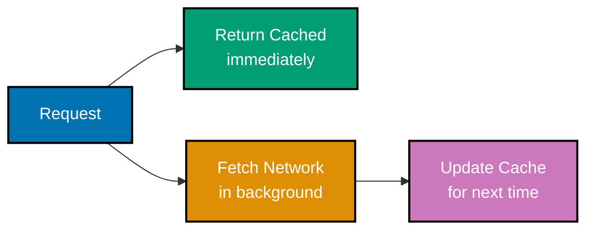
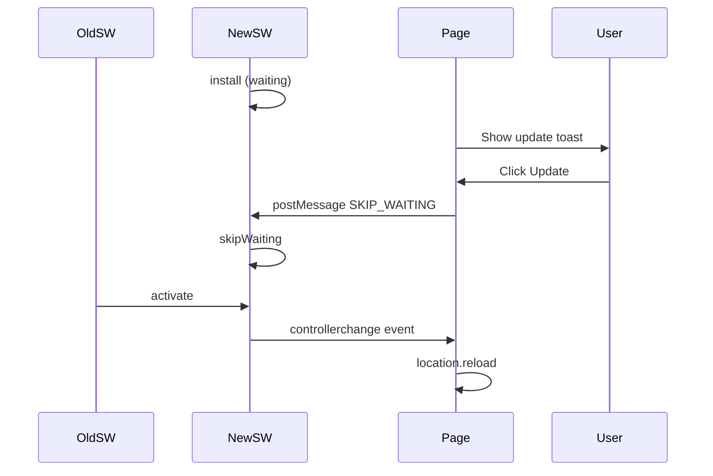
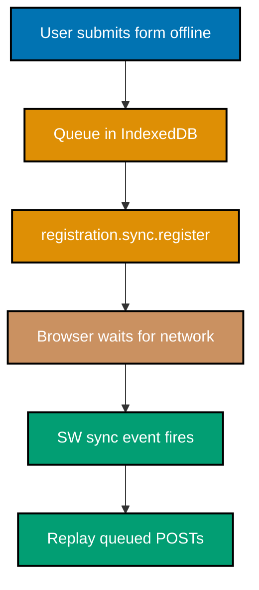

This intermediate tutorial covers production PWA patterns through 27 heavily annotated examples. By now you should be comfortable with service worker registration, basic caching, and the Web App Manifest. This level introduces the patterns you use daily in shipping PWAs, advanced caching strategies, background sync, push notifications, update flows, and the first carefully-scoped third-party libraries (Workbox, next-pwa).

## Prerequisites

Before starting, ensure you completed the Beginner level and understand:

- Service worker install / activate / fetch lifecycle
- Cache API basics (open, put, match, keys, delete)
- The Web App Manifest and install prompts
- HTTPS and same-origin restrictions

## Group 1: Advanced Caching Strategies

### Example 29: Stale-While-Revalidate Strategy

Stale-while-revalidate returns the cached response immediately and fetches a fresh copy in the background. Use it for assets where "fast" beats "latest" but you still want updates to propagate.



```javascript
// sw.js: stale-while-revalidate strategy
self.addEventListener("fetch", (event) => {
  // => Intercept all fetch requests from controlled pages
  if (event.request.method !== "GET") return;
  // => Only cache GET; POST/PUT/DELETE must always go to network

  event.respondWith(
    (async () => {
      // => Open the cache synchronously (await resolves fast)
      const cache = await caches.open("swr-v1");

      // => Look up the cached copy (may be undefined on first visit)
      const cached = await cache.match(event.request);

      // => Kick off the network fetch; do not await it yet
      // => fetchPromise resolves with fresh response OR rejects offline
      const fetchPromise = fetch(event.request)
        .then((networkResponse) => {
          // => Update cache with fresh response; clone because body is a stream
          cache.put(event.request, networkResponse.clone());
          // => Return the fresh response for anyone awaiting the promise
          return networkResponse;
        })
        .catch(() => {
          // => Silently swallow network errors; we already returned cached
          // => Without catch, unhandled rejection would log in DevTools
        });

      // => Return cached if present (instant), else wait for network
      return cached || fetchPromise;
    })(),
  );
});
```

**Key Takeaway**: Stale-while-revalidate returns the cached response instantly and updates the cache in the background, combining the speed of cache-first with the freshness of network-first over time.

**Why It Matters**: SWR is the right default for non-critical content that changes occasionally: avatars, product images, rarely-changed article content. Users get instant renders and naturally see fresh content on their next visit. The pattern keeps memory and network footprint low because the update happens concurrently, not as extra latency in the critical path. Getting the cache open once and reusing it for both read and write avoids redundant async work.

### Example 30: Runtime Caching with Route Matching

Different URL patterns deserve different strategies. A single fetch handler with route matching lets you apply cache-first to images, SWR to API reads, and network-first to HTML.

```javascript
// sw.js: route-based caching strategies
// => Strategy helpers: each returns a Promise<Response>
async function cacheFirst(request, cacheName) {
  const cache = await caches.open(cacheName);
  // => Open or create the named cache for this strategy
  const cached = await cache.match(request);
  // => cache.match returns Response or undefined on miss
  if (cached) return cached;
  // => Cache hit: return immediately without touching the network
  const response = await fetch(request);
  // => Cache miss: fetch fresh from network
  // => Only cache successful responses
  if (response.ok) cache.put(request, response.clone());
  // => clone() required because response body is a one-time stream
  return response;
  // => Return the original (un-cloned) response to the caller
}

async function networkFirst(request, cacheName) {
  const cache = await caches.open(cacheName);
  // => Open cache; will be used as fallback if network fails
  try {
    const response = await fetch(request);
    // => Network succeeded; update cache with fresh copy
    if (response.ok) cache.put(request, response.clone());
    // => clone() because cache.put consumes the body
    return response;
    // => Return fresh network response to the caller
  } catch {
    // => Network failed; return cached as fallback
    return (await cache.match(request)) || Response.error();
    // => Response.error() returns a type-error response when nothing cached
  }
}

// => Route dispatch: choose strategy based on URL pattern
self.addEventListener("fetch", (event) => {
  // => All requests pass through here; check method and URL to route
  if (event.request.method !== "GET") return;
  // => Only handle GET; non-GET (POST, DELETE) must not be cached

  const url = new URL(event.request.url);
  // => Parse the request URL once; reuse for all pathname checks

  // => /api/ -> network-first (fresh data preferred)
  if (url.pathname.startsWith("/api/")) {
    event.respondWith(networkFirst(event.request, "api-v1"));
    return;
    // => return prevents fall-through to other checks
  }

  // => /images/ -> cache-first (assets rarely change)
  // => Same for /static/, /fonts/ as static assets
  if (url.pathname.startsWith("/images/")) {
    event.respondWith(cacheFirst(event.request, "images-v1"));
    return;
    // => Images: tolerate stale; network hit only on cache miss
  }

  // => HTML navigations -> network-first with offline fallback
  if (event.request.mode === "navigate") {
    event.respondWith(networkFirst(event.request, "pages-v1"));
    return;
    // => HTML always network-first; shows latest content, falls back offline
  }

  // => Default: pass through unchanged
  // => No event.respondWith() = browser handles normally (no SW interception)
});
```

**Key Takeaway**: Dispatch to different strategies based on URL pattern and request mode so each content type gets the trade-off that fits it best.

**Why It Matters**: One-size-fits-all caching produces bad UX on both ends: too-aggressive caching ships stale APIs, too-loose caching makes every visit feel slow. Route-based strategies encode your content knowledge into the SW: hashed assets deserve cache-first, APIs deserve network-first, rarely-changed images deserve SWR. Writing the strategy helpers once and dispatching from a slim fetch handler also keeps the worker maintainable as routes proliferate.

### Example 31: Cache Expiration and Quota Management

Unbounded runtime caches eventually hit browser quota (often 50MB or a percentage of disk). Track entry age or count and evict old entries to stay within budget.

```javascript
// sw.js: quota-aware runtime cache with LRU-ish eviction
const IMAGE_CACHE = "images-v1";
// => Named constant; update version string when resetting cache contents
const MAX_IMAGE_ENTRIES = 50;
// => Cap at 50; tune based on average image size and quota budget

async function trimCache(cacheName, maxEntries) {
  const cache = await caches.open(cacheName);
  // => keys returns Request[] in insertion order (effectively FIFO)
  const keys = await cache.keys();
  if (keys.length <= maxEntries) return;
  // => Under cap: nothing to trim; early return avoids unnecessary deletes
  // => Delete oldest entries until we're under the cap
  const excess = keys.length - maxEntries;
  // => excess = number of entries to remove to reach the cap exactly
  for (let i = 0; i < excess; i++) {
    // => Safe to await inside a loop; SW lifetime is short-lived
    await cache.delete(keys[i]);
    // => keys[0] is oldest (first inserted); delete oldest first
  }
}

self.addEventListener("fetch", (event) => {
  const url = new URL(event.request.url);
  // => Parse URL to inspect pathname for routing decision
  if (!url.pathname.startsWith("/images/")) return;
  // => Only handle /images/ requests; others pass through normally

  event.respondWith(
    (async () => {
      const cache = await caches.open(IMAGE_CACHE);
      // => Open the image-specific cache
      const cached = await cache.match(event.request);
      // => Check for an existing cached copy
      if (cached) return cached;
      // => Cache hit: serve instantly without network round-trip
      const response = await fetch(event.request);
      // => Cache miss: fetch from network
      if (response.ok) {
        await cache.put(event.request, response.clone());
        // => Store response clone; cache consumes the body stream
        // => Trim after put; do not await (runs in background)
        trimCache(IMAGE_CACHE, MAX_IMAGE_ENTRIES);
        // => Non-awaited trim evicts oldest entries without blocking response
      }
      return response;
      // => Return the original response to the page
    })(),
  );
});

// => Optional: check storage estimate on activate
self.addEventListener("activate", async () => {
  // => navigator.storage.estimate returns { quota, usage } in bytes
  if (navigator.storage?.estimate) {
    const { usage, quota } = await navigator.storage.estimate();
    console.log(`Using ${usage} of ${quota} bytes`);
    // => Output (example): Using 4194304 of 1073741824 bytes
  }
});
```

**Key Takeaway**: Limit runtime cache size with a simple FIFO trim after each put; use `navigator.storage.estimate()` to observe quota pressure.

**Why It Matters**: Hitting quota causes silent cache eviction by the browser, often of the wrong entries at the worst time. Application-level eviction ensures you control what stays: keep the 50 most-recent product images, drop the rest. Checking storage estimates gives observability, send the numbers to your analytics so you can set caps empirically instead of guessing. An unbounded cache is a time-bomb for long-tenured users.

### Example 32: Cache Versioning and Migration

When you change the shape of cached data or the key format, old entries become invalid. Versioning the cache name forces a clean slate without breaking in-flight requests.

```javascript
// sw.js: version-aware cache migration
// => CURRENT_VERSION is bumped with each shell/data change
const CURRENT_VERSION = "v4";
// => Single constant to update on every deploy
// => Use build SHA or semver tag here for automated version management
const CACHES = {
  shell: `shell-${CURRENT_VERSION}`,
  // => shell cache name automatically reflects the version
  // => e.g. 'shell-v4'; old 'shell-v3' deleted on activate
  api: `api-${CURRENT_VERSION}`,
  // => api cache versioned independently so API changes don't force shell reload
  images: `images-${CURRENT_VERSION}`,
  // => images rarely change but versioned for consistency
  // => Bump version when image paths or formats change
};

self.addEventListener("install", (event) => {
  // => Populate new versioned caches; old ones remain untouched
  // => install runs before activate; safe to open new versioned caches here
  event.waitUntil(
    caches.open(CACHES.shell).then(
      (cache) => cache.addAll(["/", "/app.css", "/app.js"]),
      // => addAll is atomic: if any URL fails, install fails
      // => List only shell assets here; runtime assets cached in fetch handler
    ),
  );
});

self.addEventListener("activate", (event) => {
  // => On activate, the new SW owns the page; safe to delete old caches
  // => activate is the correct lifecycle phase for cache cleanup (not install)
  event.waitUntil(
    (async () => {
      const allCaches = await caches.keys();
      // => Get all cache names on this origin
      // => Includes caches from old SW versions still on disk
      // => Build set of current cache names for quick lookup
      const currentNames = new Set(Object.values(CACHES));
      // => Set lookup is O(1) vs Array.includes O(n)
      // => Object.values(CACHES) = ['shell-v4', 'api-v4', 'images-v4']
      // => Delete any cache whose name is not in the current set
      await Promise.all(
        allCaches
          .filter((name) => !currentNames.has(name))
          // => filter keeps only stale names
          .map((stale) => caches.delete(stale)),
        // => Delete each stale cache in parallel
      );
      // => clients.claim so the new SW controls open tabs
      await self.clients.claim();
      // => Without claim, existing tabs keep the old SW until reload
    })(),
  );
});
```

**Key Takeaway**: Encode a single version string into every cache name and delete caches whose name is not in the current allowlist during `activate`.

**Why It Matters**: Forgetting to clean up old caches is how PWAs quietly consume hundreds of megabytes over a user's lifetime. Versioning by string means bumping a single constant forces a clean migration, avoiding the footgun of "delete caches by name pattern" regex that misses edge cases. Production teams bake the version string into their build pipeline (git SHA, semver tag) so every deploy is a fresh cache namespace.

## Group 2: Update Flows

### Example 33: Update Notification Pattern

Surfacing updates to users gracefully is an art. Show a toast when a new SW is waiting, let the user opt in to the update, and reload only after they accept.



```javascript
// app.js: detect and surface updates
const registration = await navigator.serviceWorker.register("/sw.js");
// => registration holds the ServiceWorkerRegistration object
// => register() resolves to existing registration if already registered

// => Helper: show a UI toast with an Update button
function showUpdateToast(worker) {
  // => worker: the waiting ServiceWorker; need its reference to postMessage
  const toast = document.querySelector("#update-toast");
  // => Find the toast element in the DOM
  // => Toast should already exist in HTML; just show/hide with hidden attribute
  toast.hidden = false;
  // => Make the toast visible to the user
  // => Removing hidden triggers any CSS transitions for smooth appearance
  toast.querySelector("button").addEventListener(
    "click",
    () => {
      // => Tell the waiting SW to skipWaiting (see next example for SW side)
      worker.postMessage({ type: "SKIP_WAITING" });
      // => postMessage delivers structured data to the waiting SW
      // => Use { type } envelope; future-proof for multiple message commands
    },
    { once: true }, // => Auto-remove listener after first click
    // => once: true prevents double-click from sending two SKIP_WAITING messages
  );
}

// => Case 1: new SW already installed and waiting
if (registration.waiting) {
  // => registration.waiting is non-null when a new SW installed but blocked
  // => This happens when user had the tab open during a previous deploy
  showUpdateToast(registration.waiting);
  // => Immediately show toast since update is ready right now
  // => No need to wait for updatefound/statechange in this case
}

// => Case 2: SW starts installing while page is open
registration.addEventListener("updatefound", () => {
  // => updatefound fires when registration.installing changes from null to a ServiceWorker
  const newWorker = registration.installing;
  // => The new SW currently in the installing phase
  // => newWorker transitions: installing -> installed -> activating -> activated
  newWorker.addEventListener("statechange", () => {
    // => state === 'installed' AND there's a controller = new SW is waiting
    if (
      newWorker.state === "installed" &&
      navigator.serviceWorker.controller
      // => controller non-null means existing SW is still active
      // => If controller is null, this is first install; no toast needed
    ) {
      showUpdateToast(newWorker);
      // => User sees update toast when new SW finishes installing
      // => newWorker is passed so toast can postMessage to the right SW
    }
  });
});

// => When the new SW takes control, reload to use fresh assets
let refreshing = false;
// => Boolean guard prevents infinite reload loop
navigator.serviceWorker.addEventListener("controllerchange", () => {
  // => controllerchange fires whenever the controlling SW changes
  // => Guard against reload loop
  if (refreshing) return;
  // => controllerchange can fire more than once; guard ensures single reload
  refreshing = true;
  // => Set flag before reload; flag persists in current execution context
  window.location.reload();
  // => Reload the page so all assets come from the new SW
  // => Hard reload; user sees fresh content from new cache immediately
});
```

```javascript
// sw.js: respond to SKIP_WAITING message
self.addEventListener("message", (event) => {
  // => event.data carries the postMessage payload
  // => Messages can come from any tab controlled by this SW
  if (event.data?.type === "SKIP_WAITING") {
    // => Optional chaining handles null/undefined event.data safely
    // => Only respond to the SKIP_WAITING command type
    // => Promote this SW from waiting to active
    self.skipWaiting();
    // => skipWaiting ends the waiting phase immediately
    // => Browser fires activate on this SW right after
    // => All tabs switch to this SW; page reloads via controllerchange
  }
});
```

**Key Takeaway**: Show an update toast when a new SW is waiting, `postMessage('SKIP_WAITING')` on user confirm, and reload on `controllerchange` to finish the transition.

**Why It Matters**: Users lose work when PWAs reload mid-task, and they blame the app, not the SW. Letting users opt in preserves trust: they finish what they're doing, click Update, and the reload feels intentional. The reload-loop guard is critical, without it, `controllerchange` can fire twice during activation and produce infinite reloads. This is one of the most production-tested patterns in the PWA ecosystem.

### Example 34: Navigation Preload for Faster Navigations

By default, the SW must boot before it can serve a navigation fetch. Navigation preload tells the browser to start the network fetch in parallel with SW startup, hiding the cold-start cost.

```javascript
// sw.js: enable navigation preload
self.addEventListener("activate", (event) => {
  // => Activation is the right time to enable preload; SW is ready but hasn't served fetches yet
  event.waitUntil(
    (async () => {
      // => registration.navigationPreload enables the feature
      // => Only supported in Chromium; feature-detect before calling
      if (self.registration.navigationPreload) {
        // => Check existence before calling; Safari/Firefox throw otherwise
        await self.registration.navigationPreload.enable();
        // => enable() tells the browser to start the network fetch in parallel with SW boot
        // => Preloaded response arrives via event.preloadResponse in the fetch handler
      }
      await self.clients.claim();
      // => Claim so the new SW controls all open tabs immediately
      // => Without claim, tabs opened before this SW won't benefit from preload
    })(),
  );
});

self.addEventListener("fetch", (event) => {
  // => Only navigation requests get preload; skip for static assets
  if (event.request.mode !== "navigate") return;
  // => mode 'navigate' = top-level page navigations only
  // => Sub-resource fetches (images, scripts) do not get preload responses

  event.respondWith(
    (async () => {
      try {
        // => Cache-first check first (instant if precached)
        const cached = await caches.match(event.request);
        if (cached) return cached;
        // => Serve from cache if available; avoids the network entirely

        // => event.preloadResponse is a Promise<Response | undefined>
        // => Browser started it in parallel with SW startup
        const preload = await event.preloadResponse;
        // => Awaiting resolves as soon as the preloaded response arrives
        if (preload) {
          // => Preload succeeded; use it (and optionally cache)
          return preload;
          // => Preload response is as fresh as a real fetch but arrived faster
        }

        // => No preload (feature off or request couldn't preload); fallback to fetch
        return await fetch(event.request);
        // => Standard network fetch as the final fallback
      } catch {
        // => Offline fallback
        return caches.match("/offline.html");
        // => Serve the precached offline page when network is completely down
      }
    })(),
  );
});
```

**Key Takeaway**: Call `registration.navigationPreload.enable()` in `activate` and consume `event.preloadResponse` in `fetch` to overlap SW startup with network.

**Why It Matters**: Cold SW startup can take 100-500ms on budget devices, a noticeable delay on every navigation for users who have not interacted recently. Navigation preload makes that delay disappear by letting the network race the SW. Feature detection matters because Safari lacks it today, skipping the enable call is safer than throwing. On measurable projects, navigation preload typically shaves 150ms off median TTFB for returning users.

## Group 3: Background Sync

### Example 35: Background Sync for Offline POSTs

The Background Sync API queues actions (like form submissions) that need network, and fires a `sync` event in the SW when the browser regains connectivity. The user can even close the tab.



```javascript
// app.js: register a sync tag after queueing a request
async function submitOffline(payload) {
  // => Save the payload somewhere durable (IndexedDB in real apps)
  await saveToIndexedDB("pending-submissions", payload);
  // => Must save before registering sync; SW reads this on network return
  // => Order matters: save first, then register; SW fires before save otherwise

  // => Get the registration and request a one-shot sync
  const registration = await navigator.serviceWorker.ready;
  // => .ready is a Promise that resolves when SW is active and controlling
  // => .ready never rejects; use it to avoid race with SW lifecycle

  try {
    // => sync.register fires the 'sync' event when network is available
    // => Tag is a string you match in the SW handler
    await registration.sync.register("submit-forms");
    // => 'submit-forms' is the tag; multiple calls with same tag are idempotent
    // => Idempotent: calling register('submit-forms') twice is safe
    console.log("Sync scheduled");
    // => Output: Sync scheduled
  } catch {
    // => sync API missing (Safari); fall back to retry-on-foreground
    console.log("Background Sync not supported, will retry on foreground");
    // => Output: Background Sync not supported, will retry on foreground
    // => Fallback: attempt the POST immediately; show error if still offline
  }
}

async function saveToIndexedDB(store, value) {
  // => IndexedDB stub; real code uses idb or similar
  // => See the IndexedDB tutorial for full coverage
  // => Stub must be replaced before production use
}
```

```javascript
// sw.js: handle the sync event
self.addEventListener("sync", (event) => {
  // => event.tag matches the registered name from registration.sync.register()
  if (event.tag === "submit-forms") {
    // => Narrow to only the tag this handler manages
    // => Multiple sync tags can share one listener; always check event.tag
    // => waitUntil extends SW lifetime until promise settles
    // => If the promise rejects, browser retries with backoff
    event.waitUntil(replayQueuedSubmissions());
    // => SW stays alive until replayQueuedSubmissions resolves or rejects
    // => Reject = retry; resolve = sync complete for this tag
  }
});

async function replayQueuedSubmissions() {
  // => Read queued items from IndexedDB
  const pending = await readAllFromIndexedDB("pending-submissions");
  // => pending is an array of { id, payload } objects
  // => Returns empty array if nothing queued; safe to iterate

  for (const item of pending) {
    // => Iterate each queued submission in order
    // => for-of loop processes one at a time; parallel would risk duplicate sends
    // => Replay each as a real fetch
    const response = await fetch("/api/submit", {
      method: "POST",
      // => POST to the same endpoint the original form would have hit
      body: JSON.stringify(item.payload),
      // => Serialize payload to JSON for the API
      headers: { "Content-Type": "application/json" },
      // => Tell server to parse body as JSON
    });

    if (response.ok) {
      // => HTTP 2xx: server received the submission
      // => response.ok is true for 200-299 status codes
      // => Success: delete from queue
      await deleteFromIndexedDB("pending-submissions", item.id);
      // => Remove from IndexedDB so it is not replayed again
      // => item.id is the primary key; use it for targeted delete
    }
    // => Leave failed items in place; next sync will retry
    // => Non-ok responses (5xx, network error) keep the item queued
    // => Retry backoff is managed by the browser sync scheduler
  }
}
```

**Key Takeaway**: Register a sync tag after queueing work in IndexedDB; the SW's `sync` handler replays the queue when connectivity returns, even if the page is closed.

**Why It Matters**: Background Sync is the difference between "the form submission will work when you're back online" and "here is an error message please open the tab later and retry". Users tolerate offline, but only if the app handles the resume gracefully. Production teams use tags per queue-type (`submit-forms`, `upload-photos`) so retries are scoped. Feature detection is non-negotiable because Safari still lacks this API, your fallback is retry-on-foreground.

### Example 36: Periodic Background Sync

Periodic Background Sync fires a `periodicsync` event at browser-scheduled intervals, letting you refresh content or check for updates without a user visit. Requires installed PWA and permission.

```javascript
// app.js: request permission and register periodic sync
async function registerPeriodicSync() {
  const registration = await navigator.serviceWorker.ready;
  // => Wait for the SW to be active before using its features
  // => .ready is a Promise that resolves only when SW is active and controlling

  // => Feature detect first
  if (!("periodicSync" in registration)) {
    // => periodicSync is Chromium-only; Safari and Firefox lack it
    // => 'periodicSync' in registration is safer than checking window.PeriodicSyncManager
    console.log("Periodic Background Sync not supported");
    // => Output: Periodic Background Sync not supported
    return;
    // => Return without error; graceful degradation
  }

  // => Check permission status (distinct from notification permission)
  // => PermissionDescriptor { name: 'periodic-background-sync' }
  const status = await navigator.permissions.query({
    name: "periodic-background-sync",
    // => Separate permission from Notification; must query explicitly
    // => Browser grants this only to installed, high-engagement PWAs
  });

  if (status.state !== "granted") {
    // => Not granted; browser decides based on engagement heuristics
    // => 'prompt' = user hasn't decided; 'denied' = explicitly denied
    console.log("Periodic sync permission:", status.state);
    // => Output (example): Periodic sync permission: prompt
    return;
    // => Exit early; cannot register without permission
  }

  try {
    // => Register with minInterval (browser may enforce longer intervals)
    await registration.periodicSync.register("refresh-feed", {
      // => 12 hours in milliseconds; browser typically caps at once per day
      minInterval: 12 * 60 * 60 * 1000,
      // => 43200000 ms; browser rounds up to its minimum enforcement period
      // => Actual fire interval may be longer based on battery/network/engagement
    });
    console.log("Periodic sync registered");
    // => Output: Periodic sync registered
    // => Registration persists across page loads until explicitly unregistered
  } catch (error) {
    console.error("Registration failed:", error);
    // => Catches security errors or unsupported platform conditions
    // => Common cause: PWA not installed, engagement too low
  }
}
```

```javascript
// sw.js: handle periodicsync event
self.addEventListener("periodicsync", (event) => {
  // => event.tag is the string registered with periodicSync.register()
  if (event.tag === "refresh-feed") {
    // => Match the registered tag string exactly
    // => Fetch fresh data and cache it for next page load
    event.waitUntil(refreshFeedCache());
    // => waitUntil keeps SW alive until refreshFeedCache resolves
    // => If promise rejects, browser may reduce future sync frequency
  }
});

async function refreshFeedCache() {
  const cache = await caches.open("feed-v1");
  // => Open the dedicated feed cache
  // => Named cache isolates feed from other caches (shell, images, etc.)
  const response = await fetch("/api/feed");
  // => Fresh network fetch while the user is not watching (background)
  // => Background fetch: no spinner, no user blocking
  if (response.ok) {
    // => Only cache successful responses; skip 4xx/5xx
    // => response.ok is true for status codes 200-299
    // => Store fresh feed so next open feels instant
    await cache.put("/api/feed", response.clone());
    // => clone() because cache.put and caller both need the response body
    // => Put overwrites any previous '/api/feed' entry
  }
  // => If not ok (e.g., 503), silently skip; old cache remains valid
}
```

**Key Takeaway**: Periodic Background Sync lets the browser wake your SW on a schedule to refresh content, but is gated on installed PWA status and user engagement heuristics.

**Why It Matters**: Periodic sync is the closest the web comes to native background tasks. It is perfect for news apps, email clients, and dashboards where users expect fresh content without interaction. Browsers guard it aggressively, only installed, high-engagement PWAs qualify, so treat it as a nice-to-have. Even a 10% hit rate on periodic sync turns "open the app and wait" into "open the app and see today's content", a massive perceived-performance win.

## Group 4: Push Notifications End-to-End

### Example 37: Subscribing to Push Notifications

Push subscriptions are how servers send messages that wake the SW. The browser generates a unique endpoint per subscriber; your server stores it and sends signed payloads.

```javascript
// app.js: subscribe the user to push
// => VAPID public key from your server (base64url-encoded)
// => Pair with a private key the server holds to sign pushes
const VAPID_PUBLIC_KEY = "BA...example";
// => Placeholder: in production, fetch this from your server config

// => Convert base64url to Uint8Array for the API
function urlBase64ToUint8Array(base64String) {
  // => Push API requires Uint8Array; key arrives as base64url string
  // => base64url is base64 with - instead of + and _ instead of /
  // => Pad with '=' to multiple of 4
  const padding = "=".repeat((4 - (base64String.length % 4)) % 4);
  // => atob() requires standard base64; padding and char substitution required
  // => base64url uses - and _ instead of + and /; replace them
  const base64 = (base64String + padding).replace(/-/g, "+").replace(/_/g, "/");
  // => Now base64 is standard base64 that atob can decode
  const rawData = atob(base64);
  // => atob decodes base64 string to raw binary string
  // => One byte per character
  return Uint8Array.from([...rawData].map((c) => c.charCodeAt(0)));
  // => Result: Uint8Array of key bytes ready for the browser API
  // => Spread into array first; Uint8Array.from with map converts char codes
}

async function subscribeToPush() {
  // => Require notification permission first
  const permission = await Notification.requestPermission();
  // => 'granted', 'denied', or 'default' (dismissed without choosing)
  // => 'default' means user closed the prompt; treat as not-granted
  if (permission !== "granted") return;
  // => Cannot subscribe without notification permission
  // => Never auto-prompt; tie permission request to a user gesture (button click)

  const registration = await navigator.serviceWorker.ready;
  // => Ensure SW is active before accessing pushManager
  // => pushManager is a property of ServiceWorkerRegistration

  // => Subscribe; browser contacts push service for unique endpoint
  const subscription = await registration.pushManager.subscribe({
    // => userVisibleOnly: required; proves you will show a notification
    userVisibleOnly: true,
    // => Browsers reject subscriptions if you don't commit to showing notifications
    // => Set to false for silent pushes: not allowed in most browsers
    // => applicationServerKey: your VAPID public key as Uint8Array
    applicationServerKey: urlBase64ToUint8Array(VAPID_PUBLIC_KEY),
    // => VAPID key authenticates your server to the push service
    // => Mismatch between key and signature causes push delivery failure
  });

  // => subscription.toJSON yields { endpoint, keys: { p256dh, auth } }
  // => Send to your backend so it can send pushes later
  await fetch("/api/push/subscribe", {
    method: "POST",
    headers: { "Content-Type": "application/json" },
    body: JSON.stringify(subscription),
    // => subscription.toJSON() is called implicitly by JSON.stringify
    // => Stores endpoint + encryption keys on your server for later push delivery
  });
  console.log("Subscribed:", subscription.endpoint);
  // => Output: Subscribed: https://fcm.googleapis.com/...
  // => Store this endpoint server-side associated with the user's account
}
```

**Key Takeaway**: `PushManager.subscribe({ userVisibleOnly: true, applicationServerKey })` returns a subscription with an endpoint and encryption keys; POST it to your server for later push delivery.

**Why It Matters**: The push subscription is an opaque bearer credential, anyone with the endpoint + keys can send the user notifications. Production code pairs the endpoint with the authenticated user ID server-side, rotates VAPID keys on a schedule, and unsubscribes proactively when the user logs out. Getting the VAPID key conversion wrong is the most common subscribe error; the base64url-to-Uint8Array helper is copy-paste from every tutorial because of it.

### Example 38: Handling the push Event

The `push` event fires in the SW when your server sends a message. Parse the payload, choose a notification shape, and call `showNotification`.

```javascript
// sw.js: handle incoming push
self.addEventListener("push", (event) => {
  // => event.data is a PushMessageData (may be null for no-payload pushes)
  // => .json() parses as JSON; .text() / .arrayBuffer() also available
  const payload = event.data ? event.data.json() : {};
  // => Ternary guards against null event.data (silent push from server)
  // => Silent pushes are valid; server may just want to trigger a cache refresh

  // => Default values for missing fields
  const title = payload.title || "New message";
  // => Fallback title ensures notification always has something to show
  // => Never show an empty title; it confuses users and looks broken
  const options = {
    body: payload.body || "",
    // => Secondary text below the title
    icon: payload.icon || "/icons/icon-192.png",
    // => 192x192 icon shown in notification panel
    // => Use same icon as the app for brand recognition
    badge: "/icons/badge-96.png",
    // => badge: monochrome 96x96 icon for Android status bar
    // => Visible in notification shade even when notification is collapsed
    // => data: survives to notificationclick handler
    data: { url: payload.url || "/" },
    // => url persists so click handler knows where to navigate
    // => Store any data needed by notificationclick here; data is serializable
    // => tag: dedupe same-logical-notification
    tag: payload.tag,
    // => tag: same tag replaces the existing notification on re-delivery
    // => e.g. 'inbox' tag collapses all email notifications into one
    // => renotify: re-alert even if tag matches (default false)
    renotify: payload.renotify === true,
    // => renotify: true re-rings/vibrates when replacing an existing tag
  };

  // => waitUntil: keep SW alive until notification is shown
  // => Without it, browser may terminate SW before the notification appears
  event.waitUntil(self.registration.showNotification(title, options));
  // => showNotification is async; waitUntil ensures it completes
});

// => Click handler: focus existing tab or open a new one
self.addEventListener("notificationclick", (event) => {
  // => notificationclick fires when user taps the notification
  event.notification.close();
  // => Dismiss the notification UI before navigating
  // => Always close first; leaving it open creates duplicate click confusion
  const url = event.notification.data?.url || "/";
  // => Retrieve the URL stored in the notification data
  // => Fallback to '/' if no URL was set in the push payload

  event.waitUntil(
    (async () => {
      // => clients.matchAll returns all tabs this SW controls
      const all = await self.clients.matchAll({ type: "window" });
      // => type: 'window' excludes worker clients; we only care about tabs
      // => includeUncontrolled: false (default); only tabs this SW controls
      // => Prefer focusing an existing tab on the target URL
      const existing = all.find((c) => c.url === url);
      // => Check if any tab is already showing the target URL
      // => find() returns the first match or undefined
      if (existing) return existing.focus();
      // => Focus and bring existing tab to front; avoids duplicate tabs
      // => existing.focus() is async; returns Promise<WindowClient>
      // => Otherwise open a new tab
      return self.clients.openWindow(url);
      // => Opens a new browser tab at the target URL
      // => Only allowed inside event.waitUntil; user gesture required
    })(),
  );
});
```

**Key Takeaway**: Parse `event.data` into your payload, call `self.registration.showNotification` wrapped in `event.waitUntil`, and handle clicks via `notificationclick` to focus or open the right tab.

**Why It Matters**: Forgetting `event.waitUntil` is the classic push bug: browsers terminate the SW as soon as the event handler returns synchronously, so the notification never renders. The click handler's "focus existing, open new" pattern is essential UX, users hate getting a fresh tab when they already have your app open. Testing the full flow (server push -> SW push event -> notification -> click -> focus) end-to-end is the only way to catch async bugs.

## Group 5: Introducing Workbox

### Example 39: Why Workbox? (Not Core Features)

Workbox is Google's service worker toolkit. It wraps the manual patterns from the Beginner tutorial (cache versioning, route matching, strategies) in tested, configurable primitives. You trade a dependency for fewer bugs.

**Why Not Core Features?**

By now you have hand-rolled cache-first, network-first, SWR, route matching, and cache versioning. Each example in the Beginner section was 20-40 lines. In production, you eventually hit edge cases: expiring entries, rate-limiting retries, handling opaque responses, warming caches. Workbox implements these correctly once, so you do not have to.

However, Workbox is not required. If your PWA is simple (app shell + a few asset caches), the core APIs from Examples 7-14 and 29-32 are plenty. Reach for Workbox when:

- You have 5+ distinct caching strategies across routes
- You need plugin features (expiration, broadcast, background sync in one call)
- You want precache manifest generation from your build tool

Reference: compare Example 10 (manual cache-first) with Example 40 below.

```bash
# => Workbox ships multiple packages; install what you use
npm install workbox-window workbox-precaching workbox-routing workbox-strategies
# => workbox-window runs on the page; others run in the SW
```

**Key Takeaway**: Workbox is a battle-tested wrapper around the patterns you already learned; adopt it when complexity grows, not by default.

**Why It Matters**: Dependencies cost bytes and learning curve. A small PWA with a 15-line SW does not need Workbox, adding it triples the SW size and couples you to Google's release schedule. For larger apps, Workbox pays for itself by replacing 200 lines of handwritten cache plumbing with 30 lines of declarative config. The key is knowing which phase your project is in. This tutorial teaches core features first precisely so you can make that decision informed.

### Example 40: Workbox Strategies (Replacing Manual Cache-First)

Workbox's `workbox-strategies` module provides pre-built strategy classes: `CacheFirst`, `NetworkFirst`, `StaleWhileRevalidate`, etc. Each accepts plugins for expiration, broadcast, and more.

```javascript
// sw.js: Workbox equivalent of Example 10 (manual cache-first)
// => Workbox registerRoute matches requests by URL/regex
import { registerRoute } from "workbox-routing";
import { CacheFirst, NetworkFirst, StaleWhileRevalidate } from "workbox-strategies";
import { ExpirationPlugin } from "workbox-expiration";

// => Images: cache-first with 30-day expiration and 60-entry cap
// => Compare to Example 31 which did this manually in ~30 lines
registerRoute(
  // => Matcher: function(url) => boolean, or RegExp, or Route
  ({ url }) => url.pathname.startsWith("/images/"),
  new CacheFirst({
    cacheName: "images",
    plugins: [
      new ExpirationPlugin({
        // => maxEntries caps total, maxAgeSeconds expires by time
        maxEntries: 60,
        maxAgeSeconds: 30 * 24 * 60 * 60, // 30 days
      }),
    ],
  }),
);

// => API: network-first with 5s timeout, falls back to cache
// => Implementing timeout in raw fetch takes a Promise.race helper
registerRoute(
  ({ url }) => url.pathname.startsWith("/api/"),
  // => url.pathname extracted from the request URL
  new NetworkFirst({
    cacheName: "api",
    // => Separate cache name so API entries don't evict image entries
    networkTimeoutSeconds: 5,
    // => After 5s, fall back to cache rather than waiting indefinitely
  }),
);

// => HTML navigations: stale-while-revalidate
registerRoute(
  ({ request }) => request.mode === "navigate",
  // => 'navigate' mode matches browser navigation requests (not fetch calls)
  new StaleWhileRevalidate({ cacheName: "pages" }),
  // => Instant from cache; fresh copy downloaded in background
);
```

**Key Takeaway**: Workbox's strategy classes + `registerRoute` replace ~100 lines of handwritten fetch dispatch with declarative, plugin-extensible config.

**Why It Matters**: Declarative routing makes the SW easier to read during incident response, the intent of each route is visible at a glance. Plugins compose predictably: add `BroadcastUpdatePlugin` to broadcast cache updates to pages, add `CacheableResponsePlugin` to filter by status, swap `ExpirationPlugin` settings without touching strategy code. The time savings compound as the route count grows, exactly when hand-rolled SWs start to sprout bugs.

### Example 41: Workbox Precaching

`workbox-precaching` takes a manifest generated at build time and caches those exact URLs during install. The manifest is built by `workbox-build` or the Vite/Webpack plugins.

```javascript
// sw.js: precache the manifest generated by build tool
import { precacheAndRoute } from "workbox-precaching";

// => __WB_MANIFEST is a placeholder replaced by the build plugin
// => Plugin inserts an array like:
// => [{ url: '/app.abc123.css', revision: null }, ...]
// => revision is null for hashed URLs, a string for non-hashed
precacheAndRoute(self.__WB_MANIFEST || []);

// => precacheAndRoute does three things:
// => 1. Adds the manifest URLs to a versioned cache during install
// => 2. Cleans up outdated precache entries on activate
// => 3. Registers a route that serves precached responses cache-first
```

```javascript
// build.config.js: example Vite config using vite-plugin-pwa
// => See vite-plugin-pwa docs for full options
import { VitePWA } from "vite-plugin-pwa";
export default {
  plugins: [
    VitePWA({
      // => injectManifest mode: we write sw.js manually, plugin injects manifest
      strategies: "injectManifest",
      // => Alternative is 'generateSW' where Workbox writes the SW for you
      srcDir: "src",
      // => Location of your custom sw.js source file
      filename: "sw.js",
      // => Output filename in dist/; served as /sw.js
      // => Patterns from dist/ that end up in __WB_MANIFEST
      injectManifest: {
        globPatterns: ["**/*.{js,css,html,png,svg,woff2}"],
        // => Glob matches all buildable assets in dist/
        // => Each match becomes an entry in the precache manifest
      },
    }),
  ],
};
```

**Key Takeaway**: `precacheAndRoute(self.__WB_MANIFEST)` precaches a build-tool-generated file list at install, handles revisions automatically, and serves hits cache-first.

**Why It Matters**: Precaching is where hand-rolled SWs most often go wrong, forgetting to update the URL list, caching unhashed URLs without revisions, not cleaning up old precaches. Workbox solves all three at once. The build integration is the real value: every deploy produces a fresh manifest with accurate revisions, so users never see stale assets after an update. This is the strongest argument for Workbox adoption.

## Group 6: Next.js Integration

### Example 42: next-pwa for Next.js Apps

Next.js does not ship a PWA solution; the `@ducanh2912/next-pwa` community package (successor to `next-pwa`) wires Workbox into the Next.js build. It handles SW generation, registration, and route exclusions.

**Why Not Core Features?**

You could register a SW manually in a `_app.js` useEffect and write `public/sw.js` by hand. For small Next.js sites this works. `next-pwa` adds value when: (1) your build emits hashed filenames that change every deploy, (2) you want route-level caching policies, (3) you want SW registration to be conditional on production builds only. It wraps Example 40's Workbox strategies in a Next.js-aware config.

```bash
# Install the maintained fork
npm install @ducanh2912/next-pwa
```

```javascript
// next.config.js: wire next-pwa into the build
// => withPWA wraps your existing Next config
const withPWA = require("@ducanh2912/next-pwa").default({
  // => dest: where the generated SW is emitted (must be public/)
  dest: "public",
  // => public/ is the static asset dir; /sw.js becomes publicly accessible
  // => disable: skip PWA in dev to avoid SW caching hot-reload assets
  disable: process.env.NODE_ENV === "development",
  // => Prevents stale HMR assets in development sessions
  // => register: auto-register in _app; set false for manual control
  register: true,
  // => true = next-pwa adds <script> that calls navigator.serviceWorker.register
  // => skipWaiting: activate new SW immediately (see Example 33 trade-offs)
  skipWaiting: true,
  // => Skips the waiting state; new SW activates instantly on reload
  // => workboxOptions: forwards to Workbox build-time config
  workboxOptions: {
    // => exclude: regex list for files to skip precaching
    exclude: [/\.map$/, /manifest$/, /\.htaccess$/],
    // => Source maps, manifests, and .htaccess should not be cached
  },
});

module.exports = withPWA({
  // => Your existing Next config goes here
  reactStrictMode: true,
  // => reactStrictMode has no effect on SW behavior; keep your existing options
});
```

```jsx
// pages/_app.js: no manual registration needed with register: true
// => next-pwa injects the registration script into the HTML automatically
export default function App({ Component, pageProps }) {
  // => Standard Next.js App component; no PWA-specific code needed
  return <Component {...pageProps} />;
  // => next-pwa handles registration via injected script, not this file
}
```

**Key Takeaway**: Wrap your Next.js config with `withPWA` from `@ducanh2912/next-pwa`; it generates the SW, precaches the Next.js build output, and auto-registers in production.

**Why It Matters**: Next.js's hashed asset filenames change every deploy, so hand-rolled precache lists break constantly. next-pwa integrates with Next's build output so the SW knows exactly which files shipped. Disabling in development is essential, a SW caching your hot-reloaded bundle produces confusing "stale code" bugs. For most Next.js PWAs, this is the fastest path from zero to Lighthouse-100 PWA score.

### Example 43: next-pwa Runtime Caching Rules

next-pwa exposes Workbox's route matching via a `runtimeCaching` option, letting you declare cache strategies for API calls and external resources without writing SW code.

```javascript
// next.config.js: runtimeCaching for APIs and CDNs
const withPWA = require("@ducanh2912/next-pwa").default({
  dest: "public",
  // => Generated SW written to public/sw.js
  workboxOptions: {
    runtimeCaching: [
      {
        // => urlPattern: regex or function matched against request URL
        urlPattern: /^https:\/\/fonts\.googleapis\.com\/.*/i,
        // => Matches Google Fonts stylesheet requests
        // => handler: Workbox strategy name (CacheFirst, NetworkFirst, etc.)
        handler: "CacheFirst",
        // => Fonts rarely change; serve from cache without hitting network
        options: {
          cacheName: "google-fonts-stylesheets",
          // => Named cache for easy inspection in DevTools
          // => expiration: days/entries before eviction
          expiration: { maxEntries: 4, maxAgeSeconds: 365 * 24 * 60 * 60 },
          // => 4 entries (one per font family); 1 year age limit
        },
      },
      {
        // => API calls: network-first with fallback
        urlPattern: /\/api\/.*/i,
        // => Matches all /api/ paths (Next.js API routes)
        handler: "NetworkFirst",
        // => Fresh data preferred; cached copy only on failure
        options: {
          cacheName: "apis",
          networkTimeoutSeconds: 10,
          // => Abandon network after 10s; serve cache instead
          expiration: { maxEntries: 16, maxAgeSeconds: 24 * 60 * 60 },
          // => Max 16 entries; stale after 24h
          // => cacheableResponse: only cache 200/203 etc., skip errors
          cacheableResponse: { statuses: [0, 200] },
          // => status 0 = opaque responses (cross-origin without CORS)
        },
      },
      {
        // => Static images: stale-while-revalidate
        urlPattern: /\.(?:png|jpg|jpeg|svg|gif|webp)$/i,
        // => Matches common image extensions
        handler: "StaleWhileRevalidate",
        // => Serve cached image instantly, refresh in background
        options: { cacheName: "images" },
        // => No expiration configured; use ExpirationPlugin for production
      },
    ],
  },
});

module.exports = withPWA({ reactStrictMode: true });
// => Spread withPWA over your existing next.config.js options
```

**Key Takeaway**: Declare cache strategies for external resources via the `runtimeCaching` array; each entry maps a URL pattern to a Workbox strategy and options.

**Why It Matters**: Declarative config keeps caching rules visible in one file, so the next engineer can audit cache behavior without reading the generated SW. The `cacheableResponse` option is critical: caching failed responses (404, 500) silently locks users into broken state until the cache expires. The `networkTimeoutSeconds` is the missing piece that makes NetworkFirst feel good on flaky networks, it bails to cache faster than most users notice.

## Group 7: Debugging and Testing

### Example 44: Chrome DevTools Application Tab

Chrome's DevTools Application tab is your PWA control center. You can inspect the manifest, view and unregister service workers, browse all caches, and simulate offline.

```javascript
// sw.js: log debugging info visible in the Application tab
// => self.registration inspection helpers
self.addEventListener("install", () => {
  // => install fires once per SW version; never for the same byte-identical SW
  console.log("[SW] install", { version: "v4", ts: Date.now() });
  // => Log version + timestamp so DevTools shows which SW is running
  // => Viewable in Application > Service Workers > "Logs" in Chrome
});

self.addEventListener("activate", () => {
  // => activate fires after waiting phase completes (or skipWaiting called)
  console.log("[SW] activate", { version: "v4", ts: Date.now() });
  // => Activation log confirms the SW has taken control
  // => If no activate log appears, another SW is still waiting
});

// => Add a manual message command for cache inspection
self.addEventListener("message", async (event) => {
  // => event.data is the payload sent via postMessage from the page
  if (event.data === "LIST_CACHES") {
    // => Respond to the 'LIST_CACHES' command from the page
    const names = await caches.keys();
    // => names is an array of all cache names for this origin
    const summary = {};
    // => Build a map of cache-name => entry-count
    for (const name of names) {
      const cache = await caches.open(name);
      // => Open each cache to count its entries
      const keys = await cache.keys();
      // => keys() returns an array of Request objects in the cache
      summary[name] = keys.length;
      // => Store the count for this cache name
      // => Result: { 'shell-v4': 10, 'images': 42 }
    }
    // => postMessage back to the page for display
    event.source.postMessage({ type: "CACHE_SUMMARY", data: summary });
    // => event.source is the client that sent the message
    // => Structured data survives the SW->page channel intact
  }
});
```

```javascript
// app.js: request cache summary from the SW (runs in DevTools console)
// => Paste this into the DevTools Console to get live cache counts
async function listCaches() {
  const reg = await navigator.serviceWorker.ready;
  // => .ready ensures SW is active before sending message
  // => Awaiting prevents "no active SW" error if SW is still installing
  reg.active.postMessage("LIST_CACHES");
  // => Send command string to SW; SW responds asynchronously
  // => reg.active is the ServiceWorker object (not null here because .ready resolved)
}
// => Listen for the response
navigator.serviceWorker.addEventListener("message", (event) => {
  // => Global message listener; receives postMessage from any SW on this page
  if (event.data?.type === "CACHE_SUMMARY") {
    // => Narrow to only CACHE_SUMMARY type messages
    // => Optional chaining guards against non-object event.data
    console.table(event.data.data);
    // => console.table formats the object as a table in DevTools
    // => Output (example):
    // => ┌──────────┬───────┐
    // => │ shell-v4 │   10  │
    // => │ images   │   42  │
    // => └──────────┴───────┘
    // => Use this during debugging to see which caches are populated
  }
});
```

**Key Takeaway**: Use DevTools Application -> Service Workers to control the SW state, Application -> Cache Storage to inspect cache contents, and console messaging hooks for live debugging.

**Why It Matters**: Debugging PWAs without DevTools is nearly impossible, the SW runs in its own context with no DOM. Mastering the Application tab pays off: "Update on reload" eliminates update-lifecycle confusion during development, "Bypass for network" isolates cache issues, "Clear storage" gives you a clean slate. Logging explicit version strings and cache summaries makes deploy-triggered bugs visible in seconds.

### Example 45: Simulating Offline

The Network tab's offline toggle simulates disconnection without actually disabling your network. Use it to verify offline fallbacks and Background Sync.

```javascript
// app.js: test offline behavior programmatically
// => Open DevTools Network tab, select "Offline" from throttling dropdown
// => Then run this to verify the SW serves from cache

async function testOfflineBehavior() {
  try {
    const response = await fetch("/api/users");
    // => With DevTools Offline enabled, this goes to the SW
    // => fetch() rejects if SW has no fetch handler; returns SW response if it does
    const data = await response.json();
    // => If SW returned a cached response, data is populated
    // => response.json() parses the body as JSON
    console.log("Loaded (from cache):", data);
    // => Output: Loaded (from cache): { users: [...] }
  } catch (error) {
    console.error("No cache fallback:", error);
    // => Output: No cache fallback: TypeError: Failed to fetch
    // => TypeError means the SW had no fallback and the network was off
  }
}

// => A related test: listen for online/offline events while toggling
window.addEventListener("offline", () => console.log("Detected offline"));
// => 'offline' fires when browser loses network connectivity
window.addEventListener("online", () => console.log("Detected online"));
// => 'online' fires when connectivity is restored; good trigger for retry

// => Verify navigator.onLine matches DevTools state
console.log("navigator.onLine:", navigator.onLine);
// => Output with DevTools Offline checked: navigator.onLine: false
// => navigator.onLine is a synchronous boolean; poll or listen to events
```

```javascript
// sw.js: log fetch failures for offline debugging
self.addEventListener("fetch", (event) => {
  // => Intercept every request from this origin
  event.respondWith(
    fetch(event.request).catch(async (err) => {
      // => .catch fires when the fetch fails (network down, DNS fail, etc.)
      // => err is a TypeError with message like 'Failed to fetch'
      // => Log every offline fallback to trace cache hits/misses
      console.warn("[SW] Network failed:", event.request.url, err.message);
      // => Output (example): [SW] Network failed: /api/users Network request failed
      // => err.message helps distinguish network-down from DNS failure
      const cached = await caches.match(event.request);
      // => Check if a cached copy exists for this URL
      // => caches.match searches across all open caches for a match
      if (cached) {
        console.log("[SW] Served from cache:", event.request.url);
        // => Output: [SW] Served from cache: /api/users
        return cached;
        // => Return the cached version as the offline response
      }
      return new Response("Offline", { status: 503 });
      // => Nothing cached: synthesize a minimal 503 response
      // => 503 is "Service Unavailable"; better than a silent TypeError
    }),
  );
});
```

**Key Takeaway**: DevTools Network throttling -> Offline simulates disconnection; SW logs from the `fetch` event reveal which requests hit cache vs which fail entirely.

**Why It Matters**: Users report offline bugs in vague terms ("the app broke on the subway"), so reproducing is critical. The Offline toggle gives you a deterministic test bed. Logging fetch failures with URL + error message in the SW surfaces hard-to-find "cache miss on critical asset" bugs fast. Production teams pair this with synthetic monitoring that loads the PWA offline in a headless browser before every deploy.

### Example 46: Testing Service Workers with Playwright

Playwright supports SW registration in its default Chromium runs. Write end-to-end tests that verify your PWA installs, caches assets, and serves offline correctly.

```javascript
// tests/pwa.spec.js: Playwright PWA test
import { test, expect } from "@playwright/test";
// => @playwright/test provides test(), expect(), and fixtures like page, context

test("service worker registers and caches app shell", async ({ page, context }) => {
  // => page: browser tab fixture; context: browser context (isolated session)
  // => Navigate to the PWA; SW should register on load
  await page.goto("http://localhost:3000/");
  // => page.goto waits until the page's load event fires
  // => SW registration happens during this load

  // => Wait for the SW to become active
  // => page.evaluate runs code in the page context
  const swReady = await page.evaluate(async () => {
    // => Code in this callback runs inside the browser, not Node
    const reg = await navigator.serviceWorker.ready;
    // => .ready resolves when SW is active and controlling
    return { scope: reg.scope, active: !!reg.active };
    // => Serialize only primitive values; complex objects lose methods
    // => !! converts ServiceWorker object to boolean
  });

  expect(swReady.active).toBe(true);
  // => Assert SW is active before testing cache behavior
  // => Output: { scope: 'http://localhost:3000/', active: true }
  expect(swReady.scope).toBe("http://localhost:3000/");
  // => Confirm SW scope matches the origin (not a sub-path)

  // => Verify a precached asset is in Cache Storage
  const cacheNames = await page.evaluate(() => caches.keys());
  // => caches.keys() runs in the page context; returns array of cache names
  // => Assert at least one cache was created
  expect(cacheNames.length).toBeGreaterThan(0);
  // => A SW that ran install should have at least one cache
  // => Zero caches means install event did not run correctly
});

test("app loads offline after first visit", async ({ page, context }) => {
  // => First visit to populate caches
  await page.goto("http://localhost:3000/");
  // => Load the page so the SW installs and caches the shell
  await page.waitForFunction(
    () => navigator.serviceWorker.controller !== null,
    // => Wait until SW is controlling (not just active)
    // => controller is null until SW claims or page reloads under the SW
  );

  // => Disable network via Playwright context
  await context.setOffline(true);
  // => context.setOffline blocks ALL network in this browser context
  // => Affects all pages in this context, not just this tab

  // => Reload; SW should serve cached shell
  await page.reload();
  // => Page reload triggers a navigation; SW serves from cache
  // => Assert the page still renders by checking for known element
  await expect(page.locator("h1")).toBeVisible();
  // => If this passes, the SW correctly served the cached shell offline
  // => Visibility timeout defaults to 5s; fails if shell is not cached

  // => Restore network for cleanup
  await context.setOffline(false);
  // => Re-enable network so subsequent tests are not affected
  // => Always restore in cleanup to avoid poisoning other test contexts
});
```

**Key Takeaway**: Playwright's `context.setOffline(true)` and `navigator.serviceWorker.ready` let you write E2E tests that assert installability and offline behavior on every CI run.

**Why It Matters**: SW bugs are regressions that usually ship silently, your tests still pass, users still see the page online, but offline mode breaks. Playwright tests catch this by simulating the full install-then-offline flow. Running them on every PR prevents a whole class of "works on my machine" PWA failures. Chrome is the primary target because Safari's Playwright support lags, for Safari-specific issues, you need manual testing on real devices.

## Group 8: Performance and Budgets

### Example 47: Measuring PWA Performance with Web Vitals

Core Web Vitals (LCP, FID/INP, CLS) are the performance metrics Google uses for PWA installability and search ranking. Measure them in the field with the `web-vitals` library.

```bash
# => Small (~1KB) library for reporting real-user Web Vitals
npm install web-vitals
```

```javascript
// app.js: report Web Vitals to analytics
import { onCLS, onINP, onLCP, onFCP, onTTFB } from "web-vitals";
// => Tree-shaken: only the reporters you import are bundled
// => Each reporter accepts a callback called when the metric is available

// => Reporter sends each metric to your backend
// => navigator.sendBeacon is preferred; survives page unload
function sendMetric(metric) {
  // => metric object: { name, value, id, rating, delta, navigationType }
  // => delta: change since last report for incremental metrics (CLS, INP)
  const body = JSON.stringify({
    name: metric.name,
    // => e.g. 'LCP', 'CLS', 'INP'
    value: metric.value,
    // => Raw numeric value in the metric's unit (ms for LCP, score for CLS)
    id: metric.id,
    // => Unique id per page load; useful for aggregation
    // => Same id across multiple calls for the same metric (e.g. CLS updates)
    rating: metric.rating, // 'good' | 'needs-improvement' | 'poor'
    // => Traffic-light label computed by web-vitals library
    // => Use rating for dashboard grouping; use value for percentile math
    navigationType: metric.navigationType,
    // => 'navigate', 'reload', 'back-forward', 'prerender'; filter by type
  });
  // => sendBeacon falls back to fetch if unsupported
  if (navigator.sendBeacon) {
    navigator.sendBeacon("/analytics/vitals", body);
    // => sendBeacon is fire-and-forget; survives page unload unlike fetch
    // => Automatically queued; browser sends on next idle or page close
  } else {
    fetch("/analytics/vitals", { method: "POST", body, keepalive: true });
    // => keepalive: true allows the request to outlive the page
    // => Fallback for browsers without sendBeacon (very rare today)
  }
}

// => Register all five Core Web Vitals reporters
onCLS(sendMetric); // Cumulative Layout Shift
// => CLS fires after each layout shift; accumulates over page lifetime
// => Good: CLS < 0.1; Poor: CLS >= 0.25
onINP(sendMetric); // Interaction to Next Paint (replaces FID)
// => INP reports the worst interaction delay during the session
// => Good: INP <= 200ms; Poor: INP > 500ms
onLCP(sendMetric); // Largest Contentful Paint
// => LCP fires when the largest visible element finishes loading
// => Good: LCP <= 2.5s; Poor: LCP > 4s
onFCP(sendMetric); // First Contentful Paint
// => FCP fires when the first text/image pixels appear
// => Not a Core Web Vital but important for perceived load speed
onTTFB(sendMetric); // Time to First Byte
// => TTFB measures the network + server latency to first byte
// => High TTFB (>600ms) indicates server or CDN problems
```

**Key Takeaway**: Import `web-vitals` and wire each metric to `sendBeacon`; you get real-user performance data without custom instrumentation.

**Why It Matters**: Lighthouse measures synthetic performance in a lab; Web Vitals measures actual user experience. The two diverge more than teams expect, a PWA that scores 95 in Lighthouse can have a terrible INP at the 75th percentile because real devices are slower than lab. Field data is the source of truth for optimization priorities. The `rating` field gives you traffic-light grouping for dashboards without math.

### Example 48: Performance Budgets in Lighthouse CI

Lighthouse CI enforces performance budgets (e.g., LCP < 2.5s) on every PR. Violations fail the build, catching regressions before they ship.

```bash
# => Install the Lighthouse CI runner
npm install -D @lhci/cli
```

```json
{
  "ci": {
    "collect": {
      // => url: pages to audit (can be multiple)
      "url": ["http://localhost:3000/"],
      // => Add more URLs for multi-page audits: ["/", "/dashboard", "/product"]
      // => numberOfRuns: run 3 times to average out variance
      "numberOfRuns": 3,
      // => 3 runs balances noise reduction with CI time cost
      // => startServerCommand: spins up your app before auditing
      "startServerCommand": "npm run start"
      // => Lighthouse CI waits for the server to be ready before auditing
    },
    "assert": {
      "assertions": {
        // => categories:pwa: the overall PWA Lighthouse category score (0-1)
        "categories:pwa": ["error", { "minScore": 0.9 }],
        // => error level means CI fails if score < 0.9
        // => 0.9 = 90/100 in the UI; tune to 1.0 for strict projects
        // => largest-contentful-paint: LCP in milliseconds
        "largest-contentful-paint": ["error", { "maxNumericValue": 2500 }],
        // => 2500ms = Google's "good" threshold for LCP
        // => Exceeding 4000ms is "poor"; aim for <1800ms for top-tier
        // => cumulative-layout-shift: CLS score (unitless, lower is better)
        "cumulative-layout-shift": ["error", { "maxNumericValue": 0.1 }],
        // => 0.1 = Google's "good" threshold for CLS
        // => CLS above 0.25 is "poor"; reserve layout space for images/ads
        // => total-byte-weight: all transferred bytes in a page load
        "total-byte-weight": ["warn", { "maxNumericValue": 500000 }]
        // => warn = CI passes but report shows yellow; 500KB budget
        // => 500000 bytes = 500KB compressed; adjust to your audience
      }
    },
    "upload": {
      // => temporary-public-storage: Lighthouse CI free hosting for reports
      "target": "temporary-public-storage"
      // => Reports visible for 7 days; upgrade to LHCI server for persistence
      // => LHCI server enables historical trend dashboards
    }
  }
}
```

```yaml
# .github/workflows/lighthouse.yml: enforce on every PR
name: Lighthouse CI
on: [pull_request]
# => Runs on every PR targeting any branch
jobs:
  lhci:
    runs-on: ubuntu-latest
    # => ubuntu-latest provides a clean environment per run
    steps:
      - uses: actions/checkout@v4
      # => Check out the PR code
      - uses: actions/setup-node@v4
      # => Install Node.js for npm commands
      - run: npm ci && npm run build
      # => Clean install + production build to audit accurate assets
      # => npm ci uses package-lock.json for reproducible installs
      - run: npx lhci autorun
        # => autorun reads lighthouserc.json and fails CI if assertions violated
        # => npx ensures the installed version is used, not a global one
```

**Key Takeaway**: `@lhci/cli` with an assertion config fails CI when PWA score drops or Core Web Vitals exceed thresholds, preventing regressions before merge.

**Why It Matters**: Performance rots silently without enforcement, each PR adds a tiny bit of JS or shifts a metric by 50ms, and a year later the PWA feels sluggish. Budgets halt the drift by making "this PR adds 200KB" a hard error, forcing an explicit decision. Storing historical reports ties regressions to specific PRs, making post-mortems actionable. The `numberOfRuns: 3` setting reduces noise on budget checks.

## Group 9: Advanced Manifest Features

### Example 49: App Shortcuts (Jump-List Entries)

`shortcuts` in the manifest gives users quick access to specific actions from the long-press menu (Android) or taskbar right-click (desktop).

```json
// manifest.webmanifest: shortcuts to key actions
{
  "name": "Email App",
  // => name: displayed in install prompt and app listings
  "short_name": "Email",
  // => short_name: used on home screen where space is limited (< 12 chars ideal)
  "start_url": "/",
  // => start_url: URL loaded when user launches from home screen
  "display": "standalone",
  // => standalone: no browser chrome (URL bar, nav buttons)
  "icons": [
    { "src": "/icons/icon-192.png", "sizes": "192x192", "type": "image/png" },
    // => 192x192: minimum required for installability on Android
    { "src": "/icons/icon-512.png", "sizes": "512x512", "type": "image/png" }
    // => 512x512: used for splash screen and high-DPI displays
  ],
  // => shortcuts: max 4 typically rendered; 10 allowed in spec
  // => Each is a mini-manifest pointing at a URL within scope
  "shortcuts": [
    {
      // => name: full label shown in menu
      "name": "Compose new email",
      // => short_name: fallback if space limited
      "short_name": "Compose",
      // => description: screen reader / accessibility text
      "description": "Write a new email",
      // => url: destination within manifest scope
      "url": "/compose?source=shortcut",
      // => ?source=shortcut allows analytics segmentation of shortcut launches
      // => icons: monochrome 96x96 recommended
      "icons": [
        { "src": "/icons/compose-96.png", "sizes": "96x96", "type": "image/png" }
        // => 96x96 monochrome icon used in jump list (Android/desktop)
      ]
    },
    {
      // => Second shortcut; same fields apply
      "name": "Open inbox",
      "short_name": "Inbox",
      // => short_name displayed when space is constrained on device
      "url": "/inbox?source=shortcut",
      // => ?source=shortcut allows analytics segmentation of shortcut launches
      "icons": [
        { "src": "/icons/inbox-96.png", "sizes": "96x96", "type": "image/png" }
        // => 96x96 monochrome icon recommended for jump list items
      ]
    },
    {
      // => Third shortcut
      "name": "Starred messages",
      "short_name": "Starred",
      // => short_name used when label is truncated in the jump list
      "url": "/starred?source=shortcut",
      // => Separate analytics event for each shortcut reveals user priorities
      "icons": [
        { "src": "/icons/starred-96.png", "sizes": "96x96", "type": "image/png" }
        // => Provide distinct icons per shortcut for visual differentiation
      ]
    }
    // => More shortcuts follow the same pattern (max 10 in spec)
    // => Practical limit is 3-4; more are ignored or overflow on most platforms
  ]
}
```

**Key Takeaway**: Declare up to 10 `shortcuts` in the manifest; each maps a label + icon + URL to a long-press / right-click jump list entry.

**Why It Matters**: Shortcuts are a high-leverage feature because users see them every time they long-press the app icon, prime attention real estate. The `?source=shortcut` query lets you track shortcut-driven engagement separately from home-screen launches. Limit to 3-4 in practice; more than that and the menu becomes overwhelming. Pair each shortcut with an analytics event to tune the list based on real usage over time.

### Example 50: Screenshots for App Listings

The `screenshots` field lets browsers show richer install prompts with previews of your app, similar to app store listings.

```json
// manifest.webmanifest: screenshots for richer install UI
{
  "name": "Taskly",
  // => name: full app name shown in install prompt
  "short_name": "Taskly",
  // => short_name: appears on home screen under the icon
  "start_url": "/",
  // => start_url: loaded on launch; use "/" for homepage or "/app" for app shell
  "display": "standalone",
  // => standalone: no browser chrome; feels like native app
  "icons": [
    { "src": "/icons/icon-192.png", "sizes": "192x192", "type": "image/png" },
    // => 192x192: minimum for Android installability
    { "src": "/icons/icon-512.png", "sizes": "512x512", "type": "image/png" }
    // => 512x512: used in splash screens and high-density displays
  ],
  "screenshots": [
    {
      "src": "/screenshots/home-wide.webp",
      // => sizes: W x H in pixels, used by browser to pick best fit
      "sizes": "1280x720",
      "type": "image/webp",
      // => form_factor: 'wide' for desktop, 'narrow' for mobile
      // => Browser shows wide screenshots in desktop install prompt
      "form_factor": "wide",
      // => Provide at least one 'wide' and one 'narrow' for best compatibility
      "label": "Task dashboard overview"
      // => label: accessibility text for screen readers and install UI
    },
    {
      "src": "/screenshots/home-narrow.webp",
      "sizes": "720x1280",
      // => 720x1280 is portrait phone resolution; matches form_factor narrow
      "type": "image/webp",
      // => WebP provides ~30% smaller files than JPEG at same quality
      "form_factor": "narrow",
      // => narrow: shown in mobile install prompt
      "label": "Mobile task list"
    },
    {
      "src": "/screenshots/calendar-wide.webp",
      "sizes": "1280x720",
      // => landscape 16:9 ratio typical for wide (desktop) screenshots
      "type": "image/webp",
      "form_factor": "wide",
      // => Multiple wide screenshots create a carousel in install prompt
      "label": "Calendar view"
      // => Labels describe what the screenshot shows for accessibility
    }
  ]
}
```

**Key Takeaway**: Provide 2-5 screenshots per `form_factor` (`wide` for desktop, `narrow` for mobile); browsers use them in install dialogs and app listings.

**Why It Matters**: Install prompts without screenshots feel barren, users see just an icon and a title, the same info they already have. Rich prompts with screenshots convert at app-store-like rates because they signal polish and concrete value. Chromium-based browsers now render the install dialog with these screenshots prominently, the difference between a 1% and 5% install rate on targeted banners. Supply WebP for smaller file sizes without quality loss.

## Group 10: Security and Quality Gates

### Example 51: Content Security Policy for PWAs

A strict Content Security Policy (CSP) prevents XSS from compromising your SW. Declare allowed sources for scripts, styles, and connect endpoints.

```http
# Response header on the HTML document
# => Set via your server config (nginx, Express, Vercel headers.json)
Content-Security-Policy:
  default-src 'self';
  # => default-src: fallback for all fetch directives not explicitly set
  script-src 'self' https://cdn.example.com;
  # => script-src: limits JS sources; only same-origin and named CDN
  style-src 'self' 'unsafe-inline';
  # => unsafe-inline needed for CSS-in-JS; use nonces in strict mode
  img-src 'self' data: https:;
  # => img-src: data: URIs allowed for inline images; https: for external
  connect-src 'self' https://api.example.com https://*.example-push.com;
  # => connect-src: restricts fetch/XHR targets; include push endpoint domain
  worker-src 'self';
  # => worker-src: critical for PWA; prevents injection of rogue service workers
  manifest-src 'self';
  # => manifest-src: restricts where the webmanifest can be loaded from
```

```html
<!-- Fallback: <meta> tag if you cannot set headers (less secure) -->
<!-- => Headers are strongly preferred; meta has fewer directives supported -->
<meta http-equiv="Content-Security-Policy" content="default-src 'self'; worker-src 'self'; manifest-src 'self';" />
```

```javascript
// sw.js: report CSP violations from within the SW
// => Import a custom reporter to your server for visibility
self.addEventListener("securitypolicyviolation", (event) => {
  // => Fires when any CSP directive blocks a resource in the SW
  // => event has violatedDirective, blockedURL, sourceFile, etc.
  const report = {
    directive: event.violatedDirective,
    // => e.g. 'connect-src', 'script-src' — which rule was violated
    blockedURL: event.blockedURL,
    // => The URL that was blocked; reveals the injection attempt
    source: event.sourceFile,
    // => Which SW file triggered the violation
    line: event.lineNumber,
    // => Line number in the SW file for triage
  };
  // => POST asynchronously; do not block the event
  fetch("/api/csp-report", {
    method: "POST",
    // => Send to your own endpoint; report-to directive also works
    body: JSON.stringify(report),
    headers: { "Content-Type": "application/json" },
    // => Standard JSON payload for your logging pipeline
  });
});
```

**Key Takeaway**: Set strict `Content-Security-Policy` headers including `worker-src` and `manifest-src` directives, and report violations to catch injection attempts early.

**Why It Matters**: A SW is a dream target for attackers, once injected, it can silently intercept every request forever. CSP is the strongest defense, a single header blocks 90% of XSS routes into the SW. Reporting violations (even in report-only mode initially) tells you which legitimate resources need allowlisting before you flip to enforcing. Production teams treat CSP as a living document refined over weeks, not a one-shot header.

### Example 52: Subresource Integrity (SRI) for External Scripts

SRI adds an integrity hash to `<script>` and `<link>` tags, so browsers refuse to load tampered resources from CDNs.

```html
<!-- index.html: pin exact versions with SRI hashes -->
<!-- => integrity: base64 hash of expected content -->
<!-- => Browser computes hash on download; mismatch = block -->
<!-- => crossorigin="anonymous" required for cross-origin CORS check -->
<!-- => Without crossorigin, SRI check is not performed for cross-origin -->
<script src="https://cdn.example.com/lib.js" integrity="sha384-abc123xyz789..." crossorigin="anonymous"></script>
<!-- => script blocked if CDN serves different bytes than the hash -->

<link rel="stylesheet" href="https://cdn.example.com/style.css" integrity="sha384-def456..." crossorigin="anonymous" />
<!-- => Same pattern for stylesheets; sha256, sha384, sha512 all valid -->
```

```bash
# => Generate SRI hashes at build time
# => openssl produces compatible hashes
openssl dgst -sha384 -binary lib.js | openssl base64 -A
# => Output: abc123xyz789...
# => Prefix with sha384- when setting integrity attribute
# => Regenerate after every version bump of the external resource
```

**Key Takeaway**: Add `integrity="sha384-..." crossorigin="anonymous"` to external `<script>` and `<link>` tags so browsers reject resources the CDN may have tampered with.

**Why It Matters**: CDN compromise is not hypothetical; major npm and CDN supply-chain attacks have hit production sites every year. SRI turns a compromised CDN from "full JS execution on your origin" into "loud console error, no execution". For PWAs this is doubly critical, a compromised script can reregister your SW to intercept every request. Build-time hash generation belongs in your CI because hashes must change every time the resource does.

## Group 11: Observability

### Example 53: Logging Service Worker Errors to a Tracker

SW errors happen in a detached context, your page-level error tracker (Sentry, Rollbar, etc.) will not see them. Wire a separate tracker directly in the SW.

```javascript
// sw.js: catch unhandled errors and forward to server
// => Global error handler for synchronous exceptions
self.addEventListener("error", (event) => {
  // => Fires on thrown errors not caught by try/catch
  // => event is an ErrorEvent; contains message, filename, lineno, colno, error
  sendError({
    type: "error",
    // => Distinguishes thrown errors from unhandled rejections
    message: event.message,
    // => Human-readable error message
    filename: event.filename,
    // => SW script file where the error originated
    lineno: event.lineno,
    // => Line number for quick source lookup
    colno: event.colno,
    // => Column number for precise location
    stack: event.error?.stack,
    // => Optional chaining: event.error may be null for some error types
    // => stack trace is most valuable for source-map lookup in production
  });
});

// => unhandledrejection: unhandled Promise rejections
self.addEventListener("unhandledrejection", (event) => {
  // => event.reason is the thrown value (often Error, sometimes string)
  // => These are bugs: awaited Promises that rejected without a .catch()
  sendError({
    type: "unhandledrejection",
    // => Distinguishes from sync errors; typically async bugs
    message: event.reason?.message || String(event.reason),
    // => Fallback to String() when reason is not an Error object
    stack: event.reason?.stack,
    // => undefined if reason is a non-Error value
    // => Include if present; empty stack still useful for message grouping
  });
});

async function sendError(payload) {
  // => Use fetch directly; do not let the SW's own caching intercept
  // => Relative URLs work because SW is same-origin
  try {
    await fetch("/api/sw-errors", {
      method: "POST",
      // => POST to your server-side error logging endpoint
      body: JSON.stringify({
        ...payload,
        // => Spread base fields (type, message, stack) into body
        ua: self.navigator.userAgent,
        // => User-agent identifies browser/OS for triage
        ts: Date.now(),
        // => Timestamp for log ordering in your backend
        // => Date.now() is milliseconds since epoch; use ISO string if preferred
      }),
      headers: { "Content-Type": "application/json" },
      // => Content-Type header required for server to parse body correctly
      // => keepalive ensures the request completes even if SW terminates
      keepalive: true,
      // => keepalive: true allows the request to outlive the SW context
    });
  } catch {
    // => Swallow; can't recover from "error in error handler"
    // => Do NOT rethrow; that would create infinite error loops
  }
}
```

**Key Takeaway**: Wire `error` and `unhandledrejection` handlers in the SW and forward payloads to a dedicated endpoint so SW failures are visible to your on-call.

**Why It Matters**: Without SW-level tracking, you discover failures from support tickets: "the app won't load offline anymore". By then the regression is weeks old. Tracker integration inside the SW means a bad deploy surfaces errors within minutes. The `keepalive` fetch option is important, SWs terminate aggressively, and without it the error report may be dropped before it sends. Match this pattern with deployment labels so you know which SW version produced each error.

## Group 12: Migration Patterns

### Example 54: Retiring a Service Worker Safely

When you need to remove a SW entirely (shutting down the PWA, moving to SSR-only), shipping an empty SW is wrong, it leaves it registered forever. You must actively unregister.

```javascript
// sw.js: final "self-destruct" SW
// => This SW replaces the old one and unregisters itself
self.addEventListener("install", () => {
  // => Activate immediately to stop serving from the old SW
  // => skipWaiting() skips the waiting phase so activate runs right away
  self.skipWaiting();
  // => Without skipWaiting, old SW serves pages until all tabs close
});

self.addEventListener("activate", (event) => {
  // => event.waitUntil keeps SW alive until async cleanup finishes
  event.waitUntil(
    (async () => {
      // => Delete every cache this origin holds
      const names = await caches.keys();
      // => names is an array of all cache names for this origin
      await Promise.all(names.map((name) => caches.delete(name)));
      // => Delete in parallel; each caches.delete returns a Promise<boolean>

      // => Unregister this SW, no SW will control pages after reload
      await self.registration.unregister();
      // => After unregister, the browser removes this SW on next navigation

      // => Force every open tab to reload so the unregister takes effect
      const clients = await self.clients.matchAll({ type: "window" });
      // => type: 'window' filters to tab/window clients only
      clients.forEach((client) => client.navigate(client.url));
      // => client.navigate(url) reloads each tab; uses its current URL
    })(),
  );
});

// => No fetch handler; if this SW's activation stalls, pages use network
// => Absence of fetch listener means all requests bypass this SW
```

```javascript
// app.js: also unregister directly (belt-and-suspenders)
// => Useful for future visitors who may not get the self-destruct SW
async function killServiceWorker() {
  if (!("serviceWorker" in navigator)) return;
  // => Feature detect; older browsers lack serviceWorker API
  // => Return early; nothing to clean up without the API
  const registrations = await navigator.serviceWorker.getRegistrations();
  // => getRegistrations returns all SWs on this origin (usually just one)
  // => Returns an array even if length is zero
  await Promise.all(registrations.map((r) => r.unregister()));
  // => Unregister each SW; returns a Promise<boolean> (true = was registered)
  // => Running in parallel is safe; unregister is idempotent

  // => Clear caches too
  const cacheNames = await caches.keys();
  // => List all cache names owned by this origin
  await Promise.all(cacheNames.map((name) => caches.delete(name)));
  // => Delete every cache in parallel; safe to run after unregister
  // => After this, origin has no caches; next load fetches fresh from network
}
```

**Key Takeaway**: To retire a SW, ship a replacement that clears caches and calls `self.registration.unregister()`; never leave an empty SW in place, users will be stuck with the old one.

**Why It Matters**: SWs are sticky by design, a registered SW remains active until explicitly unregistered, sometimes for years after the feature it supported was removed. This causes ghost-bug reports where users hit stale cached assets from a long-defunct experiment. Shipping a self-destruct SW is the only reliable way to clean up at scale. Include the unregister logic in your regular app code too so return visitors who missed the self-destruct SW still get cleaned up.

### Example 55: Migrating from a Legacy SW to Workbox

If you have a handwritten SW and want to migrate to Workbox without a hard cutover, run them side by side briefly by versioning cache names and letting the new SW claim control on activate.

```javascript
// sw.js: transitional SW that adopts legacy caches and gradually supersedes
import { precacheAndRoute } from "workbox-precaching";
// => workbox-precaching provides precacheAndRoute for build-manifest-driven caching
import { registerRoute } from "workbox-routing";
// => workbox-routing provides registerRoute to dispatch by URL pattern
import { StaleWhileRevalidate } from "workbox-strategies";
// => StaleWhileRevalidate: serve cached, update in background

// => Precache the build manifest as before
precacheAndRoute(self.__WB_MANIFEST || []);
// => Workbox handles install, cache cleanup, and cache-first serving
// => self.__WB_MANIFEST is injected by the build plugin; fallback [] is safe

// => Adopt the legacy cache name if you want the first install to feel instant
// => Legacy SW used 'app-shell-v1'; Workbox uses 'workbox-precache-...'
const LEGACY_CACHE = "app-shell-v1";
// => Match the name used in the old SW
// => Change this string if your legacy SW used a different name

self.addEventListener("activate", (event) => {
  // => activate fires after install; new SW now controls all tabs
  event.waitUntil(
    (async () => {
      // => Migrate any entries from legacy cache we want to preserve
      const legacy = await caches.open(LEGACY_CACHE);
      // => Open the old cache without deleting it yet
      const keys = await legacy.keys();
      // => keys() returns all Request objects in the legacy cache
      // => Copy selected entries into new cache, then delete legacy
      if (keys.length > 0) {
        // => Only migrate if old cache has entries; skip on fresh installs
        const target = await caches.open("migrated-v1");
        // => New cache to receive the migrated entries
        for (const req of keys) {
          const res = await legacy.match(req);
          // => Retrieve each cached response
          if (res) await target.put(req, res.clone());
          // => Copy to new cache; clone() preserves the body stream
          // => Original response left intact (not consumed)
        }
        await caches.delete(LEGACY_CACHE);
        // => Remove the legacy cache after migration is complete
        // => Storage freed; old entries no longer served
      }
      // => Take control of open tabs
      await self.clients.claim();
      // => claim() makes this SW active for all currently-open tabs
      // => Without claim, open tabs stay under old SW until next navigation
    })(),
  );
});

// => Register your new Workbox routes
registerRoute(
  ({ url }) => url.pathname.startsWith("/api/"),
  // => Route matcher: returns true for all /api/ requests
  // => Arrow function receives { url, request, event }
  new StaleWhileRevalidate({ cacheName: "api-v2" }),
  // => SWR: serve from cache instantly, update in background
  // => 'api-v2' is the new cache name; legacy 'api-v1' already deleted above
);
```

**Key Takeaway**: Migrate by shipping a transitional SW that imports legacy cache entries during activate, then hands off to Workbox strategies; users never see a cold cache during the switch.

**Why It Matters**: A hard cutover deletes every cached asset for every user on deploy day, making the first visit after the update feel as slow as a first-time visit. Migration keeps the hot-cache feeling while swapping the plumbing underneath. The pattern generalizes: whenever you change cache names or strategies meaningfully, ship a transitional activate that bridges old and new. One production release cycle of the transitional SW is usually enough before you delete the migration code.
