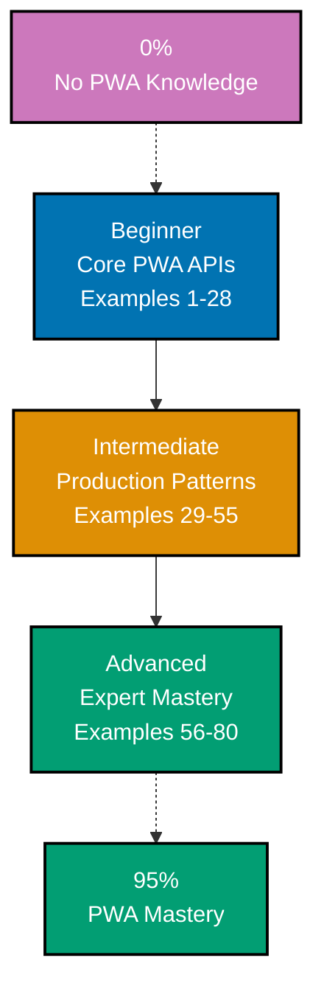

**Want to learn Progressive Web Apps through code?** This by-example tutorial provides 80 heavily annotated examples covering 95% of the PWA platform. Master service workers, manifest configuration, caching strategies, offline support, push notifications, and modern PWA APIs through working browser code rather than lengthy explanations.

## What Is By-Example Learning?

By-example learning is a **code-first approach** where you learn concepts through annotated, working examples rather than narrative explanations. Each example shows:

1. **What the code does** - Brief explanation of the PWA concept
2. **How it works** - A focused, heavily commented code example
3. **Key Takeaway** - A pattern summary highlighting the lesson
4. **Why It Matters** - Production context, when to use, deeper significance

This approach works best when you already understand HTML, JavaScript, and HTTP fundamentals. You learn the PWA platform's behavior, lifecycle, and APIs by studying real code rather than theoretical descriptions.

## What Is a Progressive Web App?

A **Progressive Web App (PWA)** is a web application that uses modern browser capabilities to deliver an app-like experience. Key distinctions:

- **Installable**: Users can add the app to their home screen via a Web App Manifest
- **Offline-capable**: A service worker intercepts network requests and serves cached responses when offline
- **Reliable**: Performs well on flaky networks through smart caching strategies
- **Engaging**: Supports push notifications, background sync, and other native-like features
- **Standards-based**: Built on browser APIs that ship with every modern browser, no app store required
- **Progressive enhancement**: Falls back gracefully on browsers without PWA support

## Learning Path



## Coverage Philosophy: 95% Through 80 Examples

The **95% coverage** means you'll understand the PWA platform deeply enough to ship production-grade installable web apps with confidence. It doesn't mean you'll know every browser quirk or vendor-specific behavior, those come with experience.

The 80 examples are organized progressively:

- **Beginner (Examples 1-28)**: Foundation APIs (manifest fields, service worker registration and lifecycle, install/activate/fetch events, basic Cache API, offline fallback, install prompt, notifications, IntersectionObserver). 100% core browser APIs, no third-party libraries.
- **Intermediate (Examples 29-55)**: Production patterns (caching strategies, runtime caching, background sync, push notifications protocol, app shell architecture, Workbox introduction, next-pwa, update flows, navigation preload, Lighthouse audits).
- **Advanced (Examples 56-80)**: Expert mastery (Share Target, File Handling, Badging, Shortcuts, Protocol Handlers, Window Controls Overlay, Periodic Background Sync, Web Push protocol, performance budgets, security model, testing service workers, debugging strategies, migration patterns, Workbox plugins).

Together, these examples cover **95% of what you'll use** in production PWA applications.

## Core Features First

This tutorial follows a **Core Features First** philosophy:

- **Beginner uses zero third-party libraries**: Every example uses only browser APIs that ship with Chrome, Firefox, Safari, and Edge. You learn how the PWA platform actually works before reaching for abstractions.
- **Intermediate introduces Workbox and next-pwa where justified**: Each external dependency includes a "Why Not Core Features" section that explains the trade-offs and links back to the core API example it abstracts.
- **Advanced compares trade-offs**: When to roll your own vs. when to lean on libraries, with measured guidance.

This approach ensures you can debug, customize, and reason about any PWA, even when libraries fail you.

## Annotation Density: 1-2.25 Comments Per Code Line

**CRITICAL**: All examples maintain **1-2.25 comment lines per code line PER EXAMPLE** to ensure deep understanding.

**What this means**:

- Simple lines get 1 annotation explaining the API call or browser behavior
- Complex lines get 2+ annotations explaining lifecycle implications, caching semantics, and security context
- Use `// =>` notation in JavaScript and `<!-- => -->` in HTML to show what each line produces

**Example**:

```javascript
// => Register the service worker, scoped to the entire origin
navigator.serviceWorker
  .register("/sw.js", { scope: "/" })
  // => Returns a Promise that resolves with a ServiceWorkerRegistration
  .then((registration) => {
    // => registration.scope is the URL scope (e.g., 'https://example.com/')
    console.log("SW registered:", registration.scope);
    // => Output: SW registered: https://example.com/
  })
  // => If registration fails (HTTPS missing, parse error), the catch fires
  .catch((error) => {
    // => Common errors: SecurityError on http://, SyntaxError on bad JS
    console.error("SW registration failed:", error);
  });
```

This density ensures each example is self-contained and fully comprehensible without external documentation.

## Structure of Each Example

All examples follow a consistent five-part format:

````
### Example N: Descriptive Title

2-3 sentence explanation of the concept.

```mermaid
%% Optional diagram for complex relationships (30-50% of examples)
```

```javascript
// Heavily annotated code example
// showing the PWA pattern in action
```

**Key Takeaway**: 1-2 sentence summary.

**Why It Matters**: 50-100 words explaining significance in production applications.
````

## What's Covered

### Web App Manifest

- All standard manifest fields (`name`, `short_name`, `start_url`, `display`, `icons`, `theme_color`, `background_color`, `scope`, `orientation`, `categories`, `description`, `lang`, `dir`)
- Modern manifest features (`shortcuts`, `share_target`, `file_handlers`, `protocol_handlers`, `display_override`, `launch_handler`, `id`, `screenshots`)
- Install prompt handling via `beforeinstallprompt`
- Platform differences (iOS Safari vs Chrome Android vs desktop Edge)

### Service Worker Lifecycle

- Registration, scope, and update model
- `install`, `activate`, `fetch`, `message` event handlers
- `skipWaiting` and `clients.claim` patterns
- Update flows and the waiting worker
- Navigation preload for faster navigations
- Termination, idle, and lifetime constraints

### Caching Strategies

- Cache-first (precaching, app shell)
- Network-first (HTML, dynamic content)
- Stale-while-revalidate (assets that change occasionally)
- Cache-only and network-only edge cases
- Runtime caching with quota management
- Cache versioning and cleanup

### Offline Support

- Offline fallback pages
- Detecting online/offline status
- Queueing requests with Background Sync
- Periodic Background Sync for refreshes
- Communicating with users about offline state

### Push Notifications

- Notification API basics
- Push API and the web push protocol
- VAPID keys and subscription management
- Notification actions and rich content
- Quiet hours and notification UX

### Modern PWA APIs

- Share Target API (receiving shared content)
- File Handling API (opening files from the OS)
- Badging API (unread counts)
- Shortcuts (jump-list entries)
- Protocol Handlers (custom URL schemes)
- Window Controls Overlay (titlebar customization)

### Production Patterns

- App shell architecture
- Performance budgets
- Lighthouse PWA audits
- Workbox patterns (intermediate+)
- next-pwa integration
- Testing service workers
- Debugging with Chrome DevTools Application tab
- Security requirements (HTTPS, mixed content)

## What's NOT Covered

We exclude topics that belong in specialized tutorials:

- **IndexedDB deep dive**: Brief coverage in service worker context only; full coverage in the IndexedDB tutorial
- **WebRTC, WebGL, WebGPU**: Multimedia and graphics APIs (separate tutorials)
- **WebAssembly**: Compilation targets (separate tutorial)
- **Capacitor/Cordova**: Hybrid app frameworks (different paradigm)
- **React Native, Flutter**: Native cross-platform frameworks (different paradigm)

For these topics, see dedicated tutorials and library documentation.

## Prerequisites

### Required

- **JavaScript fundamentals**: Promises, async/await, modules, the event loop
- **HTTP basics**: Requests, responses, status codes, headers, caching headers
- **Browser DOM**: `window`, `navigator`, `document`, basic DOM manipulation
- **Web development experience**: You've shipped a static or dynamic site

### Recommended

- **Service worker mental model**: Familiarity with worker threads helps
- **HTTPS and origins**: Understanding why PWAs require secure contexts
- **DevTools usage**: Comfort with the Network tab and console

### Not Required

- **A specific framework**: Examples use plain HTML/JS; React, Vue, Angular integrations are noted where relevant
- **Push server experience**: We cover client-side push; server delivery is summarized
- **Native mobile development**: PWAs do not require iOS/Android knowledge

## Getting Started

Before starting the examples, ensure you have a basic environment:

```bash
# A static file server is enough for most beginner examples
npx http-server . -p 8080
# => Serve the current directory at http://localhost:8080

# Service workers require HTTPS, with one exception: localhost
# => Browsers treat http://localhost as a secure context for development
```

For experimentation, use Chrome's `chrome://inspect` or the **Application** tab in DevTools to inspect your manifest, registered service workers, and caches in real time.

## How to Use This Guide

### 1. Choose Your Starting Point

- **New to PWAs?** Start with Beginner (Example 1)
- **Service worker familiarity?** Start with Intermediate (Example 29)
- **Building a specific feature?** Search for the relevant example topic

### 2. Read the Example

Each example has five parts:

- **Explanation** (2-3 sentences): What PWA concept, why it exists, when to use it
- **Mermaid diagram** (when relationships are complex): Visualizes lifecycle, flow, or architecture
- **Code** (heavily commented): Working code showing the pattern with line-by-line annotations
- **Key Takeaway** (1-2 sentences): Distilled essence of the pattern
- **Why It Matters** (50-100 words): Production context and deeper significance

### 3. Run the Code

Paste each example into a local project and load it via `http://localhost`. Use Chrome DevTools' **Application** tab to verify manifest parsing, service worker state, and cache contents.

### 4. Modify and Experiment

Change cache strategies, throttle the network, force offline mode, trigger update flows. Experimentation builds intuition faster than reading.

### 5. Reference as Needed

Use this guide as a reference when shipping PWAs. Search for relevant examples and adapt the patterns to your codebase.

## Ready to Start?

Choose your learning path:

- **Beginner** - Start here if new to PWAs. Build foundation understanding through 28 core API examples.
- **Intermediate** - Jump here if you know service workers. Master production patterns through 27 examples.
- **Advanced** - Expert mastery through 25 advanced examples covering modern PWA APIs, Workbox internals, performance, and migration.

Or jump to specific topics by searching for relevant example keywords (manifest, service worker, cache, push, offline, sync, etc.).
