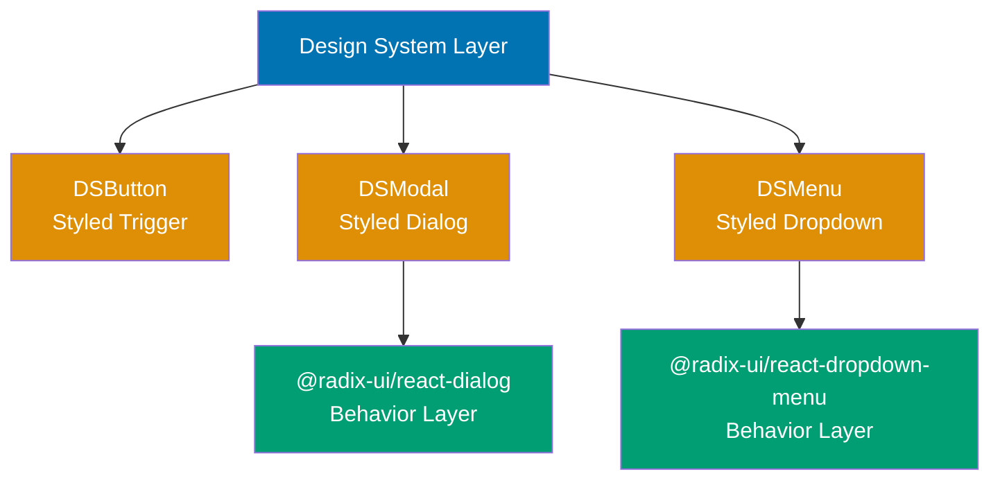
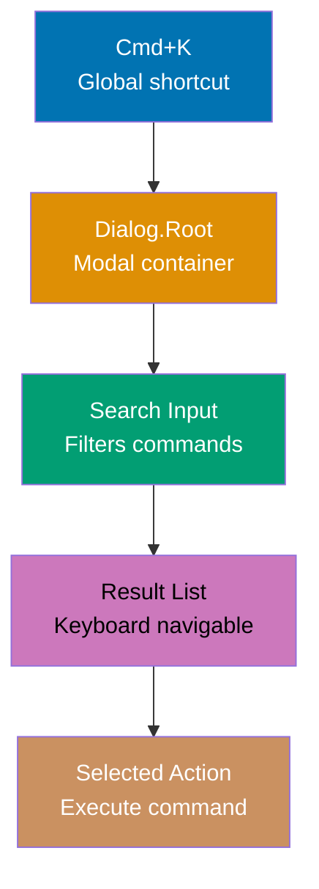

This tutorial covers advanced Radix UI patterns for production environments including custom component building on primitives, design system integration, polymorphic rendering with asChild, testing strategies, SSR considerations, performance optimization, and complex multi-modal interaction flows.

## Custom Component Building (Examples 56-62)

### Example 56: Wrapping Radix Primitives in Design System Components

Production codebases wrap Radix primitives in project-specific components that enforce styling conventions, default props, and composition patterns.



**Code**:

```tsx
import * as Dialog from "@radix-ui/react-dialog";
import * as VisuallyHidden from "@radix-ui/react-visually-hidden";
import { forwardRef, useState, type ComponentPropsWithoutRef } from "react";
// => forwardRef: required for asChild compatibility
// => useState: for controlled component examples

// Design system Modal component wrapping Radix Dialog
interface ModalProps {
  open: boolean;
  onOpenChange: (open: boolean) => void;
  title: string;
  description?: string;
  hideTitle?: boolean;
  children: React.ReactNode;
}
// => Props interface enforces required fields

export const Modal = forwardRef<HTMLDivElement, ModalProps>(
  ({ open, onOpenChange, title, description, hideTitle, children }, ref) => {
    // => forwardRef enables asChild usage on this component
    return (
      <Dialog.Root open={open} onOpenChange={onOpenChange}>
        {/* => Always controlled -- design system enforces this */}
        <Dialog.Portal>
          <Dialog.Overlay
            style={{
              position: "fixed",
              inset: 0,
              backgroundColor: "rgba(0, 0, 0, 0.4)",
              // => Consistent overlay across all modals
            }}
          />
          <Dialog.Content
            ref={ref}
            // => Forward ref to content element
            style={{
              position: "fixed",
              top: "50%",
              left: "50%",
              transform: "translate(-50%, -50%)",
              backgroundColor: "white",
              borderRadius: 8,
              padding: 24,
              boxShadow: "0 8px 32px rgba(0, 0, 0, 0.12)",
              maxWidth: 520,
              width: "90vw",
              // => Design system standard modal dimensions
            }}
          >
            {hideTitle ? (
              <VisuallyHidden.Root asChild>
                <Dialog.Title>{title}</Dialog.Title>
                {/* => Hidden title for accessibility */}
              </VisuallyHidden.Root>
            ) : (
              <Dialog.Title style={{ fontSize: 18, fontWeight: 600, marginBottom: 8 }}>{title}</Dialog.Title>
            )}
            {description && (
              <Dialog.Description style={{ color: "#666", marginBottom: 16 }}>{description}</Dialog.Description>
            )}
            {children}
          </Dialog.Content>
        </Dialog.Portal>
      </Dialog.Root>
    );
  },
);
Modal.displayName = "Modal";
// => displayName for React DevTools

// Design system ModalTrigger (re-export with consistent API)
export const ModalTrigger = Dialog.Trigger;
// => Direct re-export preserves all Radix behavior

// Design system ModalClose
export const ModalClose = Dialog.Close;
// => Direct re-export

// Usage in application code
export function AppExample() {
  const [open, setOpen] = useState(false);
  return (
    <>
      <button onClick={() => setOpen(true)}>Open</button>
      <Modal open={open} onOpenChange={setOpen} title="Confirm Action" description="Are you sure you want to proceed?">
        <div style={{ display: "flex", gap: 8, justifyContent: "flex-end" }}>
          <ModalClose asChild>
            <button>Cancel</button>
          </ModalClose>
          <button
            onClick={() => {
              console.log("Confirmed");
              setOpen(false);
            }}
          >
            Confirm
          </button>
        </div>
      </Modal>
    </>
  );
}
// => Design system consumers use Modal, not Dialog directly
// => Consistent styling, required props, accessibility baked in
// => hideTitle: accessibility without visible title
// => forwardRef: enables advanced composition patterns
```

**Key Takeaway**: Wrap Radix primitives in design system components that enforce consistent styling, required props (title for accessibility), and controlled mode. Use `forwardRef` for `asChild` compatibility and re-export sub-components that need no customization.

**Why It Matters**: Direct usage of Radix primitives in application code leads to inconsistent styling, missing accessibility props (forgotten titles, descriptions), and duplicated boilerplate. Design system wrappers encode these decisions once: required `title` prop ensures accessibility, consistent overlay styling prevents visual inconsistency, and controlled-only mode prevents state management bugs. The `forwardRef` pattern ensures your wrapper components remain compatible with Radix's `asChild` composition model.

---

### Example 57: Polymorphic Button with asChild

Building a polymorphic Button component that works as `<button>`, `<a>`, or any custom element using Radix's Slot primitive (the engine behind `asChild`).

**Code**:

```tsx
import { Slot } from "@radix-ui/react-slot";
import { forwardRef, type ComponentPropsWithoutRef } from "react";
// => Install: npm install @radix-ui/react-slot
// => Slot: the primitive that powers asChild

interface ButtonProps extends ComponentPropsWithoutRef<"button"> {
  asChild?: boolean;
  // => asChild: render as child element instead of button
  variant?: "primary" | "secondary" | "ghost";
  // => Visual variant
  size?: "sm" | "md" | "lg";
  // => Size variant
}

const variantStyles: Record<string, React.CSSProperties> = {
  primary: { backgroundColor: "#0173B2", color: "white", border: "none" },
  // => Blue primary button
  secondary: { backgroundColor: "transparent", color: "#0173B2", border: "2px solid #0173B2" },
  // => Outlined secondary button
  ghost: { backgroundColor: "transparent", color: "#333", border: "none" },
  // => Minimal ghost button
};

const sizeStyles: Record<string, React.CSSProperties> = {
  sm: { padding: "4px 8px", fontSize: 12 },
  md: { padding: "8px 16px", fontSize: 14 },
  lg: { padding: "12px 24px", fontSize: 16 },
};

export const Button = forwardRef<HTMLButtonElement, ButtonProps>(
  ({ asChild = false, variant = "primary", size = "md", style, ...props }, ref) => {
    const Component = asChild ? Slot : "button";
    // => Slot: merges props onto child element
    // => "button": renders native button element
    // => Same pattern Radix uses internally for asChild

    const combinedStyle: React.CSSProperties = {
      borderRadius: 6,
      cursor: "pointer",
      fontWeight: 500,
      display: "inline-flex",
      alignItems: "center",
      justifyContent: "center",
      ...variantStyles[variant],
      ...sizeStyles[size],
      ...style,
      // => User style overrides come last
    };

    return <Component ref={ref} style={combinedStyle} {...props} />;
  },
);
Button.displayName = "Button";

// Usage examples
export function ButtonExamples() {
  return (
    <div style={{ display: "flex", gap: 8, alignItems: "center" }}>
      {/* Renders as <button> */}
      <Button variant="primary" size="md" onClick={() => console.log("clicked")}>
        Click Me
      </Button>
      {/* => Output: <button style="...primary styles...">Click Me</button> */}

      {/* Renders as <a> via asChild */}
      <Button asChild variant="secondary" size="md">
        <a href="/dashboard">Go to Dashboard</a>
      </Button>
      {/* => Output: <a href="/dashboard" style="...secondary styles...">Go to Dashboard</a> */}

      {/* Renders as custom component via asChild */}
      <Button asChild variant="ghost" size="sm">
        <span role="button" tabIndex={0}>
          Custom Element
        </span>
      </Button>
      {/* => Output: <span role="button" style="...ghost styles...">Custom Element</span> */}
    </div>
  );
}
// => Slot (from @radix-ui/react-slot) is the asChild engine
// => It merges className, style, event handlers, refs
// => Child element determines the rendered DOM element
// => Parent (Button) provides styling and behavior
// => This is the same technique all Radix components use internally
```

**Key Takeaway**: Import `Slot` from `@radix-ui/react-slot` to build your own `asChild`-enabled components. Slot merges parent props onto the child element, enabling polymorphic rendering.

**Why It Matters**: The Slot primitive is the foundation of Radix's composition model, and using it in your own components creates a consistent API across your design system. A Button that renders as an `<a>` tag for links or as a custom component for framework integration (Next.js `<Link>`, React Router `<Link>`) eliminates the need for separate `ButtonLink`, `ButtonSpan`, and `ButtonCustom` components. This reduces your component surface area while maintaining full flexibility.

---

### Example 58: Compound Component Pattern for Custom Widgets

Building a custom compound component (like Radix's approach) using React Context for parent-child communication.

**Code**:

```tsx
import { createContext, useContext, useState, type ReactNode } from "react";
// => React Context for compound component communication

// Step 1: Create context for shared state
interface AccordionContextType {
  activeItem: string | null;
  setActiveItem: (value: string | null) => void;
}
// => Context type: shared state between compound components

const AccordionContext = createContext<AccordionContextType | null>(null);
// => null default: components MUST be used inside Root

function useAccordionContext() {
  const context = useContext(AccordionContext);
  if (!context) {
    throw new Error("Accordion components must be used within Accordion.Root");
    // => Error boundary: prevents usage outside Root
  }
  return context;
}

// Step 2: Root provides context
function Root({ children, defaultValue = null }: { children: ReactNode; defaultValue?: string | null }) {
  const [activeItem, setActiveItem] = useState<string | null>(defaultValue);
  // => State lives in Root, shared via context

  return (
    <AccordionContext.Provider value={{ activeItem, setActiveItem }}>
      {/* => Provider wraps all children */}
      <div role="region" aria-label="accordion">
        {children}
      </div>
    </AccordionContext.Provider>
  );
}

// Step 3: Item reads and writes context
function Item({ value, title, children }: { value: string; title: string; children: ReactNode }) {
  const { activeItem, setActiveItem } = useAccordionContext();
  // => Access shared state from Root
  const isOpen = activeItem === value;
  // => Check if this item is the active one

  return (
    <div>
      <button
        onClick={() => setActiveItem(isOpen ? null : value)}
        // => Toggle: close if open, open if closed
        aria-expanded={isOpen}
        // => aria-expanded: screen reader state
      >
        {title}
      </button>
      {isOpen && (
        <div role="region">
          {children}
          {/* => Content visible only when active */}
        </div>
      )}
    </div>
  );
}

// Step 4: Export as namespace
export const CustomAccordion = { Root, Item };
// => Matches Radix's Accordion.Root, Accordion.Item pattern

// Usage
export function CustomAccordionDemo() {
  return (
    <CustomAccordion.Root defaultValue="faq-1">
      {/* => Same API pattern as Radix: Root wraps Items */}
      <CustomAccordion.Item value="faq-1" title="What is this?">
        <p>A custom compound component following Radix patterns.</p>
      </CustomAccordion.Item>
      <CustomAccordion.Item value="faq-2" title="How does it work?">
        <p>React Context shares state between Root and Items.</p>
      </CustomAccordion.Item>
    </CustomAccordion.Root>
  );
}
// => This is how Radix builds compound components internally
// => Context provides state sharing without prop drilling
// => Namespace export (CustomAccordion.Root) creates familiar API
// => Radix adds: keyboard nav, ARIA, forceMount, animation hooks
// => This example shows the architectural pattern
```

**Key Takeaway**: Radix's compound component pattern uses React Context (Root provides state, children consume it) and namespace exports (`Component.Root`, `Component.Item`). Build custom widgets following this same architecture for API consistency.

**Why It Matters**: Understanding Radix's internal architecture (Context-based compound components) enables you to extend the library with custom widgets that feel native. When your design system has a `Stepper`, `Rating`, or `Calendar` component that Radix does not provide, building it with the same compound component pattern creates a consistent developer experience. Your team uses the same `Root` / `Item` / `Content` mental model for all components, whether they come from Radix or your own library.

---

### Example 59: Accessible Combobox with Popover and Command Pattern

Building a combobox (searchable select) by composing Popover for the floating panel and a filtered list for options.

**Code**:

```tsx
import * as Popover from "@radix-ui/react-popover";
import * as VisuallyHidden from "@radix-ui/react-visually-hidden";
import { useState, useRef } from "react";
// => Composing primitives into a combobox

const FRUITS = [
  "Apple",
  "Banana",
  "Blueberry",
  "Cherry",
  "Grape",
  "Mango",
  "Orange",
  "Peach",
  "Pear",
  "Pineapple",
  "Strawberry",
  "Watermelon",
];
// => Option list for demonstration

export function Combobox() {
  const [open, setOpen] = useState(false);
  const [search, setSearch] = useState("");
  const [selected, setSelected] = useState("");
  const inputRef = useRef<HTMLInputElement>(null);
  // => Refs and state for combobox behavior

  const filtered = FRUITS.filter((fruit) => fruit.toLowerCase().includes(search.toLowerCase()));
  // => Filter options based on search input

  return (
    <Popover.Root open={open} onOpenChange={setOpen}>
      <Popover.Anchor asChild>
        {/* => Anchor: positions popover relative to input */}
        {/* => Different from Trigger: doesn't toggle on click */}
        <div style={{ position: "relative" }}>
          <VisuallyHidden.Root>
            <label htmlFor="fruit-search">Select a fruit</label>
          </VisuallyHidden.Root>
          <input
            ref={inputRef}
            id="fruit-search"
            role="combobox"
            // => role="combobox" for screen readers
            aria-expanded={open}
            // => Indicates dropdown state
            aria-autocomplete="list"
            // => Indicates list-based autocomplete
            aria-controls="fruit-listbox"
            // => Links input to listbox
            value={search}
            placeholder={selected || "Search fruits..."}
            // => Show selected value as placeholder
            onChange={(e) => {
              setSearch(e.target.value);
              setOpen(true);
              // => Open popover on typing
            }}
            onFocus={() => setOpen(true)}
            // => Open on focus
            onKeyDown={(e) => {
              if (e.key === "Escape") {
                setOpen(false);
                // => Close on Escape
              }
              if (e.key === "ArrowDown" && open && filtered.length > 0) {
                e.preventDefault();
                // => Focus first option on ArrowDown
                const firstOption = document.querySelector<HTMLElement>("#fruit-listbox [role='option']");
                firstOption?.focus();
              }
            }}
          />
        </div>
      </Popover.Anchor>
      <Popover.Portal>
        <Popover.Content
          side="bottom"
          sideOffset={4}
          align="start"
          onOpenAutoFocus={(e) => {
            e.preventDefault();
            // => Keep focus on input, not popover
          }}
          style={{
            width: "var(--radix-popover-trigger-width)",
            maxHeight: 200,
            overflowY: "auto",
            background: "white",
            border: "1px solid #ddd",
            borderRadius: 4,
          }}
        >
          <ul
            id="fruit-listbox"
            role="listbox"
            // => role="listbox" for screen readers
            aria-label="Fruits"
          >
            {filtered.length === 0 ? (
              <li style={{ padding: 8, color: "#999" }}>No results found.</li>
            ) : (
              filtered.map((fruit) => (
                <li
                  key={fruit}
                  role="option"
                  // => role="option" for each listbox item
                  aria-selected={fruit === selected}
                  // => Indicates currently selected option
                  tabIndex={-1}
                  // => Focusable via JavaScript, not Tab
                  style={{
                    padding: 8,
                    cursor: "pointer",
                    backgroundColor: fruit === selected ? "#e8f4fd" : "transparent",
                  }}
                  onClick={() => {
                    setSelected(fruit);
                    setSearch("");
                    setOpen(false);
                    inputRef.current?.focus();
                    // => Select option, close, return focus to input
                  }}
                  onKeyDown={(e) => {
                    if (e.key === "Enter") {
                      setSelected(fruit);
                      setSearch("");
                      setOpen(false);
                      inputRef.current?.focus();
                    }
                  }}
                >
                  {fruit}
                </li>
              ))
            )}
          </ul>
        </Popover.Content>
      </Popover.Portal>
    </Popover.Root>
  );
}
// => Combobox = input + popover + listbox
// => ARIA: role="combobox", aria-expanded, aria-autocomplete
// => ARIA: role="listbox", role="option", aria-selected
// => Popover.Anchor: positions dropdown relative to input
// => onOpenAutoFocus prevented: keeps focus on input
// => ArrowDown: moves focus from input to first option
// => This is a simplified combobox; production needs full keyboard nav
```

**Key Takeaway**: Build a combobox by composing Popover (floating panel), an input with `role="combobox"`, and a list with `role="listbox"`. Use `Popover.Anchor` (not Trigger) to position the dropdown relative to the input without toggle behavior.

**Why It Matters**: Combobox (searchable select) is the most requested but most complex ARIA pattern. It requires coordinating input events, popover positioning, listbox keyboard navigation, and ARIA attributes across three distinct elements. Radix does not provide a combobox primitive because the interaction requirements vary widely (single/multi select, async loading, create new option, grouped options). By composing Popover with custom listbox logic, you get Radix's positioning engine and portal management while maintaining full control over the combobox-specific behavior.

---

### Example 60: Virtualized List Inside ScrollArea

For large datasets inside ScrollArea or Select, rendering all items causes performance issues. This pattern demonstrates virtualization with Radix.

**Code**:

```tsx
import * as ScrollArea from "@radix-ui/react-scroll-area";
import { useState, useMemo, useRef, useEffect } from "react";
// => ScrollArea with virtual scrolling

// Simple virtualizer (production: use @tanstack/react-virtual)
function useVirtualizer(itemCount: number, itemHeight: number, containerHeight: number) {
  const [scrollTop, setScrollTop] = useState(0);
  // => Current scroll position

  const startIndex = Math.floor(scrollTop / itemHeight);
  // => First visible item index
  const endIndex = Math.min(itemCount - 1, Math.floor((scrollTop + containerHeight) / itemHeight));
  // => Last visible item index
  const overscan = 5;
  // => Render extra items above/below viewport

  const visibleRange = {
    start: Math.max(0, startIndex - overscan),
    end: Math.min(itemCount - 1, endIndex + overscan),
  };
  // => Range with overscan buffer

  const totalHeight = itemCount * itemHeight;
  // => Total scrollable height
  const offsetY = visibleRange.start * itemHeight;
  // => Offset to position visible items

  return { visibleRange, totalHeight, offsetY, setScrollTop };
}

export function VirtualizedScrollArea() {
  const ITEM_COUNT = 10000;
  const ITEM_HEIGHT = 36;
  const CONTAINER_HEIGHT = 300;
  // => 10,000 items, only ~8 visible at a time

  const { visibleRange, totalHeight, offsetY, setScrollTop } = useVirtualizer(
    ITEM_COUNT,
    ITEM_HEIGHT,
    CONTAINER_HEIGHT,
  );

  const items = useMemo(() => {
    const result = [];
    for (let i = visibleRange.start; i <= visibleRange.end; i++) {
      result.push(
        <div key={i} style={{ height: ITEM_HEIGHT, padding: "8px 12px", borderBottom: "1px solid #eee" }}>
          Item {i + 1} of {ITEM_COUNT}
          {/* => Only ~18 items rendered (8 visible + 10 overscan) */}
        </div>,
      );
    }
    return result;
  }, [visibleRange.start, visibleRange.end]);
  // => Memoize visible items to prevent unnecessary re-renders

  return (
    <ScrollArea.Root style={{ height: CONTAINER_HEIGHT, width: 300 }}>
      <ScrollArea.Viewport
        onScroll={(e) => setScrollTop(e.currentTarget.scrollTop)}
        // => Track scroll position for virtualization
      >
        <div style={{ height: totalHeight, position: "relative" }}>
          {/* => Full-height container for scrollbar accuracy */}
          <div style={{ position: "absolute", top: offsetY, width: "100%" }}>
            {/* => Offset positions visible items correctly */}
            {items}
          </div>
        </div>
      </ScrollArea.Viewport>
      <ScrollArea.Scrollbar orientation="vertical">
        <ScrollArea.Thumb />
        {/* => Scrollbar thumb reflects true scroll position */}
        {/* => totalHeight ensures scrollbar is proportionally correct */}
      </ScrollArea.Scrollbar>
    </ScrollArea.Root>
  );
}
// => Only ~18 DOM elements instead of 10,000
// => Scrollbar works correctly (totalHeight sets full range)
// => Production: use @tanstack/react-virtual for robust virtualization
// => ScrollArea.Viewport onScroll drives the virtualizer
// => Overscan prevents blank areas during fast scrolling
```

**Key Takeaway**: Combine ScrollArea with virtualization to render large lists efficiently. The Viewport's `onScroll` event drives the virtualizer, and a full-height container ensures the ScrollArea scrollbar reflects the true data size.

**Why It Matters**: Rendering 10,000 DOM nodes causes severe performance degradation (slow initial render, janky scrolling, high memory usage). Virtualization renders only visible items (plus a small buffer), reducing DOM nodes from thousands to tens. ScrollArea's custom scrollbar integrates cleanly with virtualization because the scrollbar thumb position is based on the container's scroll position, not the number of child elements. For production use, integrate `@tanstack/react-virtual` with ScrollArea for robust virtualization including variable-height items and dynamic content.

---

### Example 61: Responsive Dialog-to-Drawer Pattern

On desktop, show content in a Dialog (centered modal). On mobile, show the same content as a bottom drawer. This pattern uses media queries with Radix.

**Code**:

```tsx
import * as Dialog from "@radix-ui/react-dialog";
import { useState, useEffect } from "react";
// => Dialog with responsive layout

function useMediaQuery(query: string): boolean {
  const [matches, setMatches] = useState(false);
  // => Track media query match state

  useEffect(() => {
    const media = window.matchMedia(query);
    setMatches(media.matches);
    // => Initial check

    const listener = (e: MediaQueryListEvent) => setMatches(e.matches);
    media.addEventListener("change", listener);
    return () => media.removeEventListener("change", listener);
    // => Listen for changes (viewport resize)
  }, [query]);

  return matches;
}

export function ResponsiveDialog() {
  const isMobile = useMediaQuery("(max-width: 768px)");
  // => true on mobile, false on desktop

  const contentStyle: React.CSSProperties = isMobile
    ? {
        // Mobile: bottom drawer
        position: "fixed",
        bottom: 0,
        left: 0,
        right: 0,
        maxHeight: "80vh",
        borderRadius: "16px 16px 0 0",
        // => Rounded top corners for drawer appearance
        backgroundColor: "white",
        padding: 24,
        overflowY: "auto",
      }
    : {
        // Desktop: centered modal
        position: "fixed",
        top: "50%",
        left: "50%",
        transform: "translate(-50%, -50%)",
        maxWidth: 520,
        width: "90vw",
        borderRadius: 8,
        backgroundColor: "white",
        padding: 24,
      };
  // => Different styles based on viewport

  return (
    <Dialog.Root>
      <Dialog.Trigger asChild>
        <button>Open</button>
      </Dialog.Trigger>
      <Dialog.Portal>
        <Dialog.Overlay
          style={{
            position: "fixed",
            inset: 0,
            backgroundColor: "rgba(0, 0, 0, 0.4)",
          }}
        />
        <Dialog.Content style={contentStyle}>
          <Dialog.Title>{isMobile ? "Drawer Title" : "Dialog Title"}</Dialog.Title>
          <Dialog.Description>
            This component renders as a centered dialog on desktop and a bottom drawer on mobile.
          </Dialog.Description>
          {isMobile && (
            <div
              style={{
                width: 32,
                height: 4,
                borderRadius: 2,
                backgroundColor: "#ddd",
                margin: "0 auto 16px",
                // => Drag handle indicator for mobile drawer
              }}
              aria-hidden="true"
            />
          )}
          <p>Content goes here. Scroll if needed on mobile.</p>
          <Dialog.Close asChild>
            <button style={{ marginTop: 16 }}>Close</button>
          </Dialog.Close>
        </Dialog.Content>
      </Dialog.Portal>
    </Dialog.Root>
  );
}
// => Same Dialog component, different visual presentation
// => Focus trap works identically on both layouts
// => Escape key closes on both layouts
// => Overlay click closes on both layouts
// => Accessibility behavior is viewport-independent
// => Mobile: bottom sheet pattern (familiar from iOS/Android)
// => Desktop: centered modal pattern (familiar from web)
```

**Key Takeaway**: Use a media query hook to conditionally style Dialog.Content as a centered modal (desktop) or bottom drawer (mobile). Radix's accessibility behavior (focus trap, Escape, overlay dismiss) works identically regardless of visual layout.

**Why It Matters**: Mobile users expect bottom sheets (drawer from bottom), while desktop users expect centered modals. Using two separate components (Dialog + custom Drawer) doubles the maintenance surface and risks accessibility inconsistencies. By styling a single Dialog component differently based on viewport, you get consistent accessibility behavior on all devices with a single component tree. The visual drag handle indicator for mobile is decorative only (not functional in this example), but signals to users that they can interact with the drawer.

---

### Example 62: Custom Trigger with Forwarded Ref

Building a custom trigger component that works with Radix's `asChild` requires proper ref forwarding and prop merging.

**Code**:

```tsx
import * as Tooltip from "@radix-ui/react-tooltip";
import { forwardRef, type ComponentPropsWithoutRef } from "react";
// => forwardRef required for asChild compatibility

// Custom component that WORKS with asChild
const IconButton = forwardRef<HTMLButtonElement, ComponentPropsWithoutRef<"button"> & { icon: string }>(
  ({ icon, children, ...props }, ref) => {
    // => forwardRef: Radix passes ref through asChild
    // => ...props: Radix passes ARIA, event handlers, data-* attributes
    return (
      <button ref={ref} {...props}>
        {/* => ref and props MUST be spread onto the root element */}
        <span aria-hidden="true">{icon}</span>
        {/* => Decorative icon */}
        {children}
      </button>
    );
  },
);
IconButton.displayName = "IconButton";
// => displayName: required for React DevTools

// Custom component that BREAKS with asChild (common mistake)
function BrokenButton({ icon, children }: { icon: string; children: React.ReactNode }) {
  // => NO forwardRef: ref is lost
  // => NO ...props spread: Radix attributes are dropped
  return (
    <button>
      <span>{icon}</span>
      {children}
    </button>
  );
}
// => BrokenButton inside asChild: no Radix behavior!

// Demonstration
export function CustomTriggerExample() {
  return (
    <Tooltip.Provider>
      <Tooltip.Root>
        <Tooltip.Trigger asChild>
          {/* => asChild: merges Radix props onto IconButton */}
          <IconButton icon="*">
            {/* => IconButton receives: ref, data-state, */}
            {/* => aria-describedby, onMouseEnter, onMouseLeave, */}
            {/* => onFocus, onBlur (all from Radix) */}
            Favorite
          </IconButton>
        </Tooltip.Trigger>
        <Tooltip.Portal>
          <Tooltip.Content side="bottom" sideOffset={4}>
            Add to favorites
            <Tooltip.Arrow />
          </Tooltip.Content>
        </Tooltip.Portal>
      </Tooltip.Root>
    </Tooltip.Provider>
  );
}
// => forwardRef + props spread = asChild compatible
// => Without forwardRef: ref is lost, Radix can't measure/focus
// => Without ...props: ARIA, data-state, events are dropped
// => Rule: any component used inside asChild MUST:
// => 1. Use forwardRef
// => 2. Spread remaining props onto root DOM element
```

**Key Takeaway**: Components used inside `asChild` MUST use `forwardRef` and spread remaining props onto the root DOM element. Without both, Radix's ARIA attributes, event handlers, and data attributes are lost.

**Why It Matters**: The `asChild` pattern is Radix's primary composition mechanism, and it breaks silently when the child component does not forward refs or spread props. The component renders without errors, but Radix's behavior (hover detection for tooltips, click handling for triggers, ARIA attributes for accessibility) is completely lost. This is the most common integration mistake with Radix UI, and understanding the `forwardRef` + prop spread requirements prevents hours of debugging invisible accessibility and behavior regressions.

---

## Testing Radix Components (Examples 63-67)

### Example 63: Unit Testing Dialog Open/Close

Testing Radix components requires simulating user interactions (click, keyboard) and asserting on ARIA state changes.

**Code**:

```tsx
// Test file: Modal.test.tsx
// => Assumes: @testing-library/react, @testing-library/jest-dom, vitest

import * as Dialog from "@radix-ui/react-dialog";
// => Component under test

// Component for testing
function TestDialog() {
  return (
    <Dialog.Root>
      <Dialog.Trigger asChild>
        <button>Open Dialog</button>
      </Dialog.Trigger>
      <Dialog.Portal>
        <Dialog.Overlay />
        <Dialog.Content>
          <Dialog.Title>Test Dialog</Dialog.Title>
          <Dialog.Description>Dialog description</Dialog.Description>
          <input placeholder="Name" />
          <Dialog.Close asChild>
            <button>Close</button>
          </Dialog.Close>
        </Dialog.Content>
      </Dialog.Portal>
    </Dialog.Root>
  );
}

// Test: Dialog opens on trigger click
// render(<TestDialog />);
// const trigger = screen.getByRole("button", { name: "Open Dialog" });
// => Find trigger by accessible name
// expect(screen.queryByRole("dialog")).not.toBeInTheDocument();
// => Dialog is NOT in DOM before opening
// await userEvent.click(trigger);
// => Simulate click on trigger
// expect(screen.getByRole("dialog")).toBeInTheDocument();
// => Dialog IS in DOM after opening
// expect(screen.getByText("Test Dialog")).toBeVisible();
// => Title is visible

// Test: Dialog closes on Close button click
// const closeButton = screen.getByRole("button", { name: "Close" });
// await userEvent.click(closeButton);
// => Click close button
// expect(screen.queryByRole("dialog")).not.toBeInTheDocument();
// => Dialog removed from DOM

// Test: Dialog closes on Escape key
// await userEvent.click(trigger);
// => Open dialog
// await userEvent.keyboard("{Escape}");
// => Press Escape key
// expect(screen.queryByRole("dialog")).not.toBeInTheDocument();
// => Dialog closed

// Test: Focus moves to dialog on open
// await userEvent.click(trigger);
// expect(screen.getByPlaceholderText("Name")).toHaveFocus();
// => First focusable element receives focus
// => (or whichever element onOpenAutoFocus targets)

// Test: Focus returns to trigger on close
// await userEvent.keyboard("{Escape}");
// expect(trigger).toHaveFocus();
// => Focus returned to trigger element

console.log("Dialog test patterns demonstrated");
// => Tests verify: open/close, keyboard, focus management, ARIA roles
```

**Key Takeaway**: Test Radix components using `screen.getByRole("dialog")`, `userEvent.click()`, and `userEvent.keyboard("{Escape}")`. Assert on ARIA roles, focus state, and DOM presence (not CSS visibility).

**Why It Matters**: Testing Radix components through ARIA roles (`getByRole("dialog")`, `getByRole("menu")`) verifies the accessibility contract, not just visual behavior. If a code change breaks the ARIA role, the test fails, catching accessibility regressions before they reach users. Testing keyboard interactions (Escape, Enter, arrow keys) ensures the component works for keyboard-only users. The focus management assertions (`toHaveFocus()`) verify that focus moves correctly, which is invisible to visual testing but critical for screen reader users.

---

### Example 64: Testing DropdownMenu Keyboard Navigation

Testing keyboard navigation in menus requires simulating arrow key sequences and verifying focus movement between items.

**Code**:

```tsx
import * as DropdownMenu from "@radix-ui/react-dropdown-menu";
// => DropdownMenu for keyboard navigation testing

function TestMenu() {
  return (
    <DropdownMenu.Root>
      <DropdownMenu.Trigger asChild>
        <button>Actions</button>
      </DropdownMenu.Trigger>
      <DropdownMenu.Portal>
        <DropdownMenu.Content>
          <DropdownMenu.Item>Copy</DropdownMenu.Item>
          <DropdownMenu.Item>Paste</DropdownMenu.Item>
          <DropdownMenu.Item disabled>Delete</DropdownMenu.Item>
          <DropdownMenu.Item>Share</DropdownMenu.Item>
        </DropdownMenu.Content>
      </DropdownMenu.Portal>
    </DropdownMenu.Root>
  );
}

// Test: Arrow key navigation
// render(<TestMenu />);
// await userEvent.click(screen.getByRole("button", { name: "Actions" }));
// => Open menu
//
// const menu = screen.getByRole("menu");
// expect(menu).toBeInTheDocument();
// => Menu is open
//
// await userEvent.keyboard("{ArrowDown}");
// => Move to first item
// expect(screen.getByRole("menuitem", { name: "Copy" }))
//   .toHaveAttribute("data-highlighted");
// => data-highlighted indicates keyboard focus
//
// await userEvent.keyboard("{ArrowDown}");
// => Move to second item
// expect(screen.getByRole("menuitem", { name: "Paste" }))
//   .toHaveAttribute("data-highlighted");
//
// await userEvent.keyboard("{ArrowDown}");
// => Skip disabled "Delete", move to "Share"
// expect(screen.getByRole("menuitem", { name: "Share" }))
//   .toHaveAttribute("data-highlighted");
// => Disabled items are skipped during keyboard navigation
//
// Test: Type-ahead
// await userEvent.keyboard("p");
// => Type "p" to jump to "Paste"
// expect(screen.getByRole("menuitem", { name: "Paste" }))
//   .toHaveAttribute("data-highlighted");
//
// Test: Enter selects item
// await userEvent.keyboard("{Enter}");
// => Select highlighted item
// expect(screen.queryByRole("menu")).not.toBeInTheDocument();
// => Menu closes after selection

console.log("Menu keyboard navigation test patterns demonstrated");
// => Key assertions:
// => data-highlighted (not :focus) for keyboard position
// => Disabled items skipped by ArrowDown
// => Type-ahead jumps to matching item
// => Enter/Space selects and closes menu
```

**Key Takeaway**: Test keyboard navigation by checking `data-highlighted` attribute (not DOM `:focus`) on menu items. Verify that disabled items are skipped and type-ahead works.

**Why It Matters**: Menu keyboard navigation bugs are among the most common accessibility failures detected in WCAG audits. Testing the arrow key sequence verifies that the roving tabindex implementation works correctly and that disabled items are skipped (a detail that is easy to break). The `data-highlighted` attribute is Radix's focus indicator -- it is not the same as DOM `:focus` because the menu content element holds actual DOM focus while `data-highlighted` tracks the virtual focus position within the menu. Testing this attribute ensures your CSS correctly styles the highlighted item.

---

### Example 65: Testing Toast Notifications

Testing Toast requires handling its auto-dismiss timer and verifying the notification appears with correct content and ARIA attributes.

**Code**:

```tsx
import * as Toast from "@radix-ui/react-toast";
import { useState } from "react";
// => Toast for notification testing

function TestToast() {
  const [open, setOpen] = useState(false);

  return (
    <Toast.Provider duration={3000}>
      <button onClick={() => setOpen(true)}>Show Notification</button>
      <Toast.Root open={open} onOpenChange={setOpen}>
        <Toast.Title>File saved</Toast.Title>
        <Toast.Description>Your changes have been saved successfully.</Toast.Description>
        <Toast.Action altText="Undo save" asChild>
          <button>Undo</button>
        </Toast.Action>
        <Toast.Close aria-label="Dismiss" asChild>
          <button>X</button>
        </Toast.Close>
      </Toast.Root>
      <Toast.Viewport />
    </Toast.Provider>
  );
}

// Test: Toast appears on trigger
// render(<TestToast />);
// await userEvent.click(screen.getByRole("button", { name: "Show Notification" }));
// expect(screen.getByText("File saved")).toBeVisible();
// expect(screen.getByText("Your changes have been saved successfully."))
//   .toBeVisible();
// => Toast content rendered and visible
//
// Test: Toast has correct ARIA role
// const toast = screen.getByRole("status");
// expect(toast).toBeInTheDocument();
// => role="status" for polite screen reader announcement
//
// Test: Action button accessible
// const undoButton = screen.getByRole("button", { name: "Undo" });
// expect(undoButton).toBeInTheDocument();
//
// Test: Toast auto-dismisses
// vi.useFakeTimers();
// await userEvent.click(screen.getByRole("button", { name: "Show Notification" }));
// expect(screen.getByText("File saved")).toBeVisible();
// vi.advanceTimersByTime(3000);
// => Advance timer past duration
// expect(screen.queryByText("File saved")).not.toBeInTheDocument();
// => Toast auto-dismissed after 3000ms
// vi.useRealTimers();
//
// Test: Toast dismisses on close click
// await userEvent.click(screen.getByRole("button", { name: "Show Notification" }));
// await userEvent.click(screen.getByRole("button", { name: "Dismiss" }));
// expect(screen.queryByText("File saved")).not.toBeInTheDocument();
// => Manually dismissed

console.log("Toast test patterns demonstrated");
// => Use fake timers for auto-dismiss testing
// => Assert role="status" for accessibility
// => Verify Action altText is accessible
// => Test both auto-dismiss and manual close paths
```

**Key Takeaway**: Use fake timers (`vi.useFakeTimers()`, `vi.advanceTimersByTime()`) to test Toast auto-dismiss behavior. Assert `role="status"` for the correct accessibility announcement level.

**Why It Matters**: Toast notifications are often tested only for visual appearance, missing critical accessibility assertions. The `role="status"` verification ensures screen readers politely announce the notification without interrupting the user's current task (unlike `role="alert"` which interrupts). The auto-dismiss timer test prevents regressions where a code change accidentally removes the timeout or changes the duration. Testing the Action button's accessibility ensures the `altText` prop (which provides screen reader context for the action) is correctly applied.

---

### Example 66: Testing Controlled Components

Testing controlled Radix components requires managing React state within the test and verifying state changes trigger correct rendering.

**Code**:

```tsx
import * as Dialog from "@radix-ui/react-dialog";
import { useState } from "react";
// => Controlled Dialog for testing

function ControlledDialog() {
  const [open, setOpen] = useState(false);
  const [hasUnsavedChanges, setHasUnsavedChanges] = useState(false);
  // => State: open + unsaved changes guard

  return (
    <Dialog.Root
      open={open}
      onOpenChange={(newOpen) => {
        if (!newOpen && hasUnsavedChanges) {
          // => Prevent close if unsaved changes
          return;
          // => Dialog stays open
        }
        setOpen(newOpen);
      }}
    >
      <Dialog.Trigger asChild>
        <button>Edit</button>
      </Dialog.Trigger>
      <Dialog.Portal>
        <Dialog.Overlay />
        <Dialog.Content>
          <Dialog.Title>Edit Form</Dialog.Title>
          <Dialog.Description>Make changes below.</Dialog.Description>
          <input
            placeholder="Name"
            onChange={() => setHasUnsavedChanges(true)}
            // => Typing sets unsaved flag
          />
          <span data-testid="unsaved-indicator">{hasUnsavedChanges ? "Unsaved changes" : "No changes"}</span>
          <button
            onClick={() => {
              setHasUnsavedChanges(false);
              setOpen(false);
              // => Save: clear flag, close dialog
            }}
          >
            Save & Close
          </button>
          <button
            onClick={() => {
              setHasUnsavedChanges(false);
              setOpen(false);
              // => Discard: clear flag, close dialog
            }}
          >
            Discard
          </button>
        </Dialog.Content>
      </Dialog.Portal>
    </Dialog.Root>
  );
}

// Test: Dialog prevents close with unsaved changes
// render(<ControlledDialog />);
// await userEvent.click(screen.getByRole("button", { name: "Edit" }));
// => Open dialog
// expect(screen.getByRole("dialog")).toBeInTheDocument();
//
// await userEvent.type(screen.getByPlaceholderText("Name"), "Alice");
// => Type in input, sets unsaved flag
// expect(screen.getByTestId("unsaved-indicator"))
//   .toHaveTextContent("Unsaved changes");
//
// await userEvent.keyboard("{Escape}");
// => Try to close with Escape
// expect(screen.getByRole("dialog")).toBeInTheDocument();
// => Dialog STAYS OPEN (unsaved changes prevent close)
//
// Test: Save & Close works
// await userEvent.click(screen.getByRole("button", { name: "Save & Close" }));
// expect(screen.queryByRole("dialog")).not.toBeInTheDocument();
// => Dialog closes after save
//
// Test: Discard works
// await userEvent.click(screen.getByRole("button", { name: "Edit" }));
// await userEvent.type(screen.getByPlaceholderText("Name"), "Bob");
// await userEvent.click(screen.getByRole("button", { name: "Discard" }));
// expect(screen.queryByRole("dialog")).not.toBeInTheDocument();
// => Dialog closes after discard

console.log("Controlled dialog test patterns demonstrated");
// => Test controlled state: onOpenChange can reject state changes
// => Test guard conditions: unsaved changes prevent close
// => Test escape hatches: Save/Discard bypass the guard
// => Pattern applies to any controlled Radix component
```

**Key Takeaway**: Test controlled components by simulating the condition that prevents state change (unsaved changes), then verifying the component stays in its current state. Test the escape paths (Save, Discard) that allow state change.

**Why It Matters**: Controlled components with guard conditions (prevent close on unsaved changes, prevent submit on invalid input) are among the most bug-prone patterns in UI development. Testing the guard ensures that Escape, overlay click, and Close button all respect the condition -- if any one of these paths bypasses the guard, users can lose unsaved data. Testing the escape paths ensures users are not permanently stuck in the guarded state.

---

### Example 67: Snapshot Testing Radix Rendered Output

Snapshot testing captures the rendered HTML structure of Radix components to detect unexpected DOM or ARIA changes.

**Code**:

```tsx
import * as Accordion from "@radix-ui/react-accordion";
// => Accordion for snapshot testing

function TestAccordion() {
  return (
    <Accordion.Root type="single" defaultValue="item-1" collapsible>
      <Accordion.Item value="item-1">
        <Accordion.Header>
          <Accordion.Trigger>Section 1</Accordion.Trigger>
        </Accordion.Header>
        <Accordion.Content>
          <p>Content for section 1</p>
        </Accordion.Content>
      </Accordion.Item>
      <Accordion.Item value="item-2">
        <Accordion.Header>
          <Accordion.Trigger>Section 2</Accordion.Trigger>
        </Accordion.Header>
        <Accordion.Content>
          <p>Content for section 2</p>
        </Accordion.Content>
      </Accordion.Item>
    </Accordion.Root>
  );
}

// Snapshot test pattern:
// const { container } = render(<TestAccordion />);
// expect(container.firstChild).toMatchSnapshot();
// => Captures: element structure, ARIA attributes, data-state
//
// Expected snapshot includes:
// => <div data-orientation="vertical">
// =>   <div data-state="open" data-orientation="vertical">
// =>     <h3 data-orientation="vertical" data-state="open">
// =>       <button
// =>         type="button"
// =>         aria-expanded="true"
// =>         aria-controls="radix-:r0:"
// =>         data-state="open"
// =>         data-orientation="vertical"
// =>       >
// =>         Section 1
// =>       </button>
// =>     </h3>
// =>     <div
// =>       role="region"
// =>       aria-labelledby="radix-:r1:"
// =>       data-state="open"
// =>       data-orientation="vertical"
// =>       id="radix-:r0:"
// =>     >
// =>       <p>Content for section 1</p>
// =>     </div>
// =>   </div>
// => ...

console.log("Snapshot test pattern demonstrated");
// => Snapshots capture: HTML structure, ARIA, data-state
// => Detects: ARIA attribute removals, role changes, structure changes
// => Warning: Radix ID format (radix-:r0:) may change between renders
// => Use toMatchSnapshot() with id normalization if needed
// => Prefer role-based assertions over snapshots for critical tests
```

**Key Takeaway**: Snapshot tests capture Radix's rendered ARIA attributes and DOM structure. Be aware that Radix generates unique IDs (`radix-:r0:`) that may change between test runs -- normalize or ignore these in snapshot comparisons.

**Why It Matters**: Snapshot tests provide a safety net against unexpected changes in Radix's rendered output after library upgrades. If a Radix update changes an ARIA attribute, removes a data attribute, or restructures the DOM, the snapshot diff reveals it before the change reaches production. However, snapshots are brittle for auto-generated IDs -- Radix uses React's `useId()` which produces different values across renders. Use snapshot tests as a secondary safety net alongside role-based unit tests (which are more resilient to ID changes).

---

## SSR and Performance (Examples 68-72)

### Example 68: Server-Side Rendering Considerations

Radix components are client-side by nature (they depend on DOM APIs and user interaction). In Next.js App Router, wrap them in Client Components.

**Code**:

```tsx
// File: components/SettingsDialog.tsx
"use client";
// => REQUIRED: marks this as a Client Component
// => Radix components use DOM APIs (portals, focus, events)
// => Server Components cannot render interactive components

import * as Dialog from "@radix-ui/react-dialog";
import { useState } from "react";
// => useState: only works in Client Components

export function SettingsDialog() {
  const [open, setOpen] = useState(false);
  // => Client-side state management

  return (
    <Dialog.Root open={open} onOpenChange={setOpen}>
      <Dialog.Trigger asChild>
        <button>Settings</button>
      </Dialog.Trigger>
      <Dialog.Portal>
        {/* => Portal uses document.body (client-side only) */}
        <Dialog.Overlay />
        <Dialog.Content>
          <Dialog.Title>Settings</Dialog.Title>
          <Dialog.Description>Configure your preferences.</Dialog.Description>
          <Dialog.Close asChild>
            <button>Done</button>
          </Dialog.Close>
        </Dialog.Content>
      </Dialog.Portal>
    </Dialog.Root>
  );
}

// File: app/page.tsx (Server Component)
// import { SettingsDialog } from "../components/SettingsDialog";
// => Import Client Component into Server Component
//
// export default function Page() {
//   const data = await fetchSettings();
//   // => Server-side data fetching (Server Component)
//   return (
//     <div>
//       <h1>Dashboard</h1>
//       <SettingsDialog />
//       {/* => Client Component renders on client */}
//       {/* => Server Component renders on server */}
//     </div>
//   );
// }

console.log("SSR pattern demonstrated");
// => "use client" at top of file with Radix components
// => Server Components: data fetching, layout, static content
// => Client Components: interactive Radix components
// => Boundary: import Client into Server, not vice versa
// => Next.js App Router: default is Server Component
// => Files with "use client" become Client Components
```

**Key Takeaway**: Add `"use client"` to any file that imports Radix components. Server Components handle data fetching and static content, while Client Components handle interactive Radix UI.

**Why It Matters**: Next.js App Router defaults to Server Components, which cannot use hooks, browser APIs, or event handlers. Radix components require all three. Forgetting `"use client"` produces a build error or hydration mismatch. The correct architecture is to push the Server/Client boundary as close to the interactive component as possible -- fetch data in Server Components, then pass it as props to Client Components that contain Radix UI. This maximizes server-side rendering performance while maintaining full interactivity.

---

### Example 69: Lazy Loading Radix Components

Heavy Radix components (Dialog, Select, NavigationMenu) can be lazy-loaded to reduce initial bundle size.

**Code**:

```tsx
"use client";
import { lazy, Suspense, useState } from "react";
// => lazy: dynamic import for code splitting
// => Suspense: loading fallback

// Lazy load the entire dialog component
const SettingsDialog = lazy(() =>
  import("./SettingsDialog").then((mod) => ({
    default: mod.SettingsDialog,
  })),
);
// => Only loads SettingsDialog when first rendered
// => Reduces initial bundle size
// => import() returns a Promise that lazy() wraps

export function LazyDialogExample() {
  const [showSettings, setShowSettings] = useState(false);
  // => State controls whether to render the lazy component

  return (
    <div>
      <button onClick={() => setShowSettings(true)}>Open Settings</button>
      {showSettings && (
        <Suspense fallback={<div>Loading settings...</div>}>
          {/* => Suspense shows fallback while lazy component loads */}
          <SettingsDialog onClose={() => setShowSettings(false)} />
        </Suspense>
      )}
    </div>
  );
}
// => Initial bundle: excludes SettingsDialog code
// => First click: loads SettingsDialog chunk, renders it
// => Subsequent clicks: instant (chunk is cached)
// => Good for: settings dialogs, admin panels, rarely-used modals
// => Bad for: always-visible components (Tabs, Accordion on page load)
// =>
// => Bundle impact: @radix-ui/react-dialog is ~8KB gzipped
// => Including all Radix packages can add 30-50KB
// => Lazy loading defers this to user interaction
```

**Key Takeaway**: Use `React.lazy()` and `Suspense` to defer loading Radix-based dialog components until the user triggers them. This reduces initial bundle size for rarely-used interactive features.

**Why It Matters**: Modern web applications often include dozens of modal dialogs, dropdown menus, and overlay components that users may never open during a session. Eager-loading all of these adds to the initial JavaScript bundle, increasing Time to Interactive (TTI). Lazy loading defers the cost until the user actually interacts, improving initial page load performance. The per-package architecture of Radix (`@radix-ui/react-dialog`, `@radix-ui/react-popover`) naturally supports this because each package is an independent chunk.

---

### Example 70: Preventing Unnecessary Re-renders

Radix's controlled components can cause re-render cascades. Use memoization and stable callbacks to prevent performance issues.

**Code**:

```tsx
import * as Slider from "@radix-ui/react-slider";
import { useState, useCallback, memo } from "react";
// => memo: prevents re-render if props unchanged
// => useCallback: creates stable function reference

// Expensive child component
const VolumeDisplay = memo(function VolumeDisplay({ value }: { value: number }) {
  // => memo: only re-renders if value prop changes
  console.log("VolumeDisplay rendered");
  // => Should log infrequently (only on value change)
  return <p>Volume: {value}%</p>;
});

// Expensive sibling component
const Equalizer = memo(function Equalizer() {
  // => memo: never re-renders (no props)
  console.log("Equalizer rendered");
  return <div>Equalizer controls here</div>;
});

export function OptimizedSlider() {
  const [volume, setVolume] = useState(50);
  // => volume: slider state

  const handleValueChange = useCallback((values: number[]) => {
    setVolume(values[0]);
    // => useCallback: stable reference prevents child re-renders
    // => Without useCallback: new function on every render
    // => New function means memo() children re-render unnecessarily
  }, []);
  // => Empty deps: function never recreated

  return (
    <div>
      <VolumeDisplay value={volume} />
      {/* => Only re-renders when volume changes */}
      <Slider.Root
        value={[volume]}
        onValueChange={handleValueChange}
        // => Stable callback: does not trigger re-render of siblings
        max={100}
        min={0}
        step={1}
      >
        <Slider.Track>
          <Slider.Range />
        </Slider.Track>
        <Slider.Thumb aria-label="Volume" />
      </Slider.Root>
      <Equalizer />
      {/* => Never re-renders during slider interaction */}
    </div>
  );
}
// => Without memo/useCallback: ALL children re-render on every slider move
// => With memo/useCallback: only VolumeDisplay re-renders (with new value)
// => Slider fires onValueChange on every mouse move (60+ times/second)
// => Memoization prevents 60+ unnecessary re-renders/second for siblings
// => Critical for sliders, color pickers, drag interactions
```

**Key Takeaway**: Use `useCallback` for Radix event handlers (especially `onValueChange` on Slider) and `memo` for sibling components. Slider fires change events at mouse-move frequency (60+ times/second), making memoization critical.

**Why It Matters**: Slider is the most performance-sensitive Radix component because `onValueChange` fires continuously during drag (every mouse-move event). Without memoization, every state update re-renders the entire component subtree, which at 60fps can cause visible jank (dropped frames, sluggish thumb movement). The `useCallback` + `memo` pattern limits re-renders to only the components that actually need to update, keeping the interaction smooth even with complex surrounding UI.

---

### Example 71: Compound Component Performance with Context

When building custom compound components (Example 58), React Context changes re-render all consumers. Split contexts to prevent unnecessary re-renders.

**Code**:

```tsx
import { createContext, useContext, useState, useCallback, memo, type ReactNode } from "react";
// => Split context pattern for performance

// WRONG: Single context causes all consumers to re-render
// interface BigContext {
//   activeItem: string | null;
//   setActiveItem: (v: string | null) => void;
//   theme: string;
//   setTheme: (v: string) => void;
// }
// => Changing theme re-renders components that only use activeItem

// RIGHT: Split into separate contexts
interface StateContext {
  activeItem: string | null;
  theme: string;
}
interface DispatchContext {
  setActiveItem: (v: string | null) => void;
  setTheme: (v: string) => void;
}
// => State and dispatch separated

const AccordionStateCtx = createContext<StateContext | null>(null);
const AccordionDispatchCtx = createContext<DispatchContext | null>(null);
// => Two contexts: state (changes often) and dispatch (stable)

function Root({ children }: { children: ReactNode }) {
  const [activeItem, setActiveItem] = useState<string | null>(null);
  const [theme, setTheme] = useState("light");

  const dispatch = {
    setActiveItem: useCallback((v: string | null) => setActiveItem(v), []),
    setTheme: useCallback((v: string) => setTheme(v), []),
  };
  // => useCallback: dispatch functions are stable references
  // => DispatchContext value never changes (same object reference)

  return (
    <AccordionStateCtx.Provider value={{ activeItem, theme }}>
      <AccordionDispatchCtx.Provider value={dispatch}>{children}</AccordionDispatchCtx.Provider>
    </AccordionStateCtx.Provider>
  );
}

// Component that only needs dispatch (never re-renders on state change)
const TriggerButton = memo(function TriggerButton({ value, label }: { value: string; label: string }) {
  const dispatch = useContext(AccordionDispatchCtx);
  // => Only subscribes to DispatchContext (stable, never changes)
  // => Does NOT subscribe to StateContext

  return <button onClick={() => dispatch?.setActiveItem(value)}>{label}</button>;
});
// => This component NEVER re-renders when activeItem changes
// => Only re-renders if its own props change

// Component that reads state
function Content({ value, children }: { value: string; children: ReactNode }) {
  const state = useContext(AccordionStateCtx);
  // => Subscribes to StateContext (changes on activeItem update)
  const isOpen = state?.activeItem === value;

  if (!isOpen) return null;
  return <div>{children}</div>;
}

export const OptimizedAccordion = { Root, TriggerButton, Content };
// => Compound component with split context for performance

export function OptimizedAccordionDemo() {
  return (
    <OptimizedAccordion.Root>
      <OptimizedAccordion.TriggerButton value="a" label="Section A" />
      <OptimizedAccordion.Content value="a">
        <p>Content A</p>
      </OptimizedAccordion.Content>
      <OptimizedAccordion.TriggerButton value="b" label="Section B" />
      <OptimizedAccordion.Content value="b">
        <p>Content B</p>
      </OptimizedAccordion.Content>
    </OptimizedAccordion.Root>
  );
}
// => Clicking "Section A":
// => - TriggerButton A: does NOT re-render (dispatch context stable)
// => - TriggerButton B: does NOT re-render
// => - Content A: re-renders (state context changed, now open)
// => - Content B: re-renders (state context changed, still closed)
// => Improvement: TriggerButtons avoid unnecessary re-renders
```

**Key Takeaway**: Split React Context into State (values that change) and Dispatch (stable setter functions) to prevent components that only need dispatch from re-rendering on state changes.

**Why It Matters**: React Context triggers re-renders for ALL consumers when the context value changes, even if the consumer only uses a subset of the context. In a compound component with 100 accordion items, a single item opening would re-render all 100 trigger buttons, even though they do not read the active item state. Splitting contexts into State and Dispatch (the same pattern used by `useReducer`) limits re-renders to only the components that actually need to update. This is the same optimization technique that Radix uses internally for its compound components.

---

### Example 72: Radix with React.startTransition

Mark Radix state changes as non-urgent with React 18's `startTransition` to keep the UI responsive during expensive updates.

**Code**:

```tsx
import * as Tabs from "@radix-ui/react-tabs";
import { useState, useTransition } from "react";
// => useTransition: marks state updates as non-urgent

// Simulates expensive rendering (heavy tab content)
function ExpensiveContent({ tab }: { tab: string }) {
  // Simulate expensive computation
  const items = Array.from({ length: 1000 }, (_, i) => (
    <div key={i} style={{ padding: 2 }}>
      {tab} - Item {i + 1}
    </div>
  ));
  // => 1000 items: expensive to render

  return <div>{items}</div>;
}

export function TransitionTabs() {
  const [activeTab, setActiveTab] = useState("tab1");
  const [isPending, startTransition] = useTransition();
  // => isPending: true while transition is in progress
  // => startTransition: wraps non-urgent state updates

  return (
    <Tabs.Root
      value={activeTab}
      onValueChange={(value) => {
        startTransition(() => {
          setActiveTab(value);
          // => Tab switch is non-urgent
          // => React keeps UI responsive during re-render
          // => Tab triggers update immediately (not deferred)
          // => Content re-render is deferred if needed
        });
      }}
    >
      <Tabs.List aria-label="Heavy content tabs">
        <Tabs.Trigger value="tab1">Tab 1</Tabs.Trigger>
        <Tabs.Trigger value="tab2">Tab 2</Tabs.Trigger>
        <Tabs.Trigger value="tab3">Tab 3</Tabs.Trigger>
      </Tabs.List>
      <div style={{ opacity: isPending ? 0.6 : 1, transition: "opacity 200ms" }}>
        {/* => Dim content while transition is pending */}
        {/* => Visual feedback that content is updating */}
        <Tabs.Content value="tab1">
          <ExpensiveContent tab="Tab 1" />
        </Tabs.Content>
        <Tabs.Content value="tab2">
          <ExpensiveContent tab="Tab 2" />
        </Tabs.Content>
        <Tabs.Content value="tab3">
          <ExpensiveContent tab="Tab 3" />
        </Tabs.Content>
      </div>
    </Tabs.Root>
  );
}
// => Without startTransition: clicking tab freezes UI until render completes
// => With startTransition: tab highlight updates immediately, content renders async
// => isPending: shows loading state during transition
// => React prioritizes user input over content rendering
// => Pattern: wrap expensive Radix state changes in startTransition
```

**Key Takeaway**: Wrap expensive Radix state changes in `startTransition` to keep trigger interactions responsive. Use `isPending` to show a visual loading indicator while content renders asynchronously.

**Why It Matters**: When tab content is expensive to render (heavy charts, large lists, complex forms), switching tabs can freeze the UI for hundreds of milliseconds. `startTransition` tells React that the content update is non-urgent, allowing React to keep the tab triggers responsive (immediate visual feedback) while deferring the expensive content render. The `isPending` state enables a loading indicator (opacity reduction, skeleton, spinner) that bridges the gap between interaction and content appearance, maintaining perceived performance.

---

## Design System Integration (Examples 73-77)

### Example 73: Theme Context with Radix Components

Building a theme system that Radix components consume for consistent styling across light/dark/custom themes.

**Code**:

```tsx
import * as Dialog from "@radix-ui/react-dialog";
import * as Switch from "@radix-ui/react-switch";
import { createContext, useContext, useState, type ReactNode } from "react";
// => Theme context for consistent Radix styling

type Theme = "light" | "dark";

interface ThemeContextType {
  theme: Theme;
  toggleTheme: () => void;
  colors: {
    background: string;
    foreground: string;
    primary: string;
    overlay: string;
    border: string;
  };
}

const themes = {
  light: {
    background: "#FFFFFF",
    foreground: "#1a1a1a",
    primary: "#0173B2",
    overlay: "rgba(0, 0, 0, 0.4)",
    border: "#e0e0e0",
  },
  dark: {
    background: "#1a1a1a",
    foreground: "#FFFFFF",
    primary: "#4da6d9",
    overlay: "rgba(0, 0, 0, 0.7)",
    border: "#333333",
  },
};
// => Color tokens using accessible palette
// => #0173B2 (Blue) as primary

const ThemeContext = createContext<ThemeContextType | null>(null);

function useTheme() {
  const ctx = useContext(ThemeContext);
  if (!ctx) throw new Error("useTheme must be used within ThemeProvider");
  return ctx;
}

export function ThemeProvider({ children }: { children: ReactNode }) {
  const [theme, setTheme] = useState<Theme>("light");
  const toggleTheme = () => setTheme((t) => (t === "light" ? "dark" : "light"));
  const colors = themes[theme];
  // => Current theme's color tokens

  return (
    <ThemeContext.Provider value={{ theme, toggleTheme, colors }}>
      <div style={{ backgroundColor: colors.background, color: colors.foreground, minHeight: "100vh" }}>{children}</div>
    </ThemeContext.Provider>
  );
}

// Themed Dialog component
export function ThemedDialog() {
  const { colors } = useTheme();
  // => Access current theme colors

  return (
    <Dialog.Root>
      <Dialog.Trigger asChild>
        <button
          style={{
            backgroundColor: colors.primary,
            color: "#fff",
            border: "none",
            padding: "8px 16px",
            borderRadius: 4,
          }}
        >
          Open Themed Dialog
        </button>
      </Dialog.Trigger>
      <Dialog.Portal>
        <Dialog.Overlay style={{ position: "fixed", inset: 0, backgroundColor: colors.overlay }} />
        <Dialog.Content
          style={{
            position: "fixed",
            top: "50%",
            left: "50%",
            transform: "translate(-50%, -50%)",
            backgroundColor: colors.background,
            color: colors.foreground,
            border: `1px solid ${colors.border}`,
            borderRadius: 8,
            padding: 24,
          }}
        >
          <Dialog.Title>Themed Dialog</Dialog.Title>
          <Dialog.Description>This dialog uses the current theme colors.</Dialog.Description>
          <Dialog.Close asChild>
            <button>Close</button>
          </Dialog.Close>
        </Dialog.Content>
      </Dialog.Portal>
    </Dialog.Root>
  );
}

// Theme toggle using Radix Switch
export function ThemeToggle() {
  const { theme, toggleTheme } = useTheme();
  return (
    <div style={{ display: "flex", alignItems: "center", gap: 8 }}>
      <label htmlFor="theme-toggle">Dark mode</label>
      <Switch.Root
        id="theme-toggle"
        checked={theme === "dark"}
        onCheckedChange={toggleTheme}
        // => Switch controls theme
      >
        <Switch.Thumb />
      </Switch.Root>
    </div>
  );
}
// => Theme context provides color tokens to all Radix components
// => Headless Radix + your theme = fully themed design system
// => No CSS-in-JS library required (inline styles or CSS variables)
// => Pattern scales to any number of themes
```

**Key Takeaway**: Create a ThemeContext that provides color tokens to Radix components via inline styles or CSS variables. Radix's headless nature means theme integration requires zero library-specific configuration.

**Why It Matters**: Opinionated component libraries (Material UI, Ant Design) have their own theming systems that may conflict with your design system's approach. Radix's headless architecture means theming is entirely your responsibility -- and entirely under your control. You can use CSS variables, inline styles, CSS-in-JS, Tailwind, or any combination. The theme context pattern shown here scales to enterprise design systems with multiple themes, brand variants, and white-labeling requirements.

---

### Example 74: CSS Variables for Radix Theming

Using CSS custom properties (variables) for theming Radix components provides better performance than inline styles and enables native CSS features.

**Code**:

```tsx
import * as Dialog from "@radix-ui/react-dialog";
// => Dialog themed with CSS variables

const themeStyles = `
  :root {
    /* Light theme (default) */
    --color-bg: #FFFFFF;
    --color-fg: #1a1a1a;
    --color-primary: #0173B2;
    --color-overlay: rgba(0, 0, 0, 0.4);
    --color-border: #e0e0e0;
    --radius: 8px;
    --shadow: 0 8px 32px rgba(0, 0, 0, 0.12);
    /* => CSS variables for theme tokens */
  }

  [data-theme="dark"] {
    --color-bg: #1a1a1a;
    --color-fg: #FFFFFF;
    --color-primary: #4da6d9;
    --color-overlay: rgba(0, 0, 0, 0.7);
    --color-border: #333333;
    --shadow: 0 8px 32px rgba(0, 0, 0, 0.4);
    /* => Dark theme overrides */
  }

  .themed-overlay {
    position: fixed;
    inset: 0;
    background-color: var(--color-overlay);
    /* => Uses theme variable */
  }

  .themed-content {
    position: fixed;
    top: 50%;
    left: 50%;
    transform: translate(-50%, -50%);
    background-color: var(--color-bg);
    color: var(--color-fg);
    border: 1px solid var(--color-border);
    border-radius: var(--radius);
    padding: 24px;
    box-shadow: var(--shadow);
    max-width: 520px;
    width: 90vw;
    /* => All visual properties from CSS variables */
  }

  .themed-trigger {
    background-color: var(--color-primary);
    color: white;
    border: none;
    padding: 8px 16px;
    border-radius: var(--radius);
    cursor: pointer;
  }

  .themed-content[data-state="open"] {
    animation: dialogOpen 200ms ease-out;
  }
  .themed-content[data-state="closed"] {
    animation: dialogClose 150ms ease-in;
  }

  @keyframes dialogOpen {
    from { opacity: 0; transform: translate(-50%, -48%) scale(0.96); }
    to { opacity: 1; transform: translate(-50%, -50%) scale(1); }
  }
  @keyframes dialogClose {
    from { opacity: 1; transform: translate(-50%, -50%) scale(1); }
    to { opacity: 0; transform: translate(-50%, -48%) scale(0.96); }
  }
`;
// => Theme switching: change data-theme attribute on root
// => All CSS variables update instantly
// => No React re-render needed for theme change

export function CSSVariableThemedDialog() {
  return (
    <>
      <style>{themeStyles}</style>
      <Dialog.Root>
        <Dialog.Trigger asChild>
          <button className="themed-trigger">Open Dialog</button>
        </Dialog.Trigger>
        <Dialog.Portal>
          <Dialog.Overlay className="themed-overlay" />
          <Dialog.Content className="themed-content">
            <Dialog.Title>CSS Variable Themed</Dialog.Title>
            <Dialog.Description>Theme switches via data-theme attribute, zero re-renders.</Dialog.Description>
            <button
              onClick={() => {
                const root = document.documentElement;
                const current = root.getAttribute("data-theme");
                root.setAttribute("data-theme", current === "dark" ? "light" : "dark");
                // => Toggle theme via DOM attribute
                // => CSS variables update instantly
                // => No React state change needed
              }}
            >
              Toggle Theme
            </button>
            <Dialog.Close asChild>
              <button>Close</button>
            </Dialog.Close>
          </Dialog.Content>
        </Dialog.Portal>
      </Dialog.Root>
    </>
  );
}
// => CSS variables: better performance than inline styles
// => Theme switch: DOM attribute change, zero React re-renders
// => CSS handles all visual updates natively
// => Compatible with Tailwind: css-variables theme in tailwind.config
// => Compatible with CSS Modules: import variables in module scope
// => data-state animations work alongside theme variables
```

**Key Takeaway**: Use CSS custom properties for Radix theming. Switch themes by changing a `data-theme` attribute on the root element, which triggers zero React re-renders while CSS variables update all visual properties instantly.

**Why It Matters**: React state-based theming (Example 73) re-renders every component that reads the theme context when the theme changes. CSS variable-based theming is purely a CSS concern -- the browser updates all computed styles instantly without involving React's reconciliation. For applications with hundreds of themed components, this performance difference is significant. CSS variables also compose with CSS features (media queries for system preference, transitions for smooth theme changes) that inline styles cannot access.

---

### Example 75: Building a Reusable Form Field Component

A Form Field component that wraps Radix primitives with consistent label, error, and description patterns across all form controls.

**Code**:

```tsx
import * as Label from "@radix-ui/react-label";
import { createContext, useContext, useId, type ReactNode } from "react";
// => useId: generates unique IDs for ARIA linking

interface FormFieldContextType {
  id: string;
  errorId: string;
  descriptionId: string;
  hasError: boolean;
}

const FormFieldContext = createContext<FormFieldContextType | null>(null);

function useFormField() {
  const ctx = useContext(FormFieldContext);
  if (!ctx) throw new Error("useFormField must be used within FormField");
  return ctx;
}
// => Context provides IDs to child components

interface FormFieldProps {
  label: string;
  error?: string;
  description?: string;
  required?: boolean;
  children: ReactNode;
}

export function FormField({ label, error, description, required, children }: FormFieldProps) {
  const id = useId();
  // => Unique ID for this field instance
  const errorId = `${id}-error`;
  const descriptionId = `${id}-desc`;
  // => Derived IDs for ARIA linking

  const hasError = !!error;

  return (
    <FormFieldContext.Provider value={{ id, errorId, descriptionId, hasError }}>
      <div style={{ display: "flex", flexDirection: "column", gap: 4 }}>
        <Label.Root htmlFor={id} style={{ fontWeight: 500 }}>
          {label}
          {required && (
            <span aria-hidden="true" style={{ color: "#c00" }}>
              {" "}
              *
            </span>
          )}
          {required && <span className="sr-only"> (required)</span>}
          {/* => Visual asterisk + screen reader text */}
        </Label.Root>
        {children}
        {/* => Radix form control goes here */}
        {description && !hasError && (
          <p id={descriptionId} style={{ fontSize: 12, color: "#666" }}>
            {description}
          </p>
        )}
        {hasError && (
          <p id={errorId} role="alert" style={{ fontSize: 12, color: "#c00" }}>
            {error}
          </p>
        )}
      </div>
    </FormFieldContext.Provider>
  );
}

// Hook for connecting Radix controls to FormField
export function useFormFieldProps() {
  const { id, errorId, descriptionId, hasError } = useFormField();
  // => Get field context

  return {
    id,
    // => Links to <Label htmlFor={id}>
    "aria-invalid": hasError || undefined,
    // => Indicates error state
    "aria-describedby": hasError ? errorId : descriptionId || undefined,
    // => Links to error or description text
  };
}

// Usage with any Radix form control
import * as Switch from "@radix-ui/react-switch";

export function FormFieldDemo() {
  const fieldProps = useFormFieldProps();
  // => Get ARIA props from FormField context

  return (
    <FormField label="Notifications" description="Receive email notifications for updates." required>
      <Switch.Root {...fieldProps}>
        {/* => Spreads id, aria-invalid, aria-describedby */}
        <Switch.Thumb />
      </Switch.Root>
    </FormField>
  );
}
// => FormField provides: label, error, description, ARIA linking
// => useFormFieldProps: connects any Radix control to the field
// => Pattern works with Switch, Checkbox, RadioGroup, Select, Slider
// => Consistent form field layout across entire design system
// => Error messages linked via aria-describedby for screen readers
```

**Key Takeaway**: Build a FormField compound component that provides label, error, and description with automatic ARIA linking. Use `useId()` for unique ID generation and a context hook for connecting Radix controls.

**Why It Matters**: Every form control in a design system needs the same supporting elements: label, optional description, validation error, and required indicator. Without a FormField wrapper, each form instance manually wires `htmlFor`, `aria-describedby`, `aria-invalid`, and error display -- leading to inconsistencies and missed ARIA links. The FormField compound component ensures every form control in the application has correct accessibility attributes, reducing the WCAG audit surface from hundreds of form fields to a single reusable component.

---

### Example 76: Composing Radix with React Hook Form and Zod

Production form pattern: Zod schema validation, React Hook Form state management, and Radix UI form controls in a type-safe composition.

**Code**:

```tsx
// NOTE: This example requires zod and react-hook-form
// npm install zod react-hook-form @hookform/resolvers
import * as Select from "@radix-ui/react-select";
import * as Checkbox from "@radix-ui/react-checkbox";
import * as Label from "@radix-ui/react-label";
// => Radix form controls

// import { z } from "zod";
// import { useForm, Controller } from "react-hook-form";
// import { zodResolver } from "@hookform/resolvers/zod";

// Schema definition
// const formSchema = z.object({
//   role: z.enum(["admin", "editor", "viewer"], {
//     required_error: "Please select a role.",
//   }),
//   acceptTerms: z.literal(true, {
//     errorMap: () => ({ message: "You must accept the terms." }),
//   }),
// });
// => Zod schema: type-safe validation rules
// => z.enum: only allowed values
// => z.literal(true): must be exactly true

// type FormValues = z.infer<typeof formSchema>;
// => TypeScript type derived from schema
// => { role: "admin" | "editor" | "viewer"; acceptTerms: true }

interface FormValues {
  role: "admin" | "editor" | "viewer";
  acceptTerms: boolean;
}
// => Simplified type for self-contained example

export function ZodFormExample() {
  // const { control, handleSubmit, formState: { errors } } = useForm<FormValues>({
  //   resolver: zodResolver(formSchema),
  //   defaultValues: { role: undefined, acceptTerms: false },
  // });
  // => zodResolver: connects Zod schema to React Hook Form
  // => errors: populated by Zod validation messages

  const handleSubmit = (onValid: (data: FormValues) => void) => (e: React.FormEvent) => {
    e.preventDefault();
    onValid({ role: "editor", acceptTerms: true });
  };

  const onValid = (data: FormValues) => {
    console.log("Valid form:", data);
    // => Output: Valid form: { role: "editor", acceptTerms: true }
  };

  return (
    <form onSubmit={handleSubmit(onValid)}>
      {/* Select with Controller */}
      {/* <Controller
        name="role"
        control={control}
        render={({ field, fieldState }) => (
          <div>
            <Label.Root htmlFor="role-select">Role</Label.Root>
            <Select.Root value={field.value} onValueChange={field.onChange}>
              <Select.Trigger
                id="role-select"
                ref={field.ref}
                aria-invalid={!!fieldState.error}
                aria-describedby={fieldState.error ? "role-error" : undefined}
              >
                <Select.Value placeholder="Select role" />
              </Select.Trigger>
              <Select.Portal>
                <Select.Content>
                  <Select.Viewport>
                    <Select.Item value="admin"><Select.ItemText>Admin</Select.ItemText></Select.Item>
                    <Select.Item value="editor"><Select.ItemText>Editor</Select.ItemText></Select.Item>
                    <Select.Item value="viewer"><Select.ItemText>Viewer</Select.ItemText></Select.Item>
                  </Select.Viewport>
                </Select.Content>
              </Select.Portal>
            </Select.Root>
            {fieldState.error && (
              <p id="role-error" role="alert">{fieldState.error.message}</p>
            )}
          </div>
        )}
      /> */}

      {/* Checkbox with Controller */}
      {/* <Controller
        name="acceptTerms"
        control={control}
        render={({ field, fieldState }) => (
          <div>
            <Checkbox.Root
              checked={field.value}
              onCheckedChange={field.onChange}
              ref={field.ref}
              aria-invalid={!!fieldState.error}
            >
              <Checkbox.Indicator>V</Checkbox.Indicator>
            </Checkbox.Root>
            <Label.Root>Accept terms and conditions</Label.Root>
            {fieldState.error && (
              <p role="alert">{fieldState.error.message}</p>
            )}
          </div>
        )}
      /> */}

      <button type="submit">Submit</button>
    </form>
  );
}
// => Zod: schema-based validation with type inference
// => React Hook Form: form state, validation, submission
// => Radix: accessible form controls
// => Controller: bridges RHF and Radix (controlled components)
// => fieldState.error: Zod validation messages per field
// => aria-invalid + role="alert": accessible error display
// => Type-safe end-to-end: schema -> form -> submission
```

**Key Takeaway**: Compose Zod (schema validation), React Hook Form (state management), and Radix (accessible controls) for type-safe, accessible production forms. The Controller component bridges React Hook Form's API with Radix's controlled component pattern.

**Why It Matters**: This three-library composition (Zod + RHF + Radix) is the dominant pattern in production React applications for type-safe, accessible forms. Zod provides runtime validation with TypeScript type inference, React Hook Form provides performant state management with minimal re-renders, and Radix provides accessible form controls. Together, they create forms where validation rules, TypeScript types, form state, and UI controls are all synchronized -- a change to the Zod schema automatically updates the TypeScript types, which the IDE surfaces as type errors in form handlers.

---

### Example 77: Design Token System with Radix Primitives

Creating a complete design token system that provides consistent spacing, typography, and component variants for all Radix wrappers.

**Code**:

```tsx
// tokens.ts - Design token definitions
export const tokens = {
  space: {
    xs: 4,
    sm: 8,
    md: 16,
    lg: 24,
    xl: 32,
  },
  radius: {
    sm: 4,
    md: 8,
    lg: 12,
    full: 9999,
  },
  fontSize: {
    xs: 12,
    sm: 14,
    md: 16,
    lg: 18,
    xl: 24,
  },
  color: {
    primary: "#0173B2",
    secondary: "#DE8F05",
    success: "#029E73",
    muted: "#808080",
    background: "#FFFFFF",
    foreground: "#1a1a1a",
    border: "#e0e0e0",
    overlay: "rgba(0, 0, 0, 0.4)",
  },
} as const;
// => as const: preserves literal types
// => Accessible color palette (WCAG AA compliant)

// Tokenized Dialog wrapper
import * as Dialog from "@radix-ui/react-dialog";
import { forwardRef, type ReactNode } from "react";

interface DSDialogProps {
  open: boolean;
  onOpenChange: (open: boolean) => void;
  title: string;
  description?: string;
  size?: "sm" | "md" | "lg";
  children: ReactNode;
}

const sizeMap = {
  sm: 380,
  md: 520,
  lg: 680,
} as const;
// => Dialog size variants from design system

export const DSDialog = forwardRef<HTMLDivElement, DSDialogProps>(
  ({ open, onOpenChange, title, description, size = "md", children }, ref) => {
    return (
      <Dialog.Root open={open} onOpenChange={onOpenChange}>
        <Dialog.Portal>
          <Dialog.Overlay
            style={{
              position: "fixed",
              inset: 0,
              backgroundColor: tokens.color.overlay,
            }}
          />
          <Dialog.Content
            ref={ref}
            style={{
              position: "fixed",
              top: "50%",
              left: "50%",
              transform: "translate(-50%, -50%)",
              backgroundColor: tokens.color.background,
              color: tokens.color.foreground,
              borderRadius: tokens.radius.lg,
              padding: tokens.space.lg,
              boxShadow: "0 8px 32px rgba(0, 0, 0, 0.12)",
              maxWidth: sizeMap[size],
              width: "90vw",
              // => All values from design tokens
            }}
          >
            <Dialog.Title
              style={{
                fontSize: tokens.fontSize.lg,
                fontWeight: 600,
                marginBottom: tokens.space.sm,
              }}
            >
              {title}
            </Dialog.Title>
            {description && (
              <Dialog.Description
                style={{
                  fontSize: tokens.fontSize.sm,
                  color: tokens.color.muted,
                  marginBottom: tokens.space.md,
                }}
              >
                {description}
              </Dialog.Description>
            )}
            {children}
          </Dialog.Content>
        </Dialog.Portal>
      </Dialog.Root>
    );
  },
);
DSDialog.displayName = "DSDialog";
// => Design system Dialog: consistent, token-based, accessible
// => size prop: "sm" | "md" | "lg" for different use cases
// => All spacing, colors, radii from shared tokens
// => Change a token value: ALL components update consistently
```

**Key Takeaway**: Define design tokens (spacing, colors, radii, typography) as a shared constant object and consume them in Radix wrapper components. Token-based styling ensures consistency across the entire design system.

**Why It Matters**: Design tokens are the single source of truth for visual properties in a design system. When a designer changes the primary color or spacing scale, updating the token file propagates the change to every Radix wrapper component automatically. This eliminates the "magic number" problem where padding values (23px, 17px) are scattered throughout the codebase with no clear origin. TypeScript's `as const` assertion provides autocomplete and type checking for token values, catching typos at compile time instead of runtime.

---

## Complex Interaction Patterns (Examples 78-80)

### Example 78: Command Palette with Search and Keyboard Navigation

Building a command palette (Cmd+K) by composing Dialog, custom search, and keyboard-navigated result list.



**Code**:

```tsx
import * as Dialog from "@radix-ui/react-dialog";
import * as VisuallyHidden from "@radix-ui/react-visually-hidden";
import { useState, useEffect, useCallback, useRef } from "react";
// => Command palette: Dialog + search + keyboard navigation

interface Command {
  id: string;
  label: string;
  shortcut?: string;
  action: () => void;
}

const COMMANDS: Command[] = [
  { id: "new-file", label: "New File", shortcut: "Ctrl+N", action: () => console.log("New file") },
  { id: "open-file", label: "Open File", shortcut: "Ctrl+O", action: () => console.log("Open file") },
  { id: "save", label: "Save", shortcut: "Ctrl+S", action: () => console.log("Save") },
  { id: "settings", label: "Open Settings", action: () => console.log("Settings") },
  { id: "theme", label: "Toggle Theme", action: () => console.log("Toggle theme") },
  { id: "help", label: "Show Help", shortcut: "F1", action: () => console.log("Help") },
];
// => Command registry

export function CommandPalette() {
  const [open, setOpen] = useState(false);
  const [search, setSearch] = useState("");
  const [selectedIndex, setSelectedIndex] = useState(0);
  const listRef = useRef<HTMLUListElement>(null);
  // => State: open, search query, keyboard selection index

  const filtered = COMMANDS.filter((cmd) => cmd.label.toLowerCase().includes(search.toLowerCase()));
  // => Filter commands by search query

  // Global keyboard shortcut
  useEffect(() => {
    const handleKeyDown = (e: KeyboardEvent) => {
      if ((e.metaKey || e.ctrlKey) && e.key === "k") {
        e.preventDefault();
        setOpen(true);
        // => Cmd+K opens command palette
      }
    };
    window.addEventListener("keydown", handleKeyDown);
    return () => window.removeEventListener("keydown", handleKeyDown);
  }, []);

  const handleSearchKeyDown = useCallback(
    (e: React.KeyboardEvent) => {
      switch (e.key) {
        case "ArrowDown":
          e.preventDefault();
          setSelectedIndex((i) => Math.min(i + 1, filtered.length - 1));
          // => Move selection down
          break;
        case "ArrowUp":
          e.preventDefault();
          setSelectedIndex((i) => Math.max(i - 1, 0));
          // => Move selection up
          break;
        case "Enter":
          e.preventDefault();
          if (filtered[selectedIndex]) {
            filtered[selectedIndex].action();
            setOpen(false);
            setSearch("");
            // => Execute selected command, close palette
          }
          break;
      }
    },
    [filtered, selectedIndex],
  );

  return (
    <Dialog.Root
      open={open}
      onOpenChange={(newOpen) => {
        setOpen(newOpen);
        if (!newOpen) {
          setSearch("");
          setSelectedIndex(0);
          // => Reset on close
        }
      }}
    >
      <Dialog.Portal>
        <Dialog.Overlay style={{ position: "fixed", inset: 0, backgroundColor: "rgba(0,0,0,0.5)" }} />
        <Dialog.Content
          style={{
            position: "fixed",
            top: "20%",
            left: "50%",
            transform: "translateX(-50%)",
            // => Positioned near top (not centered)
            backgroundColor: "white",
            borderRadius: 12,
            width: 520,
            maxWidth: "90vw",
            overflow: "hidden",
            boxShadow: "0 16px 64px rgba(0,0,0,0.2)",
          }}
          onOpenAutoFocus={(e) => {
            e.preventDefault();
            // => We manage focus ourselves (input below)
          }}
        >
          <VisuallyHidden.Root asChild>
            <Dialog.Title>Command Palette</Dialog.Title>
          </VisuallyHidden.Root>
          <VisuallyHidden.Root asChild>
            <Dialog.Description>Search and execute commands.</Dialog.Description>
          </VisuallyHidden.Root>
          <div style={{ padding: "12px 16px", borderBottom: "1px solid #eee" }}>
            <input
              placeholder="Type a command..."
              value={search}
              onChange={(e) => {
                setSearch(e.target.value);
                setSelectedIndex(0);
                // => Reset selection on search change
              }}
              onKeyDown={handleSearchKeyDown}
              // => Keyboard navigation in search input
              autoFocus
              // => Focus input immediately on open
              style={{ width: "100%", border: "none", outline: "none", fontSize: 16, padding: 4 }}
              role="combobox"
              aria-expanded={true}
              aria-controls="command-list"
              aria-activedescendant={filtered[selectedIndex]?.id}
              // => aria-activedescendant: which item is "focused"
            />
          </div>
          <ul ref={listRef} id="command-list" role="listbox" style={{ maxHeight: 300, overflowY: "auto", padding: 8 }}>
            {filtered.length === 0 ? (
              <li style={{ padding: 12, color: "#999", textAlign: "center" }}>No commands found.</li>
            ) : (
              filtered.map((cmd, index) => (
                <li
                  key={cmd.id}
                  id={cmd.id}
                  role="option"
                  aria-selected={index === selectedIndex}
                  onClick={() => {
                    cmd.action();
                    setOpen(false);
                    setSearch("");
                  }}
                  style={{
                    padding: "8px 12px",
                    borderRadius: 6,
                    cursor: "pointer",
                    display: "flex",
                    justifyContent: "space-between",
                    backgroundColor: index === selectedIndex ? "#f0f0f0" : "transparent",
                    // => Highlight selected item
                  }}
                >
                  <span>{cmd.label}</span>
                  {cmd.shortcut && <kbd style={{ fontSize: 12, opacity: 0.6 }}>{cmd.shortcut}</kbd>}
                </li>
              ))
            )}
          </ul>
        </Dialog.Content>
      </Dialog.Portal>
    </Dialog.Root>
  );
}
// => Cmd+K: global shortcut opens palette
// => Search: filters commands in real time
// => ArrowUp/Down: keyboard navigation through results
// => Enter: executes selected command
// => Escape: closes palette (Dialog handles this)
// => ARIA: combobox + listbox + option pattern
// => aria-activedescendant: tracks virtual focus
// => Pattern used by VS Code, GitHub, Notion, Linear
```

**Key Takeaway**: Build a command palette by composing Dialog (modal shell), custom search filtering, and keyboard navigation with `aria-activedescendant` for virtual focus. Use `onOpenAutoFocus` prevention to manage focus yourself.

**Why It Matters**: Command palettes have become the standard power-user interface in modern applications (VS Code, GitHub, Slack, Notion). The pattern combines Dialog's focus trapping and overlay management with custom search and keyboard navigation. The `aria-activedescendant` approach to virtual focus (where the input holds DOM focus while `aria-activedescendant` points to the visually highlighted option) enables seamless type-then-navigate interactions that would be impossible with actual DOM focus movement (which would remove the cursor from the input).

---

### Example 79: Multi-Modal Flow with Shared State

Building a flow where multiple modals share state (e.g., edit dialog opens a confirmation dialog, which opens a success notification).

**Code**:

```tsx
import * as Dialog from "@radix-ui/react-dialog";
import * as AlertDialog from "@radix-ui/react-alert-dialog";
import * as Toast from "@radix-ui/react-toast";
import { useState } from "react";
// => Three overlay types in a coordinated flow

type FlowState = "idle" | "editing" | "confirming" | "saved";

export function MultiModalFlow() {
  const [flowState, setFlowState] = useState<FlowState>("idle");
  const [toastOpen, setToastOpen] = useState(false);
  const [formData, setFormData] = useState({ name: "" });
  // => Shared state across all modals

  return (
    <Toast.Provider>
      {/* Step 1: Edit Dialog */}
      <Dialog.Root
        open={flowState === "editing"}
        onOpenChange={(open) => {
          if (!open) setFlowState("idle");
        }}
      >
        <Dialog.Trigger asChild>
          <button onClick={() => setFlowState("editing")}>Edit Profile</button>
        </Dialog.Trigger>
        <Dialog.Portal>
          <Dialog.Overlay style={{ position: "fixed", inset: 0, background: "rgba(0,0,0,0.3)" }} />
          <Dialog.Content
            style={{
              position: "fixed",
              top: "50%",
              left: "50%",
              transform: "translate(-50%,-50%)",
              background: "white",
              padding: 24,
              borderRadius: 8,
            }}
          >
            <Dialog.Title>Edit Profile</Dialog.Title>
            <Dialog.Description>Update your display name.</Dialog.Description>
            <input
              value={formData.name}
              onChange={(e) => setFormData({ name: e.target.value })}
              placeholder="Display name"
            />
            <div style={{ display: "flex", gap: 8, marginTop: 16, justifyContent: "flex-end" }}>
              <Dialog.Close asChild>
                <button>Cancel</button>
              </Dialog.Close>
              <button
                onClick={() => setFlowState("confirming")}
                // => Move to confirmation step
                disabled={!formData.name}
              >
                Save
              </button>
            </div>
          </Dialog.Content>
        </Dialog.Portal>
      </Dialog.Root>

      {/* Step 2: Confirmation AlertDialog */}
      <AlertDialog.Root
        open={flowState === "confirming"}
        onOpenChange={(open) => {
          if (!open) setFlowState("editing");
          // => Back to editing if cancelled
        }}
      >
        <AlertDialog.Portal>
          <AlertDialog.Overlay style={{ position: "fixed", inset: 0, background: "rgba(0,0,0,0.5)" }} />
          <AlertDialog.Content
            style={{
              position: "fixed",
              top: "50%",
              left: "50%",
              transform: "translate(-50%,-50%)",
              background: "white",
              padding: 24,
              borderRadius: 8,
            }}
          >
            <AlertDialog.Title>Confirm Changes</AlertDialog.Title>
            <AlertDialog.Description>
              Change display name to "{formData.name}"?
              {/* => Shows the pending change */}
            </AlertDialog.Description>
            <div style={{ display: "flex", gap: 8, justifyContent: "flex-end", marginTop: 16 }}>
              <AlertDialog.Cancel asChild>
                <button>Go Back</button>
                {/* => Returns to edit dialog */}
              </AlertDialog.Cancel>
              <AlertDialog.Action asChild>
                <button
                  onClick={() => {
                    console.log("Saved:", formData.name);
                    setFlowState("idle");
                    setToastOpen(true);
                    // => Save, close all dialogs, show toast
                  }}
                >
                  Confirm
                </button>
              </AlertDialog.Action>
            </div>
          </AlertDialog.Content>
        </AlertDialog.Portal>
      </AlertDialog.Root>

      {/* Step 3: Success Toast */}
      <Toast.Root open={toastOpen} onOpenChange={setToastOpen}>
        <Toast.Title>Profile updated</Toast.Title>
        <Toast.Description>Your display name is now "{formData.name}".</Toast.Description>
        <Toast.Close asChild>
          <button>Dismiss</button>
        </Toast.Close>
      </Toast.Root>
      <Toast.Viewport style={{ position: "fixed", bottom: 24, right: 24, width: 380 }} />
    </Toast.Provider>
  );
}
// => Flow: Button -> Edit Dialog -> Confirm AlertDialog -> Success Toast
// => State machine: "idle" -> "editing" -> "confirming" -> "idle" + toast
// => Cancel from confirm: returns to editing (not idle)
// => Cancel from edit: returns to idle
// => Shared formData: flows through all modals
// => Each modal's open prop driven by flowState
// => Focus management: automatic across all transitions
```

**Key Takeaway**: Use a state machine (`FlowState`) to coordinate multiple modals. Each modal's `open` prop is derived from the flow state, and transitions between states are explicit. Shared data flows through all modals via component state.

**Why It Matters**: Multi-modal flows (edit -> confirm -> success) are common in production applications but prone to state bugs when each modal manages its own open state independently. A state machine approach ensures only one modal is visible at a time, transitions are explicit and testable, and cancellation returns to the correct previous state (confirm cancel goes back to edit, not to idle). This pattern prevents the "two modals open simultaneously" bug that occurs when open states go out of sync.

---

### Example 80: Accessible Drag and Drop Reorder with Radix

Implementing keyboard-accessible list reordering using Dialog for the keyboard interface and data-state for visual feedback.

**Code**:

```tsx
import * as Dialog from "@radix-ui/react-dialog";
import * as VisuallyHidden from "@radix-ui/react-visually-hidden";
import { useState, useCallback } from "react";
// => Accessible drag-and-drop alternative

interface ListItem {
  id: string;
  label: string;
}

export function AccessibleReorderList() {
  const [items, setItems] = useState<ListItem[]>([
    { id: "1", label: "First item" },
    { id: "2", label: "Second item" },
    { id: "3", label: "Third item" },
    { id: "4", label: "Fourth item" },
    { id: "5", label: "Fifth item" },
  ]);
  // => List items to reorder

  const [movingItem, setMovingItem] = useState<string | null>(null);
  // => ID of item being moved (null = not moving)

  const moveItem = useCallback((fromIndex: number, toIndex: number) => {
    setItems((prev) => {
      const next = [...prev];
      const [removed] = next.splice(fromIndex, 1);
      // => Remove from original position
      next.splice(toIndex, 0, removed);
      // => Insert at new position
      return next;
    });
  }, []);

  const currentIndex = items.findIndex((i) => i.id === movingItem);
  // => Index of the item being moved

  return (
    <div>
      <h2>Reorderable List</h2>
      <VisuallyHidden.Root>
        <div role="status" aria-live="polite">
          {movingItem && currentIndex >= 0
            ? `Moving ${items[currentIndex].label}. Position ${currentIndex + 1} of ${items.length}. Use arrow keys to reorder, Enter to confirm, Escape to cancel.`
            : ""}
        </div>
      </VisuallyHidden.Root>
      {/* => Live region announces reorder state to screen readers */}
      <ul style={{ listStyle: "none", padding: 0, maxWidth: 300 }}>
        {items.map((item, index) => (
          <li
            key={item.id}
            style={{
              padding: "8px 12px",
              margin: 4,
              border: `2px solid ${item.id === movingItem ? "#0173B2" : "#ddd"}`,
              // => Blue border on moving item (accessible color)
              borderRadius: 6,
              display: "flex",
              justifyContent: "space-between",
              alignItems: "center",
              backgroundColor: item.id === movingItem ? "#e8f4fd" : "white",
              // => Highlight moving item
            }}
          >
            <span>{item.label}</span>
            {movingItem === null ? (
              <button
                aria-label={`Reorder ${item.label}`}
                onClick={() => setMovingItem(item.id)}
                // => Enter reorder mode for this item
              >
                Reorder
              </button>
            ) : item.id === movingItem ? (
              <div style={{ display: "flex", gap: 4 }}>
                <button
                  aria-label="Move up"
                  disabled={index === 0}
                  onClick={() => moveItem(index, index - 1)}
                  // => Move item up one position
                >
                  Up
                </button>
                <button
                  aria-label="Move down"
                  disabled={index === items.length - 1}
                  onClick={() => moveItem(index, index + 1)}
                  // => Move item down one position
                >
                  Down
                </button>
                <button
                  aria-label="Confirm position"
                  onClick={() => setMovingItem(null)}
                  // => Exit reorder mode
                >
                  Done
                </button>
              </div>
            ) : null}
          </li>
        ))}
      </ul>
      {/* Keyboard shortcut hint */}
      <p style={{ fontSize: 12, color: "#666", marginTop: 8 }}>
        Click "Reorder" then use Up/Down buttons to change position.
      </p>
    </div>
  );
}
// => Accessible reorder: buttons instead of drag-and-drop
// => Screen reader: live region announces current position
// => Keyboard: Tab to Reorder button, Tab to Up/Down/Done
// => Visual: blue highlight on moving item (accessible color)
// => No mouse drag required (keyboard and screen reader accessible)
// => VisuallyHidden live region: "Moving First item. Position 1 of 5."
// => Pattern: reorder mode toggle, positional buttons, live updates
// =>
// => For mouse drag-and-drop: use @dnd-kit or react-beautiful-dnd
// => ALWAYS provide this keyboard alternative alongside drag-and-drop
// => WCAG 2.1 SC 2.1.1: All functionality available from keyboard
```

**Key Takeaway**: Provide keyboard-accessible reordering with explicit Up/Down/Done buttons and a live region for screen reader announcements. This pattern must accompany any mouse-based drag-and-drop implementation.

**Why It Matters**: Drag-and-drop is inherently inaccessible to keyboard-only users and screen reader users. WCAG 2.1 Success Criterion 2.1.1 requires all functionality to be available from a keyboard. This pattern provides an equivalent reordering experience using buttons (keyboard-accessible) and ARIA live regions (screen-reader-accessible). The live region announces the item's current position during movement, giving screen reader users the spatial awareness that sighted users get from visual feedback. Production applications should layer this keyboard interface alongside a mouse-based drag library (dnd-kit, react-beautiful-dnd) for the best experience across all input methods.
