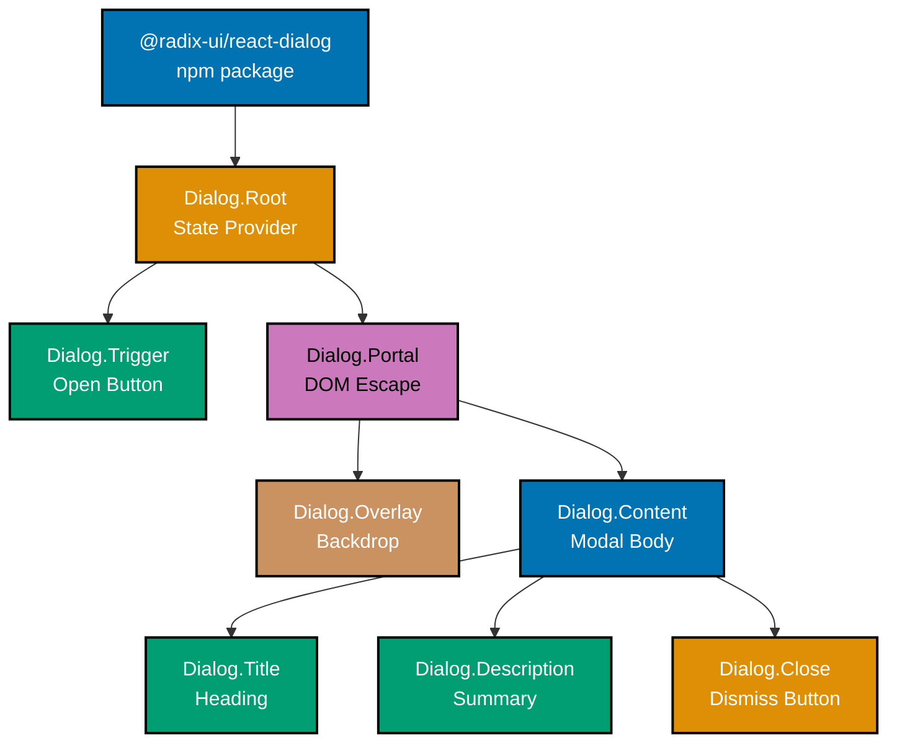
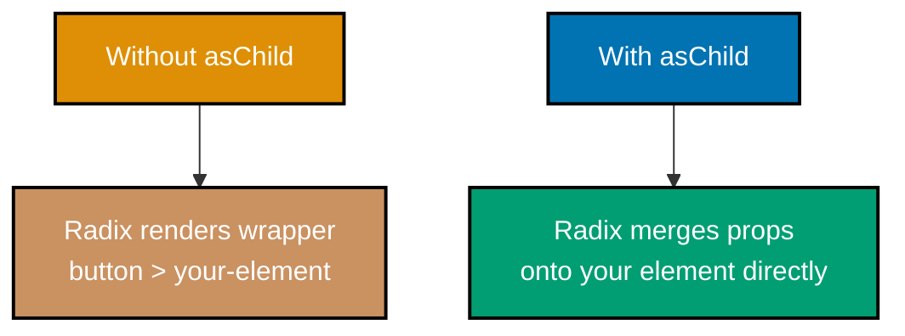
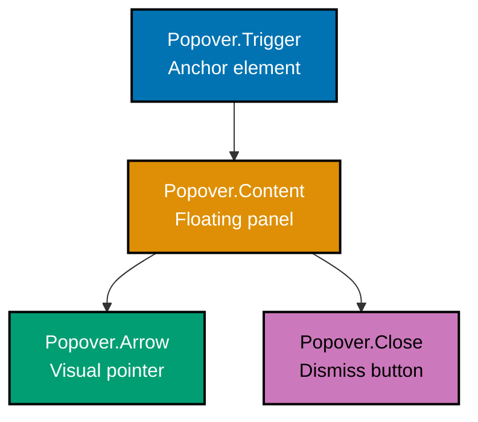
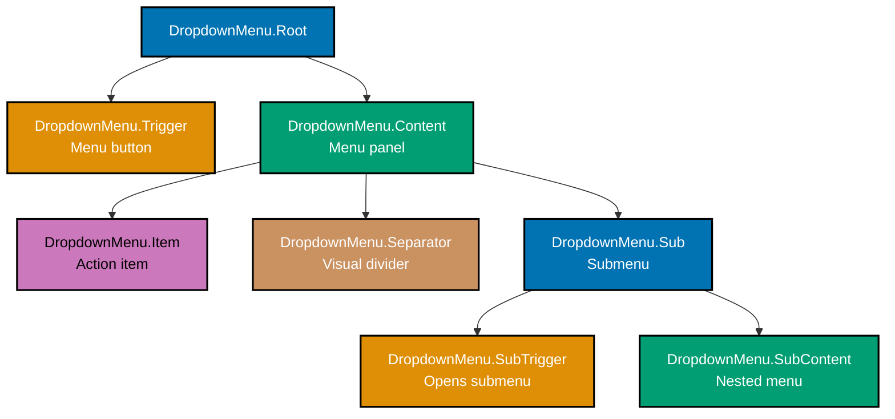
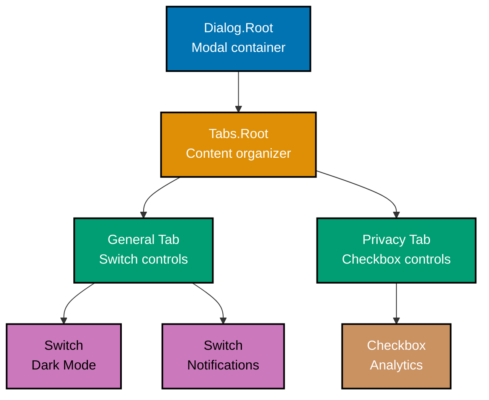

Learn Radix UI fundamentals through 30 annotated code examples. Each example is self-contained, renderable in a React project, and heavily commented to show what each line does, expected behaviors, and component relationships.

## Getting Started (Examples 1-5)

### Example 1: Installing and Importing Your First Radix Component

Radix UI ships as individual packages -- one per component. You install only what you need, keeping bundle size minimal. Each package exports compound components that compose together.



**Code**:

```tsx
// => Install: npm install @radix-ui/react-dialog
import * as Dialog from "@radix-ui/react-dialog";
// => Imports all Dialog compound components
// => Dialog.Root, Dialog.Trigger, Dialog.Portal, Dialog.Overlay,
// => Dialog.Content, Dialog.Title, Dialog.Description, Dialog.Close

export function MyFirstDialog() {
  // => Functional component using Dialog primitive
  return (
    <Dialog.Root>
      {/* => Root manages open/close state internally */}
      {/* => No useState needed for basic usage (uncontrolled) */}
      <Dialog.Trigger asChild>
        {/* => asChild merges props onto child element */}
        {/* => Instead of rendering a <button> wrapper */}
        <button>Open Dialog</button>
        {/* => Renders: <button data-state="closed">Open Dialog</button> */}
      </Dialog.Trigger>
      <Dialog.Portal>
        {/* => Portals content to document.body */}
        {/* => Escapes parent overflow/z-index constraints */}
        <Dialog.Overlay />
        {/* => Renders backdrop overlay behind dialog */}
        {/* => data-state="open" | "closed" for CSS animations */}
        <Dialog.Content>
          {/* => The modal container */}
          {/* => Traps focus automatically (WAI-ARIA compliant) */}
          <Dialog.Title>Welcome</Dialog.Title>
          {/* => Required for accessibility (aria-labelledby) */}
          <Dialog.Description>
            {/* => Optional but recommended (aria-describedby) */}
            This is your first Radix UI dialog.
          </Dialog.Description>
          <Dialog.Close asChild>
            {/* => Close button restores focus to trigger */}
            <button>Got it</button>
          </Dialog.Close>
        </Dialog.Content>
      </Dialog.Portal>
    </Dialog.Root>
  );
}
// => Renders: A button that opens an accessible modal dialog
// => Pressing Escape closes the dialog automatically
// => Clicking overlay closes the dialog automatically
// => Focus returns to trigger button on close
```

**Key Takeaway**: Radix UI uses compound components (Root, Trigger, Content) that compose together. Each sub-component handles a specific concern -- state management, accessibility, or DOM placement -- so you never write ARIA attributes manually.

**Why It Matters**: Traditional modal implementations require managing open state, focus trapping, scroll locking, Escape key handling, and ARIA attributes manually. Missing any of these creates accessibility barriers for keyboard and screen reader users. Radix handles all of these automatically through its compound component architecture, letting you focus on content and styling while the library guarantees WAI-ARIA compliance. The per-package installation model means your bundle only includes components you actually use.

---

### Example 2: Understanding the asChild Pattern

The `asChild` prop is Radix UI's core composition primitive. It merges Radix's behavior (event handlers, ARIA attributes, data attributes) onto your custom element instead of wrapping it in an extra DOM node.



**Code**:

```tsx
import * as Dialog from "@radix-ui/react-dialog";
// => Dialog compound components

// WITHOUT asChild - Radix renders its own <button>
function WithoutAsChild() {
  // => Default behavior: Radix wraps content in a button
  return (
    <Dialog.Root>
      <Dialog.Trigger>
        {/* => Renders: <button>Open</button> */}
        {/* => Radix creates the <button> element */}
        Open
      </Dialog.Trigger>
      <Dialog.Portal>
        <Dialog.Overlay />
        <Dialog.Content>
          <Dialog.Title>Example</Dialog.Title>
          <Dialog.Close>Close</Dialog.Close>
          {/* => Renders: <button>Close</button> */}
        </Dialog.Content>
      </Dialog.Portal>
    </Dialog.Root>
  );
}

// WITH asChild - Radix merges onto YOUR element
function WithAsChild() {
  // => asChild pattern: you control the rendered element
  return (
    <Dialog.Root>
      <Dialog.Trigger asChild>
        {/* => asChild: merges Radix props onto child */}
        {/* => Child MUST forward ref (use forwardRef or native element) */}
        <a href="#open-dialog">Open as Link</a>
        {/* => Renders: <a href="#open-dialog" data-state="closed" */}
        {/* =>           aria-haspopup="dialog">Open as Link</a> */}
        {/* => The <a> gets all Radix behavior (click, keyboard, ARIA) */}
      </Dialog.Trigger>
      <Dialog.Portal>
        <Dialog.Overlay />
        <Dialog.Content>
          <Dialog.Title>Example</Dialog.Title>
          <Dialog.Close asChild>
            <span role="button" tabIndex={0}>
              {/* => Custom close element */}
              {/* => Radix adds onClick, onKeyDown handlers */}
              Dismiss
            </span>
          </Dialog.Close>
        </Dialog.Content>
      </Dialog.Portal>
    </Dialog.Root>
  );
}
// => asChild enables polymorphic rendering
// => Use any element or component as the trigger/close
// => Critical for design system flexibility
```

**Key Takeaway**: Use `asChild` when you want Radix to enhance your existing element rather than create a new wrapper. The child must accept and forward a ref (native HTML elements and `forwardRef` components work automatically).

**Why It Matters**: Design systems need full control over the DOM structure -- extra wrapper elements break CSS selectors, increase specificity battles, and produce unexpected layout behavior. The `asChild` pattern solves the "wrapper div" problem that plagues most component libraries. It enables Radix components to work with any element type (links, custom buttons, styled components) without sacrificing accessibility or behavior. This polymorphic approach is fundamental to building flexible, composable UI systems.

---

### Example 3: Controlled vs Uncontrolled State

Radix components work in uncontrolled mode by default (managing their own state) but support controlled mode when you need programmatic state management.

**Code**:

```tsx
import * as Dialog from "@radix-ui/react-dialog";
import { useState } from "react";
// => useState for controlled mode

// UNCONTROLLED - Radix manages state internally
function UncontrolledDialog() {
  // => No state needed -- Radix tracks open/close
  return (
    <Dialog.Root>
      {/* => Root manages open state internally */}
      {/* => defaultOpen={false} is the implicit default */}
      <Dialog.Trigger asChild>
        <button>Open</button>
      </Dialog.Trigger>
      <Dialog.Portal>
        <Dialog.Overlay />
        <Dialog.Content>
          <Dialog.Title>Uncontrolled</Dialog.Title>
          <Dialog.Description>Radix manages this dialog's state automatically.</Dialog.Description>
          <Dialog.Close asChild>
            <button>Close</button>
          </Dialog.Close>
        </Dialog.Content>
      </Dialog.Portal>
    </Dialog.Root>
  );
}

// CONTROLLED - You manage state with useState
function ControlledDialog() {
  const [open, setOpen] = useState(false);
  // => open: current dialog state (boolean)
  // => setOpen: function to update state

  const handleSave = () => {
    // => Custom logic before closing
    console.log("Saving data...");
    // => Output: Saving data...
    setOpen(false);
    // => Programmatically closes the dialog
  };

  return (
    <Dialog.Root open={open} onOpenChange={setOpen}>
      {/* => open: controls visibility */}
      {/* => onOpenChange: called when Radix wants to change state */}
      {/* => (trigger click, Escape key, overlay click) */}
      <Dialog.Trigger asChild>
        <button>Open Controlled</button>
      </Dialog.Trigger>
      <Dialog.Portal>
        <Dialog.Overlay />
        <Dialog.Content>
          <Dialog.Title>Controlled</Dialog.Title>
          <Dialog.Description>You manage this dialog's state.</Dialog.Description>
          <button onClick={handleSave}>Save & Close</button>
          {/* => Custom close via programmatic state change */}
        </Dialog.Content>
      </Dialog.Portal>
    </Dialog.Root>
  );
}
// => Uncontrolled: simpler, less code, Radix manages state
// => Controlled: full control, custom close logic, async operations
// => Both maintain identical accessibility behavior
```

**Key Takeaway**: Use uncontrolled mode for simple interactions and controlled mode when you need programmatic control (async saves, validation before close, multi-step flows). Both modes preserve full accessibility.

**Why It Matters**: The controlled/uncontrolled pattern mirrors React's own form control philosophy. Uncontrolled mode reduces boilerplate for 80% of use cases where you simply need open/close behavior. Controlled mode becomes essential when dialog close depends on external conditions -- form validation success, API call completion, or multi-step wizard progression. Radix's `onOpenChange` callback unifies all close triggers (Escape, overlay click, close button) into a single control point, preventing the fragmented event handling that causes bugs in custom modal implementations.

---

### Example 4: Data-State Attributes for CSS Styling

Radix components expose `data-state` attributes on rendered elements, giving you CSS hooks for styling open/closed/active states without JavaScript.

**Code**:

```tsx
import * as Collapsible from "@radix-ui/react-collapsible";
// => Install: npm install @radix-ui/react-collapsible

// CSS that targets Radix data-state attributes
const styles = `
  /* => Targets the trigger button's visual state */
  [data-state="open"] > .chevron {
    transform: rotate(180deg);
    /* => Rotates chevron when collapsible is open */
  }

  /* => Targets the collapsible content */
  .collapsible-content[data-state="open"] {
    animation: slideDown 200ms ease-out;
    /* => Slide-down animation on open */
  }

  .collapsible-content[data-state="closed"] {
    animation: slideUp 200ms ease-out;
    /* => Slide-up animation on close */
  }

  @keyframes slideDown {
    from { height: 0; opacity: 0; }
    to { height: var(--radix-collapsible-content-height); opacity: 1; }
    /* => --radix-collapsible-content-height is a CSS variable */
    /* => Radix measures and sets this automatically */
  }

  @keyframes slideUp {
    from { height: var(--radix-collapsible-content-height); opacity: 1; }
    to { height: 0; opacity: 0; }
  }
`;
// => CSS variable --radix-collapsible-content-height
// => Automatically set by Radix for smooth height transitions

export function StyledCollapsible() {
  return (
    <>
      <style>{styles}</style>
      {/* => Inline styles for demonstration */}
      <Collapsible.Root>
        {/* => Root manages open/close state */}
        <Collapsible.Trigger asChild>
          <button>
            Toggle Section
            <span className="chevron">V</span>
            {/* => Chevron rotates via data-state CSS */}
          </button>
          {/* => Renders: <button data-state="closed"> */}
          {/* => On click: <button data-state="open"> */}
        </Collapsible.Trigger>
        <Collapsible.Content className="collapsible-content">
          {/* => Content div receives data-state attribute */}
          {/* => data-state="open" when visible */}
          {/* => data-state="closed" when hidden */}
          <p>This content slides in and out.</p>
          <p>Radix provides the CSS variable for height.</p>
        </Collapsible.Content>
      </Collapsible.Root>
    </>
  );
}
// => data-state drives CSS without JavaScript state checks
// => CSS variables enable smooth height animations
// => No need for className toggling or inline styles
```

**Key Takeaway**: Target `[data-state="open"]` and `[data-state="closed"]` in CSS to style Radix components. Radix sets CSS variables like `--radix-collapsible-content-height` for smooth transitions.

**Why It Matters**: Traditional component libraries force you into their styling system or require JavaScript class toggling. Radix's data-state attributes work with any CSS approach -- vanilla CSS, CSS Modules, Tailwind, or CSS-in-JS. The CSS variables for dynamic measurements (content height, content width) solve the long-standing problem of animating elements to/from `height: auto`, which CSS alone cannot handle. This separation of behavior (Radix) from presentation (your CSS) is the foundation of headless UI architecture.

---

### Example 5: VisuallyHidden for Screen Reader Content

VisuallyHidden renders content that is invisible to sighted users but accessible to screen readers. It preserves semantic meaning without visual clutter.

**Code**:

```tsx
import * as VisuallyHidden from "@radix-ui/react-visually-hidden";
// => Install: npm install @radix-ui/react-visually-hidden
import * as Dialog from "@radix-ui/react-dialog";
// => Dialog for demonstrating hidden title pattern

export function IconButtonWithLabel() {
  // => Icon-only button with screen reader label
  return (
    <button>
      <svg viewBox="0 0 24 24" aria-hidden="true">
        {/* => aria-hidden: decorative icon, not announced */}
        <path d="M3 6h18M3 12h18M3 18h18" />
        {/* => Hamburger menu icon (three horizontal lines) */}
      </svg>
      <VisuallyHidden.Root>Open menu</VisuallyHidden.Root>
      {/* => Screen reader announces: "Open menu" button */}
      {/* => Sighted users see only the hamburger icon */}
      {/* => Renders visually hidden span with clip/overflow styles */}
    </button>
  );
}

export function DialogWithHiddenTitle() {
  // => Dialog that hides title visually but keeps it accessible
  return (
    <Dialog.Root>
      <Dialog.Trigger asChild>
        <button>Settings</button>
      </Dialog.Trigger>
      <Dialog.Portal>
        <Dialog.Overlay />
        <Dialog.Content>
          <VisuallyHidden.Root asChild>
            <Dialog.Title>Application Settings</Dialog.Title>
            {/* => Title is required for accessibility */}
            {/* => But design doesn't show it visually */}
            {/* => VisuallyHidden keeps it in DOM for screen readers */}
          </VisuallyHidden.Root>
          <Dialog.Description>Configure your preferences below.</Dialog.Description>
          {/* => Settings form content here */}
          <Dialog.Close asChild>
            <button>Done</button>
          </Dialog.Close>
        </Dialog.Content>
      </Dialog.Portal>
    </Dialog.Root>
  );
}
// => VisuallyHidden: visible to screen readers, invisible to sighted users
// => Different from display:none (which hides from ALL users)
// => Different from aria-label (which doesn't support rich content)
// => Uses CSS clip technique: position absolute, 1px size, overflow hidden
```

**Key Takeaway**: Use `VisuallyHidden` to provide screen reader content without visual impact. It is essential for icon-only buttons and dialogs where the design omits a visible title.

**Why It Matters**: Icon-only buttons are one of the most common accessibility failures on the web. Without a text label, screen reader users hear "button" with no context. `display: none` removes content from the accessibility tree entirely, while `aria-label` only supports plain strings (no links, emphasis, or structured content). VisuallyHidden preserves the full DOM subtree for assistive technology while using proven CSS techniques (clip, overflow) to hide content visually. This pattern is recommended by WAI-ARIA authoring practices.

---

## Overlay Components (Examples 6-12)

### Example 6: Popover with Arrow and Positioning

Popover displays floating content anchored to a trigger element. Radix handles positioning, collision detection, and arrow alignment automatically via Popper (the positioning engine).



**Code**:

```tsx
import * as Popover from "@radix-ui/react-popover";
// => Install: npm install @radix-ui/react-popover

export function InfoPopover() {
  return (
    <Popover.Root>
      {/* => Root manages open/close and positioning state */}
      <Popover.Trigger asChild>
        <button aria-label="More information">{/* => aria-label: describes the trigger's purpose */}i</button>
      </Popover.Trigger>
      <Popover.Portal>
        {/* => Portals to document.body for z-index safety */}
        <Popover.Content
          side="bottom"
          // => Preferred side: below the trigger
          // => Falls back to opposite side if no space
          sideOffset={8}
          // => 8px gap between trigger and popover
          align="center"
          // => Centers popover relative to trigger
          collisionPadding={16}
          // => 16px padding from viewport edges
          // => Prevents popover from touching screen edges
        >
          <p>This is helpful contextual information.</p>
          <p>The popover repositions automatically on scroll.</p>
          <Popover.Arrow />
          {/* => Renders an SVG arrow pointing at the trigger */}
          {/* => Arrow position updates with content alignment */}
          {/* => Style with CSS: fill color, size */}
          <Popover.Close asChild>
            <button aria-label="Close popover">X</button>
            {/* => Close button within the popover */}
          </Popover.Close>
        </Popover.Content>
      </Popover.Portal>
    </Popover.Root>
  );
}
// => side: "top" | "bottom" | "left" | "right"
// => align: "start" | "center" | "end"
// => Collision detection flips side when viewport space is insufficient
// => Arrow follows the content's alignment automatically
```

**Key Takeaway**: Popover handles positioning, collision avoidance, and arrow alignment automatically. Use `side`, `sideOffset`, `align`, and `collisionPadding` to control placement.

**Why It Matters**: Floating UI positioning is notoriously difficult to implement correctly. Scroll containers, viewport boundaries, dynamic content heights, and RTL layouts all create edge cases that break naive absolute positioning. Radix's Popover uses the Floating UI engine internally, handling all collision detection and repositioning automatically. The arrow tracks the content's actual rendered position (not just the preferred position), maintaining visual connection to the trigger even after collision-induced repositioning.

---

### Example 7: Tooltip with Delayed Appearance

Tooltip shows brief contextual text on hover or focus. Radix implements the tooltip pattern with configurable delays, positioning, and proper ARIA semantics.

**Code**:

```tsx
import * as Tooltip from "@radix-ui/react-tooltip";
// => Install: npm install @radix-ui/react-tooltip

export function ButtonWithTooltip() {
  return (
    <Tooltip.Provider delayDuration={300} skipDelayDuration={100}>
      {/* => Provider wraps all tooltips in your app */}
      {/* => delayDuration: ms before tooltip appears (300ms) */}
      {/* => skipDelayDuration: ms to skip delay between tooltips */}
      {/* => (moving between tooltipped items feels instant) */}
      <Tooltip.Root>
        {/* => Root manages single tooltip state */}
        <Tooltip.Trigger asChild>
          <button aria-label="Save document">
            {/* => Trigger element (hover/focus target) */}
            <svg viewBox="0 0 24 24" aria-hidden="true">
              <path d="M19 21H5a2 2 0 01-2-2V5a2 2 0 012-2h11l5 5v11a2 2 0 01-2 2z" />
            </svg>
          </button>
        </Tooltip.Trigger>
        <Tooltip.Portal>
          <Tooltip.Content
            side="bottom"
            sideOffset={4}
            // => 4px below the trigger
          >
            Save document (Ctrl+S)
            {/* => Tooltip text content */}
            {/* => Brief, informational, not interactive */}
            <Tooltip.Arrow />
            {/* => Small arrow pointing at trigger */}
          </Tooltip.Content>
        </Tooltip.Portal>
      </Tooltip.Root>
    </Tooltip.Provider>
  );
}
// => Tooltip appears after 300ms hover delay
// => Disappears immediately on mouse leave
// => Keyboard: appears on focus, hides on blur or Escape
// => ARIA: role="tooltip", aria-describedby set automatically
// => Never put interactive content in tooltips (use Popover instead)
```

**Key Takeaway**: Wrap your app in `Tooltip.Provider` once, then use `Tooltip.Root` per tooltip. The provider's `skipDelayDuration` enables smooth tooltip browsing across multiple triggers.

**Why It Matters**: Tooltip implementation requires careful timing coordination -- too fast and tooltips flash annoyingly during normal mouse movement, too slow and they feel unresponsive. The `skipDelayDuration` pattern (where moving between tooltipped elements skips the delay) is a UX refinement that most custom implementations miss. Radix also correctly distinguishes tooltips (informational, non-interactive, triggered by hover/focus) from popovers (interactive, triggered by click), enforcing WAI-ARIA tooltip semantics that screen readers depend on.

---

### Example 8: DropdownMenu with Keyboard Navigation

DropdownMenu provides a fully accessible menu triggered by a button. Radix implements complete keyboard navigation (arrow keys, type-ahead, Home/End) following WAI-ARIA menu pattern.



**Code**:

```tsx
import * as DropdownMenu from "@radix-ui/react-dropdown-menu";
// => Install: npm install @radix-ui/react-dropdown-menu

export function FileMenu() {
  return (
    <DropdownMenu.Root>
      {/* => Root manages menu open/close state */}
      <DropdownMenu.Trigger asChild>
        <button>File</button>
        {/* => Renders: <button aria-haspopup="menu" */}
        {/* =>           aria-expanded="false"> */}
      </DropdownMenu.Trigger>
      <DropdownMenu.Portal>
        <DropdownMenu.Content
          sideOffset={4}
          // => 4px below trigger
        >
          <DropdownMenu.Item onSelect={() => console.log("New File")}>
            {/* => onSelect fires on click or Enter/Space key */}
            {/* => Menu closes automatically after selection */}
            New File
          </DropdownMenu.Item>
          <DropdownMenu.Item onSelect={() => console.log("Open")}>Open...</DropdownMenu.Item>
          <DropdownMenu.Separator />
          {/* => Visual divider between menu sections */}
          {/* => Renders <div role="separator"> */}
          <DropdownMenu.Item
            onSelect={() => console.log("Save")}
            disabled
            // => Grayed out, not selectable
            // => Skipped during keyboard navigation
          >
            Save
          </DropdownMenu.Item>
          <DropdownMenu.Separator />
          <DropdownMenu.Item onSelect={() => console.log("Quit")}>
            Quit
            <span style={{ marginLeft: "auto" }}>Ctrl+Q</span>
            {/* => Keyboard shortcut hint (visual only) */}
          </DropdownMenu.Item>
        </DropdownMenu.Content>
      </DropdownMenu.Portal>
    </DropdownMenu.Root>
  );
}
// => Keyboard: ArrowDown/Up moves focus between items
// => Keyboard: Enter/Space selects focused item
// => Keyboard: Escape closes menu, returns focus to trigger
// => Type-ahead: typing "q" jumps to "Quit"
// => Home/End: jumps to first/last item
// => All keyboard behavior is automatic
```

**Key Takeaway**: DropdownMenu provides complete keyboard navigation (arrows, type-ahead, Home/End, Escape) and ARIA roles (`menu`, `menuitem`) automatically. Use `onSelect` for item actions and `disabled` to gray out items.

**Why It Matters**: Menu keyboard navigation is one of the most complex WAI-ARIA patterns, requiring roving tabindex management, type-ahead search buffering, submenu opening/closing on arrow keys, and focus restoration on close. Implementing this correctly from scratch requires hundreds of lines of JavaScript and extensive cross-browser testing. Radix encapsulates this complexity behind a declarative API, ensuring your menus work identically for keyboard, mouse, and screen reader users.

---

### Example 9: AlertDialog for Destructive Confirmations

AlertDialog is a modal that requires explicit user acknowledgment before proceeding. Unlike Dialog, it does not close on overlay click, forcing the user to make a deliberate choice.

**Code**:

```tsx
import * as AlertDialog from "@radix-ui/react-alert-dialog";
// => Install: npm install @radix-ui/react-alert-dialog

export function DeleteConfirmation() {
  const handleDelete = () => {
    // => Destructive action handler
    console.log("Item deleted");
    // => Output: Item deleted
  };

  return (
    <AlertDialog.Root>
      {/* => Root manages alert dialog state */}
      <AlertDialog.Trigger asChild>
        <button>Delete Account</button>
      </AlertDialog.Trigger>
      <AlertDialog.Portal>
        <AlertDialog.Overlay />
        {/* => Overlay does NOT close dialog on click */}
        {/* => Unlike Dialog.Overlay, this is non-dismissive */}
        <AlertDialog.Content>
          {/* => role="alertdialog" (not "dialog") */}
          {/* => Screen readers announce as urgent/important */}
          <AlertDialog.Title>Are you sure?</AlertDialog.Title>
          {/* => Required: describes the alert */}
          <AlertDialog.Description>
            This action cannot be undone. Your account and all data will be permanently deleted.
          </AlertDialog.Description>
          {/* => Describes consequences clearly */}
          <div style={{ display: "flex", gap: 16, justifyContent: "flex-end" }}>
            <AlertDialog.Cancel asChild>
              {/* => Cancel: closes dialog, no action taken */}
              {/* => Receives initial focus by default */}
              <button>Cancel</button>
            </AlertDialog.Cancel>
            <AlertDialog.Action asChild>
              {/* => Action: confirms and proceeds */}
              <button onClick={handleDelete}>Yes, delete account</button>
            </AlertDialog.Action>
          </div>
        </AlertDialog.Content>
      </AlertDialog.Portal>
    </AlertDialog.Root>
  );
}
// => AlertDialog vs Dialog:
// => - AlertDialog: overlay click does NOT close
// => - AlertDialog: Cancel button gets initial focus (safer default)
// => - AlertDialog: role="alertdialog" for screen readers
// => - Dialog: overlay click DOES close
// => - Dialog: first focusable element gets focus
```

**Key Takeaway**: Use `AlertDialog` for destructive or irreversible actions. It forces explicit user choice (Cancel or Action) and gives Cancel the initial focus to prevent accidental confirmations.

**Why It Matters**: Accidental destructive actions are a serious UX and data safety concern. Regular Dialog closes on overlay click or Escape, which is correct for non-destructive interactions but dangerous for confirmations. AlertDialog's non-dismissive overlay and Cancel-first focus bias follow the principle of least surprise -- the safe option (Cancel) is always the default. The `role="alertdialog"` semantic tells screen readers to announce the content immediately and urgently, which is critical for users who cannot see the visual dialog appearance.

---

### Example 10: HoverCard for Preview Content

HoverCard displays rich preview content when hovering over a trigger. Unlike Tooltip (text-only, non-interactive), HoverCard supports interactive content and links.

**Code**:

```tsx
import * as HoverCard from "@radix-ui/react-hover-card";
// => Install: npm install @radix-ui/react-hover-card

export function UserHoverCard() {
  return (
    <HoverCard.Root openDelay={200} closeDelay={300}>
      {/* => openDelay: 200ms before card appears */}
      {/* => closeDelay: 300ms before card disappears */}
      {/* => closeDelay gives user time to move mouse to card */}
      <HoverCard.Trigger asChild>
        <a href="/user/alice">
          {/* => Trigger: the element that activates hover */}
          @alice
        </a>
      </HoverCard.Trigger>
      <HoverCard.Portal>
        <HoverCard.Content side="bottom" sideOffset={4}>
          {/* => Rich preview content */}
          <div style={{ display: "flex", gap: 12 }}>
             alt text for accessibility
              style={{ width: 48, height: 48, borderRadius: "50%" }}
            />
            <div>
              <p style={{ fontWeight: "bold" }}>Alice Smith</p>
              {/* => User name */}
              <p>Software Engineer at Acme Corp</p>
              {/* => User bio */}
              <a href="/user/alice">View full profile</a>
              {/* => Interactive link INSIDE the card */}
              {/* => This is allowed in HoverCard (not in Tooltip) */}
            </div>
          </div>
          <HoverCard.Arrow />
          {/* => Arrow pointing at trigger */}
        </HoverCard.Content>
      </HoverCard.Portal>
    </HoverCard.Root>
  );
}
// => HoverCard vs Tooltip:
// => - HoverCard: interactive content allowed (links, buttons)
// => - HoverCard: opened by hover only (not focus)
// => - Tooltip: text-only, non-interactive
// => - Tooltip: opened by hover AND focus
// => Use HoverCard for rich previews (user cards, link previews)
// => Use Tooltip for brief labels (button descriptions)
```

**Key Takeaway**: Use HoverCard for rich, interactive previews and Tooltip for simple text labels. HoverCard's `closeDelay` enables users to move their mouse into the card content.

**Why It Matters**: The distinction between Tooltip and HoverCard maps to WAI-ARIA's separation of `role="tooltip"` (non-interactive, supplementary text) and interactive floating content. Putting links or buttons inside a tooltip violates the spec and creates keyboard accessibility problems (tooltips are not focusable). HoverCard correctly handles the "preview card" pattern seen on GitHub, Twitter, and social platforms where hovering a username shows a rich profile card with actionable links. The `closeDelay` timing is critical -- without it, the card disappears before users can reach it with their mouse.

---

### Example 11: Accordion for Expandable Sections

Accordion organizes content into collapsible sections where opening one can optionally close others. Radix supports single-item and multi-item expansion modes.

**Code**:

```tsx
import * as Accordion from "@radix-ui/react-accordion";
// => Install: npm install @radix-ui/react-accordion

// SINGLE mode - only one item open at a time
export function FaqAccordion() {
  return (
    <Accordion.Root
      type="single"
      // => type="single": one item open at a time
      // => Opening a new item closes the current one
      defaultValue="item-1"
      // => "item-1" starts expanded
      collapsible
      // => collapsible: allows closing all items
      // => Without collapsible, one item must always be open
    >
      <Accordion.Item value="item-1">
        {/* => value: unique identifier for this item */}
        <Accordion.Header>
          {/* => Wraps trigger in proper heading element */}
          <Accordion.Trigger>
            What is Radix UI?
            {/* => Trigger text */}
            {/* => Renders: <button aria-expanded="true"> */}
          </Accordion.Trigger>
        </Accordion.Header>
        <Accordion.Content>
          {/* => Content panel */}
          {/* => data-state="open" | "closed" for animations */}
          <p>Radix UI is a headless component library for React.</p>
        </Accordion.Content>
      </Accordion.Item>
      <Accordion.Item value="item-2">
        <Accordion.Header>
          <Accordion.Trigger>Is it accessible?</Accordion.Trigger>
        </Accordion.Header>
        <Accordion.Content>
          <p>Yes, it follows WAI-ARIA Accordion pattern.</p>
        </Accordion.Content>
      </Accordion.Item>
      <Accordion.Item value="item-3">
        <Accordion.Header>
          <Accordion.Trigger>Can I style it?</Accordion.Trigger>
        </Accordion.Header>
        <Accordion.Content>
          <p>Absolutely. Radix ships unstyled by default.</p>
        </Accordion.Content>
      </Accordion.Item>
    </Accordion.Root>
  );
}
// => Keyboard: ArrowDown/Up moves between triggers
// => Keyboard: Home/End jumps to first/last trigger
// => Keyboard: Enter/Space toggles current item
// => type="single" + collapsible: zero or one item open
// => type="multiple": any number of items open simultaneously
```

**Key Takeaway**: Use `type="single"` with `collapsible` for FAQ-style accordions. Use `type="multiple"` when users need to compare content across sections. The `value` prop identifies each item.

**Why It Matters**: Accordions reduce cognitive load by hiding content until needed, but incorrect implementations create accessibility barriers. The WAI-ARIA Accordion pattern requires specific keyboard navigation (arrow keys between headers, not Tab), proper `aria-expanded` states, and heading structure. Radix's `Accordion.Header` wraps triggers in heading elements, maintaining proper document outline. The `collapsible` prop addresses a subtle UX decision -- whether users can close all sections or must always have one open -- that most custom implementations hard-code rather than making configurable.

---

### Example 12: Tabs for Content Switching

Tabs organize related content into panels where only one panel is visible at a time. Radix handles keyboard navigation, focus management, and ARIA roles.

**Code**:

```tsx
import * as Tabs from "@radix-ui/react-tabs";
// => Install: npm install @radix-ui/react-tabs

export function SettingsTabs() {
  return (
    <Tabs.Root defaultValue="general">
      {/* => defaultValue: initially active tab */}
      {/* => Uncontrolled mode (Radix manages state) */}
      <Tabs.List aria-label="Settings sections">
        {/* => List: container for tab triggers */}
        {/* => role="tablist" set automatically */}
        {/* => aria-label describes the tab group */}
        <Tabs.Trigger value="general">
          {/* => value: links trigger to its content panel */}
          {/* => role="tab", aria-selected="true|false" */}
          General
        </Tabs.Trigger>
        <Tabs.Trigger value="security">Security</Tabs.Trigger>
        <Tabs.Trigger value="notifications" disabled>
          {/* => disabled: tab is not selectable */}
          {/* => Skipped during keyboard navigation */}
          Notifications
        </Tabs.Trigger>
      </Tabs.List>
      <Tabs.Content value="general">
        {/* => role="tabpanel" */}
        {/* => Only visible when "general" tab is active */}
        {/* => aria-labelledby points to its trigger */}
        <h3>General Settings</h3>
        <p>Configure your general preferences here.</p>
      </Tabs.Content>
      <Tabs.Content value="security">
        <h3>Security Settings</h3>
        <p>Manage passwords and two-factor authentication.</p>
      </Tabs.Content>
      <Tabs.Content value="notifications">
        <h3>Notification Preferences</h3>
        <p>Choose which notifications to receive.</p>
      </Tabs.Content>
    </Tabs.Root>
  );
}
// => Keyboard: ArrowLeft/Right moves between tabs
// => Keyboard: Home/End jumps to first/last tab
// => Tab key: moves focus from tab to panel content
// => Automatic activation: tab activates on arrow key focus
// => Optional: activationMode="manual" requires Enter/Space
```

**Key Takeaway**: Link `Tabs.Trigger` to `Tabs.Content` via matching `value` props. The `Tabs.List` container enables arrow-key navigation between triggers while Tab moves focus into panel content.

**Why It Matters**: The WAI-ARIA Tabs pattern has a specific keyboard contract: arrow keys navigate between tabs, Tab key moves into the active panel. This is counterintuitive for developers (Tab key does not go to the next tab) and is almost universally implemented incorrectly in custom components. Radix enforces this pattern automatically. The `activationMode` prop addresses another spec subtlety -- whether tabs activate on focus (automatic, the default) or require explicit selection (manual) -- which affects keyboard users who want to browse tab labels without loading content.

---

## Form Controls (Examples 13-22)

### Example 13: Switch Toggle

Switch provides an accessible on/off toggle, semantically equivalent to a checkbox but visually distinct. It uses `role="switch"` for screen readers.

**Code**:

```tsx
import * as Switch from "@radix-ui/react-switch";
// => Install: npm install @radix-ui/react-switch

export function DarkModeSwitch() {
  return (
    <div style={{ display: "flex", alignItems: "center", gap: 8 }}>
      <label htmlFor="dark-mode">
        {/* => Accessible label linked via htmlFor */}
        Dark Mode
      </label>
      <Switch.Root
        id="dark-mode"
        // => id: links to <label htmlFor>
        defaultChecked={false}
        // => defaultChecked: initial state (uncontrolled)
        onCheckedChange={(checked) => {
          // => Callback when state changes
          console.log("Dark mode:", checked);
          // => Output: Dark mode: true (or false)
        }}
      >
        {/* => role="switch", aria-checked="true|false" */}
        {/* => data-state="checked" | "unchecked" */}
        <Switch.Thumb />
        {/* => The sliding circle/indicator */}
        {/* => data-state="checked" | "unchecked" */}
        {/* => Position with CSS: translateX on data-state */}
      </Switch.Root>
    </div>
  );
}
// => Keyboard: Space toggles the switch
// => Keyboard: Enter does NOT toggle (differs from checkbox)
// => Screen reader: "Dark Mode, switch, off"
// => Switch vs Checkbox: Switch is for immediate effects
// => Checkbox is for forms submitted later
```

**Key Takeaway**: Switch is for settings that take immediate effect (dark mode, notifications). Use Checkbox for values that are submitted as part of a form. The `Thumb` sub-component renders the sliding indicator.

**Why It Matters**: The semantic distinction between Switch (`role="switch"`) and Checkbox (`role="checkbox"`) matters for screen reader users. Switches indicate immediate state changes ("Wi-Fi is now on"), while checkboxes indicate pending choices ("I agree to terms" before form submit). Radix's Switch correctly implements `role="switch"` with `aria-checked`, which many UI libraries incorrectly implement as styled checkboxes. The `Thumb` sub-component gives you full styling control over the sliding indicator without managing its position in JavaScript.

---

### Example 14: Checkbox with Indeterminate State

Checkbox supports three states: checked, unchecked, and indeterminate. The indeterminate state represents partial selection in hierarchical data.

**Code**:

```tsx
import * as Checkbox from "@radix-ui/react-checkbox";
// => Install: npm install @radix-ui/react-checkbox
import { useState } from "react";
// => useState for controlled state management

export function TaskCheckbox() {
  return (
    <div style={{ display: "flex", alignItems: "center", gap: 8 }}>
      <Checkbox.Root
        id="task-1"
        defaultChecked={false}
        // => Uncontrolled: starts unchecked
      >
        {/* => role="checkbox" */}
        {/* => data-state="checked" | "unchecked" | "indeterminate" */}
        <Checkbox.Indicator>
          {/* => Indicator: visible only when checked/indeterminate */}
          {/* => Empty when unchecked */}
          <svg viewBox="0 0 24 24" aria-hidden="true">
            <path d="M20 6L9 17l-5-5" />
          </svg>
          {/* => Checkmark SVG icon */}
        </Checkbox.Indicator>
      </Checkbox.Root>
      <label htmlFor="task-1">Complete documentation</label>
    </div>
  );
}

// Indeterminate state for "select all" parent checkbox
export function SelectAllCheckbox() {
  const [items, setItems] = useState([
    { id: "a", label: "Item A", checked: true },
    { id: "b", label: "Item B", checked: false },
    { id: "c", label: "Item C", checked: true },
  ]);
  // => items: array of checkbox states

  const allChecked = items.every((item) => item.checked);
  // => allChecked: true only if ALL items are checked
  const someChecked = items.some((item) => item.checked) && !allChecked;
  // => someChecked: true if SOME (but not all) items are checked
  // => This is the indeterminate state

  const parentChecked = allChecked ? true : someChecked ? "indeterminate" : false;
  // => "indeterminate": Radix's third checkbox state
  // => Renders: aria-checked="mixed"

  return (
    <div>
      <Checkbox.Root
        checked={parentChecked}
        // => Controlled: state driven by children
        onCheckedChange={(checked) => {
          // => checked: true when toggling on, false when toggling off
          setItems(items.map((item) => ({ ...item, checked: !!checked })));
          // => Toggles ALL children to match parent
        }}
      >
        <Checkbox.Indicator>
          {parentChecked === "indeterminate" ? "—" : "V"}
          {/* => Shows dash for indeterminate, check for checked */}
        </Checkbox.Indicator>
      </Checkbox.Root>
      <label>Select All</label>
    </div>
  );
}
// => Three states: checked (true), unchecked (false), indeterminate ("indeterminate")
// => Indeterminate: aria-checked="mixed" for screen readers
// => Used in tree views, data tables, permission matrices
```

**Key Takeaway**: Pass `"indeterminate"` as the `checked` value for partial selection state. The `Indicator` sub-component renders only when checked or indeterminate, simplifying conditional rendering.

**Why It Matters**: The indeterminate checkbox state is essential for hierarchical data interfaces (file managers, permission tables, bulk selection lists) but is rarely implemented correctly. HTML's native `indeterminate` property is not a DOM attribute -- it can only be set via JavaScript, making it awkward in React. Radix exposes it as a first-class prop value, and correctly sets `aria-checked="mixed"` which screen readers announce as "partially checked." The `Indicator` sub-component's automatic visibility handling eliminates the `{checked && <Icon />}` conditional that every manual implementation requires.

---

### Example 15: RadioGroup for Exclusive Selection

RadioGroup provides a set of radio buttons where only one option can be selected at a time. Radix manages group state, keyboard navigation, and ARIA roles.

**Code**:

```tsx
import * as RadioGroup from "@radix-ui/react-radio-group";
// => Install: npm install @radix-ui/react-radio-group

export function PlanSelector() {
  return (
    <RadioGroup.Root
      defaultValue="monthly"
      // => defaultValue: initially selected radio
      aria-label="Billing plan"
      // => aria-label: describes the group
      onValueChange={(value) => {
        // => Fires when selection changes
        console.log("Selected plan:", value);
        // => Output: Selected plan: monthly (or yearly, lifetime)
      }}
    >
      {/* => role="radiogroup" */}
      <div style={{ display: "flex", flexDirection: "column", gap: 8 }}>
        <div style={{ display: "flex", alignItems: "center", gap: 8 }}>
          <RadioGroup.Item value="monthly" id="monthly">
            {/* => role="radio", aria-checked="true|false" */}
            {/* => value: this radio's selection value */}
            <RadioGroup.Indicator />
            {/* => Visual indicator: visible when this radio is selected */}
            {/* => Renders a dot/circle inside the radio */}
          </RadioGroup.Item>
          <label htmlFor="monthly">Monthly ($9/mo)</label>
        </div>
        <div style={{ display: "flex", alignItems: "center", gap: 8 }}>
          <RadioGroup.Item value="yearly" id="yearly">
            <RadioGroup.Indicator />
          </RadioGroup.Item>
          <label htmlFor="yearly">Yearly ($89/yr)</label>
        </div>
        <div style={{ display: "flex", alignItems: "center", gap: 8 }}>
          <RadioGroup.Item value="lifetime" id="lifetime" disabled>
            {/* => disabled: not selectable, skipped by keyboard */}
            <RadioGroup.Indicator />
          </RadioGroup.Item>
          <label htmlFor="lifetime">Lifetime (Sold out)</label>
        </div>
      </div>
    </RadioGroup.Root>
  );
}
// => Keyboard: ArrowDown/Right moves to next radio (loops)
// => Keyboard: ArrowUp/Left moves to previous radio (loops)
// => Keyboard: Tab moves focus out of the radio group
// => Only one radio can be selected at a time
// => Disabled items are skipped during keyboard navigation
```

**Key Takeaway**: RadioGroup manages exclusive selection state, keyboard navigation (arrow keys cycle through options), and ARIA roles automatically. Link items to labels via matching `id`/`htmlFor` pairs.

**Why It Matters**: Native HTML radio buttons have poor styling control and inconsistent behavior across browsers. Radix's RadioGroup provides the same keyboard contract (arrow keys to navigate, Tab to leave group) while giving you complete visual control. The `Indicator` sub-component pattern eliminates conditional rendering logic, and `onValueChange` fires with the selected value directly (not a synthetic event), simplifying state management compared to native `onChange` which requires `e.target.value` extraction.

---

### Example 16: Slider for Range Selection

Slider provides accessible range input with support for single values, ranges, and step intervals. Radix renders proper ARIA attributes and keyboard controls.

**Code**:

```tsx
import * as Slider from "@radix-ui/react-slider";
// => Install: npm install @radix-ui/react-slider

export function VolumeSlider() {
  return (
    <div>
      <label id="volume-label">Volume</label>
      <Slider.Root
        defaultValue={[50]}
        // => defaultValue: array of thumb positions
        // => [50]: single thumb at position 50
        max={100}
        // => Maximum value
        min={0}
        // => Minimum value
        step={1}
        // => Increment step size
        aria-labelledby="volume-label"
        // => Links to external label
        onValueChange={(values) => {
          console.log("Volume:", values[0]);
          // => Output: Volume: 50 (changes as thumb moves)
        }}
      >
        {/* => Root renders the track container */}
        <Slider.Track>
          {/* => Track: the horizontal rail */}
          <Slider.Range />
          {/* => Range: filled portion of the track */}
          {/* => Spans from min to thumb position */}
        </Slider.Track>
        <Slider.Thumb aria-label="Volume" />
        {/* => Thumb: draggable handle */}
        {/* => aria-label for screen readers */}
        {/* => role="slider", aria-valuenow, aria-valuemin, aria-valuemax */}
      </Slider.Root>
    </div>
  );
}
// => Keyboard: ArrowRight/Up increases by step
// => Keyboard: ArrowLeft/Down decreases by step
// => Keyboard: PageUp/PageDown moves by 10% of range
// => Keyboard: Home/End jumps to min/max
// => Mouse: click on track moves thumb to click position
// => Touch: drag thumb on mobile devices
```

**Key Takeaway**: Slider uses a Track > Range > Thumb structure. The `Range` sub-component fills the track up to the thumb position, and `Thumb` handles all drag and keyboard interactions.

**Why It Matters**: Building an accessible slider from scratch requires implementing drag behavior, keyboard shortcuts (including PageUp/PageDown for coarse adjustment), touch event handling, ARIA value reporting, and RTL layout support. Radix's Slider handles all of this while giving you individual sub-components (Track, Range, Thumb) that you can style independently. The array-based `defaultValue` design supports range sliders (two thumbs) with the same API, which we explore in later examples.

---

### Example 17: Toggle Button

Toggle provides a two-state button (pressed/not-pressed). Unlike Switch (which is a form control), Toggle is a button that maintains pressed state.

**Code**:

```tsx
import * as Toggle from "@radix-ui/react-toggle";
// => Install: npm install @radix-ui/react-toggle

export function BoldToggle() {
  return (
    <Toggle.Root
      aria-label="Toggle bold"
      // => aria-label: describes the toggle purpose
      defaultPressed={false}
      // => defaultPressed: initial state (uncontrolled)
      onPressedChange={(pressed) => {
        console.log("Bold:", pressed);
        // => Output: Bold: true (or false)
      }}
    >
      {/* => role="button", aria-pressed="true|false" */}
      {/* => data-state="on" | "off" */}
      <strong>B</strong>
      {/* => Bold icon/label */}
    </Toggle.Root>
  );
}
// => Keyboard: Enter or Space toggles state
// => Screen reader: "Toggle bold, button, pressed" (or "not pressed")
// => data-state="on" | "off" for CSS styling
// => Use for toolbar buttons: bold, italic, alignment, view mode
// => NOT for form inputs (use Switch or Checkbox instead)
```

**Key Takeaway**: Toggle renders `aria-pressed` for screen readers and `data-state` for CSS. Use it for toolbar-style buttons that maintain on/off state, not for form values (use Switch or Checkbox instead).

**Why It Matters**: The `aria-pressed` attribute is the correct semantic for toggle buttons but is rarely used in custom implementations. Most developers use `aria-selected` (wrong for buttons) or CSS classes without ARIA (invisible to screen readers). Radix's Toggle ensures screen readers announce "pressed" or "not pressed" state, which is distinct from "checked" (Checkbox) or "on/off" (Switch). This semantic accuracy helps screen reader users understand the nature of the control they are interacting with.

---

### Example 18: Label Component

Label provides an accessible label element that supports click-to-focus behavior for any associated control, including custom Radix components.

**Code**:

```tsx
import * as Label from "@radix-ui/react-label";
// => Install: npm install @radix-ui/react-label
import * as Switch from "@radix-ui/react-switch";
// => Switch for demonstration

export function LabeledControl() {
  return (
    <div style={{ display: "flex", alignItems: "center", gap: 8 }}>
      <Label.Root htmlFor="airplane-mode">
        {/* => htmlFor: links label to control via id */}
        {/* => Clicking label focuses/activates the control */}
        Airplane Mode
      </Label.Root>
      <Switch.Root id="airplane-mode">
        {/* => id: matches label's htmlFor */}
        <Switch.Thumb />
      </Switch.Root>
    </div>
  );
}

export function LabelWithWrapping() {
  // => Alternative: wrap control inside label (no htmlFor needed)
  return (
    <Label.Root>
      {/* => Wrapping pattern: label contains the control */}
      <span>Enable notifications</span>
      <Switch.Root>
        <Switch.Thumb />
      </Switch.Root>
      {/* => Clicking "Enable notifications" text toggles switch */}
    </Label.Root>
  );
}
// => Label.Root renders a <label> element
// => Two association patterns:
// => 1. htmlFor + id (explicit, works across DOM distance)
// => 2. Wrapping (implicit, control must be a descendant)
// => Both patterns are WAI-ARIA compliant
```

**Key Takeaway**: Use `Label.Root` with `htmlFor`/`id` pairing or the wrapping pattern to associate labels with controls. Clicking the label text focuses or activates the linked control.

**Why It Matters**: Labels are the most fundamental accessibility requirement for form controls, yet they are frequently omitted or incorrectly associated. Without a proper label, screen reader users hear "switch" or "checkbox" with no indication of what the control does. Radix's Label ensures the correct `<label>` element is rendered with proper `for` attribute linking, and its click-to-focus behavior works with custom Radix controls (not just native inputs). This is especially important for Switch and Checkbox where the click target area is often small.

---

### Example 19: Separator for Visual Division

Separator renders an accessible divider line between content sections. It correctly sets `role="separator"` and orientation attributes.

**Code**:

```tsx
import * as Separator from "@radix-ui/react-separator";
// => Install: npm install @radix-ui/react-separator

export function ContentWithSeparators() {
  return (
    <div>
      <h2>Profile</h2>
      <p>View and manage your account details.</p>
      <Separator.Root
        orientation="horizontal"
        // => orientation: "horizontal" (default) | "vertical"
        // => Sets aria-orientation attribute
        decorative={false}
        // => decorative: false (default) - meaningful separator
        // => decorative: true - purely visual (role="none")
      />
      {/* => Renders: <div role="separator" aria-orientation="horizontal"> */}
      <h2>Preferences</h2>
      <p>Customize your experience.</p>
      <Separator.Root decorative />
      {/* => decorative: role="none" (not announced by screen readers) */}
      <div style={{ display: "flex", alignItems: "center", gap: 8 }}>
        <span>Home</span>
        <Separator.Root orientation="vertical" />
        {/* => Vertical separator between inline items */}
        {/* => Style with CSS: height and border */}
        <span>Settings</span>
        <Separator.Root orientation="vertical" />
        <span>Help</span>
      </div>
    </div>
  );
}
// => Semantic separator: role="separator" (announced by screen readers)
// => Decorative separator: role="none" (purely visual)
// => Use semantic for meaningful content divisions
// => Use decorative for visual-only styling
```

**Key Takeaway**: Use `decorative={false}` for meaningful content divisions (screen readers announce it) and `decorative={true}` for purely visual dividers. Set `orientation` to match layout direction.

**Why It Matters**: An `<hr>` element or CSS border provides visual separation, but screen readers need `role="separator"` with `aria-orientation` to correctly announce content structure. Decorative separators (visual-only) should use `role="none"` to avoid cluttering the screen reader experience with unnecessary announcements. Radix's Separator makes this distinction explicit through the `decorative` prop, preventing the common mistake of adding semantic meaning to purely visual elements.

---

### Example 20: AspectRatio for Responsive Media

AspectRatio constrains child content to a specified width-to-height ratio. It prevents layout shift when loading images or videos.

**Code**:

```tsx
import * as AspectRatio from "@radix-ui/react-aspect-ratio";
// => Install: npm install @radix-ui/react-aspect-ratio

export function ResponsiveImage() {
  return (
    <div style={{ width: 400 }}>
      {/* => Container constrains the maximum width */}
      <AspectRatio.Root ratio={16 / 9}>
        {/* => ratio: width / height */}
        {/* => 16/9 = 1.777... (widescreen) */}
        {/* => Container maintains 16:9 regardless of width */}
         alt text for accessibility
          style={{
            width: "100%",
            height: "100%",
            objectFit: "cover",
            // => objectFit: "cover" fills container, may crop
            // => objectFit: "contain" fits inside, may letterbox
          }}
        />
      </AspectRatio.Root>
    </div>
  );
}

export function VideoEmbed() {
  return (
    <AspectRatio.Root ratio={4 / 3}>
      {/* => 4:3 ratio for classic video format */}
      <iframe
        src="https://www.youtube.com/embed/example"
        title="Tutorial video"
        // => title: required for iframe accessibility
        style={{ width: "100%", height: "100%" }}
        allowFullScreen
      />
    </AspectRatio.Root>
  );
}
// => Common ratios: 16/9 (widescreen), 4/3 (classic), 1/1 (square)
// => Prevents Cumulative Layout Shift (CLS) during loading
// => Child fills the aspect ratio container completely
// => Works with img, video, iframe, or any content
```

**Key Takeaway**: Wrap media elements in `AspectRatio.Root` with a `ratio` prop to maintain consistent dimensions. This prevents layout shift during loading and ensures responsive images maintain their proportions.

**Why It Matters**: Cumulative Layout Shift (CLS) is a Core Web Vital that directly impacts search rankings and user experience. When images load without reserved space, surrounding content jumps, causing accidental clicks and disorienting navigation. AspectRatio reserves exact dimensions before content loads, eliminating CLS for media elements. The CSS technique used internally (padding-bottom percentage) is well-established but error-prone to implement manually -- calculating the correct percentage and handling responsive containers requires careful math that Radix abstracts away.

---

### Example 21: ScrollArea for Custom Scrollbars

ScrollArea provides custom-styled scrollbars that work consistently across all browsers while maintaining native scroll behavior and accessibility.

**Code**:

```tsx
import * as ScrollArea from "@radix-ui/react-scroll-area";
// => Install: npm install @radix-ui/react-scroll-area

const styles = `
  .scroll-viewport {
    width: 300px;
    height: 200px;
    /* => Fixed dimensions create overflow */
  }
  .scrollbar {
    display: flex;
    padding: 2px;
    background: #f0f0f0;
    /* => Scrollbar track background */
  }
  .scrollbar[data-orientation="vertical"] {
    width: 10px;
    /* => Vertical scrollbar width */
  }
  .scrollbar[data-orientation="horizontal"] {
    height: 10px;
    /* => Horizontal scrollbar height */
  }
  .scroll-thumb {
    background: #888;
    border-radius: 5px;
    /* => Scrollbar thumb styling */
  }
`;
// => Custom scrollbar styles (fully configurable)

export function StyledScrollArea() {
  return (
    <>
      <style>{styles}</style>
      <ScrollArea.Root>
        {/* => Root container for scroll area */}
        <ScrollArea.Viewport className="scroll-viewport">
          {/* => Viewport: the scrollable content area */}
          {/* => All scrollable content goes inside */}
          <div style={{ padding: 16 }}>
            <h3>Long Content</h3>
            {Array.from({ length: 20 }, (_, i) => (
              <p key={i}>Item {i + 1}: Scrollable content line</p>
            ))}
            {/* => 20 items exceed viewport height */}
            {/* => Triggers vertical scrollbar */}
          </div>
        </ScrollArea.Viewport>
        <ScrollArea.Scrollbar orientation="vertical" className="scrollbar">
          {/* => Vertical scrollbar component */}
          <ScrollArea.Thumb className="scroll-thumb" />
          {/* => Draggable thumb */}
        </ScrollArea.Scrollbar>
        <ScrollArea.Scrollbar orientation="horizontal" className="scrollbar">
          <ScrollArea.Thumb className="scroll-thumb" />
        </ScrollArea.Scrollbar>
        <ScrollArea.Corner />
        {/* => Corner: fills the intersection of both scrollbars */}
      </ScrollArea.Root>
    </>
  );
}
// => Uses native scrolling (mouse wheel, touch, keyboard)
// => Custom-styled scrollbars replace browser defaults
// => Scrollbars auto-hide when not scrolling (configurable)
// => Works identically across Chrome, Firefox, Safari
```

**Key Takeaway**: ScrollArea replaces browser-native scrollbars with custom-styled ones while preserving native scroll behavior (wheel, touch, keyboard). The Viewport contains scrollable content, Scrollbar and Thumb handle the visual indicator.

**Why It Matters**: Browser scrollbar styling is inconsistent and limited. CSS `scrollbar-width` and `::-webkit-scrollbar` pseudo-elements produce different results across browsers and are not supported everywhere. ScrollArea provides cross-browser consistent scrollbar styling while maintaining all native scroll behaviors (momentum scrolling on touch, keyboard scrolling, mouse wheel). The component correctly handles both axis scrollbars and the corner intersection, which custom CSS solutions typically miss.

---

### Example 22: Collapsible for Show/Hide Sections

Collapsible provides a simple disclosure pattern for showing and hiding content with a trigger button. It is the building block for more complex components like Accordion.

**Code**:

```tsx
import * as Collapsible from "@radix-ui/react-collapsible";
// => Install: npm install @radix-ui/react-collapsible
import { useState } from "react";
// => useState for controlled state

export function CollapsibleSection() {
  const [open, setOpen] = useState(false);
  // => open: tracks expanded/collapsed state
  // => setOpen: updates state

  return (
    <Collapsible.Root open={open} onOpenChange={setOpen}>
      {/* => Controlled mode: you manage state */}
      <div style={{ display: "flex", alignItems: "center", gap: 8 }}>
        <h3>Advanced Options</h3>
        <Collapsible.Trigger asChild>
          <button aria-label={open ? "Collapse" : "Expand"}>
            {/* => Dynamic aria-label based on state */}
            {open ? "Hide" : "Show"}
          </button>
        </Collapsible.Trigger>
      </div>
      <Collapsible.Content>
        {/* => Content: visible when open, hidden when closed */}
        {/* => data-state="open" | "closed" for CSS animations */}
        {/* => Provides --radix-collapsible-content-height CSS var */}
        <div style={{ padding: 16, border: "1px solid #ddd" }}>
          <p>
            Debug mode: <strong>Enabled</strong>
          </p>
          <p>
            Log level: <strong>Verbose</strong>
          </p>
          <p>
            Cache: <strong>Disabled</strong>
          </p>
        </div>
      </Collapsible.Content>
    </Collapsible.Root>
  );
}
// => Collapsible vs Accordion:
// => - Collapsible: single section, independent state
// => - Accordion: multiple sections, coordinated state
// => Collapsible is simpler when you need one expandable area
// => Accordion manages groups of collapsibles together
```

**Key Takeaway**: Use Collapsible for single show/hide sections and Accordion for groups of related collapsible sections. Collapsible provides the same animation CSS variables as Accordion Content.

**Why It Matters**: Progressive disclosure reduces cognitive overload by hiding secondary content until requested. The Collapsible primitive is the simplest disclosure component in Radix, serving as a building block for more complex patterns. Its CSS variable `--radix-collapsible-content-height` solves the "animate to auto height" problem that CSS cannot handle natively, enabling smooth expand/collapse animations with pure CSS. This is the same technique used internally by Accordion.Content, demonstrating how Radix's primitives compose at multiple levels of abstraction.

---

## Basic Composition (Examples 23-30)

### Example 23: Composing Multiple Radix Components

Real interfaces combine multiple Radix primitives. This example builds a settings panel using Dialog, Tabs, Switch, and Separator together.



**Code**:

```tsx
import * as Dialog from "@radix-ui/react-dialog";
import * as Tabs from "@radix-ui/react-tabs";
import * as Switch from "@radix-ui/react-switch";
import * as Separator from "@radix-ui/react-separator";
import * as Label from "@radix-ui/react-label";
// => Multiple Radix packages compose naturally together

export function SettingsDialog() {
  return (
    <Dialog.Root>
      <Dialog.Trigger asChild>
        <button>Settings</button>
      </Dialog.Trigger>
      <Dialog.Portal>
        <Dialog.Overlay />
        <Dialog.Content style={{ maxWidth: 500, padding: 24 }}>
          <Dialog.Title>Settings</Dialog.Title>
          <Dialog.Description>Manage your application preferences.</Dialog.Description>
          <Separator.Root style={{ margin: "16px 0" }} />
          {/* => Visual divider below title */}
          <Tabs.Root defaultValue="general">
            <Tabs.List aria-label="Settings categories">
              <Tabs.Trigger value="general">General</Tabs.Trigger>
              <Tabs.Trigger value="privacy">Privacy</Tabs.Trigger>
            </Tabs.List>
            <Tabs.Content value="general">
              {/* => General settings tab */}
              <div style={{ display: "flex", alignItems: "center", gap: 8, padding: "12px 0" }}>
                <Label.Root htmlFor="dark-mode">Dark Mode</Label.Root>
                <Switch.Root id="dark-mode">
                  <Switch.Thumb />
                </Switch.Root>
              </div>
              <div style={{ display: "flex", alignItems: "center", gap: 8, padding: "12px 0" }}>
                <Label.Root htmlFor="notifications">Notifications</Label.Root>
                <Switch.Root id="notifications" defaultChecked>
                  <Switch.Thumb />
                </Switch.Root>
              </div>
            </Tabs.Content>
            <Tabs.Content value="privacy">
              {/* => Privacy settings tab */}
              <p>Privacy controls go here.</p>
            </Tabs.Content>
          </Tabs.Root>
          <Separator.Root style={{ margin: "16px 0" }} />
          <Dialog.Close asChild>
            <button>Done</button>
          </Dialog.Close>
        </Dialog.Content>
      </Dialog.Portal>
    </Dialog.Root>
  );
}
// => Radix components nest freely without conflicts
// => Focus management works across component boundaries
// => Dialog traps focus within, Tabs manages focus within its list
// => Screen readers navigate the full hierarchy correctly
```

**Key Takeaway**: Radix components compose together naturally -- Dialog wraps Tabs, Tabs contain Switches. Focus management and ARIA relationships work correctly across component boundaries without additional configuration.

**Why It Matters**: Most component library conflicts arise from competing focus management, conflicting event handlers, or ARIA attribute collisions. Radix's compound component architecture uses React context to scope behavior -- Dialog's focus trap knows about Tab's roving tabindex, and both work correctly together. This composability is the primary advantage of headless UI libraries: since they manage only behavior (not styling), there are no CSS conflicts, and since each component manages its own ARIA subtree, there are no attribute collisions.

---

### Example 24: Popover Inside a Dialog

Nesting overlay components (popover inside dialog, dropdown inside popover) requires careful focus management. Radix handles this correctly by default.

**Code**:

```tsx
import * as Dialog from "@radix-ui/react-dialog";
import * as Popover from "@radix-ui/react-popover";
// => Both are overlay components

export function DialogWithPopover() {
  return (
    <Dialog.Root>
      <Dialog.Trigger asChild>
        <button>Open Form</button>
      </Dialog.Trigger>
      <Dialog.Portal>
        <Dialog.Overlay />
        <Dialog.Content style={{ padding: 24 }}>
          <Dialog.Title>Edit Profile</Dialog.Title>
          <Dialog.Description>Update your profile information.</Dialog.Description>
          <div style={{ display: "flex", alignItems: "center", gap: 8 }}>
            <input placeholder="Display name" />
            <Popover.Root>
              {/* => Popover nested inside Dialog */}
              {/* => Focus trap expands to include popover */}
              <Popover.Trigger asChild>
                <button aria-label="Name help">?</button>
              </Popover.Trigger>
              <Popover.Portal>
                <Popover.Content side="right" sideOffset={8}>
                  <p>Your display name is visible to other users.</p>
                  <p>You can change it at any time.</p>
                  <Popover.Arrow />
                  <Popover.Close asChild>
                    <button>Got it</button>
                  </Popover.Close>
                </Popover.Content>
              </Popover.Portal>
            </Popover.Root>
          </div>
          <Dialog.Close asChild>
            <button>Save</button>
          </Dialog.Close>
        </Dialog.Content>
      </Dialog.Portal>
    </Dialog.Root>
  );
}
// => Focus trap includes both dialog and popover
// => Closing popover returns focus to popover trigger
// => Closing dialog returns focus to dialog trigger
// => Escape closes innermost overlay first (popover, then dialog)
// => Radix manages the overlay stack automatically
```

**Key Takeaway**: Radix handles nested overlay stacking automatically. Escape closes the innermost overlay first, and focus restoration works through the entire stack correctly.

**Why It Matters**: Nested overlays are the highest-difficulty accessibility challenge in web UI. The focus trap must expand to include child overlays, Escape must dismiss in LIFO order (innermost first), and focus restoration must chain through each layer. Most custom implementations break when overlays nest -- either the focus trap blocks the child overlay, or Escape closes the wrong layer, or focus teleports to an unexpected element. Radix maintains an internal overlay stack that handles all these edge cases, making nested overlay composition safe by default.

---

### Example 25: Tooltip on a Disabled Button

Disabled elements cannot receive focus, making tooltips inaccessible. The solution wraps the disabled button in a span that can receive the tooltip.

**Code**:

```tsx
import * as Tooltip from "@radix-ui/react-tooltip";
// => Tooltip for explaining why button is disabled

export function DisabledButtonWithTooltip() {
  const isDisabled = true;
  // => Button is disabled (e.g., form invalid)

  return (
    <Tooltip.Provider>
      <Tooltip.Root>
        <Tooltip.Trigger asChild>
          <span tabIndex={isDisabled ? 0 : undefined}>
            {/* => span wrapper enables tooltip on disabled button */}
            {/* => tabIndex={0}: makes span focusable when button disabled */}
            {/* => Without wrapper: disabled button can't receive hover/focus */}
            <button disabled={isDisabled} style={{ pointerEvents: "none" }}>
              {/* => pointerEvents: "none" lets span handle hover */}
              Submit
            </button>
          </span>
        </Tooltip.Trigger>
        <Tooltip.Portal>
          <Tooltip.Content side="bottom" sideOffset={4}>
            Please fill in all required fields before submitting.
            {/* => Explains WHY the button is disabled */}
            <Tooltip.Arrow />
          </Tooltip.Content>
        </Tooltip.Portal>
      </Tooltip.Root>
    </Tooltip.Provider>
  );
}
// => Pattern: wrap disabled element in focusable container
// => span with tabIndex={0} receives hover and focus events
// => Inner button has pointerEvents: "none" to delegate hover
// => Screen readers: "Submit, button, disabled" + tooltip content
// => Explains the disabled state to ALL users
```

**Key Takeaway**: Wrap disabled buttons in a `<span tabIndex={0}>` to enable tooltip hover and focus. Set `pointerEvents: "none"` on the button so the span handles mouse events.

**Why It Matters**: Disabled buttons with no explanation frustrate users -- they see a button they cannot click but do not know why. The HTML `disabled` attribute removes the element from focus order, making it impossible to trigger tooltips via keyboard. This wrapper pattern is the recommended WAI-ARIA approach for providing context on disabled controls. It benefits both keyboard-only users (who can Tab to the wrapper and read the tooltip) and sighted users (who can hover to see the explanation).

---

### Example 26: Avatar with Fallback Chain

Avatar displays user images with automatic fallback to initials or icons when the image fails to load.

**Code**:

```tsx
import * as Avatar from "@radix-ui/react-avatar";
// => Install: npm install @radix-ui/react-avatar

export function UserAvatar() {
  return (
    <div style={{ display: "flex", gap: 16 }}>
      {/* Avatar with image */}
      <Avatar.Root>
        {/* => Root container for avatar */}
        <Avatar.Image
          src="/avatars/alice.jpg"
          alt="Alice Smith"
          // => alt text for accessibility
        />
        {/* => Attempts to load image */}
        {/* => Shows image if load succeeds */}
        <Avatar.Fallback delayMs={600}>
          {/* => Fallback: shown if image fails or during load */}
          {/* => delayMs: wait before showing fallback */}
          {/* => Prevents flash of fallback on fast connections */}
          AS
          {/* => User initials */}
        </Avatar.Fallback>
      </Avatar.Root>

      {/* Avatar with broken image (fallback shown) */}
      <Avatar.Root>
        <Avatar.Image
          src="/avatars/nonexistent.jpg"
          alt="Unknown User"
          // => Image will fail to load
        />
        <Avatar.Fallback>
          {/* => No delayMs: shows immediately after load failure */}
          <svg viewBox="0 0 24 24" aria-hidden="true">
            <circle cx="12" cy="8" r="4" />
            <path d="M20 21a8 8 0 10-16 0" />
          </svg>
          {/* => Generic user icon as fallback */}
        </Avatar.Fallback>
      </Avatar.Root>
    </div>
  );
}
// => Load states: idle → loading → loaded | error
// => Image success: Avatar.Image visible, Fallback hidden
// => Image error: Avatar.Image hidden, Fallback visible
// => delayMs prevents fallback flash on fast connections
// => Fallback can contain text, icons, or any React content
```

**Key Takeaway**: Avatar manages image loading states automatically. Use `Avatar.Fallback` with optional `delayMs` to show initials or icons when images fail. The fallback can contain any React content.

**Why It Matters**: User avatars with broken images create a poor visual experience -- empty boxes, broken image icons, or layout shifts. Avatar's fallback chain handles every edge case: slow networks (delayMs prevents flash), missing images (immediate fallback), and successful loads (smooth transition). The `delayMs` timing is a UX refinement that prevents the jarring flash of initials that appears briefly before a cached image renders, which is especially noticeable in lists of avatars.

---

### Example 27: Select Menu for Option Selection

Select provides a fully accessible dropdown select menu with custom styling capabilities that native `<select>` elements lack.

**Code**:

```tsx
import * as Select from "@radix-ui/react-select";
// => Install: npm install @radix-ui/react-select

export function CountrySelect() {
  return (
    <Select.Root
      defaultValue="us"
      // => defaultValue: initially selected option
      onValueChange={(value) => {
        console.log("Selected:", value);
        // => Output: Selected: us (or gb, de, jp)
      }}
    >
      <Select.Trigger aria-label="Country">
        {/* => Trigger: the button that opens the dropdown */}
        {/* => aria-label: for screen readers */}
        <Select.Value placeholder="Select a country" />
        {/* => Value: shows selected option's text */}
        {/* => placeholder: shown when nothing is selected */}
        <Select.Icon>
          {/* => Icon: dropdown arrow indicator */}
          <span aria-hidden="true">V</span>
        </Select.Icon>
      </Select.Trigger>
      <Select.Portal>
        <Select.Content position="popper" sideOffset={4}>
          {/* => position="popper": floating dropdown */}
          {/* => position="item-aligned": aligns to selected item */}
          <Select.ScrollUpButton>
            {/* => Scroll indicator at top */}
            <span aria-hidden="true">^</span>
          </Select.ScrollUpButton>
          <Select.Viewport>
            {/* => Viewport: scrollable container for items */}
            <Select.Group>
              <Select.Label>Americas</Select.Label>
              {/* => Group label (not selectable) */}
              <Select.Item value="us">
                {/* => value: the selection value */}
                <Select.ItemText>United States</Select.ItemText>
                {/* => Display text for this option */}
                <Select.ItemIndicator>
                  {/* => Check icon: visible when item is selected */}
                  <span aria-hidden="true">V</span>
                </Select.ItemIndicator>
              </Select.Item>
            </Select.Group>
            <Select.Separator />
            {/* => Visual divider between groups */}
            <Select.Group>
              <Select.Label>Europe</Select.Label>
              <Select.Item value="gb">
                <Select.ItemText>United Kingdom</Select.ItemText>
                <Select.ItemIndicator>
                  <span aria-hidden="true">V</span>
                </Select.ItemIndicator>
              </Select.Item>
              <Select.Item value="de">
                <Select.ItemText>Germany</Select.ItemText>
                <Select.ItemIndicator>
                  <span aria-hidden="true">V</span>
                </Select.ItemIndicator>
              </Select.Item>
            </Select.Group>
            <Select.Separator />
            <Select.Group>
              <Select.Label>Asia</Select.Label>
              <Select.Item value="jp">
                <Select.ItemText>Japan</Select.ItemText>
                <Select.ItemIndicator>
                  <span aria-hidden="true">V</span>
                </Select.ItemIndicator>
              </Select.Item>
            </Select.Group>
          </Select.Viewport>
          <Select.ScrollDownButton>
            <span aria-hidden="true">v</span>
          </Select.ScrollDownButton>
        </Select.Content>
      </Select.Portal>
    </Select.Root>
  );
}
// => Keyboard: ArrowDown/Up navigates items
// => Keyboard: Enter/Space selects focused item
// => Keyboard: Type-ahead jumps to matching item
// => Groups with labels organize long option lists
// => ScrollUp/DownButton appear when content overflows
```

**Key Takeaway**: Select provides full dropdown styling control with grouped options, scroll indicators, and selection indicators. Use `Select.Group` and `Select.Label` to organize long option lists.

**Why It Matters**: Native `<select>` elements are nearly impossible to style consistently across browsers and operating systems. Radix's Select provides identical behavior (keyboard navigation, type-ahead, ARIA roles) with complete visual control. The compound component structure (Trigger, Value, Content, Group, Item) gives you styling hooks at every level, while maintaining the `listbox` ARIA pattern that screen readers expect. The scroll indicators (ScrollUpButton, ScrollDownButton) solve the common problem of hidden overflow in dropdown lists.

---

### Example 28: ToggleGroup for Exclusive Button Set

ToggleGroup manages a set of toggle buttons where selection follows either single-select or multi-select rules, similar to RadioGroup but for buttons.

**Code**:

```tsx
import * as ToggleGroup from "@radix-ui/react-toggle-group";
// => Install: npm install @radix-ui/react-toggle-group

// SINGLE mode - one button selected at a time (like radio)
export function TextAlignGroup() {
  return (
    <ToggleGroup.Root
      type="single"
      // => type="single": one selection at a time
      defaultValue="left"
      // => defaultValue: initially selected item
      aria-label="Text alignment"
      // => aria-label: describes the group
      onValueChange={(value) => {
        console.log("Alignment:", value);
        // => Output: Alignment: left (or center, right)
      }}
    >
      <ToggleGroup.Item value="left" aria-label="Align left">
        {/* => Each item is a toggle button */}
        {/* => data-state="on" | "off" */}L
      </ToggleGroup.Item>
      <ToggleGroup.Item value="center" aria-label="Align center">
        C
      </ToggleGroup.Item>
      <ToggleGroup.Item value="right" aria-label="Align right">
        R
      </ToggleGroup.Item>
    </ToggleGroup.Root>
  );
}

// MULTIPLE mode - any combination of buttons
export function TextFormatGroup() {
  return (
    <ToggleGroup.Root
      type="multiple"
      // => type="multiple": any combination allowed
      defaultValue={["bold"]}
      // => defaultValue: array of initially selected items
      aria-label="Text formatting"
      onValueChange={(values) => {
        console.log("Formatting:", values);
        // => Output: Formatting: ["bold", "italic"] (array)
      }}
    >
      <ToggleGroup.Item value="bold" aria-label="Bold">
        <strong>B</strong>
      </ToggleGroup.Item>
      <ToggleGroup.Item value="italic" aria-label="Italic">
        <em>I</em>
      </ToggleGroup.Item>
      <ToggleGroup.Item value="underline" aria-label="Underline">
        <u>U</u>
      </ToggleGroup.Item>
    </ToggleGroup.Root>
  );
}
// => Single: like RadioGroup but for buttons (toolbar alignment)
// => Multiple: like CheckboxGroup but for buttons (toolbar formatting)
// => Keyboard: ArrowLeft/Right moves between items
// => Keyboard: Enter/Space toggles focused item
// => data-state="on" | "off" on each item for CSS
```

**Key Takeaway**: ToggleGroup is RadioGroup (single) or CheckboxGroup (multiple) rendered as toolbar buttons. Use `type="single"` for mutually exclusive options and `type="multiple"` for independent toggles.

**Why It Matters**: Toolbar button groups appear in text editors, drawing tools, and view mode selectors. Without ToggleGroup, you would implement this as individual Toggle components with manual state coordination -- which breaks keyboard navigation (arrow keys should move between group items, not require Tab between each). ToggleGroup provides the roving tabindex pattern where only the active item is in the Tab order, and arrow keys cycle through the group. This matches user expectations from desktop application toolbars.

---

### Example 29: Form Integration with Native HTML Forms

Radix form controls work with native HTML forms by rendering hidden inputs that submit values. This enables standard form submission without JavaScript.

**Code**:

```tsx
import * as Switch from "@radix-ui/react-switch";
import * as Checkbox from "@radix-ui/react-checkbox";
import * as RadioGroup from "@radix-ui/react-radio-group";
import * as Select from "@radix-ui/react-select";
import * as Label from "@radix-ui/react-label";
// => Multiple form controls

export function NativeForm() {
  const handleSubmit = (event: React.FormEvent<HTMLFormElement>) => {
    event.preventDefault();
    // => Prevent page reload
    const formData = new FormData(event.currentTarget);
    // => Collect form values via native FormData API
    console.log("Theme:", formData.get("theme"));
    // => Output: Theme: dark (from Select)
    console.log("Newsletter:", formData.get("newsletter"));
    // => Output: Newsletter: on (from Switch, when checked)
    console.log("Terms:", formData.get("terms"));
    // => Output: Terms: on (from Checkbox, when checked)
    console.log("Plan:", formData.get("plan"));
    // => Output: Plan: yearly (from RadioGroup)
  };

  return (
    <form onSubmit={handleSubmit}>
      <div style={{ display: "flex", flexDirection: "column", gap: 16 }}>
        <div>
          <Label.Root htmlFor="theme-select">Theme</Label.Root>
          <Select.Root name="theme" defaultValue="dark">
            {/* => name: form field name for FormData */}
            <Select.Trigger id="theme-select">
              <Select.Value />
            </Select.Trigger>
            <Select.Portal>
              <Select.Content>
                <Select.Viewport>
                  <Select.Item value="light">
                    <Select.ItemText>Light</Select.ItemText>
                  </Select.Item>
                  <Select.Item value="dark">
                    <Select.ItemText>Dark</Select.ItemText>
                  </Select.Item>
                </Select.Viewport>
              </Select.Content>
            </Select.Portal>
          </Select.Root>
        </div>
        <div style={{ display: "flex", alignItems: "center", gap: 8 }}>
          <Switch.Root name="newsletter" id="newsletter">
            {/* => name: form field name */}
            {/* => Renders hidden <input type="hidden"> when checked */}
            <Switch.Thumb />
          </Switch.Root>
          <Label.Root htmlFor="newsletter">Subscribe to newsletter</Label.Root>
        </div>
        <div style={{ display: "flex", alignItems: "center", gap: 8 }}>
          <Checkbox.Root name="terms" id="terms">
            <Checkbox.Indicator>V</Checkbox.Indicator>
          </Checkbox.Root>
          <Label.Root htmlFor="terms">Accept terms</Label.Root>
        </div>
        <RadioGroup.Root name="plan" defaultValue="yearly">
          {/* => name: shared form field name for the group */}
          <div style={{ display: "flex", gap: 16 }}>
            <div style={{ display: "flex", alignItems: "center", gap: 4 }}>
              <RadioGroup.Item value="monthly" id="monthly">
                <RadioGroup.Indicator />
              </RadioGroup.Item>
              <Label.Root htmlFor="monthly">Monthly</Label.Root>
            </div>
            <div style={{ display: "flex", alignItems: "center", gap: 4 }}>
              <RadioGroup.Item value="yearly" id="yearly">
                <RadioGroup.Indicator />
              </RadioGroup.Item>
              <Label.Root htmlFor="yearly">Yearly</Label.Root>
            </div>
          </div>
        </RadioGroup.Root>
        <button type="submit">Save</button>
      </div>
    </form>
  );
}
// => Radix controls render hidden <input> elements
// => FormData collects values via name attribute
// => Works with native form submission (no JavaScript required)
// => Works with form libraries (React Hook Form, Formik)
// => name prop enables server-side form handling
```

**Key Takeaway**: Add a `name` prop to Radix form controls to integrate with native HTML forms. Radix renders hidden inputs that `FormData` and server-side form handlers collect automatically.

**Why It Matters**: Progressive enhancement and server-side form handling require native form submission support. Many custom UI components break this by not rendering actual form elements. Radix's form controls render hidden `<input>` elements when a `name` prop is provided, ensuring they participate in native form submission, work with `FormData` API, and integrate with form validation libraries like React Hook Form or Formik. This design principle means Radix components work whether JavaScript is your form handler or not.

---

### Example 30: Prop Forwarding and Event Composition

Radix components forward unknown props to the underlying DOM element and compose event handlers with your custom handlers rather than replacing them.

**Code**:

```tsx
import * as Dialog from "@radix-ui/react-dialog";
// => Dialog for demonstrating prop forwarding

export function PropForwardingExample() {
  return (
    <Dialog.Root>
      <Dialog.Trigger
        asChild
        // => asChild: merges onto child element
      >
        <button
          className="my-custom-class"
          // => className: forwarded to the button element
          data-testid="open-dialog-btn"
          // => data-testid: forwarded (useful for testing)
          onClick={() => {
            console.log("Custom click handler!");
            // => Output: Custom click handler!
            // => Runs ALONGSIDE Radix's internal click handler
            // => NOT instead of it -- both execute
          }}
          onKeyDown={(e) => {
            if (e.key === "Enter") {
              console.log("Custom Enter handler!");
              // => Output: Custom Enter handler!
              // => Also runs alongside Radix's handler
            }
          }}
          style={{ backgroundColor: "blue", color: "white" }}
          // => style: forwarded to DOM element
        >
          Open Dialog
        </button>
      </Dialog.Trigger>
      <Dialog.Portal>
        <Dialog.Overlay
          className="overlay-custom"
          // => className forwarded to overlay div
          onClick={() => {
            console.log("Overlay clicked");
            // => Fires before Radix closes the dialog
          }}
        />
        <Dialog.Content
          onEscapeKeyDown={(event) => {
            // => Radix-specific event handler
            // => Fires when Escape is pressed inside content
            console.log("Escape pressed");
            // event.preventDefault(); // => Would prevent dialog close
          }}
          onPointerDownOutside={(event) => {
            // => Radix-specific event handler
            // => Fires on click outside content
            console.log("Clicked outside");
            // event.preventDefault(); // => Would prevent dialog close
          }}
          onOpenAutoFocus={(event) => {
            // => Fires when dialog opens and focus is about to move
            // event.preventDefault(); // => Would prevent auto-focus
          }}
          onCloseAutoFocus={(event) => {
            // => Fires when dialog closes and focus returns
            // event.preventDefault(); // => Would prevent focus restore
          }}
        >
          <Dialog.Title>Prop Forwarding</Dialog.Title>
          <Dialog.Description>All standard DOM props are forwarded to the rendered element.</Dialog.Description>
          <Dialog.Close asChild>
            <button>Close</button>
          </Dialog.Close>
        </Dialog.Content>
      </Dialog.Portal>
    </Dialog.Root>
  );
}
// => Standard props (className, style, data-*, onClick) forwarded
// => Radix-specific events: onEscapeKeyDown, onPointerDownOutside
// => onOpenAutoFocus, onCloseAutoFocus for focus control
// => event.preventDefault() on Radix events cancels default behavior
// => Custom handlers compose WITH Radix handlers (both execute)
```

**Key Takeaway**: Radix forwards all standard DOM props and composes event handlers. Use Radix-specific events (`onEscapeKeyDown`, `onPointerDownOutside`, `onOpenAutoFocus`) to intercept and customize default behaviors via `event.preventDefault()`.

**Why It Matters**: Component libraries that swallow props or replace event handlers create integration headaches. Radix's event composition model means your `onClick` handler runs alongside (not instead of) Radix's internal click handler. The Radix-specific events (`onEscapeKeyDown`, `onPointerDownOutside`, `onOpenAutoFocus`, `onCloseAutoFocus`) provide fine-grained control points that standard DOM events cannot express. The `preventDefault()` pattern on these events lets you conditionally block default behavior (prevent dialog close on Escape when a form has unsaved changes) without reimplementing the entire component.
