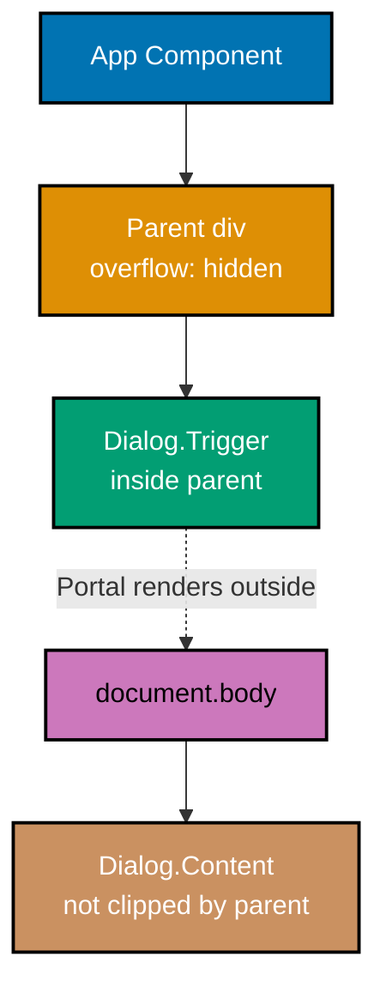
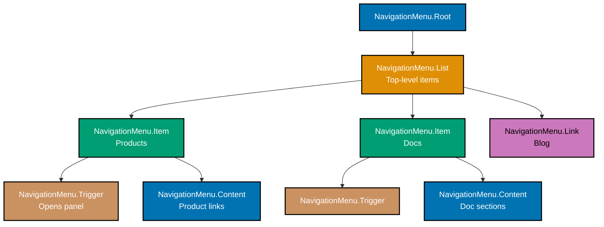
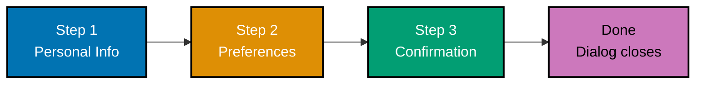

This tutorial covers intermediate Radix UI techniques including Portal usage, CSS animations with data-state attributes, complex form integration, keyboard navigation patterns, focus management, and multi-component composition for production interfaces.

## Portal and Layering (Examples 31-34)

### Example 31: Understanding Portal Rendering

Portal renders content at a different DOM location (default: `document.body`), escaping parent overflow, z-index, and transform constraints. Most Radix overlay components use Portal internally.



**Code**:

```tsx
import * as Dialog from "@radix-ui/react-dialog";
// => Dialog uses Portal for overlay rendering

export function PortalExample() {
  return (
    <div style={{ overflow: "hidden", height: 200, position: "relative" }}>
      {/* => Parent has overflow: hidden */}
      {/* => Without Portal, dialog content would be clipped */}
      <Dialog.Root>
        <Dialog.Trigger asChild>
          <button>Open (inside overflow:hidden parent)</button>
        </Dialog.Trigger>
        <Dialog.Portal>
          {/* => Portal: renders children at document.body */}
          {/* => Content escapes the overflow:hidden parent */}
          {/* => Default container: document.body */}
          <Dialog.Overlay />
          <Dialog.Content>
            <Dialog.Title>Portaled Content</Dialog.Title>
            <Dialog.Description>
              This dialog renders at document.body, not inside the overflow:hidden parent. It is fully visible.
            </Dialog.Description>
            <Dialog.Close asChild>
              <button>Close</button>
            </Dialog.Close>
          </Dialog.Content>
        </Dialog.Portal>
      </Dialog.Root>
    </div>
  );
}
// => Without Portal: content clipped by overflow:hidden
// => With Portal: content visible at document.body
// => Focus management still works (Radix tracks focus across portal)
// => Event bubbling still works (React synthetic events span portals)
```

**Key Takeaway**: Portal renders overlay content outside the DOM hierarchy, escaping CSS constraints like `overflow: hidden` and stacking context issues. React's event bubbling and Radix's focus management work correctly across the portal boundary.

**Why It Matters**: CSS stacking contexts (created by `transform`, `filter`, `opacity`, `position: fixed`, and others) isolate z-index values within their subtree. A dialog with `z-index: 9999` inside a stacking context with `z-index: 1` still renders below elements in higher stacking contexts. Portal escapes these constraints entirely by rendering at the DOM root, where z-index applies globally. This is why every Radix overlay component (Dialog, Popover, Tooltip, DropdownMenu, Select) uses Portal by default.

---

### Example 32: Custom Portal Container

Portal accepts a `container` prop to render into a specific DOM element instead of `document.body`. This is useful for micro-frontends, iframes, or scoped rendering.

**Code**:

```tsx
import * as Popover from "@radix-ui/react-popover";
import { useRef } from "react";
// => useRef to reference a custom container

export function CustomPortalContainer() {
  const containerRef = useRef<HTMLDivElement>(null);
  // => ref: points to our custom portal target

  return (
    <div>
      <div
        ref={containerRef}
        style={{
          position: "relative",
          border: "2px dashed #ccc",
          padding: 16,
          minHeight: 200,
        }}
      >
        {/* => Custom portal container */}
        {/* => Popover content renders HERE, not document.body */}
        <p>Portal content renders inside this box:</p>
      </div>
      <Popover.Root>
        <Popover.Trigger asChild>
          <button>Show Info</button>
        </Popover.Trigger>
        <Popover.Portal container={containerRef.current}>
          {/* => container: custom DOM element for portal */}
          {/* => Popover renders inside containerRef div */}
          {/* => Useful for scoped styling or containment */}
          <Popover.Content side="bottom" sideOffset={8}>
            <p>This popover is inside the dashed box.</p>
            <Popover.Arrow />
          </Popover.Content>
        </Popover.Portal>
      </Popover.Root>
    </div>
  );
}
// => container={null}: renders at document.body (default)
// => container={element}: renders inside specified element
// => Useful for: shadow DOM, iframes, CSS containment
// => Scoped CSS: portal content inherits container's styles
// => React context: portal content shares React tree context
```

**Key Takeaway**: Pass `container={domElement}` to Portal to control where overlay content renders in the DOM. This enables scoped styling, CSS containment, and micro-frontend integration.

**Why It Matters**: In micro-frontend architectures, each application manages its own CSS scope. Rendering portals at `document.body` breaks CSS isolation because the portaled content no longer inherits styles from the application's scope. Custom portal containers keep overlay content within the application's DOM subtree, preserving CSS Module scoping, shadow DOM boundaries, and CSS containment. This is also essential for embedding Radix components inside iframes or web components.

---

### Example 33: Preventing Overlay Scroll

Dialog and AlertDialog automatically prevent body scroll when open. Understanding this behavior helps when you need custom scroll management.

**Code**:

```tsx
import * as Dialog from "@radix-ui/react-dialog";
// => Dialog manages scroll lock automatically

export function ScrollLockDialog() {
  return (
    <Dialog.Root>
      <Dialog.Trigger asChild>
        <button>Open (body scroll locked)</button>
      </Dialog.Trigger>
      <Dialog.Portal>
        <Dialog.Overlay
          style={{
            position: "fixed",
            inset: 0,
            // => inset: 0 = top/right/bottom/left: 0
            backgroundColor: "rgba(0, 0, 0, 0.5)",
            // => Semi-transparent backdrop
          }}
        />
        <Dialog.Content
          style={{
            position: "fixed",
            top: "50%",
            left: "50%",
            transform: "translate(-50%, -50%)",
            // => Centers dialog in viewport
            backgroundColor: "white",
            padding: 24,
            borderRadius: 8,
            maxHeight: "85vh",
            overflowY: "auto",
            // => Content scrolls if taller than 85vh
            // => Body scroll is locked (no scroll behind overlay)
          }}
          onOpenAutoFocus={(event) => {
            // => Called when dialog opens
            // => Default: focuses first focusable element
            // => Override to focus a specific element
            event.preventDefault();
            // => Prevents auto-focus (you manage focus manually)
          }}
        >
          <Dialog.Title>Long Content Dialog</Dialog.Title>
          <Dialog.Description>The page behind this dialog cannot scroll.</Dialog.Description>
          {Array.from({ length: 30 }, (_, i) => (
            <p key={i}>Line {i + 1} of scrollable dialog content</p>
          ))}
          {/* => 30 paragraphs: dialog content scrolls */}
          {/* => Body behind overlay: scroll locked */}
          <Dialog.Close asChild>
            <button>Close</button>
          </Dialog.Close>
        </Dialog.Content>
      </Dialog.Portal>
    </Dialog.Root>
  );
}
// => Radix adds overflow:hidden to document.body when dialog opens
// => Removes overflow:hidden when dialog closes
// => Preserves scroll position (no jump on open/close)
// => Dialog content can scroll independently (overflowY: auto)
// => This is standard WAI-ARIA dialog behavior
```

**Key Takeaway**: Dialog automatically locks body scroll when open and unlocks on close. Use `overflowY: auto` on Content for scrollable dialog content. The `onOpenAutoFocus` event lets you customize initial focus placement.

**Why It Matters**: Scroll locking prevents users from accidentally scrolling the page behind a modal, which is disorienting and can cause the user to lose their place. Implementing scroll lock correctly is deceptively complex: you must account for scrollbar width changes (which shift layout), iOS Safari's rubber-band scrolling, and scroll position preservation. Radix handles all these edge cases internally, including compensating for the scrollbar width removal to prevent layout shift when body overflow changes.

---

### Example 34: Overlay Stacking Order

When multiple overlays are open simultaneously (dropdown inside dialog, popover inside popover), Radix manages the correct stacking order and dismiss behavior.

**Code**:

```tsx
import * as Dialog from "@radix-ui/react-dialog";
import * as DropdownMenu from "@radix-ui/react-dropdown-menu";
import * as Tooltip from "@radix-ui/react-tooltip";
// => Three overlay types at once

export function StackedOverlays() {
  return (
    <Tooltip.Provider>
      <Dialog.Root>
        <Dialog.Trigger asChild>
          <button>Open Dialog</button>
        </Dialog.Trigger>
        <Dialog.Portal>
          <Dialog.Overlay style={{ position: "fixed", inset: 0, background: "rgba(0,0,0,0.3)" }} />
          <Dialog.Content
            style={{
              position: "fixed",
              top: "50%",
              left: "50%",
              transform: "translate(-50%,-50%)",
              background: "white",
              padding: 24,
            }}
          >
            <Dialog.Title>Layer 1: Dialog</Dialog.Title>
            <Dialog.Description>This dialog contains a dropdown menu.</Dialog.Description>
            <DropdownMenu.Root>
              {/* => Layer 2: Dropdown inside Dialog */}
              <DropdownMenu.Trigger asChild>
                <button>Actions Menu</button>
              </DropdownMenu.Trigger>
              <DropdownMenu.Portal>
                <DropdownMenu.Content sideOffset={4}>
                  <DropdownMenu.Item onSelect={() => console.log("Edit")}>Edit</DropdownMenu.Item>
                  <DropdownMenu.Item onSelect={() => console.log("Delete")}>Delete</DropdownMenu.Item>
                </DropdownMenu.Content>
              </DropdownMenu.Portal>
            </DropdownMenu.Root>
            <Tooltip.Root>
              {/* => Tooltip inside dialog */}
              <Tooltip.Trigger asChild>
                <button aria-label="Help">?</button>
              </Tooltip.Trigger>
              <Tooltip.Portal>
                <Tooltip.Content side="right" sideOffset={4}>
                  Click the menu for actions.
                  <Tooltip.Arrow />
                </Tooltip.Content>
              </Tooltip.Portal>
            </Tooltip.Root>
            <Dialog.Close asChild>
              <button>Close Dialog</button>
            </Dialog.Close>
          </Dialog.Content>
        </Dialog.Portal>
      </Dialog.Root>
    </Tooltip.Provider>
  );
}
// => Stacking order (visual): Tooltip > Dropdown > Dialog > Page
// => Escape closes innermost: Dropdown first, then Dialog
// => Focus: Dialog traps focus, Dropdown manages within trap
// => Tooltip appears above all layers automatically
// => Radix manages z-index and stacking internally
```

**Key Takeaway**: Radix automatically manages overlay stacking order, Escape key dismiss priority, and focus management across nested overlay layers. No manual z-index management required.

**Why It Matters**: Overlay stacking is one of the most common sources of visual bugs in web applications. CSS z-index alone is insufficient because stacking contexts are relative, not absolute. Radix's portal-based rendering ensures each overlay appears at the correct visual layer, and the internal dismiss stack ensures Escape closes the correct overlay. This eliminates the entire class of "my dropdown appears behind my modal" bugs that plague CSS-only solutions.

---

## Animation Patterns (Examples 35-40)

### Example 35: CSS Keyframe Animations with data-state

Radix's `data-state` attributes enable CSS-only animations without JavaScript animation libraries. This example implements smooth enter/exit animations for Dialog.

**Code**:

```tsx
import * as Dialog from "@radix-ui/react-dialog";
// => Dialog with CSS animations

const animationStyles = `
  .dialog-overlay[data-state="open"] {
    animation: overlayShow 200ms ease-out;
    /* => Fade in overlay on open */
  }
  .dialog-overlay[data-state="closed"] {
    animation: overlayHide 200ms ease-in;
    /* => Fade out overlay on close */
  }
  .dialog-content[data-state="open"] {
    animation: contentShow 300ms cubic-bezier(0.16, 1, 0.3, 1);
    /* => Scale + fade in content on open */
    /* => Ease-out curve for natural feel */
  }
  .dialog-content[data-state="closed"] {
    animation: contentHide 200ms ease-in;
    /* => Scale + fade out content on close */
  }

  @keyframes overlayShow {
    from { opacity: 0; }
    to { opacity: 1; }
  }
  @keyframes overlayHide {
    from { opacity: 1; }
    to { opacity: 0; }
  }
  @keyframes contentShow {
    from {
      opacity: 0;
      transform: translate(-50%, -48%) scale(0.96);
      /* => Starts slightly above and smaller */
    }
    to {
      opacity: 1;
      transform: translate(-50%, -50%) scale(1);
      /* => Ends centered at full size */
    }
  }
  @keyframes contentHide {
    from {
      opacity: 1;
      transform: translate(-50%, -50%) scale(1);
    }
    to {
      opacity: 0;
      transform: translate(-50%, -48%) scale(0.96);
    }
  }
`;
// => data-state="open" triggers enter animation
// => data-state="closed" triggers exit animation
// => Radix waits for exit animation to complete before unmounting

export function AnimatedDialog() {
  return (
    <>
      <style>{animationStyles}</style>
      <Dialog.Root>
        <Dialog.Trigger asChild>
          <button>Open Animated Dialog</button>
        </Dialog.Trigger>
        <Dialog.Portal>
          <Dialog.Overlay
            className="dialog-overlay"
            // => data-state="open" | "closed" set by Radix
            style={{ position: "fixed", inset: 0, backgroundColor: "rgba(0,0,0,0.5)" }}
          />
          <Dialog.Content
            className="dialog-content"
            // => data-state drives CSS animation
            style={{
              position: "fixed",
              top: "50%",
              left: "50%",
              backgroundColor: "white",
              padding: 24,
              borderRadius: 8,
            }}
          >
            <Dialog.Title>Animated Dialog</Dialog.Title>
            <Dialog.Description>This dialog has enter and exit animations.</Dialog.Description>
            <Dialog.Close asChild>
              <button>Close</button>
            </Dialog.Close>
          </Dialog.Content>
        </Dialog.Portal>
      </Dialog.Root>
    </>
  );
}
// => Radix detects CSS animations on data-state="closed"
// => Waits for animation to finish before removing from DOM
// => No JavaScript animation library needed
// => No onAnimationEnd callback management
```

**Key Takeaway**: Apply CSS animations targeting `[data-state="open"]` and `[data-state="closed"]`. Radix automatically detects exit animations and waits for completion before unmounting the element.

**Why It Matters**: Exit animations in React are notoriously difficult because components unmount immediately, preventing closing animations from playing. Libraries like Framer Motion and React Transition Group solve this with explicit animation management. Radix's approach is simpler: it detects CSS animation/transition events on elements with `data-state="closed"` and delays unmounting until the animation completes. This means you get smooth exit animations with pure CSS, no animation library dependency, and no `useRef` + `onAnimationEnd` boilerplate.

---

### Example 36: CSS Transitions with data-state

CSS transitions provide simpler animation control than keyframes. Use them for single-property changes like opacity, transform, or background-color.

**Code**:

```tsx
import * as Tooltip from "@radix-ui/react-tooltip";
// => Tooltip with CSS transition animation

const transitionStyles = `
  .tooltip-content {
    /* => Base styles with transition declarations */
    padding: 8px 12px;
    background: #333;
    color: white;
    border-radius: 4px;
    /* => Transition properties for smooth animation */
    animation-duration: 200ms;
    animation-timing-function: ease-out;
  }
  .tooltip-content[data-state="delayed-open"] {
    animation-name: tooltipFadeIn;
    /* => delayed-open: tooltip opened after delay */
  }
  .tooltip-content[data-state="closed"] {
    animation-name: tooltipFadeOut;
    /* => closed: tooltip closing */
  }
  .tooltip-content[data-side="top"] {
    animation-name: slideFromBottom;
    /* => Slides up when positioned above trigger */
  }
  .tooltip-content[data-side="bottom"] {
    animation-name: slideFromTop;
    /* => Slides down when positioned below trigger */
  }

  @keyframes tooltipFadeIn {
    from { opacity: 0; }
    to { opacity: 1; }
  }
  @keyframes tooltipFadeOut {
    from { opacity: 1; }
    to { opacity: 0; }
  }
  @keyframes slideFromBottom {
    from { opacity: 0; transform: translateY(4px); }
    to { opacity: 1; transform: translateY(0); }
  }
  @keyframes slideFromTop {
    from { opacity: 0; transform: translateY(-4px); }
    to { opacity: 1; transform: translateY(0); }
  }
`;
// => data-side: "top" | "bottom" | "left" | "right"
// => Changes based on collision detection repositioning
// => Animations adapt to actual rendered position

export function AnimatedTooltip() {
  return (
    <>
      <style>{transitionStyles}</style>
      <Tooltip.Provider>
        <Tooltip.Root>
          <Tooltip.Trigger asChild>
            <button>Hover me</button>
          </Tooltip.Trigger>
          <Tooltip.Portal>
            <Tooltip.Content
              className="tooltip-content"
              side="top"
              sideOffset={4}
              // => data-side reflects ACTUAL rendered side
              // => May differ from requested side due to collision
            >
              Tooltip with directional animation
              <Tooltip.Arrow />
            </Tooltip.Content>
          </Tooltip.Portal>
        </Tooltip.Root>
      </Tooltip.Provider>
    </>
  );
}
// => data-side adapts animation direction to actual position
// => If tooltip flips from top to bottom, animation changes
// => No JavaScript needed to detect position changes
// => CSS handles all animation logic via attribute selectors
```

**Key Takeaway**: Combine `data-state` with `data-side` to create directional animations that adapt to the component's actual rendered position. The `data-side` attribute reflects collision-adjusted positioning.

**Why It Matters**: Directional animations (sliding from the correct direction based on position) create polished UI transitions. Without `data-side`, you would need JavaScript to detect the actual rendered position after collision adjustment and apply the correct animation class. Radix exposes this information as a data attribute, enabling pure-CSS directional animations. This is especially valuable for tooltips and popovers that frequently reposition due to viewport constraints.

---

### Example 37: Accordion Content Height Animation

Animating Accordion content open/close requires knowing the content height. Radix provides CSS variables for dynamic height-based animations.

**Code**:

```tsx
import * as Accordion from "@radix-ui/react-accordion";
// => Accordion with height animation

const accordionStyles = `
  .accordion-content {
    overflow: hidden;
    /* => Required: clips content during animation */
  }
  .accordion-content[data-state="open"] {
    animation: accordionOpen 300ms cubic-bezier(0.87, 0, 0.13, 1);
    /* => Smooth ease-in-out curve */
  }
  .accordion-content[data-state="closed"] {
    animation: accordionClose 300ms cubic-bezier(0.87, 0, 0.13, 1);
  }

  @keyframes accordionOpen {
    from {
      height: 0;
      /* => Starts collapsed */
    }
    to {
      height: var(--radix-accordion-content-height);
      /* => Ends at measured content height */
      /* => Radix sets this CSS variable automatically */
      /* => Value updates if content size changes */
    }
  }
  @keyframes accordionClose {
    from {
      height: var(--radix-accordion-content-height);
      /* => Starts at full content height */
    }
    to {
      height: 0;
      /* => Collapses to zero */
    }
  }
`;
// => --radix-accordion-content-height: measured by Radix
// => Updates dynamically if content size changes
// => Works with variable-length content

export function AnimatedAccordion() {
  return (
    <>
      <style>{accordionStyles}</style>
      <Accordion.Root type="single" collapsible>
        <Accordion.Item value="item-1">
          <Accordion.Header>
            <Accordion.Trigger>Section 1</Accordion.Trigger>
          </Accordion.Header>
          <Accordion.Content className="accordion-content">
            {/* => overflow:hidden + height animation */}
            <div style={{ padding: 16 }}>
              <p>Short content for section 1.</p>
            </div>
          </Accordion.Content>
        </Accordion.Item>
        <Accordion.Item value="item-2">
          <Accordion.Header>
            <Accordion.Trigger>Section 2</Accordion.Trigger>
          </Accordion.Header>
          <Accordion.Content className="accordion-content">
            <div style={{ padding: 16 }}>
              <p>This section has more content.</p>
              <p>The animation height adjusts automatically.</p>
              <p>No fixed height needed in CSS.</p>
            </div>
          </Accordion.Content>
        </Accordion.Item>
      </Accordion.Root>
    </>
  );
}
// => Each section animates to its OWN content height
// => No hardcoded max-height values
// => Works with dynamic content (fetched data, user input)
// => --radix-accordion-content-width also available
```

**Key Takeaway**: Use `--radix-accordion-content-height` in CSS keyframes to animate accordion sections to their exact content height. Add `overflow: hidden` to the content element for proper clipping during animation.

**Why It Matters**: Animating `height: 0` to `height: auto` is impossible in CSS because `auto` is not an animatable value. Common workarounds (max-height with large values, JavaScript measurement) each have drawbacks -- max-height delays differ based on content size, and JavaScript measurement causes layout thrashing. Radix measures the content once using ResizeObserver and exposes the value as a CSS variable, giving you smooth, accurate height animations with zero JavaScript in your component code.

---

### Example 38: Radix with Tailwind CSS data-state Selectors

Tailwind CSS supports data attribute selectors via the `data-[state=value]:` prefix, enabling inline styling of Radix state changes.

**Code**:

```tsx
import * as Accordion from "@radix-ui/react-accordion";
// => Accordion styled with Tailwind data-state selectors

export function TailwindAccordion() {
  return (
    <Accordion.Root type="single" collapsible className="w-full max-w-md">
      {/* => Tailwind width utilities */}
      <Accordion.Item value="item-1" className="border-b">
        <Accordion.Header>
          <Accordion.Trigger
            className="flex w-full items-center justify-between py-4 font-medium transition-all hover:underline [&[data-state=open]>svg]:rotate-180"
            // => [&[data-state=open]>svg]:rotate-180
            // => When trigger has data-state="open",
            // => rotate child SVG 180 degrees
            // => Arbitrary Tailwind selector syntax
          >
            Is it accessible?
            <svg
              className="h-4 w-4 shrink-0 transition-transform duration-200"
              // => transition-transform: smooth rotation
              // => duration-200: 200ms animation
              viewBox="0 0 24 24"
              aria-hidden="true"
            >
              <path d="M6 9l6 6 6-6" />
            </svg>
          </Accordion.Trigger>
        </Accordion.Header>
        <Accordion.Content
          className="data-[state=open]:animate-accordion-down data-[state=closed]:animate-accordion-up overflow-hidden"
          // => data-[state=open]: Tailwind data attribute selector
          // => animate-accordion-down: custom Tailwind animation
          // => Defined in tailwind.config.js
        >
          <div className="pt-0 pb-4">Yes. Radix follows WAI-ARIA design patterns.</div>
        </Accordion.Content>
      </Accordion.Item>
    </Accordion.Root>
  );
}
// => Tailwind data-state selectors:
// => data-[state=open]:className   - applied when open
// => data-[state=closed]:className - applied when closed
// => [&[data-state=open]]:className - parent state selector
// => No custom CSS file needed for state-based styling
// =>
// => tailwind.config.js animation setup:
// => keyframes: { 'accordion-down': { from: { height: '0' },
// =>   to: { height: 'var(--radix-accordion-content-height)' } } }
// => animation: { 'accordion-down': 'accordion-down 0.2s ease-out' }
```

**Key Takeaway**: Use Tailwind's `data-[state=open]:` and `data-[state=closed]:` prefixes to style Radix states inline. Define custom animations in `tailwind.config.js` that reference Radix CSS variables.

**Why It Matters**: Tailwind CSS is the most popular utility-first CSS framework, and its data attribute selector support (added in v3.2) creates a natural integration point with Radix's data-state pattern. This eliminates the need for separate CSS files or styled-components for state-based styling. The custom animation setup in tailwind.config.js is a one-time configuration that the entire team shares, creating a consistent animation vocabulary across all Radix components in the project.

---

### Example 39: Animation with forceMount for Exit Transitions

Some animation libraries (Framer Motion, React Spring) need the element to stay in the DOM during exit. The `forceMount` prop keeps Radix content mounted at all times.

**Code**:

```tsx
import * as Dialog from "@radix-ui/react-dialog";
import { useState } from "react";
// => Controlled dialog with forceMount

export function ForceMountedDialog() {
  const [open, setOpen] = useState(false);
  // => Controlled state for dialog

  return (
    <Dialog.Root open={open} onOpenChange={setOpen}>
      <Dialog.Trigger asChild>
        <button>Open</button>
      </Dialog.Trigger>
      <Dialog.Portal forceMount>
        {/* => forceMount: keeps portal content in DOM always */}
        {/* => Without forceMount: content unmounts when closed */}
        {/* => With forceMount: content stays, you control visibility */}
        <Dialog.Overlay
          forceMount
          // => forceMount on each sub-component
          style={{
            position: "fixed",
            inset: 0,
            backgroundColor: "rgba(0,0,0,0.5)",
            // => Manual visibility control:
            opacity: open ? 1 : 0,
            pointerEvents: open ? "auto" : "none",
            // => pointerEvents: "none" prevents interaction when hidden
            transition: "opacity 300ms ease",
          }}
        />
        <Dialog.Content
          forceMount
          style={{
            position: "fixed",
            top: "50%",
            left: "50%",
            transform: `translate(-50%, -50%) scale(${open ? 1 : 0.95})`,
            // => Scale based on open state
            opacity: open ? 1 : 0,
            pointerEvents: open ? "auto" : "none",
            transition: "opacity 300ms ease, transform 300ms ease",
            backgroundColor: "white",
            padding: 24,
            borderRadius: 8,
          }}
        >
          <Dialog.Title>Force Mounted</Dialog.Title>
          <Dialog.Description>This content is always in the DOM.</Dialog.Description>
          <Dialog.Close asChild>
            <button>Close</button>
          </Dialog.Close>
        </Dialog.Content>
      </Dialog.Portal>
    </Dialog.Root>
  );
}
// => forceMount: element stays in DOM regardless of open state
// => You manage visibility via CSS (opacity, pointerEvents)
// => Required for: Framer Motion AnimatePresence
// => Required for: React Spring useTransition
// => Required for: measuring content before first open
// => Trade-off: more DOM elements, but enables advanced animations
```

**Key Takeaway**: Use `forceMount` when you need the element to persist in the DOM for animation libraries (Framer Motion, React Spring) or pre-rendering. You must manually manage visibility with CSS.

**Why It Matters**: React's component lifecycle unmounts elements immediately, which conflicts with exit animations that need the element to remain visible during the animation. Radix's default data-state approach handles this for CSS animations, but JavaScript animation libraries like Framer Motion use their own unmount management (AnimatePresence). The `forceMount` prop bridges these two systems by keeping the element mounted and letting the animation library control visual transitions. This is the recommended approach for integrating Radix with Framer Motion.

---

### Example 40: Animating Select Content

Select content benefits from smooth open/close animations. The viewport position and content side determine animation direction.

**Code**:

```tsx
import * as Select from "@radix-ui/react-select";
// => Select with entry/exit animations

const selectStyles = `
  .select-content {
    overflow: hidden;
    background: white;
    border: 1px solid #ddd;
    border-radius: 6px;
    box-shadow: 0 4px 12px rgba(0, 0, 0, 0.1);
  }
  .select-content[data-state="open"] {
    animation: selectOpen 200ms ease-out;
  }
  .select-content[data-state="closed"] {
    animation: selectClose 150ms ease-in;
  }
  .select-item {
    padding: 8px 12px;
    cursor: default;
    outline: none;
  }
  .select-item[data-highlighted] {
    background: #0173B2;
    color: white;
    /* => data-highlighted: keyboard/mouse hover state */
    /* => Uses accessible blue from palette */
  }
  .select-item[data-disabled] {
    opacity: 0.5;
    /* => data-disabled: grayed out item */
  }

  @keyframes selectOpen {
    from { opacity: 0; transform: scale(0.96) translateY(-4px); }
    to { opacity: 1; transform: scale(1) translateY(0); }
  }
  @keyframes selectClose {
    from { opacity: 1; transform: scale(1) translateY(0); }
    to { opacity: 0; transform: scale(0.96) translateY(-4px); }
  }
`;
// => data-highlighted: item under keyboard/mouse focus
// => data-disabled: item cannot be selected

export function AnimatedSelect() {
  return (
    <>
      <style>{selectStyles}</style>
      <Select.Root defaultValue="react">
        <Select.Trigger className="select-trigger" aria-label="Framework">
          <Select.Value placeholder="Choose framework" />
          <Select.Icon />
        </Select.Trigger>
        <Select.Portal>
          <Select.Content className="select-content" position="popper" sideOffset={4}>
            <Select.Viewport>
              <Select.Item value="react" className="select-item">
                <Select.ItemText>React</Select.ItemText>
                <Select.ItemIndicator>V</Select.ItemIndicator>
              </Select.Item>
              <Select.Item value="vue" className="select-item">
                <Select.ItemText>Vue</Select.ItemText>
                <Select.ItemIndicator>V</Select.ItemIndicator>
              </Select.Item>
              <Select.Item value="angular" className="select-item" disabled>
                <Select.ItemText>Angular (unavailable)</Select.ItemText>
                <Select.ItemIndicator>V</Select.ItemIndicator>
              </Select.Item>
              <Select.Item value="svelte" className="select-item">
                <Select.ItemText>Svelte</Select.ItemText>
                <Select.ItemIndicator>V</Select.ItemIndicator>
              </Select.Item>
            </Select.Viewport>
          </Select.Content>
        </Select.Portal>
      </Select.Root>
    </>
  );
}
// => data-highlighted styles the keyboard-focused item
// => data-disabled grays out unavailable options
// => Animations use data-state for enter/exit
// => position="popper" enables side/sideOffset positioning
```

**Key Takeaway**: Style Select items using `[data-highlighted]` for focus state and `[data-disabled]` for unavailable options. These data attributes update automatically during keyboard navigation and provide consistent styling hooks.

**Why It Matters**: Select dropdown styling is one of the most requested features in web development because native `<select>` elements are nearly impossible to customize. Radix's Select provides every styling hook needed: `data-state` for open/close, `data-highlighted` for keyboard focus (which differs from CSS `:focus`), `data-disabled` for unavailable items, and standard positioning via the Popper engine. The `data-highlighted` attribute is particularly important because keyboard navigation moves a visual highlight that is independent of DOM focus -- CSS `:focus` cannot represent this state.

---

## Form Integration (Examples 41-45)

### Example 41: React Hook Form Integration

Radix components integrate with React Hook Form through the `Controller` component, which bridges React Hook Form's ref-based API with Radix's controlled component pattern.

**Code**:

```tsx
import * as Switch from "@radix-ui/react-switch";
import * as Select from "@radix-ui/react-select";
import * as Checkbox from "@radix-ui/react-checkbox";
import * as Label from "@radix-ui/react-label";
// => Radix form controls
// => Assumes: npm install react-hook-form

// NOTE: This example requires react-hook-form to be installed
// import { useForm, Controller } from "react-hook-form";

// Type definition for form values
interface SettingsForm {
  theme: string;
  notifications: boolean;
  terms: boolean;
}

export function HookFormExample() {
  // => useForm manages form state, validation, submission
  // const { control, handleSubmit } = useForm<SettingsForm>({
  //   defaultValues: {
  //     theme: "light",
  //     notifications: true,
  //     terms: false,
  //   },
  // });

  // Simulated form handler for self-contained example
  const handleSubmit = (onSubmit: (data: SettingsForm) => void) => {
    return (e: React.FormEvent) => {
      e.preventDefault();
      // => In real code, react-hook-form handles this
      onSubmit({ theme: "dark", notifications: true, terms: true });
    };
  };

  const onSubmit = (data: SettingsForm) => {
    console.log("Form data:", data);
    // => Output: Form data: { theme: "dark", notifications: true, terms: true }
  };

  return (
    <form onSubmit={handleSubmit(onSubmit)}>
      {/* Controller wraps Radix components for react-hook-form */}
      {/* <Controller
        name="theme"
        control={control}
        render={({ field }) => (
          <Select.Root
            value={field.value}
            onValueChange={field.onChange}
          >
            <Select.Trigger>
              <Select.Value />
            </Select.Trigger>
            <Select.Portal>
              <Select.Content>
                <Select.Viewport>
                  <Select.Item value="light"><Select.ItemText>Light</Select.ItemText></Select.Item>
                  <Select.Item value="dark"><Select.ItemText>Dark</Select.ItemText></Select.Item>
                </Select.Viewport>
              </Select.Content>
            </Select.Portal>
          </Select.Root>
        )}
      /> */}

      {/* Switch integration pattern */}
      {/* <Controller
        name="notifications"
        control={control}
        render={({ field }) => (
          <div style={{ display: "flex", alignItems: "center", gap: 8 }}>
            <Switch.Root
              checked={field.value}
              onCheckedChange={field.onChange}
              ref={field.ref}
            >
              <Switch.Thumb />
            </Switch.Root>
            <Label.Root>Notifications</Label.Root>
          </div>
        )}
      /> */}

      {/* Checkbox integration pattern */}
      {/* <Controller
        name="terms"
        control={control}
        render={({ field }) => (
          <div style={{ display: "flex", alignItems: "center", gap: 8 }}>
            <Checkbox.Root
              checked={field.value}
              onCheckedChange={field.onChange}
              ref={field.ref}
            >
              <Checkbox.Indicator>V</Checkbox.Indicator>
            </Checkbox.Root>
            <Label.Root>Accept terms</Label.Root>
          </div>
        )}
      /> */}

      <button type="submit">Save Settings</button>
    </form>
  );
}
// => Pattern: Controller render prop bridges react-hook-form and Radix
// => field.value -> Radix value/checked prop
// => field.onChange -> Radix onValueChange/onCheckedChange
// => field.ref -> Radix ref (for focus management)
// => All validation, dirty tracking, error handling from react-hook-form
```

**Key Takeaway**: Use React Hook Form's `Controller` to connect Radix components. Map `field.value` to the Radix value prop and `field.onChange` to the Radix change callback. The pattern is consistent across all Radix form controls.

**Why It Matters**: Form libraries are essential for production applications (validation, error handling, dirty tracking, submission state), and the integration pattern between Radix and React Hook Form is non-obvious because Radix components use custom value/onChange prop names (`onCheckedChange` instead of `onChange`, `onValueChange` instead of `onChange`). The Controller component's render prop pattern provides a clean mapping layer that lets you use Radix's accessible form controls with React Hook Form's powerful validation engine.

---

### Example 42: Form Validation Error Display

Displaying validation errors alongside Radix form controls requires associating error messages with controls via ARIA attributes.

**Code**:

```tsx
import * as Select from "@radix-ui/react-select";
import * as Checkbox from "@radix-ui/react-checkbox";
import * as Label from "@radix-ui/react-label";
import { useState } from "react";
// => Form with validation errors

interface FormErrors {
  country?: string;
  terms?: string;
}

export function ValidatedForm() {
  const [errors, setErrors] = useState<FormErrors>({});
  const [country, setCountry] = useState("");
  const [terms, setTerms] = useState(false);
  // => Form state and errors

  const validate = (): boolean => {
    const newErrors: FormErrors = {};
    // => Build error object
    if (!country) {
      newErrors.country = "Please select a country.";
      // => Country is required
    }
    if (!terms) {
      newErrors.terms = "You must accept the terms.";
      // => Terms must be checked
    }
    setErrors(newErrors);
    return Object.keys(newErrors).length === 0;
    // => Returns true if no errors
  };

  const handleSubmit = (e: React.FormEvent) => {
    e.preventDefault();
    if (validate()) {
      console.log("Valid:", { country, terms });
      // => Output: Valid: { country: "us", terms: true }
    }
  };

  return (
    <form onSubmit={handleSubmit} noValidate>
      {/* => noValidate: disables browser validation (we handle it) */}
      <div>
        <Label.Root htmlFor="country-select">Country</Label.Root>
        <Select.Root
          value={country}
          onValueChange={(value) => {
            setCountry(value);
            setErrors((prev) => ({ ...prev, country: undefined }));
            // => Clear error on selection
          }}
        >
          <Select.Trigger
            id="country-select"
            aria-invalid={!!errors.country}
            // => aria-invalid: indicates validation error
            aria-describedby={errors.country ? "country-error" : undefined}
            // => aria-describedby: links to error message
          >
            <Select.Value placeholder="Select country" />
          </Select.Trigger>
          <Select.Portal>
            <Select.Content>
              <Select.Viewport>
                <Select.Item value="us">
                  <Select.ItemText>United States</Select.ItemText>
                </Select.Item>
                <Select.Item value="gb">
                  <Select.ItemText>United Kingdom</Select.ItemText>
                </Select.Item>
              </Select.Viewport>
            </Select.Content>
          </Select.Portal>
        </Select.Root>
        {errors.country && (
          <span id="country-error" role="alert" style={{ color: "#c00" }}>
            {/* => role="alert": screen readers announce immediately */}
            {/* => id: matches aria-describedby on trigger */}
            {errors.country}
          </span>
        )}
      </div>
      <div style={{ display: "flex", alignItems: "center", gap: 8, marginTop: 16 }}>
        <Checkbox.Root
          id="terms-check"
          checked={terms}
          onCheckedChange={(checked) => {
            setTerms(!!checked);
            setErrors((prev) => ({ ...prev, terms: undefined }));
          }}
          aria-invalid={!!errors.terms}
          aria-describedby={errors.terms ? "terms-error" : undefined}
        >
          <Checkbox.Indicator>V</Checkbox.Indicator>
        </Checkbox.Root>
        <Label.Root htmlFor="terms-check">Accept terms and conditions</Label.Root>
      </div>
      {errors.terms && (
        <span id="terms-error" role="alert" style={{ color: "#c00" }}>
          {errors.terms}
        </span>
      )}
      <button type="submit" style={{ marginTop: 16 }}>
        Submit
      </button>
    </form>
  );
}
// => aria-invalid: signals error state to screen readers
// => aria-describedby: links control to error message
// => role="alert": error message announced immediately
// => Clear errors on valid input (responsive validation)
// => Pattern works with any Radix form control
```

**Key Takeaway**: Use `aria-invalid` on the Radix control and `aria-describedby` linking to an error element with `role="alert"`. Clear errors on valid input for responsive validation feedback.

**Why It Matters**: Validation errors that are only visible create an accessibility barrier for screen reader users. The `aria-invalid` attribute tells screen readers the control has an error, and `aria-describedby` links to the specific error message. The `role="alert"` on the error element triggers an immediate screen reader announcement when the error appears, without requiring the user to navigate to it. This pattern follows WCAG 2.1 Success Criterion 3.3.1 (Error Identification) and works consistently across all Radix form controls.

---

### Example 43: Slider Range (Two Thumbs)

Slider supports range selection with two thumbs by passing an array with two values. Each thumb is independently draggable.

**Code**:

```tsx
import * as Slider from "@radix-ui/react-slider";
import { useState } from "react";
// => Slider with range selection

export function PriceRangeSlider() {
  const [range, setRange] = useState([200, 800]);
  // => range: [min, max] thumb positions
  // => Two values = two thumbs

  return (
    <div>
      <label id="price-label">
        Price: ${range[0]} - ${range[1]}
        {/* => Display current range values */}
      </label>
      <Slider.Root
        value={range}
        // => Array of two values creates two thumbs
        onValueChange={setRange}
        // => Updates both values: [newMin, newMax]
        min={0}
        max={1000}
        step={10}
        // => step: 10 = moves in $10 increments
        minStepsBetweenThumbs={1}
        // => Prevents thumbs from overlapping
        // => Minimum gap: 1 step ($10)
        aria-labelledby="price-label"
      >
        <Slider.Track>
          {/* => Full track rail */}
          <Slider.Range />
          {/* => Range: filled area BETWEEN the two thumbs */}
          {/* => Visually highlights the selected range */}
        </Slider.Track>
        <Slider.Thumb aria-label="Minimum price" />
        {/* => First thumb: controls range[0] */}
        <Slider.Thumb aria-label="Maximum price" />
        {/* => Second thumb: controls range[1] */}
        {/* => Each thumb is independently keyboard-controllable */}
      </Slider.Root>
    </div>
  );
}
// => Two Slider.Thumb elements = range slider
// => Slider.Range fills between thumbs (not from min)
// => minStepsBetweenThumbs prevents invalid ranges
// => Each thumb has independent aria-label
// => Keyboard: Tab between thumbs, Arrow keys to adjust
// => Thumbs cannot cross each other
```

**Key Takeaway**: Pass a two-element array as `value` and render two `Slider.Thumb` components for range selection. The `Slider.Range` fills between the thumbs, and `minStepsBetweenThumbs` prevents overlapping.

**Why It Matters**: Range sliders are notoriously difficult to build accessibly. Each thumb needs independent ARIA labels, keyboard navigation (Tab between thumbs, arrows to adjust), and constraints (thumbs cannot cross). Radix handles all of this through the same API as a single slider -- the number of array elements determines the number of thumbs. The `minStepsBetweenThumbs` constraint prevents invalid ranges (min > max) that would confuse users and break form validation.

---

### Example 44: Context Menu (Right-Click)

ContextMenu provides a right-click menu with the same keyboard navigation, accessibility, and sub-menu support as DropdownMenu.

**Code**:

```tsx
import * as ContextMenu from "@radix-ui/react-context-menu";
// => Install: npm install @radix-ui/react-context-menu

export function FileContextMenu() {
  return (
    <ContextMenu.Root>
      {/* => Root manages context menu state */}
      <ContextMenu.Trigger asChild>
        <div
          style={{
            border: "2px dashed #ccc",
            padding: 32,
            textAlign: "center",
            userSelect: "none",
            // => userSelect: "none" prevents text selection on right-click
          }}
        >
          Right-click this area
          {/* => Right-click (or long-press on mobile) opens menu */}
        </div>
      </ContextMenu.Trigger>
      <ContextMenu.Portal>
        <ContextMenu.Content>
          <ContextMenu.Item onSelect={() => console.log("Copy")}>
            Copy
            <span style={{ marginLeft: "auto", opacity: 0.6 }}>Ctrl+C</span>
            {/* => Keyboard shortcut hint */}
          </ContextMenu.Item>
          <ContextMenu.Item onSelect={() => console.log("Paste")}>
            Paste
            <span style={{ marginLeft: "auto", opacity: 0.6 }}>Ctrl+V</span>
          </ContextMenu.Item>
          <ContextMenu.Separator />
          {/* => Visual divider */}
          <ContextMenu.Sub>
            {/* => Submenu for nested options */}
            <ContextMenu.SubTrigger>
              Share
              <span style={{ marginLeft: "auto" }}>&gt;</span>
              {/* => Arrow indicates submenu */}
            </ContextMenu.SubTrigger>
            <ContextMenu.Portal>
              <ContextMenu.SubContent sideOffset={4}>
                <ContextMenu.Item onSelect={() => console.log("Email")}>Email</ContextMenu.Item>
                <ContextMenu.Item onSelect={() => console.log("Slack")}>Slack</ContextMenu.Item>
              </ContextMenu.SubContent>
            </ContextMenu.Portal>
          </ContextMenu.Sub>
          <ContextMenu.Separator />
          <ContextMenu.CheckboxItem checked={true} onCheckedChange={(checked) => console.log("Show hidden:", checked)}>
            <ContextMenu.ItemIndicator>V</ContextMenu.ItemIndicator>
            Show Hidden Files
            {/* => Toggleable checkbox item in context menu */}
          </ContextMenu.CheckboxItem>
        </ContextMenu.Content>
      </ContextMenu.Portal>
    </ContextMenu.Root>
  );
}
// => Right-click: opens context menu at cursor position
// => Long-press: opens on mobile/touch devices
// => Keyboard: same navigation as DropdownMenu
// => Sub: nested submenu opens on hover or ArrowRight
// => CheckboxItem: toggleable boolean option
// => RadioGroup available for exclusive options (same as DropdownMenu)
```

**Key Takeaway**: ContextMenu triggers on right-click and shares the same compound component API as DropdownMenu (Item, Sub, CheckboxItem, Separator). Use it for right-click interactions on canvas elements, file lists, or text areas.

**Why It Matters**: Custom context menus require intercepting the browser's native context menu (which users rely on for accessibility features like text-to-speech), so they must provide equivalent or better functionality. Radix's ContextMenu implements the complete WAI-ARIA menu pattern with keyboard navigation, type-ahead, and sub-menu support. The CheckboxItem and RadioGroup sub-components enable stateful menu options (toggle settings, view mode selection) that the native context menu cannot provide, making the custom menu a genuine enhancement rather than an accessibility regression.

---

### Example 45: NavigationMenu for Site Navigation

NavigationMenu provides accessible site navigation with dropdown content panels, link highlighting, and keyboard navigation following the WAI-ARIA navigation pattern.



**Code**:

```tsx
import * as NavigationMenu from "@radix-ui/react-navigation-menu";
// => Install: npm install @radix-ui/react-navigation-menu

export function SiteNavigation() {
  return (
    <NavigationMenu.Root>
      {/* => Root: top-level navigation container */}
      <NavigationMenu.List>
        {/* => List: horizontal menu bar */}
        <NavigationMenu.Item>
          <NavigationMenu.Trigger>
            Products
            {/* => Trigger: opens content panel on hover/click */}
          </NavigationMenu.Trigger>
          <NavigationMenu.Content>
            {/* => Content: dropdown panel for this item */}
            <ul style={{ display: "grid", gridTemplateColumns: "1fr 1fr", gap: 8, padding: 16 }}>
              <li>
                <NavigationMenu.Link href="/products/analytics" asChild>
                  <a>
                    <strong>Analytics</strong>
                    <p>Track user behavior.</p>
                  </a>
                </NavigationMenu.Link>
              </li>
              <li>
                <NavigationMenu.Link href="/products/automation" asChild>
                  <a>
                    <strong>Automation</strong>
                    <p>Automate workflows.</p>
                  </a>
                </NavigationMenu.Link>
              </li>
            </ul>
          </NavigationMenu.Content>
        </NavigationMenu.Item>
        <NavigationMenu.Item>
          <NavigationMenu.Trigger>Resources</NavigationMenu.Trigger>
          <NavigationMenu.Content>
            <ul style={{ padding: 16 }}>
              <li>
                <NavigationMenu.Link href="/docs" asChild>
                  <a>Documentation</a>
                </NavigationMenu.Link>
              </li>
              <li>
                <NavigationMenu.Link href="/blog" asChild>
                  <a>Blog</a>
                </NavigationMenu.Link>
              </li>
            </ul>
          </NavigationMenu.Content>
        </NavigationMenu.Item>
        <NavigationMenu.Item>
          {/* => Simple link item (no dropdown) */}
          <NavigationMenu.Link href="/pricing" asChild>
            <a>Pricing</a>
          </NavigationMenu.Link>
        </NavigationMenu.Item>
        <NavigationMenu.Indicator />
        {/* => Indicator: visual highlight under active item */}
        {/* => Animates between items on hover */}
        {/* => Style with CSS for bottom border or arrow effect */}
      </NavigationMenu.List>
      <NavigationMenu.Viewport />
      {/* => Viewport: container where content panels render */}
      {/* => Positioned below the navigation list */}
      {/* => Content swaps smoothly within the viewport */}
    </NavigationMenu.Root>
  );
}
// => Hover: opens content panel after brief delay
// => Keyboard: ArrowLeft/Right between top-level items
// => Keyboard: ArrowDown enters content panel
// => Keyboard: Tab navigates links within content
// => Keyboard: Escape closes content, returns to trigger
// => Indicator animates between active items
// => Viewport provides smooth content transitions
```

**Key Takeaway**: NavigationMenu provides accessible mega-menu navigation with Viewport for content rendering and Indicator for visual feedback. Items can have dropdown content (Trigger + Content) or be direct links (Link).

**Why It Matters**: Navigation menus with dropdowns are among the most common UI patterns on the web, yet they are consistently implemented with accessibility issues: hover-only activation (excluding keyboard users), no focus management in dropdown panels, and missing ARIA attributes. Radix's NavigationMenu implements the complete WAI-ARIA navigation pattern with keyboard navigation, timed hover delays (preventing accidental opens during mouse traversal), and proper focus management into content panels. The Viewport and Indicator sub-components enable the smooth content transitions and visual feedback that users expect from polished navigation.

---

## Keyboard and Focus (Examples 46-50)

### Example 46: Custom Focus Management in Dialog

Dialog auto-focuses the first focusable element on open and restores focus to the trigger on close. You can customize both behaviors.

**Code**:

```tsx
import * as Dialog from "@radix-ui/react-dialog";
import { useRef } from "react";
// => useRef for manual focus target

export function CustomFocusDialog() {
  const saveButtonRef = useRef<HTMLButtonElement>(null);
  // => ref: points to the save button for initial focus

  return (
    <Dialog.Root>
      <Dialog.Trigger asChild>
        <button>Edit Profile</button>
      </Dialog.Trigger>
      <Dialog.Portal>
        <Dialog.Overlay style={{ position: "fixed", inset: 0, background: "rgba(0,0,0,0.3)" }} />
        <Dialog.Content
          style={{
            position: "fixed",
            top: "50%",
            left: "50%",
            transform: "translate(-50%,-50%)",
            background: "white",
            padding: 24,
          }}
          onOpenAutoFocus={(event) => {
            // => Fires when dialog opens and focus is about to move
            event.preventDefault();
            // => Prevents default (focusing first focusable element)
            saveButtonRef.current?.focus();
            // => Focuses the save button instead
            // => Useful when the first element is "Cancel"
          }}
          onCloseAutoFocus={(event) => {
            // => Fires when dialog closes and focus returns
            // => Default: return focus to trigger
            // => Override to focus a different element
            console.log("Dialog closed, focus restoring");
          }}
        >
          <Dialog.Title>Edit Profile</Dialog.Title>
          <Dialog.Description>Make changes to your profile.</Dialog.Description>
          <input placeholder="Display name" />
          {/* => First focusable element (default focus target) */}
          {/* => But we override to focus Save button instead */}
          <input placeholder="Email" />
          <div style={{ display: "flex", gap: 8, marginTop: 16 }}>
            <Dialog.Close asChild>
              <button>Cancel</button>
            </Dialog.Close>
            <button
              ref={saveButtonRef}
              // => ref: save button for manual focus
              onClick={() => console.log("Saved")}
            >
              Save Changes
            </button>
          </div>
        </Dialog.Content>
      </Dialog.Portal>
    </Dialog.Root>
  );
}
// => onOpenAutoFocus: customize initial focus target
// => onCloseAutoFocus: customize where focus goes after close
// => event.preventDefault() on either disables default behavior
// => Use case: focus Save button (primary action) instead of first input
// => Use case: focus a specific element after dialog close
```

**Key Takeaway**: Use `onOpenAutoFocus` to redirect initial focus to a specific element (like the primary action button) and `onCloseAutoFocus` to customize focus restoration after the dialog closes.

**Why It Matters**: WAI-ARIA dialog pattern requires focus to move into the dialog on open and return to the trigger on close. However, the default "first focusable element" focus target is not always the best UX -- in a confirmation dialog, focusing the Cancel button (safe default) is better; in a form dialog, focusing the most important input field is better. Radix's event-based focus management lets you make these UX decisions without reimplementing the entire focus trap. The `event.preventDefault()` pattern gives you full control while keeping the accessibility infrastructure intact.

---

### Example 47: Toolbar with Roving Tabindex

Toolbar provides a horizontal or vertical tool bar with roving tabindex navigation (arrow keys move between tools, Tab moves out of the toolbar).

**Code**:

```tsx
import * as Toolbar from "@radix-ui/react-toolbar";
// => Install: npm install @radix-ui/react-toolbar
import * as ToggleGroup from "@radix-ui/react-toggle-group";
import * as Separator from "@radix-ui/react-separator";
// => Toolbar sub-components

export function EditorToolbar() {
  return (
    <Toolbar.Root
      aria-label="Text formatting"
      // => aria-label: describes the toolbar
      orientation="horizontal"
      // => orientation: "horizontal" | "vertical"
      // => Controls ArrowLeft/Right vs ArrowUp/Down navigation
    >
      {/* => role="toolbar" */}
      <Toolbar.ToggleGroup
        type="multiple"
        aria-label="Text style"
        // => Toggle group inside toolbar
      >
        <Toolbar.ToggleItem value="bold" aria-label="Bold">
          {/* => ToggleItem: part of toolbar keyboard navigation */}
          <strong>B</strong>
        </Toolbar.ToggleItem>
        <Toolbar.ToggleItem value="italic" aria-label="Italic">
          <em>I</em>
        </Toolbar.ToggleItem>
        <Toolbar.ToggleItem value="underline" aria-label="Underline">
          <u>U</u>
        </Toolbar.ToggleItem>
      </Toolbar.ToggleGroup>
      <Toolbar.Separator />
      {/* => Visual separator between tool groups */}
      <Toolbar.ToggleGroup type="single" defaultValue="left" aria-label="Text alignment">
        <Toolbar.ToggleItem value="left" aria-label="Align left">
          L
        </Toolbar.ToggleItem>
        <Toolbar.ToggleItem value="center" aria-label="Align center">
          C
        </Toolbar.ToggleItem>
        <Toolbar.ToggleItem value="right" aria-label="Align right">
          R
        </Toolbar.ToggleItem>
      </Toolbar.ToggleGroup>
      <Toolbar.Separator />
      <Toolbar.Button
        onClick={() => console.log("Insert link")}
        // => Regular button (not toggle) in toolbar
      >
        Link
      </Toolbar.Button>
      <Toolbar.Link href="/help" target="_blank">
        {/* => Link element in toolbar */}
        Help
      </Toolbar.Link>
    </Toolbar.Root>
  );
}
// => Keyboard: ArrowLeft/Right moves between tools
// => Keyboard: Tab leaves toolbar entirely
// => Only ONE tool is in Tab order (roving tabindex)
// => Toolbar.ToggleGroup: grouped toggles within toolbar
// => Toolbar.Button: action button in toolbar
// => Toolbar.Link: navigation link in toolbar
// => Toolbar.Separator: visual divider between groups
```

**Key Takeaway**: Toolbar provides roving tabindex navigation (arrows move between tools, Tab exits). It contains ToggleGroups, Buttons, Links, and Separators as sub-components.

**Why It Matters**: Toolbars with many buttons create a "Tab trap" where keyboard users must press Tab dozens of times to pass through the toolbar. The roving tabindex pattern solves this: only one item is in the Tab order, and arrow keys navigate within the toolbar. This is the WAI-ARIA toolbar pattern that desktop applications use (think Microsoft Word's ribbon). Radix's Toolbar implements this pattern while composing correctly with its own ToggleGroup component inside the toolbar, maintaining a single cohesive keyboard navigation flow.

---

### Example 48: Menubar for Application Menus

Menubar creates a horizontal menu bar (File, Edit, View) with dropdown menus, following the desktop application menu pattern.

**Code**:

```tsx
import * as Menubar from "@radix-ui/react-menubar";
// => Install: npm install @radix-ui/react-menubar

export function AppMenubar() {
  return (
    <Menubar.Root>
      {/* => role="menubar" */}
      {/* => Horizontal menu bar container */}
      <Menubar.Menu>
        {/* => Single menu in the bar */}
        <Menubar.Trigger>File</Menubar.Trigger>
        {/* => Menu label that opens dropdown */}
        <Menubar.Portal>
          <Menubar.Content sideOffset={4} align="start">
            <Menubar.Item onSelect={() => console.log("New")}>
              New File
              <span style={{ marginLeft: "auto", opacity: 0.6 }}>Ctrl+N</span>
            </Menubar.Item>
            <Menubar.Item onSelect={() => console.log("Open")}>
              Open...
              <span style={{ marginLeft: "auto", opacity: 0.6 }}>Ctrl+O</span>
            </Menubar.Item>
            <Menubar.Separator />
            <Menubar.Sub>
              <Menubar.SubTrigger>
                Recent Files
                <span style={{ marginLeft: "auto" }}>&gt;</span>
              </Menubar.SubTrigger>
              <Menubar.Portal>
                <Menubar.SubContent>
                  <Menubar.Item>document.tsx</Menubar.Item>
                  <Menubar.Item>styles.css</Menubar.Item>
                </Menubar.SubContent>
              </Menubar.Portal>
            </Menubar.Sub>
            <Menubar.Separator />
            <Menubar.Item onSelect={() => console.log("Quit")}>
              Quit
              <span style={{ marginLeft: "auto", opacity: 0.6 }}>Ctrl+Q</span>
            </Menubar.Item>
          </Menubar.Content>
        </Menubar.Portal>
      </Menubar.Menu>
      <Menubar.Menu>
        <Menubar.Trigger>Edit</Menubar.Trigger>
        <Menubar.Portal>
          <Menubar.Content sideOffset={4} align="start">
            <Menubar.Item disabled>
              Undo
              <span style={{ marginLeft: "auto", opacity: 0.6 }}>Ctrl+Z</span>
            </Menubar.Item>
            <Menubar.Item>
              Redo
              <span style={{ marginLeft: "auto", opacity: 0.6 }}>Ctrl+Y</span>
            </Menubar.Item>
            <Menubar.Separator />
            <Menubar.Item>Cut</Menubar.Item>
            <Menubar.Item>Copy</Menubar.Item>
            <Menubar.Item>Paste</Menubar.Item>
          </Menubar.Content>
        </Menubar.Portal>
      </Menubar.Menu>
      <Menubar.Menu>
        <Menubar.Trigger>View</Menubar.Trigger>
        <Menubar.Portal>
          <Menubar.Content sideOffset={4} align="start">
            <Menubar.CheckboxItem checked={true}>
              <Menubar.ItemIndicator>V</Menubar.ItemIndicator>
              Show Sidebar
            </Menubar.CheckboxItem>
            <Menubar.CheckboxItem checked={false}>
              <Menubar.ItemIndicator>V</Menubar.ItemIndicator>
              Show Minimap
            </Menubar.CheckboxItem>
          </Menubar.Content>
        </Menubar.Portal>
      </Menubar.Menu>
    </Menubar.Root>
  );
}
// => ArrowLeft/Right: moves between menu triggers
// => ArrowDown: opens menu, focuses first item
// => ArrowRight on SubTrigger: opens submenu
// => Hover: opening one menu enables hover-open on siblings
// => Escape: closes menu, returns to trigger
// => CheckboxItem: toggleable options in menus
// => Full desktop application menu keyboard experience
```

**Key Takeaway**: Menubar creates a desktop-style menu bar. Arrow keys navigate between menus horizontally and within menus vertically. After opening one menu, hovering other triggers opens their menus instantly.

**Why It Matters**: Menubar implements the most complex keyboard interaction pattern in WAI-ARIA. Once one menu is open, arrow left/right should close the current menu and open the adjacent one, hover should instantly open sibling menus (without the normal hover delay), and sub-menus should open on arrow right. This "menu bar roaming" behavior is what desktop application users expect, and it requires coordinated state management across multiple menu instances. Radix handles this entire interaction model internally.

---

### Example 49: Focus Trap Behavior in Nested Components

Understanding how focus trapping works in Dialog when combined with interactive components like DropdownMenu and Popover.

**Code**:

```tsx
import * as Dialog from "@radix-ui/react-dialog";
import * as DropdownMenu from "@radix-ui/react-dropdown-menu";
// => Dialog + Dropdown for focus trap testing

export function FocusTrapDemo() {
  return (
    <Dialog.Root>
      <Dialog.Trigger asChild>
        <button>Open Dialog</button>
        {/* => Tab order: this button is focusable */}
      </Dialog.Trigger>
      <Dialog.Portal>
        <Dialog.Overlay style={{ position: "fixed", inset: 0, background: "rgba(0,0,0,0.3)" }} />
        <Dialog.Content
          style={{
            position: "fixed",
            top: "50%",
            left: "50%",
            transform: "translate(-50%,-50%)",
            background: "white",
            padding: 24,
          }}
        >
          <Dialog.Title>Focus Trap Test</Dialog.Title>
          <Dialog.Description>Tab cycles only through elements inside this dialog.</Dialog.Description>
          <input placeholder="First input" />
          {/* => Focus trap: Tab cycles through dialog elements */}
          {/* => Cannot Tab to elements outside dialog */}
          <input placeholder="Second input" />
          <DropdownMenu.Root>
            <DropdownMenu.Trigger asChild>
              <button>Actions</button>
              {/* => Dropdown trigger inside focus trap */}
            </DropdownMenu.Trigger>
            <DropdownMenu.Portal>
              <DropdownMenu.Content sideOffset={4}>
                {/* => Dropdown content is INSIDE the focus trap */}
                {/* => Radix extends focus trap to include portal content */}
                <DropdownMenu.Item onSelect={() => console.log("Copy")}>Copy</DropdownMenu.Item>
                <DropdownMenu.Item onSelect={() => console.log("Delete")}>Delete</DropdownMenu.Item>
              </DropdownMenu.Content>
            </DropdownMenu.Portal>
          </DropdownMenu.Root>
          <Dialog.Close asChild>
            <button>Close</button>
            {/* => Last focusable element */}
            {/* => Tab from here goes back to first input */}
          </Dialog.Close>
        </Dialog.Content>
      </Dialog.Portal>
    </Dialog.Root>
  );
}
// => Focus trap sequence: First input -> Second input -> Actions -> Close
// => Tab wraps: Close -> First input (cycles)
// => Shift+Tab wraps: First input -> Close (reverse cycles)
// => Opening dropdown: focus enters dropdown items
// => Closing dropdown: focus returns to dropdown trigger
// => Focus NEVER leaves the dialog (unless dialog closes)
// => Portal content is included in the focus trap
```

**Key Takeaway**: Dialog's focus trap automatically includes portal-rendered content (dropdown menus, popovers) that are opened from within the dialog. Tab cycling is seamless across the dialog and its child overlays.

**Why It Matters**: Focus trapping is the most critical accessibility feature of modal dialogs. Without it, keyboard users can Tab into the page behind the modal, losing context and potentially interacting with hidden content. The challenge with portals is that the DOM structure does not match the React component tree -- the dropdown content is at `document.body`, not inside the dialog. Radix's focus trap is React-tree-aware (not DOM-tree-aware), correctly including portaled content that logically belongs to the dialog. This is a significant technical achievement that most focus trap libraries fail to handle.

---

### Example 50: Keyboard Shortcuts in Menu Items

Implementing actual keyboard shortcuts (not just display hints) alongside Radix menu items requires coordinating global event listeners with menu state.

**Code**:

```tsx
import * as DropdownMenu from "@radix-ui/react-dropdown-menu";
import { useEffect, useCallback } from "react";
// => useEffect for global keyboard listener

export function MenuWithShortcuts() {
  const handleCopy = useCallback(() => {
    console.log("Copy action triggered");
    // => Output: Copy action triggered
  }, []);

  const handlePaste = useCallback(() => {
    console.log("Paste action triggered");
    // => Output: Paste action triggered
  }, []);

  useEffect(() => {
    const handleKeyDown = (event: KeyboardEvent) => {
      // => Global keyboard shortcut listener
      if ((event.ctrlKey || event.metaKey) && event.key === "c") {
        // => Ctrl+C (Windows) or Cmd+C (Mac)
        // => Do NOT preventDefault -- allow native copy
        handleCopy();
      }
      if ((event.ctrlKey || event.metaKey) && event.key === "v") {
        // => Ctrl+V or Cmd+V
        handlePaste();
      }
    };
    window.addEventListener("keydown", handleKeyDown);
    // => Attach global listener
    return () => window.removeEventListener("keydown", handleKeyDown);
    // => Cleanup on unmount
  }, [handleCopy, handlePaste]);

  return (
    <DropdownMenu.Root>
      <DropdownMenu.Trigger asChild>
        <button>Edit</button>
      </DropdownMenu.Trigger>
      <DropdownMenu.Portal>
        <DropdownMenu.Content sideOffset={4}>
          <DropdownMenu.Item onSelect={handleCopy}>
            {/* => Same handler for menu item and keyboard shortcut */}
            Copy
            <span style={{ marginLeft: "auto", opacity: 0.6 }}>Ctrl+C</span>
            {/* => Visual hint only -- not functional */}
            {/* => Actual shortcut handled by useEffect above */}
          </DropdownMenu.Item>
          <DropdownMenu.Item onSelect={handlePaste}>
            Paste
            <span style={{ marginLeft: "auto", opacity: 0.6 }}>Ctrl+V</span>
          </DropdownMenu.Item>
        </DropdownMenu.Content>
      </DropdownMenu.Portal>
    </DropdownMenu.Root>
  );
}
// => Menu shortcut text is display-only (not functional)
// => Real shortcuts implemented via global useEffect listener
// => Both menu click and keyboard shortcut call same handler
// => Pattern: shared handler functions, separate trigger mechanisms
// => Radix does NOT implement actual keyboard shortcuts
// => You implement shortcuts and display hints independently
```

**Key Takeaway**: Radix menu shortcut text is display-only. Implement actual keyboard shortcuts via global event listeners (`useEffect` + `window.addEventListener`) and share handler functions with menu item `onSelect` callbacks.

**Why It Matters**: There is a common misconception that keyboard shortcut text in menus automatically creates working shortcuts. In desktop applications, the OS manages this; in web applications, you must implement shortcuts yourself. Radix correctly separates the display concern (shortcut hint text) from the behavior concern (actual shortcut implementation). Sharing handler functions between `onSelect` and `useEffect` ensures consistent behavior regardless of how the action is triggered, following the single responsibility principle.

---

## Multi-Component Patterns (Examples 51-55)

### Example 51: Toast Notification System

Toast provides non-intrusive notifications that appear temporarily and auto-dismiss. Radix's Toast manages stacking, timing, and swipe-to-dismiss.

**Code**:

```tsx
import * as Toast from "@radix-ui/react-toast";
import { useState, useRef, useCallback } from "react";
// => Install: npm install @radix-ui/react-toast

export function ToastDemo() {
  const [open, setOpen] = useState(false);
  const timerRef = useRef(0);
  // => ref: tracks timeout for cleanup

  const showToast = useCallback(() => {
    setOpen(false);
    // => Close existing toast first
    window.clearTimeout(timerRef.current);
    // => Clear any pending timeout
    timerRef.current = window.setTimeout(() => {
      setOpen(true);
      // => Open new toast after brief delay
      // => Delay ensures close/open transition
    }, 100);
  }, []);

  return (
    <Toast.Provider swipeDirection="right" duration={5000}>
      {/* => Provider wraps all toasts */}
      {/* => swipeDirection: "right" | "left" | "up" | "down" */}
      {/* => duration: auto-dismiss after 5000ms */}
      <button onClick={showToast}>Save Changes</button>
      <Toast.Root
        open={open}
        onOpenChange={setOpen}
        // => Controlled toast state
      >
        <Toast.Title>Changes saved</Toast.Title>
        {/* => Toast heading */}
        <Toast.Description>Your profile has been updated successfully.</Toast.Description>
        {/* => Toast body text */}
        <Toast.Action altText="Undo changes" asChild>
          {/* => altText: screen reader text for the action */}
          {/* => Required for accessibility */}
          <button>Undo</button>
        </Toast.Action>
        <Toast.Close aria-label="Dismiss notification" asChild>
          <button>X</button>
          {/* => Manual dismiss button */}
        </Toast.Close>
      </Toast.Root>
      <Toast.Viewport
        style={{
          position: "fixed",
          bottom: 24,
          right: 24,
          // => Viewport position: bottom-right corner
          display: "flex",
          flexDirection: "column",
          gap: 8,
          width: 380,
          maxWidth: "100vw",
          zIndex: 50,
        }}
      />
      {/* => Viewport: container where toasts render */}
      {/* => Position it where you want toasts to appear */}
      {/* => Multiple toasts stack within the viewport */}
    </Toast.Provider>
  );
}
// => Toast lifecycle: appear -> auto-dismiss (5s) or manual close
// => Swipe to dismiss on touch devices
// => Action button: must have altText for screen readers
// => Viewport: fixed position container for all toasts
// => Multiple toasts stack vertically in viewport
// => role="status" (polite announcement to screen readers)
```

**Key Takeaway**: Toast uses a Provider + Viewport architecture. The Provider configures behavior (swipe direction, duration), and the Viewport positions the toast container. Action buttons require `altText` for screen reader users.

**Why It Matters**: Toast notifications are the primary feedback mechanism for asynchronous operations (save, delete, send), but most implementations fail accessibility. They either interrupt screen reader users (using `role="alert"` for non-urgent messages) or are invisible to them (no ARIA role at all). Radix's Toast uses `role="status"` for polite, non-interrupting announcements. The `altText` requirement on Action buttons ensures screen reader users know what the action does without seeing the visual context. The swipe-to-dismiss behavior handles mobile touch gestures that CSS alone cannot implement.

---

### Example 52: Dialog Form with Multi-Step Wizard

Building a multi-step wizard inside a Dialog requires coordinating step state with dialog open/close behavior and focus management.



**Code**:

```tsx
import * as Dialog from "@radix-ui/react-dialog";
import { useState } from "react";
// => Dialog + step state management

export function WizardDialog() {
  const [step, setStep] = useState(1);
  // => step: current wizard step (1, 2, or 3)

  const handleOpenChange = (open: boolean) => {
    if (!open) {
      setStep(1);
      // => Reset to step 1 when dialog closes
      // => Ensures clean state on next open
    }
  };

  return (
    <Dialog.Root onOpenChange={handleOpenChange}>
      <Dialog.Trigger asChild>
        <button>Start Setup</button>
      </Dialog.Trigger>
      <Dialog.Portal>
        <Dialog.Overlay style={{ position: "fixed", inset: 0, background: "rgba(0,0,0,0.3)" }} />
        <Dialog.Content
          style={{
            position: "fixed",
            top: "50%",
            left: "50%",
            transform: "translate(-50%,-50%)",
            background: "white",
            padding: 24,
            minWidth: 400,
          }}
          onEscapeKeyDown={(event) => {
            if (step > 1) {
              event.preventDefault();
              // => Prevent dialog close if past step 1
              setStep(step - 1);
              // => Go back to previous step instead
            }
          }}
        >
          <Dialog.Title>
            Setup Wizard - Step {step} of 3{/* => Dynamic title shows progress */}
          </Dialog.Title>
          <Dialog.Description>
            {step === 1 && "Enter your personal information."}
            {step === 2 && "Choose your preferences."}
            {step === 3 && "Review and confirm your settings."}
          </Dialog.Description>
          {/* Step content */}
          {step === 1 && (
            <div>
              <input placeholder="Full name" />
              <input placeholder="Email" />
            </div>
          )}
          {step === 2 && (
            <div>
              <label>
                <input type="checkbox" /> Enable notifications
              </label>
              <label>
                <input type="checkbox" /> Dark mode
              </label>
            </div>
          )}
          {step === 3 && (
            <div>
              <p>Review your settings and click Finish.</p>
            </div>
          )}
          {/* Navigation buttons */}
          <div style={{ display: "flex", gap: 8, marginTop: 16, justifyContent: "flex-end" }}>
            {step > 1 && <button onClick={() => setStep(step - 1)}>Back</button>}
            {step < 3 ? (
              <button onClick={() => setStep(step + 1)}>Next</button>
            ) : (
              <Dialog.Close asChild>
                <button>Finish</button>
                {/* => Final step closes dialog */}
              </Dialog.Close>
            )}
          </div>
        </Dialog.Content>
      </Dialog.Portal>
    </Dialog.Root>
  );
}
// => Step state resets when dialog closes (onOpenChange)
// => Escape goes back one step (not close dialog)
// => onEscapeKeyDown prevents close on steps 2-3
// => Dialog.Close only on final step
// => Focus trap maintained across all steps
// => Title and description update per step
```

**Key Takeaway**: Override `onEscapeKeyDown` to implement step-back behavior instead of dialog close. Reset step state in `onOpenChange` to ensure clean state on next open. Use `Dialog.Close` only on the final step.

**Why It Matters**: Multi-step wizards in modals are a common pattern for onboarding flows, checkout processes, and configuration. The Escape key behavior is a critical UX decision -- closing the entire wizard loses user progress, while going back one step preserves it. Radix's `onEscapeKeyDown` with `preventDefault()` gives you precise control over this behavior. The `onOpenChange` callback for state reset ensures that reopening the dialog always starts fresh, preventing stale state from a previous incomplete wizard run.

---

### Example 53: Dropdown with Checkbox and Radio Items

DropdownMenu supports CheckboxItem and RadioGroup for stateful menu options, enabling settings menus without opening a separate dialog.

**Code**:

```tsx
import * as DropdownMenu from "@radix-ui/react-dropdown-menu";
import { useState } from "react";
// => DropdownMenu with stateful items

export function ViewOptionsMenu() {
  const [showGrid, setShowGrid] = useState(true);
  const [showLabels, setShowLabels] = useState(true);
  const [sortBy, setSortBy] = useState("name");
  // => State for checkbox and radio items

  return (
    <DropdownMenu.Root>
      <DropdownMenu.Trigger asChild>
        <button>View Options</button>
      </DropdownMenu.Trigger>
      <DropdownMenu.Portal>
        <DropdownMenu.Content sideOffset={4}>
          <DropdownMenu.Label>Display</DropdownMenu.Label>
          {/* => Label: non-interactive group heading */}
          <DropdownMenu.CheckboxItem
            checked={showGrid}
            onCheckedChange={setShowGrid}
            // => Toggle boolean state
          >
            <DropdownMenu.ItemIndicator>V</DropdownMenu.ItemIndicator>
            {/* => Indicator: check icon when checked */}
            Show Grid
          </DropdownMenu.CheckboxItem>
          <DropdownMenu.CheckboxItem checked={showLabels} onCheckedChange={setShowLabels}>
            <DropdownMenu.ItemIndicator>V</DropdownMenu.ItemIndicator>
            Show Labels
          </DropdownMenu.CheckboxItem>
          <DropdownMenu.Separator />
          <DropdownMenu.Label>Sort By</DropdownMenu.Label>
          <DropdownMenu.RadioGroup
            value={sortBy}
            onValueChange={setSortBy}
            // => Exclusive selection (one at a time)
          >
            <DropdownMenu.RadioItem value="name">
              <DropdownMenu.ItemIndicator>*</DropdownMenu.ItemIndicator>
              {/* => Dot/bullet when selected */}
              Name
            </DropdownMenu.RadioItem>
            <DropdownMenu.RadioItem value="date">
              <DropdownMenu.ItemIndicator>*</DropdownMenu.ItemIndicator>
              Date Modified
            </DropdownMenu.RadioItem>
            <DropdownMenu.RadioItem value="size">
              <DropdownMenu.ItemIndicator>*</DropdownMenu.ItemIndicator>
              Size
            </DropdownMenu.RadioItem>
          </DropdownMenu.RadioGroup>
        </DropdownMenu.Content>
      </DropdownMenu.Portal>
    </DropdownMenu.Root>
  );
}
// => CheckboxItem: toggleable boolean (checked/unchecked)
// => RadioGroup + RadioItem: exclusive selection (one active)
// => Menu stays open during checkbox/radio interactions
// => CheckboxItem: role="menuitemcheckbox"
// => RadioItem: role="menuitemradio"
// => ItemIndicator: visible only when item is selected
// => Screen readers: "Show Grid, menu item checkbox, checked"
```

**Key Takeaway**: Use `DropdownMenu.CheckboxItem` for boolean toggles and `DropdownMenu.RadioGroup` for exclusive selections within menus. The menu stays open during these interactions (unlike regular Item which closes the menu).

**Why It Matters**: Settings menus that require opening separate dialogs for each toggle or selection create unnecessary friction. CheckboxItem and RadioItem let users configure multiple options within a single menu interaction. The ARIA roles (`menuitemcheckbox`, `menuitemradio`) are distinct from regular `menuitem` and tell screen readers exactly how to interact with each option. The menu-stays-open behavior for these items (unlike regular Items that close on select) is a critical UX detail that Radix handles automatically.

---

### Example 54: Popover-Based Color Picker Pattern

Building a color picker using Popover, RadioGroup, and VisuallyHidden demonstrates how Radix primitives combine into complex interactive widgets.

**Code**:

```tsx
import * as Popover from "@radix-ui/react-popover";
import * as RadioGroup from "@radix-ui/react-radio-group";
import * as VisuallyHidden from "@radix-ui/react-visually-hidden";
import { useState } from "react";
// => Three Radix primitives composing into a color picker

const COLORS = [
  { value: "blue", hex: "#0173B2", label: "Blue" },
  { value: "orange", hex: "#DE8F05", label: "Orange" },
  { value: "teal", hex: "#029E73", label: "Teal" },
  { value: "purple", hex: "#CC78BC", label: "Purple" },
  { value: "brown", hex: "#CA9161", label: "Brown" },
];
// => Accessible color palette

export function ColorPicker() {
  const [color, setColor] = useState("blue");
  // => Currently selected color

  const selectedHex = COLORS.find((c) => c.value === color)?.hex ?? "#0173B2";
  // => Look up hex value for display

  return (
    <Popover.Root>
      <Popover.Trigger asChild>
        <button
          style={{ display: "flex", alignItems: "center", gap: 8 }}
          aria-label={`Color: ${color}. Click to change.`}
          // => Describes current selection
        >
          <span
            style={{
              width: 24,
              height: 24,
              borderRadius: 4,
              backgroundColor: selectedHex,
              border: "2px solid #333",
              // => Color swatch showing current selection
            }}
            aria-hidden="true"
            // => Decorative: color conveyed through aria-label
          />
          {color}
        </button>
      </Popover.Trigger>
      <Popover.Portal>
        <Popover.Content side="bottom" sideOffset={8}>
          <VisuallyHidden.Root>
            <p>Choose a color</p>
            {/* => Screen reader instruction */}
          </VisuallyHidden.Root>
          <RadioGroup.Root
            value={color}
            onValueChange={setColor}
            // => RadioGroup for exclusive color selection
            aria-label="Color selection"
            style={{ display: "grid", gridTemplateColumns: "repeat(5, 1fr)", gap: 4 }}
          >
            {COLORS.map((c) => (
              <RadioGroup.Item
                key={c.value}
                value={c.value}
                aria-label={c.label}
                // => aria-label: "Blue", "Orange", etc.
                style={{
                  width: 32,
                  height: 32,
                  borderRadius: "50%",
                  backgroundColor: c.hex,
                  border: color === c.value ? "3px solid #000" : "2px solid #ccc",
                  // => Thick border indicates selection
                  // => NOT relying on color alone (border width changes)
                  cursor: "pointer",
                }}
              >
                <VisuallyHidden.Root>
                  <RadioGroup.Indicator />
                  {/* => Indicator hidden but accessible */}
                </VisuallyHidden.Root>
              </RadioGroup.Item>
            ))}
          </RadioGroup.Root>
          <Popover.Arrow />
        </Popover.Content>
      </Popover.Portal>
    </Popover.Root>
  );
}
// => Popover: floating panel for color grid
// => RadioGroup: exclusive selection with keyboard navigation
// => VisuallyHidden: screen reader text and indicator
// => aria-label on each color: accessible without seeing color
// => Border width change: selection visible without color perception
// => Keyboard: ArrowKeys navigate colors, Space selects
```

**Key Takeaway**: Combine Popover (floating panel), RadioGroup (exclusive selection), and VisuallyHidden (screen reader text) to build a color picker. Use border width changes (not just color) to indicate selection for color-blind users.

**Why It Matters**: Color pickers are a prime example of where color alone conveys information, violating WCAG 1.4.1 (Use of Color). This example demonstrates the solution: using border width (a non-color visual property) to indicate selection, plus `aria-label` on each swatch so screen reader users know which color they are selecting. The composition of three Radix primitives into a cohesive widget demonstrates the library's philosophy: small, focused primitives that combine into any interface pattern.

---

### Example 55: Alert Dialog with Async Action

AlertDialog paired with async operations (API calls) requires managing loading state, preventing premature close, and handling errors.

**Code**:

```tsx
import * as AlertDialog from "@radix-ui/react-alert-dialog";
import { useState } from "react";
// => AlertDialog with async confirmation

export function AsyncDeleteDialog() {
  const [isDeleting, setIsDeleting] = useState(false);
  const [error, setError] = useState<string | null>(null);
  // => Loading and error state

  const handleDelete = async () => {
    setIsDeleting(true);
    setError(null);
    // => Start loading, clear previous errors

    try {
      // Simulated API call
      await new Promise((resolve, reject) => {
        setTimeout(() => {
          // => Simulate success or failure
          Math.random() > 0.3 ? resolve(null) : reject(new Error("Network error"));
        }, 1500);
      });
      // => API call succeeded
      console.log("Deleted successfully");
      // => Dialog closes automatically (controlled state)
    } catch (err) {
      setError(err instanceof Error ? err.message : "Unknown error");
      // => Show error, keep dialog open for retry
      console.log("Delete failed:", err);
    } finally {
      setIsDeleting(false);
      // => End loading state regardless of outcome
    }
  };

  return (
    <AlertDialog.Root>
      <AlertDialog.Trigger asChild>
        <button>Delete Project</button>
      </AlertDialog.Trigger>
      <AlertDialog.Portal>
        <AlertDialog.Overlay style={{ position: "fixed", inset: 0, background: "rgba(0,0,0,0.3)" }} />
        <AlertDialog.Content
          style={{
            position: "fixed",
            top: "50%",
            left: "50%",
            transform: "translate(-50%,-50%)",
            background: "white",
            padding: 24,
          }}
          onEscapeKeyDown={(event) => {
            if (isDeleting) {
              event.preventDefault();
              // => Prevent close during async operation
            }
          }}
          onPointerDownOutside={(event) => {
            if (isDeleting) {
              event.preventDefault();
              // => Prevent close during async operation
            }
          }}
        >
          <AlertDialog.Title>Delete Project</AlertDialog.Title>
          <AlertDialog.Description>
            This will permanently delete the project and all its data. This action cannot be undone.
          </AlertDialog.Description>
          {error && (
            <p role="alert" style={{ color: "#c00", marginTop: 8 }}>
              {/* => role="alert" announces error to screen readers */}
              Error: {error}. Please try again.
            </p>
          )}
          <div style={{ display: "flex", gap: 8, justifyContent: "flex-end", marginTop: 16 }}>
            <AlertDialog.Cancel
              asChild
              disabled={isDeleting}
              // => Disable cancel during operation
            >
              <button disabled={isDeleting}>Cancel</button>
            </AlertDialog.Cancel>
            <AlertDialog.Action asChild>
              <button
                onClick={(event) => {
                  event.preventDefault();
                  // => Prevent default Action behavior (close dialog)
                  // => We close manually after async success
                  handleDelete();
                }}
                disabled={isDeleting}
              >
                {isDeleting ? "Deleting..." : "Delete"}
                {/* => Loading indicator in button text */}
              </button>
            </AlertDialog.Action>
          </div>
        </AlertDialog.Content>
      </AlertDialog.Portal>
    </AlertDialog.Root>
  );
}
// => event.preventDefault() on Action: prevents auto-close
// => onEscapeKeyDown + onPointerDownOutside: prevent close during loading
// => disabled on buttons: prevents double-click
// => role="alert" on error: immediate screen reader announcement
// => Loading state shown in button text
// => Dialog stays open on error for retry
// => Pattern: prevent default close, manage close manually
```

**Key Takeaway**: Call `event.preventDefault()` on AlertDialog.Action's `onClick` to prevent auto-close during async operations. Block Escape and outside clicks during loading with their respective event handlers.

**Why It Matters**: Async confirmation dialogs are ubiquitous (delete, publish, send) but the interaction design is tricky. If the dialog closes immediately on "Delete" click, users have no feedback about the operation's progress or failure. If the API call fails but the dialog has already closed, users cannot retry without reopening. This pattern keeps the dialog open during the async operation, shows loading state, handles errors with retry capability, and prevents accidental dismissal during the critical operation period. The `event.preventDefault()` approach on Radix-specific events gives you precise control without reimplementing the dialog.
