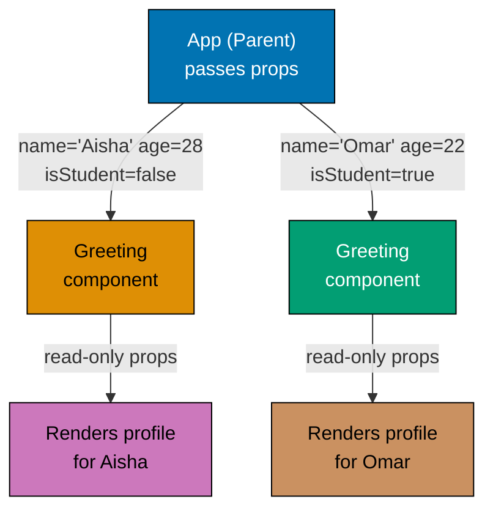
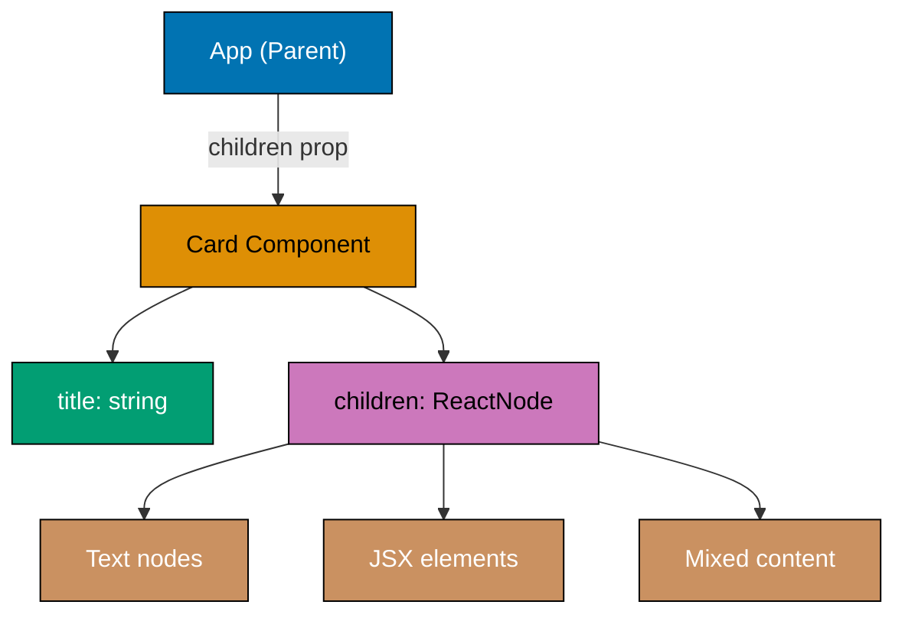
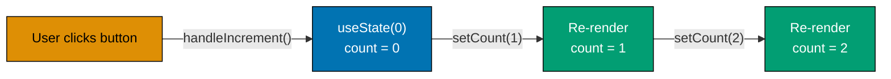
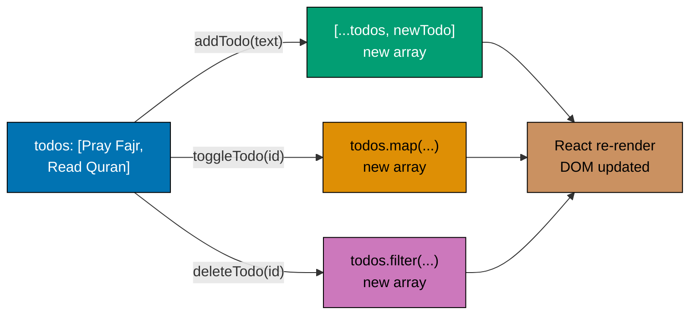
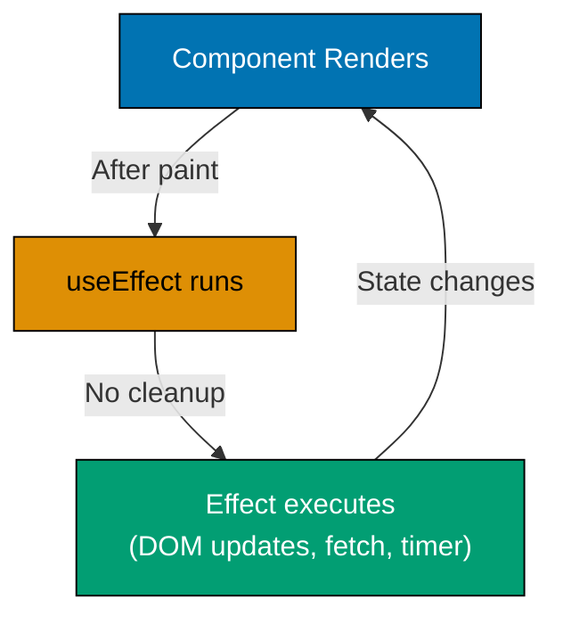
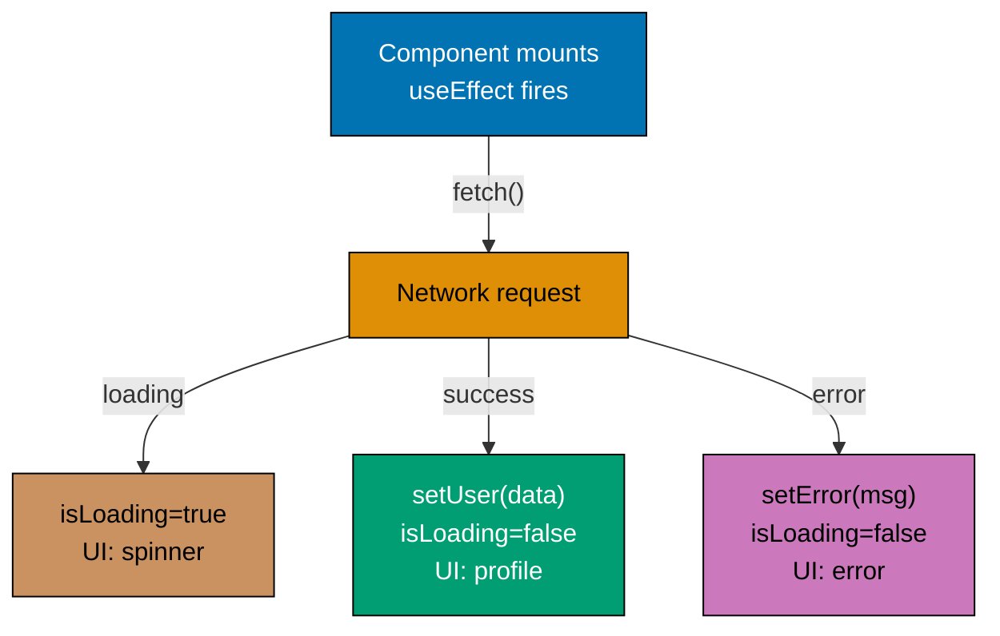
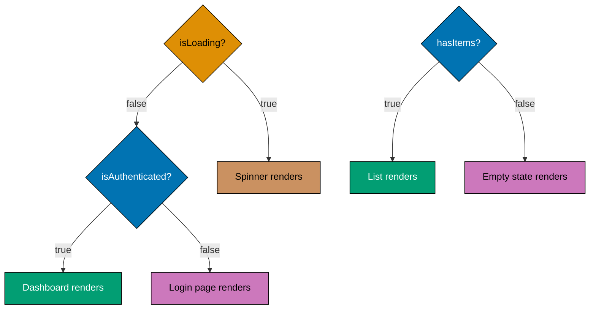
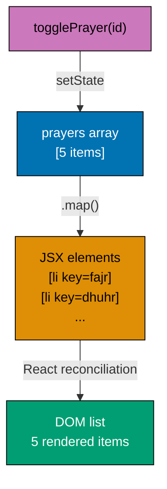
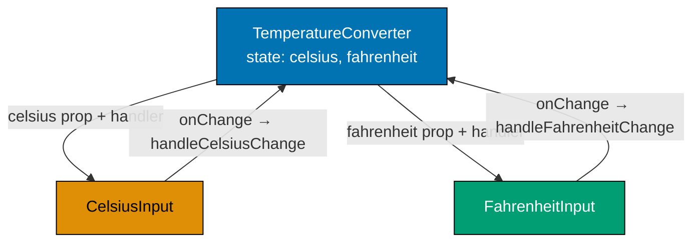
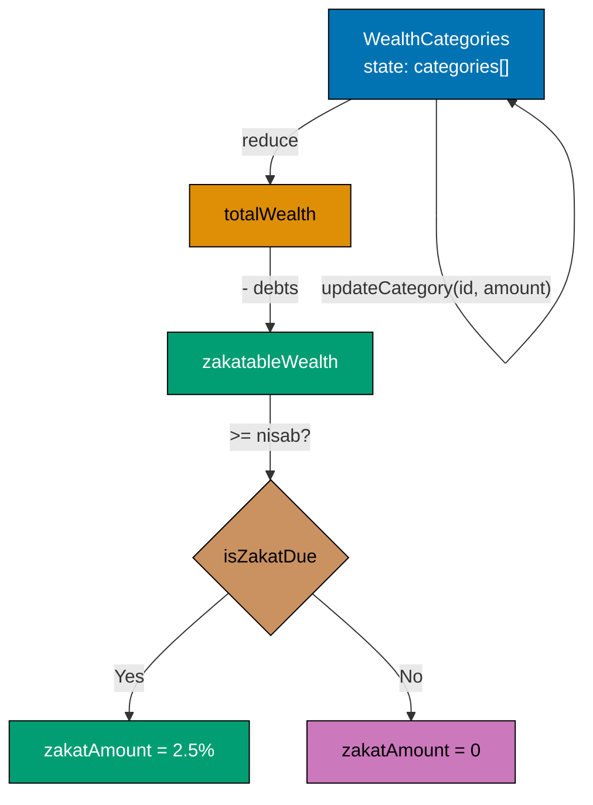

This beginner tutorial covers fundamental React + TypeScript concepts through 25 heavily annotated examples. Each example maintains 1-2.25 comment lines per code line to ensure deep understanding.

## Prerequisites

Before starting, ensure you understand:

- JavaScript ES6+ (arrow functions, destructuring, spread/rest operators)
- TypeScript basics (types, interfaces, generics)
- HTML/CSS fundamentals
- Basic programming concepts (variables, functions, loops)

## Group 1: React + TypeScript Fundamentals

### Example 1: First React Component with TypeScript

React components are TypeScript functions that return JSX. Function components use explicit type annotations for props.

```typescript
// App.tsx
// => React component: TypeScript function returning JSX
// => Component names must start with capital letter (PascalCase)
function App() {
  // => Simplest component: no props, no state
  return (
    // => Must return single root element (here: div)
    <div>
      {/* => JSX: JavaScript XML syntax, compiles to React.createElement() */}
      <h1>Welcome to React</h1>
      {/* => Rendered as DOM <h1>Welcome to React</h1> */}

      <p>This is your first component.</p>
      {/* => Rendered as DOM <p>This is your first component.</p> */}
    </div>
    // => Alternative: use Fragment <> </> to avoid wrapper div
  );
}

// => Export for use in other files: import App from './App'
export default App;
```

**Key Takeaway**: React components are TypeScript functions that return JSX. They must start with capital letters and return a single root element.

**Why It Matters**: React's component model is the foundation of every modern React application in production. Understanding that components are TypeScript functions lets you apply standard TypeScript patterns - generics, utility types, function overloads - directly to UI building blocks. Every React codebase you encounter structures its entire architecture around composable function components. When you debug a production app, trace a performance issue, or onboard to a new codebase, you navigate a tree of these components. This mental model is essential from the first line of React code you write.

### Example 2: JSX and TSX Syntax

JSX combines HTML-like syntax with TypeScript expressions. Use curly braces for dynamic values.

```typescript
// => .tsx file extension supports TypeScript + JSX syntax
function JsxDemo() {
  // => Variables re-created on every render
  const name = "Fatima";                    // => "Fatima" (inferred type: string)
  const age = 25;                            // => 25 (inferred type: number)
  const isStudent = true;                    // => true (inferred type: boolean)

  // => Template literal evaluated at render time
  const greeting = `Salam, ${name}!`;        // => "Salam, Fatima!"

  return (
  // => Returns JSX element tree
    <div>
      {/* => Curly braces {} embed TypeScript expressions */}
      <h1>{greeting}</h1>
      {/* => Output: <h1>Salam, Fatima!</h1> */}

      <p>Age: {age}</p>
      {/* => Numbers auto-convert to strings. Output: <p>Age: 25</p> */}

      <p>Status: {isStudent ? "Student" : "Not Student"}</p>
      {/* => Ternary: isStudent is true → "Student" */}

      <p>Age in 5 years: {age + 5}</p>
      {/* => Arithmetic in JSX: 25 + 5 = 30 */}
    </div>
  );
}

export default JsxDemo;


```

**Key Takeaway**: Use curly braces `{}` in JSX to embed TypeScript expressions. Any valid TypeScript expression works: variables, functions, operators, ternaries.

**Why It Matters**: JSX is not just syntax sugar - it's the mechanism that makes React's declarative model readable and maintainable. Production React codebases contain thousands of JSX expressions. Understanding curly brace embedding allows you to write dynamic UI that reacts to data changes without manual DOM manipulation. TypeScript's type inference in JSX prevents entire categories of runtime errors: passing numbers where strings are expected, undefined values into required display positions, or wrong data shapes to components. This pattern appears in every React component you'll ever write.

### Example 3: Component Props with Interfaces

Props pass data from parent to child components. Use TypeScript interfaces for type safety.



**Props flow**: Parent controls child data through one-way prop passing.

```typescript
// => Interface defines prop types - TypeScript validates at compile time
interface GreetingProps {
  name: string;                              // => Required prop (no ? optional marker)
  age: number;                               // => Number type enforced
  isStudent: boolean;                        // => Boolean type enforced
}

// => Props destructured with type annotation
// => Missing props cause compile-time error
function Greeting({ name, age, isStudent }: GreetingProps) {
  // => Props are read-only (immutable)
  // => Alternative syntax: function Greeting(props: GreetingProps)

  return (
  // => Returns JSX element tree
    <div>
    {/* => Container div for layout grouping */}
      <h2>Profile: {name}</h2>
      {/* => One-way data flow: parent → child */}

      <p>Age: {age}</p>
      {/* => Numbers auto-convert to strings */}

      <p>Status: {isStudent ? "Student" : "Professional"}</p>
      {/* => Conditional using prop value */}
    </div>
  );
}

// => Parent component controls child's props
function App() {
  return (
  // => Returns JSX element tree
    <div>
      {/* => String props use quotes, number/boolean props use curly braces */}
      <Greeting name="Aisha" age={28} isStudent={false} />
      {/* => Props: { name: "Aisha", age: 28, isStudent: false } */}

      <Greeting name="Omar" age={22} isStudent={true} />
      {/* => Same component, different data (reusability) */}
    </div>
  );
}

export default App;


```

**Key Takeaway**: Define prop types with TypeScript interfaces. Destructure props in component parameter. Props are read-only and flow one-way from parent to child.

**Why It Matters**: TypeScript interfaces for props are the primary documentation and contract mechanism in React production code. When you use a component, the interface tells you exactly what data it needs and what types are acceptable - no need to read the implementation. Teams rely on this contract to safely refactor components: change an interface and TypeScript immediately shows every call site that needs updating. In large codebases with hundreds of components, typed props prevent integration bugs that would otherwise only surface at runtime, saving significant debugging time.

### Example 4: Children Props Pattern

The `children` prop passes nested JSX content to components. Use `ReactNode` type for flexibility.



```typescript
import { ReactNode } from 'react';          // => ReactNode: type for all renderable content

// => ReactNode accepts any valid JSX: elements, strings, numbers, arrays, fragments
interface CardProps {
  title: string;                             // => Card header text
  children: ReactNode;                       // => Content nested between <Card>...</Card>
                                             // => React automatically passes this special prop
}

// => Layout component providing consistent styling
function Card({ title, children }: CardProps) {
  return (
    // => Inline styles use object with camelCase properties
    <div style={{ border: '1px solid #ccc', padding: '16px', margin: '8px' }}>
    {/* => Container div with inline styles */}
      <h3>{title}</h3>
      {/* => title prop renders as header */}

      <div>
      {/* => Container div for layout grouping */}
        {children}
        {/* => children renders whatever parent passed between tags */}
      </div>
    </div>
  );
}

// => Parent using Card with different children content
function App() {
  return (
  // => Returns JSX element tree
    <div>
    {/* => Container div for layout grouping */}
      <Card title="Zakat Information">
        {/* => Everything between <Card> and </Card> becomes children prop */}
        <p>Annual wealth threshold: 85g gold</p>
        {/* => Paragraph: "Annual wealth threshold: 85g gold" */}
        <p>Rate: 2.5% of qualifying wealth</p>
        {/* => Two <p> elements passed as children */}
      </Card>

      <Card title="Prayer Times">
        {/* => Different content, same Card styling */}
        <ul>
        {/* => Unordered list of items */}
          <li>Fajr: 5:30 AM</li>
          <li>Dhuhr: 12:45 PM</li>
        </ul>
        {/* => <ul> element with list items passed as children */}
        {/* => Card component handles any valid JSX */}
      </Card>
    </div>
  );
}

export default App;


```

**Key Takeaway**: Use `children` prop for component composition. Type it as `ReactNode` to accept any JSX content. This pattern enables flexible, reusable layout components.

**Why It Matters**: The children pattern enables the Component Composition strategy that React applications rely on for UI flexibility. Instead of creating separate components for every layout variation, you create layout components that accept any content as children. This pattern powers virtually every UI library: modals, cards, tooltips, sidebars, and panels all use children to remain content-agnostic. Production applications use children extensively to separate structural concerns (layout, styling) from content concerns (data, business logic), making both independently maintainable and testable.

### Example 5: Default Props with TypeScript

Use optional props with default values for flexibility. TypeScript ensures type safety.

```typescript
// => Optional props use ? suffix
interface ButtonProps {
  text: string;                              // => Required: button label
  variant?: 'primary' | 'secondary';         // => Optional: union type literal
  disabled?: boolean;                        // => Optional: boolean
}

// => ES6 destructuring with default values for optional props
function Button({
  text,
  variant = 'primary',                       // => Defaults to 'primary'
  disabled = false                           // => Defaults to false
}: ButtonProps) {
  // => Compute styles based on variant
  const backgroundColor = variant === 'primary' ? '#0173B2' : '#DE8F05';
  // => primary: blue, secondary: orange

  const color = variant === 'primary' ? '#fff' : '#000';
  // => primary: white text, secondary: black text

  return (
  // => Returns JSX element tree
    <button
      disabled={disabled}
      {/* => disabled: prevents interaction when true */}
      style={{ backgroundColor, color, padding: '8px 16px', border: 'none' }}
    >
      {text}
    </button>
  );
}

function App() {
  return (
  // => Returns JSX element tree
    <div>
    {/* => Container div for layout grouping */}
      <Button text="Submit" />
      {/* => Uses defaults: variant='primary', disabled=false */}

      <Button text="Cancel" variant="secondary" />
      {/* => Overrides variant: orange button */}

      <Button text="Disabled" disabled={true} />
      {/* => Overrides disabled: grayed out */}
    </div>
  );
}

export default App;


```

**Key Takeaway**: Use optional props (`?`) with default parameter values for flexibility. TypeScript enforces type safety even with defaults. Destructure with `=` to provide fallback values.

**Why It Matters**: Default props reduce the surface area of required configuration in production components. When a component works sensibly without every prop being specified, it becomes easier to use and less likely to be misused. The TypeScript pattern of optional props with defaults provides the best of both worlds: callers see exactly which props exist (full interface), but only need to provide the ones that differ from sensible defaults. This principle - sensible defaults with override capability - is fundamental to building component libraries and design systems that teams actually adopt.

## Group 2: State Management Basics

### Example 6: useState Hook with TypeScript

State stores component data that changes over time. `useState` returns current value and setter function.



**State update cycle**: useState triggers re-render when setter called.

```typescript
import { useState } from 'react';           // => Hook for managing component state
                                             // => Must call in component body (not conditionals)

function Counter() {
  // => Returns tuple: [currentValue, setterFunction]
  const [count, setCount] = useState<number>(0);
  // => count is 0 initially (type: number)
  // => setCount triggers re-render with new value
  // => TypeScript infers number from initial value (could omit <number>)

  // => Event handler recreated each render
  const handleIncrement = () => {
    setCount(count + 1);                     // => count + 1: e.g., 0 + 1 = 1
    // => setCount schedules re-render (asynchronous)
    // => console.log(count) here shows OLD value (async update)
  };

  return (
  // => Returns JSX element tree
    <div>
      <p>Count: {count}</p>
      {/* => Displays current state: "Count: 0", then "Count: 1", etc. */}

      <button onClick={handleIncrement}>Increment</button>
      {/* => onClick receives function reference (not call) */}
      {/* => Click → handleIncrement → setCount(1) → re-render → count = 1 */}
    </div>
  );
}

export default Counter;

```

**Key Takeaway**: Use `useState` to store values that change over time. Calling the setter function triggers re-render with new value. State updates are asynchronous.

**Why It Matters**: useState is the core mechanism for reactivity in React applications. Understanding that state updates are asynchronous and trigger re-renders is essential for avoiding the two most common React bugs: reading stale state values immediately after setting them, and creating infinite render loops by setting state unconditionally in the render body. Every interactive feature in a production React application - forms, toggles, counters, modals, loading states - is built on useState or its more powerful counterparts. This hook is the entry point to React's reactive programming model.

### Example 7: Multiple State Variables

Each piece of independent state should be its own `useState` call. Group related state.

```typescript
import { useState } from 'react';

function DonationForm() {
  // => Separate useState for each independent value
  const [amount, setAmount] = useState<number>(0);
  // => amount: 0 (number)

  const [donorName, setDonorName] = useState<string>('');
  // => donorName: '' (string)

  const [isAnonymous, setIsAnonymous] = useState<boolean>(false);
  // => isAnonymous: false (boolean)

  // => Event handler converts string to number
  const handleAmountChange = (e: React.ChangeEvent<HTMLInputElement>) => {
    setAmount(Number(e.target.value));       // => e.target.value: string → Number()
  };

  const handleSubmit = () => {
    console.log({ amount, donorName, isAnonymous });
    // => Example log: { amount: 100, donorName: "Fatima", isAnonymous: false }
  };

  return (
  // => Returns JSX element tree
    <div>
    {/* => Container div for layout grouping */}
      <input
        type="number"
        {/* => type: "number" input type */}
        value={amount}
        {/* => Controlled input: state → UI */}
        onChange={handleAmountChange}
        {/* => onChange: fires on every change → state update */}
        placeholder="Amount"
        {/* => placeholder: "Amount" */}
      />

      <input
        type="text"
        {/* => type: "text" input type */}
        value={donorName}
        {/* => value: controlled by state (state → UI) */}
        onChange={(e) => setDonorName(e.target.value)}
        {/* => Inline handler */}
        placeholder="Donor Name"
        {/* => placeholder: "Donor Name" */}
      />

      <label>
      {/* => Label element for form input */}
        <input
          type="checkbox"
          {/* => type: "checkbox" input type */}
          checked={isAnonymous}
          {/* => checked: boolean state → checkbox UI */}
          onChange={(e) => setIsAnonymous(e.target.checked)}
          {/* => e.target.checked: boolean */}
        />
        Anonymous Donation
      </label>

      <button onClick={handleSubmit}>Submit Donation</button>
      {/* => Button "Submit Donation" - triggers onClick handler */}
    </div>
  );
}

export default DonationForm;


```

**Key Takeaway**: Use multiple `useState` calls for independent state variables. Each state has its own setter. Group related state into single object if they always change together.

**Why It Matters**: Choosing between single-object state and multiple useState calls is a daily decision in production React. Grouping related state (form fields that submit together) in a single object simplifies reset operations and makes the relationship explicit. Separating independent state (a modal flag and an active item) into individual hooks ensures that changing one doesn't trigger unnecessary renders of components using the other. Production performance tuning often involves splitting or grouping state variables to minimize re-render scope. This pattern directly impacts application responsiveness at scale.

### Example 8: State with Objects

When state is an object, create new object when updating. Never mutate state directly.

```typescript
import { useState } from 'react';

// => Type for user object
// => Define structure for state
interface User {
  name: string;                              // => User's full name
  email: string;                             // => Email address
  age: number;                               // => Age in years
}

function UserProfile() {
  // => State as object with explicit type
  // => Object state groups related values
  const [user, setUser] = useState<User>({
    name: 'Aisha',                           // => Initial name value
    email: 'aisha@example.com',              // => Initial email value
    age: 28                                  // => Initial age value
  });
  // => user is { name: 'Aisha', email: 'aisha@example.com', age: 28 }
  // => Single state variable for entire user object
  // => Alternative: 3 separate useState calls (less cohesive)

  // => Update single property immutably
  // => CRITICAL: Never mutate state directly (user.name = 'x' - WRONG)
  const updateName = (newName: string) => {
    setUser({ ...user, name: newName });     // => Spread operator creates new object
                                             // => {...user} copies all properties (shallow copy)
    // => ...user expands to: name: 'Aisha', email: 'aisha@example.com', age: 28
    // => name: newName overwrites name property with new value
    // => Result: { name: newName, email: 'aisha@example.com', age: 28 }
    // => New object triggers re-render, old object discarded
  };

  const updateEmail = (newEmail: string) => {
    setUser({ ...user, email: newEmail });   // => New object with updated email
                                             // => Spread preserves name and age
    // => Other properties (name, age) preserved from ...user
    // => Only email changes
  };

  const incrementAge = () => {
    setUser({ ...user, age: user.age + 1 }); // => New object with incremented age
                                             // => user.age reads current value (28)
                                             // => user.age + 1 computes new value (29)
    // => Computes new age, spreads other properties unchanged
    // => Creates entirely new object (immutable update pattern)
  };

  return (
    <div>
      <p>Name: {user.name}</p>
      {/* => Access object property with dot notation */}
      {/* => Displays: "Name: Aisha" initially */}

      <p>Email: {user.email}</p>
      {/* => user.email reads email property */}

      <p>Age: {user.age}</p>
      {/* => user.age reads age property (number) */}

      <button onClick={() => updateName('Fatima')}>Change Name</button>
      {/* => Inline arrow function wraps call with parameter */}
      {/* => onClick expects function, not function call */}
      {/* => () => updateName('Fatima') creates function that calls updateName */}

      <button onClick={() => updateEmail('fatima@example.com')}>Change Email</button>
      {/* => Similar pattern: arrow function with parameter */}

      <button onClick={incrementAge}>Increment Age</button>
      {/* => Direct function reference (incrementAge takes no parameters) */}
      {/* => No arrow wrapper needed */}
    </div>
  );
}

export default UserProfile;
```

**Key Takeaway**: When updating object state, create new object with spread operator (`...`). Never mutate state directly. Spread existing properties and override specific ones.

**Why It Matters**: Immutable object updates are non-negotiable in React. React uses object identity (reference equality) to detect state changes - mutating an object in place does not change its reference, so React sees no change and skips the re-render. This causes silent bugs: the user clicks a button, nothing happens visually, but the underlying data has been corrupted. Understanding the spread operator for immutable updates prevents entire categories of production bugs. This pattern also enables time-travel debugging (Redux DevTools), undo/redo functionality, and React's concurrent rendering optimizations.

### Example 9: State with Arrays

Arrays in state require creating new arrays for updates. Use array methods that return new arrays.



**Immutable array updates**: Always return new arrays, never mutate in place.

```typescript
import { useState } from 'react';

// => Define structure for todo items
interface Todo {
  id: number;                                // => Unique identifier
  text: string;                              // => Description
  completed: boolean;                        // => Completion status
}

function TodoList() {
  // => State holds array of Todo objects
  const [todos, setTodos] = useState<Todo[]>([
    { id: 1, text: 'Pray Fajr', completed: true },
    // => Initial array item object
    { id: 2, text: 'Read Quran', completed: false }
  ]);
  // => Initial: [{ id: 1, text: 'Pray Fajr', completed: true }, { id: 2, ... }]

  // => Add new todo (immutable: spread operator)
  // => NEVER use push/splice - won't trigger re-render
  const addTodo = (text: string) => {
    const newTodo: Todo = {
      id: Date.now(),                        // => Unique ID (timestamp in ms)
      text,                                  // => ES6 shorthand for text: text
      completed: false                       // => New todos start uncompleted
    };
    // => newTodo: { id: 1234567890, text: "Study Fiqh", completed: false }

    setTodos([...todos, newTodo]);           // => [...todos, newTodo]: new array with added item
    // => Immutable update triggers re-render
  };

  // => Toggle completed status using map
  const toggleTodo = (id: number) => {
    setTodos(todos.map(todo =>              // => map: immutable array transformation
      todo.id === id                         // => Find matching todo
        ? { ...todo, completed: !todo.completed }  // => Spread + flip completed
        : todo                               // => Keep other todos unchanged
    ));
    // => Returns new array with one modified object
  };

  // => Remove todo using filter
  const deleteTodo = (id: number) => {
    setTodos(todos.filter(todo => todo.id !== id));
    // => filter: new array excluding todo.id === id
  };

  return (
  // => Returns JSX element tree
    <div>
    {/* => Container div for layout grouping */}
      <ul>
        {/* => Map array to JSX list items */}
        {todos.map(todo => (
        {/* => Maps array to JSX elements */}
          <li key={todo.id}>
            {/* => key prop REQUIRED: unique, stable identifier for React reconciliation */}

            <input
              type="checkbox"
              {/* => type: "checkbox" input type */}
              checked={todo.completed}
              {/* => Controlled component: checked from state */}
              onChange={() => toggleTodo(todo.id)}
              {/* => Arrow function passes todo.id parameter */}
            />

            <span style={{ textDecoration: todo.completed ? 'line-through' : 'none' }}>
              {/* => Conditional styling: strike-through if completed */}
              {todo.text}
            </span>

            <button onClick={() => deleteTodo(todo.id)}>Delete</button>
            {/* => Button "deleteTodo(todo.id)}>Delete" - triggers onClick handler */}
          </li>
        ))}
      </ul>
      {/* => Closes unordered list */}

      <button onClick={() => addTodo('Study Fiqh')}>Add Todo</button>
      {/* => Clicking adds new todo with text "Study Fiqh" */}
    </div>
  );
}

export default TodoList;


```

**Key Takeaway**: Use array methods that return new arrays (`map`, `filter`, `concat`, spread). Never mutate arrays directly (`push`, `splice`). Always provide `key` prop for list items.

**Why It Matters**: Array state patterns are ubiquitous in production applications: todo lists, shopping carts, notification queues, search results, data tables. The requirement to use methods that return new arrays (map, filter, spread) rather than mutating methods (push, splice) enforces the immutability constraint React depends on. The `key` prop requirement exists because React uses keys to match virtual DOM nodes with actual DOM nodes during reconciliation - using array index as key causes incorrect component reuse when items reorder, leading to visual bugs and lost component state that are notoriously difficult to debug.

### Example 10: Functional State Updates

When new state depends on previous state, use functional updates for correct behavior.

```typescript
import { useState } from 'react';

function ZakatCalculator() {
  // => State for wealth amount
  const [wealth, setWealth] = useState<number>(0);
  // => wealth is 0 (type: number)

  // => WRONG: Closure problem
  // => Multiple rapid clicks may use stale wealth value
  const addWealthWrong = (amount: number) => {
    setWealth(wealth + amount);              // => Uses wealth from current render
    // => If clicked 3 times quickly, all 3 updates use same initial wealth
    // => Result: only increments once instead of three times
  };

  // => CORRECT: Functional update
  // => Guarantees correct value even with rapid updates
  const addWealthCorrect = (amount: number) => {
    setWealth(prevWealth => prevWealth + amount);
    // => prevWealth is latest state value from React
    // => Arrow function: (previous) => new
    // => React queues updates, applies in order
    // => Result: all 3 clicks accumulate correctly
  };

  // => Calculate Zakat (2.5% of wealth)
  const calculateZakat = () => {
    setWealth(prevWealth => prevWealth * 0.025);
    // => Functional update: multiply previous by 2.5%
    // => Ensures calculation uses latest wealth value
  };

  // => Reset to zero
  const reset = () => {
    setWealth(0);                            // => Direct value OK when not based on previous
    // => No need for functional update since not using previous state
  };

  return (
  // => Returns JSX element tree
    <div>
    {/* => Container div for layout grouping */}
      <p>Wealth: ${wealth.toFixed(2)}</p>
      {/* => toFixed(2) formats to 2 decimal places */}

      <button onClick={() => addWealthCorrect(1000)}>Add \$1000</button>
      {/* => Functional update handles rapid clicks correctly */}

      <button onClick={calculateZakat}>Calculate Zakat (2.5%)</button>
      {/* => Applies Zakat rate to current wealth */}

      <button onClick={reset}>Reset</button>
      {/* => Button "Reset" - triggers onClick handler */}
    </div>
  );
}

export default ZakatCalculator;


```

**Key Takeaway**: Use functional updates (`setState(prev => newValue)`) when new state depends on previous state. Prevents stale closure bugs. Use direct values when state is independent.

**Why It Matters**: Functional state updates solve a fundamental concurrency problem in React. When multiple state updates are batched (React 18 automatic batching) or when updates happen inside async callbacks, the closure over `state` may be stale. Using the functional form `setState(prev => prev + 1)` always receives the latest state value from React's queue, not the captured closure value. Production applications with rapid user interactions - clicking multiple times quickly, keyboard shortcuts, real-time data updates - require functional updates to avoid lost updates. This pattern becomes critical when building high-frequency interactive features.

## Group 3: Side Effects and Lifecycle

### Example 11: useEffect Basics

`useEffect` runs side effects after render. Use for DOM manipulation, subscriptions, or data fetching.



**useEffect lifecycle**: Runs after every render without dependency array.

```typescript
import { useState, useEffect } from 'react';
// => useState: state management, useEffect: side effects

function DocumentTitleUpdater() {
  const [count, setCount] = useState<number>(0);
  // => count: 0 initially

  // => useEffect runs AFTER render completes
  // => Lifecycle: Render JSX → Update DOM → Run effects
  useEffect(() => {
    // => Effect phase: side effects allowed (DOM, network, timers)
    document.title = `Count: ${count}`;      // => Updates browser tab title
    // => Tab shows "Count: 0", then "Count: 1", etc.

    console.log('Effect ran with count:', count);
    // => Logs: "Effect ran with count: 0", then "Effect ran with count: 1"
  });
  // => No dependency array: runs after EVERY render (usually not ideal)

  return (
  // => Returns JSX element tree
    <div>
    {/* => Container div for layout grouping */}
      <p>Count: {count}</p>
      {/* => Paragraph with content */}

      <button onClick={() => setCount(count + 1)}>Increment</button>
      {/* => Flow: click → setCount → re-render → effect runs */}
    </div>
  );
}

export default DocumentTitleUpdater;


```

**Key Takeaway**: `useEffect` runs side effects after component renders to DOM. Without dependency array, runs after every render. Use for DOM manipulation, subscriptions, or external interactions.

**Why It Matters**: useEffect is React's mechanism for synchronizing with external systems: APIs, DOM manipulation, subscriptions, timers. Production React applications use useEffect for initial data loading, setting up WebSocket connections, integrating third-party libraries that manipulate the DOM directly, and synchronizing state with browser APIs like localStorage. The key insight - effects run after render and optionally return cleanup functions - prevents the most common React memory leak: effects that set state on unmounted components. Understanding useEffect's lifecycle is prerequisite for building any production feature that interacts with systems outside React.

### Example 12: useEffect with Dependencies

Dependency array controls when effect runs. Empty array runs once. Array with values runs when those values change.

```typescript
import { useState, useEffect } from 'react';

function PrayerTimeAlert() {
  const [prayerTime, setPrayerTime] = useState<string>('Fajr');
  // => prayerTime is 'Fajr' initially

  const [alertMessage, setAlertMessage] = useState<string>('');
  // => alertMessage is '' initially

  // => Effect with dependency array
  // => Runs on mount AND when prayerTime changes
  useEffect(() => {
    console.log('Effect running because prayerTime changed to:', prayerTime);
    // => Logs on mount: "Effect running because prayerTime changed to: Fajr"
    // => Logs when changed: "Effect running because prayerTime changed to: Dhuhr"

    setAlertMessage(`Time for ${prayerTime} prayer!`);
    // => Updates alertMessage based on current prayerTime
    // => alertMessage becomes "Time for Fajr prayer!" on mount
  }, [prayerTime]);
  // => Dependency array: [prayerTime]
  // => Effect runs when prayerTime value changes
  // => Changing alertMessage does NOT re-run effect (not in dependencies)

  // => Effect with empty dependency array
  // => Runs ONLY on mount (component first appears)
  useEffect(() => {
    console.log('Component mounted - runs once');
    // => Logs exactly once when component first renders
    // => Never runs again, even after state updates
  }, []);
  // => Empty array: no dependencies to watch
  // => Equivalent to componentDidMount in class components

  return (
    <div>
      <p>{alertMessage}</p>
      {/* => Displays current alert message */}

      <button onClick={() => setPrayerTime('Dhuhr')}>Set Dhuhr</button>
      {/* => Changes prayerTime, triggers first effect */}

      <button onClick={() => setPrayerTime('Asr')}>Set Asr</button>
      {/* => Changes prayerTime, triggers first effect */}
    </div>
  );
}

export default PrayerTimeAlert;
```

**Key Takeaway**: Dependency array controls effect execution. Empty array `[]` runs once on mount. Array with values runs when those values change. Omitting array runs every render.

**Why It Matters**: The dependency array is the most misunderstood aspect of useEffect, responsible for a significant portion of React production bugs. An empty array `[]` makes an effect run once; a populated array makes it run when those values change; omitting the array makes it run on every render. Each case has legitimate uses, but using the wrong case causes either stale closures (outdated values from old renders) or infinite loops (effects that trigger their own re-runs). Production code quality tools like `eslint-plugin-react-hooks` enforce correct dependencies. Understanding why dependencies matter prevents hours of debugging silent data synchronization failures.

### Example 13: useEffect Cleanup

Return cleanup function from effect to prevent memory leaks. Cleanup runs before next effect and on unmount.

```typescript
import { useState, useEffect } from 'react';

function TimerComponent() {
  const [seconds, setSeconds] = useState<number>(0);
  // => seconds: 0, increments every second

  useEffect(() => {
    console.log('Setting up timer');
    // => Setup phase: create timer on mount

    // => setInterval: recurring timer (browser API)
    const intervalId = setInterval(() => {
      setSeconds(prev => prev + 1);          // => Functional update: prev → prev + 1
                                             // => Prevents stale closure, always uses latest value
      // => First run: 0 → 1, second run: 1 → 2, etc.
    }, 1000);
    // => Runs callback every 1000ms (1 second)
    // => intervalId: number (timer reference for cleanup)

    // => Cleanup function runs before next effect or on unmount
    return () => {
      console.log('Cleaning up timer');
      clearInterval(intervalId);             // => Stops timer, prevents memory leak
      // => Without cleanup: timer runs forever, setState on unmounted component (warning)
    };
  }, []);
  // => Empty array []: runs once on mount, cleanup once on unmount

  return (
  // => Returns JSX element tree
    <div>
    {/* => Container div for layout grouping */}
      <p>Timer: {seconds} seconds</p>
      {/* => Updates every second when setInterval calls setSeconds */}
    </div>
  );
}

// => Parent controls timer lifecycle
function App() {
  const [showTimer, setShowTimer] = useState<boolean>(true);
  // => Controls whether TimerComponent is mounted

  return (
  // => Returns JSX element tree
    <div>
    {/* => Container div for layout grouping */}
      <button onClick={() => setShowTimer(!showTimer)}>
        {/* => Toggles showTimer between true and false */}
        {/* => !showTimer flips boolean value */}
        {showTimer ? 'Hide' : 'Show'} Timer
        {/* => Conditional text: "Hide Timer" when true, "Show Timer" when false */}
      </button>

      {showTimer && <TimerComponent />}
      {/* => Conditional rendering with logical AND (&&) */}
      {/* => showTimer true: renders <TimerComponent /> */}
      {/* => showTimer false: renders nothing (component unmounts) */}
      {/* => When showTimer becomes false: cleanup runs, timer cleared */}
    </div>
  );
}

export default App;


```

**Key Takeaway**: Return cleanup function from `useEffect` to prevent memory leaks. Cleanup runs before next effect and when component unmounts. Essential for timers, subscriptions, and event listeners.

**Why It Matters**: Cleanup functions are essential for production application stability. Without cleanup, subscribing to events in useEffect creates multiple stacked subscriptions each time the component re-mounts (strict mode, navigation, authentication changes). Each subscription fires independently, causing duplicate event handling, state updates on unmounted components (React warning and potential crash), and memory leaks that slowly degrade performance. In single-page applications where users navigate without full page refreshes, leaked subscriptions accumulate throughout a session. Every WebSocket connection, event listener, interval timer, and third-party subscription set up in useEffect requires a corresponding cleanup.

### Example 14: Fetching Data with useEffect

Fetch external data in `useEffect` with proper loading and error states.



**Data fetching states**: Loading → success or error, with conditional UI rendering.

```typescript
import { useState, useEffect } from 'react';

// => Type for fetched user data
interface User {
  id: number;
  // => id: numeric value field
  name: string;
  // => name: text value field
  email: string;
  // => email: text value field
}

function UserFetcher() {
  // => State for fetched data
  const [user, setUser] = useState<User | null>(null);
  // => user is null initially (data not loaded yet)
  // => Union type: User object or null

  // => State for loading indicator
  const [loading, setLoading] = useState<boolean>(true);
  // => loading is true initially (fetch in progress)

  // => State for error handling
  const [error, setError] = useState<string | null>(null);
  // => error is null initially (no error yet)

  useEffect(() => {
    // => Fetch data on mount
    console.log('Fetching user data...');

    fetch('https://jsonplaceholder.typicode.com/users/1')
    // => fetch returns Promise<Response>
    // => GET request to public API
      .then(response => response.json())     // => Parse JSON body
      // => response.json() returns Promise<any>
      .then((data: User) => {
        console.log('Fetch successful:', data);
        // => Logs fetched user object

        setUser(data);                       // => Store user in state
        // => Triggers re-render with user data
        setLoading(false);                   // => Hide loading indicator
        // => Triggers re-render showing user
      })
      .catch(err => {
        console.error('Fetch failed:', err);
        // => Logs error to console

        setError('Failed to fetch user data');
        // => Store error message in state
        setLoading(false);                   // => Hide loading indicator
        // => Show error message instead
      });
  }, []);
  // => Empty dependency array: fetch once on mount
  // => No cleanup needed (fetch can't be cancelled easily)

  // => Loading state
  if (loading) {
    return <div>Loading user data...</div>;
    // => Shows while fetch in progress
    // => Early return prevents rendering user data
  }

  // => Error state
  if (error) {
    return <div>Error: {error}</div>;
    // => Shows if fetch failed
    // => Displays error message to user
  }

  // => Success state
  return (
  // => Returns JSX element tree
    <div>
    {/* => Container div for layout grouping */}
      <h2>User Profile</h2>
      {/* => H2: "User Profile" section heading */}
      <p>Name: {user?.name}</p>
      {/* => Optional chaining (?) handles null case */}
      {/* => If user is null, expression returns undefined */}
      <p>Email: {user?.email}</p>
      {/* => Paragraph with content */}
    </div>
  );
}

export default UserFetcher;


```

**Key Takeaway**: Fetch data in `useEffect` with empty dependency array. Track loading and error states separately. Use conditional rendering for loading/error/success states.

**Why It Matters**: Data fetching in useEffect is the pattern that drives virtually every production web application. Understanding the loading state, error state, and success state pattern (`isLoading`, `error`, `data`) gives you the foundation for handling asynchronous data throughout your application. The challenge of canceling in-flight requests when components unmount or dependencies change is a real production concern: if a user navigates away during a slow request, the resolved data should not update state on an unmounted component. This example establishes patterns you'll apply to every data-dependent screen.

### Example 15: useEffect with Async/Await

Use async/await for cleaner data fetching code. Define async function inside effect.

```typescript
import { useState, useEffect } from 'react';

// => Type for Zakat calculation result
interface ZakatCalculation {
  wealth: number;                            // => Total wealth amount
  zakatAmount: number;                       // => Calculated zakat (2.5%)
  date: string;                              // => ISO timestamp
}

function ZakatHistory() {
  const [calculations, setCalculations] = useState<ZakatCalculation[]>([]);
  // => calculations: [] initially, filled after fetch

  const [loading, setLoading] = useState<boolean>(true);
  // => loading: true initially, false after fetch completes
  const [error, setError] = useState<string | null>(null);
  // => error: null initially, error message if fetch fails

  useEffect(() => {
    // => Define async function inside effect (can't make callback itself async)
    const fetchCalculations = async () => {
      try {
        console.log('Fetching Zakat calculations...');
        // => Log: "Fetching Zakat calculations..."

        // => await pauses execution until fetch completes
        const response = await fetch('https://jsonplaceholder.typicode.com/posts?_limit=3');
        // => response: Response object with status, headers, body
        // => _limit=3: fetch only 3 items

        if (!response.ok) {
          // => response.ok: true for 200-299, false otherwise
          throw new Error(`HTTP error! status: ${response.status}`);
          // => Throws for 4xx/5xx errors, caught by catch block
        }

        // => await pauses until JSON parsing completes
        const data = await response.json();
        // => data: parsed array of objects

        console.log('Fetch successful, received:', data.length, 'items');
        // => Log: "Fetch successful, received: 3 items"

        // => Transform API data to ZakatCalculation type
        const mapped: ZakatCalculation[] = data.map((item: any) => ({
          wealth: item.id * 10000,           // => Mock: id 1 → \$10000 wealth
          zakatAmount: item.id * 250,        // => Mock: 2.5% rate → id 1 → \$250
          date: new Date().toISOString()     // => Current timestamp in ISO format
        }));
        // => mapped: [{ wealth: 10000, zakatAmount: 250, date: "..." }, ...]

        setCalculations(mapped);             // => Update state with fetched data
        setLoading(false);                   // => Hide loading indicator

      } catch (err) {
        // => Catches fetch errors, network errors, or JSON parsing errors
        console.error('Error fetching calculations:', err);

        setError(err instanceof Error ? err.message : 'Unknown error');
        // => Type guard extracts message if Error, else fallback string
        setLoading(false);                   // => Hide loading even on error
      }
    };

    fetchCalculations();                     // => Invoke async function
    // => Returns Promise (not awaited - useEffect can't be async)
  }, []);
  // => []: runs once on mount

  if (loading) return <div>Loading calculations...</div>;
  // => Early return shows loading state
  if (error) return <div>Error: {error}</div>;
  // => Early return shows error state

  return (
  // => Returns JSX element tree
    <div>
    {/* => Container div for layout grouping */}
      <h2>Zakat Calculation History</h2>
      {/* => H2: "Zakat Calculation History" section heading */}
      <ul>
      {/* => Unordered list of items */}
        {calculations.map((calc, index) => (
        {/* => Maps array to JSX elements */}
          <li key={index}>
            {/* => Using index as key (OK here - static list, no reordering) */}
            Wealth: ${calc.wealth} → Zakat: ${calc.zakatAmount}
            {/* => Example output: "Wealth: $10000 → Zakat: $250" */}
          </li>
        ))}
      </ul>
      {/* => Closes unordered list */}
    </div>
  );
}

export default ZakatHistory;


```

**Key Takeaway**: Define async function inside `useEffect`, then call it immediately. Can't make effect callback itself async. Use try/catch for error handling with async/await.

**Why It Matters**: Async/await in useEffect requires the internal async function pattern because the effect callback itself cannot be async (effects must return a cleanup function or nothing, not a Promise). This pattern is the foundation for data fetching in production: structured error handling with try/catch, request cancellation with AbortController, and sequential operations that depend on previous results. Real applications fetch user data, then user-specific settings, then related records - each awaiting the previous. Understanding this pattern enables you to implement complex data loading flows that are readable and maintainable.

## Group 4: Event Handling and Forms

### Example 16: Click Event Handlers

React events are synthetic events wrapping browser events. Use camelCase event names.

```typescript
import { useState } from 'react';

function DonationButton() {
  const [donations, setDonations] = useState<number>(0);
  // => donations is 0 initially

  // => Event handler with no parameters
  const handleDonation = () => {
    console.log('Donation button clicked');
    // => Logs to console on every click

    setDonations(prev => prev + 1);          // => Functional update
    // => Increments donation count
  };

  // => Event handler with event parameter
  // => React.MouseEvent<HTMLButtonElement> is synthetic event type
  const handleDonationWithEvent = (e: React.MouseEvent<HTMLButtonElement>) => {
    console.log('Button clicked at:', e.clientX, e.clientY);
    // => Logs mouse position relative to viewport
    // => e.clientX is horizontal position
    // => e.clientY is vertical position

    console.log('Button text:', e.currentTarget.textContent);
    // => e.currentTarget is button element that handler attached to
    // => textContent is button's text

    setDonations(prev => prev + 1);
  };

  // => Event handler with custom parameter
  const handleDonationAmount = (amount: number) => {
    console.log('Donating:', amount);
    // => Logs donation amount

    setDonations(prev => prev + amount);     // => Add specific amount
  };

  return (
  // => Returns JSX element tree
    <div>
    {/* => Container div for layout grouping */}
      <p>Total Donations: {donations}</p>
      {/* => Paragraph with content */}

      <button onClick={handleDonation}>
        {/* => onClick expects function, not function call */}
        {/* => Correct: onClick={handleDonation} */}
        {/* => Wrong: onClick={handleDonation()} - calls immediately */}
        Donate \$1
      </button>

      <button onClick={handleDonationWithEvent}>
      {/* => Button: triggers click handler */}
        Donate \$1 (with event)
      </button>

      <button onClick={() => handleDonationAmount(5)}>
        {/* => Inline arrow function to pass parameter */}
        {/* => Arrow function delays execution until click */}
        Donate \$5
      </button>

      <button onClick={() => handleDonationAmount(10)}>
      {/* => Button: triggers click handler */}
        Donate \$10
      </button>
    </div>
  );
}

export default DonationButton;


```

**Key Takeaway**: Pass function reference to event handlers, not function call. Use arrow functions for handlers with parameters. React synthetic events wrap browser events with consistent API.

**Why It Matters**: Event handling is where React applications become interactive. Understanding that React uses synthetic events (cross-browser wrappers), that event handlers should be function references not function calls, and that `e.preventDefault()` is needed for form submissions and link clicks prevents the most common event handling mistakes in production. Production applications handle dozens of event types across hundreds of components. The TypeScript event types (`React.MouseEvent`, `React.ChangeEvent`) catch parameter access errors at compile time, preventing runtime exceptions when users interact with your application.

### Example 17: Form Input Events

Handle input changes with `onChange` event. Synthetic event type depends on input element.

```typescript
import { useState } from 'react';

function RegistrationForm() {
  const [name, setName] = useState<string>('');
  const [email, setEmail] = useState<string>('');
  const [age, setAge] = useState<number>(0);

  // => Text input handler
  // => React.ChangeEvent<HTMLInputElement> for text inputs
  const handleNameChange = (e: React.ChangeEvent<HTMLInputElement>) => {
    console.log('Name changed to:', e.target.value);
    // => e.target is input element
    // => e.target.value is string (current input value)

    setName(e.target.value);                 // => Update state with input value
  };

  // => Inline handler for email
  const handleEmailChange = (e: React.ChangeEvent<HTMLInputElement>) => {
    setEmail(e.target.value);                // => Direct state update
    // => No need for separate function if just updating state
  };

  // => Number input handler
  const handleAgeChange = (e: React.ChangeEvent<HTMLInputElement>) => {
    const value = Number(e.target.value);    // => Convert string to number
    // => Input values are always strings
    // => Number() converts to number type

    console.log('Age changed to:', value, 'Type:', typeof value);
    // => Logs: "Age changed to: 25 Type: number"

    setAge(value);                           // => Store as number
  };

  // => Textarea handler
  // => React.ChangeEvent<HTMLTextAreaElement> for textareas
  const [bio, setBio] = useState<string>('');
  const handleBioChange = (e: React.ChangeEvent<HTMLTextAreaElement>) => {
    setBio(e.target.value);                  // => Same as input, different element type
    // => Synthetic event API consistent across element types
  };

  return (
  // => Returns JSX element tree
    <form>
    {/* => Form element */}
      <div>
      {/* => Container div for layout grouping */}
        <label>Name:</label>
        <input
          type="text"
          {/* => type: "text" input type */}
          value={name}
          {/* => Controlled input: value from state */}
          onChange={handleNameChange}
          {/* => onChange fires on every keystroke */}
        />
        {/* => Current value: {name} */}
      </div>

      <div>
      {/* => Container div for layout grouping */}
        <label>Email:</label>
        <input
          type="email"
          {/* => type: "email" input type */}
          value={email}
          {/* => value: controlled by state (state → UI) */}
          onChange={handleEmailChange}
          {/* => Inline handler (no separate function) */}
        />
      </div>

      <div>
      {/* => Container div for layout grouping */}
        <label>Age:</label>
        <input
          type="number"
          {/* => type: "number" input type */}
          value={age}
          {/* => value: controlled by state (state → UI) */}
          onChange={handleAgeChange}
          {/* => Number input still returns string value */}
        />
      </div>

      <div>
      {/* => Container div for layout grouping */}
        <label>Bio:</label>
        <textarea
        {/* => textarea: multi-line text input */}
          value={bio}
          {/* => value: controlled by state (state → UI) */}
          onChange={handleBioChange}
          {/* => textarea uses value prop (not children) */}
          rows={4}
          {/* => rows prop */}
        />
      </div>

      <p>Form Data: {JSON.stringify({ name, email, age, bio }, null, 2)}</p>
      {/* => Display current form state */}
    </form>
    {/* => Closes form element */}
  );
}

export default RegistrationForm;


```

**Key Takeaway**: Use `onChange` for input events. Event type varies by element (HTMLInputElement, HTMLTextAreaElement, etc.). Input values are always strings - convert to numbers when needed.

**Why It Matters**: Form input event handling is the foundation of every data entry feature in production applications. The `React.ChangeEvent<HTMLInputElement>` type gives full TypeScript safety on event object properties, catching bugs like accessing `e.target.checked` on a text input or `e.target.value` on a checkbox. Production forms handle text inputs, selects, textareas, checkboxes, radio buttons, and file inputs - each with different event object shapes. Understanding how to type each event correctly ensures that form data is processed correctly before being sent to APIs or stored in state.

### Example 18: Controlled Components

Controlled components derive value from state. React state is single source of truth.

```typescript
import { useState } from 'react';

function DonationAmountForm() {
  // => All input values stored in state
  const [amount, setAmount] = useState<number>(0);
  const [currency, setCurrency] = useState<string>('USD');
  const [recurring, setRecurring] = useState<boolean>(false);

  // => Number input handler with validation
  const handleAmountChange = (e: React.ChangeEvent<HTMLInputElement>) => {
    const value = Number(e.target.value);

    if (value < 0) {
      console.log('Negative amount rejected');
      return;                                // => Reject negative values
      // => State doesn't update, input shows previous value
    }

    setAmount(value);                        // => Accept non-negative values
  };

  // => Select dropdown handler
  // => React.ChangeEvent<HTMLSelectElement> for select elements
  const handleCurrencyChange = (e: React.ChangeEvent<HTMLSelectElement>) => {
    console.log('Currency changed to:', e.target.value);
    // => e.target.value is selected option value

    setCurrency(e.target.value);             // => Update currency state
  };

  // => Checkbox handler
  const handleRecurringChange = (e: React.ChangeEvent<HTMLInputElement>) => {
    console.log('Recurring changed to:', e.target.checked);
    // => e.target.checked is boolean (not value)
    // => true when checked, false when unchecked

    setRecurring(e.target.checked);          // => Update boolean state
  };

  return (
  // => Returns JSX element tree
    <form>
    {/* => Form element */}
      <div>
      {/* => Container div for layout grouping */}
        <label>Amount:</label>
        <input
          type="number"
          {/* => type: "number" input type */}
          value={amount}
          {/* => value controlled by state */}
          {/* => React prevents typing that would violate state */}
          onChange={handleAmountChange}
          {/* => onChange: fires on every change → state update */}
          min="0"
          {/* => HTML validation attribute (additional check) */}
        />
      </div>

      <div>
      {/* => Container div for layout grouping */}
        <label>Currency:</label>
        <select value={currency} onChange={handleCurrencyChange}>
          {/* => value prop on select (not option) */}
          {/* => Controls which option selected */}
          <option value="USD">USD</option>
          {/* => Option: value="USD" displays "USD" */}
          <option value="EUR">EUR</option>
          {/* => Option: value="EUR" displays "EUR" */}
          <option value="IDR">IDR</option>
          {/* => option values match state values */}
        </select>
        {/* => Closes select dropdown */}
      </div>

      <div>
      {/* => Container div for layout grouping */}
        <label>
        {/* => Label element for form input */}
          <input
            type="checkbox"
            {/* => type: "checkbox" input type */}
            checked={recurring}
            {/* => checked prop (not value) for checkboxes */}
            {/* => Controls checkbox state */}
            onChange={handleRecurringChange}
            {/* => onChange: fires on every change → state update */}
          />
          Recurring Monthly Donation
        </label>
      </div>

      <p>
      {/* => Paragraph with content */}
        You are donating: {amount} {currency}
        {recurring ? ' monthly' : ' one-time'}
        {/* => Ternary conditional rendering */}
      </p>
    </form>
    {/* => Closes form element */}
  );
}

export default DonationAmountForm;


```

**Key Takeaway**: Controlled components use `value` (or `checked`) prop from state. State is single source of truth. React controls input value - allows validation before updating state.

**Why It Matters**: Controlled components are React's authoritative model for form state management. The controlled pattern (state → UI → event → state) gives you complete control: you can validate before updating, transform values, prevent certain inputs, or synchronize multiple fields. The alternative (uncontrolled components) requires refs and manual DOM queries, losing React's type safety and making values inaccessible without DOM queries. Production applications use controlled components for form validation, field dependencies (show this field if that field has a specific value), and complex form logic. This is the standard pattern for form implementation.

### Example 19: Form Submission

Handle form submission with `onSubmit` event. Prevent default browser behavior.

```typescript
import { useState } from 'react';

// => Define structure for all form fields
interface DonationFormData {
  donorName: string;                         // => Donor's name
  amount: number;                            // => Donation amount
  message: string;                           // => Optional message
}

function DonationSubmitForm() {
  // => Store all form fields in single state object
  const [formData, setFormData] = useState<DonationFormData>({
    donorName: '',                           // => Initial values: empty string
    amount: 0,                               // => Initial: zero
    message: ''
  });
  // => Initial state: { donorName: '', amount: 0, message: '' }

  const [submitted, setSubmitted] = useState<boolean>(false);
  // => Tracks submission status
  const [submittedData, setSubmittedData] = useState<DonationFormData | null>(null);
  // => Stores submitted values (null until submitted)

  // => Generic handler for all inputs (reduces code duplication)
  const handleChange = (e: React.ChangeEvent<HTMLInputElement | HTMLTextAreaElement>) => {
    const { name, value } = e.target;        // => Destructure: name attribute & current value
                                             // => value is always string from DOM

    setFormData(prev => ({
      ...prev,                               // => Spread preserves unchanged fields
      [name]: name === 'amount' ? Number(value) : value
      // => Computed property: uses name to update correct field
      // => Convert amount to number, keep others as string
    }));
  };

  // => Form submit handler
  const handleSubmit = (e: React.FormEvent<HTMLFormElement>) => {
    e.preventDefault();                      // => CRITICAL: prevents page refresh
    // => Without this, all React state would be lost

    console.log('Form submitted:', formData);
    // => Log: { donorName: "Fatima", amount: 100, message: "..." }

    // => Client-side validation (also validate on server)
    if (formData.amount <= 0) {
      alert('Amount must be greater than 0');
      return;                                // => Early return stops invalid submission
    }

    if (formData.donorName.trim() === '') {
      // => .trim() prevents submitting whitespace
      alert('Name is required');
      return;
    }

    // => Process valid submission
    setSubmittedData(formData);              // => Preserve data for display
    setSubmitted(true);                      // => Show success message

    // => Reset form for next donation
    setFormData({ donorName: '', amount: 0, message: '' });
    // => Controlled inputs sync with reset state
  };

  // => Conditional render: success message
  if (submitted && submittedData) {
    return (
    // => Returns JSX element tree
      <div>
      {/* => Container div for layout grouping */}
        <h2>Thank you for your donation!</h2>
        {/* => H2: "Thank you for your donation!" section heading */}
        <p>Donor: {submittedData.donorName}</p>
        {/* => Paragraph with content */}
        <p>Amount: ${submittedData.amount}</p>
        {/* => Paragraph with content */}
        <p>Message: {submittedData.message}</p>
        {/* => Paragraph with content */}
        <button onClick={() => setSubmitted(false)}>Make Another Donation</button>
        {/* => Button "setSubmitted(false)}>Make Another Donation" - triggers onClick handler */}
      </div>
    );
  }

  // => Render form (default state)
  return (
  // => Returns JSX element tree
    <form onSubmit={handleSubmit}>
      {/* => onSubmit on form (not button) - triggered by submit button or Enter key */}

      <div>
      {/* => Container div for layout grouping */}
        <label>Donor Name:</label>
        <input
          type="text"
          {/* => type: "text" input type */}
          name="donorName"
          {/* => name attribute matches state property (handleChange uses this) */}
          value={formData.donorName}
          {/* => value: controlled by state (state → UI) */}
          onChange={handleChange}
          {/* => onChange: fires on every change → state update */}
          required
        />
      </div>

      <div>
      {/* => Container div for layout grouping */}
        <label>Amount ($):</label>
        <input
          type="number"
          {/* => type: "number" input type */}
          name="amount"
          {/* => name: "amount" */}
          value={formData.amount}
          {/* => value: controlled by state (state → UI) */}
          onChange={handleChange}
          {/* => onChange: fires on every change → state update */}
          required
        />
      </div>

      <div>
      {/* => Container div for layout grouping */}
        <label>Message (optional):</label>
        <textarea
        {/* => textarea: multi-line text input */}
          name="message"
          {/* => name: "message" */}
          value={formData.message}
          {/* => textarea uses value prop (not children) */}
          onChange={handleChange}
          {/* => onChange: fires on every change → state update */}
          rows={3}
          {/* => rows prop */}
        />
      </div>

      <button type="submit">Submit Donation</button>
      {/* => type="submit" triggers form onSubmit event */}
    </form>
    {/* => Closes form element */}
  );
}

export default DonationSubmitForm;


```

**Key Takeaway**: Handle form submission with `onSubmit` on form element. Always call `e.preventDefault()` to prevent browser refresh. Use `name` attribute matching state properties for generic handlers.

**Why It Matters**: Form submission handling demonstrates the complete user input lifecycle in production applications. `e.preventDefault()` is non-negotiable: without it, form submission triggers a page navigation that resets all React state. The submission pattern - validate inputs, show loading state, call API, handle success/error, clear or redirect - is repeated across every create, update, and action form in your application. TypeScript typing of the handler function ensures you're writing handler logic that TypeScript validates at every call site. This pattern is the template for every form feature you'll build.

### Example 20: Form Validation Basics

Implement real-time validation with error messages. Validate on blur and on submit.

```typescript
import { useState } from 'react';

// => Type for validation errors
interface FormErrors {
  email?: string;                            // => Optional: only exists if error
  age?: string;
  // => age: optional field (undefined if not provided)
}

function ValidatedRegistrationForm() {
  const [email, setEmail] = useState<string>('');
  // => email: '', updated on input change
  const [age, setAge] = useState<number>(0);
  // => age: 0, updated on input change
  const [errors, setErrors] = useState<FormErrors>({});
  // => errors: {}, populated with error messages on validation

  // => Validation function for email
  const validateEmail = (value: string): string | undefined => {
    if (value.trim() === '') {
      // => .trim() removes whitespace
      return 'Email is required';            // => Returns error message string
    }

    // => Simple email regex: anything@anything.anything
    const emailRegex = /^[^\s@]+@[^\s@]+\.[^\s@]+$/;
    if (!emailRegex.test(value)) {
      // => .test() returns true if match, false otherwise
      return 'Invalid email format';
    }

    return undefined;                        // => No error: valid email
  };

  // => Validation function for age
  const validateAge = (value: number): string | undefined => {
    if (value < 13) {
      return 'Must be at least 13 years old';
    }

    if (value > 120) {
      return 'Invalid age';
    }

    return undefined;                        // => No error: valid age
  };

  // => Email change handler clears error on typing
  const handleEmailChange = (e: React.ChangeEvent<HTMLInputElement>) => {
    const value = e.target.value;            // => Current input value
    setEmail(value);                         // => Update email state

    // => Clear error when user starts typing (better UX)
    setErrors(prev => ({ ...prev, email: undefined }));
    // => Spread preserves age error if it exists
  };

  // => Email blur handler validates when focus lost
  const handleEmailBlur = () => {
    const error = validateEmail(email);      // => Validate current email value
    // => error: undefined (valid) or string (invalid)
    setErrors(prev => ({ ...prev, email: error }));
    // => Update email error, preserve age error
  };

  // => Age change handler clears error
  const handleAgeChange = (e: React.ChangeEvent<HTMLInputElement>) => {
    const value = Number(e.target.value);    // => Convert string to number
    setAge(value);                           // => Update age state
    setErrors(prev => ({ ...prev, age: undefined }));
    // => Clear age error on change
  };

  // => Age blur handler validates when focus lost
  const handleAgeBlur = () => {
    const error = validateAge(age);          // => Validate current age value
    setErrors(prev => ({ ...prev, age: error }));
    // => Update age error, preserve email error
  };

  // => Form submit handler validates all fields
  const handleSubmit = (e: React.FormEvent<HTMLFormElement>) => {
    e.preventDefault();                      // => Prevent page refresh

    // => Validate all fields before submission
    const emailError = validateEmail(email);
    // => emailError: undefined or error string
    const ageError = validateAge(age);
    // => ageError: undefined or error string

    // => Update errors object with validation results
    setErrors({
      email: emailError,                     // => Set email error (or undefined)
      age: ageError                          // => Set age error (or undefined)
    });

    // => Check if any errors exist
    if (emailError || ageError) {
      // => Truthy check: undefined is falsy, string is truthy
      console.log('Form has validation errors');
      return;                                // => Stop submission if invalid
    }

    // => All validation passed (both undefined)
    console.log('Form submitted successfully:', { email, age });
    // => Log: { email: "test@example.com", age: 25 }
    alert('Registration successful!');
  };

  return (
  // => Returns JSX element tree
    <form onSubmit={handleSubmit}>
    {/* => Form with submit handler */}
      <div>
      {/* => Container div for layout grouping */}
        <label>Email:</label>
        <input
          type="email"
          {/* => type: "email" input type */}
          value={email}
          {/* => value: controlled by state (state → UI) */}
          onChange={handleEmailChange}
          {/* => onChange: fires on every change → state update */}
          onBlur={handleEmailBlur}
          {/* => onBlur fires when input loses focus */}
          style={{ borderColor: errors.email ? 'red' : undefined }}
          {/* => Red border if error exists */}
        />
        {errors.email && (
        {/* => Short-circuit: renders only if left side is truthy */}
          <p style={{ color: 'red', fontSize: '0.875rem' }}>
            {errors.email}
            {/* => Conditional rendering: only show if error exists */}
          </p>
        )}
      </div>

      <div>
      {/* => Container div for layout grouping */}
        <label>Age:</label>
        <input
          type="number"
          {/* => type: "number" input type */}
          value={age}
          {/* => value: controlled by state (state → UI) */}
          onChange={handleAgeChange}
          {/* => onChange: fires on every change → state update */}
          onBlur={handleAgeBlur}
          {/* => onBlur: blur handler → fires when element loses focus */}
          style={{ borderColor: errors.age ? 'red' : undefined }}
        />
        {errors.age && (
        {/* => Short-circuit: renders only if left side is truthy */}
          <p style={{ color: 'red', fontSize: '0.875rem' }}>
            {errors.age}
          </p>
        )}
      </div>

      <button type="submit">Register</button>
      {/* => Button element */}
    </form>
    {/* => Closes form element */}
  );
}

export default ValidatedRegistrationForm;


```

**Key Takeaway**: Validate on blur (when input loses focus) and on submit. Store errors in state. Show error messages conditionally. Visual feedback (red border) improves UX.

**Why It Matters**: Form validation is a user experience and data quality requirement in production applications. Validating before submission (not just relying on server-side validation) reduces API round trips, provides immediate user feedback, and prevents obvious data quality issues. The pattern of validation state as a separate object (with field-specific error messages) is more maintainable than error flags scattered across component state. Production forms validate: required fields, minimum/maximum lengths, format patterns (email, phone), numeric ranges, and cross-field dependencies. This foundation scales to complex multi-step forms and real-time validation.

## Group 5: Component Patterns

### Example 21: Conditional Rendering

Render different UI based on state. Use ternary operators, `&&` operator, or early returns.



**Conditional rendering tree**: Different UI states based on boolean conditions.

```typescript
import { useState } from 'react';

// => Type for user authentication status
interface User {
  name: string;
  // => name: text value field
  role: 'admin' | 'user';
}

function ConditionalRenderingDemo() {
  const [isLoggedIn, setIsLoggedIn] = useState<boolean>(false);
  const [user, setUser] = useState<User | null>(null);
  // => user is null when not logged in

  const handleLogin = () => {
    setIsLoggedIn(true);
    setUser({ name: 'Fatima', role: 'admin' });
    // => Set user data on login
  };

  const handleLogout = () => {
    setIsLoggedIn(false);
    setUser(null);                           // => Clear user data on logout
  };

  // => Pattern 1: Early return
  // => Return different JSX based on condition
  if (!isLoggedIn) {
    return (
    // => Returns JSX element tree
      <div>
      {/* => Container div for layout grouping */}
        <h2>Please Log In</h2>
        {/* => H2: "Please Log In" section heading */}
        <button onClick={handleLogin}>Log In</button>
        {/* => Button "Log In" - triggers onClick handler */}
      </div>
    );
    // => Early return prevents rest of component from rendering
  }

  // => Pattern 2: Ternary operator for inline conditions
  // => condition ? trueValue : falseValue
  return (
  // => Returns JSX element tree
    <div>
    {/* => Container div for layout grouping */}
      <h2>Welcome, {user?.name}!</h2>

      {/* => Pattern 3: Logical AND (&&) for conditional rendering */}
      {/* => condition && elementToRender */}
      {user?.role === 'admin' && (
      {/* => Short-circuit: renders only if left side is truthy */}
        <div style={{ backgroundColor: '#029E73', padding: '8px', color: '#fff' }}>
        {/* => Container div with inline styles */}
          Admin Controls
          {/* => Only renders if user.role is 'admin' */}
          {/* => If false, nothing renders (not even null) */}
        </div>
      )}

      {/* => Ternary for either/or rendering */}
      <p>
      {/* => Paragraph with content */}
        Status: {user?.role === 'admin' ? 'Administrator' : 'Regular User'}
        {/* => Shows one of two strings */}
      </p>

      {/* => Multiple conditions with nested ternaries */}
      <p>
      {/* => Paragraph with content */}
        Access Level: {
          user?.role === 'admin'
            ? 'Full Access'
            : user?.role === 'user'
              ? 'Limited Access'
              : 'No Access'
        }
        {/* => Chain ternaries for multiple conditions */}
        {/* => Can get complex - consider extracting to function */}
      </p>

      <button onClick={handleLogout}>Log Out</button>
      {/* => Button "Log Out" - triggers onClick handler */}
    </div>
  );
}

export default ConditionalRenderingDemo;


```

**Key Takeaway**: Use early returns for entire component branches. Use `&&` for conditional elements. Use ternary for either/or rendering. Extract complex conditions to variables or functions.

**Why It Matters**: Conditional rendering is how React applications handle the full range of application states: loading, error, empty, authenticated, unauthenticated, permissioned. Every production screen needs to handle these states, and React's JSX conditional patterns (ternary, &&, if/else, switch) provide readable ways to express complex rendering logic. The key production insight is that not showing something (returning null, short-circuit evaluation) is as important as showing something - inappropriate display of loading spinners, error messages, or content for wrong permission levels creates broken user experiences. This pattern is used in every non-trivial component.

### Example 22: Lists and Keys

Render arrays of data with `map()`. Provide unique `key` prop for performance.



**List rendering**: Array maps to JSX elements via key-tracked reconciliation.

```typescript
import { useState } from 'react';

// => Type for prayer time
interface PrayerTime {
  id: string;
  // => id: text value field
  name: string;
  // => name: text value field
  time: string;
  // => time: text value field
  completed: boolean;
  // => completed: true/false flag field
}

function PrayerTimesList() {
  const [prayers, setPrayers] = useState<PrayerTime[]>([
    { id: 'fajr', name: 'Fajr', time: '5:30 AM', completed: true },
    // => Initial array item object
    { id: 'dhuhr', name: 'Dhuhr', time: '12:45 PM', completed: false },
    // => Initial array item object
    { id: 'asr', name: 'Asr', time: '4:15 PM', completed: false },
    // => Initial array item object
    { id: 'maghrib', name: 'Maghrib', time: '6:30 PM', completed: false },
    // => Initial array item object
    { id: 'isha', name: 'Isha', time: '8:00 PM', completed: false }
  ]);
  // => Array of 5 prayer objects

  // => Toggle prayer completion
  const togglePrayer = (id: string) => {
    setPrayers(prev => prev.map(prayer =>
      prayer.id === id                       // => Find matching prayer
        ? { ...prayer, completed: !prayer.completed }  // => Toggle completed
        : prayer                             // => Keep others unchanged
    ));
    // => map returns new array, triggers re-render
  };

  // => Derived state: filter completed prayers
  const completedPrayers = prayers.filter(p => p.completed);
  // => New array containing only completed prayers
  // => Recomputed on every render (OK for small lists)

  const incompletePrayers = prayers.filter(p => !p.completed);

  return (
  // => Returns JSX element tree
    <div>
    {/* => Container div for layout grouping */}
      <h2>Today's Prayers</h2>

      {/* => Render all prayers */}
      <ul>
      {/* => Unordered list of items */}
        {prayers.map(prayer => (
        {/* => Maps array to JSX elements */}
          <li key={prayer.id}>
            {/* => key prop REQUIRED for list items */}
            {/* => Must be unique and stable (don't use index if order changes) */}
            {/* => React uses keys for efficient updates */}

            <input
              type="checkbox"
              {/* => type: "checkbox" input type */}
              checked={prayer.completed}
              {/* => checked: boolean state → checkbox UI */}
              onChange={() => togglePrayer(prayer.id)}
              {/* => onChange: fires on every change → state update */}
            />

            <span style={{
              textDecoration: prayer.completed ? 'line-through' : 'none',
              marginLeft: '8px'
            }}>
              {prayer.name} - {prayer.time}
            </span>
          </li>
        ))}
      </ul>

      {/* => Render filtered subset */}
      <h3>Completed ({completedPrayers.length})</h3>
      {/* => H3: "Completed ({completedPrayers.length})" section heading */}
      {completedPrayers.length === 0 ? (
      {/* => Ternary conditional rendering */}
        <p>No prayers completed yet</p>
        {/* => Fallback when list empty */}
      ) : (
      {/* => False branch: rendered when condition is false */}
        <ul>
        {/* => Unordered list of items */}
          {completedPrayers.map(prayer => (
          {/* => Maps array to JSX elements */}
            <li key={prayer.id}>{prayer.name}</li>
            {/* => Same key prop required even in filtered list */}
          ))}
        </ul>
        {/* => Closes unordered list */}
      )}

      <h3>Remaining ({incompletePrayers.length})</h3>
      {/* => H3: "Remaining ({incompletePrayers.length})" section heading */}
      <ul>
      {/* => Unordered list of items */}
        {incompletePrayers.map(prayer => (
        {/* => Maps array to JSX elements */}
          <li key={prayer.id}>{prayer.name} - {prayer.time}</li>
          {/* => List item with unique key for React reconciliation */}
        ))}
      </ul>
      {/* => Closes unordered list */}
    </div>
  );
}

export default PrayerTimesList;


```

**Key Takeaway**: Use `map()` to transform arrays into JSX. Always provide unique, stable `key` prop. Keys help React identify which items changed. Avoid using array index as key when list can reorder.

**Why It Matters**: List rendering with keys is the foundation of dynamic data display throughout production applications - data tables, search results, activity feeds, notification lists, message threads. The key prop is not optional: React uses it to efficiently reconcile DOM changes when the list updates, determining which items were added, moved, or removed without re-rendering unchanged items. Using non-unique or unstable keys (array index when items can reorder) causes subtle bugs: incorrect component state reuse, animation artifacts, form field mixing. Stable, unique identifiers from your data (database IDs) are always the correct key choice.

### Example 23: Lifting State Up

Share state between components by lifting it to common parent.



**Lifting state up**: Parent owns state, siblings share via parent props/callbacks.

```typescript
import { useState } from 'react';

// => Controlled child component (doesn't own state)
interface TemperatureInputProps {
  scale: 'celsius' | 'fahrenheit';           // => Display scale (union type literal)
  temperature: number;                       // => Current value from parent
  onTemperatureChange: (temp: number) => void;
  // => Callback to notify parent of changes (data up, events up pattern)
}

function TemperatureInput({ scale, temperature, onTemperatureChange }: TemperatureInputProps) {
  // => Child receives state and handler from parent ("lifted state")

  const handleChange = (e: React.ChangeEvent<HTMLInputElement>) => {
    onTemperatureChange(Number(e.target.value));
    // => Notify parent: string → number, triggers parent re-render
  };

  return (
  // => Returns JSX element tree
    <div>
    {/* => Container div for layout grouping */}
      <label>
      {/* => Label element for form input */}
        Temperature in {scale === 'celsius' ? 'Celsius' : 'Fahrenheit'}:
        <input
          type="number"
          {/* => type: "number" input type */}
          value={temperature}
          {/* => Controlled: value from parent props */}
          onChange={handleChange}
          {/* => onChange: fires on every change → state update */}
        />
      </label>
    </div>
  );
}

// => Parent manages shared state for both inputs
function TemperatureConverter() {
  const [temperature, setTemperature] = useState<number>(0);
  // => Single source of truth: 0 initially

  const [scale, setScale] = useState<'celsius' | 'fahrenheit'>('celsius');
  // => Tracks which input user last edited

  // => Conversion functions (pure)
  const toCelsius = (fahrenheit: number) => ((fahrenheit - 32) * 5) / 9;
  // => (°F - 32) × 5/9 = °C. Example: 32°F → 0°C, 212°F → 100°C

  const toFahrenheit = (celsius: number) => (celsius * 9) / 5 + 32;
  // => (°C × 9/5) + 32 = °F. Example: 0°C → 32°F, 100°C → 212°F

  // => Celsius input handler
  const handleCelsiusChange = (temp: number) => {
    setScale('celsius');                     // => Mark celsius as last edited
    setTemperature(temp);                    // => Store celsius value
  };

  // => Fahrenheit input handler
  const handleFahrenheitChange = (temp: number) => {
    setScale('fahrenheit');                  // => Mark fahrenheit as last edited
    setTemperature(temp);                    // => Store fahrenheit value
  };

  // => Derived values (computed on each render)
  const celsius = scale === 'fahrenheit' ? toCelsius(temperature) : temperature;
  // => If stored as °F, convert to °C. Example: °F=212 → °C=100

  const fahrenheit = scale === 'celsius' ? toFahrenheit(temperature) : temperature;
  // => If stored as °C, convert to °F. Example: °C=0 → °F=32

  return (
  // => Returns JSX element tree
    <div>
    {/* => Container div for layout grouping */}
      <h2>Temperature Converter</h2>
      {/* => H2: "Temperature Converter" section heading */}

      <TemperatureInput
      {/* => Renders TemperatureInput component */}
        scale="celsius"
        temperature={celsius}
        {/* => temperature prop */}
        onTemperatureChange={handleCelsiusChange}
        {/* => Celsius input: displays computed value, calls handler */}
      />

      <TemperatureInput
      {/* => Renders TemperatureInput component */}
        scale="fahrenheit"
        temperature={fahrenheit}
        {/* => temperature prop */}
        onTemperatureChange={handleFahrenheitChange}
        {/* => Fahrenheit input: stays in sync via parent state */}
      />

      <p>
      {/* => Paragraph with content */}
        Water boils at 100°C (212°F).
        {temperature >= (scale === 'celsius' ? 100 : 212)
          // => Check against boiling point: 100°C or 212°F
          ? ' Water would boil at this temperature.'
          : ' Water would not boil at this temperature.'}
      </p>
    </div>
  );
}

export default TemperatureConverter;


```

**Key Takeaway**: Lift state to closest common parent when multiple components need same data. Parent owns state and passes handlers down. Children are controlled by parent. Single source of truth prevents inconsistency.

**Why It Matters**: Lifting state up is the fundamental React pattern for sharing state between sibling components without a state management library. When two components need to read and modify the same value, that value must live in their closest common ancestor, which passes it down via props and callbacks. Production applications lift state to coordinate: search input with results display, filter controls with data tables, form fields with validation summaries, step indicators with multi-step forms. Understanding when and how to lift state is a prerequisite for building complex UI without reaching for Context or external state management prematurely.

### Example 24: Component Composition

Build complex UI from smaller components. Composition is React's primary code reuse pattern.

```typescript
import { ReactNode } from 'react';

// => Layout component: generic panel wrapper
interface PanelProps {
  title: string;                             // => Panel header text
  children: ReactNode;                       // => Panel content
  color?: string;                            // => Optional border color
}

function Panel({ title, children, color = '#0173B2' }: PanelProps) {
  return (
  // => Returns JSX element tree
    <div style={{
      border: `2px solid ${color}`,          // => Colored border using template literal
      borderRadius: '8px',
      padding: '16px',
      margin: '8px 0'
    }}>
      <h3 style={{ color, marginTop: 0 }}>{title}</h3>
      {children}
      {/* => Renders content passed between <Panel> tags */}
    </div>
  );
}

// => Content component: prayer information display
interface PrayerInfoProps {
  name: string;
  // => name: text value field
  time: string;
  // => time: text value field
  description: string;
  // => description: text value field
}

function PrayerInfo({ name, time, description }: PrayerInfoProps) {
  return (
  // => Returns JSX element tree
    <div>
    {/* => Container div for layout grouping */}
      <h4>{name}</h4>
      {/* => H4: "{name}" section heading */}
      <p><strong>Time:</strong> {time}</p>
      {/* => Paragraph with content */}
      <p>{description}</p>
      {/* => Paragraph with content */}
    </div>
  );
}

// => Content component: Zakat calculation display
interface ZakatInfoProps {
  wealth: number;
  // => wealth: numeric value field
  rate: number;
  // => rate: numeric value field
}

function ZakatInfo({ wealth, rate }: ZakatInfoProps) {
  const zakatAmount = wealth * (rate / 100); // => Calculate 2.5% of wealth

  return (
  // => Returns JSX element tree
    <div>
    {/* => Container div for layout grouping */}
      <p><strong>Wealth:</strong> ${wealth.toFixed(2)}</p>
      {/* => Paragraph with content */}
      <p><strong>Zakat Rate:</strong> {rate}%</p>
      {/* => Paragraph with content */}
      <p><strong>Zakat Amount:</strong> ${zakatAmount.toFixed(2)}</p>
      {/* => Paragraph with content */}
    </div>
  );
}

// => Main app: demonstrates component composition
function IslamicDashboard() {
  return (
  // => Returns JSX element tree
    <div>
    {/* => Container div for layout grouping */}
      <h1>Islamic Dashboard</h1>

      {/* => Composition: Panel wrapping PrayerInfo */}
      <Panel title="Next Prayer: Dhuhr" color="#0173B2">
      {/* => Opens Panel component */}
        <PrayerInfo
        {/* => Renders PrayerInfo component */}
          name="Dhuhr (Noon Prayer)"
          {/* => name: "Dhuhr (Noon Prayer)" */}
          time="12:45 PM"
          description="The second daily prayer, performed after the sun passes its zenith."
        />
      </Panel>

      {/* => Composition: Panel wrapping ZakatInfo */}
      <Panel title="Zakat Calculation" color="#DE8F05">
      {/* => Opens Panel component */}
        <ZakatInfo wealth={50000} rate={2.5} />
        {/* => Renders ZakatInfo component */}
      </Panel>

      {/* => Composition: Panel with custom JSX content */}
      <Panel title="Daily Reminder" color="#029E73">
      {/* => Opens Panel component */}
        <p>Remember to recite morning and evening adhkar.</p>
        {/* => Paragraph: "Remember to recite morning and evening a..." */}
        <ul>
        {/* => Unordered list of items */}
          <li>Ayat al-Kursi after Fajr</li>
          <li>Last two verses of Surah Al-Baqarah before sleep</li>
        </ul>
        {/* => Closes unordered list */}
      </Panel>

      {/* => Nested composition: Panel containing other Panels */}
      <Panel title="Weekly Overview" color="#CC78BC">
      {/* => Opens Panel component */}
        <p>Track your spiritual progress:</p>
        {/* => Paragraph: "Track your spiritual progress:" */}

        <Panel title="Quran Reading" color="#0173B2">
        {/* => Opens Panel component */}
          <p>Pages read this week: 35</p>
          {/* => Paragraph: "Pages read this week: 35" */}
          <p>Goal: 50 pages</p>
          {/* => Paragraph: "Goal: 50 pages" */}
        </Panel>

        <Panel title="Charity Given" color="#DE8F05">
        {/* => Opens Panel component */}
          <p>Total donations: \$150</p>
          {/* => Paragraph: "Total donations: \$150" */}
          <p>Monthly goal: \$200</p>
          {/* => Paragraph: "Monthly goal: \$200" */}
        </Panel>
      </Panel>
    </div>
  );
}

export default IslamicDashboard;


```

**Key Takeaway**: Compose complex UIs from smaller, focused components. Use `children` prop for flexible composition. Nest components arbitrarily. Each component has single responsibility.

**Why It Matters**: Component composition through explicit composition (passing components as props or using children) is the primary scalability pattern in large React codebases. It avoids prop drilling while maintaining explicit data flow, unlike Context which makes dependencies implicit. Production component libraries (MUI, Ant Design, Shadcn) are built entirely around composition: Dialog accepts a Footer component, Table accepts Column definitions, Form accepts Field components. This pattern separates concerns cleanly: the layout component handles structure and styling, the content components handle data and behavior. Understanding composition prevents premature abstractions that become maintenance burdens.

### Example 25: Simple Zakat Calculator (Financial Domain Example)

Combine concepts from all previous examples into practical application.



**Data flow**: State → derived values → conditional output.

```typescript
import { useState } from 'react';

// => Type for wealth categories
interface WealthCategory {
  id: string;
  // => id: text value field
  name: string;
  // => name: text value field
  amount: number;
  // => amount: numeric value field
}

function ZakatCalculator() {
  // => State: Array of wealth categories
  const [categories, setCategories] = useState<WealthCategory[]>([
    { id: '1', name: 'Cash & Bank Accounts', amount: 0 },
    // => Initial array item object
    { id: '2', name: 'Gold & Silver', amount: 0 },
    // => Initial array item object
    { id: '3', name: 'Business Inventory', amount: 0 },
    // => Initial array item object
    { id: '4', name: 'Investment Accounts', amount: 0 }
  ]);
  // => End of initial state array

  const [debts, setDebts] = useState<number>(0);
  // => Debts to deduct from total wealth

  // => Update specific category amount (immutable map)
  const updateCategory = (id: string, amount: number) => {
    setCategories(prev => prev.map(cat =>
      cat.id === id ? { ...cat, amount } : cat
      // => Spread updates matching category, keeps others unchanged
    ));
  };

  // => Derived state: total wealth (recomputed each render)
  const totalWealth = categories.reduce((sum, cat) => sum + cat.amount, 0);
  // => reduce: sums all category amounts

  const zakatableWealth = Math.max(0, totalWealth - debts);
  // => Zakatable wealth: total minus debts, minimum 0

  const nisabThreshold = 5100;
  // => Nisab: 85g gold at ~$60/g = $5,100

  const isZakatDue = zakatableWealth >= nisabThreshold;
  // => Zakat due if wealth >= nisab

  const zakatAmount = isZakatDue ? zakatableWealth * 0.025 : 0;
  // => Zakat: 2.5% of zakatable wealth if due

  return (
  // => Returns JSX element tree
    <div style={{ maxWidth: '600px', margin: '0 auto', padding: '20px' }}>
    {/* => Container div with inline styles */}
      <h1>Zakat Calculator</h1>
      {/* => H1: "Zakat Calculator" section heading */}
      <p>Calculate your annual Zakat obligation (2.5% of zakatable wealth)</p>

      {/* => Render wealth categories */}
      <div>
      {/* => Container div for layout grouping */}
        <h2>Your Wealth Categories</h2>
        {/* => H2: "Your Wealth Categories" section heading */}
        {categories.map(category => (
        {/* => Maps array to JSX elements */}
          <div key={category.id} style={{ marginBottom: '12px' }}>
            <label style={{ display: 'block', marginBottom: '4px' }}>
              {category.name}:
            </label>
            <input
              type="number"
              {/* => type: "number" input type */}
              value={category.amount}
              {/* => value: controlled by state (state → UI) */}
              onChange={(e) => updateCategory(category.id, Number(e.target.value))}
              {/* => onChange: fires on every change → state update */}
              min="0"
              {/* => min: 0 constraint on input */}
              style={{ width: '100%', padding: '8px' }}
            />
          </div>
        ))}
      </div>

      {/* => Debts input */}
      <div style={{ marginTop: '24px' }}>
      {/* => Container div with inline styles */}
        <h2>Debts & Liabilities</h2>
        {/* => H2: "Debts & Liabilities" section heading */}
        <label style={{ display: 'block', marginBottom: '4px' }}>
          Total Debts:
        </label>
        <input
          type="number"
          {/* => type: "number" input type */}
          value={debts}
          {/* => value: controlled by state (state → UI) */}
          onChange={(e) => setDebts(Number(e.target.value))}
          {/* => onChange: fires on every change → state update */}
          min="0"
          {/* => min: 0 constraint on input */}
          style={{ width: '100%', padding: '8px' }}
        />
      </div>

      {/* => Calculation results */}
      <div style={{
        marginTop: '24px',
        padding: '16px',
        backgroundColor: '#f5f5f5',
        borderRadius: '8px'
      }}>
        <h2>Calculation Summary</h2>
        {/* => H2: "Calculation Summary" section heading */}

        <div style={{ marginBottom: '8px' }}>
        {/* => Container div with inline styles */}
          <strong>Total Wealth:</strong> ${totalWealth.toFixed(2)}
        </div>

        <div style={{ marginBottom: '8px' }}>
        {/* => Container div with inline styles */}
          <strong>Debts:</strong> -${debts.toFixed(2)}
        </div>

        <div style={{
          marginBottom: '16px',
          paddingTop: '8px',
          borderTop: '1px solid #ccc'
        }}>
          <strong>Zakatable Wealth:</strong> ${zakatableWealth.toFixed(2)}
        </div>

        <div style={{ marginBottom: '8px' }}>
        {/* => Container div with inline styles */}
          <strong>Nisab Threshold:</strong> ${nisabThreshold.toFixed(2)}
        </div>

        {/* => Conditional rendering based on Zakat due status */}
        {isZakatDue ? (
        {/* => Ternary conditional rendering */}
          <div style={{
            marginTop: '16px',
            padding: '12px',
            backgroundColor: '#029E73',
            color: '#fff',
            borderRadius: '4px'
          }}>
            <h3 style={{ margin: '0 0 8px 0' }}>Zakat is Due</h3>
            <p style={{ margin: 0, fontSize: '1.5rem', fontWeight: 'bold' }}>
              ${zakatAmount.toFixed(2)}
            </p>
            <p style={{ margin: '8px 0 0 0', fontSize: '0.875rem' }}>
              (2.5% of ${zakatableWealth.toFixed(2)})
            </p>
          </div>
        ) : (
        {/* => False branch: rendered when condition is false */}
          <div style={{
            marginTop: '16px',
            padding: '12px',
            backgroundColor: '#CC78BC',
            color: '#000',
            borderRadius: '4px'
          }}>
            <p style={{ margin: 0 }}>
              Your wealth is below the nisab threshold. Zakat is not obligatory this year.
            </p>
            <p style={{ margin: '8px 0 0 0', fontSize: '0.875rem' }}>
              Nisab threshold: ${nisabThreshold.toFixed(2)} (85g gold equivalent)
            </p>
          </div>
        )}
      </div>

      {/* => Educational note */}
      <div style={{ marginTop: '16px', fontSize: '0.875rem', color: '#666' }}>
      {/* => Container div with inline styles */}
        <p><strong>Note:</strong> This calculator provides an estimate. Consult with a qualified Islamic scholar for specific questions about your Zakat obligation.</p>
        {/* => Paragraph with content */}
      </div>
    </div>
  );
}

export default ZakatCalculator;


```

**Key Takeaway**: Combine state management, event handling, forms, lists, conditional rendering, and derived state to build complete feature. Separate concerns with focused functions. Use descriptive variable names for clarity.

**Why It Matters**: Real-world applications combine multiple React patterns to implement domain logic. Zakat calculation demonstrates how component hierarchy mirrors domain hierarchy: a calculator screen contains input forms, computation logic, and formatted results. TypeScript interfaces model domain objects (NisabValues, ZakatResult) that flow through components with full type safety, catching bugs like unit mismatches or missing edge cases at compile time. Production financial applications require precise computation, clear UI states (below/above threshold), and accessible formatting of monetary values. This example shows how React primitives combine into a complete feature.

## Next Steps

You've completed the beginner section covering fundamental React + TypeScript concepts through 25 annotated examples. Continue learning:

- **Intermediate** - Production patterns (custom hooks, Context API, forms, data fetching, routing)
- **Advanced** - Performance optimization, testing strategies, accessibility, deployment patterns

Practice building small applications combining these concepts. Experimentation builds intuition faster than reading.
