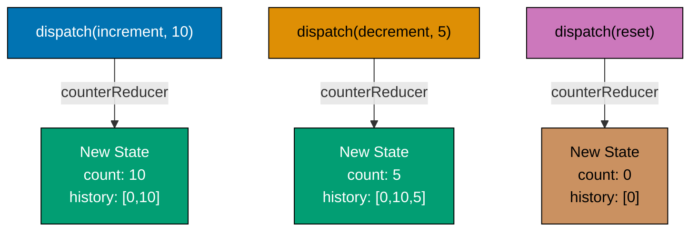
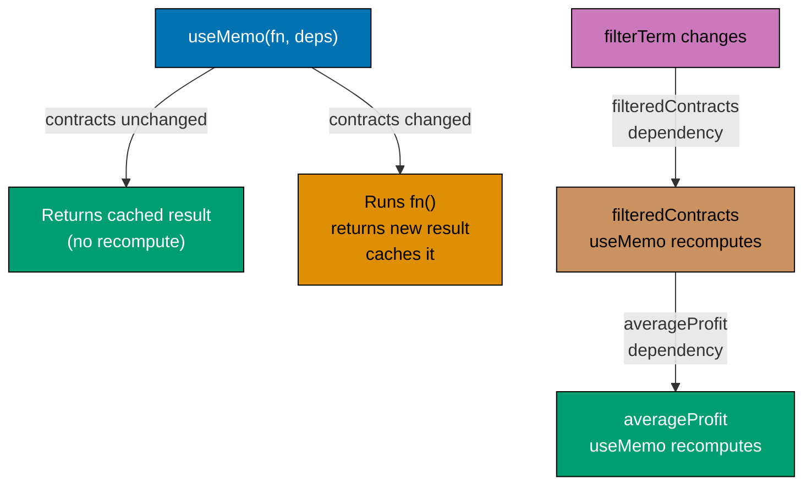
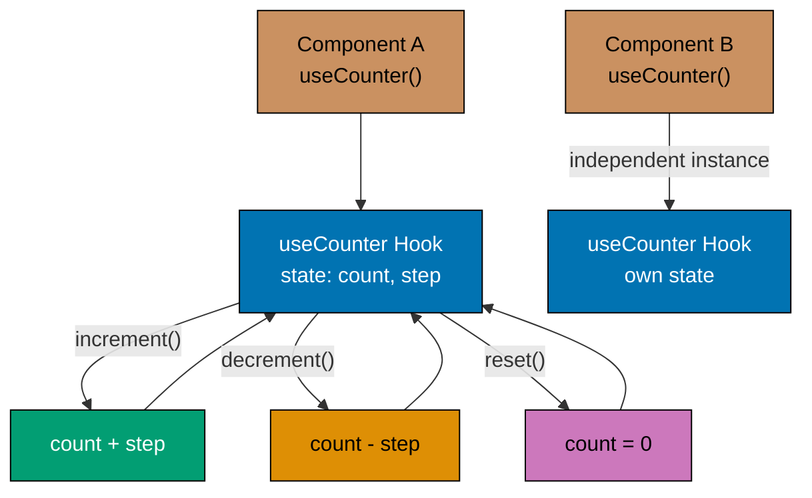
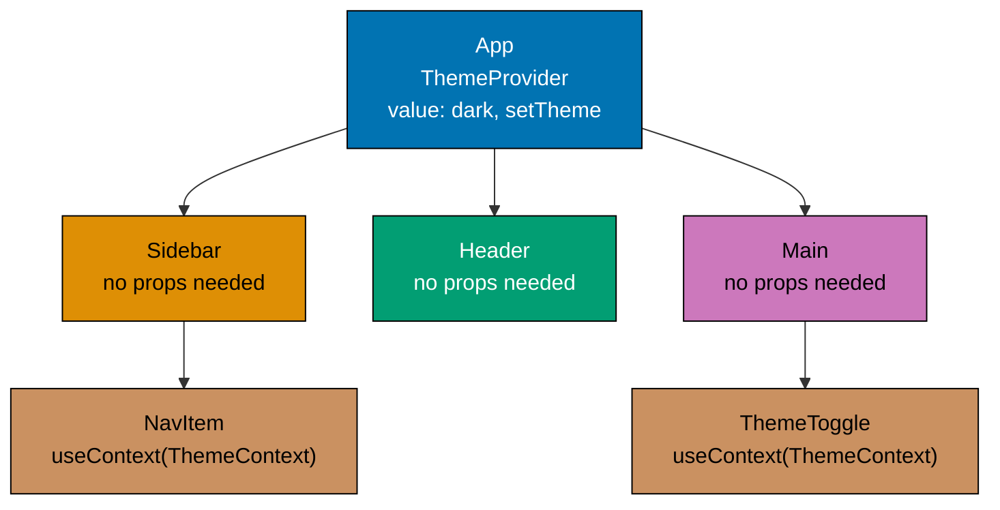
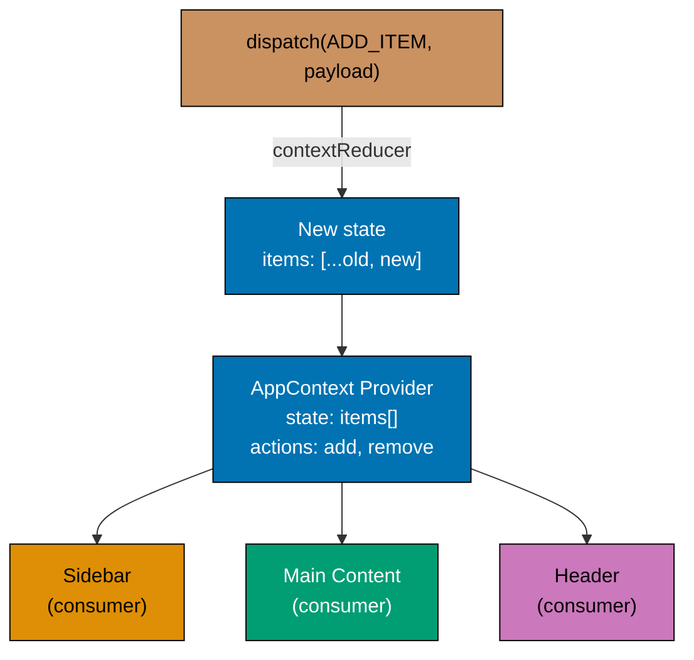
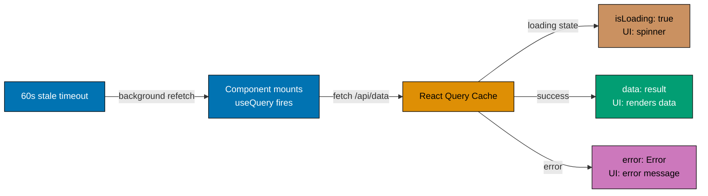
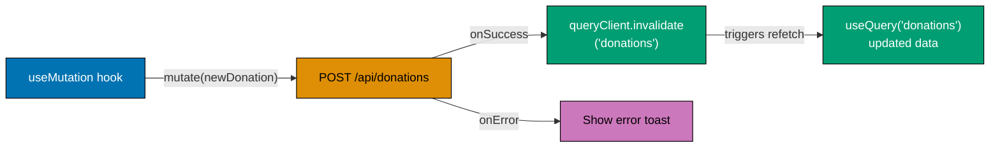
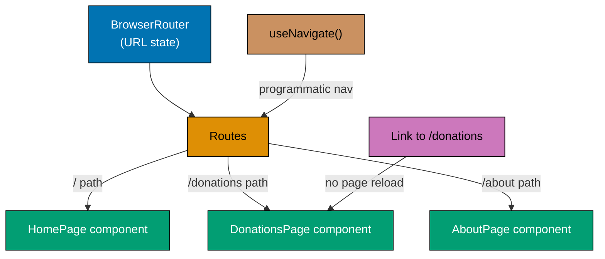
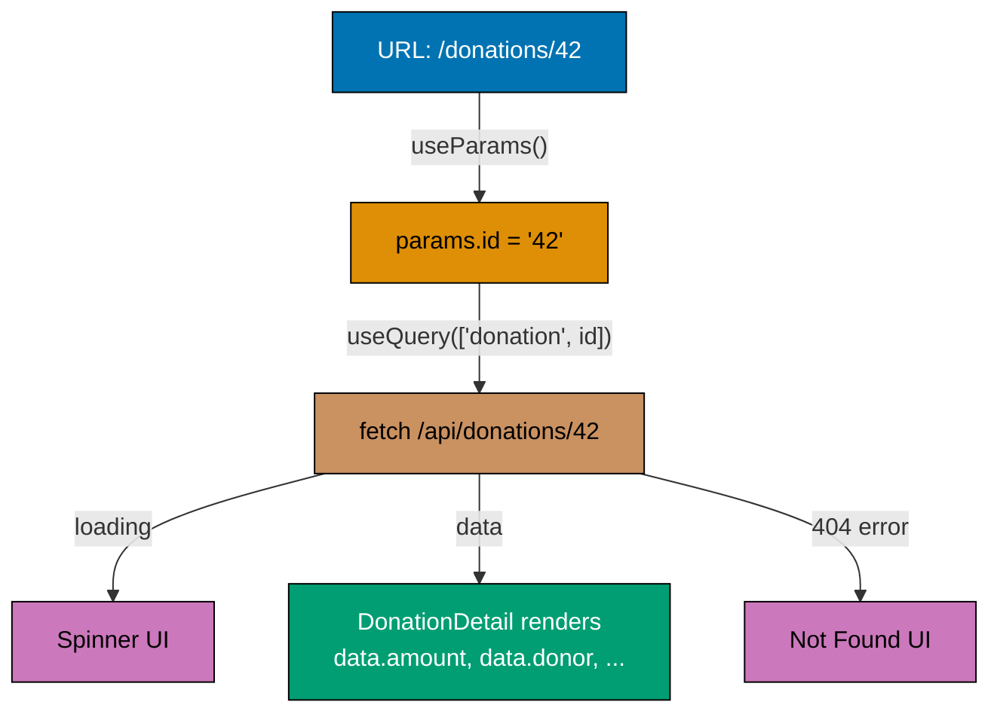
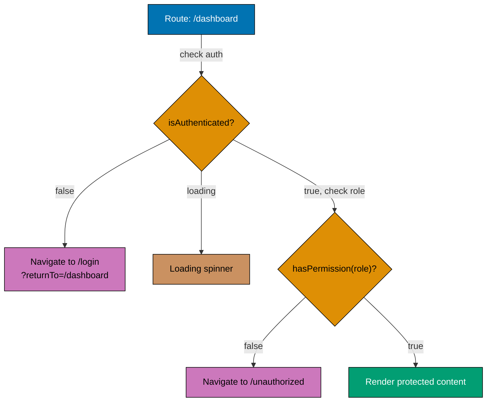

This intermediate tutorial covers production-ready React + TypeScript patterns through 25 heavily annotated examples. Each example maintains 1-2.25 comment lines per code line to ensure deep understanding. You'll master advanced hooks, custom hooks, Context API, React Query, routing, and error handling.

## Prerequisites

Before starting, ensure you understand:

- React fundamentals (components, props, state, basic hooks)
- TypeScript basics (types, interfaces, generics)
- Asynchronous JavaScript (Promises, async/await)
- Form handling and controlled components
- Event handling patterns

If you need to review fundamentals, see [Beginner](/en/learn/software-engineering/platform-web/tools/fe-react/by-example/beginner).

## Group 1: Advanced Hooks (5 examples)

### Example 1: useReducer for Complex State

useReducer manages complex state with multiple related values. It accepts reducer function and initial state, returns current state and dispatch function.



**useReducer state machine**: Actions dispatch to pure reducer, producing new state.

```typescript
import { useReducer } from 'react';

// => Define action types as discriminated union
// => Ensures type safety for all actions
type Action =
  | { type: 'increment'; payload: number }
  | { type: 'decrement'; payload: number }
  | { type: 'reset' }
  | { type: 'set'; payload: number };

// => State interface
interface CounterState {
  count: number;                             // => Current count value
  history: number[];                         // => Array of previous values
}

// => Reducer function: (state, action) => newState
// => Pure function - no side effects
function counterReducer(state: CounterState, action: Action): CounterState {
  switch (action.type) {
    case 'increment':
      // => Create new state with incremented count
      return {
        count: state.count + action.payload,
        history: [...state.history, state.count + action.payload]
        // => Spread existing history, append new count
      };

    case 'decrement':
      return {
        count: state.count - action.payload,
        history: [...state.history, state.count - action.payload]
      };

    case 'reset':
      // => Reset to initial state
      return {
        count: 0,
        history: [0]
        // => Start fresh history with 0
      };

    case 'set':
      // => Set to specific value
      return {
        count: action.payload,
        history: [...state.history, action.payload]
      };

    default:
      // => TypeScript ensures exhaustive checking
      // => All action types must be handled
      return state;
  }
}

function DonationCounter() {
  // => useReducer(reducer, initialState) returns [state, dispatch]
  const [state, dispatch] = useReducer(counterReducer, {
    count: 0,                                // => Initial count is 0
    history: [0]                             // => History starts with [0]
  });
  // => dispatch triggers state transition via reducer
  // => TypeScript validates action types

  // => Dispatch actions with type and optional payload
  const handleDonate10 = () => {
    dispatch({ type: 'increment', payload: 10 });
    // => Calls reducer with current state and action
    // => Reducer returns new state
    // => Component re-renders with updated state
  };

  const handleUndo = () => {
    if (state.history.length > 1) {
      // => Get previous value from history
      const previousValue = state.history[state.history.length - 2];
      dispatch({ type: 'set', payload: previousValue });
    }
  };

  return (
    <div>
    {/* => Container div for layout grouping */}
      <h2>Total Donations: ${state.count}</h2>
      {/* => Displays current count from state */}

      <div>
      {/* => Container div for layout grouping */}
        <button onClick={handleDonate10}>Donate \$10</button>
        {/* => Button "Donate \$10" - triggers onClick handler */}
        <button onClick={() => dispatch({ type: 'increment', payload: 25 })}>
        {/* => Button: triggers click handler */}
          Donate \$25
        </button>
        {/* => Inline dispatch with literal action object */}

        <button onClick={() => dispatch({ type: 'decrement', payload: 5 })}>
        {/* => Button: triggers click handler */}
          Refund \$5
        </button>

        <button onClick={handleUndo}>
        {/* => Button: triggers click handler */}
          Undo Last
        </button>

        <button onClick={() => dispatch({ type: 'reset' })}>
        {/* => Button: triggers click handler */}
          Reset
        </button>
      </div>

      <div>
      {/* => Container div for layout grouping */}
        <h3>History</h3>
        {/* => H3: "History" section heading */}
        <ul>
        {/* => Unordered list of items */}
          {state.history.map((value, index) => (
            <li key={index}>
              {/* => Using index as key (OK since history only appends) */}
              Step {index}: ${value}
            </li>
          ))}
        </ul>
      </div>
    </div>
  );
}

export default DonationCounter;

```

**Key Takeaway**: Use `useReducer` for complex state with multiple related values and transitions. Reducer function centralizes state logic. Discriminated unions provide type-safe actions.

**Why It Matters**: useReducer is the production pattern for state that transitions through well-defined phases: loading → success → error, idle → pending → approved → rejected. By centralizing all state transitions in a pure reducer function, you make impossible states impossible to represent and all valid transitions explicit. This matters in production because complex state managed with multiple useState calls is prone to inconsistency bugs - loading is true but error is also set, or count is negative when the business rule says it can't be. useReducer with discriminated union actions is the foundation for predictable state management in complex features.

### Example 2: useCallback for Function Memoization

useCallback memoizes function references to prevent unnecessary child re-renders. Essential when passing callbacks to optimized child components.

```typescript
import { useState, useCallback, memo } from 'react';

// => Memoized child component using React.memo
// => Only re-renders when props change by reference
interface TodoItemProps {
  todo: { id: number; text: string };
  onDelete: (id: number) => void;          // => Callback prop
}

const TodoItem = memo(({ todo, onDelete }: TodoItemProps) => {
  console.log('TodoItem rendered:', todo.text);
  // => Logs on every render
  // => Without useCallback, logs every time parent re-renders

  return (
    <li>
    {/* => List item */}
      {todo.text}
      <button onClick={() => onDelete(todo.id)}>Delete</button>
      {/* => Button "onDelete(todo.id)}>Delete" - triggers onClick handler */}
    </li>
  );
});
// => React.memo wraps component
// => Shallow comparison of props prevents unnecessary renders

function TodoList() {
  const [todos, setTodos] = useState([
    { id: 1, text: 'Read Quran' },
    // => Initial array item object
    { id: 2, text: 'Pray Fajr' }
  ]);
  // => End of initial state array

  const [count, setCount] = useState(0);    // => Unrelated state

  // => WITHOUT useCallback (inefficient)
  // => New function created on every render
  const handleDeleteWrong = (id: number) => {
    setTodos(todos.filter(todo => todo.id !== id));
  };
  // => Even if todos don't change, function reference changes
  // => TodoItem re-renders unnecessarily

  // => WITH useCallback (efficient)
  // => Function reference stays same unless dependencies change
  const handleDelete = useCallback((id: number) => {
    setTodos(prevTodos => prevTodos.filter(todo => todo.id !== id));
    // => Functional update avoids dependency on todos
    // => Dependencies: [] (empty) - function never recreated
  }, []);
  // => Empty dependency array: function memoized permanently
  // => Same function reference on every render

  // => useCallback with dependencies
  const handleDeleteWithDep = useCallback((id: number) => {
    setTodos(todos.filter(todo => todo.id !== id));
    // => Uses todos from closure
    // => Must include todos in dependencies
  }, [todos]);
  // => Function recreated only when todos changes
  // => New reference triggers TodoItem re-render

  return (
    <div>
    {/* => Container div for layout grouping */}
      <h2>Todos</h2>
      {/* => H2: "Todos" section heading */}

      <ul>
      {/* => Unordered list of items */}
        {todos.map(todo => (
          <TodoItem
          {/* => Renders TodoItem component */}
            key={todo.id}
            todo={todo}
            {/* => todo prop: todo */}
            onDelete={handleDelete}
            {/* => Passes memoized callback */}
            {/* => Same reference on every render */}
            {/* => TodoItem doesn't re-render unless todo changes */}
          />
        ))}
      </ul>

      <div>
      {/* => Container div for layout grouping */}
        <p>Unrelated Counter: {count}</p>
        {/* => Paragraph with content */}
        <button onClick={() => setCount(count + 1)}>
        {/* => Button: triggers click handler */}
          Increment Counter
        </button>
        {/* => Clicking this re-renders TodoList */}
        {/* => Without useCallback, all TodoItems re-render */}
        {/* => With useCallback, TodoItems don't re-render */}
      </div>
    </div>
  );
}

export default TodoList;

```

**Key Takeaway**: Use `useCallback` to memoize functions passed to optimized child components. Prevents child re-renders when parent re-renders. Use functional state updates to avoid dependencies.

**Why It Matters**: useCallback's value becomes clear when you profile React applications and discover that child components re-render on every parent render even when their props haven't semantically changed. Without memoization, a list of 100 items re-renders all 100 when the parent updates any unrelated state. In production dashboards, data tables, and complex forms with many fields, this causes noticeable performance degradation. The key production insight is that useCallback should be used selectively: profile first, then add memoization where measurements show benefit. Premature memoization adds complexity without benefit.

### Example 3: useMemo for Value Memoization

useMemo memoizes expensive computations. Recomputes only when dependencies change.



**useMemo cache**: Recomputes only when specified dependencies change.

```typescript
import { useState, useMemo } from 'react';

// => Type for Murabaha contract (Islamic financing)
interface MurabahaContract {
  id: number;
  // => id: numeric value field
  principalAmount: number;                   // => Original amount
  profitRate: number;                        // => Profit rate (percentage)
  termMonths: number;                        // => Loan term in months
}

function MurabahaCalculator() {
  const [contracts, setContracts] = useState<MurabahaContract[]>([
    { id: 1, principalAmount: 100000, profitRate: 5, termMonths: 12 },
    // => Initial array item object
    { id: 2, principalAmount: 50000, profitRate: 4, termMonths: 24 },
    // => Initial array item object
    { id: 3, principalAmount: 200000, profitRate: 6, termMonths: 36 }
  ]);
  // => End of initial state array

  const [filterTerm, setFilterTerm] = useState<number>(0);
  const [count, setCount] = useState(0);    // => Unrelated state

  // => EXPENSIVE computation WITHOUT useMemo
  // => Recalculates on EVERY render (even when contracts unchanged)
  const totalWithoutMemo = contracts.reduce((sum, contract) => {
    console.log('Calculating without memo for contract:', contract.id);
    // => This logs even when only count changes!

    const totalPayment = contract.principalAmount * (1 + contract.profitRate / 100);
    return sum + totalPayment;
  }, 0);

  // => EXPENSIVE computation WITH useMemo
  // => Recalculates ONLY when contracts changes
  const totalWithMemo = useMemo(() => {
    console.log('Calculating WITH memo (only when contracts change)');
    // => This logs only when contracts changes
    // => Not logged when count or filterTerm changes

    return contracts.reduce((sum, contract) => {
      const totalPayment = contract.principalAmount * (1 + contract.profitRate / 100);
      // => Principal + profit
      return sum + totalPayment;
    }, 0);
  }, [contracts]);
  // => Dependency array: [contracts]
  // => Memoized result returned if contracts unchanged

  // => Filtered contracts (also expensive)
  const filteredContracts = useMemo(() => {
    console.log('Filtering contracts (memoized)');
    // => Logs only when contracts or filterTerm changes

    if (filterTerm === 0) return contracts;

    return contracts.filter(c => c.termMonths === filterTerm);
    // => Filter by term length
  }, [contracts, filterTerm]);
  // => Dependencies: contracts AND filterTerm
  // => Recomputes if either changes

  // => Calculate statistics from memoized result
  const averageProfit = useMemo(() => {
    if (filteredContracts.length === 0) return 0;

    const totalProfit = filteredContracts.reduce((sum, contract) => {
      const profit = contract.principalAmount * (contract.profitRate / 100);
      return sum + profit;
    }, 0);

    return totalProfit / filteredContracts.length;
    // => Average profit per contract
  }, [filteredContracts]);
  // => Depends on filtered result (also memoized)
  // => Chained memoization

  return (
    <div>
    {/* => Container div for layout grouping */}
      <h2>Murabaha Contract Calculator</h2>
      {/* => H2: "Murabaha Contract Calculator" section heading */}

      <div>
      {/* => Container div for layout grouping */}
        <label>Filter by term (months): </label>
        <select
          value={filterTerm}
          {/* => value: controlled by state (state → UI sync) */}
          onChange={(e) => setFilterTerm(Number(e.target.value))}
          {/* => onChange: fires on every keystroke/change */}
        >
          <option value={0}>All</option>
          <option value={12}>12 months</option>
          <option value={24}>24 months</option>
          <option value={36}>36 months</option>
        </select>
        {/* => Changing filter triggers filteredContracts recalculation */}
      </div>

      <div>
      {/* => Container div for layout grouping */}
        <h3>Statistics</h3>
        {/* => H3: "Statistics" section heading */}
        <p>Total Contracts: {filteredContracts.length}</p>
        {/* => Paragraph with content */}
        <p>Total Payment (with profit): ${totalWithMemo.toFixed(2)}</p>
        {/* => Paragraph with content */}
        <p>Average Profit per Contract: ${averageProfit.toFixed(2)}</p>
        {/* => Paragraph with content */}
      </div>

      <div>
      {/* => Container div for layout grouping */}
        <h3>Contracts</h3>
        {/* => H3: "Contracts" section heading */}
        <ul>
        {/* => Unordered list of items */}
          {filteredContracts.map(contract => (
            <li key={contract.id}>
            {/* => List item with unique key for React reconciliation */}
              ID: {contract.id} - Principal: ${contract.principalAmount} -
              Profit Rate: {contract.profitRate}% - Term: {contract.termMonths} months
            </li>
          ))}
        </ul>
      </div>

      <div>
      {/* => Container div for layout grouping */}
        <p>Unrelated Counter: {count}</p>
        {/* => Paragraph with content */}
        <button onClick={() => setCount(count + 1)}>
        {/* => Button: triggers click handler */}
          Increment Counter
        </button>
        {/* => Clicking this re-renders component */}
        {/* => Without useMemo, calculations re-run */}
        {/* => With useMemo, calculations use cached result */}
        {/* => Check console logs to see difference */}
      </div>
    </div>
  );
}

export default MurabahaCalculator;

```

**Key Takeaway**: Use `useMemo` to memoize expensive computations. Prevents recalculation when dependencies unchanged. Essential for derived state from large datasets or complex calculations.

**Why It Matters**: useMemo prevents expensive computations from running on every render regardless of whether their inputs changed. Production applications frequently perform filtering, sorting, aggregating, and transforming data that could be cached. A financial dashboard computing portfolio metrics, a data table with sort/filter operations, a search component with fuzzy matching - all benefit from memoized computations. The critical rule: profile before adding useMemo. React is fast; most computations complete in under 1ms and don't need memoization. Measure the actual render cost before adding memoization complexity.

### Example 4: useRef for DOM Access and Mutable Values

useRef creates mutable reference that persists across renders. Use for DOM access or storing values without triggering re-renders.

```typescript
import { useState, useRef, useEffect } from 'react';

function DonationFormWithFocus() {
  const [amount, setAmount] = useState<number>(0);
  const [donations, setDonations] = useState<number[]>([]);

  // => Ref for DOM element access
  // => useRef<HTMLInputElement>(null) creates ref for input element
  const inputRef = useRef<HTMLInputElement>(null);
  // => inputRef.current is null initially
  // => After render, React assigns DOM element to inputRef.current

  // => Ref for mutable value (doesn't trigger re-render)
  const renderCount = useRef<number>(0);
  // => Persists across renders, unlike let variable
  // => Changing renderCount.current doesn't trigger re-render

  // => Ref for interval ID (cleanup reference)
  const intervalRef = useRef<NodeJS.Timeout | null>(null);

  // => Effect to count renders
  useEffect(() => {
    renderCount.current += 1;                // => Increment on every render
    // => Doesn't trigger re-render (unlike setState)
    console.log('Component rendered', renderCount.current, 'times');
  });
  // => No dependency array: runs after every render

  // => Focus input on mount
  useEffect(() => {
    if (inputRef.current) {
      // => Type guard: check if ref assigned
      inputRef.current.focus();              // => Focus the input element
      // => Directly manipulates DOM
    }
  }, []);
  // => Empty dependency array: runs once on mount

  // => Handle donation submission
  const handleDonate = () => {
    if (amount > 0) {
      setDonations(prev => [...prev, amount]);
      setAmount(0);                          // => Reset amount

      // => Focus input after submission
      if (inputRef.current) {
        inputRef.current.focus();            // => Return focus to input
      }
    }
  };

  // => Start auto-increment timer
  const startAutoIncrement = () => {
    if (intervalRef.current) return;         // => Already running

    // => Create interval and store ID in ref
    intervalRef.current = setInterval(() => {
      setAmount(prev => prev + 10);          // => Increment by \$10 every second
    }, 1000);
    // => Store interval ID for cleanup
  };

  // => Stop auto-increment timer
  const stopAutoIncrement = () => {
    if (intervalRef.current) {
      clearInterval(intervalRef.current);    // => Clear interval
      intervalRef.current = null;            // => Reset ref
    }
  };

  // => Cleanup on unmount
  useEffect(() => {
    return () => {
      // => Cleanup function runs on unmount
      if (intervalRef.current) {
        clearInterval(intervalRef.current);  // => Clear any active interval
      }
    };
  }, []);

  // => Get input element properties directly
  const handleCheckInput = () => {
    if (inputRef.current) {
      console.log('Input value:', inputRef.current.value);
      console.log('Input focused:', document.activeElement === inputRef.current);
      // => Direct DOM access via ref
    }
  };

  return (
    <div>
    {/* => Container div for layout grouping */}
      <h2>Donation Form</h2>
      {/* => H2: "Donation Form" section heading */}
      <p>Render count: {renderCount.current}</p>
      {/* => Display render count (doesn't trigger re-render when updated) */}

      <div>
      {/* => Container div for layout grouping */}
        <label>Amount ($): </label>
        <input
          ref={inputRef}
          {/* => Attach ref to input element */}
          {/* => React assigns DOM node to inputRef.current */}
          type="number"
          {/* => Input type: "number" */}
          value={amount}
          {/* => value: controlled by state (state → UI sync) */}
          onChange={(e) => setAmount(Number(e.target.value))}
          {/* => onChange: fires on every keystroke/change */}
          min="0"
          {/* => min: 0 (HTML input constraint) */}
        />
      </div>

      <div>
      {/* => Container div for layout grouping */}
        <button onClick={handleDonate}>Donate</button>
        {/* => Button "Donate" - triggers onClick handler */}
        <button onClick={handleCheckInput}>Check Input Properties</button>
        {/* => Button "Check Input Properties" - triggers onClick handler */}
      </div>

      <div>
      {/* => Container div for layout grouping */}
        <button onClick={startAutoIncrement}>Start Auto-Increment (\$10/sec)</button>
        {/* => Button "Start Auto-Increment (\$10/sec)" - triggers onClick handler */}
        <button onClick={stopAutoIncrement}>Stop Auto-Increment</button>
        {/* => Interval ID stored in ref persists across renders */}
      </div>

      <div>
      {/* => Container div for layout grouping */}
        <h3>Donations History</h3>
        {/* => H3: "Donations History" section heading */}
        <ul>
        {/* => Unordered list of items */}
          {donations.map((donation, index) => (
            <li key={index}>${donation}</li>
            {/* => List item with unique key for React reconciliation */}
          ))}
        </ul>
        <p>Total: ${donations.reduce((sum, d) => sum + d, 0)}</p>
        {/* => Paragraph with content */}
      </div>
    </div>
  );
}

export default DonationFormWithFocus;

```

**Key Takeaway**: Use `useRef` for DOM access (focus, scroll, measure) or storing mutable values that don't trigger re-renders (interval IDs, previous values, render counts).

**Why It Matters**: useRef enables direct DOM access and persistent mutable values that survive re-renders without triggering them. Production use cases: focus management (auto-focus search inputs, move focus to modal, return focus on close), third-party library integration (chart libraries, video players, animation libraries that need DOM references), scroll position management, and measurement (element dimensions for responsive behavior). Unlike state, ref changes don't trigger re-renders - making refs appropriate for values that change frequently but don't need to be reflected in the UI, like animation frame IDs, scroll positions, or pending request references.

### Example 5: useImperativeHandle for Custom Refs

useImperativeHandle customizes ref value exposed to parent components. Use with forwardRef for controlled component APIs.

```typescript
import { useRef, useImperativeHandle, forwardRef, useState } from 'react';

// => Define methods exposed via ref
interface CounterRef {
  increment: () => void;
  decrement: () => void;
  reset: () => void;
  getValue: () => number;
}

// => Props for counter component
interface CounterProps {
  initialValue?: number;
  // => initialValue: optional field (undefined if not provided)
}

// => forwardRef allows component to receive ref
// => Second parameter is the forwarded ref
const Counter = forwardRef<CounterRef, CounterProps>((props, ref) => {
  const [count, setCount] = useState(props.initialValue || 0);

  // => useImperativeHandle customizes ref value
  // => First parameter: forwarded ref
  // => Second parameter: function returning exposed methods
  useImperativeHandle(ref, () => ({
    // => Return object with methods to expose
    // => Parent can call these methods via ref.current

    increment: () => {
      setCount(prev => prev + 1);            // => Increment internal state
      // => Parent can trigger this without props
    },

    decrement: () => {
      setCount(prev => prev - 1);
    },

    reset: () => {
      setCount(props.initialValue || 0);     // => Reset to initial value
    },

    getValue: () => {
      return count;                          // => Return current count
      // => Parent can read state without props
    }
  }), [count, props.initialValue]);
  // => Dependencies: recreate methods when these change
  // => Ensures closures capture latest values

  return (
    <div style={{ padding: '16px', border: '1px solid #ccc', margin: '8px' }}>
    {/* => Container div with inline styles */}
      <h3>Counter Component</h3>
      {/* => H3: "Counter Component" section heading */}
      <p>Count: {count}</p>
      {/* => Component manages its own UI */}
      {/* => Parent controls it via ref methods */}
    </div>
  );
});
// => forwardRef wraps component
// => Enables ref forwarding

// => Parent component using custom ref
function DonationDashboard() {
  // => Create ref for Counter component
  const counter1Ref = useRef<CounterRef>(null);
  const counter2Ref = useRef<CounterRef>(null);
  // => Typed with CounterRef interface

  const [message, setMessage] = useState<string>('');

  // => Call child method via ref
  const handleIncrementBoth = () => {
    counter1Ref.current?.increment();        // => Optional chaining (ref might be null)
    counter2Ref.current?.increment();
    // => Directly calls child's increment method
    // => No props needed for this control
  };

  // => Read child state via ref
  const handleGetTotal = () => {
    const value1 = counter1Ref.current?.getValue() || 0;
    const value2 = counter2Ref.current?.getValue() || 0;
    // => Calls getValue method on both counters
    // => Returns current count from each

    const total = value1 + value2;
    setMessage(`Total donations: $${total}`);
    // => Display combined total
  };

  // => Reset all counters
  const handleResetAll = () => {
    counter1Ref.current?.reset();
    counter2Ref.current?.reset();
    setMessage('All counters reset');
  };

  return (
    <div>
    {/* => Container div for layout grouping */}
      <h2>Donation Dashboard</h2>
      {/* => H2: "Donation Dashboard" section heading */}

      <div style={{ display: 'flex', gap: '16px' }}>
      {/* => Container div with inline styles */}
        <Counter ref={counter1Ref} initialValue={0} />
        {/* => Pass ref to child component */}
        {/* => forwardRef enables this */}

        <Counter ref={counter2Ref} initialValue={10} />
        {/* => Counter component (self-contained) */}
      </div>

      <div style={{ marginTop: '16px' }}>
      {/* => Container div with inline styles */}
        <button onClick={handleIncrementBoth}>
        {/* => Button: triggers click handler */}
          Increment Both Counters
        </button>

        <button onClick={() => counter1Ref.current?.decrement()}>
        {/* => Button: triggers click handler */}
          Decrement Counter 1
        </button>

        <button onClick={handleGetTotal}>
        {/* => Button: triggers click handler */}
          Get Total
        </button>

        <button onClick={handleResetAll}>
        {/* => Button: triggers click handler */}
          Reset All
        </button>
      </div>

      {message && <p><strong>{message}</strong></p>}
      {/* => Conditional render: shows if left side is truthy */}
    </div>
  );
}

export default DonationDashboard;

```

**Key Takeaway**: Use `useImperativeHandle` with `forwardRef` to expose custom methods to parent via refs. Enables imperative control of child components while keeping encapsulation.

**Why It Matters**: useImperativeHandle is the escape hatch for providing imperative APIs to parent components while keeping component internals encapsulated. Production use cases include: UI components where parents need to trigger animations programmatically, form components that expose a validate() or reset() method, canvas components with draw() or clear() methods, and third-party integrations where library authors expose component handles. The key production insight is that this pattern should be rare - React's data-down/events-up model is preferred. Use useImperativeHandle when you genuinely need to expose specific component behaviors rather than expose the entire DOM node.

## Group 2: Custom Hooks (5 examples)

### Example 6: Creating Custom Hooks

Custom hooks extract reusable logic. Start with "use" prefix, can use other hooks inside.



**Custom hooks**: Each component gets an independent hook instance.

```typescript
import { useState, useEffect } from 'react';

// => Custom hook for window dimensions
// => Returns current window width and height
function useWindowSize() {
  // => State for dimensions
  const [size, setSize] = useState({
    width: window.innerWidth,                // => Initial width
    height: window.innerHeight               // => Initial height
  });

  useEffect(() => {
    // => Event handler for resize
    const handleResize = () => {
      setSize({
        width: window.innerWidth,            // => Updated width
        height: window.innerHeight           // => Updated height
      });
    };

    // => Add event listener
    window.addEventListener('resize', handleResize);
    // => Listens for window resize events

    // => Cleanup function
    return () => {
      window.removeEventListener('resize', handleResize);
      // => Remove listener on unmount
    };
  }, []);
  // => Empty dependency array: setup once

  // => Return current size
  return size;
  // => Components using this hook get reactive size
}

// => Custom hook for local storage state
// => Syncs state with localStorage
function useLocalStorage<T>(key: string, initialValue: T) {
  // => Generic type T for value type
  // => State initialized from localStorage or initial value
  const [value, setValue] = useState<T>(() => {
    try {
      // => Try to get from localStorage
      const item = window.localStorage.getItem(key);
      // => Returns string or null

      return item ? JSON.parse(item) : initialValue;
      // => Parse JSON if exists, otherwise use initial value
    } catch (error) {
      console.error('Error reading from localStorage:', error);
      return initialValue;                   // => Fallback on error
    }
  });
  // => Lazy initialization (function runs only once)

  // => Update localStorage when value changes
  useEffect(() => {
    try {
      window.localStorage.setItem(key, JSON.stringify(value));
      // => Stringify value and save to localStorage
    } catch (error) {
      console.error('Error writing to localStorage:', error);
    }
  }, [key, value]);
  // => Dependencies: re-run when key or value changes

  // => Return tuple like useState
  return [value, setValue] as const;
  // => as const prevents TypeScript from widening type
  // => Maintains tuple structure [T, (value: T) => void]
}

// => Component using custom hooks
function ResponsiveDonationForm() {
  // => Use window size hook
  const { width, height } = useWindowSize();
  // => Automatically updates when window resizes

  // => Use localStorage hook for donation amount
  const [amount, setAmount] = useLocalStorage<number>('donationAmount', 0);
  // => Persists amount across page refreshes

  // => Use localStorage hook for donor name
  const [name, setName] = useLocalStorage<string>('donorName', '');

  // => Responsive behavior based on width
  const isMobile = width < 768;              // => Mobile breakpoint

  const handleSubmit = (e: React.FormEvent) => {
    e.preventDefault();
    alert(`Donation submitted: $${amount} from ${name}`);

    // => Clear form after submission
    setAmount(0);
    setName('');
    // => Updates both state and localStorage
  };

  return (
    <div style={{ padding: '20px' }}>
    {/* => Container div with inline styles */}
      <h2>Donation Form</h2>
      {/* => H2: "Donation Form" section heading */}

      <p>
      {/* => Paragraph with content */}
        Window size: {width} x {height}
        {/* => Displays current dimensions */}
      </p>

      <p>
      {/* => Paragraph with content */}
        Layout: {isMobile ? 'Mobile' : 'Desktop'}
        {/* => Responsive indicator */}
      </p>

      <form onSubmit={handleSubmit} style={{
      {/* => Form with submit handler */}
        display: 'flex',
        flexDirection: isMobile ? 'column' : 'row',
        // => Stack vertically on mobile, horizontally on desktop
        gap: '12px'
      }}>
        <input
          type="text"
          {/* => Input type: "text" */}
          placeholder="Your Name"
          {/* => placeholder: "Your Name" */}
          value={name}
          {/* => value: controlled by state (state → UI sync) */}
          onChange={(e) => setName(e.target.value)}
          {/* => onChange: fires on every keystroke/change */}
          style={{ padding: '8px', flex: 1 }}
        />

        <input
          type="number"
          {/* => Input type: "number" */}
          placeholder="Amount"
          {/* => placeholder: "Amount" */}
          value={amount}
          {/* => value: controlled by state (state → UI sync) */}
          onChange={(e) => setAmount(Number(e.target.value))}
          {/* => onChange: fires on every keystroke/change */}
          style={{ padding: '8px', flex: 1 }}
          min="0"
          {/* => min: 0 (HTML input constraint) */}
        />

        <button type="submit" style={{ padding: '8px 16px' }}>
        {/* => Button element */}
          Donate
        </button>
      </form>

      <p style={{ fontSize: '0.875rem', color: '#666' }}>
        Your form data is saved locally and persists across page refreshes.
      </p>
    </div>
  );
}

export default ResponsiveDonationForm;

```

**Key Takeaway**: Custom hooks extract reusable logic. Start with "use" prefix, can call other hooks. Return values or tuple. Enable code reuse across components without prop drilling.

**Why It Matters**: Custom hooks are the primary mechanism for code reuse in React applications without the complexity of higher-order components or render props. Production React codebases maintain libraries of custom hooks that encapsulate patterns used across many features: data fetching, form management, keyboard shortcuts, window events, WebSocket connections, localStorage synchronization. The key production benefit is that hooks compose: a useUser hook can call useLocalStorage and useFetch internally. When you identify duplicated effect+state logic in multiple components, extracting to a custom hook reduces duplication and makes the pattern testable in isolation.

### Example 7: useLocalStorage Hook (Detailed Implementation)

Enhanced localStorage hook with type safety, error handling, and synchronization across tabs.

```typescript
import { useState, useEffect } from 'react';

// => Complete useLocalStorage implementation
function useLocalStorage<T>(key: string, initialValue: T) {
  // => Get stored value or initial value
  const readValue = (): T => {
    // => Check if running in browser (not SSR)
    if (typeof window === 'undefined') {
      return initialValue;                   // => Return initial value during SSR
    }

    try {
      const item = window.localStorage.getItem(key);
      // => getItem returns string or null

      return item ? JSON.parse(item) : initialValue;
      // => Parse JSON string to original type
    } catch (error) {
      console.warn(`Error reading localStorage key "${key}":`, error);
      return initialValue;                   // => Fallback on error
    }
  };

  // => State with lazy initialization
  const [storedValue, setStoredValue] = useState<T>(readValue);

  // => Update localStorage and state
  const setValue = (value: T | ((val: T) => T)) => {
    try {
      // => Allow value to be function like useState
      const valueToStore = value instanceof Function ? value(storedValue) : value;
      // => If function, call with current value
      // => Otherwise use value directly

      // => Update state
      setStoredValue(valueToStore);

      // => Update localStorage
      if (typeof window !== 'undefined') {
        window.localStorage.setItem(key, JSON.stringify(valueToStore));
        // => Stringify and save

        // => Dispatch custom event for cross-tab sync
        window.dispatchEvent(new Event('local-storage'));
        // => Other tabs can listen to this event
      }
    } catch (error) {
      console.warn(`Error setting localStorage key "${key}":`, error);
    }
  };

  // => Listen for changes from other tabs
  useEffect(() => {
    const handleStorageChange = (e: StorageEvent) => {
      // => StorageEvent fires when localStorage changes in other tabs
      if (e.key === key && e.newValue !== null) {
        // => Check if our key changed
        setStoredValue(JSON.parse(e.newValue));
        // => Update state with new value from other tab
      }
    };

    // => Listen to storage event
    window.addEventListener('storage', handleStorageChange);
    // => Native event for cross-tab communication

    // => Listen to custom event (same tab updates)
    window.addEventListener('local-storage', () => {
      setStoredValue(readValue());           // => Re-read from localStorage
    });

    return () => {
      window.removeEventListener('storage', handleStorageChange);
      window.removeEventListener('local-storage', () => {});
    };
  }, [key]);
  // => Dependency: key (re-setup if key changes)

  return [storedValue, setValue] as const;
}

// => Component demonstrating localStorage hook
function SadaqahTracker() {
  // => Track monthly Sadaqah (charity) goal and current amount
  const [goal, setGoal] = useLocalStorage<number>('sadaqahGoal', 100);
  const [current, setCurrent] = useLocalStorage<number>('sadaqahCurrent', 0);
  // => Both persisted to localStorage

  // => Derived state: progress percentage
  const progress = goal > 0 ? (current / goal) * 100 : 0;
  // => Calculate percentage (handle division by zero)

  // => Handle donation
  const handleDonate = (amount: number) => {
    setCurrent(prev => prev + amount);       // => Functional update
    // => Updates localStorage automatically
  };

  // => Reset for new month
  const handleReset = () => {
    setCurrent(0);
    // => Keeps goal, resets current donations
  };

  return (
    <div style={{ maxWidth: '400px', margin: '0 auto', padding: '20px' }}>
    {/* => Container div with inline styles */}
      <h2>Monthly Sadaqah Tracker</h2>
      {/* => H2: "Monthly Sadaqah Tracker" section heading */}

      <div style={{ marginBottom: '16px' }}>
      {/* => Container div with inline styles */}
        <label>Monthly Goal ($): </label>
        <input
          type="number"
          {/* => Input type: "number" */}
          value={goal}
          {/* => value: controlled by state (state → UI sync) */}
          onChange={(e) => setGoal(Number(e.target.value))}
          {/* => onChange: fires on every keystroke/change */}
          min="0"
          {/* => min: 0 (HTML input constraint) */}
          style={{ padding: '4px', width: '100px' }}
        />
      </div>

      <div style={{ marginBottom: '16px' }}>
      {/* => Container div with inline styles */}
        <p><strong>Current Donations:</strong> ${current}</p>
        {/* => Paragraph with content */}
        <p><strong>Goal:</strong> ${goal}</p>
        {/* => Paragraph with content */}
        <p><strong>Progress:</strong> {progress.toFixed(1)}%</p>

        {/* => Progress bar */}
        <div style={{
          width: '100%',
          height: '24px',
          backgroundColor: '#f0f0f0',
          borderRadius: '4px',
          overflow: 'hidden'
        }}>
          <div style={{
            width: `${Math.min(progress, 100)}%`,
            height: '100%',
            backgroundColor: progress >= 100 ? '#029E73' : '#0173B2',
            // => Green if goal reached, blue otherwise
            transition: 'width 0.3s ease'
          }} />
        </div>
      </div>

      <div style={{ display: 'flex', gap: '8px', flexWrap: 'wrap' }}>
      {/* => Container div with inline styles */}
        <button onClick={() => handleDonate(5)} style={{ padding: '8px' }}>
        {/* => Button: triggers click handler */}
          Donate \$5
        </button>
        <button onClick={() => handleDonate(10)} style={{ padding: '8px' }}>
        {/* => Button: triggers click handler */}
          Donate \$10
        </button>
        <button onClick={() => handleDonate(25)} style={{ padding: '8px' }}>
        {/* => Button: triggers click handler */}
          Donate \$25
        </button>
      </div>

      <div style={{ marginTop: '16px' }}>
      {/* => Container div with inline styles */}
        <button onClick={handleReset} style={{ padding: '8px' }}>
        {/* => Button: triggers click handler */}
          Reset for New Month
        </button>
      </div>

      <p style={{ marginTop: '16px', fontSize: '0.875rem', color: '#666' }}>
        Data persists across page refreshes and syncs across browser tabs.
        Open this page in multiple tabs and try donating!
      </p>
    </div>
  );
}

export default SadaqahTracker;

```

**Key Takeaway**: useLocalStorage hook provides persistent state with automatic localStorage sync. Handles errors, supports functional updates, and syncs across browser tabs using storage events.

**Why It Matters**: localStorage persistence with React state synchronization is a foundational pattern for user preferences, draft content, and session recovery. Production applications persist: dark mode preferences, language selections, partially filled forms (resume editing after browser close), shopping cart contents for guest users, and expanded/collapsed panel states. The key production concern is performance: localStorage is synchronous and can block rendering if read during render. The pattern of reading once on mount (via initialization function in useState) avoids repeated reads. Also critical: localStorage is not available in SSR environments, requiring careful initialization guards.

### Example 8: useDebounce Hook

Debounce hook delays value updates to reduce expensive operations like API calls or filtering.

```typescript
import { useState, useEffect } from 'react';

// => Debounce hook implementation
// => Returns debounced value that updates after delay
function useDebounce<T>(value: T, delay: number): T {
  // => Generic type T for any value type
  // => State for debounced value
  const [debouncedValue, setDebouncedValue] = useState<T>(value);
  // => Initially equals input value

  useEffect(() => {
    // => Set timeout to update debounced value
    const handler = setTimeout(() => {
      setDebouncedValue(value);              // => Update after delay
      // => Only runs if value stays stable for delay duration
    }, delay);
    // => handler is timeout ID for cleanup

    // => Cleanup function
    return () => {
      clearTimeout(handler);                 // => Clear timeout on cleanup
      // => Runs before next effect or on unmount
      // => If value changes before timeout, old timeout cleared
    };
  }, [value, delay]);
  // => Dependencies: re-run when value or delay changes
  // => New timeout set on every value change
  // => Previous timeout cleared, resetting delay

  return debouncedValue;
  // => Returns stable value (only updates after delay)
}

// => Component using debounce hook
function PrayerSearch() {
  // => Search input state (updates immediately)
  const [searchTerm, setSearchTerm] = useState<string>('');

  // => Debounced search term (updates after 500ms delay)
  const debouncedSearchTerm = useDebounce(searchTerm, 500);
  // => Only updates when searchTerm stable for 500ms

  // => State for search results
  const [results, setResults] = useState<string[]>([]);
  const [isSearching, setIsSearching] = useState<boolean>(false);

  // => Mock prayer database
  const prayerDatabase = [
    'Fajr (Dawn Prayer)',
    'Dhuhr (Noon Prayer)',
    'Asr (Afternoon Prayer)',
    'Maghrib (Sunset Prayer)',
    'Isha (Night Prayer)',
    'Tahajjud (Night Prayer)',
    'Duha (Forenoon Prayer)',
    'Witr (Odd Prayer)',
    'Taraweeh (Ramadan Prayer)'
  ];

  // => Perform search when debounced term changes
  useEffect(() => {
    // => Only search if debounced term not empty
    if (debouncedSearchTerm.trim() === '') {
      setResults([]);
      setIsSearching(false);
      return;
    }

    // => Simulate search start
    setIsSearching(true);
    console.log('Searching for:', debouncedSearchTerm);
    // => This logs only when typing stops for 500ms
    // => Without debounce, would log on every keystroke

    // => Simulate API call with timeout
    const searchTimeout = setTimeout(() => {
      // => Filter prayers matching search term
      const filtered = prayerDatabase.filter(prayer =>
        prayer.toLowerCase().includes(debouncedSearchTerm.toLowerCase())
      );

      setResults(filtered);
      setIsSearching(false);
      console.log('Search complete. Results:', filtered.length);
    }, 300);
    // => Simulate 300ms API latency

    return () => clearTimeout(searchTimeout);
    // => Cleanup if debounced term changes again
  }, [debouncedSearchTerm]);
  // => Dependency: debouncedSearchTerm (not searchTerm!)
  // => Effect only runs when debounced value changes
  // => Prevents excessive API calls while typing

  return (
    <div style={{ maxWidth: '500px', margin: '0 auto', padding: '20px' }}>
    {/* => Container div with inline styles */}
      <h2>Prayer Search</h2>
      {/* => H2: "Prayer Search" section heading */}

      <div>
      {/* => Container div for layout grouping */}
        <input
          type="text"
          {/* => Input type: "text" */}
          value={searchTerm}
          {/* => value: controlled by state (state → UI sync) */}
          onChange={(e) => setSearchTerm(e.target.value)}
          // => Updates immediately on every keystroke
          placeholder="Search prayers (e.g., 'Fajr', 'Night')..."
          {/* => placeholder: "Search prayers (e.g., 'Fajr', 'Night')..." */}
          style={{
            width: '100%',
            padding: '12px',
            fontSize: '16px',
            border: '1px solid #ccc',
            borderRadius: '4px'
          }}
        />

        <p style={{ fontSize: '0.875rem', color: '#666', marginTop: '8px' }}>
          {searchTerm !== debouncedSearchTerm && 'Typing...'}
          {/* => Show "Typing..." if values differ (debounce in progress) */}

          {searchTerm === debouncedSearchTerm && searchTerm && !isSearching && `Found ${results.length} prayers`}
          {/* => Show count when stable and not searching */}

          {isSearching && 'Searching...'}
          {/* => Conditional render: shows if left side is truthy */}
        </p>
      </div>

      <div style={{ marginTop: '16px' }}>
      {/* => Container div with inline styles */}
        {results.length > 0 ? (
        {/* => True branch: rendered when condition is true */}
          <ul style={{ listStyle: 'none', padding: 0 }}>
            {results.map((prayer, index) => (
              <li key={index} style={{
              {/* => List item with unique key for React reconciliation */}
                padding: '12px',
                backgroundColor: '#f5f5f5',
                marginBottom: '8px',
                borderRadius: '4px'
              }}>
                {prayer}
              </li>
            ))}
          </ul>
        ) : debouncedSearchTerm && !isSearching ? (
        {/* => True branch: rendered when condition is true */}
          <p>No prayers found matching "{debouncedSearchTerm}"</p>
          {/* => Paragraph with content */}
        ) : null}
      </div>

      <div style={{ marginTop: '16px', fontSize: '0.875rem', color: '#666' }}>
      {/* => Container div with inline styles */}
        <p><strong>Debounce Demo:</strong></p>
        {/* => Paragraph with content */}
        <p>Current input: "{searchTerm}"</p>
        {/* => Paragraph with content */}
        <p>Debounced value: "{debouncedSearchTerm}"</p>
        {/* => Paragraph with content */}
        <p>Search only happens when you stop typing for 500ms.</p>
        {/* => Paragraph: "Search only happens when you stop typing..." */}
      </div>
    </div>
  );
}

export default PrayerSearch;

```

**Key Takeaway**: useDebounce hook delays value updates, preventing excessive operations. Essential for search inputs, API calls, and filtering. Reduces network requests and improves performance.

**Why It Matters**: Debouncing is essential for production performance in any feature involving user input that triggers expensive operations. Without debouncing, search inputs firing API requests on every keystroke generate 10-20 requests for a typical search phrase, overwhelming both the client and server. Autocomplete, search-as-you-type, and filter-on-change patterns all require debouncing. The custom hook abstraction makes debouncing a one-line addition to any component. Advanced production debouncing handles cancellation of in-flight requests when a newer debounced call fires, preventing race conditions where slower earlier requests resolve after faster later requests.

### Example 9: useFetch Hook

Custom fetch hook with loading, error, and data states. Handles cleanup for cancelled requests.

```typescript
import { useState, useEffect } from 'react';

// => Type for fetch hook return value
interface UseFetchResult<T> {
  data: T | null;                            // => Fetched data or null
  loading: boolean;                          // => Loading indicator
  error: string | null;                      // => Error message or null
}

// => Generic fetch hook implementation
function useFetch<T>(url: string): UseFetchResult<T> {
  // => State for data, loading, and error
  const [data, setData] = useState<T | null>(null);
  const [loading, setLoading] = useState<boolean>(true);
  const [error, setError] = useState<string | null>(null);

  useEffect(() => {
    // => Reset states on URL change
    setLoading(true);
    setError(null);
    setData(null);

    // => AbortController for request cancellation
    const controller = new AbortController();
    // => Creates signal for fetch cancellation
    const signal = controller.signal;

    console.log('Fetching:', url);

    // => Perform fetch
    fetch(url, { signal })
    // => Pass signal to enable cancellation
      .then(response => {
        // => Check HTTP status
        if (!response.ok) {
          throw new Error(`HTTP error! status: ${response.status}`);
          // => Throw for 4xx, 5xx responses
        }
        return response.json();              // => Parse JSON body
      })
      .then((jsonData: T) => {
        // => Success: update data
        setData(jsonData);
        setLoading(false);
        console.log('Fetch successful');
      })
      .catch(err => {
        // => Error handling
        if (err.name === 'AbortError') {
          // => Request was cancelled
          console.log('Fetch aborted');
        } else {
          // => Actual error
          console.error('Fetch error:', err);
          setError(err.message);
          setLoading(false);
        }
      });

    // => Cleanup function
    return () => {
      controller.abort();                    // => Cancel request on cleanup
      // => Runs when URL changes or component unmounts
      // => Prevents state updates on unmounted component
      console.log('Aborting fetch');
    };
  }, [url]);
  // => Dependency: url (re-fetch when URL changes)

  // => Return current state
  return { data, loading, error };
}

// => Type for user data
interface User {
  id: number;
  // => id: numeric value field
  name: string;
  // => name: text value field
  email: string;
  // => email: text value field
  phone: string;
  // => phone: text value field
}

// => Component using fetch hook
function UserProfile() {
  const [userId, setUserId] = useState<number>(1);

  // => Use fetch hook with dynamic URL
  const { data: user, loading, error } = useFetch<User>(
    `https://jsonplaceholder.typicode.com/users/${userId}`
  );
  // => Destructure with alias (data as user)
  // => Re-fetches when userId changes

  // => Loading state
  if (loading) {
    return (
      <div style={{ padding: '20px' }}>
      {/* => Container div with inline styles */}
        <p>Loading user data...</p>
        {/* => Show loading indicator */}
      </div>
    );
  }

  // => Error state
  if (error) {
    return (
      <div style={{ padding: '20px' }}>
      {/* => Container div with inline styles */}
        <p style={{ color: 'red' }}>Error: {error}</p>
        {/* => Display error message */}

        <button onClick={() => setUserId(userId)}>
        {/* => Button: triggers click handler */}
          Retry
        </button>
        {/* => Re-trigger fetch by setting same userId */}
      </div>
    );
  }

  // => Success state
  return (
    <div style={{ padding: '20px', maxWidth: '500px', margin: '0 auto' }}>
    {/* => Container div with inline styles */}
      <h2>User Profile</h2>
      {/* => H2: "User Profile" section heading */}

      {user && (
        <div style={{
          padding: '16px',
          backgroundColor: '#f5f5f5',
          borderRadius: '8px'
        }}>
          <p><strong>ID:</strong> {user.id}</p>
          {/* => Paragraph with content */}
          <p><strong>Name:</strong> {user.name}</p>
          {/* => Paragraph with content */}
          <p><strong>Email:</strong> {user.email}</p>
          {/* => Paragraph with content */}
          <p><strong>Phone:</strong> {user.phone}</p>
          {/* => Paragraph with content */}
        </div>
      )}

      <div style={{ marginTop: '16px', display: 'flex', gap: '8px' }}>
      {/* => Container div with inline styles */}
        <button
          onClick={() => setUserId(prev => Math.max(1, prev - 1))}
          {/* => onClick: fires on user click */}
          disabled={userId === 1}
          // => Disable at minimum ID
        >
          Previous User
        </button>

        <button
          onClick={() => setUserId(prev => Math.min(10, prev + 1))}
          {/* => onClick: fires on user click */}
          disabled={userId === 10}
          // => Disable at maximum ID
        >
          Next User
        </button>
      </div>

      <p style={{ marginTop: '16px', fontSize: '0.875rem', color: '#666' }}>
        Current user ID: {userId}. Click buttons to fetch different users.
        Rapid clicking demonstrates request cancellation (check console).
      </p>
    </div>
  );
}

export default UserProfile;

```

**Key Takeaway**: useFetch hook encapsulates data fetching with loading, error, and data states. Uses AbortController for request cancellation. Re-fetches when dependencies change.

**Why It Matters**: A custom useFetch hook standardizes the data-fetching lifecycle across the application: loading spinner patterns, error display formats, automatic retries, and request cancellation. Without a shared hook, each component implements its own slightly different loading/error handling, leading to inconsistent user experiences and duplicated error handling logic. Production data fetching hooks grow to handle: authentication headers, request timeout, retry with exponential backoff, response caching, and optimistic updates. Starting with a clean abstraction makes these enhancements easy to add in one place rather than hunting through dozens of components.

### Example 10: useForm Hook for Form Management

Form hook simplifies form state management with validation and submission handling.

```typescript
import { useState } from 'react';

// => Type for validation rules
interface ValidationRules {
  required?: boolean;
  // => required: optional field (undefined if not provided)
  minLength?: number;
  // => minLength: optional field (undefined if not provided)
  maxLength?: number;
  // => maxLength: optional field (undefined if not provided)
  pattern?: RegExp;
  // => pattern: optional field (undefined if not provided)
  custom?: (value: any) => string | undefined;
}

// => Type for field configuration
interface FieldConfig {
  initialValue: any;
  validation?: ValidationRules;
  // => validation: optional field (undefined if not provided)
}

// => Type for form configuration
interface FormConfig {
  [key: string]: FieldConfig;
}

// => Type for form errors
interface FormErrors {
  [key: string]: string | undefined;
}

// => useForm hook implementation
function useForm<T extends { [key: string]: any }>(config: FormConfig) {
  // => State for form values
  // => Stores current value for each form field
  const [values, setValues] = useState<T>(() => {
    // => Initialize from config using lazy initialization
    // => Lazy init prevents recreation on every render
    const initialValues: any = {};  // => Empty object to collect initial values
    Object.keys(config).forEach(key => {
      // => Iterate through field configurations
      // => Extract initialValue for each field
      initialValues[key] = config[key].initialValue;
      // => Set field's starting value from config
    });
    return initialValues as T;  // => Type assertion for TypeScript
  });

  // => State for errors
  // => Maps field name to error message
  // => Empty string or undefined means no error
  const [errors, setErrors] = useState<FormErrors>({});
  // => Example: { email: 'Invalid email format', phone: undefined }

  // => State for touched fields
  // => Tracks which fields user has interacted with
  // => Only show errors for touched fields (better UX)
  const [touched, setTouched] = useState<{ [key: string]: boolean }>({});
  // => Example: { email: true, phone: false } - email touched, phone not

  // => Validate single field against its rules
  // => Returns error message string or undefined (valid)
  // => Pure function - no side effects
  const validateField = (name: string, value: any): string | undefined => {
    const rules = config[name]?.validation;
    // => Get validation rules for this field
    // => Optional chaining (?.) handles missing config safely
    if (!rules) return undefined;  // => No rules means field is valid

    // => Required validation
    // => Checks if value exists (not empty, null, undefined)
    if (rules.required && !value) {
      return 'This field is required';
      // => Fails for '', null, undefined, 0, false
    }

    // => Min length validation
    // => Only applies to string/array values with .length property
    if (rules.minLength && value.length < rules.minLength) {
      return `Minimum length is ${rules.minLength}`;
      // => Example: minLength: 3, value: 'ab' → error
    }

    // => Max length validation
    // => Prevents excessive input (security + UX)
    if (rules.maxLength && value.length > rules.maxLength) {
      return `Maximum length is ${rules.maxLength}`;
      // => Example: maxLength: 50, value: 'very long...' → error
    }

    // => Pattern validation
    // => Tests value against regex pattern
    // => Common for email, phone, zip code, etc.
    if (rules.pattern && !rules.pattern.test(value)) {
      return 'Invalid format';
      // => Example: pattern: /^[0-9]+$/, value: 'abc' → error
    }

    // => Custom validation
    // => Allows domain-specific validation logic
    // => Function receives value, returns error message or undefined
    if (rules.custom) {
      return rules.custom(value);
      // => Example: (val) => val.includes('@') ? undefined : 'Must contain @'
    }

    return undefined;  // => All validations passed, field is valid
  };

  // => Handle field change (called on every keystroke/input)
  // => Updates value and re-validates if field already touched
  const handleChange = (name: string, value: any) => {
    // => Update field value immutably
    // => Functional update ensures latest state
    setValues(prev => ({
      ...prev,                      // => Keep all other field values
      [name]: value                 // => Override changed field
      // => Computed property syntax: field name determines key
    }));

    // => Validate only if field has been touched
    // => Avoids showing errors before user interaction (better UX)
    if (touched[name]) {
      const error = validateField(name, value);
      // => Re-validate with new value
      // => Returns error message or undefined
      setErrors(prev => ({
        ...prev,
        [name]: error               // => Update or clear error for this field
        // => If error is undefined, field becomes valid
      }));
    }
  };

  // => Handle field blur (when input loses focus)
  // => Marks field as touched and validates current value
  const handleBlur = (name: string) => {
    // => Mark field as touched
    // => Enables error display for this field
    setTouched(prev => ({
      ...prev,
      [name]: true                  // => Set touched flag
      // => Once touched, errors will show on change
    }));

    // => Validate field with current value
    // => Uses values[name] from current state
    const error = validateField(name, values[name]);
    // => Get current value from state
    // => Validate against field's rules
    setErrors(prev => ({
      ...prev,
      [name]: error                 // => Set validation result
      // => Error message or undefined (valid)
    }));
  };

  // => Validate all fields at once
  // => Called on form submission
  // => Returns true if entire form is valid, false otherwise
  const validateAll = (): boolean => {
    const newErrors: FormErrors = {};
    // => Collect all validation errors
    // => Will contain only fields with errors
    let isValid = true;
    // => Track overall form validity
    // => Flips to false if any field has error

    Object.keys(config).forEach(name => {
      // => Iterate through all configured fields
      // => Validate each field regardless of touched state
      const error = validateField(name, values[name]);
      // => Run validation for current field value
      // => Returns error message or undefined
      if (error) {
        // => Field has validation error
        newErrors[name] = error;
        // => Add error to collection
        // => Example: { email: 'Invalid email', phone: 'Required' }
        isValid = false;
        // => Mark form as invalid
        // => Even one error makes entire form invalid
      }
    });

    setErrors(newErrors);
    // => Update all errors at once
    // => Replaces previous error state completely
    // => Shows all validation errors simultaneously
    setTouched(
      Object.keys(config).reduce((acc, key) => ({ ...acc, [key]: true }), {})
      // => Mark all fields as touched
      // => reduce() builds object: { field1: true, field2: true, ... }
      // => Ensures all errors are visible to user
    );

    return isValid;
    // => Return validation result
    // => true: form submittable, false: has errors
  };

  // => Reset form to initial state
  // => Clears all values, errors, and touched flags
  // => Useful after successful submission or user cancellation
  const reset = () => {
    const initialValues: any = {};
    // => Recreate initial values object
    Object.keys(config).forEach(key => {
      initialValues[key] = config[key].initialValue;
      // => Extract initial value from each field config
      // => Restores form to starting state
    });
    setValues(initialValues as T);
    // => Reset values to initial state
    // => Type assertion for TypeScript safety
    setErrors({});
    // => Clear all validation errors
    // => Empty object means no errors
    setTouched({});
    // => Clear all touched flags
    // => Form appears untouched after reset
  };

  return {
    // => Return form management API
    // => Object destructured by component
    values,       // => Current field values
    errors,       // => Current validation errors
    touched,      // => Which fields have been interacted with
    handleChange, // => Function to update field value
    handleBlur,   // => Function called when field loses focus
    validateAll,  // => Function to validate entire form
    reset         // => Function to reset form to initial state
    // => Clean API hides internal state management complexity
  };
}

// => Component using form hook
// => Demonstrates useForm hook in production scenario
function DonorRegistrationForm() {
  // => Define form configuration
  // => Generic type <{...}> ensures type safety for form.values
  const form = useForm<{
    name: string;      // => Donor's full name
    email: string;     // => Donor's email address
    phone: string;     // => Donor's phone number
    amount: number;    // => Donation amount in dollars
  }>({
    // => Configuration object defines fields + validation rules
    name: {
      initialValue: '',              // => Start with empty string
      validation: {
        required: true,               // => Field is mandatory
        minLength: 3,                 // => Minimum 3 characters
        maxLength: 50                 // => Maximum 50 characters
        // => Prevents very short names ('ab') or excessively long input
      }
    },
    email: {
      initialValue: '',
      validation: {
        required: true,               // => Email is mandatory
        pattern: /^[^\s@]+@[^\s@]+\.[^\s@]+$/,
        // => Basic email regex pattern
        // => Checks for: localpart @ domain . tld
        // => Prevents spaces, requires @ and dot
        custom: (value) => {
          // => Custom validation: block disposable emails
          // => Domain-specific business logic
          if (value.endsWith('@tempmail.com')) {
            return 'Disposable emails not allowed';
            // => Reject temporary/throwaway email services
          }
          return undefined;  // => Valid email
        }
      }
    },
    phone: {
      initialValue: '',
      validation: {
        required: true,               // => Phone is mandatory
        pattern: /^\d{10}$/,          // => Exactly 10 digits
        // => ^ = start, \d = digit, {10} = exactly 10, $ = end
        custom: (value) => {
          if (value && !/^\d{10}$/.test(value)) {
            return 'Phone must be 10 digits';
            // => Custom error message for clarity
            // => Redundant with pattern but provides better UX message
          }
          return undefined;
        }
      }
    },
    amount: {
      initialValue: 0,                // => Start at 0
      validation: {
        required: true,               // => Amount is mandatory
        custom: (value) => {
          if (value <= 0) {
            return 'Amount must be greater than 0';
            // => Business rule: no zero or negative donations
            // => Ensures meaningful contribution
          }
          return undefined;
        }
      }
    }
  });

  const [submitted, setSubmitted] = useState(false);
  // => Track submission state
  // => Shows success message after valid submission

  // => Handle form submission
  // => Validates entire form before processing
  const handleSubmit = (e: React.FormEvent) => {
    e.preventDefault();
    // => Prevent default form submission
    // => Stops page reload, allows custom handling

    // => Validate all fields
    // => Returns true if all valid, false if any errors
    if (form.validateAll()) {
      // => All fields valid - process submission
      console.log('Form submitted:', form.values);
      // => In production: send to API, save to database, etc.
      setSubmitted(true);
      // => Show success message
      // => Triggers conditional render below

      // => Reset after 2 seconds
      // => Gives user time to see success message
      setTimeout(() => {
        form.reset();
        // => Clear form to initial state
        // => Ready for next submission
        setSubmitted(false);
        // => Hide success message
        // => Return to form view
      }, 2000);  // => 2000ms = 2 seconds
    } else {
      // => Form has validation errors
      console.log('Form has errors:', form.errors);
      // => In production: show toast notification, focus first error, etc.
      // => Errors already displayed by field-level validation
    }
  };

  if (submitted) {
    // => Conditional render: show success message after submission
    return (
      <div style={{ padding: '20px', textAlign: 'center' }}>
        {/* => Success message displayed for 2 seconds */}
        <h2 style={{ color: '#029E73' }}>Thank you for your donation!</h2>
        {/* => Accessible green color from palette */}
        <p>Donor: {form.values.name}</p>
        {/* => Display submitted donor name */}
        <p>Amount: ${form.values.amount}</p>
        {/* => Display submitted amount */}
        {/* => After timeout, form resets and this view disappears */}
      </div>
    );
  }

  return (
    <div style={{ maxWidth: '500px', margin: '0 auto', padding: '20px' }}>
      {/* => Centered container with max width for readability */}
      <h2>Donor Registration</h2>
      {/* => H2: "Donor Registration" section heading */}

      <form onSubmit={handleSubmit}>
        {/* => Form submission calls handleSubmit */}
        {/* => Name field */}
        <div style={{ marginBottom: '16px' }}>
          {/* => Field container with bottom spacing */}
          <label style={{ display: 'block', marginBottom: '4px' }}>
            Name *
            {/* => Asterisk indicates required field */}
          </label>
          <input
            type="text"
            {/* => Input type: "text" */}
            value={form.values.name}
            {/* => Controlled input: value from form state */}
            onChange={(e) => form.handleChange('name', e.target.value)}
            {/* => Update form value on every keystroke */}
            {/* => Extract value from event target */}
            onBlur={() => form.handleBlur('name')}
            {/* => Mark field as touched when focus lost */}
            {/* => Triggers validation */}
            style={{
              width: '100%',
              padding: '8px',
              border: form.errors.name && form.touched.name ? '2px solid red' : '1px solid #ccc',
              {/* => Red border if error exists AND field touched */}
              {/* => Gray border otherwise (normal state) */}
              borderRadius: '4px'
            }}
          />
          {form.errors.name && form.touched.name && (
            {/* => Conditional render: show error only if exists AND touched */}
            {/* => Prevents showing errors before user interaction */}
            <p style={{ color: 'red', fontSize: '0.875rem', margin: '4px 0 0' }}>
              {form.errors.name}
              {/* => Display error message from validation */}
            </p>
          )}
        </div>

        {/* => Email field */}
        <div style={{ marginBottom: '16px' }}>
        {/* => Container div with inline styles */}
          <label style={{ display: 'block', marginBottom: '4px' }}>
            Email *
          </label>
          <input
            type="email"
            {/* => Input type: "email" */}
            value={form.values.email}
            {/* => value: controlled by state (state → UI sync) */}
            onChange={(e) => form.handleChange('email', e.target.value)}
            {/* => onChange: fires on every keystroke/change */}
            onBlur={() => form.handleBlur('email')}
            {/* => onBlur prop: () => form.handleBlur('email') */}
            style={{
              width: '100%',
              padding: '8px',
              border: form.errors.email && form.touched.email ? '2px solid red' : '1px solid #ccc',
              borderRadius: '4px'
            }}
          />
          {form.errors.email && form.touched.email && (
            <p style={{ color: 'red', fontSize: '0.875rem', margin: '4px 0 0' }}>
              {form.errors.email}
            </p>
          )}
        </div>

        {/* => Phone field */}
        <div style={{ marginBottom: '16px' }}>
        {/* => Container div with inline styles */}
          <label style={{ display: 'block', marginBottom: '4px' }}>
            Phone (10 digits) *
          </label>
          <input
            type="tel"
            {/* => Input type: "tel" */}
            value={form.values.phone}
            {/* => value: controlled by state (state → UI sync) */}
            onChange={(e) => form.handleChange('phone', e.target.value)}
            {/* => onChange: fires on every keystroke/change */}
            onBlur={() => form.handleBlur('phone')}
            {/* => onBlur prop: () => form.handleBlur('phone') */}
            style={{
              width: '100%',
              padding: '8px',
              border: form.errors.phone && form.touched.phone ? '2px solid red' : '1px solid #ccc',
              borderRadius: '4px'
            }}
          />
          {form.errors.phone && form.touched.phone && (
            <p style={{ color: 'red', fontSize: '0.875rem', margin: '4px 0 0' }}>
              {form.errors.phone}
            </p>
          )}
        </div>

        {/* => Amount field */}
        <div style={{ marginBottom: '16px' }}>
        {/* => Container div with inline styles */}
          <label style={{ display: 'block', marginBottom: '4px' }}>
            Donation Amount ($) *
          </label>
          <input
            type="number"
            {/* => Input type: "number" */}
            value={form.values.amount}
            {/* => value: controlled by state (state → UI sync) */}
            onChange={(e) => form.handleChange('amount', Number(e.target.value))}
            {/* => onChange: fires on every keystroke/change */}
            onBlur={() => form.handleBlur('amount')}
            {/* => onBlur prop: () => form.handleBlur('amount') */}
            min="0"
            {/* => min: 0 (HTML input constraint) */}
            style={{
              width: '100%',
              padding: '8px',
              border: form.errors.amount && form.touched.amount ? '2px solid red' : '1px solid #ccc',
              borderRadius: '4px'
            }}
          />
          {form.errors.amount && form.touched.amount && (
            <p style={{ color: 'red', fontSize: '0.875rem', margin: '4px 0 0' }}>
              {form.errors.amount}
            </p>
          )}
        </div>

        <div style={{ display: 'flex', gap: '12px' }}>
        {/* => Container div with inline styles */}
          <button
            type="submit"
            {/* => Input type: "submit" */}
            style={{
              padding: '12px 24px',
              backgroundColor: '#0173B2',
              color: '#fff',
              border: 'none',
              borderRadius: '4px',
              cursor: 'pointer',
              flex: 1
            }}
          >
            Submit Donation
          </button>

          <button
            type="button"
            {/* => Input type: "button" */}
            onClick={form.reset}
            {/* => onClick: fires on user click */}
            style={{
              padding: '12px 24px',
              backgroundColor: '#ccc',
              color: '#000',
              border: 'none',
              borderRadius: '4px',
              cursor: 'pointer'
            }}
          >
            Reset
          </button>
        </div>
      </form>
    </div>
  );
}

export default DonorRegistrationForm;

```

**Key Takeaway**: useForm hook centralizes form state, validation, and error handling. Supports multiple validation rules, touched states, and form reset. Reduces boilerplate for complex forms.

**Why It Matters**: Form management is a significant complexity source in production applications. Complex forms have field dependencies (show shipping address if 'ship to different address' is checked), cross-field validation (password confirmation must match password), async validation (check if username is available), and step-wise progression. A custom useForm hook encapsulates these concerns, providing a consistent interface across all forms. Production form libraries (React Hook Form, Formik) are essentially sophisticated versions of this pattern. Understanding the fundamentals of form state management makes you effective with both custom implementations and library solutions.

## Next Steps

Continue to Group 3: Context API and Global State, or explore specific topics:

- Advanced hooks patterns (useReducer with TypeScript, custom hook composition)
- Context API for global state management
- React Query for server state management
- React Router for navigation
- Error boundaries for error handling

## Group 3: Context API and Global State (5 examples)

### Example 11: Creating and Using Context

Context provides global state without prop drilling. Create context, provide value, consume with useContext hook.



**Context Provider tree**: Provider at top, any descendant can consume via useContext.

```typescript
import { createContext, useContext, useState, ReactNode } from 'react';

// => Define context value type
interface ThemeContextType {
  theme: 'light' | 'dark';                   // => Current theme
  toggleTheme: () => void;                   // => Function to toggle theme
}

// => Create context with default value
// => Default value used only if no Provider found
const ThemeContext = createContext<ThemeContextType>({
  theme: 'light',                            // => Default theme
  toggleTheme: () => {
    console.warn('toggleTheme called outside Provider');
  }
});
// => createContext returns Context object
// => Contains Provider and Consumer components

// => Custom hook for consuming context
// => Wraps useContext for type safety and convenience
function useTheme() {
  const context = useContext(ThemeContext);
  // => useContext reads current context value
  // => Returns value from nearest Provider above in tree

  if (!context) {
    throw new Error('useTheme must be used within ThemeProvider');
    // => Error if used outside Provider
  }

  return context;
  // => Returns ThemeContextType value
}

// => Provider component props
interface ThemeProviderProps {
  children: ReactNode;
}

// => Provider component manages state
// => Wraps children with Context.Provider
function ThemeProvider({ children }: ThemeProviderProps) {
  // => State for theme
  const [theme, setTheme] = useState<'light' | 'dark'>('light');

  // => Toggle function
  const toggleTheme = () => {
    setTheme(prev => prev === 'light' ? 'dark' : 'light');
    // => Flips between light and dark
  };

  // => Context value object
  const value: ThemeContextType = {
    theme,
    toggleTheme
  };

  return (
    <ThemeContext.Provider value={value}>
      {/* => Provider component from context */}
      {/* => All children can access value via useContext */}
      {children}
    </ThemeContext.Provider>
  );
}

// => Consumer component 1
function Header() {
  // => Use custom hook to access context
  const { theme, toggleTheme } = useTheme();
  // => Destructure context value

  return (
    <header style={{
      backgroundColor: theme === 'light' ? '#f0f0f0' : '#333',
      color: theme === 'light' ? '#000' : '#fff',
      padding: '16px'
    }}>
      <h1>Prayer Times Dashboard</h1>
      {/* => H1: "Prayer Times Dashboard" section heading */}
      <button onClick={toggleTheme}>
      {/* => Button: triggers click handler */}
        Toggle to {theme === 'light' ? 'Dark' : 'Light'} Mode
        {/* => Button text based on current theme */}
      </button>
    </header>
  );
}

// => Consumer component 2
function Content() {
  const { theme } = useTheme();
  // => Access context without drilling props

  return (
    <main style={{
      backgroundColor: theme === 'light' ? '#fff' : '#222',
      color: theme === 'light' ? '#000' : '#fff',
      padding: '20px',
      minHeight: '400px'
    }}>
      <h2>Today's Prayers</h2>
      {/* => H2: "Today's Prayers" section heading */}
      <ul>
      {/* => Unordered list of items */}
        <li>Fajr: 5:30 AM</li>
        <li>Dhuhr: 12:45 PM</li>
        <li>Asr: 4:15 PM</li>
      </ul>
    </main>
  );
}

// => Main app component
function App() {
  return (
    <ThemeProvider>
      {/* => Wrap app with Provider */}
      {/* => All descendants can access theme context */}
      <div>
      {/* => Container div for layout grouping */}
        <Header />
        {/* => Header component (self-contained) */}
        <Content />
        {/* => Content component (self-contained) */}
      </div>
    </ThemeProvider>
  );
}

export default App;

```

**Key Takeaway**: Context provides global state without prop drilling. Create context with createContext, provide value with Provider, consume with useContext hook. Custom hook pattern improves type safety.

**Why It Matters**: Context API is the right tool for application-wide values that don't change frequently: current user, theme, locale, feature flags, permissions. Production applications structure contexts around data access patterns - auth context for user identity, theme context for design tokens, locale context for i18n. The critical production insight is that Context is not free: every context consumer re-renders when context value changes. For frequently-updating values (form state, animation values, real-time data), Context causes performance problems. Context solves prop drilling for stable values; for dynamic state, consider Zustand or React Query.

### Example 12: Context with TypeScript

Advanced TypeScript patterns for type-safe context with proper null handling and optional values.

```typescript
import { createContext, useContext, useState, ReactNode } from 'react';

// => Type for user data
interface User {
  id: string;
  // => id: text value field
  name: string;
  // => name: text value field
  email: string;
  // => email: text value field
  role: 'donor' | 'admin';
}

// => Context value type with optional user
interface AuthContextType {
  user: User | null;                         // => null when not logged in
  isAuthenticated: boolean;                  // => Derived from user
  login: (user: User) => void;               // => Login function
  logout: () => void;                        // => Logout function
}

// => Create context with undefined initial value
// => Using undefined + null check pattern
const AuthContext = createContext<AuthContextType | undefined>(undefined);
// => undefined means "not provided yet"
// => Forces consumers to handle missing context

// => Custom hook with null check
// => Throws error if used outside Provider
function useAuth(): AuthContextType {
  const context = useContext(AuthContext);
  // => context is AuthContextType | undefined

  if (context === undefined) {
    throw new Error('useAuth must be used within AuthProvider');
    // => Prevents usage outside Provider
    // => Helps catch errors at development time
  }

  return context;
  // => TypeScript knows context is AuthContextType here
}

// => Provider props
interface AuthProviderProps {
  children: ReactNode;
}

// => Provider implementation
function AuthProvider({ children }: AuthProviderProps) {
  // => State for user (null or User object)
  const [user, setUser] = useState<User | null>(null);

  // => Derived state: authentication status
  const isAuthenticated = user !== null;
  // => true if user exists, false otherwise

  // => Login function
  const login = (userData: User) => {
    console.log('User logged in:', userData);
    setUser(userData);                       // => Set user data
    // => Triggers re-render for all consumers
  };

  // => Logout function
  const logout = () => {
    console.log('User logged out');
    setUser(null);                           // => Clear user data
  };

  // => Context value
  const value: AuthContextType = {
    user,
    isAuthenticated,
    login,
    logout
  };

  return (
    <AuthContext.Provider value={value}>
      {children}
    </AuthContext.Provider>
  );
}

// => Protected component (only for authenticated users)
function DonationDashboard() {
  const { user, logout } = useAuth();
  // => Type-safe access to context

  // => Type guard: user could be null
  if (!user) {
    return <p>Please log in to access dashboard.</p>;
    // => Fallback for unauthenticated state
  }

  return (
    <div style={{ padding: '20px' }}>
    {/* => Container div with inline styles */}
      <h2>Donation Dashboard</h2>
      {/* => H2: "Donation Dashboard" section heading */}
      <p>Welcome, {user.name}!</p>
      {/* => Paragraph with content */}
      <p>Email: {user.email}</p>
      {/* => Paragraph with content */}
      <p>Role: {user.role}</p>

      {/* => Conditional rendering based on role */}
      {user.role === 'admin' && (
        <div style={{
          backgroundColor: '#029E73',
          padding: '12px',
          borderRadius: '4px',
          color: '#fff',
          marginTop: '16px'
        }}>
          <strong>Admin Panel</strong>
          <p>You have access to administrative features.</p>
          {/* => Paragraph: "You have access to administrative featur..." */}
        </div>
      )}

      <button onClick={logout} style={{ marginTop: '16px', padding: '8px 16px' }}>
      {/* => Button: triggers click handler */}
        Logout
      </button>
    </div>
  );
}

// => Login component
function LoginForm() {
  const { login, isAuthenticated } = useAuth();

  const handleLogin = (role: 'donor' | 'admin') => {
    // => Mock login with different roles
    const mockUser: User = {
      id: '1',
      // => id: "1" (unique identifier)
      name: role === 'admin' ? 'Fatima Ahmed' : 'Omar Hassan',
      email: role === 'admin' ? 'fatima@example.com' : 'omar@example.com',
      role
    };

    login(mockUser);
    // => Calls context login function
  };

  if (isAuthenticated) {
    return null;                             // => Hide login form when authenticated
  }

  return (
    <div style={{ padding: '20px' }}>
    {/* => Container div with inline styles */}
      <h2>Login</h2>
      {/* => H2: "Login" section heading */}
      <div style={{ display: 'flex', gap: '12px' }}>
      {/* => Container div with inline styles */}
        <button onClick={() => handleLogin('donor')} style={{ padding: '8px 16px' }}>
        {/* => Button: triggers click handler */}
          Login as Donor
        </button>
        <button onClick={() => handleLogin('admin')} style={{ padding: '8px 16px' }}>
        {/* => Button: triggers click handler */}
          Login as Admin
        </button>
      </div>
    </div>
  );
}

// => Main app
function App() {
  const { isAuthenticated } = useAuth();

  return (
    <div>
    {/* => Container div for layout grouping */}
      {!isAuthenticated ? <LoginForm /> : <DonationDashboard />}
      {/* => Conditional rendering based on auth state */}
    </div>
  );
}

// => Root component with Provider
function Root() {
  return (
    <AuthProvider>
      {/* => Wrap entire app with AuthProvider */}
      <App />
      {/* => App component (self-contained) */}
    </AuthProvider>
  );
}

export default Root;

```

**Key Takeaway**: Use undefined for context initial value to enforce Provider usage. Custom hooks with null checks provide type-safe access. Context perfect for authentication state shared across app.

**Why It Matters**: TypeScript generic context types enable type-safe access to context values throughout the application without type assertions. The custom `useContext` hook with the null check pattern prevents the silent failure mode of using context outside its provider - a common bug in production that manifests as confusing 'Cannot read property of undefined' errors deep in component trees. Production applications define context types that model exactly what the context provides: not raw state but shaped interfaces that separate concerns. This makes context refactoring safe - TypeScript shows every component that uses the context and what it accesses.

### Example 13: Multiple Contexts Pattern

Compose multiple contexts for separation of concerns. Each context manages one domain.

```typescript
import { createContext, useContext, useState, ReactNode } from 'react';

// => Context 1: Theme Context
// => Manages light/dark theme across entire app
interface ThemeContextType {
  theme: 'light' | 'dark';           // => Current theme value
  toggleTheme: () => void;           // => Function to switch themes
}

const ThemeContext = createContext<ThemeContextType | undefined>(undefined);
// => Create context with undefined default
// => undefined signals context used outside provider

function useTheme() {
  // => Custom hook to access theme context
  // => Encapsulates useContext + error checking
  const context = useContext(ThemeContext);
  // => Get context value from nearest ThemeProvider
  if (!context) throw new Error('useTheme must be used within ThemeProvider');
  // => Runtime error if hook used outside provider
  // => Catches developer mistakes early
  return context;
  // => Return context value (theme + toggleTheme)
}

function ThemeProvider({ children }: { children: ReactNode }) {
  // => Provider component manages theme state
  // => Wraps app/sections that need theme access
  const [theme, setTheme] = useState<'light' | 'dark'>('light');
  // => State: current theme
  // => Starts with 'light' theme
  const toggleTheme = () => setTheme(prev => prev === 'light' ? 'dark' : 'light');
  // => Toggle between light and dark
  // => Functional update ensures latest state

  return (
    <ThemeContext.Provider value={{ theme, toggleTheme }}>
      {/* => Provide theme state to children */}
      {/* => Any descendant can access via useTheme() */}
      {children}
      {/* => Render child components */}
    </ThemeContext.Provider>
  );
}

// => Context 2: Language Context
// => Manages internationalization (i18n) for bilingual app
type Language = 'en' | 'ar';                 // => English or Arabic
// => Union type restricts to valid languages

interface LanguageContextType {
  language: Language;                        // => Current active language
  setLanguage: (lang: Language) => void;     // => Function to change language
  t: (key: string) => string;                // => Translation function
  // => t() looks up translation for key in active language
}

const LanguageContext = createContext<LanguageContextType | undefined>(undefined);
// => Create language context
// => undefined default for provider detection

function useLanguage() {
  // => Custom hook for language context access
  // => Provides clean API: const { language, setLanguage, t } = useLanguage()
  const context = useContext(LanguageContext);
  // => Get language context from nearest provider
  if (!context) throw new Error('useLanguage must be used within LanguageProvider');
  // => Error if used outside provider
  // => Prevents runtime bugs from missing context
  return context;
}

function LanguageProvider({ children }: { children: ReactNode }) {
  // => Provider manages language state and translations
  const [language, setLanguage] = useState<Language>('en');
  // => Current language state
  // => Defaults to English

  // => Simple translation map
  // => Record<Language, Record<string, string>>
  // => Structure: { language: { key: translation } }
  const translations: Record<Language, Record<string, string>> = {
    en: {
      // => English translations
      title: 'Donation Form',
      amount: 'Amount',
      submit: 'Submit Donation',
      theme: 'Theme',
      language: 'Language'
    },
    ar: {
      // => Arabic translations
      // => Maps same keys to Arabic text
      title: 'نموذج التبرع',           // => 'Donation Form' in Arabic
      amount: 'المبلغ',                 // => 'Amount' in Arabic
      submit: 'تقديم التبرع',          // => 'Submit Donation' in Arabic
      theme: 'السمة',                   // => 'Theme' in Arabic
      language: 'اللغة'                 // => 'Language' in Arabic
    }
  };
  // => In production: load from JSON files, use i18n library

  // => Translation function
  // => Looks up key in active language's translations
  const t = (key: string): string => {
    return translations[language][key] || key;
    // => translations[language] gets language object: { title: '...', ... }
    // => [key] gets specific translation
    // => || key provides fallback: if translation missing, return key
    // => Example: t('title') with language='en' → 'Donation Form'
  };

  return (
    <LanguageContext.Provider value={{ language, setLanguage, t }}>
      {/* => Provide language state + setter + translation function */}
      {/* => Children can access via useLanguage() hook */}
      {children}
    </LanguageContext.Provider>
  );
}

// => Context 3: Donation Context
// => Manages donation data and business logic
interface DonationContextType {
  totalDonations: number;                    // => Sum of all donation amounts
  donate: (amount: number) => void;          // => Function to add new donation
  donations: Array<{ id: number; amount: number; date: string }>;
  // => Array of all donations with metadata
}

const DonationContext = createContext<DonationContextType | undefined>(undefined);
// => Create donation context
// => Separates donation logic from theme/language concerns

function useDonations() {
  // => Custom hook for donation context access
  // => Usage: const { totalDonations, donate, donations } = useDonations()
  const context = useContext(DonationContext);
  // => Get context from nearest DonationProvider
  if (!context) throw new Error('useDonations must be used within DonationProvider');
  // => Enforce provider requirement
  // => Catches setup errors at runtime
  return context;
}

function DonationProvider({ children }: { children: ReactNode }) {
  // => Provider manages donation state and operations
  const [donations, setDonations] = useState<Array<{ id: number; amount: number; date: string }>>([]);
  // => State: array of donation objects
  // => Each donation has: id (unique), amount (number), date (string)
  // => Starts empty []

  // => Derived state: total donations
  // => Computed on every render from donations array
  const totalDonations = donations.reduce((sum, d) => sum + d.amount, 0);
  // => reduce() sums all donation amounts
  // => (sum, d) => sum + d.amount accumulates total
  // => 0 is initial value
  // => Example: [{amount: 10}, {amount: 20}] → 30

  // => Donate function
  // => Adds new donation to list
  const donate = (amount: number) => {
    const newDonation = {
      id: Date.now(),                        // => Unique ID from timestamp
      // => Simple ID strategy (production: use UUID)
      amount,                                // => Donation amount (shorthand property)
      date: new Date().toLocaleString()      // => Formatted timestamp
      // => Example: '1/29/2026, 4:30:15 PM'
    };
    setDonations(prev => [...prev, newDonation]);
    // => Add new donation to list immutably
    // => Spread existing donations, append new one
    // => Triggers re-render for components using this context
  };

  return (
    <DonationContext.Provider value={{ totalDonations, donate, donations }}>
      {/* => Provide donation state + derived total + donate function */}
      {/* => Any descendant can access via useDonations() */}
      {children}
    </DonationContext.Provider>
  );
}

// => Component using multiple contexts
// => Demonstrates composition: combines theme + language + donation
function DonationForm() {
  // => Access all three contexts via custom hooks
  // => Each hook provides access to one domain
  const { theme } = useTheme();
  // => Get current theme ('light' or 'dark')
  // => Used for styling (background, text color)
  const { language, setLanguage, t } = useLanguage();
  // => Get language state, setter, and translation function
  // => t() translates UI text to current language
  const { totalDonations, donate, donations } = useDonations();
  // => Get donation total, donate function, and full donation list
  // => Separate concern from theme/language

  const [amount, setAmount] = useState<number>(0);
  // => Local state for donation amount input
  // => Not shared via context (component-local)

  const handleSubmit = (e: React.FormEvent) => {
    // => Handle form submission
    e.preventDefault();
    // => Prevent page reload
    if (amount > 0) {
      // => Validate amount is positive
      donate(amount);
      // => Call donate from DonationContext
      // => Adds to global donation list
      setAmount(0);
      // => Reset input to 0 after successful donation
    }
  };

  return (
    <div style={{
      backgroundColor: theme === 'light' ? '#fff' : '#222',
      // => Light theme: white background
      // => Dark theme: dark gray background (#222)
      color: theme === 'light' ? '#000' : '#fff',
      // => Light theme: black text
      // => Dark theme: white text (contrast)
      padding: '20px',
      minHeight: '100vh',
      // => Fill viewport height minimum
      direction: language === 'ar' ? 'rtl' : 'ltr'
      // => RTL layout for Arabic (right-to-left)
      // => LTR layout for English (left-to-right)
      // => CSS property for i18n text direction
    }}>
      <h1>{t('title')}</h1>
      {/* => Translate 'title' key to current language */}
      {/* => en: 'Donation Form', ar: 'نموذج التبرع' */}

      <form onSubmit={handleSubmit} style={{ marginBottom: '20px' }}>
        {/* => Form submission calls handleSubmit */}
        <div style={{ marginBottom: '12px' }}>
        {/* => Container div with inline styles */}
          <label>{t('amount')}: </label>
          {/* => Translated label for amount field */}
          <input
            type="number"
            {/* => Input type: "number" */}
            value={amount}
            {/* => Controlled input from local state */}
            onChange={(e) => setAmount(Number(e.target.value))}
            {/* => Convert string value to number */}
            {/* => Update local amount state */}
            min="0"
            {/* => HTML5 validation: no negative amounts */}
            style={{ padding: '8px', marginLeft: '8px' }}
          />
        </div>

        <button type="submit" style={{ padding: '8px 16px' }}>
        {/* => Button element */}
          {t('submit')}
          {/* => Translated submit button text */}
        </button>
      </form>

      <div style={{ marginBottom: '20px' }}>
      {/* => Container div with inline styles */}
        <h3>Total Donations: ${totalDonations}</h3>
        {/* => Display total from DonationContext */}
        {/* => Derived state (sum of all amounts) */}
        <h4>Recent Donations ({donations.length}):</h4>
        {/* => Show count of all donations */}
        <ul>
        {/* => Unordered list of items */}
          {donations.slice(-5).reverse().map(donation => (
            // => slice(-5) gets last 5 donations
            // => reverse() shows newest first
            // => map() renders each as list item
            <li key={donation.id}>
              {/* => Unique key from donation ID */}
              ${donation.amount} - {donation.date}
              {/* => Display amount and formatted timestamp */}
            </li>
          ))}
        </ul>
      </div>

      <div>
      {/* => Container div for layout grouping */}
        <button onClick={() => setLanguage(language === 'en' ? 'ar' : 'en')} style={{ marginRight: '8px', padding: '8px' }}>
          {/* => Toggle language on click */}
          {/* => Switches between English and Arabic */}
          {t('language')}: {language === 'en' ? 'English' : 'العربية'}
          {/* => Display current language name */}
        </button>
      </div>
    </div>
  );
}

// => App component using Theme context
// => Demonstrates accessing single context from multiple contexts available
function App() {
  const { theme, toggleTheme } = useTheme();
  // => Access only theme context
  // => Language and Donation contexts available but not used here

  return (
    <div>
    {/* => Container div for layout grouping */}
      <button
        onClick={toggleTheme}
        {/* => Click toggles theme light ↔ dark */}
        {/* => Calls toggleTheme from ThemeContext */}
        style={{
          position: 'fixed',
          // => Fixed positioning (doesn't scroll with page)
          top: '10px',
          right: '10px',
          // => Top-right corner position
          padding: '8px 16px',
          zIndex: 1000
          // => High z-index ensures button stays on top
        }}
      >
        {theme === 'light' ? '🌙 Dark' : '☀️ Light'}
        {/* => Conditional button text based on current theme */}
        {/* => Light theme shows "Dark" (toggle TO dark) */}
        {/* => Dark theme shows "Light" (toggle TO light) */}
      </button>
      <DonationForm />
      {/* => Main form component */}
      {/* => Accesses all three contexts */}
    </div>
  );
}

// => Root with composed providers
// => Demonstrates provider composition pattern
function Root() {
  return (
    <ThemeProvider>
      {/* => Provider 1: Theme */}
      {/* => Outermost provider wraps all other providers */}
      {/* => Makes theme available to all descendants */}
      <LanguageProvider>
        {/* => Provider 2: Language */}
        {/* => Nested inside ThemeProvider */}
        {/* => Has access to theme context + provides language context */}
        <DonationProvider>
          {/* => Provider 3: Donations */}
          {/* => Innermost provider */}
          {/* => Has access to theme + language contexts */}
          {/* => Provides donation context */}
          <App />
          {/* => App and descendants have access to all three contexts */}
          {/* => Context access flows from outer to inner */}
        </DonationProvider>
      </LanguageProvider>
    </ThemeProvider>
  );
  // => Nested providers compose contexts
  // => Each provider manages one concern (separation of concerns)
  // => Order matters: outer providers rendered first
  // => All children have access to ALL contexts
  // => Alternative: use composition helper to reduce nesting
}

export default Root;

```

**Key Takeaway**: Compose multiple contexts for separation of concerns. Each context manages one domain (theme, language, data). Nest providers to combine contexts. Components access only needed contexts.

**Why It Matters**: Multiple contexts prevent the performance problem of large contexts that cause wide re-render cascades. When auth state changes (user logs out), you don't want your theme or language to re-render. Production applications typically have 3-5 contexts: auth, theme, i18n, notification, and possibly feature flags. Composing multiple providers keeps each focused on its domain. The composition pattern (providers wrapping each other) also makes testing straightforward: wrap the component under test with only the contexts it needs. This is significantly simpler than mocking a single god-context that contains all application state.

### Example 14: Context with useReducer

Combine Context with useReducer for complex state management with actions.



**Context + useReducer**: Provider wraps app, useReducer manages transitions.

```typescript
import { createContext, useContext, useReducer, ReactNode } from 'react';

// => State type
interface Donation {
  id: string;
  // => id: text value field
  donorName: string;
  // => donorName: text value field
  amount: number;
  // => amount: numeric value field
  category: 'zakat' | 'sadaqah' | 'general';
  date: string;
  // => date: text value field
}

interface DonationState {
  donations: Donation[];
  // => donations: array of Donation objects
  totalAmount: number;
  // => totalAmount: numeric value field
  filter: 'all' | 'zakat' | 'sadaqah' | 'general';
}

// => Action types (discriminated union)
type DonationAction =
  | { type: 'ADD_DONATION'; payload: Omit<Donation, 'id' | 'date'> }
  | { type: 'REMOVE_DONATION'; payload: { id: string } }
  | { type: 'SET_FILTER'; payload: { filter: DonationState['filter'] } }
  | { type: 'CLEAR_ALL' };

// => Context type
interface DonationContextType {
  state: DonationState;
  dispatch: React.Dispatch<DonationAction>;
  // => Expose dispatch for direct action dispatching
  addDonation: (donation: Omit<Donation, 'id' | 'date'>) => void;
  // => Helper function wrapping dispatch
  removeDonation: (id: string) => void;
  setFilter: (filter: DonationState['filter']) => void;
  clearAll: () => void;
}

// => Reducer function
function donationReducer(state: DonationState, action: DonationAction): DonationState {
  switch (action.type) {
    case 'ADD_DONATION': {
      // => Create new donation with ID and date
      const newDonation: Donation = {
        ...action.payload,
        id: Date.now().toString(),           // => Generate unique ID
        date: new Date().toISOString()       // => Current timestamp
      };

      // => Calculate new total
      const newTotal = state.totalAmount + action.payload.amount;

      return {
        ...state,
        donations: [...state.donations, newDonation],
        // => Append new donation
        totalAmount: newTotal
      };
    }

    case 'REMOVE_DONATION': {
      // => Find donation to remove
      const donationToRemove = state.donations.find(d => d.id === action.payload.id);
      if (!donationToRemove) return state;   // => Not found, return unchanged

      // => Calculate new total
      const newTotal = state.totalAmount - donationToRemove.amount;

      return {
        ...state,
        donations: state.donations.filter(d => d.id !== action.payload.id),
        // => Remove matching donation
        totalAmount: newTotal
      };
    }

    case 'SET_FILTER':
      return {
        ...state,
        filter: action.payload.filter
      };

    case 'CLEAR_ALL':
      // => Reset to initial state
      return {
        donations: [],
        totalAmount: 0,
        filter: 'all'
      };

    default:
      // => TypeScript ensures exhaustive checking
      return state;
  }
}

// => Initial state
const initialState: DonationState = {
  donations: [],
  totalAmount: 0,
  filter: 'all'
};

// => Create context
const DonationContext = createContext<DonationContextType | undefined>(undefined);

// => Custom hook
function useDonationContext() {
  const context = useContext(DonationContext);
  if (!context) throw new Error('useDonationContext must be used within DonationProvider');
  return context;
}

// => Provider component
function DonationProvider({ children }: { children: ReactNode }) {
  // => useReducer with reducer function and initial state
  const [state, dispatch] = useReducer(donationReducer, initialState);
  // => state is DonationState
  // => dispatch is function to trigger actions

  // => Helper functions wrapping dispatch
  const addDonation = (donation: Omit<Donation, 'id' | 'date'>) => {
    dispatch({ type: 'ADD_DONATION', payload: donation });
    // => Dispatches action with payload
  };

  const removeDonation = (id: string) => {
    dispatch({ type: 'REMOVE_DONATION', payload: { id } });
  };

  const setFilter = (filter: DonationState['filter']) => {
    dispatch({ type: 'SET_FILTER', payload: { filter } });
  };

  const clearAll = () => {
    dispatch({ type: 'CLEAR_ALL' });
  };

  // => Context value
  const value: DonationContextType = {
    state,
    dispatch,
    addDonation,
    removeDonation,
    setFilter,
    clearAll
  };

  return (
    <DonationContext.Provider value={value}>
      {children}
    </DonationContext.Provider>
  );
}

// => Component: Donation form
function DonationForm() {
  const { addDonation } = useDonationContext();

  const handleSubmit = (e: React.FormEvent<HTMLFormElement>) => {
    e.preventDefault();

    const formData = new FormData(e.currentTarget);
    const donorName = formData.get('donorName') as string;
    const amount = Number(formData.get('amount'));
    const category = formData.get('category') as 'zakat' | 'sadaqah' | 'general';

    addDonation({ donorName, amount, category });
    // => Calls helper function
    // => Triggers reducer action

    e.currentTarget.reset();                 // => Clear form
  };

  return (
    <form onSubmit={handleSubmit} style={{ marginBottom: '20px', padding: '16px', backgroundColor: '#f5f5f5', borderRadius: '8px' }}>
    {/* => Form with submit handler */}
      <h3>Add Donation</h3>
      {/* => H3: "Add Donation" section heading */}

      <div style={{ marginBottom: '12px' }}>
      {/* => Container div with inline styles */}
        <label>Donor Name: </label>
        <input name="donorName" type="text" required style={{ padding: '4px' }} />
      </div>

      <div style={{ marginBottom: '12px' }}>
      {/* => Container div with inline styles */}
        <label>Amount ($): </label>
        <input name="amount" type="number" min="1" required style={{ padding: '4px' }} />
      </div>

      <div style={{ marginBottom: '12px' }}>
      {/* => Container div with inline styles */}
        <label>Category: </label>
        <select name="category" required style={{ padding: '4px' }}>
          <option value="zakat">Zakat</option>
          <option value="sadaqah">Sadaqah</option>
          <option value="general">General</option>
        </select>
      </div>

      <button type="submit" style={{ padding: '8px 16px' }}>Add Donation</button>
      {/* => Button element */}
    </form>
  );
}

// => Component: Donation list
function DonationList() {
  const { state, removeDonation, setFilter, clearAll } = useDonationContext();

  // => Filter donations based on current filter
  const filteredDonations = state.filter === 'all'
    ? state.donations
    : state.donations.filter(d => d.category === state.filter);

  return (
    <div style={{ padding: '16px' }}>
    {/* => Container div with inline styles */}
      <div style={{ marginBottom: '16px' }}>
      {/* => Container div with inline styles */}
        <h3>Total Donations: ${state.totalAmount.toFixed(2)}</h3>
        {/* => H3: "Total Donations: ${state.totalAmount.toFixed(2)}" section heading */}

        <div style={{ marginBottom: '12px' }}>
        {/* => Container div with inline styles */}
          <label>Filter: </label>
          <select
            value={state.filter}
            {/* => value: controlled by state (state → UI sync) */}
            onChange={(e) => setFilter(e.target.value as DonationState['filter'])}
            {/* => onChange: fires on every keystroke/change */}
            style={{ padding: '4px', marginLeft: '8px' }}
          >
            <option value="all">All</option>
            <option value="zakat">Zakat</option>
            <option value="sadaqah">Sadaqah</option>
            <option value="general">General</option>
          </select>
        </div>

        <button onClick={clearAll} style={{ padding: '8px 16px', backgroundColor: '#CC78BC' }}>
        {/* => Button: triggers click handler */}
          Clear All Donations
        </button>
      </div>

      <h3>Donations ({filteredDonations.length})</h3>
      {/* => H3: "Donations ({filteredDonations.length})" section heading */}
      {filteredDonations.length === 0 ? (
      {/* => True branch: rendered when condition is true */}
        <p>No donations yet.</p>
        {/* => Paragraph: "No donations yet." */}
      ) : (
      {/* => False branch: rendered when condition is false */}
        <ul style={{ listStyle: 'none', padding: 0 }}>
          {filteredDonations.map(donation => (
            <li key={donation.id} style={{
            {/* => List item with unique key for React reconciliation */}
              padding: '12px',
              marginBottom: '8px',
              backgroundColor: '#f9f9f9',
              borderRadius: '4px',
              display: 'flex',
              justifyContent: 'space-between',
              alignItems: 'center'
            }}>
              <div>
              {/* => Container div for layout grouping */}
                <strong>{donation.donorName}</strong> - ${donation.amount}
                <br />
                <small>{donation.category} - {new Date(donation.date).toLocaleString()}</small>
              </div>
              <button
                onClick={() => removeDonation(donation.id)}
                {/* => onClick: fires on user click */}
                style={{ padding: '4px 12px', backgroundColor: '#DE8F05' }}
              >
                Remove
              </button>
            </li>
          ))}
        </ul>
      )}
    </div>
  );
}

// => Main app
function App() {
  return (
    <div style={{ maxWidth: '800px', margin: '0 auto', padding: '20px' }}>
    {/* => Container div with inline styles */}
      <h1>Donation Management System</h1>
      {/* => H1: "Donation Management System" section heading */}
      <DonationForm />
      {/* => DonationForm component (self-contained) */}
      <DonationList />
      {/* => DonationList component (self-contained) */}
    </div>
  );
}

// => Root with provider
function Root() {
  return (
    <DonationProvider>
      <App />
      {/* => App component (self-contained) */}
    </DonationProvider>
  );
}

export default Root;

```

**Key Takeaway**: Combine Context with useReducer for complex state management. Reducer centralizes state logic. Actions provide type-safe state transitions. Context distributes state and dispatch across app.

**Why It Matters**: Context with useReducer is the pattern that React's documentation recommends for complex shared state before reaching for external libraries. It provides Flux/Redux-like unidirectional data flow with no dependencies, using only React's built-in hooks. Production advantages: all state transitions are explicit and traceable, side effects are clearly separated in dispatch calls rather than embedded in state, and testing is straightforward since reducers are pure functions. This pattern works well for features like shopping carts, form wizards, and dashboard configurations where state transitions follow clear business logic.

### Example 15: Authentication Context Example

Complete authentication context with login, logout, and protected routes logic.

```typescript
import { createContext, useContext, useState, useEffect, ReactNode } from 'react';

// => User type
interface User {
  id: string;
  // => id: text value field
  username: string;
  // => username: text value field
  email: string;
  // => email: text value field
  role: 'user' | 'admin';
  token: string;                             // => JWT token (mock)
}

// => Auth context type
interface AuthContextType {
  user: User | null;
  isLoading: boolean;                        // => Loading state during initialization
  isAuthenticated: boolean;
  // => isAuthenticated: true/false flag field
  login: (username: string, password: string) => Promise<void>;
  logout: () => void;
  checkPermission: (requiredRole: 'user' | 'admin') => boolean;
}

// => Create context
const AuthContext = createContext<AuthContextType | undefined>(undefined);

// => Custom hook
function useAuth() {
  const context = useContext(AuthContext);
  if (!context) throw new Error('useAuth must be used within AuthProvider');
  return context;
}

// => Storage key for token
const TOKEN_KEY = 'auth_token';

// => Provider component
function AuthProvider({ children }: { children: ReactNode }) {
  const [user, setUser] = useState<User | null>(null);
  const [isLoading, setIsLoading] = useState(true);
  // => Loading true during initialization

  // => Initialize: check for stored token on mount
  useEffect(() => {
    const initAuth = async () => {
      try {
        const storedToken = localStorage.getItem(TOKEN_KEY);
        // => Try to get token from localStorage

        if (storedToken) {
          // => Token found, validate and load user
          console.log('Token found, loading user...');

          // => Simulate API call to validate token
          await new Promise(resolve => setTimeout(resolve, 1000));
          // => 1 second delay to simulate network

          // => Mock: decode token and load user
          const mockUser: User = {
            id: '1',
            // => id: "1" (unique identifier)
            username: 'donor_user',
            email: 'user@example.com',
            role: 'user',
            token: storedToken
          };

          setUser(mockUser);
          console.log('User loaded from token');
        }
      } catch (error) {
        console.error('Auth initialization failed:', error);
        localStorage.removeItem(TOKEN_KEY);  // => Clear invalid token
      } finally {
        setIsLoading(false);                 // => Initialization complete
      }
    };

    initAuth();
  }, []);
  // => Empty dependency: runs once on mount

  // => Login function
  const login = async (username: string, password: string) => {
    try {
      setIsLoading(true);
      console.log('Logging in...', { username, password });

      // => Simulate API call
      await new Promise(resolve => setTimeout(resolve, 1000));

      // => Mock: check credentials
      if (password !== 'password123') {
        throw new Error('Invalid credentials');
      }

      // => Mock: generate token
      const mockToken = `token_${Date.now()}`;

      // => Mock: create user object
      const mockUser: User = {
        id: Date.now().toString(),
        username,
        email: `${username}@example.com`,
        role: username === 'admin' ? 'admin' : 'user',
        // => Admin role if username is 'admin'
        token: mockToken
      };

      // => Store token
      localStorage.setItem(TOKEN_KEY, mockToken);

      // => Update state
      setUser(mockUser);
      console.log('Login successful:', mockUser);
    } catch (error) {
      console.error('Login failed:', error);
      throw error;                           // => Re-throw for component handling
    } finally {
      setIsLoading(false);
    }
  };

  // => Logout function
  const logout = () => {
    console.log('Logging out...');
    setUser(null);
    localStorage.removeItem(TOKEN_KEY);      // => Clear stored token
  };

  // => Permission check helper
  const checkPermission = (requiredRole: 'user' | 'admin'): boolean => {
    if (!user) return false;                 // => Not authenticated

    if (requiredRole === 'admin') {
      return user.role === 'admin';          // => Admin access only
    }

    return true;                             // => User access (both user and admin)
  };

  const isAuthenticated = user !== null;

  const value: AuthContextType = {
    user,
    isLoading,
    isAuthenticated,
    login,
    logout,
    checkPermission
  };

  return (
    <AuthContext.Provider value={value}>
      {children}
    </AuthContext.Provider>
  );
}

// => Login component
function LoginPage() {
  const { login } = useAuth();
  const [error, setError] = useState<string>('');

  const handleSubmit = async (e: React.FormEvent<HTMLFormElement>) => {
    e.preventDefault();
    setError('');

    const formData = new FormData(e.currentTarget);
    const username = formData.get('username') as string;
    const password = formData.get('password') as string;

    try {
      await login(username, password);
      // => On success, user state updates, UI re-renders
    } catch (err) {
      setError('Login failed. Use password: password123');
    }
  };

  return (
    <div style={{ maxWidth: '400px', margin: '50px auto', padding: '20px', border: '1px solid #ccc', borderRadius: '8px' }}>
    {/* => Container div with inline styles */}
      <h2>Login</h2>
      {/* => H2: "Login" section heading */}

      {error && (
        <div style={{ padding: '12px', backgroundColor: '#ffebee', color: '#c62828', borderRadius: '4px', marginBottom: '16px' }}>
        {/* => Container div with inline styles */}
          {error}
        </div>
      )}

      <form onSubmit={handleSubmit}>
      {/* => Form with submit handler */}
        <div style={{ marginBottom: '16px' }}>
        {/* => Container div with inline styles */}
          <label style={{ display: 'block', marginBottom: '4px' }}>Username:</label>
          <input name="username" type="text" required style={{ width: '100%', padding: '8px' }} />
          <small>Try: "donor" or "admin"</small>
        </div>

        <div style={{ marginBottom: '16px' }}>
        {/* => Container div with inline styles */}
          <label style={{ display: 'block', marginBottom: '4px' }}>Password:</label>
          <input name="password" type="password" required style={{ width: '100%', padding: '8px' }} />
          <small>Use: "password123"</small>
        </div>

        <button type="submit" style={{ width: '100%', padding: '12px', backgroundColor: '#0173B2', color: '#fff', border: 'none', borderRadius: '4px' }}>
        {/* => Button element */}
          Login
        </button>
      </form>
    </div>
  );
}

// => Protected dashboard
function Dashboard() {
  const { user, logout, checkPermission } = useAuth();

  const isAdmin = checkPermission('admin');

  return (
    <div style={{ padding: '20px' }}>
    {/* => Container div with inline styles */}
      <div style={{ display: 'flex', justifyContent: 'space-between', alignItems: 'center', marginBottom: '20px' }}>
      {/* => Container div with inline styles */}
        <h1>Dashboard</h1>
        {/* => H1: "Dashboard" section heading */}
        <button onClick={logout} style={{ padding: '8px 16px' }}>Logout</button>
        {/* => Button "Logout" - triggers onClick handler */}
      </div>

      <div style={{ padding: '16px', backgroundColor: '#f5f5f5', borderRadius: '8px', marginBottom: '16px' }}>
      {/* => Container div with inline styles */}
        <h2>Welcome, {user?.username}!</h2>
        {/* => H2: "Welcome, {user?.username}!" section heading */}
        <p>Email: {user?.email}</p>
        {/* => Paragraph with content */}
        <p>Role: {user?.role}</p>
        {/* => Paragraph with content */}
      </div>

      <div style={{ padding: '16px', backgroundColor: '#e3f2fd', borderRadius: '8px', marginBottom: '16px' }}>
      {/* => Container div with inline styles */}
        <h3>User Dashboard</h3>
        {/* => H3: "User Dashboard" section heading */}
        <p>This content is visible to all authenticated users.</p>
        {/* => Paragraph: "This content is visible to all authentic..." */}
      </div>

      {isAdmin && (
        <div style={{ padding: '16px', backgroundColor: '#fff3e0', borderRadius: '8px' }}>
        {/* => Container div with inline styles */}
          <h3>Admin Panel</h3>
          {/* => H3: "Admin Panel" section heading */}
          <p>This content is only visible to administrators.</p>
          {/* => Paragraph: "This content is only visible to administ..." */}
          <p>You have elevated privileges.</p>
          {/* => Paragraph: "You have elevated privileges." */}
        </div>
      )}
    </div>
  );
}

// => Main app with conditional rendering
function App() {
  const { isAuthenticated, isLoading } = useAuth();

  // => Show loading during initialization
  if (isLoading) {
    return (
      <div style={{ display: 'flex', justifyContent: 'center', alignItems: 'center', height: '100vh' }}>
      {/* => Container div with inline styles */}
        <p>Loading...</p>
        {/* => Paragraph: "Loading..." */}
      </div>
    );
  }

  // => Show login or dashboard based on auth state
  return isAuthenticated ? <Dashboard /> : <LoginPage />;
}

// => Root with provider
function Root() {
  return (
    <AuthProvider>
      <App />
      {/* => App component (self-contained) */}
    </AuthProvider>
  );
}

export default Root;

```

**Key Takeaway**: Authentication context manages user state, login/logout logic, and permission checks. Initialize from localStorage for persistence. Use isLoading for initialization state. Conditional rendering based on authentication.

**Why It Matters**: Authentication context is the security backbone of every protected production application. The pattern of storing authentication state in context - accessible to route guards, API interceptors, and UI components alike - enables consistent permission enforcement throughout the application. Production auth systems must handle: token expiration and refresh (making authenticated API calls transparent to components), persistence across browser refreshes (localStorage/sessionStorage with security considerations), logout cascade (clearing all user data from all contexts), and role-based UI rendering. Getting authentication context right from the start prevents security vulnerabilities and UX inconsistencies.

## Group 4: Data Fetching and API Integration (React Query - Examples 16-20)

**Why React Query instead of useEffect + useState?** Native `useEffect` with `useState` handles basic data fetching but requires manual implementation of caching, deduplication, background refetching, loading/error states, and stale-while-revalidate patterns. Each `useEffect`-based fetch is a one-shot operation with no coordination between components fetching the same data. React Query centralizes server state management: identical queries across components share a cache, stale data refetches automatically, requests in-flight are deduplicated, and optimistic updates are built-in. For applications fetching data in multiple components, React Query eliminates hundreds of lines of boilerplate while preventing common bugs like race conditions and memory leaks.

**Note**: These examples require `@tanstack/react-query` package. Install with:

```bash
npm install @tanstack/react-query
```

### Example 16: React Query Basics

React Query simplifies server state management with automatic caching, refetching, and background updates.



**React Query data flow**: Cache-first with automatic stale refetching.

```typescript
import { useQuery, QueryClient, QueryClientProvider } from '@tanstack/react-query';

// => Create QueryClient instance
// => Manages cache and default options
const queryClient = new QueryClient({
  defaultOptions: {
    queries: {
      retry: 1,                              // => Retry failed requests once
      staleTime: 60000,                      // => Data fresh for 60 seconds
      cacheTime: 300000,                     // => Cache for 5 minutes
    },
  },
});
// => Configure globally for all queries

// => Type for fetched donation data
interface Donation {
  id: number;
  userId: number;
  title: string;
  body: string;
}

// => Fetch function
// => Standard async function that returns Promise
async function fetchDonations(): Promise<Donation[]> {
  const response = await fetch('https://jsonplaceholder.typicode.com/posts?_limit=5');
  // => Mock API call (returns posts, treating as donations)

  if (!response.ok) {
    throw new Error('Network response was not ok');
    // => Throw error for React Query to catch
  }

  return response.json();
  // => Return parsed JSON
}

// => Component using React Query
function DonationList() {
  // => useQuery hook for data fetching
  // => First parameter: unique query key (array)
  // => Second parameter: fetch function
  const { data, isLoading, isError, error, refetch } = useQuery({
    queryKey: ['donations'],                 // => Unique identifier for this query
    // => React Query caches by this key
    // => Use same key to access cached data elsewhere
    queryFn: fetchDonations,                 // => Function that fetches data
    // => Must return Promise
  });
  // => Returns query state object

  // => Loading state
  if (isLoading) {
    return (
      <div style={{ padding: '20px' }}>
        <p>Loading donations...</p>
        {/* => Shown while fetching initial data */}
      </div>
    );
  }

  // => Error state
  if (isError) {
    return (
      <div style={{ padding: '20px' }}>
        <p style={{ color: 'red' }}>Error: {error.message}</p>
        {/* => Display error message */}

        <button onClick={() => refetch()} style={{ padding: '8px 16px', marginTop: '12px' }}>
          Retry
        </button>
        {/* => refetch() triggers manual refetch */}
      </div>
    );
  }

  // => Success state
  return (
    <div style={{ padding: '20px', maxWidth: '800px', margin: '0 auto' }}>
      <div style={{ display: 'flex', justifyContent: 'space-between', alignItems: 'center', marginBottom: '20px' }}>
        <h2>Recent Donations</h2>
        <button onClick={() => refetch()} style={{ padding: '8px 16px' }}>
          Refresh
        </button>
        {/* => Manual refetch button */}
      </div>

      <ul style={{ listStyle: 'none', padding: 0 }}>
        {data?.map(donation => (
          <li key={donation.id} style={{
            padding: '16px',
            marginBottom: '12px',
            backgroundColor: '#f5f5f5',
            borderRadius: '8px'
          }}>
            <h3>{donation.title}</h3>
            <p>{donation.body}</p>
            <small>Donation ID: {donation.id} | User ID: {donation.userId}</small>
          </li>
        ))}
      </ul>

      <div style={{ marginTop: '20px', fontSize: '0.875rem', color: '#666' }}>
        <p><strong>React Query Features:</strong></p>
        <ul>
          <li>✅ Automatic caching (data cached for 5 minutes)</li>
          <li>✅ Background refetching (refetches on window focus)</li>
          <li>✅ Automatic retry (retries once on failure)</li>
          <li>✅ Stale data (data stays fresh for 60 seconds)</li>
        </ul>
      </div>
    </div>
  );
}

// => App component
function App() {
  return (
    <div>
      <h1 style={{ textAlign: 'center' }}>Donation Dashboard</h1>
      <DonationList />
    </div>
  );
}

// => Root component with QueryClientProvider
// => CRITICAL: Wrap app with provider
function Root() {
  return (
    <QueryClientProvider client={queryClient}>
      {/* => Provides React Query functionality to all children */}
      {/* => queryClient instance manages cache and config */}
      <App />
    </QueryClientProvider>
  );
}

export default Root;
```

**Key Takeaway**: React Query manages server state with automatic caching, refetching, and error handling. useQuery hook takes query key and fetch function. Returns loading, error, and data states. QueryClientProvider required at app root.

**Why It Matters**: React Query's `useQuery` hook solves the server state management problem that useEffect+useState cannot solve elegantly at scale. In production applications, the same data (current user profile, product catalog, organization settings) is often needed in many components across the page. Without shared cache, each component makes its own API call, creating redundant network requests and inconsistent loading states. React Query provides a shared cache keyed by query keys: components requesting the same data share a single fetch and see consistent state. Background refetching keeps data fresh without manual polling code.

## Continuation marker for next group of examples

### Example 17: React Query Mutations

Mutations handle data modifications (POST, PUT, DELETE). Use useMutation for create/update/delete operations.



**React Query mutations**: Write operations invalidate cache to trigger fresh reads.

```typescript
import { useMutation, useQuery, useQueryClient, QueryClient, QueryClientProvider } from '@tanstack/react-query';
import { useState } from 'react';

const queryClient = new QueryClient();

// => Type for donation
interface Donation {
  id: number;
  title: string;
  body: string;
  userId: number;
}

// => Fetch donations
async function fetchDonations(): Promise<Donation[]> {
  const response = await fetch('https://jsonplaceholder.typicode.com/posts?_limit=10');
  if (!response.ok) throw new Error('Fetch failed');
  return response.json();
}

// => Create donation function
async function createDonation(newDonation: Omit<Donation, 'id'>): Promise<Donation> {
  const response = await fetch('https://jsonplaceholder.typicode.com/posts', {
    method: 'POST',
    headers: { 'Content-Type': 'application/json' },
    body: JSON.stringify(newDonation),
  });
  // => POST request with JSON body

  if (!response.ok) throw new Error('Create failed');

  return response.json();
  // => Returns created donation with ID
}

// => Delete donation function
async function deleteDonation(id: number): Promise<void> {
  const response = await fetch(`https://jsonplaceholder.typicode.com/posts/${id}`, {
    method: 'DELETE',
  });

  if (!response.ok) throw new Error('Delete failed');
}

function DonationManager() {
  const queryClientInstance = useQueryClient();
  // => Access QueryClient for cache manipulation

  const [title, setTitle] = useState('');
  const [body, setBody] = useState('');

  // => Query for fetching donations
  const { data: donations, isLoading } = useQuery({
    queryKey: ['donations'],
    queryFn: fetchDonations,
  });

  // => Mutation for creating donation
  const createMutation = useMutation({
    mutationFn: createDonation,
    // => Function that performs mutation
    onSuccess: (newDonation) => {
      // => Called when mutation succeeds
      console.log('Donation created:', newDonation);

      // => Invalidate donations query to trigger refetch
      queryClientInstance.invalidateQueries({ queryKey: ['donations'] });
      // => This refetches donations list
      // => Ensures UI shows latest data

      // => Clear form
      setTitle('');
      setBody('');
    },
    onError: (error) => {
      // => Called when mutation fails
      console.error('Create failed:', error);
      alert('Failed to create donation');
    },
  });

  // => Mutation for deleting donation
  const deleteMutation = useMutation({
    mutationFn: deleteDonation,
    onSuccess: (_, deletedId) => {
      // => Second parameter is variables passed to mutation
      console.log('Donation deleted:', deletedId);

      // => Invalidate to refetch
      queryClientInstance.invalidateQueries({ queryKey: ['donations'] });
    },
    onError: (error) => {
      console.error('Delete failed:', error);
      alert('Failed to delete donation');
    },
  });

  // => Handle form submission
  const handleSubmit = (e: React.FormEvent) => {
    e.preventDefault();

    if (!title || !body) {
      alert('Please fill all fields');
      return;
    }

    // => Trigger mutation
    createMutation.mutate({
      title,
      body,
      userId: 1,                             // => Mock user ID
    });
    // => mutate() executes mutation function
  };

  // => Handle delete
  const handleDelete = (id: number) => {
    if (confirm('Delete this donation?')) {
      deleteMutation.mutate(id);
      // => Pass ID to mutation function
    }
  };

  if (isLoading) return <div style={{ padding: '20px' }}>Loading...</div>;

  return (
    <div style={{ padding: '20px', maxWidth: '800px', margin: '0 auto' }}>
      <h2>Donation Manager</h2>

      {/* => Create form */}
      <form onSubmit={handleSubmit} style={{ marginBottom: '20px', padding: '16px', backgroundColor: '#f5f5f5', borderRadius: '8px' }}>
        <h3>Create New Donation</h3>

        <div style={{ marginBottom: '12px' }}>
          <label style={{ display: 'block', marginBottom: '4px' }}>Title:</label>
          <input
            type="text"
            value={title}
            onChange={(e) => setTitle(e.target.value)}
            style={{ width: '100%', padding: '8px' }}
          />
        </div>

        <div style={{ marginBottom: '12px' }}>
          <label style={{ display: 'block', marginBottom: '4px' }}>Description:</label>
          <textarea
            value={body}
            onChange={(e) => setBody(e.target.value)}
            rows={4}
            style={{ width: '100%', padding: '8px' }}
          />
        </div>

        <button
          type="submit"
          disabled={createMutation.isPending}
          // => Disable button during mutation
          style={{ padding: '8px 16px', backgroundColor: '#0173B2', color: '#fff', border: 'none', borderRadius: '4px' }}
        >
          {createMutation.isPending ? 'Creating...' : 'Create Donation'}
          {/* => Show loading state */}
        </button>
      </form>

      {/* => Donations list */}
      <div>
        <h3>Donations ({donations?.length})</h3>
        <ul style={{ listStyle: 'none', padding: 0 }}>
          {donations?.map(donation => (
            <li key={donation.id} style={{
              padding: '16px',
              marginBottom: '12px',
              backgroundColor: '#fff',
              border: '1px solid #ddd',
              borderRadius: '8px',
              display: 'flex',
              justifyContent: 'space-between',
              alignItems: 'center'
            }}>
              <div>
                <h4 style={{ margin: '0 0 8px 0' }}>{donation.title}</h4>
                <p style={{ margin: 0 }}>{donation.body}</p>
              </div>

              <button
                onClick={() => handleDelete(donation.id)}
                disabled={deleteMutation.isPending}
                style={{ padding: '8px 12px', backgroundColor: '#DE8F05', color: '#fff', border: 'none', borderRadius: '4px' }}
              >
                {deleteMutation.isPending ? 'Deleting...' : 'Delete'}
              </button>
            </li>
          ))}
        </ul>
      </div>
    </div>
  );
}

function Root() {
  return (
    <QueryClientProvider client={queryClient}>
      <DonationManager />
    </QueryClientProvider>
  );
}

export default Root;
```

**Key Takeaway**: useMutation handles data modifications (POST, PUT, DELETE). Provides isPending state, mutate function, and callbacks (onSuccess, onError). Invalidate queries after mutations to refetch updated data.

**Why It Matters**: React Query mutations (`useMutation`) provide the optimistic update, error recovery, and cache invalidation patterns that make production forms feel responsive and reliable. The pattern of immediately updating the UI before the server responds (optimistic update), then reconciling with the server response (success) or reverting (error) is the standard approach for CRUD operations in production. Without this pattern, forms feel slow - users wait for server round trips before seeing their changes reflected. Mutation lifecycle callbacks (onSuccess, onError, onSettled) also centralize side effects like toast notifications and cache invalidation.

### Example 18: Optimistic Updates with React Query

Optimistic updates immediately update UI before server response, rolling back on error.

```typescript
import { useMutation, useQuery, useQueryClient, QueryClient, QueryClientProvider } from '@tanstack/react-query';

const queryClient = new QueryClient();

interface Todo {
  id: number;
  text: string;
  completed: boolean;
}

async function fetchTodos(): Promise<Todo[]> {
  const response = await fetch('https://jsonplaceholder.typicode.com/todos?_limit=5');
  if (!response.ok) throw new Error('Fetch failed');
  const data = await response.json();
  // => Map API data to our Todo type
  return data.map((item: any) => ({
    id: item.id,
    text: item.title,
    completed: item.completed,
  }));
}

async function toggleTodo(id: number): Promise<void> {
  // => Simulate API call with delay
  await new Promise(resolve => setTimeout(resolve, 1000));

  // => Simulate 20% failure rate
  if (Math.random() < 0.2) {
    throw new Error('Network error');
  }

  // => Mock: API would update todo
  console.log('Todo toggled on server:', id);
}

function OptimisticTodoList() {
  const queryClientInstance = useQueryClient();

  const { data: todos, isLoading } = useQuery({
    queryKey: ['todos'],
    queryFn: fetchTodos,
  });

  // => Mutation with optimistic update
  const toggleMutation = useMutation({
    mutationFn: toggleTodo,

    // => onMutate runs BEFORE mutation function
    // => Perfect for optimistic updates
    onMutate: async (todoId) => {
      // => Cancel outgoing refetches
      // => Prevents race condition with optimistic update
      await queryClientInstance.cancelQueries({ queryKey: ['todos'] });

      // => Snapshot current state for rollback
      const previousTodos = queryClientInstance.getQueryData<Todo[]>(['todos']);
      // => Save current todos for rollback on error

      // => Optimistically update cache
      queryClientInstance.setQueryData<Todo[]>(['todos'], (old) => {
        if (!old) return old;

        // => Toggle completed status immediately
        return old.map(todo =>
          todo.id === todoId
            ? { ...todo, completed: !todo.completed }
            // => Flip completed for matching todo
            : todo
        );
      });
      // => UI updates immediately
      // => User sees instant feedback

      // => Return context for rollback
      return { previousTodos };
      // => Passed to onError for rollback
    },

    // => onError runs if mutation fails
    onError: (err, todoId, context) => {
      // => Rollback optimistic update
      if (context?.previousTodos) {
        queryClientInstance.setQueryData(['todos'], context.previousTodos);
        // => Restore previous state
        // => UI reverts to correct state
      }

      console.error('Toggle failed, rolled back:', err);
      alert('Failed to update todo. Changes reverted.');
    },

    // => onSettled runs after success or error
    onSettled: () => {
      // => Refetch to sync with server
      queryClientInstance.invalidateQueries({ queryKey: ['todos'] });
      // => Ensures eventual consistency
    },
  });

  if (isLoading) return <div style={{ padding: '20px' }}>Loading...</div>;

  return (
    <div style={{ padding: '20px', maxWidth: '600px', margin: '0 auto' }}>
      <h2>Todo List (Optimistic Updates)</h2>

      <div style={{ marginBottom: '16px', padding: '12px', backgroundColor: '#e3f2fd', borderRadius: '4px' }}>
        <p style={{ margin: 0 }}><strong>Try it:</strong> Toggle todos to see instant updates. 20% chance of failure with rollback.</p>
      </div>

      <ul style={{ listStyle: 'none', padding: 0 }}>
        {todos?.map(todo => (
          <li key={todo.id} style={{
            padding: '12px',
            marginBottom: '8px',
            backgroundColor: '#f5f5f5',
            borderRadius: '4px',
            display: 'flex',
            alignItems: 'center',
            gap: '12px'
          }}>
            <input
              type="checkbox"
              checked={todo.completed}
              onChange={() => toggleMutation.mutate(todo.id)}
              // => Triggers optimistic update immediately
              disabled={toggleMutation.isPending}
              style={{ width: '20px', height: '20px' }}
            />

            <span style={{
              textDecoration: todo.completed ? 'line-through' : 'none',
              flex: 1
            }}>
              {todo.text}
            </span>

            {toggleMutation.isPending && toggleMutation.variables === todo.id && (
              <small style={{ color: '#666' }}>Updating...</small>
            )}
          </li>
        ))}
      </ul>

      <div style={{ marginTop: '20px', fontSize: '0.875rem', color: '#666' }}>
        <p><strong>Optimistic Update Flow:</strong></p>
        <ol>
          <li>User clicks checkbox → UI updates instantly (optimistic)</li>
          <li>API request sent in background</li>
          <li>On success: Change confirmed, no visible change</li>
          <li>On error: UI reverts (rollback), user notified</li>
        </ol>
      </div>
    </div>
  );
}

function Root() {
  return (
    <QueryClientProvider client={queryClient}>
      <OptimisticTodoList />
    </QueryClientProvider>
  );
}

export default Root;
```

**Key Takeaway**: Optimistic updates improve perceived performance by updating UI immediately. Use onMutate for optimistic update, save previous state for rollback. Use onError to rollback on failure. Use onSettled to refetch for consistency.

**Why It Matters**: Optimistic updates transform user experience for write operations. When a user submits a form or clicks a button, they expect immediate feedback. The optimistic pattern - update the UI immediately, confirm with server, revert on error - makes applications feel native-app responsive. Production considerations include: preserving the pre-update state for rollback, updating all related cached queries (not just the mutation's cache), handling concurrent mutations that might conflict, and UX for the error case (how to communicate that the optimistic update was reverted). React Query handles the mechanism; you handle the UX design.

### Example 19: Infinite Scrolling with React Query

useInfiniteQuery handles paginated data with automatic loading of next pages.

```typescript
import { useInfiniteQuery, QueryClient, QueryClientProvider } from '@tanstack/react-query';
import { useEffect, useRef } from 'react';

const queryClient = new QueryClient();

interface Donation {
  id: number;
  title: string;
  body: string;
}

interface PageResponse {
  data: Donation[];
  nextPage: number | undefined;            // => Next page number or undefined if last page
}

// => Fetch function with pagination
async function fetchDonationPage({ pageParam = 1 }): Promise<PageResponse> {
  // => pageParam provided by React Query
  const response = await fetch(
    `https://jsonplaceholder.typicode.com/posts?_page=${pageParam}&_limit=10`
  );
  // => Fetch 10 items per page

  if (!response.ok) throw new Error('Fetch failed');

  const data = await response.json();

  // => Return data + next page info
  return {
    data,
    nextPage: data.length === 10 ? pageParam + 1 : undefined,
    // => If received 10 items, there's next page
    // => Otherwise, we're at last page
  };
}

function InfiniteDonationList() {
  // => Ref for intersection observer target
  const loadMoreRef = useRef<HTMLDivElement>(null);

  // => useInfiniteQuery for paginated data
  const {
    data,
    fetchNextPage,                           // => Function to load next page
    hasNextPage,                             // => Boolean: more pages available?
    isFetchingNextPage,                      // => Boolean: loading next page?
    isLoading,
    isError,
    error,
  } = useInfiniteQuery({
    queryKey: ['donations', 'infinite'],
    queryFn: fetchDonationPage,
    // => Fetch function receives pageParam

    getNextPageParam: (lastPage) => lastPage.nextPage,
    // => Extract next page number from response
    // => Return undefined to indicate no more pages

    initialPageParam: 1,
    // => Start with page 1
  });

  // => Intersection Observer for infinite scroll
  useEffect(() => {
    if (!loadMoreRef.current || !hasNextPage) return;

    // => Create intersection observer
    const observer = new IntersectionObserver(
      (entries) => {
        // => Callback when target enters viewport
        const first = entries[0];
        if (first.isIntersecting && hasNextPage && !isFetchingNextPage) {
          // => Target visible + more pages + not already loading
          console.log('Loading next page...');
          fetchNextPage();
          // => Trigger next page fetch
        }
      },
      { threshold: 1.0 }                     // => Trigger when 100% visible
    );

    // => Observe target element
    observer.observe(loadMoreRef.current);

    // => Cleanup
    return () => observer.disconnect();
  }, [hasNextPage, isFetchingNextPage, fetchNextPage]);
  // => Re-setup when dependencies change

  // => Loading state
  if (isLoading) {
    return <div style={{ padding: '20px' }}>Loading initial donations...</div>;
  }

  // => Error state
  if (isError) {
    return (
      <div style={{ padding: '20px' }}>
        <p style={{ color: 'red' }}>Error: {error.message}</p>
      </div>
    );
  }

  // => Flatten pages into single array
  const allDonations = data?.pages.flatMap(page => page.data) ?? [];
  // => data.pages is array of PageResponse
  // => flatMap extracts all donations into single array

  return (
    <div style={{ padding: '20px', maxWidth: '800px', margin: '0 auto' }}>
      <h2>Infinite Scrolling Donations</h2>
      <p>Total loaded: {allDonations.length} donations</p>

      <ul style={{ listStyle: 'none', padding: 0 }}>
        {allDonations.map((donation, index) => (
          <li key={`${donation.id}-${index}`} style={{
            padding: '16px',
            marginBottom: '12px',
            backgroundColor: '#f5f5f5',
            borderRadius: '8px'
          }}>
            <h3>Donation #{donation.id}</h3>
            <p><strong>{donation.title}</strong></p>
            <p>{donation.body}</p>
          </li>
        ))}
      </ul>

      {/* => Load more trigger */}
      <div ref={loadMoreRef} style={{ padding: '20px', textAlign: 'center' }}>
        {isFetchingNextPage ? (
          <p>Loading more donations...</p>
        ) : hasNextPage ? (
          <p style={{ color: '#666' }}>Scroll to load more</p>
        ) : (
          <p style={{ color: '#666' }}>No more donations to load</p>
        )}
      </div>

      <div style={{ marginTop: '20px', fontSize: '0.875rem', color: '#666' }}>
        <p><strong>Infinite Scrolling:</strong></p>
        <ul>
          <li>Loads 10 donations per page</li>
          <li>Automatically fetches next page when scrolling to bottom</li>
          <li>Uses Intersection Observer API</li>
          <li>All data cached by React Query</li>
        </ul>
      </div>
    </div>
  );
}

function Root() {
  return (
    <QueryClientProvider client={queryClient}>
      <InfiniteDonationList />
    </QueryClientProvider>
  );
}

export default Root;
```

**Key Takeaway**: useInfiniteQuery handles paginated data with infinite scrolling. Use getNextPageParam to determine next page. Use Intersection Observer to trigger fetchNextPage when user scrolls to bottom. React Query manages page cache.

**Why It Matters**: Infinite scroll has replaced pagination in modern web applications for content feeds, social timelines, search results, and activity logs. The pattern of loading more items as the user approaches the end of the list, managed by React Query's `useInfiniteQuery`, handles the complex state of: which page was last loaded, merging pages of results correctly, detecting when all pages are loaded, and refreshing all pages when data changes. Production considerations include: intersection observers for scroll detection (more performant than scroll events), preserving scroll position across navigation, and accessibility for keyboard users who cannot scroll.

### Example 20: Error Handling with React Query

Comprehensive error handling patterns with React Query: retry logic, error boundaries, and fallback UI.

```typescript
import { useQuery, QueryClient, QueryClientProvider } from '@tanstack/react-query';
import { Component, ReactNode, useState } from 'react';

// => Custom error class for API errors
// => Extends Error to include HTTP status code
class ApiError extends Error {
  constructor(public status: number, message: string) {
    // => status: HTTP status code (404, 500, etc.)
    // => message: Error description
    super(message);
    // => Call Error constructor with message
    // => Sets this.message
    this.name = 'ApiError';
    // => Set error name for debugging
    // => Appears in error logs and stack traces
  }
}

const queryClient = new QueryClient({
  // => Global query client configuration
  // => Sets defaults for all queries in application
  defaultOptions: {
    queries: {
      // => Default options for all useQuery calls
      retry: (failureCount, error) => {
        // => Custom retry logic function
        // => failureCount: number of retries so far (0, 1, 2...)
        // => error: the error that occurred
        // => Return true to retry, false to stop
        console.log(`Retry attempt ${failureCount} for error:`, error);
        // => Log retry attempts for debugging

        // => Don't retry 404 errors
        // => 404 means resource doesn't exist - retrying won't help
        if (error instanceof ApiError && error.status === 404) {
          return false;
          // => Stop retrying, show error to user immediately
        }

        // => Retry max 3 times for other errors
        // => Network errors, 500s, etc. might be transient
        return failureCount < 3;
        // => failureCount starts at 0: retries at 0, 1, 2 → stops at 3
      },
      retryDelay: (attemptIndex) => {
        // => Delay between retry attempts
        // => attemptIndex: 0 (first retry), 1 (second), 2 (third)
        // => Returns delay in milliseconds
        return Math.min(1000 * 2 ** attemptIndex, 30000);
        // => Exponential backoff: 1s, 2s, 4s, 8s, 16s, 32s...
        // => 2 ** 0 = 1s, 2 ** 1 = 2s, 2 ** 2 = 4s
        // => Math.min caps at 30 seconds maximum delay
        // => Prevents infinite growth for many retries
      },
    },
  },
});

// => Type for donation
interface Donation {
  id: number;
  title: string;
  amount: number;
}

// => Fetch function with error handling
// => Demonstrates proper HTTP error handling patterns
async function fetchDonation(id: number): Promise<Donation> {
  const response = await fetch(`https://jsonplaceholder.typicode.com/posts/${id}`);
  // => Fetch donation data from API
  // => await pauses until response received
  // => fetch() doesn't throw on HTTP errors (4xx, 5xx)

  // => Handle different HTTP errors
  // => Check specific status codes for targeted error handling
  if (response.status === 404) {
    // => Resource not found error
    // => User requested non-existent donation
    throw new ApiError(404, 'Donation not found');
    // => Throw custom error with status code
    // => React Query catches and won't retry (per retry config)
  }

  if (response.status === 500) {
    // => Internal server error
    // => Server-side problem, not client's fault
    throw new ApiError(500, 'Server error');
    // => React Query WILL retry (not 404)
  }

  if (!response.ok) {
    // => Generic HTTP error catch-all
    // => response.ok is false for any status >= 400
    // => Handles 401, 403, 502, etc.
    throw new ApiError(response.status, `HTTP error: ${response.status}`);
    // => Include status code in error message for debugging
  }

  const data = await response.json();
  // => Parse JSON response body
  // => await pauses until parsing complete
  // => Assumes response is valid JSON

  // => Transform to our type
  // => API response might not match our TypeScript interface exactly
  return {
    id: data.id,                  // => Extract ID from API response
    title: data.title,            // => Extract title from API response
    amount: Math.floor(Math.random() * 1000) + 100,
    // => Mock amount (API doesn't have this field)
    // => Random number between 100-1100
    // => Math.floor() removes decimal, Math.random() * 1000 → 0-999
  };
}

// => Error Boundary Component
// => Catches JavaScript errors in child component tree
// => Prevents entire app crash, shows fallback UI instead
interface ErrorBoundaryProps {
  children: ReactNode;                            // => Child components to protect
  fallback?: (error: Error, reset: () => void) => ReactNode;
  // => Optional custom fallback UI renderer
  // => Receives error and reset function
}

interface ErrorBoundaryState {
  hasError: boolean;                              // => Whether error occurred
  error: Error | null;                            // => The caught error object
}

class ErrorBoundary extends Component<ErrorBoundaryProps, ErrorBoundaryState> {
  // => Must use class component (Error Boundaries not supported in function components yet)
  constructor(props: ErrorBoundaryProps) {
    super(props);
    this.state = { hasError: false, error: null };
    // => Initialize with no error state
    // => hasError: false = normal operation
  }

  static getDerivedStateFromError(error: Error): ErrorBoundaryState {
    // => Lifecycle method called when error thrown in child
    // => Runs during render phase (before commit)
    // => Update state to trigger fallback UI render
    return { hasError: true, error };
    // => Sets error flag and stores error object
    // => Triggers re-render with fallback UI
  }

  componentDidCatch(error: Error, errorInfo: any) {
    // => Lifecycle method for side effects after error caught
    // => Runs during commit phase (after render)
    // => Perfect for logging errors to external service
    console.error('Error Boundary caught:', error, errorInfo);
    // => errorInfo contains component stack trace
    // => In production: send to Sentry, LogRocket, etc.
  }

  reset = () => {
    // => Reset error boundary to normal state
    // => Allows user to retry after error
    this.setState({ hasError: false, error: null });
    // => Clear error state
    // => Triggers re-render, attempts to render children again
  };

  render() {
    if (this.state.hasError && this.state.error) {
      // => Error occurred, render fallback UI
      // => Render fallback UI
      if (this.props.fallback) {
        // => Use custom fallback if provided
        // => Gives parent control over error UI
        return this.props.fallback(this.state.error, this.reset);
        // => Pass error and reset function to fallback
      }

      // => Default fallback UI
      return (
        <div style={{ padding: '20px', backgroundColor: '#ffebee', borderRadius: '8px' }}>
          {/* => Light red background indicates error state */}
          <h2>Something went wrong</h2>
          <p>{this.state.error.message}</p>
          {/* => Display error message to user */}
          <button onClick={this.reset} style={{ padding: '8px 16px', marginTop: '12px' }}>
            Try Again
          </button>
          {/* => Reset button clears error, re-renders children */}
        </div>
      );
    }

    return this.props.children;
    // => No error, render children normally
  }
}

// => Component with comprehensive error handling
// => Demonstrates React Query error handling + retry logic + custom error UI
function DonationDetails() {
  const [donationId, setDonationId] = useState<number>(1);
  // => Local state for which donation to fetch
  // => Changing this triggers new query

  const { data, isLoading, isError, error, refetch } = useQuery({
    // => useQuery returns multiple states and functions
    // => data: fetched data (undefined during loading/error)
    // => isLoading: true during initial fetch
    // => isError: true if fetch failed after retries
    // => error: error object if failed
    // => refetch: function to manually retry
    queryKey: ['donation', donationId],
    // => Unique key for this query
    // => Changes when donationId changes → new fetch
    // => React Query caches by this key
    queryFn: () => fetchDonation(donationId),
    // => Function that performs the fetch
    // => Called automatically when key changes
    // => React Query automatically retries with custom logic
    // => Retry logic defined in queryClient config above

    // => Custom error handling
    throwOnError: false,
    // => Don't throw errors up to Error Boundary
    // => Handle in component instead (better UX)
    // => Allows custom error UI per component
  });

  // => Loading state
  // => Show spinner while fetching initial data
  if (isLoading) {
    return (
      <div style={{ padding: '20px' }}>
        <div style={{ display: 'inline-block', width: '40px', height: '40px', border: '4px solid #f3f3f3', borderTop: '4px solid #0173B2', borderRadius: '50%', animation: 'spin 1s linear infinite' }}>
          {/* => CSS spinner (rotating circle) */}
          {/* => Blue top border creates spinning effect */}
        </div>
        <p>Loading donation {donationId}...</p>
        {/* => Show which donation being loaded */}
      </div>
    );
  }

  // => Error state with detailed handling
  // => Show different UI based on error type
  if (isError) {
    const is404 = error instanceof ApiError && error.status === 404;
    // => Check if error is 404 Not Found
    // => Type guard ensures error.status exists
    const is500 = error instanceof ApiError && error.status === 500;
    // => Check if error is 500 Internal Server Error
    // => Different errors need different user messaging

    return (
      <div style={{ padding: '20px', maxWidth: '600px', margin: '0 auto' }}>
        <div style={{
          padding: '20px',
          backgroundColor: is404 ? '#fff3e0' : '#ffebee',
          // => 404: Orange background (warning, not critical)
          // => Other: Red background (error, more serious)
          borderRadius: '8px',
          border: `2px solid ${is404 ? '#ff9800' : '#f44336'}`,
          // => Colored border matches severity
        }}>
          <h2 style={{ marginTop: 0 }}>
            {is404 ? '🔍 Not Found' : is500 ? '⚠️ Server Error' : '❌ Error'}
            {/* => Emoji + text based on error type */}
            {/* => Clear visual differentiation */}
          </h2>

          <p><strong>Message:</strong> {error.message}</p>
          {/* => Display error message from ApiError */}

          {is404 && (
            // => Conditional render: 404-specific help text
            <p>The donation you're looking for doesn't exist.</p>
            // => User-friendly explanation
          )}

          {is500 && (
            // => Conditional render: 500-specific help text
            <p>The server encountered an error. This is usually temporary.</p>
            // => Reassure user, suggest retry
          )}

          <div style={{ marginTop: '16px', display: 'flex', gap: '12px' }}>
            <button
              onClick={() => refetch()}
              // => Manual retry using refetch function
              // => Useful for transient errors (network, 500)
              style={{ padding: '8px 16px', backgroundColor: '#0173B2', color: '#fff', border: 'none', borderRadius: '4px' }}
            >
              Retry
            </button>

            <button
              onClick={() => setDonationId(prev => prev + 1)}
              // => Try next donation ID
              // => Useful when current ID doesn't exist (404)
              style={{ padding: '8px 16px', backgroundColor: '#666', color: '#fff', border: 'none', borderRadius: '4px' }}
            >
              Try Next ID
            </button>
          </div>
        </div>
      </div>
    );
  }

  // => Success state
  return (
    <div style={{ padding: '20px', maxWidth: '600px', margin: '0 auto' }}>
      <div style={{ padding: '20px', backgroundColor: '#e8f5e9', borderRadius: '8px', marginBottom: '20px' }}>
        <h2 style={{ marginTop: 0 }}>Donation Details</h2>
        <p><strong>ID:</strong> {data?.id}</p>
        <p><strong>Title:</strong> {data?.title}</p>
        <p><strong>Amount:</strong> ${data?.amount}</p>
      </div>

      <div style={{ display: 'flex', gap: '12px', marginBottom: '20px' }}>
        <button
          onClick={() => setDonationId(prev => Math.max(1, prev - 1))}
          disabled={donationId === 1}
          style={{ padding: '8px 16px' }}
        >
          Previous
        </button>

        <button
          onClick={() => setDonationId(prev => prev + 1)}
          style={{ padding: '8px 16px' }}
        >
          Next
        </button>

        <input
          type="number"
          value={donationId}
          onChange={(e) => setDonationId(Number(e.target.value))}
          min="1"
          style={{ padding: '8px', width: '100px' }}
        />
      </div>

      <div style={{ fontSize: '0.875rem', color: '#666' }}>
        <p><strong>Error Handling Features:</strong></p>
        <ul>
          <li>✅ Custom retry logic (max 3 retries with exponential backoff)</li>
          <li>✅ Don't retry 404 errors (not found)</li>
          <li>✅ Specific error messages for different error types</li>
          <li>✅ Manual retry and alternative actions</li>
        </ul>
        <p>Try ID 999999 to see 404 error (no retry).</p>
      </div>
    </div>
  );
}

function App() {
  return (
    <ErrorBoundary
      fallback={(error, reset) => (
        <div style={{ padding: '20px', textAlign: 'center' }}>
          <h1>🚨 Application Error</h1>
          <p>{error.message}</p>
          <button onClick={reset} style={{ padding: '12px 24px', marginTop: '16px' }}>
            Reload Application
          </button>
        </div>
      )}
    >
      <h1 style={{ textAlign: 'center' }}>Donation Viewer</h1>
      <DonationDetails />
    </ErrorBoundary>
  );
}

function Root() {
  return (
    <QueryClientProvider client={queryClient}>
      <App />
    </QueryClientProvider>
  );
}

export default Root;
```

**Key Takeaway**: React Query provides robust error handling with custom retry logic, error types, and manual retry. Use Error Boundaries for catastrophic errors. Provide specific error messages and recovery actions based on error types.

**Why It Matters**: Error handling in React Query enables production-grade resilience patterns: distinguishing between network errors (retry makes sense) and 404s or 422s (retry is useless), providing user-facing error messages that are actionable rather than technical, and integrating with error monitoring services (Sentry, Datadog) for production observability. The React Query pattern of per-query retry configuration, combined with Error Boundaries for catastrophic failures, creates a layered error handling strategy that handles both expected failures (invalid user input) and unexpected failures (service outages) gracefully.

## Group 5: Routing and Error Handling (5 examples)

**Why React Router instead of browser History API directly?** React's built-in rendering is stateful, but the browser's History API knows nothing about component state. Using `window.history.pushState()` directly requires manually synchronizing URL changes with React re-renders, building your own route matching logic, and handling nested layouts manually. React Router wraps the History API with React-aware components: `Routes` declaratively maps URLs to components, `Link` prevents full page reloads, `useNavigate` integrates navigation with React's render cycle, and nested routes enable shared layouts automatically. For any application with more than one view, React Router eliminates significant routing infrastructure code.

**Note**: These examples require `react-router-dom` package. Install with:

```bash
npm install react-router-dom
```

### Example 21: React Router Setup

React Router provides client-side routing for single-page applications. Basic setup with BrowserRouter, Routes, and Route components.



**React Router structure**: BrowserRouter → Routes → Route components map URLs to views.

```typescript
import { BrowserRouter, Routes, Route, Link, useNavigate } from 'react-router-dom';

// => Page components
function HomePage() {
  const navigate = useNavigate();
  // => useNavigate hook for programmatic navigation

  return (
    <div style={{ padding: '20px' }}>
      <h2>Home Page</h2>
      <p>Welcome to the Donation Platform</p>

      <div style={{ marginTop: '20px', display: 'flex', gap: '12px' }}>
        <button onClick={() => navigate('/donations')} style={{ padding: '8px 16px' }}>
          View Donations
        </button>
        {/* => navigate() changes route programmatically */}

        <button onClick={() => navigate('/about')} style={{ padding: '8px 16px' }}>
          About Us
        </button>
      </div>
    </div>
  );
}

function DonationsPage() {
  return (
    <div style={{ padding: '20px' }}>
      <h2>Donations</h2>
      <ul>
        <li>Zakat Collection: \$5,000</li>
        <li>Sadaqah Fund: \$3,200</li>
        <li>General Donations: \$1,800</li>
      </ul>
    </div>
  );
}

function AboutPage() {
  return (
    <div style={{ padding: '20px' }}>
      <h2>About Us</h2>
      <p>We facilitate Islamic charitable giving through transparent and Shariah-compliant processes.</p>
    </div>
  );
}

function ContactPage() {
  return (
    <div style={{ padding: '20px' }}>
      <h2>Contact</h2>
      <p>Email: contact@donations.example</p>
      <p>Phone: +1 (555) 123-4567</p>
    </div>
  );
}

// => 404 Not Found page
function NotFoundPage() {
  const navigate = useNavigate();

  return (
    <div style={{ padding: '20px', textAlign: 'center' }}>
      <h1>404 - Page Not Found</h1>
      <p>The page you're looking for doesn't exist.</p>
      <button onClick={() => navigate('/')} style={{ padding: '8px 16px', marginTop: '12px' }}>
        Go Home
      </button>
    </div>
  );
}

// => Navigation component
function Navigation() {
  return (
    <nav style={{
      padding: '16px',
      backgroundColor: '#0173B2',
      color: '#fff',
      display: 'flex',
      gap: '20px'
    }}>
      {/* => Link component for navigation */}
      {/* => Renders as <a> tag but prevents full page reload */}
      <Link to="/" style={{ color: '#fff', textDecoration: 'none' }}>
        Home
      </Link>
      {/* => to prop specifies destination route */}

      <Link to="/donations" style={{ color: '#fff', textDecoration: 'none' }}>
        Donations
      </Link>

      <Link to="/about" style={{ color: '#fff', textDecoration: 'none' }}>
        About
      </Link>

      <Link to="/contact" style={{ color: '#fff', textDecoration: 'none' }}>
        Contact
      </Link>
    </nav>
  );
}

// => Main app component
function App() {
  return (
    <div>
      <Navigation />

      {/* => Routes container */}
      {/* => Only one route renders at a time */}
      <Routes>
        {/* => Route component defines path and element */}
        <Route path="/" element={<HomePage />} />
        {/* => path: URL path to match */}
        {/* => element: Component to render */}

        <Route path="/donations" element={<DonationsPage />} />
        <Route path="/about" element={<AboutPage />} />
        <Route path="/contact" element={<ContactPage />} />

        {/* => Catch-all route for 404 */}
        <Route path="*" element={<NotFoundPage />} />
        {/* => path="*" matches any unmatched route */}
      </Routes>
    </div>
  );
}

// => Root component with BrowserRouter
function Root() {
  return (
    <BrowserRouter>
      {/* => BrowserRouter enables routing */}
      {/* => Uses HTML5 History API */}
      {/* => Clean URLs without hash (#) */}
      <App />
    </BrowserRouter>
  );
}

export default Root;
```

**Key Takeaway**: React Router enables client-side routing. BrowserRouter provides routing context. Routes contains Route components. Link for declarative navigation, useNavigate for programmatic. Catch-all route (\*) for 404 pages.

**Why It Matters**: React Router is the standard client-side routing solution for React SPAs. Understanding the BrowserRouter → Routes → Route hierarchy is essential for building any multi-page React application. Production routing considerations include: nested routes for shared layouts (header/sidebar persisting across views), code splitting to load routes lazily, scroll restoration between navigations, and title management for SEO. The programmatic navigation (`useNavigate`) pattern appears in authentication flows, form submissions, and wizard progressions. Most production React applications use React Router or its equivalent - this knowledge is foundational for SPA development.

### Example 22: Dynamic Routes with Params

Dynamic routes accept URL parameters for flexible navigation. Use useParams hook to access route parameters.



**Dynamic routes**: URL parameters drive data fetching and conditional rendering.

```typescript
import { BrowserRouter, Routes, Route, Link, useParams, useNavigate } from 'react-router-dom';
import { useState } from 'react';

// => Type for donation
interface Donation {
  id: string;
  title: string;
  amount: number;
  category: 'zakat' | 'sadaqah' | 'general';
  donor: string;
}

// => Mock donation database
const donations: Donation[] = [
  { id: '1', title: 'Zakat Payment', amount: 500, category: 'zakat', donor: 'Aisha Ahmed' },
  { id: '2', title: 'Sadaqah Jariyah', amount: 1000, category: 'sadaqah', donor: 'Omar Hassan' },
  { id: '3', title: 'General Donation', amount: 250, category: 'general', donor: 'Fatima Ali' },
  { id: '4', title: 'Ramadan Zakat', amount: 750, category: 'zakat', donor: 'Yusuf Ibrahim' },
];

// => List page
function DonationListPage() {
  return (
    <div style={{ padding: '20px', maxWidth: '800px', margin: '0 auto' }}>
      <h2>All Donations</h2>

      <ul style={{ listStyle: 'none', padding: 0 }}>
        {donations.map(donation => (
          <li key={donation.id} style={{
            padding: '16px',
            marginBottom: '12px',
            backgroundColor: '#f5f5f5',
            borderRadius: '8px'
          }}>
            {/* => Link to dynamic route with ID parameter */}
            <Link
              to={`/donations/${donation.id}`}
              // => Constructs URL with donation ID
              // => Matches route pattern /donations/:id
              style={{ textDecoration: 'none', color: '#0173B2', fontSize: '1.1rem', fontWeight: 'bold' }}
            >
              {donation.title}
            </Link>

            <p style={{ margin: '8px 0 0 0' }}>
              Amount: ${donation.amount} | Category: {donation.category}
            </p>
          </li>
        ))}
      </ul>
    </div>
  );
}

// => Detail page with dynamic route parameter
function DonationDetailPage() {
  // => useParams extracts route parameters
  const { id } = useParams<{ id: string }>();
  // => id comes from URL path /donations/:id
  // => TypeScript generic ensures type safety

  const navigate = useNavigate();

  // => Find donation by ID
  const donation = donations.find(d => d.id === id);
  // => Returns donation or undefined

  // => Handle not found
  if (!donation) {
    return (
      <div style={{ padding: '20px', textAlign: 'center' }}>
        <h2>Donation Not Found</h2>
        <p>No donation found with ID: {id}</p>
        <button onClick={() => navigate('/donations')} style={{ padding: '8px 16px', marginTop: '12px' }}>
          Back to List
        </button>
      </div>
    );
  }

  // => Render donation details
  return (
    <div style={{ padding: '20px', maxWidth: '600px', margin: '0 auto' }}>
      <button onClick={() => navigate('/donations')} style={{ padding: '8px 16px', marginBottom: '20px' }}>
        ← Back to List
      </button>

      <div style={{ padding: '20px', backgroundColor: '#f5f5f5', borderRadius: '8px' }}>
        <h2>{donation.title}</h2>

        <div style={{ marginTop: '16px' }}>
          <p><strong>Donation ID:</strong> {donation.id}</p>
          <p><strong>Amount:</strong> ${donation.amount}</p>
          <p><strong>Category:</strong> {donation.category}</p>
          <p><strong>Donor:</strong> {donation.donor}</p>
        </div>

        <div style={{ marginTop: '20px', padding: '12px', backgroundColor: '#e3f2fd', borderRadius: '4px' }}>
          <p style={{ margin: 0 }}>
            <strong>Receipt Number:</strong> {`RCP-${donation.category.toUpperCase()}-${donation.id.padStart(5, '0')}`}
          </p>
        </div>
      </div>

      {/* => Navigate to other donations */}
      <div style={{ marginTop: '20px' }}>
        <h3>Other Donations</h3>
        <div style={{ display: 'flex', gap: '12px', flexWrap: 'wrap' }}>
          {donations
            .filter(d => d.id !== id)
            .map(d => (
              <Link
                key={d.id}
                to={`/donations/${d.id}`}
                // => Client-side navigation to different donation
                style={{
                  padding: '8px 16px',
                  backgroundColor: '#0173B2',
                  color: '#fff',
                  textDecoration: 'none',
                  borderRadius: '4px'
                }}
              >
                {d.title}
              </Link>
            ))}
        </div>
      </div>
    </div>
  );
}

// => Category filter page (multiple params)
function CategoryPage() {
  // => Extract category parameter
  const { category } = useParams<{ category: string }>();

  // => Filter donations by category
  const filteredDonations = donations.filter(
    d => d.category === category
  );

  return (
    <div style={{ padding: '20px', maxWidth: '800px', margin: '0 auto' }}>
      <h2>Donations - {category}</h2>
      <p>Showing {filteredDonations.length} donations in "{category}" category</p>

      {filteredDonations.length === 0 ? (
        <p>No donations found in this category.</p>
      ) : (
        <ul style={{ listStyle: 'none', padding: 0 }}>
          {filteredDonations.map(donation => (
            <li key={donation.id} style={{
              padding: '16px',
              marginBottom: '12px',
              backgroundColor: '#f5f5f5',
              borderRadius: '8px'
            }}>
              <Link to={`/donations/${donation.id}`} style={{ textDecoration: 'none', color: '#0173B2', fontWeight: 'bold' }}>
                {donation.title}
              </Link>
              <p style={{ margin: '8px 0 0 0' }}>
                ${donation.amount} by {donation.donor}
              </p>
            </li>
          ))}
        </ul>
      )}

      <div style={{ marginTop: '20px' }}>
        <h3>Browse by Category</h3>
        <div style={{ display: 'flex', gap: '12px' }}>
          <Link to="/category/zakat" style={{ padding: '8px 16px', backgroundColor: '#029E73', color: '#fff', textDecoration: 'none', borderRadius: '4px' }}>
            Zakat
          </Link>
          <Link to="/category/sadaqah" style={{ padding: '8px 16px', backgroundColor: '#DE8F05', color: '#000', textDecoration: 'none', borderRadius: '4px' }}>
            Sadaqah
          </Link>
          <Link to="/category/general" style={{ padding: '8px 16px', backgroundColor: '#CC78BC', color: '#000', textDecoration: 'none', borderRadius: '4px' }}>
            General
          </Link>
        </div>
      </div>
    </div>
  );
}

function App() {
  return (
    <div>
      <nav style={{ padding: '16px', backgroundColor: '#0173B2', color: '#fff' }}>
        <Link to="/" style={{ color: '#fff', marginRight: '20px', textDecoration: 'none' }}>
          Home
        </Link>
        <Link to="/donations" style={{ color: '#fff', marginRight: '20px', textDecoration: 'none' }}>
          All Donations
        </Link>
      </nav>

      <Routes>
        <Route path="/" element={<div style={{ padding: '20px' }}><h1>Donation Platform</h1></div>} />

        {/* => Static route */}
        <Route path="/donations" element={<DonationListPage />} />

        {/* => Dynamic route with :id parameter */}
        <Route path="/donations/:id" element={<DonationDetailPage />} />
        {/* => :id is route parameter */}
        {/* => Accessible via useParams */}

        {/* => Dynamic route with :category parameter */}
        <Route path="/category/:category" element={<CategoryPage />} />

        <Route path="*" element={<div style={{ padding: '20px' }}>404 - Not Found</div>} />
      </Routes>
    </div>
  );
}

function Root() {
  return (
    <BrowserRouter>
      <App />
    </BrowserRouter>
  );
}

export default Root;
```

**Key Takeaway**: Dynamic routes use colon syntax (:id, :category) for URL parameters. useParams hook extracts parameter values. Links construct dynamic URLs. Enables detail pages, filtering, and flexible navigation patterns.

**Why It Matters**: Dynamic routes with URL parameters are how React applications implement detail views, edit screens, and entity-specific pages. The pattern of loading data based on URL parameters makes routes bookmarkable, shareable, and compatible with browser history. Production considerations: handling invalid IDs gracefully (404 handling), loading state while the entity loads, authorization checks (can this user see this entity), and data freshness when navigating between entities with different IDs. The URL-as-state pattern also enables deep linking, which is essential for B2B applications where users share specific views with colleagues.

### Example 23: Protected Routes Pattern

Implement authentication-based route protection. Redirect unauthenticated users to login page.



**Protected routes**: Multi-level access control with auth and role checks.

```typescript
import { BrowserRouter, Routes, Route, Link, Navigate, useLocation } from 'react-router-dom';
import { createContext, useContext, useState, ReactNode } from 'react';

// => Auth context (from Example 15, simplified)
interface AuthContextType {
  user: { name: string; role: 'user' | 'admin' } | null;
  login: (username: string, role: 'user' | 'admin') => void;
  logout: () => void;
}

const AuthContext = createContext<AuthContextType | undefined>(undefined);

function useAuth() {
  const context = useContext(AuthContext);
  if (!context) throw new Error('useAuth must be used within AuthProvider');
  return context;
}

function AuthProvider({ children }: { children: ReactNode }) {
  const [user, setUser] = useState<{ name: string; role: 'user' | 'admin' } | null>(null);

  const login = (username: string, role: 'user' | 'admin') => {
    setUser({ name: username, role });
  };

  const logout = () => {
    setUser(null);
  };

  return (
    <AuthContext.Provider value={{ user, login, logout }}>
      {children}
    </AuthContext.Provider>
  );
}

// => Protected Route wrapper component
interface ProtectedRouteProps {
  children: ReactNode;
  requiredRole?: 'user' | 'admin';          // => Optional role requirement
}

function ProtectedRoute({ children, requiredRole }: ProtectedRouteProps) {
  const { user } = useAuth();
  const location = useLocation();
  // => useLocation gives current location info

  // => Check authentication
  if (!user) {
    // => Not logged in: redirect to login
    return <Navigate to="/login" state={{ from: location }} replace />;
    // => Navigate component performs redirect
    // => state: pass current location to return after login
    // => replace: replace history entry (back button won't go to protected route)
  }

  // => Check role authorization
  if (requiredRole && user.role !== requiredRole) {
    // => User doesn't have required role
    return <Navigate to="/unauthorized" replace />;
    // => Redirect to unauthorized page
  }

  // => Authorized: render children
  return <>{children}</>;
  // => Renders protected component
}

// => Public pages
function LoginPage() {
  const { login } = useAuth();
  const location = useLocation();
  const navigate = useNavigate();

  // => Extract redirect location from state
  const from = (location.state as any)?.from?.pathname || '/';
  // => Default to home if no redirect location

  const handleLogin = (role: 'user' | 'admin') => {
    login(role === 'admin' ? 'Admin User' : 'Regular User', role);
    // => Perform login

    navigate(from, { replace: true });
    // => Redirect to original destination or home
  };

  return (
    <div style={{ padding: '20px', maxWidth: '400px', margin: '50px auto', textAlign: 'center' }}>
      <h2>Login Required</h2>
      <p>Please log in to access the application</p>

      <div style={{ marginTop: '20px', display: 'flex', flexDirection: 'column', gap: '12px' }}>
        <button
          onClick={() => handleLogin('user')}
          style={{ padding: '12px', backgroundColor: '#0173B2', color: '#fff', border: 'none', borderRadius: '4px' }}
        >
          Login as User
        </button>

        <button
          onClick={() => handleLogin('admin')}
          style={{ padding: '12px', backgroundColor: '#029E73', color: '#fff', border: 'none', borderRadius: '4px' }}
        >
          Login as Admin
        </button>
      </div>
    </div>
  );
}

function UnauthorizedPage() {
  const navigate = useNavigate();

  return (
    <div style={{ padding: '20px', textAlign: 'center' }}>
      <h1>⛔ Unauthorized</h1>
      <p>You don't have permission to access this page.</p>
      <button onClick={() => navigate('/')} style={{ padding: '8px 16px', marginTop: '12px' }}>
        Go Home
      </button>
    </div>
  );
}

// => Protected pages
function DashboardPage() {
  return (
    <div style={{ padding: '20px' }}>
      <h2>Dashboard</h2>
      <p>This page is accessible to all authenticated users.</p>

      <div style={{ padding: '16px', backgroundColor: '#e3f2fd', borderRadius: '8px', marginTop: '16px' }}>
        <h3>Recent Donations</h3>
        <ul>
          <li>Zakat: \$500 - Aisha Ahmed</li>
          <li>Sadaqah: \$250 - Omar Hassan</li>
          <li>General: \$100 - Fatima Ali</li>
        </ul>
      </div>
    </div>
  );
}

function AdminPage() {
  return (
    <div style={{ padding: '20px' }}>
      <h2>Admin Panel</h2>
      <p>This page is only accessible to administrators.</p>

      <div style={{ padding: '16px', backgroundColor: '#fff3e0', borderRadius: '8px', marginTop: '16px' }}>
        <h3>Admin Functions</h3>
        <ul>
          <li>Manage Users</li>
          <li>View Reports</li>
          <li>Configure Settings</li>
          <li>Approve Donations</li>
        </ul>
      </div>
    </div>
  );
}

// => Navigation
function Navigation() {
  const { user, logout } = useAuth();

  return (
    <nav style={{
      padding: '16px',
      backgroundColor: '#0173B2',
      color: '#fff',
      display: 'flex',
      justifyContent: 'space-between',
      alignItems: 'center'
    }}>
      <div style={{ display: 'flex', gap: '20px' }}>
        <Link to="/" style={{ color: '#fff', textDecoration: 'none' }}>
          Home
        </Link>

        {user && (
          <>
            <Link to="/dashboard" style={{ color: '#fff', textDecoration: 'none' }}>
              Dashboard
            </Link>

            {user.role === 'admin' && (
              <Link to="/admin" style={{ color: '#fff', textDecoration: 'none' }}>
                Admin
              </Link>
            )}
          </>
        )}
      </div>

      <div>
        {user ? (
          <div style={{ display: 'flex', alignItems: 'center', gap: '12px' }}>
            <span>{user.name} ({user.role})</span>
            <button onClick={logout} style={{ padding: '4px 12px', backgroundColor: '#fff', color: '#0173B2', border: 'none', borderRadius: '4px' }}>
              Logout
            </button>
          </div>
        ) : (
          <Link to="/login" style={{ color: '#fff', textDecoration: 'none' }}>
            Login
          </Link>
        )}
      </div>
    </nav>
  );
}

function App() {
  return (
    <div>
      <Navigation />

      <Routes>
        {/* => Public routes */}
        <Route path="/" element={<div style={{ padding: '20px' }}><h1>Welcome to Donation Platform</h1></div>} />
        <Route path="/login" element={<LoginPage />} />
        <Route path="/unauthorized" element={<UnauthorizedPage />} />

        {/* => Protected route: requires authentication */}
        <Route
          path="/dashboard"
          element={
            <ProtectedRoute>
              {/* => Wraps component in ProtectedRoute */}
              {/* => Redirects to /login if not authenticated */}
              <DashboardPage />
            </ProtectedRoute>
          }
        />

        {/* => Protected route: requires admin role */}
        <Route
          path="/admin"
          element={
            <ProtectedRoute requiredRole="admin">
              {/* => requiredRole prop checks user role */}
              {/* => Redirects to /unauthorized if not admin */}
              <AdminPage />
            </ProtectedRoute>
          }
        />

        <Route path="*" element={<div style={{ padding: '20px' }}>404 - Not Found</div>} />
      </Routes>
    </div>
  );
}

function Root() {
  return (
    <BrowserRouter>
      <AuthProvider>
        {/* => AuthProvider wraps app for auth context */}
        <App />
      </AuthProvider>
    </BrowserRouter>
  );
}

export default Root;
```

**Key Takeaway**: Protected routes check authentication before rendering. Use wrapper component with Navigate for redirects. Pass location state to return after login. Check user roles for authorization. Redirect unauthorized users to specific pages.

**Why It Matters**: Protected routes are the access control mechanism for production applications. Every authenticated section of your application - dashboards, account settings, admin panels, private content - uses this pattern. The three-state authentication check (loading, authenticated, unauthenticated) prevents the flash of protected content before auth state is initialized - a security and UX problem. Role-based route protection extends this to feature-gating: admin routes, premium content, organization-specific features. Production auth patterns also handle: redirect after login (return to the intended URL), session expiration detection, and concurrent session handling.

### Example 24: Error Boundaries

Error Boundaries catch JavaScript errors in component tree and display fallback UI.

```typescript
import { Component, ReactNode } from 'react';
import { BrowserRouter, Routes, Route, Link } from 'react-router-dom';

// => Error Boundary class component
// => Must be class component (not hooks-based yet)
interface ErrorBoundaryProps {
  children: ReactNode;
}

interface ErrorBoundaryState {
  hasError: boolean;
  error: Error | null;
  errorInfo: any;
}

class ErrorBoundary extends Component<ErrorBoundaryProps, ErrorBoundaryState> {
  constructor(props: ErrorBoundaryProps) {
    super(props);
    this.state = {
      hasError: false,
      error: null,
      errorInfo: null
    };
  }

  // => Static method called when error caught
  // => Returns new state
  static getDerivedStateFromError(error: Error): Partial<ErrorBoundaryState> {
    // => Update state to trigger fallback UI
    console.log('getDerivedStateFromError called');
    return {
      hasError: true,
      error
    };
  }

  // => Lifecycle method called after error caught
  // => Used for logging errors
  componentDidCatch(error: Error, errorInfo: any) {
    // => Log error to error reporting service
    console.error('Error caught by boundary:', error);
    console.error('Component stack:', errorInfo.componentStack);
    // => componentStack shows where error occurred

    this.setState({ errorInfo });

    // => In production, send to error tracking service
    // => Example: Sentry.captureException(error, { extra: errorInfo });
  }

  // => Reset error state
  resetError = () => {
    this.setState({
      hasError: false,
      error: null,
      errorInfo: null
    });
  };

  render() {
    if (this.state.hasError && this.state.error) {
      // => Render fallback UI when error occurred
      return (
        <div style={{
          padding: '20px',
          margin: '20px',
          backgroundColor: '#ffebee',
          border: '2px solid #f44336',
          borderRadius: '8px'
        }}>
          <h1 style={{ color: '#c62828' }}>🚨 Something went wrong</h1>

          <div style={{ marginTop: '16px' }}>
            <h3>Error Message:</h3>
            <pre style={{
              padding: '12px',
              backgroundColor: '#fff',
              borderRadius: '4px',
              overflow: 'auto'
            }}>
              {this.state.error.toString()}
            </pre>
          </div>

          {this.state.errorInfo && (
            <details style={{ marginTop: '16px' }}>
              <summary style={{ cursor: 'pointer', fontWeight: 'bold' }}>
                Component Stack (Click to expand)
              </summary>
              <pre style={{
                padding: '12px',
                backgroundColor: '#fff',
                borderRadius: '4px',
                overflow: 'auto',
                fontSize: '0.875rem'
              }}>
                {this.state.errorInfo.componentStack}
              </pre>
            </details>
          )}

          <div style={{ marginTop: '20px', display: 'flex', gap: '12px' }}>
            <button
              onClick={this.resetError}
              style={{
                padding: '8px 16px',
                backgroundColor: '#0173B2',
                color: '#fff',
                border: 'none',
                borderRadius: '4px'
              }}
            >
              Try Again
            </button>

            <button
              onClick={() => window.location.href = '/'}
              style={{
                padding: '8px 16px',
                backgroundColor: '#666',
                color: '#fff',
                border: 'none',
                borderRadius: '4px'
              }}
            >
              Go Home
            </button>
          </div>
        </div>
      );
    }

    // => No error: render children normally
    return this.props.children;
  }
}

// => Component that might throw error
// => Used to demonstrate Error Boundary catching
function BuggyComponent({ shouldThrow }: { shouldThrow: boolean }) {
  if (shouldThrow) {
    // => Intentionally throw error for demonstration
    // => Error thrown during render phase
    // => Caught by nearest ErrorBoundary
    throw new Error('Intentional error for testing Error Boundary');
    // => This prevents component from rendering
    // => Error propagates up component tree
  }

  return (
    <div style={{ padding: '16px', backgroundColor: '#e8f5e9', borderRadius: '8px' }}>
      {/* => Green background indicates success */}
      <h3>✅ Component Working</h3>
      <p>This component is rendering successfully.</p>
      {/* => Only renders when shouldThrow is false */}
    </div>
  );
}

// => Component with potential runtime error
// => Demonstrates error handling in event handlers
function DonationCalculator() {
  const calculateZakat = (amount: string) => {
    // => Function that might throw error
    // => Called from event handler (button click)
    // => Convert to number
    const numAmount = parseFloat(amount);
    // => parseFloat() converts string to number
    // => Returns NaN if string invalid
    // => Example: parseFloat('1000') → 1000, parseFloat('abc') → NaN

    if (isNaN(numAmount)) {
      // => Check if conversion failed
      // => isNaN() returns true for NaN
      // => Throw error for invalid input
      throw new Error(`Invalid amount: "${amount}" is not a number`);
      // => Error includes actual invalid input for debugging
      // => Template literal shows what user entered
    }

    if (numAmount < 0) {
      // => Business logic validation
      // => Negative amounts don't make sense for Zakat
      throw new Error('Amount cannot be negative');
      // => Clear error message for user
    }

    return numAmount * 0.025;                // => 2.5% Zakat rate
    // => Calculate Zakat (Islamic wealth tax)
    // => 2.5% is standard Zakat rate
    // => Example: \$1000 → \$25 Zakat
  };

  return (
    <div style={{ padding: '20px' }}>
      <h3>Zakat Calculator</h3>

      <div style={{ marginTop: '16px' }}>
        <button
          onClick={() => calculateZakat('1000')}
          {/* => Click calls calculateZakat with valid input */}
          {/* => Should succeed: \$1000 * 0.025 = \$25 */}
          style={{ padding: '8px 16px', marginRight: '8px' }}
        >
          Calculate (Valid: \$1000)
        </button>

        <button
          onClick={() => calculateZakat('invalid')}
          {/* => Click calls calculateZakat with invalid input */}
          {/* => Triggers error: 'invalid' is not a number */}
          {/* => Error caught by nearest ErrorBoundary */}
          style={{ padding: '8px 16px', marginRight: '8px', backgroundColor: '#DE8F05' }}
        >
          Calculate (Invalid Input)
          {/* => Orange button warns this will error */}
        </button>

        <button
          onClick={() => calculateZakat('-500')}
          {/* => Click calls calculateZakat with negative input */}
          {/* => Triggers error: 'Amount cannot be negative' */}
          {/* => Demonstrates business logic validation */}
          style={{ padding: '8px 16px', backgroundColor: '#CC78BC' }}
        >
          Calculate (Negative)
          {/* => Purple button indicates this scenario */}
        </button>
      </div>
    </div>
  );
}

// => Page components
// => Each demonstrates different Error Boundary scenario
function SafePage() {
  return (
    <div style={{ padding: '20px' }}>
      <h2>Safe Page</h2>
      <ErrorBoundary>
        {/* => Local Error Boundary for this section */}
        {/* => Catches errors only from children */}
        {/* => Doesn't affect rest of app if error occurs */}
        <BuggyComponent shouldThrow={false} />
        {/* => shouldThrow=false → component renders normally */}
        {/* => No error thrown, boundary inactive */}
      </ErrorBoundary>
    </div>
  );
}

function ErrorPage() {
  return (
    <div style={{ padding: '20px' }}>
      <h2>Error Demo Page</h2>
      <p>Click the button below to trigger an error:</p>

      <ErrorBoundary>
        {/* => Boundary catches error from BuggyComponent */}
        {/* => Shows fallback UI when error thrown */}
        <BuggyComponent shouldThrow={true} />
        {/* => shouldThrow=true → throws error during render */}
        {/* => Error caught by ErrorBoundary */}
        {/* => Fallback UI displayed instead of component */}
      </ErrorBoundary>

      <div style={{ marginTop: '20px', padding: '16px', backgroundColor: '#f5f5f5', borderRadius: '8px' }}>
        <p>This section is outside the error boundary and continues to work.</p>
        {/* => Demonstrates error isolation */}
        {/* => Error in boundary doesn't affect siblings */}
        {/* => Rest of page still functional */}
      </div>
    </div>
  );
}

function CalculatorPage() {
  return (
    <div style={{ padding: '20px' }}>
      <h2>Calculator with Error Handling</h2>

      <ErrorBoundary>
        {/* => Boundary catches calculator errors */}
        {/* => Errors from button clicks caught here */}
        {/* => User can retry with "Try Again" button */}
        <DonationCalculator />
      </ErrorBoundary>
    </div>
  );
}

function App() {
  return (
    <div>
      <nav style={{ padding: '16px', backgroundColor: '#0173B2', color: '#fff', display: 'flex', gap: '20px' }}>
        {/* => Navigation bar with links to demo pages */}
        {/* => Blue background from accessible color palette */}
        <Link to="/" style={{ color: '#fff', textDecoration: 'none' }}>Home</Link>
        {/* => Home page explains demo */}
        <Link to="/safe" style={{ color: '#fff', textDecoration: 'none' }}>Safe Page</Link>
        {/* => Page with no errors */}
        <Link to="/error" style={{ color: '#fff', textDecoration: 'none' }}>Error Demo</Link>
        {/* => Page that intentionally throws error */}
        <Link to="/calculator" style={{ color: '#fff', textDecoration: 'none' }}>Calculator</Link>
        {/* => Page with validation errors */}
      </nav>

      {/* => Global Error Boundary wraps entire app */}
      {/* => Catches errors from all routes */}
      {/* => Last line of defense before app crashes */}
      <ErrorBoundary>
        <Routes>
          {/* => Route configuration */}
          {/* => Each route renders different page component */}
          <Route path="/" element={<div style={{ padding: '20px' }}><h1>Error Boundary Demo</h1><p>Navigate to different pages to see error handling.</p></div>} />
          {/* => Home route with inline content */}
          <Route path="/safe" element={<SafePage />} />
          {/* => Safe page route (no errors) */}
          <Route path="/error" element={<ErrorPage />} />
          {/* => Error demo route (throws error) */}
          <Route path="/calculator" element={<CalculatorPage />} />
          {/* => Calculator route (validation errors) */}
          <Route path="*" element={<div style={{ padding: '20px' }}>404 - Not Found</div>} />
          {/* => Catch-all route for non-existent paths */}
          {/* => Asterisk (*) matches any unmatched route */}
        </Routes>
      </ErrorBoundary>
    </div>
  );
}

function Root() {
  return (
    <BrowserRouter>
      {/* => BrowserRouter provides routing context */}
      {/* => Uses HTML5 history API for clean URLs */}
      {/* => Wraps entire app to enable routing */}
      <App />
      {/* => Render main App component */}
      {/* => App contains Routes and navigation */}
    </BrowserRouter>
  );
}

export default Root;
```

**Key Takeaway**: Error Boundaries catch JavaScript errors in component tree and prevent entire app crash. Use class components with getDerivedStateFromError and componentDidCatch. Wrap sections with boundaries for isolation. Provide reset and recovery options in fallback UI.

**Why It Matters**: Error Boundaries are React's mechanism for graceful degradation when components throw during render. Without Error Boundaries, a single component throwing corrupts the entire React tree, showing a blank page to the user. Production applications use Error Boundaries strategically: one at the top level to prevent complete app crashes, and smaller boundaries around optional features (widgets, analytics, third-party embeds) to isolate failures. The retry pattern (allow users to recover from transient errors) improves perceived reliability. Integration with error monitoring services provides production visibility into which components are throwing and why.

### Example 25: Murabaha Contract Dashboard (Complete Financial Application)

Comprehensive example combining all intermediate concepts: Context, React Query, routing, error handling for Islamic finance application.

```typescript
import { BrowserRouter, Routes, Route, Link, useParams, Navigate } from 'react-router-dom';
import { QueryClient, QueryClientProvider, useQuery, useMutation, useQueryClient } from '@tanstack/react-query';
import { createContext, useContext, useState, ReactNode } from 'react';

// => Query Client configuration
const queryClient = new QueryClient({
  defaultOptions: {
    queries: {
      staleTime: 60000,                      // => 60 seconds
      retry: 1,
    },
  },
});

// => Types
interface MurabahaContract {
  id: string;
  clientName: string;
  principalAmount: number;                   // => Original financed amount
  profitRate: number;                        // => Profit rate percentage
  termMonths: number;                        // => Contract term in months
  status: 'active' | 'completed' | 'pending';
  createdAt: string;
}

// => Auth Context
interface User {
  name: string;
  role: 'client' | 'admin';
}

interface AuthContextType {
  user: User | null;
  login: (user: User) => void;
  logout: () => void;
}

const AuthContext = createContext<AuthContextType | undefined>(undefined);

function useAuth() {
  const context = useContext(AuthContext);
  if (!context) throw new Error('useAuth must be used within AuthProvider');
  return context;
}

function AuthProvider({ children }: { children: ReactNode }) {
  const [user, setUser] = useState<User | null>(null);

  return (
    <AuthContext.Provider value={{ user, login: setUser, logout: () => setUser(null) }}>
      {children}
    </AuthContext.Provider>
  );
}

// => Mock API functions
const mockContracts: MurabahaContract[] = [
  {
    id: '1',
    clientName: 'Aisha Ahmed',
    principalAmount: 100000,
    profitRate: 5,
    termMonths: 12,
    status: 'active',
    createdAt: '2025-01-15T10:00:00Z'
  },
  {
    id: '2',
    clientName: 'Omar Hassan',
    principalAmount: 50000,
    profitRate: 4.5,
    termMonths: 24,
    status: 'active',
    createdAt: '2025-01-20T14:30:00Z'
  },
  {
    id: '3',
    clientName: 'Fatima Ali',
    principalAmount: 200000,
    profitRate: 5.5,
    termMonths: 36,
    status: 'pending',
    createdAt: '2025-01-25T09:15:00Z'
  },
];

async function fetchContracts(): Promise<MurabahaContract[]> {
  // => Simulate API delay
  await new Promise(resolve => setTimeout(resolve, 1000));
  return mockContracts;
}

async function fetchContractById(id: string): Promise<MurabahaContract> {
  await new Promise(resolve => setTimeout(resolve, 800));
  const contract = mockContracts.find(c => c.id === id);
  if (!contract) throw new Error('Contract not found');
  return contract;
}

async function createContract(data: Omit<MurabahaContract, 'id' | 'createdAt'>): Promise<MurabahaContract> {
  await new Promise(resolve => setTimeout(resolve, 1000));
  const newContract: MurabahaContract = {
    ...data,
    id: (mockContracts.length + 1).toString(),
    createdAt: new Date().toISOString(),
  };
  mockContracts.push(newContract);
  return newContract;
}

// => Protected Route wrapper
function ProtectedRoute({ children }: { children: ReactNode }) {
  const { user } = useAuth();

  if (!user) {
    return <Navigate to="/login" replace />;
  }

  return <>{children}</>;
}

// => Login Page
function LoginPage() {
  const { login } = useAuth();
  const navigate = useNavigate();

  const handleLogin = (role: 'client' | 'admin') => {
    login({
      name: role === 'admin' ? 'Admin User' : 'Client User',
      role
    });
    navigate('/');
  };

  return (
    <div style={{ padding: '20px', maxWidth: '400px', margin: '50px auto', textAlign: 'center' }}>
      <h2>Murabaha Contract Management</h2>
      <p>Login to continue</p>

      <div style={{ marginTop: '20px', display: 'flex', flexDirection: 'column', gap: '12px' }}>
        <button
          onClick={() => handleLogin('client')}
          style={{ padding: '12px', backgroundColor: '#0173B2', color: '#fff', border: 'none', borderRadius: '4px' }}
        >
          Login as Client
        </button>

        <button
          onClick={() => handleLogin('admin')}
          style={{ padding: '12px', backgroundColor: '#029E73', color: '#fff', border: 'none', borderRadius: '4px' }}
        >
          Login as Admin
        </button>
      </div>
    </div>
  );
}

// => Contract List Page
function ContractListPage() {
  const { data: contracts, isLoading, isError, error } = useQuery({
    queryKey: ['contracts'],
    queryFn: fetchContracts,
  });

  if (isLoading) {
    return <div style={{ padding: '20px' }}>Loading contracts...</div>;
  }

  if (isError) {
    return <div style={{ padding: '20px', color: 'red' }}>Error: {error.message}</div>;
  }

  // => Calculate totals
  const totalPrincipal = contracts?.reduce((sum, c) => sum + c.principalAmount, 0) || 0;
  const totalProfit = contracts?.reduce((sum, c) => sum + (c.principalAmount * (c.profitRate / 100)), 0) || 0;

  return (
    <div style={{ padding: '20px', maxWidth: '1200px', margin: '0 auto' }}>
      <div style={{ display: 'flex', justifyContent: 'space-between', alignItems: 'center', marginBottom: '20px' }}>
        <h2>Murabaha Contracts</h2>
        <Link to="/contracts/new" style={{ padding: '8px 16px', backgroundColor: '#0173B2', color: '#fff', textDecoration: 'none', borderRadius: '4px' }}>
          + New Contract
        </Link>
      </div>

      {/* => Summary cards */}
      <div style={{ display: 'grid', gridTemplateColumns: 'repeat(auto-fit, minmax(200px, 1fr))', gap: '16px', marginBottom: '20px' }}>
        <div style={{ padding: '16px', backgroundColor: '#e3f2fd', borderRadius: '8px' }}>
          <h4 style={{ margin: '0 0 8px 0' }}>Total Contracts</h4>
          <p style={{ margin: 0, fontSize: '2rem', fontWeight: 'bold' }}>{contracts?.length}</p>
        </div>

        <div style={{ padding: '16px', backgroundColor: '#e8f5e9', borderRadius: '8px' }}>
          <h4 style={{ margin: '0 0 8px 0' }}>Total Principal</h4>
          <p style={{ margin: 0, fontSize: '2rem', fontWeight: 'bold' }}>${totalPrincipal.toLocaleString()}</p>
        </div>

        <div style={{ padding: '16px', backgroundColor: '#fff3e0', borderRadius: '8px' }}>
          <h4 style={{ margin: '0 0 8px 0' }}>Total Profit</h4>
          <p style={{ margin: 0, fontSize: '2rem', fontWeight: 'bold' }}>${totalProfit.toLocaleString()}</p>
        </div>
      </div>

      {/* => Contracts table */}
      <div style={{ backgroundColor: '#fff', border: '1px solid #ddd', borderRadius: '8px', overflow: 'hidden' }}>
        <table style={{ width: '100%', borderCollapse: 'collapse' }}>
          <thead style={{ backgroundColor: '#f5f5f5' }}>
            <tr>
              <th style={{ padding: '12px', textAlign: 'left', borderBottom: '1px solid #ddd' }}>Client</th>
              <th style={{ padding: '12px', textAlign: 'right', borderBottom: '1px solid #ddd' }}>Principal</th>
              <th style={{ padding: '12px', textAlign: 'right', borderBottom: '1px solid #ddd' }}>Profit Rate</th>
              <th style={{ padding: '12px', textAlign: 'right', borderBottom: '1px solid #ddd' }}>Term</th>
              <th style={{ padding: '12px', textAlign: 'center', borderBottom: '1px solid #ddd' }}>Status</th>
              <th style={{ padding: '12px', textAlign: 'center', borderBottom: '1px solid #ddd' }}>Actions</th>
            </tr>
          </thead>
          <tbody>
            {contracts?.map(contract => (
              <tr key={contract.id} style={{ borderBottom: '1px solid #f0f0f0' }}>
                <td style={{ padding: '12px' }}>{contract.clientName}</td>
                <td style={{ padding: '12px', textAlign: 'right' }}>${contract.principalAmount.toLocaleString()}</td>
                <td style={{ padding: '12px', textAlign: 'right' }}>{contract.profitRate}%</td>
                <td style={{ padding: '12px', textAlign: 'right' }}>{contract.termMonths} months</td>
                <td style={{ padding: '12px', textAlign: 'center' }}>
                  <span style={{
                    padding: '4px 12px',
                    borderRadius: '4px',
                    backgroundColor: contract.status === 'active' ? '#e8f5e9' : contract.status === 'completed' ? '#e3f2fd' : '#fff3e0',
                    color: '#000'
                  }}>
                    {contract.status}
                  </span>
                </td>
                <td style={{ padding: '12px', textAlign: 'center' }}>
                  <Link to={`/contracts/${contract.id}`} style={{ padding: '4px 12px', backgroundColor: '#0173B2', color: '#fff', textDecoration: 'none', borderRadius: '4px' }}>
                    View
                  </Link>
                </td>
              </tr>
            ))}
          </tbody>
        </table>
      </div>
    </div>
  );
}

// => Contract Detail Page
function ContractDetailPage() {
  const { id } = useParams<{ id: string }>();

  const { data: contract, isLoading, isError } = useQuery({
    queryKey: ['contract', id],
    queryFn: () => fetchContractById(id!),
    enabled: !!id,                           // => Only fetch if id exists
  });

  if (isLoading) return <div style={{ padding: '20px' }}>Loading contract...</div>;
  if (isError || !contract) return <div style={{ padding: '20px' }}>Contract not found</div>;

  // => Calculate payment details
  const totalProfit = contract.principalAmount * (contract.profitRate / 100);
  const totalPayment = contract.principalAmount + totalProfit;
  const monthlyPayment = totalPayment / contract.termMonths;

  return (
    <div style={{ padding: '20px', maxWidth: '800px', margin: '0 auto' }}>
      <Link to="/" style={{ marginBottom: '20px', display: 'inline-block' }}>← Back to List</Link>

      <h2>Contract Details</h2>

      <div style={{ padding: '20px', backgroundColor: '#f5f5f5', borderRadius: '8px', marginBottom: '20px' }}>
        <div style={{ display: 'grid', gridTemplateColumns: '1fr 1fr', gap: '16px' }}>
          <div>
            <p><strong>Contract ID:</strong> {contract.id}</p>
            <p><strong>Client:</strong> {contract.clientName}</p>
            <p><strong>Status:</strong> {contract.status}</p>
            <p><strong>Created:</strong> {new Date(contract.createdAt).toLocaleDateString()}</p>
          </div>

          <div>
            <p><strong>Principal Amount:</strong> ${contract.principalAmount.toLocaleString()}</p>
            <p><strong>Profit Rate:</strong> {contract.profitRate}%</p>
            <p><strong>Term:</strong> {contract.termMonths} months</p>
          </div>
        </div>
      </div>

      <div style={{ padding: '20px', backgroundColor: '#e8f5e9', borderRadius: '8px' }}>
        <h3 style={{ marginTop: 0 }}>Payment Breakdown</h3>
        <p><strong>Total Profit:</strong> ${totalProfit.toLocaleString()}</p>
        <p><strong>Total Payment:</strong> ${totalPayment.toLocaleString()}</p>
        <p><strong>Monthly Payment:</strong> ${monthlyPayment.toLocaleString()}</p>
      </div>
    </div>
  );
}

// => Create Contract Page
function CreateContractPage() {
  const queryClientInstance = useQueryClient();
  const navigate = useNavigate();

  const createMutation = useMutation({
    mutationFn: createContract,
    onSuccess: () => {
      queryClientInstance.invalidateQueries({ queryKey: ['contracts'] });
      navigate('/');
    },
  });

  const handleSubmit = (e: React.FormEvent<HTMLFormElement>) => {
    e.preventDefault();
    const formData = new FormData(e.currentTarget);

    createMutation.mutate({
      clientName: formData.get('clientName') as string,
      principalAmount: Number(formData.get('principalAmount')),
      profitRate: Number(formData.get('profitRate')),
      termMonths: Number(formData.get('termMonths')),
      status: 'pending',
    });
  };

  return (
    <div style={{ padding: '20px', maxWidth: '600px', margin: '0 auto' }}>
      <h2>Create New Murabaha Contract</h2>

      <form onSubmit={handleSubmit} style={{ marginTop: '20px' }}>
        <div style={{ marginBottom: '16px' }}>
          <label style={{ display: 'block', marginBottom: '4px' }}>Client Name:</label>
          <input name="clientName" type="text" required style={{ width: '100%', padding: '8px' }} />
        </div>

        <div style={{ marginBottom: '16px' }}>
          <label style={{ display: 'block', marginBottom: '4px' }}>Principal Amount ($):</label>
          <input name="principalAmount" type="number" min="1000" required style={{ width: '100%', padding: '8px' }} />
        </div>

        <div style={{ marginBottom: '16px' }}>
          <label style={{ display: 'block', marginBottom: '4px' }}>Profit Rate (%):</label>
          <input name="profitRate" type="number" min="0" max="20" step="0.1" required style={{ width: '100%', padding: '8px' }} />
        </div>

        <div style={{ marginBottom: '16px' }}>
          <label style={{ display: 'block', marginBottom: '4px' }}>Term (months):</label>
          <input name="termMonths" type="number" min="6" max="60" required style={{ width: '100%', padding: '8px' }} />
        </div>

        <div style={{ display: 'flex', gap: '12px' }}>
          <button
            type="submit"
            disabled={createMutation.isPending}
            style={{ padding: '12px 24px', backgroundColor: '#0173B2', color: '#fff', border: 'none', borderRadius: '4px', flex: 1 }}
          >
            {createMutation.isPending ? 'Creating...' : 'Create Contract'}
          </button>

          <button
            type="button"
            onClick={() => navigate('/')}
            style={{ padding: '12px 24px', backgroundColor: '#666', color: '#fff', border: 'none', borderRadius: '4px' }}
          >
            Cancel
          </button>
        </div>
      </form>
    </div>
  );
}

// => Navigation
function Navigation() {
  const { user, logout } = useAuth();

  if (!user) return null;

  return (
    <nav style={{ padding: '16px', backgroundColor: '#0173B2', color: '#fff', display: 'flex', justifyContent: 'space-between', alignItems: 'center' }}>
      <div style={{ display: 'flex', gap: '20px' }}>
        <Link to="/" style={{ color: '#fff', textDecoration: 'none', fontWeight: 'bold' }}>
          Murabaha Dashboard
        </Link>
      </div>

      <div style={{ display: 'flex', alignItems: 'center', gap: '12px' }}>
        <span>{user.name} ({user.role})</span>
        <button onClick={logout} style={{ padding: '4px 12px', backgroundColor: '#fff', color: '#0173B2', border: 'none', borderRadius: '4px' }}>
          Logout
        </button>
      </div>
    </nav>
  );
}

function App() {
  return (
    <div>
      <Navigation />

      <Routes>
        <Route path="/login" element={<LoginPage />} />

        <Route path="/" element={<ProtectedRoute><ContractListPage /></ProtectedRoute>} />
        <Route path="/contracts/new" element={<ProtectedRoute><CreateContractPage /></ProtectedRoute>} />
        <Route path="/contracts/:id" element={<ProtectedRoute><ContractDetailPage /></ProtectedRoute>} />

        <Route path="*" element={<div style={{ padding: '20px' }}>404 - Not Found</div>} />
      </Routes>
    </div>
  );
}

function Root() {
  return (
    <BrowserRouter>
      <QueryClientProvider client={queryClient}>
        <AuthProvider>
          <App />
        </AuthProvider>
      </QueryClientProvider>
    </BrowserRouter>
  );
}

export default Root;
```

**Key Takeaway**: Complete production-ready application combining Context (auth), React Query (data fetching/mutations), React Router (navigation), protected routes, and TypeScript. Demonstrates real-world Islamic finance use case (Murabaha contracts) with proper state management and error handling.

**Why It Matters**: The Murabaha Contract Dashboard demonstrates the integration of multiple production React patterns into a complete financial feature. React Query manages server state with proper caching and error handling. TypeScript interfaces model the domain precisely. Multiple state concerns are separated: server state (contracts from API), UI state (active filters, selected contract), and derived state (computations like total amount, status counts). The component hierarchy reflects domain hierarchy. This composition of patterns is what distinguishes production-grade React from tutorial-grade React - features are built from well-understood, independently-testable building blocks.

## Next Steps

You've completed the intermediate section covering 25 production-ready React + TypeScript patterns. These examples provide:

- **Advanced Hooks**: useReducer, useCallback, useMemo, useRef, useImperativeHandle
- **Custom Hooks**: Reusable logic extraction with useLocalStorage, useDebounce, useFetch, useForm
- **Context API**: Global state management with multiple contexts and authentication
- **React Query**: Server state management with queries, mutations, optimistic updates, infinite scrolling
- **React Router**: Client-side routing with dynamic routes, protected routes, and navigation
- **Error Handling**: Error Boundaries for robust error recovery

**Continue Learning**:

- **Advanced Topics**: Performance optimization, testing strategies, accessibility patterns
- **Production Deployment**: Build optimization, environment configuration, monitoring
- **Real Projects**: Apply these patterns in actual applications

Practice building complete features combining multiple patterns. Master these intermediate concepts before advancing to optimization and architecture patterns.
