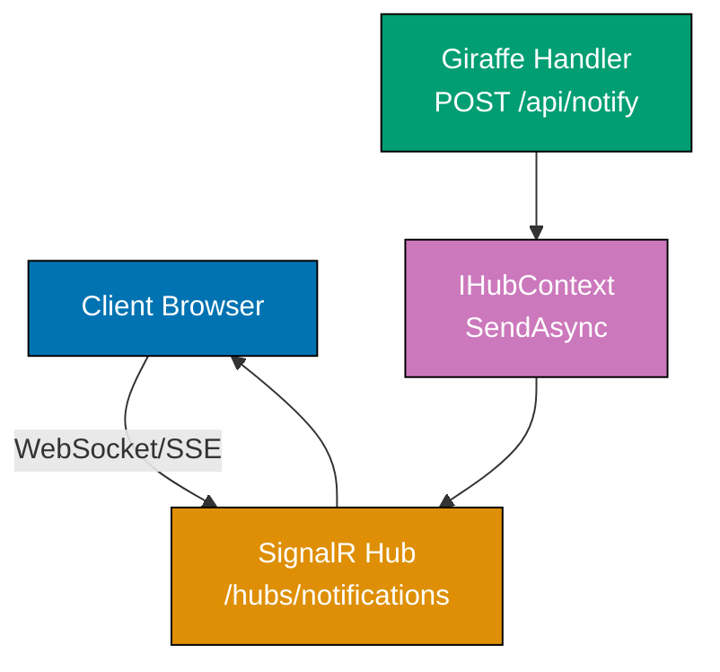
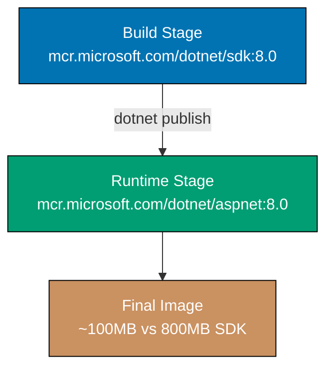

## Group 21: Custom Computation Expressions

### Example 56: Building a Validation Computation Expression

Computation expressions (CEs) in F# generalize monadic patterns. A custom `validation {}` CE enables linear, readable validation pipelines without nested `match` expressions.

```fsharp
open Giraffe

// Define a result-like validation type
type Validation<'T> =
    | Success of 'T
    | Failure of string list
// => Failure accumulates ALL errors (unlike Result which stops at first)

// Builder for validation {} CE
type ValidationBuilder() =
    member _.Return(x)    = Success x
    // => return value => Success value
    member _.Bind(v, f)   =
        match v with
        | Success x  -> f x        // => Unwrap and continue
        | Failure es -> Failure es // => Short-circuit on failure
    // => let! x = validation => Bind(validation, fun x -> ...)
    member _.Zero()       = Success ()
    // => Empty validation block => Success unit

let validate = ValidationBuilder()
// => Creates the `validate` CE; use as `validate { let! x = ... }`

// Validation rules as functions returning Validation<'T>
let requireNonEmpty (field : string) (value : string) : Validation<string> =
    if System.String.IsNullOrWhiteSpace(value)
    then Failure [$"{field} is required"]
    else Success value

let requirePositive (field : string) (value : decimal) : Validation<decimal> =
    if value > 0m
    then Success value
    else Failure [$"{field} must be positive"]

let requireMinLength (field : string) (min : int) (value : string) : Validation<string> =
    if value.Length >= min
    then Success value
    else Failure [$"{field} must be at least {min} characters"]

// Validated domain type
type ValidatedProduct = { Name : string; Price : decimal; Description : string }

// Use the validation CE to validate a product request
let validateProduct (name : string) (price : decimal) (description : string) : Validation<ValidatedProduct> =
    validate {
        let! validName  = requireNonEmpty "Name" name
        // => let!: Bind(requireNonEmpty "Name" name, fun validName -> ...)
        let! validName2 = requireMinLength "Name" 3 validName
        // => Chain validation rules sequentially
        let! validPrice = requirePositive "Price" price
        let! validDesc  = requireNonEmpty "Description" description
        return { Name = validName2; Price = validPrice; Description = validDesc }
        // => All validations passed: construct the domain type
    }
// => validateProduct "Mug" 9.99m "A nice mug"   => Success { Name="Mug"; Price=9.99m; Description="A nice mug" }
// => validateProduct "" -1m ""                   => Failure ["Name is required"; "Price must be positive"; "Description is required"]
// => Note: CE with Bind stops at first failure; use applicative style for all-errors accumulation

// Giraffe handler using the validation CE
let createProductHandler : HttpHandler =
    fun next ctx ->
        task {
            let! req = ctx.BindJsonAsync<{|Name:string; Price:decimal; Description:string|}>()
            match validateProduct req.Name req.Price req.Description with
            | Success product ->
                return! (setStatusCode 201 >=> json product) next ctx
            | Failure errors ->
                return! (setStatusCode 422 >=> json {| Errors = errors |}) next ctx
        }

let builder = Microsoft.AspNetCore.Builder.WebApplication.CreateBuilder()
builder.Services.AddGiraffe() |> ignore
let app = builder.Build()
app.UseGiraffe(Microsoft.AspNetCore.Builder.EndpointRouteBuilderExtensions.MapPost(app, "/products", createProductHandler) |> ignore; Giraffe.POST >=> Giraffe.route "/products" >=> createProductHandler)
app.Run()
```

**Key Takeaway**: Build a `validation {}` computation expression with `Return` and `Bind` to create a readable sequential validation pipeline that short-circuits on first failure.

**Why It Matters**: Custom computation expressions are F#'s mechanism for embedding domain-specific languages within the type system. A `validation {}` CE reads like imperative validation code while preserving functional composition. As your validation logic grows complex (cross-field rules, async database uniqueness checks, nested object validation), the CE provides a consistent structure that junior developers can follow without understanding monadic theory. This is the same extensibility mechanism that makes F# `async {}` and `task {}` work - you are using the same language feature, not a library trick.

---

### Example 57: Async Workflow with Cancellation and Timeout

Production handlers need timeout and cancellation support for external service calls. The `CancellationToken` from `ctx.RequestAborted` propagates cancellation from the HTTP client through all async operations.

```fsharp
open Microsoft.AspNetCore.Builder
open Microsoft.Extensions.DependencyInjection
open Giraffe

// Simulate an external service call with cancellation support
let callExternalService (ct : System.Threading.CancellationToken) : System.Threading.Tasks.Task<string> =
    task {
        // In a real app: httpClient.GetAsync(url, ct) or dbConn.QueryAsync(ct)
        do! System.Threading.Tasks.Task.Delay(200, ct)
        // => Task.Delay with CancellationToken: cancelled immediately if client disconnects
        // => Throws TaskCanceledException when ct.IsCancellationRequested
        return "External service response"
    }

// Handler with timeout using CancellationTokenSource
let timedHandler : HttpHandler =
    fun next ctx ->
        task {
            // Create a timeout of 5 seconds on top of the request cancellation
            use cts = System.Threading.CancellationTokenSource.CreateLinkedTokenSource(ctx.RequestAborted)
            // => CreateLinkedTokenSource: combines two cancellation tokens
            // => Cancels when EITHER token is cancelled
            cts.CancelAfter(System.TimeSpan.FromSeconds(5.0))
            // => Cancel after 5 seconds (timeout)

            try
                let! result = callExternalService cts.Token
                return! json {| Result = result |} next ctx
            with
            | :? System.OperationCanceledException when ctx.RequestAborted.IsCancellationRequested ->
                // => Client disconnected (request cancelled)
                // => No need to send response; client already gone
                return None     // => Return None; ASP.NET Core handles cleanup
            | :? System.OperationCanceledException ->
                // => Timeout (CTS cancelled after 5s, but client still connected)
                return! (setStatusCode 504 >=> text "Gateway Timeout: external service did not respond") next ctx
                // => 504 Gateway Timeout for upstream service timeout
        }
// => Distinguish between client disconnect (no response needed) and server timeout (504)

let builder = WebApplication.CreateBuilder()
builder.Services.AddGiraffe() |> ignore
let app = builder.Build()
app.UseGiraffe(GET >=> route "/external" >=> timedHandler)
app.Run()
// => GET /external (external responds in <5s) => 200 {"result":"External service response"}
// => GET /external (external times out)        => 504 "Gateway Timeout"
// => GET /external (client disconnects)        => None (no response sent)
```

**Key Takeaway**: Use `CancellationTokenSource.CreateLinkedTokenSource(ctx.RequestAborted)` with `CancelAfter` for per-request timeouts that also respect client disconnection.

**Why It Matters**: Unbounded external service calls are one of the most common causes of production cascading failures. A slow database or third-party API without a timeout holds a thread indefinitely, depleting the thread pool and making the entire application unresponsive. Linking the timeout to `ctx.RequestAborted` means if the client disconnects (browser tab closed, mobile timeout), all downstream operations cancel immediately, freeing resources rather than continuing work that will never be delivered.

---

## Group 22: Middleware Pipeline Deep Dive

### Example 58: Request Enrichment Middleware

Request enrichment middleware adds computed values to `ctx.Items` before handlers run, centralizing cross-cutting data extraction.

```fsharp
open Microsoft.AspNetCore.Builder
open Microsoft.Extensions.DependencyInjection
open Giraffe

// Keys for ctx.Items dictionary
[<Literal>]
let CorrelationIdKey = "X-Correlation-ID"
[<Literal>]
let TenantIdKey      = "TenantId"
[<Literal>]
let RequestIdKey     = "RequestId"
// => [<Literal>] enables these as compile-time constants
// => Prevents typos in key strings across multiple files

// Middleware: extract and enrich request with correlation ID
let correlationMiddleware : HttpHandler =
    fun next ctx ->
        task {
            let correlationId =
                ctx.Request.Headers[CorrelationIdKey].ToString()
                |> fun s -> if s = "" then System.Guid.NewGuid().ToString("N") else s
            // => Use client-provided ID or generate a new one

            ctx.Items[CorrelationIdKey] <- correlationId :> obj
            // => Store in Items for downstream handlers
            // => :> obj: upcast to obj (Items is Dictionary<obj,obj>)

            ctx.Response.Headers[CorrelationIdKey] <- correlationId
            // => Echo back in response for client-side correlation

            return! next ctx
        }

// Middleware: extract tenant from subdomain or header
let tenantMiddleware : HttpHandler =
    fun next ctx ->
        task {
            let tenantId =
                ctx.Request.Headers["X-Tenant-ID"].ToString()
                |> fun s -> if s = "" then "default" else s
            // => Multi-tenant: each tenant identified by header or subdomain

            ctx.Items[TenantIdKey] <- tenantId :> obj
            return! next ctx
        }

// Handler reading enriched context
let enrichedHandler : HttpHandler =
    fun next ctx ->
        task {
            let correlationId =
                ctx.Items.TryGetValue(CorrelationIdKey)
                |> snd |> string    // => Get value and convert to string
            let tenantId =
                ctx.Items.TryGetValue(TenantIdKey)
                |> snd |> string

            return! json {|
                CorrelationId = correlationId
                TenantId      = tenantId
                Message       = "Enriched request processed"
            |} next ctx
        }

let webApp : HttpHandler =
    correlationMiddleware >=>
    tenantMiddleware      >=>
    choose [
        GET >=> route "/api/data" >=> enrichedHandler
    ]

let builder = WebApplication.CreateBuilder()
builder.Services.AddGiraffe() |> ignore
let app = builder.Build()
app.UseGiraffe(webApp)
app.Run()
// => GET /api/data (X-Tenant-ID: acme) => {"correlationId":"a1b2...","tenantId":"acme","message":"..."}
// => Response includes X-Correlation-ID header with same value
```

**Key Takeaway**: Use `ctx.Items` as a per-request dictionary to pass enriched data from middleware to downstream handlers; use `[<Literal>]` for key constants to prevent typos.

**Why It Matters**: Centralized request enrichment ensures that correlation IDs, tenant context, and request metadata are consistently extracted and available to all handlers without each handler independently re-parsing headers. In a multi-tenant SaaS application, extracting the tenant ID once in middleware means every database query, cache key, and log entry automatically scopes to the correct tenant. Typos in string-keyed dictionaries are a silent failure mode, which is why `[<Literal>]` constants are essential for `ctx.Items` keys.

---

### Example 59: Conditional Middleware Application

Apply middleware selectively based on path prefix, method, or request attributes without affecting all endpoints.

```fsharp
open Microsoft.AspNetCore.Builder
open Microsoft.Extensions.DependencyInjection
open Giraffe

// Conditional middleware: only run a middleware for specific paths
let whenPathStartsWith (prefix : string) (middleware : HttpHandler) : HttpHandler =
    fun next ctx ->
        task {
            if ctx.Request.Path.StartsWithSegments(prefix) then
                // => StartsWithSegments: true if path starts with /api prefix
                return! (middleware >=> next) ctx
                // => Run middleware then next for matching paths
            else
                return! next ctx  // => Skip middleware for non-matching paths
        }
// => whenPathStartsWith "/api" authMiddleware => only protect /api/* routes

// Conditional middleware: only run for authenticated users
let whenAuthenticated (middleware : HttpHandler) : HttpHandler =
    fun next ctx ->
        task {
            if ctx.User.Identity.IsAuthenticated then
                return! (middleware >=> next) ctx
            else
                return! next ctx   // => Skip for unauthenticated requests
        }
// => whenAuthenticated activityLoggingMiddleware => only log authenticated activity

// Example middleware: add debug headers in development
let addDebugHeaders : HttpHandler =
    fun next ctx ->
        task {
            ctx.Response.Headers["X-Handler-Version"] <- "Giraffe-7.0"
            ctx.Response.Headers["X-Debug"]           <- "true"
            return! next ctx
        }

// Compose conditional middleware
let webApp : HttpHandler =
    whenPathStartsWith "/api" (        // => Only for /api/* routes:
        fun next ctx ->
            task {
                let logger = ctx.GetService<Microsoft.Extensions.Logging.ILogger<obj>>()
                logger.Microsoft.Extensions.Logging.LogInformation("API request: {Path}", ctx.Request.Path.Value)
                return! next ctx
            }
    ) >=>
    choose [
        GET >=> route    "/api/data"   >=> json {| Data = "API data" |}
        GET >=> route    "/public/info" >=> text "Public info (no API logging)"
    ]

let builder = WebApplication.CreateBuilder()
builder.Services.AddGiraffe() |> ignore
let app = builder.Build()

if app.Environment.IsDevelopment() then
    // Only add debug headers in development
    app.Use(fun ctx next ->
        ctx.Response.Headers["X-Debug"] <- "Development"
        next.Invoke()
    ) |> ignore
// => Conditional ASP.NET Core middleware via app.Use

app.UseGiraffe(webApp)
app.Run()
// => GET /api/data    => logged + {"data":"API data"}
// => GET /public/info => NOT logged + "Public info"
```

**Key Takeaway**: Build conditional middleware with path/attribute predicates to apply cross-cutting concerns selectively without affecting all endpoints.

**Why It Matters**: Applying every middleware to every request is wasteful and can cause security issues. Auth token validation on public static file routes wastes CPU. CORS headers on internal health check endpoints expose unnecessary information. Debug logging on `/metrics` endpoints creates log spam. Conditional middleware application keeps your pipeline lean and makes the scope of each middleware explicit and auditable, which is essential for security reviews and performance optimization.

---

## Group 23: SignalR Integration

### Example 60: Real-Time Notifications with SignalR

ASP.NET Core SignalR provides a higher-level real-time communication abstraction over WebSocket, Server-Sent Events, and long polling. Giraffe coexists with SignalR hubs.



```fsharp
open Microsoft.AspNetCore.Builder
open Microsoft.AspNetCore.SignalR                   // => Hub, IHubContext
open Microsoft.Extensions.DependencyInjection
open Giraffe

// SignalR hub: defines the contract between server and connected clients
type NotificationHub() =
    inherit Hub()
    // => Hub base class provides Clients, Groups, Context

    member this.JoinGroup(groupName : string) =
        this.Groups.AddToGroupAsync(this.Context.ConnectionId, groupName)
    // => Called BY client: adds this connection to a named group
    // => this.Context.ConnectionId: unique ID for this client's connection

    member this.SendNotification(message : string) =
        this.Clients.All.SendAsync("ReceiveNotification", message)
    // => Called BY client: broadcasts message to ALL connected clients
    // => "ReceiveNotification" is the client-side event name
    // => Clients have subscribed: connection.on("ReceiveNotification", msg => ...)

// Giraffe handler: pushes notifications from REST API to SignalR clients
let pushNotificationHandler : HttpHandler =
    fun next ctx ->
        task {
            // Inject IHubContext to send from outside the hub
            let hubContext = ctx.GetService<IHubContext<NotificationHub>>()
            // => IHubContext<THub>: allows server-initiated messages to clients
            // => Not from a client request - from REST endpoint, background job, etc.

            let! body = ctx.BindJsonAsync<{| Group: string; Message: string |}>()

            if System.String.IsNullOrEmpty(body.Group) then
                // => No group: broadcast to all connected clients
                do! hubContext.Clients.All.SendAsync("ReceiveNotification", body.Message)
            else
                // => Specific group: only send to clients in that group
                do! hubContext.Clients.Group(body.Group).SendAsync("ReceiveNotification", body.Message)

            return! json {| Sent = true; Recipients = body.Group |} next ctx
        }

let builder = WebApplication.CreateBuilder()

// Register SignalR services
builder.Services.AddSignalR() |> ignore
// => Adds SignalR hub infrastructure, connection management, transport negotiation

builder.Services.AddGiraffe() |> ignore
let app = builder.Build()

// Map SignalR hub to a WebSocket endpoint
app.MapHub<NotificationHub>("/hubs/notifications") |> ignore
// => Clients connect to wss://host/hubs/notifications
// => SignalR handles WebSocket, SSE, and long-polling transport negotiation

app.UseGiraffe(
    POST >=> route "/api/notify" >=> pushNotificationHandler
)
app.Run()
// => Client connects to /hubs/notifications via WebSocket
// => POST /api/notify {"group":"admins","message":"System maintenance at 3AM"}
// =>   => Sends to all clients in "admins" group
// =>   => Clients receive: "ReceiveNotification" event with the message
```

**Key Takeaway**: Define a `Hub` class for client-initiated events; use `IHubContext<THub>` in Giraffe handlers to push server-initiated messages to SignalR clients.

**Why It Matters**: SignalR provides a higher-level abstraction over raw WebSocket that handles transport negotiation, connection lifecycle, group management, and reconnection automatically. For applications needing real-time features without deep WebSocket expertise, SignalR reduces implementation time significantly. The `IHubContext` injection pattern means your Giraffe REST endpoints can trigger real-time events on user-facing dashboards after processing API requests, without any client polling. This is the standard pattern for live activity feeds, collaborative tools, and live dashboards.

---

## Group 24: Observability

### Example 61: OpenTelemetry Distributed Tracing

OpenTelemetry provides vendor-neutral distributed tracing. Giraffe applications can emit trace spans for incoming requests and outgoing calls using the `System.Diagnostics.Activity` API.

```fsharp
open Microsoft.AspNetCore.Builder
open Microsoft.Extensions.DependencyInjection
open OpenTelemetry.Trace                            // => TracerProvider, OpenTelemetry.Exporter.Jaeger
open OpenTelemetry.Resources                        // => ResourceBuilder
open Giraffe

// Create a named ActivitySource for your service
let activitySource = new System.Diagnostics.ActivitySource("GiraffeApp.Api")
// => ActivitySource: creates Activity (span) instances
// => Name typically follows "company.service.component" convention

// Handler that creates and propagates trace spans
let tracedDataHandler : HttpHandler =
    fun next ctx ->
        task {
            // Start a custom span within the incoming request trace
            use activity = activitySource.StartActivity("ProcessDataRequest")
            // => StartActivity: creates a child span of the incoming request
            // => use: ActivitySource.Dispose() ends the span when block exits

            activity |> Option.ofObj |> Option.iter (fun a ->
                a.SetTag("request.path", ctx.Request.Path.Value) |> ignore
                a.SetTag("user.id", ctx.User.FindFirst("sub") |> Option.ofObj |> Option.map (fun c -> c.Value) |> Option.defaultValue "anonymous") |> ignore
                // => SetTag: add key-value metadata to the span
                // => Visible in Jaeger, Zipkin, or OpenTelemetry collector
            )

            // Simulate a database query span
            use dbActivity = activitySource.StartActivity("DatabaseQuery")
            // => Nested span: parent is "ProcessDataRequest"
            dbActivity |> Option.ofObj |> Option.iter (fun a ->
                a.SetTag("db.system", "postgresql") |> ignore
                a.SetTag("db.statement", "SELECT * FROM items") |> ignore
                // => Standard OpenTelemetry database span tags
            )
            do! System.Threading.Tasks.Task.Delay(15)   // => Simulates DB query time
            dbActivity |> Option.ofObj |> Option.iter (fun a ->
                a.SetTag("db.rows_affected", "42") |> ignore
            )

            return! json {| Data = "traced result"; TraceId = System.Diagnostics.Activity.Current?.TraceId.ToString() |} next ctx
            // => Include TraceId in response for correlation with external monitoring
        }

let builder = WebApplication.CreateBuilder()

// Configure OpenTelemetry
builder.Services.AddOpenTelemetry()
    .WithTracing(fun tracing ->
        tracing
            .SetResourceBuilder(
                ResourceBuilder.CreateDefault().AddService("GiraffeApp", "1.0.0")
                // => Service name and version appear in all traces
            )
            .AddAspNetCoreInstrumentation()
            // => Auto-instruments all incoming HTTP requests
            .AddHttpClientInstrumentation()
            // => Auto-instruments HttpClient outgoing requests
            .AddSource("GiraffeApp.Api")
            // => Include spans from our ActivitySource
            .AddJaegerExporter()
            // => Export to Jaeger (or use AddOtlpExporter for OpenTelemetry Collector)
        |> ignore
    ) |> ignore

builder.Services.AddGiraffe() |> ignore
let app = builder.Build()
app.UseGiraffe(GET >=> route "/data" >=> tracedDataHandler)
app.Run()
// => GET /data => traces appear in Jaeger with spans:
// =>   HTTP GET /data (auto-instrumented)
// =>   └── ProcessDataRequest (custom span)
// =>       └── DatabaseQuery (nested custom span, 15ms)
```

**Key Takeaway**: Create an `ActivitySource`, start child activities for custom spans, and configure `AddOpenTelemetry().WithTracing()` with appropriate instrumentation and exporters.

**Why It Matters**: Distributed tracing is essential for debugging latency in microservice architectures. When a request spans three services and takes 2 seconds total, tracing shows exactly which service contributed 1.8 seconds and which operation within that service is slow. Without traces, you have timing data at service boundaries but cannot pinpoint the slow path through the code. OpenTelemetry's vendor neutrality means you can switch from Jaeger to Zipkin to Honeycomb without changing application code, only the exporter configuration.

---

### Example 62: Custom Metrics with EventCounters

ASP.NET Core's `EventCounter` API provides lightweight, high-performance metrics without external dependencies. Expose custom counters for business metrics alongside framework metrics.

```fsharp
open Microsoft.AspNetCore.Builder
open Microsoft.Extensions.DependencyInjection
open System.Diagnostics.Tracing                    // => EventSource, EventCounter
open Giraffe

// Custom EventSource for application metrics
[<EventSource(Name = "GiraffeApp.Metrics")>]
type AppMetricsSource private () =
    inherit EventSource()
    // => EventSource: registers a named event source for dotnet-counters, Application Insights, etc.

    static member val Instance = AppMetricsSource()
    // => Singleton instance (EventSource must be singleton)

    // Request rate counter
    member val RequestsPerSecond = new EventCounter("requests-per-second", AppMetricsSource.Instance)
    // => EventCounter: measures rate and mean value over time

    // Response time histogram
    member val ResponseTimeMs = new EventCounter("response-time-ms", AppMetricsSource.Instance)
    // => Tracks mean and standard deviation of response times

    // Business metric: items created
    member val ItemsCreated = new IncrementingEventCounter("items-created", AppMetricsSource.Instance)
    // => IncrementingEventCounter: monotonically increasing counter (for rates)

// Metrics middleware
let metricsMiddleware : HttpHandler =
    fun next ctx ->
        task {
            let sw = System.Diagnostics.Stopwatch.StartNew()
            let! result = next ctx       // => Run the rest of the pipeline

            sw.Stop()
            AppMetricsSource.Instance.RequestsPerSecond.WriteMetric(1.0)
            // => WriteMetric: record one request
            AppMetricsSource.Instance.ResponseTimeMs.WriteMetric(float sw.ElapsedMilliseconds)
            // => WriteMetric: record response time in ms
            return result
        }

// Handler that records business metric
let createItemHandler : HttpHandler =
    fun next ctx ->
        task {
            let! body = ctx.BindJsonAsync<{| Name: string |}>()
            // Simulate creating item
            AppMetricsSource.Instance.ItemsCreated.Increment()
            // => Increment: +1 to the items-created counter
            return! (setStatusCode 201 >=> json {| Name = body.Name; Created = true |}) next ctx
        }

let builder = WebApplication.CreateBuilder()
builder.Services.AddGiraffe() |> ignore
let app = builder.Build()
app.UseGiraffe(
    metricsMiddleware >=>
    choose [
        POST >=> route "/items" >=> createItemHandler
        GET  >=> route "/ping"  >=> text "pong"
    ]
)
app.Run()
// => Monitor with: dotnet-counters monitor --counters GiraffeApp.Metrics GiraffeApp
// => Displays: [GiraffeApp.Metrics] requests-per-second, response-time-ms, items-created
```

**Key Takeaway**: Create a singleton `EventSource` subclass with `EventCounter` members; call `WriteMetric` and `Increment` from middleware and handlers.

**Why It Matters**: Custom business metrics tied to framework metrics give you a complete picture of application health. Framework metrics (request rate, response time, GC pressure) tell you about infrastructure; business metrics (items created, payments processed, users registered) tell you about application functionality. When response times spike, correlated business metrics reveal whether transactions dropped proportionally (capacity problem) or stayed constant (a specific slow path). EventCounters integrate with `dotnet-counters`, Application Insights, and Prometheus without additional libraries.

---

## Group 25: Caching

### Example 63: Output Caching for Expensive Endpoints

ASP.NET Core 7+ output caching stores entire response bodies and serves them without re-executing handlers. This is more powerful than response caching headers alone.

```fsharp
open Microsoft.AspNetCore.Builder
open Microsoft.AspNetCore.OutputCaching             // => OutputCache attribute equivalent
open Microsoft.Extensions.DependencyInjection
open Giraffe

// Giraffe handler with output caching via metadata
let expensiveComputationHandler : HttpHandler =
    fun next ctx ->
        task {
            // Simulate expensive operation (DB query, complex calculation)
            do! System.Threading.Tasks.Task.Delay(500)
            // => 500ms simulates a slow database aggregation query

            let result = {|
                ComputedAt = System.DateTime.UtcNow.ToString("u")
                // => Shows when this was computed (will be same for cache hits)
                Data       = [1..1000] |> List.map (fun i -> i * i) |> List.sum
                // => Sum of squares 1-1000 = 333833500
            |}

            // Set output cache policy via headers (works with output cache middleware)
            ctx.Response.Headers["X-Cache-Policy"] <- "computed"
            return! json result next ctx
        }
// => Without caching: every request waits 500ms
// => With caching: only first request per cache window waits 500ms

// Vary-by-header caching: different cache entry per Accept-Language
let localizedHandler : HttpHandler =
    fun next ctx ->
        task {
            let lang =
                ctx.Request.Headers["Accept-Language"].ToString()
                |> fun s -> if s.StartsWith("id") then "id" else "en"
            // => id = Indonesian, en = English

            let greeting = if lang = "id" then "Halo, Dunia!" else "Hello, World!"
            return! json {| Greeting = greeting; Language = lang |} next ctx
        }

let builder = WebApplication.CreateBuilder()

// Configure output caching
builder.Services.AddOutputCache(fun options ->
    options.AddBasePolicy(fun policy ->
        policy.Expire(System.TimeSpan.FromMinutes(5.0)) |> ignore
        // => Default: cache responses for 5 minutes
    )
    options.AddPolicy("Short", fun policy ->
        policy.Expire(System.TimeSpan.FromSeconds(30.0)) |> ignore
        // => "Short" policy: 30 seconds
    )
) |> ignore

builder.Services.AddGiraffe() |> ignore
let app = builder.Build()

app.UseOutputCache() |> ignore
// => UseOutputCache BEFORE UseGiraffe: caches responses at middleware level

app.UseGiraffe(choose [
    GET >=> route "/expensive" >=> expensiveComputationHandler
    GET >=> route "/greeting"  >=> localizedHandler
])
app.Run()
// => GET /expensive (1st request) => 500ms response, response cached
// => GET /expensive (2nd request) => <1ms response from cache (within 5min window)
// => GET /expensive (6th minute)  => 500ms response (cache expired)
```

**Key Takeaway**: Register `AddOutputCache()` with named policies and `UseOutputCache()` before `UseGiraffe()` to cache full response bodies at the middleware level.

**Why It Matters**: Output caching is more efficient than response caching headers because it happens in the server process before executing any handler code. A cached response from output caching skips Giraffe routing, DI resolution, database queries, and serialization entirely, serving the cached bytes directly from memory. For high-traffic read endpoints (product lists, public dashboards, static aggregations), output caching can multiply throughput by 10-100x compared to executing handlers for every request.

---

## Group 26: API Versioning

### Example 64: URL-Based API Versioning

Supporting multiple API versions simultaneously enables gradual client migration. URL-based versioning (`/api/v1/`, `/api/v2/`) uses `subRoute` for clean version isolation.

```fsharp
open Microsoft.AspNetCore.Builder
open Microsoft.Extensions.DependencyInjection
open Giraffe

// V1 response types
type UserV1 = { Id : int; Name : string }
// => V1: simple user representation

// V2 response types (extended with more fields)
type UserV2 = { Id : int; Name : string; Email : string; CreatedAt : System.DateTime }
// => V2: richer user representation with email and timestamp

let sampleUsers = [
    { Id = 1; Name = "Alice"; Email = "alice@example.com"; CreatedAt = System.DateTime(2025, 1, 1) }
    { Id = 2; Name = "Bob";   Email = "bob@example.com";   CreatedAt = System.DateTime(2025, 6, 1) }
]

// V1 handlers: return simplified user objects
let v1UsersHandler : HttpHandler =
    let v1Users = sampleUsers |> List.map (fun u -> { Id = u.Id; Name = u.Name })
    // => Map V2 data to V1 response shape (hide email and timestamp)
    json v1Users
// => V1 clients only see Id and Name

// V2 handlers: return full user objects
let v2UsersHandler : HttpHandler =
    json sampleUsers
// => V2 clients see all fields

// Header-based versioning: read API-Version header
let headerVersionedHandler : HttpHandler =
    fun next ctx ->
        task {
            let version =
                ctx.Request.Headers["API-Version"].ToString()
                |> fun s -> if s = "2" then 2 else 1
            // => API-Version: 2 => v2, anything else => v1

            if version = 2 then
                return! json sampleUsers next ctx
            else
                let v1Users = sampleUsers |> List.map (fun u -> { Id = u.Id; Name = u.Name })
                return! json v1Users next ctx
        }

// Compose versioned route trees
let webApp : HttpHandler =
    choose [
        // URL-based versioning: cleanest for public APIs
        subRoute "/api/v1" (choose [
            GET >=> route "/users" >=> v1UsersHandler
            // => GET /api/v1/users => V1 user list (Id, Name only)
        ])

        subRoute "/api/v2" (choose [
            GET >=> route "/users" >=> v2UsersHandler
            // => GET /api/v2/users => V2 user list (all fields)
        ])

        // Header-based versioning: single URL, version in header
        GET >=> route "/api/users" >=> headerVersionedHandler
        // => GET /api/users (API-Version: 2) => V2
        // => GET /api/users (API-Version: 1) => V1
    ]

let builder = WebApplication.CreateBuilder()
builder.Services.AddGiraffe() |> ignore
let app = builder.Build()
app.UseGiraffe(webApp)
app.Run()
// => GET /api/v1/users                         => [{"id":1,"name":"Alice"},...]
// => GET /api/v2/users                         => [{"id":1,"name":"Alice","email":"..."},...]
// => GET /api/users (API-Version: 2)           => V2 format
```

**Key Takeaway**: Use `subRoute "/api/v1"` and `subRoute "/api/v2"` for URL-based versioning; each version has its own response type and handler implementation.

**Why It Matters**: API versioning without breaking changes is a professional responsibility to your clients. When you rename a field or change a data format, existing clients that cannot upgrade immediately must continue to work. URL versioning makes the version explicit and bookmarkable. F#'s type system helps here - defining separate `UserV1` and `UserV2` types ensures that each version's response shape is verified at compile time. When you add a field to V3, the compiler forces you to handle it in the V3 handler without accidentally exposing it in V2.

---

## Group 27: Giraffe ViewEngine Advanced

### Example 65: ViewEngine Component Library

Building a reusable component library with Giraffe ViewEngine creates a consistent UI system across your application.

```fsharp
open Giraffe.ViewEngine

// ===== COMPONENT LIBRARY =====

// Alert component with variants
type AlertVariant = Success | Warning | Danger | Info

let alertComponent (variant : AlertVariant) (message : string) (dismissible : bool) : XmlNode =
    let (cssClass, icon) =
        match variant with
        | Success -> "alert alert-success", "✓"    // => Green success alert
        | Warning -> "alert alert-warning", "⚠"    // => Yellow warning
        | Danger  -> "alert alert-danger",  "✗"    // => Red error
        | Info    -> "alert alert-info",    "ℹ"    // => Blue informational
    // => Pattern match returns tuple (cssClass, icon symbol)

    div [_class cssClass; attr "role" "alert"] [
        // => role="alert" for screen reader accessibility
        span [_class "alert-icon"] [str icon]
        span [_class "alert-message"] [str message]
        if dismissible then
            button [
                _type  "button"
                _class "btn-close"
                attr   "data-bs-dismiss" "alert"   // => Bootstrap dismiss attribute
                attr   "aria-label" "Close"         // => Screen reader label
            ] []
            // => Dismiss button only rendered for dismissible alerts
    ]
// => alertComponent Success "Saved!" true => dismissible green alert

// Form input component with label and error
let formInput (id : string) (label : string) (inputType : string) (errorMsg : string option) : XmlNode =
    div [_class "form-group mb-3"] [
        label [_for id; _class "form-label"] [str label]
        // => _for: links label to input via id (accessibility)
        input [
            _id          id
            _name        id            // => name matches id for form binding
            _type        inputType
            _class (
                match errorMsg with
                | Some _ -> "form-control is-invalid"   // => Red border on error
                | None   -> "form-control"
            )
            attr "aria-describedby" $"{id}-error"  // => Link to error element
        ]
        match errorMsg with
        | Some msg ->
            div [_id $"{id}-error"; _class "invalid-feedback"] [str msg]
            // => Error message linked by aria-describedby
        | None -> ()  // => No error div when there's no error
    ]
// => formInput "email" "Email Address" "email" (Some "Email is required")
// => => <div class="form-group"><label for="email">Email</label><input class="form-control is-invalid"...><div class="invalid-feedback">Email is required</div></div>

// Page layout with navigation
let pageLayout (pageTitle : string) (navItems : (string * string) list) (content : XmlNode list) : XmlNode =
    html [attr "lang" "en"] [
        // => lang="en" for screen reader language identification
        head [] [
            meta [_charset "utf-8"]
            meta [_name "viewport"; _content "width=device-width, initial-scale=1"]
            // => viewport meta for responsive design
            title [] [str $"{pageTitle} - MyApp"]
            link [_rel "stylesheet"; _href "/css/bootstrap.min.css"]
        ]
        body [] [
            nav [_class "navbar navbar-expand-lg"] [
                div [_class "container"] [
                    a [_class "navbar-brand"; _href "/"] [str "MyApp"]
                    ul [_class "navbar-nav"] [
                        for (label, href) in navItems do
                            li [_class "nav-item"] [
                                a [_class "nav-link"; _href href] [str label]
                            ]
                    ]
                ]
            ]
            main [_class "container mt-4"; attr "role" "main"] content
            // => role="main" for screen readers to identify primary content
        ]
    ]
// => Reusable page shell used by all views
```

**Key Takeaway**: Build ViewEngine components as F# functions returning `XmlNode`; use pattern matching for variant-based styling and conditional rendering for optional elements.

**Why It Matters**: A ViewEngine component library gives you the same benefits as React/Vue component systems but with compile-time safety. When you rename a field in `formInput` signature, the compiler immediately identifies every call site that needs updating. Unlike template-based component systems where props are stringly-typed, ViewEngine components are typed F# functions. The component library pattern also ensures design system consistency - every form input renders the same way without developers manually writing Bootstrap classes correctly every time.

---

## Group 28: Docker and Deployment

### Example 66: Dockerfile for Giraffe Applications

A multi-stage Dockerfile builds and packages a Giraffe application efficiently, producing a minimal production image.



```fsharp
// Dockerfile (not F# code - shown as comments)
// ===================================================
// # Stage 1: Build
// FROM mcr.microsoft.com/dotnet/sdk:8.0 AS build
// # => SDK image: includes dotnet build, restore, publish tools
// # => ~800MB: large but only used during build
// WORKDIR /src
// # => Working directory inside container
//
// # Copy project files and restore NuGet packages separately
// # (layer caching: restore only re-runs when .fsproj changes)
// COPY ["MyApp/MyApp.fsproj", "MyApp/"]
// RUN dotnet restore "MyApp/MyApp.fsproj"
// # => dotnet restore: downloads NuGet packages into /root/.nuget
// # => Cached by Docker unless .fsproj changes
//
// # Copy remaining source and build
// COPY . .
// WORKDIR "/src/MyApp"
// RUN dotnet build "MyApp.fsproj" -c Release -o /app/build
// # => -c Release: optimized build (not Debug)
//
// # Stage 1b: Publish (self-contained or framework-dependent)
// FROM build AS publish
// RUN dotnet publish "MyApp.fsproj" -c Release -o /app/publish --no-restore
// # => --no-restore: packages already restored in previous step
// # => /app/publish: output directory with all app files
//
// # Stage 2: Runtime
// FROM mcr.microsoft.com/dotnet/aspnet:8.0 AS final
// # => ASP.NET runtime image: ~100MB (no SDK, no build tools)
// # => Smaller attack surface for production
// WORKDIR /app
// COPY --from=publish /app/publish .
// # => Copy only published output from build stage
// # => Does NOT include source code, NuGet cache, or SDK
//
// # Security: run as non-root user
// RUN addgroup --system appgroup && adduser --system --ingroup appgroup appuser
// USER appuser
// # => Running as non-root limits damage from container escape vulnerabilities
//
// EXPOSE 8080
// # => Document which port the app listens on
// # => Does not actually publish the port (that's docker run -p 8080:8080)
//
// ENV ASPNETCORE_URLS=http://+:8080
// # => Override default port 5000 to 8080 (standard for containers)
// # => + means listen on all interfaces (0.0.0.0)
//
// ENTRYPOINT ["dotnet", "MyApp.dll"]
// # => Start the app when container runs
// # => ENTRYPOINT (not CMD) prevents accidental override in docker run
// ===================================================

// Program.fs: production-ready configuration
open Microsoft.AspNetCore.Builder
open Microsoft.Extensions.DependencyInjection
open Microsoft.Extensions.Hosting
open Giraffe

let builder = WebApplication.CreateBuilder()

// Kestrel listens on port from ASPNETCORE_URLS environment variable
// => Defaults to http://+:80 if not set
// => Docker sets ASPNETCORE_URLS=http://+:8080

builder.Services.AddGiraffe() |> ignore

let app = builder.Build()

// Production: trust X-Forwarded-For from reverse proxy
if not (app.Environment.IsDevelopment()) then
    app.UseForwardedHeaders() |> ignore
    // => UseForwardedHeaders: reads X-Forwarded-For, X-Forwarded-Proto
    // => Required when behind nginx, Traefik, or Kubernetes ingress
    // => Without this: ctx.Connection.RemoteIpAddress always shows proxy IP

app.UseGiraffe(
    choose [
        GET >=> route "/health" >=> text "OK"
        GET >=> route "/api/v1/items" >=> text "Items list"
    ]
)
app.Run()
// => docker build -t myapp .
// => docker run -p 8080:8080 -e ASPNETCORE_ENVIRONMENT=Production myapp
// => curl http://localhost:8080/health => "OK"
```

**Key Takeaway**: Use multi-stage Dockerfiles to separate build and runtime stages; run as a non-root user and configure `ASPNETCORE_URLS` for container port binding.

**Why It Matters**: Multi-stage Docker builds produce images that are 8x smaller than single-stage builds (100MB vs 800MB) while including all compilation tools in the build stage. Smaller images download faster in CI/CD pipelines, reduce registry storage costs, and have smaller attack surfaces (no compiler, no package manager in production). Running as a non-root user limits the blast radius of container escape vulnerabilities - a critical defense-in-depth security practice required by most enterprise security policies and CIS Docker benchmark recommendations.

---

### Example 67: Environment Variables and Secrets Management

Production Giraffe applications read secrets from environment variables and secret stores, never from source code or committed configuration files.

```fsharp
open Microsoft.AspNetCore.Builder
open Microsoft.Extensions.Configuration
open Microsoft.Extensions.DependencyInjection
open Giraffe

// Strong-typed configuration bound from environment variables
type AppConfig = {
    DatabaseUrl    : string    // => DATABASE_URL env var
    JwtSecret      : string    // => JWT_SECRET env var
    RedisUrl       : string    // => REDIS_URL env var
    AllowedOrigins : string    // => ALLOWED_ORIGINS env var
}

let builder = WebApplication.CreateBuilder()

// ASP.NET Core configuration providers (in priority order):
// 1. appsettings.json                     - base/default config
// 2. appsettings.{Environment}.json       - environment-specific overrides
// 3. User secrets (development only)      - local secrets not in source control
// 4. Environment variables                - deployment-time config (highest priority)
// 5. Command-line arguments               - runtime overrides (highest)

// Read individual values with null safety
let databaseUrl = builder.Configuration["DATABASE_URL"]
// => Reads DATABASE_URL environment variable
// => Returns null if not set (not found in any provider)

let jwtSecret =
    builder.Configuration["JWT_SECRET"]
    |> fun s -> if System.String.IsNullOrEmpty(s) then failwith "JWT_SECRET is required" else s
// => Fail fast if required secret is missing
// => Better to crash at startup than serve requests without auth

// Bind environment variables to strongly-typed config
// Underscore in env var maps to colon separator in configuration paths
// => DATABASE__HOST in env = Database:Host in config
builder.Configuration.AddEnvironmentVariables("APP_") |> ignore
// => Only env vars with APP_ prefix are loaded (prevents accidental inclusion)
// => APP_DATABASE_URL => DatabaseUrl in config

// Bind to record type
let appConfig = {
    DatabaseUrl    = builder.Configuration.GetValue("DATABASE_URL",    "postgresql://localhost/app")
    JwtSecret      = builder.Configuration.GetValue("JWT_SECRET",      "dev-only-secret-min-32-chars!!")
    // => GetValue<string>(key, defaultValue): returns default if key missing
    // => Never hardcode production secrets - these defaults are for development only
    RedisUrl       = builder.Configuration.GetValue("REDIS_URL",       "redis://localhost:6379")
    AllowedOrigins = builder.Configuration.GetValue("ALLOWED_ORIGINS", "http://localhost:3000")
}

builder.Services.AddSingleton(appConfig) |> ignore
// => Register config as singleton for injection into handlers

builder.Services.AddGiraffe() |> ignore
let app = builder.Build()
app.UseGiraffe(
    GET >=> route "/config-check" >=>
    fun next ctx ->
        task {
            let cfg = ctx.GetService<AppConfig>()
            return! json {|
                HasDatabase  = not (System.String.IsNullOrEmpty(cfg.DatabaseUrl))
                HasJwtSecret = cfg.JwtSecret.Length >= 32
                // => Never return the actual secret values in responses
                Environment  = app.Environment.EnvironmentName
            |} next ctx
        }
)
app.Run()
// => DATABASE_URL=postgresql://prod-host/app JWT_SECRET=long-random-secret dotnet run
// => GET /config-check => {"hasDatabase":true,"hasJwtSecret":true,"environment":"Production"}
```

**Key Takeaway**: Read required secrets from environment variables with `builder.Configuration.GetValue`; fail fast at startup for missing required secrets.

**Why It Matters**: Environment variable-based secrets management is the twelve-factor app standard that enables the same Docker image to run in development, staging, and production with different credentials. Hardcoded secrets in source code are a critical vulnerability that persists in git history even after removal. Failing fast at startup for missing required configuration (like `JWT_SECRET`) is far better than silently using a default that makes the application insecure in production - a crash during deployment is visible and fixable; a security misconfiguration may go undetected.

---

## Group 29: Kestrel Tuning

### Example 68: Kestrel Configuration for Production

Kestrel is ASP.NET Core's built-in web server. Tuning its settings improves throughput, memory efficiency, and security for production deployments.

```fsharp
open Microsoft.AspNetCore.Builder
open Microsoft.AspNetCore.Server.Kestrel.Core       // => KestrelServerOptions
open Microsoft.Extensions.DependencyInjection
open Giraffe

let builder = WebApplication.CreateBuilder()

// Configure Kestrel via the builder
builder.WebHost.ConfigureKestrel(fun options ->
    // ===== LIMITS =====
    options.Limits.MaxConcurrentConnections <- System.Nullable(10000L)
    // => Maximum simultaneous connections (default: unlimited)
    // => Prevents resource exhaustion under heavy load

    options.Limits.MaxConcurrentUpgradedConnections <- System.Nullable(1000L)
    // => Limit WebSocket connections separately
    // => WebSocket connections are long-lived, need separate budget

    options.Limits.MaxRequestBodySize <- System.Nullable(52428800L) // => 50MB
    // => Maximum request body size (default: 30MB)
    // => Prevent large upload attacks; override per-endpoint if needed

    options.Limits.MinRequestBodyDataRate <- Microsoft.AspNetCore.Server.Kestrel.Core.MinDataRate(
        bytesPerSecond = 240.0, gracePeriod = System.TimeSpan.FromSeconds(5.0)
    )
    // => Minimum upload rate: 240 bytes/sec with 5s grace period
    // => Disconnects "slow loris" clients that send 1 byte/second forever

    options.Limits.MaxRequestHeadersTotalSize <- 16384
    // => Maximum total request headers size: 16KB (default)
    // => Large headers signal malicious or misconfigured clients

    // ===== HTTP/2 SETTINGS =====
    options.Limits.Http2.MaxStreamsPerConnection <- 100
    // => HTTP/2 streams per connection (default: 100)
    // => Higher = more parallelism per connection

    options.Limits.Http2.InitialConnectionWindowSize <- 131072    // => 128KB
    // => HTTP/2 flow control window (default: 65535)
    // => Larger window improves throughput for large responses

    // ===== KEEP-ALIVE =====
    options.Limits.KeepAliveTimeout <- System.TimeSpan.FromMinutes(2.0)
    // => How long to keep idle connections open (default: 130s)

    options.Limits.RequestHeadersTimeout <- System.TimeSpan.FromSeconds(30.0)
    // => Timeout waiting for request headers after connection (default: 30s)
    // => Prevents slow header attacks

    // ===== TLS/HTTPS =====
    options.ConfigureHttpsDefaults(fun httpsOptions ->
        httpsOptions.SslProtocols <- System.Security.Authentication.SslProtocols.Tls12 ||| System.Security.Authentication.SslProtocols.Tls13
        // => Allow only TLS 1.2 and 1.3 (disable SSL3, TLS 1.0, TLS 1.1)
        // => TLS 1.0/1.1 are deprecated and vulnerable
    )
) |> ignore

builder.Services.AddGiraffe() |> ignore
let app = builder.Build()
app.UseGiraffe(GET >=> route "/health" >=> text "OK")
app.Run()
// => dotnet run => Kestrel starts with production-grade limits
// => Handles 10,000 concurrent connections, 50MB max body, TLS 1.2/1.3 only
```

**Key Takeaway**: Configure Kestrel limits (connections, body size, header size, minimum rate) and TLS settings in `ConfigureKestrel` for production hardening.

**Why It Matters**: Kestrel's defaults are designed for development, not production. Without connection limits, a single machine can open 100,000+ connections to exhaust your server's file descriptors. Without minimum rate limits, slow loris attacks hold connections open indefinitely. Without TLS version restrictions, clients negotiate weak cipher suites. These are not optional security hardening steps - they are the difference between an application that survives a production incident and one that gets taken down by a moderate attack. Each setting has a specific threat model it addresses.

---

### Example 69: Thread Pool and GC Tuning

.NET runtime configuration via `DOTNET_*` environment variables and `runtimeconfig.json` can significantly impact throughput for Giraffe applications under load.

```fsharp
// runtimeconfig.template.json (placed next to .fsproj, merges into generated .runtimeconfig.json)
// {
//   "configProperties": {
//     "System.GC.Server": true,
//     "=> Server GC uses per-core heaps; better throughput at cost of more memory"
//     "System.GC.HeapHardLimit": 536870912,
//     "=> Limit managed heap to 512MB; important in containerized environments"
//     "=> Without this, .NET can request more memory than the container allows"
//     "System.Net.Http.SocketsHttpHandler.Http2UnencryptedSupport": true,
//     "=> Enable cleartext HTTP/2 (for internal service mesh without TLS termination)"
//     "System.Threading.ThreadPool.MinThreads": 100,
//     "=> Pre-warm thread pool to avoid startup latency spike"
//     "=> Default: one thread per CPU core (typically 4-16)"
//     "System.Threading.ThreadPool.MaxThreads": 32767
//     "=> Maximum thread pool threads (default)"
//   }
// }

// Program.fs: configure thread pool at startup
open Microsoft.AspNetCore.Builder
open Microsoft.Extensions.DependencyInjection
open Giraffe

// Configure thread pool programmatically (alternative to runtimeconfig)
let configureThreadPool () =
    let minWorker, minIO =
        System.Threading.ThreadPool.GetMinThreads()
        // => Returns (workerThreads, completionPortThreads) tuple
    printfn $"Thread pool min threads: worker={minWorker}, IO={minIO}"

    // Pre-warm thread pool to avoid latency on cold start
    System.Threading.ThreadPool.SetMinThreads(100, 100) |> ignore
    // => SetMinThreads: ensures at least 100 worker and 100 IO threads available
    // => Prevents thread pool starvation during burst traffic at startup
    // => Performance impact: reduces request latency during initial load spike

    // GC tuning for containers
    System.Runtime.GCSettings.LatencyMode <- System.Runtime.GCLatencyMode.SustainedLowLatency
    // => SustainedLowLatency: GC pauses limited to 1-2ms
    // => Appropriate for latency-sensitive APIs (default: Interactive with longer pauses)
    // => Not recommended for high-throughput batch processing

let builder = WebApplication.CreateBuilder()

builder.WebHost.UseKestrel(fun options ->
    options.AllowSynchronousIO <- false
    // => false (default): disallow synchronous I/O on request/response stream
    // => Forces async patterns everywhere, prevents thread pool deadlocks
    // => Set true only if you have legacy synchronous code that cannot be made async
) |> ignore

builder.Services.AddGiraffe() |> ignore
let app = builder.Build()
configureThreadPool()
// => Call after Build() to ensure logging is available if needed

app.UseGiraffe(GET >=> route "/health" >=> text "OK")
app.Run()
// => Configured .NET runtime for server workload: server GC, pre-warmed thread pool
```

**Key Takeaway**: Enable Server GC via `runtimeconfig.json` and pre-warm the thread pool with `SetMinThreads` to reduce latency spikes under burst traffic.

**Why It Matters**: Default .NET runtime settings are tuned for desktop applications where memory efficiency and responsiveness matter more than throughput. In containerized API servers, Server GC dramatically improves throughput by distributing GC work across CPU cores. Thread pool pre-warming prevents the "thundering herd" latency spike when the first 100 simultaneous requests arrive and the thread pool must spawn threads on demand. These tunings are standard production practice for high-traffic .NET web services, and ignoring them leaves significant throughput on the table.

---

## Group 30: Rate Limiting (Advanced)

### Example 70: ASP.NET Core 7+ Rate Limiting Middleware

ASP.NET Core 7 introduced built-in rate limiting middleware with fixed window, sliding window, token bucket, and concurrency limiters. This replaces hand-rolled IMemoryCache implementations.

```fsharp
open Microsoft.AspNetCore.Builder
open Microsoft.AspNetCore.RateLimiting                // => RateLimiterOptions, FixedWindowRateLimiter
open Microsoft.Extensions.DependencyInjection
open System.Threading.RateLimiting                    // => RateLimitPartition, PartitionedRateLimiter
open Giraffe

let builder = WebApplication.CreateBuilder()

// Configure rate limiters with named policies
builder.Services.AddRateLimiter(fun options ->
    // Fixed window: N requests per time window, window resets at end
    options.AddFixedWindowLimiter("api", fun opts ->
        opts.PermitLimit         <- 100               // => 100 requests
        opts.Window              <- System.TimeSpan.FromMinutes(1.0)  // => per minute
        opts.QueueProcessingOrder <- System.Threading.RateLimiting.QueueProcessingOrder.OldestFirst
        opts.QueueLimit          <- 10                // => Queue up to 10 extra requests
        // => QueueLimit: requests beyond PermitLimit wait in queue (not rejected immediately)
    ) |> ignore

    // Sliding window: smoother rate limiting, N requests over rolling window
    options.AddSlidingWindowLimiter("strict-api", fun opts ->
        opts.PermitLimit    <- 20
        opts.Window         <- System.TimeSpan.FromSeconds(10.0)
        opts.SegmentsPerWindow <- 4
        // => SegmentsPerWindow: divides window into 4 x 2.5s segments
        // => Smoother than fixed window (avoids burst at window reset)
    ) |> ignore

    // Token bucket: allows burst up to bucket size, refills at fill rate
    options.AddTokenBucketLimiter("burst-friendly", fun opts ->
        opts.TokenLimit          <- 50                // => Maximum burst: 50 requests
        opts.ReplenishmentPeriod <- System.TimeSpan.FromSeconds(1.0)
        opts.TokensPerPeriod     <- 10                // => Refill 10 tokens per second
        // => Allows burst of 50, then sustained rate of 10/second
        opts.AutoReplenishment   <- true              // => Automatic token refill
    ) |> ignore

    // Per-IP rate limiting using partitioned limiter
    options.AddPolicy("per-ip", fun ctx ->
        RateLimitPartition.GetFixedWindowLimiter(
            partitionKey = (ctx.Connection.RemoteIpAddress?.ToString() |> Option.ofObj |> Option.defaultValue "unknown"),
            // => Each IP gets its own rate limit bucket
            factory      = fun _ -> System.Threading.RateLimiting.FixedWindowRateLimiterOptions(
                PermitLimit = 30,
                Window      = System.TimeSpan.FromMinutes(1.0)
                // => 30 requests per minute per IP
            )
        )
    ) |> ignore

    // Default response for rejected requests
    options.RejectionStatusCode <- 429
    // => 429 Too Many Requests (default is 503 Service Unavailable)
) |> ignore

builder.Services.AddGiraffe() |> ignore
let app = builder.Build()

// Apply rate limiting middleware
app.UseRateLimiter() |> ignore
// => UseRateLimiter BEFORE UseGiraffe

app.UseGiraffe(choose [
    GET >=> route "/api/data"    >=> text "Rate limited (100/min)"
    GET >=> route "/api/strict"  >=> text "Strict rate (20/10s)"
    GET >=> route "/api/burst"   >=> text "Burst friendly (50 burst, 10/s)"
])
app.Run()
// => 101st request within 1 minute to /api/data => 429 Too Many Requests
// => Burst of 50 to /api/burst => allowed; 51st within 5s => 429
```

**Key Takeaway**: Use ASP.NET Core 7's built-in `AddRateLimiter` with named policies (`FixedWindow`, `SlidingWindow`, `TokenBucket`) and per-IP partitioning for production rate limiting.

**Why It Matters**: ASP.NET Core's built-in rate limiter is more efficient than hand-rolled `IMemoryCache` approaches because it uses optimized lock-free data structures and integrates with the platform's request pipeline. Token bucket rate limiting is ideal for API clients that experience bursts (mobile apps reconnecting after network loss) while protecting against sustained abuse. Per-IP partitioning prevents a single client from consuming the entire global rate limit, ensuring fair access across all clients and making denial-of-service attacks from a single IP ineffective.

---

## Group 31: Production Patterns

### Example 71: Graceful Shutdown

Production applications must complete in-flight requests before shutting down during deployments. ASP.NET Core's `IHostApplicationLifetime` enables graceful shutdown handling.

```fsharp
open Microsoft.AspNetCore.Builder
open Microsoft.Extensions.DependencyInjection
open Microsoft.Extensions.Hosting                   // => IHostApplicationLifetime
open Giraffe

let builder = WebApplication.CreateBuilder()

// Configure graceful shutdown timeout
builder.Host.ConfigureHostOptions(fun opts ->
    opts.ShutdownTimeout <- System.TimeSpan.FromSeconds(30.0)
    // => Allow 30 seconds for in-flight requests to complete
    // => Default: 5 seconds (often too short for database transactions)
    // => Kubernetes terminationGracePeriodSeconds should be > this value
) |> ignore

builder.Services.AddGiraffe() |> ignore
let app = builder.Build()

// Register shutdown hooks via IHostApplicationLifetime
let lifetime = app.Services.GetRequiredService<IHostApplicationLifetime>()

lifetime.ApplicationStarted.Register(fun () ->
    printfn "Application started - ready to serve traffic"
    // => Called when the app has fully started
    // => Mark as ready in readiness probes at this point
) |> ignore

lifetime.ApplicationStopping.Register(fun () ->
    printfn "Shutdown signal received - draining in-flight requests"
    // => Called when SIGTERM/Ctrl+C is received
    // => Stop accepting new requests (handled by Kestrel automatically)
    // => In-flight requests continue until ShutdownTimeout
) |> ignore

lifetime.ApplicationStopped.Register(fun () ->
    printfn "All requests drained - application stopped"
    // => Called after all in-flight requests have completed
    // => Final cleanup: flush log buffers, close external connections
) |> ignore

// Long-running handler that respects cancellation
let longRunningHandler : HttpHandler =
    fun next ctx ->
        task {
            // Check if shutdown has been signaled
            let ct = ctx.RequestAborted
            // => ctx.RequestAborted: cancelled when client disconnects OR app shutting down

            try
                do! System.Threading.Tasks.Task.Delay(5000, ct)
                // => 5-second operation; cancelled if shutdown signals
                return! json {| Completed = true |} next ctx
            with :? System.OperationCanceledException ->
                // => Request was cancelled (shutdown or client disconnect)
                // => Do NOT try to write to the response after cancellation
                return None
        }

app.UseGiraffe(choose [
    GET >=> route "/slow" >=> longRunningHandler
    GET >=> route "/fast" >=> text "fast response"
])
app.Run()
// => SIGTERM received: app stops accepting new connections
// => /slow requests that started before SIGTERM complete (up to 30s)
// => New connections are rejected with 503 during drain period
// => After 30s (or all requests complete), process exits
```

**Key Takeaway**: Set `ShutdownTimeout` longer than your longest request; register `ApplicationStopping` and `ApplicationStopped` lifecycle hooks for cleanup; respect `ctx.RequestAborted` in long-running handlers.

**Why It Matters**: Graceful shutdown is essential for zero-downtime deployments with rolling updates. Without it, a Kubernetes rolling deploy terminates pods mid-request, causing 500 errors for users whose requests were in-flight during deployment. Kubernetes sends `SIGTERM` and waits for `terminationGracePeriodSeconds` before `SIGKILL`. Setting your shutdown timeout to 25 seconds (with Kubernetes grace period of 30) gives in-flight requests time to complete while ensuring the pod terminates before Kubernetes gives up. This is the critical difference between "deployments sometimes cause errors" and "zero-downtime deployments."

---

### Example 72: Background Services with IHostedService

Long-running background tasks (scheduled jobs, queue processors, cache warmers) use `IHostedService` and run alongside the Giraffe web server in the same process.

```fsharp
open Microsoft.AspNetCore.Builder
open Microsoft.Extensions.DependencyInjection
open Microsoft.Extensions.Hosting
open Microsoft.Extensions.Logging
open Giraffe

// Background service: periodic cache warming
type CacheWarmingService(logger : ILogger<CacheWarmingService>) =
    inherit BackgroundService()
    // => BackgroundService: IHostedService implementation with cancellation support

    override _.ExecuteAsync(ct : System.Threading.CancellationToken) =
        task {
            logger.LogInformation("Cache warming service started")

            while not ct.IsCancellationRequested do
                // => Loop until application shutdown (ct.IsCancellationRequested)
                try
                    // Simulate warming a cache (real: prefetch hot data from DB)
                    do! System.Threading.Tasks.Task.Delay(System.TimeSpan.FromMinutes(5.0), ct)
                    // => Wait 5 minutes between cache refreshes
                    // => Task.Delay with ct: cancelled immediately on shutdown signal

                    logger.LogInformation("Refreshing cache at {Time}", System.DateTime.UtcNow)
                    // => Real app: fetch data, populate IMemoryCache or IDistributedCache
                with
                | :? System.OperationCanceledException ->
                    // => Task.Delay cancelled by shutdown signal: exit loop cleanly
                    ()
                | ex ->
                    // => Log error but continue running (don't let one error stop the service)
                    logger.LogError(ex, "Cache warming failed, will retry in 5 minutes")

            logger.LogInformation("Cache warming service stopped")
        } :> System.Threading.Tasks.Task
    // => :> Task: upcast Task<unit> to Task (base class requires non-generic Task)

// Background service: message queue consumer
type QueueConsumerService(logger : ILogger<QueueConsumerService>) =
    inherit BackgroundService()

    override _.ExecuteAsync(ct) =
        task {
            logger.LogInformation("Queue consumer started")
            while not ct.IsCancellationRequested do
                try
                    // Real app: dequeue from RabbitMQ, Azure Service Bus, etc.
                    do! System.Threading.Tasks.Task.Delay(100, ct)
                    // => Poll every 100ms (use push-based consumer in production)
                with :? System.OperationCanceledException -> ()
        } :> System.Threading.Tasks.Task

let builder = WebApplication.CreateBuilder()

// Register background services
builder.Services.AddHostedService<CacheWarmingService>() |> ignore
builder.Services.AddHostedService<QueueConsumerService>() |> ignore
// => AddHostedService: registers for DI and starts with the application

builder.Services.AddGiraffe() |> ignore
let app = builder.Build()
app.UseGiraffe(GET >=> route "/status" >=> text "Running with background services")
app.Run()
// => On startup: CacheWarmingService and QueueConsumerService start
// => On SIGTERM: both services receive CancellationToken cancellation
// => Both stop cleanly before process exits
```

**Key Takeaway**: Inherit `BackgroundService` for periodic tasks; loop on `ct.IsCancellationRequested` and handle `OperationCanceledException` for clean shutdown.

**Why It Matters**: Co-locating background services with the web server simplifies deployment topology and enables shared DI resources like database connections and caches. A separate process for background jobs requires its own configuration, logging, and deployment pipeline. The `BackgroundService` pattern with cancellation token integration means background services participate in graceful shutdown - queue consumers finish their current message before stopping, preventing duplicate processing or message loss during deployments.

---

### Example 73: Polly for Resilience (Retry and Circuit Breaker)

Polly provides resilience policies for outbound HTTP calls and database connections. Wrap external calls with retry, circuit breaker, and timeout policies to handle transient failures gracefully.

```fsharp
open Microsoft.AspNetCore.Builder
open Microsoft.Extensions.DependencyInjection
open Microsoft.Extensions.Http                     // => AddHttpClient
open Polly                                          // => Polly NuGet package
open Polly.Extensions.Http                         // => HttpPolicyExtensions
open Giraffe

// Polly retry policy: retry transient HTTP errors with exponential backoff
let retryPolicy =
    HttpPolicyExtensions
        .HandleTransientHttpError()
        // => Handle: 5xx status codes and network errors (IOException, SocketException)
        .WaitAndRetryAsync(
            retryCount = 3,
            // => Retry up to 3 times (4 total attempts)
            sleepDurationProvider = fun attempt ->
                System.TimeSpan.FromSeconds(float (pown 2 attempt))
                // => Exponential backoff: 2s, 4s, 8s between retries
                // => pown: integer power (2^attempt)
        )
// => Transient errors: network timeouts, 503/502/408 responses

// Circuit breaker: stop calling failing service after N failures
let circuitBreakerPolicy =
    HttpPolicyExtensions
        .HandleTransientHttpError()
        .CircuitBreakerAsync(
            handledEventsAllowedBeforeBreaking = 5,
            // => Open circuit after 5 consecutive failures
            durationOfBreak = System.TimeSpan.FromSeconds(30.0)
            // => Stay open (reject requests) for 30 seconds
            // => After 30s: half-open state (allow one test request)
            // => If test succeeds: close circuit (normal operation)
            // => If test fails: open again for another 30s
        )
// => Prevents cascading failures when downstream service is down

// Combine policies: circuit breaker wraps retry (CB checked first)
let combinedPolicy = Policy.WrapAsync(circuitBreakerPolicy, retryPolicy)
// => Policy.WrapAsync: outer=circuitBreaker, inner=retry
// => On open circuit: reject immediately (no retry attempts)
// => On closed circuit: retry up to 3 times before declaring failure

// Register typed HttpClient with policies
let builder = WebApplication.CreateBuilder()

builder.Services
    .AddHttpClient("ExternalApi", fun client ->
        client.BaseAddress <- System.Uri("https://api.example.com")
        client.Timeout     <- System.TimeSpan.FromSeconds(10.0)
        // => Per-request timeout (Polly timeout policy for per-call timeout)
    )
    .AddPolicyHandler(combinedPolicy)
    |> ignore
// => AddPolicyHandler: attaches Polly policy to HttpClient's message handler

builder.Services.AddGiraffe() |> ignore
let app = builder.Build()

app.UseGiraffe(
    GET >=> route "/external" >=>
    fun next ctx ->
        task {
            let factory = ctx.GetService<System.Net.Http.IHttpClientFactory>()
            let client  = factory.CreateClient("ExternalApi")
            // => Creates HttpClient with policies attached

            try
                let! response = client.GetAsync("/data")
                // => Automatically retried up to 3 times on transient errors
                // => Circuit breaker opens after 5 consecutive failures
                let! body = response.Content.ReadAsStringAsync()
                return! text body next ctx
            with
            | :? Polly.CircuitBreaker.BrokenCircuitException ->
                return! (setStatusCode 503 >=> text "External service unavailable (circuit open)") next ctx
            | ex ->
                return! (setStatusCode 502 >=> text $"Upstream error: {ex.Message}") next ctx
        }
)
app.Run()
```

**Key Takeaway**: Define Polly retry and circuit breaker policies; attach them to `IHttpClientFactory` clients so all calls through those clients automatically apply resilience logic.

**Why It Matters**: External service calls without resilience policies make your application only as reliable as its least reliable dependency. A single slow external API without a timeout can hold all thread pool threads indefinitely, making your entire application unresponsive. Circuit breakers prevent cascading failures by failing fast when a downstream service is down, allowing your application to return degraded but functional responses instead of timing out for every request. Exponential backoff prevents thundering herd problems during service recovery.

---

### Example 74: Distributed Caching with IDistributedCache

For multi-instance deployments, in-memory caching is insufficient. `IDistributedCache` (backed by Redis or SQL Server) shares cached data across all instances.

```fsharp
open Microsoft.AspNetCore.Builder
open Microsoft.Extensions.DependencyInjection
open Microsoft.Extensions.Caching.Distributed       // => IDistributedCache, DistributedCacheEntryOptions
open System.Text.Json
open Giraffe

// Strongly-typed distributed cache wrapper
type DistributedCacheService(cache : IDistributedCache) =
    let defaultOptions = DistributedCacheEntryOptions(
        AbsoluteExpirationRelativeToNow = System.Nullable(System.TimeSpan.FromMinutes(30.0))
        // => Cache entries expire 30 minutes from creation
        // => AbsoluteExpiration vs SlidingExpiration: absolute resets at fixed time
    )

    member _.GetAsync<'T>(key : string) =
        task {
            let! bytes = cache.GetAsync(key)
            // => cache.GetAsync: returns byte[] or null
            match bytes with
            | null -> return None
            // => null: cache miss
            | data ->
                let value = JsonSerializer.Deserialize<'T>(System.ReadOnlySpan<byte>(data))
                // => Deserialize cached bytes to 'T
                return Some value
                // => Some: cache hit
        }

    member _.SetAsync<'T>(key : string, value : 'T, ?options : DistributedCacheEntryOptions) =
        task {
            let opts = options |> Option.defaultValue defaultOptions
            let bytes = JsonSerializer.SerializeToUtf8Bytes(value)
            // => Serialize to bytes (IDistributedCache works with byte[])
            do! cache.SetAsync(key, bytes, opts)
            // => Store in Redis (or SQL Server or in-memory for testing)
        }

    member _.RemoveAsync(key : string) =
        cache.RemoveAsync(key)
    // => Invalidate a cached entry

// Handler using distributed cache
let cachedUsersHandler : HttpHandler =
    fun next ctx ->
        task {
            let cacheService = ctx.GetService<DistributedCacheService>()
            let cacheKey     = "all-users"

            // Try cache first (cache-aside pattern)
            let! cached = cacheService.GetAsync<{| Id:int; Name:string |} list>(cacheKey)
            match cached with
            | Some users ->
                // => Cache hit: return without database call
                ctx.Response.Headers["X-Cache"] <- "HIT"
                return! json users next ctx
            | None ->
                // => Cache miss: fetch from database
                let users = [
                    {| Id = 1; Name = "Alice" |}
                    {| Id = 2; Name = "Bob"   |}
                ]
                // => Real app: query database here
                do! cacheService.SetAsync(cacheKey, users)
                // => Store in distributed cache for next request
                ctx.Response.Headers["X-Cache"] <- "MISS"
                return! json users next ctx
        }

let builder = WebApplication.CreateBuilder()

// Register Redis distributed cache
builder.Services.AddStackExchangeRedisCache(fun opts ->
    opts.Configuration = "localhost:6379"    // => Redis connection string
    |> ignore
) |> ignore
// => For development without Redis: AddDistributedMemoryCache() (single-instance only)

builder.Services.AddSingleton<DistributedCacheService>() |> ignore
builder.Services.AddGiraffe() |> ignore
let app = builder.Build()
app.UseGiraffe(GET >=> route "/users" >=> cachedUsersHandler)
app.Run()
// => GET /users (1st request) => X-Cache: MISS, data from database
// => GET /users (2nd request) => X-Cache: HIT, data from Redis
// => Works across multiple app instances (Redis is shared)
```

**Key Takeaway**: Use `IDistributedCache` with Redis for cross-instance caching; implement the cache-aside pattern (try cache, on miss fetch from source and populate cache).

**Why It Matters**: Horizontal scaling of Giraffe applications requires shared state for caching. If each instance has its own `IMemoryCache`, a request to instance A may see cached data while instance B must hit the database for the same key. Redis-backed distributed cache ensures all instances share the same cache state, so the cache hit rate equals what you'd get with a single instance. For session state, distributed cache is mandatory - without it, users are logged out when a load balancer routes them to a different instance.

---

### Example 75: Structured Logging with Serilog

Serilog provides structured logging with enrichers and sinks that go beyond ASP.NET Core's built-in `ILogger` for production log management.

```fsharp
open Microsoft.AspNetCore.Builder
open Microsoft.Extensions.DependencyInjection
open Serilog                                        // => Serilog NuGet package
open Serilog.Events                                 // => LogEventLevel
open Giraffe

// Configure Serilog with enrichers and multiple sinks
let configureSerilog () =
    Log.Logger <-
        LoggerConfiguration()
            // === ENRICHERS: add context to every log entry ===
            .Enrich.FromLogContext()
            // => Adds properties pushed via LogContext.PushProperty(...)
            .Enrich.WithEnvironmentName()
            // => Adds EnvironmentName: "Production" to every log
            .Enrich.WithMachineName()
            // => Adds MachineName: "web-pod-abc123" for container identification
            .Enrich.WithThreadId()
            // => Adds ThreadId: useful for concurrent request debugging

            // === MINIMUM LEVELS: filter by log level per source ===
            .MinimumLevel.Information()
            // => Base level: Info and above
            .MinimumLevel.Override("Microsoft.AspNetCore", LogEventLevel.Warning)
            // => Suppress verbose ASP.NET Core framework logs (routing, pipeline)
            // => Only log Warnings from framework namespaces
            .MinimumLevel.Override("Microsoft.EntityFrameworkCore", LogEventLevel.Warning)
            // => Suppress SQL query logs in production

            // === SINKS: destinations for log entries ===
            .WriteTo.Console(
                outputTemplate = "[{Timestamp:HH:mm:ss} {Level:u3}] {Message:lj}{NewLine}{Exception}"
                // => Custom console format: [12:00:00 INF] Request completed in 15ms
            )
            .WriteTo.File(
                path       = "logs/app-.txt",
                rollingInterval = Serilog.RollingInterval.Day,
                // => New file each day: app-2026-03-19.txt
                retainedFileCountLimit = 30
                // => Keep 30 days of log files
            )
            // .WriteTo.Seq("http://seq-server:5341")
            // => Seq: structured log server for querying (uncomment for production)
            .CreateLogger()
    // => Log.Logger is the global static logger instance

let builder = WebApplication.CreateBuilder()

// Replace default ILogger with Serilog
builder.Host.UseSerilog() |> ignore
// => UseSerilog: replaces Microsoft.Extensions.Logging with Serilog
// => All ILogger<T> instances now write through Serilog

builder.Services.AddGiraffe() |> ignore
let app = builder.Build()

// Log all HTTP requests using Serilog request logging middleware
app.UseSerilogRequestLogging(fun opts ->
    opts.MessageTemplate <- "HTTP {RequestMethod} {RequestPath} => {StatusCode} in {Elapsed:0.0}ms"
    // => Custom request log format
    opts.EnrichDiagnosticContext <- fun (dc, ctx) ->
        dc.Set("UserAgent", ctx.Request.Headers["User-Agent"].ToString())
        dc.Set("RemoteIP",  ctx.Connection.RemoteIpAddress.ToString())
        // => Add extra fields to request log entries
) |> ignore

app.UseGiraffe(GET >=> route "/test" >=> text "logged response")
app.Run()
// => Logs: HTTP GET /test => 200 in 5.2ms [UserAgent=curl/7.68, RemoteIP=127.0.0.1]
// => Written to console and logs/app-2026-03-19.txt in structured format
```

**Key Takeaway**: Configure Serilog with `UseSerilog()` on the host; use enrichers to add context to every log entry and `UseSerilogRequestLogging` for structured HTTP access logs.

**Why It Matters**: Serilog's structured logging capabilities are essential for production incident response. When investigating a 3 AM outage, being able to query logs by `EnvironmentName = "Production" AND Level = "Error" AND MachineName = "web-pod-abc" AND Elapsed > 1000` reduces investigation time from hours to minutes. Default `ILogger` writes unstructured text that requires regex parsing; Serilog's structured log format enables SQL-like queries against operational data, which is the foundation of modern observability.

---

### Example 76: API Documentation with Swagger/OpenAPI

Giraffe can expose OpenAPI documentation using Swashbuckle or NSwag. This example shows integration via ASP.NET Core's endpoint routing compatibility layer.

```fsharp
open Microsoft.AspNetCore.Builder
open Microsoft.Extensions.DependencyInjection
open Giraffe

// Giraffe handlers with XML doc comments for Swagger
/// <summary>Get all products</summary>
/// <returns>List of products</returns>
let getProductsHandler : HttpHandler =
    json [
        {| Id = 1; Name = "Giraffe Mug"; Price = 19.99m |}
        {| Id = 2; Name = "F# Sticker";  Price = 3.99m  |}
    ]

/// <summary>Get a product by ID</summary>
/// <param name="id">Product identifier</param>
let getProductHandler (id : int) : HttpHandler =
    json {| Id = id; Name = $"Product {id}"; Price = 9.99m |}

let builder = WebApplication.CreateBuilder()

// Add Swagger/OpenAPI services
builder.Services.AddEndpointsApiExplorer() |> ignore
// => Discovers endpoints for Swagger documentation
builder.Services.AddSwaggerGen(fun opts ->
    opts.SwaggerDoc("v1", Microsoft.OpenApi.Models.OpenApiInfo(
        Title   = "Giraffe API",
        Version = "v1",
        Description = "F# Giraffe web API by example"
    ))
    // => Configure API metadata (title, version, description)
) |> ignore
builder.Services.AddGiraffe() |> ignore

let app = builder.Build()

// Expose Swagger UI
if app.Environment.IsDevelopment() then
    app.UseSwagger()    |> ignore
    // => Generates /swagger/v1/swagger.json (OpenAPI spec)
    app.UseSwaggerUI()  |> ignore
    // => Serves Swagger UI at /swagger/index.html
    // => Development only: do NOT expose in production without authentication

// Note: Giraffe routes are not auto-discovered by Swagger
// For full Swagger integration, consider minimal API + Giraffe hybrid
// or use manual OpenAPI spec with swagger-ui static files

app.UseGiraffe(choose [
    GET >=> route    "/api/products"     >=> getProductsHandler
    GET >=> routef   "/api/products/%i"  getProductHandler
])
app.Run()
// => GET /swagger/index.html (dev only) => Swagger UI
// => GET /swagger/v1/swagger.json       => OpenAPI spec
// => GET /api/products                  => product list
```

**Key Takeaway**: Register `AddSwaggerGen` and `UseSwaggerUI` for development-only API documentation; note that Giraffe routes require manual OpenAPI spec or a hybrid minimal API approach for full auto-discovery.

**Why It Matters**: API documentation is not optional for any API used by more than one developer or one service. Swagger UI provides interactive documentation where developers can test endpoints directly without writing client code, dramatically reducing API onboarding time. The development-only restriction prevents accidentally exposing your API schema to unauthorized users in production. For Giraffe applications requiring full Swagger integration, the hybrid approach (minimal API endpoints for Swagger discovery, Giraffe for handler logic) is the pragmatic production solution.

---

### Example 77: Security Headers Middleware

HTTP security headers harden web applications against XSS, clickjacking, MIME sniffing, and other web vulnerabilities. A Giraffe middleware handler applies these headers to every response.

```fsharp
open Microsoft.AspNetCore.Builder
open Microsoft.Extensions.DependencyInjection
open Giraffe

// Security headers middleware: adds OWASP-recommended headers to every response
let securityHeadersMiddleware : HttpHandler =
    fun next ctx ->
        task {
            // Content Security Policy: controls which resources can be loaded
            ctx.Response.Headers["Content-Security-Policy"] <-
                "default-src 'self'; " +
                "script-src 'self' 'unsafe-inline'; " +   // => Allow inline scripts (relax as needed)
                "style-src 'self' 'unsafe-inline'; " +    // => Allow inline styles
                "img-src 'self' data: https:; " +          // => Allow images from self and HTTPS
                "connect-src 'self'"                       // => Allow XHR/fetch to same origin
            // => CSP prevents XSS by blocking unauthorized script execution

            // X-Frame-Options: prevents clickjacking attacks
            ctx.Response.Headers["X-Frame-Options"] <- "DENY"
            // => DENY: never display in iframe
            // => SAMEORIGIN: only allow framing from same origin

            // X-Content-Type-Options: prevents MIME type sniffing
            ctx.Response.Headers["X-Content-Type-Options"] <- "nosniff"
            // => nosniff: browser uses declared Content-Type, not sniffed type
            // => Prevents .jpg file with script content from being executed as JS

            // Referrer-Policy: controls what's in Referer header
            ctx.Response.Headers["Referrer-Policy"] <- "strict-origin-when-cross-origin"
            // => Sends full URL for same-origin, only origin for cross-origin HTTPS

            // Permissions-Policy: disable powerful browser features
            ctx.Response.Headers["Permissions-Policy"] <-
                "camera=(), microphone=(), geolocation=(), payment=()"
            // => Explicitly deny access to sensitive browser APIs
            // => Reduces attack surface if XSS occurs

            // HSTS: force HTTPS for future requests
            ctx.Response.Headers["Strict-Transport-Security"] <-
                "max-age=31536000; includeSubDomains; preload"
            // => max-age: remember HTTPS for 1 year
            // => includeSubDomains: apply to all subdomains
            // => preload: submit to browser HSTS preload list

            return! next ctx    // => Headers added; continue to body
        }

// Apply security headers to all responses
let webApp : HttpHandler =
    securityHeadersMiddleware >=>
    choose [
        GET >=> route "/"       >=> text "Secured with OWASP headers"
        GET >=> route "/health" >=> text "OK"
    ]

let builder = WebApplication.CreateBuilder()
builder.Services.AddGiraffe() |> ignore
let app = builder.Build()
app.UseGiraffe(webApp)
app.Run()
// => Every response includes:
// => Content-Security-Policy: default-src 'self'; ...
// => X-Frame-Options: DENY
// => X-Content-Type-Options: nosniff
// => Strict-Transport-Security: max-age=31536000; includeSubDomains; preload
```

**Key Takeaway**: Apply OWASP security headers (CSP, X-Frame-Options, HSTS, X-Content-Type-Options) as a single middleware handler that runs before all routes.

**Why It Matters**: Security headers are defense-in-depth measures that protect users even when application-layer vulnerabilities exist. Content Security Policy limits the damage of XSS vulnerabilities - even if an attacker injects a script, CSP prevents exfiltrating data to external domains. HSTS ensures users never connect over HTTP, protecting against SSL strip attacks on public WiFi. These headers are evaluated by the browser, not the server, so they add zero server-side overhead. Security tools like Mozilla Observatory and Qualys SSL Labs grade APIs and websites on these headers, and their absence is often a compliance finding.

---

### Example 78: Connection Multiplexing with HTTP/2

Enabling HTTP/2 allows clients to multiplex multiple requests over a single TCP connection, reducing latency and improving throughput for API-heavy applications.

```fsharp
open Microsoft.AspNetCore.Builder
open Microsoft.AspNetCore.Server.Kestrel.Core
open Microsoft.Extensions.DependencyInjection
open Giraffe

let builder = WebApplication.CreateBuilder()

// Configure Kestrel to support both HTTP/1.1 and HTTP/2
builder.WebHost.ConfigureKestrel(fun opts ->
    // HTTPS endpoint with HTTP/2 support
    opts.Listen(
        System.Net.IPAddress.Any, 8443,
        fun listenOpts ->
            listenOpts.UseHttps("certificate.pfx", "pfx-password") |> ignore
            // => UseHttps: TLS is required for HTTP/2 in browsers
            listenOpts.Protocols <- HttpProtocols.Http1AndHttp2
            // => HttpProtocols.Http1AndHttp2: negotiate protocol per connection
            // => HTTP/2 clients use ALPN to negotiate "h2" during TLS handshake
            // => HTTP/1.1 clients fall back gracefully
    )

    // HTTP endpoint (HTTP/2 cleartext - for internal gRPC/service mesh)
    opts.Listen(
        System.Net.IPAddress.Any, 8080,
        fun listenOpts ->
            listenOpts.Protocols <- HttpProtocols.Http1
            // => HTTP/2 cleartext (H2C) without TLS
            // => Not supported by browsers; useful for gRPC between services
    )
) |> ignore

builder.Services.AddGiraffe() |> ignore

let app = builder.Build()
app.UseGiraffe(
    choose [
        GET >=> route "/api/data" >=>
        fun next ctx ->
            task {
                // HTTP/2 request detection
                let protocol = ctx.Request.Protocol
                // => "HTTP/2" for HTTP/2 clients, "HTTP/1.1" for HTTP/1.1 clients

                return! json {|
                    Protocol = protocol
                    Data     = "Response data"
                    Note     = "HTTP/2 clients multiplex multiple requests over one connection"
                |} next ctx
            }
    ]
)
app.Run()
// => HTTP/2 client: GET /api/data => {"protocol":"HTTP/2","data":"Response data"}
// => HTTP/1.1 client: GET /api/data => {"protocol":"HTTP/1.1","data":"Response data"}
```

**Key Takeaway**: Enable `HttpProtocols.Http1AndHttp2` on HTTPS endpoints in Kestrel configuration; HTTP/2 is negotiated automatically via ALPN during TLS handshake.

**Why It Matters**: HTTP/2 multiplexing reduces connection overhead for SPAs and mobile clients that make many parallel API calls. A React application fetching user data, permissions, and notifications simultaneously uses three separate TCP connections with HTTP/1.1 but one connection with HTTP/2. Server push (HTTP/2 feature) can proactively send related resources before the client requests them. For gRPC-based microservice communication, HTTP/2 is mandatory. Enabling HTTP/2 is a configuration-only change with no application code modifications required.

---

### Example 79: Minimal API and Giraffe Hybrid

For Swagger auto-discovery and OpenAPI integration, combining ASP.NET Core's Minimal API routing with Giraffe handlers provides the best of both worlds.

```fsharp
open Microsoft.AspNetCore.Builder
open Microsoft.AspNetCore.Http
open Microsoft.Extensions.DependencyInjection
open Giraffe

type Product = { Id : int; Name : string; Price : decimal }

let sampleProducts = [
    { Id = 1; Name = "Giraffe Mug"; Price = 19.99m }
    { Id = 2; Name = "F# Sticker";  Price = 3.99m  }
]

let builder = WebApplication.CreateBuilder()
builder.Services.AddEndpointsApiExplorer() |> ignore   // => For Swagger
builder.Services.AddSwaggerGen()           |> ignore
builder.Services.AddGiraffe()              |> ignore
let app = builder.Build()

// Minimal API endpoints (Swagger-discoverable)
app.MapGet("/api/products", fun () ->
    Results.Ok(sampleProducts)
    // => Results.Ok: ASP.NET Core result type for minimal APIs
    // => Swagger auto-discovers route, parameters, and response type
).WithName("GetProducts").WithOpenApi() |> ignore
// => WithName: operation ID in OpenAPI spec
// => WithOpenApi: include in Swagger documentation

app.MapGet("/api/products/{id}", fun (id : int) ->
    sampleProducts
    |> List.tryFind (fun p -> p.Id = id)
    |> function
       | Some p -> Results.Ok(p)
       | None   -> Results.NotFound()
).WithName("GetProductById").WithOpenApi() |> ignore
// => Path parameter {id} auto-discovered by Swagger
// => Returns 200 or 404 (both documented in OpenAPI spec)

// Giraffe handles complex routes not easily expressed in Minimal API
app.UseGiraffe(
    choose [
        // Complex routing logic: multi-filter, content negotiation
        GET >=> route "/api/products/export" >=>
        fun next ctx ->
            task {
                let format =
                    ctx.TryGetQueryStringValue "format"
                    |> Option.defaultValue "json"
                match format with
                | "csv" ->
                    return! (
                        setContentType "text/csv" >=>
                        fun n c -> task {
                            do! c.Response.WriteAsync("id,name,price\n1,Giraffe Mug,19.99\n2,F# Sticker,3.99")
                            return! n c
                        }
                    ) next ctx
                | _ -> return! json sampleProducts next ctx
            }
    ]
)

if app.Environment.IsDevelopment() then
    app.UseSwagger()   |> ignore
    app.UseSwaggerUI() |> ignore
app.Run()
// => GET /api/products           => Swagger-documented product list
// => GET /api/products/1         => Swagger-documented product by ID
// => GET /api/products/export?format=csv => Giraffe CSV export (not in Swagger)
```

**Key Takeaway**: Use Minimal API (`MapGet`, `MapPost`) for Swagger-discoverable endpoints; use Giraffe for complex routing, content negotiation, and handler composition.

**Why It Matters**: The hybrid approach provides developer experience comparable to REST frameworks that have first-class Swagger support while preserving Giraffe's composition model for complex logic. Simple CRUD endpoints benefit from Minimal API's auto-generated OpenAPI documentation. Complex content negotiation, multi-step validation pipelines, and conditional routing benefit from Giraffe's `>=>` composition. Choosing the right tool for each endpoint rather than forcing all endpoints through one abstraction is the pragmatic production approach.

---

### Example 80: Production Checklist Implementation

This final example assembles the essential production configuration in a single `Program.fs` that you can use as a starting point for production Giraffe deployments.

```fsharp
open Microsoft.AspNetCore.Builder
open Microsoft.AspNetCore.Server.Kestrel.Core
open Microsoft.Extensions.DependencyInjection
open Microsoft.Extensions.Hosting
open Microsoft.Extensions.Logging
open Giraffe

// Production Program.fs: assembly of best practices from all 79 examples
let builder = WebApplication.CreateBuilder()

// ===== CONFIGURATION =====
// Secrets from environment variables (never hardcoded)
let jwtSecret = builder.Configuration.["JWT_SECRET"] ?? "dev-only-change-in-prod-min-32-chars"
// ?? : null coalescing operator (use default if null)

// ===== SERVICES =====
builder.Services.AddGiraffe(fun opts ->
    // Custom error handler (Example 52)
    opts.ErrorHandler <- fun ex logger ->
        logger.LogError(ex, "Unhandled exception")
        setStatusCode 500 >=> json {| Error = "INTERNAL_ERROR"; ErrorId = System.Guid.NewGuid().ToString("N") |}
) |> ignore

builder.Services.AddAuthentication() |> ignore   // => Auth (Examples 30-32)
builder.Services.AddAuthorization()  |> ignore   // => Authz
builder.Services.AddMemoryCache()    |> ignore   // => Rate limiting (Example 51)
builder.Services.AddOutputCache()    |> ignore   // => Output caching (Example 63)
builder.Services.AddRateLimiter(fun opts ->
    opts.AddFixedWindowLimiter("default", fun o ->
        o.PermitLimit <- 100
        o.Window      <- System.TimeSpan.FromMinutes(1.0)
    ) |> ignore
    opts.RejectionStatusCode <- 429
) |> ignore                                      // => Rate limiting (Example 70)

// Background services (Example 72)
builder.Services.AddHostedService<Microsoft.Extensions.Hosting.BackgroundService>() |> ignore

// ===== KESTREL =====
builder.WebHost.ConfigureKestrel(fun opts ->
    opts.Limits.MaxConcurrentConnections        <- System.Nullable(10000L)  // => Example 68
    opts.Limits.MaxRequestBodySize              <- System.Nullable(52428800L)
    opts.Limits.MinRequestBodyDataRate          <- Microsoft.AspNetCore.Server.Kestrel.Core.MinDataRate(240.0, System.TimeSpan.FromSeconds(5.0))
    opts.AllowSynchronousIO                     <- false
) |> ignore

// ===== HOST OPTIONS =====
builder.Host.ConfigureHostOptions(fun opts ->
    opts.ShutdownTimeout <- System.TimeSpan.FromSeconds(30.0)   // => Example 71
) |> ignore

let app = builder.Build()

// ===== MIDDLEWARE PIPELINE (ORDER MATTERS - Example 27) =====
app.UseHttpsRedirection() |> ignore             // => Redirect HTTP to HTTPS
app.UseStaticFiles()       |> ignore             // => Static files before auth
app.UseRateLimiter()       |> ignore             // => Rate limiting early
app.UseOutputCache()       |> ignore             // => Output cache after rate limit
app.UseAuthentication()    |> ignore             // => Populate ctx.User
app.UseAuthorization()     |> ignore             // => Check auth policies

// Security headers on all responses (Example 77)
let secureWebApp : HttpHandler =
    (fun next ctx ->
        task {
            ctx.Response.Headers["X-Frame-Options"]         <- "DENY"
            ctx.Response.Headers["X-Content-Type-Options"]  <- "nosniff"
            ctx.Response.Headers["Referrer-Policy"]         <- "strict-origin-when-cross-origin"
            return! next ctx
        }) >=>
    choose [
        GET >=> route "/health/live"  >=> text "OK"        // => Liveness probe
        GET >=> route "/health/ready" >=> text "OK"        // => Readiness probe
        GET >=> route "/api/v1/items" >=>
            requiresAuthentication (setStatusCode 401 >=> text "Unauthorized") >=>
            json [| {| Id = 1; Name = "Item 1" |} |]
    ]

app.UseGiraffe(secureWebApp)
app.Run()
// => Production-hardened Giraffe application:
// => - Rate limited (100 req/min)
// => - Output cached for read endpoints
// => - Security headers on all responses
// => - JWT authentication on protected routes
// => - 30s graceful shutdown
// => - 10,000 connection limit
// => - Custom error handler with error IDs
```

**Key Takeaway**: Assemble production configuration by composing patterns from across all 79 examples: rate limiting, caching, security headers, authentication, graceful shutdown, and Kestrel tuning.

**Why It Matters**: Production readiness is not a feature you add at the end - it is the accumulation of deliberate decisions made throughout development. Each example in this tutorial addressed one aspect of production readiness: security (auth, headers, secrets), performance (caching, HTTP/2, Kestrel tuning), reliability (circuit breakers, graceful shutdown, health checks), and observability (tracing, metrics, structured logging). This final example shows how they compose into a production-grade Giraffe application using the same `>=>` composition model that powers every individual handler.
