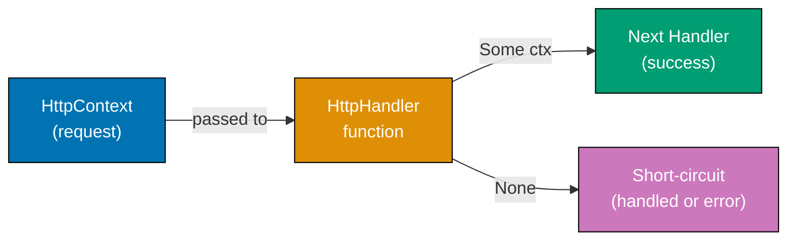
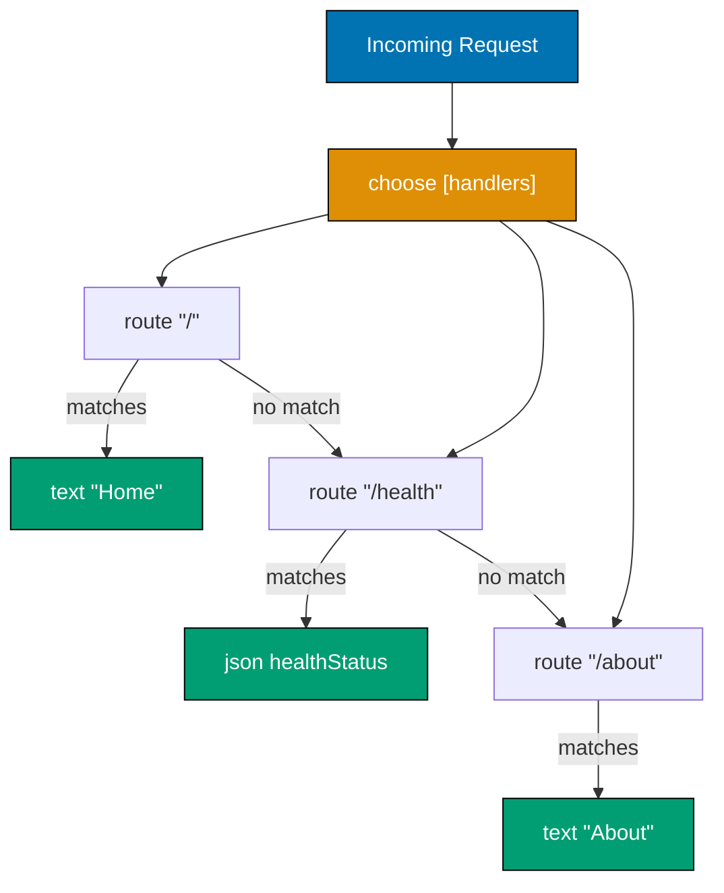
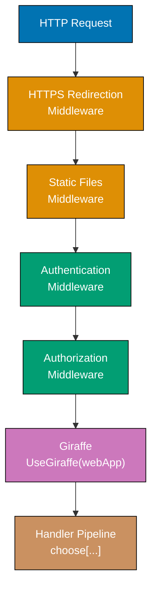

## Group 1: HttpHandler Fundamentals

### Example 1: The HttpHandler Type

The `HttpHandler` type is Giraffe's core abstraction. Every route, middleware, and response in Giraffe is a value of type `HttpFunc -> HttpContext -> Task<HttpContext option>`. Understanding this signature is the key to understanding the entire framework.



```fsharp
// Program.fs - minimal Giraffe application showing the HttpHandler type
open Microsoft.AspNetCore.Builder         // => Provides WebApplication, IApplicationBuilder
open Microsoft.AspNetCore.Hosting         // => Provides IWebHostEnvironment
open Microsoft.Extensions.DependencyInjection // => Provides IServiceCollection
open Giraffe                               // => Core Giraffe namespace

// HttpHandler type alias (from Giraffe source):
// type HttpFunc   = HttpContext -> Task<HttpContext option>
// type HttpHandler = HttpFunc -> HttpContext -> Task<HttpContext option>
// => A handler receives the NEXT function and the current context
// => Returns Some(ctx) to pass control to next handler
// => Returns None to short-circuit the pipeline (request handled)

// The simplest possible HttpHandler: always returns "Hello, Giraffe!"
let helloHandler : HttpHandler =          // => Type annotation is optional (inferred)
    fun (next : HttpFunc) (ctx : HttpContext) ->
        // => next: the next handler in the pipeline
        // => ctx: current request/response context (mutable ASP.NET Core HttpContext)
        task {
            // => task {} is a computation expression for Task<T>
            // => Equivalent to async/await in C#
            ctx.Response.ContentType <- "text/plain"  // => Sets Content-Type header
            do! ctx.Response.WriteAsync("Hello, Giraffe!")  // => Writes response body
            // => do! awaits a Task/Async without binding result
            return! next ctx               // => Passes control to next handler
            // => return! tail-calls next, enabling pipeline continuation
        }

// Wire up: ASP.NET Core builder pattern
let builder = WebApplication.CreateBuilder()    // => Creates host with default config
builder.Services.AddGiraffe() |> ignore         // => Registers Giraffe services with DI
// => |> ignore discards the IServiceCollection return value
// => AddGiraffe() is required for serialization and response negotiation

let app = builder.Build()                       // => Builds the IApplicationBuilder
app.UseGiraffe(helloHandler)                    // => Registers helloHandler as terminal middleware
// => UseGiraffe calls app.Run internally - Giraffe is the last middleware
app.Run()                                       // => Starts Kestrel, blocks until shutdown
// => GET / => "Hello, Giraffe!" (text/plain, 200 OK)
```

**Key Takeaway**: Every Giraffe handler is a pure function that receives the next handler and the current `HttpContext`, returning `Task<HttpContext option>`.

**Why It Matters**: The `HttpHandler` type makes the entire request pipeline inspectable and composable at compile time. Unlike ASP.NET MVC where middleware is registered procedurally, Giraffe handlers are first-class values you can pass, store, and combine. This unlocks refactoring capabilities that controller-based frameworks cannot match, and the F# type checker catches routing and pipeline errors before deployment.

---

### Example 2: Returning Text and Status Codes

Giraffe provides helper functions for common response patterns. `text`, `json`, `setStatusCode`, and `setHttpHeader` are `HttpHandler` values that compose with `>=>` (the fish operator). This example shows the built-in text response handler.

```fsharp
// Minimal Giraffe app returning different text responses
open Microsoft.AspNetCore.Builder
open Microsoft.Extensions.DependencyInjection
open Giraffe

// text: string -> HttpHandler
// => Writes a plain text response with Content-Type: text/plain; charset=utf-8
// => Does NOT terminate the pipeline - passes to next after writing
let greetHandler : HttpHandler =
    text "Hello, World!"
    // => Equivalent to:
    // fun next ctx ->
    //   task {
    //     ctx.SetContentType("text/plain; charset=utf-8")
    //     do! ctx.WriteTextAsync("Hello, World!")
    //     return! next ctx
    //   }

// setStatusCode: int -> HttpHandler
// => Sets the HTTP status code on the response
// => Must be combined with a body-writing handler
let notFoundHandler : HttpHandler =
    setStatusCode 404 >=> text "Not Found"
    // => >=> (fish operator) chains two handlers sequentially
    // => First sets status to 404, then writes "Not Found"

// Combining status + text is the standard pattern
let createdHandler : HttpHandler =
    setStatusCode 201 >=> text "Resource created"
    // => 201 Created with a plain text body

let builder = WebApplication.CreateBuilder()
builder.Services.AddGiraffe() |> ignore
let app = builder.Build()
app.UseGiraffe(greetHandler)    // => GET / => "Hello, World!" (200 OK)
app.Run()
```

**Key Takeaway**: Use `text "..."` for plain text responses; chain `setStatusCode N >=> text "..."` when you need a non-200 status.

**Why It Matters**: Separating status code from response body as composable handlers means you can reuse body-writing logic across multiple status codes. A centralized `errorResponse statusCode message` helper built with `setStatusCode >=> text` works equally well for 400, 404, and 500 responses, reducing duplication and making your intent explicit in the type system.

---

### Example 3: Returning JSON

The `json` handler serializes an F# value to JSON using `System.Text.Json` (or Newtonsoft.Json if configured). It sets `Content-Type: application/json` automatically. Records and discriminated unions serialize cleanly.

```fsharp
open Microsoft.AspNetCore.Builder
open Microsoft.Extensions.DependencyInjection
open Giraffe

// Define a record type for the response body
// F# records are immutable by default, perfect for response DTOs
type HealthStatus = {
    Status  : string     // => "ok" | "degraded" | "unhealthy"
    Version : string     // => Application version string
    Uptime  : int64      // => Seconds since startup (int64 for large values)
}
// => Record fields are automatically serialized by System.Text.Json
// => Field names become camelCase in JSON by default with Giraffe

// Create an instance with record literal syntax
let healthResponse = {
    Status  = "ok"       // => Initializes Status field
    Version = "1.0.0"    // => Initializes Version field
    Uptime  = 3600L      // => L suffix means int64 literal
}
// => healthResponse : HealthStatus = { Status = "ok"; Version = "1.0.0"; Uptime = 3600L }

// json: 'T -> HttpHandler
// => Serializes 'T to JSON and writes it to the response
// => Sets Content-Type: application/json; charset=utf-8
let healthHandler : HttpHandler =
    json healthResponse
    // => Response body: {"status":"ok","version":"1.0.0","uptime":3600}
    // => Giraffe uses camelCase serialization by default

let builder = WebApplication.CreateBuilder()
builder.Services.AddGiraffe() |> ignore

let app = builder.Build()
app.UseGiraffe(healthHandler)
// => GET / => {"status":"ok","version":"1.0.0","uptime":3600} (200 application/json)
app.Run()
```

**Key Takeaway**: Use `json value` to serialize any F# type to JSON; records serialize to camelCase JSON objects automatically.

**Why It Matters**: F# records are ideal JSON response types because they are immutable, structurally comparable, and free of null references. Unlike C# DTOs that require `get; set;` properties and null handling, F# records guarantee every field has a value at construction time. The type checker prevents you from returning a partially-initialized response, eliminating an entire class of runtime bugs found in dynamic or weakly-typed web frameworks.

---

### Example 4: The choose Combinator and Basic Routing

`choose` takes a list of `HttpHandler` values and tries each in order, returning the first that succeeds (returns `Some`). Combined with `route`, this creates an ordered routing table.



```fsharp
open Microsoft.AspNetCore.Builder
open Microsoft.Extensions.DependencyInjection
open Giraffe

// route: string -> HttpHandler
// => Matches when the request path equals the given string exactly
// => Case-insensitive by default
// => Returns None if the path does not match (tries next handler in choose)

type HealthDto = { Status: string }     // => Simple DTO for /health endpoint

// choose: HttpHandler list -> HttpHandler
// => Tries each handler in order
// => Returns result of first handler that returns Some ctx
// => Returns None if all handlers return None (triggers 404 middleware)
let webApp : HttpHandler =
    choose [
        route "/"       >=> text "Welcome to Giraffe!"
        // => Matches GET|POST|... / exactly
        // => >=> chains route match with text response

        route "/health" >=> json { Status = "ok" }
        // => Matches /health exactly
        // => Returns JSON { "status": "ok" }

        route "/about"  >=> text "Giraffe by-example tutorial"
        // => Matches /about exactly
        // => Routes are tried top-to-bottom; order matters
    ]
// => No match on any route => choose returns None => ASP.NET Core 404 middleware handles it

let builder = WebApplication.CreateBuilder()
builder.Services.AddGiraffe() |> ignore
let app = builder.Build()
app.UseGiraffe(webApp)
// => GET /         => "Welcome to Giraffe!" (200 text/plain)
// => GET /health   => {"status":"ok"} (200 application/json)
// => GET /about    => "Giraffe by-example tutorial" (200 text/plain)
// => GET /unknown  => 404 (from ASP.NET Core default 404 handler)
app.Run()
```

**Key Takeaway**: `choose` provides ordered, short-circuit routing; combine it with `route` for exact path matching.

**Why It Matters**: Giraffe's `choose` combinator makes the routing table a data structure rather than imperative registration code. You can build routing tables programmatically, test them as values, and compose them from sub-tables per feature module. This is fundamentally more powerful than attribute-based routing in MVC or procedural `app.MapGet` calls, because routing logic becomes subject to all the same functional composition techniques as any other F# code.

---

### Example 5: HTTP Method Routing with GET, POST, PUT, DELETE

Giraffe provides `GET`, `POST`, `PUT`, `DELETE`, `PATCH`, `HEAD`, and `OPTIONS` combinators that match on HTTP method. They are `HttpHandler` values that short-circuit if the method does not match.

```fsharp
open Microsoft.AspNetCore.Builder
open Microsoft.Extensions.DependencyInjection
open Giraffe

// HTTP method combinators: HttpHandler -> HttpHandler
// => Each checks ctx.Request.Method and either passes through or returns None
// => GET h  => matches only GET requests, else returns None
// => POST h => matches only POST requests, else returns None

type TodoItem = { Id: int; Title: string; Done: bool }
// => Immutable record for a simple to-do item

let todos = [
    { Id = 1; Title = "Learn Giraffe"; Done = false }
    { Id = 2; Title = "Write F# tests"; Done = false }
]
// => In-memory list for demonstration; real apps use a database

let webApp : HttpHandler =
    choose [
        GET  >=> route "/todos"        >=> json todos
        // => GET /todos => JSON array of TodoItem records
        // => GET wraps the route+json handler, filters to GET only

        POST >=> route "/todos"        >=> text "TODO: create item"
        // => POST /todos => would deserialize body and create item
        // => Demonstrates same path, different method = different handler

        PUT  >=> route "/todos/1"      >=> text "TODO: update item 1"
        // => PUT /todos/1 => would update item with id=1

        DELETE >=> route "/todos/1"    >=> text "TODO: delete item 1"
        // => DELETE /todos/1 => would delete item with id=1

        // Fallback for method not allowed
        route "/todos" >=> setStatusCode 405 >=> text "Method Not Allowed"
        // => Matches /todos with any unhandled method => 405
    ]

let builder = WebApplication.CreateBuilder()
builder.Services.AddGiraffe() |> ignore
let app = builder.Build()
app.UseGiraffe(webApp)
// => GET    /todos   => JSON array (200)
// => POST   /todos   => "TODO: create item" (200)
// => PUT    /todos/1 => "TODO: update item 1" (200)
// => DELETE /todos/1 => "TODO: delete item 1" (200)
// => PATCH  /todos   => "Method Not Allowed" (405)
app.Run()
```

**Key Takeaway**: Wrap handlers with `GET >=>`, `POST >=>` etc. to restrict a handler to a specific HTTP method.

**Why It Matters**: Method-based routing as a composable handler means you can define method constraints anywhere in your handler tree, not just at the top level. A `requiresHttps` handler, an `authenticated` handler, and a `POST` method check all compose with the same `>=>` operator. This uniformity means there's one mental model to learn rather than multiple constraint mechanisms to keep synchronized.

---

### Example 6: Path Parameters with routef

`routef` matches routes with typed path segments using F# format strings. It extracts path parameters using `PrintfFormat` and passes them as typed arguments to a continuation function.

```fsharp
open Microsoft.AspNetCore.Builder
open Microsoft.Extensions.DependencyInjection
open Giraffe

// routef: PrintfFormat<'T,'U,'V,'W,('X -> HttpHandler)> -> ('X -> HttpHandler) -> HttpHandler
// => Uses F# format string to define path pattern and types
// => %i => int,  %s => string,  %O => Guid (requires specific formatter)
// => Extracts typed values and passes them to a handler function

type UserProfile = {
    Id   : int
    Name : string
    Role : string
}

// Handler factory: receives extracted path param and returns HttpHandler
let getUserHandler (userId : int) : HttpHandler =
    // => userId is already an int, no parsing needed
    // => Format string %i guarantees an integer; non-integer paths return None (404)
    let user = { Id = userId; Name = $"User {userId}"; Role = "member" }
    // => $"..." is F# string interpolation
    // => user : UserProfile (record literal)
    json user
    // => Returns JSON representation of the user record

// Handler with multiple path segments
let getPostCommentHandler (postId : int) (commentId : int) : HttpHandler =
    // => Two int parameters extracted from the route pattern
    let response = {| PostId = postId; CommentId = commentId; Text = "A comment" |}
    // => {| ... |} creates an anonymous record (structural type)
    // => Anonymous records serialize cleanly to JSON
    json response

let webApp : HttpHandler =
    choose [
        GET >=> routef "/users/%i" getUserHandler
        // => Matches /users/42 => getUserHandler 42
        // => Matches /users/7  => getUserHandler 7
        // => Does NOT match /users/abc (not an int) => None => 404

        GET >=> routef "/posts/%i/comments/%i" getPostCommentHandler
        // => Matches /posts/5/comments/3 => getPostCommentHandler 5 3
        // => Two segments extracted and passed as curried arguments

        GET >=> routef "/items/%s" (fun name -> text $"Item: {name}")
        // => %s matches any URL segment as a string
        // => Inline lambda avoids defining a separate function
    ]

let builder = WebApplication.CreateBuilder()
builder.Services.AddGiraffe() |> ignore
let app = builder.Build()
app.UseGiraffe(webApp)
// => GET /users/42              => {"id":42,"name":"User 42","role":"member"} (200)
// => GET /posts/5/comments/3    => {"postId":5,"commentId":3,"text":"A comment"} (200)
// => GET /items/hello           => "Item: hello" (200)
// => GET /users/abc             => 404 (non-integer fails routef match)
app.Run()
```

**Key Takeaway**: Use `routef "/path/%i" handler` for typed path parameter extraction; the format string defines both the pattern and the parameter types.

**Why It Matters**: Type-safe path extraction eliminates the entire class of runtime errors caused by manual `int.Parse(ctx.GetRouteValue("id"))` calls. In frameworks that return `string` from route parameters, forgetting to parse or getting the key name wrong produces runtime exceptions. Giraffe's `routef` makes the types part of the route definition, and the compiler verifies that your handler accepts the correct parameter types.

---

### Example 7: Query String Parameters

Giraffe provides `ctx.TryGetQueryStringValue` and `ctx.GetQueryStringValue` for safe query parameter access. For structured binding, `bindQueryString<'T>` maps query string values to a record.

```fsharp
open Microsoft.AspNetCore.Builder
open Microsoft.Extensions.DependencyInjection
open Giraffe

// Query string model for pagination
[<CLIMutable>]                              // => Required for model binding with reflection
type PaginationQuery = {
    Page     : int    // => ?page=N (default 1)
    PageSize : int    // => ?pageSize=N (default 20)
    Search   : string // => ?search=term (optional)
}
// => [<CLIMutable>] generates a default constructor needed by ASP.NET Core binders
// => Without it, Giraffe's bindQueryString cannot instantiate the record

// Manual query parameter extraction
let searchHandler : HttpHandler =
    fun next ctx ->
        task {
            // TryGetQueryStringValue: string -> string option
            // => Returns Some "value" if query param exists, None otherwise
            let searchTerm =
                match ctx.TryGetQueryStringValue "q" with
                | Some term -> term          // => ?q=giraffe => "giraffe"
                | None      -> ""            // => no ?q param => empty string

            // GetQueryStringValue: string -> Result<string, string>
            // => Returns Ok "value" or Error "... not found"
            let page =
                match ctx.TryGetQueryStringValue "page" with
                | Some p -> System.Int32.TryParse(p) |> snd  // => parse int or 0
                            |> fun n -> if n > 0 then n else 1 // => default to 1
                | None   -> 1              // => default page

            let response = {|
                SearchTerm = searchTerm    // => anonymous record for response
                Page       = page
                Results    = [| "item1"; "item2" |]  // => placeholder results
            |}
            return! json response next ctx // => serialize and pass to next
        }

// Structured binding: maps all matching query params to a record at once
let pagedHandler : HttpHandler =
    fun next ctx ->
        task {
            // bindQueryString<'T>: HttpFunc -> HttpContext -> Task<HttpContext option>
            // => Binds all query string values to record 'T
            // => Missing optional fields use default values (0 for int, null for string)
            let query = ctx.BindQueryString<PaginationQuery>()
            // => ?page=2&pageSize=10&search=foo
            // => query = { Page = 2; PageSize = 10; Search = "foo" }
            // => ?page=2 only => query = { Page = 2; PageSize = 0; Search = null }

            let effectivePage     = if query.Page > 0 then query.Page else 1
            let effectivePageSize = if query.PageSize > 0 then query.PageSize else 20
            // => Guard defaults since missing fields bind to 0/null

            return! json {| Page = effectivePage; PageSize = effectivePageSize; Search = query.Search |} next ctx
        }

let webApp : HttpHandler =
    choose [
        GET >=> route  "/search" >=> searchHandler
        GET >=> route  "/items"  >=> pagedHandler
    ]

let builder = WebApplication.CreateBuilder()
builder.Services.AddGiraffe() |> ignore
let app = builder.Build()
app.UseGiraffe(webApp)
// => GET /search?q=giraffe&page=2   => {"searchTerm":"giraffe","page":2,"results":["item1","item2"]}
// => GET /items?page=3&pageSize=10  => {"page":3,"pageSize":10,"search":null}
app.Run()
```

**Key Takeaway**: Use `ctx.TryGetQueryStringValue` for individual parameters; use `ctx.BindQueryString<'T>()` to bind an entire query string to a record.

**Why It Matters**: Query parameter binding eliminates manual string parsing scattered across handler bodies. By defining a `PaginationQuery` record, you document your endpoint's contract as a type rather than comments. The `[<CLIMutable>]` attribute is the one necessary ceremony for ASP.NET Core's reflection-based binders, but after that, the type system enforces that your handler always has access to correctly-typed query values.

---

## Group 2: Response Helpers

### Example 8: HTML Responses with htmlView and Giraffe ViewEngine

Giraffe's built-in ViewEngine provides a strongly-typed HTML DSL. HTML elements are F# functions that return `XmlNode` values; the `htmlView` handler renders them to the response.

```fsharp
open Microsoft.AspNetCore.Builder
open Microsoft.Extensions.DependencyInjection
open Giraffe
open Giraffe.ViewEngine    // => Provides HTML element functions

// Giraffe ViewEngine: HTML as F# values
// => Each HTML element is a function: XmlNode list -> XmlNode
// => Attributes are functions: string -> XmlAttribute
// => Text nodes: str "..." or rawText "..."

// A simple page layout using ViewEngine combinators
let layout (title : string) (content : XmlNode list) : XmlNode =
    // => Returns a complete HTML document
    html [] [                                  // => <html>
        head [] [                              // => <head>
            meta [_charset "utf-8"]            // => <meta charset="utf-8">
            title [] [str title]               // => <title>...</title>
            // => str: string -> XmlNode (text node, HTML-escaped)
            // => rawText: string -> XmlNode (unescaped - use carefully)
        ]
        body [] content                        // => <body>{content}</body>
    ]
// => layout "My Page" [p [] [str "Hello"]]
// => => <html><head>...<title>My Page</title></head><body><p>Hello</p></body></html>

// A view function returning a styled page
let homeView (name : string) : XmlNode =
    layout "Welcome" [
        h1 [] [str $"Hello, {name}!"]          // => <h1>Hello, Alice!</h1>
        p [] [                                  // => <p>
            str "Welcome to "
            strong [] [str "Giraffe"]           // => <strong>Giraffe</strong>
            str " web framework."
        ]                                       // => </p>
        ul [] [                                 // => <ul>
            li [] [str "Type-safe HTML"]        // => <li>Type-safe HTML</li>
            li [] [str "No template files"]     // => <li>No template files</li>
            li [] [str "Composable views"]      // => <li>Composable views</li>
        ]
    ]
// => Produces a full HTML page with a greeting

// htmlView: XmlNode -> HttpHandler
// => Renders XmlNode to HTML string and writes to response
// => Sets Content-Type: text/html; charset=utf-8
let homeHandler : HttpHandler =
    fun next ctx ->
        task {
            let name = ctx.TryGetQueryStringValue "name" |> Option.defaultValue "World"
            // => ?name=Alice => "Alice", else "World"
            return! htmlView (homeView name) next ctx
            // => Renders homeView and sends response
        }

let builder = WebApplication.CreateBuilder()
builder.Services.AddGiraffe() |> ignore
let app = builder.Build()
app.UseGiraffe(GET >=> route "/" >=> homeHandler)
// => GET /?name=Alice => <html>...<h1>Hello, Alice!</h1>...</html>
app.Run()
```

**Key Takeaway**: Use `Giraffe.ViewEngine` for compile-time safe HTML generation; `htmlView` renders an `XmlNode` tree to the response.

**Why It Matters**: ViewEngine eliminates an entire category of template bugs. Missing closing tags, invalid attribute names, and type mismatches in interpolated values all become compile errors instead of runtime rendering failures. Unlike Razor or Jinja2 templates that execute at runtime and fail with cryptic errors, ViewEngine views are F# expressions verified by the type checker. This is especially valuable for shared components like navigation bars and form widgets.

---

### Example 9: Redirects and Header Manipulation

Giraffe provides `redirectTo`, `setHttpHeader`, and `setContentType` handlers for response control without writing a body.

```fsharp
open Microsoft.AspNetCore.Builder
open Microsoft.Extensions.DependencyInjection
open Giraffe

// redirectTo: bool -> string -> HttpHandler
// => First arg: true = permanent (301), false = temporary (302)
// => Second arg: the redirect URL (absolute or relative)
let legacyRedirectHandler : HttpHandler =
    redirectTo true "/api/v2/items"
    // => Sends 301 Moved Permanently with Location: /api/v2/items
    // => Use true for permanent redirects (canonical URL changes)
    // => Use false for temporary redirects (A/B testing, maintenance)

// setHttpHeader: string -> string -> HttpHandler
// => Adds a response header without writing a body
let cacheControlHandler : HttpHandler =
    setHttpHeader "Cache-Control" "public, max-age=3600"
    // => Adds Cache-Control: public, max-age=3600 to response
    // => Chain with a body-writing handler using >=>

let corsPreflightHandler : HttpHandler =
    setHttpHeader "Access-Control-Allow-Origin"  "*"                      >=>
    setHttpHeader "Access-Control-Allow-Methods" "GET, POST, PUT, DELETE" >=>
    setHttpHeader "Access-Control-Allow-Headers" "Content-Type"           >=>
    setStatusCode 204
    // => Responds to CORS preflight OPTIONS with 204 No Content
    // => Multiple >=> chains multiple header-setting handlers

// setContentType: string -> HttpHandler
// => Overrides the Content-Type header for custom MIME types
let csvHandler : HttpHandler =
    setContentType "text/csv" >=>
    setHttpHeader "Content-Disposition" "attachment; filename=data.csv" >=>
    fun next ctx ->
        task {
            do! ctx.Response.WriteAsync("id,name\n1,Alice\n2,Bob\n")
            return! next ctx
        }
// => Returns a CSV file download

let webApp : HttpHandler =
    choose [
        GET    >=> route "/old-items"  >=> legacyRedirectHandler
        GET    >=> route "/items"      >=> cacheControlHandler >=> text "items list"
        OPTIONS >=> route "/items"     >=> corsPreflightHandler
        GET    >=> route "/export.csv" >=> csvHandler
    ]

let builder = WebApplication.CreateBuilder()
builder.Services.AddGiraffe() |> ignore
let app = builder.Build()
app.UseGiraffe(webApp)
// => GET    /old-items   => 301 Location: /api/v2/items
// => GET    /items       => 200 "items list" with Cache-Control header
// => OPTIONS /items      => 204 with CORS headers
// => GET    /export.csv  => 200 text/csv attachment
app.Run()
```

**Key Takeaway**: Use `redirectTo`, `setHttpHeader`, and `setContentType` as composable handlers to control response metadata without coupling it to response body logic.

**Why It Matters**: Treating headers as composable handlers means caching, CORS, and redirect policies become reusable values. A `withCaching` or `withCors` function built from these handlers can be applied to any endpoint with `>=>`. Compare this to MVC where `[ResponseCache]` and `[EnableCors]` are attributes that scatter policy across controller methods, making it hard to audit which endpoints have which policies.

---

### Example 10: Content Negotiation

Giraffe supports content negotiation via `negotiate` and `negotiateWith`. It inspects the `Accept` header and selects the best matching serializer (JSON or XML by default).

```fsharp
open Microsoft.AspNetCore.Builder
open Microsoft.Extensions.DependencyInjection
open Giraffe

type Product = {
    Id    : int
    Name  : string
    Price : decimal
}
// => F# record with decimal for monetary values
// => Serializes to both JSON and XML cleanly

let product = { Id = 1; Name = "Giraffe Mug"; Price = 19.99m }
// => m suffix creates a decimal literal
// => product : Product = { Id = 1; Name = "Giraffe Mug"; Price = 19.99M }

// negotiate: 'T -> HttpHandler
// => Inspects Accept header and selects JSON or XML serializer
// => Accept: application/json    => {"id":1,"name":"Giraffe Mug","price":19.99}
// => Accept: application/xml     => <Product><Id>1</Id><Name>Giraffe Mug</Name>...</Product>
// => Accept: */* (default)       => JSON (first registered serializer wins)
let productHandler : HttpHandler =
    negotiate product
// => negotiate reads ctx.Request.Headers["Accept"]
// => Matches against registered serializers (JSON via System.Text.Json by default)
// => Returns 406 Not Acceptable if no match found

// negotiateWith: IDictionary<string,obj->Task<byte[]>> -> obj -> HttpHandler
// => Provides explicit content type to serializer mapping
// => Used when you need custom MIME types beyond JSON/XML

let webApp : HttpHandler =
    GET >=> route "/product" >=> productHandler

let builder = WebApplication.CreateBuilder()
builder.Services.AddGiraffe() |> ignore
// => AddGiraffe() registers default JSON serializer
// => To add XML: builder.Services.AddGiraffe(); and configure GiraffeOptions

let app = builder.Build()
app.UseGiraffe(webApp)
// => GET /product (Accept: application/json) => JSON product representation
// => GET /product (Accept: application/xml)  => 406 (XML not configured by default)
// => GET /product (no Accept header)         => JSON (default)
app.Run()
```

**Key Takeaway**: Use `negotiate value` to support multiple response formats; the `Accept` header drives format selection automatically.

**Why It Matters**: Building APIs that respect `Accept` headers is essential for building clients that can consume your API in different contexts - mobile apps may prefer JSON, legacy enterprise systems may require XML, and test harnesses may want plain text. Giraffe's `negotiate` centralizes this logic in one handler rather than scattering format detection across every endpoint, keeping handlers focused on data transformation rather than serialization mechanics.

---

## Group 3: Model Binding

### Example 11: Binding JSON Request Bodies

`bindJson<'T>` reads the request body, deserializes it as JSON into a record, and passes the value to a continuation function. `tryBindJson<'T>` returns a `Result<'T, string>` for error handling.

```fsharp
open Microsoft.AspNetCore.Builder
open Microsoft.Extensions.DependencyInjection
open Giraffe

[<CLIMutable>]
type CreateUserRequest = {
    Username : string
    Email    : string
    Password : string
}
// => [<CLIMutable>] required for System.Text.Json deserialization
// => Without it, deserialization fails silently or throws
// => Fields map from camelCase JSON: {"username":"alice","email":"...","password":"..."}

// bindJson<'T>: ('T -> HttpHandler) -> HttpHandler
// => Deserializes request body to 'T
// => Calls continuation with the deserialized value
// => Throws if deserialization fails (use tryBindJson for error handling)
let createUserHandler : HttpHandler =
    fun next ctx ->
        task {
            // bindJsonAsync<'T>: unit -> Task<'T>
            // => Async version of bindJson used in task {} blocks
            let! body = ctx.BindJsonAsync<CreateUserRequest>()
            // => Reads and deserializes request body
            // => body : CreateUserRequest
            // => body.Username = "alice", body.Email = "alice@example.com"

            // Simulate creating user (real app would call a service)
            let response = {|
                Id       = 42                  // => Generated ID
                Username = body.Username       // => Echo the provided username
                Email    = body.Email          // => Echo the provided email
                // => Password intentionally excluded from response
            |}

            return! (setStatusCode 201 >=> json response) next ctx
            // => 201 Created with JSON body of created user
        }

// tryBindJson pattern for explicit error handling
let safeCreateHandler : HttpHandler =
    fun next ctx ->
        task {
            // TryBindJsonAsync returns Result<'T, string>
            match! ctx.TryBindJsonAsync<CreateUserRequest>() with
            | Ok body ->
                // => Successfully deserialized
                // => Validate business rules here
                if body.Username.Length < 3 then
                    return! (setStatusCode 400 >=> text "Username too short") next ctx
                    // => 400 Bad Request for validation failure
                else
                    let response = {| Id = 1; Username = body.Username |}
                    return! (setStatusCode 201 >=> json response) next ctx
            | Error err ->
                // => Deserialization failed (malformed JSON, missing required fields)
                return! (setStatusCode 400 >=> text $"Invalid request: {err}") next ctx
                // => 400 Bad Request with descriptive error message
        }

let webApp : HttpHandler =
    choose [
        POST >=> route "/users"        >=> createUserHandler
        POST >=> route "/users/safe"   >=> safeCreateHandler
    ]

let builder = WebApplication.CreateBuilder()
builder.Services.AddGiraffe() |> ignore
let app = builder.Build()
app.UseGiraffe(webApp)
// => POST /users body={"username":"alice","email":"a@b.com","password":"secret"}
// =>   => 201 {"id":42,"username":"alice","email":"a@b.com"}
// => POST /users/safe body={"username":"x"}
// =>   => 400 "Username too short"
app.Run()
```

**Key Takeaway**: Use `ctx.BindJsonAsync<'T>()` for simple cases; use `ctx.TryBindJsonAsync<'T>()` in `match!` to handle deserialization errors explicitly.

**Why It Matters**: Explicit error handling on deserialization failures is critical for API security and developer experience. APIs that crash with 500 on malformed JSON expose internal details and frustrate API clients. The `TryBindJsonAsync` pattern makes the failure path explicit and typed, encouraging proper 400 responses with informative messages. This protects your application from malformed input while providing actionable feedback to API consumers.

---

### Example 12: Binding Form Data

`ctx.BindFormAsync<'T>()` deserializes `application/x-www-form-urlencoded` or `multipart/form-data` into a record. This is the binding mechanism for traditional HTML form submissions.

```fsharp
open Microsoft.AspNetCore.Builder
open Microsoft.Extensions.DependencyInjection
open Giraffe
open Giraffe.ViewEngine

[<CLIMutable>]
type LoginForm = {
    Username : string  // => Maps from form field "Username"
    Password : string  // => Maps from form field "Password"
    Remember : bool    // => Maps from checkbox "Remember" (true/false)
}
// => Form field names are case-sensitive by default
// => Giraffe maps by field name (matches HTML input name attribute)

// Show the login form
let loginView : XmlNode =
    html [] [
        body [] [
            form [_method "post"; _action "/login"] [
                // => _method "post" sets method="post" attribute
                // => _action "/login" sets action="/login" attribute
                input [_type "text";     _name "Username"; _placeholder "Username"]
                // => _name matches LoginForm field name (case-sensitive)
                input [_type "password"; _name "Password"; _placeholder "Password"]
                input [_type "checkbox"; _name "Remember"; _value "true"]
                // => Checkboxes send "true" when checked, nothing when unchecked
                button [_type "submit"] [str "Login"]
            ]
        ]
    ]

// Handle form submission
let loginHandler : HttpHandler =
    fun next ctx ->
        task {
            let! form = ctx.BindFormAsync<LoginForm>()
            // => Reads Content-Type: application/x-www-form-urlencoded
            // => Deserializes form fields to LoginForm record
            // => form.Username = "alice", form.Password = "...", form.Remember = true/false

            // Simulate authentication check
            if form.Username = "admin" && form.Password = "secret" then
                // => Real app would hash and compare password securely
                return! (setStatusCode 302 >=> redirectTo false "/dashboard") next ctx
                // => Redirect to dashboard on success
            else
                return! (setStatusCode 401 >=> htmlView loginView) next ctx
                // => Show login form again on failure with 401
        }

let webApp : HttpHandler =
    choose [
        GET  >=> route "/login" >=> htmlView loginView
        POST >=> route "/login" >=> loginHandler
    ]

let builder = WebApplication.CreateBuilder()
builder.Services.AddGiraffe() |> ignore
let app = builder.Build()
app.UseGiraffe(webApp)
// => GET  /login                               => HTML login form (200)
// => POST /login body=Username=admin&Password=secret => 302 redirect to /dashboard
// => POST /login body=Username=bad&Password=bad      => 401 login form again
app.Run()
```

**Key Takeaway**: Use `ctx.BindFormAsync<'T>()` to bind HTML form submissions to strongly-typed F# records.

**Why It Matters**: Form binding eliminates manual `ctx.Request.Form["fieldName"]` access scattered through handler bodies. By defining a `LoginForm` record, you make the form's contract explicit and type-checked. Missing or incorrectly named form fields become development-time type errors rather than runtime null reference bugs, and the record structure documents exactly what each form submission endpoint expects.

---

## Group 4: Giraffe ViewEngine

### Example 13: ViewEngine Attributes and Styling

Giraffe ViewEngine provides attribute constructors for every HTML attribute. CSS classes, IDs, data attributes, and event handlers all use the same pattern: a prefixed function returning `XmlAttribute`.

```fsharp
open Giraffe.ViewEngine

// Attribute functions follow underscore naming conventions:
// _class, _id, _href, _src, _type, _name, _value, _placeholder, _required
// Custom attributes use: _data_* or attr "name" "value"

let styledCard (title : string) (body : string) : XmlNode =
    div [_class "card"; _id $"card-{title}"] [
        // => _class: string -> XmlAttribute => class="card"
        // => _id: string -> XmlAttribute    => id="card-title"

        div [_class "card-header"] [
            h2 [_class "card-title"] [str title]
            // => Nested divs for Bootstrap-like card structure
        ]

        div [_class "card-body"] [
            p [_class "card-text"] [str body]
        ]

        div [_class "card-footer"] [
            a [_href "/more"; _class "btn btn-primary"] [str "Read More"]
            // => _href: string -> XmlAttribute => href="/more"
            // => _class chains multiple CSS classes in one string
        ]
    ]
// => Produces:
// => <div class="card" id="card-Title">
// =>   <div class="card-header"><h2 class="card-title">Title</h2></div>
// =>   <div class="card-body"><p class="card-text">body</p></div>
// =>   <div class="card-footer"><a href="/more" class="btn btn-primary">Read More</a></div>
// => </div>

// Data attributes use _data_ prefix
let interactiveElement : XmlNode =
    button [
        _class      "toggle-btn"
        attr        "data-target" "#menu"     // => data-target="#menu"
        // => attr: string -> string -> XmlAttribute for arbitrary attributes
        _type       "button"
    ] [str "Toggle Menu"]
// => <button class="toggle-btn" data-target="#menu" type="button">Toggle Menu</button>

// Boolean attributes (no value) use flag functions
let requiredInput : XmlNode =
    input [
        _type     "email"
        _name     "email"
        _required            // => required (no value, presence is the flag)
        // => _required : XmlAttribute (value-less boolean attribute)
        _placeholder "Enter email"
        _class    "form-control"
    ]
// => <input type="email" name="email" required placeholder="Enter email" class="form-control">
```

**Key Takeaway**: ViewEngine attribute functions (`_class`, `_href`, `attr`) compose into the `XmlAttribute list` passed as the first argument to every element function.

**Why It Matters**: Strongly-typed attributes prevent a common class of HTML bugs: misspelled class names, incorrect attribute names, and missing required attributes. Typos in Razor templates or Jinja2 are silent runtime errors; typos in ViewEngine are compiler errors. For large applications with design systems and component libraries, this compile-time verification dramatically reduces the regression risk of UI refactoring.

---

### Example 14: ViewEngine Lists and Conditional Rendering

Generating HTML lists from F# data and conditionally rendering elements uses standard F# list functions: `List.map`, `List.filter`, and `if/then/else` expressions.

```fsharp
open Giraffe.ViewEngine

type NavItem = {
    Label  : string
    Href   : string
    Active : bool
}
// => Model for navigation links
// => Active flag controls "active" CSS class

// Generate a list from data using List.map
let renderNavItems (items : NavItem list) : XmlNode list =
    items |> List.map (fun item ->
        // => List.map transforms each NavItem to an XmlNode
        let cssClass =
            if item.Active
            then "nav-link active"   // => Active item gets extra CSS class
            else "nav-link"          // => Inactive items get base class only
        // => if/then/else is an expression in F# - returns a value
        li [_class "nav-item"] [
            a [_href item.Href; _class cssClass] [str item.Label]
            // => Inline conditional for class: if/then/else as expression
        ]
    )
// => Returns XmlNode list (not XmlNode) - suitable as children in a parent element

// Conditional rendering: show/hide elements based on state
let renderUserMenu (isLoggedIn : bool) (username : string option) : XmlNode =
    div [_class "user-menu"] [
        if isLoggedIn then
            // => F# conditional in list context using yield
            match username with
            | Some name ->
                span [_class "username"] [str $"Hello, {name}"]
                // => Rendered only when isLoggedIn = true AND username = Some _
            | None ->
                span [_class "username"] [str "Hello, User"]
            a [_href "/logout"; _class "btn"] [str "Logout"]
        else
            a [_href "/login";    _class "btn"] [str "Login"]
            a [_href "/register"; _class "btn"] [str "Register"]
            // => Two nodes rendered in else branch
    ]
// => XmlNode if expressions work inside list literals (implicit yield)

// Compose everything into a navigation bar
let navbar (items : NavItem list) (isLoggedIn : bool) (username : string option) : XmlNode =
    nav [_class "navbar"] [
        ul [_class "nav-list"] (renderNavItems items)
        // => renderNavItems returns XmlNode list - spread into children
        renderUserMenu isLoggedIn username
        // => Another node added after the list
    ]
```

**Key Takeaway**: Use `List.map` to generate `XmlNode list` from data; use F# `if/then/else` expressions directly inside element lists for conditional rendering.

**Why It Matters**: ViewEngine's integration with F# list processing means conditional and dynamic HTML generation uses the same language features you already know. Unlike template engines with special loop syntax (``, `@foreach`) and conditional syntax (``, `@if`), ViewEngine uses standard F# expressions. This makes view logic debuggable in the F# REPL, testable as pure functions, and refactorable with standard IDE tools.

---

## Group 5: Static Files and Error Handling

### Example 15: Serving Static Files

ASP.NET Core's `UseStaticFiles` middleware serves files from the `wwwroot` folder. Giraffe integrates with this natively - static file middleware runs before Giraffe's handler pipeline.

```fsharp
open Microsoft.AspNetCore.Builder
open Microsoft.AspNetCore.StaticFiles     // => Provides StaticFileOptions
open Microsoft.Extensions.DependencyInjection
open Giraffe

// Static file middleware in ASP.NET Core serves files from wwwroot/
// Project structure:
//   wwwroot/
//     index.html      => GET /index.html
//     css/app.css     => GET /css/app.css
//     js/app.js       => GET /js/app.js
//     images/logo.png => GET /images/logo.png

let webApp : HttpHandler =
    choose [
        GET >=> route "/api/status" >=> json {| Status = "ok" |}
        // => API routes handled by Giraffe
        // => If no route matches, falls through to static files, then 404
    ]

let builder = WebApplication.CreateBuilder()
builder.Services.AddGiraffe() |> ignore
let app = builder.Build()

// UseStaticFiles MUST be registered BEFORE UseGiraffe
// => Static file middleware short-circuits for matching files
// => If no file found, request passes to Giraffe
app.UseStaticFiles() |> ignore
// => Serves files from wwwroot/ at their natural paths
// => GET /css/app.css => reads wwwroot/css/app.css

// UseDefaultFiles redirects / to index.html
app.UseDefaultFiles() |> ignore
// => GET / => serves wwwroot/index.html if it exists

app.UseGiraffe(webApp)
// => GET /api/status => handled by Giraffe
// => GET /css/app.css => served by static files middleware
// => GET /nonexistent => 404 from ASP.NET Core

app.Run()
// => Order matters: DefaultFiles -> StaticFiles -> Giraffe
```

**Key Takeaway**: Register `UseStaticFiles()` before `UseGiraffe()` so static assets are served without entering the Giraffe pipeline.

**Why It Matters**: Separating static asset serving from API routing is a performance optimization that matters at scale. Static file middleware skips JSON deserialization, authentication checks, and handler chaining for every CSS/JS/image request. For applications serving React/Vue frontends alongside Giraffe APIs, this means your API middleware only processes actual API calls, keeping request handling focused and efficient.

---

### Example 16: Error Handling with handleContext and setStatusCode

Giraffe handlers should return explicit error responses rather than throwing exceptions. Use `setStatusCode >=> json/text` for expected errors and ASP.NET Core exception middleware for unexpected errors.

```fsharp
open Microsoft.AspNetCore.Builder
open Microsoft.Extensions.DependencyInjection
open Giraffe

// Error response DTO - consistent error shape across all endpoints
type ApiError = {
    Code    : string    // => Machine-readable error code
    Message : string    // => Human-readable description
    Field   : string option  // => Optional: which field caused validation error
}
// => Consistent error shape improves API client experience

// Helper to build error responses
let errorResponse statusCode code message field : HttpHandler =
    setStatusCode statusCode >=>
    json { Code = code; Message = message; Field = field }
// => errorResponse 400 "VALIDATION_ERROR" "Email is invalid" (Some "email")
// => => 400 {"code":"VALIDATION_ERROR","message":"Email is invalid","field":"email"}

// Handler using Result type for business logic errors
let createItemHandler : HttpHandler =
    fun next ctx ->
        task {
            // Simulate business logic with Result type
            let validateInput (input : string) : Result<string, string> =
                if input.Length > 0 then Ok input
                else Error "Input cannot be empty"
            // => validateInput: string -> Result<string, string>
            // => Ok "value" on success, Error "message" on failure

            let input = ctx.TryGetQueryStringValue "name" |> Option.defaultValue ""

            match validateInput input with
            | Ok validName ->
                return! json {| Name = validName; Created = true |} next ctx
                // => 200 with created item
            | Error errMsg ->
                return! errorResponse 400 "INVALID_INPUT" errMsg None next ctx
                // => 400 with structured error response
        }

// Global exception handler for unexpected errors
let exceptionHandler (ex : System.Exception) (logger : Microsoft.Extensions.Logging.ILogger) : HttpHandler =
    // => Called by Giraffe's error handling infrastructure
    // => ex: the exception that was thrown
    // => logger: ILogger from DI
    logger.LogError(ex, "Unhandled exception")     // => Log for monitoring
    setStatusCode 500 >=> json {                   // => 500 Internal Server Error
        Code = "INTERNAL_ERROR"
        Message = "An unexpected error occurred"   // => Never expose exception details to clients
        Field = None
    }
// => exceptionHandler is registered via GiraffeOptions.ErrorHandler

let builder = WebApplication.CreateBuilder()
builder.Services.AddGiraffe() |> ignore
let app = builder.Build()
app.UseGiraffe(GET >=> route "/items" >=> createItemHandler)
app.Run()
// => GET /items?name=Widget  => 200 {"name":"Widget","created":true}
// => GET /items              => 400 {"code":"INVALID_INPUT","message":"Input cannot be empty","field":null}
```

**Key Takeaway**: Build a reusable `errorResponse` helper from `setStatusCode >=> json`; use F# `Result` types for business logic errors rather than exceptions.

**Why It Matters**: Consistent error response shapes are a contract with your API clients. When every error follows the same `{ code, message, field }` structure, client developers write one error-handling function that works for every endpoint. Using `Result` types for expected failures (validation, not-found, permission denied) keeps error handling explicit and testable, while reserving exceptions for truly unexpected conditions like database timeouts or out-of-memory errors.

---

## Group 6: Logging

### Example 17: Structured Logging with ILogger

Giraffe uses ASP.NET Core's `ILogger<T>` for structured logging. Access the logger through DI via `ctx.GetService<ILogger<T>>()` inside handlers.

```fsharp
open Microsoft.AspNetCore.Builder
open Microsoft.Extensions.DependencyInjection
open Microsoft.Extensions.Logging         // => Provides ILogger, LogLevel
open Giraffe

// Structured logging uses message templates with named parameters
// => Parameters are captured as structured data, not just string interpolation
// => Enables log aggregation tools (Seq, Application Insights) to query by field

let requestLoggingHandler : HttpHandler =
    fun next ctx ->
        task {
            // GetService<'T>: unit -> 'T
            // => Resolves a service from the DI container
            // => ILogger is registered automatically by ASP.NET Core hosting
            let logger = ctx.GetService<ILogger<obj>>()
            // => ILogger<obj> works for non-class contexts; use a meaningful type in production

            // Structured log with named parameters
            logger.LogInformation(
                "Handling {Method} {Path} from {RemoteIP}",
                ctx.Request.Method,                       // => "GET"
                ctx.Request.Path.Value,                   // => "/api/items"
                ctx.Connection.RemoteIpAddress            // => "127.0.0.1"
            )
            // => Log entry: Handling GET /api/items from 127.0.0.1
            // => Structured: { Method="GET", Path="/api/items", RemoteIP="127.0.0.1" }

            let startTime = System.Diagnostics.Stopwatch.GetTimestamp()
            // => Capture timestamp before next handler runs

            let! result = next ctx        // => Await the rest of the pipeline
            // => After next returns, we know the response status

            let elapsed = System.Diagnostics.Stopwatch.GetElapsedTime(startTime)
            // => Calculate elapsed time since startTime
            logger.LogInformation(
                "Completed {Method} {Path} in {ElapsedMs}ms with {StatusCode}",
                ctx.Request.Method,
                ctx.Request.Path.Value,
                elapsed.TotalMilliseconds,     // => Elapsed in milliseconds (float)
                ctx.Response.StatusCode        // => HTTP status code (int)
            )

            return result    // => Pass result back up the pipeline
        }

// Use log levels appropriately
let loggingLevelsHandler : HttpHandler =
    fun next ctx ->
        task {
            let logger = ctx.GetService<ILogger<obj>>()

            logger.LogDebug("Debug: detailed tracing, disabled in production")
            // => Only emitted when minimum level is Debug or lower
            logger.LogInformation("Info: normal operational events")
            // => Emitted in production at Information level
            logger.LogWarning("Warning: unexpected condition, but not an error")
            // => Emitted at Warning level - worth monitoring
            logger.LogError("Error: operation failed, needs attention")
            // => Emitted at Error level - alerts triggered

            return! text "Logging demonstrated" next ctx
        }

let builder = WebApplication.CreateBuilder()
builder.Services.AddGiraffe() |> ignore
builder.Logging.AddConsole() |> ignore   // => Add structured console logging
let app = builder.Build()
app.UseGiraffe(requestLoggingHandler >=> GET >=> route "/test" >=> loggingLevelsHandler)
app.Run()
```

**Key Takeaway**: Use `ILogger` message templates with named parameters for structured logging; access it via `ctx.GetService<ILogger<T>>()` inside handlers.

**Why It Matters**: Structured logging is the foundation of production observability. When log messages capture named fields rather than embedded strings, log aggregation tools can filter by `StatusCode=500`, aggregate `ElapsedMs` for performance analysis, and alert on `Method=DELETE Path=/users/*` patterns. The difference between `$"Request took {elapsed}ms"` and a structured log entry with `ElapsedMs` as a numeric field is the difference between searching logs manually and having queryable metrics.

---

## Group 7: Warbler and Configuration

### Example 18: warbler for Deferred Handler Construction

`warbler` wraps a handler factory function, calling it on every request rather than once at startup. This is essential when handlers need to read per-request data like the current time, feature flags, or A/B test assignments.

```fsharp
open Microsoft.AspNetCore.Builder
open Microsoft.Extensions.DependencyInjection
open Giraffe

// Problem: handler defined at startup captures values once
// Solution: warbler defers construction to each request

// This WRONG example captures DateTime.UtcNow ONCE at startup:
// let badTimeHandler = text (System.DateTime.UtcNow.ToString())
// => All requests get the same startup timestamp

// warbler: (HttpContext -> HttpHandler) -> HttpHandler
// => Calls the factory function on EVERY request
// => Factory receives the current HttpContext
let goodTimeHandler : HttpHandler =
    warbler (fun ctx ->
        // => This lambda is called on every request
        // => ctx: HttpContext for the current request
        let now = System.DateTime.UtcNow.ToString("u")
        // => DateTime.UtcNow is evaluated fresh for each request
        // => "u" format: "2026-03-19 12:00:00Z" (sortable UTC)
        text $"Current UTC time: {now}"
        // => Returns an HttpHandler (not a Task)
        // => The returned handler is then called with next and ctx
    )
// => Each request gets a fresh timestamp

// warbler reading per-request headers
let featureFlagHandler : HttpHandler =
    warbler (fun ctx ->
        let featureEnabled =
            ctx.Request.Headers.ContainsKey("X-Feature-Beta")
            // => Check if custom header is present
            // => Real app would check a feature flag service
        if featureEnabled then
            text "Beta feature enabled"
        else
            text "Standard feature"
        // => Returns different HttpHandler based on request header
    )

// warbler with DI service resolution
let dynamicHandler : HttpHandler =
    warbler (fun ctx ->
        let config = ctx.GetService<Microsoft.Extensions.Configuration.IConfiguration>()
        // => Resolves IConfiguration from DI on every request
        // => Allows reading hot-reloaded configuration values
        let appMode = config.["AppMode"] |> Option.ofObj |> Option.defaultValue "production"
        text $"App mode: {appMode}"
    )

let webApp : HttpHandler =
    choose [
        GET >=> route "/time"    >=> goodTimeHandler
        GET >=> route "/feature" >=> featureFlagHandler
        GET >=> route "/mode"    >=> dynamicHandler
    ]

let builder = WebApplication.CreateBuilder()
builder.Services.AddGiraffe() |> ignore
let app = builder.Build()
app.UseGiraffe(webApp)
app.Run()
// => GET /time    => "Current UTC time: 2026-03-19 12:00:00Z" (fresh each request)
// => GET /feature => "Beta feature enabled" or "Standard feature"
// => GET /mode    => "App mode: development" (from appsettings.json)
```

**Key Takeaway**: Use `warbler (fun ctx -> ...)` when your handler needs to read per-request context at construction time; otherwise handlers are constructed once at startup.

**Why It Matters**: The `warbler` distinction matters for correctness and performance. A feature flag handler without `warbler` reads the flag once at startup and never updates, even after hot-reload configuration changes. Understanding when evaluation happens - at startup versus at request time - is essential for building handlers that behave correctly in long-running services and allows you to deliberately cache expensive computations at startup while keeping request-specific logic fresh.

---

### Example 19: Reading Configuration

ASP.NET Core's `IConfiguration` provides hierarchical configuration from `appsettings.json`, environment variables, and other sources. Access it in Giraffe handlers via DI or inject it into handler factories.

```fsharp
open Microsoft.AspNetCore.Builder
open Microsoft.Extensions.DependencyInjection
open Microsoft.Extensions.Configuration   // => IConfiguration, IConfigurationSection
open Giraffe

// appsettings.json structure:
// {
//   "Database": {
//     "ConnectionString": "Server=localhost;Database=mydb;...",
//     "MaxPoolSize": 20
//   },
//   "App": {
//     "Name": "GiraffeApp",
//     "Debug": false
//   }
// }

// Configuration-driven handler using DI injection
let configInfoHandler : HttpHandler =
    fun next ctx ->
        task {
            let config = ctx.GetService<IConfiguration>()
            // => IConfiguration injected from DI
            // => Automatically populated from appsettings.json + environment variables

            // Access nested values with colon-separated paths
            let appName = config.["App:Name"]
            // => Reads "GiraffeApp" from App.Name in JSON
            // => Colon separator for nested keys is the ASP.NET Core convention

            let dbConnStr = config.["Database:ConnectionString"]
            // => Reads connection string; real apps use this for DB initialization
            // => NOT returned in responses - connection strings are sensitive

            let debug =
                config.["App:Debug"]
                |> Option.ofObj
                |> Option.map System.Boolean.Parse
                |> Option.defaultValue false
            // => Parses boolean config value safely
            // => Option.ofObj converts null to None
            // => Option.map parses "true"/"false" strings
            // => Option.defaultValue provides fallback

            return! json {|
                AppName = appName           // => "GiraffeApp"
                DebugMode = debug           // => false
                // => Connection string intentionally excluded
            |} next ctx
        }

// Strong-typed configuration binding (recommended for complex config)
type DatabaseConfig = {
    ConnectionString : string
    MaxPoolSize      : int
}
// => Maps to "Database" section of appsettings.json

let builder = WebApplication.CreateBuilder()
builder.Services.AddGiraffe() |> ignore

// Bind configuration section to a strongly-typed object
let dbConfig = builder.Configuration.GetSection("Database").Get<DatabaseConfig>()
// => dbConfig : DatabaseConfig (or null if section missing)
// => dbConfig.ConnectionString = "Server=localhost;..."
// => dbConfig.MaxPoolSize = 20

// Register as singleton for injection throughout app
if dbConfig <> null then
    builder.Services.AddSingleton(dbConfig) |> ignore
// => Other handlers can now inject DatabaseConfig via DI

let app = builder.Build()
app.UseGiraffe(GET >=> route "/config" >=> configInfoHandler)
app.Run()
// => GET /config => {"appName":"GiraffeApp","debugMode":false}
```

**Key Takeaway**: Use `config.["Section:Key"]` for individual values; use `config.GetSection("X").Get<'T>()` for binding entire sections to strongly-typed records.

**Why It Matters**: Strong-typed configuration binding catches missing or misnamed configuration keys at startup rather than when a request hits the code path that reads the value. An application that fails to start with "Required configuration 'Database:ConnectionString' is missing" is far better than one that serves 500 errors hours after deployment when the first user tries to log in. Registering config as a singleton also documents your application's configuration contract in the type system.

---

### Example 20: Environment-Based Configuration

ASP.NET Core supports different `appsettings.{Environment}.json` files per environment. Override settings for development, staging, and production without code changes.

```fsharp
open Microsoft.AspNetCore.Builder
open Microsoft.Extensions.DependencyInjection
open Microsoft.Extensions.Hosting         // => IHostEnvironment
open Giraffe

// Environment-aware handler
let environmentHandler : HttpHandler =
    fun next ctx ->
        task {
            let env = ctx.GetService<IHostEnvironment>()
            // => IHostEnvironment provides EnvironmentName property
            // => Set by ASPNETCORE_ENVIRONMENT or DOTNET_ENVIRONMENT env var
            // => Default: "Production"

            // IsDevelopment, IsStaging, IsProduction are extension methods
            let envInfo =
                if env.IsDevelopment() then
                    // => ASPNETCORE_ENVIRONMENT=Development
                    {| Environment = "Development"; VerboseErrors = true; SeedData = true |}
                elif env.IsStaging() then
                    // => ASPNETCORE_ENVIRONMENT=Staging
                    {| Environment = "Staging"; VerboseErrors = false; SeedData = false |}
                else
                    // => Production or any other value
                    {| Environment = "Production"; VerboseErrors = false; SeedData = false |}

            return! json envInfo next ctx
        }

let builder = WebApplication.CreateBuilder()
// => Configuration loading order (later overrides earlier):
// 1. appsettings.json                 - base configuration
// 2. appsettings.Development.json     - development overrides (in dev only)
// 3. appsettings.Production.json      - production overrides (in prod only)
// 4. Environment variables            - override any file value
// 5. Command-line arguments           - highest priority

builder.Services.AddGiraffe() |> ignore
let app = builder.Build()

// Conditional middleware based on environment
if app.Environment.IsDevelopment() then
    app.UseDeveloperExceptionPage() |> ignore
    // => Shows detailed exception page with stack trace in development
    // => NEVER enable in production - exposes internal implementation details
else
    // => In production, use generic error page
    app.UseExceptionHandler("/error") |> ignore
// => UseExceptionHandler catches unhandled exceptions and routes to /error

app.UseGiraffe(GET >=> route "/env" >=> environmentHandler)
app.Run()
// => ASPNETCORE_ENVIRONMENT=Development: {"environment":"Development","verboseErrors":true}
// => ASPNETCORE_ENVIRONMENT=Production:  {"environment":"Production","verboseErrors":false}
```

**Key Takeaway**: Use `app.Environment.IsDevelopment()` for environment-conditional middleware registration; rely on `appsettings.{Environment}.json` for environment-specific configuration values.

**Why It Matters**: Environment-based configuration separation is a critical security practice. Development environments need verbose error messages, database seeding, and detailed logging for debugging. Production environments need terse errors (to avoid leaking implementation details), minimal logging (for performance), and strict security headers. The ASP.NET Core configuration hierarchy makes this separation explicit and auditable, reducing the risk of accidentally deploying development settings to production.

---

## Group 8: Routing Patterns

### Example 21: routeStartsWith and subRoute

`routeStartsWith` matches any path starting with a prefix. `subRoute` is similar but strips the prefix before passing to nested handlers, enabling modular routing by feature area.

```fsharp
open Microsoft.AspNetCore.Builder
open Microsoft.Extensions.DependencyInjection
open Giraffe

// routeStartsWith: string -> HttpHandler -> HttpHandler
// => Matches requests where path starts with the given prefix
// => Path is NOT stripped - nested handlers see the full path
let v1Routes : HttpHandler =
    routeStartsWith "/api/v1" (
        choose [
            route "/api/v1/users"  >=> text "v1 users"
            route "/api/v1/items"  >=> text "v1 items"
        ]
    )
// => GET /api/v1/users => "v1 users" (full path still visible inside)
// => GET /api/v2/users => None (prefix does not match)

// subRoute: string -> HttpHandler -> HttpHandler
// => Matches prefix AND strips it from the path before passing to nested handlers
// => Nested handlers work with the REMAINING path after the prefix
let v2Routes : HttpHandler =
    subRoute "/api/v2" (
        choose [
            route "/users"  >=> text "v2 users"
            // => Matches /api/v2/users - sees /users after stripping /api/v2
            route "/items"  >=> text "v2 items"
            // => Matches /api/v2/items - sees /items after stripping
            routef "/users/%i" (fun id -> json {| Id = id; Version = "v2" |})
            // => Matches /api/v2/users/42 - sees /users/42 with %i extraction
        ]
    )
// => GET /api/v2/users    => "v2 users"
// => GET /api/v2/users/7  => {"id":7,"version":"v2"}
// => GET /api/v1/users    => None (falls through to v1Routes or 404)

// Practical: organize routes by feature module
let userRoutes : HttpHandler =
    subRoute "/users" (
        choose [
            GET  >=> route ""    >=> text "list users"   // => GET /users
            POST >=> route ""    >=> text "create user"  // => POST /users
            GET  >=> routef "/%i" (fun id -> text $"get user {id}")   // => GET /users/42
            PUT  >=> routef "/%i" (fun id -> text $"update user {id}") // => PUT /users/42
        ]
    )
// => All user routes live together; path /users is defined in ONE place

let webApp : HttpHandler =
    subRoute "/api" (
        choose [
            v1Routes
            v2Routes
            userRoutes
        ]
    )

let builder = WebApplication.CreateBuilder()
builder.Services.AddGiraffe() |> ignore
let app = builder.Build()
app.UseGiraffe(webApp)
app.Run()
```

**Key Takeaway**: Use `subRoute "/prefix"` to group related routes under a common path prefix; nested handlers work with the stripped path.

**Why It Matters**: `subRoute` enables a module-per-feature routing architecture where each feature's routes are defined in isolation without knowing the full URL prefix. The `userRoutes` handler above can be tested independently, mounted at any prefix, and moved to a different path without modifying any individual route. This is the Giraffe equivalent of Express `app.use('/api/users', userRouter)` but enforced by the type system.

---

### Example 22: routeCiStartsWith and Case-Insensitive Routing

Giraffe provides case-insensitive variants of all routing combinators with the `Ci` suffix. These match regardless of URL casing, important for public APIs where clients may use different cases.

```fsharp
open Microsoft.AspNetCore.Builder
open Microsoft.Extensions.DependencyInjection
open Giraffe

// routeCi: string -> HttpHandler
// => Case-insensitive version of route
// => /USERS, /Users, /users all match routeCi "/users"
let caseInsensitiveHandler : HttpHandler =
    choose [
        routeCi "/users" >=> text "users endpoint"
        // => Matches: /users, /Users, /USERS, /uSeRs, etc.

        routeCi "/health" >=> json {| Status = "ok" |}
        // => Matches: /health, /Health, /HEALTH

        routeCiStartsWith "/api" (
            // => routeCiStartsWith: case-insensitive prefix match
            choose [
                routeCi "/api/v1/items" >=> text "api items"
                // => Matches: /API/V1/ITEMS, /api/v1/items, etc.
            ]
        )
    ]

// subRouteCi: case-insensitive subRoute
let apiRoutes : HttpHandler =
    subRouteCi "/api" (
        choose [
            routeCi "/status" >=> text "API is running"
            // => After stripping /api (case-insensitive), matches /status
        ]
    )

// Practical recommendation: use case-insensitive routing for public APIs
// => Clients often use different casing conventions
// => JavaScript/TypeScript URL building may vary case
// => Case-sensitive routing causes hard-to-debug 404s for API consumers

let webApp : HttpHandler =
    choose [
        caseInsensitiveHandler
        apiRoutes
    ]

let builder = WebApplication.CreateBuilder()
builder.Services.AddGiraffe() |> ignore
let app = builder.Build()
app.UseGiraffe(webApp)
app.Run()
// => GET /USERS   => "users endpoint" (200)
// => GET /Users   => "users endpoint" (200)
// => GET /users   => "users endpoint" (200)
// => GET /API/STATUS => "API is running" (200)
```

**Key Takeaway**: Append `Ci` to any Giraffe routing combinator for case-insensitive matching; prefer this for public-facing APIs.

**Why It Matters**: Case-sensitive URL routing is a common source of integration bugs between microservices and their clients. When a TypeScript frontend sends `/Users` and the backend only handles `/users`, the result is a 404 that looks like a network issue but is actually a routing convention mismatch. Case-insensitive routing eliminates this class of bugs at the framework level, especially valuable in polyglot environments where different languages have different URL casing conventions.

---

## Group 9: Advanced Beginner Patterns

### Example 23: Handling Multiple Content Types in Responses

Handlers can inspect the `Accept` header manually to produce different response formats from the same endpoint.

```fsharp
open Microsoft.AspNetCore.Builder
open Microsoft.Extensions.DependencyInjection
open Giraffe
open Giraffe.ViewEngine

type Report = {
    Title  : string
    Total  : int
    Items  : string list
}

let sampleReport = { Title = "Monthly Summary"; Total = 3; Items = ["Alpha"; "Beta"; "Gamma"] }

// Render report as HTML view
let reportHtmlView (report : Report) : XmlNode =
    html [] [
        body [] [
            h1 [] [str report.Title]
            p  [] [str $"Total: {report.Total}"]
            ul [] (report.Items |> List.map (fun item -> li [] [str item]))
        ]
    ]

// Handler that responds based on Accept header
let reportHandler : HttpHandler =
    fun next ctx ->
        task {
            let accept = ctx.Request.Headers["Accept"].ToString()
            // => Accept header value as string
            // => "application/json", "text/html", "*/*", etc.

            if accept.Contains("text/html") then
                // => Client prefers HTML (browser request)
                return! htmlView (reportHtmlView sampleReport) next ctx
                // => Render as HTML document
            elif accept.Contains("text/csv") then
                // => Client prefers CSV (data export)
                let csv =
                    "Title,Count\n" +
                    (sampleReport.Items |> List.map (fun i -> $"{i},1") |> String.concat "\n")
                // => Build CSV string manually
                return! (setContentType "text/csv" >=> text csv) next ctx
                // => Return CSV with proper content type
            else
                // => Default: JSON for API clients or unspecified Accept
                return! json sampleReport next ctx
        }

let webApp : HttpHandler =
    GET >=> route "/report" >=> reportHandler

let builder = WebApplication.CreateBuilder()
builder.Services.AddGiraffe() |> ignore
let app = builder.Build()
app.UseGiraffe(webApp)
// => GET /report (Accept: text/html)     => Full HTML page
// => GET /report (Accept: text/csv)      => CSV data
// => GET /report (Accept: *)             => JSON data
app.Run()
```

**Key Takeaway**: Inspect `ctx.Request.Headers["Accept"]` manually for custom content negotiation beyond JSON/XML.

**Why It Matters**: Supporting multiple response formats from a single endpoint reduces the number of API endpoints you need to maintain. A `/report` endpoint that serves JSON for API clients, HTML for browser navigation, and CSV for data exports covers three use cases with one data-fetching handler. This is particularly valuable for internal tools and admin interfaces where the same data needs to be viewable in a browser and downloadable as a spreadsheet.

---

### Example 24: Accessing Request Headers and Body Metadata

Reading request metadata - custom headers, Content-Type, Content-Length, and request ID - is common for authentication, logging, and telemetry.

```fsharp
open Microsoft.AspNetCore.Builder
open Microsoft.Extensions.DependencyInjection
open Giraffe

// Request metadata inspection handler
let requestMetaHandler : HttpHandler =
    fun next ctx ->
        task {
            // Access request headers using indexer (returns StringValues)
            let userAgent =
                ctx.Request.Headers["User-Agent"].ToString()
            // => "Mozilla/5.0 ..." or "curl/7.68" etc.
            // => .ToString() converts StringValues to plain string

            let contentType =
                ctx.Request.ContentType
                |> Option.ofObj
                |> Option.defaultValue "not set"
            // => "application/json; charset=utf-8" or null
            // => Option.ofObj: converts null string to None

            let contentLength =
                ctx.Request.ContentLength
                |> Option.ofNullable
                |> Option.map int64
                |> Option.defaultValue 0L
            // => Option.ofNullable: Nullable<int64> -> int64 option
            // => Returns None if no Content-Length header

            // ASP.NET Core request tracing ID
            let traceId = ctx.TraceIdentifier
            // => Unique string per request, useful for log correlation
            // => "0HN7MLNP6VFDN:00000001" format

            // Custom header extraction
            let apiVersion =
                ctx.Request.Headers["X-API-Version"].ToString()
                |> fun v -> if System.String.IsNullOrEmpty(v) then "1" else v
            // => X-API-Version: 2 => "2", missing header => "1"

            return! json {|
                UserAgent     = userAgent
                ContentType   = contentType
                ContentLength = contentLength
                TraceId       = traceId
                ApiVersion    = apiVersion
            |} next ctx
        }

let webApp : HttpHandler =
    POST >=> route "/inspect" >=> requestMetaHandler

let builder = WebApplication.CreateBuilder()
builder.Services.AddGiraffe() |> ignore
let app = builder.Build()
app.UseGiraffe(webApp)
// => POST /inspect (User-Agent: MyClient, X-API-Version: 2)
// =>   => {"userAgent":"MyClient","contentType":"application/json",...,"apiVersion":"2"}
app.Run()
```

**Key Takeaway**: Access request headers via `ctx.Request.Headers["Name"]`; use `Option.ofObj` and `Option.ofNullable` for safe null handling.

**Why It Matters**: Request metadata drives essential cross-cutting concerns: rate limiting checks the `X-Forwarded-For` header, API versioning reads `X-API-Version`, tracing correlates logs by `TraceIdentifier`, and telemetry captures `User-Agent` for client analytics. Building a vocabulary of safe, idiomatic header access patterns early prevents null reference exceptions from missing optional headers, which are among the most common runtime errors in HTTP handler code.

---

### Example 25: Composing Handlers as Values

Because `HttpHandler` is a type alias for a function, you can store handlers in variables, pass them to functions, and build them programmatically. This unlocks powerful abstractions.

```fsharp
open Microsoft.AspNetCore.Builder
open Microsoft.Extensions.DependencyInjection
open Giraffe

// Handlers are values - store them in variables or lists
let authCheckHandler : HttpHandler =
    fun next ctx ->
        task {
            let isAuthorized = ctx.Request.Headers.ContainsKey("Authorization")
            // => Simple check: real auth would validate the token
            if isAuthorized then
                return! next ctx          // => Pass through to next handler
            else
                return! (setStatusCode 401 >=> text "Unauthorized") next ctx
                // => Short-circuit with 401
        }

let loggingHandler : HttpHandler =
    fun next ctx ->
        task {
            printfn $"[LOG] {ctx.Request.Method} {ctx.Request.Path}"
            // => Simple stdout logging for demonstration
            return! next ctx              // => Always passes through
        }

// Build a "middleware stack" from a list of handlers
// Each handler wraps the next using >=>
let applyMiddleware (middleware : HttpHandler list) (terminal : HttpHandler) : HttpHandler =
    List.foldBack (fun m acc -> m >=> acc) middleware terminal
    // => List.foldBack processes list from right to left
    // => [a; b; c] >=> terminal => a >=> (b >=> (c >=> terminal))
    // => Each middleware wraps all subsequent handlers

// Apply middleware stack to a terminal handler
let protectedListHandler : HttpHandler =
    applyMiddleware
        [loggingHandler; authCheckHandler]   // => Applied in order: log, then auth
        (text "Secret data")                 // => Terminal handler (only reached if auth passes)
// => Request flow: loggingHandler -> authCheckHandler -> text "Secret data"

// Build route table from a list of (path, handler) pairs
let routes : (string * HttpHandler) list = [
    "/api/public",    text "Public endpoint"
    "/api/private",   protectedListHandler
    "/api/health",    json {| Status = "ok" |}
]

// Convert to choose list programmatically
let webApp : HttpHandler =
    routes
    |> List.map (fun (path, handler) -> GET >=> route path >=> handler)
    // => Transforms each tuple to a route handler
    |> choose
    // => Wraps the list in choose

let builder = WebApplication.CreateBuilder()
builder.Services.AddGiraffe() |> ignore
let app = builder.Build()
app.UseGiraffe(webApp)
// => GET /api/public          => "Public endpoint" (200)
// => GET /api/private (no auth) => "Unauthorized" (401)
// => GET /api/private (Authorization: ...) => "Secret data" (200)
app.Run()
```

**Key Takeaway**: `HttpHandler` values are first-class: store them in variables, build them from lists, and compose them programmatically using standard F# list functions.

**Why It Matters**: Treating handlers as data rather than code is what separates Giraffe from convention-based frameworks. You can generate routing tables from database configuration, apply middleware conditionally based on feature flags, and compose authorization handlers from permission lists. This is impossible with attribute-based routing where routes are hard-coded in compilation units. The ability to construct your entire HTTP pipeline as a data structure at startup makes Giraffe applications fundamentally more flexible and testable.

---

### Example 26: Returning 404 and Custom Not-Found Responses

When no handler in a `choose` list matches, Giraffe returns `None`, and ASP.NET Core's default 404 middleware handles it. Override this with a custom not-found handler for consistent error responses.

```fsharp
open Microsoft.AspNetCore.Builder
open Microsoft.Extensions.DependencyInjection
open Giraffe
open Giraffe.ViewEngine

// Custom 404 page as ViewEngine
let notFoundView : XmlNode =
    html [] [
        body [] [
            h1 [] [str "404 - Page Not Found"]
            p  [] [str "The resource you requested does not exist."]
            a  [_href "/"] [str "Return to Home"]
        ]
    ]

// Custom 404 handler - returns consistent JSON for API requests
let notFoundApiHandler : HttpHandler =
    setStatusCode 404 >=>
    json {|
        Error = "NOT_FOUND"
        Message = "The requested resource does not exist"
    |}
// => 404 JSON response for API clients

// Content-negotiated 404: HTML for browsers, JSON for API clients
let smartNotFoundHandler : HttpHandler =
    fun next ctx ->
        task {
            let acceptHeader = ctx.Request.Headers["Accept"].ToString()
            if acceptHeader.Contains("text/html") then
                return! (setStatusCode 404 >=> htmlView notFoundView) next ctx
                // => HTML 404 page for browser requests
            else
                return! notFoundApiHandler next ctx
                // => JSON error for API clients
        }

let webApp : HttpHandler =
    choose [
        GET >=> route "/"       >=> text "Home"
        GET >=> route "/about"  >=> text "About"
        // => All known routes above

        // Catch-all: matches everything not matched above
        smartNotFoundHandler
        // => This handler always returns Some (never None)
        // => No request falls through to ASP.NET Core's default 404
    ]

let builder = WebApplication.CreateBuilder()
builder.Services.AddGiraffe() |> ignore
let app = builder.Build()
app.UseGiraffe(webApp)
// => GET /             => "Home" (200)
// => GET /about        => "About" (200)
// => GET /nonexistent (Accept: text/html)       => HTML 404 page (404)
// => GET /nonexistent (Accept: application/json) => JSON error (404)
app.Run()
```

**Key Takeaway**: Add a catch-all handler at the end of your `choose` list to handle unmatched routes with custom responses; use a content-negotiated handler for APIs serving both browsers and clients.

**Why It Matters**: Consistent 404 responses are part of your API contract. When every 404 returns the same structured `{ error, message }` shape, clients write one not-found handler for the entire API surface. Custom HTML 404 pages with navigation links reduce user abandonment compared to raw "404 Not Found" browser defaults. The catch-all pattern in `choose` is more explicit than configuring ASP.NET Core error handling middleware, keeping all routing logic visible in one place.

---

### Example 27: Request Pipeline Order and Middleware Integration

Understanding the execution order of ASP.NET Core middleware and Giraffe handlers is essential for correct authentication, logging, and error handling behavior.



```fsharp
open Microsoft.AspNetCore.Builder
open Microsoft.AspNetCore.Authentication
open Microsoft.Extensions.DependencyInjection
open Giraffe

// The order of middleware registration in Program.fs is critical.
// ASP.NET Core processes middleware in registration order.
// Giraffe runs LAST as the terminal handler.

let webApp : HttpHandler =
    choose [
        GET >=> route "/public"    >=> text "Public"
        GET >=> route "/protected" >=> text "Protected"
        // => In a real app, /protected would use requiresAuthentication
    ]

let builder = WebApplication.CreateBuilder()
builder.Services.AddGiraffe() |> ignore
builder.Services.AddAuthentication() |> ignore
// => AddAuthentication registers auth services
// => Must be called before Build()

let app = builder.Build()

// ===== MIDDLEWARE REGISTRATION ORDER MATTERS =====

app.UseHttpsRedirection() |> ignore
// => 1st: Redirect HTTP to HTTPS
// => Must be early so all subsequent middleware operates on HTTPS

app.UseStaticFiles() |> ignore
// => 2nd: Serve static files from wwwroot/
// => Before auth: static files are public (no auth needed)
// => If after auth, unauthenticated users can't load CSS/JS

app.UseRouting() |> ignore
// => 3rd: Enable route resolution (required for endpoint routing)
// => UseAuthentication/UseAuthorization require UseRouting first

app.UseAuthentication() |> ignore
// => 4th: Authenticate the request (populate User.Identity)
// => Must be BEFORE UseAuthorization
// => Sets ctx.User from JWT/Cookie/etc.

app.UseAuthorization() |> ignore
// => 5th: Check authorization policies
// => Must be AFTER UseAuthentication (needs populated User)

app.UseGiraffe(webApp)
// => 6th (terminal): Giraffe processes matching requests
// => Giraffe handlers can access ctx.User (set by auth middleware)

app.Run()
// => Incorrect order example: UseAuthorization BEFORE UseAuthentication
// => => ctx.User is not populated when policies are checked => all requests denied
```

**Key Takeaway**: Register ASP.NET Core middleware in the documented order: HTTPS, StaticFiles, Routing, Authentication, Authorization, Giraffe (last).

**Why It Matters**: Middleware registration order is a common source of subtle security bugs. Authentication middleware before static files means unauthenticated users cannot load your CSS and JavaScript, breaking the login page itself. Authorization middleware before authentication means `ctx.User` is always anonymous, silently allowing all requests through or denying all of them. Getting this order right is not optional; it is the foundation that every other security feature depends on.
