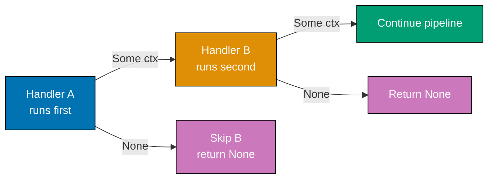
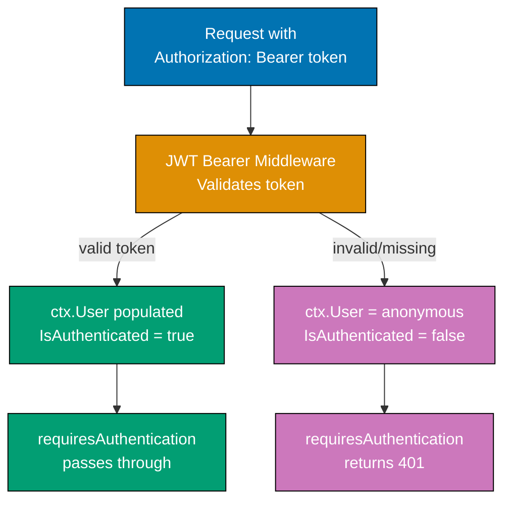

## Group 10: Composition Operators

### Example 28: The Fish Operator >=> in Depth

The `>=>` operator (Kleisli composition for `HttpHandler`) chains two handlers so that if the first returns `Some ctx`, the second receives that context. If the first returns `None`, the second is skipped. This is the backbone of Giraffe's composability.



```fsharp
open Microsoft.AspNetCore.Builder
open Microsoft.Extensions.DependencyInjection
open Giraffe

// >=>: HttpHandler -> HttpHandler -> HttpHandler
// => (>=>) h1 h2 = fun next ctx -> task { return! h1 (h2 next) ctx }
// => Equivalent to: h1 calls h2 as "next"
// => If h1 short-circuits (returns None), h2 never runs

// Building complex handlers by composition
let requiresHttps : HttpHandler =
    fun next ctx ->
        task {
            if ctx.Request.IsHttps then
                return! next ctx            // => HTTPS: continue
            else
                return! (setStatusCode 400 >=> text "HTTPS required") next ctx
                // => HTTP: short-circuit with error
        }

let requiresJsonContent : HttpHandler =
    fun next ctx ->
        task {
            let ct = ctx.Request.ContentType |> Option.ofObj |> Option.defaultValue ""
            if ct.Contains("application/json") then
                return! next ctx            // => JSON content: continue
            else
                return! (setStatusCode 415 >=> text "application/json required") next ctx
                // => 415 Unsupported Media Type
        }

let rateLimitHandler : HttpHandler =
    fun next ctx ->
        task {
            // Simplified rate check (real: use IMemoryCache or Redis)
            let ip = ctx.Connection.RemoteIpAddress.ToString()
            let allowed = ip <> "192.168.1.99"   // => Block specific IP for demo
            if allowed then
                return! next ctx
            else
                return! (setStatusCode 429 >=> text "Too many requests") next ctx
                // => 429 Too Many Requests
        }

// Compose a guard chain: each guard must pass before reaching the terminal handler
let secureApiHandler : HttpHandler =
    requiresHttps        >=>    // => 1st: must be HTTPS
    requiresJsonContent  >=>    // => 2nd: must send JSON
    rateLimitHandler     >=>    // => 3rd: must not be rate-limited
    text "API response"         // => Terminal: write response
// => All three guards run in order; any failure short-circuits

let webApp : HttpHandler =
    POST >=> route "/api/secure" >=> secureApiHandler

let builder = WebApplication.CreateBuilder()
builder.Services.AddGiraffe() |> ignore
let app = builder.Build()
app.UseGiraffe(webApp)
// => POST /api/secure (HTTP, not HTTPS)          => 400 "HTTPS required"
// => POST /api/secure (HTTPS, text/plain body)   => 415 "application/json required"
// => POST /api/secure (HTTPS, JSON, rate-limited) => 429 "Too many requests"
// => POST /api/secure (HTTPS, JSON, allowed)     => "API response" (200)
app.Run()
```

**Key Takeaway**: `>=>` chains handlers left-to-right; any handler returning `None` short-circuits the chain, preventing downstream handlers from running.

**Why It Matters**: The `>=>` composition model means security guards, validation, and logging are explicitly ordered and visible in the source. In attribute-based frameworks, the execution order of `[Authorize]`, `[ValidateAntiForgeryToken]`, and action filters is determined by framework conventions that must be memorized. In Giraffe, the composition order is the execution order, making security auditing as simple as reading the handler pipeline from left to right.

---

### Example 29: Building Reusable Middleware as HttpHandlers

Every cross-cutting concern - authentication, CORS, caching, rate limiting - can be expressed as a reusable `HttpHandler` value. This example builds a production-grade request timing middleware.

```fsharp
open Microsoft.AspNetCore.Builder
open Microsoft.Extensions.DependencyInjection
open Microsoft.Extensions.Logging
open Giraffe

// Reusable timing middleware
// => Measures and logs the duration of every request it wraps
let withTiming (logger : ILogger) : HttpHandler -> HttpHandler =
    // => Returns a middleware factory: HttpHandler -> HttpHandler
    // => Takes the next handler as input, returns a wrapped handler
    fun (next : HttpHandler) ->
        fun (nextFunc : HttpFunc) (ctx : HttpContext) ->
            task {
                let sw = System.Diagnostics.Stopwatch.StartNew()
                // => StartNew: creates and starts a stopwatch

                let! result = next nextFunc ctx
                // => Await the wrapped handler pipeline
                // => next receives nextFunc as its continuation

                sw.Stop()
                logger.LogInformation(
                    "Request {Method} {Path} completed in {ElapsedMs}ms",
                    ctx.Request.Method, ctx.Request.Path, sw.ElapsedMilliseconds
                )
                // => Log timing after handler completes
                return result
            }

// Reusable correlation ID middleware
// => Reads or generates X-Correlation-ID header and adds to response
let withCorrelationId : HttpHandler =
    fun next ctx ->
        task {
            let correlationId =
                match ctx.Request.Headers["X-Correlation-ID"].ToString() with
                | "" -> System.Guid.NewGuid().ToString()
                // => No header: generate new GUID
                | id -> id
                // => Header present: propagate it

            ctx.Response.Headers["X-Correlation-ID"] <- correlationId
            // => Add correlation ID to response headers

            ctx.Items["CorrelationId"] <- correlationId :> obj
            // => Store in Items dict for downstream handlers to read
            // => ctx.Items: Dictionary<obj, obj> for per-request data

            return! next ctx
        }

// Compose middleware into application
let builder = WebApplication.CreateBuilder()
builder.Services.AddGiraffe() |> ignore

let app = builder.Build()
let logger = app.Services.GetRequiredService<ILogger<obj>>()

let webApp : HttpHandler =
    withCorrelationId >=>
    withTiming logger (           // => withTiming returns HttpHandler->HttpHandler
        choose [                  // => choose is the HttpHandler passed to withTiming
            GET >=> route "/items" >=> text "items"
        ]
    )
// => Request: withCorrelationId -> withTiming -> choose -> text

app.UseGiraffe(webApp)
app.Run()
```

**Key Takeaway**: Build reusable middleware as functions that take an `HttpHandler` and return a wrapped `HttpHandler`; compose them with `>=>` or by passing the inner handler as an argument.

**Why It Matters**: Middleware as pure functions means your timing, correlation ID, and rate limiting logic are testable in isolation without running an HTTP server. A `withTiming` handler can be tested by passing a mock `ILogger` and a known handler, asserting the log was written with correct values. This is impossible with ASP.NET Core `IMiddleware` classes unless you mock the entire middleware pipeline. Giraffe's approach makes cross-cutting concerns as testable as any other F# function.

---

## Group 11: Authentication

### Example 30: JWT Bearer Authentication

JWT authentication in Giraffe uses ASP.NET Core's JWT Bearer middleware. After registering the middleware, Giraffe's `requiresAuthentication` handler protects routes.



```fsharp
open Microsoft.AspNetCore.Builder
open Microsoft.AspNetCore.Authentication.JwtBearer   // => JWT Bearer NuGet package
open Microsoft.Extensions.DependencyInjection
open Microsoft.IdentityModel.Tokens                  // => TokenValidationParameters
open System.Text
open Giraffe

// Protected handler: only reachable with valid JWT
let meHandler : HttpHandler =
    requiresAuthentication (setStatusCode 401 >=> text "Unauthorized") >=>
    // => requiresAuthentication: HttpHandler -> HttpHandler
    // => First arg: handler to run if NOT authenticated
    // => If ctx.User.Identity.IsAuthenticated = false, runs the error handler
    // => If authenticated, passes to the next handler (>=> chain continues)
    fun next ctx ->
        task {
            // ctx.User is populated by JWT Bearer middleware
            let username =
                ctx.User.FindFirst(System.Security.Claims.ClaimTypes.Name)
                |> Option.ofObj
                |> Option.map (fun c -> c.Value)
                |> Option.defaultValue "unknown"
            // => ClaimTypes.Name extracts the "name" claim from the JWT
            // => Option.ofObj handles null Claim reference

            let email =
                ctx.User.FindFirst(System.Security.Claims.ClaimTypes.Email)
                |> Option.ofObj
                |> Option.map (fun c -> c.Value)
                |> Option.defaultValue ""

            return! json {| Username = username; Email = email |} next ctx
        }

let builder = WebApplication.CreateBuilder()

let jwtKey = "super-secret-key-at-least-32-characters-long"
// => In production, read from environment variable or key vault
// => Never hardcode secrets in source code

builder.Services
    .AddAuthentication(JwtBearerDefaults.AuthenticationScheme)
    // => Sets JWT Bearer as the default auth scheme
    .AddJwtBearer(fun options ->
        options.TokenValidationParameters <- TokenValidationParameters(
            ValidateIssuerSigningKey = true,
            IssuerSigningKey = SymmetricSecurityKey(Encoding.UTF8.GetBytes(jwtKey)),
            // => Validates the signature using the shared secret
            ValidateIssuer   = false,   // => Set to true in production with ValidIssuer
            ValidateAudience = false    // => Set to true in production with ValidAudience
        )
    ) |> ignore

builder.Services.AddGiraffe() |> ignore
let app = builder.Build()

app.UseAuthentication() |> ignore    // => Must be before UseAuthorization and UseGiraffe
app.UseAuthorization()  |> ignore

app.UseGiraffe(
    choose [
        GET >=> route "/me" >=> meHandler
        GET >=> route "/public" >=> text "No auth required"
    ]
)
app.Run()
// => GET /me (Authorization: Bearer <valid-jwt>) => {"username":"alice","email":"..."}
// => GET /me (no Authorization header)            => 401 "Unauthorized"
// => GET /public                                  => "No auth required" (200)
```

**Key Takeaway**: Register JWT Bearer middleware with `AddJwtBearer`, then use `requiresAuthentication errorHandler` to protect Giraffe routes.

**Why It Matters**: JWT authentication integrates seamlessly with Giraffe because ASP.NET Core's authentication middleware populates `ctx.User` before Giraffe's handlers run. Giraffe's `requiresAuthentication` is just an `HttpHandler` - not a special attribute or filter - so it composes with `>=>` like any other handler. This means you can conditionally apply authentication based on route patterns, request headers, or any other runtime condition, which attribute-based authentication cannot support.

---

### Example 31: Cookie Authentication and Session Management

Cookie authentication maintains server-side sessions. Giraffe handlers sign in, sign out, and protect routes using ASP.NET Core's cookie authentication middleware.

```fsharp
open Microsoft.AspNetCore.Builder
open Microsoft.AspNetCore.Authentication
open Microsoft.AspNetCore.Authentication.Cookies  // => Cookie auth package (built-in)
open Microsoft.Extensions.DependencyInjection
open System.Security.Claims
open Giraffe

// Sign in handler: creates the auth cookie
let signInHandler : HttpHandler =
    fun next ctx ->
        task {
            let! form = ctx.BindFormAsync<{| Username: string; Password: string |}>()
            // => Bind form data to anonymous record
            // => Anonymous records work with BindFormAsync

            if form.Username = "admin" && form.Password = "secret" then
                // => Real app: hash password, query database
                let claims = [
                    Claim(ClaimTypes.Name,  form.Username)     // => "name" claim
                    Claim(ClaimTypes.Role,  "Administrator")   // => "role" claim
                    Claim(ClaimTypes.Email, "admin@example.com") // => "email" claim
                ]
                // => Claims are name/value pairs embedded in the auth cookie

                let claimsIdentity =
                    ClaimsIdentity(claims, CookieAuthenticationDefaults.AuthenticationScheme)
                // => Identity with cookie auth scheme

                let claimsPrincipal = ClaimsPrincipal(claimsIdentity)
                // => Principal wraps one or more identities

                do! ctx.SignInAsync(
                    CookieAuthenticationDefaults.AuthenticationScheme,
                    claimsPrincipal
                )
                // => Creates and sets the auth cookie in the response
                // => Cookie is encrypted and signed by ASP.NET Core's data protection

                return! redirectTo false "/dashboard" next ctx
                // => Redirect to protected area after login
            else
                return! (setStatusCode 401 >=> text "Invalid credentials") next ctx
        }

// Sign out handler: clears the auth cookie
let signOutHandler : HttpHandler =
    fun next ctx ->
        task {
            do! ctx.SignOutAsync(CookieAuthenticationDefaults.AuthenticationScheme)
            // => Deletes the auth cookie from client
            // => Also invalidates server-side session if using ITicketStore
            return! redirectTo false "/login" next ctx
        }

// Protected dashboard
let dashboardHandler : HttpHandler =
    requiresAuthentication (redirectTo false "/login") >=>
    // => Unauthenticated: redirect to login page (not 401 - better UX for web apps)
    fun next ctx ->
        task {
            let username = ctx.User.Identity.Name |> Option.ofObj |> Option.defaultValue ""
            return! text $"Welcome, {username}!" next ctx
        }

let builder = WebApplication.CreateBuilder()
builder.Services
    .AddAuthentication(CookieAuthenticationDefaults.AuthenticationScheme)
    .AddCookie(fun options ->
        options.LoginPath  <- "/login"        // => Redirect unauthenticated to /login
        options.LogoutPath <- "/logout"       // => Logout endpoint
        options.ExpireTimeSpan <- System.TimeSpan.FromHours(1.0)
        // => Cookie expires after 1 hour of inactivity
        options.SlidingExpiration <- true
        // => Reset expiry on each authenticated request
    ) |> ignore
builder.Services.AddGiraffe() |> ignore
let app = builder.Build()
app.UseAuthentication() |> ignore
app.UseAuthorization()  |> ignore
app.UseGiraffe(choose [
    GET  >=> route "/login"     >=> text "Login form here"
    POST >=> route "/login"     >=> signInHandler
    POST >=> route "/logout"    >=> signOutHandler
    GET  >=> route "/dashboard" >=> dashboardHandler
])
app.Run()
```

**Key Takeaway**: Use `ctx.SignInAsync` with a `ClaimsPrincipal` to set the auth cookie; use `requiresAuthentication (redirectTo "/login")` to redirect unauthenticated web users.

**Why It Matters**: Cookie authentication is the right choice for web applications where users interact via a browser, while JWT is better for API clients. Giraffe's `requiresAuthentication` works identically with both - only the error handler differs (redirect for web, 401 for API). This consistency means you can switch authentication schemes without changing any protected route handlers, only the error handler and DI configuration change.

---

### Example 32: Role-Based Authorization

Giraffe's `requiresRole` and `requiresClaim` handlers enforce authorization after authentication. They check `ctx.User` claims to verify the user has the required role or claim value.

```fsharp
open Microsoft.AspNetCore.Builder
open Microsoft.Extensions.DependencyInjection
open Giraffe

// requiresRole: string -> HttpHandler -> HttpHandler
// => First arg: required role name
// => Second arg: error handler (runs if user lacks the role)
// => Checks ctx.User.IsInRole(role)

let adminOnlyHandler : HttpHandler =
    requiresRole "Administrator" (setStatusCode 403 >=> text "Forbidden: requires Administrator role") >=>
    // => If ctx.User.IsInRole("Administrator") = false => 403
    // => If user has role => continues to next handler
    json {| Message = "Admin dashboard data"; AdminOnly = true |}

// requiresClaim: string -> string -> HttpHandler -> HttpHandler
// => First arg: claim type
// => Second arg: required claim value
// => Third arg: error handler
let premiumOnlyHandler : HttpHandler =
    requiresClaim "subscription" "premium" (setStatusCode 403 >=> text "Premium subscription required") >=>
    // => Checks if user has a claim of type "subscription" with value "premium"
    // => JWT payload: { "subscription": "premium", ... }
    json {| Message = "Premium feature data" |}

// Combining multiple authorization checks
let superAdminHandler : HttpHandler =
    requiresAuthentication (setStatusCode 401 >=> text "Login required")    >=>
    // => Check 1: must be authenticated
    requiresRole "Administrator" (setStatusCode 403 >=> text "Admin required") >=>
    // => Check 2: must be in Administrator role
    requiresClaim "mfa_verified" "true" (setStatusCode 403 >=> text "MFA required") >=>
    // => Check 3: must have MFA-verified claim
    text "Super admin area"
// => All three checks must pass in sequence

// Custom policy handler using pure F# logic
let ownerOrAdminHandler (resourceOwnerId : int) : HttpHandler =
    fun next ctx ->
        task {
            let userId =
                ctx.User.FindFirst(System.Security.Claims.ClaimTypes.NameIdentifier)
                |> Option.ofObj |> Option.map (fun c -> int c.Value) |> Option.defaultValue 0
            // => Extract user ID from "sub" or NameIdentifier claim
            let isAdmin  = ctx.User.IsInRole("Administrator")
            let isOwner  = userId = resourceOwnerId
            if isAdmin || isOwner then
                return! next ctx       // => Authorized: admin or owner
            else
                return! (setStatusCode 403 >=> text "Not authorized") next ctx
        }

let webApp : HttpHandler =
    choose [
        GET >=> route "/admin"   >=> requiresAuthentication (setStatusCode 401 >=> text "Login") >=> adminOnlyHandler
        GET >=> route "/premium" >=> requiresAuthentication (setStatusCode 401 >=> text "Login") >=> premiumOnlyHandler
        GET >=> routef "/items/%i" (fun id ->
            requiresAuthentication (setStatusCode 401 >=> text "Login") >=>
            ownerOrAdminHandler id >=>
            text $"Item {id} data"
        )
    ]

let builder = WebApplication.CreateBuilder()
builder.Services.AddGiraffe() |> ignore
let app = builder.Build()
app.UseAuthentication() |> ignore
app.UseAuthorization()  |> ignore
app.UseGiraffe(webApp)
app.Run()
```

**Key Takeaway**: Chain `requiresAuthentication`, `requiresRole`, and `requiresClaim` with `>=>` to express multi-condition authorization policies.

**Why It Matters**: Expressing authorization as composable handlers makes security policies readable and auditable. A code review can verify `requiresAuthentication >=> requiresRole "Admin" >=> handler` as easily as reading a sentence. Compare this to ASP.NET MVC where `[Authorize(Roles="Admin")]` on an action method is only discovered by reading the attribute, and the interaction between `[Authorize]` on the controller and `[AllowAnonymous]` on a method requires knowing framework precedence rules.

---

## Group 12: Dependency Injection

### Example 33: Injecting Services into Handlers

Giraffe handlers access ASP.NET Core's DI container through `ctx.GetService<'T>()`. This enables clean separation between handler logic and service implementation.

```fsharp
open Microsoft.AspNetCore.Builder
open Microsoft.Extensions.DependencyInjection
open Giraffe

// Define a service interface (F# can use abstract types or interfaces)
type IUserRepository =
    abstract member GetById: int -> Async<{| Id: int; Name: string; Email: string |} option>
    abstract member GetAll: unit -> Async<{| Id: int; Name: string |} list>
// => F# interface with abstract members
// => Async<'T> wraps asynchronous operations

// Concrete implementation
type InMemoryUserRepository() =
    let users = [
        {| Id = 1; Name = "Alice"; Email = "alice@example.com" |}
        {| Id = 2; Name = "Bob";   Email = "bob@example.com"   |}
    ]
    // => In-memory list simulates a database

    interface IUserRepository with
        member _.GetById(id) = async {
            return users |> List.tryFind (fun u -> u.Id = id)
            // => List.tryFind returns 'T option (Some if found, None if not)
        }
        member _.GetAll() = async {
            return users |> List.map (fun u -> {| Id = u.Id; Name = u.Name |})
            // => Return summary records (no email - less data over wire)
        }
// => InMemoryUserRepository implements IUserRepository

// Handler that uses the injected service
let getUsersHandler : HttpHandler =
    fun next ctx ->
        task {
            let repo = ctx.GetService<IUserRepository>()
            // => Resolves IUserRepository from DI container
            // => Will use InMemoryUserRepository (registered below)

            let! users = repo.GetAll() |> Async.StartAsTask
            // => GetAll returns Async<_>; StartAsTask converts to Task<_>
            // => let! in task {} awaits the Task
            return! json users next ctx
        }

let getUserByIdHandler (id : int) : HttpHandler =
    fun next ctx ->
        task {
            let repo = ctx.GetService<IUserRepository>()
            let! user = repo.GetById(id) |> Async.StartAsTask
            match user with
            | Some u -> return! json u next ctx            // => 200 with user
            | None   -> return! setStatusCode 404 >=> text $"User {id} not found" <| next <| ctx
                        // => 404 when not found
        }

let builder = WebApplication.CreateBuilder()

// Register implementation with the DI container
builder.Services.AddSingleton<IUserRepository, InMemoryUserRepository>() |> ignore
// => AddSingleton: one instance for the lifetime of the app
// => AddScoped: one instance per request
// => AddTransient: new instance every time resolved

builder.Services.AddGiraffe() |> ignore
let app = builder.Build()
app.UseGiraffe(choose [
    GET >=> route  "/users"     >=> getUsersHandler
    GET >=> routef "/users/%i" getUserByIdHandler
])
app.Run()
// => GET /users    => [{"id":1,"name":"Alice"},{"id":2,"name":"Bob"}]
// => GET /users/1  => {"id":1,"name":"Alice","email":"alice@example.com"}
// => GET /users/99 => 404 "User 99 not found"
```

**Key Takeaway**: Use `ctx.GetService<'T>()` to resolve services from DI inside handlers; register implementations with `AddSingleton/Scoped/Transient` before `Build()`.

**Why It Matters**: DI injection through `ctx.GetService` keeps handler functions pure with respect to their dependencies - the actual service implementation is a detail that handlers should not know about. This enables swapping `InMemoryUserRepository` for a `PostgresUserRepository` without changing any handler code. For testing, you register a mock implementation that returns predictable test data, making every handler testable without a real database or network connection.

---

### Example 34: Using IHttpContextAccessor and Scoped Services

For services that need per-request context or scoped lifetime, inject them via constructor injection in services rather than resolving from `ctx` in every handler.

```fsharp
open Microsoft.AspNetCore.Builder
open Microsoft.AspNetCore.Http                       // => IHttpContextAccessor
open Microsoft.Extensions.DependencyInjection
open Giraffe

// Service that needs the current user context
type ICurrentUserService =
    abstract member UserId   : int option
    abstract member Username : string option
    abstract member IsAdmin  : bool

type CurrentUserService(httpContextAccessor : IHttpContextAccessor) =
    // => Constructor injection: ASP.NET Core injects IHttpContextAccessor
    let user = httpContextAccessor.HttpContext.User
    // => Access the current request's user through IHttpContextAccessor
    // => IHttpContextAccessor wraps the HttpContext for injection

    interface ICurrentUserService with
        member _.UserId =
            user.FindFirst(System.Security.Claims.ClaimTypes.NameIdentifier)
            |> Option.ofObj
            |> Option.map (fun c -> int c.Value)
        // => Returns None if not authenticated or no NameIdentifier claim

        member _.Username =
            user.FindFirst(System.Security.Claims.ClaimTypes.Name)
            |> Option.ofObj
            |> Option.map (fun c -> c.Value)

        member _.IsAdmin = user.IsInRole("Administrator")
// => CurrentUserService exposes current user info without HttpContext coupling

// Handler using injected current user service
let profileHandler : HttpHandler =
    fun next ctx ->
        task {
            let currentUser = ctx.GetService<ICurrentUserService>()
            // => Resolves the scoped CurrentUserService for this request

            return! json {|
                UserId   = currentUser.UserId
                Username = currentUser.Username
                IsAdmin  = currentUser.IsAdmin
            |} next ctx
        }

let builder = WebApplication.CreateBuilder()

// Register IHttpContextAccessor (required for per-request context access in services)
builder.Services.AddHttpContextAccessor() |> ignore
// => Enables injection of IHttpContextAccessor into services

// Register as Scoped (new instance per request, not singleton)
builder.Services.AddScoped<ICurrentUserService, CurrentUserService>() |> ignore
// => Scoped: one instance per HTTP request
// => Reuses the same CurrentUserService instance within one request

builder.Services.AddGiraffe() |> ignore
let app = builder.Build()
app.UseAuthentication() |> ignore
app.UseGiraffe(GET >=> route "/profile" >=> profileHandler)
app.Run()
```

**Key Takeaway**: Register `IHttpContextAccessor` to inject per-request context into services; use `AddScoped` for services that have per-request lifetime.

**Why It Matters**: The `IHttpContextAccessor` pattern lets you inject current-user context deep into service layers without threading `HttpContext` through every method call. A `ICurrentUserService` can be injected into a `ReportService`, which can be injected into a handler, without `ReportService` needing to know about HTTP at all. This separation keeps business logic testable as pure functions and prevents the anti-pattern of `HttpContext` leaking into domain models.

---

## Group 13: Database Integration

### Example 35: Dapper with F# Records

Dapper maps SQL query results to F# records using column name to field name matching. F# records work as POCOs for Dapper's mapper.

```fsharp
open Microsoft.AspNetCore.Builder
open Microsoft.Extensions.DependencyInjection
open Microsoft.Extensions.Configuration
open Dapper                                          // => Dapper NuGet package
open System.Data.SqlClient                           // => Or Npgsql for PostgreSQL

// F# record for Dapper result mapping
// Column names in SQL must match record field names (case-insensitive by default)
[<CLIMutable>]                                       // => Required for Dapper's reflection
type ProductRow = {
    Id          : int
    Name        : string
    Price       : decimal
    CategoryId  : int
    CreatedAt   : System.DateTime
}
// => Dapper maps: id -> Id, name -> Name, price -> Price, etc.
// => [<CLIMutable>] adds a default constructor needed by Dapper

// Repository using Dapper
type ProductRepository(connectionString : string) =
    // => Constructor injection of connection string

    member _.GetAll() =
        task {
            use conn = new SqlConnection(connectionString)
            // => use: disposes conn when block exits (IDisposable)
            // => SqlConnection manages the database connection

            let! products =
                conn.QueryAsync<ProductRow>(
                    "SELECT id, name, price, category_id AS CategoryId, created_at AS CreatedAt FROM products"
                )
            // => QueryAsync<'T>: executes SQL and maps rows to 'T list
            // => AS aliases align SQL column names to F# record field names
            // => Returns IEnumerable<ProductRow>

            return products |> Seq.toList
            // => Convert IEnumerable to F# list
        }

    member _.GetById(id : int) =
        task {
            use conn = new SqlConnection(connectionString)
            let! product =
                conn.QueryFirstOrDefaultAsync<ProductRow>(
                    "SELECT id, name, price, category_id AS CategoryId, created_at AS CreatedAt FROM products WHERE id = @Id",
                    {| Id = id |}
                    // => Anonymous record as parameter object
                    // => @Id in SQL maps to Id field in anonymous record
                )
            // => QueryFirstOrDefaultAsync: returns first row or default(T)
            // => Default for record is null (reference type in .NET)
            return product |> Option.ofObj
            // => Convert null to None, value to Some
        }

// Handler using Dapper repository
let productsHandler (repo : ProductRepository) : HttpHandler =
    fun next ctx ->
        task {
            let! products = repo.GetAll()
            return! json products next ctx
        }

let builder = WebApplication.CreateBuilder()
builder.Services.AddGiraffe() |> ignore

let connStr = builder.Configuration.GetConnectionString("Default")
// => Reads from appsettings.json: { "ConnectionStrings": { "Default": "..." } }
let repo = ProductRepository(connStr)

let app = builder.Build()
app.UseGiraffe(GET >=> route "/products" >=> productsHandler repo)
app.Run()
// => GET /products => JSON array of ProductRow records from database
```

**Key Takeaway**: Add `[<CLIMutable>]` to F# records for Dapper mapping; use SQL column aliases to match record field names when they differ.

**Why It Matters**: Dapper's lightweight SQL mapping preserves the explicit, readable nature of SQL while eliminating the boilerplate of manual `IDataReader` column access. For F# applications, Dapper is often preferable to full ORMs because it maps to immutable records naturally, keeps SQL visible for performance tuning, and avoids the object-tracking complexity of change-detection ORMs like Entity Framework Core. The `[<CLIMutable>]` attribute is the only F#-specific requirement.

---

### Example 36: Entity Framework Core with F# Types

EF Core works with F# by using `[<CLIMutable>]` on entity types and configuring the model with `ModelBuilder`. The `task {}` computation expression integrates naturally with EF Core's async APIs.

```fsharp
open Microsoft.AspNetCore.Builder
open Microsoft.EntityFrameworkCore                   // => EF Core NuGet package
open Microsoft.Extensions.DependencyInjection
open Giraffe

// EF Core entity (table model)
[<CLIMutable>]
type Todo = {
    mutable Id      : int       // => mutable required: EF Core sets Id after INSERT
    mutable Title   : string
    mutable Done    : bool
    mutable Created : System.DateTime
}
// => mutable fields allow EF Core's change tracker to modify values
// => Without mutable, EF Core cannot update properties after materialization

// DbContext for EF Core
type AppDbContext(options : DbContextOptions<AppDbContext>) =
    inherit DbContext(options)
    // => Inherit DbContext with options (connection string, provider, etc.)

    [<DefaultValue>]
    val mutable Todos : DbSet<Todo>
    // => DbSet<T> represents the todos table
    // => [<DefaultValue>] initializes mutable val to null (EF Core injects it)

    override this.OnModelCreating(builder : ModelBuilder) =
        builder.Entity<Todo>().HasKey(fun t -> t.Id :> obj) |> ignore
        // => Define primary key for Todo entity
        // => Real app: configure indexes, constraints, relationships

// Giraffe handler using EF Core
let getTodosHandler : HttpHandler =
    fun next ctx ->
        task {
            let db = ctx.GetService<AppDbContext>()
            // => Resolve AppDbContext from DI (registered as scoped)

            let! todos =
                db.Todos
                    .AsNoTracking()
                    // => AsNoTracking: don't track changes (read-only query)
                    // => Better performance for queries that don't update
                    .ToListAsync()
            // => ToListAsync: async materialization of the query

            return! json todos next ctx
        }

let createTodoHandler : HttpHandler =
    fun next ctx ->
        task {
            let! newTodo = ctx.BindJsonAsync<{| Title: string |}>()
            // => Bind JSON body to anonymous record
            let db = ctx.GetService<AppDbContext>()

            let todo = { Id = 0; Title = newTodo.Title; Done = false; Created = System.DateTime.UtcNow }
            // => Id = 0: EF Core replaces with generated ID after INSERT

            db.Todos.Add(todo) |> ignore    // => Add to change tracker
            let! _ = db.SaveChangesAsync()  // => Persist to database
            // => SaveChangesAsync: generates and executes INSERT SQL

            return! (setStatusCode 201 >=> json todo) next ctx
            // => Return created todo with generated Id
        }

let builder = WebApplication.CreateBuilder()
builder.Services.AddDbContext<AppDbContext>(fun opts ->
    opts.UseSqlite("Data Source=app.db") |> ignore
    // => UseSqlite: SQLite provider (for testing/development)
    // => Production: UseNpgsql/UseSqlServer with connection string
) |> ignore
builder.Services.AddGiraffe() |> ignore
let app = builder.Build()

// Apply migrations on startup (development only)
using (app.Services.CreateScope()) (fun scope ->
    let db = scope.ServiceProvider.GetRequiredService<AppDbContext>()
    db.Database.EnsureCreated() |> ignore
    // => EnsureCreated: creates database schema if not exists
    // => Production: use db.Database.Migrate() for proper migrations
)

app.UseGiraffe(choose [
    GET  >=> route "/todos" >=> getTodosHandler
    POST >=> route "/todos" >=> createTodoHandler
])
app.Run()
```

**Key Takeaway**: Add `mutable` to EF Core entity fields so EF Core's change tracker can update them; use `AsNoTracking()` for read-only queries to improve performance.

**Why It Matters**: EF Core enables rapid development with automatic schema migration and LINQ query composition, which Dapper's raw SQL approach cannot match for complex domain models with many relationships. For F# applications, using `[<CLIMutable>]` with `mutable` fields is the necessary ceremony to bridge EF Core's imperative, object-tracking model to F#'s functional, immutable-by-default style. Understanding when to use EF Core versus Dapper is a key architectural decision for F# web applications.

---

## Group 14: File Upload and WebSocket

### Example 37: File Upload Handling

ASP.NET Core's `IFormFile` interface handles multipart file uploads. Giraffe handlers access uploaded files through `ctx.Request.Form.Files`.

```fsharp
open Microsoft.AspNetCore.Builder
open Microsoft.AspNetCore.Http                      // => IFormFile
open Microsoft.Extensions.DependencyInjection
open System.IO
open Giraffe

// File upload handler
let uploadHandler : HttpHandler =
    fun next ctx ->
        task {
            // Validate content type is multipart/form-data
            if not (ctx.Request.HasFormContentType) then
                return! (setStatusCode 400 >=> text "Expected multipart/form-data") next ctx
            else
                // Access uploaded files from the form
                let files = ctx.Request.Form.Files
                // => IFormFileCollection: all uploaded files in this request
                // => Indexed by name attribute of the HTML <input type="file">

                if files.Count = 0 then
                    return! (setStatusCode 400 >=> text "No files uploaded") next ctx
                else
                    let file = files.[0]
                    // => IFormFile: first uploaded file
                    // => file.FileName: original filename from client
                    // => file.Length: file size in bytes
                    // => file.ContentType: MIME type reported by client

                    // Validate file size (10MB limit)
                    let maxSize = 10L * 1024L * 1024L   // => 10 MB in bytes
                    if file.Length > maxSize then
                        return! (setStatusCode 413 >=> text "File too large (max 10MB)") next ctx
                    // => 413 Payload Too Large

                    // Validate file type by extension (real app: check magic bytes)
                    let allowedExtensions = [".jpg"; ".jpeg"; ".png"; ".gif"; ".pdf"]
                    let ext = Path.GetExtension(file.FileName).ToLowerInvariant()
                    // => GetExtension: ".jpg" from "photo.jpg"
                    if not (List.contains ext allowedExtensions) then
                        return! (setStatusCode 400 >=> text $"File type {ext} not allowed") next ctx
                    else
                        // Generate safe filename to prevent path traversal
                        let safeFileName = $"{System.Guid.NewGuid()}{ext}"
                        // => New GUID prevents collisions and path traversal attacks
                        // => Never use file.FileName directly on disk

                        let uploadPath = Path.Combine("uploads", safeFileName)
                        Directory.CreateDirectory("uploads") |> ignore
                        // => Create uploads directory if not exists

                        use stream = new FileStream(uploadPath, FileMode.Create)
                        do! file.CopyToAsync(stream)
                        // => CopyToAsync: streams file from request to disk
                        // => Avoids loading entire file into memory

                        return! json {|
                            FileName    = safeFileName
                            OriginalName = file.FileName
                            Size        = file.Length
                            ContentType = file.ContentType
                        |} next ctx
        }

let builder = WebApplication.CreateBuilder()
builder.Services.AddGiraffe() |> ignore
let app = builder.Build()
app.UseGiraffe(POST >=> route "/upload" >=> uploadHandler)
app.Run()
// => POST /upload (multipart/form-data, valid image) => 200 JSON with file info
// => POST /upload (file > 10MB)                      => 413 "File too large"
// => POST /upload (file.exe)                         => 400 "File type .exe not allowed"
```

**Key Takeaway**: Access uploaded files via `ctx.Request.Form.Files`; always validate file size, extension, and generate server-side safe filenames before saving.

**Why It Matters**: File upload validation is a critical security boundary. Accepting filenames from clients enables path traversal attacks that overwrite system files. Trusting reported MIME types without validation allows executable file uploads. Size limits prevent denial-of-service through large file uploads. The pattern in this example - GUID filename, extension whitelist, size limit - is the minimum viable secure file upload implementation that should be applied in every production application handling user-supplied files.

---

### Example 38: WebSocket Connections

Giraffe integrates with ASP.NET Core's WebSocket support for real-time bidirectional communication. WebSocket handlers use `ctx.WebSockets.AcceptWebSocketAsync()` to upgrade the connection.

```fsharp
open Microsoft.AspNetCore.Builder
open Microsoft.AspNetCore.WebSockets               // => WebSocket support
open Microsoft.Extensions.DependencyInjection
open System.Net.WebSockets                         // => WebSocket, WebSocketReceiveResult
open System.Text
open Giraffe

// WebSocket echo handler: receives messages and sends them back
let webSocketHandler : HttpHandler =
    fun next ctx ->
        task {
            if ctx.WebSockets.IsWebSocketRequest then
                // => IsWebSocketRequest: true if client sent Upgrade: websocket header
                let! ws = ctx.WebSockets.AcceptWebSocketAsync()
                // => Upgrades the HTTP connection to WebSocket protocol
                // => Returns WebSocket object for send/receive

                let buffer = Array.zeroCreate<byte> 4096
                // => Buffer for incoming messages (4KB per read)

                let mutable keepRunning = true
                while keepRunning do
                    // Receive a message from the client
                    let! result = ws.ReceiveAsync(
                        System.ArraySegment<byte>(buffer), ctx.RequestAborted
                    )
                    // => ReceiveAsync: waits for next message from client
                    // => ctx.RequestAborted: CancellationToken for graceful shutdown
                    // => result: WebSocketReceiveResult (message type, count, close status)

                    match result.MessageType with
                    | WebSocketMessageType.Text ->
                        // => Client sent a text message
                        let message = Encoding.UTF8.GetString(buffer, 0, result.Count)
                        // => Decode bytes to string (UTF-8)
                        printfn $"Received: {message}"

                        // Echo back the message with a prefix
                        let response = Encoding.UTF8.GetBytes($"Echo: {message}")
                        do! ws.SendAsync(
                            System.ArraySegment<byte>(response),
                            WebSocketMessageType.Text,
                            endOfMessage = true,          // => true: complete message
                            cancellationToken = ctx.RequestAborted
                        )
                        // => SendAsync: sends bytes to client

                    | WebSocketMessageType.Close ->
                        // => Client initiated close handshake
                        do! ws.CloseAsync(WebSocketCloseStatus.NormalClosure, "Bye", ctx.RequestAborted)
                        // => Complete the close handshake
                        keepRunning <- false              // => Exit the receive loop
                    | _ ->
                        keepRunning <- false              // => Binary or unexpected: close

                return Some ctx                          // => Return Some to complete handler
            else
                // Non-WebSocket request to this endpoint
                return! (setStatusCode 400 >=> text "WebSocket connections only") next ctx
        }

let builder = WebApplication.CreateBuilder()
builder.Services.AddGiraffe() |> ignore
let app = builder.Build()

// UseWebSockets MUST be called before UseGiraffe
app.UseWebSockets() |> ignore
// => Enables WebSocket upgrade handling in the pipeline

app.UseGiraffe(GET >=> route "/ws" >=> webSocketHandler)
app.Run()
// => WS connect to /ws => upgrade to WebSocket
// => Send "hello" => receive "Echo: hello"
// => Send close => graceful close handshake
```

**Key Takeaway**: Register `UseWebSockets()` before `UseGiraffe()`; check `ctx.WebSockets.IsWebSocketRequest` and accept the upgrade with `AcceptWebSocketAsync()`.

**Why It Matters**: WebSocket connections are the foundation of real-time features: live chat, collaborative editing, dashboard updates, and game state synchronization. The F# `task {}` computation expression with mutable loop state is the natural pattern for WebSocket receive loops, making the connection lifecycle visible and manageable. For production WebSocket applications, combine this pattern with `System.Threading.Channels` for backpressure and `IHostedService` for connection management across the application.

---

## Group 15: Testing

### Example 39: Integration Testing with TestHost

ASP.NET Core's `TestHost` runs your Giraffe application in-process without a real network socket. Tests send HTTP requests directly to the handler pipeline.

```fsharp
// Tests project: add packages Microsoft.AspNetCore.TestHost, xunit, FsUnit.Xunit

open Xunit                                          // => xUnit test framework
open System.Net                                     // => HttpStatusCode
open System.Net.Http                                // => HttpClient, StringContent
open Microsoft.AspNetCore.TestHost                  // => TestServer, WebHostBuilder
open Microsoft.AspNetCore.Builder
open Microsoft.Extensions.DependencyInjection
open Giraffe

// ===== Application under test =====
let createApp () =
    let webApp : HttpHandler =
        choose [
            GET  >=> route "/api/ping"   >=> text "pong"
            POST >=> route "/api/echo"   >=> fun next ctx ->
                task {
                    let! body = ctx.ReadBodyFromRequestAsync()
                    return! text $"Echo: {body}" next ctx
                }
        ]

    let builder = WebApplication.CreateBuilder()
    builder.Services.AddGiraffe() |> ignore
    let app = builder.Build()
    app.UseGiraffe(webApp)
    app
// => Creates the WebApplication but does NOT call app.Run()
// => TestHost uses this without starting a real server

// ===== Test class =====
type GiraffeIntegrationTests() =
    // Create TestServer from the application
    let server =
        new TestServer(
            Microsoft.AspNetCore.WebHost
                .CreateDefaultBuilder()
                .Configure(fun app ->
                    let webApp : HttpHandler =
                        choose [
                            GET  >=> route "/api/ping" >=> text "pong"
                            POST >=> route "/api/echo" >=> fun next ctx ->
                                task {
                                    let! body = ctx.ReadBodyFromRequestAsync()
                                    return! text $"Echo: {body}" next ctx
                                }
                        ]
                    app.UseGiraffe(webApp)
                )
                .ConfigureServices(fun services ->
                    services.AddGiraffe() |> ignore
                )
        )
    // => TestServer builds and hosts app in memory

    let client = server.CreateClient()
    // => HttpClient wired to the TestServer (no real network)

    [<Fact>]
    member _.``GET /api/ping returns pong``() =
        task {
            // Arrange
            let request = new HttpRequestMessage(HttpMethod.Get, "/api/ping")
            // => Create HTTP GET request

            // Act
            let! response = client.SendAsync(request)
            // => Sends request through in-process pipeline

            // Assert
            Assert.Equal(HttpStatusCode.OK, response.StatusCode)
            // => Verify 200 status code
            let! body = response.Content.ReadAsStringAsync()
            Assert.Equal("pong", body)
            // => Verify response body
        }

    [<Fact>]
    member _.``POST /api/echo returns echoed body``() =
        task {
            let content = new StringContent("hello world", System.Text.Encoding.UTF8, "text/plain")
            let! response = client.PostAsync("/api/echo", content)
            // => POST with body "hello world"

            Assert.Equal(HttpStatusCode.OK, response.StatusCode)
            let! body = response.Content.ReadAsStringAsync()
            Assert.Equal("Echo: hello world", body)
        }

    interface System.IDisposable with
        member _.Dispose() = server.Dispose()
        // => Clean up TestServer after all tests
```

**Key Takeaway**: Use `TestServer` with `server.CreateClient()` for in-process integration testing; no real network binding is required.

**Why It Matters**: In-process integration testing with `TestServer` gives you true end-to-end coverage of your handler pipeline - routing, middleware, serialization, error handling - without the flakiness of real network tests. Tests run at in-memory speed, making it practical to run hundreds of integration tests on every pull request. The ability to test your Giraffe application in-process is enabled by the ASP.NET Core hosting abstractions that Giraffe builds on, giving you a powerful testing capability essentially for free.

---

### Example 40: Unit Testing Pure HttpHandlers

Because `HttpHandler` is a pure function value, you can test it without `TestServer` by constructing minimal `HttpContext` objects and calling the handler directly.

```fsharp
open Xunit
open System.IO
open Microsoft.AspNetCore.Http                     // => DefaultHttpContext

// The handler to test
open Giraffe

let greetHandler (name : string) : HttpHandler =
    fun next ctx ->
        task {
            if name.Length < 2 then
                return! (setStatusCode 400 >=> text "Name too short") next ctx
            else
                return! text $"Hello, {name}!" next ctx
        }
// => Pure function: behavior depends only on name and ctx

// Helper: create a minimal HttpContext for testing
let createTestContext () =
    let ctx = DefaultHttpContext()
    // => DefaultHttpContext: in-memory HttpContext with no real network
    ctx.Response.Body <- new MemoryStream()
    // => Replace response body with MemoryStream (readable after handler runs)
    ctx

// Helper: read response body from test context
let readBody (ctx : HttpContext) =
    ctx.Response.Body.Seek(0L, SeekOrigin.Begin) |> ignore
    // => Seek to start of MemoryStream
    use reader = new StreamReader(ctx.Response.Body)
    reader.ReadToEnd()
    // => Read entire response body as string

// Terminal HttpFunc: does nothing, just returns the context
let terminalNext : HttpFunc =
    fun ctx -> task { return Some ctx }
// => Represents "end of pipeline" for testing

type HandlerTests() =
    [<Fact>]
    member _.``greetHandler returns greeting for valid name``() =
        task {
            let ctx = createTestContext()
            let! result = greetHandler "Alice" terminalNext ctx
            // => Call handler directly with test context

            Assert.True(result.IsSome)             // => Handler returned Some (not None)
            let body = readBody ctx
            Assert.Equal("Hello, Alice!", body)    // => Verify response body
            Assert.Equal(200, ctx.Response.StatusCode) // => Default 200
        }

    [<Fact>]
    member _.``greetHandler returns 400 for short name``() =
        task {
            let ctx = createTestContext()
            let! _ = greetHandler "X" terminalNext ctx
            // => Handler short-circuits to 400

            Assert.Equal(400, ctx.Response.StatusCode) // => Verify 400 status
            let body = readBody ctx
            Assert.Equal("Name too short", body)   // => Verify error message
        }
```

**Key Takeaway**: Test `HttpHandler` functions directly using `DefaultHttpContext` with a `MemoryStream` response body; no TestServer required for pure handler logic.

**Why It Matters**: Unit testing handlers directly is 10-100x faster than integration testing with `TestServer`. For a handler with five validation rules, five unit tests running in microseconds each is far more maintainable than five integration tests that each spin up the application. The ability to test handlers as pure functions is a direct consequence of the `HttpHandler` type design - every handler is a testable value, not a class method that requires the entire framework to exercise.

---

## Group 16: Content Negotiation and Streaming

### Example 41: Streaming Responses

Giraffe supports streaming responses for large files, server-sent events, and chunked transfer encoding. Write directly to `ctx.Response.Body` in a handler for streaming.

```fsharp
open Microsoft.AspNetCore.Builder
open Microsoft.Extensions.DependencyInjection
open System.IO
open Giraffe

// Stream a large file from disk
let downloadHandler (filePath : string) : HttpHandler =
    fun next ctx ->
        task {
            if not (File.Exists(filePath)) then
                return! (setStatusCode 404 >=> text "File not found") next ctx
            else
                let info = FileInfo(filePath)
                // => FileInfo: metadata about the file

                ctx.Response.ContentType   <- "application/octet-stream"
                // => Generic binary content type
                ctx.Response.ContentLength <- Nullable(info.Length)
                // => Set Content-Length for progress indicators
                ctx.SetHttpHeader("Content-Disposition", $"attachment; filename={info.Name}") |> ignore
                // => Forces browser to download rather than display

                use fileStream = File.OpenRead(filePath)
                // => OpenRead: opens file for reading
                do! fileStream.CopyToAsync(ctx.Response.Body)
                // => Stream file content directly to response
                // => Avoids loading entire file into memory
                // => Buffer size defaults to 81920 bytes (~80KB)

                return! next ctx   // => Pass to next handler
        }

// Server-Sent Events (SSE) for real-time updates without WebSocket
let sseHandler : HttpHandler =
    fun next ctx ->
        task {
            ctx.Response.ContentType <- "text/event-stream"
            // => SSE MIME type
            ctx.Response.Headers["Cache-Control"] <- "no-cache"
            // => Prevent caching of event stream
            ctx.Response.Headers["Connection"] <- "keep-alive"
            // => Keep connection open for streaming

            let writer = ctx.Response.BodyWriter
            // => PipeWriter for efficient buffered writing

            // Send 5 events with 1 second interval
            for i in 1..5 do
                let data = $"data: {{\"count\":{i},\"time\":\"{System.DateTime.UtcNow:u}\"}}\n\n"
                // => SSE format: "data: ...\n\n" (double newline ends event)
                let bytes = System.Text.Encoding.UTF8.GetBytes(data)
                do! writer.WriteAsync(System.ReadOnlyMemory<byte>(bytes))
                // => Write event to response buffer
                do! ctx.Response.Body.FlushAsync()
                // => Flush buffer to client immediately (do not accumulate)

                do! System.Threading.Tasks.Task.Delay(1000, ctx.RequestAborted)
                // => Wait 1 second between events
                // => ctx.RequestAborted: cancel if client disconnects

            return! next ctx
        }

let builder = WebApplication.CreateBuilder()
builder.Services.AddGiraffe() |> ignore
let app = builder.Build()
app.UseGiraffe(choose [
    GET >=> routef "/download/%s" (fun name -> downloadHandler $"files/{name}")
    GET >=> route  "/events"      >=> sseHandler
])
app.Run()
// => GET /download/report.pdf => streams file as download
// => GET /events              => SSE stream of 5 events, 1 per second
```

**Key Takeaway**: Stream large responses by writing directly to `ctx.Response.Body` and calling `FlushAsync()` to push data to clients incrementally.

**Why It Matters**: Streaming is essential for applications handling large files or real-time data. Loading a 500MB file into memory before sending it would consume excessive RAM and delay the response start. Streaming the file reads chunks from disk and sends them to the client concurrently, keeping memory usage constant regardless of file size. Server-Sent Events provide a simpler alternative to WebSocket for one-directional push notifications, suitable for dashboards, notifications, and live log viewers.

---

## Group 17: CORS

### Example 42: Configuring CORS

Cross-Origin Resource Sharing (CORS) allows your Giraffe API to be called from JavaScript running on a different domain. Configure CORS through ASP.NET Core's CORS middleware.

```fsharp
open Microsoft.AspNetCore.Builder
open Microsoft.AspNetCore.Cors.Infrastructure         // => CorsOptions, CorsPolicyBuilder
open Microsoft.Extensions.DependencyInjection
open Giraffe

// CORS policies define which origins, methods, and headers are allowed
let builder = WebApplication.CreateBuilder()

builder.Services.AddCors(fun options ->
    // Define a named policy for your frontend
    options.AddPolicy("FrontendPolicy", fun policy ->
        policy
            .WithOrigins("https://myapp.com", "https://www.myapp.com")
            // => Allow requests from these specific origins
            // => WithOrigins checks the Origin header against this whitelist
            .WithMethods("GET", "POST", "PUT", "DELETE", "OPTIONS")
            // => Allow these HTTP methods
            .WithHeaders("Content-Type", "Authorization", "X-Correlation-ID")
            // => Allow these request headers
            .AllowCredentials()
            // => Allow cookies and Authorization headers (cannot be used with AllowAnyOrigin)
        |> ignore
    )

    // Define a more permissive policy for development
    options.AddPolicy("DevelopmentPolicy", fun policy ->
        policy
            .AllowAnyOrigin()       // => Allow any origin (NEVER in production with credentials)
            .AllowAnyMethod()       // => Allow any HTTP method
            .AllowAnyHeader()       // => Allow any request header
        |> ignore
    )
) |> ignore

builder.Services.AddGiraffe() |> ignore
let app = builder.Build()

// Apply CORS middleware BEFORE routing and Giraffe
let corsPolicy =
    if app.Environment.IsDevelopment() then "DevelopmentPolicy"
    else "FrontendPolicy"

app.UseCors(corsPolicy) |> ignore
// => UseCors processes preflight OPTIONS requests and adds CORS headers
// => Must be BEFORE UseGiraffe so CORS headers appear on all responses

app.UseGiraffe(choose [
    GET  >=> route "/api/data" >=> json {| Data = "Hello from API" |}
    POST >=> route "/api/data" >=> text "Data received"
])
app.Run()
// => Browser (from myapp.com): OPTIONS /api/data => 204 with CORS headers
// => Browser: GET /api/data => 200 with Access-Control-Allow-Origin header
// => Browser from other.com: GET /api/data => 403 CORS blocked by browser
```

**Key Takeaway**: Define named CORS policies with `AddCors`; apply with `UseCors(policyName)` before `UseGiraffe`.

**Why It Matters**: CORS configuration is a common source of frontend-backend integration failures and security vulnerabilities. `AllowAnyOrigin` combined with `AllowCredentials` is explicitly forbidden by the CORS specification because it would allow any website to make authenticated requests with your users' cookies. Using named policies per environment makes it easy to audit and review security boundaries, and separating development (permissive) from production (restrictive) prevents accidental security regressions when deploying.

---

## Group 18: Custom Serialization

### Example 43: Configuring System.Text.Json Options

Giraffe uses `System.Text.Json` by default. Configure serialization options to control naming conventions, null handling, and custom converters.

```fsharp
open Microsoft.AspNetCore.Builder
open Microsoft.Extensions.DependencyInjection
open System.Text.Json                               // => JsonSerializerOptions
open System.Text.Json.Serialization                 // => JsonConverter, JsonStringEnumConverter
open Giraffe
open Giraffe.Serialization.Json                     // => NewtonsoftJson (if using Newtonsoft)

// Custom serialization options
let serializerOptions = JsonSerializerOptions()
serializerOptions.PropertyNamingPolicy    <- JsonNamingPolicy.CamelCase
// => camelCase field names: Id -> id, FirstName -> firstName
serializerOptions.DefaultIgnoreCondition  <- JsonIgnoreCondition.WhenWritingNull
// => Omit null fields from JSON output (reduces payload size)
serializerOptions.WriteIndented           <- false
// => Compact output (no whitespace); set to true for debugging
serializerOptions.Converters.Add(JsonStringEnumConverter())
// => Serialize DU/enum as string: Active | Inactive => "Active" | "Inactive"
// => Without this: enums serialize as integers (0, 1, ...)

// Discriminated union for order status
type OrderStatus = Active | Completed | Cancelled | OnHold
// => DU with JsonStringEnumConverter: serializes as "Active", "Completed", etc.

type Order = {
    Id          : int
    Status      : OrderStatus        // => "Active" in JSON
    Description : string option      // => null in JSON if None (with WhenWritingNull)
    CreatedAt   : System.DateTime    // => ISO 8601 date string
}

let sampleOrder = {
    Id          = 42
    Status      = Active
    Description = None               // => Will be omitted in JSON output
    CreatedAt   = System.DateTime.UtcNow
}

let builder = WebApplication.CreateBuilder()

// Register custom JSON serializer with Giraffe
builder.Services
    .AddSingleton<Json.ISerializer>(SystemTextJson.Serializer(serializerOptions))
    |> ignore
// => Replaces default Giraffe serializer with configured instance
// => All calls to `json value` use these options

builder.Services.AddGiraffe() |> ignore
let app = builder.Build()
app.UseGiraffe(GET >=> route "/order" >=> json sampleOrder)
app.Run()
// => GET /order => {"id":42,"status":"Active","createdAt":"2026-03-19T..."}
// => description is omitted (WhenWritingNull)
// => status is "Active" not 0 (JsonStringEnumConverter)
```

**Key Takeaway**: Register a custom `SystemTextJson.Serializer` with your `JsonSerializerOptions` before `AddGiraffe()` to control all `json` handler serialization.

**Why It Matters**: Consistent JSON serialization conventions are part of your API contract. camelCase properties match JavaScript idioms without client-side mapping. String enums are self-documenting in HTTP responses and logs (0 versus "Active" - which is clearer?). Null omission reduces payload size for sparse records and prevents clients from needing to handle null versus missing field distinctions. Configuring these options globally in one place ensures every endpoint follows the same conventions automatically.

---

## Group 19: Task Computation Expression Patterns

### Example 44: task {} and Async Patterns

The `task {}` computation expression is the primary way to write async handlers in Giraffe. Understanding its patterns - `let!`, `do!`, `return!`, and `use!` - is essential for database access, HTTP calls, and I/O operations.

```fsharp
open Microsoft.AspNetCore.Builder
open Microsoft.Extensions.DependencyInjection
open Giraffe

// task {} computation expression keywords:
// let!  => await Task<'T>, bind result to name
// do!   => await Task (no return value)
// return! => tail-call into another Task
// use!  => await Task<IDisposable>, auto-dispose when block exits
// return => wrap value in completed Task

// Parallel async operations using Task.WhenAll
let parallelHandler : HttpHandler =
    fun next ctx ->
        task {
            // Start multiple async operations concurrently
            let task1 = System.Threading.Tasks.Task.Delay(100) |> Async.AwaitTask
            // => Simulates a 100ms async operation (e.g., DB query)
            let task2 = System.Threading.Tasks.Task.Delay(100) |> Async.AwaitTask
            // => Another 100ms operation running in parallel

            do! Async.Parallel [task1; task2] |> Async.Ignore
            // => Async.Parallel: run both concurrently
            // => Total time: ~100ms instead of ~200ms sequential
            // => For Task<'T>: Task.WhenAll([task1Result; task2Result]) works too

            return! json {| Parallel = true; Note = "Both tasks ran concurrently" |} next ctx
        }

// Sequential async with Result chaining
let validateAndSaveHandler : HttpHandler =
    fun next ctx ->
        task {
            let! body = ctx.BindJsonAsync<{| Name: string; Value: int |}>()
            // => let!: await BindJsonAsync, bind result to body

            // Validate asynchronously (e.g., check DB for uniqueness)
            let! isUnique =
                System.Threading.Tasks.Task.FromResult(body.Name <> "duplicate")
                // => Simulates async uniqueness check
                // => Real app: query database

            if not isUnique then
                return! (setStatusCode 409 >=> text "Name already exists") next ctx
                // => return!: tail-call into the error response handler
                // => Exits the task {} block immediately
            elif body.Value < 0 then
                return! (setStatusCode 400 >=> text "Value must be non-negative") next ctx
            else
                // Simulate saving to database
                do! System.Threading.Tasks.Task.Delay(10)
                // => do!: await without binding result

                return! (setStatusCode 201 >=> json {| Name = body.Name; Value = body.Value; Saved = true |}) next ctx
        }

// use! for IAsyncDisposable resources
let transactionalHandler : HttpHandler =
    fun next ctx ->
        task {
            // In real code: open a database connection/transaction
            // use! conn = openConnectionAsync() -- auto-closes on exit
            // let! result = executeQueryAsync conn "SELECT..."
            // return! json result next ctx

            // Simulating with a plain async value for demonstration
            let! result = System.Threading.Tasks.Task.FromResult {| Data = "Transactional result" |}
            return! json result next ctx
        }

let builder = WebApplication.CreateBuilder()
builder.Services.AddGiraffe() |> ignore
let app = builder.Build()
app.UseGiraffe(choose [
    GET  >=> route "/parallel" >=> parallelHandler
    POST >=> route "/save"     >=> validateAndSaveHandler
])
app.Run()
```

**Key Takeaway**: Use `let!` to await tasks with results, `do!` to await void tasks, `return!` for tail-call exits, and parallel operations via `Async.Parallel` or `Task.WhenAll`.

**Why It Matters**: Correct async patterns directly impact application throughput. Sequential `let!` calls that could be parallel double the latency for every request needing multiple data sources. Using `Async.Parallel` or `Task.WhenAll` for independent I/O operations reduces response time proportionally to the number of concurrent operations. Understanding `return!` as an early exit also prevents the anti-pattern of nesting handlers inside `if` branches, keeping code flat and readable.

---

### Example 45: Error Handling with Result and Option in Handlers

Combining F# `Result<'T, 'E>` and `Option<'T>` with `task {}` creates a composable, type-safe error handling pattern for business logic.

```fsharp
open Microsoft.AspNetCore.Builder
open Microsoft.Extensions.DependencyInjection
open Giraffe

// Domain error types using discriminated union
type UserError =
    | NotFound      of int          // => User with given ID not found
    | AlreadyExists of string       // => Username already taken
    | InvalidEmail  of string       // => Email validation failed
    | PermissionDenied              // => User lacks required permissions

// Convert domain error to HTTP response
let handleUserError (error : UserError) : HttpHandler =
    match error with
    | NotFound id ->
        setStatusCode 404 >=> json {| Error = "NOT_FOUND"; Message = $"User {id} not found" |}
    | AlreadyExists name ->
        setStatusCode 409 >=> json {| Error = "CONFLICT"; Message = $"Username '{name}' is taken" |}
    | InvalidEmail email ->
        setStatusCode 400 >=> json {| Error = "INVALID_EMAIL"; Message = $"'{email}' is not a valid email" |}
    | PermissionDenied ->
        setStatusCode 403 >=> json {| Error = "FORBIDDEN"; Message = "Permission denied" |}
// => Pattern match turns domain errors into HTTP responses
// => Adding a new DU case generates a compile error if handleUserError is not updated

// Service returning Result<'T, UserError>
let createUser (username : string) (email : string) : Async<Result<{|Id:int; Username:string|}, UserError>> =
    async {
        if username = "admin" then
            return Error (AlreadyExists username)   // => Conflict
        elif not (email.Contains("@")) then
            return Error (InvalidEmail email)       // => Validation
        else
            return Ok {| Id = System.Random.Shared.Next(1, 100); Username = username |}
            // => Success: return created user
    }

// Handler composing Result with HTTP responses
let createUserHandler : HttpHandler =
    fun next ctx ->
        task {
            let! req = ctx.BindJsonAsync<{| Username: string; Email: string |}>()
            let! result = createUser req.Username req.Email |> Async.StartAsTask

            return!
                match result with
                | Ok user   -> (setStatusCode 201 >=> json user) next ctx
                | Error err -> handleUserError err next ctx
            // => Pattern match on Result<User, UserError>
            // => Maps domain result directly to HTTP response
        }

let builder = WebApplication.CreateBuilder()
builder.Services.AddGiraffe() |> ignore
let app = builder.Build()
app.UseGiraffe(POST >=> route "/users" >=> createUserHandler)
app.Run()
// => POST /users {"username":"alice","email":"a@b.com"} => 201 {"id":42,"username":"alice"}
// => POST /users {"username":"admin","email":"a@b.com"} => 409 CONFLICT
// => POST /users {"username":"alice","email":"invalid"} => 400 INVALID_EMAIL
```

**Key Takeaway**: Use discriminated unions for domain errors and `match` on `Result<'T, 'E>` in handlers to convert business logic outcomes to HTTP responses.

**Why It Matters**: Typed domain errors modeled as discriminated unions make error handling exhaustive by compiler enforcement. When you add `TokenExpired` to the `UserError` DU, the compiler highlights every `match` that needs updating. This is impossible with exception-based error handling where exceptions can be silently swallowed or handled generically as `Exception`. The pattern also keeps business logic free of HTTP concerns - `createUser` knows nothing about status codes, only about the domain error type.

---

## Group 20: Advanced Intermediate Patterns

### Example 46: Multipart Form with Metadata and File

Combining file upload with metadata fields in a single multipart request is a common pattern for document uploads.

```fsharp
open Microsoft.AspNetCore.Builder
open Microsoft.Extensions.DependencyInjection
open System.IO
open Giraffe

// Handler for multipart form with both file and text fields
let uploadWithMetadataHandler : HttpHandler =
    fun next ctx ->
        task {
            if not ctx.Request.HasFormContentType then
                return! (setStatusCode 415 >=> text "Expected multipart/form-data") next ctx
            else
                let form = ctx.Request.Form
                // => IFormCollection: access text fields and files

                // Read text metadata from form fields
                let title =
                    form.["title"].ToString()
                    |> fun s -> if System.String.IsNullOrEmpty(s) then "Untitled" else s
                // => form.["fieldName"]: StringValues
                // => .ToString() converts to string (empty string if missing)

                let tags =
                    form.["tags"].ToString()
                    |> fun s -> s.Split(',', System.StringSplitOptions.RemoveEmptyEntries)
                    |> Array.map (fun t -> t.Trim())
                    |> Array.toList
                // => "tag1, tag2, tag3" => ["tag1"; "tag2"; "tag3"]

                // Process uploaded file
                let file = form.Files.GetFile("document")
                // => GetFile("name"): finds file by input name attribute
                // => Returns null if no file uploaded with that name

                if file = null then
                    return! (setStatusCode 400 >=> text "Field 'document' is required") next ctx
                else
                    let savedPath = Path.Combine("uploads", $"{System.Guid.NewGuid()}{Path.GetExtension(file.FileName)}")
                    use stream = File.OpenWrite(savedPath)
                    do! file.CopyToAsync(stream)
                    // => Save file to disk

                    return! json {|
                        Title    = title
                        Tags     = tags
                        FileName = file.FileName
                        Size     = file.Length
                        SavedAs  = Path.GetFileName(savedPath)
                    |} next ctx
        }

let builder = WebApplication.CreateBuilder()
builder.Services.AddGiraffe() |> ignore
let app = builder.Build()
app.UseGiraffe(POST >=> route "/documents" >=> uploadWithMetadataHandler)
app.Run()
// => POST /documents (multipart: title="Report", tags="finance,2026", document=<file>)
// =>   => 200 {"title":"Report","tags":["finance","2026"],"fileName":"report.pdf",...}
```

**Key Takeaway**: Access form text fields via `ctx.Request.Form.["fieldName"]` and files via `ctx.Request.Form.Files.GetFile("name")` in the same handler.

**Why It Matters**: Combining file uploads with metadata in a single request reduces API complexity. The alternative - separate requests for metadata and file - requires coordinating two round-trips and handling partial upload failures (metadata saved, file failed). A single multipart request is atomic from the handler's perspective: if the file fails, no metadata is saved. This simplifies client code and reduces the window for partial-state corruption in your application.

---

### Example 47: Request Validation Middleware

Building a reusable validation middleware from `HttpHandler` composition keeps handlers clean and validation logic in one place.

```fsharp
open Microsoft.AspNetCore.Builder
open Microsoft.Extensions.DependencyInjection
open Giraffe

// Validation result type
type ValidationResult =
    | Valid
    | Invalid of string list   // => List of validation errors

// Validator function type: JsonElement -> ValidationResult
// In practice, you'd use a library like FluentValidation or Validus

// Generic validation middleware factory
let withValidation<'T> (validate : 'T -> ValidationResult) (handler : 'T -> HttpHandler) : HttpHandler =
    fun next ctx ->
        task {
            match! ctx.TryBindJsonAsync<'T>() with
            | Error bindErr ->
                return! (setStatusCode 400 >=> json {| Errors = [bindErr] |}) next ctx
                // => Return binding errors if deserialization fails
            | Ok body ->
                match validate body with
                | Invalid errors ->
                    return! (setStatusCode 422 >=> json {| Errors = errors |}) next ctx
                    // => 422 Unprocessable Entity for validation failures
                    // => 422 is more specific than 400 for semantic validation errors
                | Valid ->
                    return! handler body next ctx
                    // => Validation passed: call handler with the validated body
        }
// => withValidation<'T>: reusable across any endpoint with any request type

// Example usage
[<CLIMutable>]
type CreateProductRequest = {
    Name     : string
    Price    : decimal
    Category : string
}

let validateCreateProduct (req : CreateProductRequest) : ValidationResult =
    let errors = [
        if System.String.IsNullOrWhiteSpace(req.Name) then "Name is required"
        if req.Price <= 0m then "Price must be positive"
        if System.String.IsNullOrWhiteSpace(req.Category) then "Category is required"
    ]
    // => List comprehension builds error list from conditional yields
    if errors.IsEmpty then Valid else Invalid errors
// => Pure validation function - testable without HTTP context

let createProductHandler (req : CreateProductRequest) : HttpHandler =
    // => This handler only runs if validation passes
    setStatusCode 201 >=> json {| Name = req.Name; Price = req.Price; Category = req.Category |}

let webApp : HttpHandler =
    POST >=> route "/products" >=> withValidation validateCreateProduct createProductHandler
    // => Composition: POST check -> validation -> handler

let builder = WebApplication.CreateBuilder()
builder.Services.AddGiraffe() |> ignore
let app = builder.Build()
app.UseGiraffe(webApp)
app.Run()
// => POST /products {"name":"","price":-1} => 422 {"errors":["Name is required","Price must be positive"]}
// => POST /products {"name":"Mug","price":9.99,"category":"merch"} => 201 created product
```

**Key Takeaway**: Build a generic `withValidation` middleware that binds the request, validates it, and only calls the handler when validation passes - keeping handlers focused on business logic.

**Why It Matters**: Separating validation from handler logic enables you to test validation rules independently as pure functions (no HTTP context needed) and reuse the `withValidation` wrapper across all endpoints that follow the same pattern. When validation logic lives inside handler bodies, it tends to grow and become entangled with business logic, making both harder to test and maintain. A separate validation layer is also the natural place to integrate external validation libraries like FluentValidation or Validus.

---

### Example 48: Response Caching Headers

Setting proper HTTP caching headers reduces server load and improves client-side performance. Giraffe handlers set `Cache-Control`, `ETag`, and `Last-Modified` headers for cacheable resources.

```fsharp
open Microsoft.AspNetCore.Builder
open Microsoft.Extensions.DependencyInjection
open Giraffe

// Helper: build a cacheable response handler
let withCacheHeaders (maxAgeSeconds : int) (handler : HttpHandler) : HttpHandler =
    setHttpHeader "Cache-Control" $"public, max-age={maxAgeSeconds}" >=>
    // => public: CDNs can cache this response
    // => max-age: client caches for N seconds
    handler

// ETag-based conditional responses
let withETag (etag : string) (handler : HttpHandler) : HttpHandler =
    fun next ctx ->
        task {
            let requestETag = ctx.Request.Headers["If-None-Match"].ToString()
            // => If-None-Match: client sends its cached ETag value
            if requestETag = etag then
                // => Client's cached version is still fresh
                return! setStatusCode 304 next ctx
                // => 304 Not Modified: no body, client uses cache
            else
                // => ETag changed or first request: send response with ETag
                return! (setHttpHeader "ETag" etag >=> handler) next ctx
        }
// => withETag reduces bandwidth for unchanged resources

// Practical caching composition
let staticContentHandler : HttpHandler =
    withCacheHeaders 3600 (    // => Cache for 1 hour
        text "Static content that rarely changes"
    )

let productHandler (id : int) : HttpHandler =
    // => ETag based on product data hash (real app: hash of DB record)
    let etag = $"\"product-{id}-v1\""
    // => ETag format: must be quoted string
    withETag etag (
        withCacheHeaders 300 (   // => Cache for 5 minutes
            json {| Id = id; Name = $"Product {id}" |}
        )
    )

let webApp : HttpHandler =
    choose [
        GET >=> route    "/static"        >=> staticContentHandler
        GET >=> routef   "/products/%i"   (fun id -> productHandler id)
    ]

let builder = WebApplication.CreateBuilder()
builder.Services.AddGiraffe() |> ignore
let app = builder.Build()
app.UseGiraffe(webApp)
app.Run()
// => GET /static           => 200 "Static content..." with Cache-Control: public, max-age=3600
// => GET /products/1       => 200 {"id":1,...} with ETag: "product-1-v1", Cache-Control: ...max-age=300
// => GET /products/1 (If-None-Match: "product-1-v1") => 304 Not Modified (no body)
```

**Key Takeaway**: Build `withCacheHeaders` and `withETag` middleware as reusable `HttpHandler -> HttpHandler` functions; compose them with the body-writing handler using `>=>`.

**Why It Matters**: Proper HTTP caching can reduce API server load by 50-90% for read-heavy workloads. ETags enable conditional requests that return 304 with no body, saving bandwidth for clients with warm caches. `Cache-Control: public` enables CDN caching for global distribution. Building these as reusable middleware ensures consistent cache policy enforcement across all cacheable endpoints without copying cache header logic into every handler, making it easy to update cache durations globally.

---

### Example 49: Reading and Setting Cookies (Non-Auth)

For non-auth cookies (preferences, analytics, A/B testing), read from `ctx.Request.Cookies` and write with `ctx.Response.Cookies.Append`.

```fsharp
open Microsoft.AspNetCore.Builder
open Microsoft.AspNetCore.Http                     // => CookieOptions
open Microsoft.Extensions.DependencyInjection
open Giraffe

// User preference cookie handler
let setThemeHandler : HttpHandler =
    fun next ctx ->
        task {
            let theme =
                ctx.TryGetQueryStringValue "theme"
                |> Option.defaultValue "light"
            // => ?theme=dark => "dark", else "light"

            let cookieOptions = CookieOptions(
                HttpOnly  = false,           // => false: JS can read preference cookies
                // => Auth cookies should ALWAYS be HttpOnly = true
                Secure    = true,            // => Only send over HTTPS
                SameSite  = SameSiteMode.Lax,// => Lax: allows cross-site navigation (GET)
                // => Strict: never cross-site; None: always (requires Secure)
                MaxAge    = System.Nullable(System.TimeSpan.FromDays(365.0))
                // => Persist for 1 year (preferences are long-lived)
            )

            ctx.Response.Cookies.Append("ui-theme", theme, cookieOptions)
            // => Sets the cookie on the response

            return! json {| Theme = theme; Message = "Theme preference saved" |} next ctx
        }

// Reading a cookie
let getThemeHandler : HttpHandler =
    fun next ctx ->
        task {
            // ctx.Request.Cookies: IRequestCookieCollection
            // => Dictionary-like access by cookie name
            let theme =
                match ctx.Request.Cookies.TryGetValue("ui-theme") with
                | true, value -> value       // => Cookie exists: use its value
                | false, _    -> "light"     // => No cookie: default theme
            // => TryGetValue returns (bool, string) tuple

            return! json {| Theme = theme |} next ctx
        }

// Deleting a cookie
let clearThemeHandler : HttpHandler =
    fun next ctx ->
        task {
            ctx.Response.Cookies.Delete("ui-theme")
            // => Delete: sends Set-Cookie with MaxAge=0, expiring immediately
            return! json {| Message = "Theme cookie cleared" |} next ctx
        }

let webApp : HttpHandler =
    choose [
        GET    >=> route "/theme"       >=> getThemeHandler
        POST   >=> route "/theme"       >=> setThemeHandler
        DELETE >=> route "/theme"       >=> clearThemeHandler
    ]

let builder = WebApplication.CreateBuilder()
builder.Services.AddGiraffe() |> ignore
let app = builder.Build()
app.UseGiraffe(webApp)
app.Run()
// => GET  /theme                => {"theme":"light"} (no cookie)
// => POST /theme?theme=dark     => {"theme":"dark",...} + Set-Cookie: ui-theme=dark
// => GET  /theme                => {"theme":"dark"} (reads cookie)
// => DELETE /theme              => {"message":"Theme cookie cleared"} + cookie deleted
```

**Key Takeaway**: Use `ctx.Response.Cookies.Append` with `CookieOptions` to set preference cookies; read them via `ctx.Request.Cookies.TryGetValue`.

**Why It Matters**: Cookie configuration options directly impact security and user experience. `HttpOnly=true` prevents XSS attacks from reading auth cookies via JavaScript. `Secure=true` prevents cookie transmission over HTTP, protecting credentials on mixed-content pages. `SameSite=Lax` blocks CSRF attacks for sensitive actions while allowing normal navigation. Understanding these options is not optional for production applications - misconfigured cookies are a major class of web application vulnerabilities.

---

### Example 50: Middleware for Request/Response Logging

A structured request/response logging middleware captures request details and response status for every HTTP call, enabling production debugging and performance analysis.

```fsharp
open Microsoft.AspNetCore.Builder
open Microsoft.Extensions.DependencyInjection
open Microsoft.Extensions.Logging
open Giraffe

// Structured access log middleware
// Logs method, path, status code, and duration for every request
let accessLogMiddleware (logger : ILogger) : HttpHandler =
    fun next ctx ->
        task {
            let start  = System.DateTimeOffset.UtcNow
            let sw     = System.Diagnostics.Stopwatch.StartNew()
            let method = ctx.Request.Method
            let path   = ctx.Request.Path.Value
            let query  = ctx.Request.QueryString.Value
            // => Capture request info BEFORE processing
            // => path and method will not change, but capturing early is explicit

            let! result = next ctx
            // => Process the rest of the pipeline

            sw.Stop()
            let status = ctx.Response.StatusCode
            let elapsed = sw.ElapsedMilliseconds

            // Structured log: all fields searchable in log aggregation tools
            logger.LogInformation(
                "HTTP {Method} {Path}{Query} => {StatusCode} in {ElapsedMs}ms at {Timestamp}",
                method, path, query, status, elapsed, start
            )
            // => Searchable by Method="POST", StatusCode=500, ElapsedMs>1000
            // => Log: HTTP GET /api/items => 200 in 12ms at 2026-03-19T10:00:00Z

            // Log slow requests at Warning level for alerting
            if elapsed > 1000L then
                logger.LogWarning(
                    "Slow request: {Method} {Path} took {ElapsedMs}ms",
                    method, path, elapsed
                )
            // => Alerts can trigger on Warning level slow requests

            return result
        }

// Register and use in the app
let builder = WebApplication.CreateBuilder()
builder.Services.AddGiraffe() |> ignore
builder.Logging.AddConsole() |> ignore
let app = builder.Build()
let logger = app.Services.GetRequiredService<ILogger<obj>>()

let webApp : HttpHandler =
    accessLogMiddleware logger >=>
    choose [
        GET >=> route "/fast"  >=> text "fast response"
        GET >=> route "/slow"  >=> fun next ctx ->
            task {
                do! System.Threading.Tasks.Task.Delay(1500)  // => Simulates slow operation
                return! text "slow response" next ctx
            }
    ]

app.UseGiraffe(webApp)
app.Run()
// => GET /fast  => 200 in ~1ms  (INFO log)
// => GET /slow  => 200 in ~1500ms (INFO + WARNING log for slow request)
```

**Key Takeaway**: Build access logging as a middleware handler that captures request info before and after `next ctx`; use structured log fields for production searchability.

**Why It Matters**: Structured access logs are the first line of defense in production incident investigation. When a user reports "the API was slow at 10:30 AM", access logs with `ElapsedMs` fields let you pinpoint slow requests in seconds. When a security team asks "how many times was `/admin` accessed from external IPs?", structured `Path` and `RemoteIP` fields make that query trivial. Plain string logs require complex regex parsing; structured logs enable SQL-like queries against your operational data.

---

### Example 51: Rate Limiting with IMemoryCache

A simple in-memory rate limiter using `IMemoryCache` counts requests per client IP and rejects excess requests with 429.

```fsharp
open Microsoft.AspNetCore.Builder
open Microsoft.Extensions.DependencyInjection
open Microsoft.Extensions.Caching.Memory             // => IMemoryCache
open Giraffe

// Simple sliding window rate limiter
let rateLimitMiddleware (limit : int) (windowSeconds : int) : HttpHandler =
    fun next ctx ->
        task {
            let cache = ctx.GetService<IMemoryCache>()
            // => IMemoryCache: in-process key-value cache with expiration

            let ip = ctx.Connection.RemoteIpAddress.ToString()
            let cacheKey = $"ratelimit:{ip}"
            // => Cache key per IP address

            // Get or create a request counter for this IP
            let count =
                match cache.TryGetValue(cacheKey) with
                | true, (:? int as c) -> c + 1     // => Increment existing counter
                | _                   -> 1           // => First request: start at 1
            // => Pattern match on TryGetValue result (bool * obj option)
            // => :? int is a type test + downcast in one operation

            // Set/update the counter with sliding window expiration
            let cacheOptions =
                MemoryCacheEntryOptions(
                    SlidingExpiration = System.Nullable(System.TimeSpan.FromSeconds(float windowSeconds))
                    // => SlidingExpiration: resets window on each access
                    // => Alternative: AbsoluteExpirationRelativeToNow for fixed windows
                )
            cache.Set(cacheKey, count, cacheOptions) |> ignore
            // => Update counter in cache

            if count > limit then
                // => Exceeded the rate limit
                return! (
                    setStatusCode 429 >=>
                    setHttpHeader "Retry-After" (string windowSeconds) >=>
                    // => Retry-After tells client when to retry
                    json {| Error = "TOO_MANY_REQUESTS"; RetryAfterSeconds = windowSeconds |}
                ) next ctx
            else
                return! next ctx     // => Under limit: allow request
        }

let builder = WebApplication.CreateBuilder()
builder.Services.AddMemoryCache() |> ignore        // => Register IMemoryCache
builder.Services.AddGiraffe() |> ignore
let app = builder.Build()

// Apply rate limit: 100 requests per 60 seconds per IP
let webApp : HttpHandler =
    rateLimitMiddleware 100 60 >=>
    choose [
        GET >=> route "/api/data" >=> text "rate limited endpoint"
    ]

app.UseGiraffe(webApp)
app.Run()
// => GET /api/data (first 100 requests) => 200 "rate limited endpoint"
// => GET /api/data (101st request within 60s) => 429 {"error":"TOO_MANY_REQUESTS","retryAfterSeconds":60}
```

**Key Takeaway**: Implement rate limiting as an `HttpHandler` middleware using `IMemoryCache` for per-IP request counting within a sliding time window.

**Why It Matters**: Rate limiting protects your API from credential stuffing attacks, web scraping, and accidental DDoS from misconfigured clients. An unprotected API endpoint can be called thousands of times per second by a single IP, exhausting database connections and degrading service for legitimate users. The `Retry-After` header provides a machine-readable signal that well-behaved clients can use for automatic backoff, reducing the thundering herd problem when many clients back off and retry simultaneously.

---

### Example 52: Custom Error Handler Registration

Giraffe allows registering a global error handler for unhandled exceptions. This replaces the default ASP.NET Core 500 response with a structured error response.

```fsharp
open Microsoft.AspNetCore.Builder
open Microsoft.Extensions.DependencyInjection
open Microsoft.Extensions.Logging
open Giraffe

// Custom error handler function
// Signature: Exception -> ILogger -> HttpHandler
let customErrorHandler (ex : exn) (logger : ILogger) : HttpHandler =
    logger.LogError(ex, "Unhandled exception: {Message}", ex.Message)
    // => Log the full exception with stack trace for debugging
    // => Structured logging: ex.Message as a named field

    fun next ctx ->
        task {
            // Generate a unique error ID for correlation with logs
            let errorId = System.Guid.NewGuid().ToString("N")
            // => "N" format: 32 hex digits without hyphens
            // => errorId: "a1b2c3d4e5f6..." (correlates log to user report)

            logger.LogError("Error ID: {ErrorId}", errorId)
            // => Log the ID so support can find the log entry

            // Return structured error without internal details
            return! (
                setStatusCode 500 >=>
                json {|
                    Error   = "INTERNAL_ERROR"
                    Message = "An unexpected error occurred. Please try again."
                    ErrorId = errorId    // => Give to user for support reference
                    // => DO NOT expose: ex.Message, ex.StackTrace, ex.InnerException
                    // => These reveal implementation details useful to attackers
                |}
            ) next ctx
        }

// Demonstrate exception handling
let brokenHandler : HttpHandler =
    fun next ctx ->
        task {
            raise (System.InvalidOperationException("Simulated application error"))
            // => This exception propagates up through the handler pipeline
            // => Giraffe's error handler catches it
            return! next ctx
        }

let builder = WebApplication.CreateBuilder()

// Register the custom error handler with GiraffeOptions
builder.Services.AddGiraffe(fun opts ->
    opts.ErrorHandler <- customErrorHandler
    // => GiraffeOptions.ErrorHandler: Exception -> ILogger -> HttpHandler
    // => Replaces Giraffe's default 500 handler
) |> ignore

let app = builder.Build()
app.UseGiraffe(choose [
    GET >=> route "/broken" >=> brokenHandler
    GET >=> route "/ok"     >=> text "OK"
])
app.Run()
// => GET /broken => 500 {"error":"INTERNAL_ERROR","message":"...","errorId":"a1b2..."}
// => Error ID logged: ErrorId a1b2c3d4... (find in logs with this ID)
```

**Key Takeaway**: Register a custom error handler via `GiraffeOptions.ErrorHandler`; always log the full exception but return only a safe, structured error response to clients.

**Why It Matters**: The information you include in 500 error responses is a security decision. Stack traces reveal function names, file paths, and library versions that attackers use to identify exploitable vulnerabilities. Database connection strings in error messages have caused real-world data breaches. A unique Error ID lets support teams correlate user-reported issues with detailed server logs without exposing sensitive information. Every production Giraffe application should configure a custom error handler that enforces this separation.

---

### Example 53: Multipart Response and File Download with Range Support

Serving files with HTTP Range support enables resume-capable downloads and video streaming. The `Content-Range` header allows partial content delivery.

```fsharp
open Microsoft.AspNetCore.Builder
open Microsoft.Extensions.DependencyInjection
open System.IO
open Giraffe

// Resumable file download with Range header support
let rangedDownloadHandler (filePath : string) : HttpHandler =
    fun next ctx ->
        task {
            if not (File.Exists(filePath)) then
                return! (setStatusCode 404 >=> text "File not found") next ctx
            else
                let fileInfo = FileInfo(filePath)
                let totalLength = fileInfo.Length
                // => Total file size in bytes

                // Parse Range header: "bytes=0-1023" or "bytes=1024-"
                let rangeHeader = ctx.Request.Headers["Range"].ToString()
                // => "bytes=0-1023": request bytes 0 through 1023 (first 1KB)
                // => "": no range, send entire file

                let (start, finish) =
                    if System.String.IsNullOrEmpty(rangeHeader) then
                        (0L, totalLength - 1L)   // => No range: entire file
                    else
                        let parts = rangeHeader.Replace("bytes=", "").Split('-')
                        let s = System.Int64.Parse(parts.[0])
                        let e = if parts.[1] = "" then totalLength - 1L else System.Int64.Parse(parts.[1])
                        (s, e)
                // => Parse range boundaries

                let rangeLength = finish - start + 1L
                // => Number of bytes to send

                ctx.Response.StatusCode     <- 206   // => 206 Partial Content
                ctx.Response.ContentLength  <- System.Nullable(rangeLength)
                ctx.Response.ContentType    <- "application/octet-stream"
                ctx.Response.Headers["Accept-Ranges"]   <- "bytes"
                // => Accept-Ranges: tells client we support range requests
                ctx.Response.Headers["Content-Range"]   <- $"bytes {start}-{finish}/{totalLength}"
                // => Content-Range: tells client which bytes are in this response

                use fileStream = File.OpenRead(filePath)
                fileStream.Seek(start, SeekOrigin.Begin) |> ignore
                // => Seek to the requested start byte

                let buffer = Array.zeroCreate<byte> 65536   // => 64KB buffer
                let mutable remaining = rangeLength
                while remaining > 0L do
                    let toRead = int (min remaining (int64 buffer.Length))
                    let! bytesRead = fileStream.ReadAsync(buffer, 0, toRead)
                    do! ctx.Response.Body.WriteAsync(buffer, 0, bytesRead)
                    remaining <- remaining - int64 bytesRead
                // => Stream requested bytes to client

                return! next ctx
        }

let builder = WebApplication.CreateBuilder()
builder.Services.AddGiraffe() |> ignore
let app = builder.Build()
app.UseGiraffe(GET >=> routef "/files/%s" rangedDownloadHandler)
app.Run()
// => GET /files/video.mp4                           => 206 (full file, range 0-)
// => GET /files/video.mp4 (Range: bytes=0-1048575) => 206 Partial Content (first 1MB)
// => GET /files/video.mp4 (Range: bytes=1048576-)  => 206 Partial Content (rest of file)
```

**Key Takeaway**: Support HTTP range requests by parsing the `Range` header, seeking to the start byte, and responding with `206 Partial Content` and the `Content-Range` header.

**Why It Matters**: Range requests are required for video streaming, resumable downloads, and efficient transfer of large files over unreliable connections. Without range support, a client that loses connection while downloading a 500MB file must start over from byte 0. Video players use range requests to seek to arbitrary timestamps without downloading the entire file. HTTP clients like `curl` and browsers automatically use range requests for retry, but only if your server advertises `Accept-Ranges: bytes` and handles the `Range` header correctly.

---

### Example 54: Custom Response Writers

Sometimes built-in `text`, `json`, and `htmlView` handlers are insufficient. Writing custom response writers lets you support binary formats, MessagePack, or Protocol Buffers.

```fsharp
open Microsoft.AspNetCore.Builder
open Microsoft.Extensions.DependencyInjection
open System.IO
open Giraffe

// Custom binary response writer (Protocol Buffer-like binary format)
let writeBinary (data : byte array) : HttpHandler =
    fun next ctx ->
        task {
            ctx.Response.ContentType   <- "application/octet-stream"
            ctx.Response.ContentLength <- System.Nullable(int64 data.Length)
            do! ctx.Response.Body.WriteAsync(System.ReadOnlyMemory<byte>(data))
            // => Write raw bytes to response body
            return! next ctx
        }

// CSV response writer
let writeCsv (headers : string list) (rows : string list list) : HttpHandler =
    fun next ctx ->
        task {
            ctx.Response.ContentType <- "text/csv; charset=utf-8"
            // => CSV MIME type with charset

            let csvContent =
                let headerLine = System.String.Join(",", headers)
                let dataLines  = rows |> List.map (fun row -> System.String.Join(",", row))
                System.String.Join("\n", headerLine :: dataLines)
            // => Build CSV string: headers + data rows

            do! ctx.Response.WriteAsync(csvContent)
            return! next ctx
        }

// Plain text response with custom encoding
let writeUtf16 (message : string) : HttpHandler =
    fun next ctx ->
        task {
            ctx.Response.ContentType <- "text/plain; charset=utf-16"
            let bytes = System.Text.Encoding.Unicode.GetBytes(message)
            // => Unicode = UTF-16 encoding
            do! ctx.Response.Body.WriteAsync(System.ReadOnlyMemory<byte>(bytes))
            return! next ctx
        }

// Example data
let productHeaders = ["Id"; "Name"; "Price"; "Category"]
let productRows    = [
    ["1"; "Giraffe Mug";  "19.99"; "Merch"]
    ["2"; "F# Sticker";   "3.99";  "Merch"]
    ["3"; "Hex Notebook"; "12.99"; "Books"]
]

let webApp : HttpHandler =
    choose [
        GET >=> route "/export/csv"   >=> writeCsv productHeaders productRows
        GET >=> route "/export/utf16" >=> writeUtf16 "UTF-16 encoded response"
        GET >=> route "/export/bin"   >=>
            writeBinary [| 0x47uy; 0x69uy; 0x72uy; 0x61uy; 0x66uy; 0x66uy; 0x65uy |]
            // => ASCII bytes for "Giraffe"
    ]

let builder = WebApplication.CreateBuilder()
builder.Services.AddGiraffe() |> ignore
let app = builder.Build()
app.UseGiraffe(webApp)
app.Run()
// => GET /export/csv   => text/csv with headers and product rows
// => GET /export/utf16 => text/plain; charset=utf-16
// => GET /export/bin   => application/octet-stream binary data
```

**Key Takeaway**: Build custom response writers as `HttpHandler` values by setting `ContentType`, `ContentLength`, and writing bytes to `ctx.Response.Body` directly.

**Why It Matters**: Custom response writers are necessary for APIs that must interoperate with systems expecting binary protocols, legacy CSV imports, or MessagePack encoding for bandwidth-sensitive mobile clients. Building them as `HttpHandler` values means they integrate seamlessly with Giraffe's composition model - you can add authentication, CORS headers, and caching to any custom format using `>=>`. The pattern of setting headers then writing body bytes applies to any content type, making it a universal template for format support.

---

### Example 55: Health Check Integration

ASP.NET Core's health check system provides readiness and liveness probes for container orchestration. Giraffe applications expose health endpoints using the built-in health check middleware.

```fsharp
open Microsoft.AspNetCore.Builder
open Microsoft.AspNetCore.Diagnostics.HealthChecks  // => HealthCheckOptions
open Microsoft.Extensions.DependencyInjection
open Microsoft.Extensions.Diagnostics.HealthChecks  // => IHealthCheck, HealthCheckResult
open System.Text.Json
open Giraffe

// Custom health check: database connectivity
type DatabaseHealthCheck(connectionString : string) =
    interface IHealthCheck with
        member _.CheckHealthAsync(context, ct) =
            task {
                try
                    // Simulate DB connectivity check
                    // Real app: open connection, run simple query
                    do! System.Threading.Tasks.Task.Delay(10, ct)
                    return HealthCheckResult.Healthy("Database connection OK")
                    // => Healthy: all good
                with ex ->
                    return HealthCheckResult.Unhealthy("Database connection failed", ex)
                    // => Unhealthy: service cannot function
            }
// => IHealthCheck: interface with CheckHealthAsync method

// Custom JSON response format for health checks
let healthCheckResponseWriter (ctx : HttpContext) (report : Microsoft.Extensions.Diagnostics.HealthChecks.HealthReport) =
    let response = {|
        Status = report.Status.ToString()      // => "Healthy" | "Degraded" | "Unhealthy"
        Duration = report.TotalDuration.TotalMilliseconds
        Checks = report.Entries |> Seq.map (fun e ->
            {| Name = e.Key; Status = e.Value.Status.ToString(); Description = e.Value.Description |}
        )
    |}
    ctx.Response.ContentType <- "application/json"
    ctx.Response.WriteAsync(JsonSerializer.Serialize(response))
// => Custom serializer for health report format

let builder = WebApplication.CreateBuilder()

// Register health checks
builder.Services.AddHealthChecks()
    .AddCheck<DatabaseHealthCheck>("database", tags = [| "ready" |])
    // => Named "database", tagged "ready" (used for readiness probe)
    .AddCheck("memory", fun () ->
        let allocated = System.GC.GetTotalMemory(false)
        // => GC.GetTotalMemory: current heap allocation in bytes
        if allocated < 500L * 1024L * 1024L then   // => < 500MB
            HealthCheckResult.Healthy $"Memory OK: {allocated / 1024L / 1024L}MB"
        else
            HealthCheckResult.Degraded $"Memory high: {allocated / 1024L / 1024L}MB"
    ) |> ignore

builder.Services.AddSingleton(DatabaseHealthCheck("Server=localhost;...")) |> ignore
builder.Services.AddGiraffe() |> ignore

let app = builder.Build()
app.MapHealthChecks("/health/live", HealthCheckOptions(
    Predicate = fun _ -> false,          // => No checks: always healthy if app is running
    ResponseWriter = healthCheckResponseWriter
)) |> ignore
// => Liveness: is the app running? (no dependency checks)

app.MapHealthChecks("/health/ready", HealthCheckOptions(
    Predicate = fun hc -> hc.Tags.Contains("ready"),  // => Only "ready" tagged checks
    ResponseWriter = healthCheckResponseWriter
)) |> ignore
// => Readiness: is the app ready to serve traffic? (checks DB, etc.)

app.UseGiraffe(GET >=> route "/api/status" >=> text "Running")
app.Run()
// => GET /health/live  => {"status":"Healthy","duration":0.1,"checks":[]}
// => GET /health/ready => {"status":"Healthy","duration":10.5,"checks":[{"name":"database",...}]}
```

**Key Takeaway**: Register health checks with `AddHealthChecks()`, separate liveness (always-alive) from readiness (dependency-checking) probes, and expose them with `MapHealthChecks`.

**Why It Matters**: Kubernetes, Docker Swarm, and cloud load balancers use liveness and readiness probes to manage container lifecycle. A liveness probe that fails triggers a container restart, recovering from deadlocked applications. A readiness probe that fails removes the container from load balancer rotation, preventing traffic from routing to a container that cannot serve it (e.g., during database migration). Without these probes, Kubernetes has no visibility into application health and cannot automatically recover from failures.
