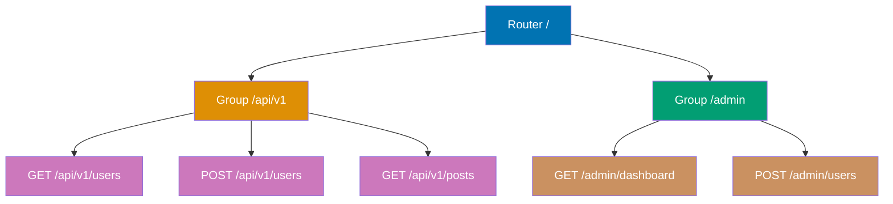
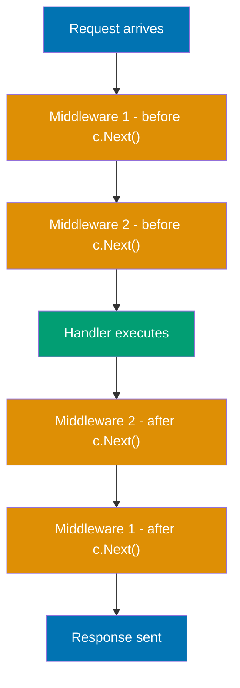

## Group 1: Getting Started

### Example 1: Minimal Gin Server

A Gin application starts with `gin.Default()`, which creates an engine with the Logger and Recovery middleware pre-attached. This example shows the smallest possible working Gin server.

```go
package main

import "github.com/gin-gonic/gin" // => Import Gin framework

func main() {
    r := gin.Default()             // => Creates engine with Logger + Recovery middleware
                                   // => Logger logs every request to stdout
                                   // => Recovery catches panics and returns 500

    r.GET("/", func(c *gin.Context) { // => Register GET handler for "/"
                                      // => c is *gin.Context, central API for the handler
        c.String(200, "Hello, Gin!")  // => Writes status 200 and plain text response
                                      // => Equivalent to HTTP 200 OK + body "Hello, Gin!"
    })

    r.Run(":8080") // => Starts HTTP server on port 8080
                   // => Blocks until server exits or panics
                   // => Equivalent to http.ListenAndServe(":8080", r)
}
// Curl: curl http://localhost:8080/
// => Hello, Gin!
```

**Key Takeaway**: `gin.Default()` gives you a ready-to-use router with logging and panic recovery. Call `r.Run(addr)` to start serving.

**Why It Matters**: Every production Gin service starts from this foundation. The built-in Logger middleware gives you instant request visibility without configuration—critical for debugging. Recovery middleware prevents a panicking handler from crashing your entire server process, which is essential when running Go services that must remain available 24/7. Understanding this minimal structure lets you confidently add features without mystery.

---

### Example 2: HTTP Method Handlers

Gin provides dedicated methods for each HTTP verb: `GET`, `POST`, `PUT`, `PATCH`, `DELETE`, `HEAD`, `OPTIONS`. Each maps a URL pattern to a handler function.

```go
package main

import (
    "net/http"
    "github.com/gin-gonic/gin"
)

func main() {
    r := gin.Default() // => Creates router with default middleware

    // GET - retrieve a resource
    r.GET("/users", func(c *gin.Context) {      // => Handles GET /users
        c.JSON(http.StatusOK, gin.H{            // => gin.H is map[string]any shorthand
            "users": []string{"alice", "bob"},  // => Returns JSON array in "users" key
        })
    })

    // POST - create a resource
    r.POST("/users", func(c *gin.Context) {     // => Handles POST /users
        c.JSON(http.StatusCreated, gin.H{       // => 201 Created signals resource created
            "message": "user created",
        })
    })

    // PUT - replace a resource entirely
    r.PUT("/users/:id", func(c *gin.Context) {  // => Handles PUT /users/42
        id := c.Param("id")                     // => Extracts :id path parameter => "42"
        c.JSON(http.StatusOK, gin.H{"id": id, "updated": true})
    })

    // DELETE - remove a resource
    r.DELETE("/users/:id", func(c *gin.Context) { // => Handles DELETE /users/42
        c.Status(http.StatusNoContent)             // => 204 No Content, no body
    })

    // PATCH - partial update
    r.PATCH("/users/:id", func(c *gin.Context) { // => Handles PATCH /users/42
        c.JSON(http.StatusOK, gin.H{"patched": true})
    })

    r.Run(":8080")
}
// GET    /users     => {"users":["alice","bob"]}
// POST   /users     => {"message":"user created"}  (201)
// PUT    /users/42  => {"id":"42","updated":true}
// DELETE /users/42  => (empty body, 204)
// PATCH  /users/42  => {"patched":true}
```

**Key Takeaway**: Gin exposes one method per HTTP verb. Each call registers a route in the radix tree and associates it with your handler function.

**Why It Matters**: Using semantically correct HTTP methods is foundational to REST API design. Clients and infrastructure (proxies, caches, load balancers) behave differently based on HTTP method semantics—GET requests are cacheable, POST requests are not. Teams that use the correct methods enable HTTP caching, simplify API contracts, and align with OpenAPI documentation tooling from day one.

---

### Example 3: Path Parameters

Path parameters embed variable segments directly in the URL pattern using the `:name` syntax. Gin extracts them via `c.Param("name")`.

```go
package main

import (
    "net/http"
    "github.com/gin-gonic/gin"
)

func main() {
    r := gin.Default()

    // Single path parameter
    r.GET("/users/:id", func(c *gin.Context) {       // => :id matches any single segment
                                                      // => GET /users/42 matches, /users/ does not
        id := c.Param("id")                          // => Extracts the ":id" segment => "42"
        c.JSON(http.StatusOK, gin.H{"user_id": id}) // => Returns {"user_id":"42"}
    })

    // Multiple path parameters
    r.GET("/orgs/:org/repos/:repo", func(c *gin.Context) {
        // => Matches /orgs/golang/repos/gin
        org := c.Param("org")    // => "golang"
        repo := c.Param("repo")  // => "gin"
        c.JSON(http.StatusOK, gin.H{
            "org":  org,         // => "golang"
            "repo": repo,        // => "gin"
        })
    })

    // Wildcard parameter - matches remaining path including slashes
    r.GET("/files/*filepath", func(c *gin.Context) { // => *filepath matches /any/path/here
                                                      // => Includes the leading slash
        fp := c.Param("filepath")                    // => "/static/img/logo.png"
        c.JSON(http.StatusOK, gin.H{"file": fp})
    })

    r.Run(":8080")
}
// GET /users/99            => {"user_id":"99"}
// GET /orgs/golang/repos/gin => {"org":"golang","repo":"gin"}
// GET /files/img/logo.png  => {"file":"/img/logo.png"}
```

**Key Takeaway**: `:param` matches a single URL segment; `*param` matches the rest of the path including slashes. Both are extracted with `c.Param("name")`.

**Why It Matters**: RESTful API design expresses resource identity through path parameters—`/users/42` is cleaner and more cacheable than `/users?id=42`. Wildcard parameters enable file server routes and proxy pass-through without enumerating every possible path. Understanding the distinction between single-segment and wildcard patterns prevents accidental route conflicts that only surface at runtime.

---

### Example 4: Query Parameters

Query parameters appear after `?` in the URL. Gin's `c.Query()`, `c.DefaultQuery()`, and `c.QueryArray()` provide convenient extraction without manual URL parsing.

```go
package main

import (
    "net/http"
    "github.com/gin-gonic/gin"
)

func main() {
    r := gin.Default()

    r.GET("/search", func(c *gin.Context) {
        // c.Query returns "" if parameter missing
        q := c.Query("q")                    // => GET /search?q=gin => "gin"
                                              // => GET /search       => ""

        // c.DefaultQuery returns fallback if parameter missing
        page := c.DefaultQuery("page", "1") // => GET /search?page=2 => "2"
                                             // => GET /search        => "1" (default)

        // c.QueryArray returns all values for repeated params
        tags := c.QueryArray("tag")         // => ?tag=go&tag=web => ["go","web"]
                                             // => No params        => [] (empty slice)

        // c.QueryMap returns a map for params with bracket notation
        filters := c.QueryMap("filter")     // => ?filter[status]=active => {"status":"active"}

        c.JSON(http.StatusOK, gin.H{
            "q":       q,
            "page":    page,
            "tags":    tags,
            "filters": filters,
        })
    })

    r.Run(":8080")
}
// GET /search?q=gin&page=2&tag=go&tag=web&filter[status]=active
// => {
//      "q":"gin",
//      "page":"2",
//      "tags":["go","web"],
//      "filters":{"status":"active"}
//    }
```

**Key Takeaway**: Use `c.Query()` for optional params, `c.DefaultQuery()` for params with fallback values, and `c.QueryArray()` for multi-value params.

**Why It Matters**: Query parameters drive pagination, filtering, and search across virtually every API. Using `c.DefaultQuery()` instead of manual nil checks reduces handler boilerplate and keeps default values explicit and reviewable. Correctly handling repeated parameters (`?tag=a&tag=b`) is necessary for any API that accepts multi-select filters—omitting this breaks client integrations silently.

---

### Example 5: JSON Response

Gin's `c.JSON()` serializes any Go value to JSON, sets `Content-Type: application/json`, and writes the HTTP status code in a single call.

```go
package main

import (
    "net/http"
    "github.com/gin-gonic/gin"
)

// User is a domain struct used in responses
type User struct {
    ID    int    `json:"id"`              // => "id" in JSON output (lowercase)
    Name  string `json:"name"`
    Email string `json:"email,omitempty"` // => omitted from JSON if empty string
    Age   int    `json:"age,omitempty"`   // => omitted from JSON if zero value (0)
}

func main() {
    r := gin.Default()

    // Return a struct as JSON
    r.GET("/user", func(c *gin.Context) {
        user := User{ID: 1, Name: "Alice", Email: "alice@example.com"}
        // => User{ID:1, Name:"Alice", Email:"alice@example.com", Age:0}
        c.JSON(http.StatusOK, user)
        // => HTTP 200, Content-Type: application/json
        // => Body: {"id":1,"name":"Alice","email":"alice@example.com"}
        // => Note: Age omitted because age:0 and tag says omitempty
    })

    // Return a map literal using gin.H shorthand
    r.GET("/info", func(c *gin.Context) {
        c.JSON(http.StatusOK, gin.H{           // => gin.H is map[string]any
            "version": "1.0.0",                // => string value
            "features": []string{"auth", "db"}, // => JSON array
            "debug": false,                    // => JSON boolean
        })
        // => {"version":"1.0.0","features":["auth","db"],"debug":false}
    })

    // Return HTTP error codes with error detail
    r.GET("/error", func(c *gin.Context) {
        c.JSON(http.StatusBadRequest, gin.H{   // => 400 Bad Request
            "error": "invalid parameter",
            "code":  40001,
        })
        // => HTTP 400, {"error":"invalid parameter","code":40001}
    })

    r.Run(":8080")
}
```

**Key Takeaway**: `c.JSON(statusCode, data)` handles serialization, content-type header, and status code atomically. Use `json` struct tags to control field names and omit zero values.

**Why It Matters**: Consistent JSON serialization is the contract your API clients depend on. The `omitempty` tag prevents null values from surprising clients—they receive only meaningful fields. Using `json:"snake_case"` tags ensures your Go code follows Go naming conventions internally while your API follows REST naming conventions externally. These small decisions compound into maintainable API contracts at scale.

---

### Example 6: JSON Request Binding

Gin binds incoming JSON request bodies to Go structs using `c.ShouldBindJSON()`. Struct field tags declare validation rules that Gin enforces automatically.

```go
package main

import (
    "net/http"
    "github.com/gin-gonic/gin"
)

// CreateUserRequest defines the expected JSON shape and validation rules
type CreateUserRequest struct {
    Name     string `json:"name"     binding:"required"`           // => required: non-empty
    Email    string `json:"email"    binding:"required,email"`     // => must be valid email
    Password string `json:"password" binding:"required,min=8"`     // => min 8 characters
    Age      int    `json:"age"      binding:"omitempty,min=0,max=150"` // => optional, 0-150
}

func main() {
    r := gin.Default()

    r.POST("/users", func(c *gin.Context) {
        var req CreateUserRequest // => Declare zero-value struct to bind into

        // ShouldBindJSON reads body, parses JSON, validates binding tags
        if err := c.ShouldBindJSON(&req); err != nil { // => err != nil if body invalid
                                                        // => Validation failure is also an error
            c.JSON(http.StatusBadRequest, gin.H{
                "error": err.Error(), // => Human-readable validation message
                                      // => e.g. "Key: 'CreateUserRequest.Email' failed..."
            })
            return // => Stop handler execution after error response
        }

        // req is now a validated CreateUserRequest struct
        // => req.Name  = "Alice"
        // => req.Email = "alice@example.com"
        // => req.Password = "secret123"
        c.JSON(http.StatusCreated, gin.H{
            "message": "user created",
            "user":    req.Name, // => "Alice"
        })
    })

    r.Run(":8080")
}
// POST /users {"name":"Alice","email":"alice@example.com","password":"secret123"}
// => 201 {"message":"user created","user":"Alice"}

// POST /users {"name":"Alice","email":"not-an-email","password":"short"}
// => 400 {"error":"Key: 'CreateUserRequest.Email' Error:Field validation for 'Email' failed on the 'email' tag"}
```

**Key Takeaway**: `c.ShouldBindJSON(&req)` deserializes and validates in one call. Use `binding:` struct tags to declare constraints; return early on error with a 400 response.

**Why It Matters**: Server-side validation is non-negotiable security practice. Client-side validation is user experience—server-side validation is defense. Binding validation in struct tags centralizes constraints next to the type definition, making them impossible to miss during code review. Using `ShouldBindJSON` instead of `BindJSON` gives you control over the error response format rather than Gin sending a raw 400 automatically.

---

### Example 7: Form Data and URL-Encoded Input

Gin handles HTML form submissions and `application/x-www-form-urlencoded` data through `c.PostForm()` and struct binding with `form:` tags.

```go
package main

import (
    "net/http"
    "github.com/gin-gonic/gin"
)

// LoginForm binds HTML form fields
type LoginForm struct {
    Username string `form:"username" binding:"required"`     // => form field name
    Password string `form:"password" binding:"required,min=6"` // => minimum 6 chars
    Remember bool   `form:"remember"`                        // => optional checkbox
}

func main() {
    r := gin.Default()

    // Manual field extraction - useful for simple cases
    r.POST("/login-simple", func(c *gin.Context) {
        username := c.PostForm("username")              // => "alice" from form field
        password := c.PostForm("password")              // => "secret" from form field
        remember := c.DefaultPostForm("remember", "0") // => "1" or "0" (default)
        // => All values are strings; convert as needed
        c.JSON(http.StatusOK, gin.H{
            "username": username,
            "remember": remember == "1", // => Convert string to bool
        })
        _ = password // => Use password for authentication in real code
    })

    // Struct binding - validates and maps form fields automatically
    r.POST("/login", func(c *gin.Context) {
        var form LoginForm
        if err := c.ShouldBind(&form); err != nil { // => ShouldBind detects Content-Type
                                                     // => Handles form, JSON, and query params
            c.JSON(http.StatusBadRequest, gin.H{"error": err.Error()})
            return
        }
        // => form.Username = "alice"
        // => form.Password = "secret123"
        // => form.Remember = false
        c.JSON(http.StatusOK, gin.H{"logged_in": true, "user": form.Username})
    })

    r.Run(":8080")
}
// curl -X POST http://localhost:8080/login -d "username=alice&password=secret123"
// => {"logged_in":true,"user":"alice"}
```

**Key Takeaway**: `c.ShouldBind()` is content-type aware and works for form data, JSON, and query params using the same struct. `c.PostForm()` provides direct field access for simple cases.

**Why It Matters**: Web APIs often must accept both JSON (from JavaScript clients) and form data (from HTML forms or curl). Using `ShouldBind()` with the appropriate struct tags handles both content types through one code path, reducing duplication. This becomes essential when building APIs consumed by both native mobile apps (JSON) and traditional web browsers (form submissions).

---

## Group 2: Response Types and Status Codes

### Example 8: XML and YAML Responses

Beyond JSON, Gin supports XML and YAML responses natively. These matter for legacy system integration, configuration APIs, and clients that negotiate content type.

```go
package main

import (
    "net/http"
    "github.com/gin-gonic/gin"
)

// Article uses both json and xml struct tags
type Article struct {
    Title   string `json:"title"   xml:"Title"`   // => XML uses capitalized element names
    Content string `json:"content" xml:"Content"`
    Views   int    `json:"views"   xml:"Views"`
}

func main() {
    r := gin.Default()

    // XML response
    r.GET("/article/xml", func(c *gin.Context) {
        article := Article{Title: "Go Tips", Content: "Use interfaces.", Views: 100}
        c.XML(http.StatusOK, article) // => Content-Type: application/xml
        // => <?xml version="1.0" encoding="UTF-8"?>
        // => <Article><Title>Go Tips</Title><Content>Use interfaces.</Content><Views>100</Views></Article>
    })

    // YAML response
    r.GET("/article/yaml", func(c *gin.Context) {
        article := Article{Title: "Go Tips", Content: "Use interfaces.", Views: 100}
        c.YAML(http.StatusOK, article) // => Content-Type: application/x-yaml
        // => title: Go Tips
        // => content: Use interfaces.
        // => views: 100
    })

    // IndentedJSON - pretty-printed JSON for debugging
    r.GET("/article/pretty", func(c *gin.Context) {
        article := Article{Title: "Go Tips", Content: "Use interfaces.", Views: 100}
        c.IndentedJSON(http.StatusOK, article) // => Pretty-printed with 4-space indents
        // => {
        // =>     "title": "Go Tips",
        // =>     "content": "Use interfaces.",
        // =>     "views": 100
        // => }
    })

    r.Run(":8080")
}
```

**Key Takeaway**: Gin's `c.XML()`, `c.YAML()`, and `c.IndentedJSON()` all set the correct `Content-Type` header automatically.

**Why It Matters**: Enterprise integrations often require XML—legacy SOAP clients, financial data feeds, and configuration management tools all use XML. YAML is common in infrastructure APIs and configuration endpoints. Offering multiple response formats without code duplication keeps your handler logic clean while satisfying diverse client needs across your organization.

---

### Example 9: HTTP Status Codes and Empty Responses

Gin provides `c.Status()` for responses without bodies and `c.AbortWithStatus()` for middleware that must terminate the chain immediately.

```go
package main

import (
    "net/http"
    "github.com/gin-gonic/gin"
)

func main() {
    r := gin.Default()

    // 204 No Content - successful operation, no body to return
    r.DELETE("/items/:id", func(c *gin.Context) {
        // Perform deletion...
        c.Status(http.StatusNoContent) // => HTTP 204, no response body written
                                       // => Content-Length: 0
    })

    // 201 Created with Location header
    r.POST("/items", func(c *gin.Context) {
        newID := 42 // => ID assigned by database
        c.Header("Location", "/items/42") // => Tells client where new resource lives
                                           // => Standard REST practice for 201 responses
        c.JSON(http.StatusCreated, gin.H{"id": newID})
        // => HTTP 201, Location: /items/42, body: {"id":42}
    })

    // 202 Accepted - request queued for async processing
    r.POST("/reports/generate", func(c *gin.Context) {
        jobID := "job-xyz-789" // => Async job created
        c.JSON(http.StatusAccepted, gin.H{ // => 202 signals async acceptance
            "job_id":  jobID,
            "status":  "queued",
            "poll_at": "/jobs/job-xyz-789", // => URL to check job status
        })
    })

    // 304 Not Modified - for conditional GET (ETag / If-None-Match)
    r.GET("/cached-resource", func(c *gin.Context) {
        etag := `"v1-abc123"` // => Resource version identifier
        if c.GetHeader("If-None-Match") == etag { // => Client has current version
            c.Status(http.StatusNotModified) // => 304, no body; client uses cache
            return
        }
        c.Header("ETag", etag)             // => Set ETag for next conditional request
        c.JSON(http.StatusOK, gin.H{"data": "resource content"})
    })

    r.Run(":8080")
}
```

**Key Takeaway**: Use semantically correct status codes: 201 for creation, 202 for async acceptance, 204 for bodyless success, 304 for cache validation.

**Why It Matters**: Clients—especially mobile apps and browsers—act on HTTP status codes. A 201 with a Location header lets the client immediately fetch the created resource without a second lookup. 304 responses enable HTTP caching that reduces bandwidth and server load. Getting status codes right from the start prevents subtle bugs in client integrations that are hard to trace after deployment.

---

### Example 10: HTML Templates

Gin renders Go's standard `html/template` files, providing auto-escaping for XSS prevention. Templates are loaded at startup and rendered per request.

```go
package main

import (
    "net/http"
    "github.com/gin-gonic/gin"
)

func main() {
    r := gin.Default()

    // LoadHTMLGlob loads all matching template files at startup
    r.LoadHTMLGlob("templates/*") // => Loads templates/*.html into memory
                                   // => Fails fast if glob matches no files
                                   // => Templates are parsed once, reused per request

    r.GET("/home", func(c *gin.Context) {
        c.HTML(http.StatusOK, "index.html", gin.H{  // => Renders templates/index.html
                                                     // => Third arg is template data
            "Title":    "Welcome",                   // => {{.Title}} in template => "Welcome"
            "Username": "Alice",                     // => {{.Username}} => "Alice"
            "Items":    []string{"Go", "Gin", "Docker"}, // => Range in template
        })
        // => Content-Type: text/html; charset=utf-8
    })

    // Templates in subdirectories need the directory prefix
    r.LoadHTMLGlob("templates/**/*")                  // => Loads all nested templates
    r.GET("/profile", func(c *gin.Context) {
        c.HTML(http.StatusOK, "users/profile.html", gin.H{ // => Subdirectory template
            "Name": "Bob",
        })
    })

    r.Run(":8080")
}

// templates/index.html content:
// <!DOCTYPE html>
// <html>
// <head><title>{{.Title}}</title></head>
// <body>
//   <h1>Hello, {{.Username}}!</h1>
//   <ul>
//   {{range .Items}}<li>{{.}}</li>{{end}}
//   </ul>
// </body>
// </html>
// => Renders auto-escaped HTML; .Username is safe against XSS
```

**Key Takeaway**: Load templates at startup with `LoadHTMLGlob`; render them per request with `c.HTML()`. Go templates auto-escape output, protecting against XSS.

**Why It Matters**: Server-rendered HTML remains the most SEO-friendly and accessible approach for content-heavy pages. Go's `html/template` package escapes user input by default, making XSS protection opt-out rather than opt-in—the opposite of string concatenation or many JavaScript template engines. For internal tools, admin panels, and public-facing content, HTML rendering in Gin provides a complete solution without client-side complexity.

---

## Group 3: Routing Patterns

### Example 11: Route Groups

Route groups namespace related routes under a common path prefix and apply shared middleware to all routes in the group without repeating configuration.



```go
package main

import (
    "net/http"
    "github.com/gin-gonic/gin"
)

func main() {
    r := gin.Default()

    // Group creates a sub-router with a shared path prefix
    v1 := r.Group("/api/v1") // => All routes inside share /api/v1 prefix
    {
        // Curly braces are optional but document grouping intent
        v1.GET("/users", func(c *gin.Context) {  // => Handles GET /api/v1/users
            c.JSON(http.StatusOK, gin.H{"users": []string{"alice", "bob"}})
        })
        v1.POST("/users", func(c *gin.Context) { // => Handles POST /api/v1/users
            c.JSON(http.StatusCreated, gin.H{"message": "created"})
        })
        v1.GET("/posts", func(c *gin.Context) {  // => Handles GET /api/v1/posts
            c.JSON(http.StatusOK, gin.H{"posts": []string{}})
        })
    }

    // Nested groups - apply common middleware to admin routes
    admin := r.Group("/admin")
    admin.Use(func(c *gin.Context) {         // => Middleware applied to ALL admin routes
        if c.GetHeader("X-Admin-Key") == "" { // => Require admin key header
            c.AbortWithStatusJSON(http.StatusUnauthorized, gin.H{"error": "unauthorized"})
            // => AbortWithStatusJSON stops middleware chain + sends JSON response
            return
        }
        c.Next() // => Proceed to next middleware or handler
    })
    {
        admin.GET("/dashboard", func(c *gin.Context) {    // => GET /admin/dashboard
            c.JSON(http.StatusOK, gin.H{"stats": "ok"})
        })
        admin.POST("/users/disable/:id", func(c *gin.Context) { // => POST /admin/users/disable/42
            c.JSON(http.StatusOK, gin.H{"disabled": true})
        })
    }

    r.Run(":8080")
}
// GET /api/v1/users   => {"users":["alice","bob"]}
// GET /admin/dashboard without X-Admin-Key => 401 {"error":"unauthorized"}
// GET /admin/dashboard with X-Admin-Key: secret => {"stats":"ok"}
```

**Key Takeaway**: `r.Group(prefix)` creates a sub-router inheriting the parent's middleware. Call `.Use()` on a group to apply additional middleware only to that group's routes.

**Why It Matters**: Route groups are the primary architectural tool for organizing Gin APIs. Grouping by version (`/v1`, `/v2`) enables API versioning without touching existing routes. Grouping by access level (`/admin`, `/api`) lets you attach authorization middleware at the group level rather than duplicating it in every handler. This composability is central to keeping large codebases maintainable as they grow.

---

### Example 12: Redirects

Gin supports HTTP redirects for both temporary (302) and permanent (301) moves, plus internal route forwarding that keeps the URL unchanged.

```go
package main

import (
    "net/http"
    "github.com/gin-gonic/gin"
)

func main() {
    r := gin.Default()

    // 301 Permanent redirect - browser caches this; use for domain moves
    r.GET("/old-path", func(c *gin.Context) {
        c.Redirect(http.StatusMovedPermanently, "/new-path") // => 301 Location: /new-path
                                                              // => Browsers remember this redirect
    })

    // 302 Temporary redirect - browser does not cache
    r.GET("/temp", func(c *gin.Context) {
        c.Redirect(http.StatusFound, "/current-page") // => 302 Location: /current-page
                                                       // => Use for auth redirects, A/B tests
    })

    r.GET("/new-path", func(c *gin.Context) {
        c.JSON(http.StatusOK, gin.H{"page": "new"})
    })

    r.GET("/current-page", func(c *gin.Context) {
        c.JSON(http.StatusOK, gin.H{"page": "current"})
    })

    // External redirect - sends client to another domain
    r.GET("/github", func(c *gin.Context) {
        c.Redirect(http.StatusFound, "https://github.com/gin-gonic/gin")
        // => 302 Location: https://github.com/gin-gonic/gin
    })

    // Internal router redirect - processes another route without round-trip
    r.GET("/forward", func(c *gin.Context) {
        // HandleContext re-uses current context with a new path
        // No HTTP round-trip; the client sees the /forward response
        c.Request.URL.Path = "/new-path" // => Mutates the request path in-place
        r.HandleContext(c)               // => Dispatches to GET /new-path internally
    })

    r.Run(":8080")
}
// GET /old-path    => HTTP 301 Location: /new-path
// GET /temp        => HTTP 302 Location: /current-page
// GET /forward     => {"page":"new"} (no redirect visible to client)
```

**Key Takeaway**: Use 301 for permanent URL changes (domain migration, path renaming) and 302 for temporary or conditional redirects (login flows, feature flags).

**Why It Matters**: Misusing 301 versus 302 has lasting consequences. Search engines permanently update their index for 301 redirects—using 301 for a temporary condition locks you into the redirect forever in cached indexes. Authentication redirects must use 302 or users will be sent to the login page every time even after authenticating. Understanding redirect semantics prevents SEO damage and broken auth flows in production.

---

### Example 13: Static File Serving

Gin serves static files from the filesystem, enabling single-page app hosting, image delivery, and asset serving without a separate web server.

```go
package main

import (
    "net/http"
    "github.com/gin-gonic/gin"
)

func main() {
    r := gin.Default()

    // Serve a single file at a specific URL path
    r.StaticFile("/favicon.ico", "./static/favicon.ico")
    // => GET /favicon.ico reads ./static/favicon.ico from disk
    // => Sets Content-Type based on file extension
    // => Handles If-Modified-Since and ETag caching automatically

    // Serve all files in a directory under a URL prefix
    r.Static("/assets", "./static/assets")
    // => GET /assets/css/app.css reads ./static/assets/css/app.css
    // => GET /assets/js/main.js  reads ./static/assets/js/main.js
    // => Directory listing disabled (returns 404 for /assets/)

    // Serve all files from an http.FileSystem (supports embed.FS)
    r.StaticFS("/files", http.Dir("./uploads"))
    // => Wraps os.DirFS with directory listing ENABLED
    // => Prefer r.Static for production (no directory listing)

    // SPA pattern - serve index.html for all unmatched routes
    r.NoRoute(func(c *gin.Context) {
        c.File("./static/index.html") // => Serves SPA shell for client-side routing
                                       // => All /app/* paths handled by frontend router
    })

    r.Run(":8080")
}
// GET /favicon.ico          => ./static/favicon.ico
// GET /assets/css/app.css   => ./static/assets/css/app.css
// GET /nonexistent-api-path => ./static/index.html (SPA fallback)
```

**Key Takeaway**: `r.Static(url, dir)` serves directories; `r.StaticFile(url, file)` serves a single file. Both handle HTTP caching headers automatically.

**Why It Matters**: Static file serving in Gin enables full-stack deployment from a single Go binary—your API and SPA frontend ship together. The automatic ETag and Last-Modified headers enable browser caching, reducing bandwidth for returning users. The `NoRoute` SPA fallback pattern is essential for React/Vue apps using HTML5 history routing, where the server must return `index.html` for paths like `/users/42` that the frontend router handles.

---

## Group 4: Headers, Cookies, and Context

### Example 14: Request Headers

Gin provides `c.GetHeader()`, `c.Request.Header.Get()`, and `c.Request.Header` for reading headers, plus `c.Header()` for writing response headers.

```go
package main

import (
    "net/http"
    "github.com/gin-gonic/gin"
)

func main() {
    r := gin.Default()

    r.GET("/headers", func(c *gin.Context) {
        // Reading request headers
        contentType := c.GetHeader("Content-Type") // => Shorthand for header lookup
                                                    // => Returns "" if header missing
        auth := c.GetHeader("Authorization")        // => "Bearer eyJhbGc..." or ""
        userAgent := c.Request.Header.Get("User-Agent")
        // => "Mozilla/5.0..." or "curl/7.x" - direct stdlib access

        // Reading all values of a multi-value header
        acceptTypes := c.Request.Header["Accept"]
        // => ["application/json", "text/html"] - slice of all values
        // => Note: use map key access, not .Get(), for multi-value headers

        // Writing response headers BEFORE calling c.JSON/c.String
        c.Header("X-Request-ID", "req-abc-123")    // => Custom header in response
        c.Header("Cache-Control", "no-cache")       // => Prevent caching
        c.Header("X-RateLimit-Remaining", "99")    // => Rate limit info for client

        c.JSON(http.StatusOK, gin.H{
            "content_type": contentType,
            "auth_present": auth != "",             // => true if Authorization header set
            "user_agent":   userAgent,
            "accept":       acceptTypes,
        })
    })

    r.Run(":8080")
}
// curl -H "Authorization: Bearer token123" -H "Accept: application/json" http://localhost:8080/headers
// => Headers: X-Request-ID: req-abc-123, Cache-Control: no-cache, X-RateLimit-Remaining: 99
// => Body: {"content_type":"","auth_present":true,"user_agent":"curl/7.x","accept":["application/json"]}
```

**Key Takeaway**: Use `c.GetHeader("Name")` for single-value headers and `c.Request.Header["Name"]` for multi-value headers. Write response headers with `c.Header()` before the response body.

**Why It Matters**: HTTP headers carry authentication tokens, content negotiation preferences, caching directives, and tracing metadata. Building custom request ID propagation (`X-Request-ID`) from the start enables log correlation across microservices—impossible to retrofit painlessly after deployment. Rate limit headers give clients the information to back off gracefully, reducing 429 errors from naive retry storms.

---

### Example 15: Cookies

Gin reads cookies via `c.Cookie()` and sets them via `c.SetCookie()`. Cookie security attributes (`HttpOnly`, `Secure`, `SameSite`) protect against common web attacks.

```go
package main

import (
    "net/http"
    "github.com/gin-gonic/gin"
)

func main() {
    r := gin.Default()

    // Set a cookie
    r.GET("/set-cookie", func(c *gin.Context) {
        c.SetCookie(
            "session_id",  // => Cookie name
            "abc123xyz",   // => Cookie value
            3600,          // => Max-Age in seconds (1 hour); 0 = session cookie; -1 = delete
            "/",           // => Path - cookie sent for all paths under /
            "example.com", // => Domain - omit for current domain
            true,          // => Secure: only sent over HTTPS
            true,          // => HttpOnly: inaccessible to JavaScript (XSS protection)
        )
        // => Set-Cookie: session_id=abc123xyz; Path=/; Domain=example.com; Max-Age=3600; HttpOnly; Secure
        c.JSON(http.StatusOK, gin.H{"message": "cookie set"})
    })

    // Read a cookie
    r.GET("/get-cookie", func(c *gin.Context) {
        val, err := c.Cookie("session_id") // => Returns (value, nil) if found
                                            // => Returns ("", error) if missing
        if err != nil {                     // => http.ErrNoCookie when missing
            c.JSON(http.StatusBadRequest, gin.H{"error": "no session cookie"})
            return
        }
        c.JSON(http.StatusOK, gin.H{"session_id": val}) // => {"session_id":"abc123xyz"}
    })

    // Delete a cookie by setting Max-Age to -1
    r.GET("/logout", func(c *gin.Context) {
        c.SetCookie("session_id", "", -1, "/", "", false, true)
        // => Max-Age=-1 instructs browser to delete the cookie immediately
        c.JSON(http.StatusOK, gin.H{"message": "logged out"})
    })

    r.Run(":8080")
}
```

**Key Takeaway**: `c.SetCookie()` sets cookies with security attributes inline. Always set `HttpOnly: true` to prevent JavaScript access and `Secure: true` in production HTTPS environments.

**Why It Matters**: Cookie security attributes are your first defense against session hijacking. `HttpOnly` blocks XSS attacks from reading the session cookie—a single missed output escape cannot drain all user sessions. `Secure` prevents session cookies from leaking over HTTP on the same domain. `SameSite=Strict` blocks CSRF by preventing cross-origin requests from sending cookies. These are not optional hardening—they are baseline security for any authenticated application.

---

### Example 16: Context Values (Key-Value Store)

`gin.Context` provides a per-request key-value store via `c.Set()` and `c.Get()`. Middleware uses this to pass values (user ID, trace ID, parsed data) to downstream handlers.

```go
package main

import (
    "net/http"
    "github.com/gin-gonic/gin"
)

// AuthMiddleware reads a token and stores the user ID in context
func AuthMiddleware() gin.HandlerFunc {
    return func(c *gin.Context) {
        token := c.GetHeader("Authorization") // => Read token from header
        if token == "" {
            c.AbortWithStatusJSON(http.StatusUnauthorized, gin.H{"error": "no token"})
            // => AbortWithStatusJSON sends response and stops handler chain
            return
        }
        // In real code: validate token, extract claims
        userID := "user-42" // => Simulated user ID from token validation
        c.Set("userID", userID) // => Store in context; available to all downstream handlers
                                 // => Key is string, value is any
        c.Set("isAdmin", false) // => Store boolean flag
        c.Next()                // => Continue to next middleware/handler
    }
}

func main() {
    r := gin.Default()

    protected := r.Group("/protected")
    protected.Use(AuthMiddleware()) // => Apply auth middleware to this group
    {
        protected.GET("/profile", func(c *gin.Context) {
            // Retrieve values set by upstream middleware
            userID, exists := c.Get("userID")    // => ("user-42", true) if set
                                                  // => (nil, false) if not set
            if !exists {
                c.JSON(http.StatusInternalServerError, gin.H{"error": "no user in context"})
                return
            }
            isAdmin := c.GetBool("isAdmin")       // => false; typed helpers avoid type assertion
            userIDStr := c.GetString("userID")    // => "user-42"; no type assertion needed

            c.JSON(http.StatusOK, gin.H{
                "user_id":  userIDStr,             // => "user-42"
                "is_admin": isAdmin,               // => false
                "exists":   exists,                // => true
            })
            _ = userID // => userID is any; use GetString/GetInt for typed access
        })
    }

    r.Run(":8080")
}
// GET /protected/profile with Authorization: Bearer token
// => {"user_id":"user-42","is_admin":false,"exists":true}
```

**Key Takeaway**: `c.Set(key, value)` stores per-request data in context; `c.GetString()`, `c.GetBool()`, `c.GetInt()` retrieve it with type safety. Middleware sets values, handlers consume them.

**Why It Matters**: Request context propagation is the primary mechanism for sharing computed state across the middleware chain. Passing user identity, trace IDs, and parsed permissions through context eliminates the need to reparse tokens or headers in every handler. This pattern is so fundamental to Go web development that the standard library's `context.Context` package codifies it—Gin's context wraps and extends this concept for HTTP.

---

### Example 17: Basic Authentication

Gin's built-in `gin.BasicAuth()` middleware implements HTTP Basic Authentication with a credentials map. It handles the `WWW-Authenticate` challenge automatically.

```go
package main

import (
    "net/http"
    "github.com/gin-gonic/gin"
)

func main() {
    r := gin.Default()

    // gin.Accounts is map[string]string of username->password
    accounts := gin.Accounts{
        "admin":    "secret123",  // => username: admin, password: secret123
        "readonly": "pass456",    // => second user for read-only access
    }

    // gin.BasicAuth returns middleware that challenges unauthenticated requests
    authorized := r.Group("/secure", gin.BasicAuth(accounts))
    // => Unauthenticated: 401 + WWW-Authenticate: Basic realm="Authorization Required"
    // => Authenticated: sets gin.AuthUserKey in context
    {
        authorized.GET("/data", func(c *gin.Context) {
            // gin.AuthUserKey is the constant "user" - the authenticated username
            user := c.MustGet(gin.AuthUserKey).(string)
            // => "admin" or "readonly" depending on credentials used
            // => MustGet panics if key missing; safe here because middleware guarantees it

            c.JSON(http.StatusOK, gin.H{
                "message": "access granted",
                "user":    user, // => "admin"
                "data":    "sensitive information",
            })
        })

        authorized.DELETE("/items/:id", func(c *gin.Context) {
            user := c.MustGet(gin.AuthUserKey).(string) // => "admin"
            id := c.Param("id")
            c.JSON(http.StatusOK, gin.H{
                "deleted_by": user, // => "admin"
                "item_id":    id,
            })
        })
    }

    r.Run(":8080")
}
// curl -u admin:secret123 http://localhost:8080/secure/data
// => {"data":"sensitive information","message":"access granted","user":"admin"}
// curl http://localhost:8080/secure/data
// => 401 + WWW-Authenticate header
```

**Key Takeaway**: `gin.BasicAuth(accounts)` wraps a route group with HTTP Basic Auth. The authenticated username is stored under `gin.AuthUserKey` in the context.

**Why It Matters**: HTTP Basic Auth provides instant, zero-dependency authentication for internal tools, admin APIs, and machine-to-machine integrations where managing JWT infrastructure is overkill. Gin's built-in implementation handles the browser challenge/response cycle, base64 decoding, and credential lookup, eliminating four to six lines of boilerplate per protected route. Always pair with HTTPS in production, as Basic Auth credentials are only base64-encoded, not encrypted.

---

## Group 5: Middleware Fundamentals

### Example 18: Logger Middleware

Gin's built-in logger middleware prints request details to stdout. Understanding its behavior lets you customize or replace it with structured logging.

```go
package main

import (
    "fmt"
    "time"
    "net/http"
    "github.com/gin-gonic/gin"
)

func main() {
    // gin.New() creates an engine WITHOUT any middleware
    r := gin.New()

    // gin.Logger() adds structured request logging
    r.Use(gin.Logger()) // => Logs: [GIN] 2026/03/19 - 12:00:00 | 200 | 1.2ms | 127.0.0.1 | GET /api/users
                        // => Format: status | latency | client_ip | method | path

    // Customize logger format using LoggerWithFormatter
    r.Use(gin.LoggerWithFormatter(func(param gin.LogFormatterParams) string {
        // param.TimeStamp => time.Time of request completion
        // param.StatusCode => HTTP status code
        // param.Latency => time.Duration of request
        // param.ClientIP => client IP string
        // param.Method => "GET", "POST", etc.
        // param.Path => "/api/users"
        // param.ErrorMessage => Error string if any
        return fmt.Sprintf("[%s] %d %s %s %s\n",
            param.TimeStamp.Format(time.RFC3339), // => "2026-03-19T12:00:00+07:00"
            param.StatusCode,                      // => 200
            param.Latency,                         // => 1.2ms
            param.Method,                          // => "GET"
            param.Path,                            // => "/api/users"
        )
    }))

    r.Use(gin.Recovery()) // => Panic recovery; must come after Logger for accurate timing

    r.GET("/api/users", func(c *gin.Context) {
        c.JSON(http.StatusOK, gin.H{"users": []string{"alice"}})
        // => Logger prints: [2026-03-19T12:00:00+07:00] 200 1.2ms GET /api/users
    })

    r.Run(":8080")
}
// The default gin.Default() is equivalent to:
// r := gin.New()
// r.Use(gin.Logger())
// r.Use(gin.Recovery())
```

**Key Takeaway**: `gin.New()` gives you a blank engine; add `gin.Logger()` and `gin.Recovery()` manually to replicate `gin.Default()`. `LoggerWithFormatter` customizes the log format.

**Why It Matters**: Request logging is your primary observability tool in production. The default Gin logger outputs human-readable text—fine for development but problematic in production where log aggregation systems (Elasticsearch, CloudWatch, Datadog) expect structured JSON. Understanding how the logger middleware works lets you replace it with a structured logger like `zap` or `zerolog`, unlocking log-based alerting, tracing correlation, and performance dashboards from day one.

---

### Example 19: Recovery Middleware

The Recovery middleware catches panics in handlers, logs the stack trace, and returns a 500 response instead of crashing the server process.

```go
package main

import (
    "net/http"
    "github.com/gin-gonic/gin"
)

func main() {
    r := gin.New()
    r.Use(gin.Logger())

    // gin.Recovery() recovers from panics and returns HTTP 500
    r.Use(gin.Recovery())
    // => When a handler panics, Recovery:
    // => 1. Catches the panic with recover()
    // => 2. Logs the stack trace to stderr
    // => 3. Writes HTTP 500 response to client
    // => 4. Continues serving subsequent requests (server stays up)

    // gin.CustomRecovery lets you control the 500 response format
    r.Use(gin.CustomRecovery(func(c *gin.Context, recovered interface{}) {
        // recovered is the value passed to panic()
        // => recovered could be error, string, or any value
        if err, ok := recovered.(string); ok {
            c.JSON(http.StatusInternalServerError, gin.H{
                "error":  "server error",
                "detail": err, // => Include panic message in JSON (dev only!)
            })
        } else {
            c.AbortWithStatus(http.StatusInternalServerError)
        }
    }))

    r.GET("/safe", func(c *gin.Context) {
        c.JSON(http.StatusOK, gin.H{"ok": true}) // => Normal response
    })

    r.GET("/panic", func(c *gin.Context) {
        panic("something went very wrong") // => Recovery catches this panic
                                            // => Server continues running
                                            // => Returns 500 to this request only
    })

    r.Run(":8080")
}
// GET /safe   => {"ok":true}
// GET /panic  => {"error":"server error","detail":"something went very wrong"}
// GET /safe   => {"ok":true}  (server still running after panic)
```

**Key Takeaway**: `gin.Recovery()` prevents one handler panic from taking down your entire server. `gin.CustomRecovery()` lets you control the 500 response format and add error reporting integration.

**Why It Matters**: In production Go servers, a nil pointer dereference or type assertion failure in one request should not crash the process and drop thousands of concurrent connections. Recovery middleware transforms panics from service outages into logged 500 errors. Plugging in error tracking (Sentry, Rollbar) via `CustomRecovery` turns every panic into an actionable alert with stack trace, dramatically reducing mean time to detection for runtime errors.

---

### Example 20: Middleware Execution Order

Understanding middleware execution order—including how `c.Next()` creates a pre/post pattern—is essential for building middleware chains that share data correctly.



```go
package main

import (
    "fmt"
    "net/http"
    "github.com/gin-gonic/gin"
)

func TimingMiddleware() gin.HandlerFunc {
    return func(c *gin.Context) {
        fmt.Println("1. TimingMiddleware: before Next") // => Runs first
        c.Next()                                         // => Calls next middleware/handler
                                                         // => Execution PAUSES here until
                                                         // => downstream handlers complete
        fmt.Println("4. TimingMiddleware: after Next")  // => Runs last, after handler
        // => c.Writer.Status() available here - handler already ran
        fmt.Printf("   Status: %d\n", c.Writer.Status()) // => "4. Status: 200"
    }
}

func LoggingMiddleware() gin.HandlerFunc {
    return func(c *gin.Context) {
        fmt.Println("2. LoggingMiddleware: before Next") // => Runs second
        c.Next()                                          // => Calls next handler
        fmt.Println("3. LoggingMiddleware: after Next")  // => Runs third (LIFO order)
    }
}

func main() {
    r := gin.New()
    r.Use(TimingMiddleware())  // => Added first, outermost wrapper
    r.Use(LoggingMiddleware()) // => Added second, inner wrapper

    r.GET("/order", func(c *gin.Context) {
        fmt.Println("   Handler: running")    // => Runs in the middle
        c.JSON(http.StatusOK, gin.H{"ok": true})
    })

    r.Run(":8080")
}
// Request to GET /order prints:
// 1. TimingMiddleware: before Next
// 2. LoggingMiddleware: before Next
//    Handler: running
// 3. LoggingMiddleware: after Next
// 4. TimingMiddleware: after Next
//    Status: 200
```

**Key Takeaway**: Code before `c.Next()` runs in registration order (outermost first); code after `c.Next()` runs in reverse order (innermost first). This enables request wrapping for timing, logging, and transaction management.

**Why It Matters**: Middleware execution order determines correctness for many production patterns. A transaction middleware must commit or rollback after the handler runs—the post-`c.Next()` position guarantees this. Timing middleware must record start time before and end time after the handler. Authentication middleware must abort before calling `c.Next()` to prevent handlers from executing. Misunderstanding order produces bugs that only manifest under specific sequences that are hard to reproduce in tests.

---

### Example 21: Aborting Middleware

`c.Abort()` and `c.AbortWithStatus()` stop the middleware chain from proceeding to downstream handlers. This is the primary pattern for authentication and authorization guards.

```go
package main

import (
    "net/http"
    "github.com/gin-gonic/gin"
)

// RateLimitMiddleware demonstrates Abort pattern for policy enforcement
func RateLimitMiddleware(maxRequests int) gin.HandlerFunc {
    requestCount := 0 // => Simplified counter; use sync.Mutex in production
    return func(c *gin.Context) {
        requestCount++
        if requestCount > maxRequests {
            c.AbortWithStatusJSON(http.StatusTooManyRequests, gin.H{
                // => AbortWithStatusJSON calls c.Abort() + c.JSON()
                // => c.Abort() sets index to abortIndex constant
                // => All subsequent handlers in chain are SKIPPED
                "error":       "rate limit exceeded",
                "retry_after": 60,
            })
            return // => return is good practice; handler body finished
        }
        c.Next() // => Allow request through
    }
}

// RequireRoleMiddleware demonstrates fine-grained authorization abort
func RequireRoleMiddleware(role string) gin.HandlerFunc {
    return func(c *gin.Context) {
        userRole := c.GetHeader("X-User-Role") // => In real apps: read from JWT claims
        if userRole != role {
            c.AbortWithStatusJSON(http.StatusForbidden, gin.H{
                "error":    "insufficient permissions",
                "required": role,             // => "admin"
                "actual":   userRole,         // => "viewer"
            })
            return // => Handler chain stopped; GET /admin/report never runs
        }
        c.Next() // => User has the required role; proceed
    }
}

func main() {
    r := gin.Default()
    r.Use(RateLimitMiddleware(100)) // => Apply rate limit globally

    admin := r.Group("/admin")
    admin.Use(RequireRoleMiddleware("admin")) // => Require "admin" role for all /admin routes
    {
        admin.GET("/report", func(c *gin.Context) {
            c.JSON(http.StatusOK, gin.H{"report": "sensitive data"})
            // => Only reached if role == "admin" AND requestCount <= 100
        })
    }

    r.Run(":8080")
}
// GET /admin/report with X-User-Role: viewer
// => 403 {"error":"insufficient permissions","required":"admin","actual":"viewer"}
// GET /admin/report with X-User-Role: admin
// => {"report":"sensitive data"}
```

**Key Takeaway**: `c.AbortWithStatusJSON()` stops the middleware chain and sends a response. Code after `c.Abort()` in the same middleware function still runs; downstream handlers do not.

**Why It Matters**: Authorization enforcement belongs in middleware, not in handler code. Handlers that check permissions inline create a maintenance hazard—it is easy to add a new route and forget to copy the permission check. Centralizing authorization in middleware attached to route groups guarantees that every route in the group undergoes the same check automatically. This separation of concerns is foundational to building secure APIs that remain secure as they grow.

---

## Group 6: Input Validation Basics

### Example 22: Struct Validation Tags

Gin uses the `go-playground/validator` package for struct field validation. Tags express constraints declaratively on the struct definition.

```go
package main

import (
    "net/http"
    "github.com/gin-gonic/gin"
)

// Product demonstrates common validation tags
type Product struct {
    Name        string   `json:"name"        binding:"required,min=2,max=100"`
    // => required: not empty string
    // => min=2: at least 2 characters
    // => max=100: at most 100 characters
    Price       float64  `json:"price"       binding:"required,gt=0"`
    // => gt=0: greater than 0 (not free)
    Stock       int      `json:"stock"       binding:"min=0"`
    // => min=0: stock cannot be negative; not required (0 is valid)
    Category    string   `json:"category"    binding:"required,oneof=electronics clothing food"`
    // => oneof: value must be one of the listed options
    Tags        []string `json:"tags"        binding:"max=5,dive,min=1,max=20"`
    // => max=5: at most 5 tags in the slice
    // => dive: apply following rules to each slice ELEMENT
    // => min=1,max=20: each tag must be 1-20 characters
    Email       string   `json:"email"       binding:"omitempty,email"`
    // => omitempty: skip validation if field is zero value (empty string)
    // => email: validate email format only when provided
}

func main() {
    r := gin.Default()

    r.POST("/products", func(c *gin.Context) {
        var p Product
        if err := c.ShouldBindJSON(&p); err != nil {
            c.JSON(http.StatusBadRequest, gin.H{"error": err.Error()})
            // => "Key: 'Product.Price' Error:Field validation for 'Price' failed on the 'gt' tag"
            return
        }
        c.JSON(http.StatusCreated, gin.H{
            "id":      99,
            "product": p,
        })
    })

    r.Run(":8080")
}
// POST /products {"name":"Laptop","price":-1,"category":"electronics"}
// => 400 {"error":"...Price...gt tag"}

// POST /products {"name":"Laptop","price":999.99,"stock":10,"category":"electronics","tags":["tech","new"]}
// => 201 {"id":99,"product":{"name":"Laptop","price":999.99,"stock":10,"category":"electronics","tags":["tech","new"],"email":""}}
```

**Key Takeaway**: Binding tags like `required`, `min`, `max`, `gt`, `oneof`, `email`, and `dive` declaratively constrain struct fields. Validation errors describe which field failed which tag.

**Why It Matters**: Validation at the struct level keeps business rules visible, versionable, and testable. When a new engineer adds a field, the validation tag is right next to the field definition—impossible to miss. Validator's tag-based approach eliminates hundreds of lines of `if price <= 0 { return error }` code in handler bodies, reducing both bugs and cognitive load. The `dive` tag for slice elements is particularly powerful for APIs that accept lists of items.

---

### Example 23: Binding Query Parameters to Structs

Beyond JSON, `ShouldBindQuery` binds query string parameters directly to a struct, providing validation and type conversion in one step.

```go
package main

import (
    "net/http"
    "github.com/gin-gonic/gin"
)

// SearchParams declares the expected query parameters
type SearchParams struct {
    Query    string `form:"q"        binding:"required,min=1"`
    // => ?q=gin  =>  Query="gin"
    Page     int    `form:"page"     binding:"omitempty,min=1"`
    // => ?page=2 => Page=2; missing => Page=0 (zero value, skipped by omitempty)
    PageSize int    `form:"per_page" binding:"omitempty,min=1,max=100"`
    // => ?per_page=20 => PageSize=20
    SortBy   string `form:"sort"     binding:"omitempty,oneof=name price date"`
    // => ?sort=price => SortBy="price"
    // => ?sort=invalid => validation error
}

func main() {
    r := gin.Default()

    r.GET("/search", func(c *gin.Context) {
        var params SearchParams
        if err := c.ShouldBindQuery(&params); err != nil { // => Binds query params to struct
                                                            // => Validates binding tags
            c.JSON(http.StatusBadRequest, gin.H{"error": err.Error()})
            return
        }

        // Apply defaults for optional fields
        if params.Page == 0 {     // => page not provided
            params.Page = 1       // => Default to page 1
        }
        if params.PageSize == 0 { // => per_page not provided
            params.PageSize = 20  // => Default to 20 items per page
        }

        c.JSON(http.StatusOK, gin.H{
            "query":     params.Query,    // => "gin"
            "page":      params.Page,     // => 1
            "page_size": params.PageSize, // => 20
            "sort_by":   params.SortBy,   // => ""
        })
    })

    r.Run(":8080")
}
// GET /search?q=gin&sort=price
// => {"query":"gin","page":1,"page_size":20,"sort_by":"price"}

// GET /search?sort=invalid
// => 400 {"error":"...SortBy...oneof tag"}

// GET /search (missing required q)
// => 400 {"error":"...Query...required tag"}
```

**Key Takeaway**: `c.ShouldBindQuery(&params)` binds and validates query parameters using the same `binding:` tags as JSON binding. Use `form:` tags to map URL parameter names to struct fields.

**Why It Matters**: Parsing query parameters manually—extracting strings, converting types, checking ranges—is tedious, error-prone, and scattered across handler bodies. Binding to a typed struct centralizes the contract, catches type errors at the entry point, and provides a single place to review what a handler accepts. When you add a new query parameter, the struct definition, validation, and documentation all update together.

---

## Group 7: File Operations

### Example 24: Single File Upload

Gin handles multipart file uploads via `c.FormFile()`. This example shows safe file upload with type checking and size limits.

```go
package main

import (
    "fmt"
    "net/http"
    "path/filepath"
    "github.com/gin-gonic/gin"
)

func main() {
    r := gin.Default()

    // Set maximum memory for multipart form parsing
    r.MaxMultipartMemory = 8 << 20 // => 8 MB maximum; larger files go to temp files on disk
                                    // => Default is 32 MB

    r.POST("/upload", func(c *gin.Context) {
        file, err := c.FormFile("file") // => "file" is the form field name
                                         // => Returns *multipart.FileHeader and error
        if err != nil {
            c.JSON(http.StatusBadRequest, gin.H{"error": "file field required"})
            return
        }

        // Validate file extension
        ext := filepath.Ext(file.Filename) // => ".jpg", ".png", ".pdf" etc.
        allowed := map[string]bool{".jpg": true, ".png": true, ".gif": true}
        if !allowed[ext] {
            c.JSON(http.StatusBadRequest, gin.H{
                "error": fmt.Sprintf("file type %s not allowed", ext),
            })
            return
        }

        // Validate file size (also check MaxMultipartMemory above)
        if file.Size > 5<<20 { // => 5 MB limit at application layer
            c.JSON(http.StatusBadRequest, gin.H{"error": "file too large, max 5MB"})
            return
        }

        // Save file to disk
        dst := fmt.Sprintf("uploads/%s", filepath.Base(file.Filename))
        // => filepath.Base prevents path traversal attacks by stripping directory components
        // => "../../etc/passwd" => "passwd"
        if err := c.SaveUploadedFile(file, dst); err != nil {
            c.JSON(http.StatusInternalServerError, gin.H{"error": "could not save file"})
            return
        }

        c.JSON(http.StatusOK, gin.H{
            "filename": file.Filename,  // => "photo.jpg" (original name)
            "size":     file.Size,      // => 102400 (bytes)
            "saved_to": dst,            // => "uploads/photo.jpg"
        })
    })

    r.Run(":8080")
}
// curl -X POST http://localhost:8080/upload -F "file=@/path/to/photo.jpg"
// => {"filename":"photo.jpg","size":102400,"saved_to":"uploads/photo.jpg"}
```

**Key Takeaway**: `c.FormFile("field")` returns the uploaded file metadata. Always validate extension and size before saving. Use `filepath.Base()` to prevent path traversal attacks.

**Why It Matters**: Unrestricted file upload is one of OWASP's most critical web vulnerabilities. Accepting executable files (`.exe`, `.php`, `.sh`) can turn your server into an attack vector. Path traversal via filenames like `../../etc/passwd` can overwrite system files. Size limits prevent disk exhaustion denial-of-service attacks. These three validations—type, size, path sanitization—are the minimum required before saving any uploaded file in production.

---

### Example 25: Multiple File Upload

For forms that upload several files simultaneously, `c.MultipartForm()` provides access to the complete parsed form including all uploaded files.

```go
package main

import (
    "fmt"
    "net/http"
    "path/filepath"
    "github.com/gin-gonic/gin"
)

func main() {
    r := gin.Default()
    r.MaxMultipartMemory = 32 << 20 // => 32 MB total for all files in the request

    r.POST("/upload/multiple", func(c *gin.Context) {
        form, err := c.MultipartForm() // => Parses entire multipart form
                                        // => Returns *multipart.Form with Files and Value maps
        if err != nil {
            c.JSON(http.StatusBadRequest, gin.H{"error": "invalid multipart form"})
            return
        }

        files := form.File["files"] // => "files" is the form field name
                                     // => []*multipart.FileHeader slice
                                     // => Empty slice if field not present

        if len(files) == 0 {
            c.JSON(http.StatusBadRequest, gin.H{"error": "no files provided"})
            return
        }

        if len(files) > 10 { // => Limit number of files per request
            c.JSON(http.StatusBadRequest, gin.H{"error": "max 10 files per upload"})
            return
        }

        var saved []string
        for _, file := range files { // => Iterate each uploaded file
            dst := fmt.Sprintf("uploads/%s", filepath.Base(file.Filename))
            // => filepath.Base sanitizes path components
            if err := c.SaveUploadedFile(file, dst); err != nil {
                c.JSON(http.StatusInternalServerError, gin.H{
                    "error":  "save failed",
                    "file":   file.Filename,
                })
                return
            }
            saved = append(saved, file.Filename) // => Track successfully saved files
        }

        c.JSON(http.StatusOK, gin.H{
            "uploaded": len(saved),  // => 3 (number of files saved)
            "files":    saved,       // => ["photo1.jpg","photo2.png","doc.pdf"]
        })
    })

    r.Run(":8080")
}
// curl -X POST http://localhost:8080/upload/multiple \
//   -F "files=@photo1.jpg" -F "files=@photo2.png"
// => {"uploaded":2,"files":["photo1.jpg","photo2.png"]}
```

**Key Takeaway**: `c.MultipartForm()` gives you the full parsed form. Access multiple files via `form.File["fieldname"]`, which returns a slice of `*multipart.FileHeader`.

**Why It Matters**: Batch upload dramatically improves user experience for media management, document processing, and bulk import workflows. Enforcing a per-request file count limit (`max 10`) prevents resource exhaustion from requests that upload thousands of files. Processing uploads in a loop with early-exit on error prevents partial saves that leave the server in an inconsistent state—better to reject the whole batch and let the client retry.

---

## Group 8: Error Handling Basics

### Example 26: Centralized Error Handling

Gin's `c.Error()` method accumulates errors during request processing. A final middleware can inspect them and return a consistent error response.

```go
package main

import (
    "errors"
    "net/http"
    "github.com/gin-gonic/gin"
)

// AppError carries error code and HTTP status for structured error responses
type AppError struct {
    Code    int    // => Application-specific error code
    Message string // => Human-readable message
    Status  int    // => HTTP status code
}

func (e *AppError) Error() string { return e.Message } // => Implements error interface

var (
    ErrNotFound   = &AppError{Code: 1001, Message: "resource not found",    Status: http.StatusNotFound}
    ErrForbidden  = &AppError{Code: 1002, Message: "access denied",         Status: http.StatusForbidden}
    ErrBadRequest = &AppError{Code: 1003, Message: "invalid request",       Status: http.StatusBadRequest}
)

// ErrorHandlerMiddleware reads accumulated errors and writes unified response
func ErrorHandlerMiddleware() gin.HandlerFunc {
    return func(c *gin.Context) {
        c.Next() // => Execute handler first; errors accumulate via c.Error()

        errs := c.Errors // => []*gin.Error slice, populated by c.Error() calls
        if len(errs) == 0 {
            return // => No errors; response already written
        }

        // Check if any error is an AppError
        for _, e := range errs {
            var appErr *AppError
            if errors.As(e.Err, &appErr) { // => Unwraps to AppError if possible
                c.JSON(appErr.Status, gin.H{
                    "error": appErr.Message,
                    "code":  appErr.Code,
                })
                return
            }
        }

        // Fallback for unexpected errors
        c.JSON(http.StatusInternalServerError, gin.H{"error": "internal server error"})
    }
}

func main() {
    r := gin.New()
    r.Use(gin.Logger(), gin.Recovery())
    r.Use(ErrorHandlerMiddleware()) // => Centralized error handler runs after all handlers

    r.GET("/items/:id", func(c *gin.Context) {
        id := c.Param("id")
        if id == "0" {
            _ = c.Error(ErrNotFound) // => Appends error to c.Errors; does NOT stop execution
            return                   // => Handler returns; ErrorHandlerMiddleware sends response
        }
        c.JSON(http.StatusOK, gin.H{"id": id})
    })

    r.Run(":8080")
}
// GET /items/42 => {"id":"42"}
// GET /items/0  => 404 {"error":"resource not found","code":1001}
```

**Key Takeaway**: `c.Error(err)` accumulates errors without writing a response. A post-`c.Next()` middleware inspects `c.Errors` to produce a unified error response format.

**Why It Matters**: Consistent error response structure is fundamental to client library design. If `/users` returns `{"error": "not found"}` and `/posts` returns `{"message": "Post not found", "status": 404}`, every client must handle both formats. Centralizing error serialization in middleware enforces a single contract, and adding new error codes requires changing only the error type definitions—not every handler. This consistency is non-negotiable for public APIs with third-party clients.

---

### Example 27: NoRoute and NoMethod Handlers

Gin's `r.NoRoute()` and `r.NoMethod()` register handlers for unmatched routes and incorrect HTTP methods, enabling consistent 404 and 405 responses.

```go
package main

import (
    "net/http"
    "github.com/gin-gonic/gin"
)

func main() {
    r := gin.Default()

    r.GET("/users", func(c *gin.Context) {
        c.JSON(http.StatusOK, gin.H{"users": []string{"alice"}})
    })

    // r.NoRoute handles all requests that match no registered route
    r.NoRoute(func(c *gin.Context) {
        c.JSON(http.StatusNotFound, gin.H{    // => 404 Not Found
            "error":  "route not found",
            "path":   c.Request.URL.Path,     // => "/api/nonexistent" - useful for debugging
            "method": c.Request.Method,       // => "GET"
        })
        // => Without NoRoute, Gin returns a plain-text 404
        // => With NoRoute, you control the response format
    })

    // r.NoMethod handles requests where the path matches but the method does not
    // Requires r.HandleMethodNotAllowed = true to activate
    r.HandleMethodNotAllowed = true // => Enable 405 detection (default: false)
    r.NoMethod(func(c *gin.Context) {
        c.JSON(http.StatusMethodNotAllowed, gin.H{ // => 405 Method Not Allowed
            "error":   "method not allowed",
            "method":  c.Request.Method,           // => "DELETE"
            "path":    c.Request.URL.Path,         // => "/users"
            "allowed": c.Request.Header.Get("Allow"), // => "GET, OPTIONS"
        })
    })

    r.Run(":8080")
}
// GET /nonexistent        => 404 {"error":"route not found","path":"/nonexistent","method":"GET"}
// DELETE /users           => 405 {"error":"method not allowed","method":"DELETE","path":"/users"}
// GET /users              => {"users":["alice"]}
```

**Key Takeaway**: `r.NoRoute()` handles 404s; `r.NoMethod()` (with `r.HandleMethodNotAllowed = true`) handles 405s. Both provide consistent JSON error responses instead of Gin's default plain text.

**Why It Matters**: Every production API needs consistent 404 and 405 responses in the same format as other errors. API clients that parse error responses cannot handle a mix of plain-text 404s and JSON 400s—they need uniformity. `NoRoute` is also essential for SPA deployments where all non-API paths must return `index.html`. Logging the unmatched path and method in the 404 response helps identify broken client-side links and outdated mobile app versions calling deprecated endpoints.
