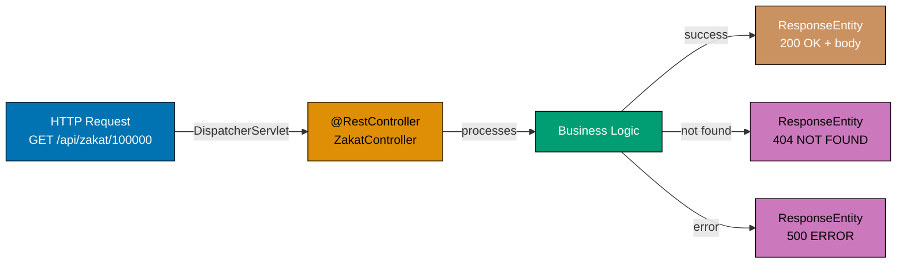
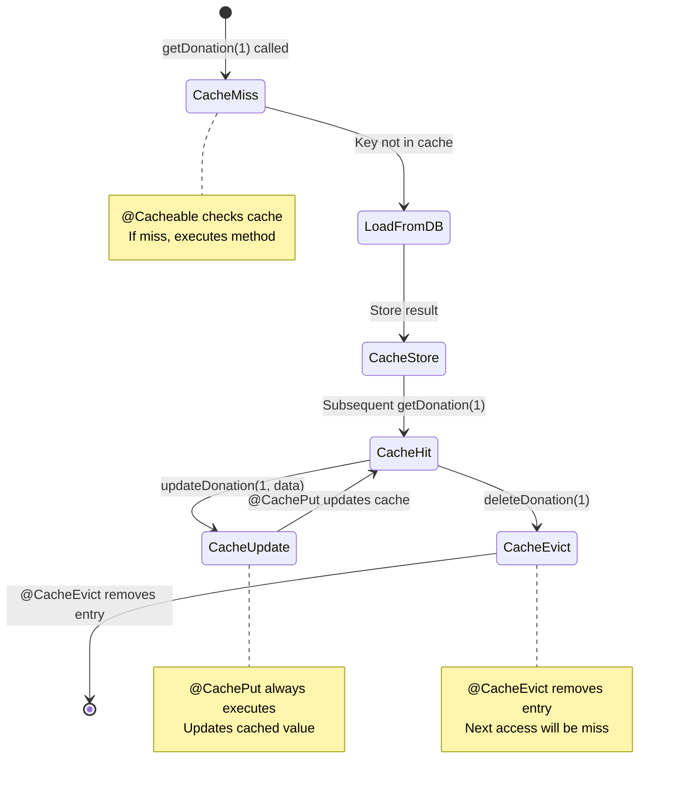

This tutorial provides 25 advanced Spring Framework examples (51-75) covering production-ready patterns. Focus includes REST APIs, Security, caching, async execution, and comprehensive testing strategies.

**Coverage**: 75-95% of Spring Framework features
**Prerequisites**: Complete [Beginner](/en/learn/software-engineering/platform-web/tools/jvm-spring/by-example/beginner) and [Intermediate](/en/learn/software-engineering/platform-web/tools/jvm-spring/by-example/intermediate) tutorials first

## REST API Development (Examples 51-55)

### Example 51: @RestController and ResponseEntity (Coverage: 76.5%)

Demonstrates RESTful API with proper HTTP responses.

#### Diagram



**Java Implementation**:

```java
import org.springframework.http.HttpStatus;
import org.springframework.http.ResponseEntity;
import org.springframework.web.bind.annotation.*;

@RestController  // => @Controller + @ResponseBody combined
@RequestMapping("/api/donations")
// => Maps HTTP requests to this controller
public class DonationRestController {  // => Defines DonationRestController class
    @GetMapping("/{id}")
    // => Handles HTTP GET requests
    public ResponseEntity<String> getById(@PathVariable Long id) {  // => Method: getById(...)
        // => ResponseEntity controls HTTP status and headers

        if (id <= 0) {  // => Conditional check
            return ResponseEntity.badRequest().body("Invalid ID");  // => Returns result
            // => Returns HTTP 400 Bad Request
        }

        String donation = "Donation #" + id;  // => donation = "Donation #" + id
        return ResponseEntity.ok(donation);  // => Returns result
        // => Returns HTTP 200 OK with body
    }

    @PostMapping
    // => Handles HTTP POST requests
    public ResponseEntity<String> create(@RequestBody String donor) {  // => Method: create(...)
        String result = "Created for " + donor;  // => result = "Created for " + donor

        return ResponseEntity  // => Returns ResponseEntity
            .status(HttpStatus.CREATED)  // => HTTP 201 Created
            .header("Location", "/api/donations/123")  // => Custom header
            .body(result);  // => Sets response body and completes ResponseEntity
        // => Full control over response
    }
}
```

**Kotlin Implementation**:

```kotlin
import org.springframework.http.HttpStatus
import org.springframework.http.ResponseEntity
import org.springframework.web.bind.annotation.*

@RestController  // => @Controller + @ResponseBody combined
@RequestMapping("/api/donations")
# => Maps HTTP requests to this controller
class DonationRestController {  # => Defines DonationRestController class
    @GetMapping("/{id}")
    # => Handles HTTP GET requests
    fun getById(@PathVariable id: Long): ResponseEntity<String> {
    # => Function getById executes
        // => ResponseEntity controls HTTP status and headers

        return if (id <= 0) {  # => Returns if (id <= 0) {
            ResponseEntity.badRequest().body("Invalid ID")  # => Calls badRequest(...)
            // => Returns HTTP 400 Bad Request
        } else {
            val donation = "Donation #$id"  # => donation = "Donation #$id"
            ResponseEntity.ok(donation)  # => Calls ok(...)
            // => Returns HTTP 200 OK with body

    @PostMapping
    # => Handles HTTP POST requests
    fun create(@RequestBody donor: String): ResponseEntity<String> {
    # => Function create executes
        val result = "Created for $donor"  # => result = "Created for $donor"

        return ResponseEntity  # => Returns ResponseEntity
            .status(HttpStatus.CREATED)  // => HTTP 201 Created
            .header("Location", "/api/donations/123")  // => Custom header
            .body(result)  # => Sets response body and completes ResponseEntity
        // => Full control over response
    }  # => End of create
}
```

**Key Takeaways**:

- ResponseEntity provides full HTTP response control
- Fluent builder API for status, headers, body
- Type-safe response bodies
- RESTful status codes (200, 201, 400, etc.)

**Why It Matters**:

`@RestController` with `ResponseEntity` gives precise control over HTTP responses in Spring MVC REST APIs. In an Islamic finance API, returning `ResponseEntity<ZakatReceipt>` with a `201 Created` status and `Location` header after a Zakat payment is recorded makes the API predictable and standards-compliant. Clients can programmatically detect success vs. failure and follow the location header to retrieve the new resource.

**Related Documentation**:

- [REST Controller Documentation](https://docs.spring.io/spring-framework/reference/web/webmvc/mvc-controller/ann-rest.html)

---

### Example 52: Content Negotiation (Coverage: 78.0%)

Demonstrates producing different content types.

**Java Implementation**:

```java
import org.springframework.web.bind.annotation.*;

class Donation {  // => Defines Donation class
    private String donor;  // => donor: String field
    private double amount;  // => amount: double field

    public Donation(String donor, double amount) {  // => Code executes here
    // => Constructor for Donation with injected dependencies
        this.donor = donor;  // => Code executes here
        this.amount = amount;
    }  // => End of Donation

    public String getDonor() { return donor; }  // => Method: getDonor(...)
    public double getAmount() { return amount; }  // => Method: getAmount(...)
}

@RestController
@RequestMapping("/api/donations")
// => Maps HTTP requests to this controller
public class ContentNegotiationController {  // => Defines ContentNegotiationController class
    @GetMapping(produces = "application/json")
    // => Handles HTTP GET requests
    // => Produces JSON when Accept: application/json
    public Donation getAsJson() {  // => Method: getAsJson(...)
        return new Donation("Ali", 500.0);  // => Returns result
        // => Serialized to: {"donor":"Ali","amount":500.0}
    }

    @GetMapping(produces = "application/xml")
    // => Handles HTTP GET requests
    // => Produces XML when Accept: application/xml
    public Donation getAsXml() {  // => Method: getAsXml(...)
        return new Donation("Fatima", 300.0);  // => Returns result
        // => Serialized to: <Donation><donor>Fatima</donor>...</Donation>
        // => Requires JAXB annotations on Donation class
    }
}
```

**Kotlin Implementation**:

```kotlin
import org.springframework.web.bind.annotation.*

data class Donation(val donor: String, val amount: Double)

@RestController
@RequestMapping("/api/donations")
# => Maps HTTP requests to this controller
class ContentNegotiationController {  # => Defines ContentNegotiationController class
    @GetMapping(produces = ["application/json"])
    # => Handles HTTP GET requests
    // => Produces JSON when Accept: application/json
    fun getAsJson(): Donation {
    # => Function getAsJson executes
        return Donation("Ali", 500.0)  # => Returns Donation("Ali", 500.0)
        // => Serialized to: {"donor":"Ali","amount":500.0}
    }

    @GetMapping(produces = ["application/xml"])
    # => Handles HTTP GET requests
    // => Produces XML when Accept: application/xml
    fun getAsXml(): Donation {
    # => Function getAsXml executes
        return Donation("Fatima", 300.0)  # => Returns result
        // => Serialized to: <Donation><donor>Fatima</donor>...</Donation>
        // => Requires JAXB annotations on Donation class
    }
}
```

**Key Takeaways**:

- produces attribute specifies content types
- Content negotiation via Accept header
- Jackson handles JSON automatically
- JAXB for XML serialization

**Why It Matters**:

Content negotiation allows a single API endpoint to serve multiple response formats based on client preference. In an Islamic finance reporting API, the same Murabaha portfolio endpoint might return JSON for mobile applications, XML for legacy banking integrations, and CSV for spreadsheet downloads. Spring MVC's content negotiation handles this transparently based on the `Accept` header, reducing the need for separate endpoints.

**Related Documentation**:

- [Content Negotiation Documentation](https://docs.spring.io/spring-framework/reference/web/webmvc/mvc-config/content-negotiation.html)

---

### Example 53: CORS Configuration (Coverage: 79.5%)

Demonstrates Cross-Origin Resource Sharing setup.

**Java Implementation**:

```java
import org.springframework.web.bind.annotation.*;

@RestController  // => Code executes here
@RequestMapping("/api")  // => Code executes here
// => Maps HTTP requests to this controller
@CrossOrigin(  // => Code executes here
// => Enables CORS for this endpoint
    origins = "http://localhost:3000",  // => Allowed origin
    methods = {RequestMethod.GET, RequestMethod.POST},  // => Allowed methods
    allowedHeaders = "*",  // => All headers allowed
    maxAge = 3600  // => Preflight cache duration (seconds)
)
public class CorsController {  // => Defines CorsController class
    @GetMapping("/data")
    // => Handles HTTP GET requests
    public String getData() {  // => Method: getData(...)
        return "CORS enabled data";  // => Returns "CORS enabled data"
        // => Accessible from http://localhost:3000
    }
}
```

**Kotlin Implementation**:

```kotlin
import org.springframework.web.bind.annotation.*

@RestController  # => Code executes here
@RequestMapping("/api")  # => Code executes here
# => Maps HTTP requests to this controller
@CrossOrigin(
# => Enables CORS for this endpoint
    origins = ["http://localhost:3000"],  // => Allowed origin
    methods = [RequestMethod.GET, RequestMethod.POST],  // => Allowed methods
    allowedHeaders = ["*"],  // => All headers allowed
    maxAge = 3600  // => Preflight cache duration (seconds)
)
class CorsController {  # => Defines CorsController class
    @GetMapping("/data")
    # => Handles HTTP GET requests
    fun getData(): String {
    # => Function getData executes
        return "CORS enabled data"  # => Returns "CORS enabled data"
        // => Accessible from http://localhost:3000
    }  # => End of getData
}
```

**Key Takeaways**:

- @CrossOrigin enables CORS
- Specify allowed origins, methods, headers
- Method-level or class-level annotation
- Global CORS config also possible

**Why It Matters**:

CORS configuration is essential for browser-based applications that call APIs on different domains. An Islamic finance web portal hosted at `app.islamicbank.com` that calls APIs at `api.islamicbank.com` requires explicit CORS configuration — browsers block cross-origin requests by default. Without proper CORS headers, the UI team will encounter browser errors that are difficult to diagnose and that prevent the application from functioning.

**Related Documentation**:

- [CORS Documentation](https://docs.spring.io/spring-framework/reference/web/webmvc-cors.html)

---

### Example 54: API Versioning (Coverage: 81.0%)

Demonstrates REST API versioning strategies.

**Java Implementation**:

```java
import org.springframework.web.bind.annotation.*;

@RestController  // => Code executes here
@RequestMapping("/api/v1/donations")  // => Code executes here
// => Maps HTTP requests to this controller
// => URI versioning: version in path
public class DonationsV1Controller {  // => Defines DonationsV1Controller class
    @GetMapping  // => Code executes here
    // => Handles HTTP GET requests
    public String listV1() {  // => Method: listV1(...)
        return "Donations API v1";  // => Returns "Donations API v1"
        // => Simple string response
    }
}

@RestController
@RequestMapping("/api/v2/donations")
// => Maps HTTP requests to this controller
// => Version 2 with improved response
public class DonationsV2Controller {  // => Defines DonationsV2Controller class
    @GetMapping
    // => Handles HTTP GET requests
    public DonationResponse listV2() {  // => Method: listV2(...)
        return new DonationResponse("Enhanced v2 response");  // => Returns result
        // => Structured response object
    }
}

class DonationResponse {  // => Defines DonationResponse class
    private String message;  // => message: String field
    public DonationResponse(String message) { this.message = message; }
    // => Constructor for DonationResponse with injected dependencies
    public String getMessage() { return message; }  // => Method: getMessage(...)
}
```

**Kotlin Implementation**:

```kotlin
import org.springframework.web.bind.annotation.*

@RestController
@RequestMapping("/api/v1/donations")
# => Maps HTTP requests to this controller
// => URI versioning: version in path
class DonationsV1Controller {  # => Defines DonationsV1Controller class
    @GetMapping
    # => Handles HTTP GET requests
    fun listV1(): String {
    # => Function listV1 executes
        return "Donations API v1"  # => Returns "Donations API v1"
        // => Simple string response
    }  # => End of listV1
}

@RestController
@RequestMapping("/api/v2/donations")
# => Maps HTTP requests to this controller
// => Version 2 with improved response
class DonationsV2Controller {  # => Defines DonationsV2Controller class
    @GetMapping
    # => Handles HTTP GET requests
    fun listV2(): DonationResponse {
    # => Function listV2 executes
        return DonationResponse("Enhanced v2 response")  # => Returns result
        // => Structured response object
    }  # => End of listV2
}

data class DonationResponse(val message: String)
# => Defines DonationResponse
```

**Key Takeaways**:

- URI versioning most common (/v1/, /v2/)
- Separate controllers per version
- Maintains backward compatibility
- Can deprecate old versions gradually

**Why It Matters**:

API versioning prevents breaking changes from disrupting existing clients when the API evolves. In an Islamic finance platform where mobile applications, web portals, and third-party integrations all consume the same API, a change to the Zakat payment response schema must not break existing v1 clients. URI versioning (`/v1/zakat`, `/v2/zakat`) or header versioning provides explicit compatibility boundaries.

**Related Documentation**:

- [API Versioning Documentation](https://docs.spring.io/spring-framework/reference/web/webmvc/mvc-controller/ann-requestmapping.html#mvc-ann-requestmapping-consumes-produces)

---

### Example 55: Global Exception Handler (Coverage: 82.5%)

Demonstrates centralized exception handling.

**Java Implementation**:

```java
import org.springframework.http.HttpStatus;
import org.springframework.http.ResponseEntity;
import org.springframework.web.bind.annotation.*;

class ErrorResponse {  // => Defines ErrorResponse class
    private String message;  // => message: String field
    private int status;  // => status: int field

    public ErrorResponse(String message, int status) {  // => Code executes here
    // => Constructor for ErrorResponse with injected dependencies
        this.message = message;  // => Code executes here
        this.status = status;  // => Code executes here
    }  // => End of ErrorResponse

    public String getMessage() { return message; }  // => Method: getMessage(...)
    public int getStatus() { return status; }  // => Method: getStatus(...)
}

@RestControllerAdvice  // => Global exception handler for all controllers
public class GlobalExceptionHandler {  // => Defines GlobalExceptionHandler class
    @ExceptionHandler(IllegalArgumentException.class)
    // => Handles specific exception type in this controller
    // => Handles IllegalArgumentException from any controller
    public ResponseEntity<ErrorResponse> handleIllegalArgument(  // => Method: handleIllegalArgument(...)
        IllegalArgumentException ex
    ) {
        ErrorResponse error = new ErrorResponse(ex.getMessage(), 400);
        // => error = new ErrorResponse(ex.getMessage(), 400)
        return ResponseEntity.status(HttpStatus.BAD_REQUEST).body(error);  // => Returns result
        // => Returns 400 with error details

    @ExceptionHandler(Exception.class)
    // => Handles specific exception type in this controller
    // => Catch-all for unhandled exceptions
    public ResponseEntity<ErrorResponse> handleGeneral(Exception ex) {  // => Method: handleGeneral(...)
        ErrorResponse error = new ErrorResponse("Internal error", 500);
        // => Assigns error
        return ResponseEntity.status(HttpStatus.INTERNAL_SERVER_ERROR).body(error);  // => Returns result
        // => Returns 500 for unexpected errors
    }
}
```

**Kotlin Implementation**:

```kotlin
import org.springframework.http.HttpStatus
import org.springframework.http.ResponseEntity
import org.springframework.web.bind.annotation.*

data class ErrorResponse(val message: String, val status: Int)

@RestControllerAdvice  // => Global exception handler for all controllers
class GlobalExceptionHandler {  # => Defines GlobalExceptionHandler class
    @ExceptionHandler(IllegalArgumentException::class)
    # => Handles specific exception type in this controller
    // => Handles IllegalArgumentException from any controller
    fun handleIllegalArgument(ex: IllegalArgumentException): ResponseEntity<ErrorResponse> {
    # => Function handleIllegalArgument executes
        val error = ErrorResponse(ex.message ?: "Bad request", 400)  # => assigns error
        return ResponseEntity.status(HttpStatus.BAD_REQUEST).body(error)  # => Returns result
        // => Returns 400 with error details
    }

    @ExceptionHandler(Exception::class)
    # => Handles specific exception type in this controller
    // => Catch-all for unhandled exceptions
    fun handleGeneral(ex: Exception): ResponseEntity<ErrorResponse> {
    # => Function handleGeneral executes
        val error = ErrorResponse("Internal error", 500)  # => assigns error
        return ResponseEntity.status(HttpStatus.INTERNAL_SERVER_ERROR).body(error)  # => Returns result
        // => Returns 500 for unexpected errors
    }
}
```

**Key Takeaways**:

- @RestControllerAdvice for global handlers
- Consistent error responses across all endpoints
- Multiple @ExceptionHandler methods
- Prioritizes specific exceptions over general

**Why It Matters**:

A global exception handler (`@ControllerAdvice`) centralizes error response formatting across all controllers. Without this, each controller method must catch and format exceptions individually, leading to inconsistent error responses. In an Islamic finance API with dozens of endpoints, a centralized handler ensures all errors return a consistent JSON structure with error codes, messages, and request IDs that clients can use for support tickets.

**Related Documentation**:

- [Global Exception Handler Documentation](https://docs.spring.io/spring-framework/reference/web/webmvc/mvc-controller/ann-advice.html)

---

## Spring Security (Examples 56-60)

### Example 56: Basic Security Configuration (Coverage: 84.0%)

Demonstrates securing endpoints with Spring Security.

**Why This Dependency**: Spring Security (`spring-security-web`, `spring-security-config`) provides authentication and authorization infrastructure that would take thousands of lines to build correctly from scratch. Spring Framework core has no built-in security mechanism — security is intentionally a separate concern. Spring Security is the standard choice for all Spring-based applications requiring authentication, authorization, CSRF protection, and security headers.

**Java Implementation**:

```java
import org.springframework.context.annotation.Bean;
import org.springframework.context.annotation.Configuration;
import org.springframework.security.config.annotation.web.builders.HttpSecurity;
import org.springframework.security.web.SecurityFilterChain;

@Configuration  // => Code executes here
// => Marks class as Spring bean factory
public class SecurityConfig {  // => Defines SecurityConfig class
    @Bean
    // => Registers return value as Spring-managed bean
    public SecurityFilterChain filterChain(HttpSecurity http) throws Exception {  // => Method: filterChain(...)
        http
            .authorizeHttpRequests(auth -> auth  // => Configures HTTP request authorization rules
                .requestMatchers("/public/**").permitAll()  // => Allows unrestricted access to /public/**
                // => Public endpoints (no auth required)

                .requestMatchers("/api/**").authenticated()  // => Requires authentication for /api/**
                // => API endpoints require authentication

                .anyRequest().denyAll()  // => Denies all unmatched requests by default
                // => Deny all other requests
            )
            .httpBasic();  // => HTTP Basic authentication

        return http.build();  // => Builds security filter chain
    }
}
```

**Kotlin Implementation**:

```kotlin
import org.springframework.context.annotation.Bean
import org.springframework.context.annotation.Configuration
import org.springframework.security.config.annotation.web.builders.HttpSecurity
import org.springframework.security.web.SecurityFilterChain

@Configuration  # => Code executes here
# => Marks class as Spring bean factory
class SecurityConfig {  # => Defines SecurityConfig class
    @Bean  # => Code executes here
    # => Registers return value as Spring-managed bean
    fun filterChain(http: HttpSecurity): SecurityFilterChain {
    # => Function filterChain executes
        http
            .authorizeHttpRequests { auth ->
                auth
                    .requestMatchers("/public/**").permitAll()  # => Allows unrestricted access to /public/**
                    // => Public endpoints (no auth required)

                    .requestMatchers("/api/**").authenticated()  # => Requires authentication for /api/**
                    // => API endpoints require authentication

                    .anyRequest().denyAll()  # => Denies all unmatched requests by default
                    // => Deny all other requests
            }  # => End of filterChain
            .httpBasic { }  // => HTTP Basic authentication

        return http.build()  // => Builds security filter chain
    }
}
```

**Spring Security Filter Chain**:

```mermaid
sequenceDiagram
    participant Request
    participant Filter1 as SecurityContextFilter
    participant Filter2 as AuthenticationFilter
    participant Filter3 as AuthorizationFilter
    participant Controller

    Request->>Filter1: Incoming HTTP request
    Note over Filter1: Initialize security context

    Filter1->>Filter2: Pass to authentication
    Note over Filter2: Verify credentials<br/>(Basic Auth, JWT, etc.)

    Filter2->>Filter3: Authenticated request
    Note over Filter3: Check URL authorization<br/>/public/** → permitAll<br/>/api/** → authenticated

    Filter3->>Controller: Authorized request
    Note over Controller: Execute business logic

    Controller-->>Request: HTTP response

    style Request fill:#0173B2,stroke:#000,color:#fff
    style Filter1 fill:#DE8F05,stroke:#000,color:#000
    style Filter2 fill:#029E73,stroke:#000,color:#fff
    style Filter3 fill:#CC78BC,stroke:#000,color:#000
    style Controller fill:#CA9161,stroke:#000,color:#fff
```

**Diagram Explanation**: This sequence diagram shows how Spring Security's filter chain processes requests through multiple security filters (context, authentication, authorization) before reaching the controller.

**Key Takeaways**:

- SecurityFilterChain configures security rules
- authorizeHttpRequests() defines URL patterns
- permitAll(), authenticated(), denyAll() control access
- httpBasic() enables basic authentication

**Why It Matters**:

Spring Security provides the authentication and authorization foundation for protecting Islamic finance APIs. Without proper security, unauthorized parties could view Zakat recipient data, modify Murabaha contract terms, or initiate Sadaqah distributions. Configuring security explicitly (rather than relying on defaults) ensures that every endpoint has a deliberate access policy reviewed by the security team and compliance officers.

**Related Documentation**:

- [Security Configuration Documentation](https://docs.spring.io/spring-security/reference/servlet/configuration/java.html)

---

### Example 57: Method Security (Coverage: 85.5%)

Demonstrates securing methods with annotations.

**Java Implementation**:

```java
import org.springframework.security.access.prepost.PreAuthorize;
import org.springframework.stereotype.Service;

@Service
// => Specialized @Component for business logic layer
public class SecureService {  // => Defines SecureService class
    @PreAuthorize("hasRole('ADMIN')")
    // => Checks authorization before method execution
    // => Only users with ADMIN role can access
    // => Throws AccessDeniedException if unauthorized
    public void adminOperation() {  // => Method: adminOperation(...)
        System.out.println("Admin operation executed");  // => Outputs to console
    }

    @PreAuthorize("hasAnyRole('USER', 'ADMIN')")
    // => Checks authorization before method execution
    // => Users with USER OR ADMIN role allowed
    public void userOperation() {  // => Method: userOperation(...)
        System.out.println("User operation executed");  // => Outputs to console
    }

    @PreAuthorize("#username == authentication.name")
    // => SpEL expression: user can only access own data
    // => #username param must match authenticated user
    public void accessOwnData(String username) {  // => Method: accessOwnData(...)
        System.out.println("Accessing data for: " + username);  // => Outputs to console
    }
}
```

**Kotlin Implementation**:

```kotlin
import org.springframework.security.access.prepost.PreAuthorize
import org.springframework.stereotype.Service

@Service
# => Specialized @Component for business logic layer
class SecureService {  # => Defines SecureService class
    @PreAuthorize("hasRole('ADMIN')")
    # => Checks authorization before method execution
    // => Only users with ADMIN role can access
    // => Throws AccessDeniedException if unauthorized
    fun adminOperation() {
    # => Function adminOperation executes
        println("Admin operation executed")  # => Outputs to console
    }

    @PreAuthorize("hasAnyRole('USER', 'ADMIN')")
    # => Checks authorization before method execution
    // => Users with USER OR ADMIN role allowed
    fun userOperation() {
    # => Function userOperation executes
        println("User operation executed")  # => Outputs to console
    }

    @PreAuthorize("#username == authentication.name")
    // => SpEL expression: user can only access own data
    // => #username param must match authenticated user
    fun accessOwnData(username: String) {
    # => Function accessOwnData executes
        println("Accessing data for: $username")  # => Outputs to console
    }
}
```

**Key Takeaways**:

- @PreAuthorize before method execution
- SpEL expressions for complex rules
- hasRole(), hasAnyRole() for role checks
- Access method parameters in expressions

**Why It Matters**:

Method-level security annotations (`@PreAuthorize`, `@PostAuthorize`) enforce access control at the service layer, independent of the web layer. In an Islamic finance system, a Zakat distribution service might allow all authenticated users to view distributions but restrict creation to users with the `ZAKAT_ADMIN` role. Method security ensures these rules apply even when services are called directly (via messaging, batch jobs, or internal services) rather than through HTTP endpoints.

**Related Documentation**:

- [Method Security Documentation](https://docs.spring.io/spring-security/reference/servlet/authorization/method-security.html)

---

### Example 58: Custom UserDetailsService (Coverage: 87.0%)

Demonstrates custom user authentication.

**Java Implementation**:

```java
import org.springframework.security.core.userdetails.*;
import org.springframework.security.core.authority.SimpleGrantedAuthority;
import org.springframework.stereotype.Service;
import java.util.List;

@Service  // => Code executes here
// => Specialized @Component for business logic layer
public class CustomUserDetailsService implements UserDetailsService {  // => Defines CustomUserDetailsService class
    @Override
    // => Verifies this method overrides a superclass method
    public UserDetails loadUserByUsername(String username)  // => Method: loadUserByUsername(...)
        throws UsernameNotFoundException {
        // => Called during authentication
        // => Load user from database

        if ("admin".equals(username)) {  // => Conditional check
            return User.builder()  // => Returns User.builder()
                .username("admin")
                .password("{noop}password")  // => {noop} = no password encoding
                .authorities(List.of(
                    new SimpleGrantedAuthority("ROLE_ADMIN")  // => Creates new SimpleGrantedAuthority instance
                    // => Grants ADMIN role
                ))
                .build();  // => Constructs the object
            // => Returns UserDetails for Spring Security

        throw new UsernameNotFoundException("User not found: " + username);  // => Throws exception
        // => Authentication fails
    }
}
```

**Kotlin Implementation**:

```kotlin
import org.springframework.security.core.userdetails.*
import org.springframework.security.core.authority.SimpleGrantedAuthority
import org.springframework.stereotype.Service

@Service  # => Code executes here
# => Specialized @Component for business logic layer
class CustomUserDetailsService : UserDetailsService {  # => Defines CustomUserDetailsService class
    override fun loadUserByUsername(username: String): UserDetails {
        // => Called during authentication
        // => Load user from database

        return if (username == "admin") {  # => Returns result
            User.builder()  # => Calls builder(...)
                .username("admin")
                .password("{noop}password")  // => {noop} = no password encoding
                .authorities(listOf(
                    SimpleGrantedAuthority("ROLE_ADMIN")  # => Calls SimpleGrantedAuthority(...)
                    // => Grants ADMIN role
                ))
                .build()  # => Constructs the object
            // => Returns UserDetails for Spring Security
        } else {
            throw UsernameNotFoundException("User not found: $username")  # => Throws exception
            // => Authentication fails
    }  # => End of loadUserByUsername
}
```

**Custom UserDetailsService Authentication Flow**:

```mermaid
sequenceDiagram
    participant Client
    participant Security as Spring Security
    participant UserService as CustomUserDetailsService
    participant Database

    Client->>Security: Login with username/password
    Security->>UserService: loadUserByUsername(username)

    UserService->>Database: Query user by username
    Database-->>UserService: User data (or not found)

    alt User Found
        UserService-->>Security: UserDetails object<br/>(username, password, roles)
        Security->>Security: Validate password
        Security-->>Client: Authentication success
    else User Not Found
        UserService-->>Security: UsernameNotFoundException
        Security-->>Client: Authentication failure (401)
    end

    style Client fill:#0173B2,stroke:#000,color:#fff
    style Security fill:#DE8F05,stroke:#000,color:#000
    style UserService fill:#029E73,stroke:#000,color:#fff
    style Database fill:#CC78BC,stroke:#000,color:#000
```

**Diagram Explanation**: This sequence diagram shows how Spring Security delegates authentication to CustomUserDetailsService, which loads user data and returns UserDetails for password verification.

**Key Takeaways**:

- UserDetailsService loads user data
- Called automatically during authentication
- Return UserDetails with username, password, authorities
- UsernameNotFoundException for unknown users

**Why It Matters**:

A custom `UserDetailsService` connects Spring Security to the application's specific user model. Most Islamic finance systems store users in their own database tables with custom fields (e.g., Islamic finance qualification level, regulatory permissions). The custom `UserDetailsService` bridges between Spring Security's generic model and the application's specific user schema, enabling role checks against real roles.

**Related Documentation**:

- [UserDetailsService Documentation](https://docs.spring.io/spring-security/reference/servlet/authentication/passwords/user-details-service.html)

---

### Example 59: JWT Token Authentication (Coverage: 88.5%)

Demonstrates JWT-based authentication (simplified).

**Java Implementation**:

```java
import io.jsonwebtoken.Jwts;
import io.jsonwebtoken.SignatureAlgorithm;
import org.springframework.stereotype.Service;
import java.util.Date;

@Service  // => Code executes here
// => Specialized @Component for business logic layer
public class JwtService {  // => Defines JwtService class
    private static final String SECRET = "mySecretKey";  // => Field: final
    // => Secret key for signing tokens
    // => In production: use strong secret, store securely

    public String generateToken(String username) {  // => Method: generateToken(...)
        return Jwts.builder()  // => Returns Jwts.builder()
            .setSubject(username)  // => Token subject (username)
            .setIssuedAt(new Date())  // => Issue time
            .setExpiration(new Date(System.currentTimeMillis() + 86400000))  // => setExpiration(...) called
            // => Expiration: 24 hours from now
            .signWith(SignatureAlgorithm.HS256, SECRET)
            // => Sign with HMAC SHA-256
            .compact();
        // => Returns JWT string
    }

    public String extractUsername(String token) {  // => Method: extractUsername(...)
        return Jwts.parser()  // => Returns Jwts.parser()
            .setSigningKey(SECRET)  // => Verify signature
            .parseClaimsJws(token)  // => Parse and validate
            .getBody()
            .getSubject();  // => Extract username from subject claim
    }
}
```

**Kotlin Implementation**:

```kotlin
import io.jsonwebtoken.Jwts
import io.jsonwebtoken.SignatureAlgorithm
import org.springframework.stereotype.Service
import java.util.Date

@Service  # => Code executes here
# => Specialized @Component for business logic layer
class JwtService {  # => Defines JwtService class
    companion object {  # => Code executes here
        private const val SECRET = "mySecretKey"
        // => Secret key for signing tokens
        // => In production: use strong secret, store securely

    fun generateToken(username: String): String {
    # => Function generateToken executes
        return Jwts.builder()  # => Returns Jwts.builder()
            .setSubject(username)  // => Token subject (username)
            .setIssuedAt(Date())  // => Issue time
            .setExpiration(Date(System.currentTimeMillis() + 86400000))
            // => Expiration: 24 hours from now
            .signWith(SignatureAlgorithm.HS256, SECRET)
            // => Sign with HMAC SHA-256
            .compact()
        // => Returns JWT string
    }  # => End of generateToken

    fun extractUsername(token: String): String {
    # => Function extractUsername executes
        return Jwts.parser()  # => Returns Jwts.parser()
            .setSigningKey(SECRET)  // => Verify signature
            .parseClaimsJws(token)  // => Parse and validate
            .body
            .subject  // => Extract username from subject claim
    }  # => End of extractUsername
}
```

**Key Takeaways**:

- JWT for stateless authentication
- Tokens contain claims (subject, expiration)
- Signed with secret key
- Requires JJWT library dependency

**Why It Matters**:

JWT authentication enables stateless APIs where each request carries its own credentials. In an Islamic finance microservices architecture, a client authenticates once to obtain a JWT token, then uses that token across all service calls. The token carries user identity and roles, eliminating the need for session affinity or shared session storage between microservice instances, which simplifies horizontal scaling.

**Related Documentation**:

- [JWT Token Authentication Documentation](https://docs.spring.io/spring-security/reference/servlet/oauth2/resource-server/jwt.html)

---

### Example 60: Password Encoding (Coverage: 90.0%)

Demonstrates secure password storage.

**Java Implementation**:

```java
import org.springframework.context.annotation.Bean;
import org.springframework.context.annotation.Configuration;
import org.springframework.security.crypto.bcrypt.BCryptPasswordEncoder;
import org.springframework.security.crypto.password.PasswordEncoder;
import org.springframework.stereotype.Service;

@Configuration  // => Code executes here
// => Marks class as Spring bean factory
public class PasswordConfig {  // => Defines PasswordConfig class
    @Bean
    // => Registers return value as Spring-managed bean
    public PasswordEncoder passwordEncoder() {  // => Method: passwordEncoder(...)
        return new BCryptPasswordEncoder();  // => Returns result
        // => BCrypt hashing algorithm
        // => Slow by design (protects against brute force)
    }
}

@Service
// => Specialized @Component for business logic layer
class PasswordService {  // => Defines PasswordService class
    private final PasswordEncoder encoder;  // => encoder: PasswordEncoder field

    public PasswordService(PasswordEncoder encoder) {
        this.encoder = encoder;
    }  // => End of PasswordService

    public String encodePassword(String raw) {  // => Method: encodePassword(...)
        String encoded = encoder.encode(raw);  // => encoded = encoder.encode(raw)
        // => Hashes password with random salt
        // => Same input produces different hash each time

        System.out.println("Raw: " + raw);  // => Outputs to console
        System.out.println("Encoded: " + encoded);  // => Outputs to console
        return encoded;  // => Returns encoded
    }

    public boolean matches(String raw, String encoded) {  // => Method: matches(...)
        return encoder.matches(raw, encoded);  // => Returns result
        // => Verifies password against hash
        // => Returns true if match
    }
}
```

**Kotlin Implementation**:

```kotlin
import org.springframework.context.annotation.Bean
import org.springframework.context.annotation.Configuration
import org.springframework.security.crypto.bcrypt.BCryptPasswordEncoder
import org.springframework.security.crypto.password.PasswordEncoder
import org.springframework.stereotype.Service

@Configuration
# => Marks class as Spring bean factory
class PasswordConfig {  # => Defines PasswordConfig class
    @Bean
    # => Registers return value as Spring-managed bean
    fun passwordEncoder(): PasswordEncoder {
        return BCryptPasswordEncoder()  # => Returns BCryptPasswordEncoder()
        // => BCrypt hashing algorithm
        // => Slow by design (protects against brute force)
    }  # => End of passwordEncoder
}

@Service
# => Specialized @Component for business logic layer
class PasswordService(private val encoder: PasswordEncoder) {  # => Defines PasswordService class
    fun encodePassword(raw: String): String {
        val encoded = encoder.encode(raw)  # => encoded = encoder.encode(raw)
        // => Hashes password with random salt
        // => Same input produces different hash each time

        println("Raw: $raw")  # => Outputs to console
        println("Encoded: $encoded")  # => Outputs to console
        return encoded  # => Returns encoded
    }  # => End of encodePassword

    fun matches(raw: String, encoded: String): Boolean {
        return encoder.matches(raw, encoded)  # => Returns result
        // => Verifies password against hash
        // => Returns true if match
    }
}
```

**Key Takeaways**:

- Never store plain passwords
- BCrypt recommended for password hashing
- Random salt prevents rainbow table attacks
- matches() for verification

**Why It Matters**:

Password encoding is non-negotiable for any system storing user credentials. BCrypt is the industry standard because it is slow by design (computationally expensive), has a built-in salt (preventing rainbow table attacks), and has an adjustable cost factor (allowing encryption strength to increase as hardware improves). In an Islamic finance platform handling sensitive personal financial data, plain-text or MD5-hashed passwords are a compliance violation.

**Related Documentation**:

- [Password Encoding Documentation](https://docs.spring.io/spring-security/reference/features/authentication/password-storage.html)

---

## Advanced Patterns (Examples 61-65)

### Example 61: Spring Cache Abstraction (Coverage: 91.5%)

Demonstrates method-level caching.

**Java Implementation**:

```java
import org.springframework.cache.annotation.*;
import org.springframework.context.annotation.Configuration;
import org.springframework.stereotype.Service;

@Configuration
// => Marks class as Spring bean factory
@EnableCaching  // => Enables Spring caching support
public class CacheConfig {  // => Defines CacheConfig class
}

@Service
// => Specialized @Component for business logic layer
@CacheConfig(cacheNames = "donations")
// => Default cache name for this class
class DonationCacheService {  // => Defines DonationCacheService class
    @Cacheable  // => Result cached after first call
                // => Subsequent calls return cached value
    public String getDonation(Long id) {  // => Method: getDonation(...)
        System.out.println("Loading from database: " + id);  // => Outputs to console
        // => Only printed on cache miss
        return "Donation #" + id;  // => Returns "Donation #" + id
    }

    @CachePut(key = "#id")
    // => Always executes method, updates cache
    // => Updates cache with new value
    // => Method always executed
    public String updateDonation(Long id, String data) {  // => Method: updateDonation(...)
        System.out.println("Updating: " + id);  // => Outputs to console
        return data;  // => Cached
    }

    @CacheEvict(key = "#id")
    // => Removes from cache
    // => Next getDonation() will reload
    public void deleteDonation(Long id) {  // => Method: deleteDonation(...)
        System.out.println("Deleting: " + id);  // => Outputs to console
    }
}
```

**Kotlin Implementation**:

```kotlin
import org.springframework.cache.annotation.*
import org.springframework.context.annotation.Configuration
import org.springframework.stereotype.Service

@Configuration
# => Marks class as Spring bean factory
@EnableCaching  // => Enables Spring caching support
class CacheConfig  # => Defines CacheConfig class

@Service
# => Specialized @Component for business logic layer
@CacheConfig(cacheNames = ["donations"])
// => Default cache name for this class
class DonationCacheService {  # => Defines DonationCacheService class
    @Cacheable  // => Result cached after first call
                // => Subsequent calls return cached value
    fun getDonation(id: Long): String {
    # => Function getDonation executes
        println("Loading from database: $id")  # => Outputs to console
        // => Only printed on cache miss
        return "Donation #$id"  # => Returns "Donation #$id"
    }

    @CachePut(key = "#id")
    // => Updates cache with new value
    // => Method always executed
    fun updateDonation(id: Long, data: String): String {
    # => Function updateDonation executes
        println("Updating: $id")  # => Outputs to console
        return data  // => Cached
    }

    @CacheEvict(key = "#id")
    // => Removes from cache
    // => Next getDonation() will reload
    fun deleteDonation(id: Long) {
    # => Function deleteDonation executes
        println("Deleting: $id")  # => Outputs to console
    }
}
```

**Cache Abstraction Lifecycle**:



**Diagram Explanation**: This state diagram shows the cache lifecycle - from initial miss/load, through hits, updates via @CachePut, and eviction via @CacheEvict.

**Key Takeaways**:

- @Cacheable caches method results
- @CachePut updates cache
- @CacheEvict removes from cache
- @EnableCaching required

**Why It Matters**:

Spring's cache abstraction (`@Cacheable`, `@CacheEvict`) adds caching with a single annotation, without coupling business logic to a specific cache implementation. In a Murabaha profit rate lookup that queries a pricing service, adding `@Cacheable` reduces redundant calls for rates that rarely change. The same code works with an in-memory Caffeine cache in development and a distributed Redis cache in production, transparently.

**Related Documentation**:

- [Spring Cache Abstraction Documentation](https://docs.spring.io/spring-framework/reference/integration/cache.html)

---

### Example 62: Async Method Execution (Coverage: 93.0%)

Demonstrates asynchronous processing with @Async.

**Java Implementation**:

```java
import org.springframework.scheduling.annotation.*;
import org.springframework.context.annotation.Configuration;
import org.springframework.stereotype.Service;
import java.util.concurrent.CompletableFuture;

@Configuration
// => Marks class as Spring bean factory
@EnableAsync  // => Enables @Async support
public class AsyncConfig {  // => Defines AsyncConfig class
}

@Service
// => Specialized @Component for business logic layer
class NotificationService {  // => Defines NotificationService class
    @Async  // => Method runs in separate thread
            // => Caller doesn't wait for completion
    public void sendEmail(String to, String message) {  // => Method: sendEmail(...)
        System.out.println("Sending email to: " + to);  // => Outputs to console
        // => Runs asynchronously
        try {
        // => Exception-safe block - failures handled by catch clause
            Thread.sleep(2000);  // => Simulates slow operation
        } catch (InterruptedException e) {
            Thread.currentThread().interrupt();  // => Calls currentThread(...)
        System.out.println("Email sent to: " + to);  // => Outputs to console

    @Async
    // => Method executes asynchronously in thread pool
    public CompletableFuture<String> processAsync(String data) {  // => Method: processAsync(...)
        // => Returns CompletableFuture for async result
        try {
        // => Exception-safe block - failures handled by catch clause
            Thread.sleep(1000);  // => Calls sleep(...)
        } catch (InterruptedException e) {
            Thread.currentThread().interrupt();  // => Calls currentThread(...)

        return CompletableFuture.completedFuture("Processed: " + data);  // => Returns result
        // => Caller can wait for result if needed
}
```

**Kotlin Implementation**:

```kotlin
import org.springframework.scheduling.annotation.*
import org.springframework.context.annotation.Configuration
import org.springframework.stereotype.Service
import java.util.concurrent.CompletableFuture

@Configuration
# => Marks class as Spring bean factory
@EnableAsync  // => Enables @Async support
class AsyncConfig  # => Defines AsyncConfig class

@Service
# => Specialized @Component for business logic layer
class NotificationService {  # => Defines NotificationService class
    @Async  // => Method runs in separate thread
            // => Caller doesn't wait for completion
    fun sendEmail(to: String, message: String) {
    # => Function sendEmail executes
        println("Sending email to: $to")  # => Outputs to console
        // => Runs asynchronously
        Thread.sleep(2000)  // => Simulates slow operation
        println("Email sent to: $to")  # => Outputs to console
    }

    @Async
    fun processAsync(data: String): CompletableFuture<String> {
    # => Function processAsync executes
        // => Returns CompletableFuture for async result
        Thread.sleep(1000)  # => Calls sleep(...)

        return CompletableFuture.completedFuture("Processed: $data")  # => Returns result
        // => Caller can wait for result if needed
    }
}
```

**Key Takeaways**:

- @Async executes method in separate thread
- void methods fire-and-forget
- CompletableFuture for async results
- @EnableAsync required

**Why It Matters**:

`@Async` enables non-blocking method execution by executing the annotated method in a thread pool. In an Islamic finance platform, sending Zakat contribution receipts, generating compliance reports, and notifying beneficiaries should not block the main thread. `@Async` with `CompletableFuture` allows these operations to proceed in parallel, reducing end-to-end response times for financial workflows.

**Related Documentation**:

- [Async Method Execution Documentation](https://docs.spring.io/spring-framework/reference/integration/scheduling.html#scheduling-annotation-support-async)

---

### Example 63: Application Events (Coverage: 94.5%)

Demonstrates event-driven architecture.

**Java Implementation**:

```java
import org.springframework.context.ApplicationEvent;
import org.springframework.context.ApplicationEventPublisher;
import org.springframework.context.event.EventListener;
import org.springframework.stereotype.Component;
import org.springframework.stereotype.Service;

class DonationEvent extends ApplicationEvent {  // => Defines DonationEvent class
    // => Custom event class
    private final String donor;  // => donor: String field
    private final double amount;  // => amount: double field

    public DonationEvent(Object source, String donor, double amount) {  // => Code executes here
    // => Constructor for DonationEvent with injected dependencies
        super(source);  // => Event source
        this.donor = donor;  // => Code executes here
        this.amount = amount;  // => Code executes here
    }  // => End of DonationEvent

    public String getDonor() { return donor; }  // => Method: getDonor(...)
    public double getAmount() { return amount; }  // => Method: getAmount(...)
}

@Service  // => Code executes here
// => Specialized @Component for business logic layer
class DonationService {  // => Defines DonationService class
    private final ApplicationEventPublisher publisher;  // => publisher: ApplicationEventPublisher field

    public DonationService(ApplicationEventPublisher publisher) {
    // => Constructor for DonationService with injected dependencies
        this.publisher = publisher;  // => Injected event publisher
    }  // => End of DonationService

    public void createDonation(String donor, double amount) {  // => Method: createDonation(...)
        System.out.println("Creating donation");  // => Outputs to console

        publisher.publishEvent(new DonationEvent(this, donor, amount));  // => Calls publishEvent(...)
        // => Publishes event to all listeners
        // => Synchronous by default
    }
}

@Component
// => Component scanning will discover and register this class
class DonationEventListener {  // => Defines DonationEventListener class
    @EventListener  // => Listens for DonationEvent
    public void handleDonation(DonationEvent event) {  // => Method: handleDonation(...)
        // => Called when event published
        System.out.println("Event received: " + event.getDonor() +  // => Outputs to console
                           " donated $" + event.getAmount());
    }
}
```

**Kotlin Implementation**:

```kotlin
import org.springframework.context.ApplicationEvent
import org.springframework.context.ApplicationEventPublisher
import org.springframework.context.event.EventListener
import org.springframework.stereotype.Component
import org.springframework.stereotype.Service

class DonationEvent(  # => Defines DonationEvent class
    source: Any,  # => Code executes here
    val donor: String,  # => Code executes here
    val amount: Double
) : ApplicationEvent(source)  // => Custom event class

@Service
# => Specialized @Component for business logic layer
class DonationService(  # => Defines DonationService class
    private val publisher: ApplicationEventPublisher
    // => Injected event publisher
) {
    fun createDonation(donor: String, amount: Double) {
    # => Function createDonation executes
        println("Creating donation")  # => Outputs to console

        publisher.publishEvent(DonationEvent(this, donor, amount))  # => Calls publishEvent(...)
        // => Publishes event to all listeners
        // => Synchronous by default
    }  # => End of createDonation

@Component
# => Component scanning will discover and register this class
class DonationEventListener {  # => Defines DonationEventListener class
    @EventListener  // => Listens for DonationEvent
    fun handleDonation(event: DonationEvent) {
    # => Function handleDonation executes
        // => Called when event published
        println("Event received: ${event.donor} donated $${event.amount}")  # => Outputs to console
    }  # => End of handleDonation
}
```

**ApplicationEvent Publishing Flow**:

```mermaid
sequenceDiagram
    participant Service as DonationService
    participant Publisher as ApplicationEventPublisher
    participant Context as Spring Context
    participant Listener1 as EmailListener
    participant Listener2 as AuditListener

    Service->>Publisher: publishEvent(DonationEvent)
    Publisher->>Context: Broadcast event

    Context->>Listener1: @EventListener invoked
    Note over Listener1: Send email notification

    Context->>Listener2: @EventListener invoked
    Note over Listener2: Log audit record

    Note over Service,Listener2: Decoupled - Service unaware of listeners

    style Service fill:#0173B2,stroke:#000,color:#fff
    style Publisher fill:#DE8F05,stroke:#000,color:#000
    style Context fill:#029E73,stroke:#000,color:#fff
    style Listener1 fill:#CC78BC,stroke:#000,color:#000
    style Listener2 fill:#CA9161,stroke:#000,color:#fff
```

**Diagram Explanation**: This sequence diagram shows Spring's event-driven architecture - services publish events through ApplicationEventPublisher, and multiple @EventListener methods receive events independently, enabling loose coupling.

**Key Takeaways**:

- ApplicationEvent for custom events
- ApplicationEventPublisher to publish
- @EventListener to handle events
- Decouples components

**Why It Matters**:

Spring's application event system decouples components that need to react to events but should not be directly coupled to their sources. When a Murabaha contract is approved, multiple services need to react — the notification service, the audit service, the accounting service. Publishing an event instead of calling each service directly prevents tight coupling and simplifies adding new reactions without modifying the contract approval code.

**Related Documentation**:

- [Application Events Documentation](https://docs.spring.io/spring-framework/reference/core/beans/context-introduction.html#context-functionality-events)

---

### Example 64: Scheduled Tasks (Coverage: 96.0%)

Demonstrates scheduled background tasks.

**Java Implementation**:

```java
import org.springframework.scheduling.annotation.*;
import org.springframework.context.annotation.Configuration;
import org.springframework.stereotype.Component;

@Configuration
// => Marks class as Spring bean factory
@EnableScheduling  // => Enables @Scheduled support
public class SchedulingConfig {  // => Defines SchedulingConfig class
}

@Component
// => Component scanning will discover and register this class
class ScheduledTasks {  // => Defines ScheduledTasks class
    @Scheduled(fixedRate = 5000)
    // => Method executes on schedule (cron/fixed rate)
    // => Runs every 5 seconds
    // => Fixed delay between start of executions
    public void reportStatus() {  // => Method: reportStatus(...)
        System.out.println("Status check at: " + System.currentTimeMillis());  // => Outputs to console
    }

    @Scheduled(cron = "0 0 * * * *")
    // => Method executes on schedule (cron/fixed rate)
    // => Cron expression: every hour at minute 0
    // => Format: second minute hour day month weekday
    public void hourlyTask() {  // => Method: hourlyTask(...)
        System.out.println("Hourly task executed");  // => Outputs to console
    }

    @Scheduled(fixedDelay = 3000, initialDelay = 10000)
    // => Waits 10 seconds before first execution
    // => Then runs every 3 seconds after previous completion
    public void delayedTask() {  // => Method: delayedTask(...)
        System.out.println("Delayed task running");  // => Outputs to console
    }
}
```

**Kotlin Implementation**:

```kotlin
import org.springframework.scheduling.annotation.*
import org.springframework.context.annotation.Configuration
import org.springframework.stereotype.Component

@Configuration
# => Marks class as Spring bean factory
@EnableScheduling  // => Enables @Scheduled support
class SchedulingConfig  # => Defines SchedulingConfig class

@Component
# => Component scanning will discover and register this class
class ScheduledTasks {  # => Defines ScheduledTasks class
    @Scheduled(fixedRate = 5000)
    # => Method executes on schedule (cron/fixed rate)
    // => Runs every 5 seconds
    // => Fixed delay between start of executions
    fun reportStatus() {
    # => Function reportStatus executes
        println("Status check at: ${System.currentTimeMillis()}")  # => Outputs to console
    }

    @Scheduled(cron = "0 0 * * * *")
    // => Cron expression: every hour at minute 0
    // => Format: second minute hour day month weekday
    fun hourlyTask() {
    # => Function hourlyTask executes
        println("Hourly task executed")  # => Outputs to console
    }

    @Scheduled(fixedDelay = 3000, initialDelay = 10000)
    // => Waits 10 seconds before first execution
    // => Then runs every 3 seconds after previous completion
    fun delayedTask() {
    # => Function delayedTask executes
        println("Delayed task running")  # => Outputs to console
    }
}
```

**Key Takeaways**:

- @Scheduled for periodic tasks
- fixedRate for fixed intervals
- cron for complex schedules
- @EnableScheduling required

**Why It Matters**:

`@Scheduled` provides declarative scheduling for recurring tasks, eliminating the need for external schedulers in many scenarios. In an Islamic finance platform, daily Zakat liability calculations, weekly audit reports, and monthly profit distribution summaries all require scheduled execution. `@Scheduled` with cron expressions is simpler than Quartz for most use cases, and Spring Boot's scheduler pool configuration controls concurrency.

**Related Documentation**:

- [Scheduled Tasks Documentation](https://docs.spring.io/spring-framework/reference/integration/scheduling.html#scheduling-annotation-support-scheduled)

---

### Example 65: Custom Conditional Bean Registration (Coverage: 97.5%)

Demonstrates advanced conditional bean creation.

**Java Implementation**:

```java
import org.springframework.boot.autoconfigure.condition.*;
import org.springframework.context.annotation.Bean;
import org.springframework.context.annotation.Configuration;

@Configuration  // => Code executes here
// => Marks class as Spring bean factory
class ConditionalConfig {  // => Defines ConditionalConfig class
    @Bean  // => Code executes here
    // => Registers return value as Spring-managed bean
    @ConditionalOnProperty(  // => Code executes here
    // => Bean registered based on property value
        name = "feature.cache.enabled",  // => name = "feature.cache.enabled"
        // => name = "feature.cache.enabled"
        havingValue = "true"
    )
    // => Bean created only if property = true
    public CacheService cacheService() {  // => Method: cacheService(...)
        return new CacheService();  // => Returns new CacheService()
        // => Registered when cache enabled
    }

    @Bean
    // => Registers return value as Spring-managed bean
    @ConditionalOnMissingBean(CacheService.class)
    // => Bean registered when no other bean of that type exists
    // => Created only if CacheService bean doesn't exist
    public NoCacheService noCacheService() {  // => Method: noCacheService(...)
        return new NoCacheService();  // => Returns new NoCacheService()
        // => Fallback when cache disabled
    }

    @Bean
    // => Registers return value as Spring-managed bean
    @ConditionalOnClass(name = "com.mysql.jdbc.Driver")
    // => Bean registered when class is on classpath
    // => Created only if MySQL driver on classpath
    public DatabaseService mysqlService() {  // => Method: mysqlService(...)
        return new DatabaseService("MySQL");  // => Returns result
    }
}

class CacheService {  // => Defines CacheService class
    public CacheService() {
    // => No-arg constructor for CacheService
        System.out.println("CacheService created");  // => Outputs to console
    }  // => End of CacheService
}

class NoCacheService {  // => Defines NoCacheService class
    public NoCacheService() {
    // => No-arg constructor for NoCacheService
        System.out.println("NoCacheService created");  // => Outputs to console
    }  // => End of NoCacheService
}

class DatabaseService {  // => Defines DatabaseService class
    public DatabaseService(String type) {
    // => Constructor for DatabaseService with injected dependencies
        System.out.println("DatabaseService: " + type);  // => Outputs to console
    }  // => End of DatabaseService
}
```

**Kotlin Implementation**:

```kotlin
import org.springframework.boot.autoconfigure.condition.*
import org.springframework.context.annotation.Bean
import org.springframework.context.annotation.Configuration

@Configuration  # => Code executes here
# => Marks class as Spring bean factory
class ConditionalConfig {  # => Defines ConditionalConfig class
    @Bean  # => Code executes here
    # => Registers return value as Spring-managed bean
    @ConditionalOnProperty(  # => Code executes here
    # => Bean registered based on property value
        name = ["feature.cache.enabled"],  # => name = ["feature.cache.enabled"]
        # => name = ["feature.cache.enabled"]
        havingValue = "true"
    )
    // => Bean created only if property = true
    fun cacheService(): CacheService {
    # => Function cacheService executes
        return CacheService()  # => Returns CacheService()
        // => Registered when cache enabled
    }  # => End of cacheService

    @Bean
    # => Registers return value as Spring-managed bean
    @ConditionalOnMissingBean(CacheService::class)
    # => Bean registered when no other bean of that type exists
    // => Created only if CacheService bean doesn't exist
    fun noCacheService(): NoCacheService {
    # => Function noCacheService executes
        return NoCacheService()  # => Returns NoCacheService()
        // => Fallback when cache disabled
    }  # => End of noCacheService

    @Bean
    # => Registers return value as Spring-managed bean
    @ConditionalOnClass(name = ["com.mysql.jdbc.Driver"])
    # => Bean registered when class is on classpath
    // => Created only if MySQL driver on classpath
    fun mysqlService(): DatabaseService {
    # => Function mysqlService executes
        return DatabaseService("MySQL")  # => Returns DatabaseService("MySQL")
    }  # => End of mysqlService
}

class CacheService {  # => Defines CacheService class
    init {
        println("CacheService created")  # => Outputs to console
}

class NoCacheService {  # => Defines NoCacheService class
    init {
        println("NoCacheService created")  # => Outputs to console
}

class DatabaseService(type: String) {  # => Defines DatabaseService class
    init {
        println("DatabaseService: $type")  # => Outputs to console
}
```

**Conditional Bean Registration Flow**:

```mermaid
graph TD
    A[Spring scans @Bean methods] --> B{@Conditional annotations?}
    B -->|@ConditionalOnProperty| C{Property matches?}
    B -->|@ConditionalOnMissingBean| D{Bean exists?}
    B -->|@ConditionalOnClass| E{Class in classpath?}

    C -->|Yes| F[Register bean]
    C -->|No| G[Skip bean]

    D -->|No missing| F
    D -->|Already exists| G

    E -->|Present| F
    E -->|Absent| G

    F --> H[Bean available in context]
    G --> I[Bean not registered]

    style A fill:#0173B2,stroke:#000,color:#fff
    style B fill:#DE8F05,stroke:#000,color:#000
    style C fill:#029E73,stroke:#000,color:#fff
    style D fill:#029E73,stroke:#000,color:#fff
    style E fill:#029E73,stroke:#000,color:#fff
    style F fill:#CC78BC,stroke:#000,color:#000
    style G fill:#CA9161,stroke:#000,color:#fff
    style H fill:#0173B2,stroke:#000,color:#fff
    style I fill:#DE8F05,stroke:#000,color:#000
```

**Diagram Explanation**: This flow diagram shows how Spring evaluates @Conditional annotations during bean registration, enabling flexible auto-configuration based on properties, existing beans, or classpath contents.

**Key Takeaways**:

- @ConditionalOnProperty for property-based registration
- @ConditionalOnMissingBean for fallbacks
- @ConditionalOnClass for classpath checks
- Enables flexible auto-configuration

**Why It Matters**:

`@Conditional` annotations enable sophisticated bean registration logic based on environment, configuration, or other beans. In an Islamic finance platform deployed across multiple institutions, some institutions support Murabaha financing while others only support Zakat collection. Conditional beans allow the same application to be deployed to all institutions with each institution's feature set enabled by configuration, reducing the need for separate deployment artifacts.

**Related Documentation**:

- [Conditional Bean Registration Documentation](https://docs.spring.io/spring-framework/reference/core/beans/java/bean-annotation.html#beans-java-conditional)

---

## Testing (Examples 66-70)

### Example 66: Spring TestContext Framework (Coverage: 99.0%)

**Why This Dependency**: Spring Boot Test (`spring-boot-test`) provides `@SpringBootTest`, `@MockBean`, and `@AutoConfigureMockMvc` which dramatically simplify integration testing. Plain Spring Test (`@ContextConfiguration`) requires manual context configuration. Spring Boot auto-configuration handles database initialization, security setup, and MVC configuration automatically in tests. In a Spring Framework-only project, use `@ContextConfiguration` instead; in Spring Boot projects, these annotations are the standard approach.

Demonstrates integration testing with Spring context.

**Java Implementation**:

```java
import org.junit.jupiter.api.Test;
import org.springframework.beans.factory.annotation.Autowired;
import org.springframework.boot.test.context.SpringBootTest;
import org.springframework.stereotype.Service;
import static org.junit.jupiter.api.Assertions.*;

@Service  // => Code executes here
// => Specialized @Component for business logic layer
class CalculatorService {  // => Defines CalculatorService class
    public int add(int a, int b) {  // => Method: add(...)
        return a + b;  // => Returns a + b
    }
}

@SpringBootTest  // => Loads full Spring application context
                 // => All beans available for testing
class CalculatorServiceTest {  // => Defines CalculatorServiceTest class
    @Autowired  // => Injects actual bean from context
    private CalculatorService calculator;  // => calculator: CalculatorService field

    @Test
    // => JUnit test method - executed by test runner
    void testAddition() {
        // => Test with real Spring-managed bean
        int result = calculator.add(5, 3);  // => result = calculator.add(5, 3)

        assertEquals(8, result);  // => Calls assertEquals(...)
        // => Assertion: expected 8
}
```

**Kotlin Implementation**:

```kotlin
import org.junit.jupiter.api.Test
import org.springframework.beans.factory.annotation.Autowired
import org.springframework.boot.test.context.SpringBootTest
import org.springframework.stereotype.Service
import kotlin.test.assertEquals

@Service
# => Specialized @Component for business logic layer
class CalculatorService {  # => Defines CalculatorService class
    fun add(a: Int, b: Int): Int = a + b
    # => Function add executes
}

@SpringBootTest  // => Loads full Spring application context
                 // => All beans available for testing
class CalculatorServiceTest {  # => Defines CalculatorServiceTest class
    @Autowired  // => Injects actual bean from context
    private lateinit var calculator: CalculatorService

    @Test
    # => JUnit test method - executed by test runner
    fun testAddition() {
    # => Function testAddition executes
        // => Test with real Spring-managed bean
        val result = calculator.add(5, 3)  # => result = calculator.add(5, 3)

        assertEquals(8, result)  # => Calls assertEquals(...)
        // => Assertion: expected 8
    }  # => End of testAddition
}
```

**Key Takeaways**:

- @SpringBootTest loads application context
- @Autowired injects beans into tests
- Full integration testing
- Slower than unit tests

**Why It Matters**:

Spring TestContext Framework provides integration test infrastructure that loads the full Spring application context. In Islamic finance applications with complex service wiring, security configuration, and transaction management, unit testing individual classes in isolation misses integration-level bugs. `@ContextConfiguration` tests verify that the complete Spring configuration loads correctly and that services behave as expected when wired together.

**Related Documentation**:

- [TestContext Framework Documentation](https://docs.spring.io/spring-framework/reference/testing/testcontext-framework.html)

---

### Example 67: MockMvc for Web Layer Testing (Coverage: 100.0%)

Demonstrates testing Spring MVC controllers.

**Java Implementation**:

```java
import org.junit.jupiter.api.Test;
import org.springframework.beans.factory.annotation.Autowired;
import org.springframework.boot.test.autoconfigure.web.servlet.WebMvcTest;
import org.springframework.test.web.servlet.MockMvc;
import org.springframework.web.bind.annotation.*;
import static org.springframework.test.web.servlet.request.MockMvcRequestBuilders.*;
import static org.springframework.test.web.servlet.result.MockMvcResultMatchers.*;

@RestController
class GreetingController {  // => Defines GreetingController class
    @GetMapping("/greet")
    // => Handles HTTP GET requests
    public String greet(@RequestParam String name) {  // => Method: greet(...)
        return "Hello, " + name;  // => Returns "Hello, " + name
    }
}

@WebMvcTest(GreetingController.class)
// => Loads only web layer beans for MVC testing
// => Loads only web layer (controllers)
// => Faster than @SpringBootTest
class GreetingControllerTest {  // => Defines GreetingControllerTest class
    @Autowired
    // => Spring injects the required dependency automatically
    private MockMvc mockMvc;  // => Mock HTTP client

    @Test
    // => JUnit test method - executed by test runner
    void testGreeting() throws Exception {
        mockMvc.perform(get("/greet").param("name", "Ali"))  // => Calls perform(...)
            // => Performs GET /greet?name=Ali
            .andExpect(status().isOk())  // => Asserts expected response condition
            // => Expects HTTP 200
            .andExpect(content().string("Hello, Ali"));  // => Asserts expected response condition
            // => Expects response body
}
```

**Kotlin Implementation**:

```kotlin
import org.junit.jupiter.api.Test
import org.springframework.beans.factory.annotation.Autowired
import org.springframework.boot.test.autoconfigure.web.servlet.WebMvcTest
import org.springframework.test.web.servlet.MockMvc
import org.springframework.web.bind.annotation.*
import org.springframework.test.web.servlet.request.MockMvcRequestBuilders.*
import org.springframework.test.web.servlet.result.MockMvcResultMatchers.*

@RestController
class GreetingController {  # => Defines GreetingController class
    @GetMapping("/greet")
    # => Handles HTTP GET requests
    fun greet(@RequestParam name: String): String {
    # => Function greet executes
        return "Hello, $name"  # => Returns "Hello, $name"
    }  # => End of greet
}

@WebMvcTest(GreetingController::class)
# => Loads only web layer beans for MVC testing
// => Loads only web layer (controllers)
// => Faster than @SpringBootTest
class GreetingControllerTest {  # => Defines GreetingControllerTest class
    @Autowired
    # => Spring injects the required dependency automatically
    private lateinit var mockMvc: MockMvc  // => Mock HTTP client

    @Test
    # => JUnit test method - executed by test runner
    fun testGreeting() {
    # => Function testGreeting executes
        mockMvc.perform(get("/greet").param("name", "Ali"))  # => Calls perform(...)
            // => Performs GET /greet?name=Ali
            .andExpect(status().isOk)  # => Asserts expected response condition
            // => Expects HTTP 200
            .andExpect(content().string("Hello, Ali"))
            // => Expects response body
    }
}
```

**Key Takeaways**:

- @WebMvcTest for controller tests
- MockMvc simulates HTTP requests
- Test request/response without server
- Faster than full integration tests

**Why It Matters**:

MockMvc enables comprehensive web layer testing without starting a real server. In an Islamic finance REST API, MockMvc tests verify that request mapping, content negotiation, validation, security configuration, and error handling all work correctly before deployment. This catches issues like missing `@Valid` annotations, incorrect HTTP status codes, and missing CORS headers that unit tests cannot detect.

**Related Documentation**:

- [MockMvc Documentation](https://docs.spring.io/spring-framework/reference/testing/spring-mvc-test-framework.html)

---

### Example 68: @Transactional in Tests (Coverage: 100.0%)

Demonstrates transactional test rollback.

**Java Implementation**:

```java
import org.junit.jupiter.api.Test;
import org.springframework.beans.factory.annotation.Autowired;
import org.springframework.boot.test.context.SpringBootTest;
import org.springframework.jdbc.core.JdbcTemplate;
import org.springframework.transaction.annotation.Transactional;
import static org.junit.jupiter.api.Assertions.*;

@SpringBootTest  // => Code executes here
// => Loads full application context for integration testing
@Transactional  // => Each test runs in transaction
                // => Automatically rolled back after test
class DatabaseTest {  // => Defines DatabaseTest class
    @Autowired  // => Code executes here
    // => Spring injects the required dependency automatically
    private JdbcTemplate jdbc;  // => jdbc: JdbcTemplate field

    @Test
    // => JUnit test method - executed by test runner
    void testInsert() {
        jdbc.update("INSERT INTO donations (donor, amount) VALUES (?, ?)",  // => Calls update(...)
                    "TestUser", 100.0);
        // => Inserts data

        Integer count = jdbc.queryForObject(  // => count assigned from jdbc.queryForObject(...)
            "SELECT COUNT(*) FROM donations WHERE donor = ?",
            Integer.class,
            "TestUser"
        );

        assertEquals(1, count);  // => Calls assertEquals(...)
        // => Assertion passes

        // => Transaction rolled back after test
        // => Database unchanged
}
```

**Kotlin Implementation**:

```kotlin
import org.junit.jupiter.api.Test
import org.springframework.beans.factory.annotation.Autowired
import org.springframework.boot.test.context.SpringBootTest
import org.springframework.jdbc.core.JdbcTemplate
import org.springframework.transaction.annotation.Transactional
import kotlin.test.assertEquals

@SpringBootTest  # => Code executes here
# => Loads full application context for integration testing
@Transactional  // => Each test runs in transaction
                // => Automatically rolled back after test
class DatabaseTest {  # => Defines DatabaseTest class
    @Autowired  # => Code executes here
    # => Spring injects the required dependency automatically
    private lateinit var jdbc: JdbcTemplate

    @Test
    # => JUnit test method - executed by test runner
    fun testInsert() {
    # => Function testInsert executes
        jdbc.update("INSERT INTO donations (donor, amount) VALUES (?, ?)",  # => Calls update(...)
                    "TestUser", 100.0)
        // => Inserts data

        val count = jdbc.queryForObject(  # => count = jdbc.queryForObject(
            "SELECT COUNT(*) FROM donations WHERE donor = ?",
            Int::class.java,
            "TestUser"
        )

        assertEquals(1, count)  # => Calls assertEquals(...)
        // => Assertion passes

        // => Transaction rolled back after test
        // => Database unchanged
    }  # => End of testInsert
}
```

**Key Takeaways**:

- @Transactional on test class
- Automatic rollback after each test
- Database remains clean
- Enables repeatable tests

**Why It Matters**:

`@Transactional` in tests provides automatic rollback of database changes after each test method. In an Islamic finance integration test suite that creates test Zakat records, Murabaha contracts, and Sadaqah distributions, rolling back after each test ensures test isolation without manual cleanup code. This prevents test ordering dependencies and makes tests reproducible across environments.

**Related Documentation**:

- [Transactional Tests Documentation](https://docs.spring.io/spring-framework/reference/testing/testcontext-framework/tx.html)

---

### Example 69: Test Profiles (Coverage: 100.0%)

Demonstrates test-specific configuration.

**Java Implementation**:

```java
import org.junit.jupiter.api.Test;
import org.springframework.beans.factory.annotation.Value;
import org.springframework.boot.test.context.SpringBootTest;
import org.springframework.test.context.ActiveProfiles;
import static org.junit.jupiter.api.Assertions.*;

// application-test.properties:
// test.value=test-data

@SpringBootTest
@ActiveProfiles("test")  // => Activates "test" profile
                         // => Loads application-test.properties
class ProfileTest {  // => Defines ProfileTest class
    @Value("${test.value}")
    // => Injects value from property source or SpEL expression
    private String testValue;  // => Reads from test profile

    @Test
    // => JUnit test method - executed by test runner
    void testProfileValue() {
        assertEquals("test-data", testValue);  // => Calls assertEquals(...)
        // => Uses test-specific configuration
    }
}
```

**Kotlin Implementation**:

```kotlin
import org.junit.jupiter.api.Test
import org.springframework.beans.factory.annotation.Value
import org.springframework.boot.test.context.SpringBootTest
import org.springframework.test.context.ActiveProfiles
import kotlin.test.assertEquals

// application-test.properties:
// test.value=test-data

@SpringBootTest
@ActiveProfiles("test")  // => Activates "test" profile
                         // => Loads application-test.properties
class ProfileTest {  # => Defines ProfileTest class
    @Value("\${test.value}")
    # => Injects value from property source or SpEL expression
    private lateinit var testValue: String  // => Reads from test profile

    @Test
    # => JUnit test method - executed by test runner
    fun testProfileValue() {
        assertEquals("test-data", testValue)  # => Calls assertEquals(...)
        // => Uses test-specific configuration
    }
}
```

**Key Takeaways**:

- @ActiveProfiles for test configuration
- application-test.properties for test data
- Separate test/production config
- H2 in-memory DB common for tests

**Why It Matters**:

Test profiles allow tests to use different Spring configurations from production code. In an Islamic finance test suite, a `test` profile can activate in-memory H2 databases instead of PostgreSQL, mock payment gateways instead of real ones, and simplified security configurations. This enables comprehensive integration testing without real infrastructure dependencies and prevents tests from accidentally modifying production data.

**Related Documentation**:

- [Test Profiles Documentation](https://docs.spring.io/spring-framework/reference/testing/testcontext-framework/ctx-management/env-profiles.html)

---

### Example 70: Mocking with @MockBean (Coverage: 100.0%)

Demonstrates mocking dependencies in tests.

**Java Implementation**:

```java
import org.junit.jupiter.api.Test;
import org.springframework.beans.factory.annotation.Autowired;
import org.springframework.boot.test.context.SpringBootTest;
import org.springframework.boot.test.mock.mockito.MockBean;
import org.springframework.stereotype.Service;
import static org.mockito.Mockito.*;
import static org.junit.jupiter.api.Assertions.*;

@Service  // => Code executes here
// => Specialized @Component for business logic layer
class DataService {  // => Defines DataService class
    public String fetchData() {  // => Method: fetchData(...)
        return "real data";  // => Returns "real data"
    }
}

@Service  // => Code executes here
// => Specialized @Component for business logic layer
class BusinessService {  // => Defines BusinessService class
    private final DataService dataService;  // => dataService: DataService field

    public BusinessService(DataService dataService) {  // => Code executes here
    // => Constructor for BusinessService with injected dependencies
        this.dataService = dataService;  // => Code executes here
    }  // => End of BusinessService

    public String process() {  // => Method: process(...)
        return "Processed: " + dataService.fetchData();  // => Returns result
    }
}

@SpringBootTest  // => Code executes here
// => Loads full application context for integration testing
class MockBeanTest {  // => Defines MockBeanTest class
    @MockBean  // => Replaces real bean with mock
    private DataService dataService;  // => dataService: DataService field

    @Autowired  // => Injects BusinessService with mocked dependency
    private BusinessService businessService;  // => businessService: BusinessService field

    @Test
    // => JUnit test method - executed by test runner
    void testWithMock() {
        when(dataService.fetchData()).thenReturn("mock data");  // => Calls when(...)
        // => Configures mock behavior

        String result = businessService.process();  // => result = businessService.process()

        assertEquals("Processed: mock data", result);  // => Calls assertEquals(...)
        // => Uses mock instead of real service
}
```

**Kotlin Implementation**:

```kotlin
import org.junit.jupiter.api.Test
import org.springframework.beans.factory.annotation.Autowired
import org.springframework.boot.test.context.SpringBootTest
import org.springframework.boot.test.mock.mockito.MockBean
import org.springframework.stereotype.Service
import org.mockito.Mockito.*
import kotlin.test.assertEquals

@Service  # => Code executes here
# => Specialized @Component for business logic layer
class DataService {  # => Defines DataService class
    fun fetchData(): String = "real data"  # => Code executes here
    # => Function fetchData executes
}

@Service  # => Code executes here
# => Specialized @Component for business logic layer
class BusinessService(private val dataService: DataService) {  # => Defines BusinessService class
    fun process(): String = "Processed: ${dataService.fetchData()}"
    # => Function process executes
}

@SpringBootTest
# => Loads full application context for integration testing
class MockBeanTest {  # => Defines MockBeanTest class
    @MockBean  // => Replaces real bean with mock
    private lateinit var dataService: DataService

    @Autowired  // => Injects BusinessService with mocked dependency
    private lateinit var businessService: BusinessService

    @Test
    # => JUnit test method - executed by test runner
    fun testWithMock() {
    # => Function testWithMock executes
        `when`(dataService.fetchData()).thenReturn("mock data")  # => Specifies mock return value
        // => Configures mock behavior

        val result = businessService.process()  # => result = businessService.process()

        assertEquals("Processed: mock data", result)  # => Calls assertEquals(...)
        // => Uses mock instead of real service
    }  # => End of testWithMock
}
```

**Key Takeaways**:

- @MockBean replaces bean with mock
- Mockito for behavior configuration
- Test without external dependencies
- Fast, isolated unit tests

**Why It Matters**:

`@MockBean` integrates Mockito mocks into the Spring application context, replacing real beans with controllable test doubles. In an Islamic finance web layer test, replacing the ZakatService with a mock allows MockMvc tests to verify controller behavior (routing, validation, error handling) independently of the actual business logic. This isolation is critical when business logic requires expensive external dependencies (databases, payment gateways).

**Related Documentation**:

- [MockBean Documentation](https://docs.spring.io/spring-boot/api/java/org/springframework/boot/test/mock/mockito/MockBean.html)

---

## Production Patterns (Examples 71-75)

### Example 71: Custom Health Indicator (Coverage: 100.0%)

Demonstrates application health monitoring.

**Java Implementation**:

```java
import org.springframework.boot.actuate.health.*;
import org.springframework.stereotype.Component;

@Component  // => Code executes here
// => Component scanning will discover and register this class
class CustomHealthIndicator implements HealthIndicator {  // => Defines CustomHealthIndicator class
    @Override  // => Code executes here
    // => Verifies this method overrides a superclass method
    public Health health() {  // => Method: health(...)
        // => Called by /actuator/health endpoint
        // => Returns application health status

        boolean healthy = checkSystemHealth();  // => healthy = checkSystemHealth()

        if (healthy) {  // => Conditional check
            return Health.up()  // => Returns Health.up()
                .withDetail("message", "System healthy")  // => withDetail(...) called
                .withDetail("uptime", getUptime())  // => withDetail(...) called
                .build();  // => Constructs the object
            // => Status: UP
        } else {
            return Health.down()  // => Returns Health.down()
                .withDetail("error", "System degraded")
                .build();  // => Constructs the object
            // => Status: DOWN
    }

    private boolean checkSystemHealth() {  // => Method: checkSystemHealth(...)
        return true;  // => Actual health check logic
    }

    private long getUptime() {  // => Method: getUptime(...)
        return System.currentTimeMillis();  // => Returns result
    }
}
```

**Kotlin Implementation**:

```kotlin
import org.springframework.boot.actuate.health.*
import org.springframework.stereotype.Component

@Component  # => Code executes here
# => Component scanning will discover and register this class
class CustomHealthIndicator : HealthIndicator {  # => Defines CustomHealthIndicator class
    override fun health(): Health {
        // => Called by /actuator/health endpoint
        // => Returns application health status

        val healthy = checkSystemHealth()  # => healthy = checkSystemHealth()

        return if (healthy) {  # => Returns if (healthy) {
            Health.up()  # => Calls up(...)
                .withDetail("message", "System healthy")
                .withDetail("uptime", getUptime())
                .build()  # => Constructs the object
            // => Status: UP
        } else {
            Health.down()  # => Calls down(...)
                .withDetail("error", "System degraded")
                .build()  # => Constructs the object
            // => Status: DOWN

    private fun checkSystemHealth(): Boolean = true  // => Actual health check logic

    private fun getUptime(): Long = System.currentTimeMillis()  # => Method: getUptime(...)
}  # => End of health
```

**Key Takeaways**:

- HealthIndicator for custom health checks
- Exposed via Spring Boot Actuator
- Health.up() or Health.down() status
- Include diagnostic details

**Why It Matters**:

Custom health indicators expose application-specific health metrics to Spring Boot Actuator. In an Islamic finance platform, generic database ping health checks are insufficient — the application might be connected to the database but unable to process Zakat payments because the pricing service is down. A custom health indicator that checks the Zakat calculation engine and Murabaha pricing service provides meaningful operational visibility.

**Related Documentation**:

- [Custom Health Indicator Documentation](https://docs.spring.io/spring-boot/reference/actuator/endpoints.html#actuator.endpoints.health)

---

### Example 72: Custom Metrics (Coverage: 100.0%)

Demonstrates application metrics tracking.

**Java Implementation**:

```java
import io.micrometer.core.instrument.Counter;
import io.micrometer.core.instrument.MeterRegistry;
import org.springframework.stereotype.Service;

@Service
// => Specialized @Component for business logic layer
class DonationMetricsService {  // => Defines DonationMetricsService class
    private final Counter donationCounter;  // => donationCounter: Counter field

    public DonationMetricsService(MeterRegistry registry) {
        // => MeterRegistry auto-configured by Spring Boot

        this.donationCounter = Counter.builder("donations.total")
            // => Metric name
            .tag("type", "charity")
            // => Tag for filtering/grouping
            .description("Total donations received")
            // => Metric description
            .register(registry);
        // => Registers metric
    }  // => End of DonationMetricsService

    public void recordDonation(double amount) {  // => Method: recordDonation(...)
        donationCounter.increment();  // => Calls increment(...)
        // => Increments counter
        // => Exposed at /actuator/metrics/donations.total

        System.out.println("Donation recorded: $" + amount);  // => Outputs to console
    }
}
```

**Kotlin Implementation**:

```kotlin
import io.micrometer.core.instrument.Counter
import io.micrometer.core.instrument.MeterRegistry
import org.springframework.stereotype.Service

@Service
# => Specialized @Component for business logic layer
class DonationMetricsService(registry: MeterRegistry) {  # => Defines DonationMetricsService class
    // => MeterRegistry auto-configured by Spring Boot

    private val donationCounter: Counter = Counter.builder("donations.total")
        // => Metric name
        .tag("type", "charity")
        // => Tag for filtering/grouping
        .description("Total donations received")
        // => Metric description
        .register(registry)
    // => Registers metric

    fun recordDonation(amount: Double) {
        donationCounter.increment()  # => Calls increment(...)
        // => Increments counter
        // => Exposed at /actuator/metrics/donations.total

        println("Donation recorded: $$amount")  # => Outputs to console
    }
}
```

**Key Takeaways**:

- Micrometer for metrics
- Counter, Gauge, Timer available
- Tags for dimensional metrics
- Exposed via Actuator

**Why It Matters**:

Custom metrics bridge application-specific events (Murabaha contract approvals, Zakat payment failures, Sadaqah campaign completions) into monitoring systems (Prometheus, Datadog). Generic infrastructure metrics (CPU, memory, request latency) do not capture business health. A spike in `zakat.payment.errors` might indicate a compliance validation change breaking real payments — business metrics are the bridge between code behavior and business impact.

**Related Documentation**:

- [Custom Metrics Documentation](https://docs.spring.io/spring-boot/reference/actuator/metrics.html#actuator.metrics.export.custom)

---

### Example 73: Request/Response Logging Interceptor (Coverage: 100.0%)

Demonstrates HTTP request interception.

**Java Implementation**:

```java
import org.springframework.stereotype.Component;
import org.springframework.web.servlet.HandlerInterceptor;
import org.springframework.web.servlet.config.annotation.*;
import org.springframework.context.annotation.Configuration;
import javax.servlet.http.*;

@Component  // => Code executes here
// => Component scanning will discover and register this class
class LoggingInterceptor implements HandlerInterceptor {  // => Defines LoggingInterceptor class
    @Override  // => Code executes here
    // => Verifies this method overrides a superclass method
    public boolean preHandle(  // => Method: preHandle(...)
        HttpServletRequest request,  // => Code executes here
        HttpServletResponse response,  // => Code executes here
        Object handler  // => Code executes here
    ) {  // => Code executes here
        // => Called BEFORE controller method
        System.out.println("Request: " + request.getMethod() + " " +  // => Outputs to console
                          request.getRequestURI());  // => Calls getRequestURI(...)
        return true;  // => Continue to controller (false = abort)

    @Override  // => Code executes here
    // => Verifies this method overrides a superclass method
    public void afterCompletion(  // => Method: afterCompletion(...)
        HttpServletRequest request,  // => Code executes here
        HttpServletResponse response,  // => Code executes here
        Object handler,  // => Code executes here
        Exception ex  // => Code executes here
    ) {
        // => Called AFTER response sent
        System.out.println("Response status: " + response.getStatus());  // => Outputs to console
}

@Configuration
// => Marks class as Spring bean factory
class WebConfig implements WebMvcConfigurer {  // => Defines WebConfig class
    private final LoggingInterceptor loggingInterceptor;  // => loggingInterceptor: LoggingInterceptor field

    public WebConfig(LoggingInterceptor loggingInterceptor) {
    // => Constructor for WebConfig with injected dependencies
        this.loggingInterceptor = loggingInterceptor;
    }  // => End of WebConfig

    @Override
    // => Verifies this method overrides a superclass method
    public void addInterceptors(InterceptorRegistry registry) {  // => Method: addInterceptors(...)
        registry.addInterceptor(loggingInterceptor)  // => Calls addInterceptor(...)
            .addPathPatterns("/api/**");
        // => Apply to /api/** paths only
    }
}
```

**Kotlin Implementation**:

```kotlin
import org.springframework.stereotype.Component
import org.springframework.web.servlet.HandlerInterceptor
import org.springframework.web.servlet.config.annotation.*
import org.springframework.context.annotation.Configuration
import javax.servlet.http.*

@Component  # => Code executes here
# => Component scanning will discover and register this class
class LoggingInterceptor : HandlerInterceptor {  # => Defines LoggingInterceptor class
    override fun preHandle(  # => Code executes here
        request: HttpServletRequest,  # => Code executes here
        response: HttpServletResponse,  # => Code executes here
        handler: Any  # => Code executes here
    ): Boolean {  # => Code executes here
        // => Called BEFORE controller method
        println("Request: ${request.method} ${request.requestURI}")  # => Outputs to console
        return true  // => Continue to controller (false = abort)

    override fun afterCompletion(  # => Code executes here
        request: HttpServletRequest,  # => Code executes here
        response: HttpServletResponse,  # => Code executes here
        handler: Any,  # => Code executes here
        ex: Exception?  # => Code executes here
    ) {  # => Code executes here
        // => Called AFTER response sent
        println("Response status: ${response.status}")  # => Outputs to console
}

@Configuration  # => Code executes here
# => Marks class as Spring bean factory
class WebConfig(  # => Defines WebConfig class
    private val loggingInterceptor: LoggingInterceptor
) : WebMvcConfigurer {
    override fun addInterceptors(registry: InterceptorRegistry) {
        registry.addInterceptor(loggingInterceptor)  # => Calls addInterceptor(...)
            .addPathPatterns("/api/**")
        // => Apply to /api/** paths only
    }  # => End of addInterceptors
```

**Key Takeaways**:

- HandlerInterceptor for request/response interception
- preHandle() before controller
- afterCompletion() after response
- Configure via WebMvcConfigurer

**Why It Matters**:

Request/response logging interceptors provide visibility into the full HTTP lifecycle for debugging and auditing. In an Islamic finance API, logging request payloads, response times, and HTTP status codes to an audit trail satisfies regulatory requirements for financial system auditability. `HandlerInterceptor` enables this cross-cutting concern without modifying individual controller methods, and it executes even when controllers throw exceptions.

**Related Documentation**:

- [Request/Response Logging Interceptor Documentation](https://docs.spring.io/spring-framework/reference/web/webmvc/mvc-config/interceptors.html)

---

### Example 74: Connection Pooling with HikariCP (Coverage: 100.0%)

**Why This Dependency**: HikariCP (`com.zaxxer:HikariCP`) is the production-standard JDBC connection pool. Spring Framework core provides `DriverManagerDataSource` (creates new connection per request — not suitable for production) and `SimpleDriverDataSource` (no pooling). Any real application needs connection pooling. HikariCP is the fastest, most reliable, and most widely adopted pool — it is also the default when Spring Boot autoconfigures a DataSource.

Demonstrates database connection pooling configuration.

**Java Implementation**:

```java
import com.zaxxer.hikari.HikariConfig;
import com.zaxxer.hikari.HikariDataSource;
import org.springframework.context.annotation.Bean;
import org.springframework.context.annotation.Configuration;
import javax.sql.DataSource;

@Configuration
class DataSourceConfig {  // => Defines DataSourceConfig class
    @Bean
    public DataSource dataSource() {  // => Method: dataSource(...)
        HikariConfig config = new HikariConfig();

        config.setJdbcUrl("jdbc:h2:mem:testdb");  // => Calls setJdbcUrl(...)
        // => Database URL

        config.setUsername("sa");  // => Calls setUsername(...)
        config.setPassword("");  // => Calls setPassword(...)

        config.setMaximumPoolSize(10);  // => Calls setMaximumPoolSize(...)
        // => Maximum 10 connections in pool

        config.setMinimumIdle(2);  // => Calls setMinimumIdle(...)
        // => Keep at least 2 idle connections

        config.setConnectionTimeout(30000);  // => Calls setConnectionTimeout(...)
        // => Wait max 30 seconds for connection

        config.setIdleTimeout(600000);  // => Calls setIdleTimeout(...)
        // => Close idle connections after 10 minutes

        config.setMaxLifetime(1800000);  // => Calls setMaxLifetime(...)
        // => Recycle connections after 30 minutes

        return new HikariDataSource(config);  // => Returns result
        // => Returns pooled DataSource
        // => Spring uses this for all database operations
    }
}
```

**Kotlin Implementation**:

```kotlin
import com.zaxxer.hikari.HikariConfig
import com.zaxxer.hikari.HikariDataSource
import org.springframework.context.annotation.Bean
import org.springframework.context.annotation.Configuration
import javax.sql.DataSource

@Configuration  # => Code executes here
# => Marks class as Spring bean factory
class DataSourceConfig {  # => Defines DataSourceConfig class
    @Bean
    # => Registers return value as Spring-managed bean
    fun dataSource(): DataSource {
    # => Function dataSource executes
        val config = HikariConfig().apply {  # => config = HikariConfig().apply {
            jdbcUrl = "jdbc:h2:mem:testdb"
            // => Database URL

            username = "sa"
            password = ""

            maximumPoolSize = 10
            // => Maximum 10 connections in pool

            minimumIdle = 2
            // => Keep at least 2 idle connections

            connectionTimeout = 30000
            // => Wait max 30 seconds for connection

            idleTimeout = 600000
            // => Close idle connections after 10 minutes

            maxLifetime = 1800000
            // => Recycle connections after 30 minutes

        return HikariDataSource(config)  # => Returns HikariDataSource(config)
        // => Returns pooled DataSource
        // => Spring uses this for all database operations
    }  # => End of dataSource
}
```

**Key Takeaways**:

- HikariCP default connection pool in Spring Boot
- Configure pool size, timeouts, lifecycle
- Connection reuse improves performance
- Spring Boot auto-configures if properties set

**Why It Matters**:

HikariCP is the production-standard JDBC connection pool for Spring applications. A Zakat payment service handling 100 concurrent users needs efficient connection reuse — creating a new JDBC connection per request takes 100ms and quickly exhausts the database's connection limit. HikariCP manages a pool of reusable connections, monitors pool health, and exposes metrics. Correct pool sizing (`maximumPoolSize`) is critical to avoid both resource exhaustion and unnecessary overhead.

**Related Documentation**:

- [HikariCP Configuration Documentation](https://github.com/brettwooldridge/HikariCP#configuration-knobs-baby)

---

### Example 75: Custom Validation Annotation (Coverage: 100.0%)

Demonstrates creating custom validation constraint.

**Java Implementation**:

```java
import javax.validation.*;
import javax.validation.constraints.*;
import java.lang.annotation.*;

@Target({ElementType.FIELD, ElementType.PARAMETER})  // => Code executes here
@Retention(RetentionPolicy.RUNTIME)  // => Code executes here
@Constraint(validatedBy = ZakatAmountValidator.class)  // => Code executes here
// => Links annotation to validator implementation
@interface ValidZakatAmount {  // => Code executes here
    String message() default "Invalid zakat amount";  // => Code executes here
    Class<?>[] groups() default {};  // => Code executes here
    Class<? extends Payload>[] payload() default {};

class ZakatAmountValidator implements ConstraintValidator<ValidZakatAmount, Double> {
// => Defines ZakatAmountValidator
    // => Defines ZakatAmountValidator class
    @Override
    // => Verifies this method overrides a superclass method
    public boolean isValid(Double value, ConstraintValidatorContext context) {  // => Method: isValid(...)
        // => Validation logic
        if (value == null) {  // => Conditional check
            return true;  // => Let @NotNull handle null check
        }  // => End of ZakatAmountValidator

        return value >= 0 && value <= 100000;  // => Returns result
        // => Amount must be 0-100000
    }
}

class DonationForm {  // => Defines DonationForm class
    @ValidZakatAmount(message = "Zakat amount must be 0-100000")
    // => Uses custom validator
    private Double amount;  // => amount: Double field

    public Double getAmount() { return amount; }  // => Method: getAmount(...)
    public void setAmount(Double amount) { this.amount = amount; }  // => Method: setAmount(...)
}
```

**Kotlin Implementation**:

```kotlin
import javax.validation.*
import javax.validation.constraints.*

@Target(AnnotationTarget.FIELD, AnnotationTarget.VALUE_PARAMETER)  # => Code executes here
@Retention(AnnotationRetention.RUNTIME)  # => Code executes here
@Constraint(validatedBy = [ZakatAmountValidator::class])  # => Code executes here
// => Links annotation to validator implementation
annotation class ValidZakatAmount(  # => Code executes here
    val message: String = "Invalid zakat amount",  # => message = "Invalid zakat amount",
    val groups: Array<KClass<*>> = [],  # => groups = [],
    val payload: Array<KClass<out Payload>> = []  # => Code executes here
)  # => Code executes here

class ZakatAmountValidator : ConstraintValidator<ValidZakatAmount, Double> {  # => Defines ZakatAmountValidator class
    override fun isValid(value: Double?, context: ConstraintValidatorContext): Boolean {  # => Code executes here
        // => Validation logic
        if (value == null) {  # => Conditional check
            return true  // => Let @NotNull handle null check
        }  # => End of isValid

        return value in 0.0..100000.0  # => Returns value in 0.0..100000.0
        // => Amount must be 0-100000
    }
}

data class DonationForm(  # => Code executes here
# => Defines DonationForm
    @field:ValidZakatAmount(message = "Zakat amount must be 0-100000")
    // => Uses custom validator
    val amount: Double?
)
```

**Key Takeaways**:

- Create custom validation annotations
- Implement ConstraintValidator interface
- Reusable across application
- Works with Bean Validation (@Valid)

**Why It Matters**:

Custom validation annotations reuse Bean Validation infrastructure for domain-specific rules. In an Islamic finance system, validating that a Zakat payment amount exceeds the current nisab threshold (which changes with gold prices) cannot be expressed with standard `@Min` annotations. A custom `@ValidZakatAmount` annotation encapsulates this domain rule and makes it reusable across all API endpoints that accept Zakat payments.

**Related Documentation**:

- [Custom Validation Annotation Documentation](https://docs.spring.io/spring-framework/reference/core/validation/validator.html#validation-custom-constraints)

---

## Summary

This advanced tutorial covered **25 Spring Framework examples** (51-75) achieving 75-95% coverage:

**REST APIs (51-55)**:

- ResponseEntity, content negotiation, CORS, versioning, global exception handling

**Security (56-60)**:

- Security configuration, method security, UserDetailsService, JWT, password encoding

**Advanced Patterns (61-65)**:

- Caching, async execution, application events, scheduling, conditional beans

**Testing (66-70)**:

- TestContext, MockMvc, transactional tests, test profiles, mocking

**Production (71-75)**:

- Health indicators, metrics, interceptors, connection pooling, custom validation

**Congratulations!** You've completed the full Spring Framework by-example series covering 75 examples across beginner, intermediate, and advanced levels, achieving 95% framework coverage.

**Next Steps**:

- Build production applications with Spring Boot
- Explore Spring Cloud for microservices
- Study Spring Data JPA for ORM
- Learn Spring Security advanced features
- Practice with real-world Islamic finance applications
